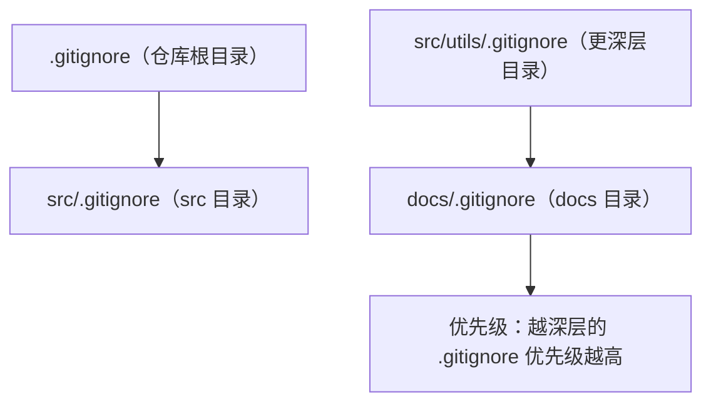

## 1. .gitignore 概述

### 1.1 为什么需要 .gitignore

`.gitignore` 指定 Git 应该**忽略的文件和目录**，避免将不必要的文件纳入版本控制。

### 1.2 应该忽略的文件类型

| 类型         | 示例                       | 原因           |
| :----------- | :------------------------- | :------------- |
| **构建产物** | `dist/`、`build/`          | 可重新生成     |
| **依赖目录** | `node_modules/`、`vendor/` | 体积大，可安装 |
| **环境配置** | `.env`、`config.local`     | 包含敏感信息   |
| **IDE 配置** | `.idea/`、`.vscode/`       | 个人偏好       |
| **系统文件** | `.DS_Store`、`Thumbs.db`   | 操作系统生成   |
| **日志文件** | `*.log`                    | 运行时生成     |
| **临时文件** | `*.tmp`、`*.swp`           | 临时使用       |

## 2. 语法规则

### 2.1 基本语法

```gitignore
# 注释以 # 开头

# 忽略所有 .log 文件
*.log

# 忽略整个目录
node_modules/
build/

# 忽略特定文件
.env
config.local.json

# 使用 ! 取反（不忽略）
!important.log

# 只忽略根目录的文件
/TODO

# 忽略所有目录中的文件
**/temp/
```

### 2.2 Glob 模式

| 模式    | 含义           | 示例            |
| :------ | :------------- | :-------------- |
| `*`     | 匹配任意字符   | `*.log`         |
| `**`    | 匹配任意目录   | `**/test.js`    |
| `?`     | 匹配单个字符   | `file?.txt`     |
| `[abc]` | 匹配括号内字符 | `file[123].txt` |
| `[0-9]` | 匹配范围       | `file[0-9].txt` |

### 2.3 优先级规则

- 后面的规则覆盖前面的
- `!` 取反优先级低于忽略
- 父目录被忽略后，子目录的 `!` 无效

```gitignore
# 忽略所有 .js 文件
*.js

# 但不忽略 main.js
!main.js

#  如果忽略整个目录，! 不生效
build/
!build/important.js  #  不生效！
```

## 3. 多级 .gitignore

### 3.1 优先级



### 3.2 全局 .gitignore

```bash
# 设置全局 gitignore
git config --global core.excludesfile ~/.gitignore_global

# ~/.gitignore_global 内容
.DS_Store
.idea/
.vscode/
*.swp
*.swo
*~
```

## 4. 常用模板

### 4.1 Node.js 项目

```gitignore
node_modules/
dist/
build/
.env
.env.local
*.log
coverage/
.nyc_output/
```

### 4.2 Python 项目

```gitignore
__pycache__/
*.py[cod]
*.egg-info/
dist/
.venv/
.env
.pytest_cache/
.mypy_cache/
```

### 4.3 通用模板

```gitignore
# OS
.DS_Store
Thumbs.db

# IDE
.idea/
.vscode/
*.swp

# 环境
.env
.env.local

# 日志
*.log
```

## 5. 已跟踪文件的忽略

### 5.1 停止跟踪已提交的文件

```bash
# 停止跟踪但保留本地文件
git rm --cached .env
git rm --cached -r node_modules/

# 提交
git commit -m "chore: remove tracked files from gitignore"
```

### 5.2 忽略已跟踪文件的修改

```bash
# 临时忽略修改
git update-index --assume-unchanged config.local.js

# 恢复跟踪
git update-index --no-assume-unchanged config.local.js

# 查看被忽略的文件
git ls-files -v | grep '^h'
```

## 6. gitignore 模板库

GitHub 提供了丰富的 gitignore 模板：[github/gitignore](https://github.com/github/gitignore)

```bash
# 使用 curl 下载模板
curl -o .gitignore https://raw.githubusercontent.com/github/gitignore/main/Node.gitignore
```

## 参考文献

GitHub 文档：https://docs.github.com/zh
GitHub Actions 文档：https://docs.github.com/zh/actions
GitHub REST API：https://docs.github.com/zh/rest
GitHub GraphQL API：https://docs.github.com/zh/graphql

## 延伸阅读

GitHub Actions CI/CD，见 004-github 模块 Actions 文档。
Git 协作基础，见 003-git 模块。
DevOps 自动化，见 031-devops 模块。
黑马程序员 Bilibili 空间（https://space.bilibili.com/37974444 ）提供 GitHub 课程。

## 深度专题扩展

以下专题从不同角度深入本文主题，供有进阶需求的读者研读。每个专题独立成节，内容相互补充。

### 13.1 GitHub Actions 深入

事件驱动：push、pull_request、schedule、workflow_dispatch；on 支持过滤路径与分支。
上下文：github（事件数据）、env、secrets、needs（任务依赖）；表达式与函数。
安全：第三方 action 固定 SHA；权限默认最小；OIDC 换取云凭证。
缓存与性能：actions/cache、并发控制、矩阵并行。

### 13.2 开源协作治理

CONTRIBUTING 定义贡献路径；Issue 标签（good first issue）引导新手。
维护者时间管理：合并队列、自动化 triage、定期发布。
社区健康：行为准则执行、讨论区沉淀、感谢贡献。
安全披露：SECURITY.md + 私密漏洞报告流程。
