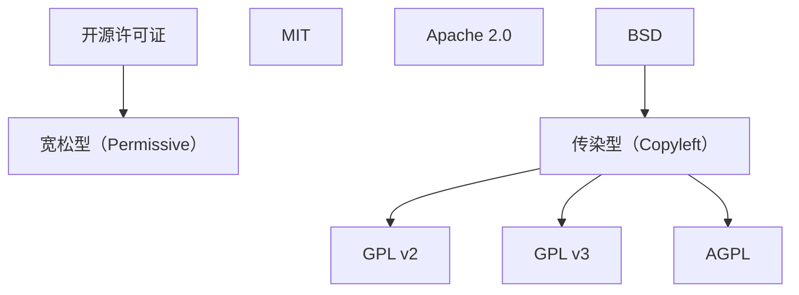
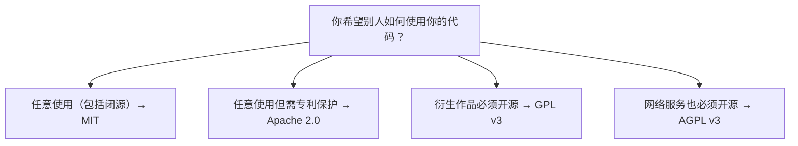

## 1. 开源许可证概述

### 1.1 为什么需要许可证

没有许可证的代码默认受**版权保护**，他人无权使用、修改或分发。开源许可证明确授予这些权利。

### 1.2 许可证分类



## 2. 主要许可证对比

| 特性               | MIT | Apache 2.0 | GPL v3 | AGPL v3 |
| :----------------- | :-- | :--------- | :----- | :------ |
| **商业使用**       |     |            |        |         |
| **修改**           |     |            |        |         |
| **分发**           |     |            |        |         |
| **专利授权**       |     |            |        |         |
| **闭源使用**       |     |            |        |         |
| **必须开源**       |     |            |        |         |
| **网络使用需开源** |     |            |        |         |
| **保留版权声明**   |     |            |        |         |
| **声明变更**       |     |            |        |         |

## 3. 许可证详解

### 3.1 MIT License

最流行的宽松许可证，**几乎无限制**：

- 可商业使用、修改、分发
- 可闭源使用
- 不提供专利保护
- 要求：保留版权声明和许可证文本

**适用**：希望最大程度推广的项目、库和工具

### 3.2 Apache License 2.0

比 MIT 更完善的宽松许可证：

- 所有 MIT 的权利
- **专利授权**：贡献者自动授予专利许可
- 商标保护：不授予商标权
- 要求：保留版权声明、声明变更、包含 NOTICE 文件

**适用**：企业级项目、需要专利保护的项目

### 3.3 GPL v3

最流行的传染型许可证：

- 商业使用、修改、分发
- **不能闭源分发**：分发时必须提供源代码
- 专利授权
- 反 DRM（Tivoization）
- **传染性**：衍生作品必须使用 GPL

**适用**：希望确保代码永远开源的项目

### 3.4 AGPL v3

GPL 的网络增强版：

- 所有 GPL v3 的条款
- **网络使用也算分发**：通过网络提供服务也必须开源
- **适用**：SaaS 场景，防止云厂商闭源使用

## 4. 选择决策

### 4.1 决策树



### 4.2 按项目类型选择

| 项目类型      | 推荐许可证       | 理由         |
| :------------ | :--------------- | :----------- |
| **工具库**    | MIT              | 最大程度推广 |
| **框架**      | MIT / Apache 2.0 | 便于商业采用 |
| **应用程序**  | GPL v3           | 保护开源生态 |
| **SaaS 服务** | AGPL v3          | 防止闭源服务 |
| **企业项目**  | Apache 2.0       | 专利保护     |

## 5. 在 GitHub 上添加许可证

### 5.1 通过 GitHub 界面

1. 仓库 → Add file → Create new file
2. 输入 `LICENSE`
3. GitHub 提供模板选择
4. 选择许可证并提交

### 5.2 通过命令行

```bash
# 下载 MIT 许可证
curl -o LICENSE https://raw.githubusercontent.com/github/choosealicense.com/gh-pages/_licenses/mit.txt

# 编辑填入年份和姓名
```

### 5.3 package.json 中声明

```json
{
  "license": "MIT"
}
```

## 参考文献


GitHub 文档：https://docs.github.com/zh
GitHub Actions 文档：https://docs.github.com/zh/actions
GitHub REST API：https://docs.github.com/zh/rest
GitHub GraphQL API：https://docs.github.com/zh/graphql

## 延伸阅读


GitHub Actions CI/CD，见 004-github 模块 Actions 文档。
Git 协作基础，见 003-git 模块。
DevOps 自动化，见 031-devops 模块。
黑马程序员 Bilibili 空间（https://space.bilibili.com/37974444 ）提供 GitHub 课程。

## 深度专题扩展


以下专题从不同角度深入本文主题，供有进阶需求的读者研读。每个专题独立成节，内容相互补充。

### 13.1 GitHub Actions 深入

事件驱动：push、pull_request、schedule、workflow_dispatch；on 支持过滤路径与分支。
上下文：github（事件数据）、env、secrets、needs（任务依赖）；表达式与函数。
安全：第三方 action 固定 SHA；权限默认最小；OIDC 换取云凭证。
缓存与性能：actions/cache、并发控制、矩阵并行。

### 13.2 开源协作治理

CONTRIBUTING 定义贡献路径；Issue 标签（good first issue）引导新手。
维护者时间管理：合并队列、自动化 triage、定期发布。
社区健康：行为准则执行、讨论区沉淀、感谢贡献。
安全披露：SECURITY.md + 私密漏洞报告流程。

## 模块文档速查表

| 文档 | 主题 | 与本文的关联 |
| --- | --- | --- |
| GitHub 概述 | 001-GitHubOverview | 本文的前置基础 |
| 账户注册与双因素认证（2FA） | 002-AccountRegister2FA2FA | 本文的并列主题 |
| 仓库创建、克隆、归档、删除 | 003-RepositoryCreateCloneArchiveDelete | 本文的并列主题 |
| SSH 与 HTTPS 远程配置 | 004-SSHHTTPS | 本文的并列主题 |
| 协作开发规范 | 005-CollaborationDevelopmentStandard | 本文的并列主题 |
| README文件 | 006-READMEFile | 本文的并列主题 |
| 分支模型与分支保护规则 | 007-BranchModelBranchRule | 本文的并列主题 |
| Gitignore配置 | 008-GitignoreConfig | 本文的并列主题 |
| 开源许可证选择 | 009-OpenSourceLicense | 本文自身 |
| 依赖安全选项 | 010-DependencySecurityOptions | 本文的安全延伸 |
| Fork工作流 | 011-ForkWorkflow | 本文的并列主题 |
| Projects看板 | 012-ProjectsBoard | 本文的并列主题 |
| Wikis | 013-Wikis | 本文的并列主题 |
| Discussions | 014-Discussions | 本文的并列主题 |
| GitHub-Copilot | 015-GitHubCopilot | 本文的并列主题 |
| Dependabot | 016-Dependabot | 本文的并列主题 |
| Issues 模板、标签与里程碑 | 017-IssuesTemplateTagMilestone | 本文的并列主题 |
| 密钥扫描 | 018-SecretScanning | 本文的并列主题 |
| CodeQL代码扫描 | 019-CodeQLCodeScanning | 本文的并列主题 |
| GitHub-CLI | 020-GitHubCLI | 本文的并列主题 |
| REST与GraphQL-API | 021-RESTGraphQLAPI | 本文的并列主题 |
| Webhooks | 022-Webhooks | 本文的并列主题 |
| GitHub-Packages | 023-GitHubPackages | 本文的并列主题 |
| Codespaces | 024-Codespaces | 本文的并列主题 |
| CODEOWNERS | 025-CODEOWNERS | 本文的并列主题 |
| 社区健康文件 | 026-CommunityHealthFile | 本文的并列主题 |
| Pull Request 完整协作流程 | 027-PullRequestCompleteCollaborationFlow | 本文的并列主题 |
| GitHub Pages 多站点方案 | 028-GitHubPagesMultiSolution | 本文的并列主题 |
| GitHub Actions 与 CI/CD | 029-GitHubActionsCICD | 本文的并列主题 |
| Actions触发器 | 030-ActionsTrigger | 本文的并列主题 |
| 常见问题排查 | 031-FAQTroubleshoot | 本文的并列主题 |
| Actions矩阵构建 | 032-ActionsMatrixBuild | 本文的并列主题 |
| Actions缓存依赖 | 033-ActionsCacheDependency | 本文的并列主题 |
| Actions自托管运行器 | 034-ActionsSelfHostedRunner | 本文的并列主题 |
| Actions制品传递 | 035-ActionsArtifact | 本文的并列主题 |
| Actions环境部署 | 036-ActionsEnvironmentDeploy | 本文的前置基础 |
| GitHub 仓库初始化 | 037-GitRepoInit | 本文的并列主题 |
| GitHub 提交与推送 | 038-GitCommitPush | 本文的并列主题 |
| GitHub 拉取与获取 | 039-GitPullFetch | 本文的并列主题 |
| GitHub 合并与变基 | 040-GitMergeRebase | 本文的并列主题 |
| GitHub 冲突解决 | 041-GitConflictResolve | 本文的并列主题 |
| GitHub 标签管理 | 042-GitTagManage | 本文的并列主题 |
| GitHub 远程仓库管理 | 043-GitRemoteManage | 本文的并列主题 |
| GitHub 历史与日志 | 044-GitHistoryLog | 本文的并列主题 |
| GitHub 暂存与回退 | 045-GitStashReset | 本文的并列主题 |
| GitHub CLI 认证配置 | 046-GhCliAuth | 本文的并列主题 |
| GitHub CLI PR 管理 | 047-GhPrManage | 本文的并列主题 |
| GitHub CLI Issue 管理 | 048-GhIssueManage | 本文的并列主题 |
| GitHub CLI 仓库管理 | 049-GhRepoManage | 本文的并列主题 |
| gh release 发布命令速查手册 | 050-GhRelease | 本文的并列主题 |
| gh workflow 工作流命令速查手册 | 051-GhWorkflow | 本文的并列主题 |
| gh gist 代码片段命令速查手册 | 052-GhGist | 本文的并列主题 |
| gh extension 扩展命令速查手册 | 053-GhExtension | 本文的并列主题 |
| gh api 调用命令速查手册 | 054-GhApi | 本文的并列主题 |
| gh search 搜索命令速查手册 | 055-GhSearch | 本文的并列主题 |
| gh label 与 alias/config 命令速查手册 | 056-GhLabel | 本文的并列主题 |
| gh alias 与 config 命令速查手册 | 057-GhAliasConfig | 本文的并列主题 |
