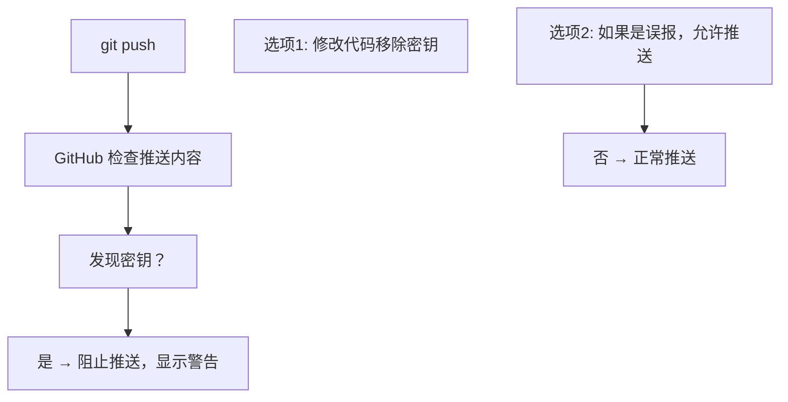

## 1. 密钥扫描概述

### 1.1 为什么需要密钥扫描

意外将密钥（API Key、Token、密码）推送到公开仓库是常见的安全事故。密钥扫描可以**自动检测**并阻止泄露。

### 1.2 GitHub 密钥扫描功能

| 功能             | 说明                 | 可用性       |
| :--------------- | :------------------- | :----------- |
| **密钥扫描**     | 扫描仓库中的密钥     | 公开仓库免费 |
| **推送保护**     | 阻止推送含密钥的代码 | 免费启用     |
| **Partner 模式** | 与服务提供商联动撤销 | 自动         |

## 2. 支持的密钥类型

### 2.1 常见密钥

| 类型               | 模式示例            | 服务   |
| :----------------- | :------------------ | :----- |
| **GitHub Token**   | `ghp_xxxx`          | GitHub |
| **AWS Access Key** | `AKIAxxxx`          | AWS    |
| **Google API Key** | `AIza...`           | Google |
| **Slack Token**    | `xoxb-...`          | Slack  |
| **Stripe Key**     | `sk_live_...`       | Stripe |
| **私钥**           | `-----BEGIN RSA...` | 通用   |

GitHub 支持检测超过 200 种密钥类型。

## 3. 推送保护

### 3.1 启用推送保护

1. 仓库 Settings → Code security → Push protection → Enable

### 3.2 推送保护工作流程



### 3.3 绕过推送保护

```bash
# 如果确认不是真实密钥（如测试数据）
git push --force
# 或在推送时添加标记
# 在 commit message 中添加 "@allow"
```

## 4. 密钥泄露补救

### 4.1 立即行动

```bash
# 1. 撤销泄露的密钥
# 在对应服务平台重新生成密钥

# 2. 从 Git 历史中移除
git filter-repo --path .env --invert-paths

# 3. 强制推送
git push --force

# 4. 通知团队
```

### 4.2 使用环境变量

```bash
#  硬编码密钥
const API_KEY = "sk_live_abc123";

#  使用环境变量
const API_KEY = process.env.API_KEY;
```

### 4.3 使用 GitHub Secrets

```yaml
# .github/workflows/deploy.yml
env:
  API_KEY: ${{ secrets.API_KEY }}
```

## 5. 自定义模式

### 5.1 添加自定义密钥模式

组织 Settings → Code security → Custom patterns

```regex
# 示例：检测自定义 API Key
MYCOMPANY_API_KEY=[A-Za-z0-9]{32}
```

## 6. 最佳实践

- 启用推送保护
- 使用 `.gitignore` 排除敏感文件
- 使用 GitHub Secrets 存储 CI/CD 密钥
- 使用环境变量而非硬编码
- 定期轮换密钥
- 使用预提交钩子检测密钥

```bash
# 安装 detect-secrets 预提交钩子
pip install detect-secrets
detect-secrets scan > .secrets.baseline
pre-commit install
```
## 仓库密钥

**基本用法:设置 Actions 密钥**
`gh secret set <名称>`

```bash
# 交互式输入密钥值
gh secret set DATABASE_URL

# 从字符串设置
gh secret set API_KEY --body "sk-12345"

# 从文件读取
gh secret set DEPLOY_KEY < ~/.ssh/id_rsa

# 从环境变量读取
gh secret set TOKEN --body "$MY_TOKEN"
```

---

**基本用法:列出与删除密钥**
`gh secret list`

```bash
# 列出所有密钥(不显示值)
gh secret list

# 删除密钥
gh secret delete API_KEY
```

---

## 组织与环境密钥

**基本用法:设置组织级密钥**
`gh secret set <名称> --org <组织>`

```bash
# 设置组织密钥
gh secret set DEPLOY_TOKEN --org myorg

# 指定可见仓库
gh secret set TOKEN --org myorg --repos "repo1,repo2"

# 设置环境密钥
gh secret set DB_PASS --env production
```

---

## Codespaces 密钥

**基本用法:Codespaces 密钥**
`gh codespace secret set <名称>`

```bash
# 设置 Codespaces 用户密钥
gh codespace secret set API_KEY --body "sk-xxx"

# 设置组织 Codespaces 密钥
gh codespace secret set TOKEN --org myorg
```

---

## 变量管理

**基本用法:设置 Actions 变量**
`gh variable set <名称>`

```bash
# 设置变量(变量值可见,适合非敏感数据)
gh variable set NODE_ENV --body "production"

# 从文件设置
gh variable set CONFIG < config.json

# 列出变量
gh variable list

# 查看变量值
gh variable get NODE_ENV

# 删除变量
gh variable delete NODE_ENV
```

---

## 参考文献

GitHub 文档：https://docs.github.com/zh
GitHub Actions 文档：https://docs.github.com/zh/actions
GitHub REST API：https://docs.github.com/zh/rest
GitHub GraphQL API：https://docs.github.com/zh/graphql

## 延伸阅读

GitHub Actions CI/CD，见 004-github 模块 Actions 文档。
Git 协作基础，见 003-git 模块。
DevOps 自动化，见 031-devops 模块。
黑马程序员 Bilibili 空间（https://space.bilibili.com/37974444 ）提供 GitHub 课程。

## 深度专题扩展

以下专题从不同角度深入本文主题，供有进阶需求的读者研读。每个专题独立成节，内容相互补充。

### 13.1 GitHub Actions 深入

事件驱动：push、pull_request、schedule、workflow_dispatch；on 支持过滤路径与分支。
上下文：github（事件数据）、env、secrets、needs（任务依赖）；表达式与函数。
安全：第三方 action 固定 SHA；权限默认最小；OIDC 换取云凭证。
缓存与性能：actions/cache、并发控制、矩阵并行。

### 13.2 开源协作治理

CONTRIBUTING 定义贡献路径；Issue 标签（good first issue）引导新手。
维护者时间管理：合并队列、自动化 triage、定期发布。
社区健康：行为准则执行、讨论区沉淀、感谢贡献。
安全披露：SECURITY.md + 私密漏洞报告流程。
