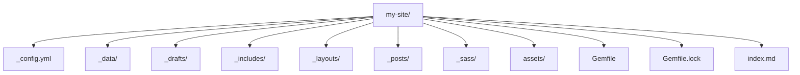
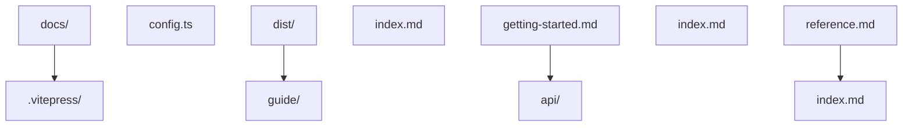
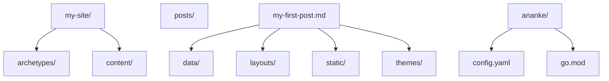
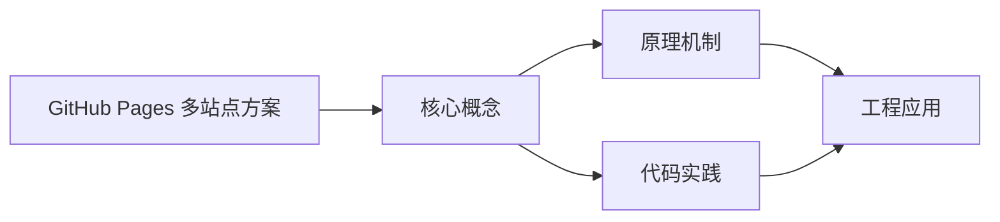
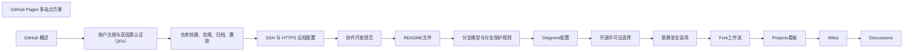

## 1. 学习目标（Bloom 分类）

本节按照布鲁姆教育目标分类学组织学习路径。本文主题为《GitHub Pages 多站点方案》，属于 GitHub 模块，读者可以根据自身阶段选择阅读深度。

记忆层面：能够准确复述本文的核心概念、术语与基本语法或操作步骤，并能够在提问或检索时快速定位对应知识点。能够说出 GitHub 的核心概念、常用命令与流程。

理解层面：能够用自己的语言解释核心原理与工作机制，说明概念之间的因果关系，而不是机械记忆结论。能够解释 GitHub 的工作原理与设计动机。

应用层面：能够在真实项目或练习场景中运用本文知识解决具体问题，写出正确且可维护的实现。能够独立完成 GitHub 的标准操作。

分析层面：能够拆解复杂问题，比较本文主题与相邻概念的异同，识别边界条件与例外情况。能够分析 GitHub 使用中的异常与边界。

评价层面：能够根据约束条件（性能、可读性、安全、成本）评价不同方案的优劣，做出有依据的技术决策。能够评价 GitHub 相关工具与方案。

创造层面：能够把本文知识与其他模块知识组合，设计出新的解决方案或可复用的工程模式。能够把 GitHub 融入团队工作流。

通过本节学习，读者应当能够把《GitHub Pages 多站点方案》纳入自己的知识网络，并与 GitHub 模块的其他主题（仓库、Issue、PR、Actions、生态）建立关联。

## 2. 历史动机与发展脉络

《GitHub Pages 多站点方案》是 GitHub 领域的重要主题。要真正理解它，需要先了解它解决的问题与演进过程。

GitHub 2008 年上线，2018 年被微软收购，是全球最大的代码托管与协作平台；核心是 Git 之上的社交化协作层。
协作对象：Repository（仓库）、Issue（问题）、Pull Request（变更请求）、Discussion（讨论）、Actions（自动化）、Projects（看板）。
生态：GitHub Pages、Codespaces、Copilot、CodeQL、Packages；开放平台（REST/GraphQL API）支撑生态集成。

回到本文主题：GitHub Pages 多站点方案 的提出与成熟，正是上述技术背景下的必然产物。早期实现往往以简单可用为目标，随着工程规模扩大，社区逐渐沉淀出标准做法与最佳实践；理解这一脉络，可以帮助读者判断“为什么文档中的推荐写法是现在这个样子”，也能在遇到历史遗留代码时准确识别其设计年代与取舍。


## 3. 形式化定义与核心概念精讲

本节把《GitHub Pages 多站点方案》涉及的核心概念以“定义 + 讲解”的形式展开。读者应把定义当作工具，把讲解当作理解路径；两者结合才能形成可迁移的知识。

PR 流程：fork/branch -> 提交 -> PR -> 审查 -> 合并；审查通过保护规则（required reviews）。
Actions：workflow（YAML）由事件触发，job 在 runner 上执行 step；支持矩阵、缓存与密钥。
Issue 管理：标签、里程碑、模板；与 PR 通过关键词（fixes #123）自动关联。

### 3.1 原文章节逐一精讲

原文档把主题拆分为 18 个小节，下面按顺序给出每一节的导读讲解，随后保留原文细节供精读。

#### 原文精读（完整保留）

# GitHub Pages 部署配置速查手册

> **符号约定**:`< >` 必填参数 | `[ ]` 可选参数

---

#### 1. 背景

**GitHub Pages** 可从分支或 **GitHub Actions** 发布静态文件到 `*.github.io` 或自定义域名。常见生成器：**Jekyll（Ruby）**、**VitePress（Vite + Vue 文档框架）**、**Hugo（Go）**。三者均输出 HTML/CSS/JS，差异在 **模板语言**、**构建速度** 与 **生态**。

#### 2. GitHub Pages 概述

##### 2.1 类型

- **用户/组织站点**：`username.github.io` 或 `orgname.github.io`，从 `main` 分支构建
- **项目站点**：`username.github.io/repo`，从 `gh-pages` 分支或 `main` 分支的 `docs` 目录构建

##### 2.2 特点

- **免费**：GitHub Pages 是免费的静态站点托管服务
- **自动 HTTPS**：为所有站点提供免费的 HTTPS 证书
- **集成 GitHub**：与 GitHub 仓库无缝集成
- **支持自定义域名**：可以使用自己的域名
- **静态内容**：只支持静态文件，不支持服务器端脚本

#### 3. 静态站点生成器对比

| 特性     | Jekyll                  | VitePress             | Hugo                 |
| -------- | ----------------------- | --------------------- | -------------------- |
| 语言     | Ruby                    | JavaScript (Vue)      | Go                   |
| 构建速度 | 中等                    | 快                    | 极快                 |
| 模板语言 | Liquid                  | Vue 模板              | Go 模板              |
| 生态系统 | 丰富（GitHub 官方支持） | 现代（Vue 生态）      | 快速（Go 生态）      |
| 学习曲线 | 中等                    | 中等（熟悉 Vue 者快） | 中等                 |
| 适用场景 | 博客、个人网站          | 技术文档              | 博客、文档、企业网站 |

#### 4. 部署方式

##### 4.1 从分支部署

1. **设置分支**：在仓库的 **Settings → Pages → Build and deployment** 中选择：

- **Source**：`Deploy from a branch`
- **Branch**：选择分支（如 `main` 或 `gh-pages`）和目录（如 `/` 或 `/docs`）

2. **推送代码**：将静态文件推送到选定的分支
3. **等待构建**：GitHub 会自动构建并部署站点

##### 4.2 使用 GitHub Actions 部署

1. **设置 Pages**：在仓库的 **Settings → Pages → Build and deployment** 中选择：

- **Source**：`GitHub Actions`

2. **创建 workflow**：在 `.github/workflows/` 目录下创建部署 workflow 文件
3. **运行 workflow**：推送代码后，Actions 会自动构建并部署站点

#### 5. 方案 A：Jekyll

##### 5.1 环境搭建

```bash
 # 安装 Ruby 和 Bundler
 # Windows：使用 RubyInstaller
 # macOS：使用 Homebrew: brew install ruby
 # Linux：使用包管理器
 # 安装 Jekyll 和 Bundler
 gem install jekyll bundler
 # 检查安装
 jekyll -v
```

##### 5.2 创建站点

```bash
 # 创建新站点
 jekyll new my-site
 cd my-site
 # 安装依赖
 bundle install
 # 本地预览
 bundle exec jekyll serve
 # 访问 http://localhost:4000
```

##### 5.3 配置文件

`_config.yml`：

```yaml
title: My Site
email: your-email@example.com
description: >- # this means to ignore newlines until "baseurl":
  Write an awesome description for your new site here. You can edit this
  line in _config.yml. It will appear in your document head meta (for
  Google search results) and in your feed.xml site description.
baseurl: '' # the subpath of your site, e.g. /blog
url: 'https://yourusername.github.io' # the base hostname & protocol for your site, e.g. http://example.com
twitter_username: jekyllrb
github_username: jekyll
# Build settings
theme: minima
plugins:
  - jekyll-feed
# Exclude from processing.
# The following items will not be processed, by default. Create a custom list
# to override the default setting.
exclude:
  - Gemfile
  - Gemfile.lock
  - node_modules
  - vendor/bundle/
  - vendor/cache/
  - vendor/gems/
  - vendor/ruby/
```

##### 5.4 目录结构



##### 5.5 GitHub Actions 部署

`.github/workflows/jekyll.yml`：

```yaml
 name: Deploy Jekyll site to Pages
 on:
  push:
  branches: [main]
  workflow_dispatch:
 permissions:
  contents: read
  pages: write
  id-token: write
 concurrency:
  group: "pages"
  cancel-in-progress:
 jobs:
  build:
  runs-on: ubuntu-latest
  steps:
  - name: Checkout
  uses: actions/checkout@v4
  - name: Setup Ruby
  uses: ruby/setup-ruby@v1
  with:
  ruby-version: '3.1'
  bundler-cache:
  - name: Build with Jekyll
  run: bundle exec jekyll build
  env:
  JEKYLL_ENV: production
  - name: Upload artifact
  uses: actions/upload-pages-artifact@v2
  deploy:
  needs: build
  runs-on: ubuntu-latest
  environment:
  name: github-pages
  url: ${{ steps.deployment.outputs.page_url }}
  steps:
  - name: Deploy to GitHub Pages
  id: deployment
  uses: actions/deploy-pages@v2
```

#### 6. 方案 B：VitePress

##### 6.1 环境搭建

```bash
 # 安装 Node.js（推荐 16+）
 # 检查安装
 node -v
 npm -v
```

##### 6.2 创建站点

```bash
 # 创建 VitePress 站点
 npm create vitepress@latest docs
 # 进入目录
 cd docs
 # 安装依赖
 npm install
 # 本地预览
 npm run docs:dev
 # 访问 http://localhost:5173
 # 构建
 npm run docs:build
 # 构建产物在 .vitepress/dist 目录
```

##### 6.3 配置文件

`.vitepress/config.ts`：

```typescript
 import { defineConfig } from 'vitepress'
 export default defineConfig({
  title: 'My Site',
  description: 'A VitePress site',
  base: '/repo/', // 项目站点需要设置
  themeConfig: {
  nav: [
  { text: 'Home', link: '/' },
  { text: 'Guide', link: '/guide/' },
  { text: 'API', link: '/api/' }
  ],
  sidebar: {
  '/guide/': [
  { text: 'Introduction', link: '/guide/' },
  { text: 'Getting Started', link: '/guide/getting-started' }
  ],
  '/api/': [
  { text: 'Overview', link: '/api/' },
  { text: 'Reference', link: '/api/reference' }
  ]
  }
  }
 }
```

##### 6.4 目录结构



##### 6.5 GitHub Actions 部署

`.github/workflows/vitepress.yml`：

```yaml
 name: Deploy VitePress site to Pages
 on:
  push:
  branches: [main]
  workflow_dispatch:
 permissions:
  contents: read
  pages: write
  id-token: write
 concurrency:
  group: "pages"
  cancel-in-progress:
 jobs:
  build:
  runs-on: ubuntu-latest
  steps:
  - name: Checkout
  uses: actions/checkout@v4
  with:
  fetch-depth: 0
  - name: Setup Node.js
  uses: actions/setup-node@v4
  with:
  node-version: '18'
  cache: npm
  - name: Install dependencies
  run: npm ci
  - name: Build
  run: npm run docs:build
  - name: Upload artifact
  uses: actions/upload-pages-artifact@v2
  with:
  path: docs/.vitepress/dist
  deploy:
  needs: build
  runs-on: ubuntu-latest
  environment:
  name: github-pages
  url: ${{ steps.deployment.outputs.page_url }}
  steps:
  - name: Deploy to GitHub Pages
  id: deployment
  uses: actions/deploy-pages@v2
```

#### 7. 方案 C：Hugo

##### 7.1 环境搭建

```bash
 # 安装 Hugo（推荐 Extended 版本）
 # Windows：使用 Chocolatey: choco install hugo-extended
 # macOS：使用 Homebrew: brew install hugo
 # Linux：使用包管理器或二进制文件
 # 检查安装
 hugo version
```

##### 7.2 创建站点

```bash
 # 创建新站点
 hugo new site my-site --format yaml
 cd my-site
 # 添加主题（使用 git submodule）
 git init
 git submodule add https://github.com/theNewDynamic/gohugo-theme-ananke.git themes/ananke
 # 配置主题
 echo 'theme: ananke' >> config.yaml
 # 创建内容
 hugo new posts/my-first-post.md
 # 本地预览
 hugo server -D
 # 访问 http://localhost:1313
 # 构建
 hugo --minify
 # 构建产物在 public 目录
```

##### 7.3 配置文件

`config.yaml`：

```yaml
baseURL: https://yourusername.github.io/repo/ # 项目站点需要设置
languageCode: en-us
title: My New Hugo Site
theme: ananke
params:
  description: 'My Hugo site'
  author: 'Your Name'
  social:
  twitter: 'yourusername'
  github: 'yourusername'
```

##### 7.4 目录结构



##### 7.5 GitHub Actions 部署

`.github/workflows/hugo.yml`：

```yaml
 name: Deploy Hugo site to Pages
 on:
  push:
  branches: [main]
  workflow_dispatch:
 permissions:
  contents: read
  pages: write
  id-token: write
 concurrency:
  group: "pages"
  cancel-in-progress:
 jobs:
  build:
  runs-on: ubuntu-latest
  steps:
  - name: Checkout
  uses: actions/checkout@v4
  with:
  submodules:
  fetch-depth: 0
  - name: Setup Hugo
  uses: peaceiris/actions-hugo@v2
  with:
  hugo-version: 'latest'
  extended:
  - name: Build
  run: hugo --minify
  - name: Upload artifact
  uses: actions/upload-pages-artifact@v2
  deploy:
  needs: build
  runs-on: ubuntu-latest
  environment:
  name: github-pages
  url: ${{ steps.deployment.outputs.page_url }}
  steps:
  - name: Deploy to GitHub Pages
  id: deployment
  uses: actions/deploy-pages@v2
```

#### 8. 自定义域名设置

##### 8.1 配置 DNS

1. **A 记录**：指向 GitHub Pages 的 IP 地址

- 185.199.108.153
- 185.199.109.153
- 185.199.110.153
- 185.199.111.153

2. **CNAME 记录**：指向 `username.github.io`

##### 8.2 仓库设置

1. 在仓库的 **Settings → Pages → Custom domain** 中输入自定义域名
2. 点击 **Save**
3. 等待 GitHub 验证域名
4. 启用 **Enforce HTTPS** 选项

##### 8.3 验证配置

```bash
 # 验证 DNS 配置
 dig yourdomain.com +noall +answer
 # 验证 HTTPS
 curl -I https://yourdomain.com
```

#### 9. 常见问题与解决方案

##### 9.1 资源 404 错误

- **问题**：静态资源（CSS、JS、图片）无法加载
- **解决方案**：

1.  检查 base URL 配置是否正确
2.  确保资源路径使用相对路径
3.  检查构建输出目录结构

##### 9.2 CNAME 文件被覆盖

- **问题**：构建后 CNAME 文件被删除
- **解决方案**：

1.  在静态目录中添加 CNAME 文件
2.  配置构建工具保留 CNAME 文件
3.  在 CI 流程中重新创建 CNAME 文件

##### 9.3 构建失败

- **问题**：GitHub Actions 构建失败
- **解决方案**：

1.  查看 Actions 日志，了解失败原因
2.  确保依赖安装正确
3.  检查配置文件语法
4.  确认主题或插件正确安装

##### 9.4 部署权限不足

- **问题**：GitHub Actions 部署失败，提示权限不足
- **解决方案**：

1.  在 workflow 文件中添加正确的权限配置
2.  确保 `GITHUB_TOKEN` 有足够的权限
3.  检查仓库的 Pages 设置

#### 10. 最佳实践

##### 10.1 性能优化

- **压缩资源**：启用 minify 选项
- **缓存策略**：设置合理的缓存头
- **图片优化**：使用适当的图片格式和尺寸
- **CDN**：使用 CDN 加速静态资源
- **按需加载**：实现代码分割和按需加载

##### 10.2 SEO 优化

- **元标签**：设置合适的 title、description 和其他元标签
- **站点地图**：生成并提交 sitemap.xml
- **robots.txt**：配置 robots.txt 文件
- **结构化数据**：添加 JSON-LD 结构化数据
- **canonical URL**：设置规范 URL

##### 10.3 维护与更新

- **定期更新**：定期更新依赖和主题
- **备份**：定期备份站点内容
- **监控**：监控站点状态和性能
- **测试**：在部署前进行本地测试
- **版本控制**：使用 Git 管理站点源码

##### 10.4 安全

- **HTTPS**：启用 HTTPS
- **依赖扫描**：使用 Dependabot 扫描安全漏洞
- **访问控制**：合理设置仓库访问权限
- **输入验证**：确保用户输入安全

#### 11. 实际应用案例

##### 11.1 个人博客

- **生成器**：Jekyll 或 Hugo
- **主题**：选择适合博客的主题
- **内容**：定期更新博客文章
- **部署**：使用 GitHub Actions 自动部署

##### 11.2 技术文档

- **生成器**：VitePress
- **结构**：清晰的文档结构和导航
- **搜索**：启用文档搜索功能
- **版本**：支持多版本文档

##### 11.3 企业网站

- **生成器**：Hugo
- **设计**：定制化主题和设计
- **内容**：公司介绍、产品信息、联系方式
- **集成**：集成表单和其他服务

#### 12. 与其他静态站点托管服务对比

| 服务             | 优势                             | 劣势                   |
| ---------------- | -------------------------------- | ---------------------- |
| GitHub Pages     | 免费、与 GitHub 集成、自动 HTTPS | 构建时间限制、功能有限 |
| Netlify          | 功能丰富、CI/CD 集成、自定义域名 | 免费计划有流量限制     |
| Vercel           | 速度快、Next.js 优化、自动 HTTPS | 免费计划有项目数量限制 |
| GitLab Pages     | 免费、与 GitLab 集成、CI/CD      | 界面不如 GitHub 友好   |
| Cloudflare Pages | 速度快、CDN 集成、免费           | 功能相对有限           |

#### 13. 延伸阅读

- [GitHub Pages 文档](https://docs.github.com/en/pages) <!-- nofollow -->
- [Jekyll 文档](https://jekyllrb.com/docs/) <!-- nofollow -->
- [VitePress 文档](https://vitepress.dev/) <!-- nofollow -->
- [Hugo 文档](https://gohugo.io/documentation/) <!-- nofollow -->
- [静态站点生成器对比](https://jamstack.org/generators/) <!-- nofollow -->

#### Actions 部署 Pages

**基本用法:部署静态站点**
`uses: actions/deploy-pages@v4`

```yaml
name: Deploy Pages

on:
  push:
    branches: [main]

permissions:
  contents: read
  pages: write
  id-token: write

jobs:
  build:
    runs-on: ubuntu-latest
    steps:
      - uses: actions/checkout@v4
      - run: npm ci && npm run build
      - uses: actions/upload-pages-artifact@v3
        with:
          path: dist

  deploy:
    needs: build
    runs-on: ubuntu-latest
    environment:
      name: github-pages
      url: ${{ steps.deployment.outputs.page_url }}
    steps:
      - id: deployment
        uses: actions/deploy-pages@v4
```

---

#### gh-pages 分支方式

**基本用法:推送构建产物到 gh-pages**
`git push origin <子树>:gh-pages`

```bash
# 把 dist 子目录作为 gh-pages 分支根推送
git subtree push --prefix dist origin gh-pages

# 强制更新 gh-pages
git push origin `git subtree split --prefix dist`:gh-pages --force
```

---

#### 配置 Pages 源

**基本用法:通过 gh 配置 Pages**
`gh api repos/<owner>/<repo>/pages`

```bash
# 设置 Pages 源为 GitHub Actions
gh api repos/owner/repo/pages -X POST -f source[branch]=main -f source[path]=/

# 修改 Pages 源
gh api repos/owner/repo/pages -X PUT -f source[branch]=gh-pages

# 查看 Pages 配置
gh api repos/owner/repo/pages
```

---

#### 自定义域名

**基本用法:配置自定义域名**
`echo "<域名>" > CNAME`

```bash
# 在站点根目录创建 CNAME 文件
echo "docs.example.com" > dist/CNAME

# 配置 DNS:把 www 指向 <user>.github.io
```

---

#### 通过 gh-pages 工具发布

**基本用法:用 gh-pages 工具**
`npx gh-pages -d <目录>`

```bash
# 把 dist 发布到 gh-pages 分支
npx gh-pages -d dist

# 指定分支与消息
npx gh-pages -d dist -b gh-pages -m "deploy [skip ci]"
```

---

### 3.2 概念关系图

下面用 Mermaid 图表达本文核心概念之间的关系，帮助读者建立整体图景：



图中展示的是本文知识的结构化关系：核心概念是入口，原理机制解释“为什么”，代码实践演示“怎么做”，工程应用回答“何时用”。读者学习时可以把每个小节的内容挂接到对应节点上。

## 4. 理论推导与原理解析

本节深入《GitHub Pages 多站点方案》背后的原理。理论部分不求面面俱到，而是聚焦“能解释现象、能指导实践”的关键推导。

PR 流程：fork/branch -> 提交 -> PR -> 审查 -> 合并；审查通过保护规则（required reviews）。
Actions：workflow（YAML）由事件触发，job 在 runner 上执行 step；支持矩阵、缓存与密钥。
Issue 管理：标签、里程碑、模板；与 PR 通过关键词（fixes #123）自动关联。
权限与安全：仓库角色（read/triage/write/maintain/admin）、分支保护、CODEOWNERS、安全通告。

需要强调的是，理论推导与工程实践之间存在翻译层：理论给出的是理想化模型与边界条件，工程代码则必须处理真实环境中的例外。读者在学习时应先掌握理论的“标准情形”，再通过陷阱章节了解“非标准情形”。

## 5. 代码示例与逐行讲解

本节把原文中的代码示例系统整理，并为每个示例补充用途说明与讲解。读者不应只浏览代码，而应逐段对照讲解理解设计意图。

### 5.1 示例：5.1 环境搭建

该示例来自原文《5.1 环境搭建》小节，用于演示GitHub Pages 多站点方案相关操作。阅读时请先看代码结构，再看其后的讲解。

```bash
 # 安装 Ruby 和 Bundler
 # Windows：使用 RubyInstaller
 # macOS：使用 Homebrew: brew install ruby
 # Linux：使用包管理器
 # 安装 Jekyll 和 Bundler
 gem install jekyll bundler
 # 检查安装
 jekyll -v
```

讲解：这段代码演示了本节核心知识点。代码中的关键操作可以归纳为三步：准备（定义或初始化）、执行（核心逻辑）、收尾（释放资源或返回结果）。实际项目中，这三步往往被封装为函数或类，以提升复用性与可测试性。

关键点分析：

该示例共 8 行有效代码，结构以数据或配置为主。阅读时应关注：数据字段的含义、配置项的作用，以及它们与运行行为的对应关系。

进阶思考路径：先尝试修改参数观察行为变化，再把示例中的模式迁移到自己的项目中；每次修改都记录预期与实测差异，这是把示例转化为能力的最快方式。

### 5.2 示例：5.2 创建站点

该示例来自原文《5.2 创建站点》小节，用于演示GitHub Pages 多站点方案相关操作。阅读时请先看代码结构，再看其后的讲解。

```bash
 # 创建新站点
 jekyll new my-site
 cd my-site
 # 安装依赖
 bundle install
 # 本地预览
 bundle exec jekyll serve
 # 访问 http://localhost:4000
```

讲解：这段代码演示了本节核心知识点。代码中的关键操作可以归纳为三步：准备（定义或初始化）、执行（核心逻辑）、收尾（释放资源或返回结果）。实际项目中，这三步往往被封装为函数或类，以提升复用性与可测试性。

关键点分析：

该示例共 8 行有效代码，结构以数据或配置为主。阅读时应关注：数据字段的含义、配置项的作用，以及它们与运行行为的对应关系。

进阶思考路径：先尝试修改参数观察行为变化，再把示例中的模式迁移到自己的项目中；每次修改都记录预期与实测差异，这是把示例转化为能力的最快方式。

### 5.3 示例：5.3 配置文件

该示例来自原文《5.3 配置文件》小节，用于演示GitHub Pages 多站点方案相关操作。阅读时请先看代码结构，再看其后的讲解。

```yaml
title: My Site
email: your-email@example.com
description: >- # this means to ignore newlines until "baseurl":
  Write an awesome description for your new site here. You can edit this
  line in _config.yml. It will appear in your document head meta (for
  Google search results) and in your feed.xml site description.
baseurl: '' # the subpath of your site, e.g. /blog
url: 'https://yourusername.github.io' # the base hostname & protocol for your site, e.g. http://example.com
twitter_username: jekyllrb
github_username: jekyll
# Build settings
theme: minima
plugins:
  - jekyll-feed
# Exclude from processing.
# The following items will not be processed, by default. Create a custom list
# to override the default setting.
exclude:
  - Gemfile
  - Gemfile.lock
  - node_modules
  - vendor/bundle/
  - vendor/cache/
  - vendor/gems/
  - vendor/ruby/
```

讲解：这段代码演示了本节核心知识点。代码中的关键操作可以归纳为三步：准备（定义或初始化）、执行（核心逻辑）、收尾（释放资源或返回结果）。实际项目中，这三步往往被封装为函数或类，以提升复用性与可测试性。

关键点分析：

该示例共 25 行有效代码，包含 2 类关键结构（from、for）。其中：

- 入口与初始化部分负责建立上下文，对应实际项目中的启动或装配逻辑；
- 核心逻辑部分体现本文主题的主要操作，是阅读时最需要对照讲解理解的部分；
- 输出或返回部分把结果交给调用方，注意其类型与边界条件。

进阶思考路径：先尝试修改参数观察行为变化，再把示例中的模式迁移到自己的项目中；每次修改都记录预期与实测差异，这是把示例转化为能力的最快方式。

### 5.4 示例：5.4 目录结构

该示例来自原文《5.4 目录结构》小节，用于演示GitHub Pages 多站点方案相关操作。阅读时请先看代码结构，再看其后的讲解。


讲解：这段代码演示了本节核心知识点。代码中的关键操作可以归纳为三步：准备（定义或初始化）、执行（核心逻辑）、收尾（释放资源或返回结果）。实际项目中，这三步往往被封装为函数或类，以提升复用性与可测试性。

关键点分析：

该示例共 24 行有效代码，结构以数据或配置为主。阅读时应关注：数据字段的含义、配置项的作用，以及它们与运行行为的对应关系。

进阶思考路径：先尝试修改参数观察行为变化，再把示例中的模式迁移到自己的项目中；每次修改都记录预期与实测差异，这是把示例转化为能力的最快方式。

### 5.5 示例：5.5 GitHub Actions 部署

该示例来自原文《5.5 GitHub Actions 部署》小节，用于演示GitHub Pages 多站点方案相关操作。阅读时请先看代码结构，再看其后的讲解。

```yaml
 name: Deploy Jekyll site to Pages
 on:
  push:
  branches: [main]
  workflow_dispatch:
 permissions:
  contents: read
  pages: write
  id-token: write
 concurrency:
  group: "pages"
  cancel-in-progress:
 jobs:
  build:
  runs-on: ubuntu-latest
  steps:
  - name: Checkout
  uses: actions/checkout@v4
  - name: Setup Ruby
  uses: ruby/setup-ruby@v1
  with:
  ruby-version: '3.1'
  bundler-cache:
  - name: Build with Jekyll
  run: bundle exec jekyll build
  env:
  JEKYLL_ENV: production
  - name: Upload artifact
  uses: actions/upload-pages-artifact@v2
  deploy:
  needs: build
  runs-on: ubuntu-latest
  environment:
  name: github-pages
  url: ${{ steps.deployment.outputs.page_url }}
  steps:
  - name: Deploy to GitHub Pages
  id: deployment
  uses: actions/deploy-pages@v2
```

讲解：这段代码演示了本节核心知识点。代码中的关键操作可以归纳为三步：准备（定义或初始化）、执行（核心逻辑）、收尾（释放资源或返回结果）。实际项目中，这三步往往被封装为函数或类，以提升复用性与可测试性。

关键点分析：

该示例共 39 行有效代码，结构以数据或配置为主。阅读时应关注：数据字段的含义、配置项的作用，以及它们与运行行为的对应关系。

进阶思考路径：先尝试修改参数观察行为变化，再把示例中的模式迁移到自己的项目中；每次修改都记录预期与实测差异，这是把示例转化为能力的最快方式。

### 5.6 示例：6.1 环境搭建

该示例来自原文《6.1 环境搭建》小节，用于演示GitHub Pages 多站点方案相关操作。阅读时请先看代码结构，再看其后的讲解。

```bash
 # 安装 Node.js（推荐 16+）
 # 检查安装
 node -v
 npm -v
```

讲解：这段代码演示了本节核心知识点。代码中的关键操作可以归纳为三步：准备（定义或初始化）、执行（核心逻辑）、收尾（释放资源或返回结果）。实际项目中，这三步往往被封装为函数或类，以提升复用性与可测试性。

关键点分析：

该示例共 4 行有效代码，结构以数据或配置为主。阅读时应关注：数据字段的含义、配置项的作用，以及它们与运行行为的对应关系。

进阶思考路径：先尝试修改参数观察行为变化，再把示例中的模式迁移到自己的项目中；每次修改都记录预期与实测差异，这是把示例转化为能力的最快方式。

### 5.7 示例：6.2 创建站点

该示例来自原文《6.2 创建站点》小节，用于演示GitHub Pages 多站点方案相关操作。阅读时请先看代码结构，再看其后的讲解。

```bash
 # 创建 VitePress 站点
 npm create vitepress@latest docs
 # 进入目录
 cd docs
 # 安装依赖
 npm install
 # 本地预览
 npm run docs:dev
 # 访问 http://localhost:5173
 # 构建
 npm run docs:build
 # 构建产物在 .vitepress/dist 目录
```

讲解：这段代码演示了本节核心知识点。代码中的关键操作可以归纳为三步：准备（定义或初始化）、执行（核心逻辑）、收尾（释放资源或返回结果）。实际项目中，这三步往往被封装为函数或类，以提升复用性与可测试性。

关键点分析：

该示例共 12 行有效代码，结构以数据或配置为主。阅读时应关注：数据字段的含义、配置项的作用，以及它们与运行行为的对应关系。

进阶思考路径：先尝试修改参数观察行为变化，再把示例中的模式迁移到自己的项目中；每次修改都记录预期与实测差异，这是把示例转化为能力的最快方式。

### 5.8 示例：6.3 配置文件

该示例来自原文《6.3 配置文件》小节，用于演示GitHub Pages 多站点方案相关操作。阅读时请先看代码结构，再看其后的讲解。

```typescript
 import { defineConfig } from 'vitepress'
 export default defineConfig({
  title: 'My Site',
  description: 'A VitePress site',
  base: '/repo/', // 项目站点需要设置
  themeConfig: {
  nav: [
  { text: 'Home', link: '/' },
  { text: 'Guide', link: '/guide/' },
  { text: 'API', link: '/api/' }
  ],
  sidebar: {
  '/guide/': [
  { text: 'Introduction', link: '/guide/' },
  { text: 'Getting Started', link: '/guide/getting-started' }
  ],
  '/api/': [
  { text: 'Overview', link: '/api/' },
  { text: 'Reference', link: '/api/reference' }
  ]
  }
  }
 }
```

讲解：这段代码演示了本节核心知识点。代码中的关键操作可以归纳为三步：准备（定义或初始化）、执行（核心逻辑）、收尾（释放资源或返回结果）。实际项目中，这三步往往被封装为函数或类，以提升复用性与可测试性。

关键点分析：

该示例共 23 行有效代码，包含 2 类关键结构（import、from）。其中：

- 入口与初始化部分负责建立上下文，对应实际项目中的启动或装配逻辑；
- 核心逻辑部分体现本文主题的主要操作，是阅读时最需要对照讲解理解的部分；
- 输出或返回部分把结果交给调用方，注意其类型与边界条件。

进阶思考路径：先尝试修改参数观察行为变化，再把示例中的模式迁移到自己的项目中；每次修改都记录预期与实测差异，这是把示例转化为能力的最快方式。

### 5.9 示例：6.4 目录结构

该示例来自原文《6.4 目录结构》小节，用于演示GitHub Pages 多站点方案相关操作。阅读时请先看代码结构，再看其后的讲解。


讲解：这段代码演示了本节核心知识点。代码中的关键操作可以归纳为三步：准备（定义或初始化）、执行（核心逻辑）、收尾（释放资源或返回结果）。实际项目中，这三步往往被封装为函数或类，以提升复用性与可测试性。

关键点分析：

该示例共 16 行有效代码，结构以数据或配置为主。阅读时应关注：数据字段的含义、配置项的作用，以及它们与运行行为的对应关系。

进阶思考路径：先尝试修改参数观察行为变化，再把示例中的模式迁移到自己的项目中；每次修改都记录预期与实测差异，这是把示例转化为能力的最快方式。

### 5.10 示例：6.5 GitHub Actions 部署

该示例来自原文《6.5 GitHub Actions 部署》小节，用于演示GitHub Pages 多站点方案相关操作。阅读时请先看代码结构，再看其后的讲解。

```yaml
 name: Deploy VitePress site to Pages
 on:
  push:
  branches: [main]
  workflow_dispatch:
 permissions:
  contents: read
  pages: write
  id-token: write
 concurrency:
  group: "pages"
  cancel-in-progress:
 jobs:
  build:
  runs-on: ubuntu-latest
  steps:
  - name: Checkout
  uses: actions/checkout@v4
  with:
  fetch-depth: 0
  - name: Setup Node.js
  uses: actions/setup-node@v4
  with:
  node-version: '18'
  cache: npm
  - name: Install dependencies
  run: npm ci
  - name: Build
  run: npm run docs:build
  - name: Upload artifact
  uses: actions/upload-pages-artifact@v2
  with:
  path: docs/.vitepress/dist
  deploy:
  needs: build
  runs-on: ubuntu-latest
  environment:
  name: github-pages
  url: ${{ steps.deployment.outputs.page_url }}
  steps:
  - name: Deploy to GitHub Pages
  id: deployment
  uses: actions/deploy-pages@v2
```

讲解：这段代码演示了本节核心知识点。代码中的关键操作可以归纳为三步：准备（定义或初始化）、执行（核心逻辑）、收尾（释放资源或返回结果）。实际项目中，这三步往往被封装为函数或类，以提升复用性与可测试性。

关键点分析：

该示例共 43 行有效代码，结构以数据或配置为主。阅读时应关注：数据字段的含义、配置项的作用，以及它们与运行行为的对应关系。

进阶思考路径：先尝试修改参数观察行为变化，再把示例中的模式迁移到自己的项目中；每次修改都记录预期与实测差异，这是把示例转化为能力的最快方式。

### 5.11 示例：7.1 环境搭建

该示例来自原文《7.1 环境搭建》小节，用于演示GitHub Pages 多站点方案相关操作。阅读时请先看代码结构，再看其后的讲解。

```bash
 # 安装 Hugo（推荐 Extended 版本）
 # Windows：使用 Chocolatey: choco install hugo-extended
 # macOS：使用 Homebrew: brew install hugo
 # Linux：使用包管理器或二进制文件
 # 检查安装
 hugo version
```

讲解：这段代码演示了本节核心知识点。代码中的关键操作可以归纳为三步：准备（定义或初始化）、执行（核心逻辑）、收尾（释放资源或返回结果）。实际项目中，这三步往往被封装为函数或类，以提升复用性与可测试性。

关键点分析：

该示例共 6 行有效代码，结构以数据或配置为主。阅读时应关注：数据字段的含义、配置项的作用，以及它们与运行行为的对应关系。

进阶思考路径：先尝试修改参数观察行为变化，再把示例中的模式迁移到自己的项目中；每次修改都记录预期与实测差异，这是把示例转化为能力的最快方式。

### 5.12 示例：7.2 创建站点

该示例来自原文《7.2 创建站点》小节，用于演示GitHub Pages 多站点方案相关操作。阅读时请先看代码结构，再看其后的讲解。

```bash
 # 创建新站点
 hugo new site my-site --format yaml
 cd my-site
 # 添加主题（使用 git submodule）
 git init
 git submodule add https://github.com/theNewDynamic/gohugo-theme-ananke.git themes/ananke
 # 配置主题
 echo 'theme: ananke' >> config.yaml
 # 创建内容
 hugo new posts/my-first-post.md
 # 本地预览
 hugo server -D
 # 访问 http://localhost:1313
 # 构建
 hugo --minify
 # 构建产物在 public 目录
```

讲解：这段代码演示了本节核心知识点。代码中的关键操作可以归纳为三步：准备（定义或初始化）、执行（核心逻辑）、收尾（释放资源或返回结果）。实际项目中，这三步往往被封装为函数或类，以提升复用性与可测试性。

关键点分析：

该示例共 16 行有效代码，结构以数据或配置为主。阅读时应关注：数据字段的含义、配置项的作用，以及它们与运行行为的对应关系。

进阶思考路径：先尝试修改参数观察行为变化，再把示例中的模式迁移到自己的项目中；每次修改都记录预期与实测差异，这是把示例转化为能力的最快方式。

### 5.13 示例：7.3 配置文件

该示例来自原文《7.3 配置文件》小节，用于演示GitHub Pages 多站点方案相关操作。阅读时请先看代码结构，再看其后的讲解。

```yaml
baseURL: https://yourusername.github.io/repo/ # 项目站点需要设置
languageCode: en-us
title: My New Hugo Site
theme: ananke
params:
  description: 'My Hugo site'
  author: 'Your Name'
  social:
  twitter: 'yourusername'
  github: 'yourusername'
```

讲解：这段代码演示了本节核心知识点。代码中的关键操作可以归纳为三步：准备（定义或初始化）、执行（核心逻辑）、收尾（释放资源或返回结果）。实际项目中，这三步往往被封装为函数或类，以提升复用性与可测试性。

关键点分析：

该示例共 10 行有效代码，结构以数据或配置为主。阅读时应关注：数据字段的含义、配置项的作用，以及它们与运行行为的对应关系。

进阶思考路径：先尝试修改参数观察行为变化，再把示例中的模式迁移到自己的项目中；每次修改都记录预期与实测差异，这是把示例转化为能力的最快方式。

### 5.14 示例：7.4 目录结构

该示例来自原文《7.4 目录结构》小节，用于演示GitHub Pages 多站点方案相关操作。阅读时请先看代码结构，再看其后的讲解。


讲解：这段代码演示了本节核心知识点。代码中的关键操作可以归纳为三步：准备（定义或初始化）、执行（核心逻辑）、收尾（释放资源或返回结果）。实际项目中，这三步往往被封装为函数或类，以提升复用性与可测试性。

关键点分析：

该示例共 21 行有效代码，结构以数据或配置为主。阅读时应关注：数据字段的含义、配置项的作用，以及它们与运行行为的对应关系。

进阶思考路径：先尝试修改参数观察行为变化，再把示例中的模式迁移到自己的项目中；每次修改都记录预期与实测差异，这是把示例转化为能力的最快方式。

### 5.15 示例：7.5 GitHub Actions 部署

该示例来自原文《7.5 GitHub Actions 部署》小节，用于演示GitHub Pages 多站点方案相关操作。阅读时请先看代码结构，再看其后的讲解。

```yaml
 name: Deploy Hugo site to Pages
 on:
  push:
  branches: [main]
  workflow_dispatch:
 permissions:
  contents: read
  pages: write
  id-token: write
 concurrency:
  group: "pages"
  cancel-in-progress:
 jobs:
  build:
  runs-on: ubuntu-latest
  steps:
  - name: Checkout
  uses: actions/checkout@v4
  with:
  submodules:
  fetch-depth: 0
  - name: Setup Hugo
  uses: peaceiris/actions-hugo@v2
  with:
  hugo-version: 'latest'
  extended:
  - name: Build
  run: hugo --minify
  - name: Upload artifact
  uses: actions/upload-pages-artifact@v2
  deploy:
  needs: build
  runs-on: ubuntu-latest
  environment:
  name: github-pages
  url: ${{ steps.deployment.outputs.page_url }}
  steps:
  - name: Deploy to GitHub Pages
  id: deployment
  uses: actions/deploy-pages@v2
```

讲解：这段代码演示了本节核心知识点。代码中的关键操作可以归纳为三步：准备（定义或初始化）、执行（核心逻辑）、收尾（释放资源或返回结果）。实际项目中，这三步往往被封装为函数或类，以提升复用性与可测试性。

关键点分析：

该示例共 40 行有效代码，结构以数据或配置为主。阅读时应关注：数据字段的含义、配置项的作用，以及它们与运行行为的对应关系。

进阶思考路径：先尝试修改参数观察行为变化，再把示例中的模式迁移到自己的项目中；每次修改都记录预期与实测差异，这是把示例转化为能力的最快方式。

### 5.16 示例：8.3 验证配置

该示例来自原文《8.3 验证配置》小节，用于演示GitHub Pages 多站点方案相关操作。阅读时请先看代码结构，再看其后的讲解。

```bash
 # 验证 DNS 配置
 dig yourdomain.com +noall +answer
 # 验证 HTTPS
 curl -I https://yourdomain.com
```

讲解：这段代码演示了本节核心知识点。代码中的关键操作可以归纳为三步：准备（定义或初始化）、执行（核心逻辑）、收尾（释放资源或返回结果）。实际项目中，这三步往往被封装为函数或类，以提升复用性与可测试性。

关键点分析：

该示例共 4 行有效代码，结构以数据或配置为主。阅读时应关注：数据字段的含义、配置项的作用，以及它们与运行行为的对应关系。

进阶思考路径：先尝试修改参数观察行为变化，再把示例中的模式迁移到自己的项目中；每次修改都记录预期与实测差异，这是把示例转化为能力的最快方式。

### 5.17 示例：Actions 部署 Pages

该示例来自原文《Actions 部署 Pages》小节，用于演示GitHub Pages 多站点方案相关操作。阅读时请先看代码结构，再看其后的讲解。

```yaml
name: Deploy Pages

on:
  push:
    branches: [main]

permissions:
  contents: read
  pages: write
  id-token: write

jobs:
  build:
    runs-on: ubuntu-latest
    steps:
      - uses: actions/checkout@v4
      - run: npm ci && npm run build
      - uses: actions/upload-pages-artifact@v3
        with:
          path: dist

  deploy:
    needs: build
    runs-on: ubuntu-latest
    environment:
      name: github-pages
      url: ${{ steps.deployment.outputs.page_url }}
    steps:
      - id: deployment
        uses: actions/deploy-pages@v4
```

讲解：这段代码演示了本节核心知识点。代码中的关键操作可以归纳为三步：准备（定义或初始化）、执行（核心逻辑）、收尾（释放资源或返回结果）。实际项目中，这三步往往被封装为函数或类，以提升复用性与可测试性。

关键点分析：

该示例共 26 行有效代码，结构以数据或配置为主。阅读时应关注：数据字段的含义、配置项的作用，以及它们与运行行为的对应关系。

进阶思考路径：先尝试修改参数观察行为变化，再把示例中的模式迁移到自己的项目中；每次修改都记录预期与实测差异，这是把示例转化为能力的最快方式。

### 5.18 示例：gh-pages 分支方式

该示例来自原文《gh-pages 分支方式》小节，用于演示GitHub Pages 多站点方案相关操作。阅读时请先看代码结构，再看其后的讲解。

```bash
# 把 dist 子目录作为 gh-pages 分支根推送
git subtree push --prefix dist origin gh-pages

# 强制更新 gh-pages
git push origin `git subtree split --prefix dist`:gh-pages --force
```

讲解：这段代码演示了本节核心知识点。代码中的关键操作可以归纳为三步：准备（定义或初始化）、执行（核心逻辑）、收尾（释放资源或返回结果）。实际项目中，这三步往往被封装为函数或类，以提升复用性与可测试性。

关键点分析：

该示例共 4 行有效代码，结构以数据或配置为主。阅读时应关注：数据字段的含义、配置项的作用，以及它们与运行行为的对应关系。

进阶思考路径：先尝试修改参数观察行为变化，再把示例中的模式迁移到自己的项目中；每次修改都记录预期与实测差异，这是把示例转化为能力的最快方式。

### 5.19 示例：配置 Pages 源

该示例来自原文《配置 Pages 源》小节，用于演示GitHub Pages 多站点方案相关操作。阅读时请先看代码结构，再看其后的讲解。

```bash
# 设置 Pages 源为 GitHub Actions
gh api repos/owner/repo/pages -X POST -f source[branch]=main -f source[path]=/

# 修改 Pages 源
gh api repos/owner/repo/pages -X PUT -f source[branch]=gh-pages

# 查看 Pages 配置
gh api repos/owner/repo/pages
```

讲解：这段代码演示了本节核心知识点。代码中的关键操作可以归纳为三步：准备（定义或初始化）、执行（核心逻辑）、收尾（释放资源或返回结果）。实际项目中，这三步往往被封装为函数或类，以提升复用性与可测试性。

关键点分析：

该示例共 6 行有效代码，结构以数据或配置为主。阅读时应关注：数据字段的含义、配置项的作用，以及它们与运行行为的对应关系。

进阶思考路径：先尝试修改参数观察行为变化，再把示例中的模式迁移到自己的项目中；每次修改都记录预期与实测差异，这是把示例转化为能力的最快方式。

### 5.20 示例：自定义域名

该示例来自原文《自定义域名》小节，用于演示GitHub Pages 多站点方案相关操作。阅读时请先看代码结构，再看其后的讲解。

```bash
# 在站点根目录创建 CNAME 文件
echo "docs.example.com" > dist/CNAME

# 配置 DNS:把 www 指向 <user>.github.io
```

讲解：这段代码演示了本节核心知识点。代码中的关键操作可以归纳为三步：准备（定义或初始化）、执行（核心逻辑）、收尾（释放资源或返回结果）。实际项目中，这三步往往被封装为函数或类，以提升复用性与可测试性。

关键点分析：

该示例共 3 行有效代码，结构以数据或配置为主。阅读时应关注：数据字段的含义、配置项的作用，以及它们与运行行为的对应关系。

进阶思考路径：先尝试修改参数观察行为变化，再把示例中的模式迁移到自己的项目中；每次修改都记录预期与实测差异，这是把示例转化为能力的最快方式。

### 5.21 示例：通过 gh-pages 工具发布

该示例来自原文《通过 gh-pages 工具发布》小节，用于演示GitHub Pages 多站点方案相关操作。阅读时请先看代码结构，再看其后的讲解。

```bash
# 把 dist 发布到 gh-pages 分支
npx gh-pages -d dist

# 指定分支与消息
npx gh-pages -d dist -b gh-pages -m "deploy [skip ci]"
```

讲解：这段代码演示了本节核心知识点。代码中的关键操作可以归纳为三步：准备（定义或初始化）、执行（核心逻辑）、收尾（释放资源或返回结果）。实际项目中，这三步往往被封装为函数或类，以提升复用性与可测试性。

关键点分析：

该示例共 4 行有效代码，结构以数据或配置为主。阅读时应关注：数据字段的含义、配置项的作用，以及它们与运行行为的对应关系。

进阶思考路径：先尝试修改参数观察行为变化，再把示例中的模式迁移到自己的项目中；每次修改都记录预期与实测差异，这是把示例转化为能力的最快方式。


综合以上示例，可以总结出本主题的代码实践要点：第一，先定义清晰的输入输出契约；第二，核心逻辑保持单一职责；第三，错误处理与边界条件不可省略；第四，命名与注释表达意图而非复述代码。

## 6. 对比分析

对比是理解《GitHub Pages 多站点方案》定位的最快路径。下面从多个维度与相邻方案进行对比。

GitHub 与 GitLab：GitHub 社区大、生态全；GitLab 内置 CI/CD 与自托管。
PR 与 Issue：PR 是代码变更请求，Issue 是任务/缺陷；两者关联形成闭环。
公有与私有仓库：开源公开协作，内部代码私有 + 精细权限。

对比的目的不是分出绝对优劣，而是建立选择依据：不同约束条件下，最优解不同。读者应把每个对比维度转化为决策检查清单。

## 7. 常见陷阱与最佳实践

本节整理该主题的高频错误与推荐做法。每个陷阱先描述现象，再解释原因，最后给出最佳实践。

### 7.1 直接推主分支

绕过审查。启用分支保护 + 强制 PR。

深入讲解：该问题之所以被归类为“常见陷阱”，是因为它在初学者的代码中反复出现，而且往往不在第一时间暴露——错误通常隐藏在特定数据或特定时序下。

从成因上看，直接推主分支 一般源于对 GitHub 某个机制的理解偏差：要么误用了默认行为，要么忽略了边界条件，要么把其他语言的思维惯性带了过来。

从影响上看，直接推主分支 轻则产生错误结果，重则导致资源泄漏、数据损坏或安全事故；这也是为什么工程评审中会把它列为检查项。

从修复策略上看，处理直接推主分支的正确顺序是：先复现（构造最小用例），再定位（确认机制层面的根因），最后修复并补充回归测试。跳过复现直接改代码，往往治标不治本。

### 7.2 密钥写进 Actions 文件

泄露。使用 repository secrets 与 OIDC。

深入讲解：该问题之所以被归类为“常见陷阱”，是因为它在初学者的代码中反复出现，而且往往不在第一时间暴露——错误通常隐藏在特定数据或特定时序下。

从成因上看，密钥写进 Actions 文件 一般源于对 GitHub 某个机制的理解偏差：要么误用了默认行为，要么忽略了边界条件，要么把其他语言的思维惯性带了过来。

从影响上看，密钥写进 Actions 文件 轻则产生错误结果，重则导致资源泄漏、数据损坏或安全事故；这也是为什么工程评审中会把它列为检查项。

从修复策略上看，处理密钥写进 Actions 文件的正确顺序是：先复现（构造最小用例），再定位（确认机制层面的根因），最后修复并补充回归测试。跳过复现直接改代码，往往治标不治本。

### 7.3 PR 过大

难以审查。小 PR + 清晰描述。

深入讲解：该问题之所以被归类为“常见陷阱”，是因为它在初学者的代码中反复出现，而且往往不在第一时间暴露——错误通常隐藏在特定数据或特定时序下。

从成因上看，PR 过大 一般源于对 GitHub 某个机制的理解偏差：要么误用了默认行为，要么忽略了边界条件，要么把其他语言的思维惯性带了过来。

从影响上看，PR 过大 轻则产生错误结果，重则导致资源泄漏、数据损坏或安全事故；这也是为什么工程评审中会把它列为检查项。

从修复策略上看，处理PR 过大的正确顺序是：先复现（构造最小用例），再定位（确认机制层面的根因），最后修复并补充回归测试。跳过复现直接改代码，往往治标不治本。

### 7.4 忽略 CODEOWNERS

关键代码无人审查。配置并强制执行。

深入讲解：该问题之所以被归类为“常见陷阱”，是因为它在初学者的代码中反复出现，而且往往不在第一时间暴露——错误通常隐藏在特定数据或特定时序下。

从成因上看，忽略 CODEOWNERS 一般源于对 GitHub 某个机制的理解偏差：要么误用了默认行为，要么忽略了边界条件，要么把其他语言的思维惯性带了过来。

从影响上看，忽略 CODEOWNERS 轻则产生错误结果，重则导致资源泄漏、数据损坏或安全事故；这也是为什么工程评审中会把它列为检查项。

从修复策略上看，处理忽略 CODEOWNERS的正确顺序是：先复现（构造最小用例），再定位（确认机制层面的根因），最后修复并补充回归测试。跳过复现直接改代码，往往治标不治本。

### 7.5 依赖漏洞不处理

Dependabot 告警堆积。自动化更新与合并。

深入讲解：该问题之所以被归类为“常见陷阱”，是因为它在初学者的代码中反复出现，而且往往不在第一时间暴露——错误通常隐藏在特定数据或特定时序下。

从成因上看，依赖漏洞不处理 一般源于对 GitHub 某个机制的理解偏差：要么误用了默认行为，要么忽略了边界条件，要么把其他语言的思维惯性带了过来。

从影响上看，依赖漏洞不处理 轻则产生错误结果，重则导致资源泄漏、数据损坏或安全事故；这也是为什么工程评审中会把它列为检查项。

从修复策略上看，处理依赖漏洞不处理的正确顺序是：先复现（构造最小用例），再定位（确认机制层面的根因），最后修复并补充回归测试。跳过复现直接改代码，往往治标不治本。

### 7.6 fork 后不同步

上游更新丢失。配置上游 remote 定期同步。

深入讲解：该问题之所以被归类为“常见陷阱”，是因为它在初学者的代码中反复出现，而且往往不在第一时间暴露——错误通常隐藏在特定数据或特定时序下。

从成因上看，fork 后不同步 一般源于对 GitHub 某个机制的理解偏差：要么误用了默认行为，要么忽略了边界条件，要么把其他语言的思维惯性带了过来。

从影响上看，fork 后不同步 轻则产生错误结果，重则导致资源泄漏、数据损坏或安全事故；这也是为什么工程评审中会把它列为检查项。

从修复策略上看，处理fork 后不同步的正确顺序是：先复现（构造最小用例），再定位（确认机制层面的根因），最后修复并补充回归测试。跳过复现直接改代码，往往治标不治本。

### 7.7 滥用 force push

覆盖他人工作。仅个人分支。

深入讲解：该问题之所以被归类为“常见陷阱”，是因为它在初学者的代码中反复出现，而且往往不在第一时间暴露——错误通常隐藏在特定数据或特定时序下。

从成因上看，滥用 force push 一般源于对 GitHub 某个机制的理解偏差：要么误用了默认行为，要么忽略了边界条件，要么把其他语言的思维惯性带了过来。

从影响上看，滥用 force push 轻则产生错误结果，重则导致资源泄漏、数据损坏或安全事故；这也是为什么工程评审中会把它列为检查项。

从修复策略上看，处理滥用 force push的正确顺序是：先复现（构造最小用例），再定位（确认机制层面的根因），最后修复并补充回归测试。跳过复现直接改代码，往往治标不治本。

### 7.8 Issue 无模板

信息不全。配置 issue/PR 模板。

深入讲解：该问题之所以被归类为“常见陷阱”，是因为它在初学者的代码中反复出现，而且往往不在第一时间暴露——错误通常隐藏在特定数据或特定时序下。

从成因上看，Issue 无模板 一般源于对 GitHub 某个机制的理解偏差：要么误用了默认行为，要么忽略了边界条件，要么把其他语言的思维惯性带了过来。

从影响上看，Issue 无模板 轻则产生错误结果，重则导致资源泄漏、数据损坏或安全事故；这也是为什么工程评审中会把它列为检查项。

从修复策略上看，处理Issue 无模板的正确顺序是：先复现（构造最小用例），再定位（确认机制层面的根因），最后修复并补充回归测试。跳过复现直接改代码，往往治标不治本。

### 7.0 最佳实践总览

1. 仓库健康：README、LICENSE、CONTRIBUTING、模板齐全。
2. 自动化：CI 门禁、Dependabot、CodeQL、自动标签。
3. 发布：GitHub Releases + CHANGELOG；语义化版本。

把这些最佳实践固化为团队规范与代码评审检查项，是避免同类问题反复出现的关键。

## 8. 工程实践

本节把《GitHub Pages 多站点方案》放入真实工程场景，给出可复用的模式与组织方法。

组织管理：Teams 分权、SAMLOIDC 单点登录、审计日志。
开源治理：行为准则、贡献指南、维护者矩阵。
度量：PR 周期、合并率、Issue 响应时间驱动改进。

### 8.1 工程实践的原则拆解

以上工程实践可以归纳为四条原则。第一，配置与代码分离：GitHub 项目中环境差异应通过配置注入，而不是散落在代码分支中；这保证同一份代码可以在开发、测试、生产环境一致运行。

第二，接口稳定优先：对外接口（函数签名、协议、数据格式）一旦被消费方依赖，变更成本极高；设计时应预留扩展点并保持向后兼容。

第三，可观测性内置：日志、指标与追踪应该在功能开发时同步设计，而不是故障发生后补救；没有观测手段的模块等于黑盒。

第四，变更可回滚：任何发布都应有对应的回滚方案；数据库迁移、配置变更与代码发布一样需要版本管理与逆向路径。

### 8.2 实践落地的检查清单

- [ ] 组织管理：对照本节描述，检查当前项目是否已经落实；未落实的项列入技术债并排期处理。
- [ ] 开源治理：对照本节描述，检查当前项目是否已经落实；未落实的项列入技术债并排期处理。
- [ ] 度量：对照本节描述，检查当前项目是否已经落实；未落实的项列入技术债并排期处理。

工程实践的共性原则：配置与代码分离、接口稳定优先、可观测性内置、变更可回滚。这些原则适用于本主题的所有实现。

## 9. 案例研究

本节通过一个完整案例把《GitHub Pages 多站点方案》的知识串起来。案例按“需求分析、方案设计、实现、验证”四步展开。

需求：为开源项目建立高质量协作流程。
方案：模板 + 分支保护 + CI + Dependabot + 发布流程。
要点：自动化检查前置、审查清单、安全扫描。
验证：贡献者体验调查与流程指标。

### 9.1 案例的扩展讨论

把案例中的方案放大到真实规模，需要额外考虑三个问题：

第一，规模：当数据量或并发量上升一个数量级时，原方案中的数据结构、缓存策略与任务调度是否仍然成立？通常需要引入分层与异步。

第二，团队：多人协作时，模块边界、接口契约与代码所有权必须明确；案例中的实现应拆分为可独立测试的单元，并配合文档说明设计意图。

第三，演进：上线后的需求变化不可避免；方案设计时应预留扩展点（配置化、插件化、事件化），并定期用真实指标验证假设。


案例研究的学习方法：先独立阅读需求，尝试在脑中形成方案，再对照实现与讲解，最后思考“如果约束变化（数据量、并发、团队规模），方案应如何调整”。

## 10. 知识要点总结与深入讲解

本节以讲解形式汇总全文要点，替代传统的习题与自测，读者不需要答题，只需跟随解释建立完整的认知框架。

关于《GitHub Pages 多站点方案》的核心结论：

GitHub 的价值是协作闭环：Issue 到 PR 到发布全部可追踪。
自动化（Actions）与安全是平台能力的双翼。
规范模板让外部贡献者低成本参与。

原文档各小节的要点回顾：

- 1. 背景：该小节围绕GitHub Pages 多站点方案展开具体细节，阅读时应关注其与核心结论的对应关系；每个小节都是核心结论在某一个侧面的展开。
- 2. GitHub Pages 概述：该小节围绕GitHub Pages 多站点方案展开具体细节，阅读时应关注其与核心结论的对应关系；每个小节都是核心结论在某一个侧面的展开。
- 3. 静态站点生成器对比：该小节围绕GitHub Pages 多站点方案展开具体细节，阅读时应关注其与核心结论的对应关系；每个小节都是核心结论在某一个侧面的展开。
- 4. 部署方式：该小节围绕GitHub Pages 多站点方案展开具体细节，阅读时应关注其与核心结论的对应关系；每个小节都是核心结论在某一个侧面的展开。
- 5. 方案 A：Jekyll：该小节围绕GitHub Pages 多站点方案展开具体细节，阅读时应关注其与核心结论的对应关系；每个小节都是核心结论在某一个侧面的展开。
- 6. 方案 B：VitePress：该小节围绕GitHub Pages 多站点方案展开具体细节，阅读时应关注其与核心结论的对应关系；每个小节都是核心结论在某一个侧面的展开。
- 7. 方案 C：Hugo：该小节围绕GitHub Pages 多站点方案展开具体细节，阅读时应关注其与核心结论的对应关系；每个小节都是核心结论在某一个侧面的展开。
- 8. 自定义域名设置：该小节围绕GitHub Pages 多站点方案展开具体细节，阅读时应关注其与核心结论的对应关系；每个小节都是核心结论在某一个侧面的展开。
- 9. 常见问题与解决方案：该小节围绕GitHub Pages 多站点方案展开具体细节，阅读时应关注其与核心结论的对应关系；每个小节都是核心结论在某一个侧面的展开。
- 10. 最佳实践：该小节围绕GitHub Pages 多站点方案展开具体细节，阅读时应关注其与核心结论的对应关系；每个小节都是核心结论在某一个侧面的展开。
- 11. 实际应用案例：该小节围绕GitHub Pages 多站点方案展开具体细节，阅读时应关注其与核心结论的对应关系；每个小节都是核心结论在某一个侧面的展开。
- 12. 与其他静态站点托管服务对比：该小节围绕GitHub Pages 多站点方案展开具体细节，阅读时应关注其与核心结论的对应关系；每个小节都是核心结论在某一个侧面的展开。
- 13. 延伸阅读：该小节围绕GitHub Pages 多站点方案展开具体细节，阅读时应关注其与核心结论的对应关系；每个小节都是核心结论在某一个侧面的展开。
- Actions 部署 Pages：该小节围绕GitHub Pages 多站点方案展开具体细节，阅读时应关注其与核心结论的对应关系；每个小节都是核心结论在某一个侧面的展开。
- gh-pages 分支方式：该小节围绕GitHub Pages 多站点方案展开具体细节，阅读时应关注其与核心结论的对应关系；每个小节都是核心结论在某一个侧面的展开。
- 配置 Pages 源：该小节围绕GitHub Pages 多站点方案展开具体细节，阅读时应关注其与核心结论的对应关系；每个小节都是核心结论在某一个侧面的展开。
- 自定义域名：该小节围绕GitHub Pages 多站点方案展开具体细节，阅读时应关注其与核心结论的对应关系；每个小节都是核心结论在某一个侧面的展开。
- 通过 gh-pages 工具发布：该小节围绕GitHub Pages 多站点方案展开具体细节，阅读时应关注其与核心结论的对应关系；每个小节都是核心结论在某一个侧面的展开。

把以上要点与第 3-9 节的内容对照复习，即可完成对本文主题的闭环学习。

## 11. 参考文献


GitHub 文档：https://docs.github.com/zh
GitHub Actions 文档：https://docs.github.com/zh/actions
GitHub REST API：https://docs.github.com/zh/rest
GitHub GraphQL API：https://docs.github.com/zh/graphql

## 12. 延伸阅读


GitHub Actions CI/CD，见 004-github 模块 Actions 文档。
Git 协作基础，见 003-git 模块。
DevOps 自动化，见 031-devops 模块。
黑马程序员 Bilibili 空间（https://space.bilibili.com/37974444 ）提供 GitHub 课程。

## 14. 模块知识图谱与学习路径

本文属于 GitHub 模块。为了把《GitHub Pages 多站点方案》放入完整的知识网络，下面列出本模块的全部主题并给出相互关联的导读。学习时建议按模块内顺序推进，并在每个文档中留意交叉引用。



上图为模块主题的推荐学习顺序示意图（仅展示前若干主题）。各主题之间存在三类关联：

第一，前置依赖关系：早期主题是后期主题的基础，例如环境与语法先行、进阶主题随后；

第二，横向并列关系：同一层级主题从不同角度覆盖模块能力，学习顺序可以按兴趣调整；

第三，工程组合关系：多个主题在真实项目中组合使用，例如配置、性能与安全主题往往出现在同一系统的不同层面。

### 14.1 模块主题速查表

| 文档 | 主题 | 与本文的关联 |
| --- | --- | --- |
| GitHub 概述 | 001-GitHubOverview | 本文的前置基础 |
| 账户注册与双因素认证（2FA） | 002-AccountRegister2FA2FA | 本文的并列主题 |
| 仓库创建、克隆、归档、删除 | 003-RepositoryCreateCloneArchiveDelete | 本文的并列主题 |
| SSH 与 HTTPS 远程配置 | 004-SSHHTTPS | 本文的并列主题 |
| 协作开发规范 | 005-CollaborationDevelopmentStandard | 本文的并列主题 |
| README文件 | 006-READMEFile | 本文的并列主题 |
| 分支模型与分支保护规则 | 007-BranchModelBranchRule | 本文的并列主题 |
| Gitignore配置 | 008-GitignoreConfig | 本文的并列主题 |
| 开源许可证选择 | 009-OpenSourceLicense | 本文的并列主题 |
| 依赖安全选项 | 010-DependencySecurityOptions | 本文的安全延伸 |
| Fork工作流 | 011-ForkWorkflow | 本文的并列主题 |
| Projects看板 | 012-ProjectsBoard | 本文的并列主题 |
| Wikis | 013-Wikis | 本文的并列主题 |
| Discussions | 014-Discussions | 本文的并列主题 |
| GitHub-Copilot | 015-GitHubCopilot | 本文的并列主题 |
| Dependabot | 016-Dependabot | 本文的并列主题 |
| Issues 模板、标签与里程碑 | 017-IssuesTemplateTagMilestone | 本文的并列主题 |
| 密钥扫描 | 018-SecretScanning | 本文的并列主题 |
| CodeQL代码扫描 | 019-CodeQLCodeScanning | 本文的并列主题 |
| GitHub-CLI | 020-GitHubCLI | 本文的并列主题 |
| REST与GraphQL-API | 021-RESTGraphQLAPI | 本文的并列主题 |
| Webhooks | 022-Webhooks | 本文的并列主题 |
| GitHub-Packages | 023-GitHubPackages | 本文的并列主题 |
| Codespaces | 024-Codespaces | 本文的并列主题 |
| CODEOWNERS | 025-CODEOWNERS | 本文的并列主题 |
| 社区健康文件 | 026-CommunityHealthFile | 本文的并列主题 |
| Pull Request 完整协作流程 | 027-PullRequestCompleteCollaborationFlow | 本文的并列主题 |
| GitHub Pages 多站点方案 | 028-GitHubPagesMultiSolution | 本文自身 |
| GitHub Actions 与 CI/CD | 029-GitHubActionsCICD | 本文的并列主题 |
| Actions触发器 | 030-ActionsTrigger | 本文的并列主题 |
| 常见问题排查 | 031-FAQTroubleshoot | 本文的并列主题 |
| Actions矩阵构建 | 032-ActionsMatrixBuild | 本文的并列主题 |
| Actions缓存依赖 | 033-ActionsCacheDependency | 本文的并列主题 |
| Actions自托管运行器 | 034-ActionsSelfHostedRunner | 本文的并列主题 |
| Actions制品传递 | 035-ActionsArtifact | 本文的并列主题 |
| Actions环境部署 | 036-ActionsEnvironmentDeploy | 本文的前置基础 |
| GitHub 仓库初始化 | 037-GitRepoInit | 本文的并列主题 |
| GitHub 提交与推送 | 038-GitCommitPush | 本文的并列主题 |
| GitHub 拉取与获取 | 039-GitPullFetch | 本文的并列主题 |
| GitHub 合并与变基 | 040-GitMergeRebase | 本文的并列主题 |
| GitHub 冲突解决 | 041-GitConflictResolve | 本文的并列主题 |
| GitHub 标签管理 | 042-GitTagManage | 本文的并列主题 |
| GitHub 远程仓库管理 | 043-GitRemoteManage | 本文的并列主题 |
| GitHub 历史与日志 | 044-GitHistoryLog | 本文的并列主题 |
| GitHub 暂存与回退 | 045-GitStashReset | 本文的并列主题 |
| GitHub CLI 认证配置 | 046-GhCliAuth | 本文的并列主题 |
| GitHub CLI PR 管理 | 047-GhPrManage | 本文的并列主题 |
| GitHub CLI Issue 管理 | 048-GhIssueManage | 本文的并列主题 |
| GitHub CLI 仓库管理 | 049-GhRepoManage | 本文的并列主题 |
| gh release 发布命令速查手册 | 050-GhRelease | 本文的并列主题 |
| gh workflow 工作流命令速查手册 | 051-GhWorkflow | 本文的并列主题 |
| gh gist 代码片段命令速查手册 | 052-GhGist | 本文的并列主题 |
| gh extension 扩展命令速查手册 | 053-GhExtension | 本文的并列主题 |
| gh api 调用命令速查手册 | 054-GhApi | 本文的并列主题 |
| gh search 搜索命令速查手册 | 055-GhSearch | 本文的并列主题 |
| gh label 与 alias/config 命令速查手册 | 056-GhLabel | 本文的并列主题 |
| gh alias 与 config 命令速查手册 | 057-GhAliasConfig | 本文的并列主题 |

速查表的作用是让读者快速判断：哪些文档应在阅读本文前掌握（前置基础），哪些文档应在阅读本文后继续（延伸主题）。本模块的交叉引用体系即以此表为基础。

## 15. 术语表

下表整理《GitHub Pages 多站点方案》及 GitHub 模块中出现的高频术语，给出简明释义。术语按字母序或逻辑序排列，供查阅。

| 术语 | 释义 |
| --- | --- |
| PR 流程 | fork/branch -> 提交 -> PR -> 审查 -> 合并；审查通过保护规则（required reviews）。 |
| Actions | workflow（YAML）由事件触发，job 在 runner 上执行 step；支持矩阵、缓存与密钥。 |
| Issue 管理 | 标签、里程碑、模板；与 PR 通过关键词（fixes #123）自动关联。 |
| 权限与安全 | 仓库角色（read/triage/write/maintain/admin）、分支保护、CODEOWNERS、安全通告。 |
| 直接推主分支（易错点） | 参见常见陷阱章节的详细讲解 |
| 密钥写进 Actions 文件（易错点） | 参见常见陷阱章节的详细讲解 |
| PR 过大（易错点） | 参见常见陷阱章节的详细讲解 |
| 忽略 CODEOWNERS（易错点） | 参见常见陷阱章节的详细讲解 |
| 依赖漏洞不处理（易错点） | 参见常见陷阱章节的详细讲解 |
| fork 后不同步（易错点） | 参见常见陷阱章节的详细讲解 |

术语表与正文配合使用：先通读正文，遇到模糊术语回查本表；长期使用后术语会自然进入工作记忆。
