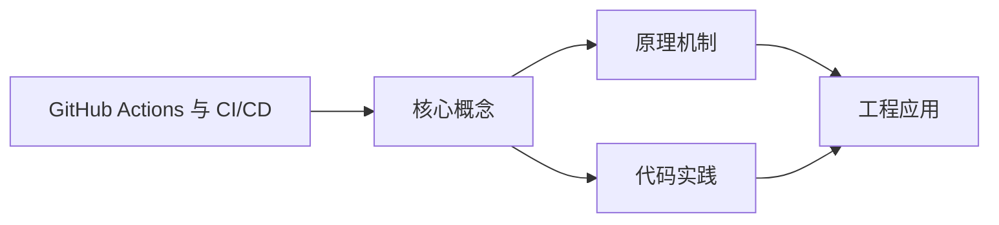
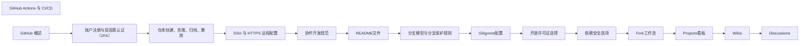

## 1. 学习目标（Bloom 分类）

本节按照布鲁姆教育目标分类学组织学习路径。本文主题为《GitHub Actions 与 CI/CD》，属于 GitHub 模块，读者可以根据自身阶段选择阅读深度。

记忆层面：能够准确复述本文的核心概念、术语与基本语法或操作步骤，并能够在提问或检索时快速定位对应知识点。能够说出 GitHub 的核心概念、常用命令与流程。

理解层面：能够用自己的语言解释核心原理与工作机制，说明概念之间的因果关系，而不是机械记忆结论。能够解释 GitHub 的工作原理与设计动机。

应用层面：能够在真实项目或练习场景中运用本文知识解决具体问题，写出正确且可维护的实现。能够独立完成 GitHub 的标准操作。

分析层面：能够拆解复杂问题，比较本文主题与相邻概念的异同，识别边界条件与例外情况。能够分析 GitHub 使用中的异常与边界。

评价层面：能够根据约束条件（性能、可读性、安全、成本）评价不同方案的优劣，做出有依据的技术决策。能够评价 GitHub 相关工具与方案。

创造层面：能够把本文知识与其他模块知识组合，设计出新的解决方案或可复用的工程模式。能够把 GitHub 融入团队工作流。

通过本节学习，读者应当能够把《GitHub Actions 与 CI/CD》纳入自己的知识网络，并与 GitHub 模块的其他主题（仓库、Issue、PR、Actions、生态）建立关联。

## 2. 历史动机与发展脉络

《GitHub Actions 与 CI/CD》是 GitHub 领域的重要主题。要真正理解它，需要先了解它解决的问题与演进过程。

GitHub 2008 年上线，2018 年被微软收购，是全球最大的代码托管与协作平台；核心是 Git 之上的社交化协作层。
协作对象：Repository（仓库）、Issue（问题）、Pull Request（变更请求）、Discussion（讨论）、Actions（自动化）、Projects（看板）。
生态：GitHub Pages、Codespaces、Copilot、CodeQL、Packages；开放平台（REST/GraphQL API）支撑生态集成。

回到本文主题：GitHub Actions 与 CI/CD 的提出与成熟，正是上述技术背景下的必然产物。早期实现往往以简单可用为目标，随着工程规模扩大，社区逐渐沉淀出标准做法与最佳实践；理解这一脉络，可以帮助读者判断“为什么文档中的推荐写法是现在这个样子”，也能在遇到历史遗留代码时准确识别其设计年代与取舍。


## 3. 形式化定义与核心概念精讲

本节把《GitHub Actions 与 CI/CD》涉及的核心概念以“定义 + 讲解”的形式展开。读者应把定义当作工具，把讲解当作理解路径；两者结合才能形成可迁移的知识。

PR 流程：fork/branch -> 提交 -> PR -> 审查 -> 合并；审查通过保护规则（required reviews）。
Actions：workflow（YAML）由事件触发，job 在 runner 上执行 step；支持矩阵、缓存与密钥。
Issue 管理：标签、里程碑、模板；与 PR 通过关键词（fixes #123）自动关联。

### 3.1 原文章节逐一精讲

原文档把主题拆分为 24 个小节，下面按顺序给出每一节的导读讲解，随后保留原文细节供精读。

#### 原文精读（完整保留）

# GitHub Actions 工作流配置

> **符号约定**：`< >` 必填参数 | `[ ]` 可选参数

---

#### 1. 背景

**GitHub Actions** 是内置于仓库的 **CI/CD（持续集成/持续交付）** 引擎：用 **YAML** 描述 **workflow（工作流）**，在 **runner（运行器）** 上执行 **job（任务）**。**GitHub Marketplace** 提供可复用的 **Action（动作）** 封装常见步骤。
核心概念：**on** 触发条件、**jobs** 并行或依赖、**steps** 顺序执行、**${{ secrets.XXX }}** 读取密钥。

#### 2. GitHub Actions 核心概念

##### 2.1 工作流（Workflow）

工作流是一个可配置的自动化流程，由一个或多个任务（jobs）组成，定义在 `.github/workflows/` 目录下的 YAML 文件中。

##### 2.2 任务（Job）

任务是工作流中的一个独立单元，包含一系列步骤（steps）。任务默认并行执行，但可以通过 `needs` 关键字定义依赖关系。

##### 2.3 步骤（Step）

步骤是任务中的一个操作，可以是：

- 使用市场中的 Action（`uses`）
- 执行 shell 命令（`run`）

##### 2.4 运行器（Runner）

运行器是执行工作流的服务器，可以是：

- GitHub 托管的运行器（如 `ubuntu-latest`、`windows-latest`、`macos-latest`）
- 自托管运行器（自己搭建的服务器）

##### 2.5 动作（Action）

动作是可复用的代码单元，封装了常见的步骤，可在 GitHub Marketplace 中找到。

#### 3. 工作流配置详解

##### 3.1 触发条件（on）

```yaml
 # 基本触发条件
 on:
  push:
  branches: [main, develop]
  paths-ignore: ['README.md', 'docs/**']
  pull_request:
  branches: [main]
  # 定时触发
  schedule:
  - cron: '0 0 * * *' # 每天 UTC 时间 00:00 触发
  # 手动触发
  workflow_dispatch:
  inputs:
  environment:
  description: '环境'
  required:
  default: 'staging'
  # 其他工作流触发
  workflow_run:
  workflows: ['Build']
  types: [completed]
```

##### 3.2 任务配置（jobs）

```yaml
 jobs:
  # 任务名称
  build:
  # 运行器环境
  runs-on: ubuntu-latest
  # 环境变量
  env:
  NODE_ENV: production
  # 矩阵策略
  strategy:
  matrix:
  node-version: [18.x, 20.x]
  os: [ubuntu-latest, windows-latest]
  # 快速失败
  fail-fast:
  # 任务依赖
  needs: [lint, test]
  # 步骤
  steps:
  - name: Checkout code
  uses: actions/checkout@v4
  with:
  fetch-depth: 0 # 完整克隆，包括标签
  - name: Setup Node.js
  uses: actions/setup-node@v4
  with:
  node-version: ${{ matrix.node-version }}
  cache: npm
  - name: Install dependencies
  run: npm ci
  - name: Build
  run: npm run build
```

##### 3.3 步骤配置（steps）

```yaml
 steps:
  # 使用市场中的 Action
  - name: Checkout code
  uses: actions/checkout@v4
  # 带参数的 Action
  - name: Setup Python
  uses: actions/setup-python@v5
  with:
  python-version: '3.11'
  # 执行 shell 命令
  - name: Install dependencies
  run: |
  python -m pip install --upgrade pip
  pip install -r requirements.txt
  # 条件执行
  - name: Deploy to production
  if: github.ref == 'refs/heads/main'
  run: ./deploy.sh
  # 上传 artifact
  - name: Upload build artifacts
  uses: actions/upload-artifact@v4
  with:
  name: build
  path: dist/
```

#### 4. GitHub Marketplace 指南

##### 4.1 查找 Action

1. 访问 [GitHub Marketplace](https://github.com/marketplace?type=actions)
2. 使用搜索功能找到需要的 Action
3. 查看 Action 的文档和使用示例

##### 4.2 常用 Action

- **actions/checkout**：检出代码仓库
- **actions/setup-node**：设置 Node.js 环境
- **actions/setup-java**：设置 Java 环境
- **actions/setup-python**：设置 Python 环境
- **actions/upload-artifact**：上传构建产物
- **actions/download-artifact**：下载构建产物
- **actions/cache**：缓存依赖
- **peaceiris/actions-gh-pages**：部署到 GitHub Pages
- **docker/login-action**：登录 Docker 仓库
- **docker/build-push-action**：构建和推送 Docker 镜像

##### 4.3 自定义 Action

可以创建自己的 Action：

1. 在仓库中创建 `action.yml` 文件
2. 定义 Action 的输入、输出和运行环境
3. 发布到 GitHub Marketplace

#### 5. 完整 CI/CD 示例

##### 5.1 Node.js 项目完整 CI/CD

```yaml
 name: Node.js CI/CD
 on:
  push:
  branches: [main, develop]
  pull_request:
  branches: [main, develop]
 jobs:
  lint:
  runs-on: ubuntu-latest
  steps:
  - uses: actions/checkout@v4
  - uses: actions/setup-node@v4
  with:
  node-version: '20.x'
  cache: npm
  - run: npm ci
  - run: npm run lint
  test:
  runs-on: ubuntu-latest
  strategy:
  matrix:
  node-version: [18.x, 20.x]
  steps:
  - uses: actions/checkout@v4
  - uses: actions/setup-node@v4
  with:
  node-version: ${{ matrix.node-version }}
  cache: npm
  - run: npm ci
  - run: npm test
  build:
  runs-on: ubuntu-latest
  needs: [lint, test]
  steps:
  - uses: actions/checkout@v4
  - uses: actions/setup-node@v4
  with:
  node-version: '20.x'
  cache: npm
  - run: npm ci
  - run: npm run build
  - uses: actions/upload-artifact@v4
  with:
  name: build
  path: dist/
  deploy:
  runs-on: ubuntu-latest
  needs: build
  if: github.ref == 'refs/heads/main'
  steps:
  - uses: actions/checkout@v4
  - uses: actions/download-artifact@v4
  with:
  name: build
  path: dist/
  - name: Deploy to GitHub Pages
  uses: peaceiris/actions-gh-pages@v4
  with:
  github_token: ${{ secrets.GITHUB_TOKEN }}
  publish_dir: ./dist
```

##### 5.2 Java 项目完整 CI/CD

```yaml
 name: Java CI/CD
 on:
  push:
  branches: [main, develop]
  pull_request:
  branches: [main, develop]
 jobs:
  build:
  runs-on: ubuntu-latest
  steps:
  - uses: actions/checkout@v4
  - uses: actions/setup-java@v4
  with:
  distribution: temurin
  java-version: '17'
  cache: maven
  - name: Build with Maven
  run: mvn -B package --file pom.xml
  - uses: actions/upload-artifact@v4
  with:
  name: jar
  path: target/*.jar
  deploy:
  runs-on: ubuntu-latest
  needs: build
  if: github.ref == 'refs/heads/main'
  steps:
  - uses: actions/download-artifact@v4
  with:
  name: jar
  path: target/
  - name: Deploy to server
  run: |
  # 部署脚本
  echo "Deploying to production server"
  # scp target/*.jar user@server:/path/to/deploy/
```

##### 5.3 Python 项目完整 CI/CD

```yaml
 name: Python CI/CD
 on:
  push:
  branches: [main, develop]
  pull_request:
  branches: [main, develop]
 jobs:
  lint:
  runs-on: ubuntu-latest
  steps:
  - uses: actions/checkout@v4
  - uses: actions/setup-python@v5
  with:
  python-version: '3.11'
  - run: |
  python -m pip install --upgrade pip
  pip install flake8
  flake8 .
  test:
  runs-on: ubuntu-latest
  steps:
  - uses: actions/checkout@v4
  - uses: actions/setup-python@v5
  with:
  python-version: '3.11'
  - run: |
  python -m pip install --upgrade pip
  pip install pytest
  if [ -f requirements.txt ]; then pip install -r requirements.txt; fi
  pytest
  deploy:
  runs-on: ubuntu-latest
  needs: [lint, test]
  if: github.ref == 'refs/heads/main'
  steps:
  - uses: actions/checkout@v4
  - uses: actions/setup-python@v5
  with:
  python-version: '3.11'
  - run: |
  python -m pip install --upgrade pip
  pip install setuptools wheel twine
  python setup.py sdist bdist_wheel
  twine upload --repository pypi dist/* -u ${{ secrets.PYPI_USERNAME }} -p ${{ secrets.PYPI_PASSWORD }}
```

#### 6. 环境变量与密钥管理

##### 6.1 环境变量

```yaml
# 工作流级环境变量
env:
  NODE_ENV: production
  API_URL: https://api.example.com
jobs:
  build:
  # 任务级环境变量
  env:
  BUILD_VERSION: 1.0.0
  steps:
    - name: Print environment variables
  run: |
  echo "NODE_ENV: $NODE_ENV"
  echo "API_URL: $API_URL"
  echo "BUILD_VERSION: $BUILD_VERSION"
  # 使用 GitHub 上下文
  echo "Repository: ${{ github.repository }}"
  echo "Branch: ${{ github.ref }}"
```

##### 6.2 密钥管理

1. **Repository secrets**：在仓库的 **Settings → Secrets and variables → Actions** 中设置
2. **Environment secrets**：在环境的设置中设置，更安全
3. **使用密钥**：

```yaml
 steps:
  - name: Deploy
  run: ./deploy.sh
  env:
  API_KEY: ${{ secrets.API_KEY }}
  DB_PASSWORD: ${{ secrets.DB_PASSWORD }}
```

#### 7. 常见问题与解决方案

##### 7.1 构建失败

###### 7.1.1 依赖安装失败

- **问题**：依赖安装超时或失败
- **解决方案**：

1.  使用缓存减少依赖安装时间
2.  检查网络连接
3.  确认依赖源是否可用
4.  增加超时时间

###### 7.1.2 测试失败

- **问题**：测试用例失败
- **解决方案**：

1.  查看测试日志，了解失败原因
2.  修复代码中的问题
3.  确保测试环境与开发环境一致

##### 7.2 性能问题

###### 7.2.1 构建时间过长

- **问题**：构建时间超过限制或影响开发效率
- **解决方案**：

1.  使用缓存
2.  并行执行任务
3.  优化构建脚本
4.  使用自托管运行器

###### 7.2.2 缓存失效

- **问题**：依赖变更后缓存未更新
- **解决方案**：

1.  使用动态缓存键
2.  定期清理缓存
3.  依赖变更时更新缓存键

##### 7.3 权限问题

###### 7.3.1 密钥权限不足

- **问题**：构建过程中无法访问密钥
- **解决方案**：

1.  确认密钥已正确设置
2.  检查 workflow 权限设置
3.  确保密钥名称正确

###### 7.3.2 访问外部服务失败

- **问题**：无法访问外部 API 或服务
- **解决方案**：

1.  检查网络连接
2.  确认 API 密钥有效
3.  检查外部服务状态

#### 8. 最佳实践

##### 8.1 工作流设计

- **模块化**：将不同功能拆分为多个工作流
- **并行执行**：利用矩阵策略和并行任务提高效率
- **依赖管理**：使用 `needs` 明确任务依赖关系
- **条件执行**：使用 `if` 条件控制任务执行

##### 8.2 安全性

- **密钥管理**：使用 Repository secrets 或 Environment secrets
- **权限控制**：最小化 workflow 权限
- **代码扫描**：集成 CodeQL 等代码扫描工具
- **安全依赖**：使用 Dependabot 自动更新依赖

##### 8.3 可维护性

- **版本固定**：固定 Action 版本，避免意外变更
- **注释**：为复杂工作流添加注释
- **文档**：记录工作流的用途和维护指南
- **测试**：测试工作流的各个部分

##### 8.4 性能优化

- **缓存**：缓存依赖和构建产物
- **并行**：并行执行测试和构建
- **最小化**：只执行必要的步骤
- **自托管运行器**：对于大型项目使用自托管运行器

#### 9. 实际应用案例

##### 9.1 开源项目案例

###### 9.1.1 案例描述

- **项目**：一个前端库
- **需求**：自动测试、构建和发布

###### 9.1.2 实现

1. **测试**：在 PR 时运行单元测试和集成测试
2. **构建**：合并到 main 分支时构建
3. **发布**：打标签时自动发布到 npm

##### 9.2 企业项目案例

###### 9.2.1 案例描述

- **项目**：企业内部应用
- **需求**：自动测试、构建、部署到多环境

###### 9.2.2 实现

1. **测试**：PR 时运行测试
2. **构建**：合并到 develop 分支时构建
3. **部署**：

- 合并到 develop 分支：部署到开发环境
- 合并到 main 分支：部署到测试环境
- 打标签：部署到生产环境

#### 10. GitHub Pages 部署

##### 10.1 启用 GitHub Pages

1. 进入仓库 **Settings** > **Pages**
2. 选择源分支（通常是 `gh-pages` 或 `main`）
3. 选择目录（通常是 `/` 或 `/docs`）
4. 点击 **Save**

##### 10.2 自动部署到 GitHub Pages

```yaml
 name: Deploy to GitHub Pages
 on:
  push:
  branches: [ main ]
 jobs:
  deploy:
  runs-on: ubuntu-latest
  permissions:
  contents: write
  steps:
  - uses: actions/checkout@v4
  - name: Set up Node.js
  uses: actions/setup-node@v4
  with:
  node-version: 20
  cache: 'npm'
  - name: Install dependencies
  run: npm install
  - name: Build
  run: npm run build
  - name: Deploy to GitHub Pages
  uses: peaceiris/actions-gh-pages@v4
  with:
  github_token: ${{ secrets.GITHUB_TOKEN }}
  publish_dir: ./dist
```

##### 10.3 使用 GitHub Actions 官方 Pages 部署

```yaml
 name: Deploy Pages
 on:
  push:
  branches: [ main ]
 permissions:
  contents: read
  pages: write
  id-token: write
 jobs:
  build:
  runs-on: ubuntu-latest
  steps:
  - uses: actions/checkout@v4
  - uses: actions/configure-pages@v5
  - uses: actions/upload-pages-artifact@v3
  with:
  path: ./dist
  deploy:
  needs: build
  runs-on: ubuntu-latest
  environment:
  name: github-pages
  url: ${{ steps.deployment.outputs.page_url }}
  steps:
  - uses: actions/deploy-pages@v4
  id: deployment
```

#### 11. 与其他 CI/CD 工具对比

| 工具           | 优势                                   | 劣势                 |
| -------------- | -------------------------------------- | -------------------- |
| GitHub Actions | 与 GitHub 集成紧密、易于配置、市场丰富 | 私有仓库有分钟数限制 |
| Jenkins        | 高度可定制、插件丰富、无限制           | 搭建和维护成本高     |
| GitLab CI/CD   | 与 GitLab 集成紧密、功能强大           | 学习曲线较陡         |
| CircleCI       | 速度快、配置简单、支持 Docker          | 价格较高             |
| Travis CI      | 配置简单、历史悠久                     | 功能相对有限         |

#### 11. 延伸阅读

- [Workflow syntax](https://docs.github.com/en/actions/using-workflows/workflow-syntax-for-github-actions) <!-- nofollow -->
- [GitHub Actions documentation](https://docs.github.com/en/actions) <!-- nofollow -->
- [GitHub Marketplace](https://github.com/marketplace?type=actions) <!-- nofollow -->
- [Security hardening for GitHub Actions](https://docs.github.com/en/actions/security-guides/security-hardening-for-github-actions) <!-- nofollow -->

#### 工作流文件结构

**基本写法：工作流文件命名**
`.github/workflows/<名称>.yml`
```bash
# 工作流文件必须放在此目录下
mkdir -p .github/workflows
```

---

**基本写法：基本工作流定义**
`name: <工作流名称>`
```yaml
# 工作流名称
name: CI
on: [push, pull_request]
jobs:
  build:
    runs-on: ubuntu-latest
    steps:
      - uses: actions/checkout@v4
      - run: echo "Hello"
```

---

**基本写法：触发条件配置**
`on: <触发事件>`
```yaml
# push 时触发
on:
  push:
    branches: [ main, develop ]
```

---

**基本写法：多事件触发**
`on: [<事件1>, <事件2>]`
```yaml
# 多种事件触发工作流
on: [push, pull_request, workflow_dispatch]
```

---

**基本写法：手动触发**
`on: workflow_dispatch`
```yaml
# 允许手动触发工作流
on:
  workflow_dispatch:
    inputs:
      environment:
        description: '部署环境'
        default: 'staging'
```

---

**基本写法：定时触发**
`on: schedule`
```yaml
# 每天凌晨 2 点执行（UTC 时间）
on:
  schedule:
    - cron: '0 2 * * *'
```

---

#### 知识讲解与要点分析（原作业配置）

**基本写法：指定运行环境**
`runs-on: <操作系统>`
```yaml
# 在最新版 Ubuntu 上运行
runs-on: ubuntu-latest
```

---

**基本写法：多操作系统矩阵**
`strategy: matrix`
```yaml
# 在多个操作系统上运行测试
strategy:
  matrix:
    os: [ubuntu-latest, windows-latest, macos-latest]
runs-on: ${{ matrix.os }}
```

---

**基本写法：多版本矩阵**
`strategy: matrix`
```yaml
# 在多个 Node.js 版本上测试
strategy:
  matrix:
    node-version: [18, 20, 22, 24]
```

---

**基本写法：失败时继续**
`strategy: fail-fast`
```yaml
# 矩阵中一个失败不取消其他
strategy:
  fail-fast: false
  max-parallel: 4
```

---

**基本写法：作业依赖关系**
`needs: <作业名>`
```yaml
# deploy 作业依赖 build 作业
jobs:
  build:
    runs-on: ubuntu-latest
    steps:
      - run: echo "build"
  deploy:
    needs: build
    runs-on: ubuntu-latest
    steps:
      - run: echo "deploy"
```

---

#### 步骤与动作

**基本写法：检出代码**
`uses: actions/checkout@v4`
```yaml
# 检出仓库代码到工作目录
steps:
  - uses: actions/checkout@v4
```

---

**基本写法：设置 Node.js 环境**
`uses: actions/setup-node@v4`
```yaml
# 配置 Node.js 运行环境
steps:
  - uses: actions/setup-node@v4
    with:
      node-version: '22'
      cache: 'npm'
```

---

**基本写法：设置 Python 环境**
`uses: actions/setup-python@v5`
```yaml
# 配置 Python 运行环境
steps:
  - uses: actions/setup-python@v5
    with:
      python-version: '3.13'
```

---

**基本写法：设置 Java 环境**
`uses: actions/setup-java@v4`
```yaml
# 配置 JDK 环境
steps:
  - uses: actions/setup-java@v4
    with:
      distribution: 'temurin'
      java-version: '21'
```

---

**基本写法：运行命令**
`run: <命令>`
```yaml
# 执行 shell 命令
steps:
  - run: npm install
  - run: npm test
```

---

**基本写法：多行命令**
`run: |`
```yaml
# 执行多行命令
steps:
  - run: |
      npm install
      npm run build
      npm test
```

---

**基本写法：指定 shell 类型**
`shell: <shell>`
```yaml
# 指定使用 PowerShell 运行
steps:
  - run: Write-Host "Hello"
    shell: pwsh
```

---

#### 环境变量与密钥

**基本写法：设置环境变量**
`env: <变量名>: <值>`
```yaml
# 设置工作流级环境变量
env:
  NODE_ENV: production
jobs:
  build:
    env:
      CI: true
```

---

**基本写法：使用密钥**
`secrets.<密钥名>`
```yaml
# 使用仓库配置的密钥
steps:
  - run: npm publish
    env:
      NODE_AUTH_TOKEN: ${{ secrets.NPM_TOKEN }}
```

---

**基本写法：步骤级环境变量**
`run: <命令> env: <变量>: <值>`
```yaml
# 仅在特定步骤设置环境变量
steps:
  - run: echo $SECRET_VALUE
    env:
      SECRET_VALUE: ${{ secrets.MY_SECRET }}
```

---

**基本写法：使用上下文变量**
`${{ <上下文> }}`
```yaml
# 使用 GitHub 上下文信息
steps:
  - run: echo "Branch is ${{ github.ref }}"
  - run: echo "Actor is ${{ github.actor }}"
```

---

#### 缓存与产物

**基本写法：缓存依赖**
`uses: actions/cache@v4`
```yaml
# 缓存 npm 依赖加速构建
steps:
  - uses: actions/cache@v4
    with:
      path: ~/.npm
      key: ${{ runner.os }}-node-${{ hashFiles('**/package-lock.json') }}
```

---

**基本写法：上传构建产物**
`uses: actions/upload-artifact@v4`
```yaml
# 上传构建结果
steps:
  - uses: actions/upload-artifact@v4
    with:
      name: build-output
      path: dist/
```

---

**基本写法：下载产物**
`uses: actions/download-artifact@v4`
```yaml
# 下载之前上传的产物
steps:
  - uses: actions/download-artifact@v4
    with:
      name: build-output
```

---

**基本写法：条件步骤**
`if: <条件>`
```yaml
# 仅在 main 分支执行
steps:
  - run: npm run deploy
    if: github.ref == 'refs/heads/main'
```

---

#### gh CLI 管理工作流

**基本写法：查看工作流列表**
`gh workflow list`
```bash
# 列出仓库的所有工作流
gh workflow list
```

---

**基本写法：查看工作流详情**
`gh workflow view <工作流名>`
```bash
# 查看指定工作流的详情
gh workflow view CI
```

---

**基本写法：查看工作流文件**
`gh workflow view <工作流名> --yaml`
```bash
# 查看工作流的 YAML 内容
gh workflow view CI --yaml
```

---

**基本写法：手动触发工作流**
`gh workflow run <工作流>`
```bash
# 手动触发指定工作流
gh workflow run CI
```

---

**基本写法：指定分支触发**
`gh workflow run <工作流> --ref <分支>`
```bash
# 在指定分支上触发工作流
gh workflow run CI --ref develop
```

---

**基本写法：带参数触发**
`gh workflow run <工作流> -f <参数>=<值>`
```bash
# 传入参数触发工作流
gh workflow run deploy.yml -f environment=production
```

---

**基本写法：禁用工作流**
`gh workflow disable <工作流>`
```bash
# 禁用指定工作流
gh workflow disable CI
```

---

**基本写法：启用工作流**
`gh workflow enable <工作流>`
```bash
# 启用被禁用的工作流
gh workflow enable CI
```

---

#### 运行记录管理

**基本写法：查看运行列表**
`gh run list`
```bash
# 列出工作流运行记录
gh run list
```

---

**基本写法：按工作流筛选**
`gh run list --workflow <工作流>`
```bash
# 查看指定工作流的运行记录
gh run list --workflow CI
```

---

**基本写法：按状态筛选**
`gh run list --status <状态>`
```bash
# 查看失败的运行记录
gh run list --status failure
```

---

**基本写法：限制返回数量**
`gh run list --limit <数量>`
```bash
# 限制返回的运行记录数量
gh run list --limit 10
```

---

**基本写法：查看运行详情**
`gh run view <运行ID>`
```bash
# 查看指定运行的详细信息
gh run view 123456
```

---

**基本写法：查看失败日志**
`gh run view <运行ID> --log-failed`
```bash
# 查看运行失败的日志
gh run view 123456 --log-failed
```

---

**基本写法：查看完整日志**
`gh run view <运行ID> --log`
```bash
# 查看运行的完整日志
gh run view 123456 --log
```

---

**基本写法：实时监控运行**
`gh run watch <运行ID>`
```bash
# 实时监控运行直到完成
gh run watch 123456
```

---

**基本写法：重新运行**
`gh run rerun <运行ID>`
```bash
# 重新运行指定的工作流
gh run rerun 123456
```

---

**基本写法：仅重跑失败的作业**
`gh run rerun <运行ID> --failed`
```bash
# 仅重新运行失败的作业
gh run rerun 123456 --failed
```

---

**基本写法：取消运行中的工作流**
`gh run cancel <运行ID>`
```bash
# 取消正在运行的工作流
gh run cancel 123456
```

---

**基本写法：删除运行记录**
`gh run delete <运行ID>`
```bash
# 删除指定的工作流运行记录
gh run delete 123456
```
#### 工作流基本结构

**基本用法:定义工作流**
`name: <名称>` (`.github/workflows/*.yml`)

```yaml
# 工作流名称
name: CI

# 触发条件
on: [push, pull_request]

# 任务集合
jobs:
  build:
    runs-on: ubuntu-latest
    steps:
      - uses: actions/checkout@v4
      - run: npm install
      - run: npm test
```

---

#### jobs 任务定义

**基本用法:定义任务依赖**
`jobs.<id>.needs`

```yaml
jobs:
  build:
    runs-on: ubuntu-latest
    steps:
      - run: echo "build"
  test:
    needs: build
    runs-on: ubuntu-latest
    steps:
      - run: echo "test"
  deploy:
    needs: [build, test]
    runs-on: ubuntu-latest
    steps:
      - run: echo "deploy"
```

---

**基本用法:设置运行环境**
`jobs.<id>.runs-on`

```yaml
jobs:
  build:
    runs-on: ubuntu-latest
    # 自定义环境变量
    env:
      NODE_ENV: production
    # 超时设置
    timeout-minutes: 30
    # 失败时继续
    continue-on-error: false
```

---

#### steps 步骤

**基本用法:引用 Action**
`uses: <action>@<版本>`

```yaml
steps:
  # 检出代码
  - uses: actions/checkout@v4
    with:
      fetch-depth: 0
  # 设置 Node 环境
  - uses: actions/setup-node@v4
    with:
      node-version: '20'
      cache: 'npm'
  # 缓存依赖
  - uses: actions/cache@v4
    with:
      path: ~/.npm
      key: ${{ runner.os }}-npm-${{ hashFiles('**/package-lock.json') }}
```

---

**基本用法:运行命令**
`run: <命令>`

```yaml
steps:
  - name: 安装依赖
    run: npm ci

  - name: 多行命令
    run: |
      npm run build
      npm run test

  - name: 条件执行
    if: github.ref == 'refs/heads/main'
    run: npm run deploy

  - name: 设置环境变量
    run: echo "VERSION=1.0" >> $GITHUB_ENV
```

---

#### with 传参

**基本用法:给 Action 传参**
`with: <键>: <值>`

```yaml
- uses: actions/checkout@v4
  with:
    ref: develop
    submodules: true

- uses: actions/upload-artifact@v4
  with:
    name: build-output
    path: dist/
    retention-days: 7
```

---

#### 权限与并发

**基本用法:设置权限**
`permissions:`

```yaml
permissions:
  contents: read
  pull-requests: write
  issues: write
```

---

**基本用法:并发控制**
`concurrency:`

```yaml
concurrency:
  group: ${{ github.workflow }}-${{ github.ref }}
  cancel-in-progress: true
```

---

### 3.2 概念关系图

下面用 Mermaid 图表达本文核心概念之间的关系，帮助读者建立整体图景：



图中展示的是本文知识的结构化关系：核心概念是入口，原理机制解释“为什么”，代码实践演示“怎么做”，工程应用回答“何时用”。读者学习时可以把每个小节的内容挂接到对应节点上。

## 4. 理论推导与原理解析

本节深入《GitHub Actions 与 CI/CD》背后的原理。理论部分不求面面俱到，而是聚焦“能解释现象、能指导实践”的关键推导。

PR 流程：fork/branch -> 提交 -> PR -> 审查 -> 合并；审查通过保护规则（required reviews）。
Actions：workflow（YAML）由事件触发，job 在 runner 上执行 step；支持矩阵、缓存与密钥。
Issue 管理：标签、里程碑、模板；与 PR 通过关键词（fixes #123）自动关联。
权限与安全：仓库角色（read/triage/write/maintain/admin）、分支保护、CODEOWNERS、安全通告。

需要强调的是，理论推导与工程实践之间存在翻译层：理论给出的是理想化模型与边界条件，工程代码则必须处理真实环境中的例外。读者在学习时应先掌握理论的“标准情形”，再通过陷阱章节了解“非标准情形”。

## 5. 代码示例与逐行讲解

本节把原文中的代码示例系统整理，并为每个示例补充用途说明与讲解。读者不应只浏览代码，而应逐段对照讲解理解设计意图。

### 5.1 示例：3.1 触发条件（on）

该示例来自原文《3.1 触发条件（on）》小节，用于演示GitHub Actions 与 CI/CD相关操作。阅读时请先看代码结构，再看其后的讲解。

```yaml
 # 基本触发条件
 on:
  push:
  branches: [main, develop]
  paths-ignore: ['README.md', 'docs/**']
  pull_request:
  branches: [main]
  # 定时触发
  schedule:
  - cron: '0 0 * * *' # 每天 UTC 时间 00:00 触发
  # 手动触发
  workflow_dispatch:
  inputs:
  environment:
  description: '环境'
  required:
  default: 'staging'
  # 其他工作流触发
  workflow_run:
  workflows: ['Build']
  types: [completed]
```

讲解：这段代码演示了本节核心知识点。代码中的关键操作可以归纳为三步：准备（定义或初始化）、执行（核心逻辑）、收尾（释放资源或返回结果）。实际项目中，这三步往往被封装为函数或类，以提升复用性与可测试性。

关键点分析：

该示例共 21 行有效代码，结构以数据或配置为主。阅读时应关注：数据字段的含义、配置项的作用，以及它们与运行行为的对应关系。

进阶思考路径：先尝试修改参数观察行为变化，再把示例中的模式迁移到自己的项目中；每次修改都记录预期与实测差异，这是把示例转化为能力的最快方式。

### 5.2 示例：3.2 任务配置（jobs）

该示例来自原文《3.2 任务配置（jobs）》小节，用于演示GitHub Actions 与 CI/CD相关操作。阅读时请先看代码结构，再看其后的讲解。

```yaml
 jobs:
  # 任务名称
  build:
  # 运行器环境
  runs-on: ubuntu-latest
  # 环境变量
  env:
  NODE_ENV: production
  # 矩阵策略
  strategy:
  matrix:
  node-version: [18.x, 20.x]
  os: [ubuntu-latest, windows-latest]
  # 快速失败
  fail-fast:
  # 任务依赖
  needs: [lint, test]
  # 步骤
  steps:
  - name: Checkout code
  uses: actions/checkout@v4
  with:
  fetch-depth: 0 # 完整克隆，包括标签
  - name: Setup Node.js
  uses: actions/setup-node@v4
  with:
  node-version: ${{ matrix.node-version }}
  cache: npm
  - name: Install dependencies
  run: npm ci
  - name: Build
  run: npm run build
```

讲解：这段代码演示了本节核心知识点。代码中的关键操作可以归纳为三步：准备（定义或初始化）、执行（核心逻辑）、收尾（释放资源或返回结果）。实际项目中，这三步往往被封装为函数或类，以提升复用性与可测试性。

关键点分析：

该示例共 32 行有效代码，结构以数据或配置为主。阅读时应关注：数据字段的含义、配置项的作用，以及它们与运行行为的对应关系。

进阶思考路径：先尝试修改参数观察行为变化，再把示例中的模式迁移到自己的项目中；每次修改都记录预期与实测差异，这是把示例转化为能力的最快方式。

### 5.3 示例：3.3 步骤配置（steps）

该示例来自原文《3.3 步骤配置（steps）》小节，用于演示GitHub Actions 与 CI/CD相关操作。阅读时请先看代码结构，再看其后的讲解。

```yaml
 steps:
  # 使用市场中的 Action
  - name: Checkout code
  uses: actions/checkout@v4
  # 带参数的 Action
  - name: Setup Python
  uses: actions/setup-python@v5
  with:
  python-version: '3.11'
  # 执行 shell 命令
  - name: Install dependencies
  run: |
  python -m pip install --upgrade pip
  pip install -r requirements.txt
  # 条件执行
  - name: Deploy to production
  if: github.ref == 'refs/heads/main'
  run: ./deploy.sh
  # 上传 artifact
  - name: Upload build artifacts
  uses: actions/upload-artifact@v4
  with:
  name: build
  path: dist/
```

讲解：这段代码演示了本节核心知识点。代码中的关键操作可以归纳为三步：准备（定义或初始化）、执行（核心逻辑）、收尾（释放资源或返回结果）。实际项目中，这三步往往被封装为函数或类，以提升复用性与可测试性。

关键点分析：

该示例共 24 行有效代码，结构以数据或配置为主。阅读时应关注：数据字段的含义、配置项的作用，以及它们与运行行为的对应关系。

进阶思考路径：先尝试修改参数观察行为变化，再把示例中的模式迁移到自己的项目中；每次修改都记录预期与实测差异，这是把示例转化为能力的最快方式。

### 5.4 示例：5.1 Node.js 项目完整 CI/CD

该示例来自原文《5.1 Node.js 项目完整 CI/CD》小节，用于演示GitHub Actions 与 CI/CD相关操作。阅读时请先看代码结构，再看其后的讲解。

```yaml
 name: Node.js CI/CD
 on:
  push:
  branches: [main, develop]
  pull_request:
  branches: [main, develop]
 jobs:
  lint:
  runs-on: ubuntu-latest
  steps:
  - uses: actions/checkout@v4
  - uses: actions/setup-node@v4
  with:
  node-version: '20.x'
  cache: npm
  - run: npm ci
  - run: npm run lint
  test:
  runs-on: ubuntu-latest
  strategy:
  matrix:
  node-version: [18.x, 20.x]
  steps:
  - uses: actions/checkout@v4
  - uses: actions/setup-node@v4
  with:
  node-version: ${{ matrix.node-version }}
  cache: npm
  - run: npm ci
  - run: npm test
  build:
  runs-on: ubuntu-latest
  needs: [lint, test]
  steps:
  - uses: actions/checkout@v4
  - uses: actions/setup-node@v4
  with:
  node-version: '20.x'
  cache: npm
  - run: npm ci
  - run: npm run build
  - uses: actions/upload-artifact@v4
  with:
  name: build
  path: dist/
  deploy:
  runs-on: ubuntu-latest
  needs: build
  if: github.ref == 'refs/heads/main'
  steps:
  - uses: actions/checkout@v4
  - uses: actions/download-artifact@v4
  with:
  name: build
  path: dist/
  - name: Deploy to GitHub Pages
  uses: peaceiris/actions-gh-pages@v4
  with:
  github_token: ${{ secrets.GITHUB_TOKEN }}
  publish_dir: ./dist
```

讲解：这段代码演示了本节核心知识点。代码中的关键操作可以归纳为三步：准备（定义或初始化）、执行（核心逻辑）、收尾（释放资源或返回结果）。实际项目中，这三步往往被封装为函数或类，以提升复用性与可测试性。

关键点分析：

该示例共 60 行有效代码，结构以数据或配置为主。阅读时应关注：数据字段的含义、配置项的作用，以及它们与运行行为的对应关系。

进阶思考路径：先尝试修改参数观察行为变化，再把示例中的模式迁移到自己的项目中；每次修改都记录预期与实测差异，这是把示例转化为能力的最快方式。

### 5.5 示例：5.2 Java 项目完整 CI/CD

该示例来自原文《5.2 Java 项目完整 CI/CD》小节，用于演示GitHub Actions 与 CI/CD相关操作。阅读时请先看代码结构，再看其后的讲解。

```yaml
 name: Java CI/CD
 on:
  push:
  branches: [main, develop]
  pull_request:
  branches: [main, develop]
 jobs:
  build:
  runs-on: ubuntu-latest
  steps:
  - uses: actions/checkout@v4
  - uses: actions/setup-java@v4
  with:
  distribution: temurin
  java-version: '17'
  cache: maven
  - name: Build with Maven
  run: mvn -B package --file pom.xml
  - uses: actions/upload-artifact@v4
  with:
  name: jar
  path: target/*.jar
  deploy:
  runs-on: ubuntu-latest
  needs: build
  if: github.ref == 'refs/heads/main'
  steps:
  - uses: actions/download-artifact@v4
  with:
  name: jar
  path: target/
  - name: Deploy to server
  run: |
  # 部署脚本
  echo "Deploying to production server"
  # scp target/*.jar user@server:/path/to/deploy/
```

讲解：这段代码演示了本节核心知识点。代码中的关键操作可以归纳为三步：准备（定义或初始化）、执行（核心逻辑）、收尾（释放资源或返回结果）。实际项目中，这三步往往被封装为函数或类，以提升复用性与可测试性。

关键点分析：

该示例共 36 行有效代码，结构以数据或配置为主。阅读时应关注：数据字段的含义、配置项的作用，以及它们与运行行为的对应关系。

进阶思考路径：先尝试修改参数观察行为变化，再把示例中的模式迁移到自己的项目中；每次修改都记录预期与实测差异，这是把示例转化为能力的最快方式。

### 5.6 示例：5.3 Python 项目完整 CI/CD

该示例来自原文《5.3 Python 项目完整 CI/CD》小节，用于演示GitHub Actions 与 CI/CD相关操作。阅读时请先看代码结构，再看其后的讲解。

```yaml
 name: Python CI/CD
 on:
  push:
  branches: [main, develop]
  pull_request:
  branches: [main, develop]
 jobs:
  lint:
  runs-on: ubuntu-latest
  steps:
  - uses: actions/checkout@v4
  - uses: actions/setup-python@v5
  with:
  python-version: '3.11'
  - run: |
  python -m pip install --upgrade pip
  pip install flake8
  flake8 .
  test:
  runs-on: ubuntu-latest
  steps:
  - uses: actions/checkout@v4
  - uses: actions/setup-python@v5
  with:
  python-version: '3.11'
  - run: |
  python -m pip install --upgrade pip
  pip install pytest
  if [ -f requirements.txt ]; then pip install -r requirements.txt; fi
  pytest
  deploy:
  runs-on: ubuntu-latest
  needs: [lint, test]
  if: github.ref == 'refs/heads/main'
  steps:
  - uses: actions/checkout@v4
  - uses: actions/setup-python@v5
  with:
  python-version: '3.11'
  - run: |
  python -m pip install --upgrade pip
  pip install setuptools wheel twine
  python setup.py sdist bdist_wheel
  twine upload --repository pypi dist/* -u ${{ secrets.PYPI_USERNAME }} -p ${{ secrets.PYPI_PASSWORD }}
```

讲解：这段代码演示了本节核心知识点。代码中的关键操作可以归纳为三步：准备（定义或初始化）、执行（核心逻辑）、收尾（释放资源或返回结果）。实际项目中，这三步往往被封装为函数或类，以提升复用性与可测试性。

关键点分析：

该示例共 44 行有效代码，包含 1 类关键结构（if）。其中：

- 入口与初始化部分负责建立上下文，对应实际项目中的启动或装配逻辑；
- 核心逻辑部分体现本文主题的主要操作，是阅读时最需要对照讲解理解的部分；
- 输出或返回部分把结果交给调用方，注意其类型与边界条件。

进阶思考路径：先尝试修改参数观察行为变化，再把示例中的模式迁移到自己的项目中；每次修改都记录预期与实测差异，这是把示例转化为能力的最快方式。

### 5.7 示例：6.1 环境变量

该示例来自原文《6.1 环境变量》小节，用于演示GitHub Actions 与 CI/CD相关操作。阅读时请先看代码结构，再看其后的讲解。

```yaml
# 工作流级环境变量
env:
  NODE_ENV: production
  API_URL: https://api.example.com
jobs:
  build:
  # 任务级环境变量
  env:
  BUILD_VERSION: 1.0.0
  steps:
    - name: Print environment variables
  run: |
  echo "NODE_ENV: $NODE_ENV"
  echo "API_URL: $API_URL"
  echo "BUILD_VERSION: $BUILD_VERSION"
  # 使用 GitHub 上下文
  echo "Repository: ${{ github.repository }}"
  echo "Branch: ${{ github.ref }}"
```

讲解：这段代码演示了本节核心知识点。代码中的关键操作可以归纳为三步：准备（定义或初始化）、执行（核心逻辑）、收尾（释放资源或返回结果）。实际项目中，这三步往往被封装为函数或类，以提升复用性与可测试性。

关键点分析：

该示例共 18 行有效代码，结构以数据或配置为主。阅读时应关注：数据字段的含义、配置项的作用，以及它们与运行行为的对应关系。

进阶思考路径：先尝试修改参数观察行为变化，再把示例中的模式迁移到自己的项目中；每次修改都记录预期与实测差异，这是把示例转化为能力的最快方式。

### 5.8 示例：6.2 密钥管理

该示例来自原文《6.2 密钥管理》小节，用于演示GitHub Actions 与 CI/CD相关操作。阅读时请先看代码结构，再看其后的讲解。

```yaml
 steps:
  - name: Deploy
  run: ./deploy.sh
  env:
  API_KEY: ${{ secrets.API_KEY }}
  DB_PASSWORD: ${{ secrets.DB_PASSWORD }}
```

讲解：这段代码演示了本节核心知识点。代码中的关键操作可以归纳为三步：准备（定义或初始化）、执行（核心逻辑）、收尾（释放资源或返回结果）。实际项目中，这三步往往被封装为函数或类，以提升复用性与可测试性。

关键点分析：

该示例共 6 行有效代码，结构以数据或配置为主。阅读时应关注：数据字段的含义、配置项的作用，以及它们与运行行为的对应关系。

进阶思考路径：先尝试修改参数观察行为变化，再把示例中的模式迁移到自己的项目中；每次修改都记录预期与实测差异，这是把示例转化为能力的最快方式。

### 5.9 示例：10.2 自动部署到 GitHub Pages

该示例来自原文《10.2 自动部署到 GitHub Pages》小节，用于演示GitHub Actions 与 CI/CD相关操作。阅读时请先看代码结构，再看其后的讲解。

```yaml
 name: Deploy to GitHub Pages
 on:
  push:
  branches: [ main ]
 jobs:
  deploy:
  runs-on: ubuntu-latest
  permissions:
  contents: write
  steps:
  - uses: actions/checkout@v4
  - name: Set up Node.js
  uses: actions/setup-node@v4
  with:
  node-version: 20
  cache: 'npm'
  - name: Install dependencies
  run: npm install
  - name: Build
  run: npm run build
  - name: Deploy to GitHub Pages
  uses: peaceiris/actions-gh-pages@v4
  with:
  github_token: ${{ secrets.GITHUB_TOKEN }}
  publish_dir: ./dist
```

讲解：这段代码演示了本节核心知识点。代码中的关键操作可以归纳为三步：准备（定义或初始化）、执行（核心逻辑）、收尾（释放资源或返回结果）。实际项目中，这三步往往被封装为函数或类，以提升复用性与可测试性。

关键点分析：

该示例共 25 行有效代码，结构以数据或配置为主。阅读时应关注：数据字段的含义、配置项的作用，以及它们与运行行为的对应关系。

进阶思考路径：先尝试修改参数观察行为变化，再把示例中的模式迁移到自己的项目中；每次修改都记录预期与实测差异，这是把示例转化为能力的最快方式。

### 5.10 示例：10.3 使用 GitHub Actions 官方 Pages 部署

该示例来自原文《10.3 使用 GitHub Actions 官方 Pages 部署》小节，用于演示GitHub Actions 与 CI/CD相关操作。阅读时请先看代码结构，再看其后的讲解。

```yaml
 name: Deploy Pages
 on:
  push:
  branches: [ main ]
 permissions:
  contents: read
  pages: write
  id-token: write
 jobs:
  build:
  runs-on: ubuntu-latest
  steps:
  - uses: actions/checkout@v4
  - uses: actions/configure-pages@v5
  - uses: actions/upload-pages-artifact@v3
  with:
  path: ./dist
  deploy:
  needs: build
  runs-on: ubuntu-latest
  environment:
  name: github-pages
  url: ${{ steps.deployment.outputs.page_url }}
  steps:
  - uses: actions/deploy-pages@v4
  id: deployment
```

讲解：这段代码演示了本节核心知识点。代码中的关键操作可以归纳为三步：准备（定义或初始化）、执行（核心逻辑）、收尾（释放资源或返回结果）。实际项目中，这三步往往被封装为函数或类，以提升复用性与可测试性。

关键点分析：

该示例共 26 行有效代码，结构以数据或配置为主。阅读时应关注：数据字段的含义、配置项的作用，以及它们与运行行为的对应关系。

进阶思考路径：先尝试修改参数观察行为变化，再把示例中的模式迁移到自己的项目中；每次修改都记录预期与实测差异，这是把示例转化为能力的最快方式。

### 5.11 示例：工作流文件结构

该示例来自原文《工作流文件结构》小节，用于演示GitHub Actions 与 CI/CD相关操作。阅读时请先看代码结构，再看其后的讲解。

```bash
# 工作流文件必须放在此目录下
mkdir -p .github/workflows
```

讲解：这段代码演示了本节核心知识点。代码中的关键操作可以归纳为三步：准备（定义或初始化）、执行（核心逻辑）、收尾（释放资源或返回结果）。实际项目中，这三步往往被封装为函数或类，以提升复用性与可测试性。

关键点分析：

该示例共 2 行有效代码，结构以数据或配置为主。阅读时应关注：数据字段的含义、配置项的作用，以及它们与运行行为的对应关系。

进阶思考路径：先尝试修改参数观察行为变化，再把示例中的模式迁移到自己的项目中；每次修改都记录预期与实测差异，这是把示例转化为能力的最快方式。

### 5.12 示例：工作流文件结构

该示例来自原文《工作流文件结构》小节，用于演示GitHub Actions 与 CI/CD相关操作。阅读时请先看代码结构，再看其后的讲解。

```yaml
# 工作流名称
name: CI
on: [push, pull_request]
jobs:
  build:
    runs-on: ubuntu-latest
    steps:
      - uses: actions/checkout@v4
      - run: echo "Hello"
```

讲解：这段代码演示了本节核心知识点。代码中的关键操作可以归纳为三步：准备（定义或初始化）、执行（核心逻辑）、收尾（释放资源或返回结果）。实际项目中，这三步往往被封装为函数或类，以提升复用性与可测试性。

关键点分析：

该示例共 9 行有效代码，结构以数据或配置为主。阅读时应关注：数据字段的含义、配置项的作用，以及它们与运行行为的对应关系。

进阶思考路径：先尝试修改参数观察行为变化，再把示例中的模式迁移到自己的项目中；每次修改都记录预期与实测差异，这是把示例转化为能力的最快方式。

### 5.13 示例：工作流文件结构

该示例来自原文《工作流文件结构》小节，用于演示GitHub Actions 与 CI/CD相关操作。阅读时请先看代码结构，再看其后的讲解。

```yaml
# push 时触发
on:
  push:
    branches: [ main, develop ]
```

讲解：这段代码演示了本节核心知识点。代码中的关键操作可以归纳为三步：准备（定义或初始化）、执行（核心逻辑）、收尾（释放资源或返回结果）。实际项目中，这三步往往被封装为函数或类，以提升复用性与可测试性。

关键点分析：

该示例共 4 行有效代码，结构以数据或配置为主。阅读时应关注：数据字段的含义、配置项的作用，以及它们与运行行为的对应关系。

进阶思考路径：先尝试修改参数观察行为变化，再把示例中的模式迁移到自己的项目中；每次修改都记录预期与实测差异，这是把示例转化为能力的最快方式。

### 5.14 示例：工作流文件结构

该示例来自原文《工作流文件结构》小节，用于演示GitHub Actions 与 CI/CD相关操作。阅读时请先看代码结构，再看其后的讲解。

```yaml
# 多种事件触发工作流
on: [push, pull_request, workflow_dispatch]
```

讲解：这段代码演示了本节核心知识点。代码中的关键操作可以归纳为三步：准备（定义或初始化）、执行（核心逻辑）、收尾（释放资源或返回结果）。实际项目中，这三步往往被封装为函数或类，以提升复用性与可测试性。

关键点分析：

该示例共 2 行有效代码，结构以数据或配置为主。阅读时应关注：数据字段的含义、配置项的作用，以及它们与运行行为的对应关系。

进阶思考路径：先尝试修改参数观察行为变化，再把示例中的模式迁移到自己的项目中；每次修改都记录预期与实测差异，这是把示例转化为能力的最快方式。

### 5.15 示例：工作流文件结构

该示例来自原文《工作流文件结构》小节，用于演示GitHub Actions 与 CI/CD相关操作。阅读时请先看代码结构，再看其后的讲解。

```yaml
# 允许手动触发工作流
on:
  workflow_dispatch:
    inputs:
      environment:
        description: '部署环境'
        default: 'staging'
```

讲解：这段代码演示了本节核心知识点。代码中的关键操作可以归纳为三步：准备（定义或初始化）、执行（核心逻辑）、收尾（释放资源或返回结果）。实际项目中，这三步往往被封装为函数或类，以提升复用性与可测试性。

关键点分析：

该示例共 7 行有效代码，结构以数据或配置为主。阅读时应关注：数据字段的含义、配置项的作用，以及它们与运行行为的对应关系。

进阶思考路径：先尝试修改参数观察行为变化，再把示例中的模式迁移到自己的项目中；每次修改都记录预期与实测差异，这是把示例转化为能力的最快方式。

### 5.16 示例：工作流文件结构

该示例来自原文《工作流文件结构》小节，用于演示GitHub Actions 与 CI/CD相关操作。阅读时请先看代码结构，再看其后的讲解。

```yaml
# 每天凌晨 2 点执行（UTC 时间）
on:
  schedule:
    - cron: '0 2 * * *'
```

讲解：这段代码演示了本节核心知识点。代码中的关键操作可以归纳为三步：准备（定义或初始化）、执行（核心逻辑）、收尾（释放资源或返回结果）。实际项目中，这三步往往被封装为函数或类，以提升复用性与可测试性。

关键点分析：

该示例共 4 行有效代码，结构以数据或配置为主。阅读时应关注：数据字段的含义、配置项的作用，以及它们与运行行为的对应关系。

进阶思考路径：先尝试修改参数观察行为变化，再把示例中的模式迁移到自己的项目中；每次修改都记录预期与实测差异，这是把示例转化为能力的最快方式。

### 5.17 示例：知识讲解与要点分析（原作业配置）

该示例来自原文《知识讲解与要点分析（原作业配置）》小节，用于演示GitHub Actions 与 CI/CD相关操作。阅读时请先看代码结构，再看其后的讲解。

```yaml
# 在最新版 Ubuntu 上运行
runs-on: ubuntu-latest
```

讲解：这段代码演示了本节核心知识点。代码中的关键操作可以归纳为三步：准备（定义或初始化）、执行（核心逻辑）、收尾（释放资源或返回结果）。实际项目中，这三步往往被封装为函数或类，以提升复用性与可测试性。

关键点分析：

该示例共 2 行有效代码，结构以数据或配置为主。阅读时应关注：数据字段的含义、配置项的作用，以及它们与运行行为的对应关系。

进阶思考路径：先尝试修改参数观察行为变化，再把示例中的模式迁移到自己的项目中；每次修改都记录预期与实测差异，这是把示例转化为能力的最快方式。

### 5.18 示例：知识讲解与要点分析（原作业配置）

该示例来自原文《知识讲解与要点分析（原作业配置）》小节，用于演示GitHub Actions 与 CI/CD相关操作。阅读时请先看代码结构，再看其后的讲解。

```yaml
# 在多个操作系统上运行测试
strategy:
  matrix:
    os: [ubuntu-latest, windows-latest, macos-latest]
runs-on: ${{ matrix.os }}
```

讲解：这段代码演示了本节核心知识点。代码中的关键操作可以归纳为三步：准备（定义或初始化）、执行（核心逻辑）、收尾（释放资源或返回结果）。实际项目中，这三步往往被封装为函数或类，以提升复用性与可测试性。

关键点分析：

该示例共 5 行有效代码，结构以数据或配置为主。阅读时应关注：数据字段的含义、配置项的作用，以及它们与运行行为的对应关系。

进阶思考路径：先尝试修改参数观察行为变化，再把示例中的模式迁移到自己的项目中；每次修改都记录预期与实测差异，这是把示例转化为能力的最快方式。

### 5.19 示例：知识讲解与要点分析（原作业配置）

该示例来自原文《知识讲解与要点分析（原作业配置）》小节，用于演示GitHub Actions 与 CI/CD相关操作。阅读时请先看代码结构，再看其后的讲解。

```yaml
# 在多个 Node.js 版本上测试
strategy:
  matrix:
    node-version: [18, 20, 22, 24]
```

讲解：这段代码演示了本节核心知识点。代码中的关键操作可以归纳为三步：准备（定义或初始化）、执行（核心逻辑）、收尾（释放资源或返回结果）。实际项目中，这三步往往被封装为函数或类，以提升复用性与可测试性。

关键点分析：

该示例共 4 行有效代码，结构以数据或配置为主。阅读时应关注：数据字段的含义、配置项的作用，以及它们与运行行为的对应关系。

进阶思考路径：先尝试修改参数观察行为变化，再把示例中的模式迁移到自己的项目中；每次修改都记录预期与实测差异，这是把示例转化为能力的最快方式。

### 5.20 示例：知识讲解与要点分析（原作业配置）

该示例来自原文《知识讲解与要点分析（原作业配置）》小节，用于演示GitHub Actions 与 CI/CD相关操作。阅读时请先看代码结构，再看其后的讲解。

```yaml
# 矩阵中一个失败不取消其他
strategy:
  fail-fast: false
  max-parallel: 4
```

讲解：这段代码演示了本节核心知识点。代码中的关键操作可以归纳为三步：准备（定义或初始化）、执行（核心逻辑）、收尾（释放资源或返回结果）。实际项目中，这三步往往被封装为函数或类，以提升复用性与可测试性。

关键点分析：

该示例共 4 行有效代码，结构以数据或配置为主。阅读时应关注：数据字段的含义、配置项的作用，以及它们与运行行为的对应关系。

进阶思考路径：先尝试修改参数观察行为变化，再把示例中的模式迁移到自己的项目中；每次修改都记录预期与实测差异，这是把示例转化为能力的最快方式。

### 5.21 示例：知识讲解与要点分析（原作业配置）

该示例来自原文《知识讲解与要点分析（原作业配置）》小节，用于演示GitHub Actions 与 CI/CD相关操作。阅读时请先看代码结构，再看其后的讲解。

```yaml
# deploy 作业依赖 build 作业
jobs:
  build:
    runs-on: ubuntu-latest
    steps:
      - run: echo "build"
  deploy:
    needs: build
    runs-on: ubuntu-latest
    steps:
      - run: echo "deploy"
```

讲解：这段代码演示了本节核心知识点。代码中的关键操作可以归纳为三步：准备（定义或初始化）、执行（核心逻辑）、收尾（释放资源或返回结果）。实际项目中，这三步往往被封装为函数或类，以提升复用性与可测试性。

关键点分析：

该示例共 11 行有效代码，结构以数据或配置为主。阅读时应关注：数据字段的含义、配置项的作用，以及它们与运行行为的对应关系。

进阶思考路径：先尝试修改参数观察行为变化，再把示例中的模式迁移到自己的项目中；每次修改都记录预期与实测差异，这是把示例转化为能力的最快方式。

### 5.22 示例：步骤与动作

该示例来自原文《步骤与动作》小节，用于演示GitHub Actions 与 CI/CD相关操作。阅读时请先看代码结构，再看其后的讲解。

```yaml
# 检出仓库代码到工作目录
steps:
  - uses: actions/checkout@v4
```

讲解：这段代码演示了本节核心知识点。代码中的关键操作可以归纳为三步：准备（定义或初始化）、执行（核心逻辑）、收尾（释放资源或返回结果）。实际项目中，这三步往往被封装为函数或类，以提升复用性与可测试性。

关键点分析：

该示例共 3 行有效代码，结构以数据或配置为主。阅读时应关注：数据字段的含义、配置项的作用，以及它们与运行行为的对应关系。

进阶思考路径：先尝试修改参数观察行为变化，再把示例中的模式迁移到自己的项目中；每次修改都记录预期与实测差异，这是把示例转化为能力的最快方式。

### 5.23 示例：步骤与动作

该示例来自原文《步骤与动作》小节，用于演示GitHub Actions 与 CI/CD相关操作。阅读时请先看代码结构，再看其后的讲解。

```yaml
# 配置 Node.js 运行环境
steps:
  - uses: actions/setup-node@v4
    with:
      node-version: '22'
      cache: 'npm'
```

讲解：这段代码演示了本节核心知识点。代码中的关键操作可以归纳为三步：准备（定义或初始化）、执行（核心逻辑）、收尾（释放资源或返回结果）。实际项目中，这三步往往被封装为函数或类，以提升复用性与可测试性。

关键点分析：

该示例共 6 行有效代码，结构以数据或配置为主。阅读时应关注：数据字段的含义、配置项的作用，以及它们与运行行为的对应关系。

进阶思考路径：先尝试修改参数观察行为变化，再把示例中的模式迁移到自己的项目中；每次修改都记录预期与实测差异，这是把示例转化为能力的最快方式。

### 5.24 示例：步骤与动作

该示例来自原文《步骤与动作》小节，用于演示GitHub Actions 与 CI/CD相关操作。阅读时请先看代码结构，再看其后的讲解。

```yaml
# 配置 Python 运行环境
steps:
  - uses: actions/setup-python@v5
    with:
      python-version: '3.13'
```

讲解：这段代码演示了本节核心知识点。代码中的关键操作可以归纳为三步：准备（定义或初始化）、执行（核心逻辑）、收尾（释放资源或返回结果）。实际项目中，这三步往往被封装为函数或类，以提升复用性与可测试性。

关键点分析：

该示例共 5 行有效代码，结构以数据或配置为主。阅读时应关注：数据字段的含义、配置项的作用，以及它们与运行行为的对应关系。

进阶思考路径：先尝试修改参数观察行为变化，再把示例中的模式迁移到自己的项目中；每次修改都记录预期与实测差异，这是把示例转化为能力的最快方式。

### 5.25 示例：步骤与动作

该示例来自原文《步骤与动作》小节，用于演示GitHub Actions 与 CI/CD相关操作。阅读时请先看代码结构，再看其后的讲解。

```yaml
# 配置 JDK 环境
steps:
  - uses: actions/setup-java@v4
    with:
      distribution: 'temurin'
      java-version: '21'
```

讲解：这段代码演示了本节核心知识点。代码中的关键操作可以归纳为三步：准备（定义或初始化）、执行（核心逻辑）、收尾（释放资源或返回结果）。实际项目中，这三步往往被封装为函数或类，以提升复用性与可测试性。

关键点分析：

该示例共 6 行有效代码，结构以数据或配置为主。阅读时应关注：数据字段的含义、配置项的作用，以及它们与运行行为的对应关系。

进阶思考路径：先尝试修改参数观察行为变化，再把示例中的模式迁移到自己的项目中；每次修改都记录预期与实测差异，这是把示例转化为能力的最快方式。

### 5.26 示例：步骤与动作

该示例来自原文《步骤与动作》小节，用于演示GitHub Actions 与 CI/CD相关操作。阅读时请先看代码结构，再看其后的讲解。

```yaml
# 执行 shell 命令
steps:
  - run: npm install
  - run: npm test
```

讲解：这段代码演示了本节核心知识点。代码中的关键操作可以归纳为三步：准备（定义或初始化）、执行（核心逻辑）、收尾（释放资源或返回结果）。实际项目中，这三步往往被封装为函数或类，以提升复用性与可测试性。

关键点分析：

该示例共 4 行有效代码，结构以数据或配置为主。阅读时应关注：数据字段的含义、配置项的作用，以及它们与运行行为的对应关系。

进阶思考路径：先尝试修改参数观察行为变化，再把示例中的模式迁移到自己的项目中；每次修改都记录预期与实测差异，这是把示例转化为能力的最快方式。

### 5.27 示例：步骤与动作

该示例来自原文《步骤与动作》小节，用于演示GitHub Actions 与 CI/CD相关操作。阅读时请先看代码结构，再看其后的讲解。

```yaml
# 执行多行命令
steps:
  - run: |
      npm install
      npm run build
      npm test
```

讲解：这段代码演示了本节核心知识点。代码中的关键操作可以归纳为三步：准备（定义或初始化）、执行（核心逻辑）、收尾（释放资源或返回结果）。实际项目中，这三步往往被封装为函数或类，以提升复用性与可测试性。

关键点分析：

该示例共 6 行有效代码，结构以数据或配置为主。阅读时应关注：数据字段的含义、配置项的作用，以及它们与运行行为的对应关系。

进阶思考路径：先尝试修改参数观察行为变化，再把示例中的模式迁移到自己的项目中；每次修改都记录预期与实测差异，这是把示例转化为能力的最快方式。

### 5.28 示例：步骤与动作

该示例来自原文《步骤与动作》小节，用于演示GitHub Actions 与 CI/CD相关操作。阅读时请先看代码结构，再看其后的讲解。

```yaml
# 指定使用 PowerShell 运行
steps:
  - run: Write-Host "Hello"
    shell: pwsh
```

讲解：这段代码演示了本节核心知识点。代码中的关键操作可以归纳为三步：准备（定义或初始化）、执行（核心逻辑）、收尾（释放资源或返回结果）。实际项目中，这三步往往被封装为函数或类，以提升复用性与可测试性。

关键点分析：

该示例共 4 行有效代码，结构以数据或配置为主。阅读时应关注：数据字段的含义、配置项的作用，以及它们与运行行为的对应关系。

进阶思考路径：先尝试修改参数观察行为变化，再把示例中的模式迁移到自己的项目中；每次修改都记录预期与实测差异，这是把示例转化为能力的最快方式。

### 5.29 示例：环境变量与密钥

该示例来自原文《环境变量与密钥》小节，用于演示GitHub Actions 与 CI/CD相关操作。阅读时请先看代码结构，再看其后的讲解。

```yaml
# 设置工作流级环境变量
env:
  NODE_ENV: production
jobs:
  build:
    env:
      CI: true
```

讲解：这段代码演示了本节核心知识点。代码中的关键操作可以归纳为三步：准备（定义或初始化）、执行（核心逻辑）、收尾（释放资源或返回结果）。实际项目中，这三步往往被封装为函数或类，以提升复用性与可测试性。

关键点分析：

该示例共 7 行有效代码，结构以数据或配置为主。阅读时应关注：数据字段的含义、配置项的作用，以及它们与运行行为的对应关系。

进阶思考路径：先尝试修改参数观察行为变化，再把示例中的模式迁移到自己的项目中；每次修改都记录预期与实测差异，这是把示例转化为能力的最快方式。

### 5.30 示例：环境变量与密钥

该示例来自原文《环境变量与密钥》小节，用于演示GitHub Actions 与 CI/CD相关操作。阅读时请先看代码结构，再看其后的讲解。

```yaml
# 使用仓库配置的密钥
steps:
  - run: npm publish
    env:
      NODE_AUTH_TOKEN: ${{ secrets.NPM_TOKEN }}
```

讲解：这段代码演示了本节核心知识点。代码中的关键操作可以归纳为三步：准备（定义或初始化）、执行（核心逻辑）、收尾（释放资源或返回结果）。实际项目中，这三步往往被封装为函数或类，以提升复用性与可测试性。

关键点分析：

该示例共 5 行有效代码，结构以数据或配置为主。阅读时应关注：数据字段的含义、配置项的作用，以及它们与运行行为的对应关系。

进阶思考路径：先尝试修改参数观察行为变化，再把示例中的模式迁移到自己的项目中；每次修改都记录预期与实测差异，这是把示例转化为能力的最快方式。

### 5.31 示例：环境变量与密钥

该示例来自原文《环境变量与密钥》小节，用于演示GitHub Actions 与 CI/CD相关操作。阅读时请先看代码结构，再看其后的讲解。

```yaml
# 仅在特定步骤设置环境变量
steps:
  - run: echo $SECRET_VALUE
    env:
      SECRET_VALUE: ${{ secrets.MY_SECRET }}
```

讲解：这段代码演示了本节核心知识点。代码中的关键操作可以归纳为三步：准备（定义或初始化）、执行（核心逻辑）、收尾（释放资源或返回结果）。实际项目中，这三步往往被封装为函数或类，以提升复用性与可测试性。

关键点分析：

该示例共 5 行有效代码，结构以数据或配置为主。阅读时应关注：数据字段的含义、配置项的作用，以及它们与运行行为的对应关系。

进阶思考路径：先尝试修改参数观察行为变化，再把示例中的模式迁移到自己的项目中；每次修改都记录预期与实测差异，这是把示例转化为能力的最快方式。

### 5.32 示例：环境变量与密钥

该示例来自原文《环境变量与密钥》小节，用于演示GitHub Actions 与 CI/CD相关操作。阅读时请先看代码结构，再看其后的讲解。

```yaml
# 使用 GitHub 上下文信息
steps:
  - run: echo "Branch is ${{ github.ref }}"
  - run: echo "Actor is ${{ github.actor }}"
```

讲解：这段代码演示了本节核心知识点。代码中的关键操作可以归纳为三步：准备（定义或初始化）、执行（核心逻辑）、收尾（释放资源或返回结果）。实际项目中，这三步往往被封装为函数或类，以提升复用性与可测试性。

关键点分析：

该示例共 4 行有效代码，结构以数据或配置为主。阅读时应关注：数据字段的含义、配置项的作用，以及它们与运行行为的对应关系。

进阶思考路径：先尝试修改参数观察行为变化，再把示例中的模式迁移到自己的项目中；每次修改都记录预期与实测差异，这是把示例转化为能力的最快方式。

### 5.33 示例：缓存与产物

该示例来自原文《缓存与产物》小节，用于演示GitHub Actions 与 CI/CD相关操作。阅读时请先看代码结构，再看其后的讲解。

```yaml
# 缓存 npm 依赖加速构建
steps:
  - uses: actions/cache@v4
    with:
      path: ~/.npm
      key: ${{ runner.os }}-node-${{ hashFiles('**/package-lock.json') }}
```

讲解：这段代码演示了本节核心知识点。代码中的关键操作可以归纳为三步：准备（定义或初始化）、执行（核心逻辑）、收尾（释放资源或返回结果）。实际项目中，这三步往往被封装为函数或类，以提升复用性与可测试性。

关键点分析：

该示例共 6 行有效代码，结构以数据或配置为主。阅读时应关注：数据字段的含义、配置项的作用，以及它们与运行行为的对应关系。

进阶思考路径：先尝试修改参数观察行为变化，再把示例中的模式迁移到自己的项目中；每次修改都记录预期与实测差异，这是把示例转化为能力的最快方式。

### 5.34 示例：缓存与产物

该示例来自原文《缓存与产物》小节，用于演示GitHub Actions 与 CI/CD相关操作。阅读时请先看代码结构，再看其后的讲解。

```yaml
# 上传构建结果
steps:
  - uses: actions/upload-artifact@v4
    with:
      name: build-output
      path: dist/
```

讲解：这段代码演示了本节核心知识点。代码中的关键操作可以归纳为三步：准备（定义或初始化）、执行（核心逻辑）、收尾（释放资源或返回结果）。实际项目中，这三步往往被封装为函数或类，以提升复用性与可测试性。

关键点分析：

该示例共 6 行有效代码，结构以数据或配置为主。阅读时应关注：数据字段的含义、配置项的作用，以及它们与运行行为的对应关系。

进阶思考路径：先尝试修改参数观察行为变化，再把示例中的模式迁移到自己的项目中；每次修改都记录预期与实测差异，这是把示例转化为能力的最快方式。

### 5.35 示例：缓存与产物

该示例来自原文《缓存与产物》小节，用于演示GitHub Actions 与 CI/CD相关操作。阅读时请先看代码结构，再看其后的讲解。

```yaml
# 下载之前上传的产物
steps:
  - uses: actions/download-artifact@v4
    with:
      name: build-output
```

讲解：这段代码演示了本节核心知识点。代码中的关键操作可以归纳为三步：准备（定义或初始化）、执行（核心逻辑）、收尾（释放资源或返回结果）。实际项目中，这三步往往被封装为函数或类，以提升复用性与可测试性。

关键点分析：

该示例共 5 行有效代码，结构以数据或配置为主。阅读时应关注：数据字段的含义、配置项的作用，以及它们与运行行为的对应关系。

进阶思考路径：先尝试修改参数观察行为变化，再把示例中的模式迁移到自己的项目中；每次修改都记录预期与实测差异，这是把示例转化为能力的最快方式。

### 5.36 示例：缓存与产物

该示例来自原文《缓存与产物》小节，用于演示GitHub Actions 与 CI/CD相关操作。阅读时请先看代码结构，再看其后的讲解。

```yaml
# 仅在 main 分支执行
steps:
  - run: npm run deploy
    if: github.ref == 'refs/heads/main'
```

讲解：这段代码演示了本节核心知识点。代码中的关键操作可以归纳为三步：准备（定义或初始化）、执行（核心逻辑）、收尾（释放资源或返回结果）。实际项目中，这三步往往被封装为函数或类，以提升复用性与可测试性。

关键点分析：

该示例共 4 行有效代码，结构以数据或配置为主。阅读时应关注：数据字段的含义、配置项的作用，以及它们与运行行为的对应关系。

进阶思考路径：先尝试修改参数观察行为变化，再把示例中的模式迁移到自己的项目中；每次修改都记录预期与实测差异，这是把示例转化为能力的最快方式。

### 5.37 示例：gh CLI 管理工作流

该示例来自原文《gh CLI 管理工作流》小节，用于演示GitHub Actions 与 CI/CD相关操作。阅读时请先看代码结构，再看其后的讲解。

```bash
# 列出仓库的所有工作流
gh workflow list
```

讲解：这段代码演示了本节核心知识点。代码中的关键操作可以归纳为三步：准备（定义或初始化）、执行（核心逻辑）、收尾（释放资源或返回结果）。实际项目中，这三步往往被封装为函数或类，以提升复用性与可测试性。

关键点分析：

该示例共 2 行有效代码，结构以数据或配置为主。阅读时应关注：数据字段的含义、配置项的作用，以及它们与运行行为的对应关系。

进阶思考路径：先尝试修改参数观察行为变化，再把示例中的模式迁移到自己的项目中；每次修改都记录预期与实测差异，这是把示例转化为能力的最快方式。

### 5.38 示例：gh CLI 管理工作流

该示例来自原文《gh CLI 管理工作流》小节，用于演示GitHub Actions 与 CI/CD相关操作。阅读时请先看代码结构，再看其后的讲解。

```bash
# 查看指定工作流的详情
gh workflow view CI
```

讲解：这段代码演示了本节核心知识点。代码中的关键操作可以归纳为三步：准备（定义或初始化）、执行（核心逻辑）、收尾（释放资源或返回结果）。实际项目中，这三步往往被封装为函数或类，以提升复用性与可测试性。

关键点分析：

该示例共 2 行有效代码，结构以数据或配置为主。阅读时应关注：数据字段的含义、配置项的作用，以及它们与运行行为的对应关系。

进阶思考路径：先尝试修改参数观察行为变化，再把示例中的模式迁移到自己的项目中；每次修改都记录预期与实测差异，这是把示例转化为能力的最快方式。

### 5.39 示例：gh CLI 管理工作流

该示例来自原文《gh CLI 管理工作流》小节，用于演示GitHub Actions 与 CI/CD相关操作。阅读时请先看代码结构，再看其后的讲解。

```bash
# 查看工作流的 YAML 内容
gh workflow view CI --yaml
```

讲解：这段代码演示了本节核心知识点。代码中的关键操作可以归纳为三步：准备（定义或初始化）、执行（核心逻辑）、收尾（释放资源或返回结果）。实际项目中，这三步往往被封装为函数或类，以提升复用性与可测试性。

关键点分析：

该示例共 2 行有效代码，结构以数据或配置为主。阅读时应关注：数据字段的含义、配置项的作用，以及它们与运行行为的对应关系。

进阶思考路径：先尝试修改参数观察行为变化，再把示例中的模式迁移到自己的项目中；每次修改都记录预期与实测差异，这是把示例转化为能力的最快方式。

### 5.40 示例：gh CLI 管理工作流

该示例来自原文《gh CLI 管理工作流》小节，用于演示GitHub Actions 与 CI/CD相关操作。阅读时请先看代码结构，再看其后的讲解。

```bash
# 手动触发指定工作流
gh workflow run CI
```

讲解：这段代码演示了本节核心知识点。代码中的关键操作可以归纳为三步：准备（定义或初始化）、执行（核心逻辑）、收尾（释放资源或返回结果）。实际项目中，这三步往往被封装为函数或类，以提升复用性与可测试性。

关键点分析：

该示例共 2 行有效代码，结构以数据或配置为主。阅读时应关注：数据字段的含义、配置项的作用，以及它们与运行行为的对应关系。

进阶思考路径：先尝试修改参数观察行为变化，再把示例中的模式迁移到自己的项目中；每次修改都记录预期与实测差异，这是把示例转化为能力的最快方式。

### 5.41 示例：gh CLI 管理工作流

该示例来自原文《gh CLI 管理工作流》小节，用于演示GitHub Actions 与 CI/CD相关操作。阅读时请先看代码结构，再看其后的讲解。

```bash
# 在指定分支上触发工作流
gh workflow run CI --ref develop
```

讲解：这段代码演示了本节核心知识点。代码中的关键操作可以归纳为三步：准备（定义或初始化）、执行（核心逻辑）、收尾（释放资源或返回结果）。实际项目中，这三步往往被封装为函数或类，以提升复用性与可测试性。

关键点分析：

该示例共 2 行有效代码，结构以数据或配置为主。阅读时应关注：数据字段的含义、配置项的作用，以及它们与运行行为的对应关系。

进阶思考路径：先尝试修改参数观察行为变化，再把示例中的模式迁移到自己的项目中；每次修改都记录预期与实测差异，这是把示例转化为能力的最快方式。

### 5.42 示例：gh CLI 管理工作流

该示例来自原文《gh CLI 管理工作流》小节，用于演示GitHub Actions 与 CI/CD相关操作。阅读时请先看代码结构，再看其后的讲解。

```bash
# 传入参数触发工作流
gh workflow run deploy.yml -f environment=production
```

讲解：这段代码演示了本节核心知识点。代码中的关键操作可以归纳为三步：准备（定义或初始化）、执行（核心逻辑）、收尾（释放资源或返回结果）。实际项目中，这三步往往被封装为函数或类，以提升复用性与可测试性。

关键点分析：

该示例共 2 行有效代码，结构以数据或配置为主。阅读时应关注：数据字段的含义、配置项的作用，以及它们与运行行为的对应关系。

进阶思考路径：先尝试修改参数观察行为变化，再把示例中的模式迁移到自己的项目中；每次修改都记录预期与实测差异，这是把示例转化为能力的最快方式。

### 5.43 示例：gh CLI 管理工作流

该示例来自原文《gh CLI 管理工作流》小节，用于演示GitHub Actions 与 CI/CD相关操作。阅读时请先看代码结构，再看其后的讲解。

```bash
# 禁用指定工作流
gh workflow disable CI
```

讲解：这段代码演示了本节核心知识点。代码中的关键操作可以归纳为三步：准备（定义或初始化）、执行（核心逻辑）、收尾（释放资源或返回结果）。实际项目中，这三步往往被封装为函数或类，以提升复用性与可测试性。

关键点分析：

该示例共 2 行有效代码，结构以数据或配置为主。阅读时应关注：数据字段的含义、配置项的作用，以及它们与运行行为的对应关系。

进阶思考路径：先尝试修改参数观察行为变化，再把示例中的模式迁移到自己的项目中；每次修改都记录预期与实测差异，这是把示例转化为能力的最快方式。

### 5.44 示例：gh CLI 管理工作流

该示例来自原文《gh CLI 管理工作流》小节，用于演示GitHub Actions 与 CI/CD相关操作。阅读时请先看代码结构，再看其后的讲解。

```bash
# 启用被禁用的工作流
gh workflow enable CI
```

讲解：这段代码演示了本节核心知识点。代码中的关键操作可以归纳为三步：准备（定义或初始化）、执行（核心逻辑）、收尾（释放资源或返回结果）。实际项目中，这三步往往被封装为函数或类，以提升复用性与可测试性。

关键点分析：

该示例共 2 行有效代码，结构以数据或配置为主。阅读时应关注：数据字段的含义、配置项的作用，以及它们与运行行为的对应关系。

进阶思考路径：先尝试修改参数观察行为变化，再把示例中的模式迁移到自己的项目中；每次修改都记录预期与实测差异，这是把示例转化为能力的最快方式。

### 5.45 示例：运行记录管理

该示例来自原文《运行记录管理》小节，用于演示GitHub Actions 与 CI/CD相关操作。阅读时请先看代码结构，再看其后的讲解。

```bash
# 列出工作流运行记录
gh run list
```

讲解：这段代码演示了本节核心知识点。代码中的关键操作可以归纳为三步：准备（定义或初始化）、执行（核心逻辑）、收尾（释放资源或返回结果）。实际项目中，这三步往往被封装为函数或类，以提升复用性与可测试性。

关键点分析：

该示例共 2 行有效代码，结构以数据或配置为主。阅读时应关注：数据字段的含义、配置项的作用，以及它们与运行行为的对应关系。

进阶思考路径：先尝试修改参数观察行为变化，再把示例中的模式迁移到自己的项目中；每次修改都记录预期与实测差异，这是把示例转化为能力的最快方式。

### 5.46 示例：运行记录管理

该示例来自原文《运行记录管理》小节，用于演示GitHub Actions 与 CI/CD相关操作。阅读时请先看代码结构，再看其后的讲解。

```bash
# 查看指定工作流的运行记录
gh run list --workflow CI
```

讲解：这段代码演示了本节核心知识点。代码中的关键操作可以归纳为三步：准备（定义或初始化）、执行（核心逻辑）、收尾（释放资源或返回结果）。实际项目中，这三步往往被封装为函数或类，以提升复用性与可测试性。

关键点分析：

该示例共 2 行有效代码，结构以数据或配置为主。阅读时应关注：数据字段的含义、配置项的作用，以及它们与运行行为的对应关系。

进阶思考路径：先尝试修改参数观察行为变化，再把示例中的模式迁移到自己的项目中；每次修改都记录预期与实测差异，这是把示例转化为能力的最快方式。

### 5.47 示例：运行记录管理

该示例来自原文《运行记录管理》小节，用于演示GitHub Actions 与 CI/CD相关操作。阅读时请先看代码结构，再看其后的讲解。

```bash
# 查看失败的运行记录
gh run list --status failure
```

讲解：这段代码演示了本节核心知识点。代码中的关键操作可以归纳为三步：准备（定义或初始化）、执行（核心逻辑）、收尾（释放资源或返回结果）。实际项目中，这三步往往被封装为函数或类，以提升复用性与可测试性。

关键点分析：

该示例共 2 行有效代码，结构以数据或配置为主。阅读时应关注：数据字段的含义、配置项的作用，以及它们与运行行为的对应关系。

进阶思考路径：先尝试修改参数观察行为变化，再把示例中的模式迁移到自己的项目中；每次修改都记录预期与实测差异，这是把示例转化为能力的最快方式。

### 5.48 示例：运行记录管理

该示例来自原文《运行记录管理》小节，用于演示GitHub Actions 与 CI/CD相关操作。阅读时请先看代码结构，再看其后的讲解。

```bash
# 限制返回的运行记录数量
gh run list --limit 10
```

讲解：这段代码演示了本节核心知识点。代码中的关键操作可以归纳为三步：准备（定义或初始化）、执行（核心逻辑）、收尾（释放资源或返回结果）。实际项目中，这三步往往被封装为函数或类，以提升复用性与可测试性。

关键点分析：

该示例共 2 行有效代码，结构以数据或配置为主。阅读时应关注：数据字段的含义、配置项的作用，以及它们与运行行为的对应关系。

进阶思考路径：先尝试修改参数观察行为变化，再把示例中的模式迁移到自己的项目中；每次修改都记录预期与实测差异，这是把示例转化为能力的最快方式。

### 5.49 示例：运行记录管理

该示例来自原文《运行记录管理》小节，用于演示GitHub Actions 与 CI/CD相关操作。阅读时请先看代码结构，再看其后的讲解。

```bash
# 查看指定运行的详细信息
gh run view 123456
```

讲解：这段代码演示了本节核心知识点。代码中的关键操作可以归纳为三步：准备（定义或初始化）、执行（核心逻辑）、收尾（释放资源或返回结果）。实际项目中，这三步往往被封装为函数或类，以提升复用性与可测试性。

关键点分析：

该示例共 2 行有效代码，结构以数据或配置为主。阅读时应关注：数据字段的含义、配置项的作用，以及它们与运行行为的对应关系。

进阶思考路径：先尝试修改参数观察行为变化，再把示例中的模式迁移到自己的项目中；每次修改都记录预期与实测差异，这是把示例转化为能力的最快方式。

### 5.50 示例：运行记录管理

该示例来自原文《运行记录管理》小节，用于演示GitHub Actions 与 CI/CD相关操作。阅读时请先看代码结构，再看其后的讲解。

```bash
# 查看运行失败的日志
gh run view 123456 --log-failed
```

讲解：这段代码演示了本节核心知识点。代码中的关键操作可以归纳为三步：准备（定义或初始化）、执行（核心逻辑）、收尾（释放资源或返回结果）。实际项目中，这三步往往被封装为函数或类，以提升复用性与可测试性。

关键点分析：

该示例共 2 行有效代码，结构以数据或配置为主。阅读时应关注：数据字段的含义、配置项的作用，以及它们与运行行为的对应关系。

进阶思考路径：先尝试修改参数观察行为变化，再把示例中的模式迁移到自己的项目中；每次修改都记录预期与实测差异，这是把示例转化为能力的最快方式。

### 5.51 示例：运行记录管理

该示例来自原文《运行记录管理》小节，用于演示GitHub Actions 与 CI/CD相关操作。阅读时请先看代码结构，再看其后的讲解。

```bash
# 查看运行的完整日志
gh run view 123456 --log
```

讲解：这段代码演示了本节核心知识点。代码中的关键操作可以归纳为三步：准备（定义或初始化）、执行（核心逻辑）、收尾（释放资源或返回结果）。实际项目中，这三步往往被封装为函数或类，以提升复用性与可测试性。

关键点分析：

该示例共 2 行有效代码，结构以数据或配置为主。阅读时应关注：数据字段的含义、配置项的作用，以及它们与运行行为的对应关系。

进阶思考路径：先尝试修改参数观察行为变化，再把示例中的模式迁移到自己的项目中；每次修改都记录预期与实测差异，这是把示例转化为能力的最快方式。

### 5.52 示例：运行记录管理

该示例来自原文《运行记录管理》小节，用于演示GitHub Actions 与 CI/CD相关操作。阅读时请先看代码结构，再看其后的讲解。

```bash
# 实时监控运行直到完成
gh run watch 123456
```

讲解：这段代码演示了本节核心知识点。代码中的关键操作可以归纳为三步：准备（定义或初始化）、执行（核心逻辑）、收尾（释放资源或返回结果）。实际项目中，这三步往往被封装为函数或类，以提升复用性与可测试性。

关键点分析：

该示例共 2 行有效代码，结构以数据或配置为主。阅读时应关注：数据字段的含义、配置项的作用，以及它们与运行行为的对应关系。

进阶思考路径：先尝试修改参数观察行为变化，再把示例中的模式迁移到自己的项目中；每次修改都记录预期与实测差异，这是把示例转化为能力的最快方式。

### 5.53 示例：运行记录管理

该示例来自原文《运行记录管理》小节，用于演示GitHub Actions 与 CI/CD相关操作。阅读时请先看代码结构，再看其后的讲解。

```bash
# 重新运行指定的工作流
gh run rerun 123456
```

讲解：这段代码演示了本节核心知识点。代码中的关键操作可以归纳为三步：准备（定义或初始化）、执行（核心逻辑）、收尾（释放资源或返回结果）。实际项目中，这三步往往被封装为函数或类，以提升复用性与可测试性。

关键点分析：

该示例共 2 行有效代码，结构以数据或配置为主。阅读时应关注：数据字段的含义、配置项的作用，以及它们与运行行为的对应关系。

进阶思考路径：先尝试修改参数观察行为变化，再把示例中的模式迁移到自己的项目中；每次修改都记录预期与实测差异，这是把示例转化为能力的最快方式。

### 5.54 示例：运行记录管理

该示例来自原文《运行记录管理》小节，用于演示GitHub Actions 与 CI/CD相关操作。阅读时请先看代码结构，再看其后的讲解。

```bash
# 仅重新运行失败的作业
gh run rerun 123456 --failed
```

讲解：这段代码演示了本节核心知识点。代码中的关键操作可以归纳为三步：准备（定义或初始化）、执行（核心逻辑）、收尾（释放资源或返回结果）。实际项目中，这三步往往被封装为函数或类，以提升复用性与可测试性。

关键点分析：

该示例共 2 行有效代码，结构以数据或配置为主。阅读时应关注：数据字段的含义、配置项的作用，以及它们与运行行为的对应关系。

进阶思考路径：先尝试修改参数观察行为变化，再把示例中的模式迁移到自己的项目中；每次修改都记录预期与实测差异，这是把示例转化为能力的最快方式。

### 5.55 示例：运行记录管理

该示例来自原文《运行记录管理》小节，用于演示GitHub Actions 与 CI/CD相关操作。阅读时请先看代码结构，再看其后的讲解。

```bash
# 取消正在运行的工作流
gh run cancel 123456
```

讲解：这段代码演示了本节核心知识点。代码中的关键操作可以归纳为三步：准备（定义或初始化）、执行（核心逻辑）、收尾（释放资源或返回结果）。实际项目中，这三步往往被封装为函数或类，以提升复用性与可测试性。

关键点分析：

该示例共 2 行有效代码，结构以数据或配置为主。阅读时应关注：数据字段的含义、配置项的作用，以及它们与运行行为的对应关系。

进阶思考路径：先尝试修改参数观察行为变化，再把示例中的模式迁移到自己的项目中；每次修改都记录预期与实测差异，这是把示例转化为能力的最快方式。

### 5.56 示例：运行记录管理

该示例来自原文《运行记录管理》小节，用于演示GitHub Actions 与 CI/CD相关操作。阅读时请先看代码结构，再看其后的讲解。

```bash
# 删除指定的工作流运行记录
gh run delete 123456
```

讲解：这段代码演示了本节核心知识点。代码中的关键操作可以归纳为三步：准备（定义或初始化）、执行（核心逻辑）、收尾（释放资源或返回结果）。实际项目中，这三步往往被封装为函数或类，以提升复用性与可测试性。

关键点分析：

该示例共 2 行有效代码，结构以数据或配置为主。阅读时应关注：数据字段的含义、配置项的作用，以及它们与运行行为的对应关系。

进阶思考路径：先尝试修改参数观察行为变化，再把示例中的模式迁移到自己的项目中；每次修改都记录预期与实测差异，这是把示例转化为能力的最快方式。

### 5.57 示例：工作流基本结构

该示例来自原文《工作流基本结构》小节，用于演示GitHub Actions 与 CI/CD相关操作。阅读时请先看代码结构，再看其后的讲解。

```yaml
# 工作流名称
name: CI

# 触发条件
on: [push, pull_request]

# 任务集合
jobs:
  build:
    runs-on: ubuntu-latest
    steps:
      - uses: actions/checkout@v4
      - run: npm install
      - run: npm test
```

讲解：这段代码演示了本节核心知识点。代码中的关键操作可以归纳为三步：准备（定义或初始化）、执行（核心逻辑）、收尾（释放资源或返回结果）。实际项目中，这三步往往被封装为函数或类，以提升复用性与可测试性。

关键点分析：

该示例共 12 行有效代码，结构以数据或配置为主。阅读时应关注：数据字段的含义、配置项的作用，以及它们与运行行为的对应关系。

进阶思考路径：先尝试修改参数观察行为变化，再把示例中的模式迁移到自己的项目中；每次修改都记录预期与实测差异，这是把示例转化为能力的最快方式。

### 5.58 示例：jobs 任务定义

该示例来自原文《jobs 任务定义》小节，用于演示GitHub Actions 与 CI/CD相关操作。阅读时请先看代码结构，再看其后的讲解。

```yaml
jobs:
  build:
    runs-on: ubuntu-latest
    steps:
      - run: echo "build"
  test:
    needs: build
    runs-on: ubuntu-latest
    steps:
      - run: echo "test"
  deploy:
    needs: [build, test]
    runs-on: ubuntu-latest
    steps:
      - run: echo "deploy"
```

讲解：这段代码演示了本节核心知识点。代码中的关键操作可以归纳为三步：准备（定义或初始化）、执行（核心逻辑）、收尾（释放资源或返回结果）。实际项目中，这三步往往被封装为函数或类，以提升复用性与可测试性。

关键点分析：

该示例共 15 行有效代码，结构以数据或配置为主。阅读时应关注：数据字段的含义、配置项的作用，以及它们与运行行为的对应关系。

进阶思考路径：先尝试修改参数观察行为变化，再把示例中的模式迁移到自己的项目中；每次修改都记录预期与实测差异，这是把示例转化为能力的最快方式。

### 5.59 示例：jobs 任务定义

该示例来自原文《jobs 任务定义》小节，用于演示GitHub Actions 与 CI/CD相关操作。阅读时请先看代码结构，再看其后的讲解。

```yaml
jobs:
  build:
    runs-on: ubuntu-latest
    # 自定义环境变量
    env:
      NODE_ENV: production
    # 超时设置
    timeout-minutes: 30
    # 失败时继续
    continue-on-error: false
```

讲解：这段代码演示了本节核心知识点。代码中的关键操作可以归纳为三步：准备（定义或初始化）、执行（核心逻辑）、收尾（释放资源或返回结果）。实际项目中，这三步往往被封装为函数或类，以提升复用性与可测试性。

关键点分析：

该示例共 10 行有效代码，结构以数据或配置为主。阅读时应关注：数据字段的含义、配置项的作用，以及它们与运行行为的对应关系。

进阶思考路径：先尝试修改参数观察行为变化，再把示例中的模式迁移到自己的项目中；每次修改都记录预期与实测差异，这是把示例转化为能力的最快方式。

### 5.60 示例：steps 步骤

该示例来自原文《steps 步骤》小节，用于演示GitHub Actions 与 CI/CD相关操作。阅读时请先看代码结构，再看其后的讲解。

```yaml
steps:
  # 检出代码
  - uses: actions/checkout@v4
    with:
      fetch-depth: 0
  # 设置 Node 环境
  - uses: actions/setup-node@v4
    with:
      node-version: '20'
      cache: 'npm'
  # 缓存依赖
  - uses: actions/cache@v4
    with:
      path: ~/.npm
      key: ${{ runner.os }}-npm-${{ hashFiles('**/package-lock.json') }}
```

讲解：这段代码演示了本节核心知识点。代码中的关键操作可以归纳为三步：准备（定义或初始化）、执行（核心逻辑）、收尾（释放资源或返回结果）。实际项目中，这三步往往被封装为函数或类，以提升复用性与可测试性。

关键点分析：

该示例共 15 行有效代码，结构以数据或配置为主。阅读时应关注：数据字段的含义、配置项的作用，以及它们与运行行为的对应关系。

进阶思考路径：先尝试修改参数观察行为变化，再把示例中的模式迁移到自己的项目中；每次修改都记录预期与实测差异，这是把示例转化为能力的最快方式。

### 5.61 示例：steps 步骤

该示例来自原文《steps 步骤》小节，用于演示GitHub Actions 与 CI/CD相关操作。阅读时请先看代码结构，再看其后的讲解。

```yaml
steps:
  - name: 安装依赖
    run: npm ci

  - name: 多行命令
    run: |
      npm run build
      npm run test

  - name: 条件执行
    if: github.ref == 'refs/heads/main'
    run: npm run deploy

  - name: 设置环境变量
    run: echo "VERSION=1.0" >> $GITHUB_ENV
```

讲解：这段代码演示了本节核心知识点。代码中的关键操作可以归纳为三步：准备（定义或初始化）、执行（核心逻辑）、收尾（释放资源或返回结果）。实际项目中，这三步往往被封装为函数或类，以提升复用性与可测试性。

关键点分析：

该示例共 12 行有效代码，结构以数据或配置为主。阅读时应关注：数据字段的含义、配置项的作用，以及它们与运行行为的对应关系。

进阶思考路径：先尝试修改参数观察行为变化，再把示例中的模式迁移到自己的项目中；每次修改都记录预期与实测差异，这是把示例转化为能力的最快方式。

### 5.62 示例：with 传参

该示例来自原文《with 传参》小节，用于演示GitHub Actions 与 CI/CD相关操作。阅读时请先看代码结构，再看其后的讲解。

```yaml
- uses: actions/checkout@v4
  with:
    ref: develop
    submodules: true

- uses: actions/upload-artifact@v4
  with:
    name: build-output
    path: dist/
    retention-days: 7
```

讲解：这段代码演示了本节核心知识点。代码中的关键操作可以归纳为三步：准备（定义或初始化）、执行（核心逻辑）、收尾（释放资源或返回结果）。实际项目中，这三步往往被封装为函数或类，以提升复用性与可测试性。

关键点分析：

该示例共 9 行有效代码，结构以数据或配置为主。阅读时应关注：数据字段的含义、配置项的作用，以及它们与运行行为的对应关系。

进阶思考路径：先尝试修改参数观察行为变化，再把示例中的模式迁移到自己的项目中；每次修改都记录预期与实测差异，这是把示例转化为能力的最快方式。

### 5.63 示例：权限与并发

该示例来自原文《权限与并发》小节，用于演示GitHub Actions 与 CI/CD相关操作。阅读时请先看代码结构，再看其后的讲解。

```yaml
permissions:
  contents: read
  pull-requests: write
  issues: write
```

讲解：这段代码演示了本节核心知识点。代码中的关键操作可以归纳为三步：准备（定义或初始化）、执行（核心逻辑）、收尾（释放资源或返回结果）。实际项目中，这三步往往被封装为函数或类，以提升复用性与可测试性。

关键点分析：

该示例共 4 行有效代码，结构以数据或配置为主。阅读时应关注：数据字段的含义、配置项的作用，以及它们与运行行为的对应关系。

进阶思考路径：先尝试修改参数观察行为变化，再把示例中的模式迁移到自己的项目中；每次修改都记录预期与实测差异，这是把示例转化为能力的最快方式。

### 5.64 示例：权限与并发

该示例来自原文《权限与并发》小节，用于演示GitHub Actions 与 CI/CD相关操作。阅读时请先看代码结构，再看其后的讲解。

```yaml
concurrency:
  group: ${{ github.workflow }}-${{ github.ref }}
  cancel-in-progress: true
```

讲解：这段代码演示了本节核心知识点。代码中的关键操作可以归纳为三步：准备（定义或初始化）、执行（核心逻辑）、收尾（释放资源或返回结果）。实际项目中，这三步往往被封装为函数或类，以提升复用性与可测试性。

关键点分析：

该示例共 3 行有效代码，结构以数据或配置为主。阅读时应关注：数据字段的含义、配置项的作用，以及它们与运行行为的对应关系。

进阶思考路径：先尝试修改参数观察行为变化，再把示例中的模式迁移到自己的项目中；每次修改都记录预期与实测差异，这是把示例转化为能力的最快方式。


综合以上示例，可以总结出本主题的代码实践要点：第一，先定义清晰的输入输出契约；第二，核心逻辑保持单一职责；第三，错误处理与边界条件不可省略；第四，命名与注释表达意图而非复述代码。

## 6. 对比分析

对比是理解《GitHub Actions 与 CI/CD》定位的最快路径。下面从多个维度与相邻方案进行对比。

GitHub 与 GitLab：GitHub 社区大、生态全；GitLab 内置 CI/CD 与自托管。
PR 与 Issue：PR 是代码变更请求，Issue 是任务/缺陷；两者关联形成闭环。
公有与私有仓库：开源公开协作，内部代码私有 + 精细权限。

对比的目的不是分出绝对优劣，而是建立选择依据：不同约束条件下，最优解不同。读者应把每个对比维度转化为决策检查清单。

## 7. 常见陷阱与最佳实践

本节整理该主题的高频错误与推荐做法。每个陷阱先描述现象，再解释原因，最后给出最佳实践。

### 7.1 直接推主分支

绕过审查。启用分支保护 + 强制 PR。

深入讲解：该问题之所以被归类为“常见陷阱”，是因为它在初学者的代码中反复出现，而且往往不在第一时间暴露——错误通常隐藏在特定数据或特定时序下。

从成因上看，直接推主分支 一般源于对 GitHub 某个机制的理解偏差：要么误用了默认行为，要么忽略了边界条件，要么把其他语言的思维惯性带了过来。

从影响上看，直接推主分支 轻则产生错误结果，重则导致资源泄漏、数据损坏或安全事故；这也是为什么工程评审中会把它列为检查项。

从修复策略上看，处理直接推主分支的正确顺序是：先复现（构造最小用例），再定位（确认机制层面的根因），最后修复并补充回归测试。跳过复现直接改代码，往往治标不治本。

### 7.2 密钥写进 Actions 文件

泄露。使用 repository secrets 与 OIDC。

深入讲解：该问题之所以被归类为“常见陷阱”，是因为它在初学者的代码中反复出现，而且往往不在第一时间暴露——错误通常隐藏在特定数据或特定时序下。

从成因上看，密钥写进 Actions 文件 一般源于对 GitHub 某个机制的理解偏差：要么误用了默认行为，要么忽略了边界条件，要么把其他语言的思维惯性带了过来。

从影响上看，密钥写进 Actions 文件 轻则产生错误结果，重则导致资源泄漏、数据损坏或安全事故；这也是为什么工程评审中会把它列为检查项。

从修复策略上看，处理密钥写进 Actions 文件的正确顺序是：先复现（构造最小用例），再定位（确认机制层面的根因），最后修复并补充回归测试。跳过复现直接改代码，往往治标不治本。

### 7.3 PR 过大

难以审查。小 PR + 清晰描述。

深入讲解：该问题之所以被归类为“常见陷阱”，是因为它在初学者的代码中反复出现，而且往往不在第一时间暴露——错误通常隐藏在特定数据或特定时序下。

从成因上看，PR 过大 一般源于对 GitHub 某个机制的理解偏差：要么误用了默认行为，要么忽略了边界条件，要么把其他语言的思维惯性带了过来。

从影响上看，PR 过大 轻则产生错误结果，重则导致资源泄漏、数据损坏或安全事故；这也是为什么工程评审中会把它列为检查项。

从修复策略上看，处理PR 过大的正确顺序是：先复现（构造最小用例），再定位（确认机制层面的根因），最后修复并补充回归测试。跳过复现直接改代码，往往治标不治本。

### 7.4 忽略 CODEOWNERS

关键代码无人审查。配置并强制执行。

深入讲解：该问题之所以被归类为“常见陷阱”，是因为它在初学者的代码中反复出现，而且往往不在第一时间暴露——错误通常隐藏在特定数据或特定时序下。

从成因上看，忽略 CODEOWNERS 一般源于对 GitHub 某个机制的理解偏差：要么误用了默认行为，要么忽略了边界条件，要么把其他语言的思维惯性带了过来。

从影响上看，忽略 CODEOWNERS 轻则产生错误结果，重则导致资源泄漏、数据损坏或安全事故；这也是为什么工程评审中会把它列为检查项。

从修复策略上看，处理忽略 CODEOWNERS的正确顺序是：先复现（构造最小用例），再定位（确认机制层面的根因），最后修复并补充回归测试。跳过复现直接改代码，往往治标不治本。

### 7.5 依赖漏洞不处理

Dependabot 告警堆积。自动化更新与合并。

深入讲解：该问题之所以被归类为“常见陷阱”，是因为它在初学者的代码中反复出现，而且往往不在第一时间暴露——错误通常隐藏在特定数据或特定时序下。

从成因上看，依赖漏洞不处理 一般源于对 GitHub 某个机制的理解偏差：要么误用了默认行为，要么忽略了边界条件，要么把其他语言的思维惯性带了过来。

从影响上看，依赖漏洞不处理 轻则产生错误结果，重则导致资源泄漏、数据损坏或安全事故；这也是为什么工程评审中会把它列为检查项。

从修复策略上看，处理依赖漏洞不处理的正确顺序是：先复现（构造最小用例），再定位（确认机制层面的根因），最后修复并补充回归测试。跳过复现直接改代码，往往治标不治本。

### 7.6 fork 后不同步

上游更新丢失。配置上游 remote 定期同步。

深入讲解：该问题之所以被归类为“常见陷阱”，是因为它在初学者的代码中反复出现，而且往往不在第一时间暴露——错误通常隐藏在特定数据或特定时序下。

从成因上看，fork 后不同步 一般源于对 GitHub 某个机制的理解偏差：要么误用了默认行为，要么忽略了边界条件，要么把其他语言的思维惯性带了过来。

从影响上看，fork 后不同步 轻则产生错误结果，重则导致资源泄漏、数据损坏或安全事故；这也是为什么工程评审中会把它列为检查项。

从修复策略上看，处理fork 后不同步的正确顺序是：先复现（构造最小用例），再定位（确认机制层面的根因），最后修复并补充回归测试。跳过复现直接改代码，往往治标不治本。

### 7.7 滥用 force push

覆盖他人工作。仅个人分支。

深入讲解：该问题之所以被归类为“常见陷阱”，是因为它在初学者的代码中反复出现，而且往往不在第一时间暴露——错误通常隐藏在特定数据或特定时序下。

从成因上看，滥用 force push 一般源于对 GitHub 某个机制的理解偏差：要么误用了默认行为，要么忽略了边界条件，要么把其他语言的思维惯性带了过来。

从影响上看，滥用 force push 轻则产生错误结果，重则导致资源泄漏、数据损坏或安全事故；这也是为什么工程评审中会把它列为检查项。

从修复策略上看，处理滥用 force push的正确顺序是：先复现（构造最小用例），再定位（确认机制层面的根因），最后修复并补充回归测试。跳过复现直接改代码，往往治标不治本。

### 7.8 Issue 无模板

信息不全。配置 issue/PR 模板。

深入讲解：该问题之所以被归类为“常见陷阱”，是因为它在初学者的代码中反复出现，而且往往不在第一时间暴露——错误通常隐藏在特定数据或特定时序下。

从成因上看，Issue 无模板 一般源于对 GitHub 某个机制的理解偏差：要么误用了默认行为，要么忽略了边界条件，要么把其他语言的思维惯性带了过来。

从影响上看，Issue 无模板 轻则产生错误结果，重则导致资源泄漏、数据损坏或安全事故；这也是为什么工程评审中会把它列为检查项。

从修复策略上看，处理Issue 无模板的正确顺序是：先复现（构造最小用例），再定位（确认机制层面的根因），最后修复并补充回归测试。跳过复现直接改代码，往往治标不治本。

### 7.0 最佳实践总览

1. 仓库健康：README、LICENSE、CONTRIBUTING、模板齐全。
2. 自动化：CI 门禁、Dependabot、CodeQL、自动标签。
3. 发布：GitHub Releases + CHANGELOG；语义化版本。

把这些最佳实践固化为团队规范与代码评审检查项，是避免同类问题反复出现的关键。

## 8. 工程实践

本节把《GitHub Actions 与 CI/CD》放入真实工程场景，给出可复用的模式与组织方法。

组织管理：Teams 分权、SAMLOIDC 单点登录、审计日志。
开源治理：行为准则、贡献指南、维护者矩阵。
度量：PR 周期、合并率、Issue 响应时间驱动改进。

### 8.1 工程实践的原则拆解

以上工程实践可以归纳为四条原则。第一，配置与代码分离：GitHub 项目中环境差异应通过配置注入，而不是散落在代码分支中；这保证同一份代码可以在开发、测试、生产环境一致运行。

第二，接口稳定优先：对外接口（函数签名、协议、数据格式）一旦被消费方依赖，变更成本极高；设计时应预留扩展点并保持向后兼容。

第三，可观测性内置：日志、指标与追踪应该在功能开发时同步设计，而不是故障发生后补救；没有观测手段的模块等于黑盒。

第四，变更可回滚：任何发布都应有对应的回滚方案；数据库迁移、配置变更与代码发布一样需要版本管理与逆向路径。

### 8.2 实践落地的检查清单

- [ ] 组织管理：对照本节描述，检查当前项目是否已经落实；未落实的项列入技术债并排期处理。
- [ ] 开源治理：对照本节描述，检查当前项目是否已经落实；未落实的项列入技术债并排期处理。
- [ ] 度量：对照本节描述，检查当前项目是否已经落实；未落实的项列入技术债并排期处理。

工程实践的共性原则：配置与代码分离、接口稳定优先、可观测性内置、变更可回滚。这些原则适用于本主题的所有实现。

## 9. 案例研究

本节通过一个完整案例把《GitHub Actions 与 CI/CD》的知识串起来。案例按“需求分析、方案设计、实现、验证”四步展开。

需求：为开源项目建立高质量协作流程。
方案：模板 + 分支保护 + CI + Dependabot + 发布流程。
要点：自动化检查前置、审查清单、安全扫描。
验证：贡献者体验调查与流程指标。

### 9.1 案例的扩展讨论

把案例中的方案放大到真实规模，需要额外考虑三个问题：

第一，规模：当数据量或并发量上升一个数量级时，原方案中的数据结构、缓存策略与任务调度是否仍然成立？通常需要引入分层与异步。

第二，团队：多人协作时，模块边界、接口契约与代码所有权必须明确；案例中的实现应拆分为可独立测试的单元，并配合文档说明设计意图。

第三，演进：上线后的需求变化不可避免；方案设计时应预留扩展点（配置化、插件化、事件化），并定期用真实指标验证假设。


案例研究的学习方法：先独立阅读需求，尝试在脑中形成方案，再对照实现与讲解，最后思考“如果约束变化（数据量、并发、团队规模），方案应如何调整”。

## 10. 知识要点总结与深入讲解

本节以讲解形式汇总全文要点，替代传统的习题与自测，读者不需要答题，只需跟随解释建立完整的认知框架。

关于《GitHub Actions 与 CI/CD》的核心结论：

GitHub 的价值是协作闭环：Issue 到 PR 到发布全部可追踪。
自动化（Actions）与安全是平台能力的双翼。
规范模板让外部贡献者低成本参与。

原文档各小节的要点回顾：

- 1. 背景：该小节围绕GitHub Actions 与 CI/CD展开具体细节，阅读时应关注其与核心结论的对应关系；每个小节都是核心结论在某一个侧面的展开。
- 2. GitHub Actions 核心概念：该小节围绕GitHub Actions 与 CI/CD展开具体细节，阅读时应关注其与核心结论的对应关系；每个小节都是核心结论在某一个侧面的展开。
- 3. 工作流配置详解：该小节围绕GitHub Actions 与 CI/CD展开具体细节，阅读时应关注其与核心结论的对应关系；每个小节都是核心结论在某一个侧面的展开。
- 4. GitHub Marketplace 指南：该小节围绕GitHub Actions 与 CI/CD展开具体细节，阅读时应关注其与核心结论的对应关系；每个小节都是核心结论在某一个侧面的展开。
- 5. 完整 CI/CD 示例：该小节围绕GitHub Actions 与 CI/CD展开具体细节，阅读时应关注其与核心结论的对应关系；每个小节都是核心结论在某一个侧面的展开。
- 6. 环境变量与密钥管理：该小节围绕GitHub Actions 与 CI/CD展开具体细节，阅读时应关注其与核心结论的对应关系；每个小节都是核心结论在某一个侧面的展开。
- 7. 常见问题与解决方案：该小节围绕GitHub Actions 与 CI/CD展开具体细节，阅读时应关注其与核心结论的对应关系；每个小节都是核心结论在某一个侧面的展开。
- 8. 最佳实践：该小节围绕GitHub Actions 与 CI/CD展开具体细节，阅读时应关注其与核心结论的对应关系；每个小节都是核心结论在某一个侧面的展开。
- 9. 实际应用案例：该小节围绕GitHub Actions 与 CI/CD展开具体细节，阅读时应关注其与核心结论的对应关系；每个小节都是核心结论在某一个侧面的展开。
- 10. GitHub Pages 部署：该小节围绕GitHub Actions 与 CI/CD展开具体细节，阅读时应关注其与核心结论的对应关系；每个小节都是核心结论在某一个侧面的展开。
- 11. 与其他 CI/CD 工具对比：该小节围绕GitHub Actions 与 CI/CD展开具体细节，阅读时应关注其与核心结论的对应关系；每个小节都是核心结论在某一个侧面的展开。
- 11. 延伸阅读：该小节围绕GitHub Actions 与 CI/CD展开具体细节，阅读时应关注其与核心结论的对应关系；每个小节都是核心结论在某一个侧面的展开。
- 工作流文件结构：该小节围绕GitHub Actions 与 CI/CD展开具体细节，阅读时应关注其与核心结论的对应关系；每个小节都是核心结论在某一个侧面的展开。
- 知识讲解与要点分析（原作业配置）：该小节围绕GitHub Actions 与 CI/CD展开具体细节，阅读时应关注其与核心结论的对应关系；每个小节都是核心结论在某一个侧面的展开。
- 步骤与动作：该小节围绕GitHub Actions 与 CI/CD展开具体细节，阅读时应关注其与核心结论的对应关系；每个小节都是核心结论在某一个侧面的展开。
- 环境变量与密钥：该小节围绕GitHub Actions 与 CI/CD展开具体细节，阅读时应关注其与核心结论的对应关系；每个小节都是核心结论在某一个侧面的展开。
- 缓存与产物：该小节围绕GitHub Actions 与 CI/CD展开具体细节，阅读时应关注其与核心结论的对应关系；每个小节都是核心结论在某一个侧面的展开。
- gh CLI 管理工作流：该小节围绕GitHub Actions 与 CI/CD展开具体细节，阅读时应关注其与核心结论的对应关系；每个小节都是核心结论在某一个侧面的展开。
- 运行记录管理：该小节围绕GitHub Actions 与 CI/CD展开具体细节，阅读时应关注其与核心结论的对应关系；每个小节都是核心结论在某一个侧面的展开。
- 工作流基本结构：该小节围绕GitHub Actions 与 CI/CD展开具体细节，阅读时应关注其与核心结论的对应关系；每个小节都是核心结论在某一个侧面的展开。
- jobs 任务定义：该小节围绕GitHub Actions 与 CI/CD展开具体细节，阅读时应关注其与核心结论的对应关系；每个小节都是核心结论在某一个侧面的展开。
- steps 步骤：该小节围绕GitHub Actions 与 CI/CD展开具体细节，阅读时应关注其与核心结论的对应关系；每个小节都是核心结论在某一个侧面的展开。
- with 传参：该小节围绕GitHub Actions 与 CI/CD展开具体细节，阅读时应关注其与核心结论的对应关系；每个小节都是核心结论在某一个侧面的展开。
- 权限与并发：该小节围绕GitHub Actions 与 CI/CD展开具体细节，阅读时应关注其与核心结论的对应关系；每个小节都是核心结论在某一个侧面的展开。

把以上要点与第 3-9 节的内容对照复习，即可完成对本文主题的闭环学习。

## 11. 参考文献


GitHub 文档：https://docs.github.com/zh
GitHub Actions 文档：https://docs.github.com/zh/actions
GitHub REST API：https://docs.github.com/zh/rest
GitHub GraphQL API：https://docs.github.com/zh/graphql

## 12. 延伸阅读


GitHub Actions CI/CD，见 004-github 模块 Actions 文档。
Git 协作基础，见 003-git 模块。
DevOps 自动化，见 031-devops 模块。
黑马程序员 Bilibili 空间（https://space.bilibili.com/37974444 ）提供 GitHub 课程。

## 14. 模块知识图谱与学习路径

本文属于 GitHub 模块。为了把《GitHub Actions 与 CI/CD》放入完整的知识网络，下面列出本模块的全部主题并给出相互关联的导读。学习时建议按模块内顺序推进，并在每个文档中留意交叉引用。



上图为模块主题的推荐学习顺序示意图（仅展示前若干主题）。各主题之间存在三类关联：

第一，前置依赖关系：早期主题是后期主题的基础，例如环境与语法先行、进阶主题随后；

第二，横向并列关系：同一层级主题从不同角度覆盖模块能力，学习顺序可以按兴趣调整；

第三，工程组合关系：多个主题在真实项目中组合使用，例如配置、性能与安全主题往往出现在同一系统的不同层面。

### 14.1 模块主题速查表

| 文档 | 主题 | 与本文的关联 |
| --- | --- | --- |
| GitHub 概述 | 001-GitHubOverview | 本文的前置基础 |
| 账户注册与双因素认证（2FA） | 002-AccountRegister2FA2FA | 本文的并列主题 |
| 仓库创建、克隆、归档、删除 | 003-RepositoryCreateCloneArchiveDelete | 本文的并列主题 |
| SSH 与 HTTPS 远程配置 | 004-SSHHTTPS | 本文的并列主题 |
| 协作开发规范 | 005-CollaborationDevelopmentStandard | 本文的并列主题 |
| README文件 | 006-READMEFile | 本文的并列主题 |
| 分支模型与分支保护规则 | 007-BranchModelBranchRule | 本文的并列主题 |
| Gitignore配置 | 008-GitignoreConfig | 本文的并列主题 |
| 开源许可证选择 | 009-OpenSourceLicense | 本文的并列主题 |
| 依赖安全选项 | 010-DependencySecurityOptions | 本文的安全延伸 |
| Fork工作流 | 011-ForkWorkflow | 本文的并列主题 |
| Projects看板 | 012-ProjectsBoard | 本文的并列主题 |
| Wikis | 013-Wikis | 本文的并列主题 |
| Discussions | 014-Discussions | 本文的并列主题 |
| GitHub-Copilot | 015-GitHubCopilot | 本文的并列主题 |
| Dependabot | 016-Dependabot | 本文的并列主题 |
| Issues 模板、标签与里程碑 | 017-IssuesTemplateTagMilestone | 本文的并列主题 |
| 密钥扫描 | 018-SecretScanning | 本文的并列主题 |
| CodeQL代码扫描 | 019-CodeQLCodeScanning | 本文的并列主题 |
| GitHub-CLI | 020-GitHubCLI | 本文的并列主题 |
| REST与GraphQL-API | 021-RESTGraphQLAPI | 本文的并列主题 |
| Webhooks | 022-Webhooks | 本文的并列主题 |
| GitHub-Packages | 023-GitHubPackages | 本文的并列主题 |
| Codespaces | 024-Codespaces | 本文的并列主题 |
| CODEOWNERS | 025-CODEOWNERS | 本文的并列主题 |
| 社区健康文件 | 026-CommunityHealthFile | 本文的并列主题 |
| Pull Request 完整协作流程 | 027-PullRequestCompleteCollaborationFlow | 本文的并列主题 |
| GitHub Pages 多站点方案 | 028-GitHubPagesMultiSolution | 本文的并列主题 |
| GitHub Actions 与 CI/CD | 029-GitHubActionsCICD | 本文自身 |
| Actions触发器 | 030-ActionsTrigger | 本文的并列主题 |
| 常见问题排查 | 031-FAQTroubleshoot | 本文的并列主题 |
| Actions矩阵构建 | 032-ActionsMatrixBuild | 本文的并列主题 |
| Actions缓存依赖 | 033-ActionsCacheDependency | 本文的并列主题 |
| Actions自托管运行器 | 034-ActionsSelfHostedRunner | 本文的并列主题 |
| Actions制品传递 | 035-ActionsArtifact | 本文的并列主题 |
| Actions环境部署 | 036-ActionsEnvironmentDeploy | 本文的前置基础 |
| GitHub 仓库初始化 | 037-GitRepoInit | 本文的并列主题 |
| GitHub 提交与推送 | 038-GitCommitPush | 本文的并列主题 |
| GitHub 拉取与获取 | 039-GitPullFetch | 本文的并列主题 |
| GitHub 合并与变基 | 040-GitMergeRebase | 本文的并列主题 |
| GitHub 冲突解决 | 041-GitConflictResolve | 本文的并列主题 |
| GitHub 标签管理 | 042-GitTagManage | 本文的并列主题 |
| GitHub 远程仓库管理 | 043-GitRemoteManage | 本文的并列主题 |
| GitHub 历史与日志 | 044-GitHistoryLog | 本文的并列主题 |
| GitHub 暂存与回退 | 045-GitStashReset | 本文的并列主题 |
| GitHub CLI 认证配置 | 046-GhCliAuth | 本文的并列主题 |
| GitHub CLI PR 管理 | 047-GhPrManage | 本文的并列主题 |
| GitHub CLI Issue 管理 | 048-GhIssueManage | 本文的并列主题 |
| GitHub CLI 仓库管理 | 049-GhRepoManage | 本文的并列主题 |
| gh release 发布命令速查手册 | 050-GhRelease | 本文的并列主题 |
| gh workflow 工作流命令速查手册 | 051-GhWorkflow | 本文的并列主题 |
| gh gist 代码片段命令速查手册 | 052-GhGist | 本文的并列主题 |
| gh extension 扩展命令速查手册 | 053-GhExtension | 本文的并列主题 |
| gh api 调用命令速查手册 | 054-GhApi | 本文的并列主题 |
| gh search 搜索命令速查手册 | 055-GhSearch | 本文的并列主题 |
| gh label 与 alias/config 命令速查手册 | 056-GhLabel | 本文的并列主题 |
| gh alias 与 config 命令速查手册 | 057-GhAliasConfig | 本文的并列主题 |

速查表的作用是让读者快速判断：哪些文档应在阅读本文前掌握（前置基础），哪些文档应在阅读本文后继续（延伸主题）。本模块的交叉引用体系即以此表为基础。

## 15. 术语表

下表整理《GitHub Actions 与 CI/CD》及 GitHub 模块中出现的高频术语，给出简明释义。术语按字母序或逻辑序排列，供查阅。

| 术语 | 释义 |
| --- | --- |
| PR 流程 | fork/branch -> 提交 -> PR -> 审查 -> 合并；审查通过保护规则（required reviews）。 |
| Actions | workflow（YAML）由事件触发，job 在 runner 上执行 step；支持矩阵、缓存与密钥。 |
| Issue 管理 | 标签、里程碑、模板；与 PR 通过关键词（fixes #123）自动关联。 |
| 权限与安全 | 仓库角色（read/triage/write/maintain/admin）、分支保护、CODEOWNERS、安全通告。 |
| 直接推主分支（易错点） | 参见常见陷阱章节的详细讲解 |
| 密钥写进 Actions 文件（易错点） | 参见常见陷阱章节的详细讲解 |
| PR 过大（易错点） | 参见常见陷阱章节的详细讲解 |
| 忽略 CODEOWNERS（易错点） | 参见常见陷阱章节的详细讲解 |
| 依赖漏洞不处理（易错点） | 参见常见陷阱章节的详细讲解 |
| fork 后不同步（易错点） | 参见常见陷阱章节的详细讲解 |

术语表与正文配合使用：先通读正文，遇到模糊术语回查本表；长期使用后术语会自然进入工作记忆。
