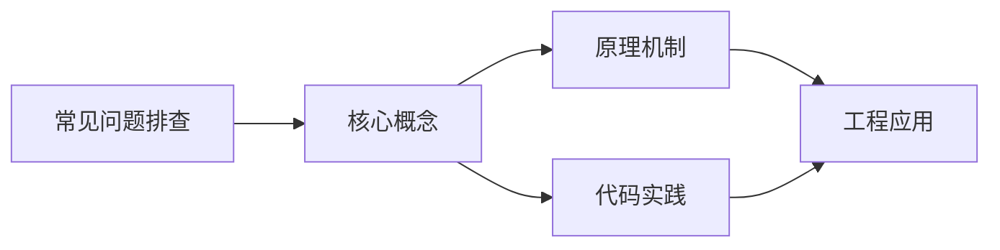
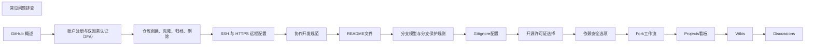

## 1. 学习目标（Bloom 分类）

本节按照布鲁姆教育目标分类学组织学习路径。本文主题为《常见问题排查》，属于 GitHub 模块，读者可以根据自身阶段选择阅读深度。

记忆层面：能够准确复述本文的核心概念、术语与基本语法或操作步骤，并能够在提问或检索时快速定位对应知识点。能够说出 GitHub 的核心概念、常用命令与流程。

理解层面：能够用自己的语言解释核心原理与工作机制，说明概念之间的因果关系，而不是机械记忆结论。能够解释 GitHub 的工作原理与设计动机。

应用层面：能够在真实项目或练习场景中运用本文知识解决具体问题，写出正确且可维护的实现。能够独立完成 GitHub 的标准操作。

分析层面：能够拆解复杂问题，比较本文主题与相邻概念的异同，识别边界条件与例外情况。能够分析 GitHub 使用中的异常与边界。

评价层面：能够根据约束条件（性能、可读性、安全、成本）评价不同方案的优劣，做出有依据的技术决策。能够评价 GitHub 相关工具与方案。

创造层面：能够把本文知识与其他模块知识组合，设计出新的解决方案或可复用的工程模式。能够把 GitHub 融入团队工作流。

通过本节学习，读者应当能够把《常见问题排查》纳入自己的知识网络，并与 GitHub 模块的其他主题（仓库、Issue、PR、Actions、生态）建立关联。

## 2. 历史动机与发展脉络

《常见问题排查》是 GitHub 领域的重要主题。要真正理解它，需要先了解它解决的问题与演进过程。

GitHub 2008 年上线，2018 年被微软收购，是全球最大的代码托管与协作平台；核心是 Git 之上的社交化协作层。
协作对象：Repository（仓库）、Issue（问题）、Pull Request（变更请求）、Discussion（讨论）、Actions（自动化）、Projects（看板）。
生态：GitHub Pages、Codespaces、Copilot、CodeQL、Packages；开放平台（REST/GraphQL API）支撑生态集成。

回到本文主题：常见问题排查 的提出与成熟，正是上述技术背景下的必然产物。早期实现往往以简单可用为目标，随着工程规模扩大，社区逐渐沉淀出标准做法与最佳实践；理解这一脉络，可以帮助读者判断“为什么文档中的推荐写法是现在这个样子”，也能在遇到历史遗留代码时准确识别其设计年代与取舍。


## 3. 形式化定义与核心概念精讲

本节把《常见问题排查》涉及的核心概念以“定义 + 讲解”的形式展开。读者应把定义当作工具，把讲解当作理解路径；两者结合才能形成可迁移的知识。

PR 流程：fork/branch -> 提交 -> PR -> 审查 -> 合并；审查通过保护规则（required reviews）。
Actions：workflow（YAML）由事件触发，job 在 runner 上执行 step；支持矩阵、缓存与密钥。
Issue 管理：标签、里程碑、模板；与 PR 通过关键词（fixes #123）自动关联。

### 3.1 原文章节逐一精讲

原文档把主题拆分为 11 个小节，下面按顺序给出每一节的导读讲解，随后保留原文细节供精读。

#### 原文精读（完整保留）


#### 1. 背景

本地与 CI 常见问题多与 **认证**、**历史中的二进制大文件**、**跨平台换行**、**子模块未初始化**、**签名密钥** 与 **配额** 相关。本节给出 **可复制的诊断命令** 与 **修复方向**。

#### 2. 认证问题

##### 2.1 Permission denied (publickey)

**现象**：`git push` 或 `ssh -T git@github.com` 失败，提示 `Permission denied (publickey)`。
**诊断**：

```bash
 # 检查 SSH 连接详细信息
 ssh -vT git@github.com
 # 检查 SSH 密钥列表
 ssh-add -l
 # 检查 SSH 配置
 cat ~/.ssh/config
```

**修复**：

1. **生成新的 SSH 密钥**（如果没有）：

```bash
 ssh-keygen -t ed25519 -C "your_email@example.com"
```

2. **添加 SSH 密钥到 ssh-agent**：

```bash
 eval "$(ssh-agent -s)"
 ssh-add ~/.ssh/id_ed25519
```

3. **将公钥添加到 GitHub**：

- 复制公钥内容：`cat ~/.ssh/id_ed25519.pub`
- 登录 GitHub，进入 **Settings → SSH and GPG keys → New SSH key**
- 粘贴公钥并保存

4. **检查 SSH 配置**：

```bash
 # 编辑 ~/.ssh/config
 Host github.com
 HostName github.com
 User git
 IdentityFile ~/.ssh/id_ed25519
```

##### 2.2 HTTPS 认证失败

**现象**：`git push` 失败，提示输入用户名和密码，但输入后仍然失败。
**诊断**：

```bash
 # 检查远程仓库 URL
 git remote -v
 # 检查 Git 凭据缓存
 git credential-cache status
```

**修复**：

1. **使用个人访问令牌（PAT）**：

- 登录 GitHub，进入 **Settings → Developer settings → Personal access tokens → Fine-grained tokens**
- 创建新令牌，设置适当的权限
- 使用令牌作为密码进行认证

2. **配置 Git 凭据缓存**：

```bash
 # 缓存凭据 1 小时
 git config --global credential.helper 'cache --timeout=3600'
```

3. **更新远程仓库 URL**：

```bash
 # 使用 HTTPS URL 并包含令牌
 git remote set-url origin https://<token>@github.com/username/repo.git
```

#### 3. 大文件问题

##### 3.1 推送被拒（超过 100MB）

**现象**：`git push` 失败，提示文件超过 100MB 限制。
**诊断**：

```bash
 # 查找仓库中的大文件
 git lfs ls-files
 # 查找历史中的大文件
 git rev-list --objects --all | grep -E "^[0-9a-f]{40} .{10,}$" | sort -k 2 -n -r | head -20
```

**修复**：

1. **使用 Git LFS** 跟踪大文件：

```bash
 # 安装 Git LFS
 git lfs install
 # 跟踪大文件类型
 git lfs track "*.psd"
 git lfs track "*.zip"
 # 提交 .gitattributes 文件
 git add .gitattributes
 git commit -m "Add Git LFS tracking"
```

2. **移除历史中的大文件**：

- 使用 `git filter-repo`：

```bash
 # 安装 git-filter-repo
 # 过滤大文件
 git filter-repo --path LARGE_FILE.bin --invert-paths
 # 强制推送
 git push --force origin main
```

- 使用 BFG Repo-Cleaner：

```bash
 # 下载 BFG
 java -jar bfg.jar --strip-blobs-bigger-than 100M
 git reflog expire --expire=now --all
 git gc --prune=now --aggressive
```

##### 3.2 Git LFS 相关问题

**现象**：Git LFS 跟踪的文件无法正确推送或拉取。
**诊断**：

```bash
 # 检查 Git LFS 状态
 git lfs status
 # 检查 Git LFS 配置
 git lfs config --list
```

**修复**：

1. **确保 Git LFS 已安装**：

```bash
 git lfs install
```

2. **重新推送 LFS 对象**：

```bash
 git lfs push --all origin
```

3. **拉取 LFS 对象**：

```bash
 git lfs pull
```

#### 4. 换行符问题

##### 4.1 LF / CRLF 冲突

**现象**：Windows 下整文件 **CRLF** 导致 diff 噪声或脚本 **shebang** 失败。
**诊断**：

```bash
 # 检查 Git 换行符配置
 git config --get core.autocrlf
 # 检查文件换行符类型
 file -k file.txt
```

**修复**：

1. **配置 Git 换行符处理**：

- Windows：`git config --global core.autocrlf `
- macOS/Linux：`git config --global core.autocrlf input`

2. **使用 .gitattributes 文件**：

```gitattributes
 # 自动处理文本文件
 * text=auto
 # 强制使用 LF
 *.sh text eol=lf
 *.py text eol=lf
 *.js text eol=lf
 # 强制使用 CRLF
 *.bat text eol=crlf
 *.cmd text eol=crlf
 # 二进制文件
 *.png binary
 *.jpg binary
 *.zip binary
```

3. **重新规范化所有文件**：

```bash
 git add --renormalize .
 git commit -m "Normalize line endings"
```

#### 5. 子模块问题

##### 5.1 子模块未初始化

**现象**：克隆后子目录空或旧版本。
**诊断**：

```bash
 # 检查子模块状态
 git submodule status
```

**修复**：

1. **初始化并更新子模块**：

```bash
 # 初始化子模块
 git submodule init
 # 更新子模块
 git submodule update
 # 递归初始化和更新（包含嵌套子模块）
 git submodule update --init --recursive
```

2. **克隆时直接初始化子模块**：

```bash
 git clone --recursive https://github.com/username/repo.git
```

##### 5.2 子模块版本更新

**现象**：子模块有新的提交，但主仓库未更新。
**修复**：

1. **更新子模块到最新版本**：

```bash
 cd submodule_directory
 git pull origin main
 cd ..
 git add submodule_directory
 git commit -m "Update submodule to latest version"
```

2. **批量更新所有子模块**：

```bash
 git submodule foreach git pull origin main
 git add .
 git commit -m "Update all submodules"
```

#### 6. 提交签名问题

##### 6.1 GPG 签名失败

**现象**：`git commit` 失败，提示 GPG 签名错误。
**诊断**：

```bash
 # 检查 GPG 密钥
  gpg --list-secret-keys --keyid-format LONG
 # 检查 Git GPG 配置
  git config --get user.signingkey
  git config --get commit.gpgsign
```

**修复**：

1. **生成 GPG 密钥**（如果没有）：

```bash
 gpg --full-generate-key
```

2. **配置 Git 使用 GPG 密钥**：

```bash
 # 获取 GPG 密钥 ID
 gpg --list-secret-keys --keyid-format LONG
 # 配置 Git
 git config --global user.signingkey <GPG_KEY_ID>
 git config --global commit.gpgsign
```

3. **将 GPG 公钥添加到 GitHub**：

```bash
 # 导出公钥
 gpg --armor --export <GPG_KEY_ID>
```

- 复制公钥内容
- 登录 GitHub，进入 **Settings → SSH and GPG keys → New GPG key**
- 粘贴公钥并保存

4. **解决 TTY 问题**：

```bash
 # 在 ~/.bashrc 或 ~/.zshrc 中添加
 export GPG_TTY=$(tty)
```

##### 6.2 SSH 签名

**现象**：使用 SSH 密钥进行提交签名。
**配置**：

1. **设置 Git 使用 SSH 签名**：

```bash
 git config --global gpg.format ssh
 git config --global user.signingkey ~/.ssh/id_ed25519.pub
 git config --global commit.gpgsign
```

2. **将 SSH 公钥添加到 GitHub**：

- 确保 SSH 公钥已添加到 GitHub
- 进入 **Settings → SSH and GPG keys** 确认

#### 7. GitHub Actions 问题

##### 7.1 Actions 分钟数耗尽

**现象**：私有库 workflow **排队/失败**，账单显示 **minutes** 用尽。
**诊断**：

```bash
 # 查看 Actions 使用情况
 # 在 GitHub 仓库 → Settings → Billing and plans → Actions
```

**修复**：

1. **优化 workflow**：

- 使用 **矩阵构建** 时合理设置组合
- 添加 **缓存** 减少依赖安装时间
- 限制 **并发** 运行的 workflow
- 使用 **条件执行** 减少不必要的运行

2. **使用自托管 runner**：

- 在 GitHub 仓库 → Settings → Actions → Runners → New self-hosted runner
- 按照说明安装和配置自托管 runner

3. **考虑开源仓库**：

- 公共仓库有更多的免费分钟数

##### 7.2 Actions 权限问题

**现象**：Actions 运行失败，提示权限不足。
**诊断**：

```yaml
# 检查 workflow 文件中的权限配置
permissions:
  contents: read
  packages: write
  # 其他需要的权限
```

**修复**：

1. **在 workflow 文件中设置正确的权限**：

```yaml
permissions:
contents: write
pull-requests: write
# 根据需要添加其他权限
```

2. **使用 `GITHUB_TOKEN`**：

- Actions 自动提供 `GITHUB_TOKEN` 环境变量
- 确保 workflow 中正确使用 `secrets.GITHUB_TOKEN`

3. **检查仓库设置**：

- 进入 GitHub 仓库 → Settings → Actions → General
- 确保 **Workflow permissions** 设置正确

##### 7.3 Actions 构建失败

**现象**：Actions 构建过程中失败。
**诊断**：

1. **查看 Actions 日志**：

- 进入 GitHub 仓库 → Actions
- 点击失败的 workflow → 查看详细日志

2. **常见失败原因**：

- 依赖安装失败
- 测试失败
- 构建命令错误
- 环境配置问题
  **修复**：

1. **修复依赖问题**：

- 检查 `package.json`、`requirements.txt` 等依赖文件
- 确保依赖版本兼容

2. **修复测试问题**：

- 检查测试代码和测试数据
- 确保测试环境配置正确

3. **修复构建命令**：

- 检查构建脚本和命令
- 确保构建环境正确

4. **添加调试信息**：

```yaml
 steps:
 - name: Debug information
 run: |
 echo "Node version: $(node -v)"
 echo "npm version: $(npm -v)"
 echo "Current directory: $(pwd)"
 ls -la
```

#### 8. 其他常见问题

##### 8.1 分支保护规则导致推送失败

**现象**：`git push` 失败，提示分支受保护。
**诊断**：

- 检查 GitHub 仓库 → Settings → Branches → Branch protection rules
  **修复**：

1. **创建 PR**：

- 推送到新分支
- 创建 PR 并请求审核

2. **临时禁用分支保护**（仅维护者）：

- 进入分支保护规则设置
- 临时禁用相关规则
- 推送后重新启用

##### 8.2 合并冲突

**现象**：合并 PR 时出现冲突。
**修复**：

1. **本地解决冲突**：

```bash
 # 拉取最新代码
 git pull origin main
 # 解决冲突
 # 编辑冲突文件
 # 标记冲突已解决
 git add .
 # 继续合并
 git commit
 # 推送
 git push
```

2. **使用 GitHub 网页界面解决冲突**：

- 进入 PR 页面
- 点击 "Resolve conflicts"
- 在网页编辑器中解决冲突
- 提交解决后的代码

##### 8.3 标签推送失败

**现象**：`git push --tags` 失败。
**修复**：

1. **检查权限**：确保有推送标签的权限
2. **强制推送标签**：

```bash
 git push --tags --force
```

3. **单独推送特定标签**：

```bash
 git push origin <tag_name>
```

#### 9. 综合诊断与预防

##### 9.1 综合诊断脚本

```bash
 #!/usr/bin/env bash
 set -euo pipefail
 # 基本信息
 echo "== 系统信息 =="
 uname -a
 echo "== Git 版本 =="
 git --version
 # 仓库信息
 echo "== 远程仓库 =="
 git remote -v
 echo "== 当前分支 =="
 git branch -vv
 echo "== 最近提交 =="
 git log -1 --oneline
 # 配置信息
 echo "== Git 配置 =="
 git config --list
 echo "== SSH 配置 =="
 cat ~/.ssh/config 2>/dev/null || echo "No SSH config"
 # 子模块信息
 echo "== 子模块状态 =="
 git submodule status 2>/dev/null || echo "No submodules"
 # LFS 信息
 echo "== LFS 状态 =="
 command -v git-lfs && git lfs version || echo "LFS not installed"
 command -v git-lfs && git lfs status 2>/dev/null || echo "No LFS status"
 # 换行符配置
 echo "== 换行符配置 =="
 git config --get core.autocrlf
 ls -la .gitattributes 2>/dev/null || echo "No .gitattributes"
 # GPG 信息
 echo "== GPG 状态 =="
 gpg --list-secret-keys --keyid-format LONG 2>/dev/null || echo "No GPG keys"
 git config --get user.signingkey 2>/dev/null || echo "No signing key configured"
 # 网络测试
 echo "== 网络测试 =="
 ping -c 3 github.com 2>/dev/null || echo "Ping failed"
 ssh -T git@github.com 2>&1 || echo "SSH test failed"
```

##### 9.2 预防措施

1. **使用 Git hooks**：

- **pre-commit**：检查提交信息、代码风格、大文件等
- **pre-push**：检查推送前的状态

2. **配置模板**：

- 提交信息模板
- PR 模板
- Issue 模板

3. **自动化工具**：

- **Dependabot**：自动更新依赖
- **Code Scanning**：自动代码安全扫描
- **Secret Scanning**：自动敏感信息扫描

4. **文档**：

- **CONTRIBUTING.md**：贡献指南
- **README.md**：项目说明
- **SECURITY.md**：安全漏洞上报流程

5. **培训**：

- 团队 Git 最佳实践培训
- 定期代码审查
- 常见问题分享会

#### 10. 实际案例分析

##### 10.1 案例一：SSH 认证失败

**问题**：开发者在新机器上克隆仓库时，提示 `Permission denied (publickey)`。
**原因**：新机器没有配置 SSH 密钥，或者密钥未添加到 GitHub。
**解决方案**：

1. 生成新的 SSH 密钥
2. 添加密钥到 ssh-agent
3. 将公钥添加到 GitHub
4. 验证连接

##### 10.2 案例二：大文件导致推送失败

**问题**：开发者尝试推送包含大文件的提交，提示文件超过 100MB 限制。
**原因**：GitHub 限制单个文件大小为 100MB。
**解决方案**：

1. 使用 Git LFS 跟踪大文件
2. 移除历史中的大文件
3. 重新推送

##### 10.3 案例三：Actions 构建失败

**问题**：GitHub Actions 构建失败，提示依赖安装失败。
**原因**：依赖版本不兼容，或者网络问题导致依赖下载失败。
**解决方案**：

1. 检查依赖文件
2. 配置缓存
3. 添加重试机制
4. 检查网络连接

#### 11. 延伸阅读

- [Troubleshooting connectivity](https://docs.github.com/en/authentication/troubleshooting-ssh) <!-- nofollow -->
- [Working with large files](https://docs.github.com/en/repositories/working-with-files/managing-large-files) <!-- nofollow -->
- [Configuring Git to handle line endings](https://docs.github.com/en/get-started/getting-started-with-git/configuring-git-to-handle-line-endings) <!-- nofollow -->
- [Working with submodules](https://docs.github.com/en/repositories/working-with-files/submodules) <!-- nofollow -->
- [About commit signature verification](https://docs.github.com/en/authentication/managing-commit-signature-verification/about-commit-signature-verification) <!-- nofollow -->
- [Managing GitHub Actions settings for a repository](https://docs.github.com/en/repositories/managing-your-repositorys-settings-and-features/enabling-features-for-your-repository/managing-github-actions-settings-for-a-repository) <!-- nofollow -->


### 3.2 概念关系图

下面用 Mermaid 图表达本文核心概念之间的关系，帮助读者建立整体图景：



图中展示的是本文知识的结构化关系：核心概念是入口，原理机制解释“为什么”，代码实践演示“怎么做”，工程应用回答“何时用”。读者学习时可以把每个小节的内容挂接到对应节点上。

## 4. 理论推导与原理解析

本节深入《常见问题排查》背后的原理。理论部分不求面面俱到，而是聚焦“能解释现象、能指导实践”的关键推导。

PR 流程：fork/branch -> 提交 -> PR -> 审查 -> 合并；审查通过保护规则（required reviews）。
Actions：workflow（YAML）由事件触发，job 在 runner 上执行 step；支持矩阵、缓存与密钥。
Issue 管理：标签、里程碑、模板；与 PR 通过关键词（fixes #123）自动关联。
权限与安全：仓库角色（read/triage/write/maintain/admin）、分支保护、CODEOWNERS、安全通告。

需要强调的是，理论推导与工程实践之间存在翻译层：理论给出的是理想化模型与边界条件，工程代码则必须处理真实环境中的例外。读者在学习时应先掌握理论的“标准情形”，再通过陷阱章节了解“非标准情形”。

## 5. 代码示例与逐行讲解

本节把原文中的代码示例系统整理，并为每个示例补充用途说明与讲解。读者不应只浏览代码，而应逐段对照讲解理解设计意图。

### 5.1 示例：2.1 Permission denied (publickey)

该示例来自原文《2.1 Permission denied (publickey)》小节，用于演示常见问题排查相关操作。阅读时请先看代码结构，再看其后的讲解。

```bash
 # 检查 SSH 连接详细信息
 ssh -vT git@github.com
 # 检查 SSH 密钥列表
 ssh-add -l
 # 检查 SSH 配置
 cat ~/.ssh/config
```

讲解：这段代码演示了本节核心知识点。代码中的关键操作可以归纳为三步：准备（定义或初始化）、执行（核心逻辑）、收尾（释放资源或返回结果）。实际项目中，这三步往往被封装为函数或类，以提升复用性与可测试性。

关键点分析：

该示例共 6 行有效代码，结构以数据或配置为主。阅读时应关注：数据字段的含义、配置项的作用，以及它们与运行行为的对应关系。

进阶思考路径：先尝试修改参数观察行为变化，再把示例中的模式迁移到自己的项目中；每次修改都记录预期与实测差异，这是把示例转化为能力的最快方式。

### 5.2 示例：2.1 Permission denied (publickey)

该示例来自原文《2.1 Permission denied (publickey)》小节，用于演示常见问题排查相关操作。阅读时请先看代码结构，再看其后的讲解。

```bash
 ssh-keygen -t ed25519 -C "your_email@example.com"
```

讲解：这段代码演示了本节核心知识点。代码中的关键操作可以归纳为三步：准备（定义或初始化）、执行（核心逻辑）、收尾（释放资源或返回结果）。实际项目中，这三步往往被封装为函数或类，以提升复用性与可测试性。

关键点分析：

该示例共 1 行有效代码，结构以数据或配置为主。阅读时应关注：数据字段的含义、配置项的作用，以及它们与运行行为的对应关系。

进阶思考路径：先尝试修改参数观察行为变化，再把示例中的模式迁移到自己的项目中；每次修改都记录预期与实测差异，这是把示例转化为能力的最快方式。

### 5.3 示例：2.1 Permission denied (publickey)

该示例来自原文《2.1 Permission denied (publickey)》小节，用于演示常见问题排查相关操作。阅读时请先看代码结构，再看其后的讲解。

```bash
 eval "$(ssh-agent -s)"
 ssh-add ~/.ssh/id_ed25519
```

讲解：这段代码演示了本节核心知识点。代码中的关键操作可以归纳为三步：准备（定义或初始化）、执行（核心逻辑）、收尾（释放资源或返回结果）。实际项目中，这三步往往被封装为函数或类，以提升复用性与可测试性。

关键点分析：

该示例共 2 行有效代码，结构以数据或配置为主。阅读时应关注：数据字段的含义、配置项的作用，以及它们与运行行为的对应关系。

进阶思考路径：先尝试修改参数观察行为变化，再把示例中的模式迁移到自己的项目中；每次修改都记录预期与实测差异，这是把示例转化为能力的最快方式。

### 5.4 示例：2.1 Permission denied (publickey)

该示例来自原文《2.1 Permission denied (publickey)》小节，用于演示常见问题排查相关操作。阅读时请先看代码结构，再看其后的讲解。

```bash
 # 编辑 ~/.ssh/config
 Host github.com
 HostName github.com
 User git
 IdentityFile ~/.ssh/id_ed25519
```

讲解：这段代码演示了本节核心知识点。代码中的关键操作可以归纳为三步：准备（定义或初始化）、执行（核心逻辑）、收尾（释放资源或返回结果）。实际项目中，这三步往往被封装为函数或类，以提升复用性与可测试性。

关键点分析：

该示例共 5 行有效代码，结构以数据或配置为主。阅读时应关注：数据字段的含义、配置项的作用，以及它们与运行行为的对应关系。

进阶思考路径：先尝试修改参数观察行为变化，再把示例中的模式迁移到自己的项目中；每次修改都记录预期与实测差异，这是把示例转化为能力的最快方式。

### 5.5 示例：2.2 HTTPS 认证失败

该示例来自原文《2.2 HTTPS 认证失败》小节，用于演示常见问题排查相关操作。阅读时请先看代码结构，再看其后的讲解。

```bash
 # 检查远程仓库 URL
 git remote -v
 # 检查 Git 凭据缓存
 git credential-cache status
```

讲解：这段代码演示了本节核心知识点。代码中的关键操作可以归纳为三步：准备（定义或初始化）、执行（核心逻辑）、收尾（释放资源或返回结果）。实际项目中，这三步往往被封装为函数或类，以提升复用性与可测试性。

关键点分析：

该示例共 4 行有效代码，结构以数据或配置为主。阅读时应关注：数据字段的含义、配置项的作用，以及它们与运行行为的对应关系。

进阶思考路径：先尝试修改参数观察行为变化，再把示例中的模式迁移到自己的项目中；每次修改都记录预期与实测差异，这是把示例转化为能力的最快方式。

### 5.6 示例：2.2 HTTPS 认证失败

该示例来自原文《2.2 HTTPS 认证失败》小节，用于演示常见问题排查相关操作。阅读时请先看代码结构，再看其后的讲解。

```bash
 # 缓存凭据 1 小时
 git config --global credential.helper 'cache --timeout=3600'
```

讲解：这段代码演示了本节核心知识点。代码中的关键操作可以归纳为三步：准备（定义或初始化）、执行（核心逻辑）、收尾（释放资源或返回结果）。实际项目中，这三步往往被封装为函数或类，以提升复用性与可测试性。

关键点分析：

该示例共 2 行有效代码，结构以数据或配置为主。阅读时应关注：数据字段的含义、配置项的作用，以及它们与运行行为的对应关系。

进阶思考路径：先尝试修改参数观察行为变化，再把示例中的模式迁移到自己的项目中；每次修改都记录预期与实测差异，这是把示例转化为能力的最快方式。

### 5.7 示例：2.2 HTTPS 认证失败

该示例来自原文《2.2 HTTPS 认证失败》小节，用于演示常见问题排查相关操作。阅读时请先看代码结构，再看其后的讲解。

```bash
 # 使用 HTTPS URL 并包含令牌
 git remote set-url origin https://<token>@github.com/username/repo.git
```

讲解：这段代码演示了本节核心知识点。代码中的关键操作可以归纳为三步：准备（定义或初始化）、执行（核心逻辑）、收尾（释放资源或返回结果）。实际项目中，这三步往往被封装为函数或类，以提升复用性与可测试性。

关键点分析：

该示例共 2 行有效代码，结构以数据或配置为主。阅读时应关注：数据字段的含义、配置项的作用，以及它们与运行行为的对应关系。

进阶思考路径：先尝试修改参数观察行为变化，再把示例中的模式迁移到自己的项目中；每次修改都记录预期与实测差异，这是把示例转化为能力的最快方式。

### 5.8 示例：3.1 推送被拒（超过 100MB）

该示例来自原文《3.1 推送被拒（超过 100MB）》小节，用于演示常见问题排查相关操作。阅读时请先看代码结构，再看其后的讲解。

```bash
 # 查找仓库中的大文件
 git lfs ls-files
 # 查找历史中的大文件
 git rev-list --objects --all | grep -E "^[0-9a-f]{40} .{10,}$" | sort -k 2 -n -r | head -20
```

讲解：这段代码演示了本节核心知识点。代码中的关键操作可以归纳为三步：准备（定义或初始化）、执行（核心逻辑）、收尾（释放资源或返回结果）。实际项目中，这三步往往被封装为函数或类，以提升复用性与可测试性。

关键点分析：

该示例共 4 行有效代码，结构以数据或配置为主。阅读时应关注：数据字段的含义、配置项的作用，以及它们与运行行为的对应关系。

进阶思考路径：先尝试修改参数观察行为变化，再把示例中的模式迁移到自己的项目中；每次修改都记录预期与实测差异，这是把示例转化为能力的最快方式。

### 5.9 示例：3.1 推送被拒（超过 100MB）

该示例来自原文《3.1 推送被拒（超过 100MB）》小节，用于演示常见问题排查相关操作。阅读时请先看代码结构，再看其后的讲解。

```bash
 # 安装 Git LFS
 git lfs install
 # 跟踪大文件类型
 git lfs track "*.psd"
 git lfs track "*.zip"
 # 提交 .gitattributes 文件
 git add .gitattributes
 git commit -m "Add Git LFS tracking"
```

讲解：这段代码演示了本节核心知识点。代码中的关键操作可以归纳为三步：准备（定义或初始化）、执行（核心逻辑）、收尾（释放资源或返回结果）。实际项目中，这三步往往被封装为函数或类，以提升复用性与可测试性。

关键点分析：

该示例共 8 行有效代码，结构以数据或配置为主。阅读时应关注：数据字段的含义、配置项的作用，以及它们与运行行为的对应关系。

进阶思考路径：先尝试修改参数观察行为变化，再把示例中的模式迁移到自己的项目中；每次修改都记录预期与实测差异，这是把示例转化为能力的最快方式。

### 5.10 示例：3.1 推送被拒（超过 100MB）

该示例来自原文《3.1 推送被拒（超过 100MB）》小节，用于演示常见问题排查相关操作。阅读时请先看代码结构，再看其后的讲解。

```bash
 # 安装 git-filter-repo
 # 过滤大文件
 git filter-repo --path LARGE_FILE.bin --invert-paths
 # 强制推送
 git push --force origin main
```

讲解：这段代码演示了本节核心知识点。代码中的关键操作可以归纳为三步：准备（定义或初始化）、执行（核心逻辑）、收尾（释放资源或返回结果）。实际项目中，这三步往往被封装为函数或类，以提升复用性与可测试性。

关键点分析：

该示例共 5 行有效代码，结构以数据或配置为主。阅读时应关注：数据字段的含义、配置项的作用，以及它们与运行行为的对应关系。

进阶思考路径：先尝试修改参数观察行为变化，再把示例中的模式迁移到自己的项目中；每次修改都记录预期与实测差异，这是把示例转化为能力的最快方式。

### 5.11 示例：3.1 推送被拒（超过 100MB）

该示例来自原文《3.1 推送被拒（超过 100MB）》小节，用于演示常见问题排查相关操作。阅读时请先看代码结构，再看其后的讲解。

```bash
 # 下载 BFG
 java -jar bfg.jar --strip-blobs-bigger-than 100M
 git reflog expire --expire=now --all
 git gc --prune=now --aggressive
```

讲解：这段代码演示了本节核心知识点。代码中的关键操作可以归纳为三步：准备（定义或初始化）、执行（核心逻辑）、收尾（释放资源或返回结果）。实际项目中，这三步往往被封装为函数或类，以提升复用性与可测试性。

关键点分析：

该示例共 4 行有效代码，结构以数据或配置为主。阅读时应关注：数据字段的含义、配置项的作用，以及它们与运行行为的对应关系。

进阶思考路径：先尝试修改参数观察行为变化，再把示例中的模式迁移到自己的项目中；每次修改都记录预期与实测差异，这是把示例转化为能力的最快方式。

### 5.12 示例：3.2 Git LFS 相关问题

该示例来自原文《3.2 Git LFS 相关问题》小节，用于演示常见问题排查相关操作。阅读时请先看代码结构，再看其后的讲解。

```bash
 # 检查 Git LFS 状态
 git lfs status
 # 检查 Git LFS 配置
 git lfs config --list
```

讲解：这段代码演示了本节核心知识点。代码中的关键操作可以归纳为三步：准备（定义或初始化）、执行（核心逻辑）、收尾（释放资源或返回结果）。实际项目中，这三步往往被封装为函数或类，以提升复用性与可测试性。

关键点分析：

该示例共 4 行有效代码，结构以数据或配置为主。阅读时应关注：数据字段的含义、配置项的作用，以及它们与运行行为的对应关系。

进阶思考路径：先尝试修改参数观察行为变化，再把示例中的模式迁移到自己的项目中；每次修改都记录预期与实测差异，这是把示例转化为能力的最快方式。

### 5.13 示例：3.2 Git LFS 相关问题

该示例来自原文《3.2 Git LFS 相关问题》小节，用于演示常见问题排查相关操作。阅读时请先看代码结构，再看其后的讲解。

```bash
 git lfs install
```

讲解：这段代码演示了本节核心知识点。代码中的关键操作可以归纳为三步：准备（定义或初始化）、执行（核心逻辑）、收尾（释放资源或返回结果）。实际项目中，这三步往往被封装为函数或类，以提升复用性与可测试性。

关键点分析：

该示例共 1 行有效代码，结构以数据或配置为主。阅读时应关注：数据字段的含义、配置项的作用，以及它们与运行行为的对应关系。

进阶思考路径：先尝试修改参数观察行为变化，再把示例中的模式迁移到自己的项目中；每次修改都记录预期与实测差异，这是把示例转化为能力的最快方式。

### 5.14 示例：3.2 Git LFS 相关问题

该示例来自原文《3.2 Git LFS 相关问题》小节，用于演示常见问题排查相关操作。阅读时请先看代码结构，再看其后的讲解。

```bash
 git lfs push --all origin
```

讲解：这段代码演示了本节核心知识点。代码中的关键操作可以归纳为三步：准备（定义或初始化）、执行（核心逻辑）、收尾（释放资源或返回结果）。实际项目中，这三步往往被封装为函数或类，以提升复用性与可测试性。

关键点分析：

该示例共 1 行有效代码，结构以数据或配置为主。阅读时应关注：数据字段的含义、配置项的作用，以及它们与运行行为的对应关系。

进阶思考路径：先尝试修改参数观察行为变化，再把示例中的模式迁移到自己的项目中；每次修改都记录预期与实测差异，这是把示例转化为能力的最快方式。

### 5.15 示例：3.2 Git LFS 相关问题

该示例来自原文《3.2 Git LFS 相关问题》小节，用于演示常见问题排查相关操作。阅读时请先看代码结构，再看其后的讲解。

```bash
 git lfs pull
```

讲解：这段代码演示了本节核心知识点。代码中的关键操作可以归纳为三步：准备（定义或初始化）、执行（核心逻辑）、收尾（释放资源或返回结果）。实际项目中，这三步往往被封装为函数或类，以提升复用性与可测试性。

关键点分析：

该示例共 1 行有效代码，结构以数据或配置为主。阅读时应关注：数据字段的含义、配置项的作用，以及它们与运行行为的对应关系。

进阶思考路径：先尝试修改参数观察行为变化，再把示例中的模式迁移到自己的项目中；每次修改都记录预期与实测差异，这是把示例转化为能力的最快方式。

### 5.16 示例：4.1 LF / CRLF 冲突

该示例来自原文《4.1 LF / CRLF 冲突》小节，用于演示常见问题排查相关操作。阅读时请先看代码结构，再看其后的讲解。

```bash
 # 检查 Git 换行符配置
 git config --get core.autocrlf
 # 检查文件换行符类型
 file -k file.txt
```

讲解：这段代码演示了本节核心知识点。代码中的关键操作可以归纳为三步：准备（定义或初始化）、执行（核心逻辑）、收尾（释放资源或返回结果）。实际项目中，这三步往往被封装为函数或类，以提升复用性与可测试性。

关键点分析：

该示例共 4 行有效代码，结构以数据或配置为主。阅读时应关注：数据字段的含义、配置项的作用，以及它们与运行行为的对应关系。

进阶思考路径：先尝试修改参数观察行为变化，再把示例中的模式迁移到自己的项目中；每次修改都记录预期与实测差异，这是把示例转化为能力的最快方式。

### 5.17 示例：4.1 LF / CRLF 冲突

该示例来自原文《4.1 LF / CRLF 冲突》小节，用于演示常见问题排查相关操作。阅读时请先看代码结构，再看其后的讲解。

```gitattributes
 # 自动处理文本文件
 * text=auto
 # 强制使用 LF
 *.sh text eol=lf
 *.py text eol=lf
 *.js text eol=lf
 # 强制使用 CRLF
 *.bat text eol=crlf
 *.cmd text eol=crlf
 # 二进制文件
 *.png binary
 *.jpg binary
 *.zip binary
```

讲解：这段代码演示了本节核心知识点。代码中的关键操作可以归纳为三步：准备（定义或初始化）、执行（核心逻辑）、收尾（释放资源或返回结果）。实际项目中，这三步往往被封装为函数或类，以提升复用性与可测试性。

关键点分析：

该示例共 13 行有效代码，结构以数据或配置为主。阅读时应关注：数据字段的含义、配置项的作用，以及它们与运行行为的对应关系。

进阶思考路径：先尝试修改参数观察行为变化，再把示例中的模式迁移到自己的项目中；每次修改都记录预期与实测差异，这是把示例转化为能力的最快方式。

### 5.18 示例：4.1 LF / CRLF 冲突

该示例来自原文《4.1 LF / CRLF 冲突》小节，用于演示常见问题排查相关操作。阅读时请先看代码结构，再看其后的讲解。

```bash
 git add --renormalize .
 git commit -m "Normalize line endings"
```

讲解：这段代码演示了本节核心知识点。代码中的关键操作可以归纳为三步：准备（定义或初始化）、执行（核心逻辑）、收尾（释放资源或返回结果）。实际项目中，这三步往往被封装为函数或类，以提升复用性与可测试性。

关键点分析：

该示例共 2 行有效代码，结构以数据或配置为主。阅读时应关注：数据字段的含义、配置项的作用，以及它们与运行行为的对应关系。

进阶思考路径：先尝试修改参数观察行为变化，再把示例中的模式迁移到自己的项目中；每次修改都记录预期与实测差异，这是把示例转化为能力的最快方式。

### 5.19 示例：5.1 子模块未初始化

该示例来自原文《5.1 子模块未初始化》小节，用于演示常见问题排查相关操作。阅读时请先看代码结构，再看其后的讲解。

```bash
 # 检查子模块状态
 git submodule status
```

讲解：这段代码演示了本节核心知识点。代码中的关键操作可以归纳为三步：准备（定义或初始化）、执行（核心逻辑）、收尾（释放资源或返回结果）。实际项目中，这三步往往被封装为函数或类，以提升复用性与可测试性。

关键点分析：

该示例共 2 行有效代码，结构以数据或配置为主。阅读时应关注：数据字段的含义、配置项的作用，以及它们与运行行为的对应关系。

进阶思考路径：先尝试修改参数观察行为变化，再把示例中的模式迁移到自己的项目中；每次修改都记录预期与实测差异，这是把示例转化为能力的最快方式。

### 5.20 示例：5.1 子模块未初始化

该示例来自原文《5.1 子模块未初始化》小节，用于演示常见问题排查相关操作。阅读时请先看代码结构，再看其后的讲解。

```bash
 # 初始化子模块
 git submodule init
 # 更新子模块
 git submodule update
 # 递归初始化和更新（包含嵌套子模块）
 git submodule update --init --recursive
```

讲解：这段代码演示了本节核心知识点。代码中的关键操作可以归纳为三步：准备（定义或初始化）、执行（核心逻辑）、收尾（释放资源或返回结果）。实际项目中，这三步往往被封装为函数或类，以提升复用性与可测试性。

关键点分析：

该示例共 6 行有效代码，结构以数据或配置为主。阅读时应关注：数据字段的含义、配置项的作用，以及它们与运行行为的对应关系。

进阶思考路径：先尝试修改参数观察行为变化，再把示例中的模式迁移到自己的项目中；每次修改都记录预期与实测差异，这是把示例转化为能力的最快方式。

### 5.21 示例：5.1 子模块未初始化

该示例来自原文《5.1 子模块未初始化》小节，用于演示常见问题排查相关操作。阅读时请先看代码结构，再看其后的讲解。

```bash
 git clone --recursive https://github.com/username/repo.git
```

讲解：这段代码演示了本节核心知识点。代码中的关键操作可以归纳为三步：准备（定义或初始化）、执行（核心逻辑）、收尾（释放资源或返回结果）。实际项目中，这三步往往被封装为函数或类，以提升复用性与可测试性。

关键点分析：

该示例共 1 行有效代码，结构以数据或配置为主。阅读时应关注：数据字段的含义、配置项的作用，以及它们与运行行为的对应关系。

进阶思考路径：先尝试修改参数观察行为变化，再把示例中的模式迁移到自己的项目中；每次修改都记录预期与实测差异，这是把示例转化为能力的最快方式。

### 5.22 示例：5.2 子模块版本更新

该示例来自原文《5.2 子模块版本更新》小节，用于演示常见问题排查相关操作。阅读时请先看代码结构，再看其后的讲解。

```bash
 cd submodule_directory
 git pull origin main
 cd ..
 git add submodule_directory
 git commit -m "Update submodule to latest version"
```

讲解：这段代码演示了本节核心知识点。代码中的关键操作可以归纳为三步：准备（定义或初始化）、执行（核心逻辑）、收尾（释放资源或返回结果）。实际项目中，这三步往往被封装为函数或类，以提升复用性与可测试性。

关键点分析：

该示例共 5 行有效代码，结构以数据或配置为主。阅读时应关注：数据字段的含义、配置项的作用，以及它们与运行行为的对应关系。

进阶思考路径：先尝试修改参数观察行为变化，再把示例中的模式迁移到自己的项目中；每次修改都记录预期与实测差异，这是把示例转化为能力的最快方式。

### 5.23 示例：5.2 子模块版本更新

该示例来自原文《5.2 子模块版本更新》小节，用于演示常见问题排查相关操作。阅读时请先看代码结构，再看其后的讲解。

```bash
 git submodule foreach git pull origin main
 git add .
 git commit -m "Update all submodules"
```

讲解：这段代码演示了本节核心知识点。代码中的关键操作可以归纳为三步：准备（定义或初始化）、执行（核心逻辑）、收尾（释放资源或返回结果）。实际项目中，这三步往往被封装为函数或类，以提升复用性与可测试性。

关键点分析：

该示例共 3 行有效代码，结构以数据或配置为主。阅读时应关注：数据字段的含义、配置项的作用，以及它们与运行行为的对应关系。

进阶思考路径：先尝试修改参数观察行为变化，再把示例中的模式迁移到自己的项目中；每次修改都记录预期与实测差异，这是把示例转化为能力的最快方式。

### 5.24 示例：6.1 GPG 签名失败

该示例来自原文《6.1 GPG 签名失败》小节，用于演示常见问题排查相关操作。阅读时请先看代码结构，再看其后的讲解。

```bash
 # 检查 GPG 密钥
  gpg --list-secret-keys --keyid-format LONG
 # 检查 Git GPG 配置
  git config --get user.signingkey
  git config --get commit.gpgsign
```

讲解：这段代码演示了本节核心知识点。代码中的关键操作可以归纳为三步：准备（定义或初始化）、执行（核心逻辑）、收尾（释放资源或返回结果）。实际项目中，这三步往往被封装为函数或类，以提升复用性与可测试性。

关键点分析：

该示例共 5 行有效代码，结构以数据或配置为主。阅读时应关注：数据字段的含义、配置项的作用，以及它们与运行行为的对应关系。

进阶思考路径：先尝试修改参数观察行为变化，再把示例中的模式迁移到自己的项目中；每次修改都记录预期与实测差异，这是把示例转化为能力的最快方式。

### 5.25 示例：6.1 GPG 签名失败

该示例来自原文《6.1 GPG 签名失败》小节，用于演示常见问题排查相关操作。阅读时请先看代码结构，再看其后的讲解。

```bash
 gpg --full-generate-key
```

讲解：这段代码演示了本节核心知识点。代码中的关键操作可以归纳为三步：准备（定义或初始化）、执行（核心逻辑）、收尾（释放资源或返回结果）。实际项目中，这三步往往被封装为函数或类，以提升复用性与可测试性。

关键点分析：

该示例共 1 行有效代码，结构以数据或配置为主。阅读时应关注：数据字段的含义、配置项的作用，以及它们与运行行为的对应关系。

进阶思考路径：先尝试修改参数观察行为变化，再把示例中的模式迁移到自己的项目中；每次修改都记录预期与实测差异，这是把示例转化为能力的最快方式。

### 5.26 示例：6.1 GPG 签名失败

该示例来自原文《6.1 GPG 签名失败》小节，用于演示常见问题排查相关操作。阅读时请先看代码结构，再看其后的讲解。

```bash
 # 获取 GPG 密钥 ID
 gpg --list-secret-keys --keyid-format LONG
 # 配置 Git
 git config --global user.signingkey <GPG_KEY_ID>
 git config --global commit.gpgsign
```

讲解：这段代码演示了本节核心知识点。代码中的关键操作可以归纳为三步：准备（定义或初始化）、执行（核心逻辑）、收尾（释放资源或返回结果）。实际项目中，这三步往往被封装为函数或类，以提升复用性与可测试性。

关键点分析：

该示例共 5 行有效代码，结构以数据或配置为主。阅读时应关注：数据字段的含义、配置项的作用，以及它们与运行行为的对应关系。

进阶思考路径：先尝试修改参数观察行为变化，再把示例中的模式迁移到自己的项目中；每次修改都记录预期与实测差异，这是把示例转化为能力的最快方式。

### 5.27 示例：6.1 GPG 签名失败

该示例来自原文《6.1 GPG 签名失败》小节，用于演示常见问题排查相关操作。阅读时请先看代码结构，再看其后的讲解。

```bash
 # 导出公钥
 gpg --armor --export <GPG_KEY_ID>
```

讲解：这段代码演示了本节核心知识点。代码中的关键操作可以归纳为三步：准备（定义或初始化）、执行（核心逻辑）、收尾（释放资源或返回结果）。实际项目中，这三步往往被封装为函数或类，以提升复用性与可测试性。

关键点分析：

该示例共 2 行有效代码，结构以数据或配置为主。阅读时应关注：数据字段的含义、配置项的作用，以及它们与运行行为的对应关系。

进阶思考路径：先尝试修改参数观察行为变化，再把示例中的模式迁移到自己的项目中；每次修改都记录预期与实测差异，这是把示例转化为能力的最快方式。

### 5.28 示例：6.1 GPG 签名失败

该示例来自原文《6.1 GPG 签名失败》小节，用于演示常见问题排查相关操作。阅读时请先看代码结构，再看其后的讲解。

```bash
 # 在 ~/.bashrc 或 ~/.zshrc 中添加
 export GPG_TTY=$(tty)
```

讲解：这段代码演示了本节核心知识点。代码中的关键操作可以归纳为三步：准备（定义或初始化）、执行（核心逻辑）、收尾（释放资源或返回结果）。实际项目中，这三步往往被封装为函数或类，以提升复用性与可测试性。

关键点分析：

该示例共 2 行有效代码，结构以数据或配置为主。阅读时应关注：数据字段的含义、配置项的作用，以及它们与运行行为的对应关系。

进阶思考路径：先尝试修改参数观察行为变化，再把示例中的模式迁移到自己的项目中；每次修改都记录预期与实测差异，这是把示例转化为能力的最快方式。

### 5.29 示例：6.2 SSH 签名

该示例来自原文《6.2 SSH 签名》小节，用于演示常见问题排查相关操作。阅读时请先看代码结构，再看其后的讲解。

```bash
 git config --global gpg.format ssh
 git config --global user.signingkey ~/.ssh/id_ed25519.pub
 git config --global commit.gpgsign
```

讲解：这段代码演示了本节核心知识点。代码中的关键操作可以归纳为三步：准备（定义或初始化）、执行（核心逻辑）、收尾（释放资源或返回结果）。实际项目中，这三步往往被封装为函数或类，以提升复用性与可测试性。

关键点分析：

该示例共 3 行有效代码，结构以数据或配置为主。阅读时应关注：数据字段的含义、配置项的作用，以及它们与运行行为的对应关系。

进阶思考路径：先尝试修改参数观察行为变化，再把示例中的模式迁移到自己的项目中；每次修改都记录预期与实测差异，这是把示例转化为能力的最快方式。

### 5.30 示例：7.1 Actions 分钟数耗尽

该示例来自原文《7.1 Actions 分钟数耗尽》小节，用于演示常见问题排查相关操作。阅读时请先看代码结构，再看其后的讲解。

```bash
 # 查看 Actions 使用情况
 # 在 GitHub 仓库 → Settings → Billing and plans → Actions
```

讲解：这段代码演示了本节核心知识点。代码中的关键操作可以归纳为三步：准备（定义或初始化）、执行（核心逻辑）、收尾（释放资源或返回结果）。实际项目中，这三步往往被封装为函数或类，以提升复用性与可测试性。

关键点分析：

该示例共 2 行有效代码，结构以数据或配置为主。阅读时应关注：数据字段的含义、配置项的作用，以及它们与运行行为的对应关系。

进阶思考路径：先尝试修改参数观察行为变化，再把示例中的模式迁移到自己的项目中；每次修改都记录预期与实测差异，这是把示例转化为能力的最快方式。

### 5.31 示例：7.2 Actions 权限问题

该示例来自原文《7.2 Actions 权限问题》小节，用于演示常见问题排查相关操作。阅读时请先看代码结构，再看其后的讲解。

```yaml
# 检查 workflow 文件中的权限配置
permissions:
  contents: read
  packages: write
  # 其他需要的权限
```

讲解：这段代码演示了本节核心知识点。代码中的关键操作可以归纳为三步：准备（定义或初始化）、执行（核心逻辑）、收尾（释放资源或返回结果）。实际项目中，这三步往往被封装为函数或类，以提升复用性与可测试性。

关键点分析：

该示例共 5 行有效代码，结构以数据或配置为主。阅读时应关注：数据字段的含义、配置项的作用，以及它们与运行行为的对应关系。

进阶思考路径：先尝试修改参数观察行为变化，再把示例中的模式迁移到自己的项目中；每次修改都记录预期与实测差异，这是把示例转化为能力的最快方式。

### 5.32 示例：7.2 Actions 权限问题

该示例来自原文《7.2 Actions 权限问题》小节，用于演示常见问题排查相关操作。阅读时请先看代码结构，再看其后的讲解。

```yaml
permissions:
contents: write
pull-requests: write
# 根据需要添加其他权限
```

讲解：这段代码演示了本节核心知识点。代码中的关键操作可以归纳为三步：准备（定义或初始化）、执行（核心逻辑）、收尾（释放资源或返回结果）。实际项目中，这三步往往被封装为函数或类，以提升复用性与可测试性。

关键点分析：

该示例共 4 行有效代码，结构以数据或配置为主。阅读时应关注：数据字段的含义、配置项的作用，以及它们与运行行为的对应关系。

进阶思考路径：先尝试修改参数观察行为变化，再把示例中的模式迁移到自己的项目中；每次修改都记录预期与实测差异，这是把示例转化为能力的最快方式。

### 5.33 示例：7.3 Actions 构建失败

该示例来自原文《7.3 Actions 构建失败》小节，用于演示常见问题排查相关操作。阅读时请先看代码结构，再看其后的讲解。

```yaml
 steps:
 - name: Debug information
 run: |
 echo "Node version: $(node -v)"
 echo "npm version: $(npm -v)"
 echo "Current directory: $(pwd)"
 ls -la
```

讲解：这段代码演示了本节核心知识点。代码中的关键操作可以归纳为三步：准备（定义或初始化）、执行（核心逻辑）、收尾（释放资源或返回结果）。实际项目中，这三步往往被封装为函数或类，以提升复用性与可测试性。

关键点分析：

该示例共 7 行有效代码，结构以数据或配置为主。阅读时应关注：数据字段的含义、配置项的作用，以及它们与运行行为的对应关系。

进阶思考路径：先尝试修改参数观察行为变化，再把示例中的模式迁移到自己的项目中；每次修改都记录预期与实测差异，这是把示例转化为能力的最快方式。

### 5.34 示例：8.2 合并冲突

该示例来自原文《8.2 合并冲突》小节，用于演示常见问题排查相关操作。阅读时请先看代码结构，再看其后的讲解。

```bash
 # 拉取最新代码
 git pull origin main
 # 解决冲突
 # 编辑冲突文件
 # 标记冲突已解决
 git add .
 # 继续合并
 git commit
 # 推送
 git push
```

讲解：这段代码演示了本节核心知识点。代码中的关键操作可以归纳为三步：准备（定义或初始化）、执行（核心逻辑）、收尾（释放资源或返回结果）。实际项目中，这三步往往被封装为函数或类，以提升复用性与可测试性。

关键点分析：

该示例共 10 行有效代码，结构以数据或配置为主。阅读时应关注：数据字段的含义、配置项的作用，以及它们与运行行为的对应关系。

进阶思考路径：先尝试修改参数观察行为变化，再把示例中的模式迁移到自己的项目中；每次修改都记录预期与实测差异，这是把示例转化为能力的最快方式。

### 5.35 示例：8.3 标签推送失败

该示例来自原文《8.3 标签推送失败》小节，用于演示常见问题排查相关操作。阅读时请先看代码结构，再看其后的讲解。

```bash
 git push --tags --force
```

讲解：这段代码演示了本节核心知识点。代码中的关键操作可以归纳为三步：准备（定义或初始化）、执行（核心逻辑）、收尾（释放资源或返回结果）。实际项目中，这三步往往被封装为函数或类，以提升复用性与可测试性。

关键点分析：

该示例共 1 行有效代码，结构以数据或配置为主。阅读时应关注：数据字段的含义、配置项的作用，以及它们与运行行为的对应关系。

进阶思考路径：先尝试修改参数观察行为变化，再把示例中的模式迁移到自己的项目中；每次修改都记录预期与实测差异，这是把示例转化为能力的最快方式。

### 5.36 示例：8.3 标签推送失败

该示例来自原文《8.3 标签推送失败》小节，用于演示常见问题排查相关操作。阅读时请先看代码结构，再看其后的讲解。

```bash
 git push origin <tag_name>
```

讲解：这段代码演示了本节核心知识点。代码中的关键操作可以归纳为三步：准备（定义或初始化）、执行（核心逻辑）、收尾（释放资源或返回结果）。实际项目中，这三步往往被封装为函数或类，以提升复用性与可测试性。

关键点分析：

该示例共 1 行有效代码，结构以数据或配置为主。阅读时应关注：数据字段的含义、配置项的作用，以及它们与运行行为的对应关系。

进阶思考路径：先尝试修改参数观察行为变化，再把示例中的模式迁移到自己的项目中；每次修改都记录预期与实测差异，这是把示例转化为能力的最快方式。

### 5.37 示例：9.1 综合诊断脚本

该示例来自原文《9.1 综合诊断脚本》小节，用于演示常见问题排查相关操作。阅读时请先看代码结构，再看其后的讲解。

```bash
 #!/usr/bin/env bash
 set -euo pipefail
 # 基本信息
 echo "== 系统信息 =="
 uname -a
 echo "== Git 版本 =="
 git --version
 # 仓库信息
 echo "== 远程仓库 =="
 git remote -v
 echo "== 当前分支 =="
 git branch -vv
 echo "== 最近提交 =="
 git log -1 --oneline
 # 配置信息
 echo "== Git 配置 =="
 git config --list
 echo "== SSH 配置 =="
 cat ~/.ssh/config 2>/dev/null || echo "No SSH config"
 # 子模块信息
 echo "== 子模块状态 =="
 git submodule status 2>/dev/null || echo "No submodules"
 # LFS 信息
 echo "== LFS 状态 =="
 command -v git-lfs && git lfs version || echo "LFS not installed"
 command -v git-lfs && git lfs status 2>/dev/null || echo "No LFS status"
 # 换行符配置
 echo "== 换行符配置 =="
 git config --get core.autocrlf
 ls -la .gitattributes 2>/dev/null || echo "No .gitattributes"
 # GPG 信息
 echo "== GPG 状态 =="
 gpg --list-secret-keys --keyid-format LONG 2>/dev/null || echo "No GPG keys"
 git config --get user.signingkey 2>/dev/null || echo "No signing key configured"
 # 网络测试
 echo "== 网络测试 =="
 ping -c 3 github.com 2>/dev/null || echo "Ping failed"
 ssh -T git@github.com 2>&1 || echo "SSH test failed"
```

讲解：这段代码演示了本节核心知识点。代码中的关键操作可以归纳为三步：准备（定义或初始化）、执行（核心逻辑）、收尾（释放资源或返回结果）。实际项目中，这三步往往被封装为函数或类，以提升复用性与可测试性。

关键点分析：

该示例共 38 行有效代码，结构以数据或配置为主。阅读时应关注：数据字段的含义、配置项的作用，以及它们与运行行为的对应关系。

进阶思考路径：先尝试修改参数观察行为变化，再把示例中的模式迁移到自己的项目中；每次修改都记录预期与实测差异，这是把示例转化为能力的最快方式。


综合以上示例，可以总结出本主题的代码实践要点：第一，先定义清晰的输入输出契约；第二，核心逻辑保持单一职责；第三，错误处理与边界条件不可省略；第四，命名与注释表达意图而非复述代码。

## 6. 对比分析

对比是理解《常见问题排查》定位的最快路径。下面从多个维度与相邻方案进行对比。

GitHub 与 GitLab：GitHub 社区大、生态全；GitLab 内置 CI/CD 与自托管。
PR 与 Issue：PR 是代码变更请求，Issue 是任务/缺陷；两者关联形成闭环。
公有与私有仓库：开源公开协作，内部代码私有 + 精细权限。

对比的目的不是分出绝对优劣，而是建立选择依据：不同约束条件下，最优解不同。读者应把每个对比维度转化为决策检查清单。

## 7. 常见陷阱与最佳实践

本节整理该主题的高频错误与推荐做法。每个陷阱先描述现象，再解释原因，最后给出最佳实践。

### 7.1 直接推主分支

绕过审查。启用分支保护 + 强制 PR。

深入讲解：该问题之所以被归类为“常见陷阱”，是因为它在初学者的代码中反复出现，而且往往不在第一时间暴露——错误通常隐藏在特定数据或特定时序下。

从成因上看，直接推主分支 一般源于对 GitHub 某个机制的理解偏差：要么误用了默认行为，要么忽略了边界条件，要么把其他语言的思维惯性带了过来。

从影响上看，直接推主分支 轻则产生错误结果，重则导致资源泄漏、数据损坏或安全事故；这也是为什么工程评审中会把它列为检查项。

从修复策略上看，处理直接推主分支的正确顺序是：先复现（构造最小用例），再定位（确认机制层面的根因），最后修复并补充回归测试。跳过复现直接改代码，往往治标不治本。

### 7.2 密钥写进 Actions 文件

泄露。使用 repository secrets 与 OIDC。

深入讲解：该问题之所以被归类为“常见陷阱”，是因为它在初学者的代码中反复出现，而且往往不在第一时间暴露——错误通常隐藏在特定数据或特定时序下。

从成因上看，密钥写进 Actions 文件 一般源于对 GitHub 某个机制的理解偏差：要么误用了默认行为，要么忽略了边界条件，要么把其他语言的思维惯性带了过来。

从影响上看，密钥写进 Actions 文件 轻则产生错误结果，重则导致资源泄漏、数据损坏或安全事故；这也是为什么工程评审中会把它列为检查项。

从修复策略上看，处理密钥写进 Actions 文件的正确顺序是：先复现（构造最小用例），再定位（确认机制层面的根因），最后修复并补充回归测试。跳过复现直接改代码，往往治标不治本。

### 7.3 PR 过大

难以审查。小 PR + 清晰描述。

深入讲解：该问题之所以被归类为“常见陷阱”，是因为它在初学者的代码中反复出现，而且往往不在第一时间暴露——错误通常隐藏在特定数据或特定时序下。

从成因上看，PR 过大 一般源于对 GitHub 某个机制的理解偏差：要么误用了默认行为，要么忽略了边界条件，要么把其他语言的思维惯性带了过来。

从影响上看，PR 过大 轻则产生错误结果，重则导致资源泄漏、数据损坏或安全事故；这也是为什么工程评审中会把它列为检查项。

从修复策略上看，处理PR 过大的正确顺序是：先复现（构造最小用例），再定位（确认机制层面的根因），最后修复并补充回归测试。跳过复现直接改代码，往往治标不治本。

### 7.4 忽略 CODEOWNERS

关键代码无人审查。配置并强制执行。

深入讲解：该问题之所以被归类为“常见陷阱”，是因为它在初学者的代码中反复出现，而且往往不在第一时间暴露——错误通常隐藏在特定数据或特定时序下。

从成因上看，忽略 CODEOWNERS 一般源于对 GitHub 某个机制的理解偏差：要么误用了默认行为，要么忽略了边界条件，要么把其他语言的思维惯性带了过来。

从影响上看，忽略 CODEOWNERS 轻则产生错误结果，重则导致资源泄漏、数据损坏或安全事故；这也是为什么工程评审中会把它列为检查项。

从修复策略上看，处理忽略 CODEOWNERS的正确顺序是：先复现（构造最小用例），再定位（确认机制层面的根因），最后修复并补充回归测试。跳过复现直接改代码，往往治标不治本。

### 7.5 依赖漏洞不处理

Dependabot 告警堆积。自动化更新与合并。

深入讲解：该问题之所以被归类为“常见陷阱”，是因为它在初学者的代码中反复出现，而且往往不在第一时间暴露——错误通常隐藏在特定数据或特定时序下。

从成因上看，依赖漏洞不处理 一般源于对 GitHub 某个机制的理解偏差：要么误用了默认行为，要么忽略了边界条件，要么把其他语言的思维惯性带了过来。

从影响上看，依赖漏洞不处理 轻则产生错误结果，重则导致资源泄漏、数据损坏或安全事故；这也是为什么工程评审中会把它列为检查项。

从修复策略上看，处理依赖漏洞不处理的正确顺序是：先复现（构造最小用例），再定位（确认机制层面的根因），最后修复并补充回归测试。跳过复现直接改代码，往往治标不治本。

### 7.6 fork 后不同步

上游更新丢失。配置上游 remote 定期同步。

深入讲解：该问题之所以被归类为“常见陷阱”，是因为它在初学者的代码中反复出现，而且往往不在第一时间暴露——错误通常隐藏在特定数据或特定时序下。

从成因上看，fork 后不同步 一般源于对 GitHub 某个机制的理解偏差：要么误用了默认行为，要么忽略了边界条件，要么把其他语言的思维惯性带了过来。

从影响上看，fork 后不同步 轻则产生错误结果，重则导致资源泄漏、数据损坏或安全事故；这也是为什么工程评审中会把它列为检查项。

从修复策略上看，处理fork 后不同步的正确顺序是：先复现（构造最小用例），再定位（确认机制层面的根因），最后修复并补充回归测试。跳过复现直接改代码，往往治标不治本。

### 7.7 滥用 force push

覆盖他人工作。仅个人分支。

深入讲解：该问题之所以被归类为“常见陷阱”，是因为它在初学者的代码中反复出现，而且往往不在第一时间暴露——错误通常隐藏在特定数据或特定时序下。

从成因上看，滥用 force push 一般源于对 GitHub 某个机制的理解偏差：要么误用了默认行为，要么忽略了边界条件，要么把其他语言的思维惯性带了过来。

从影响上看，滥用 force push 轻则产生错误结果，重则导致资源泄漏、数据损坏或安全事故；这也是为什么工程评审中会把它列为检查项。

从修复策略上看，处理滥用 force push的正确顺序是：先复现（构造最小用例），再定位（确认机制层面的根因），最后修复并补充回归测试。跳过复现直接改代码，往往治标不治本。

### 7.8 Issue 无模板

信息不全。配置 issue/PR 模板。

深入讲解：该问题之所以被归类为“常见陷阱”，是因为它在初学者的代码中反复出现，而且往往不在第一时间暴露——错误通常隐藏在特定数据或特定时序下。

从成因上看，Issue 无模板 一般源于对 GitHub 某个机制的理解偏差：要么误用了默认行为，要么忽略了边界条件，要么把其他语言的思维惯性带了过来。

从影响上看，Issue 无模板 轻则产生错误结果，重则导致资源泄漏、数据损坏或安全事故；这也是为什么工程评审中会把它列为检查项。

从修复策略上看，处理Issue 无模板的正确顺序是：先复现（构造最小用例），再定位（确认机制层面的根因），最后修复并补充回归测试。跳过复现直接改代码，往往治标不治本。

### 7.0 最佳实践总览

1. 仓库健康：README、LICENSE、CONTRIBUTING、模板齐全。
2. 自动化：CI 门禁、Dependabot、CodeQL、自动标签。
3. 发布：GitHub Releases + CHANGELOG；语义化版本。

把这些最佳实践固化为团队规范与代码评审检查项，是避免同类问题反复出现的关键。

## 8. 工程实践

本节把《常见问题排查》放入真实工程场景，给出可复用的模式与组织方法。

组织管理：Teams 分权、SAMLOIDC 单点登录、审计日志。
开源治理：行为准则、贡献指南、维护者矩阵。
度量：PR 周期、合并率、Issue 响应时间驱动改进。

### 8.1 工程实践的原则拆解

以上工程实践可以归纳为四条原则。第一，配置与代码分离：GitHub 项目中环境差异应通过配置注入，而不是散落在代码分支中；这保证同一份代码可以在开发、测试、生产环境一致运行。

第二，接口稳定优先：对外接口（函数签名、协议、数据格式）一旦被消费方依赖，变更成本极高；设计时应预留扩展点并保持向后兼容。

第三，可观测性内置：日志、指标与追踪应该在功能开发时同步设计，而不是故障发生后补救；没有观测手段的模块等于黑盒。

第四，变更可回滚：任何发布都应有对应的回滚方案；数据库迁移、配置变更与代码发布一样需要版本管理与逆向路径。

### 8.2 实践落地的检查清单

- [ ] 组织管理：对照本节描述，检查当前项目是否已经落实；未落实的项列入技术债并排期处理。
- [ ] 开源治理：对照本节描述，检查当前项目是否已经落实；未落实的项列入技术债并排期处理。
- [ ] 度量：对照本节描述，检查当前项目是否已经落实；未落实的项列入技术债并排期处理。

工程实践的共性原则：配置与代码分离、接口稳定优先、可观测性内置、变更可回滚。这些原则适用于本主题的所有实现。

## 9. 案例研究

本节通过一个完整案例把《常见问题排查》的知识串起来。案例按“需求分析、方案设计、实现、验证”四步展开。

需求：为开源项目建立高质量协作流程。
方案：模板 + 分支保护 + CI + Dependabot + 发布流程。
要点：自动化检查前置、审查清单、安全扫描。
验证：贡献者体验调查与流程指标。

### 9.1 案例的扩展讨论

把案例中的方案放大到真实规模，需要额外考虑三个问题：

第一，规模：当数据量或并发量上升一个数量级时，原方案中的数据结构、缓存策略与任务调度是否仍然成立？通常需要引入分层与异步。

第二，团队：多人协作时，模块边界、接口契约与代码所有权必须明确；案例中的实现应拆分为可独立测试的单元，并配合文档说明设计意图。

第三，演进：上线后的需求变化不可避免；方案设计时应预留扩展点（配置化、插件化、事件化），并定期用真实指标验证假设。


案例研究的学习方法：先独立阅读需求，尝试在脑中形成方案，再对照实现与讲解，最后思考“如果约束变化（数据量、并发、团队规模），方案应如何调整”。

## 10. 知识要点总结与深入讲解

本节以讲解形式汇总全文要点，替代传统的习题与自测，读者不需要答题，只需跟随解释建立完整的认知框架。

关于《常见问题排查》的核心结论：

GitHub 的价值是协作闭环：Issue 到 PR 到发布全部可追踪。
自动化（Actions）与安全是平台能力的双翼。
规范模板让外部贡献者低成本参与。

原文档各小节的要点回顾：

- 1. 背景：该小节围绕常见问题排查展开具体细节，阅读时应关注其与核心结论的对应关系；每个小节都是核心结论在某一个侧面的展开。
- 2. 认证问题：该小节围绕常见问题排查展开具体细节，阅读时应关注其与核心结论的对应关系；每个小节都是核心结论在某一个侧面的展开。
- 3. 大文件问题：该小节围绕常见问题排查展开具体细节，阅读时应关注其与核心结论的对应关系；每个小节都是核心结论在某一个侧面的展开。
- 4. 换行符问题：该小节围绕常见问题排查展开具体细节，阅读时应关注其与核心结论的对应关系；每个小节都是核心结论在某一个侧面的展开。
- 5. 子模块问题：该小节围绕常见问题排查展开具体细节，阅读时应关注其与核心结论的对应关系；每个小节都是核心结论在某一个侧面的展开。
- 6. 提交签名问题：该小节围绕常见问题排查展开具体细节，阅读时应关注其与核心结论的对应关系；每个小节都是核心结论在某一个侧面的展开。
- 7. GitHub Actions 问题：该小节围绕常见问题排查展开具体细节，阅读时应关注其与核心结论的对应关系；每个小节都是核心结论在某一个侧面的展开。
- 8. 其他常见问题：该小节围绕常见问题排查展开具体细节，阅读时应关注其与核心结论的对应关系；每个小节都是核心结论在某一个侧面的展开。
- 9. 综合诊断与预防：该小节围绕常见问题排查展开具体细节，阅读时应关注其与核心结论的对应关系；每个小节都是核心结论在某一个侧面的展开。
- 10. 实际案例分析：该小节围绕常见问题排查展开具体细节，阅读时应关注其与核心结论的对应关系；每个小节都是核心结论在某一个侧面的展开。
- 11. 延伸阅读：该小节围绕常见问题排查展开具体细节，阅读时应关注其与核心结论的对应关系；每个小节都是核心结论在某一个侧面的展开。

把以上要点与第 3-9 节的内容对照复习，即可完成对本文主题的闭环学习。

## 11. 参考文献


GitHub 文档：https://docs.github.com/zh
GitHub Actions 文档：https://docs.github.com/zh/actions
GitHub REST API：https://docs.github.com/zh/rest
GitHub GraphQL API：https://docs.github.com/zh/graphql

## 12. 延伸阅读


GitHub Actions CI/CD，见 004-github 模块 Actions 文档。
Git 协作基础，见 003-git 模块。
DevOps 自动化，见 031-devops 模块。
黑马程序员 Bilibili 空间（https://space.bilibili.com/37974444 ）提供 GitHub 课程。

## 14. 模块知识图谱与学习路径

本文属于 GitHub 模块。为了把《常见问题排查》放入完整的知识网络，下面列出本模块的全部主题并给出相互关联的导读。学习时建议按模块内顺序推进，并在每个文档中留意交叉引用。



上图为模块主题的推荐学习顺序示意图（仅展示前若干主题）。各主题之间存在三类关联：

第一，前置依赖关系：早期主题是后期主题的基础，例如环境与语法先行、进阶主题随后；

第二，横向并列关系：同一层级主题从不同角度覆盖模块能力，学习顺序可以按兴趣调整；

第三，工程组合关系：多个主题在真实项目中组合使用，例如配置、性能与安全主题往往出现在同一系统的不同层面。

### 14.1 模块主题速查表

| 文档 | 主题 | 与本文的关联 |
| --- | --- | --- |
| GitHub 概述 | 001-GitHubOverview | 本文的前置基础 |
| 账户注册与双因素认证（2FA） | 002-AccountRegister2FA2FA | 本文的并列主题 |
| 仓库创建、克隆、归档、删除 | 003-RepositoryCreateCloneArchiveDelete | 本文的并列主题 |
| SSH 与 HTTPS 远程配置 | 004-SSHHTTPS | 本文的并列主题 |
| 协作开发规范 | 005-CollaborationDevelopmentStandard | 本文的并列主题 |
| README文件 | 006-READMEFile | 本文的并列主题 |
| 分支模型与分支保护规则 | 007-BranchModelBranchRule | 本文的并列主题 |
| Gitignore配置 | 008-GitignoreConfig | 本文的并列主题 |
| 开源许可证选择 | 009-OpenSourceLicense | 本文的并列主题 |
| 依赖安全选项 | 010-DependencySecurityOptions | 本文的安全延伸 |
| Fork工作流 | 011-ForkWorkflow | 本文的并列主题 |
| Projects看板 | 012-ProjectsBoard | 本文的并列主题 |
| Wikis | 013-Wikis | 本文的并列主题 |
| Discussions | 014-Discussions | 本文的并列主题 |
| GitHub-Copilot | 015-GitHubCopilot | 本文的并列主题 |
| Dependabot | 016-Dependabot | 本文的并列主题 |
| Issues 模板、标签与里程碑 | 017-IssuesTemplateTagMilestone | 本文的并列主题 |
| 密钥扫描 | 018-SecretScanning | 本文的并列主题 |
| CodeQL代码扫描 | 019-CodeQLCodeScanning | 本文的并列主题 |
| GitHub-CLI | 020-GitHubCLI | 本文的并列主题 |
| REST与GraphQL-API | 021-RESTGraphQLAPI | 本文的并列主题 |
| Webhooks | 022-Webhooks | 本文的并列主题 |
| GitHub-Packages | 023-GitHubPackages | 本文的并列主题 |
| Codespaces | 024-Codespaces | 本文的并列主题 |
| CODEOWNERS | 025-CODEOWNERS | 本文的并列主题 |
| 社区健康文件 | 026-CommunityHealthFile | 本文的并列主题 |
| Pull Request 完整协作流程 | 027-PullRequestCompleteCollaborationFlow | 本文的并列主题 |
| GitHub Pages 多站点方案 | 028-GitHubPagesMultiSolution | 本文的并列主题 |
| GitHub Actions 与 CI/CD | 029-GitHubActionsCICD | 本文的并列主题 |
| Actions触发器 | 030-ActionsTrigger | 本文的并列主题 |
| 常见问题排查 | 031-FAQTroubleshoot | 本文自身 |
| Actions矩阵构建 | 032-ActionsMatrixBuild | 本文的并列主题 |
| Actions缓存依赖 | 033-ActionsCacheDependency | 本文的并列主题 |
| Actions自托管运行器 | 034-ActionsSelfHostedRunner | 本文的并列主题 |
| Actions制品传递 | 035-ActionsArtifact | 本文的并列主题 |
| Actions环境部署 | 036-ActionsEnvironmentDeploy | 本文的前置基础 |
| GitHub 仓库初始化 | 037-GitRepoInit | 本文的并列主题 |
| GitHub 提交与推送 | 038-GitCommitPush | 本文的并列主题 |
| GitHub 拉取与获取 | 039-GitPullFetch | 本文的并列主题 |
| GitHub 合并与变基 | 040-GitMergeRebase | 本文的并列主题 |
| GitHub 冲突解决 | 041-GitConflictResolve | 本文的并列主题 |
| GitHub 标签管理 | 042-GitTagManage | 本文的并列主题 |
| GitHub 远程仓库管理 | 043-GitRemoteManage | 本文的并列主题 |
| GitHub 历史与日志 | 044-GitHistoryLog | 本文的并列主题 |
| GitHub 暂存与回退 | 045-GitStashReset | 本文的并列主题 |
| GitHub CLI 认证配置 | 046-GhCliAuth | 本文的并列主题 |
| GitHub CLI PR 管理 | 047-GhPrManage | 本文的并列主题 |
| GitHub CLI Issue 管理 | 048-GhIssueManage | 本文的并列主题 |
| GitHub CLI 仓库管理 | 049-GhRepoManage | 本文的并列主题 |
| gh release 发布命令速查手册 | 050-GhRelease | 本文的并列主题 |
| gh workflow 工作流命令速查手册 | 051-GhWorkflow | 本文的并列主题 |
| gh gist 代码片段命令速查手册 | 052-GhGist | 本文的并列主题 |
| gh extension 扩展命令速查手册 | 053-GhExtension | 本文的并列主题 |
| gh api 调用命令速查手册 | 054-GhApi | 本文的并列主题 |
| gh search 搜索命令速查手册 | 055-GhSearch | 本文的并列主题 |
| gh label 与 alias/config 命令速查手册 | 056-GhLabel | 本文的并列主题 |
| gh alias 与 config 命令速查手册 | 057-GhAliasConfig | 本文的并列主题 |

速查表的作用是让读者快速判断：哪些文档应在阅读本文前掌握（前置基础），哪些文档应在阅读本文后继续（延伸主题）。本模块的交叉引用体系即以此表为基础。

## 15. 术语表

下表整理《常见问题排查》及 GitHub 模块中出现的高频术语，给出简明释义。术语按字母序或逻辑序排列，供查阅。

| 术语 | 释义 |
| --- | --- |
| PR 流程 | fork/branch -> 提交 -> PR -> 审查 -> 合并；审查通过保护规则（required reviews）。 |
| Actions | workflow（YAML）由事件触发，job 在 runner 上执行 step；支持矩阵、缓存与密钥。 |
| Issue 管理 | 标签、里程碑、模板；与 PR 通过关键词（fixes #123）自动关联。 |
| 权限与安全 | 仓库角色（read/triage/write/maintain/admin）、分支保护、CODEOWNERS、安全通告。 |
| 直接推主分支（易错点） | 参见常见陷阱章节的详细讲解 |
| 密钥写进 Actions 文件（易错点） | 参见常见陷阱章节的详细讲解 |
| PR 过大（易错点） | 参见常见陷阱章节的详细讲解 |
| 忽略 CODEOWNERS（易错点） | 参见常见陷阱章节的详细讲解 |
| 依赖漏洞不处理（易错点） | 参见常见陷阱章节的详细讲解 |
| fork 后不同步（易错点） | 参见常见陷阱章节的详细讲解 |

术语表与正文配合使用：先通读正文，遇到模糊术语回查本表；长期使用后术语会自然进入工作记忆。
