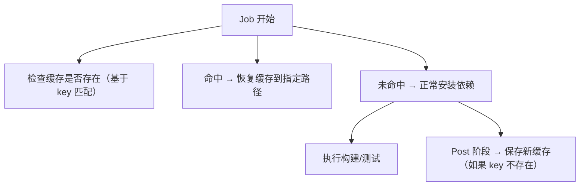

## 1. 缓存机制原理

### 1.1 缓存工作流程



### 1.2 缓存限制

| 限制项       | 值                       |
| ------------ | ------------------------ |
| 单个缓存大小 | 最大 10 GB               |
| 仓库总缓存   | 最大 10 GB               |
| 缓存保留时间 | 7 天未访问自动删除       |
| 缓存范围     | 同一仓库的所有分支可共享 |

## 2. actions/cache 使用

### 2.1 基本用法

```yaml
- uses: actions/cache@v4
  with:
    path: |
      ~/.npm
      node_modules
    key: npm-${{ runner.os }}-${{ hashFiles('package-lock.json') }}
    restore-keys: |
      npm-${{ runner.os }}-
```

### 2.2 参数详解

| 参数                | 说明                                 |
| ------------------- | ------------------------------------ |
| `path`              | 要缓存/恢复的路径，支持多路径和 glob |
| `key`               | 缓存键，用于精确匹配                 |
| `restore-keys`      | 回退键前缀，用于部分匹配             |
| `upload-chunk-size` | 上传分块大小（默认 32MB）            |

### 2.3 缓存匹配逻辑

```
1. 精确匹配 key
   npm-linux-abc123  → 命中 → 恢复，跳过保存

2. 未精确匹配，按 restore-keys 顺序前缀匹配
   npm-linux-xyz789  → 命中 → 恢复，Post 阶段用新 key 保存

3. 都未命中
   → 不恢复，Post 阶段用新 key 保存
```

## 3. 各语言缓存配置

### 3.1 Node.js / npm

```yaml
- uses: actions/cache@v4
  with:
    path: ~/.npm
    key: npm-${{ runner.os }}-${{ hashFiles('**/package-lock.json') }}
    restore-keys: npm-${{ runner.os }}-

- run: npm ci # npm ci 利用缓存加速安装
```

使用 `setup-node` 内置缓存：

```yaml
- uses: actions/setup-node@v4
  with:
    node-version: 22
    cache: npm # 自动缓存 ~/.npm
```

### 3.2 Python / pip

```yaml
- uses: actions/cache@v4
  with:
    path: ~/.cache/pip
    key: pip-${{ runner.os }}-${{ hashFiles('requirements.txt') }}
    restore-keys: pip-${{ runner.os }}-

- run: pip install -r requirements.txt
```

### 3.3 Go

```yaml
- uses: actions/cache@v4
  with:
    path: |
      ~/go/pkg/mod
      ~/.cache/go-build
    key: go-${{ runner.os }}-${{ hashFiles('go.sum') }}
    restore-keys: go-${{ runner.os }}-

- run: go mod download
```

### 3.4 Java / Gradle

```yaml
- uses: actions/cache@v4
  with:
    path: |
      ~/.gradle/caches
      ~/.gradle/wrapper
    key: gradle-${{ runner.os }}-${{ hashFiles('**/*.gradle*', '**/gradle-wrapper.properties') }}
    restore-keys: gradle-${{ runner.os }}-
```

### 3.5 Rust / Cargo

```yaml
- uses: actions/cache@v4
  with:
    path: |
      ~/.cargo/registry
      ~/.cargo/git
      target
    key: cargo-${{ runner.os }}-${{ hashFiles('**/Cargo.lock') }}
    restore-keys: cargo-${{ runner.os }}-
```

## 4. 缓存策略优化

### 4.1 缓存键设计

```yaml
# 精确缓存：依赖文件变化时失效
key: npm-${{ runner.os }}-${{ hashFiles('package-lock.json') }}

# 粗粒度缓存：同一 OS 共享
key: npm-${{ runner.os }}-

# 多级回退
key: npm-${{ runner.os }}-${{ hashFiles('package-lock.json') }}
restore-keys: |
  npm-${{ runner.os }}-
  npm-
```

### 4.2 分层缓存

```yaml
# 第一层：操作系统 + 语言版本
# 第二层：依赖文件哈希
- uses: actions/cache@v4
  with:
    path: ~/.npm
    key: npm-${{ runner.os }}-node22-${{ hashFiles('package-lock.json') }}
    restore-keys: |
      npm-${{ runner.os }}-node22-
      npm-${{ runner.os }}-
```

### 4.3 条件缓存

```yaml
- uses: actions/cache@v4
  if: github.ref == 'refs/heads/main' # 仅 main 分支保存缓存
  with:
    path: ~/.npm
    key: npm-${{ runner.os }}-${{ hashFiles('package-lock.json') }}
```

### 4.4 缓存命中判断

```yaml
- uses: actions/cache@v4
  id: cache-npm
  with:
    path: ~/.npm
    key: npm-${{ runner.os }}-${{ hashFiles('package-lock.json') }}

- name: Install dependencies
  if: steps.cache-npm.outputs.cache-hit != 'true'
  run: npm ci

- name: Quick install (cache hit)
  if: steps.cache-npm.outputs.cache-hit == 'true'
  run: npm ci --prefer-offline
```

## 5. 缓存管理

### 5.1 手动清除缓存

```bash
# 使用 GitHub CLI 清除所有缓存
gh api repos/OWNER/REPO/actions/caches \
  --method GET \
  --jq '.actions_caches[].id' | \
  xargs -I {} gh api repos/OWNER/REPO/actions/caches/{} --method DELETE
```

### 5.2 按键前缀清除

```bash
gh api repos/OWNER/REPO/actions/caches?key=npm-linux- \
  --method GET \
  --jq '.actions_caches[].id' | \
  xargs -I {} gh api repos/OWNER/REPO/actions/caches/{} --method DELETE
```

### 5.3 缓存大小监控

```yaml
- name: Check cache size
  run: |
    du -sh ~/.npm || true
    du -sh ~/.cache/pip || true
    du -sh ~/go/pkg/mod || true
```

## 6. 常见问题

### 6.1 缓存未命中

```yaml
# 问题：缓存键过于精确
key: npm-${{ runner.os }}-${{ hashFiles('package-lock.json') }}-${{ github.sha }}
# 每次提交都不同，永远命中不了

# 解决：去掉不必要的变量
key: npm-${{ runner.os }}-${{ hashFiles('package-lock.json') }}
```

### 6.2 缓存过大

```yaml
# 问题：缓存了不必要的文件
path: node_modules # 包含平台相关的二进制文件

# 解决：只缓存包管理器缓存目录
path: ~/.npm # 只缓存下载缓存
```

### 6.3 跨分支缓存

缓存默认在同一仓库的所有分支间共享，但 `key` 中的分支变量会限制匹配：

```yaml
# 问题：key 包含分支名，其他分支无法命中
key: npm-${{ github.ref }}-${{ hashFiles('package-lock.json') }}

# 解决：key 不包含分支名
key: npm-${{ runner.os }}-${{ hashFiles('package-lock.json') }}
```
## actions/cache 缓存

**基本用法:缓存依赖**
`uses: actions/cache@v4`

```yaml
- uses: actions/cache@v4
  with:
    path: |
      ~/.npm
      node_modules
    key: ${{ runner.os }}-node-${{ hashFiles('**/package-lock.json') }}
    # 部分匹配回退
    restore-keys: |
      ${{ runner.os }}-node-
```

---

**基本用法:缓存不同包管理器**
`uses: actions/cache@v4`

```yaml
# pip 缓存
- uses: actions/cache@v4
  with:
    path: ~/.cache/pip
    key: ${{ runner.os }}-pip-${{ hashFiles('**/requirements.txt') }}

# Gradle 缓存
- uses: actions/cache@v4
  with:
    path: |
      ~/.gradle/caches
      ~/.gradle/wrapper
    key: ${{ runner.os }}-gradle-${{ hashFiles('**/*.gradle*') }}
```

---

## 缓存管理命令

**基本用法:通过 gh 管理缓存**
`gh cache <子命令>`

```bash
# 列出仓库缓存
gh cache list

# 按键删除缓存
gh cache delete <key>

# 删除所有缓存
gh cache delete --all
```

---

## 上传产物

**基本用法:上传构建产物**
`uses: actions/upload-artifact@v4`

```yaml
- uses: actions/upload-artifact@v4
  with:
    name: dist-files
    path: |
      dist/
      build/
    # 保留天数
    retention-days: 14
    # 覆盖同名
    overwrite: true
    # 压缩级别
    compression-level: 6
```

---

## 下载产物

**基本用法:在工作流中下载**
`uses: actions/download-artifact@v4`

```yaml
- uses: actions/download-artifact@v4
  with:
    name: dist-files
    path: ./artifact

# 下载上一个工作流产物
- uses: actions/download-artifact@v4
  with:
    name: dist-files
    run-id: ${{ github.event.workflow_run.id }}
    github-token: ${{ secrets.GITHUB_TOKEN }}
```

---

**基本用法:通过 gh 命令下载**
`gh run download`

```bash
# 下载某次运行的产物
gh run download 12345 -n dist-files
```

---

## 参考文献

GitHub 文档：https://docs.github.com/zh
GitHub Actions 文档：https://docs.github.com/zh/actions
GitHub REST API：https://docs.github.com/zh/rest
GitHub GraphQL API：https://docs.github.com/zh/graphql

## 延伸阅读

GitHub Actions CI/CD，见 004-github 模块 Actions 文档。
Git 协作基础，见 003-git 模块。
DevOps 自动化，见 031-devops 模块。
黑马程序员 Bilibili 空间（https://space.bilibili.com/37974444 ）提供 GitHub 课程。

## 深度专题扩展

以下专题从不同角度深入本文主题，供有进阶需求的读者研读。每个专题独立成节，内容相互补充。

### 13.1 GitHub Actions 深入

事件驱动：push、pull_request、schedule、workflow_dispatch；on 支持过滤路径与分支。
上下文：github（事件数据）、env、secrets、needs（任务依赖）；表达式与函数。
安全：第三方 action 固定 SHA；权限默认最小；OIDC 换取云凭证。
缓存与性能：actions/cache、并发控制、矩阵并行。

### 13.2 开源协作治理

CONTRIBUTING 定义贡献路径；Issue 标签（good first issue）引导新手。
维护者时间管理：合并队列、自动化 triage、定期发布。
社区健康：行为准则执行、讨论区沉淀、感谢贡献。
安全披露：SECURITY.md + 私密漏洞报告流程。

## 模块文档速查表

| 文档 | 主题 | 与本文的关联 |
| --- | --- | --- |
| GitHub 概述 | 001-GitHubOverview | 本文的前置基础 |
| 账户注册与双因素认证（2FA） | 002-AccountRegister2FA2FA | 本文的并列主题 |
| 仓库创建、克隆、归档、删除 | 003-RepositoryCreateCloneArchiveDelete | 本文的并列主题 |
| SSH 与 HTTPS 远程配置 | 004-SSHHTTPS | 本文的并列主题 |
| 协作开发规范 | 005-CollaborationDevelopmentStandard | 本文的并列主题 |
| README文件 | 006-READMEFile | 本文的并列主题 |
| 分支模型与分支保护规则 | 007-BranchModelBranchRule | 本文的并列主题 |
| Gitignore配置 | 008-GitignoreConfig | 本文的并列主题 |
| 开源许可证选择 | 009-OpenSourceLicense | 本文的并列主题 |
| 依赖安全选项 | 010-DependencySecurityOptions | 本文的安全延伸 |
| Fork工作流 | 011-ForkWorkflow | 本文的并列主题 |
| Projects看板 | 012-ProjectsBoard | 本文的并列主题 |
| Wikis | 013-Wikis | 本文的并列主题 |
| Discussions | 014-Discussions | 本文的并列主题 |
| GitHub-Copilot | 015-GitHubCopilot | 本文的并列主题 |
| Dependabot | 016-Dependabot | 本文的并列主题 |
| Issues 模板、标签与里程碑 | 017-IssuesTemplateTagMilestone | 本文的并列主题 |
| 密钥扫描 | 018-SecretScanning | 本文的并列主题 |
| CodeQL代码扫描 | 019-CodeQLCodeScanning | 本文的并列主题 |
| GitHub-CLI | 020-GitHubCLI | 本文的并列主题 |
| REST与GraphQL-API | 021-RESTGraphQLAPI | 本文的并列主题 |
| Webhooks | 022-Webhooks | 本文的并列主题 |
| GitHub-Packages | 023-GitHubPackages | 本文的并列主题 |
| Codespaces | 024-Codespaces | 本文的并列主题 |
| CODEOWNERS | 025-CODEOWNERS | 本文的并列主题 |
| 社区健康文件 | 026-CommunityHealthFile | 本文的并列主题 |
| Pull Request 完整协作流程 | 027-PullRequestCompleteCollaborationFlow | 本文的并列主题 |
| GitHub Pages 多站点方案 | 028-GitHubPagesMultiSolution | 本文的并列主题 |
| GitHub Actions 与 CI/CD | 029-GitHubActionsCICD | 本文的并列主题 |
| Actions触发器 | 030-ActionsTrigger | 本文的并列主题 |
| 常见问题排查 | 031-FAQTroubleshoot | 本文的并列主题 |
| Actions矩阵构建 | 032-ActionsMatrixBuild | 本文的并列主题 |
| Actions缓存依赖 | 033-ActionsCacheDependency | 本文自身 |
| Actions自托管运行器 | 034-ActionsSelfHostedRunner | 本文的并列主题 |
| Actions制品传递 | 035-ActionsArtifact | 本文的并列主题 |
| Actions环境部署 | 036-ActionsEnvironmentDeploy | 本文的前置基础 |
| GitHub 仓库初始化 | 037-GitRepoInit | 本文的并列主题 |
| GitHub 提交与推送 | 038-GitCommitPush | 本文的并列主题 |
| GitHub 拉取与获取 | 039-GitPullFetch | 本文的并列主题 |
| GitHub 合并与变基 | 040-GitMergeRebase | 本文的并列主题 |
| GitHub 冲突解决 | 041-GitConflictResolve | 本文的并列主题 |
| GitHub 标签管理 | 042-GitTagManage | 本文的并列主题 |
| GitHub 远程仓库管理 | 043-GitRemoteManage | 本文的并列主题 |
| GitHub 历史与日志 | 044-GitHistoryLog | 本文的并列主题 |
| GitHub 暂存与回退 | 045-GitStashReset | 本文的并列主题 |
| GitHub CLI 认证配置 | 046-GhCliAuth | 本文的并列主题 |
| GitHub CLI PR 管理 | 047-GhPrManage | 本文的并列主题 |
| GitHub CLI Issue 管理 | 048-GhIssueManage | 本文的并列主题 |
| GitHub CLI 仓库管理 | 049-GhRepoManage | 本文的并列主题 |
| gh release 发布命令速查手册 | 050-GhRelease | 本文的并列主题 |
| gh workflow 工作流命令速查手册 | 051-GhWorkflow | 本文的并列主题 |
| gh gist 代码片段命令速查手册 | 052-GhGist | 本文的并列主题 |
| gh extension 扩展命令速查手册 | 053-GhExtension | 本文的并列主题 |
| gh api 调用命令速查手册 | 054-GhApi | 本文的并列主题 |
| gh search 搜索命令速查手册 | 055-GhSearch | 本文的并列主题 |
| gh label 与 alias/config 命令速查手册 | 056-GhLabel | 本文的并列主题 |
| gh alias 与 config 命令速查手册 | 057-GhAliasConfig | 本文的并列主题 |
