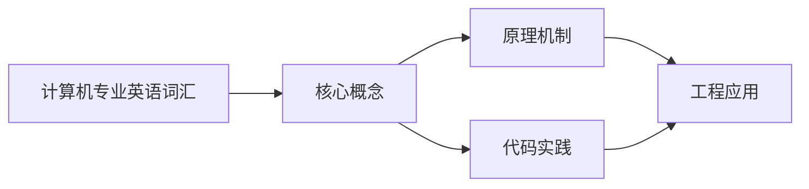
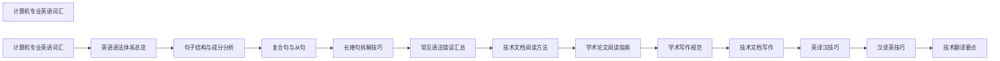

## 1. 学习目标（Bloom 分类）

本节按照布鲁姆教育目标分类学组织学习路径。本文主题为《计算机专业英语词汇》，属于 英语 模块，读者可以根据自身阶段选择阅读深度。

记忆层面：能够准确复述本文的核心概念、术语与基本语法或操作步骤，并能够在提问或检索时快速定位对应知识点。能够说出 英语 的核心概念、常用命令与流程。

理解层面：能够用自己的语言解释核心原理与工作机制，说明概念之间的因果关系，而不是机械记忆结论。能够解释 英语 的工作原理与设计动机。

应用层面：能够在真实项目或练习场景中运用本文知识解决具体问题，写出正确且可维护的实现。能够独立完成 英语 的标准操作。

分析层面：能够拆解复杂问题，比较本文主题与相邻概念的异同，识别边界条件与例外情况。能够分析 英语 使用中的异常与边界。

评价层面：能够根据约束条件（性能、可读性、安全、成本）评价不同方案的优劣，做出有依据的技术决策。能够评价 英语 相关工具与方案。

创造层面：能够把本文知识与其他模块知识组合，设计出新的解决方案或可复用的工程模式。能够把 英语 融入团队工作流。

通过本节学习，读者应当能够把《计算机专业英语词汇》纳入自己的知识网络，并与 英语 模块的其他主题（专业英语、技术阅读、写作）建立关联。

## 2. 历史动机与发展脉络

《计算机专业英语词汇》是 英语 领域的重要主题。要真正理解它，需要先了解它解决的问题与演进过程。

技术英语是开发者与世界交流的语言：官方文档、源码注释、开源社区、技术会议均以英语为主。
学习重点：技术阅读（文档/论文）、技术写作（PR/邮件）、听力（演讲/视频）、口语（会议/面试）。
材料策略：官方文档精读、开源 Issue 阅读、技术博客订阅、英文视频加字幕。

回到本文主题：计算机专业英语词汇 的提出与成熟，正是上述技术背景下的必然产物。早期实现往往以简单可用为目标，随着工程规模扩大，社区逐渐沉淀出标准做法与最佳实践；理解这一脉络，可以帮助读者判断“为什么文档中的推荐写法是现在这个样子”，也能在遇到历史遗留代码时准确识别其设计年代与取舍。

## 3. 形式化定义与核心概念精讲

本节把《计算机专业英语词汇》涉及的核心概念以“定义 + 讲解”的形式展开。读者应把定义当作工具，把讲解当作理解路径；两者结合才能形成可迁移的知识。

技术词汇：领域术语（repository、deployment、latency、throughput）；词根词缀辅助记忆。
文档阅读结构：标题层级、代码注释、错误信息、FAQ；先框架后细节。
写作规范：主动语态、短句、术语一致；代码块与步骤清晰。

### 3.1 原文章节逐一精讲

原文档把主题拆分为 6 个小节，下面按顺序给出每一节的导读讲解，随后保留原文细节供精读。

#### 原文精读（完整保留）

#### 1. 编程语言与软件工程 (Programming Languages & Software Engineering)

| 单词          | 音标               | 释义              | 例句                                                            |
| ------------- | ------------------ | ----------------- | --------------------------------------------------------------- |
| abstraction   | /æbˈstrækʃn/       | n. 抽象           | Abstraction reduces complexity in software design.              |
| algorithm     | /ˈælɡərɪðəm/       | n. 算法           | The sorting algorithm runs in $O(n \log n)$ time.               |
| allocate      | /ˈæləkeɪt/         | v. 分配           | The system allocates memory dynamically.                        |
| argument      | /ˈɑːrɡjumənt/      | n. 参数；论点     | The function accepts three arguments.                           |
| array         | /əˈreɪ/            | n. 数组           | Elements in an array are accessed by index.                     |
| asynchronous  | /eɪˈsɪŋkrənəs/     | adj. 异步的       | Asynchronous programming avoids blocking the main thread.       |
| attribute     | /əˈtrɪbjuːt/       | n. 属性           | Each HTML element has specific attributes.                      |
| binary        | /ˈbaɪnəri/         | adj. 二进制的     | Computers process data in binary format.                        |
| binding       | /ˈbaɪndɪŋ/         | n. 绑定           | Late binding occurs at runtime.                                 |
| boolean       | /ˈbuːliən/         | n. 布尔值         | A boolean can be either true or false.                          |
| callback      | /ˈkɔːlbæk/         | n. 回调           | The callback function executes after the request completes.     |
| class         | /klæs/             | n. 类             | A class defines the structure and behavior of objects.          |
| closure       | /ˈkloʊʒər/         | n. 闭包           | A closure captures variables from its outer scope.              |
| compile       | /kəmˈpaɪl/         | v. 编译           | The compiler translates source code to machine code.            |
| concurrency   | /kənˈkɜːrənsi/     | n. 并发           | Concurrency enables multiple tasks to make progress.            |
| constant      | /ˈkɑːnstənt/       | n. 常量           | The value of a constant cannot be changed.                      |
| constructor   | /kənˈstrʌktər/     | n. 构造函数       | The constructor initializes the object's state.                 |
| debug         | /diːˈbʌɡ/          | v. 调试           | Use a debugger to step through the code.                        |
| declaration   | /ˌdekləˈreɪʃn/     | n. 声明           | Variable declarations must precede their use.                   |
| dependency    | /dɪˈpendənsi/      | n. 依赖           | The project has several external dependencies.                  |
| deprecation   | /ˌdeprəˈkeɪʃn/     | n. 弃用           | The deprecated API will be removed in the next release.         |
| deserialize   | /diːˈsɪriəlaɪz/    | v. 反序列化       | Deserialize the JSON string into an object.                     |
| encapsulation | /ɪnˌkæpsjuˈleɪʃn/  | n. 封装           | Encapsulation hides internal implementation details.            |
| enumerate     | /ɪˈnuːməreɪt/      | v. 枚举           | Enumerate all possible combinations.                            |
| exception     | /ɪkˈsepʃn/         | n. 异常           | An exception was thrown during execution.                       |
| expression    | /ɪkˈspreʃn/        | n. 表达式         | The expression evaluates to a boolean value.                    |
| function      | /ˈfʌŋkʃn/          | n. 函数           | The function returns the computed result.                       |
| garbage       | /ˈɡɑːrbɪdʒ/        | n. 垃圾           | Garbage collection reclaims unused memory.                      |
| generic       | /dʒəˈnerɪk/        | adj. 泛型的       | Generic types improve code reusability.                         |
| handler       | /ˈhændlər/         | n. 处理器         | The event handler responds to user actions.                     |
| heap          | /hiːp/             | n. 堆             | Objects are allocated on the heap.                              |
| identifier    | /aɪˈdentɪfaɪər/    | n. 标识符         | Variable names are identifiers.                                 |
| immutable     | /ɪˈmjuːtəbl/       | adj. 不可变的     | Strings in Python are immutable.                                |
| implement     | /ˈɪmplɪment/       | v. 实现           | The class implements the interface.                             |
| inheritance   | /ɪnˈherɪtəns/      | n. 继承           | Inheritance allows code reuse through class hierarchies.        |
| instance      | /ˈɪnstəns/         | n. 实例           | Each object is an instance of a class.                          |
| interface     | /ˈɪntərfeɪs/       | n. 接口           | The interface defines a contract for implementing classes.      |
| interpret     | /ɪnˈtɜːrprɪt/      | v. 解释执行       | Python is an interpreted language.                              |
| iteration     | /ˌɪtəˈreɪʃn/       | n. 迭代           | Each iteration processes one element.                           |
| lambda        | /ˈlæmdə/           | n. Lambda 表达式  | Lambda expressions create anonymous functions.                  |
| lexical       | /ˈleksɪkl/         | adj. 词法的       | Lexical scoping determines variable accessibility.              |
| literal       | /ˈlɪtərəl/         | n. 字面量         | String literals are enclosed in quotes.                         |
| metadata      | /ˈmetədeɪtə/       | n. 元数据         | Metadata provides information about the data.                   |
| method        | /ˈmeθəd/           | n. 方法           | The method performs the requested operation.                    |
| module        | /ˈmɑːdʒuːl/        | n. 模块           | Import the module to use its functions.                         |
| mutable       | /ˈmjuːtəbl/        | adj. 可变的       | Lists in Python are mutable.                                    |
| namespace     | /ˈneɪmspeɪs/       | n. 命名空间       | Namespaces prevent naming conflicts.                            |
| null          | /nʌl/              | n. 空值           | The variable was assigned a null value.                         |
| object        | /ˈɑːbdʒekt/        | n. 对象           | Everything in Python is an object.                              |
| operand       | /ˈɑːpərænd/        | n. 操作数         | The operator requires two operands.                             |
| operator      | /ˈɑːpəreɪtər/      | n. 运算符         | The comparison operator returns a boolean.                      |
| overload      | /ˌoʊvərˈloʊd/      | v. 重载           | Method overloading allows multiple signatures.                  |
| override      | /ˌoʊvərˈraɪd/      | v. 重写           | The subclass overrides the parent method.                       |
| parameter     | /pəˈræmɪtər/       | n. 参数           | The function takes two parameters.                              |
| parse         | /pɑːrz/            | v. 解析           | The parser converts the string into a data structure.           |
| pointer       | /ˈpɔɪntər/         | n. 指针           | A pointer stores the memory address of a variable.              |
| polymorphism  | /ˌpɑːlɪˈmɔːrfɪzəm/ | n. 多态           | Polymorphism allows objects to be treated as their parent type. |
| primitive     | /ˈprɪmətɪv/        | adj. 原始的       | Primitive types include int, float, and boolean.                |
| recursion     | /rɪˈkɜːrʒn/        | n. 递归           | Recursion requires a base case to terminate.                    |
| refactor      | /riːˈfæktər/       | v. 重构           | Refactor the code to improve readability.                       |
| reference     | /ˈrefərəns/        | n. 引用           | Pass by reference shares the same object.                       |
| reflection    | /rɪˈflekʃn/        | n. 反射           | Reflection allows runtime type inspection.                      |
| return        | /rɪˈtɜːrn/         | v. 返回           | The function returns the computed value.                        |
| runtime       | /ˈrʌntaɪm/         | n. 运行时         | Runtime errors occur during program execution.                  |
| scope         | /skoʊp/            | n. 作用域         | Variables declared inside a block have local scope.             |
| serialize     | /ˈsɪriəlaɪz/       | v. 序列化         | Serialize the object to JSON format.                            |
| signature     | /ˈsɪɡnətʃər/       | n. 签名           | The method signature defines its parameters and return type.    |
| stack         | /stæk/             | n. 栈             | Function calls are managed on the call stack.                   |
| statement     | /ˈsteɪtmənt/       | n. 语句           | Each statement performs a specific action.                      |
| static        | /ˈstætɪk/          | adj. 静态的       | Static methods belong to the class, not instances.              |
| string        | /strɪŋ/            | n. 字符串         | Strings are sequences of characters.                            |
| syntax        | /ˈsɪntæks/         | n. 语法           | Syntax errors prevent compilation.                              |
| template      | /ˈtemplət/         | n. 模板           | Template metaprogramming enables compile-time computation.      |
| token         | /ˈtoʊkən/          | n. 令牌；词法单元 | The lexer breaks source code into tokens.                       |
| type          | /taɪp/             | n. 类型           | Type checking ensures type safety.                              |
| variable      | /ˈveriəbl/         | n. 变量           | Variables store data during program execution.                  |

#### 2. Web 开发 (Web Development)

| 单词           | 音标             | 释义              | 例句                                                        |
| -------------- | ---------------- | ----------------- | ----------------------------------------------------------- |
| accessibility  | /əkˌsesəˈbɪləti/ | n. 无障碍性       | Accessibility ensures websites are usable by everyone.      |
| asset          | /ˈæset/          | n. 静态资源       | Bundle assets for production deployment.                    |
| async          | /eɪˈsɪŋk/        | adj. 异步的       | Use async/await for cleaner asynchronous code.              |
| attribute      | /əˈtrɪbjuːt/     | n. 属性           | Set the href attribute of the anchor tag.                   |
| authentication | /ɔːˌθentɪˈkeɪʃn/ | n. 认证           | Authentication verifies user identity.                      |
| authorization  | /ˌɔːθərəˈzeɪʃn/  | n. 授权           | Authorization determines user permissions.                  |
| bundle         | /ˈbʌndl/         | n./v. 打包        | Webpack bundles JavaScript modules.                         |
| cache          | /kæʃ/            | n./v. 缓存        | Cache static assets for better performance.                 |
| certificate    | /sərˈtɪfɪkət/    | n. 证书           | SSL certificates enable HTTPS.                              |
| component      | /kəmˈpoʊnənt/    | n. 组件           | React components are reusable UI elements.                  |
| cookie         | /ˈkʊki/          | n. Cookie         | Cookies store small amounts of client-side data.            |
| CORS           | /kɔːrz/          | n. 跨域资源共享   | CORS headers control cross-origin requests.                 |
| credential     | /krəˈdenʃl/      | n. 凭证           | Store credentials securely.                                 |
| CRUD           | /krʌd/           | n. 增删改查       | The API supports CRUD operations.                           |
| deployment     | /dɪˈplɔɪmənt/    | n. 部署           | Automated deployment reduces errors.                        |
| directive      | /dɪˈrektɪv/      | n. 指令           | Vue directives extend HTML with custom behavior.            |
| DOM            | /dɑːm/           | n. 文档对象模型   | The DOM represents the page structure.                      |
| endpoint       | /ˈendpɔɪnt/      | n. 端点           | The API endpoint returns user data.                         |
| favicon        | /ˈfævɪkɑːn/      | n. 网站图标       | The favicon appears in the browser tab.                     |
| framework      | /ˈfreɪmwɜːrk/    | n. 框架           | React is a popular frontend framework.                      |
| header         | /ˈhedər/         | n. 请求头         | Set the Content-Type header to application/json.            |
| hydration      | /haɪˈdreɪʃn/     | n. 水合           | Hydration attaches event listeners to server-rendered HTML. |
| interceptor    | /ˌɪntərˈseptər/  | n. 拦截器         | HTTP interceptors modify requests and responses.            |
| latency        | /ˈleɪtənsi/      | n. 延迟           | Reduce network latency for better UX.                       |
| library        | /ˈlaɪbreri/      | n. 库             | jQuery is a widely-used JavaScript library.                 |
| middleware     | /ˈmɪdlwer/       | n. 中间件         | Express middleware processes requests sequentially.         |
| minify         | /ˈmɪnɪfaɪ/       | v. 压缩           | Minify CSS and JavaScript for production.                   |
| mock           | /mɑːk/           | v./n. 模拟        | Mock API responses during testing.                          |
| pagination     | /ˌpædʒɪˈneɪʃn/   | n. 分页           | Pagination improves performance for large datasets.         |
| payload        | /ˈpeɪloʊd/       | n. 载荷           | The request payload contains the form data.                 |
| polyfill       | /ˈpɑːlifɪl/      | n. 垫片           | Polyfills provide modern features in older browsers.        |
| progressive    | /prəˈɡresɪv/     | adj. 渐进的       | Progressive web apps work offline.                          |
| proxy          | /ˈprɑːksi/       | n. 代理           | A reverse proxy handles incoming requests.                  |
| query          | /ˈkwɪri/         | n. 查询           | URL query parameters pass data to the server.               |
| render         | /ˈrendər/        | v. 渲染           | React renders components to the DOM.                        |
| request        | /rɪˈkwest/       | n./v. 请求        | Send a GET request to the API.                              |
| response       | /rɪˈspɑːns/      | n. 响应           | The server returns a JSON response.                         |
| responsive     | /rɪˈspɑːnsɪv/    | adj. 响应式的     | Responsive design adapts to screen sizes.                   |
| REST           | /rest/           | n. 表述性状态转移 | RESTful APIs follow resource-based conventions.             |
| route          | /ruːt/           | n. 路由           | Define routes for each page of the application.             |
| scaffold       | /ˈskæfəld/       | v. 脚手架         | Scaffold a new project with create-react-app.               |
| schema         | /ˈskiːmə/        | n. 模式           | Validate data against the JSON schema.                      |
| selector       | /sɪˈlektər/      | n. 选择器         | CSS selectors target HTML elements.                         |
| server         | /ˈsɜːrvər/       | n. 服务器         | The server handles client requests.                         |
| session        | /ˈseʃn/          | n. 会话           | Session data is stored on the server.                       |
| SPA            | /es piː eɪ/      | n. 单页应用       | SPAs load a single HTML page dynamically.                   |
| SSR            | /es es ɑːr/      | n. 服务端渲染     | SSR improves initial page load performance.                 |
| state          | /steɪt/          | n. 状态           | Component state determines its rendering.                   |
| stylesheet     | /ˈsteɪtʃuːt/     | n. 样式表         | Link the stylesheet in the HTML head.                       |
| template       | /ˈtemplət/       | n. 模板           | Template literals allow embedded expressions.               |
| throughput     | /ˈθruːpʊt/       | n. 吞吐量         | The server handles high throughput efficiently.             |
| token          | /ˈtoʊkən/        | n. 令牌           | JWT tokens are used for authentication.                     |
| transpile      | /trænˈspaɪl/     | v. 转译           | Babel transpiles ES6+ to ES5.                               |
| viewport       | /ˈvjuːpɔːrt/     | n. 视口           | Set the viewport meta tag for mobile devices.               |
| webhook        | /ˈwebhʊk/        | n. Webhook        | Webhooks notify your app of events.                         |
| webpack        | /ˈwebpæk/        | n. Webpack        | Webpack is a module bundler.                                |
| WebSocket      | /ˈwebsɑːket/     | n. WebSocket      | WebSocket enables real-time bidirectional communication.    |

#### 3. 操作系统 (Operating Systems)

| 单词        | 音标           | 释义            | 例句                                                     |
| ----------- | -------------- | --------------- | -------------------------------------------------------- |
| batch       | /bætʃ/         | n. 批处理       | Batch processing executes jobs without user interaction. |
| boot        | /buːt/         | v. 启动         | The system boots from the solid-state drive.             |
| buffer      | /ˈbʌfər/       | n. 缓冲区       | Data is stored in a buffer before processing.            |
| checkpoint  | /ˈtʃekpɔɪnt/   | n. 检查点       | The system saves checkpoints for recovery.               |
| CLI         | /siː el aɪ/    | n. 命令行界面   | The CLI provides text-based system control.              |
| concurrency | /kənˈkɜːrənsi/ | n. 并发         | Concurrency improves resource utilization.               |
| context     | /ˈkɑːntekst/   | n. 上下文       | Context switching saves and restores process state.      |
| daemon      | /ˈdiːmən/      | n. 守护进程     | The daemon runs in the background.                       |
| deadlock    | /ˈdedlɑːk/     | n. 死锁         | Deadlock occurs when processes wait indefinitely.        |
| dispatch    | /dɪˈspætʃ/     | v. 调度         | The dispatcher allocates CPU time to processes.          |
| driver      | /ˈdraɪvər/     | n. 驱动程序     | Install the driver for the graphics card.                |
| exec        | /ɪɡˈzek/       | v. 执行         | The exec system call replaces the process image.         |
| file        | /faɪl/         | n. 文件         | Files store data on disk.                                |
| fork        | /fɔːrk/        | v. 派生         | The fork system call creates a child process.            |
| GUI         | /ɡuːi/         | n. 图形用户界面 | The GUI provides visual interaction.                     |
| interrupt   | /ˌɪntəˈrʌpt/   | n./v. 中断      | Hardware interrupts signal events to the CPU.            |
| I/O         | /aɪ oʊ/        | n. 输入/输出    | I/O operations transfer data between devices.            |
| kernel      | /ˈkɜːrnl/      | n. 内核         | The kernel manages system resources.                     |
| mount       | /maʊnt/        | v. 挂载         | Mount the filesystem to access its contents.             |
| mutex       | /ˈmjuːteks/    | n. 互斥锁       | A mutex ensures mutual exclusion.                        |
| page        | /peɪdʒ/        | n. 页           | The page table maps virtual to physical addresses.       |
| pipe        | /paɪp/         | n. 管道         | Pipes connect the output of one process to another.      |
| privilege   | /ˈprɪvəlɪdʒ/   | n. 特权         | Kernel mode has higher privileges than user mode.        |
| process     | /ˈprɑːses/     | n. 进程         | Each process has its own address space.                  |
| race        | /reɪs/         | n. 竞争         | Race conditions cause unpredictable behavior.            |
| scheduling  | /ˈskedʒuːlɪŋ/  | n. 调度         | Scheduling algorithms allocate CPU time.                 |
| semaphore   | /ˈseməfɔːr/    | n. 信号量       | Semaphores control access to shared resources.           |
| shell       | /ʃel/          | n. Shell        | The shell interprets user commands.                      |
| signal      | /ˈsɪɡnəl/      | n. 信号         | Send a signal to terminate the process.                  |
| socket      | /ˈsɑːkɪt/      | n. 套接字       | Sockets enable network communication.                    |
| spawn       | /spɔːn/        | v. 生成         | Spawn a new process to handle the request.               |
| swap        | /swɑːp/        | v. 交换         | The system swaps pages to disk when memory is low.       |
| syscall     | /ˈsɪskɔːl/     | n. 系统调用     | System calls provide kernel services to processes.       |
| thread      | /θred/         | n. 线程         | Threads share the process address space.                 |
| zombie      | /ˈzɑːmbi/      | n. 僵尸进程     | Zombie processes consume process table entries.          |

#### 4. 计算机网络 (Computer Networking)

| 单词        | 音标               | 释义              | 例句                                                  |
| ----------- | ------------------ | ----------------- | ----------------------------------------------------- |
| bandwidth   | /ˈbændwɪdθ/        | n. 带宽           | Higher bandwidth allows faster data transfer.         |
| broadcast   | /ˈbrɔːdkæst/       | n./v. 广播        | Broadcast messages reach all devices on the network.  |
| certificate | /sərˈtɪfɪkət/      | n. 证书           | TLS certificates verify server identity.              |
| cipher      | /ˈsaɪfər/          | n. 密码；加密算法 | AES is a symmetric cipher.                            |
| congestion  | /kənˈdʒestʃən/     | n. 拥塞           | Congestion control prevents network overload.         |
| connection  | /kəˈnekʃn/         | n. 连接           | TCP establishes a reliable connection.                |
| datagram    | /ˈdeɪtəɡræm/       | n. 数据报         | UDP sends datagrams without guaranteed delivery.      |
| DNS         | /diː en es/        | n. 域名系统       | DNS resolves domain names to IP addresses.            |
| encryption  | /ɪnˈkrɪpʃn/        | n. 加密           | End-to-end encryption protects message privacy.       |
| firewall    | /ˈfaɪərwɔːl/       | n. 防火墙         | The firewall blocks unauthorized access.              |
| frame       | /freɪm/            | n. 帧             | Ethernet frames carry data at the link layer.         |
| gateway     | /ˈɡeɪtweɪ/         | n. 网关           | The default gateway routes traffic to other networks. |
| handshake   | /ˈhændʃeɪk/        | n. 握手           | TCP uses a three-way handshake.                       |
| host        | /hoʊst/            | n. 主机           | Each host has a unique IP address.                    |
| HTTP        | /eɪtʃ tiː tiː piː/ | n. 超文本传输协议 | HTTP/2 supports multiplexed connections.              |
| hub         | /hʌb/              | n. 集线器         | Hubs broadcast frames to all ports.                   |
| IP          | /aɪ piː/           | n. 互联网协议     | IPv6 provides 128-bit addresses.                      |
| latency     | /ˈleɪtənsi/        | n. 延迟           | Network latency affects real-time applications.       |
| load        | /loʊd/             | n. 负载           | Load balancers distribute traffic across servers.     |
| multicast   | /ˈmʌltikæst/       | n. 组播           | Multicast sends data to a group of recipients.        |
| packet      | /ˈpækɪt/           | n. 数据包         | Packets are routed through the network.               |
| payload     | /ˈpeɪloʊd/         | n. 载荷           | The payload contains the actual data.                 |
| port        | /pɔːrt/            | n. 端口           | HTTP typically uses port 80.                          |
| protocol    | /ˈproʊtəkɑːl/      | n. 协议           | TCP/IP is the foundation of internet communication.   |
| proxy       | /ˈprɑːksi/         | n. 代理           | A forward proxy acts on behalf of the client.         |
| route       | /ruːt/             | n./v. 路由        | Routers forward packets between networks.             |
| socket      | /ˈsɑːkɪt/          | n. 套接字         | Sockets provide endpoints for communication.          |
| subnet      | /ˈsʌbnet/          | n. 子网           | Subnetting divides a network into smaller segments.   |
| switch      | /swɪtʃ/            | n. 交换机         | Switches forward frames to the correct port.          |
| TCP         | /tiː siː piː/      | n. 传输控制协议   | TCP ensures reliable data delivery.                   |
| TLS         | /tiː el es/        | n. 传输层安全     | TLS encrypts data in transit.                         |
| tunnel      | /ˈtʌnl/            | n. 隧道           | VPN tunnels encrypt traffic over the internet.        |
| UDP         | /juː diː piː/      | n. 用户数据报协议 | UDP is suitable for real-time streaming.              |
| VPN         | /viː piː en/       | n. 虚拟专用网络   | VPNs provide secure remote access.                    |

#### 5. 数据库 (Database)

| 单词        | 音标             | 释义              | 例句                                                   |
| ----------- | ---------------- | ----------------- | ------------------------------------------------------ |
| aggregate   | /ˈæɡrɪɡət/       | v. 聚合           | Aggregate functions compute values across rows.        |
| atomic      | /əˈtɑːmɪk/       | adj. 原子的       | Atomic operations are indivisible.                     |
| B-tree      | /ˈbiː triː/      | n. B 树           | B-tree indexes speed up range queries.                 |
| cluster     | /ˈklʌstər/       | n. 集群           | Database clusters provide high availability.           |
| column      | /ˈkɑːləm/        | n. 列             | Each column has a specific data type.                  |
| commit      | /kəˈmɪt/         | v. 提交           | Commit the transaction to persist changes.             |
| constraint  | /kənˈstreɪnt/    | n. 约束           | Foreign key constraints enforce referential integrity. |
| cursor      | /ˈkɜːrsər/       | n. 游标           | Cursors iterate over query results row by row.         |
| deadlock    | /ˈdedlɑːk/       | n. 死锁           | Deadlocks occur when transactions block each other.    |
| document    | /ˈdɑːkjumənt/    | n. 文档           | MongoDB stores data as BSON documents.                 |
| dump        | /dʌmp/           | n./v. 转储        | Back up the database with a full dump.                 |
| field       | /fiːld/          | n. 字段           | Each field stores a specific attribute.                |
| foreign     | /ˈfɔːrən/        | adj. 外部的       | Foreign keys reference primary keys in other tables.   |
| graph       | /ɡræf/           | n. 图             | Graph databases model relationships between entities.  |
| hash        | /hæʃ/            | n. 哈希           | Hash indexes support equality comparisons.             |
| index       | /ˈɪndeks/        | n. 索引           | Indexes speed up query performance.                    |
| join        | /dʒɔɪn/          | v./n. 连接        | JOIN combines rows from multiple tables.               |
| key         | /kiː/            | n. 键             | Primary keys uniquely identify each row.               |
| migration   | /maɪˈɡreɪʃn/     | n. 迁移           | Database migrations manage schema changes.             |
| MVCC        | /em viː siː siː/ | n. 多版本并发控制 | MVCC allows concurrent reads and writes.               |
| normalize   | /ˈnɔːrməlaɪz/    | v. 规范化         | Normalize the schema to reduce redundancy.             |
| NoSQL       | /noʊ es kjuː el/ | n. NoSQL          | NoSQL databases handle unstructured data.              |
| partition   | /pɑːrˈtɪʃn/      | v./n. 分区        | Table partitioning improves query performance.         |
| primary     | /ˈpraɪmeri/      | adj. 主键的       | The primary key ensures row uniqueness.                |
| query       | /ˈkwɪri/         | n./v. 查询        | Optimize queries for better performance.               |
| replica     | /ˈreplɪkə/       | n. 副本           | Read replicas distribute query load.                   |
| rollback    | /ˈroʊlbæk/       | n./v. 回滚        | Rollback undoes uncommitted changes.                   |
| row         | /raʊ/            | n. 行             | Each row represents a single record.                   |
| schema      | /ˈskiːmə/        | n. 模式           | The schema defines the database structure.             |
| shard       | /ʃɑːrd/          | n./v. 分片        | Sharding distributes data across multiple servers.     |
| SQL         | /es kjuː el/     | n. 结构化查询语言 | SQL is the standard language for relational databases. |
| table       | /ˈteɪbl/         | n. 表             | Tables store data in rows and columns.                 |
| transaction | /trænˈzækʃn/     | n. 事务           | Transactions ensure ACID properties.                   |
| trigger     | /ˈtrɪɡər/        | n. 触发器         | Triggers execute automatically on data changes.        |
| view        | /vjuː/           | n. 视图           | Views provide virtual tables based on queries.         |

#### 6. 人工智能与机器学习 (AI & Machine Learning)

| 单词            | 音标                | 释义              | 例句                                                       |
| --------------- | ------------------- | ----------------- | ---------------------------------------------------------- |
| activation      | /ˌæktɪˈveɪʃn/       | n. 激活           | The ReLU activation function is widely used.               |
| agent           | /ˈeɪdʒənt/          | n. 智能体         | An agent interacts with its environment.                   |
| attention       | /əˈtenʃn/           | n. 注意力         | The attention mechanism weights input importance.          |
| autoencoder     | /ˌɔːtoʊɪnˈkoʊdər/   | n. 自编码器       | Autoencoders learn compressed representations.             |
| backpropagation | /ˌbækprɑːpəˈɡeɪʃn/  | n. 反向传播       | Backpropagation computes gradients for training.           |
| batch           | /bætʃ/              | n. 批次           | Mini-batch training uses small subsets of data.            |
| bias            | /ˈbaɪəs/            | n. 偏置；偏差     | The model has high bias due to underfitting.               |
| classifier      | /ˈklæsɪfaɪər/       | n. 分类器         | The classifier achieves 95% accuracy.                      |
| convolution     | /ˌkɑːnvəˈluːʃn/     | n. 卷积           | Convolutional layers extract spatial features.             |
| dataset         | /ˈdeɪtəset/         | n. 数据集         | Split the dataset into training and test sets.             |
| decoder         | /diːˈkoʊdər/        | n. 解码器         | The decoder generates output sequences.                    |
| deep            | /diːp/              | adj. 深度的       | Deep learning uses many hidden layers.                     |
| dropout         | /ˈdrɑːpaʊt/         | n. 丢弃           | Dropout prevents overfitting.                              |
| embedding       | /ɪmˈbedɪŋ/          | n. 嵌入           | Word embeddings capture semantic meaning.                  |
| encoder         | /ɪnˈkoʊdər/         | n. 编码器         | The encoder compresses input into a latent space.          |
| epoch           | /ˈepək/             | n. 轮次           | Train the model for 100 epochs.                            |
| feature         | /ˈfiːtʃər/          | n. 特征           | Feature engineering improves model performance.            |
| fine-tune       | /faɪn tuːn/         | v. 微调           | Fine-tune the pretrained model on domain data.             |
| generative      | /ˈdʒenərətɪv/       | adj. 生成式的     | Generative AI creates new content.                         |
| gradient        | /ˈɡreɪdiənt/        | n. 梯度           | Gradient descent minimizes the loss function.              |
| hidden          | /ˈhɪdn/             | adj. 隐藏的       | Hidden layers perform nonlinear transformations.           |
| hyperparameter  | /ˌhaɪpərpəˈræmɪtər/ | n. 超参数         | Tune hyperparameters for optimal performance.              |
| inference       | /ˈɪnfərəns/         | n. 推理           | Model inference generates predictions.                     |
| label           | /ˈleɪbl/            | n. 标签           | Labeled data is required for supervised learning.          |
| layer           | /ˈleɪər/            | n. 层             | Neural networks consist of multiple layers.                |
| learning        | /ˈlɜːrnɪŋ/          | n. 学习           | Transfer learning leverages pretrained knowledge.          |
| loss            | /lɔːs/              | n. 损失           | Cross-entropy loss is used for classification.             |
| LSTM            | /el es tiː em/      | n. 长短期记忆网络 | LSTMs handle long-range dependencies.                      |
| metric          | /ˈmetrɪk/           | n. 指标           | Accuracy is a common evaluation metric.                    |
| model           | /ˈmɑːdl/            | n. 模型           | The model learns patterns from training data.              |
| neural          | /ˈnʊrəl/            | adj. 神经的       | Neural networks are inspired by the brain.                 |
| node            | /noʊd/              | n. 节点           | Each node computes a weighted sum.                         |
| normalize       | /ˈnɔːrməlaɪz/       | v. 归一化         | Normalize inputs to improve training stability.            |
| optimizer       | /ˈɑːptɪmaɪzər/      | n. 优化器         | Adam is a popular optimizer.                               |
| overfitting     | /ˌoʊvərˈfɪtɪŋ/      | n. 过拟合         | Overfitting occurs when the model memorizes training data. |
| parameter       | /pəˈræmɪtər/        | n. 参数           | Large language models have billions of parameters.         |
| pooling         | /ˈpuːlɪŋ/           | n. 池化           | Max pooling reduces spatial dimensions.                    |
| prediction      | /prɪˈdɪkʃn/         | n. 预测           | The model's prediction matches the actual value.           |
| pretrained      | /priːˈtreɪnd/       | adj. 预训练的     | Use a pretrained model as a starting point.                |
| recurrent       | /rɪˈkɜːrənt/        | adj. 循环的       | Recurrent networks process sequential data.                |
| regularization  | /ˌreɡjələrəˈzeɪʃn/  | n. 正则化         | L2 regularization penalizes large weights.                 |
| reinforcement   | /ˌriːɪnˈfɔːrsmənt/  | n. 强化           | Reinforcement learning optimizes through rewards.          |
| representation  | /ˌreprɪzenˈteɪʃn/   | n. 表示           | Learn a useful representation of the data.                 |
| softmax         | /sɑːftmæks/         | n. Softmax        | Softmax converts logits to probabilities.                  |
| tensor          | /ˈtensər/           | n. 张量           | Tensors are multi-dimensional arrays.                      |
| token           | /ˈtoʊkən/           | n. 词元           | The tokenizer splits text into tokens.                     |
| transformer     | /trænsˈfɔːrmər/     | n. Transformer    | Transformers revolutionized NLP.                           |
| underfitting    | /ˌʌndərˈfɪtɪŋ/      | n. 欠拟合         | Underfitting indicates the model is too simple.            |
| validation      | /ˌvælɪˈdeɪʃn/       | n. 验证           | Use a validation set to tune hyperparameters.              |
| variance        | /ˈveriəns/          | n. 方差           | High variance indicates overfitting.                       |
| vector          | /ˈvektər/           | n. 向量           | Word vectors represent semantic relationships.             |
| weight          | /weɪt/              | n. 权重           | Update weights during backpropagation.                     |

### 3.2 概念关系图

下面用 Mermaid 图表达本文核心概念之间的关系，帮助读者建立整体图景：

图中展示的是本文知识的结构化关系：核心概念是入口，原理机制解释“为什么”，代码实践演示“怎么做”，工程应用回答“何时用”。读者学习时可以把每个小节的内容挂接到对应节点上。

## 4. 理论推导与原理解析

本节深入《计算机专业英语词汇》背后的原理。理论部分不求面面俱到，而是聚焦“能解释现象、能指导实践”的关键推导。

技术词汇：领域术语（repository、deployment、latency、throughput）；词根词缀辅助记忆。
文档阅读结构：标题层级、代码注释、错误信息、FAQ；先框架后细节。
写作规范：主动语态、短句、术语一致；代码块与步骤清晰。
学习曲线：阅读最容易，写作其次，听说最难；按需分配时间。

需要强调的是，理论推导与工程实践之间存在翻译层：理论给出的是理想化模型与边界条件，工程代码则必须处理真实环境中的例外。读者在学习时应先掌握理论的“标准情形”，再通过陷阱章节了解“非标准情形”。

## 5. 代码示例与逐行讲解

本节把原文中的代码示例系统整理，并为每个示例补充用途说明与讲解。读者不应只浏览代码，而应逐段对照讲解理解设计意图。

原文档未包含独立代码块，下面补充该主题的典型示例，演示核心概念在代码中的落地方式。

综合以上示例，可以总结出本主题的代码实践要点：第一，先定义清晰的输入输出契约；第二，核心逻辑保持单一职责；第三，错误处理与边界条件不可省略；第四，命名与注释表达意图而非复述代码。

## 6. 对比分析

对比是理解《计算机专业英语词汇》定位的最快路径。下面从多个维度与相邻方案进行对比。

通用英语与技术英语：通用英语打基础，技术英语聚焦文档与会议。
翻译与直读：直读保留原意与速度；翻译辅助理解。
美音与英音：选择一种为主，能听懂两者。

对比的目的不是分出绝对优劣，而是建立选择依据：不同约束条件下，最优解不同。读者应把每个对比维度转化为决策检查清单。

## 7. 常见陷阱与最佳实践

本节整理该主题的高频错误与推荐做法。每个陷阱先描述现象，再解释原因，最后给出最佳实践。

### 7.1 只看中文资料

信息滞后且失真。官方英文优先。

深入讲解：该问题之所以被归类为“常见陷阱”，是因为它在初学者的代码中反复出现，而且往往不在第一时间暴露——错误通常隐藏在特定数据或特定时序下。

从成因上看，只看中文资料 一般源于对 英语 某个机制的理解偏差：要么误用了默认行为，要么忽略了边界条件，要么把其他语言的思维惯性带了过来。

从影响上看，只看中文资料 轻则产生错误结果，重则导致资源泄漏、数据损坏或安全事故；这也是为什么工程评审中会把它列为检查项。

从修复策略上看，处理只看中文资料的正确顺序是：先复现（构造最小用例），再定位（确认机制层面的根因），最后修复并补充回归测试。跳过复现直接改代码，往往治标不治本。

### 7.2 逐词翻译

理解慢。按意群与结构阅读。

深入讲解：该问题之所以被归类为“常见陷阱”，是因为它在初学者的代码中反复出现，而且往往不在第一时间暴露——错误通常隐藏在特定数据或特定时序下。

从成因上看，逐词翻译 一般源于对 英语 某个机制的理解偏差：要么误用了默认行为，要么忽略了边界条件，要么把其他语言的思维惯性带了过来。

从影响上看，逐词翻译 轻则产生错误结果，重则导致资源泄漏、数据损坏或安全事故；这也是为什么工程评审中会把它列为检查项。

从修复策略上看，处理逐词翻译的正确顺序是：先复现（构造最小用例），再定位（确认机制层面的根因），最后修复并补充回归测试。跳过复现直接改代码，往往治标不治本。

### 7.3 不积累词汇

重复查词。生词本 + 间隔复习。

深入讲解：该问题之所以被归类为“常见陷阱”，是因为它在初学者的代码中反复出现，而且往往不在第一时间暴露——错误通常隐藏在特定数据或特定时序下。

从成因上看，不积累词汇 一般源于对 英语 某个机制的理解偏差：要么误用了默认行为，要么忽略了边界条件，要么把其他语言的思维惯性带了过来。

从影响上看，不积累词汇 轻则产生错误结果，重则导致资源泄漏、数据损坏或安全事故；这也是为什么工程评审中会把它列为检查项。

从修复策略上看，处理不积累词汇的正确顺序是：先复现（构造最小用例），再定位（确认机制层面的根因），最后修复并补充回归测试。跳过复现直接改代码，往往治标不治本。

### 7.4 不敢写

开口/动手才进步。从 PR 描述与评论开始。

深入讲解：该问题之所以被归类为“常见陷阱”，是因为它在初学者的代码中反复出现，而且往往不在第一时间暴露——错误通常隐藏在特定数据或特定时序下。

从成因上看，不敢写 一般源于对 英语 某个机制的理解偏差：要么误用了默认行为，要么忽略了边界条件，要么把其他语言的思维惯性带了过来。

从影响上看，不敢写 轻则产生错误结果，重则导致资源泄漏、数据损坏或安全事故；这也是为什么工程评审中会把它列为检查项。

从修复策略上看，处理不敢写的正确顺序是：先复现（构造最小用例），再定位（确认机制层面的根因），最后修复并补充回归测试。跳过复现直接改代码，往往治标不治本。

### 7.5 忽略发音

听说受阻。音标 + 影子跟读。

深入讲解：该问题之所以被归类为“常见陷阱”，是因为它在初学者的代码中反复出现，而且往往不在第一时间暴露——错误通常隐藏在特定数据或特定时序下。

从成因上看，忽略发音 一般源于对 英语 某个机制的理解偏差：要么误用了默认行为，要么忽略了边界条件，要么把其他语言的思维惯性带了过来。

从影响上看，忽略发音 轻则产生错误结果，重则导致资源泄漏、数据损坏或安全事故；这也是为什么工程评审中会把它列为检查项。

从修复策略上看，处理忽略发音的正确顺序是：先复现（构造最小用例），再定位（确认机制层面的根因），最后修复并补充回归测试。跳过复现直接改代码，往往治标不治本。

### 7.6 材料太难

挫败放弃。i+1 原则选材。

深入讲解：该问题之所以被归类为“常见陷阱”，是因为它在初学者的代码中反复出现，而且往往不在第一时间暴露——错误通常隐藏在特定数据或特定时序下。

从成因上看，材料太难 一般源于对 英语 某个机制的理解偏差：要么误用了默认行为，要么忽略了边界条件，要么把其他语言的思维惯性带了过来。

从影响上看，材料太难 轻则产生错误结果，重则导致资源泄漏、数据损坏或安全事故；这也是为什么工程评审中会把它列为检查项。

从修复策略上看，处理材料太难的正确顺序是：先复现（构造最小用例），再定位（确认机制层面的根因），最后修复并补充回归测试。跳过复现直接改代码，往往治标不治本。

### 7.7 无输出

只输入不输出。写博客/翻译文档。

深入讲解：该问题之所以被归类为“常见陷阱”，是因为它在初学者的代码中反复出现，而且往往不在第一时间暴露——错误通常隐藏在特定数据或特定时序下。

从成因上看，无输出 一般源于对 英语 某个机制的理解偏差：要么误用了默认行为，要么忽略了边界条件，要么把其他语言的思维惯性带了过来。

从影响上看，无输出 轻则产生错误结果，重则导致资源泄漏、数据损坏或安全事故；这也是为什么工程评审中会把它列为检查项。

从修复策略上看，处理无输出的正确顺序是：先复现（构造最小用例），再定位（确认机制层面的根因），最后修复并补充回归测试。跳过复现直接改代码，往往治标不治本。

### 7.8 突击式学习

无效果。每日少量持续。

深入讲解：该问题之所以被归类为“常见陷阱”，是因为它在初学者的代码中反复出现，而且往往不在第一时间暴露——错误通常隐藏在特定数据或特定时序下。

从成因上看，突击式学习 一般源于对 英语 某个机制的理解偏差：要么误用了默认行为，要么忽略了边界条件，要么把其他语言的思维惯性带了过来。

从影响上看，突击式学习 轻则产生错误结果，重则导致资源泄漏、数据损坏或安全事故；这也是为什么工程评审中会把它列为检查项。

从修复策略上看，处理突击式学习的正确顺序是：先复现（构造最小用例），再定位（确认机制层面的根因），最后修复并补充回归测试。跳过复现直接改代码，往往治标不治本。

### 7.0 最佳实践总览

1. 每日固定 30 分钟：阅读 + 词汇 + 听力。
2. 阅读技术文档时先扫标题、代码与结论。
3. 写作用模板起步（PR、邮件、README）。
4. 把生词放入真实句子记忆。

把这些最佳实践固化为团队规范与代码评审检查项，是避免同类问题反复出现的关键。

## 8. 工程实践

本节把《计算机专业英语词汇》放入真实工程场景，给出可复用的模式与组织方法。

阅读计划：每周 1 篇官方文档 + 1 篇博客；精读记录术语。
写作输出：每周 1 条 PR 描述或技术笔记（英文）。
听力：技术演讲（TED/会议）影子跟读。

### 8.1 工程实践的原则拆解

以上工程实践可以归纳为四条原则。第一，配置与代码分离：英语 项目中环境差异应通过配置注入，而不是散落在代码分支中；这保证同一份代码可以在开发、测试、生产环境一致运行。

第二，接口稳定优先：对外接口（函数签名、协议、数据格式）一旦被消费方依赖，变更成本极高；设计时应预留扩展点并保持向后兼容。

第三，可观测性内置：日志、指标与追踪应该在功能开发时同步设计，而不是故障发生后补救；没有观测手段的模块等于黑盒。

第四，变更可回滚：任何发布都应有对应的回滚方案；数据库迁移、配置变更与代码发布一样需要版本管理与逆向路径。

### 8.2 实践落地的检查清单

- [ ] 阅读计划：对照本节描述，检查当前项目是否已经落实；未落实的项列入技术债并排期处理。
- [ ] 写作输出：对照本节描述，检查当前项目是否已经落实；未落实的项列入技术债并排期处理。
- [ ] 听力：对照本节描述，检查当前项目是否已经落实；未落实的项列入技术债并排期处理。

工程实践的共性原则：配置与代码分离、接口稳定优先、可观测性内置、变更可回滚。这些原则适用于本主题的所有实现。

## 9. 案例研究

本节通过一个完整案例把《计算机专业英语词汇》的知识串起来。案例按“需求分析、方案设计、实现、验证”四步展开。

需求：三个月提升技术文档阅读速度。
方案：每日 30 分钟精读 + 词汇复习 + 周输出。
要点：选择兴趣领域材料、记录术语表。
验证：阅读速度与理解率前后对比。

### 9.1 案例的扩展讨论

把案例中的方案放大到真实规模，需要额外考虑三个问题：

第一，规模：当数据量或并发量上升一个数量级时，原方案中的数据结构、缓存策略与任务调度是否仍然成立？通常需要引入分层与异步。

第二，团队：多人协作时，模块边界、接口契约与代码所有权必须明确；案例中的实现应拆分为可独立测试的单元，并配合文档说明设计意图。

第三，演进：上线后的需求变化不可避免；方案设计时应预留扩展点（配置化、插件化、事件化），并定期用真实指标验证假设。

案例研究的学习方法：先独立阅读需求，尝试在脑中形成方案，再对照实现与讲解，最后思考“如果约束变化（数据量、并发、团队规模），方案应如何调整”。

## 10. 知识要点总结与深入讲解

本节以讲解形式汇总全文要点，替代传统的习题与自测，读者不需要答题，只需跟随解释建立完整的认知框架。

关于《计算机专业英语词汇》的核心结论：

技术英语是“用”出来的，不是“学”出来的。
阅读先行，写作跟进，听说持续。
把英语融入日常开发流程而非单独学习。

原文档各小节的要点回顾：

- 1. 编程语言与软件工程 (Programming Languages & Software Engineering)：该小节围绕计算机专业英语词汇展开具体细节，阅读时应关注其与核心结论的对应关系；每个小节都是核心结论在某一个侧面的展开。
- 2. Web 开发 (Web Development)：该小节围绕计算机专业英语词汇展开具体细节，阅读时应关注其与核心结论的对应关系；每个小节都是核心结论在某一个侧面的展开。
- 3. 操作系统 (Operating Systems)：该小节围绕计算机专业英语词汇展开具体细节，阅读时应关注其与核心结论的对应关系；每个小节都是核心结论在某一个侧面的展开。
- 4. 计算机网络 (Computer Networking)：该小节围绕计算机专业英语词汇展开具体细节，阅读时应关注其与核心结论的对应关系；每个小节都是核心结论在某一个侧面的展开。
- 5. 数据库 (Database)：该小节围绕计算机专业英语词汇展开具体细节，阅读时应关注其与核心结论的对应关系；每个小节都是核心结论在某一个侧面的展开。
- 6. 人工智能与机器学习 (AI & Machine Learning)：该小节围绕计算机专业英语词汇展开具体细节，阅读时应关注其与核心结论的对应关系；每个小节都是核心结论在某一个侧面的展开。

把以上要点与第 3-9 节的内容对照复习，即可完成对本文主题的闭环学习。

## 11. 参考文献

Merriam-Webster：https://www.merriam-webster.com/
Stack Overflow：https://stackoverflow.com/
Hacker News：https://news.ycombinator.com/
BBC Learning English：https://www.bbc.co.uk/learningenglish

## 12. 延伸阅读

英语学习材料与规划，见 005-english 模块文档。
技术写作（Markdown），见 002-markdown 模块。
开源协作中的英语沟通，见 004-github 模块。
黑马程序员 Bilibili 空间（https://space.bilibili.com/37974444 ）提供英语课程。

## 14. 模块知识图谱与学习路径

本文属于 英语 模块。为了把《计算机专业英语词汇》放入完整的知识网络，下面列出本模块的全部主题并给出相互关联的导读。学习时建议按模块内顺序推进，并在每个文档中留意交叉引用。

上图为模块主题的推荐学习顺序示意图（仅展示前若干主题）。各主题之间存在三类关联：

第一，前置依赖关系：早期主题是后期主题的基础，例如环境与语法先行、进阶主题随后；

第二，横向并列关系：同一层级主题从不同角度覆盖模块能力，学习顺序可以按兴趣调整；

第三，工程组合关系：多个主题在真实项目中组合使用，例如配置、性能与安全主题往往出现在同一系统的不同层面。

### 14.1 模块主题速查表

| 文档 | 主题 | 与本文的关联 |
| --- | --- | --- |
| 计算机专业英语词汇 | 001-ComputerProfessionalEnglishVocabulary | 本文自身 |
| 英语语法体系总览 | 002-EnglishGrammarSystemOverview | 本文的并列主题 |
| 句子结构与成分分析 | 003-SentenceStructureAnalysis | 本文的并列主题 |
| 复合句与从句 | 004-CompoundSentenceClause | 本文的并列主题 |
| 长难句拆解技巧 | 005-LongDifficultSentenceBreakdownTechnique | 本文的并列主题 |
| 常见语法错误汇总 | 006-CommonGrammarErrorSummary | 本文的并列主题 |
| 技术文档阅读方法 | 007-TechDocReadingMethod | 本文的并列主题 |
| 学术论文阅读指南 | 008-AcademicPaperReadingGuide | 本文的并列主题 |
| 学术写作规范 | 009-AcademicWritingStandard | 本文的并列主题 |
| 技术文档写作 | 010-TechDocWriting | 本文的并列主题 |
| 英译汉技巧 | 011-EnglishToChineseTechnique | 本文的并列主题 |
| 汉译英技巧 | 012-ChineseToEnglishTechnique | 本文的并列主题 |
| 技术翻译要点 | 013-TechTranslationPoints | 本文的并列主题 |

速查表的作用是让读者快速判断：哪些文档应在阅读本文前掌握（前置基础），哪些文档应在阅读本文后继续（延伸主题）。本模块的交叉引用体系即以此表为基础。

## 15. 术语表

下表整理《计算机专业英语词汇》及 英语 模块中出现的高频术语，给出简明释义。术语按字母序或逻辑序排列，供查阅。

| 术语 | 释义 |
| --- | --- |
| 技术词汇 | 领域术语（repository、deployment、latency、throughput）；词根词缀辅助记忆。 |
| 文档阅读结构 | 标题层级、代码注释、错误信息、FAQ；先框架后细节。 |
| 写作规范 | 主动语态、短句、术语一致；代码块与步骤清晰。 |
| 学习曲线 | 阅读最容易，写作其次，听说最难；按需分配时间。 |
| 只看中文资料（易错点） | 参见常见陷阱章节的详细讲解 |
| 逐词翻译（易错点） | 参见常见陷阱章节的详细讲解 |
| 不积累词汇（易错点） | 参见常见陷阱章节的详细讲解 |
| 不敢写（易错点） | 参见常见陷阱章节的详细讲解 |
| 忽略发音（易错点） | 参见常见陷阱章节的详细讲解 |
| 材料太难（易错点） | 参见常见陷阱章节的详细讲解 |

术语表与正文配合使用：先通读正文，遇到模糊术语回查本表；长期使用后术语会自然进入工作记忆。

## 13. 深度专题扩展

以下专题从不同角度深入本文主题，供有进阶需求的读者研读。每个专题独立成节，内容相互补充。

### 13.1 技术文档精读法

第一遍：标题、目录、代码、结论（5 分钟）。
第二遍：逐节理解，查术语，标注疑问（20 分钟）。
第三遍：复述总结，写笔记（5 分钟）。
间隔复习笔记，术语进入长期记忆。

### 13.2 技术写作入门

结构：标题、背景、步骤、结论；读者导向。
语言：短句、主动语态、具体动词（run、build、deploy）。
格式：Markdown、代码块、列表；与代码风格一致。
练习：改写官方文档片段、写 README、PR 描述。

## 16. 核心概念串讲（复习视角）

本节以“把知识讲给他人听”的方式，把《计算机专业英语词汇》的核心概念重新串讲一遍。与前文按章节展开不同，这里的叙述更接近课堂总结：先说整体，再逐个展开，最后收束。

《计算机专业英语词汇》属于 英语 模块。要理解它，先要理解它在模块中的位置：它解决的是该领域的一个具体问题，并依赖模块内若干前置概念；反过来，它又为后续进阶主题提供基础。

第一个概念是技术词汇。领域术语（repository、deployment、latency、throughput）；词根词缀辅助记忆。

在实际使用中，技术词汇需要与相邻概念区分：它们的区别不在于名称，而在于适用条件与行为边界；这正是前文对比分析章节的意义。

第一个概念是文档阅读结构。标题层级、代码注释、错误信息、FAQ；先框架后细节。

在实际使用中，文档阅读结构需要与相邻概念区分：它们的区别不在于名称，而在于适用条件与行为边界；这正是前文对比分析章节的意义。

第一个概念是写作规范。主动语态、短句、术语一致；代码块与步骤清晰。

在实际使用中，写作规范需要与相邻概念区分：它们的区别不在于名称，而在于适用条件与行为边界；这正是前文对比分析章节的意义。

接下来是技术词汇。领域术语（repository、deployment、latency、throughput）；词根词缀辅助记忆。

理解该原理的关键不是记住结论，而是记住“它从什么假设出发、推出了什么、假设不成立时会怎样”。带着这个框架复习，原理之间就会连成网络。

接下来是文档阅读结构。标题层级、代码注释、错误信息、FAQ；先框架后细节。

理解该原理的关键不是记住结论，而是记住“它从什么假设出发、推出了什么、假设不成立时会怎样”。带着这个框架复习，原理之间就会连成网络。

接下来是写作规范。主动语态、短句、术语一致；代码块与步骤清晰。

理解该原理的关键不是记住结论，而是记住“它从什么假设出发、推出了什么、假设不成立时会怎样”。带着这个框架复习，原理之间就会连成网络。

接下来是学习曲线。阅读最容易，写作其次，听说最难；按需分配时间。

理解该原理的关键不是记住结论，而是记住“它从什么假设出发、推出了什么、假设不成立时会怎样”。带着这个框架复习，原理之间就会连成网络。

串讲收束：把概念与原理放回本文主题，可以得出一个总纲——定义描述是什么，原理解释为什么，实践回答怎么做。三者构成完整的学习闭环；后续遇到相关问题，都可以按这个总纲检索知识。
