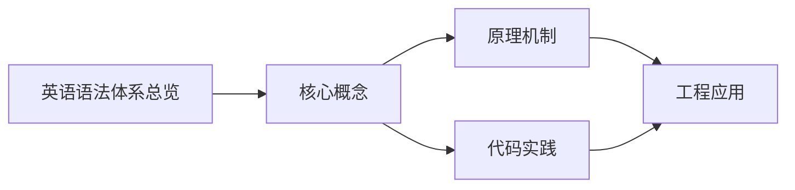
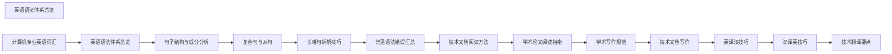

## 1. 学习目标（Bloom 分类）

本节按照布鲁姆教育目标分类学组织学习路径。本文主题为《英语语法体系总览》，属于 英语 模块，读者可以根据自身阶段选择阅读深度。

记忆层面：能够准确复述本文的核心概念、术语与基本语法或操作步骤，并能够在提问或检索时快速定位对应知识点。能够说出 英语 的核心概念、常用命令与流程。

理解层面：能够用自己的语言解释核心原理与工作机制，说明概念之间的因果关系，而不是机械记忆结论。能够解释 英语 的工作原理与设计动机。

应用层面：能够在真实项目或练习场景中运用本文知识解决具体问题，写出正确且可维护的实现。能够独立完成 英语 的标准操作。

分析层面：能够拆解复杂问题，比较本文主题与相邻概念的异同，识别边界条件与例外情况。能够分析 英语 使用中的异常与边界。

评价层面：能够根据约束条件（性能、可读性、安全、成本）评价不同方案的优劣，做出有依据的技术决策。能够评价 英语 相关工具与方案。

创造层面：能够把本文知识与其他模块知识组合，设计出新的解决方案或可复用的工程模式。能够把 英语 融入团队工作流。

通过本节学习，读者应当能够把《英语语法体系总览》纳入自己的知识网络，并与 英语 模块的其他主题（专业英语、技术阅读、写作）建立关联。

## 2. 历史动机与发展脉络

《英语语法体系总览》是 英语 领域的重要主题。要真正理解它，需要先了解它解决的问题与演进过程。

技术英语是开发者与世界交流的语言：官方文档、源码注释、开源社区、技术会议均以英语为主。
学习重点：技术阅读（文档/论文）、技术写作（PR/邮件）、听力（演讲/视频）、口语（会议/面试）。
材料策略：官方文档精读、开源 Issue 阅读、技术博客订阅、英文视频加字幕。

回到本文主题：英语语法体系总览 的提出与成熟，正是上述技术背景下的必然产物。早期实现往往以简单可用为目标，随着工程规模扩大，社区逐渐沉淀出标准做法与最佳实践；理解这一脉络，可以帮助读者判断“为什么文档中的推荐写法是现在这个样子”，也能在遇到历史遗留代码时准确识别其设计年代与取舍。


## 3. 形式化定义与核心概念精讲

本节把《英语语法体系总览》涉及的核心概念以“定义 + 讲解”的形式展开。读者应把定义当作工具，把讲解当作理解路径；两者结合才能形成可迁移的知识。

技术词汇：领域术语（repository、deployment、latency、throughput）；词根词缀辅助记忆。
文档阅读结构：标题层级、代码注释、错误信息、FAQ；先框架后细节。
写作规范：主动语态、短句、术语一致；代码块与步骤清晰。

### 3.1 原文章节逐一精讲

原文档把主题拆分为 9 个小节，下面按顺序给出每一节的导读讲解，随后保留原文细节供精读。

#### 原文精读（完整保留）


#### 1. 英语语法体系概览

英语语法是一个层次分明的系统，从最小的语言单位（语素）到最大的语言单位（篇章），每一层都有其规则和结构。

##### 1.1 语法层次结构

```
语素 (Morpheme) → 词 (Word) → 短语 (Phrase) → 从句 (Clause) → 句子 (Sentence) → 篇章 (Discourse)
```

| 层次 | 定义                         | 示例                         |
| ---- | ---------------------------- | ---------------------------- |
| 语素 | 最小的有意义语言单位         | un- + happy → unhappy        |
| 词   | 最小的自由运用语言单位       | book, quickly, the           |
| 短语 | 词的组合，充当句子成分       | in the morning, very quickly |
| 从句 | 含有主谓结构的语言单位       | because it was raining       |
| 句子 | 能独立表达完整意思的语言单位 | She went home.               |
| 篇章 | 句子的有机组合               | 一段文章                     |

##### 1.2 语法两大分支

| 分支                  | 研究内容             | 核心问题                         |
| --------------------- | -------------------- | -------------------------------- |
| **词法 (Morphology)** | 词的构成、变化和分类 | 词如何变形？词有哪些类别？       |
| **句法 (Syntax)**     | 句子的结构和规则     | 词如何组合成句？句子有哪些类型？ |

#### 2. 词法体系 (Morphology)

##### 2.1 词类分类

英语词类分为**实词**和**虚词**两大类：

**实词（Notional Words）**——有实在意义，能独立充当句子成分：

| 词类   | 英文      | 功能                 | 示例                               |
| ------ | --------- | -------------------- | ---------------------------------- |
| 名词   | Noun      | 表示人、事物、概念   | computer, information, development |
| 动词   | Verb      | 表示动作或状态       | develop, compute, exist            |
| 形容词 | Adjective | 修饰名词             | efficient, powerful, digital       |
| 副词   | Adverb    | 修饰动词/形容词/副词 | quickly, very, however             |
| 代词   | Pronoun   | 代替名词             | he, this, which                    |
| 数词   | Numeral   | 表示数量或顺序       | one, first, hundred                |

**虚词（Form Words）**——无实在意义，起语法连接作用：

| 词类   | 英文         | 功能             | 示例                   |
| ------ | ------------ | ---------------- | ---------------------- |
| 冠词   | Article      | 限定名词         | a, an, the             |
| 介词   | Preposition  | 表示关系         | in, on, through        |
| 连词   | Conjunction  | 连接词/短语/句子 | and, because, although |
| 感叹词 | Interjection | 表达情感         | oh, wow, alas          |

##### 2.2 名词的形态变化

| 变化类型   | 规则        | 示例                            |
| ---------- | ----------- | ------------------------------- |
| 规则复数   | 加 -s/-es   | book → books, box → boxes       |
| 不规则复数 | 内部变化    | man → men, child → children     |
| 不可数     | 无复数形式  | information, advice, equipment  |
| 所有格     | 加 -'s / -' | student's book, students' books |

##### 2.3 动词的形态变化

动词是英语语法中最复杂的词类，涉及**时态、语态、语气**三大变化维度：

| 变化维度     | 类别           | 示例                                   |
| ------------ | -------------- | -------------------------------------- |
| 时态 (Tense) | 16种时态       | writes, wrote, will write, has written |
| 语态 (Voice) | 主动/被动      | writes / is written                    |
| 语气 (Mood)  | 陈述/祈使/虚拟 | writes / write / wrote (虚拟)          |

##### 2.4 形容词与副词的比较级

| 级别   | 构成方式           | 示例                    |
| ------ | ------------------ | ----------------------- |
| 原级   | 原形               | fast, beautiful         |
| 比较级 | -er / more + 原级  | faster, more beautiful  |
| 最高级 | -est / most + 原级 | fastest, most beautiful |

#### 3. 句法体系 (Syntax)

##### 3.1 句子成分

| 成分 | 英文        | 功能              | 示例                           |
| ---- | ----------- | ----------------- | ------------------------------ |
| 主语 | Subject     | 句子的主体        | **She** writes code.           |
| 谓语 | Predicate   | 主语的动作/状态   | She **writes** code.           |
| 宾语 | Object      | 动作的承受者      | She writes **code**.           |
| 定语 | Attribute   | 修饰名词          | She writes **efficient** code. |
| 状语 | Adverbial   | 修饰动词/句子     | She writes code **quickly**.   |
| 补语 | Complement  | 补充说明主语/宾语 | She is a **developer**.        |
| 表语 | Predicative | 系动词后的成分    | The code is **clean**.         |

##### 3.2 五种基本句型

| 句型 | 结构                      | 示例                        |
| ---- | ------------------------- | --------------------------- |
| SV   | 主语 + 谓语               | The system **crashed**.     |
| SVO  | 主语 + 谓语 + 宾语        | She **wrote** a program.    |
| SVP  | 主语 + 系动词 + 表语      | The code **is** elegant.    |
| SVOO | 主语 + 谓语 + 间宾 + 直宾 | She **gave** him a book.    |
| SVOC | 主语 + 谓语 + 宾语 + 宾补 | They **made** her the lead. |

##### 3.3 句子类型

**按结构分类：**

| 类型       | 定义                   | 示例                                    |
| ---------- | ---------------------- | --------------------------------------- |
| 简单句     | 一个主谓结构           | She codes.                              |
| 并列句     | 两个或多个主谓结构并列 | She codes, and he tests.                |
| 复合句     | 主句 + 从句            | She codes because she loves it.         |
| 并列复合句 | 并列句 + 复合句        | She codes, and he tests what she built. |

**按用途分类：**

| 类型   | 功能          | 示例                   |
| ------ | ------------- | ---------------------- |
| 陈述句 | 陈述事实      | The server is running. |
| 疑问句 | 提出问题      | Is the server running? |
| 祈使句 | 表达命令/请求 | Restart the server.    |
| 感叹句 | 表达情感      | How fast it is!        |

#### 4. 时态体系 (Tense System)

英语有 16 种时态，由**时间（过去/现在/将来/过去将来）× 体（一般/进行/完成/完成进行）**组合而成：

##### 4.1 四种体 (Aspect)

| 体         | 含义       | 构成              |
| ---------- | ---------- | ----------------- |
| 一般体     | 事实、习惯 | 动词原形/过去式   |
| 进行体     | 正在进行   | be + doing        |
| 完成体     | 已完成     | have + done       |
| 完成进行体 | 一直在做   | have been + doing |

##### 4.2 常用时态对照表

|              | 一般        | 进行             | 完成               | 完成进行                |
| ------------ | ----------- | ---------------- | ------------------ | ----------------------- |
| **现在**     | writes      | is writing       | has written        | has been writing        |
| **过去**     | wrote       | was writing      | had written        | had been writing        |
| **将来**     | will write  | will be writing  | will have written  | will have been writing  |
| **过去将来** | would write | would be writing | would have written | would have been writing |

##### 4.3 时态使用要点

**一般现在时**：表示习惯、事实、真理

> Water boils at 100°C. The sun rises in the east.

**现在进行时**：表示正在进行的动作

> She is debugging the code right now.

**现在完成时**：表示过去发生的动作对现在的影响

> I have already fixed the bug.

**过去完成时**：表示过去的过去

> She had left before I arrived.

**将来完成时**：表示将来某时间点之前完成的动作

> By 2026, we will have deployed the system.

#### 5. 语态体系 (Voice System)

##### 5.1 主动语态与被动语态

| 语态 | 结构                       | 示例                                   |
| ---- | -------------------------- | -------------------------------------- |
| 主动 | 主语 + 谓语 + 宾语         | The team **developed** the app.        |
| 被动 | 主语 + be + done + (by...) | The app **was developed** by the team. |

##### 5.2 被动语态的构成

$$\text{被动语态} = \text{be} + \text{过去分词}$$

| 时态       | 主动        | 被动              |
| ---------- | ----------- | ----------------- |
| 一般现在   | writes      | is written        |
| 一般过去   | wrote       | was written       |
| 一般将来   | will write  | will be written   |
| 现在完成   | has written | has been written  |
| 过去完成   | had written | had been written  |
| 现在进行   | is writing  | is being written  |
| 过去进行   | was writing | was being written |
| 含情态动词 | can write   | can be written    |

##### 5.3 被动语态使用场景

- 强调动作承受者：The bug **was fixed** yesterday.
- 不知道动作执行者：The document **was destroyed**.
- 正式/学术文体：The experiment **was conducted** in a lab.

#### 6. 语气体系 (Mood System)

##### 6.1 三种语气

| 语气     | 功能          | 示例                                |
| -------- | ------------- | ----------------------------------- |
| 陈述语气 | 陈述事实      | She is a programmer.                |
| 祈使语气 | 表达命令/请求 | Please submit your code.            |
| 虚拟语气 | 表达假设/愿望 | If I were you, I would refactor it. |

##### 6.2 虚拟语气的核心结构

**与现在事实相反：**

> If I **were** you, I **would** learn Python.

**与过去事实相反：**

> If I **had known**, I **would have** acted differently.

**与将来事实相反：**

> If it **should rain** tomorrow, we **would** cancel the trip.

**wish 句型：**

> I wish I **were** a better programmer. (现在)
> I wish I **had studied** harder. (过去)

#### 7. 非谓语动词体系 (Non-finite Verbs)

非谓语动词是动词的非限定形式，不能单独作谓语：

| 类型       | 形式    | 功能       | 示例                 |
| ---------- | ------- | ---------- | -------------------- |
| 不定式     | to + do | 目的、将来 | To learn is to grow. |
| 动名词     | doing   | 习惯、经验 | Coding is fun.       |
| 分词(现在) | doing   | 主动、进行 | The running process  |
| 分词(过去) | done    | 被动、完成 | The compiled code    |

##### 7.1 不定式的用法

| 功能         | 示例                                   |
| ------------ | -------------------------------------- |
| 作主语       | **To err** is human.                   |
| 作宾语       | She wants **to learn** Rust.           |
| 作宾补       | He asked me **to help**.               |
| 作定语       | I have a lot **to do**.                |
| 作状语(目的) | She studies hard **to pass** the exam. |

##### 7.2 动名词的用法

| 功能       | 示例                           |
| ---------- | ------------------------------ |
| 作主语     | **Swimming** is good exercise. |
| 作宾语     | She enjoys **reading**.        |
| 作介词宾语 | She is good at **coding**.     |

##### 7.3 分词的用法

| 功能   | 现在分词（主动/进行）            | 过去分词（被动/完成）           |
| ------ | -------------------------------- | ------------------------------- |
| 作定语 | a **boiling** pot                | a **boiled** egg                |
| 作状语 | **Walking** home, she sang.      | **Exhausted**, she fell asleep. |
| 作宾补 | I saw him **crossing** the road. | I had my car **repaired**.      |

#### 8. 一致性原则 (Agreement)

##### 8.1 主谓一致

| 原则     | 说明               | 示例                           |
| -------- | ------------------ | ------------------------------ |
| 语法一致 | 主语单数→谓语单数  | The **student** studies hard.  |
| 意义一致 | 按意义判断         | The **family** are all tall.   |
| 就近一致 | 谓语与最近主语一致 | Neither he nor I **am** wrong. |

##### 8.2 特殊主谓一致情况

- 集合名词：family, team, committee（视作整体→单数；视作个体→复数）
- 不定代词：each, every, either, neither + 单数谓语
- 数词运算：Two plus two **is** four.
- the + 形容词：The rich **are** not always happy.

#### 9. 语法学习策略

##### 9.1 语法学习路线

```
基础阶段：五大句型 + 基本时态 + 名词/动词变化
    ↓
进阶阶段：从句系统 + 非谓语动词 + 虚拟语气
    ↓
高级阶段：长难句分析 + 语法修辞 + 语篇语法
```

##### 9.2 常见学习误区

| 误区         | 正确做法             |
| ------------ | -------------------- |
| 死记语法规则 | 在语境中理解语法     |
| 忽视语感培养 | 大量阅读培养语感     |
| 过度关注例外 | 先掌握核心规则       |
| 只学不练     | 造句、翻译、写作实践 |


### 3.2 概念关系图

下面用 Mermaid 图表达本文核心概念之间的关系，帮助读者建立整体图景：



图中展示的是本文知识的结构化关系：核心概念是入口，原理机制解释“为什么”，代码实践演示“怎么做”，工程应用回答“何时用”。读者学习时可以把每个小节的内容挂接到对应节点上。

## 4. 理论推导与原理解析

本节深入《英语语法体系总览》背后的原理。理论部分不求面面俱到，而是聚焦“能解释现象、能指导实践”的关键推导。

技术词汇：领域术语（repository、deployment、latency、throughput）；词根词缀辅助记忆。
文档阅读结构：标题层级、代码注释、错误信息、FAQ；先框架后细节。
写作规范：主动语态、短句、术语一致；代码块与步骤清晰。
学习曲线：阅读最容易，写作其次，听说最难；按需分配时间。

需要强调的是，理论推导与工程实践之间存在翻译层：理论给出的是理想化模型与边界条件，工程代码则必须处理真实环境中的例外。读者在学习时应先掌握理论的“标准情形”，再通过陷阱章节了解“非标准情形”。

## 5. 代码示例与逐行讲解

本节把原文中的代码示例系统整理，并为每个示例补充用途说明与讲解。读者不应只浏览代码，而应逐段对照讲解理解设计意图。

### 5.1 示例：1.1 语法层次结构

该示例来自原文《1.1 语法层次结构》小节，用于演示英语语法体系总览相关操作。阅读时请先看代码结构，再看其后的讲解。

```text
语素 (Morpheme) → 词 (Word) → 短语 (Phrase) → 从句 (Clause) → 句子 (Sentence) → 篇章 (Discourse)
```

讲解：这段代码演示了本节核心知识点。代码中的关键操作可以归纳为三步：准备（定义或初始化）、执行（核心逻辑）、收尾（释放资源或返回结果）。实际项目中，这三步往往被封装为函数或类，以提升复用性与可测试性。

关键点分析：

该示例共 1 行有效代码，结构以数据或配置为主。阅读时应关注：数据字段的含义、配置项的作用，以及它们与运行行为的对应关系。

进阶思考路径：先尝试修改参数观察行为变化，再把示例中的模式迁移到自己的项目中；每次修改都记录预期与实测差异，这是把示例转化为能力的最快方式。

### 5.2 示例：9.1 语法学习路线

该示例来自原文《9.1 语法学习路线》小节，用于演示英语语法体系总览相关操作。阅读时请先看代码结构，再看其后的讲解。

```text
基础阶段：五大句型 + 基本时态 + 名词/动词变化
    ↓
进阶阶段：从句系统 + 非谓语动词 + 虚拟语气
    ↓
高级阶段：长难句分析 + 语法修辞 + 语篇语法
```

讲解：这段代码演示了本节核心知识点。代码中的关键操作可以归纳为三步：准备（定义或初始化）、执行（核心逻辑）、收尾（释放资源或返回结果）。实际项目中，这三步往往被封装为函数或类，以提升复用性与可测试性。

关键点分析：

该示例共 5 行有效代码，结构以数据或配置为主。阅读时应关注：数据字段的含义、配置项的作用，以及它们与运行行为的对应关系。

进阶思考路径：先尝试修改参数观察行为变化，再把示例中的模式迁移到自己的项目中；每次修改都记录预期与实测差异，这是把示例转化为能力的最快方式。


综合以上示例，可以总结出本主题的代码实践要点：第一，先定义清晰的输入输出契约；第二，核心逻辑保持单一职责；第三，错误处理与边界条件不可省略；第四，命名与注释表达意图而非复述代码。

## 6. 对比分析

对比是理解《英语语法体系总览》定位的最快路径。下面从多个维度与相邻方案进行对比。

通用英语与技术英语：通用英语打基础，技术英语聚焦文档与会议。
翻译与直读：直读保留原意与速度；翻译辅助理解。
美音与英音：选择一种为主，能听懂两者。

对比的目的不是分出绝对优劣，而是建立选择依据：不同约束条件下，最优解不同。读者应把每个对比维度转化为决策检查清单。

## 7. 常见陷阱与最佳实践

本节整理该主题的高频错误与推荐做法。每个陷阱先描述现象，再解释原因，最后给出最佳实践。

### 7.1 只看中文资料

信息滞后且失真。官方英文优先。

深入讲解：该问题之所以被归类为“常见陷阱”，是因为它在初学者的代码中反复出现，而且往往不在第一时间暴露——错误通常隐藏在特定数据或特定时序下。

从成因上看，只看中文资料 一般源于对 英语 某个机制的理解偏差：要么误用了默认行为，要么忽略了边界条件，要么把其他语言的思维惯性带了过来。

从影响上看，只看中文资料 轻则产生错误结果，重则导致资源泄漏、数据损坏或安全事故；这也是为什么工程评审中会把它列为检查项。

从修复策略上看，处理只看中文资料的正确顺序是：先复现（构造最小用例），再定位（确认机制层面的根因），最后修复并补充回归测试。跳过复现直接改代码，往往治标不治本。

### 7.2 逐词翻译

理解慢。按意群与结构阅读。

深入讲解：该问题之所以被归类为“常见陷阱”，是因为它在初学者的代码中反复出现，而且往往不在第一时间暴露——错误通常隐藏在特定数据或特定时序下。

从成因上看，逐词翻译 一般源于对 英语 某个机制的理解偏差：要么误用了默认行为，要么忽略了边界条件，要么把其他语言的思维惯性带了过来。

从影响上看，逐词翻译 轻则产生错误结果，重则导致资源泄漏、数据损坏或安全事故；这也是为什么工程评审中会把它列为检查项。

从修复策略上看，处理逐词翻译的正确顺序是：先复现（构造最小用例），再定位（确认机制层面的根因），最后修复并补充回归测试。跳过复现直接改代码，往往治标不治本。

### 7.3 不积累词汇

重复查词。生词本 + 间隔复习。

深入讲解：该问题之所以被归类为“常见陷阱”，是因为它在初学者的代码中反复出现，而且往往不在第一时间暴露——错误通常隐藏在特定数据或特定时序下。

从成因上看，不积累词汇 一般源于对 英语 某个机制的理解偏差：要么误用了默认行为，要么忽略了边界条件，要么把其他语言的思维惯性带了过来。

从影响上看，不积累词汇 轻则产生错误结果，重则导致资源泄漏、数据损坏或安全事故；这也是为什么工程评审中会把它列为检查项。

从修复策略上看，处理不积累词汇的正确顺序是：先复现（构造最小用例），再定位（确认机制层面的根因），最后修复并补充回归测试。跳过复现直接改代码，往往治标不治本。

### 7.4 不敢写

开口/动手才进步。从 PR 描述与评论开始。

深入讲解：该问题之所以被归类为“常见陷阱”，是因为它在初学者的代码中反复出现，而且往往不在第一时间暴露——错误通常隐藏在特定数据或特定时序下。

从成因上看，不敢写 一般源于对 英语 某个机制的理解偏差：要么误用了默认行为，要么忽略了边界条件，要么把其他语言的思维惯性带了过来。

从影响上看，不敢写 轻则产生错误结果，重则导致资源泄漏、数据损坏或安全事故；这也是为什么工程评审中会把它列为检查项。

从修复策略上看，处理不敢写的正确顺序是：先复现（构造最小用例），再定位（确认机制层面的根因），最后修复并补充回归测试。跳过复现直接改代码，往往治标不治本。

### 7.5 忽略发音

听说受阻。音标 + 影子跟读。

深入讲解：该问题之所以被归类为“常见陷阱”，是因为它在初学者的代码中反复出现，而且往往不在第一时间暴露——错误通常隐藏在特定数据或特定时序下。

从成因上看，忽略发音 一般源于对 英语 某个机制的理解偏差：要么误用了默认行为，要么忽略了边界条件，要么把其他语言的思维惯性带了过来。

从影响上看，忽略发音 轻则产生错误结果，重则导致资源泄漏、数据损坏或安全事故；这也是为什么工程评审中会把它列为检查项。

从修复策略上看，处理忽略发音的正确顺序是：先复现（构造最小用例），再定位（确认机制层面的根因），最后修复并补充回归测试。跳过复现直接改代码，往往治标不治本。

### 7.6 材料太难

挫败放弃。i+1 原则选材。

深入讲解：该问题之所以被归类为“常见陷阱”，是因为它在初学者的代码中反复出现，而且往往不在第一时间暴露——错误通常隐藏在特定数据或特定时序下。

从成因上看，材料太难 一般源于对 英语 某个机制的理解偏差：要么误用了默认行为，要么忽略了边界条件，要么把其他语言的思维惯性带了过来。

从影响上看，材料太难 轻则产生错误结果，重则导致资源泄漏、数据损坏或安全事故；这也是为什么工程评审中会把它列为检查项。

从修复策略上看，处理材料太难的正确顺序是：先复现（构造最小用例），再定位（确认机制层面的根因），最后修复并补充回归测试。跳过复现直接改代码，往往治标不治本。

### 7.7 无输出

只输入不输出。写博客/翻译文档。

深入讲解：该问题之所以被归类为“常见陷阱”，是因为它在初学者的代码中反复出现，而且往往不在第一时间暴露——错误通常隐藏在特定数据或特定时序下。

从成因上看，无输出 一般源于对 英语 某个机制的理解偏差：要么误用了默认行为，要么忽略了边界条件，要么把其他语言的思维惯性带了过来。

从影响上看，无输出 轻则产生错误结果，重则导致资源泄漏、数据损坏或安全事故；这也是为什么工程评审中会把它列为检查项。

从修复策略上看，处理无输出的正确顺序是：先复现（构造最小用例），再定位（确认机制层面的根因），最后修复并补充回归测试。跳过复现直接改代码，往往治标不治本。

### 7.8 突击式学习

无效果。每日少量持续。

深入讲解：该问题之所以被归类为“常见陷阱”，是因为它在初学者的代码中反复出现，而且往往不在第一时间暴露——错误通常隐藏在特定数据或特定时序下。

从成因上看，突击式学习 一般源于对 英语 某个机制的理解偏差：要么误用了默认行为，要么忽略了边界条件，要么把其他语言的思维惯性带了过来。

从影响上看，突击式学习 轻则产生错误结果，重则导致资源泄漏、数据损坏或安全事故；这也是为什么工程评审中会把它列为检查项。

从修复策略上看，处理突击式学习的正确顺序是：先复现（构造最小用例），再定位（确认机制层面的根因），最后修复并补充回归测试。跳过复现直接改代码，往往治标不治本。

### 7.0 最佳实践总览

1. 每日固定 30 分钟：阅读 + 词汇 + 听力。
2. 阅读技术文档时先扫标题、代码与结论。
3. 写作用模板起步（PR、邮件、README）。
4. 把生词放入真实句子记忆。

把这些最佳实践固化为团队规范与代码评审检查项，是避免同类问题反复出现的关键。

## 8. 工程实践

本节把《英语语法体系总览》放入真实工程场景，给出可复用的模式与组织方法。

阅读计划：每周 1 篇官方文档 + 1 篇博客；精读记录术语。
写作输出：每周 1 条 PR 描述或技术笔记（英文）。
听力：技术演讲（TED/会议）影子跟读。

### 8.1 工程实践的原则拆解

以上工程实践可以归纳为四条原则。第一，配置与代码分离：英语 项目中环境差异应通过配置注入，而不是散落在代码分支中；这保证同一份代码可以在开发、测试、生产环境一致运行。

第二，接口稳定优先：对外接口（函数签名、协议、数据格式）一旦被消费方依赖，变更成本极高；设计时应预留扩展点并保持向后兼容。

第三，可观测性内置：日志、指标与追踪应该在功能开发时同步设计，而不是故障发生后补救；没有观测手段的模块等于黑盒。

第四，变更可回滚：任何发布都应有对应的回滚方案；数据库迁移、配置变更与代码发布一样需要版本管理与逆向路径。

### 8.2 实践落地的检查清单

- [ ] 阅读计划：对照本节描述，检查当前项目是否已经落实；未落实的项列入技术债并排期处理。
- [ ] 写作输出：对照本节描述，检查当前项目是否已经落实；未落实的项列入技术债并排期处理。
- [ ] 听力：对照本节描述，检查当前项目是否已经落实；未落实的项列入技术债并排期处理。

工程实践的共性原则：配置与代码分离、接口稳定优先、可观测性内置、变更可回滚。这些原则适用于本主题的所有实现。

## 9. 案例研究

本节通过一个完整案例把《英语语法体系总览》的知识串起来。案例按“需求分析、方案设计、实现、验证”四步展开。

需求：三个月提升技术文档阅读速度。
方案：每日 30 分钟精读 + 词汇复习 + 周输出。
要点：选择兴趣领域材料、记录术语表。
验证：阅读速度与理解率前后对比。

### 9.1 案例的扩展讨论

把案例中的方案放大到真实规模，需要额外考虑三个问题：

第一，规模：当数据量或并发量上升一个数量级时，原方案中的数据结构、缓存策略与任务调度是否仍然成立？通常需要引入分层与异步。

第二，团队：多人协作时，模块边界、接口契约与代码所有权必须明确；案例中的实现应拆分为可独立测试的单元，并配合文档说明设计意图。

第三，演进：上线后的需求变化不可避免；方案设计时应预留扩展点（配置化、插件化、事件化），并定期用真实指标验证假设。


案例研究的学习方法：先独立阅读需求，尝试在脑中形成方案，再对照实现与讲解，最后思考“如果约束变化（数据量、并发、团队规模），方案应如何调整”。

## 10. 知识要点总结与深入讲解

本节以讲解形式汇总全文要点，替代传统的习题与自测，读者不需要答题，只需跟随解释建立完整的认知框架。

关于《英语语法体系总览》的核心结论：

技术英语是“用”出来的，不是“学”出来的。
阅读先行，写作跟进，听说持续。
把英语融入日常开发流程而非单独学习。

原文档各小节的要点回顾：

- 1. 英语语法体系概览：该小节围绕英语语法体系总览展开具体细节，阅读时应关注其与核心结论的对应关系；每个小节都是核心结论在某一个侧面的展开。
- 2. 词法体系 (Morphology)：该小节围绕英语语法体系总览展开具体细节，阅读时应关注其与核心结论的对应关系；每个小节都是核心结论在某一个侧面的展开。
- 3. 句法体系 (Syntax)：该小节围绕英语语法体系总览展开具体细节，阅读时应关注其与核心结论的对应关系；每个小节都是核心结论在某一个侧面的展开。
- 4. 时态体系 (Tense System)：该小节围绕英语语法体系总览展开具体细节，阅读时应关注其与核心结论的对应关系；每个小节都是核心结论在某一个侧面的展开。
- 5. 语态体系 (Voice System)：该小节围绕英语语法体系总览展开具体细节，阅读时应关注其与核心结论的对应关系；每个小节都是核心结论在某一个侧面的展开。
- 6. 语气体系 (Mood System)：该小节围绕英语语法体系总览展开具体细节，阅读时应关注其与核心结论的对应关系；每个小节都是核心结论在某一个侧面的展开。
- 7. 非谓语动词体系 (Non-finite Verbs)：该小节围绕英语语法体系总览展开具体细节，阅读时应关注其与核心结论的对应关系；每个小节都是核心结论在某一个侧面的展开。
- 8. 一致性原则 (Agreement)：该小节围绕英语语法体系总览展开具体细节，阅读时应关注其与核心结论的对应关系；每个小节都是核心结论在某一个侧面的展开。
- 9. 语法学习策略：该小节围绕英语语法体系总览展开具体细节，阅读时应关注其与核心结论的对应关系；每个小节都是核心结论在某一个侧面的展开。

把以上要点与第 3-9 节的内容对照复习，即可完成对本文主题的闭环学习。

## 11. 参考文献


Merriam-Webster：https://www.merriam-webster.com/
Stack Overflow：https://stackoverflow.com/
Hacker News：https://news.ycombinator.com/
BBC Learning English：https://www.bbc.co.uk/learningenglish

## 12. 延伸阅读


英语学习材料与规划，见 005-english 模块文档。
技术写作（Markdown），见 002-markdown 模块。
开源协作中的英语沟通，见 004-github 模块。
黑马程序员 Bilibili 空间（https://space.bilibili.com/37974444 ）提供英语课程。

## 14. 模块知识图谱与学习路径

本文属于 英语 模块。为了把《英语语法体系总览》放入完整的知识网络，下面列出本模块的全部主题并给出相互关联的导读。学习时建议按模块内顺序推进，并在每个文档中留意交叉引用。



上图为模块主题的推荐学习顺序示意图（仅展示前若干主题）。各主题之间存在三类关联：

第一，前置依赖关系：早期主题是后期主题的基础，例如环境与语法先行、进阶主题随后；

第二，横向并列关系：同一层级主题从不同角度覆盖模块能力，学习顺序可以按兴趣调整；

第三，工程组合关系：多个主题在真实项目中组合使用，例如配置、性能与安全主题往往出现在同一系统的不同层面。

### 14.1 模块主题速查表

| 文档 | 主题 | 与本文的关联 |
| --- | --- | --- |
| 计算机专业英语词汇 | 001-ComputerProfessionalEnglishVocabulary | 本文的并列主题 |
| 英语语法体系总览 | 002-EnglishGrammarSystemOverview | 本文自身 |
| 句子结构与成分分析 | 003-SentenceStructureAnalysis | 本文的并列主题 |
| 复合句与从句 | 004-CompoundSentenceClause | 本文的并列主题 |
| 长难句拆解技巧 | 005-LongDifficultSentenceBreakdownTechnique | 本文的并列主题 |
| 常见语法错误汇总 | 006-CommonGrammarErrorSummary | 本文的并列主题 |
| 技术文档阅读方法 | 007-TechDocReadingMethod | 本文的并列主题 |
| 学术论文阅读指南 | 008-AcademicPaperReadingGuide | 本文的并列主题 |
| 学术写作规范 | 009-AcademicWritingStandard | 本文的并列主题 |
| 技术文档写作 | 010-TechDocWriting | 本文的并列主题 |
| 英译汉技巧 | 011-EnglishToChineseTechnique | 本文的并列主题 |
| 汉译英技巧 | 012-ChineseToEnglishTechnique | 本文的并列主题 |
| 技术翻译要点 | 013-TechTranslationPoints | 本文的并列主题 |

速查表的作用是让读者快速判断：哪些文档应在阅读本文前掌握（前置基础），哪些文档应在阅读本文后继续（延伸主题）。本模块的交叉引用体系即以此表为基础。

## 15. 术语表

下表整理《英语语法体系总览》及 英语 模块中出现的高频术语，给出简明释义。术语按字母序或逻辑序排列，供查阅。

| 术语 | 释义 |
| --- | --- |
| 技术词汇 | 领域术语（repository、deployment、latency、throughput）；词根词缀辅助记忆。 |
| 文档阅读结构 | 标题层级、代码注释、错误信息、FAQ；先框架后细节。 |
| 写作规范 | 主动语态、短句、术语一致；代码块与步骤清晰。 |
| 学习曲线 | 阅读最容易，写作其次，听说最难；按需分配时间。 |
| 只看中文资料（易错点） | 参见常见陷阱章节的详细讲解 |
| 逐词翻译（易错点） | 参见常见陷阱章节的详细讲解 |
| 不积累词汇（易错点） | 参见常见陷阱章节的详细讲解 |
| 不敢写（易错点） | 参见常见陷阱章节的详细讲解 |
| 忽略发音（易错点） | 参见常见陷阱章节的详细讲解 |
| 材料太难（易错点） | 参见常见陷阱章节的详细讲解 |

术语表与正文配合使用：先通读正文，遇到模糊术语回查本表；长期使用后术语会自然进入工作记忆。

## 13. 深度专题扩展

以下专题从不同角度深入本文主题，供有进阶需求的读者研读。每个专题独立成节，内容相互补充。

### 13.1 技术文档精读法

第一遍：标题、目录、代码、结论（5 分钟）。
第二遍：逐节理解，查术语，标注疑问（20 分钟）。
第三遍：复述总结，写笔记（5 分钟）。
间隔复习笔记，术语进入长期记忆。

### 13.2 技术写作入门

结构：标题、背景、步骤、结论；读者导向。
语言：短句、主动语态、具体动词（run、build、deploy）。
格式：Markdown、代码块、列表；与代码风格一致。
练习：改写官方文档片段、写 README、PR 描述。

## 16. 核心概念串讲（复习视角）

本节以“把知识讲给他人听”的方式，把《英语语法体系总览》的核心概念重新串讲一遍。与前文按章节展开不同，这里的叙述更接近课堂总结：先说整体，再逐个展开，最后收束。

《英语语法体系总览》属于 英语 模块。要理解它，先要理解它在模块中的位置：它解决的是该领域的一个具体问题，并依赖模块内若干前置概念；反过来，它又为后续进阶主题提供基础。

第一个概念是技术词汇。领域术语（repository、deployment、latency、throughput）；词根词缀辅助记忆。

在实际使用中，技术词汇需要与相邻概念区分：它们的区别不在于名称，而在于适用条件与行为边界；这正是前文对比分析章节的意义。

第一个概念是文档阅读结构。标题层级、代码注释、错误信息、FAQ；先框架后细节。

在实际使用中，文档阅读结构需要与相邻概念区分：它们的区别不在于名称，而在于适用条件与行为边界；这正是前文对比分析章节的意义。

第一个概念是写作规范。主动语态、短句、术语一致；代码块与步骤清晰。

在实际使用中，写作规范需要与相邻概念区分：它们的区别不在于名称，而在于适用条件与行为边界；这正是前文对比分析章节的意义。

接下来是技术词汇。领域术语（repository、deployment、latency、throughput）；词根词缀辅助记忆。

理解该原理的关键不是记住结论，而是记住“它从什么假设出发、推出了什么、假设不成立时会怎样”。带着这个框架复习，原理之间就会连成网络。

接下来是文档阅读结构。标题层级、代码注释、错误信息、FAQ；先框架后细节。

理解该原理的关键不是记住结论，而是记住“它从什么假设出发、推出了什么、假设不成立时会怎样”。带着这个框架复习，原理之间就会连成网络。

接下来是写作规范。主动语态、短句、术语一致；代码块与步骤清晰。

理解该原理的关键不是记住结论，而是记住“它从什么假设出发、推出了什么、假设不成立时会怎样”。带着这个框架复习，原理之间就会连成网络。

接下来是学习曲线。阅读最容易，写作其次，听说最难；按需分配时间。

理解该原理的关键不是记住结论，而是记住“它从什么假设出发、推出了什么、假设不成立时会怎样”。带着这个框架复习，原理之间就会连成网络。

串讲收束：把概念与原理放回本文主题，可以得出一个总纲——定义描述是什么，原理解释为什么，实践回答怎么做。三者构成完整的学习闭环；后续遇到相关问题，都可以按这个总纲检索知识。
