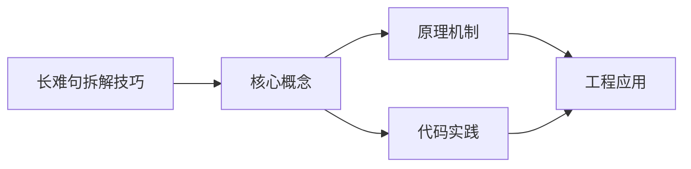

## 1. 学习目标（Bloom 分类）

本节按照布鲁姆教育目标分类学组织学习路径。本文主题为《长难句拆解技巧》，属于 英语 模块，读者可以根据自身阶段选择阅读深度。

记忆层面：能够准确复述本文的核心概念、术语与基本语法或操作步骤，并能够在提问或检索时快速定位对应知识点。能够说出 英语 的核心概念、常用命令与流程。

理解层面：能够用自己的语言解释核心原理与工作机制，说明概念之间的因果关系，而不是机械记忆结论。能够解释 英语 的工作原理与设计动机。

应用层面：能够在真实项目或练习场景中运用本文知识解决具体问题，写出正确且可维护的实现。能够独立完成 英语 的标准操作。

分析层面：能够拆解复杂问题，比较本文主题与相邻概念的异同，识别边界条件与例外情况。能够分析 英语 使用中的异常与边界。

评价层面：能够根据约束条件（性能、可读性、安全、成本）评价不同方案的优劣，做出有依据的技术决策。能够评价 英语 相关工具与方案。

创造层面：能够把本文知识与其他模块知识组合，设计出新的解决方案或可复用的工程模式。能够把 英语 融入团队工作流。

通过本节学习，读者应当能够把《长难句拆解技巧》纳入自己的知识网络，并与 英语 模块的其他主题（专业英语、技术阅读、写作）建立关联。

## 2. 历史动机与发展脉络

《长难句拆解技巧》是 英语 领域的重要主题。要真正理解它，需要先了解它解决的问题与演进过程。

技术英语是开发者与世界交流的语言：官方文档、源码注释、开源社区、技术会议均以英语为主。
学习重点：技术阅读（文档/论文）、技术写作（PR/邮件）、听力（演讲/视频）、口语（会议/面试）。
材料策略：官方文档精读、开源 Issue 阅读、技术博客订阅、英文视频加字幕。

回到本文主题：长难句拆解技巧 的提出与成熟，正是上述技术背景下的必然产物。早期实现往往以简单可用为目标，随着工程规模扩大，社区逐渐沉淀出标准做法与最佳实践；理解这一脉络，可以帮助读者判断“为什么文档中的推荐写法是现在这个样子”，也能在遇到历史遗留代码时准确识别其设计年代与取舍。


## 3. 形式化定义与核心概念精讲

本节把《长难句拆解技巧》涉及的核心概念以“定义 + 讲解”的形式展开。读者应把定义当作工具，把讲解当作理解路径；两者结合才能形成可迁移的知识。

技术词汇：领域术语（repository、deployment、latency、throughput）；词根词缀辅助记忆。
文档阅读结构：标题层级、代码注释、错误信息、FAQ；先框架后细节。
写作规范：主动语态、短句、术语一致；代码块与步骤清晰。

### 3.1 原文章节逐一精讲

原文档把主题拆分为 6 个小节，下面按顺序给出每一节的导读讲解，随后保留原文细节供精读。

#### 原文精读（完整保留）


#### 1. 长难句的构成特征

长难句之所以"长"且"难"，是因为在基本句型基础上叠加了多种修饰和扩展成分：

##### 1.1 长难句的五大来源

| 来源       | 说明                  | 示例                                               |
| ---------- | --------------------- | -------------------------------------------------- |
| 从句嵌套   | 主从句层层嵌套        | ...the fact that the study which...                |
| 多重修饰   | 多个定语/状语同时修饰 | ...the efficient, reliable, and scalable system... |
| 并列结构   | 多个并列成分          | ...to design, develop, and deploy...               |
| 插入成分   | 插入语打断句子        | ...the result, as expected, was...                 |
| 非谓语扩展 | 分词/不定式作修饰     | ...the algorithm designed to optimize...           |

##### 1.2 长难句的典型结构

$$\text{长难句} = \text{主干} + \text{从句} + \text{非谓语} + \text{插入语} + \text{并列结构}$$

#### 2. 长难句拆解方法论

##### 2.1 四步拆解法

```
第一步：找谓语动词 → 确定句子核心
第二步：找连词/关系词 → 划分从句边界
第三步：找修饰成分 → 识别定语/状语/补语
第四步：理清逻辑 → 还原句子含义
```

##### 2.2 第一步：找谓语动词

谓语动词是句子的核心。一个句子中可能有多个动词，需要区分**谓语动词**和**非谓语动词**：

| 特征 | 谓语动词                 | 非谓语动词           |
| ---- | ------------------------ | -------------------- |
| 形式 | 有限定形式（时态、人称） | to do / doing / done |
| 位置 | 主语之后                 | 各种位置             |
| 数量 | 每个分句一个             | 不限                 |

**识别技巧：**

- 排除 to do / doing / done 形式
- 排除从句中的动词
- 剩下的就是主句谓语

##### 2.3 第二步：找连词/关系词

| 类型     | 标志词                      | 功能              |
| -------- | --------------------------- | ----------------- |
| 并列连词 | and, but, or, so, for       | 连接并列成分      |
| 从属连词 | that, whether, if           | 引导名词性从句    |
| 关系代词 | who, which, that, whose     | 引导定语从句      |
| 关系副词 | when, where, why            | 引导定语/状语从句 |
| 从属连词 | because, although, when, if | 引导状语从句      |

**关键原则：** 连词数量 = 从句数量（大致）

##### 2.4 第三步：找修饰成分

| 修饰类型   | 标志             | 处理方式             |
| ---------- | ---------------- | -------------------- |
| 介词短语   | prep. + n.       | 找其修饰对象         |
| 分词短语   | doing/done + ... | 找其逻辑主语         |
| 不定式短语 | to do + ...      | 判断功能（定/状/补） |
| 插入语     | 逗号隔开         | 暂时跳过             |
| 同位语     | 名词解释名词     | 找被解释的名词       |

##### 2.5 第四步：理清逻辑

将拆解后的成分按逻辑关系重组：

1. 先理解主句核心含义
2. 逐层添加从句和修饰成分的含义
3. 调整语序以符合中文表达习惯

#### 3. 实战拆解

##### 3.1 实例一：从句嵌套型

> The discovery that the gene which scientists had been studying for decades was responsible for the disease that had claimed thousands of lives opened up new possibilities for treatment.

**拆解过程：**

| 步骤   | 操作                 | 结果                                                |
| ------ | -------------------- | --------------------------------------------------- |
| 找谓语 | 排除非谓语和从句谓语 | **opened up** (主句谓语)                            |
| 找主干 | 主语 + 谓语 + 宾语   | The discovery opened up new possibilities           |
| 找从句 | 识别连词             | that从句(同位语) → which从句(定语) → that从句(定语) |
| 理逻辑 | 逐层理解             | 见下方                                              |

**逐层理解：**

1. 主干：The discovery opened up new possibilities for treatment.（这一发现为治疗开辟了新的可能。）
2. 同位语从句：the gene was responsible for the disease（该基因导致了这种疾病）
3. 定语从句1：scientists had been studying for decades（科学家们研究了几十年的）
4. 定语从句2：had claimed thousands of lives（夺去了数千人生命的）

**完整翻译：** 科学家们研究了几十年的基因正是导致这种已夺去数千人生命的疾病的元凶，这一发现为治疗开辟了新的可能。

##### 3.2 实例二：非谓语扩展型

> Motivated by the desire to create a system capable of processing massive datasets in real time, the team of researchers, drawing on decades of experience in distributed computing, developed an algorithm designed to optimize resource allocation across multiple servers.

**拆解过程：**

| 成分                                                                                           | 内容         | 类型      |
| ---------------------------------------------------------------------------------------------- | ------------ | --------- |
| Motivated by the desire to create a system capable of processing massive datasets in real time | 过去分词短语 | 原因状语  |
| the team of researchers                                                                        | —            | 主语      |
| drawing on decades of experience in distributed computing                                      | 现在分词短语 | 插入/定语 |
| developed                                                                                      | —            | 谓语      |
| an algorithm                                                                                   | —            | 宾语      |
| designed to optimize resource allocation across multiple servers                               | 过去分词短语 | 宾语定语  |

**完整翻译：** 受到创建一个能够实时处理海量数据集的系统的愿望驱动，这支借鉴了数十年分布式计算经验的研究团队，开发了一种旨在优化多服务器资源分配的算法。

##### 3.3 实例三：并列结构型

> The framework not only provides a robust mechanism for handling concurrent requests but also ensures that the data integrity is maintained across distributed nodes, that the system can recover gracefully from failures, and that the overall performance meets the stringent requirements of modern applications.

**拆解过程：**

| 成分                                                | 类型         |
| --------------------------------------------------- | ------------ |
| The framework                                       | 主语         |
| not only provides... but also ensures               | 并列谓语     |
| a robust mechanism for handling concurrent requests | 宾语1        |
| that the data integrity is maintained...            | 宾语2(从句1) |
| that the system can recover...                      | 宾语2(从句2) |
| that the overall performance meets...               | 宾语2(从句3) |

**完整翻译：** 该框架不仅提供了处理并发请求的健壮机制，还确保了数据完整性在分布式节点间得以维护、系统能够从故障中优雅恢复，以及整体性能满足现代应用的严格要求。

##### 3.4 实例四：插入语打断型

> The hypothesis, which had been widely accepted in the academic community for more than half a century despite mounting evidence to the contrary, was finally overturned by a groundbreaking study published in Nature last month.

**拆解过程：**

| 成分                                                                        | 类型                   |
| --------------------------------------------------------------------------- | ---------------------- |
| The hypothesis                                                              | 主语                   |
| which had been widely accepted... despite mounting evidence to the contrary | 非限制性定语从句(插入) |
| was finally overturned                                                      | 谓语                   |
| by a groundbreaking study                                                   | 状语                   |
| published in Nature last month                                              | 定语                   |

**完整翻译：** 这一假说尽管与越来越多的反面证据相悖，但在学术界被广泛接受了半个多世纪，最终被上个月发表在《自然》上的一项突破性研究所推翻。

#### 4. 特殊句式拆解

##### 4.1 倒装句

| 类型            | 结构                               | 示例                               |
| --------------- | ---------------------------------- | ---------------------------------- |
| 完全倒装        | 介词短语/副词 + 谓语 + 主语        | **On the table lies** a book.      |
| 部分倒装        | 否定词 + 助动词 + 主语 + 谓语      | **Never have I** seen such beauty. |
| only + 状语前置 | Only + 状语 + 助动词 + 主语 + 谓语 | **Only then did** she understand.  |
| so/such 前置    | So + adj./adv. + 助动词 + 主语     | **So fast did** she run that...    |

**拆解策略：** 还原为正常语序再理解。

##### 4.2 强调句

$$\text{It is/was} + \text{被强调部分} + \text{that/who} + \text{其余部分}$$

> It was **the algorithm** that the team optimized. （团队优化的是算法。）

**拆解策略：** 去掉 It is/was...that/who 框架，还原为普通句。

##### 4.3 省略句

| 省略类型     | 示例                                 | 还原                   |
| ------------ | ------------------------------------ | ---------------------- |
| 状语从句省略 | When **young**, she was shy.         | When **she was** young |
| 并列省略     | She likes apples and **he** oranges. | he **likes** oranges   |
| 不定式省略   | You may go if you want **to**.       | want to **go**         |

**拆解策略：** 补全省略成分再理解。

##### 4.4 分隔结构

> The time **has come** when we must act. （我们必须行动的时候到了。）

主语 The time 和定语从句 when we must act 被 has come 分隔。

**拆解策略：** 找到被分隔的成分，还原其逻辑关系。

#### 5. 长难句翻译技巧

##### 5.1 语序调整原则

| 英文语序 | 中文语序 | 示例                                                                 |
| -------- | -------- | -------------------------------------------------------------------- |
| 定语后置 | 定语前置 | the book **on the table** → **桌上的**书                             |
| 状语后置 | 状语前置 | She left **because she was tired** → **因为她累了**，她离开了        |
| 主从复合 | 先因后果 | He succeeded **because** he worked hard → **因为他努力了**，他成功了 |
| 插入语   | 调整位置 | She is, **however**, right → 然而，她是对的                          |

##### 5.2 拆分与合并

| 技巧   | 说明           | 示例         |
| ------ | -------------- | ------------ |
| 顺译法 | 按原文顺序翻译 | 适合并列结构 |
| 逆译法 | 从后往前翻译   | 适合多重定语 |
| 分译法 | 拆成多个短句   | 适合长从句   |
| 合译法 | 合并为一个句子 | 适合并列短句 |

#### 6. 知识讲解与要点分析（原练习）

##### 6.1 日常训练

1. **每日一句**：每天分析一个长难句，写出结构图
2. **翻译对照**：先自己翻译，再对照参考译文
3. **仿写练习**：模仿长难句结构造句
4. **限时阅读**：训练快速理解长难句的能力

##### 6.2 分析模板

```
原文：
主干：
从句1：
从句2：
修饰成分：
翻译：
```


### 3.2 概念关系图

下面用 Mermaid 图表达本文核心概念之间的关系，帮助读者建立整体图景：



图中展示的是本文知识的结构化关系：核心概念是入口，原理机制解释“为什么”，代码实践演示“怎么做”，工程应用回答“何时用”。读者学习时可以把每个小节的内容挂接到对应节点上。

## 4. 理论推导与原理解析

本节深入《长难句拆解技巧》背后的原理。理论部分不求面面俱到，而是聚焦“能解释现象、能指导实践”的关键推导。

技术词汇：领域术语（repository、deployment、latency、throughput）；词根词缀辅助记忆。
文档阅读结构：标题层级、代码注释、错误信息、FAQ；先框架后细节。
写作规范：主动语态、短句、术语一致；代码块与步骤清晰。
学习曲线：阅读最容易，写作其次，听说最难；按需分配时间。

需要强调的是，理论推导与工程实践之间存在翻译层：理论给出的是理想化模型与边界条件，工程代码则必须处理真实环境中的例外。读者在学习时应先掌握理论的“标准情形”，再通过陷阱章节了解“非标准情形”。

## 5. 代码示例与逐行讲解

本节把原文中的代码示例系统整理，并为每个示例补充用途说明与讲解。读者不应只浏览代码，而应逐段对照讲解理解设计意图。

### 5.1 示例：2.1 四步拆解法

该示例来自原文《2.1 四步拆解法》小节，用于演示长难句拆解技巧相关操作。阅读时请先看代码结构，再看其后的讲解。

```text
第一步：找谓语动词 → 确定句子核心
第二步：找连词/关系词 → 划分从句边界
第三步：找修饰成分 → 识别定语/状语/补语
第四步：理清逻辑 → 还原句子含义
```

讲解：这段代码演示了本节核心知识点。代码中的关键操作可以归纳为三步：准备（定义或初始化）、执行（核心逻辑）、收尾（释放资源或返回结果）。实际项目中，这三步往往被封装为函数或类，以提升复用性与可测试性。

关键点分析：

该示例共 4 行有效代码，结构以数据或配置为主。阅读时应关注：数据字段的含义、配置项的作用，以及它们与运行行为的对应关系。

进阶思考路径：先尝试修改参数观察行为变化，再把示例中的模式迁移到自己的项目中；每次修改都记录预期与实测差异，这是把示例转化为能力的最快方式。

### 5.2 示例：6.2 分析模板

该示例来自原文《6.2 分析模板》小节，用于演示长难句拆解技巧相关操作。阅读时请先看代码结构，再看其后的讲解。

```text
原文：
主干：
从句1：
从句2：
修饰成分：
翻译：
```

讲解：这段代码演示了本节核心知识点。代码中的关键操作可以归纳为三步：准备（定义或初始化）、执行（核心逻辑）、收尾（释放资源或返回结果）。实际项目中，这三步往往被封装为函数或类，以提升复用性与可测试性。

关键点分析：

该示例共 6 行有效代码，结构以数据或配置为主。阅读时应关注：数据字段的含义、配置项的作用，以及它们与运行行为的对应关系。

进阶思考路径：先尝试修改参数观察行为变化，再把示例中的模式迁移到自己的项目中；每次修改都记录预期与实测差异，这是把示例转化为能力的最快方式。


综合以上示例，可以总结出本主题的代码实践要点：第一，先定义清晰的输入输出契约；第二，核心逻辑保持单一职责；第三，错误处理与边界条件不可省略；第四，命名与注释表达意图而非复述代码。

## 6. 对比分析

对比是理解《长难句拆解技巧》定位的最快路径。下面从多个维度与相邻方案进行对比。

通用英语与技术英语：通用英语打基础，技术英语聚焦文档与会议。
翻译与直读：直读保留原意与速度；翻译辅助理解。
美音与英音：选择一种为主，能听懂两者。

对比的目的不是分出绝对优劣，而是建立选择依据：不同约束条件下，最优解不同。读者应把每个对比维度转化为决策检查清单。

## 7. 常见陷阱与最佳实践

本节整理该主题的高频错误与推荐做法。每个陷阱先描述现象，再解释原因，最后给出最佳实践。

### 7.1 只看中文资料

信息滞后且失真。官方英文优先。

深入讲解：该问题之所以被归类为“常见陷阱”，是因为它在初学者的代码中反复出现，而且往往不在第一时间暴露——错误通常隐藏在特定数据或特定时序下。

从成因上看，只看中文资料 一般源于对 英语 某个机制的理解偏差：要么误用了默认行为，要么忽略了边界条件，要么把其他语言的思维惯性带了过来。

从影响上看，只看中文资料 轻则产生错误结果，重则导致资源泄漏、数据损坏或安全事故；这也是为什么工程评审中会把它列为检查项。

从修复策略上看，处理只看中文资料的正确顺序是：先复现（构造最小用例），再定位（确认机制层面的根因），最后修复并补充回归测试。跳过复现直接改代码，往往治标不治本。

### 7.2 逐词翻译

理解慢。按意群与结构阅读。

深入讲解：该问题之所以被归类为“常见陷阱”，是因为它在初学者的代码中反复出现，而且往往不在第一时间暴露——错误通常隐藏在特定数据或特定时序下。

从成因上看，逐词翻译 一般源于对 英语 某个机制的理解偏差：要么误用了默认行为，要么忽略了边界条件，要么把其他语言的思维惯性带了过来。

从影响上看，逐词翻译 轻则产生错误结果，重则导致资源泄漏、数据损坏或安全事故；这也是为什么工程评审中会把它列为检查项。

从修复策略上看，处理逐词翻译的正确顺序是：先复现（构造最小用例），再定位（确认机制层面的根因），最后修复并补充回归测试。跳过复现直接改代码，往往治标不治本。

### 7.3 不积累词汇

重复查词。生词本 + 间隔复习。

深入讲解：该问题之所以被归类为“常见陷阱”，是因为它在初学者的代码中反复出现，而且往往不在第一时间暴露——错误通常隐藏在特定数据或特定时序下。

从成因上看，不积累词汇 一般源于对 英语 某个机制的理解偏差：要么误用了默认行为，要么忽略了边界条件，要么把其他语言的思维惯性带了过来。

从影响上看，不积累词汇 轻则产生错误结果，重则导致资源泄漏、数据损坏或安全事故；这也是为什么工程评审中会把它列为检查项。

从修复策略上看，处理不积累词汇的正确顺序是：先复现（构造最小用例），再定位（确认机制层面的根因），最后修复并补充回归测试。跳过复现直接改代码，往往治标不治本。

### 7.4 不敢写

开口/动手才进步。从 PR 描述与评论开始。

深入讲解：该问题之所以被归类为“常见陷阱”，是因为它在初学者的代码中反复出现，而且往往不在第一时间暴露——错误通常隐藏在特定数据或特定时序下。

从成因上看，不敢写 一般源于对 英语 某个机制的理解偏差：要么误用了默认行为，要么忽略了边界条件，要么把其他语言的思维惯性带了过来。

从影响上看，不敢写 轻则产生错误结果，重则导致资源泄漏、数据损坏或安全事故；这也是为什么工程评审中会把它列为检查项。

从修复策略上看，处理不敢写的正确顺序是：先复现（构造最小用例），再定位（确认机制层面的根因），最后修复并补充回归测试。跳过复现直接改代码，往往治标不治本。

### 7.5 忽略发音

听说受阻。音标 + 影子跟读。

深入讲解：该问题之所以被归类为“常见陷阱”，是因为它在初学者的代码中反复出现，而且往往不在第一时间暴露——错误通常隐藏在特定数据或特定时序下。

从成因上看，忽略发音 一般源于对 英语 某个机制的理解偏差：要么误用了默认行为，要么忽略了边界条件，要么把其他语言的思维惯性带了过来。

从影响上看，忽略发音 轻则产生错误结果，重则导致资源泄漏、数据损坏或安全事故；这也是为什么工程评审中会把它列为检查项。

从修复策略上看，处理忽略发音的正确顺序是：先复现（构造最小用例），再定位（确认机制层面的根因），最后修复并补充回归测试。跳过复现直接改代码，往往治标不治本。

### 7.6 材料太难

挫败放弃。i+1 原则选材。

深入讲解：该问题之所以被归类为“常见陷阱”，是因为它在初学者的代码中反复出现，而且往往不在第一时间暴露——错误通常隐藏在特定数据或特定时序下。

从成因上看，材料太难 一般源于对 英语 某个机制的理解偏差：要么误用了默认行为，要么忽略了边界条件，要么把其他语言的思维惯性带了过来。

从影响上看，材料太难 轻则产生错误结果，重则导致资源泄漏、数据损坏或安全事故；这也是为什么工程评审中会把它列为检查项。

从修复策略上看，处理材料太难的正确顺序是：先复现（构造最小用例），再定位（确认机制层面的根因），最后修复并补充回归测试。跳过复现直接改代码，往往治标不治本。

### 7.7 无输出

只输入不输出。写博客/翻译文档。

深入讲解：该问题之所以被归类为“常见陷阱”，是因为它在初学者的代码中反复出现，而且往往不在第一时间暴露——错误通常隐藏在特定数据或特定时序下。

从成因上看，无输出 一般源于对 英语 某个机制的理解偏差：要么误用了默认行为，要么忽略了边界条件，要么把其他语言的思维惯性带了过来。

从影响上看，无输出 轻则产生错误结果，重则导致资源泄漏、数据损坏或安全事故；这也是为什么工程评审中会把它列为检查项。

从修复策略上看，处理无输出的正确顺序是：先复现（构造最小用例），再定位（确认机制层面的根因），最后修复并补充回归测试。跳过复现直接改代码，往往治标不治本。

### 7.8 突击式学习

无效果。每日少量持续。

深入讲解：该问题之所以被归类为“常见陷阱”，是因为它在初学者的代码中反复出现，而且往往不在第一时间暴露——错误通常隐藏在特定数据或特定时序下。

从成因上看，突击式学习 一般源于对 英语 某个机制的理解偏差：要么误用了默认行为，要么忽略了边界条件，要么把其他语言的思维惯性带了过来。

从影响上看，突击式学习 轻则产生错误结果，重则导致资源泄漏、数据损坏或安全事故；这也是为什么工程评审中会把它列为检查项。

从修复策略上看，处理突击式学习的正确顺序是：先复现（构造最小用例），再定位（确认机制层面的根因），最后修复并补充回归测试。跳过复现直接改代码，往往治标不治本。

### 7.0 最佳实践总览

1. 每日固定 30 分钟：阅读 + 词汇 + 听力。
2. 阅读技术文档时先扫标题、代码与结论。
3. 写作用模板起步（PR、邮件、README）。
4. 把生词放入真实句子记忆。

把这些最佳实践固化为团队规范与代码评审检查项，是避免同类问题反复出现的关键。

## 8. 工程实践

本节把《长难句拆解技巧》放入真实工程场景，给出可复用的模式与组织方法。

阅读计划：每周 1 篇官方文档 + 1 篇博客；精读记录术语。
写作输出：每周 1 条 PR 描述或技术笔记（英文）。
听力：技术演讲（TED/会议）影子跟读。

### 8.1 工程实践的原则拆解

以上工程实践可以归纳为四条原则。第一，配置与代码分离：英语 项目中环境差异应通过配置注入，而不是散落在代码分支中；这保证同一份代码可以在开发、测试、生产环境一致运行。

第二，接口稳定优先：对外接口（函数签名、协议、数据格式）一旦被消费方依赖，变更成本极高；设计时应预留扩展点并保持向后兼容。

第三，可观测性内置：日志、指标与追踪应该在功能开发时同步设计，而不是故障发生后补救；没有观测手段的模块等于黑盒。

第四，变更可回滚：任何发布都应有对应的回滚方案；数据库迁移、配置变更与代码发布一样需要版本管理与逆向路径。

### 8.2 实践落地的检查清单

- [ ] 阅读计划：对照本节描述，检查当前项目是否已经落实；未落实的项列入技术债并排期处理。
- [ ] 写作输出：对照本节描述，检查当前项目是否已经落实；未落实的项列入技术债并排期处理。
- [ ] 听力：对照本节描述，检查当前项目是否已经落实；未落实的项列入技术债并排期处理。

工程实践的共性原则：配置与代码分离、接口稳定优先、可观测性内置、变更可回滚。这些原则适用于本主题的所有实现。

## 9. 案例研究

本节通过一个完整案例把《长难句拆解技巧》的知识串起来。案例按“需求分析、方案设计、实现、验证”四步展开。

需求：三个月提升技术文档阅读速度。
方案：每日 30 分钟精读 + 词汇复习 + 周输出。
要点：选择兴趣领域材料、记录术语表。
验证：阅读速度与理解率前后对比。

### 9.1 案例的扩展讨论

把案例中的方案放大到真实规模，需要额外考虑三个问题：

第一，规模：当数据量或并发量上升一个数量级时，原方案中的数据结构、缓存策略与任务调度是否仍然成立？通常需要引入分层与异步。

第二，团队：多人协作时，模块边界、接口契约与代码所有权必须明确；案例中的实现应拆分为可独立测试的单元，并配合文档说明设计意图。

第三，演进：上线后的需求变化不可避免；方案设计时应预留扩展点（配置化、插件化、事件化），并定期用真实指标验证假设。


案例研究的学习方法：先独立阅读需求，尝试在脑中形成方案，再对照实现与讲解，最后思考“如果约束变化（数据量、并发、团队规模），方案应如何调整”。

## 10. 知识要点总结与深入讲解

本节以讲解形式汇总全文要点，替代传统的习题与自测，读者不需要答题，只需跟随解释建立完整的认知框架。

关于《长难句拆解技巧》的核心结论：

技术英语是“用”出来的，不是“学”出来的。
阅读先行，写作跟进，听说持续。
把英语融入日常开发流程而非单独学习。

原文档各小节的要点回顾：

- 1. 长难句的构成特征：该小节围绕长难句拆解技巧展开具体细节，阅读时应关注其与核心结论的对应关系；每个小节都是核心结论在某一个侧面的展开。
- 2. 长难句拆解方法论：该小节围绕长难句拆解技巧展开具体细节，阅读时应关注其与核心结论的对应关系；每个小节都是核心结论在某一个侧面的展开。
- 3. 实战拆解：该小节围绕长难句拆解技巧展开具体细节，阅读时应关注其与核心结论的对应关系；每个小节都是核心结论在某一个侧面的展开。
- 4. 特殊句式拆解：该小节围绕长难句拆解技巧展开具体细节，阅读时应关注其与核心结论的对应关系；每个小节都是核心结论在某一个侧面的展开。
- 5. 长难句翻译技巧：该小节围绕长难句拆解技巧展开具体细节，阅读时应关注其与核心结论的对应关系；每个小节都是核心结论在某一个侧面的展开。
- 6. 知识讲解与要点分析（原练习）：该小节围绕长难句拆解技巧展开具体细节，阅读时应关注其与核心结论的对应关系；每个小节都是核心结论在某一个侧面的展开。

把以上要点与第 3-9 节的内容对照复习，即可完成对本文主题的闭环学习。

## 11. 参考文献


Merriam-Webster：https://www.merriam-webster.com/
Stack Overflow：https://stackoverflow.com/
Hacker News：https://news.ycombinator.com/
BBC Learning English：https://www.bbc.co.uk/learningenglish

## 12. 延伸阅读


英语学习材料与规划，见 005-english 模块文档。
技术写作（Markdown），见 002-markdown 模块。
开源协作中的英语沟通，见 004-github 模块。
黑马程序员 Bilibili 空间（https://space.bilibili.com/37974444 ）提供英语课程。

## 14. 模块知识图谱与学习路径

本文属于 英语 模块。为了把《长难句拆解技巧》放入完整的知识网络，下面列出本模块的全部主题并给出相互关联的导读。学习时建议按模块内顺序推进，并在每个文档中留意交叉引用。


上图为模块主题的推荐学习顺序示意图（仅展示前若干主题）。各主题之间存在三类关联：

第一，前置依赖关系：早期主题是后期主题的基础，例如环境与语法先行、进阶主题随后；

第二，横向并列关系：同一层级主题从不同角度覆盖模块能力，学习顺序可以按兴趣调整；

第三，工程组合关系：多个主题在真实项目中组合使用，例如配置、性能与安全主题往往出现在同一系统的不同层面。

### 14.1 模块主题速查表

| 文档 | 主题 | 与本文的关联 |
| --- | --- | --- |
| 计算机专业英语词汇 | 001-ComputerProfessionalEnglishVocabulary | 本文的并列主题 |
| 英语语法体系总览 | 002-EnglishGrammarSystemOverview | 本文的并列主题 |
| 句子结构与成分分析 | 003-SentenceStructureAnalysis | 本文的并列主题 |
| 复合句与从句 | 004-CompoundSentenceClause | 本文的并列主题 |
| 长难句拆解技巧 | 005-LongDifficultSentenceBreakdownTechnique | 本文自身 |
| 常见语法错误汇总 | 006-CommonGrammarErrorSummary | 本文的并列主题 |
| 技术文档阅读方法 | 007-TechDocReadingMethod | 本文的并列主题 |
| 学术论文阅读指南 | 008-AcademicPaperReadingGuide | 本文的并列主题 |
| 学术写作规范 | 009-AcademicWritingStandard | 本文的并列主题 |
| 技术文档写作 | 010-TechDocWriting | 本文的并列主题 |
| 英译汉技巧 | 011-EnglishToChineseTechnique | 本文的并列主题 |
| 汉译英技巧 | 012-ChineseToEnglishTechnique | 本文的并列主题 |
| 技术翻译要点 | 013-TechTranslationPoints | 本文的并列主题 |

速查表的作用是让读者快速判断：哪些文档应在阅读本文前掌握（前置基础），哪些文档应在阅读本文后继续（延伸主题）。本模块的交叉引用体系即以此表为基础。

## 15. 术语表

下表整理《长难句拆解技巧》及 英语 模块中出现的高频术语，给出简明释义。术语按字母序或逻辑序排列，供查阅。

| 术语 | 释义 |
| --- | --- |
| 技术词汇 | 领域术语（repository、deployment、latency、throughput）；词根词缀辅助记忆。 |
| 文档阅读结构 | 标题层级、代码注释、错误信息、FAQ；先框架后细节。 |
| 写作规范 | 主动语态、短句、术语一致；代码块与步骤清晰。 |
| 学习曲线 | 阅读最容易，写作其次，听说最难；按需分配时间。 |
| 只看中文资料（易错点） | 参见常见陷阱章节的详细讲解 |
| 逐词翻译（易错点） | 参见常见陷阱章节的详细讲解 |
| 不积累词汇（易错点） | 参见常见陷阱章节的详细讲解 |
| 不敢写（易错点） | 参见常见陷阱章节的详细讲解 |
| 忽略发音（易错点） | 参见常见陷阱章节的详细讲解 |
| 材料太难（易错点） | 参见常见陷阱章节的详细讲解 |

术语表与正文配合使用：先通读正文，遇到模糊术语回查本表；长期使用后术语会自然进入工作记忆。

## 13. 深度专题扩展

以下专题从不同角度深入本文主题，供有进阶需求的读者研读。每个专题独立成节，内容相互补充。

### 13.1 技术文档精读法

第一遍：标题、目录、代码、结论（5 分钟）。
第二遍：逐节理解，查术语，标注疑问（20 分钟）。
第三遍：复述总结，写笔记（5 分钟）。
间隔复习笔记，术语进入长期记忆。

### 13.2 技术写作入门

结构：标题、背景、步骤、结论；读者导向。
语言：短句、主动语态、具体动词（run、build、deploy）。
格式：Markdown、代码块、列表；与代码风格一致。
练习：改写官方文档片段、写 README、PR 描述。

## 16. 核心概念串讲（复习视角）

本节以“把知识讲给他人听”的方式，把《长难句拆解技巧》的核心概念重新串讲一遍。与前文按章节展开不同，这里的叙述更接近课堂总结：先说整体，再逐个展开，最后收束。

《长难句拆解技巧》属于 英语 模块。要理解它，先要理解它在模块中的位置：它解决的是该领域的一个具体问题，并依赖模块内若干前置概念；反过来，它又为后续进阶主题提供基础。

第一个概念是技术词汇。领域术语（repository、deployment、latency、throughput）；词根词缀辅助记忆。

在实际使用中，技术词汇需要与相邻概念区分：它们的区别不在于名称，而在于适用条件与行为边界；这正是前文对比分析章节的意义。

第一个概念是文档阅读结构。标题层级、代码注释、错误信息、FAQ；先框架后细节。

在实际使用中，文档阅读结构需要与相邻概念区分：它们的区别不在于名称，而在于适用条件与行为边界；这正是前文对比分析章节的意义。

第一个概念是写作规范。主动语态、短句、术语一致；代码块与步骤清晰。

在实际使用中，写作规范需要与相邻概念区分：它们的区别不在于名称，而在于适用条件与行为边界；这正是前文对比分析章节的意义。

接下来是技术词汇。领域术语（repository、deployment、latency、throughput）；词根词缀辅助记忆。

理解该原理的关键不是记住结论，而是记住“它从什么假设出发、推出了什么、假设不成立时会怎样”。带着这个框架复习，原理之间就会连成网络。

接下来是文档阅读结构。标题层级、代码注释、错误信息、FAQ；先框架后细节。

理解该原理的关键不是记住结论，而是记住“它从什么假设出发、推出了什么、假设不成立时会怎样”。带着这个框架复习，原理之间就会连成网络。

接下来是写作规范。主动语态、短句、术语一致；代码块与步骤清晰。

理解该原理的关键不是记住结论，而是记住“它从什么假设出发、推出了什么、假设不成立时会怎样”。带着这个框架复习，原理之间就会连成网络。

接下来是学习曲线。阅读最容易，写作其次，听说最难；按需分配时间。

理解该原理的关键不是记住结论，而是记住“它从什么假设出发、推出了什么、假设不成立时会怎样”。带着这个框架复习，原理之间就会连成网络。

串讲收束：把概念与原理放回本文主题，可以得出一个总纲——定义描述是什么，原理解释为什么，实践回答怎么做。三者构成完整的学习闭环；后续遇到相关问题，都可以按这个总纲检索知识。
