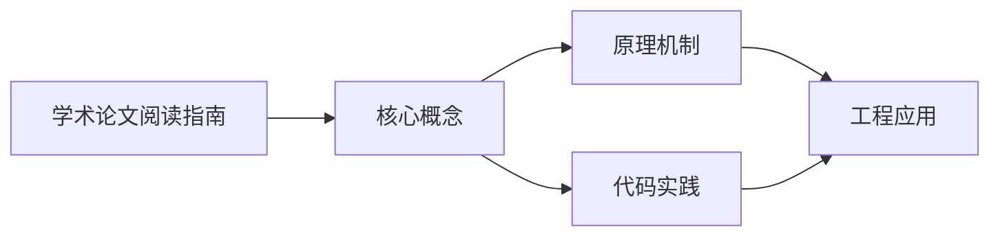
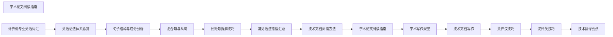

## 1. 学习目标（Bloom 分类）

本节按照布鲁姆教育目标分类学组织学习路径。本文主题为《学术论文阅读指南》，属于 英语 模块，读者可以根据自身阶段选择阅读深度。

记忆层面：能够准确复述本文的核心概念、术语与基本语法或操作步骤，并能够在提问或检索时快速定位对应知识点。能够说出 英语 的核心概念、常用命令与流程。

理解层面：能够用自己的语言解释核心原理与工作机制，说明概念之间的因果关系，而不是机械记忆结论。能够解释 英语 的工作原理与设计动机。

应用层面：能够在真实项目或练习场景中运用本文知识解决具体问题，写出正确且可维护的实现。能够独立完成 英语 的标准操作。

分析层面：能够拆解复杂问题，比较本文主题与相邻概念的异同，识别边界条件与例外情况。能够分析 英语 使用中的异常与边界。

评价层面：能够根据约束条件（性能、可读性、安全、成本）评价不同方案的优劣，做出有依据的技术决策。能够评价 英语 相关工具与方案。

创造层面：能够把本文知识与其他模块知识组合，设计出新的解决方案或可复用的工程模式。能够把 英语 融入团队工作流。

通过本节学习，读者应当能够把《学术论文阅读指南》纳入自己的知识网络，并与 英语 模块的其他主题（专业英语、技术阅读、写作）建立关联。

## 2. 历史动机与发展脉络

《学术论文阅读指南》是 英语 领域的重要主题。要真正理解它，需要先了解它解决的问题与演进过程。

技术英语是开发者与世界交流的语言：官方文档、源码注释、开源社区、技术会议均以英语为主。
学习重点：技术阅读（文档/论文）、技术写作（PR/邮件）、听力（演讲/视频）、口语（会议/面试）。
材料策略：官方文档精读、开源 Issue 阅读、技术博客订阅、英文视频加字幕。

回到本文主题：学术论文阅读指南 的提出与成熟，正是上述技术背景下的必然产物。早期实现往往以简单可用为目标，随着工程规模扩大，社区逐渐沉淀出标准做法与最佳实践；理解这一脉络，可以帮助读者判断“为什么文档中的推荐写法是现在这个样子”，也能在遇到历史遗留代码时准确识别其设计年代与取舍。


## 3. 形式化定义与核心概念精讲

本节把《学术论文阅读指南》涉及的核心概念以“定义 + 讲解”的形式展开。读者应把定义当作工具，把讲解当作理解路径；两者结合才能形成可迁移的知识。

技术词汇：领域术语（repository、deployment、latency、throughput）；词根词缀辅助记忆。
文档阅读结构：标题层级、代码注释、错误信息、FAQ；先框架后细节。
写作规范：主动语态、短句、术语一致；代码块与步骤清晰。

### 3.1 原文章节逐一精讲

原文档把主题拆分为 8 个小节，下面按顺序给出每一节的导读讲解，随后保留原文细节供精读。

#### 原文精读（完整保留）


#### 1. 学术论文的结构

##### 1.1 IMRaD 结构

大多数理工科论文遵循 **IMRaD** 结构：

$$\text{Abstract} \rightarrow \text{Introduction} \rightarrow \text{Method} \rightarrow \text{Results} \rightarrow \text{Discussion} \rightarrow \text{Conclusion}$$

| 部分         | 功能       | 阅读优先级 | 建议用时 |
| ------------ | ---------- | ---------- | -------- |
| Title        | 点明主题   |            | 30秒     |
| Abstract     | 全文摘要   |            | 3分钟    |
| Introduction | 背景与动机 |            | 10分钟   |
| Method       | 方法描述   |            | 15分钟   |
| Results      | 实验结果   |            | 10分钟   |
| Discussion   | 讨论与分析 |            | 10分钟   |
| Conclusion   | 结论与展望 |            | 5分钟    |
| References   | 参考文献   |            | 按需     |

##### 1.2 阅读策略：三遍阅读法

| 遍数   | 目标     | 时间      | 关注点                       |
| ------ | -------- | --------- | ---------------------------- |
| 第一遍 | 鸟瞰全文 | 5-10 min  | 标题、摘要、引言、图表、结论 |
| 第二遍 | 掌握内容 | 30-60 min | 方法、结果、讨论，标记关键点 |
| 第三遍 | 深度理解 | 1-2 hours | 重现方法，批判性思考         |

#### 2. 摘要 (Abstract) 阅读

##### 2.1 摘要的四要素

一篇完整的摘要通常包含四个要素：

| 要素 | 问题             | 常见表达                                                |
| ---- | ---------------- | ------------------------------------------------------- |
| 背景 | 研究领域是什么？ | In recent years, ... / ...has attracted attention       |
| 问题 | 要解决什么问题？ | However, ...remains a challenge / ...is still limited   |
| 方法 | 用什么方法解决？ | We propose... / This paper presents...                  |
| 结果 | 得到了什么结果？ | Our approach achieves... / Experimental results show... |

##### 2.2 摘要阅读策略

1. 快速识别四个要素
2. 判断论文是否与自己的研究相关
3. 提取核心贡献（novelty）

##### 2.3 摘要常见句式

| 功能     | 句式                                                     |
| -------- | -------------------------------------------------------- |
| 提出方法 | We propose / present / introduce a novel approach for... |
| 陈述结果 | Our method achieves / outperforms / demonstrates...      |
| 强调贡献 | To the best of our knowledge, this is the first...       |
| 指出局限 | However, existing methods suffer from...                 |

#### 3. 引言 (Introduction) 阅读

##### 3.1 引言的漏斗结构

```
宽泛背景 → 具体领域 → 现有方法 → 存在问题 → 本文贡献
```

| 段落  | 功能     | 标志词                                     |
| ----- | -------- | ------------------------------------------ |
| 第1段 | 研究背景 | ...has become increasingly important...    |
| 第2段 | 现有方法 | Several approaches have been proposed...   |
| 第3段 | 现有不足 | However, these methods have limitations... |
| 第4段 | 本文方法 | In this paper, we propose...               |
| 第5段 | 贡献列表 | Our main contributions are as follows:     |

##### 3.2 引言阅读重点

**1) 识别研究空白 (Research Gap)**

| 表达                                 | 含义             |
| ------------------------------------ | ---------------- |
| little attention has been paid to... | 很少有人关注     |
| remains an open problem              | 仍是一个开放问题 |
| has not been fully explored          | 尚未充分探索     |
| suffers from...                      | 存在…问题        |
| is still limited by...               | 仍受限于…        |

**2) 提取贡献 (Contributions)**

贡献通常以列表形式呈现：

> Our main contributions are as follows:
>
> - We propose a novel framework for...
> - We introduce a new loss function that...
> - We conduct extensive experiments on...

**3) 理解动机 (Motivation)**

问自己：作者为什么要做这个研究？解决了什么痛点？

#### 4. 方法 (Method) 阅读

##### 4.1 方法部分的结构

```
问题形式化 (Problem Formulation)
    ↓
整体框架 (Overall Framework/Architecture)
    ↓
核心模块 (Key Components)
    ↓
训练/优化策略 (Training/Optimization)
    ↓
实现细节 (Implementation Details)
```

##### 4.2 方法阅读策略

**第一遍：理解整体框架**

1. 找到框架图 (Framework Figure)
2. 理解输入 → 处理 → 输出的流程
3. 识别核心模块及其关系

**第二遍：理解核心模块**

1. 逐个阅读模块描述
2. 理解数学公式
3. 对照代码实现（如有）

**第三遍：理解细节**

1. 超参数设置
2. 训练策略
3. 计算复杂度

##### 4.3 数学公式阅读技巧

| 技巧         | 说明                       |
| ------------ | -------------------------- |
| 先看文字描述 | 公式前通常有文字解释       |
| 识别符号定义 | 论文会定义所有符号         |
| 理解输入输出 | 每个公式的输入和输出是什么 |
| 关注核心公式 | 跳过推导，先理解核心公式   |
| 对比经典方法 | 与已知方法对比理解         |

**常见数学符号：**

| 符号          | 含义                  |
| ------------- | --------------------- |
| $\mathcal{L}$ | 损失函数 (Loss)       |
| $\theta$      | 模型参数 (Parameters) |
| $\nabla$      | 梯度 (Gradient)       |
| $\arg\max$    | 取最大值的参数        |
| $\mathbb{E}$  | 期望 (Expectation)    |
| $\sim$        | 服从分布              |
| $\odot$       | 逐元素乘法            |

#### 5. 实验 (Experiments) 阅读

##### 5.1 实验部分的结构

```
实验设置 (Experimental Setup)
    - 数据集 (Datasets)
    - 评估指标 (Evaluation Metrics)
    - 基线方法 (Baselines)
    - 实现细节 (Implementation Details)
    ↓
主要结果 (Main Results)
    ↓
消融实验 (Ablation Study)
    ↓
分析实验 (Analysis)
```

##### 5.2 实验阅读重点

**1) 数据集**

| 问题             | 关注点             |
| ---------------- | ------------------ |
| 用了哪些数据集？ | 是否是标准基准？   |
| 数据集规模？     | 样本数量、类别数   |
| 数据划分？       | 训练/验证/测试比例 |

**2) 评估指标**

| 领域 | 常见指标                             |
| ---- | ------------------------------------ |
| 分类 | Accuracy, Precision, Recall, F1, AUC |
| 检测 | mAP, IoU                             |
| 生成 | BLEU, ROUGE, Perplexity              |
| 回归 | MSE, MAE, $R^2$                      |
| NLP  | BLEU, METEOR, BERTScore              |

**3) 基线方法**

- 是否与最新的方法比较？
- 是否有公平比较（相同设置）？
- 是否有 Oracle/Upper bound？

**4) 结果表格**

| 阅读技巧     | 说明             |
| ------------ | ---------------- |
| 先看表头     | 了解比较维度     |
| 找最佳结果   | 通常加粗显示     |
| 关注提升幅度 | 相对提升百分比   |
| 注意 ± 值    | 标准差反映稳定性 |

**5) 消融实验**

消融实验验证每个组件的贡献：

> Full model: 95.2%
> w/o Component A: 92.1% (-3.1%) → Component A 贡献 3.1%
> w/o Component B: 93.5% (-1.7%) → Component B 贡献 1.7%

#### 6. 讨论 (Discussion) 阅读

##### 6.1 讨论部分的内容

| 内容           | 问题                    |
| -------------- | ----------------------- |
| 结果解释       | 为什么这个方法有效？    |
| 与已有工作对比 | 与其他方法的一致性/差异 |
| 局限性         | 方法的不足之处          |
| 失败分析       | 哪些情况下方法失效？    |
| 未来方向       | 可以如何改进？          |

##### 6.2 局限性的常见表达

| 表达                                                 | 含义                            |
| ---------------------------------------------------- | ------------------------------- |
| A limitation of our approach is...                   | 我们方法的局限是…               |
| Our method may not generalize to...                  | 我们的方法可能无法泛化到…       |
| This approach relies on... which may not always hold | 此方法依赖于…，而这并不总是成立 |
| Future work could explore...                         | 未来工作可以探索…               |

#### 7. 结论 (Conclusion) 阅读

##### 7.1 结论的内容

1. **总结贡献**：重申核心发现
2. **强调意义**：说明研究价值
3. **展望未来**：指出未来方向

##### 7.2 结论阅读策略

- 与摘要对照阅读，确认一致性
- 提取作者认为最重要的发现
- 关注未来工作方向，寻找研究机会

#### 8. 论文阅读管理

##### 8.1 论文管理工具

| 工具     | 特点                 |
| -------- | -------------------- |
| Zotero   | 免费开源，浏览器插件 |
| Mendeley | PDF 标注，社交功能   |
| ReadCube | 智能推荐，PDF 管理   |
| Notion   | 灵活笔记，数据库管理 |

##### 8.2 论文笔记模板

```
论文标题：
作者：
发表年份/会议：
核心问题：
提出方法：
主要贡献：
关键结果：
个人评价：
可借鉴之处：
```

##### 8.3 论文阅读计划

| 阶段 | 目标         | 每周阅读量           |
| ---- | ------------ | -------------------- |
| 入门 | 了解领域概貌 | 2-3 篇（精读1篇）    |
| 进阶 | 深入研究方向 | 3-5 篇（精读2篇）    |
| 深入 | 追踪最新进展 | 5-10 篇（精读1-2篇） |


### 3.2 概念关系图

下面用 Mermaid 图表达本文核心概念之间的关系，帮助读者建立整体图景：



图中展示的是本文知识的结构化关系：核心概念是入口，原理机制解释“为什么”，代码实践演示“怎么做”，工程应用回答“何时用”。读者学习时可以把每个小节的内容挂接到对应节点上。

## 4. 理论推导与原理解析

本节深入《学术论文阅读指南》背后的原理。理论部分不求面面俱到，而是聚焦“能解释现象、能指导实践”的关键推导。

技术词汇：领域术语（repository、deployment、latency、throughput）；词根词缀辅助记忆。
文档阅读结构：标题层级、代码注释、错误信息、FAQ；先框架后细节。
写作规范：主动语态、短句、术语一致；代码块与步骤清晰。
学习曲线：阅读最容易，写作其次，听说最难；按需分配时间。

需要强调的是，理论推导与工程实践之间存在翻译层：理论给出的是理想化模型与边界条件，工程代码则必须处理真实环境中的例外。读者在学习时应先掌握理论的“标准情形”，再通过陷阱章节了解“非标准情形”。

## 5. 代码示例与逐行讲解

本节把原文中的代码示例系统整理，并为每个示例补充用途说明与讲解。读者不应只浏览代码，而应逐段对照讲解理解设计意图。

### 5.1 示例：3.1 引言的漏斗结构

该示例来自原文《3.1 引言的漏斗结构》小节，用于演示学术论文阅读指南相关操作。阅读时请先看代码结构，再看其后的讲解。

```text
宽泛背景 → 具体领域 → 现有方法 → 存在问题 → 本文贡献
```

讲解：这段代码演示了本节核心知识点。代码中的关键操作可以归纳为三步：准备（定义或初始化）、执行（核心逻辑）、收尾（释放资源或返回结果）。实际项目中，这三步往往被封装为函数或类，以提升复用性与可测试性。

关键点分析：

该示例共 1 行有效代码，结构以数据或配置为主。阅读时应关注：数据字段的含义、配置项的作用，以及它们与运行行为的对应关系。

进阶思考路径：先尝试修改参数观察行为变化，再把示例中的模式迁移到自己的项目中；每次修改都记录预期与实测差异，这是把示例转化为能力的最快方式。

### 5.2 示例：4.1 方法部分的结构

该示例来自原文《4.1 方法部分的结构》小节，用于演示学术论文阅读指南相关操作。阅读时请先看代码结构，再看其后的讲解。

```text
问题形式化 (Problem Formulation)
    ↓
整体框架 (Overall Framework/Architecture)
    ↓
核心模块 (Key Components)
    ↓
训练/优化策略 (Training/Optimization)
    ↓
实现细节 (Implementation Details)
```

讲解：这段代码演示了本节核心知识点。代码中的关键操作可以归纳为三步：准备（定义或初始化）、执行（核心逻辑）、收尾（释放资源或返回结果）。实际项目中，这三步往往被封装为函数或类，以提升复用性与可测试性。

关键点分析：

该示例共 9 行有效代码，结构以数据或配置为主。阅读时应关注：数据字段的含义、配置项的作用，以及它们与运行行为的对应关系。

进阶思考路径：先尝试修改参数观察行为变化，再把示例中的模式迁移到自己的项目中；每次修改都记录预期与实测差异，这是把示例转化为能力的最快方式。

### 5.3 示例：5.1 实验部分的结构

该示例来自原文《5.1 实验部分的结构》小节，用于演示学术论文阅读指南相关操作。阅读时请先看代码结构，再看其后的讲解。

```text
实验设置 (Experimental Setup)
    - 数据集 (Datasets)
    - 评估指标 (Evaluation Metrics)
    - 基线方法 (Baselines)
    - 实现细节 (Implementation Details)
    ↓
主要结果 (Main Results)
    ↓
消融实验 (Ablation Study)
    ↓
分析实验 (Analysis)
```

讲解：这段代码演示了本节核心知识点。代码中的关键操作可以归纳为三步：准备（定义或初始化）、执行（核心逻辑）、收尾（释放资源或返回结果）。实际项目中，这三步往往被封装为函数或类，以提升复用性与可测试性。

关键点分析：

该示例共 11 行有效代码，结构以数据或配置为主。阅读时应关注：数据字段的含义、配置项的作用，以及它们与运行行为的对应关系。

进阶思考路径：先尝试修改参数观察行为变化，再把示例中的模式迁移到自己的项目中；每次修改都记录预期与实测差异，这是把示例转化为能力的最快方式。

### 5.4 示例：8.2 论文笔记模板

该示例来自原文《8.2 论文笔记模板》小节，用于演示学术论文阅读指南相关操作。阅读时请先看代码结构，再看其后的讲解。

```text
论文标题：
作者：
发表年份/会议：
核心问题：
提出方法：
主要贡献：
关键结果：
个人评价：
可借鉴之处：
```

讲解：这段代码演示了本节核心知识点。代码中的关键操作可以归纳为三步：准备（定义或初始化）、执行（核心逻辑）、收尾（释放资源或返回结果）。实际项目中，这三步往往被封装为函数或类，以提升复用性与可测试性。

关键点分析：

该示例共 9 行有效代码，结构以数据或配置为主。阅读时应关注：数据字段的含义、配置项的作用，以及它们与运行行为的对应关系。

进阶思考路径：先尝试修改参数观察行为变化，再把示例中的模式迁移到自己的项目中；每次修改都记录预期与实测差异，这是把示例转化为能力的最快方式。


综合以上示例，可以总结出本主题的代码实践要点：第一，先定义清晰的输入输出契约；第二，核心逻辑保持单一职责；第三，错误处理与边界条件不可省略；第四，命名与注释表达意图而非复述代码。

## 6. 对比分析

对比是理解《学术论文阅读指南》定位的最快路径。下面从多个维度与相邻方案进行对比。

通用英语与技术英语：通用英语打基础，技术英语聚焦文档与会议。
翻译与直读：直读保留原意与速度；翻译辅助理解。
美音与英音：选择一种为主，能听懂两者。

对比的目的不是分出绝对优劣，而是建立选择依据：不同约束条件下，最优解不同。读者应把每个对比维度转化为决策检查清单。

## 7. 常见陷阱与最佳实践

本节整理该主题的高频错误与推荐做法。每个陷阱先描述现象，再解释原因，最后给出最佳实践。

### 7.1 只看中文资料

信息滞后且失真。官方英文优先。

深入讲解：该问题之所以被归类为“常见陷阱”，是因为它在初学者的代码中反复出现，而且往往不在第一时间暴露——错误通常隐藏在特定数据或特定时序下。

从成因上看，只看中文资料 一般源于对 英语 某个机制的理解偏差：要么误用了默认行为，要么忽略了边界条件，要么把其他语言的思维惯性带了过来。

从影响上看，只看中文资料 轻则产生错误结果，重则导致资源泄漏、数据损坏或安全事故；这也是为什么工程评审中会把它列为检查项。

从修复策略上看，处理只看中文资料的正确顺序是：先复现（构造最小用例），再定位（确认机制层面的根因），最后修复并补充回归测试。跳过复现直接改代码，往往治标不治本。

### 7.2 逐词翻译

理解慢。按意群与结构阅读。

深入讲解：该问题之所以被归类为“常见陷阱”，是因为它在初学者的代码中反复出现，而且往往不在第一时间暴露——错误通常隐藏在特定数据或特定时序下。

从成因上看，逐词翻译 一般源于对 英语 某个机制的理解偏差：要么误用了默认行为，要么忽略了边界条件，要么把其他语言的思维惯性带了过来。

从影响上看，逐词翻译 轻则产生错误结果，重则导致资源泄漏、数据损坏或安全事故；这也是为什么工程评审中会把它列为检查项。

从修复策略上看，处理逐词翻译的正确顺序是：先复现（构造最小用例），再定位（确认机制层面的根因），最后修复并补充回归测试。跳过复现直接改代码，往往治标不治本。

### 7.3 不积累词汇

重复查词。生词本 + 间隔复习。

深入讲解：该问题之所以被归类为“常见陷阱”，是因为它在初学者的代码中反复出现，而且往往不在第一时间暴露——错误通常隐藏在特定数据或特定时序下。

从成因上看，不积累词汇 一般源于对 英语 某个机制的理解偏差：要么误用了默认行为，要么忽略了边界条件，要么把其他语言的思维惯性带了过来。

从影响上看，不积累词汇 轻则产生错误结果，重则导致资源泄漏、数据损坏或安全事故；这也是为什么工程评审中会把它列为检查项。

从修复策略上看，处理不积累词汇的正确顺序是：先复现（构造最小用例），再定位（确认机制层面的根因），最后修复并补充回归测试。跳过复现直接改代码，往往治标不治本。

### 7.4 不敢写

开口/动手才进步。从 PR 描述与评论开始。

深入讲解：该问题之所以被归类为“常见陷阱”，是因为它在初学者的代码中反复出现，而且往往不在第一时间暴露——错误通常隐藏在特定数据或特定时序下。

从成因上看，不敢写 一般源于对 英语 某个机制的理解偏差：要么误用了默认行为，要么忽略了边界条件，要么把其他语言的思维惯性带了过来。

从影响上看，不敢写 轻则产生错误结果，重则导致资源泄漏、数据损坏或安全事故；这也是为什么工程评审中会把它列为检查项。

从修复策略上看，处理不敢写的正确顺序是：先复现（构造最小用例），再定位（确认机制层面的根因），最后修复并补充回归测试。跳过复现直接改代码，往往治标不治本。

### 7.5 忽略发音

听说受阻。音标 + 影子跟读。

深入讲解：该问题之所以被归类为“常见陷阱”，是因为它在初学者的代码中反复出现，而且往往不在第一时间暴露——错误通常隐藏在特定数据或特定时序下。

从成因上看，忽略发音 一般源于对 英语 某个机制的理解偏差：要么误用了默认行为，要么忽略了边界条件，要么把其他语言的思维惯性带了过来。

从影响上看，忽略发音 轻则产生错误结果，重则导致资源泄漏、数据损坏或安全事故；这也是为什么工程评审中会把它列为检查项。

从修复策略上看，处理忽略发音的正确顺序是：先复现（构造最小用例），再定位（确认机制层面的根因），最后修复并补充回归测试。跳过复现直接改代码，往往治标不治本。

### 7.6 材料太难

挫败放弃。i+1 原则选材。

深入讲解：该问题之所以被归类为“常见陷阱”，是因为它在初学者的代码中反复出现，而且往往不在第一时间暴露——错误通常隐藏在特定数据或特定时序下。

从成因上看，材料太难 一般源于对 英语 某个机制的理解偏差：要么误用了默认行为，要么忽略了边界条件，要么把其他语言的思维惯性带了过来。

从影响上看，材料太难 轻则产生错误结果，重则导致资源泄漏、数据损坏或安全事故；这也是为什么工程评审中会把它列为检查项。

从修复策略上看，处理材料太难的正确顺序是：先复现（构造最小用例），再定位（确认机制层面的根因），最后修复并补充回归测试。跳过复现直接改代码，往往治标不治本。

### 7.7 无输出

只输入不输出。写博客/翻译文档。

深入讲解：该问题之所以被归类为“常见陷阱”，是因为它在初学者的代码中反复出现，而且往往不在第一时间暴露——错误通常隐藏在特定数据或特定时序下。

从成因上看，无输出 一般源于对 英语 某个机制的理解偏差：要么误用了默认行为，要么忽略了边界条件，要么把其他语言的思维惯性带了过来。

从影响上看，无输出 轻则产生错误结果，重则导致资源泄漏、数据损坏或安全事故；这也是为什么工程评审中会把它列为检查项。

从修复策略上看，处理无输出的正确顺序是：先复现（构造最小用例），再定位（确认机制层面的根因），最后修复并补充回归测试。跳过复现直接改代码，往往治标不治本。

### 7.8 突击式学习

无效果。每日少量持续。

深入讲解：该问题之所以被归类为“常见陷阱”，是因为它在初学者的代码中反复出现，而且往往不在第一时间暴露——错误通常隐藏在特定数据或特定时序下。

从成因上看，突击式学习 一般源于对 英语 某个机制的理解偏差：要么误用了默认行为，要么忽略了边界条件，要么把其他语言的思维惯性带了过来。

从影响上看，突击式学习 轻则产生错误结果，重则导致资源泄漏、数据损坏或安全事故；这也是为什么工程评审中会把它列为检查项。

从修复策略上看，处理突击式学习的正确顺序是：先复现（构造最小用例），再定位（确认机制层面的根因），最后修复并补充回归测试。跳过复现直接改代码，往往治标不治本。

### 7.0 最佳实践总览

1. 每日固定 30 分钟：阅读 + 词汇 + 听力。
2. 阅读技术文档时先扫标题、代码与结论。
3. 写作用模板起步（PR、邮件、README）。
4. 把生词放入真实句子记忆。

把这些最佳实践固化为团队规范与代码评审检查项，是避免同类问题反复出现的关键。

## 8. 工程实践

本节把《学术论文阅读指南》放入真实工程场景，给出可复用的模式与组织方法。

阅读计划：每周 1 篇官方文档 + 1 篇博客；精读记录术语。
写作输出：每周 1 条 PR 描述或技术笔记（英文）。
听力：技术演讲（TED/会议）影子跟读。

### 8.1 工程实践的原则拆解

以上工程实践可以归纳为四条原则。第一，配置与代码分离：英语 项目中环境差异应通过配置注入，而不是散落在代码分支中；这保证同一份代码可以在开发、测试、生产环境一致运行。

第二，接口稳定优先：对外接口（函数签名、协议、数据格式）一旦被消费方依赖，变更成本极高；设计时应预留扩展点并保持向后兼容。

第三，可观测性内置：日志、指标与追踪应该在功能开发时同步设计，而不是故障发生后补救；没有观测手段的模块等于黑盒。

第四，变更可回滚：任何发布都应有对应的回滚方案；数据库迁移、配置变更与代码发布一样需要版本管理与逆向路径。

### 8.2 实践落地的检查清单

- [ ] 阅读计划：对照本节描述，检查当前项目是否已经落实；未落实的项列入技术债并排期处理。
- [ ] 写作输出：对照本节描述，检查当前项目是否已经落实；未落实的项列入技术债并排期处理。
- [ ] 听力：对照本节描述，检查当前项目是否已经落实；未落实的项列入技术债并排期处理。

工程实践的共性原则：配置与代码分离、接口稳定优先、可观测性内置、变更可回滚。这些原则适用于本主题的所有实现。

## 9. 案例研究

本节通过一个完整案例把《学术论文阅读指南》的知识串起来。案例按“需求分析、方案设计、实现、验证”四步展开。

需求：三个月提升技术文档阅读速度。
方案：每日 30 分钟精读 + 词汇复习 + 周输出。
要点：选择兴趣领域材料、记录术语表。
验证：阅读速度与理解率前后对比。

### 9.1 案例的扩展讨论

把案例中的方案放大到真实规模，需要额外考虑三个问题：

第一，规模：当数据量或并发量上升一个数量级时，原方案中的数据结构、缓存策略与任务调度是否仍然成立？通常需要引入分层与异步。

第二，团队：多人协作时，模块边界、接口契约与代码所有权必须明确；案例中的实现应拆分为可独立测试的单元，并配合文档说明设计意图。

第三，演进：上线后的需求变化不可避免；方案设计时应预留扩展点（配置化、插件化、事件化），并定期用真实指标验证假设。


案例研究的学习方法：先独立阅读需求，尝试在脑中形成方案，再对照实现与讲解，最后思考“如果约束变化（数据量、并发、团队规模），方案应如何调整”。

## 10. 知识要点总结与深入讲解

本节以讲解形式汇总全文要点，替代传统的习题与自测，读者不需要答题，只需跟随解释建立完整的认知框架。

关于《学术论文阅读指南》的核心结论：

技术英语是“用”出来的，不是“学”出来的。
阅读先行，写作跟进，听说持续。
把英语融入日常开发流程而非单独学习。

原文档各小节的要点回顾：

- 1. 学术论文的结构：该小节围绕学术论文阅读指南展开具体细节，阅读时应关注其与核心结论的对应关系；每个小节都是核心结论在某一个侧面的展开。
- 2. 摘要 (Abstract) 阅读：该小节围绕学术论文阅读指南展开具体细节，阅读时应关注其与核心结论的对应关系；每个小节都是核心结论在某一个侧面的展开。
- 3. 引言 (Introduction) 阅读：该小节围绕学术论文阅读指南展开具体细节，阅读时应关注其与核心结论的对应关系；每个小节都是核心结论在某一个侧面的展开。
- 4. 方法 (Method) 阅读：该小节围绕学术论文阅读指南展开具体细节，阅读时应关注其与核心结论的对应关系；每个小节都是核心结论在某一个侧面的展开。
- 5. 实验 (Experiments) 阅读：该小节围绕学术论文阅读指南展开具体细节，阅读时应关注其与核心结论的对应关系；每个小节都是核心结论在某一个侧面的展开。
- 6. 讨论 (Discussion) 阅读：该小节围绕学术论文阅读指南展开具体细节，阅读时应关注其与核心结论的对应关系；每个小节都是核心结论在某一个侧面的展开。
- 7. 结论 (Conclusion) 阅读：该小节围绕学术论文阅读指南展开具体细节，阅读时应关注其与核心结论的对应关系；每个小节都是核心结论在某一个侧面的展开。
- 8. 论文阅读管理：该小节围绕学术论文阅读指南展开具体细节，阅读时应关注其与核心结论的对应关系；每个小节都是核心结论在某一个侧面的展开。

把以上要点与第 3-9 节的内容对照复习，即可完成对本文主题的闭环学习。

## 11. 参考文献


Merriam-Webster：https://www.merriam-webster.com/
Stack Overflow：https://stackoverflow.com/
Hacker News：https://news.ycombinator.com/
BBC Learning English：https://www.bbc.co.uk/learningenglish

## 12. 延伸阅读


英语学习材料与规划，见 005-english 模块文档。
技术写作（Markdown），见 002-markdown 模块。
开源协作中的英语沟通，见 004-github 模块。
黑马程序员 Bilibili 空间（https://space.bilibili.com/37974444 ）提供英语课程。

## 14. 模块知识图谱与学习路径

本文属于 英语 模块。为了把《学术论文阅读指南》放入完整的知识网络，下面列出本模块的全部主题并给出相互关联的导读。学习时建议按模块内顺序推进，并在每个文档中留意交叉引用。



上图为模块主题的推荐学习顺序示意图（仅展示前若干主题）。各主题之间存在三类关联：

第一，前置依赖关系：早期主题是后期主题的基础，例如环境与语法先行、进阶主题随后；

第二，横向并列关系：同一层级主题从不同角度覆盖模块能力，学习顺序可以按兴趣调整；

第三，工程组合关系：多个主题在真实项目中组合使用，例如配置、性能与安全主题往往出现在同一系统的不同层面。

### 14.1 模块主题速查表

| 文档 | 主题 | 与本文的关联 |
| --- | --- | --- |
| 计算机专业英语词汇 | 001-ComputerProfessionalEnglishVocabulary | 本文的并列主题 |
| 英语语法体系总览 | 002-EnglishGrammarSystemOverview | 本文的并列主题 |
| 句子结构与成分分析 | 003-SentenceStructureAnalysis | 本文的并列主题 |
| 复合句与从句 | 004-CompoundSentenceClause | 本文的并列主题 |
| 长难句拆解技巧 | 005-LongDifficultSentenceBreakdownTechnique | 本文的并列主题 |
| 常见语法错误汇总 | 006-CommonGrammarErrorSummary | 本文的并列主题 |
| 技术文档阅读方法 | 007-TechDocReadingMethod | 本文的并列主题 |
| 学术论文阅读指南 | 008-AcademicPaperReadingGuide | 本文自身 |
| 学术写作规范 | 009-AcademicWritingStandard | 本文的并列主题 |
| 技术文档写作 | 010-TechDocWriting | 本文的并列主题 |
| 英译汉技巧 | 011-EnglishToChineseTechnique | 本文的并列主题 |
| 汉译英技巧 | 012-ChineseToEnglishTechnique | 本文的并列主题 |
| 技术翻译要点 | 013-TechTranslationPoints | 本文的并列主题 |

速查表的作用是让读者快速判断：哪些文档应在阅读本文前掌握（前置基础），哪些文档应在阅读本文后继续（延伸主题）。本模块的交叉引用体系即以此表为基础。

## 15. 术语表

下表整理《学术论文阅读指南》及 英语 模块中出现的高频术语，给出简明释义。术语按字母序或逻辑序排列，供查阅。

| 术语 | 释义 |
| --- | --- |
| 技术词汇 | 领域术语（repository、deployment、latency、throughput）；词根词缀辅助记忆。 |
| 文档阅读结构 | 标题层级、代码注释、错误信息、FAQ；先框架后细节。 |
| 写作规范 | 主动语态、短句、术语一致；代码块与步骤清晰。 |
| 学习曲线 | 阅读最容易，写作其次，听说最难；按需分配时间。 |
| 只看中文资料（易错点） | 参见常见陷阱章节的详细讲解 |
| 逐词翻译（易错点） | 参见常见陷阱章节的详细讲解 |
| 不积累词汇（易错点） | 参见常见陷阱章节的详细讲解 |
| 不敢写（易错点） | 参见常见陷阱章节的详细讲解 |
| 忽略发音（易错点） | 参见常见陷阱章节的详细讲解 |
| 材料太难（易错点） | 参见常见陷阱章节的详细讲解 |

术语表与正文配合使用：先通读正文，遇到模糊术语回查本表；长期使用后术语会自然进入工作记忆。

## 13. 深度专题扩展

以下专题从不同角度深入本文主题，供有进阶需求的读者研读。每个专题独立成节，内容相互补充。

### 13.1 技术文档精读法

第一遍：标题、目录、代码、结论（5 分钟）。
第二遍：逐节理解，查术语，标注疑问（20 分钟）。
第三遍：复述总结，写笔记（5 分钟）。
间隔复习笔记，术语进入长期记忆。

### 13.2 技术写作入门

结构：标题、背景、步骤、结论；读者导向。
语言：短句、主动语态、具体动词（run、build、deploy）。
格式：Markdown、代码块、列表；与代码风格一致。
练习：改写官方文档片段、写 README、PR 描述。

## 16. 核心概念串讲（复习视角）

本节以“把知识讲给他人听”的方式，把《学术论文阅读指南》的核心概念重新串讲一遍。与前文按章节展开不同，这里的叙述更接近课堂总结：先说整体，再逐个展开，最后收束。

《学术论文阅读指南》属于 英语 模块。要理解它，先要理解它在模块中的位置：它解决的是该领域的一个具体问题，并依赖模块内若干前置概念；反过来，它又为后续进阶主题提供基础。

第一个概念是技术词汇。领域术语（repository、deployment、latency、throughput）；词根词缀辅助记忆。

在实际使用中，技术词汇需要与相邻概念区分：它们的区别不在于名称，而在于适用条件与行为边界；这正是前文对比分析章节的意义。

第一个概念是文档阅读结构。标题层级、代码注释、错误信息、FAQ；先框架后细节。

在实际使用中，文档阅读结构需要与相邻概念区分：它们的区别不在于名称，而在于适用条件与行为边界；这正是前文对比分析章节的意义。

第一个概念是写作规范。主动语态、短句、术语一致；代码块与步骤清晰。

在实际使用中，写作规范需要与相邻概念区分：它们的区别不在于名称，而在于适用条件与行为边界；这正是前文对比分析章节的意义。

接下来是技术词汇。领域术语（repository、deployment、latency、throughput）；词根词缀辅助记忆。

理解该原理的关键不是记住结论，而是记住“它从什么假设出发、推出了什么、假设不成立时会怎样”。带着这个框架复习，原理之间就会连成网络。

接下来是文档阅读结构。标题层级、代码注释、错误信息、FAQ；先框架后细节。

理解该原理的关键不是记住结论，而是记住“它从什么假设出发、推出了什么、假设不成立时会怎样”。带着这个框架复习，原理之间就会连成网络。

接下来是写作规范。主动语态、短句、术语一致；代码块与步骤清晰。

理解该原理的关键不是记住结论，而是记住“它从什么假设出发、推出了什么、假设不成立时会怎样”。带着这个框架复习，原理之间就会连成网络。

接下来是学习曲线。阅读最容易，写作其次，听说最难；按需分配时间。

理解该原理的关键不是记住结论，而是记住“它从什么假设出发、推出了什么、假设不成立时会怎样”。带着这个框架复习，原理之间就会连成网络。

串讲收束：把概念与原理放回本文主题，可以得出一个总纲——定义描述是什么，原理解释为什么，实践回答怎么做。三者构成完整的学习闭环；后续遇到相关问题，都可以按这个总纲检索知识。
