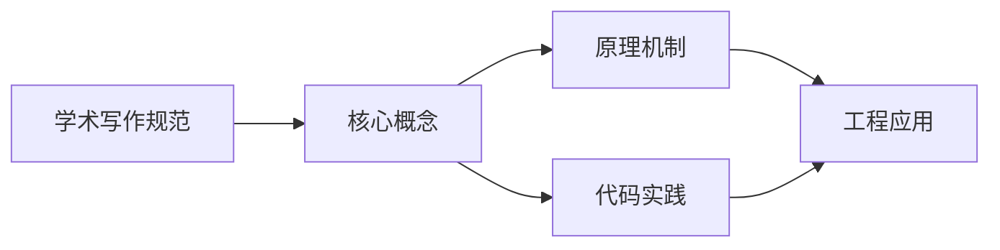

## 1. 学习目标（Bloom 分类）

本节按照布鲁姆教育目标分类学组织学习路径。本文主题为《学术写作规范》，属于 英语 模块，读者可以根据自身阶段选择阅读深度。

记忆层面：能够准确复述本文的核心概念、术语与基本语法或操作步骤，并能够在提问或检索时快速定位对应知识点。能够说出 英语 的核心概念、常用命令与流程。

理解层面：能够用自己的语言解释核心原理与工作机制，说明概念之间的因果关系，而不是机械记忆结论。能够解释 英语 的工作原理与设计动机。

应用层面：能够在真实项目或练习场景中运用本文知识解决具体问题，写出正确且可维护的实现。能够独立完成 英语 的标准操作。

分析层面：能够拆解复杂问题，比较本文主题与相邻概念的异同，识别边界条件与例外情况。能够分析 英语 使用中的异常与边界。

评价层面：能够根据约束条件（性能、可读性、安全、成本）评价不同方案的优劣，做出有依据的技术决策。能够评价 英语 相关工具与方案。

创造层面：能够把本文知识与其他模块知识组合，设计出新的解决方案或可复用的工程模式。能够把 英语 融入团队工作流。

通过本节学习，读者应当能够把《学术写作规范》纳入自己的知识网络，并与 英语 模块的其他主题（专业英语、技术阅读、写作）建立关联。

## 2. 历史动机与发展脉络

《学术写作规范》是 英语 领域的重要主题。要真正理解它，需要先了解它解决的问题与演进过程。

技术英语是开发者与世界交流的语言：官方文档、源码注释、开源社区、技术会议均以英语为主。
学习重点：技术阅读（文档/论文）、技术写作（PR/邮件）、听力（演讲/视频）、口语（会议/面试）。
材料策略：官方文档精读、开源 Issue 阅读、技术博客订阅、英文视频加字幕。

回到本文主题：学术写作规范 的提出与成熟，正是上述技术背景下的必然产物。早期实现往往以简单可用为目标，随着工程规模扩大，社区逐渐沉淀出标准做法与最佳实践；理解这一脉络，可以帮助读者判断“为什么文档中的推荐写法是现在这个样子”，也能在遇到历史遗留代码时准确识别其设计年代与取舍。

## 3. 形式化定义与核心概念精讲

本节把《学术写作规范》涉及的核心概念以“定义 + 讲解”的形式展开。读者应把定义当作工具，把讲解当作理解路径；两者结合才能形成可迁移的知识。

技术词汇：领域术语（repository、deployment、latency、throughput）；词根词缀辅助记忆。
文档阅读结构：标题层级、代码注释、错误信息、FAQ；先框架后细节。
写作规范：主动语态、短句、术语一致；代码块与步骤清晰。

### 3.1 原文章节逐一精讲

原文档把主题拆分为 5 个小节，下面按顺序给出每一节的导读讲解，随后保留原文细节供精读。

#### 原文精读（完整保留）

#### 1. 学术写作的基本原则

##### 1.1 学术写作的特征

| 特征   | 说明           | 反面示例                             |
| ------ | -------------- | ------------------------------------ |
| 客观性 | 避免主观情感   | I feel that this method is great.    |
| 精确性 | 用词准确无歧义 | The result was kind of good.         |
| 逻辑性 | 论证严密有据   | This is obviously the best approach. |
| 正式性 | 使用正式文体   | The algorithm is pretty cool.        |
| 简洁性 | 表达简洁明了   | Due to the fact that... → Because... |

##### 1.2 学术写作的语气

| 应该用   | 不应用           | 示例                                                 |
| -------- | ---------------- | ---------------------------------------------------- |
| 第三人称 | 第一人称(非必要) | This study → Our study                               |
| 被动语态 | 过度使用主动     | The experiment was conducted → We did the experiment |
| 谨慎表达 | 绝对表达         | may suggest → proves                                 |
| 正式词汇 | 口语词汇         | investigate → look into                              |

#### 2. 学术用语 (Academic Language)

##### 2.1 学术写作中的正式表达

| 非正式               | 正式                                   | 说明   |
| -------------------- | -------------------------------------- | ------ |
| a lot of             | numerous, considerable, substantial    | 大量   |
| get                  | obtain, acquire, receive               | 获得   |
| help                 | facilitate, assist, contribute to      | 帮助   |
| show                 | demonstrate, illustrate, indicate      | 展示   |
| use                  | utilize, employ, leverage              | 使用   |
| make                 | generate, produce, create              | 制造   |
| find                 | discover, identify, determine          | 发现   |
| think                | argue, contend, maintain               | 认为   |
| about                | approximately, regarding               | 关于   |
| big                  | significant, substantial, considerable | 大的   |
| small                | minimal, negligible, marginal          | 小的   |
| good                 | favorable, beneficial, advantageous    | 好的   |
| bad                  | detrimental, adverse, unfavorable      | 坏的   |
| important            | crucial, vital, essential, paramount   | 重要的 |
| look into            | investigate, examine, explore          | 调查   |
| point out            | note, observe, remark                  | 指出   |
| in order to          | to                                     | 为了   |
| due to the fact that | because                                | 因为   |
| at the present time  | currently, presently                   | 目前   |
| in the event that    | if                                     | 如果   |

##### 2.2 谨慎表达 (Hedging)

学术写作中避免绝对化表述，使用"模糊限制语"(hedges)：

| 绝对表达   | 谨慎表达                          |
| ---------- | --------------------------------- |
| proves     | suggests, indicates, implies      |
| always     | typically, generally, often       |
| never      | rarely, seldom, infrequently      |
| all        | most, the majority of, nearly all |
| must       | may, might, could                 |
| is         | appears to be, seems to be        |
| definitely | probably, likely, presumably      |

**示例：**

> This result **proves** that the method is superior.
> This result **suggests** that the method **may** be superior.

##### 2.3 学术连接词

| 功能 | 连接词                                           |
| ---- | ------------------------------------------------ |
| 添加 | furthermore, moreover, additionally, in addition |
| 对比 | however, nevertheless, conversely, in contrast   |
| 因果 | therefore, consequently, accordingly, hence      |
| 举例 | for instance, specifically, notably              |
| 让步 | admittedly, granted, notwithstanding             |
| 总结 | in summary, to conclude, overall                 |
| 顺序 | initially, subsequently, ultimately              |
| 条件 | provided that, assuming that, in the event that  |

#### 3. 引用与参考文献 (Citations & References)

##### 3.1 引用的类型

| 类型     | 说明               | 示例                                                          |
| -------- | ------------------ | ------------------------------------------------------------- |
| 直接引用 | 原文照搬，加引号   | Smith (2020) stated that "AI will transform education."       |
| 间接引用 | 改写原文，不加引号 | Smith (2020) argued that AI would transform education.        |
| 概括引用 | 概括多篇文献的共识 | Several studies have shown that... (Smith, 2020; Jones, 2021) |

##### 3.2 常见引用格式

**APA 格式 (第7版)：**

| 位置       | 格式                    | 示例                  |
| ---------- | ----------------------- | --------------------- |
| 文中引用   | (Author, Year)          | (Smith, 2020)         |
| 两位作者   | (Author & Author, Year) | (Smith & Jones, 2020) |
| 三位及以上 | (Author et al., Year)   | (Smith et al., 2020)  |
| 直接引用   | (Author, Year, p. X)    | (Smith, 2020, p. 45)  |

**参考文献列表：**

| 类型 | 格式                                                                                                         |
| ---- | ------------------------------------------------------------------------------------------------------------ |
| 期刊 | Author, A. A. (Year). Title of article. _Title of Periodical_, _volume_(issue), pages. https://doi.org/xxxxx |
| 书籍 | Author, A. A. (Year). _Title of work: Capital letter also for subtitle_. Publisher.                          |
| 会议 | Author, A. A. (Year). Title of paper. In _Proceedings of Conference Name_ (pages). Publisher.                |
| 网页 | Author, A. A. (Year, Month Day). Title of page. Website Name. URL                                            |

**IEEE 格式：**

| 位置     | 格式                                                               | 示例               |
| -------- | ------------------------------------------------------------------ | ------------------ |
| 文中引用 | [X]                                                                | As shown in [3]... |
| 参考文献 | [X] A. Author, "Title," _Journal_, vol. X, no. X, pp. XX-XX, Year. |

##### 3.3 引用注意事项

| 注意点       | 说明                         |
| ------------ | ---------------------------- |
| 引用原创者   | 引用原始出处，而非综述       |
| 准确引用     | 确保引用内容与原文一致       |
| 适度引用     | 不要过度依赖引用             |
| 区分己见     | 明确区分他人观点和自己的观点 |
| 避免自我剽窃 | 不可重复使用自己已发表的内容 |

#### 4. 学术论文写作

##### 4.1 论文各部分的写作要点

**Title（标题）：**

- 简洁、具体、信息量充足
- 避免缩写和过于宽泛的表述
- A Novel Attention Mechanism for Multi-Modal Sentiment Analysis
- A New Method for NLP

**Abstract（摘要）：**

- 150-250 词
- 包含背景、问题、方法、结果
- 不含引用和缩写（首次出现需全称）

**Introduction（引言）：**

- 从宽到窄的漏斗结构
- 明确研究空白和贡献
- 贡献用列表形式呈现

**Related Work（相关工作）：**

- 按主题/方法分类组织
- 不仅列举，还要比较和分析
- 指出已有工作的不足

**Method（方法）：**

- 详细到可复现的程度
- 配合图表说明
- 数学公式编号

**Experiments（实验）：**

- 数据集、基线、指标说明清楚
- 结果用表格呈现
- 包含消融实验

**Conclusion（结论）：**

- 简洁总结核心发现
- 不引入新信息
- 指出局限和未来方向

##### 4.2 图表规范

| 规范   | 说明                                         |
| ------ | -------------------------------------------- |
| 编号   | Figure 1, Table 1 (首字母大写)               |
| 标题   | Figure 在下方，Table 在上方                  |
| 引用   | as shown in Figure 1 / Table 1 shows that... |
| 清晰度 | 至少 300 DPI                                 |
| 自解释 | 图表应能独立理解                             |
| 颜色   | 考虑黑白打印的可读性                         |

#### 5. 学术写作常见错误

##### 5.1 语言错误

| 错误                                     | 正确                                     | 说明                                 |
| ---------------------------------------- | ---------------------------------------- | ------------------------------------ |
| The data **shows**                       | The data **show**                        | data 是复数名词                      |
| The research **prove**                   | The research **proves**                  | 主谓一致                             |
| **Based on** the results, we conclude... | **Based on** the results, we conclude... | 悬垂修饰：Based on 的逻辑主语应是 we |
| **Comparing with** previous work         | **Compared with** previous work          | 被比较 → 过去分词                    |

##### 5.2 逻辑错误

| 错误       | 说明                   |
| ---------- | ---------------------- |
| 循环论证   | 用结论证明前提         |
| 以偏概全   | 从有限数据得出普遍结论 |
| 因果混淆   | 相关性 ≠ 因果性        |
| 稻草人谬误 | 歪曲对方观点再反驳     |

##### 5.3 格式错误

| 错误               | 正确做法           |
| ------------------ | ------------------ |
| 参考文献格式不一致 | 统一使用一种格式   |
| 缩写首次出现未全称 | 先全称后缩写       |
| 图表无编号和标题   | 每个图表编号和标题 |
| 页码缺失           | 确保页码连续       |

### 3.2 概念关系图

下面用 Mermaid 图表达本文核心概念之间的关系，帮助读者建立整体图景：

图中展示的是本文知识的结构化关系：核心概念是入口，原理机制解释“为什么”，代码实践演示“怎么做”，工程应用回答“何时用”。读者学习时可以把每个小节的内容挂接到对应节点上。

## 4. 理论推导与原理解析

本节深入《学术写作规范》背后的原理。理论部分不求面面俱到，而是聚焦“能解释现象、能指导实践”的关键推导。

技术词汇：领域术语（repository、deployment、latency、throughput）；词根词缀辅助记忆。
文档阅读结构：标题层级、代码注释、错误信息、FAQ；先框架后细节。
写作规范：主动语态、短句、术语一致；代码块与步骤清晰。
学习曲线：阅读最容易，写作其次，听说最难；按需分配时间。

需要强调的是，理论推导与工程实践之间存在翻译层：理论给出的是理想化模型与边界条件，工程代码则必须处理真实环境中的例外。读者在学习时应先掌握理论的“标准情形”，再通过陷阱章节了解“非标准情形”。

## 5. 代码示例与逐行讲解

本节把原文中的代码示例系统整理，并为每个示例补充用途说明与讲解。读者不应只浏览代码，而应逐段对照讲解理解设计意图。

原文档未包含独立代码块，下面补充该主题的典型示例，演示核心概念在代码中的落地方式。

综合以上示例，可以总结出本主题的代码实践要点：第一，先定义清晰的输入输出契约；第二，核心逻辑保持单一职责；第三，错误处理与边界条件不可省略；第四，命名与注释表达意图而非复述代码。

## 6. 对比分析

对比是理解《学术写作规范》定位的最快路径。下面从多个维度与相邻方案进行对比。

通用英语与技术英语：通用英语打基础，技术英语聚焦文档与会议。
翻译与直读：直读保留原意与速度；翻译辅助理解。
美音与英音：选择一种为主，能听懂两者。

对比的目的不是分出绝对优劣，而是建立选择依据：不同约束条件下，最优解不同。读者应把每个对比维度转化为决策检查清单。

## 7. 常见陷阱与最佳实践

本节整理该主题的高频错误与推荐做法。每个陷阱先描述现象，再解释原因，最后给出最佳实践。

### 7.1 只看中文资料

信息滞后且失真。官方英文优先。

深入讲解：该问题之所以被归类为“常见陷阱”，是因为它在初学者的代码中反复出现，而且往往不在第一时间暴露——错误通常隐藏在特定数据或特定时序下。

从成因上看，只看中文资料 一般源于对 英语 某个机制的理解偏差：要么误用了默认行为，要么忽略了边界条件，要么把其他语言的思维惯性带了过来。

从影响上看，只看中文资料 轻则产生错误结果，重则导致资源泄漏、数据损坏或安全事故；这也是为什么工程评审中会把它列为检查项。

从修复策略上看，处理只看中文资料的正确顺序是：先复现（构造最小用例），再定位（确认机制层面的根因），最后修复并补充回归测试。跳过复现直接改代码，往往治标不治本。

### 7.2 逐词翻译

理解慢。按意群与结构阅读。

深入讲解：该问题之所以被归类为“常见陷阱”，是因为它在初学者的代码中反复出现，而且往往不在第一时间暴露——错误通常隐藏在特定数据或特定时序下。

从成因上看，逐词翻译 一般源于对 英语 某个机制的理解偏差：要么误用了默认行为，要么忽略了边界条件，要么把其他语言的思维惯性带了过来。

从影响上看，逐词翻译 轻则产生错误结果，重则导致资源泄漏、数据损坏或安全事故；这也是为什么工程评审中会把它列为检查项。

从修复策略上看，处理逐词翻译的正确顺序是：先复现（构造最小用例），再定位（确认机制层面的根因），最后修复并补充回归测试。跳过复现直接改代码，往往治标不治本。

### 7.3 不积累词汇

重复查词。生词本 + 间隔复习。

深入讲解：该问题之所以被归类为“常见陷阱”，是因为它在初学者的代码中反复出现，而且往往不在第一时间暴露——错误通常隐藏在特定数据或特定时序下。

从成因上看，不积累词汇 一般源于对 英语 某个机制的理解偏差：要么误用了默认行为，要么忽略了边界条件，要么把其他语言的思维惯性带了过来。

从影响上看，不积累词汇 轻则产生错误结果，重则导致资源泄漏、数据损坏或安全事故；这也是为什么工程评审中会把它列为检查项。

从修复策略上看，处理不积累词汇的正确顺序是：先复现（构造最小用例），再定位（确认机制层面的根因），最后修复并补充回归测试。跳过复现直接改代码，往往治标不治本。

### 7.4 不敢写

开口/动手才进步。从 PR 描述与评论开始。

深入讲解：该问题之所以被归类为“常见陷阱”，是因为它在初学者的代码中反复出现，而且往往不在第一时间暴露——错误通常隐藏在特定数据或特定时序下。

从成因上看，不敢写 一般源于对 英语 某个机制的理解偏差：要么误用了默认行为，要么忽略了边界条件，要么把其他语言的思维惯性带了过来。

从影响上看，不敢写 轻则产生错误结果，重则导致资源泄漏、数据损坏或安全事故；这也是为什么工程评审中会把它列为检查项。

从修复策略上看，处理不敢写的正确顺序是：先复现（构造最小用例），再定位（确认机制层面的根因），最后修复并补充回归测试。跳过复现直接改代码，往往治标不治本。

### 7.5 忽略发音

听说受阻。音标 + 影子跟读。

深入讲解：该问题之所以被归类为“常见陷阱”，是因为它在初学者的代码中反复出现，而且往往不在第一时间暴露——错误通常隐藏在特定数据或特定时序下。

从成因上看，忽略发音 一般源于对 英语 某个机制的理解偏差：要么误用了默认行为，要么忽略了边界条件，要么把其他语言的思维惯性带了过来。

从影响上看，忽略发音 轻则产生错误结果，重则导致资源泄漏、数据损坏或安全事故；这也是为什么工程评审中会把它列为检查项。

从修复策略上看，处理忽略发音的正确顺序是：先复现（构造最小用例），再定位（确认机制层面的根因），最后修复并补充回归测试。跳过复现直接改代码，往往治标不治本。

### 7.6 材料太难

挫败放弃。i+1 原则选材。

深入讲解：该问题之所以被归类为“常见陷阱”，是因为它在初学者的代码中反复出现，而且往往不在第一时间暴露——错误通常隐藏在特定数据或特定时序下。

从成因上看，材料太难 一般源于对 英语 某个机制的理解偏差：要么误用了默认行为，要么忽略了边界条件，要么把其他语言的思维惯性带了过来。

从影响上看，材料太难 轻则产生错误结果，重则导致资源泄漏、数据损坏或安全事故；这也是为什么工程评审中会把它列为检查项。

从修复策略上看，处理材料太难的正确顺序是：先复现（构造最小用例），再定位（确认机制层面的根因），最后修复并补充回归测试。跳过复现直接改代码，往往治标不治本。

### 7.7 无输出

只输入不输出。写博客/翻译文档。

深入讲解：该问题之所以被归类为“常见陷阱”，是因为它在初学者的代码中反复出现，而且往往不在第一时间暴露——错误通常隐藏在特定数据或特定时序下。

从成因上看，无输出 一般源于对 英语 某个机制的理解偏差：要么误用了默认行为，要么忽略了边界条件，要么把其他语言的思维惯性带了过来。

从影响上看，无输出 轻则产生错误结果，重则导致资源泄漏、数据损坏或安全事故；这也是为什么工程评审中会把它列为检查项。

从修复策略上看，处理无输出的正确顺序是：先复现（构造最小用例），再定位（确认机制层面的根因），最后修复并补充回归测试。跳过复现直接改代码，往往治标不治本。

### 7.8 突击式学习

无效果。每日少量持续。

深入讲解：该问题之所以被归类为“常见陷阱”，是因为它在初学者的代码中反复出现，而且往往不在第一时间暴露——错误通常隐藏在特定数据或特定时序下。

从成因上看，突击式学习 一般源于对 英语 某个机制的理解偏差：要么误用了默认行为，要么忽略了边界条件，要么把其他语言的思维惯性带了过来。

从影响上看，突击式学习 轻则产生错误结果，重则导致资源泄漏、数据损坏或安全事故；这也是为什么工程评审中会把它列为检查项。

从修复策略上看，处理突击式学习的正确顺序是：先复现（构造最小用例），再定位（确认机制层面的根因），最后修复并补充回归测试。跳过复现直接改代码，往往治标不治本。

### 7.0 最佳实践总览

1. 每日固定 30 分钟：阅读 + 词汇 + 听力。
2. 阅读技术文档时先扫标题、代码与结论。
3. 写作用模板起步（PR、邮件、README）。
4. 把生词放入真实句子记忆。

把这些最佳实践固化为团队规范与代码评审检查项，是避免同类问题反复出现的关键。

## 8. 工程实践

本节把《学术写作规范》放入真实工程场景，给出可复用的模式与组织方法。

阅读计划：每周 1 篇官方文档 + 1 篇博客；精读记录术语。
写作输出：每周 1 条 PR 描述或技术笔记（英文）。
听力：技术演讲（TED/会议）影子跟读。

### 8.1 工程实践的原则拆解

以上工程实践可以归纳为四条原则。第一，配置与代码分离：英语 项目中环境差异应通过配置注入，而不是散落在代码分支中；这保证同一份代码可以在开发、测试、生产环境一致运行。

第二，接口稳定优先：对外接口（函数签名、协议、数据格式）一旦被消费方依赖，变更成本极高；设计时应预留扩展点并保持向后兼容。

第三，可观测性内置：日志、指标与追踪应该在功能开发时同步设计，而不是故障发生后补救；没有观测手段的模块等于黑盒。

第四，变更可回滚：任何发布都应有对应的回滚方案；数据库迁移、配置变更与代码发布一样需要版本管理与逆向路径。

### 8.2 实践落地的检查清单

- [ ] 阅读计划：对照本节描述，检查当前项目是否已经落实；未落实的项列入技术债并排期处理。
- [ ] 写作输出：对照本节描述，检查当前项目是否已经落实；未落实的项列入技术债并排期处理。
- [ ] 听力：对照本节描述，检查当前项目是否已经落实；未落实的项列入技术债并排期处理。

工程实践的共性原则：配置与代码分离、接口稳定优先、可观测性内置、变更可回滚。这些原则适用于本主题的所有实现。

## 9. 案例研究

本节通过一个完整案例把《学术写作规范》的知识串起来。案例按“需求分析、方案设计、实现、验证”四步展开。

需求：三个月提升技术文档阅读速度。
方案：每日 30 分钟精读 + 词汇复习 + 周输出。
要点：选择兴趣领域材料、记录术语表。
验证：阅读速度与理解率前后对比。

### 9.1 案例的扩展讨论

把案例中的方案放大到真实规模，需要额外考虑三个问题：

第一，规模：当数据量或并发量上升一个数量级时，原方案中的数据结构、缓存策略与任务调度是否仍然成立？通常需要引入分层与异步。

第二，团队：多人协作时，模块边界、接口契约与代码所有权必须明确；案例中的实现应拆分为可独立测试的单元，并配合文档说明设计意图。

第三，演进：上线后的需求变化不可避免；方案设计时应预留扩展点（配置化、插件化、事件化），并定期用真实指标验证假设。

案例研究的学习方法：先独立阅读需求，尝试在脑中形成方案，再对照实现与讲解，最后思考“如果约束变化（数据量、并发、团队规模），方案应如何调整”。

## 10. 知识要点总结与深入讲解

本节以讲解形式汇总全文要点，替代传统的习题与自测，读者不需要答题，只需跟随解释建立完整的认知框架。

关于《学术写作规范》的核心结论：

技术英语是“用”出来的，不是“学”出来的。
阅读先行，写作跟进，听说持续。
把英语融入日常开发流程而非单独学习。

原文档各小节的要点回顾：

- 1. 学术写作的基本原则：该小节围绕学术写作规范展开具体细节，阅读时应关注其与核心结论的对应关系；每个小节都是核心结论在某一个侧面的展开。
- 2. 学术用语 (Academic Language)：该小节围绕学术写作规范展开具体细节，阅读时应关注其与核心结论的对应关系；每个小节都是核心结论在某一个侧面的展开。
- 3. 引用与参考文献 (Citations & References)：该小节围绕学术写作规范展开具体细节，阅读时应关注其与核心结论的对应关系；每个小节都是核心结论在某一个侧面的展开。
- 4. 学术论文写作：该小节围绕学术写作规范展开具体细节，阅读时应关注其与核心结论的对应关系；每个小节都是核心结论在某一个侧面的展开。
- 5. 学术写作常见错误：该小节围绕学术写作规范展开具体细节，阅读时应关注其与核心结论的对应关系；每个小节都是核心结论在某一个侧面的展开。

把以上要点与第 3-9 节的内容对照复习，即可完成对本文主题的闭环学习。

## 11. 参考文献

Merriam-Webster：https://www.merriam-webster.com/
Stack Overflow：https://stackoverflow.com/
Hacker News：https://news.ycombinator.com/
BBC Learning English：https://www.bbc.co.uk/learningenglish

## 12. 延伸阅读

英语学习材料与规划，见 005-english 模块文档。
技术写作（Markdown），见 002-markdown 模块。
开源协作中的英语沟通，见 004-github 模块。
黑马程序员 Bilibili 空间（https://space.bilibili.com/37974444 ）提供英语课程。

## 14. 模块知识图谱与学习路径

本文属于 英语 模块。为了把《学术写作规范》放入完整的知识网络，下面列出本模块的全部主题并给出相互关联的导读。学习时建议按模块内顺序推进，并在每个文档中留意交叉引用。

上图为模块主题的推荐学习顺序示意图（仅展示前若干主题）。各主题之间存在三类关联：

第一，前置依赖关系：早期主题是后期主题的基础，例如环境与语法先行、进阶主题随后；

第二，横向并列关系：同一层级主题从不同角度覆盖模块能力，学习顺序可以按兴趣调整；

第三，工程组合关系：多个主题在真实项目中组合使用，例如配置、性能与安全主题往往出现在同一系统的不同层面。

### 14.1 模块主题速查表

| 文档 | 主题 | 与本文的关联 |
| --- | --- | --- |
| 计算机专业英语词汇 | 001-ComputerProfessionalEnglishVocabulary | 本文的并列主题 |
| 英语语法体系总览 | 002-EnglishGrammarSystemOverview | 本文的并列主题 |
| 句子结构与成分分析 | 003-SentenceStructureAnalysis | 本文的并列主题 |
| 复合句与从句 | 004-CompoundSentenceClause | 本文的并列主题 |
| 长难句拆解技巧 | 005-LongDifficultSentenceBreakdownTechnique | 本文的并列主题 |
| 常见语法错误汇总 | 006-CommonGrammarErrorSummary | 本文的并列主题 |
| 技术文档阅读方法 | 007-TechDocReadingMethod | 本文的并列主题 |
| 学术论文阅读指南 | 008-AcademicPaperReadingGuide | 本文的并列主题 |
| 学术写作规范 | 009-AcademicWritingStandard | 本文自身 |
| 技术文档写作 | 010-TechDocWriting | 本文的并列主题 |
| 英译汉技巧 | 011-EnglishToChineseTechnique | 本文的并列主题 |
| 汉译英技巧 | 012-ChineseToEnglishTechnique | 本文的并列主题 |
| 技术翻译要点 | 013-TechTranslationPoints | 本文的并列主题 |

速查表的作用是让读者快速判断：哪些文档应在阅读本文前掌握（前置基础），哪些文档应在阅读本文后继续（延伸主题）。本模块的交叉引用体系即以此表为基础。

## 15. 术语表

下表整理《学术写作规范》及 英语 模块中出现的高频术语，给出简明释义。术语按字母序或逻辑序排列，供查阅。

| 术语 | 释义 |
| --- | --- |
| 技术词汇 | 领域术语（repository、deployment、latency、throughput）；词根词缀辅助记忆。 |
| 文档阅读结构 | 标题层级、代码注释、错误信息、FAQ；先框架后细节。 |
| 写作规范 | 主动语态、短句、术语一致；代码块与步骤清晰。 |
| 学习曲线 | 阅读最容易，写作其次，听说最难；按需分配时间。 |
| 只看中文资料（易错点） | 参见常见陷阱章节的详细讲解 |
| 逐词翻译（易错点） | 参见常见陷阱章节的详细讲解 |
| 不积累词汇（易错点） | 参见常见陷阱章节的详细讲解 |
| 不敢写（易错点） | 参见常见陷阱章节的详细讲解 |
| 忽略发音（易错点） | 参见常见陷阱章节的详细讲解 |
| 材料太难（易错点） | 参见常见陷阱章节的详细讲解 |

术语表与正文配合使用：先通读正文，遇到模糊术语回查本表；长期使用后术语会自然进入工作记忆。

## 13. 深度专题扩展

以下专题从不同角度深入本文主题，供有进阶需求的读者研读。每个专题独立成节，内容相互补充。

### 13.1 技术文档精读法

第一遍：标题、目录、代码、结论（5 分钟）。
第二遍：逐节理解，查术语，标注疑问（20 分钟）。
第三遍：复述总结，写笔记（5 分钟）。
间隔复习笔记，术语进入长期记忆。

### 13.2 技术写作入门

结构：标题、背景、步骤、结论；读者导向。
语言：短句、主动语态、具体动词（run、build、deploy）。
格式：Markdown、代码块、列表；与代码风格一致。
练习：改写官方文档片段、写 README、PR 描述。

## 16. 核心概念串讲（复习视角）

本节以“把知识讲给他人听”的方式，把《学术写作规范》的核心概念重新串讲一遍。与前文按章节展开不同，这里的叙述更接近课堂总结：先说整体，再逐个展开，最后收束。

《学术写作规范》属于 英语 模块。要理解它，先要理解它在模块中的位置：它解决的是该领域的一个具体问题，并依赖模块内若干前置概念；反过来，它又为后续进阶主题提供基础。

第一个概念是技术词汇。领域术语（repository、deployment、latency、throughput）；词根词缀辅助记忆。

在实际使用中，技术词汇需要与相邻概念区分：它们的区别不在于名称，而在于适用条件与行为边界；这正是前文对比分析章节的意义。

第一个概念是文档阅读结构。标题层级、代码注释、错误信息、FAQ；先框架后细节。

在实际使用中，文档阅读结构需要与相邻概念区分：它们的区别不在于名称，而在于适用条件与行为边界；这正是前文对比分析章节的意义。

第一个概念是写作规范。主动语态、短句、术语一致；代码块与步骤清晰。

在实际使用中，写作规范需要与相邻概念区分：它们的区别不在于名称，而在于适用条件与行为边界；这正是前文对比分析章节的意义。

接下来是技术词汇。领域术语（repository、deployment、latency、throughput）；词根词缀辅助记忆。

理解该原理的关键不是记住结论，而是记住“它从什么假设出发、推出了什么、假设不成立时会怎样”。带着这个框架复习，原理之间就会连成网络。

接下来是文档阅读结构。标题层级、代码注释、错误信息、FAQ；先框架后细节。

理解该原理的关键不是记住结论，而是记住“它从什么假设出发、推出了什么、假设不成立时会怎样”。带着这个框架复习，原理之间就会连成网络。

接下来是写作规范。主动语态、短句、术语一致；代码块与步骤清晰。

理解该原理的关键不是记住结论，而是记住“它从什么假设出发、推出了什么、假设不成立时会怎样”。带着这个框架复习，原理之间就会连成网络。

接下来是学习曲线。阅读最容易，写作其次，听说最难；按需分配时间。

理解该原理的关键不是记住结论，而是记住“它从什么假设出发、推出了什么、假设不成立时会怎样”。带着这个框架复习，原理之间就会连成网络。

串讲收束：把概念与原理放回本文主题，可以得出一个总纲——定义描述是什么，原理解释为什么，实践回答怎么做。三者构成完整的学习闭环；后续遇到相关问题，都可以按这个总纲检索知识。
