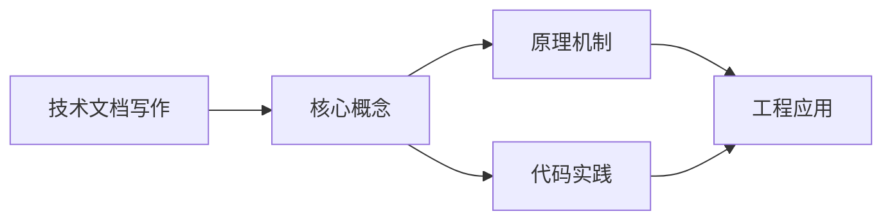
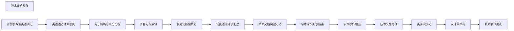

## 1. 学习目标（Bloom 分类）

本节按照布鲁姆教育目标分类学组织学习路径。本文主题为《技术文档写作》，属于 英语 模块，读者可以根据自身阶段选择阅读深度。

记忆层面：能够准确复述本文的核心概念、术语与基本语法或操作步骤，并能够在提问或检索时快速定位对应知识点。能够说出 英语 的核心概念、常用命令与流程。

理解层面：能够用自己的语言解释核心原理与工作机制，说明概念之间的因果关系，而不是机械记忆结论。能够解释 英语 的工作原理与设计动机。

应用层面：能够在真实项目或练习场景中运用本文知识解决具体问题，写出正确且可维护的实现。能够独立完成 英语 的标准操作。

分析层面：能够拆解复杂问题，比较本文主题与相邻概念的异同，识别边界条件与例外情况。能够分析 英语 使用中的异常与边界。

评价层面：能够根据约束条件（性能、可读性、安全、成本）评价不同方案的优劣，做出有依据的技术决策。能够评价 英语 相关工具与方案。

创造层面：能够把本文知识与其他模块知识组合，设计出新的解决方案或可复用的工程模式。能够把 英语 融入团队工作流。

通过本节学习，读者应当能够把《技术文档写作》纳入自己的知识网络，并与 英语 模块的其他主题（专业英语、技术阅读、写作）建立关联。

## 2. 历史动机与发展脉络

《技术文档写作》是 英语 领域的重要主题。要真正理解它，需要先了解它解决的问题与演进过程。

技术英语是开发者与世界交流的语言：官方文档、源码注释、开源社区、技术会议均以英语为主。
学习重点：技术阅读（文档/论文）、技术写作（PR/邮件）、听力（演讲/视频）、口语（会议/面试）。
材料策略：官方文档精读、开源 Issue 阅读、技术博客订阅、英文视频加字幕。

回到本文主题：技术文档写作 的提出与成熟，正是上述技术背景下的必然产物。早期实现往往以简单可用为目标，随着工程规模扩大，社区逐渐沉淀出标准做法与最佳实践；理解这一脉络，可以帮助读者判断“为什么文档中的推荐写法是现在这个样子”，也能在遇到历史遗留代码时准确识别其设计年代与取舍。


## 3. 形式化定义与核心概念精讲

本节把《技术文档写作》涉及的核心概念以“定义 + 讲解”的形式展开。读者应把定义当作工具，把讲解当作理解路径；两者结合才能形成可迁移的知识。

技术词汇：领域术语（repository、deployment、latency、throughput）；词根词缀辅助记忆。
文档阅读结构：标题层级、代码注释、错误信息、FAQ；先框架后细节。
写作规范：主动语态、短句、术语一致；代码块与步骤清晰。

### 3.1 原文章节逐一精讲

原文档把主题拆分为 15 个小节，下面按顺序给出每一节的导读讲解，随后保留原文细节供精读。

#### 原文精读（完整保留）


#### 1. 技术文档写作原则

##### 1.1 核心原则

| 原则 | 说明             | 示例                                      |
| ---- | ---------------- | ----------------------------------------- |
| 清晰 | 表达无歧义       | Click **Submit** to save.                 |
| 简洁 | 删除多余词       | Install the package → Install the package |
| 一致 | 术语和格式统一   | 始终用 "directory" 而非混用 "folder"      |
| 准确 | 技术描述正确     | 确认版本号和命令无误                      |
| 完整 | 覆盖所有必要信息 | 包含前置条件、步骤、结果                  |

##### 1.2 技术写作的语气

| 应该              | 不应该              |
| ----------------- | ------------------- |
| 直接、专业        | 冗长、口语化        |
| 主动语态为主      | 过度使用被动语态    |
| 第二人称 (you)    | 第一人称 (we/I)     |
| 祈使句 (Click...) | Clicking... will... |

#### 2. README 写作

##### 2.1 README 模板

````markdown
# Project Name

[](url)

Brief description of what the project does.

#### Features

- Feature 1
- Feature 2
- Feature 3

#### Prerequisites

- Node.js >= 18
- npm >= 9

#### Installation

```bash
npm install project-name
```
````

#### Quick Start

```javascript
import { createApp } from 'project-name';

const app = createApp({
  option: 'value',
});

app.start();
```

#### Configuration

| Option | Type   | Default   | Description               |
| ------ | ------ | --------- | ------------------------- |
| option | string | 'default' | Description of the option |

#### API Reference

See [API Documentation](link).

#### Contributing

See [CONTRIBUTING.md](CONTRIBUTING.md).

#### License

MIT © Author Name

````

##### 2.2 README 写作要点

| 要点 | 说明 | 示例 |
|------|------|------|
| 一句话描述 | 开头一句话说清项目 | A fast, lightweight HTTP client for Node.js |
| 安装命令 | 提供可直接复制的命令 | `npm install axios` |
| 最小示例 | 提供可运行的最小代码 | 见 Quick Start |
| 版本徽章 | 显示项目状态 | ![npm version] ![build status] |
| 徽章不过度 | 3-5 个即可 | 不要堆砌过多徽章 |

##### 2.3 常用表达

| 功能 | 表达 |
|------|------|
| 项目描述 | A [adjective] [category] for [platform] that [benefit] |
| 安装 | Install via [package manager]: `command` |
| 快速开始 | Get started in seconds: |
| 配置 | Configure [project] by setting the following options: |
| 贡献 | Contributions are welcome! Please read [guidelines]. |
| 许可证 | [Project] is released under the [License] License. |

#### 3. API 文档写作

##### 3.1 API 文档结构

每个 API 端点应包含：

| 要素 | 说明 | 示例 |
|------|------|------|
| HTTP 方法 | GET/POST/PUT/DELETE | `POST /api/v1/users` |
| 描述 | 端点功能说明 | Creates a new user account |
| 认证 | 是否需要认证 | Requires Bearer token |
| 请求参数 | 参数名、类型、必填、描述 | `name` (string, required) - User's full name |
| 请求体 | JSON 格式示例 | `{"name": "John", "email": "john@example.com"}` |
| 响应 | 状态码和响应体 | `201 Created` with user object |
| 错误响应 | 错误码和错误信息 | `400 Bad Request` - Invalid email format |
| 示例 | 完整请求/响应示例 | cURL 命令 |

##### 3.2 API 文档示例

```markdown
##### Create User

`POST /api/v1/users`

Creates a new user account.

**Authentication:** Requires a valid Bearer token.

**Request Body:**

| Field | Type | Required | Description |
|-------|------|----------|-------------|
| name | string | Yes | User's full name (2-100 characters) |
| email | string | Yes | Valid email address |
| role | string | No | User role. One of: `admin`, `user`. Default: `user` |

**Example Request:**

```bash
curl -X POST https://api.example.com/v1/users \
  -H "Authorization: Bearer <token>" \
  -H "Content-Type: application/json" \
  -d '{"name": "Jane Doe", "email": "jane@example.com"}'
````

**Success Response (201 Created):**

```json
{
  "id": "usr_abc123",
  "name": "Jane Doe",
  "email": "jane@example.com",
  "role": "user",
  "created_at": "2026-06-14T10:00:00Z"
}
```

**Error Responses:**

| Status | Code          | Description                                 |
| ------ | ------------- | ------------------------------------------- |
| 400    | INVALID_EMAIL | The email format is invalid.                |
| 401    | UNAUTHORIZED  | Authentication token is missing or invalid. |
| 409    | EMAIL_EXISTS  | A user with this email already exists.      |

````

##### 3.3 API 文档写作规范

| 规范 | 说明 |
|------|------|
| 使用一致的大小写 | API → API (非 api) |
| 参数用反引号 | `user_id` 而非 user_id |
| 示例用真实数据 | 避免用 foo/bar |
| 标注必填/可选 | required/optional |
| 版本号明确 | /api/v1/ |
| 包含边界条件 | 最大长度、取值范围 |

#### 4. CHANGELOG 写作

##### 4.1 CHANGELOG 格式

遵循 [Keep a Changelog](https://keepachangelog.com/) 规范：

```markdown
#### [1.2.0] - 2026-06-14

##### Added
- New `batch()` method for bulk operations
- Support for TypeScript 5.5

##### Changed
- Updated minimum Node.js version to 18
- Improved error messages for validation failures

##### Deprecated
- `oldMethod()` will be removed in v2.0.0

##### Removed
- Dropped support for Node.js 16

##### Fixed
- Memory leak in long-running connections
- Incorrect timezone handling in date formatting

##### Security
- Patched CVE-2026-1234 in dependency `lodash`
````

##### 4.2 CHANGELOG 写作要点

| 要点       | 说明                                            |
| ---------- | ----------------------------------------------- |
| 按版本组织 | 每个版本一个段落                                |
| 按类型分类 | Added/Changed/Deprecated/Removed/Fixed/Security |
| 日期标注   | 每个版本标注发布日期                            |
| 面向用户   | 描述用户可见的变化                              |
| 关联 Issue | 可关联 Issue 编号                               |

#### 5. 技术博客写作

##### 5.1 技术博客结构

```
标题 → 吸引读者，点明主题
    ↓
引言 → 问题背景，为什么写这篇文章
    ↓
正文 → 解决方案/教程步骤
    ↓
代码示例 → 可运行的完整代码
    ↓
总结 → 回顾要点，展望未来
```

##### 5.2 技术博客写作技巧

**标题写作：**

| 类型   | 格式                                 | 示例                                         |
| ------ | ------------------------------------ | -------------------------------------------- |
| 教程型 | How to [do something] with [tool]    | How to Build a REST API with Express.js      |
| 列表型 | [Number] [Tips/Tools] for [purpose]  | 10 VS Code Extensions for Python Developers  |
| 对比型 | [A] vs [B]: Which Should You Choose? | React vs. Vue: A Comprehensive Comparison    |
| 问题型 | Solving [problem] in [context]       | Solving Memory Leaks in Node.js Applications |

**代码示例：**

| 规范       | 说明                 |
| ---------- | -------------------- |
| 完整可运行 | 代码应可直接复制运行 |
| 添加注释   | 关键步骤加注释说明   |
| 渐进式     | 从简单到复杂逐步展开 |
| 标注版本   | 注明依赖版本号       |
| 提供仓库   | 链接完整代码仓库     |

**排版规范：**

| 规范       | 说明             |
| ---------- | ---------------- |
| 短段落     | 每段 2-4 句      |
| 多用列表   | 步骤和要点用列表 |
| 加粗关键词 | 重要术语加粗     |
| 配图说明   | 代码配合截图     |
| 目录导航   | 长文加目录       |

#### 6. 技术写作常用句式

##### 6.1 描述操作步骤

| 句式                  | 示例                                       |
| --------------------- | ------------------------------------------ |
| To [do X], [do Y]     | To install the package, run `npm install`. |
| [Do X] to [achieve Y] | Click **Save** to apply your changes.      |
| Use [tool] to [do X]  | Use the CLI to generate a new project.     |
| [Action] the [object] | Open the configuration file.               |

##### 6.2 描述功能特性

| 句式                                   | 示例                                         |
| -------------------------------------- | -------------------------------------------- |
| [Feature] enables/allows you to [do X] | The plugin enables syntax highlighting.      |
| With [feature], you can [do X]         | With caching, you can reduce response times. |
| [Feature] provides [benefit]           | The API provides real-time data access.      |
| [Tool] supports [feature]              | Express supports middleware-based routing.   |

##### 6.3 描述错误和解决方案

| 句式                                  | 示例                                                      |
| ------------------------------------- | --------------------------------------------------------- |
| If [error] occurs, [solution]         | If the connection times out, increase the timeout value.  |
| [Error] indicates that [cause]        | A 404 error indicates that the resource was not found.    |
| To resolve [error], [solution]        | To resolve the dependency conflict, update the package.   |
| Make sure [condition] before [action] | Make sure Node.js is installed before running the script. |

##### 6.4 描述版本变更

| 句式                                                    | 示例                                                         |
| ------------------------------------------------------- | ------------------------------------------------------------ |
| [Version] adds/introduces [feature]                     | v2.0 adds support for WebSocket connections.                 |
| [Feature] has been deprecated in favor of [alternative] | `oldMethod()` has been deprecated in favor of `newMethod()`. |
| [Version] removes [feature]                             | v3.0 removes the legacy authentication module.               |
| [Version] fixes [issue]                                 | v1.1.1 fixes a critical security vulnerability.              |

```

```


### 3.2 概念关系图

下面用 Mermaid 图表达本文核心概念之间的关系，帮助读者建立整体图景：



图中展示的是本文知识的结构化关系：核心概念是入口，原理机制解释“为什么”，代码实践演示“怎么做”，工程应用回答“何时用”。读者学习时可以把每个小节的内容挂接到对应节点上。

## 4. 理论推导与原理解析

本节深入《技术文档写作》背后的原理。理论部分不求面面俱到，而是聚焦“能解释现象、能指导实践”的关键推导。

技术词汇：领域术语（repository、deployment、latency、throughput）；词根词缀辅助记忆。
文档阅读结构：标题层级、代码注释、错误信息、FAQ；先框架后细节。
写作规范：主动语态、短句、术语一致；代码块与步骤清晰。
学习曲线：阅读最容易，写作其次，听说最难；按需分配时间。

需要强调的是，理论推导与工程实践之间存在翻译层：理论给出的是理想化模型与边界条件，工程代码则必须处理真实环境中的例外。读者在学习时应先掌握理论的“标准情形”，再通过陷阱章节了解“非标准情形”。

## 5. 代码示例与逐行讲解

本节把原文中的代码示例系统整理，并为每个示例补充用途说明与讲解。读者不应只浏览代码，而应逐段对照讲解理解设计意图。

### 5.1 示例：2.1 README 模板

该示例来自原文《2.1 README 模板》小节，用于演示技术文档写作相关操作。阅读时请先看代码结构，再看其后的讲解。

````markdown
# Project Name

[](url)

Brief description of what the project does.

## Features

- Feature 1
- Feature 2
- Feature 3

## Prerequisites

- Node.js >= 18
- npm >= 9

## Installation

```

讲解：这段代码演示了本节核心知识点。代码中的关键操作可以归纳为三步：准备（定义或初始化）、执行（核心逻辑）、收尾（释放资源或返回结果）。实际项目中，这三步往往被封装为函数或类，以提升复用性与可测试性。

关键点分析：

该示例共 11 行有效代码，结构以数据或配置为主。阅读时应关注：数据字段的含义、配置项的作用，以及它们与运行行为的对应关系。

进阶思考路径：先尝试修改参数观察行为变化，再把示例中的模式迁移到自己的项目中；每次修改都记录预期与实测差异，这是把示例转化为能力的最快方式。

### 5.2 示例：Quick Start

该示例来自原文《Quick Start》小节，用于演示技术文档写作相关操作。阅读时请先看代码结构，再看其后的讲解。

```javascript
import { createApp } from 'project-name';

const app = createApp({
  option: 'value',
});

app.start();
```

讲解：这段代码演示了本节核心知识点。代码中的关键操作可以归纳为三步：准备（定义或初始化）、执行（核心逻辑）、收尾（释放资源或返回结果）。实际项目中，这三步往往被封装为函数或类，以提升复用性与可测试性。

关键点分析：

该示例共 5 行有效代码，包含 2 类关键结构（import、from）。其中：

- 入口与初始化部分负责建立上下文，对应实际项目中的启动或装配逻辑；
- 核心逻辑部分体现本文主题的主要操作，是阅读时最需要对照讲解理解的部分；
- 输出或返回部分把结果交给调用方，注意其类型与边界条件。

进阶思考路径：先尝试修改参数观察行为变化，再把示例中的模式迁移到自己的项目中；每次修改都记录预期与实测差异，这是把示例转化为能力的最快方式。

### 5.3 示例：License

该示例来自原文《License》小节，用于演示技术文档写作相关操作。阅读时请先看代码结构，再看其后的讲解。

````

### 2.2 README 写作要点

| 要点 | 说明 | 示例 |
|------|------|------|
| 一句话描述 | 开头一句话说清项目 | A fast, lightweight HTTP client for Node.js |
| 安装命令 | 提供可直接复制的命令 | `npm install axios` |
| 最小示例 | 提供可运行的最小代码 | 见 Quick Start |
| 版本徽章 | 显示项目状态 | ![npm version] ![build status] |
| 徽章不过度 | 3-5 个即可 | 不要堆砌过多徽章 |

### 2.3 常用表达

| 功能 | 表达 |
|------|------|
| 项目描述 | A [adjective] [category] for [platform] that [benefit] |
| 安装 | Install via [package manager]: `command` |
| 快速开始 | Get started in seconds: |
| 配置 | Configure [project] by setting the following options: |
| 贡献 | Contributions are welcome! Please read [guidelines]. |
| 许可证 | [Project] is released under the [License] License. |

## 3. API 文档写作

### 3.1 API 文档结构

每个 API 端点应包含：

| 要素 | 说明 | 示例 |
|------|------|------|
| HTTP 方法 | GET/POST/PUT/DELETE | `POST /api/v1/users` |
| 描述 | 端点功能说明 | Creates a new user account |
| 认证 | 是否需要认证 | Requires Bearer token |
| 请求参数 | 参数名、类型、必填、描述 | `name` (string, required) - User's full name |
| 请求体 | JSON 格式示例 | `{"name": "John", "email": "john@example.com"}` |
| 响应 | 状态码和响应体 | `201 Created` with user object |
| 错误响应 | 错误码和错误信息 | `400 Bad Request` - Invalid email format |
| 示例 | 完整请求/响应示例 | cURL 命令 |

### 3.2 API 文档示例

```

讲解：这段代码演示了本节核心知识点。代码中的关键操作可以归纳为三步：准备（定义或初始化）、执行（核心逻辑）、收尾（释放资源或返回结果）。实际项目中，这三步往往被封装为函数或类，以提升复用性与可测试性。

关键点分析：

该示例共 31 行有效代码，包含 1 类关键结构（for）。其中：

- 入口与初始化部分负责建立上下文，对应实际项目中的启动或装配逻辑；
- 核心逻辑部分体现本文主题的主要操作，是阅读时最需要对照讲解理解的部分；
- 输出或返回部分把结果交给调用方，注意其类型与边界条件。

进阶思考路径：先尝试修改参数观察行为变化，再把示例中的模式迁移到自己的项目中；每次修改都记录预期与实测差异，这是把示例转化为能力的最快方式。

### 5.4 示例：Create User

该示例来自原文《Create User》小节，用于演示技术文档写作相关操作。阅读时请先看代码结构，再看其后的讲解。

```bash
curl -X POST https://api.example.com/v1/users \
  -H "Authorization: Bearer <token>" \
  -H "Content-Type: application/json" \
  -d '{"name": "Jane Doe", "email": "jane@example.com"}'
```

讲解：这段代码演示了本节核心知识点。代码中的关键操作可以归纳为三步：准备（定义或初始化）、执行（核心逻辑）、收尾（释放资源或返回结果）。实际项目中，这三步往往被封装为函数或类，以提升复用性与可测试性。

关键点分析：

该示例共 4 行有效代码，结构以数据或配置为主。阅读时应关注：数据字段的含义、配置项的作用，以及它们与运行行为的对应关系。

进阶思考路径：先尝试修改参数观察行为变化，再把示例中的模式迁移到自己的项目中；每次修改都记录预期与实测差异，这是把示例转化为能力的最快方式。

### 5.5 示例：Create User

该示例来自原文《Create User》小节，用于演示技术文档写作相关操作。阅读时请先看代码结构，再看其后的讲解。

```json
{
  "id": "usr_abc123",
  "name": "Jane Doe",
  "email": "jane@example.com",
  "role": "user",
  "created_at": "2026-06-14T10:00:00Z"
}
```

讲解：这段代码演示了本节核心知识点。代码中的关键操作可以归纳为三步：准备（定义或初始化）、执行（核心逻辑）、收尾（释放资源或返回结果）。实际项目中，这三步往往被封装为函数或类，以提升复用性与可测试性。

关键点分析：

该示例共 7 行有效代码，结构以数据或配置为主。阅读时应关注：数据字段的含义、配置项的作用，以及它们与运行行为的对应关系。

进阶思考路径：先尝试修改参数观察行为变化，再把示例中的模式迁移到自己的项目中；每次修改都记录预期与实测差异，这是把示例转化为能力的最快方式。

### 5.6 示例：Create User

该示例来自原文《Create User》小节，用于演示技术文档写作相关操作。阅读时请先看代码结构，再看其后的讲解。

````

### 3.3 API 文档写作规范

| 规范 | 说明 |
|------|------|
| 使用一致的大小写 | API → API (非 api) |
| 参数用反引号 | `user_id` 而非 user_id |
| 示例用真实数据 | 避免用 foo/bar |
| 标注必填/可选 | required/optional |
| 版本号明确 | /api/v1/ |
| 包含边界条件 | 最大长度、取值范围 |

## 4. CHANGELOG 写作

### 4.1 CHANGELOG 格式

遵循 [Keep a Changelog](https://keepachangelog.com/) 规范：

```

讲解：这段代码演示了本节核心知识点。代码中的关键操作可以归纳为三步：准备（定义或初始化）、执行（核心逻辑）、收尾（释放资源或返回结果）。实际项目中，这三步往往被封装为函数或类，以提升复用性与可测试性。

关键点分析：

该示例共 12 行有效代码，结构以数据或配置为主。阅读时应关注：数据字段的含义、配置项的作用，以及它们与运行行为的对应关系。

进阶思考路径：先尝试修改参数观察行为变化，再把示例中的模式迁移到自己的项目中；每次修改都记录预期与实测差异，这是把示例转化为能力的最快方式。

### 5.7 示例：Security

该示例来自原文《Security》小节，用于演示技术文档写作相关操作。阅读时请先看代码结构，再看其后的讲解。

````

### 4.2 CHANGELOG 写作要点

| 要点       | 说明                                            |
| ---------- | ----------------------------------------------- |
| 按版本组织 | 每个版本一个段落                                |
| 按类型分类 | Added/Changed/Deprecated/Removed/Fixed/Security |
| 日期标注   | 每个版本标注发布日期                            |
| 面向用户   | 描述用户可见的变化                              |
| 关联 Issue | 可关联 Issue 编号                               |

## 5. 技术博客写作

### 5.1 技术博客结构

```

讲解：这段代码演示了本节核心知识点。代码中的关键操作可以归纳为三步：准备（定义或初始化）、执行（核心逻辑）、收尾（释放资源或返回结果）。实际项目中，这三步往往被封装为函数或类，以提升复用性与可测试性。

关键点分析：

该示例共 10 行有效代码，结构以数据或配置为主。阅读时应关注：数据字段的含义、配置项的作用，以及它们与运行行为的对应关系。

进阶思考路径：先尝试修改参数观察行为变化，再把示例中的模式迁移到自己的项目中；每次修改都记录预期与实测差异，这是把示例转化为能力的最快方式。

### 5.8 示例：Security

该示例来自原文《Security》小节，用于演示技术文档写作相关操作。阅读时请先看代码结构，再看其后的讲解。

```text

### 5.2 技术博客写作技巧

**标题写作：**

| 类型   | 格式                                 | 示例                                         |
| ------ | ------------------------------------ | -------------------------------------------- |
| 教程型 | How to [do something] with [tool]    | How to Build a REST API with Express.js      |
| 列表型 | [Number] [Tips/Tools] for [purpose]  | 10 VS Code Extensions for Python Developers  |
| 对比型 | [A] vs [B]: Which Should You Choose? | React vs. Vue: A Comprehensive Comparison    |
| 问题型 | Solving [problem] in [context]       | Solving Memory Leaks in Node.js Applications |

**代码示例：**

| 规范       | 说明                 |
| ---------- | -------------------- |
| 完整可运行 | 代码应可直接复制运行 |
| 添加注释   | 关键步骤加注释说明   |
| 渐进式     | 从简单到复杂逐步展开 |
| 标注版本   | 注明依赖版本号       |
| 提供仓库   | 链接完整代码仓库     |

**排版规范：**

| 规范       | 说明             |
| ---------- | ---------------- |
| 短段落     | 每段 2-4 句      |
| 多用列表   | 步骤和要点用列表 |
| 加粗关键词 | 重要术语加粗     |
| 配图说明   | 代码配合截图     |
| 目录导航   | 长文加目录       |

## 6. 技术写作常用句式

### 6.1 描述操作步骤

| 句式                  | 示例                                       |
| --------------------- | ------------------------------------------ |
| To [do X], [do Y]     | To install the package, run `npm install`. |
| [Do X] to [achieve Y] | Click **Save** to apply your changes.      |
| Use [tool] to [do X]  | Use the CLI to generate a new project.     |
| [Action] the [object] | Open the configuration file.               |

### 6.2 描述功能特性

| 句式                                   | 示例                                         |
| -------------------------------------- | -------------------------------------------- |
| [Feature] enables/allows you to [do X] | The plugin enables syntax highlighting.      |
| With [feature], you can [do X]         | With caching, you can reduce response times. |
| [Feature] provides [benefit]           | The API provides real-time data access.      |
| [Tool] supports [feature]              | Express supports middleware-based routing.   |

### 6.3 描述错误和解决方案

| 句式                                  | 示例                                                      |
| ------------------------------------- | --------------------------------------------------------- |
| If [error] occurs, [solution]         | If the connection times out, increase the timeout value.  |
| [Error] indicates that [cause]        | A 404 error indicates that the resource was not found.    |
| To resolve [error], [solution]        | To resolve the dependency conflict, update the package.   |
| Make sure [condition] before [action] | Make sure Node.js is installed before running the script. |

### 6.4 描述版本变更

| 句式                                                    | 示例                                                         |
| ------------------------------------------------------- | ------------------------------------------------------------ |
| [Version] adds/introduces [feature]                     | v2.0 adds support for WebSocket connections.                 |
| [Feature] has been deprecated in favor of [alternative] | `oldMethod()` has been deprecated in favor of `newMethod()`. |
| [Version] removes [feature]                             | v3.0 removes the legacy authentication module.               |
| [Version] fixes [issue]                                 | v1.1.1 fixes a critical security vulnerability.              |

```

讲解：这段代码演示了本节核心知识点。代码中的关键操作可以归纳为三步：准备（定义或初始化）、执行（核心逻辑）、收尾（释放资源或返回结果）。实际项目中，这三步往往被封装为函数或类，以提升复用性与可测试性。

关键点分析：

该示例共 53 行有效代码，包含 1 类关键结构（for）。其中：

- 入口与初始化部分负责建立上下文，对应实际项目中的启动或装配逻辑；
- 核心逻辑部分体现本文主题的主要操作，是阅读时最需要对照讲解理解的部分；
- 输出或返回部分把结果交给调用方，注意其类型与边界条件。

进阶思考路径：先尝试修改参数观察行为变化，再把示例中的模式迁移到自己的项目中；每次修改都记录预期与实测差异，这是把示例转化为能力的最快方式。

### 5.9 示例：Security

该示例来自原文《Security》小节，用于演示技术文档写作相关操作。阅读时请先看代码结构，再看其后的讲解。

```text

```

讲解：这段代码演示了本节核心知识点。代码中的关键操作可以归纳为三步：准备（定义或初始化）、执行（核心逻辑）、收尾（释放资源或返回结果）。实际项目中，这三步往往被封装为函数或类，以提升复用性与可测试性。

关键点分析：

该示例共 0 行有效代码，结构以数据或配置为主。阅读时应关注：数据字段的含义、配置项的作用，以及它们与运行行为的对应关系。

进阶思考路径：先尝试修改参数观察行为变化，再把示例中的模式迁移到自己的项目中；每次修改都记录预期与实测差异，这是把示例转化为能力的最快方式。


综合以上示例，可以总结出本主题的代码实践要点：第一，先定义清晰的输入输出契约；第二，核心逻辑保持单一职责；第三，错误处理与边界条件不可省略；第四，命名与注释表达意图而非复述代码。

## 6. 对比分析

对比是理解《技术文档写作》定位的最快路径。下面从多个维度与相邻方案进行对比。

通用英语与技术英语：通用英语打基础，技术英语聚焦文档与会议。
翻译与直读：直读保留原意与速度；翻译辅助理解。
美音与英音：选择一种为主，能听懂两者。

对比的目的不是分出绝对优劣，而是建立选择依据：不同约束条件下，最优解不同。读者应把每个对比维度转化为决策检查清单。

## 7. 常见陷阱与最佳实践

本节整理该主题的高频错误与推荐做法。每个陷阱先描述现象，再解释原因，最后给出最佳实践。

### 7.1 只看中文资料

信息滞后且失真。官方英文优先。

深入讲解：该问题之所以被归类为“常见陷阱”，是因为它在初学者的代码中反复出现，而且往往不在第一时间暴露——错误通常隐藏在特定数据或特定时序下。

从成因上看，只看中文资料 一般源于对 英语 某个机制的理解偏差：要么误用了默认行为，要么忽略了边界条件，要么把其他语言的思维惯性带了过来。

从影响上看，只看中文资料 轻则产生错误结果，重则导致资源泄漏、数据损坏或安全事故；这也是为什么工程评审中会把它列为检查项。

从修复策略上看，处理只看中文资料的正确顺序是：先复现（构造最小用例），再定位（确认机制层面的根因），最后修复并补充回归测试。跳过复现直接改代码，往往治标不治本。

### 7.2 逐词翻译

理解慢。按意群与结构阅读。

深入讲解：该问题之所以被归类为“常见陷阱”，是因为它在初学者的代码中反复出现，而且往往不在第一时间暴露——错误通常隐藏在特定数据或特定时序下。

从成因上看，逐词翻译 一般源于对 英语 某个机制的理解偏差：要么误用了默认行为，要么忽略了边界条件，要么把其他语言的思维惯性带了过来。

从影响上看，逐词翻译 轻则产生错误结果，重则导致资源泄漏、数据损坏或安全事故；这也是为什么工程评审中会把它列为检查项。

从修复策略上看，处理逐词翻译的正确顺序是：先复现（构造最小用例），再定位（确认机制层面的根因），最后修复并补充回归测试。跳过复现直接改代码，往往治标不治本。

### 7.3 不积累词汇

重复查词。生词本 + 间隔复习。

深入讲解：该问题之所以被归类为“常见陷阱”，是因为它在初学者的代码中反复出现，而且往往不在第一时间暴露——错误通常隐藏在特定数据或特定时序下。

从成因上看，不积累词汇 一般源于对 英语 某个机制的理解偏差：要么误用了默认行为，要么忽略了边界条件，要么把其他语言的思维惯性带了过来。

从影响上看，不积累词汇 轻则产生错误结果，重则导致资源泄漏、数据损坏或安全事故；这也是为什么工程评审中会把它列为检查项。

从修复策略上看，处理不积累词汇的正确顺序是：先复现（构造最小用例），再定位（确认机制层面的根因），最后修复并补充回归测试。跳过复现直接改代码，往往治标不治本。

### 7.4 不敢写

开口/动手才进步。从 PR 描述与评论开始。

深入讲解：该问题之所以被归类为“常见陷阱”，是因为它在初学者的代码中反复出现，而且往往不在第一时间暴露——错误通常隐藏在特定数据或特定时序下。

从成因上看，不敢写 一般源于对 英语 某个机制的理解偏差：要么误用了默认行为，要么忽略了边界条件，要么把其他语言的思维惯性带了过来。

从影响上看，不敢写 轻则产生错误结果，重则导致资源泄漏、数据损坏或安全事故；这也是为什么工程评审中会把它列为检查项。

从修复策略上看，处理不敢写的正确顺序是：先复现（构造最小用例），再定位（确认机制层面的根因），最后修复并补充回归测试。跳过复现直接改代码，往往治标不治本。

### 7.5 忽略发音

听说受阻。音标 + 影子跟读。

深入讲解：该问题之所以被归类为“常见陷阱”，是因为它在初学者的代码中反复出现，而且往往不在第一时间暴露——错误通常隐藏在特定数据或特定时序下。

从成因上看，忽略发音 一般源于对 英语 某个机制的理解偏差：要么误用了默认行为，要么忽略了边界条件，要么把其他语言的思维惯性带了过来。

从影响上看，忽略发音 轻则产生错误结果，重则导致资源泄漏、数据损坏或安全事故；这也是为什么工程评审中会把它列为检查项。

从修复策略上看，处理忽略发音的正确顺序是：先复现（构造最小用例），再定位（确认机制层面的根因），最后修复并补充回归测试。跳过复现直接改代码，往往治标不治本。

### 7.6 材料太难

挫败放弃。i+1 原则选材。

深入讲解：该问题之所以被归类为“常见陷阱”，是因为它在初学者的代码中反复出现，而且往往不在第一时间暴露——错误通常隐藏在特定数据或特定时序下。

从成因上看，材料太难 一般源于对 英语 某个机制的理解偏差：要么误用了默认行为，要么忽略了边界条件，要么把其他语言的思维惯性带了过来。

从影响上看，材料太难 轻则产生错误结果，重则导致资源泄漏、数据损坏或安全事故；这也是为什么工程评审中会把它列为检查项。

从修复策略上看，处理材料太难的正确顺序是：先复现（构造最小用例），再定位（确认机制层面的根因），最后修复并补充回归测试。跳过复现直接改代码，往往治标不治本。

### 7.7 无输出

只输入不输出。写博客/翻译文档。

深入讲解：该问题之所以被归类为“常见陷阱”，是因为它在初学者的代码中反复出现，而且往往不在第一时间暴露——错误通常隐藏在特定数据或特定时序下。

从成因上看，无输出 一般源于对 英语 某个机制的理解偏差：要么误用了默认行为，要么忽略了边界条件，要么把其他语言的思维惯性带了过来。

从影响上看，无输出 轻则产生错误结果，重则导致资源泄漏、数据损坏或安全事故；这也是为什么工程评审中会把它列为检查项。

从修复策略上看，处理无输出的正确顺序是：先复现（构造最小用例），再定位（确认机制层面的根因），最后修复并补充回归测试。跳过复现直接改代码，往往治标不治本。

### 7.8 突击式学习

无效果。每日少量持续。

深入讲解：该问题之所以被归类为“常见陷阱”，是因为它在初学者的代码中反复出现，而且往往不在第一时间暴露——错误通常隐藏在特定数据或特定时序下。

从成因上看，突击式学习 一般源于对 英语 某个机制的理解偏差：要么误用了默认行为，要么忽略了边界条件，要么把其他语言的思维惯性带了过来。

从影响上看，突击式学习 轻则产生错误结果，重则导致资源泄漏、数据损坏或安全事故；这也是为什么工程评审中会把它列为检查项。

从修复策略上看，处理突击式学习的正确顺序是：先复现（构造最小用例），再定位（确认机制层面的根因），最后修复并补充回归测试。跳过复现直接改代码，往往治标不治本。

### 7.0 最佳实践总览

1. 每日固定 30 分钟：阅读 + 词汇 + 听力。
2. 阅读技术文档时先扫标题、代码与结论。
3. 写作用模板起步（PR、邮件、README）。
4. 把生词放入真实句子记忆。

把这些最佳实践固化为团队规范与代码评审检查项，是避免同类问题反复出现的关键。

## 8. 工程实践

本节把《技术文档写作》放入真实工程场景，给出可复用的模式与组织方法。

阅读计划：每周 1 篇官方文档 + 1 篇博客；精读记录术语。
写作输出：每周 1 条 PR 描述或技术笔记（英文）。
听力：技术演讲（TED/会议）影子跟读。

### 8.1 工程实践的原则拆解

以上工程实践可以归纳为四条原则。第一，配置与代码分离：英语 项目中环境差异应通过配置注入，而不是散落在代码分支中；这保证同一份代码可以在开发、测试、生产环境一致运行。

第二，接口稳定优先：对外接口（函数签名、协议、数据格式）一旦被消费方依赖，变更成本极高；设计时应预留扩展点并保持向后兼容。

第三，可观测性内置：日志、指标与追踪应该在功能开发时同步设计，而不是故障发生后补救；没有观测手段的模块等于黑盒。

第四，变更可回滚：任何发布都应有对应的回滚方案；数据库迁移、配置变更与代码发布一样需要版本管理与逆向路径。

### 8.2 实践落地的检查清单

- [ ] 阅读计划：对照本节描述，检查当前项目是否已经落实；未落实的项列入技术债并排期处理。
- [ ] 写作输出：对照本节描述，检查当前项目是否已经落实；未落实的项列入技术债并排期处理。
- [ ] 听力：对照本节描述，检查当前项目是否已经落实；未落实的项列入技术债并排期处理。

工程实践的共性原则：配置与代码分离、接口稳定优先、可观测性内置、变更可回滚。这些原则适用于本主题的所有实现。

## 9. 案例研究

本节通过一个完整案例把《技术文档写作》的知识串起来。案例按“需求分析、方案设计、实现、验证”四步展开。

需求：三个月提升技术文档阅读速度。
方案：每日 30 分钟精读 + 词汇复习 + 周输出。
要点：选择兴趣领域材料、记录术语表。
验证：阅读速度与理解率前后对比。

### 9.1 案例的扩展讨论

把案例中的方案放大到真实规模，需要额外考虑三个问题：

第一，规模：当数据量或并发量上升一个数量级时，原方案中的数据结构、缓存策略与任务调度是否仍然成立？通常需要引入分层与异步。

第二，团队：多人协作时，模块边界、接口契约与代码所有权必须明确；案例中的实现应拆分为可独立测试的单元，并配合文档说明设计意图。

第三，演进：上线后的需求变化不可避免；方案设计时应预留扩展点（配置化、插件化、事件化），并定期用真实指标验证假设。


案例研究的学习方法：先独立阅读需求，尝试在脑中形成方案，再对照实现与讲解，最后思考“如果约束变化（数据量、并发、团队规模），方案应如何调整”。

## 10. 知识要点总结与深入讲解

本节以讲解形式汇总全文要点，替代传统的习题与自测，读者不需要答题，只需跟随解释建立完整的认知框架。

关于《技术文档写作》的核心结论：

技术英语是“用”出来的，不是“学”出来的。
阅读先行，写作跟进，听说持续。
把英语融入日常开发流程而非单独学习。

原文档各小节的要点回顾：

- 1. 技术文档写作原则：该小节围绕技术文档写作展开具体细节，阅读时应关注其与核心结论的对应关系；每个小节都是核心结论在某一个侧面的展开。
- 2. README 写作：该小节围绕技术文档写作展开具体细节，阅读时应关注其与核心结论的对应关系；每个小节都是核心结论在某一个侧面的展开。
- Features：该小节围绕技术文档写作展开具体细节，阅读时应关注其与核心结论的对应关系；每个小节都是核心结论在某一个侧面的展开。
- Prerequisites：该小节围绕技术文档写作展开具体细节，阅读时应关注其与核心结论的对应关系；每个小节都是核心结论在某一个侧面的展开。
- Installation：该小节围绕技术文档写作展开具体细节，阅读时应关注其与核心结论的对应关系；每个小节都是核心结论在某一个侧面的展开。
- Quick Start：该小节围绕技术文档写作展开具体细节，阅读时应关注其与核心结论的对应关系；每个小节都是核心结论在某一个侧面的展开。
- Configuration：该小节围绕技术文档写作展开具体细节，阅读时应关注其与核心结论的对应关系；每个小节都是核心结论在某一个侧面的展开。
- API Reference：该小节围绕技术文档写作展开具体细节，阅读时应关注其与核心结论的对应关系；每个小节都是核心结论在某一个侧面的展开。
- Contributing：该小节围绕技术文档写作展开具体细节，阅读时应关注其与核心结论的对应关系；每个小节都是核心结论在某一个侧面的展开。
- License：该小节围绕技术文档写作展开具体细节，阅读时应关注其与核心结论的对应关系；每个小节都是核心结论在某一个侧面的展开。
- 3. API 文档写作：该小节围绕技术文档写作展开具体细节，阅读时应关注其与核心结论的对应关系；每个小节都是核心结论在某一个侧面的展开。
- 4. CHANGELOG 写作：该小节围绕技术文档写作展开具体细节，阅读时应关注其与核心结论的对应关系；每个小节都是核心结论在某一个侧面的展开。
- [1.2.0] - 2026-06-14：该小节围绕技术文档写作展开具体细节，阅读时应关注其与核心结论的对应关系；每个小节都是核心结论在某一个侧面的展开。
- 5. 技术博客写作：该小节围绕技术文档写作展开具体细节，阅读时应关注其与核心结论的对应关系；每个小节都是核心结论在某一个侧面的展开。
- 6. 技术写作常用句式：该小节围绕技术文档写作展开具体细节，阅读时应关注其与核心结论的对应关系；每个小节都是核心结论在某一个侧面的展开。

把以上要点与第 3-9 节的内容对照复习，即可完成对本文主题的闭环学习。

## 11. 参考文献


Merriam-Webster：https://www.merriam-webster.com/
Stack Overflow：https://stackoverflow.com/
Hacker News：https://news.ycombinator.com/
BBC Learning English：https://www.bbc.co.uk/learningenglish

## 12. 延伸阅读


英语学习材料与规划，见 005-english 模块文档。
技术写作（Markdown），见 002-markdown 模块。
开源协作中的英语沟通，见 004-github 模块。
黑马程序员 Bilibili 空间（https://space.bilibili.com/37974444 ）提供英语课程。

## 14. 模块知识图谱与学习路径

本文属于 英语 模块。为了把《技术文档写作》放入完整的知识网络，下面列出本模块的全部主题并给出相互关联的导读。学习时建议按模块内顺序推进，并在每个文档中留意交叉引用。



上图为模块主题的推荐学习顺序示意图（仅展示前若干主题）。各主题之间存在三类关联：

第一，前置依赖关系：早期主题是后期主题的基础，例如环境与语法先行、进阶主题随后；

第二，横向并列关系：同一层级主题从不同角度覆盖模块能力，学习顺序可以按兴趣调整；

第三，工程组合关系：多个主题在真实项目中组合使用，例如配置、性能与安全主题往往出现在同一系统的不同层面。

### 14.1 模块主题速查表

| 文档 | 主题 | 与本文的关联 |
| --- | --- | --- |
| 计算机专业英语词汇 | 001-ComputerProfessionalEnglishVocabulary | 本文的并列主题 |
| 英语语法体系总览 | 002-EnglishGrammarSystemOverview | 本文的并列主题 |
| 句子结构与成分分析 | 003-SentenceStructureAnalysis | 本文的并列主题 |
| 复合句与从句 | 004-CompoundSentenceClause | 本文的并列主题 |
| 长难句拆解技巧 | 005-LongDifficultSentenceBreakdownTechnique | 本文的并列主题 |
| 常见语法错误汇总 | 006-CommonGrammarErrorSummary | 本文的并列主题 |
| 技术文档阅读方法 | 007-TechDocReadingMethod | 本文的并列主题 |
| 学术论文阅读指南 | 008-AcademicPaperReadingGuide | 本文的并列主题 |
| 学术写作规范 | 009-AcademicWritingStandard | 本文的并列主题 |
| 技术文档写作 | 010-TechDocWriting | 本文自身 |
| 英译汉技巧 | 011-EnglishToChineseTechnique | 本文的并列主题 |
| 汉译英技巧 | 012-ChineseToEnglishTechnique | 本文的并列主题 |
| 技术翻译要点 | 013-TechTranslationPoints | 本文的并列主题 |

速查表的作用是让读者快速判断：哪些文档应在阅读本文前掌握（前置基础），哪些文档应在阅读本文后继续（延伸主题）。本模块的交叉引用体系即以此表为基础。

## 15. 术语表

下表整理《技术文档写作》及 英语 模块中出现的高频术语，给出简明释义。术语按字母序或逻辑序排列，供查阅。

| 术语 | 释义 |
| --- | --- |
| 技术词汇 | 领域术语（repository、deployment、latency、throughput）；词根词缀辅助记忆。 |
| 文档阅读结构 | 标题层级、代码注释、错误信息、FAQ；先框架后细节。 |
| 写作规范 | 主动语态、短句、术语一致；代码块与步骤清晰。 |
| 学习曲线 | 阅读最容易，写作其次，听说最难；按需分配时间。 |
| 只看中文资料（易错点） | 参见常见陷阱章节的详细讲解 |
| 逐词翻译（易错点） | 参见常见陷阱章节的详细讲解 |
| 不积累词汇（易错点） | 参见常见陷阱章节的详细讲解 |
| 不敢写（易错点） | 参见常见陷阱章节的详细讲解 |
| 忽略发音（易错点） | 参见常见陷阱章节的详细讲解 |
| 材料太难（易错点） | 参见常见陷阱章节的详细讲解 |

术语表与正文配合使用：先通读正文，遇到模糊术语回查本表；长期使用后术语会自然进入工作记忆。

## 13. 深度专题扩展

以下专题从不同角度深入本文主题，供有进阶需求的读者研读。每个专题独立成节，内容相互补充。

### 13.1 技术文档精读法

第一遍：标题、目录、代码、结论（5 分钟）。
第二遍：逐节理解，查术语，标注疑问（20 分钟）。
第三遍：复述总结，写笔记（5 分钟）。
间隔复习笔记，术语进入长期记忆。

### 13.2 技术写作入门

结构：标题、背景、步骤、结论；读者导向。
语言：短句、主动语态、具体动词（run、build、deploy）。
格式：Markdown、代码块、列表；与代码风格一致。
练习：改写官方文档片段、写 README、PR 描述。

## 16. 核心概念串讲（复习视角）

本节以“把知识讲给他人听”的方式，把《技术文档写作》的核心概念重新串讲一遍。与前文按章节展开不同，这里的叙述更接近课堂总结：先说整体，再逐个展开，最后收束。

《技术文档写作》属于 英语 模块。要理解它，先要理解它在模块中的位置：它解决的是该领域的一个具体问题，并依赖模块内若干前置概念；反过来，它又为后续进阶主题提供基础。

第一个概念是技术词汇。领域术语（repository、deployment、latency、throughput）；词根词缀辅助记忆。

在实际使用中，技术词汇需要与相邻概念区分：它们的区别不在于名称，而在于适用条件与行为边界；这正是前文对比分析章节的意义。

第一个概念是文档阅读结构。标题层级、代码注释、错误信息、FAQ；先框架后细节。

在实际使用中，文档阅读结构需要与相邻概念区分：它们的区别不在于名称，而在于适用条件与行为边界；这正是前文对比分析章节的意义。

第一个概念是写作规范。主动语态、短句、术语一致；代码块与步骤清晰。

在实际使用中，写作规范需要与相邻概念区分：它们的区别不在于名称，而在于适用条件与行为边界；这正是前文对比分析章节的意义。

接下来是技术词汇。领域术语（repository、deployment、latency、throughput）；词根词缀辅助记忆。

理解该原理的关键不是记住结论，而是记住“它从什么假设出发、推出了什么、假设不成立时会怎样”。带着这个框架复习，原理之间就会连成网络。

接下来是文档阅读结构。标题层级、代码注释、错误信息、FAQ；先框架后细节。

理解该原理的关键不是记住结论，而是记住“它从什么假设出发、推出了什么、假设不成立时会怎样”。带着这个框架复习，原理之间就会连成网络。

接下来是写作规范。主动语态、短句、术语一致；代码块与步骤清晰。

理解该原理的关键不是记住结论，而是记住“它从什么假设出发、推出了什么、假设不成立时会怎样”。带着这个框架复习，原理之间就会连成网络。

接下来是学习曲线。阅读最容易，写作其次，听说最难；按需分配时间。

理解该原理的关键不是记住结论，而是记住“它从什么假设出发、推出了什么、假设不成立时会怎样”。带着这个框架复习，原理之间就会连成网络。

串讲收束：把概念与原理放回本文主题，可以得出一个总纲——定义描述是什么，原理解释为什么，实践回答怎么做。三者构成完整的学习闭环；后续遇到相关问题，都可以按这个总纲检索知识。
