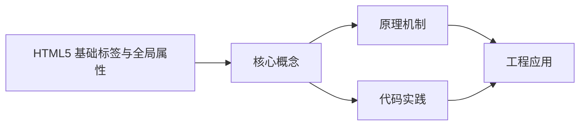
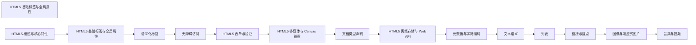

## 1. 学习目标（Bloom 分类）

本节按照布鲁姆教育目标分类学组织学习路径。本文主题为《HTML5 基础标签与全局属性》，属于 HTML5 模块，读者可以根据自身阶段选择阅读深度。

记忆层面：能够准确复述本文的核心概念、术语与基本语法或操作步骤，并能够在提问或检索时快速定位对应知识点。能够说出 HTML5 的核心概念、术语与标准写法。

理解层面：能够用自己的语言解释核心原理与工作机制，说明概念之间的因果关系，而不是机械记忆结论。能够解释 HTML5 的工作原理与设计动机。

应用层面：能够在真实项目或练习场景中运用本文知识解决具体问题，写出正确且可维护的实现。能够编写符合 HTML5 规范的完整实现。

分析层面：能够拆解复杂问题，比较本文主题与相邻概念的异同，识别边界条件与例外情况。能够分析 HTML5 与相邻方案的差异与边界。

评价层面：能够根据约束条件（性能、可读性、安全、成本）评价不同方案的优劣，做出有依据的技术决策。能够根据场景评价 HTML5 相关方案的优劣。

创造层面：能够把本文知识与其他模块知识组合，设计出新的解决方案或可复用的工程模式。能够组合 HTML5 与其他技术设计完整方案。

通过本节学习，读者应当能够把《HTML5 基础标签与全局属性》纳入自己的知识网络，并与 HTML5 模块的其他主题（语义化、表单、多媒体、Canvas）建立关联。

## 2. 历史动机与发展脉络

《HTML5 基础标签与全局属性》是 HTML5 领域的重要主题。要真正理解它，需要先了解它解决的问题与演进过程。

HTML 由 Tim Berners-Lee 于 1991 年创建，是 Web 的结构语言；HTML5 于 2014 年成为 W3C 推荐标准，WHATWG 维护的 Living Standard 是当前权威规范。
HTML5 引入语义化元素（header/nav/main/article/section/footer）、表单增强（date/range/placeholder）、多媒体（video/audio）、图形（canvas/SVG）与离线存储（localStorage/Web Worker）。
现代 HTML 强调“语义优先”：结构表达内容含义，样式与行为分离；可访问性（ARIA）与 SEO 都建立在正确语义之上。

回到本文主题：HTML5 基础标签与全局属性 的提出与成熟，正是上述技术背景下的必然产物。早期实现往往以简单可用为目标，随着工程规模扩大，社区逐渐沉淀出标准做法与最佳实践；理解这一脉络，可以帮助读者判断“为什么文档中的推荐写法是现在这个样子”，也能在遇到历史遗留代码时准确识别其设计年代与取舍。


## 3. 形式化定义与核心概念精讲

本节把《HTML5 基础标签与全局属性》涉及的核心概念以“定义 + 讲解”的形式展开。读者应把定义当作工具，把讲解当作理解路径；两者结合才能形成可迁移的知识。

文档结构：<!DOCTYPE html> 声明标准模式；html/head/body 层级固定；meta charset 必须在前 1024 字节内。
语义元素：header/footer 表示页眉页脚，nav 表示导航，main 表示主内容（每页唯一），article 表示独立内容，section 表示分区。
表单：input 类型决定键盘与校验（email/url/number），label 关联控件提升可访问性，required/pattern 提供原生校验。

### 3.1 原文章节逐一精讲

原文档把主题拆分为 20 个小节，下面按顺序给出每一节的导读讲解，随后保留原文细节供精读。

#### 原文精读（完整保留）

# 基础标签与全局属性 语法速查手册

> **符号约定**:`< >` 必填参数 | `[ ]` 可选参数

---

#### 1. 基础文本标签

基础文本标签用于定义和格式化网页中的文本内容，是构建网页结构的基础。

##### 1.1 标题标签

标题标签用于定义网页中的标题，从 `<h1>` 到 `<h6>`，级别依次递减。
| 标签 | 描述 | 语义 |
|------|------|------|
| `<h1>` | 一级标题 | 最重要的标题，通常用于页面主标题 |
| `<h2>` | 二级标题 | 次要标题，通常用于章节标题 |
| `<h3>` | 三级标题 | 子章节标题 |
| `<h4>` | 四级标题 | 更小的子章节标题 |
| `<h5>` | 五级标题 | 更次要的标题 |
| `<h6>` | 六级标题 | 最次要的标题 |
**示例**：

```html
<h1>网站主标题</h1>
<h2>章节标题</h2>
<h3>子章节标题</h3>
<h4>子子章节标题</h4>
```

**最佳实践**：

- 每个页面应该只有一个 `<h1>` 标签，用于页面的主标题
- 标题应该按照层级顺序使用，不要跳过层级
- 标题内容应该简洁明了，能够准确反映章节内容

##### 1.2 段落标签

`<p>` 标签用于定义段落，是最常用的文本容器之一。
**示例**：

```html
<p>这是一个段落。段落是网页中最基本的文本单位，用于组织和展示文本内容。</p>
<p>这是另一个段落。每个段落都会自动在前后添加空白，使文本更易于阅读。</p>
```

##### 1.3 行内文本容器

`<span>` 标签是一个行内元素，用于对文本的一部分进行样式设置或标记。
**示例**：

```html
<p>这是一段文本，其中 <span style="color: red;">红色部分</span> 是使用 span 标签标记的。</p>
```

##### 1.4 强调标签

用于对文本进行强调，具有语义含义。
| 标签 | 描述 | 语义 |
|------|------|------|
| `<strong>` | 加粗 | 表示重要内容 |
| `<em>` | 倾斜 | 表示强调内容 |
| `<mark>` | 标记 | 表示突出显示的内容 |
| `<small>` | 小号字体 | 表示辅助性内容 |
| `<del>` | 删除线 | 表示已删除的内容 |
| `<ins>` | 下划线 | 表示已插入的内容 |
| `<sub>` | 下标 | 表示下标文本 |
| `<sup>` | 上标 | 表示上标文本 |
**示例**：

```html
<p>这是 <strong>重要内容</strong>，这是 <em>强调内容</em>。</p>
<p>这是 <mark>突出显示</mark> 的内容。</p>
<p>这是 <small>辅助性内容</small>。</p>
<p>这是 <del>已删除</del> 的内容，这是 <ins>已插入</ins> 的内容。</p>
<p>水的化学式是 H<sub>2</sub>O，2 的平方是 2<sup>2</sup>。</p>
```

##### 1.5 换行和分割线

| 标签   | 描述                                   |
| ------ | -------------------------------------- |
| `<br>` | 换行标签，用于在文本中插入换行         |
| `<hr>` | 分割线标签，用于在页面中插入水平分割线 |

**示例**：

```html
<p>这是第一行<br />这是第二行</p>
<hr />
<p>这是分割线下面的内容</p>
```

#### 2. 列表标签

列表标签用于组织和展示一系列相关的项目。

##### 2.1 无序列表

无序列表使用 `<ul>` 标签定义，列表项使用 `<li>` 标签定义，默认使用圆点作为列表项标记。
**示例**：

```html
<h3>购物清单</h3>
<ul>
  <li>苹果</li>
  <li>香蕉</li>
  <li>橙子</li>
  <li>牛奶</li>
</ul>
```

##### 2.2 有序列表

有序列表使用 `<ol>` 标签定义，列表项使用 `<li>` 标签定义，默认使用数字作为列表项标记。
**属性**：

- `start`: 指定列表的起始编号
- `reversed`: 倒序列表
- `type`: 指定编号类型（1, A, a, I, i）
  **示例**：

```html
 <h3>步骤说明</h3>
 <ol>
  <li>准备材料</li>
  <li>混合 ingredients</li>
  <li>加热</li>
  <li>冷却</li>
 </ol>
 <h3>倒序列表</h3>
 ol reversed>
  <li>第四步</li>
  <li>第三步</li>
  <li>第二步</li>
  <li>第一步</li>
 </ol>
 <h3>字母编号列表</h3>
 <ol type="A">
  <li>选项 A</li>
  <li>选项 B</li>
  <li>选项 C</li>
 </ol>
```

##### 2.3 定义列表

定义列表使用 `<dl>` 标签定义，术语使用 `<dt>` 标签定义，描述使用 `<dd>` 标签定义。
**示例**：

```html
<h3>术语解释</h3>
dl>
<dt>HTML</dt>
<dd>超文本标记语言，用于创建网页结构</dd>
<dt>CSS</dt>
<dd>层叠样式表，用于美化网页</dd>
<dt>JavaScript</dt>
<dd>脚本语言，用于实现网页交互</dd>
dl>
```

##### 2.4 嵌套列表

列表可以嵌套使用，创建层次结构。
**示例**：

```html
 <h3>课程大纲</h3>
 ul>
  <li>HTML 基础
  ul>
  <li>标签语法</li>
  <li>语义化标签</li>
  <li>表单元素</li>
  </ul>
  </li>
  <li>CSS 基础
  ul>
  <li>选择器</li>
  <li>盒模型</li>
  <li>布局技巧</li>
  </ul>
  </li>
  <li>JavaScript 基础
  ul>
  <li>变量和数据类型</li>
  <li>控制流</li>
  <li>函数</li>
  </ul>
  </li>
 ul>
```

#### 3. 超链接与多媒体

##### 3.1 超链接

超链接使用 `<a>` 标签定义，用于链接到其他网页、文件或位置。
**属性**：

- `href`: 指定链接目标
- `target`: 指定打开链接的方式
- `_self`: 在当前窗口打开（默认）
- `_blank`: 在新窗口打开
- `_parent`: 在父框架打开
- `_top`: 在整个窗口打开
- `title`: 指定悬停提示文字
- `rel`: 指定链接与当前页面的关系
  **示例**：

```html
 <!-- 链接到外部网站 -->
 a href="https://www.example.com" target="_blank">访问示例网站</a>
 <!-- 链接到同一网站的其他页面 -->
 a href="about.html">关于我们</a>
 <!-- 链接到页面内的锚点 -->
 a href="#section1">跳转到第一部分</a>
 <!-- 链接到电子邮件 -->
 a href="mailto:info@example.com">发送邮件</a>
 <!-- 链接到电话 -->
 a href="tel:+1234567890">拨打电话</a>
```

##### 3.2 图像

图像使用 `` 标签定义，用于在网页中插入图片。
**属性**：

- `src`: 指定图像源文件路径
- `alt`: 指定图像的替代文本（对 SEO 和无障碍至关重要）
- `width`: 指定图像宽度
- `height`: 指定图像高度
- `title`: 指定悬停提示文字
- `loading`: 指定图像加载方式（`lazy` 用于延迟加载）
  **示例**：

```html
<!-- 基本图像 -->
img src="images/photo.jpg" alt="美丽的风景" width="400" height="300">
<!-- 带有标题的图像 -->
img src="images/logo.png" alt="网站标志" title="网站标志">
<!-- 延迟加载的图像 -->
img src="images/large-image.jpg" alt="大型图像" loading="lazy">
```

##### 3.3 其他多媒体标签

| 标签       | 描述             |
| ---------- | ---------------- |
| `<audio>`  | 用于播放音频文件 |
| `<video>`  | 用于播放视频文件 |
| `<iframe>` | 用于嵌入其他网页 |

**示例**：

```html
<!-- 音频播放器 -->
audio controls>
<source src="audio/song.mp3" type="audio/mpeg" />
您的浏览器不支持音频元素。 audio>
<!-- 视频播放器 -->
video controls width="600">
<source src="video/movie.mp4" type="video/mp4" />
您的浏览器不支持视频元素。 video>
<!-- 嵌入网页 -->
iframe
src="https://www.google.com/maps/embed?pb=!1m18!1m12!1m3!1d3022.1422937950146!2d-74.0061380845947!3d40.71277577933185!2m3!1f0!2f0!3f0!3m2!1i1024!2i768!4f13.1!3m3!1m2!1s0x89c25a22a3bda30d%3A0xb89d1fe6bc499443!2sNew%20York%2C%20NY%2C%20USA!5e0!3m2!1sen!2sus!4v1620000000000!5m2!1sen!2sus"
width="600" height="450" style="border:0;" allowfullscreen="" loading="lazy"> iframe>
```

#### 4. 全局属性

全局属性是几乎所有 HTML 元素都支持的属性，用于提供额外的信息或功能。

##### 4.1 基本全局属性

| 属性              | 描述                                            | 示例                                   |
| ----------------- | ----------------------------------------------- | -------------------------------------- |
| `id`              | 唯一标识符，用于通过 JavaScript 或 CSS 选择元素 | `id="header"`                          |
| `class`           | 样式类名，用于为元素应用 CSS 样式               | `class="container main"`               |
| `style`           | 行内样式，直接在元素上定义样式                  | `style="color: red; font-size: 16px;"` |
| `title`           | 悬停提示文字，当鼠标悬停在元素上时显示          | `title="这是一个提示"`                 |
| `hidden`          | 隐藏元素，使其不显示在页面上                    | `hidden`                               |
| `contenteditable` | 使元素内容可编辑                                | `contenteditable=""`                   |
| `spellcheck`      | 启用或禁用拼写检查                              | `spellcheck=""`                        |
| `tabindex`        | 指定元素在 Tab 键顺序中的位置                   | `tabindex="1"`                         |
| `accesskey`       | 指定访问元素的快捷键                            | `accesskey="k"`                        |

**示例**：

```html
 <!-- 使用 id 和 class -->
 div id="header" class="container">
  <h1>网站标题</h1>
 </div>
 <!-- 使用行内样式 -->
 p style="color: blue; font-weight: bold;">这是蓝色粗体文本</p>
 <!-- 使用 title 属性 -->
 a href="#" title="点击这里">链接</a>
 <!-- 使用 hidden 属性 -->
 div hidden>这个元素是隐藏的</div>
 <!-- 使用 contenteditable 属性 -->
 div contenteditable="">点击此处编辑内容</div>
```

##### 4.2 自定义数据属性

`data-*` 属性用于存储自定义数据，这些数据可以通过 JavaScript 访问。
**语法**：`data-属性名="值"`
**示例**：

```html
 <!-- 存储产品信息 -->
 div class="product" data-id="123" data-name="iPhone 13" data-price="799">
  <h3>iPhone 13</h3>
  <p>价格: $799</p>
 </div>
 <!-- 通过 JavaScript 访问 -->
 <script>
  const product = document.querySelector('.product');
  const productId = product.dataset.id;
  const productName = product.dataset.name;
  const productPrice = product.dataset.price;
  console.log(`产品 ID: ${productId}, 名称: ${productName}, 价格: $${productPrice}`);
 </script>
```

##### 4.3 其他全局属性

| 属性        | 描述                         | 示例                                             |
| ----------- | ---------------------------- | ------------------------------------------------ |
| `lang`      | 指定元素内容的语言           | `lang="zh-CN"`                                   |
| `dir`       | 指定文本方向                 | `dir="ltr"` (从左到右) 或 `dir="rtl"` (从右到左) |
| `translate` | 指定是否翻译元素内容         | `translate="no"`                                 |
| `draggable` | 指定元素是否可拖动           | `draggable=""`                                   |
| `dropzone`  | 指定元素作为放置目标时的行为 | `dropzone="copy"`                                |

**示例**：

```html
 <!-- 指定语言 -->
 div lang="en">This is English text</div>
 div lang="zh-CN">这是中文文本</div>
 <!-- 指定文本方向 -->
 div dir="rtl">مرحبا بالعالم</div> <!-- 阿拉伯语，从右到左 -->
 <!-- 指定不可翻译 -->
 div translate="no">品牌名称: Apple</div>
 <!-- 指定可拖动 -->
 div draggable="">可拖动元素</div>
```

#### 5. 语义化标签

HTML5 引入了一系列语义化标签，用于更清晰地描述网页结构。
| 标签 | 描述 |
|------|------|
| `<header>` | 页面或section的头部 |
| `<nav>` | 导航链接区域 |
| `<main>` | 页面的主要内容 |
| `<section>` | 文档中的节 |
| `<article>` | 独立的内容块 |
| `<aside>` | 侧边栏或附加内容 |
| `<footer>` | 页面或section的底部 |
| `<figure>` | 图表、图像等 |
| `<figcaption>` | 图表的标题 |
**示例**：

```html
<!DOCTYPE html>
<html lang="zh-CN">
  <head>
    <meta charset="UTF-8" />
    <meta name="viewport" content="width=device-width, initial-scale=1.0" />
    <title>语义化标签示例</title>
  </head>
  <body>
    <header>
      <h1>网站标题</h1>
      <nav>
        <ul>
          <li><a href="#">首页</a></li>
          <li><a href="#">关于</a></li>
          <li><a href="#">服务</a></li>
          <li><a href="#">联系</a></li>
        </ul>
      </nav>
    </header>
    <main>
      <section>
        <h2>新闻</h2>
        <article>
          <h3>最新新闻标题</h3>
          <p>新闻内容...</p>
        </article>
        <article>
          <h3>另一则新闻</h3>
          <p>新闻内容...</p>
        </article>
      </section>
      <aside>
        <h3>侧边栏</h3>
        <p>侧边栏内容...</p>
      </aside>
    </main>
    <footer>
      <p>2026 网站名称. 保留所有权利.</p>
    </footer>
  </body>
</html>
```

#### 6. 实际应用示例

##### 6.1 示例 1：基本网页结构

```html
<!DOCTYPE html>
<html lang="zh-CN">
  <head>
    <meta charset="UTF-8" />
    <meta name="viewport" content="width=device-width, initial-scale=1.0" />
    <title>基本网页结构</title>
    <style>
      body {
        font-family: Arial, sans-serif;
        line-height: 1.6;
        margin: 0;
        padding: 0;
      }
      header {
        background-color: #333;
        color: white;
        padding: 1rem;
      }
      nav ul {
        list-style: none;
        padding: 0;
      }
      nav ul li {
        display: inline;
        margin-right: 1rem;
      }
      nav ul li a {
        color: white;
        text-decoration: none;
      }
      main {
        padding: 2rem;
      }
      footer {
        background-color: #333;
        color: white;
        text-align: center;
        padding: 1rem;
        position: fixed;
        bottom: 0;
        width: 100%;
      }
    </style>
  </head>
  <body>
    <header>
      <h1>我的网站</h1>
      <nav>
        <ul>
          <li><a href="#">首页</a></li>
          <li><a href="#">关于</a></li>
          <li><a href="#">服务</a></li>
          <li><a href="#">联系</a></li>
        </ul>
      </nav>
    </header>
    <main>
      <section>
        <h2>欢迎访问我的网站</h2>
        <p>这是一个使用 HTML5 基础标签构建的网页。</p>
        <p>HTML5 提供了丰富的标签和属性，用于创建结构清晰、语义化的网页。</p>
      </section>
      <section>
        <h2>服务列表</h2>
        <ul>
          <li>网站设计</li>
          <li>前端开发</li>
          <li>后端开发</li>
          <li>移动应用开发</li>
        </ul>
      </section>
      <section>
        <h2>联系我们</h2>
        <p>邮箱: <a href="mailto:info@example.com">info@example.com</a></p>
        <p>电话: <a href="tel:+1234567890">123-456-7890</a></p>
      </section>
    </main>
    <footer>
      <p>2026 我的网站. 保留所有权利.</p>
    </footer>
  </body>
</html>
```

##### 6.2 示例 2：产品展示页面

```html
<!DOCTYPE html>
<html lang="zh-CN">
  <head>
    <meta charset="UTF-8" />
    <meta name="viewport" content="width=device-width, initial-scale=1.0" />
    <title>产品展示</title>
    <style>
      body {
        font-family: Arial, sans-serif;
        line-height: 1.6;
        margin: 0;
        padding: 0;
      }
      .container {
        max-width: 1200px;
        margin: 0 auto;
        padding: 2rem;
      }
      h1 {
        text-align: center;
      }
      .product-grid {
        display: grid;
        grid-template-columns: repeat(auto-fit, minmax(300px, 1fr));
        gap: 2rem;
        margin-top: 2rem;
      }
      .product {
        border: 1px solid #ddd;
        border-radius: 5px;
        padding: 1rem;
        text-align: center;
      }
      .product img {
        max-width: 100%;
        height: auto;
        border-radius: 5px;
      }
      .product h3 {
        margin-top: 1rem;
      }
      .product p {
        color: #666;
      }
      .price {
        font-weight: bold;
        color: #e63946;
        font-size: 1.2rem;
      }
    </style>
  </head>
  <body>
    <div class="container">
      <h1>产品展示</h1>
      <div class="product-grid">
        <div class="product" data-id="1" data-name="智能手机" data-price="2999">
          
          <h3>智能手机</h3>
          <p>6.5英寸屏幕，128GB存储，4800万像素摄像头</p>
          <p class="price">¥2999</p>
          <a href="#" class="btn">查看详情</a>
        </div>
        <div class="product" data-id="2" data-name="笔记本电脑" data-price="5999">
          
          <h3>笔记本电脑</h3>
          <p>14英寸屏幕，8GB内存，512GB固态硬盘</p>
          <p class="price">¥5999</p>
          <a href="#" class="btn">查看详情</a>
        </div>
        <div class="product" data-id="3" data-name="平板电脑" data-price="1999">
          
          <h3>平板电脑</h3>
          <p>10.5英寸屏幕，64GB存储，支持手写笔</p>
          <p class="price">¥1999</p>
          <a href="#" class="btn">查看详情</a>
        </div>
      </div>
    </div>
    <script>
      // 为产品添加点击事件
      document.querySelectorAll('.product').forEach((product) => {
        product.addEventListener('click', function () {
          const id = this.dataset.id;
          const name = this.dataset.name;
          const price = this.dataset.price;
          alert(`产品 ID: ${id}\n名称: ${name}\n价格: ¥${price}`);
        });
      });
    </script>
  </body>
</html>
```

#### 7. 最佳实践

##### 7.1 语义化标签的使用

- **使用语义化标签**：优先使用语义化标签（如 `<header>`, `<nav>`, `<main>`, `<section>`, `<article>`, `<footer>`）来构建网页结构，而不是使用通用的 `<div>` 标签。
- **正确嵌套**：确保标签的嵌套顺序正确，例如 `<li>` 必须在 `<ul>` 或 `<ol>` 内部。
- **避免过度使用**：不要为了使用语义化标签而过度使用，应该根据内容的实际含义选择合适的标签。

##### 7.2 全局属性的使用

- **id 的唯一性**：确保每个元素的 `id` 属性值在页面中是唯一的。
- **class 的复用**：使用 `class` 属性来为多个元素应用相同的样式，提高代码的可维护性。
- **避免行内样式**：尽量避免使用 `style` 属性直接在元素上定义样式，应该使用 CSS 文件或 `<style>` 标签。
- **合理使用 data-\* 属性**：使用 `data-*` 属性来存储与元素相关的自定义数据，而不是使用 `id` 或 `class` 来存储数据。

##### 7.3 链接和图像的最佳实践

- **链接的可访问性**：为链接添加 `title` 属性，提供额外的上下文信息。
- **图像的 alt 属性**：为所有图像添加 `alt` 属性，描述图像的内容，这对 SEO 和无障碍访问都很重要。
- **图像的尺寸**：为图像指定 `width` 和 `height` 属性，这样浏览器可以在加载图像之前预留空间，避免页面布局跳动。
- **图像的延迟加载**：对于大型图像，使用 `loading="lazy"` 属性来延迟加载，提高页面加载速度。

##### 7.4 代码风格

- **缩进**：使用一致的缩进（通常是 2 或 4 个空格）来提高代码的可读性。
- **大小写**：HTML 标签和属性通常使用小写。
- **引号**：属性值应该使用双引号包围。
- **注释**：为复杂的代码添加注释，提高代码的可维护性。

---

#### 标题标签

**六级标题**
`<h1>...</h1>` | `<h2>...</h2>` | `<h3>...</h3>` | `<h4>...</h4>` | `<h5>...</h5>` | `<h6>...</h6>`
```html
<!-- 标题层级递减,每页建议仅一个 h1 -->
<h1>网站主标题</h1>
<h2>章节标题</h2>
<h3>子章节标题</h3>
<h4>子子章节标题</h4>
```

| 标签   | 语义               |
| ------ | ------------------ |
| `<h1>` | 一级标题,页面主标题 |
| `<h2>` | 二级标题,章节标题   |
| `<h3>` | 三级标题,子章节     |
| `<h4>` | 四级标题            |
| `<h5>` | 五级标题            |
| `<h6>` | 六级标题            |

---

#### 段落与行内容器

**段落标签**
`<p>[内容]</p>`
```html
<!-- 段落自动添加上下空白 -->
<p>这是一个段落。段落是网页中最基本的文本单位。</p>
<p>这是另一个段落。</p>
```

**行内文本容器**
`<span>[内容]</span>`
```html
<!-- 用于对局部文本应用样式 -->
<p>这是一段文本,其中 <span style="color: red;">红色部分</span> 被标记。</p>
```

---

#### 文本语义标签

**强调与标记标签**

| 标签        | 描述       | 语义             |
| ----------- | ---------- | ---------------- |
| `<strong>`  | 加粗       | 重要内容         |
| `<em>`      | 倾斜       | 强调内容         |
| `<mark>`    | 标记       | 突出显示         |
| `<small>`   | 小号字体   | 辅助性内容       |
| `<del>`     | 删除线     | 已删除内容       |
| `<ins>`     | 下划线     | 已插入内容       |
| `<sub>`     | 下标       | 下标文本         |
| `<sup>`     | 上标       | 上标文本         |
| `<abbr>`    | 缩写       | 带标题的缩写     |
| `<cite>`    | 引用标题   | 作品标题         |
| `<dfn>`     | 定义术语   | 术语定义         |
| `<address>` | 联系方式   | 作者/联系方式    |
| `<time>`    | 时间       | 机器可读时间     |

```html
<!-- 文本语义综合示例 -->
<p>这是 <strong>重要内容</strong>,这是 <em>强调内容</em>。</p>
<p>这是 <mark>突出显示</mark> 的内容。</p>
<p>这是 <del>已删除</del> 的内容,这是 <ins>已插入</ins> 的内容。</p>
<p>水的化学式是 H<sub>2</sub>O,2 的平方是 2<sup>2</sup>。</p>
<p><abbr title="HyperText Markup Language">HTML</abbr> 是 Web 的基础。</p>
```

---

#### 换行与分割线

**换行与水平线**
`<br>` | `<hr>`
```html
<!-- br 强制换行,hr 主题分割 -->
<p>这是第一行<br />这是第二行</p>
<hr />
<p>这是分割线下面的内容</p>
```

---

#### 列表标签

**无序列表**
`<ul>...<li>[项]</li>...</ul>`
```html
<!-- 默认圆点标记 -->
<ul>
  <li>苹果</li>
  <li>香蕉</li>
  <li>橙子</li>
</ul>
```

**有序列表**
`<ol [start="<起始>"] [reversed] [type="1|A|a|I|i"]>...<li>[项]</li>...</ol>`
```html
<!-- 数字编号列表 -->
<ol>
  <li>准备材料</li>
  <li>混合原料</li>
  <li>加热</li>
</ol>

<!-- 倒序列表 -->
<ol reversed>
  <li>第四步</li>
  <li>第三步</li>
</ol>

<!-- 字母编号列表 -->
<ol type="A">
  <li>选项 A</li>
  <li>选项 B</li>
</ol>
```

**定义列表**
`<dl><dt>[术语]</dt><dd>[描述]</dd>...</dl>`
```html
<!-- 术语-描述成对出现 -->
<dl>
  <dt>HTML</dt>
  <dd>超文本标记语言</dd>
  <dt>CSS</dt>
  <dd>层叠样式表</dd>
</dl>
```

**嵌套列表**
```html
<!-- 列表可多层嵌套 -->
<ul>
  <li>HTML 基础
    <ul>
      <li>标签语法</li>
      <li>语义化标签</li>
    </ul>
  </li>
  <li>CSS 基础
    <ul>
      <li>选择器</li>
      <li>盒模型</li>
    </ul>
  </li>
</ul>
```

---

#### 超链接

**锚点链接**
`<a href="<URL>" [target="_self|_blank|_parent|_top"] [rel="<关系>"] [title="<提示>"]>[文本]</a>`
```html
<!-- 外部链接,新窗口打开 -->
<a href="https://www.example.com" target="_blank" rel="noopener">访问示例网站</a>

<!-- 内部页面 -->
<a href="about.html">关于我们</a>

<!-- 页面锚点 -->
<a href="#section1">跳转到第一部分</a>

<!-- 邮件链接 -->
<a href="mailto:info@example.com">发送邮件</a>

<!-- 电话链接 -->
<a href="tel:+1234567890">拨打电话</a>
```

| target 值  | 行为           |
| ---------- | -------------- |
| `_self`    | 当前窗口(默认) |
| `_blank`   | 新窗口         |
| `_parent`  | 父框架         |
| `_top`     | 整个窗口       |

---

#### 图像标签

**图像**
`" alt="<替代文本>" [width="<宽>"] [height="<高>"] [loading="lazy|eager"] [title="<提示>"] />`
```html
<!-- 基本图像 -->


<!-- 延迟加载 -->

```

---

#### 全局属性

**基础全局属性**

| 属性              | 描述                       | 示例                       |
| ----------------- | -------------------------- | -------------------------- |
| `id`              | 唯一标识符                 | `id="header"`              |
| `class`           | 样式类名(可多个空格分隔)   | `class="container main"`   |
| `style`           | 行内样式                   | `style="color: red;"`      |
| `title`           | 悬停提示文字               | `title="提示"`             |
| `hidden`          | 隐藏元素                   | `hidden`                   |
| `contenteditable` | 内容可编辑                 | `contenteditable="true"`   |
| `spellcheck`      | 拼写检查                   | `spellcheck="true"`        |
| `tabindex`        | Tab 键顺序                 | `tabindex="1"`             |
| `accesskey`       | 快捷键                     | `accesskey="k"`            |
| `dir`             | 文本方向                   | `dir="ltr"` / `dir="rtl"`  |
| `lang`            | 内容语言                   | `lang="zh-CN"`             |
| `translate`       | 是否翻译                   | `translate="no"`           |
| `draggable`       | 是否可拖动                 | `draggable="true"`         |

```html
<!-- id 与 class -->
<div id="header" class="container">
  <h1>网站标题</h1>
</div>

<!-- 行内样式 -->
<p style="color: blue; font-weight: bold;">蓝色粗体文本</p>

<!-- hidden 隐藏 -->
<div hidden>这个元素是隐藏的</div>

<!-- contenteditable 可编辑 -->
<div contenteditable="true">点击此处编辑内容</div>
```

---

#### 自定义数据属性

**data-* 数据存储**
`data-<名称>="<值>"`
```html
<!-- 存储产品信息 -->
<div class="product" data-id="123" data-name="iPhone 13" data-price="799">
  <h3>iPhone 13</h3>
</div>

<!-- JavaScript 读取 -->
<script>
  const product = document.querySelector('.product');
  const productId = product.dataset.id;
  const productName = product.dataset.name;
  const productPrice = product.dataset.price;
  console.log(`产品 ID: ${productId}, 名称: ${productName}, 价格: $${productPrice}`);
</script>
```

---

#### 语义化结构标签

**页面结构标签**

| 标签           | 描述                  |
| -------------- | --------------------- |
| `<header>`     | 页面或 section 的头部 |
| `<nav>`        | 导航链接区域          |
| `<main>`       | 页面主要内容(唯一)    |
| `<section>`    | 文档中的主题节        |
| `<article>`    | 独立、可复用的内容块  |
| `<aside>`      | 侧边栏或附加内容      |
| `<footer>`     | 页面或 section 的底部 |
| `<figure>`     | 图表、图像等独立单元  |
| `<figcaption>` | figure 的标题         |
| `<search>`     | 搜索区域(HTML 2023)   |
| `<dialog>`     | 对话框(HTML 2021)     |

```html
<!-- 语义化页面结构 -->
<header>
  <h1>网站标题</h1>
  <nav>
    <ul>
      <li><a href="#">首页</a></li>
      <li><a href="#">关于</a></li>
    </ul>
  </nav>
</header>
<main>
  <article>
    <h2>文章标题</h2>
    <p>文章内容...</p>
  </article>
  <aside>
    <h3>侧边栏</h3>
  </aside>
</main>
<footer>
  <p>&copy; 2026 网站名称</p>
</footer>
```

---

#### 可折叠内容

**details 与 summary**
`<details [open]><summary>[标题]</summary>[内容]</details>`
```html
<!-- 默认折叠 -->
<details>
  <summary>常见问题:如何重置密码?</summary>
  <p>请访问登录页面,点击"忘记密码"链接。</p>
</details>

<!-- 默认展开 -->
<details open>
  <summary>使用说明</summary>
  <p>这是默认展开的说明内容。</p>
</details>
```

---

#### 弹出对话框(HTML 2021+)

**dialog 元素**
`<dialog [open]>[内容]</dialog>`
```html
<!-- 模态对话框 -->
<dialog id="myDialog">
  <form method="dialog">
    <p>请确认操作</p>
    <button>取消</button>
    <button value="confirm">确认</button>
  </form>
</dialog>

<script>
  const dialog = document.getElementById('myDialog');
  dialog.showModal(); // 显示模态
  dialog.close();     // 关闭
</script>
```

---

#### Popover 弹出层(HTML 2024+)

**popover 属性**
`<div popover [="auto|manual"]>[内容]</div>`
```html
<!-- 声明式弹出层 -->
<button popovertarget="my-popover">打开弹出层</button>

<div id="my-popover" popover>
  <p>这是一个弹出层内容</p>
  <button popovertarget="my-popover" popovertargetaction="hide">关闭</button>
</div>
```


### 3.2 概念关系图

下面用 Mermaid 图表达本文核心概念之间的关系，帮助读者建立整体图景：



图中展示的是本文知识的结构化关系：核心概念是入口，原理机制解释“为什么”，代码实践演示“怎么做”，工程应用回答“何时用”。读者学习时可以把每个小节的内容挂接到对应节点上。

## 4. 理论推导与原理解析

本节深入《HTML5 基础标签与全局属性》背后的原理。理论部分不求面面俱到，而是聚焦“能解释现象、能指导实践”的关键推导。

文档结构：<!DOCTYPE html> 声明标准模式；html/head/body 层级固定；meta charset 必须在前 1024 字节内。
语义元素：header/footer 表示页眉页脚，nav 表示导航，main 表示主内容（每页唯一），article 表示独立内容，section 表示分区。
表单：input 类型决定键盘与校验（email/url/number），label 关联控件提升可访问性，required/pattern 提供原生校验。
媒体与图形：video/audio 支持多源（source）；canvas 是位图画布（JavaScript 绘制），SVG 是矢量结构（DOM 操作）。

需要强调的是，理论推导与工程实践之间存在翻译层：理论给出的是理想化模型与边界条件，工程代码则必须处理真实环境中的例外。读者在学习时应先掌握理论的“标准情形”，再通过陷阱章节了解“非标准情形”。

## 5. 代码示例与逐行讲解

本节把原文中的代码示例系统整理，并为每个示例补充用途说明与讲解。读者不应只浏览代码，而应逐段对照讲解理解设计意图。

### 5.1 示例：1.1 标题标签

该示例来自原文《1.1 标题标签》小节，用于演示HTML5 基础标签与全局属性相关操作。阅读时请先看代码结构，再看其后的讲解。

```html
<h1>网站主标题</h1>
<h2>章节标题</h2>
<h3>子章节标题</h3>
<h4>子子章节标题</h4>
```

讲解：这段代码演示了本节核心知识点。代码中的关键操作可以归纳为三步：准备（定义或初始化）、执行（核心逻辑）、收尾（释放资源或返回结果）。实际项目中，这三步往往被封装为函数或类，以提升复用性与可测试性。

关键点分析：

该示例共 4 行有效代码，结构以数据或配置为主。阅读时应关注：数据字段的含义、配置项的作用，以及它们与运行行为的对应关系。

进阶思考路径：先尝试修改参数观察行为变化，再把示例中的模式迁移到自己的项目中；每次修改都记录预期与实测差异，这是把示例转化为能力的最快方式。

### 5.2 示例：1.2 段落标签

该示例来自原文《1.2 段落标签》小节，用于演示HTML5 基础标签与全局属性相关操作。阅读时请先看代码结构，再看其后的讲解。

```html
<p>这是一个段落。段落是网页中最基本的文本单位，用于组织和展示文本内容。</p>
<p>这是另一个段落。每个段落都会自动在前后添加空白，使文本更易于阅读。</p>
```

讲解：这段代码演示了本节核心知识点。代码中的关键操作可以归纳为三步：准备（定义或初始化）、执行（核心逻辑）、收尾（释放资源或返回结果）。实际项目中，这三步往往被封装为函数或类，以提升复用性与可测试性。

关键点分析：

该示例共 2 行有效代码，结构以数据或配置为主。阅读时应关注：数据字段的含义、配置项的作用，以及它们与运行行为的对应关系。

进阶思考路径：先尝试修改参数观察行为变化，再把示例中的模式迁移到自己的项目中；每次修改都记录预期与实测差异，这是把示例转化为能力的最快方式。

### 5.3 示例：1.3 行内文本容器

该示例来自原文《1.3 行内文本容器》小节，用于演示HTML5 基础标签与全局属性相关操作。阅读时请先看代码结构，再看其后的讲解。

```html
<p>这是一段文本，其中 <span style="color: red;">红色部分</span> 是使用 span 标签标记的。</p>
```

讲解：这段代码演示了本节核心知识点。代码中的关键操作可以归纳为三步：准备（定义或初始化）、执行（核心逻辑）、收尾（释放资源或返回结果）。实际项目中，这三步往往被封装为函数或类，以提升复用性与可测试性。

关键点分析：

该示例共 1 行有效代码，结构以数据或配置为主。阅读时应关注：数据字段的含义、配置项的作用，以及它们与运行行为的对应关系。

进阶思考路径：先尝试修改参数观察行为变化，再把示例中的模式迁移到自己的项目中；每次修改都记录预期与实测差异，这是把示例转化为能力的最快方式。

### 5.4 示例：1.4 强调标签

该示例来自原文《1.4 强调标签》小节，用于演示HTML5 基础标签与全局属性相关操作。阅读时请先看代码结构，再看其后的讲解。

```html
<p>这是 <strong>重要内容</strong>，这是 <em>强调内容</em>。</p>
<p>这是 <mark>突出显示</mark> 的内容。</p>
<p>这是 <small>辅助性内容</small>。</p>
<p>这是 <del>已删除</del> 的内容，这是 <ins>已插入</ins> 的内容。</p>
<p>水的化学式是 H<sub>2</sub>O，2 的平方是 2<sup>2</sup>。</p>
```

讲解：这段代码演示了本节核心知识点。代码中的关键操作可以归纳为三步：准备（定义或初始化）、执行（核心逻辑）、收尾（释放资源或返回结果）。实际项目中，这三步往往被封装为函数或类，以提升复用性与可测试性。

关键点分析：

该示例共 5 行有效代码，结构以数据或配置为主。阅读时应关注：数据字段的含义、配置项的作用，以及它们与运行行为的对应关系。

进阶思考路径：先尝试修改参数观察行为变化，再把示例中的模式迁移到自己的项目中；每次修改都记录预期与实测差异，这是把示例转化为能力的最快方式。

### 5.5 示例：1.5 换行和分割线

该示例来自原文《1.5 换行和分割线》小节，用于演示HTML5 基础标签与全局属性相关操作。阅读时请先看代码结构，再看其后的讲解。

```html
<p>这是第一行<br />这是第二行</p>
<hr />
<p>这是分割线下面的内容</p>
```

讲解：这段代码演示了本节核心知识点。代码中的关键操作可以归纳为三步：准备（定义或初始化）、执行（核心逻辑）、收尾（释放资源或返回结果）。实际项目中，这三步往往被封装为函数或类，以提升复用性与可测试性。

关键点分析：

该示例共 3 行有效代码，结构以数据或配置为主。阅读时应关注：数据字段的含义、配置项的作用，以及它们与运行行为的对应关系。

进阶思考路径：先尝试修改参数观察行为变化，再把示例中的模式迁移到自己的项目中；每次修改都记录预期与实测差异，这是把示例转化为能力的最快方式。

### 5.6 示例：2.1 无序列表

该示例来自原文《2.1 无序列表》小节，用于演示HTML5 基础标签与全局属性相关操作。阅读时请先看代码结构，再看其后的讲解。

```html
<h3>购物清单</h3>
<ul>
  <li>苹果</li>
  <li>香蕉</li>
  <li>橙子</li>
  <li>牛奶</li>
</ul>
```

讲解：这段代码演示了本节核心知识点。代码中的关键操作可以归纳为三步：准备（定义或初始化）、执行（核心逻辑）、收尾（释放资源或返回结果）。实际项目中，这三步往往被封装为函数或类，以提升复用性与可测试性。

关键点分析：

该示例共 7 行有效代码，结构以数据或配置为主。阅读时应关注：数据字段的含义、配置项的作用，以及它们与运行行为的对应关系。

进阶思考路径：先尝试修改参数观察行为变化，再把示例中的模式迁移到自己的项目中；每次修改都记录预期与实测差异，这是把示例转化为能力的最快方式。

### 5.7 示例：2.2 有序列表

该示例来自原文《2.2 有序列表》小节，用于演示HTML5 基础标签与全局属性相关操作。阅读时请先看代码结构，再看其后的讲解。

```html
 <h3>步骤说明</h3>
 <ol>
  <li>准备材料</li>
  <li>混合 ingredients</li>
  <li>加热</li>
  <li>冷却</li>
 </ol>
 <h3>倒序列表</h3>
 ol reversed>
  <li>第四步</li>
  <li>第三步</li>
  <li>第二步</li>
  <li>第一步</li>
 </ol>
 <h3>字母编号列表</h3>
 <ol type="A">
  <li>选项 A</li>
  <li>选项 B</li>
  <li>选项 C</li>
 </ol>
```

讲解：这段代码演示了本节核心知识点。代码中的关键操作可以归纳为三步：准备（定义或初始化）、执行（核心逻辑）、收尾（释放资源或返回结果）。实际项目中，这三步往往被封装为函数或类，以提升复用性与可测试性。

关键点分析：

该示例共 20 行有效代码，结构以数据或配置为主。阅读时应关注：数据字段的含义、配置项的作用，以及它们与运行行为的对应关系。

进阶思考路径：先尝试修改参数观察行为变化，再把示例中的模式迁移到自己的项目中；每次修改都记录预期与实测差异，这是把示例转化为能力的最快方式。

### 5.8 示例：2.3 定义列表

该示例来自原文《2.3 定义列表》小节，用于演示HTML5 基础标签与全局属性相关操作。阅读时请先看代码结构，再看其后的讲解。

```html
<h3>术语解释</h3>
dl>
<dt>HTML</dt>
<dd>超文本标记语言，用于创建网页结构</dd>
<dt>CSS</dt>
<dd>层叠样式表，用于美化网页</dd>
<dt>JavaScript</dt>
<dd>脚本语言，用于实现网页交互</dd>
dl>
```

讲解：这段代码演示了本节核心知识点。代码中的关键操作可以归纳为三步：准备（定义或初始化）、执行（核心逻辑）、收尾（释放资源或返回结果）。实际项目中，这三步往往被封装为函数或类，以提升复用性与可测试性。

关键点分析：

该示例共 9 行有效代码，结构以数据或配置为主。阅读时应关注：数据字段的含义、配置项的作用，以及它们与运行行为的对应关系。

进阶思考路径：先尝试修改参数观察行为变化，再把示例中的模式迁移到自己的项目中；每次修改都记录预期与实测差异，这是把示例转化为能力的最快方式。

### 5.9 示例：2.4 嵌套列表

该示例来自原文《2.4 嵌套列表》小节，用于演示HTML5 基础标签与全局属性相关操作。阅读时请先看代码结构，再看其后的讲解。

```html
 <h3>课程大纲</h3>
 ul>
  <li>HTML 基础
  ul>
  <li>标签语法</li>
  <li>语义化标签</li>
  <li>表单元素</li>
  </ul>
  </li>
  <li>CSS 基础
  ul>
  <li>选择器</li>
  <li>盒模型</li>
  <li>布局技巧</li>
  </ul>
  </li>
  <li>JavaScript 基础
  ul>
  <li>变量和数据类型</li>
  <li>控制流</li>
  <li>函数</li>
  </ul>
  </li>
 ul>
```

讲解：这段代码演示了本节核心知识点。代码中的关键操作可以归纳为三步：准备（定义或初始化）、执行（核心逻辑）、收尾（释放资源或返回结果）。实际项目中，这三步往往被封装为函数或类，以提升复用性与可测试性。

关键点分析：

该示例共 24 行有效代码，结构以数据或配置为主。阅读时应关注：数据字段的含义、配置项的作用，以及它们与运行行为的对应关系。

进阶思考路径：先尝试修改参数观察行为变化，再把示例中的模式迁移到自己的项目中；每次修改都记录预期与实测差异，这是把示例转化为能力的最快方式。

### 5.10 示例：3.1 超链接

该示例来自原文《3.1 超链接》小节，用于演示HTML5 基础标签与全局属性相关操作。阅读时请先看代码结构，再看其后的讲解。

```html
 <!-- 链接到外部网站 -->
 a href="https://www.example.com" target="_blank">访问示例网站</a>
 <!-- 链接到同一网站的其他页面 -->
 a href="about.html">关于我们</a>
 <!-- 链接到页面内的锚点 -->
 a href="#section1">跳转到第一部分</a>
 <!-- 链接到电子邮件 -->
 a href="mailto:info@example.com">发送邮件</a>
 <!-- 链接到电话 -->
 a href="tel:+1234567890">拨打电话</a>
```

讲解：这段代码演示了本节核心知识点。代码中的关键操作可以归纳为三步：准备（定义或初始化）、执行（核心逻辑）、收尾（释放资源或返回结果）。实际项目中，这三步往往被封装为函数或类，以提升复用性与可测试性。

关键点分析：

该示例共 10 行有效代码，结构以数据或配置为主。阅读时应关注：数据字段的含义、配置项的作用，以及它们与运行行为的对应关系。

进阶思考路径：先尝试修改参数观察行为变化，再把示例中的模式迁移到自己的项目中；每次修改都记录预期与实测差异，这是把示例转化为能力的最快方式。

### 5.11 示例：3.2 图像

该示例来自原文《3.2 图像》小节，用于演示HTML5 基础标签与全局属性相关操作。阅读时请先看代码结构，再看其后的讲解。

```html
<!-- 基本图像 -->
img src="images/photo.jpg" alt="美丽的风景" width="400" height="300">
<!-- 带有标题的图像 -->
img src="images/logo.png" alt="网站标志" title="网站标志">
<!-- 延迟加载的图像 -->
img src="images/large-image.jpg" alt="大型图像" loading="lazy">
```

讲解：这段代码演示了本节核心知识点。代码中的关键操作可以归纳为三步：准备（定义或初始化）、执行（核心逻辑）、收尾（释放资源或返回结果）。实际项目中，这三步往往被封装为函数或类，以提升复用性与可测试性。

关键点分析：

该示例共 6 行有效代码，结构以数据或配置为主。阅读时应关注：数据字段的含义、配置项的作用，以及它们与运行行为的对应关系。

进阶思考路径：先尝试修改参数观察行为变化，再把示例中的模式迁移到自己的项目中；每次修改都记录预期与实测差异，这是把示例转化为能力的最快方式。

### 5.12 示例：3.3 其他多媒体标签

该示例来自原文《3.3 其他多媒体标签》小节，用于演示HTML5 基础标签与全局属性相关操作。阅读时请先看代码结构，再看其后的讲解。

```html
<!-- 音频播放器 -->
audio controls>
<source src="audio/song.mp3" type="audio/mpeg" />
您的浏览器不支持音频元素。 audio>
<!-- 视频播放器 -->
video controls width="600">
<source src="video/movie.mp4" type="video/mp4" />
您的浏览器不支持视频元素。 video>
<!-- 嵌入网页 -->
iframe
src="https://www.google.com/maps/embed?pb=!1m18!1m12!1m3!1d3022.1422937950146!2d-74.0061380845947!3d40.71277577933185!2m3!1f0!2f0!3f0!3m2!1i1024!2i768!4f13.1!3m3!1m2!1s0x89c25a22a3bda30d%3A0xb89d1fe6bc499443!2sNew%20York%2C%20NY%2C%20USA!5e0!3m2!1sen!2sus!4v1620000000000!5m2!1sen!2sus"
width="600" height="450" style="border:0;" allowfullscreen="" loading="lazy"> iframe>
```

讲解：这段代码演示了本节核心知识点。代码中的关键操作可以归纳为三步：准备（定义或初始化）、执行（核心逻辑）、收尾（释放资源或返回结果）。实际项目中，这三步往往被封装为函数或类，以提升复用性与可测试性。

关键点分析：

该示例共 12 行有效代码，结构以数据或配置为主。阅读时应关注：数据字段的含义、配置项的作用，以及它们与运行行为的对应关系。

进阶思考路径：先尝试修改参数观察行为变化，再把示例中的模式迁移到自己的项目中；每次修改都记录预期与实测差异，这是把示例转化为能力的最快方式。

### 5.13 示例：4.1 基本全局属性

该示例来自原文《4.1 基本全局属性》小节，用于演示HTML5 基础标签与全局属性相关操作。阅读时请先看代码结构，再看其后的讲解。

```html
 <!-- 使用 id 和 class -->
 div id="header" class="container">
  <h1>网站标题</h1>
 </div>
 <!-- 使用行内样式 -->
 p style="color: blue; font-weight: bold;">这是蓝色粗体文本</p>
 <!-- 使用 title 属性 -->
 a href="#" title="点击这里">链接</a>
 <!-- 使用 hidden 属性 -->
 div hidden>这个元素是隐藏的</div>
 <!-- 使用 contenteditable 属性 -->
 div contenteditable="">点击此处编辑内容</div>
```

讲解：这段代码演示了本节核心知识点。代码中的关键操作可以归纳为三步：准备（定义或初始化）、执行（核心逻辑）、收尾（释放资源或返回结果）。实际项目中，这三步往往被封装为函数或类，以提升复用性与可测试性。

关键点分析：

该示例共 12 行有效代码，包含 1 类关键结构（class）。其中：

- 入口与初始化部分负责建立上下文，对应实际项目中的启动或装配逻辑；
- 核心逻辑部分体现本文主题的主要操作，是阅读时最需要对照讲解理解的部分；
- 输出或返回部分把结果交给调用方，注意其类型与边界条件。

进阶思考路径：先尝试修改参数观察行为变化，再把示例中的模式迁移到自己的项目中；每次修改都记录预期与实测差异，这是把示例转化为能力的最快方式。

### 5.14 示例：4.2 自定义数据属性

该示例来自原文《4.2 自定义数据属性》小节，用于演示HTML5 基础标签与全局属性相关操作。阅读时请先看代码结构，再看其后的讲解。

```html
 <!-- 存储产品信息 -->
 div class="product" data-id="123" data-name="iPhone 13" data-price="799">
  <h3>iPhone 13</h3>
  <p>价格: $799</p>
 </div>
 <!-- 通过 JavaScript 访问 -->
 <script>
  const product = document.querySelector('.product');
  const productId = product.dataset.id;
  const productName = product.dataset.name;
  const productPrice = product.dataset.price;
  console.log(`产品 ID: ${productId}, 名称: ${productName}, 价格: $${productPrice}`);
 </script>
```

讲解：这段代码演示了本节核心知识点。代码中的关键操作可以归纳为三步：准备（定义或初始化）、执行（核心逻辑）、收尾（释放资源或返回结果）。实际项目中，这三步往往被封装为函数或类，以提升复用性与可测试性。

关键点分析：

该示例共 13 行有效代码，包含 1 类关键结构（class）。其中：

- 入口与初始化部分负责建立上下文，对应实际项目中的启动或装配逻辑；
- 核心逻辑部分体现本文主题的主要操作，是阅读时最需要对照讲解理解的部分；
- 输出或返回部分把结果交给调用方，注意其类型与边界条件。

进阶思考路径：先尝试修改参数观察行为变化，再把示例中的模式迁移到自己的项目中；每次修改都记录预期与实测差异，这是把示例转化为能力的最快方式。

### 5.15 示例：4.3 其他全局属性

该示例来自原文《4.3 其他全局属性》小节，用于演示HTML5 基础标签与全局属性相关操作。阅读时请先看代码结构，再看其后的讲解。

```html
 <!-- 指定语言 -->
 div lang="en">This is English text</div>
 div lang="zh-CN">这是中文文本</div>
 <!-- 指定文本方向 -->
 div dir="rtl">مرحبا بالعالم</div> <!-- 阿拉伯语，从右到左 -->
 <!-- 指定不可翻译 -->
 div translate="no">品牌名称: Apple</div>
 <!-- 指定可拖动 -->
 div draggable="">可拖动元素</div>
```

讲解：这段代码演示了本节核心知识点。代码中的关键操作可以归纳为三步：准备（定义或初始化）、执行（核心逻辑）、收尾（释放资源或返回结果）。实际项目中，这三步往往被封装为函数或类，以提升复用性与可测试性。

关键点分析：

该示例共 9 行有效代码，结构以数据或配置为主。阅读时应关注：数据字段的含义、配置项的作用，以及它们与运行行为的对应关系。

进阶思考路径：先尝试修改参数观察行为变化，再把示例中的模式迁移到自己的项目中；每次修改都记录预期与实测差异，这是把示例转化为能力的最快方式。

### 5.16 示例：5. 语义化标签

该示例来自原文《5. 语义化标签》小节，用于演示HTML5 基础标签与全局属性相关操作。阅读时请先看代码结构，再看其后的讲解。

```html
<!DOCTYPE html>
<html lang="zh-CN">
  <head>
    <meta charset="UTF-8" />
    <meta name="viewport" content="width=device-width, initial-scale=1.0" />
    <title>语义化标签示例</title>
  </head>
  <body>
    <header>
      <h1>网站标题</h1>
      <nav>
        <ul>
          <li><a href="#">首页</a></li>
          <li><a href="#">关于</a></li>
          <li><a href="#">服务</a></li>
          <li><a href="#">联系</a></li>
        </ul>
      </nav>
    </header>
    <main>
      <section>
        <h2>新闻</h2>
        <article>
          <h3>最新新闻标题</h3>
          <p>新闻内容...</p>
        </article>
        <article>
          <h3>另一则新闻</h3>
          <p>新闻内容...</p>
        </article>
      </section>
      <aside>
        <h3>侧边栏</h3>
        <p>侧边栏内容...</p>
      </aside>
    </main>
    <footer>
      <p>2026 网站名称. 保留所有权利.</p>
    </footer>
  </body>
</html>
```

讲解：这段代码演示了本节核心知识点。代码中的关键操作可以归纳为三步：准备（定义或初始化）、执行（核心逻辑）、收尾（释放资源或返回结果）。实际项目中，这三步往往被封装为函数或类，以提升复用性与可测试性。

关键点分析：

该示例共 41 行有效代码，结构以数据或配置为主。阅读时应关注：数据字段的含义、配置项的作用，以及它们与运行行为的对应关系。

进阶思考路径：先尝试修改参数观察行为变化，再把示例中的模式迁移到自己的项目中；每次修改都记录预期与实测差异，这是把示例转化为能力的最快方式。

### 5.17 示例：6.1 示例 1：基本网页结构

该示例来自原文《6.1 示例 1：基本网页结构》小节，用于演示HTML5 基础标签与全局属性相关操作。阅读时请先看代码结构，再看其后的讲解。

```html
<!DOCTYPE html>
<html lang="zh-CN">
  <head>
    <meta charset="UTF-8" />
    <meta name="viewport" content="width=device-width, initial-scale=1.0" />
    <title>基本网页结构</title>
    <style>
      body {
        font-family: Arial, sans-serif;
        line-height: 1.6;
        margin: 0;
        padding: 0;
      }
      header {
        background-color: #333;
        color: white;
        padding: 1rem;
      }
      nav ul {
        list-style: none;
        padding: 0;
      }
      nav ul li {
        display: inline;
        margin-right: 1rem;
      }
      nav ul li a {
        color: white;
        text-decoration: none;
      }
      main {
        padding: 2rem;
      }
      footer {
        background-color: #333;
        color: white;
        text-align: center;
        padding: 1rem;
        position: fixed;
        bottom: 0;
        width: 100%;
      }
    </style>
  </head>
  <body>
    <header>
      <h1>我的网站</h1>
      <nav>
        <ul>
          <li><a href="#">首页</a></li>
          <li><a href="#">关于</a></li>
          <li><a href="#">服务</a></li>
          <li><a href="#">联系</a></li>
        </ul>
      </nav>
    </header>
    <main>
      <section>
        <h2>欢迎访问我的网站</h2>
        <p>这是一个使用 HTML5 基础标签构建的网页。</p>
        <p>HTML5 提供了丰富的标签和属性，用于创建结构清晰、语义化的网页。</p>
      </section>
      <section>
        <h2>服务列表</h2>
        <ul>
          <li>网站设计</li>
          <li>前端开发</li>
          <li>后端开发</li>
          <li>移动应用开发</li>
        </ul>
      </section>
      <section>
        <h2>联系我们</h2>
        <p>邮箱: <a href="mailto:info@example.com">info@example.com</a></p>
        <p>电话: <a href="tel:+1234567890">123-456-7890</a></p>
      </section>
    </main>
    <footer>
      <p>2026 我的网站. 保留所有权利.</p>
    </footer>
  </body>
</html>
```

讲解：这段代码演示了本节核心知识点。代码中的关键操作可以归纳为三步：准备（定义或初始化）、执行（核心逻辑）、收尾（释放资源或返回结果）。实际项目中，这三步往往被封装为函数或类，以提升复用性与可测试性。

关键点分析：

该示例共 82 行有效代码，结构以数据或配置为主。阅读时应关注：数据字段的含义、配置项的作用，以及它们与运行行为的对应关系。

进阶思考路径：先尝试修改参数观察行为变化，再把示例中的模式迁移到自己的项目中；每次修改都记录预期与实测差异，这是把示例转化为能力的最快方式。

### 5.18 示例：6.2 示例 2：产品展示页面

该示例来自原文《6.2 示例 2：产品展示页面》小节，用于演示HTML5 基础标签与全局属性相关操作。阅读时请先看代码结构，再看其后的讲解。

```html
<!DOCTYPE html>
<html lang="zh-CN">
  <head>
    <meta charset="UTF-8" />
    <meta name="viewport" content="width=device-width, initial-scale=1.0" />
    <title>产品展示</title>
    <style>
      body {
        font-family: Arial, sans-serif;
        line-height: 1.6;
        margin: 0;
        padding: 0;
      }
      .container {
        max-width: 1200px;
        margin: 0 auto;
        padding: 2rem;
      }
      h1 {
        text-align: center;
      }
      .product-grid {
        display: grid;
        grid-template-columns: repeat(auto-fit, minmax(300px, 1fr));
        gap: 2rem;
        margin-top: 2rem;
      }
      .product {
        border: 1px solid #ddd;
        border-radius: 5px;
        padding: 1rem;
        text-align: center;
      }
      .product img {
        max-width: 100%;
        height: auto;
        border-radius: 5px;
      }
      .product h3 {
        margin-top: 1rem;
      }
      .product p {
        color: #666;
      }
      .price {
        font-weight: bold;
        color: #e63946;
        font-size: 1.2rem;
      }
    </style>
  </head>
  <body>
    <div class="container">
      <h1>产品展示</h1>
      <div class="product-grid">
        <div class="product" data-id="1" data-name="智能手机" data-price="2999">
          
          <h3>智能手机</h3>
          <p>6.5英寸屏幕，128GB存储，4800万像素摄像头</p>
          <p class="price">¥2999</p>
          <a href="#" class="btn">查看详情</a>
        </div>
        <div class="product" data-id="2" data-name="笔记本电脑" data-price="5999">
          
          <h3>笔记本电脑</h3>
          <p>14英寸屏幕，8GB内存，512GB固态硬盘</p>
          <p class="price">¥5999</p>
          <a href="#" class="btn">查看详情</a>
        </div>
        <div class="product" data-id="3" data-name="平板电脑" data-price="1999">
          
          <h3>平板电脑</h3>
          <p>10.5英寸屏幕，64GB存储，支持手写笔</p>
          <p class="price">¥1999</p>
          <a href="#" class="btn">查看详情</a>
        </div>
      </div>
    </div>
    <script>
      // 为产品添加点击事件
      document.querySelectorAll('.product').forEach((product) => {
        product.addEventListener('click', function () {
          const id = this.dataset.id;
          const name = this.dataset.name;
          const price = this.dataset.price;
          alert(`产品 ID: ${id}\n名称: ${name}\n价格: ¥${price}`);
        });
      });
    </script>
  </body>
</html>
```

讲解：这段代码演示了本节核心知识点。代码中的关键操作可以归纳为三步：准备（定义或初始化）、执行（核心逻辑）、收尾（释放资源或返回结果）。实际项目中，这三步往往被封装为函数或类，以提升复用性与可测试性。

关键点分析：

该示例共 91 行有效代码，包含 2 类关键结构（class、function）。其中：

- 入口与初始化部分负责建立上下文，对应实际项目中的启动或装配逻辑；
- 核心逻辑部分体现本文主题的主要操作，是阅读时最需要对照讲解理解的部分；
- 输出或返回部分把结果交给调用方，注意其类型与边界条件。

进阶思考路径：先尝试修改参数观察行为变化，再把示例中的模式迁移到自己的项目中；每次修改都记录预期与实测差异，这是把示例转化为能力的最快方式。

### 5.19 示例：标题标签

该示例来自原文《标题标签》小节，用于演示HTML5 基础标签与全局属性相关操作。阅读时请先看代码结构，再看其后的讲解。

```html
<!-- 标题层级递减,每页建议仅一个 h1 -->
<h1>网站主标题</h1>
<h2>章节标题</h2>
<h3>子章节标题</h3>
<h4>子子章节标题</h4>
```

讲解：这段代码演示了本节核心知识点。代码中的关键操作可以归纳为三步：准备（定义或初始化）、执行（核心逻辑）、收尾（释放资源或返回结果）。实际项目中，这三步往往被封装为函数或类，以提升复用性与可测试性。

关键点分析：

该示例共 5 行有效代码，结构以数据或配置为主。阅读时应关注：数据字段的含义、配置项的作用，以及它们与运行行为的对应关系。

进阶思考路径：先尝试修改参数观察行为变化，再把示例中的模式迁移到自己的项目中；每次修改都记录预期与实测差异，这是把示例转化为能力的最快方式。

### 5.20 示例：段落与行内容器

该示例来自原文《段落与行内容器》小节，用于演示HTML5 基础标签与全局属性相关操作。阅读时请先看代码结构，再看其后的讲解。

```html
<!-- 段落自动添加上下空白 -->
<p>这是一个段落。段落是网页中最基本的文本单位。</p>
<p>这是另一个段落。</p>
```

讲解：这段代码演示了本节核心知识点。代码中的关键操作可以归纳为三步：准备（定义或初始化）、执行（核心逻辑）、收尾（释放资源或返回结果）。实际项目中，这三步往往被封装为函数或类，以提升复用性与可测试性。

关键点分析：

该示例共 3 行有效代码，结构以数据或配置为主。阅读时应关注：数据字段的含义、配置项的作用，以及它们与运行行为的对应关系。

进阶思考路径：先尝试修改参数观察行为变化，再把示例中的模式迁移到自己的项目中；每次修改都记录预期与实测差异，这是把示例转化为能力的最快方式。

### 5.21 示例：段落与行内容器

该示例来自原文《段落与行内容器》小节，用于演示HTML5 基础标签与全局属性相关操作。阅读时请先看代码结构，再看其后的讲解。

```html
<!-- 用于对局部文本应用样式 -->
<p>这是一段文本,其中 <span style="color: red;">红色部分</span> 被标记。</p>
```

讲解：这段代码演示了本节核心知识点。代码中的关键操作可以归纳为三步：准备（定义或初始化）、执行（核心逻辑）、收尾（释放资源或返回结果）。实际项目中，这三步往往被封装为函数或类，以提升复用性与可测试性。

关键点分析：

该示例共 2 行有效代码，结构以数据或配置为主。阅读时应关注：数据字段的含义、配置项的作用，以及它们与运行行为的对应关系。

进阶思考路径：先尝试修改参数观察行为变化，再把示例中的模式迁移到自己的项目中；每次修改都记录预期与实测差异，这是把示例转化为能力的最快方式。

### 5.22 示例：文本语义标签

该示例来自原文《文本语义标签》小节，用于演示HTML5 基础标签与全局属性相关操作。阅读时请先看代码结构，再看其后的讲解。

```html
<!-- 文本语义综合示例 -->
<p>这是 <strong>重要内容</strong>,这是 <em>强调内容</em>。</p>
<p>这是 <mark>突出显示</mark> 的内容。</p>
<p>这是 <del>已删除</del> 的内容,这是 <ins>已插入</ins> 的内容。</p>
<p>水的化学式是 H<sub>2</sub>O,2 的平方是 2<sup>2</sup>。</p>
<p><abbr title="HyperText Markup Language">HTML</abbr> 是 Web 的基础。</p>
```

讲解：这段代码演示了本节核心知识点。代码中的关键操作可以归纳为三步：准备（定义或初始化）、执行（核心逻辑）、收尾（释放资源或返回结果）。实际项目中，这三步往往被封装为函数或类，以提升复用性与可测试性。

关键点分析：

该示例共 6 行有效代码，结构以数据或配置为主。阅读时应关注：数据字段的含义、配置项的作用，以及它们与运行行为的对应关系。

进阶思考路径：先尝试修改参数观察行为变化，再把示例中的模式迁移到自己的项目中；每次修改都记录预期与实测差异，这是把示例转化为能力的最快方式。

### 5.23 示例：换行与分割线

该示例来自原文《换行与分割线》小节，用于演示HTML5 基础标签与全局属性相关操作。阅读时请先看代码结构，再看其后的讲解。

```html
<!-- br 强制换行,hr 主题分割 -->
<p>这是第一行<br />这是第二行</p>
<hr />
<p>这是分割线下面的内容</p>
```

讲解：这段代码演示了本节核心知识点。代码中的关键操作可以归纳为三步：准备（定义或初始化）、执行（核心逻辑）、收尾（释放资源或返回结果）。实际项目中，这三步往往被封装为函数或类，以提升复用性与可测试性。

关键点分析：

该示例共 4 行有效代码，结构以数据或配置为主。阅读时应关注：数据字段的含义、配置项的作用，以及它们与运行行为的对应关系。

进阶思考路径：先尝试修改参数观察行为变化，再把示例中的模式迁移到自己的项目中；每次修改都记录预期与实测差异，这是把示例转化为能力的最快方式。

### 5.24 示例：列表标签

该示例来自原文《列表标签》小节，用于演示HTML5 基础标签与全局属性相关操作。阅读时请先看代码结构，再看其后的讲解。

```html
<!-- 默认圆点标记 -->
<ul>
  <li>苹果</li>
  <li>香蕉</li>
  <li>橙子</li>
</ul>
```

讲解：这段代码演示了本节核心知识点。代码中的关键操作可以归纳为三步：准备（定义或初始化）、执行（核心逻辑）、收尾（释放资源或返回结果）。实际项目中，这三步往往被封装为函数或类，以提升复用性与可测试性。

关键点分析：

该示例共 6 行有效代码，结构以数据或配置为主。阅读时应关注：数据字段的含义、配置项的作用，以及它们与运行行为的对应关系。

进阶思考路径：先尝试修改参数观察行为变化，再把示例中的模式迁移到自己的项目中；每次修改都记录预期与实测差异，这是把示例转化为能力的最快方式。

### 5.25 示例：列表标签

该示例来自原文《列表标签》小节，用于演示HTML5 基础标签与全局属性相关操作。阅读时请先看代码结构，再看其后的讲解。

```html
<!-- 数字编号列表 -->
<ol>
  <li>准备材料</li>
  <li>混合原料</li>
  <li>加热</li>
</ol>

<!-- 倒序列表 -->
<ol reversed>
  <li>第四步</li>
  <li>第三步</li>
</ol>

<!-- 字母编号列表 -->
<ol type="A">
  <li>选项 A</li>
  <li>选项 B</li>
</ol>
```

讲解：这段代码演示了本节核心知识点。代码中的关键操作可以归纳为三步：准备（定义或初始化）、执行（核心逻辑）、收尾（释放资源或返回结果）。实际项目中，这三步往往被封装为函数或类，以提升复用性与可测试性。

关键点分析：

该示例共 16 行有效代码，结构以数据或配置为主。阅读时应关注：数据字段的含义、配置项的作用，以及它们与运行行为的对应关系。

进阶思考路径：先尝试修改参数观察行为变化，再把示例中的模式迁移到自己的项目中；每次修改都记录预期与实测差异，这是把示例转化为能力的最快方式。

### 5.26 示例：列表标签

该示例来自原文《列表标签》小节，用于演示HTML5 基础标签与全局属性相关操作。阅读时请先看代码结构，再看其后的讲解。

```html
<!-- 术语-描述成对出现 -->
<dl>
  <dt>HTML</dt>
  <dd>超文本标记语言</dd>
  <dt>CSS</dt>
  <dd>层叠样式表</dd>
</dl>
```

讲解：这段代码演示了本节核心知识点。代码中的关键操作可以归纳为三步：准备（定义或初始化）、执行（核心逻辑）、收尾（释放资源或返回结果）。实际项目中，这三步往往被封装为函数或类，以提升复用性与可测试性。

关键点分析：

该示例共 7 行有效代码，结构以数据或配置为主。阅读时应关注：数据字段的含义、配置项的作用，以及它们与运行行为的对应关系。

进阶思考路径：先尝试修改参数观察行为变化，再把示例中的模式迁移到自己的项目中；每次修改都记录预期与实测差异，这是把示例转化为能力的最快方式。

### 5.27 示例：列表标签

该示例来自原文《列表标签》小节，用于演示HTML5 基础标签与全局属性相关操作。阅读时请先看代码结构，再看其后的讲解。

```html
<!-- 列表可多层嵌套 -->
<ul>
  <li>HTML 基础
    <ul>
      <li>标签语法</li>
      <li>语义化标签</li>
    </ul>
  </li>
  <li>CSS 基础
    <ul>
      <li>选择器</li>
      <li>盒模型</li>
    </ul>
  </li>
</ul>
```

讲解：这段代码演示了本节核心知识点。代码中的关键操作可以归纳为三步：准备（定义或初始化）、执行（核心逻辑）、收尾（释放资源或返回结果）。实际项目中，这三步往往被封装为函数或类，以提升复用性与可测试性。

关键点分析：

该示例共 15 行有效代码，结构以数据或配置为主。阅读时应关注：数据字段的含义、配置项的作用，以及它们与运行行为的对应关系。

进阶思考路径：先尝试修改参数观察行为变化，再把示例中的模式迁移到自己的项目中；每次修改都记录预期与实测差异，这是把示例转化为能力的最快方式。

### 5.28 示例：超链接

该示例来自原文《超链接》小节，用于演示HTML5 基础标签与全局属性相关操作。阅读时请先看代码结构，再看其后的讲解。

```html
<!-- 外部链接,新窗口打开 -->
<a href="https://www.example.com" target="_blank" rel="noopener">访问示例网站</a>

<!-- 内部页面 -->
<a href="about.html">关于我们</a>

<!-- 页面锚点 -->
<a href="#section1">跳转到第一部分</a>

<!-- 邮件链接 -->
<a href="mailto:info@example.com">发送邮件</a>

<!-- 电话链接 -->
<a href="tel:+1234567890">拨打电话</a>
```

讲解：这段代码演示了本节核心知识点。代码中的关键操作可以归纳为三步：准备（定义或初始化）、执行（核心逻辑）、收尾（释放资源或返回结果）。实际项目中，这三步往往被封装为函数或类，以提升复用性与可测试性。

关键点分析：

该示例共 10 行有效代码，结构以数据或配置为主。阅读时应关注：数据字段的含义、配置项的作用，以及它们与运行行为的对应关系。

进阶思考路径：先尝试修改参数观察行为变化，再把示例中的模式迁移到自己的项目中；每次修改都记录预期与实测差异，这是把示例转化为能力的最快方式。

### 5.29 示例：图像标签

该示例来自原文《图像标签》小节，用于演示HTML5 基础标签与全局属性相关操作。阅读时请先看代码结构，再看其后的讲解。

```html
<!-- 基本图像 -->


<!-- 延迟加载 -->

```

讲解：这段代码演示了本节核心知识点。代码中的关键操作可以归纳为三步：准备（定义或初始化）、执行（核心逻辑）、收尾（释放资源或返回结果）。实际项目中，这三步往往被封装为函数或类，以提升复用性与可测试性。

关键点分析：

该示例共 4 行有效代码，结构以数据或配置为主。阅读时应关注：数据字段的含义、配置项的作用，以及它们与运行行为的对应关系。

进阶思考路径：先尝试修改参数观察行为变化，再把示例中的模式迁移到自己的项目中；每次修改都记录预期与实测差异，这是把示例转化为能力的最快方式。

### 5.30 示例：全局属性

该示例来自原文《全局属性》小节，用于演示HTML5 基础标签与全局属性相关操作。阅读时请先看代码结构，再看其后的讲解。

```html
<!-- id 与 class -->
<div id="header" class="container">
  <h1>网站标题</h1>
</div>

<!-- 行内样式 -->
<p style="color: blue; font-weight: bold;">蓝色粗体文本</p>

<!-- hidden 隐藏 -->
<div hidden>这个元素是隐藏的</div>

<!-- contenteditable 可编辑 -->
<div contenteditable="true">点击此处编辑内容</div>
```

讲解：这段代码演示了本节核心知识点。代码中的关键操作可以归纳为三步：准备（定义或初始化）、执行（核心逻辑）、收尾（释放资源或返回结果）。实际项目中，这三步往往被封装为函数或类，以提升复用性与可测试性。

关键点分析：

该示例共 10 行有效代码，包含 1 类关键结构（class）。其中：

- 入口与初始化部分负责建立上下文，对应实际项目中的启动或装配逻辑；
- 核心逻辑部分体现本文主题的主要操作，是阅读时最需要对照讲解理解的部分；
- 输出或返回部分把结果交给调用方，注意其类型与边界条件。

进阶思考路径：先尝试修改参数观察行为变化，再把示例中的模式迁移到自己的项目中；每次修改都记录预期与实测差异，这是把示例转化为能力的最快方式。

### 5.31 示例：自定义数据属性

该示例来自原文《自定义数据属性》小节，用于演示HTML5 基础标签与全局属性相关操作。阅读时请先看代码结构，再看其后的讲解。

```html
<!-- 存储产品信息 -->
<div class="product" data-id="123" data-name="iPhone 13" data-price="799">
  <h3>iPhone 13</h3>
</div>

<!-- JavaScript 读取 -->
<script>
  const product = document.querySelector('.product');
  const productId = product.dataset.id;
  const productName = product.dataset.name;
  const productPrice = product.dataset.price;
  console.log(`产品 ID: ${productId}, 名称: ${productName}, 价格: $${productPrice}`);
</script>
```

讲解：这段代码演示了本节核心知识点。代码中的关键操作可以归纳为三步：准备（定义或初始化）、执行（核心逻辑）、收尾（释放资源或返回结果）。实际项目中，这三步往往被封装为函数或类，以提升复用性与可测试性。

关键点分析：

该示例共 12 行有效代码，包含 1 类关键结构（class）。其中：

- 入口与初始化部分负责建立上下文，对应实际项目中的启动或装配逻辑；
- 核心逻辑部分体现本文主题的主要操作，是阅读时最需要对照讲解理解的部分；
- 输出或返回部分把结果交给调用方，注意其类型与边界条件。

进阶思考路径：先尝试修改参数观察行为变化，再把示例中的模式迁移到自己的项目中；每次修改都记录预期与实测差异，这是把示例转化为能力的最快方式。

### 5.32 示例：语义化结构标签

该示例来自原文《语义化结构标签》小节，用于演示HTML5 基础标签与全局属性相关操作。阅读时请先看代码结构，再看其后的讲解。

```html
<!-- 语义化页面结构 -->
<header>
  <h1>网站标题</h1>
  <nav>
    <ul>
      <li><a href="#">首页</a></li>
      <li><a href="#">关于</a></li>
    </ul>
  </nav>
</header>
<main>
  <article>
    <h2>文章标题</h2>
    <p>文章内容...</p>
  </article>
  <aside>
    <h3>侧边栏</h3>
  </aside>
</main>
<footer>
  <p>&copy; 2026 网站名称</p>
</footer>
```

讲解：这段代码演示了本节核心知识点。代码中的关键操作可以归纳为三步：准备（定义或初始化）、执行（核心逻辑）、收尾（释放资源或返回结果）。实际项目中，这三步往往被封装为函数或类，以提升复用性与可测试性。

关键点分析：

该示例共 22 行有效代码，结构以数据或配置为主。阅读时应关注：数据字段的含义、配置项的作用，以及它们与运行行为的对应关系。

进阶思考路径：先尝试修改参数观察行为变化，再把示例中的模式迁移到自己的项目中；每次修改都记录预期与实测差异，这是把示例转化为能力的最快方式。

### 5.33 示例：可折叠内容

该示例来自原文《可折叠内容》小节，用于演示HTML5 基础标签与全局属性相关操作。阅读时请先看代码结构，再看其后的讲解。

```html
<!-- 默认折叠 -->
<details>
  <summary>常见问题:如何重置密码?</summary>
  <p>请访问登录页面,点击"忘记密码"链接。</p>
</details>

<!-- 默认展开 -->
<details open>
  <summary>使用说明</summary>
  <p>这是默认展开的说明内容。</p>
</details>
```

讲解：这段代码演示了本节核心知识点。代码中的关键操作可以归纳为三步：准备（定义或初始化）、执行（核心逻辑）、收尾（释放资源或返回结果）。实际项目中，这三步往往被封装为函数或类，以提升复用性与可测试性。

关键点分析：

该示例共 10 行有效代码，结构以数据或配置为主。阅读时应关注：数据字段的含义、配置项的作用，以及它们与运行行为的对应关系。

进阶思考路径：先尝试修改参数观察行为变化，再把示例中的模式迁移到自己的项目中；每次修改都记录预期与实测差异，这是把示例转化为能力的最快方式。

### 5.34 示例：弹出对话框(HTML 2021+)

该示例来自原文《弹出对话框(HTML 2021+)》小节，用于演示HTML5 基础标签与全局属性相关操作。阅读时请先看代码结构，再看其后的讲解。

```html
<!-- 模态对话框 -->
<dialog id="myDialog">
  <form method="dialog">
    <p>请确认操作</p>
    <button>取消</button>
    <button value="confirm">确认</button>
  </form>
</dialog>

<script>
  const dialog = document.getElementById('myDialog');
  dialog.showModal(); // 显示模态
  dialog.close();     // 关闭
</script>
```

讲解：这段代码演示了本节核心知识点。代码中的关键操作可以归纳为三步：准备（定义或初始化）、执行（核心逻辑）、收尾（释放资源或返回结果）。实际项目中，这三步往往被封装为函数或类，以提升复用性与可测试性。

关键点分析：

该示例共 13 行有效代码，结构以数据或配置为主。阅读时应关注：数据字段的含义、配置项的作用，以及它们与运行行为的对应关系。

进阶思考路径：先尝试修改参数观察行为变化，再把示例中的模式迁移到自己的项目中；每次修改都记录预期与实测差异，这是把示例转化为能力的最快方式。

### 5.35 示例：Popover 弹出层(HTML 2024+)

该示例来自原文《Popover 弹出层(HTML 2024+)》小节，用于演示HTML5 基础标签与全局属性相关操作。阅读时请先看代码结构，再看其后的讲解。

```html
<!-- 声明式弹出层 -->
<button popovertarget="my-popover">打开弹出层</button>

<div id="my-popover" popover>
  <p>这是一个弹出层内容</p>
  <button popovertarget="my-popover" popovertargetaction="hide">关闭</button>
</div>
```

讲解：这段代码演示了本节核心知识点。代码中的关键操作可以归纳为三步：准备（定义或初始化）、执行（核心逻辑）、收尾（释放资源或返回结果）。实际项目中，这三步往往被封装为函数或类，以提升复用性与可测试性。

关键点分析：

该示例共 6 行有效代码，结构以数据或配置为主。阅读时应关注：数据字段的含义、配置项的作用，以及它们与运行行为的对应关系。

进阶思考路径：先尝试修改参数观察行为变化，再把示例中的模式迁移到自己的项目中；每次修改都记录预期与实测差异，这是把示例转化为能力的最快方式。


综合以上示例，可以总结出本主题的代码实践要点：第一，先定义清晰的输入输出契约；第二，核心逻辑保持单一职责；第三，错误处理与边界条件不可省略；第四，命名与注释表达意图而非复述代码。

## 6. 对比分析

对比是理解《HTML5 基础标签与全局属性》定位的最快路径。下面从多个维度与相邻方案进行对比。

HTML5 与 XHTML：HTML5 容错性强、语法宽松；XHTML 严格 XML 语法，已基本退出。
语义元素与 div+class：语义元素免费获得可访问性与 SEO；class 命名方案只是风格。
canvas 与 SVG：canvas 适合像素级绘制（游戏、图像处理），SVG 适合矢量图形与交互（图表、图标）。

对比的目的不是分出绝对优劣，而是建立选择依据：不同约束条件下，最优解不同。读者应把每个对比维度转化为决策检查清单。

## 7. 常见陷阱与最佳实践

本节整理该主题的高频错误与推荐做法。每个陷阱先描述现象，再解释原因，最后给出最佳实践。

### 7.1 div 滥用

全部用 div 导致语义缺失。优先语义元素，div 仅作无语义容器。

深入讲解：该问题之所以被归类为“常见陷阱”，是因为它在初学者的代码中反复出现，而且往往不在第一时间暴露——错误通常隐藏在特定数据或特定时序下。

从成因上看，div 滥用 一般源于对 HTML5 某个机制的理解偏差：要么误用了默认行为，要么忽略了边界条件，要么把其他语言的思维惯性带了过来。

从影响上看，div 滥用 轻则产生错误结果，重则导致资源泄漏、数据损坏或安全事故；这也是为什么工程评审中会把它列为检查项。

从修复策略上看，处理div 滥用的正确顺序是：先复现（构造最小用例），再定位（确认机制层面的根因），最后修复并补充回归测试。跳过复现直接改代码，往往治标不治本。

### 7.2 img 缺 alt

图片无法访问时无替代文本。alt 描述内容，装饰图用空 alt。

深入讲解：该问题之所以被归类为“常见陷阱”，是因为它在初学者的代码中反复出现，而且往往不在第一时间暴露——错误通常隐藏在特定数据或特定时序下。

从成因上看，img 缺 alt 一般源于对 HTML5 某个机制的理解偏差：要么误用了默认行为，要么忽略了边界条件，要么把其他语言的思维惯性带了过来。

从影响上看，img 缺 alt 轻则产生错误结果，重则导致资源泄漏、数据损坏或安全事故；这也是为什么工程评审中会把它列为检查项。

从修复策略上看，处理img 缺 alt的正确顺序是：先复现（构造最小用例），再定位（确认机制层面的根因），最后修复并补充回归测试。跳过复现直接改代码，往往治标不治本。

### 7.3 标题层级跳变

h1 直接到 h3 破坏文档大纲。按层级使用标题。

深入讲解：该问题之所以被归类为“常见陷阱”，是因为它在初学者的代码中反复出现，而且往往不在第一时间暴露——错误通常隐藏在特定数据或特定时序下。

从成因上看，标题层级跳变 一般源于对 HTML5 某个机制的理解偏差：要么误用了默认行为，要么忽略了边界条件，要么把其他语言的思维惯性带了过来。

从影响上看，标题层级跳变 轻则产生错误结果，重则导致资源泄漏、数据损坏或安全事故；这也是为什么工程评审中会把它列为检查项。

从修复策略上看，处理标题层级跳变的正确顺序是：先复现（构造最小用例），再定位（确认机制层面的根因），最后修复并补充回归测试。跳过复现直接改代码，往往治标不治本。

### 7.4 按钮用 a 标签

动作语义错误。导航用 a，动作用 button。

深入讲解：该问题之所以被归类为“常见陷阱”，是因为它在初学者的代码中反复出现，而且往往不在第一时间暴露——错误通常隐藏在特定数据或特定时序下。

从成因上看，按钮用 a 标签 一般源于对 HTML5 某个机制的理解偏差：要么误用了默认行为，要么忽略了边界条件，要么把其他语言的思维惯性带了过来。

从影响上看，按钮用 a 标签 轻则产生错误结果，重则导致资源泄漏、数据损坏或安全事故；这也是为什么工程评审中会把它列为检查项。

从修复策略上看，处理按钮用 a 标签的正确顺序是：先复现（构造最小用例），再定位（确认机制层面的根因），最后修复并补充回归测试。跳过复现直接改代码，往往治标不治本。

### 7.5 表单无 label

辅助技术无法识别控件。每个输入关联 label。

深入讲解：该问题之所以被归类为“常见陷阱”，是因为它在初学者的代码中反复出现，而且往往不在第一时间暴露——错误通常隐藏在特定数据或特定时序下。

从成因上看，表单无 label 一般源于对 HTML5 某个机制的理解偏差：要么误用了默认行为，要么忽略了边界条件，要么把其他语言的思维惯性带了过来。

从影响上看，表单无 label 轻则产生错误结果，重则导致资源泄漏、数据损坏或安全事故；这也是为什么工程评审中会把它列为检查项。

从修复策略上看，处理表单无 label的正确顺序是：先复现（构造最小用例），再定位（确认机制层面的根因），最后修复并补充回归测试。跳过复现直接改代码，往往治标不治本。

### 7.6 脚本阻塞渲染

同步脚本放 body 底部或用 defer。

深入讲解：该问题之所以被归类为“常见陷阱”，是因为它在初学者的代码中反复出现，而且往往不在第一时间暴露——错误通常隐藏在特定数据或特定时序下。

从成因上看，脚本阻塞渲染 一般源于对 HTML5 某个机制的理解偏差：要么误用了默认行为，要么忽略了边界条件，要么把其他语言的思维惯性带了过来。

从影响上看，脚本阻塞渲染 轻则产生错误结果，重则导致资源泄漏、数据损坏或安全事故；这也是为什么工程评审中会把它列为检查项。

从修复策略上看，处理脚本阻塞渲染的正确顺序是：先复现（构造最小用例），再定位（确认机制层面的根因），最后修复并补充回归测试。跳过复现直接改代码，往往治标不治本。

### 7.7 内联样式与事件

内联 style/onclick 破坏分离。使用 class 与 addEventListener。

深入讲解：该问题之所以被归类为“常见陷阱”，是因为它在初学者的代码中反复出现，而且往往不在第一时间暴露——错误通常隐藏在特定数据或特定时序下。

从成因上看，内联样式与事件 一般源于对 HTML5 某个机制的理解偏差：要么误用了默认行为，要么忽略了边界条件，要么把其他语言的思维惯性带了过来。

从影响上看，内联样式与事件 轻则产生错误结果，重则导致资源泄漏、数据损坏或安全事故；这也是为什么工程评审中会把它列为检查项。

从修复策略上看，处理内联样式与事件的正确顺序是：先复现（构造最小用例），再定位（确认机制层面的根因），最后修复并补充回归测试。跳过复现直接改代码，往往治标不治本。

### 7.8 忽略 meta viewport

移动端布局异常。添加 viewport meta。

深入讲解：该问题之所以被归类为“常见陷阱”，是因为它在初学者的代码中反复出现，而且往往不在第一时间暴露——错误通常隐藏在特定数据或特定时序下。

从成因上看，忽略 meta viewport 一般源于对 HTML5 某个机制的理解偏差：要么误用了默认行为，要么忽略了边界条件，要么把其他语言的思维惯性带了过来。

从影响上看，忽略 meta viewport 轻则产生错误结果，重则导致资源泄漏、数据损坏或安全事故；这也是为什么工程评审中会把它列为检查项。

从修复策略上看，处理忽略 meta viewport的正确顺序是：先复现（构造最小用例），再定位（确认机制层面的根因），最后修复并补充回归测试。跳过复现直接改代码，往往治标不治本。

### 7.0 最佳实践总览

1. 结构、样式、行为三层分离。
2. 每个页面唯一 main，标题层级连贯。
3. 图片提供 alt 与尺寸（防 CLS）。
4. 表单控件全部关联 label，错误信息可编程关联。
5. 使用 W3C 校验器与 axe 检查。

把这些最佳实践固化为团队规范与代码评审检查项，是避免同类问题反复出现的关键。

## 8. 工程实践

本节把《HTML5 基础标签与全局属性》放入真实工程场景，给出可复用的模式与组织方法。

可访问性基线：语义元素 + ARIA（仅补充）+ 键盘可达 + 对比度达标（WCAG 2.1 AA）。
性能：图片懒加载（loading=lazy）、字体子集化、资源预加载。
SEO：语义标题、meta description、结构化数据（JSON-LD）。

### 8.1 工程实践的原则拆解

以上工程实践可以归纳为四条原则。第一，配置与代码分离：HTML5 项目中环境差异应通过配置注入，而不是散落在代码分支中；这保证同一份代码可以在开发、测试、生产环境一致运行。

第二，接口稳定优先：对外接口（函数签名、协议、数据格式）一旦被消费方依赖，变更成本极高；设计时应预留扩展点并保持向后兼容。

第三，可观测性内置：日志、指标与追踪应该在功能开发时同步设计，而不是故障发生后补救；没有观测手段的模块等于黑盒。

第四，变更可回滚：任何发布都应有对应的回滚方案；数据库迁移、配置变更与代码发布一样需要版本管理与逆向路径。

### 8.2 实践落地的检查清单

- [ ] 可访问性基线：对照本节描述，检查当前项目是否已经落实；未落实的项列入技术债并排期处理。
- [ ] 性能：对照本节描述，检查当前项目是否已经落实；未落实的项列入技术债并排期处理。
- [ ] SEO：对照本节描述，检查当前项目是否已经落实；未落实的项列入技术债并排期处理。

工程实践的共性原则：配置与代码分离、接口稳定优先、可观测性内置、变更可回滚。这些原则适用于本主题的所有实现。

## 9. 案例研究

本节通过一个完整案例把《HTML5 基础标签与全局属性》的知识串起来。案例按“需求分析、方案设计、实现、验证”四步展开。

需求：重构文档站点首页为语义化结构。
方案：header/nav/main/article/footer 布局，面包屑用 nav + ol，卡片用 article。
要点：标题层级从 h1 开始连续；所有图片 alt；表单字段 label 关联。
验证：W3C 校验零错误；axe 扫描无严重问题；移动端视口正常。

### 9.1 案例的扩展讨论

把案例中的方案放大到真实规模，需要额外考虑三个问题：

第一，规模：当数据量或并发量上升一个数量级时，原方案中的数据结构、缓存策略与任务调度是否仍然成立？通常需要引入分层与异步。

第二，团队：多人协作时，模块边界、接口契约与代码所有权必须明确；案例中的实现应拆分为可独立测试的单元，并配合文档说明设计意图。

第三，演进：上线后的需求变化不可避免；方案设计时应预留扩展点（配置化、插件化、事件化），并定期用真实指标验证假设。


案例研究的学习方法：先独立阅读需求，尝试在脑中形成方案，再对照实现与讲解，最后思考“如果约束变化（数据量、并发、团队规模），方案应如何调整”。

## 10. 知识要点总结与深入讲解

本节以讲解形式汇总全文要点，替代传统的习题与自测，读者不需要答题，只需跟随解释建立完整的认知框架。

关于《HTML5 基础标签与全局属性》的核心结论：

HTML 是内容的骨架，语义决定信息能否被机器与人共同理解。
HTML5 的特性围绕“结构、媒体、交互”三条线展开。
可访问性不是附加项，而是 HTML 的一部分。

原文档各小节的要点回顾：

- 1. 基础文本标签：该小节围绕HTML5 基础标签与全局属性展开具体细节，阅读时应关注其与核心结论的对应关系；每个小节都是核心结论在某一个侧面的展开。
- 2. 列表标签：该小节围绕HTML5 基础标签与全局属性展开具体细节，阅读时应关注其与核心结论的对应关系；每个小节都是核心结论在某一个侧面的展开。
- 3. 超链接与多媒体：该小节围绕HTML5 基础标签与全局属性展开具体细节，阅读时应关注其与核心结论的对应关系；每个小节都是核心结论在某一个侧面的展开。
- 4. 全局属性：该小节围绕HTML5 基础标签与全局属性展开具体细节，阅读时应关注其与核心结论的对应关系；每个小节都是核心结论在某一个侧面的展开。
- 5. 语义化标签：该小节围绕HTML5 基础标签与全局属性展开具体细节，阅读时应关注其与核心结论的对应关系；每个小节都是核心结论在某一个侧面的展开。
- 6. 实际应用示例：该小节围绕HTML5 基础标签与全局属性展开具体细节，阅读时应关注其与核心结论的对应关系；每个小节都是核心结论在某一个侧面的展开。
- 7. 最佳实践：该小节围绕HTML5 基础标签与全局属性展开具体细节，阅读时应关注其与核心结论的对应关系；每个小节都是核心结论在某一个侧面的展开。
- 标题标签：该小节围绕HTML5 基础标签与全局属性展开具体细节，阅读时应关注其与核心结论的对应关系；每个小节都是核心结论在某一个侧面的展开。
- 段落与行内容器：该小节围绕HTML5 基础标签与全局属性展开具体细节，阅读时应关注其与核心结论的对应关系；每个小节都是核心结论在某一个侧面的展开。
- 文本语义标签：该小节围绕HTML5 基础标签与全局属性展开具体细节，阅读时应关注其与核心结论的对应关系；每个小节都是核心结论在某一个侧面的展开。
- 换行与分割线：该小节围绕HTML5 基础标签与全局属性展开具体细节，阅读时应关注其与核心结论的对应关系；每个小节都是核心结论在某一个侧面的展开。
- 列表标签：该小节围绕HTML5 基础标签与全局属性展开具体细节，阅读时应关注其与核心结论的对应关系；每个小节都是核心结论在某一个侧面的展开。
- 超链接：该小节围绕HTML5 基础标签与全局属性展开具体细节，阅读时应关注其与核心结论的对应关系；每个小节都是核心结论在某一个侧面的展开。
- 图像标签：该小节围绕HTML5 基础标签与全局属性展开具体细节，阅读时应关注其与核心结论的对应关系；每个小节都是核心结论在某一个侧面的展开。
- 全局属性：该小节围绕HTML5 基础标签与全局属性展开具体细节，阅读时应关注其与核心结论的对应关系；每个小节都是核心结论在某一个侧面的展开。
- 自定义数据属性：该小节围绕HTML5 基础标签与全局属性展开具体细节，阅读时应关注其与核心结论的对应关系；每个小节都是核心结论在某一个侧面的展开。
- 语义化结构标签：该小节围绕HTML5 基础标签与全局属性展开具体细节，阅读时应关注其与核心结论的对应关系；每个小节都是核心结论在某一个侧面的展开。
- 可折叠内容：该小节围绕HTML5 基础标签与全局属性展开具体细节，阅读时应关注其与核心结论的对应关系；每个小节都是核心结论在某一个侧面的展开。
- 弹出对话框(HTML 2021+)：该小节围绕HTML5 基础标签与全局属性展开具体细节，阅读时应关注其与核心结论的对应关系；每个小节都是核心结论在某一个侧面的展开。
- Popover 弹出层(HTML 2024+)：该小节围绕HTML5 基础标签与全局属性展开具体细节，阅读时应关注其与核心结论的对应关系；每个小节都是核心结论在某一个侧面的展开。

把以上要点与第 3-9 节的内容对照复习，即可完成对本文主题的闭环学习。

## 11. 参考文献


WHATWG HTML Living Standard：https://html.spec.whatwg.org/
MDN HTML 文档：https://developer.mozilla.org/zh-CN/docs/Web/HTML
W3C Markup Validation Service：https://validator.w3.org/
WebAIM 可访问性指南：https://webaim.org/

## 12. 延伸阅读


HTML 列表与链接精讲，见 006-html5/011-List 与 012-LinkageAnchor 文档。
CSS 样式与布局，见 007-css 模块。
JavaScript DOM 操作，见 008-javascript 模块。
尚硅谷 Bilibili 空间（https://space.bilibili.com/302417610 ）提供 HTML/CSS 课程。

## 14. 模块知识图谱与学习路径

本文属于 HTML5 模块。为了把《HTML5 基础标签与全局属性》放入完整的知识网络，下面列出本模块的全部主题并给出相互关联的导读。学习时建议按模块内顺序推进，并在每个文档中留意交叉引用。



上图为模块主题的推荐学习顺序示意图（仅展示前若干主题）。各主题之间存在三类关联：

第一，前置依赖关系：早期主题是后期主题的基础，例如环境与语法先行、进阶主题随后；

第二，横向并列关系：同一层级主题从不同角度覆盖模块能力，学习顺序可以按兴趣调整；

第三，工程组合关系：多个主题在真实项目中组合使用，例如配置、性能与安全主题往往出现在同一系统的不同层面。

### 14.1 模块主题速查表

| 文档 | 主题 | 与本文的关联 |
| --- | --- | --- |
| HTML5 概述与核心特性 | 001-HTML5OverviewCoreFeature | 本文的前置基础 |
| HTML5 基础标签与全局属性 | 002-HTML5BasicTagGlobalAttribute | 本文自身 |
| 语义化标签 | 003-SemanticTag | 本文的并列主题 |
| 无障碍访问 | 004-Accessibility | 本文的并列主题 |
| HTML5 表单与验证 | 005-HTML5FormValidation | 本文的并列主题 |
| HTML5 多媒体与 Canvas 绘图 | 006-HTML5MultimediaCanvasDrawing | 本文的并列主题 |
| 文档类型声明 | 007-DocTypeDeclaration | 本文的并列主题 |
| HTML5 离线存储与 Web API | 008-HTML5OfflineStorageWebAPI | 本文的并列主题 |
| 元数据与字符编码 | 009-MetadataCharacterEncoding | 本文的并列主题 |
| 文本语义 | 010-TextSemantic | 本文的并列主题 |
| 列表 | 011-List | 本文的并列主题 |
| 链接与锚点 | 012-LinkageAnchor | 本文的并列主题 |
| 图像与响应式图片 | 013-ImageResponsiveImage | 本文的并列主题 |
| 音频与视频 | 014-AudioVideo | 本文的并列主题 |
| SVG | 015-SVG | 本文的并列主题 |
| 嵌入式内容 | 016-EmbeddedContent | 本文的并列主题 |
| progress与meter | 017-ProgressMeter | 本文的并列主题 |
| Web Components 与 PWA 开发 | 018-WebComponentsPWADevelopment | 本文的并列主题 |
| 拖拽API | 019-DragAPI | 本文的并列主题 |
| 地理位置定位 | 020-Geolocation | 本文的并列主题 |
| Web-Workers | 021-WebWorkers | 本文的并列主题 |
| Service-Worker与PWA | 022-ServiceWorkerPWA | 本文的并列主题 |
| History-API | 023-HistoryAPI | 本文的并列主题 |
| WebSocket | 024-WebSocket | 本文的并列主题 |
| WebRTC | 025-WebRTC | 本文的并列主题 |
| 微数据与JSON-LD | 026-MicrodataJSONLD | 本文的并列主题 |
| 自定义数据属性 | 027-CustomDataAttribute | 本文的并列主题 |
| 跨文档通信 | 028-CrossDocumentCommunication | 本文的并列主题 |
| 视口配置与移动优先 | 029-ViewportConfigMobileFirst | 本文的并列主题 |
| HTML5 项目示例：交互式表单应用 | 030-HTML5ProjectExampleInteractiveFormApplication | 本文的综合应用 |

速查表的作用是让读者快速判断：哪些文档应在阅读本文前掌握（前置基础），哪些文档应在阅读本文后继续（延伸主题）。本模块的交叉引用体系即以此表为基础。

## 15. 术语表

下表整理《HTML5 基础标签与全局属性》及 HTML5 模块中出现的高频术语，给出简明释义。术语按字母序或逻辑序排列，供查阅。

| 术语 | 释义 |
| --- | --- |
| 文档结构 | <!DOCTYPE html> 声明标准模式；html/head/body 层级固定；meta charset 必须在前 1024 字节内。 |
| 语义元素 | header/footer 表示页眉页脚，nav 表示导航，main 表示主内容（每页唯一），article 表示独立内容，section 表示分区。 |
| 表单 | input 类型决定键盘与校验（email/url/number），label 关联控件提升可访问性，required/pattern 提供原生校验。 |
| 媒体与图形 | video/audio 支持多源（source）；canvas 是位图画布（JavaScript 绘制），SVG 是矢量结构（DOM 操作）。 |
| div 滥用（易错点） | 参见常见陷阱章节的详细讲解 |
| img 缺 alt（易错点） | 参见常见陷阱章节的详细讲解 |
| 标题层级跳变（易错点） | 参见常见陷阱章节的详细讲解 |
| 按钮用 a 标签（易错点） | 参见常见陷阱章节的详细讲解 |
| 表单无 label（易错点） | 参见常见陷阱章节的详细讲解 |
| 脚本阻塞渲染（易错点） | 参见常见陷阱章节的详细讲解 |

术语表与正文配合使用：先通读正文，遇到模糊术语回查本表；长期使用后术语会自然进入工作记忆。
