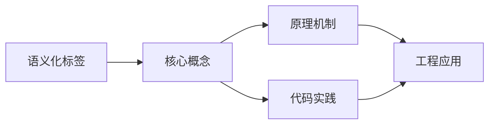
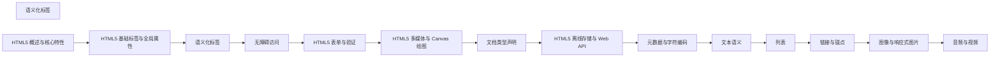

## 1. 学习目标（Bloom 分类）

本节按照布鲁姆教育目标分类学组织学习路径。本文主题为《语义化标签》，属于 HTML5 模块，读者可以根据自身阶段选择阅读深度。

记忆层面：能够准确复述本文的核心概念、术语与基本语法或操作步骤，并能够在提问或检索时快速定位对应知识点。能够说出 HTML5 的核心概念、术语与标准写法。

理解层面：能够用自己的语言解释核心原理与工作机制，说明概念之间的因果关系，而不是机械记忆结论。能够解释 HTML5 的工作原理与设计动机。

应用层面：能够在真实项目或练习场景中运用本文知识解决具体问题，写出正确且可维护的实现。能够编写符合 HTML5 规范的完整实现。

分析层面：能够拆解复杂问题，比较本文主题与相邻概念的异同，识别边界条件与例外情况。能够分析 HTML5 与相邻方案的差异与边界。

评价层面：能够根据约束条件（性能、可读性、安全、成本）评价不同方案的优劣，做出有依据的技术决策。能够根据场景评价 HTML5 相关方案的优劣。

创造层面：能够把本文知识与其他模块知识组合，设计出新的解决方案或可复用的工程模式。能够组合 HTML5 与其他技术设计完整方案。

通过本节学习，读者应当能够把《语义化标签》纳入自己的知识网络，并与 HTML5 模块的其他主题（语义化、表单、多媒体、Canvas）建立关联。

## 2. 历史动机与发展脉络

《语义化标签》是 HTML5 领域的重要主题。要真正理解它，需要先了解它解决的问题与演进过程。

HTML 由 Tim Berners-Lee 于 1991 年创建，是 Web 的结构语言；HTML5 于 2014 年成为 W3C 推荐标准，WHATWG 维护的 Living Standard 是当前权威规范。
HTML5 引入语义化元素（header/nav/main/article/section/footer）、表单增强（date/range/placeholder）、多媒体（video/audio）、图形（canvas/SVG）与离线存储（localStorage/Web Worker）。
现代 HTML 强调“语义优先”：结构表达内容含义，样式与行为分离；可访问性（ARIA）与 SEO 都建立在正确语义之上。

回到本文主题：语义化标签 的提出与成熟，正是上述技术背景下的必然产物。早期实现往往以简单可用为目标，随着工程规模扩大，社区逐渐沉淀出标准做法与最佳实践；理解这一脉络，可以帮助读者判断“为什么文档中的推荐写法是现在这个样子”，也能在遇到历史遗留代码时准确识别其设计年代与取舍。


## 3. 形式化定义与核心概念精讲

本节把《语义化标签》涉及的核心概念以“定义 + 讲解”的形式展开。读者应把定义当作工具，把讲解当作理解路径；两者结合才能形成可迁移的知识。

文档结构：<!DOCTYPE html> 声明标准模式；html/head/body 层级固定；meta charset 必须在前 1024 字节内。
语义元素：header/footer 表示页眉页脚，nav 表示导航，main 表示主内容（每页唯一），article 表示独立内容，section 表示分区。
表单：input 类型决定键盘与校验（email/url/number），label 关联控件提升可访问性，required/pattern 提供原生校验。

### 3.1 原文章节逐一精讲

原文档把主题拆分为 15 个小节，下面按顺序给出每一节的导读讲解，随后保留原文细节供精读。

#### 原文精读（完整保留）

# 语义化标签 语法速查手册

> **符号约定**:`< >` 必填参数 | `[ ]` 可选参数

---

#### 1. 语义化标签概述

##### 1.1 什么是语义化

语义化是指使用具有明确含义的HTML标签来描述内容的结构和意义，而非仅仅关注外观表现。

**语义化的好处**：

- **可读性**：代码结构清晰，便于团队协作和维护
- **可访问性**：屏幕阅读器等辅助技术能更好地理解页面结构
- **SEO优化**：搜索引擎能更准确地理解页面内容
- **可维护性**：结构化的代码更容易修改和扩展

##### 1.2 语义化 vs 非语义化

```html
<!-- 非语义化：全部使用div（div汤） -->
<div class="header">
  <div class="nav">
    <div class="nav-item">首页</div>
    <div class="nav-item">关于</div>
  </div>
</div>
<div class="main">
  <div class="article">
    <div class="article-title">文章标题</div>
    <div class="article-content">文章内容</div>
  </div>
  <div class="sidebar">侧边栏</div>
</div>
<div class="footer">页脚</div>

<!-- 语义化：使用有意义的标签 -->
<header>
  <nav>
    <a href="/">首页</a>
    <a href="/about">关于</a>
  </nav>
</header>
<main>
  <article>
    <h1>文章标题</h1>
    <p>文章内容</p>
  </article>
  <aside>侧边栏</aside>
</main>
<footer>页脚</footer>
```

#### 2. 页面结构标签

##### 2.1 header

`<header>` 表示页面或区块的头部，通常包含标题、导航、搜索等。

```html
<!-- 页面级 header -->
<header>
  <div class="logo">
    
    <span>我的网站</span>
  </div>
  <nav aria-label="主导航">
    <ul>
      <li><a href="/">首页</a></li>
      <li><a href="/products">产品</a></li>
      <li><a href="/about">关于我们</a></li>
      <li><a href="/contact">联系方式</a></li>
    </ul>
  </nav>
  <form role="search">
    <input type="search" placeholder="搜索..." aria-label="搜索" />
    <button type="submit">搜索</button>
  </form>
</header>

<!-- 区块级 header -->
<article>
  <header>
    <h2>文章标题</h2>
    <time datetime="2026-06-13">2026年6月13日</time>
    <address>作者：<a href="mailto:author@example.com">张三</a></address>
  </header>
  <p>文章内容...</p>
</article>
```

##### 2.2 nav

`<nav>` 定义导航链接的区域，一个页面可以有多个导航。

```html
<!-- 主导航 -->
<nav aria-label="主导航">
  <ul>
    <li><a href="/" aria-current="page">首页</a></li>
    <li><a href="/blog">博客</a></li>
    <li><a href="/projects">项目</a></li>
  </ul>
</nav>

<!-- 面包屑导航 -->
<nav aria-label="面包屑">
  <ol>
    <li><a href="/">首页</a></li>
    <li><a href="/blog">博客</a></li>
    <li aria-current="page">当前文章</li>
  </ol>
</nav>

<!-- 分页导航 -->
<nav aria-label="分页">
  <ul>
    <li><a href="?page=1" aria-label="第1页">1</a></li>
    <li><a href="?page=2" aria-current="page" aria-label="当前页，第2页">2</a></li>
    <li><a href="?page=3" aria-label="第3页">3</a></li>
  </ul>
</nav>
```

##### 2.3 main

`<main>` 表示页面的主要内容区域，每个页面只能有一个。

```html
<body>
  <header>...</header>
  <nav>...</nav>

  <main id="main-content">
    <!-- 页面的核心内容 -->
    <h1>页面主标题</h1>
    <p>主要内容区域...</p>
  </main>

  <aside>...</aside>
  <footer>...</footer>
</body>

<!-- 跳过导航链接（可访问性） -->
<body>
  <a href="#main-content" class="skip-link">跳到主要内容</a>
  <header>...</header>
  <main id="main-content">...</main>
</body>
```

##### 2.4 footer

`<footer>` 定义页面或区块的底部，通常包含版权、联系方式、链接等。

```html
<footer>
  <div class="footer-content">
    <section>
      <h3>关于我们</h3>
      <p>公司简介...</p>
    </section>
    <section>
      <h3>快速链接</h3>
      <ul>
        <li><a href="/privacy">隐私政策</a></li>
        <li><a href="/terms">服务条款</a></li>
      </ul>
    </section>
    <section>
      <h3>联系方式</h3>
      <address>
        <a href="mailto:info@example.com">info@example.com</a><br />
        <a href="tel:+8612345678">+86 123-4567-8</a>
      </address>
    </section>
  </div>
  <p><small>&copy; 2026 我的公司. 保留所有权利.</small></p>
</footer>
```

#### 3. 内容分区标签

##### 3.1 article

`<article>` 表示独立的、可复用的内容块。

```html
<!-- 博客文章 -->
<article>
  <header>
    <h2>深入理解HTML5语义化</h2>
    <p>
      由 <a href="/author/zhangsan">张三</a> 发布于
      <time datetime="2026-06-13">2026年6月13日</time>
    </p>
  </header>
  <p>文章正文内容...</p>
  <section>
    <h3>评论</h3>
    <article>
      <header>
        <p>李四 评论于 <time datetime="2026-06-13T10:30">10:30</time></p>
      </header>
      <p>非常好的文章！</p>
    </article>
  </section>
</article>

<!-- 新闻条目 -->
<article itemscope itemtype="https://schema.org/NewsArticle">
  <h2 itemprop="headline">重大新闻标题</h2>
  <meta itemprop="datePublished" content="2026-06-13" />
  <p itemprop="articleBody">新闻内容...</p>
</article>
```

##### 3.2 section

`<section>` 表示文档中的一个主题分组，通常包含标题。

```html
<article>
  <h1>Web开发指南</h1>

  <section>
    <h2>HTML基础</h2>
    <p>HTML是Web的骨架...</p>
  </section>

  <section>
    <h2>CSS样式</h2>
    <p>CSS负责页面的视觉表现...</p>
  </section>

  <section>
    <h2>JavaScript交互</h2>
    <p>JavaScript让页面动起来...</p>
  </section>
</article>

<!-- section vs div 的选择 -->
<!-- section: 内容有主题意义，通常有标题 -->
<!-- div: 仅用于样式/脚本目的，无语义 -->
```

##### 3.3 aside

`<aside>` 表示与主内容间接相关的辅助内容。

```html
<main>
  <article>
    <h1>如何学习编程</h1>
    <p>学习编程的第一步是...</p>
  </article>

  <aside aria-label="相关文章">
    <h2>推荐阅读</h2>
    <ul>
      <li><a href="/post/2">编程语言选择指南</a></li>
      <li><a href="/post/3">高效学习方法</a></li>
    </ul>
  </aside>

  <aside aria-label="广告">
    <h2>赞助商</h2>
    <p>广告内容...</p>
  </aside>
</main>
```

#### 4. 文本级语义标签

##### 4.1 time

```html
<!-- 日期 -->
<time datetime="2026-06-13">2026年6月13日</time>

<!-- 日期和时间 -->
<time datetime="2026-06-13T14:30:00+08:00">下午2:30</time>

<!-- 时间段 -->
<time datetime="PT2H30M">2小时30分钟</time>

<!-- 可读性更好的日期 -->
<time datetime="2026-06-13">上周五</time>
```

##### 4.2 figure 与 figcaption

```html
<!-- 图片说明 -->
<figure>
  
  <figcaption>图1：2026年上半年销售数据趋势</figcaption>
</figure>

<!-- 代码示例 -->
<figure>
  <figcaption>示例：Hello World程序</figcaption>
  <pre><code>console.log("Hello, World!");</code></pre>
</figure>

<!-- 引用 -->
<figure>
  <blockquote>
    <p>任何足够先进的技术，都与魔法无异。</p>
  </blockquote>
  <figcaption>—— 亚瑟·克拉克，<cite>未来的轮廓</cite></figcaption>
</figure>
```

##### 4.3 details 与 summary

```html
<!-- 可折叠内容 -->
<details>
  <summary>常见问题：如何重置密码？</summary>
  <p>请访问登录页面，点击"忘记密码"链接，输入注册邮箱后按照邮件指引操作。</p>
</details>

<!-- 默认展开 -->
<details open>
  <summary>使用说明</summary>
  <p>这是默认展开的说明内容。</p>
</details>

<!-- 手风琴效果（需JS配合） -->
<div class="accordion">
  <details>
    <summary>第一章：入门</summary>
    <p>入门内容...</p>
  </details>
  <details>
    <summary>第二章：进阶</summary>
    <p>进阶内容...</p>
  </details>
  <details>
    <summary>第三章：高级</summary>
    <p>高级内容...</p>
  </details>
</div>
```

##### 4.4 mark、abbr、cite

```html
<!-- 高亮文本 -->
<p>搜索结果中 <mark>HTML5</mark> 语义化标签的使用...</p>

<!-- 缩写 -->
<p><abbr title="HyperText Markup Language">HTML</abbr> 是Web的基础。</p>

<!-- 引用标题 -->
<p>参考书目：<cite>JavaScript高级程序设计</cite></p>

<!-- 定义术语 -->
<p><dfn>语义化</dfn>是指使用具有明确含义的标签来描述内容。</p>

<!-- 联系方式 -->
<address>
  作者：<a href="mailto:author@example.com">张三</a><br />
  地址：北京市朝阳区xxx
</address>
```

#### 5. 完整语义化页面示例

```html
<!DOCTYPE html>
<html lang="zh-CN">
  <head>
    <meta charset="UTF-8" />
    <meta name="viewport" content="width=device-width, initial-scale=1.0" />
    <title>我的博客 - HTML5语义化</title>
  </head>
  <body>
    <!-- 跳过导航（可访问性） -->
    <a href="#main" class="skip-link">跳到主要内容</a>

    <header role="banner">
      <div class="logo">
        <a href="/">我的博客</a>
      </div>
      <nav aria-label="主导航">
        <ul>
          <li><a href="/" aria-current="page">首页</a></li>
          <li><a href="/archive">归档</a></li>
          <li><a href="/about">关于</a></li>
        </ul>
      </nav>
    </header>

    <div class="layout">
      <main id="main" role="main">
        <article itemscope itemtype="https://schema.org/BlogPosting">
          <header>
            <h1 itemprop="headline">深入理解HTML5语义化标签</h1>
            <p>
              由 <span itemprop="author">张三</span> 发布于
              <time itemprop="datePublished" datetime="2026-06-13"> 2026年6月13日 </time>
            </p>
          </header>

          <section>
            <h2>什么是语义化</h2>
            <p>语义化是使用有意义的HTML标签...</p>
          </section>

          <section>
            <h2>常用语义化标签</h2>
            <p>HTML5引入了许多新的语义化标签...</p>

            <figure>
              
              <figcaption>图1：HTML5语义化页面结构</figcaption>
            </figure>
          </section>

          <footer>
            <p>
              标签： <a href="/tag/html5">HTML5</a>，
              <a href="/tag/semantic">语义化</a>
            </p>
          </footer>
        </article>

        <section>
          <h2>评论</h2>
          <article>
            <header>
              <p>李四 评论于 <time datetime="2026-06-13T15:00">15:00</time></p>
            </header>
            <p>非常实用的文章！</p>
          </article>
        </section>
      </main>

      <aside aria-label="侧边栏">
        <section>
          <h2>关于作者</h2>
          <p>Web开发者，热爱开源...</p>
        </section>
        <nav aria-label="文章分类">
          <h2>分类</h2>
          <ul>
            <li><a href="/cat/html">HTML</a></li>
            <li><a href="/cat/css">CSS</a></li>
            <li><a href="/cat/js">JavaScript</a></li>
          </ul>
        </nav>
      </aside>
    </div>

    <footer role="contentinfo">
      <p><small>&copy; 2026 我的博客. 保留所有权利.</small></p>
    </footer>
  </body>
</html>
```

#### 6. 常见问题与解决方案

##### 6.1 section vs div 的选择

**原则**：有主题意义用 section，仅用于样式用 div

```html
<!-- 正确：section有主题 -->
<section>
  <h2>产品特性</h2>
  <p>内容...</p>
</section>

<!-- 正确：div仅用于布局 -->
<div class="grid">
  <div class="col-8">...</div>
  <div class="col-4">...</div>
</div>
```

##### 6.2 article vs section 的选择

- **article**：内容独立、可单独分发（博客文章、新闻、评论）
- **section**：内容的主题分组（章节、选项卡面板）

##### 6.3 多个 header/footer

一个页面可以有多个 header 和 footer，但 main 只能有一个。

```html
<!-- 正确：article内可以有header/footer -->
<article>
  <header>文章头部</header>
  <p>内容</p>
  <footer>文章底部</footer>
</article>
```

#### 7. 总结与最佳实践

##### 7.1 语义化标签选择流程

```
内容是否独立可复用？ → 是 → article
                    → 否 → 内容是否有主题分组？ → 是 → section
                                                 → 否 → 仅用于样式？ → 是 → div
                                                                       → 否 → 考虑其他标签
```

##### 7.2 最佳实践

1. **优先使用语义化标签**，div/span 作为最后选择
2. **每个 section/article 应有标题**（h1-h6）
3. **main 每页只有一个**，不要嵌套在 article/section 中
4. **nav 用于主要导航**，不要包裹所有链接
5. **使用 ARIA 标签**增强可访问性：`aria-label`、`aria-current`
6. **添加跳过导航链接**，方便键盘用户
7. **使用微数据（Microdata）**增强SEO
#### 页面结构标签

**header 头部**
`<header>...[h1-h6|nav|form]...</header>`
```html
<!-- 页面级 header -->
<header>
  <h1>网站标题</h1>
  <nav>
    <ul>
      <li><a href="/">首页</a></li>
      <li><a href="/about">关于</a></li>
    </ul>
  </nav>
</header>

<!-- article 内的 header -->
<article>
  <header>
    <h2>文章标题</h2>
    <time datetime="2026-06-13">2026年6月13日</time>
  </header>
  <p>文章内容...</p>
</article>
```

**nav 导航**
`<nav [aria-label="<名称>"]>...[a|ul]...</nav>`
```html
<!-- 主导航 -->
<nav aria-label="主导航">
  <ul>
    <li><a href="/" aria-current="page">首页</a></li>
    <li><a href="/blog">博客</a></li>
  </ul>
</nav>

<!-- 面包屑 -->
<nav aria-label="面包屑">
  <ol>
    <li><a href="/">首页</a></li>
    <li><a href="/blog">博客</a></li>
    <li aria-current="page">当前文章</li>
  </ol>
</nav>

<!-- 分页 -->
<nav aria-label="分页">
  <ul>
    <li><a href="?page=1">1</a></li>
    <li><a href="?page=2" aria-current="page">2</a></li>
  </ul>
</nav>
```

**main 主内容**
`<main [id="<锚点ID>"]>...</main>`
```html
<!-- 每页只能有一个 main -->
<body>
  <a href="#main-content" class="skip-link">跳到主要内容</a>
  <header>...</header>
  <main id="main-content">
    <h1>页面主标题</h1>
    <p>主要内容区域...</p>
  </main>
  <footer>...</footer>
</body>
```

**footer 底部**
`<footer>...[address|nav|p]...</footer>`
```html
<footer>
  <section>
    <h3>联系方式</h3>
    <address>
      <a href="mailto:info@example.com">info@example.com</a><br />
      <a href="tel:+8612345678">+86 123-4567-8</a>
    </address>
  </section>
  <p><small>&copy; 2026 我的公司. 保留所有权利.</small></p>
</footer>
```

---

#### 内容分区标签

**article 独立内容**
`<article>...[header|section|footer]...</article>`
```html
<!-- 博客文章 -->
<article>
  <header>
    <h2>深入理解HTML5语义化</h2>
    <p>由 <a href="/author/zhangsan">张三</a> 发布于
      <time datetime="2026-06-13">2026年6月13日</time>
    </p>
  </header>
  <p>文章正文内容...</p>
  <footer>
    <p>标签:<a href="/tag/html5">HTML5</a></p>
  </footer>
</article>

<!-- 嵌套评论 -->
<article>
  <header>
    <p>李四 评论于 <time datetime="2026-06-13T10:30">10:30</time></p>
  </header>
  <p>非常好的文章!</p>
</article>
```

**section 主题分组**
`<section>...[h2-h6]...</section>`
```html
<article>
  <h1>Web开发指南</h1>
  <section>
    <h2>HTML基础</h2>
    <p>HTML是Web的骨架...</p>
  </section>
  <section>
    <h2>CSS样式</h2>
    <p>CSS负责页面的视觉表现...</p>
  </section>
</article>
```

**aside 侧边栏**
`<aside [aria-label="<名称>"]>...</aside>`
```html
<main>
  <article>
    <h1>如何学习编程</h1>
    <p>学习编程的第一步是...</p>
  </article>

  <aside aria-label="相关文章">
    <h2>推荐阅读</h2>
    <ul>
      <li><a href="/post/2">编程语言选择指南</a></li>
    </ul>
  </aside>
</main>
```

---

#### 文本级语义标签

**time 时间**
`<time datetime="<ISO日期>">[显示文本]</time>`
```html
<!-- 日期 -->
<time datetime="2026-06-13">2026年6月13日</time>

<!-- 日期和时间 -->
<time datetime="2026-06-13T14:30:00+08:00">下午2:30</time>

<!-- 时间段 -->
<time datetime="PT2H30M">2小时30分钟</time>

<!-- 可读性更好的日期 -->
<time datetime="2026-06-13">上周五</time>
```

**figure 与 figcaption**
`<figure>...[img|pre|blockquote]...[<figcaption>[说明]</figcaption>]</figure>`
```html
<!-- 图片说明 -->
<figure>
  
  <figcaption>图1:2026年上半年销售数据趋势</figcaption>
</figure>

<!-- 代码示例 -->
<figure>
  <figcaption>示例:Hello World程序</figcaption>
  <pre><code>console.log("Hello, World!");</code></pre>
</figure>

<!-- 引用 -->
<figure>
  <blockquote>
    <p>任何足够先进的技术,都与魔法无异。</p>
  </blockquote>
  <figcaption>—— 亚瑟·克拉克,<cite>未来的轮廓</cite></figcaption>
</figure>
```

**mark 高亮**
`<mark>[文本]</mark>`
```html
<!-- 搜索结果高亮 -->
<p>搜索结果中 <mark>HTML5</mark> 语义化标签的使用...</p>
```

**abbr 缩写**
`<abbr title="<全称>">[缩写]</abbr>`
```html
<abbr title="HyperText Markup Language">HTML</abbr> 是Web的基础。
```

**cite 引用标题**
`<cite>[作品名]</cite>`
```html
参考书目:<cite>JavaScript高级程序设计</cite>
```

**dfn 定义术语**
`<dfn>[术语]</dfn>`
```html
<dfn>语义化</dfn>是指使用具有明确含义的标签来描述内容。
```

**address 联系方式**
`<address>...</address>`
```html
<address>
  作者:<a href="mailto:author@example.com">张三</a><br />
  地址:北京市朝阳区xxx
</address>
```

---

#### 可折叠内容

**details 与 summary**
`<details [open]><summary>[标题]</summary>[内容]</details>`
```html
<!-- 默认折叠 -->
<details>
  <summary>常见问题:如何重置密码?</summary>
  <p>请访问登录页面,点击"忘记密码"链接。</p>
</details>

<!-- 默认展开 -->
<details open>
  <summary>使用说明</summary>
  <p>这是默认展开的说明内容。</p>
</details>
```

---

#### 搜索区域(HTML 2023)

**search 元素**
`<search>...[form|input]...</search>`
```html
<!-- 站点搜索 -->
<search>
  <form action="/search" role="search">
    <label for="q">搜索</label>
    <input type="search" id="q" name="q" placeholder="搜索内容..." />
    <button type="submit">搜索</button>
  </form>
</search>
```

---

#### 对话框(HTML 2021)

**dialog 元素**
`<dialog [open]>[内容]</dialog>`
```html
<dialog id="myDialog">
  <form method="dialog">
    <p>请确认操作</p>
    <button>取消</button>
    <button value="confirm">确认</button>
  </form>
</dialog>

<script>
  const dialog = document.getElementById('myDialog');
  dialog.showModal();
  dialog.close('cancel');
</script>
```

---

#### 微数据增强语义

**itemscope 与 itemtype**
`<article itemscope itemtype="<Schema类型>">...[itemprop]...</article>`
```html
<article itemscope itemtype="https://schema.org/NewsArticle">
  <h2 itemprop="headline">重大新闻标题</h2>
  <meta itemprop="datePublished" content="2026-06-13" />
  <p itemprop="articleBody">新闻内容...</p>
</article>
```

---

#### ARIA 增强可访问性

**常用 ARIA 属性**

| 属性              | 作用                |
| ----------------- | ------------------- |
| `aria-label`      | 元素的文本标签      |
| `aria-labelledby` | 引用其他元素作为标签 |
| `aria-current`    | 当前项(page/step等) |
| `aria-expanded`   | 展开/折叠状态       |
| `aria-hidden`     | 对辅助技术隐藏      |
| `role`            | 元素的角色          |

```html
<nav aria-label="主导航">
  <a href="/" aria-current="page">首页</a>
</nav>

<button aria-expanded="false" aria-controls="menu">菜单</button>
<ul id="menu" aria-hidden="true">...</ul>
```


### 3.2 概念关系图

下面用 Mermaid 图表达本文核心概念之间的关系，帮助读者建立整体图景：



图中展示的是本文知识的结构化关系：核心概念是入口，原理机制解释“为什么”，代码实践演示“怎么做”，工程应用回答“何时用”。读者学习时可以把每个小节的内容挂接到对应节点上。

## 4. 理论推导与原理解析

本节深入《语义化标签》背后的原理。理论部分不求面面俱到，而是聚焦“能解释现象、能指导实践”的关键推导。

文档结构：<!DOCTYPE html> 声明标准模式；html/head/body 层级固定；meta charset 必须在前 1024 字节内。
语义元素：header/footer 表示页眉页脚，nav 表示导航，main 表示主内容（每页唯一），article 表示独立内容，section 表示分区。
表单：input 类型决定键盘与校验（email/url/number），label 关联控件提升可访问性，required/pattern 提供原生校验。
媒体与图形：video/audio 支持多源（source）；canvas 是位图画布（JavaScript 绘制），SVG 是矢量结构（DOM 操作）。

需要强调的是，理论推导与工程实践之间存在翻译层：理论给出的是理想化模型与边界条件，工程代码则必须处理真实环境中的例外。读者在学习时应先掌握理论的“标准情形”，再通过陷阱章节了解“非标准情形”。

## 5. 代码示例与逐行讲解

本节把原文中的代码示例系统整理，并为每个示例补充用途说明与讲解。读者不应只浏览代码，而应逐段对照讲解理解设计意图。

### 5.1 示例：1.2 语义化 vs 非语义化

该示例来自原文《1.2 语义化 vs 非语义化》小节，用于演示语义化标签相关操作。阅读时请先看代码结构，再看其后的讲解。

```html
<!-- 非语义化：全部使用div（div汤） -->
<div class="header">
  <div class="nav">
    <div class="nav-item">首页</div>
    <div class="nav-item">关于</div>
  </div>
</div>
<div class="main">
  <div class="article">
    <div class="article-title">文章标题</div>
    <div class="article-content">文章内容</div>
  </div>
  <div class="sidebar">侧边栏</div>
</div>
<div class="footer">页脚</div>

<!-- 语义化：使用有意义的标签 -->
<header>
  <nav>
    <a href="/">首页</a>
    <a href="/about">关于</a>
  </nav>
</header>
<main>
  <article>
    <h1>文章标题</h1>
    <p>文章内容</p>
  </article>
  <aside>侧边栏</aside>
</main>
<footer>页脚</footer>
```

讲解：这段代码演示了本节核心知识点。代码中的关键操作可以归纳为三步：准备（定义或初始化）、执行（核心逻辑）、收尾（释放资源或返回结果）。实际项目中，这三步往往被封装为函数或类，以提升复用性与可测试性。

关键点分析：

该示例共 30 行有效代码，包含 1 类关键结构（class）。其中：

- 入口与初始化部分负责建立上下文，对应实际项目中的启动或装配逻辑；
- 核心逻辑部分体现本文主题的主要操作，是阅读时最需要对照讲解理解的部分；
- 输出或返回部分把结果交给调用方，注意其类型与边界条件。

进阶思考路径：先尝试修改参数观察行为变化，再把示例中的模式迁移到自己的项目中；每次修改都记录预期与实测差异，这是把示例转化为能力的最快方式。

### 5.2 示例：2.1 header

该示例来自原文《2.1 header》小节，用于演示语义化标签相关操作。阅读时请先看代码结构，再看其后的讲解。

```html
<!-- 页面级 header -->
<header>
  <div class="logo">
    
    <span>我的网站</span>
  </div>
  <nav aria-label="主导航">
    <ul>
      <li><a href="/">首页</a></li>
      <li><a href="/products">产品</a></li>
      <li><a href="/about">关于我们</a></li>
      <li><a href="/contact">联系方式</a></li>
    </ul>
  </nav>
  <form role="search">
    <input type="search" placeholder="搜索..." aria-label="搜索" />
    <button type="submit">搜索</button>
  </form>
</header>

<!-- 区块级 header -->
<article>
  <header>
    <h2>文章标题</h2>
    <time datetime="2026-06-13">2026年6月13日</time>
    <address>作者：<a href="mailto:author@example.com">张三</a></address>
  </header>
  <p>文章内容...</p>
</article>
```

讲解：这段代码演示了本节核心知识点。代码中的关键操作可以归纳为三步：准备（定义或初始化）、执行（核心逻辑）、收尾（释放资源或返回结果）。实际项目中，这三步往往被封装为函数或类，以提升复用性与可测试性。

关键点分析：

该示例共 28 行有效代码，包含 1 类关键结构（class）。其中：

- 入口与初始化部分负责建立上下文，对应实际项目中的启动或装配逻辑；
- 核心逻辑部分体现本文主题的主要操作，是阅读时最需要对照讲解理解的部分；
- 输出或返回部分把结果交给调用方，注意其类型与边界条件。

进阶思考路径：先尝试修改参数观察行为变化，再把示例中的模式迁移到自己的项目中；每次修改都记录预期与实测差异，这是把示例转化为能力的最快方式。

### 5.3 示例：2.2 nav

该示例来自原文《2.2 nav》小节，用于演示语义化标签相关操作。阅读时请先看代码结构，再看其后的讲解。

```html
<!-- 主导航 -->
<nav aria-label="主导航">
  <ul>
    <li><a href="/" aria-current="page">首页</a></li>
    <li><a href="/blog">博客</a></li>
    <li><a href="/projects">项目</a></li>
  </ul>
</nav>

<!-- 面包屑导航 -->
<nav aria-label="面包屑">
  <ol>
    <li><a href="/">首页</a></li>
    <li><a href="/blog">博客</a></li>
    <li aria-current="page">当前文章</li>
  </ol>
</nav>

<!-- 分页导航 -->
<nav aria-label="分页">
  <ul>
    <li><a href="?page=1" aria-label="第1页">1</a></li>
    <li><a href="?page=2" aria-current="page" aria-label="当前页，第2页">2</a></li>
    <li><a href="?page=3" aria-label="第3页">3</a></li>
  </ul>
</nav>
```

讲解：这段代码演示了本节核心知识点。代码中的关键操作可以归纳为三步：准备（定义或初始化）、执行（核心逻辑）、收尾（释放资源或返回结果）。实际项目中，这三步往往被封装为函数或类，以提升复用性与可测试性。

关键点分析：

该示例共 24 行有效代码，结构以数据或配置为主。阅读时应关注：数据字段的含义、配置项的作用，以及它们与运行行为的对应关系。

进阶思考路径：先尝试修改参数观察行为变化，再把示例中的模式迁移到自己的项目中；每次修改都记录预期与实测差异，这是把示例转化为能力的最快方式。

### 5.4 示例：2.3 main

该示例来自原文《2.3 main》小节，用于演示语义化标签相关操作。阅读时请先看代码结构，再看其后的讲解。

```html
<body>
  <header>...</header>
  <nav>...</nav>

  <main id="main-content">
    <!-- 页面的核心内容 -->
    <h1>页面主标题</h1>
    <p>主要内容区域...</p>
  </main>

  <aside>...</aside>
  <footer>...</footer>
</body>

<!-- 跳过导航链接（可访问性） -->
<body>
  <a href="#main-content" class="skip-link">跳到主要内容</a>
  <header>...</header>
  <main id="main-content">...</main>
</body>
```

讲解：这段代码演示了本节核心知识点。代码中的关键操作可以归纳为三步：准备（定义或初始化）、执行（核心逻辑）、收尾（释放资源或返回结果）。实际项目中，这三步往往被封装为函数或类，以提升复用性与可测试性。

关键点分析：

该示例共 17 行有效代码，包含 1 类关键结构（class）。其中：

- 入口与初始化部分负责建立上下文，对应实际项目中的启动或装配逻辑；
- 核心逻辑部分体现本文主题的主要操作，是阅读时最需要对照讲解理解的部分；
- 输出或返回部分把结果交给调用方，注意其类型与边界条件。

进阶思考路径：先尝试修改参数观察行为变化，再把示例中的模式迁移到自己的项目中；每次修改都记录预期与实测差异，这是把示例转化为能力的最快方式。

### 5.5 示例：2.4 footer

该示例来自原文《2.4 footer》小节，用于演示语义化标签相关操作。阅读时请先看代码结构，再看其后的讲解。

```html
<footer>
  <div class="footer-content">
    <section>
      <h3>关于我们</h3>
      <p>公司简介...</p>
    </section>
    <section>
      <h3>快速链接</h3>
      <ul>
        <li><a href="/privacy">隐私政策</a></li>
        <li><a href="/terms">服务条款</a></li>
      </ul>
    </section>
    <section>
      <h3>联系方式</h3>
      <address>
        <a href="mailto:info@example.com">info@example.com</a><br />
        <a href="tel:+8612345678">+86 123-4567-8</a>
      </address>
    </section>
  </div>
  <p><small>&copy; 2026 我的公司. 保留所有权利.</small></p>
</footer>
```

讲解：这段代码演示了本节核心知识点。代码中的关键操作可以归纳为三步：准备（定义或初始化）、执行（核心逻辑）、收尾（释放资源或返回结果）。实际项目中，这三步往往被封装为函数或类，以提升复用性与可测试性。

关键点分析：

该示例共 23 行有效代码，包含 1 类关键结构（class）。其中：

- 入口与初始化部分负责建立上下文，对应实际项目中的启动或装配逻辑；
- 核心逻辑部分体现本文主题的主要操作，是阅读时最需要对照讲解理解的部分；
- 输出或返回部分把结果交给调用方，注意其类型与边界条件。

进阶思考路径：先尝试修改参数观察行为变化，再把示例中的模式迁移到自己的项目中；每次修改都记录预期与实测差异，这是把示例转化为能力的最快方式。

### 5.6 示例：3.1 article

该示例来自原文《3.1 article》小节，用于演示语义化标签相关操作。阅读时请先看代码结构，再看其后的讲解。

```html
<!-- 博客文章 -->
<article>
  <header>
    <h2>深入理解HTML5语义化</h2>
    <p>
      由 <a href="/author/zhangsan">张三</a> 发布于
      <time datetime="2026-06-13">2026年6月13日</time>
    </p>
  </header>
  <p>文章正文内容...</p>
  <section>
    <h3>评论</h3>
    <article>
      <header>
        <p>李四 评论于 <time datetime="2026-06-13T10:30">10:30</time></p>
      </header>
      <p>非常好的文章！</p>
    </article>
  </section>
</article>

<!-- 新闻条目 -->
<article itemscope itemtype="https://schema.org/NewsArticle">
  <h2 itemprop="headline">重大新闻标题</h2>
  <meta itemprop="datePublished" content="2026-06-13" />
  <p itemprop="articleBody">新闻内容...</p>
</article>
```

讲解：这段代码演示了本节核心知识点。代码中的关键操作可以归纳为三步：准备（定义或初始化）、执行（核心逻辑）、收尾（释放资源或返回结果）。实际项目中，这三步往往被封装为函数或类，以提升复用性与可测试性。

关键点分析：

该示例共 26 行有效代码，结构以数据或配置为主。阅读时应关注：数据字段的含义、配置项的作用，以及它们与运行行为的对应关系。

进阶思考路径：先尝试修改参数观察行为变化，再把示例中的模式迁移到自己的项目中；每次修改都记录预期与实测差异，这是把示例转化为能力的最快方式。

### 5.7 示例：3.2 section

该示例来自原文《3.2 section》小节，用于演示语义化标签相关操作。阅读时请先看代码结构，再看其后的讲解。

```html
<article>
  <h1>Web开发指南</h1>

  <section>
    <h2>HTML基础</h2>
    <p>HTML是Web的骨架...</p>
  </section>

  <section>
    <h2>CSS样式</h2>
    <p>CSS负责页面的视觉表现...</p>
  </section>

  <section>
    <h2>JavaScript交互</h2>
    <p>JavaScript让页面动起来...</p>
  </section>
</article>

<!-- section vs div 的选择 -->
<!-- section: 内容有主题意义，通常有标题 -->
<!-- div: 仅用于样式/脚本目的，无语义 -->
```

讲解：这段代码演示了本节核心知识点。代码中的关键操作可以归纳为三步：准备（定义或初始化）、执行（核心逻辑）、收尾（释放资源或返回结果）。实际项目中，这三步往往被封装为函数或类，以提升复用性与可测试性。

关键点分析：

该示例共 18 行有效代码，结构以数据或配置为主。阅读时应关注：数据字段的含义、配置项的作用，以及它们与运行行为的对应关系。

进阶思考路径：先尝试修改参数观察行为变化，再把示例中的模式迁移到自己的项目中；每次修改都记录预期与实测差异，这是把示例转化为能力的最快方式。

### 5.8 示例：3.3 aside

该示例来自原文《3.3 aside》小节，用于演示语义化标签相关操作。阅读时请先看代码结构，再看其后的讲解。

```html
<main>
  <article>
    <h1>如何学习编程</h1>
    <p>学习编程的第一步是...</p>
  </article>

  <aside aria-label="相关文章">
    <h2>推荐阅读</h2>
    <ul>
      <li><a href="/post/2">编程语言选择指南</a></li>
      <li><a href="/post/3">高效学习方法</a></li>
    </ul>
  </aside>

  <aside aria-label="广告">
    <h2>赞助商</h2>
    <p>广告内容...</p>
  </aside>
</main>
```

讲解：这段代码演示了本节核心知识点。代码中的关键操作可以归纳为三步：准备（定义或初始化）、执行（核心逻辑）、收尾（释放资源或返回结果）。实际项目中，这三步往往被封装为函数或类，以提升复用性与可测试性。

关键点分析：

该示例共 17 行有效代码，结构以数据或配置为主。阅读时应关注：数据字段的含义、配置项的作用，以及它们与运行行为的对应关系。

进阶思考路径：先尝试修改参数观察行为变化，再把示例中的模式迁移到自己的项目中；每次修改都记录预期与实测差异，这是把示例转化为能力的最快方式。

### 5.9 示例：4.1 time

该示例来自原文《4.1 time》小节，用于演示语义化标签相关操作。阅读时请先看代码结构，再看其后的讲解。

```html
<!-- 日期 -->
<time datetime="2026-06-13">2026年6月13日</time>

<!-- 日期和时间 -->
<time datetime="2026-06-13T14:30:00+08:00">下午2:30</time>

<!-- 时间段 -->
<time datetime="PT2H30M">2小时30分钟</time>

<!-- 可读性更好的日期 -->
<time datetime="2026-06-13">上周五</time>
```

讲解：这段代码演示了本节核心知识点。代码中的关键操作可以归纳为三步：准备（定义或初始化）、执行（核心逻辑）、收尾（释放资源或返回结果）。实际项目中，这三步往往被封装为函数或类，以提升复用性与可测试性。

关键点分析：

该示例共 8 行有效代码，结构以数据或配置为主。阅读时应关注：数据字段的含义、配置项的作用，以及它们与运行行为的对应关系。

进阶思考路径：先尝试修改参数观察行为变化，再把示例中的模式迁移到自己的项目中；每次修改都记录预期与实测差异，这是把示例转化为能力的最快方式。

### 5.10 示例：4.2 figure 与 figcaption

该示例来自原文《4.2 figure 与 figcaption》小节，用于演示语义化标签相关操作。阅读时请先看代码结构，再看其后的讲解。

```html
<!-- 图片说明 -->
<figure>
  
  <figcaption>图1：2026年上半年销售数据趋势</figcaption>
</figure>

<!-- 代码示例 -->
<figure>
  <figcaption>示例：Hello World程序</figcaption>
  <pre><code>console.log("Hello, World!");</code></pre>
</figure>

<!-- 引用 -->
<figure>
  <blockquote>
    <p>任何足够先进的技术，都与魔法无异。</p>
  </blockquote>
  <figcaption>—— 亚瑟·克拉克，<cite>未来的轮廓</cite></figcaption>
</figure>
```

讲解：这段代码演示了本节核心知识点。代码中的关键操作可以归纳为三步：准备（定义或初始化）、执行（核心逻辑）、收尾（释放资源或返回结果）。实际项目中，这三步往往被封装为函数或类，以提升复用性与可测试性。

关键点分析：

该示例共 17 行有效代码，结构以数据或配置为主。阅读时应关注：数据字段的含义、配置项的作用，以及它们与运行行为的对应关系。

进阶思考路径：先尝试修改参数观察行为变化，再把示例中的模式迁移到自己的项目中；每次修改都记录预期与实测差异，这是把示例转化为能力的最快方式。

### 5.11 示例：4.3 details 与 summary

该示例来自原文《4.3 details 与 summary》小节，用于演示语义化标签相关操作。阅读时请先看代码结构，再看其后的讲解。

```html
<!-- 可折叠内容 -->
<details>
  <summary>常见问题：如何重置密码？</summary>
  <p>请访问登录页面，点击"忘记密码"链接，输入注册邮箱后按照邮件指引操作。</p>
</details>

<!-- 默认展开 -->
<details open>
  <summary>使用说明</summary>
  <p>这是默认展开的说明内容。</p>
</details>

<!-- 手风琴效果（需JS配合） -->
<div class="accordion">
  <details>
    <summary>第一章：入门</summary>
    <p>入门内容...</p>
  </details>
  <details>
    <summary>第二章：进阶</summary>
    <p>进阶内容...</p>
  </details>
  <details>
    <summary>第三章：高级</summary>
    <p>高级内容...</p>
  </details>
</div>
```

讲解：这段代码演示了本节核心知识点。代码中的关键操作可以归纳为三步：准备（定义或初始化）、执行（核心逻辑）、收尾（释放资源或返回结果）。实际项目中，这三步往往被封装为函数或类，以提升复用性与可测试性。

关键点分析：

该示例共 25 行有效代码，包含 1 类关键结构（class）。其中：

- 入口与初始化部分负责建立上下文，对应实际项目中的启动或装配逻辑；
- 核心逻辑部分体现本文主题的主要操作，是阅读时最需要对照讲解理解的部分；
- 输出或返回部分把结果交给调用方，注意其类型与边界条件。

进阶思考路径：先尝试修改参数观察行为变化，再把示例中的模式迁移到自己的项目中；每次修改都记录预期与实测差异，这是把示例转化为能力的最快方式。

### 5.12 示例：4.4 mark、abbr、cite

该示例来自原文《4.4 mark、abbr、cite》小节，用于演示语义化标签相关操作。阅读时请先看代码结构，再看其后的讲解。

```html
<!-- 高亮文本 -->
<p>搜索结果中 <mark>HTML5</mark> 语义化标签的使用...</p>

<!-- 缩写 -->
<p><abbr title="HyperText Markup Language">HTML</abbr> 是Web的基础。</p>

<!-- 引用标题 -->
<p>参考书目：<cite>JavaScript高级程序设计</cite></p>

<!-- 定义术语 -->
<p><dfn>语义化</dfn>是指使用具有明确含义的标签来描述内容。</p>

<!-- 联系方式 -->
<address>
  作者：<a href="mailto:author@example.com">张三</a><br />
  地址：北京市朝阳区xxx
</address>
```

讲解：这段代码演示了本节核心知识点。代码中的关键操作可以归纳为三步：准备（定义或初始化）、执行（核心逻辑）、收尾（释放资源或返回结果）。实际项目中，这三步往往被封装为函数或类，以提升复用性与可测试性。

关键点分析：

该示例共 13 行有效代码，结构以数据或配置为主。阅读时应关注：数据字段的含义、配置项的作用，以及它们与运行行为的对应关系。

进阶思考路径：先尝试修改参数观察行为变化，再把示例中的模式迁移到自己的项目中；每次修改都记录预期与实测差异，这是把示例转化为能力的最快方式。

### 5.13 示例：5. 完整语义化页面示例

该示例来自原文《5. 完整语义化页面示例》小节，用于演示语义化标签相关操作。阅读时请先看代码结构，再看其后的讲解。

```html
<!DOCTYPE html>
<html lang="zh-CN">
  <head>
    <meta charset="UTF-8" />
    <meta name="viewport" content="width=device-width, initial-scale=1.0" />
    <title>我的博客 - HTML5语义化</title>
  </head>
  <body>
    <!-- 跳过导航（可访问性） -->
    <a href="#main" class="skip-link">跳到主要内容</a>

    <header role="banner">
      <div class="logo">
        <a href="/">我的博客</a>
      </div>
      <nav aria-label="主导航">
        <ul>
          <li><a href="/" aria-current="page">首页</a></li>
          <li><a href="/archive">归档</a></li>
          <li><a href="/about">关于</a></li>
        </ul>
      </nav>
    </header>

    <div class="layout">
      <main id="main" role="main">
        <article itemscope itemtype="https://schema.org/BlogPosting">
          <header>
            <h1 itemprop="headline">深入理解HTML5语义化标签</h1>
            <p>
              由 <span itemprop="author">张三</span> 发布于
              <time itemprop="datePublished" datetime="2026-06-13"> 2026年6月13日 </time>
            </p>
          </header>

          <section>
            <h2>什么是语义化</h2>
            <p>语义化是使用有意义的HTML标签...</p>
          </section>

          <section>
            <h2>常用语义化标签</h2>
            <p>HTML5引入了许多新的语义化标签...</p>

            <figure>
              
              <figcaption>图1：HTML5语义化页面结构</figcaption>
            </figure>
          </section>

          <footer>
            <p>
              标签： <a href="/tag/html5">HTML5</a>，
              <a href="/tag/semantic">语义化</a>
            </p>
          </footer>
        </article>

        <section>
          <h2>评论</h2>
          <article>
            <header>
              <p>李四 评论于 <time datetime="2026-06-13T15:00">15:00</time></p>
            </header>
            <p>非常实用的文章！</p>
          </article>
        </section>
      </main>

      <aside aria-label="侧边栏">
        <section>
          <h2>关于作者</h2>
          <p>Web开发者，热爱开源...</p>
        </section>
        <nav aria-label="文章分类">
          <h2>分类</h2>
          <ul>
            <li><a href="/cat/html">HTML</a></li>
            <li><a href="/cat/css">CSS</a></li>
            <li><a href="/cat/js">JavaScript</a></li>
          </ul>
        </nav>
      </aside>
    </div>

    <footer role="contentinfo">
      <p><small>&copy; 2026 我的博客. 保留所有权利.</small></p>
    </footer>
  </body>
</html>
```

讲解：这段代码演示了本节核心知识点。代码中的关键操作可以归纳为三步：准备（定义或初始化）、执行（核心逻辑）、收尾（释放资源或返回结果）。实际项目中，这三步往往被封装为函数或类，以提升复用性与可测试性。

关键点分析：

该示例共 81 行有效代码，包含 1 类关键结构（class）。其中：

- 入口与初始化部分负责建立上下文，对应实际项目中的启动或装配逻辑；
- 核心逻辑部分体现本文主题的主要操作，是阅读时最需要对照讲解理解的部分；
- 输出或返回部分把结果交给调用方，注意其类型与边界条件。

进阶思考路径：先尝试修改参数观察行为变化，再把示例中的模式迁移到自己的项目中；每次修改都记录预期与实测差异，这是把示例转化为能力的最快方式。

### 5.14 示例：6.1 section vs div 的选择

该示例来自原文《6.1 section vs div 的选择》小节，用于演示语义化标签相关操作。阅读时请先看代码结构，再看其后的讲解。

```html
<!-- 正确：section有主题 -->
<section>
  <h2>产品特性</h2>
  <p>内容...</p>
</section>

<!-- 正确：div仅用于布局 -->
<div class="grid">
  <div class="col-8">...</div>
  <div class="col-4">...</div>
</div>
```

讲解：这段代码演示了本节核心知识点。代码中的关键操作可以归纳为三步：准备（定义或初始化）、执行（核心逻辑）、收尾（释放资源或返回结果）。实际项目中，这三步往往被封装为函数或类，以提升复用性与可测试性。

关键点分析：

该示例共 10 行有效代码，包含 1 类关键结构（class）。其中：

- 入口与初始化部分负责建立上下文，对应实际项目中的启动或装配逻辑；
- 核心逻辑部分体现本文主题的主要操作，是阅读时最需要对照讲解理解的部分；
- 输出或返回部分把结果交给调用方，注意其类型与边界条件。

进阶思考路径：先尝试修改参数观察行为变化，再把示例中的模式迁移到自己的项目中；每次修改都记录预期与实测差异，这是把示例转化为能力的最快方式。

### 5.15 示例：6.3 多个 header/footer

该示例来自原文《6.3 多个 header/footer》小节，用于演示语义化标签相关操作。阅读时请先看代码结构，再看其后的讲解。

```html
<!-- 正确：article内可以有header/footer -->
<article>
  <header>文章头部</header>
  <p>内容</p>
  <footer>文章底部</footer>
</article>
```

讲解：这段代码演示了本节核心知识点。代码中的关键操作可以归纳为三步：准备（定义或初始化）、执行（核心逻辑）、收尾（释放资源或返回结果）。实际项目中，这三步往往被封装为函数或类，以提升复用性与可测试性。

关键点分析：

该示例共 6 行有效代码，结构以数据或配置为主。阅读时应关注：数据字段的含义、配置项的作用，以及它们与运行行为的对应关系。

进阶思考路径：先尝试修改参数观察行为变化，再把示例中的模式迁移到自己的项目中；每次修改都记录预期与实测差异，这是把示例转化为能力的最快方式。

### 5.16 示例：7.1 语义化标签选择流程

该示例来自原文《7.1 语义化标签选择流程》小节，用于演示语义化标签相关操作。阅读时请先看代码结构，再看其后的讲解。

```text
内容是否独立可复用？ → 是 → article
                    → 否 → 内容是否有主题分组？ → 是 → section
                                                 → 否 → 仅用于样式？ → 是 → div
                                                                       → 否 → 考虑其他标签
```

讲解：这段代码演示了本节核心知识点。代码中的关键操作可以归纳为三步：准备（定义或初始化）、执行（核心逻辑）、收尾（释放资源或返回结果）。实际项目中，这三步往往被封装为函数或类，以提升复用性与可测试性。

关键点分析：

该示例共 4 行有效代码，结构以数据或配置为主。阅读时应关注：数据字段的含义、配置项的作用，以及它们与运行行为的对应关系。

进阶思考路径：先尝试修改参数观察行为变化，再把示例中的模式迁移到自己的项目中；每次修改都记录预期与实测差异，这是把示例转化为能力的最快方式。

### 5.17 示例：页面结构标签

该示例来自原文《页面结构标签》小节，用于演示语义化标签相关操作。阅读时请先看代码结构，再看其后的讲解。

```html
<!-- 页面级 header -->
<header>
  <h1>网站标题</h1>
  <nav>
    <ul>
      <li><a href="/">首页</a></li>
      <li><a href="/about">关于</a></li>
    </ul>
  </nav>
</header>

<!-- article 内的 header -->
<article>
  <header>
    <h2>文章标题</h2>
    <time datetime="2026-06-13">2026年6月13日</time>
  </header>
  <p>文章内容...</p>
</article>
```

讲解：这段代码演示了本节核心知识点。代码中的关键操作可以归纳为三步：准备（定义或初始化）、执行（核心逻辑）、收尾（释放资源或返回结果）。实际项目中，这三步往往被封装为函数或类，以提升复用性与可测试性。

关键点分析：

该示例共 18 行有效代码，结构以数据或配置为主。阅读时应关注：数据字段的含义、配置项的作用，以及它们与运行行为的对应关系。

进阶思考路径：先尝试修改参数观察行为变化，再把示例中的模式迁移到自己的项目中；每次修改都记录预期与实测差异，这是把示例转化为能力的最快方式。

### 5.18 示例：页面结构标签

该示例来自原文《页面结构标签》小节，用于演示语义化标签相关操作。阅读时请先看代码结构，再看其后的讲解。

```html
<!-- 主导航 -->
<nav aria-label="主导航">
  <ul>
    <li><a href="/" aria-current="page">首页</a></li>
    <li><a href="/blog">博客</a></li>
  </ul>
</nav>

<!-- 面包屑 -->
<nav aria-label="面包屑">
  <ol>
    <li><a href="/">首页</a></li>
    <li><a href="/blog">博客</a></li>
    <li aria-current="page">当前文章</li>
  </ol>
</nav>

<!-- 分页 -->
<nav aria-label="分页">
  <ul>
    <li><a href="?page=1">1</a></li>
    <li><a href="?page=2" aria-current="page">2</a></li>
  </ul>
</nav>
```

讲解：这段代码演示了本节核心知识点。代码中的关键操作可以归纳为三步：准备（定义或初始化）、执行（核心逻辑）、收尾（释放资源或返回结果）。实际项目中，这三步往往被封装为函数或类，以提升复用性与可测试性。

关键点分析：

该示例共 22 行有效代码，结构以数据或配置为主。阅读时应关注：数据字段的含义、配置项的作用，以及它们与运行行为的对应关系。

进阶思考路径：先尝试修改参数观察行为变化，再把示例中的模式迁移到自己的项目中；每次修改都记录预期与实测差异，这是把示例转化为能力的最快方式。

### 5.19 示例：页面结构标签

该示例来自原文《页面结构标签》小节，用于演示语义化标签相关操作。阅读时请先看代码结构，再看其后的讲解。

```html
<!-- 每页只能有一个 main -->
<body>
  <a href="#main-content" class="skip-link">跳到主要内容</a>
  <header>...</header>
  <main id="main-content">
    <h1>页面主标题</h1>
    <p>主要内容区域...</p>
  </main>
  <footer>...</footer>
</body>
```

讲解：这段代码演示了本节核心知识点。代码中的关键操作可以归纳为三步：准备（定义或初始化）、执行（核心逻辑）、收尾（释放资源或返回结果）。实际项目中，这三步往往被封装为函数或类，以提升复用性与可测试性。

关键点分析：

该示例共 10 行有效代码，包含 1 类关键结构（class）。其中：

- 入口与初始化部分负责建立上下文，对应实际项目中的启动或装配逻辑；
- 核心逻辑部分体现本文主题的主要操作，是阅读时最需要对照讲解理解的部分；
- 输出或返回部分把结果交给调用方，注意其类型与边界条件。

进阶思考路径：先尝试修改参数观察行为变化，再把示例中的模式迁移到自己的项目中；每次修改都记录预期与实测差异，这是把示例转化为能力的最快方式。

### 5.20 示例：页面结构标签

该示例来自原文《页面结构标签》小节，用于演示语义化标签相关操作。阅读时请先看代码结构，再看其后的讲解。

```html
<footer>
  <section>
    <h3>联系方式</h3>
    <address>
      <a href="mailto:info@example.com">info@example.com</a><br />
      <a href="tel:+8612345678">+86 123-4567-8</a>
    </address>
  </section>
  <p><small>&copy; 2026 我的公司. 保留所有权利.</small></p>
</footer>
```

讲解：这段代码演示了本节核心知识点。代码中的关键操作可以归纳为三步：准备（定义或初始化）、执行（核心逻辑）、收尾（释放资源或返回结果）。实际项目中，这三步往往被封装为函数或类，以提升复用性与可测试性。

关键点分析：

该示例共 10 行有效代码，结构以数据或配置为主。阅读时应关注：数据字段的含义、配置项的作用，以及它们与运行行为的对应关系。

进阶思考路径：先尝试修改参数观察行为变化，再把示例中的模式迁移到自己的项目中；每次修改都记录预期与实测差异，这是把示例转化为能力的最快方式。

### 5.21 示例：内容分区标签

该示例来自原文《内容分区标签》小节，用于演示语义化标签相关操作。阅读时请先看代码结构，再看其后的讲解。

```html
<!-- 博客文章 -->
<article>
  <header>
    <h2>深入理解HTML5语义化</h2>
    <p>由 <a href="/author/zhangsan">张三</a> 发布于
      <time datetime="2026-06-13">2026年6月13日</time>
    </p>
  </header>
  <p>文章正文内容...</p>
  <footer>
    <p>标签:<a href="/tag/html5">HTML5</a></p>
  </footer>
</article>

<!-- 嵌套评论 -->
<article>
  <header>
    <p>李四 评论于 <time datetime="2026-06-13T10:30">10:30</time></p>
  </header>
  <p>非常好的文章!</p>
</article>
```

讲解：这段代码演示了本节核心知识点。代码中的关键操作可以归纳为三步：准备（定义或初始化）、执行（核心逻辑）、收尾（释放资源或返回结果）。实际项目中，这三步往往被封装为函数或类，以提升复用性与可测试性。

关键点分析：

该示例共 20 行有效代码，结构以数据或配置为主。阅读时应关注：数据字段的含义、配置项的作用，以及它们与运行行为的对应关系。

进阶思考路径：先尝试修改参数观察行为变化，再把示例中的模式迁移到自己的项目中；每次修改都记录预期与实测差异，这是把示例转化为能力的最快方式。

### 5.22 示例：内容分区标签

该示例来自原文《内容分区标签》小节，用于演示语义化标签相关操作。阅读时请先看代码结构，再看其后的讲解。

```html
<article>
  <h1>Web开发指南</h1>
  <section>
    <h2>HTML基础</h2>
    <p>HTML是Web的骨架...</p>
  </section>
  <section>
    <h2>CSS样式</h2>
    <p>CSS负责页面的视觉表现...</p>
  </section>
</article>
```

讲解：这段代码演示了本节核心知识点。代码中的关键操作可以归纳为三步：准备（定义或初始化）、执行（核心逻辑）、收尾（释放资源或返回结果）。实际项目中，这三步往往被封装为函数或类，以提升复用性与可测试性。

关键点分析：

该示例共 11 行有效代码，结构以数据或配置为主。阅读时应关注：数据字段的含义、配置项的作用，以及它们与运行行为的对应关系。

进阶思考路径：先尝试修改参数观察行为变化，再把示例中的模式迁移到自己的项目中；每次修改都记录预期与实测差异，这是把示例转化为能力的最快方式。

### 5.23 示例：内容分区标签

该示例来自原文《内容分区标签》小节，用于演示语义化标签相关操作。阅读时请先看代码结构，再看其后的讲解。

```html
<main>
  <article>
    <h1>如何学习编程</h1>
    <p>学习编程的第一步是...</p>
  </article>

  <aside aria-label="相关文章">
    <h2>推荐阅读</h2>
    <ul>
      <li><a href="/post/2">编程语言选择指南</a></li>
    </ul>
  </aside>
</main>
```

讲解：这段代码演示了本节核心知识点。代码中的关键操作可以归纳为三步：准备（定义或初始化）、执行（核心逻辑）、收尾（释放资源或返回结果）。实际项目中，这三步往往被封装为函数或类，以提升复用性与可测试性。

关键点分析：

该示例共 12 行有效代码，结构以数据或配置为主。阅读时应关注：数据字段的含义、配置项的作用，以及它们与运行行为的对应关系。

进阶思考路径：先尝试修改参数观察行为变化，再把示例中的模式迁移到自己的项目中；每次修改都记录预期与实测差异，这是把示例转化为能力的最快方式。

### 5.24 示例：文本级语义标签

该示例来自原文《文本级语义标签》小节，用于演示语义化标签相关操作。阅读时请先看代码结构，再看其后的讲解。

```html
<!-- 日期 -->
<time datetime="2026-06-13">2026年6月13日</time>

<!-- 日期和时间 -->
<time datetime="2026-06-13T14:30:00+08:00">下午2:30</time>

<!-- 时间段 -->
<time datetime="PT2H30M">2小时30分钟</time>

<!-- 可读性更好的日期 -->
<time datetime="2026-06-13">上周五</time>
```

讲解：这段代码演示了本节核心知识点。代码中的关键操作可以归纳为三步：准备（定义或初始化）、执行（核心逻辑）、收尾（释放资源或返回结果）。实际项目中，这三步往往被封装为函数或类，以提升复用性与可测试性。

关键点分析：

该示例共 8 行有效代码，结构以数据或配置为主。阅读时应关注：数据字段的含义、配置项的作用，以及它们与运行行为的对应关系。

进阶思考路径：先尝试修改参数观察行为变化，再把示例中的模式迁移到自己的项目中；每次修改都记录预期与实测差异，这是把示例转化为能力的最快方式。

### 5.25 示例：文本级语义标签

该示例来自原文《文本级语义标签》小节，用于演示语义化标签相关操作。阅读时请先看代码结构，再看其后的讲解。

```html
<!-- 图片说明 -->
<figure>
  
  <figcaption>图1:2026年上半年销售数据趋势</figcaption>
</figure>

<!-- 代码示例 -->
<figure>
  <figcaption>示例:Hello World程序</figcaption>
  <pre><code>console.log("Hello, World!");</code></pre>
</figure>

<!-- 引用 -->
<figure>
  <blockquote>
    <p>任何足够先进的技术,都与魔法无异。</p>
  </blockquote>
  <figcaption>—— 亚瑟·克拉克,<cite>未来的轮廓</cite></figcaption>
</figure>
```

讲解：这段代码演示了本节核心知识点。代码中的关键操作可以归纳为三步：准备（定义或初始化）、执行（核心逻辑）、收尾（释放资源或返回结果）。实际项目中，这三步往往被封装为函数或类，以提升复用性与可测试性。

关键点分析：

该示例共 17 行有效代码，结构以数据或配置为主。阅读时应关注：数据字段的含义、配置项的作用，以及它们与运行行为的对应关系。

进阶思考路径：先尝试修改参数观察行为变化，再把示例中的模式迁移到自己的项目中；每次修改都记录预期与实测差异，这是把示例转化为能力的最快方式。

### 5.26 示例：文本级语义标签

该示例来自原文《文本级语义标签》小节，用于演示语义化标签相关操作。阅读时请先看代码结构，再看其后的讲解。

```html
<!-- 搜索结果高亮 -->
<p>搜索结果中 <mark>HTML5</mark> 语义化标签的使用...</p>
```

讲解：这段代码演示了本节核心知识点。代码中的关键操作可以归纳为三步：准备（定义或初始化）、执行（核心逻辑）、收尾（释放资源或返回结果）。实际项目中，这三步往往被封装为函数或类，以提升复用性与可测试性。

关键点分析：

该示例共 2 行有效代码，结构以数据或配置为主。阅读时应关注：数据字段的含义、配置项的作用，以及它们与运行行为的对应关系。

进阶思考路径：先尝试修改参数观察行为变化，再把示例中的模式迁移到自己的项目中；每次修改都记录预期与实测差异，这是把示例转化为能力的最快方式。

### 5.27 示例：文本级语义标签

该示例来自原文《文本级语义标签》小节，用于演示语义化标签相关操作。阅读时请先看代码结构，再看其后的讲解。

```html
<abbr title="HyperText Markup Language">HTML</abbr> 是Web的基础。
```

讲解：这段代码演示了本节核心知识点。代码中的关键操作可以归纳为三步：准备（定义或初始化）、执行（核心逻辑）、收尾（释放资源或返回结果）。实际项目中，这三步往往被封装为函数或类，以提升复用性与可测试性。

关键点分析：

该示例共 1 行有效代码，结构以数据或配置为主。阅读时应关注：数据字段的含义、配置项的作用，以及它们与运行行为的对应关系。

进阶思考路径：先尝试修改参数观察行为变化，再把示例中的模式迁移到自己的项目中；每次修改都记录预期与实测差异，这是把示例转化为能力的最快方式。

### 5.28 示例：文本级语义标签

该示例来自原文《文本级语义标签》小节，用于演示语义化标签相关操作。阅读时请先看代码结构，再看其后的讲解。

```html
参考书目:<cite>JavaScript高级程序设计</cite>
```

讲解：这段代码演示了本节核心知识点。代码中的关键操作可以归纳为三步：准备（定义或初始化）、执行（核心逻辑）、收尾（释放资源或返回结果）。实际项目中，这三步往往被封装为函数或类，以提升复用性与可测试性。

关键点分析：

该示例共 1 行有效代码，结构以数据或配置为主。阅读时应关注：数据字段的含义、配置项的作用，以及它们与运行行为的对应关系。

进阶思考路径：先尝试修改参数观察行为变化，再把示例中的模式迁移到自己的项目中；每次修改都记录预期与实测差异，这是把示例转化为能力的最快方式。

### 5.29 示例：文本级语义标签

该示例来自原文《文本级语义标签》小节，用于演示语义化标签相关操作。阅读时请先看代码结构，再看其后的讲解。

```html
<dfn>语义化</dfn>是指使用具有明确含义的标签来描述内容。
```

讲解：这段代码演示了本节核心知识点。代码中的关键操作可以归纳为三步：准备（定义或初始化）、执行（核心逻辑）、收尾（释放资源或返回结果）。实际项目中，这三步往往被封装为函数或类，以提升复用性与可测试性。

关键点分析：

该示例共 1 行有效代码，结构以数据或配置为主。阅读时应关注：数据字段的含义、配置项的作用，以及它们与运行行为的对应关系。

进阶思考路径：先尝试修改参数观察行为变化，再把示例中的模式迁移到自己的项目中；每次修改都记录预期与实测差异，这是把示例转化为能力的最快方式。

### 5.30 示例：文本级语义标签

该示例来自原文《文本级语义标签》小节，用于演示语义化标签相关操作。阅读时请先看代码结构，再看其后的讲解。

```html
<address>
  作者:<a href="mailto:author@example.com">张三</a><br />
  地址:北京市朝阳区xxx
</address>
```

讲解：这段代码演示了本节核心知识点。代码中的关键操作可以归纳为三步：准备（定义或初始化）、执行（核心逻辑）、收尾（释放资源或返回结果）。实际项目中，这三步往往被封装为函数或类，以提升复用性与可测试性。

关键点分析：

该示例共 4 行有效代码，结构以数据或配置为主。阅读时应关注：数据字段的含义、配置项的作用，以及它们与运行行为的对应关系。

进阶思考路径：先尝试修改参数观察行为变化，再把示例中的模式迁移到自己的项目中；每次修改都记录预期与实测差异，这是把示例转化为能力的最快方式。

### 5.31 示例：可折叠内容

该示例来自原文《可折叠内容》小节，用于演示语义化标签相关操作。阅读时请先看代码结构，再看其后的讲解。

```html
<!-- 默认折叠 -->
<details>
  <summary>常见问题:如何重置密码?</summary>
  <p>请访问登录页面,点击"忘记密码"链接。</p>
</details>

<!-- 默认展开 -->
<details open>
  <summary>使用说明</summary>
  <p>这是默认展开的说明内容。</p>
</details>
```

讲解：这段代码演示了本节核心知识点。代码中的关键操作可以归纳为三步：准备（定义或初始化）、执行（核心逻辑）、收尾（释放资源或返回结果）。实际项目中，这三步往往被封装为函数或类，以提升复用性与可测试性。

关键点分析：

该示例共 10 行有效代码，结构以数据或配置为主。阅读时应关注：数据字段的含义、配置项的作用，以及它们与运行行为的对应关系。

进阶思考路径：先尝试修改参数观察行为变化，再把示例中的模式迁移到自己的项目中；每次修改都记录预期与实测差异，这是把示例转化为能力的最快方式。

### 5.32 示例：搜索区域(HTML 2023)

该示例来自原文《搜索区域(HTML 2023)》小节，用于演示语义化标签相关操作。阅读时请先看代码结构，再看其后的讲解。

```html
<!-- 站点搜索 -->
<search>
  <form action="/search" role="search">
    <label for="q">搜索</label>
    <input type="search" id="q" name="q" placeholder="搜索内容..." />
    <button type="submit">搜索</button>
  </form>
</search>
```

讲解：这段代码演示了本节核心知识点。代码中的关键操作可以归纳为三步：准备（定义或初始化）、执行（核心逻辑）、收尾（释放资源或返回结果）。实际项目中，这三步往往被封装为函数或类，以提升复用性与可测试性。

关键点分析：

该示例共 8 行有效代码，结构以数据或配置为主。阅读时应关注：数据字段的含义、配置项的作用，以及它们与运行行为的对应关系。

进阶思考路径：先尝试修改参数观察行为变化，再把示例中的模式迁移到自己的项目中；每次修改都记录预期与实测差异，这是把示例转化为能力的最快方式。

### 5.33 示例：对话框(HTML 2021)

该示例来自原文《对话框(HTML 2021)》小节，用于演示语义化标签相关操作。阅读时请先看代码结构，再看其后的讲解。

```html
<dialog id="myDialog">
  <form method="dialog">
    <p>请确认操作</p>
    <button>取消</button>
    <button value="confirm">确认</button>
  </form>
</dialog>

<script>
  const dialog = document.getElementById('myDialog');
  dialog.showModal();
  dialog.close('cancel');
</script>
```

讲解：这段代码演示了本节核心知识点。代码中的关键操作可以归纳为三步：准备（定义或初始化）、执行（核心逻辑）、收尾（释放资源或返回结果）。实际项目中，这三步往往被封装为函数或类，以提升复用性与可测试性。

关键点分析：

该示例共 12 行有效代码，结构以数据或配置为主。阅读时应关注：数据字段的含义、配置项的作用，以及它们与运行行为的对应关系。

进阶思考路径：先尝试修改参数观察行为变化，再把示例中的模式迁移到自己的项目中；每次修改都记录预期与实测差异，这是把示例转化为能力的最快方式。

### 5.34 示例：微数据增强语义

该示例来自原文《微数据增强语义》小节，用于演示语义化标签相关操作。阅读时请先看代码结构，再看其后的讲解。

```html
<article itemscope itemtype="https://schema.org/NewsArticle">
  <h2 itemprop="headline">重大新闻标题</h2>
  <meta itemprop="datePublished" content="2026-06-13" />
  <p itemprop="articleBody">新闻内容...</p>
</article>
```

讲解：这段代码演示了本节核心知识点。代码中的关键操作可以归纳为三步：准备（定义或初始化）、执行（核心逻辑）、收尾（释放资源或返回结果）。实际项目中，这三步往往被封装为函数或类，以提升复用性与可测试性。

关键点分析：

该示例共 5 行有效代码，结构以数据或配置为主。阅读时应关注：数据字段的含义、配置项的作用，以及它们与运行行为的对应关系。

进阶思考路径：先尝试修改参数观察行为变化，再把示例中的模式迁移到自己的项目中；每次修改都记录预期与实测差异，这是把示例转化为能力的最快方式。

### 5.35 示例：ARIA 增强可访问性

该示例来自原文《ARIA 增强可访问性》小节，用于演示语义化标签相关操作。阅读时请先看代码结构，再看其后的讲解。

```html
<nav aria-label="主导航">
  <a href="/" aria-current="page">首页</a>
</nav>

<button aria-expanded="false" aria-controls="menu">菜单</button>
<ul id="menu" aria-hidden="true">...</ul>
```

讲解：这段代码演示了本节核心知识点。代码中的关键操作可以归纳为三步：准备（定义或初始化）、执行（核心逻辑）、收尾（释放资源或返回结果）。实际项目中，这三步往往被封装为函数或类，以提升复用性与可测试性。

关键点分析：

该示例共 5 行有效代码，结构以数据或配置为主。阅读时应关注：数据字段的含义、配置项的作用，以及它们与运行行为的对应关系。

进阶思考路径：先尝试修改参数观察行为变化，再把示例中的模式迁移到自己的项目中；每次修改都记录预期与实测差异，这是把示例转化为能力的最快方式。


综合以上示例，可以总结出本主题的代码实践要点：第一，先定义清晰的输入输出契约；第二，核心逻辑保持单一职责；第三，错误处理与边界条件不可省略；第四，命名与注释表达意图而非复述代码。

## 6. 对比分析

对比是理解《语义化标签》定位的最快路径。下面从多个维度与相邻方案进行对比。

HTML5 与 XHTML：HTML5 容错性强、语法宽松；XHTML 严格 XML 语法，已基本退出。
语义元素与 div+class：语义元素免费获得可访问性与 SEO；class 命名方案只是风格。
canvas 与 SVG：canvas 适合像素级绘制（游戏、图像处理），SVG 适合矢量图形与交互（图表、图标）。

对比的目的不是分出绝对优劣，而是建立选择依据：不同约束条件下，最优解不同。读者应把每个对比维度转化为决策检查清单。

## 7. 常见陷阱与最佳实践

本节整理该主题的高频错误与推荐做法。每个陷阱先描述现象，再解释原因，最后给出最佳实践。

### 7.1 div 滥用

全部用 div 导致语义缺失。优先语义元素，div 仅作无语义容器。

深入讲解：该问题之所以被归类为“常见陷阱”，是因为它在初学者的代码中反复出现，而且往往不在第一时间暴露——错误通常隐藏在特定数据或特定时序下。

从成因上看，div 滥用 一般源于对 HTML5 某个机制的理解偏差：要么误用了默认行为，要么忽略了边界条件，要么把其他语言的思维惯性带了过来。

从影响上看，div 滥用 轻则产生错误结果，重则导致资源泄漏、数据损坏或安全事故；这也是为什么工程评审中会把它列为检查项。

从修复策略上看，处理div 滥用的正确顺序是：先复现（构造最小用例），再定位（确认机制层面的根因），最后修复并补充回归测试。跳过复现直接改代码，往往治标不治本。

### 7.2 img 缺 alt

图片无法访问时无替代文本。alt 描述内容，装饰图用空 alt。

深入讲解：该问题之所以被归类为“常见陷阱”，是因为它在初学者的代码中反复出现，而且往往不在第一时间暴露——错误通常隐藏在特定数据或特定时序下。

从成因上看，img 缺 alt 一般源于对 HTML5 某个机制的理解偏差：要么误用了默认行为，要么忽略了边界条件，要么把其他语言的思维惯性带了过来。

从影响上看，img 缺 alt 轻则产生错误结果，重则导致资源泄漏、数据损坏或安全事故；这也是为什么工程评审中会把它列为检查项。

从修复策略上看，处理img 缺 alt的正确顺序是：先复现（构造最小用例），再定位（确认机制层面的根因），最后修复并补充回归测试。跳过复现直接改代码，往往治标不治本。

### 7.3 标题层级跳变

h1 直接到 h3 破坏文档大纲。按层级使用标题。

深入讲解：该问题之所以被归类为“常见陷阱”，是因为它在初学者的代码中反复出现，而且往往不在第一时间暴露——错误通常隐藏在特定数据或特定时序下。

从成因上看，标题层级跳变 一般源于对 HTML5 某个机制的理解偏差：要么误用了默认行为，要么忽略了边界条件，要么把其他语言的思维惯性带了过来。

从影响上看，标题层级跳变 轻则产生错误结果，重则导致资源泄漏、数据损坏或安全事故；这也是为什么工程评审中会把它列为检查项。

从修复策略上看，处理标题层级跳变的正确顺序是：先复现（构造最小用例），再定位（确认机制层面的根因），最后修复并补充回归测试。跳过复现直接改代码，往往治标不治本。

### 7.4 按钮用 a 标签

动作语义错误。导航用 a，动作用 button。

深入讲解：该问题之所以被归类为“常见陷阱”，是因为它在初学者的代码中反复出现，而且往往不在第一时间暴露——错误通常隐藏在特定数据或特定时序下。

从成因上看，按钮用 a 标签 一般源于对 HTML5 某个机制的理解偏差：要么误用了默认行为，要么忽略了边界条件，要么把其他语言的思维惯性带了过来。

从影响上看，按钮用 a 标签 轻则产生错误结果，重则导致资源泄漏、数据损坏或安全事故；这也是为什么工程评审中会把它列为检查项。

从修复策略上看，处理按钮用 a 标签的正确顺序是：先复现（构造最小用例），再定位（确认机制层面的根因），最后修复并补充回归测试。跳过复现直接改代码，往往治标不治本。

### 7.5 表单无 label

辅助技术无法识别控件。每个输入关联 label。

深入讲解：该问题之所以被归类为“常见陷阱”，是因为它在初学者的代码中反复出现，而且往往不在第一时间暴露——错误通常隐藏在特定数据或特定时序下。

从成因上看，表单无 label 一般源于对 HTML5 某个机制的理解偏差：要么误用了默认行为，要么忽略了边界条件，要么把其他语言的思维惯性带了过来。

从影响上看，表单无 label 轻则产生错误结果，重则导致资源泄漏、数据损坏或安全事故；这也是为什么工程评审中会把它列为检查项。

从修复策略上看，处理表单无 label的正确顺序是：先复现（构造最小用例），再定位（确认机制层面的根因），最后修复并补充回归测试。跳过复现直接改代码，往往治标不治本。

### 7.6 脚本阻塞渲染

同步脚本放 body 底部或用 defer。

深入讲解：该问题之所以被归类为“常见陷阱”，是因为它在初学者的代码中反复出现，而且往往不在第一时间暴露——错误通常隐藏在特定数据或特定时序下。

从成因上看，脚本阻塞渲染 一般源于对 HTML5 某个机制的理解偏差：要么误用了默认行为，要么忽略了边界条件，要么把其他语言的思维惯性带了过来。

从影响上看，脚本阻塞渲染 轻则产生错误结果，重则导致资源泄漏、数据损坏或安全事故；这也是为什么工程评审中会把它列为检查项。

从修复策略上看，处理脚本阻塞渲染的正确顺序是：先复现（构造最小用例），再定位（确认机制层面的根因），最后修复并补充回归测试。跳过复现直接改代码，往往治标不治本。

### 7.7 内联样式与事件

内联 style/onclick 破坏分离。使用 class 与 addEventListener。

深入讲解：该问题之所以被归类为“常见陷阱”，是因为它在初学者的代码中反复出现，而且往往不在第一时间暴露——错误通常隐藏在特定数据或特定时序下。

从成因上看，内联样式与事件 一般源于对 HTML5 某个机制的理解偏差：要么误用了默认行为，要么忽略了边界条件，要么把其他语言的思维惯性带了过来。

从影响上看，内联样式与事件 轻则产生错误结果，重则导致资源泄漏、数据损坏或安全事故；这也是为什么工程评审中会把它列为检查项。

从修复策略上看，处理内联样式与事件的正确顺序是：先复现（构造最小用例），再定位（确认机制层面的根因），最后修复并补充回归测试。跳过复现直接改代码，往往治标不治本。

### 7.8 忽略 meta viewport

移动端布局异常。添加 viewport meta。

深入讲解：该问题之所以被归类为“常见陷阱”，是因为它在初学者的代码中反复出现，而且往往不在第一时间暴露——错误通常隐藏在特定数据或特定时序下。

从成因上看，忽略 meta viewport 一般源于对 HTML5 某个机制的理解偏差：要么误用了默认行为，要么忽略了边界条件，要么把其他语言的思维惯性带了过来。

从影响上看，忽略 meta viewport 轻则产生错误结果，重则导致资源泄漏、数据损坏或安全事故；这也是为什么工程评审中会把它列为检查项。

从修复策略上看，处理忽略 meta viewport的正确顺序是：先复现（构造最小用例），再定位（确认机制层面的根因），最后修复并补充回归测试。跳过复现直接改代码，往往治标不治本。

### 7.0 最佳实践总览

1. 结构、样式、行为三层分离。
2. 每个页面唯一 main，标题层级连贯。
3. 图片提供 alt 与尺寸（防 CLS）。
4. 表单控件全部关联 label，错误信息可编程关联。
5. 使用 W3C 校验器与 axe 检查。

把这些最佳实践固化为团队规范与代码评审检查项，是避免同类问题反复出现的关键。

## 8. 工程实践

本节把《语义化标签》放入真实工程场景，给出可复用的模式与组织方法。

可访问性基线：语义元素 + ARIA（仅补充）+ 键盘可达 + 对比度达标（WCAG 2.1 AA）。
性能：图片懒加载（loading=lazy）、字体子集化、资源预加载。
SEO：语义标题、meta description、结构化数据（JSON-LD）。

### 8.1 工程实践的原则拆解

以上工程实践可以归纳为四条原则。第一，配置与代码分离：HTML5 项目中环境差异应通过配置注入，而不是散落在代码分支中；这保证同一份代码可以在开发、测试、生产环境一致运行。

第二，接口稳定优先：对外接口（函数签名、协议、数据格式）一旦被消费方依赖，变更成本极高；设计时应预留扩展点并保持向后兼容。

第三，可观测性内置：日志、指标与追踪应该在功能开发时同步设计，而不是故障发生后补救；没有观测手段的模块等于黑盒。

第四，变更可回滚：任何发布都应有对应的回滚方案；数据库迁移、配置变更与代码发布一样需要版本管理与逆向路径。

### 8.2 实践落地的检查清单

- [ ] 可访问性基线：对照本节描述，检查当前项目是否已经落实；未落实的项列入技术债并排期处理。
- [ ] 性能：对照本节描述，检查当前项目是否已经落实；未落实的项列入技术债并排期处理。
- [ ] SEO：对照本节描述，检查当前项目是否已经落实；未落实的项列入技术债并排期处理。

工程实践的共性原则：配置与代码分离、接口稳定优先、可观测性内置、变更可回滚。这些原则适用于本主题的所有实现。

## 9. 案例研究

本节通过一个完整案例把《语义化标签》的知识串起来。案例按“需求分析、方案设计、实现、验证”四步展开。

需求：重构文档站点首页为语义化结构。
方案：header/nav/main/article/footer 布局，面包屑用 nav + ol，卡片用 article。
要点：标题层级从 h1 开始连续；所有图片 alt；表单字段 label 关联。
验证：W3C 校验零错误；axe 扫描无严重问题；移动端视口正常。

### 9.1 案例的扩展讨论

把案例中的方案放大到真实规模，需要额外考虑三个问题：

第一，规模：当数据量或并发量上升一个数量级时，原方案中的数据结构、缓存策略与任务调度是否仍然成立？通常需要引入分层与异步。

第二，团队：多人协作时，模块边界、接口契约与代码所有权必须明确；案例中的实现应拆分为可独立测试的单元，并配合文档说明设计意图。

第三，演进：上线后的需求变化不可避免；方案设计时应预留扩展点（配置化、插件化、事件化），并定期用真实指标验证假设。


案例研究的学习方法：先独立阅读需求，尝试在脑中形成方案，再对照实现与讲解，最后思考“如果约束变化（数据量、并发、团队规模），方案应如何调整”。

## 10. 知识要点总结与深入讲解

本节以讲解形式汇总全文要点，替代传统的习题与自测，读者不需要答题，只需跟随解释建立完整的认知框架。

关于《语义化标签》的核心结论：

HTML 是内容的骨架，语义决定信息能否被机器与人共同理解。
HTML5 的特性围绕“结构、媒体、交互”三条线展开。
可访问性不是附加项，而是 HTML 的一部分。

原文档各小节的要点回顾：

- 1. 语义化标签概述：该小节围绕语义化标签展开具体细节，阅读时应关注其与核心结论的对应关系；每个小节都是核心结论在某一个侧面的展开。
- 2. 页面结构标签：该小节围绕语义化标签展开具体细节，阅读时应关注其与核心结论的对应关系；每个小节都是核心结论在某一个侧面的展开。
- 3. 内容分区标签：该小节围绕语义化标签展开具体细节，阅读时应关注其与核心结论的对应关系；每个小节都是核心结论在某一个侧面的展开。
- 4. 文本级语义标签：该小节围绕语义化标签展开具体细节，阅读时应关注其与核心结论的对应关系；每个小节都是核心结论在某一个侧面的展开。
- 5. 完整语义化页面示例：该小节围绕语义化标签展开具体细节，阅读时应关注其与核心结论的对应关系；每个小节都是核心结论在某一个侧面的展开。
- 6. 常见问题与解决方案：该小节围绕语义化标签展开具体细节，阅读时应关注其与核心结论的对应关系；每个小节都是核心结论在某一个侧面的展开。
- 7. 总结与最佳实践：该小节围绕语义化标签展开具体细节，阅读时应关注其与核心结论的对应关系；每个小节都是核心结论在某一个侧面的展开。
- 页面结构标签：该小节围绕语义化标签展开具体细节，阅读时应关注其与核心结论的对应关系；每个小节都是核心结论在某一个侧面的展开。
- 内容分区标签：该小节围绕语义化标签展开具体细节，阅读时应关注其与核心结论的对应关系；每个小节都是核心结论在某一个侧面的展开。
- 文本级语义标签：该小节围绕语义化标签展开具体细节，阅读时应关注其与核心结论的对应关系；每个小节都是核心结论在某一个侧面的展开。
- 可折叠内容：该小节围绕语义化标签展开具体细节，阅读时应关注其与核心结论的对应关系；每个小节都是核心结论在某一个侧面的展开。
- 搜索区域(HTML 2023)：该小节围绕语义化标签展开具体细节，阅读时应关注其与核心结论的对应关系；每个小节都是核心结论在某一个侧面的展开。
- 对话框(HTML 2021)：该小节围绕语义化标签展开具体细节，阅读时应关注其与核心结论的对应关系；每个小节都是核心结论在某一个侧面的展开。
- 微数据增强语义：该小节围绕语义化标签展开具体细节，阅读时应关注其与核心结论的对应关系；每个小节都是核心结论在某一个侧面的展开。
- ARIA 增强可访问性：该小节围绕语义化标签展开具体细节，阅读时应关注其与核心结论的对应关系；每个小节都是核心结论在某一个侧面的展开。

把以上要点与第 3-9 节的内容对照复习，即可完成对本文主题的闭环学习。

## 11. 参考文献


WHATWG HTML Living Standard：https://html.spec.whatwg.org/
MDN HTML 文档：https://developer.mozilla.org/zh-CN/docs/Web/HTML
W3C Markup Validation Service：https://validator.w3.org/
WebAIM 可访问性指南：https://webaim.org/

## 12. 延伸阅读


HTML 列表与链接精讲，见 006-html5/011-List 与 012-LinkageAnchor 文档。
CSS 样式与布局，见 007-css 模块。
JavaScript DOM 操作，见 008-javascript 模块。
尚硅谷 Bilibili 空间（https://space.bilibili.com/302417610 ）提供 HTML/CSS 课程。

## 14. 模块知识图谱与学习路径

本文属于 HTML5 模块。为了把《语义化标签》放入完整的知识网络，下面列出本模块的全部主题并给出相互关联的导读。学习时建议按模块内顺序推进，并在每个文档中留意交叉引用。



上图为模块主题的推荐学习顺序示意图（仅展示前若干主题）。各主题之间存在三类关联：

第一，前置依赖关系：早期主题是后期主题的基础，例如环境与语法先行、进阶主题随后；

第二，横向并列关系：同一层级主题从不同角度覆盖模块能力，学习顺序可以按兴趣调整；

第三，工程组合关系：多个主题在真实项目中组合使用，例如配置、性能与安全主题往往出现在同一系统的不同层面。

### 14.1 模块主题速查表

| 文档 | 主题 | 与本文的关联 |
| --- | --- | --- |
| HTML5 概述与核心特性 | 001-HTML5OverviewCoreFeature | 本文的前置基础 |
| HTML5 基础标签与全局属性 | 002-HTML5BasicTagGlobalAttribute | 本文的前置基础 |
| 语义化标签 | 003-SemanticTag | 本文自身 |
| 无障碍访问 | 004-Accessibility | 本文的并列主题 |
| HTML5 表单与验证 | 005-HTML5FormValidation | 本文的并列主题 |
| HTML5 多媒体与 Canvas 绘图 | 006-HTML5MultimediaCanvasDrawing | 本文的并列主题 |
| 文档类型声明 | 007-DocTypeDeclaration | 本文的并列主题 |
| HTML5 离线存储与 Web API | 008-HTML5OfflineStorageWebAPI | 本文的并列主题 |
| 元数据与字符编码 | 009-MetadataCharacterEncoding | 本文的并列主题 |
| 文本语义 | 010-TextSemantic | 本文的并列主题 |
| 列表 | 011-List | 本文的并列主题 |
| 链接与锚点 | 012-LinkageAnchor | 本文的并列主题 |
| 图像与响应式图片 | 013-ImageResponsiveImage | 本文的并列主题 |
| 音频与视频 | 014-AudioVideo | 本文的并列主题 |
| SVG | 015-SVG | 本文的并列主题 |
| 嵌入式内容 | 016-EmbeddedContent | 本文的并列主题 |
| progress与meter | 017-ProgressMeter | 本文的并列主题 |
| Web Components 与 PWA 开发 | 018-WebComponentsPWADevelopment | 本文的并列主题 |
| 拖拽API | 019-DragAPI | 本文的并列主题 |
| 地理位置定位 | 020-Geolocation | 本文的并列主题 |
| Web-Workers | 021-WebWorkers | 本文的并列主题 |
| Service-Worker与PWA | 022-ServiceWorkerPWA | 本文的并列主题 |
| History-API | 023-HistoryAPI | 本文的并列主题 |
| WebSocket | 024-WebSocket | 本文的并列主题 |
| WebRTC | 025-WebRTC | 本文的并列主题 |
| 微数据与JSON-LD | 026-MicrodataJSONLD | 本文的并列主题 |
| 自定义数据属性 | 027-CustomDataAttribute | 本文的并列主题 |
| 跨文档通信 | 028-CrossDocumentCommunication | 本文的并列主题 |
| 视口配置与移动优先 | 029-ViewportConfigMobileFirst | 本文的并列主题 |
| HTML5 项目示例：交互式表单应用 | 030-HTML5ProjectExampleInteractiveFormApplication | 本文的综合应用 |

速查表的作用是让读者快速判断：哪些文档应在阅读本文前掌握（前置基础），哪些文档应在阅读本文后继续（延伸主题）。本模块的交叉引用体系即以此表为基础。

## 15. 术语表

下表整理《语义化标签》及 HTML5 模块中出现的高频术语，给出简明释义。术语按字母序或逻辑序排列，供查阅。

| 术语 | 释义 |
| --- | --- |
| 文档结构 | <!DOCTYPE html> 声明标准模式；html/head/body 层级固定；meta charset 必须在前 1024 字节内。 |
| 语义元素 | header/footer 表示页眉页脚，nav 表示导航，main 表示主内容（每页唯一），article 表示独立内容，section 表示分区。 |
| 表单 | input 类型决定键盘与校验（email/url/number），label 关联控件提升可访问性，required/pattern 提供原生校验。 |
| 媒体与图形 | video/audio 支持多源（source）；canvas 是位图画布（JavaScript 绘制），SVG 是矢量结构（DOM 操作）。 |
| div 滥用（易错点） | 参见常见陷阱章节的详细讲解 |
| img 缺 alt（易错点） | 参见常见陷阱章节的详细讲解 |
| 标题层级跳变（易错点） | 参见常见陷阱章节的详细讲解 |
| 按钮用 a 标签（易错点） | 参见常见陷阱章节的详细讲解 |
| 表单无 label（易错点） | 参见常见陷阱章节的详细讲解 |
| 脚本阻塞渲染（易错点） | 参见常见陷阱章节的详细讲解 |

术语表与正文配合使用：先通读正文，遇到模糊术语回查本表；长期使用后术语会自然进入工作记忆。
