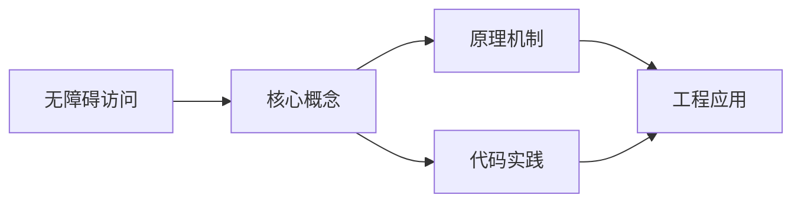
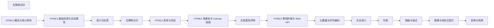

## 1. 学习目标（Bloom 分类）

本节按照布鲁姆教育目标分类学组织学习路径。本文主题为《无障碍访问》，属于 HTML5 模块，读者可以根据自身阶段选择阅读深度。

记忆层面：能够准确复述本文的核心概念、术语与基本语法或操作步骤，并能够在提问或检索时快速定位对应知识点。能够说出 HTML5 的核心概念、术语与标准写法。

理解层面：能够用自己的语言解释核心原理与工作机制，说明概念之间的因果关系，而不是机械记忆结论。能够解释 HTML5 的工作原理与设计动机。

应用层面：能够在真实项目或练习场景中运用本文知识解决具体问题，写出正确且可维护的实现。能够编写符合 HTML5 规范的完整实现。

分析层面：能够拆解复杂问题，比较本文主题与相邻概念的异同，识别边界条件与例外情况。能够分析 HTML5 与相邻方案的差异与边界。

评价层面：能够根据约束条件（性能、可读性、安全、成本）评价不同方案的优劣，做出有依据的技术决策。能够根据场景评价 HTML5 相关方案的优劣。

创造层面：能够把本文知识与其他模块知识组合，设计出新的解决方案或可复用的工程模式。能够组合 HTML5 与其他技术设计完整方案。

通过本节学习，读者应当能够把《无障碍访问》纳入自己的知识网络，并与 HTML5 模块的其他主题（语义化、表单、多媒体、Canvas）建立关联。

## 2. 历史动机与发展脉络

《无障碍访问》是 HTML5 领域的重要主题。要真正理解它，需要先了解它解决的问题与演进过程。

HTML 由 Tim Berners-Lee 于 1991 年创建，是 Web 的结构语言；HTML5 于 2014 年成为 W3C 推荐标准，WHATWG 维护的 Living Standard 是当前权威规范。
HTML5 引入语义化元素（header/nav/main/article/section/footer）、表单增强（date/range/placeholder）、多媒体（video/audio）、图形（canvas/SVG）与离线存储（localStorage/Web Worker）。
现代 HTML 强调“语义优先”：结构表达内容含义，样式与行为分离；可访问性（ARIA）与 SEO 都建立在正确语义之上。

回到本文主题：无障碍访问 的提出与成熟，正是上述技术背景下的必然产物。早期实现往往以简单可用为目标，随着工程规模扩大，社区逐渐沉淀出标准做法与最佳实践；理解这一脉络，可以帮助读者判断“为什么文档中的推荐写法是现在这个样子”，也能在遇到历史遗留代码时准确识别其设计年代与取舍。


## 3. 形式化定义与核心概念精讲

本节把《无障碍访问》涉及的核心概念以“定义 + 讲解”的形式展开。读者应把定义当作工具，把讲解当作理解路径；两者结合才能形成可迁移的知识。

文档结构：<!DOCTYPE html> 声明标准模式；html/head/body 层级固定；meta charset 必须在前 1024 字节内。
语义元素：header/footer 表示页眉页脚，nav 表示导航，main 表示主内容（每页唯一），article 表示独立内容，section 表示分区。
表单：input 类型决定键盘与校验（email/url/number），label 关联控件提升可访问性，required/pattern 提供原生校验。

### 3.1 原文章节逐一精讲

原文档把主题拆分为 18 个小节，下面按顺序给出每一节的导读讲解，随后保留原文细节供精读。

#### 原文精读（完整保留）

# 无障碍访问 语法速查手册

> **符号约定**:`< >` 必填参数 | `[ ]` 可选参数 | `{ }` 分组 | `|` 或 | `...` 重复

---

#### 1. 无障碍访问概述

##### 1.1 什么是 Web 无障碍

Web无障碍（Web Accessibility，简称 A11y）确保网站和Web应用对所有用户可用，包括有视觉、听觉、运动或认知障碍的人群。

##### 1.2 WCAG 标准

Web内容无障碍指南（WCAG）围绕四个原则：

| 原则                         | 含义         | 示例                      |
| :--------------------------- | :----------- | :------------------------ |
| **可感知（Perceivable）**    | 信息可被感知 | 图片有alt文本、视频有字幕 |
| **可操作（Operable）**       | 界面可操作   | 键盘可访问、有足够时间    |
| **可理解（Understandable）** | 内容可理解   | 清晰语言、一致的导航      |
| **健壮性（Robust）**         | 兼容辅助技术 | 语义化HTML、ARIA          |

##### 1.3 无障碍的商业价值

- 全球约15%的人口有某种形式的残疾
- 无障碍改善所有用户体验（如移动端、慢速网络）
- 法律合规要求（如ADA、EN 301 549）
- SEO提升（语义化HTML同时利于搜索引擎）

#### 2. 语义化HTML与无障碍

##### 2.1 正确使用HTML元素

```html
<!-- 错误：用div模拟按钮 -->
<div class="btn" onclick="submit()">提交</div>
<!-- 问题：不可键盘聚焦、屏幕阅读器不识别 -->

<!-- 正确：使用原生button -->
<button type="submit">提交</button>
<!-- 优势：可键盘聚焦、可回车触发、屏幕阅读器识别 -->

<!-- 错误：用div模拟链接 -->
<div class="link" onclick="navigate()">点击这里</div>

<!-- 正确：使用原生a标签 -->
<a href="/page">点击这里</a>

<!-- 错误：用span模拟标题 -->
<span class="title" style="font-size:24px;font-weight:bold">标题</span>

<!-- 正确：使用h1-h6 -->
<h2>标题</h2>
```

##### 2.2 图片无障碍

```html
<!-- 有意义的图片：提供alt描述 -->


<!-- 装饰性图片：alt留空 -->


<!-- 图标字体 -->
<span class="icon-search" aria-hidden="true"></span>
<span class="sr-only">搜索</span>

<!-- 复杂图片：使用长描述 -->
<figure>
  
  <figcaption>详细描述：公司从2010年成立至今的发展里程碑...</figcaption>
</figure>
```

##### 2.3 表单无障碍

```html
<form>
  <!-- 方式1：label包裹 -->
  <label>
    用户名：
    <input type="text" name="username" required />
  </label>

  <!-- 方式2：label的for属性 -->
  <label for="email">邮箱：</label>
  <input type="email" id="email" name="email" required aria-describedby="email-hint" />
  <span id="email-hint" class="hint">请输入有效的邮箱地址</span>

  <!-- 必填字段提示 -->
  <label for="phone"> 电话：<span aria-label="必填">*</span> </label>
  <input type="tel" id="phone" name="phone" required aria-required="true" />

  <!-- 错误提示 -->
  <label for="password">密码：</label>
  <input
    type="password"
    id="password"
    name="password"
    aria-describedby="password-error"
    aria-invalid="true"
  />
  <span id="password-error" role="alert" class="error"> 密码至少需要8个字符 </span>

  <!-- 分组表单 -->
  <fieldset>
    <legend>联系方式偏好</legend>
    <label><input type="radio" name="contact" value="email" /> 邮件</label>
    <label><input type="radio" name="contact" value="phone" /> 电话</label>
  </fieldset>
</form>
```

#### 3. ARIA 属性

##### 3.1 ARIA 角色与属性

ARIA（Accessible Rich Internet Applications）为复杂组件提供语义信息。

```html
<!-- 角色role -->
<nav role="navigation" aria-label="主导航">
  <ul>
    <li><a href="/" role="menuitem">首页</a></li>
    <li><a href="/about" role="menuitem">关于</a></li>
  </ul>
</nav>

<!-- 常用ARIA角色 -->
<div role="alert">操作成功！</div>
<!-- 警告/通知 -->
<div role="dialog" aria-modal="true">...</div>
<!-- 对话框 -->
<div role="tablist">...</div>
<!-- 标签列表 -->
<div role="tab">...</div>
<!-- 标签 -->
<div role="tabpanel">...</div>
<!-- 标签面板 -->
<div role="progressbar">...</div>
<!-- 进度条 -->
<div role="tooltip">...</div>
<!-- 工具提示 -->
```

##### 3.2 常用 ARIA 属性

```html
<!-- aria-label：提供不可见的标签 -->
<button aria-label="关闭菜单" class="close-btn"></button>

<!-- aria-labelledby：用其他元素的ID作为标签 -->
<div id="dialog-title">确认删除</div>
<div role="dialog" aria-labelledby="dialog-title">
  <p>确定要删除这条记录吗？</p>
</div>

<!-- aria-describedby：描述信息 -->
<input type="text" aria-describedby="help-text" />
<span id="help-text">请输入6-12位字母数字组合</span>

<!-- aria-hidden：对辅助技术隐藏 -->
<span class="icon" aria-hidden="true"></span>
<span class="sr-only">收藏</span>

<!-- aria-expanded：展开/折叠状态 -->
<button aria-expanded="false" aria-controls="menu">菜单</button>
<ul id="menu" role="menu" hidden>
  <li role="menuitem">选项1</li>
  <li role="menuitem">选项2</li>
</ul>

<!-- aria-current：当前项 -->
<nav aria-label="面包屑">
  <a href="/">首页</a>
  <a href="/products" aria-current="page">产品</a>
</nav>

<!-- aria-live：动态内容更新 -->
<div aria-live="polite">搜索结果已更新</div>
<div aria-live="assertive">发生错误！</div>

<!-- aria-disabled：视觉禁用但仍可聚焦 -->
<button aria-disabled="true">暂不可用</button>
```

##### 3.3 标签页组件示例

```html
<div class="tabs">
  <div role="tablist" aria-label="账户设置">
    <button role="tab" id="tab-profile" aria-selected="true" aria-controls="panel-profile">
      个人资料
    </button>
    <button
      role="tab"
      id="tab-security"
      aria-selected="false"
      aria-controls="panel-security"
      tabindex="-1"
    >
      安全设置
    </button>
    <button
      role="tab"
      id="tab-notify"
      aria-selected="false"
      aria-controls="panel-notify"
      tabindex="-1"
    >
      通知偏好
    </button>
  </div>

  <div role="tabpanel" id="panel-profile" aria-labelledby="tab-profile">
    <h3>个人资料</h3>
    <p>编辑你的个人信息...</p>
  </div>

  <div role="tabpanel" id="panel-security" aria-labelledby="tab-security" hidden>
    <h3>安全设置</h3>
    <p>修改密码和安全选项...</p>
  </div>

  <div role="tabpanel" id="panel-notify" aria-labelledby="tab-notify" hidden>
    <h3>通知偏好</h3>
    <p>管理通知设置...</p>
  </div>
</div>
```

#### 4. 键盘导航

##### 4.1 焦点管理

```html
<!-- tabindex 属性 -->
<!-- tabindex="0": 可聚焦，按文档顺序 -->
<!-- tabindex="-1": 可编程聚焦，不在Tab序列中 -->
<!-- tabindex="1+": 在Tab序列中，但不推荐（破坏自然顺序） -->

<div class="custom-widget" tabindex="0" role="button">自定义按钮</div>

<!-- 跳过导航链接 -->
<a href="#main-content" class="skip-link">跳到主要内容</a>

<style>
  .skip-link {
    position: absolute;
    top: -40px;
    left: 0;
    background: #000;
    color: #fff;
    padding: 8px 16px;
    z-index: 100;
    transition: top 0.2s;
  }
  .skip-link:focus {
    top: 0;
  }
</style>
```

##### 4.2 模态对话框焦点陷阱

```javascript
function trapFocus(element) {
  const focusableSelectors = [
    'a[href]',
    'button:not([disabled])',
    'input:not([disabled])',
    'select:not([disabled])',
    'textarea:not([disabled])',
    '[tabindex]:not([tabindex="-1"])',
  ];

  const focusableElements = element.querySelectorAll(focusableSelectors.join(','));
  const firstFocusable = focusableElements[0];
  const lastFocusable = focusableElements[focusableElements.length - 1];

  element.addEventListener('keydown', (e) => {
    if (e.key !== 'Tab') return;

    if (e.shiftKey) {
      if (document.activeElement === firstFocusable) {
        lastFocusable.focus();
        e.preventDefault();
      }
    } else {
      if (document.activeElement === lastFocusable) {
        firstFocusable.focus();
        e.preventDefault();
      }
    }
  });

  // 打开对话框时聚焦第一个元素
  firstFocusable.focus();
}
```

##### 4.3 键盘快捷键

```html
<!-- accesskey 属性（谨慎使用） -->
<button accesskey="s">保存</button>

<!-- 自定义键盘交互 -->
<div class="dropdown" role="combobox" aria-expanded="false">
  <input type="text" role="searchbox" aria-autocomplete="list" aria-controls="dropdown-list" />
  <ul id="dropdown-list" role="listbox">
    <li role="option">选项1</li>
    <li role="option">选项2</li>
  </ul>
</div>

<script>
  // 键盘交互：上下箭头选择，Enter确认，Esc关闭
  document.querySelector('[role="combobox"]').addEventListener('keydown', (e) => {
    switch (e.key) {
      case 'ArrowDown':
        // 选择下一个选项
        break;
      case 'ArrowUp':
        // 选择上一个选项
        break;
      case 'Enter':
        // 确认选择
        break;
      case 'Escape':
        // 关闭下拉
        break;
    }
  });
</script>
```

#### 5. 颜色与对比度

##### 5.1 对比度要求

| 文本类型                  | WCAG AA | WCAG AAA |
| :------------------------ | :------ | :------- |
| 正文文本（<18px）         | 4.5:1   | 7:1      |
| 大文本（≥18px或14px粗体） | 3:1     | 4.5:1    |
| UI组件和图形对象          | 3:1     | -        |

```css
/* 对比度检查 */
/* AA通过：深灰文字 #333 在白色 #fff 背景 */
.text-aa {
  color: #333333; /* 对比度 12.6:1  */
}

/* AA未通过：浅灰文字 #999 在白色背景 */
.text-fail {
  color: #999999; /* 对比度 2.8:1  */
}

/* 修正：使用更深的灰色 */
.text-fixed {
  color: #767676; /* 对比度 4.5:1  */
}
```

##### 5.2 不仅依赖颜色传达信息

```html
<!-- 错误：仅用颜色区分 -->
<p>请填写 <span style="color:red">红色</span> 标记的字段</p>

<!-- 正确：颜色 + 图标/文字 -->
<p>
  请填写带 <span class="required"><span aria-hidden="true">*</span>星号</span> 的字段
</p>

<!-- 错误：仅用颜色表示状态 -->
<div class="status" style="color: green">成功</div>

<!-- 正确：颜色 + 图标 -->
<div class="status success">
  <span aria-hidden="true"></span>
  <span>成功</span>
</div>
```

#### 6. 常见问题与解决方案

##### 6.1 动态内容更新

**问题**：AJAX更新内容后屏幕阅读器不通知

```html
<!-- 解决方案：使用aria-live区域 -->
<div aria-live="polite" aria-atomic="true" id="status">
  <!-- 动态更新的内容 -->
</div>

<!-- 紧急通知用assertive -->
<div aria-live="assertive" role="alert" id="errors">
  <!-- 错误消息 -->
</div>
```

##### 6.2 自定义组件无障碍

**问题**：自定义组件缺少键盘支持和ARIA

```html
<!-- 自定义开关组件 -->
<div class="switch" role="switch" aria-checked="false" aria-label="深色模式" tabindex="0">
  <span class="switch-thumb"></span>
</div>

<script>
  const switchEl = document.querySelector('.switch');
  switchEl.addEventListener('keydown', (e) => {
    if (e.key === ' ' || e.key === 'Enter') {
      e.preventDefault();
      toggleSwitch();
    }
  });

  function toggleSwitch() {
    const isChecked = switchEl.getAttribute('aria-checked') === 'true';
    switchEl.setAttribute('aria-checked', !isChecked);
  }
</script>
```

##### 6.3 图标按钮缺少标签

```html
<!-- 错误：图标按钮无文本 -->
<button><i class="fa fa-search"></i></button>

<!-- 正确方案1：aria-label -->
<button aria-label="搜索"><i class="fa fa-search" aria-hidden="true"></i></button>

<!-- 正确方案2：视觉隐藏文本 -->
<button>
  <i class="fa fa-search" aria-hidden="true"></i>
  <span class="sr-only">搜索</span>
</button>

<style>
  .sr-only {
    position: absolute;
    width: 1px;
    height: 1px;
    padding: 0;
    margin: -1px;
    overflow: hidden;
    clip: rect(0, 0, 0, 0);
    white-space: nowrap;
    border: 0;
  }
</style>
```

#### 7. 总结与最佳实践

##### 7.1 无障碍检查清单

- [ ] 所有图片有alt文本
- [ ] 表单控件有label关联
- [ ] 页面有且仅有一个main地标
- [ ] 键盘可以访问所有交互元素
- [ ] 文本对比度满足WCAG AA标准
- [ ] 不仅依赖颜色传达信息
- [ ] 动态内容使用aria-live通知
- [ ] 自定义组件有正确的ARIA角色和属性
- [ ] 提供跳过导航链接
- [ ] 模态对话框有焦点陷阱

##### 7.2 测试工具

- **Lighthouse**：Chrome内置的无障碍审计
- **axe DevTools**：浏览器扩展，自动检测无障碍问题
- **NVDA/VoiceOver**：屏幕阅读器实际测试
- **键盘测试**：不使用鼠标，仅用键盘操作页面
- **色盲模拟**：Chrome DevTools 的渲染面板

##### 7.3 核心原则

1. **原生HTML优先**：使用语义化标签，减少ARIA需求
2. **键盘可操作**：所有功能可通过键盘完成
3. **渐进增强**：基础功能不依赖JavaScript
4. **持续测试**：开发过程中定期进行无障碍测试
#### WCAG 标准原则

**WCAG 四大原则表**

| 原则                         | 含义         | 实现示例                      |
| ---------------------------- | ------------ | ----------------------------- |
| **可感知(Perceivable)**      | 信息可被感知 | 图片有 alt 文本、视频有字幕   |
| **可操作(Operable)**         | 界面可操作   | 键盘可访问、有足够操作时间    |
| **可理解(Understandable)**   | 内容可理解   | 清晰语言、一致的导航          |
| **健壮性(Robust)**           | 兼容辅助技术 | 语义化 HTML、ARIA 属性        |

**WCAG 对比度要求表**

| 文本类型                   | WCAG AA | WCAG AAA |
| -------------------------- | ------- | -------- |
| 正文文本(<18px)           | 4.5:1   | 7:1      |
| 大文本(≥18px 或 14px 粗体)| 3:1     | 4.5:1    |
| UI 组件和图形对象          | 3:1     | -        |

---

#### 语义化 HTML 与无障碍

**原生元素优先**

```html
<!-- 错误:用 div 模拟按钮,不可键盘聚焦 -->
<div class="btn" onclick="submit()">提交</div>

<!-- 正确:使用原生 button,可键盘聚焦、回车触发 -->
<button type="submit">提交</button>

<!-- 错误:用 div 模拟链接 -->
<div class="link" onclick="navigate()">点击这里</div>

<!-- 正确:使用原生 a 标签 -->
<a href="/page">点击这里</a>
```

**图片无障碍**
`" | role="presentation" />`

```html
<!-- 有意义的图片:提供 alt 描述 -->


<!-- 装饰性图片:alt 留空 -->


<!-- 图标字体:对辅助技术隐藏 -->
<span class="icon-search" aria-hidden="true"></span>
<span class="sr-only">搜索</span>
```

---

#### ARIA 角色

**常用 ARIA role 角色表**

| 角色             | 用途                 | 应用元素示例                |
| ---------------- | -------------------- | --------------------------- |
| `navigation`     | 导航区域             | `<nav role="navigation">`   |
| `main`           | 主要内容             | `<main role="main">`        |
| `banner`         | 页面头部             | `<header role="banner">`    |
| `contentinfo`    | 页面底部             | `<footer role="contentinfo">|
| `alert`          | 警告/通知            | `<div role="alert">`        |
| `dialog`         | 对话框               | `<div role="dialog">`       |
| `alertdialog`    | 警告对话框           | `<div role="alertdialog">`  |
| `tablist`        | 标签列表容器         | `<div role="tablist">`      |
| `tab`            | 标签项               | `<button role="tab">`       |
| `tabpanel`       | 标签面板             | `<div role="tabpanel">`     |
| `progressbar`    | 进度条               | `<div role="progressbar">`  |
| `tooltip`        | 工具提示             | `<div role="tooltip">`      |
| `menu`           | 菜单容器             | `<ul role="menu">`          |
| `menuitem`       | 菜单项               | `<li role="menuitem">`      |
| `listbox`        | 列表选择框           | `<ul role="listbox">`       |
| `option`         | 选项                 | `<li role="option">`        |
| `combobox`       | 组合框               | `<div role="combobox">`     |
| `switch`         | 开关组件             | `<div role="switch">`       |
| `slider`         | 滑块                 | `<div role="slider">`       |

**role 角色应用示例**

```html
<!-- 导航角色 -->
<nav role="navigation" aria-label="主导航">
  <ul>
    <li><a href="/" role="menuitem">首页</a></li>
    <li><a href="/about" role="menuitem">关于</a></li>
  </ul>
</nav>

<!-- 警告通知 -->
<div role="alert">操作成功!</div>

<!-- 模态对话框 -->
<div role="dialog" aria-modal="true" aria-labelledby="dialog-title">
  <h2 id="dialog-title">确认删除</h2>
  <p>确定要删除这条记录吗?</p>
</div>
```

---

#### ARIA 属性

**常用 ARIA 属性表**

| 属性                  | 作用                   | 取值示例                          |
| --------------------- | ---------------------- | --------------------------------- |
| `aria-label`          | 不可见标签             | `aria-label="关闭菜单"`           |
| `aria-labelledby`     | 引用其他元素 ID 作为标签 | `aria-labelledby="title-id"`     |
| `aria-describedby`    | 引用其他元素 ID 作为描述 | `aria-describedby="hint-id"`     |
| `aria-hidden`         | 对辅助技术隐藏         | `aria-hidden="true"`              |
| `aria-expanded`       | 展开/折叠状态          | `aria-expanded="true | false"`    |
| `aria-controls`       | 控制的元素 ID          | `aria-controls="menu-id"`         |
| `aria-current`        | 当前项                 | `aria-current="page | step"`      |
| `aria-live`           | 动态内容更新通告       | `aria-live="polite | assertive"`  |
| `aria-atomic`         | 区域整体更新           | `aria-atomic="true"`              |
| `aria-disabled`       | 禁用状态               | `aria-disabled="true"`            |
| `aria-required`       | 必填字段               | `aria-required="true"`            |
| `aria-invalid`        | 校验失败               | `aria-invalid="true"`             |
| `aria-checked`        | 选中状态(switch/checkbox) | `aria-checked="true | false"`  |
| `aria-selected`       | 选中状态(option/tab) | `aria-selected="true"`            |
| `aria-pressed`        | 按下状态(toggle button) | `aria-pressed="true"`           |
| `aria-modal`          | 模态对话框             | `aria-modal="true"`               |
| `aria-haspopup`       | 弹出元素               | `aria-haspopup="menu | dialog"`   |
| `aria-roledescription`| 自定义角色描述         | `aria-roledescription="幻灯片"`   |

**aria-label 与 aria-labelledby**
`aria-label="<文本>"` | `aria-labelledby="<element-id>"`

```html
<!-- aria-label:提供不可见标签 -->
<button aria-label="关闭菜单" class="close-btn">
  <span aria-hidden="true">×</span>
</button>

<!-- aria-labelledby:引用其他元素作为标签 -->
<div id="dialog-title">确认删除</div>
<div role="dialog" aria-labelledby="dialog-title">
  <p>确定要删除这条记录吗?</p>
</div>
```

**aria-expanded 与 aria-controls**
`aria-expanded="true | false"` `aria-controls="<element-id>"`

```html
<!-- 折叠菜单 -->
<button aria-expanded="false" aria-controls="menu">菜单</button>
<ul id="menu" role="menu" hidden>
  <li role="menuitem">选项1</li>
  <li role="menuitem">选项2</li>
</ul>
```

**aria-current 当前页**
`aria-current="page | step | location | date | time | true | false"`

```html
<!-- 面包屑导航 -->
<nav aria-label="面包屑">
  <a href="/">首页</a>
  <a href="/products" aria-current="page">产品</a>
</nav>
```

**aria-live 动态内容通告**
`aria-live="polite | assertive | off"`

```html
<!-- polite:等待用户空闲后通告 -->
<div aria-live="polite" aria-atomic="true" id="status">
  <!-- 动态更新的内容 -->
</div>

<!-- assertive:立即通告(打断当前操作) -->
<div aria-live="assertive" role="alert" id="errors">
  <!-- 错误消息 -->
</div>
```

---

#### 表单无障碍

**label 关联**
`<label for="<input-id>">` 或 `<label><input></label>`

```html
<form>
  <!-- 方式1:label 包裹输入框 -->
  <label>
    用户名:
    <input type="text" name="username" required />
  </label>

  <!-- 方式2:label 的 for 属性关联 -->
  <label for="email">邮箱:</label>
  <input type="email" id="email" name="email" required aria-describedby="email-hint" />
  <span id="email-hint" class="hint">请输入有效的邮箱地址</span>

  <!-- 必填字段提示 -->
  <label for="phone">电话:<span aria-label="必填">*</span></label>
  <input type="tel" id="phone" name="phone" required aria-required="true" />

  <!-- 错误提示 -->
  <label for="password">密码:</label>
  <input type="password" id="password" aria-describedby="password-error" aria-invalid="true" />
  <span id="password-error" role="alert" class="error">密码至少需要8个字符</span>

  <!-- 分组表单 -->
  <fieldset>
    <legend>联系方式偏好</legend>
    <label><input type="radio" name="contact" value="email" /> 邮件</label>
    <label><input type="radio" name="contact" value="phone" /> 电话</label>
  </fieldset>
</form>
```

---

#### 键盘导航

**tabindex 属性**
`tabindex="0 | -1 | 1+"`

```html
<!-- tabindex="0":可聚焦,按文档顺序 -->
<div class="custom-widget" tabindex="0" role="button">自定义按钮</div>

<!-- tabindex="-1":可编程聚焦,不在 Tab 序列中(适用于模态对话框) -->
<div class="modal" tabindex="-1">...</div>

<!-- 跳过导航链接(放在页面顶部) -->
<a href="#main-content" class="skip-link">跳到主要内容</a>
```

**accesskey 快捷键**
`accesskey="<key>"`

```html
<!-- 通过 Alt+键 触发(浏览器不同组合键不同) -->
<button accesskey="s">保存</button>
<a href="/" accesskey="h">首页</a>
```

**模态对话框焦点陷阱**
`element.addEventListener('keydown', focusTrapHandler)`

```javascript
// 在模态对话框中循环焦点,防止 Tab 跳到外部
function trapFocus(element) {
  const focusableSelectors = [
    'a[href]',
    'button:not([disabled])',
    'input:not([disabled])',
    'select:not([disabled])',
    'textarea:not([disabled])',
    '[tabindex]:not([tabindex="-1"])'
  ];

  const focusableElements = element.querySelectorAll(focusableSelectors.join(','));
  const first = focusableElements[0];
  const last = focusableElements[focusableElements.length - 1];

  element.addEventListener('keydown', (e) => {
    if (e.key !== 'Tab') return;
    if (e.shiftKey) {
      if (document.activeElement === first) {
        last.focus();
        e.preventDefault();
      }
    } else {
      if (document.activeElement === last) {
        first.focus();
        e.preventDefault();
      }
    }
  });

  first.focus(); // 打开时聚焦第一个元素
}
```

---

#### 视觉隐藏文本

**sr-only 样式**
`.sr-only { position: absolute; ... }`

```css
/* 视觉隐藏但屏幕阅读器可读取 */
.sr-only {
  position: absolute;
  width: 1px;
  height: 1px;
  padding: 0;
  margin: -1px;
  overflow: hidden;
  clip: rect(0, 0, 0, 0);
  white-space: nowrap;
  border: 0;
}
```

```html
<!-- 图标按钮添加视觉隐藏文本 -->
<button>
  <i class="fa fa-search" aria-hidden="true"></i>
  <span class="sr-only">搜索</span>
</button>
```

---

#### 标签页组件

**Tab 组件完整结构**
`role="tablist" > role="tab" + aria-selected / role="tabpanel" + aria-labelledby`

```html
<div class="tabs">
  <div role="tablist" aria-label="账户设置">
    <button role="tab" id="tab-profile" aria-selected="true" aria-controls="panel-profile">
      个人资料
    </button>
    <button role="tab" id="tab-security" aria-selected="false" aria-controls="panel-security" tabindex="-1">
      安全设置
    </button>
  </div>

  <div role="tabpanel" id="panel-profile" aria-labelledby="tab-profile">
    <h3>个人资料</h3>
    <p>编辑你的个人信息...</p>
  </div>

  <div role="tabpanel" id="panel-security" aria-labelledby="tab-security" hidden>
    <h3>安全设置</h3>
    <p>修改密码和安全选项...</p>
  </div>
</div>
```

---

#### 自定义开关组件

**Switch 组件**
`role="switch" aria-checked="true | false" tabindex="0"`

```html
<div class="switch" role="switch" aria-checked="false" aria-label="深色模式" tabindex="0">
  <span class="switch-thumb"></span>
</div>

<script>
  const switchEl = document.querySelector('.switch');
  switchEl.addEventListener('keydown', (e) => {
    if (e.key === ' ' || e.key === 'Enter') {
      e.preventDefault();
      toggleSwitch();
    }
  });

  function toggleSwitch() {
    const isChecked = switchEl.getAttribute('aria-checked') === 'true';
    switchEl.setAttribute('aria-checked', !isChecked);
  }
</script>
```

---

#### 颜色与对比度

**对比度示例**

```css
/* AA 通过:深灰文字 #333 在白色 #fff 背景,对比度 12.6:1 */
.text-aa {
  color: #333333;
  background-color: #ffffff;
}

/* AA 未通过:浅灰文字 #999 在白色背景,对比度 2.8:1 */
.text-fail {
  color: #999999;
}

/* 修正:使用更深的灰色,对比度 4.5:1 */
.text-fixed {
  color: #767676;
}
```

**不仅依赖颜色传达信息**

```html
<!-- 错误:仅用颜色区分 -->
<p>请填写 <span style="color:red">红色</span> 标记的字段</p>

<!-- 正确:颜色 + 文字/图标 -->
<p>请填写带 <span class="required"><span aria-hidden="true">*</span>星号</span> 的字段</p>
```

---

#### 注意事项

- **原生优先**:使用语义化 HTML 标签(`<button>`、`<nav>`、`<main>`)优先于 ARIA
- **键盘可访问**:所有交互元素必须可通过键盘(Tab/Enter/Space)操作
- **测试工具**:Lighthouse、axe DevTools、NVDA、VoiceOver
- **不滥用 ARIA**:ARIA 用于增强语义,不能替代正确的 HTML 结构
- **aria-hidden 慎用**:对聚焦元素使用 `aria-hidden="true"` 会导致键盘仍可聚焦但屏幕阅读器不可见
- **动态内容**:AJAX 更新内容后,使用 `aria-live` 通告屏幕阅读器


### 3.2 概念关系图

下面用 Mermaid 图表达本文核心概念之间的关系，帮助读者建立整体图景：



图中展示的是本文知识的结构化关系：核心概念是入口，原理机制解释“为什么”，代码实践演示“怎么做”，工程应用回答“何时用”。读者学习时可以把每个小节的内容挂接到对应节点上。

## 4. 理论推导与原理解析

本节深入《无障碍访问》背后的原理。理论部分不求面面俱到，而是聚焦“能解释现象、能指导实践”的关键推导。

文档结构：<!DOCTYPE html> 声明标准模式；html/head/body 层级固定；meta charset 必须在前 1024 字节内。
语义元素：header/footer 表示页眉页脚，nav 表示导航，main 表示主内容（每页唯一），article 表示独立内容，section 表示分区。
表单：input 类型决定键盘与校验（email/url/number），label 关联控件提升可访问性，required/pattern 提供原生校验。
媒体与图形：video/audio 支持多源（source）；canvas 是位图画布（JavaScript 绘制），SVG 是矢量结构（DOM 操作）。

需要强调的是，理论推导与工程实践之间存在翻译层：理论给出的是理想化模型与边界条件，工程代码则必须处理真实环境中的例外。读者在学习时应先掌握理论的“标准情形”，再通过陷阱章节了解“非标准情形”。

## 5. 代码示例与逐行讲解

本节把原文中的代码示例系统整理，并为每个示例补充用途说明与讲解。读者不应只浏览代码，而应逐段对照讲解理解设计意图。

### 5.1 示例：2.1 正确使用HTML元素

该示例来自原文《2.1 正确使用HTML元素》小节，用于演示无障碍访问相关操作。阅读时请先看代码结构，再看其后的讲解。

```html
<!-- 错误：用div模拟按钮 -->
<div class="btn" onclick="submit()">提交</div>
<!-- 问题：不可键盘聚焦、屏幕阅读器不识别 -->

<!-- 正确：使用原生button -->
<button type="submit">提交</button>
<!-- 优势：可键盘聚焦、可回车触发、屏幕阅读器识别 -->

<!-- 错误：用div模拟链接 -->
<div class="link" onclick="navigate()">点击这里</div>

<!-- 正确：使用原生a标签 -->
<a href="/page">点击这里</a>

<!-- 错误：用span模拟标题 -->
<span class="title" style="font-size:24px;font-weight:bold">标题</span>

<!-- 正确：使用h1-h6 -->
<h2>标题</h2>
```

讲解：这段代码演示了本节核心知识点。代码中的关键操作可以归纳为三步：准备（定义或初始化）、执行（核心逻辑）、收尾（释放资源或返回结果）。实际项目中，这三步往往被封装为函数或类，以提升复用性与可测试性。

关键点分析：

该示例共 14 行有效代码，包含 1 类关键结构（class）。其中：

- 入口与初始化部分负责建立上下文，对应实际项目中的启动或装配逻辑；
- 核心逻辑部分体现本文主题的主要操作，是阅读时最需要对照讲解理解的部分；
- 输出或返回部分把结果交给调用方，注意其类型与边界条件。

进阶思考路径：先尝试修改参数观察行为变化，再把示例中的模式迁移到自己的项目中；每次修改都记录预期与实测差异，这是把示例转化为能力的最快方式。

### 5.2 示例：2.2 图片无障碍

该示例来自原文《2.2 图片无障碍》小节，用于演示无障碍访问相关操作。阅读时请先看代码结构，再看其后的讲解。

```html
<!-- 有意义的图片：提供alt描述 -->


<!-- 装饰性图片：alt留空 -->


<!-- 图标字体 -->
<span class="icon-search" aria-hidden="true"></span>
<span class="sr-only">搜索</span>

<!-- 复杂图片：使用长描述 -->
<figure>
  
  <figcaption>详细描述：公司从2010年成立至今的发展里程碑...</figcaption>
</figure>
```

讲解：这段代码演示了本节核心知识点。代码中的关键操作可以归纳为三步：准备（定义或初始化）、执行（核心逻辑）、收尾（释放资源或返回结果）。实际项目中，这三步往往被封装为函数或类，以提升复用性与可测试性。

关键点分析：

该示例共 12 行有效代码，包含 1 类关键结构（class）。其中：

- 入口与初始化部分负责建立上下文，对应实际项目中的启动或装配逻辑；
- 核心逻辑部分体现本文主题的主要操作，是阅读时最需要对照讲解理解的部分；
- 输出或返回部分把结果交给调用方，注意其类型与边界条件。

进阶思考路径：先尝试修改参数观察行为变化，再把示例中的模式迁移到自己的项目中；每次修改都记录预期与实测差异，这是把示例转化为能力的最快方式。

### 5.3 示例：2.3 表单无障碍

该示例来自原文《2.3 表单无障碍》小节，用于演示无障碍访问相关操作。阅读时请先看代码结构，再看其后的讲解。

```html
<form>
  <!-- 方式1：label包裹 -->
  <label>
    用户名：
    <input type="text" name="username" required />
  </label>

  <!-- 方式2：label的for属性 -->
  <label for="email">邮箱：</label>
  <input type="email" id="email" name="email" required aria-describedby="email-hint" />
  <span id="email-hint" class="hint">请输入有效的邮箱地址</span>

  <!-- 必填字段提示 -->
  <label for="phone"> 电话：<span aria-label="必填">*</span> </label>
  <input type="tel" id="phone" name="phone" required aria-required="true" />

  <!-- 错误提示 -->
  <label for="password">密码：</label>
  <input
    type="password"
    id="password"
    name="password"
    aria-describedby="password-error"
    aria-invalid="true"
  />
  <span id="password-error" role="alert" class="error"> 密码至少需要8个字符 </span>

  <!-- 分组表单 -->
  <fieldset>
    <legend>联系方式偏好</legend>
    <label><input type="radio" name="contact" value="email" /> 邮件</label>
    <label><input type="radio" name="contact" value="phone" /> 电话</label>
  </fieldset>
</form>
```

讲解：这段代码演示了本节核心知识点。代码中的关键操作可以归纳为三步：准备（定义或初始化）、执行（核心逻辑）、收尾（释放资源或返回结果）。实际项目中，这三步往往被封装为函数或类，以提升复用性与可测试性。

关键点分析：

该示例共 30 行有效代码，包含 1 类关键结构（class）。其中：

- 入口与初始化部分负责建立上下文，对应实际项目中的启动或装配逻辑；
- 核心逻辑部分体现本文主题的主要操作，是阅读时最需要对照讲解理解的部分；
- 输出或返回部分把结果交给调用方，注意其类型与边界条件。

进阶思考路径：先尝试修改参数观察行为变化，再把示例中的模式迁移到自己的项目中；每次修改都记录预期与实测差异，这是把示例转化为能力的最快方式。

### 5.4 示例：3.1 ARIA 角色与属性

该示例来自原文《3.1 ARIA 角色与属性》小节，用于演示无障碍访问相关操作。阅读时请先看代码结构，再看其后的讲解。

```html
<!-- 角色role -->
<nav role="navigation" aria-label="主导航">
  <ul>
    <li><a href="/" role="menuitem">首页</a></li>
    <li><a href="/about" role="menuitem">关于</a></li>
  </ul>
</nav>

<!-- 常用ARIA角色 -->
<div role="alert">操作成功！</div>
<!-- 警告/通知 -->
<div role="dialog" aria-modal="true">...</div>
<!-- 对话框 -->
<div role="tablist">...</div>
<!-- 标签列表 -->
<div role="tab">...</div>
<!-- 标签 -->
<div role="tabpanel">...</div>
<!-- 标签面板 -->
<div role="progressbar">...</div>
<!-- 进度条 -->
<div role="tooltip">...</div>
<!-- 工具提示 -->
```

讲解：这段代码演示了本节核心知识点。代码中的关键操作可以归纳为三步：准备（定义或初始化）、执行（核心逻辑）、收尾（释放资源或返回结果）。实际项目中，这三步往往被封装为函数或类，以提升复用性与可测试性。

关键点分析：

该示例共 22 行有效代码，结构以数据或配置为主。阅读时应关注：数据字段的含义、配置项的作用，以及它们与运行行为的对应关系。

进阶思考路径：先尝试修改参数观察行为变化，再把示例中的模式迁移到自己的项目中；每次修改都记录预期与实测差异，这是把示例转化为能力的最快方式。

### 5.5 示例：3.2 常用 ARIA 属性

该示例来自原文《3.2 常用 ARIA 属性》小节，用于演示无障碍访问相关操作。阅读时请先看代码结构，再看其后的讲解。

```html
<!-- aria-label：提供不可见的标签 -->
<button aria-label="关闭菜单" class="close-btn"></button>

<!-- aria-labelledby：用其他元素的ID作为标签 -->
<div id="dialog-title">确认删除</div>
<div role="dialog" aria-labelledby="dialog-title">
  <p>确定要删除这条记录吗？</p>
</div>

<!-- aria-describedby：描述信息 -->
<input type="text" aria-describedby="help-text" />
<span id="help-text">请输入6-12位字母数字组合</span>

<!-- aria-hidden：对辅助技术隐藏 -->
<span class="icon" aria-hidden="true"></span>
<span class="sr-only">收藏</span>

<!-- aria-expanded：展开/折叠状态 -->
<button aria-expanded="false" aria-controls="menu">菜单</button>
<ul id="menu" role="menu" hidden>
  <li role="menuitem">选项1</li>
  <li role="menuitem">选项2</li>
</ul>

<!-- aria-current：当前项 -->
<nav aria-label="面包屑">
  <a href="/">首页</a>
  <a href="/products" aria-current="page">产品</a>
</nav>

<!-- aria-live：动态内容更新 -->
<div aria-live="polite">搜索结果已更新</div>
<div aria-live="assertive">发生错误！</div>

<!-- aria-disabled：视觉禁用但仍可聚焦 -->
<button aria-disabled="true">暂不可用</button>
```

讲解：这段代码演示了本节核心知识点。代码中的关键操作可以归纳为三步：准备（定义或初始化）、执行（核心逻辑）、收尾（释放资源或返回结果）。实际项目中，这三步往往被封装为函数或类，以提升复用性与可测试性。

关键点分析：

该示例共 29 行有效代码，包含 1 类关键结构（class）。其中：

- 入口与初始化部分负责建立上下文，对应实际项目中的启动或装配逻辑；
- 核心逻辑部分体现本文主题的主要操作，是阅读时最需要对照讲解理解的部分；
- 输出或返回部分把结果交给调用方，注意其类型与边界条件。

进阶思考路径：先尝试修改参数观察行为变化，再把示例中的模式迁移到自己的项目中；每次修改都记录预期与实测差异，这是把示例转化为能力的最快方式。

### 5.6 示例：3.3 标签页组件示例

该示例来自原文《3.3 标签页组件示例》小节，用于演示无障碍访问相关操作。阅读时请先看代码结构，再看其后的讲解。

```html
<div class="tabs">
  <div role="tablist" aria-label="账户设置">
    <button role="tab" id="tab-profile" aria-selected="true" aria-controls="panel-profile">
      个人资料
    </button>
    <button
      role="tab"
      id="tab-security"
      aria-selected="false"
      aria-controls="panel-security"
      tabindex="-1"
    >
      安全设置
    </button>
    <button
      role="tab"
      id="tab-notify"
      aria-selected="false"
      aria-controls="panel-notify"
      tabindex="-1"
    >
      通知偏好
    </button>
  </div>

  <div role="tabpanel" id="panel-profile" aria-labelledby="tab-profile">
    <h3>个人资料</h3>
    <p>编辑你的个人信息...</p>
  </div>

  <div role="tabpanel" id="panel-security" aria-labelledby="tab-security" hidden>
    <h3>安全设置</h3>
    <p>修改密码和安全选项...</p>
  </div>

  <div role="tabpanel" id="panel-notify" aria-labelledby="tab-notify" hidden>
    <h3>通知偏好</h3>
    <p>管理通知设置...</p>
  </div>
</div>
```

讲解：这段代码演示了本节核心知识点。代码中的关键操作可以归纳为三步：准备（定义或初始化）、执行（核心逻辑）、收尾（释放资源或返回结果）。实际项目中，这三步往往被封装为函数或类，以提升复用性与可测试性。

关键点分析：

该示例共 37 行有效代码，包含 1 类关键结构（class）。其中：

- 入口与初始化部分负责建立上下文，对应实际项目中的启动或装配逻辑；
- 核心逻辑部分体现本文主题的主要操作，是阅读时最需要对照讲解理解的部分；
- 输出或返回部分把结果交给调用方，注意其类型与边界条件。

进阶思考路径：先尝试修改参数观察行为变化，再把示例中的模式迁移到自己的项目中；每次修改都记录预期与实测差异，这是把示例转化为能力的最快方式。

### 5.7 示例：4.1 焦点管理

该示例来自原文《4.1 焦点管理》小节，用于演示无障碍访问相关操作。阅读时请先看代码结构，再看其后的讲解。

```html
<!-- tabindex 属性 -->
<!-- tabindex="0": 可聚焦，按文档顺序 -->
<!-- tabindex="-1": 可编程聚焦，不在Tab序列中 -->
<!-- tabindex="1+": 在Tab序列中，但不推荐（破坏自然顺序） -->

<div class="custom-widget" tabindex="0" role="button">自定义按钮</div>

<!-- 跳过导航链接 -->
<a href="#main-content" class="skip-link">跳到主要内容</a>

<style>
  .skip-link {
    position: absolute;
    top: -40px;
    left: 0;
    background: #000;
    color: #fff;
    padding: 8px 16px;
    z-index: 100;
    transition: top 0.2s;
  }
  .skip-link:focus {
    top: 0;
  }
</style>
```

讲解：这段代码演示了本节核心知识点。代码中的关键操作可以归纳为三步：准备（定义或初始化）、执行（核心逻辑）、收尾（释放资源或返回结果）。实际项目中，这三步往往被封装为函数或类，以提升复用性与可测试性。

关键点分析：

该示例共 22 行有效代码，包含 1 类关键结构（class）。其中：

- 入口与初始化部分负责建立上下文，对应实际项目中的启动或装配逻辑；
- 核心逻辑部分体现本文主题的主要操作，是阅读时最需要对照讲解理解的部分；
- 输出或返回部分把结果交给调用方，注意其类型与边界条件。

进阶思考路径：先尝试修改参数观察行为变化，再把示例中的模式迁移到自己的项目中；每次修改都记录预期与实测差异，这是把示例转化为能力的最快方式。

### 5.8 示例：4.2 模态对话框焦点陷阱

该示例来自原文《4.2 模态对话框焦点陷阱》小节，用于演示无障碍访问相关操作。阅读时请先看代码结构，再看其后的讲解。

```javascript
function trapFocus(element) {
  const focusableSelectors = [
    'a[href]',
    'button:not([disabled])',
    'input:not([disabled])',
    'select:not([disabled])',
    'textarea:not([disabled])',
    '[tabindex]:not([tabindex="-1"])',
  ];

  const focusableElements = element.querySelectorAll(focusableSelectors.join(','));
  const firstFocusable = focusableElements[0];
  const lastFocusable = focusableElements[focusableElements.length - 1];

  element.addEventListener('keydown', (e) => {
    if (e.key !== 'Tab') return;

    if (e.shiftKey) {
      if (document.activeElement === firstFocusable) {
        lastFocusable.focus();
        e.preventDefault();
      }
    } else {
      if (document.activeElement === lastFocusable) {
        firstFocusable.focus();
        e.preventDefault();
      }
    }
  });

  // 打开对话框时聚焦第一个元素
  firstFocusable.focus();
}
```

讲解：这段代码演示了本节核心知识点。代码中的关键操作可以归纳为三步：准备（定义或初始化）、执行（核心逻辑）、收尾（释放资源或返回结果）。实际项目中，这三步往往被封装为函数或类，以提升复用性与可测试性。

关键点分析：

该示例共 29 行有效代码，包含 3 类关键结构（function、if、return）。其中：

- 入口与初始化部分负责建立上下文，对应实际项目中的启动或装配逻辑；
- 核心逻辑部分体现本文主题的主要操作，是阅读时最需要对照讲解理解的部分；
- 输出或返回部分把结果交给调用方，注意其类型与边界条件。

进阶思考路径：先尝试修改参数观察行为变化，再把示例中的模式迁移到自己的项目中；每次修改都记录预期与实测差异，这是把示例转化为能力的最快方式。

### 5.9 示例：4.3 键盘快捷键

该示例来自原文《4.3 键盘快捷键》小节，用于演示无障碍访问相关操作。阅读时请先看代码结构，再看其后的讲解。

```html
<!-- accesskey 属性（谨慎使用） -->
<button accesskey="s">保存</button>

<!-- 自定义键盘交互 -->
<div class="dropdown" role="combobox" aria-expanded="false">
  <input type="text" role="searchbox" aria-autocomplete="list" aria-controls="dropdown-list" />
  <ul id="dropdown-list" role="listbox">
    <li role="option">选项1</li>
    <li role="option">选项2</li>
  </ul>
</div>

<script>
  // 键盘交互：上下箭头选择，Enter确认，Esc关闭
  document.querySelector('[role="combobox"]').addEventListener('keydown', (e) => {
    switch (e.key) {
      case 'ArrowDown':
        // 选择下一个选项
        break;
      case 'ArrowUp':
        // 选择上一个选项
        break;
      case 'Enter':
        // 确认选择
        break;
      case 'Escape':
        // 关闭下拉
        break;
    }
  });
</script>
```

讲解：这段代码演示了本节核心知识点。代码中的关键操作可以归纳为三步：准备（定义或初始化）、执行（核心逻辑）、收尾（释放资源或返回结果）。实际项目中，这三步往往被封装为函数或类，以提升复用性与可测试性。

关键点分析：

该示例共 29 行有效代码，包含 1 类关键结构（class）。其中：

- 入口与初始化部分负责建立上下文，对应实际项目中的启动或装配逻辑；
- 核心逻辑部分体现本文主题的主要操作，是阅读时最需要对照讲解理解的部分；
- 输出或返回部分把结果交给调用方，注意其类型与边界条件。

进阶思考路径：先尝试修改参数观察行为变化，再把示例中的模式迁移到自己的项目中；每次修改都记录预期与实测差异，这是把示例转化为能力的最快方式。

### 5.10 示例：5.1 对比度要求

该示例来自原文《5.1 对比度要求》小节，用于演示无障碍访问相关操作。阅读时请先看代码结构，再看其后的讲解。

```css
/* 对比度检查 */
/* AA通过：深灰文字 #333 在白色 #fff 背景 */
.text-aa {
  color: #333333; /* 对比度 12.6:1  */
}

/* AA未通过：浅灰文字 #999 在白色背景 */
.text-fail {
  color: #999999; /* 对比度 2.8:1  */
}

/* 修正：使用更深的灰色 */
.text-fixed {
  color: #767676; /* 对比度 4.5:1  */
}
```

讲解：这段代码演示了本节核心知识点。代码中的关键操作可以归纳为三步：准备（定义或初始化）、执行（核心逻辑）、收尾（释放资源或返回结果）。实际项目中，这三步往往被封装为函数或类，以提升复用性与可测试性。

关键点分析：

该示例共 13 行有效代码，结构以数据或配置为主。阅读时应关注：数据字段的含义、配置项的作用，以及它们与运行行为的对应关系。

进阶思考路径：先尝试修改参数观察行为变化，再把示例中的模式迁移到自己的项目中；每次修改都记录预期与实测差异，这是把示例转化为能力的最快方式。

### 5.11 示例：5.2 不仅依赖颜色传达信息

该示例来自原文《5.2 不仅依赖颜色传达信息》小节，用于演示无障碍访问相关操作。阅读时请先看代码结构，再看其后的讲解。

```html
<!-- 错误：仅用颜色区分 -->
<p>请填写 <span style="color:red">红色</span> 标记的字段</p>

<!-- 正确：颜色 + 图标/文字 -->
<p>
  请填写带 <span class="required"><span aria-hidden="true">*</span>星号</span> 的字段
</p>

<!-- 错误：仅用颜色表示状态 -->
<div class="status" style="color: green">成功</div>

<!-- 正确：颜色 + 图标 -->
<div class="status success">
  <span aria-hidden="true"></span>
  <span>成功</span>
</div>
```

讲解：这段代码演示了本节核心知识点。代码中的关键操作可以归纳为三步：准备（定义或初始化）、执行（核心逻辑）、收尾（释放资源或返回结果）。实际项目中，这三步往往被封装为函数或类，以提升复用性与可测试性。

关键点分析：

该示例共 13 行有效代码，包含 1 类关键结构（class）。其中：

- 入口与初始化部分负责建立上下文，对应实际项目中的启动或装配逻辑；
- 核心逻辑部分体现本文主题的主要操作，是阅读时最需要对照讲解理解的部分；
- 输出或返回部分把结果交给调用方，注意其类型与边界条件。

进阶思考路径：先尝试修改参数观察行为变化，再把示例中的模式迁移到自己的项目中；每次修改都记录预期与实测差异，这是把示例转化为能力的最快方式。

### 5.12 示例：6.1 动态内容更新

该示例来自原文《6.1 动态内容更新》小节，用于演示无障碍访问相关操作。阅读时请先看代码结构，再看其后的讲解。

```html
<!-- 解决方案：使用aria-live区域 -->
<div aria-live="polite" aria-atomic="true" id="status">
  <!-- 动态更新的内容 -->
</div>

<!-- 紧急通知用assertive -->
<div aria-live="assertive" role="alert" id="errors">
  <!-- 错误消息 -->
</div>
```

讲解：这段代码演示了本节核心知识点。代码中的关键操作可以归纳为三步：准备（定义或初始化）、执行（核心逻辑）、收尾（释放资源或返回结果）。实际项目中，这三步往往被封装为函数或类，以提升复用性与可测试性。

关键点分析：

该示例共 8 行有效代码，结构以数据或配置为主。阅读时应关注：数据字段的含义、配置项的作用，以及它们与运行行为的对应关系。

进阶思考路径：先尝试修改参数观察行为变化，再把示例中的模式迁移到自己的项目中；每次修改都记录预期与实测差异，这是把示例转化为能力的最快方式。

### 5.13 示例：6.2 自定义组件无障碍

该示例来自原文《6.2 自定义组件无障碍》小节，用于演示无障碍访问相关操作。阅读时请先看代码结构，再看其后的讲解。

```html
<!-- 自定义开关组件 -->
<div class="switch" role="switch" aria-checked="false" aria-label="深色模式" tabindex="0">
  <span class="switch-thumb"></span>
</div>

<script>
  const switchEl = document.querySelector('.switch');
  switchEl.addEventListener('keydown', (e) => {
    if (e.key === ' ' || e.key === 'Enter') {
      e.preventDefault();
      toggleSwitch();
    }
  });

  function toggleSwitch() {
    const isChecked = switchEl.getAttribute('aria-checked') === 'true';
    switchEl.setAttribute('aria-checked', !isChecked);
  }
</script>
```

讲解：这段代码演示了本节核心知识点。代码中的关键操作可以归纳为三步：准备（定义或初始化）、执行（核心逻辑）、收尾（释放资源或返回结果）。实际项目中，这三步往往被封装为函数或类，以提升复用性与可测试性。

关键点分析：

该示例共 17 行有效代码，包含 3 类关键结构（class、function、if）。其中：

- 入口与初始化部分负责建立上下文，对应实际项目中的启动或装配逻辑；
- 核心逻辑部分体现本文主题的主要操作，是阅读时最需要对照讲解理解的部分；
- 输出或返回部分把结果交给调用方，注意其类型与边界条件。

进阶思考路径：先尝试修改参数观察行为变化，再把示例中的模式迁移到自己的项目中；每次修改都记录预期与实测差异，这是把示例转化为能力的最快方式。

### 5.14 示例：6.3 图标按钮缺少标签

该示例来自原文《6.3 图标按钮缺少标签》小节，用于演示无障碍访问相关操作。阅读时请先看代码结构，再看其后的讲解。

```html
<!-- 错误：图标按钮无文本 -->
<button><i class="fa fa-search"></i></button>

<!-- 正确方案1：aria-label -->
<button aria-label="搜索"><i class="fa fa-search" aria-hidden="true"></i></button>

<!-- 正确方案2：视觉隐藏文本 -->
<button>
  <i class="fa fa-search" aria-hidden="true"></i>
  <span class="sr-only">搜索</span>
</button>

<style>
  .sr-only {
    position: absolute;
    width: 1px;
    height: 1px;
    padding: 0;
    margin: -1px;
    overflow: hidden;
    clip: rect(0, 0, 0, 0);
    white-space: nowrap;
    border: 0;
  }
</style>
```

讲解：这段代码演示了本节核心知识点。代码中的关键操作可以归纳为三步：准备（定义或初始化）、执行（核心逻辑）、收尾（释放资源或返回结果）。实际项目中，这三步往往被封装为函数或类，以提升复用性与可测试性。

关键点分析：

该示例共 22 行有效代码，包含 1 类关键结构（class）。其中：

- 入口与初始化部分负责建立上下文，对应实际项目中的启动或装配逻辑；
- 核心逻辑部分体现本文主题的主要操作，是阅读时最需要对照讲解理解的部分；
- 输出或返回部分把结果交给调用方，注意其类型与边界条件。

进阶思考路径：先尝试修改参数观察行为变化，再把示例中的模式迁移到自己的项目中；每次修改都记录预期与实测差异，这是把示例转化为能力的最快方式。

### 5.15 示例：语义化 HTML 与无障碍

该示例来自原文《语义化 HTML 与无障碍》小节，用于演示无障碍访问相关操作。阅读时请先看代码结构，再看其后的讲解。

```html
<!-- 错误:用 div 模拟按钮,不可键盘聚焦 -->
<div class="btn" onclick="submit()">提交</div>

<!-- 正确:使用原生 button,可键盘聚焦、回车触发 -->
<button type="submit">提交</button>

<!-- 错误:用 div 模拟链接 -->
<div class="link" onclick="navigate()">点击这里</div>

<!-- 正确:使用原生 a 标签 -->
<a href="/page">点击这里</a>
```

讲解：这段代码演示了本节核心知识点。代码中的关键操作可以归纳为三步：准备（定义或初始化）、执行（核心逻辑）、收尾（释放资源或返回结果）。实际项目中，这三步往往被封装为函数或类，以提升复用性与可测试性。

关键点分析：

该示例共 8 行有效代码，包含 1 类关键结构（class）。其中：

- 入口与初始化部分负责建立上下文，对应实际项目中的启动或装配逻辑；
- 核心逻辑部分体现本文主题的主要操作，是阅读时最需要对照讲解理解的部分；
- 输出或返回部分把结果交给调用方，注意其类型与边界条件。

进阶思考路径：先尝试修改参数观察行为变化，再把示例中的模式迁移到自己的项目中；每次修改都记录预期与实测差异，这是把示例转化为能力的最快方式。

### 5.16 示例：语义化 HTML 与无障碍

该示例来自原文《语义化 HTML 与无障碍》小节，用于演示无障碍访问相关操作。阅读时请先看代码结构，再看其后的讲解。

```html
<!-- 有意义的图片:提供 alt 描述 -->


<!-- 装饰性图片:alt 留空 -->


<!-- 图标字体:对辅助技术隐藏 -->
<span class="icon-search" aria-hidden="true"></span>
<span class="sr-only">搜索</span>
```

讲解：这段代码演示了本节核心知识点。代码中的关键操作可以归纳为三步：准备（定义或初始化）、执行（核心逻辑）、收尾（释放资源或返回结果）。实际项目中，这三步往往被封装为函数或类，以提升复用性与可测试性。

关键点分析：

该示例共 7 行有效代码，包含 1 类关键结构（class）。其中：

- 入口与初始化部分负责建立上下文，对应实际项目中的启动或装配逻辑；
- 核心逻辑部分体现本文主题的主要操作，是阅读时最需要对照讲解理解的部分；
- 输出或返回部分把结果交给调用方，注意其类型与边界条件。

进阶思考路径：先尝试修改参数观察行为变化，再把示例中的模式迁移到自己的项目中；每次修改都记录预期与实测差异，这是把示例转化为能力的最快方式。

### 5.17 示例：ARIA 角色

该示例来自原文《ARIA 角色》小节，用于演示无障碍访问相关操作。阅读时请先看代码结构，再看其后的讲解。

```html
<!-- 导航角色 -->
<nav role="navigation" aria-label="主导航">
  <ul>
    <li><a href="/" role="menuitem">首页</a></li>
    <li><a href="/about" role="menuitem">关于</a></li>
  </ul>
</nav>

<!-- 警告通知 -->
<div role="alert">操作成功!</div>

<!-- 模态对话框 -->
<div role="dialog" aria-modal="true" aria-labelledby="dialog-title">
  <h2 id="dialog-title">确认删除</h2>
  <p>确定要删除这条记录吗?</p>
</div>
```

讲解：这段代码演示了本节核心知识点。代码中的关键操作可以归纳为三步：准备（定义或初始化）、执行（核心逻辑）、收尾（释放资源或返回结果）。实际项目中，这三步往往被封装为函数或类，以提升复用性与可测试性。

关键点分析：

该示例共 14 行有效代码，结构以数据或配置为主。阅读时应关注：数据字段的含义、配置项的作用，以及它们与运行行为的对应关系。

进阶思考路径：先尝试修改参数观察行为变化，再把示例中的模式迁移到自己的项目中；每次修改都记录预期与实测差异，这是把示例转化为能力的最快方式。

### 5.18 示例：ARIA 属性

该示例来自原文《ARIA 属性》小节，用于演示无障碍访问相关操作。阅读时请先看代码结构，再看其后的讲解。

```html
<!-- aria-label:提供不可见标签 -->
<button aria-label="关闭菜单" class="close-btn">
  <span aria-hidden="true">×</span>
</button>

<!-- aria-labelledby:引用其他元素作为标签 -->
<div id="dialog-title">确认删除</div>
<div role="dialog" aria-labelledby="dialog-title">
  <p>确定要删除这条记录吗?</p>
</div>
```

讲解：这段代码演示了本节核心知识点。代码中的关键操作可以归纳为三步：准备（定义或初始化）、执行（核心逻辑）、收尾（释放资源或返回结果）。实际项目中，这三步往往被封装为函数或类，以提升复用性与可测试性。

关键点分析：

该示例共 9 行有效代码，包含 1 类关键结构（class）。其中：

- 入口与初始化部分负责建立上下文，对应实际项目中的启动或装配逻辑；
- 核心逻辑部分体现本文主题的主要操作，是阅读时最需要对照讲解理解的部分；
- 输出或返回部分把结果交给调用方，注意其类型与边界条件。

进阶思考路径：先尝试修改参数观察行为变化，再把示例中的模式迁移到自己的项目中；每次修改都记录预期与实测差异，这是把示例转化为能力的最快方式。

### 5.19 示例：ARIA 属性

该示例来自原文《ARIA 属性》小节，用于演示无障碍访问相关操作。阅读时请先看代码结构，再看其后的讲解。

```html
<!-- 折叠菜单 -->
<button aria-expanded="false" aria-controls="menu">菜单</button>
<ul id="menu" role="menu" hidden>
  <li role="menuitem">选项1</li>
  <li role="menuitem">选项2</li>
</ul>
```

讲解：这段代码演示了本节核心知识点。代码中的关键操作可以归纳为三步：准备（定义或初始化）、执行（核心逻辑）、收尾（释放资源或返回结果）。实际项目中，这三步往往被封装为函数或类，以提升复用性与可测试性。

关键点分析：

该示例共 6 行有效代码，结构以数据或配置为主。阅读时应关注：数据字段的含义、配置项的作用，以及它们与运行行为的对应关系。

进阶思考路径：先尝试修改参数观察行为变化，再把示例中的模式迁移到自己的项目中；每次修改都记录预期与实测差异，这是把示例转化为能力的最快方式。

### 5.20 示例：ARIA 属性

该示例来自原文《ARIA 属性》小节，用于演示无障碍访问相关操作。阅读时请先看代码结构，再看其后的讲解。

```html
<!-- 面包屑导航 -->
<nav aria-label="面包屑">
  <a href="/">首页</a>
  <a href="/products" aria-current="page">产品</a>
</nav>
```

讲解：这段代码演示了本节核心知识点。代码中的关键操作可以归纳为三步：准备（定义或初始化）、执行（核心逻辑）、收尾（释放资源或返回结果）。实际项目中，这三步往往被封装为函数或类，以提升复用性与可测试性。

关键点分析：

该示例共 5 行有效代码，结构以数据或配置为主。阅读时应关注：数据字段的含义、配置项的作用，以及它们与运行行为的对应关系。

进阶思考路径：先尝试修改参数观察行为变化，再把示例中的模式迁移到自己的项目中；每次修改都记录预期与实测差异，这是把示例转化为能力的最快方式。

### 5.21 示例：ARIA 属性

该示例来自原文《ARIA 属性》小节，用于演示无障碍访问相关操作。阅读时请先看代码结构，再看其后的讲解。

```html
<!-- polite:等待用户空闲后通告 -->
<div aria-live="polite" aria-atomic="true" id="status">
  <!-- 动态更新的内容 -->
</div>

<!-- assertive:立即通告(打断当前操作) -->
<div aria-live="assertive" role="alert" id="errors">
  <!-- 错误消息 -->
</div>
```

讲解：这段代码演示了本节核心知识点。代码中的关键操作可以归纳为三步：准备（定义或初始化）、执行（核心逻辑）、收尾（释放资源或返回结果）。实际项目中，这三步往往被封装为函数或类，以提升复用性与可测试性。

关键点分析：

该示例共 8 行有效代码，结构以数据或配置为主。阅读时应关注：数据字段的含义、配置项的作用，以及它们与运行行为的对应关系。

进阶思考路径：先尝试修改参数观察行为变化，再把示例中的模式迁移到自己的项目中；每次修改都记录预期与实测差异，这是把示例转化为能力的最快方式。

### 5.22 示例：表单无障碍

该示例来自原文《表单无障碍》小节，用于演示无障碍访问相关操作。阅读时请先看代码结构，再看其后的讲解。

```html
<form>
  <!-- 方式1:label 包裹输入框 -->
  <label>
    用户名:
    <input type="text" name="username" required />
  </label>

  <!-- 方式2:label 的 for 属性关联 -->
  <label for="email">邮箱:</label>
  <input type="email" id="email" name="email" required aria-describedby="email-hint" />
  <span id="email-hint" class="hint">请输入有效的邮箱地址</span>

  <!-- 必填字段提示 -->
  <label for="phone">电话:<span aria-label="必填">*</span></label>
  <input type="tel" id="phone" name="phone" required aria-required="true" />

  <!-- 错误提示 -->
  <label for="password">密码:</label>
  <input type="password" id="password" aria-describedby="password-error" aria-invalid="true" />
  <span id="password-error" role="alert" class="error">密码至少需要8个字符</span>

  <!-- 分组表单 -->
  <fieldset>
    <legend>联系方式偏好</legend>
    <label><input type="radio" name="contact" value="email" /> 邮件</label>
    <label><input type="radio" name="contact" value="phone" /> 电话</label>
  </fieldset>
</form>
```

讲解：这段代码演示了本节核心知识点。代码中的关键操作可以归纳为三步：准备（定义或初始化）、执行（核心逻辑）、收尾（释放资源或返回结果）。实际项目中，这三步往往被封装为函数或类，以提升复用性与可测试性。

关键点分析：

该示例共 24 行有效代码，包含 2 类关键结构（class、for）。其中：

- 入口与初始化部分负责建立上下文，对应实际项目中的启动或装配逻辑；
- 核心逻辑部分体现本文主题的主要操作，是阅读时最需要对照讲解理解的部分；
- 输出或返回部分把结果交给调用方，注意其类型与边界条件。

进阶思考路径：先尝试修改参数观察行为变化，再把示例中的模式迁移到自己的项目中；每次修改都记录预期与实测差异，这是把示例转化为能力的最快方式。

### 5.23 示例：键盘导航

该示例来自原文《键盘导航》小节，用于演示无障碍访问相关操作。阅读时请先看代码结构，再看其后的讲解。

```html
<!-- tabindex="0":可聚焦,按文档顺序 -->
<div class="custom-widget" tabindex="0" role="button">自定义按钮</div>

<!-- tabindex="-1":可编程聚焦,不在 Tab 序列中(适用于模态对话框) -->
<div class="modal" tabindex="-1">...</div>

<!-- 跳过导航链接(放在页面顶部) -->
<a href="#main-content" class="skip-link">跳到主要内容</a>
```

讲解：这段代码演示了本节核心知识点。代码中的关键操作可以归纳为三步：准备（定义或初始化）、执行（核心逻辑）、收尾（释放资源或返回结果）。实际项目中，这三步往往被封装为函数或类，以提升复用性与可测试性。

关键点分析：

该示例共 6 行有效代码，包含 1 类关键结构（class）。其中：

- 入口与初始化部分负责建立上下文，对应实际项目中的启动或装配逻辑；
- 核心逻辑部分体现本文主题的主要操作，是阅读时最需要对照讲解理解的部分；
- 输出或返回部分把结果交给调用方，注意其类型与边界条件。

进阶思考路径：先尝试修改参数观察行为变化，再把示例中的模式迁移到自己的项目中；每次修改都记录预期与实测差异，这是把示例转化为能力的最快方式。

### 5.24 示例：键盘导航

该示例来自原文《键盘导航》小节，用于演示无障碍访问相关操作。阅读时请先看代码结构，再看其后的讲解。

```html
<!-- 通过 Alt+键 触发(浏览器不同组合键不同) -->
<button accesskey="s">保存</button>
<a href="/" accesskey="h">首页</a>
```

讲解：这段代码演示了本节核心知识点。代码中的关键操作可以归纳为三步：准备（定义或初始化）、执行（核心逻辑）、收尾（释放资源或返回结果）。实际项目中，这三步往往被封装为函数或类，以提升复用性与可测试性。

关键点分析：

该示例共 3 行有效代码，结构以数据或配置为主。阅读时应关注：数据字段的含义、配置项的作用，以及它们与运行行为的对应关系。

进阶思考路径：先尝试修改参数观察行为变化，再把示例中的模式迁移到自己的项目中；每次修改都记录预期与实测差异，这是把示例转化为能力的最快方式。

### 5.25 示例：键盘导航

该示例来自原文《键盘导航》小节，用于演示无障碍访问相关操作。阅读时请先看代码结构，再看其后的讲解。

```javascript
// 在模态对话框中循环焦点,防止 Tab 跳到外部
function trapFocus(element) {
  const focusableSelectors = [
    'a[href]',
    'button:not([disabled])',
    'input:not([disabled])',
    'select:not([disabled])',
    'textarea:not([disabled])',
    '[tabindex]:not([tabindex="-1"])'
  ];

  const focusableElements = element.querySelectorAll(focusableSelectors.join(','));
  const first = focusableElements[0];
  const last = focusableElements[focusableElements.length - 1];

  element.addEventListener('keydown', (e) => {
    if (e.key !== 'Tab') return;
    if (e.shiftKey) {
      if (document.activeElement === first) {
        last.focus();
        e.preventDefault();
      }
    } else {
      if (document.activeElement === last) {
        first.focus();
        e.preventDefault();
      }
    }
  });

  first.focus(); // 打开时聚焦第一个元素
}
```

讲解：这段代码演示了本节核心知识点。代码中的关键操作可以归纳为三步：准备（定义或初始化）、执行（核心逻辑）、收尾（释放资源或返回结果）。实际项目中，这三步往往被封装为函数或类，以提升复用性与可测试性。

关键点分析：

该示例共 29 行有效代码，包含 3 类关键结构（function、if、return）。其中：

- 入口与初始化部分负责建立上下文，对应实际项目中的启动或装配逻辑；
- 核心逻辑部分体现本文主题的主要操作，是阅读时最需要对照讲解理解的部分；
- 输出或返回部分把结果交给调用方，注意其类型与边界条件。

进阶思考路径：先尝试修改参数观察行为变化，再把示例中的模式迁移到自己的项目中；每次修改都记录预期与实测差异，这是把示例转化为能力的最快方式。

### 5.26 示例：视觉隐藏文本

该示例来自原文《视觉隐藏文本》小节，用于演示无障碍访问相关操作。阅读时请先看代码结构，再看其后的讲解。

```css
/* 视觉隐藏但屏幕阅读器可读取 */
.sr-only {
  position: absolute;
  width: 1px;
  height: 1px;
  padding: 0;
  margin: -1px;
  overflow: hidden;
  clip: rect(0, 0, 0, 0);
  white-space: nowrap;
  border: 0;
}
```

讲解：这段代码演示了本节核心知识点。代码中的关键操作可以归纳为三步：准备（定义或初始化）、执行（核心逻辑）、收尾（释放资源或返回结果）。实际项目中，这三步往往被封装为函数或类，以提升复用性与可测试性。

关键点分析：

该示例共 12 行有效代码，结构以数据或配置为主。阅读时应关注：数据字段的含义、配置项的作用，以及它们与运行行为的对应关系。

进阶思考路径：先尝试修改参数观察行为变化，再把示例中的模式迁移到自己的项目中；每次修改都记录预期与实测差异，这是把示例转化为能力的最快方式。

### 5.27 示例：视觉隐藏文本

该示例来自原文《视觉隐藏文本》小节，用于演示无障碍访问相关操作。阅读时请先看代码结构，再看其后的讲解。

```html
<!-- 图标按钮添加视觉隐藏文本 -->
<button>
  <i class="fa fa-search" aria-hidden="true"></i>
  <span class="sr-only">搜索</span>
</button>
```

讲解：这段代码演示了本节核心知识点。代码中的关键操作可以归纳为三步：准备（定义或初始化）、执行（核心逻辑）、收尾（释放资源或返回结果）。实际项目中，这三步往往被封装为函数或类，以提升复用性与可测试性。

关键点分析：

该示例共 5 行有效代码，包含 1 类关键结构（class）。其中：

- 入口与初始化部分负责建立上下文，对应实际项目中的启动或装配逻辑；
- 核心逻辑部分体现本文主题的主要操作，是阅读时最需要对照讲解理解的部分；
- 输出或返回部分把结果交给调用方，注意其类型与边界条件。

进阶思考路径：先尝试修改参数观察行为变化，再把示例中的模式迁移到自己的项目中；每次修改都记录预期与实测差异，这是把示例转化为能力的最快方式。

### 5.28 示例：标签页组件

该示例来自原文《标签页组件》小节，用于演示无障碍访问相关操作。阅读时请先看代码结构，再看其后的讲解。

```html
<div class="tabs">
  <div role="tablist" aria-label="账户设置">
    <button role="tab" id="tab-profile" aria-selected="true" aria-controls="panel-profile">
      个人资料
    </button>
    <button role="tab" id="tab-security" aria-selected="false" aria-controls="panel-security" tabindex="-1">
      安全设置
    </button>
  </div>

  <div role="tabpanel" id="panel-profile" aria-labelledby="tab-profile">
    <h3>个人资料</h3>
    <p>编辑你的个人信息...</p>
  </div>

  <div role="tabpanel" id="panel-security" aria-labelledby="tab-security" hidden>
    <h3>安全设置</h3>
    <p>修改密码和安全选项...</p>
  </div>
</div>
```

讲解：这段代码演示了本节核心知识点。代码中的关键操作可以归纳为三步：准备（定义或初始化）、执行（核心逻辑）、收尾（释放资源或返回结果）。实际项目中，这三步往往被封装为函数或类，以提升复用性与可测试性。

关键点分析：

该示例共 18 行有效代码，包含 1 类关键结构（class）。其中：

- 入口与初始化部分负责建立上下文，对应实际项目中的启动或装配逻辑；
- 核心逻辑部分体现本文主题的主要操作，是阅读时最需要对照讲解理解的部分；
- 输出或返回部分把结果交给调用方，注意其类型与边界条件。

进阶思考路径：先尝试修改参数观察行为变化，再把示例中的模式迁移到自己的项目中；每次修改都记录预期与实测差异，这是把示例转化为能力的最快方式。

### 5.29 示例：自定义开关组件

该示例来自原文《自定义开关组件》小节，用于演示无障碍访问相关操作。阅读时请先看代码结构，再看其后的讲解。

```html
<div class="switch" role="switch" aria-checked="false" aria-label="深色模式" tabindex="0">
  <span class="switch-thumb"></span>
</div>

<script>
  const switchEl = document.querySelector('.switch');
  switchEl.addEventListener('keydown', (e) => {
    if (e.key === ' ' || e.key === 'Enter') {
      e.preventDefault();
      toggleSwitch();
    }
  });

  function toggleSwitch() {
    const isChecked = switchEl.getAttribute('aria-checked') === 'true';
    switchEl.setAttribute('aria-checked', !isChecked);
  }
</script>
```

讲解：这段代码演示了本节核心知识点。代码中的关键操作可以归纳为三步：准备（定义或初始化）、执行（核心逻辑）、收尾（释放资源或返回结果）。实际项目中，这三步往往被封装为函数或类，以提升复用性与可测试性。

关键点分析：

该示例共 16 行有效代码，包含 3 类关键结构（class、function、if）。其中：

- 入口与初始化部分负责建立上下文，对应实际项目中的启动或装配逻辑；
- 核心逻辑部分体现本文主题的主要操作，是阅读时最需要对照讲解理解的部分；
- 输出或返回部分把结果交给调用方，注意其类型与边界条件。

进阶思考路径：先尝试修改参数观察行为变化，再把示例中的模式迁移到自己的项目中；每次修改都记录预期与实测差异，这是把示例转化为能力的最快方式。

### 5.30 示例：颜色与对比度

该示例来自原文《颜色与对比度》小节，用于演示无障碍访问相关操作。阅读时请先看代码结构，再看其后的讲解。

```css
/* AA 通过:深灰文字 #333 在白色 #fff 背景,对比度 12.6:1 */
.text-aa {
  color: #333333;
  background-color: #ffffff;
}

/* AA 未通过:浅灰文字 #999 在白色背景,对比度 2.8:1 */
.text-fail {
  color: #999999;
}

/* 修正:使用更深的灰色,对比度 4.5:1 */
.text-fixed {
  color: #767676;
}
```

讲解：这段代码演示了本节核心知识点。代码中的关键操作可以归纳为三步：准备（定义或初始化）、执行（核心逻辑）、收尾（释放资源或返回结果）。实际项目中，这三步往往被封装为函数或类，以提升复用性与可测试性。

关键点分析：

该示例共 13 行有效代码，结构以数据或配置为主。阅读时应关注：数据字段的含义、配置项的作用，以及它们与运行行为的对应关系。

进阶思考路径：先尝试修改参数观察行为变化，再把示例中的模式迁移到自己的项目中；每次修改都记录预期与实测差异，这是把示例转化为能力的最快方式。

### 5.31 示例：颜色与对比度

该示例来自原文《颜色与对比度》小节，用于演示无障碍访问相关操作。阅读时请先看代码结构，再看其后的讲解。

```html
<!-- 错误:仅用颜色区分 -->
<p>请填写 <span style="color:red">红色</span> 标记的字段</p>

<!-- 正确:颜色 + 文字/图标 -->
<p>请填写带 <span class="required"><span aria-hidden="true">*</span>星号</span> 的字段</p>
```

讲解：这段代码演示了本节核心知识点。代码中的关键操作可以归纳为三步：准备（定义或初始化）、执行（核心逻辑）、收尾（释放资源或返回结果）。实际项目中，这三步往往被封装为函数或类，以提升复用性与可测试性。

关键点分析：

该示例共 4 行有效代码，包含 1 类关键结构（class）。其中：

- 入口与初始化部分负责建立上下文，对应实际项目中的启动或装配逻辑；
- 核心逻辑部分体现本文主题的主要操作，是阅读时最需要对照讲解理解的部分；
- 输出或返回部分把结果交给调用方，注意其类型与边界条件。

进阶思考路径：先尝试修改参数观察行为变化，再把示例中的模式迁移到自己的项目中；每次修改都记录预期与实测差异，这是把示例转化为能力的最快方式。


综合以上示例，可以总结出本主题的代码实践要点：第一，先定义清晰的输入输出契约；第二，核心逻辑保持单一职责；第三，错误处理与边界条件不可省略；第四，命名与注释表达意图而非复述代码。

## 6. 对比分析

对比是理解《无障碍访问》定位的最快路径。下面从多个维度与相邻方案进行对比。

HTML5 与 XHTML：HTML5 容错性强、语法宽松；XHTML 严格 XML 语法，已基本退出。
语义元素与 div+class：语义元素免费获得可访问性与 SEO；class 命名方案只是风格。
canvas 与 SVG：canvas 适合像素级绘制（游戏、图像处理），SVG 适合矢量图形与交互（图表、图标）。

对比的目的不是分出绝对优劣，而是建立选择依据：不同约束条件下，最优解不同。读者应把每个对比维度转化为决策检查清单。

## 7. 常见陷阱与最佳实践

本节整理该主题的高频错误与推荐做法。每个陷阱先描述现象，再解释原因，最后给出最佳实践。

### 7.1 div 滥用

全部用 div 导致语义缺失。优先语义元素，div 仅作无语义容器。

深入讲解：该问题之所以被归类为“常见陷阱”，是因为它在初学者的代码中反复出现，而且往往不在第一时间暴露——错误通常隐藏在特定数据或特定时序下。

从成因上看，div 滥用 一般源于对 HTML5 某个机制的理解偏差：要么误用了默认行为，要么忽略了边界条件，要么把其他语言的思维惯性带了过来。

从影响上看，div 滥用 轻则产生错误结果，重则导致资源泄漏、数据损坏或安全事故；这也是为什么工程评审中会把它列为检查项。

从修复策略上看，处理div 滥用的正确顺序是：先复现（构造最小用例），再定位（确认机制层面的根因），最后修复并补充回归测试。跳过复现直接改代码，往往治标不治本。

### 7.2 img 缺 alt

图片无法访问时无替代文本。alt 描述内容，装饰图用空 alt。

深入讲解：该问题之所以被归类为“常见陷阱”，是因为它在初学者的代码中反复出现，而且往往不在第一时间暴露——错误通常隐藏在特定数据或特定时序下。

从成因上看，img 缺 alt 一般源于对 HTML5 某个机制的理解偏差：要么误用了默认行为，要么忽略了边界条件，要么把其他语言的思维惯性带了过来。

从影响上看，img 缺 alt 轻则产生错误结果，重则导致资源泄漏、数据损坏或安全事故；这也是为什么工程评审中会把它列为检查项。

从修复策略上看，处理img 缺 alt的正确顺序是：先复现（构造最小用例），再定位（确认机制层面的根因），最后修复并补充回归测试。跳过复现直接改代码，往往治标不治本。

### 7.3 标题层级跳变

h1 直接到 h3 破坏文档大纲。按层级使用标题。

深入讲解：该问题之所以被归类为“常见陷阱”，是因为它在初学者的代码中反复出现，而且往往不在第一时间暴露——错误通常隐藏在特定数据或特定时序下。

从成因上看，标题层级跳变 一般源于对 HTML5 某个机制的理解偏差：要么误用了默认行为，要么忽略了边界条件，要么把其他语言的思维惯性带了过来。

从影响上看，标题层级跳变 轻则产生错误结果，重则导致资源泄漏、数据损坏或安全事故；这也是为什么工程评审中会把它列为检查项。

从修复策略上看，处理标题层级跳变的正确顺序是：先复现（构造最小用例），再定位（确认机制层面的根因），最后修复并补充回归测试。跳过复现直接改代码，往往治标不治本。

### 7.4 按钮用 a 标签

动作语义错误。导航用 a，动作用 button。

深入讲解：该问题之所以被归类为“常见陷阱”，是因为它在初学者的代码中反复出现，而且往往不在第一时间暴露——错误通常隐藏在特定数据或特定时序下。

从成因上看，按钮用 a 标签 一般源于对 HTML5 某个机制的理解偏差：要么误用了默认行为，要么忽略了边界条件，要么把其他语言的思维惯性带了过来。

从影响上看，按钮用 a 标签 轻则产生错误结果，重则导致资源泄漏、数据损坏或安全事故；这也是为什么工程评审中会把它列为检查项。

从修复策略上看，处理按钮用 a 标签的正确顺序是：先复现（构造最小用例），再定位（确认机制层面的根因），最后修复并补充回归测试。跳过复现直接改代码，往往治标不治本。

### 7.5 表单无 label

辅助技术无法识别控件。每个输入关联 label。

深入讲解：该问题之所以被归类为“常见陷阱”，是因为它在初学者的代码中反复出现，而且往往不在第一时间暴露——错误通常隐藏在特定数据或特定时序下。

从成因上看，表单无 label 一般源于对 HTML5 某个机制的理解偏差：要么误用了默认行为，要么忽略了边界条件，要么把其他语言的思维惯性带了过来。

从影响上看，表单无 label 轻则产生错误结果，重则导致资源泄漏、数据损坏或安全事故；这也是为什么工程评审中会把它列为检查项。

从修复策略上看，处理表单无 label的正确顺序是：先复现（构造最小用例），再定位（确认机制层面的根因），最后修复并补充回归测试。跳过复现直接改代码，往往治标不治本。

### 7.6 脚本阻塞渲染

同步脚本放 body 底部或用 defer。

深入讲解：该问题之所以被归类为“常见陷阱”，是因为它在初学者的代码中反复出现，而且往往不在第一时间暴露——错误通常隐藏在特定数据或特定时序下。

从成因上看，脚本阻塞渲染 一般源于对 HTML5 某个机制的理解偏差：要么误用了默认行为，要么忽略了边界条件，要么把其他语言的思维惯性带了过来。

从影响上看，脚本阻塞渲染 轻则产生错误结果，重则导致资源泄漏、数据损坏或安全事故；这也是为什么工程评审中会把它列为检查项。

从修复策略上看，处理脚本阻塞渲染的正确顺序是：先复现（构造最小用例），再定位（确认机制层面的根因），最后修复并补充回归测试。跳过复现直接改代码，往往治标不治本。

### 7.7 内联样式与事件

内联 style/onclick 破坏分离。使用 class 与 addEventListener。

深入讲解：该问题之所以被归类为“常见陷阱”，是因为它在初学者的代码中反复出现，而且往往不在第一时间暴露——错误通常隐藏在特定数据或特定时序下。

从成因上看，内联样式与事件 一般源于对 HTML5 某个机制的理解偏差：要么误用了默认行为，要么忽略了边界条件，要么把其他语言的思维惯性带了过来。

从影响上看，内联样式与事件 轻则产生错误结果，重则导致资源泄漏、数据损坏或安全事故；这也是为什么工程评审中会把它列为检查项。

从修复策略上看，处理内联样式与事件的正确顺序是：先复现（构造最小用例），再定位（确认机制层面的根因），最后修复并补充回归测试。跳过复现直接改代码，往往治标不治本。

### 7.8 忽略 meta viewport

移动端布局异常。添加 viewport meta。

深入讲解：该问题之所以被归类为“常见陷阱”，是因为它在初学者的代码中反复出现，而且往往不在第一时间暴露——错误通常隐藏在特定数据或特定时序下。

从成因上看，忽略 meta viewport 一般源于对 HTML5 某个机制的理解偏差：要么误用了默认行为，要么忽略了边界条件，要么把其他语言的思维惯性带了过来。

从影响上看，忽略 meta viewport 轻则产生错误结果，重则导致资源泄漏、数据损坏或安全事故；这也是为什么工程评审中会把它列为检查项。

从修复策略上看，处理忽略 meta viewport的正确顺序是：先复现（构造最小用例），再定位（确认机制层面的根因），最后修复并补充回归测试。跳过复现直接改代码，往往治标不治本。

### 7.0 最佳实践总览

1. 结构、样式、行为三层分离。
2. 每个页面唯一 main，标题层级连贯。
3. 图片提供 alt 与尺寸（防 CLS）。
4. 表单控件全部关联 label，错误信息可编程关联。
5. 使用 W3C 校验器与 axe 检查。

把这些最佳实践固化为团队规范与代码评审检查项，是避免同类问题反复出现的关键。

## 8. 工程实践

本节把《无障碍访问》放入真实工程场景，给出可复用的模式与组织方法。

可访问性基线：语义元素 + ARIA（仅补充）+ 键盘可达 + 对比度达标（WCAG 2.1 AA）。
性能：图片懒加载（loading=lazy）、字体子集化、资源预加载。
SEO：语义标题、meta description、结构化数据（JSON-LD）。

### 8.1 工程实践的原则拆解

以上工程实践可以归纳为四条原则。第一，配置与代码分离：HTML5 项目中环境差异应通过配置注入，而不是散落在代码分支中；这保证同一份代码可以在开发、测试、生产环境一致运行。

第二，接口稳定优先：对外接口（函数签名、协议、数据格式）一旦被消费方依赖，变更成本极高；设计时应预留扩展点并保持向后兼容。

第三，可观测性内置：日志、指标与追踪应该在功能开发时同步设计，而不是故障发生后补救；没有观测手段的模块等于黑盒。

第四，变更可回滚：任何发布都应有对应的回滚方案；数据库迁移、配置变更与代码发布一样需要版本管理与逆向路径。

### 8.2 实践落地的检查清单

- [ ] 可访问性基线：对照本节描述，检查当前项目是否已经落实；未落实的项列入技术债并排期处理。
- [ ] 性能：对照本节描述，检查当前项目是否已经落实；未落实的项列入技术债并排期处理。
- [ ] SEO：对照本节描述，检查当前项目是否已经落实；未落实的项列入技术债并排期处理。

工程实践的共性原则：配置与代码分离、接口稳定优先、可观测性内置、变更可回滚。这些原则适用于本主题的所有实现。

## 9. 案例研究

本节通过一个完整案例把《无障碍访问》的知识串起来。案例按“需求分析、方案设计、实现、验证”四步展开。

需求：重构文档站点首页为语义化结构。
方案：header/nav/main/article/footer 布局，面包屑用 nav + ol，卡片用 article。
要点：标题层级从 h1 开始连续；所有图片 alt；表单字段 label 关联。
验证：W3C 校验零错误；axe 扫描无严重问题；移动端视口正常。

### 9.1 案例的扩展讨论

把案例中的方案放大到真实规模，需要额外考虑三个问题：

第一，规模：当数据量或并发量上升一个数量级时，原方案中的数据结构、缓存策略与任务调度是否仍然成立？通常需要引入分层与异步。

第二，团队：多人协作时，模块边界、接口契约与代码所有权必须明确；案例中的实现应拆分为可独立测试的单元，并配合文档说明设计意图。

第三，演进：上线后的需求变化不可避免；方案设计时应预留扩展点（配置化、插件化、事件化），并定期用真实指标验证假设。


案例研究的学习方法：先独立阅读需求，尝试在脑中形成方案，再对照实现与讲解，最后思考“如果约束变化（数据量、并发、团队规模），方案应如何调整”。

## 10. 知识要点总结与深入讲解

本节以讲解形式汇总全文要点，替代传统的习题与自测，读者不需要答题，只需跟随解释建立完整的认知框架。

关于《无障碍访问》的核心结论：

HTML 是内容的骨架，语义决定信息能否被机器与人共同理解。
HTML5 的特性围绕“结构、媒体、交互”三条线展开。
可访问性不是附加项，而是 HTML 的一部分。

原文档各小节的要点回顾：

- 1. 无障碍访问概述：该小节围绕无障碍访问展开具体细节，阅读时应关注其与核心结论的对应关系；每个小节都是核心结论在某一个侧面的展开。
- 2. 语义化HTML与无障碍：该小节围绕无障碍访问展开具体细节，阅读时应关注其与核心结论的对应关系；每个小节都是核心结论在某一个侧面的展开。
- 3. ARIA 属性：该小节围绕无障碍访问展开具体细节，阅读时应关注其与核心结论的对应关系；每个小节都是核心结论在某一个侧面的展开。
- 4. 键盘导航：该小节围绕无障碍访问展开具体细节，阅读时应关注其与核心结论的对应关系；每个小节都是核心结论在某一个侧面的展开。
- 5. 颜色与对比度：该小节围绕无障碍访问展开具体细节，阅读时应关注其与核心结论的对应关系；每个小节都是核心结论在某一个侧面的展开。
- 6. 常见问题与解决方案：该小节围绕无障碍访问展开具体细节，阅读时应关注其与核心结论的对应关系；每个小节都是核心结论在某一个侧面的展开。
- 7. 总结与最佳实践：该小节围绕无障碍访问展开具体细节，阅读时应关注其与核心结论的对应关系；每个小节都是核心结论在某一个侧面的展开。
- WCAG 标准原则：该小节围绕无障碍访问展开具体细节，阅读时应关注其与核心结论的对应关系；每个小节都是核心结论在某一个侧面的展开。
- 语义化 HTML 与无障碍：该小节围绕无障碍访问展开具体细节，阅读时应关注其与核心结论的对应关系；每个小节都是核心结论在某一个侧面的展开。
- ARIA 角色：该小节围绕无障碍访问展开具体细节，阅读时应关注其与核心结论的对应关系；每个小节都是核心结论在某一个侧面的展开。
- ARIA 属性：该小节围绕无障碍访问展开具体细节，阅读时应关注其与核心结论的对应关系；每个小节都是核心结论在某一个侧面的展开。
- 表单无障碍：该小节围绕无障碍访问展开具体细节，阅读时应关注其与核心结论的对应关系；每个小节都是核心结论在某一个侧面的展开。
- 键盘导航：该小节围绕无障碍访问展开具体细节，阅读时应关注其与核心结论的对应关系；每个小节都是核心结论在某一个侧面的展开。
- 视觉隐藏文本：该小节围绕无障碍访问展开具体细节，阅读时应关注其与核心结论的对应关系；每个小节都是核心结论在某一个侧面的展开。
- 标签页组件：该小节围绕无障碍访问展开具体细节，阅读时应关注其与核心结论的对应关系；每个小节都是核心结论在某一个侧面的展开。
- 自定义开关组件：该小节围绕无障碍访问展开具体细节，阅读时应关注其与核心结论的对应关系；每个小节都是核心结论在某一个侧面的展开。
- 颜色与对比度：该小节围绕无障碍访问展开具体细节，阅读时应关注其与核心结论的对应关系；每个小节都是核心结论在某一个侧面的展开。
- 注意事项：该小节围绕无障碍访问展开具体细节，阅读时应关注其与核心结论的对应关系；每个小节都是核心结论在某一个侧面的展开。

把以上要点与第 3-9 节的内容对照复习，即可完成对本文主题的闭环学习。

## 11. 参考文献


WHATWG HTML Living Standard：https://html.spec.whatwg.org/
MDN HTML 文档：https://developer.mozilla.org/zh-CN/docs/Web/HTML
W3C Markup Validation Service：https://validator.w3.org/
WebAIM 可访问性指南：https://webaim.org/

## 12. 延伸阅读


HTML 列表与链接精讲，见 006-html5/011-List 与 012-LinkageAnchor 文档。
CSS 样式与布局，见 007-css 模块。
JavaScript DOM 操作，见 008-javascript 模块。
尚硅谷 Bilibili 空间（https://space.bilibili.com/302417610 ）提供 HTML/CSS 课程。

## 14. 模块知识图谱与学习路径

本文属于 HTML5 模块。为了把《无障碍访问》放入完整的知识网络，下面列出本模块的全部主题并给出相互关联的导读。学习时建议按模块内顺序推进，并在每个文档中留意交叉引用。



上图为模块主题的推荐学习顺序示意图（仅展示前若干主题）。各主题之间存在三类关联：

第一，前置依赖关系：早期主题是后期主题的基础，例如环境与语法先行、进阶主题随后；

第二，横向并列关系：同一层级主题从不同角度覆盖模块能力，学习顺序可以按兴趣调整；

第三，工程组合关系：多个主题在真实项目中组合使用，例如配置、性能与安全主题往往出现在同一系统的不同层面。

### 14.1 模块主题速查表

| 文档 | 主题 | 与本文的关联 |
| --- | --- | --- |
| HTML5 概述与核心特性 | 001-HTML5OverviewCoreFeature | 本文的前置基础 |
| HTML5 基础标签与全局属性 | 002-HTML5BasicTagGlobalAttribute | 本文的前置基础 |
| 语义化标签 | 003-SemanticTag | 本文的并列主题 |
| 无障碍访问 | 004-Accessibility | 本文自身 |
| HTML5 表单与验证 | 005-HTML5FormValidation | 本文的并列主题 |
| HTML5 多媒体与 Canvas 绘图 | 006-HTML5MultimediaCanvasDrawing | 本文的并列主题 |
| 文档类型声明 | 007-DocTypeDeclaration | 本文的并列主题 |
| HTML5 离线存储与 Web API | 008-HTML5OfflineStorageWebAPI | 本文的并列主题 |
| 元数据与字符编码 | 009-MetadataCharacterEncoding | 本文的并列主题 |
| 文本语义 | 010-TextSemantic | 本文的并列主题 |
| 列表 | 011-List | 本文的并列主题 |
| 链接与锚点 | 012-LinkageAnchor | 本文的并列主题 |
| 图像与响应式图片 | 013-ImageResponsiveImage | 本文的并列主题 |
| 音频与视频 | 014-AudioVideo | 本文的并列主题 |
| SVG | 015-SVG | 本文的并列主题 |
| 嵌入式内容 | 016-EmbeddedContent | 本文的并列主题 |
| progress与meter | 017-ProgressMeter | 本文的并列主题 |
| Web Components 与 PWA 开发 | 018-WebComponentsPWADevelopment | 本文的并列主题 |
| 拖拽API | 019-DragAPI | 本文的并列主题 |
| 地理位置定位 | 020-Geolocation | 本文的并列主题 |
| Web-Workers | 021-WebWorkers | 本文的并列主题 |
| Service-Worker与PWA | 022-ServiceWorkerPWA | 本文的并列主题 |
| History-API | 023-HistoryAPI | 本文的并列主题 |
| WebSocket | 024-WebSocket | 本文的并列主题 |
| WebRTC | 025-WebRTC | 本文的并列主题 |
| 微数据与JSON-LD | 026-MicrodataJSONLD | 本文的并列主题 |
| 自定义数据属性 | 027-CustomDataAttribute | 本文的并列主题 |
| 跨文档通信 | 028-CrossDocumentCommunication | 本文的并列主题 |
| 视口配置与移动优先 | 029-ViewportConfigMobileFirst | 本文的并列主题 |
| HTML5 项目示例：交互式表单应用 | 030-HTML5ProjectExampleInteractiveFormApplication | 本文的综合应用 |

速查表的作用是让读者快速判断：哪些文档应在阅读本文前掌握（前置基础），哪些文档应在阅读本文后继续（延伸主题）。本模块的交叉引用体系即以此表为基础。

## 15. 术语表

下表整理《无障碍访问》及 HTML5 模块中出现的高频术语，给出简明释义。术语按字母序或逻辑序排列，供查阅。

| 术语 | 释义 |
| --- | --- |
| 文档结构 | <!DOCTYPE html> 声明标准模式；html/head/body 层级固定；meta charset 必须在前 1024 字节内。 |
| 语义元素 | header/footer 表示页眉页脚，nav 表示导航，main 表示主内容（每页唯一），article 表示独立内容，section 表示分区。 |
| 表单 | input 类型决定键盘与校验（email/url/number），label 关联控件提升可访问性，required/pattern 提供原生校验。 |
| 媒体与图形 | video/audio 支持多源（source）；canvas 是位图画布（JavaScript 绘制），SVG 是矢量结构（DOM 操作）。 |
| div 滥用（易错点） | 参见常见陷阱章节的详细讲解 |
| img 缺 alt（易错点） | 参见常见陷阱章节的详细讲解 |
| 标题层级跳变（易错点） | 参见常见陷阱章节的详细讲解 |
| 按钮用 a 标签（易错点） | 参见常见陷阱章节的详细讲解 |
| 表单无 label（易错点） | 参见常见陷阱章节的详细讲解 |
| 脚本阻塞渲染（易错点） | 参见常见陷阱章节的详细讲解 |

术语表与正文配合使用：先通读正文，遇到模糊术语回查本表；长期使用后术语会自然进入工作记忆。
