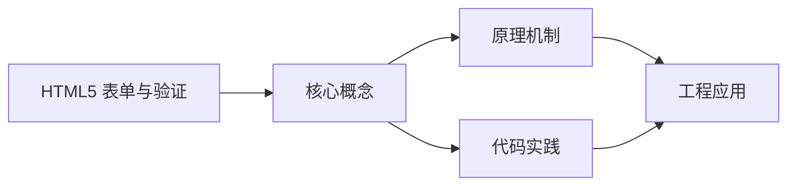
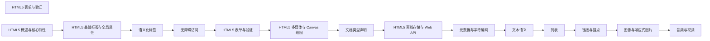

## 1. 学习目标（Bloom 分类）

本节按照布鲁姆教育目标分类学组织学习路径。本文主题为《HTML5 表单与验证》，属于 HTML5 模块，读者可以根据自身阶段选择阅读深度。

记忆层面：能够准确复述本文的核心概念、术语与基本语法或操作步骤，并能够在提问或检索时快速定位对应知识点。能够说出 HTML5 的核心概念、术语与标准写法。

理解层面：能够用自己的语言解释核心原理与工作机制，说明概念之间的因果关系，而不是机械记忆结论。能够解释 HTML5 的工作原理与设计动机。

应用层面：能够在真实项目或练习场景中运用本文知识解决具体问题，写出正确且可维护的实现。能够编写符合 HTML5 规范的完整实现。

分析层面：能够拆解复杂问题，比较本文主题与相邻概念的异同，识别边界条件与例外情况。能够分析 HTML5 与相邻方案的差异与边界。

评价层面：能够根据约束条件（性能、可读性、安全、成本）评价不同方案的优劣，做出有依据的技术决策。能够根据场景评价 HTML5 相关方案的优劣。

创造层面：能够把本文知识与其他模块知识组合，设计出新的解决方案或可复用的工程模式。能够组合 HTML5 与其他技术设计完整方案。

通过本节学习，读者应当能够把《HTML5 表单与验证》纳入自己的知识网络，并与 HTML5 模块的其他主题（语义化、表单、多媒体、Canvas）建立关联。

## 2. 历史动机与发展脉络

《HTML5 表单与验证》是 HTML5 领域的重要主题。要真正理解它，需要先了解它解决的问题与演进过程。

HTML 由 Tim Berners-Lee 于 1991 年创建，是 Web 的结构语言；HTML5 于 2014 年成为 W3C 推荐标准，WHATWG 维护的 Living Standard 是当前权威规范。
HTML5 引入语义化元素（header/nav/main/article/section/footer）、表单增强（date/range/placeholder）、多媒体（video/audio）、图形（canvas/SVG）与离线存储（localStorage/Web Worker）。
现代 HTML 强调“语义优先”：结构表达内容含义，样式与行为分离；可访问性（ARIA）与 SEO 都建立在正确语义之上。

回到本文主题：HTML5 表单与验证 的提出与成熟，正是上述技术背景下的必然产物。早期实现往往以简单可用为目标，随着工程规模扩大，社区逐渐沉淀出标准做法与最佳实践；理解这一脉络，可以帮助读者判断“为什么文档中的推荐写法是现在这个样子”，也能在遇到历史遗留代码时准确识别其设计年代与取舍。


## 3. 形式化定义与核心概念精讲

本节把《HTML5 表单与验证》涉及的核心概念以“定义 + 讲解”的形式展开。读者应把定义当作工具，把讲解当作理解路径；两者结合才能形成可迁移的知识。

文档结构：<!DOCTYPE html> 声明标准模式；html/head/body 层级固定；meta charset 必须在前 1024 字节内。
语义元素：header/footer 表示页眉页脚，nav 表示导航，main 表示主内容（每页唯一），article 表示独立内容，section 表示分区。
表单：input 类型决定键盘与校验（email/url/number），label 关联控件提升可访问性，required/pattern 提供原生校验。

### 3.1 原文章节逐一精讲

原文档把主题拆分为 15 个小节，下面按顺序给出每一节的导读讲解，随后保留原文细节供精读。

#### 原文精读（完整保留）

# 表单与验证 语法速查手册

> **符号约定**:`< >` 必填参数 | `[ ]` 可选参数

---

#### 1. 表单基础

表单是网页中用于收集用户输入的重要组件，HTML5 提供了丰富的表单元素和验证功能。

##### 1.1 表单结构

一个基本的表单结构包含以下元素：

```html
<form action="submit.php" method="post">
  <!-- 表单元素 -->
  <input type="text" name="username" placeholder="用户名" />
  <input type="password" name="password" placeholder="密码" />
  <button type="submit">提交</button>
</form>
```

**属性说明**：

- `action`: 指定表单提交的目标 URL
- `method`: 指定表单提交的 HTTP 方法（`get` 或 `post`）
- `enctype`: 指定表单数据的编码方式，用于文件上传时设置为 `multipart/form-data`
- `autocomplete`: 指定是否启用自动补全功能
- `novalidate`: 禁用浏览器的原生验证

#### 2. 输入类型

HTML5 引入了多种新的输入类型，用于更精确地收集用户输入并提供更好的用户体验。

##### 2.1 常用输入类型

| 输入类型         | 描述                                 | 示例                                                   |
| ---------------- | ------------------------------------ | ------------------------------------------------------ |
| `text`           | 文本输入框                           | `<input type="text" name="username">`                  |
| `password`       | 密码输入框                           | `<input type="password" name="password">`              |
| `email`          | 邮箱输入框，自动验证邮箱格式         | `<input type="email" name="email">`                    |
| `url`            | URL输入框，自动验证URL格式           | `<input type="url" name="website">`                    |
| `number`         | 数字输入框，支持数值验证             | `<input type="number" name="age" min="1" max="120">`   |
| `range`          | 滑动条，用于选择范围内的值           | `<input type="range" name="volume" min="0" max="100">` |
| `date`           | 日期选择器，选择年、月、日           | `<input type="date" name="birthday">`                  |
| `month`          | 月份选择器，选择年、月               | `<input type="month" name="expiry">`                   |
| `week`           | 周选择器，选择年、周                 | `<input type="week" name="week">`                      |
| `time`           | 时间选择器，选择时、分               | `<input type="time" name="meeting-time">`              |
| `datetime-local` | 日期时间选择器，选择本地日期和时间   | `<input type="datetime-local" name="event-time">`      |
| `color`          | 颜色选择器                           | `<input type="color" name="favorite-color">`           |
| `search`         | 搜索输入框，通常带有清除按钮         | `<input type="search" name="query">`                   |
| `tel`            | 电话输入框，在移动设备上显示数字键盘 | `<input type="tel" name="phone">`                      |
| `file`           | 文件上传输入框                       | `<input type="file" name="avatar">`                    |

##### 2.2 输入类型示例

```html
<!-- 邮箱输入 -->
<label for="email">邮箱:</label>
<input type="email" id="email" name="email" required />
<!-- 数字输入 -->
<label for="age">年龄:</label>
<input type="number" id="age" name="age" min="1" max="120" step="1" />
<!-- 日期选择 -->
<label for="birthday">生日:</label>
<input type="date" id="birthday" name="birthday" />
<!-- 颜色选择 -->
<label for="color">喜欢的颜色:</label>
<input type="color" id="color" name="color" value="#ff0000" />
<!-- 范围输入 -->
<label for="volume">音量:</label>
<input type="range" id="volume" name="volume" min="0" max="100" value="50" />
<span id="volume-value">50</span>
<script>
  // 实时显示范围输入的值
  const volumeInput = document.getElementById('volume');
  const volumeValue = document.getElementById('volume-value');
  volumeInput.addEventListener('input', function () {
    volumeValue.textContent = this.value;
  });
</script>
```

#### 3. 表单增强属性

HTML5 为表单元素提供了多种增强属性，用于改善用户体验和数据验证。

##### 3.1 常用表单属性

| 属性           | 描述                                 | 示例                                             |
| -------------- | ------------------------------------ | ------------------------------------------------ |
| `placeholder`  | 输入框的提示文本                     | `<input type="text" placeholder="请输入用户名">` |
| `required`     | 标记为必填项                         | `<input type="text" required>`                   |
| `autofocus`    | 页面加载时自动聚焦                   | `<input type="text" autofocus>`                  |
| `autocomplete` | 启用或禁用自动补全                   | `<input type="text" autocomplete="on">`          |
| `pattern`      | 使用正则表达式验证输入               | `<input type="text" pattern="[A-Za-z0-9]{6,}">`  |
| `min` / `max`  | 设置数值或日期的最小值和最大值       | `<input type="number" min="1" max="100">`        |
| `step`         | 设置数值输入的步长                   | `<input type="number" step="0.5">`               |
| `multiple`     | 允许选择多个值（用于文件上传或邮箱） | `<input type="file" multiple>`                   |
| `size`         | 设置输入框的宽度（以字符为单位）     | `<input type="text" size="30">`                  |
| `maxlength`    | 设置输入的最大字符数                 | `<input type="text" maxlength="50">`             |
| `minlength`    | 设置输入的最小字符数                 | `<input type="text" minlength="6">`              |
| `readonly`     | 设置输入框为只读                     | `<input type="text" readonly value="只读内容">`  |
| `disabled`     | 禁用输入框                           | `<input type="text" disabled>`                   |
| `value`        | 设置输入框的默认值                   | `<input type="text" value="默认值">`             |

##### 3.2 属性示例

```html
<!-- 带占位符的输入框 -->
<input type="text" placeholder="请输入用户名" />
<!-- 必填项 -->
<input type="email" required placeholder="请输入邮箱" />
<!-- 自动聚焦 -->
<input type="text" autofocus placeholder="自动聚焦到这里" />
<!-- 正则表达式验证 -->
<input type="text" pattern="^[0-9]{6}$" placeholder="请输入6位数字" />
<!-- 数值范围 -->
<input type="number" min="0" max="100" step="5" placeholder="0-100之间的数字" />
<!-- 多个文件上传 -->
<input type="file" multiple accept="image/*" />
```

#### 4. 表单元素

##### 4.1 基本表单元素

| 元素         | 描述           | 示例                                                               |
| ------------ | -------------- | ------------------------------------------------------------------ |
| `<form>`     | 表单容器       | `<form action="submit.php" method="post">...</form>`               |
| `<input>`    | 输入控件       | `<input type="text" name="username">`                              |
| `<label>`    | 输入控件的标签 | `<label for="username">用户名:</label>`                            |
| `<select>`   | 下拉选择框     | `<select name="country"><option value="cn">中国</option></select>` |
| `<textarea>` | 多行文本输入   | `<textarea name="message" rows="4" cols="50"></textarea>`          |
| `<button>`   | 按钮           | `<button type="submit">提交</button>`                              |
| `<fieldset>` | 表单分组       | `<fieldset><legend>个人信息</legend>...</fieldset>`                |
| `<legend>`   | 字段集的标题   | `<fieldset><legend>个人信息</legend>...</fieldset>`                |
| `<datalist>` | 输入建议列表   | `<input list="browsers"><datalist id="browsers">...</datalist>`    |
| `<output>`   | 计算结果输出   | `<output for="num1 num2">结果</output>`                            |

##### 4.2 表单元素示例

###### 4.2.1 下拉选择框

```html
<label for="country">国家:</label>
<select id="country" name="country">
  <option value="">请选择</option>
  <option value="cn">中国</option>
  <option value="us">美国</option>
  <option value="jp">日本</option>
  <option value="kr">韩国</option>
</select>
<!-- 多选下拉框 -->
<label for="hobbies">爱好:</label>
<select id="hobbies" name="hobbies" multiple size="3">
  <option value="reading">阅读</option>
  <option value="music">音乐</option>
  <option value="sports">运动</option>
  <option value="travel">旅行</option>
</select>
```

###### 4.2.2 文本域

```html
<label for="message">留言:</label>
<textarea id="message" name="message" rows="4" cols="50" placeholder="请输入您的留言"></textarea>
```

###### 4.2.3 按钮

```html
<!-- 提交按钮 -->
<button type="submit">提交</button>
<!-- 重置按钮 -->
<button type="reset">重置</button>
<!-- 普通按钮 -->
<button type="button" onclick="alert('点击了按钮')">点击我</button>
```

###### 4.2.4 字段集

```html
<fieldset>
  <legend>个人信息</legend>
  <div>
    <label for="name">姓名:</label>
    <input type="text" id="name" name="name" />
  </div>
  <div>
    <label for="age">年龄:</label>
    <input type="number" id="age" name="age" />
  </div>
</fieldset>
```

###### 4.2.5 输入建议列表

```html
<label for="browser">浏览器:</label>
<input type="text" id="browser" name="browser" list="browsers" />
<datalist id="browsers">
  <option value="Chrome"></option>
  <option value="Firefox"></option>
  <option value="Safari"></option>
  <option value="Edge"></option>
  <option value="Opera"></option>
</datalist>
```

#### 5. 客户端验证

HTML5 提供了强大的原生客户端验证功能，无需 JavaScript 即可实现基本的数据验证。

##### 5.1 内置验证类型

| 验证类型     | 描述                       | 示例                                               |
| ------------ | -------------------------- | -------------------------------------------------- |
| 必填验证     | 确保字段不为空             | `<input type="text" required>`                     |
| 邮箱验证     | 确保输入是有效的邮箱地址   | `<input type="email">`                             |
| URL验证      | 确保输入是有效的URL        | `<input type="url">`                               |
| 数值范围验证 | 确保数值在指定范围内       | `<input type="number" min="1" max="100">`          |
| 长度验证     | 确保输入的长度在指定范围内 | `<input type="text" minlength="6" maxlength="20">` |
| 模式验证     | 使用正则表达式验证输入     | `<input type="text" pattern="[A-Za-z0-9]{6,}">`    |

##### 5.2 验证示例

```html
<form>
  <div>
    <label for="username">用户名:</label>
    <input type="text" id="username" name="username" required minlength="6" maxlength="20" />
  </div>
  <div>
    <label for="email">邮箱:</label>
    <input type="email" id="email" name="email" required />
  </div>
  <div>
    <label for="password">密码:</label>
    <input
      type="password"
      id="password"
      name="password"
      required
      minlength="8"
      pattern="^(?=.*[a-z])(?=.*[A-Z])(?=.*\d).{8,}$"
    />
    <small>密码必须包含至少一个大写字母、一个小写字母和一个数字</small>
  </div>
  <div>
    <label for="age">年龄:</label>
    <input type="number" id="age" name="age" required min="18" max="120" />
  </div>
  <div>
    <label for="website">网站:</label>
    <input type="url" id="website" name="website" />
  </div>
  <button type="submit">提交</button>
</form>
```

##### 5.3 自定义验证消息

可以使用 JavaScript 自定义验证消息，提供更友好的错误提示。

```html
<form id="registrationForm">
  <div>
    <label for="username">用户名:</label>
    <input type="text" id="username" name="username" required minlength="6" />
    <div class="error" id="usernameError"></div>
  </div>
  <button type="submit">提交</button>
</form>
<script>
  const form = document.getElementById('registrationForm');
  const username = document.getElementById('username');
  const usernameError = document.getElementById('usernameError');
  username.addEventListener('input', function () {
    if (username.validity.valid) {
      usernameError.textContent = '';
      usernameError.className = 'error';
    } else {
      showError();
    }
  });
  form.addEventListener('submit', function (event) {
    if (!username.validity.valid) {
      showError();
      event.preventDefault();
    }
  });
  function showError() {
    if (username.validity.valueMissing) {
      usernameError.textContent = '请输入用户名';
    } else if (username.validity.tooShort) {
      usernameError.textContent = `用户名长度至少为 ${username.minLength} 个字符`;
    }
    usernameError.className = 'error active';
  }
</script>
<style>
  .error {
    color: red;
    font-size: 12px;
    margin-top: 5px;
    display: none;
  }
  .error.active {
    display: block;
  }
</style>
```

##### 5.4 表单验证 API

HTML5 提供了表单验证 API，用于在 JavaScript 中进行更复杂的验证。

| 属性/方法                    | 描述                         |
| ---------------------------- | ---------------------------- |
| `validity`                   | 返回元素的验证状态对象       |
| `validationMessage`          | 返回元素的验证错误消息       |
| `checkValidity()`            | 检查元素是否有效，返回布尔值 |
| `setCustomValidity(message)` | 设置自定义验证错误消息       |
| **示例**：                   |

```html
<form id="form">
  <div>
    <label for="password">密码:</label>
    <input type="password" id="password" name="password" required minlength="8" />
  </div>
  <div>
    <label for="confirmPassword">确认密码:</label>
    <input type="password" id="confirmPassword" name="confirmPassword" required />
  </div>
  <button type="submit">提交</button>
</form>
<script>
  const form = document.getElementById('form');
  const password = document.getElementById('password');
  const confirmPassword = document.getElementById('confirmPassword');
  form.addEventListener('submit', function (event) {
    if (password.value !== confirmPassword.value) {
      confirmPassword.setCustomValidity('两次输入的密码不一致');
      event.preventDefault();
    } else {
      confirmPassword.setCustomValidity('');
    }
  });
  confirmPassword.addEventListener('input', function () {
    if (password.value !== confirmPassword.value) {
      confirmPassword.setCustomValidity('两次输入的密码不一致');
    } else {
      confirmPassword.setCustomValidity('');
    }
  });
</script>
```

#### 6. 实际应用示例

##### 6.1 示例 1：用户注册表单

```html
<!DOCTYPE html>
<html lang="zh-CN">
  <head>
    <meta charset="UTF-8" />
    <meta name="viewport" content="width=device-width, initial-scale=1.0" />
    <title>用户注册</title>
    <style>
      body {
        font-family: Arial, sans-serif;
        line-height: 1.6;
        margin: 0;
        padding: 2rem;
        background-color: #f4f4f4;
      }
      .container {
        max-width: 600px;
        margin: 0 auto;
        background-color: white;
        padding: 2rem;
        border-radius: 5px;
        box-shadow: 0 2px 5px rgba(0, 0, 0, 0.1);
      }
      h1 {
        text-align: center;
        margin-bottom: 2rem;
      }
      .form-group {
        margin-bottom: 1.5rem;
      }
      label {
        display: block;
        margin-bottom: 0.5rem;
        font-weight: bold;
      }
      input[type='text'],
      input[type='email'],
      input[type='password'],
      select {
        width: 100%;
        padding: 0.8rem;
        border: 1px solid #ddd;
        border-radius: 4px;
        box-sizing: border-box;
      }
      input[type='checkbox'] {
        margin-right: 0.5rem;
      }
      button {
        width: 100%;
        padding: 1rem;
        background-color: #4caf50;
        color: white;
        border: none;
        border-radius: 4px;
        font-size: 1rem;
        cursor: pointer;
      }
      button:hover {
        background-color: #45a049;
      }
      .error {
        color: red;
        font-size: 0.8rem;
        margin-top: 0.5rem;
      }
      .success {
        color: green;
        font-size: 0.8rem;
        margin-top: 0.5rem;
      }
    </style>
  </head>
  <body>
    <div class="container">
      <h1>用户注册</h1>
      <form id="registrationForm">
        <div class="form-group">
          <label for="username">用户名:</label>
          <input type="text" id="username" name="username" required minlength="6" maxlength="20" />
          <div class="error" id="usernameError"></div>
        </div>
        <div class="form-group">
          <label for="email">邮箱:</label>
          <input type="email" id="email" name="email" required />
          <div class="error" id="emailError"></div>
        </div>
        <div class="form-group">
          <label for="password">密码:</label>
          <input
            type="password"
            id="password"
            name="password"
            required
            minlength="8"
            pattern="^(?=.*[a-z])(?=.*[A-Z])(?=.*\d).{8,}$"
          />
          <small>密码必须包含至少一个大写字母、一个小写字母和一个数字</small>
          <div class="error" id="passwordError"></div>
        </div>
        <div class="form-group">
          <label for="confirmPassword">确认密码:</label>
          <input type="password" id="confirmPassword" name="confirmPassword" required />
          <div class="error" id="confirmPasswordError"></div>
        </div>
        <div class="form-group">
          <label for="gender">性别:</label>
          <select id="gender" name="gender" required>
            <option value="">请选择</option>
            <option value="male">男</option>
            <option value="female">女</option>
            <option value="other">其他</option>
          </select>
        </div>
        <div class="form-group">
          <label for="birthday">生日:</label>
          <input type="date" id="birthday" name="birthday" required />
        </div>
        <div class="form-group">
          <label>
            <input type="checkbox" name="terms" required />
            我同意<a href="#">服务条款</a>和<a href="#">隐私政策</a>
          </label>
          <div class="error" id="termsError"></div>
        </div>
        <button type="submit">注册</button>
      </form>
    </div>
    <script>
      const form = document.getElementById('registrationForm');
      const username = document.getElementById('username');
      const email = document.getElementById('email');
      const password = document.getElementById('password');
      const confirmPassword = document.getElementById('confirmPassword');
      const terms = document.querySelector('input[name="terms"]');
      const usernameError = document.getElementById('usernameError');
      const emailError = document.getElementById('emailError');
      const passwordError = document.getElementById('passwordError');
      const confirmPasswordError = document.getElementById('confirmPasswordError');
      const termsError = document.getElementById('termsError');
      // 实时验证
      username.addEventListener('input', function () {
        validateField(username, usernameError, {
          valueMissing: '请输入用户名',
          tooShort: `用户名长度至少为 ${username.minLength} 个字符`,
          tooLong: `用户名长度不能超过 ${username.maxLength} 个字符`,
        });
      });
      email.addEventListener('input', function () {
        validateField(email, emailError, {
          valueMissing: '请输入邮箱',
          typeMismatch: '请输入有效的邮箱地址',
        });
      });
      password.addEventListener('input', function () {
        validateField(password, passwordError, {
          valueMissing: '请输入密码',
          tooShort: `密码长度至少为 ${password.minLength} 个字符`,
          patternMismatch: '密码必须包含至少一个大写字母、一个小写字母和一个数字',
        });
      });
      confirmPassword.addEventListener('input', function () {
        if (confirmPassword.value !== password.value) {
          confirmPasswordError.textContent = '两次输入的密码不一致';
          confirmPasswordError.className = 'error';
        } else {
          confirmPasswordError.textContent = '';
        }
      });
      terms.addEventListener('input', function () {
        if (!terms.checked) {
          termsError.textContent = '请同意服务条款和隐私政策';
        } else {
          termsError.textContent = '';
        }
      });
      // 表单提交验证
      form.addEventListener('submit', function (event) {
        let isValid = true;
        isValid &= validateField(username, usernameError, {
          valueMissing: '请输入用户名',
          tooShort: `用户名长度至少为 ${username.minLength} 个字符`,
          tooLong: `用户名长度不能超过 ${username.maxLength} 个字符`,
        });
        isValid &= validateField(email, emailError, {
          valueMissing: '请输入邮箱',
          typeMismatch: '请输入有效的邮箱地址',
        });
        isValid &= validateField(password, passwordError, {
          valueMissing: '请输入密码',
          tooShort: `密码长度至少为 ${password.minLength} 个字符`,
          patternMismatch: '密码必须包含至少一个大写字母、一个小写字母和一个数字',
        });
        if (confirmPassword.value !== password.value) {
          confirmPasswordError.textContent = '两次输入的密码不一致';
          confirmPasswordError.className = 'error';
          isValid = false;
        } else {
          confirmPasswordError.textContent = '';
        }
        if (!terms.checked) {
          termsError.textContent = '请同意服务条款和隐私政策';
          isValid = false;
        } else {
          termsError.textContent = '';
        }
        if (!isValid) {
          event.preventDefault();
        } else {
          // 模拟表单提交
          event.preventDefault();
          alert('注册成功！');
        }
      });
      // 验证函数
      function validateField(field, errorElement, messages) {
        if (field.validity.valid) {
          errorElement.textContent = '';
          return true;
        } else {
          for (const [key, message] of Object.entries(messages)) {
            if (field.validity[key]) {
              errorElement.textContent = message;
              break;
            }
          }
          return false;
        }
      }
    </script>
  </body>
</html>
```

##### 6.2 示例 2：联系表单

```html
<!DOCTYPE html>
<html lang="zh-CN">
  <head>
    <meta charset="UTF-8" />
    <meta name="viewport" content="width=device-width, initial-scale=1.0" />
    <title>联系我们</title>
    <style>
      body {
        font-family: Arial, sans-serif;
        line-height: 1.6;
        margin: 0;
        padding: 2rem;
        background-color: #f4f4f4;
      }
      .container {
        max-width: 600px;
        margin: 0 auto;
        background-color: white;
        padding: 2rem;
        border-radius: 5px;
        box-shadow: 0 2px 5px rgba(0, 0, 0, 0.1);
      }
      h1 {
        text-align: center;
        margin-bottom: 2rem;
      }
      .form-group {
        margin-bottom: 1.5rem;
      }
      label {
        display: block;
        margin-bottom: 0.5rem;
        font-weight: bold;
      }
      input[type='text'],
      input[type='email'],
      textarea {
        width: 100%;
        padding: 0.8rem;
        border: 1px solid #ddd;
        border-radius: 4px;
        box-sizing: border-box;
      }
      textarea {
        resize: vertical;
        min-height: 150px;
      }
      button {
        width: 100%;
        padding: 1rem;
        background-color: #008cba;
        color: white;
        border: none;
        border-radius: 4px;
        font-size: 1rem;
        cursor: pointer;
      }
      button:hover {
        background-color: #007b9e;
      }
      .error {
        color: red;
        font-size: 0.8rem;
        margin-top: 0.5rem;
      }
    </style>
  </head>
  <body>
    <div class="container">
      <h1>联系我们</h1>
      <form id="contactForm">
        <div class="form-group">
          <label for="name">姓名:</label>
          <input type="text" id="name" name="name" required />
          <div class="error" id="nameError"></div>
        </div>
        <div class="form-group">
          <label for="email">邮箱:</label>
          <input type="email" id="email" name="email" required />
          <div class="error" id="emailError"></div>
        </div>
        <div class="form-group">
          <label for="subject">主题:</label>
          <input type="text" id="subject" name="subject" required minlength="5" />
          <div class="error" id="subjectError"></div>
        </div>
        <div class="form-group">
          <label for="message">留言:</label>
          <textarea id="message" name="message" required minlength="10"></textarea>
          <div class="error" id="messageError"></div>
        </div>
        <button type="submit">发送留言</button>
      </form>
    </div>
    <script>
      const form = document.getElementById('contactForm');
      const name = document.getElementById('name');
      const email = document.getElementById('email');
      const subject = document.getElementById('subject');
      const message = document.getElementById('message');
      const nameError = document.getElementById('nameError');
      const emailError = document.getElementById('emailError');
      const subjectError = document.getElementById('subjectError');
      const messageError = document.getElementById('messageError');
      // 实时验证
      name.addEventListener('input', function () {
        if (name.validity.valid) {
          nameError.textContent = '';
        } else {
          nameError.textContent = '请输入您的姓名';
        }
      });
      email.addEventListener('input', function () {
        if (email.validity.valid) {
          emailError.textContent = '';
        } else if (email.validity.valueMissing) {
          emailError.textContent = '请输入您的邮箱';
        } else if (email.validity.typeMismatch) {
          emailError.textContent = '请输入有效的邮箱地址';
        }
      });
      subject.addEventListener('input', function () {
        if (subject.validity.valid) {
          subjectError.textContent = '';
        } else if (subject.validity.valueMissing) {
          subjectError.textContent = '请输入主题';
        } else if (subject.validity.tooShort) {
          subjectError.textContent = `主题长度至少为 ${subject.minLength} 个字符`;
        }
      });
      message.addEventListener('input', function () {
        if (message.validity.valid) {
          messageError.textContent = '';
        } else if (message.validity.valueMissing) {
          messageError.textContent = '请输入留言内容';
        } else if (message.validity.tooShort) {
          messageError.textContent = `留言长度至少为 ${message.minLength} 个字符`;
        }
      });
      // 表单提交验证
      form.addEventListener('submit', function (event) {
        let isValid = true;
        if (!name.validity.valid) {
          nameError.textContent = '请输入您的姓名';
          isValid = false;
        }
        if (!email.validity.valid) {
          if (email.validity.valueMissing) {
            emailError.textContent = '请输入您的邮箱';
          } else if (email.validity.typeMismatch) {
            emailError.textContent = '请输入有效的邮箱地址';
          }
          isValid = false;
        }
        if (!subject.validity.valid) {
          if (subject.validity.valueMissing) {
            subjectError.textContent = '请输入主题';
          } else if (subject.validity.tooShort) {
            subjectError.textContent = `主题长度至少为 ${subject.minLength} 个字符`;
          }
          isValid = false;
        }
        if (!message.validity.valid) {
          if (message.validity.valueMissing) {
            messageError.textContent = '请输入留言内容';
          } else if (message.validity.tooShort) {
            messageError.textContent = `留言长度至少为 ${message.minLength} 个字符`;
          }
          isValid = false;
        }
        if (!isValid) {
          event.preventDefault();
        } else {
          // 模拟表单提交
          event.preventDefault();
          alert('留言发送成功！我们会尽快回复您。');
          form.reset();
        }
      });
    </script>
  </body>
</html>
```

#### 7. 最佳实践

##### 7.1 表单设计最佳实践

- **清晰的标签**：为每个输入字段提供清晰、描述性的标签，使用 `<label>` 元素并与输入字段关联。
- **合理的布局**：使用适当的空间和分组来组织表单元素，提高可读性。
- **输入反馈**：提供实时的输入验证反馈，帮助用户及时纠正错误。
- **错误提示**：使用清晰、具体的错误提示信息，告诉用户如何修正错误。
- **响应式设计**：确保表单在不同设备上都能正常显示和使用。
- **可访问性**：确保表单对使用屏幕阅读器的用户友好，使用适当的 ARIA 属性。
- **性能优化**：对于大型表单，考虑使用异步验证和懒加载技术。

##### 7.2 验证最佳实践

- **客户端和服务器端验证**：虽然 HTML5 提供了强大的客户端验证，但仍需在服务器端进行验证，以防止恶意提交。
- **合理的验证规则**：设置合理的验证规则，不要过于严格或宽松。
- **友好的错误提示**：提供清晰、具体的错误提示，帮助用户理解并修正错误。
- **实时验证**：使用 JavaScript 实现实时验证，在用户输入过程中提供反馈。
- **自定义验证**：对于复杂的验证需求，使用 JavaScript 自定义验证逻辑。
- **测试**：在不同浏览器和设备上测试表单验证，确保兼容性。

##### 7.3 安全性最佳实践

- **防止 XSS 攻击**：对用户输入进行过滤和转义，防止跨站脚本攻击。
- **防止 CSRF 攻击**：使用 CSRF 令牌来防止跨站请求伪造攻击。
- **密码安全**：对于密码字段，使用 `type="password"` 并设置合理的密码强度要求。
- **敏感信息**：对于敏感信息，确保使用 HTTPS 传输。
- **文件上传安全**：对于文件上传，限制文件类型和大小，防止恶意文件上传。

##### 7.4 性能最佳实践

- **表单提交优化**：使用 AJAX 提交表单，提高用户体验。
- **数据验证优化**：使用防抖或节流技术，减少验证的频率。
- **资源加载**：优化表单相关的 CSS 和 JavaScript 文件，减少加载时间。
- **缓存**：对于频繁使用的表单数据，考虑使用本地存储进行缓存。

---

#### 延伸阅读

- [DOM 操作](javascript/dom-manipulation)
#### 表单容器

**form 元素**
`<form action="<URL>" [method="get|post"] [enctype="<编码>"] [autocomplete="on|off"] [novalidate] [target]></form>`
```html
<!-- 基础表单 -->
<form action="/submit" method="post">
  <input type="text" name="username" />
  <button type="submit">提交</button>
</form>

<!-- 文件上传表单 -->
<form action="/upload" method="post" enctype="multipart/form-data">
  <input type="file" name="avatar" />
</form>

<!-- 禁用原生验证 -->
<form action="/api" method="post" novalidate>...</form>
```

| 属性           | 作用                                |
| -------------- | ----------------------------------- |
| `action`       | 提交目标 URL                        |
| `method`       | HTTP 方法 get/post/dialog           |
| `enctype`      | 编码方式 application/x-www-form-urlencoded / multipart/form-data / text/plain |
| `autocomplete` | 自动补全 on/off                     |
| `novalidate`   | 禁用浏览器原生验证                  |
| `target`       | 提交后响应显示位置                  |
| `accept-charset` | 字符编码                          |

---

#### input 输入类型

**文本输入框**
`<input type="text" name="<名称>" [placeholder="<提示>"] [required] [maxlength] [minlength] />`
```html
<!-- 用户名输入框,必填 -->
<input type="text" name="username" placeholder="请输入用户名" required />
```

**密码输入框**
`<input type="password" name="<名称>" [required] [minlength] [pattern] />`
```html
<input type="password" name="password" required minlength="8" />
```

**邮箱输入框**
`<input type="email" name="<名称>" [multiple] [required] />`
```html
<!-- 支持多个邮箱(逗号分隔) -->
<input type="email" name="email" multiple required />
```

**URL 输入框**
`<input type="url" name="<名称>" [required] />`
```html
<input type="url" name="website" placeholder="https://" />
```

**数字输入框**
`<input type="number" name="<名称>" [min] [max] [step] [required] />`
```html
<input type="number" name="age" min="1" max="120" step="1" />
```

**滑块输入**
`<input type="range" name="<名称>" min="<最小>" max="<最大>" [step] [value] />`
```html
<input type="range" name="volume" min="0" max="100" value="50" />
```

**日期时间类型**

| 类型             | 描述               | 示例                                        |
| ---------------- | ------------------ | ------------------------------------------- |
| `date`           | 日期选择器         | `<input type="date" name="birthday">`       |
| `month`          | 月份选择器         | `<input type="month" name="expiry">`        |
| `week`           | 周选择器           | `<input type="week" name="week">`           |
| `time`           | 时间选择器         | `<input type="time" name="meeting">`        |
| `datetime-local` | 本地日期时间       | `<input type="datetime-local" name="event">`|

**其他类型**

| 类型      | 描述               | 示例                                       |
| --------- | ------------------ | ------------------------------------------ |
| `color`   | 颜色选择器         | `<input type="color" name="color">`        |
| `search`  | 搜索框(带清除)     | `<input type="search" name="q">`           |
| `tel`     | 电话(移动端数字键) | `<input type="tel" name="phone">`          |
| `file`    | 文件上传           | `<input type="file" name="avatar">`        |
| `hidden`  | 隐藏字段           | `<input type="hidden" name="id">`          |
| `checkbox`| 复选框             | `<input type="checkbox" name="agree">`     |
| `radio`   | 单选框             | `<input type="radio" name="gender">`       |
| `submit`  | 提交按钮           | `<input type="submit" value="提交">`       |
| `reset`   | 重置按钮           | `<input type="reset" value="重置">`        |
| `button`  | 普通按钮           | `<input type="button" value="点击">`       |
| `image`   | 图像提交按钮       | `<input type="image" src="btn.png">`       |

```html
<!-- 文件上传(限制类型和多选) -->
<input type="file" name="photos" accept="image/*" multiple />

<!-- 颜色选择器 -->
<input type="color" name="favorite" value="#ff0000" />

<!-- 复选框 -->
<label>
  <input type="checkbox" name="subscribe" checked /> 订阅 newsletter
</label>

<!-- 单选框组 -->
<label><input type="radio" name="gender" value="male" /> 男</label>
<label><input type="radio" name="gender" value="female" /> 女</label>
```

---

#### 表单增强属性

**input 通用属性**

| 属性           | 作用                       | 示例                                |
| -------------- | -------------------------- | ----------------------------------- |
| `placeholder`  | 占位提示文本               | `placeholder="请输入"`              |
| `required`     | 必填                        | `required`                          |
| `autofocus`    | 自动聚焦                   | `autofocus`                         |
| `autocomplete` | 自动补全                   | `autocomplete="off"`                |
| `pattern`      | 正则验证                   | `pattern="[0-9]{6}"`                |
| `min` / `max`  | 数值/日期范围              | `min="1" max="100"`                 |
| `step`         | 步长                       | `step="0.5"`                        |
| `multiple`     | 多选(email/file)           | `multiple`                          |
| `size`         | 宽度(字符数)               | `size="30"`                         |
| `maxlength`    | 最大字符数                 | `maxlength="50"`                    |
| `minlength`    | 最小字符数                 | `minlength="6"`                     |
| `readonly`     | 只读                       | `readonly`                          |
| `disabled`     | 禁用                       | `disabled`                          |
| `value`        | 默认值                     | `value="default"`                   |
| `list`         | 关联 datalist              | `list="browsers"`                   |
| `form`         | 指定所属表单              | `form="formId"`                     |

```html
<!-- 综合验证属性 -->
<input
  type="text"
  name="username"
  placeholder="请输入用户名"
  required
  minlength="6"
  maxlength="20"
  pattern="^[a-zA-Z0-9_]+$"
  autofocus
  autocomplete="username"
/>
```

---

#### 表单元素

**label 标签**
`<label for="<控件ID>">[文本]</label>` 或 `<label>[控件 + 文本]</label>`
```html
<!-- 显式关联 -->
<label for="username">用户名:</label>
<input type="text" id="username" name="username" />

<!-- 隐式关联 -->
<label>
  <input type="checkbox" name="agree" /> 我同意条款
</label>
```

**select 下拉框**
`<select name="<名称>" [multiple] [size="<可见行数>"] [required]>...<option>...</select>`
```html
<select name="country" required>
  <option value="">请选择</option>
  <option value="cn">中国</option>
  <option value="us" selected>美国</option>
</select>

<!-- 分组 -->
<select name="city">
  <optgroup label="华东">
    <option value="sh">上海</option>
    <option value="hz">杭州</option>
  </optgroup>
  <optgroup label="华北">
    <option value="bj">北京</option>
  </optgroup>
</select>

<!-- 多选 -->
<select name="hobbies" multiple size="4">
  <option value="reading">阅读</option>
  <option value="music">音乐</option>
</select>
```

**option 选项**
`<option value="<值>" [selected] [disabled]>[文本]</option>`

**textarea 多行文本**
`<textarea name="<名称>" [rows="<行数>"] [cols="<列数>"] [maxlength] [required] [placeholder]></textarea>`
```html
<textarea name="message" rows="4" cols="50" placeholder="请输入留言" maxlength="500"></textarea>
```

**button 按钮**
`<button type="submit|reset|button" [name] [value]>[内容]</button>`
```html
<button type="submit">提交</button>
<button type="reset">重置</button>
<button type="button" onclick="alert('hi')">点击</button>
```

**fieldset 与 legend 分组**
`<fieldset [disabled]><legend>[标题]</legend>...</fieldset>`
```html
<fieldset>
  <legend>个人信息</legend>
  <label>姓名:<input type="text" name="name" /></label>
  <label>年龄:<input type="number" name="age" /></label>
</fieldset>
```

**datalist 输入建议**
`<input list="<ID>" />` + `<datalist id="<ID>">...<option>...</datalist>`
```html
<input type="text" list="browsers" name="browser" />
<datalist id="browsers">
  <option value="Chrome"></option>
  <option value="Firefox"></option>
  <option value="Safari"></option>
</datalist>
```

**output 输出结果**
`<output for="<关联ID>" name="<名称>">[结果]</output>`
```html
<form oninput="result.value=parseInt(a.value)+parseInt(b.value)">
  <input type="number" id="a" value="10" />
  +<input type="number" id="b" value="20" />
  =<output name="result" for="a b">30</output>
</form>
```

---

#### 客户端验证

**内置验证类型**

| 验证类型     | 触发属性                    | 示例                              |
| ------------ | --------------------------- | --------------------------------- |
| 必填         | `required`                  | `<input required>`                |
| 邮箱格式     | `type="email"`              | `<input type="email">`            |
| URL 格式     | `type="url"`                | `<input type="url">`              |
| 数值范围     | `min` / `max`               | `<input min="1" max="100">`       |
| 长度限制     | `minlength` / `maxlength`   | `<input minlength="6">`           |
| 正则模式     | `pattern`                   | `<input pattern="[0-9]{6}">`      |
| 步长         | `step`                      | `<input step="0.5">`              |

**ValidityState API**
```javascript
const input = document.querySelector('input');

// 验证状态对象
const validity = input.validity;
console.log(validity.valid);           // 是否有效
console.log(validity.valueMissing);    // required 未填
console.log(validity.typeMismatch);    // 类型不匹配(email/url)
console.log(validity.patternMismatch); // pattern 不匹配
console.log(validity.tooShort);        // 长度小于 minlength
console.log(validity.tooLong);         // 长度大于 maxlength
console.log(validity.rangeUnderflow);  // 小于 min
console.log(validity.rangeOverflow);   // 大于 max
console.log(validity.stepMismatch);    // 步长不匹配
console.log(validity.badInput);        // 输入无效(如 number 中输入字母)
console.log(validity.customError);     // 自定义错误

// 验证方法
input.checkValidity();     // 触发验证,返回布尔值
input.reportValidity();    // 触发验证并显示错误
input.setCustomValidity('错误消息'); // 设置自定义错误
input.setCustomValidity('');         // 清除自定义错误

// 错误消息
console.log(input.validationMessage);
```

**自定义验证示例**
```javascript
// 密码确认验证
const password = document.getElementById('password');
const confirm = document.getElementById('confirmPassword');

confirm.addEventListener('input', () => {
  if (password.value !== confirm.value) {
    confirm.setCustomValidity('两次输入的密码不一致');
  } else {
    confirm.setCustomValidity('');
  }
});
```

---

#### 表单事件

**表单相关事件**
```javascript
const form = document.querySelector('form');
const input = document.querySelector('input');

// 表单提交
form.addEventListener('submit', (e) => {
  if (!form.checkValidity()) {
    e.preventDefault();
  }
});

// 输入变化(实时)
input.addEventListener('input', (e) => {
  console.log(e.target.value);
});

// 值变化(失焦后)
input.addEventListener('change', (e) => {
  console.log(e.target.value);
});

// 无效字段
input.addEventListener('invalid', (e) => {
  e.target.setCustomValidity('请填写此字段');
});

// 表单重置
form.addEventListener('reset', () => {
  console.log('表单已重置');
});
```

| 事件      | 触发时机                |
| --------- | ----------------------- |
| `submit`  | 表单提交                |
| `reset`   | 表单重置                |
| `input`   | 输入变化(实时)         |
| `change`  | 值变化且失焦            |
| `invalid` | 验证失败                |
| `focus`   | 获得焦点                |
| `blur`    | 失去焦点                |

---

#### FormData API

**表单数据收集**
```javascript
const form = document.querySelector('form');

// 从表单创建 FormData
const formData = new FormData(form);

// 读取字段
console.log(formData.get('username'));
console.log(formData.getAll('hobbies'));

// 添加字段
formData.append('key', 'value');
formData.append('file', fileInput.files[0]);

// 修改字段
formData.set('key', 'new-value');

// 删除字段
formData.delete('key');

// 遍历
for (const [key, value] of formData.entries()) {
  console.log(key, value);
}

// 通过 fetch 提交
fetch('/api/submit', {
  method: 'POST',
  body: formData
});
```


### 3.2 概念关系图

下面用 Mermaid 图表达本文核心概念之间的关系，帮助读者建立整体图景：



图中展示的是本文知识的结构化关系：核心概念是入口，原理机制解释“为什么”，代码实践演示“怎么做”，工程应用回答“何时用”。读者学习时可以把每个小节的内容挂接到对应节点上。

## 4. 理论推导与原理解析

本节深入《HTML5 表单与验证》背后的原理。理论部分不求面面俱到，而是聚焦“能解释现象、能指导实践”的关键推导。

文档结构：<!DOCTYPE html> 声明标准模式；html/head/body 层级固定；meta charset 必须在前 1024 字节内。
语义元素：header/footer 表示页眉页脚，nav 表示导航，main 表示主内容（每页唯一），article 表示独立内容，section 表示分区。
表单：input 类型决定键盘与校验（email/url/number），label 关联控件提升可访问性，required/pattern 提供原生校验。
媒体与图形：video/audio 支持多源（source）；canvas 是位图画布（JavaScript 绘制），SVG 是矢量结构（DOM 操作）。

需要强调的是，理论推导与工程实践之间存在翻译层：理论给出的是理想化模型与边界条件，工程代码则必须处理真实环境中的例外。读者在学习时应先掌握理论的“标准情形”，再通过陷阱章节了解“非标准情形”。

## 5. 代码示例与逐行讲解

本节把原文中的代码示例系统整理，并为每个示例补充用途说明与讲解。读者不应只浏览代码，而应逐段对照讲解理解设计意图。

### 5.1 示例：1.1 表单结构

该示例来自原文《1.1 表单结构》小节，用于演示HTML5 表单与验证相关操作。阅读时请先看代码结构，再看其后的讲解。

```html
<form action="submit.php" method="post">
  <!-- 表单元素 -->
  <input type="text" name="username" placeholder="用户名" />
  <input type="password" name="password" placeholder="密码" />
  <button type="submit">提交</button>
</form>
```

讲解：这段代码演示了本节核心知识点。代码中的关键操作可以归纳为三步：准备（定义或初始化）、执行（核心逻辑）、收尾（释放资源或返回结果）。实际项目中，这三步往往被封装为函数或类，以提升复用性与可测试性。

关键点分析：

该示例共 6 行有效代码，结构以数据或配置为主。阅读时应关注：数据字段的含义、配置项的作用，以及它们与运行行为的对应关系。

进阶思考路径：先尝试修改参数观察行为变化，再把示例中的模式迁移到自己的项目中；每次修改都记录预期与实测差异，这是把示例转化为能力的最快方式。

### 5.2 示例：2.2 输入类型示例

该示例来自原文《2.2 输入类型示例》小节，用于演示HTML5 表单与验证相关操作。阅读时请先看代码结构，再看其后的讲解。

```html
<!-- 邮箱输入 -->
<label for="email">邮箱:</label>
<input type="email" id="email" name="email" required />
<!-- 数字输入 -->
<label for="age">年龄:</label>
<input type="number" id="age" name="age" min="1" max="120" step="1" />
<!-- 日期选择 -->
<label for="birthday">生日:</label>
<input type="date" id="birthday" name="birthday" />
<!-- 颜色选择 -->
<label for="color">喜欢的颜色:</label>
<input type="color" id="color" name="color" value="#ff0000" />
<!-- 范围输入 -->
<label for="volume">音量:</label>
<input type="range" id="volume" name="volume" min="0" max="100" value="50" />
<span id="volume-value">50</span>
<script>
  // 实时显示范围输入的值
  const volumeInput = document.getElementById('volume');
  const volumeValue = document.getElementById('volume-value');
  volumeInput.addEventListener('input', function () {
    volumeValue.textContent = this.value;
  });
</script>
```

讲解：这段代码演示了本节核心知识点。代码中的关键操作可以归纳为三步：准备（定义或初始化）、执行（核心逻辑）、收尾（释放资源或返回结果）。实际项目中，这三步往往被封装为函数或类，以提升复用性与可测试性。

关键点分析：

该示例共 24 行有效代码，包含 1 类关键结构（function）。其中：

- 入口与初始化部分负责建立上下文，对应实际项目中的启动或装配逻辑；
- 核心逻辑部分体现本文主题的主要操作，是阅读时最需要对照讲解理解的部分；
- 输出或返回部分把结果交给调用方，注意其类型与边界条件。

进阶思考路径：先尝试修改参数观察行为变化，再把示例中的模式迁移到自己的项目中；每次修改都记录预期与实测差异，这是把示例转化为能力的最快方式。

### 5.3 示例：3.2 属性示例

该示例来自原文《3.2 属性示例》小节，用于演示HTML5 表单与验证相关操作。阅读时请先看代码结构，再看其后的讲解。

```html
<!-- 带占位符的输入框 -->
<input type="text" placeholder="请输入用户名" />
<!-- 必填项 -->
<input type="email" required placeholder="请输入邮箱" />
<!-- 自动聚焦 -->
<input type="text" autofocus placeholder="自动聚焦到这里" />
<!-- 正则表达式验证 -->
<input type="text" pattern="^[0-9]{6}$" placeholder="请输入6位数字" />
<!-- 数值范围 -->
<input type="number" min="0" max="100" step="5" placeholder="0-100之间的数字" />
<!-- 多个文件上传 -->
<input type="file" multiple accept="image/*" />
```

讲解：这段代码演示了本节核心知识点。代码中的关键操作可以归纳为三步：准备（定义或初始化）、执行（核心逻辑）、收尾（释放资源或返回结果）。实际项目中，这三步往往被封装为函数或类，以提升复用性与可测试性。

关键点分析：

该示例共 12 行有效代码，结构以数据或配置为主。阅读时应关注：数据字段的含义、配置项的作用，以及它们与运行行为的对应关系。

进阶思考路径：先尝试修改参数观察行为变化，再把示例中的模式迁移到自己的项目中；每次修改都记录预期与实测差异，这是把示例转化为能力的最快方式。

### 5.4 示例：4.2.1 下拉选择框

该示例来自原文《4.2.1 下拉选择框》小节，用于演示HTML5 表单与验证相关操作。阅读时请先看代码结构，再看其后的讲解。

```html
<label for="country">国家:</label>
<select id="country" name="country">
  <option value="">请选择</option>
  <option value="cn">中国</option>
  <option value="us">美国</option>
  <option value="jp">日本</option>
  <option value="kr">韩国</option>
</select>
<!-- 多选下拉框 -->
<label for="hobbies">爱好:</label>
<select id="hobbies" name="hobbies" multiple size="3">
  <option value="reading">阅读</option>
  <option value="music">音乐</option>
  <option value="sports">运动</option>
  <option value="travel">旅行</option>
</select>
```

讲解：这段代码演示了本节核心知识点。代码中的关键操作可以归纳为三步：准备（定义或初始化）、执行（核心逻辑）、收尾（释放资源或返回结果）。实际项目中，这三步往往被封装为函数或类，以提升复用性与可测试性。

关键点分析：

该示例共 16 行有效代码，结构以数据或配置为主。阅读时应关注：数据字段的含义、配置项的作用，以及它们与运行行为的对应关系。

进阶思考路径：先尝试修改参数观察行为变化，再把示例中的模式迁移到自己的项目中；每次修改都记录预期与实测差异，这是把示例转化为能力的最快方式。

### 5.5 示例：4.2.2 文本域

该示例来自原文《4.2.2 文本域》小节，用于演示HTML5 表单与验证相关操作。阅读时请先看代码结构，再看其后的讲解。

```html
<label for="message">留言:</label>
<textarea id="message" name="message" rows="4" cols="50" placeholder="请输入您的留言"></textarea>
```

讲解：这段代码演示了本节核心知识点。代码中的关键操作可以归纳为三步：准备（定义或初始化）、执行（核心逻辑）、收尾（释放资源或返回结果）。实际项目中，这三步往往被封装为函数或类，以提升复用性与可测试性。

关键点分析：

该示例共 2 行有效代码，结构以数据或配置为主。阅读时应关注：数据字段的含义、配置项的作用，以及它们与运行行为的对应关系。

进阶思考路径：先尝试修改参数观察行为变化，再把示例中的模式迁移到自己的项目中；每次修改都记录预期与实测差异，这是把示例转化为能力的最快方式。

### 5.6 示例：4.2.3 按钮

该示例来自原文《4.2.3 按钮》小节，用于演示HTML5 表单与验证相关操作。阅读时请先看代码结构，再看其后的讲解。

```html
<!-- 提交按钮 -->
<button type="submit">提交</button>
<!-- 重置按钮 -->
<button type="reset">重置</button>
<!-- 普通按钮 -->
<button type="button" onclick="alert('点击了按钮')">点击我</button>
```

讲解：这段代码演示了本节核心知识点。代码中的关键操作可以归纳为三步：准备（定义或初始化）、执行（核心逻辑）、收尾（释放资源或返回结果）。实际项目中，这三步往往被封装为函数或类，以提升复用性与可测试性。

关键点分析：

该示例共 6 行有效代码，结构以数据或配置为主。阅读时应关注：数据字段的含义、配置项的作用，以及它们与运行行为的对应关系。

进阶思考路径：先尝试修改参数观察行为变化，再把示例中的模式迁移到自己的项目中；每次修改都记录预期与实测差异，这是把示例转化为能力的最快方式。

### 5.7 示例：4.2.4 字段集

该示例来自原文《4.2.4 字段集》小节，用于演示HTML5 表单与验证相关操作。阅读时请先看代码结构，再看其后的讲解。

```html
<fieldset>
  <legend>个人信息</legend>
  <div>
    <label for="name">姓名:</label>
    <input type="text" id="name" name="name" />
  </div>
  <div>
    <label for="age">年龄:</label>
    <input type="number" id="age" name="age" />
  </div>
</fieldset>
```

讲解：这段代码演示了本节核心知识点。代码中的关键操作可以归纳为三步：准备（定义或初始化）、执行（核心逻辑）、收尾（释放资源或返回结果）。实际项目中，这三步往往被封装为函数或类，以提升复用性与可测试性。

关键点分析：

该示例共 11 行有效代码，结构以数据或配置为主。阅读时应关注：数据字段的含义、配置项的作用，以及它们与运行行为的对应关系。

进阶思考路径：先尝试修改参数观察行为变化，再把示例中的模式迁移到自己的项目中；每次修改都记录预期与实测差异，这是把示例转化为能力的最快方式。

### 5.8 示例：4.2.5 输入建议列表

该示例来自原文《4.2.5 输入建议列表》小节，用于演示HTML5 表单与验证相关操作。阅读时请先看代码结构，再看其后的讲解。

```html
<label for="browser">浏览器:</label>
<input type="text" id="browser" name="browser" list="browsers" />
<datalist id="browsers">
  <option value="Chrome"></option>
  <option value="Firefox"></option>
  <option value="Safari"></option>
  <option value="Edge"></option>
  <option value="Opera"></option>
</datalist>
```

讲解：这段代码演示了本节核心知识点。代码中的关键操作可以归纳为三步：准备（定义或初始化）、执行（核心逻辑）、收尾（释放资源或返回结果）。实际项目中，这三步往往被封装为函数或类，以提升复用性与可测试性。

关键点分析：

该示例共 9 行有效代码，结构以数据或配置为主。阅读时应关注：数据字段的含义、配置项的作用，以及它们与运行行为的对应关系。

进阶思考路径：先尝试修改参数观察行为变化，再把示例中的模式迁移到自己的项目中；每次修改都记录预期与实测差异，这是把示例转化为能力的最快方式。

### 5.9 示例：5.2 验证示例

该示例来自原文《5.2 验证示例》小节，用于演示HTML5 表单与验证相关操作。阅读时请先看代码结构，再看其后的讲解。

```html
<form>
  <div>
    <label for="username">用户名:</label>
    <input type="text" id="username" name="username" required minlength="6" maxlength="20" />
  </div>
  <div>
    <label for="email">邮箱:</label>
    <input type="email" id="email" name="email" required />
  </div>
  <div>
    <label for="password">密码:</label>
    <input
      type="password"
      id="password"
      name="password"
      required
      minlength="8"
      pattern="^(?=.*[a-z])(?=.*[A-Z])(?=.*\d).{8,}$"
    />
    <small>密码必须包含至少一个大写字母、一个小写字母和一个数字</small>
  </div>
  <div>
    <label for="age">年龄:</label>
    <input type="number" id="age" name="age" required min="18" max="120" />
  </div>
  <div>
    <label for="website">网站:</label>
    <input type="url" id="website" name="website" />
  </div>
  <button type="submit">提交</button>
</form>
```

讲解：这段代码演示了本节核心知识点。代码中的关键操作可以归纳为三步：准备（定义或初始化）、执行（核心逻辑）、收尾（释放资源或返回结果）。实际项目中，这三步往往被封装为函数或类，以提升复用性与可测试性。

关键点分析：

该示例共 31 行有效代码，结构以数据或配置为主。阅读时应关注：数据字段的含义、配置项的作用，以及它们与运行行为的对应关系。

进阶思考路径：先尝试修改参数观察行为变化，再把示例中的模式迁移到自己的项目中；每次修改都记录预期与实测差异，这是把示例转化为能力的最快方式。

### 5.10 示例：5.3 自定义验证消息

该示例来自原文《5.3 自定义验证消息》小节，用于演示HTML5 表单与验证相关操作。阅读时请先看代码结构，再看其后的讲解。

```html
<form id="registrationForm">
  <div>
    <label for="username">用户名:</label>
    <input type="text" id="username" name="username" required minlength="6" />
    <div class="error" id="usernameError"></div>
  </div>
  <button type="submit">提交</button>
</form>
<script>
  const form = document.getElementById('registrationForm');
  const username = document.getElementById('username');
  const usernameError = document.getElementById('usernameError');
  username.addEventListener('input', function () {
    if (username.validity.valid) {
      usernameError.textContent = '';
      usernameError.className = 'error';
    } else {
      showError();
    }
  });
  form.addEventListener('submit', function (event) {
    if (!username.validity.valid) {
      showError();
      event.preventDefault();
    }
  });
  function showError() {
    if (username.validity.valueMissing) {
      usernameError.textContent = '请输入用户名';
    } else if (username.validity.tooShort) {
      usernameError.textContent = `用户名长度至少为 ${username.minLength} 个字符`;
    }
    usernameError.className = 'error active';
  }
</script>
<style>
  .error {
    color: red;
    font-size: 12px;
    margin-top: 5px;
    display: none;
  }
  .error.active {
    display: block;
  }
</style>
```

讲解：这段代码演示了本节核心知识点。代码中的关键操作可以归纳为三步：准备（定义或初始化）、执行（核心逻辑）、收尾（释放资源或返回结果）。实际项目中，这三步往往被封装为函数或类，以提升复用性与可测试性。

关键点分析：

该示例共 46 行有效代码，包含 3 类关键结构（class、function、if）。其中：

- 入口与初始化部分负责建立上下文，对应实际项目中的启动或装配逻辑；
- 核心逻辑部分体现本文主题的主要操作，是阅读时最需要对照讲解理解的部分；
- 输出或返回部分把结果交给调用方，注意其类型与边界条件。

进阶思考路径：先尝试修改参数观察行为变化，再把示例中的模式迁移到自己的项目中；每次修改都记录预期与实测差异，这是把示例转化为能力的最快方式。

### 5.11 示例：5.4 表单验证 API

该示例来自原文《5.4 表单验证 API》小节，用于演示HTML5 表单与验证相关操作。阅读时请先看代码结构，再看其后的讲解。

```html
<form id="form">
  <div>
    <label for="password">密码:</label>
    <input type="password" id="password" name="password" required minlength="8" />
  </div>
  <div>
    <label for="confirmPassword">确认密码:</label>
    <input type="password" id="confirmPassword" name="confirmPassword" required />
  </div>
  <button type="submit">提交</button>
</form>
<script>
  const form = document.getElementById('form');
  const password = document.getElementById('password');
  const confirmPassword = document.getElementById('confirmPassword');
  form.addEventListener('submit', function (event) {
    if (password.value !== confirmPassword.value) {
      confirmPassword.setCustomValidity('两次输入的密码不一致');
      event.preventDefault();
    } else {
      confirmPassword.setCustomValidity('');
    }
  });
  confirmPassword.addEventListener('input', function () {
    if (password.value !== confirmPassword.value) {
      confirmPassword.setCustomValidity('两次输入的密码不一致');
    } else {
      confirmPassword.setCustomValidity('');
    }
  });
</script>
```

讲解：这段代码演示了本节核心知识点。代码中的关键操作可以归纳为三步：准备（定义或初始化）、执行（核心逻辑）、收尾（释放资源或返回结果）。实际项目中，这三步往往被封装为函数或类，以提升复用性与可测试性。

关键点分析：

该示例共 31 行有效代码，包含 2 类关键结构（function、if）。其中：

- 入口与初始化部分负责建立上下文，对应实际项目中的启动或装配逻辑；
- 核心逻辑部分体现本文主题的主要操作，是阅读时最需要对照讲解理解的部分；
- 输出或返回部分把结果交给调用方，注意其类型与边界条件。

进阶思考路径：先尝试修改参数观察行为变化，再把示例中的模式迁移到自己的项目中；每次修改都记录预期与实测差异，这是把示例转化为能力的最快方式。

### 5.12 示例：6.1 示例 1：用户注册表单

该示例来自原文《6.1 示例 1：用户注册表单》小节，用于演示HTML5 表单与验证相关操作。阅读时请先看代码结构，再看其后的讲解。

```html
<!DOCTYPE html>
<html lang="zh-CN">
  <head>
    <meta charset="UTF-8" />
    <meta name="viewport" content="width=device-width, initial-scale=1.0" />
    <title>用户注册</title>
    <style>
      body {
        font-family: Arial, sans-serif;
        line-height: 1.6;
        margin: 0;
        padding: 2rem;
        background-color: #f4f4f4;
      }
      .container {
        max-width: 600px;
        margin: 0 auto;
        background-color: white;
        padding: 2rem;
        border-radius: 5px;
        box-shadow: 0 2px 5px rgba(0, 0, 0, 0.1);
      }
      h1 {
        text-align: center;
        margin-bottom: 2rem;
      }
      .form-group {
        margin-bottom: 1.5rem;
      }
      label {
        display: block;
        margin-bottom: 0.5rem;
        font-weight: bold;
      }
      input[type='text'],
      input[type='email'],
      input[type='password'],
      select {
        width: 100%;
        padding: 0.8rem;
        border: 1px solid #ddd;
        border-radius: 4px;
        box-sizing: border-box;
      }
      input[type='checkbox'] {
        margin-right: 0.5rem;
      }
      button {
        width: 100%;
        padding: 1rem;
        background-color: #4caf50;
        color: white;
        border: none;
        border-radius: 4px;
        font-size: 1rem;
        cursor: pointer;
      }
      button:hover {
        background-color: #45a049;
      }
      .error {
        color: red;
        font-size: 0.8rem;
        margin-top: 0.5rem;
      }
      .success {
        color: green;
        font-size: 0.8rem;
        margin-top: 0.5rem;
      }
    </style>
  </head>
  <body>
    <div class="container">
      <h1>用户注册</h1>
      <form id="registrationForm">
        <div class="form-group">
          <label for="username">用户名:</label>
          <input type="text" id="username" name="username" required minlength="6" maxlength="20" />
          <div class="error" id="usernameError"></div>
        </div>
        <div class="form-group">
          <label for="email">邮箱:</label>
          <input type="email" id="email" name="email" required />
          <div class="error" id="emailError"></div>
        </div>
        <div class="form-group">
          <label for="password">密码:</label>
          <input
            type="password"
            id="password"
            name="password"
            required
            minlength="8"
            pattern="^(?=.*[a-z])(?=.*[A-Z])(?=.*\d).{8,}$"
          />
          <small>密码必须包含至少一个大写字母、一个小写字母和一个数字</small>
          <div class="error" id="passwordError"></div>
        </div>
        <div class="form-group">
          <label for="confirmPassword">确认密码:</label>
          <input type="password" id="confirmPassword" name="confirmPassword" required />
          <div class="error" id="confirmPasswordError"></div>
        </div>
        <div class="form-group">
          <label for="gender">性别:</label>
          <select id="gender" name="gender" required>
            <option value="">请选择</option>
            <option value="male">男</option>
            <option value="female">女</option>
            <option value="other">其他</option>
          </select>
        </div>
        <div class="form-group">
          <label for="birthday">生日:</label>
          <input type="date" id="birthday" name="birthday" required />
        </div>
        <div class="form-group">
          <label>
            <input type="checkbox" name="terms" required />
            我同意<a href="#">服务条款</a>和<a href="#">隐私政策</a>
          </label>
          <div class="error" id="termsError"></div>
        </div>
        <button type="submit">注册</button>
      </form>
    </div>
    <script>
      const form = document.getElementById('registrationForm');
      const username = document.getElementById('username');
      const email = document.getElementById('email');
      const password = document.getElementById('password');
      const confirmPassword = document.getElementById('confirmPassword');
      const terms = document.querySelector('input[name="terms"]');
      const usernameError = document.getElementById('usernameError');
      const emailError = document.getElementById('emailError');
      const passwordError = document.getElementById('passwordError');
      const confirmPasswordError = document.getElementById('confirmPasswordError');
      const termsError = document.getElementById('termsError');
      // 实时验证
      username.addEventListener('input', function () {
        validateField(username, usernameError, {
          valueMissing: '请输入用户名',
          tooShort: `用户名长度至少为 ${username.minLength} 个字符`,
          tooLong: `用户名长度不能超过 ${username.maxLength} 个字符`,
        });
      });
      email.addEventListener('input', function () {
        validateField(email, emailError, {
          valueMissing: '请输入邮箱',
          typeMismatch: '请输入有效的邮箱地址',
        });
      });
      password.addEventListener('input', function () {
        validateField(password, passwordError, {
          valueMissing: '请输入密码',
          tooShort: `密码长度至少为 ${password.minLength} 个字符`,
          patternMismatch: '密码必须包含至少一个大写字母、一个小写字母和一个数字',
        });
      });
      confirmPassword.addEventListener('input', function () {
        if (confirmPassword.value !== password.value) {
          confirmPasswordError.textContent = '两次输入的密码不一致';
          confirmPasswordError.className = 'error';
        } else {
          confirmPasswordError.textContent = '';
        }
      });
      terms.addEventListener('input', function () {
        if (!terms.checked) {
          termsError.textContent = '请同意服务条款和隐私政策';
        } else {
          termsError.textContent = '';
        }
      });
      // 表单提交验证
      form.addEventListener('submit', function (event) {
        let isValid = true;
        isValid &= validateField(username, usernameError, {
          valueMissing: '请输入用户名',
          tooShort: `用户名长度至少为 ${username.minLength} 个字符`,
          tooLong: `用户名长度不能超过 ${username.maxLength} 个字符`,
        });
        isValid &= validateField(email, emailError, {
          valueMissing: '请输入邮箱',
          typeMismatch: '请输入有效的邮箱地址',
        });
        isValid &= validateField(password, passwordError, {
          valueMissing: '请输入密码',
          tooShort: `密码长度至少为 ${password.minLength} 个字符`,
          patternMismatch: '密码必须包含至少一个大写字母、一个小写字母和一个数字',
        });
        if (confirmPassword.value !== password.value) {
          confirmPasswordError.textContent = '两次输入的密码不一致';
          confirmPasswordError.className = 'error';
          isValid = false;
        } else {
          confirmPasswordError.textContent = '';
        }
        if (!terms.checked) {
          termsError.textContent = '请同意服务条款和隐私政策';
          isValid = false;
        } else {
          termsError.textContent = '';
        }
        if (!isValid) {
          event.preventDefault();
        } else {
          // 模拟表单提交
          event.preventDefault();
          alert('注册成功！');
        }
      });
      // 验证函数
      function validateField(field, errorElement, messages) {
        if (field.validity.valid) {
          errorElement.textContent = '';
          return true;
        } else {
          for (const [key, message] of Object.entries(messages)) {
            if (field.validity[key]) {
              errorElement.textContent = message;
              break;
            }
          }
          return false;
        }
      }
    </script>
  </body>
</html>
```

讲解：这段代码演示了本节核心知识点。代码中的关键操作可以归纳为三步：准备（定义或初始化）、执行（核心逻辑）、收尾（释放资源或返回结果）。实际项目中，这三步往往被封装为函数或类，以提升复用性与可测试性。

关键点分析：

该示例共 231 行有效代码，包含 5 类关键结构（class、function、if、for、return）。其中：

- 入口与初始化部分负责建立上下文，对应实际项目中的启动或装配逻辑；
- 核心逻辑部分体现本文主题的主要操作，是阅读时最需要对照讲解理解的部分；
- 输出或返回部分把结果交给调用方，注意其类型与边界条件。

进阶思考路径：先尝试修改参数观察行为变化，再把示例中的模式迁移到自己的项目中；每次修改都记录预期与实测差异，这是把示例转化为能力的最快方式。

### 5.13 示例：6.2 示例 2：联系表单

该示例来自原文《6.2 示例 2：联系表单》小节，用于演示HTML5 表单与验证相关操作。阅读时请先看代码结构，再看其后的讲解。

```html
<!DOCTYPE html>
<html lang="zh-CN">
  <head>
    <meta charset="UTF-8" />
    <meta name="viewport" content="width=device-width, initial-scale=1.0" />
    <title>联系我们</title>
    <style>
      body {
        font-family: Arial, sans-serif;
        line-height: 1.6;
        margin: 0;
        padding: 2rem;
        background-color: #f4f4f4;
      }
      .container {
        max-width: 600px;
        margin: 0 auto;
        background-color: white;
        padding: 2rem;
        border-radius: 5px;
        box-shadow: 0 2px 5px rgba(0, 0, 0, 0.1);
      }
      h1 {
        text-align: center;
        margin-bottom: 2rem;
      }
      .form-group {
        margin-bottom: 1.5rem;
      }
      label {
        display: block;
        margin-bottom: 0.5rem;
        font-weight: bold;
      }
      input[type='text'],
      input[type='email'],
      textarea {
        width: 100%;
        padding: 0.8rem;
        border: 1px solid #ddd;
        border-radius: 4px;
        box-sizing: border-box;
      }
      textarea {
        resize: vertical;
        min-height: 150px;
      }
      button {
        width: 100%;
        padding: 1rem;
        background-color: #008cba;
        color: white;
        border: none;
        border-radius: 4px;
        font-size: 1rem;
        cursor: pointer;
      }
      button:hover {
        background-color: #007b9e;
      }
      .error {
        color: red;
        font-size: 0.8rem;
        margin-top: 0.5rem;
      }
    </style>
  </head>
  <body>
    <div class="container">
      <h1>联系我们</h1>
      <form id="contactForm">
        <div class="form-group">
          <label for="name">姓名:</label>
          <input type="text" id="name" name="name" required />
          <div class="error" id="nameError"></div>
        </div>
        <div class="form-group">
          <label for="email">邮箱:</label>
          <input type="email" id="email" name="email" required />
          <div class="error" id="emailError"></div>
        </div>
        <div class="form-group">
          <label for="subject">主题:</label>
          <input type="text" id="subject" name="subject" required minlength="5" />
          <div class="error" id="subjectError"></div>
        </div>
        <div class="form-group">
          <label for="message">留言:</label>
          <textarea id="message" name="message" required minlength="10"></textarea>
          <div class="error" id="messageError"></div>
        </div>
        <button type="submit">发送留言</button>
      </form>
    </div>
    <script>
      const form = document.getElementById('contactForm');
      const name = document.getElementById('name');
      const email = document.getElementById('email');
      const subject = document.getElementById('subject');
      const message = document.getElementById('message');
      const nameError = document.getElementById('nameError');
      const emailError = document.getElementById('emailError');
      const subjectError = document.getElementById('subjectError');
      const messageError = document.getElementById('messageError');
      // 实时验证
      name.addEventListener('input', function () {
        if (name.validity.valid) {
          nameError.textContent = '';
        } else {
          nameError.textContent = '请输入您的姓名';
        }
      });
      email.addEventListener('input', function () {
        if (email.validity.valid) {
          emailError.textContent = '';
        } else if (email.validity.valueMissing) {
          emailError.textContent = '请输入您的邮箱';
        } else if (email.validity.typeMismatch) {
          emailError.textContent = '请输入有效的邮箱地址';
        }
      });
      subject.addEventListener('input', function () {
        if (subject.validity.valid) {
          subjectError.textContent = '';
        } else if (subject.validity.valueMissing) {
          subjectError.textContent = '请输入主题';
        } else if (subject.validity.tooShort) {
          subjectError.textContent = `主题长度至少为 ${subject.minLength} 个字符`;
        }
      });
      message.addEventListener('input', function () {
        if (message.validity.valid) {
          messageError.textContent = '';
        } else if (message.validity.valueMissing) {
          messageError.textContent = '请输入留言内容';
        } else if (message.validity.tooShort) {
          messageError.textContent = `留言长度至少为 ${message.minLength} 个字符`;
        }
      });
      // 表单提交验证
      form.addEventListener('submit', function (event) {
        let isValid = true;
        if (!name.validity.valid) {
          nameError.textContent = '请输入您的姓名';
          isValid = false;
        }
        if (!email.validity.valid) {
          if (email.validity.valueMissing) {
            emailError.textContent = '请输入您的邮箱';
          } else if (email.validity.typeMismatch) {
            emailError.textContent = '请输入有效的邮箱地址';
          }
          isValid = false;
        }
        if (!subject.validity.valid) {
          if (subject.validity.valueMissing) {
            subjectError.textContent = '请输入主题';
          } else if (subject.validity.tooShort) {
            subjectError.textContent = `主题长度至少为 ${subject.minLength} 个字符`;
          }
          isValid = false;
        }
        if (!message.validity.valid) {
          if (message.validity.valueMissing) {
            messageError.textContent = '请输入留言内容';
          } else if (message.validity.tooShort) {
            messageError.textContent = `留言长度至少为 ${message.minLength} 个字符`;
          }
          isValid = false;
        }
        if (!isValid) {
          event.preventDefault();
        } else {
          // 模拟表单提交
          event.preventDefault();
          alert('留言发送成功！我们会尽快回复您。');
          form.reset();
        }
      });
    </script>
  </body>
</html>
```

讲解：这段代码演示了本节核心知识点。代码中的关键操作可以归纳为三步：准备（定义或初始化）、执行（核心逻辑）、收尾（释放资源或返回结果）。实际项目中，这三步往往被封装为函数或类，以提升复用性与可测试性。

关键点分析：

该示例共 182 行有效代码，包含 3 类关键结构（class、function、if）。其中：

- 入口与初始化部分负责建立上下文，对应实际项目中的启动或装配逻辑；
- 核心逻辑部分体现本文主题的主要操作，是阅读时最需要对照讲解理解的部分；
- 输出或返回部分把结果交给调用方，注意其类型与边界条件。

进阶思考路径：先尝试修改参数观察行为变化，再把示例中的模式迁移到自己的项目中；每次修改都记录预期与实测差异，这是把示例转化为能力的最快方式。

### 5.14 示例：表单容器

该示例来自原文《表单容器》小节，用于演示HTML5 表单与验证相关操作。阅读时请先看代码结构，再看其后的讲解。

```html
<!-- 基础表单 -->
<form action="/submit" method="post">
  <input type="text" name="username" />
  <button type="submit">提交</button>
</form>

<!-- 文件上传表单 -->
<form action="/upload" method="post" enctype="multipart/form-data">
  <input type="file" name="avatar" />
</form>

<!-- 禁用原生验证 -->
<form action="/api" method="post" novalidate>...</form>
```

讲解：这段代码演示了本节核心知识点。代码中的关键操作可以归纳为三步：准备（定义或初始化）、执行（核心逻辑）、收尾（释放资源或返回结果）。实际项目中，这三步往往被封装为函数或类，以提升复用性与可测试性。

关键点分析：

该示例共 11 行有效代码，结构以数据或配置为主。阅读时应关注：数据字段的含义、配置项的作用，以及它们与运行行为的对应关系。

进阶思考路径：先尝试修改参数观察行为变化，再把示例中的模式迁移到自己的项目中；每次修改都记录预期与实测差异，这是把示例转化为能力的最快方式。

### 5.15 示例：input 输入类型

该示例来自原文《input 输入类型》小节，用于演示HTML5 表单与验证相关操作。阅读时请先看代码结构，再看其后的讲解。

```html
<!-- 用户名输入框,必填 -->
<input type="text" name="username" placeholder="请输入用户名" required />
```

讲解：这段代码演示了本节核心知识点。代码中的关键操作可以归纳为三步：准备（定义或初始化）、执行（核心逻辑）、收尾（释放资源或返回结果）。实际项目中，这三步往往被封装为函数或类，以提升复用性与可测试性。

关键点分析：

该示例共 2 行有效代码，结构以数据或配置为主。阅读时应关注：数据字段的含义、配置项的作用，以及它们与运行行为的对应关系。

进阶思考路径：先尝试修改参数观察行为变化，再把示例中的模式迁移到自己的项目中；每次修改都记录预期与实测差异，这是把示例转化为能力的最快方式。

### 5.16 示例：input 输入类型

该示例来自原文《input 输入类型》小节，用于演示HTML5 表单与验证相关操作。阅读时请先看代码结构，再看其后的讲解。

```html
<input type="password" name="password" required minlength="8" />
```

讲解：这段代码演示了本节核心知识点。代码中的关键操作可以归纳为三步：准备（定义或初始化）、执行（核心逻辑）、收尾（释放资源或返回结果）。实际项目中，这三步往往被封装为函数或类，以提升复用性与可测试性。

关键点分析：

该示例共 1 行有效代码，结构以数据或配置为主。阅读时应关注：数据字段的含义、配置项的作用，以及它们与运行行为的对应关系。

进阶思考路径：先尝试修改参数观察行为变化，再把示例中的模式迁移到自己的项目中；每次修改都记录预期与实测差异，这是把示例转化为能力的最快方式。

### 5.17 示例：input 输入类型

该示例来自原文《input 输入类型》小节，用于演示HTML5 表单与验证相关操作。阅读时请先看代码结构，再看其后的讲解。

```html
<!-- 支持多个邮箱(逗号分隔) -->
<input type="email" name="email" multiple required />
```

讲解：这段代码演示了本节核心知识点。代码中的关键操作可以归纳为三步：准备（定义或初始化）、执行（核心逻辑）、收尾（释放资源或返回结果）。实际项目中，这三步往往被封装为函数或类，以提升复用性与可测试性。

关键点分析：

该示例共 2 行有效代码，结构以数据或配置为主。阅读时应关注：数据字段的含义、配置项的作用，以及它们与运行行为的对应关系。

进阶思考路径：先尝试修改参数观察行为变化，再把示例中的模式迁移到自己的项目中；每次修改都记录预期与实测差异，这是把示例转化为能力的最快方式。

### 5.18 示例：input 输入类型

该示例来自原文《input 输入类型》小节，用于演示HTML5 表单与验证相关操作。阅读时请先看代码结构，再看其后的讲解。

```html
<input type="url" name="website" placeholder="https://" />
```

讲解：这段代码演示了本节核心知识点。代码中的关键操作可以归纳为三步：准备（定义或初始化）、执行（核心逻辑）、收尾（释放资源或返回结果）。实际项目中，这三步往往被封装为函数或类，以提升复用性与可测试性。

关键点分析：

该示例共 1 行有效代码，结构以数据或配置为主。阅读时应关注：数据字段的含义、配置项的作用，以及它们与运行行为的对应关系。

进阶思考路径：先尝试修改参数观察行为变化，再把示例中的模式迁移到自己的项目中；每次修改都记录预期与实测差异，这是把示例转化为能力的最快方式。

### 5.19 示例：input 输入类型

该示例来自原文《input 输入类型》小节，用于演示HTML5 表单与验证相关操作。阅读时请先看代码结构，再看其后的讲解。

```html
<input type="number" name="age" min="1" max="120" step="1" />
```

讲解：这段代码演示了本节核心知识点。代码中的关键操作可以归纳为三步：准备（定义或初始化）、执行（核心逻辑）、收尾（释放资源或返回结果）。实际项目中，这三步往往被封装为函数或类，以提升复用性与可测试性。

关键点分析：

该示例共 1 行有效代码，结构以数据或配置为主。阅读时应关注：数据字段的含义、配置项的作用，以及它们与运行行为的对应关系。

进阶思考路径：先尝试修改参数观察行为变化，再把示例中的模式迁移到自己的项目中；每次修改都记录预期与实测差异，这是把示例转化为能力的最快方式。

### 5.20 示例：input 输入类型

该示例来自原文《input 输入类型》小节，用于演示HTML5 表单与验证相关操作。阅读时请先看代码结构，再看其后的讲解。

```html
<input type="range" name="volume" min="0" max="100" value="50" />
```

讲解：这段代码演示了本节核心知识点。代码中的关键操作可以归纳为三步：准备（定义或初始化）、执行（核心逻辑）、收尾（释放资源或返回结果）。实际项目中，这三步往往被封装为函数或类，以提升复用性与可测试性。

关键点分析：

该示例共 1 行有效代码，结构以数据或配置为主。阅读时应关注：数据字段的含义、配置项的作用，以及它们与运行行为的对应关系。

进阶思考路径：先尝试修改参数观察行为变化，再把示例中的模式迁移到自己的项目中；每次修改都记录预期与实测差异，这是把示例转化为能力的最快方式。

### 5.21 示例：input 输入类型

该示例来自原文《input 输入类型》小节，用于演示HTML5 表单与验证相关操作。阅读时请先看代码结构，再看其后的讲解。

```html
<!-- 文件上传(限制类型和多选) -->
<input type="file" name="photos" accept="image/*" multiple />

<!-- 颜色选择器 -->
<input type="color" name="favorite" value="#ff0000" />

<!-- 复选框 -->
<label>
  <input type="checkbox" name="subscribe" checked /> 订阅 newsletter
</label>

<!-- 单选框组 -->
<label><input type="radio" name="gender" value="male" /> 男</label>
<label><input type="radio" name="gender" value="female" /> 女</label>
```

讲解：这段代码演示了本节核心知识点。代码中的关键操作可以归纳为三步：准备（定义或初始化）、执行（核心逻辑）、收尾（释放资源或返回结果）。实际项目中，这三步往往被封装为函数或类，以提升复用性与可测试性。

关键点分析：

该示例共 11 行有效代码，结构以数据或配置为主。阅读时应关注：数据字段的含义、配置项的作用，以及它们与运行行为的对应关系。

进阶思考路径：先尝试修改参数观察行为变化，再把示例中的模式迁移到自己的项目中；每次修改都记录预期与实测差异，这是把示例转化为能力的最快方式。

### 5.22 示例：表单增强属性

该示例来自原文《表单增强属性》小节，用于演示HTML5 表单与验证相关操作。阅读时请先看代码结构，再看其后的讲解。

```html
<!-- 综合验证属性 -->
<input
  type="text"
  name="username"
  placeholder="请输入用户名"
  required
  minlength="6"
  maxlength="20"
  pattern="^[a-zA-Z0-9_]+$"
  autofocus
  autocomplete="username"
/>
```

讲解：这段代码演示了本节核心知识点。代码中的关键操作可以归纳为三步：准备（定义或初始化）、执行（核心逻辑）、收尾（释放资源或返回结果）。实际项目中，这三步往往被封装为函数或类，以提升复用性与可测试性。

关键点分析：

该示例共 12 行有效代码，结构以数据或配置为主。阅读时应关注：数据字段的含义、配置项的作用，以及它们与运行行为的对应关系。

进阶思考路径：先尝试修改参数观察行为变化，再把示例中的模式迁移到自己的项目中；每次修改都记录预期与实测差异，这是把示例转化为能力的最快方式。

### 5.23 示例：表单元素

该示例来自原文《表单元素》小节，用于演示HTML5 表单与验证相关操作。阅读时请先看代码结构，再看其后的讲解。

```html
<!-- 显式关联 -->
<label for="username">用户名:</label>
<input type="text" id="username" name="username" />

<!-- 隐式关联 -->
<label>
  <input type="checkbox" name="agree" /> 我同意条款
</label>
```

讲解：这段代码演示了本节核心知识点。代码中的关键操作可以归纳为三步：准备（定义或初始化）、执行（核心逻辑）、收尾（释放资源或返回结果）。实际项目中，这三步往往被封装为函数或类，以提升复用性与可测试性。

关键点分析：

该示例共 7 行有效代码，结构以数据或配置为主。阅读时应关注：数据字段的含义、配置项的作用，以及它们与运行行为的对应关系。

进阶思考路径：先尝试修改参数观察行为变化，再把示例中的模式迁移到自己的项目中；每次修改都记录预期与实测差异，这是把示例转化为能力的最快方式。

### 5.24 示例：表单元素

该示例来自原文《表单元素》小节，用于演示HTML5 表单与验证相关操作。阅读时请先看代码结构，再看其后的讲解。

```html
<select name="country" required>
  <option value="">请选择</option>
  <option value="cn">中国</option>
  <option value="us" selected>美国</option>
</select>

<!-- 分组 -->
<select name="city">
  <optgroup label="华东">
    <option value="sh">上海</option>
    <option value="hz">杭州</option>
  </optgroup>
  <optgroup label="华北">
    <option value="bj">北京</option>
  </optgroup>
</select>

<!-- 多选 -->
<select name="hobbies" multiple size="4">
  <option value="reading">阅读</option>
  <option value="music">音乐</option>
</select>
```

讲解：这段代码演示了本节核心知识点。代码中的关键操作可以归纳为三步：准备（定义或初始化）、执行（核心逻辑）、收尾（释放资源或返回结果）。实际项目中，这三步往往被封装为函数或类，以提升复用性与可测试性。

关键点分析：

该示例共 20 行有效代码，结构以数据或配置为主。阅读时应关注：数据字段的含义、配置项的作用，以及它们与运行行为的对应关系。

进阶思考路径：先尝试修改参数观察行为变化，再把示例中的模式迁移到自己的项目中；每次修改都记录预期与实测差异，这是把示例转化为能力的最快方式。

### 5.25 示例：表单元素

该示例来自原文《表单元素》小节，用于演示HTML5 表单与验证相关操作。阅读时请先看代码结构，再看其后的讲解。

```html
<textarea name="message" rows="4" cols="50" placeholder="请输入留言" maxlength="500"></textarea>
```

讲解：这段代码演示了本节核心知识点。代码中的关键操作可以归纳为三步：准备（定义或初始化）、执行（核心逻辑）、收尾（释放资源或返回结果）。实际项目中，这三步往往被封装为函数或类，以提升复用性与可测试性。

关键点分析：

该示例共 1 行有效代码，结构以数据或配置为主。阅读时应关注：数据字段的含义、配置项的作用，以及它们与运行行为的对应关系。

进阶思考路径：先尝试修改参数观察行为变化，再把示例中的模式迁移到自己的项目中；每次修改都记录预期与实测差异，这是把示例转化为能力的最快方式。

### 5.26 示例：表单元素

该示例来自原文《表单元素》小节，用于演示HTML5 表单与验证相关操作。阅读时请先看代码结构，再看其后的讲解。

```html
<button type="submit">提交</button>
<button type="reset">重置</button>
<button type="button" onclick="alert('hi')">点击</button>
```

讲解：这段代码演示了本节核心知识点。代码中的关键操作可以归纳为三步：准备（定义或初始化）、执行（核心逻辑）、收尾（释放资源或返回结果）。实际项目中，这三步往往被封装为函数或类，以提升复用性与可测试性。

关键点分析：

该示例共 3 行有效代码，结构以数据或配置为主。阅读时应关注：数据字段的含义、配置项的作用，以及它们与运行行为的对应关系。

进阶思考路径：先尝试修改参数观察行为变化，再把示例中的模式迁移到自己的项目中；每次修改都记录预期与实测差异，这是把示例转化为能力的最快方式。

### 5.27 示例：表单元素

该示例来自原文《表单元素》小节，用于演示HTML5 表单与验证相关操作。阅读时请先看代码结构，再看其后的讲解。

```html
<fieldset>
  <legend>个人信息</legend>
  <label>姓名:<input type="text" name="name" /></label>
  <label>年龄:<input type="number" name="age" /></label>
</fieldset>
```

讲解：这段代码演示了本节核心知识点。代码中的关键操作可以归纳为三步：准备（定义或初始化）、执行（核心逻辑）、收尾（释放资源或返回结果）。实际项目中，这三步往往被封装为函数或类，以提升复用性与可测试性。

关键点分析：

该示例共 5 行有效代码，结构以数据或配置为主。阅读时应关注：数据字段的含义、配置项的作用，以及它们与运行行为的对应关系。

进阶思考路径：先尝试修改参数观察行为变化，再把示例中的模式迁移到自己的项目中；每次修改都记录预期与实测差异，这是把示例转化为能力的最快方式。

### 5.28 示例：表单元素

该示例来自原文《表单元素》小节，用于演示HTML5 表单与验证相关操作。阅读时请先看代码结构，再看其后的讲解。

```html
<input type="text" list="browsers" name="browser" />
<datalist id="browsers">
  <option value="Chrome"></option>
  <option value="Firefox"></option>
  <option value="Safari"></option>
</datalist>
```

讲解：这段代码演示了本节核心知识点。代码中的关键操作可以归纳为三步：准备（定义或初始化）、执行（核心逻辑）、收尾（释放资源或返回结果）。实际项目中，这三步往往被封装为函数或类，以提升复用性与可测试性。

关键点分析：

该示例共 6 行有效代码，结构以数据或配置为主。阅读时应关注：数据字段的含义、配置项的作用，以及它们与运行行为的对应关系。

进阶思考路径：先尝试修改参数观察行为变化，再把示例中的模式迁移到自己的项目中；每次修改都记录预期与实测差异，这是把示例转化为能力的最快方式。

### 5.29 示例：表单元素

该示例来自原文《表单元素》小节，用于演示HTML5 表单与验证相关操作。阅读时请先看代码结构，再看其后的讲解。

```html
<form oninput="result.value=parseInt(a.value)+parseInt(b.value)">
  <input type="number" id="a" value="10" />
  +<input type="number" id="b" value="20" />
  =<output name="result" for="a b">30</output>
</form>
```

讲解：这段代码演示了本节核心知识点。代码中的关键操作可以归纳为三步：准备（定义或初始化）、执行（核心逻辑）、收尾（释放资源或返回结果）。实际项目中，这三步往往被封装为函数或类，以提升复用性与可测试性。

关键点分析：

该示例共 5 行有效代码，结构以数据或配置为主。阅读时应关注：数据字段的含义、配置项的作用，以及它们与运行行为的对应关系。

进阶思考路径：先尝试修改参数观察行为变化，再把示例中的模式迁移到自己的项目中；每次修改都记录预期与实测差异，这是把示例转化为能力的最快方式。

### 5.30 示例：客户端验证

该示例来自原文《客户端验证》小节，用于演示HTML5 表单与验证相关操作。阅读时请先看代码结构，再看其后的讲解。

```javascript
const input = document.querySelector('input');

// 验证状态对象
const validity = input.validity;
console.log(validity.valid);           // 是否有效
console.log(validity.valueMissing);    // required 未填
console.log(validity.typeMismatch);    // 类型不匹配(email/url)
console.log(validity.patternMismatch); // pattern 不匹配
console.log(validity.tooShort);        // 长度小于 minlength
console.log(validity.tooLong);         // 长度大于 maxlength
console.log(validity.rangeUnderflow);  // 小于 min
console.log(validity.rangeOverflow);   // 大于 max
console.log(validity.stepMismatch);    // 步长不匹配
console.log(validity.badInput);        // 输入无效(如 number 中输入字母)
console.log(validity.customError);     // 自定义错误

// 验证方法
input.checkValidity();     // 触发验证,返回布尔值
input.reportValidity();    // 触发验证并显示错误
input.setCustomValidity('错误消息'); // 设置自定义错误
input.setCustomValidity('');         // 清除自定义错误

// 错误消息
console.log(input.validationMessage);
```

讲解：这段代码演示了本节核心知识点。代码中的关键操作可以归纳为三步：准备（定义或初始化）、执行（核心逻辑）、收尾（释放资源或返回结果）。实际项目中，这三步往往被封装为函数或类，以提升复用性与可测试性。

关键点分析：

该示例共 21 行有效代码，结构以数据或配置为主。阅读时应关注：数据字段的含义、配置项的作用，以及它们与运行行为的对应关系。

进阶思考路径：先尝试修改参数观察行为变化，再把示例中的模式迁移到自己的项目中；每次修改都记录预期与实测差异，这是把示例转化为能力的最快方式。

### 5.31 示例：客户端验证

该示例来自原文《客户端验证》小节，用于演示HTML5 表单与验证相关操作。阅读时请先看代码结构，再看其后的讲解。

```javascript
// 密码确认验证
const password = document.getElementById('password');
const confirm = document.getElementById('confirmPassword');

confirm.addEventListener('input', () => {
  if (password.value !== confirm.value) {
    confirm.setCustomValidity('两次输入的密码不一致');
  } else {
    confirm.setCustomValidity('');
  }
});
```

讲解：这段代码演示了本节核心知识点。代码中的关键操作可以归纳为三步：准备（定义或初始化）、执行（核心逻辑）、收尾（释放资源或返回结果）。实际项目中，这三步往往被封装为函数或类，以提升复用性与可测试性。

关键点分析：

该示例共 10 行有效代码，包含 1 类关键结构（if）。其中：

- 入口与初始化部分负责建立上下文，对应实际项目中的启动或装配逻辑；
- 核心逻辑部分体现本文主题的主要操作，是阅读时最需要对照讲解理解的部分；
- 输出或返回部分把结果交给调用方，注意其类型与边界条件。

进阶思考路径：先尝试修改参数观察行为变化，再把示例中的模式迁移到自己的项目中；每次修改都记录预期与实测差异，这是把示例转化为能力的最快方式。

### 5.32 示例：表单事件

该示例来自原文《表单事件》小节，用于演示HTML5 表单与验证相关操作。阅读时请先看代码结构，再看其后的讲解。

```javascript
const form = document.querySelector('form');
const input = document.querySelector('input');

// 表单提交
form.addEventListener('submit', (e) => {
  if (!form.checkValidity()) {
    e.preventDefault();
  }
});

// 输入变化(实时)
input.addEventListener('input', (e) => {
  console.log(e.target.value);
});

// 值变化(失焦后)
input.addEventListener('change', (e) => {
  console.log(e.target.value);
});

// 无效字段
input.addEventListener('invalid', (e) => {
  e.target.setCustomValidity('请填写此字段');
});

// 表单重置
form.addEventListener('reset', () => {
  console.log('表单已重置');
});
```

讲解：这段代码演示了本节核心知识点。代码中的关键操作可以归纳为三步：准备（定义或初始化）、执行（核心逻辑）、收尾（释放资源或返回结果）。实际项目中，这三步往往被封装为函数或类，以提升复用性与可测试性。

关键点分析：

该示例共 24 行有效代码，包含 1 类关键结构（if）。其中：

- 入口与初始化部分负责建立上下文，对应实际项目中的启动或装配逻辑；
- 核心逻辑部分体现本文主题的主要操作，是阅读时最需要对照讲解理解的部分；
- 输出或返回部分把结果交给调用方，注意其类型与边界条件。

进阶思考路径：先尝试修改参数观察行为变化，再把示例中的模式迁移到自己的项目中；每次修改都记录预期与实测差异，这是把示例转化为能力的最快方式。

### 5.33 示例：FormData API

该示例来自原文《FormData API》小节，用于演示HTML5 表单与验证相关操作。阅读时请先看代码结构，再看其后的讲解。

```javascript
const form = document.querySelector('form');

// 从表单创建 FormData
const formData = new FormData(form);

// 读取字段
console.log(formData.get('username'));
console.log(formData.getAll('hobbies'));

// 添加字段
formData.append('key', 'value');
formData.append('file', fileInput.files[0]);

// 修改字段
formData.set('key', 'new-value');

// 删除字段
formData.delete('key');

// 遍历
for (const [key, value] of formData.entries()) {
  console.log(key, value);
}

// 通过 fetch 提交
fetch('/api/submit', {
  method: 'POST',
  body: formData
});
```

讲解：这段代码演示了本节核心知识点。代码中的关键操作可以归纳为三步：准备（定义或初始化）、执行（核心逻辑）、收尾（释放资源或返回结果）。实际项目中，这三步往往被封装为函数或类，以提升复用性与可测试性。

关键点分析：

该示例共 22 行有效代码，包含 1 类关键结构（for）。其中：

- 入口与初始化部分负责建立上下文，对应实际项目中的启动或装配逻辑；
- 核心逻辑部分体现本文主题的主要操作，是阅读时最需要对照讲解理解的部分；
- 输出或返回部分把结果交给调用方，注意其类型与边界条件。

进阶思考路径：先尝试修改参数观察行为变化，再把示例中的模式迁移到自己的项目中；每次修改都记录预期与实测差异，这是把示例转化为能力的最快方式。


综合以上示例，可以总结出本主题的代码实践要点：第一，先定义清晰的输入输出契约；第二，核心逻辑保持单一职责；第三，错误处理与边界条件不可省略；第四，命名与注释表达意图而非复述代码。

## 6. 对比分析

对比是理解《HTML5 表单与验证》定位的最快路径。下面从多个维度与相邻方案进行对比。

HTML5 与 XHTML：HTML5 容错性强、语法宽松；XHTML 严格 XML 语法，已基本退出。
语义元素与 div+class：语义元素免费获得可访问性与 SEO；class 命名方案只是风格。
canvas 与 SVG：canvas 适合像素级绘制（游戏、图像处理），SVG 适合矢量图形与交互（图表、图标）。

对比的目的不是分出绝对优劣，而是建立选择依据：不同约束条件下，最优解不同。读者应把每个对比维度转化为决策检查清单。

## 7. 常见陷阱与最佳实践

本节整理该主题的高频错误与推荐做法。每个陷阱先描述现象，再解释原因，最后给出最佳实践。

### 7.1 div 滥用

全部用 div 导致语义缺失。优先语义元素，div 仅作无语义容器。

深入讲解：该问题之所以被归类为“常见陷阱”，是因为它在初学者的代码中反复出现，而且往往不在第一时间暴露——错误通常隐藏在特定数据或特定时序下。

从成因上看，div 滥用 一般源于对 HTML5 某个机制的理解偏差：要么误用了默认行为，要么忽略了边界条件，要么把其他语言的思维惯性带了过来。

从影响上看，div 滥用 轻则产生错误结果，重则导致资源泄漏、数据损坏或安全事故；这也是为什么工程评审中会把它列为检查项。

从修复策略上看，处理div 滥用的正确顺序是：先复现（构造最小用例），再定位（确认机制层面的根因），最后修复并补充回归测试。跳过复现直接改代码，往往治标不治本。

### 7.2 img 缺 alt

图片无法访问时无替代文本。alt 描述内容，装饰图用空 alt。

深入讲解：该问题之所以被归类为“常见陷阱”，是因为它在初学者的代码中反复出现，而且往往不在第一时间暴露——错误通常隐藏在特定数据或特定时序下。

从成因上看，img 缺 alt 一般源于对 HTML5 某个机制的理解偏差：要么误用了默认行为，要么忽略了边界条件，要么把其他语言的思维惯性带了过来。

从影响上看，img 缺 alt 轻则产生错误结果，重则导致资源泄漏、数据损坏或安全事故；这也是为什么工程评审中会把它列为检查项。

从修复策略上看，处理img 缺 alt的正确顺序是：先复现（构造最小用例），再定位（确认机制层面的根因），最后修复并补充回归测试。跳过复现直接改代码，往往治标不治本。

### 7.3 标题层级跳变

h1 直接到 h3 破坏文档大纲。按层级使用标题。

深入讲解：该问题之所以被归类为“常见陷阱”，是因为它在初学者的代码中反复出现，而且往往不在第一时间暴露——错误通常隐藏在特定数据或特定时序下。

从成因上看，标题层级跳变 一般源于对 HTML5 某个机制的理解偏差：要么误用了默认行为，要么忽略了边界条件，要么把其他语言的思维惯性带了过来。

从影响上看，标题层级跳变 轻则产生错误结果，重则导致资源泄漏、数据损坏或安全事故；这也是为什么工程评审中会把它列为检查项。

从修复策略上看，处理标题层级跳变的正确顺序是：先复现（构造最小用例），再定位（确认机制层面的根因），最后修复并补充回归测试。跳过复现直接改代码，往往治标不治本。

### 7.4 按钮用 a 标签

动作语义错误。导航用 a，动作用 button。

深入讲解：该问题之所以被归类为“常见陷阱”，是因为它在初学者的代码中反复出现，而且往往不在第一时间暴露——错误通常隐藏在特定数据或特定时序下。

从成因上看，按钮用 a 标签 一般源于对 HTML5 某个机制的理解偏差：要么误用了默认行为，要么忽略了边界条件，要么把其他语言的思维惯性带了过来。

从影响上看，按钮用 a 标签 轻则产生错误结果，重则导致资源泄漏、数据损坏或安全事故；这也是为什么工程评审中会把它列为检查项。

从修复策略上看，处理按钮用 a 标签的正确顺序是：先复现（构造最小用例），再定位（确认机制层面的根因），最后修复并补充回归测试。跳过复现直接改代码，往往治标不治本。

### 7.5 表单无 label

辅助技术无法识别控件。每个输入关联 label。

深入讲解：该问题之所以被归类为“常见陷阱”，是因为它在初学者的代码中反复出现，而且往往不在第一时间暴露——错误通常隐藏在特定数据或特定时序下。

从成因上看，表单无 label 一般源于对 HTML5 某个机制的理解偏差：要么误用了默认行为，要么忽略了边界条件，要么把其他语言的思维惯性带了过来。

从影响上看，表单无 label 轻则产生错误结果，重则导致资源泄漏、数据损坏或安全事故；这也是为什么工程评审中会把它列为检查项。

从修复策略上看，处理表单无 label的正确顺序是：先复现（构造最小用例），再定位（确认机制层面的根因），最后修复并补充回归测试。跳过复现直接改代码，往往治标不治本。

### 7.6 脚本阻塞渲染

同步脚本放 body 底部或用 defer。

深入讲解：该问题之所以被归类为“常见陷阱”，是因为它在初学者的代码中反复出现，而且往往不在第一时间暴露——错误通常隐藏在特定数据或特定时序下。

从成因上看，脚本阻塞渲染 一般源于对 HTML5 某个机制的理解偏差：要么误用了默认行为，要么忽略了边界条件，要么把其他语言的思维惯性带了过来。

从影响上看，脚本阻塞渲染 轻则产生错误结果，重则导致资源泄漏、数据损坏或安全事故；这也是为什么工程评审中会把它列为检查项。

从修复策略上看，处理脚本阻塞渲染的正确顺序是：先复现（构造最小用例），再定位（确认机制层面的根因），最后修复并补充回归测试。跳过复现直接改代码，往往治标不治本。

### 7.7 内联样式与事件

内联 style/onclick 破坏分离。使用 class 与 addEventListener。

深入讲解：该问题之所以被归类为“常见陷阱”，是因为它在初学者的代码中反复出现，而且往往不在第一时间暴露——错误通常隐藏在特定数据或特定时序下。

从成因上看，内联样式与事件 一般源于对 HTML5 某个机制的理解偏差：要么误用了默认行为，要么忽略了边界条件，要么把其他语言的思维惯性带了过来。

从影响上看，内联样式与事件 轻则产生错误结果，重则导致资源泄漏、数据损坏或安全事故；这也是为什么工程评审中会把它列为检查项。

从修复策略上看，处理内联样式与事件的正确顺序是：先复现（构造最小用例），再定位（确认机制层面的根因），最后修复并补充回归测试。跳过复现直接改代码，往往治标不治本。

### 7.8 忽略 meta viewport

移动端布局异常。添加 viewport meta。

深入讲解：该问题之所以被归类为“常见陷阱”，是因为它在初学者的代码中反复出现，而且往往不在第一时间暴露——错误通常隐藏在特定数据或特定时序下。

从成因上看，忽略 meta viewport 一般源于对 HTML5 某个机制的理解偏差：要么误用了默认行为，要么忽略了边界条件，要么把其他语言的思维惯性带了过来。

从影响上看，忽略 meta viewport 轻则产生错误结果，重则导致资源泄漏、数据损坏或安全事故；这也是为什么工程评审中会把它列为检查项。

从修复策略上看，处理忽略 meta viewport的正确顺序是：先复现（构造最小用例），再定位（确认机制层面的根因），最后修复并补充回归测试。跳过复现直接改代码，往往治标不治本。

### 7.0 最佳实践总览

1. 结构、样式、行为三层分离。
2. 每个页面唯一 main，标题层级连贯。
3. 图片提供 alt 与尺寸（防 CLS）。
4. 表单控件全部关联 label，错误信息可编程关联。
5. 使用 W3C 校验器与 axe 检查。

把这些最佳实践固化为团队规范与代码评审检查项，是避免同类问题反复出现的关键。

## 8. 工程实践

本节把《HTML5 表单与验证》放入真实工程场景，给出可复用的模式与组织方法。

可访问性基线：语义元素 + ARIA（仅补充）+ 键盘可达 + 对比度达标（WCAG 2.1 AA）。
性能：图片懒加载（loading=lazy）、字体子集化、资源预加载。
SEO：语义标题、meta description、结构化数据（JSON-LD）。

### 8.1 工程实践的原则拆解

以上工程实践可以归纳为四条原则。第一，配置与代码分离：HTML5 项目中环境差异应通过配置注入，而不是散落在代码分支中；这保证同一份代码可以在开发、测试、生产环境一致运行。

第二，接口稳定优先：对外接口（函数签名、协议、数据格式）一旦被消费方依赖，变更成本极高；设计时应预留扩展点并保持向后兼容。

第三，可观测性内置：日志、指标与追踪应该在功能开发时同步设计，而不是故障发生后补救；没有观测手段的模块等于黑盒。

第四，变更可回滚：任何发布都应有对应的回滚方案；数据库迁移、配置变更与代码发布一样需要版本管理与逆向路径。

### 8.2 实践落地的检查清单

- [ ] 可访问性基线：对照本节描述，检查当前项目是否已经落实；未落实的项列入技术债并排期处理。
- [ ] 性能：对照本节描述，检查当前项目是否已经落实；未落实的项列入技术债并排期处理。
- [ ] SEO：对照本节描述，检查当前项目是否已经落实；未落实的项列入技术债并排期处理。

工程实践的共性原则：配置与代码分离、接口稳定优先、可观测性内置、变更可回滚。这些原则适用于本主题的所有实现。

## 9. 案例研究

本节通过一个完整案例把《HTML5 表单与验证》的知识串起来。案例按“需求分析、方案设计、实现、验证”四步展开。

需求：重构文档站点首页为语义化结构。
方案：header/nav/main/article/footer 布局，面包屑用 nav + ol，卡片用 article。
要点：标题层级从 h1 开始连续；所有图片 alt；表单字段 label 关联。
验证：W3C 校验零错误；axe 扫描无严重问题；移动端视口正常。

### 9.1 案例的扩展讨论

把案例中的方案放大到真实规模，需要额外考虑三个问题：

第一，规模：当数据量或并发量上升一个数量级时，原方案中的数据结构、缓存策略与任务调度是否仍然成立？通常需要引入分层与异步。

第二，团队：多人协作时，模块边界、接口契约与代码所有权必须明确；案例中的实现应拆分为可独立测试的单元，并配合文档说明设计意图。

第三，演进：上线后的需求变化不可避免；方案设计时应预留扩展点（配置化、插件化、事件化），并定期用真实指标验证假设。


案例研究的学习方法：先独立阅读需求，尝试在脑中形成方案，再对照实现与讲解，最后思考“如果约束变化（数据量、并发、团队规模），方案应如何调整”。

## 10. 知识要点总结与深入讲解

本节以讲解形式汇总全文要点，替代传统的习题与自测，读者不需要答题，只需跟随解释建立完整的认知框架。

关于《HTML5 表单与验证》的核心结论：

HTML 是内容的骨架，语义决定信息能否被机器与人共同理解。
HTML5 的特性围绕“结构、媒体、交互”三条线展开。
可访问性不是附加项，而是 HTML 的一部分。

原文档各小节的要点回顾：

- 1. 表单基础：该小节围绕HTML5 表单与验证展开具体细节，阅读时应关注其与核心结论的对应关系；每个小节都是核心结论在某一个侧面的展开。
- 2. 输入类型：该小节围绕HTML5 表单与验证展开具体细节，阅读时应关注其与核心结论的对应关系；每个小节都是核心结论在某一个侧面的展开。
- 3. 表单增强属性：该小节围绕HTML5 表单与验证展开具体细节，阅读时应关注其与核心结论的对应关系；每个小节都是核心结论在某一个侧面的展开。
- 4. 表单元素：该小节围绕HTML5 表单与验证展开具体细节，阅读时应关注其与核心结论的对应关系；每个小节都是核心结论在某一个侧面的展开。
- 5. 客户端验证：该小节围绕HTML5 表单与验证展开具体细节，阅读时应关注其与核心结论的对应关系；每个小节都是核心结论在某一个侧面的展开。
- 6. 实际应用示例：该小节围绕HTML5 表单与验证展开具体细节，阅读时应关注其与核心结论的对应关系；每个小节都是核心结论在某一个侧面的展开。
- 7. 最佳实践：该小节围绕HTML5 表单与验证展开具体细节，阅读时应关注其与核心结论的对应关系；每个小节都是核心结论在某一个侧面的展开。
- 延伸阅读：该小节围绕HTML5 表单与验证展开具体细节，阅读时应关注其与核心结论的对应关系；每个小节都是核心结论在某一个侧面的展开。
- 表单容器：该小节围绕HTML5 表单与验证展开具体细节，阅读时应关注其与核心结论的对应关系；每个小节都是核心结论在某一个侧面的展开。
- input 输入类型：该小节围绕HTML5 表单与验证展开具体细节，阅读时应关注其与核心结论的对应关系；每个小节都是核心结论在某一个侧面的展开。
- 表单增强属性：该小节围绕HTML5 表单与验证展开具体细节，阅读时应关注其与核心结论的对应关系；每个小节都是核心结论在某一个侧面的展开。
- 表单元素：该小节围绕HTML5 表单与验证展开具体细节，阅读时应关注其与核心结论的对应关系；每个小节都是核心结论在某一个侧面的展开。
- 客户端验证：该小节围绕HTML5 表单与验证展开具体细节，阅读时应关注其与核心结论的对应关系；每个小节都是核心结论在某一个侧面的展开。
- 表单事件：该小节围绕HTML5 表单与验证展开具体细节，阅读时应关注其与核心结论的对应关系；每个小节都是核心结论在某一个侧面的展开。
- FormData API：该小节围绕HTML5 表单与验证展开具体细节，阅读时应关注其与核心结论的对应关系；每个小节都是核心结论在某一个侧面的展开。

把以上要点与第 3-9 节的内容对照复习，即可完成对本文主题的闭环学习。

## 11. 参考文献


WHATWG HTML Living Standard：https://html.spec.whatwg.org/
MDN HTML 文档：https://developer.mozilla.org/zh-CN/docs/Web/HTML
W3C Markup Validation Service：https://validator.w3.org/
WebAIM 可访问性指南：https://webaim.org/

## 12. 延伸阅读


HTML 列表与链接精讲，见 006-html5/011-List 与 012-LinkageAnchor 文档。
CSS 样式与布局，见 007-css 模块。
JavaScript DOM 操作，见 008-javascript 模块。
尚硅谷 Bilibili 空间（https://space.bilibili.com/302417610 ）提供 HTML/CSS 课程。

## 14. 模块知识图谱与学习路径

本文属于 HTML5 模块。为了把《HTML5 表单与验证》放入完整的知识网络，下面列出本模块的全部主题并给出相互关联的导读。学习时建议按模块内顺序推进，并在每个文档中留意交叉引用。



上图为模块主题的推荐学习顺序示意图（仅展示前若干主题）。各主题之间存在三类关联：

第一，前置依赖关系：早期主题是后期主题的基础，例如环境与语法先行、进阶主题随后；

第二，横向并列关系：同一层级主题从不同角度覆盖模块能力，学习顺序可以按兴趣调整；

第三，工程组合关系：多个主题在真实项目中组合使用，例如配置、性能与安全主题往往出现在同一系统的不同层面。

### 14.1 模块主题速查表

| 文档 | 主题 | 与本文的关联 |
| --- | --- | --- |
| HTML5 概述与核心特性 | 001-HTML5OverviewCoreFeature | 本文的前置基础 |
| HTML5 基础标签与全局属性 | 002-HTML5BasicTagGlobalAttribute | 本文的前置基础 |
| 语义化标签 | 003-SemanticTag | 本文的并列主题 |
| 无障碍访问 | 004-Accessibility | 本文的并列主题 |
| HTML5 表单与验证 | 005-HTML5FormValidation | 本文自身 |
| HTML5 多媒体与 Canvas 绘图 | 006-HTML5MultimediaCanvasDrawing | 本文的并列主题 |
| 文档类型声明 | 007-DocTypeDeclaration | 本文的并列主题 |
| HTML5 离线存储与 Web API | 008-HTML5OfflineStorageWebAPI | 本文的并列主题 |
| 元数据与字符编码 | 009-MetadataCharacterEncoding | 本文的并列主题 |
| 文本语义 | 010-TextSemantic | 本文的并列主题 |
| 列表 | 011-List | 本文的并列主题 |
| 链接与锚点 | 012-LinkageAnchor | 本文的并列主题 |
| 图像与响应式图片 | 013-ImageResponsiveImage | 本文的并列主题 |
| 音频与视频 | 014-AudioVideo | 本文的并列主题 |
| SVG | 015-SVG | 本文的并列主题 |
| 嵌入式内容 | 016-EmbeddedContent | 本文的并列主题 |
| progress与meter | 017-ProgressMeter | 本文的并列主题 |
| Web Components 与 PWA 开发 | 018-WebComponentsPWADevelopment | 本文的并列主题 |
| 拖拽API | 019-DragAPI | 本文的并列主题 |
| 地理位置定位 | 020-Geolocation | 本文的并列主题 |
| Web-Workers | 021-WebWorkers | 本文的并列主题 |
| Service-Worker与PWA | 022-ServiceWorkerPWA | 本文的并列主题 |
| History-API | 023-HistoryAPI | 本文的并列主题 |
| WebSocket | 024-WebSocket | 本文的并列主题 |
| WebRTC | 025-WebRTC | 本文的并列主题 |
| 微数据与JSON-LD | 026-MicrodataJSONLD | 本文的并列主题 |
| 自定义数据属性 | 027-CustomDataAttribute | 本文的并列主题 |
| 跨文档通信 | 028-CrossDocumentCommunication | 本文的并列主题 |
| 视口配置与移动优先 | 029-ViewportConfigMobileFirst | 本文的并列主题 |
| HTML5 项目示例：交互式表单应用 | 030-HTML5ProjectExampleInteractiveFormApplication | 本文的综合应用 |

速查表的作用是让读者快速判断：哪些文档应在阅读本文前掌握（前置基础），哪些文档应在阅读本文后继续（延伸主题）。本模块的交叉引用体系即以此表为基础。

## 15. 术语表

下表整理《HTML5 表单与验证》及 HTML5 模块中出现的高频术语，给出简明释义。术语按字母序或逻辑序排列，供查阅。

| 术语 | 释义 |
| --- | --- |
| 文档结构 | <!DOCTYPE html> 声明标准模式；html/head/body 层级固定；meta charset 必须在前 1024 字节内。 |
| 语义元素 | header/footer 表示页眉页脚，nav 表示导航，main 表示主内容（每页唯一），article 表示独立内容，section 表示分区。 |
| 表单 | input 类型决定键盘与校验（email/url/number），label 关联控件提升可访问性，required/pattern 提供原生校验。 |
| 媒体与图形 | video/audio 支持多源（source）；canvas 是位图画布（JavaScript 绘制），SVG 是矢量结构（DOM 操作）。 |
| div 滥用（易错点） | 参见常见陷阱章节的详细讲解 |
| img 缺 alt（易错点） | 参见常见陷阱章节的详细讲解 |
| 标题层级跳变（易错点） | 参见常见陷阱章节的详细讲解 |
| 按钮用 a 标签（易错点） | 参见常见陷阱章节的详细讲解 |
| 表单无 label（易错点） | 参见常见陷阱章节的详细讲解 |
| 脚本阻塞渲染（易错点） | 参见常见陷阱章节的详细讲解 |

术语表与正文配合使用：先通读正文，遇到模糊术语回查本表；长期使用后术语会自然进入工作记忆。
