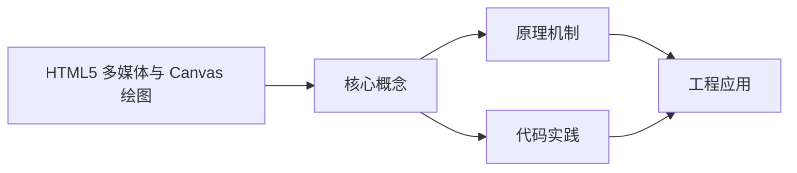
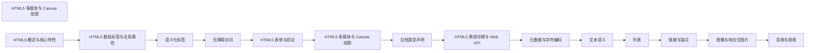

## 1. 学习目标（Bloom 分类）

本节按照布鲁姆教育目标分类学组织学习路径。本文主题为《HTML5 多媒体与 Canvas 绘图》，属于 HTML5 模块，读者可以根据自身阶段选择阅读深度。

记忆层面：能够准确复述本文的核心概念、术语与基本语法或操作步骤，并能够在提问或检索时快速定位对应知识点。能够说出 HTML5 的核心概念、术语与标准写法。

理解层面：能够用自己的语言解释核心原理与工作机制，说明概念之间的因果关系，而不是机械记忆结论。能够解释 HTML5 的工作原理与设计动机。

应用层面：能够在真实项目或练习场景中运用本文知识解决具体问题，写出正确且可维护的实现。能够编写符合 HTML5 规范的完整实现。

分析层面：能够拆解复杂问题，比较本文主题与相邻概念的异同，识别边界条件与例外情况。能够分析 HTML5 与相邻方案的差异与边界。

评价层面：能够根据约束条件（性能、可读性、安全、成本）评价不同方案的优劣，做出有依据的技术决策。能够根据场景评价 HTML5 相关方案的优劣。

创造层面：能够把本文知识与其他模块知识组合，设计出新的解决方案或可复用的工程模式。能够组合 HTML5 与其他技术设计完整方案。

通过本节学习，读者应当能够把《HTML5 多媒体与 Canvas 绘图》纳入自己的知识网络，并与 HTML5 模块的其他主题（语义化、表单、多媒体、Canvas）建立关联。

## 2. 历史动机与发展脉络

《HTML5 多媒体与 Canvas 绘图》是 HTML5 领域的重要主题。要真正理解它，需要先了解它解决的问题与演进过程。

HTML 由 Tim Berners-Lee 于 1991 年创建，是 Web 的结构语言；HTML5 于 2014 年成为 W3C 推荐标准，WHATWG 维护的 Living Standard 是当前权威规范。
HTML5 引入语义化元素（header/nav/main/article/section/footer）、表单增强（date/range/placeholder）、多媒体（video/audio）、图形（canvas/SVG）与离线存储（localStorage/Web Worker）。
现代 HTML 强调“语义优先”：结构表达内容含义，样式与行为分离；可访问性（ARIA）与 SEO 都建立在正确语义之上。

回到本文主题：HTML5 多媒体与 Canvas 绘图 的提出与成熟，正是上述技术背景下的必然产物。早期实现往往以简单可用为目标，随着工程规模扩大，社区逐渐沉淀出标准做法与最佳实践；理解这一脉络，可以帮助读者判断“为什么文档中的推荐写法是现在这个样子”，也能在遇到历史遗留代码时准确识别其设计年代与取舍。


## 3. 形式化定义与核心概念精讲

本节把《HTML5 多媒体与 Canvas 绘图》涉及的核心概念以“定义 + 讲解”的形式展开。读者应把定义当作工具，把讲解当作理解路径；两者结合才能形成可迁移的知识。

文档结构：<!DOCTYPE html> 声明标准模式；html/head/body 层级固定；meta charset 必须在前 1024 字节内。
语义元素：header/footer 表示页眉页脚，nav 表示导航，main 表示主内容（每页唯一），article 表示独立内容，section 表示分区。
表单：input 类型决定键盘与校验（email/url/number），label 关联控件提升可访问性，required/pattern 提供原生校验。

### 3.1 原文章节逐一精讲

原文档把主题拆分为 18 个小节，下面按顺序给出每一节的导读讲解，随后保留原文细节供精读。

#### 原文精读（完整保留）

# 多媒体与 Canvas 绘图 语法速查手册

> **符号约定**:`< >` 必填参数 | `[ ]` 可选参数

---

#### 1. 音视频支持

HTML5 提供了原生的音视频支持，不再需要依赖 Flash 插件，使网页能够直接播放音视频内容。

##### 1.1 视频播放

###### 1.1.1 基本用法

```html
<video width="640" height="360" controls poster="poster.jpg">
  <source src="movie.mp4" type="video/mp4" />
  <source src="movie.webm" type="video/webm" />
  您的浏览器不支持 HTML5 视频。
</video>
```

###### 1.1.2 常用属性

| 属性       | 描述                   | 示例                          |
| ---------- | ---------------------- | ----------------------------- |
| `controls` | 显示视频控制条         | `<video controls>`            |
| `autoplay` | 自动播放视频           | `<video autoplay>`            |
| `muted`    | 静音播放               | `<video muted>`               |
| `loop`     | 循环播放               | `<video loop>`                |
| `poster`   | 视频加载前显示的封面图 | `<video poster="poster.jpg">` |
| `preload`  | 预加载设置             | `<video preload="auto">`      |
| `width`    | 视频宽度               | `<video width="640">`         |
| `height`   | 视频高度               | `<video height="360">`        |

###### 1.1.3 视频控制 API

通过 JavaScript 可以控制视频的播放、暂停、音量等。

```html
<video id="myVideo" width="640" height="360" controls>
  <source src="movie.mp4" type="video/mp4" />
  您的浏览器不支持 HTML5 视频。
</video>
<div>
  <button onclick="playVideo()">播放</button>
  <button onclick="pauseVideo()">暂停</button>
  <button onclick="muteVideo()">静音</button>
  <button onclick="unmuteVideo()">取消静音</button>
  <input
    type="range"
    id="volume"
    min="0"
    max="1"
    step="0.1"
    value="1"
    onchange="setVolume(this.value)"
  />
  <span id="volumeValue">100%</span>
</div>
<script>
  const video = document.getElementById('myVideo');
  const volumeValue = document.getElementById('volumeValue');
  function playVideo() {
    video.play();
  }
  function pauseVideo() {
    video.pause();
  }
  function muteVideo() {
    video.muted = true;
  }
  function unmuteVideo() {
    video.muted = false;
  }
  function setVolume(value) {
    video.volume = value;
    volumeValue.textContent = Math.round(value * 100) + '%';
  }
  // 监听视频事件
  video.addEventListener('play', function () {
    console.log('视频开始播放');
  });
  video.addEventListener('pause', function () {
    console.log('视频暂停');
  });
  video.addEventListener('ended', function () {
    console.log('视频播放结束');
  });
</script>
```

##### 1.2 音频播放

###### 1.2.1 基本用法

```html
<audio controls>
  <source src="music.mp3" type="audio/mpeg" />
  <source src="music.ogg" type="audio/ogg" />
  您的浏览器不支持 HTML5 音频。
</audio>
```

###### 1.2.2 常用属性

| 属性       | 描述           | 示例                     |
| ---------- | -------------- | ------------------------ |
| `controls` | 显示音频控制条 | `<audio controls>`       |
| `autoplay` | 自动播放音频   | `<audio autoplay>`       |
| `muted`    | 静音播放       | `<audio muted>`          |
| `loop`     | 循环播放       | `<audio loop>`           |
| `preload`  | 预加载设置     | `<audio preload="auto">` |

###### 1.2.3 音频控制 API

通过 JavaScript 可以控制音频的播放、暂停、音量等。

```html
<audio id="myAudio">
  <source src="music.mp3" type="audio/mpeg" />
  您的浏览器不支持 HTML5 音频。
</audio>
<div>
  <button onclick="playAudio()">播放</button>
  <button onclick="pauseAudio()">暂停</button>
  <button onclick="muteAudio()">静音</button>
  <button onclick="unmuteAudio()">取消静音</button>
  <input
    type="range"
    id="audioVolume"
    min="0"
    max="1"
    step="0.1"
    value="1"
    onchange="setAudioVolume(this.value)"
  />
  <span id="audioVolumeValue">100%</span>
</div>
<script>
  const audio = document.getElementById('myAudio');
  const audioVolumeValue = document.getElementById('audioVolumeValue');
  function playAudio() {
    audio.play();
  }
  function pauseAudio() {
    audio.pause();
  }
  function muteAudio() {
    audio.muted = true;
  }
  function unmuteAudio() {
    audio.muted = false;
  }
  function setAudioVolume(value) {
    audio.volume = value;
    audioVolumeValue.textContent = Math.round(value * 100) + '%';
  }
  // 监听音频事件
  audio.addEventListener('play', function () {
    console.log('音频开始播放');
  });
  audio.addEventListener('pause', function () {
    console.log('音频暂停');
  });
  audio.addEventListener('ended', function () {
    console.log('音频播放结束');
  });
</script>
```

#### 2. Canvas 绘图

Canvas 是 HTML5 提供的一个用于绘制图形的元素，通过 JavaScript 可以在 Canvas 上绘制各种图形、文本、图像等。

##### 2.1 基本结构

```html
<canvas id="myCanvas" width="400" height="300" style="border:1px solid #000;"></canvas>
```

##### 2.2 绘图上下文

要在 Canvas 上绘图，首先需要获取绘图上下文：

```javascript
const canvas = document.getElementById('myCanvas');
const ctx = canvas.getContext('2d');
```

##### 2.3 基本绘图操作

###### 2.3.1 绘制矩形

```javascript
// 填充矩形
ctx.fillStyle = '#FF0000';
ctx.fillRect(10, 10, 150, 75);
// 描边矩形
ctx.strokeStyle = '#0000FF';
ctx.lineWidth = 2;
ctx.strokeRect(200, 10, 150, 75);
// 清除矩形区域
ctx.clearRect(50, 25, 50, 30);
```

###### 2.3.2 绘制路径

```javascript
// 绘制三角形
ctx.beginPath();
ctx.moveTo(50, 150);
ctx.lineTo(150, 150);
ctx.lineTo(100, 50);
ctx.closePath();
ctx.fillStyle = '#FFFF00';
ctx.fill();
ctx.strokeStyle = '#000000';
ctx.lineWidth = 2;
ctx.stroke();
```

###### 2.3.3 绘制圆形和弧线

```javascript
// 绘制圆形
ctx.beginPath();
ctx.arc(250, 100, 50, 0, Math.PI * 2);
ctx.fillStyle = '#00FF00';
ctx.fill();
// 绘制弧线
ctx.beginPath();
ctx.arc(250, 200, 50, 0, Math.PI);
ctx.strokeStyle = '#FF00FF';
ctx.lineWidth = 3;
ctx.stroke();
```

###### 2.3.4 绘制文本

```javascript
// 填充文本
ctx.font = '30px Arial';
ctx.fillStyle = '#000000';
ctx.fillText('Hello Canvas', 50, 250);
// 描边文本
ctx.font = '24px Times New Roman';
ctx.strokeStyle = '#FF0000';
ctx.strokeText('Hello Canvas', 50, 290);
```

###### 2.3.5 绘制图像

```javascript
const img = new Image();
img.src = 'image.jpg';
img.onload = function () {
  // 绘制完整图像
  ctx.drawImage(img, 300, 150);
  // 绘制部分图像
  ctx.drawImage(img, 100, 100, 50, 50, 300, 200, 50, 50);
};
```

##### 2.4 Canvas 变换

###### 2.4.1 平移

```javascript
ctx.save(); // 保存当前状态
ctx.translate(100, 50); // 平移原点到 (100, 50)
ctx.fillStyle = '#FF0000';
ctx.fillRect(0, 0, 100, 50);
ctx.restore(); // 恢复之前的状态
```

###### 2.4.2 旋转

```javascript
ctx.save();
ctx.translate(200, 100); // 先平移到旋转中心
ctx.rotate(Math.PI / 4); // 旋转 45 度
ctx.fillStyle = '#00FF00';
ctx.fillRect(-50, -25, 100, 50);
ctx.restore();
```

###### 2.4.3 缩放

```javascript
ctx.save();
ctx.scale(1.5, 0.8); // 水平缩放 1.5 倍，垂直缩放 0.8 倍
ctx.fillStyle = '#0000FF';
ctx.fillRect(50, 150, 100, 50);
ctx.restore();
```

##### 2.5 Canvas 动画

通过 `requestAnimationFrame` 可以实现 Canvas 动画：

```html
<canvas id="animationCanvas" width="400" height="300" style="border:1px solid #000;"></canvas>
<script>
  const canvas = document.getElementById('animationCanvas');
  const ctx = canvas.getContext('2d');
  let x = 0;
  let speed = 2;
  function animate() {
    // 清除画布
    ctx.clearRect(0, 0, canvas.width, canvas.height);
    // 绘制移动的矩形
    ctx.fillStyle = '#FF0000';
    ctx.fillRect(x, 100, 50, 50);
    // 更新位置
    x += speed;
    // 边界检测
    if (x > canvas.width - 50 || x < 0) {
      speed = -speed;
    }
    // 请求下一帧
    requestAnimationFrame(animate);
  }
  // 开始动画
  animate();
</script>
```

##### 2.6 Canvas 交互

通过鼠标事件可以实现 Canvas 交互：

```html
<canvas id="interactiveCanvas" width="400" height="300" style="border:1px solid #000;"></canvas>
<script>
  const canvas = document.getElementById('interactiveCanvas');
  const ctx = canvas.getContext('2d');
  let isDrawing = false;
  let lastX = 0;
  let lastY = 0;
  // 鼠标按下事件
  canvas.addEventListener('mousedown', function (e) {
    isDrawing = true;
    [lastX, lastY] = [e.offsetX, e.offsetY];
  });
  // 鼠标移动事件
  canvas.addEventListener('mousemove', function (e) {
    if (!isDrawing) return;
    ctx.beginPath();
    ctx.moveTo(lastX, lastY);
    ctx.lineTo(e.offsetX, e.offsetY);
    ctx.strokeStyle = '#000000';
    ctx.lineWidth = 2;
    ctx.stroke();
    [lastX, lastY] = [e.offsetX, e.offsetY];
  });
  // 鼠标松开事件
  canvas.addEventListener('mouseup', function () {
    isDrawing = false;
  });
  // 鼠标离开事件
  canvas.addEventListener('mouseout', function () {
    isDrawing = false;
  });
</script>
```

#### 3. SVG 绘图

SVG (Scalable Vector Graphics) 是一种基于 XML 的矢量图形格式，适合绘制图标、图表等需要缩放不失真的图形。

##### 3.1 基本结构

```html
<svg width="400" height="300" xmlns="http://www.w3.org/2000/svg">
  <!-- 绘制矩形 -->
  <rect x="50" y="50" width="100" height="50" fill="red" stroke="black" stroke-width="2" />
  <!-- 绘制圆形 -->
  <circle cx="200" cy="100" r="40" fill="green" />
  <!-- 绘制椭圆 -->
  <ellipse cx="300" cy="100" rx="50" ry="30" fill="blue" />
  <!-- 绘制线条 -->
  <line x1="50" y1="150" x2="150" y2="200" stroke="black" stroke-width="2" />
  <!-- 绘制路径 -->
  <path d="M200,150 L250,200 L150,200 Z" fill="yellow" stroke="black" stroke-width="2" />
  <!-- 绘制文本 -->
  <text x="50" y="250" font-family="Arial" font-size="20" fill="black">Hello SVG</text>
</svg>
```

##### 3.2 SVG 与 Canvas 对比

| 特性     | Canvas                         | SVG                     |
| -------- | ------------------------------ | ----------------------- |
| 绘图方式 | 基于像素，通过 JavaScript 绘制 | 基于矢量，使用 XML 标记 |
| 缩放     | 缩放会失真                     | 缩放不失真              |
| 性能     | 适合绘制大量图形和动画         | 适合绘制少量静态图形    |
| 事件处理 | 需要手动实现                   | 支持元素级事件          |
| 适用场景 | 游戏、复杂动画、数据可视化     | 图标、图表、标志        |

#### 4. 实际应用示例

##### 4.1 示例 1：视频播放器

```html
<!DOCTYPE html>
<html lang="zh-CN">
  <head>
    <meta charset="UTF-8" />
    <meta name="viewport" content="width=device-width, initial-scale=1.0" />
    <title>视频播放器</title>
    <style>
      body {
        font-family: Arial, sans-serif;
        line-height: 1.6;
        margin: 0;
        padding: 2rem;
        background-color: #f4f4f4;
      }
      .container {
        max-width: 800px;
        margin: 0 auto;
        background-color: white;
        padding: 2rem;
        border-radius: 5px;
        box-shadow: 0 2px 5px rgba(0, 0, 0, 0.1);
      }
      h1 {
        text-align: center;
        margin-bottom: 2rem;
      }
      .video-container {
        position: relative;
        width: 100%;
        padding-bottom: 56.25%; /* 16:9 比例 */
        overflow: hidden;
        margin-bottom: 1rem;
      }
      video {
        position: absolute;
        top: 0;
        left: 0;
        width: 100%;
        height: 100%;
      }
      .controls {
        display: flex;
        align-items: center;
        gap: 1rem;
        margin-top: 1rem;
      }
      button {
        padding: 0.5rem 1rem;
        background-color: #4caf50;
        color: white;
        border: none;
        border-radius: 4px;
        cursor: pointer;
      }
      button:hover {
        background-color: #45a049;
      }
      input[type='range'] {
        flex: 1;
      }
    </style>
  </head>
  <body>
    <div class="container">
      <h1>HTML5 视频播放器</h1>
      <div class="video-container">
        <video id="myVideo">
          <source src="https://www.w3schools.com/html/mov_bbb.mp4" type="video/mp4" />
          您的浏览器不支持 HTML5 视频。
        </video>
      </div>
      <div class="controls">
        <button id="playPause">播放</button>
        <button id="mute">静音</button>
        <input type="range" id="volume" min="0" max="1" step="0.1" value="1" />
        <span id="time">0:00 / 0:00</span>
      </div>
    </div>
    <script>
      const video = document.getElementById('myVideo');
      const playPauseBtn = document.getElementById('playPause');
      const muteBtn = document.getElementById('mute');
      const volumeSlider = document.getElementById('volume');
      const timeDisplay = document.getElementById('time');
      // 播放/暂停按钮
      playPauseBtn.addEventListener('click', function () {
        if (video.paused) {
          video.play();
          playPauseBtn.textContent = '暂停';
        } else {
          video.pause();
          playPauseBtn.textContent = '播放';
        }
      });
      // 静音按钮
      muteBtn.addEventListener('click', function () {
        video.muted = !video.muted;
        muteBtn.textContent = video.muted ? '取消静音' : '静音';
      });
      // 音量控制
      volumeSlider.addEventListener('input', function () {
        video.volume = this.value;
      });
      // 时间更新
      video.addEventListener('timeupdate', function () {
        const currentTime = formatTime(video.currentTime);
        const duration = formatTime(video.duration);
        timeDisplay.textContent = `${currentTime} / ${duration}`;
      });
      // 格式化时间
      function formatTime(seconds) {
        const minutes = Math.floor(seconds / 60);
        seconds = Math.floor(seconds % 60);
        return `${minutes}:${seconds.toString().padStart(2, '0')}`;
      }
    </script>
  </body>
</html>
```

##### 4.2 示例 2：Canvas 绘图应用

```html
<!DOCTYPE html>
<html lang="zh-CN">
  <head>
    <meta charset="UTF-8" />
    <meta name="viewport" content="width=device-width, initial-scale=1.0" />
    <title>Canvas 绘图应用</title>
    <style>
      body {
        font-family: Arial, sans-serif;
        line-height: 1.6;
        margin: 0;
        padding: 2rem;
        background-color: #f4f4f4;
      }
      .container {
        max-width: 800px;
        margin: 0 auto;
        background-color: white;
        padding: 2rem;
        border-radius: 5px;
        box-shadow: 0 2px 5px rgba(0, 0, 0, 0.1);
      }
      h1 {
        text-align: center;
        margin-bottom: 2rem;
      }
      .canvas-container {
        margin-bottom: 1rem;
      }
      canvas {
        border: 1px solid #000;
        cursor: crosshair;
      }
      .controls {
        display: flex;
        gap: 1rem;
        margin-bottom: 1rem;
        flex-wrap: wrap;
      }
      button {
        padding: 0.5rem 1rem;
        background-color: #4caf50;
        color: white;
        border: none;
        border-radius: 4px;
        cursor: pointer;
      }
      button:hover {
        background-color: #45a049;
      }
      .color-picker {
        display: flex;
        align-items: center;
        gap: 0.5rem;
      }
      input[type='color'] {
        width: 50px;
        height: 30px;
        border: none;
        cursor: pointer;
      }
      .brush-size {
        display: flex;
        align-items: center;
        gap: 0.5rem;
      }
    </style>
  </head>
  <body>
    <div class="container">
      <h1>Canvas 绘图应用</h1>
      <div class="canvas-container">
        <canvas id="drawingCanvas" width="800" height="400"></canvas>
      </div>
      <div class="controls">
        <button id="clear">清除</button>
        <div class="color-picker">
          <label>颜色:</label>
          <input type="color" id="color" value="#000000" />
        </div>
        <div class="brush-size">
          <label>画笔大小:</label>
          <input type="range" id="brushSize" min="1" max="20" value="2" />
          <span id="brushSizeValue">2</span>
        </div>
      </div>
    </div>
    <script>
      const canvas = document.getElementById('drawingCanvas');
      const ctx = canvas.getContext('2d');
      const clearBtn = document.getElementById('clear');
      const colorPicker = document.getElementById('color');
      const brushSize = document.getElementById('brushSize');
      const brushSizeValue = document.getElementById('brushSizeValue');
      let isDrawing = false;
      let lastX = 0;
      let lastY = 0;
      let currentColor = '#000000';
      let currentSize = 2;
      // 清除画布
      clearBtn.addEventListener('click', function () {
        ctx.clearRect(0, 0, canvas.width, canvas.height);
      });
      // 颜色选择
      colorPicker.addEventListener('input', function () {
        currentColor = this.value;
      });
      // 画笔大小
      brushSize.addEventListener('input', function () {
        currentSize = this.value;
        brushSizeValue.textContent = this.value;
      });
      // 鼠标按下事件
      canvas.addEventListener('mousedown', function (e) {
        isDrawing = true;
        [lastX, lastY] = [e.offsetX, e.offsetY];
      });
      // 鼠标移动事件
      canvas.addEventListener('mousemove', function (e) {
        if (!isDrawing) return;
        ctx.beginPath();
        ctx.moveTo(lastX, lastY);
        ctx.lineTo(e.offsetX, e.offsetY);
        ctx.strokeStyle = currentColor;
        ctx.lineWidth = currentSize;
        ctx.lineCap = 'round';
        ctx.lineJoin = 'round';
        ctx.stroke();
        [lastX, lastY] = [e.offsetX, e.offsetY];
      });
      // 鼠标松开事件
      canvas.addEventListener('mouseup', function () {
        isDrawing = false;
      });
      // 鼠标离开事件
      canvas.addEventListener('mouseout', function () {
        isDrawing = false;
      });
    </script>
  </body>
</html>
```

##### 4.3 示例 3：SVG 图标

```html
<!DOCTYPE html>
<html lang="zh-CN">
  <head>
    <meta charset="UTF-8" />
    <meta name="viewport" content="width=device-width, initial-scale=1.0" />
    <title>SVG 图标</title>
    <style>
      body {
        font-family: Arial, sans-serif;
        line-height: 1.6;
        margin: 0;
        padding: 2rem;
        background-color: #f4f4f4;
      }
      .container {
        max-width: 800px;
        margin: 0 auto;
        background-color: white;
        padding: 2rem;
        border-radius: 5px;
        box-shadow: 0 2px 5px rgba(0, 0, 0, 0.1);
      }
      h1 {
        text-align: center;
        margin-bottom: 2rem;
      }
      .icons {
        display: grid;
        grid-template-columns: repeat(auto-fit, minmax(100px, 1fr));
        gap: 2rem;
        text-align: center;
      }
      .icon {
        display: flex;
        flex-direction: column;
        align-items: center;
      }
      svg {
        width: 64px;
        height: 64px;
        margin-bottom: 1rem;
      }
      .icon-name {
        font-size: 0.9rem;
        color: #666;
      }
    </style>
  </head>
  <body>
    <div class="container">
      <h1>SVG 图标示例</h1>
      <div class="icons">
        <div class="icon">
          <svg
            xmlns="http://www.w3.org/2000/svg"
            viewBox="0 0 24 24"
            fill="none"
            stroke="currentColor"
            stroke-width="2"
            stroke-linecap="round"
            stroke-linejoin="round"
          >
            <path d="M22 11.08V12a10 10 0 1 1-5.93-9.14"></path>
            <polyline points="22 4 12 14.01 9 11.01"></polyline>
          </svg>
          <div class="icon-name">时钟</div>
        </div>
        <div class="icon">
          <svg
            xmlns="http://www.w3.org/2000/svg"
            viewBox="0 0 24 24"
            fill="none"
            stroke="currentColor"
            stroke-width="2"
            stroke-linecap="round"
            stroke-linejoin="round"
          >
            <path d="M21 10c0 7-9 13-9 13s-9-6-9-13a9 9 0 0 1 18 0z"></path>
            <circle cx="12" cy="10" r="3"></circle>
          </svg>
          <div class="icon-name">地图标记</div>
        </div>
        <div class="icon">
          <svg
            xmlns="http://www.w3.org/2000/svg"
            viewBox="0 0 24 24"
            fill="none"
            stroke="currentColor"
            stroke-width="2"
            stroke-linecap="round"
            stroke-linejoin="round"
          >
            <path
              d="M4 4h16c1.1 0 2 .9 2 2v12c0 1.1-.9 2-2 2H4c-1.1 0-2-.9-2-2V6c0-1.1.9-2 2-2z"
            ></path>
            <polyline points="22,6 12,13 2,6"></polyline>
          </svg>
          <div class="icon-name">邮件</div>
        </div>
        <div class="icon">
          <svg
            xmlns="http://www.w3.org/2000/svg"
            viewBox="0 0 24 24"
            fill="none"
            stroke="currentColor"
            stroke-width="2"
            stroke-linecap="round"
            stroke-linejoin="round"
          >
            <path d="M18 8h1a4 4 0 0 1 0 8h-1"></path>
            <path d="M2 8h16v9a4 4 0 0 1-4 4H6a4 4 0 0 1-4-4V8z"></path>
            <line x1="6" y1="1" x2="6" y2="4"></line>
            <line x1="10" y1="1" x2="10" y2="4"></line>
            <line x1="14" y1="1" x2="14" y2="4"></line>
          </svg>
          <div class="icon-name">购物车</div>
        </div>
        <div class="icon">
          <svg
            xmlns="http://www.w3.org/2000/svg"
            viewBox="0 0 24 24"
            fill="none"
            stroke="currentColor"
            stroke-width="2"
            stroke-linecap="round"
            stroke-linejoin="round"
          >
            <circle cx="12" cy="12" r="10"></circle>
            <line x1="12" y1="8" x2="12" y2="12"></line>
            <line x1="12" y1="16" x2="12.01" y2="16"></line>
          </svg>
          <div class="icon-name">用户</div>
        </div>
        <div class="icon">
          <svg
            xmlns="http://www.w3.org/2000/svg"
            viewBox="0 0 24 24"
            fill="none"
            stroke="currentColor"
            stroke-width="2"
            stroke-linecap="round"
            stroke-linejoin="round"
          >
            <path d="M19 21l-7-5-7 5V5a2 2 0 0 1 2-2h10a2 2 0 0 1 2 2z"></path>
          </svg>
          <div class="icon-name">心脏</div>
        </div>
      </div>
    </div>
  </body>
</html>
```

#### 5. 最佳实践

##### 5.1 音视频最佳实践

- **提供多种格式**：为视频和音频提供多种格式（如 MP4、WebM、MP3、OGG），以确保在不同浏览器中都能正常播放。
- **使用适当的编码**：使用高效的编码格式，如 H.264 视频编码和 AAC 音频编码，以减小文件大小。
- **设置合理的预加载**：根据实际需求设置 `preload` 属性，避免不必要的网络请求。
- **添加封面图**：为视频添加 `poster` 属性，提供良好的视觉体验。
- **响应式设计**：使用 CSS 使视频和音频播放器在不同设备上都能正常显示。
- **accessibility**：为音视频添加字幕和描述，提高可访问性。

##### 5.2 Canvas 最佳实践

- **合理设置画布大小**：根据实际需要设置 Canvas 的 `width` 和 `height` 属性，避免过大的画布导致性能问题。
- **使用 requestAnimationFrame**：使用 `requestAnimationFrame` 进行动画，而不是 `setInterval`，以获得更好的性能。
- **保存和恢复状态**：使用 `save()` 和 `restore()` 方法管理 Canvas 状态，避免状态混乱。
- **批量绘制**：将多个绘制操作组合在一起，减少 Canvas API 调用次数。
- **使用图像缓存**：对于重复绘制的内容，可以使用离屏 Canvas 进行缓存。
- **处理高 DPI 屏幕**：通过缩放 Canvas 来适应高 DPI 屏幕，避免绘制内容模糊。

##### 5.3 SVG 最佳实践

- **使用 viewBox**：使用 `viewBox` 属性使 SVG 能够自适应不同的尺寸。
- **优化路径**：简化 SVG 路径，减少节点数量，提高渲染性能。
- **使用 CSS**：使用 CSS 控制 SVG 的样式，提高可维护性。
- **使用 symbol 和 use**：对于重复使用的图形，使用 `<symbol>` 和 `<use>` 元素，减少代码冗余。
- **内联 SVG**：对于小图标，考虑内联 SVG 到 HTML 中，减少 HTTP 请求。
- **压缩 SVG**：使用工具压缩 SVG 文件，减小文件大小。

##### 5.4 性能优化

- **延迟加载**：对于非关键的音视频内容，使用延迟加载技术。
- **缓存**：缓存常用的资源，减少重复加载。
- **压缩**：压缩音视频、图像等资源，减小文件大小。
- **CDN**：使用 CDN 分发静态资源，提高加载速度。
- **监控性能**：使用浏览器开发者工具监控音视频和 Canvas 的性能，及时发现和解决问题。

---

#### 延伸阅读

- [JavaScript](javascript/overview)
#### Canvas 元素

**canvas 标签**
`<canvas id="<ID>" width="<宽>" height="<高>" [style]></canvas>`
```html
<!-- 画布元素 -->
<canvas id="myCanvas" width="400" height="300" style="border:1px solid #000;">
  您的浏览器不支持 Canvas。
</canvas>
```

**获取绘图上下文**
```javascript
const canvas = document.getElementById('myCanvas');
const ctx = canvas.getContext('2d');

// WebGL 上下文
const gl = canvas.getContext('webgl');
// 或 webgl2
const gl2 = canvas.getContext('webgl2');
```

---

#### Canvas 2D 矩形

**矩形绘制**
`ctx.fillRect(x, y, width, height)` | `ctx.strokeRect(...)` | `ctx.clearRect(...)`
```javascript
// 填充矩形
ctx.fillStyle = '#FF0000';
ctx.fillRect(10, 10, 150, 75);

// 描边矩形
ctx.strokeStyle = '#0000FF';
ctx.lineWidth = 2;
ctx.strokeRect(200, 10, 150, 75);

// 清除矩形区域
ctx.clearRect(50, 25, 50, 30);

// 圆角矩形(新 API)
ctx.beginPath();
ctx.roundRect(10, 10, 100, 50, 8);
ctx.fill();
```

---

#### Canvas 路径

**路径绘制**
```javascript
// 三角形
ctx.beginPath();
ctx.moveTo(50, 150);       // 移动到起点
ctx.lineTo(150, 150);      // 画线到
ctx.lineTo(100, 50);
ctx.closePath();           // 闭合路径
ctx.fillStyle = '#FFFF00';
ctx.fill();                // 填充
ctx.stroke();              // 描边
```

**圆形与弧线**
`ctx.arc(x, y, radius, startAngle, endAngle, [anticlockwise])`
```javascript
// 完整圆
ctx.beginPath();
ctx.arc(250, 100, 50, 0, Math.PI * 2);
ctx.fillStyle = '#00FF00';
ctx.fill();

// 半圆弧
ctx.beginPath();
ctx.arc(250, 200, 50, 0, Math.PI);
ctx.strokeStyle = '#FF00FF';
ctx.lineWidth = 3;
ctx.stroke();

// 椭圆
ctx.beginPath();
ctx.ellipse(100, 200, 50, 30, 0, 0, Math.PI * 2);
ctx.stroke();
```

**贝塞尔曲线**
```javascript
// 二次贝塞尔
ctx.beginPath();
ctx.moveTo(0, 100);
ctx.quadraticCurveTo(50, 0, 100, 100); // 控制点,终点
ctx.stroke();

// 三次贝塞尔
ctx.beginPath();
ctx.moveTo(0, 200);
ctx.bezierCurveTo(30, 150, 70, 250, 100, 200); // 控制点1,控制点2,终点
ctx.stroke();
```

---

#### Canvas 文本

**文本绘制**
`ctx.fillText(text, x, y, [maxWidth])` | `ctx.strokeText(...)`
```javascript
// 填充文本
ctx.font = '30px Arial';
ctx.fillStyle = '#000000';
ctx.textAlign = 'start';  // start/end/left/right/center
ctx.textBaseline = 'alphabetic'; // top/hanging/middle/alphabetic/ideographic/bottom
ctx.fillText('Hello Canvas', 50, 250);

// 描边文本
ctx.font = '24px Times New Roman';
ctx.strokeStyle = '#FF0000';
ctx.strokeText('Hello Canvas', 50, 290);

// 测量文本
const metrics = ctx.measureText('Hello');
console.log(metrics.width);
```

---

#### Canvas 图像

**图像绘制**
`ctx.drawImage(image, x, y, [width, height])` | `ctx.drawImage(image, sx, sy, sw, sh, dx, dy, dw, dh)`
```javascript
const img = new Image();
img.src = 'image.jpg';
img.onload = function () {
  // 完整绘制
  ctx.drawImage(img, 0, 0);

  // 缩放绘制
  ctx.drawImage(img, 0, 0, 100, 80);

  // 裁剪绘制(源 x,y,w,h,目标 x,y,w,h)
  ctx.drawImage(img, 100, 100, 50, 50, 200, 200, 50, 50);
};
```

---

#### Canvas 样式

**填充与描边**
```javascript
// 纯色
ctx.fillStyle = 'red';
ctx.fillStyle = '#FF0000';
ctx.fillStyle = 'rgb(255, 0, 0)';
ctx.fillStyle = 'rgba(255, 0, 0, 0.5)';

// 线性渐变
const linearGradient = ctx.createLinearGradient(0, 0, 200, 0);
linearGradient.addColorStop(0, 'red');
linearGradient.addColorStop(0.5, 'yellow');
linearGradient.addColorStop(1, 'blue');
ctx.fillStyle = linearGradient;

// 径向渐变
const radialGradient = ctx.createRadialGradient(100, 100, 10, 100, 100, 100);
radialGradient.addColorStop(0, 'white');
radialGradient.addColorStop(1, 'black');
ctx.fillStyle = radialGradient;

// 图案
const pattern = ctx.createPattern(img, 'repeat'); // repeat/repeat-x/repeat-y/no-repeat
ctx.fillStyle = pattern;
```

**线样式**
```javascript
ctx.lineWidth = 2;            // 线宽
ctx.lineCap = 'round';        // butt/round/square
ctx.lineJoin = 'round';       // miter/round/bevel
ctx.miterLimit = 10;          // 斜接限制
ctx.setLineDash([5, 5]);      // 虚线
ctx.lineDashOffset = 0;       // 虚线偏移
```

**阴影**
```javascript
ctx.shadowColor = 'rgba(0, 0, 0, 0.5)';
ctx.shadowBlur = 10;
ctx.shadowOffsetX = 5;
ctx.shadowOffsetY = 5;
```

**透明度与合成**
```javascript
ctx.globalAlpha = 0.5;            // 全局透明度
ctx.globalCompositeOperation = 'source-over'; // 合成模式
// source-over / destination-over / multiply / screen / overlay 等
```

---

#### Canvas 变换

**坐标变换**
```javascript
ctx.save();                       // 保存状态
ctx.translate(100, 50);           // 平移
ctx.rotate(Math.PI / 4);          // 旋转(弧度)
ctx.scale(1.5, 0.8);              // 缩放
ctx.transform(a, b, c, d, e, f);  // 矩阵变换
ctx.setTransform(1, 0, 0, 1, 0, 0); // 重置变换
ctx.restore();                    // 恢复状态
```

**示例:旋转矩形**
```javascript
ctx.save();
ctx.translate(200, 100);          // 移到旋转中心
ctx.rotate(Math.PI / 4);          // 旋转 45 度
ctx.fillStyle = '#00FF00';
ctx.fillRect(-50, -25, 100, 50);  // 以新原点为基准
ctx.restore();
```

---

#### Canvas 动画

**requestAnimationFrame**
```javascript
let x = 0;
const speed = 2;

function animate() {
  // 清除画布
  ctx.clearRect(0, 0, canvas.width, canvas.height);

  // 绘制
  ctx.fillStyle = '#FF0000';
  ctx.fillRect(x, 100, 50, 50);

  // 更新位置
  x += speed;
  if (x > canvas.width - 50 || x < 0) {
    speed = -speed; // 反弹
  }

  // 请求下一帧
  requestAnimationFrame(animate);
}

animate();

// 取消动画
const animationId = requestAnimationFrame(animate);
cancelAnimationFrame(animationId);
```

---

#### Canvas 交互

**鼠标绘制**
```javascript
let isDrawing = false;
let lastX = 0;
let lastY = 0;

canvas.addEventListener('mousedown', (e) => {
  isDrawing = true;
  [lastX, lastY] = [e.offsetX, e.offsetY];
});

canvas.addEventListener('mousemove', (e) => {
  if (!isDrawing) return;
  ctx.beginPath();
  ctx.moveTo(lastX, lastY);
  ctx.lineTo(e.offsetX, e.offsetY);
  ctx.strokeStyle = '#000';
  ctx.lineWidth = 2;
  ctx.lineCap = 'round';
  ctx.stroke();
  [lastX, lastY] = [e.offsetX, e.offsetY];
});

canvas.addEventListener('mouseup', () => isDrawing = false);
canvas.addEventListener('mouseout', () => isDrawing = false);
```

**触摸事件**
```javascript
canvas.addEventListener('touchstart', (e) => {
  e.preventDefault();
  const touch = e.touches[0];
  const rect = canvas.getBoundingClientRect();
  lastX = touch.clientX - rect.left;
  lastY = touch.clientY - rect.top;
  isDrawing = true;
});

canvas.addEventListener('touchmove', (e) => {
  e.preventDefault();
  if (!isDrawing) return;
  const touch = e.touches[0];
  const rect = canvas.getBoundingClientRect();
  const x = touch.clientX - rect.left;
  const y = touch.clientY - rect.top;
  ctx.beginPath();
  ctx.moveTo(lastX, lastY);
  ctx.lineTo(x, y);
  ctx.stroke();
  [lastX, lastY] = [x, y];
});
```

---

#### Canvas 图像导出

**toDataURL 与 toBlob**
```javascript
// 转为 data URL
const dataURL = canvas.toDataURL('image/png');
const dataURL2 = canvas.toDataURL('image/jpeg', 0.9); // 质量

// 转为 Blob
canvas.toBlob((blob) => {
  const url = URL.createObjectURL(blob);
  const a = document.createElement('a');
  a.href = url;
  a.download = 'canvas.png';
  a.click();
  URL.revokeObjectURL(url);
}, 'image/png');
```

---

#### Canvas vs SVG

| 特性     | Canvas                         | SVG                     |
| -------- | ------------------------------ | ----------------------- |
| 绘图方式 | 基于像素,JavaScript 绘制       | 基于矢量,XML 标记       |
| 缩放     | 缩放会失真                     | 缩放不失真              |
| 性能     | 适合大量图形和动画             | 适合少量静态图形        |
| 事件处理 | 需手动实现                     | 支持元素级事件          |
| DOM      | 单一元素                       | 每个图形是 DOM 元素     |
| 适用场景 | 游戏、复杂动画、数据可视化     | 图标、图表、标志        |

---

#### Web Audio API

**音频上下文**
```javascript
const audioCtx = new (window.AudioContext || window.webkitAudioContext)();

// 创建振荡器
const oscillator = audioCtx.createOscillator();
oscillator.type = 'sine'; // sine/square/sawtooth/triangle
oscillator.frequency.value = 440; // 频率 Hz

// 创建增益(音量)
const gainNode = audioCtx.createGain();
gainNode.gain.value = 0.5;

// 连接节点
oscillator.connect(gainNode);
gainNode.connect(audioCtx.destination);

// 播放
oscillator.start();
oscillator.stop(audioCtx.currentTime + 2); // 2 秒后停止
```


### 3.2 概念关系图

下面用 Mermaid 图表达本文核心概念之间的关系，帮助读者建立整体图景：



图中展示的是本文知识的结构化关系：核心概念是入口，原理机制解释“为什么”，代码实践演示“怎么做”，工程应用回答“何时用”。读者学习时可以把每个小节的内容挂接到对应节点上。

## 4. 理论推导与原理解析

本节深入《HTML5 多媒体与 Canvas 绘图》背后的原理。理论部分不求面面俱到，而是聚焦“能解释现象、能指导实践”的关键推导。

文档结构：<!DOCTYPE html> 声明标准模式；html/head/body 层级固定；meta charset 必须在前 1024 字节内。
语义元素：header/footer 表示页眉页脚，nav 表示导航，main 表示主内容（每页唯一），article 表示独立内容，section 表示分区。
表单：input 类型决定键盘与校验（email/url/number），label 关联控件提升可访问性，required/pattern 提供原生校验。
媒体与图形：video/audio 支持多源（source）；canvas 是位图画布（JavaScript 绘制），SVG 是矢量结构（DOM 操作）。

需要强调的是，理论推导与工程实践之间存在翻译层：理论给出的是理想化模型与边界条件，工程代码则必须处理真实环境中的例外。读者在学习时应先掌握理论的“标准情形”，再通过陷阱章节了解“非标准情形”。

## 5. 代码示例与逐行讲解

本节把原文中的代码示例系统整理，并为每个示例补充用途说明与讲解。读者不应只浏览代码，而应逐段对照讲解理解设计意图。

### 5.1 示例：1.1.1 基本用法

该示例来自原文《1.1.1 基本用法》小节，用于演示HTML5 多媒体与 Canvas 绘图相关操作。阅读时请先看代码结构，再看其后的讲解。

```html
<video width="640" height="360" controls poster="poster.jpg">
  <source src="movie.mp4" type="video/mp4" />
  <source src="movie.webm" type="video/webm" />
  您的浏览器不支持 HTML5 视频。
</video>
```

讲解：这段代码演示了本节核心知识点。代码中的关键操作可以归纳为三步：准备（定义或初始化）、执行（核心逻辑）、收尾（释放资源或返回结果）。实际项目中，这三步往往被封装为函数或类，以提升复用性与可测试性。

关键点分析：

该示例共 5 行有效代码，结构以数据或配置为主。阅读时应关注：数据字段的含义、配置项的作用，以及它们与运行行为的对应关系。

进阶思考路径：先尝试修改参数观察行为变化，再把示例中的模式迁移到自己的项目中；每次修改都记录预期与实测差异，这是把示例转化为能力的最快方式。

### 5.2 示例：1.1.3 视频控制 API

该示例来自原文《1.1.3 视频控制 API》小节，用于演示HTML5 多媒体与 Canvas 绘图相关操作。阅读时请先看代码结构，再看其后的讲解。

```html
<video id="myVideo" width="640" height="360" controls>
  <source src="movie.mp4" type="video/mp4" />
  您的浏览器不支持 HTML5 视频。
</video>
<div>
  <button onclick="playVideo()">播放</button>
  <button onclick="pauseVideo()">暂停</button>
  <button onclick="muteVideo()">静音</button>
  <button onclick="unmuteVideo()">取消静音</button>
  <input
    type="range"
    id="volume"
    min="0"
    max="1"
    step="0.1"
    value="1"
    onchange="setVolume(this.value)"
  />
  <span id="volumeValue">100%</span>
</div>
<script>
  const video = document.getElementById('myVideo');
  const volumeValue = document.getElementById('volumeValue');
  function playVideo() {
    video.play();
  }
  function pauseVideo() {
    video.pause();
  }
  function muteVideo() {
    video.muted = true;
  }
  function unmuteVideo() {
    video.muted = false;
  }
  function setVolume(value) {
    video.volume = value;
    volumeValue.textContent = Math.round(value * 100) + '%';
  }
  // 监听视频事件
  video.addEventListener('play', function () {
    console.log('视频开始播放');
  });
  video.addEventListener('pause', function () {
    console.log('视频暂停');
  });
  video.addEventListener('ended', function () {
    console.log('视频播放结束');
  });
</script>
```

讲解：这段代码演示了本节核心知识点。代码中的关键操作可以归纳为三步：准备（定义或初始化）、执行（核心逻辑）、收尾（释放资源或返回结果）。实际项目中，这三步往往被封装为函数或类，以提升复用性与可测试性。

关键点分析：

该示例共 50 行有效代码，包含 1 类关键结构（function）。其中：

- 入口与初始化部分负责建立上下文，对应实际项目中的启动或装配逻辑；
- 核心逻辑部分体现本文主题的主要操作，是阅读时最需要对照讲解理解的部分；
- 输出或返回部分把结果交给调用方，注意其类型与边界条件。

进阶思考路径：先尝试修改参数观察行为变化，再把示例中的模式迁移到自己的项目中；每次修改都记录预期与实测差异，这是把示例转化为能力的最快方式。

### 5.3 示例：1.2.1 基本用法

该示例来自原文《1.2.1 基本用法》小节，用于演示HTML5 多媒体与 Canvas 绘图相关操作。阅读时请先看代码结构，再看其后的讲解。

```html
<audio controls>
  <source src="music.mp3" type="audio/mpeg" />
  <source src="music.ogg" type="audio/ogg" />
  您的浏览器不支持 HTML5 音频。
</audio>
```

讲解：这段代码演示了本节核心知识点。代码中的关键操作可以归纳为三步：准备（定义或初始化）、执行（核心逻辑）、收尾（释放资源或返回结果）。实际项目中，这三步往往被封装为函数或类，以提升复用性与可测试性。

关键点分析：

该示例共 5 行有效代码，结构以数据或配置为主。阅读时应关注：数据字段的含义、配置项的作用，以及它们与运行行为的对应关系。

进阶思考路径：先尝试修改参数观察行为变化，再把示例中的模式迁移到自己的项目中；每次修改都记录预期与实测差异，这是把示例转化为能力的最快方式。

### 5.4 示例：1.2.3 音频控制 API

该示例来自原文《1.2.3 音频控制 API》小节，用于演示HTML5 多媒体与 Canvas 绘图相关操作。阅读时请先看代码结构，再看其后的讲解。

```html
<audio id="myAudio">
  <source src="music.mp3" type="audio/mpeg" />
  您的浏览器不支持 HTML5 音频。
</audio>
<div>
  <button onclick="playAudio()">播放</button>
  <button onclick="pauseAudio()">暂停</button>
  <button onclick="muteAudio()">静音</button>
  <button onclick="unmuteAudio()">取消静音</button>
  <input
    type="range"
    id="audioVolume"
    min="0"
    max="1"
    step="0.1"
    value="1"
    onchange="setAudioVolume(this.value)"
  />
  <span id="audioVolumeValue">100%</span>
</div>
<script>
  const audio = document.getElementById('myAudio');
  const audioVolumeValue = document.getElementById('audioVolumeValue');
  function playAudio() {
    audio.play();
  }
  function pauseAudio() {
    audio.pause();
  }
  function muteAudio() {
    audio.muted = true;
  }
  function unmuteAudio() {
    audio.muted = false;
  }
  function setAudioVolume(value) {
    audio.volume = value;
    audioVolumeValue.textContent = Math.round(value * 100) + '%';
  }
  // 监听音频事件
  audio.addEventListener('play', function () {
    console.log('音频开始播放');
  });
  audio.addEventListener('pause', function () {
    console.log('音频暂停');
  });
  audio.addEventListener('ended', function () {
    console.log('音频播放结束');
  });
</script>
```

讲解：这段代码演示了本节核心知识点。代码中的关键操作可以归纳为三步：准备（定义或初始化）、执行（核心逻辑）、收尾（释放资源或返回结果）。实际项目中，这三步往往被封装为函数或类，以提升复用性与可测试性。

关键点分析：

该示例共 50 行有效代码，包含 1 类关键结构（function）。其中：

- 入口与初始化部分负责建立上下文，对应实际项目中的启动或装配逻辑；
- 核心逻辑部分体现本文主题的主要操作，是阅读时最需要对照讲解理解的部分；
- 输出或返回部分把结果交给调用方，注意其类型与边界条件。

进阶思考路径：先尝试修改参数观察行为变化，再把示例中的模式迁移到自己的项目中；每次修改都记录预期与实测差异，这是把示例转化为能力的最快方式。

### 5.5 示例：2.1 基本结构

该示例来自原文《2.1 基本结构》小节，用于演示HTML5 多媒体与 Canvas 绘图相关操作。阅读时请先看代码结构，再看其后的讲解。

```html
<canvas id="myCanvas" width="400" height="300" style="border:1px solid #000;"></canvas>
```

讲解：这段代码演示了本节核心知识点。代码中的关键操作可以归纳为三步：准备（定义或初始化）、执行（核心逻辑）、收尾（释放资源或返回结果）。实际项目中，这三步往往被封装为函数或类，以提升复用性与可测试性。

关键点分析：

该示例共 1 行有效代码，结构以数据或配置为主。阅读时应关注：数据字段的含义、配置项的作用，以及它们与运行行为的对应关系。

进阶思考路径：先尝试修改参数观察行为变化，再把示例中的模式迁移到自己的项目中；每次修改都记录预期与实测差异，这是把示例转化为能力的最快方式。

### 5.6 示例：2.2 绘图上下文

该示例来自原文《2.2 绘图上下文》小节，用于演示HTML5 多媒体与 Canvas 绘图相关操作。阅读时请先看代码结构，再看其后的讲解。

```javascript
const canvas = document.getElementById('myCanvas');
const ctx = canvas.getContext('2d');
```

讲解：这段代码演示了本节核心知识点。代码中的关键操作可以归纳为三步：准备（定义或初始化）、执行（核心逻辑）、收尾（释放资源或返回结果）。实际项目中，这三步往往被封装为函数或类，以提升复用性与可测试性。

关键点分析：

该示例共 2 行有效代码，结构以数据或配置为主。阅读时应关注：数据字段的含义、配置项的作用，以及它们与运行行为的对应关系。

进阶思考路径：先尝试修改参数观察行为变化，再把示例中的模式迁移到自己的项目中；每次修改都记录预期与实测差异，这是把示例转化为能力的最快方式。

### 5.7 示例：2.3.1 绘制矩形

该示例来自原文《2.3.1 绘制矩形》小节，用于演示HTML5 多媒体与 Canvas 绘图相关操作。阅读时请先看代码结构，再看其后的讲解。

```javascript
// 填充矩形
ctx.fillStyle = '#FF0000';
ctx.fillRect(10, 10, 150, 75);
// 描边矩形
ctx.strokeStyle = '#0000FF';
ctx.lineWidth = 2;
ctx.strokeRect(200, 10, 150, 75);
// 清除矩形区域
ctx.clearRect(50, 25, 50, 30);
```

讲解：这段代码演示了本节核心知识点。代码中的关键操作可以归纳为三步：准备（定义或初始化）、执行（核心逻辑）、收尾（释放资源或返回结果）。实际项目中，这三步往往被封装为函数或类，以提升复用性与可测试性。

关键点分析：

该示例共 9 行有效代码，结构以数据或配置为主。阅读时应关注：数据字段的含义、配置项的作用，以及它们与运行行为的对应关系。

进阶思考路径：先尝试修改参数观察行为变化，再把示例中的模式迁移到自己的项目中；每次修改都记录预期与实测差异，这是把示例转化为能力的最快方式。

### 5.8 示例：2.3.2 绘制路径

该示例来自原文《2.3.2 绘制路径》小节，用于演示HTML5 多媒体与 Canvas 绘图相关操作。阅读时请先看代码结构，再看其后的讲解。

```javascript
// 绘制三角形
ctx.beginPath();
ctx.moveTo(50, 150);
ctx.lineTo(150, 150);
ctx.lineTo(100, 50);
ctx.closePath();
ctx.fillStyle = '#FFFF00';
ctx.fill();
ctx.strokeStyle = '#000000';
ctx.lineWidth = 2;
ctx.stroke();
```

讲解：这段代码演示了本节核心知识点。代码中的关键操作可以归纳为三步：准备（定义或初始化）、执行（核心逻辑）、收尾（释放资源或返回结果）。实际项目中，这三步往往被封装为函数或类，以提升复用性与可测试性。

关键点分析：

该示例共 11 行有效代码，结构以数据或配置为主。阅读时应关注：数据字段的含义、配置项的作用，以及它们与运行行为的对应关系。

进阶思考路径：先尝试修改参数观察行为变化，再把示例中的模式迁移到自己的项目中；每次修改都记录预期与实测差异，这是把示例转化为能力的最快方式。

### 5.9 示例：2.3.3 绘制圆形和弧线

该示例来自原文《2.3.3 绘制圆形和弧线》小节，用于演示HTML5 多媒体与 Canvas 绘图相关操作。阅读时请先看代码结构，再看其后的讲解。

```javascript
// 绘制圆形
ctx.beginPath();
ctx.arc(250, 100, 50, 0, Math.PI * 2);
ctx.fillStyle = '#00FF00';
ctx.fill();
// 绘制弧线
ctx.beginPath();
ctx.arc(250, 200, 50, 0, Math.PI);
ctx.strokeStyle = '#FF00FF';
ctx.lineWidth = 3;
ctx.stroke();
```

讲解：这段代码演示了本节核心知识点。代码中的关键操作可以归纳为三步：准备（定义或初始化）、执行（核心逻辑）、收尾（释放资源或返回结果）。实际项目中，这三步往往被封装为函数或类，以提升复用性与可测试性。

关键点分析：

该示例共 11 行有效代码，结构以数据或配置为主。阅读时应关注：数据字段的含义、配置项的作用，以及它们与运行行为的对应关系。

进阶思考路径：先尝试修改参数观察行为变化，再把示例中的模式迁移到自己的项目中；每次修改都记录预期与实测差异，这是把示例转化为能力的最快方式。

### 5.10 示例：2.3.4 绘制文本

该示例来自原文《2.3.4 绘制文本》小节，用于演示HTML5 多媒体与 Canvas 绘图相关操作。阅读时请先看代码结构，再看其后的讲解。

```javascript
// 填充文本
ctx.font = '30px Arial';
ctx.fillStyle = '#000000';
ctx.fillText('Hello Canvas', 50, 250);
// 描边文本
ctx.font = '24px Times New Roman';
ctx.strokeStyle = '#FF0000';
ctx.strokeText('Hello Canvas', 50, 290);
```

讲解：这段代码演示了本节核心知识点。代码中的关键操作可以归纳为三步：准备（定义或初始化）、执行（核心逻辑）、收尾（释放资源或返回结果）。实际项目中，这三步往往被封装为函数或类，以提升复用性与可测试性。

关键点分析：

该示例共 8 行有效代码，结构以数据或配置为主。阅读时应关注：数据字段的含义、配置项的作用，以及它们与运行行为的对应关系。

进阶思考路径：先尝试修改参数观察行为变化，再把示例中的模式迁移到自己的项目中；每次修改都记录预期与实测差异，这是把示例转化为能力的最快方式。

### 5.11 示例：2.3.5 绘制图像

该示例来自原文《2.3.5 绘制图像》小节，用于演示HTML5 多媒体与 Canvas 绘图相关操作。阅读时请先看代码结构，再看其后的讲解。

```javascript
const img = new Image();
img.src = 'image.jpg';
img.onload = function () {
  // 绘制完整图像
  ctx.drawImage(img, 300, 150);
  // 绘制部分图像
  ctx.drawImage(img, 100, 100, 50, 50, 300, 200, 50, 50);
};
```

讲解：这段代码演示了本节核心知识点。代码中的关键操作可以归纳为三步：准备（定义或初始化）、执行（核心逻辑）、收尾（释放资源或返回结果）。实际项目中，这三步往往被封装为函数或类，以提升复用性与可测试性。

关键点分析：

该示例共 8 行有效代码，包含 1 类关键结构（function）。其中：

- 入口与初始化部分负责建立上下文，对应实际项目中的启动或装配逻辑；
- 核心逻辑部分体现本文主题的主要操作，是阅读时最需要对照讲解理解的部分；
- 输出或返回部分把结果交给调用方，注意其类型与边界条件。

进阶思考路径：先尝试修改参数观察行为变化，再把示例中的模式迁移到自己的项目中；每次修改都记录预期与实测差异，这是把示例转化为能力的最快方式。

### 5.12 示例：2.4.1 平移

该示例来自原文《2.4.1 平移》小节，用于演示HTML5 多媒体与 Canvas 绘图相关操作。阅读时请先看代码结构，再看其后的讲解。

```javascript
ctx.save(); // 保存当前状态
ctx.translate(100, 50); // 平移原点到 (100, 50)
ctx.fillStyle = '#FF0000';
ctx.fillRect(0, 0, 100, 50);
ctx.restore(); // 恢复之前的状态
```

讲解：这段代码演示了本节核心知识点。代码中的关键操作可以归纳为三步：准备（定义或初始化）、执行（核心逻辑）、收尾（释放资源或返回结果）。实际项目中，这三步往往被封装为函数或类，以提升复用性与可测试性。

关键点分析：

该示例共 5 行有效代码，结构以数据或配置为主。阅读时应关注：数据字段的含义、配置项的作用，以及它们与运行行为的对应关系。

进阶思考路径：先尝试修改参数观察行为变化，再把示例中的模式迁移到自己的项目中；每次修改都记录预期与实测差异，这是把示例转化为能力的最快方式。

### 5.13 示例：2.4.2 旋转

该示例来自原文《2.4.2 旋转》小节，用于演示HTML5 多媒体与 Canvas 绘图相关操作。阅读时请先看代码结构，再看其后的讲解。

```javascript
ctx.save();
ctx.translate(200, 100); // 先平移到旋转中心
ctx.rotate(Math.PI / 4); // 旋转 45 度
ctx.fillStyle = '#00FF00';
ctx.fillRect(-50, -25, 100, 50);
ctx.restore();
```

讲解：这段代码演示了本节核心知识点。代码中的关键操作可以归纳为三步：准备（定义或初始化）、执行（核心逻辑）、收尾（释放资源或返回结果）。实际项目中，这三步往往被封装为函数或类，以提升复用性与可测试性。

关键点分析：

该示例共 6 行有效代码，结构以数据或配置为主。阅读时应关注：数据字段的含义、配置项的作用，以及它们与运行行为的对应关系。

进阶思考路径：先尝试修改参数观察行为变化，再把示例中的模式迁移到自己的项目中；每次修改都记录预期与实测差异，这是把示例转化为能力的最快方式。

### 5.14 示例：2.4.3 缩放

该示例来自原文《2.4.3 缩放》小节，用于演示HTML5 多媒体与 Canvas 绘图相关操作。阅读时请先看代码结构，再看其后的讲解。

```javascript
ctx.save();
ctx.scale(1.5, 0.8); // 水平缩放 1.5 倍，垂直缩放 0.8 倍
ctx.fillStyle = '#0000FF';
ctx.fillRect(50, 150, 100, 50);
ctx.restore();
```

讲解：这段代码演示了本节核心知识点。代码中的关键操作可以归纳为三步：准备（定义或初始化）、执行（核心逻辑）、收尾（释放资源或返回结果）。实际项目中，这三步往往被封装为函数或类，以提升复用性与可测试性。

关键点分析：

该示例共 5 行有效代码，结构以数据或配置为主。阅读时应关注：数据字段的含义、配置项的作用，以及它们与运行行为的对应关系。

进阶思考路径：先尝试修改参数观察行为变化，再把示例中的模式迁移到自己的项目中；每次修改都记录预期与实测差异，这是把示例转化为能力的最快方式。

### 5.15 示例：2.5 Canvas 动画

该示例来自原文《2.5 Canvas 动画》小节，用于演示HTML5 多媒体与 Canvas 绘图相关操作。阅读时请先看代码结构，再看其后的讲解。

```html
<canvas id="animationCanvas" width="400" height="300" style="border:1px solid #000;"></canvas>
<script>
  const canvas = document.getElementById('animationCanvas');
  const ctx = canvas.getContext('2d');
  let x = 0;
  let speed = 2;
  function animate() {
    // 清除画布
    ctx.clearRect(0, 0, canvas.width, canvas.height);
    // 绘制移动的矩形
    ctx.fillStyle = '#FF0000';
    ctx.fillRect(x, 100, 50, 50);
    // 更新位置
    x += speed;
    // 边界检测
    if (x > canvas.width - 50 || x < 0) {
      speed = -speed;
    }
    // 请求下一帧
    requestAnimationFrame(animate);
  }
  // 开始动画
  animate();
</script>
```

讲解：这段代码演示了本节核心知识点。代码中的关键操作可以归纳为三步：准备（定义或初始化）、执行（核心逻辑）、收尾（释放资源或返回结果）。实际项目中，这三步往往被封装为函数或类，以提升复用性与可测试性。

关键点分析：

该示例共 24 行有效代码，包含 2 类关键结构（function、if）。其中：

- 入口与初始化部分负责建立上下文，对应实际项目中的启动或装配逻辑；
- 核心逻辑部分体现本文主题的主要操作，是阅读时最需要对照讲解理解的部分；
- 输出或返回部分把结果交给调用方，注意其类型与边界条件。

进阶思考路径：先尝试修改参数观察行为变化，再把示例中的模式迁移到自己的项目中；每次修改都记录预期与实测差异，这是把示例转化为能力的最快方式。

### 5.16 示例：2.6 Canvas 交互

该示例来自原文《2.6 Canvas 交互》小节，用于演示HTML5 多媒体与 Canvas 绘图相关操作。阅读时请先看代码结构，再看其后的讲解。

```html
<canvas id="interactiveCanvas" width="400" height="300" style="border:1px solid #000;"></canvas>
<script>
  const canvas = document.getElementById('interactiveCanvas');
  const ctx = canvas.getContext('2d');
  let isDrawing = false;
  let lastX = 0;
  let lastY = 0;
  // 鼠标按下事件
  canvas.addEventListener('mousedown', function (e) {
    isDrawing = true;
    [lastX, lastY] = [e.offsetX, e.offsetY];
  });
  // 鼠标移动事件
  canvas.addEventListener('mousemove', function (e) {
    if (!isDrawing) return;
    ctx.beginPath();
    ctx.moveTo(lastX, lastY);
    ctx.lineTo(e.offsetX, e.offsetY);
    ctx.strokeStyle = '#000000';
    ctx.lineWidth = 2;
    ctx.stroke();
    [lastX, lastY] = [e.offsetX, e.offsetY];
  });
  // 鼠标松开事件
  canvas.addEventListener('mouseup', function () {
    isDrawing = false;
  });
  // 鼠标离开事件
  canvas.addEventListener('mouseout', function () {
    isDrawing = false;
  });
</script>
```

讲解：这段代码演示了本节核心知识点。代码中的关键操作可以归纳为三步：准备（定义或初始化）、执行（核心逻辑）、收尾（释放资源或返回结果）。实际项目中，这三步往往被封装为函数或类，以提升复用性与可测试性。

关键点分析：

该示例共 32 行有效代码，包含 3 类关键结构（function、if、return）。其中：

- 入口与初始化部分负责建立上下文，对应实际项目中的启动或装配逻辑；
- 核心逻辑部分体现本文主题的主要操作，是阅读时最需要对照讲解理解的部分；
- 输出或返回部分把结果交给调用方，注意其类型与边界条件。

进阶思考路径：先尝试修改参数观察行为变化，再把示例中的模式迁移到自己的项目中；每次修改都记录预期与实测差异，这是把示例转化为能力的最快方式。

### 5.17 示例：3.1 基本结构

该示例来自原文《3.1 基本结构》小节，用于演示HTML5 多媒体与 Canvas 绘图相关操作。阅读时请先看代码结构，再看其后的讲解。

```html
<svg width="400" height="300" xmlns="http://www.w3.org/2000/svg">
  <!-- 绘制矩形 -->
  <rect x="50" y="50" width="100" height="50" fill="red" stroke="black" stroke-width="2" />
  <!-- 绘制圆形 -->
  <circle cx="200" cy="100" r="40" fill="green" />
  <!-- 绘制椭圆 -->
  <ellipse cx="300" cy="100" rx="50" ry="30" fill="blue" />
  <!-- 绘制线条 -->
  <line x1="50" y1="150" x2="150" y2="200" stroke="black" stroke-width="2" />
  <!-- 绘制路径 -->
  <path d="M200,150 L250,200 L150,200 Z" fill="yellow" stroke="black" stroke-width="2" />
  <!-- 绘制文本 -->
  <text x="50" y="250" font-family="Arial" font-size="20" fill="black">Hello SVG</text>
</svg>
```

讲解：这段代码演示了本节核心知识点。代码中的关键操作可以归纳为三步：准备（定义或初始化）、执行（核心逻辑）、收尾（释放资源或返回结果）。实际项目中，这三步往往被封装为函数或类，以提升复用性与可测试性。

关键点分析：

该示例共 14 行有效代码，结构以数据或配置为主。阅读时应关注：数据字段的含义、配置项的作用，以及它们与运行行为的对应关系。

进阶思考路径：先尝试修改参数观察行为变化，再把示例中的模式迁移到自己的项目中；每次修改都记录预期与实测差异，这是把示例转化为能力的最快方式。

### 5.18 示例：4.1 示例 1：视频播放器

该示例来自原文《4.1 示例 1：视频播放器》小节，用于演示HTML5 多媒体与 Canvas 绘图相关操作。阅读时请先看代码结构，再看其后的讲解。

```html
<!DOCTYPE html>
<html lang="zh-CN">
  <head>
    <meta charset="UTF-8" />
    <meta name="viewport" content="width=device-width, initial-scale=1.0" />
    <title>视频播放器</title>
    <style>
      body {
        font-family: Arial, sans-serif;
        line-height: 1.6;
        margin: 0;
        padding: 2rem;
        background-color: #f4f4f4;
      }
      .container {
        max-width: 800px;
        margin: 0 auto;
        background-color: white;
        padding: 2rem;
        border-radius: 5px;
        box-shadow: 0 2px 5px rgba(0, 0, 0, 0.1);
      }
      h1 {
        text-align: center;
        margin-bottom: 2rem;
      }
      .video-container {
        position: relative;
        width: 100%;
        padding-bottom: 56.25%; /* 16:9 比例 */
        overflow: hidden;
        margin-bottom: 1rem;
      }
      video {
        position: absolute;
        top: 0;
        left: 0;
        width: 100%;
        height: 100%;
      }
      .controls {
        display: flex;
        align-items: center;
        gap: 1rem;
        margin-top: 1rem;
      }
      button {
        padding: 0.5rem 1rem;
        background-color: #4caf50;
        color: white;
        border: none;
        border-radius: 4px;
        cursor: pointer;
      }
      button:hover {
        background-color: #45a049;
      }
      input[type='range'] {
        flex: 1;
      }
    </style>
  </head>
  <body>
    <div class="container">
      <h1>HTML5 视频播放器</h1>
      <div class="video-container">
        <video id="myVideo">
          <source src="https://www.w3schools.com/html/mov_bbb.mp4" type="video/mp4" />
          您的浏览器不支持 HTML5 视频。
        </video>
      </div>
      <div class="controls">
        <button id="playPause">播放</button>
        <button id="mute">静音</button>
        <input type="range" id="volume" min="0" max="1" step="0.1" value="1" />
        <span id="time">0:00 / 0:00</span>
      </div>
    </div>
    <script>
      const video = document.getElementById('myVideo');
      const playPauseBtn = document.getElementById('playPause');
      const muteBtn = document.getElementById('mute');
      const volumeSlider = document.getElementById('volume');
      const timeDisplay = document.getElementById('time');
      // 播放/暂停按钮
      playPauseBtn.addEventListener('click', function () {
        if (video.paused) {
          video.play();
          playPauseBtn.textContent = '暂停';
        } else {
          video.pause();
          playPauseBtn.textContent = '播放';
        }
      });
      // 静音按钮
      muteBtn.addEventListener('click', function () {
        video.muted = !video.muted;
        muteBtn.textContent = video.muted ? '取消静音' : '静音';
      });
      // 音量控制
      volumeSlider.addEventListener('input', function () {
        video.volume = this.value;
      });
      // 时间更新
      video.addEventListener('timeupdate', function () {
        const currentTime = formatTime(video.currentTime);
        const duration = formatTime(video.duration);
        timeDisplay.textContent = `${currentTime} / ${duration}`;
      });
      // 格式化时间
      function formatTime(seconds) {
        const minutes = Math.floor(seconds / 60);
        seconds = Math.floor(seconds % 60);
        return `${minutes}:${seconds.toString().padStart(2, '0')}`;
      }
    </script>
  </body>
</html>
```

讲解：这段代码演示了本节核心知识点。代码中的关键操作可以归纳为三步：准备（定义或初始化）、执行（核心逻辑）、收尾（释放资源或返回结果）。实际项目中，这三步往往被封装为函数或类，以提升复用性与可测试性。

关键点分析：

该示例共 118 行有效代码，包含 4 类关键结构（class、function、if、return）。其中：

- 入口与初始化部分负责建立上下文，对应实际项目中的启动或装配逻辑；
- 核心逻辑部分体现本文主题的主要操作，是阅读时最需要对照讲解理解的部分；
- 输出或返回部分把结果交给调用方，注意其类型与边界条件。

进阶思考路径：先尝试修改参数观察行为变化，再把示例中的模式迁移到自己的项目中；每次修改都记录预期与实测差异，这是把示例转化为能力的最快方式。

### 5.19 示例：4.2 示例 2：Canvas 绘图应用

该示例来自原文《4.2 示例 2：Canvas 绘图应用》小节，用于演示HTML5 多媒体与 Canvas 绘图相关操作。阅读时请先看代码结构，再看其后的讲解。

```html
<!DOCTYPE html>
<html lang="zh-CN">
  <head>
    <meta charset="UTF-8" />
    <meta name="viewport" content="width=device-width, initial-scale=1.0" />
    <title>Canvas 绘图应用</title>
    <style>
      body {
        font-family: Arial, sans-serif;
        line-height: 1.6;
        margin: 0;
        padding: 2rem;
        background-color: #f4f4f4;
      }
      .container {
        max-width: 800px;
        margin: 0 auto;
        background-color: white;
        padding: 2rem;
        border-radius: 5px;
        box-shadow: 0 2px 5px rgba(0, 0, 0, 0.1);
      }
      h1 {
        text-align: center;
        margin-bottom: 2rem;
      }
      .canvas-container {
        margin-bottom: 1rem;
      }
      canvas {
        border: 1px solid #000;
        cursor: crosshair;
      }
      .controls {
        display: flex;
        gap: 1rem;
        margin-bottom: 1rem;
        flex-wrap: wrap;
      }
      button {
        padding: 0.5rem 1rem;
        background-color: #4caf50;
        color: white;
        border: none;
        border-radius: 4px;
        cursor: pointer;
      }
      button:hover {
        background-color: #45a049;
      }
      .color-picker {
        display: flex;
        align-items: center;
        gap: 0.5rem;
      }
      input[type='color'] {
        width: 50px;
        height: 30px;
        border: none;
        cursor: pointer;
      }
      .brush-size {
        display: flex;
        align-items: center;
        gap: 0.5rem;
      }
    </style>
  </head>
  <body>
    <div class="container">
      <h1>Canvas 绘图应用</h1>
      <div class="canvas-container">
        <canvas id="drawingCanvas" width="800" height="400"></canvas>
      </div>
      <div class="controls">
        <button id="clear">清除</button>
        <div class="color-picker">
          <label>颜色:</label>
          <input type="color" id="color" value="#000000" />
        </div>
        <div class="brush-size">
          <label>画笔大小:</label>
          <input type="range" id="brushSize" min="1" max="20" value="2" />
          <span id="brushSizeValue">2</span>
        </div>
      </div>
    </div>
    <script>
      const canvas = document.getElementById('drawingCanvas');
      const ctx = canvas.getContext('2d');
      const clearBtn = document.getElementById('clear');
      const colorPicker = document.getElementById('color');
      const brushSize = document.getElementById('brushSize');
      const brushSizeValue = document.getElementById('brushSizeValue');
      let isDrawing = false;
      let lastX = 0;
      let lastY = 0;
      let currentColor = '#000000';
      let currentSize = 2;
      // 清除画布
      clearBtn.addEventListener('click', function () {
        ctx.clearRect(0, 0, canvas.width, canvas.height);
      });
      // 颜色选择
      colorPicker.addEventListener('input', function () {
        currentColor = this.value;
      });
      // 画笔大小
      brushSize.addEventListener('input', function () {
        currentSize = this.value;
        brushSizeValue.textContent = this.value;
      });
      // 鼠标按下事件
      canvas.addEventListener('mousedown', function (e) {
        isDrawing = true;
        [lastX, lastY] = [e.offsetX, e.offsetY];
      });
      // 鼠标移动事件
      canvas.addEventListener('mousemove', function (e) {
        if (!isDrawing) return;
        ctx.beginPath();
        ctx.moveTo(lastX, lastY);
        ctx.lineTo(e.offsetX, e.offsetY);
        ctx.strokeStyle = currentColor;
        ctx.lineWidth = currentSize;
        ctx.lineCap = 'round';
        ctx.lineJoin = 'round';
        ctx.stroke();
        [lastX, lastY] = [e.offsetX, e.offsetY];
      });
      // 鼠标松开事件
      canvas.addEventListener('mouseup', function () {
        isDrawing = false;
      });
      // 鼠标离开事件
      canvas.addEventListener('mouseout', function () {
        isDrawing = false;
      });
    </script>
  </body>
</html>
```

讲解：这段代码演示了本节核心知识点。代码中的关键操作可以归纳为三步：准备（定义或初始化）、执行（核心逻辑）、收尾（释放资源或返回结果）。实际项目中，这三步往往被封装为函数或类，以提升复用性与可测试性。

关键点分析：

该示例共 141 行有效代码，包含 4 类关键结构（class、function、if、return）。其中：

- 入口与初始化部分负责建立上下文，对应实际项目中的启动或装配逻辑；
- 核心逻辑部分体现本文主题的主要操作，是阅读时最需要对照讲解理解的部分；
- 输出或返回部分把结果交给调用方，注意其类型与边界条件。

进阶思考路径：先尝试修改参数观察行为变化，再把示例中的模式迁移到自己的项目中；每次修改都记录预期与实测差异，这是把示例转化为能力的最快方式。

### 5.20 示例：4.3 示例 3：SVG 图标

该示例来自原文《4.3 示例 3：SVG 图标》小节，用于演示HTML5 多媒体与 Canvas 绘图相关操作。阅读时请先看代码结构，再看其后的讲解。

```html
<!DOCTYPE html>
<html lang="zh-CN">
  <head>
    <meta charset="UTF-8" />
    <meta name="viewport" content="width=device-width, initial-scale=1.0" />
    <title>SVG 图标</title>
    <style>
      body {
        font-family: Arial, sans-serif;
        line-height: 1.6;
        margin: 0;
        padding: 2rem;
        background-color: #f4f4f4;
      }
      .container {
        max-width: 800px;
        margin: 0 auto;
        background-color: white;
        padding: 2rem;
        border-radius: 5px;
        box-shadow: 0 2px 5px rgba(0, 0, 0, 0.1);
      }
      h1 {
        text-align: center;
        margin-bottom: 2rem;
      }
      .icons {
        display: grid;
        grid-template-columns: repeat(auto-fit, minmax(100px, 1fr));
        gap: 2rem;
        text-align: center;
      }
      .icon {
        display: flex;
        flex-direction: column;
        align-items: center;
      }
      svg {
        width: 64px;
        height: 64px;
        margin-bottom: 1rem;
      }
      .icon-name {
        font-size: 0.9rem;
        color: #666;
      }
    </style>
  </head>
  <body>
    <div class="container">
      <h1>SVG 图标示例</h1>
      <div class="icons">
        <div class="icon">
          <svg
            xmlns="http://www.w3.org/2000/svg"
            viewBox="0 0 24 24"
            fill="none"
            stroke="currentColor"
            stroke-width="2"
            stroke-linecap="round"
            stroke-linejoin="round"
          >
            <path d="M22 11.08V12a10 10 0 1 1-5.93-9.14"></path>
            <polyline points="22 4 12 14.01 9 11.01"></polyline>
          </svg>
          <div class="icon-name">时钟</div>
        </div>
        <div class="icon">
          <svg
            xmlns="http://www.w3.org/2000/svg"
            viewBox="0 0 24 24"
            fill="none"
            stroke="currentColor"
            stroke-width="2"
            stroke-linecap="round"
            stroke-linejoin="round"
          >
            <path d="M21 10c0 7-9 13-9 13s-9-6-9-13a9 9 0 0 1 18 0z"></path>
            <circle cx="12" cy="10" r="3"></circle>
          </svg>
          <div class="icon-name">地图标记</div>
        </div>
        <div class="icon">
          <svg
            xmlns="http://www.w3.org/2000/svg"
            viewBox="0 0 24 24"
            fill="none"
            stroke="currentColor"
            stroke-width="2"
            stroke-linecap="round"
            stroke-linejoin="round"
          >
            <path
              d="M4 4h16c1.1 0 2 .9 2 2v12c0 1.1-.9 2-2 2H4c-1.1 0-2-.9-2-2V6c0-1.1.9-2 2-2z"
            ></path>
            <polyline points="22,6 12,13 2,6"></polyline>
          </svg>
          <div class="icon-name">邮件</div>
        </div>
        <div class="icon">
          <svg
            xmlns="http://www.w3.org/2000/svg"
            viewBox="0 0 24 24"
            fill="none"
            stroke="currentColor"
            stroke-width="2"
            stroke-linecap="round"
            stroke-linejoin="round"
          >
            <path d="M18 8h1a4 4 0 0 1 0 8h-1"></path>
            <path d="M2 8h16v9a4 4 0 0 1-4 4H6a4 4 0 0 1-4-4V8z"></path>
            <line x1="6" y1="1" x2="6" y2="4"></line>
            <line x1="10" y1="1" x2="10" y2="4"></line>
            <line x1="14" y1="1" x2="14" y2="4"></line>
          </svg>
          <div class="icon-name">购物车</div>
        </div>
        <div class="icon">
          <svg
            xmlns="http://www.w3.org/2000/svg"
            viewBox="0 0 24 24"
            fill="none"
            stroke="currentColor"
            stroke-width="2"
            stroke-linecap="round"
            stroke-linejoin="round"
          >
            <circle cx="12" cy="12" r="10"></circle>
            <line x1="12" y1="8" x2="12" y2="12"></line>
            <line x1="12" y1="16" x2="12.01" y2="16"></line>
          </svg>
          <div class="icon-name">用户</div>
        </div>
        <div class="icon">
          <svg
            xmlns="http://www.w3.org/2000/svg"
            viewBox="0 0 24 24"
            fill="none"
            stroke="currentColor"
            stroke-width="2"
            stroke-linecap="round"
            stroke-linejoin="round"
          >
            <path d="M19 21l-7-5-7 5V5a2 2 0 0 1 2-2h10a2 2 0 0 1 2 2z"></path>
          </svg>
          <div class="icon-name">心脏</div>
        </div>
      </div>
    </div>
  </body>
</html>
```

讲解：这段代码演示了本节核心知识点。代码中的关键操作可以归纳为三步：准备（定义或初始化）、执行（核心逻辑）、收尾（释放资源或返回结果）。实际项目中，这三步往往被封装为函数或类，以提升复用性与可测试性。

关键点分析：

该示例共 151 行有效代码，包含 1 类关键结构（class）。其中：

- 入口与初始化部分负责建立上下文，对应实际项目中的启动或装配逻辑；
- 核心逻辑部分体现本文主题的主要操作，是阅读时最需要对照讲解理解的部分；
- 输出或返回部分把结果交给调用方，注意其类型与边界条件。

进阶思考路径：先尝试修改参数观察行为变化，再把示例中的模式迁移到自己的项目中；每次修改都记录预期与实测差异，这是把示例转化为能力的最快方式。

### 5.21 示例：Canvas 元素

该示例来自原文《Canvas 元素》小节，用于演示HTML5 多媒体与 Canvas 绘图相关操作。阅读时请先看代码结构，再看其后的讲解。

```html
<!-- 画布元素 -->
<canvas id="myCanvas" width="400" height="300" style="border:1px solid #000;">
  您的浏览器不支持 Canvas。
</canvas>
```

讲解：这段代码演示了本节核心知识点。代码中的关键操作可以归纳为三步：准备（定义或初始化）、执行（核心逻辑）、收尾（释放资源或返回结果）。实际项目中，这三步往往被封装为函数或类，以提升复用性与可测试性。

关键点分析：

该示例共 4 行有效代码，结构以数据或配置为主。阅读时应关注：数据字段的含义、配置项的作用，以及它们与运行行为的对应关系。

进阶思考路径：先尝试修改参数观察行为变化，再把示例中的模式迁移到自己的项目中；每次修改都记录预期与实测差异，这是把示例转化为能力的最快方式。

### 5.22 示例：Canvas 元素

该示例来自原文《Canvas 元素》小节，用于演示HTML5 多媒体与 Canvas 绘图相关操作。阅读时请先看代码结构，再看其后的讲解。

```javascript
const canvas = document.getElementById('myCanvas');
const ctx = canvas.getContext('2d');

// WebGL 上下文
const gl = canvas.getContext('webgl');
// 或 webgl2
const gl2 = canvas.getContext('webgl2');
```

讲解：这段代码演示了本节核心知识点。代码中的关键操作可以归纳为三步：准备（定义或初始化）、执行（核心逻辑）、收尾（释放资源或返回结果）。实际项目中，这三步往往被封装为函数或类，以提升复用性与可测试性。

关键点分析：

该示例共 6 行有效代码，结构以数据或配置为主。阅读时应关注：数据字段的含义、配置项的作用，以及它们与运行行为的对应关系。

进阶思考路径：先尝试修改参数观察行为变化，再把示例中的模式迁移到自己的项目中；每次修改都记录预期与实测差异，这是把示例转化为能力的最快方式。

### 5.23 示例：Canvas 2D 矩形

该示例来自原文《Canvas 2D 矩形》小节，用于演示HTML5 多媒体与 Canvas 绘图相关操作。阅读时请先看代码结构，再看其后的讲解。

```javascript
// 填充矩形
ctx.fillStyle = '#FF0000';
ctx.fillRect(10, 10, 150, 75);

// 描边矩形
ctx.strokeStyle = '#0000FF';
ctx.lineWidth = 2;
ctx.strokeRect(200, 10, 150, 75);

// 清除矩形区域
ctx.clearRect(50, 25, 50, 30);

// 圆角矩形(新 API)
ctx.beginPath();
ctx.roundRect(10, 10, 100, 50, 8);
ctx.fill();
```

讲解：这段代码演示了本节核心知识点。代码中的关键操作可以归纳为三步：准备（定义或初始化）、执行（核心逻辑）、收尾（释放资源或返回结果）。实际项目中，这三步往往被封装为函数或类，以提升复用性与可测试性。

关键点分析：

该示例共 13 行有效代码，结构以数据或配置为主。阅读时应关注：数据字段的含义、配置项的作用，以及它们与运行行为的对应关系。

进阶思考路径：先尝试修改参数观察行为变化，再把示例中的模式迁移到自己的项目中；每次修改都记录预期与实测差异，这是把示例转化为能力的最快方式。

### 5.24 示例：Canvas 路径

该示例来自原文《Canvas 路径》小节，用于演示HTML5 多媒体与 Canvas 绘图相关操作。阅读时请先看代码结构，再看其后的讲解。

```javascript
// 三角形
ctx.beginPath();
ctx.moveTo(50, 150);       // 移动到起点
ctx.lineTo(150, 150);      // 画线到
ctx.lineTo(100, 50);
ctx.closePath();           // 闭合路径
ctx.fillStyle = '#FFFF00';
ctx.fill();                // 填充
ctx.stroke();              // 描边
```

讲解：这段代码演示了本节核心知识点。代码中的关键操作可以归纳为三步：准备（定义或初始化）、执行（核心逻辑）、收尾（释放资源或返回结果）。实际项目中，这三步往往被封装为函数或类，以提升复用性与可测试性。

关键点分析：

该示例共 9 行有效代码，结构以数据或配置为主。阅读时应关注：数据字段的含义、配置项的作用，以及它们与运行行为的对应关系。

进阶思考路径：先尝试修改参数观察行为变化，再把示例中的模式迁移到自己的项目中；每次修改都记录预期与实测差异，这是把示例转化为能力的最快方式。

### 5.25 示例：Canvas 路径

该示例来自原文《Canvas 路径》小节，用于演示HTML5 多媒体与 Canvas 绘图相关操作。阅读时请先看代码结构，再看其后的讲解。

```javascript
// 完整圆
ctx.beginPath();
ctx.arc(250, 100, 50, 0, Math.PI * 2);
ctx.fillStyle = '#00FF00';
ctx.fill();

// 半圆弧
ctx.beginPath();
ctx.arc(250, 200, 50, 0, Math.PI);
ctx.strokeStyle = '#FF00FF';
ctx.lineWidth = 3;
ctx.stroke();

// 椭圆
ctx.beginPath();
ctx.ellipse(100, 200, 50, 30, 0, 0, Math.PI * 2);
ctx.stroke();
```

讲解：这段代码演示了本节核心知识点。代码中的关键操作可以归纳为三步：准备（定义或初始化）、执行（核心逻辑）、收尾（释放资源或返回结果）。实际项目中，这三步往往被封装为函数或类，以提升复用性与可测试性。

关键点分析：

该示例共 15 行有效代码，结构以数据或配置为主。阅读时应关注：数据字段的含义、配置项的作用，以及它们与运行行为的对应关系。

进阶思考路径：先尝试修改参数观察行为变化，再把示例中的模式迁移到自己的项目中；每次修改都记录预期与实测差异，这是把示例转化为能力的最快方式。

### 5.26 示例：Canvas 路径

该示例来自原文《Canvas 路径》小节，用于演示HTML5 多媒体与 Canvas 绘图相关操作。阅读时请先看代码结构，再看其后的讲解。

```javascript
// 二次贝塞尔
ctx.beginPath();
ctx.moveTo(0, 100);
ctx.quadraticCurveTo(50, 0, 100, 100); // 控制点,终点
ctx.stroke();

// 三次贝塞尔
ctx.beginPath();
ctx.moveTo(0, 200);
ctx.bezierCurveTo(30, 150, 70, 250, 100, 200); // 控制点1,控制点2,终点
ctx.stroke();
```

讲解：这段代码演示了本节核心知识点。代码中的关键操作可以归纳为三步：准备（定义或初始化）、执行（核心逻辑）、收尾（释放资源或返回结果）。实际项目中，这三步往往被封装为函数或类，以提升复用性与可测试性。

关键点分析：

该示例共 10 行有效代码，结构以数据或配置为主。阅读时应关注：数据字段的含义、配置项的作用，以及它们与运行行为的对应关系。

进阶思考路径：先尝试修改参数观察行为变化，再把示例中的模式迁移到自己的项目中；每次修改都记录预期与实测差异，这是把示例转化为能力的最快方式。

### 5.27 示例：Canvas 文本

该示例来自原文《Canvas 文本》小节，用于演示HTML5 多媒体与 Canvas 绘图相关操作。阅读时请先看代码结构，再看其后的讲解。

```javascript
// 填充文本
ctx.font = '30px Arial';
ctx.fillStyle = '#000000';
ctx.textAlign = 'start';  // start/end/left/right/center
ctx.textBaseline = 'alphabetic'; // top/hanging/middle/alphabetic/ideographic/bottom
ctx.fillText('Hello Canvas', 50, 250);

// 描边文本
ctx.font = '24px Times New Roman';
ctx.strokeStyle = '#FF0000';
ctx.strokeText('Hello Canvas', 50, 290);

// 测量文本
const metrics = ctx.measureText('Hello');
console.log(metrics.width);
```

讲解：这段代码演示了本节核心知识点。代码中的关键操作可以归纳为三步：准备（定义或初始化）、执行（核心逻辑）、收尾（释放资源或返回结果）。实际项目中，这三步往往被封装为函数或类，以提升复用性与可测试性。

关键点分析：

该示例共 13 行有效代码，结构以数据或配置为主。阅读时应关注：数据字段的含义、配置项的作用，以及它们与运行行为的对应关系。

进阶思考路径：先尝试修改参数观察行为变化，再把示例中的模式迁移到自己的项目中；每次修改都记录预期与实测差异，这是把示例转化为能力的最快方式。

### 5.28 示例：Canvas 图像

该示例来自原文《Canvas 图像》小节，用于演示HTML5 多媒体与 Canvas 绘图相关操作。阅读时请先看代码结构，再看其后的讲解。

```javascript
const img = new Image();
img.src = 'image.jpg';
img.onload = function () {
  // 完整绘制
  ctx.drawImage(img, 0, 0);

  // 缩放绘制
  ctx.drawImage(img, 0, 0, 100, 80);

  // 裁剪绘制(源 x,y,w,h,目标 x,y,w,h)
  ctx.drawImage(img, 100, 100, 50, 50, 200, 200, 50, 50);
};
```

讲解：这段代码演示了本节核心知识点。代码中的关键操作可以归纳为三步：准备（定义或初始化）、执行（核心逻辑）、收尾（释放资源或返回结果）。实际项目中，这三步往往被封装为函数或类，以提升复用性与可测试性。

关键点分析：

该示例共 10 行有效代码，包含 1 类关键结构（function）。其中：

- 入口与初始化部分负责建立上下文，对应实际项目中的启动或装配逻辑；
- 核心逻辑部分体现本文主题的主要操作，是阅读时最需要对照讲解理解的部分；
- 输出或返回部分把结果交给调用方，注意其类型与边界条件。

进阶思考路径：先尝试修改参数观察行为变化，再把示例中的模式迁移到自己的项目中；每次修改都记录预期与实测差异，这是把示例转化为能力的最快方式。

### 5.29 示例：Canvas 样式

该示例来自原文《Canvas 样式》小节，用于演示HTML5 多媒体与 Canvas 绘图相关操作。阅读时请先看代码结构，再看其后的讲解。

```javascript
// 纯色
ctx.fillStyle = 'red';
ctx.fillStyle = '#FF0000';
ctx.fillStyle = 'rgb(255, 0, 0)';
ctx.fillStyle = 'rgba(255, 0, 0, 0.5)';

// 线性渐变
const linearGradient = ctx.createLinearGradient(0, 0, 200, 0);
linearGradient.addColorStop(0, 'red');
linearGradient.addColorStop(0.5, 'yellow');
linearGradient.addColorStop(1, 'blue');
ctx.fillStyle = linearGradient;

// 径向渐变
const radialGradient = ctx.createRadialGradient(100, 100, 10, 100, 100, 100);
radialGradient.addColorStop(0, 'white');
radialGradient.addColorStop(1, 'black');
ctx.fillStyle = radialGradient;

// 图案
const pattern = ctx.createPattern(img, 'repeat'); // repeat/repeat-x/repeat-y/no-repeat
ctx.fillStyle = pattern;
```

讲解：这段代码演示了本节核心知识点。代码中的关键操作可以归纳为三步：准备（定义或初始化）、执行（核心逻辑）、收尾（释放资源或返回结果）。实际项目中，这三步往往被封装为函数或类，以提升复用性与可测试性。

关键点分析：

该示例共 19 行有效代码，结构以数据或配置为主。阅读时应关注：数据字段的含义、配置项的作用，以及它们与运行行为的对应关系。

进阶思考路径：先尝试修改参数观察行为变化，再把示例中的模式迁移到自己的项目中；每次修改都记录预期与实测差异，这是把示例转化为能力的最快方式。

### 5.30 示例：Canvas 样式

该示例来自原文《Canvas 样式》小节，用于演示HTML5 多媒体与 Canvas 绘图相关操作。阅读时请先看代码结构，再看其后的讲解。

```javascript
ctx.lineWidth = 2;            // 线宽
ctx.lineCap = 'round';        // butt/round/square
ctx.lineJoin = 'round';       // miter/round/bevel
ctx.miterLimit = 10;          // 斜接限制
ctx.setLineDash([5, 5]);      // 虚线
ctx.lineDashOffset = 0;       // 虚线偏移
```

讲解：这段代码演示了本节核心知识点。代码中的关键操作可以归纳为三步：准备（定义或初始化）、执行（核心逻辑）、收尾（释放资源或返回结果）。实际项目中，这三步往往被封装为函数或类，以提升复用性与可测试性。

关键点分析：

该示例共 6 行有效代码，结构以数据或配置为主。阅读时应关注：数据字段的含义、配置项的作用，以及它们与运行行为的对应关系。

进阶思考路径：先尝试修改参数观察行为变化，再把示例中的模式迁移到自己的项目中；每次修改都记录预期与实测差异，这是把示例转化为能力的最快方式。

### 5.31 示例：Canvas 样式

该示例来自原文《Canvas 样式》小节，用于演示HTML5 多媒体与 Canvas 绘图相关操作。阅读时请先看代码结构，再看其后的讲解。

```javascript
ctx.shadowColor = 'rgba(0, 0, 0, 0.5)';
ctx.shadowBlur = 10;
ctx.shadowOffsetX = 5;
ctx.shadowOffsetY = 5;
```

讲解：这段代码演示了本节核心知识点。代码中的关键操作可以归纳为三步：准备（定义或初始化）、执行（核心逻辑）、收尾（释放资源或返回结果）。实际项目中，这三步往往被封装为函数或类，以提升复用性与可测试性。

关键点分析：

该示例共 4 行有效代码，结构以数据或配置为主。阅读时应关注：数据字段的含义、配置项的作用，以及它们与运行行为的对应关系。

进阶思考路径：先尝试修改参数观察行为变化，再把示例中的模式迁移到自己的项目中；每次修改都记录预期与实测差异，这是把示例转化为能力的最快方式。

### 5.32 示例：Canvas 样式

该示例来自原文《Canvas 样式》小节，用于演示HTML5 多媒体与 Canvas 绘图相关操作。阅读时请先看代码结构，再看其后的讲解。

```javascript
ctx.globalAlpha = 0.5;            // 全局透明度
ctx.globalCompositeOperation = 'source-over'; // 合成模式
// source-over / destination-over / multiply / screen / overlay 等
```

讲解：这段代码演示了本节核心知识点。代码中的关键操作可以归纳为三步：准备（定义或初始化）、执行（核心逻辑）、收尾（释放资源或返回结果）。实际项目中，这三步往往被封装为函数或类，以提升复用性与可测试性。

关键点分析：

该示例共 3 行有效代码，结构以数据或配置为主。阅读时应关注：数据字段的含义、配置项的作用，以及它们与运行行为的对应关系。

进阶思考路径：先尝试修改参数观察行为变化，再把示例中的模式迁移到自己的项目中；每次修改都记录预期与实测差异，这是把示例转化为能力的最快方式。

### 5.33 示例：Canvas 变换

该示例来自原文《Canvas 变换》小节，用于演示HTML5 多媒体与 Canvas 绘图相关操作。阅读时请先看代码结构，再看其后的讲解。

```javascript
ctx.save();                       // 保存状态
ctx.translate(100, 50);           // 平移
ctx.rotate(Math.PI / 4);          // 旋转(弧度)
ctx.scale(1.5, 0.8);              // 缩放
ctx.transform(a, b, c, d, e, f);  // 矩阵变换
ctx.setTransform(1, 0, 0, 1, 0, 0); // 重置变换
ctx.restore();                    // 恢复状态
```

讲解：这段代码演示了本节核心知识点。代码中的关键操作可以归纳为三步：准备（定义或初始化）、执行（核心逻辑）、收尾（释放资源或返回结果）。实际项目中，这三步往往被封装为函数或类，以提升复用性与可测试性。

关键点分析：

该示例共 7 行有效代码，结构以数据或配置为主。阅读时应关注：数据字段的含义、配置项的作用，以及它们与运行行为的对应关系。

进阶思考路径：先尝试修改参数观察行为变化，再把示例中的模式迁移到自己的项目中；每次修改都记录预期与实测差异，这是把示例转化为能力的最快方式。

### 5.34 示例：Canvas 变换

该示例来自原文《Canvas 变换》小节，用于演示HTML5 多媒体与 Canvas 绘图相关操作。阅读时请先看代码结构，再看其后的讲解。

```javascript
ctx.save();
ctx.translate(200, 100);          // 移到旋转中心
ctx.rotate(Math.PI / 4);          // 旋转 45 度
ctx.fillStyle = '#00FF00';
ctx.fillRect(-50, -25, 100, 50);  // 以新原点为基准
ctx.restore();
```

讲解：这段代码演示了本节核心知识点。代码中的关键操作可以归纳为三步：准备（定义或初始化）、执行（核心逻辑）、收尾（释放资源或返回结果）。实际项目中，这三步往往被封装为函数或类，以提升复用性与可测试性。

关键点分析：

该示例共 6 行有效代码，结构以数据或配置为主。阅读时应关注：数据字段的含义、配置项的作用，以及它们与运行行为的对应关系。

进阶思考路径：先尝试修改参数观察行为变化，再把示例中的模式迁移到自己的项目中；每次修改都记录预期与实测差异，这是把示例转化为能力的最快方式。

### 5.35 示例：Canvas 动画

该示例来自原文《Canvas 动画》小节，用于演示HTML5 多媒体与 Canvas 绘图相关操作。阅读时请先看代码结构，再看其后的讲解。

```javascript
let x = 0;
const speed = 2;

function animate() {
  // 清除画布
  ctx.clearRect(0, 0, canvas.width, canvas.height);

  // 绘制
  ctx.fillStyle = '#FF0000';
  ctx.fillRect(x, 100, 50, 50);

  // 更新位置
  x += speed;
  if (x > canvas.width - 50 || x < 0) {
    speed = -speed; // 反弹
  }

  // 请求下一帧
  requestAnimationFrame(animate);
}

animate();

// 取消动画
const animationId = requestAnimationFrame(animate);
cancelAnimationFrame(animationId);
```

讲解：这段代码演示了本节核心知识点。代码中的关键操作可以归纳为三步：准备（定义或初始化）、执行（核心逻辑）、收尾（释放资源或返回结果）。实际项目中，这三步往往被封装为函数或类，以提升复用性与可测试性。

关键点分析：

该示例共 20 行有效代码，包含 2 类关键结构（function、if）。其中：

- 入口与初始化部分负责建立上下文，对应实际项目中的启动或装配逻辑；
- 核心逻辑部分体现本文主题的主要操作，是阅读时最需要对照讲解理解的部分；
- 输出或返回部分把结果交给调用方，注意其类型与边界条件。

进阶思考路径：先尝试修改参数观察行为变化，再把示例中的模式迁移到自己的项目中；每次修改都记录预期与实测差异，这是把示例转化为能力的最快方式。

### 5.36 示例：Canvas 交互

该示例来自原文《Canvas 交互》小节，用于演示HTML5 多媒体与 Canvas 绘图相关操作。阅读时请先看代码结构，再看其后的讲解。

```javascript
let isDrawing = false;
let lastX = 0;
let lastY = 0;

canvas.addEventListener('mousedown', (e) => {
  isDrawing = true;
  [lastX, lastY] = [e.offsetX, e.offsetY];
});

canvas.addEventListener('mousemove', (e) => {
  if (!isDrawing) return;
  ctx.beginPath();
  ctx.moveTo(lastX, lastY);
  ctx.lineTo(e.offsetX, e.offsetY);
  ctx.strokeStyle = '#000';
  ctx.lineWidth = 2;
  ctx.lineCap = 'round';
  ctx.stroke();
  [lastX, lastY] = [e.offsetX, e.offsetY];
});

canvas.addEventListener('mouseup', () => isDrawing = false);
canvas.addEventListener('mouseout', () => isDrawing = false);
```

讲解：这段代码演示了本节核心知识点。代码中的关键操作可以归纳为三步：准备（定义或初始化）、执行（核心逻辑）、收尾（释放资源或返回结果）。实际项目中，这三步往往被封装为函数或类，以提升复用性与可测试性。

关键点分析：

该示例共 20 行有效代码，包含 2 类关键结构（if、return）。其中：

- 入口与初始化部分负责建立上下文，对应实际项目中的启动或装配逻辑；
- 核心逻辑部分体现本文主题的主要操作，是阅读时最需要对照讲解理解的部分；
- 输出或返回部分把结果交给调用方，注意其类型与边界条件。

进阶思考路径：先尝试修改参数观察行为变化，再把示例中的模式迁移到自己的项目中；每次修改都记录预期与实测差异，这是把示例转化为能力的最快方式。

### 5.37 示例：Canvas 交互

该示例来自原文《Canvas 交互》小节，用于演示HTML5 多媒体与 Canvas 绘图相关操作。阅读时请先看代码结构，再看其后的讲解。

```javascript
canvas.addEventListener('touchstart', (e) => {
  e.preventDefault();
  const touch = e.touches[0];
  const rect = canvas.getBoundingClientRect();
  lastX = touch.clientX - rect.left;
  lastY = touch.clientY - rect.top;
  isDrawing = true;
});

canvas.addEventListener('touchmove', (e) => {
  e.preventDefault();
  if (!isDrawing) return;
  const touch = e.touches[0];
  const rect = canvas.getBoundingClientRect();
  const x = touch.clientX - rect.left;
  const y = touch.clientY - rect.top;
  ctx.beginPath();
  ctx.moveTo(lastX, lastY);
  ctx.lineTo(x, y);
  ctx.stroke();
  [lastX, lastY] = [x, y];
});
```

讲解：这段代码演示了本节核心知识点。代码中的关键操作可以归纳为三步：准备（定义或初始化）、执行（核心逻辑）、收尾（释放资源或返回结果）。实际项目中，这三步往往被封装为函数或类，以提升复用性与可测试性。

关键点分析：

该示例共 21 行有效代码，包含 2 类关键结构（if、return）。其中：

- 入口与初始化部分负责建立上下文，对应实际项目中的启动或装配逻辑；
- 核心逻辑部分体现本文主题的主要操作，是阅读时最需要对照讲解理解的部分；
- 输出或返回部分把结果交给调用方，注意其类型与边界条件。

进阶思考路径：先尝试修改参数观察行为变化，再把示例中的模式迁移到自己的项目中；每次修改都记录预期与实测差异，这是把示例转化为能力的最快方式。

### 5.38 示例：Canvas 图像导出

该示例来自原文《Canvas 图像导出》小节，用于演示HTML5 多媒体与 Canvas 绘图相关操作。阅读时请先看代码结构，再看其后的讲解。

```javascript
// 转为 data URL
const dataURL = canvas.toDataURL('image/png');
const dataURL2 = canvas.toDataURL('image/jpeg', 0.9); // 质量

// 转为 Blob
canvas.toBlob((blob) => {
  const url = URL.createObjectURL(blob);
  const a = document.createElement('a');
  a.href = url;
  a.download = 'canvas.png';
  a.click();
  URL.revokeObjectURL(url);
}, 'image/png');
```

讲解：这段代码演示了本节核心知识点。代码中的关键操作可以归纳为三步：准备（定义或初始化）、执行（核心逻辑）、收尾（释放资源或返回结果）。实际项目中，这三步往往被封装为函数或类，以提升复用性与可测试性。

关键点分析：

该示例共 12 行有效代码，结构以数据或配置为主。阅读时应关注：数据字段的含义、配置项的作用，以及它们与运行行为的对应关系。

进阶思考路径：先尝试修改参数观察行为变化，再把示例中的模式迁移到自己的项目中；每次修改都记录预期与实测差异，这是把示例转化为能力的最快方式。

### 5.39 示例：Web Audio API

该示例来自原文《Web Audio API》小节，用于演示HTML5 多媒体与 Canvas 绘图相关操作。阅读时请先看代码结构，再看其后的讲解。

```javascript
const audioCtx = new (window.AudioContext || window.webkitAudioContext)();

// 创建振荡器
const oscillator = audioCtx.createOscillator();
oscillator.type = 'sine'; // sine/square/sawtooth/triangle
oscillator.frequency.value = 440; // 频率 Hz

// 创建增益(音量)
const gainNode = audioCtx.createGain();
gainNode.gain.value = 0.5;

// 连接节点
oscillator.connect(gainNode);
gainNode.connect(audioCtx.destination);

// 播放
oscillator.start();
oscillator.stop(audioCtx.currentTime + 2); // 2 秒后停止
```

讲解：这段代码演示了本节核心知识点。代码中的关键操作可以归纳为三步：准备（定义或初始化）、执行（核心逻辑）、收尾（释放资源或返回结果）。实际项目中，这三步往往被封装为函数或类，以提升复用性与可测试性。

关键点分析：

该示例共 14 行有效代码，结构以数据或配置为主。阅读时应关注：数据字段的含义、配置项的作用，以及它们与运行行为的对应关系。

进阶思考路径：先尝试修改参数观察行为变化，再把示例中的模式迁移到自己的项目中；每次修改都记录预期与实测差异，这是把示例转化为能力的最快方式。


综合以上示例，可以总结出本主题的代码实践要点：第一，先定义清晰的输入输出契约；第二，核心逻辑保持单一职责；第三，错误处理与边界条件不可省略；第四，命名与注释表达意图而非复述代码。

## 6. 对比分析

对比是理解《HTML5 多媒体与 Canvas 绘图》定位的最快路径。下面从多个维度与相邻方案进行对比。

HTML5 与 XHTML：HTML5 容错性强、语法宽松；XHTML 严格 XML 语法，已基本退出。
语义元素与 div+class：语义元素免费获得可访问性与 SEO；class 命名方案只是风格。
canvas 与 SVG：canvas 适合像素级绘制（游戏、图像处理），SVG 适合矢量图形与交互（图表、图标）。

对比的目的不是分出绝对优劣，而是建立选择依据：不同约束条件下，最优解不同。读者应把每个对比维度转化为决策检查清单。

## 7. 常见陷阱与最佳实践

本节整理该主题的高频错误与推荐做法。每个陷阱先描述现象，再解释原因，最后给出最佳实践。

### 7.1 div 滥用

全部用 div 导致语义缺失。优先语义元素，div 仅作无语义容器。

深入讲解：该问题之所以被归类为“常见陷阱”，是因为它在初学者的代码中反复出现，而且往往不在第一时间暴露——错误通常隐藏在特定数据或特定时序下。

从成因上看，div 滥用 一般源于对 HTML5 某个机制的理解偏差：要么误用了默认行为，要么忽略了边界条件，要么把其他语言的思维惯性带了过来。

从影响上看，div 滥用 轻则产生错误结果，重则导致资源泄漏、数据损坏或安全事故；这也是为什么工程评审中会把它列为检查项。

从修复策略上看，处理div 滥用的正确顺序是：先复现（构造最小用例），再定位（确认机制层面的根因），最后修复并补充回归测试。跳过复现直接改代码，往往治标不治本。

### 7.2 img 缺 alt

图片无法访问时无替代文本。alt 描述内容，装饰图用空 alt。

深入讲解：该问题之所以被归类为“常见陷阱”，是因为它在初学者的代码中反复出现，而且往往不在第一时间暴露——错误通常隐藏在特定数据或特定时序下。

从成因上看，img 缺 alt 一般源于对 HTML5 某个机制的理解偏差：要么误用了默认行为，要么忽略了边界条件，要么把其他语言的思维惯性带了过来。

从影响上看，img 缺 alt 轻则产生错误结果，重则导致资源泄漏、数据损坏或安全事故；这也是为什么工程评审中会把它列为检查项。

从修复策略上看，处理img 缺 alt的正确顺序是：先复现（构造最小用例），再定位（确认机制层面的根因），最后修复并补充回归测试。跳过复现直接改代码，往往治标不治本。

### 7.3 标题层级跳变

h1 直接到 h3 破坏文档大纲。按层级使用标题。

深入讲解：该问题之所以被归类为“常见陷阱”，是因为它在初学者的代码中反复出现，而且往往不在第一时间暴露——错误通常隐藏在特定数据或特定时序下。

从成因上看，标题层级跳变 一般源于对 HTML5 某个机制的理解偏差：要么误用了默认行为，要么忽略了边界条件，要么把其他语言的思维惯性带了过来。

从影响上看，标题层级跳变 轻则产生错误结果，重则导致资源泄漏、数据损坏或安全事故；这也是为什么工程评审中会把它列为检查项。

从修复策略上看，处理标题层级跳变的正确顺序是：先复现（构造最小用例），再定位（确认机制层面的根因），最后修复并补充回归测试。跳过复现直接改代码，往往治标不治本。

### 7.4 按钮用 a 标签

动作语义错误。导航用 a，动作用 button。

深入讲解：该问题之所以被归类为“常见陷阱”，是因为它在初学者的代码中反复出现，而且往往不在第一时间暴露——错误通常隐藏在特定数据或特定时序下。

从成因上看，按钮用 a 标签 一般源于对 HTML5 某个机制的理解偏差：要么误用了默认行为，要么忽略了边界条件，要么把其他语言的思维惯性带了过来。

从影响上看，按钮用 a 标签 轻则产生错误结果，重则导致资源泄漏、数据损坏或安全事故；这也是为什么工程评审中会把它列为检查项。

从修复策略上看，处理按钮用 a 标签的正确顺序是：先复现（构造最小用例），再定位（确认机制层面的根因），最后修复并补充回归测试。跳过复现直接改代码，往往治标不治本。

### 7.5 表单无 label

辅助技术无法识别控件。每个输入关联 label。

深入讲解：该问题之所以被归类为“常见陷阱”，是因为它在初学者的代码中反复出现，而且往往不在第一时间暴露——错误通常隐藏在特定数据或特定时序下。

从成因上看，表单无 label 一般源于对 HTML5 某个机制的理解偏差：要么误用了默认行为，要么忽略了边界条件，要么把其他语言的思维惯性带了过来。

从影响上看，表单无 label 轻则产生错误结果，重则导致资源泄漏、数据损坏或安全事故；这也是为什么工程评审中会把它列为检查项。

从修复策略上看，处理表单无 label的正确顺序是：先复现（构造最小用例），再定位（确认机制层面的根因），最后修复并补充回归测试。跳过复现直接改代码，往往治标不治本。

### 7.6 脚本阻塞渲染

同步脚本放 body 底部或用 defer。

深入讲解：该问题之所以被归类为“常见陷阱”，是因为它在初学者的代码中反复出现，而且往往不在第一时间暴露——错误通常隐藏在特定数据或特定时序下。

从成因上看，脚本阻塞渲染 一般源于对 HTML5 某个机制的理解偏差：要么误用了默认行为，要么忽略了边界条件，要么把其他语言的思维惯性带了过来。

从影响上看，脚本阻塞渲染 轻则产生错误结果，重则导致资源泄漏、数据损坏或安全事故；这也是为什么工程评审中会把它列为检查项。

从修复策略上看，处理脚本阻塞渲染的正确顺序是：先复现（构造最小用例），再定位（确认机制层面的根因），最后修复并补充回归测试。跳过复现直接改代码，往往治标不治本。

### 7.7 内联样式与事件

内联 style/onclick 破坏分离。使用 class 与 addEventListener。

深入讲解：该问题之所以被归类为“常见陷阱”，是因为它在初学者的代码中反复出现，而且往往不在第一时间暴露——错误通常隐藏在特定数据或特定时序下。

从成因上看，内联样式与事件 一般源于对 HTML5 某个机制的理解偏差：要么误用了默认行为，要么忽略了边界条件，要么把其他语言的思维惯性带了过来。

从影响上看，内联样式与事件 轻则产生错误结果，重则导致资源泄漏、数据损坏或安全事故；这也是为什么工程评审中会把它列为检查项。

从修复策略上看，处理内联样式与事件的正确顺序是：先复现（构造最小用例），再定位（确认机制层面的根因），最后修复并补充回归测试。跳过复现直接改代码，往往治标不治本。

### 7.8 忽略 meta viewport

移动端布局异常。添加 viewport meta。

深入讲解：该问题之所以被归类为“常见陷阱”，是因为它在初学者的代码中反复出现，而且往往不在第一时间暴露——错误通常隐藏在特定数据或特定时序下。

从成因上看，忽略 meta viewport 一般源于对 HTML5 某个机制的理解偏差：要么误用了默认行为，要么忽略了边界条件，要么把其他语言的思维惯性带了过来。

从影响上看，忽略 meta viewport 轻则产生错误结果，重则导致资源泄漏、数据损坏或安全事故；这也是为什么工程评审中会把它列为检查项。

从修复策略上看，处理忽略 meta viewport的正确顺序是：先复现（构造最小用例），再定位（确认机制层面的根因），最后修复并补充回归测试。跳过复现直接改代码，往往治标不治本。

### 7.0 最佳实践总览

1. 结构、样式、行为三层分离。
2. 每个页面唯一 main，标题层级连贯。
3. 图片提供 alt 与尺寸（防 CLS）。
4. 表单控件全部关联 label，错误信息可编程关联。
5. 使用 W3C 校验器与 axe 检查。

把这些最佳实践固化为团队规范与代码评审检查项，是避免同类问题反复出现的关键。

## 8. 工程实践

本节把《HTML5 多媒体与 Canvas 绘图》放入真实工程场景，给出可复用的模式与组织方法。

可访问性基线：语义元素 + ARIA（仅补充）+ 键盘可达 + 对比度达标（WCAG 2.1 AA）。
性能：图片懒加载（loading=lazy）、字体子集化、资源预加载。
SEO：语义标题、meta description、结构化数据（JSON-LD）。

### 8.1 工程实践的原则拆解

以上工程实践可以归纳为四条原则。第一，配置与代码分离：HTML5 项目中环境差异应通过配置注入，而不是散落在代码分支中；这保证同一份代码可以在开发、测试、生产环境一致运行。

第二，接口稳定优先：对外接口（函数签名、协议、数据格式）一旦被消费方依赖，变更成本极高；设计时应预留扩展点并保持向后兼容。

第三，可观测性内置：日志、指标与追踪应该在功能开发时同步设计，而不是故障发生后补救；没有观测手段的模块等于黑盒。

第四，变更可回滚：任何发布都应有对应的回滚方案；数据库迁移、配置变更与代码发布一样需要版本管理与逆向路径。

### 8.2 实践落地的检查清单

- [ ] 可访问性基线：对照本节描述，检查当前项目是否已经落实；未落实的项列入技术债并排期处理。
- [ ] 性能：对照本节描述，检查当前项目是否已经落实；未落实的项列入技术债并排期处理。
- [ ] SEO：对照本节描述，检查当前项目是否已经落实；未落实的项列入技术债并排期处理。

工程实践的共性原则：配置与代码分离、接口稳定优先、可观测性内置、变更可回滚。这些原则适用于本主题的所有实现。

## 9. 案例研究

本节通过一个完整案例把《HTML5 多媒体与 Canvas 绘图》的知识串起来。案例按“需求分析、方案设计、实现、验证”四步展开。

需求：重构文档站点首页为语义化结构。
方案：header/nav/main/article/footer 布局，面包屑用 nav + ol，卡片用 article。
要点：标题层级从 h1 开始连续；所有图片 alt；表单字段 label 关联。
验证：W3C 校验零错误；axe 扫描无严重问题；移动端视口正常。

### 9.1 案例的扩展讨论

把案例中的方案放大到真实规模，需要额外考虑三个问题：

第一，规模：当数据量或并发量上升一个数量级时，原方案中的数据结构、缓存策略与任务调度是否仍然成立？通常需要引入分层与异步。

第二，团队：多人协作时，模块边界、接口契约与代码所有权必须明确；案例中的实现应拆分为可独立测试的单元，并配合文档说明设计意图。

第三，演进：上线后的需求变化不可避免；方案设计时应预留扩展点（配置化、插件化、事件化），并定期用真实指标验证假设。


案例研究的学习方法：先独立阅读需求，尝试在脑中形成方案，再对照实现与讲解，最后思考“如果约束变化（数据量、并发、团队规模），方案应如何调整”。

## 10. 知识要点总结与深入讲解

本节以讲解形式汇总全文要点，替代传统的习题与自测，读者不需要答题，只需跟随解释建立完整的认知框架。

关于《HTML5 多媒体与 Canvas 绘图》的核心结论：

HTML 是内容的骨架，语义决定信息能否被机器与人共同理解。
HTML5 的特性围绕“结构、媒体、交互”三条线展开。
可访问性不是附加项，而是 HTML 的一部分。

原文档各小节的要点回顾：

- 1. 音视频支持：该小节围绕HTML5 多媒体与 Canvas 绘图展开具体细节，阅读时应关注其与核心结论的对应关系；每个小节都是核心结论在某一个侧面的展开。
- 2. Canvas 绘图：该小节围绕HTML5 多媒体与 Canvas 绘图展开具体细节，阅读时应关注其与核心结论的对应关系；每个小节都是核心结论在某一个侧面的展开。
- 3. SVG 绘图：该小节围绕HTML5 多媒体与 Canvas 绘图展开具体细节，阅读时应关注其与核心结论的对应关系；每个小节都是核心结论在某一个侧面的展开。
- 4. 实际应用示例：该小节围绕HTML5 多媒体与 Canvas 绘图展开具体细节，阅读时应关注其与核心结论的对应关系；每个小节都是核心结论在某一个侧面的展开。
- 5. 最佳实践：该小节围绕HTML5 多媒体与 Canvas 绘图展开具体细节，阅读时应关注其与核心结论的对应关系；每个小节都是核心结论在某一个侧面的展开。
- 延伸阅读：该小节围绕HTML5 多媒体与 Canvas 绘图展开具体细节，阅读时应关注其与核心结论的对应关系；每个小节都是核心结论在某一个侧面的展开。
- Canvas 元素：该小节围绕HTML5 多媒体与 Canvas 绘图展开具体细节，阅读时应关注其与核心结论的对应关系；每个小节都是核心结论在某一个侧面的展开。
- Canvas 2D 矩形：该小节围绕HTML5 多媒体与 Canvas 绘图展开具体细节，阅读时应关注其与核心结论的对应关系；每个小节都是核心结论在某一个侧面的展开。
- Canvas 路径：该小节围绕HTML5 多媒体与 Canvas 绘图展开具体细节，阅读时应关注其与核心结论的对应关系；每个小节都是核心结论在某一个侧面的展开。
- Canvas 文本：该小节围绕HTML5 多媒体与 Canvas 绘图展开具体细节，阅读时应关注其与核心结论的对应关系；每个小节都是核心结论在某一个侧面的展开。
- Canvas 图像：该小节围绕HTML5 多媒体与 Canvas 绘图展开具体细节，阅读时应关注其与核心结论的对应关系；每个小节都是核心结论在某一个侧面的展开。
- Canvas 样式：该小节围绕HTML5 多媒体与 Canvas 绘图展开具体细节，阅读时应关注其与核心结论的对应关系；每个小节都是核心结论在某一个侧面的展开。
- Canvas 变换：该小节围绕HTML5 多媒体与 Canvas 绘图展开具体细节，阅读时应关注其与核心结论的对应关系；每个小节都是核心结论在某一个侧面的展开。
- Canvas 动画：该小节围绕HTML5 多媒体与 Canvas 绘图展开具体细节，阅读时应关注其与核心结论的对应关系；每个小节都是核心结论在某一个侧面的展开。
- Canvas 交互：该小节围绕HTML5 多媒体与 Canvas 绘图展开具体细节，阅读时应关注其与核心结论的对应关系；每个小节都是核心结论在某一个侧面的展开。
- Canvas 图像导出：该小节围绕HTML5 多媒体与 Canvas 绘图展开具体细节，阅读时应关注其与核心结论的对应关系；每个小节都是核心结论在某一个侧面的展开。
- Canvas vs SVG：该小节围绕HTML5 多媒体与 Canvas 绘图展开具体细节，阅读时应关注其与核心结论的对应关系；每个小节都是核心结论在某一个侧面的展开。
- Web Audio API：该小节围绕HTML5 多媒体与 Canvas 绘图展开具体细节，阅读时应关注其与核心结论的对应关系；每个小节都是核心结论在某一个侧面的展开。

把以上要点与第 3-9 节的内容对照复习，即可完成对本文主题的闭环学习。

## 11. 参考文献


WHATWG HTML Living Standard：https://html.spec.whatwg.org/
MDN HTML 文档：https://developer.mozilla.org/zh-CN/docs/Web/HTML
W3C Markup Validation Service：https://validator.w3.org/
WebAIM 可访问性指南：https://webaim.org/

## 12. 延伸阅读


HTML 列表与链接精讲，见 006-html5/011-List 与 012-LinkageAnchor 文档。
CSS 样式与布局，见 007-css 模块。
JavaScript DOM 操作，见 008-javascript 模块。
尚硅谷 Bilibili 空间（https://space.bilibili.com/302417610 ）提供 HTML/CSS 课程。

## 14. 模块知识图谱与学习路径

本文属于 HTML5 模块。为了把《HTML5 多媒体与 Canvas 绘图》放入完整的知识网络，下面列出本模块的全部主题并给出相互关联的导读。学习时建议按模块内顺序推进，并在每个文档中留意交叉引用。



上图为模块主题的推荐学习顺序示意图（仅展示前若干主题）。各主题之间存在三类关联：

第一，前置依赖关系：早期主题是后期主题的基础，例如环境与语法先行、进阶主题随后；

第二，横向并列关系：同一层级主题从不同角度覆盖模块能力，学习顺序可以按兴趣调整；

第三，工程组合关系：多个主题在真实项目中组合使用，例如配置、性能与安全主题往往出现在同一系统的不同层面。

### 14.1 模块主题速查表

| 文档 | 主题 | 与本文的关联 |
| --- | --- | --- |
| HTML5 概述与核心特性 | 001-HTML5OverviewCoreFeature | 本文的前置基础 |
| HTML5 基础标签与全局属性 | 002-HTML5BasicTagGlobalAttribute | 本文的前置基础 |
| 语义化标签 | 003-SemanticTag | 本文的并列主题 |
| 无障碍访问 | 004-Accessibility | 本文的并列主题 |
| HTML5 表单与验证 | 005-HTML5FormValidation | 本文的并列主题 |
| HTML5 多媒体与 Canvas 绘图 | 006-HTML5MultimediaCanvasDrawing | 本文自身 |
| 文档类型声明 | 007-DocTypeDeclaration | 本文的并列主题 |
| HTML5 离线存储与 Web API | 008-HTML5OfflineStorageWebAPI | 本文的并列主题 |
| 元数据与字符编码 | 009-MetadataCharacterEncoding | 本文的并列主题 |
| 文本语义 | 010-TextSemantic | 本文的并列主题 |
| 列表 | 011-List | 本文的并列主题 |
| 链接与锚点 | 012-LinkageAnchor | 本文的并列主题 |
| 图像与响应式图片 | 013-ImageResponsiveImage | 本文的并列主题 |
| 音频与视频 | 014-AudioVideo | 本文的并列主题 |
| SVG | 015-SVG | 本文的并列主题 |
| 嵌入式内容 | 016-EmbeddedContent | 本文的并列主题 |
| progress与meter | 017-ProgressMeter | 本文的并列主题 |
| Web Components 与 PWA 开发 | 018-WebComponentsPWADevelopment | 本文的并列主题 |
| 拖拽API | 019-DragAPI | 本文的并列主题 |
| 地理位置定位 | 020-Geolocation | 本文的并列主题 |
| Web-Workers | 021-WebWorkers | 本文的并列主题 |
| Service-Worker与PWA | 022-ServiceWorkerPWA | 本文的并列主题 |
| History-API | 023-HistoryAPI | 本文的并列主题 |
| WebSocket | 024-WebSocket | 本文的并列主题 |
| WebRTC | 025-WebRTC | 本文的并列主题 |
| 微数据与JSON-LD | 026-MicrodataJSONLD | 本文的并列主题 |
| 自定义数据属性 | 027-CustomDataAttribute | 本文的并列主题 |
| 跨文档通信 | 028-CrossDocumentCommunication | 本文的并列主题 |
| 视口配置与移动优先 | 029-ViewportConfigMobileFirst | 本文的并列主题 |
| HTML5 项目示例：交互式表单应用 | 030-HTML5ProjectExampleInteractiveFormApplication | 本文的综合应用 |

速查表的作用是让读者快速判断：哪些文档应在阅读本文前掌握（前置基础），哪些文档应在阅读本文后继续（延伸主题）。本模块的交叉引用体系即以此表为基础。

## 15. 术语表

下表整理《HTML5 多媒体与 Canvas 绘图》及 HTML5 模块中出现的高频术语，给出简明释义。术语按字母序或逻辑序排列，供查阅。

| 术语 | 释义 |
| --- | --- |
| 文档结构 | <!DOCTYPE html> 声明标准模式；html/head/body 层级固定；meta charset 必须在前 1024 字节内。 |
| 语义元素 | header/footer 表示页眉页脚，nav 表示导航，main 表示主内容（每页唯一），article 表示独立内容，section 表示分区。 |
| 表单 | input 类型决定键盘与校验（email/url/number），label 关联控件提升可访问性，required/pattern 提供原生校验。 |
| 媒体与图形 | video/audio 支持多源（source）；canvas 是位图画布（JavaScript 绘制），SVG 是矢量结构（DOM 操作）。 |
| div 滥用（易错点） | 参见常见陷阱章节的详细讲解 |
| img 缺 alt（易错点） | 参见常见陷阱章节的详细讲解 |
| 标题层级跳变（易错点） | 参见常见陷阱章节的详细讲解 |
| 按钮用 a 标签（易错点） | 参见常见陷阱章节的详细讲解 |
| 表单无 label（易错点） | 参见常见陷阱章节的详细讲解 |
| 脚本阻塞渲染（易错点） | 参见常见陷阱章节的详细讲解 |

术语表与正文配合使用：先通读正文，遇到模糊术语回查本表；长期使用后术语会自然进入工作记忆。
