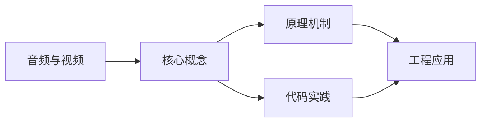
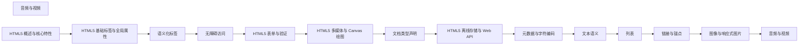

## 1. 学习目标（Bloom 分类）

本节按照布鲁姆教育目标分类学组织学习路径。本文主题为《音频与视频》，属于 HTML5 模块，读者可以根据自身阶段选择阅读深度。

记忆层面：能够准确复述本文的核心概念、术语与基本语法或操作步骤，并能够在提问或检索时快速定位对应知识点。能够说出 HTML5 的核心概念、术语与标准写法。

理解层面：能够用自己的语言解释核心原理与工作机制，说明概念之间的因果关系，而不是机械记忆结论。能够解释 HTML5 的工作原理与设计动机。

应用层面：能够在真实项目或练习场景中运用本文知识解决具体问题，写出正确且可维护的实现。能够编写符合 HTML5 规范的完整实现。

分析层面：能够拆解复杂问题，比较本文主题与相邻概念的异同，识别边界条件与例外情况。能够分析 HTML5 与相邻方案的差异与边界。

评价层面：能够根据约束条件（性能、可读性、安全、成本）评价不同方案的优劣，做出有依据的技术决策。能够根据场景评价 HTML5 相关方案的优劣。

创造层面：能够把本文知识与其他模块知识组合，设计出新的解决方案或可复用的工程模式。能够组合 HTML5 与其他技术设计完整方案。

通过本节学习，读者应当能够把《音频与视频》纳入自己的知识网络，并与 HTML5 模块的其他主题（语义化、表单、多媒体、Canvas）建立关联。

## 2. 历史动机与发展脉络

《音频与视频》是 HTML5 领域的重要主题。要真正理解它，需要先了解它解决的问题与演进过程。

HTML 由 Tim Berners-Lee 于 1991 年创建，是 Web 的结构语言；HTML5 于 2014 年成为 W3C 推荐标准，WHATWG 维护的 Living Standard 是当前权威规范。
HTML5 引入语义化元素（header/nav/main/article/section/footer）、表单增强（date/range/placeholder）、多媒体（video/audio）、图形（canvas/SVG）与离线存储（localStorage/Web Worker）。
现代 HTML 强调“语义优先”：结构表达内容含义，样式与行为分离；可访问性（ARIA）与 SEO 都建立在正确语义之上。

回到本文主题：音频与视频 的提出与成熟，正是上述技术背景下的必然产物。早期实现往往以简单可用为目标，随着工程规模扩大，社区逐渐沉淀出标准做法与最佳实践；理解这一脉络，可以帮助读者判断“为什么文档中的推荐写法是现在这个样子”，也能在遇到历史遗留代码时准确识别其设计年代与取舍。


## 3. 形式化定义与核心概念精讲

本节把《音频与视频》涉及的核心概念以“定义 + 讲解”的形式展开。读者应把定义当作工具，把讲解当作理解路径；两者结合才能形成可迁移的知识。

文档结构：<!DOCTYPE html> 声明标准模式；html/head/body 层级固定；meta charset 必须在前 1024 字节内。
语义元素：header/footer 表示页眉页脚，nav 表示导航，main 表示主内容（每页唯一），article 表示独立内容，section 表示分区。
表单：input 类型决定键盘与校验（email/url/number），label 关联控件提升可访问性，required/pattern 提供原生校验。

### 3.1 原文章节逐一精讲

原文档把主题拆分为 11 个小节，下面按顺序给出每一节的导读讲解，随后保留原文细节供精读。

#### 原文精读（完整保留）

# 音频与视频 语法速查手册

> **符号约定**:`< >` 必填参数 | `[ ]` 可选参数

---

#### 1. audio 元素

```html
<audio src="music.mp3" controls></audio>
<audio controls>
  <source src="music.mp3" type="audio/mpeg" />
  <source src="music.ogg" type="audio/ogg" />
</audio>
```

| 属性       | 说明                     |
| ---------- | ------------------------ |
| `controls` | 显示播放控件             |
| `autoplay` | 自动播放（需配合 muted） |
| `loop`     | 循环播放                 |
| `muted`    | 静音                     |
| `preload`  | none/metadata/auto       |

```javascript
const audio = document.querySelector('audio');
audio.play();
audio.pause();
audio.currentTime = 30;
audio.volume = 0.5;
```

#### 2. video 元素

```html
<video controls width="640" height="360" poster="cover.jpg" playsinline>
  <source src="movie.mp4" type="video/mp4" />
  <source src="movie.webm" type="video/webm" />
</video>
```

```javascript
const video = document.querySelector('video');
await video.play();
video.requestFullscreen();
await video.requestPictureInPicture();
```

#### 3. track 字幕

```vtt
WEBVTT

00:00:01.000 --> 00:00:04.000
欢迎观看本教程

00:00:05.000 --> 00:00:08.000
今天我们学习 HTML5 视频
```

```html
<video controls>
  <source src="movie.mp4" type="video/mp4" />
  <track kind="subtitles" src="subs/zh.vtt" srclang="zh" label="中文" />
  <track kind="subtitles" src="subs/en.vtt" srclang="en" label="English" default />
</video>
```

| kind 值     | 说明             |
| ----------- | ---------------- |
| `subtitles` | 字幕（翻译）     |
| `captions`  | 说明文字（听障） |
| `chapters`  | 章节标题         |

#### 4. 自动播放策略

| 条件       | 是否允许自动播放 |
| ---------- | ---------------- |
| 有声视频   |                  |
| 静音视频   |                  |
| 用户已交互 |                  |
#### audio 音频元素

**音频基础**
`<audio src="<URL>" [controls] [autoplay] [loop] [muted] [preload]>[回退内容]</audio>`
```html
<!-- 简单音频 -->
<audio src="music.mp3" controls></audio>

<!-- 多格式回退 -->
<audio controls>
  <source src="music.mp3" type="audio/mpeg" />
  <source src="music.ogg" type="audio/ogg" />
  您的浏览器不支持音频元素。
</audio>
```

| 属性       | 说明                     | 示例                       |
| ---------- | ------------------------ | -------------------------- |
| `src`      | 音频源 URL               | `src="music.mp3"`          |
| `controls` | 显示播放控件             | `controls`                 |
| `autoplay` | 自动播放(需配合 muted)   | `autoplay muted`           |
| `loop`     | 循环播放                 | `loop`                     |
| `muted`    | 静音                     | `muted`                    |
| `preload`  | 预加载 none/metadata/auto| `preload="metadata"`       |

**音频格式**

| 格式   | MIME 类型       | 浏览器支持            |
| ------ | --------------- | --------------------- |
| MP3    | audio/mpeg      | 全部                  |
| OGG    | audio/ogg       | 除 Safari iOS 外      |
| WAV    | audio/wav       | 全部(文件较大)        |
| AAC    | audio/aac       | 全部                  |
| FLAC   | audio/flac      | 除 IE 外              |

---

#### video 视频元素

**视频基础**
`<video src="<URL>" [controls] [autoplay] [loop] [muted] [poster="<封面>"] [width] [height] [preload] [playsinline]>[回退内容]</video>`
```html
<!-- 基础视频 -->
<video src="movie.mp4" controls width="640" height="360"></video>

<!-- 完整配置 -->
<video
  controls
  autoplay
  muted
  loop
  poster="cover.jpg"
  width="640"
  height="360"
  playsinline
  preload="metadata"
>
  <source src="movie.mp4" type="video/mp4" />
  <source src="movie.webm" type="video/webm" />
  <track kind="subtitles" src="subs.vtt" srclang="zh" label="中文" default />
  您的浏览器不支持视频元素。
</video>
```

| 属性         | 说明                   | 示例                          |
| ------------ | ---------------------- | ----------------------------- |
| `src`        | 视频源 URL             | `src="movie.mp4"`             |
| `controls`   | 显示控制条             | `controls`                    |
| `autoplay`   | 自动播放               | `autoplay muted`              |
| `muted`      | 静音                   | `muted`                       |
| `loop`       | 循环播放               | `loop`                        |
| `poster`     | 封面图 URL             | `poster="cover.jpg"`          |
| `preload`    | 预加载 none/metadata/auto | `preload="auto"`           |
| `width`      | 宽度                   | `width="640"`                 |
| `height`     | 高度                   | `height="360"`                |
| `playsinline`| 内联播放(防 iOS 全屏)  | `playsinline`                 |
| `controlslist` | 控制条按钮定制       | `controlslist="nodownload"`   |
| `disablepictureinpicture` | 禁用画中画  | `disablepictureinpicture`     |
| `crossorigin`| 跨域设置              | `crossorigin="anonymous"`     |

**视频格式**

| 格式  | MIME 类型   | 视频编码    | 浏览器支持            |
| ----- | ----------- | ----------- | --------------------- |
| MP4   | video/mp4   | H.264       | 全部                  |
| WebM  | video/webm  | VP8/VP9     | 除 Safari 外          |
| OGG   | video/ogg   | Theora      | 除 Safari 外          |
| AV1   | video/mp4   | AV1         | Chrome、Firefox       |
| HLS   | application/vnd.apple.mpegurl | H.264 | Safari 原生,其他需 hls.js |

---

#### source 元素

**多源回退**
`<source src="<URL>" type="<MIME>" [media="<媒体查询>"] [sizes] [srcset] />`
```html
<video controls>
  <source src="movie.av1.mp4" type="video/mp4; codecs=av01.0.05M.08" />
  <source src="movie.webm" type="video/webm; codecs=vp9" />
  <source src="movie.h264.mp4" type="video/mp4; codecs=avc1.4d401e" />
  您的浏览器不支持视频。
</video>
```

---

#### track 字幕元素

**文本轨道**
`<track kind="<类型>" src="<VTT文件>" srclang="<语言>" label="<标签>" [default] />`
```html
<video controls>
  <source src="movie.mp4" type="video/mp4" />
  <track kind="subtitles" src="subs/zh.vtt" srclang="zh" label="中文" default />
  <track kind="subtitles" src="subs/en.vtt" srclang="en" label="English" />
  <track kind="captions" src="caps/en.vtt" srclang="en" label="English Captions" />
  <track kind="chapters" src="chapters.vtt" srclang="en" label="章节" />
</video>
```

| kind 值       | 说明                       |
| ------------- | -------------------------- |
| `subtitles`   | 字幕(翻译)                 |
| `captions`    | 说明文字(听障,含音效)      |
| `descriptions`| 视频描述(视障)             |
| `chapters`    | 章节标题                   |
| `metadata`    | 元数据(脚本用)             |

**WebVTT 文件格式**
```vtt
WEBVTT

00:00:01.000 --> 00:00:04.000
欢迎观看本教程

00:00:05.000 --> 00:00:08.000
今天我们学习 HTML5 视频

NOTE 这是注释

00:00:09.000 --> 00:00:12.000 align=start position:10%
带样式的字幕
```

---

#### JavaScript 控制 API

**HTMLMediaElement API**
```javascript
const video = document.querySelector('video');
const audio = document.querySelector('audio');

// 播放控制
video.play();              // 播放(返回 Promise)
video.pause();             // 暂停
video.load();              // 重新加载

// 属性
video.currentTime;         // 当前播放时间(秒)
video.duration;            // 总时长(秒)
video.volume;              // 音量 0-1
video.muted;               // 是否静音
video.playbackRate;        // 播放速度(1.0 正常)
video.preservesPitch;      // 保持音调
video.loop;                // 是否循环
video.autoplay;            // 是否自动播放
video.controls;            // 是否显示控件
video.paused;              // 是否暂停
video.ended;               // 是否播放结束
video.seeking;             // 是否在跳转
video.buffered;            // 已缓冲区间
video.readyState;          // 就绪状态 0-4
video.networkState;        // 网络状态
video.error;               // 错误对象

// 设置
video.currentTime = 30;    // 跳转到 30 秒
video.volume = 0.5;        // 音量 50%
video.playbackRate = 1.5;  // 1.5 倍速
video.muted = true;        // 静音
```

**特殊 API**
```javascript
// 全屏
await video.requestFullscreen();
await document.exitFullscreen();

// 画中画
await video.requestPictureInPicture();
await document.exitPictureInPicture();

// 截图(需同源或 crossorigin)
const canvas = document.createElement('canvas');
canvas.width = video.videoWidth;
canvas.height = video.videoHeight;
canvas.getContext('2d').drawImage(video, 0, 0);
const dataURL = canvas.toDataURL('image/png');

// 录制(MediaRecorder)
const stream = video.captureStream();
const recorder = new MediaRecorder(stream, { mimeType: 'video/webm' });
```

---

#### 媒体事件

**媒体事件监听**
`element.addEventListener('<事件>', handler)`
```javascript
video.addEventListener('loadstart', () => console.log('开始加载'));
video.addEventListener('loadedmetadata', () => console.log('元数据已加载'));
video.addEventListener('loadeddata', () => console.log('数据已加载'));
video.addEventListener('canplay', () => console.log('可以播放'));
video.addEventListener('canplaythrough', () => console.log('可流畅播放'));
video.addEventListener('play', () => console.log('开始播放'));
video.addEventListener('playing', () => console.log('播放中'));
video.addEventListener('pause', () => console.log('已暂停'));
video.addEventListener('ended', () => console.log('播放结束'));
video.addEventListener('timeupdate', () => console.log(video.currentTime));
video.addEventListener('progress', () => console.log('加载进度'));
video.addEventListener('volumechange', () => console.log('音量变化'));
video.addEventListener('ratechange', () => console.log('速度变化'));
video.addEventListener('seeking', () => console.log('跳转中'));
video.addEventListener('seeked', () => console.log('跳转完成'));
video.addEventListener('waiting', () => console.log('缓冲中'));
video.addEventListener('error', (e) => console.log('错误', video.error));
```

---

#### 自动播放策略

| 条件               | 是否允许自动播放 |
| ------------------ | ---------------- |
| 有声视频(默认)     | 通常被禁止       |
| 静音视频 muted     | 允许             |
| 用户已与页面交互   | 允许             |
| 已被用户授权       | 允许             |

```javascript
// 安全的自动播放
const video = document.querySelector('video');
video.muted = true;
video.play().then(() => {
  console.log('自动播放成功');
}).catch((err) => {
  console.log('自动播放被拒绝,需要用户交互');
  document.body.addEventListener('click', () => {
    video.play();
  }, { once: true });
});
```


### 3.2 概念关系图

下面用 Mermaid 图表达本文核心概念之间的关系，帮助读者建立整体图景：



图中展示的是本文知识的结构化关系：核心概念是入口，原理机制解释“为什么”，代码实践演示“怎么做”，工程应用回答“何时用”。读者学习时可以把每个小节的内容挂接到对应节点上。

## 4. 理论推导与原理解析

本节深入《音频与视频》背后的原理。理论部分不求面面俱到，而是聚焦“能解释现象、能指导实践”的关键推导。

文档结构：<!DOCTYPE html> 声明标准模式；html/head/body 层级固定；meta charset 必须在前 1024 字节内。
语义元素：header/footer 表示页眉页脚，nav 表示导航，main 表示主内容（每页唯一），article 表示独立内容，section 表示分区。
表单：input 类型决定键盘与校验（email/url/number），label 关联控件提升可访问性，required/pattern 提供原生校验。
媒体与图形：video/audio 支持多源（source）；canvas 是位图画布（JavaScript 绘制），SVG 是矢量结构（DOM 操作）。

需要强调的是，理论推导与工程实践之间存在翻译层：理论给出的是理想化模型与边界条件，工程代码则必须处理真实环境中的例外。读者在学习时应先掌握理论的“标准情形”，再通过陷阱章节了解“非标准情形”。

## 5. 代码示例与逐行讲解

本节把原文中的代码示例系统整理，并为每个示例补充用途说明与讲解。读者不应只浏览代码，而应逐段对照讲解理解设计意图。

### 5.1 示例：1. audio 元素

该示例来自原文《1. audio 元素》小节，用于演示音频与视频相关操作。阅读时请先看代码结构，再看其后的讲解。

```html
<audio src="music.mp3" controls></audio>
<audio controls>
  <source src="music.mp3" type="audio/mpeg" />
  <source src="music.ogg" type="audio/ogg" />
</audio>
```

讲解：这段代码演示了本节核心知识点。代码中的关键操作可以归纳为三步：准备（定义或初始化）、执行（核心逻辑）、收尾（释放资源或返回结果）。实际项目中，这三步往往被封装为函数或类，以提升复用性与可测试性。

关键点分析：

该示例共 5 行有效代码，结构以数据或配置为主。阅读时应关注：数据字段的含义、配置项的作用，以及它们与运行行为的对应关系。

进阶思考路径：先尝试修改参数观察行为变化，再把示例中的模式迁移到自己的项目中；每次修改都记录预期与实测差异，这是把示例转化为能力的最快方式。

### 5.2 示例：1. audio 元素

该示例来自原文《1. audio 元素》小节，用于演示音频与视频相关操作。阅读时请先看代码结构，再看其后的讲解。

```javascript
const audio = document.querySelector('audio');
audio.play();
audio.pause();
audio.currentTime = 30;
audio.volume = 0.5;
```

讲解：这段代码演示了本节核心知识点。代码中的关键操作可以归纳为三步：准备（定义或初始化）、执行（核心逻辑）、收尾（释放资源或返回结果）。实际项目中，这三步往往被封装为函数或类，以提升复用性与可测试性。

关键点分析：

该示例共 5 行有效代码，结构以数据或配置为主。阅读时应关注：数据字段的含义、配置项的作用，以及它们与运行行为的对应关系。

进阶思考路径：先尝试修改参数观察行为变化，再把示例中的模式迁移到自己的项目中；每次修改都记录预期与实测差异，这是把示例转化为能力的最快方式。

### 5.3 示例：2. video 元素

该示例来自原文《2. video 元素》小节，用于演示音频与视频相关操作。阅读时请先看代码结构，再看其后的讲解。

```html
<video controls width="640" height="360" poster="cover.jpg" playsinline>
  <source src="movie.mp4" type="video/mp4" />
  <source src="movie.webm" type="video/webm" />
</video>
```

讲解：这段代码演示了本节核心知识点。代码中的关键操作可以归纳为三步：准备（定义或初始化）、执行（核心逻辑）、收尾（释放资源或返回结果）。实际项目中，这三步往往被封装为函数或类，以提升复用性与可测试性。

关键点分析：

该示例共 4 行有效代码，结构以数据或配置为主。阅读时应关注：数据字段的含义、配置项的作用，以及它们与运行行为的对应关系。

进阶思考路径：先尝试修改参数观察行为变化，再把示例中的模式迁移到自己的项目中；每次修改都记录预期与实测差异，这是把示例转化为能力的最快方式。

### 5.4 示例：2. video 元素

该示例来自原文《2. video 元素》小节，用于演示音频与视频相关操作。阅读时请先看代码结构，再看其后的讲解。

```javascript
const video = document.querySelector('video');
await video.play();
video.requestFullscreen();
await video.requestPictureInPicture();
```

讲解：这段代码演示了本节核心知识点。代码中的关键操作可以归纳为三步：准备（定义或初始化）、执行（核心逻辑）、收尾（释放资源或返回结果）。实际项目中，这三步往往被封装为函数或类，以提升复用性与可测试性。

关键点分析：

该示例共 4 行有效代码，结构以数据或配置为主。阅读时应关注：数据字段的含义、配置项的作用，以及它们与运行行为的对应关系。

进阶思考路径：先尝试修改参数观察行为变化，再把示例中的模式迁移到自己的项目中；每次修改都记录预期与实测差异，这是把示例转化为能力的最快方式。

### 5.5 示例：3. track 字幕

该示例来自原文《3. track 字幕》小节，用于演示音频与视频相关操作。阅读时请先看代码结构，再看其后的讲解。

```vtt
WEBVTT

00:00:01.000 --> 00:00:04.000
欢迎观看本教程

00:00:05.000 --> 00:00:08.000
今天我们学习 HTML5 视频
```

讲解：这段代码演示了本节核心知识点。代码中的关键操作可以归纳为三步：准备（定义或初始化）、执行（核心逻辑）、收尾（释放资源或返回结果）。实际项目中，这三步往往被封装为函数或类，以提升复用性与可测试性。

关键点分析：

该示例共 5 行有效代码，结构以数据或配置为主。阅读时应关注：数据字段的含义、配置项的作用，以及它们与运行行为的对应关系。

进阶思考路径：先尝试修改参数观察行为变化，再把示例中的模式迁移到自己的项目中；每次修改都记录预期与实测差异，这是把示例转化为能力的最快方式。

### 5.6 示例：3. track 字幕

该示例来自原文《3. track 字幕》小节，用于演示音频与视频相关操作。阅读时请先看代码结构，再看其后的讲解。

```html
<video controls>
  <source src="movie.mp4" type="video/mp4" />
  <track kind="subtitles" src="subs/zh.vtt" srclang="zh" label="中文" />
  <track kind="subtitles" src="subs/en.vtt" srclang="en" label="English" default />
</video>
```

讲解：这段代码演示了本节核心知识点。代码中的关键操作可以归纳为三步：准备（定义或初始化）、执行（核心逻辑）、收尾（释放资源或返回结果）。实际项目中，这三步往往被封装为函数或类，以提升复用性与可测试性。

关键点分析：

该示例共 5 行有效代码，结构以数据或配置为主。阅读时应关注：数据字段的含义、配置项的作用，以及它们与运行行为的对应关系。

进阶思考路径：先尝试修改参数观察行为变化，再把示例中的模式迁移到自己的项目中；每次修改都记录预期与实测差异，这是把示例转化为能力的最快方式。

### 5.7 示例：audio 音频元素

该示例来自原文《audio 音频元素》小节，用于演示音频与视频相关操作。阅读时请先看代码结构，再看其后的讲解。

```html
<!-- 简单音频 -->
<audio src="music.mp3" controls></audio>

<!-- 多格式回退 -->
<audio controls>
  <source src="music.mp3" type="audio/mpeg" />
  <source src="music.ogg" type="audio/ogg" />
  您的浏览器不支持音频元素。
</audio>
```

讲解：这段代码演示了本节核心知识点。代码中的关键操作可以归纳为三步：准备（定义或初始化）、执行（核心逻辑）、收尾（释放资源或返回结果）。实际项目中，这三步往往被封装为函数或类，以提升复用性与可测试性。

关键点分析：

该示例共 8 行有效代码，结构以数据或配置为主。阅读时应关注：数据字段的含义、配置项的作用，以及它们与运行行为的对应关系。

进阶思考路径：先尝试修改参数观察行为变化，再把示例中的模式迁移到自己的项目中；每次修改都记录预期与实测差异，这是把示例转化为能力的最快方式。

### 5.8 示例：video 视频元素

该示例来自原文《video 视频元素》小节，用于演示音频与视频相关操作。阅读时请先看代码结构，再看其后的讲解。

```html
<!-- 基础视频 -->
<video src="movie.mp4" controls width="640" height="360"></video>

<!-- 完整配置 -->
<video
  controls
  autoplay
  muted
  loop
  poster="cover.jpg"
  width="640"
  height="360"
  playsinline
  preload="metadata"
>
  <source src="movie.mp4" type="video/mp4" />
  <source src="movie.webm" type="video/webm" />
  <track kind="subtitles" src="subs.vtt" srclang="zh" label="中文" default />
  您的浏览器不支持视频元素。
</video>
```

讲解：这段代码演示了本节核心知识点。代码中的关键操作可以归纳为三步：准备（定义或初始化）、执行（核心逻辑）、收尾（释放资源或返回结果）。实际项目中，这三步往往被封装为函数或类，以提升复用性与可测试性。

关键点分析：

该示例共 19 行有效代码，结构以数据或配置为主。阅读时应关注：数据字段的含义、配置项的作用，以及它们与运行行为的对应关系。

进阶思考路径：先尝试修改参数观察行为变化，再把示例中的模式迁移到自己的项目中；每次修改都记录预期与实测差异，这是把示例转化为能力的最快方式。

### 5.9 示例：source 元素

该示例来自原文《source 元素》小节，用于演示音频与视频相关操作。阅读时请先看代码结构，再看其后的讲解。

```html
<video controls>
  <source src="movie.av1.mp4" type="video/mp4; codecs=av01.0.05M.08" />
  <source src="movie.webm" type="video/webm; codecs=vp9" />
  <source src="movie.h264.mp4" type="video/mp4; codecs=avc1.4d401e" />
  您的浏览器不支持视频。
</video>
```

讲解：这段代码演示了本节核心知识点。代码中的关键操作可以归纳为三步：准备（定义或初始化）、执行（核心逻辑）、收尾（释放资源或返回结果）。实际项目中，这三步往往被封装为函数或类，以提升复用性与可测试性。

关键点分析：

该示例共 6 行有效代码，结构以数据或配置为主。阅读时应关注：数据字段的含义、配置项的作用，以及它们与运行行为的对应关系。

进阶思考路径：先尝试修改参数观察行为变化，再把示例中的模式迁移到自己的项目中；每次修改都记录预期与实测差异，这是把示例转化为能力的最快方式。

### 5.10 示例：track 字幕元素

该示例来自原文《track 字幕元素》小节，用于演示音频与视频相关操作。阅读时请先看代码结构，再看其后的讲解。

```html
<video controls>
  <source src="movie.mp4" type="video/mp4" />
  <track kind="subtitles" src="subs/zh.vtt" srclang="zh" label="中文" default />
  <track kind="subtitles" src="subs/en.vtt" srclang="en" label="English" />
  <track kind="captions" src="caps/en.vtt" srclang="en" label="English Captions" />
  <track kind="chapters" src="chapters.vtt" srclang="en" label="章节" />
</video>
```

讲解：这段代码演示了本节核心知识点。代码中的关键操作可以归纳为三步：准备（定义或初始化）、执行（核心逻辑）、收尾（释放资源或返回结果）。实际项目中，这三步往往被封装为函数或类，以提升复用性与可测试性。

关键点分析：

该示例共 7 行有效代码，结构以数据或配置为主。阅读时应关注：数据字段的含义、配置项的作用，以及它们与运行行为的对应关系。

进阶思考路径：先尝试修改参数观察行为变化，再把示例中的模式迁移到自己的项目中；每次修改都记录预期与实测差异，这是把示例转化为能力的最快方式。

### 5.11 示例：track 字幕元素

该示例来自原文《track 字幕元素》小节，用于演示音频与视频相关操作。阅读时请先看代码结构，再看其后的讲解。

```vtt
WEBVTT

00:00:01.000 --> 00:00:04.000
欢迎观看本教程

00:00:05.000 --> 00:00:08.000
今天我们学习 HTML5 视频

NOTE 这是注释

00:00:09.000 --> 00:00:12.000 align=start position:10%
带样式的字幕
```

讲解：这段代码演示了本节核心知识点。代码中的关键操作可以归纳为三步：准备（定义或初始化）、执行（核心逻辑）、收尾（释放资源或返回结果）。实际项目中，这三步往往被封装为函数或类，以提升复用性与可测试性。

关键点分析：

该示例共 8 行有效代码，结构以数据或配置为主。阅读时应关注：数据字段的含义、配置项的作用，以及它们与运行行为的对应关系。

进阶思考路径：先尝试修改参数观察行为变化，再把示例中的模式迁移到自己的项目中；每次修改都记录预期与实测差异，这是把示例转化为能力的最快方式。

### 5.12 示例：JavaScript 控制 API

该示例来自原文《JavaScript 控制 API》小节，用于演示音频与视频相关操作。阅读时请先看代码结构，再看其后的讲解。

```javascript
const video = document.querySelector('video');
const audio = document.querySelector('audio');

// 播放控制
video.play();              // 播放(返回 Promise)
video.pause();             // 暂停
video.load();              // 重新加载

// 属性
video.currentTime;         // 当前播放时间(秒)
video.duration;            // 总时长(秒)
video.volume;              // 音量 0-1
video.muted;               // 是否静音
video.playbackRate;        // 播放速度(1.0 正常)
video.preservesPitch;      // 保持音调
video.loop;                // 是否循环
video.autoplay;            // 是否自动播放
video.controls;            // 是否显示控件
video.paused;              // 是否暂停
video.ended;               // 是否播放结束
video.seeking;             // 是否在跳转
video.buffered;            // 已缓冲区间
video.readyState;          // 就绪状态 0-4
video.networkState;        // 网络状态
video.error;               // 错误对象

// 设置
video.currentTime = 30;    // 跳转到 30 秒
video.volume = 0.5;        // 音量 50%
video.playbackRate = 1.5;  // 1.5 倍速
video.muted = true;        // 静音
```

讲解：这段代码演示了本节核心知识点。代码中的关键操作可以归纳为三步：准备（定义或初始化）、执行（核心逻辑）、收尾（释放资源或返回结果）。实际项目中，这三步往往被封装为函数或类，以提升复用性与可测试性。

关键点分析：

该示例共 28 行有效代码，结构以数据或配置为主。阅读时应关注：数据字段的含义、配置项的作用，以及它们与运行行为的对应关系。

进阶思考路径：先尝试修改参数观察行为变化，再把示例中的模式迁移到自己的项目中；每次修改都记录预期与实测差异，这是把示例转化为能力的最快方式。

### 5.13 示例：JavaScript 控制 API

该示例来自原文《JavaScript 控制 API》小节，用于演示音频与视频相关操作。阅读时请先看代码结构，再看其后的讲解。

```javascript
// 全屏
await video.requestFullscreen();
await document.exitFullscreen();

// 画中画
await video.requestPictureInPicture();
await document.exitPictureInPicture();

// 截图(需同源或 crossorigin)
const canvas = document.createElement('canvas');
canvas.width = video.videoWidth;
canvas.height = video.videoHeight;
canvas.getContext('2d').drawImage(video, 0, 0);
const dataURL = canvas.toDataURL('image/png');

// 录制(MediaRecorder)
const stream = video.captureStream();
const recorder = new MediaRecorder(stream, { mimeType: 'video/webm' });
```

讲解：这段代码演示了本节核心知识点。代码中的关键操作可以归纳为三步：准备（定义或初始化）、执行（核心逻辑）、收尾（释放资源或返回结果）。实际项目中，这三步往往被封装为函数或类，以提升复用性与可测试性。

关键点分析：

该示例共 15 行有效代码，结构以数据或配置为主。阅读时应关注：数据字段的含义、配置项的作用，以及它们与运行行为的对应关系。

进阶思考路径：先尝试修改参数观察行为变化，再把示例中的模式迁移到自己的项目中；每次修改都记录预期与实测差异，这是把示例转化为能力的最快方式。

### 5.14 示例：媒体事件

该示例来自原文《媒体事件》小节，用于演示音频与视频相关操作。阅读时请先看代码结构，再看其后的讲解。

```javascript
video.addEventListener('loadstart', () => console.log('开始加载'));
video.addEventListener('loadedmetadata', () => console.log('元数据已加载'));
video.addEventListener('loadeddata', () => console.log('数据已加载'));
video.addEventListener('canplay', () => console.log('可以播放'));
video.addEventListener('canplaythrough', () => console.log('可流畅播放'));
video.addEventListener('play', () => console.log('开始播放'));
video.addEventListener('playing', () => console.log('播放中'));
video.addEventListener('pause', () => console.log('已暂停'));
video.addEventListener('ended', () => console.log('播放结束'));
video.addEventListener('timeupdate', () => console.log(video.currentTime));
video.addEventListener('progress', () => console.log('加载进度'));
video.addEventListener('volumechange', () => console.log('音量变化'));
video.addEventListener('ratechange', () => console.log('速度变化'));
video.addEventListener('seeking', () => console.log('跳转中'));
video.addEventListener('seeked', () => console.log('跳转完成'));
video.addEventListener('waiting', () => console.log('缓冲中'));
video.addEventListener('error', (e) => console.log('错误', video.error));
```

讲解：这段代码演示了本节核心知识点。代码中的关键操作可以归纳为三步：准备（定义或初始化）、执行（核心逻辑）、收尾（释放资源或返回结果）。实际项目中，这三步往往被封装为函数或类，以提升复用性与可测试性。

关键点分析：

该示例共 17 行有效代码，结构以数据或配置为主。阅读时应关注：数据字段的含义、配置项的作用，以及它们与运行行为的对应关系。

进阶思考路径：先尝试修改参数观察行为变化，再把示例中的模式迁移到自己的项目中；每次修改都记录预期与实测差异，这是把示例转化为能力的最快方式。

### 5.15 示例：自动播放策略

该示例来自原文《自动播放策略》小节，用于演示音频与视频相关操作。阅读时请先看代码结构，再看其后的讲解。

```javascript
// 安全的自动播放
const video = document.querySelector('video');
video.muted = true;
video.play().then(() => {
  console.log('自动播放成功');
}).catch((err) => {
  console.log('自动播放被拒绝,需要用户交互');
  document.body.addEventListener('click', () => {
    video.play();
  }, { once: true });
});
```

讲解：这段代码演示了本节核心知识点。代码中的关键操作可以归纳为三步：准备（定义或初始化）、执行（核心逻辑）、收尾（释放资源或返回结果）。实际项目中，这三步往往被封装为函数或类，以提升复用性与可测试性。

关键点分析：

该示例共 11 行有效代码，结构以数据或配置为主。阅读时应关注：数据字段的含义、配置项的作用，以及它们与运行行为的对应关系。

进阶思考路径：先尝试修改参数观察行为变化，再把示例中的模式迁移到自己的项目中；每次修改都记录预期与实测差异，这是把示例转化为能力的最快方式。


综合以上示例，可以总结出本主题的代码实践要点：第一，先定义清晰的输入输出契约；第二，核心逻辑保持单一职责；第三，错误处理与边界条件不可省略；第四，命名与注释表达意图而非复述代码。

## 6. 对比分析

对比是理解《音频与视频》定位的最快路径。下面从多个维度与相邻方案进行对比。

HTML5 与 XHTML：HTML5 容错性强、语法宽松；XHTML 严格 XML 语法，已基本退出。
语义元素与 div+class：语义元素免费获得可访问性与 SEO；class 命名方案只是风格。
canvas 与 SVG：canvas 适合像素级绘制（游戏、图像处理），SVG 适合矢量图形与交互（图表、图标）。

对比的目的不是分出绝对优劣，而是建立选择依据：不同约束条件下，最优解不同。读者应把每个对比维度转化为决策检查清单。

## 7. 常见陷阱与最佳实践

本节整理该主题的高频错误与推荐做法。每个陷阱先描述现象，再解释原因，最后给出最佳实践。

### 7.1 div 滥用

全部用 div 导致语义缺失。优先语义元素，div 仅作无语义容器。

深入讲解：该问题之所以被归类为“常见陷阱”，是因为它在初学者的代码中反复出现，而且往往不在第一时间暴露——错误通常隐藏在特定数据或特定时序下。

从成因上看，div 滥用 一般源于对 HTML5 某个机制的理解偏差：要么误用了默认行为，要么忽略了边界条件，要么把其他语言的思维惯性带了过来。

从影响上看，div 滥用 轻则产生错误结果，重则导致资源泄漏、数据损坏或安全事故；这也是为什么工程评审中会把它列为检查项。

从修复策略上看，处理div 滥用的正确顺序是：先复现（构造最小用例），再定位（确认机制层面的根因），最后修复并补充回归测试。跳过复现直接改代码，往往治标不治本。

### 7.2 img 缺 alt

图片无法访问时无替代文本。alt 描述内容，装饰图用空 alt。

深入讲解：该问题之所以被归类为“常见陷阱”，是因为它在初学者的代码中反复出现，而且往往不在第一时间暴露——错误通常隐藏在特定数据或特定时序下。

从成因上看，img 缺 alt 一般源于对 HTML5 某个机制的理解偏差：要么误用了默认行为，要么忽略了边界条件，要么把其他语言的思维惯性带了过来。

从影响上看，img 缺 alt 轻则产生错误结果，重则导致资源泄漏、数据损坏或安全事故；这也是为什么工程评审中会把它列为检查项。

从修复策略上看，处理img 缺 alt的正确顺序是：先复现（构造最小用例），再定位（确认机制层面的根因），最后修复并补充回归测试。跳过复现直接改代码，往往治标不治本。

### 7.3 标题层级跳变

h1 直接到 h3 破坏文档大纲。按层级使用标题。

深入讲解：该问题之所以被归类为“常见陷阱”，是因为它在初学者的代码中反复出现，而且往往不在第一时间暴露——错误通常隐藏在特定数据或特定时序下。

从成因上看，标题层级跳变 一般源于对 HTML5 某个机制的理解偏差：要么误用了默认行为，要么忽略了边界条件，要么把其他语言的思维惯性带了过来。

从影响上看，标题层级跳变 轻则产生错误结果，重则导致资源泄漏、数据损坏或安全事故；这也是为什么工程评审中会把它列为检查项。

从修复策略上看，处理标题层级跳变的正确顺序是：先复现（构造最小用例），再定位（确认机制层面的根因），最后修复并补充回归测试。跳过复现直接改代码，往往治标不治本。

### 7.4 按钮用 a 标签

动作语义错误。导航用 a，动作用 button。

深入讲解：该问题之所以被归类为“常见陷阱”，是因为它在初学者的代码中反复出现，而且往往不在第一时间暴露——错误通常隐藏在特定数据或特定时序下。

从成因上看，按钮用 a 标签 一般源于对 HTML5 某个机制的理解偏差：要么误用了默认行为，要么忽略了边界条件，要么把其他语言的思维惯性带了过来。

从影响上看，按钮用 a 标签 轻则产生错误结果，重则导致资源泄漏、数据损坏或安全事故；这也是为什么工程评审中会把它列为检查项。

从修复策略上看，处理按钮用 a 标签的正确顺序是：先复现（构造最小用例），再定位（确认机制层面的根因），最后修复并补充回归测试。跳过复现直接改代码，往往治标不治本。

### 7.5 表单无 label

辅助技术无法识别控件。每个输入关联 label。

深入讲解：该问题之所以被归类为“常见陷阱”，是因为它在初学者的代码中反复出现，而且往往不在第一时间暴露——错误通常隐藏在特定数据或特定时序下。

从成因上看，表单无 label 一般源于对 HTML5 某个机制的理解偏差：要么误用了默认行为，要么忽略了边界条件，要么把其他语言的思维惯性带了过来。

从影响上看，表单无 label 轻则产生错误结果，重则导致资源泄漏、数据损坏或安全事故；这也是为什么工程评审中会把它列为检查项。

从修复策略上看，处理表单无 label的正确顺序是：先复现（构造最小用例），再定位（确认机制层面的根因），最后修复并补充回归测试。跳过复现直接改代码，往往治标不治本。

### 7.6 脚本阻塞渲染

同步脚本放 body 底部或用 defer。

深入讲解：该问题之所以被归类为“常见陷阱”，是因为它在初学者的代码中反复出现，而且往往不在第一时间暴露——错误通常隐藏在特定数据或特定时序下。

从成因上看，脚本阻塞渲染 一般源于对 HTML5 某个机制的理解偏差：要么误用了默认行为，要么忽略了边界条件，要么把其他语言的思维惯性带了过来。

从影响上看，脚本阻塞渲染 轻则产生错误结果，重则导致资源泄漏、数据损坏或安全事故；这也是为什么工程评审中会把它列为检查项。

从修复策略上看，处理脚本阻塞渲染的正确顺序是：先复现（构造最小用例），再定位（确认机制层面的根因），最后修复并补充回归测试。跳过复现直接改代码，往往治标不治本。

### 7.7 内联样式与事件

内联 style/onclick 破坏分离。使用 class 与 addEventListener。

深入讲解：该问题之所以被归类为“常见陷阱”，是因为它在初学者的代码中反复出现，而且往往不在第一时间暴露——错误通常隐藏在特定数据或特定时序下。

从成因上看，内联样式与事件 一般源于对 HTML5 某个机制的理解偏差：要么误用了默认行为，要么忽略了边界条件，要么把其他语言的思维惯性带了过来。

从影响上看，内联样式与事件 轻则产生错误结果，重则导致资源泄漏、数据损坏或安全事故；这也是为什么工程评审中会把它列为检查项。

从修复策略上看，处理内联样式与事件的正确顺序是：先复现（构造最小用例），再定位（确认机制层面的根因），最后修复并补充回归测试。跳过复现直接改代码，往往治标不治本。

### 7.8 忽略 meta viewport

移动端布局异常。添加 viewport meta。

深入讲解：该问题之所以被归类为“常见陷阱”，是因为它在初学者的代码中反复出现，而且往往不在第一时间暴露——错误通常隐藏在特定数据或特定时序下。

从成因上看，忽略 meta viewport 一般源于对 HTML5 某个机制的理解偏差：要么误用了默认行为，要么忽略了边界条件，要么把其他语言的思维惯性带了过来。

从影响上看，忽略 meta viewport 轻则产生错误结果，重则导致资源泄漏、数据损坏或安全事故；这也是为什么工程评审中会把它列为检查项。

从修复策略上看，处理忽略 meta viewport的正确顺序是：先复现（构造最小用例），再定位（确认机制层面的根因），最后修复并补充回归测试。跳过复现直接改代码，往往治标不治本。

### 7.0 最佳实践总览

1. 结构、样式、行为三层分离。
2. 每个页面唯一 main，标题层级连贯。
3. 图片提供 alt 与尺寸（防 CLS）。
4. 表单控件全部关联 label，错误信息可编程关联。
5. 使用 W3C 校验器与 axe 检查。

把这些最佳实践固化为团队规范与代码评审检查项，是避免同类问题反复出现的关键。

## 8. 工程实践

本节把《音频与视频》放入真实工程场景，给出可复用的模式与组织方法。

可访问性基线：语义元素 + ARIA（仅补充）+ 键盘可达 + 对比度达标（WCAG 2.1 AA）。
性能：图片懒加载（loading=lazy）、字体子集化、资源预加载。
SEO：语义标题、meta description、结构化数据（JSON-LD）。

### 8.1 工程实践的原则拆解

以上工程实践可以归纳为四条原则。第一，配置与代码分离：HTML5 项目中环境差异应通过配置注入，而不是散落在代码分支中；这保证同一份代码可以在开发、测试、生产环境一致运行。

第二，接口稳定优先：对外接口（函数签名、协议、数据格式）一旦被消费方依赖，变更成本极高；设计时应预留扩展点并保持向后兼容。

第三，可观测性内置：日志、指标与追踪应该在功能开发时同步设计，而不是故障发生后补救；没有观测手段的模块等于黑盒。

第四，变更可回滚：任何发布都应有对应的回滚方案；数据库迁移、配置变更与代码发布一样需要版本管理与逆向路径。

### 8.2 实践落地的检查清单

- [ ] 可访问性基线：对照本节描述，检查当前项目是否已经落实；未落实的项列入技术债并排期处理。
- [ ] 性能：对照本节描述，检查当前项目是否已经落实；未落实的项列入技术债并排期处理。
- [ ] SEO：对照本节描述，检查当前项目是否已经落实；未落实的项列入技术债并排期处理。

工程实践的共性原则：配置与代码分离、接口稳定优先、可观测性内置、变更可回滚。这些原则适用于本主题的所有实现。

## 9. 案例研究

本节通过一个完整案例把《音频与视频》的知识串起来。案例按“需求分析、方案设计、实现、验证”四步展开。

需求：重构文档站点首页为语义化结构。
方案：header/nav/main/article/footer 布局，面包屑用 nav + ol，卡片用 article。
要点：标题层级从 h1 开始连续；所有图片 alt；表单字段 label 关联。
验证：W3C 校验零错误；axe 扫描无严重问题；移动端视口正常。

### 9.1 案例的扩展讨论

把案例中的方案放大到真实规模，需要额外考虑三个问题：

第一，规模：当数据量或并发量上升一个数量级时，原方案中的数据结构、缓存策略与任务调度是否仍然成立？通常需要引入分层与异步。

第二，团队：多人协作时，模块边界、接口契约与代码所有权必须明确；案例中的实现应拆分为可独立测试的单元，并配合文档说明设计意图。

第三，演进：上线后的需求变化不可避免；方案设计时应预留扩展点（配置化、插件化、事件化），并定期用真实指标验证假设。


案例研究的学习方法：先独立阅读需求，尝试在脑中形成方案，再对照实现与讲解，最后思考“如果约束变化（数据量、并发、团队规模），方案应如何调整”。

## 10. 知识要点总结与深入讲解

本节以讲解形式汇总全文要点，替代传统的习题与自测，读者不需要答题，只需跟随解释建立完整的认知框架。

关于《音频与视频》的核心结论：

HTML 是内容的骨架，语义决定信息能否被机器与人共同理解。
HTML5 的特性围绕“结构、媒体、交互”三条线展开。
可访问性不是附加项，而是 HTML 的一部分。

原文档各小节的要点回顾：

- 1. audio 元素：该小节围绕音频与视频展开具体细节，阅读时应关注其与核心结论的对应关系；每个小节都是核心结论在某一个侧面的展开。
- 2. video 元素：该小节围绕音频与视频展开具体细节，阅读时应关注其与核心结论的对应关系；每个小节都是核心结论在某一个侧面的展开。
- 3. track 字幕：该小节围绕音频与视频展开具体细节，阅读时应关注其与核心结论的对应关系；每个小节都是核心结论在某一个侧面的展开。
- 4. 自动播放策略：该小节围绕音频与视频展开具体细节，阅读时应关注其与核心结论的对应关系；每个小节都是核心结论在某一个侧面的展开。
- audio 音频元素：该小节围绕音频与视频展开具体细节，阅读时应关注其与核心结论的对应关系；每个小节都是核心结论在某一个侧面的展开。
- video 视频元素：该小节围绕音频与视频展开具体细节，阅读时应关注其与核心结论的对应关系；每个小节都是核心结论在某一个侧面的展开。
- source 元素：该小节围绕音频与视频展开具体细节，阅读时应关注其与核心结论的对应关系；每个小节都是核心结论在某一个侧面的展开。
- track 字幕元素：该小节围绕音频与视频展开具体细节，阅读时应关注其与核心结论的对应关系；每个小节都是核心结论在某一个侧面的展开。
- JavaScript 控制 API：该小节围绕音频与视频展开具体细节，阅读时应关注其与核心结论的对应关系；每个小节都是核心结论在某一个侧面的展开。
- 媒体事件：该小节围绕音频与视频展开具体细节，阅读时应关注其与核心结论的对应关系；每个小节都是核心结论在某一个侧面的展开。
- 自动播放策略：该小节围绕音频与视频展开具体细节，阅读时应关注其与核心结论的对应关系；每个小节都是核心结论在某一个侧面的展开。

把以上要点与第 3-9 节的内容对照复习，即可完成对本文主题的闭环学习。

## 11. 参考文献


WHATWG HTML Living Standard：https://html.spec.whatwg.org/
MDN HTML 文档：https://developer.mozilla.org/zh-CN/docs/Web/HTML
W3C Markup Validation Service：https://validator.w3.org/
WebAIM 可访问性指南：https://webaim.org/

## 12. 延伸阅读


HTML 列表与链接精讲，见 006-html5/011-List 与 012-LinkageAnchor 文档。
CSS 样式与布局，见 007-css 模块。
JavaScript DOM 操作，见 008-javascript 模块。
尚硅谷 Bilibili 空间（https://space.bilibili.com/302417610 ）提供 HTML/CSS 课程。

## 14. 模块知识图谱与学习路径

本文属于 HTML5 模块。为了把《音频与视频》放入完整的知识网络，下面列出本模块的全部主题并给出相互关联的导读。学习时建议按模块内顺序推进，并在每个文档中留意交叉引用。



上图为模块主题的推荐学习顺序示意图（仅展示前若干主题）。各主题之间存在三类关联：

第一，前置依赖关系：早期主题是后期主题的基础，例如环境与语法先行、进阶主题随后；

第二，横向并列关系：同一层级主题从不同角度覆盖模块能力，学习顺序可以按兴趣调整；

第三，工程组合关系：多个主题在真实项目中组合使用，例如配置、性能与安全主题往往出现在同一系统的不同层面。

### 14.1 模块主题速查表

| 文档 | 主题 | 与本文的关联 |
| --- | --- | --- |
| HTML5 概述与核心特性 | 001-HTML5OverviewCoreFeature | 本文的前置基础 |
| HTML5 基础标签与全局属性 | 002-HTML5BasicTagGlobalAttribute | 本文的前置基础 |
| 语义化标签 | 003-SemanticTag | 本文的并列主题 |
| 无障碍访问 | 004-Accessibility | 本文的并列主题 |
| HTML5 表单与验证 | 005-HTML5FormValidation | 本文的并列主题 |
| HTML5 多媒体与 Canvas 绘图 | 006-HTML5MultimediaCanvasDrawing | 本文的并列主题 |
| 文档类型声明 | 007-DocTypeDeclaration | 本文的并列主题 |
| HTML5 离线存储与 Web API | 008-HTML5OfflineStorageWebAPI | 本文的并列主题 |
| 元数据与字符编码 | 009-MetadataCharacterEncoding | 本文的并列主题 |
| 文本语义 | 010-TextSemantic | 本文的并列主题 |
| 列表 | 011-List | 本文的并列主题 |
| 链接与锚点 | 012-LinkageAnchor | 本文的并列主题 |
| 图像与响应式图片 | 013-ImageResponsiveImage | 本文的并列主题 |
| 音频与视频 | 014-AudioVideo | 本文自身 |
| SVG | 015-SVG | 本文的并列主题 |
| 嵌入式内容 | 016-EmbeddedContent | 本文的并列主题 |
| progress与meter | 017-ProgressMeter | 本文的并列主题 |
| Web Components 与 PWA 开发 | 018-WebComponentsPWADevelopment | 本文的并列主题 |
| 拖拽API | 019-DragAPI | 本文的并列主题 |
| 地理位置定位 | 020-Geolocation | 本文的并列主题 |
| Web-Workers | 021-WebWorkers | 本文的并列主题 |
| Service-Worker与PWA | 022-ServiceWorkerPWA | 本文的并列主题 |
| History-API | 023-HistoryAPI | 本文的并列主题 |
| WebSocket | 024-WebSocket | 本文的并列主题 |
| WebRTC | 025-WebRTC | 本文的并列主题 |
| 微数据与JSON-LD | 026-MicrodataJSONLD | 本文的并列主题 |
| 自定义数据属性 | 027-CustomDataAttribute | 本文的并列主题 |
| 跨文档通信 | 028-CrossDocumentCommunication | 本文的并列主题 |
| 视口配置与移动优先 | 029-ViewportConfigMobileFirst | 本文的并列主题 |
| HTML5 项目示例：交互式表单应用 | 030-HTML5ProjectExampleInteractiveFormApplication | 本文的综合应用 |

速查表的作用是让读者快速判断：哪些文档应在阅读本文前掌握（前置基础），哪些文档应在阅读本文后继续（延伸主题）。本模块的交叉引用体系即以此表为基础。

## 15. 术语表

下表整理《音频与视频》及 HTML5 模块中出现的高频术语，给出简明释义。术语按字母序或逻辑序排列，供查阅。

| 术语 | 释义 |
| --- | --- |
| 文档结构 | <!DOCTYPE html> 声明标准模式；html/head/body 层级固定；meta charset 必须在前 1024 字节内。 |
| 语义元素 | header/footer 表示页眉页脚，nav 表示导航，main 表示主内容（每页唯一），article 表示独立内容，section 表示分区。 |
| 表单 | input 类型决定键盘与校验（email/url/number），label 关联控件提升可访问性，required/pattern 提供原生校验。 |
| 媒体与图形 | video/audio 支持多源（source）；canvas 是位图画布（JavaScript 绘制），SVG 是矢量结构（DOM 操作）。 |
| div 滥用（易错点） | 参见常见陷阱章节的详细讲解 |
| img 缺 alt（易错点） | 参见常见陷阱章节的详细讲解 |
| 标题层级跳变（易错点） | 参见常见陷阱章节的详细讲解 |
| 按钮用 a 标签（易错点） | 参见常见陷阱章节的详细讲解 |
| 表单无 label（易错点） | 参见常见陷阱章节的详细讲解 |
| 脚本阻塞渲染（易错点） | 参见常见陷阱章节的详细讲解 |

术语表与正文配合使用：先通读正文，遇到模糊术语回查本表；长期使用后术语会自然进入工作记忆。

## 13. 深度专题扩展

以下专题从不同角度深入本文主题，供有进阶需求的读者研读。每个专题独立成节，内容相互补充。

### 13.1 HTML 解析与 DOM 树

浏览器解析 HTML 时先 tokenize 再建树；解析器对错误标记有容错规则（错误恢复算法）。
DOM 是内存中的树结构：元素节点、文本节点、属性；document.querySelector 沿树查找。
渲染流程：HTML -> DOM，CSS -> CSSOM，合并为渲染树，布局与绘制；理解流程可定位性能瓶颈。
脚本与解析：defer 延后执行，async 异步执行，模块脚本默认 defer 语义。

### 13.2 表单校验与无障碍

原生校验：required、pattern、min/max、type 约束；novalidate 可关闭，交由 JS 自定义。
校验 UI：:invalid/:valid 伪类样式；aria-invalid 标记错误；错误信息用 aria-describedby 关联。
键盘可达：所有交互元素可 Tab 聚焦，焦点可见，弹层焦点管理（trap）。
屏幕阅读器测试：NVDA/VoiceOver 实际朗读验证语义。

## 16. 核心概念串讲（复习视角）

本节以“把知识讲给他人听”的方式，把《音频与视频》的核心概念重新串讲一遍。与前文按章节展开不同，这里的叙述更接近课堂总结：先说整体，再逐个展开，最后收束。

《音频与视频》属于 HTML5 模块。要理解它，先要理解它在模块中的位置：它解决的是该领域的一个具体问题，并依赖模块内若干前置概念；反过来，它又为后续进阶主题提供基础。

第一个概念是文档结构。<!DOCTYPE html> 声明标准模式；html/head/body 层级固定；meta charset 必须在前 1024 字节内。

在实际使用中，文档结构需要与相邻概念区分：它们的区别不在于名称，而在于适用条件与行为边界；这正是前文对比分析章节的意义。

第一个概念是语义元素。header/footer 表示页眉页脚，nav 表示导航，main 表示主内容（每页唯一），article 表示独立内容，section 表示分区。

在实际使用中，语义元素需要与相邻概念区分：它们的区别不在于名称，而在于适用条件与行为边界；这正是前文对比分析章节的意义。

第一个概念是表单。input 类型决定键盘与校验（email/url/number），label 关联控件提升可访问性，required/pattern 提供原生校验。

在实际使用中，表单需要与相邻概念区分：它们的区别不在于名称，而在于适用条件与行为边界；这正是前文对比分析章节的意义。

接下来是文档结构。<!DOCTYPE html> 声明标准模式；html/head/body 层级固定；meta charset 必须在前 1024 字节内。

理解该原理的关键不是记住结论，而是记住“它从什么假设出发、推出了什么、假设不成立时会怎样”。带着这个框架复习，原理之间就会连成网络。

接下来是语义元素。header/footer 表示页眉页脚，nav 表示导航，main 表示主内容（每页唯一），article 表示独立内容，section 表示分区。

理解该原理的关键不是记住结论，而是记住“它从什么假设出发、推出了什么、假设不成立时会怎样”。带着这个框架复习，原理之间就会连成网络。

接下来是表单。input 类型决定键盘与校验（email/url/number），label 关联控件提升可访问性，required/pattern 提供原生校验。

理解该原理的关键不是记住结论，而是记住“它从什么假设出发、推出了什么、假设不成立时会怎样”。带着这个框架复习，原理之间就会连成网络。

接下来是媒体与图形。video/audio 支持多源（source）；canvas 是位图画布（JavaScript 绘制），SVG 是矢量结构（DOM 操作）。

理解该原理的关键不是记住结论，而是记住“它从什么假设出发、推出了什么、假设不成立时会怎样”。带着这个框架复习，原理之间就会连成网络。

串讲收束：把概念与原理放回本文主题，可以得出一个总纲——定义描述是什么，原理解释为什么，实践回答怎么做。三者构成完整的学习闭环；后续遇到相关问题，都可以按这个总纲检索知识。
