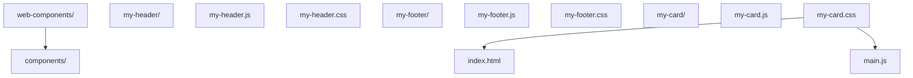
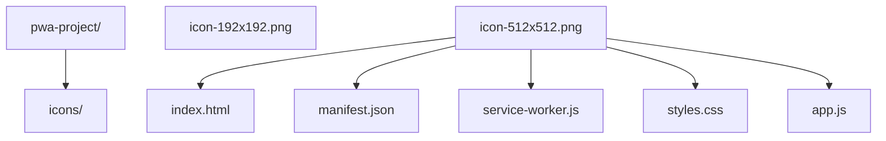
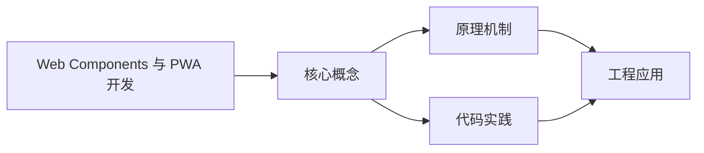
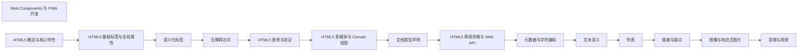

## 1. 学习目标（Bloom 分类）

本节按照布鲁姆教育目标分类学组织学习路径。本文主题为《Web Components 与 PWA 开发》，属于 HTML5 模块，读者可以根据自身阶段选择阅读深度。

记忆层面：能够准确复述本文的核心概念、术语与基本语法或操作步骤，并能够在提问或检索时快速定位对应知识点。能够说出 HTML5 的核心概念、术语与标准写法。

理解层面：能够用自己的语言解释核心原理与工作机制，说明概念之间的因果关系，而不是机械记忆结论。能够解释 HTML5 的工作原理与设计动机。

应用层面：能够在真实项目或练习场景中运用本文知识解决具体问题，写出正确且可维护的实现。能够编写符合 HTML5 规范的完整实现。

分析层面：能够拆解复杂问题，比较本文主题与相邻概念的异同，识别边界条件与例外情况。能够分析 HTML5 与相邻方案的差异与边界。

评价层面：能够根据约束条件（性能、可读性、安全、成本）评价不同方案的优劣，做出有依据的技术决策。能够根据场景评价 HTML5 相关方案的优劣。

创造层面：能够把本文知识与其他模块知识组合，设计出新的解决方案或可复用的工程模式。能够组合 HTML5 与其他技术设计完整方案。

通过本节学习，读者应当能够把《Web Components 与 PWA 开发》纳入自己的知识网络，并与 HTML5 模块的其他主题（语义化、表单、多媒体、Canvas）建立关联。

## 2. 历史动机与发展脉络

《Web Components 与 PWA 开发》是 HTML5 领域的重要主题。要真正理解它，需要先了解它解决的问题与演进过程。

HTML 由 Tim Berners-Lee 于 1991 年创建，是 Web 的结构语言；HTML5 于 2014 年成为 W3C 推荐标准，WHATWG 维护的 Living Standard 是当前权威规范。
HTML5 引入语义化元素（header/nav/main/article/section/footer）、表单增强（date/range/placeholder）、多媒体（video/audio）、图形（canvas/SVG）与离线存储（localStorage/Web Worker）。
现代 HTML 强调“语义优先”：结构表达内容含义，样式与行为分离；可访问性（ARIA）与 SEO 都建立在正确语义之上。

回到本文主题：Web Components 与 PWA 开发 的提出与成熟，正是上述技术背景下的必然产物。早期实现往往以简单可用为目标，随着工程规模扩大，社区逐渐沉淀出标准做法与最佳实践；理解这一脉络，可以帮助读者判断“为什么文档中的推荐写法是现在这个样子”，也能在遇到历史遗留代码时准确识别其设计年代与取舍。


## 3. 形式化定义与核心概念精讲

本节把《Web Components 与 PWA 开发》涉及的核心概念以“定义 + 讲解”的形式展开。读者应把定义当作工具，把讲解当作理解路径；两者结合才能形成可迁移的知识。

文档结构：<!DOCTYPE html> 声明标准模式；html/head/body 层级固定；meta charset 必须在前 1024 字节内。
语义元素：header/footer 表示页眉页脚，nav 表示导航，main 表示主内容（每页唯一），article 表示独立内容，section 表示分区。
表单：input 类型决定键盘与校验（email/url/number），label 关联控件提升可访问性，required/pattern 提供原生校验。

### 3.1 原文章节逐一精讲

原文档把主题拆分为 26 个小节，下面按顺序给出每一节的导读讲解，随后保留原文细节供精读。

#### 原文精读（完整保留）

# Web Components 与 PWA 开发 语法速查手册

> **符号约定**:`< >` 必填参数 | `[ ]` 可选参数

---

#### 1. Web Components 概述

Web Components 是一组 Web 平台 API，允许开发者创建可重用的自定义元素，这些元素可以在任何 HTML 页面中使用，无论使用什么框架。

##### 核心技术

- **Custom Elements**：创建自定义 HTML 元素
- **Shadow DOM**：封装组件样式和结构
- **HTML Templates**：定义可重用的 HTML 结构
- **HTML Imports**：导入组件（已被 ES 模块取代）

#### 2. Custom Elements

##### 2.1 定义自定义元素

```javascript
class MyElement extends HTMLElement {
  constructor() {
    super();
    // 元素初始化
  }
  // 当元素被添加到 DOM 时调用
  connectedCallback() {
    this.innerHTML = `<p>Hello, Web Components!</p>`;
  }
  // 当元素从 DOM 中移除时调用
  disconnectedCallback() {
    // 清理资源
  }
  // 当属性变化时调用
  attributeChangedCallback(name, oldValue, newValue) {
    // 处理属性变化
  }
  // 定义需要观察的属性
  static get observedAttributes() {
    return ['title'];
  }
}
// 注册自定义元素
customElements.define('my-element', MyElement);
```

##### 2.2 使用自定义元素

```html
<my-element title="Hello"></my-element>
```

#### 3. Shadow DOM

##### 3.1 创建 Shadow DOM

```javascript
class MyElement extends HTMLElement {
  constructor() {
    super();
    // 创建 Shadow DOM
    const shadow = this.attachShadow({ mode: 'open' });
    // 创建样式
    const style = document.createElement('style');
    style.textContent = `
  p {
  color: blue;
  font-size: 18px;
  }
  `;
    // 创建内容
    const p = document.createElement('p');
    p.textContent = 'Hello from Shadow DOM!';
    // 添加到 Shadow DOM
    shadow.appendChild(style);
    shadow.appendChild(p);
  }
}
customElements.define('my-shadow-element', MyElement);
```

#### 4. HTML Templates

##### 4.1 定义模板

```html
<template id="my-template">
  <style>
    .container {
      padding: 20px;
      background: #f0f0f0;
      border-radius: 8px;
    }
    h3 {
      color: #333;
    }
  </style>
  <div class="container">
    <h3></h3>
    <p></p>
  </div>
</template>
```

##### 4.2 使用模板

```javascript
class MyTemplateElement extends HTMLElement {
  constructor() {
    super();
    const shadow = this.attachShadow({ mode: 'open' });
    // 获取模板
    const template = document.getElementById('my-template');
    const content = template.content.cloneNode(true);
    // 设置内容
    content.querySelector('h3').textContent = this.getAttribute('title') || 'Default Title';
    content.querySelector('p').textContent = this.getAttribute('message') || 'Default message';
    shadow.appendChild(content);
  }
}
customElements.define('my-template-element', MyTemplateElement);
```

#### 5. 组件生命周期

##### 5.1 生命周期回调

| 回调方法                                             | 触发时机             |
| :--------------------------------------------------- | :------------------- |
| `constructor()`                                      | 元素创建时           |
| `connectedCallback()`                                | 元素添加到 DOM 时    |
| `disconnectedCallback()`                             | 元素从 DOM 中移除时  |
| `attributeChangedCallback(name, oldValue, newValue)` | 属性变化时           |
| `adoptedCallback()`                                  | 元素被移动到新文档时 |

#### 6. PWA (Progressive Web App) 概述

PWA 是一种结合了 Web 和原生应用优点的应用程序，具有安装到主屏幕、离线访问、推送通知等特性。

##### 核心特性

- **可安装**：可以添加到主屏幕
- **离线工作**：使用 Service Worker 缓存资源
- **推送通知**：发送推送消息
- **后台同步**：在网络可用时同步数据
- **响应式**：适配不同屏幕尺寸

#### 7. PWA 配置

##### 7.1 Web App Manifest

```json
{
  "name": "My PWA",
  "short_name": "PWA",
  "description": "A progressive web app",
  "start_url": "/",
  "display": "standalone",
  "background_color": "#ffffff",
  "theme_color": "#4A90E2",
  "icons": [
    {
      "src": "/icons/icon-192x192.png",
      "sizes": "192x192",
      "type": "image/png"
    },
    {
      "src": "/icons/icon-512x512.png",
      "sizes": "512x512",
      "type": "image/png"
    }
  ]
}
```

##### 7.2 注册 Manifest

```html
<link rel="manifest" href="/manifest.json" /> <meta name="theme-color" content="#4A90E2" />
```

#### 8. Service Worker

##### 8.1 注册 Service Worker

```javascript
if ('serviceWorker' in navigator) {
  window.addEventListener('load', () => {
    navigator.serviceWorker
      .register('/service-worker.js')
      .then((registration) => {
        console.log('Service Worker registered:', registration);
      })
      .catch((error) => {
        console.error('Service Worker registration failed:', error);
      });
  });
}
```

##### 8.2 Service Worker 实现

```javascript
 // service-worker.js
 const CACHE_NAME = 'my-pwa-cache-v1';
 const ASSETS = [
  '/',
  '/index.html',
  '/styles.css',
  '/app.js',
  '/icons/icon-192x192.png'
 ]
 // 安装 Service Worker
 self.addEventListener('install', event => {
  event.waitUntil(
  caches.open(CACHE_NAME)
  .then(cache => {
  return cache.addAll(ASSETS);
  })
  .then(() => self.skipWaiting())
  );
 }
 // 激活 Service Worker
 self.addEventListener('activate', event => {
  event.waitUntil(
  caches.keys()
  .then(cacheNames => {
  return Promise.all(
  cacheNames
  .filter(name => name !== CACHE_NAME)
  .map(name => caches.delete(name))
  );
  })
  .then(() => self.clients.claim())
  );
 }
 // 拦截网络请求
 self.addEventListener('fetch', event => {
  event.respondWith(
  caches.match(event.request)
  .then(response => {
  // 如果在缓存中找到响应，则返回缓存的响应
  if (response) {
  return response;
  }
  // 否则，发送网络请求
  return fetch(event.request)
  .then(response => {
  // 如果响应有效，则将其添加到缓存
  if (response && response.status === 200 && response.type === 'basic') {
  const responseToCache = response.clone();
  caches.open(CACHE_NAME)
  .then(cache => {
  cache.put(event.request, responseToCache);
  });
  }
  return response;
  });
  })
  );
 }
```

#### 9. 离线功能

##### 9.1 缓存策略

- **Cache First**：优先使用缓存，缓存不存在时请求网络
- **Network First**：优先请求网络，网络失败时使用缓存
- **Stale While Revalidate**：使用缓存的同时请求网络更新缓存
- **Network Only**：只使用网络
- **Cache Only**：只使用缓存

#### 10. 推送通知

##### 10.1 请求通知权限

```javascript
if ('Notification' in window) {
  Notification.requestPermission().then((permission) => {
    if (permission === 'granted') {
      console.log('Notification permission granted');
    }
  });
}
```

##### 10.2 发送推送通知

```javascript
function sendNotification() {
  if ('serviceWorker' in navigator && 'PushManager' in window) {
    navigator.serviceWorker.ready.then((registration) => {
      registration.showNotification('Hello PWA!', {
        body: 'This is a push notification from your PWA',
        icon: '/icons/icon-192x192.png',
        badge: '/icons/badge.png',
        vibrate: [100, 50, 100],
        data: {
          url: '/notifications',
        },
      });
    });
  }
}
```

#### 11. 后台同步

##### 11.1 注册后台同步

```javascript
if ('serviceWorker' in navigator && 'SyncManager' in window) {
  navigator.serviceWorker.ready
    .then((registration) => {
      return registration.sync.register('sync-data');
    })
    .then(() => {
      console.log('Background sync registered');
    })
    .catch((error) => {
      console.error('Background sync registration failed:', error);
    });
}
```

##### 11.2 处理后台同步

```javascript
// service-worker.js
self.addEventListener('sync', (event) => {
  if (event.tag === 'sync-data') {
    event.waitUntil(syncData());
  }
});
async function syncData() {
  try {
    // 同步数据的逻辑
    const response = await fetch('/api/sync', {
      method: 'POST',
      body: JSON.stringify({ data: 'sync data' }),
    });
    console.log('Background sync completed:', await response.json());
  } catch (error) {
    console.error('Background sync failed:', error);
  }
}
```

#### 12. PWA 最佳实践

1. **响应式设计**：确保在所有设备上都有良好的用户体验
2. **离线优先**：设计应用时考虑离线场景
3. **快速加载**：优化资源加载速度
4. **安全**：使用 HTTPS
5. **可安装**：提供清晰的安装提示
6. **推送通知**：合理使用推送通知，避免过度打扰用户
7. **后台同步**：使用后台同步确保数据一致性
8. **性能监控**：监控应用性能，持续优化

#### 13. 项目实战

##### 13.1 Web Components 项目结构



##### 13.2 PWA 项目结构



#### 14. 工具与库

##### 14.1 Web Components 库

- **Lit**：Google 开发的轻量级 Web Components 库
- **Stencil**：Ionic 团队开发的 Web Components 编译器
- **Svelte**：可以编译为 Web Components 的前端框架

##### 14.2 PWA 工具

- **Workbox**：Google 开发的 Service Worker 工具库
- **Lighthouse**：PWA 性能和质量评估工具
- **PWABuilder**：PWA 生成和打包工具

#### 15. 浏览器支持

##### 15.1 Web Components 支持

- Chrome：完全支持
- Firefox：完全支持
- Safari：支持（需要 polyfill 用于旧版本）
- Edge：完全支持

##### 15.2 PWA 支持

- Chrome：完全支持
- Firefox：部分支持
- Safari：部分支持（推送通知有限制）
- Edge：完全支持

#### 16. 常见问题与解决方案

##### 16.1 Web Components 问题

**问题**：自定义元素在某些浏览器中不工作
**解决方案**：使用 Web Components polyfill
**问题**：样式隔离问题
**解决方案**：使用 Shadow DOM 确保样式隔离

##### 16.2 PWA 问题

**问题**：Service Worker 缓存更新问题
**解决方案**：实现版本控制和缓存清理策略
**问题**：推送通知权限被拒绝
**解决方案**：在合适的时机请求权限，提供清晰的使用说明

#### 17. 延伸阅读

- [Web Components 官方文档](https://developer.mozilla.org/en-US/docs/Web/Web_Components)
- [PWA 官方文档](https://web.dev/progressive-web-apps/)
- [Workbox 文档](https://developers.google.com/web/tools/workbox)
- [Lit 文档](https://lit.dev/docs/)
  通过本教程，你已经了解了 Web Components 和 PWA 的核心概念和实践技巧。在实际项目中，你可以结合这些技术创建具有原生应用体验的 Web 应用，提升用户体验和性能。
#### Custom Elements 自定义元素

**定义自定义元素**
`customElements.define(<名称>, <类>, [options])`
```javascript
class MyElement extends HTMLElement {
  constructor() {
    super();
    // 元素初始化
  }

  // 当元素被添加到 DOM 时调用
  connectedCallback() {
    this.innerHTML = `<p>Hello, Web Components!</p>`;
  }

  // 当元素从 DOM 中移除时调用
  disconnectedCallback() {
    // 清理资源
  }

  // 当属性变化时调用
  attributeChangedCallback(name, oldValue, newValue) {
    // 处理属性变化
  }

  // 定义需要观察的属性
  static get observedAttributes() {
    return ['title'];
  }

  // 元素被移动到新文档时调用
  adoptedCallback() {}
}

// 注册自定义元素(名称必须包含连字符)
customElements.define('my-element', MyElement);
```

**使用自定义元素**
```html
<my-element title="Hello"></my-element>
```

**生命周期回调**

| 回调方法                                             | 触发时机             |
| :--------------------------------------------------- | :------------------- |
| `constructor()`                                      | 元素创建时           |
| `connectedCallback()`                                | 元素添加到 DOM 时    |
| `disconnectedCallback()`                             | 元素从 DOM 中移除时  |
| `attributeChangedCallback(name, oldValue, newValue)` | 属性变化时           |
| `adoptedCallback()`                                  | 元素被移动到新文档时 |

**CustomizedElement 内置扩展**
```javascript
class FancyButton extends HTMLButtonElement {
  constructor() {
    super();
    this.addEventListener('click', () => console.log('点击'));
  }
}

// 扩展内置元素
customElements.define('fancy-button', FancyButton, { extends: 'button' });
```

```html
<!-- 使用 is 属性 -->
<button is="fancy-button">点击</button>
```

**元素查询与升级**
```javascript
// 获取自定义元素引用
const el = customElements.get('my-element');

// 强制升级未定义的元素
await customElements.whenDefined('my-element');
console.log('my-element 已定义');
```

---

#### Shadow DOM 影子 DOM

**attachShadow 创建 Shadow DOM**
`element.attachShadow({ mode: 'open' | 'closed' })`
```javascript
class MyElement extends HTMLElement {
  constructor() {
    super();
    // 创建 Shadow DOM
    const shadow = this.attachShadow({ mode: 'open' });

    // 创建样式
    const style = document.createElement('style');
    style.textContent = `
      p {
        color: blue;
        font-size: 18px;
      }
    `;

    // 创建内容
    const p = document.createElement('p');
    p.textContent = 'Hello from Shadow DOM!';

    shadow.appendChild(style);
    shadow.appendChild(p);
  }
}
customElements.define('my-shadow-element', MyElement);
```

| mode 值   | 说明                                  |
| --------- | ------------------------------------- |
| `'open'`  | 外部可通过 `element.shadowRoot` 访问   |
| `'closed'`| 拒绝外部访问 `element.shadowRoot` 为 null |

**Shadow DOM 模板化**
```javascript
class MyTemplateElement extends HTMLElement {
  constructor() {
    super();
    const shadow = this.attachShadow({ mode: 'open' });
    const template = document.getElementById('my-template');
    const content = template.content.cloneNode(true);

    content.querySelector('h3').textContent = this.getAttribute('title') || '默认标题';
    content.querySelector('p').textContent = this.getAttribute('message') || '默认内容';
    shadow.appendChild(content);
  }
}
customElements.define('my-template-element', MyTemplateElement);
```

**shadowRoot 操作**
```javascript
// 获取 shadowRoot(open 模式)
const shadow = element.shadowRoot;

// 在 shadow 中查询元素
const innerEl = shadow.querySelector('.inner');

// 在 shadow 中添加元素
shadow.appendChild(document.createElement('div'));
```

**Declarative Shadow DOM(声明式 Shadow DOM)**
```html
<host-element>
  <template shadowrootmode="open">
    <style>p { color: red; }</style>
    <p>声明式 Shadow DOM 内容</p>
  </template>
</host-element>
```

---

#### HTML Templates 模板

**template 元素**
```html
<template id="my-template">
  <style>
    .container {
      padding: 20px;
      background: #f0f0f0;
      border-radius: 8px;
    }
    h3 {
      color: #333;
    }
  </style>
  <div class="container">
    <h3></h3>
    <p></p>
  </div>
</template>
```

**使用模板**
```javascript
class MyTemplateElement extends HTMLElement {
  constructor() {
    super();
    const shadow = this.attachShadow({ mode: 'open' });

    // 获取模板
    const template = document.getElementById('my-template');
    // 克隆模板内容
    const content = template.content.cloneNode(true);

    // 填充内容
    content.querySelector('h3').textContent = this.getAttribute('title') || 'Default';
    content.querySelector('p').textContent = this.getAttribute('message') || 'Message';

    shadow.appendChild(content);
  }
}
customElements.define('my-template-element', MyTemplateElement);
```

**slot 插槽**
```html
<!-- 组件定义 -->
<template id="card-template">
  <div class="card">
    <slot name="header">默认头部</slot>
    <hr />
    <slot>默认内容</slot>
  </div>
</template>
```

```html
<!-- 使用插槽 -->
<my-card>
  <span slot="header">自定义头部</span>
  <p>自定义内容</p>
</my-card>
```

**slotchange 事件**
```javascript
const slot = shadow.querySelector('slot');
slot.addEventListener('slotchange', (e) => {
  const assigned = e.target.assignedNodes();
  console.log('插槽内容变化', assigned);
});
```

---

#### CSS Scoping 样式隔离

**CSS 自定义属性穿透**
```css
/* 外部定义变量 */
:host {
  --primary-color: #1976d2;
}

/* shadow 内部使用 */
.button {
  background: var(--primary-color);
}
```

**host 选择器**
```css
/* 选中宿主元素 */
:host {
  display: block;
}

/* 选中具有特定类的宿主 */
:host(.active) {
  opacity: 1;
}

/* 选中特定宿主标签 */
:host(my-button) {
  border-radius: 4px;
}
```

**:host-context 上下文选择器**
```css
/* 当祖先元素具有 .dark-theme 时 */
:host-context(.dark-theme) {
  background: #333;
  color: #fff;
}
```

**::part() 伪元素**
```javascript
// 组件内
shadow.innerHTML = `
  <div part="container">
    <span part="label">标签</span>
  </div>
`;
```

```css
/* 外部样式表选中 part */
my-element::part(container) {
  background: red;
}
my-element::part(label) {
  color: white;
}
```

---

#### PWA Web App Manifest

**manifest.json 完整字段**
```json
{
  "name": "My PWA",
  "short_name": "PWA",
  "description": "A progressive web app",
  "start_url": "/",
  "scope": "/",
  "display": "standalone",
  "display_override": ["window-controls-overlay", "standalone"],
  "background_color": "#ffffff",
  "theme_color": "#4A90E2",
  "orientation": "any",
  "lang": "zh-CN",
  "dir": "ltr",
  "categories": ["productivity", "utilities"],
  "icons": [
    {
      "src": "/icons/icon-192.png",
      "sizes": "192x192",
      "type": "image/png",
      "purpose": "any"
    },
    {
      "src": "/icons/icon-512.png",
      "sizes": "512x512",
      "type": "image/png",
      "purpose": "maskable"
    }
  ],
  "screenshots": [
    {
      "src": "/screenshots/home.png",
      "sizes": "1280x720",
      "type": "image/png",
      "form_factor": "wide"
    }
  ],
  "shortcuts": [
    {
      "name": "新消息",
      "short_name": "消息",
      "url": "/messages/new",
      "icons": [{ "src": "/icons/msg.png", "sizes": "96x96" }]
    }
  ],
  "file_handlers": [
    {
      "action": "/open-file",
      "accept": { "image/*": [".png", ".jpg"] }
    }
  ]
}
```

**HTML 中引用 manifest**
```html
<link rel="manifest" href="/manifest.json" />
<meta name="theme-color" content="#4A90E2" />
<meta name="apple-mobile-web-app-capable" content="yes" />
<meta name="apple-mobile-web-app-title" content="My PWA" />
<link rel="apple-touch-icon" href="/icons/apple-180.png" />
```

**display 显示模式**

| display 值      | 说明                              |
| --------------- | --------------------------------- |
| `fullscreen`    | 全屏(无 UI)                       |
| `standalone`    | 独立应用(无浏览器 UI)             |
| `minimal-ui`    | 最小 UI(部分浏览器控件)           |
| `browser`       | 标准浏览器(默认)                  |

---

#### PWA 安装

**beforeinstallprompt 事件**
```javascript
let deferredPrompt;

window.addEventListener('beforeinstallprompt', (e) => {
  e.preventDefault();
  deferredPrompt = e;
  showInstallButton();
});

document.getElementById('installBtn').addEventListener('click', async () => {
  if (!deferredPrompt) return;
  deferredPrompt.prompt();
  const { outcome } = await deferredPrompt.userChoice;
  console.log(outcome); // 'accepted' | 'dismissed'
  deferredPrompt = null;
});

window.addEventListener('appinstalled', () => {
  console.log('应用已安装');
});
```

**Window Controls Overlay**
```javascript
// 检测支持
const supported = 'windowControlsOverlay' in navigator;

// 监听变化
navigator.windowControlsOverlay.addEventListener('geometrychange', (e) => {
  console.log('标题栏区域变化', e.titlebarAreaRect);
});
```

---

#### Fetch 拦截(SW)

**fetch 事件处理**
`self.addEventListener('fetch', (event) => { event.respondWith(<Response>) })`
```javascript
// service-worker.js
const CACHE_NAME = 'my-pwa-cache-v1';
const ASSETS = ['/', '/index.html', '/styles.css', '/app.js'];

// 安装:预缓存
self.addEventListener('install', (event) => {
  event.waitUntil(
    caches.open(CACHE_NAME).then((cache) => cache.addAll(ASSETS))
      .then(() => self.skipWaiting())
  );
});

// 激活:清理旧缓存
self.addEventListener('activate', (event) => {
  event.waitUntil(
    caches.keys().then((names) =>
      Promise.all(names.filter((n) => n !== CACHE_NAME).map((n) => caches.delete(n)))
    ).then(() => self.clients.claim())
  );
});

// 拦截请求
self.addEventListener('fetch', (event) => {
  event.respondWith(
    caches.match(event.request).then((cached) => {
      if (cached) return cached;
      return fetch(event.request).then((response) => {
        if (response && response.status === 200 && response.type === 'basic') {
          const clone = response.clone();
          caches.open(CACHE_NAME).then((cache) => cache.put(event.request, clone));
        }
        return response;
      });
    })
  );
});
```

**缓存策略对比**

| 策略                       | 说明                   | 适用场景     |
| -------------------------- | ---------------------- | ------------ |
| **Cache First**            | 优先缓存,无则请求网络  | 静态资源     |
| **Network First**          | 优先网络,失败用缓存    | API 请求     |
| **Stale While Revalidate** | 缓存即时响应,后台更新  | 非关键 API   |
| **Network Only**           | 仅网络                 | 实时数据     |
| **Cache Only**             | 仅缓存                 | 离线资源     |

---

#### 通知与推送

**请求通知权限**
```javascript
if ('Notification' in window) {
  Notification.requestPermission().then((permission) => {
    if (permission === 'granted') {
      console.log('通知权限已授予');
    }
  });
}
```

**显示通知**
```javascript
function sendNotification() {
  if ('serviceWorker' in navigator && 'PushManager' in window) {
    navigator.serviceWorker.ready.then((registration) => {
      registration.showNotification('Hello PWA!', {
        body: 'This is a push notification',
        icon: '/icons/icon-192.png',
        badge: '/icons/badge.png',
        vibrate: [100, 50, 100],
        data: { url: '/notifications' },
        actions: [
          { action: 'open', title: '打开' },
          { action: 'close', title: '关闭' },
        ],
      });
    });
  }
}
```

---

#### 后台同步

**注册后台同步**
```javascript
if ('serviceWorker' in navigator && 'SyncManager' in window) {
  navigator.serviceWorker.ready
    .then((registration) => registration.sync.register('sync-data'))
    .then(() => console.log('已注册后台同步'))
    .catch((error) => console.error('注册失败:', error));
}
```

**Service Worker 处理同步**
```javascript
self.addEventListener('sync', (event) => {
  if (event.tag === 'sync-data') {
    event.waitUntil(syncData());
  }
});

async function syncData() {
  try {
    const response = await fetch('/api/sync', {
      method: 'POST',
      body: JSON.stringify({ data: 'sync data' }),
    });
    console.log('同步完成:', await response.json());
  } catch (error) {
    console.error('同步失败:', error);
    throw error;
  }
}
```


### 3.2 概念关系图

下面用 Mermaid 图表达本文核心概念之间的关系，帮助读者建立整体图景：



图中展示的是本文知识的结构化关系：核心概念是入口，原理机制解释“为什么”，代码实践演示“怎么做”，工程应用回答“何时用”。读者学习时可以把每个小节的内容挂接到对应节点上。

## 4. 理论推导与原理解析

本节深入《Web Components 与 PWA 开发》背后的原理。理论部分不求面面俱到，而是聚焦“能解释现象、能指导实践”的关键推导。

文档结构：<!DOCTYPE html> 声明标准模式；html/head/body 层级固定；meta charset 必须在前 1024 字节内。
语义元素：header/footer 表示页眉页脚，nav 表示导航，main 表示主内容（每页唯一），article 表示独立内容，section 表示分区。
表单：input 类型决定键盘与校验（email/url/number），label 关联控件提升可访问性，required/pattern 提供原生校验。
媒体与图形：video/audio 支持多源（source）；canvas 是位图画布（JavaScript 绘制），SVG 是矢量结构（DOM 操作）。

需要强调的是，理论推导与工程实践之间存在翻译层：理论给出的是理想化模型与边界条件，工程代码则必须处理真实环境中的例外。读者在学习时应先掌握理论的“标准情形”，再通过陷阱章节了解“非标准情形”。

## 5. 代码示例与逐行讲解

本节把原文中的代码示例系统整理，并为每个示例补充用途说明与讲解。读者不应只浏览代码，而应逐段对照讲解理解设计意图。

### 5.1 示例：2.1 定义自定义元素

该示例来自原文《2.1 定义自定义元素》小节，用于演示Web Components 与 PWA 开发相关操作。阅读时请先看代码结构，再看其后的讲解。

```javascript
class MyElement extends HTMLElement {
  constructor() {
    super();
    // 元素初始化
  }
  // 当元素被添加到 DOM 时调用
  connectedCallback() {
    this.innerHTML = `<p>Hello, Web Components!</p>`;
  }
  // 当元素从 DOM 中移除时调用
  disconnectedCallback() {
    // 清理资源
  }
  // 当属性变化时调用
  attributeChangedCallback(name, oldValue, newValue) {
    // 处理属性变化
  }
  // 定义需要观察的属性
  static get observedAttributes() {
    return ['title'];
  }
}
// 注册自定义元素
customElements.define('my-element', MyElement);
```

讲解：这段代码演示了本节核心知识点。代码中的关键操作可以归纳为三步：准备（定义或初始化）、执行（核心逻辑）、收尾（释放资源或返回结果）。实际项目中，这三步往往被封装为函数或类，以提升复用性与可测试性。

关键点分析：

该示例共 24 行有效代码，包含 2 类关键结构（class、return）。其中：

- 入口与初始化部分负责建立上下文，对应实际项目中的启动或装配逻辑；
- 核心逻辑部分体现本文主题的主要操作，是阅读时最需要对照讲解理解的部分；
- 输出或返回部分把结果交给调用方，注意其类型与边界条件。

进阶思考路径：先尝试修改参数观察行为变化，再把示例中的模式迁移到自己的项目中；每次修改都记录预期与实测差异，这是把示例转化为能力的最快方式。

### 5.2 示例：2.2 使用自定义元素

该示例来自原文《2.2 使用自定义元素》小节，用于演示Web Components 与 PWA 开发相关操作。阅读时请先看代码结构，再看其后的讲解。

```html
<my-element title="Hello"></my-element>
```

讲解：这段代码演示了本节核心知识点。代码中的关键操作可以归纳为三步：准备（定义或初始化）、执行（核心逻辑）、收尾（释放资源或返回结果）。实际项目中，这三步往往被封装为函数或类，以提升复用性与可测试性。

关键点分析：

该示例共 1 行有效代码，结构以数据或配置为主。阅读时应关注：数据字段的含义、配置项的作用，以及它们与运行行为的对应关系。

进阶思考路径：先尝试修改参数观察行为变化，再把示例中的模式迁移到自己的项目中；每次修改都记录预期与实测差异，这是把示例转化为能力的最快方式。

### 5.3 示例：3.1 创建 Shadow DOM

该示例来自原文《3.1 创建 Shadow DOM》小节，用于演示Web Components 与 PWA 开发相关操作。阅读时请先看代码结构，再看其后的讲解。

```javascript
class MyElement extends HTMLElement {
  constructor() {
    super();
    // 创建 Shadow DOM
    const shadow = this.attachShadow({ mode: 'open' });
    // 创建样式
    const style = document.createElement('style');
    style.textContent = `
  p {
  color: blue;
  font-size: 18px;
  }
  `;
    // 创建内容
    const p = document.createElement('p');
    p.textContent = 'Hello from Shadow DOM!';
    // 添加到 Shadow DOM
    shadow.appendChild(style);
    shadow.appendChild(p);
  }
}
customElements.define('my-shadow-element', MyElement);
```

讲解：这段代码演示了本节核心知识点。代码中的关键操作可以归纳为三步：准备（定义或初始化）、执行（核心逻辑）、收尾（释放资源或返回结果）。实际项目中，这三步往往被封装为函数或类，以提升复用性与可测试性。

关键点分析：

该示例共 22 行有效代码，包含 2 类关键结构（class、from）。其中：

- 入口与初始化部分负责建立上下文，对应实际项目中的启动或装配逻辑；
- 核心逻辑部分体现本文主题的主要操作，是阅读时最需要对照讲解理解的部分；
- 输出或返回部分把结果交给调用方，注意其类型与边界条件。

进阶思考路径：先尝试修改参数观察行为变化，再把示例中的模式迁移到自己的项目中；每次修改都记录预期与实测差异，这是把示例转化为能力的最快方式。

### 5.4 示例：4.1 定义模板

该示例来自原文《4.1 定义模板》小节，用于演示Web Components 与 PWA 开发相关操作。阅读时请先看代码结构，再看其后的讲解。

```html
<template id="my-template">
  <style>
    .container {
      padding: 20px;
      background: #f0f0f0;
      border-radius: 8px;
    }
    h3 {
      color: #333;
    }
  </style>
  <div class="container">
    <h3></h3>
    <p></p>
  </div>
</template>
```

讲解：这段代码演示了本节核心知识点。代码中的关键操作可以归纳为三步：准备（定义或初始化）、执行（核心逻辑）、收尾（释放资源或返回结果）。实际项目中，这三步往往被封装为函数或类，以提升复用性与可测试性。

关键点分析：

该示例共 16 行有效代码，包含 1 类关键结构（class）。其中：

- 入口与初始化部分负责建立上下文，对应实际项目中的启动或装配逻辑；
- 核心逻辑部分体现本文主题的主要操作，是阅读时最需要对照讲解理解的部分；
- 输出或返回部分把结果交给调用方，注意其类型与边界条件。

进阶思考路径：先尝试修改参数观察行为变化，再把示例中的模式迁移到自己的项目中；每次修改都记录预期与实测差异，这是把示例转化为能力的最快方式。

### 5.5 示例：4.2 使用模板

该示例来自原文《4.2 使用模板》小节，用于演示Web Components 与 PWA 开发相关操作。阅读时请先看代码结构，再看其后的讲解。

```javascript
class MyTemplateElement extends HTMLElement {
  constructor() {
    super();
    const shadow = this.attachShadow({ mode: 'open' });
    // 获取模板
    const template = document.getElementById('my-template');
    const content = template.content.cloneNode(true);
    // 设置内容
    content.querySelector('h3').textContent = this.getAttribute('title') || 'Default Title';
    content.querySelector('p').textContent = this.getAttribute('message') || 'Default message';
    shadow.appendChild(content);
  }
}
customElements.define('my-template-element', MyTemplateElement);
```

讲解：这段代码演示了本节核心知识点。代码中的关键操作可以归纳为三步：准备（定义或初始化）、执行（核心逻辑）、收尾（释放资源或返回结果）。实际项目中，这三步往往被封装为函数或类，以提升复用性与可测试性。

关键点分析：

该示例共 14 行有效代码，包含 1 类关键结构（class）。其中：

- 入口与初始化部分负责建立上下文，对应实际项目中的启动或装配逻辑；
- 核心逻辑部分体现本文主题的主要操作，是阅读时最需要对照讲解理解的部分；
- 输出或返回部分把结果交给调用方，注意其类型与边界条件。

进阶思考路径：先尝试修改参数观察行为变化，再把示例中的模式迁移到自己的项目中；每次修改都记录预期与实测差异，这是把示例转化为能力的最快方式。

### 5.6 示例：7.1 Web App Manifest

该示例来自原文《7.1 Web App Manifest》小节，用于演示Web Components 与 PWA 开发相关操作。阅读时请先看代码结构，再看其后的讲解。

```json
{
  "name": "My PWA",
  "short_name": "PWA",
  "description": "A progressive web app",
  "start_url": "/",
  "display": "standalone",
  "background_color": "#ffffff",
  "theme_color": "#4A90E2",
  "icons": [
    {
      "src": "/icons/icon-192x192.png",
      "sizes": "192x192",
      "type": "image/png"
    },
    {
      "src": "/icons/icon-512x512.png",
      "sizes": "512x512",
      "type": "image/png"
    }
  ]
}
```

讲解：这段代码演示了本节核心知识点。代码中的关键操作可以归纳为三步：准备（定义或初始化）、执行（核心逻辑）、收尾（释放资源或返回结果）。实际项目中，这三步往往被封装为函数或类，以提升复用性与可测试性。

关键点分析：

该示例共 21 行有效代码，结构以数据或配置为主。阅读时应关注：数据字段的含义、配置项的作用，以及它们与运行行为的对应关系。

进阶思考路径：先尝试修改参数观察行为变化，再把示例中的模式迁移到自己的项目中；每次修改都记录预期与实测差异，这是把示例转化为能力的最快方式。

### 5.7 示例：7.2 注册 Manifest

该示例来自原文《7.2 注册 Manifest》小节，用于演示Web Components 与 PWA 开发相关操作。阅读时请先看代码结构，再看其后的讲解。

```html
<link rel="manifest" href="/manifest.json" /> <meta name="theme-color" content="#4A90E2" />
```

讲解：这段代码演示了本节核心知识点。代码中的关键操作可以归纳为三步：准备（定义或初始化）、执行（核心逻辑）、收尾（释放资源或返回结果）。实际项目中，这三步往往被封装为函数或类，以提升复用性与可测试性。

关键点分析：

该示例共 1 行有效代码，结构以数据或配置为主。阅读时应关注：数据字段的含义、配置项的作用，以及它们与运行行为的对应关系。

进阶思考路径：先尝试修改参数观察行为变化，再把示例中的模式迁移到自己的项目中；每次修改都记录预期与实测差异，这是把示例转化为能力的最快方式。

### 5.8 示例：8.1 注册 Service Worker

该示例来自原文《8.1 注册 Service Worker》小节，用于演示Web Components 与 PWA 开发相关操作。阅读时请先看代码结构，再看其后的讲解。

```javascript
if ('serviceWorker' in navigator) {
  window.addEventListener('load', () => {
    navigator.serviceWorker
      .register('/service-worker.js')
      .then((registration) => {
        console.log('Service Worker registered:', registration);
      })
      .catch((error) => {
        console.error('Service Worker registration failed:', error);
      });
  });
}
```

讲解：这段代码演示了本节核心知识点。代码中的关键操作可以归纳为三步：准备（定义或初始化）、执行（核心逻辑）、收尾（释放资源或返回结果）。实际项目中，这三步往往被封装为函数或类，以提升复用性与可测试性。

关键点分析：

该示例共 12 行有效代码，包含 1 类关键结构（if）。其中：

- 入口与初始化部分负责建立上下文，对应实际项目中的启动或装配逻辑；
- 核心逻辑部分体现本文主题的主要操作，是阅读时最需要对照讲解理解的部分；
- 输出或返回部分把结果交给调用方，注意其类型与边界条件。

进阶思考路径：先尝试修改参数观察行为变化，再把示例中的模式迁移到自己的项目中；每次修改都记录预期与实测差异，这是把示例转化为能力的最快方式。

### 5.9 示例：8.2 Service Worker 实现

该示例来自原文《8.2 Service Worker 实现》小节，用于演示Web Components 与 PWA 开发相关操作。阅读时请先看代码结构，再看其后的讲解。

```javascript
 // service-worker.js
 const CACHE_NAME = 'my-pwa-cache-v1';
 const ASSETS = [
  '/',
  '/index.html',
  '/styles.css',
  '/app.js',
  '/icons/icon-192x192.png'
 ]
 // 安装 Service Worker
 self.addEventListener('install', event => {
  event.waitUntil(
  caches.open(CACHE_NAME)
  .then(cache => {
  return cache.addAll(ASSETS);
  })
  .then(() => self.skipWaiting())
  );
 }
 // 激活 Service Worker
 self.addEventListener('activate', event => {
  event.waitUntil(
  caches.keys()
  .then(cacheNames => {
  return Promise.all(
  cacheNames
  .filter(name => name !== CACHE_NAME)
  .map(name => caches.delete(name))
  );
  })
  .then(() => self.clients.claim())
  );
 }
 // 拦截网络请求
 self.addEventListener('fetch', event => {
  event.respondWith(
  caches.match(event.request)
  .then(response => {
  // 如果在缓存中找到响应，则返回缓存的响应
  if (response) {
  return response;
  }
  // 否则，发送网络请求
  return fetch(event.request)
  .then(response => {
  // 如果响应有效，则将其添加到缓存
  if (response && response.status === 200 && response.type === 'basic') {
  const responseToCache = response.clone();
  caches.open(CACHE_NAME)
  .then(cache => {
  cache.put(event.request, responseToCache);
  });
  }
  return response;
  });
  })
  );
 }
```

讲解：这段代码演示了本节核心知识点。代码中的关键操作可以归纳为三步：准备（定义或初始化）、执行（核心逻辑）、收尾（释放资源或返回结果）。实际项目中，这三步往往被封装为函数或类，以提升复用性与可测试性。

关键点分析：

该示例共 58 行有效代码，包含 2 类关键结构（if、return）。其中：

- 入口与初始化部分负责建立上下文，对应实际项目中的启动或装配逻辑；
- 核心逻辑部分体现本文主题的主要操作，是阅读时最需要对照讲解理解的部分；
- 输出或返回部分把结果交给调用方，注意其类型与边界条件。

进阶思考路径：先尝试修改参数观察行为变化，再把示例中的模式迁移到自己的项目中；每次修改都记录预期与实测差异，这是把示例转化为能力的最快方式。

### 5.10 示例：10.1 请求通知权限

该示例来自原文《10.1 请求通知权限》小节，用于演示Web Components 与 PWA 开发相关操作。阅读时请先看代码结构，再看其后的讲解。

```javascript
if ('Notification' in window) {
  Notification.requestPermission().then((permission) => {
    if (permission === 'granted') {
      console.log('Notification permission granted');
    }
  });
}
```

讲解：这段代码演示了本节核心知识点。代码中的关键操作可以归纳为三步：准备（定义或初始化）、执行（核心逻辑）、收尾（释放资源或返回结果）。实际项目中，这三步往往被封装为函数或类，以提升复用性与可测试性。

关键点分析：

该示例共 7 行有效代码，包含 1 类关键结构（if）。其中：

- 入口与初始化部分负责建立上下文，对应实际项目中的启动或装配逻辑；
- 核心逻辑部分体现本文主题的主要操作，是阅读时最需要对照讲解理解的部分；
- 输出或返回部分把结果交给调用方，注意其类型与边界条件。

进阶思考路径：先尝试修改参数观察行为变化，再把示例中的模式迁移到自己的项目中；每次修改都记录预期与实测差异，这是把示例转化为能力的最快方式。

### 5.11 示例：10.2 发送推送通知

该示例来自原文《10.2 发送推送通知》小节，用于演示Web Components 与 PWA 开发相关操作。阅读时请先看代码结构，再看其后的讲解。

```javascript
function sendNotification() {
  if ('serviceWorker' in navigator && 'PushManager' in window) {
    navigator.serviceWorker.ready.then((registration) => {
      registration.showNotification('Hello PWA!', {
        body: 'This is a push notification from your PWA',
        icon: '/icons/icon-192x192.png',
        badge: '/icons/badge.png',
        vibrate: [100, 50, 100],
        data: {
          url: '/notifications',
        },
      });
    });
  }
}
```

讲解：这段代码演示了本节核心知识点。代码中的关键操作可以归纳为三步：准备（定义或初始化）、执行（核心逻辑）、收尾（释放资源或返回结果）。实际项目中，这三步往往被封装为函数或类，以提升复用性与可测试性。

关键点分析：

该示例共 15 行有效代码，包含 3 类关键结构（function、from、if）。其中：

- 入口与初始化部分负责建立上下文，对应实际项目中的启动或装配逻辑；
- 核心逻辑部分体现本文主题的主要操作，是阅读时最需要对照讲解理解的部分；
- 输出或返回部分把结果交给调用方，注意其类型与边界条件。

进阶思考路径：先尝试修改参数观察行为变化，再把示例中的模式迁移到自己的项目中；每次修改都记录预期与实测差异，这是把示例转化为能力的最快方式。

### 5.12 示例：11.1 注册后台同步

该示例来自原文《11.1 注册后台同步》小节，用于演示Web Components 与 PWA 开发相关操作。阅读时请先看代码结构，再看其后的讲解。

```javascript
if ('serviceWorker' in navigator && 'SyncManager' in window) {
  navigator.serviceWorker.ready
    .then((registration) => {
      return registration.sync.register('sync-data');
    })
    .then(() => {
      console.log('Background sync registered');
    })
    .catch((error) => {
      console.error('Background sync registration failed:', error);
    });
}
```

讲解：这段代码演示了本节核心知识点。代码中的关键操作可以归纳为三步：准备（定义或初始化）、执行（核心逻辑）、收尾（释放资源或返回结果）。实际项目中，这三步往往被封装为函数或类，以提升复用性与可测试性。

关键点分析：

该示例共 12 行有效代码，包含 2 类关键结构（if、return）。其中：

- 入口与初始化部分负责建立上下文，对应实际项目中的启动或装配逻辑；
- 核心逻辑部分体现本文主题的主要操作，是阅读时最需要对照讲解理解的部分；
- 输出或返回部分把结果交给调用方，注意其类型与边界条件。

进阶思考路径：先尝试修改参数观察行为变化，再把示例中的模式迁移到自己的项目中；每次修改都记录预期与实测差异，这是把示例转化为能力的最快方式。

### 5.13 示例：11.2 处理后台同步

该示例来自原文《11.2 处理后台同步》小节，用于演示Web Components 与 PWA 开发相关操作。阅读时请先看代码结构，再看其后的讲解。

```javascript
// service-worker.js
self.addEventListener('sync', (event) => {
  if (event.tag === 'sync-data') {
    event.waitUntil(syncData());
  }
});
async function syncData() {
  try {
    // 同步数据的逻辑
    const response = await fetch('/api/sync', {
      method: 'POST',
      body: JSON.stringify({ data: 'sync data' }),
    });
    console.log('Background sync completed:', await response.json());
  } catch (error) {
    console.error('Background sync failed:', error);
  }
}
```

讲解：这段代码演示了本节核心知识点。代码中的关键操作可以归纳为三步：准备（定义或初始化）、执行（核心逻辑）、收尾（释放资源或返回结果）。实际项目中，这三步往往被封装为函数或类，以提升复用性与可测试性。

关键点分析：

该示例共 18 行有效代码，包含 2 类关键结构（function、if）。其中：

- 入口与初始化部分负责建立上下文，对应实际项目中的启动或装配逻辑；
- 核心逻辑部分体现本文主题的主要操作，是阅读时最需要对照讲解理解的部分；
- 输出或返回部分把结果交给调用方，注意其类型与边界条件。

进阶思考路径：先尝试修改参数观察行为变化，再把示例中的模式迁移到自己的项目中；每次修改都记录预期与实测差异，这是把示例转化为能力的最快方式。

### 5.14 示例：13.1 Web Components 项目结构

该示例来自原文《13.1 Web Components 项目结构》小节，用于演示Web Components 与 PWA 开发相关操作。阅读时请先看代码结构，再看其后的讲解。


讲解：这段代码演示了本节核心知识点。代码中的关键操作可以归纳为三步：准备（定义或初始化）、执行（核心逻辑）、收尾（释放资源或返回结果）。实际项目中，这三步往往被封装为函数或类，以提升复用性与可测试性。

关键点分析：

该示例共 17 行有效代码，结构以数据或配置为主。阅读时应关注：数据字段的含义、配置项的作用，以及它们与运行行为的对应关系。

进阶思考路径：先尝试修改参数观察行为变化，再把示例中的模式迁移到自己的项目中；每次修改都记录预期与实测差异，这是把示例转化为能力的最快方式。

### 5.15 示例：13.2 PWA 项目结构

该示例来自原文《13.2 PWA 项目结构》小节，用于演示Web Components 与 PWA 开发相关操作。阅读时请先看代码结构，再看其后的讲解。


讲解：这段代码演示了本节核心知识点。代码中的关键操作可以归纳为三步：准备（定义或初始化）、执行（核心逻辑）、收尾（释放资源或返回结果）。实际项目中，这三步往往被封装为函数或类，以提升复用性与可测试性。

关键点分析：

该示例共 16 行有效代码，结构以数据或配置为主。阅读时应关注：数据字段的含义、配置项的作用，以及它们与运行行为的对应关系。

进阶思考路径：先尝试修改参数观察行为变化，再把示例中的模式迁移到自己的项目中；每次修改都记录预期与实测差异，这是把示例转化为能力的最快方式。

### 5.16 示例：Custom Elements 自定义元素

该示例来自原文《Custom Elements 自定义元素》小节，用于演示Web Components 与 PWA 开发相关操作。阅读时请先看代码结构，再看其后的讲解。

```javascript
class MyElement extends HTMLElement {
  constructor() {
    super();
    // 元素初始化
  }

  // 当元素被添加到 DOM 时调用
  connectedCallback() {
    this.innerHTML = `<p>Hello, Web Components!</p>`;
  }

  // 当元素从 DOM 中移除时调用
  disconnectedCallback() {
    // 清理资源
  }

  // 当属性变化时调用
  attributeChangedCallback(name, oldValue, newValue) {
    // 处理属性变化
  }

  // 定义需要观察的属性
  static get observedAttributes() {
    return ['title'];
  }

  // 元素被移动到新文档时调用
  adoptedCallback() {}
}

// 注册自定义元素(名称必须包含连字符)
customElements.define('my-element', MyElement);
```

讲解：这段代码演示了本节核心知识点。代码中的关键操作可以归纳为三步：准备（定义或初始化）、执行（核心逻辑）、收尾（释放资源或返回结果）。实际项目中，这三步往往被封装为函数或类，以提升复用性与可测试性。

关键点分析：

该示例共 26 行有效代码，包含 2 类关键结构（class、return）。其中：

- 入口与初始化部分负责建立上下文，对应实际项目中的启动或装配逻辑；
- 核心逻辑部分体现本文主题的主要操作，是阅读时最需要对照讲解理解的部分；
- 输出或返回部分把结果交给调用方，注意其类型与边界条件。

进阶思考路径：先尝试修改参数观察行为变化，再把示例中的模式迁移到自己的项目中；每次修改都记录预期与实测差异，这是把示例转化为能力的最快方式。

### 5.17 示例：Custom Elements 自定义元素

该示例来自原文《Custom Elements 自定义元素》小节，用于演示Web Components 与 PWA 开发相关操作。阅读时请先看代码结构，再看其后的讲解。

```html
<my-element title="Hello"></my-element>
```

讲解：这段代码演示了本节核心知识点。代码中的关键操作可以归纳为三步：准备（定义或初始化）、执行（核心逻辑）、收尾（释放资源或返回结果）。实际项目中，这三步往往被封装为函数或类，以提升复用性与可测试性。

关键点分析：

该示例共 1 行有效代码，结构以数据或配置为主。阅读时应关注：数据字段的含义、配置项的作用，以及它们与运行行为的对应关系。

进阶思考路径：先尝试修改参数观察行为变化，再把示例中的模式迁移到自己的项目中；每次修改都记录预期与实测差异，这是把示例转化为能力的最快方式。

### 5.18 示例：Custom Elements 自定义元素

该示例来自原文《Custom Elements 自定义元素》小节，用于演示Web Components 与 PWA 开发相关操作。阅读时请先看代码结构，再看其后的讲解。

```javascript
class FancyButton extends HTMLButtonElement {
  constructor() {
    super();
    this.addEventListener('click', () => console.log('点击'));
  }
}

// 扩展内置元素
customElements.define('fancy-button', FancyButton, { extends: 'button' });
```

讲解：这段代码演示了本节核心知识点。代码中的关键操作可以归纳为三步：准备（定义或初始化）、执行（核心逻辑）、收尾（释放资源或返回结果）。实际项目中，这三步往往被封装为函数或类，以提升复用性与可测试性。

关键点分析：

该示例共 8 行有效代码，包含 1 类关键结构（class）。其中：

- 入口与初始化部分负责建立上下文，对应实际项目中的启动或装配逻辑；
- 核心逻辑部分体现本文主题的主要操作，是阅读时最需要对照讲解理解的部分；
- 输出或返回部分把结果交给调用方，注意其类型与边界条件。

进阶思考路径：先尝试修改参数观察行为变化，再把示例中的模式迁移到自己的项目中；每次修改都记录预期与实测差异，这是把示例转化为能力的最快方式。

### 5.19 示例：Custom Elements 自定义元素

该示例来自原文《Custom Elements 自定义元素》小节，用于演示Web Components 与 PWA 开发相关操作。阅读时请先看代码结构，再看其后的讲解。

```html
<!-- 使用 is 属性 -->
<button is="fancy-button">点击</button>
```

讲解：这段代码演示了本节核心知识点。代码中的关键操作可以归纳为三步：准备（定义或初始化）、执行（核心逻辑）、收尾（释放资源或返回结果）。实际项目中，这三步往往被封装为函数或类，以提升复用性与可测试性。

关键点分析：

该示例共 2 行有效代码，结构以数据或配置为主。阅读时应关注：数据字段的含义、配置项的作用，以及它们与运行行为的对应关系。

进阶思考路径：先尝试修改参数观察行为变化，再把示例中的模式迁移到自己的项目中；每次修改都记录预期与实测差异，这是把示例转化为能力的最快方式。

### 5.20 示例：Custom Elements 自定义元素

该示例来自原文《Custom Elements 自定义元素》小节，用于演示Web Components 与 PWA 开发相关操作。阅读时请先看代码结构，再看其后的讲解。

```javascript
// 获取自定义元素引用
const el = customElements.get('my-element');

// 强制升级未定义的元素
await customElements.whenDefined('my-element');
console.log('my-element 已定义');
```

讲解：这段代码演示了本节核心知识点。代码中的关键操作可以归纳为三步：准备（定义或初始化）、执行（核心逻辑）、收尾（释放资源或返回结果）。实际项目中，这三步往往被封装为函数或类，以提升复用性与可测试性。

关键点分析：

该示例共 5 行有效代码，结构以数据或配置为主。阅读时应关注：数据字段的含义、配置项的作用，以及它们与运行行为的对应关系。

进阶思考路径：先尝试修改参数观察行为变化，再把示例中的模式迁移到自己的项目中；每次修改都记录预期与实测差异，这是把示例转化为能力的最快方式。

### 5.21 示例：Shadow DOM 影子 DOM

该示例来自原文《Shadow DOM 影子 DOM》小节，用于演示Web Components 与 PWA 开发相关操作。阅读时请先看代码结构，再看其后的讲解。

```javascript
class MyElement extends HTMLElement {
  constructor() {
    super();
    // 创建 Shadow DOM
    const shadow = this.attachShadow({ mode: 'open' });

    // 创建样式
    const style = document.createElement('style');
    style.textContent = `
      p {
        color: blue;
        font-size: 18px;
      }
    `;

    // 创建内容
    const p = document.createElement('p');
    p.textContent = 'Hello from Shadow DOM!';

    shadow.appendChild(style);
    shadow.appendChild(p);
  }
}
customElements.define('my-shadow-element', MyElement);
```

讲解：这段代码演示了本节核心知识点。代码中的关键操作可以归纳为三步：准备（定义或初始化）、执行（核心逻辑）、收尾（释放资源或返回结果）。实际项目中，这三步往往被封装为函数或类，以提升复用性与可测试性。

关键点分析：

该示例共 21 行有效代码，包含 2 类关键结构（class、from）。其中：

- 入口与初始化部分负责建立上下文，对应实际项目中的启动或装配逻辑；
- 核心逻辑部分体现本文主题的主要操作，是阅读时最需要对照讲解理解的部分；
- 输出或返回部分把结果交给调用方，注意其类型与边界条件。

进阶思考路径：先尝试修改参数观察行为变化，再把示例中的模式迁移到自己的项目中；每次修改都记录预期与实测差异，这是把示例转化为能力的最快方式。

### 5.22 示例：Shadow DOM 影子 DOM

该示例来自原文《Shadow DOM 影子 DOM》小节，用于演示Web Components 与 PWA 开发相关操作。阅读时请先看代码结构，再看其后的讲解。

```javascript
class MyTemplateElement extends HTMLElement {
  constructor() {
    super();
    const shadow = this.attachShadow({ mode: 'open' });
    const template = document.getElementById('my-template');
    const content = template.content.cloneNode(true);

    content.querySelector('h3').textContent = this.getAttribute('title') || '默认标题';
    content.querySelector('p').textContent = this.getAttribute('message') || '默认内容';
    shadow.appendChild(content);
  }
}
customElements.define('my-template-element', MyTemplateElement);
```

讲解：这段代码演示了本节核心知识点。代码中的关键操作可以归纳为三步：准备（定义或初始化）、执行（核心逻辑）、收尾（释放资源或返回结果）。实际项目中，这三步往往被封装为函数或类，以提升复用性与可测试性。

关键点分析：

该示例共 12 行有效代码，包含 1 类关键结构（class）。其中：

- 入口与初始化部分负责建立上下文，对应实际项目中的启动或装配逻辑；
- 核心逻辑部分体现本文主题的主要操作，是阅读时最需要对照讲解理解的部分；
- 输出或返回部分把结果交给调用方，注意其类型与边界条件。

进阶思考路径：先尝试修改参数观察行为变化，再把示例中的模式迁移到自己的项目中；每次修改都记录预期与实测差异，这是把示例转化为能力的最快方式。

### 5.23 示例：Shadow DOM 影子 DOM

该示例来自原文《Shadow DOM 影子 DOM》小节，用于演示Web Components 与 PWA 开发相关操作。阅读时请先看代码结构，再看其后的讲解。

```javascript
// 获取 shadowRoot(open 模式)
const shadow = element.shadowRoot;

// 在 shadow 中查询元素
const innerEl = shadow.querySelector('.inner');

// 在 shadow 中添加元素
shadow.appendChild(document.createElement('div'));
```

讲解：这段代码演示了本节核心知识点。代码中的关键操作可以归纳为三步：准备（定义或初始化）、执行（核心逻辑）、收尾（释放资源或返回结果）。实际项目中，这三步往往被封装为函数或类，以提升复用性与可测试性。

关键点分析：

该示例共 6 行有效代码，结构以数据或配置为主。阅读时应关注：数据字段的含义、配置项的作用，以及它们与运行行为的对应关系。

进阶思考路径：先尝试修改参数观察行为变化，再把示例中的模式迁移到自己的项目中；每次修改都记录预期与实测差异，这是把示例转化为能力的最快方式。

### 5.24 示例：Shadow DOM 影子 DOM

该示例来自原文《Shadow DOM 影子 DOM》小节，用于演示Web Components 与 PWA 开发相关操作。阅读时请先看代码结构，再看其后的讲解。

```html
<host-element>
  <template shadowrootmode="open">
    <style>p { color: red; }</style>
    <p>声明式 Shadow DOM 内容</p>
  </template>
</host-element>
```

讲解：这段代码演示了本节核心知识点。代码中的关键操作可以归纳为三步：准备（定义或初始化）、执行（核心逻辑）、收尾（释放资源或返回结果）。实际项目中，这三步往往被封装为函数或类，以提升复用性与可测试性。

关键点分析：

该示例共 6 行有效代码，结构以数据或配置为主。阅读时应关注：数据字段的含义、配置项的作用，以及它们与运行行为的对应关系。

进阶思考路径：先尝试修改参数观察行为变化，再把示例中的模式迁移到自己的项目中；每次修改都记录预期与实测差异，这是把示例转化为能力的最快方式。

### 5.25 示例：HTML Templates 模板

该示例来自原文《HTML Templates 模板》小节，用于演示Web Components 与 PWA 开发相关操作。阅读时请先看代码结构，再看其后的讲解。

```html
<template id="my-template">
  <style>
    .container {
      padding: 20px;
      background: #f0f0f0;
      border-radius: 8px;
    }
    h3 {
      color: #333;
    }
  </style>
  <div class="container">
    <h3></h3>
    <p></p>
  </div>
</template>
```

讲解：这段代码演示了本节核心知识点。代码中的关键操作可以归纳为三步：准备（定义或初始化）、执行（核心逻辑）、收尾（释放资源或返回结果）。实际项目中，这三步往往被封装为函数或类，以提升复用性与可测试性。

关键点分析：

该示例共 16 行有效代码，包含 1 类关键结构（class）。其中：

- 入口与初始化部分负责建立上下文，对应实际项目中的启动或装配逻辑；
- 核心逻辑部分体现本文主题的主要操作，是阅读时最需要对照讲解理解的部分；
- 输出或返回部分把结果交给调用方，注意其类型与边界条件。

进阶思考路径：先尝试修改参数观察行为变化，再把示例中的模式迁移到自己的项目中；每次修改都记录预期与实测差异，这是把示例转化为能力的最快方式。

### 5.26 示例：HTML Templates 模板

该示例来自原文《HTML Templates 模板》小节，用于演示Web Components 与 PWA 开发相关操作。阅读时请先看代码结构，再看其后的讲解。

```javascript
class MyTemplateElement extends HTMLElement {
  constructor() {
    super();
    const shadow = this.attachShadow({ mode: 'open' });

    // 获取模板
    const template = document.getElementById('my-template');
    // 克隆模板内容
    const content = template.content.cloneNode(true);

    // 填充内容
    content.querySelector('h3').textContent = this.getAttribute('title') || 'Default';
    content.querySelector('p').textContent = this.getAttribute('message') || 'Message';

    shadow.appendChild(content);
  }
}
customElements.define('my-template-element', MyTemplateElement);
```

讲解：这段代码演示了本节核心知识点。代码中的关键操作可以归纳为三步：准备（定义或初始化）、执行（核心逻辑）、收尾（释放资源或返回结果）。实际项目中，这三步往往被封装为函数或类，以提升复用性与可测试性。

关键点分析：

该示例共 15 行有效代码，包含 1 类关键结构（class）。其中：

- 入口与初始化部分负责建立上下文，对应实际项目中的启动或装配逻辑；
- 核心逻辑部分体现本文主题的主要操作，是阅读时最需要对照讲解理解的部分；
- 输出或返回部分把结果交给调用方，注意其类型与边界条件。

进阶思考路径：先尝试修改参数观察行为变化，再把示例中的模式迁移到自己的项目中；每次修改都记录预期与实测差异，这是把示例转化为能力的最快方式。

### 5.27 示例：HTML Templates 模板

该示例来自原文《HTML Templates 模板》小节，用于演示Web Components 与 PWA 开发相关操作。阅读时请先看代码结构，再看其后的讲解。

```html
<!-- 组件定义 -->
<template id="card-template">
  <div class="card">
    <slot name="header">默认头部</slot>
    <hr />
    <slot>默认内容</slot>
  </div>
</template>
```

讲解：这段代码演示了本节核心知识点。代码中的关键操作可以归纳为三步：准备（定义或初始化）、执行（核心逻辑）、收尾（释放资源或返回结果）。实际项目中，这三步往往被封装为函数或类，以提升复用性与可测试性。

关键点分析：

该示例共 8 行有效代码，包含 1 类关键结构（class）。其中：

- 入口与初始化部分负责建立上下文，对应实际项目中的启动或装配逻辑；
- 核心逻辑部分体现本文主题的主要操作，是阅读时最需要对照讲解理解的部分；
- 输出或返回部分把结果交给调用方，注意其类型与边界条件。

进阶思考路径：先尝试修改参数观察行为变化，再把示例中的模式迁移到自己的项目中；每次修改都记录预期与实测差异，这是把示例转化为能力的最快方式。

### 5.28 示例：HTML Templates 模板

该示例来自原文《HTML Templates 模板》小节，用于演示Web Components 与 PWA 开发相关操作。阅读时请先看代码结构，再看其后的讲解。

```html
<!-- 使用插槽 -->
<my-card>
  <span slot="header">自定义头部</span>
  <p>自定义内容</p>
</my-card>
```

讲解：这段代码演示了本节核心知识点。代码中的关键操作可以归纳为三步：准备（定义或初始化）、执行（核心逻辑）、收尾（释放资源或返回结果）。实际项目中，这三步往往被封装为函数或类，以提升复用性与可测试性。

关键点分析：

该示例共 5 行有效代码，结构以数据或配置为主。阅读时应关注：数据字段的含义、配置项的作用，以及它们与运行行为的对应关系。

进阶思考路径：先尝试修改参数观察行为变化，再把示例中的模式迁移到自己的项目中；每次修改都记录预期与实测差异，这是把示例转化为能力的最快方式。

### 5.29 示例：HTML Templates 模板

该示例来自原文《HTML Templates 模板》小节，用于演示Web Components 与 PWA 开发相关操作。阅读时请先看代码结构，再看其后的讲解。

```javascript
const slot = shadow.querySelector('slot');
slot.addEventListener('slotchange', (e) => {
  const assigned = e.target.assignedNodes();
  console.log('插槽内容变化', assigned);
});
```

讲解：这段代码演示了本节核心知识点。代码中的关键操作可以归纳为三步：准备（定义或初始化）、执行（核心逻辑）、收尾（释放资源或返回结果）。实际项目中，这三步往往被封装为函数或类，以提升复用性与可测试性。

关键点分析：

该示例共 5 行有效代码，结构以数据或配置为主。阅读时应关注：数据字段的含义、配置项的作用，以及它们与运行行为的对应关系。

进阶思考路径：先尝试修改参数观察行为变化，再把示例中的模式迁移到自己的项目中；每次修改都记录预期与实测差异，这是把示例转化为能力的最快方式。

### 5.30 示例：CSS Scoping 样式隔离

该示例来自原文《CSS Scoping 样式隔离》小节，用于演示Web Components 与 PWA 开发相关操作。阅读时请先看代码结构，再看其后的讲解。

```css
/* 外部定义变量 */
:host {
  --primary-color: #1976d2;
}

/* shadow 内部使用 */
.button {
  background: var(--primary-color);
}
```

讲解：这段代码演示了本节核心知识点。代码中的关键操作可以归纳为三步：准备（定义或初始化）、执行（核心逻辑）、收尾（释放资源或返回结果）。实际项目中，这三步往往被封装为函数或类，以提升复用性与可测试性。

关键点分析：

该示例共 8 行有效代码，结构以数据或配置为主。阅读时应关注：数据字段的含义、配置项的作用，以及它们与运行行为的对应关系。

进阶思考路径：先尝试修改参数观察行为变化，再把示例中的模式迁移到自己的项目中；每次修改都记录预期与实测差异，这是把示例转化为能力的最快方式。

### 5.31 示例：CSS Scoping 样式隔离

该示例来自原文《CSS Scoping 样式隔离》小节，用于演示Web Components 与 PWA 开发相关操作。阅读时请先看代码结构，再看其后的讲解。

```css
/* 选中宿主元素 */
:host {
  display: block;
}

/* 选中具有特定类的宿主 */
:host(.active) {
  opacity: 1;
}

/* 选中特定宿主标签 */
:host(my-button) {
  border-radius: 4px;
}
```

讲解：这段代码演示了本节核心知识点。代码中的关键操作可以归纳为三步：准备（定义或初始化）、执行（核心逻辑）、收尾（释放资源或返回结果）。实际项目中，这三步往往被封装为函数或类，以提升复用性与可测试性。

关键点分析：

该示例共 12 行有效代码，结构以数据或配置为主。阅读时应关注：数据字段的含义、配置项的作用，以及它们与运行行为的对应关系。

进阶思考路径：先尝试修改参数观察行为变化，再把示例中的模式迁移到自己的项目中；每次修改都记录预期与实测差异，这是把示例转化为能力的最快方式。

### 5.32 示例：CSS Scoping 样式隔离

该示例来自原文《CSS Scoping 样式隔离》小节，用于演示Web Components 与 PWA 开发相关操作。阅读时请先看代码结构，再看其后的讲解。

```css
/* 当祖先元素具有 .dark-theme 时 */
:host-context(.dark-theme) {
  background: #333;
  color: #fff;
}
```

讲解：这段代码演示了本节核心知识点。代码中的关键操作可以归纳为三步：准备（定义或初始化）、执行（核心逻辑）、收尾（释放资源或返回结果）。实际项目中，这三步往往被封装为函数或类，以提升复用性与可测试性。

关键点分析：

该示例共 5 行有效代码，结构以数据或配置为主。阅读时应关注：数据字段的含义、配置项的作用，以及它们与运行行为的对应关系。

进阶思考路径：先尝试修改参数观察行为变化，再把示例中的模式迁移到自己的项目中；每次修改都记录预期与实测差异，这是把示例转化为能力的最快方式。

### 5.33 示例：CSS Scoping 样式隔离

该示例来自原文《CSS Scoping 样式隔离》小节，用于演示Web Components 与 PWA 开发相关操作。阅读时请先看代码结构，再看其后的讲解。

```javascript
// 组件内
shadow.innerHTML = `
  <div part="container">
    <span part="label">标签</span>
  </div>
`;
```

讲解：这段代码演示了本节核心知识点。代码中的关键操作可以归纳为三步：准备（定义或初始化）、执行（核心逻辑）、收尾（释放资源或返回结果）。实际项目中，这三步往往被封装为函数或类，以提升复用性与可测试性。

关键点分析：

该示例共 6 行有效代码，结构以数据或配置为主。阅读时应关注：数据字段的含义、配置项的作用，以及它们与运行行为的对应关系。

进阶思考路径：先尝试修改参数观察行为变化，再把示例中的模式迁移到自己的项目中；每次修改都记录预期与实测差异，这是把示例转化为能力的最快方式。

### 5.34 示例：CSS Scoping 样式隔离

该示例来自原文《CSS Scoping 样式隔离》小节，用于演示Web Components 与 PWA 开发相关操作。阅读时请先看代码结构，再看其后的讲解。

```css
/* 外部样式表选中 part */
my-element::part(container) {
  background: red;
}
my-element::part(label) {
  color: white;
}
```

讲解：这段代码演示了本节核心知识点。代码中的关键操作可以归纳为三步：准备（定义或初始化）、执行（核心逻辑）、收尾（释放资源或返回结果）。实际项目中，这三步往往被封装为函数或类，以提升复用性与可测试性。

关键点分析：

该示例共 7 行有效代码，结构以数据或配置为主。阅读时应关注：数据字段的含义、配置项的作用，以及它们与运行行为的对应关系。

进阶思考路径：先尝试修改参数观察行为变化，再把示例中的模式迁移到自己的项目中；每次修改都记录预期与实测差异，这是把示例转化为能力的最快方式。

### 5.35 示例：PWA Web App Manifest

该示例来自原文《PWA Web App Manifest》小节，用于演示Web Components 与 PWA 开发相关操作。阅读时请先看代码结构，再看其后的讲解。

```json
{
  "name": "My PWA",
  "short_name": "PWA",
  "description": "A progressive web app",
  "start_url": "/",
  "scope": "/",
  "display": "standalone",
  "display_override": ["window-controls-overlay", "standalone"],
  "background_color": "#ffffff",
  "theme_color": "#4A90E2",
  "orientation": "any",
  "lang": "zh-CN",
  "dir": "ltr",
  "categories": ["productivity", "utilities"],
  "icons": [
    {
      "src": "/icons/icon-192.png",
      "sizes": "192x192",
      "type": "image/png",
      "purpose": "any"
    },
    {
      "src": "/icons/icon-512.png",
      "sizes": "512x512",
      "type": "image/png",
      "purpose": "maskable"
    }
  ],
  "screenshots": [
    {
      "src": "/screenshots/home.png",
      "sizes": "1280x720",
      "type": "image/png",
      "form_factor": "wide"
    }
  ],
  "shortcuts": [
    {
      "name": "新消息",
      "short_name": "消息",
      "url": "/messages/new",
      "icons": [{ "src": "/icons/msg.png", "sizes": "96x96" }]
    }
  ],
  "file_handlers": [
    {
      "action": "/open-file",
      "accept": { "image/*": [".png", ".jpg"] }
    }
  ]
}
```

讲解：这段代码演示了本节核心知识点。代码中的关键操作可以归纳为三步：准备（定义或初始化）、执行（核心逻辑）、收尾（释放资源或返回结果）。实际项目中，这三步往往被封装为函数或类，以提升复用性与可测试性。

关键点分析：

该示例共 51 行有效代码，结构以数据或配置为主。阅读时应关注：数据字段的含义、配置项的作用，以及它们与运行行为的对应关系。

进阶思考路径：先尝试修改参数观察行为变化，再把示例中的模式迁移到自己的项目中；每次修改都记录预期与实测差异，这是把示例转化为能力的最快方式。

### 5.36 示例：PWA Web App Manifest

该示例来自原文《PWA Web App Manifest》小节，用于演示Web Components 与 PWA 开发相关操作。阅读时请先看代码结构，再看其后的讲解。

```html
<link rel="manifest" href="/manifest.json" />
<meta name="theme-color" content="#4A90E2" />
<meta name="apple-mobile-web-app-capable" content="yes" />
<meta name="apple-mobile-web-app-title" content="My PWA" />
<link rel="apple-touch-icon" href="/icons/apple-180.png" />
```

讲解：这段代码演示了本节核心知识点。代码中的关键操作可以归纳为三步：准备（定义或初始化）、执行（核心逻辑）、收尾（释放资源或返回结果）。实际项目中，这三步往往被封装为函数或类，以提升复用性与可测试性。

关键点分析：

该示例共 5 行有效代码，结构以数据或配置为主。阅读时应关注：数据字段的含义、配置项的作用，以及它们与运行行为的对应关系。

进阶思考路径：先尝试修改参数观察行为变化，再把示例中的模式迁移到自己的项目中；每次修改都记录预期与实测差异，这是把示例转化为能力的最快方式。

### 5.37 示例：PWA 安装

该示例来自原文《PWA 安装》小节，用于演示Web Components 与 PWA 开发相关操作。阅读时请先看代码结构，再看其后的讲解。

```javascript
let deferredPrompt;

window.addEventListener('beforeinstallprompt', (e) => {
  e.preventDefault();
  deferredPrompt = e;
  showInstallButton();
});

document.getElementById('installBtn').addEventListener('click', async () => {
  if (!deferredPrompt) return;
  deferredPrompt.prompt();
  const { outcome } = await deferredPrompt.userChoice;
  console.log(outcome); // 'accepted' | 'dismissed'
  deferredPrompt = null;
});

window.addEventListener('appinstalled', () => {
  console.log('应用已安装');
});
```

讲解：这段代码演示了本节核心知识点。代码中的关键操作可以归纳为三步：准备（定义或初始化）、执行（核心逻辑）、收尾（释放资源或返回结果）。实际项目中，这三步往往被封装为函数或类，以提升复用性与可测试性。

关键点分析：

该示例共 16 行有效代码，包含 2 类关键结构（if、return）。其中：

- 入口与初始化部分负责建立上下文，对应实际项目中的启动或装配逻辑；
- 核心逻辑部分体现本文主题的主要操作，是阅读时最需要对照讲解理解的部分；
- 输出或返回部分把结果交给调用方，注意其类型与边界条件。

进阶思考路径：先尝试修改参数观察行为变化，再把示例中的模式迁移到自己的项目中；每次修改都记录预期与实测差异，这是把示例转化为能力的最快方式。

### 5.38 示例：PWA 安装

该示例来自原文《PWA 安装》小节，用于演示Web Components 与 PWA 开发相关操作。阅读时请先看代码结构，再看其后的讲解。

```javascript
// 检测支持
const supported = 'windowControlsOverlay' in navigator;

// 监听变化
navigator.windowControlsOverlay.addEventListener('geometrychange', (e) => {
  console.log('标题栏区域变化', e.titlebarAreaRect);
});
```

讲解：这段代码演示了本节核心知识点。代码中的关键操作可以归纳为三步：准备（定义或初始化）、执行（核心逻辑）、收尾（释放资源或返回结果）。实际项目中，这三步往往被封装为函数或类，以提升复用性与可测试性。

关键点分析：

该示例共 6 行有效代码，结构以数据或配置为主。阅读时应关注：数据字段的含义、配置项的作用，以及它们与运行行为的对应关系。

进阶思考路径：先尝试修改参数观察行为变化，再把示例中的模式迁移到自己的项目中；每次修改都记录预期与实测差异，这是把示例转化为能力的最快方式。

### 5.39 示例：Fetch 拦截(SW)

该示例来自原文《Fetch 拦截(SW)》小节，用于演示Web Components 与 PWA 开发相关操作。阅读时请先看代码结构，再看其后的讲解。

```javascript
// service-worker.js
const CACHE_NAME = 'my-pwa-cache-v1';
const ASSETS = ['/', '/index.html', '/styles.css', '/app.js'];

// 安装:预缓存
self.addEventListener('install', (event) => {
  event.waitUntil(
    caches.open(CACHE_NAME).then((cache) => cache.addAll(ASSETS))
      .then(() => self.skipWaiting())
  );
});

// 激活:清理旧缓存
self.addEventListener('activate', (event) => {
  event.waitUntil(
    caches.keys().then((names) =>
      Promise.all(names.filter((n) => n !== CACHE_NAME).map((n) => caches.delete(n)))
    ).then(() => self.clients.claim())
  );
});

// 拦截请求
self.addEventListener('fetch', (event) => {
  event.respondWith(
    caches.match(event.request).then((cached) => {
      if (cached) return cached;
      return fetch(event.request).then((response) => {
        if (response && response.status === 200 && response.type === 'basic') {
          const clone = response.clone();
          caches.open(CACHE_NAME).then((cache) => cache.put(event.request, clone));
        }
        return response;
      });
    })
  );
});
```

讲解：这段代码演示了本节核心知识点。代码中的关键操作可以归纳为三步：准备（定义或初始化）、执行（核心逻辑）、收尾（释放资源或返回结果）。实际项目中，这三步往往被封装为函数或类，以提升复用性与可测试性。

关键点分析：

该示例共 33 行有效代码，包含 2 类关键结构（if、return）。其中：

- 入口与初始化部分负责建立上下文，对应实际项目中的启动或装配逻辑；
- 核心逻辑部分体现本文主题的主要操作，是阅读时最需要对照讲解理解的部分；
- 输出或返回部分把结果交给调用方，注意其类型与边界条件。

进阶思考路径：先尝试修改参数观察行为变化，再把示例中的模式迁移到自己的项目中；每次修改都记录预期与实测差异，这是把示例转化为能力的最快方式。

### 5.40 示例：通知与推送

该示例来自原文《通知与推送》小节，用于演示Web Components 与 PWA 开发相关操作。阅读时请先看代码结构，再看其后的讲解。

```javascript
if ('Notification' in window) {
  Notification.requestPermission().then((permission) => {
    if (permission === 'granted') {
      console.log('通知权限已授予');
    }
  });
}
```

讲解：这段代码演示了本节核心知识点。代码中的关键操作可以归纳为三步：准备（定义或初始化）、执行（核心逻辑）、收尾（释放资源或返回结果）。实际项目中，这三步往往被封装为函数或类，以提升复用性与可测试性。

关键点分析：

该示例共 7 行有效代码，包含 1 类关键结构（if）。其中：

- 入口与初始化部分负责建立上下文，对应实际项目中的启动或装配逻辑；
- 核心逻辑部分体现本文主题的主要操作，是阅读时最需要对照讲解理解的部分；
- 输出或返回部分把结果交给调用方，注意其类型与边界条件。

进阶思考路径：先尝试修改参数观察行为变化，再把示例中的模式迁移到自己的项目中；每次修改都记录预期与实测差异，这是把示例转化为能力的最快方式。

### 5.41 示例：通知与推送

该示例来自原文《通知与推送》小节，用于演示Web Components 与 PWA 开发相关操作。阅读时请先看代码结构，再看其后的讲解。

```javascript
function sendNotification() {
  if ('serviceWorker' in navigator && 'PushManager' in window) {
    navigator.serviceWorker.ready.then((registration) => {
      registration.showNotification('Hello PWA!', {
        body: 'This is a push notification',
        icon: '/icons/icon-192.png',
        badge: '/icons/badge.png',
        vibrate: [100, 50, 100],
        data: { url: '/notifications' },
        actions: [
          { action: 'open', title: '打开' },
          { action: 'close', title: '关闭' },
        ],
      });
    });
  }
}
```

讲解：这段代码演示了本节核心知识点。代码中的关键操作可以归纳为三步：准备（定义或初始化）、执行（核心逻辑）、收尾（释放资源或返回结果）。实际项目中，这三步往往被封装为函数或类，以提升复用性与可测试性。

关键点分析：

该示例共 17 行有效代码，包含 2 类关键结构（function、if）。其中：

- 入口与初始化部分负责建立上下文，对应实际项目中的启动或装配逻辑；
- 核心逻辑部分体现本文主题的主要操作，是阅读时最需要对照讲解理解的部分；
- 输出或返回部分把结果交给调用方，注意其类型与边界条件。

进阶思考路径：先尝试修改参数观察行为变化，再把示例中的模式迁移到自己的项目中；每次修改都记录预期与实测差异，这是把示例转化为能力的最快方式。

### 5.42 示例：后台同步

该示例来自原文《后台同步》小节，用于演示Web Components 与 PWA 开发相关操作。阅读时请先看代码结构，再看其后的讲解。

```javascript
if ('serviceWorker' in navigator && 'SyncManager' in window) {
  navigator.serviceWorker.ready
    .then((registration) => registration.sync.register('sync-data'))
    .then(() => console.log('已注册后台同步'))
    .catch((error) => console.error('注册失败:', error));
}
```

讲解：这段代码演示了本节核心知识点。代码中的关键操作可以归纳为三步：准备（定义或初始化）、执行（核心逻辑）、收尾（释放资源或返回结果）。实际项目中，这三步往往被封装为函数或类，以提升复用性与可测试性。

关键点分析：

该示例共 6 行有效代码，包含 1 类关键结构（if）。其中：

- 入口与初始化部分负责建立上下文，对应实际项目中的启动或装配逻辑；
- 核心逻辑部分体现本文主题的主要操作，是阅读时最需要对照讲解理解的部分；
- 输出或返回部分把结果交给调用方，注意其类型与边界条件。

进阶思考路径：先尝试修改参数观察行为变化，再把示例中的模式迁移到自己的项目中；每次修改都记录预期与实测差异，这是把示例转化为能力的最快方式。

### 5.43 示例：后台同步

该示例来自原文《后台同步》小节，用于演示Web Components 与 PWA 开发相关操作。阅读时请先看代码结构，再看其后的讲解。

```javascript
self.addEventListener('sync', (event) => {
  if (event.tag === 'sync-data') {
    event.waitUntil(syncData());
  }
});

async function syncData() {
  try {
    const response = await fetch('/api/sync', {
      method: 'POST',
      body: JSON.stringify({ data: 'sync data' }),
    });
    console.log('同步完成:', await response.json());
  } catch (error) {
    console.error('同步失败:', error);
    throw error;
  }
}
```

讲解：这段代码演示了本节核心知识点。代码中的关键操作可以归纳为三步：准备（定义或初始化）、执行（核心逻辑）、收尾（释放资源或返回结果）。实际项目中，这三步往往被封装为函数或类，以提升复用性与可测试性。

关键点分析：

该示例共 17 行有效代码，包含 2 类关键结构（function、if）。其中：

- 入口与初始化部分负责建立上下文，对应实际项目中的启动或装配逻辑；
- 核心逻辑部分体现本文主题的主要操作，是阅读时最需要对照讲解理解的部分；
- 输出或返回部分把结果交给调用方，注意其类型与边界条件。

进阶思考路径：先尝试修改参数观察行为变化，再把示例中的模式迁移到自己的项目中；每次修改都记录预期与实测差异，这是把示例转化为能力的最快方式。


综合以上示例，可以总结出本主题的代码实践要点：第一，先定义清晰的输入输出契约；第二，核心逻辑保持单一职责；第三，错误处理与边界条件不可省略；第四，命名与注释表达意图而非复述代码。

## 6. 对比分析

对比是理解《Web Components 与 PWA 开发》定位的最快路径。下面从多个维度与相邻方案进行对比。

HTML5 与 XHTML：HTML5 容错性强、语法宽松；XHTML 严格 XML 语法，已基本退出。
语义元素与 div+class：语义元素免费获得可访问性与 SEO；class 命名方案只是风格。
canvas 与 SVG：canvas 适合像素级绘制（游戏、图像处理），SVG 适合矢量图形与交互（图表、图标）。

对比的目的不是分出绝对优劣，而是建立选择依据：不同约束条件下，最优解不同。读者应把每个对比维度转化为决策检查清单。

## 7. 常见陷阱与最佳实践

本节整理该主题的高频错误与推荐做法。每个陷阱先描述现象，再解释原因，最后给出最佳实践。

### 7.1 div 滥用

全部用 div 导致语义缺失。优先语义元素，div 仅作无语义容器。

深入讲解：该问题之所以被归类为“常见陷阱”，是因为它在初学者的代码中反复出现，而且往往不在第一时间暴露——错误通常隐藏在特定数据或特定时序下。

从成因上看，div 滥用 一般源于对 HTML5 某个机制的理解偏差：要么误用了默认行为，要么忽略了边界条件，要么把其他语言的思维惯性带了过来。

从影响上看，div 滥用 轻则产生错误结果，重则导致资源泄漏、数据损坏或安全事故；这也是为什么工程评审中会把它列为检查项。

从修复策略上看，处理div 滥用的正确顺序是：先复现（构造最小用例），再定位（确认机制层面的根因），最后修复并补充回归测试。跳过复现直接改代码，往往治标不治本。

### 7.2 img 缺 alt

图片无法访问时无替代文本。alt 描述内容，装饰图用空 alt。

深入讲解：该问题之所以被归类为“常见陷阱”，是因为它在初学者的代码中反复出现，而且往往不在第一时间暴露——错误通常隐藏在特定数据或特定时序下。

从成因上看，img 缺 alt 一般源于对 HTML5 某个机制的理解偏差：要么误用了默认行为，要么忽略了边界条件，要么把其他语言的思维惯性带了过来。

从影响上看，img 缺 alt 轻则产生错误结果，重则导致资源泄漏、数据损坏或安全事故；这也是为什么工程评审中会把它列为检查项。

从修复策略上看，处理img 缺 alt的正确顺序是：先复现（构造最小用例），再定位（确认机制层面的根因），最后修复并补充回归测试。跳过复现直接改代码，往往治标不治本。

### 7.3 标题层级跳变

h1 直接到 h3 破坏文档大纲。按层级使用标题。

深入讲解：该问题之所以被归类为“常见陷阱”，是因为它在初学者的代码中反复出现，而且往往不在第一时间暴露——错误通常隐藏在特定数据或特定时序下。

从成因上看，标题层级跳变 一般源于对 HTML5 某个机制的理解偏差：要么误用了默认行为，要么忽略了边界条件，要么把其他语言的思维惯性带了过来。

从影响上看，标题层级跳变 轻则产生错误结果，重则导致资源泄漏、数据损坏或安全事故；这也是为什么工程评审中会把它列为检查项。

从修复策略上看，处理标题层级跳变的正确顺序是：先复现（构造最小用例），再定位（确认机制层面的根因），最后修复并补充回归测试。跳过复现直接改代码，往往治标不治本。

### 7.4 按钮用 a 标签

动作语义错误。导航用 a，动作用 button。

深入讲解：该问题之所以被归类为“常见陷阱”，是因为它在初学者的代码中反复出现，而且往往不在第一时间暴露——错误通常隐藏在特定数据或特定时序下。

从成因上看，按钮用 a 标签 一般源于对 HTML5 某个机制的理解偏差：要么误用了默认行为，要么忽略了边界条件，要么把其他语言的思维惯性带了过来。

从影响上看，按钮用 a 标签 轻则产生错误结果，重则导致资源泄漏、数据损坏或安全事故；这也是为什么工程评审中会把它列为检查项。

从修复策略上看，处理按钮用 a 标签的正确顺序是：先复现（构造最小用例），再定位（确认机制层面的根因），最后修复并补充回归测试。跳过复现直接改代码，往往治标不治本。

### 7.5 表单无 label

辅助技术无法识别控件。每个输入关联 label。

深入讲解：该问题之所以被归类为“常见陷阱”，是因为它在初学者的代码中反复出现，而且往往不在第一时间暴露——错误通常隐藏在特定数据或特定时序下。

从成因上看，表单无 label 一般源于对 HTML5 某个机制的理解偏差：要么误用了默认行为，要么忽略了边界条件，要么把其他语言的思维惯性带了过来。

从影响上看，表单无 label 轻则产生错误结果，重则导致资源泄漏、数据损坏或安全事故；这也是为什么工程评审中会把它列为检查项。

从修复策略上看，处理表单无 label的正确顺序是：先复现（构造最小用例），再定位（确认机制层面的根因），最后修复并补充回归测试。跳过复现直接改代码，往往治标不治本。

### 7.6 脚本阻塞渲染

同步脚本放 body 底部或用 defer。

深入讲解：该问题之所以被归类为“常见陷阱”，是因为它在初学者的代码中反复出现，而且往往不在第一时间暴露——错误通常隐藏在特定数据或特定时序下。

从成因上看，脚本阻塞渲染 一般源于对 HTML5 某个机制的理解偏差：要么误用了默认行为，要么忽略了边界条件，要么把其他语言的思维惯性带了过来。

从影响上看，脚本阻塞渲染 轻则产生错误结果，重则导致资源泄漏、数据损坏或安全事故；这也是为什么工程评审中会把它列为检查项。

从修复策略上看，处理脚本阻塞渲染的正确顺序是：先复现（构造最小用例），再定位（确认机制层面的根因），最后修复并补充回归测试。跳过复现直接改代码，往往治标不治本。

### 7.7 内联样式与事件

内联 style/onclick 破坏分离。使用 class 与 addEventListener。

深入讲解：该问题之所以被归类为“常见陷阱”，是因为它在初学者的代码中反复出现，而且往往不在第一时间暴露——错误通常隐藏在特定数据或特定时序下。

从成因上看，内联样式与事件 一般源于对 HTML5 某个机制的理解偏差：要么误用了默认行为，要么忽略了边界条件，要么把其他语言的思维惯性带了过来。

从影响上看，内联样式与事件 轻则产生错误结果，重则导致资源泄漏、数据损坏或安全事故；这也是为什么工程评审中会把它列为检查项。

从修复策略上看，处理内联样式与事件的正确顺序是：先复现（构造最小用例），再定位（确认机制层面的根因），最后修复并补充回归测试。跳过复现直接改代码，往往治标不治本。

### 7.8 忽略 meta viewport

移动端布局异常。添加 viewport meta。

深入讲解：该问题之所以被归类为“常见陷阱”，是因为它在初学者的代码中反复出现，而且往往不在第一时间暴露——错误通常隐藏在特定数据或特定时序下。

从成因上看，忽略 meta viewport 一般源于对 HTML5 某个机制的理解偏差：要么误用了默认行为，要么忽略了边界条件，要么把其他语言的思维惯性带了过来。

从影响上看，忽略 meta viewport 轻则产生错误结果，重则导致资源泄漏、数据损坏或安全事故；这也是为什么工程评审中会把它列为检查项。

从修复策略上看，处理忽略 meta viewport的正确顺序是：先复现（构造最小用例），再定位（确认机制层面的根因），最后修复并补充回归测试。跳过复现直接改代码，往往治标不治本。

### 7.0 最佳实践总览

1. 结构、样式、行为三层分离。
2. 每个页面唯一 main，标题层级连贯。
3. 图片提供 alt 与尺寸（防 CLS）。
4. 表单控件全部关联 label，错误信息可编程关联。
5. 使用 W3C 校验器与 axe 检查。

把这些最佳实践固化为团队规范与代码评审检查项，是避免同类问题反复出现的关键。

## 8. 工程实践

本节把《Web Components 与 PWA 开发》放入真实工程场景，给出可复用的模式与组织方法。

可访问性基线：语义元素 + ARIA（仅补充）+ 键盘可达 + 对比度达标（WCAG 2.1 AA）。
性能：图片懒加载（loading=lazy）、字体子集化、资源预加载。
SEO：语义标题、meta description、结构化数据（JSON-LD）。

### 8.1 工程实践的原则拆解

以上工程实践可以归纳为四条原则。第一，配置与代码分离：HTML5 项目中环境差异应通过配置注入，而不是散落在代码分支中；这保证同一份代码可以在开发、测试、生产环境一致运行。

第二，接口稳定优先：对外接口（函数签名、协议、数据格式）一旦被消费方依赖，变更成本极高；设计时应预留扩展点并保持向后兼容。

第三，可观测性内置：日志、指标与追踪应该在功能开发时同步设计，而不是故障发生后补救；没有观测手段的模块等于黑盒。

第四，变更可回滚：任何发布都应有对应的回滚方案；数据库迁移、配置变更与代码发布一样需要版本管理与逆向路径。

### 8.2 实践落地的检查清单

- [ ] 可访问性基线：对照本节描述，检查当前项目是否已经落实；未落实的项列入技术债并排期处理。
- [ ] 性能：对照本节描述，检查当前项目是否已经落实；未落实的项列入技术债并排期处理。
- [ ] SEO：对照本节描述，检查当前项目是否已经落实；未落实的项列入技术债并排期处理。

工程实践的共性原则：配置与代码分离、接口稳定优先、可观测性内置、变更可回滚。这些原则适用于本主题的所有实现。

## 9. 案例研究

本节通过一个完整案例把《Web Components 与 PWA 开发》的知识串起来。案例按“需求分析、方案设计、实现、验证”四步展开。

需求：重构文档站点首页为语义化结构。
方案：header/nav/main/article/footer 布局，面包屑用 nav + ol，卡片用 article。
要点：标题层级从 h1 开始连续；所有图片 alt；表单字段 label 关联。
验证：W3C 校验零错误；axe 扫描无严重问题；移动端视口正常。

### 9.1 案例的扩展讨论

把案例中的方案放大到真实规模，需要额外考虑三个问题：

第一，规模：当数据量或并发量上升一个数量级时，原方案中的数据结构、缓存策略与任务调度是否仍然成立？通常需要引入分层与异步。

第二，团队：多人协作时，模块边界、接口契约与代码所有权必须明确；案例中的实现应拆分为可独立测试的单元，并配合文档说明设计意图。

第三，演进：上线后的需求变化不可避免；方案设计时应预留扩展点（配置化、插件化、事件化），并定期用真实指标验证假设。


案例研究的学习方法：先独立阅读需求，尝试在脑中形成方案，再对照实现与讲解，最后思考“如果约束变化（数据量、并发、团队规模），方案应如何调整”。

## 10. 知识要点总结与深入讲解

本节以讲解形式汇总全文要点，替代传统的习题与自测，读者不需要答题，只需跟随解释建立完整的认知框架。

关于《Web Components 与 PWA 开发》的核心结论：

HTML 是内容的骨架，语义决定信息能否被机器与人共同理解。
HTML5 的特性围绕“结构、媒体、交互”三条线展开。
可访问性不是附加项，而是 HTML 的一部分。

原文档各小节的要点回顾：

- 1. Web Components 概述：该小节围绕Web Components 与 PWA 开发展开具体细节，阅读时应关注其与核心结论的对应关系；每个小节都是核心结论在某一个侧面的展开。
- 2. Custom Elements：该小节围绕Web Components 与 PWA 开发展开具体细节，阅读时应关注其与核心结论的对应关系；每个小节都是核心结论在某一个侧面的展开。
- 3. Shadow DOM：该小节围绕Web Components 与 PWA 开发展开具体细节，阅读时应关注其与核心结论的对应关系；每个小节都是核心结论在某一个侧面的展开。
- 4. HTML Templates：该小节围绕Web Components 与 PWA 开发展开具体细节，阅读时应关注其与核心结论的对应关系；每个小节都是核心结论在某一个侧面的展开。
- 5. 组件生命周期：该小节围绕Web Components 与 PWA 开发展开具体细节，阅读时应关注其与核心结论的对应关系；每个小节都是核心结论在某一个侧面的展开。
- 6. PWA (Progressive Web App) 概述：该小节围绕Web Components 与 PWA 开发展开具体细节，阅读时应关注其与核心结论的对应关系；每个小节都是核心结论在某一个侧面的展开。
- 7. PWA 配置：该小节围绕Web Components 与 PWA 开发展开具体细节，阅读时应关注其与核心结论的对应关系；每个小节都是核心结论在某一个侧面的展开。
- 8. Service Worker：该小节围绕Web Components 与 PWA 开发展开具体细节，阅读时应关注其与核心结论的对应关系；每个小节都是核心结论在某一个侧面的展开。
- 9. 离线功能：该小节围绕Web Components 与 PWA 开发展开具体细节，阅读时应关注其与核心结论的对应关系；每个小节都是核心结论在某一个侧面的展开。
- 10. 推送通知：该小节围绕Web Components 与 PWA 开发展开具体细节，阅读时应关注其与核心结论的对应关系；每个小节都是核心结论在某一个侧面的展开。
- 11. 后台同步：该小节围绕Web Components 与 PWA 开发展开具体细节，阅读时应关注其与核心结论的对应关系；每个小节都是核心结论在某一个侧面的展开。
- 12. PWA 最佳实践：该小节围绕Web Components 与 PWA 开发展开具体细节，阅读时应关注其与核心结论的对应关系；每个小节都是核心结论在某一个侧面的展开。
- 13. 项目实战：该小节围绕Web Components 与 PWA 开发展开具体细节，阅读时应关注其与核心结论的对应关系；每个小节都是核心结论在某一个侧面的展开。
- 14. 工具与库：该小节围绕Web Components 与 PWA 开发展开具体细节，阅读时应关注其与核心结论的对应关系；每个小节都是核心结论在某一个侧面的展开。
- 15. 浏览器支持：该小节围绕Web Components 与 PWA 开发展开具体细节，阅读时应关注其与核心结论的对应关系；每个小节都是核心结论在某一个侧面的展开。
- 16. 常见问题与解决方案：该小节围绕Web Components 与 PWA 开发展开具体细节，阅读时应关注其与核心结论的对应关系；每个小节都是核心结论在某一个侧面的展开。
- 17. 延伸阅读：该小节围绕Web Components 与 PWA 开发展开具体细节，阅读时应关注其与核心结论的对应关系；每个小节都是核心结论在某一个侧面的展开。
- Custom Elements 自定义元素：该小节围绕Web Components 与 PWA 开发展开具体细节，阅读时应关注其与核心结论的对应关系；每个小节都是核心结论在某一个侧面的展开。
- Shadow DOM 影子 DOM：该小节围绕Web Components 与 PWA 开发展开具体细节，阅读时应关注其与核心结论的对应关系；每个小节都是核心结论在某一个侧面的展开。
- HTML Templates 模板：该小节围绕Web Components 与 PWA 开发展开具体细节，阅读时应关注其与核心结论的对应关系；每个小节都是核心结论在某一个侧面的展开。
- CSS Scoping 样式隔离：该小节围绕Web Components 与 PWA 开发展开具体细节，阅读时应关注其与核心结论的对应关系；每个小节都是核心结论在某一个侧面的展开。
- PWA Web App Manifest：该小节围绕Web Components 与 PWA 开发展开具体细节，阅读时应关注其与核心结论的对应关系；每个小节都是核心结论在某一个侧面的展开。
- PWA 安装：该小节围绕Web Components 与 PWA 开发展开具体细节，阅读时应关注其与核心结论的对应关系；每个小节都是核心结论在某一个侧面的展开。
- Fetch 拦截(SW)：该小节围绕Web Components 与 PWA 开发展开具体细节，阅读时应关注其与核心结论的对应关系；每个小节都是核心结论在某一个侧面的展开。
- 通知与推送：该小节围绕Web Components 与 PWA 开发展开具体细节，阅读时应关注其与核心结论的对应关系；每个小节都是核心结论在某一个侧面的展开。
- 后台同步：该小节围绕Web Components 与 PWA 开发展开具体细节，阅读时应关注其与核心结论的对应关系；每个小节都是核心结论在某一个侧面的展开。

把以上要点与第 3-9 节的内容对照复习，即可完成对本文主题的闭环学习。

## 11. 参考文献


WHATWG HTML Living Standard：https://html.spec.whatwg.org/
MDN HTML 文档：https://developer.mozilla.org/zh-CN/docs/Web/HTML
W3C Markup Validation Service：https://validator.w3.org/
WebAIM 可访问性指南：https://webaim.org/

## 12. 延伸阅读


HTML 列表与链接精讲，见 006-html5/011-List 与 012-LinkageAnchor 文档。
CSS 样式与布局，见 007-css 模块。
JavaScript DOM 操作，见 008-javascript 模块。
尚硅谷 Bilibili 空间（https://space.bilibili.com/302417610 ）提供 HTML/CSS 课程。

## 14. 模块知识图谱与学习路径

本文属于 HTML5 模块。为了把《Web Components 与 PWA 开发》放入完整的知识网络，下面列出本模块的全部主题并给出相互关联的导读。学习时建议按模块内顺序推进，并在每个文档中留意交叉引用。



上图为模块主题的推荐学习顺序示意图（仅展示前若干主题）。各主题之间存在三类关联：

第一，前置依赖关系：早期主题是后期主题的基础，例如环境与语法先行、进阶主题随后；

第二，横向并列关系：同一层级主题从不同角度覆盖模块能力，学习顺序可以按兴趣调整；

第三，工程组合关系：多个主题在真实项目中组合使用，例如配置、性能与安全主题往往出现在同一系统的不同层面。

### 14.1 模块主题速查表

| 文档 | 主题 | 与本文的关联 |
| --- | --- | --- |
| HTML5 概述与核心特性 | 001-HTML5OverviewCoreFeature | 本文的前置基础 |
| HTML5 基础标签与全局属性 | 002-HTML5BasicTagGlobalAttribute | 本文的前置基础 |
| 语义化标签 | 003-SemanticTag | 本文的并列主题 |
| 无障碍访问 | 004-Accessibility | 本文的并列主题 |
| HTML5 表单与验证 | 005-HTML5FormValidation | 本文的并列主题 |
| HTML5 多媒体与 Canvas 绘图 | 006-HTML5MultimediaCanvasDrawing | 本文的并列主题 |
| 文档类型声明 | 007-DocTypeDeclaration | 本文的并列主题 |
| HTML5 离线存储与 Web API | 008-HTML5OfflineStorageWebAPI | 本文的并列主题 |
| 元数据与字符编码 | 009-MetadataCharacterEncoding | 本文的并列主题 |
| 文本语义 | 010-TextSemantic | 本文的并列主题 |
| 列表 | 011-List | 本文的并列主题 |
| 链接与锚点 | 012-LinkageAnchor | 本文的并列主题 |
| 图像与响应式图片 | 013-ImageResponsiveImage | 本文的并列主题 |
| 音频与视频 | 014-AudioVideo | 本文的并列主题 |
| SVG | 015-SVG | 本文的并列主题 |
| 嵌入式内容 | 016-EmbeddedContent | 本文的并列主题 |
| progress与meter | 017-ProgressMeter | 本文的并列主题 |
| Web Components 与 PWA 开发 | 018-WebComponentsPWADevelopment | 本文自身 |
| 拖拽API | 019-DragAPI | 本文的并列主题 |
| 地理位置定位 | 020-Geolocation | 本文的并列主题 |
| Web-Workers | 021-WebWorkers | 本文的并列主题 |
| Service-Worker与PWA | 022-ServiceWorkerPWA | 本文的并列主题 |
| History-API | 023-HistoryAPI | 本文的并列主题 |
| WebSocket | 024-WebSocket | 本文的并列主题 |
| WebRTC | 025-WebRTC | 本文的并列主题 |
| 微数据与JSON-LD | 026-MicrodataJSONLD | 本文的并列主题 |
| 自定义数据属性 | 027-CustomDataAttribute | 本文的并列主题 |
| 跨文档通信 | 028-CrossDocumentCommunication | 本文的并列主题 |
| 视口配置与移动优先 | 029-ViewportConfigMobileFirst | 本文的并列主题 |
| HTML5 项目示例：交互式表单应用 | 030-HTML5ProjectExampleInteractiveFormApplication | 本文的综合应用 |

速查表的作用是让读者快速判断：哪些文档应在阅读本文前掌握（前置基础），哪些文档应在阅读本文后继续（延伸主题）。本模块的交叉引用体系即以此表为基础。

## 15. 术语表

下表整理《Web Components 与 PWA 开发》及 HTML5 模块中出现的高频术语，给出简明释义。术语按字母序或逻辑序排列，供查阅。

| 术语 | 释义 |
| --- | --- |
| 文档结构 | <!DOCTYPE html> 声明标准模式；html/head/body 层级固定；meta charset 必须在前 1024 字节内。 |
| 语义元素 | header/footer 表示页眉页脚，nav 表示导航，main 表示主内容（每页唯一），article 表示独立内容，section 表示分区。 |
| 表单 | input 类型决定键盘与校验（email/url/number），label 关联控件提升可访问性，required/pattern 提供原生校验。 |
| 媒体与图形 | video/audio 支持多源（source）；canvas 是位图画布（JavaScript 绘制），SVG 是矢量结构（DOM 操作）。 |
| div 滥用（易错点） | 参见常见陷阱章节的详细讲解 |
| img 缺 alt（易错点） | 参见常见陷阱章节的详细讲解 |
| 标题层级跳变（易错点） | 参见常见陷阱章节的详细讲解 |
| 按钮用 a 标签（易错点） | 参见常见陷阱章节的详细讲解 |
| 表单无 label（易错点） | 参见常见陷阱章节的详细讲解 |
| 脚本阻塞渲染（易错点） | 参见常见陷阱章节的详细讲解 |

术语表与正文配合使用：先通读正文，遇到模糊术语回查本表；长期使用后术语会自然进入工作记忆。
