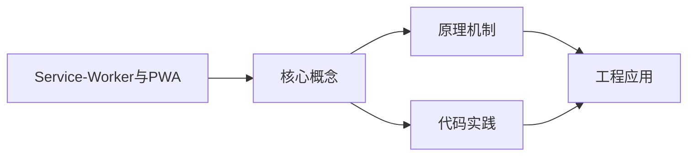
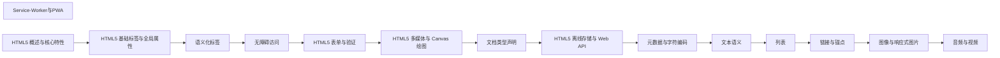

## 1. 学习目标（Bloom 分类）

本节按照布鲁姆教育目标分类学组织学习路径。本文主题为《Service-Worker与PWA》，属于 HTML5 模块，读者可以根据自身阶段选择阅读深度。

记忆层面：能够准确复述本文的核心概念、术语与基本语法或操作步骤，并能够在提问或检索时快速定位对应知识点。能够说出 HTML5 的核心概念、术语与标准写法。

理解层面：能够用自己的语言解释核心原理与工作机制，说明概念之间的因果关系，而不是机械记忆结论。能够解释 HTML5 的工作原理与设计动机。

应用层面：能够在真实项目或练习场景中运用本文知识解决具体问题，写出正确且可维护的实现。能够编写符合 HTML5 规范的完整实现。

分析层面：能够拆解复杂问题，比较本文主题与相邻概念的异同，识别边界条件与例外情况。能够分析 HTML5 与相邻方案的差异与边界。

评价层面：能够根据约束条件（性能、可读性、安全、成本）评价不同方案的优劣，做出有依据的技术决策。能够根据场景评价 HTML5 相关方案的优劣。

创造层面：能够把本文知识与其他模块知识组合，设计出新的解决方案或可复用的工程模式。能够组合 HTML5 与其他技术设计完整方案。

通过本节学习，读者应当能够把《Service-Worker与PWA》纳入自己的知识网络，并与 HTML5 模块的其他主题（语义化、表单、多媒体、Canvas）建立关联。

## 2. 历史动机与发展脉络

《Service-Worker与PWA》是 HTML5 领域的重要主题。要真正理解它，需要先了解它解决的问题与演进过程。

HTML 由 Tim Berners-Lee 于 1991 年创建，是 Web 的结构语言；HTML5 于 2014 年成为 W3C 推荐标准，WHATWG 维护的 Living Standard 是当前权威规范。
HTML5 引入语义化元素（header/nav/main/article/section/footer）、表单增强（date/range/placeholder）、多媒体（video/audio）、图形（canvas/SVG）与离线存储（localStorage/Web Worker）。
现代 HTML 强调“语义优先”：结构表达内容含义，样式与行为分离；可访问性（ARIA）与 SEO 都建立在正确语义之上。

回到本文主题：Service-Worker与PWA 的提出与成熟，正是上述技术背景下的必然产物。早期实现往往以简单可用为目标，随着工程规模扩大，社区逐渐沉淀出标准做法与最佳实践；理解这一脉络，可以帮助读者判断“为什么文档中的推荐写法是现在这个样子”，也能在遇到历史遗留代码时准确识别其设计年代与取舍。


## 3. 形式化定义与核心概念精讲

本节把《Service-Worker与PWA》涉及的核心概念以“定义 + 讲解”的形式展开。读者应把定义当作工具，把讲解当作理解路径；两者结合才能形成可迁移的知识。

文档结构：<!DOCTYPE html> 声明标准模式；html/head/body 层级固定；meta charset 必须在前 1024 字节内。
语义元素：header/footer 表示页眉页脚，nav 表示导航，main 表示主内容（每页唯一），article 表示独立内容，section 表示分区。
表单：input 类型决定键盘与校验（email/url/number），label 关联控件提升可访问性，required/pattern 提供原生校验。

### 3.1 原文章节逐一精讲

原文档把主题拆分为 14 个小节，下面按顺序给出每一节的导读讲解，随后保留原文细节供精读。

#### 原文精读（完整保留）

# Service Worker 与 PWA 语法速查手册

> **符号约定**:`< >` 必填参数 | `[ ]` 可选参数

---

#### 1. Service Worker 概述

Service Worker 是浏览器后台独立于网页运行的脚本，充当网络代理，支持离线缓存、推送通知和后台同步。

**生命周期**：Installing → Installed(Waiting) → Activating → Activated → Redundant

```javascript
if ('serviceWorker' in navigator) {
  navigator.serviceWorker
    .register('/sw.js', { scope: '/' })
    .then((reg) => console.log('注册成功'))
    .catch((err) => console.error('注册失败:', err));
}
```

#### 2. 生命周期事件

```javascript
const CACHE_NAME = 'app-v1';
const CACHE_URLS = ['/', '/index.html', '/styles.css', '/app.js'];

self.addEventListener('install', (event) => {
  event.waitUntil(
    caches
      .open(CACHE_NAME)
      .then((cache) => cache.addAll(CACHE_URLS))
      .then(() => self.skipWaiting())
  );
});

self.addEventListener('activate', (event) => {
  event.waitUntil(
    caches
      .keys()
      .then((names) =>
        Promise.all(names.filter((n) => n !== CACHE_NAME).map((n) => caches.delete(n)))
      )
      .then(() => self.clients.claim())
  );
});
```

#### 3. 缓存策略

| 策略                       | 说明                   | 适用场景   |
| -------------------------- | ---------------------- | ---------- |
| **Cache First**            | 优先缓存               | 静态资源   |
| **Network First**          | 优先网络               | API 请求   |
| **Stale While Revalidate** | 缓存即时响应，后台更新 | 非关键 API |

```javascript
// Cache First
self.addEventListener('fetch', (event) => {
  event.respondWith(caches.match(event.request).then((cached) => cached || fetch(event.request)));
});
```

#### 4. PWA 基础

```json
{
  "name": "我的应用",
  "short_name": "我的App",
  "start_url": "/",
  "display": "standalone",
  "theme_color": "#1976d2",
  "icons": [{ "src": "/icons/192.png", "sizes": "192x192", "type": "image/png" }]
}
```

#### 5. 推送通知与后台同步

```javascript
// 推送通知
self.addEventListener('push', (event) => {
  const data = event.data?.json() ?? { title: '新消息' };
  event.waitUntil(self.registration.showNotification(data.title, { body: data.body }));
});

// 后台同步
self.addEventListener('sync', (event) => {
  if (event.tag === 'sync-data') event.waitUntil(syncData());
});
```
#### Service Worker 注册

**注册 Service Worker**
`navigator.serviceWorker.register(<scriptURL>, [options]).then(<回调>)`
```javascript
// 基础注册
if ('serviceWorker' in navigator) {
  navigator.serviceWorker
    .register('/sw.js', { scope: '/' })
    .then((reg) => console.log('注册成功,作用域:', reg.scope))
    .catch((err) => console.error('注册失败:', err));
}
```

| options 字段 | 说明                       | 示例                |
| ------------ | -------------------------- | ------------------- |
| `scope`      | 控制范围(子目录路径)       | `scope: '/'`        |
| `type`       | worker 类型 classic/module | `type: 'module'`    |
| `updateViaCache` | 缓存策略               | `updateViaCache: 'none'` |

**生命周期方法**
```javascript
// 获取注册对象
const reg = await navigator.serviceWorker.ready;

// 手动更新
await reg.update();

// 取消注册
await reg.unregister();

// 监听更新事件
reg.addEventListener('updatefound', () => {
  console.log('发现新版本');
});
```

---

#### Service Worker 生命周期事件

**install 事件(安装阶段)**
`self.addEventListener('install', (event) => { event.waitUntil(<Promise>) })`
```javascript
const CACHE_NAME = 'app-v1';
const CACHE_URLS = ['/', '/index.html', '/styles.css', '/app.js'];

self.addEventListener('install', (event) => {
  event.waitUntil(
    caches
      .open(CACHE_NAME)
      .then((cache) => cache.addAll(CACHE_URLS))
      .then(() => self.skipWaiting()) // 跳过等待,立即激活
  );
});
```

**activate 事件(激活阶段)**
`self.addEventListener('activate', (event) => { event.waitUntil(<Promise>) })`
```javascript
self.addEventListener('activate', (event) => {
  event.waitUntil(
    caches
      .keys()
      .then((names) =>
        Promise.all(
          names
            .filter((n) => n !== CACHE_NAME)
            .map((n) => caches.delete(n))
        )
      )
      .then(() => self.clients.claim()) // 立即接管所有客户端
  );
});
```

**生命周期阶段**

| 阶段       | 事件       | 说明                  |
| ---------- | ---------- | --------------------- |
| Installing | `install`  | 安装中,预缓存资源     |
| Waiting    | -          | 等待旧 SW 释放        |
| Activating | `activate` | 激活中,清理旧缓存     |
| Activated  | -          | 已激活,可拦截请求     |
| Redundant  | -          | 安装失败或被替换      |

---

#### fetch 事件与缓存策略

**fetch 事件**
`self.addEventListener('fetch', (event) => { event.respondWith(<Response>) })`
```javascript
// Cache First 优先缓存
self.addEventListener('fetch', (event) => {
  event.respondWith(
    caches.match(event.request).then((cached) => cached || fetch(event.request))
  );
});
```

**Cache First(适合静态资源)**
```javascript
self.addEventListener('fetch', (event) => {
  event.respondWith(
    caches.match(event.request).then((cached) => {
      return cached || fetch(event.request);
    })
  );
});
```

**Network First(适合 API 请求)**
```javascript
self.addEventListener('fetch', (event) => {
  event.respondWith(
    fetch(event.request).catch(() => caches.match(event.request))
  );
});
```

**Stale While Revalidate(缓存即时响应,后台更新)**
```javascript
self.addEventListener('fetch', (event) => {
  event.respondWith(
    caches.open(CACHE_NAME).then((cache) =>
      cache.match(event.request).then((cached) => {
        const fetchPromise = fetch(event.request).then((response) => {
          cache.put(event.request, response.clone());
          return response;
        });
        return cached || fetchPromise;
      })
    )
  );
});
```

**缓存策略对比**

| 策略                       | 说明                   | 适用场景     |
| -------------------------- | ---------------------- | ------------ |
| **Cache First**            | 优先缓存,无则请求网络  | 静态资源     |
| **Network First**          | 优先网络,失败用缓存    | API 请求     |
| **Stale While Revalidate** | 缓存即时响应,后台更新  | 非关键 API   |
| **Network Only**           | 仅网络                 | 实时数据     |
| **Cache Only**             | 仅缓存                 | 离线资源     |

---

#### Cache Storage API

**缓存操作方法**
```javascript
// 打开缓存
const cache = await caches.open('my-cache-v1');

// 添加单个资源
await cache.add('/api/data');

// 批量添加
await cache.addAll(['/', '/styles.css', '/app.js']);

// 添加自定义响应
await cache.put('/api/custom', new Response('{"a":1}'));

// 匹配请求
const response = await cache.match('/api/data');

// 删除缓存项
await cache.delete('/api/data');

// 查询所有缓存名
const names = await caches.keys();

// 删除整个缓存
await caches.delete('my-cache-v1');
```

---

#### Web App Manifest

**manifest.json 字段**
```json
{
  "name": "我的应用",
  "short_name": "我的App",
  "description": "应用描述",
  "start_url": "/",
  "scope": "/",
  "display": "standalone",
  "orientation": "portrait-primary",
  "background_color": "#ffffff",
  "theme_color": "#1976d2",
  "lang": "zh-CN",
  "dir": "ltr",
  "categories": ["productivity", "utilities"],
  "icons": [
    {
      "src": "/icons/192.png",
      "sizes": "192x192",
      "type": "image/png",
      "purpose": "any"
    },
    {
      "src": "/icons/512.png",
      "sizes": "512x512",
      "type": "image/png",
      "purpose": "maskable"
    }
  ],
  "shortcuts": [
    {
      "name": "新消息",
      "url": "/messages/new",
      "icons": [{ "src": "/icons/msg.png", "sizes": "96x96" }]
    }
  ]
}
```

| 字段              | 说明                              | 示例值                          |
| ----------------- | --------------------------------- | ------------------------------- |
| `name`            | 应用全名                          | `"我的应用"`                    |
| `short_name`      | 短名(主屏图标)                    | `"我的App"`                     |
| `start_url`       | 启动 URL                          | `"/"`                           |
| `scope`           | 作用域                            | `"/"`                           |
| `display`         | 显示模式                          | `standalone` / `fullscreen` / `minimal-ui` / `browser` |
| `theme_color`     | 主题色                            | `"#1976d2"`                     |
| `background_color`| 启动背景色                        | `"#ffffff"`                     |
| `orientation`     | 屏幕方向                          | `portrait-primary` / `landscape` |
| `icons`           | 图标数组                          | `[{src, sizes, type, purpose}]` |

**HTML 中引用 manifest**
```html
<link rel="manifest" href="/manifest.json" />
<meta name="theme-color" content="#1976d2" />
<meta name="apple-mobile-web-app-capable" content="yes" />
<meta name="apple-mobile-web-app-status-bar-style" content="default" />
<link rel="apple-touch-icon" href="/icons/apple-180.png" />
```

**display 显示模式检测**
```javascript
// 检测是否以 PWA 方式启动
const isStandalone = window.matchMedia('(display-mode: standalone)').matches
  || window.navigator.standalone;

window.matchMedia('(display-mode: standalone)').addEventListener('change', (e) => {
  console.log(e.matches ? 'PWA 模式' : '浏览器模式');
});
```

---

#### 推送通知

**Notification API**
```javascript
// 请求通知权限
const permission = await Notification.requestPermission();
// permission: 'granted' | 'denied' | 'default'

// 显示通知
new Notification('标题', {
  body: '通知正文',
  icon: '/icons/192.png',
  badge: '/icons/badge.png',
  tag: 'unique-id', // 相同 tag 会替换
  data: { url: '/page' },
  vibrate: [100, 50, 100],
  requireInteraction: true, // 用户必须手动关闭
});
```

**Push API(服务端推送)**
```javascript
// 主线程:订阅推送
const reg = await navigator.serviceWorker.ready;
const subscription = await reg.pushManager.subscribe({
  userVisibleOnly: true,
  applicationServerKey: urlBase64ToUint8Array(VAPID_PUBLIC_KEY),
});
// 将 subscription 发送到服务端保存
await fetch('/api/subscribe', {
  method: 'POST',
  body: JSON.stringify(subscription),
  headers: { 'Content-Type': 'application/json' },
});
```

**Service Worker 处理推送**
```javascript
self.addEventListener('push', (event) => {
  const data = event.data?.json() ?? { title: '新消息', body: '' };
  event.waitUntil(
    self.registration.showNotification(data.title, {
      body: data.body,
      icon: '/icons/192.png',
      data: data.url,
    })
  );
});

// 通知点击
self.addEventListener('notificationclick', (event) => {
  event.notification.close();
  event.waitUntil(clients.openWindow(event.notification.data || '/'));
});
```

---

#### 后台同步

**注册后台同步**
```javascript
const reg = await navigator.serviceWorker.ready;
await reg.sync.register('sync-data');
```

**Service Worker 处理同步**
```javascript
self.addEventListener('sync', (event) => {
  if (event.tag === 'sync-data') {
    event.waitUntil(syncData());
  }
});

async function syncData() {
  try {
    await fetch('/api/sync', {
      method: 'POST',
      body: JSON.stringify({ data: 'sync data' }),
    });
  } catch (e) {
    throw e; // 抛出错误会自动重试
  }
}
```

**Periodic Sync(周期同步)**
```javascript
// 注册周期同步
const reg = await navigator.serviceWorker.ready;
const status = await navigator.permissions.query({ name: 'periodic-background-sync' });
if (status.state === 'granted') {
  await reg.periodicSync.register('update-content', {
    minInterval: 24 * 60 * 60 * 1000, // 24 小时
  });
}
```

---

#### Clients API

**与客户端通信**
```javascript
// 获取所有客户端
const clients = await self.clients.matchAll({ includeUncontrolled: true, type: 'window' });

// 向所有客户端发送消息
clients.forEach((client) => client.postMessage({ type: 'UPDATE' }));

// 打开新窗口
await self.clients.openWindow('https://example.com');

// 获取当前客户端
const client = await self.clients.get(clientId);
```

---

#### PWA 安装

**beforeinstallprompt 事件**
```javascript
let deferredPrompt;

window.addEventListener('beforeinstallprompt', (e) => {
  e.preventDefault();
  deferredPrompt = e;
  showInstallButton();
});

document.getElementById('installBtn').addEventListener('click', async () => {
  if (!deferredPrompt) return;
  deferredPrompt.prompt();
  const { outcome } = await deferredPrompt.userChoice;
  console.log(outcome); // 'accepted' | 'dismissed'
  deferredPrompt = null;
});

window.addEventListener('appinstalled', () => {
  console.log('应用已安装');
});
```


### 3.2 概念关系图

下面用 Mermaid 图表达本文核心概念之间的关系，帮助读者建立整体图景：



图中展示的是本文知识的结构化关系：核心概念是入口，原理机制解释“为什么”，代码实践演示“怎么做”，工程应用回答“何时用”。读者学习时可以把每个小节的内容挂接到对应节点上。

## 4. 理论推导与原理解析

本节深入《Service-Worker与PWA》背后的原理。理论部分不求面面俱到，而是聚焦“能解释现象、能指导实践”的关键推导。

文档结构：<!DOCTYPE html> 声明标准模式；html/head/body 层级固定；meta charset 必须在前 1024 字节内。
语义元素：header/footer 表示页眉页脚，nav 表示导航，main 表示主内容（每页唯一），article 表示独立内容，section 表示分区。
表单：input 类型决定键盘与校验（email/url/number），label 关联控件提升可访问性，required/pattern 提供原生校验。
媒体与图形：video/audio 支持多源（source）；canvas 是位图画布（JavaScript 绘制），SVG 是矢量结构（DOM 操作）。

需要强调的是，理论推导与工程实践之间存在翻译层：理论给出的是理想化模型与边界条件，工程代码则必须处理真实环境中的例外。读者在学习时应先掌握理论的“标准情形”，再通过陷阱章节了解“非标准情形”。

## 5. 代码示例与逐行讲解

本节把原文中的代码示例系统整理，并为每个示例补充用途说明与讲解。读者不应只浏览代码，而应逐段对照讲解理解设计意图。

### 5.1 示例：1. Service Worker 概述

该示例来自原文《1. Service Worker 概述》小节，用于演示Service-Worker与PWA相关操作。阅读时请先看代码结构，再看其后的讲解。

```javascript
if ('serviceWorker' in navigator) {
  navigator.serviceWorker
    .register('/sw.js', { scope: '/' })
    .then((reg) => console.log('注册成功'))
    .catch((err) => console.error('注册失败:', err));
}
```

讲解：这段代码演示了本节核心知识点。代码中的关键操作可以归纳为三步：准备（定义或初始化）、执行（核心逻辑）、收尾（释放资源或返回结果）。实际项目中，这三步往往被封装为函数或类，以提升复用性与可测试性。

关键点分析：

该示例共 6 行有效代码，包含 1 类关键结构（if）。其中：

- 入口与初始化部分负责建立上下文，对应实际项目中的启动或装配逻辑；
- 核心逻辑部分体现本文主题的主要操作，是阅读时最需要对照讲解理解的部分；
- 输出或返回部分把结果交给调用方，注意其类型与边界条件。

进阶思考路径：先尝试修改参数观察行为变化，再把示例中的模式迁移到自己的项目中；每次修改都记录预期与实测差异，这是把示例转化为能力的最快方式。

### 5.2 示例：2. 生命周期事件

该示例来自原文《2. 生命周期事件》小节，用于演示Service-Worker与PWA相关操作。阅读时请先看代码结构，再看其后的讲解。

```javascript
const CACHE_NAME = 'app-v1';
const CACHE_URLS = ['/', '/index.html', '/styles.css', '/app.js'];

self.addEventListener('install', (event) => {
  event.waitUntil(
    caches
      .open(CACHE_NAME)
      .then((cache) => cache.addAll(CACHE_URLS))
      .then(() => self.skipWaiting())
  );
});

self.addEventListener('activate', (event) => {
  event.waitUntil(
    caches
      .keys()
      .then((names) =>
        Promise.all(names.filter((n) => n !== CACHE_NAME).map((n) => caches.delete(n)))
      )
      .then(() => self.clients.claim())
  );
});
```

讲解：这段代码演示了本节核心知识点。代码中的关键操作可以归纳为三步：准备（定义或初始化）、执行（核心逻辑）、收尾（释放资源或返回结果）。实际项目中，这三步往往被封装为函数或类，以提升复用性与可测试性。

关键点分析：

该示例共 20 行有效代码，结构以数据或配置为主。阅读时应关注：数据字段的含义、配置项的作用，以及它们与运行行为的对应关系。

进阶思考路径：先尝试修改参数观察行为变化，再把示例中的模式迁移到自己的项目中；每次修改都记录预期与实测差异，这是把示例转化为能力的最快方式。

### 5.3 示例：3. 缓存策略

该示例来自原文《3. 缓存策略》小节，用于演示Service-Worker与PWA相关操作。阅读时请先看代码结构，再看其后的讲解。

```javascript
// Cache First
self.addEventListener('fetch', (event) => {
  event.respondWith(caches.match(event.request).then((cached) => cached || fetch(event.request)));
});
```

讲解：这段代码演示了本节核心知识点。代码中的关键操作可以归纳为三步：准备（定义或初始化）、执行（核心逻辑）、收尾（释放资源或返回结果）。实际项目中，这三步往往被封装为函数或类，以提升复用性与可测试性。

关键点分析：

该示例共 4 行有效代码，结构以数据或配置为主。阅读时应关注：数据字段的含义、配置项的作用，以及它们与运行行为的对应关系。

进阶思考路径：先尝试修改参数观察行为变化，再把示例中的模式迁移到自己的项目中；每次修改都记录预期与实测差异，这是把示例转化为能力的最快方式。

### 5.4 示例：4. PWA 基础

该示例来自原文《4. PWA 基础》小节，用于演示Service-Worker与PWA相关操作。阅读时请先看代码结构，再看其后的讲解。

```json
{
  "name": "我的应用",
  "short_name": "我的App",
  "start_url": "/",
  "display": "standalone",
  "theme_color": "#1976d2",
  "icons": [{ "src": "/icons/192.png", "sizes": "192x192", "type": "image/png" }]
}
```

讲解：这段代码演示了本节核心知识点。代码中的关键操作可以归纳为三步：准备（定义或初始化）、执行（核心逻辑）、收尾（释放资源或返回结果）。实际项目中，这三步往往被封装为函数或类，以提升复用性与可测试性。

关键点分析：

该示例共 8 行有效代码，结构以数据或配置为主。阅读时应关注：数据字段的含义、配置项的作用，以及它们与运行行为的对应关系。

进阶思考路径：先尝试修改参数观察行为变化，再把示例中的模式迁移到自己的项目中；每次修改都记录预期与实测差异，这是把示例转化为能力的最快方式。

### 5.5 示例：5. 推送通知与后台同步

该示例来自原文《5. 推送通知与后台同步》小节，用于演示Service-Worker与PWA相关操作。阅读时请先看代码结构，再看其后的讲解。

```javascript
// 推送通知
self.addEventListener('push', (event) => {
  const data = event.data?.json() ?? { title: '新消息' };
  event.waitUntil(self.registration.showNotification(data.title, { body: data.body }));
});

// 后台同步
self.addEventListener('sync', (event) => {
  if (event.tag === 'sync-data') event.waitUntil(syncData());
});
```

讲解：这段代码演示了本节核心知识点。代码中的关键操作可以归纳为三步：准备（定义或初始化）、执行（核心逻辑）、收尾（释放资源或返回结果）。实际项目中，这三步往往被封装为函数或类，以提升复用性与可测试性。

关键点分析：

该示例共 9 行有效代码，包含 1 类关键结构（if）。其中：

- 入口与初始化部分负责建立上下文，对应实际项目中的启动或装配逻辑；
- 核心逻辑部分体现本文主题的主要操作，是阅读时最需要对照讲解理解的部分；
- 输出或返回部分把结果交给调用方，注意其类型与边界条件。

进阶思考路径：先尝试修改参数观察行为变化，再把示例中的模式迁移到自己的项目中；每次修改都记录预期与实测差异，这是把示例转化为能力的最快方式。

### 5.6 示例：Service Worker 注册

该示例来自原文《Service Worker 注册》小节，用于演示Service-Worker与PWA相关操作。阅读时请先看代码结构，再看其后的讲解。

```javascript
// 基础注册
if ('serviceWorker' in navigator) {
  navigator.serviceWorker
    .register('/sw.js', { scope: '/' })
    .then((reg) => console.log('注册成功,作用域:', reg.scope))
    .catch((err) => console.error('注册失败:', err));
}
```

讲解：这段代码演示了本节核心知识点。代码中的关键操作可以归纳为三步：准备（定义或初始化）、执行（核心逻辑）、收尾（释放资源或返回结果）。实际项目中，这三步往往被封装为函数或类，以提升复用性与可测试性。

关键点分析：

该示例共 7 行有效代码，包含 1 类关键结构（if）。其中：

- 入口与初始化部分负责建立上下文，对应实际项目中的启动或装配逻辑；
- 核心逻辑部分体现本文主题的主要操作，是阅读时最需要对照讲解理解的部分；
- 输出或返回部分把结果交给调用方，注意其类型与边界条件。

进阶思考路径：先尝试修改参数观察行为变化，再把示例中的模式迁移到自己的项目中；每次修改都记录预期与实测差异，这是把示例转化为能力的最快方式。

### 5.7 示例：Service Worker 注册

该示例来自原文《Service Worker 注册》小节，用于演示Service-Worker与PWA相关操作。阅读时请先看代码结构，再看其后的讲解。

```javascript
// 获取注册对象
const reg = await navigator.serviceWorker.ready;

// 手动更新
await reg.update();

// 取消注册
await reg.unregister();

// 监听更新事件
reg.addEventListener('updatefound', () => {
  console.log('发现新版本');
});
```

讲解：这段代码演示了本节核心知识点。代码中的关键操作可以归纳为三步：准备（定义或初始化）、执行（核心逻辑）、收尾（释放资源或返回结果）。实际项目中，这三步往往被封装为函数或类，以提升复用性与可测试性。

关键点分析：

该示例共 10 行有效代码，结构以数据或配置为主。阅读时应关注：数据字段的含义、配置项的作用，以及它们与运行行为的对应关系。

进阶思考路径：先尝试修改参数观察行为变化，再把示例中的模式迁移到自己的项目中；每次修改都记录预期与实测差异，这是把示例转化为能力的最快方式。

### 5.8 示例：Service Worker 生命周期事件

该示例来自原文《Service Worker 生命周期事件》小节，用于演示Service-Worker与PWA相关操作。阅读时请先看代码结构，再看其后的讲解。

```javascript
const CACHE_NAME = 'app-v1';
const CACHE_URLS = ['/', '/index.html', '/styles.css', '/app.js'];

self.addEventListener('install', (event) => {
  event.waitUntil(
    caches
      .open(CACHE_NAME)
      .then((cache) => cache.addAll(CACHE_URLS))
      .then(() => self.skipWaiting()) // 跳过等待,立即激活
  );
});
```

讲解：这段代码演示了本节核心知识点。代码中的关键操作可以归纳为三步：准备（定义或初始化）、执行（核心逻辑）、收尾（释放资源或返回结果）。实际项目中，这三步往往被封装为函数或类，以提升复用性与可测试性。

关键点分析：

该示例共 10 行有效代码，结构以数据或配置为主。阅读时应关注：数据字段的含义、配置项的作用，以及它们与运行行为的对应关系。

进阶思考路径：先尝试修改参数观察行为变化，再把示例中的模式迁移到自己的项目中；每次修改都记录预期与实测差异，这是把示例转化为能力的最快方式。

### 5.9 示例：Service Worker 生命周期事件

该示例来自原文《Service Worker 生命周期事件》小节，用于演示Service-Worker与PWA相关操作。阅读时请先看代码结构，再看其后的讲解。

```javascript
self.addEventListener('activate', (event) => {
  event.waitUntil(
    caches
      .keys()
      .then((names) =>
        Promise.all(
          names
            .filter((n) => n !== CACHE_NAME)
            .map((n) => caches.delete(n))
        )
      )
      .then(() => self.clients.claim()) // 立即接管所有客户端
  );
});
```

讲解：这段代码演示了本节核心知识点。代码中的关键操作可以归纳为三步：准备（定义或初始化）、执行（核心逻辑）、收尾（释放资源或返回结果）。实际项目中，这三步往往被封装为函数或类，以提升复用性与可测试性。

关键点分析：

该示例共 14 行有效代码，结构以数据或配置为主。阅读时应关注：数据字段的含义、配置项的作用，以及它们与运行行为的对应关系。

进阶思考路径：先尝试修改参数观察行为变化，再把示例中的模式迁移到自己的项目中；每次修改都记录预期与实测差异，这是把示例转化为能力的最快方式。

### 5.10 示例：fetch 事件与缓存策略

该示例来自原文《fetch 事件与缓存策略》小节，用于演示Service-Worker与PWA相关操作。阅读时请先看代码结构，再看其后的讲解。

```javascript
// Cache First 优先缓存
self.addEventListener('fetch', (event) => {
  event.respondWith(
    caches.match(event.request).then((cached) => cached || fetch(event.request))
  );
});
```

讲解：这段代码演示了本节核心知识点。代码中的关键操作可以归纳为三步：准备（定义或初始化）、执行（核心逻辑）、收尾（释放资源或返回结果）。实际项目中，这三步往往被封装为函数或类，以提升复用性与可测试性。

关键点分析：

该示例共 6 行有效代码，结构以数据或配置为主。阅读时应关注：数据字段的含义、配置项的作用，以及它们与运行行为的对应关系。

进阶思考路径：先尝试修改参数观察行为变化，再把示例中的模式迁移到自己的项目中；每次修改都记录预期与实测差异，这是把示例转化为能力的最快方式。

### 5.11 示例：fetch 事件与缓存策略

该示例来自原文《fetch 事件与缓存策略》小节，用于演示Service-Worker与PWA相关操作。阅读时请先看代码结构，再看其后的讲解。

```javascript
self.addEventListener('fetch', (event) => {
  event.respondWith(
    caches.match(event.request).then((cached) => {
      return cached || fetch(event.request);
    })
  );
});
```

讲解：这段代码演示了本节核心知识点。代码中的关键操作可以归纳为三步：准备（定义或初始化）、执行（核心逻辑）、收尾（释放资源或返回结果）。实际项目中，这三步往往被封装为函数或类，以提升复用性与可测试性。

关键点分析：

该示例共 7 行有效代码，包含 1 类关键结构（return）。其中：

- 入口与初始化部分负责建立上下文，对应实际项目中的启动或装配逻辑；
- 核心逻辑部分体现本文主题的主要操作，是阅读时最需要对照讲解理解的部分；
- 输出或返回部分把结果交给调用方，注意其类型与边界条件。

进阶思考路径：先尝试修改参数观察行为变化，再把示例中的模式迁移到自己的项目中；每次修改都记录预期与实测差异，这是把示例转化为能力的最快方式。

### 5.12 示例：fetch 事件与缓存策略

该示例来自原文《fetch 事件与缓存策略》小节，用于演示Service-Worker与PWA相关操作。阅读时请先看代码结构，再看其后的讲解。

```javascript
self.addEventListener('fetch', (event) => {
  event.respondWith(
    fetch(event.request).catch(() => caches.match(event.request))
  );
});
```

讲解：这段代码演示了本节核心知识点。代码中的关键操作可以归纳为三步：准备（定义或初始化）、执行（核心逻辑）、收尾（释放资源或返回结果）。实际项目中，这三步往往被封装为函数或类，以提升复用性与可测试性。

关键点分析：

该示例共 5 行有效代码，结构以数据或配置为主。阅读时应关注：数据字段的含义、配置项的作用，以及它们与运行行为的对应关系。

进阶思考路径：先尝试修改参数观察行为变化，再把示例中的模式迁移到自己的项目中；每次修改都记录预期与实测差异，这是把示例转化为能力的最快方式。

### 5.13 示例：fetch 事件与缓存策略

该示例来自原文《fetch 事件与缓存策略》小节，用于演示Service-Worker与PWA相关操作。阅读时请先看代码结构，再看其后的讲解。

```javascript
self.addEventListener('fetch', (event) => {
  event.respondWith(
    caches.open(CACHE_NAME).then((cache) =>
      cache.match(event.request).then((cached) => {
        const fetchPromise = fetch(event.request).then((response) => {
          cache.put(event.request, response.clone());
          return response;
        });
        return cached || fetchPromise;
      })
    )
  );
});
```

讲解：这段代码演示了本节核心知识点。代码中的关键操作可以归纳为三步：准备（定义或初始化）、执行（核心逻辑）、收尾（释放资源或返回结果）。实际项目中，这三步往往被封装为函数或类，以提升复用性与可测试性。

关键点分析：

该示例共 13 行有效代码，包含 1 类关键结构（return）。其中：

- 入口与初始化部分负责建立上下文，对应实际项目中的启动或装配逻辑；
- 核心逻辑部分体现本文主题的主要操作，是阅读时最需要对照讲解理解的部分；
- 输出或返回部分把结果交给调用方，注意其类型与边界条件。

进阶思考路径：先尝试修改参数观察行为变化，再把示例中的模式迁移到自己的项目中；每次修改都记录预期与实测差异，这是把示例转化为能力的最快方式。

### 5.14 示例：Cache Storage API

该示例来自原文《Cache Storage API》小节，用于演示Service-Worker与PWA相关操作。阅读时请先看代码结构，再看其后的讲解。

```javascript
// 打开缓存
const cache = await caches.open('my-cache-v1');

// 添加单个资源
await cache.add('/api/data');

// 批量添加
await cache.addAll(['/', '/styles.css', '/app.js']);

// 添加自定义响应
await cache.put('/api/custom', new Response('{"a":1}'));

// 匹配请求
const response = await cache.match('/api/data');

// 删除缓存项
await cache.delete('/api/data');

// 查询所有缓存名
const names = await caches.keys();

// 删除整个缓存
await caches.delete('my-cache-v1');
```

讲解：这段代码演示了本节核心知识点。代码中的关键操作可以归纳为三步：准备（定义或初始化）、执行（核心逻辑）、收尾（释放资源或返回结果）。实际项目中，这三步往往被封装为函数或类，以提升复用性与可测试性。

关键点分析：

该示例共 16 行有效代码，结构以数据或配置为主。阅读时应关注：数据字段的含义、配置项的作用，以及它们与运行行为的对应关系。

进阶思考路径：先尝试修改参数观察行为变化，再把示例中的模式迁移到自己的项目中；每次修改都记录预期与实测差异，这是把示例转化为能力的最快方式。

### 5.15 示例：Web App Manifest

该示例来自原文《Web App Manifest》小节，用于演示Service-Worker与PWA相关操作。阅读时请先看代码结构，再看其后的讲解。

```json
{
  "name": "我的应用",
  "short_name": "我的App",
  "description": "应用描述",
  "start_url": "/",
  "scope": "/",
  "display": "standalone",
  "orientation": "portrait-primary",
  "background_color": "#ffffff",
  "theme_color": "#1976d2",
  "lang": "zh-CN",
  "dir": "ltr",
  "categories": ["productivity", "utilities"],
  "icons": [
    {
      "src": "/icons/192.png",
      "sizes": "192x192",
      "type": "image/png",
      "purpose": "any"
    },
    {
      "src": "/icons/512.png",
      "sizes": "512x512",
      "type": "image/png",
      "purpose": "maskable"
    }
  ],
  "shortcuts": [
    {
      "name": "新消息",
      "url": "/messages/new",
      "icons": [{ "src": "/icons/msg.png", "sizes": "96x96" }]
    }
  ]
}
```

讲解：这段代码演示了本节核心知识点。代码中的关键操作可以归纳为三步：准备（定义或初始化）、执行（核心逻辑）、收尾（释放资源或返回结果）。实际项目中，这三步往往被封装为函数或类，以提升复用性与可测试性。

关键点分析：

该示例共 35 行有效代码，结构以数据或配置为主。阅读时应关注：数据字段的含义、配置项的作用，以及它们与运行行为的对应关系。

进阶思考路径：先尝试修改参数观察行为变化，再把示例中的模式迁移到自己的项目中；每次修改都记录预期与实测差异，这是把示例转化为能力的最快方式。

### 5.16 示例：Web App Manifest

该示例来自原文《Web App Manifest》小节，用于演示Service-Worker与PWA相关操作。阅读时请先看代码结构，再看其后的讲解。

```html
<link rel="manifest" href="/manifest.json" />
<meta name="theme-color" content="#1976d2" />
<meta name="apple-mobile-web-app-capable" content="yes" />
<meta name="apple-mobile-web-app-status-bar-style" content="default" />
<link rel="apple-touch-icon" href="/icons/apple-180.png" />
```

讲解：这段代码演示了本节核心知识点。代码中的关键操作可以归纳为三步：准备（定义或初始化）、执行（核心逻辑）、收尾（释放资源或返回结果）。实际项目中，这三步往往被封装为函数或类，以提升复用性与可测试性。

关键点分析：

该示例共 5 行有效代码，结构以数据或配置为主。阅读时应关注：数据字段的含义、配置项的作用，以及它们与运行行为的对应关系。

进阶思考路径：先尝试修改参数观察行为变化，再把示例中的模式迁移到自己的项目中；每次修改都记录预期与实测差异，这是把示例转化为能力的最快方式。

### 5.17 示例：Web App Manifest

该示例来自原文《Web App Manifest》小节，用于演示Service-Worker与PWA相关操作。阅读时请先看代码结构，再看其后的讲解。

```javascript
// 检测是否以 PWA 方式启动
const isStandalone = window.matchMedia('(display-mode: standalone)').matches
  || window.navigator.standalone;

window.matchMedia('(display-mode: standalone)').addEventListener('change', (e) => {
  console.log(e.matches ? 'PWA 模式' : '浏览器模式');
});
```

讲解：这段代码演示了本节核心知识点。代码中的关键操作可以归纳为三步：准备（定义或初始化）、执行（核心逻辑）、收尾（释放资源或返回结果）。实际项目中，这三步往往被封装为函数或类，以提升复用性与可测试性。

关键点分析：

该示例共 6 行有效代码，结构以数据或配置为主。阅读时应关注：数据字段的含义、配置项的作用，以及它们与运行行为的对应关系。

进阶思考路径：先尝试修改参数观察行为变化，再把示例中的模式迁移到自己的项目中；每次修改都记录预期与实测差异，这是把示例转化为能力的最快方式。

### 5.18 示例：推送通知

该示例来自原文《推送通知》小节，用于演示Service-Worker与PWA相关操作。阅读时请先看代码结构，再看其后的讲解。

```javascript
// 请求通知权限
const permission = await Notification.requestPermission();
// permission: 'granted' | 'denied' | 'default'

// 显示通知
new Notification('标题', {
  body: '通知正文',
  icon: '/icons/192.png',
  badge: '/icons/badge.png',
  tag: 'unique-id', // 相同 tag 会替换
  data: { url: '/page' },
  vibrate: [100, 50, 100],
  requireInteraction: true, // 用户必须手动关闭
});
```

讲解：这段代码演示了本节核心知识点。代码中的关键操作可以归纳为三步：准备（定义或初始化）、执行（核心逻辑）、收尾（释放资源或返回结果）。实际项目中，这三步往往被封装为函数或类，以提升复用性与可测试性。

关键点分析：

该示例共 13 行有效代码，结构以数据或配置为主。阅读时应关注：数据字段的含义、配置项的作用，以及它们与运行行为的对应关系。

进阶思考路径：先尝试修改参数观察行为变化，再把示例中的模式迁移到自己的项目中；每次修改都记录预期与实测差异，这是把示例转化为能力的最快方式。

### 5.19 示例：推送通知

该示例来自原文《推送通知》小节，用于演示Service-Worker与PWA相关操作。阅读时请先看代码结构，再看其后的讲解。

```javascript
// 主线程:订阅推送
const reg = await navigator.serviceWorker.ready;
const subscription = await reg.pushManager.subscribe({
  userVisibleOnly: true,
  applicationServerKey: urlBase64ToUint8Array(VAPID_PUBLIC_KEY),
});
// 将 subscription 发送到服务端保存
await fetch('/api/subscribe', {
  method: 'POST',
  body: JSON.stringify(subscription),
  headers: { 'Content-Type': 'application/json' },
});
```

讲解：这段代码演示了本节核心知识点。代码中的关键操作可以归纳为三步：准备（定义或初始化）、执行（核心逻辑）、收尾（释放资源或返回结果）。实际项目中，这三步往往被封装为函数或类，以提升复用性与可测试性。

关键点分析：

该示例共 12 行有效代码，结构以数据或配置为主。阅读时应关注：数据字段的含义、配置项的作用，以及它们与运行行为的对应关系。

进阶思考路径：先尝试修改参数观察行为变化，再把示例中的模式迁移到自己的项目中；每次修改都记录预期与实测差异，这是把示例转化为能力的最快方式。

### 5.20 示例：推送通知

该示例来自原文《推送通知》小节，用于演示Service-Worker与PWA相关操作。阅读时请先看代码结构，再看其后的讲解。

```javascript
self.addEventListener('push', (event) => {
  const data = event.data?.json() ?? { title: '新消息', body: '' };
  event.waitUntil(
    self.registration.showNotification(data.title, {
      body: data.body,
      icon: '/icons/192.png',
      data: data.url,
    })
  );
});

// 通知点击
self.addEventListener('notificationclick', (event) => {
  event.notification.close();
  event.waitUntil(clients.openWindow(event.notification.data || '/'));
});
```

讲解：这段代码演示了本节核心知识点。代码中的关键操作可以归纳为三步：准备（定义或初始化）、执行（核心逻辑）、收尾（释放资源或返回结果）。实际项目中，这三步往往被封装为函数或类，以提升复用性与可测试性。

关键点分析：

该示例共 15 行有效代码，结构以数据或配置为主。阅读时应关注：数据字段的含义、配置项的作用，以及它们与运行行为的对应关系。

进阶思考路径：先尝试修改参数观察行为变化，再把示例中的模式迁移到自己的项目中；每次修改都记录预期与实测差异，这是把示例转化为能力的最快方式。

### 5.21 示例：后台同步

该示例来自原文《后台同步》小节，用于演示Service-Worker与PWA相关操作。阅读时请先看代码结构，再看其后的讲解。

```javascript
const reg = await navigator.serviceWorker.ready;
await reg.sync.register('sync-data');
```

讲解：这段代码演示了本节核心知识点。代码中的关键操作可以归纳为三步：准备（定义或初始化）、执行（核心逻辑）、收尾（释放资源或返回结果）。实际项目中，这三步往往被封装为函数或类，以提升复用性与可测试性。

关键点分析：

该示例共 2 行有效代码，结构以数据或配置为主。阅读时应关注：数据字段的含义、配置项的作用，以及它们与运行行为的对应关系。

进阶思考路径：先尝试修改参数观察行为变化，再把示例中的模式迁移到自己的项目中；每次修改都记录预期与实测差异，这是把示例转化为能力的最快方式。

### 5.22 示例：后台同步

该示例来自原文《后台同步》小节，用于演示Service-Worker与PWA相关操作。阅读时请先看代码结构，再看其后的讲解。

```javascript
self.addEventListener('sync', (event) => {
  if (event.tag === 'sync-data') {
    event.waitUntil(syncData());
  }
});

async function syncData() {
  try {
    await fetch('/api/sync', {
      method: 'POST',
      body: JSON.stringify({ data: 'sync data' }),
    });
  } catch (e) {
    throw e; // 抛出错误会自动重试
  }
}
```

讲解：这段代码演示了本节核心知识点。代码中的关键操作可以归纳为三步：准备（定义或初始化）、执行（核心逻辑）、收尾（释放资源或返回结果）。实际项目中，这三步往往被封装为函数或类，以提升复用性与可测试性。

关键点分析：

该示例共 15 行有效代码，包含 2 类关键结构（function、if）。其中：

- 入口与初始化部分负责建立上下文，对应实际项目中的启动或装配逻辑；
- 核心逻辑部分体现本文主题的主要操作，是阅读时最需要对照讲解理解的部分；
- 输出或返回部分把结果交给调用方，注意其类型与边界条件。

进阶思考路径：先尝试修改参数观察行为变化，再把示例中的模式迁移到自己的项目中；每次修改都记录预期与实测差异，这是把示例转化为能力的最快方式。

### 5.23 示例：后台同步

该示例来自原文《后台同步》小节，用于演示Service-Worker与PWA相关操作。阅读时请先看代码结构，再看其后的讲解。

```javascript
// 注册周期同步
const reg = await navigator.serviceWorker.ready;
const status = await navigator.permissions.query({ name: 'periodic-background-sync' });
if (status.state === 'granted') {
  await reg.periodicSync.register('update-content', {
    minInterval: 24 * 60 * 60 * 1000, // 24 小时
  });
}
```

讲解：这段代码演示了本节核心知识点。代码中的关键操作可以归纳为三步：准备（定义或初始化）、执行（核心逻辑）、收尾（释放资源或返回结果）。实际项目中，这三步往往被封装为函数或类，以提升复用性与可测试性。

关键点分析：

该示例共 8 行有效代码，包含 1 类关键结构（if）。其中：

- 入口与初始化部分负责建立上下文，对应实际项目中的启动或装配逻辑；
- 核心逻辑部分体现本文主题的主要操作，是阅读时最需要对照讲解理解的部分；
- 输出或返回部分把结果交给调用方，注意其类型与边界条件。

进阶思考路径：先尝试修改参数观察行为变化，再把示例中的模式迁移到自己的项目中；每次修改都记录预期与实测差异，这是把示例转化为能力的最快方式。

### 5.24 示例：Clients API

该示例来自原文《Clients API》小节，用于演示Service-Worker与PWA相关操作。阅读时请先看代码结构，再看其后的讲解。

```javascript
// 获取所有客户端
const clients = await self.clients.matchAll({ includeUncontrolled: true, type: 'window' });

// 向所有客户端发送消息
clients.forEach((client) => client.postMessage({ type: 'UPDATE' }));

// 打开新窗口
await self.clients.openWindow('https://example.com');

// 获取当前客户端
const client = await self.clients.get(clientId);
```

讲解：这段代码演示了本节核心知识点。代码中的关键操作可以归纳为三步：准备（定义或初始化）、执行（核心逻辑）、收尾（释放资源或返回结果）。实际项目中，这三步往往被封装为函数或类，以提升复用性与可测试性。

关键点分析：

该示例共 8 行有效代码，结构以数据或配置为主。阅读时应关注：数据字段的含义、配置项的作用，以及它们与运行行为的对应关系。

进阶思考路径：先尝试修改参数观察行为变化，再把示例中的模式迁移到自己的项目中；每次修改都记录预期与实测差异，这是把示例转化为能力的最快方式。

### 5.25 示例：PWA 安装

该示例来自原文《PWA 安装》小节，用于演示Service-Worker与PWA相关操作。阅读时请先看代码结构，再看其后的讲解。

```javascript
let deferredPrompt;

window.addEventListener('beforeinstallprompt', (e) => {
  e.preventDefault();
  deferredPrompt = e;
  showInstallButton();
});

document.getElementById('installBtn').addEventListener('click', async () => {
  if (!deferredPrompt) return;
  deferredPrompt.prompt();
  const { outcome } = await deferredPrompt.userChoice;
  console.log(outcome); // 'accepted' | 'dismissed'
  deferredPrompt = null;
});

window.addEventListener('appinstalled', () => {
  console.log('应用已安装');
});
```

讲解：这段代码演示了本节核心知识点。代码中的关键操作可以归纳为三步：准备（定义或初始化）、执行（核心逻辑）、收尾（释放资源或返回结果）。实际项目中，这三步往往被封装为函数或类，以提升复用性与可测试性。

关键点分析：

该示例共 16 行有效代码，包含 2 类关键结构（if、return）。其中：

- 入口与初始化部分负责建立上下文，对应实际项目中的启动或装配逻辑；
- 核心逻辑部分体现本文主题的主要操作，是阅读时最需要对照讲解理解的部分；
- 输出或返回部分把结果交给调用方，注意其类型与边界条件。

进阶思考路径：先尝试修改参数观察行为变化，再把示例中的模式迁移到自己的项目中；每次修改都记录预期与实测差异，这是把示例转化为能力的最快方式。


综合以上示例，可以总结出本主题的代码实践要点：第一，先定义清晰的输入输出契约；第二，核心逻辑保持单一职责；第三，错误处理与边界条件不可省略；第四，命名与注释表达意图而非复述代码。

## 6. 对比分析

对比是理解《Service-Worker与PWA》定位的最快路径。下面从多个维度与相邻方案进行对比。

HTML5 与 XHTML：HTML5 容错性强、语法宽松；XHTML 严格 XML 语法，已基本退出。
语义元素与 div+class：语义元素免费获得可访问性与 SEO；class 命名方案只是风格。
canvas 与 SVG：canvas 适合像素级绘制（游戏、图像处理），SVG 适合矢量图形与交互（图表、图标）。

对比的目的不是分出绝对优劣，而是建立选择依据：不同约束条件下，最优解不同。读者应把每个对比维度转化为决策检查清单。

## 7. 常见陷阱与最佳实践

本节整理该主题的高频错误与推荐做法。每个陷阱先描述现象，再解释原因，最后给出最佳实践。

### 7.1 div 滥用

全部用 div 导致语义缺失。优先语义元素，div 仅作无语义容器。

深入讲解：该问题之所以被归类为“常见陷阱”，是因为它在初学者的代码中反复出现，而且往往不在第一时间暴露——错误通常隐藏在特定数据或特定时序下。

从成因上看，div 滥用 一般源于对 HTML5 某个机制的理解偏差：要么误用了默认行为，要么忽略了边界条件，要么把其他语言的思维惯性带了过来。

从影响上看，div 滥用 轻则产生错误结果，重则导致资源泄漏、数据损坏或安全事故；这也是为什么工程评审中会把它列为检查项。

从修复策略上看，处理div 滥用的正确顺序是：先复现（构造最小用例），再定位（确认机制层面的根因），最后修复并补充回归测试。跳过复现直接改代码，往往治标不治本。

### 7.2 img 缺 alt

图片无法访问时无替代文本。alt 描述内容，装饰图用空 alt。

深入讲解：该问题之所以被归类为“常见陷阱”，是因为它在初学者的代码中反复出现，而且往往不在第一时间暴露——错误通常隐藏在特定数据或特定时序下。

从成因上看，img 缺 alt 一般源于对 HTML5 某个机制的理解偏差：要么误用了默认行为，要么忽略了边界条件，要么把其他语言的思维惯性带了过来。

从影响上看，img 缺 alt 轻则产生错误结果，重则导致资源泄漏、数据损坏或安全事故；这也是为什么工程评审中会把它列为检查项。

从修复策略上看，处理img 缺 alt的正确顺序是：先复现（构造最小用例），再定位（确认机制层面的根因），最后修复并补充回归测试。跳过复现直接改代码，往往治标不治本。

### 7.3 标题层级跳变

h1 直接到 h3 破坏文档大纲。按层级使用标题。

深入讲解：该问题之所以被归类为“常见陷阱”，是因为它在初学者的代码中反复出现，而且往往不在第一时间暴露——错误通常隐藏在特定数据或特定时序下。

从成因上看，标题层级跳变 一般源于对 HTML5 某个机制的理解偏差：要么误用了默认行为，要么忽略了边界条件，要么把其他语言的思维惯性带了过来。

从影响上看，标题层级跳变 轻则产生错误结果，重则导致资源泄漏、数据损坏或安全事故；这也是为什么工程评审中会把它列为检查项。

从修复策略上看，处理标题层级跳变的正确顺序是：先复现（构造最小用例），再定位（确认机制层面的根因），最后修复并补充回归测试。跳过复现直接改代码，往往治标不治本。

### 7.4 按钮用 a 标签

动作语义错误。导航用 a，动作用 button。

深入讲解：该问题之所以被归类为“常见陷阱”，是因为它在初学者的代码中反复出现，而且往往不在第一时间暴露——错误通常隐藏在特定数据或特定时序下。

从成因上看，按钮用 a 标签 一般源于对 HTML5 某个机制的理解偏差：要么误用了默认行为，要么忽略了边界条件，要么把其他语言的思维惯性带了过来。

从影响上看，按钮用 a 标签 轻则产生错误结果，重则导致资源泄漏、数据损坏或安全事故；这也是为什么工程评审中会把它列为检查项。

从修复策略上看，处理按钮用 a 标签的正确顺序是：先复现（构造最小用例），再定位（确认机制层面的根因），最后修复并补充回归测试。跳过复现直接改代码，往往治标不治本。

### 7.5 表单无 label

辅助技术无法识别控件。每个输入关联 label。

深入讲解：该问题之所以被归类为“常见陷阱”，是因为它在初学者的代码中反复出现，而且往往不在第一时间暴露——错误通常隐藏在特定数据或特定时序下。

从成因上看，表单无 label 一般源于对 HTML5 某个机制的理解偏差：要么误用了默认行为，要么忽略了边界条件，要么把其他语言的思维惯性带了过来。

从影响上看，表单无 label 轻则产生错误结果，重则导致资源泄漏、数据损坏或安全事故；这也是为什么工程评审中会把它列为检查项。

从修复策略上看，处理表单无 label的正确顺序是：先复现（构造最小用例），再定位（确认机制层面的根因），最后修复并补充回归测试。跳过复现直接改代码，往往治标不治本。

### 7.6 脚本阻塞渲染

同步脚本放 body 底部或用 defer。

深入讲解：该问题之所以被归类为“常见陷阱”，是因为它在初学者的代码中反复出现，而且往往不在第一时间暴露——错误通常隐藏在特定数据或特定时序下。

从成因上看，脚本阻塞渲染 一般源于对 HTML5 某个机制的理解偏差：要么误用了默认行为，要么忽略了边界条件，要么把其他语言的思维惯性带了过来。

从影响上看，脚本阻塞渲染 轻则产生错误结果，重则导致资源泄漏、数据损坏或安全事故；这也是为什么工程评审中会把它列为检查项。

从修复策略上看，处理脚本阻塞渲染的正确顺序是：先复现（构造最小用例），再定位（确认机制层面的根因），最后修复并补充回归测试。跳过复现直接改代码，往往治标不治本。

### 7.7 内联样式与事件

内联 style/onclick 破坏分离。使用 class 与 addEventListener。

深入讲解：该问题之所以被归类为“常见陷阱”，是因为它在初学者的代码中反复出现，而且往往不在第一时间暴露——错误通常隐藏在特定数据或特定时序下。

从成因上看，内联样式与事件 一般源于对 HTML5 某个机制的理解偏差：要么误用了默认行为，要么忽略了边界条件，要么把其他语言的思维惯性带了过来。

从影响上看，内联样式与事件 轻则产生错误结果，重则导致资源泄漏、数据损坏或安全事故；这也是为什么工程评审中会把它列为检查项。

从修复策略上看，处理内联样式与事件的正确顺序是：先复现（构造最小用例），再定位（确认机制层面的根因），最后修复并补充回归测试。跳过复现直接改代码，往往治标不治本。

### 7.8 忽略 meta viewport

移动端布局异常。添加 viewport meta。

深入讲解：该问题之所以被归类为“常见陷阱”，是因为它在初学者的代码中反复出现，而且往往不在第一时间暴露——错误通常隐藏在特定数据或特定时序下。

从成因上看，忽略 meta viewport 一般源于对 HTML5 某个机制的理解偏差：要么误用了默认行为，要么忽略了边界条件，要么把其他语言的思维惯性带了过来。

从影响上看，忽略 meta viewport 轻则产生错误结果，重则导致资源泄漏、数据损坏或安全事故；这也是为什么工程评审中会把它列为检查项。

从修复策略上看，处理忽略 meta viewport的正确顺序是：先复现（构造最小用例），再定位（确认机制层面的根因），最后修复并补充回归测试。跳过复现直接改代码，往往治标不治本。

### 7.0 最佳实践总览

1. 结构、样式、行为三层分离。
2. 每个页面唯一 main，标题层级连贯。
3. 图片提供 alt 与尺寸（防 CLS）。
4. 表单控件全部关联 label，错误信息可编程关联。
5. 使用 W3C 校验器与 axe 检查。

把这些最佳实践固化为团队规范与代码评审检查项，是避免同类问题反复出现的关键。

## 8. 工程实践

本节把《Service-Worker与PWA》放入真实工程场景，给出可复用的模式与组织方法。

可访问性基线：语义元素 + ARIA（仅补充）+ 键盘可达 + 对比度达标（WCAG 2.1 AA）。
性能：图片懒加载（loading=lazy）、字体子集化、资源预加载。
SEO：语义标题、meta description、结构化数据（JSON-LD）。

### 8.1 工程实践的原则拆解

以上工程实践可以归纳为四条原则。第一，配置与代码分离：HTML5 项目中环境差异应通过配置注入，而不是散落在代码分支中；这保证同一份代码可以在开发、测试、生产环境一致运行。

第二，接口稳定优先：对外接口（函数签名、协议、数据格式）一旦被消费方依赖，变更成本极高；设计时应预留扩展点并保持向后兼容。

第三，可观测性内置：日志、指标与追踪应该在功能开发时同步设计，而不是故障发生后补救；没有观测手段的模块等于黑盒。

第四，变更可回滚：任何发布都应有对应的回滚方案；数据库迁移、配置变更与代码发布一样需要版本管理与逆向路径。

### 8.2 实践落地的检查清单

- [ ] 可访问性基线：对照本节描述，检查当前项目是否已经落实；未落实的项列入技术债并排期处理。
- [ ] 性能：对照本节描述，检查当前项目是否已经落实；未落实的项列入技术债并排期处理。
- [ ] SEO：对照本节描述，检查当前项目是否已经落实；未落实的项列入技术债并排期处理。

工程实践的共性原则：配置与代码分离、接口稳定优先、可观测性内置、变更可回滚。这些原则适用于本主题的所有实现。

## 9. 案例研究

本节通过一个完整案例把《Service-Worker与PWA》的知识串起来。案例按“需求分析、方案设计、实现、验证”四步展开。

需求：重构文档站点首页为语义化结构。
方案：header/nav/main/article/footer 布局，面包屑用 nav + ol，卡片用 article。
要点：标题层级从 h1 开始连续；所有图片 alt；表单字段 label 关联。
验证：W3C 校验零错误；axe 扫描无严重问题；移动端视口正常。

### 9.1 案例的扩展讨论

把案例中的方案放大到真实规模，需要额外考虑三个问题：

第一，规模：当数据量或并发量上升一个数量级时，原方案中的数据结构、缓存策略与任务调度是否仍然成立？通常需要引入分层与异步。

第二，团队：多人协作时，模块边界、接口契约与代码所有权必须明确；案例中的实现应拆分为可独立测试的单元，并配合文档说明设计意图。

第三，演进：上线后的需求变化不可避免；方案设计时应预留扩展点（配置化、插件化、事件化），并定期用真实指标验证假设。


案例研究的学习方法：先独立阅读需求，尝试在脑中形成方案，再对照实现与讲解，最后思考“如果约束变化（数据量、并发、团队规模），方案应如何调整”。

## 10. 知识要点总结与深入讲解

本节以讲解形式汇总全文要点，替代传统的习题与自测，读者不需要答题，只需跟随解释建立完整的认知框架。

关于《Service-Worker与PWA》的核心结论：

HTML 是内容的骨架，语义决定信息能否被机器与人共同理解。
HTML5 的特性围绕“结构、媒体、交互”三条线展开。
可访问性不是附加项，而是 HTML 的一部分。

原文档各小节的要点回顾：

- 1. Service Worker 概述：该小节围绕Service-Worker与PWA展开具体细节，阅读时应关注其与核心结论的对应关系；每个小节都是核心结论在某一个侧面的展开。
- 2. 生命周期事件：该小节围绕Service-Worker与PWA展开具体细节，阅读时应关注其与核心结论的对应关系；每个小节都是核心结论在某一个侧面的展开。
- 3. 缓存策略：该小节围绕Service-Worker与PWA展开具体细节，阅读时应关注其与核心结论的对应关系；每个小节都是核心结论在某一个侧面的展开。
- 4. PWA 基础：该小节围绕Service-Worker与PWA展开具体细节，阅读时应关注其与核心结论的对应关系；每个小节都是核心结论在某一个侧面的展开。
- 5. 推送通知与后台同步：该小节围绕Service-Worker与PWA展开具体细节，阅读时应关注其与核心结论的对应关系；每个小节都是核心结论在某一个侧面的展开。
- Service Worker 注册：该小节围绕Service-Worker与PWA展开具体细节，阅读时应关注其与核心结论的对应关系；每个小节都是核心结论在某一个侧面的展开。
- Service Worker 生命周期事件：该小节围绕Service-Worker与PWA展开具体细节，阅读时应关注其与核心结论的对应关系；每个小节都是核心结论在某一个侧面的展开。
- fetch 事件与缓存策略：该小节围绕Service-Worker与PWA展开具体细节，阅读时应关注其与核心结论的对应关系；每个小节都是核心结论在某一个侧面的展开。
- Cache Storage API：该小节围绕Service-Worker与PWA展开具体细节，阅读时应关注其与核心结论的对应关系；每个小节都是核心结论在某一个侧面的展开。
- Web App Manifest：该小节围绕Service-Worker与PWA展开具体细节，阅读时应关注其与核心结论的对应关系；每个小节都是核心结论在某一个侧面的展开。
- 推送通知：该小节围绕Service-Worker与PWA展开具体细节，阅读时应关注其与核心结论的对应关系；每个小节都是核心结论在某一个侧面的展开。
- 后台同步：该小节围绕Service-Worker与PWA展开具体细节，阅读时应关注其与核心结论的对应关系；每个小节都是核心结论在某一个侧面的展开。
- Clients API：该小节围绕Service-Worker与PWA展开具体细节，阅读时应关注其与核心结论的对应关系；每个小节都是核心结论在某一个侧面的展开。
- PWA 安装：该小节围绕Service-Worker与PWA展开具体细节，阅读时应关注其与核心结论的对应关系；每个小节都是核心结论在某一个侧面的展开。

把以上要点与第 3-9 节的内容对照复习，即可完成对本文主题的闭环学习。

## 11. 参考文献


WHATWG HTML Living Standard：https://html.spec.whatwg.org/
MDN HTML 文档：https://developer.mozilla.org/zh-CN/docs/Web/HTML
W3C Markup Validation Service：https://validator.w3.org/
WebAIM 可访问性指南：https://webaim.org/

## 12. 延伸阅读


HTML 列表与链接精讲，见 006-html5/011-List 与 012-LinkageAnchor 文档。
CSS 样式与布局，见 007-css 模块。
JavaScript DOM 操作，见 008-javascript 模块。
尚硅谷 Bilibili 空间（https://space.bilibili.com/302417610 ）提供 HTML/CSS 课程。

## 14. 模块知识图谱与学习路径

本文属于 HTML5 模块。为了把《Service-Worker与PWA》放入完整的知识网络，下面列出本模块的全部主题并给出相互关联的导读。学习时建议按模块内顺序推进，并在每个文档中留意交叉引用。



上图为模块主题的推荐学习顺序示意图（仅展示前若干主题）。各主题之间存在三类关联：

第一，前置依赖关系：早期主题是后期主题的基础，例如环境与语法先行、进阶主题随后；

第二，横向并列关系：同一层级主题从不同角度覆盖模块能力，学习顺序可以按兴趣调整；

第三，工程组合关系：多个主题在真实项目中组合使用，例如配置、性能与安全主题往往出现在同一系统的不同层面。

### 14.1 模块主题速查表

| 文档 | 主题 | 与本文的关联 |
| --- | --- | --- |
| HTML5 概述与核心特性 | 001-HTML5OverviewCoreFeature | 本文的前置基础 |
| HTML5 基础标签与全局属性 | 002-HTML5BasicTagGlobalAttribute | 本文的前置基础 |
| 语义化标签 | 003-SemanticTag | 本文的并列主题 |
| 无障碍访问 | 004-Accessibility | 本文的并列主题 |
| HTML5 表单与验证 | 005-HTML5FormValidation | 本文的并列主题 |
| HTML5 多媒体与 Canvas 绘图 | 006-HTML5MultimediaCanvasDrawing | 本文的并列主题 |
| 文档类型声明 | 007-DocTypeDeclaration | 本文的并列主题 |
| HTML5 离线存储与 Web API | 008-HTML5OfflineStorageWebAPI | 本文的并列主题 |
| 元数据与字符编码 | 009-MetadataCharacterEncoding | 本文的并列主题 |
| 文本语义 | 010-TextSemantic | 本文的并列主题 |
| 列表 | 011-List | 本文的并列主题 |
| 链接与锚点 | 012-LinkageAnchor | 本文的并列主题 |
| 图像与响应式图片 | 013-ImageResponsiveImage | 本文的并列主题 |
| 音频与视频 | 014-AudioVideo | 本文的并列主题 |
| SVG | 015-SVG | 本文的并列主题 |
| 嵌入式内容 | 016-EmbeddedContent | 本文的并列主题 |
| progress与meter | 017-ProgressMeter | 本文的并列主题 |
| Web Components 与 PWA 开发 | 018-WebComponentsPWADevelopment | 本文的并列主题 |
| 拖拽API | 019-DragAPI | 本文的并列主题 |
| 地理位置定位 | 020-Geolocation | 本文的并列主题 |
| Web-Workers | 021-WebWorkers | 本文的并列主题 |
| Service-Worker与PWA | 022-ServiceWorkerPWA | 本文自身 |
| History-API | 023-HistoryAPI | 本文的并列主题 |
| WebSocket | 024-WebSocket | 本文的并列主题 |
| WebRTC | 025-WebRTC | 本文的并列主题 |
| 微数据与JSON-LD | 026-MicrodataJSONLD | 本文的并列主题 |
| 自定义数据属性 | 027-CustomDataAttribute | 本文的并列主题 |
| 跨文档通信 | 028-CrossDocumentCommunication | 本文的并列主题 |
| 视口配置与移动优先 | 029-ViewportConfigMobileFirst | 本文的并列主题 |
| HTML5 项目示例：交互式表单应用 | 030-HTML5ProjectExampleInteractiveFormApplication | 本文的综合应用 |

速查表的作用是让读者快速判断：哪些文档应在阅读本文前掌握（前置基础），哪些文档应在阅读本文后继续（延伸主题）。本模块的交叉引用体系即以此表为基础。

## 15. 术语表

下表整理《Service-Worker与PWA》及 HTML5 模块中出现的高频术语，给出简明释义。术语按字母序或逻辑序排列，供查阅。

| 术语 | 释义 |
| --- | --- |
| 文档结构 | <!DOCTYPE html> 声明标准模式；html/head/body 层级固定；meta charset 必须在前 1024 字节内。 |
| 语义元素 | header/footer 表示页眉页脚，nav 表示导航，main 表示主内容（每页唯一），article 表示独立内容，section 表示分区。 |
| 表单 | input 类型决定键盘与校验（email/url/number），label 关联控件提升可访问性，required/pattern 提供原生校验。 |
| 媒体与图形 | video/audio 支持多源（source）；canvas 是位图画布（JavaScript 绘制），SVG 是矢量结构（DOM 操作）。 |
| div 滥用（易错点） | 参见常见陷阱章节的详细讲解 |
| img 缺 alt（易错点） | 参见常见陷阱章节的详细讲解 |
| 标题层级跳变（易错点） | 参见常见陷阱章节的详细讲解 |
| 按钮用 a 标签（易错点） | 参见常见陷阱章节的详细讲解 |
| 表单无 label（易错点） | 参见常见陷阱章节的详细讲解 |
| 脚本阻塞渲染（易错点） | 参见常见陷阱章节的详细讲解 |

术语表与正文配合使用：先通读正文，遇到模糊术语回查本表；长期使用后术语会自然进入工作记忆。
