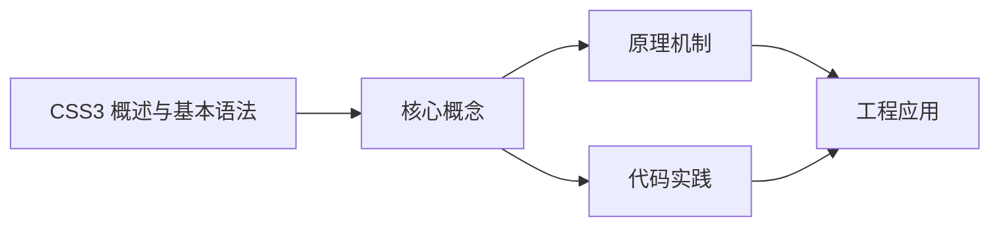
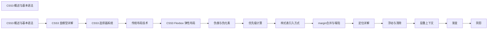

## 1. 学习目标（Bloom 分类）

本节按照布鲁姆教育目标分类学组织学习路径。本文主题为《CSS3 概述与基本语法》，属于 CSS 模块，读者可以根据自身阶段选择阅读深度。

记忆层面：能够准确复述本文的核心概念、术语与基本语法或操作步骤，并能够在提问或检索时快速定位对应知识点。能够说出 CSS 的核心概念、术语与标准写法。

理解层面：能够用自己的语言解释核心原理与工作机制，说明概念之间的因果关系，而不是机械记忆结论。能够解释 CSS 的工作原理与设计动机。

应用层面：能够在真实项目或练习场景中运用本文知识解决具体问题，写出正确且可维护的实现。能够编写符合 CSS 规范的完整实现。

分析层面：能够拆解复杂问题，比较本文主题与相邻概念的异同，识别边界条件与例外情况。能够分析 CSS 与相邻方案的差异与边界。

评价层面：能够根据约束条件（性能、可读性、安全、成本）评价不同方案的优劣，做出有依据的技术决策。能够根据场景评价 CSS 相关方案的优劣。

创造层面：能够把本文知识与其他模块知识组合，设计出新的解决方案或可复用的工程模式。能够组合 CSS 与其他技术设计完整方案。

通过本节学习，读者应当能够把《CSS3 概述与基本语法》纳入自己的知识网络，并与 CSS 模块的其他主题（选择器、盒模型、布局、动画、响应式）建立关联。

## 2. 历史动机与发展脉络

《CSS3 概述与基本语法》是 CSS 领域的重要主题。要真正理解它，需要先了解它解决的问题与演进过程。

CSS 于 1994 年由 Håkon Wium Lie 提出，1996 年 CSS1 发布，解决 HTML 表现层混杂问题；CSS2.1（2011）与 CSS3 模块化（2012+）奠定现代 Web 样式基础。
现代 CSS 的能力版图：Flexbox/Grid 布局、自定义属性（变量）、容器查询、子网格、层叠层（@layer）、现代颜色（oklch）。
CSS 的设计核心是“层叠与继承”：来源、优先级、顺序共同决定最终样式；理解层叠是排查样式问题的前提。

回到本文主题：CSS3 概述与基本语法 的提出与成熟，正是上述技术背景下的必然产物。早期实现往往以简单可用为目标，随着工程规模扩大，社区逐渐沉淀出标准做法与最佳实践；理解这一脉络，可以帮助读者判断“为什么文档中的推荐写法是现在这个样子”，也能在遇到历史遗留代码时准确识别其设计年代与取舍。


## 3. 形式化定义与核心概念精讲

本节把《CSS3 概述与基本语法》涉及的核心概念以“定义 + 讲解”的形式展开。读者应把定义当作工具，把讲解当作理解路径；两者结合才能形成可迁移的知识。

选择器与优先级：id > class/属性/伪类 > 元素/伪元素；!important 打破优先级（应避免）。
盒模型：content/padding/border/margin，box-sizing 决定 width 语义（border-box 推荐）。
布局体系：普通流、浮动（历史）、Flexbox（一维）、Grid（二维）；position 定位（relative/absolute/fixed/sticky）。

### 3.1 原文章节逐一精讲

原文档把主题拆分为 11 个小节，下面按顺序给出每一节的导读讲解，随后保留原文细节供精读。

#### 原文精读（完整保留）


#### 1. CSS3 概述

CSS (Cascading Style Sheets) 层叠样式表，用于控制网页的视觉呈现。CSS3 是其最新标准，引入了模块化开发、动画、Flexbox/Grid 布局等强大功能，使网页设计更加灵活和丰富。

##### 1.1 CSS 的历史与发展

- **CSS1 (1996)**: 第一个正式版本，提供基本的样式控制。
- **CSS2 (1998)**: 增加了定位、浮动、媒体查询等功能。
- **CSS2.1 (2011)**: CSS2 的修订版，修复了一些问题并增加了一些新特性。
- **CSS3 (2012+)**: 采用模块化开发，分批次发布不同模块，包括选择器、颜色、布局、动画等。

##### 1.2 CSS3 的核心特性

- **响应式设计**: 媒体查询 (`@media`) 允许根据设备特性应用不同的样式。
- **现代布局**: Flexbox 与 Grid 提供了强大的布局能力，解决了传统布局的痛点。
- **视觉效果**: 圆角 (`border-radius`)、阴影 (`box-shadow`)、渐变 (`gradient`) 等效果。
- **交互动画**: 过渡 (`transition`) 与 关键帧动画 (`animation`) 实现平滑的动画效果。
- **字体控制**: `@font-face` 允许使用自定义字体。
- **颜色增强**: 支持 RGBA、HSL、HSLA 等颜色格式。
- **选择器增强**: 增加了更多高级选择器，如 `:nth-child`、`:not` 等。
- **背景与边框**: 多背景、边框图片、背景大小等特性。
- **文本效果**: 文本阴影、文本溢出处理、文本换行控制等。

##### 1.3 CSS3 的模块化结构

CSS3 采用模块化设计，每个模块独立开发和发布：

- **选择器模块**: 定义如何选择 HTML 元素。
- **框模型模块**: 定义元素的盒模型。
- **背景与边框模块**: 定义背景和边框的样式。
- **文本模块**: 定义文本的样式和布局。
- **颜色模块**: 定义颜色的表示方法。
- **布局模块**: 包括 Flexbox 和 Grid 布局。
- **动画模块**: 定义过渡和动画效果。
- **媒体查询模块**: 定义响应式设计的规则。

##### 1.4 CSS 的重要性

- **分离内容与表现**: HTML 负责结构，CSS 负责样式，使代码更清晰。
- **提高可维护性**: 集中管理样式，便于修改和维护。
- **增强用户体验**: 丰富的视觉效果和动画提升用户体验。
- **响应式设计**: 适配不同设备和屏幕尺寸。
- **提高开发效率**: 样式可以重用，减少重复代码。

#### 2. 基本语法

##### 2.1 语法结构

CSS 的基本语法由选择器、属性和值组成：

```css
/* 选择器 { 属性: 值; } */
h1 {
  color: blue;
  font-size: 24px; /* 声明以分号结束 */
}
/* 多个选择器共享同一组样式 */
h1,
h2,
h3 {
  font-family: Arial, sans-serif;
}
/* 嵌套选择器 */
.container {
  width: 100%;
  .header {
    height: 100px;
  }
  .content {
    padding: 20px;
  }
}
```

##### 2.2 注释

CSS 中的注释使用 `/* */` 语法：

```css
/* 这是一个单行注释 */
/*
 这是一个
 多行注释
 */
/* 注释可以放在任何位置 */
h1 {
  color: blue; /* 颜色设置 */
  font-size: 24px; /* 字体大小设置 */
}
```

##### 2.3 空白与格式化

CSS 忽略多余的空白，因此可以使用空白来提高代码可读性：

```css
/* 良好的格式化 */
body {
  font-family: Arial, sans-serif;
  font-size: 16px;
  line-height: 1.5;
  color: #333;
}
/* 压缩格式（用于生产环境） */
body {
  font-family: Arial, sans-serif;
  font-size: 16px;
  line-height: 1.5;
  color: #333;
}
```

##### 2.4 大小写敏感性

CSS 对选择器和属性名不区分大小写，但对属性值区分大小写（特别是字体名称和URL）：

```css
/* 以下两种写法效果相同 */
H1 {
  color: BLUE;
}
h1 {
  color: blue;
}
/* 但以下写法效果不同 */
.font {
  font-family: 'Times New Roman', serif; /* 正确 */
  font-family: 'times new roman', serif; /* 可能不生效 */
}
```

#### 3. 引入方式

##### 3.1 行内样式 (Inline)

直接在 HTML 元素的 `style` 属性中定义样式：

```html
<div style="color: red; font-size: 18px;">行内样式示例</div>
```

**优点**：

- 优先级最高，可覆盖其他样式
- 适用于单个元素的特殊样式
  **缺点**：
- 难以维护，样式与结构混合
- 不能重用
- 增加 HTML 文件大小

##### 3.2 内部样式 (Internal)

在 HTML 文档的 `<head>` 标签中使用 `<style>` 标签定义样式：

```html
<!DOCTYPE html>
<html>
  <head>
    <style>
      body {
        font-family: Arial, sans-serif;
        background-color: #f0f0f0;
      }
      h1 {
        color: blue;
      }
    </style>
  </head>
  <body>
    <h1>内部样式示例</h1>
  </body>
</html>
```

**优点**：

- 样式与结构分离
- 适用于单个页面的样式
- 无需额外的 HTTP 请求
  **缺点**：
- 样式不能在多个页面间重用
- 增加 HTML 文件大小

##### 3.3 外部样式 (External)

在单独的 CSS 文件中定义样式，然后通过 `<link>` 标签引入：
**style.css**：

```css
body {
  font-family: Arial, sans-serif;
  background-color: #f0f0f0;
}
h1 {
  color: blue;
}
```

**HTML**：

```html
<!DOCTYPE html>
<html>
  <head>
    <link rel="stylesheet" href="style.css" />
  </head>
  <body>
    <h1>外部样式示例</h1>
  </body>
</html>
```

**优点**：

- 样式与结构完全分离
- 样式可以在多个页面间重用
- 浏览器可以缓存 CSS 文件，提高加载速度
- 便于维护和管理
  **缺点**：
- 需要额外的 HTTP 请求

##### 3.4 导入式 (@import)

在 CSS 文件中使用 `@import` 规则引入其他 CSS 文件：
**main.css**：

```css
@import url('reset.css');
@import url('layout.css');
body {
  font-family: Arial, sans-serif;
}
```

**优点**：

- 可以将样式模块化，便于管理
  **缺点**：
- 会增加 HTTP 请求
- 可能导致页面加载延迟（因为 @import 是在 CSS 解析时才加载）
- 不建议在生产环境中使用

##### 3.5 引入方式对比

| 引入方式 | 优先级 | 优点                         | 缺点               | 适用场景             |
| -------- | ------ | ---------------------------- | ------------------ | -------------------- |
| 行内样式 | 最高   | 优先级高，适用于特殊样式     | 难以维护，不能重用 | 单个元素的特殊样式   |
| 内部样式 | 中     | 样式与结构分离，无需额外请求 | 不能跨页面重用     | 单个页面的样式       |
| 外部样式 | 中     | 完全分离，可重用，可缓存     | 需要额外请求       | 多个页面的共用样式   |
| 导入式   | 中     | 样式模块化                   | 增加请求，可能延迟 | 开发环境中的样式组织 |

#### 4. 优先级规则

CSS 遵循“就近原则”和“权重计算”来确定样式的优先级。

##### 4.1 权重计算

CSS 选择器的权重由四部分组成，按从高到低的顺序计算：

1. **!important**：最高优先级，覆盖所有其他规则
2. **行内样式**：权重为 1000
3. **ID 选择器**：权重为 100
4. **类选择器、伪类选择器、属性选择器**：权重为 10
5. **元素选择器、伪元素选择器**：权重为 1
6. **通配符选择器 (\*)、后代选择器 (空格)、相邻兄弟选择器 (+)**：权重为 0

##### 4.2 优先级顺序

1. **!important** 声明
2. 行内样式
3. ID 选择器
4. 类选择器、伪类选择器、属性选择器
5. 元素选择器、伪元素选择器
6. 继承的样式
7. 浏览器默认样式

##### 4.3 优先级计算示例

```css
/* 权重：1 (元素选择器) */
div {
  color: blue;
}
/* 权重：10 (类选择器) */
.container {
  color: red;
}
/* 权重：100 (ID 选择器) */
#main {
  color: green;
}
/* 权重：101 (ID 选择器 + 元素选择器) */
#main div {
  color: purple;
}
/* 权重：20 (两个类选择器) */
.container .box {
  color: orange;
}
/* 行内样式：权重 1000 */
/* <div style="color: black;"> */
/* !important：最高优先级 */
div {
  color: yellow !important;
}
```

##### 4.4 特殊情况

- **继承的样式**：继承的样式优先级最低，即使是低权重的选择器也能覆盖继承的样式。
- **就近原则**：当权重相同时，后定义的样式会覆盖先定义的样式。
- **!important 的使用**：应尽量避免使用 `!important`，因为它会破坏样式的层叠性，使调试变得困难。

#### 5. CSS 单位

##### 5.1 绝对单位

绝对单位是固定的，不会随其他因素变化：

- **px** (像素)：最常用的单位，适合固定尺寸的元素。
- **pt** (点)：主要用于印刷，1pt = 1/72 英寸。
- **pc** (派卡)：1pc = 12pt。
- **in** (英寸)：1in = 2.54cm。
- **cm** (厘米)：实际长度单位。
- **mm** (毫米)：实际长度单位。

##### 5.2 相对单位

相对单位是相对于其他值计算的：

- **em**：相对于当前元素的字体大小。如果当前元素没有设置字体大小，则继承父元素的字体大小。
- **rem**：相对于根元素 (`<html>`) 的字体大小，推荐使用。
- **vw/vh**：相对于视口宽度/高度的 1%。
- **vmin/vmax**：相对于视口宽度和高度中较小/较大值的 1%。
- **%**：相对于父元素的相应属性值。
- **ch**：相对于数字 "0" 的宽度。
- **ex**：相对于字母 "x" 的高度。

##### 5.3 单位使用场景

| 单位      | 适用场景                                   | 示例                         |
| --------- | ------------------------------------------ | ---------------------------- |
| px        | 固定尺寸的元素，如边框、按钮大小           | `border: 1px solid #ccc;`    |
| em        | 相对于当前元素字体大小的间距和尺寸         | `padding: 0.5em;`            |
| rem       | 响应式字体大小，便于整体调整               | `font-size: 1.2rem;`         |
| vw/vh     | 响应式布局，相对于视口大小                 | `width: 50vw; height: 50vh;` |
| %         | 相对于父元素的尺寸，如宽度、高度           | `width: 100%;`               |
| vmin/vmax | 响应式设计，确保元素在不同屏幕比例下的显示 | `font-size: 5vmin;`          |

#### 6. CSS 变量

CSS 变量（也称为自定义属性）允许你定义可重用的值，提高代码的可维护性。

##### 6.1 变量定义与使用

使用 `--` 前缀定义变量，使用 `var()` 函数使用变量：

```css
 /* 定义变量 */
 :
  --primary-color: #3498db;
  --secondary-color: #2ecc71;
  --font-size: 16px;
  --spacing: 1rem;
 }
 /* 使用变量 */
 body {
  font-size: var(--font-size);
  color: var(--primary-color);
 }
 .button {
  background-color: var(--primary-color);
  padding: var(--spacing);
 }
 .button:hover {
  background-color: var(--secondary-color);
 }
```

##### 6.2 变量作用域

- **全局作用域**：在 `:root` 选择器中定义的变量，可在整个文档中使用。
- **局部作用域**：在特定选择器中定义的变量，只在该选择器及其后代中使用。

```css
 /* 全局变量 */
 :
  --color: blue;
 }
 /* 局部变量 */
 .container {
  --color: red;
  color: var(--color); /* 红色 */
 }
 .box {
  color: var(--color); /* 继承容器的红色 */
 }
 .footer {
  color: var(--color); /* 全局的蓝色 */
 }
```

##### 6.3 变量使用示例

```css
 /* 主题变量 */
 :
  /* 浅色主题 */
  --bg-color: #ffffff;
  --text-color: #333333;
  --primary-color: #3498db;
  /* 间距 */
  --spacing-xs: 0.25rem;
  --spacing-sm: 0.5rem;
  --spacing-md: 1rem;
  --spacing-lg: 1.5rem;
  --spacing-xl: 2rem;
  /* 圆角 */
  --border-radius-sm: 4px;
  --border-radius-md: 8px;
  --border-radius-lg: 12px;
  /* 阴影 */
  --shadow-sm: 0 2px 4px rgba(0, 0, 0, 0.1);
  --shadow-md: 0 4px 8px rgba(0, 0, 0, 0.1);
  --shadow-lg: 0 8px 16px rgba(0, 0, 0, 0.1);
 }
 /* 深色主题 */
 @media (prefers-color-scheme: dark) {
  :root {
  --bg-color: #121212;
  --text-color: #e0e0e0;
  --primary-color: #64b5f6;
  }
 }
 /* 使用变量 */
 body {
  background-color: var(--bg-color);
  color: var(--text-color);
  margin: 0;
  padding: var(--spacing-md);
  font-family: Arial, sans-serif;
 }
 .card {
  background-color: var(--bg-color);
  border-radius: var(--border-radius-md);
  box-shadow: var(--shadow-md);
  padding: var(--spacing-md);
  margin-bottom: var(--spacing-md);
 }
 .button {
  background-color: var(--primary-color);
  color: white;
  border: none;
  border-radius: var(--border-radius-sm);
  padding: var(--spacing-sm) var(--spacing-md);
  cursor: pointer;
  transition: background-color 0.3s ease;
 }
 .button:hover {
  background-color: darken(var(--primary-color), 10%);
 }
```

#### 7. CSS 函数

CSS 提供了多种函数，用于计算值、处理颜色等。

##### 7.1 颜色函数

- **rgb()/rgba()**：使用红、绿、蓝和透明度值定义颜色。
- **hsl()/hsla()**：使用色相、饱和度、亮度和透明度值定义颜色。
- **color()**：使用指定颜色空间的颜色。
- **darken()/lighten()**：使颜色变暗或变亮。
- **saturate()/desaturate()**：增加或减少颜色的饱和度。
- **opacity()**：设置颜色的透明度。

```css
/* rgb() 示例 */
.color1 {
  color: rgb(255, 0, 0); /* 红色 */
}
/* rgba() 示例 */
.color2 {
  color: rgba(255, 0, 0, 0.5); /* 半透明红色 */
}
/* hsl() 示例 */
.color3 {
  color: hsl(120, 100%, 50%); /* 绿色 */
}
/* hsla() 示例 */
.color4 {
  color: hsla(120, 100%, 50%, 0.5); /* 半透明绿色 */
}
```

##### 7.2 数学函数

- **calc()**：执行计算，可混合不同单位。
- **clamp()**：将值限制在一个范围内。
- **min()**：返回多个值中的最小值。
- **max()**：返回多个值中的最大值。

```css
/* calc() 示例 */
.container {
  width: calc(100% - 20px); /* 宽度为父元素宽度减去 20px */
  height: calc(100vh - 100px); /* 高度为视口高度减去 100px */
  font-size: calc(16px + 0.5vw); /* 字体大小随视口宽度变化 */
}
/* clamp() 示例 */
.text {
  font-size: clamp(16px, 2vw, 24px); /* 字体大小在 16px 到 24px 之间，随视口宽度变化 */
}
/* min() 示例 */
.box {
  width: min(500px, 100%); /* 宽度为 500px 和 100% 中的较小值 */
}
/* max() 示例 */
.header {
  height: max(100px, 10vh); /* 高度为 100px 和 10vh 中的较大值 */
}
```

##### 7.3 其他常用函数

- **url()**：引用资源的 URL。
- **linear-gradient()/radial-gradient()**：创建线性或径向渐变。
- **repeat()**：重复值，用于 Grid 布局。
- **var()**：使用 CSS 变量。
- **attr()**：获取元素的属性值。

```css
/* url() 示例 */
.background {
  background-image: url('image.jpg');
}
/* linear-gradient() 示例 */
.gradient {
  background: linear-gradient(to right, red, blue);
}
/* radial-gradient() 示例 */
.radial-gradient {
  background: radial-gradient(circle, red, blue);
}
/* repeat() 示例 */
.grid {
  display: grid;
  grid-template-columns: repeat(3, 1fr); /* 创建 3 个等宽列 */
}
/* attr() 示例 */
[data-tooltip]::after {
  content: attr(data-tooltip);
  position: absolute;
  bottom: 100%;
  left: 50%;
  transform: translateX(-50%);
  background: #333;
  color: white;
  padding: 5px;
  border-radius: 4px;
  white-space: nowrap;
  opacity: 0;
  transition: opacity 0.3s;
}
[data-tooltip]:hover::after {
  opacity: 1;
}
```

#### 8. 浏览器兼容性

##### 8.1 浏览器前缀

为了支持不同浏览器的实验性特性，需要使用浏览器前缀：

```css
/* 带浏览器前缀的 CSS */
.box {
  /* Chrome, Safari, Opera */
  -webkit-border-radius: 8px;
  /* Firefox */
  -moz-border-radius: 8px;
  /* 标准语法 */
  border-radius: 8px;
  /* Chrome, Safari, Opera */
  -webkit-box-shadow: 0 2px 4px rgba(0, 0, 0, 0.1);
  /* Firefox */
  -moz-box-shadow: 0 2px 4px rgba(0, 0, 0, 0.1);
  /* 标准语法 */
  box-shadow: 0 2px 4px rgba(0, 0, 0, 0.1);
  /* Chrome, Safari, Opera */
  -webkit-transition: all 0.3s ease;
  /* Firefox */
  -moz-transition: all 0.3s ease;
  /* 标准语法 */
  transition: all 0.3s ease;
}
```

##### 8.2 兼容性检测

使用 `@supports` 规则检测浏览器是否支持特定特性：

```css
/* 检测是否支持 Grid 布局 */
@supports (display: grid) {
  .grid {
    display: grid;
    grid-template-columns: repeat(3, 1fr);
  }
}
/* 检测是否支持 Flexbox */
@supports (display: flex) {
  .flex {
    display: flex;
    justify-content: center;
    align-items: center;
  }
}
/* 降级方案 */
.grid {
  /* 传统布局作为降级方案 */
  display: block;
}
@supports (display: grid) {
  .grid {
    display: grid;
    grid-template-columns: repeat(3, 1fr);
  }
}
```

##### 8.3 兼容性最佳实践

- **使用 Autoprefixer**：自动添加浏览器前缀。
- **渐进增强**：先实现基本功能，再添加高级特性。
- **优雅降级**：为不支持高级特性的浏览器提供替代方案。
- **使用 CSS Reset 或 Normalize.css**：统一不同浏览器的默认样式。
- **测试**：在不同浏览器中测试你的样式。

#### 9. 最佳实践

##### 9.1 代码组织

- **使用模块化 CSS**：将样式按功能或组件分类。
- **使用命名约定**：如 BEM (Block, Element, Modifier) 命名规范。
- **使用注释**：为复杂样式添加注释。
- **保持代码整洁**：使用一致的缩进和格式。

##### 9.2 性能优化

- **减少 CSS 文件大小**：使用压缩工具。
- **减少选择器复杂度**：使用简单的选择器。
- **避免使用 @import**：使用 `<link>` 标签代替。
- **使用 CSS 变量**：减少重复代码。
- **避免过度使用 !important**：保持样式的层叠性。

##### 9.3 可维护性

- **使用语义化的类名**：类名应反映元素的用途。
- **避免内联样式**：使用外部或内部样式。
- **使用 CSS 预处理器**：如 Sass、Less 等，提供变量、嵌套、混合等功能。
- **定期清理**：移除未使用的样式。
- **文档化**：为样式添加文档说明。

#### 10. 总结

CSS3 是现代网页设计的重要组成部分，提供了丰富的特性和功能：

- **核心特性**：响应式设计、现代布局、视觉效果、交互动画等。
- **语法结构**：选择器、属性、值的基本结构，以及注释、空白等语法规则。
- **引入方式**：行内样式、内部样式、外部样式、导入式，各有优缺点。
- **优先级规则**：基于权重计算和就近原则，决定样式的应用顺序。
- **CSS 单位**：绝对单位和相对单位，适用于不同的场景。
- **CSS 变量**：可重用的值，提高代码的可维护性。
- **CSS 函数**：用于计算值、处理颜色等。
- **浏览器兼容性**：使用浏览器前缀和特性检测，确保在不同浏览器中的一致性。
- **最佳实践**：代码组织、性能优化、可维护性等方面的建议。
  通过掌握 CSS3 的这些特性和最佳实践，开发者可以创建美观、响应式、高性能的网页设计。

---

#### 延伸阅读

- [HTML5](html5/overview-and-semantics)


### 3.2 概念关系图

下面用 Mermaid 图表达本文核心概念之间的关系，帮助读者建立整体图景：



图中展示的是本文知识的结构化关系：核心概念是入口，原理机制解释“为什么”，代码实践演示“怎么做”，工程应用回答“何时用”。读者学习时可以把每个小节的内容挂接到对应节点上。

## 4. 理论推导与原理解析

本节深入《CSS3 概述与基本语法》背后的原理。理论部分不求面面俱到，而是聚焦“能解释现象、能指导实践”的关键推导。

选择器与优先级：id > class/属性/伪类 > 元素/伪元素；!important 打破优先级（应避免）。
盒模型：content/padding/border/margin，box-sizing 决定 width 语义（border-box 推荐）。
布局体系：普通流、浮动（历史）、Flexbox（一维）、Grid（二维）；position 定位（relative/absolute/fixed/sticky）。
层叠上下文：z-index 只在同一层叠上下文中比较；transform/opacity/filter 创建新上下文。

需要强调的是，理论推导与工程实践之间存在翻译层：理论给出的是理想化模型与边界条件，工程代码则必须处理真实环境中的例外。读者在学习时应先掌握理论的“标准情形”，再通过陷阱章节了解“非标准情形”。

## 5. 代码示例与逐行讲解

本节把原文中的代码示例系统整理，并为每个示例补充用途说明与讲解。读者不应只浏览代码，而应逐段对照讲解理解设计意图。

### 5.1 示例：2.1 语法结构

该示例来自原文《2.1 语法结构》小节，用于演示CSS3 概述与基本语法相关操作。阅读时请先看代码结构，再看其后的讲解。

```css
/* 选择器 { 属性: 值; } */
h1 {
  color: blue;
  font-size: 24px; /* 声明以分号结束 */
}
/* 多个选择器共享同一组样式 */
h1,
h2,
h3 {
  font-family: Arial, sans-serif;
}
/* 嵌套选择器 */
.container {
  width: 100%;
  .header {
    height: 100px;
  }
  .content {
    padding: 20px;
  }
}
```

讲解：这段代码演示了本节核心知识点。代码中的关键操作可以归纳为三步：准备（定义或初始化）、执行（核心逻辑）、收尾（释放资源或返回结果）。实际项目中，这三步往往被封装为函数或类，以提升复用性与可测试性。

关键点分析：

该示例共 21 行有效代码，结构以数据或配置为主。阅读时应关注：数据字段的含义、配置项的作用，以及它们与运行行为的对应关系。

进阶思考路径：先尝试修改参数观察行为变化，再把示例中的模式迁移到自己的项目中；每次修改都记录预期与实测差异，这是把示例转化为能力的最快方式。

### 5.2 示例：2.2 注释

该示例来自原文《2.2 注释》小节，用于演示CSS3 概述与基本语法相关操作。阅读时请先看代码结构，再看其后的讲解。

```css
/* 这是一个单行注释 */
/*
 这是一个
 多行注释
 */
/* 注释可以放在任何位置 */
h1 {
  color: blue; /* 颜色设置 */
  font-size: 24px; /* 字体大小设置 */
}
```

讲解：这段代码演示了本节核心知识点。代码中的关键操作可以归纳为三步：准备（定义或初始化）、执行（核心逻辑）、收尾（释放资源或返回结果）。实际项目中，这三步往往被封装为函数或类，以提升复用性与可测试性。

关键点分析：

该示例共 10 行有效代码，结构以数据或配置为主。阅读时应关注：数据字段的含义、配置项的作用，以及它们与运行行为的对应关系。

进阶思考路径：先尝试修改参数观察行为变化，再把示例中的模式迁移到自己的项目中；每次修改都记录预期与实测差异，这是把示例转化为能力的最快方式。

### 5.3 示例：2.3 空白与格式化

该示例来自原文《2.3 空白与格式化》小节，用于演示CSS3 概述与基本语法相关操作。阅读时请先看代码结构，再看其后的讲解。

```css
/* 良好的格式化 */
body {
  font-family: Arial, sans-serif;
  font-size: 16px;
  line-height: 1.5;
  color: #333;
}
/* 压缩格式（用于生产环境） */
body {
  font-family: Arial, sans-serif;
  font-size: 16px;
  line-height: 1.5;
  color: #333;
}
```

讲解：这段代码演示了本节核心知识点。代码中的关键操作可以归纳为三步：准备（定义或初始化）、执行（核心逻辑）、收尾（释放资源或返回结果）。实际项目中，这三步往往被封装为函数或类，以提升复用性与可测试性。

关键点分析：

该示例共 14 行有效代码，结构以数据或配置为主。阅读时应关注：数据字段的含义、配置项的作用，以及它们与运行行为的对应关系。

进阶思考路径：先尝试修改参数观察行为变化，再把示例中的模式迁移到自己的项目中；每次修改都记录预期与实测差异，这是把示例转化为能力的最快方式。

### 5.4 示例：2.4 大小写敏感性

该示例来自原文《2.4 大小写敏感性》小节，用于演示CSS3 概述与基本语法相关操作。阅读时请先看代码结构，再看其后的讲解。

```css
/* 以下两种写法效果相同 */
H1 {
  color: BLUE;
}
h1 {
  color: blue;
}
/* 但以下写法效果不同 */
.font {
  font-family: 'Times New Roman', serif; /* 正确 */
  font-family: 'times new roman', serif; /* 可能不生效 */
}
```

讲解：这段代码演示了本节核心知识点。代码中的关键操作可以归纳为三步：准备（定义或初始化）、执行（核心逻辑）、收尾（释放资源或返回结果）。实际项目中，这三步往往被封装为函数或类，以提升复用性与可测试性。

关键点分析：

该示例共 12 行有效代码，结构以数据或配置为主。阅读时应关注：数据字段的含义、配置项的作用，以及它们与运行行为的对应关系。

进阶思考路径：先尝试修改参数观察行为变化，再把示例中的模式迁移到自己的项目中；每次修改都记录预期与实测差异，这是把示例转化为能力的最快方式。

### 5.5 示例：3.1 行内样式 (Inline)

该示例来自原文《3.1 行内样式 (Inline)》小节，用于演示CSS3 概述与基本语法相关操作。阅读时请先看代码结构，再看其后的讲解。

```html
<div style="color: red; font-size: 18px;">行内样式示例</div>
```

讲解：这段代码演示了本节核心知识点。代码中的关键操作可以归纳为三步：准备（定义或初始化）、执行（核心逻辑）、收尾（释放资源或返回结果）。实际项目中，这三步往往被封装为函数或类，以提升复用性与可测试性。

关键点分析：

该示例共 1 行有效代码，结构以数据或配置为主。阅读时应关注：数据字段的含义、配置项的作用，以及它们与运行行为的对应关系。

进阶思考路径：先尝试修改参数观察行为变化，再把示例中的模式迁移到自己的项目中；每次修改都记录预期与实测差异，这是把示例转化为能力的最快方式。

### 5.6 示例：3.2 内部样式 (Internal)

该示例来自原文《3.2 内部样式 (Internal)》小节，用于演示CSS3 概述与基本语法相关操作。阅读时请先看代码结构，再看其后的讲解。

```html
<!DOCTYPE html>
<html>
  <head>
    <style>
      body {
        font-family: Arial, sans-serif;
        background-color: #f0f0f0;
      }
      h1 {
        color: blue;
      }
    </style>
  </head>
  <body>
    <h1>内部样式示例</h1>
  </body>
</html>
```

讲解：这段代码演示了本节核心知识点。代码中的关键操作可以归纳为三步：准备（定义或初始化）、执行（核心逻辑）、收尾（释放资源或返回结果）。实际项目中，这三步往往被封装为函数或类，以提升复用性与可测试性。

关键点分析：

该示例共 17 行有效代码，结构以数据或配置为主。阅读时应关注：数据字段的含义、配置项的作用，以及它们与运行行为的对应关系。

进阶思考路径：先尝试修改参数观察行为变化，再把示例中的模式迁移到自己的项目中；每次修改都记录预期与实测差异，这是把示例转化为能力的最快方式。

### 5.7 示例：3.3 外部样式 (External)

该示例来自原文《3.3 外部样式 (External)》小节，用于演示CSS3 概述与基本语法相关操作。阅读时请先看代码结构，再看其后的讲解。

```css
body {
  font-family: Arial, sans-serif;
  background-color: #f0f0f0;
}
h1 {
  color: blue;
}
```

讲解：这段代码演示了本节核心知识点。代码中的关键操作可以归纳为三步：准备（定义或初始化）、执行（核心逻辑）、收尾（释放资源或返回结果）。实际项目中，这三步往往被封装为函数或类，以提升复用性与可测试性。

关键点分析：

该示例共 7 行有效代码，结构以数据或配置为主。阅读时应关注：数据字段的含义、配置项的作用，以及它们与运行行为的对应关系。

进阶思考路径：先尝试修改参数观察行为变化，再把示例中的模式迁移到自己的项目中；每次修改都记录预期与实测差异，这是把示例转化为能力的最快方式。

### 5.8 示例：3.3 外部样式 (External)

该示例来自原文《3.3 外部样式 (External)》小节，用于演示CSS3 概述与基本语法相关操作。阅读时请先看代码结构，再看其后的讲解。

```html
<!DOCTYPE html>
<html>
  <head>
    <link rel="stylesheet" href="style.css" />
  </head>
  <body>
    <h1>外部样式示例</h1>
  </body>
</html>
```

讲解：这段代码演示了本节核心知识点。代码中的关键操作可以归纳为三步：准备（定义或初始化）、执行（核心逻辑）、收尾（释放资源或返回结果）。实际项目中，这三步往往被封装为函数或类，以提升复用性与可测试性。

关键点分析：

该示例共 9 行有效代码，结构以数据或配置为主。阅读时应关注：数据字段的含义、配置项的作用，以及它们与运行行为的对应关系。

进阶思考路径：先尝试修改参数观察行为变化，再把示例中的模式迁移到自己的项目中；每次修改都记录预期与实测差异，这是把示例转化为能力的最快方式。

### 5.9 示例：3.4 导入式 (@import)

该示例来自原文《3.4 导入式 (@import)》小节，用于演示CSS3 概述与基本语法相关操作。阅读时请先看代码结构，再看其后的讲解。

```css
@import url('reset.css');
@import url('layout.css');
body {
  font-family: Arial, sans-serif;
}
```

讲解：这段代码演示了本节核心知识点。代码中的关键操作可以归纳为三步：准备（定义或初始化）、执行（核心逻辑）、收尾（释放资源或返回结果）。实际项目中，这三步往往被封装为函数或类，以提升复用性与可测试性。

关键点分析：

该示例共 5 行有效代码，包含 1 类关键结构（import）。其中：

- 入口与初始化部分负责建立上下文，对应实际项目中的启动或装配逻辑；
- 核心逻辑部分体现本文主题的主要操作，是阅读时最需要对照讲解理解的部分；
- 输出或返回部分把结果交给调用方，注意其类型与边界条件。

进阶思考路径：先尝试修改参数观察行为变化，再把示例中的模式迁移到自己的项目中；每次修改都记录预期与实测差异，这是把示例转化为能力的最快方式。

### 5.10 示例：4.3 优先级计算示例

该示例来自原文《4.3 优先级计算示例》小节，用于演示CSS3 概述与基本语法相关操作。阅读时请先看代码结构，再看其后的讲解。

```css
/* 权重：1 (元素选择器) */
div {
  color: blue;
}
/* 权重：10 (类选择器) */
.container {
  color: red;
}
/* 权重：100 (ID 选择器) */
#main {
  color: green;
}
/* 权重：101 (ID 选择器 + 元素选择器) */
#main div {
  color: purple;
}
/* 权重：20 (两个类选择器) */
.container .box {
  color: orange;
}
/* 行内样式：权重 1000 */
/* <div style="color: black;"> */
/* !important：最高优先级 */
div {
  color: yellow !important;
}
```

讲解：这段代码演示了本节核心知识点。代码中的关键操作可以归纳为三步：准备（定义或初始化）、执行（核心逻辑）、收尾（释放资源或返回结果）。实际项目中，这三步往往被封装为函数或类，以提升复用性与可测试性。

关键点分析：

该示例共 26 行有效代码，包含 1 类关键结构（import）。其中：

- 入口与初始化部分负责建立上下文，对应实际项目中的启动或装配逻辑；
- 核心逻辑部分体现本文主题的主要操作，是阅读时最需要对照讲解理解的部分；
- 输出或返回部分把结果交给调用方，注意其类型与边界条件。

进阶思考路径：先尝试修改参数观察行为变化，再把示例中的模式迁移到自己的项目中；每次修改都记录预期与实测差异，这是把示例转化为能力的最快方式。

### 5.11 示例：6.1 变量定义与使用

该示例来自原文《6.1 变量定义与使用》小节，用于演示CSS3 概述与基本语法相关操作。阅读时请先看代码结构，再看其后的讲解。

```css
 /* 定义变量 */
 :
  --primary-color: #3498db;
  --secondary-color: #2ecc71;
  --font-size: 16px;
  --spacing: 1rem;
 }
 /* 使用变量 */
 body {
  font-size: var(--font-size);
  color: var(--primary-color);
 }
 .button {
  background-color: var(--primary-color);
  padding: var(--spacing);
 }
 .button:hover {
  background-color: var(--secondary-color);
 }
```

讲解：这段代码演示了本节核心知识点。代码中的关键操作可以归纳为三步：准备（定义或初始化）、执行（核心逻辑）、收尾（释放资源或返回结果）。实际项目中，这三步往往被封装为函数或类，以提升复用性与可测试性。

关键点分析：

该示例共 19 行有效代码，结构以数据或配置为主。阅读时应关注：数据字段的含义、配置项的作用，以及它们与运行行为的对应关系。

进阶思考路径：先尝试修改参数观察行为变化，再把示例中的模式迁移到自己的项目中；每次修改都记录预期与实测差异，这是把示例转化为能力的最快方式。

### 5.12 示例：6.2 变量作用域

该示例来自原文《6.2 变量作用域》小节，用于演示CSS3 概述与基本语法相关操作。阅读时请先看代码结构，再看其后的讲解。

```css
 /* 全局变量 */
 :
  --color: blue;
 }
 /* 局部变量 */
 .container {
  --color: red;
  color: var(--color); /* 红色 */
 }
 .box {
  color: var(--color); /* 继承容器的红色 */
 }
 .footer {
  color: var(--color); /* 全局的蓝色 */
 }
```

讲解：这段代码演示了本节核心知识点。代码中的关键操作可以归纳为三步：准备（定义或初始化）、执行（核心逻辑）、收尾（释放资源或返回结果）。实际项目中，这三步往往被封装为函数或类，以提升复用性与可测试性。

关键点分析：

该示例共 15 行有效代码，结构以数据或配置为主。阅读时应关注：数据字段的含义、配置项的作用，以及它们与运行行为的对应关系。

进阶思考路径：先尝试修改参数观察行为变化，再把示例中的模式迁移到自己的项目中；每次修改都记录预期与实测差异，这是把示例转化为能力的最快方式。

### 5.13 示例：6.3 变量使用示例

该示例来自原文《6.3 变量使用示例》小节，用于演示CSS3 概述与基本语法相关操作。阅读时请先看代码结构，再看其后的讲解。

```css
 /* 主题变量 */
 :
  /* 浅色主题 */
  --bg-color: #ffffff;
  --text-color: #333333;
  --primary-color: #3498db;
  /* 间距 */
  --spacing-xs: 0.25rem;
  --spacing-sm: 0.5rem;
  --spacing-md: 1rem;
  --spacing-lg: 1.5rem;
  --spacing-xl: 2rem;
  /* 圆角 */
  --border-radius-sm: 4px;
  --border-radius-md: 8px;
  --border-radius-lg: 12px;
  /* 阴影 */
  --shadow-sm: 0 2px 4px rgba(0, 0, 0, 0.1);
  --shadow-md: 0 4px 8px rgba(0, 0, 0, 0.1);
  --shadow-lg: 0 8px 16px rgba(0, 0, 0, 0.1);
 }
 /* 深色主题 */
 @media (prefers-color-scheme: dark) {
  :root {
  --bg-color: #121212;
  --text-color: #e0e0e0;
  --primary-color: #64b5f6;
  }
 }
 /* 使用变量 */
 body {
  background-color: var(--bg-color);
  color: var(--text-color);
  margin: 0;
  padding: var(--spacing-md);
  font-family: Arial, sans-serif;
 }
 .card {
  background-color: var(--bg-color);
  border-radius: var(--border-radius-md);
  box-shadow: var(--shadow-md);
  padding: var(--spacing-md);
  margin-bottom: var(--spacing-md);
 }
 .button {
  background-color: var(--primary-color);
  color: white;
  border: none;
  border-radius: var(--border-radius-sm);
  padding: var(--spacing-sm) var(--spacing-md);
  cursor: pointer;
  transition: background-color 0.3s ease;
 }
 .button:hover {
  background-color: darken(var(--primary-color), 10%);
 }
```

讲解：这段代码演示了本节核心知识点。代码中的关键操作可以归纳为三步：准备（定义或初始化）、执行（核心逻辑）、收尾（释放资源或返回结果）。实际项目中，这三步往往被封装为函数或类，以提升复用性与可测试性。

关键点分析：

该示例共 56 行有效代码，结构以数据或配置为主。阅读时应关注：数据字段的含义、配置项的作用，以及它们与运行行为的对应关系。

进阶思考路径：先尝试修改参数观察行为变化，再把示例中的模式迁移到自己的项目中；每次修改都记录预期与实测差异，这是把示例转化为能力的最快方式。

### 5.14 示例：7.1 颜色函数

该示例来自原文《7.1 颜色函数》小节，用于演示CSS3 概述与基本语法相关操作。阅读时请先看代码结构，再看其后的讲解。

```css
/* rgb() 示例 */
.color1 {
  color: rgb(255, 0, 0); /* 红色 */
}
/* rgba() 示例 */
.color2 {
  color: rgba(255, 0, 0, 0.5); /* 半透明红色 */
}
/* hsl() 示例 */
.color3 {
  color: hsl(120, 100%, 50%); /* 绿色 */
}
/* hsla() 示例 */
.color4 {
  color: hsla(120, 100%, 50%, 0.5); /* 半透明绿色 */
}
```

讲解：这段代码演示了本节核心知识点。代码中的关键操作可以归纳为三步：准备（定义或初始化）、执行（核心逻辑）、收尾（释放资源或返回结果）。实际项目中，这三步往往被封装为函数或类，以提升复用性与可测试性。

关键点分析：

该示例共 16 行有效代码，结构以数据或配置为主。阅读时应关注：数据字段的含义、配置项的作用，以及它们与运行行为的对应关系。

进阶思考路径：先尝试修改参数观察行为变化，再把示例中的模式迁移到自己的项目中；每次修改都记录预期与实测差异，这是把示例转化为能力的最快方式。

### 5.15 示例：7.2 数学函数

该示例来自原文《7.2 数学函数》小节，用于演示CSS3 概述与基本语法相关操作。阅读时请先看代码结构，再看其后的讲解。

```css
/* calc() 示例 */
.container {
  width: calc(100% - 20px); /* 宽度为父元素宽度减去 20px */
  height: calc(100vh - 100px); /* 高度为视口高度减去 100px */
  font-size: calc(16px + 0.5vw); /* 字体大小随视口宽度变化 */
}
/* clamp() 示例 */
.text {
  font-size: clamp(16px, 2vw, 24px); /* 字体大小在 16px 到 24px 之间，随视口宽度变化 */
}
/* min() 示例 */
.box {
  width: min(500px, 100%); /* 宽度为 500px 和 100% 中的较小值 */
}
/* max() 示例 */
.header {
  height: max(100px, 10vh); /* 高度为 100px 和 10vh 中的较大值 */
}
```

讲解：这段代码演示了本节核心知识点。代码中的关键操作可以归纳为三步：准备（定义或初始化）、执行（核心逻辑）、收尾（释放资源或返回结果）。实际项目中，这三步往往被封装为函数或类，以提升复用性与可测试性。

关键点分析：

该示例共 18 行有效代码，结构以数据或配置为主。阅读时应关注：数据字段的含义、配置项的作用，以及它们与运行行为的对应关系。

进阶思考路径：先尝试修改参数观察行为变化，再把示例中的模式迁移到自己的项目中；每次修改都记录预期与实测差异，这是把示例转化为能力的最快方式。

### 5.16 示例：7.3 其他常用函数

该示例来自原文《7.3 其他常用函数》小节，用于演示CSS3 概述与基本语法相关操作。阅读时请先看代码结构，再看其后的讲解。

```css
/* url() 示例 */
.background {
  background-image: url('image.jpg');
}
/* linear-gradient() 示例 */
.gradient {
  background: linear-gradient(to right, red, blue);
}
/* radial-gradient() 示例 */
.radial-gradient {
  background: radial-gradient(circle, red, blue);
}
/* repeat() 示例 */
.grid {
  display: grid;
  grid-template-columns: repeat(3, 1fr); /* 创建 3 个等宽列 */
}
/* attr() 示例 */
[data-tooltip]::after {
  content: attr(data-tooltip);
  position: absolute;
  bottom: 100%;
  left: 50%;
  transform: translateX(-50%);
  background: #333;
  color: white;
  padding: 5px;
  border-radius: 4px;
  white-space: nowrap;
  opacity: 0;
  transition: opacity 0.3s;
}
[data-tooltip]:hover::after {
  opacity: 1;
}
```

讲解：这段代码演示了本节核心知识点。代码中的关键操作可以归纳为三步：准备（定义或初始化）、执行（核心逻辑）、收尾（释放资源或返回结果）。实际项目中，这三步往往被封装为函数或类，以提升复用性与可测试性。

关键点分析：

该示例共 35 行有效代码，结构以数据或配置为主。阅读时应关注：数据字段的含义、配置项的作用，以及它们与运行行为的对应关系。

进阶思考路径：先尝试修改参数观察行为变化，再把示例中的模式迁移到自己的项目中；每次修改都记录预期与实测差异，这是把示例转化为能力的最快方式。

### 5.17 示例：8.1 浏览器前缀

该示例来自原文《8.1 浏览器前缀》小节，用于演示CSS3 概述与基本语法相关操作。阅读时请先看代码结构，再看其后的讲解。

```css
/* 带浏览器前缀的 CSS */
.box {
  /* Chrome, Safari, Opera */
  -webkit-border-radius: 8px;
  /* Firefox */
  -moz-border-radius: 8px;
  /* 标准语法 */
  border-radius: 8px;
  /* Chrome, Safari, Opera */
  -webkit-box-shadow: 0 2px 4px rgba(0, 0, 0, 0.1);
  /* Firefox */
  -moz-box-shadow: 0 2px 4px rgba(0, 0, 0, 0.1);
  /* 标准语法 */
  box-shadow: 0 2px 4px rgba(0, 0, 0, 0.1);
  /* Chrome, Safari, Opera */
  -webkit-transition: all 0.3s ease;
  /* Firefox */
  -moz-transition: all 0.3s ease;
  /* 标准语法 */
  transition: all 0.3s ease;
}
```

讲解：这段代码演示了本节核心知识点。代码中的关键操作可以归纳为三步：准备（定义或初始化）、执行（核心逻辑）、收尾（释放资源或返回结果）。实际项目中，这三步往往被封装为函数或类，以提升复用性与可测试性。

关键点分析：

该示例共 21 行有效代码，结构以数据或配置为主。阅读时应关注：数据字段的含义、配置项的作用，以及它们与运行行为的对应关系。

进阶思考路径：先尝试修改参数观察行为变化，再把示例中的模式迁移到自己的项目中；每次修改都记录预期与实测差异，这是把示例转化为能力的最快方式。

### 5.18 示例：8.2 兼容性检测

该示例来自原文《8.2 兼容性检测》小节，用于演示CSS3 概述与基本语法相关操作。阅读时请先看代码结构，再看其后的讲解。

```css
/* 检测是否支持 Grid 布局 */
@supports (display: grid) {
  .grid {
    display: grid;
    grid-template-columns: repeat(3, 1fr);
  }
}
/* 检测是否支持 Flexbox */
@supports (display: flex) {
  .flex {
    display: flex;
    justify-content: center;
    align-items: center;
  }
}
/* 降级方案 */
.grid {
  /* 传统布局作为降级方案 */
  display: block;
}
@supports (display: grid) {
  .grid {
    display: grid;
    grid-template-columns: repeat(3, 1fr);
  }
}
```

讲解：这段代码演示了本节核心知识点。代码中的关键操作可以归纳为三步：准备（定义或初始化）、执行（核心逻辑）、收尾（释放资源或返回结果）。实际项目中，这三步往往被封装为函数或类，以提升复用性与可测试性。

关键点分析：

该示例共 26 行有效代码，结构以数据或配置为主。阅读时应关注：数据字段的含义、配置项的作用，以及它们与运行行为的对应关系。

进阶思考路径：先尝试修改参数观察行为变化，再把示例中的模式迁移到自己的项目中；每次修改都记录预期与实测差异，这是把示例转化为能力的最快方式。


综合以上示例，可以总结出本主题的代码实践要点：第一，先定义清晰的输入输出契约；第二，核心逻辑保持单一职责；第三，错误处理与边界条件不可省略；第四，命名与注释表达意图而非复述代码。

## 6. 对比分析

对比是理解《CSS3 概述与基本语法》定位的最快路径。下面从多个维度与相邻方案进行对比。

Flexbox 与 Grid：一维布局（导航、按钮组）用 Flex；二维布局（页面网格、卡片墙）用 Grid。
浮动与现代布局：浮动是文字环绕工具，布局已由 Flex/Grid 取代。
媒体查询与容器查询：视口级用媒体查询，组件级用容器查询。

对比的目的不是分出绝对优劣，而是建立选择依据：不同约束条件下，最优解不同。读者应把每个对比维度转化为决策检查清单。

## 7. 常见陷阱与最佳实践

本节整理该主题的高频错误与推荐做法。每个陷阱先描述现象，再解释原因，最后给出最佳实践。

### 7.1 !important 滥用

覆盖链失控。通过优先级与结构设计解决。

深入讲解：该问题之所以被归类为“常见陷阱”，是因为它在初学者的代码中反复出现，而且往往不在第一时间暴露——错误通常隐藏在特定数据或特定时序下。

从成因上看，!important 滥用 一般源于对 CSS 某个机制的理解偏差：要么误用了默认行为，要么忽略了边界条件，要么把其他语言的思维惯性带了过来。

从影响上看，!important 滥用 轻则产生错误结果，重则导致资源泄漏、数据损坏或安全事故；这也是为什么工程评审中会把它列为检查项。

从修复策略上看，处理!important 滥用的正确顺序是：先复现（构造最小用例），再定位（确认机制层面的根因），最后修复并补充回归测试。跳过复现直接改代码，往往治标不治本。

### 7.2 全局选择器

* 选择器影响性能与意外覆盖。使用类与作用域。

深入讲解：该问题之所以被归类为“常见陷阱”，是因为它在初学者的代码中反复出现，而且往往不在第一时间暴露——错误通常隐藏在特定数据或特定时序下。

从成因上看，全局选择器 一般源于对 CSS 某个机制的理解偏差：要么误用了默认行为，要么忽略了边界条件，要么把其他语言的思维惯性带了过来。

从影响上看，全局选择器 轻则产生错误结果，重则导致资源泄漏、数据损坏或安全事故；这也是为什么工程评审中会把它列为检查项。

从修复策略上看，处理全局选择器的正确顺序是：先复现（构造最小用例），再定位（确认机制层面的根因），最后修复并补充回归测试。跳过复现直接改代码，往往治标不治本。

### 7.3 rem 与 em 混淆

em 相对父级字体，rem 相对根；嵌套 em 累积。间距字号统一 rem。

深入讲解：该问题之所以被归类为“常见陷阱”，是因为它在初学者的代码中反复出现，而且往往不在第一时间暴露——错误通常隐藏在特定数据或特定时序下。

从成因上看，rem 与 em 混淆 一般源于对 CSS 某个机制的理解偏差：要么误用了默认行为，要么忽略了边界条件，要么把其他语言的思维惯性带了过来。

从影响上看，rem 与 em 混淆 轻则产生错误结果，重则导致资源泄漏、数据损坏或安全事故；这也是为什么工程评审中会把它列为检查项。

从修复策略上看，处理rem 与 em 混淆的正确顺序是：先复现（构造最小用例），再定位（确认机制层面的根因），最后修复并补充回归测试。跳过复现直接改代码，往往治标不治本。

### 7.4 固定像素布局

不可响应。使用流式单位、clamp 与断点。

深入讲解：该问题之所以被归类为“常见陷阱”，是因为它在初学者的代码中反复出现，而且往往不在第一时间暴露——错误通常隐藏在特定数据或特定时序下。

从成因上看，固定像素布局 一般源于对 CSS 某个机制的理解偏差：要么误用了默认行为，要么忽略了边界条件，要么把其他语言的思维惯性带了过来。

从影响上看，固定像素布局 轻则产生错误结果，重则导致资源泄漏、数据损坏或安全事故；这也是为什么工程评审中会把它列为检查项。

从修复策略上看，处理固定像素布局的正确顺序是：先复现（构造最小用例），再定位（确认机制层面的根因），最后修复并补充回归测试。跳过复现直接改代码，往往治标不治本。

### 7.5 z-index 魔法数字

层级失控。用层叠上下文与令牌。

深入讲解：该问题之所以被归类为“常见陷阱”，是因为它在初学者的代码中反复出现，而且往往不在第一时间暴露——错误通常隐藏在特定数据或特定时序下。

从成因上看，z-index 魔法数字 一般源于对 CSS 某个机制的理解偏差：要么误用了默认行为，要么忽略了边界条件，要么把其他语言的思维惯性带了过来。

从影响上看，z-index 魔法数字 轻则产生错误结果，重则导致资源泄漏、数据损坏或安全事故；这也是为什么工程评审中会把它列为检查项。

从修复策略上看，处理z-index 魔法数字的正确顺序是：先复现（构造最小用例），再定位（确认机制层面的根因），最后修复并补充回归测试。跳过复现直接改代码，往往治标不治本。

### 7.6 样式覆盖顺序依赖

过度依赖源顺序。用 @layer 声明层。

深入讲解：该问题之所以被归类为“常见陷阱”，是因为它在初学者的代码中反复出现，而且往往不在第一时间暴露——错误通常隐藏在特定数据或特定时序下。

从成因上看，样式覆盖顺序依赖 一般源于对 CSS 某个机制的理解偏差：要么误用了默认行为，要么忽略了边界条件，要么把其他语言的思维惯性带了过来。

从影响上看，样式覆盖顺序依赖 轻则产生错误结果，重则导致资源泄漏、数据损坏或安全事故；这也是为什么工程评审中会把它列为检查项。

从修复策略上看，处理样式覆盖顺序依赖的正确顺序是：先复现（构造最小用例），再定位（确认机制层面的根因），最后修复并补充回归测试。跳过复现直接改代码，往往治标不治本。

### 7.7 动画性能

动画 width/height 触发布局。使用 transform/opacity。

深入讲解：该问题之所以被归类为“常见陷阱”，是因为它在初学者的代码中反复出现，而且往往不在第一时间暴露——错误通常隐藏在特定数据或特定时序下。

从成因上看，动画性能 一般源于对 CSS 某个机制的理解偏差：要么误用了默认行为，要么忽略了边界条件，要么把其他语言的思维惯性带了过来。

从影响上看，动画性能 轻则产生错误结果，重则导致资源泄漏、数据损坏或安全事故；这也是为什么工程评审中会把它列为检查项。

从修复策略上看，处理动画性能的正确顺序是：先复现（构造最小用例），再定位（确认机制层面的根因），最后修复并补充回归测试。跳过复现直接改代码，往往治标不治本。

### 7.8 flex 溢出

子项默认不收缩文本溢出。min-width: 0 修正。

深入讲解：该问题之所以被归类为“常见陷阱”，是因为它在初学者的代码中反复出现，而且往往不在第一时间暴露——错误通常隐藏在特定数据或特定时序下。

从成因上看，flex 溢出 一般源于对 CSS 某个机制的理解偏差：要么误用了默认行为，要么忽略了边界条件，要么把其他语言的思维惯性带了过来。

从影响上看，flex 溢出 轻则产生错误结果，重则导致资源泄漏、数据损坏或安全事故；这也是为什么工程评审中会把它列为检查项。

从修复策略上看，处理flex 溢出的正确顺序是：先复现（构造最小用例），再定位（确认机制层面的根因），最后修复并补充回归测试。跳过复现直接改代码，往往治标不治本。

### 7.0 最佳实践总览

1. 类名语义化（BEM 或类似），避免 id 样式。
2. 设计令牌：颜色、间距、字号用自定义属性统一。
3. 移动优先媒体查询 + 容器查询组合。
4. 重置/基线：现代用相对重置（如基于 margin 0 + 继承）。
5. 提交前检查对比度与焦点样式。

把这些最佳实践固化为团队规范与代码评审检查项，是避免同类问题反复出现的关键。

## 8. 工程实践

本节把《CSS3 概述与基本语法》放入真实工程场景，给出可复用的模式与组织方法。

组件样式隔离：CSS Modules、Tailwind（工具类）、CSS-in-JS 各有权衡；团队统一。
性能：选择器避免深嵌套；动画只动 transform/opacity；字体与图片优化。
主题：自定义属性 + prefers-color-scheme 实现浅深色切换。

### 8.1 工程实践的原则拆解

以上工程实践可以归纳为四条原则。第一，配置与代码分离：CSS 项目中环境差异应通过配置注入，而不是散落在代码分支中；这保证同一份代码可以在开发、测试、生产环境一致运行。

第二，接口稳定优先：对外接口（函数签名、协议、数据格式）一旦被消费方依赖，变更成本极高；设计时应预留扩展点并保持向后兼容。

第三，可观测性内置：日志、指标与追踪应该在功能开发时同步设计，而不是故障发生后补救；没有观测手段的模块等于黑盒。

第四，变更可回滚：任何发布都应有对应的回滚方案；数据库迁移、配置变更与代码发布一样需要版本管理与逆向路径。

### 8.2 实践落地的检查清单

- [ ] 组件样式隔离：对照本节描述，检查当前项目是否已经落实；未落实的项列入技术债并排期处理。
- [ ] 性能：对照本节描述，检查当前项目是否已经落实；未落实的项列入技术债并排期处理。
- [ ] 主题：对照本节描述，检查当前项目是否已经落实；未落实的项列入技术债并排期处理。

工程实践的共性原则：配置与代码分离、接口稳定优先、可观测性内置、变更可回滚。这些原则适用于本主题的所有实现。

## 9. 案例研究

本节通过一个完整案例把《CSS3 概述与基本语法》的知识串起来。案例按“需求分析、方案设计、实现、验证”四步展开。

需求：实现响应式卡片网格，支持浅深色与减少动画。
方案：Grid + auto-fill/minmax、CSS 变量主题、prefers-reduced-motion。
要点：断点内容驱动；变量集中定义；动画降级。
验证：多视口截图对比、axe 可访问性扫描、Lighthouse 性能。

### 9.1 案例的扩展讨论

把案例中的方案放大到真实规模，需要额外考虑三个问题：

第一，规模：当数据量或并发量上升一个数量级时，原方案中的数据结构、缓存策略与任务调度是否仍然成立？通常需要引入分层与异步。

第二，团队：多人协作时，模块边界、接口契约与代码所有权必须明确；案例中的实现应拆分为可独立测试的单元，并配合文档说明设计意图。

第三，演进：上线后的需求变化不可避免；方案设计时应预留扩展点（配置化、插件化、事件化），并定期用真实指标验证假设。


案例研究的学习方法：先独立阅读需求，尝试在脑中形成方案，再对照实现与讲解，最后思考“如果约束变化（数据量、并发、团队规模），方案应如何调整”。

## 10. 知识要点总结与深入讲解

本节以讲解形式汇总全文要点，替代传统的习题与自测，读者不需要答题，只需跟随解释建立完整的认知框架。

关于《CSS3 概述与基本语法》的核心结论：

CSS 的复杂度来自层叠与上下文，掌握它们就掌握了排错的钥匙。
现代 CSS 已能覆盖大部分布局需求，预处理器只是增强。
响应式与主题化是工程基座，令牌与变量是基础设施。

原文档各小节的要点回顾：

- 1. CSS3 概述：该小节围绕CSS3 概述与基本语法展开具体细节，阅读时应关注其与核心结论的对应关系；每个小节都是核心结论在某一个侧面的展开。
- 2. 基本语法：该小节围绕CSS3 概述与基本语法展开具体细节，阅读时应关注其与核心结论的对应关系；每个小节都是核心结论在某一个侧面的展开。
- 3. 引入方式：该小节围绕CSS3 概述与基本语法展开具体细节，阅读时应关注其与核心结论的对应关系；每个小节都是核心结论在某一个侧面的展开。
- 4. 优先级规则：该小节围绕CSS3 概述与基本语法展开具体细节，阅读时应关注其与核心结论的对应关系；每个小节都是核心结论在某一个侧面的展开。
- 5. CSS 单位：该小节围绕CSS3 概述与基本语法展开具体细节，阅读时应关注其与核心结论的对应关系；每个小节都是核心结论在某一个侧面的展开。
- 6. CSS 变量：该小节围绕CSS3 概述与基本语法展开具体细节，阅读时应关注其与核心结论的对应关系；每个小节都是核心结论在某一个侧面的展开。
- 7. CSS 函数：该小节围绕CSS3 概述与基本语法展开具体细节，阅读时应关注其与核心结论的对应关系；每个小节都是核心结论在某一个侧面的展开。
- 8. 浏览器兼容性：该小节围绕CSS3 概述与基本语法展开具体细节，阅读时应关注其与核心结论的对应关系；每个小节都是核心结论在某一个侧面的展开。
- 9. 最佳实践：该小节围绕CSS3 概述与基本语法展开具体细节，阅读时应关注其与核心结论的对应关系；每个小节都是核心结论在某一个侧面的展开。
- 10. 总结：该小节围绕CSS3 概述与基本语法展开具体细节，阅读时应关注其与核心结论的对应关系；每个小节都是核心结论在某一个侧面的展开。
- 延伸阅读：该小节围绕CSS3 概述与基本语法展开具体细节，阅读时应关注其与核心结论的对应关系；每个小节都是核心结论在某一个侧面的展开。

把以上要点与第 3-9 节的内容对照复习，即可完成对本文主题的闭环学习。

## 11. 参考文献


MDN CSS 文档：https://developer.mozilla.org/zh-CN/docs/Web/CSS
CSS 规范（W3C）：https://www.w3.org/Style/CSS/
CSS-Tricks：https://css-tricks.com/
Can I use：https://caniuse.com/
Tailwind CSS：https://tailwindcss.com/

## 12. 延伸阅读


CSS 圆角与形状，见 007-css/018-BorderRadius 文档。
CSS 媒体查询与响应式，见 007-css/019-MediaQuery 文档。
CSS 函数与变量，见 007-css/022-Function 文档。
HTML 结构与语义，见 006-html5 模块。
黑马程序员 Bilibili 空间（https://space.bilibili.com/37974444 ）提供 CSS 课程。

## 14. 模块知识图谱与学习路径

本文属于 CSS 模块。为了把《CSS3 概述与基本语法》放入完整的知识网络，下面列出本模块的全部主题并给出相互关联的导读。学习时建议按模块内顺序推进，并在每个文档中留意交叉引用。



上图为模块主题的推荐学习顺序示意图（仅展示前若干主题）。各主题之间存在三类关联：

第一，前置依赖关系：早期主题是后期主题的基础，例如环境与语法先行、进阶主题随后；

第二，横向并列关系：同一层级主题从不同角度覆盖模块能力，学习顺序可以按兴趣调整；

第三，工程组合关系：多个主题在真实项目中组合使用，例如配置、性能与安全主题往往出现在同一系统的不同层面。

### 14.1 模块主题速查表

| 文档 | 主题 | 与本文的关联 |
| --- | --- | --- |
| CSS3 概述与基本语法 | 001-CSS3OverviewBasicSyntax | 本文自身 |
| CSS3 盒模型详解 | 002-CSS3BoxModelDetailed | 本文的并列主题 |
| CSS3 选择器系统 | 003-CSS3SelectorSystem | 本文的并列主题 |
| 传统布局技术 | 004-TraditionalLayoutTech | 本文的并列主题 |
| CSS3 Flexbox 弹性布局 | 005-CSS3FlexboxFlexLayout | 本文的并列主题 |
| 伪类与伪元素 | 006-PseudoClassPseudoElement | 本文的并列主题 |
| 优先级计算 | 007-PriorityCalculation | 本文的并列主题 |
| 样式表引入方式 | 008-StyleSheetImportMethod | 本文的并列主题 |
| margin合并与塌陷 | 009-MarginCollapse | 本文的并列主题 |
| 定位详解 | 010-PositionDetailed | 本文的并列主题 |
| 浮动与清除 | 011-FloatClear | 本文的并列主题 |
| 层叠上下文 | 012-StackingContext | 本文的并列主题 |
| 渐变 | 013-Gradient | 本文的并列主题 |
| 阴影 | 014-Shadow | 本文的并列主题 |
| 背景增强 | 015-BackgroundEnhancement | 本文的并列主题 |
| CSS3 Grid 网格布局 | 016-CSS3GridGridLayout | 本文的并列主题 |
| CSS 动画与过渡 | 017-CSSAnimationTransition | 本文的并列主题 |
| 边框圆角 | 018-BorderRadius | 本文的并列主题 |
| 媒体查询 | 019-MediaQuery | 本文的并列主题 |
| 容器查询 | 020-ContainerQuery | 本文的并列主题 |
| 移动端适配 | 021-MobileAdaptation | 本文的并列主题 |
| 函数 | 022-Function | 本文的并列主题 |
| CSS 变量与自定义属性 | 023-CSSVariableCustomAttribute | 本文的并列主题 |
| 特性查询 | 024-FeatureQuery | 本文的并列主题 |
| 层叠层 | 025-CascadeLayer | 本文的并列主题 |
| 逻辑属性 | 026-LogicalProperty | 本文的并列主题 |
| 滚动捕捉 | 027-ScrollSnap | 本文的并列主题 |
| Sass | 028-Sass | 本文的并列主题 |
| Less与Stylus | 029-LessStylus | 本文的并列主题 |
| 响应式设计 | 030-ResponsiveDesign | 本文的并列主题 |
| PostCSS | 031-PostCSS | 本文的并列主题 |
| BEM命名方法论 | 032-BEMNamingMethodology | 本文的并列主题 |
| CSS原子化 | 033-CSSAtomic | 本文的并列主题 |
| CSS-Modules | 034-CSSModules | 本文的并列主题 |
| 关键渲染路径优化 | 035-CriticalRenderPathOptimization | 本文的性能延伸 |
| CSS原生嵌套 | 036-CSSNativeNesting | 本文的并列主题 |
| CSS Canvas 绘图 | 037-CSSCanvasDrawing | 本文的并列主题 |
| CSS-in-JS 与高级布局技巧 | 038-CSSInJS | 本文的并列主题 |
| CSS架构方法论 | 039-CSSArchitectureMethodology | 本文的原理深化 |
| CSS 理论知识点 | 040-CSSTheoryKnowledge | 本文的并列主题 |
| CSS新特性 | 041-CSSNewFeatures | 本文的并列主题 |
| CSS性能优化详解 | 042-CSSPerformanceOptimizationDetailed | 本文的性能延伸 |
| HTML语义化与SEO优化 | 043-HTMLSemanticSEO | 本文的性能延伸 |
| 响应式图片 | 044-ResponsiveImage | 本文的并列主题 |
| CSS 项目示例：响应式个人主页 | 045-CSSProjectExampleResponsiveHomepage | 本文的综合应用 |
| CSS Grid 布局速查 | 046-Grid | 本文的并列主题 |
| CSS transform 与 3D 变换语法速查手册 | 047-Transform3D | 本文的并列主题 |
| CSS @scope 规则语法速查手册 | 048-ScopeAtRule | 本文的并列主题 |
| CSS 原生嵌套语法速查手册 | 049-CSSNesting | 本文的并列主题 |
| CSS 现代色彩空间语法速查手册 | 050-ModernColorSpace | 本文的并列主题 |

速查表的作用是让读者快速判断：哪些文档应在阅读本文前掌握（前置基础），哪些文档应在阅读本文后继续（延伸主题）。本模块的交叉引用体系即以此表为基础。

## 15. 术语表

下表整理《CSS3 概述与基本语法》及 CSS 模块中出现的高频术语，给出简明释义。术语按字母序或逻辑序排列，供查阅。

| 术语 | 释义 |
| --- | --- |
| 选择器与优先级 | id > class/属性/伪类 > 元素/伪元素；!important 打破优先级（应避免）。 |
| 盒模型 | content/padding/border/margin，box-sizing 决定 width 语义（border-box 推荐）。 |
| 布局体系 | 普通流、浮动（历史）、Flexbox（一维）、Grid（二维）；position 定位（relative/absolute/fixed/sticky）。 |
| 层叠上下文 | z-index 只在同一层叠上下文中比较；transform/opacity/filter 创建新上下文。 |
| !important 滥用（易错点） | 参见常见陷阱章节的详细讲解 |
| 全局选择器（易错点） | 参见常见陷阱章节的详细讲解 |
| rem 与 em 混淆（易错点） | 参见常见陷阱章节的详细讲解 |
| 固定像素布局（易错点） | 参见常见陷阱章节的详细讲解 |
| z-index 魔法数字（易错点） | 参见常见陷阱章节的详细讲解 |
| 样式覆盖顺序依赖（易错点） | 参见常见陷阱章节的详细讲解 |

术语表与正文配合使用：先通读正文，遇到模糊术语回查本表；长期使用后术语会自然进入工作记忆。
