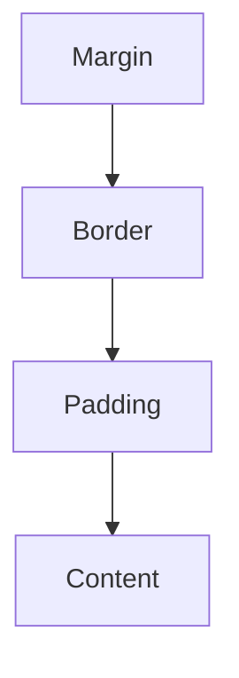
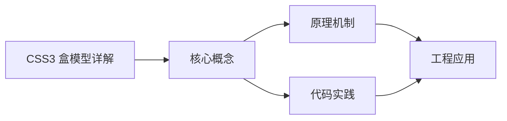
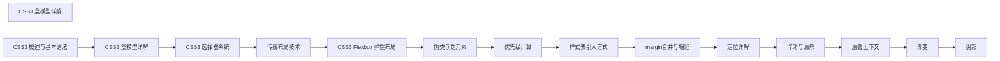

## 1. 学习目标（Bloom 分类）

本节按照布鲁姆教育目标分类学组织学习路径。本文主题为《CSS3 盒模型详解》，属于 CSS 模块，读者可以根据自身阶段选择阅读深度。

记忆层面：能够准确复述本文的核心概念、术语与基本语法或操作步骤，并能够在提问或检索时快速定位对应知识点。能够说出 CSS 的核心概念、术语与标准写法。

理解层面：能够用自己的语言解释核心原理与工作机制，说明概念之间的因果关系，而不是机械记忆结论。能够解释 CSS 的工作原理与设计动机。

应用层面：能够在真实项目或练习场景中运用本文知识解决具体问题，写出正确且可维护的实现。能够编写符合 CSS 规范的完整实现。

分析层面：能够拆解复杂问题，比较本文主题与相邻概念的异同，识别边界条件与例外情况。能够分析 CSS 与相邻方案的差异与边界。

评价层面：能够根据约束条件（性能、可读性、安全、成本）评价不同方案的优劣，做出有依据的技术决策。能够根据场景评价 CSS 相关方案的优劣。

创造层面：能够把本文知识与其他模块知识组合，设计出新的解决方案或可复用的工程模式。能够组合 CSS 与其他技术设计完整方案。

通过本节学习，读者应当能够把《CSS3 盒模型详解》纳入自己的知识网络，并与 CSS 模块的其他主题（选择器、盒模型、布局、动画、响应式）建立关联。

## 2. 历史动机与发展脉络

《CSS3 盒模型详解》是 CSS 领域的重要主题。要真正理解它，需要先了解它解决的问题与演进过程。

CSS 于 1994 年由 Håkon Wium Lie 提出，1996 年 CSS1 发布，解决 HTML 表现层混杂问题；CSS2.1（2011）与 CSS3 模块化（2012+）奠定现代 Web 样式基础。
现代 CSS 的能力版图：Flexbox/Grid 布局、自定义属性（变量）、容器查询、子网格、层叠层（@layer）、现代颜色（oklch）。
CSS 的设计核心是“层叠与继承”：来源、优先级、顺序共同决定最终样式；理解层叠是排查样式问题的前提。

回到本文主题：CSS3 盒模型详解 的提出与成熟，正是上述技术背景下的必然产物。早期实现往往以简单可用为目标，随着工程规模扩大，社区逐渐沉淀出标准做法与最佳实践；理解这一脉络，可以帮助读者判断“为什么文档中的推荐写法是现在这个样子”，也能在遇到历史遗留代码时准确识别其设计年代与取舍。


## 3. 形式化定义与核心概念精讲

本节把《CSS3 盒模型详解》涉及的核心概念以“定义 + 讲解”的形式展开。读者应把定义当作工具，把讲解当作理解路径；两者结合才能形成可迁移的知识。

选择器与优先级：id > class/属性/伪类 > 元素/伪元素；!important 打破优先级（应避免）。
盒模型：content/padding/border/margin，box-sizing 决定 width 语义（border-box 推荐）。
布局体系：普通流、浮动（历史）、Flexbox（一维）、Grid（二维）；position 定位（relative/absolute/fixed/sticky）。

### 3.1 原文章节逐一精讲

原文档把主题拆分为 20 个小节，下面按顺序给出每一节的导读讲解，随后保留原文细节供精读。

#### 原文精读（完整保留）

# CSS 盒模型详解

> **符号约定**：`< >` 必填参数 | `[ ]` 可选参数

---

#### 1. 盒模型组成 (Components)

##### 1.1 基本组成

每个 HTML 元素都被视为一个矩形盒子，由以下四个部分组成：
| 组成部分 | 描述 | 特性 |
|---------|------|------|
| **Content (内容)** | 实际的文本、图片等内容 | 由 `width` 和 `height` 属性控制大小 |
| **Padding (内边距)** | 内容与边框之间的透明区域 | 可以使用 `padding` 属性设置，会影响元素的实际大小 |
| **Border (边框)** | 围绕 Padding 和 Content 的线 | 由 `border` 属性控制，包括宽度、样式和颜色 |
| **Margin (外边距)** | 盒子与其他元素之间的间距 | 由 `margin` 属性控制，是透明的，不会影响元素自身大小 |

##### 1.2 盒模型示意图



##### 1.3 代码示例

```html
<!DOCTYPE html>
<html lang="zh-CN">
  <head>
    <style>
      .box {
        width: 200px;
        height: 100px;
        padding: 20px;
        border: 5px solid #333;
        margin: 15px;
        background-color: #f0f0f0;
      }
    </style>
  </head>
  <body>
    <div class="box">内容区域</div>
  </body>
</html>
```

#### 2. 盒模型类型 (Box Sizing)

##### 2.1 标准盒模型 (`content-box`)

**默认值**，遵循 W3C 标准。

- **宽度计算**: `width = 内容宽度`
- **实际占用空间**: `width + padding + border`
- **特点**: 当增加 `padding` 或 `border` 时，元素的实际宽度会增加
  **代码示例**:

```css
.standard-box {
  box-sizing: content-box;
  width: 200px;
  padding: 20px;
  border: 5px solid #333;
  /* 实际宽度: 200 + 20*2 + 5*2 = 250px */
}
```

##### 2.2 怪异/IE 盒模型 (`border-box`)

**推荐使用**，更符合直觉的盒模型。

- **宽度计算**: `width = 内容宽度 + padding + border`
- **实际占用空间**: 等于设置的 `width`
- **特点**: 当增加 `padding` 或 `border` 时，元素的实际宽度不会改变，只会压缩内容区域
  **代码示例**:

```css
.border-box {
  box-sizing: border-box;
  width: 200px;
  padding: 20px;
  border: 5px solid #333;
  /* 实际宽度: 200px (内容宽度被压缩为 150px) */
}
```

##### 2.3 全局盒模型设置

推荐在项目中全局使用 `border-box`，这样可以更方便地控制元素大小：

```css
 /* 方法 1: 全局设置 */
 *
  box-sizing: border-box;
 }
 /* 方法 2: 更精确的设置，包括伪元素 */
 *
  box-sizing: border-box;
 }
 /* 方法 3: 继承方式，更灵活 */
 html {
  box-sizing: border-box;
 }
 *
  box-sizing: inherit;
 }
```

##### 2.4 盒模型类型的应用场景

| 场景             | 推荐盒模型    | 原因                               |
| ---------------- | ------------- | ---------------------------------- |
| 响应式布局       | `border-box`  | 更容易计算元素尺寸，避免布局错位   |
| 固定宽度布局     | `border-box`  | 可以随意调整内边距而不影响整体布局 |
| 第三方组件集成   | `content-box` | 保持与原始组件一致的盒模型行为     |
| 精确控制内容区域 | `content-box` | 可以准确控制内容区域的大小         |

#### 3. 外边距特性 (Margin Features)

##### 3.1 外边距的基本用法

```css
/* 四个方向的外边距 */
margin: 10px; /* 四个方向都是 10px */
margin: 10px 20px; /* 上下 10px，左右 20px */
margin: 10px 20px 30px; /* 上 10px，左右 20px，下 30px */
margin: 10px 20px 30px 40px; /* 上 10px，右 20px，下 30px，左 40px */
/* 单个方向的外边距 */
margin-top: 10px;
margin-right: 20px;
margin-bottom: 30px;
margin-left: 40px;
```

##### 3.2 水平居中

使用 `margin: 0 auto;` 可以实现块级元素的水平居中：

```css
.centered {
  width: 50%; /* 必须指定宽度 */
  margin: 0 auto; /* 上下外边距为 0，左右自动 */
}
```

**代码示例**:

```html
<!DOCTYPE html>
<html lang="zh-CN">
  <head>
    <style>
      .container {
        width: 100%;
        background-color: #f0f0f0;
      }
      .centered-box {
        width: 50%;
        margin: 20px auto;
        padding: 20px;
        background-color: #fff;
        border: 1px solid #ddd;
      }
    </style>
  </head>
  <body>
    <div class="container">
      <div class="centered-box">这个盒子水平居中</div>
    </div>
  </body>
</html>
```

##### 3.3 外边距塌陷 (Margin Collapse)

**定义**：在垂直方向上，相邻的两个外边距会取最大值，而非累加。

###### 3.3.1 常见的外边距塌陷场景

1. **相邻元素的外边距塌陷**

```html
<div style="margin-bottom: 30px;">元素 1</div>
<div style="margin-top: 20px;">元素 2</div>
<!-- 实际间距: 30px (取最大值)，而非 50px -->
```

1. **父子元素的外边距塌陷**

```html
<div style="margin-top: 20px;">
  <div style="margin-top: 30px;">子元素</div>
</div>
<!-- 实际间距: 30px (取最大值)，而非 50px -->
```

1. **空元素的外边距塌陷**

```html
<div style="margin-top: 20px; margin-bottom: 30px;"></div>
<!-- 实际高度: 30px (取最大值)，而非 50px -->
```

###### 3.3.2 解决外边距塌陷的方法

| 方法           | 适用场景     | 代码示例                         |
| -------------- | ------------ | -------------------------------- |
| **添加边框**   | 父子元素塌陷 | `border: 1px solid transparent;` |
| **添加内边距** | 父子元素塌陷 | `padding: 1px;`                  |
| **使用 BFC**   | 各种塌陷场景 | `overflow: hidden;`              |
| **使用浮动**   | 相邻元素塌陷 | `float: left;`                   |
| **使用定位**   | 相邻元素塌陷 | `position: absolute;`            |

**代码示例**:

```html
<!DOCTYPE html>
<html lang="zh-CN">
  <head>
    <style>
      .parent {
        background-color: #f0f0f0;
        /* 方法 1: 添加边框 */
        /* border: 1px solid transparent; */
        /* 方法 2: 添加内边距 */
        /* padding: 1px; */
        /* 方法 3: 使用 BFC */
        overflow: hidden;
      }
      .child {
        margin-top: 30px;
        padding: 20px;
        background-color: #fff;
      }
    </style>
  </head>
  <body>
    <div class="parent">
      <div class="child">子元素</div>
    </div>
  </body>
</html>
```

#### 4. BFC (块级格式化上下文)

##### 4.1 BFC 的定义

**块级格式化上下文** (Block Formatting Context) 是一个独立的渲染区域，内部元素的布局不会影响外部元素，外部元素也不会影响内部元素。

##### 4.2 触发 BFC 的条件

| 条件                      | 代码示例                                                        |
| ------------------------- | --------------------------------------------------------------- |
| **浮动元素**              | `float: left;` 或 `float: right;`                               |
| **绝对定位元素**          | `position: absolute;` 或 `position: fixed;`                     |
| **行内块元素**            | `display: inline-block;`                                        |
| **表格单元格**            | `display: table-cell;`                                          |
| **弹性容器**              | `display: flex;` 或 `display: inline-flex;`                     |
| **网格容器**              | `display: grid;` 或 `display: inline-grid;`                     |
| **overflow 不为 visible** | `overflow: hidden;` 或 `overflow: auto;` 或 `overflow: scroll;` |
| **根元素**                | `<html>` 元素                                                   |

##### 4.3 BFC 的作用

###### 4.3.1 清除浮动

当父元素包含浮动子元素时，父元素会塌陷，使用 BFC 可以解决这个问题：

```html
<!DOCTYPE html>
<html lang="zh-CN">
  <head>
    <style>
      .parent {
        background-color: #f0f0f0;
        /* 触发 BFC */
        overflow: hidden;
      }
      .child {
        float: left;
        width: 100px;
        height: 100px;
        margin: 10px;
        background-color: #fff;
      }
    </style>
  </head>
  <body>
    <div class="parent">
      <div class="child">子元素 1</div>
      <div class="child">子元素 2</div>
      <div class="child">子元素 3</div>
    </div>
  </body>
</html>
```

###### 4.3.2 防止外边距重叠

使用 BFC 可以防止父子元素或相邻元素的外边距重叠：

```html
<!DOCTYPE html>
<html lang="zh-CN">
  <head>
    <style>
      .container {
        /* 触发 BFC */
        overflow: hidden;
      }
      .box {
        margin: 20px;
        padding: 20px;
        background-color: #f0f0f0;
      }
    </style>
  </head>
  <body>
    <div class="box">Box 1</div>
    <div class="container">
      <div class="box">Box 2 (在 BFC 中)</div>
    </div>
  </body>
</html>
```

###### 4.3.3 实现两栏布局

使用 BFC 可以实现经典的两栏布局：

```html
<!DOCTYPE html>
<html lang="zh-CN">
  <head>
    <style>
      .container {
        width: 100%;
      }
      .sidebar {
        float: left;
        width: 200px;
        height: 300px;
        background-color: #f0f0f0;
      }
      .content {
        /* 触发 BFC */
        overflow: hidden;
        height: 300px;
        background-color: #e0e0e0;
      }
    </style>
  </head>
  <body>
    <div class="container">
      <div class="sidebar">侧边栏</div>
      <div class="content">主内容区</div>
    </div>
  </body>
</html>
```

#### 5. 盒模型的实际应用

##### 5.1 响应式布局中的盒模型

在响应式布局中，使用 `border-box` 可以更方便地控制元素大小：

```css
 /* 全局盒模型设置 */
 *
  box-sizing: border-box;
 }
 /* 响应式网格 */
 .row {
  display: flex;
  flex-wrap: wrap;
  margin: 0 -15px;
 }
 .col {
  flex: 1;
  padding: 0 15px;
 }
 /* 媒体查询 */
 @media (max-width: 768px) {
  .col {
  flex: 0 0 100%;
  }
 }
```

##### 5.2 卡片式布局

```html
<!DOCTYPE html>
<html lang="zh-CN">
  <head>
    <style>
      * {
        box-sizing: border-box;
      }
      .card {
        width: 300px;
        margin: 20px;
        border: 1px solid #ddd;
        border-radius: 8px;
        overflow: hidden;
        box-shadow: 0 2px 4px rgba(0, 0, 0, 0.1);
      }
      .card-header {
        padding: 15px;
        background-color: #f5f5f5;
        border-bottom: 1px solid #ddd;
      }
      .card-body {
        padding: 15px;
      }
      .card-footer {
        padding: 15px;
        background-color: #f5f5f5;
        border-top: 1px solid #ddd;
      }
    </style>
  </head>
  <body>
    <div class="card">
      <div class="card-header">卡片标题</div>
      <div class="card-body">卡片内容</div>
      <div class="card-footer">卡片底部</div>
    </div>
  </body>
</html>
```

##### 5.3 表单元素的盒模型

```css
/* 表单元素的盒模型设置 */
input,
textarea,
select {
  box-sizing: border-box;
  width: 100%;
  padding: 10px;
  border: 1px solid #ddd;
  border-radius: 4px;
}
/* 按钮的盒模型设置 */
button {
  box-sizing: border-box;
  padding: 10px 20px;
  border: 1px solid #333;
  border-radius: 4px;
  background-color: #f0f0f0;
}
```

#### 6. 盒模型的最佳实践

##### 6.1 代码风格建议

- **统一盒模型**: 全局使用 `border-box` 以保持一致性
- **合理使用简写**: 优先使用 `margin` 和 `padding` 的简写形式
- **明确单位**: 统一使用 `px`、`em` 或 `rem` 等单位
- **避免负外边距**: 除非有特殊需求，否则避免使用负外边距
- **使用相对单位**: 在响应式布局中，使用相对单位如 `%`、`em` 或 `rem`

##### 6.2 性能优化建议

- **减少不必要的嵌套**: 减少 DOM 元素的嵌套层级，避免过多的盒模型计算
- **合理使用 BFC**: 只在需要时触发 BFC，避免不必要的渲染开销
- **避免使用 `*` 选择器**: 尽量使用更具体的选择器，减少浏览器的计算负担
- **优化盒阴影**: 复杂的盒阴影会影响性能，使用时要适度

##### 6.3 常见问题与解决方案

| 问题                 | 原因                        | 解决方案                               |
| -------------------- | --------------------------- | -------------------------------------- |
| **元素大小超出预期** | 使用了 `content-box` 盒模型 | 切换到 `border-box` 盒模型             |
| **布局错位**         | 外边距塌陷或浮动元素未清除  | 使用 BFC 清除浮动或防止外边距塌陷      |
| **响应式布局失效**   | 未正确设置盒模型            | 全局使用 `border-box` 并使用相对单位   |
| **表单元素对齐问题** | 表单元素的盒模型不一致      | 统一设置表单元素的盒模型和垂直对齐方式 |

#### 7. 盒模型的高级技巧

##### 7.1 计算盒模型的实际大小

使用 JavaScript 可以获取元素的实际盒模型大小：

```javascript
// 获取元素
const element = document.querySelector('.box');
// 获取计算后的样式
const computedStyle = window.getComputedStyle(element);
// 获取盒模型各部分的大小
const width = parseFloat(computedStyle.width);
const paddingLeft = parseFloat(computedStyle.paddingLeft);
const paddingRight = parseFloat(computedStyle.paddingRight);
const borderLeft = parseFloat(computedStyle.borderLeftWidth);
const borderRight = parseFloat(computedStyle.borderRightWidth);
// 计算实际宽度
const actualWidth = width + paddingLeft + paddingRight + borderLeft + borderRight;
console.log('实际宽度:', actualWidth);
```

##### 7.2 使用 CSS 变量控制盒模型

```css
 :
  --box-padding: 20px;
  --box-border: 5px;
  --box-margin: 15px;
 }
 .box {
  padding: var(--box-padding);
  border: var(--box-border) solid #333;
  margin: var(--box-margin);
 }
 /* 响应式调整 */
 @media (max-width: 768px) {
  :root {
  --box-padding: 10px;
  --box-border: 3px;
  --box-margin: 10px;
  }
 }
```

##### 7.3 盒模型与 Flexbox/Grid 的结合

盒模型与现代布局技术（如 Flexbox 和 Grid）结合使用，可以创建更灵活的布局：

```css
/* Flexbox 布局 */
.flex-container {
  display: flex;
  gap: 20px; /* 替代 margin */
}
.flex-item {
  flex: 1;
  padding: 20px;
  border: 1px solid #ddd;
}
/* Grid 布局 */
.grid-container {
  display: grid;
  grid-template-columns: repeat(auto-fit, minmax(200px, 1fr));
  gap: 20px; /* 替代 margin */
}
.grid-item {
  padding: 20px;
  border: 1px solid #ddd;
}
```

---

#### box-sizing

**基本写法：content-box 标准盒模型**
`box-sizing: content-box;`
```css
/* width/height 只包含内容区 */
.box {
  box-sizing: content-box;
  width: 200px;
  padding: 20px;
}
```

---

**基本写法：border-box 怪异盒模型**
`box-sizing: border-box;`
```css
/* width/height 包含 padding 和 border */
.box {
  box-sizing: border-box;
  width: 200px;
  padding: 20px;
}
```

---

**基本写法：全局 border-box**
`*, *::before, *::after { box-sizing: border-box; }`
```css
/* 全局应用 border-box */
*,
*::before,
*::after {
  box-sizing: border-box;
}
```

---

#### width 与 height

**基本写法：固定宽度**
`width: <长度>;`
```css
/* 设置固定宽度 */
.container {
  width: 1200px;
}
```

---

**基本写法：百分比宽度**
`width: <百分比>;`
```css
/* 设置相对于父元素的百分比宽度 */
.half {
  width: 50%;
}
```

---

**基本写法：视口宽度**
`width: <vw值>;`
```css
/* 设置相对于视口宽度的宽度 */
.full {
  width: 100vw;
}
```

---

**基本写法：最大宽度**
`max-width: <长度>;`
```css
/* 限制元素最大宽度 */
.container {
  max-width: 1200px;
  margin: 0 auto;
}
```

---

**基本写法：最小宽度**
`min-width: <长度>;`
```css
/* 限制元素最小宽度 */
.sidebar {
  min-width: 200px;
}
```

---

**基本写法：固定高度**
`height: <长度>;`
```css
/* 设置固定高度 */
.header {
  height: 60px;
}
```

---

**基本写法：视口高度**
`height: <vh值>;`
```css
/* 设置相对于视口高度的高度 */
.hero {
  height: 100vh;
}
```

---

**基本写法：max-height 最大高度**
`max-height: <长度>;`
```css
/* 限制元素最大高度 */
.scroll-area {
  max-height: 400px;
  overflow: auto;
}
```

---

**基本写法：min-height 最小高度**
`min-height: <长度>;`
```css
/* 限制元素最小高度 */
.card {
  min-height: 200px;
}
```

---

#### margin 外边距

**基本写法：margin 单值**
`margin: <值>;`
```css
/* 四个方向外边距相同 */
.box {
  margin: 20px;
}
```

---

**基本写法：margin 双值**
`margin: <上下> <左右>;`
```css
/* 上下 20px，左右 10px */
.box {
  margin: 20px 10px;
}
```

---

**基本写法：margin 三值**
`margin: <上> <左右> <下>;`
```css
/* 上 10px，左右 20px，下 30px */
.box {
  margin: 10px 20px 30px;
}
```

---

**单行写法：margin 四值**
`margin: <上> <右> <下> <左>;`
```css
/* 单行设置四个方向外边距 */
.box {
  margin: 10px 20px 30px 40px;
}
```

---

**换行写法：margin 四值**
`margin-top: <值>; margin-right: <值>; margin-bottom: <值>; margin-left: <值>;`
```css
/* 换行设置四个方向外边距 */
.box {
  margin-top: 10px;
  margin-right: 20px;
  margin-bottom: 30px;
  margin-left: 40px;
}
```

---

**基本写法：margin auto 水平居中**
`margin: 0 auto;`
```css
/* 块级元素水平居中 */
.container {
  width: 800px;
  margin: 0 auto;
}
```

---

**基本写法：margin 负值**
`margin-<方向>: <-值>;`
```css
/* 使用负值偏移元素 */
.pull-up {
  margin-top: -20px;
}
```

---

#### padding 内边距

**基本写法：padding 单值**
`padding: <值>;`
```css
/* 四个方向内边距相同 */
.box {
  padding: 20px;
}
```

---

**基本写法：padding 双值**
`padding: <上下> <左右>;`
```css
/* 上下 10px，左右 20px */
.box {
  padding: 10px 20px;
}
```

---

**基本写法：padding 三值**
`padding: <上> <左右> <下>;`
```css
/* 上 10px，左右 20px，下 30px */
.box {
  padding: 10px 20px 30px;
}
```

---

**单行写法：padding 四值**
`padding: <上> <右> <下> <左>;`
```css
/* 单行设置四个方向内边距 */
.box {
  padding: 10px 20px 30px 40px;
}
```

---

**换行写法：padding 四值**
`padding-top: <值>; padding-right: <值>; padding-bottom: <值>; padding-left: <值>;`
```css
/* 换行设置四个方向内边距 */
.box {
  padding-top: 10px;
  padding-right: 20px;
  padding-bottom: 30px;
  padding-left: 40px;
}
```

---

#### border 边框

**基本写法：border 完整边框**
`border: <宽度> <样式> <颜色>;`
```css
/* 设置完整边框 */
.box {
  border: 1px solid #ccc;
}
```

---

**基本写法：border-width 单值**
`border-width: <值>;`
```css
/* 设置四条边框宽度 */
.box {
  border-width: 2px;
}
```

---

**基本写法：border-style 实线**
`border-style: solid;`
```css
/* 设置边框样式为实线 */
.box {
  border-style: solid;
}
```

---

**基本写法：border-style 虚线**
`border-style: dashed;`
```css
/* 设置边框样式为虚线 */
.box {
  border-style: dashed;
}
```

---

**基本写法：border-color 边框颜色**
`border-color: <颜色>;`
```css
/* 设置边框颜色 */
.box {
  border-color: #007bff;
}
```

---

**基本写法：单边边框**
`border-<方向>: <宽度> <样式> <颜色>;`
```css
/* 仅设置底边边框 */
.box {
  border-bottom: 2px solid red;
}
```

---

**基本写法：无边框**
`border: none;`
```css
/* 移除边框 */
.no-border {
  border: none;
}
```

---

#### border-radius 圆角

**基本写法：统一圆角**
`border-radius: <值>;`
```css
/* 四个角相同圆角 */
.box {
  border-radius: 8px;
}
```

---

**基本写法：圆形**
`border-radius: 50%;`
```css
/* 创建圆形元素 */
.avatar {
  width: 100px;
  height: 100px;
  border-radius: 50%;
}
```

---

**基本写法：椭圆角**
`border-radius: <水平> / <垂直>;`
```css
/* 设置椭圆角 */
.box {
  border-radius: 50% / 30%;
}
```

---

**单行写法：四角不同圆角**
`border-radius: <左上> <右上> <右下> <左下>;`
```css
/* 单行设置四个角不同圆角 */
.box {
  border-radius: 10px 20px 30px 40px;
}
```

---

**换行写法：四角不同圆角**
`border-top-left-radius: <值>; border-top-right-radius: <值>; border-bottom-right-radius: <值>; border-bottom-left-radius: <值>;`
```css
/* 换行设置四个角不同圆角 */
.box {
  border-top-left-radius: 10px;
  border-top-right-radius: 20px;
  border-bottom-right-radius: 30px;
  border-bottom-left-radius: 40px;
}
```

---

#### outline 轮廓

**基本写法：outline 完整轮廓**
`outline: <宽度> <样式> <颜色>;`
```css
/* 设置元素轮廓（不占空间） */
.input:focus {
  outline: 2px solid #007bff;
}
```

---

**基本写法：outline-offset 偏移**
`outline-offset: <值>;`
```css
/* 设置轮廓与元素的距离 */
.button:focus {
  outline: 2px solid blue;
  outline-offset: 4px;
}
```

---

**基本写法：移除轮廓**
`outline: none;`
```css
/* 移除默认轮廓 */
.input:focus {
  outline: none;
}
```

---

#### box-shadow 阴影

**基本写法：外阴影**
`box-shadow: <水平偏移> <垂直偏移> <模糊> <颜色>;`
```css
/* 设置外阴影 */
.box {
  box-shadow: 2px 4px 8px rgba(0, 0, 0, 0.2);
}
```

---

**基本写法：带扩展的外阴影**
`box-shadow: <水平> <垂直> <模糊> <扩展> <颜色>;`
```css
/* 设置带扩展的外阴影 */
.box {
  box-shadow: 2px 4px 8px 2px rgba(0, 0, 0, 0.2);
}
```

---

**基本写法：内阴影**
`box-shadow: inset <水平> <垂直> <模糊> <颜色>;`
```css
/* 设置内阴影 */
.box {
  box-shadow: inset 0 0 10px rgba(0, 0, 0, 0.5);
}
```

---

**单行写法：多重阴影**
`box-shadow: <阴影1>, <阴影2>;`
```css
/* 单行设置多重阴影 */
.box {
  box-shadow: 0 2px 4px rgba(0,0,0,0.2), 0 4px 8px rgba(0,0,0,0.1);
}
```

---

**换行写法：多重阴影**
`box-shadow: <阴影1>, <阴影2>, <阴影3>;`
```css
/* 换行设置多重阴影 */
.box {
  box-shadow:
    0 1px 2px rgba(0, 0, 0, 0.1),
    0 4px 8px rgba(0, 0, 0, 0.1),
    0 16px 32px rgba(0, 0, 0, 0.1);
}
```

---

#### overflow 溢出

**基本写法：overflow 可见**
`overflow: visible;`
```css
/* 内容溢出时可见 */
.box {
  overflow: visible;
}
```

---

**基本写法：overflow 隐藏**
`overflow: hidden;`
```css
/* 内容溢出时隐藏 */
.box {
  overflow: hidden;
}
```

---

**基本写法：overflow 滚动**
`overflow: scroll;`
```css
/* 始终显示滚动条 */
.box {
  overflow: scroll;
}
```

---

**基本写法：overflow 自动**
`overflow: auto;`
```css
/* 需要时显示滚动条 */
.scroll-area {
  overflow: auto;
}
```

---

**基本写法：overflow-x 水平滚动**
`overflow-x: auto;`
```css
/* 水平方向自动滚动 */
.table-wrapper {
  overflow-x: auto;
}
```

---

**基本写法：overflow-y 垂直滚动**
`overflow-y: auto;`
```css
/* 垂直方向自动滚动 */
.list {
  max-height: 300px;
  overflow-y: auto;
}
```

---

**基本写法：text-overflow 省略号**
`text-overflow: ellipsis;`
```css
/* 文本溢出显示省略号 */
.text {
  white-space: nowrap;
  overflow: hidden;
  text-overflow: ellipsis;
}
```

---

#### display 显示类型

**基本写法：block 块级**
`display: block;`
```css
/* 设置为块级元素 */
.span-block {
  display: block;
}
```

---

**基本写法：inline 行内**
`display: inline;`
```css
/* 设置为行内元素 */
.div-inline {
  display: inline;
}
```

---

**基本写法：inline-block 行内块**
`display: inline-block;`
```css
/* 设置为行内块元素 */
.badge {
  display: inline-block;
  padding: 2px 8px;
}
```

---

**基本写法：none 隐藏**
`display: none;`
```css
/* 完全隐藏元素 */
.hidden {
  display: none;
}
```

---

**基本写法：flex 弹性布局**
`display: flex;`
```css
/* 设置为弹性容器 */
.container {
  display: flex;
}
```

---

**基本写法：grid 网格布局**
`display: grid;`
```css
/* 设置为网格容器 */
.layout {
  display: grid;
}
```

---

#### visibility 可见性

**基本写法：visible 可见**
`visibility: visible;`
```css
/* 元素可见 */
.box {
  visibility: visible;
}
```

---

**基本写法：hidden 隐藏占位**
`visibility: hidden;`
```css
/* 元素隐藏但保留布局空间 */
.invisible {
  visibility: hidden;
}
```

---

**基本写法：collapse 表格折叠**
`visibility: collapse;`
```css
/* 表格行或列折叠 */
.row {
  visibility: collapse;
}
```

---

#### content 内容生成

**基本写法：content 字符串**
`content: "<文本>";`
```css
/* 生成文本内容 */
.label::before {
  content: "标签: ";
}
```

---

**基本写法：content attr 属性**
`content: attr(<属性名>);`
```css
/* 生成元素属性值 */
a::after {
  content: " (" attr(href) ")";
}
```

---

**基本写法：content 空字符串**
`content: "";`
```css
/* 生成空内容用于布局 */
.clearfix::after {
  content: "";
  display: block;
  clear: both;
}
```

---

#### 尺寸计算

**基本写法：calc 计算**
`width: calc(<表达式>);`
```css
/* 动态计算宽度 */
.sidebar {
  width: calc(100% - 250px);
}
```

---

**基本写法：calc 混合单位**
`height: calc(<值1> + <值2>);`
```css
/* 混合不同单位计算 */
.hero {
  height: calc(100vh - 60px);
}
```

---

**基本写法：min 取最小值**
`width: min(<值1>, <值2>);`
```css
/* 取两个值中的较小者 */
.container {
  width: min(100%, 1200px);
}
```

---

**基本写法：max 取最大值**
`width: max(<值1>, <值2>);`
```css
/* 取两个值中的较大者 */
.text {
  font-size: max(16px, 2vw);
}
```

---

**基本写法：clamp 区间值**
`width: clamp(<最小>, <理想>, <最大>);`
```css
/* 限制值在指定区间 */
.text {
  font-size: clamp(14px, 2vw, 24px);
}
```


### 3.2 概念关系图

下面用 Mermaid 图表达本文核心概念之间的关系，帮助读者建立整体图景：



图中展示的是本文知识的结构化关系：核心概念是入口，原理机制解释“为什么”，代码实践演示“怎么做”，工程应用回答“何时用”。读者学习时可以把每个小节的内容挂接到对应节点上。

## 4. 理论推导与原理解析

本节深入《CSS3 盒模型详解》背后的原理。理论部分不求面面俱到，而是聚焦“能解释现象、能指导实践”的关键推导。

选择器与优先级：id > class/属性/伪类 > 元素/伪元素；!important 打破优先级（应避免）。
盒模型：content/padding/border/margin，box-sizing 决定 width 语义（border-box 推荐）。
布局体系：普通流、浮动（历史）、Flexbox（一维）、Grid（二维）；position 定位（relative/absolute/fixed/sticky）。
层叠上下文：z-index 只在同一层叠上下文中比较；transform/opacity/filter 创建新上下文。

需要强调的是，理论推导与工程实践之间存在翻译层：理论给出的是理想化模型与边界条件，工程代码则必须处理真实环境中的例外。读者在学习时应先掌握理论的“标准情形”，再通过陷阱章节了解“非标准情形”。

## 5. 代码示例与逐行讲解

本节把原文中的代码示例系统整理，并为每个示例补充用途说明与讲解。读者不应只浏览代码，而应逐段对照讲解理解设计意图。

### 5.1 示例：1.2 盒模型示意图

该示例来自原文《1.2 盒模型示意图》小节，用于演示CSS3 盒模型详解相关操作。阅读时请先看代码结构，再看其后的讲解。


讲解：这段代码演示了本节核心知识点。代码中的关键操作可以归纳为三步：准备（定义或初始化）、执行（核心逻辑）、收尾（释放资源或返回结果）。实际项目中，这三步往往被封装为函数或类，以提升复用性与可测试性。

关键点分析：

该示例共 8 行有效代码，结构以数据或配置为主。阅读时应关注：数据字段的含义、配置项的作用，以及它们与运行行为的对应关系。

进阶思考路径：先尝试修改参数观察行为变化，再把示例中的模式迁移到自己的项目中；每次修改都记录预期与实测差异，这是把示例转化为能力的最快方式。

### 5.2 示例：1.3 代码示例

该示例来自原文《1.3 代码示例》小节，用于演示CSS3 盒模型详解相关操作。阅读时请先看代码结构，再看其后的讲解。

```html
<!DOCTYPE html>
<html lang="zh-CN">
  <head>
    <style>
      .box {
        width: 200px;
        height: 100px;
        padding: 20px;
        border: 5px solid #333;
        margin: 15px;
        background-color: #f0f0f0;
      }
    </style>
  </head>
  <body>
    <div class="box">内容区域</div>
  </body>
</html>
```

讲解：这段代码演示了本节核心知识点。代码中的关键操作可以归纳为三步：准备（定义或初始化）、执行（核心逻辑）、收尾（释放资源或返回结果）。实际项目中，这三步往往被封装为函数或类，以提升复用性与可测试性。

关键点分析：

该示例共 18 行有效代码，包含 1 类关键结构（class）。其中：

- 入口与初始化部分负责建立上下文，对应实际项目中的启动或装配逻辑；
- 核心逻辑部分体现本文主题的主要操作，是阅读时最需要对照讲解理解的部分；
- 输出或返回部分把结果交给调用方，注意其类型与边界条件。

进阶思考路径：先尝试修改参数观察行为变化，再把示例中的模式迁移到自己的项目中；每次修改都记录预期与实测差异，这是把示例转化为能力的最快方式。

### 5.3 示例：2.1 标准盒模型 (`content-box`)

该示例来自原文《2.1 标准盒模型 (`content-box`)》小节，用于演示CSS3 盒模型详解相关操作。阅读时请先看代码结构，再看其后的讲解。

```css
.standard-box {
  box-sizing: content-box;
  width: 200px;
  padding: 20px;
  border: 5px solid #333;
  /* 实际宽度: 200 + 20*2 + 5*2 = 250px */
}
```

讲解：这段代码演示了本节核心知识点。代码中的关键操作可以归纳为三步：准备（定义或初始化）、执行（核心逻辑）、收尾（释放资源或返回结果）。实际项目中，这三步往往被封装为函数或类，以提升复用性与可测试性。

关键点分析：

该示例共 7 行有效代码，结构以数据或配置为主。阅读时应关注：数据字段的含义、配置项的作用，以及它们与运行行为的对应关系。

进阶思考路径：先尝试修改参数观察行为变化，再把示例中的模式迁移到自己的项目中；每次修改都记录预期与实测差异，这是把示例转化为能力的最快方式。

### 5.4 示例：2.2 怪异/IE 盒模型 (`border-box`)

该示例来自原文《2.2 怪异/IE 盒模型 (`border-box`)》小节，用于演示CSS3 盒模型详解相关操作。阅读时请先看代码结构，再看其后的讲解。

```css
.border-box {
  box-sizing: border-box;
  width: 200px;
  padding: 20px;
  border: 5px solid #333;
  /* 实际宽度: 200px (内容宽度被压缩为 150px) */
}
```

讲解：这段代码演示了本节核心知识点。代码中的关键操作可以归纳为三步：准备（定义或初始化）、执行（核心逻辑）、收尾（释放资源或返回结果）。实际项目中，这三步往往被封装为函数或类，以提升复用性与可测试性。

关键点分析：

该示例共 7 行有效代码，结构以数据或配置为主。阅读时应关注：数据字段的含义、配置项的作用，以及它们与运行行为的对应关系。

进阶思考路径：先尝试修改参数观察行为变化，再把示例中的模式迁移到自己的项目中；每次修改都记录预期与实测差异，这是把示例转化为能力的最快方式。

### 5.5 示例：2.3 全局盒模型设置

该示例来自原文《2.3 全局盒模型设置》小节，用于演示CSS3 盒模型详解相关操作。阅读时请先看代码结构，再看其后的讲解。

```css
 /* 方法 1: 全局设置 */
 *
  box-sizing: border-box;
 }
 /* 方法 2: 更精确的设置，包括伪元素 */
 *
  box-sizing: border-box;
 }
 /* 方法 3: 继承方式，更灵活 */
 html {
  box-sizing: border-box;
 }
 *
  box-sizing: inherit;
 }
```

讲解：这段代码演示了本节核心知识点。代码中的关键操作可以归纳为三步：准备（定义或初始化）、执行（核心逻辑）、收尾（释放资源或返回结果）。实际项目中，这三步往往被封装为函数或类，以提升复用性与可测试性。

关键点分析：

该示例共 15 行有效代码，结构以数据或配置为主。阅读时应关注：数据字段的含义、配置项的作用，以及它们与运行行为的对应关系。

进阶思考路径：先尝试修改参数观察行为变化，再把示例中的模式迁移到自己的项目中；每次修改都记录预期与实测差异，这是把示例转化为能力的最快方式。

### 5.6 示例：3.1 外边距的基本用法

该示例来自原文《3.1 外边距的基本用法》小节，用于演示CSS3 盒模型详解相关操作。阅读时请先看代码结构，再看其后的讲解。

```css
/* 四个方向的外边距 */
margin: 10px; /* 四个方向都是 10px */
margin: 10px 20px; /* 上下 10px，左右 20px */
margin: 10px 20px 30px; /* 上 10px，左右 20px，下 30px */
margin: 10px 20px 30px 40px; /* 上 10px，右 20px，下 30px，左 40px */
/* 单个方向的外边距 */
margin-top: 10px;
margin-right: 20px;
margin-bottom: 30px;
margin-left: 40px;
```

讲解：这段代码演示了本节核心知识点。代码中的关键操作可以归纳为三步：准备（定义或初始化）、执行（核心逻辑）、收尾（释放资源或返回结果）。实际项目中，这三步往往被封装为函数或类，以提升复用性与可测试性。

关键点分析：

该示例共 10 行有效代码，结构以数据或配置为主。阅读时应关注：数据字段的含义、配置项的作用，以及它们与运行行为的对应关系。

进阶思考路径：先尝试修改参数观察行为变化，再把示例中的模式迁移到自己的项目中；每次修改都记录预期与实测差异，这是把示例转化为能力的最快方式。

### 5.7 示例：3.2 水平居中

该示例来自原文《3.2 水平居中》小节，用于演示CSS3 盒模型详解相关操作。阅读时请先看代码结构，再看其后的讲解。

```css
.centered {
  width: 50%; /* 必须指定宽度 */
  margin: 0 auto; /* 上下外边距为 0，左右自动 */
}
```

讲解：这段代码演示了本节核心知识点。代码中的关键操作可以归纳为三步：准备（定义或初始化）、执行（核心逻辑）、收尾（释放资源或返回结果）。实际项目中，这三步往往被封装为函数或类，以提升复用性与可测试性。

关键点分析：

该示例共 4 行有效代码，结构以数据或配置为主。阅读时应关注：数据字段的含义、配置项的作用，以及它们与运行行为的对应关系。

进阶思考路径：先尝试修改参数观察行为变化，再把示例中的模式迁移到自己的项目中；每次修改都记录预期与实测差异，这是把示例转化为能力的最快方式。

### 5.8 示例：3.2 水平居中

该示例来自原文《3.2 水平居中》小节，用于演示CSS3 盒模型详解相关操作。阅读时请先看代码结构，再看其后的讲解。

```html
<!DOCTYPE html>
<html lang="zh-CN">
  <head>
    <style>
      .container {
        width: 100%;
        background-color: #f0f0f0;
      }
      .centered-box {
        width: 50%;
        margin: 20px auto;
        padding: 20px;
        background-color: #fff;
        border: 1px solid #ddd;
      }
    </style>
  </head>
  <body>
    <div class="container">
      <div class="centered-box">这个盒子水平居中</div>
    </div>
  </body>
</html>
```

讲解：这段代码演示了本节核心知识点。代码中的关键操作可以归纳为三步：准备（定义或初始化）、执行（核心逻辑）、收尾（释放资源或返回结果）。实际项目中，这三步往往被封装为函数或类，以提升复用性与可测试性。

关键点分析：

该示例共 23 行有效代码，包含 1 类关键结构（class）。其中：

- 入口与初始化部分负责建立上下文，对应实际项目中的启动或装配逻辑；
- 核心逻辑部分体现本文主题的主要操作，是阅读时最需要对照讲解理解的部分；
- 输出或返回部分把结果交给调用方，注意其类型与边界条件。

进阶思考路径：先尝试修改参数观察行为变化，再把示例中的模式迁移到自己的项目中；每次修改都记录预期与实测差异，这是把示例转化为能力的最快方式。

### 5.9 示例：3.3.1 常见的外边距塌陷场景

该示例来自原文《3.3.1 常见的外边距塌陷场景》小节，用于演示CSS3 盒模型详解相关操作。阅读时请先看代码结构，再看其后的讲解。

```html
<div style="margin-bottom: 30px;">元素 1</div>
<div style="margin-top: 20px;">元素 2</div>
<!-- 实际间距: 30px (取最大值)，而非 50px -->
```

讲解：这段代码演示了本节核心知识点。代码中的关键操作可以归纳为三步：准备（定义或初始化）、执行（核心逻辑）、收尾（释放资源或返回结果）。实际项目中，这三步往往被封装为函数或类，以提升复用性与可测试性。

关键点分析：

该示例共 3 行有效代码，结构以数据或配置为主。阅读时应关注：数据字段的含义、配置项的作用，以及它们与运行行为的对应关系。

进阶思考路径：先尝试修改参数观察行为变化，再把示例中的模式迁移到自己的项目中；每次修改都记录预期与实测差异，这是把示例转化为能力的最快方式。

### 5.10 示例：3.3.1 常见的外边距塌陷场景

该示例来自原文《3.3.1 常见的外边距塌陷场景》小节，用于演示CSS3 盒模型详解相关操作。阅读时请先看代码结构，再看其后的讲解。

```html
<div style="margin-top: 20px;">
  <div style="margin-top: 30px;">子元素</div>
</div>
<!-- 实际间距: 30px (取最大值)，而非 50px -->
```

讲解：这段代码演示了本节核心知识点。代码中的关键操作可以归纳为三步：准备（定义或初始化）、执行（核心逻辑）、收尾（释放资源或返回结果）。实际项目中，这三步往往被封装为函数或类，以提升复用性与可测试性。

关键点分析：

该示例共 4 行有效代码，结构以数据或配置为主。阅读时应关注：数据字段的含义、配置项的作用，以及它们与运行行为的对应关系。

进阶思考路径：先尝试修改参数观察行为变化，再把示例中的模式迁移到自己的项目中；每次修改都记录预期与实测差异，这是把示例转化为能力的最快方式。

### 5.11 示例：3.3.1 常见的外边距塌陷场景

该示例来自原文《3.3.1 常见的外边距塌陷场景》小节，用于演示CSS3 盒模型详解相关操作。阅读时请先看代码结构，再看其后的讲解。

```html
<div style="margin-top: 20px; margin-bottom: 30px;"></div>
<!-- 实际高度: 30px (取最大值)，而非 50px -->
```

讲解：这段代码演示了本节核心知识点。代码中的关键操作可以归纳为三步：准备（定义或初始化）、执行（核心逻辑）、收尾（释放资源或返回结果）。实际项目中，这三步往往被封装为函数或类，以提升复用性与可测试性。

关键点分析：

该示例共 2 行有效代码，结构以数据或配置为主。阅读时应关注：数据字段的含义、配置项的作用，以及它们与运行行为的对应关系。

进阶思考路径：先尝试修改参数观察行为变化，再把示例中的模式迁移到自己的项目中；每次修改都记录预期与实测差异，这是把示例转化为能力的最快方式。

### 5.12 示例：3.3.2 解决外边距塌陷的方法

该示例来自原文《3.3.2 解决外边距塌陷的方法》小节，用于演示CSS3 盒模型详解相关操作。阅读时请先看代码结构，再看其后的讲解。

```html
<!DOCTYPE html>
<html lang="zh-CN">
  <head>
    <style>
      .parent {
        background-color: #f0f0f0;
        /* 方法 1: 添加边框 */
        /* border: 1px solid transparent; */
        /* 方法 2: 添加内边距 */
        /* padding: 1px; */
        /* 方法 3: 使用 BFC */
        overflow: hidden;
      }
      .child {
        margin-top: 30px;
        padding: 20px;
        background-color: #fff;
      }
    </style>
  </head>
  <body>
    <div class="parent">
      <div class="child">子元素</div>
    </div>
  </body>
</html>
```

讲解：这段代码演示了本节核心知识点。代码中的关键操作可以归纳为三步：准备（定义或初始化）、执行（核心逻辑）、收尾（释放资源或返回结果）。实际项目中，这三步往往被封装为函数或类，以提升复用性与可测试性。

关键点分析：

该示例共 26 行有效代码，包含 1 类关键结构（class）。其中：

- 入口与初始化部分负责建立上下文，对应实际项目中的启动或装配逻辑；
- 核心逻辑部分体现本文主题的主要操作，是阅读时最需要对照讲解理解的部分；
- 输出或返回部分把结果交给调用方，注意其类型与边界条件。

进阶思考路径：先尝试修改参数观察行为变化，再把示例中的模式迁移到自己的项目中；每次修改都记录预期与实测差异，这是把示例转化为能力的最快方式。

### 5.13 示例：4.3.1 清除浮动

该示例来自原文《4.3.1 清除浮动》小节，用于演示CSS3 盒模型详解相关操作。阅读时请先看代码结构，再看其后的讲解。

```html
<!DOCTYPE html>
<html lang="zh-CN">
  <head>
    <style>
      .parent {
        background-color: #f0f0f0;
        /* 触发 BFC */
        overflow: hidden;
      }
      .child {
        float: left;
        width: 100px;
        height: 100px;
        margin: 10px;
        background-color: #fff;
      }
    </style>
  </head>
  <body>
    <div class="parent">
      <div class="child">子元素 1</div>
      <div class="child">子元素 2</div>
      <div class="child">子元素 3</div>
    </div>
  </body>
</html>
```

讲解：这段代码演示了本节核心知识点。代码中的关键操作可以归纳为三步：准备（定义或初始化）、执行（核心逻辑）、收尾（释放资源或返回结果）。实际项目中，这三步往往被封装为函数或类，以提升复用性与可测试性。

关键点分析：

该示例共 26 行有效代码，包含 1 类关键结构（class）。其中：

- 入口与初始化部分负责建立上下文，对应实际项目中的启动或装配逻辑；
- 核心逻辑部分体现本文主题的主要操作，是阅读时最需要对照讲解理解的部分；
- 输出或返回部分把结果交给调用方，注意其类型与边界条件。

进阶思考路径：先尝试修改参数观察行为变化，再把示例中的模式迁移到自己的项目中；每次修改都记录预期与实测差异，这是把示例转化为能力的最快方式。

### 5.14 示例：4.3.2 防止外边距重叠

该示例来自原文《4.3.2 防止外边距重叠》小节，用于演示CSS3 盒模型详解相关操作。阅读时请先看代码结构，再看其后的讲解。

```html
<!DOCTYPE html>
<html lang="zh-CN">
  <head>
    <style>
      .container {
        /* 触发 BFC */
        overflow: hidden;
      }
      .box {
        margin: 20px;
        padding: 20px;
        background-color: #f0f0f0;
      }
    </style>
  </head>
  <body>
    <div class="box">Box 1</div>
    <div class="container">
      <div class="box">Box 2 (在 BFC 中)</div>
    </div>
  </body>
</html>
```

讲解：这段代码演示了本节核心知识点。代码中的关键操作可以归纳为三步：准备（定义或初始化）、执行（核心逻辑）、收尾（释放资源或返回结果）。实际项目中，这三步往往被封装为函数或类，以提升复用性与可测试性。

关键点分析：

该示例共 22 行有效代码，包含 1 类关键结构（class）。其中：

- 入口与初始化部分负责建立上下文，对应实际项目中的启动或装配逻辑；
- 核心逻辑部分体现本文主题的主要操作，是阅读时最需要对照讲解理解的部分；
- 输出或返回部分把结果交给调用方，注意其类型与边界条件。

进阶思考路径：先尝试修改参数观察行为变化，再把示例中的模式迁移到自己的项目中；每次修改都记录预期与实测差异，这是把示例转化为能力的最快方式。

### 5.15 示例：4.3.3 实现两栏布局

该示例来自原文《4.3.3 实现两栏布局》小节，用于演示CSS3 盒模型详解相关操作。阅读时请先看代码结构，再看其后的讲解。

```html
<!DOCTYPE html>
<html lang="zh-CN">
  <head>
    <style>
      .container {
        width: 100%;
      }
      .sidebar {
        float: left;
        width: 200px;
        height: 300px;
        background-color: #f0f0f0;
      }
      .content {
        /* 触发 BFC */
        overflow: hidden;
        height: 300px;
        background-color: #e0e0e0;
      }
    </style>
  </head>
  <body>
    <div class="container">
      <div class="sidebar">侧边栏</div>
      <div class="content">主内容区</div>
    </div>
  </body>
</html>
```

讲解：这段代码演示了本节核心知识点。代码中的关键操作可以归纳为三步：准备（定义或初始化）、执行（核心逻辑）、收尾（释放资源或返回结果）。实际项目中，这三步往往被封装为函数或类，以提升复用性与可测试性。

关键点分析：

该示例共 28 行有效代码，包含 1 类关键结构（class）。其中：

- 入口与初始化部分负责建立上下文，对应实际项目中的启动或装配逻辑；
- 核心逻辑部分体现本文主题的主要操作，是阅读时最需要对照讲解理解的部分；
- 输出或返回部分把结果交给调用方，注意其类型与边界条件。

进阶思考路径：先尝试修改参数观察行为变化，再把示例中的模式迁移到自己的项目中；每次修改都记录预期与实测差异，这是把示例转化为能力的最快方式。

### 5.16 示例：5.1 响应式布局中的盒模型

该示例来自原文《5.1 响应式布局中的盒模型》小节，用于演示CSS3 盒模型详解相关操作。阅读时请先看代码结构，再看其后的讲解。

```css
 /* 全局盒模型设置 */
 *
  box-sizing: border-box;
 }
 /* 响应式网格 */
 .row {
  display: flex;
  flex-wrap: wrap;
  margin: 0 -15px;
 }
 .col {
  flex: 1;
  padding: 0 15px;
 }
 /* 媒体查询 */
 @media (max-width: 768px) {
  .col {
  flex: 0 0 100%;
  }
 }
```

讲解：这段代码演示了本节核心知识点。代码中的关键操作可以归纳为三步：准备（定义或初始化）、执行（核心逻辑）、收尾（释放资源或返回结果）。实际项目中，这三步往往被封装为函数或类，以提升复用性与可测试性。

关键点分析：

该示例共 20 行有效代码，结构以数据或配置为主。阅读时应关注：数据字段的含义、配置项的作用，以及它们与运行行为的对应关系。

进阶思考路径：先尝试修改参数观察行为变化，再把示例中的模式迁移到自己的项目中；每次修改都记录预期与实测差异，这是把示例转化为能力的最快方式。

### 5.17 示例：5.2 卡片式布局

该示例来自原文《5.2 卡片式布局》小节，用于演示CSS3 盒模型详解相关操作。阅读时请先看代码结构，再看其后的讲解。

```html
<!DOCTYPE html>
<html lang="zh-CN">
  <head>
    <style>
      * {
        box-sizing: border-box;
      }
      .card {
        width: 300px;
        margin: 20px;
        border: 1px solid #ddd;
        border-radius: 8px;
        overflow: hidden;
        box-shadow: 0 2px 4px rgba(0, 0, 0, 0.1);
      }
      .card-header {
        padding: 15px;
        background-color: #f5f5f5;
        border-bottom: 1px solid #ddd;
      }
      .card-body {
        padding: 15px;
      }
      .card-footer {
        padding: 15px;
        background-color: #f5f5f5;
        border-top: 1px solid #ddd;
      }
    </style>
  </head>
  <body>
    <div class="card">
      <div class="card-header">卡片标题</div>
      <div class="card-body">卡片内容</div>
      <div class="card-footer">卡片底部</div>
    </div>
  </body>
</html>
```

讲解：这段代码演示了本节核心知识点。代码中的关键操作可以归纳为三步：准备（定义或初始化）、执行（核心逻辑）、收尾（释放资源或返回结果）。实际项目中，这三步往往被封装为函数或类，以提升复用性与可测试性。

关键点分析：

该示例共 38 行有效代码，包含 1 类关键结构（class）。其中：

- 入口与初始化部分负责建立上下文，对应实际项目中的启动或装配逻辑；
- 核心逻辑部分体现本文主题的主要操作，是阅读时最需要对照讲解理解的部分；
- 输出或返回部分把结果交给调用方，注意其类型与边界条件。

进阶思考路径：先尝试修改参数观察行为变化，再把示例中的模式迁移到自己的项目中；每次修改都记录预期与实测差异，这是把示例转化为能力的最快方式。

### 5.18 示例：5.3 表单元素的盒模型

该示例来自原文《5.3 表单元素的盒模型》小节，用于演示CSS3 盒模型详解相关操作。阅读时请先看代码结构，再看其后的讲解。

```css
/* 表单元素的盒模型设置 */
input,
textarea,
select {
  box-sizing: border-box;
  width: 100%;
  padding: 10px;
  border: 1px solid #ddd;
  border-radius: 4px;
}
/* 按钮的盒模型设置 */
button {
  box-sizing: border-box;
  padding: 10px 20px;
  border: 1px solid #333;
  border-radius: 4px;
  background-color: #f0f0f0;
}
```

讲解：这段代码演示了本节核心知识点。代码中的关键操作可以归纳为三步：准备（定义或初始化）、执行（核心逻辑）、收尾（释放资源或返回结果）。实际项目中，这三步往往被封装为函数或类，以提升复用性与可测试性。

关键点分析：

该示例共 18 行有效代码，结构以数据或配置为主。阅读时应关注：数据字段的含义、配置项的作用，以及它们与运行行为的对应关系。

进阶思考路径：先尝试修改参数观察行为变化，再把示例中的模式迁移到自己的项目中；每次修改都记录预期与实测差异，这是把示例转化为能力的最快方式。

### 5.19 示例：7.1 计算盒模型的实际大小

该示例来自原文《7.1 计算盒模型的实际大小》小节，用于演示CSS3 盒模型详解相关操作。阅读时请先看代码结构，再看其后的讲解。

```javascript
// 获取元素
const element = document.querySelector('.box');
// 获取计算后的样式
const computedStyle = window.getComputedStyle(element);
// 获取盒模型各部分的大小
const width = parseFloat(computedStyle.width);
const paddingLeft = parseFloat(computedStyle.paddingLeft);
const paddingRight = parseFloat(computedStyle.paddingRight);
const borderLeft = parseFloat(computedStyle.borderLeftWidth);
const borderRight = parseFloat(computedStyle.borderRightWidth);
// 计算实际宽度
const actualWidth = width + paddingLeft + paddingRight + borderLeft + borderRight;
console.log('实际宽度:', actualWidth);
```

讲解：这段代码演示了本节核心知识点。代码中的关键操作可以归纳为三步：准备（定义或初始化）、执行（核心逻辑）、收尾（释放资源或返回结果）。实际项目中，这三步往往被封装为函数或类，以提升复用性与可测试性。

关键点分析：

该示例共 13 行有效代码，结构以数据或配置为主。阅读时应关注：数据字段的含义、配置项的作用，以及它们与运行行为的对应关系。

进阶思考路径：先尝试修改参数观察行为变化，再把示例中的模式迁移到自己的项目中；每次修改都记录预期与实测差异，这是把示例转化为能力的最快方式。

### 5.20 示例：7.2 使用 CSS 变量控制盒模型

该示例来自原文《7.2 使用 CSS 变量控制盒模型》小节，用于演示CSS3 盒模型详解相关操作。阅读时请先看代码结构，再看其后的讲解。

```css
 :
  --box-padding: 20px;
  --box-border: 5px;
  --box-margin: 15px;
 }
 .box {
  padding: var(--box-padding);
  border: var(--box-border) solid #333;
  margin: var(--box-margin);
 }
 /* 响应式调整 */
 @media (max-width: 768px) {
  :root {
  --box-padding: 10px;
  --box-border: 3px;
  --box-margin: 10px;
  }
 }
```

讲解：这段代码演示了本节核心知识点。代码中的关键操作可以归纳为三步：准备（定义或初始化）、执行（核心逻辑）、收尾（释放资源或返回结果）。实际项目中，这三步往往被封装为函数或类，以提升复用性与可测试性。

关键点分析：

该示例共 18 行有效代码，结构以数据或配置为主。阅读时应关注：数据字段的含义、配置项的作用，以及它们与运行行为的对应关系。

进阶思考路径：先尝试修改参数观察行为变化，再把示例中的模式迁移到自己的项目中；每次修改都记录预期与实测差异，这是把示例转化为能力的最快方式。

### 5.21 示例：7.3 盒模型与 Flexbox/Grid 的结合

该示例来自原文《7.3 盒模型与 Flexbox/Grid 的结合》小节，用于演示CSS3 盒模型详解相关操作。阅读时请先看代码结构，再看其后的讲解。

```css
/* Flexbox 布局 */
.flex-container {
  display: flex;
  gap: 20px; /* 替代 margin */
}
.flex-item {
  flex: 1;
  padding: 20px;
  border: 1px solid #ddd;
}
/* Grid 布局 */
.grid-container {
  display: grid;
  grid-template-columns: repeat(auto-fit, minmax(200px, 1fr));
  gap: 20px; /* 替代 margin */
}
.grid-item {
  padding: 20px;
  border: 1px solid #ddd;
}
```

讲解：这段代码演示了本节核心知识点。代码中的关键操作可以归纳为三步：准备（定义或初始化）、执行（核心逻辑）、收尾（释放资源或返回结果）。实际项目中，这三步往往被封装为函数或类，以提升复用性与可测试性。

关键点分析：

该示例共 20 行有效代码，结构以数据或配置为主。阅读时应关注：数据字段的含义、配置项的作用，以及它们与运行行为的对应关系。

进阶思考路径：先尝试修改参数观察行为变化，再把示例中的模式迁移到自己的项目中；每次修改都记录预期与实测差异，这是把示例转化为能力的最快方式。

### 5.22 示例：box-sizing

该示例来自原文《box-sizing》小节，用于演示CSS3 盒模型详解相关操作。阅读时请先看代码结构，再看其后的讲解。

```css
/* width/height 只包含内容区 */
.box {
  box-sizing: content-box;
  width: 200px;
  padding: 20px;
}
```

讲解：这段代码演示了本节核心知识点。代码中的关键操作可以归纳为三步：准备（定义或初始化）、执行（核心逻辑）、收尾（释放资源或返回结果）。实际项目中，这三步往往被封装为函数或类，以提升复用性与可测试性。

关键点分析：

该示例共 6 行有效代码，结构以数据或配置为主。阅读时应关注：数据字段的含义、配置项的作用，以及它们与运行行为的对应关系。

进阶思考路径：先尝试修改参数观察行为变化，再把示例中的模式迁移到自己的项目中；每次修改都记录预期与实测差异，这是把示例转化为能力的最快方式。

### 5.23 示例：box-sizing

该示例来自原文《box-sizing》小节，用于演示CSS3 盒模型详解相关操作。阅读时请先看代码结构，再看其后的讲解。

```css
/* width/height 包含 padding 和 border */
.box {
  box-sizing: border-box;
  width: 200px;
  padding: 20px;
}
```

讲解：这段代码演示了本节核心知识点。代码中的关键操作可以归纳为三步：准备（定义或初始化）、执行（核心逻辑）、收尾（释放资源或返回结果）。实际项目中，这三步往往被封装为函数或类，以提升复用性与可测试性。

关键点分析：

该示例共 6 行有效代码，结构以数据或配置为主。阅读时应关注：数据字段的含义、配置项的作用，以及它们与运行行为的对应关系。

进阶思考路径：先尝试修改参数观察行为变化，再把示例中的模式迁移到自己的项目中；每次修改都记录预期与实测差异，这是把示例转化为能力的最快方式。

### 5.24 示例：box-sizing

该示例来自原文《box-sizing》小节，用于演示CSS3 盒模型详解相关操作。阅读时请先看代码结构，再看其后的讲解。

```css
/* 全局应用 border-box */
*,
*::before,
*::after {
  box-sizing: border-box;
}
```

讲解：这段代码演示了本节核心知识点。代码中的关键操作可以归纳为三步：准备（定义或初始化）、执行（核心逻辑）、收尾（释放资源或返回结果）。实际项目中，这三步往往被封装为函数或类，以提升复用性与可测试性。

关键点分析：

该示例共 6 行有效代码，结构以数据或配置为主。阅读时应关注：数据字段的含义、配置项的作用，以及它们与运行行为的对应关系。

进阶思考路径：先尝试修改参数观察行为变化，再把示例中的模式迁移到自己的项目中；每次修改都记录预期与实测差异，这是把示例转化为能力的最快方式。

### 5.25 示例：width 与 height

该示例来自原文《width 与 height》小节，用于演示CSS3 盒模型详解相关操作。阅读时请先看代码结构，再看其后的讲解。

```css
/* 设置固定宽度 */
.container {
  width: 1200px;
}
```

讲解：这段代码演示了本节核心知识点。代码中的关键操作可以归纳为三步：准备（定义或初始化）、执行（核心逻辑）、收尾（释放资源或返回结果）。实际项目中，这三步往往被封装为函数或类，以提升复用性与可测试性。

关键点分析：

该示例共 4 行有效代码，结构以数据或配置为主。阅读时应关注：数据字段的含义、配置项的作用，以及它们与运行行为的对应关系。

进阶思考路径：先尝试修改参数观察行为变化，再把示例中的模式迁移到自己的项目中；每次修改都记录预期与实测差异，这是把示例转化为能力的最快方式。

### 5.26 示例：width 与 height

该示例来自原文《width 与 height》小节，用于演示CSS3 盒模型详解相关操作。阅读时请先看代码结构，再看其后的讲解。

```css
/* 设置相对于父元素的百分比宽度 */
.half {
  width: 50%;
}
```

讲解：这段代码演示了本节核心知识点。代码中的关键操作可以归纳为三步：准备（定义或初始化）、执行（核心逻辑）、收尾（释放资源或返回结果）。实际项目中，这三步往往被封装为函数或类，以提升复用性与可测试性。

关键点分析：

该示例共 4 行有效代码，结构以数据或配置为主。阅读时应关注：数据字段的含义、配置项的作用，以及它们与运行行为的对应关系。

进阶思考路径：先尝试修改参数观察行为变化，再把示例中的模式迁移到自己的项目中；每次修改都记录预期与实测差异，这是把示例转化为能力的最快方式。

### 5.27 示例：width 与 height

该示例来自原文《width 与 height》小节，用于演示CSS3 盒模型详解相关操作。阅读时请先看代码结构，再看其后的讲解。

```css
/* 设置相对于视口宽度的宽度 */
.full {
  width: 100vw;
}
```

讲解：这段代码演示了本节核心知识点。代码中的关键操作可以归纳为三步：准备（定义或初始化）、执行（核心逻辑）、收尾（释放资源或返回结果）。实际项目中，这三步往往被封装为函数或类，以提升复用性与可测试性。

关键点分析：

该示例共 4 行有效代码，结构以数据或配置为主。阅读时应关注：数据字段的含义、配置项的作用，以及它们与运行行为的对应关系。

进阶思考路径：先尝试修改参数观察行为变化，再把示例中的模式迁移到自己的项目中；每次修改都记录预期与实测差异，这是把示例转化为能力的最快方式。

### 5.28 示例：width 与 height

该示例来自原文《width 与 height》小节，用于演示CSS3 盒模型详解相关操作。阅读时请先看代码结构，再看其后的讲解。

```css
/* 限制元素最大宽度 */
.container {
  max-width: 1200px;
  margin: 0 auto;
}
```

讲解：这段代码演示了本节核心知识点。代码中的关键操作可以归纳为三步：准备（定义或初始化）、执行（核心逻辑）、收尾（释放资源或返回结果）。实际项目中，这三步往往被封装为函数或类，以提升复用性与可测试性。

关键点分析：

该示例共 5 行有效代码，结构以数据或配置为主。阅读时应关注：数据字段的含义、配置项的作用，以及它们与运行行为的对应关系。

进阶思考路径：先尝试修改参数观察行为变化，再把示例中的模式迁移到自己的项目中；每次修改都记录预期与实测差异，这是把示例转化为能力的最快方式。

### 5.29 示例：width 与 height

该示例来自原文《width 与 height》小节，用于演示CSS3 盒模型详解相关操作。阅读时请先看代码结构，再看其后的讲解。

```css
/* 限制元素最小宽度 */
.sidebar {
  min-width: 200px;
}
```

讲解：这段代码演示了本节核心知识点。代码中的关键操作可以归纳为三步：准备（定义或初始化）、执行（核心逻辑）、收尾（释放资源或返回结果）。实际项目中，这三步往往被封装为函数或类，以提升复用性与可测试性。

关键点分析：

该示例共 4 行有效代码，结构以数据或配置为主。阅读时应关注：数据字段的含义、配置项的作用，以及它们与运行行为的对应关系。

进阶思考路径：先尝试修改参数观察行为变化，再把示例中的模式迁移到自己的项目中；每次修改都记录预期与实测差异，这是把示例转化为能力的最快方式。

### 5.30 示例：width 与 height

该示例来自原文《width 与 height》小节，用于演示CSS3 盒模型详解相关操作。阅读时请先看代码结构，再看其后的讲解。

```css
/* 设置固定高度 */
.header {
  height: 60px;
}
```

讲解：这段代码演示了本节核心知识点。代码中的关键操作可以归纳为三步：准备（定义或初始化）、执行（核心逻辑）、收尾（释放资源或返回结果）。实际项目中，这三步往往被封装为函数或类，以提升复用性与可测试性。

关键点分析：

该示例共 4 行有效代码，结构以数据或配置为主。阅读时应关注：数据字段的含义、配置项的作用，以及它们与运行行为的对应关系。

进阶思考路径：先尝试修改参数观察行为变化，再把示例中的模式迁移到自己的项目中；每次修改都记录预期与实测差异，这是把示例转化为能力的最快方式。

### 5.31 示例：width 与 height

该示例来自原文《width 与 height》小节，用于演示CSS3 盒模型详解相关操作。阅读时请先看代码结构，再看其后的讲解。

```css
/* 设置相对于视口高度的高度 */
.hero {
  height: 100vh;
}
```

讲解：这段代码演示了本节核心知识点。代码中的关键操作可以归纳为三步：准备（定义或初始化）、执行（核心逻辑）、收尾（释放资源或返回结果）。实际项目中，这三步往往被封装为函数或类，以提升复用性与可测试性。

关键点分析：

该示例共 4 行有效代码，结构以数据或配置为主。阅读时应关注：数据字段的含义、配置项的作用，以及它们与运行行为的对应关系。

进阶思考路径：先尝试修改参数观察行为变化，再把示例中的模式迁移到自己的项目中；每次修改都记录预期与实测差异，这是把示例转化为能力的最快方式。

### 5.32 示例：width 与 height

该示例来自原文《width 与 height》小节，用于演示CSS3 盒模型详解相关操作。阅读时请先看代码结构，再看其后的讲解。

```css
/* 限制元素最大高度 */
.scroll-area {
  max-height: 400px;
  overflow: auto;
}
```

讲解：这段代码演示了本节核心知识点。代码中的关键操作可以归纳为三步：准备（定义或初始化）、执行（核心逻辑）、收尾（释放资源或返回结果）。实际项目中，这三步往往被封装为函数或类，以提升复用性与可测试性。

关键点分析：

该示例共 5 行有效代码，结构以数据或配置为主。阅读时应关注：数据字段的含义、配置项的作用，以及它们与运行行为的对应关系。

进阶思考路径：先尝试修改参数观察行为变化，再把示例中的模式迁移到自己的项目中；每次修改都记录预期与实测差异，这是把示例转化为能力的最快方式。

### 5.33 示例：width 与 height

该示例来自原文《width 与 height》小节，用于演示CSS3 盒模型详解相关操作。阅读时请先看代码结构，再看其后的讲解。

```css
/* 限制元素最小高度 */
.card {
  min-height: 200px;
}
```

讲解：这段代码演示了本节核心知识点。代码中的关键操作可以归纳为三步：准备（定义或初始化）、执行（核心逻辑）、收尾（释放资源或返回结果）。实际项目中，这三步往往被封装为函数或类，以提升复用性与可测试性。

关键点分析：

该示例共 4 行有效代码，结构以数据或配置为主。阅读时应关注：数据字段的含义、配置项的作用，以及它们与运行行为的对应关系。

进阶思考路径：先尝试修改参数观察行为变化，再把示例中的模式迁移到自己的项目中；每次修改都记录预期与实测差异，这是把示例转化为能力的最快方式。

### 5.34 示例：margin 外边距

该示例来自原文《margin 外边距》小节，用于演示CSS3 盒模型详解相关操作。阅读时请先看代码结构，再看其后的讲解。

```css
/* 四个方向外边距相同 */
.box {
  margin: 20px;
}
```

讲解：这段代码演示了本节核心知识点。代码中的关键操作可以归纳为三步：准备（定义或初始化）、执行（核心逻辑）、收尾（释放资源或返回结果）。实际项目中，这三步往往被封装为函数或类，以提升复用性与可测试性。

关键点分析：

该示例共 4 行有效代码，结构以数据或配置为主。阅读时应关注：数据字段的含义、配置项的作用，以及它们与运行行为的对应关系。

进阶思考路径：先尝试修改参数观察行为变化，再把示例中的模式迁移到自己的项目中；每次修改都记录预期与实测差异，这是把示例转化为能力的最快方式。

### 5.35 示例：margin 外边距

该示例来自原文《margin 外边距》小节，用于演示CSS3 盒模型详解相关操作。阅读时请先看代码结构，再看其后的讲解。

```css
/* 上下 20px，左右 10px */
.box {
  margin: 20px 10px;
}
```

讲解：这段代码演示了本节核心知识点。代码中的关键操作可以归纳为三步：准备（定义或初始化）、执行（核心逻辑）、收尾（释放资源或返回结果）。实际项目中，这三步往往被封装为函数或类，以提升复用性与可测试性。

关键点分析：

该示例共 4 行有效代码，结构以数据或配置为主。阅读时应关注：数据字段的含义、配置项的作用，以及它们与运行行为的对应关系。

进阶思考路径：先尝试修改参数观察行为变化，再把示例中的模式迁移到自己的项目中；每次修改都记录预期与实测差异，这是把示例转化为能力的最快方式。

### 5.36 示例：margin 外边距

该示例来自原文《margin 外边距》小节，用于演示CSS3 盒模型详解相关操作。阅读时请先看代码结构，再看其后的讲解。

```css
/* 上 10px，左右 20px，下 30px */
.box {
  margin: 10px 20px 30px;
}
```

讲解：这段代码演示了本节核心知识点。代码中的关键操作可以归纳为三步：准备（定义或初始化）、执行（核心逻辑）、收尾（释放资源或返回结果）。实际项目中，这三步往往被封装为函数或类，以提升复用性与可测试性。

关键点分析：

该示例共 4 行有效代码，结构以数据或配置为主。阅读时应关注：数据字段的含义、配置项的作用，以及它们与运行行为的对应关系。

进阶思考路径：先尝试修改参数观察行为变化，再把示例中的模式迁移到自己的项目中；每次修改都记录预期与实测差异，这是把示例转化为能力的最快方式。

### 5.37 示例：margin 外边距

该示例来自原文《margin 外边距》小节，用于演示CSS3 盒模型详解相关操作。阅读时请先看代码结构，再看其后的讲解。

```css
/* 单行设置四个方向外边距 */
.box {
  margin: 10px 20px 30px 40px;
}
```

讲解：这段代码演示了本节核心知识点。代码中的关键操作可以归纳为三步：准备（定义或初始化）、执行（核心逻辑）、收尾（释放资源或返回结果）。实际项目中，这三步往往被封装为函数或类，以提升复用性与可测试性。

关键点分析：

该示例共 4 行有效代码，结构以数据或配置为主。阅读时应关注：数据字段的含义、配置项的作用，以及它们与运行行为的对应关系。

进阶思考路径：先尝试修改参数观察行为变化，再把示例中的模式迁移到自己的项目中；每次修改都记录预期与实测差异，这是把示例转化为能力的最快方式。

### 5.38 示例：margin 外边距

该示例来自原文《margin 外边距》小节，用于演示CSS3 盒模型详解相关操作。阅读时请先看代码结构，再看其后的讲解。

```css
/* 换行设置四个方向外边距 */
.box {
  margin-top: 10px;
  margin-right: 20px;
  margin-bottom: 30px;
  margin-left: 40px;
}
```

讲解：这段代码演示了本节核心知识点。代码中的关键操作可以归纳为三步：准备（定义或初始化）、执行（核心逻辑）、收尾（释放资源或返回结果）。实际项目中，这三步往往被封装为函数或类，以提升复用性与可测试性。

关键点分析：

该示例共 7 行有效代码，结构以数据或配置为主。阅读时应关注：数据字段的含义、配置项的作用，以及它们与运行行为的对应关系。

进阶思考路径：先尝试修改参数观察行为变化，再把示例中的模式迁移到自己的项目中；每次修改都记录预期与实测差异，这是把示例转化为能力的最快方式。

### 5.39 示例：margin 外边距

该示例来自原文《margin 外边距》小节，用于演示CSS3 盒模型详解相关操作。阅读时请先看代码结构，再看其后的讲解。

```css
/* 块级元素水平居中 */
.container {
  width: 800px;
  margin: 0 auto;
}
```

讲解：这段代码演示了本节核心知识点。代码中的关键操作可以归纳为三步：准备（定义或初始化）、执行（核心逻辑）、收尾（释放资源或返回结果）。实际项目中，这三步往往被封装为函数或类，以提升复用性与可测试性。

关键点分析：

该示例共 5 行有效代码，结构以数据或配置为主。阅读时应关注：数据字段的含义、配置项的作用，以及它们与运行行为的对应关系。

进阶思考路径：先尝试修改参数观察行为变化，再把示例中的模式迁移到自己的项目中；每次修改都记录预期与实测差异，这是把示例转化为能力的最快方式。

### 5.40 示例：margin 外边距

该示例来自原文《margin 外边距》小节，用于演示CSS3 盒模型详解相关操作。阅读时请先看代码结构，再看其后的讲解。

```css
/* 使用负值偏移元素 */
.pull-up {
  margin-top: -20px;
}
```

讲解：这段代码演示了本节核心知识点。代码中的关键操作可以归纳为三步：准备（定义或初始化）、执行（核心逻辑）、收尾（释放资源或返回结果）。实际项目中，这三步往往被封装为函数或类，以提升复用性与可测试性。

关键点分析：

该示例共 4 行有效代码，结构以数据或配置为主。阅读时应关注：数据字段的含义、配置项的作用，以及它们与运行行为的对应关系。

进阶思考路径：先尝试修改参数观察行为变化，再把示例中的模式迁移到自己的项目中；每次修改都记录预期与实测差异，这是把示例转化为能力的最快方式。

### 5.41 示例：padding 内边距

该示例来自原文《padding 内边距》小节，用于演示CSS3 盒模型详解相关操作。阅读时请先看代码结构，再看其后的讲解。

```css
/* 四个方向内边距相同 */
.box {
  padding: 20px;
}
```

讲解：这段代码演示了本节核心知识点。代码中的关键操作可以归纳为三步：准备（定义或初始化）、执行（核心逻辑）、收尾（释放资源或返回结果）。实际项目中，这三步往往被封装为函数或类，以提升复用性与可测试性。

关键点分析：

该示例共 4 行有效代码，结构以数据或配置为主。阅读时应关注：数据字段的含义、配置项的作用，以及它们与运行行为的对应关系。

进阶思考路径：先尝试修改参数观察行为变化，再把示例中的模式迁移到自己的项目中；每次修改都记录预期与实测差异，这是把示例转化为能力的最快方式。

### 5.42 示例：padding 内边距

该示例来自原文《padding 内边距》小节，用于演示CSS3 盒模型详解相关操作。阅读时请先看代码结构，再看其后的讲解。

```css
/* 上下 10px，左右 20px */
.box {
  padding: 10px 20px;
}
```

讲解：这段代码演示了本节核心知识点。代码中的关键操作可以归纳为三步：准备（定义或初始化）、执行（核心逻辑）、收尾（释放资源或返回结果）。实际项目中，这三步往往被封装为函数或类，以提升复用性与可测试性。

关键点分析：

该示例共 4 行有效代码，结构以数据或配置为主。阅读时应关注：数据字段的含义、配置项的作用，以及它们与运行行为的对应关系。

进阶思考路径：先尝试修改参数观察行为变化，再把示例中的模式迁移到自己的项目中；每次修改都记录预期与实测差异，这是把示例转化为能力的最快方式。

### 5.43 示例：padding 内边距

该示例来自原文《padding 内边距》小节，用于演示CSS3 盒模型详解相关操作。阅读时请先看代码结构，再看其后的讲解。

```css
/* 上 10px，左右 20px，下 30px */
.box {
  padding: 10px 20px 30px;
}
```

讲解：这段代码演示了本节核心知识点。代码中的关键操作可以归纳为三步：准备（定义或初始化）、执行（核心逻辑）、收尾（释放资源或返回结果）。实际项目中，这三步往往被封装为函数或类，以提升复用性与可测试性。

关键点分析：

该示例共 4 行有效代码，结构以数据或配置为主。阅读时应关注：数据字段的含义、配置项的作用，以及它们与运行行为的对应关系。

进阶思考路径：先尝试修改参数观察行为变化，再把示例中的模式迁移到自己的项目中；每次修改都记录预期与实测差异，这是把示例转化为能力的最快方式。

### 5.44 示例：padding 内边距

该示例来自原文《padding 内边距》小节，用于演示CSS3 盒模型详解相关操作。阅读时请先看代码结构，再看其后的讲解。

```css
/* 单行设置四个方向内边距 */
.box {
  padding: 10px 20px 30px 40px;
}
```

讲解：这段代码演示了本节核心知识点。代码中的关键操作可以归纳为三步：准备（定义或初始化）、执行（核心逻辑）、收尾（释放资源或返回结果）。实际项目中，这三步往往被封装为函数或类，以提升复用性与可测试性。

关键点分析：

该示例共 4 行有效代码，结构以数据或配置为主。阅读时应关注：数据字段的含义、配置项的作用，以及它们与运行行为的对应关系。

进阶思考路径：先尝试修改参数观察行为变化，再把示例中的模式迁移到自己的项目中；每次修改都记录预期与实测差异，这是把示例转化为能力的最快方式。

### 5.45 示例：padding 内边距

该示例来自原文《padding 内边距》小节，用于演示CSS3 盒模型详解相关操作。阅读时请先看代码结构，再看其后的讲解。

```css
/* 换行设置四个方向内边距 */
.box {
  padding-top: 10px;
  padding-right: 20px;
  padding-bottom: 30px;
  padding-left: 40px;
}
```

讲解：这段代码演示了本节核心知识点。代码中的关键操作可以归纳为三步：准备（定义或初始化）、执行（核心逻辑）、收尾（释放资源或返回结果）。实际项目中，这三步往往被封装为函数或类，以提升复用性与可测试性。

关键点分析：

该示例共 7 行有效代码，结构以数据或配置为主。阅读时应关注：数据字段的含义、配置项的作用，以及它们与运行行为的对应关系。

进阶思考路径：先尝试修改参数观察行为变化，再把示例中的模式迁移到自己的项目中；每次修改都记录预期与实测差异，这是把示例转化为能力的最快方式。

### 5.46 示例：border 边框

该示例来自原文《border 边框》小节，用于演示CSS3 盒模型详解相关操作。阅读时请先看代码结构，再看其后的讲解。

```css
/* 设置完整边框 */
.box {
  border: 1px solid #ccc;
}
```

讲解：这段代码演示了本节核心知识点。代码中的关键操作可以归纳为三步：准备（定义或初始化）、执行（核心逻辑）、收尾（释放资源或返回结果）。实际项目中，这三步往往被封装为函数或类，以提升复用性与可测试性。

关键点分析：

该示例共 4 行有效代码，结构以数据或配置为主。阅读时应关注：数据字段的含义、配置项的作用，以及它们与运行行为的对应关系。

进阶思考路径：先尝试修改参数观察行为变化，再把示例中的模式迁移到自己的项目中；每次修改都记录预期与实测差异，这是把示例转化为能力的最快方式。

### 5.47 示例：border 边框

该示例来自原文《border 边框》小节，用于演示CSS3 盒模型详解相关操作。阅读时请先看代码结构，再看其后的讲解。

```css
/* 设置四条边框宽度 */
.box {
  border-width: 2px;
}
```

讲解：这段代码演示了本节核心知识点。代码中的关键操作可以归纳为三步：准备（定义或初始化）、执行（核心逻辑）、收尾（释放资源或返回结果）。实际项目中，这三步往往被封装为函数或类，以提升复用性与可测试性。

关键点分析：

该示例共 4 行有效代码，结构以数据或配置为主。阅读时应关注：数据字段的含义、配置项的作用，以及它们与运行行为的对应关系。

进阶思考路径：先尝试修改参数观察行为变化，再把示例中的模式迁移到自己的项目中；每次修改都记录预期与实测差异，这是把示例转化为能力的最快方式。

### 5.48 示例：border 边框

该示例来自原文《border 边框》小节，用于演示CSS3 盒模型详解相关操作。阅读时请先看代码结构，再看其后的讲解。

```css
/* 设置边框样式为实线 */
.box {
  border-style: solid;
}
```

讲解：这段代码演示了本节核心知识点。代码中的关键操作可以归纳为三步：准备（定义或初始化）、执行（核心逻辑）、收尾（释放资源或返回结果）。实际项目中，这三步往往被封装为函数或类，以提升复用性与可测试性。

关键点分析：

该示例共 4 行有效代码，结构以数据或配置为主。阅读时应关注：数据字段的含义、配置项的作用，以及它们与运行行为的对应关系。

进阶思考路径：先尝试修改参数观察行为变化，再把示例中的模式迁移到自己的项目中；每次修改都记录预期与实测差异，这是把示例转化为能力的最快方式。

### 5.49 示例：border 边框

该示例来自原文《border 边框》小节，用于演示CSS3 盒模型详解相关操作。阅读时请先看代码结构，再看其后的讲解。

```css
/* 设置边框样式为虚线 */
.box {
  border-style: dashed;
}
```

讲解：这段代码演示了本节核心知识点。代码中的关键操作可以归纳为三步：准备（定义或初始化）、执行（核心逻辑）、收尾（释放资源或返回结果）。实际项目中，这三步往往被封装为函数或类，以提升复用性与可测试性。

关键点分析：

该示例共 4 行有效代码，结构以数据或配置为主。阅读时应关注：数据字段的含义、配置项的作用，以及它们与运行行为的对应关系。

进阶思考路径：先尝试修改参数观察行为变化，再把示例中的模式迁移到自己的项目中；每次修改都记录预期与实测差异，这是把示例转化为能力的最快方式。

### 5.50 示例：border 边框

该示例来自原文《border 边框》小节，用于演示CSS3 盒模型详解相关操作。阅读时请先看代码结构，再看其后的讲解。

```css
/* 设置边框颜色 */
.box {
  border-color: #007bff;
}
```

讲解：这段代码演示了本节核心知识点。代码中的关键操作可以归纳为三步：准备（定义或初始化）、执行（核心逻辑）、收尾（释放资源或返回结果）。实际项目中，这三步往往被封装为函数或类，以提升复用性与可测试性。

关键点分析：

该示例共 4 行有效代码，结构以数据或配置为主。阅读时应关注：数据字段的含义、配置项的作用，以及它们与运行行为的对应关系。

进阶思考路径：先尝试修改参数观察行为变化，再把示例中的模式迁移到自己的项目中；每次修改都记录预期与实测差异，这是把示例转化为能力的最快方式。

### 5.51 示例：border 边框

该示例来自原文《border 边框》小节，用于演示CSS3 盒模型详解相关操作。阅读时请先看代码结构，再看其后的讲解。

```css
/* 仅设置底边边框 */
.box {
  border-bottom: 2px solid red;
}
```

讲解：这段代码演示了本节核心知识点。代码中的关键操作可以归纳为三步：准备（定义或初始化）、执行（核心逻辑）、收尾（释放资源或返回结果）。实际项目中，这三步往往被封装为函数或类，以提升复用性与可测试性。

关键点分析：

该示例共 4 行有效代码，结构以数据或配置为主。阅读时应关注：数据字段的含义、配置项的作用，以及它们与运行行为的对应关系。

进阶思考路径：先尝试修改参数观察行为变化，再把示例中的模式迁移到自己的项目中；每次修改都记录预期与实测差异，这是把示例转化为能力的最快方式。

### 5.52 示例：border 边框

该示例来自原文《border 边框》小节，用于演示CSS3 盒模型详解相关操作。阅读时请先看代码结构，再看其后的讲解。

```css
/* 移除边框 */
.no-border {
  border: none;
}
```

讲解：这段代码演示了本节核心知识点。代码中的关键操作可以归纳为三步：准备（定义或初始化）、执行（核心逻辑）、收尾（释放资源或返回结果）。实际项目中，这三步往往被封装为函数或类，以提升复用性与可测试性。

关键点分析：

该示例共 4 行有效代码，结构以数据或配置为主。阅读时应关注：数据字段的含义、配置项的作用，以及它们与运行行为的对应关系。

进阶思考路径：先尝试修改参数观察行为变化，再把示例中的模式迁移到自己的项目中；每次修改都记录预期与实测差异，这是把示例转化为能力的最快方式。

### 5.53 示例：border-radius 圆角

该示例来自原文《border-radius 圆角》小节，用于演示CSS3 盒模型详解相关操作。阅读时请先看代码结构，再看其后的讲解。

```css
/* 四个角相同圆角 */
.box {
  border-radius: 8px;
}
```

讲解：这段代码演示了本节核心知识点。代码中的关键操作可以归纳为三步：准备（定义或初始化）、执行（核心逻辑）、收尾（释放资源或返回结果）。实际项目中，这三步往往被封装为函数或类，以提升复用性与可测试性。

关键点分析：

该示例共 4 行有效代码，结构以数据或配置为主。阅读时应关注：数据字段的含义、配置项的作用，以及它们与运行行为的对应关系。

进阶思考路径：先尝试修改参数观察行为变化，再把示例中的模式迁移到自己的项目中；每次修改都记录预期与实测差异，这是把示例转化为能力的最快方式。

### 5.54 示例：border-radius 圆角

该示例来自原文《border-radius 圆角》小节，用于演示CSS3 盒模型详解相关操作。阅读时请先看代码结构，再看其后的讲解。

```css
/* 创建圆形元素 */
.avatar {
  width: 100px;
  height: 100px;
  border-radius: 50%;
}
```

讲解：这段代码演示了本节核心知识点。代码中的关键操作可以归纳为三步：准备（定义或初始化）、执行（核心逻辑）、收尾（释放资源或返回结果）。实际项目中，这三步往往被封装为函数或类，以提升复用性与可测试性。

关键点分析：

该示例共 6 行有效代码，结构以数据或配置为主。阅读时应关注：数据字段的含义、配置项的作用，以及它们与运行行为的对应关系。

进阶思考路径：先尝试修改参数观察行为变化，再把示例中的模式迁移到自己的项目中；每次修改都记录预期与实测差异，这是把示例转化为能力的最快方式。

### 5.55 示例：border-radius 圆角

该示例来自原文《border-radius 圆角》小节，用于演示CSS3 盒模型详解相关操作。阅读时请先看代码结构，再看其后的讲解。

```css
/* 设置椭圆角 */
.box {
  border-radius: 50% / 30%;
}
```

讲解：这段代码演示了本节核心知识点。代码中的关键操作可以归纳为三步：准备（定义或初始化）、执行（核心逻辑）、收尾（释放资源或返回结果）。实际项目中，这三步往往被封装为函数或类，以提升复用性与可测试性。

关键点分析：

该示例共 4 行有效代码，结构以数据或配置为主。阅读时应关注：数据字段的含义、配置项的作用，以及它们与运行行为的对应关系。

进阶思考路径：先尝试修改参数观察行为变化，再把示例中的模式迁移到自己的项目中；每次修改都记录预期与实测差异，这是把示例转化为能力的最快方式。

### 5.56 示例：border-radius 圆角

该示例来自原文《border-radius 圆角》小节，用于演示CSS3 盒模型详解相关操作。阅读时请先看代码结构，再看其后的讲解。

```css
/* 单行设置四个角不同圆角 */
.box {
  border-radius: 10px 20px 30px 40px;
}
```

讲解：这段代码演示了本节核心知识点。代码中的关键操作可以归纳为三步：准备（定义或初始化）、执行（核心逻辑）、收尾（释放资源或返回结果）。实际项目中，这三步往往被封装为函数或类，以提升复用性与可测试性。

关键点分析：

该示例共 4 行有效代码，结构以数据或配置为主。阅读时应关注：数据字段的含义、配置项的作用，以及它们与运行行为的对应关系。

进阶思考路径：先尝试修改参数观察行为变化，再把示例中的模式迁移到自己的项目中；每次修改都记录预期与实测差异，这是把示例转化为能力的最快方式。

### 5.57 示例：border-radius 圆角

该示例来自原文《border-radius 圆角》小节，用于演示CSS3 盒模型详解相关操作。阅读时请先看代码结构，再看其后的讲解。

```css
/* 换行设置四个角不同圆角 */
.box {
  border-top-left-radius: 10px;
  border-top-right-radius: 20px;
  border-bottom-right-radius: 30px;
  border-bottom-left-radius: 40px;
}
```

讲解：这段代码演示了本节核心知识点。代码中的关键操作可以归纳为三步：准备（定义或初始化）、执行（核心逻辑）、收尾（释放资源或返回结果）。实际项目中，这三步往往被封装为函数或类，以提升复用性与可测试性。

关键点分析：

该示例共 7 行有效代码，结构以数据或配置为主。阅读时应关注：数据字段的含义、配置项的作用，以及它们与运行行为的对应关系。

进阶思考路径：先尝试修改参数观察行为变化，再把示例中的模式迁移到自己的项目中；每次修改都记录预期与实测差异，这是把示例转化为能力的最快方式。

### 5.58 示例：outline 轮廓

该示例来自原文《outline 轮廓》小节，用于演示CSS3 盒模型详解相关操作。阅读时请先看代码结构，再看其后的讲解。

```css
/* 设置元素轮廓（不占空间） */
.input:focus {
  outline: 2px solid #007bff;
}
```

讲解：这段代码演示了本节核心知识点。代码中的关键操作可以归纳为三步：准备（定义或初始化）、执行（核心逻辑）、收尾（释放资源或返回结果）。实际项目中，这三步往往被封装为函数或类，以提升复用性与可测试性。

关键点分析：

该示例共 4 行有效代码，结构以数据或配置为主。阅读时应关注：数据字段的含义、配置项的作用，以及它们与运行行为的对应关系。

进阶思考路径：先尝试修改参数观察行为变化，再把示例中的模式迁移到自己的项目中；每次修改都记录预期与实测差异，这是把示例转化为能力的最快方式。

### 5.59 示例：outline 轮廓

该示例来自原文《outline 轮廓》小节，用于演示CSS3 盒模型详解相关操作。阅读时请先看代码结构，再看其后的讲解。

```css
/* 设置轮廓与元素的距离 */
.button:focus {
  outline: 2px solid blue;
  outline-offset: 4px;
}
```

讲解：这段代码演示了本节核心知识点。代码中的关键操作可以归纳为三步：准备（定义或初始化）、执行（核心逻辑）、收尾（释放资源或返回结果）。实际项目中，这三步往往被封装为函数或类，以提升复用性与可测试性。

关键点分析：

该示例共 5 行有效代码，结构以数据或配置为主。阅读时应关注：数据字段的含义、配置项的作用，以及它们与运行行为的对应关系。

进阶思考路径：先尝试修改参数观察行为变化，再把示例中的模式迁移到自己的项目中；每次修改都记录预期与实测差异，这是把示例转化为能力的最快方式。

### 5.60 示例：outline 轮廓

该示例来自原文《outline 轮廓》小节，用于演示CSS3 盒模型详解相关操作。阅读时请先看代码结构，再看其后的讲解。

```css
/* 移除默认轮廓 */
.input:focus {
  outline: none;
}
```

讲解：这段代码演示了本节核心知识点。代码中的关键操作可以归纳为三步：准备（定义或初始化）、执行（核心逻辑）、收尾（释放资源或返回结果）。实际项目中，这三步往往被封装为函数或类，以提升复用性与可测试性。

关键点分析：

该示例共 4 行有效代码，结构以数据或配置为主。阅读时应关注：数据字段的含义、配置项的作用，以及它们与运行行为的对应关系。

进阶思考路径：先尝试修改参数观察行为变化，再把示例中的模式迁移到自己的项目中；每次修改都记录预期与实测差异，这是把示例转化为能力的最快方式。

### 5.61 示例：box-shadow 阴影

该示例来自原文《box-shadow 阴影》小节，用于演示CSS3 盒模型详解相关操作。阅读时请先看代码结构，再看其后的讲解。

```css
/* 设置外阴影 */
.box {
  box-shadow: 2px 4px 8px rgba(0, 0, 0, 0.2);
}
```

讲解：这段代码演示了本节核心知识点。代码中的关键操作可以归纳为三步：准备（定义或初始化）、执行（核心逻辑）、收尾（释放资源或返回结果）。实际项目中，这三步往往被封装为函数或类，以提升复用性与可测试性。

关键点分析：

该示例共 4 行有效代码，结构以数据或配置为主。阅读时应关注：数据字段的含义、配置项的作用，以及它们与运行行为的对应关系。

进阶思考路径：先尝试修改参数观察行为变化，再把示例中的模式迁移到自己的项目中；每次修改都记录预期与实测差异，这是把示例转化为能力的最快方式。

### 5.62 示例：box-shadow 阴影

该示例来自原文《box-shadow 阴影》小节，用于演示CSS3 盒模型详解相关操作。阅读时请先看代码结构，再看其后的讲解。

```css
/* 设置带扩展的外阴影 */
.box {
  box-shadow: 2px 4px 8px 2px rgba(0, 0, 0, 0.2);
}
```

讲解：这段代码演示了本节核心知识点。代码中的关键操作可以归纳为三步：准备（定义或初始化）、执行（核心逻辑）、收尾（释放资源或返回结果）。实际项目中，这三步往往被封装为函数或类，以提升复用性与可测试性。

关键点分析：

该示例共 4 行有效代码，结构以数据或配置为主。阅读时应关注：数据字段的含义、配置项的作用，以及它们与运行行为的对应关系。

进阶思考路径：先尝试修改参数观察行为变化，再把示例中的模式迁移到自己的项目中；每次修改都记录预期与实测差异，这是把示例转化为能力的最快方式。

### 5.63 示例：box-shadow 阴影

该示例来自原文《box-shadow 阴影》小节，用于演示CSS3 盒模型详解相关操作。阅读时请先看代码结构，再看其后的讲解。

```css
/* 设置内阴影 */
.box {
  box-shadow: inset 0 0 10px rgba(0, 0, 0, 0.5);
}
```

讲解：这段代码演示了本节核心知识点。代码中的关键操作可以归纳为三步：准备（定义或初始化）、执行（核心逻辑）、收尾（释放资源或返回结果）。实际项目中，这三步往往被封装为函数或类，以提升复用性与可测试性。

关键点分析：

该示例共 4 行有效代码，结构以数据或配置为主。阅读时应关注：数据字段的含义、配置项的作用，以及它们与运行行为的对应关系。

进阶思考路径：先尝试修改参数观察行为变化，再把示例中的模式迁移到自己的项目中；每次修改都记录预期与实测差异，这是把示例转化为能力的最快方式。

### 5.64 示例：box-shadow 阴影

该示例来自原文《box-shadow 阴影》小节，用于演示CSS3 盒模型详解相关操作。阅读时请先看代码结构，再看其后的讲解。

```css
/* 单行设置多重阴影 */
.box {
  box-shadow: 0 2px 4px rgba(0,0,0,0.2), 0 4px 8px rgba(0,0,0,0.1);
}
```

讲解：这段代码演示了本节核心知识点。代码中的关键操作可以归纳为三步：准备（定义或初始化）、执行（核心逻辑）、收尾（释放资源或返回结果）。实际项目中，这三步往往被封装为函数或类，以提升复用性与可测试性。

关键点分析：

该示例共 4 行有效代码，结构以数据或配置为主。阅读时应关注：数据字段的含义、配置项的作用，以及它们与运行行为的对应关系。

进阶思考路径：先尝试修改参数观察行为变化，再把示例中的模式迁移到自己的项目中；每次修改都记录预期与实测差异，这是把示例转化为能力的最快方式。

### 5.65 示例：box-shadow 阴影

该示例来自原文《box-shadow 阴影》小节，用于演示CSS3 盒模型详解相关操作。阅读时请先看代码结构，再看其后的讲解。

```css
/* 换行设置多重阴影 */
.box {
  box-shadow:
    0 1px 2px rgba(0, 0, 0, 0.1),
    0 4px 8px rgba(0, 0, 0, 0.1),
    0 16px 32px rgba(0, 0, 0, 0.1);
}
```

讲解：这段代码演示了本节核心知识点。代码中的关键操作可以归纳为三步：准备（定义或初始化）、执行（核心逻辑）、收尾（释放资源或返回结果）。实际项目中，这三步往往被封装为函数或类，以提升复用性与可测试性。

关键点分析：

该示例共 7 行有效代码，结构以数据或配置为主。阅读时应关注：数据字段的含义、配置项的作用，以及它们与运行行为的对应关系。

进阶思考路径：先尝试修改参数观察行为变化，再把示例中的模式迁移到自己的项目中；每次修改都记录预期与实测差异，这是把示例转化为能力的最快方式。

### 5.66 示例：overflow 溢出

该示例来自原文《overflow 溢出》小节，用于演示CSS3 盒模型详解相关操作。阅读时请先看代码结构，再看其后的讲解。

```css
/* 内容溢出时可见 */
.box {
  overflow: visible;
}
```

讲解：这段代码演示了本节核心知识点。代码中的关键操作可以归纳为三步：准备（定义或初始化）、执行（核心逻辑）、收尾（释放资源或返回结果）。实际项目中，这三步往往被封装为函数或类，以提升复用性与可测试性。

关键点分析：

该示例共 4 行有效代码，结构以数据或配置为主。阅读时应关注：数据字段的含义、配置项的作用，以及它们与运行行为的对应关系。

进阶思考路径：先尝试修改参数观察行为变化，再把示例中的模式迁移到自己的项目中；每次修改都记录预期与实测差异，这是把示例转化为能力的最快方式。

### 5.67 示例：overflow 溢出

该示例来自原文《overflow 溢出》小节，用于演示CSS3 盒模型详解相关操作。阅读时请先看代码结构，再看其后的讲解。

```css
/* 内容溢出时隐藏 */
.box {
  overflow: hidden;
}
```

讲解：这段代码演示了本节核心知识点。代码中的关键操作可以归纳为三步：准备（定义或初始化）、执行（核心逻辑）、收尾（释放资源或返回结果）。实际项目中，这三步往往被封装为函数或类，以提升复用性与可测试性。

关键点分析：

该示例共 4 行有效代码，结构以数据或配置为主。阅读时应关注：数据字段的含义、配置项的作用，以及它们与运行行为的对应关系。

进阶思考路径：先尝试修改参数观察行为变化，再把示例中的模式迁移到自己的项目中；每次修改都记录预期与实测差异，这是把示例转化为能力的最快方式。

### 5.68 示例：overflow 溢出

该示例来自原文《overflow 溢出》小节，用于演示CSS3 盒模型详解相关操作。阅读时请先看代码结构，再看其后的讲解。

```css
/* 始终显示滚动条 */
.box {
  overflow: scroll;
}
```

讲解：这段代码演示了本节核心知识点。代码中的关键操作可以归纳为三步：准备（定义或初始化）、执行（核心逻辑）、收尾（释放资源或返回结果）。实际项目中，这三步往往被封装为函数或类，以提升复用性与可测试性。

关键点分析：

该示例共 4 行有效代码，结构以数据或配置为主。阅读时应关注：数据字段的含义、配置项的作用，以及它们与运行行为的对应关系。

进阶思考路径：先尝试修改参数观察行为变化，再把示例中的模式迁移到自己的项目中；每次修改都记录预期与实测差异，这是把示例转化为能力的最快方式。

### 5.69 示例：overflow 溢出

该示例来自原文《overflow 溢出》小节，用于演示CSS3 盒模型详解相关操作。阅读时请先看代码结构，再看其后的讲解。

```css
/* 需要时显示滚动条 */
.scroll-area {
  overflow: auto;
}
```

讲解：这段代码演示了本节核心知识点。代码中的关键操作可以归纳为三步：准备（定义或初始化）、执行（核心逻辑）、收尾（释放资源或返回结果）。实际项目中，这三步往往被封装为函数或类，以提升复用性与可测试性。

关键点分析：

该示例共 4 行有效代码，结构以数据或配置为主。阅读时应关注：数据字段的含义、配置项的作用，以及它们与运行行为的对应关系。

进阶思考路径：先尝试修改参数观察行为变化，再把示例中的模式迁移到自己的项目中；每次修改都记录预期与实测差异，这是把示例转化为能力的最快方式。

### 5.70 示例：overflow 溢出

该示例来自原文《overflow 溢出》小节，用于演示CSS3 盒模型详解相关操作。阅读时请先看代码结构，再看其后的讲解。

```css
/* 水平方向自动滚动 */
.table-wrapper {
  overflow-x: auto;
}
```

讲解：这段代码演示了本节核心知识点。代码中的关键操作可以归纳为三步：准备（定义或初始化）、执行（核心逻辑）、收尾（释放资源或返回结果）。实际项目中，这三步往往被封装为函数或类，以提升复用性与可测试性。

关键点分析：

该示例共 4 行有效代码，结构以数据或配置为主。阅读时应关注：数据字段的含义、配置项的作用，以及它们与运行行为的对应关系。

进阶思考路径：先尝试修改参数观察行为变化，再把示例中的模式迁移到自己的项目中；每次修改都记录预期与实测差异，这是把示例转化为能力的最快方式。

### 5.71 示例：overflow 溢出

该示例来自原文《overflow 溢出》小节，用于演示CSS3 盒模型详解相关操作。阅读时请先看代码结构，再看其后的讲解。

```css
/* 垂直方向自动滚动 */
.list {
  max-height: 300px;
  overflow-y: auto;
}
```

讲解：这段代码演示了本节核心知识点。代码中的关键操作可以归纳为三步：准备（定义或初始化）、执行（核心逻辑）、收尾（释放资源或返回结果）。实际项目中，这三步往往被封装为函数或类，以提升复用性与可测试性。

关键点分析：

该示例共 5 行有效代码，结构以数据或配置为主。阅读时应关注：数据字段的含义、配置项的作用，以及它们与运行行为的对应关系。

进阶思考路径：先尝试修改参数观察行为变化，再把示例中的模式迁移到自己的项目中；每次修改都记录预期与实测差异，这是把示例转化为能力的最快方式。

### 5.72 示例：overflow 溢出

该示例来自原文《overflow 溢出》小节，用于演示CSS3 盒模型详解相关操作。阅读时请先看代码结构，再看其后的讲解。

```css
/* 文本溢出显示省略号 */
.text {
  white-space: nowrap;
  overflow: hidden;
  text-overflow: ellipsis;
}
```

讲解：这段代码演示了本节核心知识点。代码中的关键操作可以归纳为三步：准备（定义或初始化）、执行（核心逻辑）、收尾（释放资源或返回结果）。实际项目中，这三步往往被封装为函数或类，以提升复用性与可测试性。

关键点分析：

该示例共 6 行有效代码，结构以数据或配置为主。阅读时应关注：数据字段的含义、配置项的作用，以及它们与运行行为的对应关系。

进阶思考路径：先尝试修改参数观察行为变化，再把示例中的模式迁移到自己的项目中；每次修改都记录预期与实测差异，这是把示例转化为能力的最快方式。

### 5.73 示例：display 显示类型

该示例来自原文《display 显示类型》小节，用于演示CSS3 盒模型详解相关操作。阅读时请先看代码结构，再看其后的讲解。

```css
/* 设置为块级元素 */
.span-block {
  display: block;
}
```

讲解：这段代码演示了本节核心知识点。代码中的关键操作可以归纳为三步：准备（定义或初始化）、执行（核心逻辑）、收尾（释放资源或返回结果）。实际项目中，这三步往往被封装为函数或类，以提升复用性与可测试性。

关键点分析：

该示例共 4 行有效代码，结构以数据或配置为主。阅读时应关注：数据字段的含义、配置项的作用，以及它们与运行行为的对应关系。

进阶思考路径：先尝试修改参数观察行为变化，再把示例中的模式迁移到自己的项目中；每次修改都记录预期与实测差异，这是把示例转化为能力的最快方式。

### 5.74 示例：display 显示类型

该示例来自原文《display 显示类型》小节，用于演示CSS3 盒模型详解相关操作。阅读时请先看代码结构，再看其后的讲解。

```css
/* 设置为行内元素 */
.div-inline {
  display: inline;
}
```

讲解：这段代码演示了本节核心知识点。代码中的关键操作可以归纳为三步：准备（定义或初始化）、执行（核心逻辑）、收尾（释放资源或返回结果）。实际项目中，这三步往往被封装为函数或类，以提升复用性与可测试性。

关键点分析：

该示例共 4 行有效代码，结构以数据或配置为主。阅读时应关注：数据字段的含义、配置项的作用，以及它们与运行行为的对应关系。

进阶思考路径：先尝试修改参数观察行为变化，再把示例中的模式迁移到自己的项目中；每次修改都记录预期与实测差异，这是把示例转化为能力的最快方式。

### 5.75 示例：display 显示类型

该示例来自原文《display 显示类型》小节，用于演示CSS3 盒模型详解相关操作。阅读时请先看代码结构，再看其后的讲解。

```css
/* 设置为行内块元素 */
.badge {
  display: inline-block;
  padding: 2px 8px;
}
```

讲解：这段代码演示了本节核心知识点。代码中的关键操作可以归纳为三步：准备（定义或初始化）、执行（核心逻辑）、收尾（释放资源或返回结果）。实际项目中，这三步往往被封装为函数或类，以提升复用性与可测试性。

关键点分析：

该示例共 5 行有效代码，结构以数据或配置为主。阅读时应关注：数据字段的含义、配置项的作用，以及它们与运行行为的对应关系。

进阶思考路径：先尝试修改参数观察行为变化，再把示例中的模式迁移到自己的项目中；每次修改都记录预期与实测差异，这是把示例转化为能力的最快方式。

### 5.76 示例：display 显示类型

该示例来自原文《display 显示类型》小节，用于演示CSS3 盒模型详解相关操作。阅读时请先看代码结构，再看其后的讲解。

```css
/* 完全隐藏元素 */
.hidden {
  display: none;
}
```

讲解：这段代码演示了本节核心知识点。代码中的关键操作可以归纳为三步：准备（定义或初始化）、执行（核心逻辑）、收尾（释放资源或返回结果）。实际项目中，这三步往往被封装为函数或类，以提升复用性与可测试性。

关键点分析：

该示例共 4 行有效代码，结构以数据或配置为主。阅读时应关注：数据字段的含义、配置项的作用，以及它们与运行行为的对应关系。

进阶思考路径：先尝试修改参数观察行为变化，再把示例中的模式迁移到自己的项目中；每次修改都记录预期与实测差异，这是把示例转化为能力的最快方式。

### 5.77 示例：display 显示类型

该示例来自原文《display 显示类型》小节，用于演示CSS3 盒模型详解相关操作。阅读时请先看代码结构，再看其后的讲解。

```css
/* 设置为弹性容器 */
.container {
  display: flex;
}
```

讲解：这段代码演示了本节核心知识点。代码中的关键操作可以归纳为三步：准备（定义或初始化）、执行（核心逻辑）、收尾（释放资源或返回结果）。实际项目中，这三步往往被封装为函数或类，以提升复用性与可测试性。

关键点分析：

该示例共 4 行有效代码，结构以数据或配置为主。阅读时应关注：数据字段的含义、配置项的作用，以及它们与运行行为的对应关系。

进阶思考路径：先尝试修改参数观察行为变化，再把示例中的模式迁移到自己的项目中；每次修改都记录预期与实测差异，这是把示例转化为能力的最快方式。

### 5.78 示例：display 显示类型

该示例来自原文《display 显示类型》小节，用于演示CSS3 盒模型详解相关操作。阅读时请先看代码结构，再看其后的讲解。

```css
/* 设置为网格容器 */
.layout {
  display: grid;
}
```

讲解：这段代码演示了本节核心知识点。代码中的关键操作可以归纳为三步：准备（定义或初始化）、执行（核心逻辑）、收尾（释放资源或返回结果）。实际项目中，这三步往往被封装为函数或类，以提升复用性与可测试性。

关键点分析：

该示例共 4 行有效代码，结构以数据或配置为主。阅读时应关注：数据字段的含义、配置项的作用，以及它们与运行行为的对应关系。

进阶思考路径：先尝试修改参数观察行为变化，再把示例中的模式迁移到自己的项目中；每次修改都记录预期与实测差异，这是把示例转化为能力的最快方式。

### 5.79 示例：visibility 可见性

该示例来自原文《visibility 可见性》小节，用于演示CSS3 盒模型详解相关操作。阅读时请先看代码结构，再看其后的讲解。

```css
/* 元素可见 */
.box {
  visibility: visible;
}
```

讲解：这段代码演示了本节核心知识点。代码中的关键操作可以归纳为三步：准备（定义或初始化）、执行（核心逻辑）、收尾（释放资源或返回结果）。实际项目中，这三步往往被封装为函数或类，以提升复用性与可测试性。

关键点分析：

该示例共 4 行有效代码，结构以数据或配置为主。阅读时应关注：数据字段的含义、配置项的作用，以及它们与运行行为的对应关系。

进阶思考路径：先尝试修改参数观察行为变化，再把示例中的模式迁移到自己的项目中；每次修改都记录预期与实测差异，这是把示例转化为能力的最快方式。

### 5.80 示例：visibility 可见性

该示例来自原文《visibility 可见性》小节，用于演示CSS3 盒模型详解相关操作。阅读时请先看代码结构，再看其后的讲解。

```css
/* 元素隐藏但保留布局空间 */
.invisible {
  visibility: hidden;
}
```

讲解：这段代码演示了本节核心知识点。代码中的关键操作可以归纳为三步：准备（定义或初始化）、执行（核心逻辑）、收尾（释放资源或返回结果）。实际项目中，这三步往往被封装为函数或类，以提升复用性与可测试性。

关键点分析：

该示例共 4 行有效代码，结构以数据或配置为主。阅读时应关注：数据字段的含义、配置项的作用，以及它们与运行行为的对应关系。

进阶思考路径：先尝试修改参数观察行为变化，再把示例中的模式迁移到自己的项目中；每次修改都记录预期与实测差异，这是把示例转化为能力的最快方式。

### 5.81 示例：visibility 可见性

该示例来自原文《visibility 可见性》小节，用于演示CSS3 盒模型详解相关操作。阅读时请先看代码结构，再看其后的讲解。

```css
/* 表格行或列折叠 */
.row {
  visibility: collapse;
}
```

讲解：这段代码演示了本节核心知识点。代码中的关键操作可以归纳为三步：准备（定义或初始化）、执行（核心逻辑）、收尾（释放资源或返回结果）。实际项目中，这三步往往被封装为函数或类，以提升复用性与可测试性。

关键点分析：

该示例共 4 行有效代码，结构以数据或配置为主。阅读时应关注：数据字段的含义、配置项的作用，以及它们与运行行为的对应关系。

进阶思考路径：先尝试修改参数观察行为变化，再把示例中的模式迁移到自己的项目中；每次修改都记录预期与实测差异，这是把示例转化为能力的最快方式。

### 5.82 示例：content 内容生成

该示例来自原文《content 内容生成》小节，用于演示CSS3 盒模型详解相关操作。阅读时请先看代码结构，再看其后的讲解。

```css
/* 生成文本内容 */
.label::before {
  content: "标签: ";
}
```

讲解：这段代码演示了本节核心知识点。代码中的关键操作可以归纳为三步：准备（定义或初始化）、执行（核心逻辑）、收尾（释放资源或返回结果）。实际项目中，这三步往往被封装为函数或类，以提升复用性与可测试性。

关键点分析：

该示例共 4 行有效代码，结构以数据或配置为主。阅读时应关注：数据字段的含义、配置项的作用，以及它们与运行行为的对应关系。

进阶思考路径：先尝试修改参数观察行为变化，再把示例中的模式迁移到自己的项目中；每次修改都记录预期与实测差异，这是把示例转化为能力的最快方式。

### 5.83 示例：content 内容生成

该示例来自原文《content 内容生成》小节，用于演示CSS3 盒模型详解相关操作。阅读时请先看代码结构，再看其后的讲解。

```css
/* 生成元素属性值 */
a::after {
  content: " (" attr(href) ")";
}
```

讲解：这段代码演示了本节核心知识点。代码中的关键操作可以归纳为三步：准备（定义或初始化）、执行（核心逻辑）、收尾（释放资源或返回结果）。实际项目中，这三步往往被封装为函数或类，以提升复用性与可测试性。

关键点分析：

该示例共 4 行有效代码，结构以数据或配置为主。阅读时应关注：数据字段的含义、配置项的作用，以及它们与运行行为的对应关系。

进阶思考路径：先尝试修改参数观察行为变化，再把示例中的模式迁移到自己的项目中；每次修改都记录预期与实测差异，这是把示例转化为能力的最快方式。

### 5.84 示例：content 内容生成

该示例来自原文《content 内容生成》小节，用于演示CSS3 盒模型详解相关操作。阅读时请先看代码结构，再看其后的讲解。

```css
/* 生成空内容用于布局 */
.clearfix::after {
  content: "";
  display: block;
  clear: both;
}
```

讲解：这段代码演示了本节核心知识点。代码中的关键操作可以归纳为三步：准备（定义或初始化）、执行（核心逻辑）、收尾（释放资源或返回结果）。实际项目中，这三步往往被封装为函数或类，以提升复用性与可测试性。

关键点分析：

该示例共 6 行有效代码，结构以数据或配置为主。阅读时应关注：数据字段的含义、配置项的作用，以及它们与运行行为的对应关系。

进阶思考路径：先尝试修改参数观察行为变化，再把示例中的模式迁移到自己的项目中；每次修改都记录预期与实测差异，这是把示例转化为能力的最快方式。

### 5.85 示例：尺寸计算

该示例来自原文《尺寸计算》小节，用于演示CSS3 盒模型详解相关操作。阅读时请先看代码结构，再看其后的讲解。

```css
/* 动态计算宽度 */
.sidebar {
  width: calc(100% - 250px);
}
```

讲解：这段代码演示了本节核心知识点。代码中的关键操作可以归纳为三步：准备（定义或初始化）、执行（核心逻辑）、收尾（释放资源或返回结果）。实际项目中，这三步往往被封装为函数或类，以提升复用性与可测试性。

关键点分析：

该示例共 4 行有效代码，结构以数据或配置为主。阅读时应关注：数据字段的含义、配置项的作用，以及它们与运行行为的对应关系。

进阶思考路径：先尝试修改参数观察行为变化，再把示例中的模式迁移到自己的项目中；每次修改都记录预期与实测差异，这是把示例转化为能力的最快方式。

### 5.86 示例：尺寸计算

该示例来自原文《尺寸计算》小节，用于演示CSS3 盒模型详解相关操作。阅读时请先看代码结构，再看其后的讲解。

```css
/* 混合不同单位计算 */
.hero {
  height: calc(100vh - 60px);
}
```

讲解：这段代码演示了本节核心知识点。代码中的关键操作可以归纳为三步：准备（定义或初始化）、执行（核心逻辑）、收尾（释放资源或返回结果）。实际项目中，这三步往往被封装为函数或类，以提升复用性与可测试性。

关键点分析：

该示例共 4 行有效代码，结构以数据或配置为主。阅读时应关注：数据字段的含义、配置项的作用，以及它们与运行行为的对应关系。

进阶思考路径：先尝试修改参数观察行为变化，再把示例中的模式迁移到自己的项目中；每次修改都记录预期与实测差异，这是把示例转化为能力的最快方式。

### 5.87 示例：尺寸计算

该示例来自原文《尺寸计算》小节，用于演示CSS3 盒模型详解相关操作。阅读时请先看代码结构，再看其后的讲解。

```css
/* 取两个值中的较小者 */
.container {
  width: min(100%, 1200px);
}
```

讲解：这段代码演示了本节核心知识点。代码中的关键操作可以归纳为三步：准备（定义或初始化）、执行（核心逻辑）、收尾（释放资源或返回结果）。实际项目中，这三步往往被封装为函数或类，以提升复用性与可测试性。

关键点分析：

该示例共 4 行有效代码，结构以数据或配置为主。阅读时应关注：数据字段的含义、配置项的作用，以及它们与运行行为的对应关系。

进阶思考路径：先尝试修改参数观察行为变化，再把示例中的模式迁移到自己的项目中；每次修改都记录预期与实测差异，这是把示例转化为能力的最快方式。

### 5.88 示例：尺寸计算

该示例来自原文《尺寸计算》小节，用于演示CSS3 盒模型详解相关操作。阅读时请先看代码结构，再看其后的讲解。

```css
/* 取两个值中的较大者 */
.text {
  font-size: max(16px, 2vw);
}
```

讲解：这段代码演示了本节核心知识点。代码中的关键操作可以归纳为三步：准备（定义或初始化）、执行（核心逻辑）、收尾（释放资源或返回结果）。实际项目中，这三步往往被封装为函数或类，以提升复用性与可测试性。

关键点分析：

该示例共 4 行有效代码，结构以数据或配置为主。阅读时应关注：数据字段的含义、配置项的作用，以及它们与运行行为的对应关系。

进阶思考路径：先尝试修改参数观察行为变化，再把示例中的模式迁移到自己的项目中；每次修改都记录预期与实测差异，这是把示例转化为能力的最快方式。

### 5.89 示例：尺寸计算

该示例来自原文《尺寸计算》小节，用于演示CSS3 盒模型详解相关操作。阅读时请先看代码结构，再看其后的讲解。

```css
/* 限制值在指定区间 */
.text {
  font-size: clamp(14px, 2vw, 24px);
}
```

讲解：这段代码演示了本节核心知识点。代码中的关键操作可以归纳为三步：准备（定义或初始化）、执行（核心逻辑）、收尾（释放资源或返回结果）。实际项目中，这三步往往被封装为函数或类，以提升复用性与可测试性。

关键点分析：

该示例共 4 行有效代码，结构以数据或配置为主。阅读时应关注：数据字段的含义、配置项的作用，以及它们与运行行为的对应关系。

进阶思考路径：先尝试修改参数观察行为变化，再把示例中的模式迁移到自己的项目中；每次修改都记录预期与实测差异，这是把示例转化为能力的最快方式。


综合以上示例，可以总结出本主题的代码实践要点：第一，先定义清晰的输入输出契约；第二，核心逻辑保持单一职责；第三，错误处理与边界条件不可省略；第四，命名与注释表达意图而非复述代码。

## 6. 对比分析

对比是理解《CSS3 盒模型详解》定位的最快路径。下面从多个维度与相邻方案进行对比。

Flexbox 与 Grid：一维布局（导航、按钮组）用 Flex；二维布局（页面网格、卡片墙）用 Grid。
浮动与现代布局：浮动是文字环绕工具，布局已由 Flex/Grid 取代。
媒体查询与容器查询：视口级用媒体查询，组件级用容器查询。

对比的目的不是分出绝对优劣，而是建立选择依据：不同约束条件下，最优解不同。读者应把每个对比维度转化为决策检查清单。

## 7. 常见陷阱与最佳实践

本节整理该主题的高频错误与推荐做法。每个陷阱先描述现象，再解释原因，最后给出最佳实践。

### 7.1 !important 滥用

覆盖链失控。通过优先级与结构设计解决。

深入讲解：该问题之所以被归类为“常见陷阱”，是因为它在初学者的代码中反复出现，而且往往不在第一时间暴露——错误通常隐藏在特定数据或特定时序下。

从成因上看，!important 滥用 一般源于对 CSS 某个机制的理解偏差：要么误用了默认行为，要么忽略了边界条件，要么把其他语言的思维惯性带了过来。

从影响上看，!important 滥用 轻则产生错误结果，重则导致资源泄漏、数据损坏或安全事故；这也是为什么工程评审中会把它列为检查项。

从修复策略上看，处理!important 滥用的正确顺序是：先复现（构造最小用例），再定位（确认机制层面的根因），最后修复并补充回归测试。跳过复现直接改代码，往往治标不治本。

### 7.2 全局选择器

* 选择器影响性能与意外覆盖。使用类与作用域。

深入讲解：该问题之所以被归类为“常见陷阱”，是因为它在初学者的代码中反复出现，而且往往不在第一时间暴露——错误通常隐藏在特定数据或特定时序下。

从成因上看，全局选择器 一般源于对 CSS 某个机制的理解偏差：要么误用了默认行为，要么忽略了边界条件，要么把其他语言的思维惯性带了过来。

从影响上看，全局选择器 轻则产生错误结果，重则导致资源泄漏、数据损坏或安全事故；这也是为什么工程评审中会把它列为检查项。

从修复策略上看，处理全局选择器的正确顺序是：先复现（构造最小用例），再定位（确认机制层面的根因），最后修复并补充回归测试。跳过复现直接改代码，往往治标不治本。

### 7.3 rem 与 em 混淆

em 相对父级字体，rem 相对根；嵌套 em 累积。间距字号统一 rem。

深入讲解：该问题之所以被归类为“常见陷阱”，是因为它在初学者的代码中反复出现，而且往往不在第一时间暴露——错误通常隐藏在特定数据或特定时序下。

从成因上看，rem 与 em 混淆 一般源于对 CSS 某个机制的理解偏差：要么误用了默认行为，要么忽略了边界条件，要么把其他语言的思维惯性带了过来。

从影响上看，rem 与 em 混淆 轻则产生错误结果，重则导致资源泄漏、数据损坏或安全事故；这也是为什么工程评审中会把它列为检查项。

从修复策略上看，处理rem 与 em 混淆的正确顺序是：先复现（构造最小用例），再定位（确认机制层面的根因），最后修复并补充回归测试。跳过复现直接改代码，往往治标不治本。

### 7.4 固定像素布局

不可响应。使用流式单位、clamp 与断点。

深入讲解：该问题之所以被归类为“常见陷阱”，是因为它在初学者的代码中反复出现，而且往往不在第一时间暴露——错误通常隐藏在特定数据或特定时序下。

从成因上看，固定像素布局 一般源于对 CSS 某个机制的理解偏差：要么误用了默认行为，要么忽略了边界条件，要么把其他语言的思维惯性带了过来。

从影响上看，固定像素布局 轻则产生错误结果，重则导致资源泄漏、数据损坏或安全事故；这也是为什么工程评审中会把它列为检查项。

从修复策略上看，处理固定像素布局的正确顺序是：先复现（构造最小用例），再定位（确认机制层面的根因），最后修复并补充回归测试。跳过复现直接改代码，往往治标不治本。

### 7.5 z-index 魔法数字

层级失控。用层叠上下文与令牌。

深入讲解：该问题之所以被归类为“常见陷阱”，是因为它在初学者的代码中反复出现，而且往往不在第一时间暴露——错误通常隐藏在特定数据或特定时序下。

从成因上看，z-index 魔法数字 一般源于对 CSS 某个机制的理解偏差：要么误用了默认行为，要么忽略了边界条件，要么把其他语言的思维惯性带了过来。

从影响上看，z-index 魔法数字 轻则产生错误结果，重则导致资源泄漏、数据损坏或安全事故；这也是为什么工程评审中会把它列为检查项。

从修复策略上看，处理z-index 魔法数字的正确顺序是：先复现（构造最小用例），再定位（确认机制层面的根因），最后修复并补充回归测试。跳过复现直接改代码，往往治标不治本。

### 7.6 样式覆盖顺序依赖

过度依赖源顺序。用 @layer 声明层。

深入讲解：该问题之所以被归类为“常见陷阱”，是因为它在初学者的代码中反复出现，而且往往不在第一时间暴露——错误通常隐藏在特定数据或特定时序下。

从成因上看，样式覆盖顺序依赖 一般源于对 CSS 某个机制的理解偏差：要么误用了默认行为，要么忽略了边界条件，要么把其他语言的思维惯性带了过来。

从影响上看，样式覆盖顺序依赖 轻则产生错误结果，重则导致资源泄漏、数据损坏或安全事故；这也是为什么工程评审中会把它列为检查项。

从修复策略上看，处理样式覆盖顺序依赖的正确顺序是：先复现（构造最小用例），再定位（确认机制层面的根因），最后修复并补充回归测试。跳过复现直接改代码，往往治标不治本。

### 7.7 动画性能

动画 width/height 触发布局。使用 transform/opacity。

深入讲解：该问题之所以被归类为“常见陷阱”，是因为它在初学者的代码中反复出现，而且往往不在第一时间暴露——错误通常隐藏在特定数据或特定时序下。

从成因上看，动画性能 一般源于对 CSS 某个机制的理解偏差：要么误用了默认行为，要么忽略了边界条件，要么把其他语言的思维惯性带了过来。

从影响上看，动画性能 轻则产生错误结果，重则导致资源泄漏、数据损坏或安全事故；这也是为什么工程评审中会把它列为检查项。

从修复策略上看，处理动画性能的正确顺序是：先复现（构造最小用例），再定位（确认机制层面的根因），最后修复并补充回归测试。跳过复现直接改代码，往往治标不治本。

### 7.8 flex 溢出

子项默认不收缩文本溢出。min-width: 0 修正。

深入讲解：该问题之所以被归类为“常见陷阱”，是因为它在初学者的代码中反复出现，而且往往不在第一时间暴露——错误通常隐藏在特定数据或特定时序下。

从成因上看，flex 溢出 一般源于对 CSS 某个机制的理解偏差：要么误用了默认行为，要么忽略了边界条件，要么把其他语言的思维惯性带了过来。

从影响上看，flex 溢出 轻则产生错误结果，重则导致资源泄漏、数据损坏或安全事故；这也是为什么工程评审中会把它列为检查项。

从修复策略上看，处理flex 溢出的正确顺序是：先复现（构造最小用例），再定位（确认机制层面的根因），最后修复并补充回归测试。跳过复现直接改代码，往往治标不治本。

### 7.0 最佳实践总览

1. 类名语义化（BEM 或类似），避免 id 样式。
2. 设计令牌：颜色、间距、字号用自定义属性统一。
3. 移动优先媒体查询 + 容器查询组合。
4. 重置/基线：现代用相对重置（如基于 margin 0 + 继承）。
5. 提交前检查对比度与焦点样式。

把这些最佳实践固化为团队规范与代码评审检查项，是避免同类问题反复出现的关键。

## 8. 工程实践

本节把《CSS3 盒模型详解》放入真实工程场景，给出可复用的模式与组织方法。

组件样式隔离：CSS Modules、Tailwind（工具类）、CSS-in-JS 各有权衡；团队统一。
性能：选择器避免深嵌套；动画只动 transform/opacity；字体与图片优化。
主题：自定义属性 + prefers-color-scheme 实现浅深色切换。

### 8.1 工程实践的原则拆解

以上工程实践可以归纳为四条原则。第一，配置与代码分离：CSS 项目中环境差异应通过配置注入，而不是散落在代码分支中；这保证同一份代码可以在开发、测试、生产环境一致运行。

第二，接口稳定优先：对外接口（函数签名、协议、数据格式）一旦被消费方依赖，变更成本极高；设计时应预留扩展点并保持向后兼容。

第三，可观测性内置：日志、指标与追踪应该在功能开发时同步设计，而不是故障发生后补救；没有观测手段的模块等于黑盒。

第四，变更可回滚：任何发布都应有对应的回滚方案；数据库迁移、配置变更与代码发布一样需要版本管理与逆向路径。

### 8.2 实践落地的检查清单

- [ ] 组件样式隔离：对照本节描述，检查当前项目是否已经落实；未落实的项列入技术债并排期处理。
- [ ] 性能：对照本节描述，检查当前项目是否已经落实；未落实的项列入技术债并排期处理。
- [ ] 主题：对照本节描述，检查当前项目是否已经落实；未落实的项列入技术债并排期处理。

工程实践的共性原则：配置与代码分离、接口稳定优先、可观测性内置、变更可回滚。这些原则适用于本主题的所有实现。

## 9. 案例研究

本节通过一个完整案例把《CSS3 盒模型详解》的知识串起来。案例按“需求分析、方案设计、实现、验证”四步展开。

需求：实现响应式卡片网格，支持浅深色与减少动画。
方案：Grid + auto-fill/minmax、CSS 变量主题、prefers-reduced-motion。
要点：断点内容驱动；变量集中定义；动画降级。
验证：多视口截图对比、axe 可访问性扫描、Lighthouse 性能。

### 9.1 案例的扩展讨论

把案例中的方案放大到真实规模，需要额外考虑三个问题：

第一，规模：当数据量或并发量上升一个数量级时，原方案中的数据结构、缓存策略与任务调度是否仍然成立？通常需要引入分层与异步。

第二，团队：多人协作时，模块边界、接口契约与代码所有权必须明确；案例中的实现应拆分为可独立测试的单元，并配合文档说明设计意图。

第三，演进：上线后的需求变化不可避免；方案设计时应预留扩展点（配置化、插件化、事件化），并定期用真实指标验证假设。


案例研究的学习方法：先独立阅读需求，尝试在脑中形成方案，再对照实现与讲解，最后思考“如果约束变化（数据量、并发、团队规模），方案应如何调整”。

## 10. 知识要点总结与深入讲解

本节以讲解形式汇总全文要点，替代传统的习题与自测，读者不需要答题，只需跟随解释建立完整的认知框架。

关于《CSS3 盒模型详解》的核心结论：

CSS 的复杂度来自层叠与上下文，掌握它们就掌握了排错的钥匙。
现代 CSS 已能覆盖大部分布局需求，预处理器只是增强。
响应式与主题化是工程基座，令牌与变量是基础设施。

原文档各小节的要点回顾：

- 1. 盒模型组成 (Components)：该小节围绕CSS3 盒模型详解展开具体细节，阅读时应关注其与核心结论的对应关系；每个小节都是核心结论在某一个侧面的展开。
- 2. 盒模型类型 (Box Sizing)：该小节围绕CSS3 盒模型详解展开具体细节，阅读时应关注其与核心结论的对应关系；每个小节都是核心结论在某一个侧面的展开。
- 3. 外边距特性 (Margin Features)：该小节围绕CSS3 盒模型详解展开具体细节，阅读时应关注其与核心结论的对应关系；每个小节都是核心结论在某一个侧面的展开。
- 4. BFC (块级格式化上下文)：该小节围绕CSS3 盒模型详解展开具体细节，阅读时应关注其与核心结论的对应关系；每个小节都是核心结论在某一个侧面的展开。
- 5. 盒模型的实际应用：该小节围绕CSS3 盒模型详解展开具体细节，阅读时应关注其与核心结论的对应关系；每个小节都是核心结论在某一个侧面的展开。
- 6. 盒模型的最佳实践：该小节围绕CSS3 盒模型详解展开具体细节，阅读时应关注其与核心结论的对应关系；每个小节都是核心结论在某一个侧面的展开。
- 7. 盒模型的高级技巧：该小节围绕CSS3 盒模型详解展开具体细节，阅读时应关注其与核心结论的对应关系；每个小节都是核心结论在某一个侧面的展开。
- box-sizing：该小节围绕CSS3 盒模型详解展开具体细节，阅读时应关注其与核心结论的对应关系；每个小节都是核心结论在某一个侧面的展开。
- width 与 height：该小节围绕CSS3 盒模型详解展开具体细节，阅读时应关注其与核心结论的对应关系；每个小节都是核心结论在某一个侧面的展开。
- margin 外边距：该小节围绕CSS3 盒模型详解展开具体细节，阅读时应关注其与核心结论的对应关系；每个小节都是核心结论在某一个侧面的展开。
- padding 内边距：该小节围绕CSS3 盒模型详解展开具体细节，阅读时应关注其与核心结论的对应关系；每个小节都是核心结论在某一个侧面的展开。
- border 边框：该小节围绕CSS3 盒模型详解展开具体细节，阅读时应关注其与核心结论的对应关系；每个小节都是核心结论在某一个侧面的展开。
- border-radius 圆角：该小节围绕CSS3 盒模型详解展开具体细节，阅读时应关注其与核心结论的对应关系；每个小节都是核心结论在某一个侧面的展开。
- outline 轮廓：该小节围绕CSS3 盒模型详解展开具体细节，阅读时应关注其与核心结论的对应关系；每个小节都是核心结论在某一个侧面的展开。
- box-shadow 阴影：该小节围绕CSS3 盒模型详解展开具体细节，阅读时应关注其与核心结论的对应关系；每个小节都是核心结论在某一个侧面的展开。
- overflow 溢出：该小节围绕CSS3 盒模型详解展开具体细节，阅读时应关注其与核心结论的对应关系；每个小节都是核心结论在某一个侧面的展开。
- display 显示类型：该小节围绕CSS3 盒模型详解展开具体细节，阅读时应关注其与核心结论的对应关系；每个小节都是核心结论在某一个侧面的展开。
- visibility 可见性：该小节围绕CSS3 盒模型详解展开具体细节，阅读时应关注其与核心结论的对应关系；每个小节都是核心结论在某一个侧面的展开。
- content 内容生成：该小节围绕CSS3 盒模型详解展开具体细节，阅读时应关注其与核心结论的对应关系；每个小节都是核心结论在某一个侧面的展开。
- 尺寸计算：该小节围绕CSS3 盒模型详解展开具体细节，阅读时应关注其与核心结论的对应关系；每个小节都是核心结论在某一个侧面的展开。

把以上要点与第 3-9 节的内容对照复习，即可完成对本文主题的闭环学习。

## 11. 参考文献


MDN CSS 文档：https://developer.mozilla.org/zh-CN/docs/Web/CSS
CSS 规范（W3C）：https://www.w3.org/Style/CSS/
CSS-Tricks：https://css-tricks.com/
Can I use：https://caniuse.com/
Tailwind CSS：https://tailwindcss.com/

## 12. 延伸阅读


CSS 圆角与形状，见 007-css/018-BorderRadius 文档。
CSS 媒体查询与响应式，见 007-css/019-MediaQuery 文档。
CSS 函数与变量，见 007-css/022-Function 文档。
HTML 结构与语义，见 006-html5 模块。
黑马程序员 Bilibili 空间（https://space.bilibili.com/37974444 ）提供 CSS 课程。

## 14. 模块知识图谱与学习路径

本文属于 CSS 模块。为了把《CSS3 盒模型详解》放入完整的知识网络，下面列出本模块的全部主题并给出相互关联的导读。学习时建议按模块内顺序推进，并在每个文档中留意交叉引用。



上图为模块主题的推荐学习顺序示意图（仅展示前若干主题）。各主题之间存在三类关联：

第一，前置依赖关系：早期主题是后期主题的基础，例如环境与语法先行、进阶主题随后；

第二，横向并列关系：同一层级主题从不同角度覆盖模块能力，学习顺序可以按兴趣调整；

第三，工程组合关系：多个主题在真实项目中组合使用，例如配置、性能与安全主题往往出现在同一系统的不同层面。

### 14.1 模块主题速查表

| 文档 | 主题 | 与本文的关联 |
| --- | --- | --- |
| CSS3 概述与基本语法 | 001-CSS3OverviewBasicSyntax | 本文的前置基础 |
| CSS3 盒模型详解 | 002-CSS3BoxModelDetailed | 本文自身 |
| CSS3 选择器系统 | 003-CSS3SelectorSystem | 本文的并列主题 |
| 传统布局技术 | 004-TraditionalLayoutTech | 本文的并列主题 |
| CSS3 Flexbox 弹性布局 | 005-CSS3FlexboxFlexLayout | 本文的并列主题 |
| 伪类与伪元素 | 006-PseudoClassPseudoElement | 本文的并列主题 |
| 优先级计算 | 007-PriorityCalculation | 本文的并列主题 |
| 样式表引入方式 | 008-StyleSheetImportMethod | 本文的并列主题 |
| margin合并与塌陷 | 009-MarginCollapse | 本文的并列主题 |
| 定位详解 | 010-PositionDetailed | 本文的并列主题 |
| 浮动与清除 | 011-FloatClear | 本文的并列主题 |
| 层叠上下文 | 012-StackingContext | 本文的并列主题 |
| 渐变 | 013-Gradient | 本文的并列主题 |
| 阴影 | 014-Shadow | 本文的并列主题 |
| 背景增强 | 015-BackgroundEnhancement | 本文的并列主题 |
| CSS3 Grid 网格布局 | 016-CSS3GridGridLayout | 本文的并列主题 |
| CSS 动画与过渡 | 017-CSSAnimationTransition | 本文的并列主题 |
| 边框圆角 | 018-BorderRadius | 本文的并列主题 |
| 媒体查询 | 019-MediaQuery | 本文的并列主题 |
| 容器查询 | 020-ContainerQuery | 本文的并列主题 |
| 移动端适配 | 021-MobileAdaptation | 本文的并列主题 |
| 函数 | 022-Function | 本文的并列主题 |
| CSS 变量与自定义属性 | 023-CSSVariableCustomAttribute | 本文的并列主题 |
| 特性查询 | 024-FeatureQuery | 本文的并列主题 |
| 层叠层 | 025-CascadeLayer | 本文的并列主题 |
| 逻辑属性 | 026-LogicalProperty | 本文的并列主题 |
| 滚动捕捉 | 027-ScrollSnap | 本文的并列主题 |
| Sass | 028-Sass | 本文的并列主题 |
| Less与Stylus | 029-LessStylus | 本文的并列主题 |
| 响应式设计 | 030-ResponsiveDesign | 本文的并列主题 |
| PostCSS | 031-PostCSS | 本文的并列主题 |
| BEM命名方法论 | 032-BEMNamingMethodology | 本文的并列主题 |
| CSS原子化 | 033-CSSAtomic | 本文的并列主题 |
| CSS-Modules | 034-CSSModules | 本文的并列主题 |
| 关键渲染路径优化 | 035-CriticalRenderPathOptimization | 本文的性能延伸 |
| CSS原生嵌套 | 036-CSSNativeNesting | 本文的并列主题 |
| CSS Canvas 绘图 | 037-CSSCanvasDrawing | 本文的并列主题 |
| CSS-in-JS 与高级布局技巧 | 038-CSSInJS | 本文的并列主题 |
| CSS架构方法论 | 039-CSSArchitectureMethodology | 本文的原理深化 |
| CSS 理论知识点 | 040-CSSTheoryKnowledge | 本文的并列主题 |
| CSS新特性 | 041-CSSNewFeatures | 本文的并列主题 |
| CSS性能优化详解 | 042-CSSPerformanceOptimizationDetailed | 本文的性能延伸 |
| HTML语义化与SEO优化 | 043-HTMLSemanticSEO | 本文的性能延伸 |
| 响应式图片 | 044-ResponsiveImage | 本文的并列主题 |
| CSS 项目示例：响应式个人主页 | 045-CSSProjectExampleResponsiveHomepage | 本文的综合应用 |
| CSS Grid 布局速查 | 046-Grid | 本文的并列主题 |
| CSS transform 与 3D 变换语法速查手册 | 047-Transform3D | 本文的并列主题 |
| CSS @scope 规则语法速查手册 | 048-ScopeAtRule | 本文的并列主题 |
| CSS 原生嵌套语法速查手册 | 049-CSSNesting | 本文的并列主题 |
| CSS 现代色彩空间语法速查手册 | 050-ModernColorSpace | 本文的并列主题 |

速查表的作用是让读者快速判断：哪些文档应在阅读本文前掌握（前置基础），哪些文档应在阅读本文后继续（延伸主题）。本模块的交叉引用体系即以此表为基础。

## 15. 术语表

下表整理《CSS3 盒模型详解》及 CSS 模块中出现的高频术语，给出简明释义。术语按字母序或逻辑序排列，供查阅。

| 术语 | 释义 |
| --- | --- |
| 选择器与优先级 | id > class/属性/伪类 > 元素/伪元素；!important 打破优先级（应避免）。 |
| 盒模型 | content/padding/border/margin，box-sizing 决定 width 语义（border-box 推荐）。 |
| 布局体系 | 普通流、浮动（历史）、Flexbox（一维）、Grid（二维）；position 定位（relative/absolute/fixed/sticky）。 |
| 层叠上下文 | z-index 只在同一层叠上下文中比较；transform/opacity/filter 创建新上下文。 |
| !important 滥用（易错点） | 参见常见陷阱章节的详细讲解 |
| 全局选择器（易错点） | 参见常见陷阱章节的详细讲解 |
| rem 与 em 混淆（易错点） | 参见常见陷阱章节的详细讲解 |
| 固定像素布局（易错点） | 参见常见陷阱章节的详细讲解 |
| z-index 魔法数字（易错点） | 参见常见陷阱章节的详细讲解 |
| 样式覆盖顺序依赖（易错点） | 参见常见陷阱章节的详细讲解 |

术语表与正文配合使用：先通读正文，遇到模糊术语回查本表；长期使用后术语会自然进入工作记忆。
