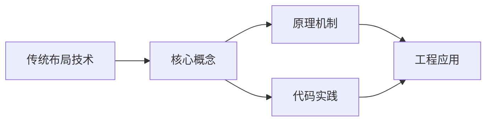
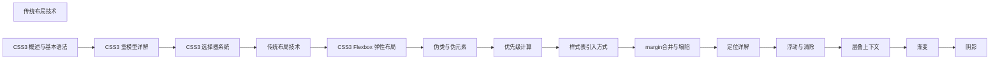

## 1. 学习目标（Bloom 分类）

本节按照布鲁姆教育目标分类学组织学习路径。本文主题为《传统布局技术》，属于 CSS 模块，读者可以根据自身阶段选择阅读深度。

记忆层面：能够准确复述本文的核心概念、术语与基本语法或操作步骤，并能够在提问或检索时快速定位对应知识点。能够说出 CSS 的核心概念、术语与标准写法。

理解层面：能够用自己的语言解释核心原理与工作机制，说明概念之间的因果关系，而不是机械记忆结论。能够解释 CSS 的工作原理与设计动机。

应用层面：能够在真实项目或练习场景中运用本文知识解决具体问题，写出正确且可维护的实现。能够编写符合 CSS 规范的完整实现。

分析层面：能够拆解复杂问题，比较本文主题与相邻概念的异同，识别边界条件与例外情况。能够分析 CSS 与相邻方案的差异与边界。

评价层面：能够根据约束条件（性能、可读性、安全、成本）评价不同方案的优劣，做出有依据的技术决策。能够根据场景评价 CSS 相关方案的优劣。

创造层面：能够把本文知识与其他模块知识组合，设计出新的解决方案或可复用的工程模式。能够组合 CSS 与其他技术设计完整方案。

通过本节学习，读者应当能够把《传统布局技术》纳入自己的知识网络，并与 CSS 模块的其他主题（选择器、盒模型、布局、动画、响应式）建立关联。

## 2. 历史动机与发展脉络

《传统布局技术》是 CSS 领域的重要主题。要真正理解它，需要先了解它解决的问题与演进过程。

CSS 于 1994 年由 Håkon Wium Lie 提出，1996 年 CSS1 发布，解决 HTML 表现层混杂问题；CSS2.1（2011）与 CSS3 模块化（2012+）奠定现代 Web 样式基础。
现代 CSS 的能力版图：Flexbox/Grid 布局、自定义属性（变量）、容器查询、子网格、层叠层（@layer）、现代颜色（oklch）。
CSS 的设计核心是“层叠与继承”：来源、优先级、顺序共同决定最终样式；理解层叠是排查样式问题的前提。

回到本文主题：传统布局技术 的提出与成熟，正是上述技术背景下的必然产物。早期实现往往以简单可用为目标，随着工程规模扩大，社区逐渐沉淀出标准做法与最佳实践；理解这一脉络，可以帮助读者判断“为什么文档中的推荐写法是现在这个样子”，也能在遇到历史遗留代码时准确识别其设计年代与取舍。


## 3. 形式化定义与核心概念精讲

本节把《传统布局技术》涉及的核心概念以“定义 + 讲解”的形式展开。读者应把定义当作工具，把讲解当作理解路径；两者结合才能形成可迁移的知识。

选择器与优先级：id > class/属性/伪类 > 元素/伪元素；!important 打破优先级（应避免）。
盒模型：content/padding/border/margin，box-sizing 决定 width 语义（border-box 推荐）。
布局体系：普通流、浮动（历史）、Flexbox（一维）、Grid（二维）；position 定位（relative/absolute/fixed/sticky）。

### 3.1 原文章节逐一精讲

原文档把主题拆分为 7 个小节，下面按顺序给出每一节的导读讲解，随后保留原文细节供精读。

#### 原文精读（完整保留）


#### 1. 浮动布局 (Float)

##### 1.1 浮动基础

浮动最初是为图文环绕设计的，后来被广泛用于布局。元素设置 `float` 后会脱离文档流，向指定方向靠拢，直到碰到容器边缘或另一个浮动元素。

```css
.float-left {
  float: left;
}
.float-right {
  float: right;
}
```

```html
<div class="container">
  <div class="float-left" style="width:100px;height:100px;background:#e74c3c;">A</div>
  <div class="float-left" style="width:100px;height:100px;background:#3498db;">B</div>
  <p>这段文字会环绕在浮动元素旁边……</p>
</div>
```

> **效果图描述**：两个色块 A（红）、B（蓝）并排靠左，文字在右侧环绕排列。

##### 1.2 浮动的副作用——高度塌陷

当子元素全部浮动时，父容器无法感知子元素高度，导致"高度塌陷"：

```css
.parent {
  border: 2px solid #333;
  /* 没有设置 height，子元素浮动后父元素高度为 0 */
}
.child {
  float: left;
  width: 100px;
  height: 100px;
}
```

```html
<div class="parent">
  <div class="child" style="background:#e74c3c;">A</div>
  <div class="child" style="background:#3498db;">B</div>
</div>
<p>这段文字会紧贴在父容器下方，而非在子元素下方</p>
```

> **效果图描述**：父容器边框塌缩为一条线（高度为0），两个色块溢出，后续文字紧贴边框线。

##### 1.3 清除浮动（Clearfix）方案汇总

###### 方案一：额外标签法（不推荐）

在浮动元素后添加一个空标签并设置 `clear: both`：

```html
<div class="parent">
  <div class="child">A</div>
  <div class="child">B</div>
  <div style="clear:both;"></div>
</div>
```

缺点：增加无语义标签，违反结构与表现分离原则。

###### 方案二：父元素设置 `overflow: hidden`（BFC 法）

```css
.parent {
  overflow: hidden;
}
```

原理：触发 BFC，BFC 会包含浮动元素。但 `overflow: hidden` 会裁剪溢出内容，不适合需要溢出显示的场景。

###### 方案三：伪元素清除法（推荐 [完成]）

```css
.clearfix::after {
  content: '';
  display: block;
  clear: both;
}
.clearfix {
  *zoom: 1;
}
```

`*zoom: 1` 是 IE6/7 的 hack，触发 hasLayout 以兼容老浏览器。

###### 方案四：现代 BFC 方案

```css
.parent {
  display: flow-root;
}
```

`display: flow-root` 专门为创建 BFC 设计，无副作用。浏览器支持：Chrome 58+、Firefox 53+、Safari 13+。

##### 1.4 `clear` 属性详解

```css
.clear-left {
  clear: left;
}
.clear-right {
  clear: right;
}
.clear-both {
  clear: both;
}
```

- `clear: left`：元素顶部不允许有左浮动元素
- `clear: right`：元素顶部不允许有右浮动元素
- `clear: both`：两侧都不允许

---

#### 2. 定位系统 (Positioning)

CSS `position` 属性控制元素的定位方式，配合 `top`/`right`/`bottom`/`left`/`z-index` 使用。

##### 2.1 `static`——默认定位

所有元素默认 `position: static`，遵循正常文档流。`top`/`left` 等偏移属性无效。

```css
.box-static {
  position: static;
  top: 50px;
  left: 100px;
}
```

> **效果图描述**：元素位置无任何变化，`top`/`left` 不生效。

##### 2.2 `relative`——相对定位

相对于**自身原位置**偏移，**不脱离文档流**，原位置仍保留空间。

```css
.box-relative {
  position: relative;
  top: 20px;
  left: 30px;
}
```

```html
<div style="background:#ecf0f1;padding:20px;">
  <span>前</span>
  <span class="box-relative" style="background:#e74c3c;color:#fff;padding:5px;">相对定位</span>
  <span>后</span>
</div>
```

> **效果图描述**："相对定位"文字向右下偏移 30px/20px，但原位置仍留有空间，"前""后"文字位置不变。
> **常见用途**：

- 微调元素位置
- 作为 `absolute` 子元素的定位参考

##### 2.3 `absolute`——绝对定位

相对于**最近的非 static 祖先**偏移，**脱离文档流**，原位置不保留空间。

```css
.parent-abs {
  position: relative;
  width: 300px;
  height: 200px;
  background: #ecf0f1;
}
.child-abs {
  position: absolute;
  top: 20px;
  right: 20px;
  width: 80px;
  height: 80px;
  background: #e74c3c;
}
```

```html
<div class="parent-abs">
  <div class="child-abs"></div>
</div>
```

> **效果图描述**：灰色容器内，红色方块紧贴右上角（距顶20px、距右20px）。
> **关键要点**：

- 若无已定位祖先，则相对于初始包含块（通常是 `<html>`）
- 绝对定位元素的 `width: auto` 会收缩到内容宽度（类似浮动）
- 常用于弹窗、下拉菜单、角标等

##### 2.4 `fixed`——固定定位

相对于**浏览器视口**定位，**脱离文档流**，滚动页面时位置不变。

```css
.nav-fixed {
  position: fixed;
  top: 0;
  left: 0;
  width: 100%;
  height: 50px;
  background: #2c3e50;
  color: #fff;
  z-index: 1000;
}
.back-to-top {
  position: fixed;
  bottom: 30px;
  right: 30px;
  width: 50px;
  height: 50px;
  background: #3498db;
  border-radius: 50%;
  cursor: pointer;
}
```

> **效果图描述**：深色导航栏始终固定在页面顶部；蓝色圆形"回到顶部"按钮固定在右下角。
> **注意**：`fixed` 元素的包含块是视口，但如果祖先设置了 `transform`/`perspective`/`filter`，包含块会变为该祖先（这是一个常见"坑"）。

##### 2.5 `sticky`——粘性定位

在特定滚动阈值内表现为 `relative`，超出阈值后表现为 `fixed`。

```css
.section-title {
  position: sticky;
  top: 0;
  background: #fff;
  padding: 10px;
  border-bottom: 2px solid #3498db;
  z-index: 10;
}
```

```html
<div style="height:2000px;">
  <h2 class="section-title">第一章</h2>
  <p>内容区域……（很长）</p>
  <h2 class="section-title">第二章</h2>
  <p>内容区域……（很长）</p>
</div>
```

> **效果图描述**：滚动时，章节标题到达页面顶部后"粘住"，直到被下一个标题推出。
> **关键要点**：

- `sticky` 元素不会脱离文档流
- 必须指定 `top`/`bottom`/`left`/`right` 中的至少一个
- 父容器的高度是 sticky 的"活动范围"，超出父容器后 sticky 失效
- 父容器不能设置 `overflow: hidden`/`auto`/`scroll`，否则 sticky 失效

##### 2.6 `z-index` 与层叠上下文

`z-index` 仅对 `position` 非 `static` 的元素有效（`sticky` 除外，它天然创建层叠上下文）。

```css
.layer-1 {
  position: absolute;
  z-index: 1;
  background: rgba(231, 76, 60, 0.7);
}
.layer-2 {
  position: absolute;
  z-index: 10;
  background: rgba(52, 152, 219, 0.7);
}
.layer-3 {
  position: absolute;
  z-index: 5;
  background: rgba(46, 204, 113, 0.7);
}
```

**层叠上下文的创建条件**（部分）：

- `position` 非 `static` + `z-index` 非 `auto`
- `opacity` < 1
- `transform` 非 `none`
- `filter` 非 `none`
- `will-change: transform`
- `display: flex/grid` 子元素的 `z-index` 非 `auto`
  > [警告] **常见坑**：子元素的 `z-index` 再高，也无法超越父级层叠上下文的限制。

---

#### 3. BFC（块格式化上下文）

##### 3.1 什么是 BFC

BFC（Block Formatting Context）是 CSS 中一个独立的渲染区域，内部元素的布局不会影响外部元素。可以把它想象成一个**隔离的布局容器**。

##### 3.2 BFC 的布局规则

1. 内部块级盒子垂直方向一个接一个排列
2. 同一个 BFC 中，相邻块级盒子的垂直外边距会发生折叠（margin collapse）
3. BFC 区域不会与浮动元素重叠
4. BFC 可以包含浮动元素（解决高度塌陷）
5. 计算 BFC 高度时，浮动元素也参与计算

##### 3.3 触发 BFC 的条件

| 属性       | 值                                                                                                              |
| :--------- | :-------------------------------------------------------------------------------------------------------------- |
| `float`    | `left` / `right`（非 `none`）                                                                                   |
| `position` | `absolute` / `fixed`                                                                                            |
| `display`  | `inline-block` / `table-cell` / `table-caption` / `flex` / `inline-flex` / `grid` / `inline-grid` / `flow-root` |
| `overflow` | `hidden` / `auto` / `scroll`（非 `visible`）                                                                    |
| `contain`  | `layout` / `content` / `paint`                                                                                  |

##### 3.4 BFC 的典型应用

###### 应用一：清除浮动（解决高度塌陷）

```css
.container {
  display: flow-root;
}
```

###### 应用二：防止 margin 折叠

```html
<div style="margin-bottom:20px;background:#e74c3c;">A</div>
<div style="margin-top:30px;background:#3498db;">B</div>
```

> **效果图描述**：A 和 B 之间间距为 30px（取较大值），而非 50px。
> 解决方案：将其中一个元素包裹在 BFC 容器中：

```html
<div style="margin-bottom:20px;background:#e74c3c;">A</div>
<div style="overflow:hidden;">
  <div style="margin-top:30px;background:#3498db;">B</div>
</div>
```

> **效果图描述**：A 和 B 之间间距变为 50px（20+30），margin 不再折叠。

###### 应用三：实现自适应两栏布局

浮动元素不会与 BFC 区域重叠，利用这一点实现右侧自适应：

```css
.left {
  float: left;
  width: 200px;
  height: 300px;
  background: #e74c3c;
}
.right {
  overflow: hidden;
  height: 300px;
  background: #3498db;
}
```

```html
<div class="left">固定宽度侧栏</div>
<div class="right">自适应内容区</div>
```

> **效果图描述**：左侧红色固定 200px，右侧蓝色自动填满剩余宽度，不会跑到红色下方。

---

#### 4. 传统经典布局

##### 4.1 圣杯布局（Holy Grail Layout）

三栏布局：中间自适应，两侧固定宽度。DOM 顺序中间栏优先渲染。

```css
.holy-grail {
  padding: 0 200px 0 150px;
}
.holy-grail .center {
  float: left;
  width: 100%;
  background: #ecf0f1;
  min-height: 300px;
}
.holy-grail .left {
  float: left;
  width: 150px;
  margin-left: -100%;
  position: relative;
  left: -150px;
  background: #e74c3c;
  min-height: 300px;
}
.holy-grail .right {
  float: left;
  width: 200px;
  margin-left: -200px;
  position: relative;
  right: -200px;
  background: #3498db;
  min-height: 300px;
}
```

```html
<div class="holy-grail clearfix">
  <div class="center">Center（主内容区，优先渲染）</div>
  <div class="left">Left（150px）</div>
  <div class="right">Right（200px）</div>
</div>
```

> **效果图描述**：三栏并排——左侧红色 150px，中间灰色自适应，右侧蓝色 200px。中间栏在 DOM 中排在最前。
> **核心原理**：

1. 三栏均左浮动，中间栏 `width: 100%` 占满
2. 左栏 `margin-left: -100%` 移到中间栏左侧
3. 右栏 `margin-left: -200px` 移到中间栏右侧
4. 父容器 `padding` 留出两侧空间，左右栏 `position: relative` 偏移到位

##### 4.2 双飞翼布局

与圣杯布局目标相同，但实现方式不同：中间栏内部再包一层，用 `margin` 留空间而非父容器 `padding`。

```css
.double-wing .center-wrap {
  float: left;
  width: 100%;
}
.double-wing .center {
  margin: 0 200px 0 150px;
  background: #ecf0f1;
  min-height: 300px;
}
.double-wing .left {
  float: left;
  width: 150px;
  margin-left: -100%;
  background: #e74c3c;
  min-height: 300px;
}
.double-wing .right {
  float: left;
  width: 200px;
  margin-left: -200px;
  background: #3498db;
  min-height: 300px;
}
```

```html
<div class="double-wing clearfix">
  <div class="center-wrap">
    <div class="center">Center（主内容区）</div>
  </div>
  <div class="left">Left（150px）</div>
  <div class="right">Right（200px）</div>
</div>
```

> **效果图描述**：视觉效果与圣杯布局一致，但中间栏通过内部 margin 而非父容器 padding 留空间。
> **圣杯 vs 双飞翼对比**：
>
> | 对比项         | 圣杯布局                             | 双飞翼布局          |
> | :------------- | :----------------------------------- | :------------------ |
> | 留空间方式     | 父容器 `padding` + 子元素 `relative` | 中间栏内部 `margin` |
> | DOM 层级       | 三栏同级                             | 中间栏多包一层      |
> | `position`     | 左右栏需要 `relative`                | 不需要 `relative`   |
> | 中间栏最小宽度 | 受 `padding` 约束                    | 受 `margin` 约束    |

##### 4.3 等高布局

传统方式实现多列等高：

```css
.equal-height {
  overflow: hidden;
}
.equal-height .col {
  float: left;
  width: 33.33%;
  padding-bottom: 9999px;
  margin-bottom: -9999px;
  background: #ecf0f1;
}
.equal-height .col:nth-child(2) {
  background: #bdc3c7;
}
.equal-height .col:nth-child(3) {
  background: #95a5a6;
}
```

> **效果图描述**：三列高度一致，以内容最多的列为准。利用超大 `padding-bottom` + 负 `margin-bottom` 实现。

---

#### 5. 居中方案汇总

##### 5.1 水平居中

###### 行内元素 / 行内块元素

```css
.parent {
  text-align: center;
}
```

```html
<div class="parent">
  <span>行内元素居中</span>
</div>
```

###### 定宽块级元素

```css
.child {
  width: 200px;
  margin: 0 auto;
}
```

###### 不定宽块级元素

```css
.parent {
  text-align: center;
}
.child {
  display: inline-block;
}
```

##### 5.2 垂直居中

###### 单行文本

```css
.single-line {
  height: 50px;
  line-height: 50px;
}
```

###### 多行文本（table-cell）

```css
.parent {
  display: table-cell;
  vertical-align: middle;
  height: 200px;
}
```

###### 绝对定位 + transform

```css
.parent {
  position: relative;
  height: 200px;
}
.child {
  position: absolute;
  top: 50%;
  transform: translateY(-50%);
}
```

##### 5.3 水平垂直居中

###### 方案一：绝对定位 + transform（最经典）

```css
.parent {
  position: relative;
  width: 400px;
  height: 300px;
  background: #ecf0f1;
}
.child {
  position: absolute;
  top: 50%;
  left: 50%;
  transform: translate(-50%, -50%);
  background: #e74c3c;
  padding: 20px;
  color: #fff;
}
```

> **效果图描述**：红色方块精确居中在灰色容器正中央。
> **优点**：无需知道子元素尺寸。**缺点**：`transform` 可能影响子元素的 `fixed` 定位。

###### 方案二：绝对定位 + 负 margin（需已知尺寸）

```css
.child {
  position: absolute;
  top: 50%;
  left: 50%;
  width: 200px;
  height: 100px;
  margin-top: -50px;
  margin-left: -100px;
}
```

**优点**：兼容性极好。**缺点**：需要知道子元素宽高。

###### 方案三：绝对定位 + margin: auto（需已知尺寸）

```css
.child {
  position: absolute;
  top: 0;
  right: 0;
  bottom: 0;
  left: 0;
  margin: auto;
  width: 200px;
  height: 100px;
}
```

**原理**：绝对定位元素四边为 0 时，浏览器自动计算 `margin` 使其居中。

###### 方案四：table-cell

```css
.parent {
  display: table-cell;
  vertical-align: middle;
  text-align: center;
  width: 400px;
  height: 300px;
}
.child {
  display: inline-block;
}
```

**优点**：兼容 IE8+。**缺点**：`display: table-cell` 对布局有限制。

###### 方案五：Flexbox（现代推荐 [完成]）

```css
.parent {
  display: flex;
  justify-content: center;
  align-items: center;
  height: 300px;
}
```

**优点**：最简洁，无需知道子元素尺寸。**缺点**：IE9 及以下不支持。

###### 方案六：Grid（最现代）

```css
.parent {
  display: grid;
  place-items: center;
  height: 300px;
}
```

**优点**：代码最少。**缺点**：IE 不支持。

##### 5.4 居中方案对比总结

| 方案                   | 需知尺寸 | 兼容性     | 代码量 | 适用场景     |
| :--------------------- | :------- | :--------- | :----- | :----------- |
| absolute + transform   | [错误]   | IE10+      | 少     | 通用         |
| absolute + 负 margin   | [完成]   | IE6+       | 中     | 已知尺寸     |
| absolute + margin:auto | [完成]   | IE8+       | 少     | 已知尺寸     |
| table-cell             | [错误]   | IE8+       | 多     | 兼容旧浏览器 |
| Flexbox                | [错误]   | IE10+      | 少     | 现代项目首选 |
| Grid                   | [错误]   | 现代浏览器 | 最少   | 最新项目     |

---

#### 6. 总结

虽然现代开发推荐使用 Flex/Grid，但理解 Float 和 Position 对维护旧项目和处理特定定位需求（如固定导航栏、弹窗）依然至关重要。
**关键要点回顾**：

- **浮动**：图文环绕 → 布局 → 高度塌陷 → clearfix / flow-root
- **定位**：static（默认）→ relative（微调/参照）→ absolute（脱离流/弹窗）→ fixed（视口固定）→ sticky（滚动粘性）
- **BFC**：隔离布局容器，解决塌陷/margin 折叠/自适应两栏
- **经典布局**：圣杯/双飞翼是浮动布局的巅峰应用
- **居中**：从传统 hack 到 Flex/Grid，方案越来越简洁

---

#### 延伸阅读

- [HTML 标签](html5/tags-and-attributes)


### 3.2 概念关系图

下面用 Mermaid 图表达本文核心概念之间的关系，帮助读者建立整体图景：



图中展示的是本文知识的结构化关系：核心概念是入口，原理机制解释“为什么”，代码实践演示“怎么做”，工程应用回答“何时用”。读者学习时可以把每个小节的内容挂接到对应节点上。

## 4. 理论推导与原理解析

本节深入《传统布局技术》背后的原理。理论部分不求面面俱到，而是聚焦“能解释现象、能指导实践”的关键推导。

选择器与优先级：id > class/属性/伪类 > 元素/伪元素；!important 打破优先级（应避免）。
盒模型：content/padding/border/margin，box-sizing 决定 width 语义（border-box 推荐）。
布局体系：普通流、浮动（历史）、Flexbox（一维）、Grid（二维）；position 定位（relative/absolute/fixed/sticky）。
层叠上下文：z-index 只在同一层叠上下文中比较；transform/opacity/filter 创建新上下文。

需要强调的是，理论推导与工程实践之间存在翻译层：理论给出的是理想化模型与边界条件，工程代码则必须处理真实环境中的例外。读者在学习时应先掌握理论的“标准情形”，再通过陷阱章节了解“非标准情形”。

## 5. 代码示例与逐行讲解

本节把原文中的代码示例系统整理，并为每个示例补充用途说明与讲解。读者不应只浏览代码，而应逐段对照讲解理解设计意图。

### 5.1 示例：1.1 浮动基础

该示例来自原文《1.1 浮动基础》小节，用于演示传统布局技术相关操作。阅读时请先看代码结构，再看其后的讲解。

```css
.float-left {
  float: left;
}
.float-right {
  float: right;
}
```

讲解：这段代码演示了本节核心知识点。代码中的关键操作可以归纳为三步：准备（定义或初始化）、执行（核心逻辑）、收尾（释放资源或返回结果）。实际项目中，这三步往往被封装为函数或类，以提升复用性与可测试性。

关键点分析：

该示例共 6 行有效代码，结构以数据或配置为主。阅读时应关注：数据字段的含义、配置项的作用，以及它们与运行行为的对应关系。

进阶思考路径：先尝试修改参数观察行为变化，再把示例中的模式迁移到自己的项目中；每次修改都记录预期与实测差异，这是把示例转化为能力的最快方式。

### 5.2 示例：1.1 浮动基础

该示例来自原文《1.1 浮动基础》小节，用于演示传统布局技术相关操作。阅读时请先看代码结构，再看其后的讲解。

```html
<div class="container">
  <div class="float-left" style="width:100px;height:100px;background:#e74c3c;">A</div>
  <div class="float-left" style="width:100px;height:100px;background:#3498db;">B</div>
  <p>这段文字会环绕在浮动元素旁边……</p>
</div>
```

讲解：这段代码演示了本节核心知识点。代码中的关键操作可以归纳为三步：准备（定义或初始化）、执行（核心逻辑）、收尾（释放资源或返回结果）。实际项目中，这三步往往被封装为函数或类，以提升复用性与可测试性。

关键点分析：

该示例共 5 行有效代码，包含 1 类关键结构（class）。其中：

- 入口与初始化部分负责建立上下文，对应实际项目中的启动或装配逻辑；
- 核心逻辑部分体现本文主题的主要操作，是阅读时最需要对照讲解理解的部分；
- 输出或返回部分把结果交给调用方，注意其类型与边界条件。

进阶思考路径：先尝试修改参数观察行为变化，再把示例中的模式迁移到自己的项目中；每次修改都记录预期与实测差异，这是把示例转化为能力的最快方式。

### 5.3 示例：1.2 浮动的副作用——高度塌陷

该示例来自原文《1.2 浮动的副作用——高度塌陷》小节，用于演示传统布局技术相关操作。阅读时请先看代码结构，再看其后的讲解。

```css
.parent {
  border: 2px solid #333;
  /* 没有设置 height，子元素浮动后父元素高度为 0 */
}
.child {
  float: left;
  width: 100px;
  height: 100px;
}
```

讲解：这段代码演示了本节核心知识点。代码中的关键操作可以归纳为三步：准备（定义或初始化）、执行（核心逻辑）、收尾（释放资源或返回结果）。实际项目中，这三步往往被封装为函数或类，以提升复用性与可测试性。

关键点分析：

该示例共 9 行有效代码，结构以数据或配置为主。阅读时应关注：数据字段的含义、配置项的作用，以及它们与运行行为的对应关系。

进阶思考路径：先尝试修改参数观察行为变化，再把示例中的模式迁移到自己的项目中；每次修改都记录预期与实测差异，这是把示例转化为能力的最快方式。

### 5.4 示例：1.2 浮动的副作用——高度塌陷

该示例来自原文《1.2 浮动的副作用——高度塌陷》小节，用于演示传统布局技术相关操作。阅读时请先看代码结构，再看其后的讲解。

```html
<div class="parent">
  <div class="child" style="background:#e74c3c;">A</div>
  <div class="child" style="background:#3498db;">B</div>
</div>
<p>这段文字会紧贴在父容器下方，而非在子元素下方</p>
```

讲解：这段代码演示了本节核心知识点。代码中的关键操作可以归纳为三步：准备（定义或初始化）、执行（核心逻辑）、收尾（释放资源或返回结果）。实际项目中，这三步往往被封装为函数或类，以提升复用性与可测试性。

关键点分析：

该示例共 5 行有效代码，包含 1 类关键结构（class）。其中：

- 入口与初始化部分负责建立上下文，对应实际项目中的启动或装配逻辑；
- 核心逻辑部分体现本文主题的主要操作，是阅读时最需要对照讲解理解的部分；
- 输出或返回部分把结果交给调用方，注意其类型与边界条件。

进阶思考路径：先尝试修改参数观察行为变化，再把示例中的模式迁移到自己的项目中；每次修改都记录预期与实测差异，这是把示例转化为能力的最快方式。

### 5.5 示例：方案一：额外标签法（不推荐）

该示例来自原文《方案一：额外标签法（不推荐）》小节，用于演示传统布局技术相关操作。阅读时请先看代码结构，再看其后的讲解。

```html
<div class="parent">
  <div class="child">A</div>
  <div class="child">B</div>
  <div style="clear:both;"></div>
</div>
```

讲解：这段代码演示了本节核心知识点。代码中的关键操作可以归纳为三步：准备（定义或初始化）、执行（核心逻辑）、收尾（释放资源或返回结果）。实际项目中，这三步往往被封装为函数或类，以提升复用性与可测试性。

关键点分析：

该示例共 5 行有效代码，包含 1 类关键结构（class）。其中：

- 入口与初始化部分负责建立上下文，对应实际项目中的启动或装配逻辑；
- 核心逻辑部分体现本文主题的主要操作，是阅读时最需要对照讲解理解的部分；
- 输出或返回部分把结果交给调用方，注意其类型与边界条件。

进阶思考路径：先尝试修改参数观察行为变化，再把示例中的模式迁移到自己的项目中；每次修改都记录预期与实测差异，这是把示例转化为能力的最快方式。

### 5.6 示例：方案二：父元素设置 `overflow: hidden`（BFC 法）

该示例来自原文《方案二：父元素设置 `overflow: hidden`（BFC 法）》小节，用于演示传统布局技术相关操作。阅读时请先看代码结构，再看其后的讲解。

```css
.parent {
  overflow: hidden;
}
```

讲解：这段代码演示了本节核心知识点。代码中的关键操作可以归纳为三步：准备（定义或初始化）、执行（核心逻辑）、收尾（释放资源或返回结果）。实际项目中，这三步往往被封装为函数或类，以提升复用性与可测试性。

关键点分析：

该示例共 3 行有效代码，结构以数据或配置为主。阅读时应关注：数据字段的含义、配置项的作用，以及它们与运行行为的对应关系。

进阶思考路径：先尝试修改参数观察行为变化，再把示例中的模式迁移到自己的项目中；每次修改都记录预期与实测差异，这是把示例转化为能力的最快方式。

### 5.7 示例：方案三：伪元素清除法（推荐 [完成]）

该示例来自原文《方案三：伪元素清除法（推荐 [完成]）》小节，用于演示传统布局技术相关操作。阅读时请先看代码结构，再看其后的讲解。

```css
.clearfix::after {
  content: '';
  display: block;
  clear: both;
}
.clearfix {
  *zoom: 1;
}
```

讲解：这段代码演示了本节核心知识点。代码中的关键操作可以归纳为三步：准备（定义或初始化）、执行（核心逻辑）、收尾（释放资源或返回结果）。实际项目中，这三步往往被封装为函数或类，以提升复用性与可测试性。

关键点分析：

该示例共 8 行有效代码，结构以数据或配置为主。阅读时应关注：数据字段的含义、配置项的作用，以及它们与运行行为的对应关系。

进阶思考路径：先尝试修改参数观察行为变化，再把示例中的模式迁移到自己的项目中；每次修改都记录预期与实测差异，这是把示例转化为能力的最快方式。

### 5.8 示例：方案四：现代 BFC 方案

该示例来自原文《方案四：现代 BFC 方案》小节，用于演示传统布局技术相关操作。阅读时请先看代码结构，再看其后的讲解。

```css
.parent {
  display: flow-root;
}
```

讲解：这段代码演示了本节核心知识点。代码中的关键操作可以归纳为三步：准备（定义或初始化）、执行（核心逻辑）、收尾（释放资源或返回结果）。实际项目中，这三步往往被封装为函数或类，以提升复用性与可测试性。

关键点分析：

该示例共 3 行有效代码，结构以数据或配置为主。阅读时应关注：数据字段的含义、配置项的作用，以及它们与运行行为的对应关系。

进阶思考路径：先尝试修改参数观察行为变化，再把示例中的模式迁移到自己的项目中；每次修改都记录预期与实测差异，这是把示例转化为能力的最快方式。

### 5.9 示例：1.4 `clear` 属性详解

该示例来自原文《1.4 `clear` 属性详解》小节，用于演示传统布局技术相关操作。阅读时请先看代码结构，再看其后的讲解。

```css
.clear-left {
  clear: left;
}
.clear-right {
  clear: right;
}
.clear-both {
  clear: both;
}
```

讲解：这段代码演示了本节核心知识点。代码中的关键操作可以归纳为三步：准备（定义或初始化）、执行（核心逻辑）、收尾（释放资源或返回结果）。实际项目中，这三步往往被封装为函数或类，以提升复用性与可测试性。

关键点分析：

该示例共 9 行有效代码，结构以数据或配置为主。阅读时应关注：数据字段的含义、配置项的作用，以及它们与运行行为的对应关系。

进阶思考路径：先尝试修改参数观察行为变化，再把示例中的模式迁移到自己的项目中；每次修改都记录预期与实测差异，这是把示例转化为能力的最快方式。

### 5.10 示例：2.1 `static`——默认定位

该示例来自原文《2.1 `static`——默认定位》小节，用于演示传统布局技术相关操作。阅读时请先看代码结构，再看其后的讲解。

```css
.box-static {
  position: static;
  top: 50px;
  left: 100px;
}
```

讲解：这段代码演示了本节核心知识点。代码中的关键操作可以归纳为三步：准备（定义或初始化）、执行（核心逻辑）、收尾（释放资源或返回结果）。实际项目中，这三步往往被封装为函数或类，以提升复用性与可测试性。

关键点分析：

该示例共 5 行有效代码，结构以数据或配置为主。阅读时应关注：数据字段的含义、配置项的作用，以及它们与运行行为的对应关系。

进阶思考路径：先尝试修改参数观察行为变化，再把示例中的模式迁移到自己的项目中；每次修改都记录预期与实测差异，这是把示例转化为能力的最快方式。

### 5.11 示例：2.2 `relative`——相对定位

该示例来自原文《2.2 `relative`——相对定位》小节，用于演示传统布局技术相关操作。阅读时请先看代码结构，再看其后的讲解。

```css
.box-relative {
  position: relative;
  top: 20px;
  left: 30px;
}
```

讲解：这段代码演示了本节核心知识点。代码中的关键操作可以归纳为三步：准备（定义或初始化）、执行（核心逻辑）、收尾（释放资源或返回结果）。实际项目中，这三步往往被封装为函数或类，以提升复用性与可测试性。

关键点分析：

该示例共 5 行有效代码，结构以数据或配置为主。阅读时应关注：数据字段的含义、配置项的作用，以及它们与运行行为的对应关系。

进阶思考路径：先尝试修改参数观察行为变化，再把示例中的模式迁移到自己的项目中；每次修改都记录预期与实测差异，这是把示例转化为能力的最快方式。

### 5.12 示例：2.2 `relative`——相对定位

该示例来自原文《2.2 `relative`——相对定位》小节，用于演示传统布局技术相关操作。阅读时请先看代码结构，再看其后的讲解。

```html
<div style="background:#ecf0f1;padding:20px;">
  <span>前</span>
  <span class="box-relative" style="background:#e74c3c;color:#fff;padding:5px;">相对定位</span>
  <span>后</span>
</div>
```

讲解：这段代码演示了本节核心知识点。代码中的关键操作可以归纳为三步：准备（定义或初始化）、执行（核心逻辑）、收尾（释放资源或返回结果）。实际项目中，这三步往往被封装为函数或类，以提升复用性与可测试性。

关键点分析：

该示例共 5 行有效代码，包含 1 类关键结构（class）。其中：

- 入口与初始化部分负责建立上下文，对应实际项目中的启动或装配逻辑；
- 核心逻辑部分体现本文主题的主要操作，是阅读时最需要对照讲解理解的部分；
- 输出或返回部分把结果交给调用方，注意其类型与边界条件。

进阶思考路径：先尝试修改参数观察行为变化，再把示例中的模式迁移到自己的项目中；每次修改都记录预期与实测差异，这是把示例转化为能力的最快方式。

### 5.13 示例：2.3 `absolute`——绝对定位

该示例来自原文《2.3 `absolute`——绝对定位》小节，用于演示传统布局技术相关操作。阅读时请先看代码结构，再看其后的讲解。

```css
.parent-abs {
  position: relative;
  width: 300px;
  height: 200px;
  background: #ecf0f1;
}
.child-abs {
  position: absolute;
  top: 20px;
  right: 20px;
  width: 80px;
  height: 80px;
  background: #e74c3c;
}
```

讲解：这段代码演示了本节核心知识点。代码中的关键操作可以归纳为三步：准备（定义或初始化）、执行（核心逻辑）、收尾（释放资源或返回结果）。实际项目中，这三步往往被封装为函数或类，以提升复用性与可测试性。

关键点分析：

该示例共 14 行有效代码，结构以数据或配置为主。阅读时应关注：数据字段的含义、配置项的作用，以及它们与运行行为的对应关系。

进阶思考路径：先尝试修改参数观察行为变化，再把示例中的模式迁移到自己的项目中；每次修改都记录预期与实测差异，这是把示例转化为能力的最快方式。

### 5.14 示例：2.3 `absolute`——绝对定位

该示例来自原文《2.3 `absolute`——绝对定位》小节，用于演示传统布局技术相关操作。阅读时请先看代码结构，再看其后的讲解。

```html
<div class="parent-abs">
  <div class="child-abs"></div>
</div>
```

讲解：这段代码演示了本节核心知识点。代码中的关键操作可以归纳为三步：准备（定义或初始化）、执行（核心逻辑）、收尾（释放资源或返回结果）。实际项目中，这三步往往被封装为函数或类，以提升复用性与可测试性。

关键点分析：

该示例共 3 行有效代码，包含 1 类关键结构（class）。其中：

- 入口与初始化部分负责建立上下文，对应实际项目中的启动或装配逻辑；
- 核心逻辑部分体现本文主题的主要操作，是阅读时最需要对照讲解理解的部分；
- 输出或返回部分把结果交给调用方，注意其类型与边界条件。

进阶思考路径：先尝试修改参数观察行为变化，再把示例中的模式迁移到自己的项目中；每次修改都记录预期与实测差异，这是把示例转化为能力的最快方式。

### 5.15 示例：2.4 `fixed`——固定定位

该示例来自原文《2.4 `fixed`——固定定位》小节，用于演示传统布局技术相关操作。阅读时请先看代码结构，再看其后的讲解。

```css
.nav-fixed {
  position: fixed;
  top: 0;
  left: 0;
  width: 100%;
  height: 50px;
  background: #2c3e50;
  color: #fff;
  z-index: 1000;
}
.back-to-top {
  position: fixed;
  bottom: 30px;
  right: 30px;
  width: 50px;
  height: 50px;
  background: #3498db;
  border-radius: 50%;
  cursor: pointer;
}
```

讲解：这段代码演示了本节核心知识点。代码中的关键操作可以归纳为三步：准备（定义或初始化）、执行（核心逻辑）、收尾（释放资源或返回结果）。实际项目中，这三步往往被封装为函数或类，以提升复用性与可测试性。

关键点分析：

该示例共 20 行有效代码，结构以数据或配置为主。阅读时应关注：数据字段的含义、配置项的作用，以及它们与运行行为的对应关系。

进阶思考路径：先尝试修改参数观察行为变化，再把示例中的模式迁移到自己的项目中；每次修改都记录预期与实测差异，这是把示例转化为能力的最快方式。

### 5.16 示例：2.5 `sticky`——粘性定位

该示例来自原文《2.5 `sticky`——粘性定位》小节，用于演示传统布局技术相关操作。阅读时请先看代码结构，再看其后的讲解。

```css
.section-title {
  position: sticky;
  top: 0;
  background: #fff;
  padding: 10px;
  border-bottom: 2px solid #3498db;
  z-index: 10;
}
```

讲解：这段代码演示了本节核心知识点。代码中的关键操作可以归纳为三步：准备（定义或初始化）、执行（核心逻辑）、收尾（释放资源或返回结果）。实际项目中，这三步往往被封装为函数或类，以提升复用性与可测试性。

关键点分析：

该示例共 8 行有效代码，结构以数据或配置为主。阅读时应关注：数据字段的含义、配置项的作用，以及它们与运行行为的对应关系。

进阶思考路径：先尝试修改参数观察行为变化，再把示例中的模式迁移到自己的项目中；每次修改都记录预期与实测差异，这是把示例转化为能力的最快方式。

### 5.17 示例：2.5 `sticky`——粘性定位

该示例来自原文《2.5 `sticky`——粘性定位》小节，用于演示传统布局技术相关操作。阅读时请先看代码结构，再看其后的讲解。

```html
<div style="height:2000px;">
  <h2 class="section-title">第一章</h2>
  <p>内容区域……（很长）</p>
  <h2 class="section-title">第二章</h2>
  <p>内容区域……（很长）</p>
</div>
```

讲解：这段代码演示了本节核心知识点。代码中的关键操作可以归纳为三步：准备（定义或初始化）、执行（核心逻辑）、收尾（释放资源或返回结果）。实际项目中，这三步往往被封装为函数或类，以提升复用性与可测试性。

关键点分析：

该示例共 6 行有效代码，包含 1 类关键结构（class）。其中：

- 入口与初始化部分负责建立上下文，对应实际项目中的启动或装配逻辑；
- 核心逻辑部分体现本文主题的主要操作，是阅读时最需要对照讲解理解的部分；
- 输出或返回部分把结果交给调用方，注意其类型与边界条件。

进阶思考路径：先尝试修改参数观察行为变化，再把示例中的模式迁移到自己的项目中；每次修改都记录预期与实测差异，这是把示例转化为能力的最快方式。

### 5.18 示例：2.6 `z-index` 与层叠上下文

该示例来自原文《2.6 `z-index` 与层叠上下文》小节，用于演示传统布局技术相关操作。阅读时请先看代码结构，再看其后的讲解。

```css
.layer-1 {
  position: absolute;
  z-index: 1;
  background: rgba(231, 76, 60, 0.7);
}
.layer-2 {
  position: absolute;
  z-index: 10;
  background: rgba(52, 152, 219, 0.7);
}
.layer-3 {
  position: absolute;
  z-index: 5;
  background: rgba(46, 204, 113, 0.7);
}
```

讲解：这段代码演示了本节核心知识点。代码中的关键操作可以归纳为三步：准备（定义或初始化）、执行（核心逻辑）、收尾（释放资源或返回结果）。实际项目中，这三步往往被封装为函数或类，以提升复用性与可测试性。

关键点分析：

该示例共 15 行有效代码，结构以数据或配置为主。阅读时应关注：数据字段的含义、配置项的作用，以及它们与运行行为的对应关系。

进阶思考路径：先尝试修改参数观察行为变化，再把示例中的模式迁移到自己的项目中；每次修改都记录预期与实测差异，这是把示例转化为能力的最快方式。

### 5.19 示例：应用一：清除浮动（解决高度塌陷）

该示例来自原文《应用一：清除浮动（解决高度塌陷）》小节，用于演示传统布局技术相关操作。阅读时请先看代码结构，再看其后的讲解。

```css
.container {
  display: flow-root;
}
```

讲解：这段代码演示了本节核心知识点。代码中的关键操作可以归纳为三步：准备（定义或初始化）、执行（核心逻辑）、收尾（释放资源或返回结果）。实际项目中，这三步往往被封装为函数或类，以提升复用性与可测试性。

关键点分析：

该示例共 3 行有效代码，结构以数据或配置为主。阅读时应关注：数据字段的含义、配置项的作用，以及它们与运行行为的对应关系。

进阶思考路径：先尝试修改参数观察行为变化，再把示例中的模式迁移到自己的项目中；每次修改都记录预期与实测差异，这是把示例转化为能力的最快方式。

### 5.20 示例：应用二：防止 margin 折叠

该示例来自原文《应用二：防止 margin 折叠》小节，用于演示传统布局技术相关操作。阅读时请先看代码结构，再看其后的讲解。

```html
<div style="margin-bottom:20px;background:#e74c3c;">A</div>
<div style="margin-top:30px;background:#3498db;">B</div>
```

讲解：这段代码演示了本节核心知识点。代码中的关键操作可以归纳为三步：准备（定义或初始化）、执行（核心逻辑）、收尾（释放资源或返回结果）。实际项目中，这三步往往被封装为函数或类，以提升复用性与可测试性。

关键点分析：

该示例共 2 行有效代码，结构以数据或配置为主。阅读时应关注：数据字段的含义、配置项的作用，以及它们与运行行为的对应关系。

进阶思考路径：先尝试修改参数观察行为变化，再把示例中的模式迁移到自己的项目中；每次修改都记录预期与实测差异，这是把示例转化为能力的最快方式。

### 5.21 示例：应用二：防止 margin 折叠

该示例来自原文《应用二：防止 margin 折叠》小节，用于演示传统布局技术相关操作。阅读时请先看代码结构，再看其后的讲解。

```html
<div style="margin-bottom:20px;background:#e74c3c;">A</div>
<div style="overflow:hidden;">
  <div style="margin-top:30px;background:#3498db;">B</div>
</div>
```

讲解：这段代码演示了本节核心知识点。代码中的关键操作可以归纳为三步：准备（定义或初始化）、执行（核心逻辑）、收尾（释放资源或返回结果）。实际项目中，这三步往往被封装为函数或类，以提升复用性与可测试性。

关键点分析：

该示例共 4 行有效代码，结构以数据或配置为主。阅读时应关注：数据字段的含义、配置项的作用，以及它们与运行行为的对应关系。

进阶思考路径：先尝试修改参数观察行为变化，再把示例中的模式迁移到自己的项目中；每次修改都记录预期与实测差异，这是把示例转化为能力的最快方式。

### 5.22 示例：应用三：实现自适应两栏布局

该示例来自原文《应用三：实现自适应两栏布局》小节，用于演示传统布局技术相关操作。阅读时请先看代码结构，再看其后的讲解。

```css
.left {
  float: left;
  width: 200px;
  height: 300px;
  background: #e74c3c;
}
.right {
  overflow: hidden;
  height: 300px;
  background: #3498db;
}
```

讲解：这段代码演示了本节核心知识点。代码中的关键操作可以归纳为三步：准备（定义或初始化）、执行（核心逻辑）、收尾（释放资源或返回结果）。实际项目中，这三步往往被封装为函数或类，以提升复用性与可测试性。

关键点分析：

该示例共 11 行有效代码，结构以数据或配置为主。阅读时应关注：数据字段的含义、配置项的作用，以及它们与运行行为的对应关系。

进阶思考路径：先尝试修改参数观察行为变化，再把示例中的模式迁移到自己的项目中；每次修改都记录预期与实测差异，这是把示例转化为能力的最快方式。

### 5.23 示例：应用三：实现自适应两栏布局

该示例来自原文《应用三：实现自适应两栏布局》小节，用于演示传统布局技术相关操作。阅读时请先看代码结构，再看其后的讲解。

```html
<div class="left">固定宽度侧栏</div>
<div class="right">自适应内容区</div>
```

讲解：这段代码演示了本节核心知识点。代码中的关键操作可以归纳为三步：准备（定义或初始化）、执行（核心逻辑）、收尾（释放资源或返回结果）。实际项目中，这三步往往被封装为函数或类，以提升复用性与可测试性。

关键点分析：

该示例共 2 行有效代码，包含 1 类关键结构（class）。其中：

- 入口与初始化部分负责建立上下文，对应实际项目中的启动或装配逻辑；
- 核心逻辑部分体现本文主题的主要操作，是阅读时最需要对照讲解理解的部分；
- 输出或返回部分把结果交给调用方，注意其类型与边界条件。

进阶思考路径：先尝试修改参数观察行为变化，再把示例中的模式迁移到自己的项目中；每次修改都记录预期与实测差异，这是把示例转化为能力的最快方式。

### 5.24 示例：4.1 圣杯布局（Holy Grail Layout）

该示例来自原文《4.1 圣杯布局（Holy Grail Layout）》小节，用于演示传统布局技术相关操作。阅读时请先看代码结构，再看其后的讲解。

```css
.holy-grail {
  padding: 0 200px 0 150px;
}
.holy-grail .center {
  float: left;
  width: 100%;
  background: #ecf0f1;
  min-height: 300px;
}
.holy-grail .left {
  float: left;
  width: 150px;
  margin-left: -100%;
  position: relative;
  left: -150px;
  background: #e74c3c;
  min-height: 300px;
}
.holy-grail .right {
  float: left;
  width: 200px;
  margin-left: -200px;
  position: relative;
  right: -200px;
  background: #3498db;
  min-height: 300px;
}
```

讲解：这段代码演示了本节核心知识点。代码中的关键操作可以归纳为三步：准备（定义或初始化）、执行（核心逻辑）、收尾（释放资源或返回结果）。实际项目中，这三步往往被封装为函数或类，以提升复用性与可测试性。

关键点分析：

该示例共 27 行有效代码，结构以数据或配置为主。阅读时应关注：数据字段的含义、配置项的作用，以及它们与运行行为的对应关系。

进阶思考路径：先尝试修改参数观察行为变化，再把示例中的模式迁移到自己的项目中；每次修改都记录预期与实测差异，这是把示例转化为能力的最快方式。

### 5.25 示例：4.1 圣杯布局（Holy Grail Layout）

该示例来自原文《4.1 圣杯布局（Holy Grail Layout）》小节，用于演示传统布局技术相关操作。阅读时请先看代码结构，再看其后的讲解。

```html
<div class="holy-grail clearfix">
  <div class="center">Center（主内容区，优先渲染）</div>
  <div class="left">Left（150px）</div>
  <div class="right">Right（200px）</div>
</div>
```

讲解：这段代码演示了本节核心知识点。代码中的关键操作可以归纳为三步：准备（定义或初始化）、执行（核心逻辑）、收尾（释放资源或返回结果）。实际项目中，这三步往往被封装为函数或类，以提升复用性与可测试性。

关键点分析：

该示例共 5 行有效代码，包含 1 类关键结构（class）。其中：

- 入口与初始化部分负责建立上下文，对应实际项目中的启动或装配逻辑；
- 核心逻辑部分体现本文主题的主要操作，是阅读时最需要对照讲解理解的部分；
- 输出或返回部分把结果交给调用方，注意其类型与边界条件。

进阶思考路径：先尝试修改参数观察行为变化，再把示例中的模式迁移到自己的项目中；每次修改都记录预期与实测差异，这是把示例转化为能力的最快方式。

### 5.26 示例：4.2 双飞翼布局

该示例来自原文《4.2 双飞翼布局》小节，用于演示传统布局技术相关操作。阅读时请先看代码结构，再看其后的讲解。

```css
.double-wing .center-wrap {
  float: left;
  width: 100%;
}
.double-wing .center {
  margin: 0 200px 0 150px;
  background: #ecf0f1;
  min-height: 300px;
}
.double-wing .left {
  float: left;
  width: 150px;
  margin-left: -100%;
  background: #e74c3c;
  min-height: 300px;
}
.double-wing .right {
  float: left;
  width: 200px;
  margin-left: -200px;
  background: #3498db;
  min-height: 300px;
}
```

讲解：这段代码演示了本节核心知识点。代码中的关键操作可以归纳为三步：准备（定义或初始化）、执行（核心逻辑）、收尾（释放资源或返回结果）。实际项目中，这三步往往被封装为函数或类，以提升复用性与可测试性。

关键点分析：

该示例共 23 行有效代码，结构以数据或配置为主。阅读时应关注：数据字段的含义、配置项的作用，以及它们与运行行为的对应关系。

进阶思考路径：先尝试修改参数观察行为变化，再把示例中的模式迁移到自己的项目中；每次修改都记录预期与实测差异，这是把示例转化为能力的最快方式。

### 5.27 示例：4.2 双飞翼布局

该示例来自原文《4.2 双飞翼布局》小节，用于演示传统布局技术相关操作。阅读时请先看代码结构，再看其后的讲解。

```html
<div class="double-wing clearfix">
  <div class="center-wrap">
    <div class="center">Center（主内容区）</div>
  </div>
  <div class="left">Left（150px）</div>
  <div class="right">Right（200px）</div>
</div>
```

讲解：这段代码演示了本节核心知识点。代码中的关键操作可以归纳为三步：准备（定义或初始化）、执行（核心逻辑）、收尾（释放资源或返回结果）。实际项目中，这三步往往被封装为函数或类，以提升复用性与可测试性。

关键点分析：

该示例共 7 行有效代码，包含 1 类关键结构（class）。其中：

- 入口与初始化部分负责建立上下文，对应实际项目中的启动或装配逻辑；
- 核心逻辑部分体现本文主题的主要操作，是阅读时最需要对照讲解理解的部分；
- 输出或返回部分把结果交给调用方，注意其类型与边界条件。

进阶思考路径：先尝试修改参数观察行为变化，再把示例中的模式迁移到自己的项目中；每次修改都记录预期与实测差异，这是把示例转化为能力的最快方式。

### 5.28 示例：4.3 等高布局

该示例来自原文《4.3 等高布局》小节，用于演示传统布局技术相关操作。阅读时请先看代码结构，再看其后的讲解。

```css
.equal-height {
  overflow: hidden;
}
.equal-height .col {
  float: left;
  width: 33.33%;
  padding-bottom: 9999px;
  margin-bottom: -9999px;
  background: #ecf0f1;
}
.equal-height .col:nth-child(2) {
  background: #bdc3c7;
}
.equal-height .col:nth-child(3) {
  background: #95a5a6;
}
```

讲解：这段代码演示了本节核心知识点。代码中的关键操作可以归纳为三步：准备（定义或初始化）、执行（核心逻辑）、收尾（释放资源或返回结果）。实际项目中，这三步往往被封装为函数或类，以提升复用性与可测试性。

关键点分析：

该示例共 16 行有效代码，结构以数据或配置为主。阅读时应关注：数据字段的含义、配置项的作用，以及它们与运行行为的对应关系。

进阶思考路径：先尝试修改参数观察行为变化，再把示例中的模式迁移到自己的项目中；每次修改都记录预期与实测差异，这是把示例转化为能力的最快方式。

### 5.29 示例：行内元素 / 行内块元素

该示例来自原文《行内元素 / 行内块元素》小节，用于演示传统布局技术相关操作。阅读时请先看代码结构，再看其后的讲解。

```css
.parent {
  text-align: center;
}
```

讲解：这段代码演示了本节核心知识点。代码中的关键操作可以归纳为三步：准备（定义或初始化）、执行（核心逻辑）、收尾（释放资源或返回结果）。实际项目中，这三步往往被封装为函数或类，以提升复用性与可测试性。

关键点分析：

该示例共 3 行有效代码，结构以数据或配置为主。阅读时应关注：数据字段的含义、配置项的作用，以及它们与运行行为的对应关系。

进阶思考路径：先尝试修改参数观察行为变化，再把示例中的模式迁移到自己的项目中；每次修改都记录预期与实测差异，这是把示例转化为能力的最快方式。

### 5.30 示例：行内元素 / 行内块元素

该示例来自原文《行内元素 / 行内块元素》小节，用于演示传统布局技术相关操作。阅读时请先看代码结构，再看其后的讲解。

```html
<div class="parent">
  <span>行内元素居中</span>
</div>
```

讲解：这段代码演示了本节核心知识点。代码中的关键操作可以归纳为三步：准备（定义或初始化）、执行（核心逻辑）、收尾（释放资源或返回结果）。实际项目中，这三步往往被封装为函数或类，以提升复用性与可测试性。

关键点分析：

该示例共 3 行有效代码，包含 1 类关键结构（class）。其中：

- 入口与初始化部分负责建立上下文，对应实际项目中的启动或装配逻辑；
- 核心逻辑部分体现本文主题的主要操作，是阅读时最需要对照讲解理解的部分；
- 输出或返回部分把结果交给调用方，注意其类型与边界条件。

进阶思考路径：先尝试修改参数观察行为变化，再把示例中的模式迁移到自己的项目中；每次修改都记录预期与实测差异，这是把示例转化为能力的最快方式。

### 5.31 示例：定宽块级元素

该示例来自原文《定宽块级元素》小节，用于演示传统布局技术相关操作。阅读时请先看代码结构，再看其后的讲解。

```css
.child {
  width: 200px;
  margin: 0 auto;
}
```

讲解：这段代码演示了本节核心知识点。代码中的关键操作可以归纳为三步：准备（定义或初始化）、执行（核心逻辑）、收尾（释放资源或返回结果）。实际项目中，这三步往往被封装为函数或类，以提升复用性与可测试性。

关键点分析：

该示例共 4 行有效代码，结构以数据或配置为主。阅读时应关注：数据字段的含义、配置项的作用，以及它们与运行行为的对应关系。

进阶思考路径：先尝试修改参数观察行为变化，再把示例中的模式迁移到自己的项目中；每次修改都记录预期与实测差异，这是把示例转化为能力的最快方式。

### 5.32 示例：不定宽块级元素

该示例来自原文《不定宽块级元素》小节，用于演示传统布局技术相关操作。阅读时请先看代码结构，再看其后的讲解。

```css
.parent {
  text-align: center;
}
.child {
  display: inline-block;
}
```

讲解：这段代码演示了本节核心知识点。代码中的关键操作可以归纳为三步：准备（定义或初始化）、执行（核心逻辑）、收尾（释放资源或返回结果）。实际项目中，这三步往往被封装为函数或类，以提升复用性与可测试性。

关键点分析：

该示例共 6 行有效代码，结构以数据或配置为主。阅读时应关注：数据字段的含义、配置项的作用，以及它们与运行行为的对应关系。

进阶思考路径：先尝试修改参数观察行为变化，再把示例中的模式迁移到自己的项目中；每次修改都记录预期与实测差异，这是把示例转化为能力的最快方式。

### 5.33 示例：单行文本

该示例来自原文《单行文本》小节，用于演示传统布局技术相关操作。阅读时请先看代码结构，再看其后的讲解。

```css
.single-line {
  height: 50px;
  line-height: 50px;
}
```

讲解：这段代码演示了本节核心知识点。代码中的关键操作可以归纳为三步：准备（定义或初始化）、执行（核心逻辑）、收尾（释放资源或返回结果）。实际项目中，这三步往往被封装为函数或类，以提升复用性与可测试性。

关键点分析：

该示例共 4 行有效代码，结构以数据或配置为主。阅读时应关注：数据字段的含义、配置项的作用，以及它们与运行行为的对应关系。

进阶思考路径：先尝试修改参数观察行为变化，再把示例中的模式迁移到自己的项目中；每次修改都记录预期与实测差异，这是把示例转化为能力的最快方式。

### 5.34 示例：多行文本（table-cell）

该示例来自原文《多行文本（table-cell）》小节，用于演示传统布局技术相关操作。阅读时请先看代码结构，再看其后的讲解。

```css
.parent {
  display: table-cell;
  vertical-align: middle;
  height: 200px;
}
```

讲解：这段代码演示了本节核心知识点。代码中的关键操作可以归纳为三步：准备（定义或初始化）、执行（核心逻辑）、收尾（释放资源或返回结果）。实际项目中，这三步往往被封装为函数或类，以提升复用性与可测试性。

关键点分析：

该示例共 5 行有效代码，结构以数据或配置为主。阅读时应关注：数据字段的含义、配置项的作用，以及它们与运行行为的对应关系。

进阶思考路径：先尝试修改参数观察行为变化，再把示例中的模式迁移到自己的项目中；每次修改都记录预期与实测差异，这是把示例转化为能力的最快方式。

### 5.35 示例：绝对定位 + transform

该示例来自原文《绝对定位 + transform》小节，用于演示传统布局技术相关操作。阅读时请先看代码结构，再看其后的讲解。

```css
.parent {
  position: relative;
  height: 200px;
}
.child {
  position: absolute;
  top: 50%;
  transform: translateY(-50%);
}
```

讲解：这段代码演示了本节核心知识点。代码中的关键操作可以归纳为三步：准备（定义或初始化）、执行（核心逻辑）、收尾（释放资源或返回结果）。实际项目中，这三步往往被封装为函数或类，以提升复用性与可测试性。

关键点分析：

该示例共 9 行有效代码，结构以数据或配置为主。阅读时应关注：数据字段的含义、配置项的作用，以及它们与运行行为的对应关系。

进阶思考路径：先尝试修改参数观察行为变化，再把示例中的模式迁移到自己的项目中；每次修改都记录预期与实测差异，这是把示例转化为能力的最快方式。

### 5.36 示例：方案一：绝对定位 + transform（最经典）

该示例来自原文《方案一：绝对定位 + transform（最经典）》小节，用于演示传统布局技术相关操作。阅读时请先看代码结构，再看其后的讲解。

```css
.parent {
  position: relative;
  width: 400px;
  height: 300px;
  background: #ecf0f1;
}
.child {
  position: absolute;
  top: 50%;
  left: 50%;
  transform: translate(-50%, -50%);
  background: #e74c3c;
  padding: 20px;
  color: #fff;
}
```

讲解：这段代码演示了本节核心知识点。代码中的关键操作可以归纳为三步：准备（定义或初始化）、执行（核心逻辑）、收尾（释放资源或返回结果）。实际项目中，这三步往往被封装为函数或类，以提升复用性与可测试性。

关键点分析：

该示例共 15 行有效代码，结构以数据或配置为主。阅读时应关注：数据字段的含义、配置项的作用，以及它们与运行行为的对应关系。

进阶思考路径：先尝试修改参数观察行为变化，再把示例中的模式迁移到自己的项目中；每次修改都记录预期与实测差异，这是把示例转化为能力的最快方式。

### 5.37 示例：方案二：绝对定位 + 负 margin（需已知尺寸）

该示例来自原文《方案二：绝对定位 + 负 margin（需已知尺寸）》小节，用于演示传统布局技术相关操作。阅读时请先看代码结构，再看其后的讲解。

```css
.child {
  position: absolute;
  top: 50%;
  left: 50%;
  width: 200px;
  height: 100px;
  margin-top: -50px;
  margin-left: -100px;
}
```

讲解：这段代码演示了本节核心知识点。代码中的关键操作可以归纳为三步：准备（定义或初始化）、执行（核心逻辑）、收尾（释放资源或返回结果）。实际项目中，这三步往往被封装为函数或类，以提升复用性与可测试性。

关键点分析：

该示例共 9 行有效代码，结构以数据或配置为主。阅读时应关注：数据字段的含义、配置项的作用，以及它们与运行行为的对应关系。

进阶思考路径：先尝试修改参数观察行为变化，再把示例中的模式迁移到自己的项目中；每次修改都记录预期与实测差异，这是把示例转化为能力的最快方式。

### 5.38 示例：方案三：绝对定位 + margin: auto（需已知尺寸）

该示例来自原文《方案三：绝对定位 + margin: auto（需已知尺寸）》小节，用于演示传统布局技术相关操作。阅读时请先看代码结构，再看其后的讲解。

```css
.child {
  position: absolute;
  top: 0;
  right: 0;
  bottom: 0;
  left: 0;
  margin: auto;
  width: 200px;
  height: 100px;
}
```

讲解：这段代码演示了本节核心知识点。代码中的关键操作可以归纳为三步：准备（定义或初始化）、执行（核心逻辑）、收尾（释放资源或返回结果）。实际项目中，这三步往往被封装为函数或类，以提升复用性与可测试性。

关键点分析：

该示例共 10 行有效代码，结构以数据或配置为主。阅读时应关注：数据字段的含义、配置项的作用，以及它们与运行行为的对应关系。

进阶思考路径：先尝试修改参数观察行为变化，再把示例中的模式迁移到自己的项目中；每次修改都记录预期与实测差异，这是把示例转化为能力的最快方式。

### 5.39 示例：方案四：table-cell

该示例来自原文《方案四：table-cell》小节，用于演示传统布局技术相关操作。阅读时请先看代码结构，再看其后的讲解。

```css
.parent {
  display: table-cell;
  vertical-align: middle;
  text-align: center;
  width: 400px;
  height: 300px;
}
.child {
  display: inline-block;
}
```

讲解：这段代码演示了本节核心知识点。代码中的关键操作可以归纳为三步：准备（定义或初始化）、执行（核心逻辑）、收尾（释放资源或返回结果）。实际项目中，这三步往往被封装为函数或类，以提升复用性与可测试性。

关键点分析：

该示例共 10 行有效代码，结构以数据或配置为主。阅读时应关注：数据字段的含义、配置项的作用，以及它们与运行行为的对应关系。

进阶思考路径：先尝试修改参数观察行为变化，再把示例中的模式迁移到自己的项目中；每次修改都记录预期与实测差异，这是把示例转化为能力的最快方式。

### 5.40 示例：方案五：Flexbox（现代推荐 [完成]）

该示例来自原文《方案五：Flexbox（现代推荐 [完成]）》小节，用于演示传统布局技术相关操作。阅读时请先看代码结构，再看其后的讲解。

```css
.parent {
  display: flex;
  justify-content: center;
  align-items: center;
  height: 300px;
}
```

讲解：这段代码演示了本节核心知识点。代码中的关键操作可以归纳为三步：准备（定义或初始化）、执行（核心逻辑）、收尾（释放资源或返回结果）。实际项目中，这三步往往被封装为函数或类，以提升复用性与可测试性。

关键点分析：

该示例共 6 行有效代码，结构以数据或配置为主。阅读时应关注：数据字段的含义、配置项的作用，以及它们与运行行为的对应关系。

进阶思考路径：先尝试修改参数观察行为变化，再把示例中的模式迁移到自己的项目中；每次修改都记录预期与实测差异，这是把示例转化为能力的最快方式。

### 5.41 示例：方案六：Grid（最现代）

该示例来自原文《方案六：Grid（最现代）》小节，用于演示传统布局技术相关操作。阅读时请先看代码结构，再看其后的讲解。

```css
.parent {
  display: grid;
  place-items: center;
  height: 300px;
}
```

讲解：这段代码演示了本节核心知识点。代码中的关键操作可以归纳为三步：准备（定义或初始化）、执行（核心逻辑）、收尾（释放资源或返回结果）。实际项目中，这三步往往被封装为函数或类，以提升复用性与可测试性。

关键点分析：

该示例共 5 行有效代码，结构以数据或配置为主。阅读时应关注：数据字段的含义、配置项的作用，以及它们与运行行为的对应关系。

进阶思考路径：先尝试修改参数观察行为变化，再把示例中的模式迁移到自己的项目中；每次修改都记录预期与实测差异，这是把示例转化为能力的最快方式。


综合以上示例，可以总结出本主题的代码实践要点：第一，先定义清晰的输入输出契约；第二，核心逻辑保持单一职责；第三，错误处理与边界条件不可省略；第四，命名与注释表达意图而非复述代码。

## 6. 对比分析

对比是理解《传统布局技术》定位的最快路径。下面从多个维度与相邻方案进行对比。

Flexbox 与 Grid：一维布局（导航、按钮组）用 Flex；二维布局（页面网格、卡片墙）用 Grid。
浮动与现代布局：浮动是文字环绕工具，布局已由 Flex/Grid 取代。
媒体查询与容器查询：视口级用媒体查询，组件级用容器查询。

对比的目的不是分出绝对优劣，而是建立选择依据：不同约束条件下，最优解不同。读者应把每个对比维度转化为决策检查清单。

## 7. 常见陷阱与最佳实践

本节整理该主题的高频错误与推荐做法。每个陷阱先描述现象，再解释原因，最后给出最佳实践。

### 7.1 !important 滥用

覆盖链失控。通过优先级与结构设计解决。

深入讲解：该问题之所以被归类为“常见陷阱”，是因为它在初学者的代码中反复出现，而且往往不在第一时间暴露——错误通常隐藏在特定数据或特定时序下。

从成因上看，!important 滥用 一般源于对 CSS 某个机制的理解偏差：要么误用了默认行为，要么忽略了边界条件，要么把其他语言的思维惯性带了过来。

从影响上看，!important 滥用 轻则产生错误结果，重则导致资源泄漏、数据损坏或安全事故；这也是为什么工程评审中会把它列为检查项。

从修复策略上看，处理!important 滥用的正确顺序是：先复现（构造最小用例），再定位（确认机制层面的根因），最后修复并补充回归测试。跳过复现直接改代码，往往治标不治本。

### 7.2 全局选择器

* 选择器影响性能与意外覆盖。使用类与作用域。

深入讲解：该问题之所以被归类为“常见陷阱”，是因为它在初学者的代码中反复出现，而且往往不在第一时间暴露——错误通常隐藏在特定数据或特定时序下。

从成因上看，全局选择器 一般源于对 CSS 某个机制的理解偏差：要么误用了默认行为，要么忽略了边界条件，要么把其他语言的思维惯性带了过来。

从影响上看，全局选择器 轻则产生错误结果，重则导致资源泄漏、数据损坏或安全事故；这也是为什么工程评审中会把它列为检查项。

从修复策略上看，处理全局选择器的正确顺序是：先复现（构造最小用例），再定位（确认机制层面的根因），最后修复并补充回归测试。跳过复现直接改代码，往往治标不治本。

### 7.3 rem 与 em 混淆

em 相对父级字体，rem 相对根；嵌套 em 累积。间距字号统一 rem。

深入讲解：该问题之所以被归类为“常见陷阱”，是因为它在初学者的代码中反复出现，而且往往不在第一时间暴露——错误通常隐藏在特定数据或特定时序下。

从成因上看，rem 与 em 混淆 一般源于对 CSS 某个机制的理解偏差：要么误用了默认行为，要么忽略了边界条件，要么把其他语言的思维惯性带了过来。

从影响上看，rem 与 em 混淆 轻则产生错误结果，重则导致资源泄漏、数据损坏或安全事故；这也是为什么工程评审中会把它列为检查项。

从修复策略上看，处理rem 与 em 混淆的正确顺序是：先复现（构造最小用例），再定位（确认机制层面的根因），最后修复并补充回归测试。跳过复现直接改代码，往往治标不治本。

### 7.4 固定像素布局

不可响应。使用流式单位、clamp 与断点。

深入讲解：该问题之所以被归类为“常见陷阱”，是因为它在初学者的代码中反复出现，而且往往不在第一时间暴露——错误通常隐藏在特定数据或特定时序下。

从成因上看，固定像素布局 一般源于对 CSS 某个机制的理解偏差：要么误用了默认行为，要么忽略了边界条件，要么把其他语言的思维惯性带了过来。

从影响上看，固定像素布局 轻则产生错误结果，重则导致资源泄漏、数据损坏或安全事故；这也是为什么工程评审中会把它列为检查项。

从修复策略上看，处理固定像素布局的正确顺序是：先复现（构造最小用例），再定位（确认机制层面的根因），最后修复并补充回归测试。跳过复现直接改代码，往往治标不治本。

### 7.5 z-index 魔法数字

层级失控。用层叠上下文与令牌。

深入讲解：该问题之所以被归类为“常见陷阱”，是因为它在初学者的代码中反复出现，而且往往不在第一时间暴露——错误通常隐藏在特定数据或特定时序下。

从成因上看，z-index 魔法数字 一般源于对 CSS 某个机制的理解偏差：要么误用了默认行为，要么忽略了边界条件，要么把其他语言的思维惯性带了过来。

从影响上看，z-index 魔法数字 轻则产生错误结果，重则导致资源泄漏、数据损坏或安全事故；这也是为什么工程评审中会把它列为检查项。

从修复策略上看，处理z-index 魔法数字的正确顺序是：先复现（构造最小用例），再定位（确认机制层面的根因），最后修复并补充回归测试。跳过复现直接改代码，往往治标不治本。

### 7.6 样式覆盖顺序依赖

过度依赖源顺序。用 @layer 声明层。

深入讲解：该问题之所以被归类为“常见陷阱”，是因为它在初学者的代码中反复出现，而且往往不在第一时间暴露——错误通常隐藏在特定数据或特定时序下。

从成因上看，样式覆盖顺序依赖 一般源于对 CSS 某个机制的理解偏差：要么误用了默认行为，要么忽略了边界条件，要么把其他语言的思维惯性带了过来。

从影响上看，样式覆盖顺序依赖 轻则产生错误结果，重则导致资源泄漏、数据损坏或安全事故；这也是为什么工程评审中会把它列为检查项。

从修复策略上看，处理样式覆盖顺序依赖的正确顺序是：先复现（构造最小用例），再定位（确认机制层面的根因），最后修复并补充回归测试。跳过复现直接改代码，往往治标不治本。

### 7.7 动画性能

动画 width/height 触发布局。使用 transform/opacity。

深入讲解：该问题之所以被归类为“常见陷阱”，是因为它在初学者的代码中反复出现，而且往往不在第一时间暴露——错误通常隐藏在特定数据或特定时序下。

从成因上看，动画性能 一般源于对 CSS 某个机制的理解偏差：要么误用了默认行为，要么忽略了边界条件，要么把其他语言的思维惯性带了过来。

从影响上看，动画性能 轻则产生错误结果，重则导致资源泄漏、数据损坏或安全事故；这也是为什么工程评审中会把它列为检查项。

从修复策略上看，处理动画性能的正确顺序是：先复现（构造最小用例），再定位（确认机制层面的根因），最后修复并补充回归测试。跳过复现直接改代码，往往治标不治本。

### 7.8 flex 溢出

子项默认不收缩文本溢出。min-width: 0 修正。

深入讲解：该问题之所以被归类为“常见陷阱”，是因为它在初学者的代码中反复出现，而且往往不在第一时间暴露——错误通常隐藏在特定数据或特定时序下。

从成因上看，flex 溢出 一般源于对 CSS 某个机制的理解偏差：要么误用了默认行为，要么忽略了边界条件，要么把其他语言的思维惯性带了过来。

从影响上看，flex 溢出 轻则产生错误结果，重则导致资源泄漏、数据损坏或安全事故；这也是为什么工程评审中会把它列为检查项。

从修复策略上看，处理flex 溢出的正确顺序是：先复现（构造最小用例），再定位（确认机制层面的根因），最后修复并补充回归测试。跳过复现直接改代码，往往治标不治本。

### 7.0 最佳实践总览

1. 类名语义化（BEM 或类似），避免 id 样式。
2. 设计令牌：颜色、间距、字号用自定义属性统一。
3. 移动优先媒体查询 + 容器查询组合。
4. 重置/基线：现代用相对重置（如基于 margin 0 + 继承）。
5. 提交前检查对比度与焦点样式。

把这些最佳实践固化为团队规范与代码评审检查项，是避免同类问题反复出现的关键。

## 8. 工程实践

本节把《传统布局技术》放入真实工程场景，给出可复用的模式与组织方法。

组件样式隔离：CSS Modules、Tailwind（工具类）、CSS-in-JS 各有权衡；团队统一。
性能：选择器避免深嵌套；动画只动 transform/opacity；字体与图片优化。
主题：自定义属性 + prefers-color-scheme 实现浅深色切换。

### 8.1 工程实践的原则拆解

以上工程实践可以归纳为四条原则。第一，配置与代码分离：CSS 项目中环境差异应通过配置注入，而不是散落在代码分支中；这保证同一份代码可以在开发、测试、生产环境一致运行。

第二，接口稳定优先：对外接口（函数签名、协议、数据格式）一旦被消费方依赖，变更成本极高；设计时应预留扩展点并保持向后兼容。

第三，可观测性内置：日志、指标与追踪应该在功能开发时同步设计，而不是故障发生后补救；没有观测手段的模块等于黑盒。

第四，变更可回滚：任何发布都应有对应的回滚方案；数据库迁移、配置变更与代码发布一样需要版本管理与逆向路径。

### 8.2 实践落地的检查清单

- [ ] 组件样式隔离：对照本节描述，检查当前项目是否已经落实；未落实的项列入技术债并排期处理。
- [ ] 性能：对照本节描述，检查当前项目是否已经落实；未落实的项列入技术债并排期处理。
- [ ] 主题：对照本节描述，检查当前项目是否已经落实；未落实的项列入技术债并排期处理。

工程实践的共性原则：配置与代码分离、接口稳定优先、可观测性内置、变更可回滚。这些原则适用于本主题的所有实现。

## 9. 案例研究

本节通过一个完整案例把《传统布局技术》的知识串起来。案例按“需求分析、方案设计、实现、验证”四步展开。

需求：实现响应式卡片网格，支持浅深色与减少动画。
方案：Grid + auto-fill/minmax、CSS 变量主题、prefers-reduced-motion。
要点：断点内容驱动；变量集中定义；动画降级。
验证：多视口截图对比、axe 可访问性扫描、Lighthouse 性能。

### 9.1 案例的扩展讨论

把案例中的方案放大到真实规模，需要额外考虑三个问题：

第一，规模：当数据量或并发量上升一个数量级时，原方案中的数据结构、缓存策略与任务调度是否仍然成立？通常需要引入分层与异步。

第二，团队：多人协作时，模块边界、接口契约与代码所有权必须明确；案例中的实现应拆分为可独立测试的单元，并配合文档说明设计意图。

第三，演进：上线后的需求变化不可避免；方案设计时应预留扩展点（配置化、插件化、事件化），并定期用真实指标验证假设。


案例研究的学习方法：先独立阅读需求，尝试在脑中形成方案，再对照实现与讲解，最后思考“如果约束变化（数据量、并发、团队规模），方案应如何调整”。

## 10. 知识要点总结与深入讲解

本节以讲解形式汇总全文要点，替代传统的习题与自测，读者不需要答题，只需跟随解释建立完整的认知框架。

关于《传统布局技术》的核心结论：

CSS 的复杂度来自层叠与上下文，掌握它们就掌握了排错的钥匙。
现代 CSS 已能覆盖大部分布局需求，预处理器只是增强。
响应式与主题化是工程基座，令牌与变量是基础设施。

原文档各小节的要点回顾：

- 1. 浮动布局 (Float)：该小节围绕传统布局技术展开具体细节，阅读时应关注其与核心结论的对应关系；每个小节都是核心结论在某一个侧面的展开。
- 2. 定位系统 (Positioning)：该小节围绕传统布局技术展开具体细节，阅读时应关注其与核心结论的对应关系；每个小节都是核心结论在某一个侧面的展开。
- 3. BFC（块格式化上下文）：该小节围绕传统布局技术展开具体细节，阅读时应关注其与核心结论的对应关系；每个小节都是核心结论在某一个侧面的展开。
- 4. 传统经典布局：该小节围绕传统布局技术展开具体细节，阅读时应关注其与核心结论的对应关系；每个小节都是核心结论在某一个侧面的展开。
- 5. 居中方案汇总：该小节围绕传统布局技术展开具体细节，阅读时应关注其与核心结论的对应关系；每个小节都是核心结论在某一个侧面的展开。
- 6. 总结：该小节围绕传统布局技术展开具体细节，阅读时应关注其与核心结论的对应关系；每个小节都是核心结论在某一个侧面的展开。
- 延伸阅读：该小节围绕传统布局技术展开具体细节，阅读时应关注其与核心结论的对应关系；每个小节都是核心结论在某一个侧面的展开。

把以上要点与第 3-9 节的内容对照复习，即可完成对本文主题的闭环学习。

## 11. 参考文献


MDN CSS 文档：https://developer.mozilla.org/zh-CN/docs/Web/CSS
CSS 规范（W3C）：https://www.w3.org/Style/CSS/
CSS-Tricks：https://css-tricks.com/
Can I use：https://caniuse.com/
Tailwind CSS：https://tailwindcss.com/

## 12. 延伸阅读


CSS 圆角与形状，见 007-css/018-BorderRadius 文档。
CSS 媒体查询与响应式，见 007-css/019-MediaQuery 文档。
CSS 函数与变量，见 007-css/022-Function 文档。
HTML 结构与语义，见 006-html5 模块。
黑马程序员 Bilibili 空间（https://space.bilibili.com/37974444 ）提供 CSS 课程。

## 14. 模块知识图谱与学习路径

本文属于 CSS 模块。为了把《传统布局技术》放入完整的知识网络，下面列出本模块的全部主题并给出相互关联的导读。学习时建议按模块内顺序推进，并在每个文档中留意交叉引用。



上图为模块主题的推荐学习顺序示意图（仅展示前若干主题）。各主题之间存在三类关联：

第一，前置依赖关系：早期主题是后期主题的基础，例如环境与语法先行、进阶主题随后；

第二，横向并列关系：同一层级主题从不同角度覆盖模块能力，学习顺序可以按兴趣调整；

第三，工程组合关系：多个主题在真实项目中组合使用，例如配置、性能与安全主题往往出现在同一系统的不同层面。

### 14.1 模块主题速查表

| 文档 | 主题 | 与本文的关联 |
| --- | --- | --- |
| CSS3 概述与基本语法 | 001-CSS3OverviewBasicSyntax | 本文的前置基础 |
| CSS3 盒模型详解 | 002-CSS3BoxModelDetailed | 本文的并列主题 |
| CSS3 选择器系统 | 003-CSS3SelectorSystem | 本文的并列主题 |
| 传统布局技术 | 004-TraditionalLayoutTech | 本文自身 |
| CSS3 Flexbox 弹性布局 | 005-CSS3FlexboxFlexLayout | 本文的并列主题 |
| 伪类与伪元素 | 006-PseudoClassPseudoElement | 本文的并列主题 |
| 优先级计算 | 007-PriorityCalculation | 本文的并列主题 |
| 样式表引入方式 | 008-StyleSheetImportMethod | 本文的并列主题 |
| margin合并与塌陷 | 009-MarginCollapse | 本文的并列主题 |
| 定位详解 | 010-PositionDetailed | 本文的并列主题 |
| 浮动与清除 | 011-FloatClear | 本文的并列主题 |
| 层叠上下文 | 012-StackingContext | 本文的并列主题 |
| 渐变 | 013-Gradient | 本文的并列主题 |
| 阴影 | 014-Shadow | 本文的并列主题 |
| 背景增强 | 015-BackgroundEnhancement | 本文的并列主题 |
| CSS3 Grid 网格布局 | 016-CSS3GridGridLayout | 本文的并列主题 |
| CSS 动画与过渡 | 017-CSSAnimationTransition | 本文的并列主题 |
| 边框圆角 | 018-BorderRadius | 本文的并列主题 |
| 媒体查询 | 019-MediaQuery | 本文的并列主题 |
| 容器查询 | 020-ContainerQuery | 本文的并列主题 |
| 移动端适配 | 021-MobileAdaptation | 本文的并列主题 |
| 函数 | 022-Function | 本文的并列主题 |
| CSS 变量与自定义属性 | 023-CSSVariableCustomAttribute | 本文的并列主题 |
| 特性查询 | 024-FeatureQuery | 本文的并列主题 |
| 层叠层 | 025-CascadeLayer | 本文的并列主题 |
| 逻辑属性 | 026-LogicalProperty | 本文的并列主题 |
| 滚动捕捉 | 027-ScrollSnap | 本文的并列主题 |
| Sass | 028-Sass | 本文的并列主题 |
| Less与Stylus | 029-LessStylus | 本文的并列主题 |
| 响应式设计 | 030-ResponsiveDesign | 本文的并列主题 |
| PostCSS | 031-PostCSS | 本文的并列主题 |
| BEM命名方法论 | 032-BEMNamingMethodology | 本文的并列主题 |
| CSS原子化 | 033-CSSAtomic | 本文的并列主题 |
| CSS-Modules | 034-CSSModules | 本文的并列主题 |
| 关键渲染路径优化 | 035-CriticalRenderPathOptimization | 本文的性能延伸 |
| CSS原生嵌套 | 036-CSSNativeNesting | 本文的并列主题 |
| CSS Canvas 绘图 | 037-CSSCanvasDrawing | 本文的并列主题 |
| CSS-in-JS 与高级布局技巧 | 038-CSSInJS | 本文的并列主题 |
| CSS架构方法论 | 039-CSSArchitectureMethodology | 本文的原理深化 |
| CSS 理论知识点 | 040-CSSTheoryKnowledge | 本文的并列主题 |
| CSS新特性 | 041-CSSNewFeatures | 本文的并列主题 |
| CSS性能优化详解 | 042-CSSPerformanceOptimizationDetailed | 本文的性能延伸 |
| HTML语义化与SEO优化 | 043-HTMLSemanticSEO | 本文的性能延伸 |
| 响应式图片 | 044-ResponsiveImage | 本文的并列主题 |
| CSS 项目示例：响应式个人主页 | 045-CSSProjectExampleResponsiveHomepage | 本文的综合应用 |
| CSS Grid 布局速查 | 046-Grid | 本文的并列主题 |
| CSS transform 与 3D 变换语法速查手册 | 047-Transform3D | 本文的并列主题 |
| CSS @scope 规则语法速查手册 | 048-ScopeAtRule | 本文的并列主题 |
| CSS 原生嵌套语法速查手册 | 049-CSSNesting | 本文的并列主题 |
| CSS 现代色彩空间语法速查手册 | 050-ModernColorSpace | 本文的并列主题 |

速查表的作用是让读者快速判断：哪些文档应在阅读本文前掌握（前置基础），哪些文档应在阅读本文后继续（延伸主题）。本模块的交叉引用体系即以此表为基础。

## 15. 术语表

下表整理《传统布局技术》及 CSS 模块中出现的高频术语，给出简明释义。术语按字母序或逻辑序排列，供查阅。

| 术语 | 释义 |
| --- | --- |
| 选择器与优先级 | id > class/属性/伪类 > 元素/伪元素；!important 打破优先级（应避免）。 |
| 盒模型 | content/padding/border/margin，box-sizing 决定 width 语义（border-box 推荐）。 |
| 布局体系 | 普通流、浮动（历史）、Flexbox（一维）、Grid（二维）；position 定位（relative/absolute/fixed/sticky）。 |
| 层叠上下文 | z-index 只在同一层叠上下文中比较；transform/opacity/filter 创建新上下文。 |
| !important 滥用（易错点） | 参见常见陷阱章节的详细讲解 |
| 全局选择器（易错点） | 参见常见陷阱章节的详细讲解 |
| rem 与 em 混淆（易错点） | 参见常见陷阱章节的详细讲解 |
| 固定像素布局（易错点） | 参见常见陷阱章节的详细讲解 |
| z-index 魔法数字（易错点） | 参见常见陷阱章节的详细讲解 |
| 样式覆盖顺序依赖（易错点） | 参见常见陷阱章节的详细讲解 |

术语表与正文配合使用：先通读正文，遇到模糊术语回查本表；长期使用后术语会自然进入工作记忆。
