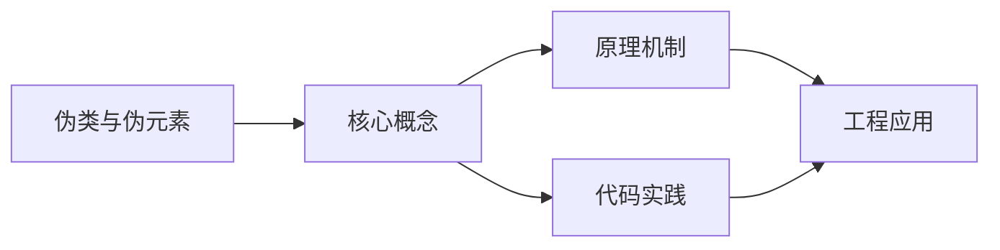
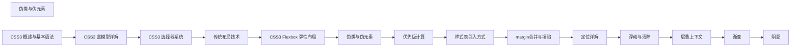

## 1. 学习目标（Bloom 分类）

本节按照布鲁姆教育目标分类学组织学习路径。本文主题为《伪类与伪元素》，属于 CSS 模块，读者可以根据自身阶段选择阅读深度。

记忆层面：能够准确复述本文的核心概念、术语与基本语法或操作步骤，并能够在提问或检索时快速定位对应知识点。能够说出 CSS 的核心概念、术语与标准写法。

理解层面：能够用自己的语言解释核心原理与工作机制，说明概念之间的因果关系，而不是机械记忆结论。能够解释 CSS 的工作原理与设计动机。

应用层面：能够在真实项目或练习场景中运用本文知识解决具体问题，写出正确且可维护的实现。能够编写符合 CSS 规范的完整实现。

分析层面：能够拆解复杂问题，比较本文主题与相邻概念的异同，识别边界条件与例外情况。能够分析 CSS 与相邻方案的差异与边界。

评价层面：能够根据约束条件（性能、可读性、安全、成本）评价不同方案的优劣，做出有依据的技术决策。能够根据场景评价 CSS 相关方案的优劣。

创造层面：能够把本文知识与其他模块知识组合，设计出新的解决方案或可复用的工程模式。能够组合 CSS 与其他技术设计完整方案。

通过本节学习，读者应当能够把《伪类与伪元素》纳入自己的知识网络，并与 CSS 模块的其他主题（选择器、盒模型、布局、动画、响应式）建立关联。

## 2. 历史动机与发展脉络

《伪类与伪元素》是 CSS 领域的重要主题。要真正理解它，需要先了解它解决的问题与演进过程。

CSS 于 1994 年由 Håkon Wium Lie 提出，1996 年 CSS1 发布，解决 HTML 表现层混杂问题；CSS2.1（2011）与 CSS3 模块化（2012+）奠定现代 Web 样式基础。
现代 CSS 的能力版图：Flexbox/Grid 布局、自定义属性（变量）、容器查询、子网格、层叠层（@layer）、现代颜色（oklch）。
CSS 的设计核心是“层叠与继承”：来源、优先级、顺序共同决定最终样式；理解层叠是排查样式问题的前提。

回到本文主题：伪类与伪元素 的提出与成熟，正是上述技术背景下的必然产物。早期实现往往以简单可用为目标，随着工程规模扩大，社区逐渐沉淀出标准做法与最佳实践；理解这一脉络，可以帮助读者判断“为什么文档中的推荐写法是现在这个样子”，也能在遇到历史遗留代码时准确识别其设计年代与取舍。


## 3. 形式化定义与核心概念精讲

本节把《伪类与伪元素》涉及的核心概念以“定义 + 讲解”的形式展开。读者应把定义当作工具，把讲解当作理解路径；两者结合才能形成可迁移的知识。

选择器与优先级：id > class/属性/伪类 > 元素/伪元素；!important 打破优先级（应避免）。
盒模型：content/padding/border/margin，box-sizing 决定 width 语义（border-box 推荐）。
布局体系：普通流、浮动（历史）、Flexbox（一维）、Grid（二维）；position 定位（relative/absolute/fixed/sticky）。

### 3.1 原文章节逐一精讲

原文档把主题拆分为 23 个小节，下面按顺序给出每一节的导读讲解，随后保留原文细节供精读。

#### 原文精读（完整保留）

# CSS 伪类与伪元素速查

> **符号约定**：`< >` 必填参数 | `[ ]` 可选参数

---

#### 伪元素

**基本写法：::before 前置内容**
`<选择器>::before { content: <内容>; }`
```css
/* 添加前置图标 */
.link::before {
  content: "→ ";
}
```

---

**基本写法：::after 后置内容**
`<选择器>::after { content: <内容>; }`
```css
/* 添加后置内容 */
.required::after {
  content: " *";
  color: red;
}
```

---

**基本写法：::first-letter 首字母**
`<选择器>::first-letter { }`
```css
/* 段落首字母放大 */
p::first-letter {
  font-size: 2em;
  float: left;
}
```

---

**基本写法：::first-line 首行**
`<选择器>::first-line { }`
```css
/* 段落首行样式 */
p::first-line {
  font-weight: bold;
}
```

---

**基本写法：::selection 选中文本**
`::selection { }`
```css
/* 选中文本样式 */
::selection {
  background: #3498db;
  color: white;
}
```

---

**基本写法：::placeholder 占位符**
`input::placeholder { }`
```css
/* 占位符文本样式 */
input::placeholder {
  color: #999;
}
```

---

**基本写法：::marker 列表标记**
`li::marker { }`
```css
/* 列表项标记样式 */
li::marker {
  color: #3498db;
  font-weight: bold;
}
```

---

**基本写法：::file-selector-button 文件按钮**
`input[type=file]::file-selector-button { }`
```css
/* 文件选择按钮样式 */
input[type=file]::file-selector-button {
  background: #3498db;
  color: white;
  border: none;
  padding: 6px 12px;
}
```

---

#### 结构伪类

**基本写法：:first-child 第一个子元素**
`<选择器>:first-child { }`
```css
/* 第一个列表项样式 */
li:first-child {
  font-weight: bold;
}
```

---

**基本写法：:last-child 最后一个子元素**
`<选择器>:last-child { }`
```css
/* 最后一个列表项样式 */
li:last-child {
  border-bottom: none;
}
```

---

**基本写法：:only-child 唯一子元素**
`<选择器>:only-child { }`
```css
/* 父元素唯一子元素样式 */
.icon:only-child {
  margin: 0 auto;
}
```

---

**基本写法：:first-of-type 同类型首个**
`<选择器>:first-of-type { }`
```css
/* 第一个段落样式 */
p:first-of-type {
  font-size: 1.2em;
}
```

---

**基本写法：:last-of-type 同类型末个**
`<选择器>:last-of-type { }`
```css
/* 最后一个段落样式 */
p:last-of-type {
  margin-bottom: 0;
}
```

---

**基本写法：:nth-child 第 N 个子元素**
`<选择器>:nth-child(<n>) { }`
```css
/* 第 2 个子元素 */
li:nth-child(2) {
  color: red;
}
```

---

**基本写法：:nth-child 奇偶**
`<选择器>:nth-child(odd | even) { }`
```css
/* 隔行变色 */
tr:nth-child(even) {
  background: #f9f9f9;
}
```

---

**基本写法：:nth-child 公式**
`<选择器>:nth-child(<公式>) { }`
```css
/* 每 3 个元素选第 1 个 */
li:nth-child(3n+1) {
  color: blue;
}
```

---

**基本写法：:nth-last-child 倒数第 N 个**
`<选择器>:nth-last-child(<n>) { }`
```css
/* 倒数第 2 个子元素 */
li:nth-last-child(2) {
  color: green;
}
```

---

**基本写法：:nth-of-type 同类型第 N 个**
`<选择器>:nth-of-type(<n>) { }`
```css
/* 第 2 个段落 */
p:nth-of-type(2) {
  color: red;
}
```

---

**基本写法：:empty 空元素**
`<选择器>:empty { }`
```css
/* 空段落隐藏 */
p:empty {
  display: none;
}
```

---

**基本写法：:root 根元素**
`:root { }`
```css
/* 定义全局 CSS 变量 */
:root {
  --primary: #3498db;
}
```

---

#### 1. 伪类概述

伪类用于匹配元素的特定状态。

| 类别     | 示例                           | 说明     |
| -------- | ------------------------------ | -------- |
| 交互状态 | `:hover`, `:focus`, `:active`  | 用户交互 |
| 位置     | `:first-child`, `:nth-child()` | DOM 位置 |
| 输入状态 | `:checked`, `:disabled`        | 表单状态 |
| 否定     | `:not()`                       | 排除匹配 |
| 匹配     | `:is()`, `:where()`, `:has()`  | 复杂匹配 |

#### 2. :nth-child()

```css
li:nth-child(3) {
  color: red;
} /* 第 3 个 */
tr:nth-child(odd) {
  background: #f0f0f0;
} /* 奇数 */
li:nth-child(3n + 1) {
  color: blue;
} /* 每 3 个选第 1 个 */
li:nth-child(-n + 3) {
  font-weight: bold;
} /* 前 3 个 */
```

**An+B 语法**：`2n+1` = odd，`2n` = even，`-n+3` = 前3个

##### nth-child vs nth-of-type

```html
<div>
  <h1>标题</h1>
  <!-- h1:first-of-type -->
  <p>段落1</p>
  <!-- p:nth-of-type(1) -->
  <p>段落2</p>
  <!-- p:nth-of-type(2) -->
</div>
```

#### 3. 否定与匹配伪类

```css
li:not(:last-child) {
  border-bottom: 1px solid #ccc;
}
:is(h1, h2, h3):hover {
  color: blue;
}
:where(h1, h2, h3) {
  margin: 0;
} /* 优先级为 0 */
a:has(> img) {
  border: none;
}
```

#### 4. 交互伪类

```css
a:hover {
  color: blue;
}
input:focus-visible {
  box-shadow: 0 0 0 3px rgba(0, 0, 255, 0.3);
}
input:focus-within {
  border-color: blue;
}
button:active {
  transform: scale(0.98);
}
```

#### 5. 伪元素

```css
.quote::before {
  content: '\201C';
  font-size: 2em;
}
.clearfix::after {
  content: '';
  display: table;
  clear: both;
}
p::first-line {
  font-weight: bold;
}
p::first-letter {
  font-size: 3em;
  float: left;
}
::selection {
  background: #ff6b6b;
  color: white;
}
input::placeholder {
  color: #999;
}
```
#### 链接与交互伪类

**基本写法：:link 未访问链接**
`a:link { }`
```css
/* 未访问链接样式 */
a:link {
  color: blue;
}
```

---

**基本写法：:visited 已访问链接**
`a:visited { }`
```css
/* 已访问链接样式 */
a:visited {
  color: purple;
}
```

---

**基本写法：:hover 悬停**
`<选择器>:hover { }`
```css
/* 鼠标悬停样式 */
.button:hover {
  background: #2980b9;
}
```

---

**基本写法：:active 激活**
`<选择器>:active { }`
```css
/* 鼠标按下样式 */
.button:active {
  transform: scale(0.95);
}
```

---

**基本写法：:focus 获得焦点**
`<选择器>:focus { }`
```css
/* 获得焦点样式 */
input:focus {
  border-color: #3498db;
  outline: none;
}
```

---

**基本写法：:focus-visible 键盘焦点**
`<选择器>:focus-visible { }`
```css
/* 仅键盘聚焦时显示焦点框 */
input:focus-visible {
  outline: 2px solid #3498db;
}
```

---

**基本写法：:focus-within 子元素聚焦**
`<选择器>:focus-within { }`
```css
/* 子元素获得焦点时父元素样式 */
.form:focus-within {
  border-color: #3498db;
}
```

---

#### 表单伪类

**基本写法：:checked 选中状态**
`input:checked { }`
```css
/* 复选框选中样式 */
input:checked + label {
  color: #27ae60;
}
```

---

**基本写法：:disabled 禁用**
`input:disabled { }`
```css
/* 禁用输入框样式 */
input:disabled {
  background: #f0f0f0;
  cursor: not-allowed;
}
```

---

**基本写法：:enabled 可用**
`input:enabled { }`
```css
/* 可用输入框样式 */
input:enabled {
  background: white;
}
```

---

**基本写法：:required 必填**
`input:required { }`
```css
/* 必填字段样式 */
input:required {
  border-left: 3px solid #e74c3c;
}
```

---

**基本写法：:valid 有效**
`input:valid { }`
```css
/* 校验通过样式 */
input:valid {
  border-color: #27ae60;
}
```

---

**基本写法：:invalid 无效**
`input:invalid { }`
```css
/* 校验失败样式 */
input:invalid {
  border-color: #e74c3c;
}
```

---

**基本写法：:placeholder-shown 占位显示**
`input:placeholder-shown { }`
```css
/* 输入框为空显示占位符时 */
input:placeholder-shown {
  background: #fafafa;
}
```

---

**基本写法：:read-only 只读**
`input:read-only { }`
```css
/* 只读输入框样式 */
input:read-only {
  background: #f5f5f5;
}
```

---

#### 否定与匹配伪类

**基本写法：:not 否定**
`<选择器>:not(<排除选择器>) { }`
```css
/* 非特殊按钮的样式 */
.button:not(.special) {
  background: gray;
}
```

---

**基本写法：:not 多条件否定**
`<选择器>:not(<选择器1>, <选择器2>) { }`
```css
/* 排除多个选择器 */
input:not(:disabled, [type="hidden"]) {
  border: 1px solid #ccc;
}
```

---

**基本写法：:is 匹配任一**
`<选择器>:is(<选择器1>, <选择器2>) { }`
```css
/* 匹配多个标题级别 */
:is(h1, h2, h3) {
  color: #333;
}
```

---

**基本写法：:where 匹配任一（零优先级）**
`<选择器>:where(<选择器1>, <选择器2>) { }`
```css
/* 零优先级匹配便于覆盖 */
:where(.card) .title {
  font-size: 1.2em;
}
```

---

#### 状态伪类

**基本写法：:target 目标锚点**
`<选择器>:target { }`
```css
/* 锚点目标高亮 */
.section:target {
  background: #fffacd;
}
```

---

**基本写法：:default 默认选项**
`input:default { }`
```css
/* 默认选中的单选按钮 */
input:default {
  box-shadow: 0 0 0 2px #3498db;
}
```

---

**基本写法：:indeterminate 不确定状态**
`input:indeterminate { }`
```css
/* 不确定状态复选框 */
input:indeterminate {
  background: gray;
}
```

---

#### 现代 CSS 伪类（2024+）

**基本写法：:has 父级选择**
`<选择器>:has(<子选择器>) { }`
```css
/* 包含图片的卡片样式 */
.card:has(img) {
  padding: 0;
}
```

---

**基本写法：:has 否定形式**
`<选择器>:not(:has(<子选择器>)) { }`
```css
/* 不包含错误的表单 */
.form:not(:has(.error)) {
  border-color: #27ae60;
}
```

---

**基本写法：:has 多条件**
`<选择器>:has(<选择器1>, <选择器2>) { }`
```css
/* 包含图片或视频的容器 */
.container:has(img, video) {
  aspect-ratio: 16 / 9;
}
```

---

**基本写法：:defined 自定义元素已定义**
`<选择器>:defined { }`
```css
/* 自定义元素定义后显示 */
custom-element:not(:defined) {
  display: none;
}
```

---

**基本写法：:modal 模态框**
`<选择器>:modal { }`
```css
/* 原生模态框样式 */
dialog:modal {
  border: none;
  border-radius: 8px;
}
```

---

**基本写法：:fullscreen 全屏**
`<选择器>:fullscreen { }`
```css
/* 全屏元素样式 */
.video:fullscreen {
  width: 100vw;
  height: 100vh;
}
```

---

**基本写法：:picture-in-picture 画中画**
`<选择器>:picture-in-picture { }`
```css
/* 画中画视频样式 */
video:picture-in-picture {
  border: 2px solid #3498db;
}
```

---

**基本写法：:playing 播放中**
`<选择器>:playing { }`
```css
/* 视频播放时样式 */
video:playing {
  filter: brightness(1.1);
}
```

---

#### @scope 作用域（2024+）

**基本写法：@scope 限定作用域**
`@scope (<选择器>) { <规则> }`
```css
/* 限定样式作用范围 */
@scope (.card) {
  .title {
    color: red;
  }
}
```

---

**基本写法：@scope 范围限定**
`@scope (<起>) to (<止>) { }`
```css
/* 限定到 .start 到 .end 之间 */
@scope (.start) to (.end) {
  p {
    color: blue;
  }
}
```
#### 交互状态伪类

**基本写法：hover 悬停**
`<选择器>:hover { <样式> }`
```css
/* 鼠标悬停状态 */
.button:hover {
  background-color: #0056b3;
}
```

---

**基本写法：focus 聚焦**
`<选择器>:focus { <样式> }`
```css
/* 元素获得焦点 */
input:focus {
  border-color: #007bff;
}
```

---

**基本写法：focus-visible 键盘聚焦**
`<选择器>:focus-visible { <样式> }`
```css
/* 仅键盘聚焦时显示 */
button:focus-visible {
  outline: 2px solid #007bff;
}
```

---

**基本写法：focus-within 子元素聚焦**
`<选择器>:focus-within { <样式> }`
```css
/* 子元素获得焦点时 */
.form:focus-within {
  border-color: #007bff;
}
```

---

**基本写法：active 激活**
`<选择器>:active { <样式> }`
```css
/* 元素被激活（点击） */
.button:active {
  transform: scale(0.95);
}
```

---

**基本写法：visited 已访问**
`<选择器>:visited { <样式> }`
```css
/* 链接已访问状态 */
a:visited {
  color: purple;
}
```

---

**基本写法：link 未访问**
`<选择器>:link { <样式> }`
```css
/* 链接未访问状态 */
a:link {
  color: blue;
}
```

---

#### 表单状态伪类

**基本写法：checked 选中**
`<选择器>:checked { <样式> }`
```css
/* 复选框或单选框选中 */
input:checked {
  accent-color: #007bff;
}
```

---

**基本写法：disabled 禁用**
`<选择器>:disabled { <样式> }`
```css
/* 表单元素禁用 */
input:disabled {
  background-color: #f5f5f5;
  cursor: not-allowed;
}
```

---

**基本写法：enabled 可用**
`<选择器>:enabled { <样式> }`
```css
/* 表单元素可用 */
input:enabled {
  background-color: white;
}
```

---

**基本写法：required 必填**
`<选择器>:required { <样式> }`
```css
/* 必填字段 */
input:required {
  border-color: red;
}
```

---

**基本写法：optional 可选**
`<选择器>:optional { <样式> }`
```css
/* 可选字段 */
input:optional {
  border-color: #ccc;
}
```

---

**基本写法：valid 有效**
`<选择器>:valid { <样式> }`
```css
/* 表单验证通过 */
input:valid {
  border-color: green;
}
```

---

**基本写法：invalid 无效**
`<选择器>:invalid { <样式> }`
```css
/* 表单验证失败 */
input:invalid {
  border-color: red;
}
```

---

**基本写法：in-range 范围内**
`<选择器>:in-range { <样式> }`
```css
/* 数值在指定范围内 */
input:in-range {
  border-color: green;
}
```

---

**基本写法：out-of-range 范围外**
`<选择器>:out-of-range { <样式> }`
```css
/* 数值超出指定范围 */
input:out-of-range {
  border-color: red;
}
```

---

**基本写法：read-only 只读**
`<选择器>:read-only { <样式> }`
```css
/* 只读字段 */
input:read-only {
  background-color: #f5f5f5;
}
```

---

**基本写法：read-write 可读写**
`<选择器>:read-write { <样式> }`
```css
/* 可读写字段 */
input:read-write {
  background-color: white;
}
```

---

**基本写法：placeholder-shown 占位符显示**
`<选择器>:placeholder-shown { <样式> }`
```css
/* 显示占位符时 */
input:placeholder-shown {
  border-color: #ccc;
}
```

---

**基本写法：default 默认选中**
`<选择器>:default { <样式> }`
```css
/* 默认选中的表单元素 */
input:default {
  box-shadow: 0 0 2px blue;
}
```

---

#### 目标伪类

**基本写法：target 锚点目标**
`<选择器>:target { <样式> }`
```css
/* 当前锚点指向的元素 */
#section:target {
  background-color: #ffffcc;
}
```

---

#### 语言伪类

**基本写法：lang 语言匹配**
`<选择器>:lang(<语言>) { <样式> }`
```css
/* 匹配指定语言 */
p:lang(zh) {
  font-family: "Microsoft YaHei", sans-serif;
}
```

---

#### 否定伪类

**基本写法：not 否定**
`<选择器>:not(<排除选择器>) { <样式> }`
```css
/* 排除指定选择器 */
input:not([disabled]) {
  border: 1px solid #ccc;
}
```

---

**基本写法：not 多重否定**
`<选择器>:not(<选择器1>):not(<选择器2>) { <样式> }`
```css
/* 多重否定 */
input:not([disabled]):not([type="hidden"]) {
  border: 1px solid #ccc;
}
```

---

#### 匹配伪类

**基本写法：is 匹配任一**
`:is(<选择器1>, <选择器2>) { <样式> }`
```css
/* 匹配多个选择器 */
:is(h1, h2, h3) {
  font-family: sans-serif;
}
```

---

**基本写法：where 匹配任一**
`:where(<选择器1>, <选择器2>) { <样式> }`
```css
/* 匹配多个选择器（零特异性） */
:where(.card, .panel) {
  padding: 1rem;
}
```

---

**基本写法：has 父选择器**
`<选择器>:has(<子选择器>) { <样式> }`
```css
/* 选中包含指定子元素的父元素 */
div:has(img) {
  padding: 10px;
}
```

---

**基本写法：has 否定**
`<选择器>:not(:has(<子选择器>)) { <样式> }`
```css
/* 不包含指定子元素 */
div:not(:has(img)) {
  background: #f5f5f5;
}
```
#### 伪元素内容生成

**基本写法：content 字符串**
`content: "<文本>";`
```css
/* 生成文本内容 */
.label::before {
  content: "标签: ";
}
```

---

**基本写法：content attr 属性**
`content: attr(<属性名>);`
```css
/* 生成元素属性值 */
a::after {
  content: " (" attr(href) ")";
}
```

---

**基本写法：content 空字符串**
`content: "";`
```css
/* 生成空内容用于布局 */
.clearfix::after {
  content: "";
  display: block;
  clear: both;
}
```

---

**基本写法：content url 图片**
`content: url("<图片路径>");`
```css
/* 生成图片内容 */
.icon::before {
  content: url("icon.png");
}
```

---

**基本写法：content 计数器**
`content: counter(<计数器名>);`
```css
/* 显示计数器值 */
li::before {
  content: counter(item) ". ";
}
```

---

#### 计数器

**基本写法：counter-reset 重置计数器**
`counter-reset: <计数器名> <初始值>;`
```css
/* 重置计数器 */
ol {
  counter-reset: section;
}
```

---

**基本写法：counter-increment 递增计数器**
`counter-increment: <计数器名> <步长>;`
```css
/* 计数器递增 */
li {
  counter-increment: section;
}
```

---

**基本写法：counter 显示计数器**
`content: counter(<计数器名>);`
```css
/* 显示计数器值 */
li::before {
  content: "第 " counter(section) " 章: ";
}
```

---

**基本写法：counter 自定义样式**
`content: counter(<计数器名>, <样式>);`
```css
/* 计数器使用中文数字 */
li::before {
  content: counter(section, cjk-ideographic) "、";
}
```

---

**基本写法：counters 嵌套计数器**
`content: counters(<计数器名>, "<分隔符>");`
```css
/* 嵌套计数器 */
li::before {
  content: counters(section, ".") " ";
}
```

---

#### 伪元素动画

**基本写法：伪元素过渡**
`<选择器>::before { transition: <属性> <时长>; }`
```css
/* 伪元素过渡动画 */
.button::before {
  transition: transform 0.3s;
}
.button:hover::before {
  transform: scaleX(1);
}
```

---

**基本写法：伪元素动画**
`<选择器>::after { animation: <名称> <时长>; }`
```css
/* 伪元素动画 */
.loader::after {
  animation: spin 1s linear infinite;
}
```

---

#### 伪元素布局

**基本写法：clearfix 清除浮动**
`.clearfix::after { content: ""; display: table; clear: both; }`
```css
/* 清除浮动 */
.clearfix::after {
  content: "";
  display: table;
  clear: both;
}
```

---

**基本写法：tooltip 工具提示**
`<选择器>::after { content: attr(data-tooltip); <样式> }`
```css
/* 使用伪元素创建工具提示 */
[data-tooltip]::after {
  content: attr(data-tooltip);
  position: absolute;
  background: black;
  color: white;
  padding: 4px 8px;
  opacity: 0;
  transition: opacity 0.3s;
}
[data-tooltip]:hover::after {
  opacity: 1;
}
```

---

**基本写法：下划线动画**
`<选择器>::after { content: ""; <样式> }`
```css
/* 悬停下划线动画 */
.link::after {
  content: "";
  display: block;
  width: 0;
  height: 2px;
  background: currentColor;
  transition: width 0.3s;
}
.link:hover::after {
  width: 100%;
}
```


### 3.2 概念关系图

下面用 Mermaid 图表达本文核心概念之间的关系，帮助读者建立整体图景：



图中展示的是本文知识的结构化关系：核心概念是入口，原理机制解释“为什么”，代码实践演示“怎么做”，工程应用回答“何时用”。读者学习时可以把每个小节的内容挂接到对应节点上。

## 4. 理论推导与原理解析

本节深入《伪类与伪元素》背后的原理。理论部分不求面面俱到，而是聚焦“能解释现象、能指导实践”的关键推导。

选择器与优先级：id > class/属性/伪类 > 元素/伪元素；!important 打破优先级（应避免）。
盒模型：content/padding/border/margin，box-sizing 决定 width 语义（border-box 推荐）。
布局体系：普通流、浮动（历史）、Flexbox（一维）、Grid（二维）；position 定位（relative/absolute/fixed/sticky）。
层叠上下文：z-index 只在同一层叠上下文中比较；transform/opacity/filter 创建新上下文。

需要强调的是，理论推导与工程实践之间存在翻译层：理论给出的是理想化模型与边界条件，工程代码则必须处理真实环境中的例外。读者在学习时应先掌握理论的“标准情形”，再通过陷阱章节了解“非标准情形”。

## 5. 代码示例与逐行讲解

本节把原文中的代码示例系统整理，并为每个示例补充用途说明与讲解。读者不应只浏览代码，而应逐段对照讲解理解设计意图。

### 5.1 示例：伪元素

该示例来自原文《伪元素》小节，用于演示伪类与伪元素相关操作。阅读时请先看代码结构，再看其后的讲解。

```css
/* 添加前置图标 */
.link::before {
  content: "→ ";
}
```

讲解：这段代码演示了本节核心知识点。代码中的关键操作可以归纳为三步：准备（定义或初始化）、执行（核心逻辑）、收尾（释放资源或返回结果）。实际项目中，这三步往往被封装为函数或类，以提升复用性与可测试性。

关键点分析：

该示例共 4 行有效代码，结构以数据或配置为主。阅读时应关注：数据字段的含义、配置项的作用，以及它们与运行行为的对应关系。

进阶思考路径：先尝试修改参数观察行为变化，再把示例中的模式迁移到自己的项目中；每次修改都记录预期与实测差异，这是把示例转化为能力的最快方式。

### 5.2 示例：伪元素

该示例来自原文《伪元素》小节，用于演示伪类与伪元素相关操作。阅读时请先看代码结构，再看其后的讲解。

```css
/* 添加后置内容 */
.required::after {
  content: " *";
  color: red;
}
```

讲解：这段代码演示了本节核心知识点。代码中的关键操作可以归纳为三步：准备（定义或初始化）、执行（核心逻辑）、收尾（释放资源或返回结果）。实际项目中，这三步往往被封装为函数或类，以提升复用性与可测试性。

关键点分析：

该示例共 5 行有效代码，结构以数据或配置为主。阅读时应关注：数据字段的含义、配置项的作用，以及它们与运行行为的对应关系。

进阶思考路径：先尝试修改参数观察行为变化，再把示例中的模式迁移到自己的项目中；每次修改都记录预期与实测差异，这是把示例转化为能力的最快方式。

### 5.3 示例：伪元素

该示例来自原文《伪元素》小节，用于演示伪类与伪元素相关操作。阅读时请先看代码结构，再看其后的讲解。

```css
/* 段落首字母放大 */
p::first-letter {
  font-size: 2em;
  float: left;
}
```

讲解：这段代码演示了本节核心知识点。代码中的关键操作可以归纳为三步：准备（定义或初始化）、执行（核心逻辑）、收尾（释放资源或返回结果）。实际项目中，这三步往往被封装为函数或类，以提升复用性与可测试性。

关键点分析：

该示例共 5 行有效代码，结构以数据或配置为主。阅读时应关注：数据字段的含义、配置项的作用，以及它们与运行行为的对应关系。

进阶思考路径：先尝试修改参数观察行为变化，再把示例中的模式迁移到自己的项目中；每次修改都记录预期与实测差异，这是把示例转化为能力的最快方式。

### 5.4 示例：伪元素

该示例来自原文《伪元素》小节，用于演示伪类与伪元素相关操作。阅读时请先看代码结构，再看其后的讲解。

```css
/* 段落首行样式 */
p::first-line {
  font-weight: bold;
}
```

讲解：这段代码演示了本节核心知识点。代码中的关键操作可以归纳为三步：准备（定义或初始化）、执行（核心逻辑）、收尾（释放资源或返回结果）。实际项目中，这三步往往被封装为函数或类，以提升复用性与可测试性。

关键点分析：

该示例共 4 行有效代码，结构以数据或配置为主。阅读时应关注：数据字段的含义、配置项的作用，以及它们与运行行为的对应关系。

进阶思考路径：先尝试修改参数观察行为变化，再把示例中的模式迁移到自己的项目中；每次修改都记录预期与实测差异，这是把示例转化为能力的最快方式。

### 5.5 示例：伪元素

该示例来自原文《伪元素》小节，用于演示伪类与伪元素相关操作。阅读时请先看代码结构，再看其后的讲解。

```css
/* 选中文本样式 */
::selection {
  background: #3498db;
  color: white;
}
```

讲解：这段代码演示了本节核心知识点。代码中的关键操作可以归纳为三步：准备（定义或初始化）、执行（核心逻辑）、收尾（释放资源或返回结果）。实际项目中，这三步往往被封装为函数或类，以提升复用性与可测试性。

关键点分析：

该示例共 5 行有效代码，结构以数据或配置为主。阅读时应关注：数据字段的含义、配置项的作用，以及它们与运行行为的对应关系。

进阶思考路径：先尝试修改参数观察行为变化，再把示例中的模式迁移到自己的项目中；每次修改都记录预期与实测差异，这是把示例转化为能力的最快方式。

### 5.6 示例：伪元素

该示例来自原文《伪元素》小节，用于演示伪类与伪元素相关操作。阅读时请先看代码结构，再看其后的讲解。

```css
/* 占位符文本样式 */
input::placeholder {
  color: #999;
}
```

讲解：这段代码演示了本节核心知识点。代码中的关键操作可以归纳为三步：准备（定义或初始化）、执行（核心逻辑）、收尾（释放资源或返回结果）。实际项目中，这三步往往被封装为函数或类，以提升复用性与可测试性。

关键点分析：

该示例共 4 行有效代码，结构以数据或配置为主。阅读时应关注：数据字段的含义、配置项的作用，以及它们与运行行为的对应关系。

进阶思考路径：先尝试修改参数观察行为变化，再把示例中的模式迁移到自己的项目中；每次修改都记录预期与实测差异，这是把示例转化为能力的最快方式。

### 5.7 示例：伪元素

该示例来自原文《伪元素》小节，用于演示伪类与伪元素相关操作。阅读时请先看代码结构，再看其后的讲解。

```css
/* 列表项标记样式 */
li::marker {
  color: #3498db;
  font-weight: bold;
}
```

讲解：这段代码演示了本节核心知识点。代码中的关键操作可以归纳为三步：准备（定义或初始化）、执行（核心逻辑）、收尾（释放资源或返回结果）。实际项目中，这三步往往被封装为函数或类，以提升复用性与可测试性。

关键点分析：

该示例共 5 行有效代码，结构以数据或配置为主。阅读时应关注：数据字段的含义、配置项的作用，以及它们与运行行为的对应关系。

进阶思考路径：先尝试修改参数观察行为变化，再把示例中的模式迁移到自己的项目中；每次修改都记录预期与实测差异，这是把示例转化为能力的最快方式。

### 5.8 示例：伪元素

该示例来自原文《伪元素》小节，用于演示伪类与伪元素相关操作。阅读时请先看代码结构，再看其后的讲解。

```css
/* 文件选择按钮样式 */
input[type=file]::file-selector-button {
  background: #3498db;
  color: white;
  border: none;
  padding: 6px 12px;
}
```

讲解：这段代码演示了本节核心知识点。代码中的关键操作可以归纳为三步：准备（定义或初始化）、执行（核心逻辑）、收尾（释放资源或返回结果）。实际项目中，这三步往往被封装为函数或类，以提升复用性与可测试性。

关键点分析：

该示例共 7 行有效代码，结构以数据或配置为主。阅读时应关注：数据字段的含义、配置项的作用，以及它们与运行行为的对应关系。

进阶思考路径：先尝试修改参数观察行为变化，再把示例中的模式迁移到自己的项目中；每次修改都记录预期与实测差异，这是把示例转化为能力的最快方式。

### 5.9 示例：结构伪类

该示例来自原文《结构伪类》小节，用于演示伪类与伪元素相关操作。阅读时请先看代码结构，再看其后的讲解。

```css
/* 第一个列表项样式 */
li:first-child {
  font-weight: bold;
}
```

讲解：这段代码演示了本节核心知识点。代码中的关键操作可以归纳为三步：准备（定义或初始化）、执行（核心逻辑）、收尾（释放资源或返回结果）。实际项目中，这三步往往被封装为函数或类，以提升复用性与可测试性。

关键点分析：

该示例共 4 行有效代码，结构以数据或配置为主。阅读时应关注：数据字段的含义、配置项的作用，以及它们与运行行为的对应关系。

进阶思考路径：先尝试修改参数观察行为变化，再把示例中的模式迁移到自己的项目中；每次修改都记录预期与实测差异，这是把示例转化为能力的最快方式。

### 5.10 示例：结构伪类

该示例来自原文《结构伪类》小节，用于演示伪类与伪元素相关操作。阅读时请先看代码结构，再看其后的讲解。

```css
/* 最后一个列表项样式 */
li:last-child {
  border-bottom: none;
}
```

讲解：这段代码演示了本节核心知识点。代码中的关键操作可以归纳为三步：准备（定义或初始化）、执行（核心逻辑）、收尾（释放资源或返回结果）。实际项目中，这三步往往被封装为函数或类，以提升复用性与可测试性。

关键点分析：

该示例共 4 行有效代码，结构以数据或配置为主。阅读时应关注：数据字段的含义、配置项的作用，以及它们与运行行为的对应关系。

进阶思考路径：先尝试修改参数观察行为变化，再把示例中的模式迁移到自己的项目中；每次修改都记录预期与实测差异，这是把示例转化为能力的最快方式。

### 5.11 示例：结构伪类

该示例来自原文《结构伪类》小节，用于演示伪类与伪元素相关操作。阅读时请先看代码结构，再看其后的讲解。

```css
/* 父元素唯一子元素样式 */
.icon:only-child {
  margin: 0 auto;
}
```

讲解：这段代码演示了本节核心知识点。代码中的关键操作可以归纳为三步：准备（定义或初始化）、执行（核心逻辑）、收尾（释放资源或返回结果）。实际项目中，这三步往往被封装为函数或类，以提升复用性与可测试性。

关键点分析：

该示例共 4 行有效代码，结构以数据或配置为主。阅读时应关注：数据字段的含义、配置项的作用，以及它们与运行行为的对应关系。

进阶思考路径：先尝试修改参数观察行为变化，再把示例中的模式迁移到自己的项目中；每次修改都记录预期与实测差异，这是把示例转化为能力的最快方式。

### 5.12 示例：结构伪类

该示例来自原文《结构伪类》小节，用于演示伪类与伪元素相关操作。阅读时请先看代码结构，再看其后的讲解。

```css
/* 第一个段落样式 */
p:first-of-type {
  font-size: 1.2em;
}
```

讲解：这段代码演示了本节核心知识点。代码中的关键操作可以归纳为三步：准备（定义或初始化）、执行（核心逻辑）、收尾（释放资源或返回结果）。实际项目中，这三步往往被封装为函数或类，以提升复用性与可测试性。

关键点分析：

该示例共 4 行有效代码，结构以数据或配置为主。阅读时应关注：数据字段的含义、配置项的作用，以及它们与运行行为的对应关系。

进阶思考路径：先尝试修改参数观察行为变化，再把示例中的模式迁移到自己的项目中；每次修改都记录预期与实测差异，这是把示例转化为能力的最快方式。

### 5.13 示例：结构伪类

该示例来自原文《结构伪类》小节，用于演示伪类与伪元素相关操作。阅读时请先看代码结构，再看其后的讲解。

```css
/* 最后一个段落样式 */
p:last-of-type {
  margin-bottom: 0;
}
```

讲解：这段代码演示了本节核心知识点。代码中的关键操作可以归纳为三步：准备（定义或初始化）、执行（核心逻辑）、收尾（释放资源或返回结果）。实际项目中，这三步往往被封装为函数或类，以提升复用性与可测试性。

关键点分析：

该示例共 4 行有效代码，结构以数据或配置为主。阅读时应关注：数据字段的含义、配置项的作用，以及它们与运行行为的对应关系。

进阶思考路径：先尝试修改参数观察行为变化，再把示例中的模式迁移到自己的项目中；每次修改都记录预期与实测差异，这是把示例转化为能力的最快方式。

### 5.14 示例：结构伪类

该示例来自原文《结构伪类》小节，用于演示伪类与伪元素相关操作。阅读时请先看代码结构，再看其后的讲解。

```css
/* 第 2 个子元素 */
li:nth-child(2) {
  color: red;
}
```

讲解：这段代码演示了本节核心知识点。代码中的关键操作可以归纳为三步：准备（定义或初始化）、执行（核心逻辑）、收尾（释放资源或返回结果）。实际项目中，这三步往往被封装为函数或类，以提升复用性与可测试性。

关键点分析：

该示例共 4 行有效代码，结构以数据或配置为主。阅读时应关注：数据字段的含义、配置项的作用，以及它们与运行行为的对应关系。

进阶思考路径：先尝试修改参数观察行为变化，再把示例中的模式迁移到自己的项目中；每次修改都记录预期与实测差异，这是把示例转化为能力的最快方式。

### 5.15 示例：结构伪类

该示例来自原文《结构伪类》小节，用于演示伪类与伪元素相关操作。阅读时请先看代码结构，再看其后的讲解。

```css
/* 隔行变色 */
tr:nth-child(even) {
  background: #f9f9f9;
}
```

讲解：这段代码演示了本节核心知识点。代码中的关键操作可以归纳为三步：准备（定义或初始化）、执行（核心逻辑）、收尾（释放资源或返回结果）。实际项目中，这三步往往被封装为函数或类，以提升复用性与可测试性。

关键点分析：

该示例共 4 行有效代码，结构以数据或配置为主。阅读时应关注：数据字段的含义、配置项的作用，以及它们与运行行为的对应关系。

进阶思考路径：先尝试修改参数观察行为变化，再把示例中的模式迁移到自己的项目中；每次修改都记录预期与实测差异，这是把示例转化为能力的最快方式。

### 5.16 示例：结构伪类

该示例来自原文《结构伪类》小节，用于演示伪类与伪元素相关操作。阅读时请先看代码结构，再看其后的讲解。

```css
/* 每 3 个元素选第 1 个 */
li:nth-child(3n+1) {
  color: blue;
}
```

讲解：这段代码演示了本节核心知识点。代码中的关键操作可以归纳为三步：准备（定义或初始化）、执行（核心逻辑）、收尾（释放资源或返回结果）。实际项目中，这三步往往被封装为函数或类，以提升复用性与可测试性。

关键点分析：

该示例共 4 行有效代码，结构以数据或配置为主。阅读时应关注：数据字段的含义、配置项的作用，以及它们与运行行为的对应关系。

进阶思考路径：先尝试修改参数观察行为变化，再把示例中的模式迁移到自己的项目中；每次修改都记录预期与实测差异，这是把示例转化为能力的最快方式。

### 5.17 示例：结构伪类

该示例来自原文《结构伪类》小节，用于演示伪类与伪元素相关操作。阅读时请先看代码结构，再看其后的讲解。

```css
/* 倒数第 2 个子元素 */
li:nth-last-child(2) {
  color: green;
}
```

讲解：这段代码演示了本节核心知识点。代码中的关键操作可以归纳为三步：准备（定义或初始化）、执行（核心逻辑）、收尾（释放资源或返回结果）。实际项目中，这三步往往被封装为函数或类，以提升复用性与可测试性。

关键点分析：

该示例共 4 行有效代码，结构以数据或配置为主。阅读时应关注：数据字段的含义、配置项的作用，以及它们与运行行为的对应关系。

进阶思考路径：先尝试修改参数观察行为变化，再把示例中的模式迁移到自己的项目中；每次修改都记录预期与实测差异，这是把示例转化为能力的最快方式。

### 5.18 示例：结构伪类

该示例来自原文《结构伪类》小节，用于演示伪类与伪元素相关操作。阅读时请先看代码结构，再看其后的讲解。

```css
/* 第 2 个段落 */
p:nth-of-type(2) {
  color: red;
}
```

讲解：这段代码演示了本节核心知识点。代码中的关键操作可以归纳为三步：准备（定义或初始化）、执行（核心逻辑）、收尾（释放资源或返回结果）。实际项目中，这三步往往被封装为函数或类，以提升复用性与可测试性。

关键点分析：

该示例共 4 行有效代码，结构以数据或配置为主。阅读时应关注：数据字段的含义、配置项的作用，以及它们与运行行为的对应关系。

进阶思考路径：先尝试修改参数观察行为变化，再把示例中的模式迁移到自己的项目中；每次修改都记录预期与实测差异，这是把示例转化为能力的最快方式。

### 5.19 示例：结构伪类

该示例来自原文《结构伪类》小节，用于演示伪类与伪元素相关操作。阅读时请先看代码结构，再看其后的讲解。

```css
/* 空段落隐藏 */
p:empty {
  display: none;
}
```

讲解：这段代码演示了本节核心知识点。代码中的关键操作可以归纳为三步：准备（定义或初始化）、执行（核心逻辑）、收尾（释放资源或返回结果）。实际项目中，这三步往往被封装为函数或类，以提升复用性与可测试性。

关键点分析：

该示例共 4 行有效代码，结构以数据或配置为主。阅读时应关注：数据字段的含义、配置项的作用，以及它们与运行行为的对应关系。

进阶思考路径：先尝试修改参数观察行为变化，再把示例中的模式迁移到自己的项目中；每次修改都记录预期与实测差异，这是把示例转化为能力的最快方式。

### 5.20 示例：结构伪类

该示例来自原文《结构伪类》小节，用于演示伪类与伪元素相关操作。阅读时请先看代码结构，再看其后的讲解。

```css
/* 定义全局 CSS 变量 */
:root {
  --primary: #3498db;
}
```

讲解：这段代码演示了本节核心知识点。代码中的关键操作可以归纳为三步：准备（定义或初始化）、执行（核心逻辑）、收尾（释放资源或返回结果）。实际项目中，这三步往往被封装为函数或类，以提升复用性与可测试性。

关键点分析：

该示例共 4 行有效代码，结构以数据或配置为主。阅读时应关注：数据字段的含义、配置项的作用，以及它们与运行行为的对应关系。

进阶思考路径：先尝试修改参数观察行为变化，再把示例中的模式迁移到自己的项目中；每次修改都记录预期与实测差异，这是把示例转化为能力的最快方式。

### 5.21 示例：2. :nth-child()

该示例来自原文《2. :nth-child()》小节，用于演示伪类与伪元素相关操作。阅读时请先看代码结构，再看其后的讲解。

```css
li:nth-child(3) {
  color: red;
} /* 第 3 个 */
tr:nth-child(odd) {
  background: #f0f0f0;
} /* 奇数 */
li:nth-child(3n + 1) {
  color: blue;
} /* 每 3 个选第 1 个 */
li:nth-child(-n + 3) {
  font-weight: bold;
} /* 前 3 个 */
```

讲解：这段代码演示了本节核心知识点。代码中的关键操作可以归纳为三步：准备（定义或初始化）、执行（核心逻辑）、收尾（释放资源或返回结果）。实际项目中，这三步往往被封装为函数或类，以提升复用性与可测试性。

关键点分析：

该示例共 12 行有效代码，结构以数据或配置为主。阅读时应关注：数据字段的含义、配置项的作用，以及它们与运行行为的对应关系。

进阶思考路径：先尝试修改参数观察行为变化，再把示例中的模式迁移到自己的项目中；每次修改都记录预期与实测差异，这是把示例转化为能力的最快方式。

### 5.22 示例：nth-child vs nth-of-type

该示例来自原文《nth-child vs nth-of-type》小节，用于演示伪类与伪元素相关操作。阅读时请先看代码结构，再看其后的讲解。

```html
<div>
  <h1>标题</h1>
  <!-- h1:first-of-type -->
  <p>段落1</p>
  <!-- p:nth-of-type(1) -->
  <p>段落2</p>
  <!-- p:nth-of-type(2) -->
</div>
```

讲解：这段代码演示了本节核心知识点。代码中的关键操作可以归纳为三步：准备（定义或初始化）、执行（核心逻辑）、收尾（释放资源或返回结果）。实际项目中，这三步往往被封装为函数或类，以提升复用性与可测试性。

关键点分析：

该示例共 8 行有效代码，结构以数据或配置为主。阅读时应关注：数据字段的含义、配置项的作用，以及它们与运行行为的对应关系。

进阶思考路径：先尝试修改参数观察行为变化，再把示例中的模式迁移到自己的项目中；每次修改都记录预期与实测差异，这是把示例转化为能力的最快方式。

### 5.23 示例：3. 否定与匹配伪类

该示例来自原文《3. 否定与匹配伪类》小节，用于演示伪类与伪元素相关操作。阅读时请先看代码结构，再看其后的讲解。

```css
li:not(:last-child) {
  border-bottom: 1px solid #ccc;
}
:is(h1, h2, h3):hover {
  color: blue;
}
:where(h1, h2, h3) {
  margin: 0;
} /* 优先级为 0 */
a:has(> img) {
  border: none;
}
```

讲解：这段代码演示了本节核心知识点。代码中的关键操作可以归纳为三步：准备（定义或初始化）、执行（核心逻辑）、收尾（释放资源或返回结果）。实际项目中，这三步往往被封装为函数或类，以提升复用性与可测试性。

关键点分析：

该示例共 12 行有效代码，结构以数据或配置为主。阅读时应关注：数据字段的含义、配置项的作用，以及它们与运行行为的对应关系。

进阶思考路径：先尝试修改参数观察行为变化，再把示例中的模式迁移到自己的项目中；每次修改都记录预期与实测差异，这是把示例转化为能力的最快方式。

### 5.24 示例：4. 交互伪类

该示例来自原文《4. 交互伪类》小节，用于演示伪类与伪元素相关操作。阅读时请先看代码结构，再看其后的讲解。

```css
a:hover {
  color: blue;
}
input:focus-visible {
  box-shadow: 0 0 0 3px rgba(0, 0, 255, 0.3);
}
input:focus-within {
  border-color: blue;
}
button:active {
  transform: scale(0.98);
}
```

讲解：这段代码演示了本节核心知识点。代码中的关键操作可以归纳为三步：准备（定义或初始化）、执行（核心逻辑）、收尾（释放资源或返回结果）。实际项目中，这三步往往被封装为函数或类，以提升复用性与可测试性。

关键点分析：

该示例共 12 行有效代码，结构以数据或配置为主。阅读时应关注：数据字段的含义、配置项的作用，以及它们与运行行为的对应关系。

进阶思考路径：先尝试修改参数观察行为变化，再把示例中的模式迁移到自己的项目中；每次修改都记录预期与实测差异，这是把示例转化为能力的最快方式。

### 5.25 示例：5. 伪元素

该示例来自原文《5. 伪元素》小节，用于演示伪类与伪元素相关操作。阅读时请先看代码结构，再看其后的讲解。

```css
.quote::before {
  content: '\201C';
  font-size: 2em;
}
.clearfix::after {
  content: '';
  display: table;
  clear: both;
}
p::first-line {
  font-weight: bold;
}
p::first-letter {
  font-size: 3em;
  float: left;
}
::selection {
  background: #ff6b6b;
  color: white;
}
input::placeholder {
  color: #999;
}
```

讲解：这段代码演示了本节核心知识点。代码中的关键操作可以归纳为三步：准备（定义或初始化）、执行（核心逻辑）、收尾（释放资源或返回结果）。实际项目中，这三步往往被封装为函数或类，以提升复用性与可测试性。

关键点分析：

该示例共 23 行有效代码，结构以数据或配置为主。阅读时应关注：数据字段的含义、配置项的作用，以及它们与运行行为的对应关系。

进阶思考路径：先尝试修改参数观察行为变化，再把示例中的模式迁移到自己的项目中；每次修改都记录预期与实测差异，这是把示例转化为能力的最快方式。

### 5.26 示例：链接与交互伪类

该示例来自原文《链接与交互伪类》小节，用于演示伪类与伪元素相关操作。阅读时请先看代码结构，再看其后的讲解。

```css
/* 未访问链接样式 */
a:link {
  color: blue;
}
```

讲解：这段代码演示了本节核心知识点。代码中的关键操作可以归纳为三步：准备（定义或初始化）、执行（核心逻辑）、收尾（释放资源或返回结果）。实际项目中，这三步往往被封装为函数或类，以提升复用性与可测试性。

关键点分析：

该示例共 4 行有效代码，结构以数据或配置为主。阅读时应关注：数据字段的含义、配置项的作用，以及它们与运行行为的对应关系。

进阶思考路径：先尝试修改参数观察行为变化，再把示例中的模式迁移到自己的项目中；每次修改都记录预期与实测差异，这是把示例转化为能力的最快方式。

### 5.27 示例：链接与交互伪类

该示例来自原文《链接与交互伪类》小节，用于演示伪类与伪元素相关操作。阅读时请先看代码结构，再看其后的讲解。

```css
/* 已访问链接样式 */
a:visited {
  color: purple;
}
```

讲解：这段代码演示了本节核心知识点。代码中的关键操作可以归纳为三步：准备（定义或初始化）、执行（核心逻辑）、收尾（释放资源或返回结果）。实际项目中，这三步往往被封装为函数或类，以提升复用性与可测试性。

关键点分析：

该示例共 4 行有效代码，结构以数据或配置为主。阅读时应关注：数据字段的含义、配置项的作用，以及它们与运行行为的对应关系。

进阶思考路径：先尝试修改参数观察行为变化，再把示例中的模式迁移到自己的项目中；每次修改都记录预期与实测差异，这是把示例转化为能力的最快方式。

### 5.28 示例：链接与交互伪类

该示例来自原文《链接与交互伪类》小节，用于演示伪类与伪元素相关操作。阅读时请先看代码结构，再看其后的讲解。

```css
/* 鼠标悬停样式 */
.button:hover {
  background: #2980b9;
}
```

讲解：这段代码演示了本节核心知识点。代码中的关键操作可以归纳为三步：准备（定义或初始化）、执行（核心逻辑）、收尾（释放资源或返回结果）。实际项目中，这三步往往被封装为函数或类，以提升复用性与可测试性。

关键点分析：

该示例共 4 行有效代码，结构以数据或配置为主。阅读时应关注：数据字段的含义、配置项的作用，以及它们与运行行为的对应关系。

进阶思考路径：先尝试修改参数观察行为变化，再把示例中的模式迁移到自己的项目中；每次修改都记录预期与实测差异，这是把示例转化为能力的最快方式。

### 5.29 示例：链接与交互伪类

该示例来自原文《链接与交互伪类》小节，用于演示伪类与伪元素相关操作。阅读时请先看代码结构，再看其后的讲解。

```css
/* 鼠标按下样式 */
.button:active {
  transform: scale(0.95);
}
```

讲解：这段代码演示了本节核心知识点。代码中的关键操作可以归纳为三步：准备（定义或初始化）、执行（核心逻辑）、收尾（释放资源或返回结果）。实际项目中，这三步往往被封装为函数或类，以提升复用性与可测试性。

关键点分析：

该示例共 4 行有效代码，结构以数据或配置为主。阅读时应关注：数据字段的含义、配置项的作用，以及它们与运行行为的对应关系。

进阶思考路径：先尝试修改参数观察行为变化，再把示例中的模式迁移到自己的项目中；每次修改都记录预期与实测差异，这是把示例转化为能力的最快方式。

### 5.30 示例：链接与交互伪类

该示例来自原文《链接与交互伪类》小节，用于演示伪类与伪元素相关操作。阅读时请先看代码结构，再看其后的讲解。

```css
/* 获得焦点样式 */
input:focus {
  border-color: #3498db;
  outline: none;
}
```

讲解：这段代码演示了本节核心知识点。代码中的关键操作可以归纳为三步：准备（定义或初始化）、执行（核心逻辑）、收尾（释放资源或返回结果）。实际项目中，这三步往往被封装为函数或类，以提升复用性与可测试性。

关键点分析：

该示例共 5 行有效代码，结构以数据或配置为主。阅读时应关注：数据字段的含义、配置项的作用，以及它们与运行行为的对应关系。

进阶思考路径：先尝试修改参数观察行为变化，再把示例中的模式迁移到自己的项目中；每次修改都记录预期与实测差异，这是把示例转化为能力的最快方式。

### 5.31 示例：链接与交互伪类

该示例来自原文《链接与交互伪类》小节，用于演示伪类与伪元素相关操作。阅读时请先看代码结构，再看其后的讲解。

```css
/* 仅键盘聚焦时显示焦点框 */
input:focus-visible {
  outline: 2px solid #3498db;
}
```

讲解：这段代码演示了本节核心知识点。代码中的关键操作可以归纳为三步：准备（定义或初始化）、执行（核心逻辑）、收尾（释放资源或返回结果）。实际项目中，这三步往往被封装为函数或类，以提升复用性与可测试性。

关键点分析：

该示例共 4 行有效代码，结构以数据或配置为主。阅读时应关注：数据字段的含义、配置项的作用，以及它们与运行行为的对应关系。

进阶思考路径：先尝试修改参数观察行为变化，再把示例中的模式迁移到自己的项目中；每次修改都记录预期与实测差异，这是把示例转化为能力的最快方式。

### 5.32 示例：链接与交互伪类

该示例来自原文《链接与交互伪类》小节，用于演示伪类与伪元素相关操作。阅读时请先看代码结构，再看其后的讲解。

```css
/* 子元素获得焦点时父元素样式 */
.form:focus-within {
  border-color: #3498db;
}
```

讲解：这段代码演示了本节核心知识点。代码中的关键操作可以归纳为三步：准备（定义或初始化）、执行（核心逻辑）、收尾（释放资源或返回结果）。实际项目中，这三步往往被封装为函数或类，以提升复用性与可测试性。

关键点分析：

该示例共 4 行有效代码，结构以数据或配置为主。阅读时应关注：数据字段的含义、配置项的作用，以及它们与运行行为的对应关系。

进阶思考路径：先尝试修改参数观察行为变化，再把示例中的模式迁移到自己的项目中；每次修改都记录预期与实测差异，这是把示例转化为能力的最快方式。

### 5.33 示例：表单伪类

该示例来自原文《表单伪类》小节，用于演示伪类与伪元素相关操作。阅读时请先看代码结构，再看其后的讲解。

```css
/* 复选框选中样式 */
input:checked + label {
  color: #27ae60;
}
```

讲解：这段代码演示了本节核心知识点。代码中的关键操作可以归纳为三步：准备（定义或初始化）、执行（核心逻辑）、收尾（释放资源或返回结果）。实际项目中，这三步往往被封装为函数或类，以提升复用性与可测试性。

关键点分析：

该示例共 4 行有效代码，结构以数据或配置为主。阅读时应关注：数据字段的含义、配置项的作用，以及它们与运行行为的对应关系。

进阶思考路径：先尝试修改参数观察行为变化，再把示例中的模式迁移到自己的项目中；每次修改都记录预期与实测差异，这是把示例转化为能力的最快方式。

### 5.34 示例：表单伪类

该示例来自原文《表单伪类》小节，用于演示伪类与伪元素相关操作。阅读时请先看代码结构，再看其后的讲解。

```css
/* 禁用输入框样式 */
input:disabled {
  background: #f0f0f0;
  cursor: not-allowed;
}
```

讲解：这段代码演示了本节核心知识点。代码中的关键操作可以归纳为三步：准备（定义或初始化）、执行（核心逻辑）、收尾（释放资源或返回结果）。实际项目中，这三步往往被封装为函数或类，以提升复用性与可测试性。

关键点分析：

该示例共 5 行有效代码，结构以数据或配置为主。阅读时应关注：数据字段的含义、配置项的作用，以及它们与运行行为的对应关系。

进阶思考路径：先尝试修改参数观察行为变化，再把示例中的模式迁移到自己的项目中；每次修改都记录预期与实测差异，这是把示例转化为能力的最快方式。

### 5.35 示例：表单伪类

该示例来自原文《表单伪类》小节，用于演示伪类与伪元素相关操作。阅读时请先看代码结构，再看其后的讲解。

```css
/* 可用输入框样式 */
input:enabled {
  background: white;
}
```

讲解：这段代码演示了本节核心知识点。代码中的关键操作可以归纳为三步：准备（定义或初始化）、执行（核心逻辑）、收尾（释放资源或返回结果）。实际项目中，这三步往往被封装为函数或类，以提升复用性与可测试性。

关键点分析：

该示例共 4 行有效代码，结构以数据或配置为主。阅读时应关注：数据字段的含义、配置项的作用，以及它们与运行行为的对应关系。

进阶思考路径：先尝试修改参数观察行为变化，再把示例中的模式迁移到自己的项目中；每次修改都记录预期与实测差异，这是把示例转化为能力的最快方式。

### 5.36 示例：表单伪类

该示例来自原文《表单伪类》小节，用于演示伪类与伪元素相关操作。阅读时请先看代码结构，再看其后的讲解。

```css
/* 必填字段样式 */
input:required {
  border-left: 3px solid #e74c3c;
}
```

讲解：这段代码演示了本节核心知识点。代码中的关键操作可以归纳为三步：准备（定义或初始化）、执行（核心逻辑）、收尾（释放资源或返回结果）。实际项目中，这三步往往被封装为函数或类，以提升复用性与可测试性。

关键点分析：

该示例共 4 行有效代码，结构以数据或配置为主。阅读时应关注：数据字段的含义、配置项的作用，以及它们与运行行为的对应关系。

进阶思考路径：先尝试修改参数观察行为变化，再把示例中的模式迁移到自己的项目中；每次修改都记录预期与实测差异，这是把示例转化为能力的最快方式。

### 5.37 示例：表单伪类

该示例来自原文《表单伪类》小节，用于演示伪类与伪元素相关操作。阅读时请先看代码结构，再看其后的讲解。

```css
/* 校验通过样式 */
input:valid {
  border-color: #27ae60;
}
```

讲解：这段代码演示了本节核心知识点。代码中的关键操作可以归纳为三步：准备（定义或初始化）、执行（核心逻辑）、收尾（释放资源或返回结果）。实际项目中，这三步往往被封装为函数或类，以提升复用性与可测试性。

关键点分析：

该示例共 4 行有效代码，结构以数据或配置为主。阅读时应关注：数据字段的含义、配置项的作用，以及它们与运行行为的对应关系。

进阶思考路径：先尝试修改参数观察行为变化，再把示例中的模式迁移到自己的项目中；每次修改都记录预期与实测差异，这是把示例转化为能力的最快方式。

### 5.38 示例：表单伪类

该示例来自原文《表单伪类》小节，用于演示伪类与伪元素相关操作。阅读时请先看代码结构，再看其后的讲解。

```css
/* 校验失败样式 */
input:invalid {
  border-color: #e74c3c;
}
```

讲解：这段代码演示了本节核心知识点。代码中的关键操作可以归纳为三步：准备（定义或初始化）、执行（核心逻辑）、收尾（释放资源或返回结果）。实际项目中，这三步往往被封装为函数或类，以提升复用性与可测试性。

关键点分析：

该示例共 4 行有效代码，结构以数据或配置为主。阅读时应关注：数据字段的含义、配置项的作用，以及它们与运行行为的对应关系。

进阶思考路径：先尝试修改参数观察行为变化，再把示例中的模式迁移到自己的项目中；每次修改都记录预期与实测差异，这是把示例转化为能力的最快方式。

### 5.39 示例：表单伪类

该示例来自原文《表单伪类》小节，用于演示伪类与伪元素相关操作。阅读时请先看代码结构，再看其后的讲解。

```css
/* 输入框为空显示占位符时 */
input:placeholder-shown {
  background: #fafafa;
}
```

讲解：这段代码演示了本节核心知识点。代码中的关键操作可以归纳为三步：准备（定义或初始化）、执行（核心逻辑）、收尾（释放资源或返回结果）。实际项目中，这三步往往被封装为函数或类，以提升复用性与可测试性。

关键点分析：

该示例共 4 行有效代码，结构以数据或配置为主。阅读时应关注：数据字段的含义、配置项的作用，以及它们与运行行为的对应关系。

进阶思考路径：先尝试修改参数观察行为变化，再把示例中的模式迁移到自己的项目中；每次修改都记录预期与实测差异，这是把示例转化为能力的最快方式。

### 5.40 示例：表单伪类

该示例来自原文《表单伪类》小节，用于演示伪类与伪元素相关操作。阅读时请先看代码结构，再看其后的讲解。

```css
/* 只读输入框样式 */
input:read-only {
  background: #f5f5f5;
}
```

讲解：这段代码演示了本节核心知识点。代码中的关键操作可以归纳为三步：准备（定义或初始化）、执行（核心逻辑）、收尾（释放资源或返回结果）。实际项目中，这三步往往被封装为函数或类，以提升复用性与可测试性。

关键点分析：

该示例共 4 行有效代码，结构以数据或配置为主。阅读时应关注：数据字段的含义、配置项的作用，以及它们与运行行为的对应关系。

进阶思考路径：先尝试修改参数观察行为变化，再把示例中的模式迁移到自己的项目中；每次修改都记录预期与实测差异，这是把示例转化为能力的最快方式。

### 5.41 示例：否定与匹配伪类

该示例来自原文《否定与匹配伪类》小节，用于演示伪类与伪元素相关操作。阅读时请先看代码结构，再看其后的讲解。

```css
/* 非特殊按钮的样式 */
.button:not(.special) {
  background: gray;
}
```

讲解：这段代码演示了本节核心知识点。代码中的关键操作可以归纳为三步：准备（定义或初始化）、执行（核心逻辑）、收尾（释放资源或返回结果）。实际项目中，这三步往往被封装为函数或类，以提升复用性与可测试性。

关键点分析：

该示例共 4 行有效代码，结构以数据或配置为主。阅读时应关注：数据字段的含义、配置项的作用，以及它们与运行行为的对应关系。

进阶思考路径：先尝试修改参数观察行为变化，再把示例中的模式迁移到自己的项目中；每次修改都记录预期与实测差异，这是把示例转化为能力的最快方式。

### 5.42 示例：否定与匹配伪类

该示例来自原文《否定与匹配伪类》小节，用于演示伪类与伪元素相关操作。阅读时请先看代码结构，再看其后的讲解。

```css
/* 排除多个选择器 */
input:not(:disabled, [type="hidden"]) {
  border: 1px solid #ccc;
}
```

讲解：这段代码演示了本节核心知识点。代码中的关键操作可以归纳为三步：准备（定义或初始化）、执行（核心逻辑）、收尾（释放资源或返回结果）。实际项目中，这三步往往被封装为函数或类，以提升复用性与可测试性。

关键点分析：

该示例共 4 行有效代码，结构以数据或配置为主。阅读时应关注：数据字段的含义、配置项的作用，以及它们与运行行为的对应关系。

进阶思考路径：先尝试修改参数观察行为变化，再把示例中的模式迁移到自己的项目中；每次修改都记录预期与实测差异，这是把示例转化为能力的最快方式。

### 5.43 示例：否定与匹配伪类

该示例来自原文《否定与匹配伪类》小节，用于演示伪类与伪元素相关操作。阅读时请先看代码结构，再看其后的讲解。

```css
/* 匹配多个标题级别 */
:is(h1, h2, h3) {
  color: #333;
}
```

讲解：这段代码演示了本节核心知识点。代码中的关键操作可以归纳为三步：准备（定义或初始化）、执行（核心逻辑）、收尾（释放资源或返回结果）。实际项目中，这三步往往被封装为函数或类，以提升复用性与可测试性。

关键点分析：

该示例共 4 行有效代码，结构以数据或配置为主。阅读时应关注：数据字段的含义、配置项的作用，以及它们与运行行为的对应关系。

进阶思考路径：先尝试修改参数观察行为变化，再把示例中的模式迁移到自己的项目中；每次修改都记录预期与实测差异，这是把示例转化为能力的最快方式。

### 5.44 示例：否定与匹配伪类

该示例来自原文《否定与匹配伪类》小节，用于演示伪类与伪元素相关操作。阅读时请先看代码结构，再看其后的讲解。

```css
/* 零优先级匹配便于覆盖 */
:where(.card) .title {
  font-size: 1.2em;
}
```

讲解：这段代码演示了本节核心知识点。代码中的关键操作可以归纳为三步：准备（定义或初始化）、执行（核心逻辑）、收尾（释放资源或返回结果）。实际项目中，这三步往往被封装为函数或类，以提升复用性与可测试性。

关键点分析：

该示例共 4 行有效代码，结构以数据或配置为主。阅读时应关注：数据字段的含义、配置项的作用，以及它们与运行行为的对应关系。

进阶思考路径：先尝试修改参数观察行为变化，再把示例中的模式迁移到自己的项目中；每次修改都记录预期与实测差异，这是把示例转化为能力的最快方式。

### 5.45 示例：状态伪类

该示例来自原文《状态伪类》小节，用于演示伪类与伪元素相关操作。阅读时请先看代码结构，再看其后的讲解。

```css
/* 锚点目标高亮 */
.section:target {
  background: #fffacd;
}
```

讲解：这段代码演示了本节核心知识点。代码中的关键操作可以归纳为三步：准备（定义或初始化）、执行（核心逻辑）、收尾（释放资源或返回结果）。实际项目中，这三步往往被封装为函数或类，以提升复用性与可测试性。

关键点分析：

该示例共 4 行有效代码，结构以数据或配置为主。阅读时应关注：数据字段的含义、配置项的作用，以及它们与运行行为的对应关系。

进阶思考路径：先尝试修改参数观察行为变化，再把示例中的模式迁移到自己的项目中；每次修改都记录预期与实测差异，这是把示例转化为能力的最快方式。

### 5.46 示例：状态伪类

该示例来自原文《状态伪类》小节，用于演示伪类与伪元素相关操作。阅读时请先看代码结构，再看其后的讲解。

```css
/* 默认选中的单选按钮 */
input:default {
  box-shadow: 0 0 0 2px #3498db;
}
```

讲解：这段代码演示了本节核心知识点。代码中的关键操作可以归纳为三步：准备（定义或初始化）、执行（核心逻辑）、收尾（释放资源或返回结果）。实际项目中，这三步往往被封装为函数或类，以提升复用性与可测试性。

关键点分析：

该示例共 4 行有效代码，结构以数据或配置为主。阅读时应关注：数据字段的含义、配置项的作用，以及它们与运行行为的对应关系。

进阶思考路径：先尝试修改参数观察行为变化，再把示例中的模式迁移到自己的项目中；每次修改都记录预期与实测差异，这是把示例转化为能力的最快方式。

### 5.47 示例：状态伪类

该示例来自原文《状态伪类》小节，用于演示伪类与伪元素相关操作。阅读时请先看代码结构，再看其后的讲解。

```css
/* 不确定状态复选框 */
input:indeterminate {
  background: gray;
}
```

讲解：这段代码演示了本节核心知识点。代码中的关键操作可以归纳为三步：准备（定义或初始化）、执行（核心逻辑）、收尾（释放资源或返回结果）。实际项目中，这三步往往被封装为函数或类，以提升复用性与可测试性。

关键点分析：

该示例共 4 行有效代码，结构以数据或配置为主。阅读时应关注：数据字段的含义、配置项的作用，以及它们与运行行为的对应关系。

进阶思考路径：先尝试修改参数观察行为变化，再把示例中的模式迁移到自己的项目中；每次修改都记录预期与实测差异，这是把示例转化为能力的最快方式。

### 5.48 示例：现代 CSS 伪类（2024+）

该示例来自原文《现代 CSS 伪类（2024+）》小节，用于演示伪类与伪元素相关操作。阅读时请先看代码结构，再看其后的讲解。

```css
/* 包含图片的卡片样式 */
.card:has(img) {
  padding: 0;
}
```

讲解：这段代码演示了本节核心知识点。代码中的关键操作可以归纳为三步：准备（定义或初始化）、执行（核心逻辑）、收尾（释放资源或返回结果）。实际项目中，这三步往往被封装为函数或类，以提升复用性与可测试性。

关键点分析：

该示例共 4 行有效代码，结构以数据或配置为主。阅读时应关注：数据字段的含义、配置项的作用，以及它们与运行行为的对应关系。

进阶思考路径：先尝试修改参数观察行为变化，再把示例中的模式迁移到自己的项目中；每次修改都记录预期与实测差异，这是把示例转化为能力的最快方式。

### 5.49 示例：现代 CSS 伪类（2024+）

该示例来自原文《现代 CSS 伪类（2024+）》小节，用于演示伪类与伪元素相关操作。阅读时请先看代码结构，再看其后的讲解。

```css
/* 不包含错误的表单 */
.form:not(:has(.error)) {
  border-color: #27ae60;
}
```

讲解：这段代码演示了本节核心知识点。代码中的关键操作可以归纳为三步：准备（定义或初始化）、执行（核心逻辑）、收尾（释放资源或返回结果）。实际项目中，这三步往往被封装为函数或类，以提升复用性与可测试性。

关键点分析：

该示例共 4 行有效代码，结构以数据或配置为主。阅读时应关注：数据字段的含义、配置项的作用，以及它们与运行行为的对应关系。

进阶思考路径：先尝试修改参数观察行为变化，再把示例中的模式迁移到自己的项目中；每次修改都记录预期与实测差异，这是把示例转化为能力的最快方式。

### 5.50 示例：现代 CSS 伪类（2024+）

该示例来自原文《现代 CSS 伪类（2024+）》小节，用于演示伪类与伪元素相关操作。阅读时请先看代码结构，再看其后的讲解。

```css
/* 包含图片或视频的容器 */
.container:has(img, video) {
  aspect-ratio: 16 / 9;
}
```

讲解：这段代码演示了本节核心知识点。代码中的关键操作可以归纳为三步：准备（定义或初始化）、执行（核心逻辑）、收尾（释放资源或返回结果）。实际项目中，这三步往往被封装为函数或类，以提升复用性与可测试性。

关键点分析：

该示例共 4 行有效代码，结构以数据或配置为主。阅读时应关注：数据字段的含义、配置项的作用，以及它们与运行行为的对应关系。

进阶思考路径：先尝试修改参数观察行为变化，再把示例中的模式迁移到自己的项目中；每次修改都记录预期与实测差异，这是把示例转化为能力的最快方式。

### 5.51 示例：现代 CSS 伪类（2024+）

该示例来自原文《现代 CSS 伪类（2024+）》小节，用于演示伪类与伪元素相关操作。阅读时请先看代码结构，再看其后的讲解。

```css
/* 自定义元素定义后显示 */
custom-element:not(:defined) {
  display: none;
}
```

讲解：这段代码演示了本节核心知识点。代码中的关键操作可以归纳为三步：准备（定义或初始化）、执行（核心逻辑）、收尾（释放资源或返回结果）。实际项目中，这三步往往被封装为函数或类，以提升复用性与可测试性。

关键点分析：

该示例共 4 行有效代码，结构以数据或配置为主。阅读时应关注：数据字段的含义、配置项的作用，以及它们与运行行为的对应关系。

进阶思考路径：先尝试修改参数观察行为变化，再把示例中的模式迁移到自己的项目中；每次修改都记录预期与实测差异，这是把示例转化为能力的最快方式。

### 5.52 示例：现代 CSS 伪类（2024+）

该示例来自原文《现代 CSS 伪类（2024+）》小节，用于演示伪类与伪元素相关操作。阅读时请先看代码结构，再看其后的讲解。

```css
/* 原生模态框样式 */
dialog:modal {
  border: none;
  border-radius: 8px;
}
```

讲解：这段代码演示了本节核心知识点。代码中的关键操作可以归纳为三步：准备（定义或初始化）、执行（核心逻辑）、收尾（释放资源或返回结果）。实际项目中，这三步往往被封装为函数或类，以提升复用性与可测试性。

关键点分析：

该示例共 5 行有效代码，结构以数据或配置为主。阅读时应关注：数据字段的含义、配置项的作用，以及它们与运行行为的对应关系。

进阶思考路径：先尝试修改参数观察行为变化，再把示例中的模式迁移到自己的项目中；每次修改都记录预期与实测差异，这是把示例转化为能力的最快方式。

### 5.53 示例：现代 CSS 伪类（2024+）

该示例来自原文《现代 CSS 伪类（2024+）》小节，用于演示伪类与伪元素相关操作。阅读时请先看代码结构，再看其后的讲解。

```css
/* 全屏元素样式 */
.video:fullscreen {
  width: 100vw;
  height: 100vh;
}
```

讲解：这段代码演示了本节核心知识点。代码中的关键操作可以归纳为三步：准备（定义或初始化）、执行（核心逻辑）、收尾（释放资源或返回结果）。实际项目中，这三步往往被封装为函数或类，以提升复用性与可测试性。

关键点分析：

该示例共 5 行有效代码，结构以数据或配置为主。阅读时应关注：数据字段的含义、配置项的作用，以及它们与运行行为的对应关系。

进阶思考路径：先尝试修改参数观察行为变化，再把示例中的模式迁移到自己的项目中；每次修改都记录预期与实测差异，这是把示例转化为能力的最快方式。

### 5.54 示例：现代 CSS 伪类（2024+）

该示例来自原文《现代 CSS 伪类（2024+）》小节，用于演示伪类与伪元素相关操作。阅读时请先看代码结构，再看其后的讲解。

```css
/* 画中画视频样式 */
video:picture-in-picture {
  border: 2px solid #3498db;
}
```

讲解：这段代码演示了本节核心知识点。代码中的关键操作可以归纳为三步：准备（定义或初始化）、执行（核心逻辑）、收尾（释放资源或返回结果）。实际项目中，这三步往往被封装为函数或类，以提升复用性与可测试性。

关键点分析：

该示例共 4 行有效代码，结构以数据或配置为主。阅读时应关注：数据字段的含义、配置项的作用，以及它们与运行行为的对应关系。

进阶思考路径：先尝试修改参数观察行为变化，再把示例中的模式迁移到自己的项目中；每次修改都记录预期与实测差异，这是把示例转化为能力的最快方式。

### 5.55 示例：现代 CSS 伪类（2024+）

该示例来自原文《现代 CSS 伪类（2024+）》小节，用于演示伪类与伪元素相关操作。阅读时请先看代码结构，再看其后的讲解。

```css
/* 视频播放时样式 */
video:playing {
  filter: brightness(1.1);
}
```

讲解：这段代码演示了本节核心知识点。代码中的关键操作可以归纳为三步：准备（定义或初始化）、执行（核心逻辑）、收尾（释放资源或返回结果）。实际项目中，这三步往往被封装为函数或类，以提升复用性与可测试性。

关键点分析：

该示例共 4 行有效代码，结构以数据或配置为主。阅读时应关注：数据字段的含义、配置项的作用，以及它们与运行行为的对应关系。

进阶思考路径：先尝试修改参数观察行为变化，再把示例中的模式迁移到自己的项目中；每次修改都记录预期与实测差异，这是把示例转化为能力的最快方式。

### 5.56 示例：@scope 作用域（2024+）

该示例来自原文《@scope 作用域（2024+）》小节，用于演示伪类与伪元素相关操作。阅读时请先看代码结构，再看其后的讲解。

```css
/* 限定样式作用范围 */
@scope (.card) {
  .title {
    color: red;
  }
}
```

讲解：这段代码演示了本节核心知识点。代码中的关键操作可以归纳为三步：准备（定义或初始化）、执行（核心逻辑）、收尾（释放资源或返回结果）。实际项目中，这三步往往被封装为函数或类，以提升复用性与可测试性。

关键点分析：

该示例共 6 行有效代码，结构以数据或配置为主。阅读时应关注：数据字段的含义、配置项的作用，以及它们与运行行为的对应关系。

进阶思考路径：先尝试修改参数观察行为变化，再把示例中的模式迁移到自己的项目中；每次修改都记录预期与实测差异，这是把示例转化为能力的最快方式。

### 5.57 示例：@scope 作用域（2024+）

该示例来自原文《@scope 作用域（2024+）》小节，用于演示伪类与伪元素相关操作。阅读时请先看代码结构，再看其后的讲解。

```css
/* 限定到 .start 到 .end 之间 */
@scope (.start) to (.end) {
  p {
    color: blue;
  }
}
```

讲解：这段代码演示了本节核心知识点。代码中的关键操作可以归纳为三步：准备（定义或初始化）、执行（核心逻辑）、收尾（释放资源或返回结果）。实际项目中，这三步往往被封装为函数或类，以提升复用性与可测试性。

关键点分析：

该示例共 6 行有效代码，结构以数据或配置为主。阅读时应关注：数据字段的含义、配置项的作用，以及它们与运行行为的对应关系。

进阶思考路径：先尝试修改参数观察行为变化，再把示例中的模式迁移到自己的项目中；每次修改都记录预期与实测差异，这是把示例转化为能力的最快方式。

### 5.58 示例：交互状态伪类

该示例来自原文《交互状态伪类》小节，用于演示伪类与伪元素相关操作。阅读时请先看代码结构，再看其后的讲解。

```css
/* 鼠标悬停状态 */
.button:hover {
  background-color: #0056b3;
}
```

讲解：这段代码演示了本节核心知识点。代码中的关键操作可以归纳为三步：准备（定义或初始化）、执行（核心逻辑）、收尾（释放资源或返回结果）。实际项目中，这三步往往被封装为函数或类，以提升复用性与可测试性。

关键点分析：

该示例共 4 行有效代码，结构以数据或配置为主。阅读时应关注：数据字段的含义、配置项的作用，以及它们与运行行为的对应关系。

进阶思考路径：先尝试修改参数观察行为变化，再把示例中的模式迁移到自己的项目中；每次修改都记录预期与实测差异，这是把示例转化为能力的最快方式。

### 5.59 示例：交互状态伪类

该示例来自原文《交互状态伪类》小节，用于演示伪类与伪元素相关操作。阅读时请先看代码结构，再看其后的讲解。

```css
/* 元素获得焦点 */
input:focus {
  border-color: #007bff;
}
```

讲解：这段代码演示了本节核心知识点。代码中的关键操作可以归纳为三步：准备（定义或初始化）、执行（核心逻辑）、收尾（释放资源或返回结果）。实际项目中，这三步往往被封装为函数或类，以提升复用性与可测试性。

关键点分析：

该示例共 4 行有效代码，结构以数据或配置为主。阅读时应关注：数据字段的含义、配置项的作用，以及它们与运行行为的对应关系。

进阶思考路径：先尝试修改参数观察行为变化，再把示例中的模式迁移到自己的项目中；每次修改都记录预期与实测差异，这是把示例转化为能力的最快方式。

### 5.60 示例：交互状态伪类

该示例来自原文《交互状态伪类》小节，用于演示伪类与伪元素相关操作。阅读时请先看代码结构，再看其后的讲解。

```css
/* 仅键盘聚焦时显示 */
button:focus-visible {
  outline: 2px solid #007bff;
}
```

讲解：这段代码演示了本节核心知识点。代码中的关键操作可以归纳为三步：准备（定义或初始化）、执行（核心逻辑）、收尾（释放资源或返回结果）。实际项目中，这三步往往被封装为函数或类，以提升复用性与可测试性。

关键点分析：

该示例共 4 行有效代码，结构以数据或配置为主。阅读时应关注：数据字段的含义、配置项的作用，以及它们与运行行为的对应关系。

进阶思考路径：先尝试修改参数观察行为变化，再把示例中的模式迁移到自己的项目中；每次修改都记录预期与实测差异，这是把示例转化为能力的最快方式。

### 5.61 示例：交互状态伪类

该示例来自原文《交互状态伪类》小节，用于演示伪类与伪元素相关操作。阅读时请先看代码结构，再看其后的讲解。

```css
/* 子元素获得焦点时 */
.form:focus-within {
  border-color: #007bff;
}
```

讲解：这段代码演示了本节核心知识点。代码中的关键操作可以归纳为三步：准备（定义或初始化）、执行（核心逻辑）、收尾（释放资源或返回结果）。实际项目中，这三步往往被封装为函数或类，以提升复用性与可测试性。

关键点分析：

该示例共 4 行有效代码，结构以数据或配置为主。阅读时应关注：数据字段的含义、配置项的作用，以及它们与运行行为的对应关系。

进阶思考路径：先尝试修改参数观察行为变化，再把示例中的模式迁移到自己的项目中；每次修改都记录预期与实测差异，这是把示例转化为能力的最快方式。

### 5.62 示例：交互状态伪类

该示例来自原文《交互状态伪类》小节，用于演示伪类与伪元素相关操作。阅读时请先看代码结构，再看其后的讲解。

```css
/* 元素被激活（点击） */
.button:active {
  transform: scale(0.95);
}
```

讲解：这段代码演示了本节核心知识点。代码中的关键操作可以归纳为三步：准备（定义或初始化）、执行（核心逻辑）、收尾（释放资源或返回结果）。实际项目中，这三步往往被封装为函数或类，以提升复用性与可测试性。

关键点分析：

该示例共 4 行有效代码，结构以数据或配置为主。阅读时应关注：数据字段的含义、配置项的作用，以及它们与运行行为的对应关系。

进阶思考路径：先尝试修改参数观察行为变化，再把示例中的模式迁移到自己的项目中；每次修改都记录预期与实测差异，这是把示例转化为能力的最快方式。

### 5.63 示例：交互状态伪类

该示例来自原文《交互状态伪类》小节，用于演示伪类与伪元素相关操作。阅读时请先看代码结构，再看其后的讲解。

```css
/* 链接已访问状态 */
a:visited {
  color: purple;
}
```

讲解：这段代码演示了本节核心知识点。代码中的关键操作可以归纳为三步：准备（定义或初始化）、执行（核心逻辑）、收尾（释放资源或返回结果）。实际项目中，这三步往往被封装为函数或类，以提升复用性与可测试性。

关键点分析：

该示例共 4 行有效代码，结构以数据或配置为主。阅读时应关注：数据字段的含义、配置项的作用，以及它们与运行行为的对应关系。

进阶思考路径：先尝试修改参数观察行为变化，再把示例中的模式迁移到自己的项目中；每次修改都记录预期与实测差异，这是把示例转化为能力的最快方式。

### 5.64 示例：交互状态伪类

该示例来自原文《交互状态伪类》小节，用于演示伪类与伪元素相关操作。阅读时请先看代码结构，再看其后的讲解。

```css
/* 链接未访问状态 */
a:link {
  color: blue;
}
```

讲解：这段代码演示了本节核心知识点。代码中的关键操作可以归纳为三步：准备（定义或初始化）、执行（核心逻辑）、收尾（释放资源或返回结果）。实际项目中，这三步往往被封装为函数或类，以提升复用性与可测试性。

关键点分析：

该示例共 4 行有效代码，结构以数据或配置为主。阅读时应关注：数据字段的含义、配置项的作用，以及它们与运行行为的对应关系。

进阶思考路径：先尝试修改参数观察行为变化，再把示例中的模式迁移到自己的项目中；每次修改都记录预期与实测差异，这是把示例转化为能力的最快方式。

### 5.65 示例：表单状态伪类

该示例来自原文《表单状态伪类》小节，用于演示伪类与伪元素相关操作。阅读时请先看代码结构，再看其后的讲解。

```css
/* 复选框或单选框选中 */
input:checked {
  accent-color: #007bff;
}
```

讲解：这段代码演示了本节核心知识点。代码中的关键操作可以归纳为三步：准备（定义或初始化）、执行（核心逻辑）、收尾（释放资源或返回结果）。实际项目中，这三步往往被封装为函数或类，以提升复用性与可测试性。

关键点分析：

该示例共 4 行有效代码，结构以数据或配置为主。阅读时应关注：数据字段的含义、配置项的作用，以及它们与运行行为的对应关系。

进阶思考路径：先尝试修改参数观察行为变化，再把示例中的模式迁移到自己的项目中；每次修改都记录预期与实测差异，这是把示例转化为能力的最快方式。

### 5.66 示例：表单状态伪类

该示例来自原文《表单状态伪类》小节，用于演示伪类与伪元素相关操作。阅读时请先看代码结构，再看其后的讲解。

```css
/* 表单元素禁用 */
input:disabled {
  background-color: #f5f5f5;
  cursor: not-allowed;
}
```

讲解：这段代码演示了本节核心知识点。代码中的关键操作可以归纳为三步：准备（定义或初始化）、执行（核心逻辑）、收尾（释放资源或返回结果）。实际项目中，这三步往往被封装为函数或类，以提升复用性与可测试性。

关键点分析：

该示例共 5 行有效代码，结构以数据或配置为主。阅读时应关注：数据字段的含义、配置项的作用，以及它们与运行行为的对应关系。

进阶思考路径：先尝试修改参数观察行为变化，再把示例中的模式迁移到自己的项目中；每次修改都记录预期与实测差异，这是把示例转化为能力的最快方式。

### 5.67 示例：表单状态伪类

该示例来自原文《表单状态伪类》小节，用于演示伪类与伪元素相关操作。阅读时请先看代码结构，再看其后的讲解。

```css
/* 表单元素可用 */
input:enabled {
  background-color: white;
}
```

讲解：这段代码演示了本节核心知识点。代码中的关键操作可以归纳为三步：准备（定义或初始化）、执行（核心逻辑）、收尾（释放资源或返回结果）。实际项目中，这三步往往被封装为函数或类，以提升复用性与可测试性。

关键点分析：

该示例共 4 行有效代码，结构以数据或配置为主。阅读时应关注：数据字段的含义、配置项的作用，以及它们与运行行为的对应关系。

进阶思考路径：先尝试修改参数观察行为变化，再把示例中的模式迁移到自己的项目中；每次修改都记录预期与实测差异，这是把示例转化为能力的最快方式。

### 5.68 示例：表单状态伪类

该示例来自原文《表单状态伪类》小节，用于演示伪类与伪元素相关操作。阅读时请先看代码结构，再看其后的讲解。

```css
/* 必填字段 */
input:required {
  border-color: red;
}
```

讲解：这段代码演示了本节核心知识点。代码中的关键操作可以归纳为三步：准备（定义或初始化）、执行（核心逻辑）、收尾（释放资源或返回结果）。实际项目中，这三步往往被封装为函数或类，以提升复用性与可测试性。

关键点分析：

该示例共 4 行有效代码，结构以数据或配置为主。阅读时应关注：数据字段的含义、配置项的作用，以及它们与运行行为的对应关系。

进阶思考路径：先尝试修改参数观察行为变化，再把示例中的模式迁移到自己的项目中；每次修改都记录预期与实测差异，这是把示例转化为能力的最快方式。

### 5.69 示例：表单状态伪类

该示例来自原文《表单状态伪类》小节，用于演示伪类与伪元素相关操作。阅读时请先看代码结构，再看其后的讲解。

```css
/* 可选字段 */
input:optional {
  border-color: #ccc;
}
```

讲解：这段代码演示了本节核心知识点。代码中的关键操作可以归纳为三步：准备（定义或初始化）、执行（核心逻辑）、收尾（释放资源或返回结果）。实际项目中，这三步往往被封装为函数或类，以提升复用性与可测试性。

关键点分析：

该示例共 4 行有效代码，结构以数据或配置为主。阅读时应关注：数据字段的含义、配置项的作用，以及它们与运行行为的对应关系。

进阶思考路径：先尝试修改参数观察行为变化，再把示例中的模式迁移到自己的项目中；每次修改都记录预期与实测差异，这是把示例转化为能力的最快方式。

### 5.70 示例：表单状态伪类

该示例来自原文《表单状态伪类》小节，用于演示伪类与伪元素相关操作。阅读时请先看代码结构，再看其后的讲解。

```css
/* 表单验证通过 */
input:valid {
  border-color: green;
}
```

讲解：这段代码演示了本节核心知识点。代码中的关键操作可以归纳为三步：准备（定义或初始化）、执行（核心逻辑）、收尾（释放资源或返回结果）。实际项目中，这三步往往被封装为函数或类，以提升复用性与可测试性。

关键点分析：

该示例共 4 行有效代码，结构以数据或配置为主。阅读时应关注：数据字段的含义、配置项的作用，以及它们与运行行为的对应关系。

进阶思考路径：先尝试修改参数观察行为变化，再把示例中的模式迁移到自己的项目中；每次修改都记录预期与实测差异，这是把示例转化为能力的最快方式。

### 5.71 示例：表单状态伪类

该示例来自原文《表单状态伪类》小节，用于演示伪类与伪元素相关操作。阅读时请先看代码结构，再看其后的讲解。

```css
/* 表单验证失败 */
input:invalid {
  border-color: red;
}
```

讲解：这段代码演示了本节核心知识点。代码中的关键操作可以归纳为三步：准备（定义或初始化）、执行（核心逻辑）、收尾（释放资源或返回结果）。实际项目中，这三步往往被封装为函数或类，以提升复用性与可测试性。

关键点分析：

该示例共 4 行有效代码，结构以数据或配置为主。阅读时应关注：数据字段的含义、配置项的作用，以及它们与运行行为的对应关系。

进阶思考路径：先尝试修改参数观察行为变化，再把示例中的模式迁移到自己的项目中；每次修改都记录预期与实测差异，这是把示例转化为能力的最快方式。

### 5.72 示例：表单状态伪类

该示例来自原文《表单状态伪类》小节，用于演示伪类与伪元素相关操作。阅读时请先看代码结构，再看其后的讲解。

```css
/* 数值在指定范围内 */
input:in-range {
  border-color: green;
}
```

讲解：这段代码演示了本节核心知识点。代码中的关键操作可以归纳为三步：准备（定义或初始化）、执行（核心逻辑）、收尾（释放资源或返回结果）。实际项目中，这三步往往被封装为函数或类，以提升复用性与可测试性。

关键点分析：

该示例共 4 行有效代码，结构以数据或配置为主。阅读时应关注：数据字段的含义、配置项的作用，以及它们与运行行为的对应关系。

进阶思考路径：先尝试修改参数观察行为变化，再把示例中的模式迁移到自己的项目中；每次修改都记录预期与实测差异，这是把示例转化为能力的最快方式。

### 5.73 示例：表单状态伪类

该示例来自原文《表单状态伪类》小节，用于演示伪类与伪元素相关操作。阅读时请先看代码结构，再看其后的讲解。

```css
/* 数值超出指定范围 */
input:out-of-range {
  border-color: red;
}
```

讲解：这段代码演示了本节核心知识点。代码中的关键操作可以归纳为三步：准备（定义或初始化）、执行（核心逻辑）、收尾（释放资源或返回结果）。实际项目中，这三步往往被封装为函数或类，以提升复用性与可测试性。

关键点分析：

该示例共 4 行有效代码，结构以数据或配置为主。阅读时应关注：数据字段的含义、配置项的作用，以及它们与运行行为的对应关系。

进阶思考路径：先尝试修改参数观察行为变化，再把示例中的模式迁移到自己的项目中；每次修改都记录预期与实测差异，这是把示例转化为能力的最快方式。

### 5.74 示例：表单状态伪类

该示例来自原文《表单状态伪类》小节，用于演示伪类与伪元素相关操作。阅读时请先看代码结构，再看其后的讲解。

```css
/* 只读字段 */
input:read-only {
  background-color: #f5f5f5;
}
```

讲解：这段代码演示了本节核心知识点。代码中的关键操作可以归纳为三步：准备（定义或初始化）、执行（核心逻辑）、收尾（释放资源或返回结果）。实际项目中，这三步往往被封装为函数或类，以提升复用性与可测试性。

关键点分析：

该示例共 4 行有效代码，结构以数据或配置为主。阅读时应关注：数据字段的含义、配置项的作用，以及它们与运行行为的对应关系。

进阶思考路径：先尝试修改参数观察行为变化，再把示例中的模式迁移到自己的项目中；每次修改都记录预期与实测差异，这是把示例转化为能力的最快方式。

### 5.75 示例：表单状态伪类

该示例来自原文《表单状态伪类》小节，用于演示伪类与伪元素相关操作。阅读时请先看代码结构，再看其后的讲解。

```css
/* 可读写字段 */
input:read-write {
  background-color: white;
}
```

讲解：这段代码演示了本节核心知识点。代码中的关键操作可以归纳为三步：准备（定义或初始化）、执行（核心逻辑）、收尾（释放资源或返回结果）。实际项目中，这三步往往被封装为函数或类，以提升复用性与可测试性。

关键点分析：

该示例共 4 行有效代码，结构以数据或配置为主。阅读时应关注：数据字段的含义、配置项的作用，以及它们与运行行为的对应关系。

进阶思考路径：先尝试修改参数观察行为变化，再把示例中的模式迁移到自己的项目中；每次修改都记录预期与实测差异，这是把示例转化为能力的最快方式。

### 5.76 示例：表单状态伪类

该示例来自原文《表单状态伪类》小节，用于演示伪类与伪元素相关操作。阅读时请先看代码结构，再看其后的讲解。

```css
/* 显示占位符时 */
input:placeholder-shown {
  border-color: #ccc;
}
```

讲解：这段代码演示了本节核心知识点。代码中的关键操作可以归纳为三步：准备（定义或初始化）、执行（核心逻辑）、收尾（释放资源或返回结果）。实际项目中，这三步往往被封装为函数或类，以提升复用性与可测试性。

关键点分析：

该示例共 4 行有效代码，结构以数据或配置为主。阅读时应关注：数据字段的含义、配置项的作用，以及它们与运行行为的对应关系。

进阶思考路径：先尝试修改参数观察行为变化，再把示例中的模式迁移到自己的项目中；每次修改都记录预期与实测差异，这是把示例转化为能力的最快方式。

### 5.77 示例：表单状态伪类

该示例来自原文《表单状态伪类》小节，用于演示伪类与伪元素相关操作。阅读时请先看代码结构，再看其后的讲解。

```css
/* 默认选中的表单元素 */
input:default {
  box-shadow: 0 0 2px blue;
}
```

讲解：这段代码演示了本节核心知识点。代码中的关键操作可以归纳为三步：准备（定义或初始化）、执行（核心逻辑）、收尾（释放资源或返回结果）。实际项目中，这三步往往被封装为函数或类，以提升复用性与可测试性。

关键点分析：

该示例共 4 行有效代码，结构以数据或配置为主。阅读时应关注：数据字段的含义、配置项的作用，以及它们与运行行为的对应关系。

进阶思考路径：先尝试修改参数观察行为变化，再把示例中的模式迁移到自己的项目中；每次修改都记录预期与实测差异，这是把示例转化为能力的最快方式。

### 5.78 示例：目标伪类

该示例来自原文《目标伪类》小节，用于演示伪类与伪元素相关操作。阅读时请先看代码结构，再看其后的讲解。

```css
/* 当前锚点指向的元素 */
#section:target {
  background-color: #ffffcc;
}
```

讲解：这段代码演示了本节核心知识点。代码中的关键操作可以归纳为三步：准备（定义或初始化）、执行（核心逻辑）、收尾（释放资源或返回结果）。实际项目中，这三步往往被封装为函数或类，以提升复用性与可测试性。

关键点分析：

该示例共 4 行有效代码，结构以数据或配置为主。阅读时应关注：数据字段的含义、配置项的作用，以及它们与运行行为的对应关系。

进阶思考路径：先尝试修改参数观察行为变化，再把示例中的模式迁移到自己的项目中；每次修改都记录预期与实测差异，这是把示例转化为能力的最快方式。

### 5.79 示例：语言伪类

该示例来自原文《语言伪类》小节，用于演示伪类与伪元素相关操作。阅读时请先看代码结构，再看其后的讲解。

```css
/* 匹配指定语言 */
p:lang(zh) {
  font-family: "Microsoft YaHei", sans-serif;
}
```

讲解：这段代码演示了本节核心知识点。代码中的关键操作可以归纳为三步：准备（定义或初始化）、执行（核心逻辑）、收尾（释放资源或返回结果）。实际项目中，这三步往往被封装为函数或类，以提升复用性与可测试性。

关键点分析：

该示例共 4 行有效代码，结构以数据或配置为主。阅读时应关注：数据字段的含义、配置项的作用，以及它们与运行行为的对应关系。

进阶思考路径：先尝试修改参数观察行为变化，再把示例中的模式迁移到自己的项目中；每次修改都记录预期与实测差异，这是把示例转化为能力的最快方式。

### 5.80 示例：否定伪类

该示例来自原文《否定伪类》小节，用于演示伪类与伪元素相关操作。阅读时请先看代码结构，再看其后的讲解。

```css
/* 排除指定选择器 */
input:not([disabled]) {
  border: 1px solid #ccc;
}
```

讲解：这段代码演示了本节核心知识点。代码中的关键操作可以归纳为三步：准备（定义或初始化）、执行（核心逻辑）、收尾（释放资源或返回结果）。实际项目中，这三步往往被封装为函数或类，以提升复用性与可测试性。

关键点分析：

该示例共 4 行有效代码，结构以数据或配置为主。阅读时应关注：数据字段的含义、配置项的作用，以及它们与运行行为的对应关系。

进阶思考路径：先尝试修改参数观察行为变化，再把示例中的模式迁移到自己的项目中；每次修改都记录预期与实测差异，这是把示例转化为能力的最快方式。

### 5.81 示例：否定伪类

该示例来自原文《否定伪类》小节，用于演示伪类与伪元素相关操作。阅读时请先看代码结构，再看其后的讲解。

```css
/* 多重否定 */
input:not([disabled]):not([type="hidden"]) {
  border: 1px solid #ccc;
}
```

讲解：这段代码演示了本节核心知识点。代码中的关键操作可以归纳为三步：准备（定义或初始化）、执行（核心逻辑）、收尾（释放资源或返回结果）。实际项目中，这三步往往被封装为函数或类，以提升复用性与可测试性。

关键点分析：

该示例共 4 行有效代码，结构以数据或配置为主。阅读时应关注：数据字段的含义、配置项的作用，以及它们与运行行为的对应关系。

进阶思考路径：先尝试修改参数观察行为变化，再把示例中的模式迁移到自己的项目中；每次修改都记录预期与实测差异，这是把示例转化为能力的最快方式。

### 5.82 示例：匹配伪类

该示例来自原文《匹配伪类》小节，用于演示伪类与伪元素相关操作。阅读时请先看代码结构，再看其后的讲解。

```css
/* 匹配多个选择器 */
:is(h1, h2, h3) {
  font-family: sans-serif;
}
```

讲解：这段代码演示了本节核心知识点。代码中的关键操作可以归纳为三步：准备（定义或初始化）、执行（核心逻辑）、收尾（释放资源或返回结果）。实际项目中，这三步往往被封装为函数或类，以提升复用性与可测试性。

关键点分析：

该示例共 4 行有效代码，结构以数据或配置为主。阅读时应关注：数据字段的含义、配置项的作用，以及它们与运行行为的对应关系。

进阶思考路径：先尝试修改参数观察行为变化，再把示例中的模式迁移到自己的项目中；每次修改都记录预期与实测差异，这是把示例转化为能力的最快方式。

### 5.83 示例：匹配伪类

该示例来自原文《匹配伪类》小节，用于演示伪类与伪元素相关操作。阅读时请先看代码结构，再看其后的讲解。

```css
/* 匹配多个选择器（零特异性） */
:where(.card, .panel) {
  padding: 1rem;
}
```

讲解：这段代码演示了本节核心知识点。代码中的关键操作可以归纳为三步：准备（定义或初始化）、执行（核心逻辑）、收尾（释放资源或返回结果）。实际项目中，这三步往往被封装为函数或类，以提升复用性与可测试性。

关键点分析：

该示例共 4 行有效代码，结构以数据或配置为主。阅读时应关注：数据字段的含义、配置项的作用，以及它们与运行行为的对应关系。

进阶思考路径：先尝试修改参数观察行为变化，再把示例中的模式迁移到自己的项目中；每次修改都记录预期与实测差异，这是把示例转化为能力的最快方式。

### 5.84 示例：匹配伪类

该示例来自原文《匹配伪类》小节，用于演示伪类与伪元素相关操作。阅读时请先看代码结构，再看其后的讲解。

```css
/* 选中包含指定子元素的父元素 */
div:has(img) {
  padding: 10px;
}
```

讲解：这段代码演示了本节核心知识点。代码中的关键操作可以归纳为三步：准备（定义或初始化）、执行（核心逻辑）、收尾（释放资源或返回结果）。实际项目中，这三步往往被封装为函数或类，以提升复用性与可测试性。

关键点分析：

该示例共 4 行有效代码，结构以数据或配置为主。阅读时应关注：数据字段的含义、配置项的作用，以及它们与运行行为的对应关系。

进阶思考路径：先尝试修改参数观察行为变化，再把示例中的模式迁移到自己的项目中；每次修改都记录预期与实测差异，这是把示例转化为能力的最快方式。

### 5.85 示例：匹配伪类

该示例来自原文《匹配伪类》小节，用于演示伪类与伪元素相关操作。阅读时请先看代码结构，再看其后的讲解。

```css
/* 不包含指定子元素 */
div:not(:has(img)) {
  background: #f5f5f5;
}
```

讲解：这段代码演示了本节核心知识点。代码中的关键操作可以归纳为三步：准备（定义或初始化）、执行（核心逻辑）、收尾（释放资源或返回结果）。实际项目中，这三步往往被封装为函数或类，以提升复用性与可测试性。

关键点分析：

该示例共 4 行有效代码，结构以数据或配置为主。阅读时应关注：数据字段的含义、配置项的作用，以及它们与运行行为的对应关系。

进阶思考路径：先尝试修改参数观察行为变化，再把示例中的模式迁移到自己的项目中；每次修改都记录预期与实测差异，这是把示例转化为能力的最快方式。

### 5.86 示例：伪元素内容生成

该示例来自原文《伪元素内容生成》小节，用于演示伪类与伪元素相关操作。阅读时请先看代码结构，再看其后的讲解。

```css
/* 生成文本内容 */
.label::before {
  content: "标签: ";
}
```

讲解：这段代码演示了本节核心知识点。代码中的关键操作可以归纳为三步：准备（定义或初始化）、执行（核心逻辑）、收尾（释放资源或返回结果）。实际项目中，这三步往往被封装为函数或类，以提升复用性与可测试性。

关键点分析：

该示例共 4 行有效代码，结构以数据或配置为主。阅读时应关注：数据字段的含义、配置项的作用，以及它们与运行行为的对应关系。

进阶思考路径：先尝试修改参数观察行为变化，再把示例中的模式迁移到自己的项目中；每次修改都记录预期与实测差异，这是把示例转化为能力的最快方式。

### 5.87 示例：伪元素内容生成

该示例来自原文《伪元素内容生成》小节，用于演示伪类与伪元素相关操作。阅读时请先看代码结构，再看其后的讲解。

```css
/* 生成元素属性值 */
a::after {
  content: " (" attr(href) ")";
}
```

讲解：这段代码演示了本节核心知识点。代码中的关键操作可以归纳为三步：准备（定义或初始化）、执行（核心逻辑）、收尾（释放资源或返回结果）。实际项目中，这三步往往被封装为函数或类，以提升复用性与可测试性。

关键点分析：

该示例共 4 行有效代码，结构以数据或配置为主。阅读时应关注：数据字段的含义、配置项的作用，以及它们与运行行为的对应关系。

进阶思考路径：先尝试修改参数观察行为变化，再把示例中的模式迁移到自己的项目中；每次修改都记录预期与实测差异，这是把示例转化为能力的最快方式。

### 5.88 示例：伪元素内容生成

该示例来自原文《伪元素内容生成》小节，用于演示伪类与伪元素相关操作。阅读时请先看代码结构，再看其后的讲解。

```css
/* 生成空内容用于布局 */
.clearfix::after {
  content: "";
  display: block;
  clear: both;
}
```

讲解：这段代码演示了本节核心知识点。代码中的关键操作可以归纳为三步：准备（定义或初始化）、执行（核心逻辑）、收尾（释放资源或返回结果）。实际项目中，这三步往往被封装为函数或类，以提升复用性与可测试性。

关键点分析：

该示例共 6 行有效代码，结构以数据或配置为主。阅读时应关注：数据字段的含义、配置项的作用，以及它们与运行行为的对应关系。

进阶思考路径：先尝试修改参数观察行为变化，再把示例中的模式迁移到自己的项目中；每次修改都记录预期与实测差异，这是把示例转化为能力的最快方式。

### 5.89 示例：伪元素内容生成

该示例来自原文《伪元素内容生成》小节，用于演示伪类与伪元素相关操作。阅读时请先看代码结构，再看其后的讲解。

```css
/* 生成图片内容 */
.icon::before {
  content: url("icon.png");
}
```

讲解：这段代码演示了本节核心知识点。代码中的关键操作可以归纳为三步：准备（定义或初始化）、执行（核心逻辑）、收尾（释放资源或返回结果）。实际项目中，这三步往往被封装为函数或类，以提升复用性与可测试性。

关键点分析：

该示例共 4 行有效代码，结构以数据或配置为主。阅读时应关注：数据字段的含义、配置项的作用，以及它们与运行行为的对应关系。

进阶思考路径：先尝试修改参数观察行为变化，再把示例中的模式迁移到自己的项目中；每次修改都记录预期与实测差异，这是把示例转化为能力的最快方式。

### 5.90 示例：伪元素内容生成

该示例来自原文《伪元素内容生成》小节，用于演示伪类与伪元素相关操作。阅读时请先看代码结构，再看其后的讲解。

```css
/* 显示计数器值 */
li::before {
  content: counter(item) ". ";
}
```

讲解：这段代码演示了本节核心知识点。代码中的关键操作可以归纳为三步：准备（定义或初始化）、执行（核心逻辑）、收尾（释放资源或返回结果）。实际项目中，这三步往往被封装为函数或类，以提升复用性与可测试性。

关键点分析：

该示例共 4 行有效代码，结构以数据或配置为主。阅读时应关注：数据字段的含义、配置项的作用，以及它们与运行行为的对应关系。

进阶思考路径：先尝试修改参数观察行为变化，再把示例中的模式迁移到自己的项目中；每次修改都记录预期与实测差异，这是把示例转化为能力的最快方式。

### 5.91 示例：计数器

该示例来自原文《计数器》小节，用于演示伪类与伪元素相关操作。阅读时请先看代码结构，再看其后的讲解。

```css
/* 重置计数器 */
ol {
  counter-reset: section;
}
```

讲解：这段代码演示了本节核心知识点。代码中的关键操作可以归纳为三步：准备（定义或初始化）、执行（核心逻辑）、收尾（释放资源或返回结果）。实际项目中，这三步往往被封装为函数或类，以提升复用性与可测试性。

关键点分析：

该示例共 4 行有效代码，结构以数据或配置为主。阅读时应关注：数据字段的含义、配置项的作用，以及它们与运行行为的对应关系。

进阶思考路径：先尝试修改参数观察行为变化，再把示例中的模式迁移到自己的项目中；每次修改都记录预期与实测差异，这是把示例转化为能力的最快方式。

### 5.92 示例：计数器

该示例来自原文《计数器》小节，用于演示伪类与伪元素相关操作。阅读时请先看代码结构，再看其后的讲解。

```css
/* 计数器递增 */
li {
  counter-increment: section;
}
```

讲解：这段代码演示了本节核心知识点。代码中的关键操作可以归纳为三步：准备（定义或初始化）、执行（核心逻辑）、收尾（释放资源或返回结果）。实际项目中，这三步往往被封装为函数或类，以提升复用性与可测试性。

关键点分析：

该示例共 4 行有效代码，结构以数据或配置为主。阅读时应关注：数据字段的含义、配置项的作用，以及它们与运行行为的对应关系。

进阶思考路径：先尝试修改参数观察行为变化，再把示例中的模式迁移到自己的项目中；每次修改都记录预期与实测差异，这是把示例转化为能力的最快方式。

### 5.93 示例：计数器

该示例来自原文《计数器》小节，用于演示伪类与伪元素相关操作。阅读时请先看代码结构，再看其后的讲解。

```css
/* 显示计数器值 */
li::before {
  content: "第 " counter(section) " 章: ";
}
```

讲解：这段代码演示了本节核心知识点。代码中的关键操作可以归纳为三步：准备（定义或初始化）、执行（核心逻辑）、收尾（释放资源或返回结果）。实际项目中，这三步往往被封装为函数或类，以提升复用性与可测试性。

关键点分析：

该示例共 4 行有效代码，结构以数据或配置为主。阅读时应关注：数据字段的含义、配置项的作用，以及它们与运行行为的对应关系。

进阶思考路径：先尝试修改参数观察行为变化，再把示例中的模式迁移到自己的项目中；每次修改都记录预期与实测差异，这是把示例转化为能力的最快方式。

### 5.94 示例：计数器

该示例来自原文《计数器》小节，用于演示伪类与伪元素相关操作。阅读时请先看代码结构，再看其后的讲解。

```css
/* 计数器使用中文数字 */
li::before {
  content: counter(section, cjk-ideographic) "、";
}
```

讲解：这段代码演示了本节核心知识点。代码中的关键操作可以归纳为三步：准备（定义或初始化）、执行（核心逻辑）、收尾（释放资源或返回结果）。实际项目中，这三步往往被封装为函数或类，以提升复用性与可测试性。

关键点分析：

该示例共 4 行有效代码，结构以数据或配置为主。阅读时应关注：数据字段的含义、配置项的作用，以及它们与运行行为的对应关系。

进阶思考路径：先尝试修改参数观察行为变化，再把示例中的模式迁移到自己的项目中；每次修改都记录预期与实测差异，这是把示例转化为能力的最快方式。

### 5.95 示例：计数器

该示例来自原文《计数器》小节，用于演示伪类与伪元素相关操作。阅读时请先看代码结构，再看其后的讲解。

```css
/* 嵌套计数器 */
li::before {
  content: counters(section, ".") " ";
}
```

讲解：这段代码演示了本节核心知识点。代码中的关键操作可以归纳为三步：准备（定义或初始化）、执行（核心逻辑）、收尾（释放资源或返回结果）。实际项目中，这三步往往被封装为函数或类，以提升复用性与可测试性。

关键点分析：

该示例共 4 行有效代码，结构以数据或配置为主。阅读时应关注：数据字段的含义、配置项的作用，以及它们与运行行为的对应关系。

进阶思考路径：先尝试修改参数观察行为变化，再把示例中的模式迁移到自己的项目中；每次修改都记录预期与实测差异，这是把示例转化为能力的最快方式。

### 5.96 示例：伪元素动画

该示例来自原文《伪元素动画》小节，用于演示伪类与伪元素相关操作。阅读时请先看代码结构，再看其后的讲解。

```css
/* 伪元素过渡动画 */
.button::before {
  transition: transform 0.3s;
}
.button:hover::before {
  transform: scaleX(1);
}
```

讲解：这段代码演示了本节核心知识点。代码中的关键操作可以归纳为三步：准备（定义或初始化）、执行（核心逻辑）、收尾（释放资源或返回结果）。实际项目中，这三步往往被封装为函数或类，以提升复用性与可测试性。

关键点分析：

该示例共 7 行有效代码，结构以数据或配置为主。阅读时应关注：数据字段的含义、配置项的作用，以及它们与运行行为的对应关系。

进阶思考路径：先尝试修改参数观察行为变化，再把示例中的模式迁移到自己的项目中；每次修改都记录预期与实测差异，这是把示例转化为能力的最快方式。

### 5.97 示例：伪元素动画

该示例来自原文《伪元素动画》小节，用于演示伪类与伪元素相关操作。阅读时请先看代码结构，再看其后的讲解。

```css
/* 伪元素动画 */
.loader::after {
  animation: spin 1s linear infinite;
}
```

讲解：这段代码演示了本节核心知识点。代码中的关键操作可以归纳为三步：准备（定义或初始化）、执行（核心逻辑）、收尾（释放资源或返回结果）。实际项目中，这三步往往被封装为函数或类，以提升复用性与可测试性。

关键点分析：

该示例共 4 行有效代码，结构以数据或配置为主。阅读时应关注：数据字段的含义、配置项的作用，以及它们与运行行为的对应关系。

进阶思考路径：先尝试修改参数观察行为变化，再把示例中的模式迁移到自己的项目中；每次修改都记录预期与实测差异，这是把示例转化为能力的最快方式。

### 5.98 示例：伪元素布局

该示例来自原文《伪元素布局》小节，用于演示伪类与伪元素相关操作。阅读时请先看代码结构，再看其后的讲解。

```css
/* 清除浮动 */
.clearfix::after {
  content: "";
  display: table;
  clear: both;
}
```

讲解：这段代码演示了本节核心知识点。代码中的关键操作可以归纳为三步：准备（定义或初始化）、执行（核心逻辑）、收尾（释放资源或返回结果）。实际项目中，这三步往往被封装为函数或类，以提升复用性与可测试性。

关键点分析：

该示例共 6 行有效代码，结构以数据或配置为主。阅读时应关注：数据字段的含义、配置项的作用，以及它们与运行行为的对应关系。

进阶思考路径：先尝试修改参数观察行为变化，再把示例中的模式迁移到自己的项目中；每次修改都记录预期与实测差异，这是把示例转化为能力的最快方式。

### 5.99 示例：伪元素布局

该示例来自原文《伪元素布局》小节，用于演示伪类与伪元素相关操作。阅读时请先看代码结构，再看其后的讲解。

```css
/* 使用伪元素创建工具提示 */
[data-tooltip]::after {
  content: attr(data-tooltip);
  position: absolute;
  background: black;
  color: white;
  padding: 4px 8px;
  opacity: 0;
  transition: opacity 0.3s;
}
[data-tooltip]:hover::after {
  opacity: 1;
}
```

讲解：这段代码演示了本节核心知识点。代码中的关键操作可以归纳为三步：准备（定义或初始化）、执行（核心逻辑）、收尾（释放资源或返回结果）。实际项目中，这三步往往被封装为函数或类，以提升复用性与可测试性。

关键点分析：

该示例共 13 行有效代码，结构以数据或配置为主。阅读时应关注：数据字段的含义、配置项的作用，以及它们与运行行为的对应关系。

进阶思考路径：先尝试修改参数观察行为变化，再把示例中的模式迁移到自己的项目中；每次修改都记录预期与实测差异，这是把示例转化为能力的最快方式。

### 5.100 示例：伪元素布局

该示例来自原文《伪元素布局》小节，用于演示伪类与伪元素相关操作。阅读时请先看代码结构，再看其后的讲解。

```css
/* 悬停下划线动画 */
.link::after {
  content: "";
  display: block;
  width: 0;
  height: 2px;
  background: currentColor;
  transition: width 0.3s;
}
.link:hover::after {
  width: 100%;
}
```

讲解：这段代码演示了本节核心知识点。代码中的关键操作可以归纳为三步：准备（定义或初始化）、执行（核心逻辑）、收尾（释放资源或返回结果）。实际项目中，这三步往往被封装为函数或类，以提升复用性与可测试性。

关键点分析：

该示例共 12 行有效代码，结构以数据或配置为主。阅读时应关注：数据字段的含义、配置项的作用，以及它们与运行行为的对应关系。

进阶思考路径：先尝试修改参数观察行为变化，再把示例中的模式迁移到自己的项目中；每次修改都记录预期与实测差异，这是把示例转化为能力的最快方式。


综合以上示例，可以总结出本主题的代码实践要点：第一，先定义清晰的输入输出契约；第二，核心逻辑保持单一职责；第三，错误处理与边界条件不可省略；第四，命名与注释表达意图而非复述代码。

## 6. 对比分析

对比是理解《伪类与伪元素》定位的最快路径。下面从多个维度与相邻方案进行对比。

Flexbox 与 Grid：一维布局（导航、按钮组）用 Flex；二维布局（页面网格、卡片墙）用 Grid。
浮动与现代布局：浮动是文字环绕工具，布局已由 Flex/Grid 取代。
媒体查询与容器查询：视口级用媒体查询，组件级用容器查询。

对比的目的不是分出绝对优劣，而是建立选择依据：不同约束条件下，最优解不同。读者应把每个对比维度转化为决策检查清单。

## 7. 常见陷阱与最佳实践

本节整理该主题的高频错误与推荐做法。每个陷阱先描述现象，再解释原因，最后给出最佳实践。

### 7.1 !important 滥用

覆盖链失控。通过优先级与结构设计解决。

深入讲解：该问题之所以被归类为“常见陷阱”，是因为它在初学者的代码中反复出现，而且往往不在第一时间暴露——错误通常隐藏在特定数据或特定时序下。

从成因上看，!important 滥用 一般源于对 CSS 某个机制的理解偏差：要么误用了默认行为，要么忽略了边界条件，要么把其他语言的思维惯性带了过来。

从影响上看，!important 滥用 轻则产生错误结果，重则导致资源泄漏、数据损坏或安全事故；这也是为什么工程评审中会把它列为检查项。

从修复策略上看，处理!important 滥用的正确顺序是：先复现（构造最小用例），再定位（确认机制层面的根因），最后修复并补充回归测试。跳过复现直接改代码，往往治标不治本。

### 7.2 全局选择器

* 选择器影响性能与意外覆盖。使用类与作用域。

深入讲解：该问题之所以被归类为“常见陷阱”，是因为它在初学者的代码中反复出现，而且往往不在第一时间暴露——错误通常隐藏在特定数据或特定时序下。

从成因上看，全局选择器 一般源于对 CSS 某个机制的理解偏差：要么误用了默认行为，要么忽略了边界条件，要么把其他语言的思维惯性带了过来。

从影响上看，全局选择器 轻则产生错误结果，重则导致资源泄漏、数据损坏或安全事故；这也是为什么工程评审中会把它列为检查项。

从修复策略上看，处理全局选择器的正确顺序是：先复现（构造最小用例），再定位（确认机制层面的根因），最后修复并补充回归测试。跳过复现直接改代码，往往治标不治本。

### 7.3 rem 与 em 混淆

em 相对父级字体，rem 相对根；嵌套 em 累积。间距字号统一 rem。

深入讲解：该问题之所以被归类为“常见陷阱”，是因为它在初学者的代码中反复出现，而且往往不在第一时间暴露——错误通常隐藏在特定数据或特定时序下。

从成因上看，rem 与 em 混淆 一般源于对 CSS 某个机制的理解偏差：要么误用了默认行为，要么忽略了边界条件，要么把其他语言的思维惯性带了过来。

从影响上看，rem 与 em 混淆 轻则产生错误结果，重则导致资源泄漏、数据损坏或安全事故；这也是为什么工程评审中会把它列为检查项。

从修复策略上看，处理rem 与 em 混淆的正确顺序是：先复现（构造最小用例），再定位（确认机制层面的根因），最后修复并补充回归测试。跳过复现直接改代码，往往治标不治本。

### 7.4 固定像素布局

不可响应。使用流式单位、clamp 与断点。

深入讲解：该问题之所以被归类为“常见陷阱”，是因为它在初学者的代码中反复出现，而且往往不在第一时间暴露——错误通常隐藏在特定数据或特定时序下。

从成因上看，固定像素布局 一般源于对 CSS 某个机制的理解偏差：要么误用了默认行为，要么忽略了边界条件，要么把其他语言的思维惯性带了过来。

从影响上看，固定像素布局 轻则产生错误结果，重则导致资源泄漏、数据损坏或安全事故；这也是为什么工程评审中会把它列为检查项。

从修复策略上看，处理固定像素布局的正确顺序是：先复现（构造最小用例），再定位（确认机制层面的根因），最后修复并补充回归测试。跳过复现直接改代码，往往治标不治本。

### 7.5 z-index 魔法数字

层级失控。用层叠上下文与令牌。

深入讲解：该问题之所以被归类为“常见陷阱”，是因为它在初学者的代码中反复出现，而且往往不在第一时间暴露——错误通常隐藏在特定数据或特定时序下。

从成因上看，z-index 魔法数字 一般源于对 CSS 某个机制的理解偏差：要么误用了默认行为，要么忽略了边界条件，要么把其他语言的思维惯性带了过来。

从影响上看，z-index 魔法数字 轻则产生错误结果，重则导致资源泄漏、数据损坏或安全事故；这也是为什么工程评审中会把它列为检查项。

从修复策略上看，处理z-index 魔法数字的正确顺序是：先复现（构造最小用例），再定位（确认机制层面的根因），最后修复并补充回归测试。跳过复现直接改代码，往往治标不治本。

### 7.6 样式覆盖顺序依赖

过度依赖源顺序。用 @layer 声明层。

深入讲解：该问题之所以被归类为“常见陷阱”，是因为它在初学者的代码中反复出现，而且往往不在第一时间暴露——错误通常隐藏在特定数据或特定时序下。

从成因上看，样式覆盖顺序依赖 一般源于对 CSS 某个机制的理解偏差：要么误用了默认行为，要么忽略了边界条件，要么把其他语言的思维惯性带了过来。

从影响上看，样式覆盖顺序依赖 轻则产生错误结果，重则导致资源泄漏、数据损坏或安全事故；这也是为什么工程评审中会把它列为检查项。

从修复策略上看，处理样式覆盖顺序依赖的正确顺序是：先复现（构造最小用例），再定位（确认机制层面的根因），最后修复并补充回归测试。跳过复现直接改代码，往往治标不治本。

### 7.7 动画性能

动画 width/height 触发布局。使用 transform/opacity。

深入讲解：该问题之所以被归类为“常见陷阱”，是因为它在初学者的代码中反复出现，而且往往不在第一时间暴露——错误通常隐藏在特定数据或特定时序下。

从成因上看，动画性能 一般源于对 CSS 某个机制的理解偏差：要么误用了默认行为，要么忽略了边界条件，要么把其他语言的思维惯性带了过来。

从影响上看，动画性能 轻则产生错误结果，重则导致资源泄漏、数据损坏或安全事故；这也是为什么工程评审中会把它列为检查项。

从修复策略上看，处理动画性能的正确顺序是：先复现（构造最小用例），再定位（确认机制层面的根因），最后修复并补充回归测试。跳过复现直接改代码，往往治标不治本。

### 7.8 flex 溢出

子项默认不收缩文本溢出。min-width: 0 修正。

深入讲解：该问题之所以被归类为“常见陷阱”，是因为它在初学者的代码中反复出现，而且往往不在第一时间暴露——错误通常隐藏在特定数据或特定时序下。

从成因上看，flex 溢出 一般源于对 CSS 某个机制的理解偏差：要么误用了默认行为，要么忽略了边界条件，要么把其他语言的思维惯性带了过来。

从影响上看，flex 溢出 轻则产生错误结果，重则导致资源泄漏、数据损坏或安全事故；这也是为什么工程评审中会把它列为检查项。

从修复策略上看，处理flex 溢出的正确顺序是：先复现（构造最小用例），再定位（确认机制层面的根因），最后修复并补充回归测试。跳过复现直接改代码，往往治标不治本。

### 7.0 最佳实践总览

1. 类名语义化（BEM 或类似），避免 id 样式。
2. 设计令牌：颜色、间距、字号用自定义属性统一。
3. 移动优先媒体查询 + 容器查询组合。
4. 重置/基线：现代用相对重置（如基于 margin 0 + 继承）。
5. 提交前检查对比度与焦点样式。

把这些最佳实践固化为团队规范与代码评审检查项，是避免同类问题反复出现的关键。

## 8. 工程实践

本节把《伪类与伪元素》放入真实工程场景，给出可复用的模式与组织方法。

组件样式隔离：CSS Modules、Tailwind（工具类）、CSS-in-JS 各有权衡；团队统一。
性能：选择器避免深嵌套；动画只动 transform/opacity；字体与图片优化。
主题：自定义属性 + prefers-color-scheme 实现浅深色切换。

### 8.1 工程实践的原则拆解

以上工程实践可以归纳为四条原则。第一，配置与代码分离：CSS 项目中环境差异应通过配置注入，而不是散落在代码分支中；这保证同一份代码可以在开发、测试、生产环境一致运行。

第二，接口稳定优先：对外接口（函数签名、协议、数据格式）一旦被消费方依赖，变更成本极高；设计时应预留扩展点并保持向后兼容。

第三，可观测性内置：日志、指标与追踪应该在功能开发时同步设计，而不是故障发生后补救；没有观测手段的模块等于黑盒。

第四，变更可回滚：任何发布都应有对应的回滚方案；数据库迁移、配置变更与代码发布一样需要版本管理与逆向路径。

### 8.2 实践落地的检查清单

- [ ] 组件样式隔离：对照本节描述，检查当前项目是否已经落实；未落实的项列入技术债并排期处理。
- [ ] 性能：对照本节描述，检查当前项目是否已经落实；未落实的项列入技术债并排期处理。
- [ ] 主题：对照本节描述，检查当前项目是否已经落实；未落实的项列入技术债并排期处理。

工程实践的共性原则：配置与代码分离、接口稳定优先、可观测性内置、变更可回滚。这些原则适用于本主题的所有实现。

## 9. 案例研究

本节通过一个完整案例把《伪类与伪元素》的知识串起来。案例按“需求分析、方案设计、实现、验证”四步展开。

需求：实现响应式卡片网格，支持浅深色与减少动画。
方案：Grid + auto-fill/minmax、CSS 变量主题、prefers-reduced-motion。
要点：断点内容驱动；变量集中定义；动画降级。
验证：多视口截图对比、axe 可访问性扫描、Lighthouse 性能。

### 9.1 案例的扩展讨论

把案例中的方案放大到真实规模，需要额外考虑三个问题：

第一，规模：当数据量或并发量上升一个数量级时，原方案中的数据结构、缓存策略与任务调度是否仍然成立？通常需要引入分层与异步。

第二，团队：多人协作时，模块边界、接口契约与代码所有权必须明确；案例中的实现应拆分为可独立测试的单元，并配合文档说明设计意图。

第三，演进：上线后的需求变化不可避免；方案设计时应预留扩展点（配置化、插件化、事件化），并定期用真实指标验证假设。


案例研究的学习方法：先独立阅读需求，尝试在脑中形成方案，再对照实现与讲解，最后思考“如果约束变化（数据量、并发、团队规模），方案应如何调整”。

## 10. 知识要点总结与深入讲解

本节以讲解形式汇总全文要点，替代传统的习题与自测，读者不需要答题，只需跟随解释建立完整的认知框架。

关于《伪类与伪元素》的核心结论：

CSS 的复杂度来自层叠与上下文，掌握它们就掌握了排错的钥匙。
现代 CSS 已能覆盖大部分布局需求，预处理器只是增强。
响应式与主题化是工程基座，令牌与变量是基础设施。

原文档各小节的要点回顾：

- 伪元素：该小节围绕伪类与伪元素展开具体细节，阅读时应关注其与核心结论的对应关系；每个小节都是核心结论在某一个侧面的展开。
- 结构伪类：该小节围绕伪类与伪元素展开具体细节，阅读时应关注其与核心结论的对应关系；每个小节都是核心结论在某一个侧面的展开。
- 1. 伪类概述：该小节围绕伪类与伪元素展开具体细节，阅读时应关注其与核心结论的对应关系；每个小节都是核心结论在某一个侧面的展开。
- 2. :nth-child()：该小节围绕伪类与伪元素展开具体细节，阅读时应关注其与核心结论的对应关系；每个小节都是核心结论在某一个侧面的展开。
- 3. 否定与匹配伪类：该小节围绕伪类与伪元素展开具体细节，阅读时应关注其与核心结论的对应关系；每个小节都是核心结论在某一个侧面的展开。
- 4. 交互伪类：该小节围绕伪类与伪元素展开具体细节，阅读时应关注其与核心结论的对应关系；每个小节都是核心结论在某一个侧面的展开。
- 5. 伪元素：该小节围绕伪类与伪元素展开具体细节，阅读时应关注其与核心结论的对应关系；每个小节都是核心结论在某一个侧面的展开。
- 链接与交互伪类：该小节围绕伪类与伪元素展开具体细节，阅读时应关注其与核心结论的对应关系；每个小节都是核心结论在某一个侧面的展开。
- 表单伪类：该小节围绕伪类与伪元素展开具体细节，阅读时应关注其与核心结论的对应关系；每个小节都是核心结论在某一个侧面的展开。
- 否定与匹配伪类：该小节围绕伪类与伪元素展开具体细节，阅读时应关注其与核心结论的对应关系；每个小节都是核心结论在某一个侧面的展开。
- 状态伪类：该小节围绕伪类与伪元素展开具体细节，阅读时应关注其与核心结论的对应关系；每个小节都是核心结论在某一个侧面的展开。
- 现代 CSS 伪类（2024+）：该小节围绕伪类与伪元素展开具体细节，阅读时应关注其与核心结论的对应关系；每个小节都是核心结论在某一个侧面的展开。
- @scope 作用域（2024+）：该小节围绕伪类与伪元素展开具体细节，阅读时应关注其与核心结论的对应关系；每个小节都是核心结论在某一个侧面的展开。
- 交互状态伪类：该小节围绕伪类与伪元素展开具体细节，阅读时应关注其与核心结论的对应关系；每个小节都是核心结论在某一个侧面的展开。
- 表单状态伪类：该小节围绕伪类与伪元素展开具体细节，阅读时应关注其与核心结论的对应关系；每个小节都是核心结论在某一个侧面的展开。
- 目标伪类：该小节围绕伪类与伪元素展开具体细节，阅读时应关注其与核心结论的对应关系；每个小节都是核心结论在某一个侧面的展开。
- 语言伪类：该小节围绕伪类与伪元素展开具体细节，阅读时应关注其与核心结论的对应关系；每个小节都是核心结论在某一个侧面的展开。
- 否定伪类：该小节围绕伪类与伪元素展开具体细节，阅读时应关注其与核心结论的对应关系；每个小节都是核心结论在某一个侧面的展开。
- 匹配伪类：该小节围绕伪类与伪元素展开具体细节，阅读时应关注其与核心结论的对应关系；每个小节都是核心结论在某一个侧面的展开。
- 伪元素内容生成：该小节围绕伪类与伪元素展开具体细节，阅读时应关注其与核心结论的对应关系；每个小节都是核心结论在某一个侧面的展开。
- 计数器：该小节围绕伪类与伪元素展开具体细节，阅读时应关注其与核心结论的对应关系；每个小节都是核心结论在某一个侧面的展开。
- 伪元素动画：该小节围绕伪类与伪元素展开具体细节，阅读时应关注其与核心结论的对应关系；每个小节都是核心结论在某一个侧面的展开。
- 伪元素布局：该小节围绕伪类与伪元素展开具体细节，阅读时应关注其与核心结论的对应关系；每个小节都是核心结论在某一个侧面的展开。

把以上要点与第 3-9 节的内容对照复习，即可完成对本文主题的闭环学习。

## 11. 参考文献


MDN CSS 文档：https://developer.mozilla.org/zh-CN/docs/Web/CSS
CSS 规范（W3C）：https://www.w3.org/Style/CSS/
CSS-Tricks：https://css-tricks.com/
Can I use：https://caniuse.com/
Tailwind CSS：https://tailwindcss.com/

## 12. 延伸阅读


CSS 圆角与形状，见 007-css/018-BorderRadius 文档。
CSS 媒体查询与响应式，见 007-css/019-MediaQuery 文档。
CSS 函数与变量，见 007-css/022-Function 文档。
HTML 结构与语义，见 006-html5 模块。
黑马程序员 Bilibili 空间（https://space.bilibili.com/37974444 ）提供 CSS 课程。

## 14. 模块知识图谱与学习路径

本文属于 CSS 模块。为了把《伪类与伪元素》放入完整的知识网络，下面列出本模块的全部主题并给出相互关联的导读。学习时建议按模块内顺序推进，并在每个文档中留意交叉引用。



上图为模块主题的推荐学习顺序示意图（仅展示前若干主题）。各主题之间存在三类关联：

第一，前置依赖关系：早期主题是后期主题的基础，例如环境与语法先行、进阶主题随后；

第二，横向并列关系：同一层级主题从不同角度覆盖模块能力，学习顺序可以按兴趣调整；

第三，工程组合关系：多个主题在真实项目中组合使用，例如配置、性能与安全主题往往出现在同一系统的不同层面。

### 14.1 模块主题速查表

| 文档 | 主题 | 与本文的关联 |
| --- | --- | --- |
| CSS3 概述与基本语法 | 001-CSS3OverviewBasicSyntax | 本文的前置基础 |
| CSS3 盒模型详解 | 002-CSS3BoxModelDetailed | 本文的并列主题 |
| CSS3 选择器系统 | 003-CSS3SelectorSystem | 本文的并列主题 |
| 传统布局技术 | 004-TraditionalLayoutTech | 本文的并列主题 |
| CSS3 Flexbox 弹性布局 | 005-CSS3FlexboxFlexLayout | 本文的并列主题 |
| 伪类与伪元素 | 006-PseudoClassPseudoElement | 本文自身 |
| 优先级计算 | 007-PriorityCalculation | 本文的并列主题 |
| 样式表引入方式 | 008-StyleSheetImportMethod | 本文的并列主题 |
| margin合并与塌陷 | 009-MarginCollapse | 本文的并列主题 |
| 定位详解 | 010-PositionDetailed | 本文的并列主题 |
| 浮动与清除 | 011-FloatClear | 本文的并列主题 |
| 层叠上下文 | 012-StackingContext | 本文的并列主题 |
| 渐变 | 013-Gradient | 本文的并列主题 |
| 阴影 | 014-Shadow | 本文的并列主题 |
| 背景增强 | 015-BackgroundEnhancement | 本文的并列主题 |
| CSS3 Grid 网格布局 | 016-CSS3GridGridLayout | 本文的并列主题 |
| CSS 动画与过渡 | 017-CSSAnimationTransition | 本文的并列主题 |
| 边框圆角 | 018-BorderRadius | 本文的并列主题 |
| 媒体查询 | 019-MediaQuery | 本文的并列主题 |
| 容器查询 | 020-ContainerQuery | 本文的并列主题 |
| 移动端适配 | 021-MobileAdaptation | 本文的并列主题 |
| 函数 | 022-Function | 本文的并列主题 |
| CSS 变量与自定义属性 | 023-CSSVariableCustomAttribute | 本文的并列主题 |
| 特性查询 | 024-FeatureQuery | 本文的并列主题 |
| 层叠层 | 025-CascadeLayer | 本文的并列主题 |
| 逻辑属性 | 026-LogicalProperty | 本文的并列主题 |
| 滚动捕捉 | 027-ScrollSnap | 本文的并列主题 |
| Sass | 028-Sass | 本文的并列主题 |
| Less与Stylus | 029-LessStylus | 本文的并列主题 |
| 响应式设计 | 030-ResponsiveDesign | 本文的并列主题 |
| PostCSS | 031-PostCSS | 本文的并列主题 |
| BEM命名方法论 | 032-BEMNamingMethodology | 本文的并列主题 |
| CSS原子化 | 033-CSSAtomic | 本文的并列主题 |
| CSS-Modules | 034-CSSModules | 本文的并列主题 |
| 关键渲染路径优化 | 035-CriticalRenderPathOptimization | 本文的性能延伸 |
| CSS原生嵌套 | 036-CSSNativeNesting | 本文的并列主题 |
| CSS Canvas 绘图 | 037-CSSCanvasDrawing | 本文的并列主题 |
| CSS-in-JS 与高级布局技巧 | 038-CSSInJS | 本文的并列主题 |
| CSS架构方法论 | 039-CSSArchitectureMethodology | 本文的原理深化 |
| CSS 理论知识点 | 040-CSSTheoryKnowledge | 本文的并列主题 |
| CSS新特性 | 041-CSSNewFeatures | 本文的并列主题 |
| CSS性能优化详解 | 042-CSSPerformanceOptimizationDetailed | 本文的性能延伸 |
| HTML语义化与SEO优化 | 043-HTMLSemanticSEO | 本文的性能延伸 |
| 响应式图片 | 044-ResponsiveImage | 本文的并列主题 |
| CSS 项目示例：响应式个人主页 | 045-CSSProjectExampleResponsiveHomepage | 本文的综合应用 |
| CSS Grid 布局速查 | 046-Grid | 本文的并列主题 |
| CSS transform 与 3D 变换语法速查手册 | 047-Transform3D | 本文的并列主题 |
| CSS @scope 规则语法速查手册 | 048-ScopeAtRule | 本文的并列主题 |
| CSS 原生嵌套语法速查手册 | 049-CSSNesting | 本文的并列主题 |
| CSS 现代色彩空间语法速查手册 | 050-ModernColorSpace | 本文的并列主题 |

速查表的作用是让读者快速判断：哪些文档应在阅读本文前掌握（前置基础），哪些文档应在阅读本文后继续（延伸主题）。本模块的交叉引用体系即以此表为基础。

## 15. 术语表

下表整理《伪类与伪元素》及 CSS 模块中出现的高频术语，给出简明释义。术语按字母序或逻辑序排列，供查阅。

| 术语 | 释义 |
| --- | --- |
| 选择器与优先级 | id > class/属性/伪类 > 元素/伪元素；!important 打破优先级（应避免）。 |
| 盒模型 | content/padding/border/margin，box-sizing 决定 width 语义（border-box 推荐）。 |
| 布局体系 | 普通流、浮动（历史）、Flexbox（一维）、Grid（二维）；position 定位（relative/absolute/fixed/sticky）。 |
| 层叠上下文 | z-index 只在同一层叠上下文中比较；transform/opacity/filter 创建新上下文。 |
| !important 滥用（易错点） | 参见常见陷阱章节的详细讲解 |
| 全局选择器（易错点） | 参见常见陷阱章节的详细讲解 |
| rem 与 em 混淆（易错点） | 参见常见陷阱章节的详细讲解 |
| 固定像素布局（易错点） | 参见常见陷阱章节的详细讲解 |
| z-index 魔法数字（易错点） | 参见常见陷阱章节的详细讲解 |
| 样式覆盖顺序依赖（易错点） | 参见常见陷阱章节的详细讲解 |

术语表与正文配合使用：先通读正文，遇到模糊术语回查本表；长期使用后术语会自然进入工作记忆。
