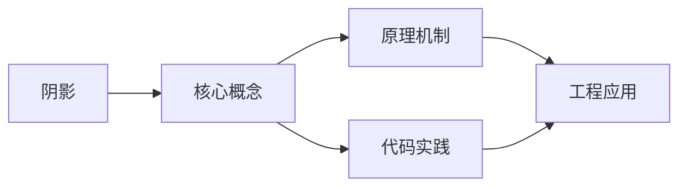
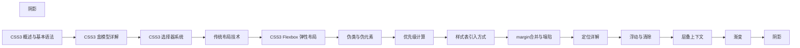

## 1. 学习目标（Bloom 分类）

本节按照布鲁姆教育目标分类学组织学习路径。本文主题为《阴影》，属于 CSS 模块，读者可以根据自身阶段选择阅读深度。

记忆层面：能够准确复述本文的核心概念、术语与基本语法或操作步骤，并能够在提问或检索时快速定位对应知识点。能够说出 CSS 的核心概念、术语与标准写法。

理解层面：能够用自己的语言解释核心原理与工作机制，说明概念之间的因果关系，而不是机械记忆结论。能够解释 CSS 的工作原理与设计动机。

应用层面：能够在真实项目或练习场景中运用本文知识解决具体问题，写出正确且可维护的实现。能够编写符合 CSS 规范的完整实现。

分析层面：能够拆解复杂问题，比较本文主题与相邻概念的异同，识别边界条件与例外情况。能够分析 CSS 与相邻方案的差异与边界。

评价层面：能够根据约束条件（性能、可读性、安全、成本）评价不同方案的优劣，做出有依据的技术决策。能够根据场景评价 CSS 相关方案的优劣。

创造层面：能够把本文知识与其他模块知识组合，设计出新的解决方案或可复用的工程模式。能够组合 CSS 与其他技术设计完整方案。

通过本节学习，读者应当能够把《阴影》纳入自己的知识网络，并与 CSS 模块的其他主题（选择器、盒模型、布局、动画、响应式）建立关联。

## 2. 历史动机与发展脉络

《阴影》是 CSS 领域的重要主题。要真正理解它，需要先了解它解决的问题与演进过程。

CSS 于 1994 年由 Håkon Wium Lie 提出，1996 年 CSS1 发布，解决 HTML 表现层混杂问题；CSS2.1（2011）与 CSS3 模块化（2012+）奠定现代 Web 样式基础。
现代 CSS 的能力版图：Flexbox/Grid 布局、自定义属性（变量）、容器查询、子网格、层叠层（@layer）、现代颜色（oklch）。
CSS 的设计核心是“层叠与继承”：来源、优先级、顺序共同决定最终样式；理解层叠是排查样式问题的前提。

回到本文主题：阴影 的提出与成熟，正是上述技术背景下的必然产物。早期实现往往以简单可用为目标，随着工程规模扩大，社区逐渐沉淀出标准做法与最佳实践；理解这一脉络，可以帮助读者判断“为什么文档中的推荐写法是现在这个样子”，也能在遇到历史遗留代码时准确识别其设计年代与取舍。


## 3. 形式化定义与核心概念精讲

本节把《阴影》涉及的核心概念以“定义 + 讲解”的形式展开。读者应把定义当作工具，把讲解当作理解路径；两者结合才能形成可迁移的知识。

选择器与优先级：id > class/属性/伪类 > 元素/伪元素；!important 打破优先级（应避免）。
盒模型：content/padding/border/margin，box-sizing 决定 width 语义（border-box 推荐）。
布局体系：普通流、浮动（历史）、Flexbox（一维）、Grid（二维）；position 定位（relative/absolute/fixed/sticky）。

### 3.1 原文章节逐一精讲

原文档把主题拆分为 15 个小节，下面按顺序给出每一节的导读讲解，随后保留原文细节供精读。

#### 原文精读（完整保留）

# CSS 阴影

> **符号约定**：`< >` 必填参数 | `[ ]` 可选参数

---

#### 1. box-shadow

```css
box-shadow: offset-x offset-y blur-radius spread-radius color inset;
```

```css
.box {
  box-shadow: 2px 2px 5px rgba(0, 0, 0, 0.3);
}
.box {
  box-shadow: inset 0 2px 4px rgba(0, 0, 0, 0.2);
}
.box {
  box-shadow:
    0 1px 2px rgba(0, 0, 0, 0.07),
    0 2px 4px rgba(0, 0, 0, 0.07),
    0 4px 8px rgba(0, 0, 0, 0.07);
}
```

#### 2. text-shadow

```css
.text {
  text-shadow: 2px 2px 4px rgba(0, 0, 0, 0.5);
}
.neon {
  text-shadow:
    0 0 7px #fff,
    0 0 42px #0fa,
    0 0 82px #0fa;
}
```

#### 3. 实战效果

```css
.card {
  box-shadow: 0 1px 3px rgba(0, 0, 0, 0.12);
  transition: box-shadow 0.3s;
}
.card:hover {
  box-shadow: 0 10px 40px rgba(0, 0, 0, 0.15);
}

.elevation-1 {
  box-shadow:
    0 1px 3px rgba(0, 0, 0, 0.12),
    0 1px 2px rgba(0, 0, 0, 0.24);
}
.elevation-2 {
  box-shadow:
    0 3px 6px rgba(0, 0, 0, 0.16),
    0 3px 6px rgba(0, 0, 0, 0.23);
}
```

#### 4. drop-shadow 滤镜

```css
.icon {
  filter: drop-shadow(2px 4px 6px rgba(0, 0, 0, 0.3));
}
```

box-shadow 沿盒子形状，drop-shadow 沿元素实际轮廓（适合 PNG 图标）。
#### box-shadow 盒阴影

**基本写法：外阴影**
`box-shadow: <水平偏移> <垂直偏移> <模糊> <颜色>;`
```css
/* 设置外阴影 */
.box {
  box-shadow: 2px 4px 8px rgba(0, 0, 0, 0.2);
}
```

---

**基本写法：带扩展的外阴影**
`box-shadow: <水平> <垂直> <模糊> <扩展> <颜色>;`
```css
/* 设置带扩展的外阴影 */
.box {
  box-shadow: 2px 4px 8px 2px rgba(0, 0, 0, 0.2);
}
```

---

**基本写法：内阴影**
`box-shadow: inset <水平> <垂直> <模糊> <颜色>;`
```css
/* 设置内阴影 */
.box {
  box-shadow: inset 0 0 10px rgba(0, 0, 0, 0.5);
}
```

---

**基本写法：无阴影**
`box-shadow: none;`
```css
/* 移除阴影 */
.box {
  box-shadow: none;
}
```

---

**单行写法：多重阴影**
`box-shadow: <阴影1>, <阴影2>;`
```css
/* 单行设置多重阴影 */
.box {
  box-shadow: 0 2px 4px rgba(0,0,0,0.2), 0 4px 8px rgba(0,0,0,0.1);
}
```

---

**换行写法：多重阴影**
`box-shadow: <阴影1>, <阴影2>, <阴影3>;`
```css
/* 换行设置多重阴影 */
.box {
  box-shadow:
    0 1px 2px rgba(0, 0, 0, 0.1),
    0 4px 8px rgba(0, 0, 0, 0.1),
    0 16px 32px rgba(0, 0, 0, 0.1);
}
```

---

#### 常见阴影效果

**基本写法：柔和阴影**
`box-shadow: 0 2px 8px rgba(0, 0, 0, 0.1);`
```css
/* 柔和的卡片阴影 */
.card {
  box-shadow: 0 2px 8px rgba(0, 0, 0, 0.1);
}
```

---

**基本写法：深阴影**
`box-shadow: 0 4px 12px rgba(0, 0, 0, 0.3);`
```css
/* 较深的阴影 */
.modal {
  box-shadow: 0 4px 12px rgba(0, 0, 0, 0.3);
}
```

---

**基本写法：底部阴影**
`box-shadow: 0 2px 4px rgba(0, 0, 0, 0.1);`
```css
/* 仅底部阴影 */
.header {
  box-shadow: 0 2px 4px rgba(0, 0, 0, 0.1);
}
```

---

**基本写法：四周阴影**
`box-shadow: 0 0 10px rgba(0, 0, 0, 0.1);`
```css
/* 四周均匀阴影 */
.box {
  box-shadow: 0 0 10px rgba(0, 0, 0, 0.1);
}
```

---

**基本写法：彩色阴影**
`box-shadow: 0 4px 12px rgba(0, 123, 255, 0.3);`
```css
/* 彩色阴影效果 */
.button {
  box-shadow: 0 4px 12px rgba(0, 123, 255, 0.3);
}
```

---

#### 材料设计阴影

**基本写法：Material 阴影 1 级**
`box-shadow: 0 1px 3px rgba(0,0,0,0.12), 0 1px 2px rgba(0,0,0,0.24);`
```css
/* Material Design 1 级阴影 */
.z1 {
  box-shadow: 0 1px 3px rgba(0,0,0,0.12), 0 1px 2px rgba(0,0,0,0.24);
}
```

---

**基本写法：Material 阴影 2 级**
`box-shadow: 0 3px 6px rgba(0,0,0,0.16), 0 3px 6px rgba(0,0,0,0.23);`
```css
/* Material Design 2 级阴影 */
.z2 {
  box-shadow: 0 3px 6px rgba(0,0,0,0.16), 0 3px 6px rgba(0,0,0,0.23);
}
```

---

**基本写法：Material 阴影 3 级**
`box-shadow: 0 10px 20px rgba(0,0,0,0.19), 0 6px 6px rgba(0,0,0,0.23);`
```css
/* Material Design 3 级阴影 */
.z3 {
  box-shadow: 0 10px 20px rgba(0,0,0,0.19), 0 6px 6px rgba(0,0,0,0.23);
}
```

---

**基本写法：Material 阴影 4 级**
`box-shadow: 0 14px 28px rgba(0,0,0,0.25), 0 10px 10px rgba(0,0,0,0.22);`
```css
/* Material Design 4 级阴影 */
.z4 {
  box-shadow: 0 14px 28px rgba(0,0,0,0.25), 0 10px 10px rgba(0,0,0,0.22);
}
```

---

**基本写法：Material 阴影 5 级**
`box-shadow: 0 19px 38px rgba(0,0,0,0.30), 0 15px 12px rgba(0,0,0,0.22);`
```css
/* Material Design 5 级阴影 */
.z5 {
  box-shadow: 0 19px 38px rgba(0,0,0,0.30), 0 15px 12px rgba(0,0,0,0.22);
}
```

---

#### text-shadow 文字阴影

**基本写法：文字阴影**
`text-shadow: <水平> <垂直> <模糊> <颜色>;`
```css
/* 设置文字阴影 */
.title {
  text-shadow: 2px 2px 4px rgba(0, 0, 0, 0.5);
}
```

---

**基本写法：文字发光**
`text-shadow: 0 0 10px <颜色>;`
```css
/* 文字发光效果 */
.glow {
  text-shadow: 0 0 10px rgba(0, 123, 255, 0.8);
}
```

---

**基本写法：文字描边**
`text-shadow: <方向1> <颜色>, <方向2> <颜色>, <方向3> <颜色>, <方向4> <颜色>;`
```css
/* 文字描边效果 */
.outline {
  text-shadow:
    -1px -1px 0 #000,
    1px -1px 0 #000,
    -1px 1px 0 #000,
    1px 1px 0 #000;
}
```

---

**单行写法：多重文字阴影**
`text-shadow: <阴影1>, <阴影2>;`
```css
/* 单行设置多重文字阴影 */
.text {
  text-shadow: 1px 1px 2px black, 0 0 10px blue;
}
```

---

**换行写法：多重文字阴影**
`text-shadow: <阴影1>, <阴影2>, <阴影3>;`
```css
/* 换行设置多重文字阴影 */
.text {
  text-shadow:
    1px 1px 2px black,
    0 0 10px blue,
    0 0 20px darkblue;
}
```

---

#### drop-shadow 滤镜阴影

**基本写法：drop-shadow 滤镜**
`filter: drop-shadow(<水平> <垂直> <模糊> <颜色>);`
```css
/* 使用滤镜创建阴影（跟随形状） */
.image {
  filter: drop-shadow(2px 4px 8px rgba(0, 0, 0, 0.3));
}
```

---

**基本写法：PNG 阴影**
`filter: drop-shadow(<水平> <垂直> <模糊> <颜色>);`
```css
/* 为透明 PNG 创建跟随形状的阴影 */
.logo {
  filter: drop-shadow(0 4px 8px rgba(0, 0, 0, 0.3));
}
```

---

#### 阴影动画

**基本写法：阴影过渡**
`transition: box-shadow <时长>;`
```css
/* 阴影过渡动画 */
.card {
  transition: box-shadow 0.3s;
}
.card:hover {
  box-shadow: 0 8px 16px rgba(0, 0, 0, 0.2);
}
```

---

**基本写法：阴影悬停效果**
`<选择器>:hover { box-shadow: <阴影>; }`
```css
/* 悬停时增强阴影 */
.button {
  box-shadow: 0 2px 4px rgba(0, 0, 0, 0.1);
  transition: box-shadow 0.3s;
}
.button:hover {
  box-shadow: 0 4px 12px rgba(0, 0, 0, 0.2);
}
```

---

**基本写法：阴影按下效果**
`<选择器>:active { box-shadow: <阴影>; }`
```css
/* 按下时减弱阴影 */
.button:active {
  box-shadow: 0 1px 2px rgba(0, 0, 0, 0.1);
}
```

---

#### 阴影变量

**基本写法：定义阴影变量**
`:root { --shadow-<名>: <阴影值>; }`
```css
/* 定义阴影变量 */
:root {
  --shadow-sm: 0 1px 2px rgba(0, 0, 0, 0.05);
  --shadow-md: 0 4px 6px rgba(0, 0, 0, 0.1);
  --shadow-lg: 0 10px 15px rgba(0, 0, 0, 0.1);
}
```

---

**基本写法：使用阴影变量**
`box-shadow: var(--shadow-<名>);`
```css
/* 使用阴影变量 */
.card {
  box-shadow: var(--shadow-md);
}
```

---

#### 响应式阴影

**基本写法：clamp 响应式阴影**
`box-shadow: 0 clamp(<最小>, <理想>, <最大>) <模糊> <颜色>;`
```css
/* 响应式阴影 */
.box {
  box-shadow: 0 clamp(2px, 1vw, 8px) 12px rgba(0, 0, 0, 0.1);
}
```

---

**基本写法：媒体查询调整阴影**
`@media (max-width: <值>) { box-shadow: <值>; }`
```css
/* 小屏幕调整阴影 */
.card {
  box-shadow: 0 4px 12px rgba(0, 0, 0, 0.15);
}
@media (max-width: 768px) {
  .card {
    box-shadow: 0 2px 6px rgba(0, 0, 0, 0.1);
  }
}
```

---

#### 内阴影效果

**基本写法：内凹效果**
`box-shadow: inset 0 2px 4px rgba(0, 0, 0, 0.1);`
```css
/* 创建内凹效果 */
.inset {
  box-shadow: inset 0 2px 4px rgba(0, 0, 0, 0.1);
}
```

---

**基本写法：内凸效果**
`box-shadow: inset 0 -2px 4px rgba(0, 0, 0, 0.1);`
```css
/* 创建内凸效果 */
.outset {
  box-shadow: inset 0 -2px 4px rgba(0, 0, 0, 0.1);
}
```

---

**基本写法：浮雕效果**
`box-shadow: inset 1px 1px 2px rgba(255,255,255,0.5), inset -1px -1px 2px rgba(0,0,0,0.1);`
```css
/* 创建浮雕效果 */
.embossed {
  box-shadow:
    inset 1px 1px 2px rgba(255,255,255,0.5),
    inset -1px -1px 2px rgba(0,0,0,0.1);
}
```

---

#### 长阴影

**单行写法：长阴影**
`box-shadow: <偏移1> <颜色>, <偏移2> <颜色>, <偏移3> <颜色>;`
```css
/* 单行长阴影效果 */
.long-shadow {
  box-shadow: 1px 1px rgba(0,0,0,0.1), 2px 2px rgba(0,0,0,0.1), 3px 3px rgba(0,0,0,0.1);
}
```

---

**换行写法：长阴影**
`box-shadow: <偏移1> <颜色>, <偏移2> <颜色>, <偏移3> <颜色>;`
```css
/* 换行长阴影效果 */
.long-shadow {
  box-shadow:
    1px 1px rgba(0,0,0,0.1),
    2px 2px rgba(0,0,0,0.1),
    3px 3px rgba(0,0,0,0.1),
    4px 4px rgba(0,0,0,0.1),
    5px 5px rgba(0,0,0,0.1);
}
```

---

#### 霓虹阴影

**基本写法：霓虹发光**
`box-shadow: 0 0 <模糊> <颜色>, 0 0 <模糊2> <颜色>;`
```css
/* 霓虹发光效果 */
.neon {
  box-shadow: 0 0 5px #007bff, 0 0 10px #007bff;
}
```

---

**基本写法：彩色霓虹**
`box-shadow: 0 0 <模糊> <颜色1>, 0 0 <模糊2> <颜色2>;`
```css
/* 多色霓虹效果 */
.neon-multi {
  box-shadow:
    0 0 5px #ff00ff,
    0 0 10px #00ffff;
}
```


### 3.2 概念关系图

下面用 Mermaid 图表达本文核心概念之间的关系，帮助读者建立整体图景：



图中展示的是本文知识的结构化关系：核心概念是入口，原理机制解释“为什么”，代码实践演示“怎么做”，工程应用回答“何时用”。读者学习时可以把每个小节的内容挂接到对应节点上。

## 4. 理论推导与原理解析

本节深入《阴影》背后的原理。理论部分不求面面俱到，而是聚焦“能解释现象、能指导实践”的关键推导。

选择器与优先级：id > class/属性/伪类 > 元素/伪元素；!important 打破优先级（应避免）。
盒模型：content/padding/border/margin，box-sizing 决定 width 语义（border-box 推荐）。
布局体系：普通流、浮动（历史）、Flexbox（一维）、Grid（二维）；position 定位（relative/absolute/fixed/sticky）。
层叠上下文：z-index 只在同一层叠上下文中比较；transform/opacity/filter 创建新上下文。

需要强调的是，理论推导与工程实践之间存在翻译层：理论给出的是理想化模型与边界条件，工程代码则必须处理真实环境中的例外。读者在学习时应先掌握理论的“标准情形”，再通过陷阱章节了解“非标准情形”。

## 5. 代码示例与逐行讲解

本节把原文中的代码示例系统整理，并为每个示例补充用途说明与讲解。读者不应只浏览代码，而应逐段对照讲解理解设计意图。

### 5.1 示例：1. box-shadow

该示例来自原文《1. box-shadow》小节，用于演示阴影相关操作。阅读时请先看代码结构，再看其后的讲解。

```css
box-shadow: offset-x offset-y blur-radius spread-radius color inset;
```

讲解：这段代码演示了本节核心知识点。代码中的关键操作可以归纳为三步：准备（定义或初始化）、执行（核心逻辑）、收尾（释放资源或返回结果）。实际项目中，这三步往往被封装为函数或类，以提升复用性与可测试性。

关键点分析：

该示例共 1 行有效代码，结构以数据或配置为主。阅读时应关注：数据字段的含义、配置项的作用，以及它们与运行行为的对应关系。

进阶思考路径：先尝试修改参数观察行为变化，再把示例中的模式迁移到自己的项目中；每次修改都记录预期与实测差异，这是把示例转化为能力的最快方式。

### 5.2 示例：1. box-shadow

该示例来自原文《1. box-shadow》小节，用于演示阴影相关操作。阅读时请先看代码结构，再看其后的讲解。

```css
.box {
  box-shadow: 2px 2px 5px rgba(0, 0, 0, 0.3);
}
.box {
  box-shadow: inset 0 2px 4px rgba(0, 0, 0, 0.2);
}
.box {
  box-shadow:
    0 1px 2px rgba(0, 0, 0, 0.07),
    0 2px 4px rgba(0, 0, 0, 0.07),
    0 4px 8px rgba(0, 0, 0, 0.07);
}
```

讲解：这段代码演示了本节核心知识点。代码中的关键操作可以归纳为三步：准备（定义或初始化）、执行（核心逻辑）、收尾（释放资源或返回结果）。实际项目中，这三步往往被封装为函数或类，以提升复用性与可测试性。

关键点分析：

该示例共 12 行有效代码，结构以数据或配置为主。阅读时应关注：数据字段的含义、配置项的作用，以及它们与运行行为的对应关系。

进阶思考路径：先尝试修改参数观察行为变化，再把示例中的模式迁移到自己的项目中；每次修改都记录预期与实测差异，这是把示例转化为能力的最快方式。

### 5.3 示例：2. text-shadow

该示例来自原文《2. text-shadow》小节，用于演示阴影相关操作。阅读时请先看代码结构，再看其后的讲解。

```css
.text {
  text-shadow: 2px 2px 4px rgba(0, 0, 0, 0.5);
}
.neon {
  text-shadow:
    0 0 7px #fff,
    0 0 42px #0fa,
    0 0 82px #0fa;
}
```

讲解：这段代码演示了本节核心知识点。代码中的关键操作可以归纳为三步：准备（定义或初始化）、执行（核心逻辑）、收尾（释放资源或返回结果）。实际项目中，这三步往往被封装为函数或类，以提升复用性与可测试性。

关键点分析：

该示例共 9 行有效代码，结构以数据或配置为主。阅读时应关注：数据字段的含义、配置项的作用，以及它们与运行行为的对应关系。

进阶思考路径：先尝试修改参数观察行为变化，再把示例中的模式迁移到自己的项目中；每次修改都记录预期与实测差异，这是把示例转化为能力的最快方式。

### 5.4 示例：3. 实战效果

该示例来自原文《3. 实战效果》小节，用于演示阴影相关操作。阅读时请先看代码结构，再看其后的讲解。

```css
.card {
  box-shadow: 0 1px 3px rgba(0, 0, 0, 0.12);
  transition: box-shadow 0.3s;
}
.card:hover {
  box-shadow: 0 10px 40px rgba(0, 0, 0, 0.15);
}

.elevation-1 {
  box-shadow:
    0 1px 3px rgba(0, 0, 0, 0.12),
    0 1px 2px rgba(0, 0, 0, 0.24);
}
.elevation-2 {
  box-shadow:
    0 3px 6px rgba(0, 0, 0, 0.16),
    0 3px 6px rgba(0, 0, 0, 0.23);
}
```

讲解：这段代码演示了本节核心知识点。代码中的关键操作可以归纳为三步：准备（定义或初始化）、执行（核心逻辑）、收尾（释放资源或返回结果）。实际项目中，这三步往往被封装为函数或类，以提升复用性与可测试性。

关键点分析：

该示例共 17 行有效代码，结构以数据或配置为主。阅读时应关注：数据字段的含义、配置项的作用，以及它们与运行行为的对应关系。

进阶思考路径：先尝试修改参数观察行为变化，再把示例中的模式迁移到自己的项目中；每次修改都记录预期与实测差异，这是把示例转化为能力的最快方式。

### 5.5 示例：4. drop-shadow 滤镜

该示例来自原文《4. drop-shadow 滤镜》小节，用于演示阴影相关操作。阅读时请先看代码结构，再看其后的讲解。

```css
.icon {
  filter: drop-shadow(2px 4px 6px rgba(0, 0, 0, 0.3));
}
```

讲解：这段代码演示了本节核心知识点。代码中的关键操作可以归纳为三步：准备（定义或初始化）、执行（核心逻辑）、收尾（释放资源或返回结果）。实际项目中，这三步往往被封装为函数或类，以提升复用性与可测试性。

关键点分析：

该示例共 3 行有效代码，结构以数据或配置为主。阅读时应关注：数据字段的含义、配置项的作用，以及它们与运行行为的对应关系。

进阶思考路径：先尝试修改参数观察行为变化，再把示例中的模式迁移到自己的项目中；每次修改都记录预期与实测差异，这是把示例转化为能力的最快方式。

### 5.6 示例：box-shadow 盒阴影

该示例来自原文《box-shadow 盒阴影》小节，用于演示阴影相关操作。阅读时请先看代码结构，再看其后的讲解。

```css
/* 设置外阴影 */
.box {
  box-shadow: 2px 4px 8px rgba(0, 0, 0, 0.2);
}
```

讲解：这段代码演示了本节核心知识点。代码中的关键操作可以归纳为三步：准备（定义或初始化）、执行（核心逻辑）、收尾（释放资源或返回结果）。实际项目中，这三步往往被封装为函数或类，以提升复用性与可测试性。

关键点分析：

该示例共 4 行有效代码，结构以数据或配置为主。阅读时应关注：数据字段的含义、配置项的作用，以及它们与运行行为的对应关系。

进阶思考路径：先尝试修改参数观察行为变化，再把示例中的模式迁移到自己的项目中；每次修改都记录预期与实测差异，这是把示例转化为能力的最快方式。

### 5.7 示例：box-shadow 盒阴影

该示例来自原文《box-shadow 盒阴影》小节，用于演示阴影相关操作。阅读时请先看代码结构，再看其后的讲解。

```css
/* 设置带扩展的外阴影 */
.box {
  box-shadow: 2px 4px 8px 2px rgba(0, 0, 0, 0.2);
}
```

讲解：这段代码演示了本节核心知识点。代码中的关键操作可以归纳为三步：准备（定义或初始化）、执行（核心逻辑）、收尾（释放资源或返回结果）。实际项目中，这三步往往被封装为函数或类，以提升复用性与可测试性。

关键点分析：

该示例共 4 行有效代码，结构以数据或配置为主。阅读时应关注：数据字段的含义、配置项的作用，以及它们与运行行为的对应关系。

进阶思考路径：先尝试修改参数观察行为变化，再把示例中的模式迁移到自己的项目中；每次修改都记录预期与实测差异，这是把示例转化为能力的最快方式。

### 5.8 示例：box-shadow 盒阴影

该示例来自原文《box-shadow 盒阴影》小节，用于演示阴影相关操作。阅读时请先看代码结构，再看其后的讲解。

```css
/* 设置内阴影 */
.box {
  box-shadow: inset 0 0 10px rgba(0, 0, 0, 0.5);
}
```

讲解：这段代码演示了本节核心知识点。代码中的关键操作可以归纳为三步：准备（定义或初始化）、执行（核心逻辑）、收尾（释放资源或返回结果）。实际项目中，这三步往往被封装为函数或类，以提升复用性与可测试性。

关键点分析：

该示例共 4 行有效代码，结构以数据或配置为主。阅读时应关注：数据字段的含义、配置项的作用，以及它们与运行行为的对应关系。

进阶思考路径：先尝试修改参数观察行为变化，再把示例中的模式迁移到自己的项目中；每次修改都记录预期与实测差异，这是把示例转化为能力的最快方式。

### 5.9 示例：box-shadow 盒阴影

该示例来自原文《box-shadow 盒阴影》小节，用于演示阴影相关操作。阅读时请先看代码结构，再看其后的讲解。

```css
/* 移除阴影 */
.box {
  box-shadow: none;
}
```

讲解：这段代码演示了本节核心知识点。代码中的关键操作可以归纳为三步：准备（定义或初始化）、执行（核心逻辑）、收尾（释放资源或返回结果）。实际项目中，这三步往往被封装为函数或类，以提升复用性与可测试性。

关键点分析：

该示例共 4 行有效代码，结构以数据或配置为主。阅读时应关注：数据字段的含义、配置项的作用，以及它们与运行行为的对应关系。

进阶思考路径：先尝试修改参数观察行为变化，再把示例中的模式迁移到自己的项目中；每次修改都记录预期与实测差异，这是把示例转化为能力的最快方式。

### 5.10 示例：box-shadow 盒阴影

该示例来自原文《box-shadow 盒阴影》小节，用于演示阴影相关操作。阅读时请先看代码结构，再看其后的讲解。

```css
/* 单行设置多重阴影 */
.box {
  box-shadow: 0 2px 4px rgba(0,0,0,0.2), 0 4px 8px rgba(0,0,0,0.1);
}
```

讲解：这段代码演示了本节核心知识点。代码中的关键操作可以归纳为三步：准备（定义或初始化）、执行（核心逻辑）、收尾（释放资源或返回结果）。实际项目中，这三步往往被封装为函数或类，以提升复用性与可测试性。

关键点分析：

该示例共 4 行有效代码，结构以数据或配置为主。阅读时应关注：数据字段的含义、配置项的作用，以及它们与运行行为的对应关系。

进阶思考路径：先尝试修改参数观察行为变化，再把示例中的模式迁移到自己的项目中；每次修改都记录预期与实测差异，这是把示例转化为能力的最快方式。

### 5.11 示例：box-shadow 盒阴影

该示例来自原文《box-shadow 盒阴影》小节，用于演示阴影相关操作。阅读时请先看代码结构，再看其后的讲解。

```css
/* 换行设置多重阴影 */
.box {
  box-shadow:
    0 1px 2px rgba(0, 0, 0, 0.1),
    0 4px 8px rgba(0, 0, 0, 0.1),
    0 16px 32px rgba(0, 0, 0, 0.1);
}
```

讲解：这段代码演示了本节核心知识点。代码中的关键操作可以归纳为三步：准备（定义或初始化）、执行（核心逻辑）、收尾（释放资源或返回结果）。实际项目中，这三步往往被封装为函数或类，以提升复用性与可测试性。

关键点分析：

该示例共 7 行有效代码，结构以数据或配置为主。阅读时应关注：数据字段的含义、配置项的作用，以及它们与运行行为的对应关系。

进阶思考路径：先尝试修改参数观察行为变化，再把示例中的模式迁移到自己的项目中；每次修改都记录预期与实测差异，这是把示例转化为能力的最快方式。

### 5.12 示例：常见阴影效果

该示例来自原文《常见阴影效果》小节，用于演示阴影相关操作。阅读时请先看代码结构，再看其后的讲解。

```css
/* 柔和的卡片阴影 */
.card {
  box-shadow: 0 2px 8px rgba(0, 0, 0, 0.1);
}
```

讲解：这段代码演示了本节核心知识点。代码中的关键操作可以归纳为三步：准备（定义或初始化）、执行（核心逻辑）、收尾（释放资源或返回结果）。实际项目中，这三步往往被封装为函数或类，以提升复用性与可测试性。

关键点分析：

该示例共 4 行有效代码，结构以数据或配置为主。阅读时应关注：数据字段的含义、配置项的作用，以及它们与运行行为的对应关系。

进阶思考路径：先尝试修改参数观察行为变化，再把示例中的模式迁移到自己的项目中；每次修改都记录预期与实测差异，这是把示例转化为能力的最快方式。

### 5.13 示例：常见阴影效果

该示例来自原文《常见阴影效果》小节，用于演示阴影相关操作。阅读时请先看代码结构，再看其后的讲解。

```css
/* 较深的阴影 */
.modal {
  box-shadow: 0 4px 12px rgba(0, 0, 0, 0.3);
}
```

讲解：这段代码演示了本节核心知识点。代码中的关键操作可以归纳为三步：准备（定义或初始化）、执行（核心逻辑）、收尾（释放资源或返回结果）。实际项目中，这三步往往被封装为函数或类，以提升复用性与可测试性。

关键点分析：

该示例共 4 行有效代码，结构以数据或配置为主。阅读时应关注：数据字段的含义、配置项的作用，以及它们与运行行为的对应关系。

进阶思考路径：先尝试修改参数观察行为变化，再把示例中的模式迁移到自己的项目中；每次修改都记录预期与实测差异，这是把示例转化为能力的最快方式。

### 5.14 示例：常见阴影效果

该示例来自原文《常见阴影效果》小节，用于演示阴影相关操作。阅读时请先看代码结构，再看其后的讲解。

```css
/* 仅底部阴影 */
.header {
  box-shadow: 0 2px 4px rgba(0, 0, 0, 0.1);
}
```

讲解：这段代码演示了本节核心知识点。代码中的关键操作可以归纳为三步：准备（定义或初始化）、执行（核心逻辑）、收尾（释放资源或返回结果）。实际项目中，这三步往往被封装为函数或类，以提升复用性与可测试性。

关键点分析：

该示例共 4 行有效代码，结构以数据或配置为主。阅读时应关注：数据字段的含义、配置项的作用，以及它们与运行行为的对应关系。

进阶思考路径：先尝试修改参数观察行为变化，再把示例中的模式迁移到自己的项目中；每次修改都记录预期与实测差异，这是把示例转化为能力的最快方式。

### 5.15 示例：常见阴影效果

该示例来自原文《常见阴影效果》小节，用于演示阴影相关操作。阅读时请先看代码结构，再看其后的讲解。

```css
/* 四周均匀阴影 */
.box {
  box-shadow: 0 0 10px rgba(0, 0, 0, 0.1);
}
```

讲解：这段代码演示了本节核心知识点。代码中的关键操作可以归纳为三步：准备（定义或初始化）、执行（核心逻辑）、收尾（释放资源或返回结果）。实际项目中，这三步往往被封装为函数或类，以提升复用性与可测试性。

关键点分析：

该示例共 4 行有效代码，结构以数据或配置为主。阅读时应关注：数据字段的含义、配置项的作用，以及它们与运行行为的对应关系。

进阶思考路径：先尝试修改参数观察行为变化，再把示例中的模式迁移到自己的项目中；每次修改都记录预期与实测差异，这是把示例转化为能力的最快方式。

### 5.16 示例：常见阴影效果

该示例来自原文《常见阴影效果》小节，用于演示阴影相关操作。阅读时请先看代码结构，再看其后的讲解。

```css
/* 彩色阴影效果 */
.button {
  box-shadow: 0 4px 12px rgba(0, 123, 255, 0.3);
}
```

讲解：这段代码演示了本节核心知识点。代码中的关键操作可以归纳为三步：准备（定义或初始化）、执行（核心逻辑）、收尾（释放资源或返回结果）。实际项目中，这三步往往被封装为函数或类，以提升复用性与可测试性。

关键点分析：

该示例共 4 行有效代码，结构以数据或配置为主。阅读时应关注：数据字段的含义、配置项的作用，以及它们与运行行为的对应关系。

进阶思考路径：先尝试修改参数观察行为变化，再把示例中的模式迁移到自己的项目中；每次修改都记录预期与实测差异，这是把示例转化为能力的最快方式。

### 5.17 示例：材料设计阴影

该示例来自原文《材料设计阴影》小节，用于演示阴影相关操作。阅读时请先看代码结构，再看其后的讲解。

```css
/* Material Design 1 级阴影 */
.z1 {
  box-shadow: 0 1px 3px rgba(0,0,0,0.12), 0 1px 2px rgba(0,0,0,0.24);
}
```

讲解：这段代码演示了本节核心知识点。代码中的关键操作可以归纳为三步：准备（定义或初始化）、执行（核心逻辑）、收尾（释放资源或返回结果）。实际项目中，这三步往往被封装为函数或类，以提升复用性与可测试性。

关键点分析：

该示例共 4 行有效代码，结构以数据或配置为主。阅读时应关注：数据字段的含义、配置项的作用，以及它们与运行行为的对应关系。

进阶思考路径：先尝试修改参数观察行为变化，再把示例中的模式迁移到自己的项目中；每次修改都记录预期与实测差异，这是把示例转化为能力的最快方式。

### 5.18 示例：材料设计阴影

该示例来自原文《材料设计阴影》小节，用于演示阴影相关操作。阅读时请先看代码结构，再看其后的讲解。

```css
/* Material Design 2 级阴影 */
.z2 {
  box-shadow: 0 3px 6px rgba(0,0,0,0.16), 0 3px 6px rgba(0,0,0,0.23);
}
```

讲解：这段代码演示了本节核心知识点。代码中的关键操作可以归纳为三步：准备（定义或初始化）、执行（核心逻辑）、收尾（释放资源或返回结果）。实际项目中，这三步往往被封装为函数或类，以提升复用性与可测试性。

关键点分析：

该示例共 4 行有效代码，结构以数据或配置为主。阅读时应关注：数据字段的含义、配置项的作用，以及它们与运行行为的对应关系。

进阶思考路径：先尝试修改参数观察行为变化，再把示例中的模式迁移到自己的项目中；每次修改都记录预期与实测差异，这是把示例转化为能力的最快方式。

### 5.19 示例：材料设计阴影

该示例来自原文《材料设计阴影》小节，用于演示阴影相关操作。阅读时请先看代码结构，再看其后的讲解。

```css
/* Material Design 3 级阴影 */
.z3 {
  box-shadow: 0 10px 20px rgba(0,0,0,0.19), 0 6px 6px rgba(0,0,0,0.23);
}
```

讲解：这段代码演示了本节核心知识点。代码中的关键操作可以归纳为三步：准备（定义或初始化）、执行（核心逻辑）、收尾（释放资源或返回结果）。实际项目中，这三步往往被封装为函数或类，以提升复用性与可测试性。

关键点分析：

该示例共 4 行有效代码，结构以数据或配置为主。阅读时应关注：数据字段的含义、配置项的作用，以及它们与运行行为的对应关系。

进阶思考路径：先尝试修改参数观察行为变化，再把示例中的模式迁移到自己的项目中；每次修改都记录预期与实测差异，这是把示例转化为能力的最快方式。

### 5.20 示例：材料设计阴影

该示例来自原文《材料设计阴影》小节，用于演示阴影相关操作。阅读时请先看代码结构，再看其后的讲解。

```css
/* Material Design 4 级阴影 */
.z4 {
  box-shadow: 0 14px 28px rgba(0,0,0,0.25), 0 10px 10px rgba(0,0,0,0.22);
}
```

讲解：这段代码演示了本节核心知识点。代码中的关键操作可以归纳为三步：准备（定义或初始化）、执行（核心逻辑）、收尾（释放资源或返回结果）。实际项目中，这三步往往被封装为函数或类，以提升复用性与可测试性。

关键点分析：

该示例共 4 行有效代码，结构以数据或配置为主。阅读时应关注：数据字段的含义、配置项的作用，以及它们与运行行为的对应关系。

进阶思考路径：先尝试修改参数观察行为变化，再把示例中的模式迁移到自己的项目中；每次修改都记录预期与实测差异，这是把示例转化为能力的最快方式。

### 5.21 示例：材料设计阴影

该示例来自原文《材料设计阴影》小节，用于演示阴影相关操作。阅读时请先看代码结构，再看其后的讲解。

```css
/* Material Design 5 级阴影 */
.z5 {
  box-shadow: 0 19px 38px rgba(0,0,0,0.30), 0 15px 12px rgba(0,0,0,0.22);
}
```

讲解：这段代码演示了本节核心知识点。代码中的关键操作可以归纳为三步：准备（定义或初始化）、执行（核心逻辑）、收尾（释放资源或返回结果）。实际项目中，这三步往往被封装为函数或类，以提升复用性与可测试性。

关键点分析：

该示例共 4 行有效代码，结构以数据或配置为主。阅读时应关注：数据字段的含义、配置项的作用，以及它们与运行行为的对应关系。

进阶思考路径：先尝试修改参数观察行为变化，再把示例中的模式迁移到自己的项目中；每次修改都记录预期与实测差异，这是把示例转化为能力的最快方式。

### 5.22 示例：text-shadow 文字阴影

该示例来自原文《text-shadow 文字阴影》小节，用于演示阴影相关操作。阅读时请先看代码结构，再看其后的讲解。

```css
/* 设置文字阴影 */
.title {
  text-shadow: 2px 2px 4px rgba(0, 0, 0, 0.5);
}
```

讲解：这段代码演示了本节核心知识点。代码中的关键操作可以归纳为三步：准备（定义或初始化）、执行（核心逻辑）、收尾（释放资源或返回结果）。实际项目中，这三步往往被封装为函数或类，以提升复用性与可测试性。

关键点分析：

该示例共 4 行有效代码，结构以数据或配置为主。阅读时应关注：数据字段的含义、配置项的作用，以及它们与运行行为的对应关系。

进阶思考路径：先尝试修改参数观察行为变化，再把示例中的模式迁移到自己的项目中；每次修改都记录预期与实测差异，这是把示例转化为能力的最快方式。

### 5.23 示例：text-shadow 文字阴影

该示例来自原文《text-shadow 文字阴影》小节，用于演示阴影相关操作。阅读时请先看代码结构，再看其后的讲解。

```css
/* 文字发光效果 */
.glow {
  text-shadow: 0 0 10px rgba(0, 123, 255, 0.8);
}
```

讲解：这段代码演示了本节核心知识点。代码中的关键操作可以归纳为三步：准备（定义或初始化）、执行（核心逻辑）、收尾（释放资源或返回结果）。实际项目中，这三步往往被封装为函数或类，以提升复用性与可测试性。

关键点分析：

该示例共 4 行有效代码，结构以数据或配置为主。阅读时应关注：数据字段的含义、配置项的作用，以及它们与运行行为的对应关系。

进阶思考路径：先尝试修改参数观察行为变化，再把示例中的模式迁移到自己的项目中；每次修改都记录预期与实测差异，这是把示例转化为能力的最快方式。

### 5.24 示例：text-shadow 文字阴影

该示例来自原文《text-shadow 文字阴影》小节，用于演示阴影相关操作。阅读时请先看代码结构，再看其后的讲解。

```css
/* 文字描边效果 */
.outline {
  text-shadow:
    -1px -1px 0 #000,
    1px -1px 0 #000,
    -1px 1px 0 #000,
    1px 1px 0 #000;
}
```

讲解：这段代码演示了本节核心知识点。代码中的关键操作可以归纳为三步：准备（定义或初始化）、执行（核心逻辑）、收尾（释放资源或返回结果）。实际项目中，这三步往往被封装为函数或类，以提升复用性与可测试性。

关键点分析：

该示例共 8 行有效代码，结构以数据或配置为主。阅读时应关注：数据字段的含义、配置项的作用，以及它们与运行行为的对应关系。

进阶思考路径：先尝试修改参数观察行为变化，再把示例中的模式迁移到自己的项目中；每次修改都记录预期与实测差异，这是把示例转化为能力的最快方式。

### 5.25 示例：text-shadow 文字阴影

该示例来自原文《text-shadow 文字阴影》小节，用于演示阴影相关操作。阅读时请先看代码结构，再看其后的讲解。

```css
/* 单行设置多重文字阴影 */
.text {
  text-shadow: 1px 1px 2px black, 0 0 10px blue;
}
```

讲解：这段代码演示了本节核心知识点。代码中的关键操作可以归纳为三步：准备（定义或初始化）、执行（核心逻辑）、收尾（释放资源或返回结果）。实际项目中，这三步往往被封装为函数或类，以提升复用性与可测试性。

关键点分析：

该示例共 4 行有效代码，结构以数据或配置为主。阅读时应关注：数据字段的含义、配置项的作用，以及它们与运行行为的对应关系。

进阶思考路径：先尝试修改参数观察行为变化，再把示例中的模式迁移到自己的项目中；每次修改都记录预期与实测差异，这是把示例转化为能力的最快方式。

### 5.26 示例：text-shadow 文字阴影

该示例来自原文《text-shadow 文字阴影》小节，用于演示阴影相关操作。阅读时请先看代码结构，再看其后的讲解。

```css
/* 换行设置多重文字阴影 */
.text {
  text-shadow:
    1px 1px 2px black,
    0 0 10px blue,
    0 0 20px darkblue;
}
```

讲解：这段代码演示了本节核心知识点。代码中的关键操作可以归纳为三步：准备（定义或初始化）、执行（核心逻辑）、收尾（释放资源或返回结果）。实际项目中，这三步往往被封装为函数或类，以提升复用性与可测试性。

关键点分析：

该示例共 7 行有效代码，结构以数据或配置为主。阅读时应关注：数据字段的含义、配置项的作用，以及它们与运行行为的对应关系。

进阶思考路径：先尝试修改参数观察行为变化，再把示例中的模式迁移到自己的项目中；每次修改都记录预期与实测差异，这是把示例转化为能力的最快方式。

### 5.27 示例：drop-shadow 滤镜阴影

该示例来自原文《drop-shadow 滤镜阴影》小节，用于演示阴影相关操作。阅读时请先看代码结构，再看其后的讲解。

```css
/* 使用滤镜创建阴影（跟随形状） */
.image {
  filter: drop-shadow(2px 4px 8px rgba(0, 0, 0, 0.3));
}
```

讲解：这段代码演示了本节核心知识点。代码中的关键操作可以归纳为三步：准备（定义或初始化）、执行（核心逻辑）、收尾（释放资源或返回结果）。实际项目中，这三步往往被封装为函数或类，以提升复用性与可测试性。

关键点分析：

该示例共 4 行有效代码，结构以数据或配置为主。阅读时应关注：数据字段的含义、配置项的作用，以及它们与运行行为的对应关系。

进阶思考路径：先尝试修改参数观察行为变化，再把示例中的模式迁移到自己的项目中；每次修改都记录预期与实测差异，这是把示例转化为能力的最快方式。

### 5.28 示例：drop-shadow 滤镜阴影

该示例来自原文《drop-shadow 滤镜阴影》小节，用于演示阴影相关操作。阅读时请先看代码结构，再看其后的讲解。

```css
/* 为透明 PNG 创建跟随形状的阴影 */
.logo {
  filter: drop-shadow(0 4px 8px rgba(0, 0, 0, 0.3));
}
```

讲解：这段代码演示了本节核心知识点。代码中的关键操作可以归纳为三步：准备（定义或初始化）、执行（核心逻辑）、收尾（释放资源或返回结果）。实际项目中，这三步往往被封装为函数或类，以提升复用性与可测试性。

关键点分析：

该示例共 4 行有效代码，结构以数据或配置为主。阅读时应关注：数据字段的含义、配置项的作用，以及它们与运行行为的对应关系。

进阶思考路径：先尝试修改参数观察行为变化，再把示例中的模式迁移到自己的项目中；每次修改都记录预期与实测差异，这是把示例转化为能力的最快方式。

### 5.29 示例：阴影动画

该示例来自原文《阴影动画》小节，用于演示阴影相关操作。阅读时请先看代码结构，再看其后的讲解。

```css
/* 阴影过渡动画 */
.card {
  transition: box-shadow 0.3s;
}
.card:hover {
  box-shadow: 0 8px 16px rgba(0, 0, 0, 0.2);
}
```

讲解：这段代码演示了本节核心知识点。代码中的关键操作可以归纳为三步：准备（定义或初始化）、执行（核心逻辑）、收尾（释放资源或返回结果）。实际项目中，这三步往往被封装为函数或类，以提升复用性与可测试性。

关键点分析：

该示例共 7 行有效代码，结构以数据或配置为主。阅读时应关注：数据字段的含义、配置项的作用，以及它们与运行行为的对应关系。

进阶思考路径：先尝试修改参数观察行为变化，再把示例中的模式迁移到自己的项目中；每次修改都记录预期与实测差异，这是把示例转化为能力的最快方式。

### 5.30 示例：阴影动画

该示例来自原文《阴影动画》小节，用于演示阴影相关操作。阅读时请先看代码结构，再看其后的讲解。

```css
/* 悬停时增强阴影 */
.button {
  box-shadow: 0 2px 4px rgba(0, 0, 0, 0.1);
  transition: box-shadow 0.3s;
}
.button:hover {
  box-shadow: 0 4px 12px rgba(0, 0, 0, 0.2);
}
```

讲解：这段代码演示了本节核心知识点。代码中的关键操作可以归纳为三步：准备（定义或初始化）、执行（核心逻辑）、收尾（释放资源或返回结果）。实际项目中，这三步往往被封装为函数或类，以提升复用性与可测试性。

关键点分析：

该示例共 8 行有效代码，结构以数据或配置为主。阅读时应关注：数据字段的含义、配置项的作用，以及它们与运行行为的对应关系。

进阶思考路径：先尝试修改参数观察行为变化，再把示例中的模式迁移到自己的项目中；每次修改都记录预期与实测差异，这是把示例转化为能力的最快方式。

### 5.31 示例：阴影动画

该示例来自原文《阴影动画》小节，用于演示阴影相关操作。阅读时请先看代码结构，再看其后的讲解。

```css
/* 按下时减弱阴影 */
.button:active {
  box-shadow: 0 1px 2px rgba(0, 0, 0, 0.1);
}
```

讲解：这段代码演示了本节核心知识点。代码中的关键操作可以归纳为三步：准备（定义或初始化）、执行（核心逻辑）、收尾（释放资源或返回结果）。实际项目中，这三步往往被封装为函数或类，以提升复用性与可测试性。

关键点分析：

该示例共 4 行有效代码，结构以数据或配置为主。阅读时应关注：数据字段的含义、配置项的作用，以及它们与运行行为的对应关系。

进阶思考路径：先尝试修改参数观察行为变化，再把示例中的模式迁移到自己的项目中；每次修改都记录预期与实测差异，这是把示例转化为能力的最快方式。

### 5.32 示例：阴影变量

该示例来自原文《阴影变量》小节，用于演示阴影相关操作。阅读时请先看代码结构，再看其后的讲解。

```css
/* 定义阴影变量 */
:root {
  --shadow-sm: 0 1px 2px rgba(0, 0, 0, 0.05);
  --shadow-md: 0 4px 6px rgba(0, 0, 0, 0.1);
  --shadow-lg: 0 10px 15px rgba(0, 0, 0, 0.1);
}
```

讲解：这段代码演示了本节核心知识点。代码中的关键操作可以归纳为三步：准备（定义或初始化）、执行（核心逻辑）、收尾（释放资源或返回结果）。实际项目中，这三步往往被封装为函数或类，以提升复用性与可测试性。

关键点分析：

该示例共 6 行有效代码，结构以数据或配置为主。阅读时应关注：数据字段的含义、配置项的作用，以及它们与运行行为的对应关系。

进阶思考路径：先尝试修改参数观察行为变化，再把示例中的模式迁移到自己的项目中；每次修改都记录预期与实测差异，这是把示例转化为能力的最快方式。

### 5.33 示例：阴影变量

该示例来自原文《阴影变量》小节，用于演示阴影相关操作。阅读时请先看代码结构，再看其后的讲解。

```css
/* 使用阴影变量 */
.card {
  box-shadow: var(--shadow-md);
}
```

讲解：这段代码演示了本节核心知识点。代码中的关键操作可以归纳为三步：准备（定义或初始化）、执行（核心逻辑）、收尾（释放资源或返回结果）。实际项目中，这三步往往被封装为函数或类，以提升复用性与可测试性。

关键点分析：

该示例共 4 行有效代码，结构以数据或配置为主。阅读时应关注：数据字段的含义、配置项的作用，以及它们与运行行为的对应关系。

进阶思考路径：先尝试修改参数观察行为变化，再把示例中的模式迁移到自己的项目中；每次修改都记录预期与实测差异，这是把示例转化为能力的最快方式。

### 5.34 示例：响应式阴影

该示例来自原文《响应式阴影》小节，用于演示阴影相关操作。阅读时请先看代码结构，再看其后的讲解。

```css
/* 响应式阴影 */
.box {
  box-shadow: 0 clamp(2px, 1vw, 8px) 12px rgba(0, 0, 0, 0.1);
}
```

讲解：这段代码演示了本节核心知识点。代码中的关键操作可以归纳为三步：准备（定义或初始化）、执行（核心逻辑）、收尾（释放资源或返回结果）。实际项目中，这三步往往被封装为函数或类，以提升复用性与可测试性。

关键点分析：

该示例共 4 行有效代码，结构以数据或配置为主。阅读时应关注：数据字段的含义、配置项的作用，以及它们与运行行为的对应关系。

进阶思考路径：先尝试修改参数观察行为变化，再把示例中的模式迁移到自己的项目中；每次修改都记录预期与实测差异，这是把示例转化为能力的最快方式。

### 5.35 示例：响应式阴影

该示例来自原文《响应式阴影》小节，用于演示阴影相关操作。阅读时请先看代码结构，再看其后的讲解。

```css
/* 小屏幕调整阴影 */
.card {
  box-shadow: 0 4px 12px rgba(0, 0, 0, 0.15);
}
@media (max-width: 768px) {
  .card {
    box-shadow: 0 2px 6px rgba(0, 0, 0, 0.1);
  }
}
```

讲解：这段代码演示了本节核心知识点。代码中的关键操作可以归纳为三步：准备（定义或初始化）、执行（核心逻辑）、收尾（释放资源或返回结果）。实际项目中，这三步往往被封装为函数或类，以提升复用性与可测试性。

关键点分析：

该示例共 9 行有效代码，结构以数据或配置为主。阅读时应关注：数据字段的含义、配置项的作用，以及它们与运行行为的对应关系。

进阶思考路径：先尝试修改参数观察行为变化，再把示例中的模式迁移到自己的项目中；每次修改都记录预期与实测差异，这是把示例转化为能力的最快方式。

### 5.36 示例：内阴影效果

该示例来自原文《内阴影效果》小节，用于演示阴影相关操作。阅读时请先看代码结构，再看其后的讲解。

```css
/* 创建内凹效果 */
.inset {
  box-shadow: inset 0 2px 4px rgba(0, 0, 0, 0.1);
}
```

讲解：这段代码演示了本节核心知识点。代码中的关键操作可以归纳为三步：准备（定义或初始化）、执行（核心逻辑）、收尾（释放资源或返回结果）。实际项目中，这三步往往被封装为函数或类，以提升复用性与可测试性。

关键点分析：

该示例共 4 行有效代码，结构以数据或配置为主。阅读时应关注：数据字段的含义、配置项的作用，以及它们与运行行为的对应关系。

进阶思考路径：先尝试修改参数观察行为变化，再把示例中的模式迁移到自己的项目中；每次修改都记录预期与实测差异，这是把示例转化为能力的最快方式。

### 5.37 示例：内阴影效果

该示例来自原文《内阴影效果》小节，用于演示阴影相关操作。阅读时请先看代码结构，再看其后的讲解。

```css
/* 创建内凸效果 */
.outset {
  box-shadow: inset 0 -2px 4px rgba(0, 0, 0, 0.1);
}
```

讲解：这段代码演示了本节核心知识点。代码中的关键操作可以归纳为三步：准备（定义或初始化）、执行（核心逻辑）、收尾（释放资源或返回结果）。实际项目中，这三步往往被封装为函数或类，以提升复用性与可测试性。

关键点分析：

该示例共 4 行有效代码，结构以数据或配置为主。阅读时应关注：数据字段的含义、配置项的作用，以及它们与运行行为的对应关系。

进阶思考路径：先尝试修改参数观察行为变化，再把示例中的模式迁移到自己的项目中；每次修改都记录预期与实测差异，这是把示例转化为能力的最快方式。

### 5.38 示例：内阴影效果

该示例来自原文《内阴影效果》小节，用于演示阴影相关操作。阅读时请先看代码结构，再看其后的讲解。

```css
/* 创建浮雕效果 */
.embossed {
  box-shadow:
    inset 1px 1px 2px rgba(255,255,255,0.5),
    inset -1px -1px 2px rgba(0,0,0,0.1);
}
```

讲解：这段代码演示了本节核心知识点。代码中的关键操作可以归纳为三步：准备（定义或初始化）、执行（核心逻辑）、收尾（释放资源或返回结果）。实际项目中，这三步往往被封装为函数或类，以提升复用性与可测试性。

关键点分析：

该示例共 6 行有效代码，结构以数据或配置为主。阅读时应关注：数据字段的含义、配置项的作用，以及它们与运行行为的对应关系。

进阶思考路径：先尝试修改参数观察行为变化，再把示例中的模式迁移到自己的项目中；每次修改都记录预期与实测差异，这是把示例转化为能力的最快方式。

### 5.39 示例：长阴影

该示例来自原文《长阴影》小节，用于演示阴影相关操作。阅读时请先看代码结构，再看其后的讲解。

```css
/* 单行长阴影效果 */
.long-shadow {
  box-shadow: 1px 1px rgba(0,0,0,0.1), 2px 2px rgba(0,0,0,0.1), 3px 3px rgba(0,0,0,0.1);
}
```

讲解：这段代码演示了本节核心知识点。代码中的关键操作可以归纳为三步：准备（定义或初始化）、执行（核心逻辑）、收尾（释放资源或返回结果）。实际项目中，这三步往往被封装为函数或类，以提升复用性与可测试性。

关键点分析：

该示例共 4 行有效代码，结构以数据或配置为主。阅读时应关注：数据字段的含义、配置项的作用，以及它们与运行行为的对应关系。

进阶思考路径：先尝试修改参数观察行为变化，再把示例中的模式迁移到自己的项目中；每次修改都记录预期与实测差异，这是把示例转化为能力的最快方式。

### 5.40 示例：长阴影

该示例来自原文《长阴影》小节，用于演示阴影相关操作。阅读时请先看代码结构，再看其后的讲解。

```css
/* 换行长阴影效果 */
.long-shadow {
  box-shadow:
    1px 1px rgba(0,0,0,0.1),
    2px 2px rgba(0,0,0,0.1),
    3px 3px rgba(0,0,0,0.1),
    4px 4px rgba(0,0,0,0.1),
    5px 5px rgba(0,0,0,0.1);
}
```

讲解：这段代码演示了本节核心知识点。代码中的关键操作可以归纳为三步：准备（定义或初始化）、执行（核心逻辑）、收尾（释放资源或返回结果）。实际项目中，这三步往往被封装为函数或类，以提升复用性与可测试性。

关键点分析：

该示例共 9 行有效代码，结构以数据或配置为主。阅读时应关注：数据字段的含义、配置项的作用，以及它们与运行行为的对应关系。

进阶思考路径：先尝试修改参数观察行为变化，再把示例中的模式迁移到自己的项目中；每次修改都记录预期与实测差异，这是把示例转化为能力的最快方式。

### 5.41 示例：霓虹阴影

该示例来自原文《霓虹阴影》小节，用于演示阴影相关操作。阅读时请先看代码结构，再看其后的讲解。

```css
/* 霓虹发光效果 */
.neon {
  box-shadow: 0 0 5px #007bff, 0 0 10px #007bff;
}
```

讲解：这段代码演示了本节核心知识点。代码中的关键操作可以归纳为三步：准备（定义或初始化）、执行（核心逻辑）、收尾（释放资源或返回结果）。实际项目中，这三步往往被封装为函数或类，以提升复用性与可测试性。

关键点分析：

该示例共 4 行有效代码，结构以数据或配置为主。阅读时应关注：数据字段的含义、配置项的作用，以及它们与运行行为的对应关系。

进阶思考路径：先尝试修改参数观察行为变化，再把示例中的模式迁移到自己的项目中；每次修改都记录预期与实测差异，这是把示例转化为能力的最快方式。

### 5.42 示例：霓虹阴影

该示例来自原文《霓虹阴影》小节，用于演示阴影相关操作。阅读时请先看代码结构，再看其后的讲解。

```css
/* 多色霓虹效果 */
.neon-multi {
  box-shadow:
    0 0 5px #ff00ff,
    0 0 10px #00ffff;
}
```

讲解：这段代码演示了本节核心知识点。代码中的关键操作可以归纳为三步：准备（定义或初始化）、执行（核心逻辑）、收尾（释放资源或返回结果）。实际项目中，这三步往往被封装为函数或类，以提升复用性与可测试性。

关键点分析：

该示例共 6 行有效代码，结构以数据或配置为主。阅读时应关注：数据字段的含义、配置项的作用，以及它们与运行行为的对应关系。

进阶思考路径：先尝试修改参数观察行为变化，再把示例中的模式迁移到自己的项目中；每次修改都记录预期与实测差异，这是把示例转化为能力的最快方式。


综合以上示例，可以总结出本主题的代码实践要点：第一，先定义清晰的输入输出契约；第二，核心逻辑保持单一职责；第三，错误处理与边界条件不可省略；第四，命名与注释表达意图而非复述代码。

## 6. 对比分析

对比是理解《阴影》定位的最快路径。下面从多个维度与相邻方案进行对比。

Flexbox 与 Grid：一维布局（导航、按钮组）用 Flex；二维布局（页面网格、卡片墙）用 Grid。
浮动与现代布局：浮动是文字环绕工具，布局已由 Flex/Grid 取代。
媒体查询与容器查询：视口级用媒体查询，组件级用容器查询。

对比的目的不是分出绝对优劣，而是建立选择依据：不同约束条件下，最优解不同。读者应把每个对比维度转化为决策检查清单。

## 7. 常见陷阱与最佳实践

本节整理该主题的高频错误与推荐做法。每个陷阱先描述现象，再解释原因，最后给出最佳实践。

### 7.1 !important 滥用

覆盖链失控。通过优先级与结构设计解决。

深入讲解：该问题之所以被归类为“常见陷阱”，是因为它在初学者的代码中反复出现，而且往往不在第一时间暴露——错误通常隐藏在特定数据或特定时序下。

从成因上看，!important 滥用 一般源于对 CSS 某个机制的理解偏差：要么误用了默认行为，要么忽略了边界条件，要么把其他语言的思维惯性带了过来。

从影响上看，!important 滥用 轻则产生错误结果，重则导致资源泄漏、数据损坏或安全事故；这也是为什么工程评审中会把它列为检查项。

从修复策略上看，处理!important 滥用的正确顺序是：先复现（构造最小用例），再定位（确认机制层面的根因），最后修复并补充回归测试。跳过复现直接改代码，往往治标不治本。

### 7.2 全局选择器

* 选择器影响性能与意外覆盖。使用类与作用域。

深入讲解：该问题之所以被归类为“常见陷阱”，是因为它在初学者的代码中反复出现，而且往往不在第一时间暴露——错误通常隐藏在特定数据或特定时序下。

从成因上看，全局选择器 一般源于对 CSS 某个机制的理解偏差：要么误用了默认行为，要么忽略了边界条件，要么把其他语言的思维惯性带了过来。

从影响上看，全局选择器 轻则产生错误结果，重则导致资源泄漏、数据损坏或安全事故；这也是为什么工程评审中会把它列为检查项。

从修复策略上看，处理全局选择器的正确顺序是：先复现（构造最小用例），再定位（确认机制层面的根因），最后修复并补充回归测试。跳过复现直接改代码，往往治标不治本。

### 7.3 rem 与 em 混淆

em 相对父级字体，rem 相对根；嵌套 em 累积。间距字号统一 rem。

深入讲解：该问题之所以被归类为“常见陷阱”，是因为它在初学者的代码中反复出现，而且往往不在第一时间暴露——错误通常隐藏在特定数据或特定时序下。

从成因上看，rem 与 em 混淆 一般源于对 CSS 某个机制的理解偏差：要么误用了默认行为，要么忽略了边界条件，要么把其他语言的思维惯性带了过来。

从影响上看，rem 与 em 混淆 轻则产生错误结果，重则导致资源泄漏、数据损坏或安全事故；这也是为什么工程评审中会把它列为检查项。

从修复策略上看，处理rem 与 em 混淆的正确顺序是：先复现（构造最小用例），再定位（确认机制层面的根因），最后修复并补充回归测试。跳过复现直接改代码，往往治标不治本。

### 7.4 固定像素布局

不可响应。使用流式单位、clamp 与断点。

深入讲解：该问题之所以被归类为“常见陷阱”，是因为它在初学者的代码中反复出现，而且往往不在第一时间暴露——错误通常隐藏在特定数据或特定时序下。

从成因上看，固定像素布局 一般源于对 CSS 某个机制的理解偏差：要么误用了默认行为，要么忽略了边界条件，要么把其他语言的思维惯性带了过来。

从影响上看，固定像素布局 轻则产生错误结果，重则导致资源泄漏、数据损坏或安全事故；这也是为什么工程评审中会把它列为检查项。

从修复策略上看，处理固定像素布局的正确顺序是：先复现（构造最小用例），再定位（确认机制层面的根因），最后修复并补充回归测试。跳过复现直接改代码，往往治标不治本。

### 7.5 z-index 魔法数字

层级失控。用层叠上下文与令牌。

深入讲解：该问题之所以被归类为“常见陷阱”，是因为它在初学者的代码中反复出现，而且往往不在第一时间暴露——错误通常隐藏在特定数据或特定时序下。

从成因上看，z-index 魔法数字 一般源于对 CSS 某个机制的理解偏差：要么误用了默认行为，要么忽略了边界条件，要么把其他语言的思维惯性带了过来。

从影响上看，z-index 魔法数字 轻则产生错误结果，重则导致资源泄漏、数据损坏或安全事故；这也是为什么工程评审中会把它列为检查项。

从修复策略上看，处理z-index 魔法数字的正确顺序是：先复现（构造最小用例），再定位（确认机制层面的根因），最后修复并补充回归测试。跳过复现直接改代码，往往治标不治本。

### 7.6 样式覆盖顺序依赖

过度依赖源顺序。用 @layer 声明层。

深入讲解：该问题之所以被归类为“常见陷阱”，是因为它在初学者的代码中反复出现，而且往往不在第一时间暴露——错误通常隐藏在特定数据或特定时序下。

从成因上看，样式覆盖顺序依赖 一般源于对 CSS 某个机制的理解偏差：要么误用了默认行为，要么忽略了边界条件，要么把其他语言的思维惯性带了过来。

从影响上看，样式覆盖顺序依赖 轻则产生错误结果，重则导致资源泄漏、数据损坏或安全事故；这也是为什么工程评审中会把它列为检查项。

从修复策略上看，处理样式覆盖顺序依赖的正确顺序是：先复现（构造最小用例），再定位（确认机制层面的根因），最后修复并补充回归测试。跳过复现直接改代码，往往治标不治本。

### 7.7 动画性能

动画 width/height 触发布局。使用 transform/opacity。

深入讲解：该问题之所以被归类为“常见陷阱”，是因为它在初学者的代码中反复出现，而且往往不在第一时间暴露——错误通常隐藏在特定数据或特定时序下。

从成因上看，动画性能 一般源于对 CSS 某个机制的理解偏差：要么误用了默认行为，要么忽略了边界条件，要么把其他语言的思维惯性带了过来。

从影响上看，动画性能 轻则产生错误结果，重则导致资源泄漏、数据损坏或安全事故；这也是为什么工程评审中会把它列为检查项。

从修复策略上看，处理动画性能的正确顺序是：先复现（构造最小用例），再定位（确认机制层面的根因），最后修复并补充回归测试。跳过复现直接改代码，往往治标不治本。

### 7.8 flex 溢出

子项默认不收缩文本溢出。min-width: 0 修正。

深入讲解：该问题之所以被归类为“常见陷阱”，是因为它在初学者的代码中反复出现，而且往往不在第一时间暴露——错误通常隐藏在特定数据或特定时序下。

从成因上看，flex 溢出 一般源于对 CSS 某个机制的理解偏差：要么误用了默认行为，要么忽略了边界条件，要么把其他语言的思维惯性带了过来。

从影响上看，flex 溢出 轻则产生错误结果，重则导致资源泄漏、数据损坏或安全事故；这也是为什么工程评审中会把它列为检查项。

从修复策略上看，处理flex 溢出的正确顺序是：先复现（构造最小用例），再定位（确认机制层面的根因），最后修复并补充回归测试。跳过复现直接改代码，往往治标不治本。

### 7.0 最佳实践总览

1. 类名语义化（BEM 或类似），避免 id 样式。
2. 设计令牌：颜色、间距、字号用自定义属性统一。
3. 移动优先媒体查询 + 容器查询组合。
4. 重置/基线：现代用相对重置（如基于 margin 0 + 继承）。
5. 提交前检查对比度与焦点样式。

把这些最佳实践固化为团队规范与代码评审检查项，是避免同类问题反复出现的关键。

## 8. 工程实践

本节把《阴影》放入真实工程场景，给出可复用的模式与组织方法。

组件样式隔离：CSS Modules、Tailwind（工具类）、CSS-in-JS 各有权衡；团队统一。
性能：选择器避免深嵌套；动画只动 transform/opacity；字体与图片优化。
主题：自定义属性 + prefers-color-scheme 实现浅深色切换。

### 8.1 工程实践的原则拆解

以上工程实践可以归纳为四条原则。第一，配置与代码分离：CSS 项目中环境差异应通过配置注入，而不是散落在代码分支中；这保证同一份代码可以在开发、测试、生产环境一致运行。

第二，接口稳定优先：对外接口（函数签名、协议、数据格式）一旦被消费方依赖，变更成本极高；设计时应预留扩展点并保持向后兼容。

第三，可观测性内置：日志、指标与追踪应该在功能开发时同步设计，而不是故障发生后补救；没有观测手段的模块等于黑盒。

第四，变更可回滚：任何发布都应有对应的回滚方案；数据库迁移、配置变更与代码发布一样需要版本管理与逆向路径。

### 8.2 实践落地的检查清单

- [ ] 组件样式隔离：对照本节描述，检查当前项目是否已经落实；未落实的项列入技术债并排期处理。
- [ ] 性能：对照本节描述，检查当前项目是否已经落实；未落实的项列入技术债并排期处理。
- [ ] 主题：对照本节描述，检查当前项目是否已经落实；未落实的项列入技术债并排期处理。

工程实践的共性原则：配置与代码分离、接口稳定优先、可观测性内置、变更可回滚。这些原则适用于本主题的所有实现。

## 9. 案例研究

本节通过一个完整案例把《阴影》的知识串起来。案例按“需求分析、方案设计、实现、验证”四步展开。

需求：实现响应式卡片网格，支持浅深色与减少动画。
方案：Grid + auto-fill/minmax、CSS 变量主题、prefers-reduced-motion。
要点：断点内容驱动；变量集中定义；动画降级。
验证：多视口截图对比、axe 可访问性扫描、Lighthouse 性能。

### 9.1 案例的扩展讨论

把案例中的方案放大到真实规模，需要额外考虑三个问题：

第一，规模：当数据量或并发量上升一个数量级时，原方案中的数据结构、缓存策略与任务调度是否仍然成立？通常需要引入分层与异步。

第二，团队：多人协作时，模块边界、接口契约与代码所有权必须明确；案例中的实现应拆分为可独立测试的单元，并配合文档说明设计意图。

第三，演进：上线后的需求变化不可避免；方案设计时应预留扩展点（配置化、插件化、事件化），并定期用真实指标验证假设。


案例研究的学习方法：先独立阅读需求，尝试在脑中形成方案，再对照实现与讲解，最后思考“如果约束变化（数据量、并发、团队规模），方案应如何调整”。

## 10. 知识要点总结与深入讲解

本节以讲解形式汇总全文要点，替代传统的习题与自测，读者不需要答题，只需跟随解释建立完整的认知框架。

关于《阴影》的核心结论：

CSS 的复杂度来自层叠与上下文，掌握它们就掌握了排错的钥匙。
现代 CSS 已能覆盖大部分布局需求，预处理器只是增强。
响应式与主题化是工程基座，令牌与变量是基础设施。

原文档各小节的要点回顾：

- 1. box-shadow：该小节围绕阴影展开具体细节，阅读时应关注其与核心结论的对应关系；每个小节都是核心结论在某一个侧面的展开。
- 2. text-shadow：该小节围绕阴影展开具体细节，阅读时应关注其与核心结论的对应关系；每个小节都是核心结论在某一个侧面的展开。
- 3. 实战效果：该小节围绕阴影展开具体细节，阅读时应关注其与核心结论的对应关系；每个小节都是核心结论在某一个侧面的展开。
- 4. drop-shadow 滤镜：该小节围绕阴影展开具体细节，阅读时应关注其与核心结论的对应关系；每个小节都是核心结论在某一个侧面的展开。
- box-shadow 盒阴影：该小节围绕阴影展开具体细节，阅读时应关注其与核心结论的对应关系；每个小节都是核心结论在某一个侧面的展开。
- 常见阴影效果：该小节围绕阴影展开具体细节，阅读时应关注其与核心结论的对应关系；每个小节都是核心结论在某一个侧面的展开。
- 材料设计阴影：该小节围绕阴影展开具体细节，阅读时应关注其与核心结论的对应关系；每个小节都是核心结论在某一个侧面的展开。
- text-shadow 文字阴影：该小节围绕阴影展开具体细节，阅读时应关注其与核心结论的对应关系；每个小节都是核心结论在某一个侧面的展开。
- drop-shadow 滤镜阴影：该小节围绕阴影展开具体细节，阅读时应关注其与核心结论的对应关系；每个小节都是核心结论在某一个侧面的展开。
- 阴影动画：该小节围绕阴影展开具体细节，阅读时应关注其与核心结论的对应关系；每个小节都是核心结论在某一个侧面的展开。
- 阴影变量：该小节围绕阴影展开具体细节，阅读时应关注其与核心结论的对应关系；每个小节都是核心结论在某一个侧面的展开。
- 响应式阴影：该小节围绕阴影展开具体细节，阅读时应关注其与核心结论的对应关系；每个小节都是核心结论在某一个侧面的展开。
- 内阴影效果：该小节围绕阴影展开具体细节，阅读时应关注其与核心结论的对应关系；每个小节都是核心结论在某一个侧面的展开。
- 长阴影：该小节围绕阴影展开具体细节，阅读时应关注其与核心结论的对应关系；每个小节都是核心结论在某一个侧面的展开。
- 霓虹阴影：该小节围绕阴影展开具体细节，阅读时应关注其与核心结论的对应关系；每个小节都是核心结论在某一个侧面的展开。

把以上要点与第 3-9 节的内容对照复习，即可完成对本文主题的闭环学习。

## 11. 参考文献


MDN CSS 文档：https://developer.mozilla.org/zh-CN/docs/Web/CSS
CSS 规范（W3C）：https://www.w3.org/Style/CSS/
CSS-Tricks：https://css-tricks.com/
Can I use：https://caniuse.com/
Tailwind CSS：https://tailwindcss.com/

## 12. 延伸阅读


CSS 圆角与形状，见 007-css/018-BorderRadius 文档。
CSS 媒体查询与响应式，见 007-css/019-MediaQuery 文档。
CSS 函数与变量，见 007-css/022-Function 文档。
HTML 结构与语义，见 006-html5 模块。
黑马程序员 Bilibili 空间（https://space.bilibili.com/37974444 ）提供 CSS 课程。

## 14. 模块知识图谱与学习路径

本文属于 CSS 模块。为了把《阴影》放入完整的知识网络，下面列出本模块的全部主题并给出相互关联的导读。学习时建议按模块内顺序推进，并在每个文档中留意交叉引用。



上图为模块主题的推荐学习顺序示意图（仅展示前若干主题）。各主题之间存在三类关联：

第一，前置依赖关系：早期主题是后期主题的基础，例如环境与语法先行、进阶主题随后；

第二，横向并列关系：同一层级主题从不同角度覆盖模块能力，学习顺序可以按兴趣调整；

第三，工程组合关系：多个主题在真实项目中组合使用，例如配置、性能与安全主题往往出现在同一系统的不同层面。

### 14.1 模块主题速查表

| 文档 | 主题 | 与本文的关联 |
| --- | --- | --- |
| CSS3 概述与基本语法 | 001-CSS3OverviewBasicSyntax | 本文的前置基础 |
| CSS3 盒模型详解 | 002-CSS3BoxModelDetailed | 本文的并列主题 |
| CSS3 选择器系统 | 003-CSS3SelectorSystem | 本文的并列主题 |
| 传统布局技术 | 004-TraditionalLayoutTech | 本文的并列主题 |
| CSS3 Flexbox 弹性布局 | 005-CSS3FlexboxFlexLayout | 本文的并列主题 |
| 伪类与伪元素 | 006-PseudoClassPseudoElement | 本文的并列主题 |
| 优先级计算 | 007-PriorityCalculation | 本文的并列主题 |
| 样式表引入方式 | 008-StyleSheetImportMethod | 本文的并列主题 |
| margin合并与塌陷 | 009-MarginCollapse | 本文的并列主题 |
| 定位详解 | 010-PositionDetailed | 本文的并列主题 |
| 浮动与清除 | 011-FloatClear | 本文的并列主题 |
| 层叠上下文 | 012-StackingContext | 本文的并列主题 |
| 渐变 | 013-Gradient | 本文的并列主题 |
| 阴影 | 014-Shadow | 本文自身 |
| 背景增强 | 015-BackgroundEnhancement | 本文的并列主题 |
| CSS3 Grid 网格布局 | 016-CSS3GridGridLayout | 本文的并列主题 |
| CSS 动画与过渡 | 017-CSSAnimationTransition | 本文的并列主题 |
| 边框圆角 | 018-BorderRadius | 本文的并列主题 |
| 媒体查询 | 019-MediaQuery | 本文的并列主题 |
| 容器查询 | 020-ContainerQuery | 本文的并列主题 |
| 移动端适配 | 021-MobileAdaptation | 本文的并列主题 |
| 函数 | 022-Function | 本文的并列主题 |
| CSS 变量与自定义属性 | 023-CSSVariableCustomAttribute | 本文的并列主题 |
| 特性查询 | 024-FeatureQuery | 本文的并列主题 |
| 层叠层 | 025-CascadeLayer | 本文的并列主题 |
| 逻辑属性 | 026-LogicalProperty | 本文的并列主题 |
| 滚动捕捉 | 027-ScrollSnap | 本文的并列主题 |
| Sass | 028-Sass | 本文的并列主题 |
| Less与Stylus | 029-LessStylus | 本文的并列主题 |
| 响应式设计 | 030-ResponsiveDesign | 本文的并列主题 |
| PostCSS | 031-PostCSS | 本文的并列主题 |
| BEM命名方法论 | 032-BEMNamingMethodology | 本文的并列主题 |
| CSS原子化 | 033-CSSAtomic | 本文的并列主题 |
| CSS-Modules | 034-CSSModules | 本文的并列主题 |
| 关键渲染路径优化 | 035-CriticalRenderPathOptimization | 本文的性能延伸 |
| CSS原生嵌套 | 036-CSSNativeNesting | 本文的并列主题 |
| CSS Canvas 绘图 | 037-CSSCanvasDrawing | 本文的并列主题 |
| CSS-in-JS 与高级布局技巧 | 038-CSSInJS | 本文的并列主题 |
| CSS架构方法论 | 039-CSSArchitectureMethodology | 本文的原理深化 |
| CSS 理论知识点 | 040-CSSTheoryKnowledge | 本文的并列主题 |
| CSS新特性 | 041-CSSNewFeatures | 本文的并列主题 |
| CSS性能优化详解 | 042-CSSPerformanceOptimizationDetailed | 本文的性能延伸 |
| HTML语义化与SEO优化 | 043-HTMLSemanticSEO | 本文的性能延伸 |
| 响应式图片 | 044-ResponsiveImage | 本文的并列主题 |
| CSS 项目示例：响应式个人主页 | 045-CSSProjectExampleResponsiveHomepage | 本文的综合应用 |
| CSS Grid 布局速查 | 046-Grid | 本文的并列主题 |
| CSS transform 与 3D 变换语法速查手册 | 047-Transform3D | 本文的并列主题 |
| CSS @scope 规则语法速查手册 | 048-ScopeAtRule | 本文的并列主题 |
| CSS 原生嵌套语法速查手册 | 049-CSSNesting | 本文的并列主题 |
| CSS 现代色彩空间语法速查手册 | 050-ModernColorSpace | 本文的并列主题 |

速查表的作用是让读者快速判断：哪些文档应在阅读本文前掌握（前置基础），哪些文档应在阅读本文后继续（延伸主题）。本模块的交叉引用体系即以此表为基础。

## 15. 术语表

下表整理《阴影》及 CSS 模块中出现的高频术语，给出简明释义。术语按字母序或逻辑序排列，供查阅。

| 术语 | 释义 |
| --- | --- |
| 选择器与优先级 | id > class/属性/伪类 > 元素/伪元素；!important 打破优先级（应避免）。 |
| 盒模型 | content/padding/border/margin，box-sizing 决定 width 语义（border-box 推荐）。 |
| 布局体系 | 普通流、浮动（历史）、Flexbox（一维）、Grid（二维）；position 定位（relative/absolute/fixed/sticky）。 |
| 层叠上下文 | z-index 只在同一层叠上下文中比较；transform/opacity/filter 创建新上下文。 |
| !important 滥用（易错点） | 参见常见陷阱章节的详细讲解 |
| 全局选择器（易错点） | 参见常见陷阱章节的详细讲解 |
| rem 与 em 混淆（易错点） | 参见常见陷阱章节的详细讲解 |
| 固定像素布局（易错点） | 参见常见陷阱章节的详细讲解 |
| z-index 魔法数字（易错点） | 参见常见陷阱章节的详细讲解 |
| 样式覆盖顺序依赖（易错点） | 参见常见陷阱章节的详细讲解 |

术语表与正文配合使用：先通读正文，遇到模糊术语回查本表；长期使用后术语会自然进入工作记忆。
