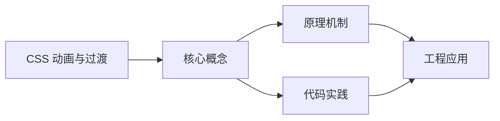
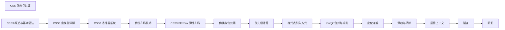

## 1. 学习目标（Bloom 分类）

本节按照布鲁姆教育目标分类学组织学习路径。本文主题为《CSS 动画与过渡》，属于 CSS 模块，读者可以根据自身阶段选择阅读深度。

记忆层面：能够准确复述本文的核心概念、术语与基本语法或操作步骤，并能够在提问或检索时快速定位对应知识点。能够说出 CSS 的核心概念、术语与标准写法。

理解层面：能够用自己的语言解释核心原理与工作机制，说明概念之间的因果关系，而不是机械记忆结论。能够解释 CSS 的工作原理与设计动机。

应用层面：能够在真实项目或练习场景中运用本文知识解决具体问题，写出正确且可维护的实现。能够编写符合 CSS 规范的完整实现。

分析层面：能够拆解复杂问题，比较本文主题与相邻概念的异同，识别边界条件与例外情况。能够分析 CSS 与相邻方案的差异与边界。

评价层面：能够根据约束条件（性能、可读性、安全、成本）评价不同方案的优劣，做出有依据的技术决策。能够根据场景评价 CSS 相关方案的优劣。

创造层面：能够把本文知识与其他模块知识组合，设计出新的解决方案或可复用的工程模式。能够组合 CSS 与其他技术设计完整方案。

通过本节学习，读者应当能够把《CSS 动画与过渡》纳入自己的知识网络，并与 CSS 模块的其他主题（选择器、盒模型、布局、动画、响应式）建立关联。

## 2. 历史动机与发展脉络

《CSS 动画与过渡》是 CSS 领域的重要主题。要真正理解它，需要先了解它解决的问题与演进过程。

CSS 于 1994 年由 Håkon Wium Lie 提出，1996 年 CSS1 发布，解决 HTML 表现层混杂问题；CSS2.1（2011）与 CSS3 模块化（2012+）奠定现代 Web 样式基础。
现代 CSS 的能力版图：Flexbox/Grid 布局、自定义属性（变量）、容器查询、子网格、层叠层（@layer）、现代颜色（oklch）。
CSS 的设计核心是“层叠与继承”：来源、优先级、顺序共同决定最终样式；理解层叠是排查样式问题的前提。

回到本文主题：CSS 动画与过渡 的提出与成熟，正是上述技术背景下的必然产物。早期实现往往以简单可用为目标，随着工程规模扩大，社区逐渐沉淀出标准做法与最佳实践；理解这一脉络，可以帮助读者判断“为什么文档中的推荐写法是现在这个样子”，也能在遇到历史遗留代码时准确识别其设计年代与取舍。


## 3. 形式化定义与核心概念精讲

本节把《CSS 动画与过渡》涉及的核心概念以“定义 + 讲解”的形式展开。读者应把定义当作工具，把讲解当作理解路径；两者结合才能形成可迁移的知识。

选择器与优先级：id > class/属性/伪类 > 元素/伪元素；!important 打破优先级（应避免）。
盒模型：content/padding/border/margin，box-sizing 决定 width 语义（border-box 推荐）。
布局体系：普通流、浮动（历史）、Flexbox（一维）、Grid（二维）；position 定位（relative/absolute/fixed/sticky）。

### 3.1 原文章节逐一精讲

原文档把主题拆分为 15 个小节，下面按顺序给出每一节的导读讲解，随后保留原文细节供精读。

#### 原文精读（完整保留）

# CSS 动画与过渡

> **符号约定**：`< >` 必填参数 | `[ ]` 可选参数

---

#### 1. CSS 过渡（Transition）

##### 1.1 过渡基础

CSS过渡允许属性值变化时平滑地从一个状态过渡到另一个状态。

```css
/* 过渡的四个属性 */
.element {
  /* 指定参与过渡的属性 */
  transition-property: background-color, transform;
  /* 过渡持续时间 */
  transition-duration: 0.3s;
  /* 过渡时序函数（缓动曲线） */
  transition-timing-function: ease-in-out;
  /* 过渡延迟时间 */
  transition-delay: 0.1s;

  /* 简写形式 */
  transition:
    background-color 0.3s ease-in-out 0.1s,
    transform 0.3s ease-in-out 0.1s;

  /* 所有属性过渡 */
  transition: all 0.3s ease;
}

.element:hover {
  background-color: #3498db;
  transform: scale(1.05);
}
```

##### 1.2 时序函数详解

```css
/* 预定义时序函数 */
.box1 {
  transition-timing-function: ease;
} /* 默认：慢-快-慢 */
.box2 {
  transition-timing-function: linear;
} /* 匀速 */
.box3 {
  transition-timing-function: ease-in;
} /* 慢-快 */
.box4 {
  transition-timing-function: ease-out;
} /* 快-慢 */
.box5 {
  transition-timing-function: ease-in-out;
} /* 慢-快-慢 */

/* 贝塞尔曲线 */
.box6 {
  transition-timing-function: cubic-bezier(0.68, -0.55, 0.265, 1.55);
} /* 弹性效果 */

/* 步进函数 */
.box7 {
  transition-timing-function: steps(4, end);
} /* 4步跳跃 */
.box8 {
  transition-timing-function: steps(10, start);
} /* 10步，立即跳到下一步 */
```

##### 1.3 可过渡的属性

并非所有CSS属性都支持过渡，只有具有**中间值**的属性才能过渡。

```css
/* 支持过渡的常见属性 */
.supported {
  /* 颜色 */
  transition:
    color 0.3s,
    background-color 0.3s,
    border-color 0.3s;
  /* 尺寸 */
  transition:
    width 0.3s,
    height 0.3s,
    margin 0.3s,
    padding 0.3s;
  /* 变换 */
  transition:
    transform 0.3s,
    opacity 0.3s;
  /* 阴影 */
  transition:
    box-shadow 0.3s,
    text-shadow 0.3s;
}

/* 不支持过渡的属性 */
.not-supported {
  /* display: none → block 无法过渡 */
  /* 建议用 opacity + visibility 替代 */
  transition:
    opacity 0.3s,
    visibility 0.3s;
}
```

##### 1.4 实用过渡效果

```css
/* 按钮悬停效果 */
.btn {
  padding: 12px 24px;
  background-color: #3498db;
  color: white;
  border: none;
  border-radius: 4px;
  cursor: pointer;
  transition: all 0.3s cubic-bezier(0.25, 0.46, 0.45, 0.94);
}

.btn:hover {
  background-color: #2980b9;
  transform: translateY(-2px);
  box-shadow: 0 4px 12px rgba(52, 152, 219, 0.4);
}

.btn:active {
  transform: translateY(0);
  box-shadow: 0 2px 4px rgba(52, 152, 219, 0.4);
}

/* 卡片悬浮效果 */
.card {
  background: white;
  border-radius: 8px;
  padding: 24px;
  box-shadow: 0 2px 8px rgba(0, 0, 0, 0.1);
  transition:
    transform 0.3s ease,
    box-shadow 0.3s ease;
}

.card:hover {
  transform: translateY(-8px);
  box-shadow: 0 12px 24px rgba(0, 0, 0, 0.15);
}

/* 淡入淡出 */
.fade-element {
  opacity: 0;
  visibility: hidden;
  transition:
    opacity 0.3s ease,
    visibility 0.3s ease;
}

.fade-element.visible {
  opacity: 1;
  visibility: visible;
}
```

#### 2. CSS 动画（Animation）

##### 2.1 关键帧动画

```css
/* 定义关键帧 */
@keyframes slideIn {
  from {
    transform: translateX(-100%);
    opacity: 0;
  }
  to {
    transform: translateX(0);
    opacity: 1;
  }
}

/* 多关键帧动画 */
@keyframes bounce {
  0% {
    transform: translateY(0);
  }
  25% {
    transform: translateY(-20px);
  }
  50% {
    transform: translateY(0);
  }
  75% {
    transform: translateY(-10px);
  }
  100% {
    transform: translateY(0);
  }
}

/* 应用动画 */
.slide-in {
  animation: slideIn 0.5s ease-out forwards;
}

.bounce {
  animation: bounce 1s ease infinite;
}
```

##### 2.2 animation 属性详解

```css
.animation-demo {
  /* 动画名称 */
  animation-name: slideIn;
  /* 动画持续时间 */
  animation-duration: 0.5s;
  /* 时序函数 */
  animation-timing-function: ease-out;
  /* 延迟时间 */
  animation-delay: 0.2s;
  /* 播放次数: 数字 | infinite */
  animation-iteration-count: 1;
  /* 播放方向: normal | reverse | alternate | alternate-reverse */
  animation-direction: normal;
  /* 填充模式: none | forwards | backwards | both */
  animation-fill-mode: forwards;
  /* 播放状态: running | paused */
  animation-play-state: running;

  /* 简写 */
  /* animation: name duration timing-function delay iteration-count direction fill-mode */
  animation: slideIn 0.5s ease-out 0.2s 1 normal forwards;
}
```

##### 2.3 animation-fill-mode 详解

```css
/* none: 动画前后都应用原始样式 */
.fill-none {
  animation-fill-mode: none;
}

/* forwards: 动画结束后保持最后一帧 */
.fill-forwards {
  animation-fill-mode: forwards;
}

/* backwards: 动画延迟期间应用第一帧 */
.fill-backwards {
  animation-fill-mode: backwards;
}

/* both: 同时应用forwards和backwards */
.fill-both {
  animation-fill-mode: both;
}
```

##### 2.4 实用动画效果

```css
/* 加载旋转动画 */
@keyframes spin {
  to {
    transform: rotate(360deg);
  }
}

.spinner {
  width: 40px;
  height: 40px;
  border: 4px solid #e0e0e0;
  border-top-color: #3498db;
  border-radius: 50%;
  animation: spin 0.8s linear infinite;
}

/* 脉冲动画 */
@keyframes pulse {
  0%,
  100% {
    transform: scale(1);
    opacity: 1;
  }
  50% {
    transform: scale(1.05);
    opacity: 0.8;
  }
}

.pulse {
  animation: pulse 2s ease-in-out infinite;
}

/* 打字机效果 */
@keyframes typing {
  from {
    width: 0;
  }
  to {
    width: 100%;
  }
}

@keyframes blink {
  50% {
    border-color: transparent;
  }
}

.typewriter {
  overflow: hidden;
  white-space: nowrap;
  border-right: 2px solid #333;
  width: 0;
  animation:
    typing 3s steps(20) forwards,
    blink 0.7s step-end infinite;
}

/* 摇晃动画 */
@keyframes shake {
  0%,
  100% {
    transform: translateX(0);
  }
  10%,
  30%,
  50%,
  70%,
  90% {
    transform: translateX(-5px);
  }
  20%,
  40%,
  60%,
  80% {
    transform: translateX(5px);
  }
}

.shake {
  animation: shake 0.5s ease-in-out;
}
```

#### 3. CSS 变换（Transform）

##### 3.1 2D 变换

```css
.transform-demo {
  /* 平移 */
  transform: translate(50px, 100px); /* 水平50px，垂直100px */
  transform: translateX(50px); /* 仅水平 */
  transform: translateY(100px); /* 仅垂直 */
  transform: translate(-50%, -50%); /* 百分比相对自身 */

  /* 旋转 */
  transform: rotate(45deg); /* 顺时针45度 */
  transform: rotate(-0.25turn); /* 逆时针1/4圈 */

  /* 缩放 */
  transform: scale(1.5); /* 整体放大1.5倍 */
  transform: scale(1.5, 2); /* 水平1.5倍，垂直2倍 */
  transform: scaleX(2); /* 仅水平缩放 */

  /* 倾斜 */
  transform: skew(10deg, 20deg); /* 水平10度，垂直20度 */
  transform: skewX(10deg); /* 仅水平倾斜 */

  /* 组合变换（从右到左应用） */
  transform: translate(50px, 0) rotate(45deg) scale(1.2);
}
```

##### 3.2 3D 变换

```css
.transform-3d {
  /* 开启3D上下文 */
  transform-style: preserve-3d;
  /* 透视距离 */
  perspective: 1000px;

  /* 3D旋转 */
  transform: rotateX(45deg); /* 绕X轴旋转 */
  transform: rotateY(45deg); /* 绕Y轴旋转 */
  transform: rotate3d(1, 1, 0, 45deg); /* 绕自定义轴旋转 */

  /* 3D平移 */
  transform: translateZ(100px); /* 沿Z轴平移 */

  /* 3D缩放 */
  transform: scaleZ(2); /* 沿Z轴缩放 */
}

/* 翻转卡片效果 */
.flip-card {
  width: 300px;
  height: 200px;
  perspective: 1000px;
}

.flip-card-inner {
  position: relative;
  width: 100%;
  height: 100%;
  transition: transform 0.6s;
  transform-style: preserve-3d;
}

.flip-card:hover .flip-card-inner {
  transform: rotateY(180deg);
}

.flip-card-front,
.flip-card-back {
  position: absolute;
  width: 100%;
  height: 100%;
  backface-visibility: hidden;
}

.flip-card-back {
  transform: rotateY(180deg);
}
```

##### 3.3 transform-origin

```css
/* 变换原点 */
.origin-center {
  transform-origin: center center;
} /* 默认 */
.origin-top-left {
  transform-origin: top left;
}
.origin-custom {
  transform-origin: 30% 70%;
}
.origin-pixel {
  transform-origin: 50px 100px;
}

/* 不同原点下的旋转效果差异 */
.rotate-center {
  transform-origin: center;
  transform: rotate(45deg); /* 绕中心旋转 */
}

.rotate-corner {
  transform-origin: bottom right;
  transform: rotate(45deg); /* 绕右下角旋转 */
}
```

#### 4. 性能优化

##### 4.1 高性能动画属性

```css
/* 推荐：仅触发Composite的属性（GPU加速） */
.good-animation {
  transition:
    transform 0.3s ease,
    opacity 0.3s ease;
}

/* 避免：触发Layout的属性（性能差） */
.bad-animation {
  transition:
    width 0.3s,
    height 0.3s,
    top 0.3s,
    left 0.3s;
}

/* 触发层级 */
/* Layout（重排）> Paint（重绘）> Composite（合成） */
/* Layout触发属性: width, height, margin, padding, top, left... */
/* Paint触发属性: color, background, box-shadow, border-radius... */
/* Composite触发属性: transform, opacity */
```

##### 4.2 will-change 提示

```css
/* 提示浏览器提前优化 */
.will-animate {
  will-change: transform, opacity;
}

/* 注意：不要滥用will-change，它会消耗额外内存 */
/* 只在即将发生动画时添加，动画结束后移除 */

/* 使用JS动态控制 */
/*
element.addEventListener('mouseenter', () => {
    element.style.willChange = 'transform';
});
element.addEventListener('animationend', () => {
    element.style.willChange = 'auto';
});
*/
```

##### 4.3 prefers-reduced-motion

```css
/* 尊重用户的减少动画偏好 */
@media (prefers-reduced-motion: reduce) {
  *,
  *::before,
  *::after {
    animation-duration: 0.01ms !important;
    animation-iteration-count: 1 !important;
    transition-duration: 0.01ms !important;
  }
}
```

#### 5. 常见问题与解决方案

##### 5.1 动画闪烁

**问题**：动画开始或结束时出现闪烁

```css
/* 解决方案：使用transform代替top/left */
/* 错误 */
.flash-bad {
  transition:
    top 0.3s,
    left 0.3s;
}

/* 正确 */
.flash-good {
  transition: transform 0.3s;
  will-change: transform;
}
```

##### 5.2 动画卡顿

**问题**：动画帧率低，不流畅

```css
/* 解决方案 */
.smooth-animation {
  /* 1. 使用GPU加速属性 */
  transform: translateZ(0);

  /* 2. 提升到独立图层 */
  will-change: transform;

  /* 3. 避免同时动画过多元素 */
}

/* JS中检查帧率 */
/*
let lastTime = performance.now();
function checkFPS() {
    const now = performance.now();
    const fps = 1000 / (now - lastTime);
    lastTime = now;
    console.log(`FPS: ${fps}`);
    requestAnimationFrame(checkFPS);
}
*/
```

##### 5.3 动画结束状态回弹

**问题**：动画结束后回到初始状态

```css
/* 解决方案：使用animation-fill-mode: forwards */
@keyframes slideIn {
  from {
    transform: translateX(-100%);
  }
  to {
    transform: translateX(0);
  }
}

.stay-at-end {
  animation: slideIn 0.5s ease forwards; /* forwards保持结束状态 */
}
```

#### 6. 总结与最佳实践

##### 6.1 过渡 vs 动画选择

| 场景                     | 选择       | 原因           |
| :----------------------- | :--------- | :------------- |
| 状态变化（hover、click） | transition | 简单、声明式   |
| 循环播放                 | animation  | 支持infinite   |
| 多步骤动画               | animation  | 支持多关键帧   |
| 无触发自动播放           | animation  | 不需要状态变化 |

##### 6.2 最佳实践

1. **优先使用 transform 和 opacity**：GPU加速，性能最佳
2. **避免动画布局属性**：width、height、top、left等触发重排
3. **使用 will-change 谨慎**：只在需要时添加，用完移除
4. **尊重用户偏好**：使用 prefers-reduced-motion 媒体查询
5. **控制动画时长**：交互反馈 0.1-0.3s，装饰动画 0.3-0.5s
6. **使用 cubic-bezier**：自定义缓动曲线比预设更自然
#### transition 过渡

**基本写法：transition-property 单属性**
`transition-property: <属性>;`
```css
/* 指定过渡属性 */
.box {
  transition-property: opacity;
}
```

---

**基本写法：transition-duration 时长**
`transition-duration: <时间>;`
```css
/* 设置过渡时长 */
.box {
  transition-duration: 0.3s;
}
```

---

**基本写法：transition-timing-function 缓动**
`transition-timing-function: <缓动函数>;`
```css
/* 设置缓动函数 */
.box {
  transition-timing-function: ease-in-out;
}
```

---

**基本写法：transition-delay 延迟**
`transition-delay: <时间>;`
```css
/* 设置过渡延迟 */
.box {
  transition-delay: 0.1s;
}
```

---

**基本写法：transition 简写**
`transition: <属性> <时长> <缓动> <延迟>;`
```css
/* 同时设置过渡属性 */
.box {
  transition: opacity 0.3s ease-in-out 0.1s;
}
```

---

**单行写法：多属性过渡**
`transition: <属性1> <时长1>, <属性2> <时长2>;`
```css
/* 单行设置多个属性过渡 */
.box {
  transition: opacity 0.3s, transform 0.5s;
}
```

---

**换行写法：多属性过渡**
`transition: <属性1> <时长1>, <属性2> <时长2>, <属性3> <时长3>;`
```css
/* 换行设置多个属性过渡 */
.box {
  transition:
    opacity 0.3s,
    transform 0.5s,
    background-color 0.2s;
}
```

---

**基本写法：transition all**
`transition: all <时长>;`
```css
/* 所有可过渡属性都应用过渡 */
.box {
  transition: all 0.3s;
}
```

---

#### @keyframes 关键帧

**基本写法：from-to 关键帧**
`@keyframes <名称> { from { <样式> } to { <样式> } }`
```css
/* 定义从起点到终点的动画 */
@keyframes fadeIn {
  from { opacity: 0; }
  to { opacity: 1; }
}
```

---

**基本写法：百分比关键帧**
`@keyframes <名称> { 0% { <样式> } 50% { <样式> } 100% { <样式> } }`
```css
/* 定义多关键帧动画 */
@keyframes pulse {
  0% { transform: scale(1); }
  50% { transform: scale(1.1); }
  100% { transform: scale(1); }
}
```

---

**单行写法：多属性关键帧**
`@keyframes <名称> { 0% { <属性1>: <值>; <属性2>: <值>; } }`
```css
/* 单行定义多属性关键帧 */
@keyframes slide {
  0% { transform: translateX(0); opacity: 1; }
  100% { transform: translateX(100px); opacity: 0; }
}
```

---

**换行写法：多属性关键帧**
`@keyframes <名称> { 0% { <属性1>: <值>; <属性2>: <值>; } }`
```css
/* 换行定义多属性关键帧 */
@keyframes slide {
  0% {
    transform: translateX(0);
    opacity: 1;
  }
  100% {
    transform: translateX(100px);
    opacity: 0;
  }
}
```

---

#### animation 动画

**基本写法：animation-name 名称**
`animation-name: <动画名>;`
```css
/* 指定动画名称 */
.box {
  animation-name: fadeIn;
}
```

---

**基本写法：animation-duration 时长**
`animation-duration: <时间>;`
```css
/* 设置动画时长 */
.box {
  animation-duration: 2s;
}
```

---

**基本写法：animation-timing-function 缓动**
`animation-timing-function: <缓动函数>;`
```css
/* 设置动画缓动函数 */
.box {
  animation-timing-function: ease-in-out;
}
```

---

**基本写法：animation-delay 延迟**
`animation-delay: <时间>;`
```css
/* 设置动画延迟 */
.box {
  animation-delay: 0.5s;
}
```

---

**基本写法：animation-iteration-count 次数**
`animation-iteration-count: <次数>;`
```css
/* 设置动画播放次数 */
.box {
  animation-iteration-count: 3;
}
```

---

**基本写法：animation-iteration-count 无限**
`animation-iteration-count: infinite;`
```css
/* 无限循环播放 */
.box {
  animation-iteration-count: infinite;
}
```

---

**基本写法：animation-direction 方向**
`animation-direction: alternate;`
```css
/* 交替反向播放 */
.box {
  animation-direction: alternate;
}
```

---

**基本写法：animation-direction 反向**
`animation-direction: reverse;`
```css
/* 反向播放 */
.box {
  animation-direction: reverse;
}
```

---

**基本写法：animation-fill-mode 填充**
`animation-fill-mode: forwards;`
```css
/* 保持结束状态 */
.box {
  animation-fill-mode: forwards;
}
```

---

**基本写法：animation-fill-mode 双向**
`animation-fill-mode: both;`
```css
/* 同时应用开始和结束状态 */
.box {
  animation-fill-mode: both;
}
```

---

**基本写法：animation-play-state 播放**
`animation-play-state: running;`
```css
/* 动画运行中 */
.box {
  animation-play-state: running;
}
```

---

**基本写法：animation-play-state 暂停**
`animation-play-state: paused;`
```css
/* 暂停动画 */
.box:hover {
  animation-play-state: paused;
}
```

---

**基本写法：animation 简写**
`animation: <名称> <时长> <缓动> <延迟> <次数> <方向> <填充> <状态>;`
```css
/* 同时设置所有动画属性 */
.box {
  animation: fadeIn 2s ease-in-out 0.5s infinite alternate forwards;
}
```

---

**单行写法：多动画**
`animation: <动画1>, <动画2>;`
```css
/* 单行设置多个动画 */
.box {
  animation: fadeIn 2s, slideIn 1s;
}
```

---

**换行写法：多动画**
`animation: <动画1>, <动画2>, <动画3>;`
```css
/* 换行设置多个动画 */
.box {
  animation:
    fadeIn 2s,
    slideIn 1s,
    pulse 0.5s infinite;
}
```

---

#### 缓动函数

**基本写法：ease 默认**
`transition-timing-function: ease;`
```css
/* 默认缓动 */
.box {
  transition-timing-function: ease;
}
```

---

**基本写法：linear 线性**
`transition-timing-function: linear;`
```css
/* 线性匀速 */
.box {
  transition-timing-function: linear;
}
```

---

**基本写法：ease-in 加速**
`transition-timing-function: ease-in;`
```css
/* 开始慢，结束快 */
.box {
  transition-timing-function: ease-in;
}
```

---

**基本写法：ease-out 减速**
`transition-timing-function: ease-out;`
```css
/* 开始快，结束慢 */
.box {
  transition-timing-function: ease-out;
}
```

---

**基本写法：cubic-bezier 自定义**
`transition-timing-function: cubic-bezier(<x1>, <y1>, <x2>, <y2>);`
```css
/* 自定义贝塞尔曲线 */
.box {
  transition-timing-function: cubic-bezier(0.25, 0.1, 0.25, 1);
}
```

---

**基本写法：steps 步进**
`transition-timing-function: steps(<步数>);`
```css
/* 分步过渡 */
.box {
  transition-timing-function: steps(4);
}
```

---

**基本写法：steps 跳跃**
`transition-timing-function: steps(<步数>, jump-none);`
```css
/* 步进不跳跃 */
.box {
  transition-timing-function: steps(4, jump-none);
}
```

---

#### transform 变换动画

**基本写法：translate 平移动画**
`transform: translate(<x>, <y>);`
```css
/* 平移动画 */
.box {
  transition: transform 0.3s;
}
.box:hover {
  transform: translate(10px, 10px);
}
```

---

**基本写法：scale 缩放动画**
`transform: scale(<比例>);`
```css
/* 缩放动画 */
.box {
  transition: transform 0.3s;
}
.box:hover {
  transform: scale(1.1);
}
```

---

**基本写法：rotate 旋转动画**
`transform: rotate(<角度>);`
```css
/* 旋转动画 */
.box {
  transition: transform 0.5s;
}
.box:hover {
  transform: rotate(180deg);
}
```

---

**基本写法：3D 旋转动画**
`transform: rotateY(<角度>);`
```css
/* Y 轴 3D 旋转 */
.card {
  transition: transform 0.6s;
  transform-style: preserve-3d;
}
.card:hover {
  transform: rotateY(180deg);
}
```

---

#### 常见动画效果

**基本写法：淡入动画**
`@keyframes fadeIn { from { opacity: 0; } to { opacity: 1; } }`
```css
/* 淡入效果 */
@keyframes fadeIn {
  from { opacity: 0; }
  to { opacity: 1; }
}
.fade-in {
  animation: fadeIn 0.5s ease-out;
}
```

---

**基本写法：淡出动画**
`@keyframes fadeOut { from { opacity: 1; } to { opacity: 0; } }`
```css
/* 淡出效果 */
@keyframes fadeOut {
  from { opacity: 1; }
  to { opacity: 0; }
}
.fade-out {
  animation: fadeOut 0.5s ease-in;
}
```

---

**基本写法：滑入动画**
`@keyframes slideIn { from { transform: translateX(-100%); } to { transform: translateX(0); } }`
```css
/* 从左侧滑入 */
@keyframes slideIn {
  from { transform: translateX(-100%); }
  to { transform: translateX(0); }
}
.slide-in {
  animation: slideIn 0.5s ease-out;
}
```

---

**基本写法：弹跳动画**
`@keyframes bounce { 0%, 20%, 50%, 80%, 100% { transform: translateY(0); } 40% { transform: translateY(-30px); } 60% { transform: translateY(-15px); } }`
```css
/* 弹跳效果 */
@keyframes bounce {
  0%, 20%, 50%, 80%, 100% { transform: translateY(0); }
  40% { transform: translateY(-30px); }
  60% { transform: translateY(-15px); }
}
.bounce {
  animation: bounce 1s;
}
```

---

**基本写法：旋转加载**
`@keyframes spin { from { transform: rotate(0deg); } to { transform: rotate(360deg); } }`
```css
/* 旋转加载动画 */
@keyframes spin {
  from { transform: rotate(0deg); }
  to { transform: rotate(360deg); }
}
.spinner {
  animation: spin 1s linear infinite;
}
```

---

**基本写法：脉冲动画**
`@keyframes pulse { 0%, 100% { transform: scale(1); opacity: 1; } 50% { transform: scale(1.05); opacity: 0.8; } }`
```css
/* 脉冲效果 */
@keyframes pulse {
  0%, 100% { transform: scale(1); opacity: 1; }
  50% { transform: scale(1.05); opacity: 0.8; }
}
.pulse {
  animation: pulse 2s ease-in-out infinite;
}
```

---

#### 滚动驱动动画

**基本写法：animation-timeline 滚动**
`animation-timeline: scroll();`
```css
/* 滚动驱动动画 */
.box {
  animation: fadeIn linear;
  animation-timeline: scroll();
}
```

---

**基本写法：animation-timeline 视口**
`animation-timeline: view();`
```css
/* 元素进入视口时触发 */
.box {
  animation: fadeIn linear;
  animation-timeline: view();
}
```

---

**基本写法：view 轴向**
`animation-timeline: view(<轴>);`
```css
/* 指定视口轴向 */
.box {
  animation: fadeIn linear;
  animation-timeline: view(block);
}
```

---

#### 性能优化

**基本写法：will-change 提示**
`will-change: <属性>;`
```css
/* 提示浏览器优化 */
.animated {
  will-change: transform, opacity;
}
```

---

**基本写法：transform 替代 position**
`transform: translate3d(<x>, <y>, 0);`
```css
/* 使用 transform 触发 GPU 加速 */
.box {
  transform: translate3d(0, 0, 0);
}
```

---

**基本写法：backface-visibility 隐藏背面**
`backface-visibility: hidden;`
```css
/* 翻转卡片隐藏背面 */
.card {
  backface-visibility: hidden;
}
```

---

**基本写法：contain 包含**
`contain: layout;`
```css
/* 限制重绘范围 */
.widget {
  contain: layout;
}
```

---

**基本写法：content-visibility 内容可见性**
`content-visibility: auto;`
```css
/* 自动跳过屏幕外内容渲染 */
.long-list {
  content-visibility: auto;
}
```

---

#### 现代动画新特性

**基本写法：@starting-style 进入动画**
`@starting-style { <选择器> { <样式> } }`
```css
/* 元素首次显示时的起始样式,实现进入动画 */
.dialog {
  opacity: 1;
  transform: translateY(0);
  transition: opacity 0.3s, transform 0.3s;
}
@starting-style {
  .dialog {
    opacity: 0;
    transform: translateY(20px);
  }
}
```

---

**基本写法：transition-behavior: allow-discrete**
`transition-behavior: allow-discrete;`
```css
/* 允许离散属性(如 display)参与过渡 */
.modal {
  transition: display 0.3s, opacity 0.3s;
  transition-behavior: allow-discrete;
}
.modal.hidden {
  display: none;
  opacity: 0;
}
```

---

**基本写法：scroll-driven animations animation-timeline**
`animation-timeline: scroll(<参数>);`
```css
/* 滚动驱动动画:页面滚动时持续触发 */
@keyframes progress {
  from { transform: scaleX(0); }
  to { transform: scaleX(1); }
}
.progress-bar {
  animation: progress linear;
  animation-timeline: scroll(root);
  transform-origin: left;
}
```

---

**基本写法：view-timeline 视图时间线**
`view-timeline: <名称> <轴>;`
```css
/* 元素进入视口时触发的视图时间线 */
@keyframes fade-in {
  from { opacity: 0; }
  to { opacity: 1; }
}
.section {
  view-timeline: --section-timeline block;
  animation: fade-in linear;
  animation-timeline: --section-timeline;
}
```

---

**基本写法：interpolate-size: allow-keywords 高度 auto 过渡**
`interpolate-size: allow-keywords;`
```css
/* 允许对 height: auto 等关键字进行过渡 */
.accordion {
  interpolate-size: allow-keywords;
  height: auto;
  transition: height 0.3s ease;
}
.accordion.collapsed {
  height: 0;
}
```


### 3.2 概念关系图

下面用 Mermaid 图表达本文核心概念之间的关系，帮助读者建立整体图景：



图中展示的是本文知识的结构化关系：核心概念是入口，原理机制解释“为什么”，代码实践演示“怎么做”，工程应用回答“何时用”。读者学习时可以把每个小节的内容挂接到对应节点上。

## 4. 理论推导与原理解析

本节深入《CSS 动画与过渡》背后的原理。理论部分不求面面俱到，而是聚焦“能解释现象、能指导实践”的关键推导。

选择器与优先级：id > class/属性/伪类 > 元素/伪元素；!important 打破优先级（应避免）。
盒模型：content/padding/border/margin，box-sizing 决定 width 语义（border-box 推荐）。
布局体系：普通流、浮动（历史）、Flexbox（一维）、Grid（二维）；position 定位（relative/absolute/fixed/sticky）。
层叠上下文：z-index 只在同一层叠上下文中比较；transform/opacity/filter 创建新上下文。

需要强调的是，理论推导与工程实践之间存在翻译层：理论给出的是理想化模型与边界条件，工程代码则必须处理真实环境中的例外。读者在学习时应先掌握理论的“标准情形”，再通过陷阱章节了解“非标准情形”。

## 5. 代码示例与逐行讲解

本节把原文中的代码示例系统整理，并为每个示例补充用途说明与讲解。读者不应只浏览代码，而应逐段对照讲解理解设计意图。

### 5.1 示例：1.1 过渡基础

该示例来自原文《1.1 过渡基础》小节，用于演示CSS 动画与过渡相关操作。阅读时请先看代码结构，再看其后的讲解。

```css
/* 过渡的四个属性 */
.element {
  /* 指定参与过渡的属性 */
  transition-property: background-color, transform;
  /* 过渡持续时间 */
  transition-duration: 0.3s;
  /* 过渡时序函数（缓动曲线） */
  transition-timing-function: ease-in-out;
  /* 过渡延迟时间 */
  transition-delay: 0.1s;

  /* 简写形式 */
  transition:
    background-color 0.3s ease-in-out 0.1s,
    transform 0.3s ease-in-out 0.1s;

  /* 所有属性过渡 */
  transition: all 0.3s ease;
}

.element:hover {
  background-color: #3498db;
  transform: scale(1.05);
}
```

讲解：这段代码演示了本节核心知识点。代码中的关键操作可以归纳为三步：准备（定义或初始化）、执行（核心逻辑）、收尾（释放资源或返回结果）。实际项目中，这三步往往被封装为函数或类，以提升复用性与可测试性。

关键点分析：

该示例共 21 行有效代码，包含 1 类关键结构（function）。其中：

- 入口与初始化部分负责建立上下文，对应实际项目中的启动或装配逻辑；
- 核心逻辑部分体现本文主题的主要操作，是阅读时最需要对照讲解理解的部分；
- 输出或返回部分把结果交给调用方，注意其类型与边界条件。

进阶思考路径：先尝试修改参数观察行为变化，再把示例中的模式迁移到自己的项目中；每次修改都记录预期与实测差异，这是把示例转化为能力的最快方式。

### 5.2 示例：1.2 时序函数详解

该示例来自原文《1.2 时序函数详解》小节，用于演示CSS 动画与过渡相关操作。阅读时请先看代码结构，再看其后的讲解。

```css
/* 预定义时序函数 */
.box1 {
  transition-timing-function: ease;
} /* 默认：慢-快-慢 */
.box2 {
  transition-timing-function: linear;
} /* 匀速 */
.box3 {
  transition-timing-function: ease-in;
} /* 慢-快 */
.box4 {
  transition-timing-function: ease-out;
} /* 快-慢 */
.box5 {
  transition-timing-function: ease-in-out;
} /* 慢-快-慢 */

/* 贝塞尔曲线 */
.box6 {
  transition-timing-function: cubic-bezier(0.68, -0.55, 0.265, 1.55);
} /* 弹性效果 */

/* 步进函数 */
.box7 {
  transition-timing-function: steps(4, end);
} /* 4步跳跃 */
.box8 {
  transition-timing-function: steps(10, start);
} /* 10步，立即跳到下一步 */
```

讲解：这段代码演示了本节核心知识点。代码中的关键操作可以归纳为三步：准备（定义或初始化）、执行（核心逻辑）、收尾（释放资源或返回结果）。实际项目中，这三步往往被封装为函数或类，以提升复用性与可测试性。

关键点分析：

该示例共 27 行有效代码，包含 1 类关键结构（function）。其中：

- 入口与初始化部分负责建立上下文，对应实际项目中的启动或装配逻辑；
- 核心逻辑部分体现本文主题的主要操作，是阅读时最需要对照讲解理解的部分；
- 输出或返回部分把结果交给调用方，注意其类型与边界条件。

进阶思考路径：先尝试修改参数观察行为变化，再把示例中的模式迁移到自己的项目中；每次修改都记录预期与实测差异，这是把示例转化为能力的最快方式。

### 5.3 示例：1.3 可过渡的属性

该示例来自原文《1.3 可过渡的属性》小节，用于演示CSS 动画与过渡相关操作。阅读时请先看代码结构，再看其后的讲解。

```css
/* 支持过渡的常见属性 */
.supported {
  /* 颜色 */
  transition:
    color 0.3s,
    background-color 0.3s,
    border-color 0.3s;
  /* 尺寸 */
  transition:
    width 0.3s,
    height 0.3s,
    margin 0.3s,
    padding 0.3s;
  /* 变换 */
  transition:
    transform 0.3s,
    opacity 0.3s;
  /* 阴影 */
  transition:
    box-shadow 0.3s,
    text-shadow 0.3s;
}

/* 不支持过渡的属性 */
.not-supported {
  /* display: none → block 无法过渡 */
  /* 建议用 opacity + visibility 替代 */
  transition:
    opacity 0.3s,
    visibility 0.3s;
}
```

讲解：这段代码演示了本节核心知识点。代码中的关键操作可以归纳为三步：准备（定义或初始化）、执行（核心逻辑）、收尾（释放资源或返回结果）。实际项目中，这三步往往被封装为函数或类，以提升复用性与可测试性。

关键点分析：

该示例共 30 行有效代码，结构以数据或配置为主。阅读时应关注：数据字段的含义、配置项的作用，以及它们与运行行为的对应关系。

进阶思考路径：先尝试修改参数观察行为变化，再把示例中的模式迁移到自己的项目中；每次修改都记录预期与实测差异，这是把示例转化为能力的最快方式。

### 5.4 示例：1.4 实用过渡效果

该示例来自原文《1.4 实用过渡效果》小节，用于演示CSS 动画与过渡相关操作。阅读时请先看代码结构，再看其后的讲解。

```css
/* 按钮悬停效果 */
.btn {
  padding: 12px 24px;
  background-color: #3498db;
  color: white;
  border: none;
  border-radius: 4px;
  cursor: pointer;
  transition: all 0.3s cubic-bezier(0.25, 0.46, 0.45, 0.94);
}

.btn:hover {
  background-color: #2980b9;
  transform: translateY(-2px);
  box-shadow: 0 4px 12px rgba(52, 152, 219, 0.4);
}

.btn:active {
  transform: translateY(0);
  box-shadow: 0 2px 4px rgba(52, 152, 219, 0.4);
}

/* 卡片悬浮效果 */
.card {
  background: white;
  border-radius: 8px;
  padding: 24px;
  box-shadow: 0 2px 8px rgba(0, 0, 0, 0.1);
  transition:
    transform 0.3s ease,
    box-shadow 0.3s ease;
}

.card:hover {
  transform: translateY(-8px);
  box-shadow: 0 12px 24px rgba(0, 0, 0, 0.15);
}

/* 淡入淡出 */
.fade-element {
  opacity: 0;
  visibility: hidden;
  transition:
    opacity 0.3s ease,
    visibility 0.3s ease;
}

.fade-element.visible {
  opacity: 1;
  visibility: visible;
}
```

讲解：这段代码演示了本节核心知识点。代码中的关键操作可以归纳为三步：准备（定义或初始化）、执行（核心逻辑）、收尾（释放资源或返回结果）。实际项目中，这三步往往被封装为函数或类，以提升复用性与可测试性。

关键点分析：

该示例共 45 行有效代码，结构以数据或配置为主。阅读时应关注：数据字段的含义、配置项的作用，以及它们与运行行为的对应关系。

进阶思考路径：先尝试修改参数观察行为变化，再把示例中的模式迁移到自己的项目中；每次修改都记录预期与实测差异，这是把示例转化为能力的最快方式。

### 5.5 示例：2.1 关键帧动画

该示例来自原文《2.1 关键帧动画》小节，用于演示CSS 动画与过渡相关操作。阅读时请先看代码结构，再看其后的讲解。

```css
/* 定义关键帧 */
@keyframes slideIn {
  from {
    transform: translateX(-100%);
    opacity: 0;
  }
  to {
    transform: translateX(0);
    opacity: 1;
  }
}

/* 多关键帧动画 */
@keyframes bounce {
  0% {
    transform: translateY(0);
  }
  25% {
    transform: translateY(-20px);
  }
  50% {
    transform: translateY(0);
  }
  75% {
    transform: translateY(-10px);
  }
  100% {
    transform: translateY(0);
  }
}

/* 应用动画 */
.slide-in {
  animation: slideIn 0.5s ease-out forwards;
}

.bounce {
  animation: bounce 1s ease infinite;
}
```

讲解：这段代码演示了本节核心知识点。代码中的关键操作可以归纳为三步：准备（定义或初始化）、执行（核心逻辑）、收尾（释放资源或返回结果）。实际项目中，这三步往往被封装为函数或类，以提升复用性与可测试性。

关键点分析：

该示例共 36 行有效代码，包含 1 类关键结构（from）。其中：

- 入口与初始化部分负责建立上下文，对应实际项目中的启动或装配逻辑；
- 核心逻辑部分体现本文主题的主要操作，是阅读时最需要对照讲解理解的部分；
- 输出或返回部分把结果交给调用方，注意其类型与边界条件。

进阶思考路径：先尝试修改参数观察行为变化，再把示例中的模式迁移到自己的项目中；每次修改都记录预期与实测差异，这是把示例转化为能力的最快方式。

### 5.6 示例：2.2 animation 属性详解

该示例来自原文《2.2 animation 属性详解》小节，用于演示CSS 动画与过渡相关操作。阅读时请先看代码结构，再看其后的讲解。

```css
.animation-demo {
  /* 动画名称 */
  animation-name: slideIn;
  /* 动画持续时间 */
  animation-duration: 0.5s;
  /* 时序函数 */
  animation-timing-function: ease-out;
  /* 延迟时间 */
  animation-delay: 0.2s;
  /* 播放次数: 数字 | infinite */
  animation-iteration-count: 1;
  /* 播放方向: normal | reverse | alternate | alternate-reverse */
  animation-direction: normal;
  /* 填充模式: none | forwards | backwards | both */
  animation-fill-mode: forwards;
  /* 播放状态: running | paused */
  animation-play-state: running;

  /* 简写 */
  /* animation: name duration timing-function delay iteration-count direction fill-mode */
  animation: slideIn 0.5s ease-out 0.2s 1 normal forwards;
}
```

讲解：这段代码演示了本节核心知识点。代码中的关键操作可以归纳为三步：准备（定义或初始化）、执行（核心逻辑）、收尾（释放资源或返回结果）。实际项目中，这三步往往被封装为函数或类，以提升复用性与可测试性。

关键点分析：

该示例共 21 行有效代码，包含 1 类关键结构（function）。其中：

- 入口与初始化部分负责建立上下文，对应实际项目中的启动或装配逻辑；
- 核心逻辑部分体现本文主题的主要操作，是阅读时最需要对照讲解理解的部分；
- 输出或返回部分把结果交给调用方，注意其类型与边界条件。

进阶思考路径：先尝试修改参数观察行为变化，再把示例中的模式迁移到自己的项目中；每次修改都记录预期与实测差异，这是把示例转化为能力的最快方式。

### 5.7 示例：2.3 animation-fill-mode 详解

该示例来自原文《2.3 animation-fill-mode 详解》小节，用于演示CSS 动画与过渡相关操作。阅读时请先看代码结构，再看其后的讲解。

```css
/* none: 动画前后都应用原始样式 */
.fill-none {
  animation-fill-mode: none;
}

/* forwards: 动画结束后保持最后一帧 */
.fill-forwards {
  animation-fill-mode: forwards;
}

/* backwards: 动画延迟期间应用第一帧 */
.fill-backwards {
  animation-fill-mode: backwards;
}

/* both: 同时应用forwards和backwards */
.fill-both {
  animation-fill-mode: both;
}
```

讲解：这段代码演示了本节核心知识点。代码中的关键操作可以归纳为三步：准备（定义或初始化）、执行（核心逻辑）、收尾（释放资源或返回结果）。实际项目中，这三步往往被封装为函数或类，以提升复用性与可测试性。

关键点分析：

该示例共 16 行有效代码，结构以数据或配置为主。阅读时应关注：数据字段的含义、配置项的作用，以及它们与运行行为的对应关系。

进阶思考路径：先尝试修改参数观察行为变化，再把示例中的模式迁移到自己的项目中；每次修改都记录预期与实测差异，这是把示例转化为能力的最快方式。

### 5.8 示例：2.4 实用动画效果

该示例来自原文《2.4 实用动画效果》小节，用于演示CSS 动画与过渡相关操作。阅读时请先看代码结构，再看其后的讲解。

```css
/* 加载旋转动画 */
@keyframes spin {
  to {
    transform: rotate(360deg);
  }
}

.spinner {
  width: 40px;
  height: 40px;
  border: 4px solid #e0e0e0;
  border-top-color: #3498db;
  border-radius: 50%;
  animation: spin 0.8s linear infinite;
}

/* 脉冲动画 */
@keyframes pulse {
  0%,
  100% {
    transform: scale(1);
    opacity: 1;
  }
  50% {
    transform: scale(1.05);
    opacity: 0.8;
  }
}

.pulse {
  animation: pulse 2s ease-in-out infinite;
}

/* 打字机效果 */
@keyframes typing {
  from {
    width: 0;
  }
  to {
    width: 100%;
  }
}

@keyframes blink {
  50% {
    border-color: transparent;
  }
}

.typewriter {
  overflow: hidden;
  white-space: nowrap;
  border-right: 2px solid #333;
  width: 0;
  animation:
    typing 3s steps(20) forwards,
    blink 0.7s step-end infinite;
}

/* 摇晃动画 */
@keyframes shake {
  0%,
  100% {
    transform: translateX(0);
  }
  10%,
  30%,
  50%,
  70%,
  90% {
    transform: translateX(-5px);
  }
  20%,
  40%,
  60%,
  80% {
    transform: translateX(5px);
  }
}

.shake {
  animation: shake 0.5s ease-in-out;
}
```

讲解：这段代码演示了本节核心知识点。代码中的关键操作可以归纳为三步：准备（定义或初始化）、执行（核心逻辑）、收尾（释放资源或返回结果）。实际项目中，这三步往往被封装为函数或类，以提升复用性与可测试性。

关键点分析：

该示例共 75 行有效代码，包含 1 类关键结构（from）。其中：

- 入口与初始化部分负责建立上下文，对应实际项目中的启动或装配逻辑；
- 核心逻辑部分体现本文主题的主要操作，是阅读时最需要对照讲解理解的部分；
- 输出或返回部分把结果交给调用方，注意其类型与边界条件。

进阶思考路径：先尝试修改参数观察行为变化，再把示例中的模式迁移到自己的项目中；每次修改都记录预期与实测差异，这是把示例转化为能力的最快方式。

### 5.9 示例：3.1 2D 变换

该示例来自原文《3.1 2D 变换》小节，用于演示CSS 动画与过渡相关操作。阅读时请先看代码结构，再看其后的讲解。

```css
.transform-demo {
  /* 平移 */
  transform: translate(50px, 100px); /* 水平50px，垂直100px */
  transform: translateX(50px); /* 仅水平 */
  transform: translateY(100px); /* 仅垂直 */
  transform: translate(-50%, -50%); /* 百分比相对自身 */

  /* 旋转 */
  transform: rotate(45deg); /* 顺时针45度 */
  transform: rotate(-0.25turn); /* 逆时针1/4圈 */

  /* 缩放 */
  transform: scale(1.5); /* 整体放大1.5倍 */
  transform: scale(1.5, 2); /* 水平1.5倍，垂直2倍 */
  transform: scaleX(2); /* 仅水平缩放 */

  /* 倾斜 */
  transform: skew(10deg, 20deg); /* 水平10度，垂直20度 */
  transform: skewX(10deg); /* 仅水平倾斜 */

  /* 组合变换（从右到左应用） */
  transform: translate(50px, 0) rotate(45deg) scale(1.2);
}
```

讲解：这段代码演示了本节核心知识点。代码中的关键操作可以归纳为三步：准备（定义或初始化）、执行（核心逻辑）、收尾（释放资源或返回结果）。实际项目中，这三步往往被封装为函数或类，以提升复用性与可测试性。

关键点分析：

该示例共 19 行有效代码，结构以数据或配置为主。阅读时应关注：数据字段的含义、配置项的作用，以及它们与运行行为的对应关系。

进阶思考路径：先尝试修改参数观察行为变化，再把示例中的模式迁移到自己的项目中；每次修改都记录预期与实测差异，这是把示例转化为能力的最快方式。

### 5.10 示例：3.2 3D 变换

该示例来自原文《3.2 3D 变换》小节，用于演示CSS 动画与过渡相关操作。阅读时请先看代码结构，再看其后的讲解。

```css
.transform-3d {
  /* 开启3D上下文 */
  transform-style: preserve-3d;
  /* 透视距离 */
  perspective: 1000px;

  /* 3D旋转 */
  transform: rotateX(45deg); /* 绕X轴旋转 */
  transform: rotateY(45deg); /* 绕Y轴旋转 */
  transform: rotate3d(1, 1, 0, 45deg); /* 绕自定义轴旋转 */

  /* 3D平移 */
  transform: translateZ(100px); /* 沿Z轴平移 */

  /* 3D缩放 */
  transform: scaleZ(2); /* 沿Z轴缩放 */
}

/* 翻转卡片效果 */
.flip-card {
  width: 300px;
  height: 200px;
  perspective: 1000px;
}

.flip-card-inner {
  position: relative;
  width: 100%;
  height: 100%;
  transition: transform 0.6s;
  transform-style: preserve-3d;
}

.flip-card:hover .flip-card-inner {
  transform: rotateY(180deg);
}

.flip-card-front,
.flip-card-back {
  position: absolute;
  width: 100%;
  height: 100%;
  backface-visibility: hidden;
}

.flip-card-back {
  transform: rotateY(180deg);
}
```

讲解：这段代码演示了本节核心知识点。代码中的关键操作可以归纳为三步：准备（定义或初始化）、执行（核心逻辑）、收尾（释放资源或返回结果）。实际项目中，这三步往往被封装为函数或类，以提升复用性与可测试性。

关键点分析：

该示例共 40 行有效代码，结构以数据或配置为主。阅读时应关注：数据字段的含义、配置项的作用，以及它们与运行行为的对应关系。

进阶思考路径：先尝试修改参数观察行为变化，再把示例中的模式迁移到自己的项目中；每次修改都记录预期与实测差异，这是把示例转化为能力的最快方式。

### 5.11 示例：3.3 transform-origin

该示例来自原文《3.3 transform-origin》小节，用于演示CSS 动画与过渡相关操作。阅读时请先看代码结构，再看其后的讲解。

```css
/* 变换原点 */
.origin-center {
  transform-origin: center center;
} /* 默认 */
.origin-top-left {
  transform-origin: top left;
}
.origin-custom {
  transform-origin: 30% 70%;
}
.origin-pixel {
  transform-origin: 50px 100px;
}

/* 不同原点下的旋转效果差异 */
.rotate-center {
  transform-origin: center;
  transform: rotate(45deg); /* 绕中心旋转 */
}

.rotate-corner {
  transform-origin: bottom right;
  transform: rotate(45deg); /* 绕右下角旋转 */
}
```

讲解：这段代码演示了本节核心知识点。代码中的关键操作可以归纳为三步：准备（定义或初始化）、执行（核心逻辑）、收尾（释放资源或返回结果）。实际项目中，这三步往往被封装为函数或类，以提升复用性与可测试性。

关键点分析：

该示例共 22 行有效代码，结构以数据或配置为主。阅读时应关注：数据字段的含义、配置项的作用，以及它们与运行行为的对应关系。

进阶思考路径：先尝试修改参数观察行为变化，再把示例中的模式迁移到自己的项目中；每次修改都记录预期与实测差异，这是把示例转化为能力的最快方式。

### 5.12 示例：4.1 高性能动画属性

该示例来自原文《4.1 高性能动画属性》小节，用于演示CSS 动画与过渡相关操作。阅读时请先看代码结构，再看其后的讲解。

```css
/* 推荐：仅触发Composite的属性（GPU加速） */
.good-animation {
  transition:
    transform 0.3s ease,
    opacity 0.3s ease;
}

/* 避免：触发Layout的属性（性能差） */
.bad-animation {
  transition:
    width 0.3s,
    height 0.3s,
    top 0.3s,
    left 0.3s;
}

/* 触发层级 */
/* Layout（重排）> Paint（重绘）> Composite（合成） */
/* Layout触发属性: width, height, margin, padding, top, left... */
/* Paint触发属性: color, background, box-shadow, border-radius... */
/* Composite触发属性: transform, opacity */
```

讲解：这段代码演示了本节核心知识点。代码中的关键操作可以归纳为三步：准备（定义或初始化）、执行（核心逻辑）、收尾（释放资源或返回结果）。实际项目中，这三步往往被封装为函数或类，以提升复用性与可测试性。

关键点分析：

该示例共 19 行有效代码，结构以数据或配置为主。阅读时应关注：数据字段的含义、配置项的作用，以及它们与运行行为的对应关系。

进阶思考路径：先尝试修改参数观察行为变化，再把示例中的模式迁移到自己的项目中；每次修改都记录预期与实测差异，这是把示例转化为能力的最快方式。

### 5.13 示例：4.2 will-change 提示

该示例来自原文《4.2 will-change 提示》小节，用于演示CSS 动画与过渡相关操作。阅读时请先看代码结构，再看其后的讲解。

```css
/* 提示浏览器提前优化 */
.will-animate {
  will-change: transform, opacity;
}

/* 注意：不要滥用will-change，它会消耗额外内存 */
/* 只在即将发生动画时添加，动画结束后移除 */

/* 使用JS动态控制 */
/*
element.addEventListener('mouseenter', () => {
    element.style.willChange = 'transform';
});
element.addEventListener('animationend', () => {
    element.style.willChange = 'auto';
});
*/
```

讲解：这段代码演示了本节核心知识点。代码中的关键操作可以归纳为三步：准备（定义或初始化）、执行（核心逻辑）、收尾（释放资源或返回结果）。实际项目中，这三步往往被封装为函数或类，以提升复用性与可测试性。

关键点分析：

该示例共 15 行有效代码，结构以数据或配置为主。阅读时应关注：数据字段的含义、配置项的作用，以及它们与运行行为的对应关系。

进阶思考路径：先尝试修改参数观察行为变化，再把示例中的模式迁移到自己的项目中；每次修改都记录预期与实测差异，这是把示例转化为能力的最快方式。

### 5.14 示例：4.3 prefers-reduced-motion

该示例来自原文《4.3 prefers-reduced-motion》小节，用于演示CSS 动画与过渡相关操作。阅读时请先看代码结构，再看其后的讲解。

```css
/* 尊重用户的减少动画偏好 */
@media (prefers-reduced-motion: reduce) {
  *,
  *::before,
  *::after {
    animation-duration: 0.01ms !important;
    animation-iteration-count: 1 !important;
    transition-duration: 0.01ms !important;
  }
}
```

讲解：这段代码演示了本节核心知识点。代码中的关键操作可以归纳为三步：准备（定义或初始化）、执行（核心逻辑）、收尾（释放资源或返回结果）。实际项目中，这三步往往被封装为函数或类，以提升复用性与可测试性。

关键点分析：

该示例共 10 行有效代码，包含 1 类关键结构（import）。其中：

- 入口与初始化部分负责建立上下文，对应实际项目中的启动或装配逻辑；
- 核心逻辑部分体现本文主题的主要操作，是阅读时最需要对照讲解理解的部分；
- 输出或返回部分把结果交给调用方，注意其类型与边界条件。

进阶思考路径：先尝试修改参数观察行为变化，再把示例中的模式迁移到自己的项目中；每次修改都记录预期与实测差异，这是把示例转化为能力的最快方式。

### 5.15 示例：5.1 动画闪烁

该示例来自原文《5.1 动画闪烁》小节，用于演示CSS 动画与过渡相关操作。阅读时请先看代码结构，再看其后的讲解。

```css
/* 解决方案：使用transform代替top/left */
/* 错误 */
.flash-bad {
  transition:
    top 0.3s,
    left 0.3s;
}

/* 正确 */
.flash-good {
  transition: transform 0.3s;
  will-change: transform;
}
```

讲解：这段代码演示了本节核心知识点。代码中的关键操作可以归纳为三步：准备（定义或初始化）、执行（核心逻辑）、收尾（释放资源或返回结果）。实际项目中，这三步往往被封装为函数或类，以提升复用性与可测试性。

关键点分析：

该示例共 12 行有效代码，结构以数据或配置为主。阅读时应关注：数据字段的含义、配置项的作用，以及它们与运行行为的对应关系。

进阶思考路径：先尝试修改参数观察行为变化，再把示例中的模式迁移到自己的项目中；每次修改都记录预期与实测差异，这是把示例转化为能力的最快方式。

### 5.16 示例：5.2 动画卡顿

该示例来自原文《5.2 动画卡顿》小节，用于演示CSS 动画与过渡相关操作。阅读时请先看代码结构，再看其后的讲解。

```css
/* 解决方案 */
.smooth-animation {
  /* 1. 使用GPU加速属性 */
  transform: translateZ(0);

  /* 2. 提升到独立图层 */
  will-change: transform;

  /* 3. 避免同时动画过多元素 */
}

/* JS中检查帧率 */
/*
let lastTime = performance.now();
function checkFPS() {
    const now = performance.now();
    const fps = 1000 / (now - lastTime);
    lastTime = now;
    console.log(`FPS: ${fps}`);
    requestAnimationFrame(checkFPS);
}
*/
```

讲解：这段代码演示了本节核心知识点。代码中的关键操作可以归纳为三步：准备（定义或初始化）、执行（核心逻辑）、收尾（释放资源或返回结果）。实际项目中，这三步往往被封装为函数或类，以提升复用性与可测试性。

关键点分析：

该示例共 19 行有效代码，包含 1 类关键结构（function）。其中：

- 入口与初始化部分负责建立上下文，对应实际项目中的启动或装配逻辑；
- 核心逻辑部分体现本文主题的主要操作，是阅读时最需要对照讲解理解的部分；
- 输出或返回部分把结果交给调用方，注意其类型与边界条件。

进阶思考路径：先尝试修改参数观察行为变化，再把示例中的模式迁移到自己的项目中；每次修改都记录预期与实测差异，这是把示例转化为能力的最快方式。

### 5.17 示例：5.3 动画结束状态回弹

该示例来自原文《5.3 动画结束状态回弹》小节，用于演示CSS 动画与过渡相关操作。阅读时请先看代码结构，再看其后的讲解。

```css
/* 解决方案：使用animation-fill-mode: forwards */
@keyframes slideIn {
  from {
    transform: translateX(-100%);
  }
  to {
    transform: translateX(0);
  }
}

.stay-at-end {
  animation: slideIn 0.5s ease forwards; /* forwards保持结束状态 */
}
```

讲解：这段代码演示了本节核心知识点。代码中的关键操作可以归纳为三步：准备（定义或初始化）、执行（核心逻辑）、收尾（释放资源或返回结果）。实际项目中，这三步往往被封装为函数或类，以提升复用性与可测试性。

关键点分析：

该示例共 12 行有效代码，包含 1 类关键结构（from）。其中：

- 入口与初始化部分负责建立上下文，对应实际项目中的启动或装配逻辑；
- 核心逻辑部分体现本文主题的主要操作，是阅读时最需要对照讲解理解的部分；
- 输出或返回部分把结果交给调用方，注意其类型与边界条件。

进阶思考路径：先尝试修改参数观察行为变化，再把示例中的模式迁移到自己的项目中；每次修改都记录预期与实测差异，这是把示例转化为能力的最快方式。

### 5.18 示例：transition 过渡

该示例来自原文《transition 过渡》小节，用于演示CSS 动画与过渡相关操作。阅读时请先看代码结构，再看其后的讲解。

```css
/* 指定过渡属性 */
.box {
  transition-property: opacity;
}
```

讲解：这段代码演示了本节核心知识点。代码中的关键操作可以归纳为三步：准备（定义或初始化）、执行（核心逻辑）、收尾（释放资源或返回结果）。实际项目中，这三步往往被封装为函数或类，以提升复用性与可测试性。

关键点分析：

该示例共 4 行有效代码，结构以数据或配置为主。阅读时应关注：数据字段的含义、配置项的作用，以及它们与运行行为的对应关系。

进阶思考路径：先尝试修改参数观察行为变化，再把示例中的模式迁移到自己的项目中；每次修改都记录预期与实测差异，这是把示例转化为能力的最快方式。

### 5.19 示例：transition 过渡

该示例来自原文《transition 过渡》小节，用于演示CSS 动画与过渡相关操作。阅读时请先看代码结构，再看其后的讲解。

```css
/* 设置过渡时长 */
.box {
  transition-duration: 0.3s;
}
```

讲解：这段代码演示了本节核心知识点。代码中的关键操作可以归纳为三步：准备（定义或初始化）、执行（核心逻辑）、收尾（释放资源或返回结果）。实际项目中，这三步往往被封装为函数或类，以提升复用性与可测试性。

关键点分析：

该示例共 4 行有效代码，结构以数据或配置为主。阅读时应关注：数据字段的含义、配置项的作用，以及它们与运行行为的对应关系。

进阶思考路径：先尝试修改参数观察行为变化，再把示例中的模式迁移到自己的项目中；每次修改都记录预期与实测差异，这是把示例转化为能力的最快方式。

### 5.20 示例：transition 过渡

该示例来自原文《transition 过渡》小节，用于演示CSS 动画与过渡相关操作。阅读时请先看代码结构，再看其后的讲解。

```css
/* 设置缓动函数 */
.box {
  transition-timing-function: ease-in-out;
}
```

讲解：这段代码演示了本节核心知识点。代码中的关键操作可以归纳为三步：准备（定义或初始化）、执行（核心逻辑）、收尾（释放资源或返回结果）。实际项目中，这三步往往被封装为函数或类，以提升复用性与可测试性。

关键点分析：

该示例共 4 行有效代码，包含 1 类关键结构（function）。其中：

- 入口与初始化部分负责建立上下文，对应实际项目中的启动或装配逻辑；
- 核心逻辑部分体现本文主题的主要操作，是阅读时最需要对照讲解理解的部分；
- 输出或返回部分把结果交给调用方，注意其类型与边界条件。

进阶思考路径：先尝试修改参数观察行为变化，再把示例中的模式迁移到自己的项目中；每次修改都记录预期与实测差异，这是把示例转化为能力的最快方式。

### 5.21 示例：transition 过渡

该示例来自原文《transition 过渡》小节，用于演示CSS 动画与过渡相关操作。阅读时请先看代码结构，再看其后的讲解。

```css
/* 设置过渡延迟 */
.box {
  transition-delay: 0.1s;
}
```

讲解：这段代码演示了本节核心知识点。代码中的关键操作可以归纳为三步：准备（定义或初始化）、执行（核心逻辑）、收尾（释放资源或返回结果）。实际项目中，这三步往往被封装为函数或类，以提升复用性与可测试性。

关键点分析：

该示例共 4 行有效代码，结构以数据或配置为主。阅读时应关注：数据字段的含义、配置项的作用，以及它们与运行行为的对应关系。

进阶思考路径：先尝试修改参数观察行为变化，再把示例中的模式迁移到自己的项目中；每次修改都记录预期与实测差异，这是把示例转化为能力的最快方式。

### 5.22 示例：transition 过渡

该示例来自原文《transition 过渡》小节，用于演示CSS 动画与过渡相关操作。阅读时请先看代码结构，再看其后的讲解。

```css
/* 同时设置过渡属性 */
.box {
  transition: opacity 0.3s ease-in-out 0.1s;
}
```

讲解：这段代码演示了本节核心知识点。代码中的关键操作可以归纳为三步：准备（定义或初始化）、执行（核心逻辑）、收尾（释放资源或返回结果）。实际项目中，这三步往往被封装为函数或类，以提升复用性与可测试性。

关键点分析：

该示例共 4 行有效代码，结构以数据或配置为主。阅读时应关注：数据字段的含义、配置项的作用，以及它们与运行行为的对应关系。

进阶思考路径：先尝试修改参数观察行为变化，再把示例中的模式迁移到自己的项目中；每次修改都记录预期与实测差异，这是把示例转化为能力的最快方式。

### 5.23 示例：transition 过渡

该示例来自原文《transition 过渡》小节，用于演示CSS 动画与过渡相关操作。阅读时请先看代码结构，再看其后的讲解。

```css
/* 单行设置多个属性过渡 */
.box {
  transition: opacity 0.3s, transform 0.5s;
}
```

讲解：这段代码演示了本节核心知识点。代码中的关键操作可以归纳为三步：准备（定义或初始化）、执行（核心逻辑）、收尾（释放资源或返回结果）。实际项目中，这三步往往被封装为函数或类，以提升复用性与可测试性。

关键点分析：

该示例共 4 行有效代码，结构以数据或配置为主。阅读时应关注：数据字段的含义、配置项的作用，以及它们与运行行为的对应关系。

进阶思考路径：先尝试修改参数观察行为变化，再把示例中的模式迁移到自己的项目中；每次修改都记录预期与实测差异，这是把示例转化为能力的最快方式。

### 5.24 示例：transition 过渡

该示例来自原文《transition 过渡》小节，用于演示CSS 动画与过渡相关操作。阅读时请先看代码结构，再看其后的讲解。

```css
/* 换行设置多个属性过渡 */
.box {
  transition:
    opacity 0.3s,
    transform 0.5s,
    background-color 0.2s;
}
```

讲解：这段代码演示了本节核心知识点。代码中的关键操作可以归纳为三步：准备（定义或初始化）、执行（核心逻辑）、收尾（释放资源或返回结果）。实际项目中，这三步往往被封装为函数或类，以提升复用性与可测试性。

关键点分析：

该示例共 7 行有效代码，结构以数据或配置为主。阅读时应关注：数据字段的含义、配置项的作用，以及它们与运行行为的对应关系。

进阶思考路径：先尝试修改参数观察行为变化，再把示例中的模式迁移到自己的项目中；每次修改都记录预期与实测差异，这是把示例转化为能力的最快方式。

### 5.25 示例：transition 过渡

该示例来自原文《transition 过渡》小节，用于演示CSS 动画与过渡相关操作。阅读时请先看代码结构，再看其后的讲解。

```css
/* 所有可过渡属性都应用过渡 */
.box {
  transition: all 0.3s;
}
```

讲解：这段代码演示了本节核心知识点。代码中的关键操作可以归纳为三步：准备（定义或初始化）、执行（核心逻辑）、收尾（释放资源或返回结果）。实际项目中，这三步往往被封装为函数或类，以提升复用性与可测试性。

关键点分析：

该示例共 4 行有效代码，结构以数据或配置为主。阅读时应关注：数据字段的含义、配置项的作用，以及它们与运行行为的对应关系。

进阶思考路径：先尝试修改参数观察行为变化，再把示例中的模式迁移到自己的项目中；每次修改都记录预期与实测差异，这是把示例转化为能力的最快方式。

### 5.26 示例：@keyframes 关键帧

该示例来自原文《@keyframes 关键帧》小节，用于演示CSS 动画与过渡相关操作。阅读时请先看代码结构，再看其后的讲解。

```css
/* 定义从起点到终点的动画 */
@keyframes fadeIn {
  from { opacity: 0; }
  to { opacity: 1; }
}
```

讲解：这段代码演示了本节核心知识点。代码中的关键操作可以归纳为三步：准备（定义或初始化）、执行（核心逻辑）、收尾（释放资源或返回结果）。实际项目中，这三步往往被封装为函数或类，以提升复用性与可测试性。

关键点分析：

该示例共 5 行有效代码，包含 1 类关键结构（from）。其中：

- 入口与初始化部分负责建立上下文，对应实际项目中的启动或装配逻辑；
- 核心逻辑部分体现本文主题的主要操作，是阅读时最需要对照讲解理解的部分；
- 输出或返回部分把结果交给调用方，注意其类型与边界条件。

进阶思考路径：先尝试修改参数观察行为变化，再把示例中的模式迁移到自己的项目中；每次修改都记录预期与实测差异，这是把示例转化为能力的最快方式。

### 5.27 示例：@keyframes 关键帧

该示例来自原文《@keyframes 关键帧》小节，用于演示CSS 动画与过渡相关操作。阅读时请先看代码结构，再看其后的讲解。

```css
/* 定义多关键帧动画 */
@keyframes pulse {
  0% { transform: scale(1); }
  50% { transform: scale(1.1); }
  100% { transform: scale(1); }
}
```

讲解：这段代码演示了本节核心知识点。代码中的关键操作可以归纳为三步：准备（定义或初始化）、执行（核心逻辑）、收尾（释放资源或返回结果）。实际项目中，这三步往往被封装为函数或类，以提升复用性与可测试性。

关键点分析：

该示例共 6 行有效代码，结构以数据或配置为主。阅读时应关注：数据字段的含义、配置项的作用，以及它们与运行行为的对应关系。

进阶思考路径：先尝试修改参数观察行为变化，再把示例中的模式迁移到自己的项目中；每次修改都记录预期与实测差异，这是把示例转化为能力的最快方式。

### 5.28 示例：@keyframes 关键帧

该示例来自原文《@keyframes 关键帧》小节，用于演示CSS 动画与过渡相关操作。阅读时请先看代码结构，再看其后的讲解。

```css
/* 单行定义多属性关键帧 */
@keyframes slide {
  0% { transform: translateX(0); opacity: 1; }
  100% { transform: translateX(100px); opacity: 0; }
}
```

讲解：这段代码演示了本节核心知识点。代码中的关键操作可以归纳为三步：准备（定义或初始化）、执行（核心逻辑）、收尾（释放资源或返回结果）。实际项目中，这三步往往被封装为函数或类，以提升复用性与可测试性。

关键点分析：

该示例共 5 行有效代码，结构以数据或配置为主。阅读时应关注：数据字段的含义、配置项的作用，以及它们与运行行为的对应关系。

进阶思考路径：先尝试修改参数观察行为变化，再把示例中的模式迁移到自己的项目中；每次修改都记录预期与实测差异，这是把示例转化为能力的最快方式。

### 5.29 示例：@keyframes 关键帧

该示例来自原文《@keyframes 关键帧》小节，用于演示CSS 动画与过渡相关操作。阅读时请先看代码结构，再看其后的讲解。

```css
/* 换行定义多属性关键帧 */
@keyframes slide {
  0% {
    transform: translateX(0);
    opacity: 1;
  }
  100% {
    transform: translateX(100px);
    opacity: 0;
  }
}
```

讲解：这段代码演示了本节核心知识点。代码中的关键操作可以归纳为三步：准备（定义或初始化）、执行（核心逻辑）、收尾（释放资源或返回结果）。实际项目中，这三步往往被封装为函数或类，以提升复用性与可测试性。

关键点分析：

该示例共 11 行有效代码，结构以数据或配置为主。阅读时应关注：数据字段的含义、配置项的作用，以及它们与运行行为的对应关系。

进阶思考路径：先尝试修改参数观察行为变化，再把示例中的模式迁移到自己的项目中；每次修改都记录预期与实测差异，这是把示例转化为能力的最快方式。

### 5.30 示例：animation 动画

该示例来自原文《animation 动画》小节，用于演示CSS 动画与过渡相关操作。阅读时请先看代码结构，再看其后的讲解。

```css
/* 指定动画名称 */
.box {
  animation-name: fadeIn;
}
```

讲解：这段代码演示了本节核心知识点。代码中的关键操作可以归纳为三步：准备（定义或初始化）、执行（核心逻辑）、收尾（释放资源或返回结果）。实际项目中，这三步往往被封装为函数或类，以提升复用性与可测试性。

关键点分析：

该示例共 4 行有效代码，结构以数据或配置为主。阅读时应关注：数据字段的含义、配置项的作用，以及它们与运行行为的对应关系。

进阶思考路径：先尝试修改参数观察行为变化，再把示例中的模式迁移到自己的项目中；每次修改都记录预期与实测差异，这是把示例转化为能力的最快方式。

### 5.31 示例：animation 动画

该示例来自原文《animation 动画》小节，用于演示CSS 动画与过渡相关操作。阅读时请先看代码结构，再看其后的讲解。

```css
/* 设置动画时长 */
.box {
  animation-duration: 2s;
}
```

讲解：这段代码演示了本节核心知识点。代码中的关键操作可以归纳为三步：准备（定义或初始化）、执行（核心逻辑）、收尾（释放资源或返回结果）。实际项目中，这三步往往被封装为函数或类，以提升复用性与可测试性。

关键点分析：

该示例共 4 行有效代码，结构以数据或配置为主。阅读时应关注：数据字段的含义、配置项的作用，以及它们与运行行为的对应关系。

进阶思考路径：先尝试修改参数观察行为变化，再把示例中的模式迁移到自己的项目中；每次修改都记录预期与实测差异，这是把示例转化为能力的最快方式。

### 5.32 示例：animation 动画

该示例来自原文《animation 动画》小节，用于演示CSS 动画与过渡相关操作。阅读时请先看代码结构，再看其后的讲解。

```css
/* 设置动画缓动函数 */
.box {
  animation-timing-function: ease-in-out;
}
```

讲解：这段代码演示了本节核心知识点。代码中的关键操作可以归纳为三步：准备（定义或初始化）、执行（核心逻辑）、收尾（释放资源或返回结果）。实际项目中，这三步往往被封装为函数或类，以提升复用性与可测试性。

关键点分析：

该示例共 4 行有效代码，包含 1 类关键结构（function）。其中：

- 入口与初始化部分负责建立上下文，对应实际项目中的启动或装配逻辑；
- 核心逻辑部分体现本文主题的主要操作，是阅读时最需要对照讲解理解的部分；
- 输出或返回部分把结果交给调用方，注意其类型与边界条件。

进阶思考路径：先尝试修改参数观察行为变化，再把示例中的模式迁移到自己的项目中；每次修改都记录预期与实测差异，这是把示例转化为能力的最快方式。

### 5.33 示例：animation 动画

该示例来自原文《animation 动画》小节，用于演示CSS 动画与过渡相关操作。阅读时请先看代码结构，再看其后的讲解。

```css
/* 设置动画延迟 */
.box {
  animation-delay: 0.5s;
}
```

讲解：这段代码演示了本节核心知识点。代码中的关键操作可以归纳为三步：准备（定义或初始化）、执行（核心逻辑）、收尾（释放资源或返回结果）。实际项目中，这三步往往被封装为函数或类，以提升复用性与可测试性。

关键点分析：

该示例共 4 行有效代码，结构以数据或配置为主。阅读时应关注：数据字段的含义、配置项的作用，以及它们与运行行为的对应关系。

进阶思考路径：先尝试修改参数观察行为变化，再把示例中的模式迁移到自己的项目中；每次修改都记录预期与实测差异，这是把示例转化为能力的最快方式。

### 5.34 示例：animation 动画

该示例来自原文《animation 动画》小节，用于演示CSS 动画与过渡相关操作。阅读时请先看代码结构，再看其后的讲解。

```css
/* 设置动画播放次数 */
.box {
  animation-iteration-count: 3;
}
```

讲解：这段代码演示了本节核心知识点。代码中的关键操作可以归纳为三步：准备（定义或初始化）、执行（核心逻辑）、收尾（释放资源或返回结果）。实际项目中，这三步往往被封装为函数或类，以提升复用性与可测试性。

关键点分析：

该示例共 4 行有效代码，结构以数据或配置为主。阅读时应关注：数据字段的含义、配置项的作用，以及它们与运行行为的对应关系。

进阶思考路径：先尝试修改参数观察行为变化，再把示例中的模式迁移到自己的项目中；每次修改都记录预期与实测差异，这是把示例转化为能力的最快方式。

### 5.35 示例：animation 动画

该示例来自原文《animation 动画》小节，用于演示CSS 动画与过渡相关操作。阅读时请先看代码结构，再看其后的讲解。

```css
/* 无限循环播放 */
.box {
  animation-iteration-count: infinite;
}
```

讲解：这段代码演示了本节核心知识点。代码中的关键操作可以归纳为三步：准备（定义或初始化）、执行（核心逻辑）、收尾（释放资源或返回结果）。实际项目中，这三步往往被封装为函数或类，以提升复用性与可测试性。

关键点分析：

该示例共 4 行有效代码，结构以数据或配置为主。阅读时应关注：数据字段的含义、配置项的作用，以及它们与运行行为的对应关系。

进阶思考路径：先尝试修改参数观察行为变化，再把示例中的模式迁移到自己的项目中；每次修改都记录预期与实测差异，这是把示例转化为能力的最快方式。

### 5.36 示例：animation 动画

该示例来自原文《animation 动画》小节，用于演示CSS 动画与过渡相关操作。阅读时请先看代码结构，再看其后的讲解。

```css
/* 交替反向播放 */
.box {
  animation-direction: alternate;
}
```

讲解：这段代码演示了本节核心知识点。代码中的关键操作可以归纳为三步：准备（定义或初始化）、执行（核心逻辑）、收尾（释放资源或返回结果）。实际项目中，这三步往往被封装为函数或类，以提升复用性与可测试性。

关键点分析：

该示例共 4 行有效代码，结构以数据或配置为主。阅读时应关注：数据字段的含义、配置项的作用，以及它们与运行行为的对应关系。

进阶思考路径：先尝试修改参数观察行为变化，再把示例中的模式迁移到自己的项目中；每次修改都记录预期与实测差异，这是把示例转化为能力的最快方式。

### 5.37 示例：animation 动画

该示例来自原文《animation 动画》小节，用于演示CSS 动画与过渡相关操作。阅读时请先看代码结构，再看其后的讲解。

```css
/* 反向播放 */
.box {
  animation-direction: reverse;
}
```

讲解：这段代码演示了本节核心知识点。代码中的关键操作可以归纳为三步：准备（定义或初始化）、执行（核心逻辑）、收尾（释放资源或返回结果）。实际项目中，这三步往往被封装为函数或类，以提升复用性与可测试性。

关键点分析：

该示例共 4 行有效代码，结构以数据或配置为主。阅读时应关注：数据字段的含义、配置项的作用，以及它们与运行行为的对应关系。

进阶思考路径：先尝试修改参数观察行为变化，再把示例中的模式迁移到自己的项目中；每次修改都记录预期与实测差异，这是把示例转化为能力的最快方式。

### 5.38 示例：animation 动画

该示例来自原文《animation 动画》小节，用于演示CSS 动画与过渡相关操作。阅读时请先看代码结构，再看其后的讲解。

```css
/* 保持结束状态 */
.box {
  animation-fill-mode: forwards;
}
```

讲解：这段代码演示了本节核心知识点。代码中的关键操作可以归纳为三步：准备（定义或初始化）、执行（核心逻辑）、收尾（释放资源或返回结果）。实际项目中，这三步往往被封装为函数或类，以提升复用性与可测试性。

关键点分析：

该示例共 4 行有效代码，结构以数据或配置为主。阅读时应关注：数据字段的含义、配置项的作用，以及它们与运行行为的对应关系。

进阶思考路径：先尝试修改参数观察行为变化，再把示例中的模式迁移到自己的项目中；每次修改都记录预期与实测差异，这是把示例转化为能力的最快方式。

### 5.39 示例：animation 动画

该示例来自原文《animation 动画》小节，用于演示CSS 动画与过渡相关操作。阅读时请先看代码结构，再看其后的讲解。

```css
/* 同时应用开始和结束状态 */
.box {
  animation-fill-mode: both;
}
```

讲解：这段代码演示了本节核心知识点。代码中的关键操作可以归纳为三步：准备（定义或初始化）、执行（核心逻辑）、收尾（释放资源或返回结果）。实际项目中，这三步往往被封装为函数或类，以提升复用性与可测试性。

关键点分析：

该示例共 4 行有效代码，结构以数据或配置为主。阅读时应关注：数据字段的含义、配置项的作用，以及它们与运行行为的对应关系。

进阶思考路径：先尝试修改参数观察行为变化，再把示例中的模式迁移到自己的项目中；每次修改都记录预期与实测差异，这是把示例转化为能力的最快方式。

### 5.40 示例：animation 动画

该示例来自原文《animation 动画》小节，用于演示CSS 动画与过渡相关操作。阅读时请先看代码结构，再看其后的讲解。

```css
/* 动画运行中 */
.box {
  animation-play-state: running;
}
```

讲解：这段代码演示了本节核心知识点。代码中的关键操作可以归纳为三步：准备（定义或初始化）、执行（核心逻辑）、收尾（释放资源或返回结果）。实际项目中，这三步往往被封装为函数或类，以提升复用性与可测试性。

关键点分析：

该示例共 4 行有效代码，结构以数据或配置为主。阅读时应关注：数据字段的含义、配置项的作用，以及它们与运行行为的对应关系。

进阶思考路径：先尝试修改参数观察行为变化，再把示例中的模式迁移到自己的项目中；每次修改都记录预期与实测差异，这是把示例转化为能力的最快方式。

### 5.41 示例：animation 动画

该示例来自原文《animation 动画》小节，用于演示CSS 动画与过渡相关操作。阅读时请先看代码结构，再看其后的讲解。

```css
/* 暂停动画 */
.box:hover {
  animation-play-state: paused;
}
```

讲解：这段代码演示了本节核心知识点。代码中的关键操作可以归纳为三步：准备（定义或初始化）、执行（核心逻辑）、收尾（释放资源或返回结果）。实际项目中，这三步往往被封装为函数或类，以提升复用性与可测试性。

关键点分析：

该示例共 4 行有效代码，结构以数据或配置为主。阅读时应关注：数据字段的含义、配置项的作用，以及它们与运行行为的对应关系。

进阶思考路径：先尝试修改参数观察行为变化，再把示例中的模式迁移到自己的项目中；每次修改都记录预期与实测差异，这是把示例转化为能力的最快方式。

### 5.42 示例：animation 动画

该示例来自原文《animation 动画》小节，用于演示CSS 动画与过渡相关操作。阅读时请先看代码结构，再看其后的讲解。

```css
/* 同时设置所有动画属性 */
.box {
  animation: fadeIn 2s ease-in-out 0.5s infinite alternate forwards;
}
```

讲解：这段代码演示了本节核心知识点。代码中的关键操作可以归纳为三步：准备（定义或初始化）、执行（核心逻辑）、收尾（释放资源或返回结果）。实际项目中，这三步往往被封装为函数或类，以提升复用性与可测试性。

关键点分析：

该示例共 4 行有效代码，结构以数据或配置为主。阅读时应关注：数据字段的含义、配置项的作用，以及它们与运行行为的对应关系。

进阶思考路径：先尝试修改参数观察行为变化，再把示例中的模式迁移到自己的项目中；每次修改都记录预期与实测差异，这是把示例转化为能力的最快方式。

### 5.43 示例：animation 动画

该示例来自原文《animation 动画》小节，用于演示CSS 动画与过渡相关操作。阅读时请先看代码结构，再看其后的讲解。

```css
/* 单行设置多个动画 */
.box {
  animation: fadeIn 2s, slideIn 1s;
}
```

讲解：这段代码演示了本节核心知识点。代码中的关键操作可以归纳为三步：准备（定义或初始化）、执行（核心逻辑）、收尾（释放资源或返回结果）。实际项目中，这三步往往被封装为函数或类，以提升复用性与可测试性。

关键点分析：

该示例共 4 行有效代码，结构以数据或配置为主。阅读时应关注：数据字段的含义、配置项的作用，以及它们与运行行为的对应关系。

进阶思考路径：先尝试修改参数观察行为变化，再把示例中的模式迁移到自己的项目中；每次修改都记录预期与实测差异，这是把示例转化为能力的最快方式。

### 5.44 示例：animation 动画

该示例来自原文《animation 动画》小节，用于演示CSS 动画与过渡相关操作。阅读时请先看代码结构，再看其后的讲解。

```css
/* 换行设置多个动画 */
.box {
  animation:
    fadeIn 2s,
    slideIn 1s,
    pulse 0.5s infinite;
}
```

讲解：这段代码演示了本节核心知识点。代码中的关键操作可以归纳为三步：准备（定义或初始化）、执行（核心逻辑）、收尾（释放资源或返回结果）。实际项目中，这三步往往被封装为函数或类，以提升复用性与可测试性。

关键点分析：

该示例共 7 行有效代码，结构以数据或配置为主。阅读时应关注：数据字段的含义、配置项的作用，以及它们与运行行为的对应关系。

进阶思考路径：先尝试修改参数观察行为变化，再把示例中的模式迁移到自己的项目中；每次修改都记录预期与实测差异，这是把示例转化为能力的最快方式。

### 5.45 示例：缓动函数

该示例来自原文《缓动函数》小节，用于演示CSS 动画与过渡相关操作。阅读时请先看代码结构，再看其后的讲解。

```css
/* 默认缓动 */
.box {
  transition-timing-function: ease;
}
```

讲解：这段代码演示了本节核心知识点。代码中的关键操作可以归纳为三步：准备（定义或初始化）、执行（核心逻辑）、收尾（释放资源或返回结果）。实际项目中，这三步往往被封装为函数或类，以提升复用性与可测试性。

关键点分析：

该示例共 4 行有效代码，包含 1 类关键结构（function）。其中：

- 入口与初始化部分负责建立上下文，对应实际项目中的启动或装配逻辑；
- 核心逻辑部分体现本文主题的主要操作，是阅读时最需要对照讲解理解的部分；
- 输出或返回部分把结果交给调用方，注意其类型与边界条件。

进阶思考路径：先尝试修改参数观察行为变化，再把示例中的模式迁移到自己的项目中；每次修改都记录预期与实测差异，这是把示例转化为能力的最快方式。

### 5.46 示例：缓动函数

该示例来自原文《缓动函数》小节，用于演示CSS 动画与过渡相关操作。阅读时请先看代码结构，再看其后的讲解。

```css
/* 线性匀速 */
.box {
  transition-timing-function: linear;
}
```

讲解：这段代码演示了本节核心知识点。代码中的关键操作可以归纳为三步：准备（定义或初始化）、执行（核心逻辑）、收尾（释放资源或返回结果）。实际项目中，这三步往往被封装为函数或类，以提升复用性与可测试性。

关键点分析：

该示例共 4 行有效代码，包含 1 类关键结构（function）。其中：

- 入口与初始化部分负责建立上下文，对应实际项目中的启动或装配逻辑；
- 核心逻辑部分体现本文主题的主要操作，是阅读时最需要对照讲解理解的部分；
- 输出或返回部分把结果交给调用方，注意其类型与边界条件。

进阶思考路径：先尝试修改参数观察行为变化，再把示例中的模式迁移到自己的项目中；每次修改都记录预期与实测差异，这是把示例转化为能力的最快方式。

### 5.47 示例：缓动函数

该示例来自原文《缓动函数》小节，用于演示CSS 动画与过渡相关操作。阅读时请先看代码结构，再看其后的讲解。

```css
/* 开始慢，结束快 */
.box {
  transition-timing-function: ease-in;
}
```

讲解：这段代码演示了本节核心知识点。代码中的关键操作可以归纳为三步：准备（定义或初始化）、执行（核心逻辑）、收尾（释放资源或返回结果）。实际项目中，这三步往往被封装为函数或类，以提升复用性与可测试性。

关键点分析：

该示例共 4 行有效代码，包含 1 类关键结构（function）。其中：

- 入口与初始化部分负责建立上下文，对应实际项目中的启动或装配逻辑；
- 核心逻辑部分体现本文主题的主要操作，是阅读时最需要对照讲解理解的部分；
- 输出或返回部分把结果交给调用方，注意其类型与边界条件。

进阶思考路径：先尝试修改参数观察行为变化，再把示例中的模式迁移到自己的项目中；每次修改都记录预期与实测差异，这是把示例转化为能力的最快方式。

### 5.48 示例：缓动函数

该示例来自原文《缓动函数》小节，用于演示CSS 动画与过渡相关操作。阅读时请先看代码结构，再看其后的讲解。

```css
/* 开始快，结束慢 */
.box {
  transition-timing-function: ease-out;
}
```

讲解：这段代码演示了本节核心知识点。代码中的关键操作可以归纳为三步：准备（定义或初始化）、执行（核心逻辑）、收尾（释放资源或返回结果）。实际项目中，这三步往往被封装为函数或类，以提升复用性与可测试性。

关键点分析：

该示例共 4 行有效代码，包含 1 类关键结构（function）。其中：

- 入口与初始化部分负责建立上下文，对应实际项目中的启动或装配逻辑；
- 核心逻辑部分体现本文主题的主要操作，是阅读时最需要对照讲解理解的部分；
- 输出或返回部分把结果交给调用方，注意其类型与边界条件。

进阶思考路径：先尝试修改参数观察行为变化，再把示例中的模式迁移到自己的项目中；每次修改都记录预期与实测差异，这是把示例转化为能力的最快方式。

### 5.49 示例：缓动函数

该示例来自原文《缓动函数》小节，用于演示CSS 动画与过渡相关操作。阅读时请先看代码结构，再看其后的讲解。

```css
/* 自定义贝塞尔曲线 */
.box {
  transition-timing-function: cubic-bezier(0.25, 0.1, 0.25, 1);
}
```

讲解：这段代码演示了本节核心知识点。代码中的关键操作可以归纳为三步：准备（定义或初始化）、执行（核心逻辑）、收尾（释放资源或返回结果）。实际项目中，这三步往往被封装为函数或类，以提升复用性与可测试性。

关键点分析：

该示例共 4 行有效代码，包含 1 类关键结构（function）。其中：

- 入口与初始化部分负责建立上下文，对应实际项目中的启动或装配逻辑；
- 核心逻辑部分体现本文主题的主要操作，是阅读时最需要对照讲解理解的部分；
- 输出或返回部分把结果交给调用方，注意其类型与边界条件。

进阶思考路径：先尝试修改参数观察行为变化，再把示例中的模式迁移到自己的项目中；每次修改都记录预期与实测差异，这是把示例转化为能力的最快方式。

### 5.50 示例：缓动函数

该示例来自原文《缓动函数》小节，用于演示CSS 动画与过渡相关操作。阅读时请先看代码结构，再看其后的讲解。

```css
/* 分步过渡 */
.box {
  transition-timing-function: steps(4);
}
```

讲解：这段代码演示了本节核心知识点。代码中的关键操作可以归纳为三步：准备（定义或初始化）、执行（核心逻辑）、收尾（释放资源或返回结果）。实际项目中，这三步往往被封装为函数或类，以提升复用性与可测试性。

关键点分析：

该示例共 4 行有效代码，包含 1 类关键结构（function）。其中：

- 入口与初始化部分负责建立上下文，对应实际项目中的启动或装配逻辑；
- 核心逻辑部分体现本文主题的主要操作，是阅读时最需要对照讲解理解的部分；
- 输出或返回部分把结果交给调用方，注意其类型与边界条件。

进阶思考路径：先尝试修改参数观察行为变化，再把示例中的模式迁移到自己的项目中；每次修改都记录预期与实测差异，这是把示例转化为能力的最快方式。

### 5.51 示例：缓动函数

该示例来自原文《缓动函数》小节，用于演示CSS 动画与过渡相关操作。阅读时请先看代码结构，再看其后的讲解。

```css
/* 步进不跳跃 */
.box {
  transition-timing-function: steps(4, jump-none);
}
```

讲解：这段代码演示了本节核心知识点。代码中的关键操作可以归纳为三步：准备（定义或初始化）、执行（核心逻辑）、收尾（释放资源或返回结果）。实际项目中，这三步往往被封装为函数或类，以提升复用性与可测试性。

关键点分析：

该示例共 4 行有效代码，包含 1 类关键结构（function）。其中：

- 入口与初始化部分负责建立上下文，对应实际项目中的启动或装配逻辑；
- 核心逻辑部分体现本文主题的主要操作，是阅读时最需要对照讲解理解的部分；
- 输出或返回部分把结果交给调用方，注意其类型与边界条件。

进阶思考路径：先尝试修改参数观察行为变化，再把示例中的模式迁移到自己的项目中；每次修改都记录预期与实测差异，这是把示例转化为能力的最快方式。

### 5.52 示例：transform 变换动画

该示例来自原文《transform 变换动画》小节，用于演示CSS 动画与过渡相关操作。阅读时请先看代码结构，再看其后的讲解。

```css
/* 平移动画 */
.box {
  transition: transform 0.3s;
}
.box:hover {
  transform: translate(10px, 10px);
}
```

讲解：这段代码演示了本节核心知识点。代码中的关键操作可以归纳为三步：准备（定义或初始化）、执行（核心逻辑）、收尾（释放资源或返回结果）。实际项目中，这三步往往被封装为函数或类，以提升复用性与可测试性。

关键点分析：

该示例共 7 行有效代码，结构以数据或配置为主。阅读时应关注：数据字段的含义、配置项的作用，以及它们与运行行为的对应关系。

进阶思考路径：先尝试修改参数观察行为变化，再把示例中的模式迁移到自己的项目中；每次修改都记录预期与实测差异，这是把示例转化为能力的最快方式。

### 5.53 示例：transform 变换动画

该示例来自原文《transform 变换动画》小节，用于演示CSS 动画与过渡相关操作。阅读时请先看代码结构，再看其后的讲解。

```css
/* 缩放动画 */
.box {
  transition: transform 0.3s;
}
.box:hover {
  transform: scale(1.1);
}
```

讲解：这段代码演示了本节核心知识点。代码中的关键操作可以归纳为三步：准备（定义或初始化）、执行（核心逻辑）、收尾（释放资源或返回结果）。实际项目中，这三步往往被封装为函数或类，以提升复用性与可测试性。

关键点分析：

该示例共 7 行有效代码，结构以数据或配置为主。阅读时应关注：数据字段的含义、配置项的作用，以及它们与运行行为的对应关系。

进阶思考路径：先尝试修改参数观察行为变化，再把示例中的模式迁移到自己的项目中；每次修改都记录预期与实测差异，这是把示例转化为能力的最快方式。

### 5.54 示例：transform 变换动画

该示例来自原文《transform 变换动画》小节，用于演示CSS 动画与过渡相关操作。阅读时请先看代码结构，再看其后的讲解。

```css
/* 旋转动画 */
.box {
  transition: transform 0.5s;
}
.box:hover {
  transform: rotate(180deg);
}
```

讲解：这段代码演示了本节核心知识点。代码中的关键操作可以归纳为三步：准备（定义或初始化）、执行（核心逻辑）、收尾（释放资源或返回结果）。实际项目中，这三步往往被封装为函数或类，以提升复用性与可测试性。

关键点分析：

该示例共 7 行有效代码，结构以数据或配置为主。阅读时应关注：数据字段的含义、配置项的作用，以及它们与运行行为的对应关系。

进阶思考路径：先尝试修改参数观察行为变化，再把示例中的模式迁移到自己的项目中；每次修改都记录预期与实测差异，这是把示例转化为能力的最快方式。

### 5.55 示例：transform 变换动画

该示例来自原文《transform 变换动画》小节，用于演示CSS 动画与过渡相关操作。阅读时请先看代码结构，再看其后的讲解。

```css
/* Y 轴 3D 旋转 */
.card {
  transition: transform 0.6s;
  transform-style: preserve-3d;
}
.card:hover {
  transform: rotateY(180deg);
}
```

讲解：这段代码演示了本节核心知识点。代码中的关键操作可以归纳为三步：准备（定义或初始化）、执行（核心逻辑）、收尾（释放资源或返回结果）。实际项目中，这三步往往被封装为函数或类，以提升复用性与可测试性。

关键点分析：

该示例共 8 行有效代码，结构以数据或配置为主。阅读时应关注：数据字段的含义、配置项的作用，以及它们与运行行为的对应关系。

进阶思考路径：先尝试修改参数观察行为变化，再把示例中的模式迁移到自己的项目中；每次修改都记录预期与实测差异，这是把示例转化为能力的最快方式。

### 5.56 示例：常见动画效果

该示例来自原文《常见动画效果》小节，用于演示CSS 动画与过渡相关操作。阅读时请先看代码结构，再看其后的讲解。

```css
/* 淡入效果 */
@keyframes fadeIn {
  from { opacity: 0; }
  to { opacity: 1; }
}
.fade-in {
  animation: fadeIn 0.5s ease-out;
}
```

讲解：这段代码演示了本节核心知识点。代码中的关键操作可以归纳为三步：准备（定义或初始化）、执行（核心逻辑）、收尾（释放资源或返回结果）。实际项目中，这三步往往被封装为函数或类，以提升复用性与可测试性。

关键点分析：

该示例共 8 行有效代码，包含 1 类关键结构（from）。其中：

- 入口与初始化部分负责建立上下文，对应实际项目中的启动或装配逻辑；
- 核心逻辑部分体现本文主题的主要操作，是阅读时最需要对照讲解理解的部分；
- 输出或返回部分把结果交给调用方，注意其类型与边界条件。

进阶思考路径：先尝试修改参数观察行为变化，再把示例中的模式迁移到自己的项目中；每次修改都记录预期与实测差异，这是把示例转化为能力的最快方式。

### 5.57 示例：常见动画效果

该示例来自原文《常见动画效果》小节，用于演示CSS 动画与过渡相关操作。阅读时请先看代码结构，再看其后的讲解。

```css
/* 淡出效果 */
@keyframes fadeOut {
  from { opacity: 1; }
  to { opacity: 0; }
}
.fade-out {
  animation: fadeOut 0.5s ease-in;
}
```

讲解：这段代码演示了本节核心知识点。代码中的关键操作可以归纳为三步：准备（定义或初始化）、执行（核心逻辑）、收尾（释放资源或返回结果）。实际项目中，这三步往往被封装为函数或类，以提升复用性与可测试性。

关键点分析：

该示例共 8 行有效代码，包含 1 类关键结构（from）。其中：

- 入口与初始化部分负责建立上下文，对应实际项目中的启动或装配逻辑；
- 核心逻辑部分体现本文主题的主要操作，是阅读时最需要对照讲解理解的部分；
- 输出或返回部分把结果交给调用方，注意其类型与边界条件。

进阶思考路径：先尝试修改参数观察行为变化，再把示例中的模式迁移到自己的项目中；每次修改都记录预期与实测差异，这是把示例转化为能力的最快方式。

### 5.58 示例：常见动画效果

该示例来自原文《常见动画效果》小节，用于演示CSS 动画与过渡相关操作。阅读时请先看代码结构，再看其后的讲解。

```css
/* 从左侧滑入 */
@keyframes slideIn {
  from { transform: translateX(-100%); }
  to { transform: translateX(0); }
}
.slide-in {
  animation: slideIn 0.5s ease-out;
}
```

讲解：这段代码演示了本节核心知识点。代码中的关键操作可以归纳为三步：准备（定义或初始化）、执行（核心逻辑）、收尾（释放资源或返回结果）。实际项目中，这三步往往被封装为函数或类，以提升复用性与可测试性。

关键点分析：

该示例共 8 行有效代码，包含 1 类关键结构（from）。其中：

- 入口与初始化部分负责建立上下文，对应实际项目中的启动或装配逻辑；
- 核心逻辑部分体现本文主题的主要操作，是阅读时最需要对照讲解理解的部分；
- 输出或返回部分把结果交给调用方，注意其类型与边界条件。

进阶思考路径：先尝试修改参数观察行为变化，再把示例中的模式迁移到自己的项目中；每次修改都记录预期与实测差异，这是把示例转化为能力的最快方式。

### 5.59 示例：常见动画效果

该示例来自原文《常见动画效果》小节，用于演示CSS 动画与过渡相关操作。阅读时请先看代码结构，再看其后的讲解。

```css
/* 弹跳效果 */
@keyframes bounce {
  0%, 20%, 50%, 80%, 100% { transform: translateY(0); }
  40% { transform: translateY(-30px); }
  60% { transform: translateY(-15px); }
}
.bounce {
  animation: bounce 1s;
}
```

讲解：这段代码演示了本节核心知识点。代码中的关键操作可以归纳为三步：准备（定义或初始化）、执行（核心逻辑）、收尾（释放资源或返回结果）。实际项目中，这三步往往被封装为函数或类，以提升复用性与可测试性。

关键点分析：

该示例共 9 行有效代码，结构以数据或配置为主。阅读时应关注：数据字段的含义、配置项的作用，以及它们与运行行为的对应关系。

进阶思考路径：先尝试修改参数观察行为变化，再把示例中的模式迁移到自己的项目中；每次修改都记录预期与实测差异，这是把示例转化为能力的最快方式。

### 5.60 示例：常见动画效果

该示例来自原文《常见动画效果》小节，用于演示CSS 动画与过渡相关操作。阅读时请先看代码结构，再看其后的讲解。

```css
/* 旋转加载动画 */
@keyframes spin {
  from { transform: rotate(0deg); }
  to { transform: rotate(360deg); }
}
.spinner {
  animation: spin 1s linear infinite;
}
```

讲解：这段代码演示了本节核心知识点。代码中的关键操作可以归纳为三步：准备（定义或初始化）、执行（核心逻辑）、收尾（释放资源或返回结果）。实际项目中，这三步往往被封装为函数或类，以提升复用性与可测试性。

关键点分析：

该示例共 8 行有效代码，包含 1 类关键结构（from）。其中：

- 入口与初始化部分负责建立上下文，对应实际项目中的启动或装配逻辑；
- 核心逻辑部分体现本文主题的主要操作，是阅读时最需要对照讲解理解的部分；
- 输出或返回部分把结果交给调用方，注意其类型与边界条件。

进阶思考路径：先尝试修改参数观察行为变化，再把示例中的模式迁移到自己的项目中；每次修改都记录预期与实测差异，这是把示例转化为能力的最快方式。

### 5.61 示例：常见动画效果

该示例来自原文《常见动画效果》小节，用于演示CSS 动画与过渡相关操作。阅读时请先看代码结构，再看其后的讲解。

```css
/* 脉冲效果 */
@keyframes pulse {
  0%, 100% { transform: scale(1); opacity: 1; }
  50% { transform: scale(1.05); opacity: 0.8; }
}
.pulse {
  animation: pulse 2s ease-in-out infinite;
}
```

讲解：这段代码演示了本节核心知识点。代码中的关键操作可以归纳为三步：准备（定义或初始化）、执行（核心逻辑）、收尾（释放资源或返回结果）。实际项目中，这三步往往被封装为函数或类，以提升复用性与可测试性。

关键点分析：

该示例共 8 行有效代码，结构以数据或配置为主。阅读时应关注：数据字段的含义、配置项的作用，以及它们与运行行为的对应关系。

进阶思考路径：先尝试修改参数观察行为变化，再把示例中的模式迁移到自己的项目中；每次修改都记录预期与实测差异，这是把示例转化为能力的最快方式。

### 5.62 示例：滚动驱动动画

该示例来自原文《滚动驱动动画》小节，用于演示CSS 动画与过渡相关操作。阅读时请先看代码结构，再看其后的讲解。

```css
/* 滚动驱动动画 */
.box {
  animation: fadeIn linear;
  animation-timeline: scroll();
}
```

讲解：这段代码演示了本节核心知识点。代码中的关键操作可以归纳为三步：准备（定义或初始化）、执行（核心逻辑）、收尾（释放资源或返回结果）。实际项目中，这三步往往被封装为函数或类，以提升复用性与可测试性。

关键点分析：

该示例共 5 行有效代码，结构以数据或配置为主。阅读时应关注：数据字段的含义、配置项的作用，以及它们与运行行为的对应关系。

进阶思考路径：先尝试修改参数观察行为变化，再把示例中的模式迁移到自己的项目中；每次修改都记录预期与实测差异，这是把示例转化为能力的最快方式。

### 5.63 示例：滚动驱动动画

该示例来自原文《滚动驱动动画》小节，用于演示CSS 动画与过渡相关操作。阅读时请先看代码结构，再看其后的讲解。

```css
/* 元素进入视口时触发 */
.box {
  animation: fadeIn linear;
  animation-timeline: view();
}
```

讲解：这段代码演示了本节核心知识点。代码中的关键操作可以归纳为三步：准备（定义或初始化）、执行（核心逻辑）、收尾（释放资源或返回结果）。实际项目中，这三步往往被封装为函数或类，以提升复用性与可测试性。

关键点分析：

该示例共 5 行有效代码，结构以数据或配置为主。阅读时应关注：数据字段的含义、配置项的作用，以及它们与运行行为的对应关系。

进阶思考路径：先尝试修改参数观察行为变化，再把示例中的模式迁移到自己的项目中；每次修改都记录预期与实测差异，这是把示例转化为能力的最快方式。

### 5.64 示例：滚动驱动动画

该示例来自原文《滚动驱动动画》小节，用于演示CSS 动画与过渡相关操作。阅读时请先看代码结构，再看其后的讲解。

```css
/* 指定视口轴向 */
.box {
  animation: fadeIn linear;
  animation-timeline: view(block);
}
```

讲解：这段代码演示了本节核心知识点。代码中的关键操作可以归纳为三步：准备（定义或初始化）、执行（核心逻辑）、收尾（释放资源或返回结果）。实际项目中，这三步往往被封装为函数或类，以提升复用性与可测试性。

关键点分析：

该示例共 5 行有效代码，结构以数据或配置为主。阅读时应关注：数据字段的含义、配置项的作用，以及它们与运行行为的对应关系。

进阶思考路径：先尝试修改参数观察行为变化，再把示例中的模式迁移到自己的项目中；每次修改都记录预期与实测差异，这是把示例转化为能力的最快方式。

### 5.65 示例：性能优化

该示例来自原文《性能优化》小节，用于演示CSS 动画与过渡相关操作。阅读时请先看代码结构，再看其后的讲解。

```css
/* 提示浏览器优化 */
.animated {
  will-change: transform, opacity;
}
```

讲解：这段代码演示了本节核心知识点。代码中的关键操作可以归纳为三步：准备（定义或初始化）、执行（核心逻辑）、收尾（释放资源或返回结果）。实际项目中，这三步往往被封装为函数或类，以提升复用性与可测试性。

关键点分析：

该示例共 4 行有效代码，结构以数据或配置为主。阅读时应关注：数据字段的含义、配置项的作用，以及它们与运行行为的对应关系。

进阶思考路径：先尝试修改参数观察行为变化，再把示例中的模式迁移到自己的项目中；每次修改都记录预期与实测差异，这是把示例转化为能力的最快方式。

### 5.66 示例：性能优化

该示例来自原文《性能优化》小节，用于演示CSS 动画与过渡相关操作。阅读时请先看代码结构，再看其后的讲解。

```css
/* 使用 transform 触发 GPU 加速 */
.box {
  transform: translate3d(0, 0, 0);
}
```

讲解：这段代码演示了本节核心知识点。代码中的关键操作可以归纳为三步：准备（定义或初始化）、执行（核心逻辑）、收尾（释放资源或返回结果）。实际项目中，这三步往往被封装为函数或类，以提升复用性与可测试性。

关键点分析：

该示例共 4 行有效代码，结构以数据或配置为主。阅读时应关注：数据字段的含义、配置项的作用，以及它们与运行行为的对应关系。

进阶思考路径：先尝试修改参数观察行为变化，再把示例中的模式迁移到自己的项目中；每次修改都记录预期与实测差异，这是把示例转化为能力的最快方式。

### 5.67 示例：性能优化

该示例来自原文《性能优化》小节，用于演示CSS 动画与过渡相关操作。阅读时请先看代码结构，再看其后的讲解。

```css
/* 翻转卡片隐藏背面 */
.card {
  backface-visibility: hidden;
}
```

讲解：这段代码演示了本节核心知识点。代码中的关键操作可以归纳为三步：准备（定义或初始化）、执行（核心逻辑）、收尾（释放资源或返回结果）。实际项目中，这三步往往被封装为函数或类，以提升复用性与可测试性。

关键点分析：

该示例共 4 行有效代码，结构以数据或配置为主。阅读时应关注：数据字段的含义、配置项的作用，以及它们与运行行为的对应关系。

进阶思考路径：先尝试修改参数观察行为变化，再把示例中的模式迁移到自己的项目中；每次修改都记录预期与实测差异，这是把示例转化为能力的最快方式。

### 5.68 示例：性能优化

该示例来自原文《性能优化》小节，用于演示CSS 动画与过渡相关操作。阅读时请先看代码结构，再看其后的讲解。

```css
/* 限制重绘范围 */
.widget {
  contain: layout;
}
```

讲解：这段代码演示了本节核心知识点。代码中的关键操作可以归纳为三步：准备（定义或初始化）、执行（核心逻辑）、收尾（释放资源或返回结果）。实际项目中，这三步往往被封装为函数或类，以提升复用性与可测试性。

关键点分析：

该示例共 4 行有效代码，结构以数据或配置为主。阅读时应关注：数据字段的含义、配置项的作用，以及它们与运行行为的对应关系。

进阶思考路径：先尝试修改参数观察行为变化，再把示例中的模式迁移到自己的项目中；每次修改都记录预期与实测差异，这是把示例转化为能力的最快方式。

### 5.69 示例：性能优化

该示例来自原文《性能优化》小节，用于演示CSS 动画与过渡相关操作。阅读时请先看代码结构，再看其后的讲解。

```css
/* 自动跳过屏幕外内容渲染 */
.long-list {
  content-visibility: auto;
}
```

讲解：这段代码演示了本节核心知识点。代码中的关键操作可以归纳为三步：准备（定义或初始化）、执行（核心逻辑）、收尾（释放资源或返回结果）。实际项目中，这三步往往被封装为函数或类，以提升复用性与可测试性。

关键点分析：

该示例共 4 行有效代码，结构以数据或配置为主。阅读时应关注：数据字段的含义、配置项的作用，以及它们与运行行为的对应关系。

进阶思考路径：先尝试修改参数观察行为变化，再把示例中的模式迁移到自己的项目中；每次修改都记录预期与实测差异，这是把示例转化为能力的最快方式。

### 5.70 示例：现代动画新特性

该示例来自原文《现代动画新特性》小节，用于演示CSS 动画与过渡相关操作。阅读时请先看代码结构，再看其后的讲解。

```css
/* 元素首次显示时的起始样式,实现进入动画 */
.dialog {
  opacity: 1;
  transform: translateY(0);
  transition: opacity 0.3s, transform 0.3s;
}
@starting-style {
  .dialog {
    opacity: 0;
    transform: translateY(20px);
  }
}
```

讲解：这段代码演示了本节核心知识点。代码中的关键操作可以归纳为三步：准备（定义或初始化）、执行（核心逻辑）、收尾（释放资源或返回结果）。实际项目中，这三步往往被封装为函数或类，以提升复用性与可测试性。

关键点分析：

该示例共 12 行有效代码，结构以数据或配置为主。阅读时应关注：数据字段的含义、配置项的作用，以及它们与运行行为的对应关系。

进阶思考路径：先尝试修改参数观察行为变化，再把示例中的模式迁移到自己的项目中；每次修改都记录预期与实测差异，这是把示例转化为能力的最快方式。

### 5.71 示例：现代动画新特性

该示例来自原文《现代动画新特性》小节，用于演示CSS 动画与过渡相关操作。阅读时请先看代码结构，再看其后的讲解。

```css
/* 允许离散属性(如 display)参与过渡 */
.modal {
  transition: display 0.3s, opacity 0.3s;
  transition-behavior: allow-discrete;
}
.modal.hidden {
  display: none;
  opacity: 0;
}
```

讲解：这段代码演示了本节核心知识点。代码中的关键操作可以归纳为三步：准备（定义或初始化）、执行（核心逻辑）、收尾（释放资源或返回结果）。实际项目中，这三步往往被封装为函数或类，以提升复用性与可测试性。

关键点分析：

该示例共 9 行有效代码，结构以数据或配置为主。阅读时应关注：数据字段的含义、配置项的作用，以及它们与运行行为的对应关系。

进阶思考路径：先尝试修改参数观察行为变化，再把示例中的模式迁移到自己的项目中；每次修改都记录预期与实测差异，这是把示例转化为能力的最快方式。

### 5.72 示例：现代动画新特性

该示例来自原文《现代动画新特性》小节，用于演示CSS 动画与过渡相关操作。阅读时请先看代码结构，再看其后的讲解。

```css
/* 滚动驱动动画:页面滚动时持续触发 */
@keyframes progress {
  from { transform: scaleX(0); }
  to { transform: scaleX(1); }
}
.progress-bar {
  animation: progress linear;
  animation-timeline: scroll(root);
  transform-origin: left;
}
```

讲解：这段代码演示了本节核心知识点。代码中的关键操作可以归纳为三步：准备（定义或初始化）、执行（核心逻辑）、收尾（释放资源或返回结果）。实际项目中，这三步往往被封装为函数或类，以提升复用性与可测试性。

关键点分析：

该示例共 10 行有效代码，包含 1 类关键结构（from）。其中：

- 入口与初始化部分负责建立上下文，对应实际项目中的启动或装配逻辑；
- 核心逻辑部分体现本文主题的主要操作，是阅读时最需要对照讲解理解的部分；
- 输出或返回部分把结果交给调用方，注意其类型与边界条件。

进阶思考路径：先尝试修改参数观察行为变化，再把示例中的模式迁移到自己的项目中；每次修改都记录预期与实测差异，这是把示例转化为能力的最快方式。

### 5.73 示例：现代动画新特性

该示例来自原文《现代动画新特性》小节，用于演示CSS 动画与过渡相关操作。阅读时请先看代码结构，再看其后的讲解。

```css
/* 元素进入视口时触发的视图时间线 */
@keyframes fade-in {
  from { opacity: 0; }
  to { opacity: 1; }
}
.section {
  view-timeline: --section-timeline block;
  animation: fade-in linear;
  animation-timeline: --section-timeline;
}
```

讲解：这段代码演示了本节核心知识点。代码中的关键操作可以归纳为三步：准备（定义或初始化）、执行（核心逻辑）、收尾（释放资源或返回结果）。实际项目中，这三步往往被封装为函数或类，以提升复用性与可测试性。

关键点分析：

该示例共 10 行有效代码，包含 1 类关键结构（from）。其中：

- 入口与初始化部分负责建立上下文，对应实际项目中的启动或装配逻辑；
- 核心逻辑部分体现本文主题的主要操作，是阅读时最需要对照讲解理解的部分；
- 输出或返回部分把结果交给调用方，注意其类型与边界条件。

进阶思考路径：先尝试修改参数观察行为变化，再把示例中的模式迁移到自己的项目中；每次修改都记录预期与实测差异，这是把示例转化为能力的最快方式。

### 5.74 示例：现代动画新特性

该示例来自原文《现代动画新特性》小节，用于演示CSS 动画与过渡相关操作。阅读时请先看代码结构，再看其后的讲解。

```css
/* 允许对 height: auto 等关键字进行过渡 */
.accordion {
  interpolate-size: allow-keywords;
  height: auto;
  transition: height 0.3s ease;
}
.accordion.collapsed {
  height: 0;
}
```

讲解：这段代码演示了本节核心知识点。代码中的关键操作可以归纳为三步：准备（定义或初始化）、执行（核心逻辑）、收尾（释放资源或返回结果）。实际项目中，这三步往往被封装为函数或类，以提升复用性与可测试性。

关键点分析：

该示例共 9 行有效代码，结构以数据或配置为主。阅读时应关注：数据字段的含义、配置项的作用，以及它们与运行行为的对应关系。

进阶思考路径：先尝试修改参数观察行为变化，再把示例中的模式迁移到自己的项目中；每次修改都记录预期与实测差异，这是把示例转化为能力的最快方式。


综合以上示例，可以总结出本主题的代码实践要点：第一，先定义清晰的输入输出契约；第二，核心逻辑保持单一职责；第三，错误处理与边界条件不可省略；第四，命名与注释表达意图而非复述代码。

## 6. 对比分析

对比是理解《CSS 动画与过渡》定位的最快路径。下面从多个维度与相邻方案进行对比。

Flexbox 与 Grid：一维布局（导航、按钮组）用 Flex；二维布局（页面网格、卡片墙）用 Grid。
浮动与现代布局：浮动是文字环绕工具，布局已由 Flex/Grid 取代。
媒体查询与容器查询：视口级用媒体查询，组件级用容器查询。

对比的目的不是分出绝对优劣，而是建立选择依据：不同约束条件下，最优解不同。读者应把每个对比维度转化为决策检查清单。

## 7. 常见陷阱与最佳实践

本节整理该主题的高频错误与推荐做法。每个陷阱先描述现象，再解释原因，最后给出最佳实践。

### 7.1 !important 滥用

覆盖链失控。通过优先级与结构设计解决。

深入讲解：该问题之所以被归类为“常见陷阱”，是因为它在初学者的代码中反复出现，而且往往不在第一时间暴露——错误通常隐藏在特定数据或特定时序下。

从成因上看，!important 滥用 一般源于对 CSS 某个机制的理解偏差：要么误用了默认行为，要么忽略了边界条件，要么把其他语言的思维惯性带了过来。

从影响上看，!important 滥用 轻则产生错误结果，重则导致资源泄漏、数据损坏或安全事故；这也是为什么工程评审中会把它列为检查项。

从修复策略上看，处理!important 滥用的正确顺序是：先复现（构造最小用例），再定位（确认机制层面的根因），最后修复并补充回归测试。跳过复现直接改代码，往往治标不治本。

### 7.2 全局选择器

* 选择器影响性能与意外覆盖。使用类与作用域。

深入讲解：该问题之所以被归类为“常见陷阱”，是因为它在初学者的代码中反复出现，而且往往不在第一时间暴露——错误通常隐藏在特定数据或特定时序下。

从成因上看，全局选择器 一般源于对 CSS 某个机制的理解偏差：要么误用了默认行为，要么忽略了边界条件，要么把其他语言的思维惯性带了过来。

从影响上看，全局选择器 轻则产生错误结果，重则导致资源泄漏、数据损坏或安全事故；这也是为什么工程评审中会把它列为检查项。

从修复策略上看，处理全局选择器的正确顺序是：先复现（构造最小用例），再定位（确认机制层面的根因），最后修复并补充回归测试。跳过复现直接改代码，往往治标不治本。

### 7.3 rem 与 em 混淆

em 相对父级字体，rem 相对根；嵌套 em 累积。间距字号统一 rem。

深入讲解：该问题之所以被归类为“常见陷阱”，是因为它在初学者的代码中反复出现，而且往往不在第一时间暴露——错误通常隐藏在特定数据或特定时序下。

从成因上看，rem 与 em 混淆 一般源于对 CSS 某个机制的理解偏差：要么误用了默认行为，要么忽略了边界条件，要么把其他语言的思维惯性带了过来。

从影响上看，rem 与 em 混淆 轻则产生错误结果，重则导致资源泄漏、数据损坏或安全事故；这也是为什么工程评审中会把它列为检查项。

从修复策略上看，处理rem 与 em 混淆的正确顺序是：先复现（构造最小用例），再定位（确认机制层面的根因），最后修复并补充回归测试。跳过复现直接改代码，往往治标不治本。

### 7.4 固定像素布局

不可响应。使用流式单位、clamp 与断点。

深入讲解：该问题之所以被归类为“常见陷阱”，是因为它在初学者的代码中反复出现，而且往往不在第一时间暴露——错误通常隐藏在特定数据或特定时序下。

从成因上看，固定像素布局 一般源于对 CSS 某个机制的理解偏差：要么误用了默认行为，要么忽略了边界条件，要么把其他语言的思维惯性带了过来。

从影响上看，固定像素布局 轻则产生错误结果，重则导致资源泄漏、数据损坏或安全事故；这也是为什么工程评审中会把它列为检查项。

从修复策略上看，处理固定像素布局的正确顺序是：先复现（构造最小用例），再定位（确认机制层面的根因），最后修复并补充回归测试。跳过复现直接改代码，往往治标不治本。

### 7.5 z-index 魔法数字

层级失控。用层叠上下文与令牌。

深入讲解：该问题之所以被归类为“常见陷阱”，是因为它在初学者的代码中反复出现，而且往往不在第一时间暴露——错误通常隐藏在特定数据或特定时序下。

从成因上看，z-index 魔法数字 一般源于对 CSS 某个机制的理解偏差：要么误用了默认行为，要么忽略了边界条件，要么把其他语言的思维惯性带了过来。

从影响上看，z-index 魔法数字 轻则产生错误结果，重则导致资源泄漏、数据损坏或安全事故；这也是为什么工程评审中会把它列为检查项。

从修复策略上看，处理z-index 魔法数字的正确顺序是：先复现（构造最小用例），再定位（确认机制层面的根因），最后修复并补充回归测试。跳过复现直接改代码，往往治标不治本。

### 7.6 样式覆盖顺序依赖

过度依赖源顺序。用 @layer 声明层。

深入讲解：该问题之所以被归类为“常见陷阱”，是因为它在初学者的代码中反复出现，而且往往不在第一时间暴露——错误通常隐藏在特定数据或特定时序下。

从成因上看，样式覆盖顺序依赖 一般源于对 CSS 某个机制的理解偏差：要么误用了默认行为，要么忽略了边界条件，要么把其他语言的思维惯性带了过来。

从影响上看，样式覆盖顺序依赖 轻则产生错误结果，重则导致资源泄漏、数据损坏或安全事故；这也是为什么工程评审中会把它列为检查项。

从修复策略上看，处理样式覆盖顺序依赖的正确顺序是：先复现（构造最小用例），再定位（确认机制层面的根因），最后修复并补充回归测试。跳过复现直接改代码，往往治标不治本。

### 7.7 动画性能

动画 width/height 触发布局。使用 transform/opacity。

深入讲解：该问题之所以被归类为“常见陷阱”，是因为它在初学者的代码中反复出现，而且往往不在第一时间暴露——错误通常隐藏在特定数据或特定时序下。

从成因上看，动画性能 一般源于对 CSS 某个机制的理解偏差：要么误用了默认行为，要么忽略了边界条件，要么把其他语言的思维惯性带了过来。

从影响上看，动画性能 轻则产生错误结果，重则导致资源泄漏、数据损坏或安全事故；这也是为什么工程评审中会把它列为检查项。

从修复策略上看，处理动画性能的正确顺序是：先复现（构造最小用例），再定位（确认机制层面的根因），最后修复并补充回归测试。跳过复现直接改代码，往往治标不治本。

### 7.8 flex 溢出

子项默认不收缩文本溢出。min-width: 0 修正。

深入讲解：该问题之所以被归类为“常见陷阱”，是因为它在初学者的代码中反复出现，而且往往不在第一时间暴露——错误通常隐藏在特定数据或特定时序下。

从成因上看，flex 溢出 一般源于对 CSS 某个机制的理解偏差：要么误用了默认行为，要么忽略了边界条件，要么把其他语言的思维惯性带了过来。

从影响上看，flex 溢出 轻则产生错误结果，重则导致资源泄漏、数据损坏或安全事故；这也是为什么工程评审中会把它列为检查项。

从修复策略上看，处理flex 溢出的正确顺序是：先复现（构造最小用例），再定位（确认机制层面的根因），最后修复并补充回归测试。跳过复现直接改代码，往往治标不治本。

### 7.0 最佳实践总览

1. 类名语义化（BEM 或类似），避免 id 样式。
2. 设计令牌：颜色、间距、字号用自定义属性统一。
3. 移动优先媒体查询 + 容器查询组合。
4. 重置/基线：现代用相对重置（如基于 margin 0 + 继承）。
5. 提交前检查对比度与焦点样式。

把这些最佳实践固化为团队规范与代码评审检查项，是避免同类问题反复出现的关键。

## 8. 工程实践

本节把《CSS 动画与过渡》放入真实工程场景，给出可复用的模式与组织方法。

组件样式隔离：CSS Modules、Tailwind（工具类）、CSS-in-JS 各有权衡；团队统一。
性能：选择器避免深嵌套；动画只动 transform/opacity；字体与图片优化。
主题：自定义属性 + prefers-color-scheme 实现浅深色切换。

### 8.1 工程实践的原则拆解

以上工程实践可以归纳为四条原则。第一，配置与代码分离：CSS 项目中环境差异应通过配置注入，而不是散落在代码分支中；这保证同一份代码可以在开发、测试、生产环境一致运行。

第二，接口稳定优先：对外接口（函数签名、协议、数据格式）一旦被消费方依赖，变更成本极高；设计时应预留扩展点并保持向后兼容。

第三，可观测性内置：日志、指标与追踪应该在功能开发时同步设计，而不是故障发生后补救；没有观测手段的模块等于黑盒。

第四，变更可回滚：任何发布都应有对应的回滚方案；数据库迁移、配置变更与代码发布一样需要版本管理与逆向路径。

### 8.2 实践落地的检查清单

- [ ] 组件样式隔离：对照本节描述，检查当前项目是否已经落实；未落实的项列入技术债并排期处理。
- [ ] 性能：对照本节描述，检查当前项目是否已经落实；未落实的项列入技术债并排期处理。
- [ ] 主题：对照本节描述，检查当前项目是否已经落实；未落实的项列入技术债并排期处理。

工程实践的共性原则：配置与代码分离、接口稳定优先、可观测性内置、变更可回滚。这些原则适用于本主题的所有实现。

## 9. 案例研究

本节通过一个完整案例把《CSS 动画与过渡》的知识串起来。案例按“需求分析、方案设计、实现、验证”四步展开。

需求：实现响应式卡片网格，支持浅深色与减少动画。
方案：Grid + auto-fill/minmax、CSS 变量主题、prefers-reduced-motion。
要点：断点内容驱动；变量集中定义；动画降级。
验证：多视口截图对比、axe 可访问性扫描、Lighthouse 性能。

### 9.1 案例的扩展讨论

把案例中的方案放大到真实规模，需要额外考虑三个问题：

第一，规模：当数据量或并发量上升一个数量级时，原方案中的数据结构、缓存策略与任务调度是否仍然成立？通常需要引入分层与异步。

第二，团队：多人协作时，模块边界、接口契约与代码所有权必须明确；案例中的实现应拆分为可独立测试的单元，并配合文档说明设计意图。

第三，演进：上线后的需求变化不可避免；方案设计时应预留扩展点（配置化、插件化、事件化），并定期用真实指标验证假设。


案例研究的学习方法：先独立阅读需求，尝试在脑中形成方案，再对照实现与讲解，最后思考“如果约束变化（数据量、并发、团队规模），方案应如何调整”。

## 10. 知识要点总结与深入讲解

本节以讲解形式汇总全文要点，替代传统的习题与自测，读者不需要答题，只需跟随解释建立完整的认知框架。

关于《CSS 动画与过渡》的核心结论：

CSS 的复杂度来自层叠与上下文，掌握它们就掌握了排错的钥匙。
现代 CSS 已能覆盖大部分布局需求，预处理器只是增强。
响应式与主题化是工程基座，令牌与变量是基础设施。

原文档各小节的要点回顾：

- 1. CSS 过渡（Transition）：该小节围绕CSS 动画与过渡展开具体细节，阅读时应关注其与核心结论的对应关系；每个小节都是核心结论在某一个侧面的展开。
- 2. CSS 动画（Animation）：该小节围绕CSS 动画与过渡展开具体细节，阅读时应关注其与核心结论的对应关系；每个小节都是核心结论在某一个侧面的展开。
- 3. CSS 变换（Transform）：该小节围绕CSS 动画与过渡展开具体细节，阅读时应关注其与核心结论的对应关系；每个小节都是核心结论在某一个侧面的展开。
- 4. 性能优化：该小节围绕CSS 动画与过渡展开具体细节，阅读时应关注其与核心结论的对应关系；每个小节都是核心结论在某一个侧面的展开。
- 5. 常见问题与解决方案：该小节围绕CSS 动画与过渡展开具体细节，阅读时应关注其与核心结论的对应关系；每个小节都是核心结论在某一个侧面的展开。
- 6. 总结与最佳实践：该小节围绕CSS 动画与过渡展开具体细节，阅读时应关注其与核心结论的对应关系；每个小节都是核心结论在某一个侧面的展开。
- transition 过渡：该小节围绕CSS 动画与过渡展开具体细节，阅读时应关注其与核心结论的对应关系；每个小节都是核心结论在某一个侧面的展开。
- @keyframes 关键帧：该小节围绕CSS 动画与过渡展开具体细节，阅读时应关注其与核心结论的对应关系；每个小节都是核心结论在某一个侧面的展开。
- animation 动画：该小节围绕CSS 动画与过渡展开具体细节，阅读时应关注其与核心结论的对应关系；每个小节都是核心结论在某一个侧面的展开。
- 缓动函数：该小节围绕CSS 动画与过渡展开具体细节，阅读时应关注其与核心结论的对应关系；每个小节都是核心结论在某一个侧面的展开。
- transform 变换动画：该小节围绕CSS 动画与过渡展开具体细节，阅读时应关注其与核心结论的对应关系；每个小节都是核心结论在某一个侧面的展开。
- 常见动画效果：该小节围绕CSS 动画与过渡展开具体细节，阅读时应关注其与核心结论的对应关系；每个小节都是核心结论在某一个侧面的展开。
- 滚动驱动动画：该小节围绕CSS 动画与过渡展开具体细节，阅读时应关注其与核心结论的对应关系；每个小节都是核心结论在某一个侧面的展开。
- 性能优化：该小节围绕CSS 动画与过渡展开具体细节，阅读时应关注其与核心结论的对应关系；每个小节都是核心结论在某一个侧面的展开。
- 现代动画新特性：该小节围绕CSS 动画与过渡展开具体细节，阅读时应关注其与核心结论的对应关系；每个小节都是核心结论在某一个侧面的展开。

把以上要点与第 3-9 节的内容对照复习，即可完成对本文主题的闭环学习。

## 11. 参考文献


MDN CSS 文档：https://developer.mozilla.org/zh-CN/docs/Web/CSS
CSS 规范（W3C）：https://www.w3.org/Style/CSS/
CSS-Tricks：https://css-tricks.com/
Can I use：https://caniuse.com/
Tailwind CSS：https://tailwindcss.com/

## 12. 延伸阅读


CSS 圆角与形状，见 007-css/018-BorderRadius 文档。
CSS 媒体查询与响应式，见 007-css/019-MediaQuery 文档。
CSS 函数与变量，见 007-css/022-Function 文档。
HTML 结构与语义，见 006-html5 模块。
黑马程序员 Bilibili 空间（https://space.bilibili.com/37974444 ）提供 CSS 课程。

## 14. 模块知识图谱与学习路径

本文属于 CSS 模块。为了把《CSS 动画与过渡》放入完整的知识网络，下面列出本模块的全部主题并给出相互关联的导读。学习时建议按模块内顺序推进，并在每个文档中留意交叉引用。



上图为模块主题的推荐学习顺序示意图（仅展示前若干主题）。各主题之间存在三类关联：

第一，前置依赖关系：早期主题是后期主题的基础，例如环境与语法先行、进阶主题随后；

第二，横向并列关系：同一层级主题从不同角度覆盖模块能力，学习顺序可以按兴趣调整；

第三，工程组合关系：多个主题在真实项目中组合使用，例如配置、性能与安全主题往往出现在同一系统的不同层面。

### 14.1 模块主题速查表

| 文档 | 主题 | 与本文的关联 |
| --- | --- | --- |
| CSS3 概述与基本语法 | 001-CSS3OverviewBasicSyntax | 本文的前置基础 |
| CSS3 盒模型详解 | 002-CSS3BoxModelDetailed | 本文的并列主题 |
| CSS3 选择器系统 | 003-CSS3SelectorSystem | 本文的并列主题 |
| 传统布局技术 | 004-TraditionalLayoutTech | 本文的并列主题 |
| CSS3 Flexbox 弹性布局 | 005-CSS3FlexboxFlexLayout | 本文的并列主题 |
| 伪类与伪元素 | 006-PseudoClassPseudoElement | 本文的并列主题 |
| 优先级计算 | 007-PriorityCalculation | 本文的并列主题 |
| 样式表引入方式 | 008-StyleSheetImportMethod | 本文的并列主题 |
| margin合并与塌陷 | 009-MarginCollapse | 本文的并列主题 |
| 定位详解 | 010-PositionDetailed | 本文的并列主题 |
| 浮动与清除 | 011-FloatClear | 本文的并列主题 |
| 层叠上下文 | 012-StackingContext | 本文的并列主题 |
| 渐变 | 013-Gradient | 本文的并列主题 |
| 阴影 | 014-Shadow | 本文的并列主题 |
| 背景增强 | 015-BackgroundEnhancement | 本文的并列主题 |
| CSS3 Grid 网格布局 | 016-CSS3GridGridLayout | 本文的并列主题 |
| CSS 动画与过渡 | 017-CSSAnimationTransition | 本文自身 |
| 边框圆角 | 018-BorderRadius | 本文的并列主题 |
| 媒体查询 | 019-MediaQuery | 本文的并列主题 |
| 容器查询 | 020-ContainerQuery | 本文的并列主题 |
| 移动端适配 | 021-MobileAdaptation | 本文的并列主题 |
| 函数 | 022-Function | 本文的并列主题 |
| CSS 变量与自定义属性 | 023-CSSVariableCustomAttribute | 本文的并列主题 |
| 特性查询 | 024-FeatureQuery | 本文的并列主题 |
| 层叠层 | 025-CascadeLayer | 本文的并列主题 |
| 逻辑属性 | 026-LogicalProperty | 本文的并列主题 |
| 滚动捕捉 | 027-ScrollSnap | 本文的并列主题 |
| Sass | 028-Sass | 本文的并列主题 |
| Less与Stylus | 029-LessStylus | 本文的并列主题 |
| 响应式设计 | 030-ResponsiveDesign | 本文的并列主题 |
| PostCSS | 031-PostCSS | 本文的并列主题 |
| BEM命名方法论 | 032-BEMNamingMethodology | 本文的并列主题 |
| CSS原子化 | 033-CSSAtomic | 本文的并列主题 |
| CSS-Modules | 034-CSSModules | 本文的并列主题 |
| 关键渲染路径优化 | 035-CriticalRenderPathOptimization | 本文的性能延伸 |
| CSS原生嵌套 | 036-CSSNativeNesting | 本文的并列主题 |
| CSS Canvas 绘图 | 037-CSSCanvasDrawing | 本文的并列主题 |
| CSS-in-JS 与高级布局技巧 | 038-CSSInJS | 本文的并列主题 |
| CSS架构方法论 | 039-CSSArchitectureMethodology | 本文的原理深化 |
| CSS 理论知识点 | 040-CSSTheoryKnowledge | 本文的并列主题 |
| CSS新特性 | 041-CSSNewFeatures | 本文的并列主题 |
| CSS性能优化详解 | 042-CSSPerformanceOptimizationDetailed | 本文的性能延伸 |
| HTML语义化与SEO优化 | 043-HTMLSemanticSEO | 本文的性能延伸 |
| 响应式图片 | 044-ResponsiveImage | 本文的并列主题 |
| CSS 项目示例：响应式个人主页 | 045-CSSProjectExampleResponsiveHomepage | 本文的综合应用 |
| CSS Grid 布局速查 | 046-Grid | 本文的并列主题 |
| CSS transform 与 3D 变换语法速查手册 | 047-Transform3D | 本文的并列主题 |
| CSS @scope 规则语法速查手册 | 048-ScopeAtRule | 本文的并列主题 |
| CSS 原生嵌套语法速查手册 | 049-CSSNesting | 本文的并列主题 |
| CSS 现代色彩空间语法速查手册 | 050-ModernColorSpace | 本文的并列主题 |

速查表的作用是让读者快速判断：哪些文档应在阅读本文前掌握（前置基础），哪些文档应在阅读本文后继续（延伸主题）。本模块的交叉引用体系即以此表为基础。

## 15. 术语表

下表整理《CSS 动画与过渡》及 CSS 模块中出现的高频术语，给出简明释义。术语按字母序或逻辑序排列，供查阅。

| 术语 | 释义 |
| --- | --- |
| 选择器与优先级 | id > class/属性/伪类 > 元素/伪元素；!important 打破优先级（应避免）。 |
| 盒模型 | content/padding/border/margin，box-sizing 决定 width 语义（border-box 推荐）。 |
| 布局体系 | 普通流、浮动（历史）、Flexbox（一维）、Grid（二维）；position 定位（relative/absolute/fixed/sticky）。 |
| 层叠上下文 | z-index 只在同一层叠上下文中比较；transform/opacity/filter 创建新上下文。 |
| !important 滥用（易错点） | 参见常见陷阱章节的详细讲解 |
| 全局选择器（易错点） | 参见常见陷阱章节的详细讲解 |
| rem 与 em 混淆（易错点） | 参见常见陷阱章节的详细讲解 |
| 固定像素布局（易错点） | 参见常见陷阱章节的详细讲解 |
| z-index 魔法数字（易错点） | 参见常见陷阱章节的详细讲解 |
| 样式覆盖顺序依赖（易错点） | 参见常见陷阱章节的详细讲解 |

术语表与正文配合使用：先通读正文，遇到模糊术语回查本表；长期使用后术语会自然进入工作记忆。
