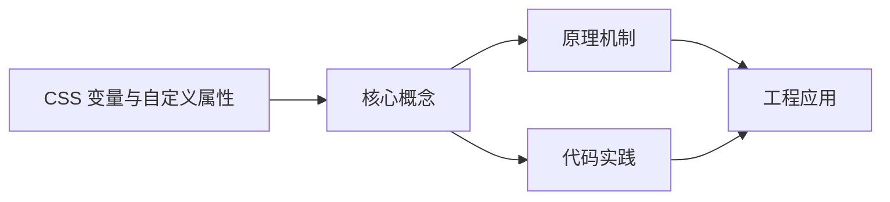
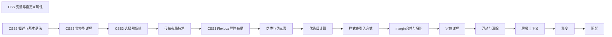

## 1. 学习目标（Bloom 分类）

本节按照布鲁姆教育目标分类学组织学习路径。本文主题为《CSS 变量与自定义属性》，属于 CSS 模块，读者可以根据自身阶段选择阅读深度。

记忆层面：能够准确复述本文的核心概念、术语与基本语法或操作步骤，并能够在提问或检索时快速定位对应知识点。能够说出 CSS 的核心概念、术语与标准写法。

理解层面：能够用自己的语言解释核心原理与工作机制，说明概念之间的因果关系，而不是机械记忆结论。能够解释 CSS 的工作原理与设计动机。

应用层面：能够在真实项目或练习场景中运用本文知识解决具体问题，写出正确且可维护的实现。能够编写符合 CSS 规范的完整实现。

分析层面：能够拆解复杂问题，比较本文主题与相邻概念的异同，识别边界条件与例外情况。能够分析 CSS 与相邻方案的差异与边界。

评价层面：能够根据约束条件（性能、可读性、安全、成本）评价不同方案的优劣，做出有依据的技术决策。能够根据场景评价 CSS 相关方案的优劣。

创造层面：能够把本文知识与其他模块知识组合，设计出新的解决方案或可复用的工程模式。能够组合 CSS 与其他技术设计完整方案。

通过本节学习，读者应当能够把《CSS 变量与自定义属性》纳入自己的知识网络，并与 CSS 模块的其他主题（选择器、盒模型、布局、动画、响应式）建立关联。

## 2. 历史动机与发展脉络

《CSS 变量与自定义属性》是 CSS 领域的重要主题。要真正理解它，需要先了解它解决的问题与演进过程。

CSS 于 1994 年由 Håkon Wium Lie 提出，1996 年 CSS1 发布，解决 HTML 表现层混杂问题；CSS2.1（2011）与 CSS3 模块化（2012+）奠定现代 Web 样式基础。
现代 CSS 的能力版图：Flexbox/Grid 布局、自定义属性（变量）、容器查询、子网格、层叠层（@layer）、现代颜色（oklch）。
CSS 的设计核心是“层叠与继承”：来源、优先级、顺序共同决定最终样式；理解层叠是排查样式问题的前提。

回到本文主题：CSS 变量与自定义属性 的提出与成熟，正是上述技术背景下的必然产物。早期实现往往以简单可用为目标，随着工程规模扩大，社区逐渐沉淀出标准做法与最佳实践；理解这一脉络，可以帮助读者判断“为什么文档中的推荐写法是现在这个样子”，也能在遇到历史遗留代码时准确识别其设计年代与取舍。


## 3. 形式化定义与核心概念精讲

本节把《CSS 变量与自定义属性》涉及的核心概念以“定义 + 讲解”的形式展开。读者应把定义当作工具，把讲解当作理解路径；两者结合才能形成可迁移的知识。

选择器与优先级：id > class/属性/伪类 > 元素/伪元素；!important 打破优先级（应避免）。
盒模型：content/padding/border/margin，box-sizing 决定 width 语义（border-box 推荐）。
布局体系：普通流、浮动（历史）、Flexbox（一维）、Grid（二维）；position 定位（relative/absolute/fixed/sticky）。

### 3.1 原文章节逐一精讲

原文档把主题拆分为 18 个小节，下面按顺序给出每一节的导读讲解，随后保留原文细节供精读。

#### 原文精读（完整保留）

# CSS 变量与自定义属性

> **符号约定**：`< >` 必填参数 | `[ ]` 可选参数

---

#### 1. CSS 自定义属性基础

##### 1.1 什么是 CSS 自定义属性

CSS自定义属性（也称为CSS变量）允许开发者定义可复用的值，通过 `--` 前缀声明，使用 `var()` 函数引用。

```css
/* 声明自定义属性 */
:root {
  --primary-color: #3498db;
  --secondary-color: #2ecc71;
  --font-size-base: 16px;
  --spacing-unit: 8px;
  --border-radius: 4px;
  --transition-speed: 0.3s;
}

/* 使用自定义属性 */
.button {
  background-color: var(--primary-color);
  font-size: var(--font-size-base);
  padding: var(--spacing-unit) calc(var(--spacing-unit) * 2);
  border-radius: var(--border-radius);
  transition: background-color var(--transition-speed) ease;
}

.button:hover {
  background-color: var(--secondary-color);
}
```

##### 1.2 与预处理器变量的区别

| 特性           | CSS自定义属性      | Sass/Less变量  |
| :------------- | :----------------- | :------------- |
| 运行时         | 是，动态更新       | 否，编译时替换 |
| 作用域         | 遵循CSS层叠        | 全局或块级     |
| 媒体查询       | 可在媒体查询中修改 | 不可           |
| JavaScript操作 | 可读写             | 不可           |
| 浏览器支持     | 现代浏览器         | 编译后无限制   |

##### 1.3 命名规范

```css
:root {
  /* 推荐：使用有意义的名称 */
  --color-primary: #3498db;
  --color-secondary: #2ecc71;
  --color-text: #333;
  --color-background: #fff;

  /* 推荐：语义化命名而非具体值 */
  --color-danger: #e74c3c; /* 而非 --color-red */
  --spacing-small: 8px; /* 而非 --spacing-8px */
  --font-size-large: 1.25rem; /* 而非 --font-size-20 */

  /* 大小写敏感 */
  --myVar: 10px;
  --myvar: 20px; /* 不同于 --myVar */

  /* 可以包含特殊字符 */
  --my-color: blue;
  --my_color: blue;
}
```

#### 2. 作用域与层叠

##### 2.1 自定义属性的作用域

```css
/* 全局作用域（:root） */
:root {
  --main-color: #3498db;
  --padding: 16px;
}

/* 局部作用域 */
.card {
  --card-bg: white;
  --card-shadow: 0 2px 8px rgba(0, 0, 0, 0.1);
  background: var(--card-bg);
  box-shadow: var(--card-shadow);
  padding: var(--padding);
}

/* 子元素继承父元素的自定义属性 */
.card-header {
  /* 继承 --card-bg, --card-shadow, --main-color 等 */
  color: var(--main-color);
  padding: var(--padding);
}

/* 覆盖父级自定义属性 */
.dark .card {
  --card-bg: #2d2d2d;
  --card-shadow: 0 2px 8px rgba(0, 0, 0, 0.3);
  --main-color: #5dade2; /* 局部覆盖 */
}
```

##### 2.2 层叠与优先级

```css
:root {
  --theme-color: blue;
}

.container {
  --theme-color: green;
}

.container .element {
  /* --theme-color 为 green（继承自 .container） */
  color: var(--theme-color);
}

.element-outside {
  /* --theme-color 为 blue（继承自 :root） */
  color: var(--theme-color);
}

/* 优先级规则与普通CSS属性相同 */
#special {
  --theme-color: red; /* ID选择器优先级更高 */
}
```

#### 3. var() 函数

##### 3.1 基本用法与默认值

```css
.element {
  /* 使用默认值：当变量未定义时使用 */
  color: var(--text-color, #333);
  font-size: var(--font-size, 16px);

  /* 默认值可以是另一个变量 */
  background: var(--bg-color, var(--default-bg, white));

  /* 默认值可以包含空格和多个值 */
  margin: var(--margin, 10px 20px);

  /* 不能用于属性名 */
  /* 错误: var(--prop-name): red; */
}
```

##### 3.2 var() 在计算中的使用

```css
:root {
  --spacing: 8;
}

.element {
  /* calc() 中使用变量 */
  padding: calc(var(--spacing) * 1px); /* 8px */
  margin: calc(var(--spacing) * 2px); /* 16px */
  width: calc(100% - var(--spacing) * 4px); /* 100% - 32px */

  /* 变量直接存储带单位的值更常见 */
  --spacing-unit: 8px;
  padding: var(--spacing-unit);
  margin: calc(var(--spacing-unit) * 2);
}
```

#### 4. 动态主题系统

##### 4.1 亮色/暗色主题

```css
/* 亮色主题 */
:root {
  --color-bg-primary: #ffffff;
  --color-bg-secondary: #f5f5f5;
  --color-text-primary: #333333;
  --color-text-secondary: #666666;
  --color-border: #e0e0e0;
  --color-accent: #3498db;
  --shadow-sm: 0 1px 3px rgba(0, 0, 0, 0.08);
  --shadow-md: 0 4px 12px rgba(0, 0, 0, 0.1);
}

/* 暗色主题 */
[data-theme='dark'] {
  --color-bg-primary: #1a1a2e;
  --color-bg-secondary: #16213e;
  --color-text-primary: #e0e0e0;
  --color-text-secondary: #a0a0a0;
  --color-border: #333355;
  --color-accent: #5dade2;
  --shadow-sm: 0 1px 3px rgba(0, 0, 0, 0.3);
  --shadow-md: 0 4px 12px rgba(0, 0, 0, 0.4);
}

/* 系统偏好检测 */
@media (prefers-color-scheme: dark) {
  :root:not([data-theme]) {
    --color-bg-primary: #1a1a2e;
    --color-bg-secondary: #16213e;
    --color-text-primary: #e0e0e0;
    --color-text-secondary: #a0a0a0;
    --color-border: #333355;
    --color-accent: #5dade2;
    --shadow-sm: 0 1px 3px rgba(0, 0, 0, 0.3);
    --shadow-md: 0 4px 12px rgba(0, 0, 0, 0.4);
  }
}

/* 应用主题变量 */
body {
  background-color: var(--color-bg-primary);
  color: var(--color-text-primary);
  transition:
    background-color 0.3s ease,
    color 0.3s ease;
}

.card {
  background-color: var(--color-bg-secondary);
  border: 1px solid var(--color-border);
  box-shadow: var(--shadow-md);
  color: var(--color-text-primary);
}
```

##### 4.2 JavaScript 动态切换主题

```html
<button id="theme-toggle">切换主题</button>

<script>
  const toggle = document.getElementById('theme-toggle');
  const html = document.documentElement;

  // 读取保存的主题偏好
  const savedTheme = localStorage.getItem('theme');
  if (savedTheme) {
    html.setAttribute('data-theme', savedTheme);
  }

  toggle.addEventListener('click', () => {
    const current = html.getAttribute('data-theme');
    const next = current === 'dark' ? 'light' : 'dark';
    html.setAttribute('data-theme', next);
    localStorage.setItem('theme', next);
  });
</script>
```

##### 4.3 品牌主题系统

```css
/* 多品牌主题 */
:root {
  /* 默认品牌 */
  --brand-primary: #3498db;
  --brand-secondary: #2ecc71;
  --brand-gradient: linear-gradient(135deg, var(--brand-primary), var(--brand-secondary));
}

[data-brand='brand-a'] {
  --brand-primary: #e74c3c;
  --brand-secondary: #f39c12;
}

[data-brand='brand-b'] {
  --brand-primary: #9b59b6;
  --brand-secondary: #1abc9c;
}

/* 组件使用品牌变量 */
.brand-button {
  background: var(--brand-gradient);
  color: white;
  border: none;
  padding: 12px 24px;
  border-radius: var(--border-radius, 4px);
}
```

#### 5. 响应式设计中的变量

##### 5.1 断点变量

```css
:root {
  /* 断点值（用于JS读取） */
  --breakpoint-sm: 640px;
  --breakpoint-md: 768px;
  --breakpoint-lg: 1024px;
  --breakpoint-xl: 1280px;

  /* 响应式间距 */
  --container-padding: 16px;
  --section-spacing: 32px;
}

@media (min-width: 768px) {
  :root {
    --container-padding: 24px;
    --section-spacing: 48px;
  }
}

@media (min-width: 1024px) {
  :root {
    --container-padding: 32px;
    --section-spacing: 64px;
  }
}

.container {
  padding: 0 var(--container-padding);
}

section {
  margin-bottom: var(--section-spacing);
}
```

##### 5.2 流式排版

```css
:root {
  /* 流式字体大小 */
  --font-size-base: clamp(1rem, 0.875rem + 0.5vw, 1.25rem);
  --font-size-sm: clamp(0.875rem, 0.75rem + 0.5vw, 1rem);
  --font-size-lg: clamp(1.25rem, 1rem + 1vw, 1.75rem);
  --font-size-xl: clamp(1.75rem, 1.25rem + 2vw, 3rem);
}

body {
  font-size: var(--font-size-base);
}

h1 {
  font-size: var(--font-size-xl);
}
h2 {
  font-size: var(--font-size-lg);
}
small {
  font-size: var(--font-size-sm);
}
```

#### 6. JavaScript 操作自定义属性

##### 6.1 读写自定义属性

```javascript
// 读取自定义属性
const root = document.documentElement;
const primaryColor = getComputedStyle(root).getPropertyValue('--color-primary');
console.log(primaryColor.trim()); // "#3498db"

// 设置自定义属性
root.style.setProperty('--color-primary', '#e74c3c');

// 在特定元素上设置
const card = document.querySelector('.card');
card.style.setProperty('--card-bg', '#f0f0f0');

// 移除自定义属性
card.style.removeProperty('--card-bg');
```

##### 6.2 动态样式更新

```javascript
// 根据用户输入动态更新主题色
function updateAccentColor(hex) {
  document.documentElement.style.setProperty('--color-accent', hex);
}

// 基于滚动位置更新变量
window.addEventListener('scroll', () => {
  const scrollPercent = window.scrollY / (document.body.scrollHeight - window.innerHeight);
  document.documentElement.style.setProperty('--scroll-progress', scrollPercent);
});

// 鼠标位置跟踪
document.addEventListener('mousemove', (e) => {
  const x = e.clientX / window.innerWidth;
  const y = e.clientY / window.innerHeight;
  document.documentElement.style.setProperty('--mouse-x', x);
  document.documentElement.style.setProperty('--mouse-y', y);
});
```

#### 7. 常见问题与解决方案

##### 7.1 变量未定义时的回退

```css
/* 问题：变量未定义导致属性无效 */
.element {
  color: var(--undefined-var); /* 无效值，属性被忽略 */
}

/* 解决方案1：提供默认值 */
.element {
  color: var(--undefined-var, #333);
}

/* 解决方案2：使用 @supports 检测 */
@supports (--css: variables) {
  .element {
    color: var(--text-color);
  }
}
@supports not (--css: variables) {
  .element {
    color: #333;
  }
}
```

##### 7.2 循环依赖

```css
/* 错误：循环引用 */
:root {
  --a: var(--b);
  --b: var(--a); /* 无限循环！ */
}

/* 解决方案：确保变量定义不形成环 */
:root {
  --a: blue;
  --b: var(--a); /* 正确：单向依赖 */
}
```

##### 7.3 变量与单位

```css
/* 问题：变量值缺少单位 */
:root {
  --size: 20;
}

.element {
  /* width: var(--size)px;  错误！这会被解析为 "20px" 字符串但不是有效值 */
  width: calc(var(--size) * 1px); /* 正确 */
}

/* 推荐：变量直接包含单位 */
:root {
  --size: 20px;
}

.element {
  width: var(--size); /* 简洁正确 */
}
```

#### 8. 总结与最佳实践

##### 8.1 核心要点

1. **CSS变量是运行时动态的**，与预处理器变量本质不同
2. **遵循层叠规则**，可在任何选择器中定义和覆盖
3. **var() 必须提供默认值**，增强健壮性
4. **语义化命名**，使用 `--color-danger` 而非 `--color-red`

##### 8.2 最佳实践

1. **全局变量放在 :root**，局部变量放在组件选择器
2. **分类组织变量**：颜色、间距、字体、动画等分组
3. **主题系统用 data 属性**：`[data-theme="dark"]` 切换
4. **响应式用媒体查询修改变量**，而非重复写组件样式
5. **JavaScript 修改变量实现动态效果**，避免直接操作样式
6. **变量命名加前缀**：避免与第三方库冲突，如 `--myapp-color`
#### 变量定义

**基本写法：定义全局变量**
`:root { --<变量名>: <值>; }`
```css
/* 在根元素定义全局变量 */
:root {
  --primary-color: #007bff;
}
```

---

**基本写法：定义局部变量**
`<选择器> { --<变量名>: <值>; }`
```css
/* 在特定元素定义局部变量 */
.card {
  --card-padding: 20px;
}
```

---

**基本写法：定义颜色变量**
`--<变量名>: <颜色值>;`
```css
/* 定义颜色变量 */
:root {
  --text-color: #333333;
  --bg-color: #ffffff;
}
```

---

**基本写法：定义尺寸变量**
`--<变量名>: <长度值>;`
```css
/* 定义尺寸变量 */
:root {
  --spacing-sm: 8px;
  --spacing-md: 16px;
  --spacing-lg: 24px;
}
```

---

**基本写法：定义字号变量**
`--<变量名>: <字号值>;`
```css
/* 定义字号变量 */
:root {
  --font-size-base: 16px;
  --font-size-lg: 1.25rem;
}
```

---

**基本写法：定义字体变量**
`--<变量名>: <字体栈>;`
```css
/* 定义字体变量 */
:root {
  --font-family-sans: "Helvetica Neue", sans-serif;
  --font-family-mono: "Fira Code", monospace;
}
```

---

**基本写法：定义动画变量**
`--<变量名>: <动画值>;`
```css
/* 定义动画变量 */
:root {
  --transition-fast: 0.2s ease-in-out;
  --transition-slow: 0.5s ease;
}
```

---

#### 变量使用

**基本写法：使用变量**
`<属性>: var(--<变量名>);`
```css
/* 使用自定义变量 */
.button {
  background-color: var(--primary-color);
  padding: var(--spacing-md);
}
```

---

**基本写法：变量带默认值**
`<属性>: var(--<变量名>, <默认值>);`
```css
/* 变量未定义时使用默认值 */
.box {
  padding: var(--custom-padding, 10px);
}
```

---

**基本写法：变量嵌套使用**
`--<变量名>: var(--<其他变量>);`
```css
/* 变量引用其他变量 */
:root {
  --base-spacing: 10px;
  --double-spacing: calc(var(--base-spacing) * 2);
}
```

---

**基本写法：变量在 calc 中使用**
`<属性>: calc(<表达式> var(--<变量名>));`
```css
/* 在 calc 中使用变量 */
.box {
  width: calc(100% - var(--sidebar-width));
  margin: calc(var(--spacing-md) * 2);
}
```

---

**基本写法：变量在渐变中使用**
`background: linear-gradient(<方向>, var(--<颜色1>), var(--<颜色2>));`
```css
/* 在渐变中使用变量 */
.header {
  background: linear-gradient(135deg, var(--color-start), var(--color-end));
}
```

---

**基本写法：变量在 transform 中使用**
`transform: translate(var(--<x>), var(--<y>));`
```css
/* 在 transform 中使用变量 */
.box {
  transform: translate(var(--offset-x), var(--offset-y));
}
```

---

#### 变量作用域

**基本写法：全局变量**
`:root { --<变量名>: <值>; }`
```css
/* 全局作用域变量 */
:root {
  --global-color: #007bff;
}
```

---

**基本写法：局部变量覆盖**
`<选择器> { --<变量名>: <新值>; }`
```css
/* 局部覆盖全局变量 */
.dark-theme {
  --bg-color: #1a1a1a;
  --text-color: #ffffff;
}
```

---

**基本写法：组件级变量**
`.<组件类> { --<变量名>: <值>; }`
```css
/* 组件作用域变量 */
.card {
  --card-bg: white;
  --card-border: 1px solid #ccc;
  background: var(--card-bg);
  border: var(--card-border);
}
```

---

**基本写法：媒体查询中修改变量**
`@media <条件> { :root { --<变量名>: <新值>; } }`
```css
/* 响应式调整变量值 */
:root {
  --font-size: 16px;
}
@media (max-width: 768px) {
  :root {
    --font-size: 14px;
  }
}
```

---

#### 主题切换

**基本写法：亮色主题变量**
`[data-theme="light"] { --<变量名>: <值>; }`
```css
/* 亮色主题变量定义 */
[data-theme="light"] {
  --bg-color: #ffffff;
  --text-color: #333333;
  --border-color: #cccccc;
}
```

---

**基本写法：暗色主题变量**
`[data-theme="dark"] { --<变量名>: <值>; }`
```css
/* 暗色主题变量定义 */
[data-theme="dark"] {
  --bg-color: #1a1a1a;
  --text-color: #ffffff;
  --border-color: #444444;
}
```

---

**基本写法：使用主题变量**
`<属性>: var(--<变量名>);`
```css
/* 应用主题变量 */
body {
  background-color: var(--bg-color);
  color: var(--text-color);
}
```

---

**基本写法：prefers-color-scheme 自动切换**
`@media (prefers-color-scheme: dark) { :root { --<变量名>: <值>; } }`
```css
/* 跟随系统主题自动切换 */
:root {
  --bg-color: #ffffff;
  --text-color: #333333;
}
@media (prefers-color-scheme: dark) {
  :root {
    --bg-color: #1a1a1a;
    --text-color: #ffffff;
  }
}
```

---

#### 变量与 JavaScript

**基本写法：JavaScript 读取变量**
`getComputedStyle(<元素>).getPropertyValue('--<变量名>')`
```css
/* JavaScript 读取 CSS 变量 */
```

---

**基本写法：JavaScript 设置变量**
`<元素>.style.setProperty('--<变量名>', <值>)`
```css
/* JavaScript 设置 CSS 变量 */
```

---

#### 变量继承

**基本写法：变量继承**
`<父选择器> { --<变量名>: <值>; } <子选择器> { <属性>: var(--<变量名>); }`
```css
/* 子元素继承父元素变量 */
.parent {
  --text-size: 18px;
}
.child {
  font-size: var(--text-size);
}
```

---

**基本写法：变量覆盖继承**
`<子选择器> { --<变量名>: <新值>; }`
```css
/* 子元素覆盖继承的变量 */
.parent {
  --text-size: 18px;
}
.child {
  --text-size: 24px;
  font-size: var(--text-size);
}
```

---

#### 设计令牌系统

**单行写法：多颜色变量定义**
`:root { --color-<名1>: <值1>; --color-<名2>: <值2>; --color-<名3>: <值3>; }`
```css
/* 单行定义颜色令牌系统 */
:root { --color-primary: #007bff; --color-secondary: #6c757d; --color-success: #28a745; --color-danger: #dc3545; }
```

---

**换行写法：多颜色变量定义**
`:root { --color-<名>: <值>; }`
```css
/* 换行定义颜色令牌系统 */
:root {
  --color-primary: #007bff;
  --color-secondary: #6c757d;
  --color-success: #28a745;
  --color-danger: #dc3545;
  --color-warning: #ffc107;
  --color-info: #17a2b8;
}
```

---

**单行写法：多尺寸变量定义**
`:root { --size-<名1>: <值1>; --size-<名2>: <值2>; --size-<名3>: <值3>; }`
```css
/* 单行定义尺寸令牌系统 */
:root { --size-sm: 8px; --size-md: 16px; --size-lg: 24px; --size-xl: 32px; }
```

---

**换行写法：多尺寸变量定义**
`:root { --size-<名>: <值>; }`
```css
/* 换行定义尺寸令牌系统 */
:root {
  --size-xs: 4px;
  --size-sm: 8px;
  --size-md: 16px;
  --size-lg: 24px;
  --size-xl: 32px;
  --size-2xl: 48px;
}
```

---

**单行写法：多字号变量定义**
`:root { --font-size-<名1>: <值1>; --font-size-<名2>: <值2>; --font-size-<名3>: <值3>; }`
```css
/* 单行定义字号令牌系统 */
:root { --font-size-sm: 0.875rem; --font-size-base: 1rem; --font-size-lg: 1.25rem; --font-size-xl: 1.5rem; }
```

---

**换行写法：多字号变量定义**
`:root { --font-size-<名>: <值>; }`
```css
/* 换行定义字号令牌系统 */
:root {
  --font-size-xs: 0.75rem;
  --font-size-sm: 0.875rem;
  --font-size-base: 1rem;
  --font-size-lg: 1.25rem;
  --font-size-xl: 1.5rem;
  --font-size-2xl: 2rem;
  --font-size-3xl: 3rem;
}
```

---

#### 变量类型与 @property

**基本写法：@property 定义类型**
`@property --<变量名> { syntax: "<类型>"; inherits: <布尔>; initial-value: <值>; }`
```css
/* 定义带类型的自定义属性 */
@property --angle {
  syntax: "<angle>";
  inherits: false;
  initial-value: 0deg;
}
```

---

**基本写法：@property 颜色类型**
`@property --<变量名> { syntax: "<color>"; inherits: true; initial-value: <颜色>; }`
```css
/* 定义颜色类型自定义属性 */
@property --theme-color {
  syntax: "<color>";
  inherits: true;
  initial-value: #007bff;
}
```

---

**基本写法：@property 长度类型**
`@property --<变量名> { syntax: "<length>"; inherits: true; initial-value: <长度>; }`
```css
/* 定义长度类型自定义属性 */
@property --spacing {
  syntax: "<length>";
  inherits: true;
  initial-value: 16px;
}
```

---

**基本写法：@property 动画**
`@keyframes <名称> { from { --<变量名>: <值1>; } to { --<变量名>: <值2>; } }`
```css
/* 使用 @property 实现变量动画 */
@property --rotation {
  syntax: "<angle>";
  inherits: false;
  initial-value: 0deg;
}
@keyframes spin {
  from { --rotation: 0deg; }
  to { --rotation: 360deg; }
}
.spinner {
  animation: spin 1s linear infinite;
  transform: rotate(var(--rotation));
}
```

---

#### 变量回退值

**基本写法：单层回退**
`<属性>: var(--<变量名>, <默认值>);`
```css
/* 变量未定义时使用默认值 */
.box {
  color: var(--text-color, #333333);
}
```

---

**基本写法：多层回退**
`<属性>: var(--<变量1>, var(--<变量2>, <默认值>));`
```css
/* 多层变量回退 */
.box {
  color: var(--custom-color, var(--theme-color), #333333);
}
```

---

#### 变量与 calc 计算

**基本写法：变量乘法**
`<属性>: calc(var(--<变量>) * <系数>);`
```css
/* 变量乘法计算 */
.box {
  width: calc(var(--base-width) * 2);
}
```

---

**基本写法：变量加法**
`<属性>: calc(var(--<变量1>) + var(--<变量2>));`
```css
/* 变量加法计算 */
.box {
  padding: calc(var(--spacing-sm) + var(--spacing-md));
}
```

---

**基本写法：变量减法**
`<属性>: calc(var(--<变量1>) - var(--<变量2>));`
```css
/* 变量减法计算 */
.box {
  margin: calc(var(--container-width) - var(--content-width));
}
```

---

**基本写法：变量除法**
`<属性>: calc(var(--<变量>) / <系数>);`
```css
/* 变量除法计算 */
.box {
  width: calc(var(--full-width) / 3);
}
```


### 3.2 概念关系图

下面用 Mermaid 图表达本文核心概念之间的关系，帮助读者建立整体图景：



图中展示的是本文知识的结构化关系：核心概念是入口，原理机制解释“为什么”，代码实践演示“怎么做”，工程应用回答“何时用”。读者学习时可以把每个小节的内容挂接到对应节点上。

## 4. 理论推导与原理解析

本节深入《CSS 变量与自定义属性》背后的原理。理论部分不求面面俱到，而是聚焦“能解释现象、能指导实践”的关键推导。

选择器与优先级：id > class/属性/伪类 > 元素/伪元素；!important 打破优先级（应避免）。
盒模型：content/padding/border/margin，box-sizing 决定 width 语义（border-box 推荐）。
布局体系：普通流、浮动（历史）、Flexbox（一维）、Grid（二维）；position 定位（relative/absolute/fixed/sticky）。
层叠上下文：z-index 只在同一层叠上下文中比较；transform/opacity/filter 创建新上下文。

需要强调的是，理论推导与工程实践之间存在翻译层：理论给出的是理想化模型与边界条件，工程代码则必须处理真实环境中的例外。读者在学习时应先掌握理论的“标准情形”，再通过陷阱章节了解“非标准情形”。

## 5. 代码示例与逐行讲解

本节把原文中的代码示例系统整理，并为每个示例补充用途说明与讲解。读者不应只浏览代码，而应逐段对照讲解理解设计意图。

### 5.1 示例：1.1 什么是 CSS 自定义属性

该示例来自原文《1.1 什么是 CSS 自定义属性》小节，用于演示CSS 变量与自定义属性相关操作。阅读时请先看代码结构，再看其后的讲解。

```css
/* 声明自定义属性 */
:root {
  --primary-color: #3498db;
  --secondary-color: #2ecc71;
  --font-size-base: 16px;
  --spacing-unit: 8px;
  --border-radius: 4px;
  --transition-speed: 0.3s;
}

/* 使用自定义属性 */
.button {
  background-color: var(--primary-color);
  font-size: var(--font-size-base);
  padding: var(--spacing-unit) calc(var(--spacing-unit) * 2);
  border-radius: var(--border-radius);
  transition: background-color var(--transition-speed) ease;
}

.button:hover {
  background-color: var(--secondary-color);
}
```

讲解：这段代码演示了本节核心知识点。代码中的关键操作可以归纳为三步：准备（定义或初始化）、执行（核心逻辑）、收尾（释放资源或返回结果）。实际项目中，这三步往往被封装为函数或类，以提升复用性与可测试性。

关键点分析：

该示例共 20 行有效代码，结构以数据或配置为主。阅读时应关注：数据字段的含义、配置项的作用，以及它们与运行行为的对应关系。

进阶思考路径：先尝试修改参数观察行为变化，再把示例中的模式迁移到自己的项目中；每次修改都记录预期与实测差异，这是把示例转化为能力的最快方式。

### 5.2 示例：1.3 命名规范

该示例来自原文《1.3 命名规范》小节，用于演示CSS 变量与自定义属性相关操作。阅读时请先看代码结构，再看其后的讲解。

```css
:root {
  /* 推荐：使用有意义的名称 */
  --color-primary: #3498db;
  --color-secondary: #2ecc71;
  --color-text: #333;
  --color-background: #fff;

  /* 推荐：语义化命名而非具体值 */
  --color-danger: #e74c3c; /* 而非 --color-red */
  --spacing-small: 8px; /* 而非 --spacing-8px */
  --font-size-large: 1.25rem; /* 而非 --font-size-20 */

  /* 大小写敏感 */
  --myVar: 10px;
  --myvar: 20px; /* 不同于 --myVar */

  /* 可以包含特殊字符 */
  --my-color: blue;
  --my_color: blue;
}
```

讲解：这段代码演示了本节核心知识点。代码中的关键操作可以归纳为三步：准备（定义或初始化）、执行（核心逻辑）、收尾（释放资源或返回结果）。实际项目中，这三步往往被封装为函数或类，以提升复用性与可测试性。

关键点分析：

该示例共 17 行有效代码，结构以数据或配置为主。阅读时应关注：数据字段的含义、配置项的作用，以及它们与运行行为的对应关系。

进阶思考路径：先尝试修改参数观察行为变化，再把示例中的模式迁移到自己的项目中；每次修改都记录预期与实测差异，这是把示例转化为能力的最快方式。

### 5.3 示例：2.1 自定义属性的作用域

该示例来自原文《2.1 自定义属性的作用域》小节，用于演示CSS 变量与自定义属性相关操作。阅读时请先看代码结构，再看其后的讲解。

```css
/* 全局作用域（:root） */
:root {
  --main-color: #3498db;
  --padding: 16px;
}

/* 局部作用域 */
.card {
  --card-bg: white;
  --card-shadow: 0 2px 8px rgba(0, 0, 0, 0.1);
  background: var(--card-bg);
  box-shadow: var(--card-shadow);
  padding: var(--padding);
}

/* 子元素继承父元素的自定义属性 */
.card-header {
  /* 继承 --card-bg, --card-shadow, --main-color 等 */
  color: var(--main-color);
  padding: var(--padding);
}

/* 覆盖父级自定义属性 */
.dark .card {
  --card-bg: #2d2d2d;
  --card-shadow: 0 2px 8px rgba(0, 0, 0, 0.3);
  --main-color: #5dade2; /* 局部覆盖 */
}
```

讲解：这段代码演示了本节核心知识点。代码中的关键操作可以归纳为三步：准备（定义或初始化）、执行（核心逻辑）、收尾（释放资源或返回结果）。实际项目中，这三步往往被封装为函数或类，以提升复用性与可测试性。

关键点分析：

该示例共 25 行有效代码，结构以数据或配置为主。阅读时应关注：数据字段的含义、配置项的作用，以及它们与运行行为的对应关系。

进阶思考路径：先尝试修改参数观察行为变化，再把示例中的模式迁移到自己的项目中；每次修改都记录预期与实测差异，这是把示例转化为能力的最快方式。

### 5.4 示例：2.2 层叠与优先级

该示例来自原文《2.2 层叠与优先级》小节，用于演示CSS 变量与自定义属性相关操作。阅读时请先看代码结构，再看其后的讲解。

```css
:root {
  --theme-color: blue;
}

.container {
  --theme-color: green;
}

.container .element {
  /* --theme-color 为 green（继承自 .container） */
  color: var(--theme-color);
}

.element-outside {
  /* --theme-color 为 blue（继承自 :root） */
  color: var(--theme-color);
}

/* 优先级规则与普通CSS属性相同 */
#special {
  --theme-color: red; /* ID选择器优先级更高 */
}
```

讲解：这段代码演示了本节核心知识点。代码中的关键操作可以归纳为三步：准备（定义或初始化）、执行（核心逻辑）、收尾（释放资源或返回结果）。实际项目中，这三步往往被封装为函数或类，以提升复用性与可测试性。

关键点分析：

该示例共 18 行有效代码，结构以数据或配置为主。阅读时应关注：数据字段的含义、配置项的作用，以及它们与运行行为的对应关系。

进阶思考路径：先尝试修改参数观察行为变化，再把示例中的模式迁移到自己的项目中；每次修改都记录预期与实测差异，这是把示例转化为能力的最快方式。

### 5.5 示例：3.1 基本用法与默认值

该示例来自原文《3.1 基本用法与默认值》小节，用于演示CSS 变量与自定义属性相关操作。阅读时请先看代码结构，再看其后的讲解。

```css
.element {
  /* 使用默认值：当变量未定义时使用 */
  color: var(--text-color, #333);
  font-size: var(--font-size, 16px);

  /* 默认值可以是另一个变量 */
  background: var(--bg-color, var(--default-bg, white));

  /* 默认值可以包含空格和多个值 */
  margin: var(--margin, 10px 20px);

  /* 不能用于属性名 */
  /* 错误: var(--prop-name): red; */
}
```

讲解：这段代码演示了本节核心知识点。代码中的关键操作可以归纳为三步：准备（定义或初始化）、执行（核心逻辑）、收尾（释放资源或返回结果）。实际项目中，这三步往往被封装为函数或类，以提升复用性与可测试性。

关键点分析：

该示例共 11 行有效代码，结构以数据或配置为主。阅读时应关注：数据字段的含义、配置项的作用，以及它们与运行行为的对应关系。

进阶思考路径：先尝试修改参数观察行为变化，再把示例中的模式迁移到自己的项目中；每次修改都记录预期与实测差异，这是把示例转化为能力的最快方式。

### 5.6 示例：3.2 var() 在计算中的使用

该示例来自原文《3.2 var() 在计算中的使用》小节，用于演示CSS 变量与自定义属性相关操作。阅读时请先看代码结构，再看其后的讲解。

```css
:root {
  --spacing: 8;
}

.element {
  /* calc() 中使用变量 */
  padding: calc(var(--spacing) * 1px); /* 8px */
  margin: calc(var(--spacing) * 2px); /* 16px */
  width: calc(100% - var(--spacing) * 4px); /* 100% - 32px */

  /* 变量直接存储带单位的值更常见 */
  --spacing-unit: 8px;
  padding: var(--spacing-unit);
  margin: calc(var(--spacing-unit) * 2);
}
```

讲解：这段代码演示了本节核心知识点。代码中的关键操作可以归纳为三步：准备（定义或初始化）、执行（核心逻辑）、收尾（释放资源或返回结果）。实际项目中，这三步往往被封装为函数或类，以提升复用性与可测试性。

关键点分析：

该示例共 13 行有效代码，结构以数据或配置为主。阅读时应关注：数据字段的含义、配置项的作用，以及它们与运行行为的对应关系。

进阶思考路径：先尝试修改参数观察行为变化，再把示例中的模式迁移到自己的项目中；每次修改都记录预期与实测差异，这是把示例转化为能力的最快方式。

### 5.7 示例：4.1 亮色/暗色主题

该示例来自原文《4.1 亮色/暗色主题》小节，用于演示CSS 变量与自定义属性相关操作。阅读时请先看代码结构，再看其后的讲解。

```css
/* 亮色主题 */
:root {
  --color-bg-primary: #ffffff;
  --color-bg-secondary: #f5f5f5;
  --color-text-primary: #333333;
  --color-text-secondary: #666666;
  --color-border: #e0e0e0;
  --color-accent: #3498db;
  --shadow-sm: 0 1px 3px rgba(0, 0, 0, 0.08);
  --shadow-md: 0 4px 12px rgba(0, 0, 0, 0.1);
}

/* 暗色主题 */
[data-theme='dark'] {
  --color-bg-primary: #1a1a2e;
  --color-bg-secondary: #16213e;
  --color-text-primary: #e0e0e0;
  --color-text-secondary: #a0a0a0;
  --color-border: #333355;
  --color-accent: #5dade2;
  --shadow-sm: 0 1px 3px rgba(0, 0, 0, 0.3);
  --shadow-md: 0 4px 12px rgba(0, 0, 0, 0.4);
}

/* 系统偏好检测 */
@media (prefers-color-scheme: dark) {
  :root:not([data-theme]) {
    --color-bg-primary: #1a1a2e;
    --color-bg-secondary: #16213e;
    --color-text-primary: #e0e0e0;
    --color-text-secondary: #a0a0a0;
    --color-border: #333355;
    --color-accent: #5dade2;
    --shadow-sm: 0 1px 3px rgba(0, 0, 0, 0.3);
    --shadow-md: 0 4px 12px rgba(0, 0, 0, 0.4);
  }
}

/* 应用主题变量 */
body {
  background-color: var(--color-bg-primary);
  color: var(--color-text-primary);
  transition:
    background-color 0.3s ease,
    color 0.3s ease;
}

.card {
  background-color: var(--color-bg-secondary);
  border: 1px solid var(--color-border);
  box-shadow: var(--shadow-md);
  color: var(--color-text-primary);
}
```

讲解：这段代码演示了本节核心知识点。代码中的关键操作可以归纳为三步：准备（定义或初始化）、执行（核心逻辑）、收尾（释放资源或返回结果）。实际项目中，这三步往往被封装为函数或类，以提升复用性与可测试性。

关键点分析：

该示例共 49 行有效代码，结构以数据或配置为主。阅读时应关注：数据字段的含义、配置项的作用，以及它们与运行行为的对应关系。

进阶思考路径：先尝试修改参数观察行为变化，再把示例中的模式迁移到自己的项目中；每次修改都记录预期与实测差异，这是把示例转化为能力的最快方式。

### 5.8 示例：4.2 JavaScript 动态切换主题

该示例来自原文《4.2 JavaScript 动态切换主题》小节，用于演示CSS 变量与自定义属性相关操作。阅读时请先看代码结构，再看其后的讲解。

```html
<button id="theme-toggle">切换主题</button>

<script>
  const toggle = document.getElementById('theme-toggle');
  const html = document.documentElement;

  // 读取保存的主题偏好
  const savedTheme = localStorage.getItem('theme');
  if (savedTheme) {
    html.setAttribute('data-theme', savedTheme);
  }

  toggle.addEventListener('click', () => {
    const current = html.getAttribute('data-theme');
    const next = current === 'dark' ? 'light' : 'dark';
    html.setAttribute('data-theme', next);
    localStorage.setItem('theme', next);
  });
</script>
```

讲解：这段代码演示了本节核心知识点。代码中的关键操作可以归纳为三步：准备（定义或初始化）、执行（核心逻辑）、收尾（释放资源或返回结果）。实际项目中，这三步往往被封装为函数或类，以提升复用性与可测试性。

关键点分析：

该示例共 16 行有效代码，包含 1 类关键结构（if）。其中：

- 入口与初始化部分负责建立上下文，对应实际项目中的启动或装配逻辑；
- 核心逻辑部分体现本文主题的主要操作，是阅读时最需要对照讲解理解的部分；
- 输出或返回部分把结果交给调用方，注意其类型与边界条件。

进阶思考路径：先尝试修改参数观察行为变化，再把示例中的模式迁移到自己的项目中；每次修改都记录预期与实测差异，这是把示例转化为能力的最快方式。

### 5.9 示例：4.3 品牌主题系统

该示例来自原文《4.3 品牌主题系统》小节，用于演示CSS 变量与自定义属性相关操作。阅读时请先看代码结构，再看其后的讲解。

```css
/* 多品牌主题 */
:root {
  /* 默认品牌 */
  --brand-primary: #3498db;
  --brand-secondary: #2ecc71;
  --brand-gradient: linear-gradient(135deg, var(--brand-primary), var(--brand-secondary));
}

[data-brand='brand-a'] {
  --brand-primary: #e74c3c;
  --brand-secondary: #f39c12;
}

[data-brand='brand-b'] {
  --brand-primary: #9b59b6;
  --brand-secondary: #1abc9c;
}

/* 组件使用品牌变量 */
.brand-button {
  background: var(--brand-gradient);
  color: white;
  border: none;
  padding: 12px 24px;
  border-radius: var(--border-radius, 4px);
}
```

讲解：这段代码演示了本节核心知识点。代码中的关键操作可以归纳为三步：准备（定义或初始化）、执行（核心逻辑）、收尾（释放资源或返回结果）。实际项目中，这三步往往被封装为函数或类，以提升复用性与可测试性。

关键点分析：

该示例共 23 行有效代码，结构以数据或配置为主。阅读时应关注：数据字段的含义、配置项的作用，以及它们与运行行为的对应关系。

进阶思考路径：先尝试修改参数观察行为变化，再把示例中的模式迁移到自己的项目中；每次修改都记录预期与实测差异，这是把示例转化为能力的最快方式。

### 5.10 示例：5.1 断点变量

该示例来自原文《5.1 断点变量》小节，用于演示CSS 变量与自定义属性相关操作。阅读时请先看代码结构，再看其后的讲解。

```css
:root {
  /* 断点值（用于JS读取） */
  --breakpoint-sm: 640px;
  --breakpoint-md: 768px;
  --breakpoint-lg: 1024px;
  --breakpoint-xl: 1280px;

  /* 响应式间距 */
  --container-padding: 16px;
  --section-spacing: 32px;
}

@media (min-width: 768px) {
  :root {
    --container-padding: 24px;
    --section-spacing: 48px;
  }
}

@media (min-width: 1024px) {
  :root {
    --container-padding: 32px;
    --section-spacing: 64px;
  }
}

.container {
  padding: 0 var(--container-padding);
}

section {
  margin-bottom: var(--section-spacing);
}
```

讲解：这段代码演示了本节核心知识点。代码中的关键操作可以归纳为三步：准备（定义或初始化）、执行（核心逻辑）、收尾（释放资源或返回结果）。实际项目中，这三步往往被封装为函数或类，以提升复用性与可测试性。

关键点分析：

该示例共 28 行有效代码，结构以数据或配置为主。阅读时应关注：数据字段的含义、配置项的作用，以及它们与运行行为的对应关系。

进阶思考路径：先尝试修改参数观察行为变化，再把示例中的模式迁移到自己的项目中；每次修改都记录预期与实测差异，这是把示例转化为能力的最快方式。

### 5.11 示例：5.2 流式排版

该示例来自原文《5.2 流式排版》小节，用于演示CSS 变量与自定义属性相关操作。阅读时请先看代码结构，再看其后的讲解。

```css
:root {
  /* 流式字体大小 */
  --font-size-base: clamp(1rem, 0.875rem + 0.5vw, 1.25rem);
  --font-size-sm: clamp(0.875rem, 0.75rem + 0.5vw, 1rem);
  --font-size-lg: clamp(1.25rem, 1rem + 1vw, 1.75rem);
  --font-size-xl: clamp(1.75rem, 1.25rem + 2vw, 3rem);
}

body {
  font-size: var(--font-size-base);
}

h1 {
  font-size: var(--font-size-xl);
}
h2 {
  font-size: var(--font-size-lg);
}
small {
  font-size: var(--font-size-sm);
}
```

讲解：这段代码演示了本节核心知识点。代码中的关键操作可以归纳为三步：准备（定义或初始化）、执行（核心逻辑）、收尾（释放资源或返回结果）。实际项目中，这三步往往被封装为函数或类，以提升复用性与可测试性。

关键点分析：

该示例共 19 行有效代码，结构以数据或配置为主。阅读时应关注：数据字段的含义、配置项的作用，以及它们与运行行为的对应关系。

进阶思考路径：先尝试修改参数观察行为变化，再把示例中的模式迁移到自己的项目中；每次修改都记录预期与实测差异，这是把示例转化为能力的最快方式。

### 5.12 示例：6.1 读写自定义属性

该示例来自原文《6.1 读写自定义属性》小节，用于演示CSS 变量与自定义属性相关操作。阅读时请先看代码结构，再看其后的讲解。

```javascript
// 读取自定义属性
const root = document.documentElement;
const primaryColor = getComputedStyle(root).getPropertyValue('--color-primary');
console.log(primaryColor.trim()); // "#3498db"

// 设置自定义属性
root.style.setProperty('--color-primary', '#e74c3c');

// 在特定元素上设置
const card = document.querySelector('.card');
card.style.setProperty('--card-bg', '#f0f0f0');

// 移除自定义属性
card.style.removeProperty('--card-bg');
```

讲解：这段代码演示了本节核心知识点。代码中的关键操作可以归纳为三步：准备（定义或初始化）、执行（核心逻辑）、收尾（释放资源或返回结果）。实际项目中，这三步往往被封装为函数或类，以提升复用性与可测试性。

关键点分析：

该示例共 11 行有效代码，结构以数据或配置为主。阅读时应关注：数据字段的含义、配置项的作用，以及它们与运行行为的对应关系。

进阶思考路径：先尝试修改参数观察行为变化，再把示例中的模式迁移到自己的项目中；每次修改都记录预期与实测差异，这是把示例转化为能力的最快方式。

### 5.13 示例：6.2 动态样式更新

该示例来自原文《6.2 动态样式更新》小节，用于演示CSS 变量与自定义属性相关操作。阅读时请先看代码结构，再看其后的讲解。

```javascript
// 根据用户输入动态更新主题色
function updateAccentColor(hex) {
  document.documentElement.style.setProperty('--color-accent', hex);
}

// 基于滚动位置更新变量
window.addEventListener('scroll', () => {
  const scrollPercent = window.scrollY / (document.body.scrollHeight - window.innerHeight);
  document.documentElement.style.setProperty('--scroll-progress', scrollPercent);
});

// 鼠标位置跟踪
document.addEventListener('mousemove', (e) => {
  const x = e.clientX / window.innerWidth;
  const y = e.clientY / window.innerHeight;
  document.documentElement.style.setProperty('--mouse-x', x);
  document.documentElement.style.setProperty('--mouse-y', y);
});
```

讲解：这段代码演示了本节核心知识点。代码中的关键操作可以归纳为三步：准备（定义或初始化）、执行（核心逻辑）、收尾（释放资源或返回结果）。实际项目中，这三步往往被封装为函数或类，以提升复用性与可测试性。

关键点分析：

该示例共 16 行有效代码，包含 1 类关键结构（function）。其中：

- 入口与初始化部分负责建立上下文，对应实际项目中的启动或装配逻辑；
- 核心逻辑部分体现本文主题的主要操作，是阅读时最需要对照讲解理解的部分；
- 输出或返回部分把结果交给调用方，注意其类型与边界条件。

进阶思考路径：先尝试修改参数观察行为变化，再把示例中的模式迁移到自己的项目中；每次修改都记录预期与实测差异，这是把示例转化为能力的最快方式。

### 5.14 示例：7.1 变量未定义时的回退

该示例来自原文《7.1 变量未定义时的回退》小节，用于演示CSS 变量与自定义属性相关操作。阅读时请先看代码结构，再看其后的讲解。

```css
/* 问题：变量未定义导致属性无效 */
.element {
  color: var(--undefined-var); /* 无效值，属性被忽略 */
}

/* 解决方案1：提供默认值 */
.element {
  color: var(--undefined-var, #333);
}

/* 解决方案2：使用 @supports 检测 */
@supports (--css: variables) {
  .element {
    color: var(--text-color);
  }
}
@supports not (--css: variables) {
  .element {
    color: #333;
  }
}
```

讲解：这段代码演示了本节核心知识点。代码中的关键操作可以归纳为三步：准备（定义或初始化）、执行（核心逻辑）、收尾（释放资源或返回结果）。实际项目中，这三步往往被封装为函数或类，以提升复用性与可测试性。

关键点分析：

该示例共 19 行有效代码，结构以数据或配置为主。阅读时应关注：数据字段的含义、配置项的作用，以及它们与运行行为的对应关系。

进阶思考路径：先尝试修改参数观察行为变化，再把示例中的模式迁移到自己的项目中；每次修改都记录预期与实测差异，这是把示例转化为能力的最快方式。

### 5.15 示例：7.2 循环依赖

该示例来自原文《7.2 循环依赖》小节，用于演示CSS 变量与自定义属性相关操作。阅读时请先看代码结构，再看其后的讲解。

```css
/* 错误：循环引用 */
:root {
  --a: var(--b);
  --b: var(--a); /* 无限循环！ */
}

/* 解决方案：确保变量定义不形成环 */
:root {
  --a: blue;
  --b: var(--a); /* 正确：单向依赖 */
}
```

讲解：这段代码演示了本节核心知识点。代码中的关键操作可以归纳为三步：准备（定义或初始化）、执行（核心逻辑）、收尾（释放资源或返回结果）。实际项目中，这三步往往被封装为函数或类，以提升复用性与可测试性。

关键点分析：

该示例共 10 行有效代码，结构以数据或配置为主。阅读时应关注：数据字段的含义、配置项的作用，以及它们与运行行为的对应关系。

进阶思考路径：先尝试修改参数观察行为变化，再把示例中的模式迁移到自己的项目中；每次修改都记录预期与实测差异，这是把示例转化为能力的最快方式。

### 5.16 示例：7.3 变量与单位

该示例来自原文《7.3 变量与单位》小节，用于演示CSS 变量与自定义属性相关操作。阅读时请先看代码结构，再看其后的讲解。

```css
/* 问题：变量值缺少单位 */
:root {
  --size: 20;
}

.element {
  /* width: var(--size)px;  错误！这会被解析为 "20px" 字符串但不是有效值 */
  width: calc(var(--size) * 1px); /* 正确 */
}

/* 推荐：变量直接包含单位 */
:root {
  --size: 20px;
}

.element {
  width: var(--size); /* 简洁正确 */
}
```

讲解：这段代码演示了本节核心知识点。代码中的关键操作可以归纳为三步：准备（定义或初始化）、执行（核心逻辑）、收尾（释放资源或返回结果）。实际项目中，这三步往往被封装为函数或类，以提升复用性与可测试性。

关键点分析：

该示例共 15 行有效代码，结构以数据或配置为主。阅读时应关注：数据字段的含义、配置项的作用，以及它们与运行行为的对应关系。

进阶思考路径：先尝试修改参数观察行为变化，再把示例中的模式迁移到自己的项目中；每次修改都记录预期与实测差异，这是把示例转化为能力的最快方式。

### 5.17 示例：变量定义

该示例来自原文《变量定义》小节，用于演示CSS 变量与自定义属性相关操作。阅读时请先看代码结构，再看其后的讲解。

```css
/* 在根元素定义全局变量 */
:root {
  --primary-color: #007bff;
}
```

讲解：这段代码演示了本节核心知识点。代码中的关键操作可以归纳为三步：准备（定义或初始化）、执行（核心逻辑）、收尾（释放资源或返回结果）。实际项目中，这三步往往被封装为函数或类，以提升复用性与可测试性。

关键点分析：

该示例共 4 行有效代码，结构以数据或配置为主。阅读时应关注：数据字段的含义、配置项的作用，以及它们与运行行为的对应关系。

进阶思考路径：先尝试修改参数观察行为变化，再把示例中的模式迁移到自己的项目中；每次修改都记录预期与实测差异，这是把示例转化为能力的最快方式。

### 5.18 示例：变量定义

该示例来自原文《变量定义》小节，用于演示CSS 变量与自定义属性相关操作。阅读时请先看代码结构，再看其后的讲解。

```css
/* 在特定元素定义局部变量 */
.card {
  --card-padding: 20px;
}
```

讲解：这段代码演示了本节核心知识点。代码中的关键操作可以归纳为三步：准备（定义或初始化）、执行（核心逻辑）、收尾（释放资源或返回结果）。实际项目中，这三步往往被封装为函数或类，以提升复用性与可测试性。

关键点分析：

该示例共 4 行有效代码，结构以数据或配置为主。阅读时应关注：数据字段的含义、配置项的作用，以及它们与运行行为的对应关系。

进阶思考路径：先尝试修改参数观察行为变化，再把示例中的模式迁移到自己的项目中；每次修改都记录预期与实测差异，这是把示例转化为能力的最快方式。

### 5.19 示例：变量定义

该示例来自原文《变量定义》小节，用于演示CSS 变量与自定义属性相关操作。阅读时请先看代码结构，再看其后的讲解。

```css
/* 定义颜色变量 */
:root {
  --text-color: #333333;
  --bg-color: #ffffff;
}
```

讲解：这段代码演示了本节核心知识点。代码中的关键操作可以归纳为三步：准备（定义或初始化）、执行（核心逻辑）、收尾（释放资源或返回结果）。实际项目中，这三步往往被封装为函数或类，以提升复用性与可测试性。

关键点分析：

该示例共 5 行有效代码，结构以数据或配置为主。阅读时应关注：数据字段的含义、配置项的作用，以及它们与运行行为的对应关系。

进阶思考路径：先尝试修改参数观察行为变化，再把示例中的模式迁移到自己的项目中；每次修改都记录预期与实测差异，这是把示例转化为能力的最快方式。

### 5.20 示例：变量定义

该示例来自原文《变量定义》小节，用于演示CSS 变量与自定义属性相关操作。阅读时请先看代码结构，再看其后的讲解。

```css
/* 定义尺寸变量 */
:root {
  --spacing-sm: 8px;
  --spacing-md: 16px;
  --spacing-lg: 24px;
}
```

讲解：这段代码演示了本节核心知识点。代码中的关键操作可以归纳为三步：准备（定义或初始化）、执行（核心逻辑）、收尾（释放资源或返回结果）。实际项目中，这三步往往被封装为函数或类，以提升复用性与可测试性。

关键点分析：

该示例共 6 行有效代码，结构以数据或配置为主。阅读时应关注：数据字段的含义、配置项的作用，以及它们与运行行为的对应关系。

进阶思考路径：先尝试修改参数观察行为变化，再把示例中的模式迁移到自己的项目中；每次修改都记录预期与实测差异，这是把示例转化为能力的最快方式。

### 5.21 示例：变量定义

该示例来自原文《变量定义》小节，用于演示CSS 变量与自定义属性相关操作。阅读时请先看代码结构，再看其后的讲解。

```css
/* 定义字号变量 */
:root {
  --font-size-base: 16px;
  --font-size-lg: 1.25rem;
}
```

讲解：这段代码演示了本节核心知识点。代码中的关键操作可以归纳为三步：准备（定义或初始化）、执行（核心逻辑）、收尾（释放资源或返回结果）。实际项目中，这三步往往被封装为函数或类，以提升复用性与可测试性。

关键点分析：

该示例共 5 行有效代码，结构以数据或配置为主。阅读时应关注：数据字段的含义、配置项的作用，以及它们与运行行为的对应关系。

进阶思考路径：先尝试修改参数观察行为变化，再把示例中的模式迁移到自己的项目中；每次修改都记录预期与实测差异，这是把示例转化为能力的最快方式。

### 5.22 示例：变量定义

该示例来自原文《变量定义》小节，用于演示CSS 变量与自定义属性相关操作。阅读时请先看代码结构，再看其后的讲解。

```css
/* 定义字体变量 */
:root {
  --font-family-sans: "Helvetica Neue", sans-serif;
  --font-family-mono: "Fira Code", monospace;
}
```

讲解：这段代码演示了本节核心知识点。代码中的关键操作可以归纳为三步：准备（定义或初始化）、执行（核心逻辑）、收尾（释放资源或返回结果）。实际项目中，这三步往往被封装为函数或类，以提升复用性与可测试性。

关键点分析：

该示例共 5 行有效代码，结构以数据或配置为主。阅读时应关注：数据字段的含义、配置项的作用，以及它们与运行行为的对应关系。

进阶思考路径：先尝试修改参数观察行为变化，再把示例中的模式迁移到自己的项目中；每次修改都记录预期与实测差异，这是把示例转化为能力的最快方式。

### 5.23 示例：变量定义

该示例来自原文《变量定义》小节，用于演示CSS 变量与自定义属性相关操作。阅读时请先看代码结构，再看其后的讲解。

```css
/* 定义动画变量 */
:root {
  --transition-fast: 0.2s ease-in-out;
  --transition-slow: 0.5s ease;
}
```

讲解：这段代码演示了本节核心知识点。代码中的关键操作可以归纳为三步：准备（定义或初始化）、执行（核心逻辑）、收尾（释放资源或返回结果）。实际项目中，这三步往往被封装为函数或类，以提升复用性与可测试性。

关键点分析：

该示例共 5 行有效代码，结构以数据或配置为主。阅读时应关注：数据字段的含义、配置项的作用，以及它们与运行行为的对应关系。

进阶思考路径：先尝试修改参数观察行为变化，再把示例中的模式迁移到自己的项目中；每次修改都记录预期与实测差异，这是把示例转化为能力的最快方式。

### 5.24 示例：变量使用

该示例来自原文《变量使用》小节，用于演示CSS 变量与自定义属性相关操作。阅读时请先看代码结构，再看其后的讲解。

```css
/* 使用自定义变量 */
.button {
  background-color: var(--primary-color);
  padding: var(--spacing-md);
}
```

讲解：这段代码演示了本节核心知识点。代码中的关键操作可以归纳为三步：准备（定义或初始化）、执行（核心逻辑）、收尾（释放资源或返回结果）。实际项目中，这三步往往被封装为函数或类，以提升复用性与可测试性。

关键点分析：

该示例共 5 行有效代码，结构以数据或配置为主。阅读时应关注：数据字段的含义、配置项的作用，以及它们与运行行为的对应关系。

进阶思考路径：先尝试修改参数观察行为变化，再把示例中的模式迁移到自己的项目中；每次修改都记录预期与实测差异，这是把示例转化为能力的最快方式。

### 5.25 示例：变量使用

该示例来自原文《变量使用》小节，用于演示CSS 变量与自定义属性相关操作。阅读时请先看代码结构，再看其后的讲解。

```css
/* 变量未定义时使用默认值 */
.box {
  padding: var(--custom-padding, 10px);
}
```

讲解：这段代码演示了本节核心知识点。代码中的关键操作可以归纳为三步：准备（定义或初始化）、执行（核心逻辑）、收尾（释放资源或返回结果）。实际项目中，这三步往往被封装为函数或类，以提升复用性与可测试性。

关键点分析：

该示例共 4 行有效代码，结构以数据或配置为主。阅读时应关注：数据字段的含义、配置项的作用，以及它们与运行行为的对应关系。

进阶思考路径：先尝试修改参数观察行为变化，再把示例中的模式迁移到自己的项目中；每次修改都记录预期与实测差异，这是把示例转化为能力的最快方式。

### 5.26 示例：变量使用

该示例来自原文《变量使用》小节，用于演示CSS 变量与自定义属性相关操作。阅读时请先看代码结构，再看其后的讲解。

```css
/* 变量引用其他变量 */
:root {
  --base-spacing: 10px;
  --double-spacing: calc(var(--base-spacing) * 2);
}
```

讲解：这段代码演示了本节核心知识点。代码中的关键操作可以归纳为三步：准备（定义或初始化）、执行（核心逻辑）、收尾（释放资源或返回结果）。实际项目中，这三步往往被封装为函数或类，以提升复用性与可测试性。

关键点分析：

该示例共 5 行有效代码，结构以数据或配置为主。阅读时应关注：数据字段的含义、配置项的作用，以及它们与运行行为的对应关系。

进阶思考路径：先尝试修改参数观察行为变化，再把示例中的模式迁移到自己的项目中；每次修改都记录预期与实测差异，这是把示例转化为能力的最快方式。

### 5.27 示例：变量使用

该示例来自原文《变量使用》小节，用于演示CSS 变量与自定义属性相关操作。阅读时请先看代码结构，再看其后的讲解。

```css
/* 在 calc 中使用变量 */
.box {
  width: calc(100% - var(--sidebar-width));
  margin: calc(var(--spacing-md) * 2);
}
```

讲解：这段代码演示了本节核心知识点。代码中的关键操作可以归纳为三步：准备（定义或初始化）、执行（核心逻辑）、收尾（释放资源或返回结果）。实际项目中，这三步往往被封装为函数或类，以提升复用性与可测试性。

关键点分析：

该示例共 5 行有效代码，结构以数据或配置为主。阅读时应关注：数据字段的含义、配置项的作用，以及它们与运行行为的对应关系。

进阶思考路径：先尝试修改参数观察行为变化，再把示例中的模式迁移到自己的项目中；每次修改都记录预期与实测差异，这是把示例转化为能力的最快方式。

### 5.28 示例：变量使用

该示例来自原文《变量使用》小节，用于演示CSS 变量与自定义属性相关操作。阅读时请先看代码结构，再看其后的讲解。

```css
/* 在渐变中使用变量 */
.header {
  background: linear-gradient(135deg, var(--color-start), var(--color-end));
}
```

讲解：这段代码演示了本节核心知识点。代码中的关键操作可以归纳为三步：准备（定义或初始化）、执行（核心逻辑）、收尾（释放资源或返回结果）。实际项目中，这三步往往被封装为函数或类，以提升复用性与可测试性。

关键点分析：

该示例共 4 行有效代码，结构以数据或配置为主。阅读时应关注：数据字段的含义、配置项的作用，以及它们与运行行为的对应关系。

进阶思考路径：先尝试修改参数观察行为变化，再把示例中的模式迁移到自己的项目中；每次修改都记录预期与实测差异，这是把示例转化为能力的最快方式。

### 5.29 示例：变量使用

该示例来自原文《变量使用》小节，用于演示CSS 变量与自定义属性相关操作。阅读时请先看代码结构，再看其后的讲解。

```css
/* 在 transform 中使用变量 */
.box {
  transform: translate(var(--offset-x), var(--offset-y));
}
```

讲解：这段代码演示了本节核心知识点。代码中的关键操作可以归纳为三步：准备（定义或初始化）、执行（核心逻辑）、收尾（释放资源或返回结果）。实际项目中，这三步往往被封装为函数或类，以提升复用性与可测试性。

关键点分析：

该示例共 4 行有效代码，结构以数据或配置为主。阅读时应关注：数据字段的含义、配置项的作用，以及它们与运行行为的对应关系。

进阶思考路径：先尝试修改参数观察行为变化，再把示例中的模式迁移到自己的项目中；每次修改都记录预期与实测差异，这是把示例转化为能力的最快方式。

### 5.30 示例：变量作用域

该示例来自原文《变量作用域》小节，用于演示CSS 变量与自定义属性相关操作。阅读时请先看代码结构，再看其后的讲解。

```css
/* 全局作用域变量 */
:root {
  --global-color: #007bff;
}
```

讲解：这段代码演示了本节核心知识点。代码中的关键操作可以归纳为三步：准备（定义或初始化）、执行（核心逻辑）、收尾（释放资源或返回结果）。实际项目中，这三步往往被封装为函数或类，以提升复用性与可测试性。

关键点分析：

该示例共 4 行有效代码，结构以数据或配置为主。阅读时应关注：数据字段的含义、配置项的作用，以及它们与运行行为的对应关系。

进阶思考路径：先尝试修改参数观察行为变化，再把示例中的模式迁移到自己的项目中；每次修改都记录预期与实测差异，这是把示例转化为能力的最快方式。

### 5.31 示例：变量作用域

该示例来自原文《变量作用域》小节，用于演示CSS 变量与自定义属性相关操作。阅读时请先看代码结构，再看其后的讲解。

```css
/* 局部覆盖全局变量 */
.dark-theme {
  --bg-color: #1a1a1a;
  --text-color: #ffffff;
}
```

讲解：这段代码演示了本节核心知识点。代码中的关键操作可以归纳为三步：准备（定义或初始化）、执行（核心逻辑）、收尾（释放资源或返回结果）。实际项目中，这三步往往被封装为函数或类，以提升复用性与可测试性。

关键点分析：

该示例共 5 行有效代码，结构以数据或配置为主。阅读时应关注：数据字段的含义、配置项的作用，以及它们与运行行为的对应关系。

进阶思考路径：先尝试修改参数观察行为变化，再把示例中的模式迁移到自己的项目中；每次修改都记录预期与实测差异，这是把示例转化为能力的最快方式。

### 5.32 示例：变量作用域

该示例来自原文《变量作用域》小节，用于演示CSS 变量与自定义属性相关操作。阅读时请先看代码结构，再看其后的讲解。

```css
/* 组件作用域变量 */
.card {
  --card-bg: white;
  --card-border: 1px solid #ccc;
  background: var(--card-bg);
  border: var(--card-border);
}
```

讲解：这段代码演示了本节核心知识点。代码中的关键操作可以归纳为三步：准备（定义或初始化）、执行（核心逻辑）、收尾（释放资源或返回结果）。实际项目中，这三步往往被封装为函数或类，以提升复用性与可测试性。

关键点分析：

该示例共 7 行有效代码，结构以数据或配置为主。阅读时应关注：数据字段的含义、配置项的作用，以及它们与运行行为的对应关系。

进阶思考路径：先尝试修改参数观察行为变化，再把示例中的模式迁移到自己的项目中；每次修改都记录预期与实测差异，这是把示例转化为能力的最快方式。

### 5.33 示例：变量作用域

该示例来自原文《变量作用域》小节，用于演示CSS 变量与自定义属性相关操作。阅读时请先看代码结构，再看其后的讲解。

```css
/* 响应式调整变量值 */
:root {
  --font-size: 16px;
}
@media (max-width: 768px) {
  :root {
    --font-size: 14px;
  }
}
```

讲解：这段代码演示了本节核心知识点。代码中的关键操作可以归纳为三步：准备（定义或初始化）、执行（核心逻辑）、收尾（释放资源或返回结果）。实际项目中，这三步往往被封装为函数或类，以提升复用性与可测试性。

关键点分析：

该示例共 9 行有效代码，结构以数据或配置为主。阅读时应关注：数据字段的含义、配置项的作用，以及它们与运行行为的对应关系。

进阶思考路径：先尝试修改参数观察行为变化，再把示例中的模式迁移到自己的项目中；每次修改都记录预期与实测差异，这是把示例转化为能力的最快方式。

### 5.34 示例：主题切换

该示例来自原文《主题切换》小节，用于演示CSS 变量与自定义属性相关操作。阅读时请先看代码结构，再看其后的讲解。

```css
/* 亮色主题变量定义 */
[data-theme="light"] {
  --bg-color: #ffffff;
  --text-color: #333333;
  --border-color: #cccccc;
}
```

讲解：这段代码演示了本节核心知识点。代码中的关键操作可以归纳为三步：准备（定义或初始化）、执行（核心逻辑）、收尾（释放资源或返回结果）。实际项目中，这三步往往被封装为函数或类，以提升复用性与可测试性。

关键点分析：

该示例共 6 行有效代码，结构以数据或配置为主。阅读时应关注：数据字段的含义、配置项的作用，以及它们与运行行为的对应关系。

进阶思考路径：先尝试修改参数观察行为变化，再把示例中的模式迁移到自己的项目中；每次修改都记录预期与实测差异，这是把示例转化为能力的最快方式。

### 5.35 示例：主题切换

该示例来自原文《主题切换》小节，用于演示CSS 变量与自定义属性相关操作。阅读时请先看代码结构，再看其后的讲解。

```css
/* 暗色主题变量定义 */
[data-theme="dark"] {
  --bg-color: #1a1a1a;
  --text-color: #ffffff;
  --border-color: #444444;
}
```

讲解：这段代码演示了本节核心知识点。代码中的关键操作可以归纳为三步：准备（定义或初始化）、执行（核心逻辑）、收尾（释放资源或返回结果）。实际项目中，这三步往往被封装为函数或类，以提升复用性与可测试性。

关键点分析：

该示例共 6 行有效代码，结构以数据或配置为主。阅读时应关注：数据字段的含义、配置项的作用，以及它们与运行行为的对应关系。

进阶思考路径：先尝试修改参数观察行为变化，再把示例中的模式迁移到自己的项目中；每次修改都记录预期与实测差异，这是把示例转化为能力的最快方式。

### 5.36 示例：主题切换

该示例来自原文《主题切换》小节，用于演示CSS 变量与自定义属性相关操作。阅读时请先看代码结构，再看其后的讲解。

```css
/* 应用主题变量 */
body {
  background-color: var(--bg-color);
  color: var(--text-color);
}
```

讲解：这段代码演示了本节核心知识点。代码中的关键操作可以归纳为三步：准备（定义或初始化）、执行（核心逻辑）、收尾（释放资源或返回结果）。实际项目中，这三步往往被封装为函数或类，以提升复用性与可测试性。

关键点分析：

该示例共 5 行有效代码，结构以数据或配置为主。阅读时应关注：数据字段的含义、配置项的作用，以及它们与运行行为的对应关系。

进阶思考路径：先尝试修改参数观察行为变化，再把示例中的模式迁移到自己的项目中；每次修改都记录预期与实测差异，这是把示例转化为能力的最快方式。

### 5.37 示例：主题切换

该示例来自原文《主题切换》小节，用于演示CSS 变量与自定义属性相关操作。阅读时请先看代码结构，再看其后的讲解。

```css
/* 跟随系统主题自动切换 */
:root {
  --bg-color: #ffffff;
  --text-color: #333333;
}
@media (prefers-color-scheme: dark) {
  :root {
    --bg-color: #1a1a1a;
    --text-color: #ffffff;
  }
}
```

讲解：这段代码演示了本节核心知识点。代码中的关键操作可以归纳为三步：准备（定义或初始化）、执行（核心逻辑）、收尾（释放资源或返回结果）。实际项目中，这三步往往被封装为函数或类，以提升复用性与可测试性。

关键点分析：

该示例共 11 行有效代码，结构以数据或配置为主。阅读时应关注：数据字段的含义、配置项的作用，以及它们与运行行为的对应关系。

进阶思考路径：先尝试修改参数观察行为变化，再把示例中的模式迁移到自己的项目中；每次修改都记录预期与实测差异，这是把示例转化为能力的最快方式。

### 5.38 示例：变量与 JavaScript

该示例来自原文《变量与 JavaScript》小节，用于演示CSS 变量与自定义属性相关操作。阅读时请先看代码结构，再看其后的讲解。

```css
/* JavaScript 读取 CSS 变量 */
```

讲解：这段代码演示了本节核心知识点。代码中的关键操作可以归纳为三步：准备（定义或初始化）、执行（核心逻辑）、收尾（释放资源或返回结果）。实际项目中，这三步往往被封装为函数或类，以提升复用性与可测试性。

关键点分析：

该示例共 1 行有效代码，结构以数据或配置为主。阅读时应关注：数据字段的含义、配置项的作用，以及它们与运行行为的对应关系。

进阶思考路径：先尝试修改参数观察行为变化，再把示例中的模式迁移到自己的项目中；每次修改都记录预期与实测差异，这是把示例转化为能力的最快方式。

### 5.39 示例：变量与 JavaScript

该示例来自原文《变量与 JavaScript》小节，用于演示CSS 变量与自定义属性相关操作。阅读时请先看代码结构，再看其后的讲解。

```css
/* JavaScript 设置 CSS 变量 */
```

讲解：这段代码演示了本节核心知识点。代码中的关键操作可以归纳为三步：准备（定义或初始化）、执行（核心逻辑）、收尾（释放资源或返回结果）。实际项目中，这三步往往被封装为函数或类，以提升复用性与可测试性。

关键点分析：

该示例共 1 行有效代码，结构以数据或配置为主。阅读时应关注：数据字段的含义、配置项的作用，以及它们与运行行为的对应关系。

进阶思考路径：先尝试修改参数观察行为变化，再把示例中的模式迁移到自己的项目中；每次修改都记录预期与实测差异，这是把示例转化为能力的最快方式。

### 5.40 示例：变量继承

该示例来自原文《变量继承》小节，用于演示CSS 变量与自定义属性相关操作。阅读时请先看代码结构，再看其后的讲解。

```css
/* 子元素继承父元素变量 */
.parent {
  --text-size: 18px;
}
.child {
  font-size: var(--text-size);
}
```

讲解：这段代码演示了本节核心知识点。代码中的关键操作可以归纳为三步：准备（定义或初始化）、执行（核心逻辑）、收尾（释放资源或返回结果）。实际项目中，这三步往往被封装为函数或类，以提升复用性与可测试性。

关键点分析：

该示例共 7 行有效代码，结构以数据或配置为主。阅读时应关注：数据字段的含义、配置项的作用，以及它们与运行行为的对应关系。

进阶思考路径：先尝试修改参数观察行为变化，再把示例中的模式迁移到自己的项目中；每次修改都记录预期与实测差异，这是把示例转化为能力的最快方式。

### 5.41 示例：变量继承

该示例来自原文《变量继承》小节，用于演示CSS 变量与自定义属性相关操作。阅读时请先看代码结构，再看其后的讲解。

```css
/* 子元素覆盖继承的变量 */
.parent {
  --text-size: 18px;
}
.child {
  --text-size: 24px;
  font-size: var(--text-size);
}
```

讲解：这段代码演示了本节核心知识点。代码中的关键操作可以归纳为三步：准备（定义或初始化）、执行（核心逻辑）、收尾（释放资源或返回结果）。实际项目中，这三步往往被封装为函数或类，以提升复用性与可测试性。

关键点分析：

该示例共 8 行有效代码，结构以数据或配置为主。阅读时应关注：数据字段的含义、配置项的作用，以及它们与运行行为的对应关系。

进阶思考路径：先尝试修改参数观察行为变化，再把示例中的模式迁移到自己的项目中；每次修改都记录预期与实测差异，这是把示例转化为能力的最快方式。

### 5.42 示例：设计令牌系统

该示例来自原文《设计令牌系统》小节，用于演示CSS 变量与自定义属性相关操作。阅读时请先看代码结构，再看其后的讲解。

```css
/* 单行定义颜色令牌系统 */
:root { --color-primary: #007bff; --color-secondary: #6c757d; --color-success: #28a745; --color-danger: #dc3545; }
```

讲解：这段代码演示了本节核心知识点。代码中的关键操作可以归纳为三步：准备（定义或初始化）、执行（核心逻辑）、收尾（释放资源或返回结果）。实际项目中，这三步往往被封装为函数或类，以提升复用性与可测试性。

关键点分析：

该示例共 2 行有效代码，结构以数据或配置为主。阅读时应关注：数据字段的含义、配置项的作用，以及它们与运行行为的对应关系。

进阶思考路径：先尝试修改参数观察行为变化，再把示例中的模式迁移到自己的项目中；每次修改都记录预期与实测差异，这是把示例转化为能力的最快方式。

### 5.43 示例：设计令牌系统

该示例来自原文《设计令牌系统》小节，用于演示CSS 变量与自定义属性相关操作。阅读时请先看代码结构，再看其后的讲解。

```css
/* 换行定义颜色令牌系统 */
:root {
  --color-primary: #007bff;
  --color-secondary: #6c757d;
  --color-success: #28a745;
  --color-danger: #dc3545;
  --color-warning: #ffc107;
  --color-info: #17a2b8;
}
```

讲解：这段代码演示了本节核心知识点。代码中的关键操作可以归纳为三步：准备（定义或初始化）、执行（核心逻辑）、收尾（释放资源或返回结果）。实际项目中，这三步往往被封装为函数或类，以提升复用性与可测试性。

关键点分析：

该示例共 9 行有效代码，结构以数据或配置为主。阅读时应关注：数据字段的含义、配置项的作用，以及它们与运行行为的对应关系。

进阶思考路径：先尝试修改参数观察行为变化，再把示例中的模式迁移到自己的项目中；每次修改都记录预期与实测差异，这是把示例转化为能力的最快方式。

### 5.44 示例：设计令牌系统

该示例来自原文《设计令牌系统》小节，用于演示CSS 变量与自定义属性相关操作。阅读时请先看代码结构，再看其后的讲解。

```css
/* 单行定义尺寸令牌系统 */
:root { --size-sm: 8px; --size-md: 16px; --size-lg: 24px; --size-xl: 32px; }
```

讲解：这段代码演示了本节核心知识点。代码中的关键操作可以归纳为三步：准备（定义或初始化）、执行（核心逻辑）、收尾（释放资源或返回结果）。实际项目中，这三步往往被封装为函数或类，以提升复用性与可测试性。

关键点分析：

该示例共 2 行有效代码，结构以数据或配置为主。阅读时应关注：数据字段的含义、配置项的作用，以及它们与运行行为的对应关系。

进阶思考路径：先尝试修改参数观察行为变化，再把示例中的模式迁移到自己的项目中；每次修改都记录预期与实测差异，这是把示例转化为能力的最快方式。

### 5.45 示例：设计令牌系统

该示例来自原文《设计令牌系统》小节，用于演示CSS 变量与自定义属性相关操作。阅读时请先看代码结构，再看其后的讲解。

```css
/* 换行定义尺寸令牌系统 */
:root {
  --size-xs: 4px;
  --size-sm: 8px;
  --size-md: 16px;
  --size-lg: 24px;
  --size-xl: 32px;
  --size-2xl: 48px;
}
```

讲解：这段代码演示了本节核心知识点。代码中的关键操作可以归纳为三步：准备（定义或初始化）、执行（核心逻辑）、收尾（释放资源或返回结果）。实际项目中，这三步往往被封装为函数或类，以提升复用性与可测试性。

关键点分析：

该示例共 9 行有效代码，结构以数据或配置为主。阅读时应关注：数据字段的含义、配置项的作用，以及它们与运行行为的对应关系。

进阶思考路径：先尝试修改参数观察行为变化，再把示例中的模式迁移到自己的项目中；每次修改都记录预期与实测差异，这是把示例转化为能力的最快方式。

### 5.46 示例：设计令牌系统

该示例来自原文《设计令牌系统》小节，用于演示CSS 变量与自定义属性相关操作。阅读时请先看代码结构，再看其后的讲解。

```css
/* 单行定义字号令牌系统 */
:root { --font-size-sm: 0.875rem; --font-size-base: 1rem; --font-size-lg: 1.25rem; --font-size-xl: 1.5rem; }
```

讲解：这段代码演示了本节核心知识点。代码中的关键操作可以归纳为三步：准备（定义或初始化）、执行（核心逻辑）、收尾（释放资源或返回结果）。实际项目中，这三步往往被封装为函数或类，以提升复用性与可测试性。

关键点分析：

该示例共 2 行有效代码，结构以数据或配置为主。阅读时应关注：数据字段的含义、配置项的作用，以及它们与运行行为的对应关系。

进阶思考路径：先尝试修改参数观察行为变化，再把示例中的模式迁移到自己的项目中；每次修改都记录预期与实测差异，这是把示例转化为能力的最快方式。

### 5.47 示例：设计令牌系统

该示例来自原文《设计令牌系统》小节，用于演示CSS 变量与自定义属性相关操作。阅读时请先看代码结构，再看其后的讲解。

```css
/* 换行定义字号令牌系统 */
:root {
  --font-size-xs: 0.75rem;
  --font-size-sm: 0.875rem;
  --font-size-base: 1rem;
  --font-size-lg: 1.25rem;
  --font-size-xl: 1.5rem;
  --font-size-2xl: 2rem;
  --font-size-3xl: 3rem;
}
```

讲解：这段代码演示了本节核心知识点。代码中的关键操作可以归纳为三步：准备（定义或初始化）、执行（核心逻辑）、收尾（释放资源或返回结果）。实际项目中，这三步往往被封装为函数或类，以提升复用性与可测试性。

关键点分析：

该示例共 10 行有效代码，结构以数据或配置为主。阅读时应关注：数据字段的含义、配置项的作用，以及它们与运行行为的对应关系。

进阶思考路径：先尝试修改参数观察行为变化，再把示例中的模式迁移到自己的项目中；每次修改都记录预期与实测差异，这是把示例转化为能力的最快方式。

### 5.48 示例：变量类型与 @property

该示例来自原文《变量类型与 @property》小节，用于演示CSS 变量与自定义属性相关操作。阅读时请先看代码结构，再看其后的讲解。

```css
/* 定义带类型的自定义属性 */
@property --angle {
  syntax: "<angle>";
  inherits: false;
  initial-value: 0deg;
}
```

讲解：这段代码演示了本节核心知识点。代码中的关键操作可以归纳为三步：准备（定义或初始化）、执行（核心逻辑）、收尾（释放资源或返回结果）。实际项目中，这三步往往被封装为函数或类，以提升复用性与可测试性。

关键点分析：

该示例共 6 行有效代码，结构以数据或配置为主。阅读时应关注：数据字段的含义、配置项的作用，以及它们与运行行为的对应关系。

进阶思考路径：先尝试修改参数观察行为变化，再把示例中的模式迁移到自己的项目中；每次修改都记录预期与实测差异，这是把示例转化为能力的最快方式。

### 5.49 示例：变量类型与 @property

该示例来自原文《变量类型与 @property》小节，用于演示CSS 变量与自定义属性相关操作。阅读时请先看代码结构，再看其后的讲解。

```css
/* 定义颜色类型自定义属性 */
@property --theme-color {
  syntax: "<color>";
  inherits: true;
  initial-value: #007bff;
}
```

讲解：这段代码演示了本节核心知识点。代码中的关键操作可以归纳为三步：准备（定义或初始化）、执行（核心逻辑）、收尾（释放资源或返回结果）。实际项目中，这三步往往被封装为函数或类，以提升复用性与可测试性。

关键点分析：

该示例共 6 行有效代码，结构以数据或配置为主。阅读时应关注：数据字段的含义、配置项的作用，以及它们与运行行为的对应关系。

进阶思考路径：先尝试修改参数观察行为变化，再把示例中的模式迁移到自己的项目中；每次修改都记录预期与实测差异，这是把示例转化为能力的最快方式。

### 5.50 示例：变量类型与 @property

该示例来自原文《变量类型与 @property》小节，用于演示CSS 变量与自定义属性相关操作。阅读时请先看代码结构，再看其后的讲解。

```css
/* 定义长度类型自定义属性 */
@property --spacing {
  syntax: "<length>";
  inherits: true;
  initial-value: 16px;
}
```

讲解：这段代码演示了本节核心知识点。代码中的关键操作可以归纳为三步：准备（定义或初始化）、执行（核心逻辑）、收尾（释放资源或返回结果）。实际项目中，这三步往往被封装为函数或类，以提升复用性与可测试性。

关键点分析：

该示例共 6 行有效代码，结构以数据或配置为主。阅读时应关注：数据字段的含义、配置项的作用，以及它们与运行行为的对应关系。

进阶思考路径：先尝试修改参数观察行为变化，再把示例中的模式迁移到自己的项目中；每次修改都记录预期与实测差异，这是把示例转化为能力的最快方式。

### 5.51 示例：变量类型与 @property

该示例来自原文《变量类型与 @property》小节，用于演示CSS 变量与自定义属性相关操作。阅读时请先看代码结构，再看其后的讲解。

```css
/* 使用 @property 实现变量动画 */
@property --rotation {
  syntax: "<angle>";
  inherits: false;
  initial-value: 0deg;
}
@keyframes spin {
  from { --rotation: 0deg; }
  to { --rotation: 360deg; }
}
.spinner {
  animation: spin 1s linear infinite;
  transform: rotate(var(--rotation));
}
```

讲解：这段代码演示了本节核心知识点。代码中的关键操作可以归纳为三步：准备（定义或初始化）、执行（核心逻辑）、收尾（释放资源或返回结果）。实际项目中，这三步往往被封装为函数或类，以提升复用性与可测试性。

关键点分析：

该示例共 14 行有效代码，包含 1 类关键结构（from）。其中：

- 入口与初始化部分负责建立上下文，对应实际项目中的启动或装配逻辑；
- 核心逻辑部分体现本文主题的主要操作，是阅读时最需要对照讲解理解的部分；
- 输出或返回部分把结果交给调用方，注意其类型与边界条件。

进阶思考路径：先尝试修改参数观察行为变化，再把示例中的模式迁移到自己的项目中；每次修改都记录预期与实测差异，这是把示例转化为能力的最快方式。

### 5.52 示例：变量回退值

该示例来自原文《变量回退值》小节，用于演示CSS 变量与自定义属性相关操作。阅读时请先看代码结构，再看其后的讲解。

```css
/* 变量未定义时使用默认值 */
.box {
  color: var(--text-color, #333333);
}
```

讲解：这段代码演示了本节核心知识点。代码中的关键操作可以归纳为三步：准备（定义或初始化）、执行（核心逻辑）、收尾（释放资源或返回结果）。实际项目中，这三步往往被封装为函数或类，以提升复用性与可测试性。

关键点分析：

该示例共 4 行有效代码，结构以数据或配置为主。阅读时应关注：数据字段的含义、配置项的作用，以及它们与运行行为的对应关系。

进阶思考路径：先尝试修改参数观察行为变化，再把示例中的模式迁移到自己的项目中；每次修改都记录预期与实测差异，这是把示例转化为能力的最快方式。

### 5.53 示例：变量回退值

该示例来自原文《变量回退值》小节，用于演示CSS 变量与自定义属性相关操作。阅读时请先看代码结构，再看其后的讲解。

```css
/* 多层变量回退 */
.box {
  color: var(--custom-color, var(--theme-color), #333333);
}
```

讲解：这段代码演示了本节核心知识点。代码中的关键操作可以归纳为三步：准备（定义或初始化）、执行（核心逻辑）、收尾（释放资源或返回结果）。实际项目中，这三步往往被封装为函数或类，以提升复用性与可测试性。

关键点分析：

该示例共 4 行有效代码，结构以数据或配置为主。阅读时应关注：数据字段的含义、配置项的作用，以及它们与运行行为的对应关系。

进阶思考路径：先尝试修改参数观察行为变化，再把示例中的模式迁移到自己的项目中；每次修改都记录预期与实测差异，这是把示例转化为能力的最快方式。

### 5.54 示例：变量与 calc 计算

该示例来自原文《变量与 calc 计算》小节，用于演示CSS 变量与自定义属性相关操作。阅读时请先看代码结构，再看其后的讲解。

```css
/* 变量乘法计算 */
.box {
  width: calc(var(--base-width) * 2);
}
```

讲解：这段代码演示了本节核心知识点。代码中的关键操作可以归纳为三步：准备（定义或初始化）、执行（核心逻辑）、收尾（释放资源或返回结果）。实际项目中，这三步往往被封装为函数或类，以提升复用性与可测试性。

关键点分析：

该示例共 4 行有效代码，结构以数据或配置为主。阅读时应关注：数据字段的含义、配置项的作用，以及它们与运行行为的对应关系。

进阶思考路径：先尝试修改参数观察行为变化，再把示例中的模式迁移到自己的项目中；每次修改都记录预期与实测差异，这是把示例转化为能力的最快方式。

### 5.55 示例：变量与 calc 计算

该示例来自原文《变量与 calc 计算》小节，用于演示CSS 变量与自定义属性相关操作。阅读时请先看代码结构，再看其后的讲解。

```css
/* 变量加法计算 */
.box {
  padding: calc(var(--spacing-sm) + var(--spacing-md));
}
```

讲解：这段代码演示了本节核心知识点。代码中的关键操作可以归纳为三步：准备（定义或初始化）、执行（核心逻辑）、收尾（释放资源或返回结果）。实际项目中，这三步往往被封装为函数或类，以提升复用性与可测试性。

关键点分析：

该示例共 4 行有效代码，结构以数据或配置为主。阅读时应关注：数据字段的含义、配置项的作用，以及它们与运行行为的对应关系。

进阶思考路径：先尝试修改参数观察行为变化，再把示例中的模式迁移到自己的项目中；每次修改都记录预期与实测差异，这是把示例转化为能力的最快方式。

### 5.56 示例：变量与 calc 计算

该示例来自原文《变量与 calc 计算》小节，用于演示CSS 变量与自定义属性相关操作。阅读时请先看代码结构，再看其后的讲解。

```css
/* 变量减法计算 */
.box {
  margin: calc(var(--container-width) - var(--content-width));
}
```

讲解：这段代码演示了本节核心知识点。代码中的关键操作可以归纳为三步：准备（定义或初始化）、执行（核心逻辑）、收尾（释放资源或返回结果）。实际项目中，这三步往往被封装为函数或类，以提升复用性与可测试性。

关键点分析：

该示例共 4 行有效代码，结构以数据或配置为主。阅读时应关注：数据字段的含义、配置项的作用，以及它们与运行行为的对应关系。

进阶思考路径：先尝试修改参数观察行为变化，再把示例中的模式迁移到自己的项目中；每次修改都记录预期与实测差异，这是把示例转化为能力的最快方式。

### 5.57 示例：变量与 calc 计算

该示例来自原文《变量与 calc 计算》小节，用于演示CSS 变量与自定义属性相关操作。阅读时请先看代码结构，再看其后的讲解。

```css
/* 变量除法计算 */
.box {
  width: calc(var(--full-width) / 3);
}
```

讲解：这段代码演示了本节核心知识点。代码中的关键操作可以归纳为三步：准备（定义或初始化）、执行（核心逻辑）、收尾（释放资源或返回结果）。实际项目中，这三步往往被封装为函数或类，以提升复用性与可测试性。

关键点分析：

该示例共 4 行有效代码，结构以数据或配置为主。阅读时应关注：数据字段的含义、配置项的作用，以及它们与运行行为的对应关系。

进阶思考路径：先尝试修改参数观察行为变化，再把示例中的模式迁移到自己的项目中；每次修改都记录预期与实测差异，这是把示例转化为能力的最快方式。


综合以上示例，可以总结出本主题的代码实践要点：第一，先定义清晰的输入输出契约；第二，核心逻辑保持单一职责；第三，错误处理与边界条件不可省略；第四，命名与注释表达意图而非复述代码。

## 6. 对比分析

对比是理解《CSS 变量与自定义属性》定位的最快路径。下面从多个维度与相邻方案进行对比。

Flexbox 与 Grid：一维布局（导航、按钮组）用 Flex；二维布局（页面网格、卡片墙）用 Grid。
浮动与现代布局：浮动是文字环绕工具，布局已由 Flex/Grid 取代。
媒体查询与容器查询：视口级用媒体查询，组件级用容器查询。

对比的目的不是分出绝对优劣，而是建立选择依据：不同约束条件下，最优解不同。读者应把每个对比维度转化为决策检查清单。

## 7. 常见陷阱与最佳实践

本节整理该主题的高频错误与推荐做法。每个陷阱先描述现象，再解释原因，最后给出最佳实践。

### 7.1 !important 滥用

覆盖链失控。通过优先级与结构设计解决。

深入讲解：该问题之所以被归类为“常见陷阱”，是因为它在初学者的代码中反复出现，而且往往不在第一时间暴露——错误通常隐藏在特定数据或特定时序下。

从成因上看，!important 滥用 一般源于对 CSS 某个机制的理解偏差：要么误用了默认行为，要么忽略了边界条件，要么把其他语言的思维惯性带了过来。

从影响上看，!important 滥用 轻则产生错误结果，重则导致资源泄漏、数据损坏或安全事故；这也是为什么工程评审中会把它列为检查项。

从修复策略上看，处理!important 滥用的正确顺序是：先复现（构造最小用例），再定位（确认机制层面的根因），最后修复并补充回归测试。跳过复现直接改代码，往往治标不治本。

### 7.2 全局选择器

* 选择器影响性能与意外覆盖。使用类与作用域。

深入讲解：该问题之所以被归类为“常见陷阱”，是因为它在初学者的代码中反复出现，而且往往不在第一时间暴露——错误通常隐藏在特定数据或特定时序下。

从成因上看，全局选择器 一般源于对 CSS 某个机制的理解偏差：要么误用了默认行为，要么忽略了边界条件，要么把其他语言的思维惯性带了过来。

从影响上看，全局选择器 轻则产生错误结果，重则导致资源泄漏、数据损坏或安全事故；这也是为什么工程评审中会把它列为检查项。

从修复策略上看，处理全局选择器的正确顺序是：先复现（构造最小用例），再定位（确认机制层面的根因），最后修复并补充回归测试。跳过复现直接改代码，往往治标不治本。

### 7.3 rem 与 em 混淆

em 相对父级字体，rem 相对根；嵌套 em 累积。间距字号统一 rem。

深入讲解：该问题之所以被归类为“常见陷阱”，是因为它在初学者的代码中反复出现，而且往往不在第一时间暴露——错误通常隐藏在特定数据或特定时序下。

从成因上看，rem 与 em 混淆 一般源于对 CSS 某个机制的理解偏差：要么误用了默认行为，要么忽略了边界条件，要么把其他语言的思维惯性带了过来。

从影响上看，rem 与 em 混淆 轻则产生错误结果，重则导致资源泄漏、数据损坏或安全事故；这也是为什么工程评审中会把它列为检查项。

从修复策略上看，处理rem 与 em 混淆的正确顺序是：先复现（构造最小用例），再定位（确认机制层面的根因），最后修复并补充回归测试。跳过复现直接改代码，往往治标不治本。

### 7.4 固定像素布局

不可响应。使用流式单位、clamp 与断点。

深入讲解：该问题之所以被归类为“常见陷阱”，是因为它在初学者的代码中反复出现，而且往往不在第一时间暴露——错误通常隐藏在特定数据或特定时序下。

从成因上看，固定像素布局 一般源于对 CSS 某个机制的理解偏差：要么误用了默认行为，要么忽略了边界条件，要么把其他语言的思维惯性带了过来。

从影响上看，固定像素布局 轻则产生错误结果，重则导致资源泄漏、数据损坏或安全事故；这也是为什么工程评审中会把它列为检查项。

从修复策略上看，处理固定像素布局的正确顺序是：先复现（构造最小用例），再定位（确认机制层面的根因），最后修复并补充回归测试。跳过复现直接改代码，往往治标不治本。

### 7.5 z-index 魔法数字

层级失控。用层叠上下文与令牌。

深入讲解：该问题之所以被归类为“常见陷阱”，是因为它在初学者的代码中反复出现，而且往往不在第一时间暴露——错误通常隐藏在特定数据或特定时序下。

从成因上看，z-index 魔法数字 一般源于对 CSS 某个机制的理解偏差：要么误用了默认行为，要么忽略了边界条件，要么把其他语言的思维惯性带了过来。

从影响上看，z-index 魔法数字 轻则产生错误结果，重则导致资源泄漏、数据损坏或安全事故；这也是为什么工程评审中会把它列为检查项。

从修复策略上看，处理z-index 魔法数字的正确顺序是：先复现（构造最小用例），再定位（确认机制层面的根因），最后修复并补充回归测试。跳过复现直接改代码，往往治标不治本。

### 7.6 样式覆盖顺序依赖

过度依赖源顺序。用 @layer 声明层。

深入讲解：该问题之所以被归类为“常见陷阱”，是因为它在初学者的代码中反复出现，而且往往不在第一时间暴露——错误通常隐藏在特定数据或特定时序下。

从成因上看，样式覆盖顺序依赖 一般源于对 CSS 某个机制的理解偏差：要么误用了默认行为，要么忽略了边界条件，要么把其他语言的思维惯性带了过来。

从影响上看，样式覆盖顺序依赖 轻则产生错误结果，重则导致资源泄漏、数据损坏或安全事故；这也是为什么工程评审中会把它列为检查项。

从修复策略上看，处理样式覆盖顺序依赖的正确顺序是：先复现（构造最小用例），再定位（确认机制层面的根因），最后修复并补充回归测试。跳过复现直接改代码，往往治标不治本。

### 7.7 动画性能

动画 width/height 触发布局。使用 transform/opacity。

深入讲解：该问题之所以被归类为“常见陷阱”，是因为它在初学者的代码中反复出现，而且往往不在第一时间暴露——错误通常隐藏在特定数据或特定时序下。

从成因上看，动画性能 一般源于对 CSS 某个机制的理解偏差：要么误用了默认行为，要么忽略了边界条件，要么把其他语言的思维惯性带了过来。

从影响上看，动画性能 轻则产生错误结果，重则导致资源泄漏、数据损坏或安全事故；这也是为什么工程评审中会把它列为检查项。

从修复策略上看，处理动画性能的正确顺序是：先复现（构造最小用例），再定位（确认机制层面的根因），最后修复并补充回归测试。跳过复现直接改代码，往往治标不治本。

### 7.8 flex 溢出

子项默认不收缩文本溢出。min-width: 0 修正。

深入讲解：该问题之所以被归类为“常见陷阱”，是因为它在初学者的代码中反复出现，而且往往不在第一时间暴露——错误通常隐藏在特定数据或特定时序下。

从成因上看，flex 溢出 一般源于对 CSS 某个机制的理解偏差：要么误用了默认行为，要么忽略了边界条件，要么把其他语言的思维惯性带了过来。

从影响上看，flex 溢出 轻则产生错误结果，重则导致资源泄漏、数据损坏或安全事故；这也是为什么工程评审中会把它列为检查项。

从修复策略上看，处理flex 溢出的正确顺序是：先复现（构造最小用例），再定位（确认机制层面的根因），最后修复并补充回归测试。跳过复现直接改代码，往往治标不治本。

### 7.0 最佳实践总览

1. 类名语义化（BEM 或类似），避免 id 样式。
2. 设计令牌：颜色、间距、字号用自定义属性统一。
3. 移动优先媒体查询 + 容器查询组合。
4. 重置/基线：现代用相对重置（如基于 margin 0 + 继承）。
5. 提交前检查对比度与焦点样式。

把这些最佳实践固化为团队规范与代码评审检查项，是避免同类问题反复出现的关键。

## 8. 工程实践

本节把《CSS 变量与自定义属性》放入真实工程场景，给出可复用的模式与组织方法。

组件样式隔离：CSS Modules、Tailwind（工具类）、CSS-in-JS 各有权衡；团队统一。
性能：选择器避免深嵌套；动画只动 transform/opacity；字体与图片优化。
主题：自定义属性 + prefers-color-scheme 实现浅深色切换。

### 8.1 工程实践的原则拆解

以上工程实践可以归纳为四条原则。第一，配置与代码分离：CSS 项目中环境差异应通过配置注入，而不是散落在代码分支中；这保证同一份代码可以在开发、测试、生产环境一致运行。

第二，接口稳定优先：对外接口（函数签名、协议、数据格式）一旦被消费方依赖，变更成本极高；设计时应预留扩展点并保持向后兼容。

第三，可观测性内置：日志、指标与追踪应该在功能开发时同步设计，而不是故障发生后补救；没有观测手段的模块等于黑盒。

第四，变更可回滚：任何发布都应有对应的回滚方案；数据库迁移、配置变更与代码发布一样需要版本管理与逆向路径。

### 8.2 实践落地的检查清单

- [ ] 组件样式隔离：对照本节描述，检查当前项目是否已经落实；未落实的项列入技术债并排期处理。
- [ ] 性能：对照本节描述，检查当前项目是否已经落实；未落实的项列入技术债并排期处理。
- [ ] 主题：对照本节描述，检查当前项目是否已经落实；未落实的项列入技术债并排期处理。

工程实践的共性原则：配置与代码分离、接口稳定优先、可观测性内置、变更可回滚。这些原则适用于本主题的所有实现。

## 9. 案例研究

本节通过一个完整案例把《CSS 变量与自定义属性》的知识串起来。案例按“需求分析、方案设计、实现、验证”四步展开。

需求：实现响应式卡片网格，支持浅深色与减少动画。
方案：Grid + auto-fill/minmax、CSS 变量主题、prefers-reduced-motion。
要点：断点内容驱动；变量集中定义；动画降级。
验证：多视口截图对比、axe 可访问性扫描、Lighthouse 性能。

### 9.1 案例的扩展讨论

把案例中的方案放大到真实规模，需要额外考虑三个问题：

第一，规模：当数据量或并发量上升一个数量级时，原方案中的数据结构、缓存策略与任务调度是否仍然成立？通常需要引入分层与异步。

第二，团队：多人协作时，模块边界、接口契约与代码所有权必须明确；案例中的实现应拆分为可独立测试的单元，并配合文档说明设计意图。

第三，演进：上线后的需求变化不可避免；方案设计时应预留扩展点（配置化、插件化、事件化），并定期用真实指标验证假设。


案例研究的学习方法：先独立阅读需求，尝试在脑中形成方案，再对照实现与讲解，最后思考“如果约束变化（数据量、并发、团队规模），方案应如何调整”。

## 10. 知识要点总结与深入讲解

本节以讲解形式汇总全文要点，替代传统的习题与自测，读者不需要答题，只需跟随解释建立完整的认知框架。

关于《CSS 变量与自定义属性》的核心结论：

CSS 的复杂度来自层叠与上下文，掌握它们就掌握了排错的钥匙。
现代 CSS 已能覆盖大部分布局需求，预处理器只是增强。
响应式与主题化是工程基座，令牌与变量是基础设施。

原文档各小节的要点回顾：

- 1. CSS 自定义属性基础：该小节围绕CSS 变量与自定义属性展开具体细节，阅读时应关注其与核心结论的对应关系；每个小节都是核心结论在某一个侧面的展开。
- 2. 作用域与层叠：该小节围绕CSS 变量与自定义属性展开具体细节，阅读时应关注其与核心结论的对应关系；每个小节都是核心结论在某一个侧面的展开。
- 3. var() 函数：该小节围绕CSS 变量与自定义属性展开具体细节，阅读时应关注其与核心结论的对应关系；每个小节都是核心结论在某一个侧面的展开。
- 4. 动态主题系统：该小节围绕CSS 变量与自定义属性展开具体细节，阅读时应关注其与核心结论的对应关系；每个小节都是核心结论在某一个侧面的展开。
- 5. 响应式设计中的变量：该小节围绕CSS 变量与自定义属性展开具体细节，阅读时应关注其与核心结论的对应关系；每个小节都是核心结论在某一个侧面的展开。
- 6. JavaScript 操作自定义属性：该小节围绕CSS 变量与自定义属性展开具体细节，阅读时应关注其与核心结论的对应关系；每个小节都是核心结论在某一个侧面的展开。
- 7. 常见问题与解决方案：该小节围绕CSS 变量与自定义属性展开具体细节，阅读时应关注其与核心结论的对应关系；每个小节都是核心结论在某一个侧面的展开。
- 8. 总结与最佳实践：该小节围绕CSS 变量与自定义属性展开具体细节，阅读时应关注其与核心结论的对应关系；每个小节都是核心结论在某一个侧面的展开。
- 变量定义：该小节围绕CSS 变量与自定义属性展开具体细节，阅读时应关注其与核心结论的对应关系；每个小节都是核心结论在某一个侧面的展开。
- 变量使用：该小节围绕CSS 变量与自定义属性展开具体细节，阅读时应关注其与核心结论的对应关系；每个小节都是核心结论在某一个侧面的展开。
- 变量作用域：该小节围绕CSS 变量与自定义属性展开具体细节，阅读时应关注其与核心结论的对应关系；每个小节都是核心结论在某一个侧面的展开。
- 主题切换：该小节围绕CSS 变量与自定义属性展开具体细节，阅读时应关注其与核心结论的对应关系；每个小节都是核心结论在某一个侧面的展开。
- 变量与 JavaScript：该小节围绕CSS 变量与自定义属性展开具体细节，阅读时应关注其与核心结论的对应关系；每个小节都是核心结论在某一个侧面的展开。
- 变量继承：该小节围绕CSS 变量与自定义属性展开具体细节，阅读时应关注其与核心结论的对应关系；每个小节都是核心结论在某一个侧面的展开。
- 设计令牌系统：该小节围绕CSS 变量与自定义属性展开具体细节，阅读时应关注其与核心结论的对应关系；每个小节都是核心结论在某一个侧面的展开。
- 变量类型与 @property：该小节围绕CSS 变量与自定义属性展开具体细节，阅读时应关注其与核心结论的对应关系；每个小节都是核心结论在某一个侧面的展开。
- 变量回退值：该小节围绕CSS 变量与自定义属性展开具体细节，阅读时应关注其与核心结论的对应关系；每个小节都是核心结论在某一个侧面的展开。
- 变量与 calc 计算：该小节围绕CSS 变量与自定义属性展开具体细节，阅读时应关注其与核心结论的对应关系；每个小节都是核心结论在某一个侧面的展开。

把以上要点与第 3-9 节的内容对照复习，即可完成对本文主题的闭环学习。

## 11. 参考文献


MDN CSS 文档：https://developer.mozilla.org/zh-CN/docs/Web/CSS
CSS 规范（W3C）：https://www.w3.org/Style/CSS/
CSS-Tricks：https://css-tricks.com/
Can I use：https://caniuse.com/
Tailwind CSS：https://tailwindcss.com/

## 12. 延伸阅读


CSS 圆角与形状，见 007-css/018-BorderRadius 文档。
CSS 媒体查询与响应式，见 007-css/019-MediaQuery 文档。
CSS 函数与变量，见 007-css/022-Function 文档。
HTML 结构与语义，见 006-html5 模块。
黑马程序员 Bilibili 空间（https://space.bilibili.com/37974444 ）提供 CSS 课程。

## 14. 模块知识图谱与学习路径

本文属于 CSS 模块。为了把《CSS 变量与自定义属性》放入完整的知识网络，下面列出本模块的全部主题并给出相互关联的导读。学习时建议按模块内顺序推进，并在每个文档中留意交叉引用。



上图为模块主题的推荐学习顺序示意图（仅展示前若干主题）。各主题之间存在三类关联：

第一，前置依赖关系：早期主题是后期主题的基础，例如环境与语法先行、进阶主题随后；

第二，横向并列关系：同一层级主题从不同角度覆盖模块能力，学习顺序可以按兴趣调整；

第三，工程组合关系：多个主题在真实项目中组合使用，例如配置、性能与安全主题往往出现在同一系统的不同层面。

### 14.1 模块主题速查表

| 文档 | 主题 | 与本文的关联 |
| --- | --- | --- |
| CSS3 概述与基本语法 | 001-CSS3OverviewBasicSyntax | 本文的前置基础 |
| CSS3 盒模型详解 | 002-CSS3BoxModelDetailed | 本文的并列主题 |
| CSS3 选择器系统 | 003-CSS3SelectorSystem | 本文的并列主题 |
| 传统布局技术 | 004-TraditionalLayoutTech | 本文的并列主题 |
| CSS3 Flexbox 弹性布局 | 005-CSS3FlexboxFlexLayout | 本文的并列主题 |
| 伪类与伪元素 | 006-PseudoClassPseudoElement | 本文的并列主题 |
| 优先级计算 | 007-PriorityCalculation | 本文的并列主题 |
| 样式表引入方式 | 008-StyleSheetImportMethod | 本文的并列主题 |
| margin合并与塌陷 | 009-MarginCollapse | 本文的并列主题 |
| 定位详解 | 010-PositionDetailed | 本文的并列主题 |
| 浮动与清除 | 011-FloatClear | 本文的并列主题 |
| 层叠上下文 | 012-StackingContext | 本文的并列主题 |
| 渐变 | 013-Gradient | 本文的并列主题 |
| 阴影 | 014-Shadow | 本文的并列主题 |
| 背景增强 | 015-BackgroundEnhancement | 本文的并列主题 |
| CSS3 Grid 网格布局 | 016-CSS3GridGridLayout | 本文的并列主题 |
| CSS 动画与过渡 | 017-CSSAnimationTransition | 本文的并列主题 |
| 边框圆角 | 018-BorderRadius | 本文的并列主题 |
| 媒体查询 | 019-MediaQuery | 本文的并列主题 |
| 容器查询 | 020-ContainerQuery | 本文的并列主题 |
| 移动端适配 | 021-MobileAdaptation | 本文的并列主题 |
| 函数 | 022-Function | 本文的并列主题 |
| CSS 变量与自定义属性 | 023-CSSVariableCustomAttribute | 本文自身 |
| 特性查询 | 024-FeatureQuery | 本文的并列主题 |
| 层叠层 | 025-CascadeLayer | 本文的并列主题 |
| 逻辑属性 | 026-LogicalProperty | 本文的并列主题 |
| 滚动捕捉 | 027-ScrollSnap | 本文的并列主题 |
| Sass | 028-Sass | 本文的并列主题 |
| Less与Stylus | 029-LessStylus | 本文的并列主题 |
| 响应式设计 | 030-ResponsiveDesign | 本文的并列主题 |
| PostCSS | 031-PostCSS | 本文的并列主题 |
| BEM命名方法论 | 032-BEMNamingMethodology | 本文的并列主题 |
| CSS原子化 | 033-CSSAtomic | 本文的并列主题 |
| CSS-Modules | 034-CSSModules | 本文的并列主题 |
| 关键渲染路径优化 | 035-CriticalRenderPathOptimization | 本文的性能延伸 |
| CSS原生嵌套 | 036-CSSNativeNesting | 本文的并列主题 |
| CSS Canvas 绘图 | 037-CSSCanvasDrawing | 本文的并列主题 |
| CSS-in-JS 与高级布局技巧 | 038-CSSInJS | 本文的并列主题 |
| CSS架构方法论 | 039-CSSArchitectureMethodology | 本文的原理深化 |
| CSS 理论知识点 | 040-CSSTheoryKnowledge | 本文的并列主题 |
| CSS新特性 | 041-CSSNewFeatures | 本文的并列主题 |
| CSS性能优化详解 | 042-CSSPerformanceOptimizationDetailed | 本文的性能延伸 |
| HTML语义化与SEO优化 | 043-HTMLSemanticSEO | 本文的性能延伸 |
| 响应式图片 | 044-ResponsiveImage | 本文的并列主题 |
| CSS 项目示例：响应式个人主页 | 045-CSSProjectExampleResponsiveHomepage | 本文的综合应用 |
| CSS Grid 布局速查 | 046-Grid | 本文的并列主题 |
| CSS transform 与 3D 变换语法速查手册 | 047-Transform3D | 本文的并列主题 |
| CSS @scope 规则语法速查手册 | 048-ScopeAtRule | 本文的并列主题 |
| CSS 原生嵌套语法速查手册 | 049-CSSNesting | 本文的并列主题 |
| CSS 现代色彩空间语法速查手册 | 050-ModernColorSpace | 本文的并列主题 |

速查表的作用是让读者快速判断：哪些文档应在阅读本文前掌握（前置基础），哪些文档应在阅读本文后继续（延伸主题）。本模块的交叉引用体系即以此表为基础。

## 15. 术语表

下表整理《CSS 变量与自定义属性》及 CSS 模块中出现的高频术语，给出简明释义。术语按字母序或逻辑序排列，供查阅。

| 术语 | 释义 |
| --- | --- |
| 选择器与优先级 | id > class/属性/伪类 > 元素/伪元素；!important 打破优先级（应避免）。 |
| 盒模型 | content/padding/border/margin，box-sizing 决定 width 语义（border-box 推荐）。 |
| 布局体系 | 普通流、浮动（历史）、Flexbox（一维）、Grid（二维）；position 定位（relative/absolute/fixed/sticky）。 |
| 层叠上下文 | z-index 只在同一层叠上下文中比较；transform/opacity/filter 创建新上下文。 |
| !important 滥用（易错点） | 参见常见陷阱章节的详细讲解 |
| 全局选择器（易错点） | 参见常见陷阱章节的详细讲解 |
| rem 与 em 混淆（易错点） | 参见常见陷阱章节的详细讲解 |
| 固定像素布局（易错点） | 参见常见陷阱章节的详细讲解 |
| z-index 魔法数字（易错点） | 参见常见陷阱章节的详细讲解 |
| 样式覆盖顺序依赖（易错点） | 参见常见陷阱章节的详细讲解 |

术语表与正文配合使用：先通读正文，遇到模糊术语回查本表；长期使用后术语会自然进入工作记忆。
