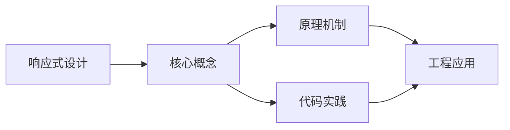
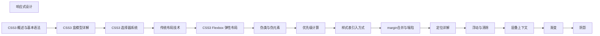

## 1. 学习目标（Bloom 分类）

本节按照布鲁姆教育目标分类学组织学习路径。本文主题为《响应式设计》，属于 CSS 模块，读者可以根据自身阶段选择阅读深度。

记忆层面：能够准确复述本文的核心概念、术语与基本语法或操作步骤，并能够在提问或检索时快速定位对应知识点。能够说出 CSS 的核心概念、术语与标准写法。

理解层面：能够用自己的语言解释核心原理与工作机制，说明概念之间的因果关系，而不是机械记忆结论。能够解释 CSS 的工作原理与设计动机。

应用层面：能够在真实项目或练习场景中运用本文知识解决具体问题，写出正确且可维护的实现。能够编写符合 CSS 规范的完整实现。

分析层面：能够拆解复杂问题，比较本文主题与相邻概念的异同，识别边界条件与例外情况。能够分析 CSS 与相邻方案的差异与边界。

评价层面：能够根据约束条件（性能、可读性、安全、成本）评价不同方案的优劣，做出有依据的技术决策。能够根据场景评价 CSS 相关方案的优劣。

创造层面：能够把本文知识与其他模块知识组合，设计出新的解决方案或可复用的工程模式。能够组合 CSS 与其他技术设计完整方案。

通过本节学习，读者应当能够把《响应式设计》纳入自己的知识网络，并与 CSS 模块的其他主题（选择器、盒模型、布局、动画、响应式）建立关联。

## 2. 历史动机与发展脉络

《响应式设计》是 CSS 领域的重要主题。要真正理解它，需要先了解它解决的问题与演进过程。

CSS 于 1994 年由 Håkon Wium Lie 提出，1996 年 CSS1 发布，解决 HTML 表现层混杂问题；CSS2.1（2011）与 CSS3 模块化（2012+）奠定现代 Web 样式基础。
现代 CSS 的能力版图：Flexbox/Grid 布局、自定义属性（变量）、容器查询、子网格、层叠层（@layer）、现代颜色（oklch）。
CSS 的设计核心是“层叠与继承”：来源、优先级、顺序共同决定最终样式；理解层叠是排查样式问题的前提。

回到本文主题：响应式设计 的提出与成熟，正是上述技术背景下的必然产物。早期实现往往以简单可用为目标，随着工程规模扩大，社区逐渐沉淀出标准做法与最佳实践；理解这一脉络，可以帮助读者判断“为什么文档中的推荐写法是现在这个样子”，也能在遇到历史遗留代码时准确识别其设计年代与取舍。


## 3. 形式化定义与核心概念精讲

本节把《响应式设计》涉及的核心概念以“定义 + 讲解”的形式展开。读者应把定义当作工具，把讲解当作理解路径；两者结合才能形成可迁移的知识。

选择器与优先级：id > class/属性/伪类 > 元素/伪元素；!important 打破优先级（应避免）。
盒模型：content/padding/border/margin，box-sizing 决定 width 语义（border-box 推荐）。
布局体系：普通流、浮动（历史）、Flexbox（一维）、Grid（二维）；position 定位（relative/absolute/fixed/sticky）。

### 3.1 原文章节逐一精讲

原文档把主题拆分为 21 个小节，下面按顺序给出每一节的导读讲解，随后保留原文细节供精读。

#### 原文精读（完整保留）

# CSS 响应式设计

> **符号约定**：`< >` 必填参数 | `[ ]` 可选参数

---

#### 2. 媒体查询

##### 基本语法

```css
@media (条件) {
  /* 样式规则 */
}
```

##### 常用媒体特性

- `width`/`height`：视口宽度/高度
- `min-width`/`max-width`：最小/最大视口宽度
- `orientation`：设备方向（portrait/landscape）
- `device-pixel-ratio`：设备像素比

##### 断点设置

```css
/* 移动设备 */
@media (max-width: 767px) {
  /* 移动设备样式 */
}
/* 平板设备 */
@media (min-width: 768px) and (max-width: 1023px) {
  /* 平板设备样式 */
}
/* 桌面设备 */
@media (min-width: 1024px) {
  /* 桌面设备样式 */
}
```

#### 3. 弹性布局技术

##### 弹性网格系统

```css
.container {
  display: flex;
  flex-wrap: wrap;
  gap: 20px;
}
.item {
  flex: 1 1 300px; /* 增长因子 1, 收缩因子 1, 基础宽度 300px */
}
```

##### 网格布局

```css
.grid {
  display: grid;
  grid-template-columns: repeat(auto-fit, minmax(250px, 1fr));
  gap: 20px;
}
```

#### 4. 响应式图像

##### 自适应图像

```css
img {
  max-width: 100%;
  height: auto;
}
```

##### 图片源集

```html
<picture>
  <source media="(max-width: 768px)" srcset="small-image.jpg" />
  <source media="(min-width: 769px)" srcset="large-image.jpg" />
  
</picture>
```

#### 5. 响应式排版

##### 相对字体单位

```css
 :
  font-size: 16px;
 }
 @media (max-width: 768px) {
  :root {
  font-size: 14px;
  }
 }
 body {
  font-size: 1rem;
 }
 h1 {
  font-size: 2.5rem;
 }
```

#### 6. 响应式设计最佳实践

1. **移动优先**：从移动设备开始设计，然后扩展到更大的屏幕
2. **渐进增强**：确保基本功能在所有设备上都能正常工作
3. **性能优化**：针对移动设备优化图像和资源加载
4. **测试**：在不同设备和浏览器上测试设计
5. **简化导航**：在移动设备上使用汉堡菜单等简化导航

#### 7. 常见问题与解决方案

##### 问题1：图像在小屏幕上显示过大

**解决方案**：使用 `max-width: 100%; height: auto;` 确保图像适应容器

##### 问题2：导航菜单在小屏幕上拥挤

**解决方案**：实现汉堡菜单，在小屏幕上折叠导航

##### 问题3：表格在小屏幕上溢出

**解决方案**：在小屏幕上使表格可水平滚动，或重新设计表格布局

#### 8. 工具与资源

- **响应式设计测试工具**：
- [Responsinator](http://www.responsinator.com/)
- [BrowserStack](https://www.browserstack.com/)
- Chrome DevTools 设备模拟器
- **响应式框架**：
- [Bootstrap](https://getbootstrap.com/)
- [Foundation](https://get.foundation/)
- [Tailwind CSS](https://tailwindcss.com/)

#### 9. 实战示例

##### 响应式导航栏

```html
<nav class="navbar">
  <div class="logo">Logo</div>
  <div class="menu-toggle"></div>
  <ul class="nav-links">
    <li><a href="#">Home</a></li>
    <li><a href="#">About</a></li>
    <li><a href="#">Services</a></li>
    <li><a href="#">Contact</a></li>
  </ul>
</nav>
```

```css
.navbar {
  display: flex;
  justify-content: space-between;
  align-items: center;
  padding: 1rem;
  background: #333;
  color: white;
}
.nav-links {
  display: flex;
  list-style: none;
  gap: 1rem;
}
.menu-toggle {
  display: none;
  cursor: pointer;
}
@media (max-width: 768px) {
  .nav-links {
    position: absolute;
    top: 70px;
    left: 0;
    right: 0;
    background: #333;
    flex-direction: column;
    align-items: center;
    padding: 1rem;
    gap: 1rem;
    display: none;
  }
  .nav-links.active {
    display: flex;
  }
  .menu-toggle {
    display: block;
  }
}
```

```javascript
const menuToggle = document.querySelector('.menu-toggle');
const navLinks = document.querySelector('.nav-links');
menuToggle.addEventListener('click', () => {
  navLinks.classList.toggle('active');
});
```

#### 延伸阅读

- [JavaScript](javascript/overview)
#### viewport 视口设置

**基本写法：viewport 基础**
`<meta name="viewport" content="width=device-width, initial-scale=1">`
```css
/* HTML 中设置视口元信息 */
```

---

**基本写法：viewport 禁止缩放**
`<meta name="viewport" content="width=device-width, initial-scale=1, maximum-scale=1">`
```css
/* 禁止用户缩放 */
```

---

#### 媒体查询基础

**基本写法：max-width 最大宽度**
`@media (max-width: <值>) { <样式> }`
```css
/* 屏幕宽度小于等于指定值时应用 */
@media (max-width: 768px) {
  .container {
    padding: 10px;
  }
}
```

---

**基本写法：min-width 最小宽度**
`@media (min-width: <值>) { <样式> }`
```css
/* 屏幕宽度大于等于指定值时应用 */
@media (min-width: 1200px) {
  .container {
    max-width: 1200px;
  }
}
```

---

**基本写法：范围媒体查询**
`@media (min-width: <值>) and (max-width: <值>) { <样式> }`
```css
/* 屏幕宽度在指定范围内时应用 */
@media (min-width: 768px) and (max-width: 1024px) {
  .container {
    width: 750px;
  }
}
```

---

**基本写法：max-height 最大高度**
`@media (max-height: <值>) { <样式> }`
```css
/* 屏幕高度小于等于指定值时应用 */
@media (max-height: 500px) {
  .header {
    height: 40px;
  }
}
```

---

**基本写法：orientation 横屏**
`@media (orientation: landscape) { <样式> }`
```css
/* 横屏时应用 */
@media (orientation: landscape) {
  .layout {
    flex-direction: row;
  }
}
```

---

**基本写法：orientation 竖屏**
`@media (orientation: portrait) { <样式> }`
```css
/* 竖屏时应用 */
@media (orientation: portrait) {
  .layout {
    flex-direction: column;
  }
}
```

---

#### 媒体特性

**基本写法：prefers-color-scheme 暗色**
`@media (prefers-color-scheme: dark) { <样式> }`
```css
/* 用户偏好暗色主题 */
@media (prefers-color-scheme: dark) {
  body {
    background-color: #1a1a1a;
    color: #ffffff;
  }
}
```

---

**基本写法：prefers-color-scheme 亮色**
`@media (prefers-color-scheme: light) { <样式> }`
```css
/* 用户偏好亮色主题 */
@media (prefers-color-scheme: light) {
  body {
    background-color: #ffffff;
    color: #333333;
  }
}
```

---

**基本写法：prefers-reduced-motion 减少动画**
`@media (prefers-reduced-motion: reduce) { <样式> }`
```css
/* 用户偏好减少动画 */
@media (prefers-reduced-motion: reduce) {
  * {
    animation-duration: 0.01ms !important;
    transition-duration: 0.01ms !important;
  }
}
```

---

**基本写法：prefers-contrast 高对比度**
`@media (prefers-contrast: more) { <样式> }`
```css
/* 用户偏好高对比度 */
@media (prefers-contrast: more) {
  .text {
    color: black;
    background: white;
  }
}
```

---

**基本写法：hover 悬停支持**
`@media (hover: hover) { <样式> }`
```css
/* 设备支持悬停时应用 */
@media (hover: hover) {
  .button:hover {
    background-color: #0056b3;
  }
}
```

---

**基本写法：pointer 精确指针**
`@media (pointer: fine) { <样式> }`
```css
/* 设备有精确指针（鼠标）时应用 */
@media (pointer: fine) {
  .tooltip {
    display: block;
  }
}
```

---

**基本写法：pointer 粗略指针**
`@media (pointer: coarse) { <样式> }`
```css
/* 设备为粗略指针（触摸）时应用 */
@media (pointer: coarse) {
  .button {
    padding: 12px 24px;
  }
}
```

---

#### 断点系统

**基本写法：移动优先断点**
`@media (min-width: <值>) { <样式> }`
```css
/* 移动优先：从小到大递增 */
.container {
  width: 100%;
}
@media (min-width: 768px) {
  .container {
    max-width: 720px;
  }
}
```

---

**基本写法：桌面优先断点**
`@media (max-width: <值>) { <样式> }`
```css
/* 桌面优先：从大到小递减 */
.container {
  max-width: 1200px;
}
@media (max-width: 768px) {
  .container {
    max-width: 100%;
  }
}
```

---

**单行写法：多断点**
`@media (min-width: <值1>) { <样式> } @media (min-width: <值2>) { <样式> }`
```css
/* 单行定义多个断点 */
.col { width: 100%; }
@media (min-width: 768px) { .col { width: 50%; } }
@media (min-width: 1200px) { .col { width: 33.33%; } }
```

---

**换行写法：多断点**
`@media (min-width: <值>) { <样式> }`
```css
/* 换行定义多个断点 */
.col {
  width: 100%;
}

@media (min-width: 768px) {
  .col {
    width: 50%;
  }
}

@media (min-width: 1200px) {
  .col {
    width: 33.33%;
  }
}
```

---

#### 响应式单位

**基本写法：vw 视口宽度单位**
`width: <vw值>;`
```css
/* 相对于视口宽度的尺寸 */
.hero {
  width: 50vw;
}
```

---

**基本写法：vh 视口高度单位**
`height: <vh值>;`
```css
/* 相对于视口高度的尺寸 */
.hero {
  height: 100vh;
}
```

---

**基本写法：vmin 最小视口**
`width: <vmin值>;`
```css
/* 相对于视口较小边的尺寸 */
.logo {
  width: 10vmin;
}
```

---

**基本写法：vmax 最大视口**
`width: <vmax值>;`
```css
/* 相对于视口较大边的尺寸 */
.logo {
  width: 10vmax;
}
```

---

**基本写法：rem 根字号单位**
`font-size: <rem值>;`
```css
/* 相对于根元素字号的尺寸 */
.text {
  font-size: 1.2rem;
}
```

---

**基本写法：em 相对字号单位**
`padding: <em值>;`
```css
/* 相对于父元素字号的尺寸 */
.box {
  font-size: 16px;
  padding: 1.5em;
}
```

---

#### 响应式字体

**基本写法：clamp 响应式字号**
`font-size: clamp(<最小>, <理想>, <最大>);`
```css
/* 字号在区间内响应式变化 */
.title {
  font-size: clamp(1.5rem, 4vw, 3rem);
}
```

---

**基本写法：vw 字号**
`font-size: <vw值>;`
```css
/* 视口宽度相关字号 */
.title {
  font-size: 5vw;
}
```

---

**基本写法：calc 混合计算字号**
`font-size: calc(<值1> + <值2>);`
```css
/* 混合单位计算字号 */
.title {
  font-size: calc(16px + 2vw);
}
```

---

#### 响应式图片

**基本写法：max-width 图片自适应**
`img { max-width: 100%; height: auto; }`
```css
/* 图片自适应容器宽度 */
img {
  max-width: 100%;
  height: auto;
}
```

---

**基本写法：object-fit 图片裁剪**
`object-fit: cover;`
```css
/* 图片填充容器并裁剪 */
.avatar img {
  width: 100%;
  height: 100%;
  object-fit: cover;
}
```

---

**基本写法：picture 响应式图片**
`<picture> <source media="(<条件>)" srcset="<图片>"> "> </picture>`
```css
/* 根据屏幕加载不同图片 */
```

---

**基本写法：srcset 响应式图片**
` <宽度1>, <图片2> <宽度2>" src="<默认>">`
```css
/* 根据屏幕密度加载不同图片 */
```

---

#### 容器查询

**基本写法：container-type 容器**
`container-type: inline-size;`
```css
/* 定义容器查询上下文 */
.sidebar {
  container-type: inline-size;
}
```

---

**基本写法：container-name 命名容器**
`container-name: <名称>;`
```css
/* 命名容器 */
.sidebar {
  container-type: inline-size;
  container-name: sidebar;
}
```

---

**基本写法：@container 容器查询**
`@container <名称> (min-width: <值>) { <样式> }`
```css
/* 基于容器尺寸应用样式 */
@container sidebar (min-width: 400px) {
  .card {
    flex-direction: row;
  }
}
```

---

**基本写法：container 简写**
`container: <名称> / inline-size;`
```css
/* 同时设置容器名称和类型 */
.sidebar {
  container: sidebar / inline-size;
}
```

---

#### CSS 嵌套媒体查询

**基本写法：嵌套媒体查询**
`<选择器> { @media <条件> { <样式> } }`
```css
/* CSS 原生嵌套媒体查询 */
.container {
  width: 100%;
  @media (min-width: 768px) {
    max-width: 720px;
  }
}
```

---

**单行写法：嵌套多媒体查询**
`<选择器> { @media <条件1> { <样式> } @media <条件2> { <样式> } }`
```css
/* 单行嵌套多个媒体查询 */
.col { width: 100%; @media (min-width: 768px) { width: 50%; } @media (min-width: 1200px) { width: 33%; } }
```

---

**换行写法：嵌套多媒体查询**
`<选择器> { @media <条件1> { <样式> } @media <条件2> { <样式> } }`
```css
/* 换行嵌套多个媒体查询 */
.col {
  width: 100%;
  @media (min-width: 768px) {
    width: 50%;
  }
  @media (min-width: 1200px) {
    width: 33%;
  }
}
```

---

#### 响应式工具

**基本写法：min 取最小值**
`width: min(<值1>, <值2>);`
```css
/* 取两个值中的较小者 */
.container {
  width: min(100%, 1200px);
}
```

---

**基本写法：max 取最大值**
`font-size: max(<值1>, <值2>);`
```css
/* 取两个值中的较大者 */
.text {
  font-size: max(16px, 2vw);
}
```

---

**基本写法：clamp 区间值**
`width: clamp(<最小>, <理想>, <最大>);`
```css
/* 限制值在指定区间 */
.text {
  font-size: clamp(14px, 2vw, 24px);
}
```

---

**基本写法：calc 计算**
`width: calc(<表达式>);`
```css
/* 动态计算尺寸 */
.sidebar {
  width: calc(100% - 250px);
}
```

---

#### 响应式布局模式

**基本写法：移动优先 Flex**
`display: flex; flex-direction: column; @media (min-width: <值>) { flex-direction: row; }`
```css
/* 移动优先的 Flex 布局 */
.layout {
  display: flex;
  flex-direction: column;
  @media (min-width: 768px) {
    flex-direction: row;
  }
}
```

---

**基本写法：响应式 Grid**
`display: grid; grid-template-columns: 1fr; @media (min-width: <值>) { grid-template-columns: repeat(2, 1fr); }`
```css
/* 响应式 Grid 布局 */
.grid {
  display: grid;
  grid-template-columns: 1fr;
  gap: 20px;
  @media (min-width: 768px) {
    grid-template-columns: repeat(2, 1fr);
  }
}
```

---

**基本写法：自动适应 Grid**
`grid-template-columns: repeat(auto-fit, minmax(<值>, 1fr));`
```css
/* 自动适应屏幕的 Grid */
.cards {
  display: grid;
  grid-template-columns: repeat(auto-fit, minmax(250px, 1fr));
  gap: 20px;
}
```

---

**基本写法：隐藏显示元素**
`display: none; @media (min-width: <值>) { display: block; }`
```css
/* 小屏隐藏，大屏显示 */
.sidebar {
  display: none;
  @media (min-width: 1024px) {
    display: block;
  }
}
```

---

#### 现代响应式新特性

**基本写法：Container Queries 容器查询(@container)**
`@container <名称> [(<条件>)] { <样式> }`
```css
/* 基于父容器尺寸响应样式 */
.sidebar {
  container-type: inline-size;
  container-name: sidebar;
}
@container sidebar (min-width: 400px) {
  .card {
    flex-direction: row;
  }
}
```

---

**基本写法：Container Query Units(cqw/cqh/cqi)**
`width: <数值>cqi;`
```css
/* 容器查询单位:1cqi = 容器 inline 尺寸 1% */
.card {
  /* 字号基于容器宽度自适应 */
  font-size: clamp(1rem, 5cqi, 2rem);
  padding: 2cqi;
}
```

---

**基本写法：Prefers-reduced-transparency**
`@media (prefers-reduced-transparency: reduce) { <样式> }`
```css
/* 用户偏好减少透明效果 */
@media (prefers-reduced-transparency: reduce) {
  .glass {
    background-color: rgba(255, 255, 255, 0.95);
    backdrop-filter: none;
  }
}
```

---

**基本写法：Prefers-reduced-data**
`@media (prefers-reduced-data: reduce) { <样式> }`
```css
/* 用户偏好节省流量 */
@media (prefers-reduced-data: reduce) {
  .hero {
    background-image: none;
    background-color: #007bff;
  }
}
```

---

**基本写法：@media (scripting: none)**
`@media (scripting: none) { <样式> }`
```css
/* 检测脚本是否可用 */
@media (scripting: none) {
  /* 无 JS 时显示备用内容 */
  .no-js-fallback {
    display: block;
  }
  .js-only {
    display: none;
  }
}
```


### 3.2 概念关系图

下面用 Mermaid 图表达本文核心概念之间的关系，帮助读者建立整体图景：



图中展示的是本文知识的结构化关系：核心概念是入口，原理机制解释“为什么”，代码实践演示“怎么做”，工程应用回答“何时用”。读者学习时可以把每个小节的内容挂接到对应节点上。

## 4. 理论推导与原理解析

本节深入《响应式设计》背后的原理。理论部分不求面面俱到，而是聚焦“能解释现象、能指导实践”的关键推导。

选择器与优先级：id > class/属性/伪类 > 元素/伪元素；!important 打破优先级（应避免）。
盒模型：content/padding/border/margin，box-sizing 决定 width 语义（border-box 推荐）。
布局体系：普通流、浮动（历史）、Flexbox（一维）、Grid（二维）；position 定位（relative/absolute/fixed/sticky）。
层叠上下文：z-index 只在同一层叠上下文中比较；transform/opacity/filter 创建新上下文。

需要强调的是，理论推导与工程实践之间存在翻译层：理论给出的是理想化模型与边界条件，工程代码则必须处理真实环境中的例外。读者在学习时应先掌握理论的“标准情形”，再通过陷阱章节了解“非标准情形”。

## 5. 代码示例与逐行讲解

本节把原文中的代码示例系统整理，并为每个示例补充用途说明与讲解。读者不应只浏览代码，而应逐段对照讲解理解设计意图。

### 5.1 示例：基本语法

该示例来自原文《基本语法》小节，用于演示响应式设计相关操作。阅读时请先看代码结构，再看其后的讲解。

```css
@media (条件) {
  /* 样式规则 */
}
```

讲解：这段代码演示了本节核心知识点。代码中的关键操作可以归纳为三步：准备（定义或初始化）、执行（核心逻辑）、收尾（释放资源或返回结果）。实际项目中，这三步往往被封装为函数或类，以提升复用性与可测试性。

关键点分析：

该示例共 3 行有效代码，结构以数据或配置为主。阅读时应关注：数据字段的含义、配置项的作用，以及它们与运行行为的对应关系。

进阶思考路径：先尝试修改参数观察行为变化，再把示例中的模式迁移到自己的项目中；每次修改都记录预期与实测差异，这是把示例转化为能力的最快方式。

### 5.2 示例：断点设置

该示例来自原文《断点设置》小节，用于演示响应式设计相关操作。阅读时请先看代码结构，再看其后的讲解。

```css
/* 移动设备 */
@media (max-width: 767px) {
  /* 移动设备样式 */
}
/* 平板设备 */
@media (min-width: 768px) and (max-width: 1023px) {
  /* 平板设备样式 */
}
/* 桌面设备 */
@media (min-width: 1024px) {
  /* 桌面设备样式 */
}
```

讲解：这段代码演示了本节核心知识点。代码中的关键操作可以归纳为三步：准备（定义或初始化）、执行（核心逻辑）、收尾（释放资源或返回结果）。实际项目中，这三步往往被封装为函数或类，以提升复用性与可测试性。

关键点分析：

该示例共 12 行有效代码，结构以数据或配置为主。阅读时应关注：数据字段的含义、配置项的作用，以及它们与运行行为的对应关系。

进阶思考路径：先尝试修改参数观察行为变化，再把示例中的模式迁移到自己的项目中；每次修改都记录预期与实测差异，这是把示例转化为能力的最快方式。

### 5.3 示例：弹性网格系统

该示例来自原文《弹性网格系统》小节，用于演示响应式设计相关操作。阅读时请先看代码结构，再看其后的讲解。

```css
.container {
  display: flex;
  flex-wrap: wrap;
  gap: 20px;
}
.item {
  flex: 1 1 300px; /* 增长因子 1, 收缩因子 1, 基础宽度 300px */
}
```

讲解：这段代码演示了本节核心知识点。代码中的关键操作可以归纳为三步：准备（定义或初始化）、执行（核心逻辑）、收尾（释放资源或返回结果）。实际项目中，这三步往往被封装为函数或类，以提升复用性与可测试性。

关键点分析：

该示例共 8 行有效代码，结构以数据或配置为主。阅读时应关注：数据字段的含义、配置项的作用，以及它们与运行行为的对应关系。

进阶思考路径：先尝试修改参数观察行为变化，再把示例中的模式迁移到自己的项目中；每次修改都记录预期与实测差异，这是把示例转化为能力的最快方式。

### 5.4 示例：网格布局

该示例来自原文《网格布局》小节，用于演示响应式设计相关操作。阅读时请先看代码结构，再看其后的讲解。

```css
.grid {
  display: grid;
  grid-template-columns: repeat(auto-fit, minmax(250px, 1fr));
  gap: 20px;
}
```

讲解：这段代码演示了本节核心知识点。代码中的关键操作可以归纳为三步：准备（定义或初始化）、执行（核心逻辑）、收尾（释放资源或返回结果）。实际项目中，这三步往往被封装为函数或类，以提升复用性与可测试性。

关键点分析：

该示例共 5 行有效代码，结构以数据或配置为主。阅读时应关注：数据字段的含义、配置项的作用，以及它们与运行行为的对应关系。

进阶思考路径：先尝试修改参数观察行为变化，再把示例中的模式迁移到自己的项目中；每次修改都记录预期与实测差异，这是把示例转化为能力的最快方式。

### 5.5 示例：自适应图像

该示例来自原文《自适应图像》小节，用于演示响应式设计相关操作。阅读时请先看代码结构，再看其后的讲解。

```css
img {
  max-width: 100%;
  height: auto;
}
```

讲解：这段代码演示了本节核心知识点。代码中的关键操作可以归纳为三步：准备（定义或初始化）、执行（核心逻辑）、收尾（释放资源或返回结果）。实际项目中，这三步往往被封装为函数或类，以提升复用性与可测试性。

关键点分析：

该示例共 4 行有效代码，结构以数据或配置为主。阅读时应关注：数据字段的含义、配置项的作用，以及它们与运行行为的对应关系。

进阶思考路径：先尝试修改参数观察行为变化，再把示例中的模式迁移到自己的项目中；每次修改都记录预期与实测差异，这是把示例转化为能力的最快方式。

### 5.6 示例：图片源集

该示例来自原文《图片源集》小节，用于演示响应式设计相关操作。阅读时请先看代码结构，再看其后的讲解。

```html
<picture>
  <source media="(max-width: 768px)" srcset="small-image.jpg" />
  <source media="(min-width: 769px)" srcset="large-image.jpg" />
  
</picture>
```

讲解：这段代码演示了本节核心知识点。代码中的关键操作可以归纳为三步：准备（定义或初始化）、执行（核心逻辑）、收尾（释放资源或返回结果）。实际项目中，这三步往往被封装为函数或类，以提升复用性与可测试性。

关键点分析：

该示例共 5 行有效代码，结构以数据或配置为主。阅读时应关注：数据字段的含义、配置项的作用，以及它们与运行行为的对应关系。

进阶思考路径：先尝试修改参数观察行为变化，再把示例中的模式迁移到自己的项目中；每次修改都记录预期与实测差异，这是把示例转化为能力的最快方式。

### 5.7 示例：相对字体单位

该示例来自原文《相对字体单位》小节，用于演示响应式设计相关操作。阅读时请先看代码结构，再看其后的讲解。

```css
 :
  font-size: 16px;
 }
 @media (max-width: 768px) {
  :root {
  font-size: 14px;
  }
 }
 body {
  font-size: 1rem;
 }
 h1 {
  font-size: 2.5rem;
 }
```

讲解：这段代码演示了本节核心知识点。代码中的关键操作可以归纳为三步：准备（定义或初始化）、执行（核心逻辑）、收尾（释放资源或返回结果）。实际项目中，这三步往往被封装为函数或类，以提升复用性与可测试性。

关键点分析：

该示例共 14 行有效代码，结构以数据或配置为主。阅读时应关注：数据字段的含义、配置项的作用，以及它们与运行行为的对应关系。

进阶思考路径：先尝试修改参数观察行为变化，再把示例中的模式迁移到自己的项目中；每次修改都记录预期与实测差异，这是把示例转化为能力的最快方式。

### 5.8 示例：响应式导航栏

该示例来自原文《响应式导航栏》小节，用于演示响应式设计相关操作。阅读时请先看代码结构，再看其后的讲解。

```html
<nav class="navbar">
  <div class="logo">Logo</div>
  <div class="menu-toggle"></div>
  <ul class="nav-links">
    <li><a href="#">Home</a></li>
    <li><a href="#">About</a></li>
    <li><a href="#">Services</a></li>
    <li><a href="#">Contact</a></li>
  </ul>
</nav>
```

讲解：这段代码演示了本节核心知识点。代码中的关键操作可以归纳为三步：准备（定义或初始化）、执行（核心逻辑）、收尾（释放资源或返回结果）。实际项目中，这三步往往被封装为函数或类，以提升复用性与可测试性。

关键点分析：

该示例共 10 行有效代码，包含 1 类关键结构（class）。其中：

- 入口与初始化部分负责建立上下文，对应实际项目中的启动或装配逻辑；
- 核心逻辑部分体现本文主题的主要操作，是阅读时最需要对照讲解理解的部分；
- 输出或返回部分把结果交给调用方，注意其类型与边界条件。

进阶思考路径：先尝试修改参数观察行为变化，再把示例中的模式迁移到自己的项目中；每次修改都记录预期与实测差异，这是把示例转化为能力的最快方式。

### 5.9 示例：响应式导航栏

该示例来自原文《响应式导航栏》小节，用于演示响应式设计相关操作。阅读时请先看代码结构，再看其后的讲解。

```css
.navbar {
  display: flex;
  justify-content: space-between;
  align-items: center;
  padding: 1rem;
  background: #333;
  color: white;
}
.nav-links {
  display: flex;
  list-style: none;
  gap: 1rem;
}
.menu-toggle {
  display: none;
  cursor: pointer;
}
@media (max-width: 768px) {
  .nav-links {
    position: absolute;
    top: 70px;
    left: 0;
    right: 0;
    background: #333;
    flex-direction: column;
    align-items: center;
    padding: 1rem;
    gap: 1rem;
    display: none;
  }
  .nav-links.active {
    display: flex;
  }
  .menu-toggle {
    display: block;
  }
}
```

讲解：这段代码演示了本节核心知识点。代码中的关键操作可以归纳为三步：准备（定义或初始化）、执行（核心逻辑）、收尾（释放资源或返回结果）。实际项目中，这三步往往被封装为函数或类，以提升复用性与可测试性。

关键点分析：

该示例共 37 行有效代码，结构以数据或配置为主。阅读时应关注：数据字段的含义、配置项的作用，以及它们与运行行为的对应关系。

进阶思考路径：先尝试修改参数观察行为变化，再把示例中的模式迁移到自己的项目中；每次修改都记录预期与实测差异，这是把示例转化为能力的最快方式。

### 5.10 示例：响应式导航栏

该示例来自原文《响应式导航栏》小节，用于演示响应式设计相关操作。阅读时请先看代码结构，再看其后的讲解。

```javascript
const menuToggle = document.querySelector('.menu-toggle');
const navLinks = document.querySelector('.nav-links');
menuToggle.addEventListener('click', () => {
  navLinks.classList.toggle('active');
});
```

讲解：这段代码演示了本节核心知识点。代码中的关键操作可以归纳为三步：准备（定义或初始化）、执行（核心逻辑）、收尾（释放资源或返回结果）。实际项目中，这三步往往被封装为函数或类，以提升复用性与可测试性。

关键点分析：

该示例共 5 行有效代码，包含 1 类关键结构（class）。其中：

- 入口与初始化部分负责建立上下文，对应实际项目中的启动或装配逻辑；
- 核心逻辑部分体现本文主题的主要操作，是阅读时最需要对照讲解理解的部分；
- 输出或返回部分把结果交给调用方，注意其类型与边界条件。

进阶思考路径：先尝试修改参数观察行为变化，再把示例中的模式迁移到自己的项目中；每次修改都记录预期与实测差异，这是把示例转化为能力的最快方式。

### 5.11 示例：viewport 视口设置

该示例来自原文《viewport 视口设置》小节，用于演示响应式设计相关操作。阅读时请先看代码结构，再看其后的讲解。

```css
/* HTML 中设置视口元信息 */
```

讲解：这段代码演示了本节核心知识点。代码中的关键操作可以归纳为三步：准备（定义或初始化）、执行（核心逻辑）、收尾（释放资源或返回结果）。实际项目中，这三步往往被封装为函数或类，以提升复用性与可测试性。

关键点分析：

该示例共 1 行有效代码，结构以数据或配置为主。阅读时应关注：数据字段的含义、配置项的作用，以及它们与运行行为的对应关系。

进阶思考路径：先尝试修改参数观察行为变化，再把示例中的模式迁移到自己的项目中；每次修改都记录预期与实测差异，这是把示例转化为能力的最快方式。

### 5.12 示例：viewport 视口设置

该示例来自原文《viewport 视口设置》小节，用于演示响应式设计相关操作。阅读时请先看代码结构，再看其后的讲解。

```css
/* 禁止用户缩放 */
```

讲解：这段代码演示了本节核心知识点。代码中的关键操作可以归纳为三步：准备（定义或初始化）、执行（核心逻辑）、收尾（释放资源或返回结果）。实际项目中，这三步往往被封装为函数或类，以提升复用性与可测试性。

关键点分析：

该示例共 1 行有效代码，结构以数据或配置为主。阅读时应关注：数据字段的含义、配置项的作用，以及它们与运行行为的对应关系。

进阶思考路径：先尝试修改参数观察行为变化，再把示例中的模式迁移到自己的项目中；每次修改都记录预期与实测差异，这是把示例转化为能力的最快方式。

### 5.13 示例：媒体查询基础

该示例来自原文《媒体查询基础》小节，用于演示响应式设计相关操作。阅读时请先看代码结构，再看其后的讲解。

```css
/* 屏幕宽度小于等于指定值时应用 */
@media (max-width: 768px) {
  .container {
    padding: 10px;
  }
}
```

讲解：这段代码演示了本节核心知识点。代码中的关键操作可以归纳为三步：准备（定义或初始化）、执行（核心逻辑）、收尾（释放资源或返回结果）。实际项目中，这三步往往被封装为函数或类，以提升复用性与可测试性。

关键点分析：

该示例共 6 行有效代码，结构以数据或配置为主。阅读时应关注：数据字段的含义、配置项的作用，以及它们与运行行为的对应关系。

进阶思考路径：先尝试修改参数观察行为变化，再把示例中的模式迁移到自己的项目中；每次修改都记录预期与实测差异，这是把示例转化为能力的最快方式。

### 5.14 示例：媒体查询基础

该示例来自原文《媒体查询基础》小节，用于演示响应式设计相关操作。阅读时请先看代码结构，再看其后的讲解。

```css
/* 屏幕宽度大于等于指定值时应用 */
@media (min-width: 1200px) {
  .container {
    max-width: 1200px;
  }
}
```

讲解：这段代码演示了本节核心知识点。代码中的关键操作可以归纳为三步：准备（定义或初始化）、执行（核心逻辑）、收尾（释放资源或返回结果）。实际项目中，这三步往往被封装为函数或类，以提升复用性与可测试性。

关键点分析：

该示例共 6 行有效代码，结构以数据或配置为主。阅读时应关注：数据字段的含义、配置项的作用，以及它们与运行行为的对应关系。

进阶思考路径：先尝试修改参数观察行为变化，再把示例中的模式迁移到自己的项目中；每次修改都记录预期与实测差异，这是把示例转化为能力的最快方式。

### 5.15 示例：媒体查询基础

该示例来自原文《媒体查询基础》小节，用于演示响应式设计相关操作。阅读时请先看代码结构，再看其后的讲解。

```css
/* 屏幕宽度在指定范围内时应用 */
@media (min-width: 768px) and (max-width: 1024px) {
  .container {
    width: 750px;
  }
}
```

讲解：这段代码演示了本节核心知识点。代码中的关键操作可以归纳为三步：准备（定义或初始化）、执行（核心逻辑）、收尾（释放资源或返回结果）。实际项目中，这三步往往被封装为函数或类，以提升复用性与可测试性。

关键点分析：

该示例共 6 行有效代码，结构以数据或配置为主。阅读时应关注：数据字段的含义、配置项的作用，以及它们与运行行为的对应关系。

进阶思考路径：先尝试修改参数观察行为变化，再把示例中的模式迁移到自己的项目中；每次修改都记录预期与实测差异，这是把示例转化为能力的最快方式。

### 5.16 示例：媒体查询基础

该示例来自原文《媒体查询基础》小节，用于演示响应式设计相关操作。阅读时请先看代码结构，再看其后的讲解。

```css
/* 屏幕高度小于等于指定值时应用 */
@media (max-height: 500px) {
  .header {
    height: 40px;
  }
}
```

讲解：这段代码演示了本节核心知识点。代码中的关键操作可以归纳为三步：准备（定义或初始化）、执行（核心逻辑）、收尾（释放资源或返回结果）。实际项目中，这三步往往被封装为函数或类，以提升复用性与可测试性。

关键点分析：

该示例共 6 行有效代码，结构以数据或配置为主。阅读时应关注：数据字段的含义、配置项的作用，以及它们与运行行为的对应关系。

进阶思考路径：先尝试修改参数观察行为变化，再把示例中的模式迁移到自己的项目中；每次修改都记录预期与实测差异，这是把示例转化为能力的最快方式。

### 5.17 示例：媒体查询基础

该示例来自原文《媒体查询基础》小节，用于演示响应式设计相关操作。阅读时请先看代码结构，再看其后的讲解。

```css
/* 横屏时应用 */
@media (orientation: landscape) {
  .layout {
    flex-direction: row;
  }
}
```

讲解：这段代码演示了本节核心知识点。代码中的关键操作可以归纳为三步：准备（定义或初始化）、执行（核心逻辑）、收尾（释放资源或返回结果）。实际项目中，这三步往往被封装为函数或类，以提升复用性与可测试性。

关键点分析：

该示例共 6 行有效代码，结构以数据或配置为主。阅读时应关注：数据字段的含义、配置项的作用，以及它们与运行行为的对应关系。

进阶思考路径：先尝试修改参数观察行为变化，再把示例中的模式迁移到自己的项目中；每次修改都记录预期与实测差异，这是把示例转化为能力的最快方式。

### 5.18 示例：媒体查询基础

该示例来自原文《媒体查询基础》小节，用于演示响应式设计相关操作。阅读时请先看代码结构，再看其后的讲解。

```css
/* 竖屏时应用 */
@media (orientation: portrait) {
  .layout {
    flex-direction: column;
  }
}
```

讲解：这段代码演示了本节核心知识点。代码中的关键操作可以归纳为三步：准备（定义或初始化）、执行（核心逻辑）、收尾（释放资源或返回结果）。实际项目中，这三步往往被封装为函数或类，以提升复用性与可测试性。

关键点分析：

该示例共 6 行有效代码，结构以数据或配置为主。阅读时应关注：数据字段的含义、配置项的作用，以及它们与运行行为的对应关系。

进阶思考路径：先尝试修改参数观察行为变化，再把示例中的模式迁移到自己的项目中；每次修改都记录预期与实测差异，这是把示例转化为能力的最快方式。

### 5.19 示例：媒体特性

该示例来自原文《媒体特性》小节，用于演示响应式设计相关操作。阅读时请先看代码结构，再看其后的讲解。

```css
/* 用户偏好暗色主题 */
@media (prefers-color-scheme: dark) {
  body {
    background-color: #1a1a1a;
    color: #ffffff;
  }
}
```

讲解：这段代码演示了本节核心知识点。代码中的关键操作可以归纳为三步：准备（定义或初始化）、执行（核心逻辑）、收尾（释放资源或返回结果）。实际项目中，这三步往往被封装为函数或类，以提升复用性与可测试性。

关键点分析：

该示例共 7 行有效代码，结构以数据或配置为主。阅读时应关注：数据字段的含义、配置项的作用，以及它们与运行行为的对应关系。

进阶思考路径：先尝试修改参数观察行为变化，再把示例中的模式迁移到自己的项目中；每次修改都记录预期与实测差异，这是把示例转化为能力的最快方式。

### 5.20 示例：媒体特性

该示例来自原文《媒体特性》小节，用于演示响应式设计相关操作。阅读时请先看代码结构，再看其后的讲解。

```css
/* 用户偏好亮色主题 */
@media (prefers-color-scheme: light) {
  body {
    background-color: #ffffff;
    color: #333333;
  }
}
```

讲解：这段代码演示了本节核心知识点。代码中的关键操作可以归纳为三步：准备（定义或初始化）、执行（核心逻辑）、收尾（释放资源或返回结果）。实际项目中，这三步往往被封装为函数或类，以提升复用性与可测试性。

关键点分析：

该示例共 7 行有效代码，结构以数据或配置为主。阅读时应关注：数据字段的含义、配置项的作用，以及它们与运行行为的对应关系。

进阶思考路径：先尝试修改参数观察行为变化，再把示例中的模式迁移到自己的项目中；每次修改都记录预期与实测差异，这是把示例转化为能力的最快方式。

### 5.21 示例：媒体特性

该示例来自原文《媒体特性》小节，用于演示响应式设计相关操作。阅读时请先看代码结构，再看其后的讲解。

```css
/* 用户偏好减少动画 */
@media (prefers-reduced-motion: reduce) {
  * {
    animation-duration: 0.01ms !important;
    transition-duration: 0.01ms !important;
  }
}
```

讲解：这段代码演示了本节核心知识点。代码中的关键操作可以归纳为三步：准备（定义或初始化）、执行（核心逻辑）、收尾（释放资源或返回结果）。实际项目中，这三步往往被封装为函数或类，以提升复用性与可测试性。

关键点分析：

该示例共 7 行有效代码，包含 1 类关键结构（import）。其中：

- 入口与初始化部分负责建立上下文，对应实际项目中的启动或装配逻辑；
- 核心逻辑部分体现本文主题的主要操作，是阅读时最需要对照讲解理解的部分；
- 输出或返回部分把结果交给调用方，注意其类型与边界条件。

进阶思考路径：先尝试修改参数观察行为变化，再把示例中的模式迁移到自己的项目中；每次修改都记录预期与实测差异，这是把示例转化为能力的最快方式。

### 5.22 示例：媒体特性

该示例来自原文《媒体特性》小节，用于演示响应式设计相关操作。阅读时请先看代码结构，再看其后的讲解。

```css
/* 用户偏好高对比度 */
@media (prefers-contrast: more) {
  .text {
    color: black;
    background: white;
  }
}
```

讲解：这段代码演示了本节核心知识点。代码中的关键操作可以归纳为三步：准备（定义或初始化）、执行（核心逻辑）、收尾（释放资源或返回结果）。实际项目中，这三步往往被封装为函数或类，以提升复用性与可测试性。

关键点分析：

该示例共 7 行有效代码，结构以数据或配置为主。阅读时应关注：数据字段的含义、配置项的作用，以及它们与运行行为的对应关系。

进阶思考路径：先尝试修改参数观察行为变化，再把示例中的模式迁移到自己的项目中；每次修改都记录预期与实测差异，这是把示例转化为能力的最快方式。

### 5.23 示例：媒体特性

该示例来自原文《媒体特性》小节，用于演示响应式设计相关操作。阅读时请先看代码结构，再看其后的讲解。

```css
/* 设备支持悬停时应用 */
@media (hover: hover) {
  .button:hover {
    background-color: #0056b3;
  }
}
```

讲解：这段代码演示了本节核心知识点。代码中的关键操作可以归纳为三步：准备（定义或初始化）、执行（核心逻辑）、收尾（释放资源或返回结果）。实际项目中，这三步往往被封装为函数或类，以提升复用性与可测试性。

关键点分析：

该示例共 6 行有效代码，结构以数据或配置为主。阅读时应关注：数据字段的含义、配置项的作用，以及它们与运行行为的对应关系。

进阶思考路径：先尝试修改参数观察行为变化，再把示例中的模式迁移到自己的项目中；每次修改都记录预期与实测差异，这是把示例转化为能力的最快方式。

### 5.24 示例：媒体特性

该示例来自原文《媒体特性》小节，用于演示响应式设计相关操作。阅读时请先看代码结构，再看其后的讲解。

```css
/* 设备有精确指针（鼠标）时应用 */
@media (pointer: fine) {
  .tooltip {
    display: block;
  }
}
```

讲解：这段代码演示了本节核心知识点。代码中的关键操作可以归纳为三步：准备（定义或初始化）、执行（核心逻辑）、收尾（释放资源或返回结果）。实际项目中，这三步往往被封装为函数或类，以提升复用性与可测试性。

关键点分析：

该示例共 6 行有效代码，结构以数据或配置为主。阅读时应关注：数据字段的含义、配置项的作用，以及它们与运行行为的对应关系。

进阶思考路径：先尝试修改参数观察行为变化，再把示例中的模式迁移到自己的项目中；每次修改都记录预期与实测差异，这是把示例转化为能力的最快方式。

### 5.25 示例：媒体特性

该示例来自原文《媒体特性》小节，用于演示响应式设计相关操作。阅读时请先看代码结构，再看其后的讲解。

```css
/* 设备为粗略指针（触摸）时应用 */
@media (pointer: coarse) {
  .button {
    padding: 12px 24px;
  }
}
```

讲解：这段代码演示了本节核心知识点。代码中的关键操作可以归纳为三步：准备（定义或初始化）、执行（核心逻辑）、收尾（释放资源或返回结果）。实际项目中，这三步往往被封装为函数或类，以提升复用性与可测试性。

关键点分析：

该示例共 6 行有效代码，结构以数据或配置为主。阅读时应关注：数据字段的含义、配置项的作用，以及它们与运行行为的对应关系。

进阶思考路径：先尝试修改参数观察行为变化，再把示例中的模式迁移到自己的项目中；每次修改都记录预期与实测差异，这是把示例转化为能力的最快方式。

### 5.26 示例：断点系统

该示例来自原文《断点系统》小节，用于演示响应式设计相关操作。阅读时请先看代码结构，再看其后的讲解。

```css
/* 移动优先：从小到大递增 */
.container {
  width: 100%;
}
@media (min-width: 768px) {
  .container {
    max-width: 720px;
  }
}
```

讲解：这段代码演示了本节核心知识点。代码中的关键操作可以归纳为三步：准备（定义或初始化）、执行（核心逻辑）、收尾（释放资源或返回结果）。实际项目中，这三步往往被封装为函数或类，以提升复用性与可测试性。

关键点分析：

该示例共 9 行有效代码，结构以数据或配置为主。阅读时应关注：数据字段的含义、配置项的作用，以及它们与运行行为的对应关系。

进阶思考路径：先尝试修改参数观察行为变化，再把示例中的模式迁移到自己的项目中；每次修改都记录预期与实测差异，这是把示例转化为能力的最快方式。

### 5.27 示例：断点系统

该示例来自原文《断点系统》小节，用于演示响应式设计相关操作。阅读时请先看代码结构，再看其后的讲解。

```css
/* 桌面优先：从大到小递减 */
.container {
  max-width: 1200px;
}
@media (max-width: 768px) {
  .container {
    max-width: 100%;
  }
}
```

讲解：这段代码演示了本节核心知识点。代码中的关键操作可以归纳为三步：准备（定义或初始化）、执行（核心逻辑）、收尾（释放资源或返回结果）。实际项目中，这三步往往被封装为函数或类，以提升复用性与可测试性。

关键点分析：

该示例共 9 行有效代码，结构以数据或配置为主。阅读时应关注：数据字段的含义、配置项的作用，以及它们与运行行为的对应关系。

进阶思考路径：先尝试修改参数观察行为变化，再把示例中的模式迁移到自己的项目中；每次修改都记录预期与实测差异，这是把示例转化为能力的最快方式。

### 5.28 示例：断点系统

该示例来自原文《断点系统》小节，用于演示响应式设计相关操作。阅读时请先看代码结构，再看其后的讲解。

```css
/* 单行定义多个断点 */
.col { width: 100%; }
@media (min-width: 768px) { .col { width: 50%; } }
@media (min-width: 1200px) { .col { width: 33.33%; } }
```

讲解：这段代码演示了本节核心知识点。代码中的关键操作可以归纳为三步：准备（定义或初始化）、执行（核心逻辑）、收尾（释放资源或返回结果）。实际项目中，这三步往往被封装为函数或类，以提升复用性与可测试性。

关键点分析：

该示例共 4 行有效代码，结构以数据或配置为主。阅读时应关注：数据字段的含义、配置项的作用，以及它们与运行行为的对应关系。

进阶思考路径：先尝试修改参数观察行为变化，再把示例中的模式迁移到自己的项目中；每次修改都记录预期与实测差异，这是把示例转化为能力的最快方式。

### 5.29 示例：断点系统

该示例来自原文《断点系统》小节，用于演示响应式设计相关操作。阅读时请先看代码结构，再看其后的讲解。

```css
/* 换行定义多个断点 */
.col {
  width: 100%;
}

@media (min-width: 768px) {
  .col {
    width: 50%;
  }
}

@media (min-width: 1200px) {
  .col {
    width: 33.33%;
  }
}
```

讲解：这段代码演示了本节核心知识点。代码中的关键操作可以归纳为三步：准备（定义或初始化）、执行（核心逻辑）、收尾（释放资源或返回结果）。实际项目中，这三步往往被封装为函数或类，以提升复用性与可测试性。

关键点分析：

该示例共 14 行有效代码，结构以数据或配置为主。阅读时应关注：数据字段的含义、配置项的作用，以及它们与运行行为的对应关系。

进阶思考路径：先尝试修改参数观察行为变化，再把示例中的模式迁移到自己的项目中；每次修改都记录预期与实测差异，这是把示例转化为能力的最快方式。

### 5.30 示例：响应式单位

该示例来自原文《响应式单位》小节，用于演示响应式设计相关操作。阅读时请先看代码结构，再看其后的讲解。

```css
/* 相对于视口宽度的尺寸 */
.hero {
  width: 50vw;
}
```

讲解：这段代码演示了本节核心知识点。代码中的关键操作可以归纳为三步：准备（定义或初始化）、执行（核心逻辑）、收尾（释放资源或返回结果）。实际项目中，这三步往往被封装为函数或类，以提升复用性与可测试性。

关键点分析：

该示例共 4 行有效代码，结构以数据或配置为主。阅读时应关注：数据字段的含义、配置项的作用，以及它们与运行行为的对应关系。

进阶思考路径：先尝试修改参数观察行为变化，再把示例中的模式迁移到自己的项目中；每次修改都记录预期与实测差异，这是把示例转化为能力的最快方式。

### 5.31 示例：响应式单位

该示例来自原文《响应式单位》小节，用于演示响应式设计相关操作。阅读时请先看代码结构，再看其后的讲解。

```css
/* 相对于视口高度的尺寸 */
.hero {
  height: 100vh;
}
```

讲解：这段代码演示了本节核心知识点。代码中的关键操作可以归纳为三步：准备（定义或初始化）、执行（核心逻辑）、收尾（释放资源或返回结果）。实际项目中，这三步往往被封装为函数或类，以提升复用性与可测试性。

关键点分析：

该示例共 4 行有效代码，结构以数据或配置为主。阅读时应关注：数据字段的含义、配置项的作用，以及它们与运行行为的对应关系。

进阶思考路径：先尝试修改参数观察行为变化，再把示例中的模式迁移到自己的项目中；每次修改都记录预期与实测差异，这是把示例转化为能力的最快方式。

### 5.32 示例：响应式单位

该示例来自原文《响应式单位》小节，用于演示响应式设计相关操作。阅读时请先看代码结构，再看其后的讲解。

```css
/* 相对于视口较小边的尺寸 */
.logo {
  width: 10vmin;
}
```

讲解：这段代码演示了本节核心知识点。代码中的关键操作可以归纳为三步：准备（定义或初始化）、执行（核心逻辑）、收尾（释放资源或返回结果）。实际项目中，这三步往往被封装为函数或类，以提升复用性与可测试性。

关键点分析：

该示例共 4 行有效代码，结构以数据或配置为主。阅读时应关注：数据字段的含义、配置项的作用，以及它们与运行行为的对应关系。

进阶思考路径：先尝试修改参数观察行为变化，再把示例中的模式迁移到自己的项目中；每次修改都记录预期与实测差异，这是把示例转化为能力的最快方式。

### 5.33 示例：响应式单位

该示例来自原文《响应式单位》小节，用于演示响应式设计相关操作。阅读时请先看代码结构，再看其后的讲解。

```css
/* 相对于视口较大边的尺寸 */
.logo {
  width: 10vmax;
}
```

讲解：这段代码演示了本节核心知识点。代码中的关键操作可以归纳为三步：准备（定义或初始化）、执行（核心逻辑）、收尾（释放资源或返回结果）。实际项目中，这三步往往被封装为函数或类，以提升复用性与可测试性。

关键点分析：

该示例共 4 行有效代码，结构以数据或配置为主。阅读时应关注：数据字段的含义、配置项的作用，以及它们与运行行为的对应关系。

进阶思考路径：先尝试修改参数观察行为变化，再把示例中的模式迁移到自己的项目中；每次修改都记录预期与实测差异，这是把示例转化为能力的最快方式。

### 5.34 示例：响应式单位

该示例来自原文《响应式单位》小节，用于演示响应式设计相关操作。阅读时请先看代码结构，再看其后的讲解。

```css
/* 相对于根元素字号的尺寸 */
.text {
  font-size: 1.2rem;
}
```

讲解：这段代码演示了本节核心知识点。代码中的关键操作可以归纳为三步：准备（定义或初始化）、执行（核心逻辑）、收尾（释放资源或返回结果）。实际项目中，这三步往往被封装为函数或类，以提升复用性与可测试性。

关键点分析：

该示例共 4 行有效代码，结构以数据或配置为主。阅读时应关注：数据字段的含义、配置项的作用，以及它们与运行行为的对应关系。

进阶思考路径：先尝试修改参数观察行为变化，再把示例中的模式迁移到自己的项目中；每次修改都记录预期与实测差异，这是把示例转化为能力的最快方式。

### 5.35 示例：响应式单位

该示例来自原文《响应式单位》小节，用于演示响应式设计相关操作。阅读时请先看代码结构，再看其后的讲解。

```css
/* 相对于父元素字号的尺寸 */
.box {
  font-size: 16px;
  padding: 1.5em;
}
```

讲解：这段代码演示了本节核心知识点。代码中的关键操作可以归纳为三步：准备（定义或初始化）、执行（核心逻辑）、收尾（释放资源或返回结果）。实际项目中，这三步往往被封装为函数或类，以提升复用性与可测试性。

关键点分析：

该示例共 5 行有效代码，结构以数据或配置为主。阅读时应关注：数据字段的含义、配置项的作用，以及它们与运行行为的对应关系。

进阶思考路径：先尝试修改参数观察行为变化，再把示例中的模式迁移到自己的项目中；每次修改都记录预期与实测差异，这是把示例转化为能力的最快方式。

### 5.36 示例：响应式字体

该示例来自原文《响应式字体》小节，用于演示响应式设计相关操作。阅读时请先看代码结构，再看其后的讲解。

```css
/* 字号在区间内响应式变化 */
.title {
  font-size: clamp(1.5rem, 4vw, 3rem);
}
```

讲解：这段代码演示了本节核心知识点。代码中的关键操作可以归纳为三步：准备（定义或初始化）、执行（核心逻辑）、收尾（释放资源或返回结果）。实际项目中，这三步往往被封装为函数或类，以提升复用性与可测试性。

关键点分析：

该示例共 4 行有效代码，结构以数据或配置为主。阅读时应关注：数据字段的含义、配置项的作用，以及它们与运行行为的对应关系。

进阶思考路径：先尝试修改参数观察行为变化，再把示例中的模式迁移到自己的项目中；每次修改都记录预期与实测差异，这是把示例转化为能力的最快方式。

### 5.37 示例：响应式字体

该示例来自原文《响应式字体》小节，用于演示响应式设计相关操作。阅读时请先看代码结构，再看其后的讲解。

```css
/* 视口宽度相关字号 */
.title {
  font-size: 5vw;
}
```

讲解：这段代码演示了本节核心知识点。代码中的关键操作可以归纳为三步：准备（定义或初始化）、执行（核心逻辑）、收尾（释放资源或返回结果）。实际项目中，这三步往往被封装为函数或类，以提升复用性与可测试性。

关键点分析：

该示例共 4 行有效代码，结构以数据或配置为主。阅读时应关注：数据字段的含义、配置项的作用，以及它们与运行行为的对应关系。

进阶思考路径：先尝试修改参数观察行为变化，再把示例中的模式迁移到自己的项目中；每次修改都记录预期与实测差异，这是把示例转化为能力的最快方式。

### 5.38 示例：响应式字体

该示例来自原文《响应式字体》小节，用于演示响应式设计相关操作。阅读时请先看代码结构，再看其后的讲解。

```css
/* 混合单位计算字号 */
.title {
  font-size: calc(16px + 2vw);
}
```

讲解：这段代码演示了本节核心知识点。代码中的关键操作可以归纳为三步：准备（定义或初始化）、执行（核心逻辑）、收尾（释放资源或返回结果）。实际项目中，这三步往往被封装为函数或类，以提升复用性与可测试性。

关键点分析：

该示例共 4 行有效代码，结构以数据或配置为主。阅读时应关注：数据字段的含义、配置项的作用，以及它们与运行行为的对应关系。

进阶思考路径：先尝试修改参数观察行为变化，再把示例中的模式迁移到自己的项目中；每次修改都记录预期与实测差异，这是把示例转化为能力的最快方式。

### 5.39 示例：响应式图片

该示例来自原文《响应式图片》小节，用于演示响应式设计相关操作。阅读时请先看代码结构，再看其后的讲解。

```css
/* 图片自适应容器宽度 */
img {
  max-width: 100%;
  height: auto;
}
```

讲解：这段代码演示了本节核心知识点。代码中的关键操作可以归纳为三步：准备（定义或初始化）、执行（核心逻辑）、收尾（释放资源或返回结果）。实际项目中，这三步往往被封装为函数或类，以提升复用性与可测试性。

关键点分析：

该示例共 5 行有效代码，结构以数据或配置为主。阅读时应关注：数据字段的含义、配置项的作用，以及它们与运行行为的对应关系。

进阶思考路径：先尝试修改参数观察行为变化，再把示例中的模式迁移到自己的项目中；每次修改都记录预期与实测差异，这是把示例转化为能力的最快方式。

### 5.40 示例：响应式图片

该示例来自原文《响应式图片》小节，用于演示响应式设计相关操作。阅读时请先看代码结构，再看其后的讲解。

```css
/* 图片填充容器并裁剪 */
.avatar img {
  width: 100%;
  height: 100%;
  object-fit: cover;
}
```

讲解：这段代码演示了本节核心知识点。代码中的关键操作可以归纳为三步：准备（定义或初始化）、执行（核心逻辑）、收尾（释放资源或返回结果）。实际项目中，这三步往往被封装为函数或类，以提升复用性与可测试性。

关键点分析：

该示例共 6 行有效代码，结构以数据或配置为主。阅读时应关注：数据字段的含义、配置项的作用，以及它们与运行行为的对应关系。

进阶思考路径：先尝试修改参数观察行为变化，再把示例中的模式迁移到自己的项目中；每次修改都记录预期与实测差异，这是把示例转化为能力的最快方式。

### 5.41 示例：响应式图片

该示例来自原文《响应式图片》小节，用于演示响应式设计相关操作。阅读时请先看代码结构，再看其后的讲解。

```css
/* 根据屏幕加载不同图片 */
```

讲解：这段代码演示了本节核心知识点。代码中的关键操作可以归纳为三步：准备（定义或初始化）、执行（核心逻辑）、收尾（释放资源或返回结果）。实际项目中，这三步往往被封装为函数或类，以提升复用性与可测试性。

关键点分析：

该示例共 1 行有效代码，结构以数据或配置为主。阅读时应关注：数据字段的含义、配置项的作用，以及它们与运行行为的对应关系。

进阶思考路径：先尝试修改参数观察行为变化，再把示例中的模式迁移到自己的项目中；每次修改都记录预期与实测差异，这是把示例转化为能力的最快方式。

### 5.42 示例：响应式图片

该示例来自原文《响应式图片》小节，用于演示响应式设计相关操作。阅读时请先看代码结构，再看其后的讲解。

```css
/* 根据屏幕密度加载不同图片 */
```

讲解：这段代码演示了本节核心知识点。代码中的关键操作可以归纳为三步：准备（定义或初始化）、执行（核心逻辑）、收尾（释放资源或返回结果）。实际项目中，这三步往往被封装为函数或类，以提升复用性与可测试性。

关键点分析：

该示例共 1 行有效代码，结构以数据或配置为主。阅读时应关注：数据字段的含义、配置项的作用，以及它们与运行行为的对应关系。

进阶思考路径：先尝试修改参数观察行为变化，再把示例中的模式迁移到自己的项目中；每次修改都记录预期与实测差异，这是把示例转化为能力的最快方式。

### 5.43 示例：容器查询

该示例来自原文《容器查询》小节，用于演示响应式设计相关操作。阅读时请先看代码结构，再看其后的讲解。

```css
/* 定义容器查询上下文 */
.sidebar {
  container-type: inline-size;
}
```

讲解：这段代码演示了本节核心知识点。代码中的关键操作可以归纳为三步：准备（定义或初始化）、执行（核心逻辑）、收尾（释放资源或返回结果）。实际项目中，这三步往往被封装为函数或类，以提升复用性与可测试性。

关键点分析：

该示例共 4 行有效代码，结构以数据或配置为主。阅读时应关注：数据字段的含义、配置项的作用，以及它们与运行行为的对应关系。

进阶思考路径：先尝试修改参数观察行为变化，再把示例中的模式迁移到自己的项目中；每次修改都记录预期与实测差异，这是把示例转化为能力的最快方式。

### 5.44 示例：容器查询

该示例来自原文《容器查询》小节，用于演示响应式设计相关操作。阅读时请先看代码结构，再看其后的讲解。

```css
/* 命名容器 */
.sidebar {
  container-type: inline-size;
  container-name: sidebar;
}
```

讲解：这段代码演示了本节核心知识点。代码中的关键操作可以归纳为三步：准备（定义或初始化）、执行（核心逻辑）、收尾（释放资源或返回结果）。实际项目中，这三步往往被封装为函数或类，以提升复用性与可测试性。

关键点分析：

该示例共 5 行有效代码，结构以数据或配置为主。阅读时应关注：数据字段的含义、配置项的作用，以及它们与运行行为的对应关系。

进阶思考路径：先尝试修改参数观察行为变化，再把示例中的模式迁移到自己的项目中；每次修改都记录预期与实测差异，这是把示例转化为能力的最快方式。

### 5.45 示例：容器查询

该示例来自原文《容器查询》小节，用于演示响应式设计相关操作。阅读时请先看代码结构，再看其后的讲解。

```css
/* 基于容器尺寸应用样式 */
@container sidebar (min-width: 400px) {
  .card {
    flex-direction: row;
  }
}
```

讲解：这段代码演示了本节核心知识点。代码中的关键操作可以归纳为三步：准备（定义或初始化）、执行（核心逻辑）、收尾（释放资源或返回结果）。实际项目中，这三步往往被封装为函数或类，以提升复用性与可测试性。

关键点分析：

该示例共 6 行有效代码，结构以数据或配置为主。阅读时应关注：数据字段的含义、配置项的作用，以及它们与运行行为的对应关系。

进阶思考路径：先尝试修改参数观察行为变化，再把示例中的模式迁移到自己的项目中；每次修改都记录预期与实测差异，这是把示例转化为能力的最快方式。

### 5.46 示例：容器查询

该示例来自原文《容器查询》小节，用于演示响应式设计相关操作。阅读时请先看代码结构，再看其后的讲解。

```css
/* 同时设置容器名称和类型 */
.sidebar {
  container: sidebar / inline-size;
}
```

讲解：这段代码演示了本节核心知识点。代码中的关键操作可以归纳为三步：准备（定义或初始化）、执行（核心逻辑）、收尾（释放资源或返回结果）。实际项目中，这三步往往被封装为函数或类，以提升复用性与可测试性。

关键点分析：

该示例共 4 行有效代码，结构以数据或配置为主。阅读时应关注：数据字段的含义、配置项的作用，以及它们与运行行为的对应关系。

进阶思考路径：先尝试修改参数观察行为变化，再把示例中的模式迁移到自己的项目中；每次修改都记录预期与实测差异，这是把示例转化为能力的最快方式。

### 5.47 示例：CSS 嵌套媒体查询

该示例来自原文《CSS 嵌套媒体查询》小节，用于演示响应式设计相关操作。阅读时请先看代码结构，再看其后的讲解。

```css
/* CSS 原生嵌套媒体查询 */
.container {
  width: 100%;
  @media (min-width: 768px) {
    max-width: 720px;
  }
}
```

讲解：这段代码演示了本节核心知识点。代码中的关键操作可以归纳为三步：准备（定义或初始化）、执行（核心逻辑）、收尾（释放资源或返回结果）。实际项目中，这三步往往被封装为函数或类，以提升复用性与可测试性。

关键点分析：

该示例共 7 行有效代码，结构以数据或配置为主。阅读时应关注：数据字段的含义、配置项的作用，以及它们与运行行为的对应关系。

进阶思考路径：先尝试修改参数观察行为变化，再把示例中的模式迁移到自己的项目中；每次修改都记录预期与实测差异，这是把示例转化为能力的最快方式。

### 5.48 示例：CSS 嵌套媒体查询

该示例来自原文《CSS 嵌套媒体查询》小节，用于演示响应式设计相关操作。阅读时请先看代码结构，再看其后的讲解。

```css
/* 单行嵌套多个媒体查询 */
.col { width: 100%; @media (min-width: 768px) { width: 50%; } @media (min-width: 1200px) { width: 33%; } }
```

讲解：这段代码演示了本节核心知识点。代码中的关键操作可以归纳为三步：准备（定义或初始化）、执行（核心逻辑）、收尾（释放资源或返回结果）。实际项目中，这三步往往被封装为函数或类，以提升复用性与可测试性。

关键点分析：

该示例共 2 行有效代码，结构以数据或配置为主。阅读时应关注：数据字段的含义、配置项的作用，以及它们与运行行为的对应关系。

进阶思考路径：先尝试修改参数观察行为变化，再把示例中的模式迁移到自己的项目中；每次修改都记录预期与实测差异，这是把示例转化为能力的最快方式。

### 5.49 示例：CSS 嵌套媒体查询

该示例来自原文《CSS 嵌套媒体查询》小节，用于演示响应式设计相关操作。阅读时请先看代码结构，再看其后的讲解。

```css
/* 换行嵌套多个媒体查询 */
.col {
  width: 100%;
  @media (min-width: 768px) {
    width: 50%;
  }
  @media (min-width: 1200px) {
    width: 33%;
  }
}
```

讲解：这段代码演示了本节核心知识点。代码中的关键操作可以归纳为三步：准备（定义或初始化）、执行（核心逻辑）、收尾（释放资源或返回结果）。实际项目中，这三步往往被封装为函数或类，以提升复用性与可测试性。

关键点分析：

该示例共 10 行有效代码，结构以数据或配置为主。阅读时应关注：数据字段的含义、配置项的作用，以及它们与运行行为的对应关系。

进阶思考路径：先尝试修改参数观察行为变化，再把示例中的模式迁移到自己的项目中；每次修改都记录预期与实测差异，这是把示例转化为能力的最快方式。

### 5.50 示例：响应式工具

该示例来自原文《响应式工具》小节，用于演示响应式设计相关操作。阅读时请先看代码结构，再看其后的讲解。

```css
/* 取两个值中的较小者 */
.container {
  width: min(100%, 1200px);
}
```

讲解：这段代码演示了本节核心知识点。代码中的关键操作可以归纳为三步：准备（定义或初始化）、执行（核心逻辑）、收尾（释放资源或返回结果）。实际项目中，这三步往往被封装为函数或类，以提升复用性与可测试性。

关键点分析：

该示例共 4 行有效代码，结构以数据或配置为主。阅读时应关注：数据字段的含义、配置项的作用，以及它们与运行行为的对应关系。

进阶思考路径：先尝试修改参数观察行为变化，再把示例中的模式迁移到自己的项目中；每次修改都记录预期与实测差异，这是把示例转化为能力的最快方式。

### 5.51 示例：响应式工具

该示例来自原文《响应式工具》小节，用于演示响应式设计相关操作。阅读时请先看代码结构，再看其后的讲解。

```css
/* 取两个值中的较大者 */
.text {
  font-size: max(16px, 2vw);
}
```

讲解：这段代码演示了本节核心知识点。代码中的关键操作可以归纳为三步：准备（定义或初始化）、执行（核心逻辑）、收尾（释放资源或返回结果）。实际项目中，这三步往往被封装为函数或类，以提升复用性与可测试性。

关键点分析：

该示例共 4 行有效代码，结构以数据或配置为主。阅读时应关注：数据字段的含义、配置项的作用，以及它们与运行行为的对应关系。

进阶思考路径：先尝试修改参数观察行为变化，再把示例中的模式迁移到自己的项目中；每次修改都记录预期与实测差异，这是把示例转化为能力的最快方式。

### 5.52 示例：响应式工具

该示例来自原文《响应式工具》小节，用于演示响应式设计相关操作。阅读时请先看代码结构，再看其后的讲解。

```css
/* 限制值在指定区间 */
.text {
  font-size: clamp(14px, 2vw, 24px);
}
```

讲解：这段代码演示了本节核心知识点。代码中的关键操作可以归纳为三步：准备（定义或初始化）、执行（核心逻辑）、收尾（释放资源或返回结果）。实际项目中，这三步往往被封装为函数或类，以提升复用性与可测试性。

关键点分析：

该示例共 4 行有效代码，结构以数据或配置为主。阅读时应关注：数据字段的含义、配置项的作用，以及它们与运行行为的对应关系。

进阶思考路径：先尝试修改参数观察行为变化，再把示例中的模式迁移到自己的项目中；每次修改都记录预期与实测差异，这是把示例转化为能力的最快方式。

### 5.53 示例：响应式工具

该示例来自原文《响应式工具》小节，用于演示响应式设计相关操作。阅读时请先看代码结构，再看其后的讲解。

```css
/* 动态计算尺寸 */
.sidebar {
  width: calc(100% - 250px);
}
```

讲解：这段代码演示了本节核心知识点。代码中的关键操作可以归纳为三步：准备（定义或初始化）、执行（核心逻辑）、收尾（释放资源或返回结果）。实际项目中，这三步往往被封装为函数或类，以提升复用性与可测试性。

关键点分析：

该示例共 4 行有效代码，结构以数据或配置为主。阅读时应关注：数据字段的含义、配置项的作用，以及它们与运行行为的对应关系。

进阶思考路径：先尝试修改参数观察行为变化，再把示例中的模式迁移到自己的项目中；每次修改都记录预期与实测差异，这是把示例转化为能力的最快方式。

### 5.54 示例：响应式布局模式

该示例来自原文《响应式布局模式》小节，用于演示响应式设计相关操作。阅读时请先看代码结构，再看其后的讲解。

```css
/* 移动优先的 Flex 布局 */
.layout {
  display: flex;
  flex-direction: column;
  @media (min-width: 768px) {
    flex-direction: row;
  }
}
```

讲解：这段代码演示了本节核心知识点。代码中的关键操作可以归纳为三步：准备（定义或初始化）、执行（核心逻辑）、收尾（释放资源或返回结果）。实际项目中，这三步往往被封装为函数或类，以提升复用性与可测试性。

关键点分析：

该示例共 8 行有效代码，结构以数据或配置为主。阅读时应关注：数据字段的含义、配置项的作用，以及它们与运行行为的对应关系。

进阶思考路径：先尝试修改参数观察行为变化，再把示例中的模式迁移到自己的项目中；每次修改都记录预期与实测差异，这是把示例转化为能力的最快方式。

### 5.55 示例：响应式布局模式

该示例来自原文《响应式布局模式》小节，用于演示响应式设计相关操作。阅读时请先看代码结构，再看其后的讲解。

```css
/* 响应式 Grid 布局 */
.grid {
  display: grid;
  grid-template-columns: 1fr;
  gap: 20px;
  @media (min-width: 768px) {
    grid-template-columns: repeat(2, 1fr);
  }
}
```

讲解：这段代码演示了本节核心知识点。代码中的关键操作可以归纳为三步：准备（定义或初始化）、执行（核心逻辑）、收尾（释放资源或返回结果）。实际项目中，这三步往往被封装为函数或类，以提升复用性与可测试性。

关键点分析：

该示例共 9 行有效代码，结构以数据或配置为主。阅读时应关注：数据字段的含义、配置项的作用，以及它们与运行行为的对应关系。

进阶思考路径：先尝试修改参数观察行为变化，再把示例中的模式迁移到自己的项目中；每次修改都记录预期与实测差异，这是把示例转化为能力的最快方式。

### 5.56 示例：响应式布局模式

该示例来自原文《响应式布局模式》小节，用于演示响应式设计相关操作。阅读时请先看代码结构，再看其后的讲解。

```css
/* 自动适应屏幕的 Grid */
.cards {
  display: grid;
  grid-template-columns: repeat(auto-fit, minmax(250px, 1fr));
  gap: 20px;
}
```

讲解：这段代码演示了本节核心知识点。代码中的关键操作可以归纳为三步：准备（定义或初始化）、执行（核心逻辑）、收尾（释放资源或返回结果）。实际项目中，这三步往往被封装为函数或类，以提升复用性与可测试性。

关键点分析：

该示例共 6 行有效代码，结构以数据或配置为主。阅读时应关注：数据字段的含义、配置项的作用，以及它们与运行行为的对应关系。

进阶思考路径：先尝试修改参数观察行为变化，再把示例中的模式迁移到自己的项目中；每次修改都记录预期与实测差异，这是把示例转化为能力的最快方式。

### 5.57 示例：响应式布局模式

该示例来自原文《响应式布局模式》小节，用于演示响应式设计相关操作。阅读时请先看代码结构，再看其后的讲解。

```css
/* 小屏隐藏，大屏显示 */
.sidebar {
  display: none;
  @media (min-width: 1024px) {
    display: block;
  }
}
```

讲解：这段代码演示了本节核心知识点。代码中的关键操作可以归纳为三步：准备（定义或初始化）、执行（核心逻辑）、收尾（释放资源或返回结果）。实际项目中，这三步往往被封装为函数或类，以提升复用性与可测试性。

关键点分析：

该示例共 7 行有效代码，结构以数据或配置为主。阅读时应关注：数据字段的含义、配置项的作用，以及它们与运行行为的对应关系。

进阶思考路径：先尝试修改参数观察行为变化，再把示例中的模式迁移到自己的项目中；每次修改都记录预期与实测差异，这是把示例转化为能力的最快方式。

### 5.58 示例：现代响应式新特性

该示例来自原文《现代响应式新特性》小节，用于演示响应式设计相关操作。阅读时请先看代码结构，再看其后的讲解。

```css
/* 基于父容器尺寸响应样式 */
.sidebar {
  container-type: inline-size;
  container-name: sidebar;
}
@container sidebar (min-width: 400px) {
  .card {
    flex-direction: row;
  }
}
```

讲解：这段代码演示了本节核心知识点。代码中的关键操作可以归纳为三步：准备（定义或初始化）、执行（核心逻辑）、收尾（释放资源或返回结果）。实际项目中，这三步往往被封装为函数或类，以提升复用性与可测试性。

关键点分析：

该示例共 10 行有效代码，结构以数据或配置为主。阅读时应关注：数据字段的含义、配置项的作用，以及它们与运行行为的对应关系。

进阶思考路径：先尝试修改参数观察行为变化，再把示例中的模式迁移到自己的项目中；每次修改都记录预期与实测差异，这是把示例转化为能力的最快方式。

### 5.59 示例：现代响应式新特性

该示例来自原文《现代响应式新特性》小节，用于演示响应式设计相关操作。阅读时请先看代码结构，再看其后的讲解。

```css
/* 容器查询单位:1cqi = 容器 inline 尺寸 1% */
.card {
  /* 字号基于容器宽度自适应 */
  font-size: clamp(1rem, 5cqi, 2rem);
  padding: 2cqi;
}
```

讲解：这段代码演示了本节核心知识点。代码中的关键操作可以归纳为三步：准备（定义或初始化）、执行（核心逻辑）、收尾（释放资源或返回结果）。实际项目中，这三步往往被封装为函数或类，以提升复用性与可测试性。

关键点分析：

该示例共 6 行有效代码，结构以数据或配置为主。阅读时应关注：数据字段的含义、配置项的作用，以及它们与运行行为的对应关系。

进阶思考路径：先尝试修改参数观察行为变化，再把示例中的模式迁移到自己的项目中；每次修改都记录预期与实测差异，这是把示例转化为能力的最快方式。

### 5.60 示例：现代响应式新特性

该示例来自原文《现代响应式新特性》小节，用于演示响应式设计相关操作。阅读时请先看代码结构，再看其后的讲解。

```css
/* 用户偏好减少透明效果 */
@media (prefers-reduced-transparency: reduce) {
  .glass {
    background-color: rgba(255, 255, 255, 0.95);
    backdrop-filter: none;
  }
}
```

讲解：这段代码演示了本节核心知识点。代码中的关键操作可以归纳为三步：准备（定义或初始化）、执行（核心逻辑）、收尾（释放资源或返回结果）。实际项目中，这三步往往被封装为函数或类，以提升复用性与可测试性。

关键点分析：

该示例共 7 行有效代码，结构以数据或配置为主。阅读时应关注：数据字段的含义、配置项的作用，以及它们与运行行为的对应关系。

进阶思考路径：先尝试修改参数观察行为变化，再把示例中的模式迁移到自己的项目中；每次修改都记录预期与实测差异，这是把示例转化为能力的最快方式。

### 5.61 示例：现代响应式新特性

该示例来自原文《现代响应式新特性》小节，用于演示响应式设计相关操作。阅读时请先看代码结构，再看其后的讲解。

```css
/* 用户偏好节省流量 */
@media (prefers-reduced-data: reduce) {
  .hero {
    background-image: none;
    background-color: #007bff;
  }
}
```

讲解：这段代码演示了本节核心知识点。代码中的关键操作可以归纳为三步：准备（定义或初始化）、执行（核心逻辑）、收尾（释放资源或返回结果）。实际项目中，这三步往往被封装为函数或类，以提升复用性与可测试性。

关键点分析：

该示例共 7 行有效代码，结构以数据或配置为主。阅读时应关注：数据字段的含义、配置项的作用，以及它们与运行行为的对应关系。

进阶思考路径：先尝试修改参数观察行为变化，再把示例中的模式迁移到自己的项目中；每次修改都记录预期与实测差异，这是把示例转化为能力的最快方式。

### 5.62 示例：现代响应式新特性

该示例来自原文《现代响应式新特性》小节，用于演示响应式设计相关操作。阅读时请先看代码结构，再看其后的讲解。

```css
/* 检测脚本是否可用 */
@media (scripting: none) {
  /* 无 JS 时显示备用内容 */
  .no-js-fallback {
    display: block;
  }
  .js-only {
    display: none;
  }
}
```

讲解：这段代码演示了本节核心知识点。代码中的关键操作可以归纳为三步：准备（定义或初始化）、执行（核心逻辑）、收尾（释放资源或返回结果）。实际项目中，这三步往往被封装为函数或类，以提升复用性与可测试性。

关键点分析：

该示例共 10 行有效代码，结构以数据或配置为主。阅读时应关注：数据字段的含义、配置项的作用，以及它们与运行行为的对应关系。

进阶思考路径：先尝试修改参数观察行为变化，再把示例中的模式迁移到自己的项目中；每次修改都记录预期与实测差异，这是把示例转化为能力的最快方式。


综合以上示例，可以总结出本主题的代码实践要点：第一，先定义清晰的输入输出契约；第二，核心逻辑保持单一职责；第三，错误处理与边界条件不可省略；第四，命名与注释表达意图而非复述代码。

## 6. 对比分析

对比是理解《响应式设计》定位的最快路径。下面从多个维度与相邻方案进行对比。

Flexbox 与 Grid：一维布局（导航、按钮组）用 Flex；二维布局（页面网格、卡片墙）用 Grid。
浮动与现代布局：浮动是文字环绕工具，布局已由 Flex/Grid 取代。
媒体查询与容器查询：视口级用媒体查询，组件级用容器查询。

对比的目的不是分出绝对优劣，而是建立选择依据：不同约束条件下，最优解不同。读者应把每个对比维度转化为决策检查清单。

## 7. 常见陷阱与最佳实践

本节整理该主题的高频错误与推荐做法。每个陷阱先描述现象，再解释原因，最后给出最佳实践。

### 7.1 !important 滥用

覆盖链失控。通过优先级与结构设计解决。

深入讲解：该问题之所以被归类为“常见陷阱”，是因为它在初学者的代码中反复出现，而且往往不在第一时间暴露——错误通常隐藏在特定数据或特定时序下。

从成因上看，!important 滥用 一般源于对 CSS 某个机制的理解偏差：要么误用了默认行为，要么忽略了边界条件，要么把其他语言的思维惯性带了过来。

从影响上看，!important 滥用 轻则产生错误结果，重则导致资源泄漏、数据损坏或安全事故；这也是为什么工程评审中会把它列为检查项。

从修复策略上看，处理!important 滥用的正确顺序是：先复现（构造最小用例），再定位（确认机制层面的根因），最后修复并补充回归测试。跳过复现直接改代码，往往治标不治本。

### 7.2 全局选择器

* 选择器影响性能与意外覆盖。使用类与作用域。

深入讲解：该问题之所以被归类为“常见陷阱”，是因为它在初学者的代码中反复出现，而且往往不在第一时间暴露——错误通常隐藏在特定数据或特定时序下。

从成因上看，全局选择器 一般源于对 CSS 某个机制的理解偏差：要么误用了默认行为，要么忽略了边界条件，要么把其他语言的思维惯性带了过来。

从影响上看，全局选择器 轻则产生错误结果，重则导致资源泄漏、数据损坏或安全事故；这也是为什么工程评审中会把它列为检查项。

从修复策略上看，处理全局选择器的正确顺序是：先复现（构造最小用例），再定位（确认机制层面的根因），最后修复并补充回归测试。跳过复现直接改代码，往往治标不治本。

### 7.3 rem 与 em 混淆

em 相对父级字体，rem 相对根；嵌套 em 累积。间距字号统一 rem。

深入讲解：该问题之所以被归类为“常见陷阱”，是因为它在初学者的代码中反复出现，而且往往不在第一时间暴露——错误通常隐藏在特定数据或特定时序下。

从成因上看，rem 与 em 混淆 一般源于对 CSS 某个机制的理解偏差：要么误用了默认行为，要么忽略了边界条件，要么把其他语言的思维惯性带了过来。

从影响上看，rem 与 em 混淆 轻则产生错误结果，重则导致资源泄漏、数据损坏或安全事故；这也是为什么工程评审中会把它列为检查项。

从修复策略上看，处理rem 与 em 混淆的正确顺序是：先复现（构造最小用例），再定位（确认机制层面的根因），最后修复并补充回归测试。跳过复现直接改代码，往往治标不治本。

### 7.4 固定像素布局

不可响应。使用流式单位、clamp 与断点。

深入讲解：该问题之所以被归类为“常见陷阱”，是因为它在初学者的代码中反复出现，而且往往不在第一时间暴露——错误通常隐藏在特定数据或特定时序下。

从成因上看，固定像素布局 一般源于对 CSS 某个机制的理解偏差：要么误用了默认行为，要么忽略了边界条件，要么把其他语言的思维惯性带了过来。

从影响上看，固定像素布局 轻则产生错误结果，重则导致资源泄漏、数据损坏或安全事故；这也是为什么工程评审中会把它列为检查项。

从修复策略上看，处理固定像素布局的正确顺序是：先复现（构造最小用例），再定位（确认机制层面的根因），最后修复并补充回归测试。跳过复现直接改代码，往往治标不治本。

### 7.5 z-index 魔法数字

层级失控。用层叠上下文与令牌。

深入讲解：该问题之所以被归类为“常见陷阱”，是因为它在初学者的代码中反复出现，而且往往不在第一时间暴露——错误通常隐藏在特定数据或特定时序下。

从成因上看，z-index 魔法数字 一般源于对 CSS 某个机制的理解偏差：要么误用了默认行为，要么忽略了边界条件，要么把其他语言的思维惯性带了过来。

从影响上看，z-index 魔法数字 轻则产生错误结果，重则导致资源泄漏、数据损坏或安全事故；这也是为什么工程评审中会把它列为检查项。

从修复策略上看，处理z-index 魔法数字的正确顺序是：先复现（构造最小用例），再定位（确认机制层面的根因），最后修复并补充回归测试。跳过复现直接改代码，往往治标不治本。

### 7.6 样式覆盖顺序依赖

过度依赖源顺序。用 @layer 声明层。

深入讲解：该问题之所以被归类为“常见陷阱”，是因为它在初学者的代码中反复出现，而且往往不在第一时间暴露——错误通常隐藏在特定数据或特定时序下。

从成因上看，样式覆盖顺序依赖 一般源于对 CSS 某个机制的理解偏差：要么误用了默认行为，要么忽略了边界条件，要么把其他语言的思维惯性带了过来。

从影响上看，样式覆盖顺序依赖 轻则产生错误结果，重则导致资源泄漏、数据损坏或安全事故；这也是为什么工程评审中会把它列为检查项。

从修复策略上看，处理样式覆盖顺序依赖的正确顺序是：先复现（构造最小用例），再定位（确认机制层面的根因），最后修复并补充回归测试。跳过复现直接改代码，往往治标不治本。

### 7.7 动画性能

动画 width/height 触发布局。使用 transform/opacity。

深入讲解：该问题之所以被归类为“常见陷阱”，是因为它在初学者的代码中反复出现，而且往往不在第一时间暴露——错误通常隐藏在特定数据或特定时序下。

从成因上看，动画性能 一般源于对 CSS 某个机制的理解偏差：要么误用了默认行为，要么忽略了边界条件，要么把其他语言的思维惯性带了过来。

从影响上看，动画性能 轻则产生错误结果，重则导致资源泄漏、数据损坏或安全事故；这也是为什么工程评审中会把它列为检查项。

从修复策略上看，处理动画性能的正确顺序是：先复现（构造最小用例），再定位（确认机制层面的根因），最后修复并补充回归测试。跳过复现直接改代码，往往治标不治本。

### 7.8 flex 溢出

子项默认不收缩文本溢出。min-width: 0 修正。

深入讲解：该问题之所以被归类为“常见陷阱”，是因为它在初学者的代码中反复出现，而且往往不在第一时间暴露——错误通常隐藏在特定数据或特定时序下。

从成因上看，flex 溢出 一般源于对 CSS 某个机制的理解偏差：要么误用了默认行为，要么忽略了边界条件，要么把其他语言的思维惯性带了过来。

从影响上看，flex 溢出 轻则产生错误结果，重则导致资源泄漏、数据损坏或安全事故；这也是为什么工程评审中会把它列为检查项。

从修复策略上看，处理flex 溢出的正确顺序是：先复现（构造最小用例），再定位（确认机制层面的根因），最后修复并补充回归测试。跳过复现直接改代码，往往治标不治本。

### 7.0 最佳实践总览

1. 类名语义化（BEM 或类似），避免 id 样式。
2. 设计令牌：颜色、间距、字号用自定义属性统一。
3. 移动优先媒体查询 + 容器查询组合。
4. 重置/基线：现代用相对重置（如基于 margin 0 + 继承）。
5. 提交前检查对比度与焦点样式。

把这些最佳实践固化为团队规范与代码评审检查项，是避免同类问题反复出现的关键。

## 8. 工程实践

本节把《响应式设计》放入真实工程场景，给出可复用的模式与组织方法。

组件样式隔离：CSS Modules、Tailwind（工具类）、CSS-in-JS 各有权衡；团队统一。
性能：选择器避免深嵌套；动画只动 transform/opacity；字体与图片优化。
主题：自定义属性 + prefers-color-scheme 实现浅深色切换。

### 8.1 工程实践的原则拆解

以上工程实践可以归纳为四条原则。第一，配置与代码分离：CSS 项目中环境差异应通过配置注入，而不是散落在代码分支中；这保证同一份代码可以在开发、测试、生产环境一致运行。

第二，接口稳定优先：对外接口（函数签名、协议、数据格式）一旦被消费方依赖，变更成本极高；设计时应预留扩展点并保持向后兼容。

第三，可观测性内置：日志、指标与追踪应该在功能开发时同步设计，而不是故障发生后补救；没有观测手段的模块等于黑盒。

第四，变更可回滚：任何发布都应有对应的回滚方案；数据库迁移、配置变更与代码发布一样需要版本管理与逆向路径。

### 8.2 实践落地的检查清单

- [ ] 组件样式隔离：对照本节描述，检查当前项目是否已经落实；未落实的项列入技术债并排期处理。
- [ ] 性能：对照本节描述，检查当前项目是否已经落实；未落实的项列入技术债并排期处理。
- [ ] 主题：对照本节描述，检查当前项目是否已经落实；未落实的项列入技术债并排期处理。

工程实践的共性原则：配置与代码分离、接口稳定优先、可观测性内置、变更可回滚。这些原则适用于本主题的所有实现。

## 9. 案例研究

本节通过一个完整案例把《响应式设计》的知识串起来。案例按“需求分析、方案设计、实现、验证”四步展开。

需求：实现响应式卡片网格，支持浅深色与减少动画。
方案：Grid + auto-fill/minmax、CSS 变量主题、prefers-reduced-motion。
要点：断点内容驱动；变量集中定义；动画降级。
验证：多视口截图对比、axe 可访问性扫描、Lighthouse 性能。

### 9.1 案例的扩展讨论

把案例中的方案放大到真实规模，需要额外考虑三个问题：

第一，规模：当数据量或并发量上升一个数量级时，原方案中的数据结构、缓存策略与任务调度是否仍然成立？通常需要引入分层与异步。

第二，团队：多人协作时，模块边界、接口契约与代码所有权必须明确；案例中的实现应拆分为可独立测试的单元，并配合文档说明设计意图。

第三，演进：上线后的需求变化不可避免；方案设计时应预留扩展点（配置化、插件化、事件化），并定期用真实指标验证假设。


案例研究的学习方法：先独立阅读需求，尝试在脑中形成方案，再对照实现与讲解，最后思考“如果约束变化（数据量、并发、团队规模），方案应如何调整”。

## 10. 知识要点总结与深入讲解

本节以讲解形式汇总全文要点，替代传统的习题与自测，读者不需要答题，只需跟随解释建立完整的认知框架。

关于《响应式设计》的核心结论：

CSS 的复杂度来自层叠与上下文，掌握它们就掌握了排错的钥匙。
现代 CSS 已能覆盖大部分布局需求，预处理器只是增强。
响应式与主题化是工程基座，令牌与变量是基础设施。

原文档各小节的要点回顾：

- 2. 媒体查询：该小节围绕响应式设计展开具体细节，阅读时应关注其与核心结论的对应关系；每个小节都是核心结论在某一个侧面的展开。
- 3. 弹性布局技术：该小节围绕响应式设计展开具体细节，阅读时应关注其与核心结论的对应关系；每个小节都是核心结论在某一个侧面的展开。
- 4. 响应式图像：该小节围绕响应式设计展开具体细节，阅读时应关注其与核心结论的对应关系；每个小节都是核心结论在某一个侧面的展开。
- 5. 响应式排版：该小节围绕响应式设计展开具体细节，阅读时应关注其与核心结论的对应关系；每个小节都是核心结论在某一个侧面的展开。
- 6. 响应式设计最佳实践：该小节围绕响应式设计展开具体细节，阅读时应关注其与核心结论的对应关系；每个小节都是核心结论在某一个侧面的展开。
- 7. 常见问题与解决方案：该小节围绕响应式设计展开具体细节，阅读时应关注其与核心结论的对应关系；每个小节都是核心结论在某一个侧面的展开。
- 8. 工具与资源：该小节围绕响应式设计展开具体细节，阅读时应关注其与核心结论的对应关系；每个小节都是核心结论在某一个侧面的展开。
- 9. 实战示例：该小节围绕响应式设计展开具体细节，阅读时应关注其与核心结论的对应关系；每个小节都是核心结论在某一个侧面的展开。
- 延伸阅读：该小节围绕响应式设计展开具体细节，阅读时应关注其与核心结论的对应关系；每个小节都是核心结论在某一个侧面的展开。
- viewport 视口设置：该小节围绕响应式设计展开具体细节，阅读时应关注其与核心结论的对应关系；每个小节都是核心结论在某一个侧面的展开。
- 媒体查询基础：该小节围绕响应式设计展开具体细节，阅读时应关注其与核心结论的对应关系；每个小节都是核心结论在某一个侧面的展开。
- 媒体特性：该小节围绕响应式设计展开具体细节，阅读时应关注其与核心结论的对应关系；每个小节都是核心结论在某一个侧面的展开。
- 断点系统：该小节围绕响应式设计展开具体细节，阅读时应关注其与核心结论的对应关系；每个小节都是核心结论在某一个侧面的展开。
- 响应式单位：该小节围绕响应式设计展开具体细节，阅读时应关注其与核心结论的对应关系；每个小节都是核心结论在某一个侧面的展开。
- 响应式字体：该小节围绕响应式设计展开具体细节，阅读时应关注其与核心结论的对应关系；每个小节都是核心结论在某一个侧面的展开。
- 响应式图片：该小节围绕响应式设计展开具体细节，阅读时应关注其与核心结论的对应关系；每个小节都是核心结论在某一个侧面的展开。
- 容器查询：该小节围绕响应式设计展开具体细节，阅读时应关注其与核心结论的对应关系；每个小节都是核心结论在某一个侧面的展开。
- CSS 嵌套媒体查询：该小节围绕响应式设计展开具体细节，阅读时应关注其与核心结论的对应关系；每个小节都是核心结论在某一个侧面的展开。
- 响应式工具：该小节围绕响应式设计展开具体细节，阅读时应关注其与核心结论的对应关系；每个小节都是核心结论在某一个侧面的展开。
- 响应式布局模式：该小节围绕响应式设计展开具体细节，阅读时应关注其与核心结论的对应关系；每个小节都是核心结论在某一个侧面的展开。
- 现代响应式新特性：该小节围绕响应式设计展开具体细节，阅读时应关注其与核心结论的对应关系；每个小节都是核心结论在某一个侧面的展开。

把以上要点与第 3-9 节的内容对照复习，即可完成对本文主题的闭环学习。

## 11. 参考文献


MDN CSS 文档：https://developer.mozilla.org/zh-CN/docs/Web/CSS
CSS 规范（W3C）：https://www.w3.org/Style/CSS/
CSS-Tricks：https://css-tricks.com/
Can I use：https://caniuse.com/
Tailwind CSS：https://tailwindcss.com/

## 12. 延伸阅读


CSS 圆角与形状，见 007-css/018-BorderRadius 文档。
CSS 媒体查询与响应式，见 007-css/019-MediaQuery 文档。
CSS 函数与变量，见 007-css/022-Function 文档。
HTML 结构与语义，见 006-html5 模块。
黑马程序员 Bilibili 空间（https://space.bilibili.com/37974444 ）提供 CSS 课程。

## 14. 模块知识图谱与学习路径

本文属于 CSS 模块。为了把《响应式设计》放入完整的知识网络，下面列出本模块的全部主题并给出相互关联的导读。学习时建议按模块内顺序推进，并在每个文档中留意交叉引用。



上图为模块主题的推荐学习顺序示意图（仅展示前若干主题）。各主题之间存在三类关联：

第一，前置依赖关系：早期主题是后期主题的基础，例如环境与语法先行、进阶主题随后；

第二，横向并列关系：同一层级主题从不同角度覆盖模块能力，学习顺序可以按兴趣调整；

第三，工程组合关系：多个主题在真实项目中组合使用，例如配置、性能与安全主题往往出现在同一系统的不同层面。

### 14.1 模块主题速查表

| 文档 | 主题 | 与本文的关联 |
| --- | --- | --- |
| CSS3 概述与基本语法 | 001-CSS3OverviewBasicSyntax | 本文的前置基础 |
| CSS3 盒模型详解 | 002-CSS3BoxModelDetailed | 本文的并列主题 |
| CSS3 选择器系统 | 003-CSS3SelectorSystem | 本文的并列主题 |
| 传统布局技术 | 004-TraditionalLayoutTech | 本文的并列主题 |
| CSS3 Flexbox 弹性布局 | 005-CSS3FlexboxFlexLayout | 本文的并列主题 |
| 伪类与伪元素 | 006-PseudoClassPseudoElement | 本文的并列主题 |
| 优先级计算 | 007-PriorityCalculation | 本文的并列主题 |
| 样式表引入方式 | 008-StyleSheetImportMethod | 本文的并列主题 |
| margin合并与塌陷 | 009-MarginCollapse | 本文的并列主题 |
| 定位详解 | 010-PositionDetailed | 本文的并列主题 |
| 浮动与清除 | 011-FloatClear | 本文的并列主题 |
| 层叠上下文 | 012-StackingContext | 本文的并列主题 |
| 渐变 | 013-Gradient | 本文的并列主题 |
| 阴影 | 014-Shadow | 本文的并列主题 |
| 背景增强 | 015-BackgroundEnhancement | 本文的并列主题 |
| CSS3 Grid 网格布局 | 016-CSS3GridGridLayout | 本文的并列主题 |
| CSS 动画与过渡 | 017-CSSAnimationTransition | 本文的并列主题 |
| 边框圆角 | 018-BorderRadius | 本文的并列主题 |
| 媒体查询 | 019-MediaQuery | 本文的并列主题 |
| 容器查询 | 020-ContainerQuery | 本文的并列主题 |
| 移动端适配 | 021-MobileAdaptation | 本文的并列主题 |
| 函数 | 022-Function | 本文的并列主题 |
| CSS 变量与自定义属性 | 023-CSSVariableCustomAttribute | 本文的并列主题 |
| 特性查询 | 024-FeatureQuery | 本文的并列主题 |
| 层叠层 | 025-CascadeLayer | 本文的并列主题 |
| 逻辑属性 | 026-LogicalProperty | 本文的并列主题 |
| 滚动捕捉 | 027-ScrollSnap | 本文的并列主题 |
| Sass | 028-Sass | 本文的并列主题 |
| Less与Stylus | 029-LessStylus | 本文的并列主题 |
| 响应式设计 | 030-ResponsiveDesign | 本文自身 |
| PostCSS | 031-PostCSS | 本文的并列主题 |
| BEM命名方法论 | 032-BEMNamingMethodology | 本文的并列主题 |
| CSS原子化 | 033-CSSAtomic | 本文的并列主题 |
| CSS-Modules | 034-CSSModules | 本文的并列主题 |
| 关键渲染路径优化 | 035-CriticalRenderPathOptimization | 本文的性能延伸 |
| CSS原生嵌套 | 036-CSSNativeNesting | 本文的并列主题 |
| CSS Canvas 绘图 | 037-CSSCanvasDrawing | 本文的并列主题 |
| CSS-in-JS 与高级布局技巧 | 038-CSSInJS | 本文的并列主题 |
| CSS架构方法论 | 039-CSSArchitectureMethodology | 本文的原理深化 |
| CSS 理论知识点 | 040-CSSTheoryKnowledge | 本文的并列主题 |
| CSS新特性 | 041-CSSNewFeatures | 本文的并列主题 |
| CSS性能优化详解 | 042-CSSPerformanceOptimizationDetailed | 本文的性能延伸 |
| HTML语义化与SEO优化 | 043-HTMLSemanticSEO | 本文的性能延伸 |
| 响应式图片 | 044-ResponsiveImage | 本文的并列主题 |
| CSS 项目示例：响应式个人主页 | 045-CSSProjectExampleResponsiveHomepage | 本文的综合应用 |
| CSS Grid 布局速查 | 046-Grid | 本文的并列主题 |
| CSS transform 与 3D 变换语法速查手册 | 047-Transform3D | 本文的并列主题 |
| CSS @scope 规则语法速查手册 | 048-ScopeAtRule | 本文的并列主题 |
| CSS 原生嵌套语法速查手册 | 049-CSSNesting | 本文的并列主题 |
| CSS 现代色彩空间语法速查手册 | 050-ModernColorSpace | 本文的并列主题 |

速查表的作用是让读者快速判断：哪些文档应在阅读本文前掌握（前置基础），哪些文档应在阅读本文后继续（延伸主题）。本模块的交叉引用体系即以此表为基础。

## 15. 术语表

下表整理《响应式设计》及 CSS 模块中出现的高频术语，给出简明释义。术语按字母序或逻辑序排列，供查阅。

| 术语 | 释义 |
| --- | --- |
| 选择器与优先级 | id > class/属性/伪类 > 元素/伪元素；!important 打破优先级（应避免）。 |
| 盒模型 | content/padding/border/margin，box-sizing 决定 width 语义（border-box 推荐）。 |
| 布局体系 | 普通流、浮动（历史）、Flexbox（一维）、Grid（二维）；position 定位（relative/absolute/fixed/sticky）。 |
| 层叠上下文 | z-index 只在同一层叠上下文中比较；transform/opacity/filter 创建新上下文。 |
| !important 滥用（易错点） | 参见常见陷阱章节的详细讲解 |
| 全局选择器（易错点） | 参见常见陷阱章节的详细讲解 |
| rem 与 em 混淆（易错点） | 参见常见陷阱章节的详细讲解 |
| 固定像素布局（易错点） | 参见常见陷阱章节的详细讲解 |
| z-index 魔法数字（易错点） | 参见常见陷阱章节的详细讲解 |
| 样式覆盖顺序依赖（易错点） | 参见常见陷阱章节的详细讲解 |

术语表与正文配合使用：先通读正文，遇到模糊术语回查本表；长期使用后术语会自然进入工作记忆。
