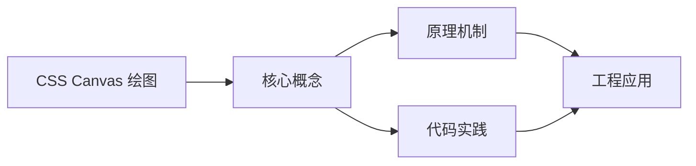
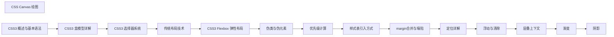

## 1. 学习目标（Bloom 分类）

本节按照布鲁姆教育目标分类学组织学习路径。本文主题为《CSS Canvas 绘图》，属于 CSS 模块，读者可以根据自身阶段选择阅读深度。

记忆层面：能够准确复述本文的核心概念、术语与基本语法或操作步骤，并能够在提问或检索时快速定位对应知识点。能够说出 CSS 的核心概念、术语与标准写法。

理解层面：能够用自己的语言解释核心原理与工作机制，说明概念之间的因果关系，而不是机械记忆结论。能够解释 CSS 的工作原理与设计动机。

应用层面：能够在真实项目或练习场景中运用本文知识解决具体问题，写出正确且可维护的实现。能够编写符合 CSS 规范的完整实现。

分析层面：能够拆解复杂问题，比较本文主题与相邻概念的异同，识别边界条件与例外情况。能够分析 CSS 与相邻方案的差异与边界。

评价层面：能够根据约束条件（性能、可读性、安全、成本）评价不同方案的优劣，做出有依据的技术决策。能够根据场景评价 CSS 相关方案的优劣。

创造层面：能够把本文知识与其他模块知识组合，设计出新的解决方案或可复用的工程模式。能够组合 CSS 与其他技术设计完整方案。

通过本节学习，读者应当能够把《CSS Canvas 绘图》纳入自己的知识网络，并与 CSS 模块的其他主题（选择器、盒模型、布局、动画、响应式）建立关联。

## 2. 历史动机与发展脉络

《CSS Canvas 绘图》是 CSS 领域的重要主题。要真正理解它，需要先了解它解决的问题与演进过程。

CSS 于 1994 年由 Håkon Wium Lie 提出，1996 年 CSS1 发布，解决 HTML 表现层混杂问题；CSS2.1（2011）与 CSS3 模块化（2012+）奠定现代 Web 样式基础。
现代 CSS 的能力版图：Flexbox/Grid 布局、自定义属性（变量）、容器查询、子网格、层叠层（@layer）、现代颜色（oklch）。
CSS 的设计核心是“层叠与继承”：来源、优先级、顺序共同决定最终样式；理解层叠是排查样式问题的前提。

回到本文主题：CSS Canvas 绘图 的提出与成熟，正是上述技术背景下的必然产物。早期实现往往以简单可用为目标，随着工程规模扩大，社区逐渐沉淀出标准做法与最佳实践；理解这一脉络，可以帮助读者判断“为什么文档中的推荐写法是现在这个样子”，也能在遇到历史遗留代码时准确识别其设计年代与取舍。


## 3. 形式化定义与核心概念精讲

本节把《CSS Canvas 绘图》涉及的核心概念以“定义 + 讲解”的形式展开。读者应把定义当作工具，把讲解当作理解路径；两者结合才能形成可迁移的知识。

选择器与优先级：id > class/属性/伪类 > 元素/伪元素；!important 打破优先级（应避免）。
盒模型：content/padding/border/margin，box-sizing 决定 width 语义（border-box 推荐）。
布局体系：普通流、浮动（历史）、Flexbox（一维）、Grid（二维）；position 定位（relative/absolute/fixed/sticky）。

### 3.1 原文章节逐一精讲

原文档把主题拆分为 7 个小节，下面按顺序给出每一节的导读讲解，随后保留原文细节供精读。

#### 原文精读（完整保留）


#### 1. Canvas 概述 | Canvas Overview

Canvas 是 HTML5 提供的一个绘图 API，通过 JavaScript 可以在网页上绘制各种图形、动画和交互效果。Canvas 元素提供了一个矩形区域，我们可以使用各种绘图命令在这个区域内绘制内容。

##### 1.1 Canvas 的特点

- **像素级控制**：可以精确控制每个像素的颜色和位置
- **丰富的绘图 API**：支持绘制路径、形状、文本、图像等
- **动画支持**：可以通过 JavaScript 实现复杂的动画效果
- **交互性**：可以响应鼠标和键盘事件，实现交互效果
- **性能优势**：对于复杂的图形和动画，Canvas 通常比 DOM 操作更高效

##### 1.2 Canvas 与 SVG 的区别

| 特性              | Canvas                 | SVG                  |
| ----------------- | ---------------------- | -------------------- |
| 绘制方式          | 基于像素               | 基于矢量             |
| 缩放效果          | 放大后可能失真         | 放大后不失真         |
| 事件处理          | 不支持元素级事件       | 支持元素级事件       |
| 性能              | 适合绘制大量图形和动画 | 适合绘制少量复杂图形 |
| 存储方式          | 存储为像素数据         | 存储为 XML 结构      |
| ## 2. Canvas 基础 | Canvas Basics          |

##### 2.1 创建 Canvas 元素

```html
<canvas id="myCanvas" width="400" height="300"></canvas>
```

##### 2.2 获取 Canvas 上下文

要在 Canvas 上绘图，首先需要获取 Canvas 的 2D 上下文：

```javascript
const canvas = document.getElementById('myCanvas');
const ctx = canvas.getContext('2d');
```

##### 2.3 基本绘图操作

###### 2.3.1 绘制矩形

```javascript
// 填充矩形
ctx.fillStyle = 'red';
ctx.fillRect(10, 10, 100, 50);
// 描边矩形
ctx.strokeStyle = 'blue';
ctx.lineWidth = 2;
ctx.strokeRect(120, 10, 100, 50);
// 清除矩形
ctx.clearRect(230, 10, 100, 50);
```

###### 2.3.2 绘制路径

```javascript
// 开始路径
ctx.beginPath();
// 移动到起始点
ctx.moveTo(50, 100);
// 绘制线条
ctx.lineTo(150, 100);
ctx.lineTo(100, 150);
// 闭合路径
ctx.closePath();
// 填充路径
ctx.fillStyle = 'green';
ctx.fill();
// 描边路径
ctx.strokeStyle = 'black';
ctx.lineWidth = 2;
ctx.stroke();
```

###### 2.3.3 绘制圆形

```javascript
ctx.beginPath();
ctx.arc(200, 125, 50, 0, Math.PI * 2);
ctx.fillStyle = 'yellow';
ctx.fill();
ctx.strokeStyle = 'black';
ctx.lineWidth = 2;
ctx.stroke();
```

###### 2.3.4 绘制文本

```javascript
ctx.font = '24px Arial';
ctx.fillStyle = 'black';
ctx.textAlign = 'center';
ctx.fillText('Hello Canvas!', 200, 250);
// 描边文本
ctx.strokeStyle = 'red';
ctx.lineWidth = 1;
ctx.strokeText('Hello Canvas!', 200, 280);
```

#### 3. Canvas 进阶 | Canvas Advanced

##### 3.1 渐变效果

###### 3.1.1 线性渐变

```javascript
// 创建线性渐变
const linearGradient = ctx.createLinearGradient(0, 0, 400, 0);
linearGradient.addColorStop(0, 'red');
linearGradient.addColorStop(0.5, 'yellow');
linearGradient.addColorStop(1, 'green');
// 使用渐变
ctx.fillStyle = linearGradient;
ctx.fillRect(0, 0, 400, 300);
```

###### 3.1.2 径向渐变

```javascript
// 创建径向渐变
const radialGradient = ctx.createRadialGradient(200, 150, 0, 200, 150, 150);
radialGradient.addColorStop(0, 'white');
radialGradient.addColorStop(1, 'blue');
// 使用渐变
ctx.fillStyle = radialGradient;
ctx.fillRect(0, 0, 400, 300);
```

##### 3.2 图案填充

```javascript
// 创建图案
const patternCanvas = document.createElement('canvas');
patternCanvas.width = 20;
patternCanvas.height = 20;
const patternCtx = patternCanvas.getContext('2d');
patternCtx.fillStyle = 'red';
patternCtx.fillRect(0, 0, 10, 10);
patternCtx.fillRect(10, 10, 10, 10);
// 创建重复图案
const pattern = ctx.createPattern(patternCanvas, 'repeat');
// 使用图案
ctx.fillStyle = pattern;
ctx.fillRect(0, 0, 400, 300);
```

##### 3.3 图像处理

###### 3.3.1 绘制图像

```javascript
const img = new Image();
img.src = 'image.jpg';
img.onload = function () {
  // 绘制完整图像
  ctx.drawImage(img, 0, 0);
  // 绘制缩放后的图像
  ctx.drawImage(img, 0, 150, 200, 100);
  // 绘制图像的一部分
  ctx.drawImage(img, 100, 100, 200, 100, 200, 150, 200, 100);
};
```

###### 3.3.2 图像变换

```javascript
const img = new Image();
img.src = 'image.jpg';
img.onload = function () {
  // 保存当前状态
  ctx.save();
  // 平移
  ctx.translate(100, 50);
  // 旋转
  ctx.rotate(Math.PI / 4);
  // 缩放
  ctx.scale(0.5, 0.5);
  // 绘制图像
  ctx.drawImage(img, 0, 0);
  // 恢复之前的状态
  ctx.restore();
};
```

##### 3.4 合成模式

```javascript
// 绘制第一个矩形
ctx.fillStyle = 'red';
ctx.fillRect(50, 50, 100, 100);
// 设置合成模式
ctx.globalCompositeOperation = 'source-over'; // 默认
// ctx.globalCompositeOperation = 'source-in';
// ctx.globalCompositeOperation = 'source-out';
// ctx.globalCompositeOperation = 'destination-over';
// ctx.globalCompositeOperation = 'destination-in';
// ctx.globalCompositeOperation = 'destination-out';
// ctx.globalCompositeOperation = 'lighter';
// ctx.globalCompositeOperation = 'copy';
// ctx.globalCompositeOperation = 'xor';
// 绘制第二个矩形
ctx.fillStyle = 'blue';
ctx.fillRect(100, 100, 100, 100);
```

#### 4. Canvas 动画 | Canvas Animation

##### 4.1 基本动画循环

```javascript
function animate() {
  // 清除画布
  ctx.clearRect(0, 0, canvas.width, canvas.height);
  // 绘制动画内容
  // ...
  // 请求下一帧
  requestAnimationFrame(animate);
}
// 开始动画
animate();
```

##### 4.2 移动动画

```javascript
let x = 0;
let y = 150;
let dx = 2;
let dy = 2;
function animate() {
  // 清除画布
  ctx.clearRect(0, 0, canvas.width, canvas.height);
  // 绘制圆形
  ctx.beginPath();
  ctx.arc(x, y, 20, 0, Math.PI * 2);
  ctx.fillStyle = 'red';
  ctx.fill();
  // 更新位置
  x += dx;
  y += dy;
  // 边界检测
  if (x + 20 > canvas.width || x - 20 < 0) {
    dx = -dx;
  }
  if (y + 20 > canvas.height || y - 20 < 0) {
    dy = -dy;
  }
  // 请求下一帧
  requestAnimationFrame(animate);
}
// 开始动画
animate();
```

##### 4.3 交互动画

```javascript
let isDrawing = false;
let lastX = 0;
let lastY = 0;
// 鼠标按下事件
canvas.addEventListener('mousedown', (e) => {
  isDrawing = true;
  [lastX, lastY] = [e.offsetX, e.offsetY];
});
// 鼠标移动事件
canvas.addEventListener('mousemove', (e) => {
  if (!isDrawing) return;
  ctx.beginPath();
  ctx.moveTo(lastX, lastY);
  ctx.lineTo(e.offsetX, e.offsetY);
  ctx.strokeStyle = 'black';
  ctx.lineWidth = 2;
  ctx.stroke();
  [lastX, lastY] = [e.offsetX, e.offsetY];
});
// 鼠标释放事件
canvas.addEventListener('mouseup', () => {
  isDrawing = false;
});
// 鼠标离开事件
canvas.addEventListener('mouseout', () => {
  isDrawing = false;
});
```

#### 5. Canvas 实战示例 | Canvas Practical Examples

##### 5.1 简单的绘图应用

```html
<!DOCTYPE html>
<html>
  <head>
    <title>Canvas Drawing App</title>
    <style>
      canvas {
        border: 1px solid black;
        cursor: crosshair;
      }
      .controls {
        margin-bottom: 10px;
      }
    </style>
  </head>
  <body>
    <div class="controls">
      <label for="color">Color:</label>
      <input type="color" id="color" value="#000000" />
      <label for="size">Size:</label>
      <input type="range" id="size" min="1" max="20" value="2" />
      <button id="clear">Clear</button>
    </div>
    <canvas id="canvas" width="600" height="400"></canvas>
    <script>
      const canvas = document.getElementById('canvas');
      const ctx = canvas.getContext('2d');
      const colorInput = document.getElementById('color');
      const sizeInput = document.getElementById('size');
      const clearButton = document.getElementById('clear');
      let isDrawing = false;
      let lastX = 0;
      let lastY = 0;
      // 鼠标按下事件
      canvas.addEventListener('mousedown', (e) => {
        isDrawing = true;
        [lastX, lastY] = [e.offsetX, e.offsetY];
      });
      // 鼠标移动事件
      canvas.addEventListener('mousemove', (e) => {
        if (!isDrawing) return;
        ctx.beginPath();
        ctx.moveTo(lastX, lastY);
        ctx.lineTo(e.offsetX, e.offsetY);
        ctx.strokeStyle = colorInput.value;
        ctx.lineWidth = sizeInput.value;
        ctx.stroke();
        [lastX, lastY] = [e.offsetX, e.offsetY];
      });
      // 鼠标释放事件
      canvas.addEventListener('mouseup', () => {
        isDrawing = false;
      });
      // 鼠标离开事件
      canvas.addEventListener('mouseout', () => {
        isDrawing = false;
      });
      // 清除按钮点击事件
      clearButton.addEventListener('click', () => {
        ctx.clearRect(0, 0, canvas.width, canvas.height);
      });
    </script>
  </body>
</html>
```

##### 5.2 粒子效果

```html
<!DOCTYPE html>
<html>
  <head>
    <title>Canvas Particle Effect</title>
    <style>
      body {
        margin: 0;
        overflow: hidden;
      }
      canvas {
        display: block;
      }
    </style>
  </head>
  <body>
    <canvas id="canvas"></canvas>
    <script>
      const canvas = document.getElementById('canvas');
      const ctx = canvas.getContext('2d');
      // 设置画布大小
      canvas.width = window.innerWidth;
      canvas.height = window.innerHeight;
      // 粒子数组
      const particles = [];
      const particleCount = 100;
      // 创建粒子
      for (let i = 0; i < particleCount; i++) {
        particles.push({
          x: Math.random() * canvas.width,
          y: Math.random() * canvas.height,
          size: Math.random() * 5 + 1,
          speedX: Math.random() * 3 - 1.5,
          speedY: Math.random() * 3 - 1.5,
          color: `hsl(${Math.random() * 360}, 50%, 50%)`,
        });
      }
      // 动画函数
      function animate() {
        // 清除画布
        ctx.clearRect(0, 0, canvas.width, canvas.height);
        // 更新和绘制粒子
        for (let i = 0; i < particles.length; i++) {
          const p = particles[i];
          // 绘制粒子
          ctx.beginPath();
          ctx.arc(p.x, p.y, p.size, 0, Math.PI * 2);
          ctx.fillStyle = p.color;
          ctx.fill();
          // 更新粒子位置
          p.x += p.speedX;
          p.y += p.speedY;
          // 边界检测
          if (p.x + p.size > canvas.width || p.x - p.size < 0) {
            p.speedX = -p.speedX;
          }
          if (p.y + p.size > canvas.height || p.y - p.size < 0) {
            p.speedY = -p.speedY;
          }
          // 连接粒子
          for (let j = i; j < particles.length; j++) {
            const p2 = particles[j];
            const dx = p.x - p2.x;
            const dy = p.y - p2.y;
            const distance = Math.sqrt(dx * dx + dy * dy);
            if (distance < 100) {
              ctx.beginPath();
              ctx.strokeStyle = p.color;
              ctx.lineWidth = 0.2;
              ctx.moveTo(p.x, p.y);
              ctx.lineTo(p2.x, p2.y);
              ctx.stroke();
            }
          }
        }
        // 请求下一帧
        requestAnimationFrame(animate);
      }
      // 开始动画
      animate();
      // 窗口大小改变时调整画布大小
      window.addEventListener('resize', () => {
        canvas.width = window.innerWidth;
        canvas.height = window.innerHeight;
      });
    </script>
  </body>
</html>
```

##### 5.3 时钟效果

```html
<!DOCTYPE html>
<html>
  <head>
    <title>Canvas Clock</title>
    <style>
      canvas {
        display: block;
        margin: 50px auto;
        border: 1px solid black;
        border-radius: 50%;
      }
    </style>
  </head>
  <body>
    <canvas id="canvas" width="400" height="400"></canvas>
    <script>
      const canvas = document.getElementById('canvas');
      const ctx = canvas.getContext('2d');
      const centerX = canvas.width / 2;
      const centerY = canvas.height / 2;
      const radius = 180;
      // 绘制时钟
      function drawClock() {
        // 清除画布
        ctx.clearRect(0, 0, canvas.width, canvas.height);
        // 获取当前时间
        const now = new Date();
        const hours = now.getHours();
        const minutes = now.getMinutes();
        const seconds = now.getSeconds();
        // 绘制表盘
        ctx.beginPath();
        ctx.arc(centerX, centerY, radius, 0, Math.PI * 2);
        ctx.fillStyle = 'white';
        ctx.fill();
        ctx.strokeStyle = 'black';
        ctx.lineWidth = 2;
        ctx.stroke();
        // 绘制刻度
        for (let i = 0; i < 12; i++) {
          const angle = (i / 12) * Math.PI * 2;
          const x1 = centerX + Math.cos(angle) * (radius - 20);
          const y1 = centerY + Math.sin(angle) * (radius - 20);
          const x2 = centerX + Math.cos(angle) * (radius - 10);
          const y2 = centerY + Math.sin(angle) * (radius - 10);
          ctx.beginPath();
          ctx.moveTo(x1, y1);
          ctx.lineTo(x2, y2);
          ctx.strokeStyle = 'black';
          ctx.lineWidth = 2;
          ctx.stroke();
          // 绘制数字
          const text = i === 0 ? '12' : i.toString();
          ctx.font = '20px Arial';
          ctx.fillStyle = 'black';
          ctx.textAlign = 'center';
          ctx.textBaseline = 'middle';
          const textX = centerX + Math.cos(angle) * (radius - 40);
          const textY = centerY + Math.sin(angle) * (radius - 40);
          ctx.fillText(text, textX, textY);
        }
        // 绘制时针
        const hourAngle = ((hours % 12) / 12) * Math.PI * 2 + (minutes / 60) * ((Math.PI * 2) / 12);
        const hourX = centerX + Math.cos(hourAngle) * (radius - 80);
        const hourY = centerY + Math.sin(hourAngle) * (radius - 80);
        ctx.beginPath();
        ctx.moveTo(centerX, centerY);
        ctx.lineTo(hourX, hourY);
        ctx.strokeStyle = 'black';
        ctx.lineWidth = 4;
        ctx.stroke();
        // 绘制分针
        const minuteAngle = (minutes / 60) * Math.PI * 2 + (seconds / 60) * ((Math.PI * 2) / 60);
        const minuteX = centerX + Math.cos(minuteAngle) * (radius - 60);
        const minuteY = centerY + Math.sin(minuteAngle) * (radius - 60);
        ctx.beginPath();
        ctx.moveTo(centerX, centerY);
        ctx.lineTo(minuteX, minuteY);
        ctx.strokeStyle = 'black';
        ctx.lineWidth = 2;
        ctx.stroke();
        // 绘制秒针
        const secondAngle = (seconds / 60) * Math.PI * 2;
        const secondX = centerX + Math.cos(secondAngle) * (radius - 40);
        const secondY = centerY + Math.sin(secondAngle) * (radius - 40);
        ctx.beginPath();
        ctx.moveTo(centerX, centerY);
        ctx.lineTo(secondX, secondY);
        ctx.strokeStyle = 'red';
        ctx.lineWidth = 1;
        ctx.stroke();
        // 绘制中心点
        ctx.beginPath();
        ctx.arc(centerX, centerY, 5, 0, Math.PI * 2);
        ctx.fillStyle = 'black';
        ctx.fill();
      }
      // 绘制时钟并每秒更新
      drawClock();
      setInterval(drawClock, 1000);
    </script>
  </body>
</html>
```

#### 6. Canvas 性能优化 | Canvas Performance Optimization

##### 6.1 减少绘制操作

- **批量绘制**：将多个绘制操作合并为一个路径
- **避免频繁清除**：只清除需要更新的区域
- **使用离屏 Canvas**：对于复杂的绘制，使用离屏 Canvas 预渲染

##### 6.2 优化图像操作

- **使用适当的图像格式**：根据需要选择 JPEG、PNG 或 WebP
- **压缩图像**：减少图像文件大小
- **使用 CSS 缩放**：在绘制前使用 CSS 缩放图像

##### 6.3 优化动画

- **使用 requestAnimationFrame**：代替 setTimeout 或 setInterval
- **限制帧率**：对于不需要 60fps 的动画，限制帧率
- **使用 transforms**：使用 translate、rotate、scale 等变换代替重新绘制

##### 6.4 内存管理

- **释放不再使用的资源**：及时释放图像、路径等资源
- **避免内存泄漏**：注意事件监听器的移除

#### 7. Canvas 最佳实践 | Canvas Best Practices

##### 7.1 代码组织

- **模块化设计**：将 Canvas 相关代码封装为模块
- **使用面向对象**：使用类和对象组织代码
- **注释**：添加适当的注释，说明代码的功能和逻辑

##### 7.2 兼容性

- **检测 Canvas 支持**：在使用 Canvas 前检测浏览器是否支持
- **提供替代方案**：为不支持 Canvas 的浏览器提供替代内容

##### 7.3 安全性

- **验证用户输入**：对于用户输入的坐标和尺寸，进行验证
- **防止 XSS**：对于从用户输入生成的 Canvas 内容，进行适当的过滤

##### 7.4 可访问性

- **提供替代文本**：为 Canvas 元素添加 alt 属性
- **使用 ARIA 标签**：为 Canvas 元素添加适当的 ARIA 标签
- **支持键盘导航**：对于交互式 Canvas，支持键盘导航

#### 8. 总结 | Summary

Canvas 是 HTML5 提供的强大绘图 API，通过 JavaScript 可以在网页上创建各种图形、动画和交互效果。Canvas 具有像素级控制、丰富的绘图 API、动画支持和交互性等特点，适用于创建游戏、数据可视化、图像处理等应用。
通过学习 Canvas 的基础操作、进阶特性和性能优化技巧，你可以创建各种复杂的图形和动画效果。在实际开发中，应根据具体需求选择合适的技术方案，并遵循相关的最佳实践，以创建高性能、可维护的 Canvas 应用。


### 3.2 概念关系图

下面用 Mermaid 图表达本文核心概念之间的关系，帮助读者建立整体图景：



图中展示的是本文知识的结构化关系：核心概念是入口，原理机制解释“为什么”，代码实践演示“怎么做”，工程应用回答“何时用”。读者学习时可以把每个小节的内容挂接到对应节点上。

## 4. 理论推导与原理解析

本节深入《CSS Canvas 绘图》背后的原理。理论部分不求面面俱到，而是聚焦“能解释现象、能指导实践”的关键推导。

选择器与优先级：id > class/属性/伪类 > 元素/伪元素；!important 打破优先级（应避免）。
盒模型：content/padding/border/margin，box-sizing 决定 width 语义（border-box 推荐）。
布局体系：普通流、浮动（历史）、Flexbox（一维）、Grid（二维）；position 定位（relative/absolute/fixed/sticky）。
层叠上下文：z-index 只在同一层叠上下文中比较；transform/opacity/filter 创建新上下文。

需要强调的是，理论推导与工程实践之间存在翻译层：理论给出的是理想化模型与边界条件，工程代码则必须处理真实环境中的例外。读者在学习时应先掌握理论的“标准情形”，再通过陷阱章节了解“非标准情形”。

## 5. 代码示例与逐行讲解

本节把原文中的代码示例系统整理，并为每个示例补充用途说明与讲解。读者不应只浏览代码，而应逐段对照讲解理解设计意图。

### 5.1 示例：2.1 创建 Canvas 元素

该示例来自原文《2.1 创建 Canvas 元素》小节，用于演示CSS Canvas 绘图相关操作。阅读时请先看代码结构，再看其后的讲解。

```html
<canvas id="myCanvas" width="400" height="300"></canvas>
```

讲解：这段代码演示了本节核心知识点。代码中的关键操作可以归纳为三步：准备（定义或初始化）、执行（核心逻辑）、收尾（释放资源或返回结果）。实际项目中，这三步往往被封装为函数或类，以提升复用性与可测试性。

关键点分析：

该示例共 1 行有效代码，结构以数据或配置为主。阅读时应关注：数据字段的含义、配置项的作用，以及它们与运行行为的对应关系。

进阶思考路径：先尝试修改参数观察行为变化，再把示例中的模式迁移到自己的项目中；每次修改都记录预期与实测差异，这是把示例转化为能力的最快方式。

### 5.2 示例：2.2 获取 Canvas 上下文

该示例来自原文《2.2 获取 Canvas 上下文》小节，用于演示CSS Canvas 绘图相关操作。阅读时请先看代码结构，再看其后的讲解。

```javascript
const canvas = document.getElementById('myCanvas');
const ctx = canvas.getContext('2d');
```

讲解：这段代码演示了本节核心知识点。代码中的关键操作可以归纳为三步：准备（定义或初始化）、执行（核心逻辑）、收尾（释放资源或返回结果）。实际项目中，这三步往往被封装为函数或类，以提升复用性与可测试性。

关键点分析：

该示例共 2 行有效代码，结构以数据或配置为主。阅读时应关注：数据字段的含义、配置项的作用，以及它们与运行行为的对应关系。

进阶思考路径：先尝试修改参数观察行为变化，再把示例中的模式迁移到自己的项目中；每次修改都记录预期与实测差异，这是把示例转化为能力的最快方式。

### 5.3 示例：2.3.1 绘制矩形

该示例来自原文《2.3.1 绘制矩形》小节，用于演示CSS Canvas 绘图相关操作。阅读时请先看代码结构，再看其后的讲解。

```javascript
// 填充矩形
ctx.fillStyle = 'red';
ctx.fillRect(10, 10, 100, 50);
// 描边矩形
ctx.strokeStyle = 'blue';
ctx.lineWidth = 2;
ctx.strokeRect(120, 10, 100, 50);
// 清除矩形
ctx.clearRect(230, 10, 100, 50);
```

讲解：这段代码演示了本节核心知识点。代码中的关键操作可以归纳为三步：准备（定义或初始化）、执行（核心逻辑）、收尾（释放资源或返回结果）。实际项目中，这三步往往被封装为函数或类，以提升复用性与可测试性。

关键点分析：

该示例共 9 行有效代码，结构以数据或配置为主。阅读时应关注：数据字段的含义、配置项的作用，以及它们与运行行为的对应关系。

进阶思考路径：先尝试修改参数观察行为变化，再把示例中的模式迁移到自己的项目中；每次修改都记录预期与实测差异，这是把示例转化为能力的最快方式。

### 5.4 示例：2.3.2 绘制路径

该示例来自原文《2.3.2 绘制路径》小节，用于演示CSS Canvas 绘图相关操作。阅读时请先看代码结构，再看其后的讲解。

```javascript
// 开始路径
ctx.beginPath();
// 移动到起始点
ctx.moveTo(50, 100);
// 绘制线条
ctx.lineTo(150, 100);
ctx.lineTo(100, 150);
// 闭合路径
ctx.closePath();
// 填充路径
ctx.fillStyle = 'green';
ctx.fill();
// 描边路径
ctx.strokeStyle = 'black';
ctx.lineWidth = 2;
ctx.stroke();
```

讲解：这段代码演示了本节核心知识点。代码中的关键操作可以归纳为三步：准备（定义或初始化）、执行（核心逻辑）、收尾（释放资源或返回结果）。实际项目中，这三步往往被封装为函数或类，以提升复用性与可测试性。

关键点分析：

该示例共 16 行有效代码，结构以数据或配置为主。阅读时应关注：数据字段的含义、配置项的作用，以及它们与运行行为的对应关系。

进阶思考路径：先尝试修改参数观察行为变化，再把示例中的模式迁移到自己的项目中；每次修改都记录预期与实测差异，这是把示例转化为能力的最快方式。

### 5.5 示例：2.3.3 绘制圆形

该示例来自原文《2.3.3 绘制圆形》小节，用于演示CSS Canvas 绘图相关操作。阅读时请先看代码结构，再看其后的讲解。

```javascript
ctx.beginPath();
ctx.arc(200, 125, 50, 0, Math.PI * 2);
ctx.fillStyle = 'yellow';
ctx.fill();
ctx.strokeStyle = 'black';
ctx.lineWidth = 2;
ctx.stroke();
```

讲解：这段代码演示了本节核心知识点。代码中的关键操作可以归纳为三步：准备（定义或初始化）、执行（核心逻辑）、收尾（释放资源或返回结果）。实际项目中，这三步往往被封装为函数或类，以提升复用性与可测试性。

关键点分析：

该示例共 7 行有效代码，结构以数据或配置为主。阅读时应关注：数据字段的含义、配置项的作用，以及它们与运行行为的对应关系。

进阶思考路径：先尝试修改参数观察行为变化，再把示例中的模式迁移到自己的项目中；每次修改都记录预期与实测差异，这是把示例转化为能力的最快方式。

### 5.6 示例：2.3.4 绘制文本

该示例来自原文《2.3.4 绘制文本》小节，用于演示CSS Canvas 绘图相关操作。阅读时请先看代码结构，再看其后的讲解。

```javascript
ctx.font = '24px Arial';
ctx.fillStyle = 'black';
ctx.textAlign = 'center';
ctx.fillText('Hello Canvas!', 200, 250);
// 描边文本
ctx.strokeStyle = 'red';
ctx.lineWidth = 1;
ctx.strokeText('Hello Canvas!', 200, 280);
```

讲解：这段代码演示了本节核心知识点。代码中的关键操作可以归纳为三步：准备（定义或初始化）、执行（核心逻辑）、收尾（释放资源或返回结果）。实际项目中，这三步往往被封装为函数或类，以提升复用性与可测试性。

关键点分析：

该示例共 8 行有效代码，结构以数据或配置为主。阅读时应关注：数据字段的含义、配置项的作用，以及它们与运行行为的对应关系。

进阶思考路径：先尝试修改参数观察行为变化，再把示例中的模式迁移到自己的项目中；每次修改都记录预期与实测差异，这是把示例转化为能力的最快方式。

### 5.7 示例：3.1.1 线性渐变

该示例来自原文《3.1.1 线性渐变》小节，用于演示CSS Canvas 绘图相关操作。阅读时请先看代码结构，再看其后的讲解。

```javascript
// 创建线性渐变
const linearGradient = ctx.createLinearGradient(0, 0, 400, 0);
linearGradient.addColorStop(0, 'red');
linearGradient.addColorStop(0.5, 'yellow');
linearGradient.addColorStop(1, 'green');
// 使用渐变
ctx.fillStyle = linearGradient;
ctx.fillRect(0, 0, 400, 300);
```

讲解：这段代码演示了本节核心知识点。代码中的关键操作可以归纳为三步：准备（定义或初始化）、执行（核心逻辑）、收尾（释放资源或返回结果）。实际项目中，这三步往往被封装为函数或类，以提升复用性与可测试性。

关键点分析：

该示例共 8 行有效代码，结构以数据或配置为主。阅读时应关注：数据字段的含义、配置项的作用，以及它们与运行行为的对应关系。

进阶思考路径：先尝试修改参数观察行为变化，再把示例中的模式迁移到自己的项目中；每次修改都记录预期与实测差异，这是把示例转化为能力的最快方式。

### 5.8 示例：3.1.2 径向渐变

该示例来自原文《3.1.2 径向渐变》小节，用于演示CSS Canvas 绘图相关操作。阅读时请先看代码结构，再看其后的讲解。

```javascript
// 创建径向渐变
const radialGradient = ctx.createRadialGradient(200, 150, 0, 200, 150, 150);
radialGradient.addColorStop(0, 'white');
radialGradient.addColorStop(1, 'blue');
// 使用渐变
ctx.fillStyle = radialGradient;
ctx.fillRect(0, 0, 400, 300);
```

讲解：这段代码演示了本节核心知识点。代码中的关键操作可以归纳为三步：准备（定义或初始化）、执行（核心逻辑）、收尾（释放资源或返回结果）。实际项目中，这三步往往被封装为函数或类，以提升复用性与可测试性。

关键点分析：

该示例共 7 行有效代码，结构以数据或配置为主。阅读时应关注：数据字段的含义、配置项的作用，以及它们与运行行为的对应关系。

进阶思考路径：先尝试修改参数观察行为变化，再把示例中的模式迁移到自己的项目中；每次修改都记录预期与实测差异，这是把示例转化为能力的最快方式。

### 5.9 示例：3.2 图案填充

该示例来自原文《3.2 图案填充》小节，用于演示CSS Canvas 绘图相关操作。阅读时请先看代码结构，再看其后的讲解。

```javascript
// 创建图案
const patternCanvas = document.createElement('canvas');
patternCanvas.width = 20;
patternCanvas.height = 20;
const patternCtx = patternCanvas.getContext('2d');
patternCtx.fillStyle = 'red';
patternCtx.fillRect(0, 0, 10, 10);
patternCtx.fillRect(10, 10, 10, 10);
// 创建重复图案
const pattern = ctx.createPattern(patternCanvas, 'repeat');
// 使用图案
ctx.fillStyle = pattern;
ctx.fillRect(0, 0, 400, 300);
```

讲解：这段代码演示了本节核心知识点。代码中的关键操作可以归纳为三步：准备（定义或初始化）、执行（核心逻辑）、收尾（释放资源或返回结果）。实际项目中，这三步往往被封装为函数或类，以提升复用性与可测试性。

关键点分析：

该示例共 13 行有效代码，结构以数据或配置为主。阅读时应关注：数据字段的含义、配置项的作用，以及它们与运行行为的对应关系。

进阶思考路径：先尝试修改参数观察行为变化，再把示例中的模式迁移到自己的项目中；每次修改都记录预期与实测差异，这是把示例转化为能力的最快方式。

### 5.10 示例：3.3.1 绘制图像

该示例来自原文《3.3.1 绘制图像》小节，用于演示CSS Canvas 绘图相关操作。阅读时请先看代码结构，再看其后的讲解。

```javascript
const img = new Image();
img.src = 'image.jpg';
img.onload = function () {
  // 绘制完整图像
  ctx.drawImage(img, 0, 0);
  // 绘制缩放后的图像
  ctx.drawImage(img, 0, 150, 200, 100);
  // 绘制图像的一部分
  ctx.drawImage(img, 100, 100, 200, 100, 200, 150, 200, 100);
};
```

讲解：这段代码演示了本节核心知识点。代码中的关键操作可以归纳为三步：准备（定义或初始化）、执行（核心逻辑）、收尾（释放资源或返回结果）。实际项目中，这三步往往被封装为函数或类，以提升复用性与可测试性。

关键点分析：

该示例共 10 行有效代码，包含 1 类关键结构（function）。其中：

- 入口与初始化部分负责建立上下文，对应实际项目中的启动或装配逻辑；
- 核心逻辑部分体现本文主题的主要操作，是阅读时最需要对照讲解理解的部分；
- 输出或返回部分把结果交给调用方，注意其类型与边界条件。

进阶思考路径：先尝试修改参数观察行为变化，再把示例中的模式迁移到自己的项目中；每次修改都记录预期与实测差异，这是把示例转化为能力的最快方式。

### 5.11 示例：3.3.2 图像变换

该示例来自原文《3.3.2 图像变换》小节，用于演示CSS Canvas 绘图相关操作。阅读时请先看代码结构，再看其后的讲解。

```javascript
const img = new Image();
img.src = 'image.jpg';
img.onload = function () {
  // 保存当前状态
  ctx.save();
  // 平移
  ctx.translate(100, 50);
  // 旋转
  ctx.rotate(Math.PI / 4);
  // 缩放
  ctx.scale(0.5, 0.5);
  // 绘制图像
  ctx.drawImage(img, 0, 0);
  // 恢复之前的状态
  ctx.restore();
};
```

讲解：这段代码演示了本节核心知识点。代码中的关键操作可以归纳为三步：准备（定义或初始化）、执行（核心逻辑）、收尾（释放资源或返回结果）。实际项目中，这三步往往被封装为函数或类，以提升复用性与可测试性。

关键点分析：

该示例共 16 行有效代码，包含 1 类关键结构（function）。其中：

- 入口与初始化部分负责建立上下文，对应实际项目中的启动或装配逻辑；
- 核心逻辑部分体现本文主题的主要操作，是阅读时最需要对照讲解理解的部分；
- 输出或返回部分把结果交给调用方，注意其类型与边界条件。

进阶思考路径：先尝试修改参数观察行为变化，再把示例中的模式迁移到自己的项目中；每次修改都记录预期与实测差异，这是把示例转化为能力的最快方式。

### 5.12 示例：3.4 合成模式

该示例来自原文《3.4 合成模式》小节，用于演示CSS Canvas 绘图相关操作。阅读时请先看代码结构，再看其后的讲解。

```javascript
// 绘制第一个矩形
ctx.fillStyle = 'red';
ctx.fillRect(50, 50, 100, 100);
// 设置合成模式
ctx.globalCompositeOperation = 'source-over'; // 默认
// ctx.globalCompositeOperation = 'source-in';
// ctx.globalCompositeOperation = 'source-out';
// ctx.globalCompositeOperation = 'destination-over';
// ctx.globalCompositeOperation = 'destination-in';
// ctx.globalCompositeOperation = 'destination-out';
// ctx.globalCompositeOperation = 'lighter';
// ctx.globalCompositeOperation = 'copy';
// ctx.globalCompositeOperation = 'xor';
// 绘制第二个矩形
ctx.fillStyle = 'blue';
ctx.fillRect(100, 100, 100, 100);
```

讲解：这段代码演示了本节核心知识点。代码中的关键操作可以归纳为三步：准备（定义或初始化）、执行（核心逻辑）、收尾（释放资源或返回结果）。实际项目中，这三步往往被封装为函数或类，以提升复用性与可测试性。

关键点分析：

该示例共 16 行有效代码，结构以数据或配置为主。阅读时应关注：数据字段的含义、配置项的作用，以及它们与运行行为的对应关系。

进阶思考路径：先尝试修改参数观察行为变化，再把示例中的模式迁移到自己的项目中；每次修改都记录预期与实测差异，这是把示例转化为能力的最快方式。

### 5.13 示例：4.1 基本动画循环

该示例来自原文《4.1 基本动画循环》小节，用于演示CSS Canvas 绘图相关操作。阅读时请先看代码结构，再看其后的讲解。

```javascript
function animate() {
  // 清除画布
  ctx.clearRect(0, 0, canvas.width, canvas.height);
  // 绘制动画内容
  // ...
  // 请求下一帧
  requestAnimationFrame(animate);
}
// 开始动画
animate();
```

讲解：这段代码演示了本节核心知识点。代码中的关键操作可以归纳为三步：准备（定义或初始化）、执行（核心逻辑）、收尾（释放资源或返回结果）。实际项目中，这三步往往被封装为函数或类，以提升复用性与可测试性。

关键点分析：

该示例共 10 行有效代码，包含 1 类关键结构（function）。其中：

- 入口与初始化部分负责建立上下文，对应实际项目中的启动或装配逻辑；
- 核心逻辑部分体现本文主题的主要操作，是阅读时最需要对照讲解理解的部分；
- 输出或返回部分把结果交给调用方，注意其类型与边界条件。

进阶思考路径：先尝试修改参数观察行为变化，再把示例中的模式迁移到自己的项目中；每次修改都记录预期与实测差异，这是把示例转化为能力的最快方式。

### 5.14 示例：4.2 移动动画

该示例来自原文《4.2 移动动画》小节，用于演示CSS Canvas 绘图相关操作。阅读时请先看代码结构，再看其后的讲解。

```javascript
let x = 0;
let y = 150;
let dx = 2;
let dy = 2;
function animate() {
  // 清除画布
  ctx.clearRect(0, 0, canvas.width, canvas.height);
  // 绘制圆形
  ctx.beginPath();
  ctx.arc(x, y, 20, 0, Math.PI * 2);
  ctx.fillStyle = 'red';
  ctx.fill();
  // 更新位置
  x += dx;
  y += dy;
  // 边界检测
  if (x + 20 > canvas.width || x - 20 < 0) {
    dx = -dx;
  }
  if (y + 20 > canvas.height || y - 20 < 0) {
    dy = -dy;
  }
  // 请求下一帧
  requestAnimationFrame(animate);
}
// 开始动画
animate();
```

讲解：这段代码演示了本节核心知识点。代码中的关键操作可以归纳为三步：准备（定义或初始化）、执行（核心逻辑）、收尾（释放资源或返回结果）。实际项目中，这三步往往被封装为函数或类，以提升复用性与可测试性。

关键点分析：

该示例共 27 行有效代码，包含 2 类关键结构（function、if）。其中：

- 入口与初始化部分负责建立上下文，对应实际项目中的启动或装配逻辑；
- 核心逻辑部分体现本文主题的主要操作，是阅读时最需要对照讲解理解的部分；
- 输出或返回部分把结果交给调用方，注意其类型与边界条件。

进阶思考路径：先尝试修改参数观察行为变化，再把示例中的模式迁移到自己的项目中；每次修改都记录预期与实测差异，这是把示例转化为能力的最快方式。

### 5.15 示例：4.3 交互动画

该示例来自原文《4.3 交互动画》小节，用于演示CSS Canvas 绘图相关操作。阅读时请先看代码结构，再看其后的讲解。

```javascript
let isDrawing = false;
let lastX = 0;
let lastY = 0;
// 鼠标按下事件
canvas.addEventListener('mousedown', (e) => {
  isDrawing = true;
  [lastX, lastY] = [e.offsetX, e.offsetY];
});
// 鼠标移动事件
canvas.addEventListener('mousemove', (e) => {
  if (!isDrawing) return;
  ctx.beginPath();
  ctx.moveTo(lastX, lastY);
  ctx.lineTo(e.offsetX, e.offsetY);
  ctx.strokeStyle = 'black';
  ctx.lineWidth = 2;
  ctx.stroke();
  [lastX, lastY] = [e.offsetX, e.offsetY];
});
// 鼠标释放事件
canvas.addEventListener('mouseup', () => {
  isDrawing = false;
});
// 鼠标离开事件
canvas.addEventListener('mouseout', () => {
  isDrawing = false;
});
```

讲解：这段代码演示了本节核心知识点。代码中的关键操作可以归纳为三步：准备（定义或初始化）、执行（核心逻辑）、收尾（释放资源或返回结果）。实际项目中，这三步往往被封装为函数或类，以提升复用性与可测试性。

关键点分析：

该示例共 27 行有效代码，包含 2 类关键结构（if、return）。其中：

- 入口与初始化部分负责建立上下文，对应实际项目中的启动或装配逻辑；
- 核心逻辑部分体现本文主题的主要操作，是阅读时最需要对照讲解理解的部分；
- 输出或返回部分把结果交给调用方，注意其类型与边界条件。

进阶思考路径：先尝试修改参数观察行为变化，再把示例中的模式迁移到自己的项目中；每次修改都记录预期与实测差异，这是把示例转化为能力的最快方式。

### 5.16 示例：5.1 简单的绘图应用

该示例来自原文《5.1 简单的绘图应用》小节，用于演示CSS Canvas 绘图相关操作。阅读时请先看代码结构，再看其后的讲解。

```html
<!DOCTYPE html>
<html>
  <head>
    <title>Canvas Drawing App</title>
    <style>
      canvas {
        border: 1px solid black;
        cursor: crosshair;
      }
      .controls {
        margin-bottom: 10px;
      }
    </style>
  </head>
  <body>
    <div class="controls">
      <label for="color">Color:</label>
      <input type="color" id="color" value="#000000" />
      <label for="size">Size:</label>
      <input type="range" id="size" min="1" max="20" value="2" />
      <button id="clear">Clear</button>
    </div>
    <canvas id="canvas" width="600" height="400"></canvas>
    <script>
      const canvas = document.getElementById('canvas');
      const ctx = canvas.getContext('2d');
      const colorInput = document.getElementById('color');
      const sizeInput = document.getElementById('size');
      const clearButton = document.getElementById('clear');
      let isDrawing = false;
      let lastX = 0;
      let lastY = 0;
      // 鼠标按下事件
      canvas.addEventListener('mousedown', (e) => {
        isDrawing = true;
        [lastX, lastY] = [e.offsetX, e.offsetY];
      });
      // 鼠标移动事件
      canvas.addEventListener('mousemove', (e) => {
        if (!isDrawing) return;
        ctx.beginPath();
        ctx.moveTo(lastX, lastY);
        ctx.lineTo(e.offsetX, e.offsetY);
        ctx.strokeStyle = colorInput.value;
        ctx.lineWidth = sizeInput.value;
        ctx.stroke();
        [lastX, lastY] = [e.offsetX, e.offsetY];
      });
      // 鼠标释放事件
      canvas.addEventListener('mouseup', () => {
        isDrawing = false;
      });
      // 鼠标离开事件
      canvas.addEventListener('mouseout', () => {
        isDrawing = false;
      });
      // 清除按钮点击事件
      clearButton.addEventListener('click', () => {
        ctx.clearRect(0, 0, canvas.width, canvas.height);
      });
    </script>
  </body>
</html>
```

讲解：这段代码演示了本节核心知识点。代码中的关键操作可以归纳为三步：准备（定义或初始化）、执行（核心逻辑）、收尾（释放资源或返回结果）。实际项目中，这三步往往被封装为函数或类，以提升复用性与可测试性。

关键点分析：

该示例共 63 行有效代码，包含 3 类关键结构（class、if、return）。其中：

- 入口与初始化部分负责建立上下文，对应实际项目中的启动或装配逻辑；
- 核心逻辑部分体现本文主题的主要操作，是阅读时最需要对照讲解理解的部分；
- 输出或返回部分把结果交给调用方，注意其类型与边界条件。

进阶思考路径：先尝试修改参数观察行为变化，再把示例中的模式迁移到自己的项目中；每次修改都记录预期与实测差异，这是把示例转化为能力的最快方式。

### 5.17 示例：5.2 粒子效果

该示例来自原文《5.2 粒子效果》小节，用于演示CSS Canvas 绘图相关操作。阅读时请先看代码结构，再看其后的讲解。

```html
<!DOCTYPE html>
<html>
  <head>
    <title>Canvas Particle Effect</title>
    <style>
      body {
        margin: 0;
        overflow: hidden;
      }
      canvas {
        display: block;
      }
    </style>
  </head>
  <body>
    <canvas id="canvas"></canvas>
    <script>
      const canvas = document.getElementById('canvas');
      const ctx = canvas.getContext('2d');
      // 设置画布大小
      canvas.width = window.innerWidth;
      canvas.height = window.innerHeight;
      // 粒子数组
      const particles = [];
      const particleCount = 100;
      // 创建粒子
      for (let i = 0; i < particleCount; i++) {
        particles.push({
          x: Math.random() * canvas.width,
          y: Math.random() * canvas.height,
          size: Math.random() * 5 + 1,
          speedX: Math.random() * 3 - 1.5,
          speedY: Math.random() * 3 - 1.5,
          color: `hsl(${Math.random() * 360}, 50%, 50%)`,
        });
      }
      // 动画函数
      function animate() {
        // 清除画布
        ctx.clearRect(0, 0, canvas.width, canvas.height);
        // 更新和绘制粒子
        for (let i = 0; i < particles.length; i++) {
          const p = particles[i];
          // 绘制粒子
          ctx.beginPath();
          ctx.arc(p.x, p.y, p.size, 0, Math.PI * 2);
          ctx.fillStyle = p.color;
          ctx.fill();
          // 更新粒子位置
          p.x += p.speedX;
          p.y += p.speedY;
          // 边界检测
          if (p.x + p.size > canvas.width || p.x - p.size < 0) {
            p.speedX = -p.speedX;
          }
          if (p.y + p.size > canvas.height || p.y - p.size < 0) {
            p.speedY = -p.speedY;
          }
          // 连接粒子
          for (let j = i; j < particles.length; j++) {
            const p2 = particles[j];
            const dx = p.x - p2.x;
            const dy = p.y - p2.y;
            const distance = Math.sqrt(dx * dx + dy * dy);
            if (distance < 100) {
              ctx.beginPath();
              ctx.strokeStyle = p.color;
              ctx.lineWidth = 0.2;
              ctx.moveTo(p.x, p.y);
              ctx.lineTo(p2.x, p2.y);
              ctx.stroke();
            }
          }
        }
        // 请求下一帧
        requestAnimationFrame(animate);
      }
      // 开始动画
      animate();
      // 窗口大小改变时调整画布大小
      window.addEventListener('resize', () => {
        canvas.width = window.innerWidth;
        canvas.height = window.innerHeight;
      });
    </script>
  </body>
</html>
```

讲解：这段代码演示了本节核心知识点。代码中的关键操作可以归纳为三步：准备（定义或初始化）、执行（核心逻辑）、收尾（释放资源或返回结果）。实际项目中，这三步往往被封装为函数或类，以提升复用性与可测试性。

关键点分析：

该示例共 87 行有效代码，包含 3 类关键结构（function、if、for）。其中：

- 入口与初始化部分负责建立上下文，对应实际项目中的启动或装配逻辑；
- 核心逻辑部分体现本文主题的主要操作，是阅读时最需要对照讲解理解的部分；
- 输出或返回部分把结果交给调用方，注意其类型与边界条件。

进阶思考路径：先尝试修改参数观察行为变化，再把示例中的模式迁移到自己的项目中；每次修改都记录预期与实测差异，这是把示例转化为能力的最快方式。

### 5.18 示例：5.3 时钟效果

该示例来自原文《5.3 时钟效果》小节，用于演示CSS Canvas 绘图相关操作。阅读时请先看代码结构，再看其后的讲解。

```html
<!DOCTYPE html>
<html>
  <head>
    <title>Canvas Clock</title>
    <style>
      canvas {
        display: block;
        margin: 50px auto;
        border: 1px solid black;
        border-radius: 50%;
      }
    </style>
  </head>
  <body>
    <canvas id="canvas" width="400" height="400"></canvas>
    <script>
      const canvas = document.getElementById('canvas');
      const ctx = canvas.getContext('2d');
      const centerX = canvas.width / 2;
      const centerY = canvas.height / 2;
      const radius = 180;
      // 绘制时钟
      function drawClock() {
        // 清除画布
        ctx.clearRect(0, 0, canvas.width, canvas.height);
        // 获取当前时间
        const now = new Date();
        const hours = now.getHours();
        const minutes = now.getMinutes();
        const seconds = now.getSeconds();
        // 绘制表盘
        ctx.beginPath();
        ctx.arc(centerX, centerY, radius, 0, Math.PI * 2);
        ctx.fillStyle = 'white';
        ctx.fill();
        ctx.strokeStyle = 'black';
        ctx.lineWidth = 2;
        ctx.stroke();
        // 绘制刻度
        for (let i = 0; i < 12; i++) {
          const angle = (i / 12) * Math.PI * 2;
          const x1 = centerX + Math.cos(angle) * (radius - 20);
          const y1 = centerY + Math.sin(angle) * (radius - 20);
          const x2 = centerX + Math.cos(angle) * (radius - 10);
          const y2 = centerY + Math.sin(angle) * (radius - 10);
          ctx.beginPath();
          ctx.moveTo(x1, y1);
          ctx.lineTo(x2, y2);
          ctx.strokeStyle = 'black';
          ctx.lineWidth = 2;
          ctx.stroke();
          // 绘制数字
          const text = i === 0 ? '12' : i.toString();
          ctx.font = '20px Arial';
          ctx.fillStyle = 'black';
          ctx.textAlign = 'center';
          ctx.textBaseline = 'middle';
          const textX = centerX + Math.cos(angle) * (radius - 40);
          const textY = centerY + Math.sin(angle) * (radius - 40);
          ctx.fillText(text, textX, textY);
        }
        // 绘制时针
        const hourAngle = ((hours % 12) / 12) * Math.PI * 2 + (minutes / 60) * ((Math.PI * 2) / 12);
        const hourX = centerX + Math.cos(hourAngle) * (radius - 80);
        const hourY = centerY + Math.sin(hourAngle) * (radius - 80);
        ctx.beginPath();
        ctx.moveTo(centerX, centerY);
        ctx.lineTo(hourX, hourY);
        ctx.strokeStyle = 'black';
        ctx.lineWidth = 4;
        ctx.stroke();
        // 绘制分针
        const minuteAngle = (minutes / 60) * Math.PI * 2 + (seconds / 60) * ((Math.PI * 2) / 60);
        const minuteX = centerX + Math.cos(minuteAngle) * (radius - 60);
        const minuteY = centerY + Math.sin(minuteAngle) * (radius - 60);
        ctx.beginPath();
        ctx.moveTo(centerX, centerY);
        ctx.lineTo(minuteX, minuteY);
        ctx.strokeStyle = 'black';
        ctx.lineWidth = 2;
        ctx.stroke();
        // 绘制秒针
        const secondAngle = (seconds / 60) * Math.PI * 2;
        const secondX = centerX + Math.cos(secondAngle) * (radius - 40);
        const secondY = centerY + Math.sin(secondAngle) * (radius - 40);
        ctx.beginPath();
        ctx.moveTo(centerX, centerY);
        ctx.lineTo(secondX, secondY);
        ctx.strokeStyle = 'red';
        ctx.lineWidth = 1;
        ctx.stroke();
        // 绘制中心点
        ctx.beginPath();
        ctx.arc(centerX, centerY, 5, 0, Math.PI * 2);
        ctx.fillStyle = 'black';
        ctx.fill();
      }
      // 绘制时钟并每秒更新
      drawClock();
      setInterval(drawClock, 1000);
    </script>
  </body>
</html>
```

讲解：这段代码演示了本节核心知识点。代码中的关键操作可以归纳为三步：准备（定义或初始化）、执行（核心逻辑）、收尾（释放资源或返回结果）。实际项目中，这三步往往被封装为函数或类，以提升复用性与可测试性。

关键点分析：

该示例共 103 行有效代码，包含 2 类关键结构（function、for）。其中：

- 入口与初始化部分负责建立上下文，对应实际项目中的启动或装配逻辑；
- 核心逻辑部分体现本文主题的主要操作，是阅读时最需要对照讲解理解的部分；
- 输出或返回部分把结果交给调用方，注意其类型与边界条件。

进阶思考路径：先尝试修改参数观察行为变化，再把示例中的模式迁移到自己的项目中；每次修改都记录预期与实测差异，这是把示例转化为能力的最快方式。


综合以上示例，可以总结出本主题的代码实践要点：第一，先定义清晰的输入输出契约；第二，核心逻辑保持单一职责；第三，错误处理与边界条件不可省略；第四，命名与注释表达意图而非复述代码。

## 6. 对比分析

对比是理解《CSS Canvas 绘图》定位的最快路径。下面从多个维度与相邻方案进行对比。

Flexbox 与 Grid：一维布局（导航、按钮组）用 Flex；二维布局（页面网格、卡片墙）用 Grid。
浮动与现代布局：浮动是文字环绕工具，布局已由 Flex/Grid 取代。
媒体查询与容器查询：视口级用媒体查询，组件级用容器查询。

对比的目的不是分出绝对优劣，而是建立选择依据：不同约束条件下，最优解不同。读者应把每个对比维度转化为决策检查清单。

## 7. 常见陷阱与最佳实践

本节整理该主题的高频错误与推荐做法。每个陷阱先描述现象，再解释原因，最后给出最佳实践。

### 7.1 !important 滥用

覆盖链失控。通过优先级与结构设计解决。

深入讲解：该问题之所以被归类为“常见陷阱”，是因为它在初学者的代码中反复出现，而且往往不在第一时间暴露——错误通常隐藏在特定数据或特定时序下。

从成因上看，!important 滥用 一般源于对 CSS 某个机制的理解偏差：要么误用了默认行为，要么忽略了边界条件，要么把其他语言的思维惯性带了过来。

从影响上看，!important 滥用 轻则产生错误结果，重则导致资源泄漏、数据损坏或安全事故；这也是为什么工程评审中会把它列为检查项。

从修复策略上看，处理!important 滥用的正确顺序是：先复现（构造最小用例），再定位（确认机制层面的根因），最后修复并补充回归测试。跳过复现直接改代码，往往治标不治本。

### 7.2 全局选择器

* 选择器影响性能与意外覆盖。使用类与作用域。

深入讲解：该问题之所以被归类为“常见陷阱”，是因为它在初学者的代码中反复出现，而且往往不在第一时间暴露——错误通常隐藏在特定数据或特定时序下。

从成因上看，全局选择器 一般源于对 CSS 某个机制的理解偏差：要么误用了默认行为，要么忽略了边界条件，要么把其他语言的思维惯性带了过来。

从影响上看，全局选择器 轻则产生错误结果，重则导致资源泄漏、数据损坏或安全事故；这也是为什么工程评审中会把它列为检查项。

从修复策略上看，处理全局选择器的正确顺序是：先复现（构造最小用例），再定位（确认机制层面的根因），最后修复并补充回归测试。跳过复现直接改代码，往往治标不治本。

### 7.3 rem 与 em 混淆

em 相对父级字体，rem 相对根；嵌套 em 累积。间距字号统一 rem。

深入讲解：该问题之所以被归类为“常见陷阱”，是因为它在初学者的代码中反复出现，而且往往不在第一时间暴露——错误通常隐藏在特定数据或特定时序下。

从成因上看，rem 与 em 混淆 一般源于对 CSS 某个机制的理解偏差：要么误用了默认行为，要么忽略了边界条件，要么把其他语言的思维惯性带了过来。

从影响上看，rem 与 em 混淆 轻则产生错误结果，重则导致资源泄漏、数据损坏或安全事故；这也是为什么工程评审中会把它列为检查项。

从修复策略上看，处理rem 与 em 混淆的正确顺序是：先复现（构造最小用例），再定位（确认机制层面的根因），最后修复并补充回归测试。跳过复现直接改代码，往往治标不治本。

### 7.4 固定像素布局

不可响应。使用流式单位、clamp 与断点。

深入讲解：该问题之所以被归类为“常见陷阱”，是因为它在初学者的代码中反复出现，而且往往不在第一时间暴露——错误通常隐藏在特定数据或特定时序下。

从成因上看，固定像素布局 一般源于对 CSS 某个机制的理解偏差：要么误用了默认行为，要么忽略了边界条件，要么把其他语言的思维惯性带了过来。

从影响上看，固定像素布局 轻则产生错误结果，重则导致资源泄漏、数据损坏或安全事故；这也是为什么工程评审中会把它列为检查项。

从修复策略上看，处理固定像素布局的正确顺序是：先复现（构造最小用例），再定位（确认机制层面的根因），最后修复并补充回归测试。跳过复现直接改代码，往往治标不治本。

### 7.5 z-index 魔法数字

层级失控。用层叠上下文与令牌。

深入讲解：该问题之所以被归类为“常见陷阱”，是因为它在初学者的代码中反复出现，而且往往不在第一时间暴露——错误通常隐藏在特定数据或特定时序下。

从成因上看，z-index 魔法数字 一般源于对 CSS 某个机制的理解偏差：要么误用了默认行为，要么忽略了边界条件，要么把其他语言的思维惯性带了过来。

从影响上看，z-index 魔法数字 轻则产生错误结果，重则导致资源泄漏、数据损坏或安全事故；这也是为什么工程评审中会把它列为检查项。

从修复策略上看，处理z-index 魔法数字的正确顺序是：先复现（构造最小用例），再定位（确认机制层面的根因），最后修复并补充回归测试。跳过复现直接改代码，往往治标不治本。

### 7.6 样式覆盖顺序依赖

过度依赖源顺序。用 @layer 声明层。

深入讲解：该问题之所以被归类为“常见陷阱”，是因为它在初学者的代码中反复出现，而且往往不在第一时间暴露——错误通常隐藏在特定数据或特定时序下。

从成因上看，样式覆盖顺序依赖 一般源于对 CSS 某个机制的理解偏差：要么误用了默认行为，要么忽略了边界条件，要么把其他语言的思维惯性带了过来。

从影响上看，样式覆盖顺序依赖 轻则产生错误结果，重则导致资源泄漏、数据损坏或安全事故；这也是为什么工程评审中会把它列为检查项。

从修复策略上看，处理样式覆盖顺序依赖的正确顺序是：先复现（构造最小用例），再定位（确认机制层面的根因），最后修复并补充回归测试。跳过复现直接改代码，往往治标不治本。

### 7.7 动画性能

动画 width/height 触发布局。使用 transform/opacity。

深入讲解：该问题之所以被归类为“常见陷阱”，是因为它在初学者的代码中反复出现，而且往往不在第一时间暴露——错误通常隐藏在特定数据或特定时序下。

从成因上看，动画性能 一般源于对 CSS 某个机制的理解偏差：要么误用了默认行为，要么忽略了边界条件，要么把其他语言的思维惯性带了过来。

从影响上看，动画性能 轻则产生错误结果，重则导致资源泄漏、数据损坏或安全事故；这也是为什么工程评审中会把它列为检查项。

从修复策略上看，处理动画性能的正确顺序是：先复现（构造最小用例），再定位（确认机制层面的根因），最后修复并补充回归测试。跳过复现直接改代码，往往治标不治本。

### 7.8 flex 溢出

子项默认不收缩文本溢出。min-width: 0 修正。

深入讲解：该问题之所以被归类为“常见陷阱”，是因为它在初学者的代码中反复出现，而且往往不在第一时间暴露——错误通常隐藏在特定数据或特定时序下。

从成因上看，flex 溢出 一般源于对 CSS 某个机制的理解偏差：要么误用了默认行为，要么忽略了边界条件，要么把其他语言的思维惯性带了过来。

从影响上看，flex 溢出 轻则产生错误结果，重则导致资源泄漏、数据损坏或安全事故；这也是为什么工程评审中会把它列为检查项。

从修复策略上看，处理flex 溢出的正确顺序是：先复现（构造最小用例），再定位（确认机制层面的根因），最后修复并补充回归测试。跳过复现直接改代码，往往治标不治本。

### 7.0 最佳实践总览

1. 类名语义化（BEM 或类似），避免 id 样式。
2. 设计令牌：颜色、间距、字号用自定义属性统一。
3. 移动优先媒体查询 + 容器查询组合。
4. 重置/基线：现代用相对重置（如基于 margin 0 + 继承）。
5. 提交前检查对比度与焦点样式。

把这些最佳实践固化为团队规范与代码评审检查项，是避免同类问题反复出现的关键。

## 8. 工程实践

本节把《CSS Canvas 绘图》放入真实工程场景，给出可复用的模式与组织方法。

组件样式隔离：CSS Modules、Tailwind（工具类）、CSS-in-JS 各有权衡；团队统一。
性能：选择器避免深嵌套；动画只动 transform/opacity；字体与图片优化。
主题：自定义属性 + prefers-color-scheme 实现浅深色切换。

### 8.1 工程实践的原则拆解

以上工程实践可以归纳为四条原则。第一，配置与代码分离：CSS 项目中环境差异应通过配置注入，而不是散落在代码分支中；这保证同一份代码可以在开发、测试、生产环境一致运行。

第二，接口稳定优先：对外接口（函数签名、协议、数据格式）一旦被消费方依赖，变更成本极高；设计时应预留扩展点并保持向后兼容。

第三，可观测性内置：日志、指标与追踪应该在功能开发时同步设计，而不是故障发生后补救；没有观测手段的模块等于黑盒。

第四，变更可回滚：任何发布都应有对应的回滚方案；数据库迁移、配置变更与代码发布一样需要版本管理与逆向路径。

### 8.2 实践落地的检查清单

- [ ] 组件样式隔离：对照本节描述，检查当前项目是否已经落实；未落实的项列入技术债并排期处理。
- [ ] 性能：对照本节描述，检查当前项目是否已经落实；未落实的项列入技术债并排期处理。
- [ ] 主题：对照本节描述，检查当前项目是否已经落实；未落实的项列入技术债并排期处理。

工程实践的共性原则：配置与代码分离、接口稳定优先、可观测性内置、变更可回滚。这些原则适用于本主题的所有实现。

## 9. 案例研究

本节通过一个完整案例把《CSS Canvas 绘图》的知识串起来。案例按“需求分析、方案设计、实现、验证”四步展开。

需求：实现响应式卡片网格，支持浅深色与减少动画。
方案：Grid + auto-fill/minmax、CSS 变量主题、prefers-reduced-motion。
要点：断点内容驱动；变量集中定义；动画降级。
验证：多视口截图对比、axe 可访问性扫描、Lighthouse 性能。

### 9.1 案例的扩展讨论

把案例中的方案放大到真实规模，需要额外考虑三个问题：

第一，规模：当数据量或并发量上升一个数量级时，原方案中的数据结构、缓存策略与任务调度是否仍然成立？通常需要引入分层与异步。

第二，团队：多人协作时，模块边界、接口契约与代码所有权必须明确；案例中的实现应拆分为可独立测试的单元，并配合文档说明设计意图。

第三，演进：上线后的需求变化不可避免；方案设计时应预留扩展点（配置化、插件化、事件化），并定期用真实指标验证假设。


案例研究的学习方法：先独立阅读需求，尝试在脑中形成方案，再对照实现与讲解，最后思考“如果约束变化（数据量、并发、团队规模），方案应如何调整”。

## 10. 知识要点总结与深入讲解

本节以讲解形式汇总全文要点，替代传统的习题与自测，读者不需要答题，只需跟随解释建立完整的认知框架。

关于《CSS Canvas 绘图》的核心结论：

CSS 的复杂度来自层叠与上下文，掌握它们就掌握了排错的钥匙。
现代 CSS 已能覆盖大部分布局需求，预处理器只是增强。
响应式与主题化是工程基座，令牌与变量是基础设施。

原文档各小节的要点回顾：

- 1. Canvas 概述 | Canvas Overview：该小节围绕CSS Canvas 绘图展开具体细节，阅读时应关注其与核心结论的对应关系；每个小节都是核心结论在某一个侧面的展开。
- 3. Canvas 进阶 | Canvas Advanced：该小节围绕CSS Canvas 绘图展开具体细节，阅读时应关注其与核心结论的对应关系；每个小节都是核心结论在某一个侧面的展开。
- 4. Canvas 动画 | Canvas Animation：该小节围绕CSS Canvas 绘图展开具体细节，阅读时应关注其与核心结论的对应关系；每个小节都是核心结论在某一个侧面的展开。
- 5. Canvas 实战示例 | Canvas Practical Examples：该小节围绕CSS Canvas 绘图展开具体细节，阅读时应关注其与核心结论的对应关系；每个小节都是核心结论在某一个侧面的展开。
- 6. Canvas 性能优化 | Canvas Performance Optimization：该小节围绕CSS Canvas 绘图展开具体细节，阅读时应关注其与核心结论的对应关系；每个小节都是核心结论在某一个侧面的展开。
- 7. Canvas 最佳实践 | Canvas Best Practices：该小节围绕CSS Canvas 绘图展开具体细节，阅读时应关注其与核心结论的对应关系；每个小节都是核心结论在某一个侧面的展开。
- 8. 总结 | Summary：该小节围绕CSS Canvas 绘图展开具体细节，阅读时应关注其与核心结论的对应关系；每个小节都是核心结论在某一个侧面的展开。

把以上要点与第 3-9 节的内容对照复习，即可完成对本文主题的闭环学习。

## 11. 参考文献


MDN CSS 文档：https://developer.mozilla.org/zh-CN/docs/Web/CSS
CSS 规范（W3C）：https://www.w3.org/Style/CSS/
CSS-Tricks：https://css-tricks.com/
Can I use：https://caniuse.com/
Tailwind CSS：https://tailwindcss.com/

## 12. 延伸阅读


CSS 圆角与形状，见 007-css/018-BorderRadius 文档。
CSS 媒体查询与响应式，见 007-css/019-MediaQuery 文档。
CSS 函数与变量，见 007-css/022-Function 文档。
HTML 结构与语义，见 006-html5 模块。
黑马程序员 Bilibili 空间（https://space.bilibili.com/37974444 ）提供 CSS 课程。

## 14. 模块知识图谱与学习路径

本文属于 CSS 模块。为了把《CSS Canvas 绘图》放入完整的知识网络，下面列出本模块的全部主题并给出相互关联的导读。学习时建议按模块内顺序推进，并在每个文档中留意交叉引用。



上图为模块主题的推荐学习顺序示意图（仅展示前若干主题）。各主题之间存在三类关联：

第一，前置依赖关系：早期主题是后期主题的基础，例如环境与语法先行、进阶主题随后；

第二，横向并列关系：同一层级主题从不同角度覆盖模块能力，学习顺序可以按兴趣调整；

第三，工程组合关系：多个主题在真实项目中组合使用，例如配置、性能与安全主题往往出现在同一系统的不同层面。

### 14.1 模块主题速查表

| 文档 | 主题 | 与本文的关联 |
| --- | --- | --- |
| CSS3 概述与基本语法 | 001-CSS3OverviewBasicSyntax | 本文的前置基础 |
| CSS3 盒模型详解 | 002-CSS3BoxModelDetailed | 本文的并列主题 |
| CSS3 选择器系统 | 003-CSS3SelectorSystem | 本文的并列主题 |
| 传统布局技术 | 004-TraditionalLayoutTech | 本文的并列主题 |
| CSS3 Flexbox 弹性布局 | 005-CSS3FlexboxFlexLayout | 本文的并列主题 |
| 伪类与伪元素 | 006-PseudoClassPseudoElement | 本文的并列主题 |
| 优先级计算 | 007-PriorityCalculation | 本文的并列主题 |
| 样式表引入方式 | 008-StyleSheetImportMethod | 本文的并列主题 |
| margin合并与塌陷 | 009-MarginCollapse | 本文的并列主题 |
| 定位详解 | 010-PositionDetailed | 本文的并列主题 |
| 浮动与清除 | 011-FloatClear | 本文的并列主题 |
| 层叠上下文 | 012-StackingContext | 本文的并列主题 |
| 渐变 | 013-Gradient | 本文的并列主题 |
| 阴影 | 014-Shadow | 本文的并列主题 |
| 背景增强 | 015-BackgroundEnhancement | 本文的并列主题 |
| CSS3 Grid 网格布局 | 016-CSS3GridGridLayout | 本文的并列主题 |
| CSS 动画与过渡 | 017-CSSAnimationTransition | 本文的并列主题 |
| 边框圆角 | 018-BorderRadius | 本文的并列主题 |
| 媒体查询 | 019-MediaQuery | 本文的并列主题 |
| 容器查询 | 020-ContainerQuery | 本文的并列主题 |
| 移动端适配 | 021-MobileAdaptation | 本文的并列主题 |
| 函数 | 022-Function | 本文的并列主题 |
| CSS 变量与自定义属性 | 023-CSSVariableCustomAttribute | 本文的并列主题 |
| 特性查询 | 024-FeatureQuery | 本文的并列主题 |
| 层叠层 | 025-CascadeLayer | 本文的并列主题 |
| 逻辑属性 | 026-LogicalProperty | 本文的并列主题 |
| 滚动捕捉 | 027-ScrollSnap | 本文的并列主题 |
| Sass | 028-Sass | 本文的并列主题 |
| Less与Stylus | 029-LessStylus | 本文的并列主题 |
| 响应式设计 | 030-ResponsiveDesign | 本文的并列主题 |
| PostCSS | 031-PostCSS | 本文的并列主题 |
| BEM命名方法论 | 032-BEMNamingMethodology | 本文的并列主题 |
| CSS原子化 | 033-CSSAtomic | 本文的并列主题 |
| CSS-Modules | 034-CSSModules | 本文的并列主题 |
| 关键渲染路径优化 | 035-CriticalRenderPathOptimization | 本文的性能延伸 |
| CSS原生嵌套 | 036-CSSNativeNesting | 本文的并列主题 |
| CSS Canvas 绘图 | 037-CSSCanvasDrawing | 本文自身 |
| CSS-in-JS 与高级布局技巧 | 038-CSSInJS | 本文的并列主题 |
| CSS架构方法论 | 039-CSSArchitectureMethodology | 本文的原理深化 |
| CSS 理论知识点 | 040-CSSTheoryKnowledge | 本文的并列主题 |
| CSS新特性 | 041-CSSNewFeatures | 本文的并列主题 |
| CSS性能优化详解 | 042-CSSPerformanceOptimizationDetailed | 本文的性能延伸 |
| HTML语义化与SEO优化 | 043-HTMLSemanticSEO | 本文的性能延伸 |
| 响应式图片 | 044-ResponsiveImage | 本文的并列主题 |
| CSS 项目示例：响应式个人主页 | 045-CSSProjectExampleResponsiveHomepage | 本文的综合应用 |
| CSS Grid 布局速查 | 046-Grid | 本文的并列主题 |
| CSS transform 与 3D 变换语法速查手册 | 047-Transform3D | 本文的并列主题 |
| CSS @scope 规则语法速查手册 | 048-ScopeAtRule | 本文的并列主题 |
| CSS 原生嵌套语法速查手册 | 049-CSSNesting | 本文的并列主题 |
| CSS 现代色彩空间语法速查手册 | 050-ModernColorSpace | 本文的并列主题 |

速查表的作用是让读者快速判断：哪些文档应在阅读本文前掌握（前置基础），哪些文档应在阅读本文后继续（延伸主题）。本模块的交叉引用体系即以此表为基础。

## 15. 术语表

下表整理《CSS Canvas 绘图》及 CSS 模块中出现的高频术语，给出简明释义。术语按字母序或逻辑序排列，供查阅。

| 术语 | 释义 |
| --- | --- |
| 选择器与优先级 | id > class/属性/伪类 > 元素/伪元素；!important 打破优先级（应避免）。 |
| 盒模型 | content/padding/border/margin，box-sizing 决定 width 语义（border-box 推荐）。 |
| 布局体系 | 普通流、浮动（历史）、Flexbox（一维）、Grid（二维）；position 定位（relative/absolute/fixed/sticky）。 |
| 层叠上下文 | z-index 只在同一层叠上下文中比较；transform/opacity/filter 创建新上下文。 |
| !important 滥用（易错点） | 参见常见陷阱章节的详细讲解 |
| 全局选择器（易错点） | 参见常见陷阱章节的详细讲解 |
| rem 与 em 混淆（易错点） | 参见常见陷阱章节的详细讲解 |
| 固定像素布局（易错点） | 参见常见陷阱章节的详细讲解 |
| z-index 魔法数字（易错点） | 参见常见陷阱章节的详细讲解 |
| 样式覆盖顺序依赖（易错点） | 参见常见陷阱章节的详细讲解 |

术语表与正文配合使用：先通读正文，遇到模糊术语回查本表；长期使用后术语会自然进入工作记忆。
