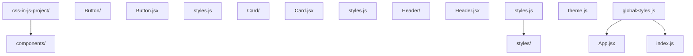
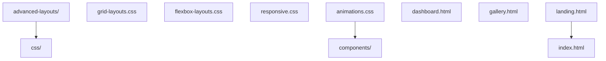
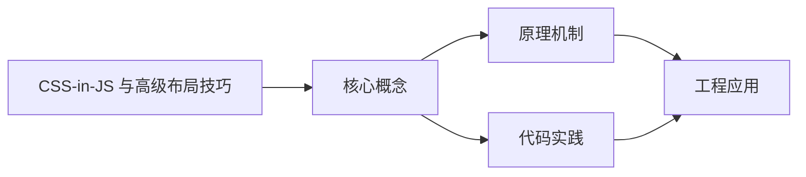
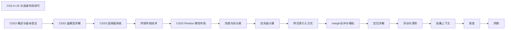

## 1. 学习目标（Bloom 分类）

本节按照布鲁姆教育目标分类学组织学习路径。本文主题为《CSS-in-JS 与高级布局技巧》，属于 CSS 模块，读者可以根据自身阶段选择阅读深度。

记忆层面：能够准确复述本文的核心概念、术语与基本语法或操作步骤，并能够在提问或检索时快速定位对应知识点。能够说出 CSS 的核心概念、术语与标准写法。

理解层面：能够用自己的语言解释核心原理与工作机制，说明概念之间的因果关系，而不是机械记忆结论。能够解释 CSS 的工作原理与设计动机。

应用层面：能够在真实项目或练习场景中运用本文知识解决具体问题，写出正确且可维护的实现。能够编写符合 CSS 规范的完整实现。

分析层面：能够拆解复杂问题，比较本文主题与相邻概念的异同，识别边界条件与例外情况。能够分析 CSS 与相邻方案的差异与边界。

评价层面：能够根据约束条件（性能、可读性、安全、成本）评价不同方案的优劣，做出有依据的技术决策。能够根据场景评价 CSS 相关方案的优劣。

创造层面：能够把本文知识与其他模块知识组合，设计出新的解决方案或可复用的工程模式。能够组合 CSS 与其他技术设计完整方案。

通过本节学习，读者应当能够把《CSS-in-JS 与高级布局技巧》纳入自己的知识网络，并与 CSS 模块的其他主题（选择器、盒模型、布局、动画、响应式）建立关联。

## 2. 历史动机与发展脉络

《CSS-in-JS 与高级布局技巧》是 CSS 领域的重要主题。要真正理解它，需要先了解它解决的问题与演进过程。

CSS 于 1994 年由 Håkon Wium Lie 提出，1996 年 CSS1 发布，解决 HTML 表现层混杂问题；CSS2.1（2011）与 CSS3 模块化（2012+）奠定现代 Web 样式基础。
现代 CSS 的能力版图：Flexbox/Grid 布局、自定义属性（变量）、容器查询、子网格、层叠层（@layer）、现代颜色（oklch）。
CSS 的设计核心是“层叠与继承”：来源、优先级、顺序共同决定最终样式；理解层叠是排查样式问题的前提。

回到本文主题：CSS-in-JS 与高级布局技巧 的提出与成熟，正是上述技术背景下的必然产物。早期实现往往以简单可用为目标，随着工程规模扩大，社区逐渐沉淀出标准做法与最佳实践；理解这一脉络，可以帮助读者判断“为什么文档中的推荐写法是现在这个样子”，也能在遇到历史遗留代码时准确识别其设计年代与取舍。


## 3. 形式化定义与核心概念精讲

本节把《CSS-in-JS 与高级布局技巧》涉及的核心概念以“定义 + 讲解”的形式展开。读者应把定义当作工具，把讲解当作理解路径；两者结合才能形成可迁移的知识。

选择器与优先级：id > class/属性/伪类 > 元素/伪元素；!important 打破优先级（应避免）。
盒模型：content/padding/border/margin，box-sizing 决定 width 语义（border-box 推荐）。
布局体系：普通流、浮动（历史）、Flexbox（一维）、Grid（二维）；position 定位（relative/absolute/fixed/sticky）。

### 3.1 原文章节逐一精讲

原文档把主题拆分为 13 个小节，下面按顺序给出每一节的导读讲解，随后保留原文细节供精读。

#### 原文精读（完整保留）


#### 1. CSS-in-JS 概述

CSS-in-JS 是一种将 CSS 样式直接写在 JavaScript 代码中的方法，它允许开发者使用 JavaScript 的全部能力来管理样式，包括动态样式、条件样式和主题管理。

##### 核心优势

- **组件级样式**：样式与组件紧密耦合
- **动态样式**：使用 JavaScript 变量和逻辑生成样式
- **消除样式冲突**：自动生成唯一的类名
- **主题管理**：通过 JavaScript 轻松实现主题切换
- **类型安全**：在 TypeScript 中获得类型提示

#### 2. 主流 CSS-in-JS 库

##### 2.1 styled-components

**安装**

```bash
 npm install styled-components
```

**基本使用**

```jsx
 import styled from 'styled-components';
 const Button = styled.button`
  background: ${props => props.primary ? 'blue' : 'white'};
  color: ${props => props.primary ? 'white' : 'blue'};
  padding: 8px 16px;
  border: 1px solid blue;
  border-radius: 4px;
  cursor: pointer;
  &:hover {
  background: ${props => props.primary ? 'darkblue' : 'lightblue'};
  }
 `;
 // 使用组件
 <Button primary>Primary Button</Button>
 <Button>Secondary Button</Button>
```

##### 2.2 Emotion

**安装**

```bash
 npm install @emotion/react @emotion/styled
```

**基本使用**

```jsx
import styled from '@emotion/styled';
const Card = styled.div`
  background: white;
  border-radius: 8px;
  box-shadow: 0 2px 8px rgba(0, 0, 0, 0.1);
  padding: 16px;
  margin: 16px;
`;
const Title = styled.h2`
  font-size: 1.5rem;
  color: #333;
  margin-bottom: 8px;
`;
// 使用组件
<Card>
  <Title>Card Title</Title>
  <p>Card content</p>
</Card>;
```

##### 2.3 JSS

**安装**

```bash
 npm install jss
```

**基本使用**

```javascript
import jss from 'jss';
import preset from 'jss-preset-default';
// 初始化 JSS
jss.setup(preset());
// 创建样式
const styles = {
  button: {
    background: 'blue',
    color: 'white',
    padding: '8px 16px',
    border: 'none',
    borderRadius: '4px',
    cursor: 'pointer',
    '&:hover': {
      background: 'darkblue',
    },
  },
};
// 应用样式
const { classes } = jss.createStyleSheet(styles).attach();
// 使用样式
document.body.innerHTML = `<button class="${classes.button}">Click me</button>`;
```

#### 3. 高级 Grid 布局技巧

##### 3.1 网格模板区域

```css
.grid-container {
  display: grid;
  grid-template-areas:
    'header header header'
    'sidebar main main'
    'footer footer footer';
  grid-template-columns: 200px 1fr 1fr;
  grid-template-rows: auto 1fr auto;
  gap: 16px;
  height: 100vh;
}
.header {
  grid-area: header;
  background: #f0f0f0;
  padding: 16px;
}
.sidebar {
  grid-area: sidebar;
  background: #e0e0e0;
  padding: 16px;
}
.main {
  grid-area: main;
  background: #ffffff;
  padding: 16px;
}
.footer {
  grid-area: footer;
  background: #f0f0f0;
  padding: 16px;
}
```

##### 3.2 响应式 Grid

```css
.responsive-grid {
  display: grid;
  grid-template-columns: repeat(auto-fill, minmax(250px, 1fr));
  gap: 16px;
}
/* 不同屏幕尺寸的调整 */
@media (max-width: 768px) {
  .responsive-grid {
    grid-template-columns: repeat(auto-fill, minmax(200px, 1fr));
  }
}
@media (max-width: 480px) {
  .responsive-grid {
    grid-template-columns: 1fr;
  }
}
```

##### 3.3 网格项定位

```css
.grid-container {
  display: grid;
  grid-template-columns: repeat(5, 1fr);
  grid-template-rows: repeat(5, 100px);
  gap: 10px;
}
.item-1 {
  grid-column: 1 / 3;
  grid-row: 1 / 3;
  background: red;
}
.item-2 {
  grid-column: 3 / 6;
  grid-row: 1 / 2;
  background: blue;
}
.item-3 {
  grid-column: 1 / 2;
  grid-row: 3 / 6;
  background: green;
}
.item-4 {
  grid-column: 2 / 6;
  grid-row: 2 / 6;
  background: yellow;
}
```

#### 4. Flexbox 高级技巧

##### 4.1 复杂 Flex 布局

```css
.complex-flex {
  display: flex;
  flex-wrap: wrap;
  gap: 16px;
  justify-content: space-between;
  align-items: center;
}
.item {
  flex: 1 1 300px; /* 增长因子 1, 收缩因子 1, 基础宽度 300px */
  min-width: 200px;
  background: #f0f0f0;
  padding: 16px;
  border-radius: 8px;
}
/* 特殊项目 */
.item.special {
  flex: 2 1 400px; /* 占据更多空间 */
  background: #e0e0e0;
}
```

##### 4.2 Flexbox 居中技巧

```css
/* 水平居中 */
.horizontal-center {
  display: flex;
  justify-content: center;
}
/* 垂直居中 */
.vertical-center {
  display: flex;
  align-items: center;
  height: 200px;
}
/* 水平垂直居中 */
.center {
  display: flex;
  justify-content: center;
  align-items: center;
  height: 200px;
}
/* 多项目居中 */
.multi-center {
  display: flex;
  flex-direction: column;
  justify-content: center;
  align-items: center;
  height: 300px;
}
```

#### 5. 自定义属性 (CSS Variables)

##### 5.1 基本使用

```css
 :
  --primary-color: #3498db;
  --secondary-color: #2ecc71;
  --text-color: #333333;
  --border-radius: 8px;
  --spacing: 16px;
 }
 .button {
  background: var(--primary-color);
  color: white;
  padding: var(--spacing);
  border-radius: var(--border-radius);
  border: none;
  cursor: pointer;
 }
 .card {
  background: white;
  border: 1px solid #e0e0e0;
  border-radius: var(--border-radius);
  padding: var(--spacing);
  margin-bottom: var(--spacing);
 }
```

##### 5.2 主题切换

```css
 :
  /* 浅色主题 */
  --bg-color: #ffffff;
  --text-color: #333333;
  --card-bg: #f0f0f0;
 }
 .dark-theme {
  /* 深色主题 */
  --bg-color: #121212;
  --text-color: #e0e0e0;
  --card-bg: #1e1e1e;
 }
 body {
  background: var(--bg-color);
  color: var(--text-color);
  transition: background 0.3s, color 0.3s;
 }
 .card {
  background: var(--card-bg);
  transition: background 0.3s;
 }
```

#### 6. 动画与过渡

##### 6.1 CSS 动画

```css
/* 定义动画 */
@keyframes fadeIn {
  from {
    opacity: 0;
    transform: translateY(20px);
  }
  to {
    opacity: 1;
    transform: translateY(0);
  }
}
/* 使用动画 */
.fade-in {
  animation: fadeIn 0.5s ease-out forwards;
}
/* 复杂动画 */
@keyframes pulse {
  0% {
    transform: scale(1);
  }
  50% {
    transform: scale(1.05);
  }
  100% {
    transform: scale(1);
  }
}
.pulse {
  animation: pulse 2s infinite;
}
```

##### 6.2 过渡效果

```css
.transition-example {
  background: blue;
  color: white;
  padding: 16px;
  border-radius: 8px;
  transition: all 0.3s ease;
}
.transition-example:hover {
  background: darkblue;
  transform: translateY(-5px);
  box-shadow: 0 5px 15px rgba(0, 0, 0, 0.2);
}
/* 多重过渡 */
.multiple-transitions {
  background: blue;
  color: white;
  padding: 16px;
  border-radius: 8px;
  transition:
    background 0.3s ease,
    transform 0.5s ease,
    box-shadow 0.3s ease;
}
.multiple-transitions:hover {
  background: darkblue;
  transform: translateY(-5px) scale(1.02);
  box-shadow: 0 5px 15px rgba(0, 0, 0, 0.2);
}
```

#### 7. 性能优化

##### 7.1 CSS 性能优化

1. **减少选择器复杂度**：避免深层嵌套选择器
2. **使用 CSS 变量**：减少重复代码
3. **避免使用 @import**：使用 link 标签代替
4. **压缩 CSS**：减少文件大小
5. **使用 CSS Modules**：避免样式冲突
6. **关键 CSS**：将首屏关键样式内联

##### 7.2 渲染性能

1. **避免重排**：减少 DOM 操作
2. **使用 will-change**：提示浏览器优化
3. **GPU 加速**：使用 transform 和 opacity
4. **避免布局抖动**：批量 DOM 操作

```css
/* 提示浏览器优化 */
.optimized {
  will-change: transform;
  transition: transform 0.3s;
}
/* GPU 加速 */
.gpu-accelerated {
  transform: translateZ(0); /* 触发 GPU 加速 */
}
```

#### 8. 响应式设计高级技巧

##### 8.1 移动优先设计

```css
/* 移动优先基础样式 */
.container {
  width: 100%;
  padding: 16px;
}
/* 平板设备 */
@media (min-width: 768px) {
  .container {
    max-width: 720px;
    margin: 0 auto;
    padding: 24px;
  }
}
/* 桌面设备 */
@media (min-width: 1024px) {
  .container {
    max-width: 960px;
    padding: 32px;
  }
}
/* 大屏幕设备 */
@media (min-width: 1280px) {
  .container {
    max-width: 1140px;
  }
}
```

##### 8.2 响应式断点策略

| 断点 | 设备类型 | 宽度范围       |
| :--- | :------- | :------------- |
| xs   | 超小屏幕 | < 576px        |
| sm   | 小屏幕   | 576px - 767px  |
| md   | 中等屏幕 | 768px - 991px  |
| lg   | 大屏幕   | 992px - 1199px |
| xl   | 超大屏幕 | ≥ 1200px       |

##### 8.3 响应式图片

```html
<!-- 响应式图片 -->

<!-- 不同屏幕尺寸的图片 -->
<picture>
  <source media="(max-width: 768px)" srcset="mobile.jpg" />
  <source media="(min-width: 769px)" srcset="desktop.jpg" />
  
</picture>
```

#### 9. 工具与框架

##### 9.1 CSS 预处理器

- **Sass/SCSS**：功能丰富的预处理器
- **Less**：简洁易用的预处理器
- **Stylus**：灵活的预处理器

##### 9.2 CSS 框架

- **Tailwind CSS**：实用优先的工具类框架
- **Bootstrap**：全面的 UI 框架
- **Bulma**：现代 CSS 框架
- **Foundation**：响应式前端框架

##### 9.3 开发工具

- **PostCSS**：CSS 处理工具
- **Autoprefixer**：自动添加浏览器前缀
- **PurgeCSS**：移除未使用的 CSS
- **Stylelint**：CSS 代码检查

#### 10. 最佳实践

1. **组件化**：将样式与组件紧密结合
2. **命名规范**：使用 BEM 或 SMACSS 等命名规范
3. **模块化**：将样式按功能模块组织
4. **可维护性**：编写清晰、可维护的 CSS
5. **性能**：关注 CSS 性能，避免不必要的样式
6. **兼容性**：考虑浏览器兼容性
7. **文档**：为复杂样式添加注释和文档

#### 11. 项目实战

##### 11.1 CSS-in-JS 项目结构



##### 11.2 高级布局项目



#### 12. 常见问题与解决方案

##### 12.1 CSS-in-JS 问题

**问题**：CSS-in-JS 增加了打包体积
**解决方案**：使用 Tree Shaking，只导入需要的样式
**问题**：运行时性能问题
**解决方案**：使用静态提取，将样式提取到单独的 CSS 文件

##### 12.2 布局问题

**问题**：Grid 布局浏览器兼容性
**解决方案**：提供 Flexbox fallback
**问题**：响应式设计在某些设备上显示异常
**解决方案**：使用设备模拟器测试，调整断点

#### 13. 延伸阅读

- [MDN CSS 文档](https://developer.mozilla.org/en-US/docs/Web/CSS)
- [CSS Grid 指南](https://css-tricks.com/snippets/css/complete-guide-grid/)
- [Flexbox 指南](https://css-tricks.com/snippets/css/a-guide-to-flexbox/)
- [styled-components 文档](https://styled-components.com/docs)
- [Tailwind CSS 文档](https://tailwindcss.com/docs)
  通过本教程，你已经了解了 CSS-in-JS 和高级布局技巧的核心概念和实践方法。在实际项目中，你可以根据具体需求选择合适的技术方案，创建美观、响应式、高性能的布局。


### 3.2 概念关系图

下面用 Mermaid 图表达本文核心概念之间的关系，帮助读者建立整体图景：



图中展示的是本文知识的结构化关系：核心概念是入口，原理机制解释“为什么”，代码实践演示“怎么做”，工程应用回答“何时用”。读者学习时可以把每个小节的内容挂接到对应节点上。

## 4. 理论推导与原理解析

本节深入《CSS-in-JS 与高级布局技巧》背后的原理。理论部分不求面面俱到，而是聚焦“能解释现象、能指导实践”的关键推导。

选择器与优先级：id > class/属性/伪类 > 元素/伪元素；!important 打破优先级（应避免）。
盒模型：content/padding/border/margin，box-sizing 决定 width 语义（border-box 推荐）。
布局体系：普通流、浮动（历史）、Flexbox（一维）、Grid（二维）；position 定位（relative/absolute/fixed/sticky）。
层叠上下文：z-index 只在同一层叠上下文中比较；transform/opacity/filter 创建新上下文。

需要强调的是，理论推导与工程实践之间存在翻译层：理论给出的是理想化模型与边界条件，工程代码则必须处理真实环境中的例外。读者在学习时应先掌握理论的“标准情形”，再通过陷阱章节了解“非标准情形”。

## 5. 代码示例与逐行讲解

本节把原文中的代码示例系统整理，并为每个示例补充用途说明与讲解。读者不应只浏览代码，而应逐段对照讲解理解设计意图。

### 5.1 示例：2.1 styled-components

该示例来自原文《2.1 styled-components》小节，用于演示CSS-in-JS 与高级布局技巧相关操作。阅读时请先看代码结构，再看其后的讲解。

```bash
 npm install styled-components
```

讲解：这段代码演示了本节核心知识点。代码中的关键操作可以归纳为三步：准备（定义或初始化）、执行（核心逻辑）、收尾（释放资源或返回结果）。实际项目中，这三步往往被封装为函数或类，以提升复用性与可测试性。

关键点分析：

该示例共 1 行有效代码，结构以数据或配置为主。阅读时应关注：数据字段的含义、配置项的作用，以及它们与运行行为的对应关系。

进阶思考路径：先尝试修改参数观察行为变化，再把示例中的模式迁移到自己的项目中；每次修改都记录预期与实测差异，这是把示例转化为能力的最快方式。

### 5.2 示例：2.1 styled-components

该示例来自原文《2.1 styled-components》小节，用于演示CSS-in-JS 与高级布局技巧相关操作。阅读时请先看代码结构，再看其后的讲解。

```jsx
 import styled from 'styled-components';
 const Button = styled.button`
  background: ${props => props.primary ? 'blue' : 'white'};
  color: ${props => props.primary ? 'white' : 'blue'};
  padding: 8px 16px;
  border: 1px solid blue;
  border-radius: 4px;
  cursor: pointer;
  &:hover {
  background: ${props => props.primary ? 'darkblue' : 'lightblue'};
  }
 `;
 // 使用组件
 <Button primary>Primary Button</Button>
 <Button>Secondary Button</Button>
```

讲解：这段代码演示了本节核心知识点。代码中的关键操作可以归纳为三步：准备（定义或初始化）、执行（核心逻辑）、收尾（释放资源或返回结果）。实际项目中，这三步往往被封装为函数或类，以提升复用性与可测试性。

关键点分析：

该示例共 15 行有效代码，包含 2 类关键结构（import、from）。其中：

- 入口与初始化部分负责建立上下文，对应实际项目中的启动或装配逻辑；
- 核心逻辑部分体现本文主题的主要操作，是阅读时最需要对照讲解理解的部分；
- 输出或返回部分把结果交给调用方，注意其类型与边界条件。

进阶思考路径：先尝试修改参数观察行为变化，再把示例中的模式迁移到自己的项目中；每次修改都记录预期与实测差异，这是把示例转化为能力的最快方式。

### 5.3 示例：2.2 Emotion

该示例来自原文《2.2 Emotion》小节，用于演示CSS-in-JS 与高级布局技巧相关操作。阅读时请先看代码结构，再看其后的讲解。

```bash
 npm install @emotion/react @emotion/styled
```

讲解：这段代码演示了本节核心知识点。代码中的关键操作可以归纳为三步：准备（定义或初始化）、执行（核心逻辑）、收尾（释放资源或返回结果）。实际项目中，这三步往往被封装为函数或类，以提升复用性与可测试性。

关键点分析：

该示例共 1 行有效代码，结构以数据或配置为主。阅读时应关注：数据字段的含义、配置项的作用，以及它们与运行行为的对应关系。

进阶思考路径：先尝试修改参数观察行为变化，再把示例中的模式迁移到自己的项目中；每次修改都记录预期与实测差异，这是把示例转化为能力的最快方式。

### 5.4 示例：2.2 Emotion

该示例来自原文《2.2 Emotion》小节，用于演示CSS-in-JS 与高级布局技巧相关操作。阅读时请先看代码结构，再看其后的讲解。

```jsx
import styled from '@emotion/styled';
const Card = styled.div`
  background: white;
  border-radius: 8px;
  box-shadow: 0 2px 8px rgba(0, 0, 0, 0.1);
  padding: 16px;
  margin: 16px;
`;
const Title = styled.h2`
  font-size: 1.5rem;
  color: #333;
  margin-bottom: 8px;
`;
// 使用组件
<Card>
  <Title>Card Title</Title>
  <p>Card content</p>
</Card>;
```

讲解：这段代码演示了本节核心知识点。代码中的关键操作可以归纳为三步：准备（定义或初始化）、执行（核心逻辑）、收尾（释放资源或返回结果）。实际项目中，这三步往往被封装为函数或类，以提升复用性与可测试性。

关键点分析：

该示例共 18 行有效代码，包含 2 类关键结构（import、from）。其中：

- 入口与初始化部分负责建立上下文，对应实际项目中的启动或装配逻辑；
- 核心逻辑部分体现本文主题的主要操作，是阅读时最需要对照讲解理解的部分；
- 输出或返回部分把结果交给调用方，注意其类型与边界条件。

进阶思考路径：先尝试修改参数观察行为变化，再把示例中的模式迁移到自己的项目中；每次修改都记录预期与实测差异，这是把示例转化为能力的最快方式。

### 5.5 示例：2.3 JSS

该示例来自原文《2.3 JSS》小节，用于演示CSS-in-JS 与高级布局技巧相关操作。阅读时请先看代码结构，再看其后的讲解。

```bash
 npm install jss
```

讲解：这段代码演示了本节核心知识点。代码中的关键操作可以归纳为三步：准备（定义或初始化）、执行（核心逻辑）、收尾（释放资源或返回结果）。实际项目中，这三步往往被封装为函数或类，以提升复用性与可测试性。

关键点分析：

该示例共 1 行有效代码，结构以数据或配置为主。阅读时应关注：数据字段的含义、配置项的作用，以及它们与运行行为的对应关系。

进阶思考路径：先尝试修改参数观察行为变化，再把示例中的模式迁移到自己的项目中；每次修改都记录预期与实测差异，这是把示例转化为能力的最快方式。

### 5.6 示例：2.3 JSS

该示例来自原文《2.3 JSS》小节，用于演示CSS-in-JS 与高级布局技巧相关操作。阅读时请先看代码结构，再看其后的讲解。

```javascript
import jss from 'jss';
import preset from 'jss-preset-default';
// 初始化 JSS
jss.setup(preset());
// 创建样式
const styles = {
  button: {
    background: 'blue',
    color: 'white',
    padding: '8px 16px',
    border: 'none',
    borderRadius: '4px',
    cursor: 'pointer',
    '&:hover': {
      background: 'darkblue',
    },
  },
};
// 应用样式
const { classes } = jss.createStyleSheet(styles).attach();
// 使用样式
document.body.innerHTML = `<button class="${classes.button}">Click me</button>`;
```

讲解：这段代码演示了本节核心知识点。代码中的关键操作可以归纳为三步：准备（定义或初始化）、执行（核心逻辑）、收尾（释放资源或返回结果）。实际项目中，这三步往往被封装为函数或类，以提升复用性与可测试性。

关键点分析：

该示例共 22 行有效代码，包含 3 类关键结构（class、import、from）。其中：

- 入口与初始化部分负责建立上下文，对应实际项目中的启动或装配逻辑；
- 核心逻辑部分体现本文主题的主要操作，是阅读时最需要对照讲解理解的部分；
- 输出或返回部分把结果交给调用方，注意其类型与边界条件。

进阶思考路径：先尝试修改参数观察行为变化，再把示例中的模式迁移到自己的项目中；每次修改都记录预期与实测差异，这是把示例转化为能力的最快方式。

### 5.7 示例：3.1 网格模板区域

该示例来自原文《3.1 网格模板区域》小节，用于演示CSS-in-JS 与高级布局技巧相关操作。阅读时请先看代码结构，再看其后的讲解。

```css
.grid-container {
  display: grid;
  grid-template-areas:
    'header header header'
    'sidebar main main'
    'footer footer footer';
  grid-template-columns: 200px 1fr 1fr;
  grid-template-rows: auto 1fr auto;
  gap: 16px;
  height: 100vh;
}
.header {
  grid-area: header;
  background: #f0f0f0;
  padding: 16px;
}
.sidebar {
  grid-area: sidebar;
  background: #e0e0e0;
  padding: 16px;
}
.main {
  grid-area: main;
  background: #ffffff;
  padding: 16px;
}
.footer {
  grid-area: footer;
  background: #f0f0f0;
  padding: 16px;
}
```

讲解：这段代码演示了本节核心知识点。代码中的关键操作可以归纳为三步：准备（定义或初始化）、执行（核心逻辑）、收尾（释放资源或返回结果）。实际项目中，这三步往往被封装为函数或类，以提升复用性与可测试性。

关键点分析：

该示例共 31 行有效代码，结构以数据或配置为主。阅读时应关注：数据字段的含义、配置项的作用，以及它们与运行行为的对应关系。

进阶思考路径：先尝试修改参数观察行为变化，再把示例中的模式迁移到自己的项目中；每次修改都记录预期与实测差异，这是把示例转化为能力的最快方式。

### 5.8 示例：3.2 响应式 Grid

该示例来自原文《3.2 响应式 Grid》小节，用于演示CSS-in-JS 与高级布局技巧相关操作。阅读时请先看代码结构，再看其后的讲解。

```css
.responsive-grid {
  display: grid;
  grid-template-columns: repeat(auto-fill, minmax(250px, 1fr));
  gap: 16px;
}
/* 不同屏幕尺寸的调整 */
@media (max-width: 768px) {
  .responsive-grid {
    grid-template-columns: repeat(auto-fill, minmax(200px, 1fr));
  }
}
@media (max-width: 480px) {
  .responsive-grid {
    grid-template-columns: 1fr;
  }
}
```

讲解：这段代码演示了本节核心知识点。代码中的关键操作可以归纳为三步：准备（定义或初始化）、执行（核心逻辑）、收尾（释放资源或返回结果）。实际项目中，这三步往往被封装为函数或类，以提升复用性与可测试性。

关键点分析：

该示例共 16 行有效代码，结构以数据或配置为主。阅读时应关注：数据字段的含义、配置项的作用，以及它们与运行行为的对应关系。

进阶思考路径：先尝试修改参数观察行为变化，再把示例中的模式迁移到自己的项目中；每次修改都记录预期与实测差异，这是把示例转化为能力的最快方式。

### 5.9 示例：3.3 网格项定位

该示例来自原文《3.3 网格项定位》小节，用于演示CSS-in-JS 与高级布局技巧相关操作。阅读时请先看代码结构，再看其后的讲解。

```css
.grid-container {
  display: grid;
  grid-template-columns: repeat(5, 1fr);
  grid-template-rows: repeat(5, 100px);
  gap: 10px;
}
.item-1 {
  grid-column: 1 / 3;
  grid-row: 1 / 3;
  background: red;
}
.item-2 {
  grid-column: 3 / 6;
  grid-row: 1 / 2;
  background: blue;
}
.item-3 {
  grid-column: 1 / 2;
  grid-row: 3 / 6;
  background: green;
}
.item-4 {
  grid-column: 2 / 6;
  grid-row: 2 / 6;
  background: yellow;
}
```

讲解：这段代码演示了本节核心知识点。代码中的关键操作可以归纳为三步：准备（定义或初始化）、执行（核心逻辑）、收尾（释放资源或返回结果）。实际项目中，这三步往往被封装为函数或类，以提升复用性与可测试性。

关键点分析：

该示例共 26 行有效代码，结构以数据或配置为主。阅读时应关注：数据字段的含义、配置项的作用，以及它们与运行行为的对应关系。

进阶思考路径：先尝试修改参数观察行为变化，再把示例中的模式迁移到自己的项目中；每次修改都记录预期与实测差异，这是把示例转化为能力的最快方式。

### 5.10 示例：4.1 复杂 Flex 布局

该示例来自原文《4.1 复杂 Flex 布局》小节，用于演示CSS-in-JS 与高级布局技巧相关操作。阅读时请先看代码结构，再看其后的讲解。

```css
.complex-flex {
  display: flex;
  flex-wrap: wrap;
  gap: 16px;
  justify-content: space-between;
  align-items: center;
}
.item {
  flex: 1 1 300px; /* 增长因子 1, 收缩因子 1, 基础宽度 300px */
  min-width: 200px;
  background: #f0f0f0;
  padding: 16px;
  border-radius: 8px;
}
/* 特殊项目 */
.item.special {
  flex: 2 1 400px; /* 占据更多空间 */
  background: #e0e0e0;
}
```

讲解：这段代码演示了本节核心知识点。代码中的关键操作可以归纳为三步：准备（定义或初始化）、执行（核心逻辑）、收尾（释放资源或返回结果）。实际项目中，这三步往往被封装为函数或类，以提升复用性与可测试性。

关键点分析：

该示例共 19 行有效代码，结构以数据或配置为主。阅读时应关注：数据字段的含义、配置项的作用，以及它们与运行行为的对应关系。

进阶思考路径：先尝试修改参数观察行为变化，再把示例中的模式迁移到自己的项目中；每次修改都记录预期与实测差异，这是把示例转化为能力的最快方式。

### 5.11 示例：4.2 Flexbox 居中技巧

该示例来自原文《4.2 Flexbox 居中技巧》小节，用于演示CSS-in-JS 与高级布局技巧相关操作。阅读时请先看代码结构，再看其后的讲解。

```css
/* 水平居中 */
.horizontal-center {
  display: flex;
  justify-content: center;
}
/* 垂直居中 */
.vertical-center {
  display: flex;
  align-items: center;
  height: 200px;
}
/* 水平垂直居中 */
.center {
  display: flex;
  justify-content: center;
  align-items: center;
  height: 200px;
}
/* 多项目居中 */
.multi-center {
  display: flex;
  flex-direction: column;
  justify-content: center;
  align-items: center;
  height: 300px;
}
```

讲解：这段代码演示了本节核心知识点。代码中的关键操作可以归纳为三步：准备（定义或初始化）、执行（核心逻辑）、收尾（释放资源或返回结果）。实际项目中，这三步往往被封装为函数或类，以提升复用性与可测试性。

关键点分析：

该示例共 26 行有效代码，结构以数据或配置为主。阅读时应关注：数据字段的含义、配置项的作用，以及它们与运行行为的对应关系。

进阶思考路径：先尝试修改参数观察行为变化，再把示例中的模式迁移到自己的项目中；每次修改都记录预期与实测差异，这是把示例转化为能力的最快方式。

### 5.12 示例：5.1 基本使用

该示例来自原文《5.1 基本使用》小节，用于演示CSS-in-JS 与高级布局技巧相关操作。阅读时请先看代码结构，再看其后的讲解。

```css
 :
  --primary-color: #3498db;
  --secondary-color: #2ecc71;
  --text-color: #333333;
  --border-radius: 8px;
  --spacing: 16px;
 }
 .button {
  background: var(--primary-color);
  color: white;
  padding: var(--spacing);
  border-radius: var(--border-radius);
  border: none;
  cursor: pointer;
 }
 .card {
  background: white;
  border: 1px solid #e0e0e0;
  border-radius: var(--border-radius);
  padding: var(--spacing);
  margin-bottom: var(--spacing);
 }
```

讲解：这段代码演示了本节核心知识点。代码中的关键操作可以归纳为三步：准备（定义或初始化）、执行（核心逻辑）、收尾（释放资源或返回结果）。实际项目中，这三步往往被封装为函数或类，以提升复用性与可测试性。

关键点分析：

该示例共 22 行有效代码，结构以数据或配置为主。阅读时应关注：数据字段的含义、配置项的作用，以及它们与运行行为的对应关系。

进阶思考路径：先尝试修改参数观察行为变化，再把示例中的模式迁移到自己的项目中；每次修改都记录预期与实测差异，这是把示例转化为能力的最快方式。

### 5.13 示例：5.2 主题切换

该示例来自原文《5.2 主题切换》小节，用于演示CSS-in-JS 与高级布局技巧相关操作。阅读时请先看代码结构，再看其后的讲解。

```css
 :
  /* 浅色主题 */
  --bg-color: #ffffff;
  --text-color: #333333;
  --card-bg: #f0f0f0;
 }
 .dark-theme {
  /* 深色主题 */
  --bg-color: #121212;
  --text-color: #e0e0e0;
  --card-bg: #1e1e1e;
 }
 body {
  background: var(--bg-color);
  color: var(--text-color);
  transition: background 0.3s, color 0.3s;
 }
 .card {
  background: var(--card-bg);
  transition: background 0.3s;
 }
```

讲解：这段代码演示了本节核心知识点。代码中的关键操作可以归纳为三步：准备（定义或初始化）、执行（核心逻辑）、收尾（释放资源或返回结果）。实际项目中，这三步往往被封装为函数或类，以提升复用性与可测试性。

关键点分析：

该示例共 21 行有效代码，结构以数据或配置为主。阅读时应关注：数据字段的含义、配置项的作用，以及它们与运行行为的对应关系。

进阶思考路径：先尝试修改参数观察行为变化，再把示例中的模式迁移到自己的项目中；每次修改都记录预期与实测差异，这是把示例转化为能力的最快方式。

### 5.14 示例：6.1 CSS 动画

该示例来自原文《6.1 CSS 动画》小节，用于演示CSS-in-JS 与高级布局技巧相关操作。阅读时请先看代码结构，再看其后的讲解。

```css
/* 定义动画 */
@keyframes fadeIn {
  from {
    opacity: 0;
    transform: translateY(20px);
  }
  to {
    opacity: 1;
    transform: translateY(0);
  }
}
/* 使用动画 */
.fade-in {
  animation: fadeIn 0.5s ease-out forwards;
}
/* 复杂动画 */
@keyframes pulse {
  0% {
    transform: scale(1);
  }
  50% {
    transform: scale(1.05);
  }
  100% {
    transform: scale(1);
  }
}
.pulse {
  animation: pulse 2s infinite;
}
```

讲解：这段代码演示了本节核心知识点。代码中的关键操作可以归纳为三步：准备（定义或初始化）、执行（核心逻辑）、收尾（释放资源或返回结果）。实际项目中，这三步往往被封装为函数或类，以提升复用性与可测试性。

关键点分析：

该示例共 30 行有效代码，包含 1 类关键结构（from）。其中：

- 入口与初始化部分负责建立上下文，对应实际项目中的启动或装配逻辑；
- 核心逻辑部分体现本文主题的主要操作，是阅读时最需要对照讲解理解的部分；
- 输出或返回部分把结果交给调用方，注意其类型与边界条件。

进阶思考路径：先尝试修改参数观察行为变化，再把示例中的模式迁移到自己的项目中；每次修改都记录预期与实测差异，这是把示例转化为能力的最快方式。

### 5.15 示例：6.2 过渡效果

该示例来自原文《6.2 过渡效果》小节，用于演示CSS-in-JS 与高级布局技巧相关操作。阅读时请先看代码结构，再看其后的讲解。

```css
.transition-example {
  background: blue;
  color: white;
  padding: 16px;
  border-radius: 8px;
  transition: all 0.3s ease;
}
.transition-example:hover {
  background: darkblue;
  transform: translateY(-5px);
  box-shadow: 0 5px 15px rgba(0, 0, 0, 0.2);
}
/* 多重过渡 */
.multiple-transitions {
  background: blue;
  color: white;
  padding: 16px;
  border-radius: 8px;
  transition:
    background 0.3s ease,
    transform 0.5s ease,
    box-shadow 0.3s ease;
}
.multiple-transitions:hover {
  background: darkblue;
  transform: translateY(-5px) scale(1.02);
  box-shadow: 0 5px 15px rgba(0, 0, 0, 0.2);
}
```

讲解：这段代码演示了本节核心知识点。代码中的关键操作可以归纳为三步：准备（定义或初始化）、执行（核心逻辑）、收尾（释放资源或返回结果）。实际项目中，这三步往往被封装为函数或类，以提升复用性与可测试性。

关键点分析：

该示例共 28 行有效代码，结构以数据或配置为主。阅读时应关注：数据字段的含义、配置项的作用，以及它们与运行行为的对应关系。

进阶思考路径：先尝试修改参数观察行为变化，再把示例中的模式迁移到自己的项目中；每次修改都记录预期与实测差异，这是把示例转化为能力的最快方式。

### 5.16 示例：7.2 渲染性能

该示例来自原文《7.2 渲染性能》小节，用于演示CSS-in-JS 与高级布局技巧相关操作。阅读时请先看代码结构，再看其后的讲解。

```css
/* 提示浏览器优化 */
.optimized {
  will-change: transform;
  transition: transform 0.3s;
}
/* GPU 加速 */
.gpu-accelerated {
  transform: translateZ(0); /* 触发 GPU 加速 */
}
```

讲解：这段代码演示了本节核心知识点。代码中的关键操作可以归纳为三步：准备（定义或初始化）、执行（核心逻辑）、收尾（释放资源或返回结果）。实际项目中，这三步往往被封装为函数或类，以提升复用性与可测试性。

关键点分析：

该示例共 9 行有效代码，结构以数据或配置为主。阅读时应关注：数据字段的含义、配置项的作用，以及它们与运行行为的对应关系。

进阶思考路径：先尝试修改参数观察行为变化，再把示例中的模式迁移到自己的项目中；每次修改都记录预期与实测差异，这是把示例转化为能力的最快方式。

### 5.17 示例：8.1 移动优先设计

该示例来自原文《8.1 移动优先设计》小节，用于演示CSS-in-JS 与高级布局技巧相关操作。阅读时请先看代码结构，再看其后的讲解。

```css
/* 移动优先基础样式 */
.container {
  width: 100%;
  padding: 16px;
}
/* 平板设备 */
@media (min-width: 768px) {
  .container {
    max-width: 720px;
    margin: 0 auto;
    padding: 24px;
  }
}
/* 桌面设备 */
@media (min-width: 1024px) {
  .container {
    max-width: 960px;
    padding: 32px;
  }
}
/* 大屏幕设备 */
@media (min-width: 1280px) {
  .container {
    max-width: 1140px;
  }
}
```

讲解：这段代码演示了本节核心知识点。代码中的关键操作可以归纳为三步：准备（定义或初始化）、执行（核心逻辑）、收尾（释放资源或返回结果）。实际项目中，这三步往往被封装为函数或类，以提升复用性与可测试性。

关键点分析：

该示例共 26 行有效代码，结构以数据或配置为主。阅读时应关注：数据字段的含义、配置项的作用，以及它们与运行行为的对应关系。

进阶思考路径：先尝试修改参数观察行为变化，再把示例中的模式迁移到自己的项目中；每次修改都记录预期与实测差异，这是把示例转化为能力的最快方式。

### 5.18 示例：8.3 响应式图片

该示例来自原文《8.3 响应式图片》小节，用于演示CSS-in-JS 与高级布局技巧相关操作。阅读时请先看代码结构，再看其后的讲解。

```html
<!-- 响应式图片 -->

<!-- 不同屏幕尺寸的图片 -->
<picture>
  <source media="(max-width: 768px)" srcset="mobile.jpg" />
  <source media="(min-width: 769px)" srcset="desktop.jpg" />
  
</picture>
```

讲解：这段代码演示了本节核心知识点。代码中的关键操作可以归纳为三步：准备（定义或初始化）、执行（核心逻辑）、收尾（释放资源或返回结果）。实际项目中，这三步往往被封装为函数或类，以提升复用性与可测试性。

关键点分析：

该示例共 12 行有效代码，结构以数据或配置为主。阅读时应关注：数据字段的含义、配置项的作用，以及它们与运行行为的对应关系。

进阶思考路径：先尝试修改参数观察行为变化，再把示例中的模式迁移到自己的项目中；每次修改都记录预期与实测差异，这是把示例转化为能力的最快方式。

### 5.19 示例：11.1 CSS-in-JS 项目结构

该示例来自原文《11.1 CSS-in-JS 项目结构》小节，用于演示CSS-in-JS 与高级布局技巧相关操作。阅读时请先看代码结构，再看其后的讲解。


讲解：这段代码演示了本节核心知识点。代码中的关键操作可以归纳为三步：准备（定义或初始化）、执行（核心逻辑）、收尾（释放资源或返回结果）。实际项目中，这三步往往被封装为函数或类，以提升复用性与可测试性。

关键点分析：

该示例共 21 行有效代码，结构以数据或配置为主。阅读时应关注：数据字段的含义、配置项的作用，以及它们与运行行为的对应关系。

进阶思考路径：先尝试修改参数观察行为变化，再把示例中的模式迁移到自己的项目中；每次修改都记录预期与实测差异，这是把示例转化为能力的最快方式。

### 5.20 示例：11.2 高级布局项目

该示例来自原文《11.2 高级布局项目》小节，用于演示CSS-in-JS 与高级布局技巧相关操作。阅读时请先看代码结构，再看其后的讲解。


讲解：这段代码演示了本节核心知识点。代码中的关键操作可以归纳为三步：准备（定义或初始化）、执行（核心逻辑）、收尾（释放资源或返回结果）。实际项目中，这三步往往被封装为函数或类，以提升复用性与可测试性。

关键点分析：

该示例共 15 行有效代码，结构以数据或配置为主。阅读时应关注：数据字段的含义、配置项的作用，以及它们与运行行为的对应关系。

进阶思考路径：先尝试修改参数观察行为变化，再把示例中的模式迁移到自己的项目中；每次修改都记录预期与实测差异，这是把示例转化为能力的最快方式。


综合以上示例，可以总结出本主题的代码实践要点：第一，先定义清晰的输入输出契约；第二，核心逻辑保持单一职责；第三，错误处理与边界条件不可省略；第四，命名与注释表达意图而非复述代码。

## 6. 对比分析

对比是理解《CSS-in-JS 与高级布局技巧》定位的最快路径。下面从多个维度与相邻方案进行对比。

Flexbox 与 Grid：一维布局（导航、按钮组）用 Flex；二维布局（页面网格、卡片墙）用 Grid。
浮动与现代布局：浮动是文字环绕工具，布局已由 Flex/Grid 取代。
媒体查询与容器查询：视口级用媒体查询，组件级用容器查询。

对比的目的不是分出绝对优劣，而是建立选择依据：不同约束条件下，最优解不同。读者应把每个对比维度转化为决策检查清单。

## 7. 常见陷阱与最佳实践

本节整理该主题的高频错误与推荐做法。每个陷阱先描述现象，再解释原因，最后给出最佳实践。

### 7.1 !important 滥用

覆盖链失控。通过优先级与结构设计解决。

深入讲解：该问题之所以被归类为“常见陷阱”，是因为它在初学者的代码中反复出现，而且往往不在第一时间暴露——错误通常隐藏在特定数据或特定时序下。

从成因上看，!important 滥用 一般源于对 CSS 某个机制的理解偏差：要么误用了默认行为，要么忽略了边界条件，要么把其他语言的思维惯性带了过来。

从影响上看，!important 滥用 轻则产生错误结果，重则导致资源泄漏、数据损坏或安全事故；这也是为什么工程评审中会把它列为检查项。

从修复策略上看，处理!important 滥用的正确顺序是：先复现（构造最小用例），再定位（确认机制层面的根因），最后修复并补充回归测试。跳过复现直接改代码，往往治标不治本。

### 7.2 全局选择器

* 选择器影响性能与意外覆盖。使用类与作用域。

深入讲解：该问题之所以被归类为“常见陷阱”，是因为它在初学者的代码中反复出现，而且往往不在第一时间暴露——错误通常隐藏在特定数据或特定时序下。

从成因上看，全局选择器 一般源于对 CSS 某个机制的理解偏差：要么误用了默认行为，要么忽略了边界条件，要么把其他语言的思维惯性带了过来。

从影响上看，全局选择器 轻则产生错误结果，重则导致资源泄漏、数据损坏或安全事故；这也是为什么工程评审中会把它列为检查项。

从修复策略上看，处理全局选择器的正确顺序是：先复现（构造最小用例），再定位（确认机制层面的根因），最后修复并补充回归测试。跳过复现直接改代码，往往治标不治本。

### 7.3 rem 与 em 混淆

em 相对父级字体，rem 相对根；嵌套 em 累积。间距字号统一 rem。

深入讲解：该问题之所以被归类为“常见陷阱”，是因为它在初学者的代码中反复出现，而且往往不在第一时间暴露——错误通常隐藏在特定数据或特定时序下。

从成因上看，rem 与 em 混淆 一般源于对 CSS 某个机制的理解偏差：要么误用了默认行为，要么忽略了边界条件，要么把其他语言的思维惯性带了过来。

从影响上看，rem 与 em 混淆 轻则产生错误结果，重则导致资源泄漏、数据损坏或安全事故；这也是为什么工程评审中会把它列为检查项。

从修复策略上看，处理rem 与 em 混淆的正确顺序是：先复现（构造最小用例），再定位（确认机制层面的根因），最后修复并补充回归测试。跳过复现直接改代码，往往治标不治本。

### 7.4 固定像素布局

不可响应。使用流式单位、clamp 与断点。

深入讲解：该问题之所以被归类为“常见陷阱”，是因为它在初学者的代码中反复出现，而且往往不在第一时间暴露——错误通常隐藏在特定数据或特定时序下。

从成因上看，固定像素布局 一般源于对 CSS 某个机制的理解偏差：要么误用了默认行为，要么忽略了边界条件，要么把其他语言的思维惯性带了过来。

从影响上看，固定像素布局 轻则产生错误结果，重则导致资源泄漏、数据损坏或安全事故；这也是为什么工程评审中会把它列为检查项。

从修复策略上看，处理固定像素布局的正确顺序是：先复现（构造最小用例），再定位（确认机制层面的根因），最后修复并补充回归测试。跳过复现直接改代码，往往治标不治本。

### 7.5 z-index 魔法数字

层级失控。用层叠上下文与令牌。

深入讲解：该问题之所以被归类为“常见陷阱”，是因为它在初学者的代码中反复出现，而且往往不在第一时间暴露——错误通常隐藏在特定数据或特定时序下。

从成因上看，z-index 魔法数字 一般源于对 CSS 某个机制的理解偏差：要么误用了默认行为，要么忽略了边界条件，要么把其他语言的思维惯性带了过来。

从影响上看，z-index 魔法数字 轻则产生错误结果，重则导致资源泄漏、数据损坏或安全事故；这也是为什么工程评审中会把它列为检查项。

从修复策略上看，处理z-index 魔法数字的正确顺序是：先复现（构造最小用例），再定位（确认机制层面的根因），最后修复并补充回归测试。跳过复现直接改代码，往往治标不治本。

### 7.6 样式覆盖顺序依赖

过度依赖源顺序。用 @layer 声明层。

深入讲解：该问题之所以被归类为“常见陷阱”，是因为它在初学者的代码中反复出现，而且往往不在第一时间暴露——错误通常隐藏在特定数据或特定时序下。

从成因上看，样式覆盖顺序依赖 一般源于对 CSS 某个机制的理解偏差：要么误用了默认行为，要么忽略了边界条件，要么把其他语言的思维惯性带了过来。

从影响上看，样式覆盖顺序依赖 轻则产生错误结果，重则导致资源泄漏、数据损坏或安全事故；这也是为什么工程评审中会把它列为检查项。

从修复策略上看，处理样式覆盖顺序依赖的正确顺序是：先复现（构造最小用例），再定位（确认机制层面的根因），最后修复并补充回归测试。跳过复现直接改代码，往往治标不治本。

### 7.7 动画性能

动画 width/height 触发布局。使用 transform/opacity。

深入讲解：该问题之所以被归类为“常见陷阱”，是因为它在初学者的代码中反复出现，而且往往不在第一时间暴露——错误通常隐藏在特定数据或特定时序下。

从成因上看，动画性能 一般源于对 CSS 某个机制的理解偏差：要么误用了默认行为，要么忽略了边界条件，要么把其他语言的思维惯性带了过来。

从影响上看，动画性能 轻则产生错误结果，重则导致资源泄漏、数据损坏或安全事故；这也是为什么工程评审中会把它列为检查项。

从修复策略上看，处理动画性能的正确顺序是：先复现（构造最小用例），再定位（确认机制层面的根因），最后修复并补充回归测试。跳过复现直接改代码，往往治标不治本。

### 7.8 flex 溢出

子项默认不收缩文本溢出。min-width: 0 修正。

深入讲解：该问题之所以被归类为“常见陷阱”，是因为它在初学者的代码中反复出现，而且往往不在第一时间暴露——错误通常隐藏在特定数据或特定时序下。

从成因上看，flex 溢出 一般源于对 CSS 某个机制的理解偏差：要么误用了默认行为，要么忽略了边界条件，要么把其他语言的思维惯性带了过来。

从影响上看，flex 溢出 轻则产生错误结果，重则导致资源泄漏、数据损坏或安全事故；这也是为什么工程评审中会把它列为检查项。

从修复策略上看，处理flex 溢出的正确顺序是：先复现（构造最小用例），再定位（确认机制层面的根因），最后修复并补充回归测试。跳过复现直接改代码，往往治标不治本。

### 7.0 最佳实践总览

1. 类名语义化（BEM 或类似），避免 id 样式。
2. 设计令牌：颜色、间距、字号用自定义属性统一。
3. 移动优先媒体查询 + 容器查询组合。
4. 重置/基线：现代用相对重置（如基于 margin 0 + 继承）。
5. 提交前检查对比度与焦点样式。

把这些最佳实践固化为团队规范与代码评审检查项，是避免同类问题反复出现的关键。

## 8. 工程实践

本节把《CSS-in-JS 与高级布局技巧》放入真实工程场景，给出可复用的模式与组织方法。

组件样式隔离：CSS Modules、Tailwind（工具类）、CSS-in-JS 各有权衡；团队统一。
性能：选择器避免深嵌套；动画只动 transform/opacity；字体与图片优化。
主题：自定义属性 + prefers-color-scheme 实现浅深色切换。

### 8.1 工程实践的原则拆解

以上工程实践可以归纳为四条原则。第一，配置与代码分离：CSS 项目中环境差异应通过配置注入，而不是散落在代码分支中；这保证同一份代码可以在开发、测试、生产环境一致运行。

第二，接口稳定优先：对外接口（函数签名、协议、数据格式）一旦被消费方依赖，变更成本极高；设计时应预留扩展点并保持向后兼容。

第三，可观测性内置：日志、指标与追踪应该在功能开发时同步设计，而不是故障发生后补救；没有观测手段的模块等于黑盒。

第四，变更可回滚：任何发布都应有对应的回滚方案；数据库迁移、配置变更与代码发布一样需要版本管理与逆向路径。

### 8.2 实践落地的检查清单

- [ ] 组件样式隔离：对照本节描述，检查当前项目是否已经落实；未落实的项列入技术债并排期处理。
- [ ] 性能：对照本节描述，检查当前项目是否已经落实；未落实的项列入技术债并排期处理。
- [ ] 主题：对照本节描述，检查当前项目是否已经落实；未落实的项列入技术债并排期处理。

工程实践的共性原则：配置与代码分离、接口稳定优先、可观测性内置、变更可回滚。这些原则适用于本主题的所有实现。

## 9. 案例研究

本节通过一个完整案例把《CSS-in-JS 与高级布局技巧》的知识串起来。案例按“需求分析、方案设计、实现、验证”四步展开。

需求：实现响应式卡片网格，支持浅深色与减少动画。
方案：Grid + auto-fill/minmax、CSS 变量主题、prefers-reduced-motion。
要点：断点内容驱动；变量集中定义；动画降级。
验证：多视口截图对比、axe 可访问性扫描、Lighthouse 性能。

### 9.1 案例的扩展讨论

把案例中的方案放大到真实规模，需要额外考虑三个问题：

第一，规模：当数据量或并发量上升一个数量级时，原方案中的数据结构、缓存策略与任务调度是否仍然成立？通常需要引入分层与异步。

第二，团队：多人协作时，模块边界、接口契约与代码所有权必须明确；案例中的实现应拆分为可独立测试的单元，并配合文档说明设计意图。

第三，演进：上线后的需求变化不可避免；方案设计时应预留扩展点（配置化、插件化、事件化），并定期用真实指标验证假设。


案例研究的学习方法：先独立阅读需求，尝试在脑中形成方案，再对照实现与讲解，最后思考“如果约束变化（数据量、并发、团队规模），方案应如何调整”。

## 10. 知识要点总结与深入讲解

本节以讲解形式汇总全文要点，替代传统的习题与自测，读者不需要答题，只需跟随解释建立完整的认知框架。

关于《CSS-in-JS 与高级布局技巧》的核心结论：

CSS 的复杂度来自层叠与上下文，掌握它们就掌握了排错的钥匙。
现代 CSS 已能覆盖大部分布局需求，预处理器只是增强。
响应式与主题化是工程基座，令牌与变量是基础设施。

原文档各小节的要点回顾：

- 1. CSS-in-JS 概述：该小节围绕CSS-in-JS 与高级布局技巧展开具体细节，阅读时应关注其与核心结论的对应关系；每个小节都是核心结论在某一个侧面的展开。
- 2. 主流 CSS-in-JS 库：该小节围绕CSS-in-JS 与高级布局技巧展开具体细节，阅读时应关注其与核心结论的对应关系；每个小节都是核心结论在某一个侧面的展开。
- 3. 高级 Grid 布局技巧：该小节围绕CSS-in-JS 与高级布局技巧展开具体细节，阅读时应关注其与核心结论的对应关系；每个小节都是核心结论在某一个侧面的展开。
- 4. Flexbox 高级技巧：该小节围绕CSS-in-JS 与高级布局技巧展开具体细节，阅读时应关注其与核心结论的对应关系；每个小节都是核心结论在某一个侧面的展开。
- 5. 自定义属性 (CSS Variables)：该小节围绕CSS-in-JS 与高级布局技巧展开具体细节，阅读时应关注其与核心结论的对应关系；每个小节都是核心结论在某一个侧面的展开。
- 6. 动画与过渡：该小节围绕CSS-in-JS 与高级布局技巧展开具体细节，阅读时应关注其与核心结论的对应关系；每个小节都是核心结论在某一个侧面的展开。
- 7. 性能优化：该小节围绕CSS-in-JS 与高级布局技巧展开具体细节，阅读时应关注其与核心结论的对应关系；每个小节都是核心结论在某一个侧面的展开。
- 8. 响应式设计高级技巧：该小节围绕CSS-in-JS 与高级布局技巧展开具体细节，阅读时应关注其与核心结论的对应关系；每个小节都是核心结论在某一个侧面的展开。
- 9. 工具与框架：该小节围绕CSS-in-JS 与高级布局技巧展开具体细节，阅读时应关注其与核心结论的对应关系；每个小节都是核心结论在某一个侧面的展开。
- 10. 最佳实践：该小节围绕CSS-in-JS 与高级布局技巧展开具体细节，阅读时应关注其与核心结论的对应关系；每个小节都是核心结论在某一个侧面的展开。
- 11. 项目实战：该小节围绕CSS-in-JS 与高级布局技巧展开具体细节，阅读时应关注其与核心结论的对应关系；每个小节都是核心结论在某一个侧面的展开。
- 12. 常见问题与解决方案：该小节围绕CSS-in-JS 与高级布局技巧展开具体细节，阅读时应关注其与核心结论的对应关系；每个小节都是核心结论在某一个侧面的展开。
- 13. 延伸阅读：该小节围绕CSS-in-JS 与高级布局技巧展开具体细节，阅读时应关注其与核心结论的对应关系；每个小节都是核心结论在某一个侧面的展开。

把以上要点与第 3-9 节的内容对照复习，即可完成对本文主题的闭环学习。

## 11. 参考文献


MDN CSS 文档：https://developer.mozilla.org/zh-CN/docs/Web/CSS
CSS 规范（W3C）：https://www.w3.org/Style/CSS/
CSS-Tricks：https://css-tricks.com/
Can I use：https://caniuse.com/
Tailwind CSS：https://tailwindcss.com/

## 12. 延伸阅读


CSS 圆角与形状，见 007-css/018-BorderRadius 文档。
CSS 媒体查询与响应式，见 007-css/019-MediaQuery 文档。
CSS 函数与变量，见 007-css/022-Function 文档。
HTML 结构与语义，见 006-html5 模块。
黑马程序员 Bilibili 空间（https://space.bilibili.com/37974444 ）提供 CSS 课程。

## 14. 模块知识图谱与学习路径

本文属于 CSS 模块。为了把《CSS-in-JS 与高级布局技巧》放入完整的知识网络，下面列出本模块的全部主题并给出相互关联的导读。学习时建议按模块内顺序推进，并在每个文档中留意交叉引用。



上图为模块主题的推荐学习顺序示意图（仅展示前若干主题）。各主题之间存在三类关联：

第一，前置依赖关系：早期主题是后期主题的基础，例如环境与语法先行、进阶主题随后；

第二，横向并列关系：同一层级主题从不同角度覆盖模块能力，学习顺序可以按兴趣调整；

第三，工程组合关系：多个主题在真实项目中组合使用，例如配置、性能与安全主题往往出现在同一系统的不同层面。

### 14.1 模块主题速查表

| 文档 | 主题 | 与本文的关联 |
| --- | --- | --- |
| CSS3 概述与基本语法 | 001-CSS3OverviewBasicSyntax | 本文的前置基础 |
| CSS3 盒模型详解 | 002-CSS3BoxModelDetailed | 本文的并列主题 |
| CSS3 选择器系统 | 003-CSS3SelectorSystem | 本文的并列主题 |
| 传统布局技术 | 004-TraditionalLayoutTech | 本文的并列主题 |
| CSS3 Flexbox 弹性布局 | 005-CSS3FlexboxFlexLayout | 本文的并列主题 |
| 伪类与伪元素 | 006-PseudoClassPseudoElement | 本文的并列主题 |
| 优先级计算 | 007-PriorityCalculation | 本文的并列主题 |
| 样式表引入方式 | 008-StyleSheetImportMethod | 本文的并列主题 |
| margin合并与塌陷 | 009-MarginCollapse | 本文的并列主题 |
| 定位详解 | 010-PositionDetailed | 本文的并列主题 |
| 浮动与清除 | 011-FloatClear | 本文的并列主题 |
| 层叠上下文 | 012-StackingContext | 本文的并列主题 |
| 渐变 | 013-Gradient | 本文的并列主题 |
| 阴影 | 014-Shadow | 本文的并列主题 |
| 背景增强 | 015-BackgroundEnhancement | 本文的并列主题 |
| CSS3 Grid 网格布局 | 016-CSS3GridGridLayout | 本文的并列主题 |
| CSS 动画与过渡 | 017-CSSAnimationTransition | 本文的并列主题 |
| 边框圆角 | 018-BorderRadius | 本文的并列主题 |
| 媒体查询 | 019-MediaQuery | 本文的并列主题 |
| 容器查询 | 020-ContainerQuery | 本文的并列主题 |
| 移动端适配 | 021-MobileAdaptation | 本文的并列主题 |
| 函数 | 022-Function | 本文的并列主题 |
| CSS 变量与自定义属性 | 023-CSSVariableCustomAttribute | 本文的并列主题 |
| 特性查询 | 024-FeatureQuery | 本文的并列主题 |
| 层叠层 | 025-CascadeLayer | 本文的并列主题 |
| 逻辑属性 | 026-LogicalProperty | 本文的并列主题 |
| 滚动捕捉 | 027-ScrollSnap | 本文的并列主题 |
| Sass | 028-Sass | 本文的并列主题 |
| Less与Stylus | 029-LessStylus | 本文的并列主题 |
| 响应式设计 | 030-ResponsiveDesign | 本文的并列主题 |
| PostCSS | 031-PostCSS | 本文的并列主题 |
| BEM命名方法论 | 032-BEMNamingMethodology | 本文的并列主题 |
| CSS原子化 | 033-CSSAtomic | 本文的并列主题 |
| CSS-Modules | 034-CSSModules | 本文的并列主题 |
| 关键渲染路径优化 | 035-CriticalRenderPathOptimization | 本文的性能延伸 |
| CSS原生嵌套 | 036-CSSNativeNesting | 本文的并列主题 |
| CSS Canvas 绘图 | 037-CSSCanvasDrawing | 本文的并列主题 |
| CSS-in-JS 与高级布局技巧 | 038-CSSInJS | 本文自身 |
| CSS架构方法论 | 039-CSSArchitectureMethodology | 本文的原理深化 |
| CSS 理论知识点 | 040-CSSTheoryKnowledge | 本文的并列主题 |
| CSS新特性 | 041-CSSNewFeatures | 本文的并列主题 |
| CSS性能优化详解 | 042-CSSPerformanceOptimizationDetailed | 本文的性能延伸 |
| HTML语义化与SEO优化 | 043-HTMLSemanticSEO | 本文的性能延伸 |
| 响应式图片 | 044-ResponsiveImage | 本文的并列主题 |
| CSS 项目示例：响应式个人主页 | 045-CSSProjectExampleResponsiveHomepage | 本文的综合应用 |
| CSS Grid 布局速查 | 046-Grid | 本文的并列主题 |
| CSS transform 与 3D 变换语法速查手册 | 047-Transform3D | 本文的并列主题 |
| CSS @scope 规则语法速查手册 | 048-ScopeAtRule | 本文的并列主题 |
| CSS 原生嵌套语法速查手册 | 049-CSSNesting | 本文的并列主题 |
| CSS 现代色彩空间语法速查手册 | 050-ModernColorSpace | 本文的并列主题 |

速查表的作用是让读者快速判断：哪些文档应在阅读本文前掌握（前置基础），哪些文档应在阅读本文后继续（延伸主题）。本模块的交叉引用体系即以此表为基础。

## 15. 术语表

下表整理《CSS-in-JS 与高级布局技巧》及 CSS 模块中出现的高频术语，给出简明释义。术语按字母序或逻辑序排列，供查阅。

| 术语 | 释义 |
| --- | --- |
| 选择器与优先级 | id > class/属性/伪类 > 元素/伪元素；!important 打破优先级（应避免）。 |
| 盒模型 | content/padding/border/margin，box-sizing 决定 width 语义（border-box 推荐）。 |
| 布局体系 | 普通流、浮动（历史）、Flexbox（一维）、Grid（二维）；position 定位（relative/absolute/fixed/sticky）。 |
| 层叠上下文 | z-index 只在同一层叠上下文中比较；transform/opacity/filter 创建新上下文。 |
| !important 滥用（易错点） | 参见常见陷阱章节的详细讲解 |
| 全局选择器（易错点） | 参见常见陷阱章节的详细讲解 |
| rem 与 em 混淆（易错点） | 参见常见陷阱章节的详细讲解 |
| 固定像素布局（易错点） | 参见常见陷阱章节的详细讲解 |
| z-index 魔法数字（易错点） | 参见常见陷阱章节的详细讲解 |
| 样式覆盖顺序依赖（易错点） | 参见常见陷阱章节的详细讲解 |

术语表与正文配合使用：先通读正文，遇到模糊术语回查本表；长期使用后术语会自然进入工作记忆。
