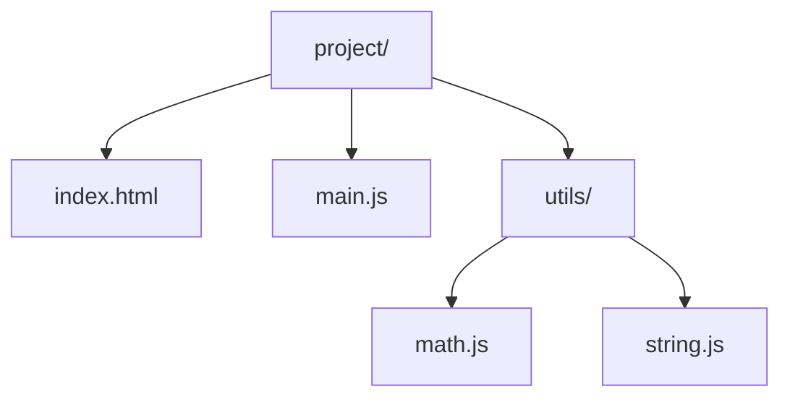
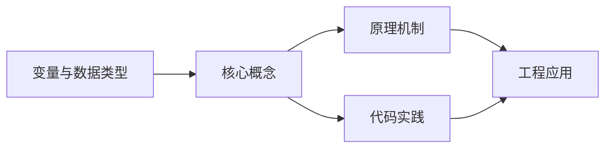
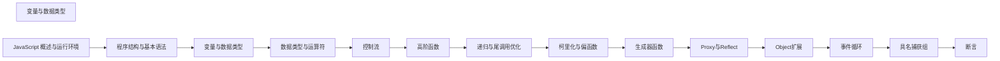

## 1. 学习目标（Bloom 分类）

本节按照布鲁姆教育目标分类学组织学习路径。本文主题为《变量与数据类型》，属于 JavaScript 模块，读者可以根据自身阶段选择阅读深度。

记忆层面：能够准确复述本文的核心概念、术语与基本语法或操作步骤，并能够在提问或检索时快速定位对应知识点。能够说出 JS 的变量、函数、对象、数组与 ES6+ 语法。

理解层面：能够用自己的语言解释核心原理与工作机制，说明概念之间的因果关系，而不是机械记忆结论。能够解释原型链、闭包、事件循环与 this 绑定。

应用层面：能够在真实项目或练习场景中运用本文知识解决具体问题，写出正确且可维护的实现。能够编写浏览器交互、Node 服务与工具脚本。

分析层面：能够拆解复杂问题，比较本文主题与相邻概念的异同，识别边界条件与例外情况。能够分析异步模型、作用域与内存泄漏。

评价层面：能够根据约束条件（性能、可读性、安全、成本）评价不同方案的优劣，做出有依据的技术决策。能够评价 JS 与 TypeScript、其他语言的差异。

创造层面：能够把本文知识与其他模块知识组合，设计出新的解决方案或可复用的工程模式。能够设计现代前端应用（框架 + 工程化）。

通过本节学习，读者应当能够把《变量与数据类型》纳入自己的知识网络，并与 JavaScript 模块的其他主题（原型链、事件循环、闭包、ES 规范）建立关联。

## 2. 历史动机与发展脉络

《变量与数据类型》是 JavaScript 领域的重要主题。要真正理解它，需要先了解它解决的问题与演进过程。

JavaScript 由 Brendan Eich 于 1995 年在 Netscape 用 10 天设计完成，最初只做表单校验；1996 年提交给 ECMA 标准化，即 ECMAScript。
ES6（2015）是语言转折点：let/const、箭头函数、class、Promise、模块化；此后每年发布新版本（ES2016+），现代语法在 Node 与浏览器快速普及。
运行时生态：V8（Chrome/Node）、SpiderMonkey（Firefox）、JavaScriptCore（Safari）；Node.js 与 Deno/Bun 让 JS 成为全栈语言；TypeScript 成为大型项目的事实标准。

回到本文主题：变量与数据类型 的提出与成熟，正是上述技术背景下的必然产物。早期实现往往以简单可用为目标，随着工程规模扩大，社区逐渐沉淀出标准做法与最佳实践；理解这一脉络，可以帮助读者判断“为什么文档中的推荐写法是现在这个样子”，也能在遇到历史遗留代码时准确识别其设计年代与取舍。


## 3. 形式化定义与核心概念精讲

本节把《变量与数据类型》涉及的核心概念以“定义 + 讲解”的形式展开。读者应把定义当作工具，把讲解当作理解路径；两者结合才能形成可迁移的知识。

原型链：对象通过 __proto__ 链接原型，属性查找沿链上行；ES6 class 是原型继承的语法糖。
闭包：函数捕获定义时的作用域，变量随函数存活；闭包是模块模式与柯里化的基础。
事件循环：调用栈、任务队列（宏任务）与微任务队列决定执行顺序；Promise 回调进微任务，setTimeout 进宏任务。

### 3.1 原文章节逐一精讲

原文档把主题拆分为 18 个小节，下面按顺序给出每一节的导读讲解，随后保留原文细节供精读。

#### 原文精读（完整保留）

# JavaScript 变量与数据类型

> **符号约定**：`< >` 必填参数 | `[ ]` 可选参数

---

#### 1. 引入方式 (Inclusion)

JavaScript 可以通过多种方式引入到网页中，每种方式都有其适用场景和特点。

##### 1.1 内部脚本 (Inline Script)

**语法**: 在 HTML 文件中使用 `<script>` 标签包裹 JavaScript 代码。
**示例**:

```html
<!DOCTYPE html>
<html lang="zh-CN">
  <head>
    <meta charset="UTF-8" />
    <meta name="viewport" content="width=device-width, initial-scale=1.0" />
    <title>内部脚本示例</title>
  </head>
  <body>
    <h1>Hello, JavaScript!</h1>
    <script>
      // 内部脚本
      console.log('Hello from inline script!');
      // 定义函数
      function greet() {
        alert('Hello, world!');
      }
      // 调用函数
      greet();
    </script>
  </body>
</html>
```

**特点**:

- 简单直接，适合小型脚本
- 代码与 HTML 混合，不利于维护
- 页面加载时执行

##### 1.2 外部文件 (External Script)

**语法**: 使用 `<script src="path/to/script.js"></script>` 引入外部 JavaScript 文件。
**示例**:
**HTML 文件**:

```html
<!DOCTYPE html>
<html lang="zh-CN">
  <head>
    <meta charset="UTF-8" />
    <meta name="viewport" content="width=device-width, initial-scale=1.0" />
    <title>外部脚本示例</title>
  </head>
  <body>
    <h1>Hello, JavaScript!</h1>
    <script src="app.js"></script>
  </body>
</html>
```

**app.js 文件**:

```javascript
// 外部脚本
console.log('Hello from external script!');
function greet() {
  alert('Hello, world!');
}
greet();
```

**特点**:

- 代码与 HTML 分离，便于维护
- 可重用性高
- 可以被浏览器缓存
- 页面加载时执行

##### 1.3 现代模块 (ESM - ES Modules)

**语法**: 使用 `<script type="module" src="main.js"></script>` 引入 ES 模块。
**示例**:
**HTML 文件**:

```html
<!DOCTYPE html>
<html lang="zh-CN">
  <head>
    <meta charset="UTF-8" />
    <meta name="viewport" content="width=device-width, initial-scale=1.0" />
    <title>ES 模块示例</title>
  </head>
  <body>
    <h1>Hello, JavaScript!</h1>
    <script type="module" src="main.js"></script>
  </body>
</html>
```

**main.js 文件**:

```javascript
// 导入模块
import { greet } from './utils.js';
console.log('Hello from ES module!');
greet();
```

**utils.js 文件**:

```javascript
// 导出模块
export function greet() {
  alert('Hello from module!');
}
```

**特点**:

- 支持模块化开发
- 变量默认是局部作用域
- 支持 `import` 和 `export` 语法
- 延迟执行 (defer)
- 跨域需要 CORS 支持

##### 1.4 脚本加载顺序

**正常脚本** (`<script>`):

- 页面解析到脚本标签时立即执行
- 执行过程中暂停 HTML 解析
  **延迟脚本** (`<script defer>`):
- 脚本会在 HTML 解析完成后执行
- 多个 defer 脚本按顺序执行
- 适合外部脚本
  **异步脚本** (`<script async>`):
- 脚本会在下载完成后立即执行
- 不阻塞 HTML 解析
- 多个 async 脚本执行顺序不确定
- 适合独立的脚本，如统计代码
  **示例**:

```html
<!-- 正常脚本 -->
<script src="normal.js"></script>
<!-- 延迟脚本 -->
<script src="deferred.js" defer></script>
<!-- 异步脚本 -->
<script src="async.js" async></script>
<!-- ES 模块默认延迟执行 -->
<script type="module" src="module.js"></script>
```

#### 2. 语句与注释 (Statements & Comments)

##### 2.1 语句 (Statements)

JavaScript 语句是执行特定操作的指令，通常以分号 (`;`) 结尾。
**基本语句**:

```javascript
// 变量声明语句
let x = 10;
// 赋值语句
x = 20;
// 函数调用语句
console.log(x);
// 条件语句
if (x > 15) {
  console.log('x 大于 15');
}
// 循环语句
for (let i = 0; i < 5; i++) {
  console.log(i);
}
```

**分号使用**:

- 分号在 JavaScript 中是可选的，但推荐使用
- 自动分号插入 (ASI) 会在某些情况下自动添加分号
- 为了代码的一致性和避免潜在问题，建议始终使用分号
  **代码块**:
- 使用大括号 `{}` 包裹的语句集合
- 创建块级作用域

```javascript
{
  let blockVar = '只在块内可见';
  console.log(blockVar); // 输出: 只在块内可见
}
console.log(blockVar); // 报错: blockVar is not defined
```

##### 2.2 注释 (Comments)

注释是代码中不会被执行的文本，用于解释代码的功能和逻辑。
**单行注释**:

- 使用 `//` 开头
- 注释从 `//` 开始到行尾

```javascript
// 这是一个单行注释
let x = 10; // 这也是一个单行注释
```

**多行注释**:

- 使用 `/*` 开始，`*/` 结束
- 可以跨越多行

```javascript
/*
 这是一个
 多行注释
 */
let y = 20;
```

**文档注释**:

- 使用 `/**` 开始，`*/` 结束
- 用于生成 API 文档
- 支持 JSDoc 语法

```javascript
/**
 * 计算两个数的和
 * @param {number} a - 第一个数
 * @param {number} b - 第二个数
 * @returns {number} 两个数的和
 */
function add(a, b) {
  return a + b;
}
```

**注释最佳实践**:

- 注释应该解释代码的"为什么"，而不是"是什么"
- 保持注释与代码同步
- 避免过多的注释，代码本身应该清晰易懂
- 使用文档注释记录函数、类和模块

#### 3. 变量声明 (Variable Declarations)

JavaScript 提供了三种变量声明方式：`var`、`let` 和 `const`。

##### 3.1 var

**特点**:

- 函数作用域
- 存在变量提升 (Hoisting)
- 可以重复声明
- 可以在声明前使用
  **示例**:

```javascript
// 变量提升 - 可以在声明前使用
console.log(x); // 输出: undefined
var x = 10;
// 函数作用域
function test() {
  var y = 20;
  console.log(y); // 输出: 20
}
test();
console.log(y); // 报错: y is not defined
// 重复声明
var x = 30;
console.log(x); // 输出: 30
```

**注意**: `var` 由于其作用域和变量提升的特性，容易导致意外的行为，因此不推荐使用。

##### 3.2 let

**特点**:

- 块级作用域
- 不存在变量提升
- 不能重复声明
- 声明后可以修改值
  **示例**:

```javascript
// 不存在变量提升
console.log(z); // 报错: z is not defined
let z = 10;
// 块级作用域
if (true) {
  let z = 20;
  console.log(z); // 输出: 20
}
console.log(z); // 输出: 10
// 不能重复声明
// let z = 30; // 报错: Identifier 'z' has already been declared
// 可以修改值
z = 30;
console.log(z); // 输出: 30
```

**推荐**: `let` 适用于需要在作用域内修改值的变量。

##### 3.3 const

**特点**:

- 块级作用域
- 不存在变量提升
- 不能重复声明
- 必须初始化
- 不能修改值（但对象和数组的内容可以修改）
  **示例**:

```javascript
// 必须初始化
// const PI; // 报错: Missing initializer in const declaration
const PI = 3.14159;
// 块级作用域
if (true) {
  const PI = 3.14;
  console.log(PI); // 输出: 3.14
}
console.log(PI); // 输出: 3.14159
// 不能修改值
// PI = 3.14; // 报错: Assignment to constant variable
// 对象和数组的内容可以修改
const person = { name: 'Alice' };
person.name = 'Bob'; // 允许
console.log(person); // 输出: { name: "Bob" }
const numbers = [1, 2, 3];
numbers.push(4); // 允许
console.log(numbers); // 输出: [1, 2, 3, 4]
// 但不能重新赋值
// person = { name: "Charlie" }; // 报错: Assignment to constant variable
// numbers = [4, 5, 6]; // 报错: Assignment to constant variable
```

**推荐**: `const` 适用于不需要修改值的常量，是默认的变量声明方式。

##### 3.4 变量提升 (Hoisting)

变量提升是 JavaScript 的一种机制，其中变量和函数声明会被提升到作用域的顶部。
**var 提升**:

- 变量声明会被提升，但赋值不会
- 函数声明会被完全提升
  **示例**:

```javascript
// var 变量提升
console.log(a); // 输出: undefined
var a = 10;
console.log(a); // 输出: 10
// 函数声明提升
foo(); // 输出: Hello
function foo() {
  console.log('Hello');
}
// 函数表达式不会提升
bar(); // 报错: bar is not a function
var bar = function () {
  console.log('Hello');
};
```

**let 和 const 提升**:

- 声明会被提升，但处于"暂存死区" (Temporal Dead Zone, TDZ)
- 在声明前访问会报错
  **示例**:

```javascript
// 暂存死区
console.log(b); // 报错: Cannot access 'b' before initialization
let b = 20;
console.log(c); // 报错: Cannot access 'c' before initialization
const c = 30;
```

#### 4. 标识符规范 (Identifiers)

标识符是变量、函数、类、属性等的名称。

##### 4.1 命名规则

- **允许的字符**: 字母 (a-z, A-Z)、数字 (0-9)、下划线 (\_)、美元符号 ($)
- **不能以数字开头**
- **区分大小写**: `myVar` 和 `myvar` 是不同的标识符
- **不能使用保留字** (如 `let`、`const`、`function` 等)

##### 4.2 命名约定

**变量和函数**:

- 使用小驼峰命名法 (lowerCamelCase)
- 变量名应该清晰表达其用途
  **示例**:

```javascript
let userName = 'Alice';
let userAge = 30;
function calculateTotalPrice(items) {
  // 函数体
}
```

**常量**:

- 使用大驼峰命名法 (UPPER_SNAKE_CASE)
- 常量名应该全大写，单词间用下划线分隔
  **示例**:

```javascript
const MAX_SIZE = 100;
const API_URL = 'https://api.example.com';
```

**类**:

- 使用大驼峰命名法 (PascalCase)
- 类名应该是名词，首字母大写
  **示例**:

```javascript
class User {
  constructor(name, age) {
    this.name = name;
    this.age = age;
  }
}
```

**对象属性**:

- 使用小驼峰命名法 (lowerCamelCase)
- 与变量命名一致
  **示例**:

```javascript
const user = {
  firstName: 'Alice',
  lastName: 'Smith',
  emailAddress: 'alice@example.com',
};
```

**函数参数**:

- 使用小驼峰命名法 (lowerCamelCase)
- 参数名应该清晰表达其用途
  **示例**:

```javascript
function createUser(firstName, lastName, email) {
  // 函数体
}
```

##### 4.3 命名最佳实践

- **语义化**: 变量名应该清晰表达其用途
- **简洁**: 变量名应该简洁但不失明确
- **一致**: 在整个项目中保持命名风格一致
- **避免缩写**: 除非是广为人知的缩写 (如 `API`、`URL`)
- **避免单个字符**: 除非是循环计数器或数学变量
  **好的命名示例**:
- `userName` 而不是 `u` 或 `usrNm`
- `calculateTotalPrice` 而不是 `calc` 或 `total`
- `isActive` 而不是 `active` (布尔变量使用 `is` 或 `has` 前缀)
- `MAX_ITERATIONS` 而不是 `max`

#### 5. 严格模式 (Strict Mode)

严格模式是 JavaScript 的一种执行模式，通过 `"use strict";` 指令开启。

##### 5.1 开启严格模式

**全局严格模式**:

- 在脚本的顶部添加 `"use strict";`
  **示例**:

```javascript
'use strict';
// 严格模式下的代码
let x = 10;
```

**函数严格模式**:

- 在函数内部添加 `"use strict";`
  **示例**:

```javascript
function strictFunction() {
  'use strict';
  // 严格模式下的代码
  let y = 20;
}
```

**ES 模块**:

- ES 模块默认启用严格模式，无需添加 `"use strict";`

##### 5.2 严格模式的限制

**严格模式禁止的行为**:

1. **未声明的变量**: 不允许使用未声明的变量

```javascript
'use strict';
x = 10; // 报错: x is not defined
```

2. **重复的参数名**: 不允许函数有重复的参数名

```javascript
'use strict';
function foo(a, a) {
  // 报错: Duplicate parameter name not allowed in this context
  console.log(a);
}
```

3. **删除变量、函数或参数**: 不允许使用 `delete` 操作符删除变量、函数或参数

```javascript
'use strict';
let x = 10;
delete x; // 报错: Delete of an unqualified identifier in strict mode.
```

4. **八进制字面量**: 不允许使用八进制字面量

```javascript
'use strict';
let x = 010; // 报错: Octal literals are not allowed in strict mode.
```

5. **with 语句**: 不允许使用 `with` 语句

```javascript
'use strict';
with (Math) {
  // 报错: Strict mode code may not include a with statement
  console.log(PI);
}
```

6. **this 指向**: 在全局函数中，`this` 不再指向全局对象，而是 `undefined`

```javascript
'use strict';
function foo() {
  console.log(this); // 输出: undefined
}
foo();
```

7. **eval 作用域**: `eval` 语句在严格模式下有自己的作用域，不会污染外部作用域

```javascript
'use strict';
let x = 10;
eval('var x = 20; console.log(x);'); // 输出: 20
console.log(x); // 输出: 10
```

##### 5.3 严格模式的好处

- **消除不合理的语法**: 禁止一些容易出错的语法
- **提高运行效率**: 某些操作在严格模式下执行更快
- **增强安全性**: 减少潜在的安全漏洞
- **提前发现错误**: 将静默错误变为显式错误
- **为未来的 JavaScript 版本做准备**: 严格模式的规则更接近未来的 JavaScript 标准

#### 6. 代码风格 (Code Style)

一致的代码风格有助于提高代码的可读性和可维护性。

##### 6.1 缩进

- 使用 2 或 4 个空格进行缩进
- 保持一致的缩进风格
  **示例**:

```javascript
// 2 空格缩进
function foo() {
  if (true) {
    console.log('Hello');
  }
}
// 4 空格缩进
function bar() {
  if (true) {
    console.log('Hello');
  }
}
```

##### 6.2 空格

- 操作符两边添加空格
- 逗号后添加空格
- 函数参数列表中，逗号后添加空格
- 花括号前后添加空格
  **示例**:

```javascript
// 好的风格
let x = 10 + 5;
const arr = [1, 2, 3];
function foo(a, b) {
  // 函数体
}
// 不好的风格
let x = 10 + 5;
const arr = [1, 2, 3];
function foo(a, b) {
  // 函数体
}
```

##### 6.3 换行

- 每行代码长度控制在 80-120 个字符以内
- 运算符后换行
- 长函数参数或对象字面量换行
  **示例**:

```javascript
 // 长表达式换行
 const result = a + b + c + d + e +
  f + g + h;
 // 长函数参数换行
 function foo(
  parameter1,
  parameter2,
  parameter3
 )
  // 函数体
 }
 // 长对象字面量换行
 const user = {
  name: "Alice",
  age: 30,
  email: "alice@example.com",
  address: {
  street: "123 Main St",
  city: "New York"
  }
 }
```

##### 6.4 分号

- 始终使用分号结束语句
- 避免依赖自动分号插入 (ASI)
  **示例**:

```javascript
// 好的风格
let x = 10;
console.log(x);
// 不好的风格
let x = 10;
console.log(x);
```

##### 6.5 引号

- 选择单引号或双引号，保持一致
- 字符串中包含引号时，使用相反的引号或转义
  **示例**:

```javascript
// 使用单引号
let name = 'Alice';
let message = 'She said, "Hello!"';
// 使用双引号
let name = 'Alice';
let message = "She said, 'Hello!'";
```

#### 7. 常见错误与解决方案

##### 7.1 变量作用域错误

**错误**: 变量泄露到全局作用域
**原因**: 使用 `var` 或未声明的变量
**解决方案**:

- 使用 `let` 或 `const` 声明变量
- 封装代码到函数或模块中
  **示例**:

```javascript
// 错误
function test() {
  x = 10; // 未声明的变量，会泄露到全局作用域
}
test();
console.log(x); // 输出: 10
// 正确
function test() {
  let x = 10; // 块级作用域变量
}
test();
console.log(x); // 报错: x is not defined
```

##### 7.2 变量提升错误

**错误**: 在声明前使用变量
**原因**: 不了解变量提升的机制
**解决方案**:

- 始终在使用变量前声明
- 使用 `let` 或 `const` 避免变量提升问题
  **示例**:

```javascript
// 错误
console.log(x); // 输出: undefined
var x = 10;
// 正确
let x = 10;
console.log(x); // 输出: 10
```

##### 7.3 严格模式错误

**错误**: 在严格模式下使用被禁止的语法
**原因**: 不了解严格模式的限制
**解决方案**:

- 熟悉严格模式的规则
- 修复被禁止的语法
  **示例**:

```javascript
'use strict';
// 错误
x = 10; // 未声明的变量
// 正确
let x = 10;
```

##### 7.4 命名错误

**错误**: 使用无效的标识符
**原因**: 不了解标识符的命名规则
**解决方案**:

- 遵循标识符命名规则
- 使用语义化的命名
  **示例**:

```javascript
 // 错误
 let 123abc = 10; // 不能以数字开头
 let let = 20; // 不能使用保留字
 // 正确
 let abc123 = 10;
 let myLet = 20;
```

#### 8. 实战示例

##### 8.1 模块化开发

**项目结构**:



**index.html**:

```html
<!DOCTYPE html>
<html lang="zh-CN">
  <head>
    <meta charset="UTF-8" />
    <meta name="viewport" content="width=device-width, initial-scale=1.0" />
    <title>模块化开发示例</title>
  </head>
  <body>
    <h1>模块化开发示例</h1>
    <div id="result"></div>
    <script type="module" src="main.js"></script>
  </body>
</html>
```

**utils/math.js**:

```javascript
/**
 * 数学工具函数
 */
/**
 * 计算两个数的和
 * @param {number} a - 第一个数
 * @param {number} b - 第二个数
 * @returns {number} 两个数的和
 */
export function add(a, b) {
  return a + b;
}
/**
 * 计算两个数的差
 * @param {number} a - 被减数
 * @param {number} b - 减数
 * @returns {number} 两个数的差
 */
export function subtract(a, b) {
  return a - b;
}
```

**utils/string.js**:

```javascript
/**
 * 字符串工具函数
 */
/**
 * capitalize
 * @param {string} str - 输入字符串
 * @returns {string} 首字母大写的字符串
 */
export function capitalize(str) {
  return str.charAt(0).toUpperCase() + str.slice(1);
}
/**
 * 字符串反转
 * @param {string} str - 输入字符串
 * @returns {string} 反转后的字符串
 */
export function reverse(str) {
  return str.split('').reverse().join('');
}
```

**main.js**:

```javascript
'use strict';
// 导入模块
import { add, subtract } from './utils/math.js';
import { capitalize, reverse } from './utils/string.js';
// 使用导入的函数
const sum = add(10, 5);
const difference = subtract(10, 5);
const capitalized = capitalize('hello');
const reversed = reverse('hello');
// 显示结果
const resultDiv = document.getElementById('result');
resultDiv.innerHTML = `
  <p>10 + 5 = ${sum}</p>
  <p>10 - 5 = ${difference}</p>
  <p>capitalize('hello') = ${capitalized}</p>
  <p>reverse('hello') = ${reversed}</p>
 `;
console.log('模块化开发示例执行完成');
```

##### 8.2 严格模式应用

**示例**:

```javascript
'use strict';
// 严格模式下的代码
// 1. 必须声明变量
let userName = 'Alice';
const MAX_AGE = 120;
// 2. 不能使用未声明的变量
// age = 30; // 报错: age is not defined
// 3. 不能使用重复的参数名
// function foo(a, a) { // 报错: Duplicate parameter name not allowed in this context
// console.log(a);
// }
// 4. 不能删除变量
// delete userName; // 报错: Delete of an unqualified identifier in strict mode.
// 5. 不能使用八进制字面量
// let octal = 010; // 报错: Octal literals are not allowed in strict mode.
// 6. 不能使用 with 语句
// with (Math) { // 报错: Strict mode code may not include a with statement
// console.log(PI);
// }
// 7. this 指向 undefined
function test() {
  console.log(this); // 输出: undefined
}
test();
// 8. eval 有自己的作用域
let x = 10;
eval("var x = 20; console.log('Inside eval:', x);"); // 输出: Inside eval: 20
console.log('Outside eval:', x); // 输出: 10
console.log('严格模式示例执行完成');
```

#### 9. 总结

JavaScript 的程序结构和基本语法是学习 JavaScript 的基础。通过理解引入方式、语句与注释、变量声明、标识符规范和严格模式等概念，你可以编写更加规范、高效和安全的 JavaScript 代码。

- **引入方式**: 选择适合的脚本引入方式，考虑加载顺序和性能
- **语句与注释**: 编写清晰的语句，使用适当的注释解释代码
- **变量声明**: 优先使用 `const` 和 `let`，避免使用 `var`
- **标识符规范**: 遵循命名规则和约定，提高代码可读性
- **严格模式**: 启用严格模式，减少错误，提高代码质量
- **代码风格**: 保持一致的代码风格，提高代码可维护性
  掌握这些基础概念后，你可以更深入地学习 JavaScript 的高级特性，如函数、对象、异步编程等，为构建复杂的应用打下坚实的基础。

---

#### 变量声明

**基本写法：let 声明**
`let <变量名> = <值>;`
```javascript
// 声明可变变量
let age = 18;
```

---

**基本写法：const 声明**
`const <常量名> = <值>;`
```javascript
// 声明不可变常量
const PI = 3.14159;
```

---

**基本写法：var 声明**
`var <变量名> = <值>;`
```javascript
// 声明函数级作用域变量
var name = "Alice";
```

---

**基本写法：多变量声明**
`let <变量1> = <值1>, <变量2> = <值2>;`
```javascript
// 一次声明多个变量
let x = 1, y = 2, z = 3;
```

---

**基本写法：解构声明**
`let { <属性1>, <属性2> } = <对象>;`
```javascript
// 对象解构声明变量
let { name, age } = user;
```

---

**基本写法：数组解构声明**
`let [ <变量1>, <变量2> ] = <数组>;`
```javascript
// 数组解构声明变量
let [first, second] = numbers;
```

---

#### 原始数据类型

**基本写法：Number 类型**
`let <变量> = <数字>;`
```javascript
// 声明数字类型
let count = 42;
```

---

**基本写法：浮点数**
`let <变量> = <浮点数>;`
```javascript
// 声明浮点数
let price = 9.99;
```

---

**基本写法：String 类型**
`let <变量> = "<字符串>";`
```javascript
// 声明字符串
let name = "Hello";
```

---

**基本写法：模板字符串**
`let <变量> = \`<模板>\`;`
```javascript
// 使用模板字符串嵌入变量
let greeting = `Hello, ${name}!`;
```

---

**基本写法：Boolean 类型**
`let <变量> = <true|false>;`
```javascript
// 声明布尔值
let isActive = true;
```

---

**基本写法：null 值**
`let <变量> = null;`
```javascript
// 声明空值
let data = null;
```

---

**基本写法：undefined 值**
`let <变量> = undefined;`
```javascript
// 声明未定义值
let value = undefined;
```

---

**基本写法：Symbol 类型**
`let <变量> = Symbol("<描述>");`
```javascript
// 创建唯一符号
let id = Symbol("id");
```

---

**基本写法：BigInt 类型**
`let <变量> = <大整数>n;`
```javascript
// 声明大整数
let big = 9007199254740991n;
```

---

#### 引用数据类型

**基本写法：Object 类型**
`let <变量> = { <键>: <值> };`
```javascript
// 声明对象
let user = { name: "Alice", age: 25 };
```

---

**基本写法：Array 类型**
`let <变量> = [ <元素1>, <元素2> ];`
```javascript
// 声明数组
let numbers = [1, 2, 3];
```

---

**基本写法：Function 类型**
`let <变量> = function() { };`
```javascript
// 声明函数表达式
let greet = function() {
};
```

---

**基本写法：Date 类型**
`let <变量> = new Date();`
```javascript
// 创建日期对象
let now = new Date();
```

---

**基本写法：RegExp 类型**
`let <变量> = /<模式>/<标志>;`
```javascript
// 创建正则表达式
let pattern = /hello/gi;
```

---

#### 类型检查

**基本写法：typeof 操作符**
`typeof <变量>`
```javascript
// 获取变量类型字符串
let type = typeof name;
```

---

**基本写法：instanceof 操作符**
`<对象> instanceof <构造函数>`
```javascript
// 检查对象是否为某构造函数的实例
let isArray = arr instanceof Array;
```

---

**基本写法：Array.isArray**
`Array.isArray(<变量>)`
```javascript
// 检查变量是否为数组
let isArray = Array.isArray(numbers);
```

---

**基本写法：Object.prototype.toString**
`Object.prototype.toString.call(<变量>)`
```javascript
// 获取对象精确类型
let type = Object.prototype.toString.call(obj);
```

---

#### 类型转换

**基本写法：转字符串**
`String(<值>)`
```javascript
// 将值转换为字符串
let str = String(123);
```

---

**基本写法：toString 方法**
`<值>.toString()`
```javascript
// 调用 toString 方法转换
let str = (123).toString();
```

---

**基本写法：转数字**
`Number(<值>)`
```javascript
// 将字符串转换为数字
let num = Number("123");
```

---

**基本写法：parseInt**
`parseInt(<字符串>, <基数>)`
```javascript
// 解析整数
let num = parseInt("42px", 10);
```

---

**基本写法：parseFloat**
`parseFloat(<字符串>)`
```javascript
// 解析浮点数
let num = parseFloat("3.14abc");
```

---

**基本写法：转布尔**
`Boolean(<值>)`
```javascript
// 将值转换为布尔
let bool = Boolean(0);
```

---

**基本写法：双重否定转布尔**
`!!<值>`
```javascript
// 使用双重否定转换为布尔
let bool = !!value;
```

---

#### 变量作用域

**基本写法：全局作用域**
`<变量名> = <值>;`
```javascript
// 不使用关键字声明为全局变量
globalVar = 10;
```

---

**基本写法：函数作用域**
`function <函数>() { var <变量> = <值>; }`
```javascript
// var 声明的变量为函数级作用域
function test() {
    var functionVar = 10;
}
```

---

**基本写法：块级作用域**
`{ let <变量> = <值>; }`
```javascript
// let 声明的变量为块级作用域
{
    let blockVar = 10;
}
```

---

#### 变量提升

**基本写法：var 提升**
`console.log(<变量>); var <变量> = <值>;`
```javascript
// var 声明的变量会提升值为 undefined
console.log(x);
var x = 10;
```

---

**基本写法：let 暂时性死区**
`console.log(<变量>); let <变量> = <值>;`
```javascript
// let 声明的变量在声明前访问会报错
// console.log(y);
// let y = 10;
```

---

#### 常量特性

**基本写法：const 不可重新赋值**
`const <常量> = <值>;`
```javascript
// const 声明的常量不能重新赋值
const MAX = 100;
```

---

**基本写法：const 对象属性可变**
`const <对象> = { }; <对象>.<属性> = <值>;`
```javascript
// const 对象的属性可以修改
const obj = {};
obj.name = "Alice";
```

---

**基本写法：冻结对象**
`Object.freeze(<对象>)`
```javascript
// 冻结对象使其属性不可变
const frozen = Object.freeze({});
```

---

#### ES2025 新数据类型

**基本写法：Float16Array 半精度浮点数组**
`new Float16Array([<元素>])`
```javascript
// 创建半精度浮点数组节省内存适合机器学习场景
let arr = new Float16Array([1.0, 2.5, 3.14]);
```

---

**基本写法：Iterator 协议对象**
`<对象>[Symbol.iterator] = function() { return { next: () => ({ value, done }) }; }`
```javascript
// 自定义迭代器协议对象支持 for-of 与扩展运算符
let range = {
    [Symbol.iterator]() {
        let n = 0;
        return {
            next: () => ({ value: n++, done: n > 3 })
        };
    }
};
```


### 3.2 概念关系图

下面用 Mermaid 图表达本文核心概念之间的关系，帮助读者建立整体图景：



图中展示的是本文知识的结构化关系：核心概念是入口，原理机制解释“为什么”，代码实践演示“怎么做”，工程应用回答“何时用”。读者学习时可以把每个小节的内容挂接到对应节点上。

## 4. 理论推导与原理解析

本节深入《变量与数据类型》背后的原理。理论部分不求面面俱到，而是聚焦“能解释现象、能指导实践”的关键推导。

原型链：对象通过 __proto__ 链接原型，属性查找沿链上行；ES6 class 是原型继承的语法糖。
闭包：函数捕获定义时的作用域，变量随函数存活；闭包是模块模式与柯里化的基础。
事件循环：调用栈、任务队列（宏任务）与微任务队列决定执行顺序；Promise 回调进微任务，setTimeout 进宏任务。
this 绑定：默认绑定、隐式绑定、显式绑定（call/apply/bind）与箭头函数词法绑定四种规则。

需要强调的是，理论推导与工程实践之间存在翻译层：理论给出的是理想化模型与边界条件，工程代码则必须处理真实环境中的例外。读者在学习时应先掌握理论的“标准情形”，再通过陷阱章节了解“非标准情形”。

## 5. 代码示例与逐行讲解

本节把原文中的代码示例系统整理，并为每个示例补充用途说明与讲解。读者不应只浏览代码，而应逐段对照讲解理解设计意图。

### 5.1 示例：1.1 内部脚本 (Inline Script)

该示例来自原文《1.1 内部脚本 (Inline Script)》小节，用于演示变量与数据类型相关操作。阅读时请先看代码结构，再看其后的讲解。

```html
<!DOCTYPE html>
<html lang="zh-CN">
  <head>
    <meta charset="UTF-8" />
    <meta name="viewport" content="width=device-width, initial-scale=1.0" />
    <title>内部脚本示例</title>
  </head>
  <body>
    <h1>Hello, JavaScript!</h1>
    <script>
      // 内部脚本
      console.log('Hello from inline script!');
      // 定义函数
      function greet() {
        alert('Hello, world!');
      }
      // 调用函数
      greet();
    </script>
  </body>
</html>
```

讲解：这段代码演示了本节核心知识点。代码中的关键操作可以归纳为三步：准备（定义或初始化）、执行（核心逻辑）、收尾（释放资源或返回结果）。实际项目中，这三步往往被封装为函数或类，以提升复用性与可测试性。

关键点分析：

该示例共 21 行有效代码，包含 2 类关键结构（function、from）。其中：

- 入口与初始化部分负责建立上下文，对应实际项目中的启动或装配逻辑；
- 核心逻辑部分体现本文主题的主要操作，是阅读时最需要对照讲解理解的部分；
- 输出或返回部分把结果交给调用方，注意其类型与边界条件。

进阶思考路径：先尝试修改参数观察行为变化，再把示例中的模式迁移到自己的项目中；每次修改都记录预期与实测差异，这是把示例转化为能力的最快方式。

### 5.2 示例：1.2 外部文件 (External Script)

该示例来自原文《1.2 外部文件 (External Script)》小节，用于演示变量与数据类型相关操作。阅读时请先看代码结构，再看其后的讲解。

```html
<!DOCTYPE html>
<html lang="zh-CN">
  <head>
    <meta charset="UTF-8" />
    <meta name="viewport" content="width=device-width, initial-scale=1.0" />
    <title>外部脚本示例</title>
  </head>
  <body>
    <h1>Hello, JavaScript!</h1>
    <script src="app.js"></script>
  </body>
</html>
```

讲解：这段代码演示了本节核心知识点。代码中的关键操作可以归纳为三步：准备（定义或初始化）、执行（核心逻辑）、收尾（释放资源或返回结果）。实际项目中，这三步往往被封装为函数或类，以提升复用性与可测试性。

关键点分析：

该示例共 12 行有效代码，结构以数据或配置为主。阅读时应关注：数据字段的含义、配置项的作用，以及它们与运行行为的对应关系。

进阶思考路径：先尝试修改参数观察行为变化，再把示例中的模式迁移到自己的项目中；每次修改都记录预期与实测差异，这是把示例转化为能力的最快方式。

### 5.3 示例：1.2 外部文件 (External Script)

该示例来自原文《1.2 外部文件 (External Script)》小节，用于演示变量与数据类型相关操作。阅读时请先看代码结构，再看其后的讲解。

```javascript
// 外部脚本
console.log('Hello from external script!');
function greet() {
  alert('Hello, world!');
}
greet();
```

讲解：这段代码演示了本节核心知识点。代码中的关键操作可以归纳为三步：准备（定义或初始化）、执行（核心逻辑）、收尾（释放资源或返回结果）。实际项目中，这三步往往被封装为函数或类，以提升复用性与可测试性。

关键点分析：

该示例共 6 行有效代码，包含 2 类关键结构（function、from）。其中：

- 入口与初始化部分负责建立上下文，对应实际项目中的启动或装配逻辑；
- 核心逻辑部分体现本文主题的主要操作，是阅读时最需要对照讲解理解的部分；
- 输出或返回部分把结果交给调用方，注意其类型与边界条件。

进阶思考路径：先尝试修改参数观察行为变化，再把示例中的模式迁移到自己的项目中；每次修改都记录预期与实测差异，这是把示例转化为能力的最快方式。

### 5.4 示例：1.3 现代模块 (ESM - ES Modules)

该示例来自原文《1.3 现代模块 (ESM - ES Modules)》小节，用于演示变量与数据类型相关操作。阅读时请先看代码结构，再看其后的讲解。

```html
<!DOCTYPE html>
<html lang="zh-CN">
  <head>
    <meta charset="UTF-8" />
    <meta name="viewport" content="width=device-width, initial-scale=1.0" />
    <title>ES 模块示例</title>
  </head>
  <body>
    <h1>Hello, JavaScript!</h1>
    <script type="module" src="main.js"></script>
  </body>
</html>
```

讲解：这段代码演示了本节核心知识点。代码中的关键操作可以归纳为三步：准备（定义或初始化）、执行（核心逻辑）、收尾（释放资源或返回结果）。实际项目中，这三步往往被封装为函数或类，以提升复用性与可测试性。

关键点分析：

该示例共 12 行有效代码，结构以数据或配置为主。阅读时应关注：数据字段的含义、配置项的作用，以及它们与运行行为的对应关系。

进阶思考路径：先尝试修改参数观察行为变化，再把示例中的模式迁移到自己的项目中；每次修改都记录预期与实测差异，这是把示例转化为能力的最快方式。

### 5.5 示例：1.3 现代模块 (ESM - ES Modules)

该示例来自原文《1.3 现代模块 (ESM - ES Modules)》小节，用于演示变量与数据类型相关操作。阅读时请先看代码结构，再看其后的讲解。

```javascript
// 导入模块
import { greet } from './utils.js';
console.log('Hello from ES module!');
greet();
```

讲解：这段代码演示了本节核心知识点。代码中的关键操作可以归纳为三步：准备（定义或初始化）、执行（核心逻辑）、收尾（释放资源或返回结果）。实际项目中，这三步往往被封装为函数或类，以提升复用性与可测试性。

关键点分析：

该示例共 4 行有效代码，包含 2 类关键结构（import、from）。其中：

- 入口与初始化部分负责建立上下文，对应实际项目中的启动或装配逻辑；
- 核心逻辑部分体现本文主题的主要操作，是阅读时最需要对照讲解理解的部分；
- 输出或返回部分把结果交给调用方，注意其类型与边界条件。

进阶思考路径：先尝试修改参数观察行为变化，再把示例中的模式迁移到自己的项目中；每次修改都记录预期与实测差异，这是把示例转化为能力的最快方式。

### 5.6 示例：1.3 现代模块 (ESM - ES Modules)

该示例来自原文《1.3 现代模块 (ESM - ES Modules)》小节，用于演示变量与数据类型相关操作。阅读时请先看代码结构，再看其后的讲解。

```javascript
// 导出模块
export function greet() {
  alert('Hello from module!');
}
```

讲解：这段代码演示了本节核心知识点。代码中的关键操作可以归纳为三步：准备（定义或初始化）、执行（核心逻辑）、收尾（释放资源或返回结果）。实际项目中，这三步往往被封装为函数或类，以提升复用性与可测试性。

关键点分析：

该示例共 4 行有效代码，包含 2 类关键结构（function、from）。其中：

- 入口与初始化部分负责建立上下文，对应实际项目中的启动或装配逻辑；
- 核心逻辑部分体现本文主题的主要操作，是阅读时最需要对照讲解理解的部分；
- 输出或返回部分把结果交给调用方，注意其类型与边界条件。

进阶思考路径：先尝试修改参数观察行为变化，再把示例中的模式迁移到自己的项目中；每次修改都记录预期与实测差异，这是把示例转化为能力的最快方式。

### 5.7 示例：1.4 脚本加载顺序

该示例来自原文《1.4 脚本加载顺序》小节，用于演示变量与数据类型相关操作。阅读时请先看代码结构，再看其后的讲解。

```html
<!-- 正常脚本 -->
<script src="normal.js"></script>
<!-- 延迟脚本 -->
<script src="deferred.js" defer></script>
<!-- 异步脚本 -->
<script src="async.js" async></script>
<!-- ES 模块默认延迟执行 -->
<script type="module" src="module.js"></script>
```

讲解：这段代码演示了本节核心知识点。代码中的关键操作可以归纳为三步：准备（定义或初始化）、执行（核心逻辑）、收尾（释放资源或返回结果）。实际项目中，这三步往往被封装为函数或类，以提升复用性与可测试性。

关键点分析：

该示例共 8 行有效代码，结构以数据或配置为主。阅读时应关注：数据字段的含义、配置项的作用，以及它们与运行行为的对应关系。

进阶思考路径：先尝试修改参数观察行为变化，再把示例中的模式迁移到自己的项目中；每次修改都记录预期与实测差异，这是把示例转化为能力的最快方式。

### 5.8 示例：2.1 语句 (Statements)

该示例来自原文《2.1 语句 (Statements)》小节，用于演示变量与数据类型相关操作。阅读时请先看代码结构，再看其后的讲解。

```javascript
// 变量声明语句
let x = 10;
// 赋值语句
x = 20;
// 函数调用语句
console.log(x);
// 条件语句
if (x > 15) {
  console.log('x 大于 15');
}
// 循环语句
for (let i = 0; i < 5; i++) {
  console.log(i);
}
```

讲解：这段代码演示了本节核心知识点。代码中的关键操作可以归纳为三步：准备（定义或初始化）、执行（核心逻辑）、收尾（释放资源或返回结果）。实际项目中，这三步往往被封装为函数或类，以提升复用性与可测试性。

关键点分析：

该示例共 14 行有效代码，包含 2 类关键结构（if、for）。其中：

- 入口与初始化部分负责建立上下文，对应实际项目中的启动或装配逻辑；
- 核心逻辑部分体现本文主题的主要操作，是阅读时最需要对照讲解理解的部分；
- 输出或返回部分把结果交给调用方，注意其类型与边界条件。

进阶思考路径：先尝试修改参数观察行为变化，再把示例中的模式迁移到自己的项目中；每次修改都记录预期与实测差异，这是把示例转化为能力的最快方式。

### 5.9 示例：2.1 语句 (Statements)

该示例来自原文《2.1 语句 (Statements)》小节，用于演示变量与数据类型相关操作。阅读时请先看代码结构，再看其后的讲解。

```javascript
{
  let blockVar = '只在块内可见';
  console.log(blockVar); // 输出: 只在块内可见
}
console.log(blockVar); // 报错: blockVar is not defined
```

讲解：这段代码演示了本节核心知识点。代码中的关键操作可以归纳为三步：准备（定义或初始化）、执行（核心逻辑）、收尾（释放资源或返回结果）。实际项目中，这三步往往被封装为函数或类，以提升复用性与可测试性。

关键点分析：

该示例共 5 行有效代码，结构以数据或配置为主。阅读时应关注：数据字段的含义、配置项的作用，以及它们与运行行为的对应关系。

进阶思考路径：先尝试修改参数观察行为变化，再把示例中的模式迁移到自己的项目中；每次修改都记录预期与实测差异，这是把示例转化为能力的最快方式。

### 5.10 示例：2.2 注释 (Comments)

该示例来自原文《2.2 注释 (Comments)》小节，用于演示变量与数据类型相关操作。阅读时请先看代码结构，再看其后的讲解。

```javascript
// 这是一个单行注释
let x = 10; // 这也是一个单行注释
```

讲解：这段代码演示了本节核心知识点。代码中的关键操作可以归纳为三步：准备（定义或初始化）、执行（核心逻辑）、收尾（释放资源或返回结果）。实际项目中，这三步往往被封装为函数或类，以提升复用性与可测试性。

关键点分析：

该示例共 2 行有效代码，结构以数据或配置为主。阅读时应关注：数据字段的含义、配置项的作用，以及它们与运行行为的对应关系。

进阶思考路径：先尝试修改参数观察行为变化，再把示例中的模式迁移到自己的项目中；每次修改都记录预期与实测差异，这是把示例转化为能力的最快方式。

### 5.11 示例：2.2 注释 (Comments)

该示例来自原文《2.2 注释 (Comments)》小节，用于演示变量与数据类型相关操作。阅读时请先看代码结构，再看其后的讲解。

```javascript
/*
 这是一个
 多行注释
 */
let y = 20;
```

讲解：这段代码演示了本节核心知识点。代码中的关键操作可以归纳为三步：准备（定义或初始化）、执行（核心逻辑）、收尾（释放资源或返回结果）。实际项目中，这三步往往被封装为函数或类，以提升复用性与可测试性。

关键点分析：

该示例共 5 行有效代码，结构以数据或配置为主。阅读时应关注：数据字段的含义、配置项的作用，以及它们与运行行为的对应关系。

进阶思考路径：先尝试修改参数观察行为变化，再把示例中的模式迁移到自己的项目中；每次修改都记录预期与实测差异，这是把示例转化为能力的最快方式。

### 5.12 示例：2.2 注释 (Comments)

该示例来自原文《2.2 注释 (Comments)》小节，用于演示变量与数据类型相关操作。阅读时请先看代码结构，再看其后的讲解。

```javascript
/**
 * 计算两个数的和
 * @param {number} a - 第一个数
 * @param {number} b - 第二个数
 * @returns {number} 两个数的和
 */
function add(a, b) {
  return a + b;
}
```

讲解：这段代码演示了本节核心知识点。代码中的关键操作可以归纳为三步：准备（定义或初始化）、执行（核心逻辑）、收尾（释放资源或返回结果）。实际项目中，这三步往往被封装为函数或类，以提升复用性与可测试性。

关键点分析：

该示例共 9 行有效代码，包含 2 类关键结构（function、return）。其中：

- 入口与初始化部分负责建立上下文，对应实际项目中的启动或装配逻辑；
- 核心逻辑部分体现本文主题的主要操作，是阅读时最需要对照讲解理解的部分；
- 输出或返回部分把结果交给调用方，注意其类型与边界条件。

进阶思考路径：先尝试修改参数观察行为变化，再把示例中的模式迁移到自己的项目中；每次修改都记录预期与实测差异，这是把示例转化为能力的最快方式。

### 5.13 示例：3.1 var

该示例来自原文《3.1 var》小节，用于演示变量与数据类型相关操作。阅读时请先看代码结构，再看其后的讲解。

```javascript
// 变量提升 - 可以在声明前使用
console.log(x); // 输出: undefined
var x = 10;
// 函数作用域
function test() {
  var y = 20;
  console.log(y); // 输出: 20
}
test();
console.log(y); // 报错: y is not defined
// 重复声明
var x = 30;
console.log(x); // 输出: 30
```

讲解：这段代码演示了本节核心知识点。代码中的关键操作可以归纳为三步：准备（定义或初始化）、执行（核心逻辑）、收尾（释放资源或返回结果）。实际项目中，这三步往往被封装为函数或类，以提升复用性与可测试性。

关键点分析：

该示例共 13 行有效代码，包含 1 类关键结构（function）。其中：

- 入口与初始化部分负责建立上下文，对应实际项目中的启动或装配逻辑；
- 核心逻辑部分体现本文主题的主要操作，是阅读时最需要对照讲解理解的部分；
- 输出或返回部分把结果交给调用方，注意其类型与边界条件。

进阶思考路径：先尝试修改参数观察行为变化，再把示例中的模式迁移到自己的项目中；每次修改都记录预期与实测差异，这是把示例转化为能力的最快方式。

### 5.14 示例：3.2 let

该示例来自原文《3.2 let》小节，用于演示变量与数据类型相关操作。阅读时请先看代码结构，再看其后的讲解。

```javascript
// 不存在变量提升
console.log(z); // 报错: z is not defined
let z = 10;
// 块级作用域
if (true) {
  let z = 20;
  console.log(z); // 输出: 20
}
console.log(z); // 输出: 10
// 不能重复声明
// let z = 30; // 报错: Identifier 'z' has already been declared
// 可以修改值
z = 30;
console.log(z); // 输出: 30
```

讲解：这段代码演示了本节核心知识点。代码中的关键操作可以归纳为三步：准备（定义或初始化）、执行（核心逻辑）、收尾（释放资源或返回结果）。实际项目中，这三步往往被封装为函数或类，以提升复用性与可测试性。

关键点分析：

该示例共 14 行有效代码，包含 1 类关键结构（if）。其中：

- 入口与初始化部分负责建立上下文，对应实际项目中的启动或装配逻辑；
- 核心逻辑部分体现本文主题的主要操作，是阅读时最需要对照讲解理解的部分；
- 输出或返回部分把结果交给调用方，注意其类型与边界条件。

进阶思考路径：先尝试修改参数观察行为变化，再把示例中的模式迁移到自己的项目中；每次修改都记录预期与实测差异，这是把示例转化为能力的最快方式。

### 5.15 示例：3.3 const

该示例来自原文《3.3 const》小节，用于演示变量与数据类型相关操作。阅读时请先看代码结构，再看其后的讲解。

```javascript
// 必须初始化
// const PI; // 报错: Missing initializer in const declaration
const PI = 3.14159;
// 块级作用域
if (true) {
  const PI = 3.14;
  console.log(PI); // 输出: 3.14
}
console.log(PI); // 输出: 3.14159
// 不能修改值
// PI = 3.14; // 报错: Assignment to constant variable
// 对象和数组的内容可以修改
const person = { name: 'Alice' };
person.name = 'Bob'; // 允许
console.log(person); // 输出: { name: "Bob" }
const numbers = [1, 2, 3];
numbers.push(4); // 允许
console.log(numbers); // 输出: [1, 2, 3, 4]
// 但不能重新赋值
// person = { name: "Charlie" }; // 报错: Assignment to constant variable
// numbers = [4, 5, 6]; // 报错: Assignment to constant variable
```

讲解：这段代码演示了本节核心知识点。代码中的关键操作可以归纳为三步：准备（定义或初始化）、执行（核心逻辑）、收尾（释放资源或返回结果）。实际项目中，这三步往往被封装为函数或类，以提升复用性与可测试性。

关键点分析：

该示例共 21 行有效代码，包含 1 类关键结构（if）。其中：

- 入口与初始化部分负责建立上下文，对应实际项目中的启动或装配逻辑；
- 核心逻辑部分体现本文主题的主要操作，是阅读时最需要对照讲解理解的部分；
- 输出或返回部分把结果交给调用方，注意其类型与边界条件。

进阶思考路径：先尝试修改参数观察行为变化，再把示例中的模式迁移到自己的项目中；每次修改都记录预期与实测差异，这是把示例转化为能力的最快方式。

### 5.16 示例：3.4 变量提升 (Hoisting)

该示例来自原文《3.4 变量提升 (Hoisting)》小节，用于演示变量与数据类型相关操作。阅读时请先看代码结构，再看其后的讲解。

```javascript
// var 变量提升
console.log(a); // 输出: undefined
var a = 10;
console.log(a); // 输出: 10
// 函数声明提升
foo(); // 输出: Hello
function foo() {
  console.log('Hello');
}
// 函数表达式不会提升
bar(); // 报错: bar is not a function
var bar = function () {
  console.log('Hello');
};
```

讲解：这段代码演示了本节核心知识点。代码中的关键操作可以归纳为三步：准备（定义或初始化）、执行（核心逻辑）、收尾（释放资源或返回结果）。实际项目中，这三步往往被封装为函数或类，以提升复用性与可测试性。

关键点分析：

该示例共 14 行有效代码，包含 1 类关键结构（function）。其中：

- 入口与初始化部分负责建立上下文，对应实际项目中的启动或装配逻辑；
- 核心逻辑部分体现本文主题的主要操作，是阅读时最需要对照讲解理解的部分；
- 输出或返回部分把结果交给调用方，注意其类型与边界条件。

进阶思考路径：先尝试修改参数观察行为变化，再把示例中的模式迁移到自己的项目中；每次修改都记录预期与实测差异，这是把示例转化为能力的最快方式。

### 5.17 示例：3.4 变量提升 (Hoisting)

该示例来自原文《3.4 变量提升 (Hoisting)》小节，用于演示变量与数据类型相关操作。阅读时请先看代码结构，再看其后的讲解。

```javascript
// 暂存死区
console.log(b); // 报错: Cannot access 'b' before initialization
let b = 20;
console.log(c); // 报错: Cannot access 'c' before initialization
const c = 30;
```

讲解：这段代码演示了本节核心知识点。代码中的关键操作可以归纳为三步：准备（定义或初始化）、执行（核心逻辑）、收尾（释放资源或返回结果）。实际项目中，这三步往往被封装为函数或类，以提升复用性与可测试性。

关键点分析：

该示例共 5 行有效代码，结构以数据或配置为主。阅读时应关注：数据字段的含义、配置项的作用，以及它们与运行行为的对应关系。

进阶思考路径：先尝试修改参数观察行为变化，再把示例中的模式迁移到自己的项目中；每次修改都记录预期与实测差异，这是把示例转化为能力的最快方式。

### 5.18 示例：4.2 命名约定

该示例来自原文《4.2 命名约定》小节，用于演示变量与数据类型相关操作。阅读时请先看代码结构，再看其后的讲解。

```javascript
let userName = 'Alice';
let userAge = 30;
function calculateTotalPrice(items) {
  // 函数体
}
```

讲解：这段代码演示了本节核心知识点。代码中的关键操作可以归纳为三步：准备（定义或初始化）、执行（核心逻辑）、收尾（释放资源或返回结果）。实际项目中，这三步往往被封装为函数或类，以提升复用性与可测试性。

关键点分析：

该示例共 5 行有效代码，包含 1 类关键结构（function）。其中：

- 入口与初始化部分负责建立上下文，对应实际项目中的启动或装配逻辑；
- 核心逻辑部分体现本文主题的主要操作，是阅读时最需要对照讲解理解的部分；
- 输出或返回部分把结果交给调用方，注意其类型与边界条件。

进阶思考路径：先尝试修改参数观察行为变化，再把示例中的模式迁移到自己的项目中；每次修改都记录预期与实测差异，这是把示例转化为能力的最快方式。

### 5.19 示例：4.2 命名约定

该示例来自原文《4.2 命名约定》小节，用于演示变量与数据类型相关操作。阅读时请先看代码结构，再看其后的讲解。

```javascript
const MAX_SIZE = 100;
const API_URL = 'https://api.example.com';
```

讲解：这段代码演示了本节核心知识点。代码中的关键操作可以归纳为三步：准备（定义或初始化）、执行（核心逻辑）、收尾（释放资源或返回结果）。实际项目中，这三步往往被封装为函数或类，以提升复用性与可测试性。

关键点分析：

该示例共 2 行有效代码，结构以数据或配置为主。阅读时应关注：数据字段的含义、配置项的作用，以及它们与运行行为的对应关系。

进阶思考路径：先尝试修改参数观察行为变化，再把示例中的模式迁移到自己的项目中；每次修改都记录预期与实测差异，这是把示例转化为能力的最快方式。

### 5.20 示例：4.2 命名约定

该示例来自原文《4.2 命名约定》小节，用于演示变量与数据类型相关操作。阅读时请先看代码结构，再看其后的讲解。

```javascript
class User {
  constructor(name, age) {
    this.name = name;
    this.age = age;
  }
}
```

讲解：这段代码演示了本节核心知识点。代码中的关键操作可以归纳为三步：准备（定义或初始化）、执行（核心逻辑）、收尾（释放资源或返回结果）。实际项目中，这三步往往被封装为函数或类，以提升复用性与可测试性。

关键点分析：

该示例共 6 行有效代码，包含 1 类关键结构（class）。其中：

- 入口与初始化部分负责建立上下文，对应实际项目中的启动或装配逻辑；
- 核心逻辑部分体现本文主题的主要操作，是阅读时最需要对照讲解理解的部分；
- 输出或返回部分把结果交给调用方，注意其类型与边界条件。

进阶思考路径：先尝试修改参数观察行为变化，再把示例中的模式迁移到自己的项目中；每次修改都记录预期与实测差异，这是把示例转化为能力的最快方式。

### 5.21 示例：4.2 命名约定

该示例来自原文《4.2 命名约定》小节，用于演示变量与数据类型相关操作。阅读时请先看代码结构，再看其后的讲解。

```javascript
const user = {
  firstName: 'Alice',
  lastName: 'Smith',
  emailAddress: 'alice@example.com',
};
```

讲解：这段代码演示了本节核心知识点。代码中的关键操作可以归纳为三步：准备（定义或初始化）、执行（核心逻辑）、收尾（释放资源或返回结果）。实际项目中，这三步往往被封装为函数或类，以提升复用性与可测试性。

关键点分析：

该示例共 5 行有效代码，结构以数据或配置为主。阅读时应关注：数据字段的含义、配置项的作用，以及它们与运行行为的对应关系。

进阶思考路径：先尝试修改参数观察行为变化，再把示例中的模式迁移到自己的项目中；每次修改都记录预期与实测差异，这是把示例转化为能力的最快方式。

### 5.22 示例：4.2 命名约定

该示例来自原文《4.2 命名约定》小节，用于演示变量与数据类型相关操作。阅读时请先看代码结构，再看其后的讲解。

```javascript
function createUser(firstName, lastName, email) {
  // 函数体
}
```

讲解：这段代码演示了本节核心知识点。代码中的关键操作可以归纳为三步：准备（定义或初始化）、执行（核心逻辑）、收尾（释放资源或返回结果）。实际项目中，这三步往往被封装为函数或类，以提升复用性与可测试性。

关键点分析：

该示例共 3 行有效代码，包含 1 类关键结构（function）。其中：

- 入口与初始化部分负责建立上下文，对应实际项目中的启动或装配逻辑；
- 核心逻辑部分体现本文主题的主要操作，是阅读时最需要对照讲解理解的部分；
- 输出或返回部分把结果交给调用方，注意其类型与边界条件。

进阶思考路径：先尝试修改参数观察行为变化，再把示例中的模式迁移到自己的项目中；每次修改都记录预期与实测差异，这是把示例转化为能力的最快方式。

### 5.23 示例：5.1 开启严格模式

该示例来自原文《5.1 开启严格模式》小节，用于演示变量与数据类型相关操作。阅读时请先看代码结构，再看其后的讲解。

```javascript
'use strict';
// 严格模式下的代码
let x = 10;
```

讲解：这段代码演示了本节核心知识点。代码中的关键操作可以归纳为三步：准备（定义或初始化）、执行（核心逻辑）、收尾（释放资源或返回结果）。实际项目中，这三步往往被封装为函数或类，以提升复用性与可测试性。

关键点分析：

该示例共 3 行有效代码，结构以数据或配置为主。阅读时应关注：数据字段的含义、配置项的作用，以及它们与运行行为的对应关系。

进阶思考路径：先尝试修改参数观察行为变化，再把示例中的模式迁移到自己的项目中；每次修改都记录预期与实测差异，这是把示例转化为能力的最快方式。

### 5.24 示例：5.1 开启严格模式

该示例来自原文《5.1 开启严格模式》小节，用于演示变量与数据类型相关操作。阅读时请先看代码结构，再看其后的讲解。

```javascript
function strictFunction() {
  'use strict';
  // 严格模式下的代码
  let y = 20;
}
```

讲解：这段代码演示了本节核心知识点。代码中的关键操作可以归纳为三步：准备（定义或初始化）、执行（核心逻辑）、收尾（释放资源或返回结果）。实际项目中，这三步往往被封装为函数或类，以提升复用性与可测试性。

关键点分析：

该示例共 5 行有效代码，包含 1 类关键结构（function）。其中：

- 入口与初始化部分负责建立上下文，对应实际项目中的启动或装配逻辑；
- 核心逻辑部分体现本文主题的主要操作，是阅读时最需要对照讲解理解的部分；
- 输出或返回部分把结果交给调用方，注意其类型与边界条件。

进阶思考路径：先尝试修改参数观察行为变化，再把示例中的模式迁移到自己的项目中；每次修改都记录预期与实测差异，这是把示例转化为能力的最快方式。

### 5.25 示例：5.2 严格模式的限制

该示例来自原文《5.2 严格模式的限制》小节，用于演示变量与数据类型相关操作。阅读时请先看代码结构，再看其后的讲解。

```javascript
'use strict';
x = 10; // 报错: x is not defined
```

讲解：这段代码演示了本节核心知识点。代码中的关键操作可以归纳为三步：准备（定义或初始化）、执行（核心逻辑）、收尾（释放资源或返回结果）。实际项目中，这三步往往被封装为函数或类，以提升复用性与可测试性。

关键点分析：

该示例共 2 行有效代码，结构以数据或配置为主。阅读时应关注：数据字段的含义、配置项的作用，以及它们与运行行为的对应关系。

进阶思考路径：先尝试修改参数观察行为变化，再把示例中的模式迁移到自己的项目中；每次修改都记录预期与实测差异，这是把示例转化为能力的最快方式。

### 5.26 示例：5.2 严格模式的限制

该示例来自原文《5.2 严格模式的限制》小节，用于演示变量与数据类型相关操作。阅读时请先看代码结构，再看其后的讲解。

```javascript
'use strict';
function foo(a, a) {
  // 报错: Duplicate parameter name not allowed in this context
  console.log(a);
}
```

讲解：这段代码演示了本节核心知识点。代码中的关键操作可以归纳为三步：准备（定义或初始化）、执行（核心逻辑）、收尾（释放资源或返回结果）。实际项目中，这三步往往被封装为函数或类，以提升复用性与可测试性。

关键点分析：

该示例共 5 行有效代码，包含 1 类关键结构（function）。其中：

- 入口与初始化部分负责建立上下文，对应实际项目中的启动或装配逻辑；
- 核心逻辑部分体现本文主题的主要操作，是阅读时最需要对照讲解理解的部分；
- 输出或返回部分把结果交给调用方，注意其类型与边界条件。

进阶思考路径：先尝试修改参数观察行为变化，再把示例中的模式迁移到自己的项目中；每次修改都记录预期与实测差异，这是把示例转化为能力的最快方式。

### 5.27 示例：5.2 严格模式的限制

该示例来自原文《5.2 严格模式的限制》小节，用于演示变量与数据类型相关操作。阅读时请先看代码结构，再看其后的讲解。

```javascript
'use strict';
let x = 10;
delete x; // 报错: Delete of an unqualified identifier in strict mode.
```

讲解：这段代码演示了本节核心知识点。代码中的关键操作可以归纳为三步：准备（定义或初始化）、执行（核心逻辑）、收尾（释放资源或返回结果）。实际项目中，这三步往往被封装为函数或类，以提升复用性与可测试性。

关键点分析：

该示例共 3 行有效代码，结构以数据或配置为主。阅读时应关注：数据字段的含义、配置项的作用，以及它们与运行行为的对应关系。

进阶思考路径：先尝试修改参数观察行为变化，再把示例中的模式迁移到自己的项目中；每次修改都记录预期与实测差异，这是把示例转化为能力的最快方式。

### 5.28 示例：5.2 严格模式的限制

该示例来自原文《5.2 严格模式的限制》小节，用于演示变量与数据类型相关操作。阅读时请先看代码结构，再看其后的讲解。

```javascript
'use strict';
let x = 010; // 报错: Octal literals are not allowed in strict mode.
```

讲解：这段代码演示了本节核心知识点。代码中的关键操作可以归纳为三步：准备（定义或初始化）、执行（核心逻辑）、收尾（释放资源或返回结果）。实际项目中，这三步往往被封装为函数或类，以提升复用性与可测试性。

关键点分析：

该示例共 2 行有效代码，结构以数据或配置为主。阅读时应关注：数据字段的含义、配置项的作用，以及它们与运行行为的对应关系。

进阶思考路径：先尝试修改参数观察行为变化，再把示例中的模式迁移到自己的项目中；每次修改都记录预期与实测差异，这是把示例转化为能力的最快方式。

### 5.29 示例：5.2 严格模式的限制

该示例来自原文《5.2 严格模式的限制》小节，用于演示变量与数据类型相关操作。阅读时请先看代码结构，再看其后的讲解。

```javascript
'use strict';
with (Math) {
  // 报错: Strict mode code may not include a with statement
  console.log(PI);
}
```

讲解：这段代码演示了本节核心知识点。代码中的关键操作可以归纳为三步：准备（定义或初始化）、执行（核心逻辑）、收尾（释放资源或返回结果）。实际项目中，这三步往往被封装为函数或类，以提升复用性与可测试性。

关键点分析：

该示例共 5 行有效代码，结构以数据或配置为主。阅读时应关注：数据字段的含义、配置项的作用，以及它们与运行行为的对应关系。

进阶思考路径：先尝试修改参数观察行为变化，再把示例中的模式迁移到自己的项目中；每次修改都记录预期与实测差异，这是把示例转化为能力的最快方式。

### 5.30 示例：5.2 严格模式的限制

该示例来自原文《5.2 严格模式的限制》小节，用于演示变量与数据类型相关操作。阅读时请先看代码结构，再看其后的讲解。

```javascript
'use strict';
function foo() {
  console.log(this); // 输出: undefined
}
foo();
```

讲解：这段代码演示了本节核心知识点。代码中的关键操作可以归纳为三步：准备（定义或初始化）、执行（核心逻辑）、收尾（释放资源或返回结果）。实际项目中，这三步往往被封装为函数或类，以提升复用性与可测试性。

关键点分析：

该示例共 5 行有效代码，包含 1 类关键结构（function）。其中：

- 入口与初始化部分负责建立上下文，对应实际项目中的启动或装配逻辑；
- 核心逻辑部分体现本文主题的主要操作，是阅读时最需要对照讲解理解的部分；
- 输出或返回部分把结果交给调用方，注意其类型与边界条件。

进阶思考路径：先尝试修改参数观察行为变化，再把示例中的模式迁移到自己的项目中；每次修改都记录预期与实测差异，这是把示例转化为能力的最快方式。

### 5.31 示例：5.2 严格模式的限制

该示例来自原文《5.2 严格模式的限制》小节，用于演示变量与数据类型相关操作。阅读时请先看代码结构，再看其后的讲解。

```javascript
'use strict';
let x = 10;
eval('var x = 20; console.log(x);'); // 输出: 20
console.log(x); // 输出: 10
```

讲解：这段代码演示了本节核心知识点。代码中的关键操作可以归纳为三步：准备（定义或初始化）、执行（核心逻辑）、收尾（释放资源或返回结果）。实际项目中，这三步往往被封装为函数或类，以提升复用性与可测试性。

关键点分析：

该示例共 4 行有效代码，结构以数据或配置为主。阅读时应关注：数据字段的含义、配置项的作用，以及它们与运行行为的对应关系。

进阶思考路径：先尝试修改参数观察行为变化，再把示例中的模式迁移到自己的项目中；每次修改都记录预期与实测差异，这是把示例转化为能力的最快方式。

### 5.32 示例：6.1 缩进

该示例来自原文《6.1 缩进》小节，用于演示变量与数据类型相关操作。阅读时请先看代码结构，再看其后的讲解。

```javascript
// 2 空格缩进
function foo() {
  if (true) {
    console.log('Hello');
  }
}
// 4 空格缩进
function bar() {
  if (true) {
    console.log('Hello');
  }
}
```

讲解：这段代码演示了本节核心知识点。代码中的关键操作可以归纳为三步：准备（定义或初始化）、执行（核心逻辑）、收尾（释放资源或返回结果）。实际项目中，这三步往往被封装为函数或类，以提升复用性与可测试性。

关键点分析：

该示例共 12 行有效代码，包含 2 类关键结构（function、if）。其中：

- 入口与初始化部分负责建立上下文，对应实际项目中的启动或装配逻辑；
- 核心逻辑部分体现本文主题的主要操作，是阅读时最需要对照讲解理解的部分；
- 输出或返回部分把结果交给调用方，注意其类型与边界条件。

进阶思考路径：先尝试修改参数观察行为变化，再把示例中的模式迁移到自己的项目中；每次修改都记录预期与实测差异，这是把示例转化为能力的最快方式。

### 5.33 示例：6.2 空格

该示例来自原文《6.2 空格》小节，用于演示变量与数据类型相关操作。阅读时请先看代码结构，再看其后的讲解。

```javascript
// 好的风格
let x = 10 + 5;
const arr = [1, 2, 3];
function foo(a, b) {
  // 函数体
}
// 不好的风格
let x = 10 + 5;
const arr = [1, 2, 3];
function foo(a, b) {
  // 函数体
}
```

讲解：这段代码演示了本节核心知识点。代码中的关键操作可以归纳为三步：准备（定义或初始化）、执行（核心逻辑）、收尾（释放资源或返回结果）。实际项目中，这三步往往被封装为函数或类，以提升复用性与可测试性。

关键点分析：

该示例共 12 行有效代码，包含 1 类关键结构（function）。其中：

- 入口与初始化部分负责建立上下文，对应实际项目中的启动或装配逻辑；
- 核心逻辑部分体现本文主题的主要操作，是阅读时最需要对照讲解理解的部分；
- 输出或返回部分把结果交给调用方，注意其类型与边界条件。

进阶思考路径：先尝试修改参数观察行为变化，再把示例中的模式迁移到自己的项目中；每次修改都记录预期与实测差异，这是把示例转化为能力的最快方式。

### 5.34 示例：6.3 换行

该示例来自原文《6.3 换行》小节，用于演示变量与数据类型相关操作。阅读时请先看代码结构，再看其后的讲解。

```javascript
 // 长表达式换行
 const result = a + b + c + d + e +
  f + g + h;
 // 长函数参数换行
 function foo(
  parameter1,
  parameter2,
  parameter3
 )
  // 函数体
 }
 // 长对象字面量换行
 const user = {
  name: "Alice",
  age: 30,
  email: "alice@example.com",
  address: {
  street: "123 Main St",
  city: "New York"
  }
 }
```

讲解：这段代码演示了本节核心知识点。代码中的关键操作可以归纳为三步：准备（定义或初始化）、执行（核心逻辑）、收尾（释放资源或返回结果）。实际项目中，这三步往往被封装为函数或类，以提升复用性与可测试性。

关键点分析：

该示例共 21 行有效代码，包含 1 类关键结构（function）。其中：

- 入口与初始化部分负责建立上下文，对应实际项目中的启动或装配逻辑；
- 核心逻辑部分体现本文主题的主要操作，是阅读时最需要对照讲解理解的部分；
- 输出或返回部分把结果交给调用方，注意其类型与边界条件。

进阶思考路径：先尝试修改参数观察行为变化，再把示例中的模式迁移到自己的项目中；每次修改都记录预期与实测差异，这是把示例转化为能力的最快方式。

### 5.35 示例：6.4 分号

该示例来自原文《6.4 分号》小节，用于演示变量与数据类型相关操作。阅读时请先看代码结构，再看其后的讲解。

```javascript
// 好的风格
let x = 10;
console.log(x);
// 不好的风格
let x = 10;
console.log(x);
```

讲解：这段代码演示了本节核心知识点。代码中的关键操作可以归纳为三步：准备（定义或初始化）、执行（核心逻辑）、收尾（释放资源或返回结果）。实际项目中，这三步往往被封装为函数或类，以提升复用性与可测试性。

关键点分析：

该示例共 6 行有效代码，结构以数据或配置为主。阅读时应关注：数据字段的含义、配置项的作用，以及它们与运行行为的对应关系。

进阶思考路径：先尝试修改参数观察行为变化，再把示例中的模式迁移到自己的项目中；每次修改都记录预期与实测差异，这是把示例转化为能力的最快方式。

### 5.36 示例：6.5 引号

该示例来自原文《6.5 引号》小节，用于演示变量与数据类型相关操作。阅读时请先看代码结构，再看其后的讲解。

```javascript
// 使用单引号
let name = 'Alice';
let message = 'She said, "Hello!"';
// 使用双引号
let name = 'Alice';
let message = "She said, 'Hello!'";
```

讲解：这段代码演示了本节核心知识点。代码中的关键操作可以归纳为三步：准备（定义或初始化）、执行（核心逻辑）、收尾（释放资源或返回结果）。实际项目中，这三步往往被封装为函数或类，以提升复用性与可测试性。

关键点分析：

该示例共 6 行有效代码，结构以数据或配置为主。阅读时应关注：数据字段的含义、配置项的作用，以及它们与运行行为的对应关系。

进阶思考路径：先尝试修改参数观察行为变化，再把示例中的模式迁移到自己的项目中；每次修改都记录预期与实测差异，这是把示例转化为能力的最快方式。

### 5.37 示例：7.1 变量作用域错误

该示例来自原文《7.1 变量作用域错误》小节，用于演示变量与数据类型相关操作。阅读时请先看代码结构，再看其后的讲解。

```javascript
// 错误
function test() {
  x = 10; // 未声明的变量，会泄露到全局作用域
}
test();
console.log(x); // 输出: 10
// 正确
function test() {
  let x = 10; // 块级作用域变量
}
test();
console.log(x); // 报错: x is not defined
```

讲解：这段代码演示了本节核心知识点。代码中的关键操作可以归纳为三步：准备（定义或初始化）、执行（核心逻辑）、收尾（释放资源或返回结果）。实际项目中，这三步往往被封装为函数或类，以提升复用性与可测试性。

关键点分析：

该示例共 12 行有效代码，包含 1 类关键结构（function）。其中：

- 入口与初始化部分负责建立上下文，对应实际项目中的启动或装配逻辑；
- 核心逻辑部分体现本文主题的主要操作，是阅读时最需要对照讲解理解的部分；
- 输出或返回部分把结果交给调用方，注意其类型与边界条件。

进阶思考路径：先尝试修改参数观察行为变化，再把示例中的模式迁移到自己的项目中；每次修改都记录预期与实测差异，这是把示例转化为能力的最快方式。

### 5.38 示例：7.2 变量提升错误

该示例来自原文《7.2 变量提升错误》小节，用于演示变量与数据类型相关操作。阅读时请先看代码结构，再看其后的讲解。

```javascript
// 错误
console.log(x); // 输出: undefined
var x = 10;
// 正确
let x = 10;
console.log(x); // 输出: 10
```

讲解：这段代码演示了本节核心知识点。代码中的关键操作可以归纳为三步：准备（定义或初始化）、执行（核心逻辑）、收尾（释放资源或返回结果）。实际项目中，这三步往往被封装为函数或类，以提升复用性与可测试性。

关键点分析：

该示例共 6 行有效代码，结构以数据或配置为主。阅读时应关注：数据字段的含义、配置项的作用，以及它们与运行行为的对应关系。

进阶思考路径：先尝试修改参数观察行为变化，再把示例中的模式迁移到自己的项目中；每次修改都记录预期与实测差异，这是把示例转化为能力的最快方式。

### 5.39 示例：7.3 严格模式错误

该示例来自原文《7.3 严格模式错误》小节，用于演示变量与数据类型相关操作。阅读时请先看代码结构，再看其后的讲解。

```javascript
'use strict';
// 错误
x = 10; // 未声明的变量
// 正确
let x = 10;
```

讲解：这段代码演示了本节核心知识点。代码中的关键操作可以归纳为三步：准备（定义或初始化）、执行（核心逻辑）、收尾（释放资源或返回结果）。实际项目中，这三步往往被封装为函数或类，以提升复用性与可测试性。

关键点分析：

该示例共 5 行有效代码，结构以数据或配置为主。阅读时应关注：数据字段的含义、配置项的作用，以及它们与运行行为的对应关系。

进阶思考路径：先尝试修改参数观察行为变化，再把示例中的模式迁移到自己的项目中；每次修改都记录预期与实测差异，这是把示例转化为能力的最快方式。

### 5.40 示例：7.4 命名错误

该示例来自原文《7.4 命名错误》小节，用于演示变量与数据类型相关操作。阅读时请先看代码结构，再看其后的讲解。

```javascript
 // 错误
 let 123abc = 10; // 不能以数字开头
 let let = 20; // 不能使用保留字
 // 正确
 let abc123 = 10;
 let myLet = 20;
```

讲解：这段代码演示了本节核心知识点。代码中的关键操作可以归纳为三步：准备（定义或初始化）、执行（核心逻辑）、收尾（释放资源或返回结果）。实际项目中，这三步往往被封装为函数或类，以提升复用性与可测试性。

关键点分析：

该示例共 6 行有效代码，结构以数据或配置为主。阅读时应关注：数据字段的含义、配置项的作用，以及它们与运行行为的对应关系。

进阶思考路径：先尝试修改参数观察行为变化，再把示例中的模式迁移到自己的项目中；每次修改都记录预期与实测差异，这是把示例转化为能力的最快方式。

### 5.41 示例：8.1 模块化开发

该示例来自原文《8.1 模块化开发》小节，用于演示变量与数据类型相关操作。阅读时请先看代码结构，再看其后的讲解。


讲解：这段代码演示了本节核心知识点。代码中的关键操作可以归纳为三步：准备（定义或初始化）、执行（核心逻辑）、收尾（释放资源或返回结果）。实际项目中，这三步往往被封装为函数或类，以提升复用性与可测试性。

关键点分析：

该示例共 12 行有效代码，结构以数据或配置为主。阅读时应关注：数据字段的含义、配置项的作用，以及它们与运行行为的对应关系。

进阶思考路径：先尝试修改参数观察行为变化，再把示例中的模式迁移到自己的项目中；每次修改都记录预期与实测差异，这是把示例转化为能力的最快方式。

### 5.42 示例：8.1 模块化开发

该示例来自原文《8.1 模块化开发》小节，用于演示变量与数据类型相关操作。阅读时请先看代码结构，再看其后的讲解。

```html
<!DOCTYPE html>
<html lang="zh-CN">
  <head>
    <meta charset="UTF-8" />
    <meta name="viewport" content="width=device-width, initial-scale=1.0" />
    <title>模块化开发示例</title>
  </head>
  <body>
    <h1>模块化开发示例</h1>
    <div id="result"></div>
    <script type="module" src="main.js"></script>
  </body>
</html>
```

讲解：这段代码演示了本节核心知识点。代码中的关键操作可以归纳为三步：准备（定义或初始化）、执行（核心逻辑）、收尾（释放资源或返回结果）。实际项目中，这三步往往被封装为函数或类，以提升复用性与可测试性。

关键点分析：

该示例共 13 行有效代码，结构以数据或配置为主。阅读时应关注：数据字段的含义、配置项的作用，以及它们与运行行为的对应关系。

进阶思考路径：先尝试修改参数观察行为变化，再把示例中的模式迁移到自己的项目中；每次修改都记录预期与实测差异，这是把示例转化为能力的最快方式。

### 5.43 示例：8.1 模块化开发

该示例来自原文《8.1 模块化开发》小节，用于演示变量与数据类型相关操作。阅读时请先看代码结构，再看其后的讲解。

```javascript
/**
 * 数学工具函数
 */
/**
 * 计算两个数的和
 * @param {number} a - 第一个数
 * @param {number} b - 第二个数
 * @returns {number} 两个数的和
 */
export function add(a, b) {
  return a + b;
}
/**
 * 计算两个数的差
 * @param {number} a - 被减数
 * @param {number} b - 减数
 * @returns {number} 两个数的差
 */
export function subtract(a, b) {
  return a - b;
}
```

讲解：这段代码演示了本节核心知识点。代码中的关键操作可以归纳为三步：准备（定义或初始化）、执行（核心逻辑）、收尾（释放资源或返回结果）。实际项目中，这三步往往被封装为函数或类，以提升复用性与可测试性。

关键点分析：

该示例共 21 行有效代码，包含 2 类关键结构（function、return）。其中：

- 入口与初始化部分负责建立上下文，对应实际项目中的启动或装配逻辑；
- 核心逻辑部分体现本文主题的主要操作，是阅读时最需要对照讲解理解的部分；
- 输出或返回部分把结果交给调用方，注意其类型与边界条件。

进阶思考路径：先尝试修改参数观察行为变化，再把示例中的模式迁移到自己的项目中；每次修改都记录预期与实测差异，这是把示例转化为能力的最快方式。

### 5.44 示例：8.1 模块化开发

该示例来自原文《8.1 模块化开发》小节，用于演示变量与数据类型相关操作。阅读时请先看代码结构，再看其后的讲解。

```javascript
/**
 * 字符串工具函数
 */
/**
 * capitalize
 * @param {string} str - 输入字符串
 * @returns {string} 首字母大写的字符串
 */
export function capitalize(str) {
  return str.charAt(0).toUpperCase() + str.slice(1);
}
/**
 * 字符串反转
 * @param {string} str - 输入字符串
 * @returns {string} 反转后的字符串
 */
export function reverse(str) {
  return str.split('').reverse().join('');
}
```

讲解：这段代码演示了本节核心知识点。代码中的关键操作可以归纳为三步：准备（定义或初始化）、执行（核心逻辑）、收尾（释放资源或返回结果）。实际项目中，这三步往往被封装为函数或类，以提升复用性与可测试性。

关键点分析：

该示例共 19 行有效代码，包含 2 类关键结构（function、return）。其中：

- 入口与初始化部分负责建立上下文，对应实际项目中的启动或装配逻辑；
- 核心逻辑部分体现本文主题的主要操作，是阅读时最需要对照讲解理解的部分；
- 输出或返回部分把结果交给调用方，注意其类型与边界条件。

进阶思考路径：先尝试修改参数观察行为变化，再把示例中的模式迁移到自己的项目中；每次修改都记录预期与实测差异，这是把示例转化为能力的最快方式。

### 5.45 示例：8.1 模块化开发

该示例来自原文《8.1 模块化开发》小节，用于演示变量与数据类型相关操作。阅读时请先看代码结构，再看其后的讲解。

```javascript
'use strict';
// 导入模块
import { add, subtract } from './utils/math.js';
import { capitalize, reverse } from './utils/string.js';
// 使用导入的函数
const sum = add(10, 5);
const difference = subtract(10, 5);
const capitalized = capitalize('hello');
const reversed = reverse('hello');
// 显示结果
const resultDiv = document.getElementById('result');
resultDiv.innerHTML = `
  <p>10 + 5 = ${sum}</p>
  <p>10 - 5 = ${difference}</p>
  <p>capitalize('hello') = ${capitalized}</p>
  <p>reverse('hello') = ${reversed}</p>
 `;
console.log('模块化开发示例执行完成');
```

讲解：这段代码演示了本节核心知识点。代码中的关键操作可以归纳为三步：准备（定义或初始化）、执行（核心逻辑）、收尾（释放资源或返回结果）。实际项目中，这三步往往被封装为函数或类，以提升复用性与可测试性。

关键点分析：

该示例共 18 行有效代码，包含 2 类关键结构（import、from）。其中：

- 入口与初始化部分负责建立上下文，对应实际项目中的启动或装配逻辑；
- 核心逻辑部分体现本文主题的主要操作，是阅读时最需要对照讲解理解的部分；
- 输出或返回部分把结果交给调用方，注意其类型与边界条件。

进阶思考路径：先尝试修改参数观察行为变化，再把示例中的模式迁移到自己的项目中；每次修改都记录预期与实测差异，这是把示例转化为能力的最快方式。

### 5.46 示例：8.2 严格模式应用

该示例来自原文《8.2 严格模式应用》小节，用于演示变量与数据类型相关操作。阅读时请先看代码结构，再看其后的讲解。

```javascript
'use strict';
// 严格模式下的代码
// 1. 必须声明变量
let userName = 'Alice';
const MAX_AGE = 120;
// 2. 不能使用未声明的变量
// age = 30; // 报错: age is not defined
// 3. 不能使用重复的参数名
// function foo(a, a) { // 报错: Duplicate parameter name not allowed in this context
// console.log(a);
// }
// 4. 不能删除变量
// delete userName; // 报错: Delete of an unqualified identifier in strict mode.
// 5. 不能使用八进制字面量
// let octal = 010; // 报错: Octal literals are not allowed in strict mode.
// 6. 不能使用 with 语句
// with (Math) { // 报错: Strict mode code may not include a with statement
// console.log(PI);
// }
// 7. this 指向 undefined
function test() {
  console.log(this); // 输出: undefined
}
test();
// 8. eval 有自己的作用域
let x = 10;
eval("var x = 20; console.log('Inside eval:', x);"); // 输出: Inside eval: 20
console.log('Outside eval:', x); // 输出: 10
console.log('严格模式示例执行完成');
```

讲解：这段代码演示了本节核心知识点。代码中的关键操作可以归纳为三步：准备（定义或初始化）、执行（核心逻辑）、收尾（释放资源或返回结果）。实际项目中，这三步往往被封装为函数或类，以提升复用性与可测试性。

关键点分析：

该示例共 29 行有效代码，包含 1 类关键结构（function）。其中：

- 入口与初始化部分负责建立上下文，对应实际项目中的启动或装配逻辑；
- 核心逻辑部分体现本文主题的主要操作，是阅读时最需要对照讲解理解的部分；
- 输出或返回部分把结果交给调用方，注意其类型与边界条件。

进阶思考路径：先尝试修改参数观察行为变化，再把示例中的模式迁移到自己的项目中；每次修改都记录预期与实测差异，这是把示例转化为能力的最快方式。

### 5.47 示例：变量声明

该示例来自原文《变量声明》小节，用于演示变量与数据类型相关操作。阅读时请先看代码结构，再看其后的讲解。

```javascript
// 声明可变变量
let age = 18;
```

讲解：这段代码演示了本节核心知识点。代码中的关键操作可以归纳为三步：准备（定义或初始化）、执行（核心逻辑）、收尾（释放资源或返回结果）。实际项目中，这三步往往被封装为函数或类，以提升复用性与可测试性。

关键点分析：

该示例共 2 行有效代码，结构以数据或配置为主。阅读时应关注：数据字段的含义、配置项的作用，以及它们与运行行为的对应关系。

进阶思考路径：先尝试修改参数观察行为变化，再把示例中的模式迁移到自己的项目中；每次修改都记录预期与实测差异，这是把示例转化为能力的最快方式。

### 5.48 示例：变量声明

该示例来自原文《变量声明》小节，用于演示变量与数据类型相关操作。阅读时请先看代码结构，再看其后的讲解。

```javascript
// 声明不可变常量
const PI = 3.14159;
```

讲解：这段代码演示了本节核心知识点。代码中的关键操作可以归纳为三步：准备（定义或初始化）、执行（核心逻辑）、收尾（释放资源或返回结果）。实际项目中，这三步往往被封装为函数或类，以提升复用性与可测试性。

关键点分析：

该示例共 2 行有效代码，结构以数据或配置为主。阅读时应关注：数据字段的含义、配置项的作用，以及它们与运行行为的对应关系。

进阶思考路径：先尝试修改参数观察行为变化，再把示例中的模式迁移到自己的项目中；每次修改都记录预期与实测差异，这是把示例转化为能力的最快方式。

### 5.49 示例：变量声明

该示例来自原文《变量声明》小节，用于演示变量与数据类型相关操作。阅读时请先看代码结构，再看其后的讲解。

```javascript
// 声明函数级作用域变量
var name = "Alice";
```

讲解：这段代码演示了本节核心知识点。代码中的关键操作可以归纳为三步：准备（定义或初始化）、执行（核心逻辑）、收尾（释放资源或返回结果）。实际项目中，这三步往往被封装为函数或类，以提升复用性与可测试性。

关键点分析：

该示例共 2 行有效代码，结构以数据或配置为主。阅读时应关注：数据字段的含义、配置项的作用，以及它们与运行行为的对应关系。

进阶思考路径：先尝试修改参数观察行为变化，再把示例中的模式迁移到自己的项目中；每次修改都记录预期与实测差异，这是把示例转化为能力的最快方式。

### 5.50 示例：变量声明

该示例来自原文《变量声明》小节，用于演示变量与数据类型相关操作。阅读时请先看代码结构，再看其后的讲解。

```javascript
// 一次声明多个变量
let x = 1, y = 2, z = 3;
```

讲解：这段代码演示了本节核心知识点。代码中的关键操作可以归纳为三步：准备（定义或初始化）、执行（核心逻辑）、收尾（释放资源或返回结果）。实际项目中，这三步往往被封装为函数或类，以提升复用性与可测试性。

关键点分析：

该示例共 2 行有效代码，结构以数据或配置为主。阅读时应关注：数据字段的含义、配置项的作用，以及它们与运行行为的对应关系。

进阶思考路径：先尝试修改参数观察行为变化，再把示例中的模式迁移到自己的项目中；每次修改都记录预期与实测差异，这是把示例转化为能力的最快方式。

### 5.51 示例：变量声明

该示例来自原文《变量声明》小节，用于演示变量与数据类型相关操作。阅读时请先看代码结构，再看其后的讲解。

```javascript
// 对象解构声明变量
let { name, age } = user;
```

讲解：这段代码演示了本节核心知识点。代码中的关键操作可以归纳为三步：准备（定义或初始化）、执行（核心逻辑）、收尾（释放资源或返回结果）。实际项目中，这三步往往被封装为函数或类，以提升复用性与可测试性。

关键点分析：

该示例共 2 行有效代码，结构以数据或配置为主。阅读时应关注：数据字段的含义、配置项的作用，以及它们与运行行为的对应关系。

进阶思考路径：先尝试修改参数观察行为变化，再把示例中的模式迁移到自己的项目中；每次修改都记录预期与实测差异，这是把示例转化为能力的最快方式。

### 5.52 示例：变量声明

该示例来自原文《变量声明》小节，用于演示变量与数据类型相关操作。阅读时请先看代码结构，再看其后的讲解。

```javascript
// 数组解构声明变量
let [first, second] = numbers;
```

讲解：这段代码演示了本节核心知识点。代码中的关键操作可以归纳为三步：准备（定义或初始化）、执行（核心逻辑）、收尾（释放资源或返回结果）。实际项目中，这三步往往被封装为函数或类，以提升复用性与可测试性。

关键点分析：

该示例共 2 行有效代码，结构以数据或配置为主。阅读时应关注：数据字段的含义、配置项的作用，以及它们与运行行为的对应关系。

进阶思考路径：先尝试修改参数观察行为变化，再把示例中的模式迁移到自己的项目中；每次修改都记录预期与实测差异，这是把示例转化为能力的最快方式。

### 5.53 示例：原始数据类型

该示例来自原文《原始数据类型》小节，用于演示变量与数据类型相关操作。阅读时请先看代码结构，再看其后的讲解。

```javascript
// 声明数字类型
let count = 42;
```

讲解：这段代码演示了本节核心知识点。代码中的关键操作可以归纳为三步：准备（定义或初始化）、执行（核心逻辑）、收尾（释放资源或返回结果）。实际项目中，这三步往往被封装为函数或类，以提升复用性与可测试性。

关键点分析：

该示例共 2 行有效代码，结构以数据或配置为主。阅读时应关注：数据字段的含义、配置项的作用，以及它们与运行行为的对应关系。

进阶思考路径：先尝试修改参数观察行为变化，再把示例中的模式迁移到自己的项目中；每次修改都记录预期与实测差异，这是把示例转化为能力的最快方式。

### 5.54 示例：原始数据类型

该示例来自原文《原始数据类型》小节，用于演示变量与数据类型相关操作。阅读时请先看代码结构，再看其后的讲解。

```javascript
// 声明浮点数
let price = 9.99;
```

讲解：这段代码演示了本节核心知识点。代码中的关键操作可以归纳为三步：准备（定义或初始化）、执行（核心逻辑）、收尾（释放资源或返回结果）。实际项目中，这三步往往被封装为函数或类，以提升复用性与可测试性。

关键点分析：

该示例共 2 行有效代码，结构以数据或配置为主。阅读时应关注：数据字段的含义、配置项的作用，以及它们与运行行为的对应关系。

进阶思考路径：先尝试修改参数观察行为变化，再把示例中的模式迁移到自己的项目中；每次修改都记录预期与实测差异，这是把示例转化为能力的最快方式。

### 5.55 示例：原始数据类型

该示例来自原文《原始数据类型》小节，用于演示变量与数据类型相关操作。阅读时请先看代码结构，再看其后的讲解。

```javascript
// 声明字符串
let name = "Hello";
```

讲解：这段代码演示了本节核心知识点。代码中的关键操作可以归纳为三步：准备（定义或初始化）、执行（核心逻辑）、收尾（释放资源或返回结果）。实际项目中，这三步往往被封装为函数或类，以提升复用性与可测试性。

关键点分析：

该示例共 2 行有效代码，结构以数据或配置为主。阅读时应关注：数据字段的含义、配置项的作用，以及它们与运行行为的对应关系。

进阶思考路径：先尝试修改参数观察行为变化，再把示例中的模式迁移到自己的项目中；每次修改都记录预期与实测差异，这是把示例转化为能力的最快方式。

### 5.56 示例：原始数据类型

该示例来自原文《原始数据类型》小节，用于演示变量与数据类型相关操作。阅读时请先看代码结构，再看其后的讲解。

```javascript
// 使用模板字符串嵌入变量
let greeting = `Hello, ${name}!`;
```

讲解：这段代码演示了本节核心知识点。代码中的关键操作可以归纳为三步：准备（定义或初始化）、执行（核心逻辑）、收尾（释放资源或返回结果）。实际项目中，这三步往往被封装为函数或类，以提升复用性与可测试性。

关键点分析：

该示例共 2 行有效代码，结构以数据或配置为主。阅读时应关注：数据字段的含义、配置项的作用，以及它们与运行行为的对应关系。

进阶思考路径：先尝试修改参数观察行为变化，再把示例中的模式迁移到自己的项目中；每次修改都记录预期与实测差异，这是把示例转化为能力的最快方式。

### 5.57 示例：原始数据类型

该示例来自原文《原始数据类型》小节，用于演示变量与数据类型相关操作。阅读时请先看代码结构，再看其后的讲解。

```javascript
// 声明布尔值
let isActive = true;
```

讲解：这段代码演示了本节核心知识点。代码中的关键操作可以归纳为三步：准备（定义或初始化）、执行（核心逻辑）、收尾（释放资源或返回结果）。实际项目中，这三步往往被封装为函数或类，以提升复用性与可测试性。

关键点分析：

该示例共 2 行有效代码，结构以数据或配置为主。阅读时应关注：数据字段的含义、配置项的作用，以及它们与运行行为的对应关系。

进阶思考路径：先尝试修改参数观察行为变化，再把示例中的模式迁移到自己的项目中；每次修改都记录预期与实测差异，这是把示例转化为能力的最快方式。

### 5.58 示例：原始数据类型

该示例来自原文《原始数据类型》小节，用于演示变量与数据类型相关操作。阅读时请先看代码结构，再看其后的讲解。

```javascript
// 声明空值
let data = null;
```

讲解：这段代码演示了本节核心知识点。代码中的关键操作可以归纳为三步：准备（定义或初始化）、执行（核心逻辑）、收尾（释放资源或返回结果）。实际项目中，这三步往往被封装为函数或类，以提升复用性与可测试性。

关键点分析：

该示例共 2 行有效代码，结构以数据或配置为主。阅读时应关注：数据字段的含义、配置项的作用，以及它们与运行行为的对应关系。

进阶思考路径：先尝试修改参数观察行为变化，再把示例中的模式迁移到自己的项目中；每次修改都记录预期与实测差异，这是把示例转化为能力的最快方式。

### 5.59 示例：原始数据类型

该示例来自原文《原始数据类型》小节，用于演示变量与数据类型相关操作。阅读时请先看代码结构，再看其后的讲解。

```javascript
// 声明未定义值
let value = undefined;
```

讲解：这段代码演示了本节核心知识点。代码中的关键操作可以归纳为三步：准备（定义或初始化）、执行（核心逻辑）、收尾（释放资源或返回结果）。实际项目中，这三步往往被封装为函数或类，以提升复用性与可测试性。

关键点分析：

该示例共 2 行有效代码，结构以数据或配置为主。阅读时应关注：数据字段的含义、配置项的作用，以及它们与运行行为的对应关系。

进阶思考路径：先尝试修改参数观察行为变化，再把示例中的模式迁移到自己的项目中；每次修改都记录预期与实测差异，这是把示例转化为能力的最快方式。

### 5.60 示例：原始数据类型

该示例来自原文《原始数据类型》小节，用于演示变量与数据类型相关操作。阅读时请先看代码结构，再看其后的讲解。

```javascript
// 创建唯一符号
let id = Symbol("id");
```

讲解：这段代码演示了本节核心知识点。代码中的关键操作可以归纳为三步：准备（定义或初始化）、执行（核心逻辑）、收尾（释放资源或返回结果）。实际项目中，这三步往往被封装为函数或类，以提升复用性与可测试性。

关键点分析：

该示例共 2 行有效代码，结构以数据或配置为主。阅读时应关注：数据字段的含义、配置项的作用，以及它们与运行行为的对应关系。

进阶思考路径：先尝试修改参数观察行为变化，再把示例中的模式迁移到自己的项目中；每次修改都记录预期与实测差异，这是把示例转化为能力的最快方式。

### 5.61 示例：原始数据类型

该示例来自原文《原始数据类型》小节，用于演示变量与数据类型相关操作。阅读时请先看代码结构，再看其后的讲解。

```javascript
// 声明大整数
let big = 9007199254740991n;
```

讲解：这段代码演示了本节核心知识点。代码中的关键操作可以归纳为三步：准备（定义或初始化）、执行（核心逻辑）、收尾（释放资源或返回结果）。实际项目中，这三步往往被封装为函数或类，以提升复用性与可测试性。

关键点分析：

该示例共 2 行有效代码，结构以数据或配置为主。阅读时应关注：数据字段的含义、配置项的作用，以及它们与运行行为的对应关系。

进阶思考路径：先尝试修改参数观察行为变化，再把示例中的模式迁移到自己的项目中；每次修改都记录预期与实测差异，这是把示例转化为能力的最快方式。

### 5.62 示例：引用数据类型

该示例来自原文《引用数据类型》小节，用于演示变量与数据类型相关操作。阅读时请先看代码结构，再看其后的讲解。

```javascript
// 声明对象
let user = { name: "Alice", age: 25 };
```

讲解：这段代码演示了本节核心知识点。代码中的关键操作可以归纳为三步：准备（定义或初始化）、执行（核心逻辑）、收尾（释放资源或返回结果）。实际项目中，这三步往往被封装为函数或类，以提升复用性与可测试性。

关键点分析：

该示例共 2 行有效代码，结构以数据或配置为主。阅读时应关注：数据字段的含义、配置项的作用，以及它们与运行行为的对应关系。

进阶思考路径：先尝试修改参数观察行为变化，再把示例中的模式迁移到自己的项目中；每次修改都记录预期与实测差异，这是把示例转化为能力的最快方式。

### 5.63 示例：引用数据类型

该示例来自原文《引用数据类型》小节，用于演示变量与数据类型相关操作。阅读时请先看代码结构，再看其后的讲解。

```javascript
// 声明数组
let numbers = [1, 2, 3];
```

讲解：这段代码演示了本节核心知识点。代码中的关键操作可以归纳为三步：准备（定义或初始化）、执行（核心逻辑）、收尾（释放资源或返回结果）。实际项目中，这三步往往被封装为函数或类，以提升复用性与可测试性。

关键点分析：

该示例共 2 行有效代码，结构以数据或配置为主。阅读时应关注：数据字段的含义、配置项的作用，以及它们与运行行为的对应关系。

进阶思考路径：先尝试修改参数观察行为变化，再把示例中的模式迁移到自己的项目中；每次修改都记录预期与实测差异，这是把示例转化为能力的最快方式。

### 5.64 示例：引用数据类型

该示例来自原文《引用数据类型》小节，用于演示变量与数据类型相关操作。阅读时请先看代码结构，再看其后的讲解。

```javascript
// 声明函数表达式
let greet = function() {
};
```

讲解：这段代码演示了本节核心知识点。代码中的关键操作可以归纳为三步：准备（定义或初始化）、执行（核心逻辑）、收尾（释放资源或返回结果）。实际项目中，这三步往往被封装为函数或类，以提升复用性与可测试性。

关键点分析：

该示例共 3 行有效代码，包含 1 类关键结构（function）。其中：

- 入口与初始化部分负责建立上下文，对应实际项目中的启动或装配逻辑；
- 核心逻辑部分体现本文主题的主要操作，是阅读时最需要对照讲解理解的部分；
- 输出或返回部分把结果交给调用方，注意其类型与边界条件。

进阶思考路径：先尝试修改参数观察行为变化，再把示例中的模式迁移到自己的项目中；每次修改都记录预期与实测差异，这是把示例转化为能力的最快方式。

### 5.65 示例：引用数据类型

该示例来自原文《引用数据类型》小节，用于演示变量与数据类型相关操作。阅读时请先看代码结构，再看其后的讲解。

```javascript
// 创建日期对象
let now = new Date();
```

讲解：这段代码演示了本节核心知识点。代码中的关键操作可以归纳为三步：准备（定义或初始化）、执行（核心逻辑）、收尾（释放资源或返回结果）。实际项目中，这三步往往被封装为函数或类，以提升复用性与可测试性。

关键点分析：

该示例共 2 行有效代码，结构以数据或配置为主。阅读时应关注：数据字段的含义、配置项的作用，以及它们与运行行为的对应关系。

进阶思考路径：先尝试修改参数观察行为变化，再把示例中的模式迁移到自己的项目中；每次修改都记录预期与实测差异，这是把示例转化为能力的最快方式。

### 5.66 示例：引用数据类型

该示例来自原文《引用数据类型》小节，用于演示变量与数据类型相关操作。阅读时请先看代码结构，再看其后的讲解。

```javascript
// 创建正则表达式
let pattern = /hello/gi;
```

讲解：这段代码演示了本节核心知识点。代码中的关键操作可以归纳为三步：准备（定义或初始化）、执行（核心逻辑）、收尾（释放资源或返回结果）。实际项目中，这三步往往被封装为函数或类，以提升复用性与可测试性。

关键点分析：

该示例共 2 行有效代码，结构以数据或配置为主。阅读时应关注：数据字段的含义、配置项的作用，以及它们与运行行为的对应关系。

进阶思考路径：先尝试修改参数观察行为变化，再把示例中的模式迁移到自己的项目中；每次修改都记录预期与实测差异，这是把示例转化为能力的最快方式。

### 5.67 示例：类型检查

该示例来自原文《类型检查》小节，用于演示变量与数据类型相关操作。阅读时请先看代码结构，再看其后的讲解。

```javascript
// 获取变量类型字符串
let type = typeof name;
```

讲解：这段代码演示了本节核心知识点。代码中的关键操作可以归纳为三步：准备（定义或初始化）、执行（核心逻辑）、收尾（释放资源或返回结果）。实际项目中，这三步往往被封装为函数或类，以提升复用性与可测试性。

关键点分析：

该示例共 2 行有效代码，结构以数据或配置为主。阅读时应关注：数据字段的含义、配置项的作用，以及它们与运行行为的对应关系。

进阶思考路径：先尝试修改参数观察行为变化，再把示例中的模式迁移到自己的项目中；每次修改都记录预期与实测差异，这是把示例转化为能力的最快方式。

### 5.68 示例：类型检查

该示例来自原文《类型检查》小节，用于演示变量与数据类型相关操作。阅读时请先看代码结构，再看其后的讲解。

```javascript
// 检查对象是否为某构造函数的实例
let isArray = arr instanceof Array;
```

讲解：这段代码演示了本节核心知识点。代码中的关键操作可以归纳为三步：准备（定义或初始化）、执行（核心逻辑）、收尾（释放资源或返回结果）。实际项目中，这三步往往被封装为函数或类，以提升复用性与可测试性。

关键点分析：

该示例共 2 行有效代码，结构以数据或配置为主。阅读时应关注：数据字段的含义、配置项的作用，以及它们与运行行为的对应关系。

进阶思考路径：先尝试修改参数观察行为变化，再把示例中的模式迁移到自己的项目中；每次修改都记录预期与实测差异，这是把示例转化为能力的最快方式。

### 5.69 示例：类型检查

该示例来自原文《类型检查》小节，用于演示变量与数据类型相关操作。阅读时请先看代码结构，再看其后的讲解。

```javascript
// 检查变量是否为数组
let isArray = Array.isArray(numbers);
```

讲解：这段代码演示了本节核心知识点。代码中的关键操作可以归纳为三步：准备（定义或初始化）、执行（核心逻辑）、收尾（释放资源或返回结果）。实际项目中，这三步往往被封装为函数或类，以提升复用性与可测试性。

关键点分析：

该示例共 2 行有效代码，结构以数据或配置为主。阅读时应关注：数据字段的含义、配置项的作用，以及它们与运行行为的对应关系。

进阶思考路径：先尝试修改参数观察行为变化，再把示例中的模式迁移到自己的项目中；每次修改都记录预期与实测差异，这是把示例转化为能力的最快方式。

### 5.70 示例：类型检查

该示例来自原文《类型检查》小节，用于演示变量与数据类型相关操作。阅读时请先看代码结构，再看其后的讲解。

```javascript
// 获取对象精确类型
let type = Object.prototype.toString.call(obj);
```

讲解：这段代码演示了本节核心知识点。代码中的关键操作可以归纳为三步：准备（定义或初始化）、执行（核心逻辑）、收尾（释放资源或返回结果）。实际项目中，这三步往往被封装为函数或类，以提升复用性与可测试性。

关键点分析：

该示例共 2 行有效代码，结构以数据或配置为主。阅读时应关注：数据字段的含义、配置项的作用，以及它们与运行行为的对应关系。

进阶思考路径：先尝试修改参数观察行为变化，再把示例中的模式迁移到自己的项目中；每次修改都记录预期与实测差异，这是把示例转化为能力的最快方式。

### 5.71 示例：类型转换

该示例来自原文《类型转换》小节，用于演示变量与数据类型相关操作。阅读时请先看代码结构，再看其后的讲解。

```javascript
// 将值转换为字符串
let str = String(123);
```

讲解：这段代码演示了本节核心知识点。代码中的关键操作可以归纳为三步：准备（定义或初始化）、执行（核心逻辑）、收尾（释放资源或返回结果）。实际项目中，这三步往往被封装为函数或类，以提升复用性与可测试性。

关键点分析：

该示例共 2 行有效代码，结构以数据或配置为主。阅读时应关注：数据字段的含义、配置项的作用，以及它们与运行行为的对应关系。

进阶思考路径：先尝试修改参数观察行为变化，再把示例中的模式迁移到自己的项目中；每次修改都记录预期与实测差异，这是把示例转化为能力的最快方式。

### 5.72 示例：类型转换

该示例来自原文《类型转换》小节，用于演示变量与数据类型相关操作。阅读时请先看代码结构，再看其后的讲解。

```javascript
// 调用 toString 方法转换
let str = (123).toString();
```

讲解：这段代码演示了本节核心知识点。代码中的关键操作可以归纳为三步：准备（定义或初始化）、执行（核心逻辑）、收尾（释放资源或返回结果）。实际项目中，这三步往往被封装为函数或类，以提升复用性与可测试性。

关键点分析：

该示例共 2 行有效代码，结构以数据或配置为主。阅读时应关注：数据字段的含义、配置项的作用，以及它们与运行行为的对应关系。

进阶思考路径：先尝试修改参数观察行为变化，再把示例中的模式迁移到自己的项目中；每次修改都记录预期与实测差异，这是把示例转化为能力的最快方式。

### 5.73 示例：类型转换

该示例来自原文《类型转换》小节，用于演示变量与数据类型相关操作。阅读时请先看代码结构，再看其后的讲解。

```javascript
// 将字符串转换为数字
let num = Number("123");
```

讲解：这段代码演示了本节核心知识点。代码中的关键操作可以归纳为三步：准备（定义或初始化）、执行（核心逻辑）、收尾（释放资源或返回结果）。实际项目中，这三步往往被封装为函数或类，以提升复用性与可测试性。

关键点分析：

该示例共 2 行有效代码，结构以数据或配置为主。阅读时应关注：数据字段的含义、配置项的作用，以及它们与运行行为的对应关系。

进阶思考路径：先尝试修改参数观察行为变化，再把示例中的模式迁移到自己的项目中；每次修改都记录预期与实测差异，这是把示例转化为能力的最快方式。

### 5.74 示例：类型转换

该示例来自原文《类型转换》小节，用于演示变量与数据类型相关操作。阅读时请先看代码结构，再看其后的讲解。

```javascript
// 解析整数
let num = parseInt("42px", 10);
```

讲解：这段代码演示了本节核心知识点。代码中的关键操作可以归纳为三步：准备（定义或初始化）、执行（核心逻辑）、收尾（释放资源或返回结果）。实际项目中，这三步往往被封装为函数或类，以提升复用性与可测试性。

关键点分析：

该示例共 2 行有效代码，结构以数据或配置为主。阅读时应关注：数据字段的含义、配置项的作用，以及它们与运行行为的对应关系。

进阶思考路径：先尝试修改参数观察行为变化，再把示例中的模式迁移到自己的项目中；每次修改都记录预期与实测差异，这是把示例转化为能力的最快方式。

### 5.75 示例：类型转换

该示例来自原文《类型转换》小节，用于演示变量与数据类型相关操作。阅读时请先看代码结构，再看其后的讲解。

```javascript
// 解析浮点数
let num = parseFloat("3.14abc");
```

讲解：这段代码演示了本节核心知识点。代码中的关键操作可以归纳为三步：准备（定义或初始化）、执行（核心逻辑）、收尾（释放资源或返回结果）。实际项目中，这三步往往被封装为函数或类，以提升复用性与可测试性。

关键点分析：

该示例共 2 行有效代码，结构以数据或配置为主。阅读时应关注：数据字段的含义、配置项的作用，以及它们与运行行为的对应关系。

进阶思考路径：先尝试修改参数观察行为变化，再把示例中的模式迁移到自己的项目中；每次修改都记录预期与实测差异，这是把示例转化为能力的最快方式。

### 5.76 示例：类型转换

该示例来自原文《类型转换》小节，用于演示变量与数据类型相关操作。阅读时请先看代码结构，再看其后的讲解。

```javascript
// 将值转换为布尔
let bool = Boolean(0);
```

讲解：这段代码演示了本节核心知识点。代码中的关键操作可以归纳为三步：准备（定义或初始化）、执行（核心逻辑）、收尾（释放资源或返回结果）。实际项目中，这三步往往被封装为函数或类，以提升复用性与可测试性。

关键点分析：

该示例共 2 行有效代码，结构以数据或配置为主。阅读时应关注：数据字段的含义、配置项的作用，以及它们与运行行为的对应关系。

进阶思考路径：先尝试修改参数观察行为变化，再把示例中的模式迁移到自己的项目中；每次修改都记录预期与实测差异，这是把示例转化为能力的最快方式。

### 5.77 示例：类型转换

该示例来自原文《类型转换》小节，用于演示变量与数据类型相关操作。阅读时请先看代码结构，再看其后的讲解。

```javascript
// 使用双重否定转换为布尔
let bool = !!value;
```

讲解：这段代码演示了本节核心知识点。代码中的关键操作可以归纳为三步：准备（定义或初始化）、执行（核心逻辑）、收尾（释放资源或返回结果）。实际项目中，这三步往往被封装为函数或类，以提升复用性与可测试性。

关键点分析：

该示例共 2 行有效代码，结构以数据或配置为主。阅读时应关注：数据字段的含义、配置项的作用，以及它们与运行行为的对应关系。

进阶思考路径：先尝试修改参数观察行为变化，再把示例中的模式迁移到自己的项目中；每次修改都记录预期与实测差异，这是把示例转化为能力的最快方式。

### 5.78 示例：变量作用域

该示例来自原文《变量作用域》小节，用于演示变量与数据类型相关操作。阅读时请先看代码结构，再看其后的讲解。

```javascript
// 不使用关键字声明为全局变量
globalVar = 10;
```

讲解：这段代码演示了本节核心知识点。代码中的关键操作可以归纳为三步：准备（定义或初始化）、执行（核心逻辑）、收尾（释放资源或返回结果）。实际项目中，这三步往往被封装为函数或类，以提升复用性与可测试性。

关键点分析：

该示例共 2 行有效代码，结构以数据或配置为主。阅读时应关注：数据字段的含义、配置项的作用，以及它们与运行行为的对应关系。

进阶思考路径：先尝试修改参数观察行为变化，再把示例中的模式迁移到自己的项目中；每次修改都记录预期与实测差异，这是把示例转化为能力的最快方式。

### 5.79 示例：变量作用域

该示例来自原文《变量作用域》小节，用于演示变量与数据类型相关操作。阅读时请先看代码结构，再看其后的讲解。

```javascript
// var 声明的变量为函数级作用域
function test() {
    var functionVar = 10;
}
```

讲解：这段代码演示了本节核心知识点。代码中的关键操作可以归纳为三步：准备（定义或初始化）、执行（核心逻辑）、收尾（释放资源或返回结果）。实际项目中，这三步往往被封装为函数或类，以提升复用性与可测试性。

关键点分析：

该示例共 4 行有效代码，包含 1 类关键结构（function）。其中：

- 入口与初始化部分负责建立上下文，对应实际项目中的启动或装配逻辑；
- 核心逻辑部分体现本文主题的主要操作，是阅读时最需要对照讲解理解的部分；
- 输出或返回部分把结果交给调用方，注意其类型与边界条件。

进阶思考路径：先尝试修改参数观察行为变化，再把示例中的模式迁移到自己的项目中；每次修改都记录预期与实测差异，这是把示例转化为能力的最快方式。

### 5.80 示例：变量作用域

该示例来自原文《变量作用域》小节，用于演示变量与数据类型相关操作。阅读时请先看代码结构，再看其后的讲解。

```javascript
// let 声明的变量为块级作用域
{
    let blockVar = 10;
}
```

讲解：这段代码演示了本节核心知识点。代码中的关键操作可以归纳为三步：准备（定义或初始化）、执行（核心逻辑）、收尾（释放资源或返回结果）。实际项目中，这三步往往被封装为函数或类，以提升复用性与可测试性。

关键点分析：

该示例共 4 行有效代码，结构以数据或配置为主。阅读时应关注：数据字段的含义、配置项的作用，以及它们与运行行为的对应关系。

进阶思考路径：先尝试修改参数观察行为变化，再把示例中的模式迁移到自己的项目中；每次修改都记录预期与实测差异，这是把示例转化为能力的最快方式。

### 5.81 示例：变量提升

该示例来自原文《变量提升》小节，用于演示变量与数据类型相关操作。阅读时请先看代码结构，再看其后的讲解。

```javascript
// var 声明的变量会提升值为 undefined
console.log(x);
var x = 10;
```

讲解：这段代码演示了本节核心知识点。代码中的关键操作可以归纳为三步：准备（定义或初始化）、执行（核心逻辑）、收尾（释放资源或返回结果）。实际项目中，这三步往往被封装为函数或类，以提升复用性与可测试性。

关键点分析：

该示例共 3 行有效代码，结构以数据或配置为主。阅读时应关注：数据字段的含义、配置项的作用，以及它们与运行行为的对应关系。

进阶思考路径：先尝试修改参数观察行为变化，再把示例中的模式迁移到自己的项目中；每次修改都记录预期与实测差异，这是把示例转化为能力的最快方式。

### 5.82 示例：变量提升

该示例来自原文《变量提升》小节，用于演示变量与数据类型相关操作。阅读时请先看代码结构，再看其后的讲解。

```javascript
// let 声明的变量在声明前访问会报错
// console.log(y);
// let y = 10;
```

讲解：这段代码演示了本节核心知识点。代码中的关键操作可以归纳为三步：准备（定义或初始化）、执行（核心逻辑）、收尾（释放资源或返回结果）。实际项目中，这三步往往被封装为函数或类，以提升复用性与可测试性。

关键点分析：

该示例共 3 行有效代码，结构以数据或配置为主。阅读时应关注：数据字段的含义、配置项的作用，以及它们与运行行为的对应关系。

进阶思考路径：先尝试修改参数观察行为变化，再把示例中的模式迁移到自己的项目中；每次修改都记录预期与实测差异，这是把示例转化为能力的最快方式。

### 5.83 示例：常量特性

该示例来自原文《常量特性》小节，用于演示变量与数据类型相关操作。阅读时请先看代码结构，再看其后的讲解。

```javascript
// const 声明的常量不能重新赋值
const MAX = 100;
```

讲解：这段代码演示了本节核心知识点。代码中的关键操作可以归纳为三步：准备（定义或初始化）、执行（核心逻辑）、收尾（释放资源或返回结果）。实际项目中，这三步往往被封装为函数或类，以提升复用性与可测试性。

关键点分析：

该示例共 2 行有效代码，结构以数据或配置为主。阅读时应关注：数据字段的含义、配置项的作用，以及它们与运行行为的对应关系。

进阶思考路径：先尝试修改参数观察行为变化，再把示例中的模式迁移到自己的项目中；每次修改都记录预期与实测差异，这是把示例转化为能力的最快方式。

### 5.84 示例：常量特性

该示例来自原文《常量特性》小节，用于演示变量与数据类型相关操作。阅读时请先看代码结构，再看其后的讲解。

```javascript
// const 对象的属性可以修改
const obj = {};
obj.name = "Alice";
```

讲解：这段代码演示了本节核心知识点。代码中的关键操作可以归纳为三步：准备（定义或初始化）、执行（核心逻辑）、收尾（释放资源或返回结果）。实际项目中，这三步往往被封装为函数或类，以提升复用性与可测试性。

关键点分析：

该示例共 3 行有效代码，结构以数据或配置为主。阅读时应关注：数据字段的含义、配置项的作用，以及它们与运行行为的对应关系。

进阶思考路径：先尝试修改参数观察行为变化，再把示例中的模式迁移到自己的项目中；每次修改都记录预期与实测差异，这是把示例转化为能力的最快方式。

### 5.85 示例：常量特性

该示例来自原文《常量特性》小节，用于演示变量与数据类型相关操作。阅读时请先看代码结构，再看其后的讲解。

```javascript
// 冻结对象使其属性不可变
const frozen = Object.freeze({});
```

讲解：这段代码演示了本节核心知识点。代码中的关键操作可以归纳为三步：准备（定义或初始化）、执行（核心逻辑）、收尾（释放资源或返回结果）。实际项目中，这三步往往被封装为函数或类，以提升复用性与可测试性。

关键点分析：

该示例共 2 行有效代码，结构以数据或配置为主。阅读时应关注：数据字段的含义、配置项的作用，以及它们与运行行为的对应关系。

进阶思考路径：先尝试修改参数观察行为变化，再把示例中的模式迁移到自己的项目中；每次修改都记录预期与实测差异，这是把示例转化为能力的最快方式。

### 5.86 示例：ES2025 新数据类型

该示例来自原文《ES2025 新数据类型》小节，用于演示变量与数据类型相关操作。阅读时请先看代码结构，再看其后的讲解。

```javascript
// 创建半精度浮点数组节省内存适合机器学习场景
let arr = new Float16Array([1.0, 2.5, 3.14]);
```

讲解：这段代码演示了本节核心知识点。代码中的关键操作可以归纳为三步：准备（定义或初始化）、执行（核心逻辑）、收尾（释放资源或返回结果）。实际项目中，这三步往往被封装为函数或类，以提升复用性与可测试性。

关键点分析：

该示例共 2 行有效代码，结构以数据或配置为主。阅读时应关注：数据字段的含义、配置项的作用，以及它们与运行行为的对应关系。

进阶思考路径：先尝试修改参数观察行为变化，再把示例中的模式迁移到自己的项目中；每次修改都记录预期与实测差异，这是把示例转化为能力的最快方式。

### 5.87 示例：ES2025 新数据类型

该示例来自原文《ES2025 新数据类型》小节，用于演示变量与数据类型相关操作。阅读时请先看代码结构，再看其后的讲解。

```javascript
// 自定义迭代器协议对象支持 for-of 与扩展运算符
let range = {
    [Symbol.iterator]() {
        let n = 0;
        return {
            next: () => ({ value: n++, done: n > 3 })
        };
    }
};
```

讲解：这段代码演示了本节核心知识点。代码中的关键操作可以归纳为三步：准备（定义或初始化）、执行（核心逻辑）、收尾（释放资源或返回结果）。实际项目中，这三步往往被封装为函数或类，以提升复用性与可测试性。

关键点分析：

该示例共 9 行有效代码，包含 1 类关键结构（return）。其中：

- 入口与初始化部分负责建立上下文，对应实际项目中的启动或装配逻辑；
- 核心逻辑部分体现本文主题的主要操作，是阅读时最需要对照讲解理解的部分；
- 输出或返回部分把结果交给调用方，注意其类型与边界条件。

进阶思考路径：先尝试修改参数观察行为变化，再把示例中的模式迁移到自己的项目中；每次修改都记录预期与实测差异，这是把示例转化为能力的最快方式。


综合以上示例，可以总结出本主题的代码实践要点：第一，先定义清晰的输入输出契约；第二，核心逻辑保持单一职责；第三，错误处理与边界条件不可省略；第四，命名与注释表达意图而非复述代码。

## 6. 对比分析

对比是理解《变量与数据类型》定位的最快路径。下面从多个维度与相邻方案进行对比。

JS 与 TypeScript：TS 是 JS 的超集，增加静态类型；新项目默认 TS。
JS 与 Python：JS 事件驱动适合 I/O 密集前端/服务；Python 生态偏数据与 AI。
CommonJS 与 ESM：Node 传统 CJS（require），现代 ESM（import）；互操作规则需注意。

对比的目的不是分出绝对优劣，而是建立选择依据：不同约束条件下，最优解不同。读者应把每个对比维度转化为决策检查清单。

## 7. 常见陷阱与最佳实践

本节整理该主题的高频错误与推荐做法。每个陷阱先描述现象，再解释原因，最后给出最佳实践。

### 7.1 == 隐式转换

宽松相等产生意外结果。一律使用 ===。

深入讲解：该问题之所以被归类为“常见陷阱”，是因为它在初学者的代码中反复出现，而且往往不在第一时间暴露——错误通常隐藏在特定数据或特定时序下。

从成因上看，== 隐式转换 一般源于对 JavaScript 某个机制的理解偏差：要么误用了默认行为，要么忽略了边界条件，要么把其他语言的思维惯性带了过来。

从影响上看，== 隐式转换 轻则产生错误结果，重则导致资源泄漏、数据损坏或安全事故；这也是为什么工程评审中会把它列为检查项。

从修复策略上看，处理== 隐式转换的正确顺序是：先复现（构造最小用例），再定位（确认机制层面的根因），最后修复并补充回归测试。跳过复现直接改代码，往往治标不治本。

### 7.2 var 与提升

var 函数作用域与提升导致困惑。使用 let/const。

深入讲解：该问题之所以被归类为“常见陷阱”，是因为它在初学者的代码中反复出现，而且往往不在第一时间暴露——错误通常隐藏在特定数据或特定时序下。

从成因上看，var 与提升 一般源于对 JavaScript 某个机制的理解偏差：要么误用了默认行为，要么忽略了边界条件，要么把其他语言的思维惯性带了过来。

从影响上看，var 与提升 轻则产生错误结果，重则导致资源泄漏、数据损坏或安全事故；这也是为什么工程评审中会把它列为检查项。

从修复策略上看，处理var 与提升的正确顺序是：先复现（构造最小用例），再定位（确认机制层面的根因），最后修复并补充回归测试。跳过复现直接改代码，往往治标不治本。

### 7.3 回调地狱

嵌套回调难维护。使用 Promise/async-await。

深入讲解：该问题之所以被归类为“常见陷阱”，是因为它在初学者的代码中反复出现，而且往往不在第一时间暴露——错误通常隐藏在特定数据或特定时序下。

从成因上看，回调地狱 一般源于对 JavaScript 某个机制的理解偏差：要么误用了默认行为，要么忽略了边界条件，要么把其他语言的思维惯性带了过来。

从影响上看，回调地狱 轻则产生错误结果，重则导致资源泄漏、数据损坏或安全事故；这也是为什么工程评审中会把它列为检查项。

从修复策略上看，处理回调地狱的正确顺序是：先复现（构造最小用例），再定位（确认机制层面的根因），最后修复并补充回归测试。跳过复现直接改代码，往往治标不治本。

### 7.4 闭包内存泄漏

闭包引用大对象且长期存活。及时置空引用。

深入讲解：该问题之所以被归类为“常见陷阱”，是因为它在初学者的代码中反复出现，而且往往不在第一时间暴露——错误通常隐藏在特定数据或特定时序下。

从成因上看，闭包内存泄漏 一般源于对 JavaScript 某个机制的理解偏差：要么误用了默认行为，要么忽略了边界条件，要么把其他语言的思维惯性带了过来。

从影响上看，闭包内存泄漏 轻则产生错误结果，重则导致资源泄漏、数据损坏或安全事故；这也是为什么工程评审中会把它列为检查项。

从修复策略上看，处理闭包内存泄漏的正确顺序是：先复现（构造最小用例），再定位（确认机制层面的根因），最后修复并补充回归测试。跳过复现直接改代码，往往治标不治本。

### 7.5 浮点精度

0.1+0.2 != 0.3。金额用整数分或 decimal 库。

深入讲解：该问题之所以被归类为“常见陷阱”，是因为它在初学者的代码中反复出现，而且往往不在第一时间暴露——错误通常隐藏在特定数据或特定时序下。

从成因上看，浮点精度 一般源于对 JavaScript 某个机制的理解偏差：要么误用了默认行为，要么忽略了边界条件，要么把其他语言的思维惯性带了过来。

从影响上看，浮点精度 轻则产生错误结果，重则导致资源泄漏、数据损坏或安全事故；这也是为什么工程评审中会把它列为检查项。

从修复策略上看，处理浮点精度的正确顺序是：先复现（构造最小用例），再定位（确认机制层面的根因），最后修复并补充回归测试。跳过复现直接改代码，往往治标不治本。

### 7.6 数组遍历回调 this

普通函数 this 指向 undefined（严格模式）。用箭头函数。

深入讲解：该问题之所以被归类为“常见陷阱”，是因为它在初学者的代码中反复出现，而且往往不在第一时间暴露——错误通常隐藏在特定数据或特定时序下。

从成因上看，数组遍历回调 this 一般源于对 JavaScript 某个机制的理解偏差：要么误用了默认行为，要么忽略了边界条件，要么把其他语言的思维惯性带了过来。

从影响上看，数组遍历回调 this 轻则产生错误结果，重则导致资源泄漏、数据损坏或安全事故；这也是为什么工程评审中会把它列为检查项。

从修复策略上看，处理数组遍历回调 this的正确顺序是：先复现（构造最小用例），再定位（确认机制层面的根因），最后修复并补充回归测试。跳过复现直接改代码，往往治标不治本。

### 7.7 浅拷贝

Object.assign 浅拷贝嵌套对象仍共享。用 structuredClone 或深拷贝库。

深入讲解：该问题之所以被归类为“常见陷阱”，是因为它在初学者的代码中反复出现，而且往往不在第一时间暴露——错误通常隐藏在特定数据或特定时序下。

从成因上看，浅拷贝 一般源于对 JavaScript 某个机制的理解偏差：要么误用了默认行为，要么忽略了边界条件，要么把其他语言的思维惯性带了过来。

从影响上看，浅拷贝 轻则产生错误结果，重则导致资源泄漏、数据损坏或安全事故；这也是为什么工程评审中会把它列为检查项。

从修复策略上看，处理浅拷贝的正确顺序是：先复现（构造最小用例），再定位（确认机制层面的根因），最后修复并补充回归测试。跳过复现直接改代码，往往治标不治本。

### 7.8 setTimeout 精度

最小 4ms 且受节流影响。动画用 requestAnimationFrame。

深入讲解：该问题之所以被归类为“常见陷阱”，是因为它在初学者的代码中反复出现，而且往往不在第一时间暴露——错误通常隐藏在特定数据或特定时序下。

从成因上看，setTimeout 精度 一般源于对 JavaScript 某个机制的理解偏差：要么误用了默认行为，要么忽略了边界条件，要么把其他语言的思维惯性带了过来。

从影响上看，setTimeout 精度 轻则产生错误结果，重则导致资源泄漏、数据损坏或安全事故；这也是为什么工程评审中会把它列为检查项。

从修复策略上看，处理setTimeout 精度的正确顺序是：先复现（构造最小用例），再定位（确认机制层面的根因），最后修复并补充回归测试。跳过复现直接改代码，往往治标不治本。

### 7.0 最佳实践总览

1. ESLint + Prettier 统一风格，strict 模式全局开启。
2. const 优先，let 次之，不使用 var。
3. 异步用 async/await 并处理错误。
4. 模块化（ESM）组织代码，避免全局污染。
5. 类型检查引入 TypeScript（新项目默认）。

把这些最佳实践固化为团队规范与代码评审检查项，是避免同类问题反复出现的关键。

## 8. 工程实践

本节把《变量与数据类型》放入真实工程场景，给出可复用的模式与组织方法。

前端工程化：Vite 构建、ESLint、Vitest 测试、pnpm 依赖管理。
Node 服务：Express/Fastify 或原生 http；PM2/容器部署。
性能：防抖节流、虚拟列表、代码分割与懒加载。
可观测性：错误上报（window.onerror）、性能指标（web-vitals）。

### 8.1 工程实践的原则拆解

以上工程实践可以归纳为四条原则。第一，配置与代码分离：JavaScript 项目中环境差异应通过配置注入，而不是散落在代码分支中；这保证同一份代码可以在开发、测试、生产环境一致运行。

第二，接口稳定优先：对外接口（函数签名、协议、数据格式）一旦被消费方依赖，变更成本极高；设计时应预留扩展点并保持向后兼容。

第三，可观测性内置：日志、指标与追踪应该在功能开发时同步设计，而不是故障发生后补救；没有观测手段的模块等于黑盒。

第四，变更可回滚：任何发布都应有对应的回滚方案；数据库迁移、配置变更与代码发布一样需要版本管理与逆向路径。

### 8.2 实践落地的检查清单

- [ ] 前端工程化：对照本节描述，检查当前项目是否已经落实；未落实的项列入技术债并排期处理。
- [ ] Node 服务：对照本节描述，检查当前项目是否已经落实；未落实的项列入技术债并排期处理。
- [ ] 性能：对照本节描述，检查当前项目是否已经落实；未落实的项列入技术债并排期处理。
- [ ] 可观测性：对照本节描述，检查当前项目是否已经落实；未落实的项列入技术债并排期处理。

工程实践的共性原则：配置与代码分离、接口稳定优先、可观测性内置、变更可回滚。这些原则适用于本主题的所有实现。

## 9. 案例研究

本节通过一个完整案例把《变量与数据类型》的知识串起来。案例按“需求分析、方案设计、实现、验证”四步展开。

需求：实现前端搜索框的防抖与请求竞态处理。
方案：debounce 函数 + AbortController 取消过期请求 + loading 状态。
要点：防抖延迟 300ms；请求序号或 AbortController 保证最新结果。
验证：快速输入模拟，确认只发最终请求且结果一致。

### 9.1 案例的扩展讨论

把案例中的方案放大到真实规模，需要额外考虑三个问题：

第一，规模：当数据量或并发量上升一个数量级时，原方案中的数据结构、缓存策略与任务调度是否仍然成立？通常需要引入分层与异步。

第二，团队：多人协作时，模块边界、接口契约与代码所有权必须明确；案例中的实现应拆分为可独立测试的单元，并配合文档说明设计意图。

第三，演进：上线后的需求变化不可避免；方案设计时应预留扩展点（配置化、插件化、事件化），并定期用真实指标验证假设。


案例研究的学习方法：先独立阅读需求，尝试在脑中形成方案，再对照实现与讲解，最后思考“如果约束变化（数据量、并发、团队规模），方案应如何调整”。

## 10. 知识要点总结与深入讲解

本节以讲解形式汇总全文要点，替代传统的习题与自测，读者不需要答题，只需跟随解释建立完整的认知框架。

关于《变量与数据类型》的核心结论：

JS 的单线程事件循环决定了异步编程范式，理解它才能写出无阻塞代码。
原型、闭包、this 是语言基础三件套。
现代工程以 TS + 框架 + 工具链为标准。

原文档各小节的要点回顾：

- 1. 引入方式 (Inclusion)：该小节围绕变量与数据类型展开具体细节，阅读时应关注其与核心结论的对应关系；每个小节都是核心结论在某一个侧面的展开。
- 2. 语句与注释 (Statements & Comments)：该小节围绕变量与数据类型展开具体细节，阅读时应关注其与核心结论的对应关系；每个小节都是核心结论在某一个侧面的展开。
- 3. 变量声明 (Variable Declarations)：该小节围绕变量与数据类型展开具体细节，阅读时应关注其与核心结论的对应关系；每个小节都是核心结论在某一个侧面的展开。
- 4. 标识符规范 (Identifiers)：该小节围绕变量与数据类型展开具体细节，阅读时应关注其与核心结论的对应关系；每个小节都是核心结论在某一个侧面的展开。
- 5. 严格模式 (Strict Mode)：该小节围绕变量与数据类型展开具体细节，阅读时应关注其与核心结论的对应关系；每个小节都是核心结论在某一个侧面的展开。
- 6. 代码风格 (Code Style)：该小节围绕变量与数据类型展开具体细节，阅读时应关注其与核心结论的对应关系；每个小节都是核心结论在某一个侧面的展开。
- 7. 常见错误与解决方案：该小节围绕变量与数据类型展开具体细节，阅读时应关注其与核心结论的对应关系；每个小节都是核心结论在某一个侧面的展开。
- 8. 实战示例：该小节围绕变量与数据类型展开具体细节，阅读时应关注其与核心结论的对应关系；每个小节都是核心结论在某一个侧面的展开。
- 9. 总结：该小节围绕变量与数据类型展开具体细节，阅读时应关注其与核心结论的对应关系；每个小节都是核心结论在某一个侧面的展开。
- 变量声明：该小节围绕变量与数据类型展开具体细节，阅读时应关注其与核心结论的对应关系；每个小节都是核心结论在某一个侧面的展开。
- 原始数据类型：该小节围绕变量与数据类型展开具体细节，阅读时应关注其与核心结论的对应关系；每个小节都是核心结论在某一个侧面的展开。
- 引用数据类型：该小节围绕变量与数据类型展开具体细节，阅读时应关注其与核心结论的对应关系；每个小节都是核心结论在某一个侧面的展开。
- 类型检查：该小节围绕变量与数据类型展开具体细节，阅读时应关注其与核心结论的对应关系；每个小节都是核心结论在某一个侧面的展开。
- 类型转换：该小节围绕变量与数据类型展开具体细节，阅读时应关注其与核心结论的对应关系；每个小节都是核心结论在某一个侧面的展开。
- 变量作用域：该小节围绕变量与数据类型展开具体细节，阅读时应关注其与核心结论的对应关系；每个小节都是核心结论在某一个侧面的展开。
- 变量提升：该小节围绕变量与数据类型展开具体细节，阅读时应关注其与核心结论的对应关系；每个小节都是核心结论在某一个侧面的展开。
- 常量特性：该小节围绕变量与数据类型展开具体细节，阅读时应关注其与核心结论的对应关系；每个小节都是核心结论在某一个侧面的展开。
- ES2025 新数据类型：该小节围绕变量与数据类型展开具体细节，阅读时应关注其与核心结论的对应关系；每个小节都是核心结论在某一个侧面的展开。

把以上要点与第 3-9 节的内容对照复习，即可完成对本文主题的闭环学习。

## 11. 参考文献


MDN JavaScript 文档：https://developer.mozilla.org/zh-CN/docs/Web/JavaScript
ECMAScript 规范：https://tc39.es/ecma262/
Node.js 官方文档：https://nodejs.org/docs/latest/api/
JavaScript 秘密花园：https://bonsaiden.github.io/JavaScript-Garden/
Can I use：https://caniuse.com/

## 12. 延伸阅读


JavaScript 基础语法，见 008-javascript 模块文档。
TypeScript 类型系统，见 009-typescript 模块。
浏览器 DOM 与事件，见 006-html5/007-css 模块。
前端框架 React/Vue，见 011-react/010-vue3 模块。
尚硅谷 Bilibili 空间（https://space.bilibili.com/302417610 ）提供 JavaScript 课程。

## 14. 模块知识图谱与学习路径

本文属于 JavaScript 模块。为了把《变量与数据类型》放入完整的知识网络，下面列出本模块的全部主题并给出相互关联的导读。学习时建议按模块内顺序推进，并在每个文档中留意交叉引用。



上图为模块主题的推荐学习顺序示意图（仅展示前若干主题）。各主题之间存在三类关联：

第一，前置依赖关系：早期主题是后期主题的基础，例如环境与语法先行、进阶主题随后；

第二，横向并列关系：同一层级主题从不同角度覆盖模块能力，学习顺序可以按兴趣调整；

第三，工程组合关系：多个主题在真实项目中组合使用，例如配置、性能与安全主题往往出现在同一系统的不同层面。

### 14.1 模块主题速查表

| 文档 | 主题 | 与本文的关联 |
| --- | --- | --- |
| JavaScript 概述与运行环境 | 001-JavaScriptOverviewRuntimeEnv | 本文的前置基础 |
| 程序结构与基本语法 | 002-ProgramStructureBasicSyntax | 本文的并列主题 |
| 变量与数据类型 | 003-VariableDataType | 本文自身 |
| 数据类型与运算符 | 004-DataTypeOperator | 本文的并列主题 |
| 控制流 | 005-ControlFlow | 本文的并列主题 |
| 高阶函数 | 006-HigherOrderFunction | 本文的并列主题 |
| 递归与尾调用优化 | 007-LinearGeneticProgramming | 本文的性能延伸 |
| 柯里化与偏函数 | 008-CurryAndFunctionComposition | 本文的并列主题 |
| 生成器函数 | 009-CoroutinesInJavaScript | 本文的并列主题 |
| Proxy与Reflect | 010-ExploringES6ProxiesAndReflect | 本文的并列主题 |
| Object扩展 | 011-ObjectReference | 本文的并列主题 |
| 事件循环 | 012-EventLoop | 本文的并列主题 |
| 具名捕获组 | 013-ES2018RegExpNamedCaptureGroups | 本文的并列主题 |
| 断言 | 014-Assert | 本文的并列主题 |
| Unicode属性转义 | 015-UnicodePropertyEscape | 本文的并列主题 |
| 函数、作用域与闭包 | 016-FunctionScopeClosure | 本文的并列主题 |
| 自定义Error | 017-ErrorReferenceAndControlFlowAndErrorHandling | 本文的并列主题 |
| BOM | 018-CrossDocumentMessaging | 本文的并列主题 |
| 网络请求API | 019-ImageOptimization | 本文的并列主题 |
| Web存储API | 020-StorageForTheWeb | 本文的并列主题 |
| 索引数据库 | 021-IndexedDBADatabaseInYourBrowser | 本文的并列主题 |
| Temporal | 022-TemporalJavaScriptAPI | 本文的并列主题 |
| 迭代器帮助器 | 023-IteratorHelper | 本文的并列主题 |
| Promise构造器 | 024-YouDonTKnowJSAsyncPerformance | 本文的并列主题 |
| Records与Tuples | 025-RecordsTuples | 本文的并列主题 |
| 对象与数组 | 026-ObjectArray | 本文的并列主题 |
| DOM 操作与事件 | 027-DOMOperationEvent | 本文的并列主题 |
| JavaScript 最新特性与运行时 | 028-JavaScriptLatestFeature | 本文的并列主题 |
| JavaScript 模块化 | 029-JavaScriptModular | 本文的并列主题 |
| 异步编程 | 030-AsyncProgramming | 本文的并列主题 |
| 闭包的内存泄露与优化 | 031-ClosureMemoryLeakOptimization | 本文的性能延伸 |
| 原型链继承与class本质 | 032-PrototypeChainClassEssence | 本文的并列主题 |
| 事件循环详解 | 033-EventLoopDetailed | 本文的并列主题 |
| Promise静态方法 | 034-PromiseStaticMethod | 本文的并列主题 |
| 异步并发控制 | 035-AsyncConcurrencyControl | 本文的并列主题 |
| ES6+ 新特性 | 036-ES6NewFeatures | 本文的并列主题 |
| 深拷贝与浅拷贝 | 037-DeepShallowCopy | 本文的并列主题 |
| 防抖与节流 | 038-DebounceThrottle | 本文的并列主题 |
| 数组高阶方法 | 039-ArrayHigherOrderMethod | 本文的并列主题 |
| Proxy与Reflect实际应用 | 040-ProxyReflectPractice | 本文的并列主题 |
| 模块动态导入与代码分割 | 041-ModuleDynamicImportCodeSplitting | 本文的并列主题 |
| JavaScript 原型与继承 | 042-JavaScriptPrototypeInheritance | 本文的并列主题 |
| 正则表达式 | 043-Regex | 本文的并列主题 |
| 错误边界与全局错误捕获 | 044-ErrorBoundaryGlobalErrorCatch | 本文的并列主题 |
| 内存泄漏排查 | 045-MemoryLeakTroubleshoot | 本文的并列主题 |
| Web API 与浏览器接口 | 046-WebAPIBrowserInterface | 本文的并列主题 |
| 调试与性能优化 | 047-DebugPerformanceOptimization | 本文的性能延伸 |
| 典型项目实战 | 048-TypicalProjectPractice | 本文的综合应用 |
| Node.js 高级特性与性能优化 | 049-NodeJsAdvancedFeaturePerformanceOptimization | 本文的性能延伸 |
| JavaScript 项目示例：待办事项应用 | 050-JavaScriptProjectExampleTodoApp | 本文的综合应用 |
| JavaScript 理论知识点 | 051-JavaScriptTheory | 本文的并列主题 |
| ES2023/2024/2025 新特性 | 052-ES2024NewFeatures | 本文的并列主题 |
| JavaScript Map/Set/WeakMap/WeakSet 语法速查 | 053-MapSetWeakMapWeakSet | 本文的并列主题 |
| JavaScript ArrayBuffer 与 TypedArray 语法速查 | 054-ArrayBufferTypedArray | 本文的并列主题 |
| JavaScript 包管理命令速查（npm/pnpm/yarn） | 055-PackageManagerCommands | 本文的并列主题 |
| JavaScript console API 语法速查 | 056-ConsoleAPI | 本文的并列主题 |

速查表的作用是让读者快速判断：哪些文档应在阅读本文前掌握（前置基础），哪些文档应在阅读本文后继续（延伸主题）。本模块的交叉引用体系即以此表为基础。

## 15. 术语表

下表整理《变量与数据类型》及 JavaScript 模块中出现的高频术语，给出简明释义。术语按字母序或逻辑序排列，供查阅。

| 术语 | 释义 |
| --- | --- |
| 原型链 | 对象通过 __proto__ 链接原型，属性查找沿链上行；ES6 class 是原型继承的语法糖。 |
| 闭包 | 函数捕获定义时的作用域，变量随函数存活；闭包是模块模式与柯里化的基础。 |
| 事件循环 | 调用栈、任务队列（宏任务）与微任务队列决定执行顺序；Promise 回调进微任务，setTimeout 进宏任务。 |
| this 绑定 | 默认绑定、隐式绑定、显式绑定（call/apply/bind）与箭头函数词法绑定四种规则。 |
| == 隐式转换（易错点） | 参见常见陷阱章节的详细讲解 |
| var 与提升（易错点） | 参见常见陷阱章节的详细讲解 |
| 回调地狱（易错点） | 参见常见陷阱章节的详细讲解 |
| 闭包内存泄漏（易错点） | 参见常见陷阱章节的详细讲解 |
| 浮点精度（易错点） | 参见常见陷阱章节的详细讲解 |
| 数组遍历回调 this（易错点） | 参见常见陷阱章节的详细讲解 |

术语表与正文配合使用：先通读正文，遇到模糊术语回查本表；长期使用后术语会自然进入工作记忆。
