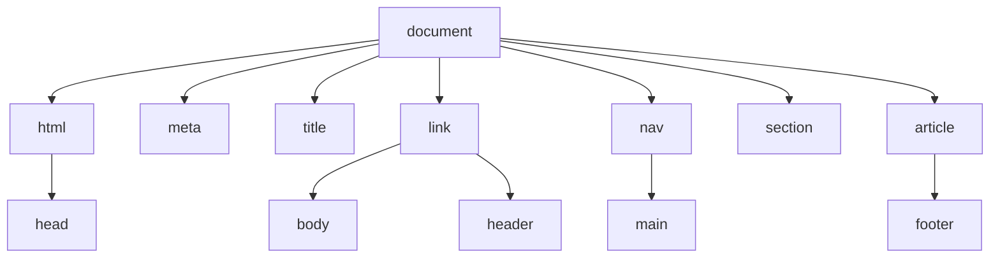
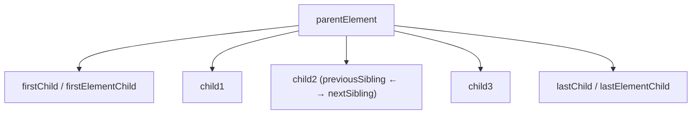
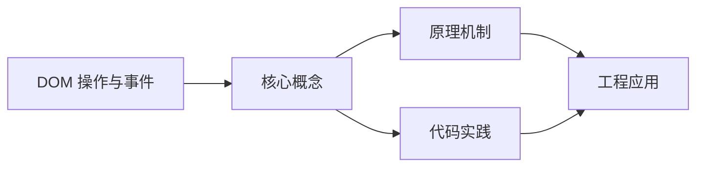
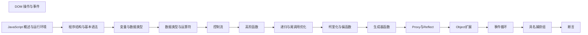

## 1. 学习目标（Bloom 分类）

本节按照布鲁姆教育目标分类学组织学习路径。本文主题为《DOM 操作与事件》，属于 JavaScript 模块，读者可以根据自身阶段选择阅读深度。

记忆层面：能够准确复述本文的核心概念、术语与基本语法或操作步骤，并能够在提问或检索时快速定位对应知识点。能够说出 JS 的变量、函数、对象、数组与 ES6+ 语法。

理解层面：能够用自己的语言解释核心原理与工作机制，说明概念之间的因果关系，而不是机械记忆结论。能够解释原型链、闭包、事件循环与 this 绑定。

应用层面：能够在真实项目或练习场景中运用本文知识解决具体问题，写出正确且可维护的实现。能够编写浏览器交互、Node 服务与工具脚本。

分析层面：能够拆解复杂问题，比较本文主题与相邻概念的异同，识别边界条件与例外情况。能够分析异步模型、作用域与内存泄漏。

评价层面：能够根据约束条件（性能、可读性、安全、成本）评价不同方案的优劣，做出有依据的技术决策。能够评价 JS 与 TypeScript、其他语言的差异。

创造层面：能够把本文知识与其他模块知识组合，设计出新的解决方案或可复用的工程模式。能够设计现代前端应用（框架 + 工程化）。

通过本节学习，读者应当能够把《DOM 操作与事件》纳入自己的知识网络，并与 JavaScript 模块的其他主题（原型链、事件循环、闭包、ES 规范）建立关联。

## 2. 历史动机与发展脉络

《DOM 操作与事件》是 JavaScript 领域的重要主题。要真正理解它，需要先了解它解决的问题与演进过程。

JavaScript 由 Brendan Eich 于 1995 年在 Netscape 用 10 天设计完成，最初只做表单校验；1996 年提交给 ECMA 标准化，即 ECMAScript。
ES6（2015）是语言转折点：let/const、箭头函数、class、Promise、模块化；此后每年发布新版本（ES2016+），现代语法在 Node 与浏览器快速普及。
运行时生态：V8（Chrome/Node）、SpiderMonkey（Firefox）、JavaScriptCore（Safari）；Node.js 与 Deno/Bun 让 JS 成为全栈语言；TypeScript 成为大型项目的事实标准。

回到本文主题：DOM 操作与事件 的提出与成熟，正是上述技术背景下的必然产物。早期实现往往以简单可用为目标，随着工程规模扩大，社区逐渐沉淀出标准做法与最佳实践；理解这一脉络，可以帮助读者判断“为什么文档中的推荐写法是现在这个样子”，也能在遇到历史遗留代码时准确识别其设计年代与取舍。


## 3. 形式化定义与核心概念精讲

本节把《DOM 操作与事件》涉及的核心概念以“定义 + 讲解”的形式展开。读者应把定义当作工具，把讲解当作理解路径；两者结合才能形成可迁移的知识。

原型链：对象通过 __proto__ 链接原型，属性查找沿链上行；ES6 class 是原型继承的语法糖。
闭包：函数捕获定义时的作用域，变量随函数存活；闭包是模块模式与柯里化的基础。
事件循环：调用栈、任务队列（宏任务）与微任务队列决定执行顺序；Promise 回调进微任务，setTimeout 进宏任务。

### 3.1 原文章节逐一精讲

原文档把主题拆分为 27 个小节，下面按顺序给出每一节的导读讲解，随后保留原文细节供精读。

#### 原文精读（完整保留）

# JavaScript DOM 操作与事件 API

> **符号约定**：`< >` 必填参数 | `[ ]` 可选参数

---

#### 1. DOM 基础 (DOM Basics)

##### 1.1 DOM 树结构

DOM（Document Object Model）把 HTML 文档表示为一棵节点树。浏览器解析 HTML 后，会构建如下结构：



每个 HTML 标签对应一个**元素节点**，标签内的文本对应**文本节点**。

##### 1.2 节点类型

DOM 中有 12 种节点类型，最常用的有：
| 节点类型 | `nodeType` 值 | 说明 | 示例 |
|:--|:--|:--|:--|
| `Element` | 1 | 元素节点 | `<div>`, `<p>` |
| `Text` | 3 | 文本节点 | 标签间的文字 |
| `Comment` | 8 | 注释节点 | `<!-- comment -->` |
| `Document` | 9 | 文档节点 | `document` |
| `DocumentType` | 10 | 文档类型 | `<!DOCTYPE html>` |
| `DocumentFragment` | 11 | 文档片段 | 轻量级容器 |

```js
const el = document.querySelector('div');
el.nodeType;
el.nodeName;
const text = el.firstChild;
text.nodeType;
text.nodeName;
```

##### 1.3 节点关系



**节点导航属性**：

```js
const el = document.querySelector('li');
el.parentNode;
el.parentElement;
el.childNodes;
el.children;
el.firstChild;
el.firstElementChild;
el.lastChild;
el.lastElementChild;
el.previousSibling;
el.previousElementSibling;
el.nextSibling;
el.nextElementSibling;
```

**`Node` vs `Element` 属性区别**：

- `childNodes` / `firstChild` / `nextSibling`：包含所有节点类型（文本、注释等）
- `children` / `firstElementChild` / `nextElementSibling`：只包含元素节点

```html
<ul id="list">
  <li>A</li>
  <li>B</li>
</ul>
```

```js
const list = document.getElementById('list');
list.childNodes.length;
list.children.length;
```

---

#### 2. 查询与遍历 (Query & Traverse)

##### 2.1 常用查询 API

```js
const app = document.getElementById('app');
const firstBtn = document.querySelector('button');
const items = document.querySelectorAll('.item');
```

| API                      | 返回类型         | 动态/静态 | 兼容性 |
| :----------------------- | :--------------- | :-------- | :----- |
| `getElementById`         | Element / null   | —         | IE6+   |
| `getElementsByClassName` | HTMLCollection   | 动态      | IE9+   |
| `getElementsByTagName`   | HTMLCollection   | 动态      | IE6+   |
| `querySelector`          | Element / null   | —         | IE8+   |
| `querySelectorAll`       | NodeList（静态） | 静态      | IE8+   |

##### 2.2 节点集合差异

- `NodeList` 可能是静态也可能是动态（取决于来源）
- `HTMLCollection` 通常是动态集合（会随 DOM 变化）

```js
const liveList = document.getElementsByClassName('item');
const staticList = document.querySelectorAll('.item');
document.body.append(document.createElement('div'));
liveList.length;
staticList.length;
```

工程实践里，若要数组方法：

```js
const arr = Array.from(document.querySelectorAll('.item'));
const arr2 = [...document.querySelectorAll('.item')];
```

##### 2.3 `closest()` 与 `matches()`

```js
const btn = document.querySelector('button');
btn.closest('.card');
btn.closest('.card').querySelector('.title');
btn.matches('.primary');
btn.matches('button');
```

- `closest(selector)`：从自身开始向上查找，返回最近的匹配祖先（或自身）
- `matches(selector)`：检查元素是否匹配选择器，返回 `boolean`

##### 2.4 遍历 DOM 树

```js
function walkDOM(node, callback) {
  callback(node);
  node = node.firstChild;
  while (node) {
    walkDOM(node, callback);
    node = node.nextSibling;
  }
}
walkDOM(document.body, (node) => {
  if (node.nodeType === 1) {
    console.log(node.tagName);
  }
});
```

---

#### 3. 创建与插入节点 (Create & Insert)

##### 3.1 创建元素与文本

```js
const li = document.createElement('li');
li.className = 'item';
li.textContent = 'hello';
const text = document.createTextNode('world');
```

优先使用 `textContent` 来设置文本，避免把不可信内容当作 HTML 解析。

##### 3.2 插入与移动

- `parent.append(child)`：追加（可追加多个参数）
- `parent.prepend(child)`：头部插入
- `node.before(x)` / `node.after(x)`：在节点前后插入
- `parent.replaceChild(newNode, oldNode)`：替换
- `node.replaceWith(newNode)`：替换自身
  节点插入时会发生"移动"，不会复制：

```js
const a = document.querySelector('#a');
const b = document.querySelector('#b');
const x = document.querySelector('#x');
b.append(x);
```

##### 3.3 复制节点

```js
const original = document.querySelector('.card');
const copy = original.cloneNode(true);
document.body.append(copy);
```

- `cloneNode(false)`（默认）：浅克隆，只复制元素本身
- `cloneNode(true)`：深克隆，复制元素及其所有子节点
  [警告] **注意**：克隆不会复制事件监听器和 `data-*` 属性中通过 JS 设置的值。

##### 3.4 删除节点

```js
const el = document.querySelector('.item');
el.remove();
const parent = document.querySelector('.list');
const child = parent.querySelector('.item');
parent.removeChild(child);
```

- `el.remove()`：现代 API，直接删除自身
- `parent.removeChild(child)`：经典 API，返回被删除的节点

##### 3.5 批量更新：DocumentFragment

批量创建并一次性插入可减少重排重绘：

```js
const frag = document.createDocumentFragment();
for (let i = 0; i < 1000; i++) {
  const div = document.createElement('div');
  div.textContent = String(i);
  frag.append(div);
}
document.body.append(frag);
```

Fragment 插入时，其子节点会被插入，Fragment 本身不会成为 DOM 的一部分。
**现代替代方案**：直接构建 HTML 字符串

```js
const html = Array.from({ length: 1000 }, (_, i) => `<div>${i}</div>`).join('');
container.innerHTML = html;
```

#### 在大量简单元素场景下，`innerHTML` 可能比逐个 `createElement` 更快，但需注意 XSS 风险。

#### 4. 属性操作 (Attribute Operations)

##### 4.1 HTML 属性 vs DOM 属性

```html
<input id="name" type="text" value="hello" class="input-field" data-role="username" />
```

```js
const input = document.getElementById('name');
input.getAttribute('type');
input.getAttribute('value');
input.getAttribute('class');
input.type;
input.value;
input.className;
```

**关键区别**：
| 对比项 | HTML 属性 (`getAttribute`) | DOM 属性 (`obj.prop`) |
|:--|:--|:--|
| 来源 | HTML 标签上的属性 | DOM 对象的属性 |
| 值类型 | 始终是字符串 | 可以是任意类型 |
| 同步性 | 初始值，不随用户输入变化 | 实时值（如 `input.value`） |
| 自定义属性 | `getAttribute('data-x')` | `dataset.x` |

```js
input.value = 'changed';
input.getAttribute('value');
input.value;
input.setAttribute('value', 'new default');
input.getAttribute('value');
```

##### 4.2 `setAttribute` / `getAttribute` / `removeAttribute`

```js
const img = document.querySelector('img');
img.setAttribute('src', 'photo.jpg');
img.setAttribute('alt', 'A photo');
img.getAttribute('src');
img.removeAttribute('alt');
img.hasAttribute('alt');
```

##### 4.3 `dataset`（自定义数据属性）

```html
<div id="user" data-user-id="42" data-role="admin" data-last-login="2026-01-01">User Info</div>
```

```js
const el = document.getElementById('user');
el.dataset.userId;
el.dataset.role;
el.dataset.lastLogin;
el.dataset.status = 'active';
el.dataset.newField = 'value';
```

**命名规则**：

- HTML 中 `data-user-id` → JS 中 `dataset.userId`（短横线转驼峰）
- `dataset` 的值始终是字符串
- 设置新属性时驼峰会自动转为短横线

##### 4.4 布尔属性

```html
<input type="checkbox" checked disabled /> <button disabled>Click</button>
```

```js
const checkbox = document.querySelector('input[type="checkbox"]');
checkbox.hasAttribute('checked');
checkbox.checked;
checkbox.getAttribute('checked');
checkbox.checked = checkbox.setAttribute('checked', '');
```

#### 布尔属性（`checked`、`disabled`、`selected`、`readonly`）推荐使用 DOM 属性而非 `setAttribute`。

#### 5. 样式操作 (Style Operations)

##### 5.1 `style` 属性（行内样式）

```js
const el = document.querySelector('.box');
el.style.width = '200px';
el.style.backgroundColor = 'red';
el.style.fontSize = '16px';
el.style.display = 'none';
el.style.display = '';
```

**注意**：

- `style` 只能读写行内样式，无法获取 CSS 类或 `<style>` 中的样式
- CSS 属性名需转为驼峰：`background-color` → `backgroundColor`
- 设置空字符串 `''` 可移除行内样式

##### 5.2 `classList`（类名操作）

```js
const el = document.querySelector('.box');
el.classList.add('active');
el.classList.remove('hidden');
el.classList.toggle('dark-mode');
el.classList.toggle('visible', window.innerWidth > 768);
el.classList.contains('active');
el.classList.replace('old-class', 'new-class');
el.className = 'box active dark-mode';
```

| 方法                    | 说明                                       |
| :---------------------- | :----------------------------------------- |
| `add(...tokens)`        | 添加一个或多个类名                         |
| `remove(...tokens)`     | 移除一个或多个类名                         |
| `toggle(token, force?)` | 切换类名，`force` 为 `` 添加，`false` 移除 |
| `contains(token)`       | 是否包含指定类名                           |
| `replace(old, new)`     | 替换类名                                   |

**`className` vs `classList`**：

```js
el.className = 'box active';
el.className += ' dark-mode';
el.classList.add('active', 'dark-mode');
```

推荐使用 `classList`，语义更清晰且不会意外覆盖已有类名。

##### 5.3 `getComputedStyle`（计算样式）

获取元素最终应用的样式（包括 CSS 继承、层叠、默认值）：

```js
const el = document.querySelector('.box');
const styles = window.getComputedStyle(el);
styles.width;
styles.height;
styles.backgroundColor;
styles.fontSize;
styles.marginTop;
styles.getPropertyValue('margin-top');
```

**注意**：

- 返回的是**只读**的 `CSSStyleDeclaration` 对象
- 返回的值是**计算值**（如 `font-size: 2em` 可能返回 `32px`）
- 简写属性（如 `margin`）可能返回空字符串，需查具体子属性（如 `marginTop`）

##### 5.4 获取元素尺寸与位置

```js
const el = document.querySelector('.box');
el.offsetWidth;
el.offsetHeight;
el.clientWidth;
el.clientHeight;
el.scrollWidth;
el.scrollHeight;
el.offsetTop;
el.offsetLeft;
el.offsetParent;
el.scrollTop;
el.scrollLeft;
```

**尺寸属性对比**：
| 属性 | 包含 padding | 包含 border | 包含 scrollbar | 包含溢出内容 |
|:--|:--|:--|:--|:--|
| `clientWidth/Height` | [完成] | [错误] | [错误] | [错误] |
| `offsetWidth/Height` | [完成] | [完成] | [完成] | [错误] |
| `scrollWidth/Height` | [完成] | [错误] | [错误] | [完成] |
**获取精确位置**：

```js
const rect = el.getBoundingClientRect();
rect.top;
rect.right;
rect.bottom;
rect.left;
rect.width;
rect.height;
rect.x;
rect.y;
```

#### `getBoundingClientRect()` 返回相对于**视口**的位置，随滚动变化。

#### 6. 事件系统 (Events)

##### 6.1 监听与移除

```js
function onClick(e) {
  console.log('clicked', e.target);
}
const btn = document.querySelector('#btn');
btn.addEventListener('click', onClick);
btn.removeEventListener('click', onClick);
```

移除监听必须使用同一个函数引用，因此匿名函数不便于移除。
**`addEventListener` 第三个参数**：

```js
btn.addEventListener('click', handler, {
  capture: false,
  once: true,
  passive: True,
});
```

| 选项      | 说明                                                        |
| :-------- | :---------------------------------------------------------- |
| `capture` | 在捕获阶段触发（默认 `false`，冒泡阶段）                    |
| `once`    | 触发一次后自动移除（默认 `false`）                          |
| `passive` | 声明不会调用 `preventDefault`，优化滚动性能（默认 `false`） |

##### 6.2 捕获与冒泡

DOM 事件传播的三个阶段：

```
 1. 捕获阶段（Capture）：window → document → ... → 目标父元素
 2. 目标阶段（Target）：目标元素本身
 3. 冒泡阶段（Bubble）：目标父元素 → ... → document → window
```

```html
<div id="outer">
  <div id="inner">
    <button id="btn">Click</button>
  </div>
</div>
```

```js
document.getElementById('outer').addEventListener(
  'click',
  (e) => {
    console.log('outer capture', e.eventPhase);
  },
  true
);
document.getElementById('outer').addEventListener('click', (e) => {
  console.log('outer bubble', e.eventPhase);
});
document.getElementById('inner').addEventListener(
  'click',
  (e) => {
    console.log('inner capture', e.eventPhase);
  },
  true
);
document.getElementById('inner').addEventListener('click', (e) => {
  console.log('inner bubble', e.eventPhase);
});
document.getElementById('btn').addEventListener('click', (e) => {
  console.log('btn target', e.eventPhase);
});
```

点击按钮后输出顺序：

```
 outer capture 1
 inner capture 1
 btn target 2
 inner bubble 3
 outer bubble 3
```

**`eventPhase` 值**：1 = 捕获，2 = 目标，3 = 冒泡

##### 6.3 事件对象常用属性与方法

```js
btn.addEventListener('click', (e) => {
  e.target;
  e.currentTarget;
  e.type;
  e.bubbles;
  e.cancelable;
  e.timeStamp;
  e.isTrusted;
  e.preventDefault();
  e.stopPropagation();
  e.stopImmediatePropagation();
});
```

| 属性/方法                    | 说明                                 |
| :--------------------------- | :----------------------------------- |
| `target`                     | 触发事件的元素（最内层）             |
| `currentTarget`              | 绑定事件监听的元素（等于 `this`）    |
| `preventDefault()`           | 阻止默认行为（如表单提交、链接跳转） |
| `stopPropagation()`          | 阻止事件继续传播（捕获/冒泡）        |
| `stopImmediatePropagation()` | 阻止传播 + 阻止同元素上的后续监听器  |

##### 6.4 事件委托 (Event Delegation)

当列表项动态增删时，把监听挂在父元素上更稳：

```js
const list = document.querySelector('#list');
list.addEventListener('click', (e) => {
  const item = e.target.closest('.item');
  if (!item) return;
  console.log('item clicked', item.dataset.id);
});
```

**事件委托的优势**：

1. **减少内存**：不需要为每个子元素绑定监听器
2. **动态元素**：新增子元素自动拥有事件处理
3. **统一管理**：代码更集中、更易维护
   **适用场景**：

```js
document.addEventListener('click', (e) => {
  if (e.target.matches('.modal-overlay')) {
    closeModal();
  }
});
document.addEventListener('keydown', (e) => {
  if (e.key === 'Escape') {
    closeModal();
  }
});
```

**不适合委托的场景**：

- `focus`/`blur` 事件（不冒泡，需用 `focusin`/`focusout` 替代）
- `mousemove`/`touchmove` 等高频事件（委托反而增加判断开销）
- 需要精确 `currentTarget` 的场景

##### 6.5 自定义事件

```js
 const event = new CustomEvent('userLogin', {
  bubbles: true,
  detail: { userId: 42, username: 'alice' }
 }
 document.dispatchEvent(event)
 document.addEventListener('userLogin', (e) => {
  console.log('User logged in:', e.detail.username)
 }
```

**应用场景**：

```js
class TodoList extends HTMLElement {
  addTodo(text) {
    const todo = { id: Date.now(), text };
    this.dispatchEvent(
      new CustomEvent('todo-added', {
        bubbles: true,
        detail: todo,
      })
    );
  }
}
document.querySelector('todo-list').addEventListener('todo-added', (e) => {
  console.log('New todo:', e.detail.text);
});
```

##### 6.6 常用事件类型汇总

| 分类 | 事件                                                     | 说明     |
| :--- | :------------------------------------------------------- | :------- |
| 鼠标 | `click`, `dblclick`, `mousedown`, `mouseup`, `mousemove` | 鼠标交互 |
| 鼠标 | `mouseenter`, `mouseleave`, `mouseover`, `mouseout`      | 鼠标悬停 |
| 键盘 | `keydown`, `keyup`, `keypress`(已废弃)                   | 键盘输入 |
| 表单 | `input`, `change`, `submit`, `focus`, `blur`             | 表单交互 |
| 滚动 | `scroll`, `wheel`                                        | 滚动行为 |
| 触摸 | `touchstart`, `touchmove`, `touchend`                    | 移动端   |
| 拖拽 | `dragstart`, `drag`, `dragend`, `drop`                   | 拖放操作 |
| 资源 | `load`, `error`, `DOMContentLoaded`                      | 资源加载 |
| 视口 | `resize`, `scroll`, `visibilitychange`                   | 视口变化 |

---

#### 7. 性能优化 (Performance)

##### 7.1 避免布局抖动 (Layout Thrashing)

读布局信息（如 `offsetHeight`）会触发布局计算；写样式会使布局失效。交替读写会导致反复布局。

```js
const items = document.querySelectorAll('.item');
items.forEach((item) => {
  const height = item.offsetHeight;
  item.style.height = height * 2 + 'px';
});
```

优化：批量读取，再批量写入：

```js
const items = document.querySelectorAll('.item');
const heights = Array.from(items, (item) => item.offsetHeight);
items.forEach((item, i) => {
  item.style.height = heights[i] * 2 + 'px';
});
```

或使用 `requestAnimationFrame`：

```js
function updateLayout() {
  const height = el.offsetHeight;
  requestAnimationFrame(() => {
    el.style.height = height * 2 + 'px';
  });
}
```

##### 7.2 `innerHTML` 的取舍

- 优点：构建复杂结构时省代码
- 风险：容易引入 XSS；会重建子树导致事件丢失
  当内容来自不可信输入时，不要直接拼接 `innerHTML`。

##### 7.3 DocumentFragment 与批量操作

```js
const frag = document.createDocumentFragment();
for (let i = 0; i < 100; i++) {
  const li = document.createElement('li');
  li.textContent = `Item ${i}`;
  frag.append(li);
}
list.append(frag);
```

Fragment 的优势：

- 不触发重排（不在 DOM 中）
- 插入时 Fragment 自身不进入 DOM 树
- 一次重排代替 N 次重排

##### 7.4 事件节流与防抖

高频事件（`scroll`、`resize`、`input`、`mousemove`）需要节流或防抖：

```js
function debounce(fn, delay) {
  let timer = null;
  return function (...args) {
    clearTimeout(timer);
    timer = setTimeout(() => fn.apply(this, args), delay);
  };
}
function throttle(fn, interval) {
  let lastTime = 0;
  return function (...args) {
    const now = Date.now();
    if (now - lastTime >= interval) {
      lastTime = now;
      fn.apply(this, args);
    }
  };
}
window.addEventListener(
  'resize',
  debounce(() => {
    console.log('Resized:', window.innerWidth);
  }, 200)
);
window.addEventListener(
  'scroll',
  throttle(() => {
    console.log('Scrolled:', window.scrollY);
  }, 100)
);
```

**防抖 vs 节流**：
| 对比项 | 防抖 (Debounce) | 节流 (Throttle) |
|:--|:--|:--|
| 触发时机 | 停止操作后延迟触发 | 按固定间隔触发 |
| 类比 | 电梯等人 | 红绿灯 |
| 适用场景 | 搜索输入、窗口调整 | 滚动事件、拖拽 |

##### 7.5 虚拟 DOM 概念

直接操作 DOM 的代价高（重排重绘），现代框架引入虚拟 DOM 来优化：

```js
const vnode = {
  tag: 'div',
  props: { className: 'container' },
  children: [
    { tag: 'h1', children: 'Hello' },
    { tag: 'p', children: 'World' },
  ],
};
```

**虚拟 DOM 的工作流程**：

1. 用 JS 对象描述 UI 结构（虚拟 DOM 树）
2. 状态变化时，创建新的虚拟 DOM 树
3. Diff 算法比较新旧虚拟 DOM 树差异
4. 只将差异部分更新到真实 DOM（最小化 DOM 操作）
   **虚拟 DOM 的优势**：

- 批量更新：多次状态变更合并为一次 DOM 更新
- 最小化操作：只更新变化的部分
- 跨平台：虚拟 DOM 可以渲染到不同目标（DOM、Canvas、Native）
  **何时直接操作 DOM**：
- 简单交互（不需要框架时）
- 性能极端敏感的场景（如动画、Canvas）
- 与框架配合的底层操作（如 D3.js 与 React 结合）

##### 7.6 `passive` 事件监听器

```js
 document.addEventListener('touchstart', handler, { passive:  })
 document.addEventListener('wheel', handler, { passive:  })
```

`passive: ` 告诉浏览器该监听器不会调用 `preventDefault()`，浏览器可以立即开始滚动而不必等待 JS 执行完毕。
Chrome 对 `touchstart`/`touchmove` 默认使用 passive 监听器。

---

#### 8. 安全要点 (Security)

##### 8.1 XSS 防护

- 不可信文本：用 `textContent`

```js
const userInput = '';
el.textContent = userInput;
el.innerHTML = userInput;
```

- 不可信 URL：校验协议（避免 `javascript:`）、限制域名

```js
function isSafeUrl(url) {
  try {
    const parsed = new URL(url, location.href);
    return ['http:', 'https:'].includes(parsed.protocol);
  } catch {
    return false;
  }
}
```

##### 8.2 `innerHTML` 安全

```js
const name = getUserInput();
el.innerHTML = `<p>Hello, ${name}</p>`;
```

**安全替代方案**：

```js
const p = document.createElement('p');
p.textContent = `Hello, ${name}`;
el.append(p);
```

或使用 `DOMPurify` 库：

```js
import DOMPurify from 'dompurify';
el.innerHTML = DOMPurify.sanitize(untrustedHtml);
```

##### 8.3 事件监听器泄漏

```js
class Modal {
  constructor() {
    this.onKeydown = this.onKeydown.bind(this);
  }
  open() {
    document.addEventListener('keydown', this.onKeydown);
  }
  close() {
    document.removeEventListener('keydown', this.onKeydown);
  }
  onKeydown(e) {
    if (e.key === 'Escape') this.close();
  }
}
```

**常见泄漏场景**：

- SPA 路由切换时未移除全局事件监听
- 组件销毁时未清理 `setInterval`/`setTimeout`
- 闭包引用了已移除的 DOM 节点

##### 8.4 模板渲染安全

优先使用成熟框架或做统一的转义/白名单策略：

```js
function escapeHtml(str) {
  const map = { '&': '&amp;', '<': '&lt;', '>': '&gt;', '"': '&quot;', "'": '&#39;' };
  return str.replace(/[&<>"']/g, (c) => map[c]);
}
el.innerHTML = `<p>${escapeHtml(userInput)}</p>`;
```

---

#### 节点获取

**基本写法：getElementById**
`document.getElementById(<id>)`
```javascript
// 通过 ID 获取单个元素
let el = document.getElementById("app");
```

---

**基本写法：querySelector**
`document.querySelector(<选择器>)`
```javascript
// 通过 CSS 选择器获取首个匹配元素
let el = document.querySelector(".item");
```

---

**基本写法：querySelectorAll**
`document.querySelectorAll(<选择器>)`
```javascript
// 获取所有匹配元素返回 NodeList
let els = document.querySelectorAll(".item");
```

---

#### 节点创建

**基本写法：createElement**
`document.createElement(<标签名>)`
```javascript
// 创建元素节点
let div = document.createElement("div");
```

---

**基本写法：createTextNode**
`document.createTextNode(<文本>)`
```javascript
// 创建文本节点
let text = document.createTextNode("hello");
```

---

**基本写法：DocumentFragment 批量插入**
`document.createDocumentFragment()`
```javascript
// 使用片段批量插入减少重排
let frag = document.createDocumentFragment();
items.forEach(item => {
    let li = document.createElement("li");
    li.textContent = item;
    frag.appendChild(li);
});
list.appendChild(frag);
```

---

#### 节点插入与删除

**基本写法：appendChild**
`<父节点>.appendChild(<节点>)`
```javascript
// 在末尾追加子节点
document.body.appendChild(div);
```

---

**基本写法：insertBefore**
`<父节点>.insertBefore(<新节点>, <参考节点>)`
```javascript
// 在参考节点前插入
parent.insertBefore(newNode, refNode);
```

---

**基本写法：removeChild**
`<父节点>.removeChild(<节点>)`
```javascript
// 移除子节点
parent.removeChild(child);
```

---

**基本写法：replaceChild**
`<父节点>.replaceChild(<新节点>, <旧节点>)`
```javascript
// 替换子节点
parent.replaceChild(newNode, oldNode);
```

---

#### 现代节点 API

**基本写法：append**
`<父节点>.append(<节点或文本>)`
```javascript
// 追加多个节点或文本字符串
parent.append(node1, "text", node2);
```

---

**基本写法：prepend**
`<父节点>.prepend(<节点或文本>)`
```javascript
// 在开头插入
parent.prepend(newNode);
```

---

**基本写法：before 与 after**
`<节点>.before(<节点>)`
```javascript
// 在节点前或后插入兄弟节点
el.before(newNode);
el.after(anotherNode);
```

---

**基本写法：remove**
`<节点>.remove()`
```javascript
// 节点自移除
el.remove();
```

---

**基本写法：replaceWith**
`<节点>.replaceWith(<新节点>)`
```javascript
// 节点自替换
oldEl.replaceWith(newEl);
```

---

#### 属性操作

**基本写法：getAttribute setAttribute**
`<元素>.setAttribute(<名称>, <值>)`
```javascript
// 读写 HTML 属性
el.setAttribute("data-id", "1");
let id = el.getAttribute("data-id");
```

---

**基本写法：dataset 自定义属性**
`<元素>.dataset.<名称>`
```javascript
// 读写 data-* 自定义属性
el.dataset.userId = "42";
let id = el.dataset.userId;
```

---

**基本写法：hasAttribute removeAttribute**
`<元素>.removeAttribute(<名称>)`
```javascript
// 检查与移除属性
el.hasAttribute("disabled");
el.removeAttribute("disabled");
```

---

#### classList 操作

**基本写法：add remove**
`<元素>.classList.add(<类名>)`
```javascript
// 添加移除类名
el.classList.add("active");
el.classList.remove("hidden");
```

---

**基本写法：toggle**
`<元素>.classList.toggle(<类名>)`
```javascript
// 切换类名存在则移除否则添加
el.classList.toggle("open");
```

---

**基本写法：contains**
`<元素>.classList.contains(<类名>)`
```javascript
// 判断是否包含类名
if (el.classList.contains("active")) {}
```

---

#### 样式操作

**基本写法：内联样式**
`<元素>.style.<属性> = <值>`
```javascript
// 读写内联样式需用驼峰命名
el.style.backgroundColor = "#fff";
```

---

**基本写法：getComputedStyle**
`window.getComputedStyle(<元素>)`
```javascript
// 获取最终计算样式
let style = window.getComputedStyle(el);
let color = style.color;
```

---

**基本写法：cssText 批量设置**
`<元素>.style.cssText = "<样式字符串>"`
```javascript
// 批量设置内联样式
el.style.cssText = "color:red;font-size:14px;";
```

---

#### 事件绑定

**基本写法：addEventListener**
`<元素>.addEventListener(<事件>, <回调>, [<选项>])`
```javascript
// 添加事件监听器
el.addEventListener("click", e => {});
```

---

**基本写法：removeEventListener**
`<元素>.removeEventListener(<事件>, <回调>)`
```javascript
// 移除事件监听需同一回调引用
el.removeEventListener("click", handler);
```

---

**基本写法：once 选项**
`<元素>.addEventListener(<事件>, <回调>, { once: true })`
```javascript
// once 表示只触发一次后自动移除
el.addEventListener("click", fn, { once: true });
```

---

**基本写法：capture 捕获阶段**
`<元素>.addEventListener(<事件>, <回调>, { capture: true })`
```javascript
// 在捕获阶段触发
el.addEventListener("click", fn, { capture: true });
```

---

**基本写法：passive 提升滚动性能**
`<元素>.addEventListener(<事件>, <回调>, { passive: true })`
```javascript
// passive 声明不调用 preventDefault 优化滚动
window.addEventListener("touchmove", fn, { passive: true });
```

---

#### 事件对象

**基本写法：preventDefault**
`<事件>.preventDefault()`
```javascript
// 阻止默认行为如表单提交链接跳转
a.addEventListener("click", e => e.preventDefault());
```

---

**基本写法：stopPropagation**
`<事件>.stopPropagation()`
```javascript
// 阻止事件冒泡
el.addEventListener("click", e => e.stopPropagation());
```

---

**基本写法：stopImmediatePropagation**
`<事件>.stopImmediatePropagation()`
```javascript
// 阻止冒泡并阻止同元素其他监听器
el.addEventListener("click", e => e.stopImmediatePropagation());
```

---

#### 事件委托

**基本写法：事件委托模式**
`<父节点>.addEventListener(<事件>, <回调>)`
```javascript
// 利用冒泡在父节点统一处理
list.addEventListener("click", e => {
    let item = e.target.closest(".item");
    if (item) handle(item);
});
```

---

**基本写法：closest 匹配祖先**
`<元素>.closest(<选择器>)`
```javascript
// 从当前元素向上查找匹配选择器的最近祖先
let card = e.target.closest(".card");
```

---

#### 自定义事件

**基本写法：CustomEvent**
`new CustomEvent(<名称>, { detail: <数据> })`
```javascript
// 创建带数据的自定义事件
let evt = new CustomEvent("login", { detail: { user: "Tom" } });
el.dispatchEvent(evt);
```

---

**基本写法：dispatchEvent**
`<元素>.dispatchEvent(<事件>)`
```javascript
// 同步派发事件触发监听器
el.dispatchEvent(new Event("ready"));
```

---

#### 遍历与查找

**基本写法：parentNode parentElement**
`<元素>.parentElement`
```javascript
// 获取父节点
let parent = el.parentElement;
```

---

**基本写法：children childNodes**
`<元素>.children`
```javascript
// children 返回元素集合 childNodes 含文本节点
let kids = el.children;
```

---

**基本写法：nextElementSibling**
`<元素>.nextElementSibling`
```javascript
// 获取下一个兄弟元素节点
let next = el.nextElementSibling;
```

---

#### MutationObserver

**基本写法：观察 DOM 变化**
`new MutationObserver(<回调>)`
```javascript
// 监听子节点属性变化
let observer = new MutationObserver(muts => {});
observer.observe(el, { childList: true, subtree: true });
```

---

**基本写法：disconnect 断开**
`<observer>.disconnect()`
```javascript
// 停止观察
observer.disconnect();
```

---

#### IntersectionObserver

**基本写法：可见性观察**
`new IntersectionObserver(<回调>, [<选项>])`
```javascript
// 监听元素进入视口用于懒加载
let io = new IntersectionObserver(entries => {
    entries.forEach(e => {
        if (e.isIntersecting) loadImage(e.target);
    });
});
io.observe(img);
```

---

**基本写法：rootMargin**
`new IntersectionObserver(<回调>, { rootMargin: "<边距>" })`
```javascript
// 提前预加载设置根边距
let io = new IntersectionObserver(fn, { rootMargin: "100px" });
```

---

#### ResizeObserver

**基本写法：尺寸变化观察**
`new ResizeObserver(<回调>)`
```javascript
// 监听元素尺寸变化
let ro = new ResizeObserver(entries => {
    entries.forEach(e => console.log(e.contentRect.width));
});
ro.observe(el);
```

---

#### 实用模式

**基本写法：事件委托结合 dataset**
`<父节点>.addEventListener(<事件>, <回调>)`
```javascript
// 通过 dataset 传递上下文数据
list.addEventListener("click", e => {
    let item = e.target.closest("[data-id]");
    if (item) console.log(item.dataset.id);
});
```

---

**基本写法：批量绑定事件**
`<元素列表>.forEach(<元素> => <元素>.addEventListener(<事件>, <回调>))`
```javascript
// 为多个元素绑定相同事件
document.querySelectorAll(".btn")
    .forEach(btn => btn.addEventListener("click", onClick));
```


### 3.2 概念关系图

下面用 Mermaid 图表达本文核心概念之间的关系，帮助读者建立整体图景：



图中展示的是本文知识的结构化关系：核心概念是入口，原理机制解释“为什么”，代码实践演示“怎么做”，工程应用回答“何时用”。读者学习时可以把每个小节的内容挂接到对应节点上。

## 4. 理论推导与原理解析

本节深入《DOM 操作与事件》背后的原理。理论部分不求面面俱到，而是聚焦“能解释现象、能指导实践”的关键推导。

原型链：对象通过 __proto__ 链接原型，属性查找沿链上行；ES6 class 是原型继承的语法糖。
闭包：函数捕获定义时的作用域，变量随函数存活；闭包是模块模式与柯里化的基础。
事件循环：调用栈、任务队列（宏任务）与微任务队列决定执行顺序；Promise 回调进微任务，setTimeout 进宏任务。
this 绑定：默认绑定、隐式绑定、显式绑定（call/apply/bind）与箭头函数词法绑定四种规则。

需要强调的是，理论推导与工程实践之间存在翻译层：理论给出的是理想化模型与边界条件，工程代码则必须处理真实环境中的例外。读者在学习时应先掌握理论的“标准情形”，再通过陷阱章节了解“非标准情形”。

## 5. 代码示例与逐行讲解

本节把原文中的代码示例系统整理，并为每个示例补充用途说明与讲解。读者不应只浏览代码，而应逐段对照讲解理解设计意图。

### 5.1 示例：1.1 DOM 树结构

该示例来自原文《1.1 DOM 树结构》小节，用于演示DOM 操作与事件相关操作。阅读时请先看代码结构，再看其后的讲解。


讲解：这段代码演示了本节核心知识点。代码中的关键操作可以归纳为三步：准备（定义或初始化）、执行（核心逻辑）、收尾（释放资源或返回结果）。实际项目中，这三步往往被封装为函数或类，以提升复用性与可测试性。

关键点分析：

该示例共 26 行有效代码，结构以数据或配置为主。阅读时应关注：数据字段的含义、配置项的作用，以及它们与运行行为的对应关系。

进阶思考路径：先尝试修改参数观察行为变化，再把示例中的模式迁移到自己的项目中；每次修改都记录预期与实测差异，这是把示例转化为能力的最快方式。

### 5.2 示例：1.2 节点类型

该示例来自原文《1.2 节点类型》小节，用于演示DOM 操作与事件相关操作。阅读时请先看代码结构，再看其后的讲解。

```js
const el = document.querySelector('div');
el.nodeType;
el.nodeName;
const text = el.firstChild;
text.nodeType;
text.nodeName;
```

讲解：这段代码演示了本节核心知识点。代码中的关键操作可以归纳为三步：准备（定义或初始化）、执行（核心逻辑）、收尾（释放资源或返回结果）。实际项目中，这三步往往被封装为函数或类，以提升复用性与可测试性。

关键点分析：

该示例共 6 行有效代码，结构以数据或配置为主。阅读时应关注：数据字段的含义、配置项的作用，以及它们与运行行为的对应关系。

进阶思考路径：先尝试修改参数观察行为变化，再把示例中的模式迁移到自己的项目中；每次修改都记录预期与实测差异，这是把示例转化为能力的最快方式。

### 5.3 示例：1.3 节点关系

该示例来自原文《1.3 节点关系》小节，用于演示DOM 操作与事件相关操作。阅读时请先看代码结构，再看其后的讲解。


讲解：这段代码演示了本节核心知识点。代码中的关键操作可以归纳为三步：准备（定义或初始化）、执行（核心逻辑）、收尾（释放资源或返回结果）。实际项目中，这三步往往被封装为函数或类，以提升复用性与可测试性。

关键点分析：

该示例共 12 行有效代码，结构以数据或配置为主。阅读时应关注：数据字段的含义、配置项的作用，以及它们与运行行为的对应关系。

进阶思考路径：先尝试修改参数观察行为变化，再把示例中的模式迁移到自己的项目中；每次修改都记录预期与实测差异，这是把示例转化为能力的最快方式。

### 5.4 示例：1.3 节点关系

该示例来自原文《1.3 节点关系》小节，用于演示DOM 操作与事件相关操作。阅读时请先看代码结构，再看其后的讲解。

```js
const el = document.querySelector('li');
el.parentNode;
el.parentElement;
el.childNodes;
el.children;
el.firstChild;
el.firstElementChild;
el.lastChild;
el.lastElementChild;
el.previousSibling;
el.previousElementSibling;
el.nextSibling;
el.nextElementSibling;
```

讲解：这段代码演示了本节核心知识点。代码中的关键操作可以归纳为三步：准备（定义或初始化）、执行（核心逻辑）、收尾（释放资源或返回结果）。实际项目中，这三步往往被封装为函数或类，以提升复用性与可测试性。

关键点分析：

该示例共 13 行有效代码，结构以数据或配置为主。阅读时应关注：数据字段的含义、配置项的作用，以及它们与运行行为的对应关系。

进阶思考路径：先尝试修改参数观察行为变化，再把示例中的模式迁移到自己的项目中；每次修改都记录预期与实测差异，这是把示例转化为能力的最快方式。

### 5.5 示例：1.3 节点关系

该示例来自原文《1.3 节点关系》小节，用于演示DOM 操作与事件相关操作。阅读时请先看代码结构，再看其后的讲解。

```html
<ul id="list">
  <li>A</li>
  <li>B</li>
</ul>
```

讲解：这段代码演示了本节核心知识点。代码中的关键操作可以归纳为三步：准备（定义或初始化）、执行（核心逻辑）、收尾（释放资源或返回结果）。实际项目中，这三步往往被封装为函数或类，以提升复用性与可测试性。

关键点分析：

该示例共 4 行有效代码，结构以数据或配置为主。阅读时应关注：数据字段的含义、配置项的作用，以及它们与运行行为的对应关系。

进阶思考路径：先尝试修改参数观察行为变化，再把示例中的模式迁移到自己的项目中；每次修改都记录预期与实测差异，这是把示例转化为能力的最快方式。

### 5.6 示例：1.3 节点关系

该示例来自原文《1.3 节点关系》小节，用于演示DOM 操作与事件相关操作。阅读时请先看代码结构，再看其后的讲解。

```js
const list = document.getElementById('list');
list.childNodes.length;
list.children.length;
```

讲解：这段代码演示了本节核心知识点。代码中的关键操作可以归纳为三步：准备（定义或初始化）、执行（核心逻辑）、收尾（释放资源或返回结果）。实际项目中，这三步往往被封装为函数或类，以提升复用性与可测试性。

关键点分析：

该示例共 3 行有效代码，结构以数据或配置为主。阅读时应关注：数据字段的含义、配置项的作用，以及它们与运行行为的对应关系。

进阶思考路径：先尝试修改参数观察行为变化，再把示例中的模式迁移到自己的项目中；每次修改都记录预期与实测差异，这是把示例转化为能力的最快方式。

### 5.7 示例：2.1 常用查询 API

该示例来自原文《2.1 常用查询 API》小节，用于演示DOM 操作与事件相关操作。阅读时请先看代码结构，再看其后的讲解。

```js
const app = document.getElementById('app');
const firstBtn = document.querySelector('button');
const items = document.querySelectorAll('.item');
```

讲解：这段代码演示了本节核心知识点。代码中的关键操作可以归纳为三步：准备（定义或初始化）、执行（核心逻辑）、收尾（释放资源或返回结果）。实际项目中，这三步往往被封装为函数或类，以提升复用性与可测试性。

关键点分析：

该示例共 3 行有效代码，结构以数据或配置为主。阅读时应关注：数据字段的含义、配置项的作用，以及它们与运行行为的对应关系。

进阶思考路径：先尝试修改参数观察行为变化，再把示例中的模式迁移到自己的项目中；每次修改都记录预期与实测差异，这是把示例转化为能力的最快方式。

### 5.8 示例：2.2 节点集合差异

该示例来自原文《2.2 节点集合差异》小节，用于演示DOM 操作与事件相关操作。阅读时请先看代码结构，再看其后的讲解。

```js
const liveList = document.getElementsByClassName('item');
const staticList = document.querySelectorAll('.item');
document.body.append(document.createElement('div'));
liveList.length;
staticList.length;
```

讲解：这段代码演示了本节核心知识点。代码中的关键操作可以归纳为三步：准备（定义或初始化）、执行（核心逻辑）、收尾（释放资源或返回结果）。实际项目中，这三步往往被封装为函数或类，以提升复用性与可测试性。

关键点分析：

该示例共 5 行有效代码，结构以数据或配置为主。阅读时应关注：数据字段的含义、配置项的作用，以及它们与运行行为的对应关系。

进阶思考路径：先尝试修改参数观察行为变化，再把示例中的模式迁移到自己的项目中；每次修改都记录预期与实测差异，这是把示例转化为能力的最快方式。

### 5.9 示例：2.2 节点集合差异

该示例来自原文《2.2 节点集合差异》小节，用于演示DOM 操作与事件相关操作。阅读时请先看代码结构，再看其后的讲解。

```js
const arr = Array.from(document.querySelectorAll('.item'));
const arr2 = [...document.querySelectorAll('.item')];
```

讲解：这段代码演示了本节核心知识点。代码中的关键操作可以归纳为三步：准备（定义或初始化）、执行（核心逻辑）、收尾（释放资源或返回结果）。实际项目中，这三步往往被封装为函数或类，以提升复用性与可测试性。

关键点分析：

该示例共 2 行有效代码，结构以数据或配置为主。阅读时应关注：数据字段的含义、配置项的作用，以及它们与运行行为的对应关系。

进阶思考路径：先尝试修改参数观察行为变化，再把示例中的模式迁移到自己的项目中；每次修改都记录预期与实测差异，这是把示例转化为能力的最快方式。

### 5.10 示例：2.3 `closest()` 与 `matches()`

该示例来自原文《2.3 `closest()` 与 `matches()`》小节，用于演示DOM 操作与事件相关操作。阅读时请先看代码结构，再看其后的讲解。

```js
const btn = document.querySelector('button');
btn.closest('.card');
btn.closest('.card').querySelector('.title');
btn.matches('.primary');
btn.matches('button');
```

讲解：这段代码演示了本节核心知识点。代码中的关键操作可以归纳为三步：准备（定义或初始化）、执行（核心逻辑）、收尾（释放资源或返回结果）。实际项目中，这三步往往被封装为函数或类，以提升复用性与可测试性。

关键点分析：

该示例共 5 行有效代码，结构以数据或配置为主。阅读时应关注：数据字段的含义、配置项的作用，以及它们与运行行为的对应关系。

进阶思考路径：先尝试修改参数观察行为变化，再把示例中的模式迁移到自己的项目中；每次修改都记录预期与实测差异，这是把示例转化为能力的最快方式。

### 5.11 示例：2.4 遍历 DOM 树

该示例来自原文《2.4 遍历 DOM 树》小节，用于演示DOM 操作与事件相关操作。阅读时请先看代码结构，再看其后的讲解。

```js
function walkDOM(node, callback) {
  callback(node);
  node = node.firstChild;
  while (node) {
    walkDOM(node, callback);
    node = node.nextSibling;
  }
}
walkDOM(document.body, (node) => {
  if (node.nodeType === 1) {
    console.log(node.tagName);
  }
});
```

讲解：这段代码演示了本节核心知识点。代码中的关键操作可以归纳为三步：准备（定义或初始化）、执行（核心逻辑）、收尾（释放资源或返回结果）。实际项目中，这三步往往被封装为函数或类，以提升复用性与可测试性。

关键点分析：

该示例共 13 行有效代码，包含 3 类关键结构（function、if、while）。其中：

- 入口与初始化部分负责建立上下文，对应实际项目中的启动或装配逻辑；
- 核心逻辑部分体现本文主题的主要操作，是阅读时最需要对照讲解理解的部分；
- 输出或返回部分把结果交给调用方，注意其类型与边界条件。

进阶思考路径：先尝试修改参数观察行为变化，再把示例中的模式迁移到自己的项目中；每次修改都记录预期与实测差异，这是把示例转化为能力的最快方式。

### 5.12 示例：3.1 创建元素与文本

该示例来自原文《3.1 创建元素与文本》小节，用于演示DOM 操作与事件相关操作。阅读时请先看代码结构，再看其后的讲解。

```js
const li = document.createElement('li');
li.className = 'item';
li.textContent = 'hello';
const text = document.createTextNode('world');
```

讲解：这段代码演示了本节核心知识点。代码中的关键操作可以归纳为三步：准备（定义或初始化）、执行（核心逻辑）、收尾（释放资源或返回结果）。实际项目中，这三步往往被封装为函数或类，以提升复用性与可测试性。

关键点分析：

该示例共 4 行有效代码，包含 1 类关键结构（class）。其中：

- 入口与初始化部分负责建立上下文，对应实际项目中的启动或装配逻辑；
- 核心逻辑部分体现本文主题的主要操作，是阅读时最需要对照讲解理解的部分；
- 输出或返回部分把结果交给调用方，注意其类型与边界条件。

进阶思考路径：先尝试修改参数观察行为变化，再把示例中的模式迁移到自己的项目中；每次修改都记录预期与实测差异，这是把示例转化为能力的最快方式。

### 5.13 示例：3.2 插入与移动

该示例来自原文《3.2 插入与移动》小节，用于演示DOM 操作与事件相关操作。阅读时请先看代码结构，再看其后的讲解。

```js
const a = document.querySelector('#a');
const b = document.querySelector('#b');
const x = document.querySelector('#x');
b.append(x);
```

讲解：这段代码演示了本节核心知识点。代码中的关键操作可以归纳为三步：准备（定义或初始化）、执行（核心逻辑）、收尾（释放资源或返回结果）。实际项目中，这三步往往被封装为函数或类，以提升复用性与可测试性。

关键点分析：

该示例共 4 行有效代码，结构以数据或配置为主。阅读时应关注：数据字段的含义、配置项的作用，以及它们与运行行为的对应关系。

进阶思考路径：先尝试修改参数观察行为变化，再把示例中的模式迁移到自己的项目中；每次修改都记录预期与实测差异，这是把示例转化为能力的最快方式。

### 5.14 示例：3.3 复制节点

该示例来自原文《3.3 复制节点》小节，用于演示DOM 操作与事件相关操作。阅读时请先看代码结构，再看其后的讲解。

```js
const original = document.querySelector('.card');
const copy = original.cloneNode(true);
document.body.append(copy);
```

讲解：这段代码演示了本节核心知识点。代码中的关键操作可以归纳为三步：准备（定义或初始化）、执行（核心逻辑）、收尾（释放资源或返回结果）。实际项目中，这三步往往被封装为函数或类，以提升复用性与可测试性。

关键点分析：

该示例共 3 行有效代码，结构以数据或配置为主。阅读时应关注：数据字段的含义、配置项的作用，以及它们与运行行为的对应关系。

进阶思考路径：先尝试修改参数观察行为变化，再把示例中的模式迁移到自己的项目中；每次修改都记录预期与实测差异，这是把示例转化为能力的最快方式。

### 5.15 示例：3.4 删除节点

该示例来自原文《3.4 删除节点》小节，用于演示DOM 操作与事件相关操作。阅读时请先看代码结构，再看其后的讲解。

```js
const el = document.querySelector('.item');
el.remove();
const parent = document.querySelector('.list');
const child = parent.querySelector('.item');
parent.removeChild(child);
```

讲解：这段代码演示了本节核心知识点。代码中的关键操作可以归纳为三步：准备（定义或初始化）、执行（核心逻辑）、收尾（释放资源或返回结果）。实际项目中，这三步往往被封装为函数或类，以提升复用性与可测试性。

关键点分析：

该示例共 5 行有效代码，结构以数据或配置为主。阅读时应关注：数据字段的含义、配置项的作用，以及它们与运行行为的对应关系。

进阶思考路径：先尝试修改参数观察行为变化，再把示例中的模式迁移到自己的项目中；每次修改都记录预期与实测差异，这是把示例转化为能力的最快方式。

### 5.16 示例：3.5 批量更新：DocumentFragment

该示例来自原文《3.5 批量更新：DocumentFragment》小节，用于演示DOM 操作与事件相关操作。阅读时请先看代码结构，再看其后的讲解。

```js
const frag = document.createDocumentFragment();
for (let i = 0; i < 1000; i++) {
  const div = document.createElement('div');
  div.textContent = String(i);
  frag.append(div);
}
document.body.append(frag);
```

讲解：这段代码演示了本节核心知识点。代码中的关键操作可以归纳为三步：准备（定义或初始化）、执行（核心逻辑）、收尾（释放资源或返回结果）。实际项目中，这三步往往被封装为函数或类，以提升复用性与可测试性。

关键点分析：

该示例共 7 行有效代码，包含 1 类关键结构（for）。其中：

- 入口与初始化部分负责建立上下文，对应实际项目中的启动或装配逻辑；
- 核心逻辑部分体现本文主题的主要操作，是阅读时最需要对照讲解理解的部分；
- 输出或返回部分把结果交给调用方，注意其类型与边界条件。

进阶思考路径：先尝试修改参数观察行为变化，再把示例中的模式迁移到自己的项目中；每次修改都记录预期与实测差异，这是把示例转化为能力的最快方式。

### 5.17 示例：3.5 批量更新：DocumentFragment

该示例来自原文《3.5 批量更新：DocumentFragment》小节，用于演示DOM 操作与事件相关操作。阅读时请先看代码结构，再看其后的讲解。

```js
const html = Array.from({ length: 1000 }, (_, i) => `<div>${i}</div>`).join('');
container.innerHTML = html;
```

讲解：这段代码演示了本节核心知识点。代码中的关键操作可以归纳为三步：准备（定义或初始化）、执行（核心逻辑）、收尾（释放资源或返回结果）。实际项目中，这三步往往被封装为函数或类，以提升复用性与可测试性。

关键点分析：

该示例共 2 行有效代码，结构以数据或配置为主。阅读时应关注：数据字段的含义、配置项的作用，以及它们与运行行为的对应关系。

进阶思考路径：先尝试修改参数观察行为变化，再把示例中的模式迁移到自己的项目中；每次修改都记录预期与实测差异，这是把示例转化为能力的最快方式。

### 5.18 示例：4.1 HTML 属性 vs DOM 属性

该示例来自原文《4.1 HTML 属性 vs DOM 属性》小节，用于演示DOM 操作与事件相关操作。阅读时请先看代码结构，再看其后的讲解。

```html
<input id="name" type="text" value="hello" class="input-field" data-role="username" />
```

讲解：这段代码演示了本节核心知识点。代码中的关键操作可以归纳为三步：准备（定义或初始化）、执行（核心逻辑）、收尾（释放资源或返回结果）。实际项目中，这三步往往被封装为函数或类，以提升复用性与可测试性。

关键点分析：

该示例共 1 行有效代码，包含 1 类关键结构（class）。其中：

- 入口与初始化部分负责建立上下文，对应实际项目中的启动或装配逻辑；
- 核心逻辑部分体现本文主题的主要操作，是阅读时最需要对照讲解理解的部分；
- 输出或返回部分把结果交给调用方，注意其类型与边界条件。

进阶思考路径：先尝试修改参数观察行为变化，再把示例中的模式迁移到自己的项目中；每次修改都记录预期与实测差异，这是把示例转化为能力的最快方式。

### 5.19 示例：4.1 HTML 属性 vs DOM 属性

该示例来自原文《4.1 HTML 属性 vs DOM 属性》小节，用于演示DOM 操作与事件相关操作。阅读时请先看代码结构，再看其后的讲解。

```js
const input = document.getElementById('name');
input.getAttribute('type');
input.getAttribute('value');
input.getAttribute('class');
input.type;
input.value;
input.className;
```

讲解：这段代码演示了本节核心知识点。代码中的关键操作可以归纳为三步：准备（定义或初始化）、执行（核心逻辑）、收尾（释放资源或返回结果）。实际项目中，这三步往往被封装为函数或类，以提升复用性与可测试性。

关键点分析：

该示例共 7 行有效代码，包含 1 类关键结构（class）。其中：

- 入口与初始化部分负责建立上下文，对应实际项目中的启动或装配逻辑；
- 核心逻辑部分体现本文主题的主要操作，是阅读时最需要对照讲解理解的部分；
- 输出或返回部分把结果交给调用方，注意其类型与边界条件。

进阶思考路径：先尝试修改参数观察行为变化，再把示例中的模式迁移到自己的项目中；每次修改都记录预期与实测差异，这是把示例转化为能力的最快方式。

### 5.20 示例：4.1 HTML 属性 vs DOM 属性

该示例来自原文《4.1 HTML 属性 vs DOM 属性》小节，用于演示DOM 操作与事件相关操作。阅读时请先看代码结构，再看其后的讲解。

```js
input.value = 'changed';
input.getAttribute('value');
input.value;
input.setAttribute('value', 'new default');
input.getAttribute('value');
```

讲解：这段代码演示了本节核心知识点。代码中的关键操作可以归纳为三步：准备（定义或初始化）、执行（核心逻辑）、收尾（释放资源或返回结果）。实际项目中，这三步往往被封装为函数或类，以提升复用性与可测试性。

关键点分析：

该示例共 5 行有效代码，结构以数据或配置为主。阅读时应关注：数据字段的含义、配置项的作用，以及它们与运行行为的对应关系。

进阶思考路径：先尝试修改参数观察行为变化，再把示例中的模式迁移到自己的项目中；每次修改都记录预期与实测差异，这是把示例转化为能力的最快方式。

### 5.21 示例：4.2 `setAttribute` / `getAttribute` / `removeAttribute`

该示例来自原文《4.2 `setAttribute` / `getAttribute` / `removeAttribute`》小节，用于演示DOM 操作与事件相关操作。阅读时请先看代码结构，再看其后的讲解。

```js
const img = document.querySelector('img');
img.setAttribute('src', 'photo.jpg');
img.setAttribute('alt', 'A photo');
img.getAttribute('src');
img.removeAttribute('alt');
img.hasAttribute('alt');
```

讲解：这段代码演示了本节核心知识点。代码中的关键操作可以归纳为三步：准备（定义或初始化）、执行（核心逻辑）、收尾（释放资源或返回结果）。实际项目中，这三步往往被封装为函数或类，以提升复用性与可测试性。

关键点分析：

该示例共 6 行有效代码，结构以数据或配置为主。阅读时应关注：数据字段的含义、配置项的作用，以及它们与运行行为的对应关系。

进阶思考路径：先尝试修改参数观察行为变化，再把示例中的模式迁移到自己的项目中；每次修改都记录预期与实测差异，这是把示例转化为能力的最快方式。

### 5.22 示例：4.3 `dataset`（自定义数据属性）

该示例来自原文《4.3 `dataset`（自定义数据属性）》小节，用于演示DOM 操作与事件相关操作。阅读时请先看代码结构，再看其后的讲解。

```html
<div id="user" data-user-id="42" data-role="admin" data-last-login="2026-01-01">User Info</div>
```

讲解：这段代码演示了本节核心知识点。代码中的关键操作可以归纳为三步：准备（定义或初始化）、执行（核心逻辑）、收尾（释放资源或返回结果）。实际项目中，这三步往往被封装为函数或类，以提升复用性与可测试性。

关键点分析：

该示例共 1 行有效代码，结构以数据或配置为主。阅读时应关注：数据字段的含义、配置项的作用，以及它们与运行行为的对应关系。

进阶思考路径：先尝试修改参数观察行为变化，再把示例中的模式迁移到自己的项目中；每次修改都记录预期与实测差异，这是把示例转化为能力的最快方式。

### 5.23 示例：4.3 `dataset`（自定义数据属性）

该示例来自原文《4.3 `dataset`（自定义数据属性）》小节，用于演示DOM 操作与事件相关操作。阅读时请先看代码结构，再看其后的讲解。

```js
const el = document.getElementById('user');
el.dataset.userId;
el.dataset.role;
el.dataset.lastLogin;
el.dataset.status = 'active';
el.dataset.newField = 'value';
```

讲解：这段代码演示了本节核心知识点。代码中的关键操作可以归纳为三步：准备（定义或初始化）、执行（核心逻辑）、收尾（释放资源或返回结果）。实际项目中，这三步往往被封装为函数或类，以提升复用性与可测试性。

关键点分析：

该示例共 6 行有效代码，结构以数据或配置为主。阅读时应关注：数据字段的含义、配置项的作用，以及它们与运行行为的对应关系。

进阶思考路径：先尝试修改参数观察行为变化，再把示例中的模式迁移到自己的项目中；每次修改都记录预期与实测差异，这是把示例转化为能力的最快方式。

### 5.24 示例：4.4 布尔属性

该示例来自原文《4.4 布尔属性》小节，用于演示DOM 操作与事件相关操作。阅读时请先看代码结构，再看其后的讲解。

```html
<input type="checkbox" checked disabled /> <button disabled>Click</button>
```

讲解：这段代码演示了本节核心知识点。代码中的关键操作可以归纳为三步：准备（定义或初始化）、执行（核心逻辑）、收尾（释放资源或返回结果）。实际项目中，这三步往往被封装为函数或类，以提升复用性与可测试性。

关键点分析：

该示例共 1 行有效代码，结构以数据或配置为主。阅读时应关注：数据字段的含义、配置项的作用，以及它们与运行行为的对应关系。

进阶思考路径：先尝试修改参数观察行为变化，再把示例中的模式迁移到自己的项目中；每次修改都记录预期与实测差异，这是把示例转化为能力的最快方式。

### 5.25 示例：4.4 布尔属性

该示例来自原文《4.4 布尔属性》小节，用于演示DOM 操作与事件相关操作。阅读时请先看代码结构，再看其后的讲解。

```js
const checkbox = document.querySelector('input[type="checkbox"]');
checkbox.hasAttribute('checked');
checkbox.checked;
checkbox.getAttribute('checked');
checkbox.checked = checkbox.setAttribute('checked', '');
```

讲解：这段代码演示了本节核心知识点。代码中的关键操作可以归纳为三步：准备（定义或初始化）、执行（核心逻辑）、收尾（释放资源或返回结果）。实际项目中，这三步往往被封装为函数或类，以提升复用性与可测试性。

关键点分析：

该示例共 5 行有效代码，结构以数据或配置为主。阅读时应关注：数据字段的含义、配置项的作用，以及它们与运行行为的对应关系。

进阶思考路径：先尝试修改参数观察行为变化，再把示例中的模式迁移到自己的项目中；每次修改都记录预期与实测差异，这是把示例转化为能力的最快方式。

### 5.26 示例：5.1 `style` 属性（行内样式）

该示例来自原文《5.1 `style` 属性（行内样式）》小节，用于演示DOM 操作与事件相关操作。阅读时请先看代码结构，再看其后的讲解。

```js
const el = document.querySelector('.box');
el.style.width = '200px';
el.style.backgroundColor = 'red';
el.style.fontSize = '16px';
el.style.display = 'none';
el.style.display = '';
```

讲解：这段代码演示了本节核心知识点。代码中的关键操作可以归纳为三步：准备（定义或初始化）、执行（核心逻辑）、收尾（释放资源或返回结果）。实际项目中，这三步往往被封装为函数或类，以提升复用性与可测试性。

关键点分析：

该示例共 6 行有效代码，结构以数据或配置为主。阅读时应关注：数据字段的含义、配置项的作用，以及它们与运行行为的对应关系。

进阶思考路径：先尝试修改参数观察行为变化，再把示例中的模式迁移到自己的项目中；每次修改都记录预期与实测差异，这是把示例转化为能力的最快方式。

### 5.27 示例：5.2 `classList`（类名操作）

该示例来自原文《5.2 `classList`（类名操作）》小节，用于演示DOM 操作与事件相关操作。阅读时请先看代码结构，再看其后的讲解。

```js
const el = document.querySelector('.box');
el.classList.add('active');
el.classList.remove('hidden');
el.classList.toggle('dark-mode');
el.classList.toggle('visible', window.innerWidth > 768);
el.classList.contains('active');
el.classList.replace('old-class', 'new-class');
el.className = 'box active dark-mode';
```

讲解：这段代码演示了本节核心知识点。代码中的关键操作可以归纳为三步：准备（定义或初始化）、执行（核心逻辑）、收尾（释放资源或返回结果）。实际项目中，这三步往往被封装为函数或类，以提升复用性与可测试性。

关键点分析：

该示例共 8 行有效代码，包含 1 类关键结构（class）。其中：

- 入口与初始化部分负责建立上下文，对应实际项目中的启动或装配逻辑；
- 核心逻辑部分体现本文主题的主要操作，是阅读时最需要对照讲解理解的部分；
- 输出或返回部分把结果交给调用方，注意其类型与边界条件。

进阶思考路径：先尝试修改参数观察行为变化，再把示例中的模式迁移到自己的项目中；每次修改都记录预期与实测差异，这是把示例转化为能力的最快方式。

### 5.28 示例：5.2 `classList`（类名操作）

该示例来自原文《5.2 `classList`（类名操作）》小节，用于演示DOM 操作与事件相关操作。阅读时请先看代码结构，再看其后的讲解。

```js
el.className = 'box active';
el.className += ' dark-mode';
el.classList.add('active', 'dark-mode');
```

讲解：这段代码演示了本节核心知识点。代码中的关键操作可以归纳为三步：准备（定义或初始化）、执行（核心逻辑）、收尾（释放资源或返回结果）。实际项目中，这三步往往被封装为函数或类，以提升复用性与可测试性。

关键点分析：

该示例共 3 行有效代码，包含 1 类关键结构（class）。其中：

- 入口与初始化部分负责建立上下文，对应实际项目中的启动或装配逻辑；
- 核心逻辑部分体现本文主题的主要操作，是阅读时最需要对照讲解理解的部分；
- 输出或返回部分把结果交给调用方，注意其类型与边界条件。

进阶思考路径：先尝试修改参数观察行为变化，再把示例中的模式迁移到自己的项目中；每次修改都记录预期与实测差异，这是把示例转化为能力的最快方式。

### 5.29 示例：5.3 `getComputedStyle`（计算样式）

该示例来自原文《5.3 `getComputedStyle`（计算样式）》小节，用于演示DOM 操作与事件相关操作。阅读时请先看代码结构，再看其后的讲解。

```js
const el = document.querySelector('.box');
const styles = window.getComputedStyle(el);
styles.width;
styles.height;
styles.backgroundColor;
styles.fontSize;
styles.marginTop;
styles.getPropertyValue('margin-top');
```

讲解：这段代码演示了本节核心知识点。代码中的关键操作可以归纳为三步：准备（定义或初始化）、执行（核心逻辑）、收尾（释放资源或返回结果）。实际项目中，这三步往往被封装为函数或类，以提升复用性与可测试性。

关键点分析：

该示例共 8 行有效代码，结构以数据或配置为主。阅读时应关注：数据字段的含义、配置项的作用，以及它们与运行行为的对应关系。

进阶思考路径：先尝试修改参数观察行为变化，再把示例中的模式迁移到自己的项目中；每次修改都记录预期与实测差异，这是把示例转化为能力的最快方式。

### 5.30 示例：5.4 获取元素尺寸与位置

该示例来自原文《5.4 获取元素尺寸与位置》小节，用于演示DOM 操作与事件相关操作。阅读时请先看代码结构，再看其后的讲解。

```js
const el = document.querySelector('.box');
el.offsetWidth;
el.offsetHeight;
el.clientWidth;
el.clientHeight;
el.scrollWidth;
el.scrollHeight;
el.offsetTop;
el.offsetLeft;
el.offsetParent;
el.scrollTop;
el.scrollLeft;
```

讲解：这段代码演示了本节核心知识点。代码中的关键操作可以归纳为三步：准备（定义或初始化）、执行（核心逻辑）、收尾（释放资源或返回结果）。实际项目中，这三步往往被封装为函数或类，以提升复用性与可测试性。

关键点分析：

该示例共 12 行有效代码，结构以数据或配置为主。阅读时应关注：数据字段的含义、配置项的作用，以及它们与运行行为的对应关系。

进阶思考路径：先尝试修改参数观察行为变化，再把示例中的模式迁移到自己的项目中；每次修改都记录预期与实测差异，这是把示例转化为能力的最快方式。

### 5.31 示例：5.4 获取元素尺寸与位置

该示例来自原文《5.4 获取元素尺寸与位置》小节，用于演示DOM 操作与事件相关操作。阅读时请先看代码结构，再看其后的讲解。

```js
const rect = el.getBoundingClientRect();
rect.top;
rect.right;
rect.bottom;
rect.left;
rect.width;
rect.height;
rect.x;
rect.y;
```

讲解：这段代码演示了本节核心知识点。代码中的关键操作可以归纳为三步：准备（定义或初始化）、执行（核心逻辑）、收尾（释放资源或返回结果）。实际项目中，这三步往往被封装为函数或类，以提升复用性与可测试性。

关键点分析：

该示例共 9 行有效代码，结构以数据或配置为主。阅读时应关注：数据字段的含义、配置项的作用，以及它们与运行行为的对应关系。

进阶思考路径：先尝试修改参数观察行为变化，再把示例中的模式迁移到自己的项目中；每次修改都记录预期与实测差异，这是把示例转化为能力的最快方式。

### 5.32 示例：6.1 监听与移除

该示例来自原文《6.1 监听与移除》小节，用于演示DOM 操作与事件相关操作。阅读时请先看代码结构，再看其后的讲解。

```js
function onClick(e) {
  console.log('clicked', e.target);
}
const btn = document.querySelector('#btn');
btn.addEventListener('click', onClick);
btn.removeEventListener('click', onClick);
```

讲解：这段代码演示了本节核心知识点。代码中的关键操作可以归纳为三步：准备（定义或初始化）、执行（核心逻辑）、收尾（释放资源或返回结果）。实际项目中，这三步往往被封装为函数或类，以提升复用性与可测试性。

关键点分析：

该示例共 6 行有效代码，包含 1 类关键结构（function）。其中：

- 入口与初始化部分负责建立上下文，对应实际项目中的启动或装配逻辑；
- 核心逻辑部分体现本文主题的主要操作，是阅读时最需要对照讲解理解的部分；
- 输出或返回部分把结果交给调用方，注意其类型与边界条件。

进阶思考路径：先尝试修改参数观察行为变化，再把示例中的模式迁移到自己的项目中；每次修改都记录预期与实测差异，这是把示例转化为能力的最快方式。

### 5.33 示例：6.1 监听与移除

该示例来自原文《6.1 监听与移除》小节，用于演示DOM 操作与事件相关操作。阅读时请先看代码结构，再看其后的讲解。

```js
btn.addEventListener('click', handler, {
  capture: false,
  once: true,
  passive: True,
});
```

讲解：这段代码演示了本节核心知识点。代码中的关键操作可以归纳为三步：准备（定义或初始化）、执行（核心逻辑）、收尾（释放资源或返回结果）。实际项目中，这三步往往被封装为函数或类，以提升复用性与可测试性。

关键点分析：

该示例共 5 行有效代码，结构以数据或配置为主。阅读时应关注：数据字段的含义、配置项的作用，以及它们与运行行为的对应关系。

进阶思考路径：先尝试修改参数观察行为变化，再把示例中的模式迁移到自己的项目中；每次修改都记录预期与实测差异，这是把示例转化为能力的最快方式。

### 5.34 示例：6.2 捕获与冒泡

该示例来自原文《6.2 捕获与冒泡》小节，用于演示DOM 操作与事件相关操作。阅读时请先看代码结构，再看其后的讲解。

```text
 1. 捕获阶段（Capture）：window → document → ... → 目标父元素
 2. 目标阶段（Target）：目标元素本身
 3. 冒泡阶段（Bubble）：目标父元素 → ... → document → window
```

讲解：这段代码演示了本节核心知识点。代码中的关键操作可以归纳为三步：准备（定义或初始化）、执行（核心逻辑）、收尾（释放资源或返回结果）。实际项目中，这三步往往被封装为函数或类，以提升复用性与可测试性。

关键点分析：

该示例共 3 行有效代码，结构以数据或配置为主。阅读时应关注：数据字段的含义、配置项的作用，以及它们与运行行为的对应关系。

进阶思考路径：先尝试修改参数观察行为变化，再把示例中的模式迁移到自己的项目中；每次修改都记录预期与实测差异，这是把示例转化为能力的最快方式。

### 5.35 示例：6.2 捕获与冒泡

该示例来自原文《6.2 捕获与冒泡》小节，用于演示DOM 操作与事件相关操作。阅读时请先看代码结构，再看其后的讲解。

```html
<div id="outer">
  <div id="inner">
    <button id="btn">Click</button>
  </div>
</div>
```

讲解：这段代码演示了本节核心知识点。代码中的关键操作可以归纳为三步：准备（定义或初始化）、执行（核心逻辑）、收尾（释放资源或返回结果）。实际项目中，这三步往往被封装为函数或类，以提升复用性与可测试性。

关键点分析：

该示例共 5 行有效代码，结构以数据或配置为主。阅读时应关注：数据字段的含义、配置项的作用，以及它们与运行行为的对应关系。

进阶思考路径：先尝试修改参数观察行为变化，再把示例中的模式迁移到自己的项目中；每次修改都记录预期与实测差异，这是把示例转化为能力的最快方式。

### 5.36 示例：6.2 捕获与冒泡

该示例来自原文《6.2 捕获与冒泡》小节，用于演示DOM 操作与事件相关操作。阅读时请先看代码结构，再看其后的讲解。

```js
document.getElementById('outer').addEventListener(
  'click',
  (e) => {
    console.log('outer capture', e.eventPhase);
  },
  true
);
document.getElementById('outer').addEventListener('click', (e) => {
  console.log('outer bubble', e.eventPhase);
});
document.getElementById('inner').addEventListener(
  'click',
  (e) => {
    console.log('inner capture', e.eventPhase);
  },
  true
);
document.getElementById('inner').addEventListener('click', (e) => {
  console.log('inner bubble', e.eventPhase);
});
document.getElementById('btn').addEventListener('click', (e) => {
  console.log('btn target', e.eventPhase);
});
```

讲解：这段代码演示了本节核心知识点。代码中的关键操作可以归纳为三步：准备（定义或初始化）、执行（核心逻辑）、收尾（释放资源或返回结果）。实际项目中，这三步往往被封装为函数或类，以提升复用性与可测试性。

关键点分析：

该示例共 23 行有效代码，结构以数据或配置为主。阅读时应关注：数据字段的含义、配置项的作用，以及它们与运行行为的对应关系。

进阶思考路径：先尝试修改参数观察行为变化，再把示例中的模式迁移到自己的项目中；每次修改都记录预期与实测差异，这是把示例转化为能力的最快方式。

### 5.37 示例：6.2 捕获与冒泡

该示例来自原文《6.2 捕获与冒泡》小节，用于演示DOM 操作与事件相关操作。阅读时请先看代码结构，再看其后的讲解。

```text
 outer capture 1
 inner capture 1
 btn target 2
 inner bubble 3
 outer bubble 3
```

讲解：这段代码演示了本节核心知识点。代码中的关键操作可以归纳为三步：准备（定义或初始化）、执行（核心逻辑）、收尾（释放资源或返回结果）。实际项目中，这三步往往被封装为函数或类，以提升复用性与可测试性。

关键点分析：

该示例共 5 行有效代码，结构以数据或配置为主。阅读时应关注：数据字段的含义、配置项的作用，以及它们与运行行为的对应关系。

进阶思考路径：先尝试修改参数观察行为变化，再把示例中的模式迁移到自己的项目中；每次修改都记录预期与实测差异，这是把示例转化为能力的最快方式。

### 5.38 示例：6.3 事件对象常用属性与方法

该示例来自原文《6.3 事件对象常用属性与方法》小节，用于演示DOM 操作与事件相关操作。阅读时请先看代码结构，再看其后的讲解。

```js
btn.addEventListener('click', (e) => {
  e.target;
  e.currentTarget;
  e.type;
  e.bubbles;
  e.cancelable;
  e.timeStamp;
  e.isTrusted;
  e.preventDefault();
  e.stopPropagation();
  e.stopImmediatePropagation();
});
```

讲解：这段代码演示了本节核心知识点。代码中的关键操作可以归纳为三步：准备（定义或初始化）、执行（核心逻辑）、收尾（释放资源或返回结果）。实际项目中，这三步往往被封装为函数或类，以提升复用性与可测试性。

关键点分析：

该示例共 12 行有效代码，结构以数据或配置为主。阅读时应关注：数据字段的含义、配置项的作用，以及它们与运行行为的对应关系。

进阶思考路径：先尝试修改参数观察行为变化，再把示例中的模式迁移到自己的项目中；每次修改都记录预期与实测差异，这是把示例转化为能力的最快方式。

### 5.39 示例：6.4 事件委托 (Event Delegation)

该示例来自原文《6.4 事件委托 (Event Delegation)》小节，用于演示DOM 操作与事件相关操作。阅读时请先看代码结构，再看其后的讲解。

```js
const list = document.querySelector('#list');
list.addEventListener('click', (e) => {
  const item = e.target.closest('.item');
  if (!item) return;
  console.log('item clicked', item.dataset.id);
});
```

讲解：这段代码演示了本节核心知识点。代码中的关键操作可以归纳为三步：准备（定义或初始化）、执行（核心逻辑）、收尾（释放资源或返回结果）。实际项目中，这三步往往被封装为函数或类，以提升复用性与可测试性。

关键点分析：

该示例共 6 行有效代码，包含 2 类关键结构（if、return）。其中：

- 入口与初始化部分负责建立上下文，对应实际项目中的启动或装配逻辑；
- 核心逻辑部分体现本文主题的主要操作，是阅读时最需要对照讲解理解的部分；
- 输出或返回部分把结果交给调用方，注意其类型与边界条件。

进阶思考路径：先尝试修改参数观察行为变化，再把示例中的模式迁移到自己的项目中；每次修改都记录预期与实测差异，这是把示例转化为能力的最快方式。

### 5.40 示例：6.4 事件委托 (Event Delegation)

该示例来自原文《6.4 事件委托 (Event Delegation)》小节，用于演示DOM 操作与事件相关操作。阅读时请先看代码结构，再看其后的讲解。

```js
document.addEventListener('click', (e) => {
  if (e.target.matches('.modal-overlay')) {
    closeModal();
  }
});
document.addEventListener('keydown', (e) => {
  if (e.key === 'Escape') {
    closeModal();
  }
});
```

讲解：这段代码演示了本节核心知识点。代码中的关键操作可以归纳为三步：准备（定义或初始化）、执行（核心逻辑）、收尾（释放资源或返回结果）。实际项目中，这三步往往被封装为函数或类，以提升复用性与可测试性。

关键点分析：

该示例共 10 行有效代码，包含 1 类关键结构（if）。其中：

- 入口与初始化部分负责建立上下文，对应实际项目中的启动或装配逻辑；
- 核心逻辑部分体现本文主题的主要操作，是阅读时最需要对照讲解理解的部分；
- 输出或返回部分把结果交给调用方，注意其类型与边界条件。

进阶思考路径：先尝试修改参数观察行为变化，再把示例中的模式迁移到自己的项目中；每次修改都记录预期与实测差异，这是把示例转化为能力的最快方式。

### 5.41 示例：6.5 自定义事件

该示例来自原文《6.5 自定义事件》小节，用于演示DOM 操作与事件相关操作。阅读时请先看代码结构，再看其后的讲解。

```js
 const event = new CustomEvent('userLogin', {
  bubbles: true,
  detail: { userId: 42, username: 'alice' }
 }
 document.dispatchEvent(event)
 document.addEventListener('userLogin', (e) => {
  console.log('User logged in:', e.detail.username)
 }
```

讲解：这段代码演示了本节核心知识点。代码中的关键操作可以归纳为三步：准备（定义或初始化）、执行（核心逻辑）、收尾（释放资源或返回结果）。实际项目中，这三步往往被封装为函数或类，以提升复用性与可测试性。

关键点分析：

该示例共 8 行有效代码，结构以数据或配置为主。阅读时应关注：数据字段的含义、配置项的作用，以及它们与运行行为的对应关系。

进阶思考路径：先尝试修改参数观察行为变化，再把示例中的模式迁移到自己的项目中；每次修改都记录预期与实测差异，这是把示例转化为能力的最快方式。

### 5.42 示例：6.5 自定义事件

该示例来自原文《6.5 自定义事件》小节，用于演示DOM 操作与事件相关操作。阅读时请先看代码结构，再看其后的讲解。

```js
class TodoList extends HTMLElement {
  addTodo(text) {
    const todo = { id: Date.now(), text };
    this.dispatchEvent(
      new CustomEvent('todo-added', {
        bubbles: true,
        detail: todo,
      })
    );
  }
}
document.querySelector('todo-list').addEventListener('todo-added', (e) => {
  console.log('New todo:', e.detail.text);
});
```

讲解：这段代码演示了本节核心知识点。代码中的关键操作可以归纳为三步：准备（定义或初始化）、执行（核心逻辑）、收尾（释放资源或返回结果）。实际项目中，这三步往往被封装为函数或类，以提升复用性与可测试性。

关键点分析：

该示例共 14 行有效代码，包含 1 类关键结构（class）。其中：

- 入口与初始化部分负责建立上下文，对应实际项目中的启动或装配逻辑；
- 核心逻辑部分体现本文主题的主要操作，是阅读时最需要对照讲解理解的部分；
- 输出或返回部分把结果交给调用方，注意其类型与边界条件。

进阶思考路径：先尝试修改参数观察行为变化，再把示例中的模式迁移到自己的项目中；每次修改都记录预期与实测差异，这是把示例转化为能力的最快方式。

### 5.43 示例：7.1 避免布局抖动 (Layout Thrashing)

该示例来自原文《7.1 避免布局抖动 (Layout Thrashing)》小节，用于演示DOM 操作与事件相关操作。阅读时请先看代码结构，再看其后的讲解。

```js
const items = document.querySelectorAll('.item');
items.forEach((item) => {
  const height = item.offsetHeight;
  item.style.height = height * 2 + 'px';
});
```

讲解：这段代码演示了本节核心知识点。代码中的关键操作可以归纳为三步：准备（定义或初始化）、执行（核心逻辑）、收尾（释放资源或返回结果）。实际项目中，这三步往往被封装为函数或类，以提升复用性与可测试性。

关键点分析：

该示例共 5 行有效代码，结构以数据或配置为主。阅读时应关注：数据字段的含义、配置项的作用，以及它们与运行行为的对应关系。

进阶思考路径：先尝试修改参数观察行为变化，再把示例中的模式迁移到自己的项目中；每次修改都记录预期与实测差异，这是把示例转化为能力的最快方式。

### 5.44 示例：7.1 避免布局抖动 (Layout Thrashing)

该示例来自原文《7.1 避免布局抖动 (Layout Thrashing)》小节，用于演示DOM 操作与事件相关操作。阅读时请先看代码结构，再看其后的讲解。

```js
const items = document.querySelectorAll('.item');
const heights = Array.from(items, (item) => item.offsetHeight);
items.forEach((item, i) => {
  item.style.height = heights[i] * 2 + 'px';
});
```

讲解：这段代码演示了本节核心知识点。代码中的关键操作可以归纳为三步：准备（定义或初始化）、执行（核心逻辑）、收尾（释放资源或返回结果）。实际项目中，这三步往往被封装为函数或类，以提升复用性与可测试性。

关键点分析：

该示例共 5 行有效代码，结构以数据或配置为主。阅读时应关注：数据字段的含义、配置项的作用，以及它们与运行行为的对应关系。

进阶思考路径：先尝试修改参数观察行为变化，再把示例中的模式迁移到自己的项目中；每次修改都记录预期与实测差异，这是把示例转化为能力的最快方式。

### 5.45 示例：7.1 避免布局抖动 (Layout Thrashing)

该示例来自原文《7.1 避免布局抖动 (Layout Thrashing)》小节，用于演示DOM 操作与事件相关操作。阅读时请先看代码结构，再看其后的讲解。

```js
function updateLayout() {
  const height = el.offsetHeight;
  requestAnimationFrame(() => {
    el.style.height = height * 2 + 'px';
  });
}
```

讲解：这段代码演示了本节核心知识点。代码中的关键操作可以归纳为三步：准备（定义或初始化）、执行（核心逻辑）、收尾（释放资源或返回结果）。实际项目中，这三步往往被封装为函数或类，以提升复用性与可测试性。

关键点分析：

该示例共 6 行有效代码，包含 1 类关键结构（function）。其中：

- 入口与初始化部分负责建立上下文，对应实际项目中的启动或装配逻辑；
- 核心逻辑部分体现本文主题的主要操作，是阅读时最需要对照讲解理解的部分；
- 输出或返回部分把结果交给调用方，注意其类型与边界条件。

进阶思考路径：先尝试修改参数观察行为变化，再把示例中的模式迁移到自己的项目中；每次修改都记录预期与实测差异，这是把示例转化为能力的最快方式。

### 5.46 示例：7.3 DocumentFragment 与批量操作

该示例来自原文《7.3 DocumentFragment 与批量操作》小节，用于演示DOM 操作与事件相关操作。阅读时请先看代码结构，再看其后的讲解。

```js
const frag = document.createDocumentFragment();
for (let i = 0; i < 100; i++) {
  const li = document.createElement('li');
  li.textContent = `Item ${i}`;
  frag.append(li);
}
list.append(frag);
```

讲解：这段代码演示了本节核心知识点。代码中的关键操作可以归纳为三步：准备（定义或初始化）、执行（核心逻辑）、收尾（释放资源或返回结果）。实际项目中，这三步往往被封装为函数或类，以提升复用性与可测试性。

关键点分析：

该示例共 7 行有效代码，包含 1 类关键结构（for）。其中：

- 入口与初始化部分负责建立上下文，对应实际项目中的启动或装配逻辑；
- 核心逻辑部分体现本文主题的主要操作，是阅读时最需要对照讲解理解的部分；
- 输出或返回部分把结果交给调用方，注意其类型与边界条件。

进阶思考路径：先尝试修改参数观察行为变化，再把示例中的模式迁移到自己的项目中；每次修改都记录预期与实测差异，这是把示例转化为能力的最快方式。

### 5.47 示例：7.4 事件节流与防抖

该示例来自原文《7.4 事件节流与防抖》小节，用于演示DOM 操作与事件相关操作。阅读时请先看代码结构，再看其后的讲解。

```js
function debounce(fn, delay) {
  let timer = null;
  return function (...args) {
    clearTimeout(timer);
    timer = setTimeout(() => fn.apply(this, args), delay);
  };
}
function throttle(fn, interval) {
  let lastTime = 0;
  return function (...args) {
    const now = Date.now();
    if (now - lastTime >= interval) {
      lastTime = now;
      fn.apply(this, args);
    }
  };
}
window.addEventListener(
  'resize',
  debounce(() => {
    console.log('Resized:', window.innerWidth);
  }, 200)
);
window.addEventListener(
  'scroll',
  throttle(() => {
    console.log('Scrolled:', window.scrollY);
  }, 100)
);
```

讲解：这段代码演示了本节核心知识点。代码中的关键操作可以归纳为三步：准备（定义或初始化）、执行（核心逻辑）、收尾（释放资源或返回结果）。实际项目中，这三步往往被封装为函数或类，以提升复用性与可测试性。

关键点分析：

该示例共 29 行有效代码，包含 3 类关键结构（function、if、return）。其中：

- 入口与初始化部分负责建立上下文，对应实际项目中的启动或装配逻辑；
- 核心逻辑部分体现本文主题的主要操作，是阅读时最需要对照讲解理解的部分；
- 输出或返回部分把结果交给调用方，注意其类型与边界条件。

进阶思考路径：先尝试修改参数观察行为变化，再把示例中的模式迁移到自己的项目中；每次修改都记录预期与实测差异，这是把示例转化为能力的最快方式。

### 5.48 示例：7.5 虚拟 DOM 概念

该示例来自原文《7.5 虚拟 DOM 概念》小节，用于演示DOM 操作与事件相关操作。阅读时请先看代码结构，再看其后的讲解。

```js
const vnode = {
  tag: 'div',
  props: { className: 'container' },
  children: [
    { tag: 'h1', children: 'Hello' },
    { tag: 'p', children: 'World' },
  ],
};
```

讲解：这段代码演示了本节核心知识点。代码中的关键操作可以归纳为三步：准备（定义或初始化）、执行（核心逻辑）、收尾（释放资源或返回结果）。实际项目中，这三步往往被封装为函数或类，以提升复用性与可测试性。

关键点分析：

该示例共 8 行有效代码，包含 1 类关键结构（class）。其中：

- 入口与初始化部分负责建立上下文，对应实际项目中的启动或装配逻辑；
- 核心逻辑部分体现本文主题的主要操作，是阅读时最需要对照讲解理解的部分；
- 输出或返回部分把结果交给调用方，注意其类型与边界条件。

进阶思考路径：先尝试修改参数观察行为变化，再把示例中的模式迁移到自己的项目中；每次修改都记录预期与实测差异，这是把示例转化为能力的最快方式。

### 5.49 示例：7.6 `passive` 事件监听器

该示例来自原文《7.6 `passive` 事件监听器》小节，用于演示DOM 操作与事件相关操作。阅读时请先看代码结构，再看其后的讲解。

```js
 document.addEventListener('touchstart', handler, { passive:  })
 document.addEventListener('wheel', handler, { passive:  })
```

讲解：这段代码演示了本节核心知识点。代码中的关键操作可以归纳为三步：准备（定义或初始化）、执行（核心逻辑）、收尾（释放资源或返回结果）。实际项目中，这三步往往被封装为函数或类，以提升复用性与可测试性。

关键点分析：

该示例共 2 行有效代码，结构以数据或配置为主。阅读时应关注：数据字段的含义、配置项的作用，以及它们与运行行为的对应关系。

进阶思考路径：先尝试修改参数观察行为变化，再把示例中的模式迁移到自己的项目中；每次修改都记录预期与实测差异，这是把示例转化为能力的最快方式。

### 5.50 示例：8.1 XSS 防护

该示例来自原文《8.1 XSS 防护》小节，用于演示DOM 操作与事件相关操作。阅读时请先看代码结构，再看其后的讲解。

```js
const userInput = '';
el.textContent = userInput;
el.innerHTML = userInput;
```

讲解：这段代码演示了本节核心知识点。代码中的关键操作可以归纳为三步：准备（定义或初始化）、执行（核心逻辑）、收尾（释放资源或返回结果）。实际项目中，这三步往往被封装为函数或类，以提升复用性与可测试性。

关键点分析：

该示例共 3 行有效代码，结构以数据或配置为主。阅读时应关注：数据字段的含义、配置项的作用，以及它们与运行行为的对应关系。

进阶思考路径：先尝试修改参数观察行为变化，再把示例中的模式迁移到自己的项目中；每次修改都记录预期与实测差异，这是把示例转化为能力的最快方式。

### 5.51 示例：8.1 XSS 防护

该示例来自原文《8.1 XSS 防护》小节，用于演示DOM 操作与事件相关操作。阅读时请先看代码结构，再看其后的讲解。

```js
function isSafeUrl(url) {
  try {
    const parsed = new URL(url, location.href);
    return ['http:', 'https:'].includes(parsed.protocol);
  } catch {
    return false;
  }
}
```

讲解：这段代码演示了本节核心知识点。代码中的关键操作可以归纳为三步：准备（定义或初始化）、执行（核心逻辑）、收尾（释放资源或返回结果）。实际项目中，这三步往往被封装为函数或类，以提升复用性与可测试性。

关键点分析：

该示例共 8 行有效代码，包含 2 类关键结构（function、return）。其中：

- 入口与初始化部分负责建立上下文，对应实际项目中的启动或装配逻辑；
- 核心逻辑部分体现本文主题的主要操作，是阅读时最需要对照讲解理解的部分；
- 输出或返回部分把结果交给调用方，注意其类型与边界条件。

进阶思考路径：先尝试修改参数观察行为变化，再把示例中的模式迁移到自己的项目中；每次修改都记录预期与实测差异，这是把示例转化为能力的最快方式。

### 5.52 示例：8.2 `innerHTML` 安全

该示例来自原文《8.2 `innerHTML` 安全》小节，用于演示DOM 操作与事件相关操作。阅读时请先看代码结构，再看其后的讲解。

```js
const name = getUserInput();
el.innerHTML = `<p>Hello, ${name}</p>`;
```

讲解：这段代码演示了本节核心知识点。代码中的关键操作可以归纳为三步：准备（定义或初始化）、执行（核心逻辑）、收尾（释放资源或返回结果）。实际项目中，这三步往往被封装为函数或类，以提升复用性与可测试性。

关键点分析：

该示例共 2 行有效代码，结构以数据或配置为主。阅读时应关注：数据字段的含义、配置项的作用，以及它们与运行行为的对应关系。

进阶思考路径：先尝试修改参数观察行为变化，再把示例中的模式迁移到自己的项目中；每次修改都记录预期与实测差异，这是把示例转化为能力的最快方式。

### 5.53 示例：8.2 `innerHTML` 安全

该示例来自原文《8.2 `innerHTML` 安全》小节，用于演示DOM 操作与事件相关操作。阅读时请先看代码结构，再看其后的讲解。

```js
const p = document.createElement('p');
p.textContent = `Hello, ${name}`;
el.append(p);
```

讲解：这段代码演示了本节核心知识点。代码中的关键操作可以归纳为三步：准备（定义或初始化）、执行（核心逻辑）、收尾（释放资源或返回结果）。实际项目中，这三步往往被封装为函数或类，以提升复用性与可测试性。

关键点分析：

该示例共 3 行有效代码，结构以数据或配置为主。阅读时应关注：数据字段的含义、配置项的作用，以及它们与运行行为的对应关系。

进阶思考路径：先尝试修改参数观察行为变化，再把示例中的模式迁移到自己的项目中；每次修改都记录预期与实测差异，这是把示例转化为能力的最快方式。

### 5.54 示例：8.2 `innerHTML` 安全

该示例来自原文《8.2 `innerHTML` 安全》小节，用于演示DOM 操作与事件相关操作。阅读时请先看代码结构，再看其后的讲解。

```js
import DOMPurify from 'dompurify';
el.innerHTML = DOMPurify.sanitize(untrustedHtml);
```

讲解：这段代码演示了本节核心知识点。代码中的关键操作可以归纳为三步：准备（定义或初始化）、执行（核心逻辑）、收尾（释放资源或返回结果）。实际项目中，这三步往往被封装为函数或类，以提升复用性与可测试性。

关键点分析：

该示例共 2 行有效代码，包含 2 类关键结构（import、from）。其中：

- 入口与初始化部分负责建立上下文，对应实际项目中的启动或装配逻辑；
- 核心逻辑部分体现本文主题的主要操作，是阅读时最需要对照讲解理解的部分；
- 输出或返回部分把结果交给调用方，注意其类型与边界条件。

进阶思考路径：先尝试修改参数观察行为变化，再把示例中的模式迁移到自己的项目中；每次修改都记录预期与实测差异，这是把示例转化为能力的最快方式。

### 5.55 示例：8.3 事件监听器泄漏

该示例来自原文《8.3 事件监听器泄漏》小节，用于演示DOM 操作与事件相关操作。阅读时请先看代码结构，再看其后的讲解。

```js
class Modal {
  constructor() {
    this.onKeydown = this.onKeydown.bind(this);
  }
  open() {
    document.addEventListener('keydown', this.onKeydown);
  }
  close() {
    document.removeEventListener('keydown', this.onKeydown);
  }
  onKeydown(e) {
    if (e.key === 'Escape') this.close();
  }
}
```

讲解：这段代码演示了本节核心知识点。代码中的关键操作可以归纳为三步：准备（定义或初始化）、执行（核心逻辑）、收尾（释放资源或返回结果）。实际项目中，这三步往往被封装为函数或类，以提升复用性与可测试性。

关键点分析：

该示例共 14 行有效代码，包含 2 类关键结构（class、if）。其中：

- 入口与初始化部分负责建立上下文，对应实际项目中的启动或装配逻辑；
- 核心逻辑部分体现本文主题的主要操作，是阅读时最需要对照讲解理解的部分；
- 输出或返回部分把结果交给调用方，注意其类型与边界条件。

进阶思考路径：先尝试修改参数观察行为变化，再把示例中的模式迁移到自己的项目中；每次修改都记录预期与实测差异，这是把示例转化为能力的最快方式。

### 5.56 示例：8.4 模板渲染安全

该示例来自原文《8.4 模板渲染安全》小节，用于演示DOM 操作与事件相关操作。阅读时请先看代码结构，再看其后的讲解。

```js
function escapeHtml(str) {
  const map = { '&': '&amp;', '<': '&lt;', '>': '&gt;', '"': '&quot;', "'": '&#39;' };
  return str.replace(/[&<>"']/g, (c) => map[c]);
}
el.innerHTML = `<p>${escapeHtml(userInput)}</p>`;
```

讲解：这段代码演示了本节核心知识点。代码中的关键操作可以归纳为三步：准备（定义或初始化）、执行（核心逻辑）、收尾（释放资源或返回结果）。实际项目中，这三步往往被封装为函数或类，以提升复用性与可测试性。

关键点分析：

该示例共 5 行有效代码，包含 2 类关键结构（function、return）。其中：

- 入口与初始化部分负责建立上下文，对应实际项目中的启动或装配逻辑；
- 核心逻辑部分体现本文主题的主要操作，是阅读时最需要对照讲解理解的部分；
- 输出或返回部分把结果交给调用方，注意其类型与边界条件。

进阶思考路径：先尝试修改参数观察行为变化，再把示例中的模式迁移到自己的项目中；每次修改都记录预期与实测差异，这是把示例转化为能力的最快方式。

### 5.57 示例：节点获取

该示例来自原文《节点获取》小节，用于演示DOM 操作与事件相关操作。阅读时请先看代码结构，再看其后的讲解。

```javascript
// 通过 ID 获取单个元素
let el = document.getElementById("app");
```

讲解：这段代码演示了本节核心知识点。代码中的关键操作可以归纳为三步：准备（定义或初始化）、执行（核心逻辑）、收尾（释放资源或返回结果）。实际项目中，这三步往往被封装为函数或类，以提升复用性与可测试性。

关键点分析：

该示例共 2 行有效代码，结构以数据或配置为主。阅读时应关注：数据字段的含义、配置项的作用，以及它们与运行行为的对应关系。

进阶思考路径：先尝试修改参数观察行为变化，再把示例中的模式迁移到自己的项目中；每次修改都记录预期与实测差异，这是把示例转化为能力的最快方式。

### 5.58 示例：节点获取

该示例来自原文《节点获取》小节，用于演示DOM 操作与事件相关操作。阅读时请先看代码结构，再看其后的讲解。

```javascript
// 通过 CSS 选择器获取首个匹配元素
let el = document.querySelector(".item");
```

讲解：这段代码演示了本节核心知识点。代码中的关键操作可以归纳为三步：准备（定义或初始化）、执行（核心逻辑）、收尾（释放资源或返回结果）。实际项目中，这三步往往被封装为函数或类，以提升复用性与可测试性。

关键点分析：

该示例共 2 行有效代码，结构以数据或配置为主。阅读时应关注：数据字段的含义、配置项的作用，以及它们与运行行为的对应关系。

进阶思考路径：先尝试修改参数观察行为变化，再把示例中的模式迁移到自己的项目中；每次修改都记录预期与实测差异，这是把示例转化为能力的最快方式。

### 5.59 示例：节点获取

该示例来自原文《节点获取》小节，用于演示DOM 操作与事件相关操作。阅读时请先看代码结构，再看其后的讲解。

```javascript
// 获取所有匹配元素返回 NodeList
let els = document.querySelectorAll(".item");
```

讲解：这段代码演示了本节核心知识点。代码中的关键操作可以归纳为三步：准备（定义或初始化）、执行（核心逻辑）、收尾（释放资源或返回结果）。实际项目中，这三步往往被封装为函数或类，以提升复用性与可测试性。

关键点分析：

该示例共 2 行有效代码，结构以数据或配置为主。阅读时应关注：数据字段的含义、配置项的作用，以及它们与运行行为的对应关系。

进阶思考路径：先尝试修改参数观察行为变化，再把示例中的模式迁移到自己的项目中；每次修改都记录预期与实测差异，这是把示例转化为能力的最快方式。

### 5.60 示例：节点创建

该示例来自原文《节点创建》小节，用于演示DOM 操作与事件相关操作。阅读时请先看代码结构，再看其后的讲解。

```javascript
// 创建元素节点
let div = document.createElement("div");
```

讲解：这段代码演示了本节核心知识点。代码中的关键操作可以归纳为三步：准备（定义或初始化）、执行（核心逻辑）、收尾（释放资源或返回结果）。实际项目中，这三步往往被封装为函数或类，以提升复用性与可测试性。

关键点分析：

该示例共 2 行有效代码，结构以数据或配置为主。阅读时应关注：数据字段的含义、配置项的作用，以及它们与运行行为的对应关系。

进阶思考路径：先尝试修改参数观察行为变化，再把示例中的模式迁移到自己的项目中；每次修改都记录预期与实测差异，这是把示例转化为能力的最快方式。

### 5.61 示例：节点创建

该示例来自原文《节点创建》小节，用于演示DOM 操作与事件相关操作。阅读时请先看代码结构，再看其后的讲解。

```javascript
// 创建文本节点
let text = document.createTextNode("hello");
```

讲解：这段代码演示了本节核心知识点。代码中的关键操作可以归纳为三步：准备（定义或初始化）、执行（核心逻辑）、收尾（释放资源或返回结果）。实际项目中，这三步往往被封装为函数或类，以提升复用性与可测试性。

关键点分析：

该示例共 2 行有效代码，结构以数据或配置为主。阅读时应关注：数据字段的含义、配置项的作用，以及它们与运行行为的对应关系。

进阶思考路径：先尝试修改参数观察行为变化，再把示例中的模式迁移到自己的项目中；每次修改都记录预期与实测差异，这是把示例转化为能力的最快方式。

### 5.62 示例：节点创建

该示例来自原文《节点创建》小节，用于演示DOM 操作与事件相关操作。阅读时请先看代码结构，再看其后的讲解。

```javascript
// 使用片段批量插入减少重排
let frag = document.createDocumentFragment();
items.forEach(item => {
    let li = document.createElement("li");
    li.textContent = item;
    frag.appendChild(li);
});
list.appendChild(frag);
```

讲解：这段代码演示了本节核心知识点。代码中的关键操作可以归纳为三步：准备（定义或初始化）、执行（核心逻辑）、收尾（释放资源或返回结果）。实际项目中，这三步往往被封装为函数或类，以提升复用性与可测试性。

关键点分析：

该示例共 8 行有效代码，结构以数据或配置为主。阅读时应关注：数据字段的含义、配置项的作用，以及它们与运行行为的对应关系。

进阶思考路径：先尝试修改参数观察行为变化，再把示例中的模式迁移到自己的项目中；每次修改都记录预期与实测差异，这是把示例转化为能力的最快方式。

### 5.63 示例：节点插入与删除

该示例来自原文《节点插入与删除》小节，用于演示DOM 操作与事件相关操作。阅读时请先看代码结构，再看其后的讲解。

```javascript
// 在末尾追加子节点
document.body.appendChild(div);
```

讲解：这段代码演示了本节核心知识点。代码中的关键操作可以归纳为三步：准备（定义或初始化）、执行（核心逻辑）、收尾（释放资源或返回结果）。实际项目中，这三步往往被封装为函数或类，以提升复用性与可测试性。

关键点分析：

该示例共 2 行有效代码，结构以数据或配置为主。阅读时应关注：数据字段的含义、配置项的作用，以及它们与运行行为的对应关系。

进阶思考路径：先尝试修改参数观察行为变化，再把示例中的模式迁移到自己的项目中；每次修改都记录预期与实测差异，这是把示例转化为能力的最快方式。

### 5.64 示例：节点插入与删除

该示例来自原文《节点插入与删除》小节，用于演示DOM 操作与事件相关操作。阅读时请先看代码结构，再看其后的讲解。

```javascript
// 在参考节点前插入
parent.insertBefore(newNode, refNode);
```

讲解：这段代码演示了本节核心知识点。代码中的关键操作可以归纳为三步：准备（定义或初始化）、执行（核心逻辑）、收尾（释放资源或返回结果）。实际项目中，这三步往往被封装为函数或类，以提升复用性与可测试性。

关键点分析：

该示例共 2 行有效代码，结构以数据或配置为主。阅读时应关注：数据字段的含义、配置项的作用，以及它们与运行行为的对应关系。

进阶思考路径：先尝试修改参数观察行为变化，再把示例中的模式迁移到自己的项目中；每次修改都记录预期与实测差异，这是把示例转化为能力的最快方式。

### 5.65 示例：节点插入与删除

该示例来自原文《节点插入与删除》小节，用于演示DOM 操作与事件相关操作。阅读时请先看代码结构，再看其后的讲解。

```javascript
// 移除子节点
parent.removeChild(child);
```

讲解：这段代码演示了本节核心知识点。代码中的关键操作可以归纳为三步：准备（定义或初始化）、执行（核心逻辑）、收尾（释放资源或返回结果）。实际项目中，这三步往往被封装为函数或类，以提升复用性与可测试性。

关键点分析：

该示例共 2 行有效代码，结构以数据或配置为主。阅读时应关注：数据字段的含义、配置项的作用，以及它们与运行行为的对应关系。

进阶思考路径：先尝试修改参数观察行为变化，再把示例中的模式迁移到自己的项目中；每次修改都记录预期与实测差异，这是把示例转化为能力的最快方式。

### 5.66 示例：节点插入与删除

该示例来自原文《节点插入与删除》小节，用于演示DOM 操作与事件相关操作。阅读时请先看代码结构，再看其后的讲解。

```javascript
// 替换子节点
parent.replaceChild(newNode, oldNode);
```

讲解：这段代码演示了本节核心知识点。代码中的关键操作可以归纳为三步：准备（定义或初始化）、执行（核心逻辑）、收尾（释放资源或返回结果）。实际项目中，这三步往往被封装为函数或类，以提升复用性与可测试性。

关键点分析：

该示例共 2 行有效代码，结构以数据或配置为主。阅读时应关注：数据字段的含义、配置项的作用，以及它们与运行行为的对应关系。

进阶思考路径：先尝试修改参数观察行为变化，再把示例中的模式迁移到自己的项目中；每次修改都记录预期与实测差异，这是把示例转化为能力的最快方式。

### 5.67 示例：现代节点 API

该示例来自原文《现代节点 API》小节，用于演示DOM 操作与事件相关操作。阅读时请先看代码结构，再看其后的讲解。

```javascript
// 追加多个节点或文本字符串
parent.append(node1, "text", node2);
```

讲解：这段代码演示了本节核心知识点。代码中的关键操作可以归纳为三步：准备（定义或初始化）、执行（核心逻辑）、收尾（释放资源或返回结果）。实际项目中，这三步往往被封装为函数或类，以提升复用性与可测试性。

关键点分析：

该示例共 2 行有效代码，结构以数据或配置为主。阅读时应关注：数据字段的含义、配置项的作用，以及它们与运行行为的对应关系。

进阶思考路径：先尝试修改参数观察行为变化，再把示例中的模式迁移到自己的项目中；每次修改都记录预期与实测差异，这是把示例转化为能力的最快方式。

### 5.68 示例：现代节点 API

该示例来自原文《现代节点 API》小节，用于演示DOM 操作与事件相关操作。阅读时请先看代码结构，再看其后的讲解。

```javascript
// 在开头插入
parent.prepend(newNode);
```

讲解：这段代码演示了本节核心知识点。代码中的关键操作可以归纳为三步：准备（定义或初始化）、执行（核心逻辑）、收尾（释放资源或返回结果）。实际项目中，这三步往往被封装为函数或类，以提升复用性与可测试性。

关键点分析：

该示例共 2 行有效代码，结构以数据或配置为主。阅读时应关注：数据字段的含义、配置项的作用，以及它们与运行行为的对应关系。

进阶思考路径：先尝试修改参数观察行为变化，再把示例中的模式迁移到自己的项目中；每次修改都记录预期与实测差异，这是把示例转化为能力的最快方式。

### 5.69 示例：现代节点 API

该示例来自原文《现代节点 API》小节，用于演示DOM 操作与事件相关操作。阅读时请先看代码结构，再看其后的讲解。

```javascript
// 在节点前或后插入兄弟节点
el.before(newNode);
el.after(anotherNode);
```

讲解：这段代码演示了本节核心知识点。代码中的关键操作可以归纳为三步：准备（定义或初始化）、执行（核心逻辑）、收尾（释放资源或返回结果）。实际项目中，这三步往往被封装为函数或类，以提升复用性与可测试性。

关键点分析：

该示例共 3 行有效代码，结构以数据或配置为主。阅读时应关注：数据字段的含义、配置项的作用，以及它们与运行行为的对应关系。

进阶思考路径：先尝试修改参数观察行为变化，再把示例中的模式迁移到自己的项目中；每次修改都记录预期与实测差异，这是把示例转化为能力的最快方式。

### 5.70 示例：现代节点 API

该示例来自原文《现代节点 API》小节，用于演示DOM 操作与事件相关操作。阅读时请先看代码结构，再看其后的讲解。

```javascript
// 节点自移除
el.remove();
```

讲解：这段代码演示了本节核心知识点。代码中的关键操作可以归纳为三步：准备（定义或初始化）、执行（核心逻辑）、收尾（释放资源或返回结果）。实际项目中，这三步往往被封装为函数或类，以提升复用性与可测试性。

关键点分析：

该示例共 2 行有效代码，结构以数据或配置为主。阅读时应关注：数据字段的含义、配置项的作用，以及它们与运行行为的对应关系。

进阶思考路径：先尝试修改参数观察行为变化，再把示例中的模式迁移到自己的项目中；每次修改都记录预期与实测差异，这是把示例转化为能力的最快方式。

### 5.71 示例：现代节点 API

该示例来自原文《现代节点 API》小节，用于演示DOM 操作与事件相关操作。阅读时请先看代码结构，再看其后的讲解。

```javascript
// 节点自替换
oldEl.replaceWith(newEl);
```

讲解：这段代码演示了本节核心知识点。代码中的关键操作可以归纳为三步：准备（定义或初始化）、执行（核心逻辑）、收尾（释放资源或返回结果）。实际项目中，这三步往往被封装为函数或类，以提升复用性与可测试性。

关键点分析：

该示例共 2 行有效代码，结构以数据或配置为主。阅读时应关注：数据字段的含义、配置项的作用，以及它们与运行行为的对应关系。

进阶思考路径：先尝试修改参数观察行为变化，再把示例中的模式迁移到自己的项目中；每次修改都记录预期与实测差异，这是把示例转化为能力的最快方式。

### 5.72 示例：属性操作

该示例来自原文《属性操作》小节，用于演示DOM 操作与事件相关操作。阅读时请先看代码结构，再看其后的讲解。

```javascript
// 读写 HTML 属性
el.setAttribute("data-id", "1");
let id = el.getAttribute("data-id");
```

讲解：这段代码演示了本节核心知识点。代码中的关键操作可以归纳为三步：准备（定义或初始化）、执行（核心逻辑）、收尾（释放资源或返回结果）。实际项目中，这三步往往被封装为函数或类，以提升复用性与可测试性。

关键点分析：

该示例共 3 行有效代码，结构以数据或配置为主。阅读时应关注：数据字段的含义、配置项的作用，以及它们与运行行为的对应关系。

进阶思考路径：先尝试修改参数观察行为变化，再把示例中的模式迁移到自己的项目中；每次修改都记录预期与实测差异，这是把示例转化为能力的最快方式。

### 5.73 示例：属性操作

该示例来自原文《属性操作》小节，用于演示DOM 操作与事件相关操作。阅读时请先看代码结构，再看其后的讲解。

```javascript
// 读写 data-* 自定义属性
el.dataset.userId = "42";
let id = el.dataset.userId;
```

讲解：这段代码演示了本节核心知识点。代码中的关键操作可以归纳为三步：准备（定义或初始化）、执行（核心逻辑）、收尾（释放资源或返回结果）。实际项目中，这三步往往被封装为函数或类，以提升复用性与可测试性。

关键点分析：

该示例共 3 行有效代码，结构以数据或配置为主。阅读时应关注：数据字段的含义、配置项的作用，以及它们与运行行为的对应关系。

进阶思考路径：先尝试修改参数观察行为变化，再把示例中的模式迁移到自己的项目中；每次修改都记录预期与实测差异，这是把示例转化为能力的最快方式。

### 5.74 示例：属性操作

该示例来自原文《属性操作》小节，用于演示DOM 操作与事件相关操作。阅读时请先看代码结构，再看其后的讲解。

```javascript
// 检查与移除属性
el.hasAttribute("disabled");
el.removeAttribute("disabled");
```

讲解：这段代码演示了本节核心知识点。代码中的关键操作可以归纳为三步：准备（定义或初始化）、执行（核心逻辑）、收尾（释放资源或返回结果）。实际项目中，这三步往往被封装为函数或类，以提升复用性与可测试性。

关键点分析：

该示例共 3 行有效代码，结构以数据或配置为主。阅读时应关注：数据字段的含义、配置项的作用，以及它们与运行行为的对应关系。

进阶思考路径：先尝试修改参数观察行为变化，再把示例中的模式迁移到自己的项目中；每次修改都记录预期与实测差异，这是把示例转化为能力的最快方式。

### 5.75 示例：classList 操作

该示例来自原文《classList 操作》小节，用于演示DOM 操作与事件相关操作。阅读时请先看代码结构，再看其后的讲解。

```javascript
// 添加移除类名
el.classList.add("active");
el.classList.remove("hidden");
```

讲解：这段代码演示了本节核心知识点。代码中的关键操作可以归纳为三步：准备（定义或初始化）、执行（核心逻辑）、收尾（释放资源或返回结果）。实际项目中，这三步往往被封装为函数或类，以提升复用性与可测试性。

关键点分析：

该示例共 3 行有效代码，包含 1 类关键结构（class）。其中：

- 入口与初始化部分负责建立上下文，对应实际项目中的启动或装配逻辑；
- 核心逻辑部分体现本文主题的主要操作，是阅读时最需要对照讲解理解的部分；
- 输出或返回部分把结果交给调用方，注意其类型与边界条件。

进阶思考路径：先尝试修改参数观察行为变化，再把示例中的模式迁移到自己的项目中；每次修改都记录预期与实测差异，这是把示例转化为能力的最快方式。

### 5.76 示例：classList 操作

该示例来自原文《classList 操作》小节，用于演示DOM 操作与事件相关操作。阅读时请先看代码结构，再看其后的讲解。

```javascript
// 切换类名存在则移除否则添加
el.classList.toggle("open");
```

讲解：这段代码演示了本节核心知识点。代码中的关键操作可以归纳为三步：准备（定义或初始化）、执行（核心逻辑）、收尾（释放资源或返回结果）。实际项目中，这三步往往被封装为函数或类，以提升复用性与可测试性。

关键点分析：

该示例共 2 行有效代码，包含 1 类关键结构（class）。其中：

- 入口与初始化部分负责建立上下文，对应实际项目中的启动或装配逻辑；
- 核心逻辑部分体现本文主题的主要操作，是阅读时最需要对照讲解理解的部分；
- 输出或返回部分把结果交给调用方，注意其类型与边界条件。

进阶思考路径：先尝试修改参数观察行为变化，再把示例中的模式迁移到自己的项目中；每次修改都记录预期与实测差异，这是把示例转化为能力的最快方式。

### 5.77 示例：classList 操作

该示例来自原文《classList 操作》小节，用于演示DOM 操作与事件相关操作。阅读时请先看代码结构，再看其后的讲解。

```javascript
// 判断是否包含类名
if (el.classList.contains("active")) {}
```

讲解：这段代码演示了本节核心知识点。代码中的关键操作可以归纳为三步：准备（定义或初始化）、执行（核心逻辑）、收尾（释放资源或返回结果）。实际项目中，这三步往往被封装为函数或类，以提升复用性与可测试性。

关键点分析：

该示例共 2 行有效代码，包含 2 类关键结构（class、if）。其中：

- 入口与初始化部分负责建立上下文，对应实际项目中的启动或装配逻辑；
- 核心逻辑部分体现本文主题的主要操作，是阅读时最需要对照讲解理解的部分；
- 输出或返回部分把结果交给调用方，注意其类型与边界条件。

进阶思考路径：先尝试修改参数观察行为变化，再把示例中的模式迁移到自己的项目中；每次修改都记录预期与实测差异，这是把示例转化为能力的最快方式。

### 5.78 示例：样式操作

该示例来自原文《样式操作》小节，用于演示DOM 操作与事件相关操作。阅读时请先看代码结构，再看其后的讲解。

```javascript
// 读写内联样式需用驼峰命名
el.style.backgroundColor = "#fff";
```

讲解：这段代码演示了本节核心知识点。代码中的关键操作可以归纳为三步：准备（定义或初始化）、执行（核心逻辑）、收尾（释放资源或返回结果）。实际项目中，这三步往往被封装为函数或类，以提升复用性与可测试性。

关键点分析：

该示例共 2 行有效代码，结构以数据或配置为主。阅读时应关注：数据字段的含义、配置项的作用，以及它们与运行行为的对应关系。

进阶思考路径：先尝试修改参数观察行为变化，再把示例中的模式迁移到自己的项目中；每次修改都记录预期与实测差异，这是把示例转化为能力的最快方式。

### 5.79 示例：样式操作

该示例来自原文《样式操作》小节，用于演示DOM 操作与事件相关操作。阅读时请先看代码结构，再看其后的讲解。

```javascript
// 获取最终计算样式
let style = window.getComputedStyle(el);
let color = style.color;
```

讲解：这段代码演示了本节核心知识点。代码中的关键操作可以归纳为三步：准备（定义或初始化）、执行（核心逻辑）、收尾（释放资源或返回结果）。实际项目中，这三步往往被封装为函数或类，以提升复用性与可测试性。

关键点分析：

该示例共 3 行有效代码，结构以数据或配置为主。阅读时应关注：数据字段的含义、配置项的作用，以及它们与运行行为的对应关系。

进阶思考路径：先尝试修改参数观察行为变化，再把示例中的模式迁移到自己的项目中；每次修改都记录预期与实测差异，这是把示例转化为能力的最快方式。

### 5.80 示例：样式操作

该示例来自原文《样式操作》小节，用于演示DOM 操作与事件相关操作。阅读时请先看代码结构，再看其后的讲解。

```javascript
// 批量设置内联样式
el.style.cssText = "color:red;font-size:14px;";
```

讲解：这段代码演示了本节核心知识点。代码中的关键操作可以归纳为三步：准备（定义或初始化）、执行（核心逻辑）、收尾（释放资源或返回结果）。实际项目中，这三步往往被封装为函数或类，以提升复用性与可测试性。

关键点分析：

该示例共 2 行有效代码，结构以数据或配置为主。阅读时应关注：数据字段的含义、配置项的作用，以及它们与运行行为的对应关系。

进阶思考路径：先尝试修改参数观察行为变化，再把示例中的模式迁移到自己的项目中；每次修改都记录预期与实测差异，这是把示例转化为能力的最快方式。

### 5.81 示例：事件绑定

该示例来自原文《事件绑定》小节，用于演示DOM 操作与事件相关操作。阅读时请先看代码结构，再看其后的讲解。

```javascript
// 添加事件监听器
el.addEventListener("click", e => {});
```

讲解：这段代码演示了本节核心知识点。代码中的关键操作可以归纳为三步：准备（定义或初始化）、执行（核心逻辑）、收尾（释放资源或返回结果）。实际项目中，这三步往往被封装为函数或类，以提升复用性与可测试性。

关键点分析：

该示例共 2 行有效代码，结构以数据或配置为主。阅读时应关注：数据字段的含义、配置项的作用，以及它们与运行行为的对应关系。

进阶思考路径：先尝试修改参数观察行为变化，再把示例中的模式迁移到自己的项目中；每次修改都记录预期与实测差异，这是把示例转化为能力的最快方式。

### 5.82 示例：事件绑定

该示例来自原文《事件绑定》小节，用于演示DOM 操作与事件相关操作。阅读时请先看代码结构，再看其后的讲解。

```javascript
// 移除事件监听需同一回调引用
el.removeEventListener("click", handler);
```

讲解：这段代码演示了本节核心知识点。代码中的关键操作可以归纳为三步：准备（定义或初始化）、执行（核心逻辑）、收尾（释放资源或返回结果）。实际项目中，这三步往往被封装为函数或类，以提升复用性与可测试性。

关键点分析：

该示例共 2 行有效代码，结构以数据或配置为主。阅读时应关注：数据字段的含义、配置项的作用，以及它们与运行行为的对应关系。

进阶思考路径：先尝试修改参数观察行为变化，再把示例中的模式迁移到自己的项目中；每次修改都记录预期与实测差异，这是把示例转化为能力的最快方式。

### 5.83 示例：事件绑定

该示例来自原文《事件绑定》小节，用于演示DOM 操作与事件相关操作。阅读时请先看代码结构，再看其后的讲解。

```javascript
// once 表示只触发一次后自动移除
el.addEventListener("click", fn, { once: true });
```

讲解：这段代码演示了本节核心知识点。代码中的关键操作可以归纳为三步：准备（定义或初始化）、执行（核心逻辑）、收尾（释放资源或返回结果）。实际项目中，这三步往往被封装为函数或类，以提升复用性与可测试性。

关键点分析：

该示例共 2 行有效代码，结构以数据或配置为主。阅读时应关注：数据字段的含义、配置项的作用，以及它们与运行行为的对应关系。

进阶思考路径：先尝试修改参数观察行为变化，再把示例中的模式迁移到自己的项目中；每次修改都记录预期与实测差异，这是把示例转化为能力的最快方式。

### 5.84 示例：事件绑定

该示例来自原文《事件绑定》小节，用于演示DOM 操作与事件相关操作。阅读时请先看代码结构，再看其后的讲解。

```javascript
// 在捕获阶段触发
el.addEventListener("click", fn, { capture: true });
```

讲解：这段代码演示了本节核心知识点。代码中的关键操作可以归纳为三步：准备（定义或初始化）、执行（核心逻辑）、收尾（释放资源或返回结果）。实际项目中，这三步往往被封装为函数或类，以提升复用性与可测试性。

关键点分析：

该示例共 2 行有效代码，结构以数据或配置为主。阅读时应关注：数据字段的含义、配置项的作用，以及它们与运行行为的对应关系。

进阶思考路径：先尝试修改参数观察行为变化，再把示例中的模式迁移到自己的项目中；每次修改都记录预期与实测差异，这是把示例转化为能力的最快方式。

### 5.85 示例：事件绑定

该示例来自原文《事件绑定》小节，用于演示DOM 操作与事件相关操作。阅读时请先看代码结构，再看其后的讲解。

```javascript
// passive 声明不调用 preventDefault 优化滚动
window.addEventListener("touchmove", fn, { passive: true });
```

讲解：这段代码演示了本节核心知识点。代码中的关键操作可以归纳为三步：准备（定义或初始化）、执行（核心逻辑）、收尾（释放资源或返回结果）。实际项目中，这三步往往被封装为函数或类，以提升复用性与可测试性。

关键点分析：

该示例共 2 行有效代码，结构以数据或配置为主。阅读时应关注：数据字段的含义、配置项的作用，以及它们与运行行为的对应关系。

进阶思考路径：先尝试修改参数观察行为变化，再把示例中的模式迁移到自己的项目中；每次修改都记录预期与实测差异，这是把示例转化为能力的最快方式。

### 5.86 示例：事件对象

该示例来自原文《事件对象》小节，用于演示DOM 操作与事件相关操作。阅读时请先看代码结构，再看其后的讲解。

```javascript
// 阻止默认行为如表单提交链接跳转
a.addEventListener("click", e => e.preventDefault());
```

讲解：这段代码演示了本节核心知识点。代码中的关键操作可以归纳为三步：准备（定义或初始化）、执行（核心逻辑）、收尾（释放资源或返回结果）。实际项目中，这三步往往被封装为函数或类，以提升复用性与可测试性。

关键点分析：

该示例共 2 行有效代码，结构以数据或配置为主。阅读时应关注：数据字段的含义、配置项的作用，以及它们与运行行为的对应关系。

进阶思考路径：先尝试修改参数观察行为变化，再把示例中的模式迁移到自己的项目中；每次修改都记录预期与实测差异，这是把示例转化为能力的最快方式。

### 5.87 示例：事件对象

该示例来自原文《事件对象》小节，用于演示DOM 操作与事件相关操作。阅读时请先看代码结构，再看其后的讲解。

```javascript
// 阻止事件冒泡
el.addEventListener("click", e => e.stopPropagation());
```

讲解：这段代码演示了本节核心知识点。代码中的关键操作可以归纳为三步：准备（定义或初始化）、执行（核心逻辑）、收尾（释放资源或返回结果）。实际项目中，这三步往往被封装为函数或类，以提升复用性与可测试性。

关键点分析：

该示例共 2 行有效代码，结构以数据或配置为主。阅读时应关注：数据字段的含义、配置项的作用，以及它们与运行行为的对应关系。

进阶思考路径：先尝试修改参数观察行为变化，再把示例中的模式迁移到自己的项目中；每次修改都记录预期与实测差异，这是把示例转化为能力的最快方式。

### 5.88 示例：事件对象

该示例来自原文《事件对象》小节，用于演示DOM 操作与事件相关操作。阅读时请先看代码结构，再看其后的讲解。

```javascript
// 阻止冒泡并阻止同元素其他监听器
el.addEventListener("click", e => e.stopImmediatePropagation());
```

讲解：这段代码演示了本节核心知识点。代码中的关键操作可以归纳为三步：准备（定义或初始化）、执行（核心逻辑）、收尾（释放资源或返回结果）。实际项目中，这三步往往被封装为函数或类，以提升复用性与可测试性。

关键点分析：

该示例共 2 行有效代码，结构以数据或配置为主。阅读时应关注：数据字段的含义、配置项的作用，以及它们与运行行为的对应关系。

进阶思考路径：先尝试修改参数观察行为变化，再把示例中的模式迁移到自己的项目中；每次修改都记录预期与实测差异，这是把示例转化为能力的最快方式。

### 5.89 示例：事件委托

该示例来自原文《事件委托》小节，用于演示DOM 操作与事件相关操作。阅读时请先看代码结构，再看其后的讲解。

```javascript
// 利用冒泡在父节点统一处理
list.addEventListener("click", e => {
    let item = e.target.closest(".item");
    if (item) handle(item);
});
```

讲解：这段代码演示了本节核心知识点。代码中的关键操作可以归纳为三步：准备（定义或初始化）、执行（核心逻辑）、收尾（释放资源或返回结果）。实际项目中，这三步往往被封装为函数或类，以提升复用性与可测试性。

关键点分析：

该示例共 5 行有效代码，包含 1 类关键结构（if）。其中：

- 入口与初始化部分负责建立上下文，对应实际项目中的启动或装配逻辑；
- 核心逻辑部分体现本文主题的主要操作，是阅读时最需要对照讲解理解的部分；
- 输出或返回部分把结果交给调用方，注意其类型与边界条件。

进阶思考路径：先尝试修改参数观察行为变化，再把示例中的模式迁移到自己的项目中；每次修改都记录预期与实测差异，这是把示例转化为能力的最快方式。

### 5.90 示例：事件委托

该示例来自原文《事件委托》小节，用于演示DOM 操作与事件相关操作。阅读时请先看代码结构，再看其后的讲解。

```javascript
// 从当前元素向上查找匹配选择器的最近祖先
let card = e.target.closest(".card");
```

讲解：这段代码演示了本节核心知识点。代码中的关键操作可以归纳为三步：准备（定义或初始化）、执行（核心逻辑）、收尾（释放资源或返回结果）。实际项目中，这三步往往被封装为函数或类，以提升复用性与可测试性。

关键点分析：

该示例共 2 行有效代码，结构以数据或配置为主。阅读时应关注：数据字段的含义、配置项的作用，以及它们与运行行为的对应关系。

进阶思考路径：先尝试修改参数观察行为变化，再把示例中的模式迁移到自己的项目中；每次修改都记录预期与实测差异，这是把示例转化为能力的最快方式。

### 5.91 示例：自定义事件

该示例来自原文《自定义事件》小节，用于演示DOM 操作与事件相关操作。阅读时请先看代码结构，再看其后的讲解。

```javascript
// 创建带数据的自定义事件
let evt = new CustomEvent("login", { detail: { user: "Tom" } });
el.dispatchEvent(evt);
```

讲解：这段代码演示了本节核心知识点。代码中的关键操作可以归纳为三步：准备（定义或初始化）、执行（核心逻辑）、收尾（释放资源或返回结果）。实际项目中，这三步往往被封装为函数或类，以提升复用性与可测试性。

关键点分析：

该示例共 3 行有效代码，结构以数据或配置为主。阅读时应关注：数据字段的含义、配置项的作用，以及它们与运行行为的对应关系。

进阶思考路径：先尝试修改参数观察行为变化，再把示例中的模式迁移到自己的项目中；每次修改都记录预期与实测差异，这是把示例转化为能力的最快方式。

### 5.92 示例：自定义事件

该示例来自原文《自定义事件》小节，用于演示DOM 操作与事件相关操作。阅读时请先看代码结构，再看其后的讲解。

```javascript
// 同步派发事件触发监听器
el.dispatchEvent(new Event("ready"));
```

讲解：这段代码演示了本节核心知识点。代码中的关键操作可以归纳为三步：准备（定义或初始化）、执行（核心逻辑）、收尾（释放资源或返回结果）。实际项目中，这三步往往被封装为函数或类，以提升复用性与可测试性。

关键点分析：

该示例共 2 行有效代码，结构以数据或配置为主。阅读时应关注：数据字段的含义、配置项的作用，以及它们与运行行为的对应关系。

进阶思考路径：先尝试修改参数观察行为变化，再把示例中的模式迁移到自己的项目中；每次修改都记录预期与实测差异，这是把示例转化为能力的最快方式。

### 5.93 示例：遍历与查找

该示例来自原文《遍历与查找》小节，用于演示DOM 操作与事件相关操作。阅读时请先看代码结构，再看其后的讲解。

```javascript
// 获取父节点
let parent = el.parentElement;
```

讲解：这段代码演示了本节核心知识点。代码中的关键操作可以归纳为三步：准备（定义或初始化）、执行（核心逻辑）、收尾（释放资源或返回结果）。实际项目中，这三步往往被封装为函数或类，以提升复用性与可测试性。

关键点分析：

该示例共 2 行有效代码，结构以数据或配置为主。阅读时应关注：数据字段的含义、配置项的作用，以及它们与运行行为的对应关系。

进阶思考路径：先尝试修改参数观察行为变化，再把示例中的模式迁移到自己的项目中；每次修改都记录预期与实测差异，这是把示例转化为能力的最快方式。

### 5.94 示例：遍历与查找

该示例来自原文《遍历与查找》小节，用于演示DOM 操作与事件相关操作。阅读时请先看代码结构，再看其后的讲解。

```javascript
// children 返回元素集合 childNodes 含文本节点
let kids = el.children;
```

讲解：这段代码演示了本节核心知识点。代码中的关键操作可以归纳为三步：准备（定义或初始化）、执行（核心逻辑）、收尾（释放资源或返回结果）。实际项目中，这三步往往被封装为函数或类，以提升复用性与可测试性。

关键点分析：

该示例共 2 行有效代码，结构以数据或配置为主。阅读时应关注：数据字段的含义、配置项的作用，以及它们与运行行为的对应关系。

进阶思考路径：先尝试修改参数观察行为变化，再把示例中的模式迁移到自己的项目中；每次修改都记录预期与实测差异，这是把示例转化为能力的最快方式。

### 5.95 示例：遍历与查找

该示例来自原文《遍历与查找》小节，用于演示DOM 操作与事件相关操作。阅读时请先看代码结构，再看其后的讲解。

```javascript
// 获取下一个兄弟元素节点
let next = el.nextElementSibling;
```

讲解：这段代码演示了本节核心知识点。代码中的关键操作可以归纳为三步：准备（定义或初始化）、执行（核心逻辑）、收尾（释放资源或返回结果）。实际项目中，这三步往往被封装为函数或类，以提升复用性与可测试性。

关键点分析：

该示例共 2 行有效代码，结构以数据或配置为主。阅读时应关注：数据字段的含义、配置项的作用，以及它们与运行行为的对应关系。

进阶思考路径：先尝试修改参数观察行为变化，再把示例中的模式迁移到自己的项目中；每次修改都记录预期与实测差异，这是把示例转化为能力的最快方式。

### 5.96 示例：MutationObserver

该示例来自原文《MutationObserver》小节，用于演示DOM 操作与事件相关操作。阅读时请先看代码结构，再看其后的讲解。

```javascript
// 监听子节点属性变化
let observer = new MutationObserver(muts => {});
observer.observe(el, { childList: true, subtree: true });
```

讲解：这段代码演示了本节核心知识点。代码中的关键操作可以归纳为三步：准备（定义或初始化）、执行（核心逻辑）、收尾（释放资源或返回结果）。实际项目中，这三步往往被封装为函数或类，以提升复用性与可测试性。

关键点分析：

该示例共 3 行有效代码，结构以数据或配置为主。阅读时应关注：数据字段的含义、配置项的作用，以及它们与运行行为的对应关系。

进阶思考路径：先尝试修改参数观察行为变化，再把示例中的模式迁移到自己的项目中；每次修改都记录预期与实测差异，这是把示例转化为能力的最快方式。

### 5.97 示例：MutationObserver

该示例来自原文《MutationObserver》小节，用于演示DOM 操作与事件相关操作。阅读时请先看代码结构，再看其后的讲解。

```javascript
// 停止观察
observer.disconnect();
```

讲解：这段代码演示了本节核心知识点。代码中的关键操作可以归纳为三步：准备（定义或初始化）、执行（核心逻辑）、收尾（释放资源或返回结果）。实际项目中，这三步往往被封装为函数或类，以提升复用性与可测试性。

关键点分析：

该示例共 2 行有效代码，结构以数据或配置为主。阅读时应关注：数据字段的含义、配置项的作用，以及它们与运行行为的对应关系。

进阶思考路径：先尝试修改参数观察行为变化，再把示例中的模式迁移到自己的项目中；每次修改都记录预期与实测差异，这是把示例转化为能力的最快方式。

### 5.98 示例：IntersectionObserver

该示例来自原文《IntersectionObserver》小节，用于演示DOM 操作与事件相关操作。阅读时请先看代码结构，再看其后的讲解。

```javascript
// 监听元素进入视口用于懒加载
let io = new IntersectionObserver(entries => {
    entries.forEach(e => {
        if (e.isIntersecting) loadImage(e.target);
    });
});
io.observe(img);
```

讲解：这段代码演示了本节核心知识点。代码中的关键操作可以归纳为三步：准备（定义或初始化）、执行（核心逻辑）、收尾（释放资源或返回结果）。实际项目中，这三步往往被封装为函数或类，以提升复用性与可测试性。

关键点分析：

该示例共 7 行有效代码，包含 1 类关键结构（if）。其中：

- 入口与初始化部分负责建立上下文，对应实际项目中的启动或装配逻辑；
- 核心逻辑部分体现本文主题的主要操作，是阅读时最需要对照讲解理解的部分；
- 输出或返回部分把结果交给调用方，注意其类型与边界条件。

进阶思考路径：先尝试修改参数观察行为变化，再把示例中的模式迁移到自己的项目中；每次修改都记录预期与实测差异，这是把示例转化为能力的最快方式。

### 5.99 示例：IntersectionObserver

该示例来自原文《IntersectionObserver》小节，用于演示DOM 操作与事件相关操作。阅读时请先看代码结构，再看其后的讲解。

```javascript
// 提前预加载设置根边距
let io = new IntersectionObserver(fn, { rootMargin: "100px" });
```

讲解：这段代码演示了本节核心知识点。代码中的关键操作可以归纳为三步：准备（定义或初始化）、执行（核心逻辑）、收尾（释放资源或返回结果）。实际项目中，这三步往往被封装为函数或类，以提升复用性与可测试性。

关键点分析：

该示例共 2 行有效代码，结构以数据或配置为主。阅读时应关注：数据字段的含义、配置项的作用，以及它们与运行行为的对应关系。

进阶思考路径：先尝试修改参数观察行为变化，再把示例中的模式迁移到自己的项目中；每次修改都记录预期与实测差异，这是把示例转化为能力的最快方式。

### 5.100 示例：ResizeObserver

该示例来自原文《ResizeObserver》小节，用于演示DOM 操作与事件相关操作。阅读时请先看代码结构，再看其后的讲解。

```javascript
// 监听元素尺寸变化
let ro = new ResizeObserver(entries => {
    entries.forEach(e => console.log(e.contentRect.width));
});
ro.observe(el);
```

讲解：这段代码演示了本节核心知识点。代码中的关键操作可以归纳为三步：准备（定义或初始化）、执行（核心逻辑）、收尾（释放资源或返回结果）。实际项目中，这三步往往被封装为函数或类，以提升复用性与可测试性。

关键点分析：

该示例共 5 行有效代码，结构以数据或配置为主。阅读时应关注：数据字段的含义、配置项的作用，以及它们与运行行为的对应关系。

进阶思考路径：先尝试修改参数观察行为变化，再把示例中的模式迁移到自己的项目中；每次修改都记录预期与实测差异，这是把示例转化为能力的最快方式。

### 5.101 示例：实用模式

该示例来自原文《实用模式》小节，用于演示DOM 操作与事件相关操作。阅读时请先看代码结构，再看其后的讲解。

```javascript
// 通过 dataset 传递上下文数据
list.addEventListener("click", e => {
    let item = e.target.closest("[data-id]");
    if (item) console.log(item.dataset.id);
});
```

讲解：这段代码演示了本节核心知识点。代码中的关键操作可以归纳为三步：准备（定义或初始化）、执行（核心逻辑）、收尾（释放资源或返回结果）。实际项目中，这三步往往被封装为函数或类，以提升复用性与可测试性。

关键点分析：

该示例共 5 行有效代码，包含 1 类关键结构（if）。其中：

- 入口与初始化部分负责建立上下文，对应实际项目中的启动或装配逻辑；
- 核心逻辑部分体现本文主题的主要操作，是阅读时最需要对照讲解理解的部分；
- 输出或返回部分把结果交给调用方，注意其类型与边界条件。

进阶思考路径：先尝试修改参数观察行为变化，再把示例中的模式迁移到自己的项目中；每次修改都记录预期与实测差异，这是把示例转化为能力的最快方式。

### 5.102 示例：实用模式

该示例来自原文《实用模式》小节，用于演示DOM 操作与事件相关操作。阅读时请先看代码结构，再看其后的讲解。

```javascript
// 为多个元素绑定相同事件
document.querySelectorAll(".btn")
    .forEach(btn => btn.addEventListener("click", onClick));
```

讲解：这段代码演示了本节核心知识点。代码中的关键操作可以归纳为三步：准备（定义或初始化）、执行（核心逻辑）、收尾（释放资源或返回结果）。实际项目中，这三步往往被封装为函数或类，以提升复用性与可测试性。

关键点分析：

该示例共 3 行有效代码，结构以数据或配置为主。阅读时应关注：数据字段的含义、配置项的作用，以及它们与运行行为的对应关系。

进阶思考路径：先尝试修改参数观察行为变化，再把示例中的模式迁移到自己的项目中；每次修改都记录预期与实测差异，这是把示例转化为能力的最快方式。


综合以上示例，可以总结出本主题的代码实践要点：第一，先定义清晰的输入输出契约；第二，核心逻辑保持单一职责；第三，错误处理与边界条件不可省略；第四，命名与注释表达意图而非复述代码。

## 6. 对比分析

对比是理解《DOM 操作与事件》定位的最快路径。下面从多个维度与相邻方案进行对比。

JS 与 TypeScript：TS 是 JS 的超集，增加静态类型；新项目默认 TS。
JS 与 Python：JS 事件驱动适合 I/O 密集前端/服务；Python 生态偏数据与 AI。
CommonJS 与 ESM：Node 传统 CJS（require），现代 ESM（import）；互操作规则需注意。

对比的目的不是分出绝对优劣，而是建立选择依据：不同约束条件下，最优解不同。读者应把每个对比维度转化为决策检查清单。

## 7. 常见陷阱与最佳实践

本节整理该主题的高频错误与推荐做法。每个陷阱先描述现象，再解释原因，最后给出最佳实践。

### 7.1 == 隐式转换

宽松相等产生意外结果。一律使用 ===。

深入讲解：该问题之所以被归类为“常见陷阱”，是因为它在初学者的代码中反复出现，而且往往不在第一时间暴露——错误通常隐藏在特定数据或特定时序下。

从成因上看，== 隐式转换 一般源于对 JavaScript 某个机制的理解偏差：要么误用了默认行为，要么忽略了边界条件，要么把其他语言的思维惯性带了过来。

从影响上看，== 隐式转换 轻则产生错误结果，重则导致资源泄漏、数据损坏或安全事故；这也是为什么工程评审中会把它列为检查项。

从修复策略上看，处理== 隐式转换的正确顺序是：先复现（构造最小用例），再定位（确认机制层面的根因），最后修复并补充回归测试。跳过复现直接改代码，往往治标不治本。

### 7.2 var 与提升

var 函数作用域与提升导致困惑。使用 let/const。

深入讲解：该问题之所以被归类为“常见陷阱”，是因为它在初学者的代码中反复出现，而且往往不在第一时间暴露——错误通常隐藏在特定数据或特定时序下。

从成因上看，var 与提升 一般源于对 JavaScript 某个机制的理解偏差：要么误用了默认行为，要么忽略了边界条件，要么把其他语言的思维惯性带了过来。

从影响上看，var 与提升 轻则产生错误结果，重则导致资源泄漏、数据损坏或安全事故；这也是为什么工程评审中会把它列为检查项。

从修复策略上看，处理var 与提升的正确顺序是：先复现（构造最小用例），再定位（确认机制层面的根因），最后修复并补充回归测试。跳过复现直接改代码，往往治标不治本。

### 7.3 回调地狱

嵌套回调难维护。使用 Promise/async-await。

深入讲解：该问题之所以被归类为“常见陷阱”，是因为它在初学者的代码中反复出现，而且往往不在第一时间暴露——错误通常隐藏在特定数据或特定时序下。

从成因上看，回调地狱 一般源于对 JavaScript 某个机制的理解偏差：要么误用了默认行为，要么忽略了边界条件，要么把其他语言的思维惯性带了过来。

从影响上看，回调地狱 轻则产生错误结果，重则导致资源泄漏、数据损坏或安全事故；这也是为什么工程评审中会把它列为检查项。

从修复策略上看，处理回调地狱的正确顺序是：先复现（构造最小用例），再定位（确认机制层面的根因），最后修复并补充回归测试。跳过复现直接改代码，往往治标不治本。

### 7.4 闭包内存泄漏

闭包引用大对象且长期存活。及时置空引用。

深入讲解：该问题之所以被归类为“常见陷阱”，是因为它在初学者的代码中反复出现，而且往往不在第一时间暴露——错误通常隐藏在特定数据或特定时序下。

从成因上看，闭包内存泄漏 一般源于对 JavaScript 某个机制的理解偏差：要么误用了默认行为，要么忽略了边界条件，要么把其他语言的思维惯性带了过来。

从影响上看，闭包内存泄漏 轻则产生错误结果，重则导致资源泄漏、数据损坏或安全事故；这也是为什么工程评审中会把它列为检查项。

从修复策略上看，处理闭包内存泄漏的正确顺序是：先复现（构造最小用例），再定位（确认机制层面的根因），最后修复并补充回归测试。跳过复现直接改代码，往往治标不治本。

### 7.5 浮点精度

0.1+0.2 != 0.3。金额用整数分或 decimal 库。

深入讲解：该问题之所以被归类为“常见陷阱”，是因为它在初学者的代码中反复出现，而且往往不在第一时间暴露——错误通常隐藏在特定数据或特定时序下。

从成因上看，浮点精度 一般源于对 JavaScript 某个机制的理解偏差：要么误用了默认行为，要么忽略了边界条件，要么把其他语言的思维惯性带了过来。

从影响上看，浮点精度 轻则产生错误结果，重则导致资源泄漏、数据损坏或安全事故；这也是为什么工程评审中会把它列为检查项。

从修复策略上看，处理浮点精度的正确顺序是：先复现（构造最小用例），再定位（确认机制层面的根因），最后修复并补充回归测试。跳过复现直接改代码，往往治标不治本。

### 7.6 数组遍历回调 this

普通函数 this 指向 undefined（严格模式）。用箭头函数。

深入讲解：该问题之所以被归类为“常见陷阱”，是因为它在初学者的代码中反复出现，而且往往不在第一时间暴露——错误通常隐藏在特定数据或特定时序下。

从成因上看，数组遍历回调 this 一般源于对 JavaScript 某个机制的理解偏差：要么误用了默认行为，要么忽略了边界条件，要么把其他语言的思维惯性带了过来。

从影响上看，数组遍历回调 this 轻则产生错误结果，重则导致资源泄漏、数据损坏或安全事故；这也是为什么工程评审中会把它列为检查项。

从修复策略上看，处理数组遍历回调 this的正确顺序是：先复现（构造最小用例），再定位（确认机制层面的根因），最后修复并补充回归测试。跳过复现直接改代码，往往治标不治本。

### 7.7 浅拷贝

Object.assign 浅拷贝嵌套对象仍共享。用 structuredClone 或深拷贝库。

深入讲解：该问题之所以被归类为“常见陷阱”，是因为它在初学者的代码中反复出现，而且往往不在第一时间暴露——错误通常隐藏在特定数据或特定时序下。

从成因上看，浅拷贝 一般源于对 JavaScript 某个机制的理解偏差：要么误用了默认行为，要么忽略了边界条件，要么把其他语言的思维惯性带了过来。

从影响上看，浅拷贝 轻则产生错误结果，重则导致资源泄漏、数据损坏或安全事故；这也是为什么工程评审中会把它列为检查项。

从修复策略上看，处理浅拷贝的正确顺序是：先复现（构造最小用例），再定位（确认机制层面的根因），最后修复并补充回归测试。跳过复现直接改代码，往往治标不治本。

### 7.8 setTimeout 精度

最小 4ms 且受节流影响。动画用 requestAnimationFrame。

深入讲解：该问题之所以被归类为“常见陷阱”，是因为它在初学者的代码中反复出现，而且往往不在第一时间暴露——错误通常隐藏在特定数据或特定时序下。

从成因上看，setTimeout 精度 一般源于对 JavaScript 某个机制的理解偏差：要么误用了默认行为，要么忽略了边界条件，要么把其他语言的思维惯性带了过来。

从影响上看，setTimeout 精度 轻则产生错误结果，重则导致资源泄漏、数据损坏或安全事故；这也是为什么工程评审中会把它列为检查项。

从修复策略上看，处理setTimeout 精度的正确顺序是：先复现（构造最小用例），再定位（确认机制层面的根因），最后修复并补充回归测试。跳过复现直接改代码，往往治标不治本。

### 7.0 最佳实践总览

1. ESLint + Prettier 统一风格，strict 模式全局开启。
2. const 优先，let 次之，不使用 var。
3. 异步用 async/await 并处理错误。
4. 模块化（ESM）组织代码，避免全局污染。
5. 类型检查引入 TypeScript（新项目默认）。

把这些最佳实践固化为团队规范与代码评审检查项，是避免同类问题反复出现的关键。

## 8. 工程实践

本节把《DOM 操作与事件》放入真实工程场景，给出可复用的模式与组织方法。

前端工程化：Vite 构建、ESLint、Vitest 测试、pnpm 依赖管理。
Node 服务：Express/Fastify 或原生 http；PM2/容器部署。
性能：防抖节流、虚拟列表、代码分割与懒加载。
可观测性：错误上报（window.onerror）、性能指标（web-vitals）。

### 8.1 工程实践的原则拆解

以上工程实践可以归纳为四条原则。第一，配置与代码分离：JavaScript 项目中环境差异应通过配置注入，而不是散落在代码分支中；这保证同一份代码可以在开发、测试、生产环境一致运行。

第二，接口稳定优先：对外接口（函数签名、协议、数据格式）一旦被消费方依赖，变更成本极高；设计时应预留扩展点并保持向后兼容。

第三，可观测性内置：日志、指标与追踪应该在功能开发时同步设计，而不是故障发生后补救；没有观测手段的模块等于黑盒。

第四，变更可回滚：任何发布都应有对应的回滚方案；数据库迁移、配置变更与代码发布一样需要版本管理与逆向路径。

### 8.2 实践落地的检查清单

- [ ] 前端工程化：对照本节描述，检查当前项目是否已经落实；未落实的项列入技术债并排期处理。
- [ ] Node 服务：对照本节描述，检查当前项目是否已经落实；未落实的项列入技术债并排期处理。
- [ ] 性能：对照本节描述，检查当前项目是否已经落实；未落实的项列入技术债并排期处理。
- [ ] 可观测性：对照本节描述，检查当前项目是否已经落实；未落实的项列入技术债并排期处理。

工程实践的共性原则：配置与代码分离、接口稳定优先、可观测性内置、变更可回滚。这些原则适用于本主题的所有实现。

## 9. 案例研究

本节通过一个完整案例把《DOM 操作与事件》的知识串起来。案例按“需求分析、方案设计、实现、验证”四步展开。

需求：实现前端搜索框的防抖与请求竞态处理。
方案：debounce 函数 + AbortController 取消过期请求 + loading 状态。
要点：防抖延迟 300ms；请求序号或 AbortController 保证最新结果。
验证：快速输入模拟，确认只发最终请求且结果一致。

### 9.1 案例的扩展讨论

把案例中的方案放大到真实规模，需要额外考虑三个问题：

第一，规模：当数据量或并发量上升一个数量级时，原方案中的数据结构、缓存策略与任务调度是否仍然成立？通常需要引入分层与异步。

第二，团队：多人协作时，模块边界、接口契约与代码所有权必须明确；案例中的实现应拆分为可独立测试的单元，并配合文档说明设计意图。

第三，演进：上线后的需求变化不可避免；方案设计时应预留扩展点（配置化、插件化、事件化），并定期用真实指标验证假设。


案例研究的学习方法：先独立阅读需求，尝试在脑中形成方案，再对照实现与讲解，最后思考“如果约束变化（数据量、并发、团队规模），方案应如何调整”。

## 10. 知识要点总结与深入讲解

本节以讲解形式汇总全文要点，替代传统的习题与自测，读者不需要答题，只需跟随解释建立完整的认知框架。

关于《DOM 操作与事件》的核心结论：

JS 的单线程事件循环决定了异步编程范式，理解它才能写出无阻塞代码。
原型、闭包、this 是语言基础三件套。
现代工程以 TS + 框架 + 工具链为标准。

原文档各小节的要点回顾：

- 1. DOM 基础 (DOM Basics)：该小节围绕DOM 操作与事件展开具体细节，阅读时应关注其与核心结论的对应关系；每个小节都是核心结论在某一个侧面的展开。
- 2. 查询与遍历 (Query & Traverse)：该小节围绕DOM 操作与事件展开具体细节，阅读时应关注其与核心结论的对应关系；每个小节都是核心结论在某一个侧面的展开。
- 3. 创建与插入节点 (Create & Insert)：该小节围绕DOM 操作与事件展开具体细节，阅读时应关注其与核心结论的对应关系；每个小节都是核心结论在某一个侧面的展开。
- 在大量简单元素场景下，`innerHTML` 可能比逐个 `createElement` 更快，但需注意 XSS 风险。：该小节围绕DOM 操作与事件展开具体细节，阅读时应关注其与核心结论的对应关系；每个小节都是核心结论在某一个侧面的展开。
- 4. 属性操作 (Attribute Operations)：该小节围绕DOM 操作与事件展开具体细节，阅读时应关注其与核心结论的对应关系；每个小节都是核心结论在某一个侧面的展开。
- 布尔属性（`checked`、`disabled`、`selected`、`readonly`）推荐使用 DOM 属性而非 `setAttribute`。：该小节围绕DOM 操作与事件展开具体细节，阅读时应关注其与核心结论的对应关系；每个小节都是核心结论在某一个侧面的展开。
- 5. 样式操作 (Style Operations)：该小节围绕DOM 操作与事件展开具体细节，阅读时应关注其与核心结论的对应关系；每个小节都是核心结论在某一个侧面的展开。
- `getBoundingClientRect()` 返回相对于**视口**的位置，随滚动变化。：该小节围绕DOM 操作与事件展开具体细节，阅读时应关注其与核心结论的对应关系；每个小节都是核心结论在某一个侧面的展开。
- 6. 事件系统 (Events)：该小节围绕DOM 操作与事件展开具体细节，阅读时应关注其与核心结论的对应关系；每个小节都是核心结论在某一个侧面的展开。
- 7. 性能优化 (Performance)：该小节围绕DOM 操作与事件展开具体细节，阅读时应关注其与核心结论的对应关系；每个小节都是核心结论在某一个侧面的展开。
- 8. 安全要点 (Security)：该小节围绕DOM 操作与事件展开具体细节，阅读时应关注其与核心结论的对应关系；每个小节都是核心结论在某一个侧面的展开。
- 节点获取：该小节围绕DOM 操作与事件展开具体细节，阅读时应关注其与核心结论的对应关系；每个小节都是核心结论在某一个侧面的展开。
- 节点创建：该小节围绕DOM 操作与事件展开具体细节，阅读时应关注其与核心结论的对应关系；每个小节都是核心结论在某一个侧面的展开。
- 节点插入与删除：该小节围绕DOM 操作与事件展开具体细节，阅读时应关注其与核心结论的对应关系；每个小节都是核心结论在某一个侧面的展开。
- 现代节点 API：该小节围绕DOM 操作与事件展开具体细节，阅读时应关注其与核心结论的对应关系；每个小节都是核心结论在某一个侧面的展开。
- 属性操作：该小节围绕DOM 操作与事件展开具体细节，阅读时应关注其与核心结论的对应关系；每个小节都是核心结论在某一个侧面的展开。
- classList 操作：该小节围绕DOM 操作与事件展开具体细节，阅读时应关注其与核心结论的对应关系；每个小节都是核心结论在某一个侧面的展开。
- 样式操作：该小节围绕DOM 操作与事件展开具体细节，阅读时应关注其与核心结论的对应关系；每个小节都是核心结论在某一个侧面的展开。
- 事件绑定：该小节围绕DOM 操作与事件展开具体细节，阅读时应关注其与核心结论的对应关系；每个小节都是核心结论在某一个侧面的展开。
- 事件对象：该小节围绕DOM 操作与事件展开具体细节，阅读时应关注其与核心结论的对应关系；每个小节都是核心结论在某一个侧面的展开。
- 事件委托：该小节围绕DOM 操作与事件展开具体细节，阅读时应关注其与核心结论的对应关系；每个小节都是核心结论在某一个侧面的展开。
- 自定义事件：该小节围绕DOM 操作与事件展开具体细节，阅读时应关注其与核心结论的对应关系；每个小节都是核心结论在某一个侧面的展开。
- 遍历与查找：该小节围绕DOM 操作与事件展开具体细节，阅读时应关注其与核心结论的对应关系；每个小节都是核心结论在某一个侧面的展开。
- MutationObserver：该小节围绕DOM 操作与事件展开具体细节，阅读时应关注其与核心结论的对应关系；每个小节都是核心结论在某一个侧面的展开。
- IntersectionObserver：该小节围绕DOM 操作与事件展开具体细节，阅读时应关注其与核心结论的对应关系；每个小节都是核心结论在某一个侧面的展开。
- ResizeObserver：该小节围绕DOM 操作与事件展开具体细节，阅读时应关注其与核心结论的对应关系；每个小节都是核心结论在某一个侧面的展开。
- 实用模式：该小节围绕DOM 操作与事件展开具体细节，阅读时应关注其与核心结论的对应关系；每个小节都是核心结论在某一个侧面的展开。

把以上要点与第 3-9 节的内容对照复习，即可完成对本文主题的闭环学习。

## 11. 参考文献


MDN JavaScript 文档：https://developer.mozilla.org/zh-CN/docs/Web/JavaScript
ECMAScript 规范：https://tc39.es/ecma262/
Node.js 官方文档：https://nodejs.org/docs/latest/api/
JavaScript 秘密花园：https://bonsaiden.github.io/JavaScript-Garden/
Can I use：https://caniuse.com/

## 12. 延伸阅读


JavaScript 基础语法，见 008-javascript 模块文档。
TypeScript 类型系统，见 009-typescript 模块。
浏览器 DOM 与事件，见 006-html5/007-css 模块。
前端框架 React/Vue，见 011-react/010-vue3 模块。
尚硅谷 Bilibili 空间（https://space.bilibili.com/302417610 ）提供 JavaScript 课程。

## 14. 模块知识图谱与学习路径

本文属于 JavaScript 模块。为了把《DOM 操作与事件》放入完整的知识网络，下面列出本模块的全部主题并给出相互关联的导读。学习时建议按模块内顺序推进，并在每个文档中留意交叉引用。



上图为模块主题的推荐学习顺序示意图（仅展示前若干主题）。各主题之间存在三类关联：

第一，前置依赖关系：早期主题是后期主题的基础，例如环境与语法先行、进阶主题随后；

第二，横向并列关系：同一层级主题从不同角度覆盖模块能力，学习顺序可以按兴趣调整；

第三，工程组合关系：多个主题在真实项目中组合使用，例如配置、性能与安全主题往往出现在同一系统的不同层面。

### 14.1 模块主题速查表

| 文档 | 主题 | 与本文的关联 |
| --- | --- | --- |
| JavaScript 概述与运行环境 | 001-JavaScriptOverviewRuntimeEnv | 本文的前置基础 |
| 程序结构与基本语法 | 002-ProgramStructureBasicSyntax | 本文的并列主题 |
| 变量与数据类型 | 003-VariableDataType | 本文的并列主题 |
| 数据类型与运算符 | 004-DataTypeOperator | 本文的并列主题 |
| 控制流 | 005-ControlFlow | 本文的并列主题 |
| 高阶函数 | 006-HigherOrderFunction | 本文的并列主题 |
| 递归与尾调用优化 | 007-LinearGeneticProgramming | 本文的性能延伸 |
| 柯里化与偏函数 | 008-CurryAndFunctionComposition | 本文的并列主题 |
| 生成器函数 | 009-CoroutinesInJavaScript | 本文的并列主题 |
| Proxy与Reflect | 010-ExploringES6ProxiesAndReflect | 本文的并列主题 |
| Object扩展 | 011-ObjectReference | 本文的并列主题 |
| 事件循环 | 012-EventLoop | 本文的并列主题 |
| 具名捕获组 | 013-ES2018RegExpNamedCaptureGroups | 本文的并列主题 |
| 断言 | 014-Assert | 本文的并列主题 |
| Unicode属性转义 | 015-UnicodePropertyEscape | 本文的并列主题 |
| 函数、作用域与闭包 | 016-FunctionScopeClosure | 本文的并列主题 |
| 自定义Error | 017-ErrorReferenceAndControlFlowAndErrorHandling | 本文的并列主题 |
| BOM | 018-CrossDocumentMessaging | 本文的并列主题 |
| 网络请求API | 019-ImageOptimization | 本文的并列主题 |
| Web存储API | 020-StorageForTheWeb | 本文的并列主题 |
| 索引数据库 | 021-IndexedDBADatabaseInYourBrowser | 本文的并列主题 |
| Temporal | 022-TemporalJavaScriptAPI | 本文的并列主题 |
| 迭代器帮助器 | 023-IteratorHelper | 本文的并列主题 |
| Promise构造器 | 024-YouDonTKnowJSAsyncPerformance | 本文的并列主题 |
| Records与Tuples | 025-RecordsTuples | 本文的并列主题 |
| 对象与数组 | 026-ObjectArray | 本文的并列主题 |
| DOM 操作与事件 | 027-DOMOperationEvent | 本文自身 |
| JavaScript 最新特性与运行时 | 028-JavaScriptLatestFeature | 本文的并列主题 |
| JavaScript 模块化 | 029-JavaScriptModular | 本文的并列主题 |
| 异步编程 | 030-AsyncProgramming | 本文的并列主题 |
| 闭包的内存泄露与优化 | 031-ClosureMemoryLeakOptimization | 本文的性能延伸 |
| 原型链继承与class本质 | 032-PrototypeChainClassEssence | 本文的并列主题 |
| 事件循环详解 | 033-EventLoopDetailed | 本文的并列主题 |
| Promise静态方法 | 034-PromiseStaticMethod | 本文的并列主题 |
| 异步并发控制 | 035-AsyncConcurrencyControl | 本文的并列主题 |
| ES6+ 新特性 | 036-ES6NewFeatures | 本文的并列主题 |
| 深拷贝与浅拷贝 | 037-DeepShallowCopy | 本文的并列主题 |
| 防抖与节流 | 038-DebounceThrottle | 本文的并列主题 |
| 数组高阶方法 | 039-ArrayHigherOrderMethod | 本文的并列主题 |
| Proxy与Reflect实际应用 | 040-ProxyReflectPractice | 本文的并列主题 |
| 模块动态导入与代码分割 | 041-ModuleDynamicImportCodeSplitting | 本文的并列主题 |
| JavaScript 原型与继承 | 042-JavaScriptPrototypeInheritance | 本文的并列主题 |
| 正则表达式 | 043-Regex | 本文的并列主题 |
| 错误边界与全局错误捕获 | 044-ErrorBoundaryGlobalErrorCatch | 本文的并列主题 |
| 内存泄漏排查 | 045-MemoryLeakTroubleshoot | 本文的并列主题 |
| Web API 与浏览器接口 | 046-WebAPIBrowserInterface | 本文的并列主题 |
| 调试与性能优化 | 047-DebugPerformanceOptimization | 本文的性能延伸 |
| 典型项目实战 | 048-TypicalProjectPractice | 本文的综合应用 |
| Node.js 高级特性与性能优化 | 049-NodeJsAdvancedFeaturePerformanceOptimization | 本文的性能延伸 |
| JavaScript 项目示例：待办事项应用 | 050-JavaScriptProjectExampleTodoApp | 本文的综合应用 |
| JavaScript 理论知识点 | 051-JavaScriptTheory | 本文的并列主题 |
| ES2023/2024/2025 新特性 | 052-ES2024NewFeatures | 本文的并列主题 |
| JavaScript Map/Set/WeakMap/WeakSet 语法速查 | 053-MapSetWeakMapWeakSet | 本文的并列主题 |
| JavaScript ArrayBuffer 与 TypedArray 语法速查 | 054-ArrayBufferTypedArray | 本文的并列主题 |
| JavaScript 包管理命令速查（npm/pnpm/yarn） | 055-PackageManagerCommands | 本文的并列主题 |
| JavaScript console API 语法速查 | 056-ConsoleAPI | 本文的并列主题 |

速查表的作用是让读者快速判断：哪些文档应在阅读本文前掌握（前置基础），哪些文档应在阅读本文后继续（延伸主题）。本模块的交叉引用体系即以此表为基础。

## 15. 术语表

下表整理《DOM 操作与事件》及 JavaScript 模块中出现的高频术语，给出简明释义。术语按字母序或逻辑序排列，供查阅。

| 术语 | 释义 |
| --- | --- |
| 原型链 | 对象通过 __proto__ 链接原型，属性查找沿链上行；ES6 class 是原型继承的语法糖。 |
| 闭包 | 函数捕获定义时的作用域，变量随函数存活；闭包是模块模式与柯里化的基础。 |
| 事件循环 | 调用栈、任务队列（宏任务）与微任务队列决定执行顺序；Promise 回调进微任务，setTimeout 进宏任务。 |
| this 绑定 | 默认绑定、隐式绑定、显式绑定（call/apply/bind）与箭头函数词法绑定四种规则。 |
| == 隐式转换（易错点） | 参见常见陷阱章节的详细讲解 |
| var 与提升（易错点） | 参见常见陷阱章节的详细讲解 |
| 回调地狱（易错点） | 参见常见陷阱章节的详细讲解 |
| 闭包内存泄漏（易错点） | 参见常见陷阱章节的详细讲解 |
| 浮点精度（易错点） | 参见常见陷阱章节的详细讲解 |
| 数组遍历回调 this（易错点） | 参见常见陷阱章节的详细讲解 |

术语表与正文配合使用：先通读正文，遇到模糊术语回查本表；长期使用后术语会自然进入工作记忆。
