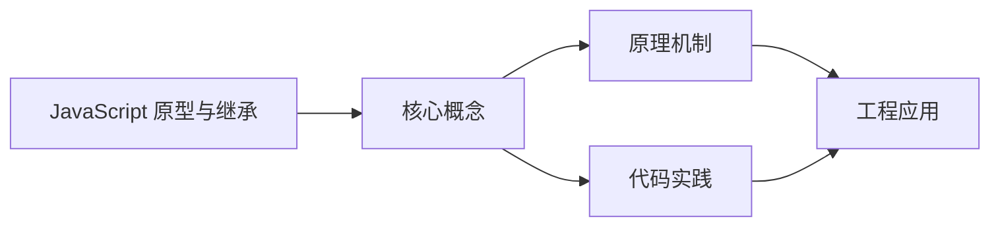
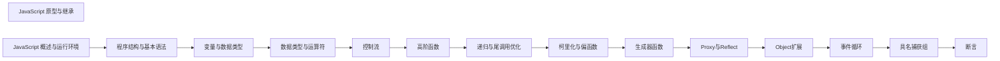

## 1. 学习目标（Bloom 分类）

本节按照布鲁姆教育目标分类学组织学习路径。本文主题为《JavaScript 原型与继承》，属于 JavaScript 模块，读者可以根据自身阶段选择阅读深度。

记忆层面：能够准确复述本文的核心概念、术语与基本语法或操作步骤，并能够在提问或检索时快速定位对应知识点。能够说出 JS 的变量、函数、对象、数组与 ES6+ 语法。

理解层面：能够用自己的语言解释核心原理与工作机制，说明概念之间的因果关系，而不是机械记忆结论。能够解释原型链、闭包、事件循环与 this 绑定。

应用层面：能够在真实项目或练习场景中运用本文知识解决具体问题，写出正确且可维护的实现。能够编写浏览器交互、Node 服务与工具脚本。

分析层面：能够拆解复杂问题，比较本文主题与相邻概念的异同，识别边界条件与例外情况。能够分析异步模型、作用域与内存泄漏。

评价层面：能够根据约束条件（性能、可读性、安全、成本）评价不同方案的优劣，做出有依据的技术决策。能够评价 JS 与 TypeScript、其他语言的差异。

创造层面：能够把本文知识与其他模块知识组合，设计出新的解决方案或可复用的工程模式。能够设计现代前端应用（框架 + 工程化）。

通过本节学习，读者应当能够把《JavaScript 原型与继承》纳入自己的知识网络，并与 JavaScript 模块的其他主题（原型链、事件循环、闭包、ES 规范）建立关联。

## 2. 历史动机与发展脉络

《JavaScript 原型与继承》是 JavaScript 领域的重要主题。要真正理解它，需要先了解它解决的问题与演进过程。

JavaScript 由 Brendan Eich 于 1995 年在 Netscape 用 10 天设计完成，最初只做表单校验；1996 年提交给 ECMA 标准化，即 ECMAScript。
ES6（2015）是语言转折点：let/const、箭头函数、class、Promise、模块化；此后每年发布新版本（ES2016+），现代语法在 Node 与浏览器快速普及。
运行时生态：V8（Chrome/Node）、SpiderMonkey（Firefox）、JavaScriptCore（Safari）；Node.js 与 Deno/Bun 让 JS 成为全栈语言；TypeScript 成为大型项目的事实标准。

回到本文主题：JavaScript 原型与继承 的提出与成熟，正是上述技术背景下的必然产物。早期实现往往以简单可用为目标，随着工程规模扩大，社区逐渐沉淀出标准做法与最佳实践；理解这一脉络，可以帮助读者判断“为什么文档中的推荐写法是现在这个样子”，也能在遇到历史遗留代码时准确识别其设计年代与取舍。


## 3. 形式化定义与核心概念精讲

本节把《JavaScript 原型与继承》涉及的核心概念以“定义 + 讲解”的形式展开。读者应把定义当作工具，把讲解当作理解路径；两者结合才能形成可迁移的知识。

原型链：对象通过 __proto__ 链接原型，属性查找沿链上行；ES6 class 是原型继承的语法糖。
闭包：函数捕获定义时的作用域，变量随函数存活；闭包是模块模式与柯里化的基础。
事件循环：调用栈、任务队列（宏任务）与微任务队列决定执行顺序；Promise 回调进微任务，setTimeout 进宏任务。

### 3.1 原文章节逐一精讲

原文档把主题拆分为 12 个小节，下面按顺序给出每一节的导读讲解，随后保留原文细节供精读。

#### 原文精读（完整保留）


#### 1. 原型与原型链 (Prototype & Prototype Chain)

##### 1.1 什么是原型

在 JavaScript 中，对象的属性查找并不只发生在对象自身。当访问 `obj.x` 时：

1. 先在 `obj` 自身属性中查找 `x`
2. 找不到则沿着 `[Prototype](Prototype)`（俗称"原型"）指向的对象继续查找
3. 直到 `null` 为止（链尾）
   这个沿着 `[Prototype](Prototype)` 向上查找的结构就是原型链。

##### 1.2 `__proto__`、`Object.getPrototypeOf` 与 `prototype`

- `Object.getPrototypeOf(obj)`：读取对象的原型（推荐）
- `Object.setPrototypeOf(obj, proto)`：设置对象的原型（不推荐，影响性能）
- `obj.__proto__`：历史遗留访问器（不推荐）
- `Fn.prototype`：函数对象特有属性，用于 `new Fn()` 创建实例时的原型指向
  它们的关系可以用一句话记住：
- 实例对象通过 `[Prototype](Prototype)` 链接到构造函数的 `prototype`

```js
function Foo() {}
const x = new Foo();
Object.getPrototypeOf(x) === Foo.prototype;
```

##### 1.3 原型链的终点

原型链的终点是 `null`。完整的查找路径：

```js
function Person(name) {
  this.name = name;
}
Person.prototype.say = function () {
  return `I am ${this.name}`;
};
const p = new Person('Alice');
p.say();
p.hasOwnProperty('name');
p.toString();
p.hasOwnProperty === Object.prototype.hasOwnProperty;
```

查找 `p.toString()` 的过程：

```
 p → Person.prototype → Object.prototype → null
```

每一层都找不到 `toString`，直到 `Object.prototype` 上才找到。

##### 1.4 原型链可视化

```mermaid
flowchart TD
    P[p 实例对象<br/>name: "Alice"] -->|__proto__| PP[Person.prototype<br/>say, constructor]
    PP -->|__proto__| OP[Object.prototype<br/>hasOwnProperty, toString, valueOf…]
    OP -->|__proto__| Null[null]
```

---

#### 2. 构造函数与 `new` (Constructor & new)

##### 2.1 `new` 的执行过程

`new Fn(...args)` 的关键步骤可以理解为：

1. 创建一个新对象 `obj`
2. 设置 `obj.[Prototype](Prototype) = Fn.prototype`
3. 执行 `Fn`，并把 `this` 绑定到 `obj`
4. 若 `Fn` 显式返回对象，则返回该对象；否则返回 `obj`
   用伪代码表示：

```js
function myNew(Fn, ...args) {
  const obj = Object.create(Fn.prototype);
  const ret = Fn.apply(obj, args);
  return ret !== null && (typeof ret === 'object' || typeof ret === 'function') ? ret : obj;
}
```

##### 2.2 构造函数返回值的影响

```js
function Foo() {
  this.x = 1;
  return { y: 2 };
}
const a = new Foo();
a.x;
a.y;
function Bar() {
  this.x = 1;
  return 42;
}
const b = new Bar();
b.x;
```

**规则**：构造函数如果返回一个**对象**，则 `new` 的结果就是该对象；如果返回**非对象**（或无 `return`），则返回 `this`。

##### 2.3 构造函数的 `constructor` 属性

每个函数的 `prototype` 对象默认有一个 `constructor` 属性，指回函数本身：

```js
function Foo() {}
Foo.prototype.constructor === Foo;
const x = new Foo();
x.constructor === Foo;
```

[警告] 如果手动替换了 `prototype`，需要修复 `constructor`：

```js
function Foo() {}
Foo.prototype = {
  constructor: Foo,
  method() {
    return 'hello';
  },
};
```

---

#### 3. `__proto__`、`prototype`、`constructor` 三角关系

##### 3.1 三角关系图解

```mermaid
flowchart TD
    Foo[Foo 构造函数] -->|Foo.prototype| FP[Foo.prototype 原型对象]
    FP -->|constructor| Foo
    FP -->|method1| M1[method1()]
    FP -->|__proto__| OP[Object.prototype]
    Foo -->|__proto__| FuncProto[Function.prototype<br/>Foo 本质上也是函数对象]
    X[x 实例] -->|x.__proto__| FP
    X -->|x.constructor| Foo
```

##### 3.2 核心等式

```js
function Foo() {}
const x = new Foo();
x.__proto__ === Foo.prototype;
Foo.prototype.constructor === Foo;
x.constructor === Foo;
Foo.__proto__ === Function.prototype;
Foo.prototype.__proto__ === Object.prototype;
Object.prototype.__proto__ === null;
```

##### 3.3 函数对象的原型链

函数本身也是对象，它的原型链：

```
 Foo → Function.prototype → Object.prototype → null
```

```js
 function Foo() {}
 Foo.__proto__ === Function.prototype
 function.prototype.__proto__ === Object.prototype
 Object.prototype.__proto__ === null
```

##### 3.4 原型链的完整查找路径示例

```js
function Animal(name) {
  this.name = name;
}
Animal.prototype.eat = function () {
  return `${this.name} is eating`;
};
function Dog(name, breed) {
  Animal.call(this, name);
  this.breed = breed;
}
dog.prototype = Object.create(Animal.prototype);
dog.prototype.constructor = Dog;
dog.prototype.bark = function () {
  return `${this.name} says woof!`;
};
const d = new Dog('Rex', 'Shepherd');
d.bark();
d.eat();
d.toString();
```

查找路径：

```
 d → Dog.prototype → Animal.prototype → Object.prototype → null
```

---

#### 4. `Object.create()` 与 `Object.setPrototypeOf()`

##### 4.1 `Object.create(proto, propertyDescriptors)`

创建一个新对象，并将其 `[Prototype](Prototype)` 设置为 `proto`：

```js
const base = {
  greet() {
    return `Hello, I am ${this.name}`;
  },
};
const alice = Object.create(base);
alice.name = 'Alice';
alice.greet();
Object.getPrototypeOf(alice) === base;
```

第二个参数可以定义属性描述符：

```js
 const bob = Object.create(base, {
  name: {
  value: 'Bob',
  writable: true,
  enumerable: true,
  configurable:
  }
 }
 bob.greet()
```

##### 4.2 `Object.create(null)`——纯净字典对象

```js
const dict = Object.create(null);
dict.key = 'value';
dict.toString;
dict.hasOwnProperty;
'key' in dict;
```

用途：当需要用对象做纯字典时，避免原型链上的属性干扰（如 `toString`、`hasOwnProperty`）。

##### 4.3 `Object.setPrototypeOf(obj, proto)`

运行时修改对象的原型：

```js
const proto = {
  greet() {
    return 'hello';
  },
};
const obj = { name: 'test' };
Object.setPrototypeOf(obj, proto);
obj.greet();
```

[警告] **强烈不推荐**在性能敏感代码中使用，原因：

1. 修改已有对象的原型会使 V8 的隐藏类（Hidden Class）优化失效
2. 所有后续属性访问都会变慢（退化为字典模式）
3. 各浏览器引擎对此操作都有性能惩罚
   **替代方案**：用 `Object.create()` 在创建时就确定原型关系。

##### 4.4 `Object.getPrototypeOf(obj)`

安全地读取对象原型：

```js
function Foo() {}
const x = new Foo();
Object.getPrototypeOf(x) === Foo.prototype;
Object.getPrototypeOf(Foo.prototype) === Object.prototype;
Object.getPrototypeOf(Object.prototype) === null;
```

---

#### 5. 继承的常见实现 (Common Inheritance Patterns)

##### 5.1 原型链继承

```js
function Parent() {
  this.colors = ['red', 'blue'];
}
Parent.prototype.say = function () {
  return 'parent';
};
function Child() {}
Child.prototype = new Parent();
Child.prototype.constructor = Child;
const c1 = new Child();
const c2 = new Child();
c1.colors.push('green');
c2.colors;
```

问题：

- `Child.prototype` 上共享 `Parent` 实例状态（若 Parent 构造函数里初始化引用类型，会导致实例间共享）
- 无法向 `Parent` 构造函数传参

##### 5.2 借用构造函数继承（构造函数继承）

```js
function Parent(name) {
  this.name = name;
  this.colors = ['red', 'blue'];
}
Parent.prototype.say = function () {
  return this.name;
};
function Child(name) {
  Parent.call(this, name);
}
const c1 = new Child('Alice');
const c2 = new Child('Bob');
c1.colors.push('green');
c1.colors;
c2.colors;
c1.say;
```

优点：可传参、每个实例独立状态。缺点：方法无法复用（每次实例化都复制一份），且无法继承原型上的方法。

##### 5.3 组合继承

结合两者优点：在 `Child` 中 `Parent.call(this, ...)` 初始化实例属性，再用原型链复用方法。

```js
function Parent(name) {
  this.name = name;
  this.colors = ['red', 'blue'];
}
Parent.prototype.say = function () {
  return this.name;
};
function Child(name, age) {
  Parent.call(this, name);
  this.age = age;
}
Child.prototype = Object.create(Parent.prototype);
Child.prototype.constructor = Child;
const c1 = new Child('Alice', 20);
const c2 = new Child('Bob', 25);
c1.colors.push('green');
c1.colors;
c2.colors;
c1.say();
```

这也是 ES5 下最常用、最稳定的写法之一。
**缺点**：`Parent` 构造函数被调用了两次（`Parent.call(this, ...)` 和 `Object.create(Parent.prototype)` 中的隐式调用），存在冗余。

##### 5.4 寄生组合继承（最优 ES5 方案 [完成]）

通过寄生方式避免 `Parent` 构造函数的重复调用：

```js
function inheritPrototype(Child, Parent) {
  const prototype = Object.create(Parent.prototype);
  prototype.constructor = Child;
  Child.prototype = prototype;
}
function Parent(name) {
  this.name = name;
  this.colors = ['red', 'blue'];
}
Parent.prototype.say = function () {
  return this.name;
};
function Child(name, age) {
  Parent.call(this, name);
  this.age = age;
}
inheritPrototype(Child, Parent);
Child.prototype.introduce = function () {
  return `${this.say()}, age ${this.age}`;
};
const c = new Child('Alice', 20);
c.say();
c.introduce();
c instanceof Child;
c instanceof Parent;
```

**优点**：

- `Parent` 构造函数只调用一次
- 原型链保持完整
- 实例属性独立，方法共享
  这是 ES5 时代最完美的继承方案，也是很多库（如 Vue 2.x）内部使用的继承方式。

##### 5.5 ES6 `class`/`extends` 的本质

`class` 只是更清晰的语法糖，底层仍然是原型链：

- 实例方法在 `Child.prototype`
- 静态方法在 `Child` 本身
- `extends` 建立两条链：
- `Child.__proto__ = Parent`（继承静态方法）
- `Child.prototype.__proto__ = Parent.prototype`（继承实例方法）

```js
class Parent {
  constructor(name) {
    this.name = name;
    this.colors = ['red', 'blue'];
  }
  say() {
    return this.name;
  }
  static version() {
    return 1;
  }
}
class Child extends Parent {
  constructor(name, age) {
    super(name);
    this.age = age;
  }
  introduce() {
    return `${this.say()}, age ${this.age}`;
  }
}
const c = new Child('Alice', 20);
c.say();
c.introduce();
c instanceof Child;
c instanceof Parent;
Child.version();
```

**`class` 继承的注意事项**：

```js
class Parent {
  constructor() {
    this.type = 'parent';
  }
}
class Child extends Parent {
  constructor() {
    console.log(this);
    super();
    console.log(this);
  }
}
```

在 `class` 的 `constructor` 中，`this` 在 `super()` 调用前不可用，否则报 `ReferenceError`。

##### 5.6 继承方式对比总结

| 继承方式     | 原型方法 | 实例属性独立 | 可传参 | 调用父构造次数 | 推荐度 |
| :----------- | :------- | :----------- | :----- | :------------- | :----- |
| 原型链继承   | [完成]   | [错误]       | [错误] | 1              |        |
| 构造函数继承 | [错误]   | [完成]       | [完成] | 1              |        |
| 组合继承     | [完成]   | [完成]       | [完成] | 2              |        |
| 寄生组合继承 | [完成]   | [完成]       | [完成] | 1              |        |
| ES6 class    | [完成]   | [完成]       | [完成] | 1              |        |

---

#### 6. 属性查找、遮蔽与删除 (Lookup, Shadowing, Delete)

##### 6.1 属性查找机制

```js
const base = { x: 1, y: 2 };
const obj = Object.create(base);
obj.z = 3;
obj.z;
obj.x;
obj.y;
obj.w;
```

查找过程：`obj 自身 → base → Object.prototype → null`

##### 6.2 属性遮蔽（Shadowing）

子对象自有属性会遮蔽原型链同名属性：

```js
const base = { x: 1 };
const obj = Object.create(base);
obj.x = 2;
obj.x;
base.x;
delete obj.x;
obj.x;
```

##### 6.3 属性设置与遮蔽规则

给对象属性赋值时，有三种情况：

```js
const base = {
  x: 1,
  get y() {
    return this._y || 10;
  },
  set y(val) {
    this._y = val;
  },
};
const obj = Object.create(base);
obj.x = 100;
obj.x;
base.x;
obj.y = 200;
obj.y;
obj._y;
```

**规则**：

1. 如果属性在自身且可写 → 直接修改自身属性
2. 如果属性在原型链上且是数据属性（可写）→ 在自身创建新属性（遮蔽）
3. 如果属性在原型链上是 getter/setter → 调用 setter，不会自动遮蔽

##### 6.4 删除属性

- `delete obj.x` 只能删除自有属性，删不掉原型上的 `x`
- `in` 会沿原型链查找；`Object.hasOwn(obj, key)` 只看自有属性

```js
const base = { x: 1 };
const obj = Object.create(base);
obj.x = 2('x' in obj);
Object.hasOwn(obj, 'x');
delete obj.x;
Object.hasOwn(obj, 'x');
obj.x;
```

##### 6.5 属性枚举与检测方法对比

```js
 const base = { inherited:  }
 const obj = Object.create(base)
 obj.own =
 Object.defineProperty(obj, 'hidden', { value: 1, enumerable: false })
 'own' in obj
 'inherited' in obj
 'hidden' in obj
 Object.hasOwn(obj, 'own')
 Object.hasOwn(obj, 'inherited')
 Object.hasOwn(obj, 'hidden')
 Object.keys(obj)
 Object.getOwnPropertyNames(obj)
 for (const key in obj) { console.log(key) }
```

| 方法                         | 自有可枚举 | 自有不可枚举 | 继承可枚举 |
| :--------------------------- | :--------- | :----------- | :--------- |
| `in`                         | [完成]     | [完成]       | [完成]     |
| `Object.hasOwn`              | [完成]     | [完成]       | [错误]     |
| `Object.keys`                | [完成]     | [错误]       | [错误]     |
| `Object.getOwnPropertyNames` | [完成]     | [完成]       | [错误]     |
| `for...in`                   | [完成]     | [错误]       | [完成]     |

---

#### 7. 原型链判断方法

##### 7.1 `instanceof`

检测构造函数的 `prototype` 是否出现在某个实例对象的原型链上：

```js
 function Foo() {}
 const x = new Foo()
 x instanceof Foo
 x instanceof Object
 Foo instanceof Function
 function instanceof Object
 Object instanceof Function
```

**`instanceof` 的实现原理**：

```js
function myInstanceof(obj, Constructor) {
  if (typeof Constructor !== 'function') throw new TypeError('Right-hand side is not callable');
  let proto = Object.getPrototypeOf(obj);
  while (proto !== null) {
    if (proto === Constructor.prototype) return;
    proto = Object.getPrototypeOf(proto);
  }
  return false;
}
myInstanceof(x, Foo);
myInstanceof(x, Object);
myInstanceof(x, Array);
```

**`instanceof` 的局限性**：

```js
const str = 'hello';
str instanceof String;
const obj = Object.create(null);
obj instanceof Object;
```

- 原始值使用 `instanceof` 始终返回 `false`
- `Object.create(null)` 创建的对象没有原型链，`instanceof Object` 也返回 `false`
- 跨 iframe/realm 时，不同全局对象的 `Array.prototype` 不同，`instanceof` 会失效

##### 7.2 `isPrototypeOf()`

检测一个对象是否存在于另一个对象的原型链上：

```js
function Animal() {}
function Dog() {}
dog.prototype = Object.create(Animal.prototype);
dog.prototype.constructor = Dog;
const d = new Dog();
Animal.prototype.isPrototypeOf(d);
dog.prototype.isPrototypeOf(d);
Object.prototype.isPrototypeOf(d);
```

**`instanceof` vs `isPrototypeOf`**：

```js
d instanceof Dog;
dog.prototype.isPrototypeOf(d);
d instanceof Animal;
Animal.prototype.isPrototypeOf(d);
```

| 对比项   | `instanceof`                 | `isPrototypeOf`                |
| :------- | :--------------------------- | :----------------------------- |
| 语法     | `obj instanceof Constructor` | `prototype.isPrototypeOf(obj)` |
| 关注点   | 构造函数                     | 原型对象                       |
| 跨 realm | [错误] 可能失效              | [完成] 不受影响                |
| 原始值   | 始终 `false`                 | 始终 `false`                   |

##### 7.3 更可靠的类型判断

```js
Object.prototype.toString.call([]);
Object.prototype.toString.call({});
Object.prototype.toString.call('hello');
Object.prototype.toString.call(42);
Object.prototype.toString.call(null);
Object.prototype.toString.call(undefined);
Object.prototype.toString.call(() => {});
Object.prototype.toString.call(new Date());
Object.prototype.toString.call(/regex/);
```

#### `Object.prototype.toString` 是最可靠的类型判断方法，不受跨 realm 影响。

#### 8. 工程实践与性能 (Best Practices & Performance)

##### 8.1 原型链性能

属性查找沿原型链逐层搜索，链越长查找越慢：

```js
const a = { x: 1 };
const b = Object.create(a);
const c = Object.create(b);
const d = Object.create(c);
const e = Object.create(d);
console.time('own');
for (let i = 0; i < 1e6; i++) {
  e.y = 1;
  void e.y;
}
console.timeEnd('own');
console.time('deep');
for (let i = 0; i < 1e6; i++) {
  void e.x;
}
console.timeEnd('deep');
```

实践建议：避免过深的原型链（一般不超过 3-4 层）。

##### 8.2 避免运行时修改原型

- 避免运行时频繁 `Object.setPrototypeOf`：会使对象"退化"，影响 JIT 优化
- 避免运行时修改 `Fn.prototype`：会影响所有已创建的实例
- 优先用 `class`/`extends` 或 `Object.create` 明确建立原型关系

```js
function Foo() {}
const a = new Foo();
Foo.prototype.method = function () {
  return 'new method';
};
a.method();
Foo.prototype = {
  otherMethod() {
    return 'other';
  },
};
a.otherMethod;
a.method();
```

##### 8.3 对需要枚举的对象

- 尽量用 `Object.keys`/`Object.entries`（只枚举自有可枚举属性）
- 对安全敏感输入，避免把外部数据直接合并到对象原型链相关位置
- 使用 `Object.hasOwn()` 代替 `obj.hasOwnProperty()`（更安全，避免 `hasOwnProperty` 被遮蔽）

```js
const obj = Object.create(null);
obj.hasOwnProperty;
Object.hasOwn(obj, 'key');
```

##### 8.4 方法定义的最佳位置

```js
function Person(name) {
  this.name = name;
}
Person.prototype.greet = function () {
  return `Hello, ${this.name}`;
};
const p1 = new Person('Alice');
const p2 = new Person('Bob');
p1.greet === p2.greet;
```

#### 方法定义在原型上，所有实例共享同一个函数引用，节省内存。如果定义在构造函数内，每次 `new` 都会创建新的函数对象。

#### 9. 安全注意：原型污染 (Prototype Pollution)

##### 9.1 什么是原型污染

当把不可信输入合并到对象时，若允许写入 `__proto__`/`constructor.prototype` 等字段，可能污染全局对象原型，导致权限绕过或逻辑劫持。

```js
function merge(target, source) {
  for (const key in source) {
    target[key] = source[key];
  }
}
const payload = JSON.parse('{"__proto__":{"isAdmin":true}}');
merge({}, payload)({}).isAdmin;
```

##### 9.2 防御措施

实践建议：

- 合并用户输入时做 key 白名单或过滤：`__proto__`、`prototype`、`constructor`
- 对纯字典对象使用 `Object.create(null)`，避免原型链

```js
 const dict = Object.create(null)
 dict['__proto__'] = { polluted:  }
 ({}).polluted
```

- 使用 `Object.defineProperty` 设置 `__proto__` 为不可配置

```js
function safeMerge(target, source) {
  const dangerous = ['__proto__', 'constructor', 'prototype'];
  for (const key of Object.keys(source)) {
    if (dangerous.includes(key)) continue;
    target[key] = source[key];
  }
  return target;
}
```

- 使用 `Map` 代替普通对象存储键值对

```js
 const map = new Map()
 map.set('__proto__', { polluted:  })
 map.get('__proto__')
 ({}).polluted
```

##### 9.3 深层原型污染

不仅 `__proto__`，嵌套路径也可能导致污染：

```json
 {
  "constructor": {
  "prototype": {
  "isAdmin":
  }
  }
 }
```

防御：递归合并时，对每一层的 key 都做危险 key 过滤。

#### 延伸阅读

- [TS 类型系统](typescript/type-system-basics)

---


### 3.2 概念关系图

下面用 Mermaid 图表达本文核心概念之间的关系，帮助读者建立整体图景：



图中展示的是本文知识的结构化关系：核心概念是入口，原理机制解释“为什么”，代码实践演示“怎么做”，工程应用回答“何时用”。读者学习时可以把每个小节的内容挂接到对应节点上。

## 4. 理论推导与原理解析

本节深入《JavaScript 原型与继承》背后的原理。理论部分不求面面俱到，而是聚焦“能解释现象、能指导实践”的关键推导。

原型链：对象通过 __proto__ 链接原型，属性查找沿链上行；ES6 class 是原型继承的语法糖。
闭包：函数捕获定义时的作用域，变量随函数存活；闭包是模块模式与柯里化的基础。
事件循环：调用栈、任务队列（宏任务）与微任务队列决定执行顺序；Promise 回调进微任务，setTimeout 进宏任务。
this 绑定：默认绑定、隐式绑定、显式绑定（call/apply/bind）与箭头函数词法绑定四种规则。

需要强调的是，理论推导与工程实践之间存在翻译层：理论给出的是理想化模型与边界条件，工程代码则必须处理真实环境中的例外。读者在学习时应先掌握理论的“标准情形”，再通过陷阱章节了解“非标准情形”。

## 5. 代码示例与逐行讲解

本节把原文中的代码示例系统整理，并为每个示例补充用途说明与讲解。读者不应只浏览代码，而应逐段对照讲解理解设计意图。

### 5.1 示例：1.2 `__proto__`、`Object.getPrototypeOf` 与 `prototype`

该示例来自原文《1.2 `__proto__`、`Object.getPrototypeOf` 与 `prototype`》小节，用于演示JavaScript 原型与继承相关操作。阅读时请先看代码结构，再看其后的讲解。

```js
function Foo() {}
const x = new Foo();
Object.getPrototypeOf(x) === Foo.prototype;
```

讲解：这段代码演示了本节核心知识点。代码中的关键操作可以归纳为三步：准备（定义或初始化）、执行（核心逻辑）、收尾（释放资源或返回结果）。实际项目中，这三步往往被封装为函数或类，以提升复用性与可测试性。

关键点分析：

该示例共 3 行有效代码，包含 1 类关键结构（function）。其中：

- 入口与初始化部分负责建立上下文，对应实际项目中的启动或装配逻辑；
- 核心逻辑部分体现本文主题的主要操作，是阅读时最需要对照讲解理解的部分；
- 输出或返回部分把结果交给调用方，注意其类型与边界条件。

进阶思考路径：先尝试修改参数观察行为变化，再把示例中的模式迁移到自己的项目中；每次修改都记录预期与实测差异，这是把示例转化为能力的最快方式。

### 5.2 示例：1.3 原型链的终点

该示例来自原文《1.3 原型链的终点》小节，用于演示JavaScript 原型与继承相关操作。阅读时请先看代码结构，再看其后的讲解。

```js
function Person(name) {
  this.name = name;
}
Person.prototype.say = function () {
  return `I am ${this.name}`;
};
const p = new Person('Alice');
p.say();
p.hasOwnProperty('name');
p.toString();
p.hasOwnProperty === Object.prototype.hasOwnProperty;
```

讲解：这段代码演示了本节核心知识点。代码中的关键操作可以归纳为三步：准备（定义或初始化）、执行（核心逻辑）、收尾（释放资源或返回结果）。实际项目中，这三步往往被封装为函数或类，以提升复用性与可测试性。

关键点分析：

该示例共 11 行有效代码，包含 2 类关键结构（function、return）。其中：

- 入口与初始化部分负责建立上下文，对应实际项目中的启动或装配逻辑；
- 核心逻辑部分体现本文主题的主要操作，是阅读时最需要对照讲解理解的部分；
- 输出或返回部分把结果交给调用方，注意其类型与边界条件。

进阶思考路径：先尝试修改参数观察行为变化，再把示例中的模式迁移到自己的项目中；每次修改都记录预期与实测差异，这是把示例转化为能力的最快方式。

### 5.3 示例：1.3 原型链的终点

该示例来自原文《1.3 原型链的终点》小节，用于演示JavaScript 原型与继承相关操作。阅读时请先看代码结构，再看其后的讲解。

```text
 p → Person.prototype → Object.prototype → null
```

讲解：这段代码演示了本节核心知识点。代码中的关键操作可以归纳为三步：准备（定义或初始化）、执行（核心逻辑）、收尾（释放资源或返回结果）。实际项目中，这三步往往被封装为函数或类，以提升复用性与可测试性。

关键点分析：

该示例共 1 行有效代码，结构以数据或配置为主。阅读时应关注：数据字段的含义、配置项的作用，以及它们与运行行为的对应关系。

进阶思考路径：先尝试修改参数观察行为变化，再把示例中的模式迁移到自己的项目中；每次修改都记录预期与实测差异，这是把示例转化为能力的最快方式。

### 5.4 示例：1.4 原型链可视化

该示例来自原文《1.4 原型链可视化》小节，用于演示JavaScript 原型与继承相关操作。阅读时请先看代码结构，再看其后的讲解。

```mermaid
flowchart TD
    P[p 实例对象<br/>name: "Alice"] -->|__proto__| PP[Person.prototype<br/>say, constructor]
    PP -->|__proto__| OP[Object.prototype<br/>hasOwnProperty, toString, valueOf…]
    OP -->|__proto__| Null[null]
```

讲解：这段代码演示了本节核心知识点。代码中的关键操作可以归纳为三步：准备（定义或初始化）、执行（核心逻辑）、收尾（释放资源或返回结果）。实际项目中，这三步往往被封装为函数或类，以提升复用性与可测试性。

关键点分析：

该示例共 4 行有效代码，结构以数据或配置为主。阅读时应关注：数据字段的含义、配置项的作用，以及它们与运行行为的对应关系。

进阶思考路径：先尝试修改参数观察行为变化，再把示例中的模式迁移到自己的项目中；每次修改都记录预期与实测差异，这是把示例转化为能力的最快方式。

### 5.5 示例：2.1 `new` 的执行过程

该示例来自原文《2.1 `new` 的执行过程》小节，用于演示JavaScript 原型与继承相关操作。阅读时请先看代码结构，再看其后的讲解。

```js
function myNew(Fn, ...args) {
  const obj = Object.create(Fn.prototype);
  const ret = Fn.apply(obj, args);
  return ret !== null && (typeof ret === 'object' || typeof ret === 'function') ? ret : obj;
}
```

讲解：这段代码演示了本节核心知识点。代码中的关键操作可以归纳为三步：准备（定义或初始化）、执行（核心逻辑）、收尾（释放资源或返回结果）。实际项目中，这三步往往被封装为函数或类，以提升复用性与可测试性。

关键点分析：

该示例共 5 行有效代码，包含 2 类关键结构（function、return）。其中：

- 入口与初始化部分负责建立上下文，对应实际项目中的启动或装配逻辑；
- 核心逻辑部分体现本文主题的主要操作，是阅读时最需要对照讲解理解的部分；
- 输出或返回部分把结果交给调用方，注意其类型与边界条件。

进阶思考路径：先尝试修改参数观察行为变化，再把示例中的模式迁移到自己的项目中；每次修改都记录预期与实测差异，这是把示例转化为能力的最快方式。

### 5.6 示例：2.2 构造函数返回值的影响

该示例来自原文《2.2 构造函数返回值的影响》小节，用于演示JavaScript 原型与继承相关操作。阅读时请先看代码结构，再看其后的讲解。

```js
function Foo() {
  this.x = 1;
  return { y: 2 };
}
const a = new Foo();
a.x;
a.y;
function Bar() {
  this.x = 1;
  return 42;
}
const b = new Bar();
b.x;
```

讲解：这段代码演示了本节核心知识点。代码中的关键操作可以归纳为三步：准备（定义或初始化）、执行（核心逻辑）、收尾（释放资源或返回结果）。实际项目中，这三步往往被封装为函数或类，以提升复用性与可测试性。

关键点分析：

该示例共 13 行有效代码，包含 2 类关键结构（function、return）。其中：

- 入口与初始化部分负责建立上下文，对应实际项目中的启动或装配逻辑；
- 核心逻辑部分体现本文主题的主要操作，是阅读时最需要对照讲解理解的部分；
- 输出或返回部分把结果交给调用方，注意其类型与边界条件。

进阶思考路径：先尝试修改参数观察行为变化，再把示例中的模式迁移到自己的项目中；每次修改都记录预期与实测差异，这是把示例转化为能力的最快方式。

### 5.7 示例：2.3 构造函数的 `constructor` 属性

该示例来自原文《2.3 构造函数的 `constructor` 属性》小节，用于演示JavaScript 原型与继承相关操作。阅读时请先看代码结构，再看其后的讲解。

```js
function Foo() {}
Foo.prototype.constructor === Foo;
const x = new Foo();
x.constructor === Foo;
```

讲解：这段代码演示了本节核心知识点。代码中的关键操作可以归纳为三步：准备（定义或初始化）、执行（核心逻辑）、收尾（释放资源或返回结果）。实际项目中，这三步往往被封装为函数或类，以提升复用性与可测试性。

关键点分析：

该示例共 4 行有效代码，包含 1 类关键结构（function）。其中：

- 入口与初始化部分负责建立上下文，对应实际项目中的启动或装配逻辑；
- 核心逻辑部分体现本文主题的主要操作，是阅读时最需要对照讲解理解的部分；
- 输出或返回部分把结果交给调用方，注意其类型与边界条件。

进阶思考路径：先尝试修改参数观察行为变化，再把示例中的模式迁移到自己的项目中；每次修改都记录预期与实测差异，这是把示例转化为能力的最快方式。

### 5.8 示例：2.3 构造函数的 `constructor` 属性

该示例来自原文《2.3 构造函数的 `constructor` 属性》小节，用于演示JavaScript 原型与继承相关操作。阅读时请先看代码结构，再看其后的讲解。

```js
function Foo() {}
Foo.prototype = {
  constructor: Foo,
  method() {
    return 'hello';
  },
};
```

讲解：这段代码演示了本节核心知识点。代码中的关键操作可以归纳为三步：准备（定义或初始化）、执行（核心逻辑）、收尾（释放资源或返回结果）。实际项目中，这三步往往被封装为函数或类，以提升复用性与可测试性。

关键点分析：

该示例共 7 行有效代码，包含 2 类关键结构（function、return）。其中：

- 入口与初始化部分负责建立上下文，对应实际项目中的启动或装配逻辑；
- 核心逻辑部分体现本文主题的主要操作，是阅读时最需要对照讲解理解的部分；
- 输出或返回部分把结果交给调用方，注意其类型与边界条件。

进阶思考路径：先尝试修改参数观察行为变化，再把示例中的模式迁移到自己的项目中；每次修改都记录预期与实测差异，这是把示例转化为能力的最快方式。

### 5.9 示例：3.1 三角关系图解

该示例来自原文《3.1 三角关系图解》小节，用于演示JavaScript 原型与继承相关操作。阅读时请先看代码结构，再看其后的讲解。

```mermaid
flowchart TD
    Foo[Foo 构造函数] -->|Foo.prototype| FP[Foo.prototype 原型对象]
    FP -->|constructor| Foo
    FP -->|method1| M1[method1()]
    FP -->|__proto__| OP[Object.prototype]
    Foo -->|__proto__| FuncProto[Function.prototype<br/>Foo 本质上也是函数对象]
    X[x 实例] -->|x.__proto__| FP
    X -->|x.constructor| Foo
```

讲解：这段代码演示了本节核心知识点。代码中的关键操作可以归纳为三步：准备（定义或初始化）、执行（核心逻辑）、收尾（释放资源或返回结果）。实际项目中，这三步往往被封装为函数或类，以提升复用性与可测试性。

关键点分析：

该示例共 8 行有效代码，结构以数据或配置为主。阅读时应关注：数据字段的含义、配置项的作用，以及它们与运行行为的对应关系。

进阶思考路径：先尝试修改参数观察行为变化，再把示例中的模式迁移到自己的项目中；每次修改都记录预期与实测差异，这是把示例转化为能力的最快方式。

### 5.10 示例：3.2 核心等式

该示例来自原文《3.2 核心等式》小节，用于演示JavaScript 原型与继承相关操作。阅读时请先看代码结构，再看其后的讲解。

```js
function Foo() {}
const x = new Foo();
x.__proto__ === Foo.prototype;
Foo.prototype.constructor === Foo;
x.constructor === Foo;
Foo.__proto__ === Function.prototype;
Foo.prototype.__proto__ === Object.prototype;
Object.prototype.__proto__ === null;
```

讲解：这段代码演示了本节核心知识点。代码中的关键操作可以归纳为三步：准备（定义或初始化）、执行（核心逻辑）、收尾（释放资源或返回结果）。实际项目中，这三步往往被封装为函数或类，以提升复用性与可测试性。

关键点分析：

该示例共 8 行有效代码，包含 1 类关键结构（function）。其中：

- 入口与初始化部分负责建立上下文，对应实际项目中的启动或装配逻辑；
- 核心逻辑部分体现本文主题的主要操作，是阅读时最需要对照讲解理解的部分；
- 输出或返回部分把结果交给调用方，注意其类型与边界条件。

进阶思考路径：先尝试修改参数观察行为变化，再把示例中的模式迁移到自己的项目中；每次修改都记录预期与实测差异，这是把示例转化为能力的最快方式。

### 5.11 示例：3.3 函数对象的原型链

该示例来自原文《3.3 函数对象的原型链》小节，用于演示JavaScript 原型与继承相关操作。阅读时请先看代码结构，再看其后的讲解。

```text
 Foo → Function.prototype → Object.prototype → null
```

讲解：这段代码演示了本节核心知识点。代码中的关键操作可以归纳为三步：准备（定义或初始化）、执行（核心逻辑）、收尾（释放资源或返回结果）。实际项目中，这三步往往被封装为函数或类，以提升复用性与可测试性。

关键点分析：

该示例共 1 行有效代码，结构以数据或配置为主。阅读时应关注：数据字段的含义、配置项的作用，以及它们与运行行为的对应关系。

进阶思考路径：先尝试修改参数观察行为变化，再把示例中的模式迁移到自己的项目中；每次修改都记录预期与实测差异，这是把示例转化为能力的最快方式。

### 5.12 示例：3.3 函数对象的原型链

该示例来自原文《3.3 函数对象的原型链》小节，用于演示JavaScript 原型与继承相关操作。阅读时请先看代码结构，再看其后的讲解。

```js
 function Foo() {}
 Foo.__proto__ === Function.prototype
 function.prototype.__proto__ === Object.prototype
 Object.prototype.__proto__ === null
```

讲解：这段代码演示了本节核心知识点。代码中的关键操作可以归纳为三步：准备（定义或初始化）、执行（核心逻辑）、收尾（释放资源或返回结果）。实际项目中，这三步往往被封装为函数或类，以提升复用性与可测试性。

关键点分析：

该示例共 4 行有效代码，包含 1 类关键结构（function）。其中：

- 入口与初始化部分负责建立上下文，对应实际项目中的启动或装配逻辑；
- 核心逻辑部分体现本文主题的主要操作，是阅读时最需要对照讲解理解的部分；
- 输出或返回部分把结果交给调用方，注意其类型与边界条件。

进阶思考路径：先尝试修改参数观察行为变化，再把示例中的模式迁移到自己的项目中；每次修改都记录预期与实测差异，这是把示例转化为能力的最快方式。

### 5.13 示例：3.4 原型链的完整查找路径示例

该示例来自原文《3.4 原型链的完整查找路径示例》小节，用于演示JavaScript 原型与继承相关操作。阅读时请先看代码结构，再看其后的讲解。

```js
function Animal(name) {
  this.name = name;
}
Animal.prototype.eat = function () {
  return `${this.name} is eating`;
};
function Dog(name, breed) {
  Animal.call(this, name);
  this.breed = breed;
}
dog.prototype = Object.create(Animal.prototype);
dog.prototype.constructor = Dog;
dog.prototype.bark = function () {
  return `${this.name} says woof!`;
};
const d = new Dog('Rex', 'Shepherd');
d.bark();
d.eat();
d.toString();
```

讲解：这段代码演示了本节核心知识点。代码中的关键操作可以归纳为三步：准备（定义或初始化）、执行（核心逻辑）、收尾（释放资源或返回结果）。实际项目中，这三步往往被封装为函数或类，以提升复用性与可测试性。

关键点分析：

该示例共 19 行有效代码，包含 2 类关键结构（function、return）。其中：

- 入口与初始化部分负责建立上下文，对应实际项目中的启动或装配逻辑；
- 核心逻辑部分体现本文主题的主要操作，是阅读时最需要对照讲解理解的部分；
- 输出或返回部分把结果交给调用方，注意其类型与边界条件。

进阶思考路径：先尝试修改参数观察行为变化，再把示例中的模式迁移到自己的项目中；每次修改都记录预期与实测差异，这是把示例转化为能力的最快方式。

### 5.14 示例：3.4 原型链的完整查找路径示例

该示例来自原文《3.4 原型链的完整查找路径示例》小节，用于演示JavaScript 原型与继承相关操作。阅读时请先看代码结构，再看其后的讲解。

```text
 d → Dog.prototype → Animal.prototype → Object.prototype → null
```

讲解：这段代码演示了本节核心知识点。代码中的关键操作可以归纳为三步：准备（定义或初始化）、执行（核心逻辑）、收尾（释放资源或返回结果）。实际项目中，这三步往往被封装为函数或类，以提升复用性与可测试性。

关键点分析：

该示例共 1 行有效代码，结构以数据或配置为主。阅读时应关注：数据字段的含义、配置项的作用，以及它们与运行行为的对应关系。

进阶思考路径：先尝试修改参数观察行为变化，再把示例中的模式迁移到自己的项目中；每次修改都记录预期与实测差异，这是把示例转化为能力的最快方式。

### 5.15 示例：4.1 `Object.create(proto, propertyDescriptors)`

该示例来自原文《4.1 `Object.create(proto, propertyDescriptors)`》小节，用于演示JavaScript 原型与继承相关操作。阅读时请先看代码结构，再看其后的讲解。

```js
const base = {
  greet() {
    return `Hello, I am ${this.name}`;
  },
};
const alice = Object.create(base);
alice.name = 'Alice';
alice.greet();
Object.getPrototypeOf(alice) === base;
```

讲解：这段代码演示了本节核心知识点。代码中的关键操作可以归纳为三步：准备（定义或初始化）、执行（核心逻辑）、收尾（释放资源或返回结果）。实际项目中，这三步往往被封装为函数或类，以提升复用性与可测试性。

关键点分析：

该示例共 9 行有效代码，包含 1 类关键结构（return）。其中：

- 入口与初始化部分负责建立上下文，对应实际项目中的启动或装配逻辑；
- 核心逻辑部分体现本文主题的主要操作，是阅读时最需要对照讲解理解的部分；
- 输出或返回部分把结果交给调用方，注意其类型与边界条件。

进阶思考路径：先尝试修改参数观察行为变化，再把示例中的模式迁移到自己的项目中；每次修改都记录预期与实测差异，这是把示例转化为能力的最快方式。

### 5.16 示例：4.1 `Object.create(proto, propertyDescriptors)`

该示例来自原文《4.1 `Object.create(proto, propertyDescriptors)`》小节，用于演示JavaScript 原型与继承相关操作。阅读时请先看代码结构，再看其后的讲解。

```js
 const bob = Object.create(base, {
  name: {
  value: 'Bob',
  writable: true,
  enumerable: true,
  configurable:
  }
 }
 bob.greet()
```

讲解：这段代码演示了本节核心知识点。代码中的关键操作可以归纳为三步：准备（定义或初始化）、执行（核心逻辑）、收尾（释放资源或返回结果）。实际项目中，这三步往往被封装为函数或类，以提升复用性与可测试性。

关键点分析：

该示例共 9 行有效代码，结构以数据或配置为主。阅读时应关注：数据字段的含义、配置项的作用，以及它们与运行行为的对应关系。

进阶思考路径：先尝试修改参数观察行为变化，再把示例中的模式迁移到自己的项目中；每次修改都记录预期与实测差异，这是把示例转化为能力的最快方式。

### 5.17 示例：4.2 `Object.create(null)`——纯净字典对象

该示例来自原文《4.2 `Object.create(null)`——纯净字典对象》小节，用于演示JavaScript 原型与继承相关操作。阅读时请先看代码结构，再看其后的讲解。

```js
const dict = Object.create(null);
dict.key = 'value';
dict.toString;
dict.hasOwnProperty;
'key' in dict;
```

讲解：这段代码演示了本节核心知识点。代码中的关键操作可以归纳为三步：准备（定义或初始化）、执行（核心逻辑）、收尾（释放资源或返回结果）。实际项目中，这三步往往被封装为函数或类，以提升复用性与可测试性。

关键点分析：

该示例共 5 行有效代码，结构以数据或配置为主。阅读时应关注：数据字段的含义、配置项的作用，以及它们与运行行为的对应关系。

进阶思考路径：先尝试修改参数观察行为变化，再把示例中的模式迁移到自己的项目中；每次修改都记录预期与实测差异，这是把示例转化为能力的最快方式。

### 5.18 示例：4.3 `Object.setPrototypeOf(obj, proto)`

该示例来自原文《4.3 `Object.setPrototypeOf(obj, proto)`》小节，用于演示JavaScript 原型与继承相关操作。阅读时请先看代码结构，再看其后的讲解。

```js
const proto = {
  greet() {
    return 'hello';
  },
};
const obj = { name: 'test' };
Object.setPrototypeOf(obj, proto);
obj.greet();
```

讲解：这段代码演示了本节核心知识点。代码中的关键操作可以归纳为三步：准备（定义或初始化）、执行（核心逻辑）、收尾（释放资源或返回结果）。实际项目中，这三步往往被封装为函数或类，以提升复用性与可测试性。

关键点分析：

该示例共 8 行有效代码，包含 1 类关键结构（return）。其中：

- 入口与初始化部分负责建立上下文，对应实际项目中的启动或装配逻辑；
- 核心逻辑部分体现本文主题的主要操作，是阅读时最需要对照讲解理解的部分；
- 输出或返回部分把结果交给调用方，注意其类型与边界条件。

进阶思考路径：先尝试修改参数观察行为变化，再把示例中的模式迁移到自己的项目中；每次修改都记录预期与实测差异，这是把示例转化为能力的最快方式。

### 5.19 示例：4.4 `Object.getPrototypeOf(obj)`

该示例来自原文《4.4 `Object.getPrototypeOf(obj)`》小节，用于演示JavaScript 原型与继承相关操作。阅读时请先看代码结构，再看其后的讲解。

```js
function Foo() {}
const x = new Foo();
Object.getPrototypeOf(x) === Foo.prototype;
Object.getPrototypeOf(Foo.prototype) === Object.prototype;
Object.getPrototypeOf(Object.prototype) === null;
```

讲解：这段代码演示了本节核心知识点。代码中的关键操作可以归纳为三步：准备（定义或初始化）、执行（核心逻辑）、收尾（释放资源或返回结果）。实际项目中，这三步往往被封装为函数或类，以提升复用性与可测试性。

关键点分析：

该示例共 5 行有效代码，包含 1 类关键结构（function）。其中：

- 入口与初始化部分负责建立上下文，对应实际项目中的启动或装配逻辑；
- 核心逻辑部分体现本文主题的主要操作，是阅读时最需要对照讲解理解的部分；
- 输出或返回部分把结果交给调用方，注意其类型与边界条件。

进阶思考路径：先尝试修改参数观察行为变化，再把示例中的模式迁移到自己的项目中；每次修改都记录预期与实测差异，这是把示例转化为能力的最快方式。

### 5.20 示例：5.1 原型链继承

该示例来自原文《5.1 原型链继承》小节，用于演示JavaScript 原型与继承相关操作。阅读时请先看代码结构，再看其后的讲解。

```js
function Parent() {
  this.colors = ['red', 'blue'];
}
Parent.prototype.say = function () {
  return 'parent';
};
function Child() {}
Child.prototype = new Parent();
Child.prototype.constructor = Child;
const c1 = new Child();
const c2 = new Child();
c1.colors.push('green');
c2.colors;
```

讲解：这段代码演示了本节核心知识点。代码中的关键操作可以归纳为三步：准备（定义或初始化）、执行（核心逻辑）、收尾（释放资源或返回结果）。实际项目中，这三步往往被封装为函数或类，以提升复用性与可测试性。

关键点分析：

该示例共 13 行有效代码，包含 2 类关键结构（function、return）。其中：

- 入口与初始化部分负责建立上下文，对应实际项目中的启动或装配逻辑；
- 核心逻辑部分体现本文主题的主要操作，是阅读时最需要对照讲解理解的部分；
- 输出或返回部分把结果交给调用方，注意其类型与边界条件。

进阶思考路径：先尝试修改参数观察行为变化，再把示例中的模式迁移到自己的项目中；每次修改都记录预期与实测差异，这是把示例转化为能力的最快方式。

### 5.21 示例：5.2 借用构造函数继承（构造函数继承）

该示例来自原文《5.2 借用构造函数继承（构造函数继承）》小节，用于演示JavaScript 原型与继承相关操作。阅读时请先看代码结构，再看其后的讲解。

```js
function Parent(name) {
  this.name = name;
  this.colors = ['red', 'blue'];
}
Parent.prototype.say = function () {
  return this.name;
};
function Child(name) {
  Parent.call(this, name);
}
const c1 = new Child('Alice');
const c2 = new Child('Bob');
c1.colors.push('green');
c1.colors;
c2.colors;
c1.say;
```

讲解：这段代码演示了本节核心知识点。代码中的关键操作可以归纳为三步：准备（定义或初始化）、执行（核心逻辑）、收尾（释放资源或返回结果）。实际项目中，这三步往往被封装为函数或类，以提升复用性与可测试性。

关键点分析：

该示例共 16 行有效代码，包含 2 类关键结构（function、return）。其中：

- 入口与初始化部分负责建立上下文，对应实际项目中的启动或装配逻辑；
- 核心逻辑部分体现本文主题的主要操作，是阅读时最需要对照讲解理解的部分；
- 输出或返回部分把结果交给调用方，注意其类型与边界条件。

进阶思考路径：先尝试修改参数观察行为变化，再把示例中的模式迁移到自己的项目中；每次修改都记录预期与实测差异，这是把示例转化为能力的最快方式。

### 5.22 示例：5.3 组合继承

该示例来自原文《5.3 组合继承》小节，用于演示JavaScript 原型与继承相关操作。阅读时请先看代码结构，再看其后的讲解。

```js
function Parent(name) {
  this.name = name;
  this.colors = ['red', 'blue'];
}
Parent.prototype.say = function () {
  return this.name;
};
function Child(name, age) {
  Parent.call(this, name);
  this.age = age;
}
Child.prototype = Object.create(Parent.prototype);
Child.prototype.constructor = Child;
const c1 = new Child('Alice', 20);
const c2 = new Child('Bob', 25);
c1.colors.push('green');
c1.colors;
c2.colors;
c1.say();
```

讲解：这段代码演示了本节核心知识点。代码中的关键操作可以归纳为三步：准备（定义或初始化）、执行（核心逻辑）、收尾（释放资源或返回结果）。实际项目中，这三步往往被封装为函数或类，以提升复用性与可测试性。

关键点分析：

该示例共 19 行有效代码，包含 2 类关键结构（function、return）。其中：

- 入口与初始化部分负责建立上下文，对应实际项目中的启动或装配逻辑；
- 核心逻辑部分体现本文主题的主要操作，是阅读时最需要对照讲解理解的部分；
- 输出或返回部分把结果交给调用方，注意其类型与边界条件。

进阶思考路径：先尝试修改参数观察行为变化，再把示例中的模式迁移到自己的项目中；每次修改都记录预期与实测差异，这是把示例转化为能力的最快方式。

### 5.23 示例：5.4 寄生组合继承（最优 ES5 方案 [完成]）

该示例来自原文《5.4 寄生组合继承（最优 ES5 方案 [完成]）》小节，用于演示JavaScript 原型与继承相关操作。阅读时请先看代码结构，再看其后的讲解。

```js
function inheritPrototype(Child, Parent) {
  const prototype = Object.create(Parent.prototype);
  prototype.constructor = Child;
  Child.prototype = prototype;
}
function Parent(name) {
  this.name = name;
  this.colors = ['red', 'blue'];
}
Parent.prototype.say = function () {
  return this.name;
};
function Child(name, age) {
  Parent.call(this, name);
  this.age = age;
}
inheritPrototype(Child, Parent);
Child.prototype.introduce = function () {
  return `${this.say()}, age ${this.age}`;
};
const c = new Child('Alice', 20);
c.say();
c.introduce();
c instanceof Child;
c instanceof Parent;
```

讲解：这段代码演示了本节核心知识点。代码中的关键操作可以归纳为三步：准备（定义或初始化）、执行（核心逻辑）、收尾（释放资源或返回结果）。实际项目中，这三步往往被封装为函数或类，以提升复用性与可测试性。

关键点分析：

该示例共 25 行有效代码，包含 2 类关键结构（function、return）。其中：

- 入口与初始化部分负责建立上下文，对应实际项目中的启动或装配逻辑；
- 核心逻辑部分体现本文主题的主要操作，是阅读时最需要对照讲解理解的部分；
- 输出或返回部分把结果交给调用方，注意其类型与边界条件。

进阶思考路径：先尝试修改参数观察行为变化，再把示例中的模式迁移到自己的项目中；每次修改都记录预期与实测差异，这是把示例转化为能力的最快方式。

### 5.24 示例：5.5 ES6 `class`/`extends` 的本质

该示例来自原文《5.5 ES6 `class`/`extends` 的本质》小节，用于演示JavaScript 原型与继承相关操作。阅读时请先看代码结构，再看其后的讲解。

```js
class Parent {
  constructor(name) {
    this.name = name;
    this.colors = ['red', 'blue'];
  }
  say() {
    return this.name;
  }
  static version() {
    return 1;
  }
}
class Child extends Parent {
  constructor(name, age) {
    super(name);
    this.age = age;
  }
  introduce() {
    return `${this.say()}, age ${this.age}`;
  }
}
const c = new Child('Alice', 20);
c.say();
c.introduce();
c instanceof Child;
c instanceof Parent;
Child.version();
```

讲解：这段代码演示了本节核心知识点。代码中的关键操作可以归纳为三步：准备（定义或初始化）、执行（核心逻辑）、收尾（释放资源或返回结果）。实际项目中，这三步往往被封装为函数或类，以提升复用性与可测试性。

关键点分析：

该示例共 27 行有效代码，包含 2 类关键结构（class、return）。其中：

- 入口与初始化部分负责建立上下文，对应实际项目中的启动或装配逻辑；
- 核心逻辑部分体现本文主题的主要操作，是阅读时最需要对照讲解理解的部分；
- 输出或返回部分把结果交给调用方，注意其类型与边界条件。

进阶思考路径：先尝试修改参数观察行为变化，再把示例中的模式迁移到自己的项目中；每次修改都记录预期与实测差异，这是把示例转化为能力的最快方式。

### 5.25 示例：5.5 ES6 `class`/`extends` 的本质

该示例来自原文《5.5 ES6 `class`/`extends` 的本质》小节，用于演示JavaScript 原型与继承相关操作。阅读时请先看代码结构，再看其后的讲解。

```js
class Parent {
  constructor() {
    this.type = 'parent';
  }
}
class Child extends Parent {
  constructor() {
    console.log(this);
    super();
    console.log(this);
  }
}
```

讲解：这段代码演示了本节核心知识点。代码中的关键操作可以归纳为三步：准备（定义或初始化）、执行（核心逻辑）、收尾（释放资源或返回结果）。实际项目中，这三步往往被封装为函数或类，以提升复用性与可测试性。

关键点分析：

该示例共 12 行有效代码，包含 1 类关键结构（class）。其中：

- 入口与初始化部分负责建立上下文，对应实际项目中的启动或装配逻辑；
- 核心逻辑部分体现本文主题的主要操作，是阅读时最需要对照讲解理解的部分；
- 输出或返回部分把结果交给调用方，注意其类型与边界条件。

进阶思考路径：先尝试修改参数观察行为变化，再把示例中的模式迁移到自己的项目中；每次修改都记录预期与实测差异，这是把示例转化为能力的最快方式。

### 5.26 示例：6.1 属性查找机制

该示例来自原文《6.1 属性查找机制》小节，用于演示JavaScript 原型与继承相关操作。阅读时请先看代码结构，再看其后的讲解。

```js
const base = { x: 1, y: 2 };
const obj = Object.create(base);
obj.z = 3;
obj.z;
obj.x;
obj.y;
obj.w;
```

讲解：这段代码演示了本节核心知识点。代码中的关键操作可以归纳为三步：准备（定义或初始化）、执行（核心逻辑）、收尾（释放资源或返回结果）。实际项目中，这三步往往被封装为函数或类，以提升复用性与可测试性。

关键点分析：

该示例共 7 行有效代码，结构以数据或配置为主。阅读时应关注：数据字段的含义、配置项的作用，以及它们与运行行为的对应关系。

进阶思考路径：先尝试修改参数观察行为变化，再把示例中的模式迁移到自己的项目中；每次修改都记录预期与实测差异，这是把示例转化为能力的最快方式。

### 5.27 示例：6.2 属性遮蔽（Shadowing）

该示例来自原文《6.2 属性遮蔽（Shadowing）》小节，用于演示JavaScript 原型与继承相关操作。阅读时请先看代码结构，再看其后的讲解。

```js
const base = { x: 1 };
const obj = Object.create(base);
obj.x = 2;
obj.x;
base.x;
delete obj.x;
obj.x;
```

讲解：这段代码演示了本节核心知识点。代码中的关键操作可以归纳为三步：准备（定义或初始化）、执行（核心逻辑）、收尾（释放资源或返回结果）。实际项目中，这三步往往被封装为函数或类，以提升复用性与可测试性。

关键点分析：

该示例共 7 行有效代码，结构以数据或配置为主。阅读时应关注：数据字段的含义、配置项的作用，以及它们与运行行为的对应关系。

进阶思考路径：先尝试修改参数观察行为变化，再把示例中的模式迁移到自己的项目中；每次修改都记录预期与实测差异，这是把示例转化为能力的最快方式。

### 5.28 示例：6.3 属性设置与遮蔽规则

该示例来自原文《6.3 属性设置与遮蔽规则》小节，用于演示JavaScript 原型与继承相关操作。阅读时请先看代码结构，再看其后的讲解。

```js
const base = {
  x: 1,
  get y() {
    return this._y || 10;
  },
  set y(val) {
    this._y = val;
  },
};
const obj = Object.create(base);
obj.x = 100;
obj.x;
base.x;
obj.y = 200;
obj.y;
obj._y;
```

讲解：这段代码演示了本节核心知识点。代码中的关键操作可以归纳为三步：准备（定义或初始化）、执行（核心逻辑）、收尾（释放资源或返回结果）。实际项目中，这三步往往被封装为函数或类，以提升复用性与可测试性。

关键点分析：

该示例共 16 行有效代码，包含 1 类关键结构（return）。其中：

- 入口与初始化部分负责建立上下文，对应实际项目中的启动或装配逻辑；
- 核心逻辑部分体现本文主题的主要操作，是阅读时最需要对照讲解理解的部分；
- 输出或返回部分把结果交给调用方，注意其类型与边界条件。

进阶思考路径：先尝试修改参数观察行为变化，再把示例中的模式迁移到自己的项目中；每次修改都记录预期与实测差异，这是把示例转化为能力的最快方式。

### 5.29 示例：6.4 删除属性

该示例来自原文《6.4 删除属性》小节，用于演示JavaScript 原型与继承相关操作。阅读时请先看代码结构，再看其后的讲解。

```js
const base = { x: 1 };
const obj = Object.create(base);
obj.x = 2('x' in obj);
Object.hasOwn(obj, 'x');
delete obj.x;
Object.hasOwn(obj, 'x');
obj.x;
```

讲解：这段代码演示了本节核心知识点。代码中的关键操作可以归纳为三步：准备（定义或初始化）、执行（核心逻辑）、收尾（释放资源或返回结果）。实际项目中，这三步往往被封装为函数或类，以提升复用性与可测试性。

关键点分析：

该示例共 7 行有效代码，结构以数据或配置为主。阅读时应关注：数据字段的含义、配置项的作用，以及它们与运行行为的对应关系。

进阶思考路径：先尝试修改参数观察行为变化，再把示例中的模式迁移到自己的项目中；每次修改都记录预期与实测差异，这是把示例转化为能力的最快方式。

### 5.30 示例：6.5 属性枚举与检测方法对比

该示例来自原文《6.5 属性枚举与检测方法对比》小节，用于演示JavaScript 原型与继承相关操作。阅读时请先看代码结构，再看其后的讲解。

```js
 const base = { inherited:  }
 const obj = Object.create(base)
 obj.own =
 Object.defineProperty(obj, 'hidden', { value: 1, enumerable: false })
 'own' in obj
 'inherited' in obj
 'hidden' in obj
 Object.hasOwn(obj, 'own')
 Object.hasOwn(obj, 'inherited')
 Object.hasOwn(obj, 'hidden')
 Object.keys(obj)
 Object.getOwnPropertyNames(obj)
 for (const key in obj) { console.log(key) }
```

讲解：这段代码演示了本节核心知识点。代码中的关键操作可以归纳为三步：准备（定义或初始化）、执行（核心逻辑）、收尾（释放资源或返回结果）。实际项目中，这三步往往被封装为函数或类，以提升复用性与可测试性。

关键点分析：

该示例共 13 行有效代码，包含 1 类关键结构（for）。其中：

- 入口与初始化部分负责建立上下文，对应实际项目中的启动或装配逻辑；
- 核心逻辑部分体现本文主题的主要操作，是阅读时最需要对照讲解理解的部分；
- 输出或返回部分把结果交给调用方，注意其类型与边界条件。

进阶思考路径：先尝试修改参数观察行为变化，再把示例中的模式迁移到自己的项目中；每次修改都记录预期与实测差异，这是把示例转化为能力的最快方式。

### 5.31 示例：7.1 `instanceof`

该示例来自原文《7.1 `instanceof`》小节，用于演示JavaScript 原型与继承相关操作。阅读时请先看代码结构，再看其后的讲解。

```js
 function Foo() {}
 const x = new Foo()
 x instanceof Foo
 x instanceof Object
 Foo instanceof Function
 function instanceof Object
 Object instanceof Function
```

讲解：这段代码演示了本节核心知识点。代码中的关键操作可以归纳为三步：准备（定义或初始化）、执行（核心逻辑）、收尾（释放资源或返回结果）。实际项目中，这三步往往被封装为函数或类，以提升复用性与可测试性。

关键点分析：

该示例共 7 行有效代码，包含 1 类关键结构（function）。其中：

- 入口与初始化部分负责建立上下文，对应实际项目中的启动或装配逻辑；
- 核心逻辑部分体现本文主题的主要操作，是阅读时最需要对照讲解理解的部分；
- 输出或返回部分把结果交给调用方，注意其类型与边界条件。

进阶思考路径：先尝试修改参数观察行为变化，再把示例中的模式迁移到自己的项目中；每次修改都记录预期与实测差异，这是把示例转化为能力的最快方式。

### 5.32 示例：7.1 `instanceof`

该示例来自原文《7.1 `instanceof`》小节，用于演示JavaScript 原型与继承相关操作。阅读时请先看代码结构，再看其后的讲解。

```js
function myInstanceof(obj, Constructor) {
  if (typeof Constructor !== 'function') throw new TypeError('Right-hand side is not callable');
  let proto = Object.getPrototypeOf(obj);
  while (proto !== null) {
    if (proto === Constructor.prototype) return;
    proto = Object.getPrototypeOf(proto);
  }
  return false;
}
myInstanceof(x, Foo);
myInstanceof(x, Object);
myInstanceof(x, Array);
```

讲解：这段代码演示了本节核心知识点。代码中的关键操作可以归纳为三步：准备（定义或初始化）、执行（核心逻辑）、收尾（释放资源或返回结果）。实际项目中，这三步往往被封装为函数或类，以提升复用性与可测试性。

关键点分析：

该示例共 12 行有效代码，包含 4 类关键结构（function、if、while、return）。其中：

- 入口与初始化部分负责建立上下文，对应实际项目中的启动或装配逻辑；
- 核心逻辑部分体现本文主题的主要操作，是阅读时最需要对照讲解理解的部分；
- 输出或返回部分把结果交给调用方，注意其类型与边界条件。

进阶思考路径：先尝试修改参数观察行为变化，再把示例中的模式迁移到自己的项目中；每次修改都记录预期与实测差异，这是把示例转化为能力的最快方式。

### 5.33 示例：7.1 `instanceof`

该示例来自原文《7.1 `instanceof`》小节，用于演示JavaScript 原型与继承相关操作。阅读时请先看代码结构，再看其后的讲解。

```js
const str = 'hello';
str instanceof String;
const obj = Object.create(null);
obj instanceof Object;
```

讲解：这段代码演示了本节核心知识点。代码中的关键操作可以归纳为三步：准备（定义或初始化）、执行（核心逻辑）、收尾（释放资源或返回结果）。实际项目中，这三步往往被封装为函数或类，以提升复用性与可测试性。

关键点分析：

该示例共 4 行有效代码，结构以数据或配置为主。阅读时应关注：数据字段的含义、配置项的作用，以及它们与运行行为的对应关系。

进阶思考路径：先尝试修改参数观察行为变化，再把示例中的模式迁移到自己的项目中；每次修改都记录预期与实测差异，这是把示例转化为能力的最快方式。

### 5.34 示例：7.2 `isPrototypeOf()`

该示例来自原文《7.2 `isPrototypeOf()`》小节，用于演示JavaScript 原型与继承相关操作。阅读时请先看代码结构，再看其后的讲解。

```js
function Animal() {}
function Dog() {}
dog.prototype = Object.create(Animal.prototype);
dog.prototype.constructor = Dog;
const d = new Dog();
Animal.prototype.isPrototypeOf(d);
dog.prototype.isPrototypeOf(d);
Object.prototype.isPrototypeOf(d);
```

讲解：这段代码演示了本节核心知识点。代码中的关键操作可以归纳为三步：准备（定义或初始化）、执行（核心逻辑）、收尾（释放资源或返回结果）。实际项目中，这三步往往被封装为函数或类，以提升复用性与可测试性。

关键点分析：

该示例共 8 行有效代码，包含 1 类关键结构（function）。其中：

- 入口与初始化部分负责建立上下文，对应实际项目中的启动或装配逻辑；
- 核心逻辑部分体现本文主题的主要操作，是阅读时最需要对照讲解理解的部分；
- 输出或返回部分把结果交给调用方，注意其类型与边界条件。

进阶思考路径：先尝试修改参数观察行为变化，再把示例中的模式迁移到自己的项目中；每次修改都记录预期与实测差异，这是把示例转化为能力的最快方式。

### 5.35 示例：7.2 `isPrototypeOf()`

该示例来自原文《7.2 `isPrototypeOf()`》小节，用于演示JavaScript 原型与继承相关操作。阅读时请先看代码结构，再看其后的讲解。

```js
d instanceof Dog;
dog.prototype.isPrototypeOf(d);
d instanceof Animal;
Animal.prototype.isPrototypeOf(d);
```

讲解：这段代码演示了本节核心知识点。代码中的关键操作可以归纳为三步：准备（定义或初始化）、执行（核心逻辑）、收尾（释放资源或返回结果）。实际项目中，这三步往往被封装为函数或类，以提升复用性与可测试性。

关键点分析：

该示例共 4 行有效代码，结构以数据或配置为主。阅读时应关注：数据字段的含义、配置项的作用，以及它们与运行行为的对应关系。

进阶思考路径：先尝试修改参数观察行为变化，再把示例中的模式迁移到自己的项目中；每次修改都记录预期与实测差异，这是把示例转化为能力的最快方式。

### 5.36 示例：7.3 更可靠的类型判断

该示例来自原文《7.3 更可靠的类型判断》小节，用于演示JavaScript 原型与继承相关操作。阅读时请先看代码结构，再看其后的讲解。

```js
Object.prototype.toString.call([]);
Object.prototype.toString.call({});
Object.prototype.toString.call('hello');
Object.prototype.toString.call(42);
Object.prototype.toString.call(null);
Object.prototype.toString.call(undefined);
Object.prototype.toString.call(() => {});
Object.prototype.toString.call(new Date());
Object.prototype.toString.call(/regex/);
```

讲解：这段代码演示了本节核心知识点。代码中的关键操作可以归纳为三步：准备（定义或初始化）、执行（核心逻辑）、收尾（释放资源或返回结果）。实际项目中，这三步往往被封装为函数或类，以提升复用性与可测试性。

关键点分析：

该示例共 9 行有效代码，结构以数据或配置为主。阅读时应关注：数据字段的含义、配置项的作用，以及它们与运行行为的对应关系。

进阶思考路径：先尝试修改参数观察行为变化，再把示例中的模式迁移到自己的项目中；每次修改都记录预期与实测差异，这是把示例转化为能力的最快方式。

### 5.37 示例：8.1 原型链性能

该示例来自原文《8.1 原型链性能》小节，用于演示JavaScript 原型与继承相关操作。阅读时请先看代码结构，再看其后的讲解。

```js
const a = { x: 1 };
const b = Object.create(a);
const c = Object.create(b);
const d = Object.create(c);
const e = Object.create(d);
console.time('own');
for (let i = 0; i < 1e6; i++) {
  e.y = 1;
  void e.y;
}
console.timeEnd('own');
console.time('deep');
for (let i = 0; i < 1e6; i++) {
  void e.x;
}
console.timeEnd('deep');
```

讲解：这段代码演示了本节核心知识点。代码中的关键操作可以归纳为三步：准备（定义或初始化）、执行（核心逻辑）、收尾（释放资源或返回结果）。实际项目中，这三步往往被封装为函数或类，以提升复用性与可测试性。

关键点分析：

该示例共 16 行有效代码，包含 1 类关键结构（for）。其中：

- 入口与初始化部分负责建立上下文，对应实际项目中的启动或装配逻辑；
- 核心逻辑部分体现本文主题的主要操作，是阅读时最需要对照讲解理解的部分；
- 输出或返回部分把结果交给调用方，注意其类型与边界条件。

进阶思考路径：先尝试修改参数观察行为变化，再把示例中的模式迁移到自己的项目中；每次修改都记录预期与实测差异，这是把示例转化为能力的最快方式。

### 5.38 示例：8.2 避免运行时修改原型

该示例来自原文《8.2 避免运行时修改原型》小节，用于演示JavaScript 原型与继承相关操作。阅读时请先看代码结构，再看其后的讲解。

```js
function Foo() {}
const a = new Foo();
Foo.prototype.method = function () {
  return 'new method';
};
a.method();
Foo.prototype = {
  otherMethod() {
    return 'other';
  },
};
a.otherMethod;
a.method();
```

讲解：这段代码演示了本节核心知识点。代码中的关键操作可以归纳为三步：准备（定义或初始化）、执行（核心逻辑）、收尾（释放资源或返回结果）。实际项目中，这三步往往被封装为函数或类，以提升复用性与可测试性。

关键点分析：

该示例共 13 行有效代码，包含 2 类关键结构（function、return）。其中：

- 入口与初始化部分负责建立上下文，对应实际项目中的启动或装配逻辑；
- 核心逻辑部分体现本文主题的主要操作，是阅读时最需要对照讲解理解的部分；
- 输出或返回部分把结果交给调用方，注意其类型与边界条件。

进阶思考路径：先尝试修改参数观察行为变化，再把示例中的模式迁移到自己的项目中；每次修改都记录预期与实测差异，这是把示例转化为能力的最快方式。

### 5.39 示例：8.3 对需要枚举的对象

该示例来自原文《8.3 对需要枚举的对象》小节，用于演示JavaScript 原型与继承相关操作。阅读时请先看代码结构，再看其后的讲解。

```js
const obj = Object.create(null);
obj.hasOwnProperty;
Object.hasOwn(obj, 'key');
```

讲解：这段代码演示了本节核心知识点。代码中的关键操作可以归纳为三步：准备（定义或初始化）、执行（核心逻辑）、收尾（释放资源或返回结果）。实际项目中，这三步往往被封装为函数或类，以提升复用性与可测试性。

关键点分析：

该示例共 3 行有效代码，结构以数据或配置为主。阅读时应关注：数据字段的含义、配置项的作用，以及它们与运行行为的对应关系。

进阶思考路径：先尝试修改参数观察行为变化，再把示例中的模式迁移到自己的项目中；每次修改都记录预期与实测差异，这是把示例转化为能力的最快方式。

### 5.40 示例：8.4 方法定义的最佳位置

该示例来自原文《8.4 方法定义的最佳位置》小节，用于演示JavaScript 原型与继承相关操作。阅读时请先看代码结构，再看其后的讲解。

```js
function Person(name) {
  this.name = name;
}
Person.prototype.greet = function () {
  return `Hello, ${this.name}`;
};
const p1 = new Person('Alice');
const p2 = new Person('Bob');
p1.greet === p2.greet;
```

讲解：这段代码演示了本节核心知识点。代码中的关键操作可以归纳为三步：准备（定义或初始化）、执行（核心逻辑）、收尾（释放资源或返回结果）。实际项目中，这三步往往被封装为函数或类，以提升复用性与可测试性。

关键点分析：

该示例共 9 行有效代码，包含 2 类关键结构（function、return）。其中：

- 入口与初始化部分负责建立上下文，对应实际项目中的启动或装配逻辑；
- 核心逻辑部分体现本文主题的主要操作，是阅读时最需要对照讲解理解的部分；
- 输出或返回部分把结果交给调用方，注意其类型与边界条件。

进阶思考路径：先尝试修改参数观察行为变化，再把示例中的模式迁移到自己的项目中；每次修改都记录预期与实测差异，这是把示例转化为能力的最快方式。

### 5.41 示例：9.1 什么是原型污染

该示例来自原文《9.1 什么是原型污染》小节，用于演示JavaScript 原型与继承相关操作。阅读时请先看代码结构，再看其后的讲解。

```js
function merge(target, source) {
  for (const key in source) {
    target[key] = source[key];
  }
}
const payload = JSON.parse('{"__proto__":{"isAdmin":true}}');
merge({}, payload)({}).isAdmin;
```

讲解：这段代码演示了本节核心知识点。代码中的关键操作可以归纳为三步：准备（定义或初始化）、执行（核心逻辑）、收尾（释放资源或返回结果）。实际项目中，这三步往往被封装为函数或类，以提升复用性与可测试性。

关键点分析：

该示例共 7 行有效代码，包含 2 类关键结构（function、for）。其中：

- 入口与初始化部分负责建立上下文，对应实际项目中的启动或装配逻辑；
- 核心逻辑部分体现本文主题的主要操作，是阅读时最需要对照讲解理解的部分；
- 输出或返回部分把结果交给调用方，注意其类型与边界条件。

进阶思考路径：先尝试修改参数观察行为变化，再把示例中的模式迁移到自己的项目中；每次修改都记录预期与实测差异，这是把示例转化为能力的最快方式。

### 5.42 示例：9.2 防御措施

该示例来自原文《9.2 防御措施》小节，用于演示JavaScript 原型与继承相关操作。阅读时请先看代码结构，再看其后的讲解。

```js
 const dict = Object.create(null)
 dict['__proto__'] = { polluted:  }
 ({}).polluted
```

讲解：这段代码演示了本节核心知识点。代码中的关键操作可以归纳为三步：准备（定义或初始化）、执行（核心逻辑）、收尾（释放资源或返回结果）。实际项目中，这三步往往被封装为函数或类，以提升复用性与可测试性。

关键点分析：

该示例共 3 行有效代码，结构以数据或配置为主。阅读时应关注：数据字段的含义、配置项的作用，以及它们与运行行为的对应关系。

进阶思考路径：先尝试修改参数观察行为变化，再把示例中的模式迁移到自己的项目中；每次修改都记录预期与实测差异，这是把示例转化为能力的最快方式。

### 5.43 示例：9.2 防御措施

该示例来自原文《9.2 防御措施》小节，用于演示JavaScript 原型与继承相关操作。阅读时请先看代码结构，再看其后的讲解。

```js
function safeMerge(target, source) {
  const dangerous = ['__proto__', 'constructor', 'prototype'];
  for (const key of Object.keys(source)) {
    if (dangerous.includes(key)) continue;
    target[key] = source[key];
  }
  return target;
}
```

讲解：这段代码演示了本节核心知识点。代码中的关键操作可以归纳为三步：准备（定义或初始化）、执行（核心逻辑）、收尾（释放资源或返回结果）。实际项目中，这三步往往被封装为函数或类，以提升复用性与可测试性。

关键点分析：

该示例共 8 行有效代码，包含 4 类关键结构（function、if、for、return）。其中：

- 入口与初始化部分负责建立上下文，对应实际项目中的启动或装配逻辑；
- 核心逻辑部分体现本文主题的主要操作，是阅读时最需要对照讲解理解的部分；
- 输出或返回部分把结果交给调用方，注意其类型与边界条件。

进阶思考路径：先尝试修改参数观察行为变化，再把示例中的模式迁移到自己的项目中；每次修改都记录预期与实测差异，这是把示例转化为能力的最快方式。

### 5.44 示例：9.2 防御措施

该示例来自原文《9.2 防御措施》小节，用于演示JavaScript 原型与继承相关操作。阅读时请先看代码结构，再看其后的讲解。

```js
 const map = new Map()
 map.set('__proto__', { polluted:  })
 map.get('__proto__')
 ({}).polluted
```

讲解：这段代码演示了本节核心知识点。代码中的关键操作可以归纳为三步：准备（定义或初始化）、执行（核心逻辑）、收尾（释放资源或返回结果）。实际项目中，这三步往往被封装为函数或类，以提升复用性与可测试性。

关键点分析：

该示例共 4 行有效代码，结构以数据或配置为主。阅读时应关注：数据字段的含义、配置项的作用，以及它们与运行行为的对应关系。

进阶思考路径：先尝试修改参数观察行为变化，再把示例中的模式迁移到自己的项目中；每次修改都记录预期与实测差异，这是把示例转化为能力的最快方式。

### 5.45 示例：9.3 深层原型污染

该示例来自原文《9.3 深层原型污染》小节，用于演示JavaScript 原型与继承相关操作。阅读时请先看代码结构，再看其后的讲解。

```json
 {
  "constructor": {
  "prototype": {
  "isAdmin":
  }
  }
 }
```

讲解：这段代码演示了本节核心知识点。代码中的关键操作可以归纳为三步：准备（定义或初始化）、执行（核心逻辑）、收尾（释放资源或返回结果）。实际项目中，这三步往往被封装为函数或类，以提升复用性与可测试性。

关键点分析：

该示例共 7 行有效代码，结构以数据或配置为主。阅读时应关注：数据字段的含义、配置项的作用，以及它们与运行行为的对应关系。

进阶思考路径：先尝试修改参数观察行为变化，再把示例中的模式迁移到自己的项目中；每次修改都记录预期与实测差异，这是把示例转化为能力的最快方式。


综合以上示例，可以总结出本主题的代码实践要点：第一，先定义清晰的输入输出契约；第二，核心逻辑保持单一职责；第三，错误处理与边界条件不可省略；第四，命名与注释表达意图而非复述代码。

## 6. 对比分析

对比是理解《JavaScript 原型与继承》定位的最快路径。下面从多个维度与相邻方案进行对比。

JS 与 TypeScript：TS 是 JS 的超集，增加静态类型；新项目默认 TS。
JS 与 Python：JS 事件驱动适合 I/O 密集前端/服务；Python 生态偏数据与 AI。
CommonJS 与 ESM：Node 传统 CJS（require），现代 ESM（import）；互操作规则需注意。

对比的目的不是分出绝对优劣，而是建立选择依据：不同约束条件下，最优解不同。读者应把每个对比维度转化为决策检查清单。

## 7. 常见陷阱与最佳实践

本节整理该主题的高频错误与推荐做法。每个陷阱先描述现象，再解释原因，最后给出最佳实践。

### 7.1 == 隐式转换

宽松相等产生意外结果。一律使用 ===。

深入讲解：该问题之所以被归类为“常见陷阱”，是因为它在初学者的代码中反复出现，而且往往不在第一时间暴露——错误通常隐藏在特定数据或特定时序下。

从成因上看，== 隐式转换 一般源于对 JavaScript 某个机制的理解偏差：要么误用了默认行为，要么忽略了边界条件，要么把其他语言的思维惯性带了过来。

从影响上看，== 隐式转换 轻则产生错误结果，重则导致资源泄漏、数据损坏或安全事故；这也是为什么工程评审中会把它列为检查项。

从修复策略上看，处理== 隐式转换的正确顺序是：先复现（构造最小用例），再定位（确认机制层面的根因），最后修复并补充回归测试。跳过复现直接改代码，往往治标不治本。

### 7.2 var 与提升

var 函数作用域与提升导致困惑。使用 let/const。

深入讲解：该问题之所以被归类为“常见陷阱”，是因为它在初学者的代码中反复出现，而且往往不在第一时间暴露——错误通常隐藏在特定数据或特定时序下。

从成因上看，var 与提升 一般源于对 JavaScript 某个机制的理解偏差：要么误用了默认行为，要么忽略了边界条件，要么把其他语言的思维惯性带了过来。

从影响上看，var 与提升 轻则产生错误结果，重则导致资源泄漏、数据损坏或安全事故；这也是为什么工程评审中会把它列为检查项。

从修复策略上看，处理var 与提升的正确顺序是：先复现（构造最小用例），再定位（确认机制层面的根因），最后修复并补充回归测试。跳过复现直接改代码，往往治标不治本。

### 7.3 回调地狱

嵌套回调难维护。使用 Promise/async-await。

深入讲解：该问题之所以被归类为“常见陷阱”，是因为它在初学者的代码中反复出现，而且往往不在第一时间暴露——错误通常隐藏在特定数据或特定时序下。

从成因上看，回调地狱 一般源于对 JavaScript 某个机制的理解偏差：要么误用了默认行为，要么忽略了边界条件，要么把其他语言的思维惯性带了过来。

从影响上看，回调地狱 轻则产生错误结果，重则导致资源泄漏、数据损坏或安全事故；这也是为什么工程评审中会把它列为检查项。

从修复策略上看，处理回调地狱的正确顺序是：先复现（构造最小用例），再定位（确认机制层面的根因），最后修复并补充回归测试。跳过复现直接改代码，往往治标不治本。

### 7.4 闭包内存泄漏

闭包引用大对象且长期存活。及时置空引用。

深入讲解：该问题之所以被归类为“常见陷阱”，是因为它在初学者的代码中反复出现，而且往往不在第一时间暴露——错误通常隐藏在特定数据或特定时序下。

从成因上看，闭包内存泄漏 一般源于对 JavaScript 某个机制的理解偏差：要么误用了默认行为，要么忽略了边界条件，要么把其他语言的思维惯性带了过来。

从影响上看，闭包内存泄漏 轻则产生错误结果，重则导致资源泄漏、数据损坏或安全事故；这也是为什么工程评审中会把它列为检查项。

从修复策略上看，处理闭包内存泄漏的正确顺序是：先复现（构造最小用例），再定位（确认机制层面的根因），最后修复并补充回归测试。跳过复现直接改代码，往往治标不治本。

### 7.5 浮点精度

0.1+0.2 != 0.3。金额用整数分或 decimal 库。

深入讲解：该问题之所以被归类为“常见陷阱”，是因为它在初学者的代码中反复出现，而且往往不在第一时间暴露——错误通常隐藏在特定数据或特定时序下。

从成因上看，浮点精度 一般源于对 JavaScript 某个机制的理解偏差：要么误用了默认行为，要么忽略了边界条件，要么把其他语言的思维惯性带了过来。

从影响上看，浮点精度 轻则产生错误结果，重则导致资源泄漏、数据损坏或安全事故；这也是为什么工程评审中会把它列为检查项。

从修复策略上看，处理浮点精度的正确顺序是：先复现（构造最小用例），再定位（确认机制层面的根因），最后修复并补充回归测试。跳过复现直接改代码，往往治标不治本。

### 7.6 数组遍历回调 this

普通函数 this 指向 undefined（严格模式）。用箭头函数。

深入讲解：该问题之所以被归类为“常见陷阱”，是因为它在初学者的代码中反复出现，而且往往不在第一时间暴露——错误通常隐藏在特定数据或特定时序下。

从成因上看，数组遍历回调 this 一般源于对 JavaScript 某个机制的理解偏差：要么误用了默认行为，要么忽略了边界条件，要么把其他语言的思维惯性带了过来。

从影响上看，数组遍历回调 this 轻则产生错误结果，重则导致资源泄漏、数据损坏或安全事故；这也是为什么工程评审中会把它列为检查项。

从修复策略上看，处理数组遍历回调 this的正确顺序是：先复现（构造最小用例），再定位（确认机制层面的根因），最后修复并补充回归测试。跳过复现直接改代码，往往治标不治本。

### 7.7 浅拷贝

Object.assign 浅拷贝嵌套对象仍共享。用 structuredClone 或深拷贝库。

深入讲解：该问题之所以被归类为“常见陷阱”，是因为它在初学者的代码中反复出现，而且往往不在第一时间暴露——错误通常隐藏在特定数据或特定时序下。

从成因上看，浅拷贝 一般源于对 JavaScript 某个机制的理解偏差：要么误用了默认行为，要么忽略了边界条件，要么把其他语言的思维惯性带了过来。

从影响上看，浅拷贝 轻则产生错误结果，重则导致资源泄漏、数据损坏或安全事故；这也是为什么工程评审中会把它列为检查项。

从修复策略上看，处理浅拷贝的正确顺序是：先复现（构造最小用例），再定位（确认机制层面的根因），最后修复并补充回归测试。跳过复现直接改代码，往往治标不治本。

### 7.8 setTimeout 精度

最小 4ms 且受节流影响。动画用 requestAnimationFrame。

深入讲解：该问题之所以被归类为“常见陷阱”，是因为它在初学者的代码中反复出现，而且往往不在第一时间暴露——错误通常隐藏在特定数据或特定时序下。

从成因上看，setTimeout 精度 一般源于对 JavaScript 某个机制的理解偏差：要么误用了默认行为，要么忽略了边界条件，要么把其他语言的思维惯性带了过来。

从影响上看，setTimeout 精度 轻则产生错误结果，重则导致资源泄漏、数据损坏或安全事故；这也是为什么工程评审中会把它列为检查项。

从修复策略上看，处理setTimeout 精度的正确顺序是：先复现（构造最小用例），再定位（确认机制层面的根因），最后修复并补充回归测试。跳过复现直接改代码，往往治标不治本。

### 7.0 最佳实践总览

1. ESLint + Prettier 统一风格，strict 模式全局开启。
2. const 优先，let 次之，不使用 var。
3. 异步用 async/await 并处理错误。
4. 模块化（ESM）组织代码，避免全局污染。
5. 类型检查引入 TypeScript（新项目默认）。

把这些最佳实践固化为团队规范与代码评审检查项，是避免同类问题反复出现的关键。

## 8. 工程实践

本节把《JavaScript 原型与继承》放入真实工程场景，给出可复用的模式与组织方法。

前端工程化：Vite 构建、ESLint、Vitest 测试、pnpm 依赖管理。
Node 服务：Express/Fastify 或原生 http；PM2/容器部署。
性能：防抖节流、虚拟列表、代码分割与懒加载。
可观测性：错误上报（window.onerror）、性能指标（web-vitals）。

### 8.1 工程实践的原则拆解

以上工程实践可以归纳为四条原则。第一，配置与代码分离：JavaScript 项目中环境差异应通过配置注入，而不是散落在代码分支中；这保证同一份代码可以在开发、测试、生产环境一致运行。

第二，接口稳定优先：对外接口（函数签名、协议、数据格式）一旦被消费方依赖，变更成本极高；设计时应预留扩展点并保持向后兼容。

第三，可观测性内置：日志、指标与追踪应该在功能开发时同步设计，而不是故障发生后补救；没有观测手段的模块等于黑盒。

第四，变更可回滚：任何发布都应有对应的回滚方案；数据库迁移、配置变更与代码发布一样需要版本管理与逆向路径。

### 8.2 实践落地的检查清单

- [ ] 前端工程化：对照本节描述，检查当前项目是否已经落实；未落实的项列入技术债并排期处理。
- [ ] Node 服务：对照本节描述，检查当前项目是否已经落实；未落实的项列入技术债并排期处理。
- [ ] 性能：对照本节描述，检查当前项目是否已经落实；未落实的项列入技术债并排期处理。
- [ ] 可观测性：对照本节描述，检查当前项目是否已经落实；未落实的项列入技术债并排期处理。

工程实践的共性原则：配置与代码分离、接口稳定优先、可观测性内置、变更可回滚。这些原则适用于本主题的所有实现。

## 9. 案例研究

本节通过一个完整案例把《JavaScript 原型与继承》的知识串起来。案例按“需求分析、方案设计、实现、验证”四步展开。

需求：实现前端搜索框的防抖与请求竞态处理。
方案：debounce 函数 + AbortController 取消过期请求 + loading 状态。
要点：防抖延迟 300ms；请求序号或 AbortController 保证最新结果。
验证：快速输入模拟，确认只发最终请求且结果一致。

### 9.1 案例的扩展讨论

把案例中的方案放大到真实规模，需要额外考虑三个问题：

第一，规模：当数据量或并发量上升一个数量级时，原方案中的数据结构、缓存策略与任务调度是否仍然成立？通常需要引入分层与异步。

第二，团队：多人协作时，模块边界、接口契约与代码所有权必须明确；案例中的实现应拆分为可独立测试的单元，并配合文档说明设计意图。

第三，演进：上线后的需求变化不可避免；方案设计时应预留扩展点（配置化、插件化、事件化），并定期用真实指标验证假设。


案例研究的学习方法：先独立阅读需求，尝试在脑中形成方案，再对照实现与讲解，最后思考“如果约束变化（数据量、并发、团队规模），方案应如何调整”。

## 10. 知识要点总结与深入讲解

本节以讲解形式汇总全文要点，替代传统的习题与自测，读者不需要答题，只需跟随解释建立完整的认知框架。

关于《JavaScript 原型与继承》的核心结论：

JS 的单线程事件循环决定了异步编程范式，理解它才能写出无阻塞代码。
原型、闭包、this 是语言基础三件套。
现代工程以 TS + 框架 + 工具链为标准。

原文档各小节的要点回顾：

- 1. 原型与原型链 (Prototype & Prototype Chain)：该小节围绕JavaScript 原型与继承展开具体细节，阅读时应关注其与核心结论的对应关系；每个小节都是核心结论在某一个侧面的展开。
- 2. 构造函数与 `new` (Constructor & new)：该小节围绕JavaScript 原型与继承展开具体细节，阅读时应关注其与核心结论的对应关系；每个小节都是核心结论在某一个侧面的展开。
- 3. `__proto__`、`prototype`、`constructor` 三角关系：该小节围绕JavaScript 原型与继承展开具体细节，阅读时应关注其与核心结论的对应关系；每个小节都是核心结论在某一个侧面的展开。
- 4. `Object.create()` 与 `Object.setPrototypeOf()`：该小节围绕JavaScript 原型与继承展开具体细节，阅读时应关注其与核心结论的对应关系；每个小节都是核心结论在某一个侧面的展开。
- 5. 继承的常见实现 (Common Inheritance Patterns)：该小节围绕JavaScript 原型与继承展开具体细节，阅读时应关注其与核心结论的对应关系；每个小节都是核心结论在某一个侧面的展开。
- 6. 属性查找、遮蔽与删除 (Lookup, Shadowing, Delete)：该小节围绕JavaScript 原型与继承展开具体细节，阅读时应关注其与核心结论的对应关系；每个小节都是核心结论在某一个侧面的展开。
- 7. 原型链判断方法：该小节围绕JavaScript 原型与继承展开具体细节，阅读时应关注其与核心结论的对应关系；每个小节都是核心结论在某一个侧面的展开。
- `Object.prototype.toString` 是最可靠的类型判断方法，不受跨 realm 影响。：该小节围绕JavaScript 原型与继承展开具体细节，阅读时应关注其与核心结论的对应关系；每个小节都是核心结论在某一个侧面的展开。
- 8. 工程实践与性能 (Best Practices & Performance)：该小节围绕JavaScript 原型与继承展开具体细节，阅读时应关注其与核心结论的对应关系；每个小节都是核心结论在某一个侧面的展开。
- 方法定义在原型上，所有实例共享同一个函数引用，节省内存。如果定义在构造函数内，每次 `new` 都会创建新的函数对象。：该小节围绕JavaScript 原型与继承展开具体细节，阅读时应关注其与核心结论的对应关系；每个小节都是核心结论在某一个侧面的展开。
- 9. 安全注意：原型污染 (Prototype Pollution)：该小节围绕JavaScript 原型与继承展开具体细节，阅读时应关注其与核心结论的对应关系；每个小节都是核心结论在某一个侧面的展开。
- 延伸阅读：该小节围绕JavaScript 原型与继承展开具体细节，阅读时应关注其与核心结论的对应关系；每个小节都是核心结论在某一个侧面的展开。

把以上要点与第 3-9 节的内容对照复习，即可完成对本文主题的闭环学习。

## 11. 参考文献


MDN JavaScript 文档：https://developer.mozilla.org/zh-CN/docs/Web/JavaScript
ECMAScript 规范：https://tc39.es/ecma262/
Node.js 官方文档：https://nodejs.org/docs/latest/api/
JavaScript 秘密花园：https://bonsaiden.github.io/JavaScript-Garden/
Can I use：https://caniuse.com/

## 12. 延伸阅读


JavaScript 基础语法，见 008-javascript 模块文档。
TypeScript 类型系统，见 009-typescript 模块。
浏览器 DOM 与事件，见 006-html5/007-css 模块。
前端框架 React/Vue，见 011-react/010-vue3 模块。
尚硅谷 Bilibili 空间（https://space.bilibili.com/302417610 ）提供 JavaScript 课程。

## 14. 模块知识图谱与学习路径

本文属于 JavaScript 模块。为了把《JavaScript 原型与继承》放入完整的知识网络，下面列出本模块的全部主题并给出相互关联的导读。学习时建议按模块内顺序推进，并在每个文档中留意交叉引用。



上图为模块主题的推荐学习顺序示意图（仅展示前若干主题）。各主题之间存在三类关联：

第一，前置依赖关系：早期主题是后期主题的基础，例如环境与语法先行、进阶主题随后；

第二，横向并列关系：同一层级主题从不同角度覆盖模块能力，学习顺序可以按兴趣调整；

第三，工程组合关系：多个主题在真实项目中组合使用，例如配置、性能与安全主题往往出现在同一系统的不同层面。

### 14.1 模块主题速查表

| 文档 | 主题 | 与本文的关联 |
| --- | --- | --- |
| JavaScript 概述与运行环境 | 001-JavaScriptOverviewRuntimeEnv | 本文的前置基础 |
| 程序结构与基本语法 | 002-ProgramStructureBasicSyntax | 本文的并列主题 |
| 变量与数据类型 | 003-VariableDataType | 本文的并列主题 |
| 数据类型与运算符 | 004-DataTypeOperator | 本文的并列主题 |
| 控制流 | 005-ControlFlow | 本文的并列主题 |
| 高阶函数 | 006-HigherOrderFunction | 本文的并列主题 |
| 递归与尾调用优化 | 007-LinearGeneticProgramming | 本文的性能延伸 |
| 柯里化与偏函数 | 008-CurryAndFunctionComposition | 本文的并列主题 |
| 生成器函数 | 009-CoroutinesInJavaScript | 本文的并列主题 |
| Proxy与Reflect | 010-ExploringES6ProxiesAndReflect | 本文的并列主题 |
| Object扩展 | 011-ObjectReference | 本文的并列主题 |
| 事件循环 | 012-EventLoop | 本文的并列主题 |
| 具名捕获组 | 013-ES2018RegExpNamedCaptureGroups | 本文的并列主题 |
| 断言 | 014-Assert | 本文的并列主题 |
| Unicode属性转义 | 015-UnicodePropertyEscape | 本文的并列主题 |
| 函数、作用域与闭包 | 016-FunctionScopeClosure | 本文的并列主题 |
| 自定义Error | 017-ErrorReferenceAndControlFlowAndErrorHandling | 本文的并列主题 |
| BOM | 018-CrossDocumentMessaging | 本文的并列主题 |
| 网络请求API | 019-ImageOptimization | 本文的并列主题 |
| Web存储API | 020-StorageForTheWeb | 本文的并列主题 |
| 索引数据库 | 021-IndexedDBADatabaseInYourBrowser | 本文的并列主题 |
| Temporal | 022-TemporalJavaScriptAPI | 本文的并列主题 |
| 迭代器帮助器 | 023-IteratorHelper | 本文的并列主题 |
| Promise构造器 | 024-YouDonTKnowJSAsyncPerformance | 本文的并列主题 |
| Records与Tuples | 025-RecordsTuples | 本文的并列主题 |
| 对象与数组 | 026-ObjectArray | 本文的并列主题 |
| DOM 操作与事件 | 027-DOMOperationEvent | 本文的并列主题 |
| JavaScript 最新特性与运行时 | 028-JavaScriptLatestFeature | 本文的并列主题 |
| JavaScript 模块化 | 029-JavaScriptModular | 本文的并列主题 |
| 异步编程 | 030-AsyncProgramming | 本文的并列主题 |
| 闭包的内存泄露与优化 | 031-ClosureMemoryLeakOptimization | 本文的性能延伸 |
| 原型链继承与class本质 | 032-PrototypeChainClassEssence | 本文的并列主题 |
| 事件循环详解 | 033-EventLoopDetailed | 本文的并列主题 |
| Promise静态方法 | 034-PromiseStaticMethod | 本文的并列主题 |
| 异步并发控制 | 035-AsyncConcurrencyControl | 本文的并列主题 |
| ES6+ 新特性 | 036-ES6NewFeatures | 本文的并列主题 |
| 深拷贝与浅拷贝 | 037-DeepShallowCopy | 本文的并列主题 |
| 防抖与节流 | 038-DebounceThrottle | 本文的并列主题 |
| 数组高阶方法 | 039-ArrayHigherOrderMethod | 本文的并列主题 |
| Proxy与Reflect实际应用 | 040-ProxyReflectPractice | 本文的并列主题 |
| 模块动态导入与代码分割 | 041-ModuleDynamicImportCodeSplitting | 本文的并列主题 |
| JavaScript 原型与继承 | 042-JavaScriptPrototypeInheritance | 本文自身 |
| 正则表达式 | 043-Regex | 本文的并列主题 |
| 错误边界与全局错误捕获 | 044-ErrorBoundaryGlobalErrorCatch | 本文的并列主题 |
| 内存泄漏排查 | 045-MemoryLeakTroubleshoot | 本文的并列主题 |
| Web API 与浏览器接口 | 046-WebAPIBrowserInterface | 本文的并列主题 |
| 调试与性能优化 | 047-DebugPerformanceOptimization | 本文的性能延伸 |
| 典型项目实战 | 048-TypicalProjectPractice | 本文的综合应用 |
| Node.js 高级特性与性能优化 | 049-NodeJsAdvancedFeaturePerformanceOptimization | 本文的性能延伸 |
| JavaScript 项目示例：待办事项应用 | 050-JavaScriptProjectExampleTodoApp | 本文的综合应用 |
| JavaScript 理论知识点 | 051-JavaScriptTheory | 本文的并列主题 |
| ES2023/2024/2025 新特性 | 052-ES2024NewFeatures | 本文的并列主题 |
| JavaScript Map/Set/WeakMap/WeakSet 语法速查 | 053-MapSetWeakMapWeakSet | 本文的并列主题 |
| JavaScript ArrayBuffer 与 TypedArray 语法速查 | 054-ArrayBufferTypedArray | 本文的并列主题 |
| JavaScript 包管理命令速查（npm/pnpm/yarn） | 055-PackageManagerCommands | 本文的并列主题 |
| JavaScript console API 语法速查 | 056-ConsoleAPI | 本文的并列主题 |

速查表的作用是让读者快速判断：哪些文档应在阅读本文前掌握（前置基础），哪些文档应在阅读本文后继续（延伸主题）。本模块的交叉引用体系即以此表为基础。

## 15. 术语表

下表整理《JavaScript 原型与继承》及 JavaScript 模块中出现的高频术语，给出简明释义。术语按字母序或逻辑序排列，供查阅。

| 术语 | 释义 |
| --- | --- |
| 原型链 | 对象通过 __proto__ 链接原型，属性查找沿链上行；ES6 class 是原型继承的语法糖。 |
| 闭包 | 函数捕获定义时的作用域，变量随函数存活；闭包是模块模式与柯里化的基础。 |
| 事件循环 | 调用栈、任务队列（宏任务）与微任务队列决定执行顺序；Promise 回调进微任务，setTimeout 进宏任务。 |
| this 绑定 | 默认绑定、隐式绑定、显式绑定（call/apply/bind）与箭头函数词法绑定四种规则。 |
| == 隐式转换（易错点） | 参见常见陷阱章节的详细讲解 |
| var 与提升（易错点） | 参见常见陷阱章节的详细讲解 |
| 回调地狱（易错点） | 参见常见陷阱章节的详细讲解 |
| 闭包内存泄漏（易错点） | 参见常见陷阱章节的详细讲解 |
| 浮点精度（易错点） | 参见常见陷阱章节的详细讲解 |
| 数组遍历回调 this（易错点） | 参见常见陷阱章节的详细讲解 |

术语表与正文配合使用：先通读正文，遇到模糊术语回查本表；长期使用后术语会自然进入工作记忆。
