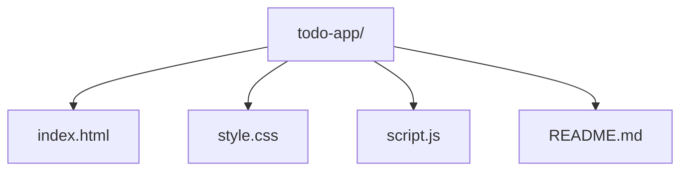
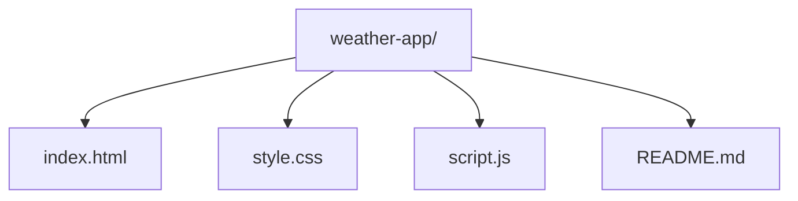
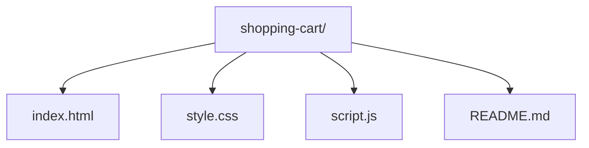
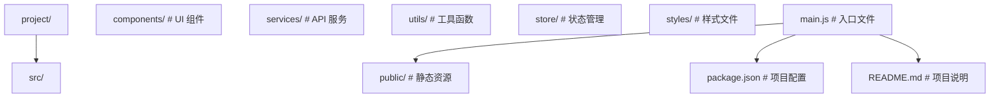
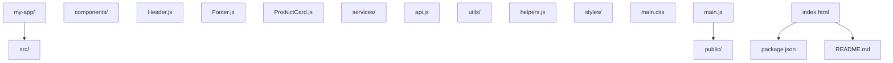
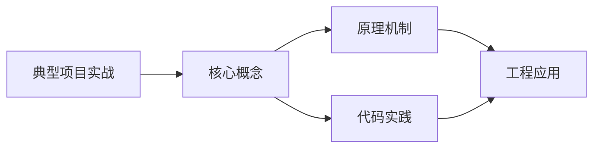
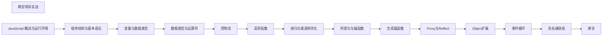

## 1. 学习目标（Bloom 分类）

本节按照布鲁姆教育目标分类学组织学习路径。本文主题为《典型项目实战》，属于 JavaScript 模块，读者可以根据自身阶段选择阅读深度。

记忆层面：能够准确复述本文的核心概念、术语与基本语法或操作步骤，并能够在提问或检索时快速定位对应知识点。能够说出 JS 的变量、函数、对象、数组与 ES6+ 语法。

理解层面：能够用自己的语言解释核心原理与工作机制，说明概念之间的因果关系，而不是机械记忆结论。能够解释原型链、闭包、事件循环与 this 绑定。

应用层面：能够在真实项目或练习场景中运用本文知识解决具体问题，写出正确且可维护的实现。能够编写浏览器交互、Node 服务与工具脚本。

分析层面：能够拆解复杂问题，比较本文主题与相邻概念的异同，识别边界条件与例外情况。能够分析异步模型、作用域与内存泄漏。

评价层面：能够根据约束条件（性能、可读性、安全、成本）评价不同方案的优劣，做出有依据的技术决策。能够评价 JS 与 TypeScript、其他语言的差异。

创造层面：能够把本文知识与其他模块知识组合，设计出新的解决方案或可复用的工程模式。能够设计现代前端应用（框架 + 工程化）。

通过本节学习，读者应当能够把《典型项目实战》纳入自己的知识网络，并与 JavaScript 模块的其他主题（原型链、事件循环、闭包、ES 规范）建立关联。

## 2. 历史动机与发展脉络

《典型项目实战》是 JavaScript 领域的重要主题。要真正理解它，需要先了解它解决的问题与演进过程。

JavaScript 由 Brendan Eich 于 1995 年在 Netscape 用 10 天设计完成，最初只做表单校验；1996 年提交给 ECMA 标准化，即 ECMAScript。
ES6（2015）是语言转折点：let/const、箭头函数、class、Promise、模块化；此后每年发布新版本（ES2016+），现代语法在 Node 与浏览器快速普及。
运行时生态：V8（Chrome/Node）、SpiderMonkey（Firefox）、JavaScriptCore（Safari）；Node.js 与 Deno/Bun 让 JS 成为全栈语言；TypeScript 成为大型项目的事实标准。

回到本文主题：典型项目实战 的提出与成熟，正是上述技术背景下的必然产物。早期实现往往以简单可用为目标，随着工程规模扩大，社区逐渐沉淀出标准做法与最佳实践；理解这一脉络，可以帮助读者判断“为什么文档中的推荐写法是现在这个样子”，也能在遇到历史遗留代码时准确识别其设计年代与取舍。


## 3. 形式化定义与核心概念精讲

本节把《典型项目实战》涉及的核心概念以“定义 + 讲解”的形式展开。读者应把定义当作工具，把讲解当作理解路径；两者结合才能形成可迁移的知识。

原型链：对象通过 __proto__ 链接原型，属性查找沿链上行；ES6 class 是原型继承的语法糖。
闭包：函数捕获定义时的作用域，变量随函数存活；闭包是模块模式与柯里化的基础。
事件循环：调用栈、任务队列（宏任务）与微任务队列决定执行顺序；Promise 回调进微任务，setTimeout 进宏任务。

### 3.1 原文章节逐一精讲

原文档把主题拆分为 11 个小节，下面按顺序给出每一节的导读讲解，随后保留原文细节供精读。

#### 原文精读（完整保留）


#### 1. 项目实战案例

##### 1.1 待办事项应用 (To-Do App)

###### 1.1.1 功能需求

- 添加任务
- 标记任务完成/未完成
- 删除任务
- 编辑任务
- 任务过滤（全部/已完成/未完成）
- 本地存储

###### 1.1.2 技术栈

- HTML5
- CSS3 (Tailwind CSS)
- JavaScript (ES6+)
- LocalStorage

###### 1.1.3 项目结构



###### 1.1.4 完整实现

**index.html**

```html
<!DOCTYPE html>
<html lang="en">
  <head>
    <meta charset="UTF-8" />
    <meta name="viewport" content="width=device-width, initial-scale=1.0" />
    <title>To-Do App</title>
    <link
      href="https://cdn.jsdelivr.net/npm/tailwindcss@2.2.19/dist/tailwind.min.css"
      rel="stylesheet"
    />
    <link rel="stylesheet" href="style.css" />
  </head>
  <body class="bg-gray-100 min-h-screen flex items-center justify-center">
    <div class="bg-white rounded-lg shadow-lg p-6 w-full max-w-md">
      <h1 class="text-2xl font-bold text-center text-gray-800 mb-6">To-Do App</h1>
      <div class="flex mb-4">
        <input
          type="text"
          id="task-input"
          class="flex-1 border border-gray-300 rounded-l-md px-4 py-2 focus:outline-none focus:ring-2 focus:ring-blue-500"
          placeholder="Add a new task..."
        />
        <button
          id="add-task"
          class="bg-blue-500 text-white px-4 py-2 rounded-r-md hover:bg-blue-600 transition-colors"
        >
          Add
        </button>
      </div>
      <div class="flex mb-4">
        <button class="filter-btn active flex-1 py-2 text-center" data-filter="all">All</button>
        <button class="filter-btn flex-1 py-2 text-center" data-filter="active">Active</button>
        <button class="filter-btn flex-1 py-2 text-center" data-filter="completed">
          Completed
        </button>
      </div>
      <ul id="task-list" class="space-y-2 mb-4">
        <!-- Tasks will be added here -->
      </ul>
      <div class="flex justify-between items-center text-sm text-gray-600">
        <span id="task-count">0 items left</span>
        <button id="clear-completed" class="hover:text-red-500">Clear completed</button>
      </div>
    </div>
    <script src="script.js"></script>
  </body>
</html>
```

**style.css**

```css
.filter-btn {
  border-bottom: 2px solid transparent;
}
.filter-btn.active {
  border-bottom: 2px solid blue;
  font-weight: bold;
}
.task-item {
  transition: all 0.3s ease;
}
.task-item.completed {
  text-decoration: line-through;
  opacity: 0.6;
}
```

**script.js**

```javascript
class ToDoApp {
  constructor() {
    this.tasks = JSON.parse(localStorage.getItem('tasks')) || [];
    this.currentFilter = 'all';
    this.init();
  }
  init() {
    this.bindEvents();
    this.renderTasks();
    this.updateTaskCount();
  }
  bindEvents() {
    // Add task event
    document.getElementById('add-task').addEventListener('click', () => this.addTask());
    document.getElementById('task-input').addEventListener('keypress', (e) => {
      if (e.key === 'Enter') this.addTask();
    });
    // Filter events
    document.querySelectorAll('.filter-btn').forEach((btn) => {
      btn.addEventListener('click', (e) => {
        this.currentFilter = e.target.dataset.filter;
        this.updateFilterButtons();
        this.renderTasks();
      });
    });
    // Clear completed event
    document
      .getElementById('clear-completed')
      .addEventListener('click', () => this.clearCompleted());
  }
  addTask() {
    const input = document.getElementById('task-input');
    const text = input.value.trim();
    if (text) {
      this.tasks.push({ id: Date.now(), text, completed: false });
      this.save();
      this.renderTasks();
      this.updateTaskCount();
      input.value = '';
    }
  }
  toggleTask(id) {
    this.tasks = this.tasks.map((task) =>
      task.id === id ? { ...task, completed: !task.completed } : task
    );
    this.save();
    this.renderTasks();
    this.updateTaskCount();
  }
  deleteTask(id) {
    this.tasks = this.tasks.filter((task) => task.id !== id);
    this.save();
    this.renderTasks();
    this.updateTaskCount();
  }
  editTask(id, newText) {
    this.tasks = this.tasks.map((task) => (task.id === id ? { ...task, text: newText } : task));
    this.save();
    this.renderTasks();
  }
  clearCompleted() {
    this.tasks = this.tasks.filter((task) => !task.completed);
    this.save();
    this.renderTasks();
    this.updateTaskCount();
  }
  save() {
    localStorage.setItem('tasks', JSON.stringify(this.tasks));
  }
  renderTasks() {
    const taskList = document.getElementById('task-list');
    const filteredTasks = this.getFilteredTasks();
    taskList.innerHTML = '';
    filteredTasks.forEach((task) => {
      const li = document.createElement('li');
      li.className = `task-item ${task.completed ? 'completed' : ''} flex items-center p-2 border border-gray-200 rounded-md`;
      li.innerHTML = `
  <input type="checkbox" class="task-checkbox mr-3" ${task.completed ? 'checked' : ''} data-id="${task.id}">
  <span class="task-text flex-1">${task.text}</span>
  <button class="delete-task text-red-500 hover:text-red-700" data-id="${task.id}">×</button>
  `;
      taskList.appendChild(li);
    });
    // Bind events for new tasks
    document.querySelectorAll('.task-checkbox').forEach((checkbox) => {
      checkbox.addEventListener('change', (e) => {
        const id = parseInt(e.target.dataset.id);
        this.toggleTask(id);
      });
    });
    document.querySelectorAll('.delete-task').forEach((button) => {
      button.addEventListener('click', (e) => {
        const id = parseInt(e.target.dataset.id);
        this.deleteTask(id);
      });
    });
    // Add double-click to edit
    document.querySelectorAll('.task-text').forEach((text) => {
      text.addEventListener('dblclick', (e) => {
        const li = e.target.closest('.task-item');
        const id = parseInt(li.querySelector('.task-checkbox').dataset.id);
        const currentText = e.target.textContent;
        const input = document.createElement('input');
        input.type = 'text';
        input.value = currentText;
        input.className =
          'w-full border border-blue-500 rounded px-2 py-1 focus:outline-none focus:ring-2 focus:ring-blue-500';
        e.target.replaceWith(input);
        input.focus();
        input.addEventListener('blur', () => {
          const newText = input.value.trim();
          if (newText) {
            this.editTask(id, newText);
          }
        });
        input.addEventListener('keypress', (e) => {
          if (e.key === 'Enter') {
            const newText = input.value.trim();
            if (newText) {
              this.editTask(id, newText);
            }
          }
        });
      });
    });
  }
  getFilteredTasks() {
    switch (this.currentFilter) {
      case 'active':
        return this.tasks.filter((task) => !task.completed);
      case 'completed':
        return this.tasks.filter((task) => task.completed);
      default:
        return this.tasks;
    }
  }
  updateFilterButtons() {
    document.querySelectorAll('.filter-btn').forEach((btn) => {
      btn.classList.remove('active');
      if (btn.dataset.filter === this.currentFilter) {
        btn.classList.add('active');
      }
    });
  }
  updateTaskCount() {
    const activeTasks = this.tasks.filter((task) => !task.completed).length;
    document.getElementById('task-count').textContent =
      `${activeTasks} item${activeTasks !== 1 ? 's' : ''} left`;
  }
}
// Initialize the app
new ToDoApp();
```

##### 1.2 天气应用

###### 1.2.1 功能需求

- 显示当前天气
- 5天天气预报
- 搜索城市
- 响应式设计

###### 1.2.2 技术栈

- HTML5
- CSS3 (Tailwind CSS)
- JavaScript (ES6+)
- OpenWeather API

###### 1.2.3 项目结构



###### 1.2.4 完整实现

**index.html**

```html
<!DOCTYPE html>
<html lang="en">
  <head>
    <meta charset="UTF-8" />
    <meta name="viewport" content="width=device-width, initial-scale=1.0" />
    <title>Weather App</title>
    <link
      href="https://cdn.jsdelivr.net/npm/tailwindcss@2.2.19/dist/tailwind.min.css"
      rel="stylesheet"
    />
    <link rel="stylesheet" href="style.css" />
  </head>
  <body class="bg-gray-100 min-h-screen">
    <div class="container mx-auto px-4 py-8">
      <h1 class="text-3xl font-bold text-center text-gray-800 mb-8">Weather App</h1>
      <div class="max-w-md mx-auto mb-8">
        <div class="flex">
          <input
            type="text"
            id="city-input"
            class="flex-1 border border-gray-300 rounded-l-md px-4 py-2 focus:outline-none focus:ring-2 focus:ring-blue-500"
            placeholder="Enter city name..."
          />
          <button
            id="search-btn"
            class="bg-blue-500 text-white px-4 py-2 rounded-r-md hover:bg-blue-600 transition-colors"
          >
            Search
          </button>
        </div>
      </div>
      <div
        id="weather-container"
        class="max-w-4xl mx-auto bg-white rounded-lg shadow-lg p-6 hidden"
      >
        <div class="flex flex-col md:flex-row justify-between items-center mb-8">
          <div>
            <h2 id="city-name" class="text-2xl font-bold text-gray-800">City Name</h2>
            <p id="date" class="text-gray-600">Date</p>
          </div>
          <div class="flex items-center mt-4 md:mt-0">
            
            <div>
              <p id="weather-description" class="text-gray-600 capitalize">Weather Description</p>
              <p id="temperature" class="text-4xl font-bold text-gray-800">0°C</p>
            </div>
          </div>
        </div>
        <div class="grid grid-cols-2 md:grid-cols-5 gap-4">
          <!-- Forecast items will be added here -->
        </div>
      </div>
      <div
        id="error-message"
        class="max-w-md mx-auto bg-red-100 border border-red-400 text-red-700 px-4 py-3 rounded mb-8 hidden"
      >
        <strong class="font-bold">Error:</strong> <span id="error-text">City not found</span>
      </div>
    </div>
    <script src="script.js"></script>
  </body>
</html>
```

**style.css**

```css
body {
  background: linear-gradient(135deg, #667eea 0%, #764ba2 100%);
  min-height: 100vh;
}
#weather-container {
  background: rgba(255, 255, 255, 0.95);
  backdrop-filter: blur(10px);
}
.forecast-item {
  transition: transform 0.3s ease;
}
.forecast-item:hover {
  transform: translateY(-5px);
}
```

**script.js**

```javascript
class WeatherApp {
  constructor() {
    this.apiKey = 'YOUR_API_KEY'; // Replace with your OpenWeather API key
    this.init();
  }
  init() {
    this.bindEvents();
    // Default city
    this.getWeather('New York');
  }
  bindEvents() {
    document.getElementById('search-btn').addEventListener('click', () => {
      const city = document.getElementById('city-input').value.trim();
      if (city) {
        this.getWeather(city);
      }
    });
    document.getElementById('city-input').addEventListener('keypress', (e) => {
      if (e.key === 'Enter') {
        const city = e.target.value.trim();
        if (city) {
          this.getWeather(city);
        }
      }
    });
  }
  async getWeather(city) {
    try {
      // Get current weather
      const currentWeatherResponse = await fetch(
        `https://api.openweathermap.org/data/2.5/weather?q=${city}&units=metric&appid=${this.apiKey}`
      );
      if (!currentWeatherResponse.ok) {
        throw new Error('City not found');
      }
      const currentWeather = await currentWeatherResponse.json();
      // Get forecast
      const forecastResponse = await fetch(
        `https://api.openweathermap.org/data/2.5/forecast?q=${city}&units=metric&appid=${this.apiKey}`
      );
      const forecast = await forecastResponse.json();
      this.displayWeather(currentWeather, forecast);
      this.hideError();
    } catch (error) {
      this.showError(error.message);
    }
  }
  displayWeather(currentWeather, forecast) {
    // Update current weather
    document.getElementById('city-name').textContent = currentWeather.name;
    document.getElementById('date').textContent = this.formatDate(new Date());
    document.getElementById('weather-description').textContent =
      currentWeather.weather[0].description;
    document.getElementById('temperature').textContent =
      `${Math.round(currentWeather.main.temp)}°C`;
    document.getElementById('weather-icon').src =
      `https://openweathermap.org/img/wn/${currentWeather.weather[0].icon}@2x.png`;
    // Update forecast
    const forecastContainer = document.querySelector('.grid');
    forecastContainer.innerHTML = '';
    // Get daily forecast (every 8 hours)
    const dailyForecast = [];
    for (let i = 0; i < forecast.list.length; i += 8) {
      dailyForecast.push(forecast.list[i]);
    }
    dailyForecast.forEach((day) => {
      const forecastItem = document.createElement('div');
      forecastItem.className = 'forecast-item bg-gray-50 rounded-lg p-4 text-center';
      forecastItem.innerHTML = `
  <p class="font-medium text-gray-800">${this.formatDay(new Date(day.dt * 1000))}</p>
  
  <p class="text-gray-600">${Math.round(day.main.temp)}°C</p>
  `;
      forecastContainer.appendChild(forecastItem);
    });
    // Show weather container
    document.getElementById('weather-container').classList.remove('hidden');
  }
  formatDate(date) {
    const options = { weekday: 'long', year: 'numeric', month: 'long', day: 'numeric' };
    return date.toLocaleDateString('en-US', options);
  }
  formatDay(date) {
    const options = { weekday: 'short' };
    return date.toLocaleDateString('en-US', options);
  }
  showError(message) {
    document.getElementById('error-text').textContent = message;
    document.getElementById('error-message').classList.remove('hidden');
    document.getElementById('weather-container').classList.add('hidden');
  }
  hideError() {
    document.getElementById('error-message').classList.add('hidden');
  }
}
// Initialize the app
new WeatherApp();
```

##### 1.3 电商购物车

###### 1.3.1 功能需求

- 产品列表
- 添加到购物车
- 购物车管理
- 结算功能

###### 1.3.2 技术栈

- HTML5
- CSS3 (Tailwind CSS)
- JavaScript (ES6+)
- LocalStorage

###### 1.3.3 项目结构



###### 1.3.4 完整实现

**index.html**

```html
<!DOCTYPE html>
<html lang="en">
  <head>
    <meta charset="UTF-8" />
    <meta name="viewport" content="width=device-width, initial-scale=1.0" />
    <title>Shopping Cart</title>
    <link
      href="https://cdn.jsdelivr.net/npm/tailwindcss@2.2.19/dist/tailwind.min.css"
      rel="stylesheet"
    />
    <link rel="stylesheet" href="style.css" />
  </head>
  <body class="bg-gray-100 min-h-screen">
    <header class="bg-white shadow-md">
      <div class="container mx-auto px-4 py-4 flex justify-between items-center">
        <h1 class="text-2xl font-bold text-gray-800">Shopping Cart</h1>
        <div class="relative">
          <button
            id="cart-btn"
            class="flex items-center bg-blue-500 text-white px-4 py-2 rounded-md hover:bg-blue-600 transition-colors"
          >
            <svg
              class="w-5 h-5 mr-2"
              fill="none"
              stroke="currentColor"
              viewBox="0 0 24 24"
              xmlns="http://www.w3.org/2000/svg"
            >
              <path
                stroke-linecap="round"
                stroke-linejoin="round"
                stroke-width="2"
                d="M16 11V7a4 4 0 00-8 0v4M5 9h14l1 12H4L5 9z"
              ></path>
            </svg>
            Cart
            <span
              id="cart-count"
              class="ml-2 bg-white text-blue-500 rounded-full w-6 h-6 flex items-center justify-center"
              >0</span
            >
          </button>
          <div
            id="cart-dropdown"
            class="absolute right-0 mt-2 w-80 bg-white shadow-lg rounded-md p-4 hidden"
          >
            <h3 class="font-bold text-gray-800 mb-4">Your Cart</h3>
            <div id="cart-items" class="space-y-4 mb-4">
              <!-- Cart items will be added here -->
            </div>
            <div class="border-t pt-4">
              <div class="flex justify-between font-bold mb-4">
                <span>Total:</span>
                <span id="cart-total">$0.00</span>
              </div>
              <button
                id="checkout-btn"
                class="w-full bg-green-500 text-white px-4 py-2 rounded-md hover:bg-green-600 transition-colors"
              >
                Checkout
              </button>
            </div>
          </div>
        </div>
      </div>
    </header>
    <main class="container mx-auto px-4 py-8">
      <h2 class="text-2xl font-bold text-gray-800 mb-6">Products</h2>
      <div class="grid grid-cols-1 md:grid-cols-2 lg:grid-cols-3 gap-6">
        <!-- Products will be added here -->
      </div>
    </main>
    <script src="script.js"></script>
  </body>
</html>
```

**style.css**

```css
.product-card {
  transition:
    transform 0.3s ease,
    box-shadow 0.3s ease;
}
.product-card:hover {
  transform: translateY(-5px);
  box-shadow:
    0 10px 15px -3px rgba(0, 0, 0, 0.1),
    0 4px 6px -2px rgba(0, 0, 0, 0.05);
}
#cart-dropdown {
  z-index: 1000;
}
```

**script.js**

```javascript
class ShoppingCart {
  constructor() {
    this.products = [
      { id: 1, name: 'Product 1', price: 19.99, image: 'https://via.placeholder.com/300x200' },
      { id: 2, name: 'Product 2', price: 29.99, image: 'https://via.placeholder.com/300x200' },
      { id: 3, name: 'Product 3', price: 39.99, image: 'https://via.placeholder.com/300x200' },
      { id: 4, name: 'Product 4', price: 49.99, image: 'https://via.placeholder.com/300x200' },
      { id: 5, name: 'Product 5', price: 59.99, image: 'https://via.placeholder.com/300x200' },
      { id: 6, name: 'Product 6', price: 69.99, image: 'https://via.placeholder.com/300x200' },
    ];
    this.cart = JSON.parse(localStorage.getItem('cart')) || [];
    this.init();
  }
  init() {
    this.renderProducts();
    this.updateCart();
    this.bindEvents();
  }
  bindEvents() {
    // Cart dropdown toggle
    document.getElementById('cart-btn').addEventListener('click', () => {
      document.getElementById('cart-dropdown').classList.toggle('hidden');
    });
    // Close dropdown when clicking outside
    document.addEventListener('click', (e) => {
      const cartBtn = document.getElementById('cart-btn');
      const cartDropdown = document.getElementById('cart-dropdown');
      if (!cartBtn.contains(e.target) && !cartDropdown.contains(e.target)) {
        cartDropdown.classList.add('hidden');
      }
    });
    // Checkout button
    document.getElementById('checkout-btn').addEventListener('click', () => {
      alert('Checkout functionality would be implemented here');
    });
  }
  renderProducts() {
    const productsContainer = document.querySelector('.grid');
    productsContainer.innerHTML = '';
    this.products.forEach((product) => {
      const productCard = document.createElement('div');
      productCard.className = 'product-card bg-white rounded-lg shadow-md overflow-hidden';
      productCard.innerHTML = `
  
  <div class="p-4">
  <h3 class="font-bold text-gray-800 mb-2">${product.name}</h3>
  <p class="text-blue-600 font-bold mb-4">$${product.price.toFixed(2)}</p>
  <button class="add-to-cart w-full bg-blue-500 text-white px-4 py-2 rounded-md hover:bg-blue-600 transition-colors" data-id="${product.id}">Add to Cart</button>
  </div>
  `;
      productsContainer.appendChild(productCard);
    });
    // Bind add to cart events
    document.querySelectorAll('.add-to-cart').forEach((button) => {
      button.addEventListener('click', (e) => {
        const productId = parseInt(e.target.dataset.id);
        this.addToCart(productId);
      });
    });
  }
  addToCart(productId) {
    const product = this.products.find((p) => p.id === productId);
    if (product) {
      const existingItem = this.cart.find((item) => item.id === productId);
      if (existingItem) {
        existingItem.quantity++;
      } else {
        this.cart.push({ ...product, quantity: 1 });
      }
      this.saveCart();
      this.updateCart();
      // Show success message
      alert('Product added to cart!');
    }
  }
  removeFromCart(productId) {
    this.cart = this.cart.filter((item) => item.id !== productId);
    this.saveCart();
    this.updateCart();
  }
  updateQuantity(productId, change) {
    const item = this.cart.find((item) => item.id === productId);
    if (item) {
      item.quantity += change;
      if (item.quantity <= 0) {
        this.removeFromCart(productId);
      } else {
        this.saveCart();
        this.updateCart();
      }
    }
  }
  saveCart() {
    localStorage.setItem('cart', JSON.stringify(this.cart));
  }
  updateCart() {
    // Update cart count
    const cartCount = this.cart.reduce((total, item) => total + item.quantity, 0);
    document.getElementById('cart-count').textContent = cartCount;
    // Update cart items
    const cartItemsContainer = document.getElementById('cart-items');
    cartItemsContainer.innerHTML = '';
    if (this.cart.length === 0) {
      cartItemsContainer.innerHTML = '<p class="text-gray-600">Your cart is empty</p>';
    } else {
      this.cart.forEach((item) => {
        const cartItem = document.createElement('div');
        cartItem.className = 'flex items-center justify-between';
        cartItem.innerHTML = `
  <div class="flex items-center">
  
  <div class="ml-3">
  <h4 class="font-medium text-gray-800">${item.name}</h4>
  <p class="text-gray-600">$${item.price.toFixed(2)}</p>
  </div>
  </div>
  <div class="flex items-center">
  <button class="quantity-btn bg-gray-200 text-gray-800 w-6 h-6 flex items-center justify-center rounded-l-md" data-id="${item.id}" data-change="-1">-</button>
  <span class="bg-gray-100 text-gray-800 w-8 h-6 flex items-center justify-center">${item.quantity}</span>
  <button class="quantity-btn bg-gray-200 text-gray-800 w-6 h-6 flex items-center justify-center rounded-r-md" data-id="${item.id}" data-change="1">+</button>
  <button class="remove-btn ml-2 text-red-500 hover:text-red-700" data-id="${item.id}">×</button>
  </div>
  `;
        cartItemsContainer.appendChild(cartItem);
      });
      // Bind quantity buttons
      document.querySelectorAll('.quantity-btn').forEach((button) => {
        button.addEventListener('click', (e) => {
          const productId = parseInt(e.target.dataset.id);
          const change = parseInt(e.target.dataset.change);
          this.updateQuantity(productId, change);
        });
      });
      // Bind remove buttons
      document.querySelectorAll('.remove-btn').forEach((button) => {
        button.addEventListener('click', (e) => {
          const productId = parseInt(e.target.dataset.id);
          this.removeFromCart(productId);
        });
      });
    }
    // Update cart total
    const total = this.cart.reduce((sum, item) => sum + item.price * item.quantity, 0);
    document.getElementById('cart-total').textContent = `$${total.toFixed(2)}`;
  }
}
// Initialize the app
new ShoppingCart();
```

#### 2. 项目结构与组织

##### 2.1 模块化设计

###### 2.1.1 模块划分

- **核心模块**：业务逻辑
- **UI 模块**：界面渲染
- **服务模块**：API 调用
- **工具模块**：通用功能

###### 2.1.2 代码组织



##### 2.2 依赖管理

###### 2.2.1 package.json 示例

```json
{
  "name": "my-project",
  "version": "1.0.0",
  "description": "My JavaScript project",
  "main": "src/main.js",
  "scripts": {
    "dev": "vite",
    "build": "vite build",
    "preview": "vite preview",
    "test": "jest",
    "lint": "eslint src"
  },
  "dependencies": {
    "axios": "^0.27.2",
    "tailwindcss": "^3.1.8"
  },
  "devDependencies": {
    "vite": "^3.1.0",
    "eslint": "^8.23.1",
    "jest": "^28.1.3"
  }
}
```

##### 2.3 前端构建工具

###### 2.3.1 Vite

- **快速的开发服务器**
- **优化的构建过程**
- **支持 ES 模块**

###### 2.3.2 Webpack

- **强大的打包能力**
- **丰富的插件生态**
- **适合大型项目**

#### 3. 测试

##### 3.1 单元测试

###### 3.1.1 Jest 配置

```json
{
  "testEnvironment": "jsdom",
  "transform": {
    "^.+\.js$": "babel-jest"
  }
}
```

###### 3.1.2 测试示例

```javascript
// utils.test.js
const { sum, multiply } = require('./utils');
test('sum adds two numbers', () => {
  expect(sum(1, 2)).toBe(3);
});
test('multiply multiplies two numbers', () => {
  expect(multiply(2, 3)).toBe(6);
});
```

##### 3.2 集成测试

###### 3.2.1 Cypress 配置

```json
{
  "baseUrl": "http://localhost:3000",
  "viewportWidth": 1280,
  "viewportHeight": 720
}
```

###### 3.2.2 测试示例

```javascript
// cypress/integration/home.spec.js
describe('Home page', () => {
  it('should load the home page', () => {
    cy.visit('/');
    cy.contains('Welcome to My App');
  });
  it('should display products', () => {
    cy.visit('/');
    cy.get('.product-card').should('have.length.greaterThan', 0);
  });
});
```

#### 4. 部署

##### 4.1 静态网站部署

###### 4.1.1 GitHub Pages

- **步骤**：

1.  构建项目：`npm run build`
2.  推送 dist 目录到 gh-pages 分支
3.  在 GitHub 仓库设置中启用 Pages

###### 4.1.2 Netlify

- **步骤**：

1.  连接 GitHub 仓库
2.  配置构建命令：`npm run build`
3.  配置发布目录：`dist`
4.  部署

###### 4.1.3 Vercel

- **步骤**：

1.  连接 GitHub 仓库
2.  配置构建命令：`npm run build`
3.  配置发布目录：`dist`
4.  部署

##### 4.2 容器化部署

###### 4.2.1 Dockerfile 示例

```dockerfile
 from node:16-alpine
 WORKDIR /app
 COPY package*.json ./
 RUN npm install
 COPY . .
 RUN npm run build
 EXPOSE 3000
 CMD ["npm", "start"]
```

###### 4.2.2 docker-compose.yml 示例

```yaml
version: '3'
services:
  app:
  build: .
  ports:
    - '3000:3000'
  environment:
    - NODE_ENV=production
```

##### 4.3 CI/CD 配置

###### 4.3.1 GitHub Actions 示例

```yaml
 name: CI/CD
 on:
  push:
  branches: [ main ]
  pull_request:
  branches: [ main ]
 jobs:
  build:
  runs-on: ubuntu-latest
  steps:
  - uses: actions/checkout@v3
  - name: Setup Node.js
  uses: actions/setup-node@v3
  with:
  node-version: '16'
  - name: Install dependencies
  run: npm install
  - name: Run tests
  run: npm test
  - name: Build
  run: npm run build
  - name: Deploy to GitHub Pages
  if: github.ref == 'refs/heads/main'
  uses: peaceiris/actions-gh-pages@v4
  with:
  github_token: ${{ secrets.GITHUB_TOKEN }}
  publish_dir: ./dist
```

#### 5. 性能优化

##### 5.1 代码优化

###### 5.1.1 代码分割

- **按需加载**：使用动态导入
- **减少初始包大小**：分割 vendor 和 app 代码

###### 5.1.2 懒加载

- **图片懒加载**：使用 `loading="lazy"` 属性
- **组件懒加载**：使用动态导入

###### 5.1.3 缓存策略

- **浏览器缓存**：设置合理的缓存头
- **Service Worker**：离线缓存

##### 5.2 网络优化

###### 5.2.1 资源压缩

- **Gzip/Brotli 压缩**
- **代码压缩**
- **图片压缩**

###### 5.2.2 CDN

- **使用内容分发网络**
- **减少网络延迟**

###### 5.2.3 资源提示

- **preload**：预加载关键资源
- **prefetch**：预加载未来可能使用的资源
- **dns-prefetch**：预解析 DNS

#### 6. 安全最佳实践

##### 6.1 XSS 防护

- **输入验证**：验证用户输入
- **输出编码**：编码输出到页面的内容
- **Content Security Policy**：设置 CSP 头

##### 6.2 CSRF 防护

- **CSRF 令牌**：使用 CSRF 令牌
- **SameSite Cookie**：设置 SameSite 属性

##### 6.3 数据验证

- **前端验证**：客户端验证
- **后端验证**：服务器端验证
- **使用验证库**：如 Joi、Yup

#### 7. 实际应用案例

##### 7.1 完整项目示例

###### 7.1.1 项目结构



###### 7.1.2 核心文件

**src/main.js**

```javascript
import './styles/main.css';
import { initApp } from './app';
initApp();
```

**src/app.js**

```javascript
import { fetchProducts } from './services/api';
import { renderProducts } from './components/ProductCard';
export function initApp() {
  // Initialize the app
  console.log('App initialized');
  // Fetch and render products
  fetchProducts()
    .then((products) => {
      renderProducts(products);
    })
    .catch((error) => {
      console.error('Error fetching products:', error);
    });
}
```

**src/services/api.js**

```javascript
export async function fetchProducts() {
  try {
    const response = await fetch('https://api.example.com/products');
    if (!response.ok) {
      throw new Error('Failed to fetch products');
    }
    return await response.json();
  } catch (error) {
    console.error('Error fetching products:', error);
    // Return mock data for demonstration
    return [
      { id: 1, name: 'Product 1', price: 19.99, image: 'https://via.placeholder.com/300x200' },
      { id: 2, name: 'Product 2', price: 29.99, image: 'https://via.placeholder.com/300x200' },
    ];
  }
}
```

**src/components/ProductCard.js**

```javascript
export function renderProducts(products) {
  const container = document.querySelector('.products-container');
  container.innerHTML = '';
  products.forEach((product) => {
    const card = document.createElement('div');
    card.className = 'product-card';
    card.innerHTML = `
  
  <h3>${product.name}</h3>
  <p>$${product.price.toFixed(2)}</p>
  <button class="add-to-cart">Add to Cart</button>
  `;
    container.appendChild(card);
  });
}
```

#### 8. 常见问题与解决方案

##### 8.1 项目构建问题

**问题**：构建失败
**解决方案**：

- 检查依赖是否正确安装
- 检查构建配置
- 查看错误信息并修复
  **问题**：构建产物过大
  **解决方案**：
- 代码分割
- 树摇（Tree Shaking）
- 压缩资源

##### 8.2 运行时问题

**问题**：页面加载缓慢
**解决方案**：

- 优化资源加载
- 懒加载
- 缓存策略
  **问题**：JavaScript 错误
  **解决方案**：
- 检查控制台错误
- 使用 try-catch 处理异常
- 调试代码

##### 8.3 部署问题

**问题**：部署失败
**解决方案**：

- 检查部署配置
- 查看部署日志
- 确保构建产物正确
  **问题**：网站无法访问
  **解决方案**：
- 检查域名配置
- 检查服务器状态
- 查看网络连接

#### 9. 最佳实践

##### 9.1 代码规范

- **使用 ESLint**：保持代码风格一致
- **使用 Prettier**：自动格式化代码
- **遵循命名规范**：使用驼峰命名法
- **添加注释**：解释复杂代码

##### 9.2 项目管理

- **使用 Git**：版本控制
- **使用 GitHub Issues**：任务管理
- **使用 Pull Requests**：代码审查
- **编写 README**：项目文档

##### 9.3 性能优化

- **监控性能**：使用 Chrome DevTools
- **优化渲染**：减少重排和重绘
- **优化网络**：减少请求和响应大小
- **优化 JavaScript**：避免长任务

##### 9.4 安全性

- **输入验证**：验证所有用户输入
- **使用 HTTPS**：加密传输
- **保护敏感数据**：避免暴露敏感信息
- **定期更新依赖**：修复安全漏洞

#### 10. 延伸阅读

- [MDN Web 开发文档](https://developer.mozilla.org/en-US/docs/Web) <!-- nofollow -->
- [JavaScript.info](https://javascript.info/) <!-- nofollow -->
- [Frontend Masters](https://frontendmasters.com/) <!-- nofollow -->
- [CSS-Tricks](https://css-tricks.com/) <!-- nofollow -->
- [Smashing Magazine](https://www.smashingmagazine.com/) <!-- nofollow -->

#### 11. 更新日志

- **2026-04-05**: 初始化项目实战，涵盖简易待办事项应用的设计与核心实现。
- **2026-05-03**: 扩展内容，添加更完整的项目实战案例、项目结构和组织、前端构建工具、测试、部署、性能优化、安全最佳实践等内容。


### 3.2 概念关系图

下面用 Mermaid 图表达本文核心概念之间的关系，帮助读者建立整体图景：



图中展示的是本文知识的结构化关系：核心概念是入口，原理机制解释“为什么”，代码实践演示“怎么做”，工程应用回答“何时用”。读者学习时可以把每个小节的内容挂接到对应节点上。

## 4. 理论推导与原理解析

本节深入《典型项目实战》背后的原理。理论部分不求面面俱到，而是聚焦“能解释现象、能指导实践”的关键推导。

原型链：对象通过 __proto__ 链接原型，属性查找沿链上行；ES6 class 是原型继承的语法糖。
闭包：函数捕获定义时的作用域，变量随函数存活；闭包是模块模式与柯里化的基础。
事件循环：调用栈、任务队列（宏任务）与微任务队列决定执行顺序；Promise 回调进微任务，setTimeout 进宏任务。
this 绑定：默认绑定、隐式绑定、显式绑定（call/apply/bind）与箭头函数词法绑定四种规则。

需要强调的是，理论推导与工程实践之间存在翻译层：理论给出的是理想化模型与边界条件，工程代码则必须处理真实环境中的例外。读者在学习时应先掌握理论的“标准情形”，再通过陷阱章节了解“非标准情形”。

## 5. 代码示例与逐行讲解

本节把原文中的代码示例系统整理，并为每个示例补充用途说明与讲解。读者不应只浏览代码，而应逐段对照讲解理解设计意图。

### 5.1 示例：1.1.3 项目结构

该示例来自原文《1.1.3 项目结构》小节，用于演示典型项目实战相关操作。阅读时请先看代码结构，再看其后的讲解。


讲解：这段代码演示了本节核心知识点。代码中的关键操作可以归纳为三步：准备（定义或初始化）、执行（核心逻辑）、收尾（释放资源或返回结果）。实际项目中，这三步往往被封装为函数或类，以提升复用性与可测试性。

关键点分析：

该示例共 10 行有效代码，结构以数据或配置为主。阅读时应关注：数据字段的含义、配置项的作用，以及它们与运行行为的对应关系。

进阶思考路径：先尝试修改参数观察行为变化，再把示例中的模式迁移到自己的项目中；每次修改都记录预期与实测差异，这是把示例转化为能力的最快方式。

### 5.2 示例：1.1.4 完整实现

该示例来自原文《1.1.4 完整实现》小节，用于演示典型项目实战相关操作。阅读时请先看代码结构，再看其后的讲解。

```html
<!DOCTYPE html>
<html lang="en">
  <head>
    <meta charset="UTF-8" />
    <meta name="viewport" content="width=device-width, initial-scale=1.0" />
    <title>To-Do App</title>
    <link
      href="https://cdn.jsdelivr.net/npm/tailwindcss@2.2.19/dist/tailwind.min.css"
      rel="stylesheet"
    />
    <link rel="stylesheet" href="style.css" />
  </head>
  <body class="bg-gray-100 min-h-screen flex items-center justify-center">
    <div class="bg-white rounded-lg shadow-lg p-6 w-full max-w-md">
      <h1 class="text-2xl font-bold text-center text-gray-800 mb-6">To-Do App</h1>
      <div class="flex mb-4">
        <input
          type="text"
          id="task-input"
          class="flex-1 border border-gray-300 rounded-l-md px-4 py-2 focus:outline-none focus:ring-2 focus:ring-blue-500"
          placeholder="Add a new task..."
        />
        <button
          id="add-task"
          class="bg-blue-500 text-white px-4 py-2 rounded-r-md hover:bg-blue-600 transition-colors"
        >
          Add
        </button>
      </div>
      <div class="flex mb-4">
        <button class="filter-btn active flex-1 py-2 text-center" data-filter="all">All</button>
        <button class="filter-btn flex-1 py-2 text-center" data-filter="active">Active</button>
        <button class="filter-btn flex-1 py-2 text-center" data-filter="completed">
          Completed
        </button>
      </div>
      <ul id="task-list" class="space-y-2 mb-4">
        <!-- Tasks will be added here -->
      </ul>
      <div class="flex justify-between items-center text-sm text-gray-600">
        <span id="task-count">0 items left</span>
        <button id="clear-completed" class="hover:text-red-500">Clear completed</button>
      </div>
    </div>
    <script src="script.js"></script>
  </body>
</html>
```

讲解：这段代码演示了本节核心知识点。代码中的关键操作可以归纳为三步：准备（定义或初始化）、执行（核心逻辑）、收尾（释放资源或返回结果）。实际项目中，这三步往往被封装为函数或类，以提升复用性与可测试性。

关键点分析：

该示例共 47 行有效代码，包含 1 类关键结构（class）。其中：

- 入口与初始化部分负责建立上下文，对应实际项目中的启动或装配逻辑；
- 核心逻辑部分体现本文主题的主要操作，是阅读时最需要对照讲解理解的部分；
- 输出或返回部分把结果交给调用方，注意其类型与边界条件。

进阶思考路径：先尝试修改参数观察行为变化，再把示例中的模式迁移到自己的项目中；每次修改都记录预期与实测差异，这是把示例转化为能力的最快方式。

### 5.3 示例：1.1.4 完整实现

该示例来自原文《1.1.4 完整实现》小节，用于演示典型项目实战相关操作。阅读时请先看代码结构，再看其后的讲解。

```css
.filter-btn {
  border-bottom: 2px solid transparent;
}
.filter-btn.active {
  border-bottom: 2px solid blue;
  font-weight: bold;
}
.task-item {
  transition: all 0.3s ease;
}
.task-item.completed {
  text-decoration: line-through;
  opacity: 0.6;
}
```

讲解：这段代码演示了本节核心知识点。代码中的关键操作可以归纳为三步：准备（定义或初始化）、执行（核心逻辑）、收尾（释放资源或返回结果）。实际项目中，这三步往往被封装为函数或类，以提升复用性与可测试性。

关键点分析：

该示例共 14 行有效代码，结构以数据或配置为主。阅读时应关注：数据字段的含义、配置项的作用，以及它们与运行行为的对应关系。

进阶思考路径：先尝试修改参数观察行为变化，再把示例中的模式迁移到自己的项目中；每次修改都记录预期与实测差异，这是把示例转化为能力的最快方式。

### 5.4 示例：1.1.4 完整实现

该示例来自原文《1.1.4 完整实现》小节，用于演示典型项目实战相关操作。阅读时请先看代码结构，再看其后的讲解。

```javascript
class ToDoApp {
  constructor() {
    this.tasks = JSON.parse(localStorage.getItem('tasks')) || [];
    this.currentFilter = 'all';
    this.init();
  }
  init() {
    this.bindEvents();
    this.renderTasks();
    this.updateTaskCount();
  }
  bindEvents() {
    // Add task event
    document.getElementById('add-task').addEventListener('click', () => this.addTask());
    document.getElementById('task-input').addEventListener('keypress', (e) => {
      if (e.key === 'Enter') this.addTask();
    });
    // Filter events
    document.querySelectorAll('.filter-btn').forEach((btn) => {
      btn.addEventListener('click', (e) => {
        this.currentFilter = e.target.dataset.filter;
        this.updateFilterButtons();
        this.renderTasks();
      });
    });
    // Clear completed event
    document
      .getElementById('clear-completed')
      .addEventListener('click', () => this.clearCompleted());
  }
  addTask() {
    const input = document.getElementById('task-input');
    const text = input.value.trim();
    if (text) {
      this.tasks.push({ id: Date.now(), text, completed: false });
      this.save();
      this.renderTasks();
      this.updateTaskCount();
      input.value = '';
    }
  }
  toggleTask(id) {
    this.tasks = this.tasks.map((task) =>
      task.id === id ? { ...task, completed: !task.completed } : task
    );
    this.save();
    this.renderTasks();
    this.updateTaskCount();
  }
  deleteTask(id) {
    this.tasks = this.tasks.filter((task) => task.id !== id);
    this.save();
    this.renderTasks();
    this.updateTaskCount();
  }
  editTask(id, newText) {
    this.tasks = this.tasks.map((task) => (task.id === id ? { ...task, text: newText } : task));
    this.save();
    this.renderTasks();
  }
  clearCompleted() {
    this.tasks = this.tasks.filter((task) => !task.completed);
    this.save();
    this.renderTasks();
    this.updateTaskCount();
  }
  save() {
    localStorage.setItem('tasks', JSON.stringify(this.tasks));
  }
  renderTasks() {
    const taskList = document.getElementById('task-list');
    const filteredTasks = this.getFilteredTasks();
    taskList.innerHTML = '';
    filteredTasks.forEach((task) => {
      const li = document.createElement('li');
      li.className = `task-item ${task.completed ? 'completed' : ''} flex items-center p-2 border border-gray-200 rounded-md`;
      li.innerHTML = `
  <input type="checkbox" class="task-checkbox mr-3" ${task.completed ? 'checked' : ''} data-id="${task.id}">
  <span class="task-text flex-1">${task.text}</span>
  <button class="delete-task text-red-500 hover:text-red-700" data-id="${task.id}">×</button>
  `;
      taskList.appendChild(li);
    });
    // Bind events for new tasks
    document.querySelectorAll('.task-checkbox').forEach((checkbox) => {
      checkbox.addEventListener('change', (e) => {
        const id = parseInt(e.target.dataset.id);
        this.toggleTask(id);
      });
    });
    document.querySelectorAll('.delete-task').forEach((button) => {
      button.addEventListener('click', (e) => {
        const id = parseInt(e.target.dataset.id);
        this.deleteTask(id);
      });
    });
    // Add double-click to edit
    document.querySelectorAll('.task-text').forEach((text) => {
      text.addEventListener('dblclick', (e) => {
        const li = e.target.closest('.task-item');
        const id = parseInt(li.querySelector('.task-checkbox').dataset.id);
        const currentText = e.target.textContent;
        const input = document.createElement('input');
        input.type = 'text';
        input.value = currentText;
        input.className =
          'w-full border border-blue-500 rounded px-2 py-1 focus:outline-none focus:ring-2 focus:ring-blue-500';
        e.target.replaceWith(input);
        input.focus();
        input.addEventListener('blur', () => {
          const newText = input.value.trim();
          if (newText) {
            this.editTask(id, newText);
          }
        });
        input.addEventListener('keypress', (e) => {
          if (e.key === 'Enter') {
            const newText = input.value.trim();
            if (newText) {
              this.editTask(id, newText);
            }
          }
        });
      });
    });
  }
  getFilteredTasks() {
    switch (this.currentFilter) {
      case 'active':
        return this.tasks.filter((task) => !task.completed);
      case 'completed':
        return this.tasks.filter((task) => task.completed);
      default:
        return this.tasks;
    }
  }
  updateFilterButtons() {
    document.querySelectorAll('.filter-btn').forEach((btn) => {
      btn.classList.remove('active');
      if (btn.dataset.filter === this.currentFilter) {
        btn.classList.add('active');
      }
    });
  }
  updateTaskCount() {
    const activeTasks = this.tasks.filter((task) => !task.completed).length;
    document.getElementById('task-count').textContent =
      `${activeTasks} item${activeTasks !== 1 ? 's' : ''} left`;
  }
}
// Initialize the app
new ToDoApp();
```

讲解：这段代码演示了本节核心知识点。代码中的关键操作可以归纳为三步：准备（定义或初始化）、执行（核心逻辑）、收尾（释放资源或返回结果）。实际项目中，这三步往往被封装为函数或类，以提升复用性与可测试性。

关键点分析：

该示例共 152 行有效代码，包含 4 类关键结构（class、if、for、return）。其中：

- 入口与初始化部分负责建立上下文，对应实际项目中的启动或装配逻辑；
- 核心逻辑部分体现本文主题的主要操作，是阅读时最需要对照讲解理解的部分；
- 输出或返回部分把结果交给调用方，注意其类型与边界条件。

进阶思考路径：先尝试修改参数观察行为变化，再把示例中的模式迁移到自己的项目中；每次修改都记录预期与实测差异，这是把示例转化为能力的最快方式。

### 5.5 示例：1.2.3 项目结构

该示例来自原文《1.2.3 项目结构》小节，用于演示典型项目实战相关操作。阅读时请先看代码结构，再看其后的讲解。


讲解：这段代码演示了本节核心知识点。代码中的关键操作可以归纳为三步：准备（定义或初始化）、执行（核心逻辑）、收尾（释放资源或返回结果）。实际项目中，这三步往往被封装为函数或类，以提升复用性与可测试性。

关键点分析：

该示例共 10 行有效代码，结构以数据或配置为主。阅读时应关注：数据字段的含义、配置项的作用，以及它们与运行行为的对应关系。

进阶思考路径：先尝试修改参数观察行为变化，再把示例中的模式迁移到自己的项目中；每次修改都记录预期与实测差异，这是把示例转化为能力的最快方式。

### 5.6 示例：1.2.4 完整实现

该示例来自原文《1.2.4 完整实现》小节，用于演示典型项目实战相关操作。阅读时请先看代码结构，再看其后的讲解。

```html
<!DOCTYPE html>
<html lang="en">
  <head>
    <meta charset="UTF-8" />
    <meta name="viewport" content="width=device-width, initial-scale=1.0" />
    <title>Weather App</title>
    <link
      href="https://cdn.jsdelivr.net/npm/tailwindcss@2.2.19/dist/tailwind.min.css"
      rel="stylesheet"
    />
    <link rel="stylesheet" href="style.css" />
  </head>
  <body class="bg-gray-100 min-h-screen">
    <div class="container mx-auto px-4 py-8">
      <h1 class="text-3xl font-bold text-center text-gray-800 mb-8">Weather App</h1>
      <div class="max-w-md mx-auto mb-8">
        <div class="flex">
          <input
            type="text"
            id="city-input"
            class="flex-1 border border-gray-300 rounded-l-md px-4 py-2 focus:outline-none focus:ring-2 focus:ring-blue-500"
            placeholder="Enter city name..."
          />
          <button
            id="search-btn"
            class="bg-blue-500 text-white px-4 py-2 rounded-r-md hover:bg-blue-600 transition-colors"
          >
            Search
          </button>
        </div>
      </div>
      <div
        id="weather-container"
        class="max-w-4xl mx-auto bg-white rounded-lg shadow-lg p-6 hidden"
      >
        <div class="flex flex-col md:flex-row justify-between items-center mb-8">
          <div>
            <h2 id="city-name" class="text-2xl font-bold text-gray-800">City Name</h2>
            <p id="date" class="text-gray-600">Date</p>
          </div>
          <div class="flex items-center mt-4 md:mt-0">
            
            <div>
              <p id="weather-description" class="text-gray-600 capitalize">Weather Description</p>
              <p id="temperature" class="text-4xl font-bold text-gray-800">0°C</p>
            </div>
          </div>
        </div>
        <div class="grid grid-cols-2 md:grid-cols-5 gap-4">
          <!-- Forecast items will be added here -->
        </div>
      </div>
      <div
        id="error-message"
        class="max-w-md mx-auto bg-red-100 border border-red-400 text-red-700 px-4 py-3 rounded mb-8 hidden"
      >
        <strong class="font-bold">Error:</strong> <span id="error-text">City not found</span>
      </div>
    </div>
    <script src="script.js"></script>
  </body>
</html>
```

讲解：这段代码演示了本节核心知识点。代码中的关键操作可以归纳为三步：准备（定义或初始化）、执行（核心逻辑）、收尾（释放资源或返回结果）。实际项目中，这三步往往被封装为函数或类，以提升复用性与可测试性。

关键点分析：

该示例共 62 行有效代码，包含 1 类关键结构（class）。其中：

- 入口与初始化部分负责建立上下文，对应实际项目中的启动或装配逻辑；
- 核心逻辑部分体现本文主题的主要操作，是阅读时最需要对照讲解理解的部分；
- 输出或返回部分把结果交给调用方，注意其类型与边界条件。

进阶思考路径：先尝试修改参数观察行为变化，再把示例中的模式迁移到自己的项目中；每次修改都记录预期与实测差异，这是把示例转化为能力的最快方式。

### 5.7 示例：1.2.4 完整实现

该示例来自原文《1.2.4 完整实现》小节，用于演示典型项目实战相关操作。阅读时请先看代码结构，再看其后的讲解。

```css
body {
  background: linear-gradient(135deg, #667eea 0%, #764ba2 100%);
  min-height: 100vh;
}
#weather-container {
  background: rgba(255, 255, 255, 0.95);
  backdrop-filter: blur(10px);
}
.forecast-item {
  transition: transform 0.3s ease;
}
.forecast-item:hover {
  transform: translateY(-5px);
}
```

讲解：这段代码演示了本节核心知识点。代码中的关键操作可以归纳为三步：准备（定义或初始化）、执行（核心逻辑）、收尾（释放资源或返回结果）。实际项目中，这三步往往被封装为函数或类，以提升复用性与可测试性。

关键点分析：

该示例共 14 行有效代码，结构以数据或配置为主。阅读时应关注：数据字段的含义、配置项的作用，以及它们与运行行为的对应关系。

进阶思考路径：先尝试修改参数观察行为变化，再把示例中的模式迁移到自己的项目中；每次修改都记录预期与实测差异，这是把示例转化为能力的最快方式。

### 5.8 示例：1.2.4 完整实现

该示例来自原文《1.2.4 完整实现》小节，用于演示典型项目实战相关操作。阅读时请先看代码结构，再看其后的讲解。

```javascript
class WeatherApp {
  constructor() {
    this.apiKey = 'YOUR_API_KEY'; // Replace with your OpenWeather API key
    this.init();
  }
  init() {
    this.bindEvents();
    // Default city
    this.getWeather('New York');
  }
  bindEvents() {
    document.getElementById('search-btn').addEventListener('click', () => {
      const city = document.getElementById('city-input').value.trim();
      if (city) {
        this.getWeather(city);
      }
    });
    document.getElementById('city-input').addEventListener('keypress', (e) => {
      if (e.key === 'Enter') {
        const city = e.target.value.trim();
        if (city) {
          this.getWeather(city);
        }
      }
    });
  }
  async getWeather(city) {
    try {
      // Get current weather
      const currentWeatherResponse = await fetch(
        `https://api.openweathermap.org/data/2.5/weather?q=${city}&units=metric&appid=${this.apiKey}`
      );
      if (!currentWeatherResponse.ok) {
        throw new Error('City not found');
      }
      const currentWeather = await currentWeatherResponse.json();
      // Get forecast
      const forecastResponse = await fetch(
        `https://api.openweathermap.org/data/2.5/forecast?q=${city}&units=metric&appid=${this.apiKey}`
      );
      const forecast = await forecastResponse.json();
      this.displayWeather(currentWeather, forecast);
      this.hideError();
    } catch (error) {
      this.showError(error.message);
    }
  }
  displayWeather(currentWeather, forecast) {
    // Update current weather
    document.getElementById('city-name').textContent = currentWeather.name;
    document.getElementById('date').textContent = this.formatDate(new Date());
    document.getElementById('weather-description').textContent =
      currentWeather.weather[0].description;
    document.getElementById('temperature').textContent =
      `${Math.round(currentWeather.main.temp)}°C`;
    document.getElementById('weather-icon').src =
      `https://openweathermap.org/img/wn/${currentWeather.weather[0].icon}@2x.png`;
    // Update forecast
    const forecastContainer = document.querySelector('.grid');
    forecastContainer.innerHTML = '';
    // Get daily forecast (every 8 hours)
    const dailyForecast = [];
    for (let i = 0; i < forecast.list.length; i += 8) {
      dailyForecast.push(forecast.list[i]);
    }
    dailyForecast.forEach((day) => {
      const forecastItem = document.createElement('div');
      forecastItem.className = 'forecast-item bg-gray-50 rounded-lg p-4 text-center';
      forecastItem.innerHTML = `
  <p class="font-medium text-gray-800">${this.formatDay(new Date(day.dt * 1000))}</p>
  
  <p class="text-gray-600">${Math.round(day.main.temp)}°C</p>
  `;
      forecastContainer.appendChild(forecastItem);
    });
    // Show weather container
    document.getElementById('weather-container').classList.remove('hidden');
  }
  formatDate(date) {
    const options = { weekday: 'long', year: 'numeric', month: 'long', day: 'numeric' };
    return date.toLocaleDateString('en-US', options);
  }
  formatDay(date) {
    const options = { weekday: 'short' };
    return date.toLocaleDateString('en-US', options);
  }
  showError(message) {
    document.getElementById('error-text').textContent = message;
    document.getElementById('error-message').classList.remove('hidden');
    document.getElementById('weather-container').classList.add('hidden');
  }
  hideError() {
    document.getElementById('error-message').classList.add('hidden');
  }
}
// Initialize the app
new WeatherApp();
```

讲解：这段代码演示了本节核心知识点。代码中的关键操作可以归纳为三步：准备（定义或初始化）、执行（核心逻辑）、收尾（释放资源或返回结果）。实际项目中，这三步往往被封装为函数或类，以提升复用性与可测试性。

关键点分析：

该示例共 97 行有效代码，包含 4 类关键结构（class、if、for、return）。其中：

- 入口与初始化部分负责建立上下文，对应实际项目中的启动或装配逻辑；
- 核心逻辑部分体现本文主题的主要操作，是阅读时最需要对照讲解理解的部分；
- 输出或返回部分把结果交给调用方，注意其类型与边界条件。

进阶思考路径：先尝试修改参数观察行为变化，再把示例中的模式迁移到自己的项目中；每次修改都记录预期与实测差异，这是把示例转化为能力的最快方式。

### 5.9 示例：1.3.3 项目结构

该示例来自原文《1.3.3 项目结构》小节，用于演示典型项目实战相关操作。阅读时请先看代码结构，再看其后的讲解。


讲解：这段代码演示了本节核心知识点。代码中的关键操作可以归纳为三步：准备（定义或初始化）、执行（核心逻辑）、收尾（释放资源或返回结果）。实际项目中，这三步往往被封装为函数或类，以提升复用性与可测试性。

关键点分析：

该示例共 10 行有效代码，结构以数据或配置为主。阅读时应关注：数据字段的含义、配置项的作用，以及它们与运行行为的对应关系。

进阶思考路径：先尝试修改参数观察行为变化，再把示例中的模式迁移到自己的项目中；每次修改都记录预期与实测差异，这是把示例转化为能力的最快方式。

### 5.10 示例：1.3.4 完整实现

该示例来自原文《1.3.4 完整实现》小节，用于演示典型项目实战相关操作。阅读时请先看代码结构，再看其后的讲解。

```html
<!DOCTYPE html>
<html lang="en">
  <head>
    <meta charset="UTF-8" />
    <meta name="viewport" content="width=device-width, initial-scale=1.0" />
    <title>Shopping Cart</title>
    <link
      href="https://cdn.jsdelivr.net/npm/tailwindcss@2.2.19/dist/tailwind.min.css"
      rel="stylesheet"
    />
    <link rel="stylesheet" href="style.css" />
  </head>
  <body class="bg-gray-100 min-h-screen">
    <header class="bg-white shadow-md">
      <div class="container mx-auto px-4 py-4 flex justify-between items-center">
        <h1 class="text-2xl font-bold text-gray-800">Shopping Cart</h1>
        <div class="relative">
          <button
            id="cart-btn"
            class="flex items-center bg-blue-500 text-white px-4 py-2 rounded-md hover:bg-blue-600 transition-colors"
          >
            <svg
              class="w-5 h-5 mr-2"
              fill="none"
              stroke="currentColor"
              viewBox="0 0 24 24"
              xmlns="http://www.w3.org/2000/svg"
            >
              <path
                stroke-linecap="round"
                stroke-linejoin="round"
                stroke-width="2"
                d="M16 11V7a4 4 0 00-8 0v4M5 9h14l1 12H4L5 9z"
              ></path>
            </svg>
            Cart
            <span
              id="cart-count"
              class="ml-2 bg-white text-blue-500 rounded-full w-6 h-6 flex items-center justify-center"
              >0</span
            >
          </button>
          <div
            id="cart-dropdown"
            class="absolute right-0 mt-2 w-80 bg-white shadow-lg rounded-md p-4 hidden"
          >
            <h3 class="font-bold text-gray-800 mb-4">Your Cart</h3>
            <div id="cart-items" class="space-y-4 mb-4">
              <!-- Cart items will be added here -->
            </div>
            <div class="border-t pt-4">
              <div class="flex justify-between font-bold mb-4">
                <span>Total:</span>
                <span id="cart-total">$0.00</span>
              </div>
              <button
                id="checkout-btn"
                class="w-full bg-green-500 text-white px-4 py-2 rounded-md hover:bg-green-600 transition-colors"
              >
                Checkout
              </button>
            </div>
          </div>
        </div>
      </div>
    </header>
    <main class="container mx-auto px-4 py-8">
      <h2 class="text-2xl font-bold text-gray-800 mb-6">Products</h2>
      <div class="grid grid-cols-1 md:grid-cols-2 lg:grid-cols-3 gap-6">
        <!-- Products will be added here -->
      </div>
    </main>
    <script src="script.js"></script>
  </body>
</html>
```

讲解：这段代码演示了本节核心知识点。代码中的关键操作可以归纳为三步：准备（定义或初始化）、执行（核心逻辑）、收尾（释放资源或返回结果）。实际项目中，这三步往往被封装为函数或类，以提升复用性与可测试性。

关键点分析：

该示例共 75 行有效代码，包含 1 类关键结构（class）。其中：

- 入口与初始化部分负责建立上下文，对应实际项目中的启动或装配逻辑；
- 核心逻辑部分体现本文主题的主要操作，是阅读时最需要对照讲解理解的部分；
- 输出或返回部分把结果交给调用方，注意其类型与边界条件。

进阶思考路径：先尝试修改参数观察行为变化，再把示例中的模式迁移到自己的项目中；每次修改都记录预期与实测差异，这是把示例转化为能力的最快方式。

### 5.11 示例：1.3.4 完整实现

该示例来自原文《1.3.4 完整实现》小节，用于演示典型项目实战相关操作。阅读时请先看代码结构，再看其后的讲解。

```css
.product-card {
  transition:
    transform 0.3s ease,
    box-shadow 0.3s ease;
}
.product-card:hover {
  transform: translateY(-5px);
  box-shadow:
    0 10px 15px -3px rgba(0, 0, 0, 0.1),
    0 4px 6px -2px rgba(0, 0, 0, 0.05);
}
#cart-dropdown {
  z-index: 1000;
}
```

讲解：这段代码演示了本节核心知识点。代码中的关键操作可以归纳为三步：准备（定义或初始化）、执行（核心逻辑）、收尾（释放资源或返回结果）。实际项目中，这三步往往被封装为函数或类，以提升复用性与可测试性。

关键点分析：

该示例共 14 行有效代码，结构以数据或配置为主。阅读时应关注：数据字段的含义、配置项的作用，以及它们与运行行为的对应关系。

进阶思考路径：先尝试修改参数观察行为变化，再把示例中的模式迁移到自己的项目中；每次修改都记录预期与实测差异，这是把示例转化为能力的最快方式。

### 5.12 示例：1.3.4 完整实现

该示例来自原文《1.3.4 完整实现》小节，用于演示典型项目实战相关操作。阅读时请先看代码结构，再看其后的讲解。

```javascript
class ShoppingCart {
  constructor() {
    this.products = [
      { id: 1, name: 'Product 1', price: 19.99, image: 'https://via.placeholder.com/300x200' },
      { id: 2, name: 'Product 2', price: 29.99, image: 'https://via.placeholder.com/300x200' },
      { id: 3, name: 'Product 3', price: 39.99, image: 'https://via.placeholder.com/300x200' },
      { id: 4, name: 'Product 4', price: 49.99, image: 'https://via.placeholder.com/300x200' },
      { id: 5, name: 'Product 5', price: 59.99, image: 'https://via.placeholder.com/300x200' },
      { id: 6, name: 'Product 6', price: 69.99, image: 'https://via.placeholder.com/300x200' },
    ];
    this.cart = JSON.parse(localStorage.getItem('cart')) || [];
    this.init();
  }
  init() {
    this.renderProducts();
    this.updateCart();
    this.bindEvents();
  }
  bindEvents() {
    // Cart dropdown toggle
    document.getElementById('cart-btn').addEventListener('click', () => {
      document.getElementById('cart-dropdown').classList.toggle('hidden');
    });
    // Close dropdown when clicking outside
    document.addEventListener('click', (e) => {
      const cartBtn = document.getElementById('cart-btn');
      const cartDropdown = document.getElementById('cart-dropdown');
      if (!cartBtn.contains(e.target) && !cartDropdown.contains(e.target)) {
        cartDropdown.classList.add('hidden');
      }
    });
    // Checkout button
    document.getElementById('checkout-btn').addEventListener('click', () => {
      alert('Checkout functionality would be implemented here');
    });
  }
  renderProducts() {
    const productsContainer = document.querySelector('.grid');
    productsContainer.innerHTML = '';
    this.products.forEach((product) => {
      const productCard = document.createElement('div');
      productCard.className = 'product-card bg-white rounded-lg shadow-md overflow-hidden';
      productCard.innerHTML = `
  
  <div class="p-4">
  <h3 class="font-bold text-gray-800 mb-2">${product.name}</h3>
  <p class="text-blue-600 font-bold mb-4">$${product.price.toFixed(2)}</p>
  <button class="add-to-cart w-full bg-blue-500 text-white px-4 py-2 rounded-md hover:bg-blue-600 transition-colors" data-id="${product.id}">Add to Cart</button>
  </div>
  `;
      productsContainer.appendChild(productCard);
    });
    // Bind add to cart events
    document.querySelectorAll('.add-to-cart').forEach((button) => {
      button.addEventListener('click', (e) => {
        const productId = parseInt(e.target.dataset.id);
        this.addToCart(productId);
      });
    });
  }
  addToCart(productId) {
    const product = this.products.find((p) => p.id === productId);
    if (product) {
      const existingItem = this.cart.find((item) => item.id === productId);
      if (existingItem) {
        existingItem.quantity++;
      } else {
        this.cart.push({ ...product, quantity: 1 });
      }
      this.saveCart();
      this.updateCart();
      // Show success message
      alert('Product added to cart!');
    }
  }
  removeFromCart(productId) {
    this.cart = this.cart.filter((item) => item.id !== productId);
    this.saveCart();
    this.updateCart();
  }
  updateQuantity(productId, change) {
    const item = this.cart.find((item) => item.id === productId);
    if (item) {
      item.quantity += change;
      if (item.quantity <= 0) {
        this.removeFromCart(productId);
      } else {
        this.saveCart();
        this.updateCart();
      }
    }
  }
  saveCart() {
    localStorage.setItem('cart', JSON.stringify(this.cart));
  }
  updateCart() {
    // Update cart count
    const cartCount = this.cart.reduce((total, item) => total + item.quantity, 0);
    document.getElementById('cart-count').textContent = cartCount;
    // Update cart items
    const cartItemsContainer = document.getElementById('cart-items');
    cartItemsContainer.innerHTML = '';
    if (this.cart.length === 0) {
      cartItemsContainer.innerHTML = '<p class="text-gray-600">Your cart is empty</p>';
    } else {
      this.cart.forEach((item) => {
        const cartItem = document.createElement('div');
        cartItem.className = 'flex items-center justify-between';
        cartItem.innerHTML = `
  <div class="flex items-center">
  
  <div class="ml-3">
  <h4 class="font-medium text-gray-800">${item.name}</h4>
  <p class="text-gray-600">$${item.price.toFixed(2)}</p>
  </div>
  </div>
  <div class="flex items-center">
  <button class="quantity-btn bg-gray-200 text-gray-800 w-6 h-6 flex items-center justify-center rounded-l-md" data-id="${item.id}" data-change="-1">-</button>
  <span class="bg-gray-100 text-gray-800 w-8 h-6 flex items-center justify-center">${item.quantity}</span>
  <button class="quantity-btn bg-gray-200 text-gray-800 w-6 h-6 flex items-center justify-center rounded-r-md" data-id="${item.id}" data-change="1">+</button>
  <button class="remove-btn ml-2 text-red-500 hover:text-red-700" data-id="${item.id}">×</button>
  </div>
  `;
        cartItemsContainer.appendChild(cartItem);
      });
      // Bind quantity buttons
      document.querySelectorAll('.quantity-btn').forEach((button) => {
        button.addEventListener('click', (e) => {
          const productId = parseInt(e.target.dataset.id);
          const change = parseInt(e.target.dataset.change);
          this.updateQuantity(productId, change);
        });
      });
      // Bind remove buttons
      document.querySelectorAll('.remove-btn').forEach((button) => {
        button.addEventListener('click', (e) => {
          const productId = parseInt(e.target.dataset.id);
          this.removeFromCart(productId);
        });
      });
    }
    // Update cart total
    const total = this.cart.reduce((sum, item) => sum + item.price * item.quantity, 0);
    document.getElementById('cart-total').textContent = `$${total.toFixed(2)}`;
  }
}
// Initialize the app
new ShoppingCart();
```

讲解：这段代码演示了本节核心知识点。代码中的关键操作可以归纳为三步：准备（定义或初始化）、执行（核心逻辑）、收尾（释放资源或返回结果）。实际项目中，这三步往往被封装为函数或类，以提升复用性与可测试性。

关键点分析：

该示例共 148 行有效代码，包含 3 类关键结构（class、function、if）。其中：

- 入口与初始化部分负责建立上下文，对应实际项目中的启动或装配逻辑；
- 核心逻辑部分体现本文主题的主要操作，是阅读时最需要对照讲解理解的部分；
- 输出或返回部分把结果交给调用方，注意其类型与边界条件。

进阶思考路径：先尝试修改参数观察行为变化，再把示例中的模式迁移到自己的项目中；每次修改都记录预期与实测差异，这是把示例转化为能力的最快方式。

### 5.13 示例：2.1.2 代码组织

该示例来自原文《2.1.2 代码组织》小节，用于演示典型项目实战相关操作。阅读时请先看代码结构，再看其后的讲解。


讲解：这段代码演示了本节核心知识点。代码中的关键操作可以归纳为三步：准备（定义或初始化）、执行（核心逻辑）、收尾（释放资源或返回结果）。实际项目中，这三步往往被封装为函数或类，以提升复用性与可测试性。

关键点分析：

该示例共 16 行有效代码，结构以数据或配置为主。阅读时应关注：数据字段的含义、配置项的作用，以及它们与运行行为的对应关系。

进阶思考路径：先尝试修改参数观察行为变化，再把示例中的模式迁移到自己的项目中；每次修改都记录预期与实测差异，这是把示例转化为能力的最快方式。

### 5.14 示例：2.2.1 package.json 示例

该示例来自原文《2.2.1 package.json 示例》小节，用于演示典型项目实战相关操作。阅读时请先看代码结构，再看其后的讲解。

```json
{
  "name": "my-project",
  "version": "1.0.0",
  "description": "My JavaScript project",
  "main": "src/main.js",
  "scripts": {
    "dev": "vite",
    "build": "vite build",
    "preview": "vite preview",
    "test": "jest",
    "lint": "eslint src"
  },
  "dependencies": {
    "axios": "^0.27.2",
    "tailwindcss": "^3.1.8"
  },
  "devDependencies": {
    "vite": "^3.1.0",
    "eslint": "^8.23.1",
    "jest": "^28.1.3"
  }
}
```

讲解：这段代码演示了本节核心知识点。代码中的关键操作可以归纳为三步：准备（定义或初始化）、执行（核心逻辑）、收尾（释放资源或返回结果）。实际项目中，这三步往往被封装为函数或类，以提升复用性与可测试性。

关键点分析：

该示例共 22 行有效代码，结构以数据或配置为主。阅读时应关注：数据字段的含义、配置项的作用，以及它们与运行行为的对应关系。

进阶思考路径：先尝试修改参数观察行为变化，再把示例中的模式迁移到自己的项目中；每次修改都记录预期与实测差异，这是把示例转化为能力的最快方式。

### 5.15 示例：3.1.1 Jest 配置

该示例来自原文《3.1.1 Jest 配置》小节，用于演示典型项目实战相关操作。阅读时请先看代码结构，再看其后的讲解。

```json
{
  "testEnvironment": "jsdom",
  "transform": {
    "^.+\.js$": "babel-jest"
  }
}
```

讲解：这段代码演示了本节核心知识点。代码中的关键操作可以归纳为三步：准备（定义或初始化）、执行（核心逻辑）、收尾（释放资源或返回结果）。实际项目中，这三步往往被封装为函数或类，以提升复用性与可测试性。

关键点分析：

该示例共 6 行有效代码，结构以数据或配置为主。阅读时应关注：数据字段的含义、配置项的作用，以及它们与运行行为的对应关系。

进阶思考路径：先尝试修改参数观察行为变化，再把示例中的模式迁移到自己的项目中；每次修改都记录预期与实测差异，这是把示例转化为能力的最快方式。

### 5.16 示例：3.1.2 测试示例

该示例来自原文《3.1.2 测试示例》小节，用于演示典型项目实战相关操作。阅读时请先看代码结构，再看其后的讲解。

```javascript
// utils.test.js
const { sum, multiply } = require('./utils');
test('sum adds two numbers', () => {
  expect(sum(1, 2)).toBe(3);
});
test('multiply multiplies two numbers', () => {
  expect(multiply(2, 3)).toBe(6);
});
```

讲解：这段代码演示了本节核心知识点。代码中的关键操作可以归纳为三步：准备（定义或初始化）、执行（核心逻辑）、收尾（释放资源或返回结果）。实际项目中，这三步往往被封装为函数或类，以提升复用性与可测试性。

关键点分析：

该示例共 8 行有效代码，结构以数据或配置为主。阅读时应关注：数据字段的含义、配置项的作用，以及它们与运行行为的对应关系。

进阶思考路径：先尝试修改参数观察行为变化，再把示例中的模式迁移到自己的项目中；每次修改都记录预期与实测差异，这是把示例转化为能力的最快方式。

### 5.17 示例：3.2.1 Cypress 配置

该示例来自原文《3.2.1 Cypress 配置》小节，用于演示典型项目实战相关操作。阅读时请先看代码结构，再看其后的讲解。

```json
{
  "baseUrl": "http://localhost:3000",
  "viewportWidth": 1280,
  "viewportHeight": 720
}
```

讲解：这段代码演示了本节核心知识点。代码中的关键操作可以归纳为三步：准备（定义或初始化）、执行（核心逻辑）、收尾（释放资源或返回结果）。实际项目中，这三步往往被封装为函数或类，以提升复用性与可测试性。

关键点分析：

该示例共 5 行有效代码，结构以数据或配置为主。阅读时应关注：数据字段的含义、配置项的作用，以及它们与运行行为的对应关系。

进阶思考路径：先尝试修改参数观察行为变化，再把示例中的模式迁移到自己的项目中；每次修改都记录预期与实测差异，这是把示例转化为能力的最快方式。

### 5.18 示例：3.2.2 测试示例

该示例来自原文《3.2.2 测试示例》小节，用于演示典型项目实战相关操作。阅读时请先看代码结构，再看其后的讲解。

```javascript
// cypress/integration/home.spec.js
describe('Home page', () => {
  it('should load the home page', () => {
    cy.visit('/');
    cy.contains('Welcome to My App');
  });
  it('should display products', () => {
    cy.visit('/');
    cy.get('.product-card').should('have.length.greaterThan', 0);
  });
});
```

讲解：这段代码演示了本节核心知识点。代码中的关键操作可以归纳为三步：准备（定义或初始化）、执行（核心逻辑）、收尾（释放资源或返回结果）。实际项目中，这三步往往被封装为函数或类，以提升复用性与可测试性。

关键点分析：

该示例共 11 行有效代码，结构以数据或配置为主。阅读时应关注：数据字段的含义、配置项的作用，以及它们与运行行为的对应关系。

进阶思考路径：先尝试修改参数观察行为变化，再把示例中的模式迁移到自己的项目中；每次修改都记录预期与实测差异，这是把示例转化为能力的最快方式。

### 5.19 示例：4.2.1 Dockerfile 示例

该示例来自原文《4.2.1 Dockerfile 示例》小节，用于演示典型项目实战相关操作。阅读时请先看代码结构，再看其后的讲解。

```dockerfile
 from node:16-alpine
 WORKDIR /app
 COPY package*.json ./
 RUN npm install
 COPY . .
 RUN npm run build
 EXPOSE 3000
 CMD ["npm", "start"]
```

讲解：这段代码演示了本节核心知识点。代码中的关键操作可以归纳为三步：准备（定义或初始化）、执行（核心逻辑）、收尾（释放资源或返回结果）。实际项目中，这三步往往被封装为函数或类，以提升复用性与可测试性。

关键点分析：

该示例共 8 行有效代码，包含 1 类关键结构（from）。其中：

- 入口与初始化部分负责建立上下文，对应实际项目中的启动或装配逻辑；
- 核心逻辑部分体现本文主题的主要操作，是阅读时最需要对照讲解理解的部分；
- 输出或返回部分把结果交给调用方，注意其类型与边界条件。

进阶思考路径：先尝试修改参数观察行为变化，再把示例中的模式迁移到自己的项目中；每次修改都记录预期与实测差异，这是把示例转化为能力的最快方式。

### 5.20 示例：4.2.2 docker-compose.yml 示例

该示例来自原文《4.2.2 docker-compose.yml 示例》小节，用于演示典型项目实战相关操作。阅读时请先看代码结构，再看其后的讲解。

```yaml
version: '3'
services:
  app:
  build: .
  ports:
    - '3000:3000'
  environment:
    - NODE_ENV=production
```

讲解：这段代码演示了本节核心知识点。代码中的关键操作可以归纳为三步：准备（定义或初始化）、执行（核心逻辑）、收尾（释放资源或返回结果）。实际项目中，这三步往往被封装为函数或类，以提升复用性与可测试性。

关键点分析：

该示例共 8 行有效代码，结构以数据或配置为主。阅读时应关注：数据字段的含义、配置项的作用，以及它们与运行行为的对应关系。

进阶思考路径：先尝试修改参数观察行为变化，再把示例中的模式迁移到自己的项目中；每次修改都记录预期与实测差异，这是把示例转化为能力的最快方式。

### 5.21 示例：4.3.1 GitHub Actions 示例

该示例来自原文《4.3.1 GitHub Actions 示例》小节，用于演示典型项目实战相关操作。阅读时请先看代码结构，再看其后的讲解。

```yaml
 name: CI/CD
 on:
  push:
  branches: [ main ]
  pull_request:
  branches: [ main ]
 jobs:
  build:
  runs-on: ubuntu-latest
  steps:
  - uses: actions/checkout@v3
  - name: Setup Node.js
  uses: actions/setup-node@v3
  with:
  node-version: '16'
  - name: Install dependencies
  run: npm install
  - name: Run tests
  run: npm test
  - name: Build
  run: npm run build
  - name: Deploy to GitHub Pages
  if: github.ref == 'refs/heads/main'
  uses: peaceiris/actions-gh-pages@v4
  with:
  github_token: ${{ secrets.GITHUB_TOKEN }}
  publish_dir: ./dist
```

讲解：这段代码演示了本节核心知识点。代码中的关键操作可以归纳为三步：准备（定义或初始化）、执行（核心逻辑）、收尾（释放资源或返回结果）。实际项目中，这三步往往被封装为函数或类，以提升复用性与可测试性。

关键点分析：

该示例共 27 行有效代码，结构以数据或配置为主。阅读时应关注：数据字段的含义、配置项的作用，以及它们与运行行为的对应关系。

进阶思考路径：先尝试修改参数观察行为变化，再把示例中的模式迁移到自己的项目中；每次修改都记录预期与实测差异，这是把示例转化为能力的最快方式。

### 5.22 示例：7.1.1 项目结构

该示例来自原文《7.1.1 项目结构》小节，用于演示典型项目实战相关操作。阅读时请先看代码结构，再看其后的讲解。


讲解：这段代码演示了本节核心知识点。代码中的关键操作可以归纳为三步：准备（定义或初始化）、执行（核心逻辑）、收尾（释放资源或返回结果）。实际项目中，这三步往往被封装为函数或类，以提升复用性与可测试性。

关键点分析：

该示例共 22 行有效代码，结构以数据或配置为主。阅读时应关注：数据字段的含义、配置项的作用，以及它们与运行行为的对应关系。

进阶思考路径：先尝试修改参数观察行为变化，再把示例中的模式迁移到自己的项目中；每次修改都记录预期与实测差异，这是把示例转化为能力的最快方式。

### 5.23 示例：7.1.2 核心文件

该示例来自原文《7.1.2 核心文件》小节，用于演示典型项目实战相关操作。阅读时请先看代码结构，再看其后的讲解。

```javascript
import './styles/main.css';
import { initApp } from './app';
initApp();
```

讲解：这段代码演示了本节核心知识点。代码中的关键操作可以归纳为三步：准备（定义或初始化）、执行（核心逻辑）、收尾（释放资源或返回结果）。实际项目中，这三步往往被封装为函数或类，以提升复用性与可测试性。

关键点分析：

该示例共 3 行有效代码，包含 2 类关键结构（import、from）。其中：

- 入口与初始化部分负责建立上下文，对应实际项目中的启动或装配逻辑；
- 核心逻辑部分体现本文主题的主要操作，是阅读时最需要对照讲解理解的部分；
- 输出或返回部分把结果交给调用方，注意其类型与边界条件。

进阶思考路径：先尝试修改参数观察行为变化，再把示例中的模式迁移到自己的项目中；每次修改都记录预期与实测差异，这是把示例转化为能力的最快方式。

### 5.24 示例：7.1.2 核心文件

该示例来自原文《7.1.2 核心文件》小节，用于演示典型项目实战相关操作。阅读时请先看代码结构，再看其后的讲解。

```javascript
import { fetchProducts } from './services/api';
import { renderProducts } from './components/ProductCard';
export function initApp() {
  // Initialize the app
  console.log('App initialized');
  // Fetch and render products
  fetchProducts()
    .then((products) => {
      renderProducts(products);
    })
    .catch((error) => {
      console.error('Error fetching products:', error);
    });
}
```

讲解：这段代码演示了本节核心知识点。代码中的关键操作可以归纳为三步：准备（定义或初始化）、执行（核心逻辑）、收尾（释放资源或返回结果）。实际项目中，这三步往往被封装为函数或类，以提升复用性与可测试性。

关键点分析：

该示例共 14 行有效代码，包含 3 类关键结构（function、import、from）。其中：

- 入口与初始化部分负责建立上下文，对应实际项目中的启动或装配逻辑；
- 核心逻辑部分体现本文主题的主要操作，是阅读时最需要对照讲解理解的部分；
- 输出或返回部分把结果交给调用方，注意其类型与边界条件。

进阶思考路径：先尝试修改参数观察行为变化，再把示例中的模式迁移到自己的项目中；每次修改都记录预期与实测差异，这是把示例转化为能力的最快方式。

### 5.25 示例：7.1.2 核心文件

该示例来自原文《7.1.2 核心文件》小节，用于演示典型项目实战相关操作。阅读时请先看代码结构，再看其后的讲解。

```javascript
export async function fetchProducts() {
  try {
    const response = await fetch('https://api.example.com/products');
    if (!response.ok) {
      throw new Error('Failed to fetch products');
    }
    return await response.json();
  } catch (error) {
    console.error('Error fetching products:', error);
    // Return mock data for demonstration
    return [
      { id: 1, name: 'Product 1', price: 19.99, image: 'https://via.placeholder.com/300x200' },
      { id: 2, name: 'Product 2', price: 29.99, image: 'https://via.placeholder.com/300x200' },
    ];
  }
}
```

讲解：这段代码演示了本节核心知识点。代码中的关键操作可以归纳为三步：准备（定义或初始化）、执行（核心逻辑）、收尾（释放资源或返回结果）。实际项目中，这三步往往被封装为函数或类，以提升复用性与可测试性。

关键点分析：

该示例共 16 行有效代码，包含 4 类关键结构（function、if、for、return）。其中：

- 入口与初始化部分负责建立上下文，对应实际项目中的启动或装配逻辑；
- 核心逻辑部分体现本文主题的主要操作，是阅读时最需要对照讲解理解的部分；
- 输出或返回部分把结果交给调用方，注意其类型与边界条件。

进阶思考路径：先尝试修改参数观察行为变化，再把示例中的模式迁移到自己的项目中；每次修改都记录预期与实测差异，这是把示例转化为能力的最快方式。

### 5.26 示例：7.1.2 核心文件

该示例来自原文《7.1.2 核心文件》小节，用于演示典型项目实战相关操作。阅读时请先看代码结构，再看其后的讲解。

```javascript
export function renderProducts(products) {
  const container = document.querySelector('.products-container');
  container.innerHTML = '';
  products.forEach((product) => {
    const card = document.createElement('div');
    card.className = 'product-card';
    card.innerHTML = `
  
  <h3>${product.name}</h3>
  <p>$${product.price.toFixed(2)}</p>
  <button class="add-to-cart">Add to Cart</button>
  `;
    container.appendChild(card);
  });
}
```

讲解：这段代码演示了本节核心知识点。代码中的关键操作可以归纳为三步：准备（定义或初始化）、执行（核心逻辑）、收尾（释放资源或返回结果）。实际项目中，这三步往往被封装为函数或类，以提升复用性与可测试性。

关键点分析：

该示例共 15 行有效代码，包含 2 类关键结构（class、function）。其中：

- 入口与初始化部分负责建立上下文，对应实际项目中的启动或装配逻辑；
- 核心逻辑部分体现本文主题的主要操作，是阅读时最需要对照讲解理解的部分；
- 输出或返回部分把结果交给调用方，注意其类型与边界条件。

进阶思考路径：先尝试修改参数观察行为变化，再把示例中的模式迁移到自己的项目中；每次修改都记录预期与实测差异，这是把示例转化为能力的最快方式。


综合以上示例，可以总结出本主题的代码实践要点：第一，先定义清晰的输入输出契约；第二，核心逻辑保持单一职责；第三，错误处理与边界条件不可省略；第四，命名与注释表达意图而非复述代码。

## 6. 对比分析

对比是理解《典型项目实战》定位的最快路径。下面从多个维度与相邻方案进行对比。

JS 与 TypeScript：TS 是 JS 的超集，增加静态类型；新项目默认 TS。
JS 与 Python：JS 事件驱动适合 I/O 密集前端/服务；Python 生态偏数据与 AI。
CommonJS 与 ESM：Node 传统 CJS（require），现代 ESM（import）；互操作规则需注意。

对比的目的不是分出绝对优劣，而是建立选择依据：不同约束条件下，最优解不同。读者应把每个对比维度转化为决策检查清单。

## 7. 常见陷阱与最佳实践

本节整理该主题的高频错误与推荐做法。每个陷阱先描述现象，再解释原因，最后给出最佳实践。

### 7.1 == 隐式转换

宽松相等产生意外结果。一律使用 ===。

深入讲解：该问题之所以被归类为“常见陷阱”，是因为它在初学者的代码中反复出现，而且往往不在第一时间暴露——错误通常隐藏在特定数据或特定时序下。

从成因上看，== 隐式转换 一般源于对 JavaScript 某个机制的理解偏差：要么误用了默认行为，要么忽略了边界条件，要么把其他语言的思维惯性带了过来。

从影响上看，== 隐式转换 轻则产生错误结果，重则导致资源泄漏、数据损坏或安全事故；这也是为什么工程评审中会把它列为检查项。

从修复策略上看，处理== 隐式转换的正确顺序是：先复现（构造最小用例），再定位（确认机制层面的根因），最后修复并补充回归测试。跳过复现直接改代码，往往治标不治本。

### 7.2 var 与提升

var 函数作用域与提升导致困惑。使用 let/const。

深入讲解：该问题之所以被归类为“常见陷阱”，是因为它在初学者的代码中反复出现，而且往往不在第一时间暴露——错误通常隐藏在特定数据或特定时序下。

从成因上看，var 与提升 一般源于对 JavaScript 某个机制的理解偏差：要么误用了默认行为，要么忽略了边界条件，要么把其他语言的思维惯性带了过来。

从影响上看，var 与提升 轻则产生错误结果，重则导致资源泄漏、数据损坏或安全事故；这也是为什么工程评审中会把它列为检查项。

从修复策略上看，处理var 与提升的正确顺序是：先复现（构造最小用例），再定位（确认机制层面的根因），最后修复并补充回归测试。跳过复现直接改代码，往往治标不治本。

### 7.3 回调地狱

嵌套回调难维护。使用 Promise/async-await。

深入讲解：该问题之所以被归类为“常见陷阱”，是因为它在初学者的代码中反复出现，而且往往不在第一时间暴露——错误通常隐藏在特定数据或特定时序下。

从成因上看，回调地狱 一般源于对 JavaScript 某个机制的理解偏差：要么误用了默认行为，要么忽略了边界条件，要么把其他语言的思维惯性带了过来。

从影响上看，回调地狱 轻则产生错误结果，重则导致资源泄漏、数据损坏或安全事故；这也是为什么工程评审中会把它列为检查项。

从修复策略上看，处理回调地狱的正确顺序是：先复现（构造最小用例），再定位（确认机制层面的根因），最后修复并补充回归测试。跳过复现直接改代码，往往治标不治本。

### 7.4 闭包内存泄漏

闭包引用大对象且长期存活。及时置空引用。

深入讲解：该问题之所以被归类为“常见陷阱”，是因为它在初学者的代码中反复出现，而且往往不在第一时间暴露——错误通常隐藏在特定数据或特定时序下。

从成因上看，闭包内存泄漏 一般源于对 JavaScript 某个机制的理解偏差：要么误用了默认行为，要么忽略了边界条件，要么把其他语言的思维惯性带了过来。

从影响上看，闭包内存泄漏 轻则产生错误结果，重则导致资源泄漏、数据损坏或安全事故；这也是为什么工程评审中会把它列为检查项。

从修复策略上看，处理闭包内存泄漏的正确顺序是：先复现（构造最小用例），再定位（确认机制层面的根因），最后修复并补充回归测试。跳过复现直接改代码，往往治标不治本。

### 7.5 浮点精度

0.1+0.2 != 0.3。金额用整数分或 decimal 库。

深入讲解：该问题之所以被归类为“常见陷阱”，是因为它在初学者的代码中反复出现，而且往往不在第一时间暴露——错误通常隐藏在特定数据或特定时序下。

从成因上看，浮点精度 一般源于对 JavaScript 某个机制的理解偏差：要么误用了默认行为，要么忽略了边界条件，要么把其他语言的思维惯性带了过来。

从影响上看，浮点精度 轻则产生错误结果，重则导致资源泄漏、数据损坏或安全事故；这也是为什么工程评审中会把它列为检查项。

从修复策略上看，处理浮点精度的正确顺序是：先复现（构造最小用例），再定位（确认机制层面的根因），最后修复并补充回归测试。跳过复现直接改代码，往往治标不治本。

### 7.6 数组遍历回调 this

普通函数 this 指向 undefined（严格模式）。用箭头函数。

深入讲解：该问题之所以被归类为“常见陷阱”，是因为它在初学者的代码中反复出现，而且往往不在第一时间暴露——错误通常隐藏在特定数据或特定时序下。

从成因上看，数组遍历回调 this 一般源于对 JavaScript 某个机制的理解偏差：要么误用了默认行为，要么忽略了边界条件，要么把其他语言的思维惯性带了过来。

从影响上看，数组遍历回调 this 轻则产生错误结果，重则导致资源泄漏、数据损坏或安全事故；这也是为什么工程评审中会把它列为检查项。

从修复策略上看，处理数组遍历回调 this的正确顺序是：先复现（构造最小用例），再定位（确认机制层面的根因），最后修复并补充回归测试。跳过复现直接改代码，往往治标不治本。

### 7.7 浅拷贝

Object.assign 浅拷贝嵌套对象仍共享。用 structuredClone 或深拷贝库。

深入讲解：该问题之所以被归类为“常见陷阱”，是因为它在初学者的代码中反复出现，而且往往不在第一时间暴露——错误通常隐藏在特定数据或特定时序下。

从成因上看，浅拷贝 一般源于对 JavaScript 某个机制的理解偏差：要么误用了默认行为，要么忽略了边界条件，要么把其他语言的思维惯性带了过来。

从影响上看，浅拷贝 轻则产生错误结果，重则导致资源泄漏、数据损坏或安全事故；这也是为什么工程评审中会把它列为检查项。

从修复策略上看，处理浅拷贝的正确顺序是：先复现（构造最小用例），再定位（确认机制层面的根因），最后修复并补充回归测试。跳过复现直接改代码，往往治标不治本。

### 7.8 setTimeout 精度

最小 4ms 且受节流影响。动画用 requestAnimationFrame。

深入讲解：该问题之所以被归类为“常见陷阱”，是因为它在初学者的代码中反复出现，而且往往不在第一时间暴露——错误通常隐藏在特定数据或特定时序下。

从成因上看，setTimeout 精度 一般源于对 JavaScript 某个机制的理解偏差：要么误用了默认行为，要么忽略了边界条件，要么把其他语言的思维惯性带了过来。

从影响上看，setTimeout 精度 轻则产生错误结果，重则导致资源泄漏、数据损坏或安全事故；这也是为什么工程评审中会把它列为检查项。

从修复策略上看，处理setTimeout 精度的正确顺序是：先复现（构造最小用例），再定位（确认机制层面的根因），最后修复并补充回归测试。跳过复现直接改代码，往往治标不治本。

### 7.0 最佳实践总览

1. ESLint + Prettier 统一风格，strict 模式全局开启。
2. const 优先，let 次之，不使用 var。
3. 异步用 async/await 并处理错误。
4. 模块化（ESM）组织代码，避免全局污染。
5. 类型检查引入 TypeScript（新项目默认）。

把这些最佳实践固化为团队规范与代码评审检查项，是避免同类问题反复出现的关键。

## 8. 工程实践

本节把《典型项目实战》放入真实工程场景，给出可复用的模式与组织方法。

前端工程化：Vite 构建、ESLint、Vitest 测试、pnpm 依赖管理。
Node 服务：Express/Fastify 或原生 http；PM2/容器部署。
性能：防抖节流、虚拟列表、代码分割与懒加载。
可观测性：错误上报（window.onerror）、性能指标（web-vitals）。

### 8.1 工程实践的原则拆解

以上工程实践可以归纳为四条原则。第一，配置与代码分离：JavaScript 项目中环境差异应通过配置注入，而不是散落在代码分支中；这保证同一份代码可以在开发、测试、生产环境一致运行。

第二，接口稳定优先：对外接口（函数签名、协议、数据格式）一旦被消费方依赖，变更成本极高；设计时应预留扩展点并保持向后兼容。

第三，可观测性内置：日志、指标与追踪应该在功能开发时同步设计，而不是故障发生后补救；没有观测手段的模块等于黑盒。

第四，变更可回滚：任何发布都应有对应的回滚方案；数据库迁移、配置变更与代码发布一样需要版本管理与逆向路径。

### 8.2 实践落地的检查清单

- [ ] 前端工程化：对照本节描述，检查当前项目是否已经落实；未落实的项列入技术债并排期处理。
- [ ] Node 服务：对照本节描述，检查当前项目是否已经落实；未落实的项列入技术债并排期处理。
- [ ] 性能：对照本节描述，检查当前项目是否已经落实；未落实的项列入技术债并排期处理。
- [ ] 可观测性：对照本节描述，检查当前项目是否已经落实；未落实的项列入技术债并排期处理。

工程实践的共性原则：配置与代码分离、接口稳定优先、可观测性内置、变更可回滚。这些原则适用于本主题的所有实现。

## 9. 案例研究

本节通过一个完整案例把《典型项目实战》的知识串起来。案例按“需求分析、方案设计、实现、验证”四步展开。

需求：实现前端搜索框的防抖与请求竞态处理。
方案：debounce 函数 + AbortController 取消过期请求 + loading 状态。
要点：防抖延迟 300ms；请求序号或 AbortController 保证最新结果。
验证：快速输入模拟，确认只发最终请求且结果一致。

### 9.1 案例的扩展讨论

把案例中的方案放大到真实规模，需要额外考虑三个问题：

第一，规模：当数据量或并发量上升一个数量级时，原方案中的数据结构、缓存策略与任务调度是否仍然成立？通常需要引入分层与异步。

第二，团队：多人协作时，模块边界、接口契约与代码所有权必须明确；案例中的实现应拆分为可独立测试的单元，并配合文档说明设计意图。

第三，演进：上线后的需求变化不可避免；方案设计时应预留扩展点（配置化、插件化、事件化），并定期用真实指标验证假设。


案例研究的学习方法：先独立阅读需求，尝试在脑中形成方案，再对照实现与讲解，最后思考“如果约束变化（数据量、并发、团队规模），方案应如何调整”。

## 10. 知识要点总结与深入讲解

本节以讲解形式汇总全文要点，替代传统的习题与自测，读者不需要答题，只需跟随解释建立完整的认知框架。

关于《典型项目实战》的核心结论：

JS 的单线程事件循环决定了异步编程范式，理解它才能写出无阻塞代码。
原型、闭包、this 是语言基础三件套。
现代工程以 TS + 框架 + 工具链为标准。

原文档各小节的要点回顾：

- 1. 项目实战案例：该小节围绕典型项目实战展开具体细节，阅读时应关注其与核心结论的对应关系；每个小节都是核心结论在某一个侧面的展开。
- 2. 项目结构与组织：该小节围绕典型项目实战展开具体细节，阅读时应关注其与核心结论的对应关系；每个小节都是核心结论在某一个侧面的展开。
- 3. 测试：该小节围绕典型项目实战展开具体细节，阅读时应关注其与核心结论的对应关系；每个小节都是核心结论在某一个侧面的展开。
- 4. 部署：该小节围绕典型项目实战展开具体细节，阅读时应关注其与核心结论的对应关系；每个小节都是核心结论在某一个侧面的展开。
- 5. 性能优化：该小节围绕典型项目实战展开具体细节，阅读时应关注其与核心结论的对应关系；每个小节都是核心结论在某一个侧面的展开。
- 6. 安全最佳实践：该小节围绕典型项目实战展开具体细节，阅读时应关注其与核心结论的对应关系；每个小节都是核心结论在某一个侧面的展开。
- 7. 实际应用案例：该小节围绕典型项目实战展开具体细节，阅读时应关注其与核心结论的对应关系；每个小节都是核心结论在某一个侧面的展开。
- 8. 常见问题与解决方案：该小节围绕典型项目实战展开具体细节，阅读时应关注其与核心结论的对应关系；每个小节都是核心结论在某一个侧面的展开。
- 9. 最佳实践：该小节围绕典型项目实战展开具体细节，阅读时应关注其与核心结论的对应关系；每个小节都是核心结论在某一个侧面的展开。
- 10. 延伸阅读：该小节围绕典型项目实战展开具体细节，阅读时应关注其与核心结论的对应关系；每个小节都是核心结论在某一个侧面的展开。
- 11. 更新日志：该小节围绕典型项目实战展开具体细节，阅读时应关注其与核心结论的对应关系；每个小节都是核心结论在某一个侧面的展开。

把以上要点与第 3-9 节的内容对照复习，即可完成对本文主题的闭环学习。

## 11. 参考文献


MDN JavaScript 文档：https://developer.mozilla.org/zh-CN/docs/Web/JavaScript
ECMAScript 规范：https://tc39.es/ecma262/
Node.js 官方文档：https://nodejs.org/docs/latest/api/
JavaScript 秘密花园：https://bonsaiden.github.io/JavaScript-Garden/
Can I use：https://caniuse.com/

## 12. 延伸阅读


JavaScript 基础语法，见 008-javascript 模块文档。
TypeScript 类型系统，见 009-typescript 模块。
浏览器 DOM 与事件，见 006-html5/007-css 模块。
前端框架 React/Vue，见 011-react/010-vue3 模块。
尚硅谷 Bilibili 空间（https://space.bilibili.com/302417610 ）提供 JavaScript 课程。

## 14. 模块知识图谱与学习路径

本文属于 JavaScript 模块。为了把《典型项目实战》放入完整的知识网络，下面列出本模块的全部主题并给出相互关联的导读。学习时建议按模块内顺序推进，并在每个文档中留意交叉引用。



上图为模块主题的推荐学习顺序示意图（仅展示前若干主题）。各主题之间存在三类关联：

第一，前置依赖关系：早期主题是后期主题的基础，例如环境与语法先行、进阶主题随后；

第二，横向并列关系：同一层级主题从不同角度覆盖模块能力，学习顺序可以按兴趣调整；

第三，工程组合关系：多个主题在真实项目中组合使用，例如配置、性能与安全主题往往出现在同一系统的不同层面。

### 14.1 模块主题速查表

| 文档 | 主题 | 与本文的关联 |
| --- | --- | --- |
| JavaScript 概述与运行环境 | 001-JavaScriptOverviewRuntimeEnv | 本文的前置基础 |
| 程序结构与基本语法 | 002-ProgramStructureBasicSyntax | 本文的并列主题 |
| 变量与数据类型 | 003-VariableDataType | 本文的并列主题 |
| 数据类型与运算符 | 004-DataTypeOperator | 本文的并列主题 |
| 控制流 | 005-ControlFlow | 本文的并列主题 |
| 高阶函数 | 006-HigherOrderFunction | 本文的并列主题 |
| 递归与尾调用优化 | 007-LinearGeneticProgramming | 本文的性能延伸 |
| 柯里化与偏函数 | 008-CurryAndFunctionComposition | 本文的并列主题 |
| 生成器函数 | 009-CoroutinesInJavaScript | 本文的并列主题 |
| Proxy与Reflect | 010-ExploringES6ProxiesAndReflect | 本文的并列主题 |
| Object扩展 | 011-ObjectReference | 本文的并列主题 |
| 事件循环 | 012-EventLoop | 本文的并列主题 |
| 具名捕获组 | 013-ES2018RegExpNamedCaptureGroups | 本文的并列主题 |
| 断言 | 014-Assert | 本文的并列主题 |
| Unicode属性转义 | 015-UnicodePropertyEscape | 本文的并列主题 |
| 函数、作用域与闭包 | 016-FunctionScopeClosure | 本文的并列主题 |
| 自定义Error | 017-ErrorReferenceAndControlFlowAndErrorHandling | 本文的并列主题 |
| BOM | 018-CrossDocumentMessaging | 本文的并列主题 |
| 网络请求API | 019-ImageOptimization | 本文的并列主题 |
| Web存储API | 020-StorageForTheWeb | 本文的并列主题 |
| 索引数据库 | 021-IndexedDBADatabaseInYourBrowser | 本文的并列主题 |
| Temporal | 022-TemporalJavaScriptAPI | 本文的并列主题 |
| 迭代器帮助器 | 023-IteratorHelper | 本文的并列主题 |
| Promise构造器 | 024-YouDonTKnowJSAsyncPerformance | 本文的并列主题 |
| Records与Tuples | 025-RecordsTuples | 本文的并列主题 |
| 对象与数组 | 026-ObjectArray | 本文的并列主题 |
| DOM 操作与事件 | 027-DOMOperationEvent | 本文的并列主题 |
| JavaScript 最新特性与运行时 | 028-JavaScriptLatestFeature | 本文的并列主题 |
| JavaScript 模块化 | 029-JavaScriptModular | 本文的并列主题 |
| 异步编程 | 030-AsyncProgramming | 本文的并列主题 |
| 闭包的内存泄露与优化 | 031-ClosureMemoryLeakOptimization | 本文的性能延伸 |
| 原型链继承与class本质 | 032-PrototypeChainClassEssence | 本文的并列主题 |
| 事件循环详解 | 033-EventLoopDetailed | 本文的并列主题 |
| Promise静态方法 | 034-PromiseStaticMethod | 本文的并列主题 |
| 异步并发控制 | 035-AsyncConcurrencyControl | 本文的并列主题 |
| ES6+ 新特性 | 036-ES6NewFeatures | 本文的并列主题 |
| 深拷贝与浅拷贝 | 037-DeepShallowCopy | 本文的并列主题 |
| 防抖与节流 | 038-DebounceThrottle | 本文的并列主题 |
| 数组高阶方法 | 039-ArrayHigherOrderMethod | 本文的并列主题 |
| Proxy与Reflect实际应用 | 040-ProxyReflectPractice | 本文的并列主题 |
| 模块动态导入与代码分割 | 041-ModuleDynamicImportCodeSplitting | 本文的并列主题 |
| JavaScript 原型与继承 | 042-JavaScriptPrototypeInheritance | 本文的并列主题 |
| 正则表达式 | 043-Regex | 本文的并列主题 |
| 错误边界与全局错误捕获 | 044-ErrorBoundaryGlobalErrorCatch | 本文的并列主题 |
| 内存泄漏排查 | 045-MemoryLeakTroubleshoot | 本文的并列主题 |
| Web API 与浏览器接口 | 046-WebAPIBrowserInterface | 本文的并列主题 |
| 调试与性能优化 | 047-DebugPerformanceOptimization | 本文的性能延伸 |
| 典型项目实战 | 048-TypicalProjectPractice | 本文自身 |
| Node.js 高级特性与性能优化 | 049-NodeJsAdvancedFeaturePerformanceOptimization | 本文的性能延伸 |
| JavaScript 项目示例：待办事项应用 | 050-JavaScriptProjectExampleTodoApp | 本文的综合应用 |
| JavaScript 理论知识点 | 051-JavaScriptTheory | 本文的并列主题 |
| ES2023/2024/2025 新特性 | 052-ES2024NewFeatures | 本文的并列主题 |
| JavaScript Map/Set/WeakMap/WeakSet 语法速查 | 053-MapSetWeakMapWeakSet | 本文的并列主题 |
| JavaScript ArrayBuffer 与 TypedArray 语法速查 | 054-ArrayBufferTypedArray | 本文的并列主题 |
| JavaScript 包管理命令速查（npm/pnpm/yarn） | 055-PackageManagerCommands | 本文的并列主题 |
| JavaScript console API 语法速查 | 056-ConsoleAPI | 本文的并列主题 |

速查表的作用是让读者快速判断：哪些文档应在阅读本文前掌握（前置基础），哪些文档应在阅读本文后继续（延伸主题）。本模块的交叉引用体系即以此表为基础。

## 15. 术语表

下表整理《典型项目实战》及 JavaScript 模块中出现的高频术语，给出简明释义。术语按字母序或逻辑序排列，供查阅。

| 术语 | 释义 |
| --- | --- |
| 原型链 | 对象通过 __proto__ 链接原型，属性查找沿链上行；ES6 class 是原型继承的语法糖。 |
| 闭包 | 函数捕获定义时的作用域，变量随函数存活；闭包是模块模式与柯里化的基础。 |
| 事件循环 | 调用栈、任务队列（宏任务）与微任务队列决定执行顺序；Promise 回调进微任务，setTimeout 进宏任务。 |
| this 绑定 | 默认绑定、隐式绑定、显式绑定（call/apply/bind）与箭头函数词法绑定四种规则。 |
| == 隐式转换（易错点） | 参见常见陷阱章节的详细讲解 |
| var 与提升（易错点） | 参见常见陷阱章节的详细讲解 |
| 回调地狱（易错点） | 参见常见陷阱章节的详细讲解 |
| 闭包内存泄漏（易错点） | 参见常见陷阱章节的详细讲解 |
| 浮点精度（易错点） | 参见常见陷阱章节的详细讲解 |
| 数组遍历回调 this（易错点） | 参见常见陷阱章节的详细讲解 |

术语表与正文配合使用：先通读正文，遇到模糊术语回查本表；长期使用后术语会自然进入工作记忆。
