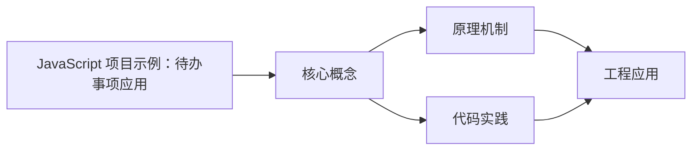
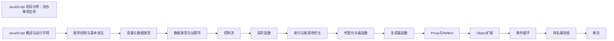

## 1. 学习目标（Bloom 分类）

本节按照布鲁姆教育目标分类学组织学习路径。本文主题为《JavaScript 项目示例：待办事项应用》，属于 JavaScript 模块，读者可以根据自身阶段选择阅读深度。

记忆层面：能够准确复述本文的核心概念、术语与基本语法或操作步骤，并能够在提问或检索时快速定位对应知识点。能够说出 JS 的变量、函数、对象、数组与 ES6+ 语法。

理解层面：能够用自己的语言解释核心原理与工作机制，说明概念之间的因果关系，而不是机械记忆结论。能够解释原型链、闭包、事件循环与 this 绑定。

应用层面：能够在真实项目或练习场景中运用本文知识解决具体问题，写出正确且可维护的实现。能够编写浏览器交互、Node 服务与工具脚本。

分析层面：能够拆解复杂问题，比较本文主题与相邻概念的异同，识别边界条件与例外情况。能够分析异步模型、作用域与内存泄漏。

评价层面：能够根据约束条件（性能、可读性、安全、成本）评价不同方案的优劣，做出有依据的技术决策。能够评价 JS 与 TypeScript、其他语言的差异。

创造层面：能够把本文知识与其他模块知识组合，设计出新的解决方案或可复用的工程模式。能够设计现代前端应用（框架 + 工程化）。

通过本节学习，读者应当能够把《JavaScript 项目示例：待办事项应用》纳入自己的知识网络，并与 JavaScript 模块的其他主题（原型链、事件循环、闭包、ES 规范）建立关联。

## 2. 历史动机与发展脉络

《JavaScript 项目示例：待办事项应用》是 JavaScript 领域的重要主题。要真正理解它，需要先了解它解决的问题与演进过程。

JavaScript 由 Brendan Eich 于 1995 年在 Netscape 用 10 天设计完成，最初只做表单校验；1996 年提交给 ECMA 标准化，即 ECMAScript。
ES6（2015）是语言转折点：let/const、箭头函数、class、Promise、模块化；此后每年发布新版本（ES2016+），现代语法在 Node 与浏览器快速普及。
运行时生态：V8（Chrome/Node）、SpiderMonkey（Firefox）、JavaScriptCore（Safari）；Node.js 与 Deno/Bun 让 JS 成为全栈语言；TypeScript 成为大型项目的事实标准。

回到本文主题：JavaScript 项目示例：待办事项应用 的提出与成熟，正是上述技术背景下的必然产物。早期实现往往以简单可用为目标，随着工程规模扩大，社区逐渐沉淀出标准做法与最佳实践；理解这一脉络，可以帮助读者判断“为什么文档中的推荐写法是现在这个样子”，也能在遇到历史遗留代码时准确识别其设计年代与取舍。


## 3. 形式化定义与核心概念精讲

本节把《JavaScript 项目示例：待办事项应用》涉及的核心概念以“定义 + 讲解”的形式展开。读者应把定义当作工具，把讲解当作理解路径；两者结合才能形成可迁移的知识。

原型链：对象通过 __proto__ 链接原型，属性查找沿链上行；ES6 class 是原型继承的语法糖。
闭包：函数捕获定义时的作用域，变量随函数存活；闭包是模块模式与柯里化的基础。
事件循环：调用栈、任务队列（宏任务）与微任务队列决定执行顺序；Promise 回调进微任务，setTimeout 进宏任务。

### 3.1 原文章节逐一精讲

原文档把主题拆分为 6 个小节，下面按顺序给出每一节的导读讲解，随后保留原文细节供精读。

#### 原文精读（完整保留）


| 完成任务   | 点击切换完成状态，视觉反馈   |
| ---------- | ---------------------------- |
| 删除任务   | 删除单条任务，带确认和动画   |
| 编辑任务   | 双击进入编辑模式             |
| 筛选任务   | 全部/进行中/已完成           |
| 搜索任务   | 实时搜索匹配                 |
| 分类管理   | 工作/学习/生活/其他          |
| 优先级     | 高/中/低，颜色区分           |
| 数据持久化 | LocalStorage 自动保存和恢复  |
| 统计面板   | 任务总数、完成率、各分类统计 |
| 拖拽排序   | 拖拽调整任务顺序             |
| 批量操作   | 全部完成/清除已完成          |

#### 需求分析

##### 数据需求

- 每个任务包含：ID、标题、完成状态、优先级、分类、创建时间、完成时间
- 数据存储在 LocalStorage 中，页面刷新不丢失
- 支持最多 500 条任务

##### 功能需求

- 任务 CRUD 操作流畅
- 筛选和搜索实时响应
- 拖拽排序直观
- 操作有动画反馈
- 支持键盘快捷操作

##### 非功能需求

- 零依赖，纯原生实现
- 响应式布局，适配移动端
- 无障碍支持（ARIA 属性、键盘导航）

#### 技术选型

| 技术点   | 选型            | 理由                         |
| -------- | --------------- | ---------------------------- |
| DOM 操作 | 原生 DOM API    | 学习核心原理，不依赖框架     |
| 事件处理 | 事件委托        | 减少事件监听器数量，性能更优 |
| 数据存储 | LocalStorage    | 简单持久化，无需后端         |
| 样式     | CSS3 + CSS 变量 | 现代布局和动画               |
| 模板     | 模板字符串      | 简洁的 HTML 生成             |
| 状态管理 | 发布-订阅模式   | 解耦 UI 和数据逻辑           |

#### 完整代码

##### HTML 结构

```html
<!DOCTYPE html>
<html lang="zh-CN">
  <head>
    <meta charset="UTF-8" />
    <meta name="viewport" content="width=device-width, initial-scale=1.0" />
    <title>Todo App</title>
    <link rel="stylesheet" href="style.css" />
  </head>
  <body>
    <div class="app-container">
      <header class="app-header">
        <h1>Todo List</h1>
        <div class="stats-bar" id="statsBar"></div>
      </header>

      <div class="input-section">
        <form id="todoForm" class="todo-form">
          <input
            type="text"
            id="todoInput"
            class="todo-input"
            placeholder="What needs to be done?"
            autocomplete="off"
            required
          />
          <select id="prioritySelect" class="priority-select">
            <option value="medium">Medium</option>
            <option value="high">High</option>
            <option value="low">Low</option>
          </select>
          <select id="categorySelect" class="category-select">
            <option value="work">Work</option>
            <option value="study">Study</option>
            <option value="life">Life</option>
            <option value="other">Other</option>
          </select>
          <button type="submit" class="add-btn">Add</button>
        </form>
      </div>

      <div class="toolbar">
        <div class="filters">
          <button class="filter-btn active" data-filter="all">All</button>
          <button class="filter-btn" data-filter="active">Active</button>
          <button class="filter-btn" data-filter="completed">Completed</button>
        </div>
        <input type="text" id="searchInput" class="search-input" placeholder="Search tasks..." />
        <div class="batch-actions">
          <button id="completeAllBtn" class="batch-btn">Complete All</button>
          <button id="clearCompletedBtn" class="batch-btn">Clear Completed</button>
        </div>
      </div>

      <ul id="todoList" class="todo-list" role="list"></ul>

      <footer class="app-footer">
        <span id="itemCount"></span>
      </footer>
    </div>

    <script src="app.js"></script>
  </body>
</html>
```

##### CSS 样式

```css
:root {
  --bg-primary: #f5f5f5;
  --bg-card: #ffffff;
  --text-primary: #333333;
  --text-secondary: #888888;
  --border-color: #e0e0e0;
  --accent: #4a90d9;
  --accent-hover: #357abd;
  --priority-high: #e74c3c;
  --priority-medium: #f39c12;
  --priority-low: #27ae60;
  --category-work: #3498db;
  --category-study: #9b59b6;
  --category-life: #1abc9c;
  --category-other: #95a5a6;
  --shadow: 0 2px 8px rgba(0, 0, 0, 0.1);
  --radius: 8px;
  --transition: 0.3s ease;
}

* {
  margin: 0;
  padding: 0;
  box-sizing: border-box;
}

body {
  font-family: -apple-system, BlinkMacSystemFont, 'Segoe UI', Roboto, sans-serif;
  background: var(--bg-primary);
  color: var(--text-primary);
  line-height: 1.6;
}

.app-container {
  max-width: 680px;
  margin: 40px auto;
  padding: 0 20px;
}

.app-header h1 {
  font-size: 2rem;
  font-weight: 300;
  text-align: center;
  color: var(--accent);
  margin-bottom: 8px;
}

.stats-bar {
  display: flex;
  justify-content: center;
  gap: 24px;
  font-size: 0.85rem;
  color: var(--text-secondary);
  margin-bottom: 20px;
}

.stats-bar .stat-value {
  font-weight: 600;
  color: var(--text-primary);
}

.todo-form {
  display: flex;
  gap: 8px;
  margin-bottom: 16px;
}

.todo-input {
  flex: 1;
  padding: 12px 16px;
  border: 2px solid var(--border-color);
  border-radius: var(--radius);
  font-size: 1rem;
  transition: border-color var(--transition);
  outline: none;
}

.todo-input:focus {
  border-color: var(--accent);
}

.priority-select,
.category-select {
  padding: 10px 12px;
  border: 2px solid var(--border-color);
  border-radius: var(--radius);
  font-size: 0.9rem;
  outline: none;
  cursor: pointer;
}

.add-btn {
  padding: 10px 20px;
  background: var(--accent);
  color: white;
  border: none;
  border-radius: var(--radius);
  font-size: 1rem;
  cursor: pointer;
  transition: background var(--transition);
}

.add-btn:hover {
  background: var(--accent-hover);
}

.toolbar {
  display: flex;
  align-items: center;
  gap: 12px;
  margin-bottom: 16px;
  flex-wrap: wrap;
}

.filters {
  display: flex;
  gap: 4px;
}

.filter-btn {
  padding: 6px 14px;
  border: 1px solid var(--border-color);
  border-radius: 20px;
  background: transparent;
  cursor: pointer;
  font-size: 0.85rem;
  transition: all var(--transition);
}

.filter-btn.active {
  background: var(--accent);
  color: white;
  border-color: var(--accent);
}

.search-input {
  flex: 1;
  min-width: 120px;
  padding: 8px 12px;
  border: 1px solid var(--border-color);
  border-radius: 20px;
  font-size: 0.85rem;
  outline: none;
}

.batch-btn {
  padding: 6px 12px;
  border: 1px solid var(--border-color);
  border-radius: var(--radius);
  background: transparent;
  cursor: pointer;
  font-size: 0.8rem;
  transition: all var(--transition);
}

.batch-btn:hover {
  background: var(--bg-primary);
}

.todo-list {
  list-style: none;
}

.todo-item {
  display: flex;
  align-items: center;
  gap: 12px;
  padding: 14px 16px;
  background: var(--bg-card);
  border-radius: var(--radius);
  margin-bottom: 8px;
  box-shadow: var(--shadow);
  transition: all var(--transition);
  cursor: grab;
}

.todo-item:hover {
  transform: translateY(-1px);
  box-shadow: 0 4px 12px rgba(0, 0, 0, 0.15);
}

.todo-item.dragging {
  opacity: 0.5;
  transform: scale(0.98);
}

.todo-item.completed .todo-text {
  text-decoration: line-through;
  color: var(--text-secondary);
}

.todo-checkbox {
  width: 22px;
  height: 22px;
  border: 2px solid var(--border-color);
  border-radius: 50%;
  cursor: pointer;
  display: flex;
  align-items: center;
  justify-content: center;
  transition: all var(--transition);
  flex-shrink: 0;
}

.todo-checkbox.checked {
  background: var(--accent);
  border-color: var(--accent);
}

.todo-checkbox.checked::after {
  content: '';
  width: 6px;
  height: 10px;
  border: solid white;
  border-width: 0 2px 2px 0;
  transform: rotate(45deg) translate(-1px, -1px);
}

.todo-text {
  flex: 1;
  font-size: 0.95rem;
  word-break: break-word;
}

.todo-text-edit {
  flex: 1;
  font-size: 0.95rem;
  padding: 4px 8px;
  border: 1px solid var(--accent);
  border-radius: 4px;
  outline: none;
}

.priority-badge {
  padding: 2px 8px;
  border-radius: 10px;
  font-size: 0.7rem;
  font-weight: 600;
  text-transform: uppercase;
}

.priority-high {
  background: #fde8e8;
  color: var(--priority-high);
}
.priority-medium {
  background: #fef3cd;
  color: var(--priority-medium);
}
.priority-low {
  background: #d4edda;
  color: var(--priority-low);
}

.category-tag {
  padding: 2px 8px;
  border-radius: 10px;
  font-size: 0.7rem;
  background: var(--bg-primary);
  color: var(--text-secondary);
}

.category-work {
  color: var(--category-work);
}
.category-study {
  color: var(--category-study);
}
.category-life {
  color: var(--category-life);
}
.category-other {
  color: var(--category-other);
}

.delete-btn {
  background: none;
  border: none;
  color: var(--text-secondary);
  cursor: pointer;
  font-size: 1.2rem;
  padding: 4px 8px;
  border-radius: 4px;
  transition: all var(--transition);
  opacity: 0;
}

.todo-item:hover .delete-btn {
  opacity: 1;
}

.delete-btn:hover {
  color: var(--priority-high);
  background: #fde8e8;
}

.app-footer {
  text-align: center;
  padding: 16px 0;
  color: var(--text-secondary);
  font-size: 0.85rem;
}

@keyframes slideIn {
  from {
    opacity: 0;
    transform: translateY(-10px);
  }
  to {
    opacity: 1;
    transform: translateY(0);
  }
}

@keyframes slideOut {
  from {
    opacity: 1;
    transform: translateX(0);
  }
  to {
    opacity: 0;
    transform: translateX(30px);
  }
}

.todo-item.entering {
  animation: slideIn 0.3s ease forwards;
}
.todo-item.leaving {
  animation: slideOut 0.3s ease forwards;
}

@media (max-width: 600px) {
  .todo-form {
    flex-wrap: wrap;
  }
  .todo-input {
    min-width: 100%;
  }
  .toolbar {
    flex-direction: column;
    align-items: stretch;
  }
  .batch-actions {
    display: flex;
    gap: 8px;
  }
}
```

##### JavaScript 核心逻辑

```javascript
const TodoApp = (function () {
  const STORAGE_KEY = 'todo_app_data';
  let todos = [];
  let currentFilter = 'all';
  let searchQuery = '';
  let dragItem = null;

  const pubsub = {
    events: {},
    on(event, callback) {
      if (!this.events[event]) this.events[event] = [];
      this.events[event].push(callback);
    },
    emit(event, data) {
      if (this.events[event]) {
        this.events[event].forEach((cb) => cb(data));
      }
    },
  };

  function generateId() {
    return Date.now().toString(36) + Math.random().toString(36).slice(2, 8);
  }

  function loadTodos() {
    try {
      const data = localStorage.getItem(STORAGE_KEY);
      todos = data ? JSON.parse(data) : [];
    } catch (e) {
      console.error('Failed to load todos:', e);
      todos = [];
    }
  }

  function saveTodos() {
    try {
      localStorage.setItem(STORAGE_KEY, JSON.stringify(todos));
    } catch (e) {
      console.error('Failed to save todos:', e);
    }
  }

  function addTodo(title, priority, category) {
    const todo = {
      id: generateId(),
      title: title.trim(),
      completed: false,
      priority: priority || 'medium',
      category: category || 'other',
      createdAt: new Date().toISOString(),
      completedAt: null,
    };
    todos.unshift(todo);
    saveTodos();
    pubsub.emit('todo:added', todo);
    pubsub.emit('todo:changed');
    return todo;
  }

  function toggleTodo(id) {
    const todo = todos.find((t) => t.id === id);
    if (!todo) return;
    todo.completed = !todo.completed;
    todo.completedAt = todo.completed ? new Date().toISOString() : null;
    saveTodos();
    pubsub.emit('todo:toggled', todo);
    pubsub.emit('todo:changed');
  }

  function deleteTodo(id) {
    const index = todos.findIndex((t) => t.id === id);
    if (index === -1) return;
    const removed = todos.splice(index, 1)[0];
    saveTodos();
    pubsub.emit('todo:deleted', removed);
    pubsub.emit('todo:changed');
  }

  function updateTodo(id, updates) {
    const todo = todos.find((t) => t.id === id);
    if (!todo) return;
    Object.assign(todo, updates);
    saveTodos();
    pubsub.emit('todo:updated', todo);
    pubsub.emit('todo:changed');
  }

  function getFilteredTodos() {
    return todos.filter((todo) => {
      const matchesFilter =
        currentFilter === 'all' ||
        (currentFilter === 'active' && !todo.completed) ||
        (currentFilter === 'completed' && todo.completed);

      const matchesSearch =
        !searchQuery || todo.title.toLowerCase().includes(searchQuery.toLowerCase());

      return matchesFilter && matchesSearch;
    });
  }

  function completeAll() {
    const activeTodos = todos.filter((t) => !t.completed);
    activeTodos.forEach((t) => {
      t.completed = true;
      t.completedAt = new Date().toISOString();
    });
    saveTodos();
    pubsub.emit('todo:changed');
  }

  function clearCompleted() {
    todos = todos.filter((t) => !t.completed);
    saveTodos();
    pubsub.emit('todo:changed');
  }

  function reorderTodos(fromIndex, toIndex) {
    const filtered = getFilteredTodos();
    const movedTodo = filtered[fromIndex];
    const targetTodo = filtered[toIndex];
    const realFrom = todos.findIndex((t) => t.id === movedTodo.id);
    const realTo = todos.findIndex((t) => t.id === targetTodo.id);
    todos.splice(realFrom, 1);
    todos.splice(realTo, 0, movedTodo);
    saveTodos();
    pubsub.emit('todo:changed');
  }

  function getStats() {
    const total = todos.length;
    const completed = todos.filter((t) => t.completed).length;
    const active = total - completed;
    const rate = total > 0 ? Math.round((completed / total) * 100) : 0;
    const byCategory = {};
    todos.forEach((t) => {
      byCategory[t.category] = (byCategory[t.category] || 0) + 1;
    });
    return { total, completed, active, rate, byCategory };
  }

  function renderTodoItem(todo) {
    const li = document.createElement('li');
    li.className = `todo-item${todo.completed ? ' completed' : ''} entering`;
    li.dataset.id = todo.id;
    li.setAttribute('draggable', '');
    li.setAttribute('role', 'listitem');

    li.innerHTML = `
            <div class="todo-checkbox${todo.completed ? ' checked' : ''}"
                 role="checkbox" aria-checked="${todo.completed}"
                 tabindex="0" aria-label="Toggle completion"></div>
            <span class="todo-text">${escapeHtml(todo.title)}</span>
            <span class="priority-badge priority-${todo.priority}">${todo.priority}</span>
            <span class="category-tag category-${todo.category}">${todo.category}</span>
            <button class="delete-btn" aria-label="Delete task">&times;</button>
        `;

    setTimeout(() => li.classList.remove('entering'), 300);
    return li;
  }

  function escapeHtml(str) {
    const div = document.createElement('div');
    div.textContent = str;
    return div.innerHTML;
  }

  function renderList() {
    const list = document.getElementById('todoList');
    list.innerHTML = '';
    const filtered = getFilteredTodos();
    filtered.forEach((todo) => {
      list.appendChild(renderTodoItem(todo));
    });
  }

  function renderStats() {
    const stats = getStats();
    document.getElementById('statsBar').innerHTML = `
            <span>Total: <span class="stat-value">${stats.total}</span></span>
            <span>Active: <span class="stat-value">${stats.active}</span></span>
            <span>Done: <span class="stat-value">${stats.completed}</span></span>
            <span>Rate: <span class="stat-value">${stats.rate}%</span></span>
        `;
    document.getElementById('itemCount').textContent =
      `${stats.active} item${stats.active !== 1 ? 's' : ''} left`;
  }

  function initEventListeners() {
    const form = document.getElementById('todoForm');
    const list = document.getElementById('todoList');
    const searchInput = document.getElementById('searchInput');

    form.addEventListener('submit', function (e) {
      e.preventDefault();
      const input = document.getElementById('todoInput');
      const priority = document.getElementById('prioritySelect').value;
      const category = document.getElementById('categorySelect').value;
      if (input.value.trim()) {
        addTodo(input.value, priority, category);
        input.value = '';
        input.focus();
      }
    });

    list.addEventListener('click', function (e) {
      const item = e.target.closest('.todo-item');
      if (!item) return;
      const id = item.dataset.id;

      if (e.target.closest('.todo-checkbox')) {
        toggleTodo(id);
      } else if (e.target.closest('.delete-btn')) {
        item.classList.add('leaving');
        setTimeout(() => deleteTodo(id), 300);
      }
    });

    list.addEventListener('dblclick', function (e) {
      const item = e.target.closest('.todo-item');
      if (!item) return;
      const textEl = e.target.closest('.todo-text');
      if (!textEl) return;

      const id = item.dataset.id;
      const todo = todos.find((t) => t.id === id);
      if (!todo || todo.completed) return;

      const input = document.createElement('input');
      input.type = 'text';
      input.className = 'todo-text-edit';
      input.value = todo.title;

      textEl.replaceWith(input);
      input.focus();
      input.select();

      function finishEdit() {
        const newTitle = input.value.trim();
        if (newTitle && newTitle !== todo.title) {
          updateTodo(id, { title: newTitle });
        }
        renderList();
      }

      input.addEventListener('blur', finishEdit);
      input.addEventListener('keydown', function (e) {
        if (e.key === 'Enter') input.blur();
        if (e.key === 'Escape') {
          input.value = todo.title;
          input.blur();
        }
      });
    });

    list.addEventListener('keydown', function (e) {
      if (e.key === 'Enter' || e.key === ' ') {
        const checkbox = e.target.closest('.todo-checkbox');
        if (checkbox) {
          e.preventDefault();
          const item = checkbox.closest('.todo-item');
          toggleTodo(item.dataset.id);
        }
      }
    });

    document.querySelector('.filters').addEventListener('click', function (e) {
      const btn = e.target.closest('.filter-btn');
      if (!btn) return;
      document.querySelectorAll('.filter-btn').forEach((b) => b.classList.remove('active'));
      btn.classList.add('active');
      currentFilter = btn.dataset.filter;
      renderList();
    });

    searchInput.addEventListener('input', function () {
      searchQuery = this.value;
      renderList();
    });

    document.getElementById('completeAllBtn').addEventListener('click', completeAll);
    document.getElementById('clearCompletedBtn').addEventListener('click', clearCompleted);

    list.addEventListener('dragstart', function (e) {
      dragItem = e.target.closest('.todo-item');
      if (dragItem) {
        dragItem.classList.add('dragging');
        e.dataTransfer.effectAllowed = 'move';
      }
    });

    list.addEventListener('dragover', function (e) {
      e.preventDefault();
      const afterElement = getDragAfterElement(list, e.clientY);
      if (afterElement) {
        list.insertBefore(dragItem, afterElement);
      } else {
        list.appendChild(dragItem);
      }
    });

    list.addEventListener('dragend', function () {
      if (dragItem) {
        dragItem.classList.remove('dragging');
        const items = [...list.querySelectorAll('.todo-item')];
        const fromIndex = getFilteredTodos().findIndex((t) => t.id === dragItem.dataset.id);
        const toIndex = items.findIndex((el) => el.dataset.id === dragItem.dataset.id);
        if (fromIndex !== toIndex && fromIndex !== -1 && toIndex !== -1) {
          reorderTodos(fromIndex, toIndex);
        }
        dragItem = null;
      }
    });

    pubsub.on('todo:changed', function () {
      renderList();
      renderStats();
    });
  }

  function getDragAfterElement(container, y) {
    const elements = [...container.querySelectorAll('.todo-item:not(.dragging)')];
    return elements.reduce(
      (closest, child) => {
        const box = child.getBoundingClientRect();
        const offset = y - box.top - box.height / 2;
        if (offset < 0 && offset > closest.offset) {
          return { offset, element: child };
        }
        return closest;
      },
      { offset: Number.NEGATIVE_INFINITY }
    ).element;
  }

  function init() {
    loadTodos();
    initEventListeners();
    renderList();
    renderStats();
  }

  return { init };
})();

document.addEventListener('DOMContentLoaded', TodoApp.init);
```

#### 运行说明

##### 直接打开

将 HTML、CSS 和 JS 文件放在同一目录，用浏览器打开 HTML 文件即可。

##### 文件结构

```
todo-app/
  index.html
  style.css
  app.js
```

##### 数据存储

- 数据自动保存在浏览器的 LocalStorage 中
- 键名：`todo_app_data`
- 清除数据：浏览器开发者工具 -> Application -> Local Storage -> 删除对应键

#### 扩展方向

1. **截止日期** -- 添加任务截止日期，超期提醒
2. **子任务** -- 支持任务嵌套子任务
3. **标签系统** -- 自定义标签替代固定分类
4. **导入导出** -- JSON 格式导入导出任务数据
5. **暗色模式** -- CSS 变量切换主题
6. **PWA** -- 添加 Service Worker 支持离线使用
7. **后端同步** -- 接入 REST API 实现多设备同步

---

#### 关键代码速查

##### LocalStorage 操作

```javascript
localStorage.setItem('key', JSON.stringify(data));
const data = JSON.parse(localStorage.getItem('key'));
localStorage.removeItem('key');
```

##### 事件委托

```javascript
list.addEventListener('click', function (e) {
  const item = e.target.closest('.todo-item');
  if (!item) return;
  const id = item.dataset.id;
  if (e.target.closest('.delete-btn')) {
    /* ... */
  }
});
```

##### DOM 创建元素

```javascript
const li = document.createElement('li');
li.className = 'todo-item';
li.dataset.id = id;
li.innerHTML = `<span class="text">${title}</span>`;
list.appendChild(li);
```

##### 拖拽排序

```javascript
element.addEventListener('dragstart', (e) => {
  /* 记录拖拽项 */
});
element.addEventListener('dragover', (e) => {
  e.preventDefault(); /* 插入位置 */
});
element.addEventListener('drop', (e) => {
  /* 重新排序 */
});
```

##### 发布订阅模式

```javascript
const pubsub = {
  events: {},
  on(event, cb) {
    (this.events[event] ||= []).push(cb);
  },
  emit(event, data) {
    (this.events[event] || []).forEach((cb) => cb(data));
  },
};
```

##### CSS 动画

```css
@keyframes slideIn {
  from {
    opacity: 0;
    transform: translateY(-10px);
  }
  to {
    opacity: 1;
    transform: translateY(0);
  }
}
.todo-item.entering {
  animation: slideIn 0.3s ease forwards;
}
```


### 3.2 概念关系图

下面用 Mermaid 图表达本文核心概念之间的关系，帮助读者建立整体图景：



图中展示的是本文知识的结构化关系：核心概念是入口，原理机制解释“为什么”，代码实践演示“怎么做”，工程应用回答“何时用”。读者学习时可以把每个小节的内容挂接到对应节点上。

## 4. 理论推导与原理解析

本节深入《JavaScript 项目示例：待办事项应用》背后的原理。理论部分不求面面俱到，而是聚焦“能解释现象、能指导实践”的关键推导。

原型链：对象通过 __proto__ 链接原型，属性查找沿链上行；ES6 class 是原型继承的语法糖。
闭包：函数捕获定义时的作用域，变量随函数存活；闭包是模块模式与柯里化的基础。
事件循环：调用栈、任务队列（宏任务）与微任务队列决定执行顺序；Promise 回调进微任务，setTimeout 进宏任务。
this 绑定：默认绑定、隐式绑定、显式绑定（call/apply/bind）与箭头函数词法绑定四种规则。

需要强调的是，理论推导与工程实践之间存在翻译层：理论给出的是理想化模型与边界条件，工程代码则必须处理真实环境中的例外。读者在学习时应先掌握理论的“标准情形”，再通过陷阱章节了解“非标准情形”。

## 5. 代码示例与逐行讲解

本节把原文中的代码示例系统整理，并为每个示例补充用途说明与讲解。读者不应只浏览代码，而应逐段对照讲解理解设计意图。

### 5.1 示例：HTML 结构

该示例来自原文《HTML 结构》小节，用于演示JavaScript 项目示例：待办事项应用相关操作。阅读时请先看代码结构，再看其后的讲解。

```html
<!DOCTYPE html>
<html lang="zh-CN">
  <head>
    <meta charset="UTF-8" />
    <meta name="viewport" content="width=device-width, initial-scale=1.0" />
    <title>Todo App</title>
    <link rel="stylesheet" href="style.css" />
  </head>
  <body>
    <div class="app-container">
      <header class="app-header">
        <h1>Todo List</h1>
        <div class="stats-bar" id="statsBar"></div>
      </header>

      <div class="input-section">
        <form id="todoForm" class="todo-form">
          <input
            type="text"
            id="todoInput"
            class="todo-input"
            placeholder="What needs to be done?"
            autocomplete="off"
            required
          />
          <select id="prioritySelect" class="priority-select">
            <option value="medium">Medium</option>
            <option value="high">High</option>
            <option value="low">Low</option>
          </select>
          <select id="categorySelect" class="category-select">
            <option value="work">Work</option>
            <option value="study">Study</option>
            <option value="life">Life</option>
            <option value="other">Other</option>
          </select>
          <button type="submit" class="add-btn">Add</button>
        </form>
      </div>

      <div class="toolbar">
        <div class="filters">
          <button class="filter-btn active" data-filter="all">All</button>
          <button class="filter-btn" data-filter="active">Active</button>
          <button class="filter-btn" data-filter="completed">Completed</button>
        </div>
        <input type="text" id="searchInput" class="search-input" placeholder="Search tasks..." />
        <div class="batch-actions">
          <button id="completeAllBtn" class="batch-btn">Complete All</button>
          <button id="clearCompletedBtn" class="batch-btn">Clear Completed</button>
        </div>
      </div>

      <ul id="todoList" class="todo-list" role="list"></ul>

      <footer class="app-footer">
        <span id="itemCount"></span>
      </footer>
    </div>

    <script src="app.js"></script>
  </body>
</html>
```

讲解：这段代码演示了本节核心知识点。代码中的关键操作可以归纳为三步：准备（定义或初始化）、执行（核心逻辑）、收尾（释放资源或返回结果）。实际项目中，这三步往往被封装为函数或类，以提升复用性与可测试性。

关键点分析：

该示例共 58 行有效代码，包含 1 类关键结构（class）。其中：

- 入口与初始化部分负责建立上下文，对应实际项目中的启动或装配逻辑；
- 核心逻辑部分体现本文主题的主要操作，是阅读时最需要对照讲解理解的部分；
- 输出或返回部分把结果交给调用方，注意其类型与边界条件。

进阶思考路径：先尝试修改参数观察行为变化，再把示例中的模式迁移到自己的项目中；每次修改都记录预期与实测差异，这是把示例转化为能力的最快方式。

### 5.2 示例：CSS 样式

该示例来自原文《CSS 样式》小节，用于演示JavaScript 项目示例：待办事项应用相关操作。阅读时请先看代码结构，再看其后的讲解。

```css
:root {
  --bg-primary: #f5f5f5;
  --bg-card: #ffffff;
  --text-primary: #333333;
  --text-secondary: #888888;
  --border-color: #e0e0e0;
  --accent: #4a90d9;
  --accent-hover: #357abd;
  --priority-high: #e74c3c;
  --priority-medium: #f39c12;
  --priority-low: #27ae60;
  --category-work: #3498db;
  --category-study: #9b59b6;
  --category-life: #1abc9c;
  --category-other: #95a5a6;
  --shadow: 0 2px 8px rgba(0, 0, 0, 0.1);
  --radius: 8px;
  --transition: 0.3s ease;
}

* {
  margin: 0;
  padding: 0;
  box-sizing: border-box;
}

body {
  font-family: -apple-system, BlinkMacSystemFont, 'Segoe UI', Roboto, sans-serif;
  background: var(--bg-primary);
  color: var(--text-primary);
  line-height: 1.6;
}

.app-container {
  max-width: 680px;
  margin: 40px auto;
  padding: 0 20px;
}

.app-header h1 {
  font-size: 2rem;
  font-weight: 300;
  text-align: center;
  color: var(--accent);
  margin-bottom: 8px;
}

.stats-bar {
  display: flex;
  justify-content: center;
  gap: 24px;
  font-size: 0.85rem;
  color: var(--text-secondary);
  margin-bottom: 20px;
}

.stats-bar .stat-value {
  font-weight: 600;
  color: var(--text-primary);
}

.todo-form {
  display: flex;
  gap: 8px;
  margin-bottom: 16px;
}

.todo-input {
  flex: 1;
  padding: 12px 16px;
  border: 2px solid var(--border-color);
  border-radius: var(--radius);
  font-size: 1rem;
  transition: border-color var(--transition);
  outline: none;
}

.todo-input:focus {
  border-color: var(--accent);
}

.priority-select,
.category-select {
  padding: 10px 12px;
  border: 2px solid var(--border-color);
  border-radius: var(--radius);
  font-size: 0.9rem;
  outline: none;
  cursor: pointer;
}

.add-btn {
  padding: 10px 20px;
  background: var(--accent);
  color: white;
  border: none;
  border-radius: var(--radius);
  font-size: 1rem;
  cursor: pointer;
  transition: background var(--transition);
}

.add-btn:hover {
  background: var(--accent-hover);
}

.toolbar {
  display: flex;
  align-items: center;
  gap: 12px;
  margin-bottom: 16px;
  flex-wrap: wrap;
}

.filters {
  display: flex;
  gap: 4px;
}

.filter-btn {
  padding: 6px 14px;
  border: 1px solid var(--border-color);
  border-radius: 20px;
  background: transparent;
  cursor: pointer;
  font-size: 0.85rem;
  transition: all var(--transition);
}

.filter-btn.active {
  background: var(--accent);
  color: white;
  border-color: var(--accent);
}

.search-input {
  flex: 1;
  min-width: 120px;
  padding: 8px 12px;
  border: 1px solid var(--border-color);
  border-radius: 20px;
  font-size: 0.85rem;
  outline: none;
}

.batch-btn {
  padding: 6px 12px;
  border: 1px solid var(--border-color);
  border-radius: var(--radius);
  background: transparent;
  cursor: pointer;
  font-size: 0.8rem;
  transition: all var(--transition);
}

.batch-btn:hover {
  background: var(--bg-primary);
}

.todo-list {
  list-style: none;
}

.todo-item {
  display: flex;
  align-items: center;
  gap: 12px;
  padding: 14px 16px;
  background: var(--bg-card);
  border-radius: var(--radius);
  margin-bottom: 8px;
  box-shadow: var(--shadow);
  transition: all var(--transition);
  cursor: grab;
}

.todo-item:hover {
  transform: translateY(-1px);
  box-shadow: 0 4px 12px rgba(0, 0, 0, 0.15);
}

.todo-item.dragging {
  opacity: 0.5;
  transform: scale(0.98);
}

.todo-item.completed .todo-text {
  text-decoration: line-through;
  color: var(--text-secondary);
}

.todo-checkbox {
  width: 22px;
  height: 22px;
  border: 2px solid var(--border-color);
  border-radius: 50%;
  cursor: pointer;
  display: flex;
  align-items: center;
  justify-content: center;
  transition: all var(--transition);
  flex-shrink: 0;
}

.todo-checkbox.checked {
  background: var(--accent);
  border-color: var(--accent);
}

.todo-checkbox.checked::after {
  content: '';
  width: 6px;
  height: 10px;
  border: solid white;
  border-width: 0 2px 2px 0;
  transform: rotate(45deg) translate(-1px, -1px);
}

.todo-text {
  flex: 1;
  font-size: 0.95rem;
  word-break: break-word;
}

.todo-text-edit {
  flex: 1;
  font-size: 0.95rem;
  padding: 4px 8px;
  border: 1px solid var(--accent);
  border-radius: 4px;
  outline: none;
}

.priority-badge {
  padding: 2px 8px;
  border-radius: 10px;
  font-size: 0.7rem;
  font-weight: 600;
  text-transform: uppercase;
}

.priority-high {
  background: #fde8e8;
  color: var(--priority-high);
}
.priority-medium {
  background: #fef3cd;
  color: var(--priority-medium);
}
.priority-low {
  background: #d4edda;
  color: var(--priority-low);
}

.category-tag {
  padding: 2px 8px;
  border-radius: 10px;
  font-size: 0.7rem;
  background: var(--bg-primary);
  color: var(--text-secondary);
}

.category-work {
  color: var(--category-work);
}
.category-study {
  color: var(--category-study);
}
.category-life {
  color: var(--category-life);
}
.category-other {
  color: var(--category-other);
}

.delete-btn {
  background: none;
  border: none;
  color: var(--text-secondary);
  cursor: pointer;
  font-size: 1.2rem;
  padding: 4px 8px;
  border-radius: 4px;
  transition: all var(--transition);
  opacity: 0;
}

.todo-item:hover .delete-btn {
  opacity: 1;
}

.delete-btn:hover {
  color: var(--priority-high);
  background: #fde8e8;
}

.app-footer {
  text-align: center;
  padding: 16px 0;
  color: var(--text-secondary);
  font-size: 0.85rem;
}

@keyframes slideIn {
  from {
    opacity: 0;
    transform: translateY(-10px);
  }
  to {
    opacity: 1;
    transform: translateY(0);
  }
}

@keyframes slideOut {
  from {
    opacity: 1;
    transform: translateX(0);
  }
  to {
    opacity: 0;
    transform: translateX(30px);
  }
}

.todo-item.entering {
  animation: slideIn 0.3s ease forwards;
}
.todo-item.leaving {
  animation: slideOut 0.3s ease forwards;
}

@media (max-width: 600px) {
  .todo-form {
    flex-wrap: wrap;
  }
  .todo-input {
    min-width: 100%;
  }
  .toolbar {
    flex-direction: column;
    align-items: stretch;
  }
  .batch-actions {
    display: flex;
    gap: 8px;
  }
}
```

讲解：这段代码演示了本节核心知识点。代码中的关键操作可以归纳为三步：准备（定义或初始化）、执行（核心逻辑）、收尾（释放资源或返回结果）。实际项目中，这三步往往被封装为函数或类，以提升复用性与可测试性。

关键点分析：

该示例共 307 行有效代码，包含 1 类关键结构（from）。其中：

- 入口与初始化部分负责建立上下文，对应实际项目中的启动或装配逻辑；
- 核心逻辑部分体现本文主题的主要操作，是阅读时最需要对照讲解理解的部分；
- 输出或返回部分把结果交给调用方，注意其类型与边界条件。

进阶思考路径：先尝试修改参数观察行为变化，再把示例中的模式迁移到自己的项目中；每次修改都记录预期与实测差异，这是把示例转化为能力的最快方式。

### 5.3 示例：JavaScript 核心逻辑

该示例来自原文《JavaScript 核心逻辑》小节，用于演示JavaScript 项目示例：待办事项应用相关操作。阅读时请先看代码结构，再看其后的讲解。

```javascript
const TodoApp = (function () {
  const STORAGE_KEY = 'todo_app_data';
  let todos = [];
  let currentFilter = 'all';
  let searchQuery = '';
  let dragItem = null;

  const pubsub = {
    events: {},
    on(event, callback) {
      if (!this.events[event]) this.events[event] = [];
      this.events[event].push(callback);
    },
    emit(event, data) {
      if (this.events[event]) {
        this.events[event].forEach((cb) => cb(data));
      }
    },
  };

  function generateId() {
    return Date.now().toString(36) + Math.random().toString(36).slice(2, 8);
  }

  function loadTodos() {
    try {
      const data = localStorage.getItem(STORAGE_KEY);
      todos = data ? JSON.parse(data) : [];
    } catch (e) {
      console.error('Failed to load todos:', e);
      todos = [];
    }
  }

  function saveTodos() {
    try {
      localStorage.setItem(STORAGE_KEY, JSON.stringify(todos));
    } catch (e) {
      console.error('Failed to save todos:', e);
    }
  }

  function addTodo(title, priority, category) {
    const todo = {
      id: generateId(),
      title: title.trim(),
      completed: false,
      priority: priority || 'medium',
      category: category || 'other',
      createdAt: new Date().toISOString(),
      completedAt: null,
    };
    todos.unshift(todo);
    saveTodos();
    pubsub.emit('todo:added', todo);
    pubsub.emit('todo:changed');
    return todo;
  }

  function toggleTodo(id) {
    const todo = todos.find((t) => t.id === id);
    if (!todo) return;
    todo.completed = !todo.completed;
    todo.completedAt = todo.completed ? new Date().toISOString() : null;
    saveTodos();
    pubsub.emit('todo:toggled', todo);
    pubsub.emit('todo:changed');
  }

  function deleteTodo(id) {
    const index = todos.findIndex((t) => t.id === id);
    if (index === -1) return;
    const removed = todos.splice(index, 1)[0];
    saveTodos();
    pubsub.emit('todo:deleted', removed);
    pubsub.emit('todo:changed');
  }

  function updateTodo(id, updates) {
    const todo = todos.find((t) => t.id === id);
    if (!todo) return;
    Object.assign(todo, updates);
    saveTodos();
    pubsub.emit('todo:updated', todo);
    pubsub.emit('todo:changed');
  }

  function getFilteredTodos() {
    return todos.filter((todo) => {
      const matchesFilter =
        currentFilter === 'all' ||
        (currentFilter === 'active' && !todo.completed) ||
        (currentFilter === 'completed' && todo.completed);

      const matchesSearch =
        !searchQuery || todo.title.toLowerCase().includes(searchQuery.toLowerCase());

      return matchesFilter && matchesSearch;
    });
  }

  function completeAll() {
    const activeTodos = todos.filter((t) => !t.completed);
    activeTodos.forEach((t) => {
      t.completed = true;
      t.completedAt = new Date().toISOString();
    });
    saveTodos();
    pubsub.emit('todo:changed');
  }

  function clearCompleted() {
    todos = todos.filter((t) => !t.completed);
    saveTodos();
    pubsub.emit('todo:changed');
  }

  function reorderTodos(fromIndex, toIndex) {
    const filtered = getFilteredTodos();
    const movedTodo = filtered[fromIndex];
    const targetTodo = filtered[toIndex];
    const realFrom = todos.findIndex((t) => t.id === movedTodo.id);
    const realTo = todos.findIndex((t) => t.id === targetTodo.id);
    todos.splice(realFrom, 1);
    todos.splice(realTo, 0, movedTodo);
    saveTodos();
    pubsub.emit('todo:changed');
  }

  function getStats() {
    const total = todos.length;
    const completed = todos.filter((t) => t.completed).length;
    const active = total - completed;
    const rate = total > 0 ? Math.round((completed / total) * 100) : 0;
    const byCategory = {};
    todos.forEach((t) => {
      byCategory[t.category] = (byCategory[t.category] || 0) + 1;
    });
    return { total, completed, active, rate, byCategory };
  }

  function renderTodoItem(todo) {
    const li = document.createElement('li');
    li.className = `todo-item${todo.completed ? ' completed' : ''} entering`;
    li.dataset.id = todo.id;
    li.setAttribute('draggable', '');
    li.setAttribute('role', 'listitem');

    li.innerHTML = `
            <div class="todo-checkbox${todo.completed ? ' checked' : ''}"
                 role="checkbox" aria-checked="${todo.completed}"
                 tabindex="0" aria-label="Toggle completion"></div>
            <span class="todo-text">${escapeHtml(todo.title)}</span>
            <span class="priority-badge priority-${todo.priority}">${todo.priority}</span>
            <span class="category-tag category-${todo.category}">${todo.category}</span>
            <button class="delete-btn" aria-label="Delete task">&times;</button>
        `;

    setTimeout(() => li.classList.remove('entering'), 300);
    return li;
  }

  function escapeHtml(str) {
    const div = document.createElement('div');
    div.textContent = str;
    return div.innerHTML;
  }

  function renderList() {
    const list = document.getElementById('todoList');
    list.innerHTML = '';
    const filtered = getFilteredTodos();
    filtered.forEach((todo) => {
      list.appendChild(renderTodoItem(todo));
    });
  }

  function renderStats() {
    const stats = getStats();
    document.getElementById('statsBar').innerHTML = `
            <span>Total: <span class="stat-value">${stats.total}</span></span>
            <span>Active: <span class="stat-value">${stats.active}</span></span>
            <span>Done: <span class="stat-value">${stats.completed}</span></span>
            <span>Rate: <span class="stat-value">${stats.rate}%</span></span>
        `;
    document.getElementById('itemCount').textContent =
      `${stats.active} item${stats.active !== 1 ? 's' : ''} left`;
  }

  function initEventListeners() {
    const form = document.getElementById('todoForm');
    const list = document.getElementById('todoList');
    const searchInput = document.getElementById('searchInput');

    form.addEventListener('submit', function (e) {
      e.preventDefault();
      const input = document.getElementById('todoInput');
      const priority = document.getElementById('prioritySelect').value;
      const category = document.getElementById('categorySelect').value;
      if (input.value.trim()) {
        addTodo(input.value, priority, category);
        input.value = '';
        input.focus();
      }
    });

    list.addEventListener('click', function (e) {
      const item = e.target.closest('.todo-item');
      if (!item) return;
      const id = item.dataset.id;

      if (e.target.closest('.todo-checkbox')) {
        toggleTodo(id);
      } else if (e.target.closest('.delete-btn')) {
        item.classList.add('leaving');
        setTimeout(() => deleteTodo(id), 300);
      }
    });

    list.addEventListener('dblclick', function (e) {
      const item = e.target.closest('.todo-item');
      if (!item) return;
      const textEl = e.target.closest('.todo-text');
      if (!textEl) return;

      const id = item.dataset.id;
      const todo = todos.find((t) => t.id === id);
      if (!todo || todo.completed) return;

      const input = document.createElement('input');
      input.type = 'text';
      input.className = 'todo-text-edit';
      input.value = todo.title;

      textEl.replaceWith(input);
      input.focus();
      input.select();

      function finishEdit() {
        const newTitle = input.value.trim();
        if (newTitle && newTitle !== todo.title) {
          updateTodo(id, { title: newTitle });
        }
        renderList();
      }

      input.addEventListener('blur', finishEdit);
      input.addEventListener('keydown', function (e) {
        if (e.key === 'Enter') input.blur();
        if (e.key === 'Escape') {
          input.value = todo.title;
          input.blur();
        }
      });
    });

    list.addEventListener('keydown', function (e) {
      if (e.key === 'Enter' || e.key === ' ') {
        const checkbox = e.target.closest('.todo-checkbox');
        if (checkbox) {
          e.preventDefault();
          const item = checkbox.closest('.todo-item');
          toggleTodo(item.dataset.id);
        }
      }
    });

    document.querySelector('.filters').addEventListener('click', function (e) {
      const btn = e.target.closest('.filter-btn');
      if (!btn) return;
      document.querySelectorAll('.filter-btn').forEach((b) => b.classList.remove('active'));
      btn.classList.add('active');
      currentFilter = btn.dataset.filter;
      renderList();
    });

    searchInput.addEventListener('input', function () {
      searchQuery = this.value;
      renderList();
    });

    document.getElementById('completeAllBtn').addEventListener('click', completeAll);
    document.getElementById('clearCompletedBtn').addEventListener('click', clearCompleted);

    list.addEventListener('dragstart', function (e) {
      dragItem = e.target.closest('.todo-item');
      if (dragItem) {
        dragItem.classList.add('dragging');
        e.dataTransfer.effectAllowed = 'move';
      }
    });

    list.addEventListener('dragover', function (e) {
      e.preventDefault();
      const afterElement = getDragAfterElement(list, e.clientY);
      if (afterElement) {
        list.insertBefore(dragItem, afterElement);
      } else {
        list.appendChild(dragItem);
      }
    });

    list.addEventListener('dragend', function () {
      if (dragItem) {
        dragItem.classList.remove('dragging');
        const items = [...list.querySelectorAll('.todo-item')];
        const fromIndex = getFilteredTodos().findIndex((t) => t.id === dragItem.dataset.id);
        const toIndex = items.findIndex((el) => el.dataset.id === dragItem.dataset.id);
        if (fromIndex !== toIndex && fromIndex !== -1 && toIndex !== -1) {
          reorderTodos(fromIndex, toIndex);
        }
        dragItem = null;
      }
    });

    pubsub.on('todo:changed', function () {
      renderList();
      renderStats();
    });
  }

  function getDragAfterElement(container, y) {
    const elements = [...container.querySelectorAll('.todo-item:not(.dragging)')];
    return elements.reduce(
      (closest, child) => {
        const box = child.getBoundingClientRect();
        const offset = y - box.top - box.height / 2;
        if (offset < 0 && offset > closest.offset) {
          return { offset, element: child };
        }
        return closest;
      },
      { offset: Number.NEGATIVE_INFINITY }
    ).element;
  }

  function init() {
    loadTodos();
    initEventListeners();
    renderList();
    renderStats();
  }

  return { init };
})();

document.addEventListener('DOMContentLoaded', TodoApp.init);
```

讲解：这段代码演示了本节核心知识点。代码中的关键操作可以归纳为三步：准备（定义或初始化）、执行（核心逻辑）、收尾（释放资源或返回结果）。实际项目中，这三步往往被封装为函数或类，以提升复用性与可测试性。

关键点分析：

该示例共 304 行有效代码，包含 4 类关键结构（class、function、if、return）。其中：

- 入口与初始化部分负责建立上下文，对应实际项目中的启动或装配逻辑；
- 核心逻辑部分体现本文主题的主要操作，是阅读时最需要对照讲解理解的部分；
- 输出或返回部分把结果交给调用方，注意其类型与边界条件。

进阶思考路径：先尝试修改参数观察行为变化，再把示例中的模式迁移到自己的项目中；每次修改都记录预期与实测差异，这是把示例转化为能力的最快方式。

### 5.4 示例：文件结构

该示例来自原文《文件结构》小节，用于演示JavaScript 项目示例：待办事项应用相关操作。阅读时请先看代码结构，再看其后的讲解。

```text
todo-app/
  index.html
  style.css
  app.js
```

讲解：这段代码演示了本节核心知识点。代码中的关键操作可以归纳为三步：准备（定义或初始化）、执行（核心逻辑）、收尾（释放资源或返回结果）。实际项目中，这三步往往被封装为函数或类，以提升复用性与可测试性。

关键点分析：

该示例共 4 行有效代码，结构以数据或配置为主。阅读时应关注：数据字段的含义、配置项的作用，以及它们与运行行为的对应关系。

进阶思考路径：先尝试修改参数观察行为变化，再把示例中的模式迁移到自己的项目中；每次修改都记录预期与实测差异，这是把示例转化为能力的最快方式。

### 5.5 示例：LocalStorage 操作

该示例来自原文《LocalStorage 操作》小节，用于演示JavaScript 项目示例：待办事项应用相关操作。阅读时请先看代码结构，再看其后的讲解。

```javascript
localStorage.setItem('key', JSON.stringify(data));
const data = JSON.parse(localStorage.getItem('key'));
localStorage.removeItem('key');
```

讲解：这段代码演示了本节核心知识点。代码中的关键操作可以归纳为三步：准备（定义或初始化）、执行（核心逻辑）、收尾（释放资源或返回结果）。实际项目中，这三步往往被封装为函数或类，以提升复用性与可测试性。

关键点分析：

该示例共 3 行有效代码，结构以数据或配置为主。阅读时应关注：数据字段的含义、配置项的作用，以及它们与运行行为的对应关系。

进阶思考路径：先尝试修改参数观察行为变化，再把示例中的模式迁移到自己的项目中；每次修改都记录预期与实测差异，这是把示例转化为能力的最快方式。

### 5.6 示例：事件委托

该示例来自原文《事件委托》小节，用于演示JavaScript 项目示例：待办事项应用相关操作。阅读时请先看代码结构，再看其后的讲解。

```javascript
list.addEventListener('click', function (e) {
  const item = e.target.closest('.todo-item');
  if (!item) return;
  const id = item.dataset.id;
  if (e.target.closest('.delete-btn')) {
    /* ... */
  }
});
```

讲解：这段代码演示了本节核心知识点。代码中的关键操作可以归纳为三步：准备（定义或初始化）、执行（核心逻辑）、收尾（释放资源或返回结果）。实际项目中，这三步往往被封装为函数或类，以提升复用性与可测试性。

关键点分析：

该示例共 8 行有效代码，包含 3 类关键结构（function、if、return）。其中：

- 入口与初始化部分负责建立上下文，对应实际项目中的启动或装配逻辑；
- 核心逻辑部分体现本文主题的主要操作，是阅读时最需要对照讲解理解的部分；
- 输出或返回部分把结果交给调用方，注意其类型与边界条件。

进阶思考路径：先尝试修改参数观察行为变化，再把示例中的模式迁移到自己的项目中；每次修改都记录预期与实测差异，这是把示例转化为能力的最快方式。

### 5.7 示例：DOM 创建元素

该示例来自原文《DOM 创建元素》小节，用于演示JavaScript 项目示例：待办事项应用相关操作。阅读时请先看代码结构，再看其后的讲解。

```javascript
const li = document.createElement('li');
li.className = 'todo-item';
li.dataset.id = id;
li.innerHTML = `<span class="text">${title}</span>`;
list.appendChild(li);
```

讲解：这段代码演示了本节核心知识点。代码中的关键操作可以归纳为三步：准备（定义或初始化）、执行（核心逻辑）、收尾（释放资源或返回结果）。实际项目中，这三步往往被封装为函数或类，以提升复用性与可测试性。

关键点分析：

该示例共 5 行有效代码，包含 1 类关键结构（class）。其中：

- 入口与初始化部分负责建立上下文，对应实际项目中的启动或装配逻辑；
- 核心逻辑部分体现本文主题的主要操作，是阅读时最需要对照讲解理解的部分；
- 输出或返回部分把结果交给调用方，注意其类型与边界条件。

进阶思考路径：先尝试修改参数观察行为变化，再把示例中的模式迁移到自己的项目中；每次修改都记录预期与实测差异，这是把示例转化为能力的最快方式。

### 5.8 示例：拖拽排序

该示例来自原文《拖拽排序》小节，用于演示JavaScript 项目示例：待办事项应用相关操作。阅读时请先看代码结构，再看其后的讲解。

```javascript
element.addEventListener('dragstart', (e) => {
  /* 记录拖拽项 */
});
element.addEventListener('dragover', (e) => {
  e.preventDefault(); /* 插入位置 */
});
element.addEventListener('drop', (e) => {
  /* 重新排序 */
});
```

讲解：这段代码演示了本节核心知识点。代码中的关键操作可以归纳为三步：准备（定义或初始化）、执行（核心逻辑）、收尾（释放资源或返回结果）。实际项目中，这三步往往被封装为函数或类，以提升复用性与可测试性。

关键点分析：

该示例共 9 行有效代码，结构以数据或配置为主。阅读时应关注：数据字段的含义、配置项的作用，以及它们与运行行为的对应关系。

进阶思考路径：先尝试修改参数观察行为变化，再把示例中的模式迁移到自己的项目中；每次修改都记录预期与实测差异，这是把示例转化为能力的最快方式。

### 5.9 示例：发布订阅模式

该示例来自原文《发布订阅模式》小节，用于演示JavaScript 项目示例：待办事项应用相关操作。阅读时请先看代码结构，再看其后的讲解。

```javascript
const pubsub = {
  events: {},
  on(event, cb) {
    (this.events[event] ||= []).push(cb);
  },
  emit(event, data) {
    (this.events[event] || []).forEach((cb) => cb(data));
  },
};
```

讲解：这段代码演示了本节核心知识点。代码中的关键操作可以归纳为三步：准备（定义或初始化）、执行（核心逻辑）、收尾（释放资源或返回结果）。实际项目中，这三步往往被封装为函数或类，以提升复用性与可测试性。

关键点分析：

该示例共 9 行有效代码，结构以数据或配置为主。阅读时应关注：数据字段的含义、配置项的作用，以及它们与运行行为的对应关系。

进阶思考路径：先尝试修改参数观察行为变化，再把示例中的模式迁移到自己的项目中；每次修改都记录预期与实测差异，这是把示例转化为能力的最快方式。

### 5.10 示例：CSS 动画

该示例来自原文《CSS 动画》小节，用于演示JavaScript 项目示例：待办事项应用相关操作。阅读时请先看代码结构，再看其后的讲解。

```css
@keyframes slideIn {
  from {
    opacity: 0;
    transform: translateY(-10px);
  }
  to {
    opacity: 1;
    transform: translateY(0);
  }
}
.todo-item.entering {
  animation: slideIn 0.3s ease forwards;
}
```

讲解：这段代码演示了本节核心知识点。代码中的关键操作可以归纳为三步：准备（定义或初始化）、执行（核心逻辑）、收尾（释放资源或返回结果）。实际项目中，这三步往往被封装为函数或类，以提升复用性与可测试性。

关键点分析：

该示例共 13 行有效代码，包含 1 类关键结构（from）。其中：

- 入口与初始化部分负责建立上下文，对应实际项目中的启动或装配逻辑；
- 核心逻辑部分体现本文主题的主要操作，是阅读时最需要对照讲解理解的部分；
- 输出或返回部分把结果交给调用方，注意其类型与边界条件。

进阶思考路径：先尝试修改参数观察行为变化，再把示例中的模式迁移到自己的项目中；每次修改都记录预期与实测差异，这是把示例转化为能力的最快方式。


综合以上示例，可以总结出本主题的代码实践要点：第一，先定义清晰的输入输出契约；第二，核心逻辑保持单一职责；第三，错误处理与边界条件不可省略；第四，命名与注释表达意图而非复述代码。

## 6. 对比分析

对比是理解《JavaScript 项目示例：待办事项应用》定位的最快路径。下面从多个维度与相邻方案进行对比。

JS 与 TypeScript：TS 是 JS 的超集，增加静态类型；新项目默认 TS。
JS 与 Python：JS 事件驱动适合 I/O 密集前端/服务；Python 生态偏数据与 AI。
CommonJS 与 ESM：Node 传统 CJS（require），现代 ESM（import）；互操作规则需注意。

对比的目的不是分出绝对优劣，而是建立选择依据：不同约束条件下，最优解不同。读者应把每个对比维度转化为决策检查清单。

## 7. 常见陷阱与最佳实践

本节整理该主题的高频错误与推荐做法。每个陷阱先描述现象，再解释原因，最后给出最佳实践。

### 7.1 == 隐式转换

宽松相等产生意外结果。一律使用 ===。

深入讲解：该问题之所以被归类为“常见陷阱”，是因为它在初学者的代码中反复出现，而且往往不在第一时间暴露——错误通常隐藏在特定数据或特定时序下。

从成因上看，== 隐式转换 一般源于对 JavaScript 某个机制的理解偏差：要么误用了默认行为，要么忽略了边界条件，要么把其他语言的思维惯性带了过来。

从影响上看，== 隐式转换 轻则产生错误结果，重则导致资源泄漏、数据损坏或安全事故；这也是为什么工程评审中会把它列为检查项。

从修复策略上看，处理== 隐式转换的正确顺序是：先复现（构造最小用例），再定位（确认机制层面的根因），最后修复并补充回归测试。跳过复现直接改代码，往往治标不治本。

### 7.2 var 与提升

var 函数作用域与提升导致困惑。使用 let/const。

深入讲解：该问题之所以被归类为“常见陷阱”，是因为它在初学者的代码中反复出现，而且往往不在第一时间暴露——错误通常隐藏在特定数据或特定时序下。

从成因上看，var 与提升 一般源于对 JavaScript 某个机制的理解偏差：要么误用了默认行为，要么忽略了边界条件，要么把其他语言的思维惯性带了过来。

从影响上看，var 与提升 轻则产生错误结果，重则导致资源泄漏、数据损坏或安全事故；这也是为什么工程评审中会把它列为检查项。

从修复策略上看，处理var 与提升的正确顺序是：先复现（构造最小用例），再定位（确认机制层面的根因），最后修复并补充回归测试。跳过复现直接改代码，往往治标不治本。

### 7.3 回调地狱

嵌套回调难维护。使用 Promise/async-await。

深入讲解：该问题之所以被归类为“常见陷阱”，是因为它在初学者的代码中反复出现，而且往往不在第一时间暴露——错误通常隐藏在特定数据或特定时序下。

从成因上看，回调地狱 一般源于对 JavaScript 某个机制的理解偏差：要么误用了默认行为，要么忽略了边界条件，要么把其他语言的思维惯性带了过来。

从影响上看，回调地狱 轻则产生错误结果，重则导致资源泄漏、数据损坏或安全事故；这也是为什么工程评审中会把它列为检查项。

从修复策略上看，处理回调地狱的正确顺序是：先复现（构造最小用例），再定位（确认机制层面的根因），最后修复并补充回归测试。跳过复现直接改代码，往往治标不治本。

### 7.4 闭包内存泄漏

闭包引用大对象且长期存活。及时置空引用。

深入讲解：该问题之所以被归类为“常见陷阱”，是因为它在初学者的代码中反复出现，而且往往不在第一时间暴露——错误通常隐藏在特定数据或特定时序下。

从成因上看，闭包内存泄漏 一般源于对 JavaScript 某个机制的理解偏差：要么误用了默认行为，要么忽略了边界条件，要么把其他语言的思维惯性带了过来。

从影响上看，闭包内存泄漏 轻则产生错误结果，重则导致资源泄漏、数据损坏或安全事故；这也是为什么工程评审中会把它列为检查项。

从修复策略上看，处理闭包内存泄漏的正确顺序是：先复现（构造最小用例），再定位（确认机制层面的根因），最后修复并补充回归测试。跳过复现直接改代码，往往治标不治本。

### 7.5 浮点精度

0.1+0.2 != 0.3。金额用整数分或 decimal 库。

深入讲解：该问题之所以被归类为“常见陷阱”，是因为它在初学者的代码中反复出现，而且往往不在第一时间暴露——错误通常隐藏在特定数据或特定时序下。

从成因上看，浮点精度 一般源于对 JavaScript 某个机制的理解偏差：要么误用了默认行为，要么忽略了边界条件，要么把其他语言的思维惯性带了过来。

从影响上看，浮点精度 轻则产生错误结果，重则导致资源泄漏、数据损坏或安全事故；这也是为什么工程评审中会把它列为检查项。

从修复策略上看，处理浮点精度的正确顺序是：先复现（构造最小用例），再定位（确认机制层面的根因），最后修复并补充回归测试。跳过复现直接改代码，往往治标不治本。

### 7.6 数组遍历回调 this

普通函数 this 指向 undefined（严格模式）。用箭头函数。

深入讲解：该问题之所以被归类为“常见陷阱”，是因为它在初学者的代码中反复出现，而且往往不在第一时间暴露——错误通常隐藏在特定数据或特定时序下。

从成因上看，数组遍历回调 this 一般源于对 JavaScript 某个机制的理解偏差：要么误用了默认行为，要么忽略了边界条件，要么把其他语言的思维惯性带了过来。

从影响上看，数组遍历回调 this 轻则产生错误结果，重则导致资源泄漏、数据损坏或安全事故；这也是为什么工程评审中会把它列为检查项。

从修复策略上看，处理数组遍历回调 this的正确顺序是：先复现（构造最小用例），再定位（确认机制层面的根因），最后修复并补充回归测试。跳过复现直接改代码，往往治标不治本。

### 7.7 浅拷贝

Object.assign 浅拷贝嵌套对象仍共享。用 structuredClone 或深拷贝库。

深入讲解：该问题之所以被归类为“常见陷阱”，是因为它在初学者的代码中反复出现，而且往往不在第一时间暴露——错误通常隐藏在特定数据或特定时序下。

从成因上看，浅拷贝 一般源于对 JavaScript 某个机制的理解偏差：要么误用了默认行为，要么忽略了边界条件，要么把其他语言的思维惯性带了过来。

从影响上看，浅拷贝 轻则产生错误结果，重则导致资源泄漏、数据损坏或安全事故；这也是为什么工程评审中会把它列为检查项。

从修复策略上看，处理浅拷贝的正确顺序是：先复现（构造最小用例），再定位（确认机制层面的根因），最后修复并补充回归测试。跳过复现直接改代码，往往治标不治本。

### 7.8 setTimeout 精度

最小 4ms 且受节流影响。动画用 requestAnimationFrame。

深入讲解：该问题之所以被归类为“常见陷阱”，是因为它在初学者的代码中反复出现，而且往往不在第一时间暴露——错误通常隐藏在特定数据或特定时序下。

从成因上看，setTimeout 精度 一般源于对 JavaScript 某个机制的理解偏差：要么误用了默认行为，要么忽略了边界条件，要么把其他语言的思维惯性带了过来。

从影响上看，setTimeout 精度 轻则产生错误结果，重则导致资源泄漏、数据损坏或安全事故；这也是为什么工程评审中会把它列为检查项。

从修复策略上看，处理setTimeout 精度的正确顺序是：先复现（构造最小用例），再定位（确认机制层面的根因），最后修复并补充回归测试。跳过复现直接改代码，往往治标不治本。

### 7.0 最佳实践总览

1. ESLint + Prettier 统一风格，strict 模式全局开启。
2. const 优先，let 次之，不使用 var。
3. 异步用 async/await 并处理错误。
4. 模块化（ESM）组织代码，避免全局污染。
5. 类型检查引入 TypeScript（新项目默认）。

把这些最佳实践固化为团队规范与代码评审检查项，是避免同类问题反复出现的关键。

## 8. 工程实践

本节把《JavaScript 项目示例：待办事项应用》放入真实工程场景，给出可复用的模式与组织方法。

前端工程化：Vite 构建、ESLint、Vitest 测试、pnpm 依赖管理。
Node 服务：Express/Fastify 或原生 http；PM2/容器部署。
性能：防抖节流、虚拟列表、代码分割与懒加载。
可观测性：错误上报（window.onerror）、性能指标（web-vitals）。

### 8.1 工程实践的原则拆解

以上工程实践可以归纳为四条原则。第一，配置与代码分离：JavaScript 项目中环境差异应通过配置注入，而不是散落在代码分支中；这保证同一份代码可以在开发、测试、生产环境一致运行。

第二，接口稳定优先：对外接口（函数签名、协议、数据格式）一旦被消费方依赖，变更成本极高；设计时应预留扩展点并保持向后兼容。

第三，可观测性内置：日志、指标与追踪应该在功能开发时同步设计，而不是故障发生后补救；没有观测手段的模块等于黑盒。

第四，变更可回滚：任何发布都应有对应的回滚方案；数据库迁移、配置变更与代码发布一样需要版本管理与逆向路径。

### 8.2 实践落地的检查清单

- [ ] 前端工程化：对照本节描述，检查当前项目是否已经落实；未落实的项列入技术债并排期处理。
- [ ] Node 服务：对照本节描述，检查当前项目是否已经落实；未落实的项列入技术债并排期处理。
- [ ] 性能：对照本节描述，检查当前项目是否已经落实；未落实的项列入技术债并排期处理。
- [ ] 可观测性：对照本节描述，检查当前项目是否已经落实；未落实的项列入技术债并排期处理。

工程实践的共性原则：配置与代码分离、接口稳定优先、可观测性内置、变更可回滚。这些原则适用于本主题的所有实现。

## 9. 案例研究

本节通过一个完整案例把《JavaScript 项目示例：待办事项应用》的知识串起来。案例按“需求分析、方案设计、实现、验证”四步展开。

需求：实现前端搜索框的防抖与请求竞态处理。
方案：debounce 函数 + AbortController 取消过期请求 + loading 状态。
要点：防抖延迟 300ms；请求序号或 AbortController 保证最新结果。
验证：快速输入模拟，确认只发最终请求且结果一致。

### 9.1 案例的扩展讨论

把案例中的方案放大到真实规模，需要额外考虑三个问题：

第一，规模：当数据量或并发量上升一个数量级时，原方案中的数据结构、缓存策略与任务调度是否仍然成立？通常需要引入分层与异步。

第二，团队：多人协作时，模块边界、接口契约与代码所有权必须明确；案例中的实现应拆分为可独立测试的单元，并配合文档说明设计意图。

第三，演进：上线后的需求变化不可避免；方案设计时应预留扩展点（配置化、插件化、事件化），并定期用真实指标验证假设。


案例研究的学习方法：先独立阅读需求，尝试在脑中形成方案，再对照实现与讲解，最后思考“如果约束变化（数据量、并发、团队规模），方案应如何调整”。

## 10. 知识要点总结与深入讲解

本节以讲解形式汇总全文要点，替代传统的习题与自测，读者不需要答题，只需跟随解释建立完整的认知框架。

关于《JavaScript 项目示例：待办事项应用》的核心结论：

JS 的单线程事件循环决定了异步编程范式，理解它才能写出无阻塞代码。
原型、闭包、this 是语言基础三件套。
现代工程以 TS + 框架 + 工具链为标准。

原文档各小节的要点回顾：

- 需求分析：该小节围绕JavaScript 项目示例：待办事项应用展开具体细节，阅读时应关注其与核心结论的对应关系；每个小节都是核心结论在某一个侧面的展开。
- 技术选型：该小节围绕JavaScript 项目示例：待办事项应用展开具体细节，阅读时应关注其与核心结论的对应关系；每个小节都是核心结论在某一个侧面的展开。
- 完整代码：该小节围绕JavaScript 项目示例：待办事项应用展开具体细节，阅读时应关注其与核心结论的对应关系；每个小节都是核心结论在某一个侧面的展开。
- 运行说明：该小节围绕JavaScript 项目示例：待办事项应用展开具体细节，阅读时应关注其与核心结论的对应关系；每个小节都是核心结论在某一个侧面的展开。
- 扩展方向：该小节围绕JavaScript 项目示例：待办事项应用展开具体细节，阅读时应关注其与核心结论的对应关系；每个小节都是核心结论在某一个侧面的展开。
- 关键代码速查：该小节围绕JavaScript 项目示例：待办事项应用展开具体细节，阅读时应关注其与核心结论的对应关系；每个小节都是核心结论在某一个侧面的展开。

把以上要点与第 3-9 节的内容对照复习，即可完成对本文主题的闭环学习。

## 11. 参考文献


MDN JavaScript 文档：https://developer.mozilla.org/zh-CN/docs/Web/JavaScript
ECMAScript 规范：https://tc39.es/ecma262/
Node.js 官方文档：https://nodejs.org/docs/latest/api/
JavaScript 秘密花园：https://bonsaiden.github.io/JavaScript-Garden/
Can I use：https://caniuse.com/

## 12. 延伸阅读


JavaScript 基础语法，见 008-javascript 模块文档。
TypeScript 类型系统，见 009-typescript 模块。
浏览器 DOM 与事件，见 006-html5/007-css 模块。
前端框架 React/Vue，见 011-react/010-vue3 模块。
尚硅谷 Bilibili 空间（https://space.bilibili.com/302417610 ）提供 JavaScript 课程。

## 14. 模块知识图谱与学习路径

本文属于 JavaScript 模块。为了把《JavaScript 项目示例：待办事项应用》放入完整的知识网络，下面列出本模块的全部主题并给出相互关联的导读。学习时建议按模块内顺序推进，并在每个文档中留意交叉引用。



上图为模块主题的推荐学习顺序示意图（仅展示前若干主题）。各主题之间存在三类关联：

第一，前置依赖关系：早期主题是后期主题的基础，例如环境与语法先行、进阶主题随后；

第二，横向并列关系：同一层级主题从不同角度覆盖模块能力，学习顺序可以按兴趣调整；

第三，工程组合关系：多个主题在真实项目中组合使用，例如配置、性能与安全主题往往出现在同一系统的不同层面。

### 14.1 模块主题速查表

| 文档 | 主题 | 与本文的关联 |
| --- | --- | --- |
| JavaScript 概述与运行环境 | 001-JavaScriptOverviewRuntimeEnv | 本文的前置基础 |
| 程序结构与基本语法 | 002-ProgramStructureBasicSyntax | 本文的并列主题 |
| 变量与数据类型 | 003-VariableDataType | 本文的并列主题 |
| 数据类型与运算符 | 004-DataTypeOperator | 本文的并列主题 |
| 控制流 | 005-ControlFlow | 本文的并列主题 |
| 高阶函数 | 006-HigherOrderFunction | 本文的并列主题 |
| 递归与尾调用优化 | 007-LinearGeneticProgramming | 本文的性能延伸 |
| 柯里化与偏函数 | 008-CurryAndFunctionComposition | 本文的并列主题 |
| 生成器函数 | 009-CoroutinesInJavaScript | 本文的并列主题 |
| Proxy与Reflect | 010-ExploringES6ProxiesAndReflect | 本文的并列主题 |
| Object扩展 | 011-ObjectReference | 本文的并列主题 |
| 事件循环 | 012-EventLoop | 本文的并列主题 |
| 具名捕获组 | 013-ES2018RegExpNamedCaptureGroups | 本文的并列主题 |
| 断言 | 014-Assert | 本文的并列主题 |
| Unicode属性转义 | 015-UnicodePropertyEscape | 本文的并列主题 |
| 函数、作用域与闭包 | 016-FunctionScopeClosure | 本文的并列主题 |
| 自定义Error | 017-ErrorReferenceAndControlFlowAndErrorHandling | 本文的并列主题 |
| BOM | 018-CrossDocumentMessaging | 本文的并列主题 |
| 网络请求API | 019-ImageOptimization | 本文的并列主题 |
| Web存储API | 020-StorageForTheWeb | 本文的并列主题 |
| 索引数据库 | 021-IndexedDBADatabaseInYourBrowser | 本文的并列主题 |
| Temporal | 022-TemporalJavaScriptAPI | 本文的并列主题 |
| 迭代器帮助器 | 023-IteratorHelper | 本文的并列主题 |
| Promise构造器 | 024-YouDonTKnowJSAsyncPerformance | 本文的并列主题 |
| Records与Tuples | 025-RecordsTuples | 本文的并列主题 |
| 对象与数组 | 026-ObjectArray | 本文的并列主题 |
| DOM 操作与事件 | 027-DOMOperationEvent | 本文的并列主题 |
| JavaScript 最新特性与运行时 | 028-JavaScriptLatestFeature | 本文的并列主题 |
| JavaScript 模块化 | 029-JavaScriptModular | 本文的并列主题 |
| 异步编程 | 030-AsyncProgramming | 本文的并列主题 |
| 闭包的内存泄露与优化 | 031-ClosureMemoryLeakOptimization | 本文的性能延伸 |
| 原型链继承与class本质 | 032-PrototypeChainClassEssence | 本文的并列主题 |
| 事件循环详解 | 033-EventLoopDetailed | 本文的并列主题 |
| Promise静态方法 | 034-PromiseStaticMethod | 本文的并列主题 |
| 异步并发控制 | 035-AsyncConcurrencyControl | 本文的并列主题 |
| ES6+ 新特性 | 036-ES6NewFeatures | 本文的并列主题 |
| 深拷贝与浅拷贝 | 037-DeepShallowCopy | 本文的并列主题 |
| 防抖与节流 | 038-DebounceThrottle | 本文的并列主题 |
| 数组高阶方法 | 039-ArrayHigherOrderMethod | 本文的并列主题 |
| Proxy与Reflect实际应用 | 040-ProxyReflectPractice | 本文的并列主题 |
| 模块动态导入与代码分割 | 041-ModuleDynamicImportCodeSplitting | 本文的并列主题 |
| JavaScript 原型与继承 | 042-JavaScriptPrototypeInheritance | 本文的并列主题 |
| 正则表达式 | 043-Regex | 本文的并列主题 |
| 错误边界与全局错误捕获 | 044-ErrorBoundaryGlobalErrorCatch | 本文的并列主题 |
| 内存泄漏排查 | 045-MemoryLeakTroubleshoot | 本文的并列主题 |
| Web API 与浏览器接口 | 046-WebAPIBrowserInterface | 本文的并列主题 |
| 调试与性能优化 | 047-DebugPerformanceOptimization | 本文的性能延伸 |
| 典型项目实战 | 048-TypicalProjectPractice | 本文的综合应用 |
| Node.js 高级特性与性能优化 | 049-NodeJsAdvancedFeaturePerformanceOptimization | 本文的性能延伸 |
| JavaScript 项目示例：待办事项应用 | 050-JavaScriptProjectExampleTodoApp | 本文自身 |
| JavaScript 理论知识点 | 051-JavaScriptTheory | 本文的并列主题 |
| ES2023/2024/2025 新特性 | 052-ES2024NewFeatures | 本文的并列主题 |
| JavaScript Map/Set/WeakMap/WeakSet 语法速查 | 053-MapSetWeakMapWeakSet | 本文的并列主题 |
| JavaScript ArrayBuffer 与 TypedArray 语法速查 | 054-ArrayBufferTypedArray | 本文的并列主题 |
| JavaScript 包管理命令速查（npm/pnpm/yarn） | 055-PackageManagerCommands | 本文的并列主题 |
| JavaScript console API 语法速查 | 056-ConsoleAPI | 本文的并列主题 |

速查表的作用是让读者快速判断：哪些文档应在阅读本文前掌握（前置基础），哪些文档应在阅读本文后继续（延伸主题）。本模块的交叉引用体系即以此表为基础。

## 15. 术语表

下表整理《JavaScript 项目示例：待办事项应用》及 JavaScript 模块中出现的高频术语，给出简明释义。术语按字母序或逻辑序排列，供查阅。

| 术语 | 释义 |
| --- | --- |
| 原型链 | 对象通过 __proto__ 链接原型，属性查找沿链上行；ES6 class 是原型继承的语法糖。 |
| 闭包 | 函数捕获定义时的作用域，变量随函数存活；闭包是模块模式与柯里化的基础。 |
| 事件循环 | 调用栈、任务队列（宏任务）与微任务队列决定执行顺序；Promise 回调进微任务，setTimeout 进宏任务。 |
| this 绑定 | 默认绑定、隐式绑定、显式绑定（call/apply/bind）与箭头函数词法绑定四种规则。 |
| == 隐式转换（易错点） | 参见常见陷阱章节的详细讲解 |
| var 与提升（易错点） | 参见常见陷阱章节的详细讲解 |
| 回调地狱（易错点） | 参见常见陷阱章节的详细讲解 |
| 闭包内存泄漏（易错点） | 参见常见陷阱章节的详细讲解 |
| 浮点精度（易错点） | 参见常见陷阱章节的详细讲解 |
| 数组遍历回调 this（易错点） | 参见常见陷阱章节的详细讲解 |

术语表与正文配合使用：先通读正文，遇到模糊术语回查本表；长期使用后术语会自然进入工作记忆。
