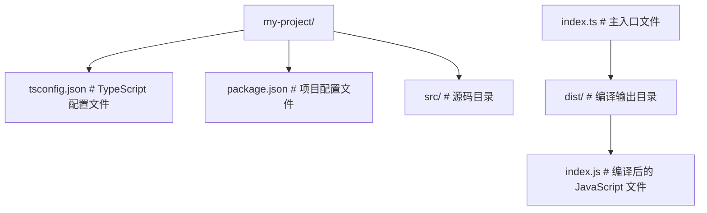
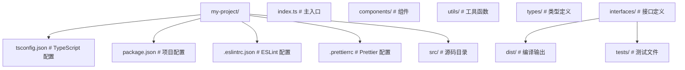
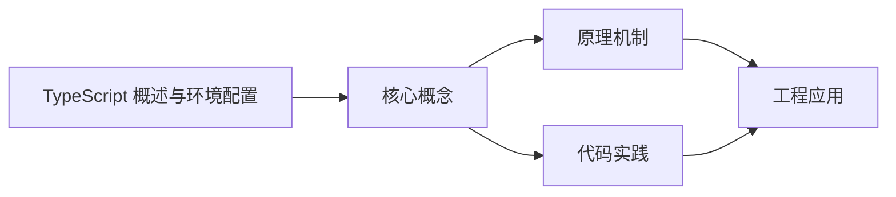

## 1. 学习目标（Bloom 分类）

本节按照布鲁姆教育目标分类学组织学习路径。本文主题为《TypeScript 概述与环境配置》，属于 TypeScript 模块，读者可以根据自身阶段选择阅读深度。

记忆层面：能够准确复述本文的核心概念、术语与基本语法或操作步骤，并能够在提问或检索时快速定位对应知识点。能够说出 TS 的类型注解、接口、联合类型、泛型与枚举语法。

理解层面：能够用自己的语言解释核心原理与工作机制，说明概念之间的因果关系，而不是机械记忆结论。能够解释类型系统（结构类型、类型收窄、类型体操）与编译机制。

应用层面：能够在真实项目或练习场景中运用本文知识解决具体问题，写出正确且可维护的实现。能够编写类型安全的函数、类与泛型工具。

分析层面：能够拆解复杂问题，比较本文主题与相邻概念的异同，识别边界条件与例外情况。能够分析类型推断、声明合并与模块解析。

评价层面：能够根据约束条件（性能、可读性、安全、成本）评价不同方案的优劣，做出有依据的技术决策。能够评价 TS 与 JS、其他静态语言的设计差异。

创造层面：能够把本文知识与其他模块知识组合，设计出新的解决方案或可复用的工程模式。能够设计大型项目的类型体系与工程配置。

通过本节学习，读者应当能够把《TypeScript 概述与环境配置》纳入自己的知识网络，并与 TypeScript 模块的其他主题（类型系统、泛型、工具类型、编译配置）建立关联。

## 2. 历史动机与发展脉络

《TypeScript 概述与环境配置》是 TypeScript 领域的重要主题。要真正理解它，需要先了解它解决的问题与演进过程。

TypeScript 由 Anders Hejlsberg 团队于 2012 年发布，定位是 JavaScript 的超集：保留 JS 生态，增加静态类型与编译期检查。
TS 的编译目标覆盖 ES3 到 ES2022+，配合 tsconfig 的严格模式（strict）成为行业标准；2019 年起主流框架（Vue 3、React、Angular）默认 TS。
类型系统持续演进：条件类型、映射类型、模板字面量类型、const 类型参数与 satisfies 操作符；tsc 之外，Vite/ESBuild 用 esbuild 转译加速开发。

回到本文主题：TypeScript 概述与环境配置 的提出与成熟，正是上述技术背景下的必然产物。早期实现往往以简单可用为目标，随着工程规模扩大，社区逐渐沉淀出标准做法与最佳实践；理解这一脉络，可以帮助读者判断“为什么文档中的推荐写法是现在这个样子”，也能在遇到历史遗留代码时准确识别其设计年代与取舍。


## 3. 形式化定义与核心概念精讲

本节把《TypeScript 概述与环境配置》涉及的核心概念以“定义 + 讲解”的形式展开。读者应把定义当作工具，把讲解当作理解路径；两者结合才能形成可迁移的知识。

结构类型：TS 的类型兼容基于结构（成员）而非名义；多余属性检查在对象字面量处执行。
类型收窄：typeof、instanceof、in、判别联合与谓词函数（is）让联合类型逐步收窄。
泛型：类型参数 + 约束（extends）实现复用；工具类型（Partial、Pick、Record、ReturnType）基于映射与条件类型。

### 3.1 原文章节逐一精讲

原文档把主题拆分为 22 个小节，下面按顺序给出每一节的导读讲解，随后保留原文细节供精读。

#### 原文精读（完整保留）

# TypeScript 5.x 新特性语法速查

> **符号约定**：`< >` 必填参数 | `[ ]` 可选参数

---

#### 1. TypeScript 概述 (Overview)

TypeScript 是 JavaScript 的一个**超集**，由微软开发，于 2012 年首次发布。它在 JavaScript 的基础上增加了**静态类型系统**和其他高级特性，最终通过编译器转换为纯 JavaScript 代码运行。TypeScript 的设计目标是帮助开发者构建大型、复杂的应用程序，提供更好的开发体验和代码质量。

##### 1.1 核心价值 (Core Value)

| 价值                | 描述                                             | 优势                               |
| :------------------ | :----------------------------------------------- | :--------------------------------- |
| **类型安全**        | 在开发阶段发现潜在错误 (如拼写错误、类型不匹配)  | 减少运行时错误，提高代码可靠性     |
| **更好的 IDE 支持** | 自动补全、重构更精准，提供更好的代码导航         | 提高开发效率，减少编码错误         |
| **增强可读性**      | 类型注解使代码更加自文档化                       | 便于团队协作和代码维护             |
| **支持最新语法**    | 提前使用尚未在所有浏览器实现的 ECMAScript 新特性 | 保持代码现代化，无需等待浏览器支持 |
| **渐进式 adoption** | 可以与 JavaScript 代码无缝集成                   | 便于现有项目逐步迁移到 TypeScript  |
| **大型项目支持**    | 提供模块化、命名空间等特性                       | 适合构建和维护大型应用程序         |

##### 1.2 TypeScript 与 JavaScript 的关系

TypeScript 是 JavaScript 的超集，这意味着：

- **所有 JavaScript 代码都是有效的 TypeScript 代码**
- TypeScript 增加了额外的特性，如类型注解、接口、泛型等
- TypeScript 代码最终会被编译为 JavaScript 代码运行
- TypeScript 可以与 JavaScript 代码和库无缝集成

##### 1.4 应用场景

TypeScript 适用于以下场景：

- **大型应用程序**：需要类型安全和更好的代码组织
- **团队开发**：需要清晰的代码结构和类型约束
- **前端框架**：React、Vue、Angular 等框架的类型定义
- **Node.js 后端**：提供类型安全的服务器端代码
- **库和工具**：提供类型定义，改善开发者体验

#### 2. 环境配置 (Environment Setup)

##### 2.1 安装 TypeScript

###### 2.1.1 全局安装

```bash
 # 全局安装 TypeScript 编译器
 npm install -g typescript
 # 验证安装
 tsc --version
```

###### 2.1.2 项目本地安装

```bash
 # 在项目中本地安装 TypeScript
 npm install --save-dev typescript
 # 验证安装
 npx tsc --version
```

##### 2.2 初始化 TypeScript 项目

###### 2.2.1 生成 tsconfig.json

```bash
 # 生成默认的 tsconfig.json 文件
 tsc --init
 # 或使用 npm init 初始化项目后添加 TypeScript
 npm init -y
 npm install --save-dev typescript
 npx tsc --init
```

###### 2.2.2 基本项目结构



##### 2.3 编译与运行

###### 2.3.1 基本编译

```bash
 # 编译单个文件
 tsc src/index.ts
 # 编译整个项目 (使用 tsconfig.json)
 tsc
 # 监视模式编译 (文件变化时自动重新编译)
 tsc --watch
```

###### 2.3.2 使用 ts-node 直接运行

```bash
 # 安装 ts-node
 npm install --save-dev ts-node
 # 直接运行 TypeScript 文件
 npx ts-node src/index.ts
 # 监视模式运行
 npx ts-node --watch src/index.ts
```

###### 2.3.3 使用构建工具

###### Webpack

```bash
 # 安装依赖
 npm install --save-dev webpack webpack-cli ts-loader
 # webpack.config.js
 module.exports = {
  entry: './src/index.ts',
  module: {
  rules: [
  {
  test: /\.tsx?$/,
  use: 'ts-loader',
  exclude: /node_modules/
  }
  ]
  },
  resolve: {
  extensions: ['.tsx', '.ts', '.js']
  },
  output: {
  filename: 'bundle.js',
  path: path.resolve(__dirname, 'dist')
  }
 }
```

###### Vite

```bash
 # 创建 Vite + TypeScript 项目
 npm create vite@latest my-project -- --template react-ts
 # 或使用 Vue + TypeScript
 npm create vite@latest my-project -- --template vue-ts
```

#### 3. `tsconfig.json` 核心配置

`tsconfig.json` 是 TypeScript 项目的配置文件，用于指定编译选项和项目设置。

##### 3.1 基本配置示例

```json
 {
  "compilerOptions": {
  "target": "ES2020",
  "module": "commonjs",
  "moduleResolution": "node",
  "lib": ["ES2020", "DOM"],
  "strict": true,
  "esModuleInterop": true,
  "skipLibCheck": true,
  "forceConsistentCasingInFileNames": true,
  "outDir": "./dist",
  "rootDir": "./src",
  "sourceMap": true,
  "declaration": true,
  "declarationMap": true,
  "removeComments": false,
  "noEmitOnError":
  },
  "include": ["src/**/*"],
  "exclude": ["node_modules", "dist"]
 }
```

##### 3.2 核心配置选项

| 选项                                 | 描述                      | 默认值                         | 推荐值                                |
| :----------------------------------- | :------------------------ | :----------------------------- | :------------------------------------ |
| **target**                           | 编译后的 JavaScript 版本  | ES3                            | ES2020 或更高                         |
| **module**                           | 模块化规范                | commonjs                       | commonjs (Node.js) 或 esnext (浏览器) |
| **moduleResolution**                 | 模块解析策略              | node                           | node                                  |
| **lib**                              | 包含的库文件              | 取决于 target                  | ["ES2020", "DOM"]                     |
| **strict**                           | 开启所有严格类型检查      | false                          |                                       |
| **esModuleInterop**                  | 启用 ES 模块互操作性      | false                          |                                       |
| **skipLibCheck**                     | 跳过库文件的类型检查      | false                          |                                       |
| **forceConsistentCasingInFileNames** | 强制文件名大小写一致      | false                          |                                       |
| **outDir**                           | 编译输出目录              | 与源文件同目录                 | "./dist"                              |
| **rootDir**                          | 源码根目录                | 包含所有输入文件的最长公共路径 | "./src"                               |
| **sourceMap**                        | 生成 source map 文件      | false                          | (开发环境)                            |
| **declaration**                      | 生成 .d.ts 类型声明文件   | false                          | (库开发)                              |
| **declarationMap**                   | 为声明文件生成 source map | false                          | (库开发)                              |
| **removeComments**                   | 移除注释                  | false                          | false (保留注释)                      |
| **noEmitOnError**                    | 有错误时不生成输出        | false                          |                                       |

##### 3.3 严格模式选项

| 选项                             | 描述                             | 启用条件          |
| :------------------------------- | :------------------------------- | :---------------- |
| **strictNullChecks**             | 严格的 null 和 undefined 检查    | strict:           |
| **strictFunctionTypes**          | 严格的函数类型检查               | strict:           |
| **strictBindCallApply**          | 严格的 bind, call, apply 检查    | strict:           |
| **strictPropertyInitialization** | 严格的属性初始化检查             | strict:           |
| **noImplicitAny**                | 禁止隐式 any 类型                | strict:           |
| **noImplicitThis**               | 禁止隐式 this                    | strict:           |
| **useUnknownInCatchVariables**   | 在 catch 变量中使用 unknown 类型 | strict: (TS 4.0+) |

##### 3.4 高级配置选项

| 选项                       | 描述                       | 用途                           |
| :------------------------- | :------------------------- | :----------------------------- |
| **baseUrl**                | 模块解析的基础目录         | 简化模块导入路径               |
| **paths**                  | 模块路径映射               | 自定义模块解析路径             |
| **allowJs**                | 允许编译 JavaScript 文件   | 混合 TypeScript 和 JavaScript  |
| **checkJs**                | 检查 JavaScript 文件的类型 | 对 JavaScript 文件进行类型检查 |
| **jsx**                    | JSX 处理模式               | React 或其他 JSX 框架          |
| **experimentalDecorators** | 启用装饰器                 | 使用装饰器特性                 |
| **emitDecoratorMetadata**  | 生成装饰器元数据           | 配合装饰器使用                 |
| **resolveJsonModule**      | 允许导入 JSON 文件         | 直接导入 JSON 数据             |
| **isolatedModules**        | 每个文件作为独立模块编译   | 与 Babel 等工具配合            |

##### 3.5 配置示例

###### 3.5.1 浏览器项目配置

```json
{
  "compilerOptions": {
    "target": "ES2020",
    "module": "esnext",
    "moduleResolution": "node",
    "lib": ["ES2020", "DOM", "DOM.Iterable"],
    "strict": true,
    "esModuleInterop": true,
    "skipLibCheck": true,
    "forceConsistentCasingInFileNames": true,
    "outDir": "./dist",
    "rootDir": "./src",
    "sourceMap": true,
    "jsx": "react-jsx"
  },
  "include": ["src/**/*"],
  "exclude": ["node_modules", "dist"]
}
```

###### 3.5.2 Node.js 项目配置

```json
 {
  "compilerOptions": {
  "target": "ES2020",
  "module": "commonjs",
  "moduleResolution": "node",
  "lib": ["ES2020"],
  "strict": true,
  "esModuleInterop": true,
  "skipLibCheck": true,
  "forceConsistentCasingInFileNames": true,
  "outDir": "./dist",
  "rootDir": "./src",
  "sourceMap": true,
  "declaration":
  },
  "include": ["src/**/*"],
  "exclude": ["node_modules", "dist"]
 }
```

#### 4. 工具链与生态系统

##### 4.1 开发工具

| 工具              | 描述                     | 用途                 |
| :---------------- | :----------------------- | :------------------- |
| **tsc**           | TypeScript 编译器        | 编译 TypeScript 代码 |
| **ts-node**       | 直接运行 TypeScript 文件 | 开发和调试           |
| **tslint/eslint** | TypeScript 代码检查工具  | 代码质量检查         |
| **prettier**      | 代码格式化工具           | 保持代码风格一致     |
| **jest**          | 测试框架                 | 单元测试             |
| **webpack**       | 模块打包工具             | 前端项目构建         |
| **vite**          | 现代前端构建工具         | 快速开发和构建       |
| **rollup**        | 模块打包工具             | 库构建               |

##### 4.2 类型定义

| 类型定义                | 描述                   | 安装方式                                                                            |
| :---------------------- | :--------------------- | :---------------------------------------------------------------------------------- |
| **@types/node**         | Node.js 类型定义       | `npm install --save-dev @types/node`                                                |
| **@types/react**        | React 类型定义         | `npm install --save-dev @types/react`                                               |
| **@types/react-dom**    | React DOM 类型定义     | `npm install --save-dev @types/react-dom`                                           |
| **@types/jest**         | Jest 类型定义          | `npm install --save-dev @types/jest`                                                |
| \*_@typescript-eslint/_ | ESLint TypeScript 插件 | `npm install --save-dev @typescript-eslint/eslint-plugin @typescript-eslint/parser` |

##### 4.3 IDE 支持

推荐的 IDE 和编辑器：
| IDE/编辑器 | 特点 | 推荐插件 |
| :--- | :--- | :--- |
| **Visual Studio Code** | 官方推荐，内置 TypeScript 支持 | TypeScript Hero, ESLint, Prettier |
| **WebStorm** | 强大的 IDE，内置 TypeScript 支持 | ESLint, Prettier |
| **Sublime Text** | 轻量级编辑器 | TypeScript, SublimeLinter |
| **Atom** | 开源编辑器 | atom-typescript |

#### 5. 最佳实践

##### 5.1 项目结构



##### 5.2 类型定义最佳实践

- **使用接口定义对象结构**：清晰描述对象的形状
- **使用类型别名**：为复杂类型创建有意义的名称
- **避免使用 any 类型**：尽量使用具体类型或联合类型
- **使用泛型**：提高代码复用性和类型安全性
- **使用枚举**：为一组相关常量提供有意义的名称
- **使用命名空间**：组织相关类型和功能

##### 5.3 代码风格

- **使用 PascalCase**：命名类、接口、类型别名
- **使用 camelCase**：命名函数、变量、属性
- **使用 UPPER_SNAKE_CASE**：命名常量
- **使用下划线前缀**：命名私有成员
- **使用 JSDoc 注释**：为类型和函数添加文档

##### 5.4 性能优化

- **使用类型断言**：在确知类型时使用，避免不必要的类型检查
- **使用 const 断言**：为字面量类型提供更精确的类型
- **使用类型守卫**：在运行时检查类型
- **避免过度泛型**：只在必要时使用泛型
- **使用模块导入**：避免全局命名空间污染

#### 6. 实际应用示例

##### 6.1 基本 TypeScript 示例

```typescript
 // src/index.ts
 // 类型定义
 interface User {
  id: number;
  name: string;
  email: string;
  age?: number; // 可选属性
 }
 // 函数定义
 function greet(user: User): string {
  return `Hello, ${user.name}!`;
 }
 // 类定义
 class UserService {
  private users: User[] = [];
  addUser(user: User): void {
  this.users.push(user);
  }
  getUserById(id: number): User | undefined {
  return this.users.find(user => user.id === id);
  }
  getAllUsers(): User[] {
  return this.users;
  }
 }
 // 使用示例
 const userService = new UserService();
 userService.addUser({
  id: 1,
  name: "John Doe",
  email: "john@example.com",
  age: 30
 }
 userService.addUser({
  id: 2,
  name: "Jane Smith",
  email: "jane@example.com"
 }
 const user = userService.getUserById(1);
 if (user) {
  console.log(greet(user));
 }
 console.log(userService.getAllUsers());
```

##### 6.2 编译与运行

```bash
 # 编译
 tsc
 # 运行
 node dist/index.js
 # 或直接运行
 npx ts-node src/index.ts
```

##### 6.3 与 JavaScript 集成

```typescript
// src/index.ts
// 导入 JavaScript 模块
import { calculateTotal } from './utils.js';
// 类型定义
interface Order {
  id: number;
  items: {
    name: string;
    price: number;
    quantity: number;
  }[];
}
// 使用 JavaScript 函数
const order: Order = {
  id: 1,
  items: [
    { name: 'Item 1', price: 10, quantity: 2 },
    { name: 'Item 2', price: 15, quantity: 1 },
  ],
};
const total = calculateTotal(order.items);
console.log(`Order total: $${total}`);
```

```javascript
// src/utils.js
// JavaScript 函数
export function calculateTotal(items) {
  return items.reduce((total, item) => {
    return total + item.price * item.quantity;
  }, 0);
}
```

#### 7. 常见问题与解决方案

##### 7.1 编译错误

| 错误                                        | 原因           | 解决方案                                 |
| :------------------------------------------ | :------------- | :--------------------------------------- |
| **Type 'X' is not assignable to type 'Y'**  | 类型不匹配     | 检查变量类型，确保类型一致               |
| **Property 'X' does not exist on type 'Y'** | 属性不存在     | 检查对象结构，确保属性存在或使用可选属性 |
| **Cannot find name 'X'**                    | 变量未定义     | 检查变量是否已声明，或添加类型定义       |
| **Module 'X' has no exported member 'Y'**   | 模块导出不存在 | 检查模块导出，确保导出名称正确           |
| **Cannot find module 'X'**                  | 模块未找到     | 检查模块路径，确保模块已安装             |

##### 7.2 类型定义问题

| 问题             | 原因                 | 解决方案                            |
| :--------------- | :------------------- | :---------------------------------- |
| **缺少类型定义** | 第三方库没有类型定义 | 安装 @types/ 包或创建自定义类型定义 |
| **类型冲突**     | 多个类型定义冲突     | 检查类型定义文件，解决冲突          |
| **类型过于严格** | 类型定义过于严格     | 使用类型断言或调整类型定义          |
| **类型不完整**   | 类型定义不完整       | 扩展类型定义或使用接口继承          |

##### 7.3 性能问题

| 问题           | 原因               | 解决方案                                 |
| :------------- | :----------------- | :--------------------------------------- |
| **编译速度慢** | 项目过大或配置不当 | 优化 tsconfig.json，使用增量编译         |
| **类型检查慢** | 复杂类型或循环依赖 | 简化类型定义，避免循环依赖               |
| **运行时性能** | 编译输出效率低     | 优化 TypeScript 代码，使用适当的编译选项 |

##### 7.4 工具链问题

| 问题                 | 原因     | 解决方案                              |
| :------------------- | :------- | :------------------------------------ |
| **与 Babel 集成**    | 配置冲突 | 使用 @babel/preset-typescript         |
| **与 Webpack 集成**  | 配置不当 | 正确配置 ts-loader 或 babel-loader    |
| **与 ESLint 集成**   | 规则冲突 | 使用 @typescript-eslint/eslint-plugin |
| **与 Prettier 集成** | 格式冲突 | 配置 Prettier 与 ESLint 配合          |

#### 8. 学习资源

##### 8.1 官方资源

- **TypeScript 官网**: [https://www.typescriptlang.org/](https://www.typescriptlang.org/)
- **TypeScript 文档**: [https://www.typescriptlang.org/docs/](https://www.typescriptlang.org/docs/)
- **TypeScript playground**: [https://www.typescriptlang.org/play](https://www.typescriptlang.org/play)
- **TypeScript GitHub**: [https://github.com/microsoft/TypeScript](https://github.com/microsoft/TypeScript)

##### 8.2 书籍

- **《TypeScript 实战》** - 梁宵
- **《深入理解 TypeScript》** - Basarat Ali Syed
- **《TypeScript 编程》** - Boris Cherny
- **《TypeScript 权威指南》** - 张容铭

##### 8.3 在线教程

- **TypeScript 官方教程**: [https://www.typescriptlang.org/docs/handbook/typescript-from-scratch.html](https://www.typescriptlang.org/docs/handbook/typescript-from-scratch.html)
- **MDN TypeScript 教程**: [https://developer.mozilla.org/en-US/docs/Web/JavaScript/TypeScript](https://developer.mozilla.org/en-US/docs/Web/JavaScript/TypeScript)
- **TypeScript Deep Dive**: [https://basarat.gitbook.io/typescript/](https://basarat.gitbook.io/typescript/)
- **freeCodeCamp TypeScript 教程**: [https://www.freecodecamp.org/learn/typescript/](https://www.freecodecamp.org/learn/typescript/)

##### 8.4 社区与论坛

- **TypeScript 社区**: [https://github.com/microsoft/TypeScript/discussions](https://github.com/microsoft/TypeScript/discussions)
- **Stack Overflow TypeScript**: [https://stackoverflow.com/questions/tagged/typescript](https://stackoverflow.com/questions/tagged/typescript)
- **Reddit r/typescript**: [https://www.reddit.com/r/typescript/](https://www.reddit.com/r/typescript/)
- **TypeScript 中文社区**: [https://www.typescriptlang.cn/](https://www.typescriptlang.cn/)

#### 9. 总结

TypeScript 是一种强大的编程语言，它通过添加静态类型系统和其他高级特性，使 JavaScript 开发更加安全、高效和可维护。通过正确配置环境、使用最佳实践和利用丰富的工具链，开发者可以充分发挥 TypeScript 的优势，构建高质量的应用程序。

##### 9.1 关键要点

- **类型安全**: TypeScript 的核心价值在于提供静态类型检查，减少运行时错误
- **渐进式 adoption**: 可以与 JavaScript 无缝集成，便于现有项目逐步迁移
- **强大的工具链**: 丰富的工具和 IDE 支持，提高开发效率
- **现代语言特性**: 支持最新的 ECMAScript 特性，保持代码现代化
- **大型项目支持**: 适合构建和维护大型应用程序

##### 9.2 学习建议

- **从基础开始**: 学习 TypeScript 的基本类型和语法
- **实践项目**: 通过实际项目练习 TypeScript
- **阅读文档**: 参考官方文档和最佳实践
- **参与社区**: 加入 TypeScript 社区，学习和分享经验
- **持续学习**: 关注 TypeScript 的更新和新特性
  TypeScript 已经成为现代前端和 Node.js 开发的重要工具，掌握 TypeScript 可以帮助开发者构建更加可靠、可维护的应用程序，提高开发效率和代码质量。

#### 延伸阅读

- [JavaScript](javascript/overview)
- [Vue3](vue3/overview)

---

#### 5.0 const 类型参数

**基本写法：const 泛型参数**
`function <名><const T extends <约束>>(<参数>: T)`
```typescript
// 推断字面量类型而非放宽
function pickFirst<const T>(arr: readonly T[]): T {
  return arr[0];
}
const r = pickFirst(["red", "green"]); // "red" | "green"
```

---

**基本写法：const 配合元组**
`<const T extends readonly string[]>`
```typescript
// 保留元组字面量
function define<const T extends readonly string[]>(routes: T): T {
  return routes;
}
const c = define(["/home", "/about"]); // readonly ["/home", "/about"]
```

---

#### 5.0 satisfies 操作符

**基本写法：satisfies 校验不放宽**
`const <变量> = <值> satisfies <类型>`
```typescript
// 校验符合类型，保留具体字面量推断
const palette = {
  red: "#f00",
  green: [0, 255, 0],
} satisfies Record<string, string | number[]>;
palette.red;   // string（具体）
palette.green; // number[]
```

---

**基本写法：satisfies 与 as 区别**
`<值> satisfies <类型>`
```typescript
// as 断言可能撒谎，satisfies 强制校验
const m = { a: 1 } satisfies Record<"a", number>;
// const m = { a: 1 } satisfies Record<"a", string>; // 报错
```

---

#### 5.0 新版装饰器

**基本写法：标准装饰器**
`@<装饰器> <类成员>`
```typescript
// 符合 TC39 Stage 3，无需 experimentalDecorators
function log(target: Function, ctx: ClassMethodDecoratorContext) {
  return function (this: unknown, ...args: unknown[]) {
    console.log(ctx.name, args);
    return target.apply(this, args);
  };
}
class S { @log greet() { return "hi"; } }
```

---

#### 5.2 using 声明

**基本写法：同步资源管理**
`using <变量> = <带 Symbol.dispose>`
```typescript
// 离开作用域自动释放
function read() {
  using f = openFile("./a.txt");
  // 作用域结束调用 [Symbol.dispose]
}
```

---

**基本写法：异步资源管理**
`await using <变量> = <带 Symbol.asyncDispose>`
```typescript
// 异步自动清理
async function run() {
  await using conn = await db.connect();
  // 自动 await [Symbol.asyncDispose]
}
```

---

#### 5.3 switch(true) 收窄

**基本写法：switch(true) 类型收窄**
`switch (true) { case <条件>: ... }`
```typescript
// 每个 case 体内自动收窄
function desc(v: unknown) {
  switch (true) {
    case typeof v === "string": return v.toUpperCase();
    case typeof v === "number": return v.toFixed(2);
    default: return "unknown";
  }
}
```

---

#### 5.4 NoInfer 工具类型

**基本写法：阻止推断**
`NoInfer<<T>>`
```typescript
// 不从该位置推断 T，仅校验
function withDefault<T>(v: T | undefined, fb: NoInfer<T>): T {
  return v ?? fb;
}
const r = withDefault("hi", "x"); // T = string
// withDefault("hi", 42); // 报错：number 不能赋给 string
```

---

#### 5.4 闭包保留收窄

**基本写法：闭包内保留 narrowing**
`const <fn> = () => <使用收窄变量>`
```typescript
// 5.4 修复闭包内类型丢失
function fn(v: string | null) {
  if (v === null) return;
  const cb = () => v.toUpperCase(); // v 已收窄为 string
  return cb();
}
```

---

#### 5.5 推断类型谓词

**基本写法：自动推断 is**
`function <f>(<x>): <TypePredicate>`
```typescript
// 返回布尔值自动推断为类型谓词
const isString = (x: unknown) => typeof x === "string";
const arr = [1, "a"].filter(isString); // string[]
```

---

#### 5.6 离散联合与迭代器

**基本写法：离散联合类型**
`type <名> = { ... } | { ... }`
```typescript
// 成员间无公共字段时更严格检查
type A = { kind: "a"; x: number };
type B = { kind: "b"; y: string };
type U = A | B;
```

---

**基本写法：Iterator Helpers 类型**
`<iterator>.map(<fn>).filter(<fn>)`
```typescript
// 内置 Iterator 类型支持链式
function* gen() { yield 1; yield 2; }
const r = gen().map(x => x * 2).filter(x => x > 2).toArray(); // [4]
```

---

#### 5.9 import defer 与 node20

**基本写法：延迟导入**
`import defer * as <名> from "<模块>"`
```typescript
// 首次使用时才求值
import defer * as lib from "./heavy";
// 用到 lib 时才执行模块
export function use() { return lib.foo(); }
```

---

**基本写法：node20 模块解析**
`"moduleResolution": "node20"`
```json
{
  "compilerOptions": {
    "module": "node20",
    "moduleResolution": "node20"
  }
}
```

---

#### 装饰器上下文

**基本写法：装饰器上下文对象**
`<ctx>: ClassMethodDecoratorContext`
```typescript
// 上下文提供 name/kind/addInitializer 等
function bound(target: Function, ctx: ClassMethodDecoratorContext) {
  ctx.addInitializer(function (this: unknown) {
    (this as Record<string, unknown>)[ctx.name as string] =
      target.bind(this);
  });
}
```

---

#### satisfies + const 组合

**基本写法：校验且保留字面量**
`<值> satisfies <类型>` + `function f<const T>`
```typescript
// 配置对象校验且保留字面量联合
function config<const T extends Record<string, string>>(c: T): T { return c; }
const c = config({
  home: "/",
  api: "/api",
} satisfies Record<string, string>);
c.home; // "/" 字面量
```

---

### 3.2 概念关系图

下面用 Mermaid 图表达本文核心概念之间的关系，帮助读者建立整体图景：



图中展示的是本文知识的结构化关系：核心概念是入口，原理机制解释“为什么”，代码实践演示“怎么做”，工程应用回答“何时用”。读者学习时可以把每个小节的内容挂接到对应节点上。

## 4. 理论推导与原理解析

本节深入《TypeScript 概述与环境配置》背后的原理。理论部分不求面面俱到，而是聚焦“能解释现象、能指导实践”的关键推导。

结构类型：TS 的类型兼容基于结构（成员）而非名义；多余属性检查在对象字面量处执行。
类型收窄：typeof、instanceof、in、判别联合与谓词函数（is）让联合类型逐步收窄。
泛型：类型参数 + 约束（extends）实现复用；工具类型（Partial、Pick、Record、ReturnType）基于映射与条件类型。
声明与编译：.ts 编译为 .js；类型声明（.d.ts）描述 JS 库；tsconfig 的 strict、moduleResolution、target 决定行为。

需要强调的是，理论推导与工程实践之间存在翻译层：理论给出的是理想化模型与边界条件，工程代码则必须处理真实环境中的例外。读者在学习时应先掌握理论的“标准情形”，再通过陷阱章节了解“非标准情形”。

## 5. 代码示例与逐行讲解

本节把原文中的代码示例系统整理，并为每个示例补充用途说明与讲解。读者不应只浏览代码，而应逐段对照讲解理解设计意图。

### 5.1 示例：2.1.1 全局安装

该示例来自原文《2.1.1 全局安装》小节，用于演示TypeScript 概述与环境配置相关操作。阅读时请先看代码结构，再看其后的讲解。

```bash
 # 全局安装 TypeScript 编译器
 npm install -g typescript
 # 验证安装
 tsc --version
```

讲解：这段代码演示了本节核心知识点。代码中的关键操作可以归纳为三步：准备（定义或初始化）、执行（核心逻辑）、收尾（释放资源或返回结果）。实际项目中，这三步往往被封装为函数或类，以提升复用性与可测试性。

关键点分析：

该示例共 4 行有效代码，结构以数据或配置为主。阅读时应关注：数据字段的含义、配置项的作用，以及它们与运行行为的对应关系。

进阶思考路径：先尝试修改参数观察行为变化，再把示例中的模式迁移到自己的项目中；每次修改都记录预期与实测差异，这是把示例转化为能力的最快方式。

### 5.2 示例：2.1.2 项目本地安装

该示例来自原文《2.1.2 项目本地安装》小节，用于演示TypeScript 概述与环境配置相关操作。阅读时请先看代码结构，再看其后的讲解。

```bash
 # 在项目中本地安装 TypeScript
 npm install --save-dev typescript
 # 验证安装
 npx tsc --version
```

讲解：这段代码演示了本节核心知识点。代码中的关键操作可以归纳为三步：准备（定义或初始化）、执行（核心逻辑）、收尾（释放资源或返回结果）。实际项目中，这三步往往被封装为函数或类，以提升复用性与可测试性。

关键点分析：

该示例共 4 行有效代码，结构以数据或配置为主。阅读时应关注：数据字段的含义、配置项的作用，以及它们与运行行为的对应关系。

进阶思考路径：先尝试修改参数观察行为变化，再把示例中的模式迁移到自己的项目中；每次修改都记录预期与实测差异，这是把示例转化为能力的最快方式。

### 5.3 示例：2.2.1 生成 tsconfig.json

该示例来自原文《2.2.1 生成 tsconfig.json》小节，用于演示TypeScript 概述与环境配置相关操作。阅读时请先看代码结构，再看其后的讲解。

```bash
 # 生成默认的 tsconfig.json 文件
 tsc --init
 # 或使用 npm init 初始化项目后添加 TypeScript
 npm init -y
 npm install --save-dev typescript
 npx tsc --init
```

讲解：这段代码演示了本节核心知识点。代码中的关键操作可以归纳为三步：准备（定义或初始化）、执行（核心逻辑）、收尾（释放资源或返回结果）。实际项目中，这三步往往被封装为函数或类，以提升复用性与可测试性。

关键点分析：

该示例共 6 行有效代码，结构以数据或配置为主。阅读时应关注：数据字段的含义、配置项的作用，以及它们与运行行为的对应关系。

进阶思考路径：先尝试修改参数观察行为变化，再把示例中的模式迁移到自己的项目中；每次修改都记录预期与实测差异，这是把示例转化为能力的最快方式。

### 5.4 示例：2.2.2 基本项目结构

该示例来自原文《2.2.2 基本项目结构》小节，用于演示TypeScript 概述与环境配置相关操作。阅读时请先看代码结构，再看其后的讲解。


讲解：这段代码演示了本节核心知识点。代码中的关键操作可以归纳为三步：准备（定义或初始化）、执行（核心逻辑）、收尾（释放资源或返回结果）。实际项目中，这三步往往被封装为函数或类，以提升复用性与可测试性。

关键点分析：

该示例共 13 行有效代码，结构以数据或配置为主。阅读时应关注：数据字段的含义、配置项的作用，以及它们与运行行为的对应关系。

进阶思考路径：先尝试修改参数观察行为变化，再把示例中的模式迁移到自己的项目中；每次修改都记录预期与实测差异，这是把示例转化为能力的最快方式。

### 5.5 示例：2.3.1 基本编译

该示例来自原文《2.3.1 基本编译》小节，用于演示TypeScript 概述与环境配置相关操作。阅读时请先看代码结构，再看其后的讲解。

```bash
 # 编译单个文件
 tsc src/index.ts
 # 编译整个项目 (使用 tsconfig.json)
 tsc
 # 监视模式编译 (文件变化时自动重新编译)
 tsc --watch
```

讲解：这段代码演示了本节核心知识点。代码中的关键操作可以归纳为三步：准备（定义或初始化）、执行（核心逻辑）、收尾（释放资源或返回结果）。实际项目中，这三步往往被封装为函数或类，以提升复用性与可测试性。

关键点分析：

该示例共 6 行有效代码，结构以数据或配置为主。阅读时应关注：数据字段的含义、配置项的作用，以及它们与运行行为的对应关系。

进阶思考路径：先尝试修改参数观察行为变化，再把示例中的模式迁移到自己的项目中；每次修改都记录预期与实测差异，这是把示例转化为能力的最快方式。

### 5.6 示例：2.3.2 使用 ts-node 直接运行

该示例来自原文《2.3.2 使用 ts-node 直接运行》小节，用于演示TypeScript 概述与环境配置相关操作。阅读时请先看代码结构，再看其后的讲解。

```bash
 # 安装 ts-node
 npm install --save-dev ts-node
 # 直接运行 TypeScript 文件
 npx ts-node src/index.ts
 # 监视模式运行
 npx ts-node --watch src/index.ts
```

讲解：这段代码演示了本节核心知识点。代码中的关键操作可以归纳为三步：准备（定义或初始化）、执行（核心逻辑）、收尾（释放资源或返回结果）。实际项目中，这三步往往被封装为函数或类，以提升复用性与可测试性。

关键点分析：

该示例共 6 行有效代码，结构以数据或配置为主。阅读时应关注：数据字段的含义、配置项的作用，以及它们与运行行为的对应关系。

进阶思考路径：先尝试修改参数观察行为变化，再把示例中的模式迁移到自己的项目中；每次修改都记录预期与实测差异，这是把示例转化为能力的最快方式。

### 5.7 示例：Webpack

该示例来自原文《Webpack》小节，用于演示TypeScript 概述与环境配置相关操作。阅读时请先看代码结构，再看其后的讲解。

```bash
 # 安装依赖
 npm install --save-dev webpack webpack-cli ts-loader
 # webpack.config.js
 module.exports = {
  entry: './src/index.ts',
  module: {
  rules: [
  {
  test: /\.tsx?$/,
  use: 'ts-loader',
  exclude: /node_modules/
  }
  ]
  },
  resolve: {
  extensions: ['.tsx', '.ts', '.js']
  },
  output: {
  filename: 'bundle.js',
  path: path.resolve(__dirname, 'dist')
  }
 }
```

讲解：这段代码演示了本节核心知识点。代码中的关键操作可以归纳为三步：准备（定义或初始化）、执行（核心逻辑）、收尾（释放资源或返回结果）。实际项目中，这三步往往被封装为函数或类，以提升复用性与可测试性。

关键点分析：

该示例共 22 行有效代码，结构以数据或配置为主。阅读时应关注：数据字段的含义、配置项的作用，以及它们与运行行为的对应关系。

进阶思考路径：先尝试修改参数观察行为变化，再把示例中的模式迁移到自己的项目中；每次修改都记录预期与实测差异，这是把示例转化为能力的最快方式。

### 5.8 示例：Vite

该示例来自原文《Vite》小节，用于演示TypeScript 概述与环境配置相关操作。阅读时请先看代码结构，再看其后的讲解。

```bash
 # 创建 Vite + TypeScript 项目
 npm create vite@latest my-project -- --template react-ts
 # 或使用 Vue + TypeScript
 npm create vite@latest my-project -- --template vue-ts
```

讲解：这段代码演示了本节核心知识点。代码中的关键操作可以归纳为三步：准备（定义或初始化）、执行（核心逻辑）、收尾（释放资源或返回结果）。实际项目中，这三步往往被封装为函数或类，以提升复用性与可测试性。

关键点分析：

该示例共 4 行有效代码，结构以数据或配置为主。阅读时应关注：数据字段的含义、配置项的作用，以及它们与运行行为的对应关系。

进阶思考路径：先尝试修改参数观察行为变化，再把示例中的模式迁移到自己的项目中；每次修改都记录预期与实测差异，这是把示例转化为能力的最快方式。

### 5.9 示例：3.1 基本配置示例

该示例来自原文《3.1 基本配置示例》小节，用于演示TypeScript 概述与环境配置相关操作。阅读时请先看代码结构，再看其后的讲解。

```json
 {
  "compilerOptions": {
  "target": "ES2020",
  "module": "commonjs",
  "moduleResolution": "node",
  "lib": ["ES2020", "DOM"],
  "strict": true,
  "esModuleInterop": true,
  "skipLibCheck": true,
  "forceConsistentCasingInFileNames": true,
  "outDir": "./dist",
  "rootDir": "./src",
  "sourceMap": true,
  "declaration": true,
  "declarationMap": true,
  "removeComments": false,
  "noEmitOnError":
  },
  "include": ["src/**/*"],
  "exclude": ["node_modules", "dist"]
 }
```

讲解：这段代码演示了本节核心知识点。代码中的关键操作可以归纳为三步：准备（定义或初始化）、执行（核心逻辑）、收尾（释放资源或返回结果）。实际项目中，这三步往往被封装为函数或类，以提升复用性与可测试性。

关键点分析：

该示例共 21 行有效代码，结构以数据或配置为主。阅读时应关注：数据字段的含义、配置项的作用，以及它们与运行行为的对应关系。

进阶思考路径：先尝试修改参数观察行为变化，再把示例中的模式迁移到自己的项目中；每次修改都记录预期与实测差异，这是把示例转化为能力的最快方式。

### 5.10 示例：3.5.1 浏览器项目配置

该示例来自原文《3.5.1 浏览器项目配置》小节，用于演示TypeScript 概述与环境配置相关操作。阅读时请先看代码结构，再看其后的讲解。

```json
{
  "compilerOptions": {
    "target": "ES2020",
    "module": "esnext",
    "moduleResolution": "node",
    "lib": ["ES2020", "DOM", "DOM.Iterable"],
    "strict": true,
    "esModuleInterop": true,
    "skipLibCheck": true,
    "forceConsistentCasingInFileNames": true,
    "outDir": "./dist",
    "rootDir": "./src",
    "sourceMap": true,
    "jsx": "react-jsx"
  },
  "include": ["src/**/*"],
  "exclude": ["node_modules", "dist"]
}
```

讲解：这段代码演示了本节核心知识点。代码中的关键操作可以归纳为三步：准备（定义或初始化）、执行（核心逻辑）、收尾（释放资源或返回结果）。实际项目中，这三步往往被封装为函数或类，以提升复用性与可测试性。

关键点分析：

该示例共 18 行有效代码，结构以数据或配置为主。阅读时应关注：数据字段的含义、配置项的作用，以及它们与运行行为的对应关系。

进阶思考路径：先尝试修改参数观察行为变化，再把示例中的模式迁移到自己的项目中；每次修改都记录预期与实测差异，这是把示例转化为能力的最快方式。

### 5.11 示例：3.5.2 Node.js 项目配置

该示例来自原文《3.5.2 Node.js 项目配置》小节，用于演示TypeScript 概述与环境配置相关操作。阅读时请先看代码结构，再看其后的讲解。

```json
 {
  "compilerOptions": {
  "target": "ES2020",
  "module": "commonjs",
  "moduleResolution": "node",
  "lib": ["ES2020"],
  "strict": true,
  "esModuleInterop": true,
  "skipLibCheck": true,
  "forceConsistentCasingInFileNames": true,
  "outDir": "./dist",
  "rootDir": "./src",
  "sourceMap": true,
  "declaration":
  },
  "include": ["src/**/*"],
  "exclude": ["node_modules", "dist"]
 }
```

讲解：这段代码演示了本节核心知识点。代码中的关键操作可以归纳为三步：准备（定义或初始化）、执行（核心逻辑）、收尾（释放资源或返回结果）。实际项目中，这三步往往被封装为函数或类，以提升复用性与可测试性。

关键点分析：

该示例共 18 行有效代码，结构以数据或配置为主。阅读时应关注：数据字段的含义、配置项的作用，以及它们与运行行为的对应关系。

进阶思考路径：先尝试修改参数观察行为变化，再把示例中的模式迁移到自己的项目中；每次修改都记录预期与实测差异，这是把示例转化为能力的最快方式。

### 5.12 示例：5.1 项目结构

该示例来自原文《5.1 项目结构》小节，用于演示TypeScript 概述与环境配置相关操作。阅读时请先看代码结构，再看其后的讲解。


讲解：这段代码演示了本节核心知识点。代码中的关键操作可以归纳为三步：准备（定义或初始化）、执行（核心逻辑）、收尾（释放资源或返回结果）。实际项目中，这三步往往被封装为函数或类，以提升复用性与可测试性。

关键点分析：

该示例共 21 行有效代码，结构以数据或配置为主。阅读时应关注：数据字段的含义、配置项的作用，以及它们与运行行为的对应关系。

进阶思考路径：先尝试修改参数观察行为变化，再把示例中的模式迁移到自己的项目中；每次修改都记录预期与实测差异，这是把示例转化为能力的最快方式。

### 5.13 示例：6.1 基本 TypeScript 示例

该示例来自原文《6.1 基本 TypeScript 示例》小节，用于演示TypeScript 概述与环境配置相关操作。阅读时请先看代码结构，再看其后的讲解。

```typescript
 // src/index.ts
 // 类型定义
 interface User {
  id: number;
  name: string;
  email: string;
  age?: number; // 可选属性
 }
 // 函数定义
 function greet(user: User): string {
  return `Hello, ${user.name}!`;
 }
 // 类定义
 class UserService {
  private users: User[] = [];
  addUser(user: User): void {
  this.users.push(user);
  }
  getUserById(id: number): User | undefined {
  return this.users.find(user => user.id === id);
  }
  getAllUsers(): User[] {
  return this.users;
  }
 }
 // 使用示例
 const userService = new UserService();
 userService.addUser({
  id: 1,
  name: "John Doe",
  email: "john@example.com",
  age: 30
 }
 userService.addUser({
  id: 2,
  name: "Jane Smith",
  email: "jane@example.com"
 }
 const user = userService.getUserById(1);
 if (user) {
  console.log(greet(user));
 }
 console.log(userService.getAllUsers());
```

讲解：这段代码演示了本节核心知识点。代码中的关键操作可以归纳为三步：准备（定义或初始化）、执行（核心逻辑）、收尾（释放资源或返回结果）。实际项目中，这三步往往被封装为函数或类，以提升复用性与可测试性。

关键点分析：

该示例共 43 行有效代码，包含 4 类关键结构（class、function、if、return）。其中：

- 入口与初始化部分负责建立上下文，对应实际项目中的启动或装配逻辑；
- 核心逻辑部分体现本文主题的主要操作，是阅读时最需要对照讲解理解的部分；
- 输出或返回部分把结果交给调用方，注意其类型与边界条件。

进阶思考路径：先尝试修改参数观察行为变化，再把示例中的模式迁移到自己的项目中；每次修改都记录预期与实测差异，这是把示例转化为能力的最快方式。

### 5.14 示例：6.2 编译与运行

该示例来自原文《6.2 编译与运行》小节，用于演示TypeScript 概述与环境配置相关操作。阅读时请先看代码结构，再看其后的讲解。

```bash
 # 编译
 tsc
 # 运行
 node dist/index.js
 # 或直接运行
 npx ts-node src/index.ts
```

讲解：这段代码演示了本节核心知识点。代码中的关键操作可以归纳为三步：准备（定义或初始化）、执行（核心逻辑）、收尾（释放资源或返回结果）。实际项目中，这三步往往被封装为函数或类，以提升复用性与可测试性。

关键点分析：

该示例共 6 行有效代码，结构以数据或配置为主。阅读时应关注：数据字段的含义、配置项的作用，以及它们与运行行为的对应关系。

进阶思考路径：先尝试修改参数观察行为变化，再把示例中的模式迁移到自己的项目中；每次修改都记录预期与实测差异，这是把示例转化为能力的最快方式。

### 5.15 示例：6.3 与 JavaScript 集成

该示例来自原文《6.3 与 JavaScript 集成》小节，用于演示TypeScript 概述与环境配置相关操作。阅读时请先看代码结构，再看其后的讲解。

```typescript
// src/index.ts
// 导入 JavaScript 模块
import { calculateTotal } from './utils.js';
// 类型定义
interface Order {
  id: number;
  items: {
    name: string;
    price: number;
    quantity: number;
  }[];
}
// 使用 JavaScript 函数
const order: Order = {
  id: 1,
  items: [
    { name: 'Item 1', price: 10, quantity: 2 },
    { name: 'Item 2', price: 15, quantity: 1 },
  ],
};
const total = calculateTotal(order.items);
console.log(`Order total: $${total}`);
```

讲解：这段代码演示了本节核心知识点。代码中的关键操作可以归纳为三步：准备（定义或初始化）、执行（核心逻辑）、收尾（释放资源或返回结果）。实际项目中，这三步往往被封装为函数或类，以提升复用性与可测试性。

关键点分析：

该示例共 22 行有效代码，包含 2 类关键结构（import、from）。其中：

- 入口与初始化部分负责建立上下文，对应实际项目中的启动或装配逻辑；
- 核心逻辑部分体现本文主题的主要操作，是阅读时最需要对照讲解理解的部分；
- 输出或返回部分把结果交给调用方，注意其类型与边界条件。

进阶思考路径：先尝试修改参数观察行为变化，再把示例中的模式迁移到自己的项目中；每次修改都记录预期与实测差异，这是把示例转化为能力的最快方式。

### 5.16 示例：6.3 与 JavaScript 集成

该示例来自原文《6.3 与 JavaScript 集成》小节，用于演示TypeScript 概述与环境配置相关操作。阅读时请先看代码结构，再看其后的讲解。

```javascript
// src/utils.js
// JavaScript 函数
export function calculateTotal(items) {
  return items.reduce((total, item) => {
    return total + item.price * item.quantity;
  }, 0);
}
```

讲解：这段代码演示了本节核心知识点。代码中的关键操作可以归纳为三步：准备（定义或初始化）、执行（核心逻辑）、收尾（释放资源或返回结果）。实际项目中，这三步往往被封装为函数或类，以提升复用性与可测试性。

关键点分析：

该示例共 7 行有效代码，包含 2 类关键结构（function、return）。其中：

- 入口与初始化部分负责建立上下文，对应实际项目中的启动或装配逻辑；
- 核心逻辑部分体现本文主题的主要操作，是阅读时最需要对照讲解理解的部分；
- 输出或返回部分把结果交给调用方，注意其类型与边界条件。

进阶思考路径：先尝试修改参数观察行为变化，再把示例中的模式迁移到自己的项目中；每次修改都记录预期与实测差异，这是把示例转化为能力的最快方式。

### 5.17 示例：5.0 const 类型参数

该示例来自原文《5.0 const 类型参数》小节，用于演示TypeScript 概述与环境配置相关操作。阅读时请先看代码结构，再看其后的讲解。

```typescript
// 推断字面量类型而非放宽
function pickFirst<const T>(arr: readonly T[]): T {
  return arr[0];
}
const r = pickFirst(["red", "green"]); // "red" | "green"
```

讲解：这段代码演示了本节核心知识点。代码中的关键操作可以归纳为三步：准备（定义或初始化）、执行（核心逻辑）、收尾（释放资源或返回结果）。实际项目中，这三步往往被封装为函数或类，以提升复用性与可测试性。

关键点分析：

该示例共 5 行有效代码，包含 2 类关键结构（function、return）。其中：

- 入口与初始化部分负责建立上下文，对应实际项目中的启动或装配逻辑；
- 核心逻辑部分体现本文主题的主要操作，是阅读时最需要对照讲解理解的部分；
- 输出或返回部分把结果交给调用方，注意其类型与边界条件。

进阶思考路径：先尝试修改参数观察行为变化，再把示例中的模式迁移到自己的项目中；每次修改都记录预期与实测差异，这是把示例转化为能力的最快方式。

### 5.18 示例：5.0 const 类型参数

该示例来自原文《5.0 const 类型参数》小节，用于演示TypeScript 概述与环境配置相关操作。阅读时请先看代码结构，再看其后的讲解。

```typescript
// 保留元组字面量
function define<const T extends readonly string[]>(routes: T): T {
  return routes;
}
const c = define(["/home", "/about"]); // readonly ["/home", "/about"]
```

讲解：这段代码演示了本节核心知识点。代码中的关键操作可以归纳为三步：准备（定义或初始化）、执行（核心逻辑）、收尾（释放资源或返回结果）。实际项目中，这三步往往被封装为函数或类，以提升复用性与可测试性。

关键点分析：

该示例共 5 行有效代码，包含 2 类关键结构（function、return）。其中：

- 入口与初始化部分负责建立上下文，对应实际项目中的启动或装配逻辑；
- 核心逻辑部分体现本文主题的主要操作，是阅读时最需要对照讲解理解的部分；
- 输出或返回部分把结果交给调用方，注意其类型与边界条件。

进阶思考路径：先尝试修改参数观察行为变化，再把示例中的模式迁移到自己的项目中；每次修改都记录预期与实测差异，这是把示例转化为能力的最快方式。

### 5.19 示例：5.0 satisfies 操作符

该示例来自原文《5.0 satisfies 操作符》小节，用于演示TypeScript 概述与环境配置相关操作。阅读时请先看代码结构，再看其后的讲解。

```typescript
// 校验符合类型，保留具体字面量推断
const palette = {
  red: "#f00",
  green: [0, 255, 0],
} satisfies Record<string, string | number[]>;
palette.red;   // string（具体）
palette.green; // number[]
```

讲解：这段代码演示了本节核心知识点。代码中的关键操作可以归纳为三步：准备（定义或初始化）、执行（核心逻辑）、收尾（释放资源或返回结果）。实际项目中，这三步往往被封装为函数或类，以提升复用性与可测试性。

关键点分析：

该示例共 7 行有效代码，结构以数据或配置为主。阅读时应关注：数据字段的含义、配置项的作用，以及它们与运行行为的对应关系。

进阶思考路径：先尝试修改参数观察行为变化，再把示例中的模式迁移到自己的项目中；每次修改都记录预期与实测差异，这是把示例转化为能力的最快方式。

### 5.20 示例：5.0 satisfies 操作符

该示例来自原文《5.0 satisfies 操作符》小节，用于演示TypeScript 概述与环境配置相关操作。阅读时请先看代码结构，再看其后的讲解。

```typescript
// as 断言可能撒谎，satisfies 强制校验
const m = { a: 1 } satisfies Record<"a", number>;
// const m = { a: 1 } satisfies Record<"a", string>; // 报错
```

讲解：这段代码演示了本节核心知识点。代码中的关键操作可以归纳为三步：准备（定义或初始化）、执行（核心逻辑）、收尾（释放资源或返回结果）。实际项目中，这三步往往被封装为函数或类，以提升复用性与可测试性。

关键点分析：

该示例共 3 行有效代码，结构以数据或配置为主。阅读时应关注：数据字段的含义、配置项的作用，以及它们与运行行为的对应关系。

进阶思考路径：先尝试修改参数观察行为变化，再把示例中的模式迁移到自己的项目中；每次修改都记录预期与实测差异，这是把示例转化为能力的最快方式。

### 5.21 示例：5.0 新版装饰器

该示例来自原文《5.0 新版装饰器》小节，用于演示TypeScript 概述与环境配置相关操作。阅读时请先看代码结构，再看其后的讲解。

```typescript
// 符合 TC39 Stage 3，无需 experimentalDecorators
function log(target: Function, ctx: ClassMethodDecoratorContext) {
  return function (this: unknown, ...args: unknown[]) {
    console.log(ctx.name, args);
    return target.apply(this, args);
  };
}
class S { @log greet() { return "hi"; } }
```

讲解：这段代码演示了本节核心知识点。代码中的关键操作可以归纳为三步：准备（定义或初始化）、执行（核心逻辑）、收尾（释放资源或返回结果）。实际项目中，这三步往往被封装为函数或类，以提升复用性与可测试性。

关键点分析：

该示例共 8 行有效代码，包含 3 类关键结构（class、function、return）。其中：

- 入口与初始化部分负责建立上下文，对应实际项目中的启动或装配逻辑；
- 核心逻辑部分体现本文主题的主要操作，是阅读时最需要对照讲解理解的部分；
- 输出或返回部分把结果交给调用方，注意其类型与边界条件。

进阶思考路径：先尝试修改参数观察行为变化，再把示例中的模式迁移到自己的项目中；每次修改都记录预期与实测差异，这是把示例转化为能力的最快方式。

### 5.22 示例：5.2 using 声明

该示例来自原文《5.2 using 声明》小节，用于演示TypeScript 概述与环境配置相关操作。阅读时请先看代码结构，再看其后的讲解。

```typescript
// 离开作用域自动释放
function read() {
  using f = openFile("./a.txt");
  // 作用域结束调用 [Symbol.dispose]
}
```

讲解：这段代码演示了本节核心知识点。代码中的关键操作可以归纳为三步：准备（定义或初始化）、执行（核心逻辑）、收尾（释放资源或返回结果）。实际项目中，这三步往往被封装为函数或类，以提升复用性与可测试性。

关键点分析：

该示例共 5 行有效代码，包含 1 类关键结构（function）。其中：

- 入口与初始化部分负责建立上下文，对应实际项目中的启动或装配逻辑；
- 核心逻辑部分体现本文主题的主要操作，是阅读时最需要对照讲解理解的部分；
- 输出或返回部分把结果交给调用方，注意其类型与边界条件。

进阶思考路径：先尝试修改参数观察行为变化，再把示例中的模式迁移到自己的项目中；每次修改都记录预期与实测差异，这是把示例转化为能力的最快方式。

### 5.23 示例：5.2 using 声明

该示例来自原文《5.2 using 声明》小节，用于演示TypeScript 概述与环境配置相关操作。阅读时请先看代码结构，再看其后的讲解。

```typescript
// 异步自动清理
async function run() {
  await using conn = await db.connect();
  // 自动 await [Symbol.asyncDispose]
}
```

讲解：这段代码演示了本节核心知识点。代码中的关键操作可以归纳为三步：准备（定义或初始化）、执行（核心逻辑）、收尾（释放资源或返回结果）。实际项目中，这三步往往被封装为函数或类，以提升复用性与可测试性。

关键点分析：

该示例共 5 行有效代码，包含 1 类关键结构（function）。其中：

- 入口与初始化部分负责建立上下文，对应实际项目中的启动或装配逻辑；
- 核心逻辑部分体现本文主题的主要操作，是阅读时最需要对照讲解理解的部分；
- 输出或返回部分把结果交给调用方，注意其类型与边界条件。

进阶思考路径：先尝试修改参数观察行为变化，再把示例中的模式迁移到自己的项目中；每次修改都记录预期与实测差异，这是把示例转化为能力的最快方式。

### 5.24 示例：5.3 switch(true) 收窄

该示例来自原文《5.3 switch(true) 收窄》小节，用于演示TypeScript 概述与环境配置相关操作。阅读时请先看代码结构，再看其后的讲解。

```typescript
// 每个 case 体内自动收窄
function desc(v: unknown) {
  switch (true) {
    case typeof v === "string": return v.toUpperCase();
    case typeof v === "number": return v.toFixed(2);
    default: return "unknown";
  }
}
```

讲解：这段代码演示了本节核心知识点。代码中的关键操作可以归纳为三步：准备（定义或初始化）、执行（核心逻辑）、收尾（释放资源或返回结果）。实际项目中，这三步往往被封装为函数或类，以提升复用性与可测试性。

关键点分析：

该示例共 8 行有效代码，包含 2 类关键结构（function、return）。其中：

- 入口与初始化部分负责建立上下文，对应实际项目中的启动或装配逻辑；
- 核心逻辑部分体现本文主题的主要操作，是阅读时最需要对照讲解理解的部分；
- 输出或返回部分把结果交给调用方，注意其类型与边界条件。

进阶思考路径：先尝试修改参数观察行为变化，再把示例中的模式迁移到自己的项目中；每次修改都记录预期与实测差异，这是把示例转化为能力的最快方式。

### 5.25 示例：5.4 NoInfer 工具类型

该示例来自原文《5.4 NoInfer 工具类型》小节，用于演示TypeScript 概述与环境配置相关操作。阅读时请先看代码结构，再看其后的讲解。

```typescript
// 不从该位置推断 T，仅校验
function withDefault<T>(v: T | undefined, fb: NoInfer<T>): T {
  return v ?? fb;
}
const r = withDefault("hi", "x"); // T = string
// withDefault("hi", 42); // 报错：number 不能赋给 string
```

讲解：这段代码演示了本节核心知识点。代码中的关键操作可以归纳为三步：准备（定义或初始化）、执行（核心逻辑）、收尾（释放资源或返回结果）。实际项目中，这三步往往被封装为函数或类，以提升复用性与可测试性。

关键点分析：

该示例共 6 行有效代码，包含 2 类关键结构（function、return）。其中：

- 入口与初始化部分负责建立上下文，对应实际项目中的启动或装配逻辑；
- 核心逻辑部分体现本文主题的主要操作，是阅读时最需要对照讲解理解的部分；
- 输出或返回部分把结果交给调用方，注意其类型与边界条件。

进阶思考路径：先尝试修改参数观察行为变化，再把示例中的模式迁移到自己的项目中；每次修改都记录预期与实测差异，这是把示例转化为能力的最快方式。

### 5.26 示例：5.4 闭包保留收窄

该示例来自原文《5.4 闭包保留收窄》小节，用于演示TypeScript 概述与环境配置相关操作。阅读时请先看代码结构，再看其后的讲解。

```typescript
// 5.4 修复闭包内类型丢失
function fn(v: string | null) {
  if (v === null) return;
  const cb = () => v.toUpperCase(); // v 已收窄为 string
  return cb();
}
```

讲解：这段代码演示了本节核心知识点。代码中的关键操作可以归纳为三步：准备（定义或初始化）、执行（核心逻辑）、收尾（释放资源或返回结果）。实际项目中，这三步往往被封装为函数或类，以提升复用性与可测试性。

关键点分析：

该示例共 6 行有效代码，包含 3 类关键结构（function、if、return）。其中：

- 入口与初始化部分负责建立上下文，对应实际项目中的启动或装配逻辑；
- 核心逻辑部分体现本文主题的主要操作，是阅读时最需要对照讲解理解的部分；
- 输出或返回部分把结果交给调用方，注意其类型与边界条件。

进阶思考路径：先尝试修改参数观察行为变化，再把示例中的模式迁移到自己的项目中；每次修改都记录预期与实测差异，这是把示例转化为能力的最快方式。

### 5.27 示例：5.5 推断类型谓词

该示例来自原文《5.5 推断类型谓词》小节，用于演示TypeScript 概述与环境配置相关操作。阅读时请先看代码结构，再看其后的讲解。

```typescript
// 返回布尔值自动推断为类型谓词
const isString = (x: unknown) => typeof x === "string";
const arr = [1, "a"].filter(isString); // string[]
```

讲解：这段代码演示了本节核心知识点。代码中的关键操作可以归纳为三步：准备（定义或初始化）、执行（核心逻辑）、收尾（释放资源或返回结果）。实际项目中，这三步往往被封装为函数或类，以提升复用性与可测试性。

关键点分析：

该示例共 3 行有效代码，结构以数据或配置为主。阅读时应关注：数据字段的含义、配置项的作用，以及它们与运行行为的对应关系。

进阶思考路径：先尝试修改参数观察行为变化，再把示例中的模式迁移到自己的项目中；每次修改都记录预期与实测差异，这是把示例转化为能力的最快方式。

### 5.28 示例：5.6 离散联合与迭代器

该示例来自原文《5.6 离散联合与迭代器》小节，用于演示TypeScript 概述与环境配置相关操作。阅读时请先看代码结构，再看其后的讲解。

```typescript
// 成员间无公共字段时更严格检查
type A = { kind: "a"; x: number };
type B = { kind: "b"; y: string };
type U = A | B;
```

讲解：这段代码演示了本节核心知识点。代码中的关键操作可以归纳为三步：准备（定义或初始化）、执行（核心逻辑）、收尾（释放资源或返回结果）。实际项目中，这三步往往被封装为函数或类，以提升复用性与可测试性。

关键点分析：

该示例共 4 行有效代码，结构以数据或配置为主。阅读时应关注：数据字段的含义、配置项的作用，以及它们与运行行为的对应关系。

进阶思考路径：先尝试修改参数观察行为变化，再把示例中的模式迁移到自己的项目中；每次修改都记录预期与实测差异，这是把示例转化为能力的最快方式。

### 5.29 示例：5.6 离散联合与迭代器

该示例来自原文《5.6 离散联合与迭代器》小节，用于演示TypeScript 概述与环境配置相关操作。阅读时请先看代码结构，再看其后的讲解。

```typescript
// 内置 Iterator 类型支持链式
function* gen() { yield 1; yield 2; }
const r = gen().map(x => x * 2).filter(x => x > 2).toArray(); // [4]
```

讲解：这段代码演示了本节核心知识点。代码中的关键操作可以归纳为三步：准备（定义或初始化）、执行（核心逻辑）、收尾（释放资源或返回结果）。实际项目中，这三步往往被封装为函数或类，以提升复用性与可测试性。

关键点分析：

该示例共 3 行有效代码，包含 1 类关键结构（function）。其中：

- 入口与初始化部分负责建立上下文，对应实际项目中的启动或装配逻辑；
- 核心逻辑部分体现本文主题的主要操作，是阅读时最需要对照讲解理解的部分；
- 输出或返回部分把结果交给调用方，注意其类型与边界条件。

进阶思考路径：先尝试修改参数观察行为变化，再把示例中的模式迁移到自己的项目中；每次修改都记录预期与实测差异，这是把示例转化为能力的最快方式。

### 5.30 示例：5.9 import defer 与 node20

该示例来自原文《5.9 import defer 与 node20》小节，用于演示TypeScript 概述与环境配置相关操作。阅读时请先看代码结构，再看其后的讲解。

```typescript
// 首次使用时才求值
import defer * as lib from "./heavy";
// 用到 lib 时才执行模块
export function use() { return lib.foo(); }
```

讲解：这段代码演示了本节核心知识点。代码中的关键操作可以归纳为三步：准备（定义或初始化）、执行（核心逻辑）、收尾（释放资源或返回结果）。实际项目中，这三步往往被封装为函数或类，以提升复用性与可测试性。

关键点分析：

该示例共 4 行有效代码，包含 4 类关键结构（function、import、from、return）。其中：

- 入口与初始化部分负责建立上下文，对应实际项目中的启动或装配逻辑；
- 核心逻辑部分体现本文主题的主要操作，是阅读时最需要对照讲解理解的部分；
- 输出或返回部分把结果交给调用方，注意其类型与边界条件。

进阶思考路径：先尝试修改参数观察行为变化，再把示例中的模式迁移到自己的项目中；每次修改都记录预期与实测差异，这是把示例转化为能力的最快方式。

### 5.31 示例：5.9 import defer 与 node20

该示例来自原文《5.9 import defer 与 node20》小节，用于演示TypeScript 概述与环境配置相关操作。阅读时请先看代码结构，再看其后的讲解。

```json
{
  "compilerOptions": {
    "module": "node20",
    "moduleResolution": "node20"
  }
}
```

讲解：这段代码演示了本节核心知识点。代码中的关键操作可以归纳为三步：准备（定义或初始化）、执行（核心逻辑）、收尾（释放资源或返回结果）。实际项目中，这三步往往被封装为函数或类，以提升复用性与可测试性。

关键点分析：

该示例共 6 行有效代码，结构以数据或配置为主。阅读时应关注：数据字段的含义、配置项的作用，以及它们与运行行为的对应关系。

进阶思考路径：先尝试修改参数观察行为变化，再把示例中的模式迁移到自己的项目中；每次修改都记录预期与实测差异，这是把示例转化为能力的最快方式。

### 5.32 示例：装饰器上下文

该示例来自原文《装饰器上下文》小节，用于演示TypeScript 概述与环境配置相关操作。阅读时请先看代码结构，再看其后的讲解。

```typescript
// 上下文提供 name/kind/addInitializer 等
function bound(target: Function, ctx: ClassMethodDecoratorContext) {
  ctx.addInitializer(function (this: unknown) {
    (this as Record<string, unknown>)[ctx.name as string] =
      target.bind(this);
  });
}
```

讲解：这段代码演示了本节核心知识点。代码中的关键操作可以归纳为三步：准备（定义或初始化）、执行（核心逻辑）、收尾（释放资源或返回结果）。实际项目中，这三步往往被封装为函数或类，以提升复用性与可测试性。

关键点分析：

该示例共 7 行有效代码，包含 1 类关键结构（function）。其中：

- 入口与初始化部分负责建立上下文，对应实际项目中的启动或装配逻辑；
- 核心逻辑部分体现本文主题的主要操作，是阅读时最需要对照讲解理解的部分；
- 输出或返回部分把结果交给调用方，注意其类型与边界条件。

进阶思考路径：先尝试修改参数观察行为变化，再把示例中的模式迁移到自己的项目中；每次修改都记录预期与实测差异，这是把示例转化为能力的最快方式。

### 5.33 示例：satisfies + const 组合

该示例来自原文《satisfies + const 组合》小节，用于演示TypeScript 概述与环境配置相关操作。阅读时请先看代码结构，再看其后的讲解。

```typescript
// 配置对象校验且保留字面量联合
function config<const T extends Record<string, string>>(c: T): T { return c; }
const c = config({
  home: "/",
  api: "/api",
} satisfies Record<string, string>);
c.home; // "/" 字面量
```

讲解：这段代码演示了本节核心知识点。代码中的关键操作可以归纳为三步：准备（定义或初始化）、执行（核心逻辑）、收尾（释放资源或返回结果）。实际项目中，这三步往往被封装为函数或类，以提升复用性与可测试性。

关键点分析：

该示例共 7 行有效代码，包含 2 类关键结构（function、return）。其中：

- 入口与初始化部分负责建立上下文，对应实际项目中的启动或装配逻辑；
- 核心逻辑部分体现本文主题的主要操作，是阅读时最需要对照讲解理解的部分；
- 输出或返回部分把结果交给调用方，注意其类型与边界条件。

进阶思考路径：先尝试修改参数观察行为变化，再把示例中的模式迁移到自己的项目中；每次修改都记录预期与实测差异，这是把示例转化为能力的最快方式。


综合以上示例，可以总结出本主题的代码实践要点：第一，先定义清晰的输入输出契约；第二，核心逻辑保持单一职责；第三，错误处理与边界条件不可省略；第四，命名与注释表达意图而非复述代码。

## 6. 对比分析

对比是理解《TypeScript 概述与环境配置》定位的最快路径。下面从多个维度与相邻方案进行对比。

TS 与 JS：TS 是 JS 超集，新增类型层；迁移渐进可行（allowJs/checkJs）。
TS 与 Java：TS 结构类型灵活，Java 名义类型严格；TS 面向 JS 生态。
tsc 与 esbuild/swc：tsc 全量类型检查；esbuild 快速转译不做类型检查，两者配合使用。

对比的目的不是分出绝对优劣，而是建立选择依据：不同约束条件下，最优解不同。读者应把每个对比维度转化为决策检查清单。

## 7. 常见陷阱与最佳实践

本节整理该主题的高频错误与推荐做法。每个陷阱先描述现象，再解释原因，最后给出最佳实践。

### 7.1 any 滥用

any 使类型检查失效。用 unknown + 收窄，或明确设计类型。

深入讲解：该问题之所以被归类为“常见陷阱”，是因为它在初学者的代码中反复出现，而且往往不在第一时间暴露——错误通常隐藏在特定数据或特定时序下。

从成因上看，any 滥用 一般源于对 TypeScript 某个机制的理解偏差：要么误用了默认行为，要么忽略了边界条件，要么把其他语言的思维惯性带了过来。

从影响上看，any 滥用 轻则产生错误结果，重则导致资源泄漏、数据损坏或安全事故；这也是为什么工程评审中会把它列为检查项。

从修复策略上看，处理any 滥用的正确顺序是：先复现（构造最小用例），再定位（确认机制层面的根因），最后修复并补充回归测试。跳过复现直接改代码，往往治标不治本。

### 7.2 非空断言过量

! 掩盖空值风险。用可选链与显式检查。

深入讲解：该问题之所以被归类为“常见陷阱”，是因为它在初学者的代码中反复出现，而且往往不在第一时间暴露——错误通常隐藏在特定数据或特定时序下。

从成因上看，非空断言过量 一般源于对 TypeScript 某个机制的理解偏差：要么误用了默认行为，要么忽略了边界条件，要么把其他语言的思维惯性带了过来。

从影响上看，非空断言过量 轻则产生错误结果，重则导致资源泄漏、数据损坏或安全事故；这也是为什么工程评审中会把它列为检查项。

从修复策略上看，处理非空断言过量的正确顺序是：先复现（构造最小用例），再定位（确认机制层面的根因），最后修复并补充回归测试。跳过复现直接改代码，往往治标不治本。

### 7.3 类型收窄失效

属性访问后联合类型丢失。用判别联合或保存局部变量。

深入讲解：该问题之所以被归类为“常见陷阱”，是因为它在初学者的代码中反复出现，而且往往不在第一时间暴露——错误通常隐藏在特定数据或特定时序下。

从成因上看，类型收窄失效 一般源于对 TypeScript 某个机制的理解偏差：要么误用了默认行为，要么忽略了边界条件，要么把其他语言的思维惯性带了过来。

从影响上看，类型收窄失效 轻则产生错误结果，重则导致资源泄漏、数据损坏或安全事故；这也是为什么工程评审中会把它列为检查项。

从修复策略上看，处理类型收窄失效的正确顺序是：先复现（构造最小用例），再定位（确认机制层面的根因），最后修复并补充回归测试。跳过复现直接改代码，往往治标不治本。

### 7.4 interface 与 type 混用

两者能力差异（合并、映射）。统一团队规范。

深入讲解：该问题之所以被归类为“常见陷阱”，是因为它在初学者的代码中反复出现，而且往往不在第一时间暴露——错误通常隐藏在特定数据或特定时序下。

从成因上看，interface 与 type 混用 一般源于对 TypeScript 某个机制的理解偏差：要么误用了默认行为，要么忽略了边界条件，要么把其他语言的思维惯性带了过来。

从影响上看，interface 与 type 混用 轻则产生错误结果，重则导致资源泄漏、数据损坏或安全事故；这也是为什么工程评审中会把它列为检查项。

从修复策略上看，处理interface 与 type 混用的正确顺序是：先复现（构造最小用例），再定位（确认机制层面的根因），最后修复并补充回归测试。跳过复现直接改代码，往往治标不治本。

### 7.5 枚举数值反推

数字枚举可被任意数值赋值。优先字符串枚举或 const 对象。

深入讲解：该问题之所以被归类为“常见陷阱”，是因为它在初学者的代码中反复出现，而且往往不在第一时间暴露——错误通常隐藏在特定数据或特定时序下。

从成因上看，枚举数值反推 一般源于对 TypeScript 某个机制的理解偏差：要么误用了默认行为，要么忽略了边界条件，要么把其他语言的思维惯性带了过来。

从影响上看，枚举数值反推 轻则产生错误结果，重则导致资源泄漏、数据损坏或安全事故；这也是为什么工程评审中会把它列为检查项。

从修复策略上看，处理枚举数值反推的正确顺序是：先复现（构造最小用例），再定位（确认机制层面的根因），最后修复并补充回归测试。跳过复现直接改代码，往往治标不治本。

### 7.6 tsconfig 宽松

strict 关闭导致检查形同虚设。新项目 strict: true。

深入讲解：该问题之所以被归类为“常见陷阱”，是因为它在初学者的代码中反复出现，而且往往不在第一时间暴露——错误通常隐藏在特定数据或特定时序下。

从成因上看，tsconfig 宽松 一般源于对 TypeScript 某个机制的理解偏差：要么误用了默认行为，要么忽略了边界条件，要么把其他语言的思维惯性带了过来。

从影响上看，tsconfig 宽松 轻则产生错误结果，重则导致资源泄漏、数据损坏或安全事故；这也是为什么工程评审中会把它列为检查项。

从修复策略上看，处理tsconfig 宽松的正确顺序是：先复现（构造最小用例），再定位（确认机制层面的根因），最后修复并补充回归测试。跳过复现直接改代码，往往治标不治本。

### 7.7 import type 混淆

运行时导入类型导致产物膨胀。使用 import type 或 verbatimModuleSyntax。

深入讲解：该问题之所以被归类为“常见陷阱”，是因为它在初学者的代码中反复出现，而且往往不在第一时间暴露——错误通常隐藏在特定数据或特定时序下。

从成因上看，import type 混淆 一般源于对 TypeScript 某个机制的理解偏差：要么误用了默认行为，要么忽略了边界条件，要么把其他语言的思维惯性带了过来。

从影响上看，import type 混淆 轻则产生错误结果，重则导致资源泄漏、数据损坏或安全事故；这也是为什么工程评审中会把它列为检查项。

从修复策略上看，处理import type 混淆的正确顺序是：先复现（构造最小用例），再定位（确认机制层面的根因），最后修复并补充回归测试。跳过复现直接改代码，往往治标不治本。

### 7.8 类型体操过度

复杂类型影响可读性与编译速度。优先简单类型 + 注释。

深入讲解：该问题之所以被归类为“常见陷阱”，是因为它在初学者的代码中反复出现，而且往往不在第一时间暴露——错误通常隐藏在特定数据或特定时序下。

从成因上看，类型体操过度 一般源于对 TypeScript 某个机制的理解偏差：要么误用了默认行为，要么忽略了边界条件，要么把其他语言的思维惯性带了过来。

从影响上看，类型体操过度 轻则产生错误结果，重则导致资源泄漏、数据损坏或安全事故；这也是为什么工程评审中会把它列为检查项。

从修复策略上看，处理类型体操过度的正确顺序是：先复现（构造最小用例），再定位（确认机制层面的根因），最后修复并补充回归测试。跳过复现直接改代码，往往治标不治本。

### 7.0 最佳实践总览

1. tsconfig strict 模式 + noUncheckedIndexedAccess。
2. 业务代码类型显式，边界使用 zod 校验运行时数据。
3. 工具类型封装复用，避免重复。
4. CI 运行 tsc --noEmit 与 ESLint。
5. 第三方库无类型时写最小 .d.ts。

把这些最佳实践固化为团队规范与代码评审检查项，是避免同类问题反复出现的关键。

## 8. 工程实践

本节把《TypeScript 概述与环境配置》放入真实工程场景，给出可复用的模式与组织方法。

项目配置：tsconfig 分层（base/app/node）；paths 别名；declaration 输出库类型。
类型安全 API：zod 校验请求体，推断类型（z.infer）。
前端类型共享：monorepo 中 shared 包导出 API 类型，前后端共用。
质量门禁：typecheck、lint、单元测试在 CI 强制。

### 8.1 工程实践的原则拆解

以上工程实践可以归纳为四条原则。第一，配置与代码分离：TypeScript 项目中环境差异应通过配置注入，而不是散落在代码分支中；这保证同一份代码可以在开发、测试、生产环境一致运行。

第二，接口稳定优先：对外接口（函数签名、协议、数据格式）一旦被消费方依赖，变更成本极高；设计时应预留扩展点并保持向后兼容。

第三，可观测性内置：日志、指标与追踪应该在功能开发时同步设计，而不是故障发生后补救；没有观测手段的模块等于黑盒。

第四，变更可回滚：任何发布都应有对应的回滚方案；数据库迁移、配置变更与代码发布一样需要版本管理与逆向路径。

### 8.2 实践落地的检查清单

- [ ] 项目配置：对照本节描述，检查当前项目是否已经落实；未落实的项列入技术债并排期处理。
- [ ] 类型安全 API：对照本节描述，检查当前项目是否已经落实；未落实的项列入技术债并排期处理。
- [ ] 前端类型共享：对照本节描述，检查当前项目是否已经落实；未落实的项列入技术债并排期处理。
- [ ] 质量门禁：对照本节描述，检查当前项目是否已经落实；未落实的项列入技术债并排期处理。

工程实践的共性原则：配置与代码分离、接口稳定优先、可观测性内置、变更可回滚。这些原则适用于本主题的所有实现。

## 9. 案例研究

本节通过一个完整案例把《TypeScript 概述与环境配置》的知识串起来。案例按“需求分析、方案设计、实现、验证”四步展开。

需求：为前端请求层实现类型安全封装。
方案：泛型 request 函数 + zod schema 校验 + 错误统一。
要点：响应类型由 schema 推断；网络错误与业务错误区分；取消支持。
验证：类型测试（tsd）与单元测试覆盖。

### 9.1 案例的扩展讨论

把案例中的方案放大到真实规模，需要额外考虑三个问题：

第一，规模：当数据量或并发量上升一个数量级时，原方案中的数据结构、缓存策略与任务调度是否仍然成立？通常需要引入分层与异步。

第二，团队：多人协作时，模块边界、接口契约与代码所有权必须明确；案例中的实现应拆分为可独立测试的单元，并配合文档说明设计意图。

第三，演进：上线后的需求变化不可避免；方案设计时应预留扩展点（配置化、插件化、事件化），并定期用真实指标验证假设。


案例研究的学习方法：先独立阅读需求，尝试在脑中形成方案，再对照实现与讲解，最后思考“如果约束变化（数据量、并发、团队规模），方案应如何调整”。

## 10. 知识要点总结与深入讲解

本节以讲解形式汇总全文要点，替代传统的习题与自测，读者不需要答题，只需跟随解释建立完整的认知框架。

关于《TypeScript 概述与环境配置》的核心结论：

TS 的价值是“把错误留在编译期”：类型即文档，重构更安全。
strict 与类型收窄是日常武器，工具类型是进阶工具。
运行时校验（zod）与静态类型互补，边界数据仍要防御。

原文档各小节的要点回顾：

- 1. TypeScript 概述 (Overview)：该小节围绕TypeScript 概述与环境配置展开具体细节，阅读时应关注其与核心结论的对应关系；每个小节都是核心结论在某一个侧面的展开。
- 2. 环境配置 (Environment Setup)：该小节围绕TypeScript 概述与环境配置展开具体细节，阅读时应关注其与核心结论的对应关系；每个小节都是核心结论在某一个侧面的展开。
- 3. `tsconfig.json` 核心配置：该小节围绕TypeScript 概述与环境配置展开具体细节，阅读时应关注其与核心结论的对应关系；每个小节都是核心结论在某一个侧面的展开。
- 4. 工具链与生态系统：该小节围绕TypeScript 概述与环境配置展开具体细节，阅读时应关注其与核心结论的对应关系；每个小节都是核心结论在某一个侧面的展开。
- 5. 最佳实践：该小节围绕TypeScript 概述与环境配置展开具体细节，阅读时应关注其与核心结论的对应关系；每个小节都是核心结论在某一个侧面的展开。
- 6. 实际应用示例：该小节围绕TypeScript 概述与环境配置展开具体细节，阅读时应关注其与核心结论的对应关系；每个小节都是核心结论在某一个侧面的展开。
- 7. 常见问题与解决方案：该小节围绕TypeScript 概述与环境配置展开具体细节，阅读时应关注其与核心结论的对应关系；每个小节都是核心结论在某一个侧面的展开。
- 8. 学习资源：该小节围绕TypeScript 概述与环境配置展开具体细节，阅读时应关注其与核心结论的对应关系；每个小节都是核心结论在某一个侧面的展开。
- 9. 总结：该小节围绕TypeScript 概述与环境配置展开具体细节，阅读时应关注其与核心结论的对应关系；每个小节都是核心结论在某一个侧面的展开。
- 延伸阅读：该小节围绕TypeScript 概述与环境配置展开具体细节，阅读时应关注其与核心结论的对应关系；每个小节都是核心结论在某一个侧面的展开。
- 5.0 const 类型参数：该小节围绕TypeScript 概述与环境配置展开具体细节，阅读时应关注其与核心结论的对应关系；每个小节都是核心结论在某一个侧面的展开。
- 5.0 satisfies 操作符：该小节围绕TypeScript 概述与环境配置展开具体细节，阅读时应关注其与核心结论的对应关系；每个小节都是核心结论在某一个侧面的展开。
- 5.0 新版装饰器：该小节围绕TypeScript 概述与环境配置展开具体细节，阅读时应关注其与核心结论的对应关系；每个小节都是核心结论在某一个侧面的展开。
- 5.2 using 声明：该小节围绕TypeScript 概述与环境配置展开具体细节，阅读时应关注其与核心结论的对应关系；每个小节都是核心结论在某一个侧面的展开。
- 5.3 switch(true) 收窄：该小节围绕TypeScript 概述与环境配置展开具体细节，阅读时应关注其与核心结论的对应关系；每个小节都是核心结论在某一个侧面的展开。
- 5.4 NoInfer 工具类型：该小节围绕TypeScript 概述与环境配置展开具体细节，阅读时应关注其与核心结论的对应关系；每个小节都是核心结论在某一个侧面的展开。
- 5.4 闭包保留收窄：该小节围绕TypeScript 概述与环境配置展开具体细节，阅读时应关注其与核心结论的对应关系；每个小节都是核心结论在某一个侧面的展开。
- 5.5 推断类型谓词：该小节围绕TypeScript 概述与环境配置展开具体细节，阅读时应关注其与核心结论的对应关系；每个小节都是核心结论在某一个侧面的展开。
- 5.6 离散联合与迭代器：该小节围绕TypeScript 概述与环境配置展开具体细节，阅读时应关注其与核心结论的对应关系；每个小节都是核心结论在某一个侧面的展开。
- 5.9 import defer 与 node20：该小节围绕TypeScript 概述与环境配置展开具体细节，阅读时应关注其与核心结论的对应关系；每个小节都是核心结论在某一个侧面的展开。
- 装饰器上下文：该小节围绕TypeScript 概述与环境配置展开具体细节，阅读时应关注其与核心结论的对应关系；每个小节都是核心结论在某一个侧面的展开。
- satisfies + const 组合：该小节围绕TypeScript 概述与环境配置展开具体细节，阅读时应关注其与核心结论的对应关系；每个小节都是核心结论在某一个侧面的展开。

把以上要点与第 3-9 节的内容对照复习，即可完成对本文主题的闭环学习。

## 11. 参考文献


TypeScript 官方文档：https://www.typescriptlang.org/docs/
TS 手册中文版：https://www.typescriptlang.org/zh/docs/handbook/
TypeScript 发布计划：https://github.com/microsoft/TypeScript/wiki/Roadmap
tsconfig 参考：https://www.typescriptlang.org/tsconfig/
Type Challenges：https://github.com/type-challenges/type-challenges

## 12. 延伸阅读


TS 基础类型与接口，见 009-typescript 模块文档。
TS 泛型与工具类型，见 009-typescript 模块进阶文档。
React + TS 组件类型，见 011-react 模块。
Vue3 + TS 组合式 API，见 010-vue3 模块。
尚硅谷 Bilibili 空间（https://space.bilibili.com/302417610 ）提供 TypeScript 课程。

## 14. 模块知识图谱与学习路径

本文属于 TypeScript 模块。为了把《TypeScript 概述与环境配置》放入完整的知识网络，下面列出本模块的全部主题并给出相互关联的导读。学习时建议按模块内顺序推进，并在每个文档中留意交叉引用。


上图为模块主题的推荐学习顺序示意图（仅展示前若干主题）。各主题之间存在三类关联：

第一，前置依赖关系：早期主题是后期主题的基础，例如环境与语法先行、进阶主题随后；

第二，横向并列关系：同一层级主题从不同角度覆盖模块能力，学习顺序可以按兴趣调整；

第三，工程组合关系：多个主题在真实项目中组合使用，例如配置、性能与安全主题往往出现在同一系统的不同层面。

### 14.1 模块主题速查表

| 文档 | 主题 | 与本文的关联 |
| --- | --- | --- |
| TypeScript 概述与环境配置 | 001-TypeScriptOverviewEnvSetup | 本文自身 |
| 基础类型系统 | 002-BasicTypeSystem | 本文的前置基础 |
| 接口与类型别名 | 003-InterfaceTypeAlias | 本文的并列主题 |
| 函数与泛型 | 004-FunctionGeneric | 本文的并列主题 |
| 字面量类型与联合类型 | 005-LocalTypeInference | 本文的并列主题 |
| 类与装饰器 | 006-ClassDecorator | 本文的并列主题 |
| 交叉类型与类型合并 | 007-IntersectionTypeMerge | 本文的并列主题 |
| 类型守卫与自定义守卫 | 008-TypeGuardCustomGuard | 本文的并列主题 |
| 索引签名与动态属性 | 009-IndexSignatureDynamicProperty | 本文的并列主题 |
| 映射类型进阶 | 010-MappedTypeAdvanced | 本文的并列主题 |
| 泛型约束与默认值 | 011-GenericConstraintDefault | 本文的并列主题 |
| 装饰器详解 | 012-DecoratorDetailed | 本文的并列主题 |
| 声明文件编写 | 013-DeclarationFileWriting | 本文的并列主题 |
| 模块解析策略 | 014-ModuleResolutionInModernJavaScriptToolchains | 本文的并列主题 |
| 高级类型与类型演算 | 015-AdvancedTypeCalculus | 本文的并列主题 |
| 类型体操实用模式 | 016-OnTheComplexityOfTypeScriptTypeChecking | 本文的并列主题 |
| 协变与逆变 | 017-CovarianceContravariance | 本文的并列主题 |
| this类型与多态 | 018-ThisTypePolymorphism | 本文的并列主题 |
| 符号与唯一类型 | 019-OnTheRoleOfSymbolicExecutionInTypeSystems | 本文的并列主题 |
| 命名空间与模块 | 020-NamespaceModule | 本文的并列主题 |
| 枚举进阶 | 021-EnumAdvanced | 本文的并列主题 |
| 工具类型实现原理 | 022-UtilityTypePrinciple | 本文的原理深化 |
| 条件类型分发 | 023-ConditionalTypeDistribute | 本文的并列主题 |
| 类型推断infer扩展 | 024-ECMAScript2024LanguageSpecification | 本文的并列主题 |
| 递归类型与深度操作 | 025-RecursiveTypeDeepOperation | 本文的并列主题 |
| 条件类型与映射类型 | 026-ConditionalMappedType | 本文的并列主题 |
| TypeScript 类型声明与模块解析 | 027-TypeScriptTypeDeclarationModuleResolution | 本文的并列主题 |
| 类型安全的事件系统 | 028-PurelyFunctionalDataStructures | 本文的安全延伸 |
| 类型安全的API客户端 | 029-TypeSafeAPIClient | 本文的安全延伸 |
| 类型安全的状态管理 | 030-TypeSafeStateManagement | 本文的安全延伸 |
| 类型安全的环境变量 | 031-TypeSafeEnvVar | 本文的前置基础 |
| 类型安全的表单验证 | 032-TypeSafeFormValidation | 本文的安全延伸 |
| 类型安全的国际化 | 033-TypeSafeI18n | 本文的安全延伸 |
| 类型安全的路由 | 034-TypeSafeRoute | 本文的安全延伸 |
| 类型安全的配置系统 | 035-TypeScript54ReleaseNotesNoInferUtilityType | 本文的安全延伸 |
| 类型安全的数据库查询 | 036-TypeLevelProgrammingInTypeScript | 本文的安全延伸 |
| 类型安全的发布订阅 | 037-ECMAScript2024LanguageSpecificationECMA26215thEdition | 本文的安全延伸 |
| TypeScript5新特性 | 038-TypesAndProgrammingLanguages | 本文的并列主题 |
| TypeScript 工程化配置 | 039-TypeScriptEngineeringConfig | 本文的并列主题 |
| satisfies操作符 | 040-SatisfiesOperator | 本文的并列主题 |
| TypeScript 迁移实战 | 041-TypeScriptMigrationPractice | 本文的综合应用 |
| 条件类型与infer | 042-ConditionalTypeInfer | 本文的并列主题 |
| TypeScript 编译与性能优化 | 043-TypeScriptCompilePerformanceOptimization | 本文的性能延伸 |
| 映射类型与键重映射 | 044-MappedTypeKeyRemap | 本文的并列主题 |
| 模板字面量类型 | 045-TemplateLiteralType | 本文的并列主题 |
| 类型体操 | 046-TypeGymnastics | 本文的并列主题 |
| 模块声明与全局类型增强 | 047-ModuleDeclarationGlobalAugmentation | 本文的并列主题 |
| tsconfig严格模式 | 048-TsconfigStrictMode | 本文的并列主题 |
| 装饰器标准实现 | 049-DecoratorStandardImpl | 本文的并列主题 |
| TypeScript 项目示例：类型安全的 API 客户端 | 050-TypeScriptProjectExampleTypeSafeAPIClient | 本文的综合应用 |
| TypeScript 理论知识点 | 051-ATheoryOfTypePolymorphismInProgramming | 本文的并列主题 |
| TypeScript tsc 编译命令速查 | 052-TscCompilerCommands | 本文的并列主题 |

速查表的作用是让读者快速判断：哪些文档应在阅读本文前掌握（前置基础），哪些文档应在阅读本文后继续（延伸主题）。本模块的交叉引用体系即以此表为基础。

## 15. 术语表

下表整理《TypeScript 概述与环境配置》及 TypeScript 模块中出现的高频术语，给出简明释义。术语按字母序或逻辑序排列，供查阅。

| 术语 | 释义 |
| --- | --- |
| 结构类型 | TS 的类型兼容基于结构（成员）而非名义；多余属性检查在对象字面量处执行。 |
| 类型收窄 | typeof、instanceof、in、判别联合与谓词函数（is）让联合类型逐步收窄。 |
| 泛型 | 类型参数 + 约束（extends）实现复用；工具类型（Partial、Pick、Record、ReturnType）基于映射与条件类型。 |
| 声明与编译 | .ts 编译为 .js；类型声明（.d.ts）描述 JS 库；tsconfig 的 strict、moduleResolution、target 决定行为。 |
| any 滥用（易错点） | 参见常见陷阱章节的详细讲解 |
| 非空断言过量（易错点） | 参见常见陷阱章节的详细讲解 |
| 类型收窄失效（易错点） | 参见常见陷阱章节的详细讲解 |
| interface 与 type 混用（易错点） | 参见常见陷阱章节的详细讲解 |
| 枚举数值反推（易错点） | 参见常见陷阱章节的详细讲解 |
| tsconfig 宽松（易错点） | 参见常见陷阱章节的详细讲解 |

术语表与正文配合使用：先通读正文，遇到模糊术语回查本表；长期使用后术语会自然进入工作记忆。
