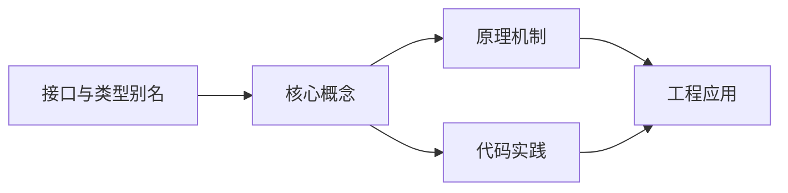

## 1. 学习目标（Bloom 分类）

本节按照布鲁姆教育目标分类学组织学习路径。本文主题为《接口与类型别名》，属于 TypeScript 模块，读者可以根据自身阶段选择阅读深度。

记忆层面：能够准确复述本文的核心概念、术语与基本语法或操作步骤，并能够在提问或检索时快速定位对应知识点。能够说出 TS 的类型注解、接口、联合类型、泛型与枚举语法。

理解层面：能够用自己的语言解释核心原理与工作机制，说明概念之间的因果关系，而不是机械记忆结论。能够解释类型系统（结构类型、类型收窄、类型体操）与编译机制。

应用层面：能够在真实项目或练习场景中运用本文知识解决具体问题，写出正确且可维护的实现。能够编写类型安全的函数、类与泛型工具。

分析层面：能够拆解复杂问题，比较本文主题与相邻概念的异同，识别边界条件与例外情况。能够分析类型推断、声明合并与模块解析。

评价层面：能够根据约束条件（性能、可读性、安全、成本）评价不同方案的优劣，做出有依据的技术决策。能够评价 TS 与 JS、其他静态语言的设计差异。

创造层面：能够把本文知识与其他模块知识组合，设计出新的解决方案或可复用的工程模式。能够设计大型项目的类型体系与工程配置。

通过本节学习，读者应当能够把《接口与类型别名》纳入自己的知识网络，并与 TypeScript 模块的其他主题（类型系统、泛型、工具类型、编译配置）建立关联。

## 2. 历史动机与发展脉络

《接口与类型别名》是 TypeScript 领域的重要主题。要真正理解它，需要先了解它解决的问题与演进过程。

TypeScript 由 Anders Hejlsberg 团队于 2012 年发布，定位是 JavaScript 的超集：保留 JS 生态，增加静态类型与编译期检查。
TS 的编译目标覆盖 ES3 到 ES2022+，配合 tsconfig 的严格模式（strict）成为行业标准；2019 年起主流框架（Vue 3、React、Angular）默认 TS。
类型系统持续演进：条件类型、映射类型、模板字面量类型、const 类型参数与 satisfies 操作符；tsc 之外，Vite/ESBuild 用 esbuild 转译加速开发。

回到本文主题：接口与类型别名 的提出与成熟，正是上述技术背景下的必然产物。早期实现往往以简单可用为目标，随着工程规模扩大，社区逐渐沉淀出标准做法与最佳实践；理解这一脉络，可以帮助读者判断“为什么文档中的推荐写法是现在这个样子”，也能在遇到历史遗留代码时准确识别其设计年代与取舍。


## 3. 形式化定义与核心概念精讲

本节把《接口与类型别名》涉及的核心概念以“定义 + 讲解”的形式展开。读者应把定义当作工具，把讲解当作理解路径；两者结合才能形成可迁移的知识。

结构类型：TS 的类型兼容基于结构（成员）而非名义；多余属性检查在对象字面量处执行。
类型收窄：typeof、instanceof、in、判别联合与谓词函数（is）让联合类型逐步收窄。
泛型：类型参数 + 约束（extends）实现复用；工具类型（Partial、Pick、Record、ReturnType）基于映射与条件类型。

### 3.1 原文章节逐一精讲

原文档把主题拆分为 26 个小节，下面按顺序给出每一节的导读讲解，随后保留原文细节供精读。

#### 原文精读（完整保留）

# 接口与类型别名

> **符号约定**：`< >` 必填参数 | `[ ]` 可选参数

---

#### 1. 接口 (Interface)

接口是 TypeScript 中用于定义对象结构的重要工具，它描述了对象应该具有的属性和方法。

##### 1.1 基本接口定义

```typescript
// 基本接口定义
interface Person {
  name: string;
  age: number;
}
// 使用接口
const person: Person = {
  name: 'Alice',
  age: 30,
};
// 错误示例：缺少属性
// const invalidPerson: Person = {
// name: "Bob" // 缺少 age 属性
// };
```

##### 1.2 可选属性

使用 `?` 标记可选属性。

```typescript
interface User {
  id: number;
  name: string;
  age?: number; // 可选属性
  email?: string; // 可选属性
}
// 正确：只提供必需属性
const user1: User = {
  id: 1,
  name: 'Alice',
};
// 正确：提供所有属性
const user2: User = {
  id: 2,
  name: 'Bob',
  age: 25,
  email: 'bob@example.com',
};
```

##### 1.3 只读属性

使用 `readonly` 标记只读属性，这些属性只能在初始化时赋值，之后不能修改。

```typescript
interface Product {
  readonly id: number;
  name: string;
  price: number;
}
const product: Product = {
  id: 1001,
  name: 'Laptop',
  price: 999.99,
};
// 错误：不能修改只读属性
// product.id = 1002; // 编译错误
product.price = 899.99; // 可以修改非只读属性
```

##### 1.4 函数接口

接口可以定义函数的类型。

```typescript
// 函数接口
interface GreetFunction {
  (name: string, age?: number): string;
  ;
}
// 实现函数接口
const greet: GreetFunction = (name, age) => {
  if (age) {
    return `Hello, ${name}! You are ${age} years old.`;
  }
  return `Hello, ${name}!`;
  ;
};
console.log(greet('Alice')); // Hello, Alice!
console.log(greet('Bob', 25)); // Hello, Bob! You are 25 years old.
```

##### 1.5 索引签名

使用索引签名定义任意属性。

```typescript
// 字符串索引签名
interface StringMap {
  [key: string]: string;
}
const colors: StringMap = {
  red: '#FF0000',
  green: '#00FF00',
  blue: '#0000FF',
};
// 数字索引签名
interface NumberArray {
  [index: number]: number;
}
const numbers: NumberArray = [1, 2, 3, 4, 5];
// 混合索引签名
interface MixedMap {
  [key: string]: string | number;
  length: number; // 具体属性类型必须与索引签名兼容
}
const mixed: MixedMap = {
  name: 'Alice',
  age: 30,
  length: 2,
};
```

##### 1.6 类实现接口

类可以实现一个或多个接口。

```typescript
interface Printable {
  print(): void;
  ;
}
interface Loggable {
  log(message: string): void;
  ;
}
// 实现单个接口
class Document implements Printable {
  print(): void {
    console.log('Printing document...');
  }
  ;
}
// 实现多个接口
class AdvancedDocument implements Printable, Loggable {
  print(): void {
    console.log('Printing advanced document...');
  }
  log(message: string): void {
    console.log(`Logging: ${message}`);
  }
  ;
}
const doc = new AdvancedDocument();
doc.print(); // Printing advanced document...
doc.log('Document created'); // Logging: Document created
```

#### 2. 接口继承

接口可以继承其他接口，实现代码复用。

##### 2.1 单继承

```typescript
interface Person {
  name: string;
  age: number;
}
interface Employee extends Person {
  employeeId: number;
  department: string;
}
const employee: Employee = {
  name: 'Alice',
  age: 30,
  employeeId: 1001,
  department: 'Engineering',
};
```

##### 2.2 多继承

接口可以同时继承多个接口。

```typescript
interface Readable {
  read(): string;
  ;
}
interface Writeable {
  write(content: string): void;
  ;
}
interface ReadWriteable extends Readable, Writeable {
  readWrite(): void;
  ;
}
class File implements ReadWriteable {
  read(): string {
    return 'File content';
  }
  write(content: string): void {
    console.log(`Writing: ${content}`);
  }
  readWrite(): void {
    console.log('Reading and writing...');
  }
  ;
}
const file = new File();
console.log(file.read()); // File content
file.write('Hello'); // Writing: Hello
file.readWrite(); // Reading and writing...
```

##### 2.3 继承与扩展

接口继承后可以添加新的属性和方法。

```typescript
interface BaseConfig {
  host: string;
  port: number;
}
interface DatabaseConfig extends BaseConfig {
  database: string;
  username: string;
  password: string;
  ssl?: boolean; // 新增可选属性
}
const dbConfig: DatabaseConfig = {
  host: 'localhost',
  port: 5432,
  database: 'mydb',
  username: 'admin',
  password: 'password',
};
```

#### 3. 类型别名 (Type Aliases)

类型别名使用 `type` 关键字定义，可以为任何类型创建别名，包括原始类型、联合类型、元组等。

##### 3.1 基本类型别名

```typescript
// 原始类型别名
type Age = number;
type Name = string;
type IsActive = boolean;
// 使用类型别名
const age: Age = 30;
const name: Name = 'Alice';
const isActive: IsActive = true;
// 对象类型别名
type Person = {
  name: string;
  age: number;
  email?: string;
};
const person: Person = {
  name: 'Bob',
  age: 25,
};
```

##### 3.2 联合类型别名

```typescript
// 联合类型别名
type Status = 'active' | 'inactive' | 'pending';
type Result = string | number | boolean;
// 使用联合类型
const userStatus: Status = 'active';
const result1: Result = 'Success';
const result2: Result = 42;
const result3: Result = true;
// 错误示例：不在联合类型中
// const invalidStatus: Status = "deleted"; // 编译错误
```

##### 3.3 元组类型别名

```typescript
// 元组类型别名
type Coordinates = [number, number];
type RGB = [number, number, number];
type PersonInfo = [string, number, boolean];
// 使用元组类型
const point: Coordinates = [10, 20];
const color: RGB = [255, 0, 0];
const personInfo: PersonInfo = ['Alice', 30, true];
// 访问元组成员
console.log(point[0]); // 10
console.log(color[1]); // 0
console.log(personInfo[2]); //
```

##### 3.4 函数类型别名

```typescript
// 函数类型别名
type AddFunction = (a: number, b: number) => number;
type Callback = () => void;
type ProcessFunction = (data: any, callback: Callback) => void;
// 使用函数类型别名
const add: AddFunction = (a, b) => a + b;
const greet: Callback = () => console.log('Hello!');
const process: ProcessFunction = (data, callback) => {
  console.log('Processing data...', data);
  callback();
};
console.log(add(5, 3)); // 8
greet(); // Hello!
process({ id: 1 }, greet); // Processing data... { id: 1 }
// Hello!
```

##### 3.5 交叉类型

使用 `&` 创建交叉类型，组合多个类型的特性。

```typescript
// 交叉类型
type Person = {
  name: string;
  age: number;
};
type Employee = {
  employeeId: number;
  department: string;
};
// 交叉类型：同时具有 Person 和 Employee 的属性
type EmployeePerson = Person & Employee;
const employee: EmployeePerson = {
  name: 'Alice',
  age: 30,
  employeeId: 1001,
  department: 'Engineering',
};
```

##### 3.6 条件类型

使用条件类型根据其他类型创建新类型。

```typescript
 // 条件类型
 type IsString<T> = T extends string ?  : false;
 type IsNumber<T> = T extends number ?  : false;
 // 使用条件类型
 type A = IsString<string>; //
 type B = IsString<number>; // false
 type C = IsNumber<number>; //
 type D = IsNumber<string>; // false
 // 复杂条件类型
 type ExtractString<T> = T extends string ? T : never;
 type StringsOnly<T> = T extends Array<infer U> ? ExtractString<U>[] : ExtractString<T>;
 // 使用复杂条件类型
 type E = StringsOnly<string>; // string
 type F = StringsOnly<number>; // never
 type G = StringsOnly<string[]>; // string[]
 type H = StringsOnly<(string | number)[]>; // string[]
```

#### 4. 接口与类型别名的对比

##### 4.1 核心差异

| 特性         | Interface                      | Type Alias                                     |
| :----------- | :----------------------------- | :--------------------------------------------- |
| **定义范围** | 主要用于定义对象结构           | 可以定义任何类型（原始类型、联合类型、元组等） |
| **声明合并** | 支持（多个同名接口会自动合并） | 不支持（同名类型别名会导致编译错误）           |
| **扩展方式** | 使用 `extends` 关键字          | 使用交叉类型 `&`                               |
| **计算属性** | 不支持                         | 支持                                           |
| **类型参数** | 支持泛型                       | 支持泛型                                       |
| **使用场景** | 定义对象结构、类接口           | 定义联合类型、元组类型、复杂类型组合           |

##### 4.2 声明合并

接口支持声明合并，多个同名接口会自动合并为一个。

```typescript
// 声明合并示例
interface User {
  id: number;
  name: string;
}
// 自动合并到上面的 User 接口
interface User {
  age?: number;
  email?: string;
}
// 使用合并后的接口
const user: User = {
  id: 1,
  name: 'Alice',
  age: 30,
  email: 'alice@example.com',
};
```

类型别名不支持声明合并。

```typescript
// 错误：类型别名不能重复声明
// type User = {
// id: number;
// name: string;
// };
// 编译错误：重复的标识符 'User'
// type User = {
// age?: number;
// };
```

##### 4.3 扩展方式

接口使用 `extends` 扩展。

```typescript
interface Person {
  name: string;
  age: number;
  ;
}
interface Employee extends Person {
  employeeId: number;
  department: string;
  ;
}
```

类型别名使用交叉类型 `&` 扩展。

```typescript
type Person = {
  name: string;
  age: number;
  ;
};
type Employee = Person & {
  employeeId: number;
  department: string;
  ;
};
```

##### 4.4 计算属性

类型别名支持计算属性。

```typescript
// 计算属性示例
type Keys = 'a' | 'b' | 'c';
type StringMap = {
  [K in Keys]: string;
};
// 等价于
// type StringMap = {
// a: string;
// b: string;
// c: string;
// };
const map: StringMap = {
  a: 'value1',
  b: 'value2',
  c: 'value3',
};
```

接口不支持计算属性。

##### 4.5 泛型支持

两者都支持泛型。

```typescript
// 泛型接口
interface GenericInterface<T> {
  value: T;
  getValue(): T;
}
// 泛型类型别名
type GenericType<T> = {
  value: T;
  getValue(): T;
};
// 使用泛型
const numInterface: GenericInterface<number> = {
  value: 42,
  getValue: () => 42,
};
const stringType: GenericType<string> = {
  value: 'Hello',
  getValue: () => 'Hello',
};
```

#### 5. 最佳实践

##### 5.1 选择原则

- **优先使用接口**：当定义对象结构、类接口时，优先使用 `interface`。
- **使用类型别名**：当需要定义联合类型、元组类型、交叉类型或其他复杂类型时，使用 `type`。

##### 5.2 具体场景

| 场景             | 推荐使用    | 原因                             |
| :--------------- | :---------- | :------------------------------- |
| 定义对象结构     | `interface` | 支持声明合并，更符合面向对象思维 |
| 定义类接口       | `interface` | 类可以使用 `implements` 实现接口 |
| 定义联合类型     | `type`      | 接口不支持联合类型               |
| 定义元组类型     | `type`      | 接口不支持元组类型               |
| 定义交叉类型     | `type`      | 使用 `&` 更简洁                  |
| 定义条件类型     | `type`      | 接口不支持条件类型               |
| 定义原始类型别名 | `type`      | 接口只能定义对象结构             |

##### 5.3 实际应用建议

1. **保持一致性**：在项目中保持使用接口和类型别名的一致性。
2. **清晰命名**：为接口和类型别名使用清晰、描述性的名称。
3. **合理使用**：根据具体场景选择合适的方式，不要过度使用其中一种。
4. **文档化**：对于复杂的类型定义，添加注释说明其用途。

#### 6. 代码示例

##### 6.1 接口的综合使用

```typescript
// 基本接口
interface User {
  readonly id: number;
  name: string;
  age?: number;
  email?: string;
  ;
}
// 函数接口
interface UserService {
  getUser(id: number): User;
  createUser(user: Omit<User, 'id'>): User;
  updateUser(id: number, user: Partial<User>): User;
  deleteUser(id: number): boolean;
  ;
}
// 实现接口
class UserServiceImpl implements UserService {
  private users: User[] = [
    { id: 1, name: 'Alice', age: 30, email: 'alice@example.com' },
    { id: 2, name: 'Bob', age: 25 },
  ];
  getUser(id: number): User {
    const user = this.users.find((u) => u.id === id);
    if (!user) {
      throw new Error(`User with id ${id} not found`);
    }
    return user;
  }
  createUser(user: Omit<User, 'id'>): User {
    const newUser: User = {
      id: this.users.length + 1,
      ...user,
    };
    this.users.push(newUser);
    return newUser;
  }
  updateUser(id: number, user: Partial<User>): User {
    const index = this.users.findIndex((u) => u.id === id);
    if (index === -1) {
      throw new Error(`User with id ${id} not found`);
    }
    this.users[index] = { ...this.users[index], ...user };
    return this.users[index];
  }
  deleteUser(id: number): boolean {
    const initialLength = this.users.length;
    this.users = this.users.filter((u) => u.id !== id);
    return this.users.length < initialLength;
  }
  ;
}
// 使用示例
const userService = new UserServiceImpl();
console.log('Get user 1:', userService.getUser(1));
const newUser = userService.createUser({ name: 'Charlie', age: 35 });
console.log('Created user:', newUser);
const updatedUser = userService.updateUser(1, { age: 31, email: 'alice.updated@example.com' });
console.log('Updated user:', updatedUser);
const deleted = userService.deleteUser(2);
console.log('Deleted user 2:', deleted);
console.log('All users:', userService);
```

##### 6.2 类型别名的综合使用

```typescript
// 基本类型别名
type UserId = number;
type UserName = string;
type Email = string;
// 联合类型
type UserRole = 'admin' | 'user' | 'guest';
type Status = 'active' | 'inactive' | 'pending';
// 元组类型
type UserCredentials = [UserName, string]; // [username, password]
type Coordinates = [number, number]; // [x, y]
// 对象类型
type User = {
  id: UserId;
  name: UserName;
  email: Email;
  role: UserRole;
  status: Status;
  lastLogin?: Date;
  ;
};
// 交叉类型
type AdminPermissions = {
  canManageUsers: boolean;
  canManageSettings: boolean;
  ;
};
type AdminUser = User & AdminPermissions;
// 函数类型
type UserValidator = (user: User) => boolean;
type AsyncCallback = (error: Error | null, result: any) => void;
// 使用示例
const validateUser: UserValidator = (user) => {
  return !!user.name && !!user.email && !!user.role;
  ;
};
const adminUser: AdminUser = {
  id: 1,
  name: 'Alice',
  email: 'alice@example.com',
  role: 'admin',
  status: 'active',
  canManageUsers: true,
  canManageSettings: True,
};
const credentials: UserCredentials = ['alice', 'password123'];
const position: Coordinates = [10, 20];
console.log('Admin user:', adminUser);
console.log('Credentials:', credentials);
console.log('Position:', position);
console.log('Is valid user:', validateUser(adminUser));
```

##### 6.3 接口与类型别名的混合使用

```typescript
// 接口定义核心结构
interface BaseEntity {
  id: number;
  createdAt: Date;
  updatedAt: Date;
}
// 类型别名定义复杂类型
type EntityType = 'user' | 'product' | 'order';
type EntityStatus = 'active' | 'inactive' | 'deleted';
// 接口继承并使用类型别名
interface User extends BaseEntity {
  name: string;
  email: string;
  type: Extract<EntityType, 'user'>;
  status: EntityStatus;
}
interface Product extends BaseEntity {
  name: string;
  price: number;
  type: Extract<EntityType, 'product'>;
  status: EntityStatus;
}
// 类型别名创建联合类型
type Entity = User | Product;
// 类型守卫函数
type EntityGuard<T extends EntityType> = (entity: Entity) => entity is Extract<Entity, { type: T }>;
const isUser: EntityGuard<'user'> = (entity): entity is User => {
  return entity.type === 'user';
};
const isProduct: EntityGuard<'product'> = (entity): entity is Product => {
  return entity.type === 'product';
};
// 使用示例
const user: User = {
  id: 1,
  name: 'Alice',
  email: 'alice@example.com',
  type: 'user',
  status: 'active',
  createdAt: new Date(),
  updatedAt: new Date(),
};
const product: Product = {
  id: 1001,
  name: 'Laptop',
  price: 999.99,
  type: 'product',
  status: 'active',
  createdAt: new Date(),
  updatedAt: new Date(),
};
const processEntity = (entity: Entity) => {
  console.log(`Processing entity ${entity.id} (${entity.type})`);
  if (isUser(entity)) {
    console.log(`User: ${entity.name}, Email: ${entity.email}`);
  } else if (isProduct(entity)) {
    console.log(`Product: ${entity.name}, Price: $${entity.price}`);
  }
};
processEntity(user);
processEntity(product);
```

---

#### 接口定义

**换行写法：定义基本接口**
`interface <接口名> {`
`    <属性1>: <类型1>`
`    <属性2>: <类型2>`
`}`

```typescript
// 定义基本接口
interface User {
    name: string
    age: number
}
```

---

**基本写法：使用接口**
`let <变量>: <接口名> = { <属性>: <值> }`

```typescript
// 使用接口定义对象
let user: User = { name: "Alice", age: 30 }
```

---

#### 可选属性

**换行写法：接口可选属性**
`interface <接口名> {`
`    <属性1>: <类型1>`
`    <属性2>?: <类型2>`
`}`

```typescript
// 接口可选属性（使用 ? 标记）
interface User {
    name: string
    age?: number
}
```

---

#### 只读属性

**换行写法：接口只读属性**
`interface <接口名> {`
`    readonly <属性>: <类型>`
`}`

```typescript
// 接口只读属性
interface User {
    readonly id: number
    name: string
}
```

---

#### 接口继承

**基本写法：单继承**
`interface <子接口> extends <父接口> { <属性>: <类型> }`

```typescript
// 接口单继承
interface Animal {
    name: string
}

interface Dog extends Animal {
    breed: string
}
```

---

**基本写法：多继承**
`interface <子接口> extends <父接口1>, <父接口2> { <属性>: <类型> }`

```typescript
// 接口多继承
interface Flyable {
    fly(): void
}

interface Swimmable {
    swim(): void
}

interface Duck extends Flyable, Swimmable {
    name: string
}
```

---

#### 函数类型接口

**换行写法：定义函数类型接口**
`interface <接口名> {`
`    (<参数>: <类型>): <返回类型>`
`}`

```typescript
// 定义函数类型接口
interface SearchFunc {
    (source: string, sub: string): boolean
}
```

---

**基本写法：使用函数类型接口**
`let <变量>: <接口名> = (<参数>) => <表达式>`

```typescript
// 使用函数类型接口
let search: SearchFunc = (src, sub) => src.includes(sub)
```

---

#### 可索引类型接口

**换行写法：字符串索引签名**
`interface <接口名> {`
`    [key: string]: <类型>`
`}`

```typescript
// 字符串索引签名
interface StringArray {
    [index: string]: string
}
```

---

**换行写法：数字索引签名**
`interface <接口名> {`
`    [index: number]: <类型>`
`}`

```typescript
// 数字索引签名
interface NumberArray {
    [index: number]: string
}
```

---

#### 类类型接口

**换行写法：类实现接口**
`interface <接口名> {`
`    <方法>(<参数>): <返回类型>`
`}`
`class <类名> implements <接口名> { <语句> }`

```typescript
// 类实现接口
interface Clock {
    current_time: Date
    set_time(d: Date): void
}

class DigitalClock implements Clock {
    current_time = new Date()
    set_time(d: Date) {
        this.current_time = d
    }
}
```

---

#### 类型别名

**基本写法：定义类型别名**
`type <别名> = <类型>`

```typescript
// 定义类型别名
type Name = string
type Age = number
```

---

**换行写法：对象类型别名**
`type <别名> = {`
`    <属性1>: <类型1>`
`    <属性2>: <类型2>`
`}`

```typescript
// 对象类型别名
type User = {
    name: string
    age: number
}
```

---

**基本写法：联合类型别名**
`type <别名> = <类型1> | <类型2>`

```typescript
// 联合类型别名
type ID = string | number
```

---

**基本写法：交叉类型别名**
`type <别名> = <类型1> & <类型2>`

```typescript
// 交叉类型别名
type Person = { name: string }
type Employee = { id: number }
type Staff = Person & Employee
```

---

#### 接口与类型别名对比

**换行写法：接口扩展**
`interface <接口名> extends <父接口> { <属性>: <类型> }`

```typescript
// 接口扩展（使用 extends）
interface Animal {
    name: string
}

interface Dog extends Animal {
    breed: string
}
```

---

**基本写法：类型别名交叉**
`type <别名> = <类型1> & <类型2>`

```typescript
// 类型别名交叉（使用 &）
type Animal = { name: string }
type Dog = Animal & { breed: string }
```

---

#### 函数类型

**基本写法：使用 type 定义函数类型**
`type <函数类型> = (<参数>: <类型>) => <返回类型>`

```typescript
// 使用 type 定义函数类型
type Callback = (data: string) => void
```

---

**基本写法：使用 interface 定义函数类型**
`interface <函数类型> { (<参数>: <类型>): <返回类型> }`

```typescript
// 使用 interface 定义函数类型
interface Callback {
    (data: string): void
}
```

---

#### 合并接口

**换行写法：接口声明合并**
`interface <接口名> { <属性1>: <类型1> }`
`interface <接口名> { <属性2>: <类型2> }`

```typescript
// 接口声明合并（同名接口自动合并）
interface Box {
    width: number
}

interface Box {
    height: number
}
```

---

#### 描述对象

**换行写法：描述复杂对象**
`interface <接口名> {`
`    <属性>: <类型>`
`    <嵌套对象>: {`
`        <子属性>: <类型>`
`    }`
`}`

```typescript
// 描述复杂嵌套对象
interface User {
    name: string
    address: {
        street: string
        city: string
    }
}
```

---

#### 数组类型接口

**换行写法：描述对象数组**
`interface <接口名> {`
`    <属性>: <类型>`
`}`
`let <变量>: <接口名>[] = [<对象>]`

```typescript
// 描述对象数组
interface Product {
    name: string
    price: number
}

let products: Product[] = [
    { name: "Apple", price: 1.5 },
    { name: "Banana", price: 0.5 },
]
```

---

#### readonly 与 Readonly

**基本写法：使用 readonly 修饰符**
`interface <接口名> { readonly <属性>: <类型> }`

```typescript
// 使用 readonly 修饰符
interface Point {
    readonly x: number
    readonly y: number
}
```

---

**基本写法：使用 Readonly 工具类型**
`type <别名> = Readonly<<接口>>`

```typescript
// 使用 Readonly 工具类型
type ReadonlyUser = Readonly<User>
```

---

#### Partial 与 Required

**基本写法：使用 Partial 工具类型**
`type <别名> = Partial<<接口>>`

```typescript
// 使用 Partial 使所有属性可选
type PartialUser = Partial<User>
```

---

**基本写法：使用 Required 工具类型**
`type <别名> = Required<<接口>>`

```typescript
// 使用 Required 使所有属性必填
type RequiredUser = Required<User>
```

---

#### Pick 与 Omit

**基本写法：使用 Pick 工具类型**
`type <别名> = Pick<<接口>, "<属性1>" | "<属性2>">`

```typescript
// 使用 Pick 选取部分属性
type UserBasic = Pick<User, "name" | "age">
```

---

**基本写法：使用 Omit 工具类型**
`type <别名> = Omit<<接口>, "<属性>">`

```typescript
// 使用 Omit 排除部分属性
type UserWithoutAge = Omit<User, "age">
```

---

#### Record 类型

**基本写法：使用 Record 工具类型**
`type <别名> = Record<<键类型>, <值类型>>`

```typescript
// 使用 Record 创建键值对类型
type UserMap = Record<string, User>
```

---

#### 函数参数类型

**换行写法：描述函数参数对象**
`interface <参数接口> {`
`    <属性1>: <类型1>`
`    <属性2>: <类型2>`
`}`
`function <函数>(<参数>: <参数接口>): <返回类型> { <语句> }`

```typescript
// 描述函数参数对象
interface Config {
    host: string
    port: number
    timeout?: number
}

function connect(config: Config): void {
    console.log(`${config.host}:${config.port}`)
}
```

---

#### 可调用接口

**换行写法：可调用对象接口**
`interface <接口名> {`
`    (<参数>: <类型>): <返回类型>`
`    <属性>: <类型>`
`}`

```typescript
// 可调用对象接口（既是函数又有属性）
interface Counter {
    (start: number): void
    count: number
}
```

---

#### 构造器类型

**换行写法：构造器接口**
`interface <接口名> {`
`    new (<参数>: <类型>): <对象类型>`
`}`

```typescript
// 构造器接口
interface ClockConstructor {
    new (hour: number, minute: number): ClockInterface
}

interface ClockInterface {
    tick(): void
}
```


### 3.2 概念关系图

下面用 Mermaid 图表达本文核心概念之间的关系，帮助读者建立整体图景：



图中展示的是本文知识的结构化关系：核心概念是入口，原理机制解释“为什么”，代码实践演示“怎么做”，工程应用回答“何时用”。读者学习时可以把每个小节的内容挂接到对应节点上。

## 4. 理论推导与原理解析

本节深入《接口与类型别名》背后的原理。理论部分不求面面俱到，而是聚焦“能解释现象、能指导实践”的关键推导。

结构类型：TS 的类型兼容基于结构（成员）而非名义；多余属性检查在对象字面量处执行。
类型收窄：typeof、instanceof、in、判别联合与谓词函数（is）让联合类型逐步收窄。
泛型：类型参数 + 约束（extends）实现复用；工具类型（Partial、Pick、Record、ReturnType）基于映射与条件类型。
声明与编译：.ts 编译为 .js；类型声明（.d.ts）描述 JS 库；tsconfig 的 strict、moduleResolution、target 决定行为。

需要强调的是，理论推导与工程实践之间存在翻译层：理论给出的是理想化模型与边界条件，工程代码则必须处理真实环境中的例外。读者在学习时应先掌握理论的“标准情形”，再通过陷阱章节了解“非标准情形”。

## 5. 代码示例与逐行讲解

本节把原文中的代码示例系统整理，并为每个示例补充用途说明与讲解。读者不应只浏览代码，而应逐段对照讲解理解设计意图。

### 5.1 示例：1.1 基本接口定义

该示例来自原文《1.1 基本接口定义》小节，用于演示接口与类型别名相关操作。阅读时请先看代码结构，再看其后的讲解。

```typescript
// 基本接口定义
interface Person {
  name: string;
  age: number;
}
// 使用接口
const person: Person = {
  name: 'Alice',
  age: 30,
};
// 错误示例：缺少属性
// const invalidPerson: Person = {
// name: "Bob" // 缺少 age 属性
// };
```

讲解：这段代码演示了本节核心知识点。代码中的关键操作可以归纳为三步：准备（定义或初始化）、执行（核心逻辑）、收尾（释放资源或返回结果）。实际项目中，这三步往往被封装为函数或类，以提升复用性与可测试性。

关键点分析：

该示例共 14 行有效代码，结构以数据或配置为主。阅读时应关注：数据字段的含义、配置项的作用，以及它们与运行行为的对应关系。

进阶思考路径：先尝试修改参数观察行为变化，再把示例中的模式迁移到自己的项目中；每次修改都记录预期与实测差异，这是把示例转化为能力的最快方式。

### 5.2 示例：1.2 可选属性

该示例来自原文《1.2 可选属性》小节，用于演示接口与类型别名相关操作。阅读时请先看代码结构，再看其后的讲解。

```typescript
interface User {
  id: number;
  name: string;
  age?: number; // 可选属性
  email?: string; // 可选属性
}
// 正确：只提供必需属性
const user1: User = {
  id: 1,
  name: 'Alice',
};
// 正确：提供所有属性
const user2: User = {
  id: 2,
  name: 'Bob',
  age: 25,
  email: 'bob@example.com',
};
```

讲解：这段代码演示了本节核心知识点。代码中的关键操作可以归纳为三步：准备（定义或初始化）、执行（核心逻辑）、收尾（释放资源或返回结果）。实际项目中，这三步往往被封装为函数或类，以提升复用性与可测试性。

关键点分析：

该示例共 18 行有效代码，结构以数据或配置为主。阅读时应关注：数据字段的含义、配置项的作用，以及它们与运行行为的对应关系。

进阶思考路径：先尝试修改参数观察行为变化，再把示例中的模式迁移到自己的项目中；每次修改都记录预期与实测差异，这是把示例转化为能力的最快方式。

### 5.3 示例：1.3 只读属性

该示例来自原文《1.3 只读属性》小节，用于演示接口与类型别名相关操作。阅读时请先看代码结构，再看其后的讲解。

```typescript
interface Product {
  readonly id: number;
  name: string;
  price: number;
}
const product: Product = {
  id: 1001,
  name: 'Laptop',
  price: 999.99,
};
// 错误：不能修改只读属性
// product.id = 1002; // 编译错误
product.price = 899.99; // 可以修改非只读属性
```

讲解：这段代码演示了本节核心知识点。代码中的关键操作可以归纳为三步：准备（定义或初始化）、执行（核心逻辑）、收尾（释放资源或返回结果）。实际项目中，这三步往往被封装为函数或类，以提升复用性与可测试性。

关键点分析：

该示例共 13 行有效代码，结构以数据或配置为主。阅读时应关注：数据字段的含义、配置项的作用，以及它们与运行行为的对应关系。

进阶思考路径：先尝试修改参数观察行为变化，再把示例中的模式迁移到自己的项目中；每次修改都记录预期与实测差异，这是把示例转化为能力的最快方式。

### 5.4 示例：1.4 函数接口

该示例来自原文《1.4 函数接口》小节，用于演示接口与类型别名相关操作。阅读时请先看代码结构，再看其后的讲解。

```typescript
// 函数接口
interface GreetFunction {
  (name: string, age?: number): string;
  ;
}
// 实现函数接口
const greet: GreetFunction = (name, age) => {
  if (age) {
    return `Hello, ${name}! You are ${age} years old.`;
  }
  return `Hello, ${name}!`;
  ;
};
console.log(greet('Alice')); // Hello, Alice!
console.log(greet('Bob', 25)); // Hello, Bob! You are 25 years old.
```

讲解：这段代码演示了本节核心知识点。代码中的关键操作可以归纳为三步：准备（定义或初始化）、执行（核心逻辑）、收尾（释放资源或返回结果）。实际项目中，这三步往往被封装为函数或类，以提升复用性与可测试性。

关键点分析：

该示例共 15 行有效代码，包含 2 类关键结构（if、return）。其中：

- 入口与初始化部分负责建立上下文，对应实际项目中的启动或装配逻辑；
- 核心逻辑部分体现本文主题的主要操作，是阅读时最需要对照讲解理解的部分；
- 输出或返回部分把结果交给调用方，注意其类型与边界条件。

进阶思考路径：先尝试修改参数观察行为变化，再把示例中的模式迁移到自己的项目中；每次修改都记录预期与实测差异，这是把示例转化为能力的最快方式。

### 5.5 示例：1.5 索引签名

该示例来自原文《1.5 索引签名》小节，用于演示接口与类型别名相关操作。阅读时请先看代码结构，再看其后的讲解。

```typescript
// 字符串索引签名
interface StringMap {
  [key: string]: string;
}
const colors: StringMap = {
  red: '#FF0000',
  green: '#00FF00',
  blue: '#0000FF',
};
// 数字索引签名
interface NumberArray {
  [index: number]: number;
}
const numbers: NumberArray = [1, 2, 3, 4, 5];
// 混合索引签名
interface MixedMap {
  [key: string]: string | number;
  length: number; // 具体属性类型必须与索引签名兼容
}
const mixed: MixedMap = {
  name: 'Alice',
  age: 30,
  length: 2,
};
```

讲解：这段代码演示了本节核心知识点。代码中的关键操作可以归纳为三步：准备（定义或初始化）、执行（核心逻辑）、收尾（释放资源或返回结果）。实际项目中，这三步往往被封装为函数或类，以提升复用性与可测试性。

关键点分析：

该示例共 24 行有效代码，结构以数据或配置为主。阅读时应关注：数据字段的含义、配置项的作用，以及它们与运行行为的对应关系。

进阶思考路径：先尝试修改参数观察行为变化，再把示例中的模式迁移到自己的项目中；每次修改都记录预期与实测差异，这是把示例转化为能力的最快方式。

### 5.6 示例：1.6 类实现接口

该示例来自原文《1.6 类实现接口》小节，用于演示接口与类型别名相关操作。阅读时请先看代码结构，再看其后的讲解。

```typescript
interface Printable {
  print(): void;
  ;
}
interface Loggable {
  log(message: string): void;
  ;
}
// 实现单个接口
class Document implements Printable {
  print(): void {
    console.log('Printing document...');
  }
  ;
}
// 实现多个接口
class AdvancedDocument implements Printable, Loggable {
  print(): void {
    console.log('Printing advanced document...');
  }
  log(message: string): void {
    console.log(`Logging: ${message}`);
  }
  ;
}
const doc = new AdvancedDocument();
doc.print(); // Printing advanced document...
doc.log('Document created'); // Logging: Document created
```

讲解：这段代码演示了本节核心知识点。代码中的关键操作可以归纳为三步：准备（定义或初始化）、执行（核心逻辑）、收尾（释放资源或返回结果）。实际项目中，这三步往往被封装为函数或类，以提升复用性与可测试性。

关键点分析：

该示例共 28 行有效代码，包含 1 类关键结构（class）。其中：

- 入口与初始化部分负责建立上下文，对应实际项目中的启动或装配逻辑；
- 核心逻辑部分体现本文主题的主要操作，是阅读时最需要对照讲解理解的部分；
- 输出或返回部分把结果交给调用方，注意其类型与边界条件。

进阶思考路径：先尝试修改参数观察行为变化，再把示例中的模式迁移到自己的项目中；每次修改都记录预期与实测差异，这是把示例转化为能力的最快方式。

### 5.7 示例：2.1 单继承

该示例来自原文《2.1 单继承》小节，用于演示接口与类型别名相关操作。阅读时请先看代码结构，再看其后的讲解。

```typescript
interface Person {
  name: string;
  age: number;
}
interface Employee extends Person {
  employeeId: number;
  department: string;
}
const employee: Employee = {
  name: 'Alice',
  age: 30,
  employeeId: 1001,
  department: 'Engineering',
};
```

讲解：这段代码演示了本节核心知识点。代码中的关键操作可以归纳为三步：准备（定义或初始化）、执行（核心逻辑）、收尾（释放资源或返回结果）。实际项目中，这三步往往被封装为函数或类，以提升复用性与可测试性。

关键点分析：

该示例共 14 行有效代码，结构以数据或配置为主。阅读时应关注：数据字段的含义、配置项的作用，以及它们与运行行为的对应关系。

进阶思考路径：先尝试修改参数观察行为变化，再把示例中的模式迁移到自己的项目中；每次修改都记录预期与实测差异，这是把示例转化为能力的最快方式。

### 5.8 示例：2.2 多继承

该示例来自原文《2.2 多继承》小节，用于演示接口与类型别名相关操作。阅读时请先看代码结构，再看其后的讲解。

```typescript
interface Readable {
  read(): string;
  ;
}
interface Writeable {
  write(content: string): void;
  ;
}
interface ReadWriteable extends Readable, Writeable {
  readWrite(): void;
  ;
}
class File implements ReadWriteable {
  read(): string {
    return 'File content';
  }
  write(content: string): void {
    console.log(`Writing: ${content}`);
  }
  readWrite(): void {
    console.log('Reading and writing...');
  }
  ;
}
const file = new File();
console.log(file.read()); // File content
file.write('Hello'); // Writing: Hello
file.readWrite(); // Reading and writing...
```

讲解：这段代码演示了本节核心知识点。代码中的关键操作可以归纳为三步：准备（定义或初始化）、执行（核心逻辑）、收尾（释放资源或返回结果）。实际项目中，这三步往往被封装为函数或类，以提升复用性与可测试性。

关键点分析：

该示例共 28 行有效代码，包含 2 类关键结构（class、return）。其中：

- 入口与初始化部分负责建立上下文，对应实际项目中的启动或装配逻辑；
- 核心逻辑部分体现本文主题的主要操作，是阅读时最需要对照讲解理解的部分；
- 输出或返回部分把结果交给调用方，注意其类型与边界条件。

进阶思考路径：先尝试修改参数观察行为变化，再把示例中的模式迁移到自己的项目中；每次修改都记录预期与实测差异，这是把示例转化为能力的最快方式。

### 5.9 示例：2.3 继承与扩展

该示例来自原文《2.3 继承与扩展》小节，用于演示接口与类型别名相关操作。阅读时请先看代码结构，再看其后的讲解。

```typescript
interface BaseConfig {
  host: string;
  port: number;
}
interface DatabaseConfig extends BaseConfig {
  database: string;
  username: string;
  password: string;
  ssl?: boolean; // 新增可选属性
}
const dbConfig: DatabaseConfig = {
  host: 'localhost',
  port: 5432,
  database: 'mydb',
  username: 'admin',
  password: 'password',
};
```

讲解：这段代码演示了本节核心知识点。代码中的关键操作可以归纳为三步：准备（定义或初始化）、执行（核心逻辑）、收尾（释放资源或返回结果）。实际项目中，这三步往往被封装为函数或类，以提升复用性与可测试性。

关键点分析：

该示例共 17 行有效代码，结构以数据或配置为主。阅读时应关注：数据字段的含义、配置项的作用，以及它们与运行行为的对应关系。

进阶思考路径：先尝试修改参数观察行为变化，再把示例中的模式迁移到自己的项目中；每次修改都记录预期与实测差异，这是把示例转化为能力的最快方式。

### 5.10 示例：3.1 基本类型别名

该示例来自原文《3.1 基本类型别名》小节，用于演示接口与类型别名相关操作。阅读时请先看代码结构，再看其后的讲解。

```typescript
// 原始类型别名
type Age = number;
type Name = string;
type IsActive = boolean;
// 使用类型别名
const age: Age = 30;
const name: Name = 'Alice';
const isActive: IsActive = true;
// 对象类型别名
type Person = {
  name: string;
  age: number;
  email?: string;
};
const person: Person = {
  name: 'Bob',
  age: 25,
};
```

讲解：这段代码演示了本节核心知识点。代码中的关键操作可以归纳为三步：准备（定义或初始化）、执行（核心逻辑）、收尾（释放资源或返回结果）。实际项目中，这三步往往被封装为函数或类，以提升复用性与可测试性。

关键点分析：

该示例共 18 行有效代码，结构以数据或配置为主。阅读时应关注：数据字段的含义、配置项的作用，以及它们与运行行为的对应关系。

进阶思考路径：先尝试修改参数观察行为变化，再把示例中的模式迁移到自己的项目中；每次修改都记录预期与实测差异，这是把示例转化为能力的最快方式。

### 5.11 示例：3.2 联合类型别名

该示例来自原文《3.2 联合类型别名》小节，用于演示接口与类型别名相关操作。阅读时请先看代码结构，再看其后的讲解。

```typescript
// 联合类型别名
type Status = 'active' | 'inactive' | 'pending';
type Result = string | number | boolean;
// 使用联合类型
const userStatus: Status = 'active';
const result1: Result = 'Success';
const result2: Result = 42;
const result3: Result = true;
// 错误示例：不在联合类型中
// const invalidStatus: Status = "deleted"; // 编译错误
```

讲解：这段代码演示了本节核心知识点。代码中的关键操作可以归纳为三步：准备（定义或初始化）、执行（核心逻辑）、收尾（释放资源或返回结果）。实际项目中，这三步往往被封装为函数或类，以提升复用性与可测试性。

关键点分析：

该示例共 10 行有效代码，结构以数据或配置为主。阅读时应关注：数据字段的含义、配置项的作用，以及它们与运行行为的对应关系。

进阶思考路径：先尝试修改参数观察行为变化，再把示例中的模式迁移到自己的项目中；每次修改都记录预期与实测差异，这是把示例转化为能力的最快方式。

### 5.12 示例：3.3 元组类型别名

该示例来自原文《3.3 元组类型别名》小节，用于演示接口与类型别名相关操作。阅读时请先看代码结构，再看其后的讲解。

```typescript
// 元组类型别名
type Coordinates = [number, number];
type RGB = [number, number, number];
type PersonInfo = [string, number, boolean];
// 使用元组类型
const point: Coordinates = [10, 20];
const color: RGB = [255, 0, 0];
const personInfo: PersonInfo = ['Alice', 30, true];
// 访问元组成员
console.log(point[0]); // 10
console.log(color[1]); // 0
console.log(personInfo[2]); //
```

讲解：这段代码演示了本节核心知识点。代码中的关键操作可以归纳为三步：准备（定义或初始化）、执行（核心逻辑）、收尾（释放资源或返回结果）。实际项目中，这三步往往被封装为函数或类，以提升复用性与可测试性。

关键点分析：

该示例共 12 行有效代码，结构以数据或配置为主。阅读时应关注：数据字段的含义、配置项的作用，以及它们与运行行为的对应关系。

进阶思考路径：先尝试修改参数观察行为变化，再把示例中的模式迁移到自己的项目中；每次修改都记录预期与实测差异，这是把示例转化为能力的最快方式。

### 5.13 示例：3.4 函数类型别名

该示例来自原文《3.4 函数类型别名》小节，用于演示接口与类型别名相关操作。阅读时请先看代码结构，再看其后的讲解。

```typescript
// 函数类型别名
type AddFunction = (a: number, b: number) => number;
type Callback = () => void;
type ProcessFunction = (data: any, callback: Callback) => void;
// 使用函数类型别名
const add: AddFunction = (a, b) => a + b;
const greet: Callback = () => console.log('Hello!');
const process: ProcessFunction = (data, callback) => {
  console.log('Processing data...', data);
  callback();
};
console.log(add(5, 3)); // 8
greet(); // Hello!
process({ id: 1 }, greet); // Processing data... { id: 1 }
// Hello!
```

讲解：这段代码演示了本节核心知识点。代码中的关键操作可以归纳为三步：准备（定义或初始化）、执行（核心逻辑）、收尾（释放资源或返回结果）。实际项目中，这三步往往被封装为函数或类，以提升复用性与可测试性。

关键点分析：

该示例共 15 行有效代码，结构以数据或配置为主。阅读时应关注：数据字段的含义、配置项的作用，以及它们与运行行为的对应关系。

进阶思考路径：先尝试修改参数观察行为变化，再把示例中的模式迁移到自己的项目中；每次修改都记录预期与实测差异，这是把示例转化为能力的最快方式。

### 5.14 示例：3.5 交叉类型

该示例来自原文《3.5 交叉类型》小节，用于演示接口与类型别名相关操作。阅读时请先看代码结构，再看其后的讲解。

```typescript
// 交叉类型
type Person = {
  name: string;
  age: number;
};
type Employee = {
  employeeId: number;
  department: string;
};
// 交叉类型：同时具有 Person 和 Employee 的属性
type EmployeePerson = Person & Employee;
const employee: EmployeePerson = {
  name: 'Alice',
  age: 30,
  employeeId: 1001,
  department: 'Engineering',
};
```

讲解：这段代码演示了本节核心知识点。代码中的关键操作可以归纳为三步：准备（定义或初始化）、执行（核心逻辑）、收尾（释放资源或返回结果）。实际项目中，这三步往往被封装为函数或类，以提升复用性与可测试性。

关键点分析：

该示例共 17 行有效代码，结构以数据或配置为主。阅读时应关注：数据字段的含义、配置项的作用，以及它们与运行行为的对应关系。

进阶思考路径：先尝试修改参数观察行为变化，再把示例中的模式迁移到自己的项目中；每次修改都记录预期与实测差异，这是把示例转化为能力的最快方式。

### 5.15 示例：3.6 条件类型

该示例来自原文《3.6 条件类型》小节，用于演示接口与类型别名相关操作。阅读时请先看代码结构，再看其后的讲解。

```typescript
 // 条件类型
 type IsString<T> = T extends string ?  : false;
 type IsNumber<T> = T extends number ?  : false;
 // 使用条件类型
 type A = IsString<string>; //
 type B = IsString<number>; // false
 type C = IsNumber<number>; //
 type D = IsNumber<string>; // false
 // 复杂条件类型
 type ExtractString<T> = T extends string ? T : never;
 type StringsOnly<T> = T extends Array<infer U> ? ExtractString<U>[] : ExtractString<T>;
 // 使用复杂条件类型
 type E = StringsOnly<string>; // string
 type F = StringsOnly<number>; // never
 type G = StringsOnly<string[]>; // string[]
 type H = StringsOnly<(string | number)[]>; // string[]
```

讲解：这段代码演示了本节核心知识点。代码中的关键操作可以归纳为三步：准备（定义或初始化）、执行（核心逻辑）、收尾（释放资源或返回结果）。实际项目中，这三步往往被封装为函数或类，以提升复用性与可测试性。

关键点分析：

该示例共 16 行有效代码，结构以数据或配置为主。阅读时应关注：数据字段的含义、配置项的作用，以及它们与运行行为的对应关系。

进阶思考路径：先尝试修改参数观察行为变化，再把示例中的模式迁移到自己的项目中；每次修改都记录预期与实测差异，这是把示例转化为能力的最快方式。

### 5.16 示例：4.2 声明合并

该示例来自原文《4.2 声明合并》小节，用于演示接口与类型别名相关操作。阅读时请先看代码结构，再看其后的讲解。

```typescript
// 声明合并示例
interface User {
  id: number;
  name: string;
}
// 自动合并到上面的 User 接口
interface User {
  age?: number;
  email?: string;
}
// 使用合并后的接口
const user: User = {
  id: 1,
  name: 'Alice',
  age: 30,
  email: 'alice@example.com',
};
```

讲解：这段代码演示了本节核心知识点。代码中的关键操作可以归纳为三步：准备（定义或初始化）、执行（核心逻辑）、收尾（释放资源或返回结果）。实际项目中，这三步往往被封装为函数或类，以提升复用性与可测试性。

关键点分析：

该示例共 17 行有效代码，结构以数据或配置为主。阅读时应关注：数据字段的含义、配置项的作用，以及它们与运行行为的对应关系。

进阶思考路径：先尝试修改参数观察行为变化，再把示例中的模式迁移到自己的项目中；每次修改都记录预期与实测差异，这是把示例转化为能力的最快方式。

### 5.17 示例：4.2 声明合并

该示例来自原文《4.2 声明合并》小节，用于演示接口与类型别名相关操作。阅读时请先看代码结构，再看其后的讲解。

```typescript
// 错误：类型别名不能重复声明
// type User = {
// id: number;
// name: string;
// };
// 编译错误：重复的标识符 'User'
// type User = {
// age?: number;
// };
```

讲解：这段代码演示了本节核心知识点。代码中的关键操作可以归纳为三步：准备（定义或初始化）、执行（核心逻辑）、收尾（释放资源或返回结果）。实际项目中，这三步往往被封装为函数或类，以提升复用性与可测试性。

关键点分析：

该示例共 9 行有效代码，结构以数据或配置为主。阅读时应关注：数据字段的含义、配置项的作用，以及它们与运行行为的对应关系。

进阶思考路径：先尝试修改参数观察行为变化，再把示例中的模式迁移到自己的项目中；每次修改都记录预期与实测差异，这是把示例转化为能力的最快方式。

### 5.18 示例：4.3 扩展方式

该示例来自原文《4.3 扩展方式》小节，用于演示接口与类型别名相关操作。阅读时请先看代码结构，再看其后的讲解。

```typescript
interface Person {
  name: string;
  age: number;
  ;
}
interface Employee extends Person {
  employeeId: number;
  department: string;
  ;
}
```

讲解：这段代码演示了本节核心知识点。代码中的关键操作可以归纳为三步：准备（定义或初始化）、执行（核心逻辑）、收尾（释放资源或返回结果）。实际项目中，这三步往往被封装为函数或类，以提升复用性与可测试性。

关键点分析：

该示例共 10 行有效代码，结构以数据或配置为主。阅读时应关注：数据字段的含义、配置项的作用，以及它们与运行行为的对应关系。

进阶思考路径：先尝试修改参数观察行为变化，再把示例中的模式迁移到自己的项目中；每次修改都记录预期与实测差异，这是把示例转化为能力的最快方式。

### 5.19 示例：4.3 扩展方式

该示例来自原文《4.3 扩展方式》小节，用于演示接口与类型别名相关操作。阅读时请先看代码结构，再看其后的讲解。

```typescript
type Person = {
  name: string;
  age: number;
  ;
};
type Employee = Person & {
  employeeId: number;
  department: string;
  ;
};
```

讲解：这段代码演示了本节核心知识点。代码中的关键操作可以归纳为三步：准备（定义或初始化）、执行（核心逻辑）、收尾（释放资源或返回结果）。实际项目中，这三步往往被封装为函数或类，以提升复用性与可测试性。

关键点分析：

该示例共 10 行有效代码，结构以数据或配置为主。阅读时应关注：数据字段的含义、配置项的作用，以及它们与运行行为的对应关系。

进阶思考路径：先尝试修改参数观察行为变化，再把示例中的模式迁移到自己的项目中；每次修改都记录预期与实测差异，这是把示例转化为能力的最快方式。

### 5.20 示例：4.4 计算属性

该示例来自原文《4.4 计算属性》小节，用于演示接口与类型别名相关操作。阅读时请先看代码结构，再看其后的讲解。

```typescript
// 计算属性示例
type Keys = 'a' | 'b' | 'c';
type StringMap = {
  [K in Keys]: string;
};
// 等价于
// type StringMap = {
// a: string;
// b: string;
// c: string;
// };
const map: StringMap = {
  a: 'value1',
  b: 'value2',
  c: 'value3',
};
```

讲解：这段代码演示了本节核心知识点。代码中的关键操作可以归纳为三步：准备（定义或初始化）、执行（核心逻辑）、收尾（释放资源或返回结果）。实际项目中，这三步往往被封装为函数或类，以提升复用性与可测试性。

关键点分析：

该示例共 16 行有效代码，结构以数据或配置为主。阅读时应关注：数据字段的含义、配置项的作用，以及它们与运行行为的对应关系。

进阶思考路径：先尝试修改参数观察行为变化，再把示例中的模式迁移到自己的项目中；每次修改都记录预期与实测差异，这是把示例转化为能力的最快方式。

### 5.21 示例：4.5 泛型支持

该示例来自原文《4.5 泛型支持》小节，用于演示接口与类型别名相关操作。阅读时请先看代码结构，再看其后的讲解。

```typescript
// 泛型接口
interface GenericInterface<T> {
  value: T;
  getValue(): T;
}
// 泛型类型别名
type GenericType<T> = {
  value: T;
  getValue(): T;
};
// 使用泛型
const numInterface: GenericInterface<number> = {
  value: 42,
  getValue: () => 42,
};
const stringType: GenericType<string> = {
  value: 'Hello',
  getValue: () => 'Hello',
};
```

讲解：这段代码演示了本节核心知识点。代码中的关键操作可以归纳为三步：准备（定义或初始化）、执行（核心逻辑）、收尾（释放资源或返回结果）。实际项目中，这三步往往被封装为函数或类，以提升复用性与可测试性。

关键点分析：

该示例共 19 行有效代码，结构以数据或配置为主。阅读时应关注：数据字段的含义、配置项的作用，以及它们与运行行为的对应关系。

进阶思考路径：先尝试修改参数观察行为变化，再把示例中的模式迁移到自己的项目中；每次修改都记录预期与实测差异，这是把示例转化为能力的最快方式。

### 5.22 示例：6.1 接口的综合使用

该示例来自原文《6.1 接口的综合使用》小节，用于演示接口与类型别名相关操作。阅读时请先看代码结构，再看其后的讲解。

```typescript
// 基本接口
interface User {
  readonly id: number;
  name: string;
  age?: number;
  email?: string;
  ;
}
// 函数接口
interface UserService {
  getUser(id: number): User;
  createUser(user: Omit<User, 'id'>): User;
  updateUser(id: number, user: Partial<User>): User;
  deleteUser(id: number): boolean;
  ;
}
// 实现接口
class UserServiceImpl implements UserService {
  private users: User[] = [
    { id: 1, name: 'Alice', age: 30, email: 'alice@example.com' },
    { id: 2, name: 'Bob', age: 25 },
  ];
  getUser(id: number): User {
    const user = this.users.find((u) => u.id === id);
    if (!user) {
      throw new Error(`User with id ${id} not found`);
    }
    return user;
  }
  createUser(user: Omit<User, 'id'>): User {
    const newUser: User = {
      id: this.users.length + 1,
      ...user,
    };
    this.users.push(newUser);
    return newUser;
  }
  updateUser(id: number, user: Partial<User>): User {
    const index = this.users.findIndex((u) => u.id === id);
    if (index === -1) {
      throw new Error(`User with id ${id} not found`);
    }
    this.users[index] = { ...this.users[index], ...user };
    return this.users[index];
  }
  deleteUser(id: number): boolean {
    const initialLength = this.users.length;
    this.users = this.users.filter((u) => u.id !== id);
    return this.users.length < initialLength;
  }
  ;
}
// 使用示例
const userService = new UserServiceImpl();
console.log('Get user 1:', userService.getUser(1));
const newUser = userService.createUser({ name: 'Charlie', age: 35 });
console.log('Created user:', newUser);
const updatedUser = userService.updateUser(1, { age: 31, email: 'alice.updated@example.com' });
console.log('Updated user:', updatedUser);
const deleted = userService.deleteUser(2);
console.log('Deleted user 2:', deleted);
console.log('All users:', userService);
```

讲解：这段代码演示了本节核心知识点。代码中的关键操作可以归纳为三步：准备（定义或初始化）、执行（核心逻辑）、收尾（释放资源或返回结果）。实际项目中，这三步往往被封装为函数或类，以提升复用性与可测试性。

关键点分析：

该示例共 62 行有效代码，包含 3 类关键结构（class、if、return）。其中：

- 入口与初始化部分负责建立上下文，对应实际项目中的启动或装配逻辑；
- 核心逻辑部分体现本文主题的主要操作，是阅读时最需要对照讲解理解的部分；
- 输出或返回部分把结果交给调用方，注意其类型与边界条件。

进阶思考路径：先尝试修改参数观察行为变化，再把示例中的模式迁移到自己的项目中；每次修改都记录预期与实测差异，这是把示例转化为能力的最快方式。

### 5.23 示例：6.2 类型别名的综合使用

该示例来自原文《6.2 类型别名的综合使用》小节，用于演示接口与类型别名相关操作。阅读时请先看代码结构，再看其后的讲解。

```typescript
// 基本类型别名
type UserId = number;
type UserName = string;
type Email = string;
// 联合类型
type UserRole = 'admin' | 'user' | 'guest';
type Status = 'active' | 'inactive' | 'pending';
// 元组类型
type UserCredentials = [UserName, string]; // [username, password]
type Coordinates = [number, number]; // [x, y]
// 对象类型
type User = {
  id: UserId;
  name: UserName;
  email: Email;
  role: UserRole;
  status: Status;
  lastLogin?: Date;
  ;
};
// 交叉类型
type AdminPermissions = {
  canManageUsers: boolean;
  canManageSettings: boolean;
  ;
};
type AdminUser = User & AdminPermissions;
// 函数类型
type UserValidator = (user: User) => boolean;
type AsyncCallback = (error: Error | null, result: any) => void;
// 使用示例
const validateUser: UserValidator = (user) => {
  return !!user.name && !!user.email && !!user.role;
  ;
};
const adminUser: AdminUser = {
  id: 1,
  name: 'Alice',
  email: 'alice@example.com',
  role: 'admin',
  status: 'active',
  canManageUsers: true,
  canManageSettings: True,
};
const credentials: UserCredentials = ['alice', 'password123'];
const position: Coordinates = [10, 20];
console.log('Admin user:', adminUser);
console.log('Credentials:', credentials);
console.log('Position:', position);
console.log('Is valid user:', validateUser(adminUser));
```

讲解：这段代码演示了本节核心知识点。代码中的关键操作可以归纳为三步：准备（定义或初始化）、执行（核心逻辑）、收尾（释放资源或返回结果）。实际项目中，这三步往往被封装为函数或类，以提升复用性与可测试性。

关键点分析：

该示例共 50 行有效代码，包含 1 类关键结构（return）。其中：

- 入口与初始化部分负责建立上下文，对应实际项目中的启动或装配逻辑；
- 核心逻辑部分体现本文主题的主要操作，是阅读时最需要对照讲解理解的部分；
- 输出或返回部分把结果交给调用方，注意其类型与边界条件。

进阶思考路径：先尝试修改参数观察行为变化，再把示例中的模式迁移到自己的项目中；每次修改都记录预期与实测差异，这是把示例转化为能力的最快方式。

### 5.24 示例：6.3 接口与类型别名的混合使用

该示例来自原文《6.3 接口与类型别名的混合使用》小节，用于演示接口与类型别名相关操作。阅读时请先看代码结构，再看其后的讲解。

```typescript
// 接口定义核心结构
interface BaseEntity {
  id: number;
  createdAt: Date;
  updatedAt: Date;
}
// 类型别名定义复杂类型
type EntityType = 'user' | 'product' | 'order';
type EntityStatus = 'active' | 'inactive' | 'deleted';
// 接口继承并使用类型别名
interface User extends BaseEntity {
  name: string;
  email: string;
  type: Extract<EntityType, 'user'>;
  status: EntityStatus;
}
interface Product extends BaseEntity {
  name: string;
  price: number;
  type: Extract<EntityType, 'product'>;
  status: EntityStatus;
}
// 类型别名创建联合类型
type Entity = User | Product;
// 类型守卫函数
type EntityGuard<T extends EntityType> = (entity: Entity) => entity is Extract<Entity, { type: T }>;
const isUser: EntityGuard<'user'> = (entity): entity is User => {
  return entity.type === 'user';
};
const isProduct: EntityGuard<'product'> = (entity): entity is Product => {
  return entity.type === 'product';
};
// 使用示例
const user: User = {
  id: 1,
  name: 'Alice',
  email: 'alice@example.com',
  type: 'user',
  status: 'active',
  createdAt: new Date(),
  updatedAt: new Date(),
};
const product: Product = {
  id: 1001,
  name: 'Laptop',
  price: 999.99,
  type: 'product',
  status: 'active',
  createdAt: new Date(),
  updatedAt: new Date(),
};
const processEntity = (entity: Entity) => {
  console.log(`Processing entity ${entity.id} (${entity.type})`);
  if (isUser(entity)) {
    console.log(`User: ${entity.name}, Email: ${entity.email}`);
  } else if (isProduct(entity)) {
    console.log(`Product: ${entity.name}, Price: $${entity.price}`);
  }
};
processEntity(user);
processEntity(product);
```

讲解：这段代码演示了本节核心知识点。代码中的关键操作可以归纳为三步：准备（定义或初始化）、执行（核心逻辑）、收尾（释放资源或返回结果）。实际项目中，这三步往往被封装为函数或类，以提升复用性与可测试性。

关键点分析：

该示例共 61 行有效代码，包含 2 类关键结构（if、return）。其中：

- 入口与初始化部分负责建立上下文，对应实际项目中的启动或装配逻辑；
- 核心逻辑部分体现本文主题的主要操作，是阅读时最需要对照讲解理解的部分；
- 输出或返回部分把结果交给调用方，注意其类型与边界条件。

进阶思考路径：先尝试修改参数观察行为变化，再把示例中的模式迁移到自己的项目中；每次修改都记录预期与实测差异，这是把示例转化为能力的最快方式。

### 5.25 示例：接口定义

该示例来自原文《接口定义》小节，用于演示接口与类型别名相关操作。阅读时请先看代码结构，再看其后的讲解。

```typescript
// 定义基本接口
interface User {
    name: string
    age: number
}
```

讲解：这段代码演示了本节核心知识点。代码中的关键操作可以归纳为三步：准备（定义或初始化）、执行（核心逻辑）、收尾（释放资源或返回结果）。实际项目中，这三步往往被封装为函数或类，以提升复用性与可测试性。

关键点分析：

该示例共 5 行有效代码，结构以数据或配置为主。阅读时应关注：数据字段的含义、配置项的作用，以及它们与运行行为的对应关系。

进阶思考路径：先尝试修改参数观察行为变化，再把示例中的模式迁移到自己的项目中；每次修改都记录预期与实测差异，这是把示例转化为能力的最快方式。

### 5.26 示例：接口定义

该示例来自原文《接口定义》小节，用于演示接口与类型别名相关操作。阅读时请先看代码结构，再看其后的讲解。

```typescript
// 使用接口定义对象
let user: User = { name: "Alice", age: 30 }
```

讲解：这段代码演示了本节核心知识点。代码中的关键操作可以归纳为三步：准备（定义或初始化）、执行（核心逻辑）、收尾（释放资源或返回结果）。实际项目中，这三步往往被封装为函数或类，以提升复用性与可测试性。

关键点分析：

该示例共 2 行有效代码，结构以数据或配置为主。阅读时应关注：数据字段的含义、配置项的作用，以及它们与运行行为的对应关系。

进阶思考路径：先尝试修改参数观察行为变化，再把示例中的模式迁移到自己的项目中；每次修改都记录预期与实测差异，这是把示例转化为能力的最快方式。

### 5.27 示例：可选属性

该示例来自原文《可选属性》小节，用于演示接口与类型别名相关操作。阅读时请先看代码结构，再看其后的讲解。

```typescript
// 接口可选属性（使用 ? 标记）
interface User {
    name: string
    age?: number
}
```

讲解：这段代码演示了本节核心知识点。代码中的关键操作可以归纳为三步：准备（定义或初始化）、执行（核心逻辑）、收尾（释放资源或返回结果）。实际项目中，这三步往往被封装为函数或类，以提升复用性与可测试性。

关键点分析：

该示例共 5 行有效代码，结构以数据或配置为主。阅读时应关注：数据字段的含义、配置项的作用，以及它们与运行行为的对应关系。

进阶思考路径：先尝试修改参数观察行为变化，再把示例中的模式迁移到自己的项目中；每次修改都记录预期与实测差异，这是把示例转化为能力的最快方式。

### 5.28 示例：只读属性

该示例来自原文《只读属性》小节，用于演示接口与类型别名相关操作。阅读时请先看代码结构，再看其后的讲解。

```typescript
// 接口只读属性
interface User {
    readonly id: number
    name: string
}
```

讲解：这段代码演示了本节核心知识点。代码中的关键操作可以归纳为三步：准备（定义或初始化）、执行（核心逻辑）、收尾（释放资源或返回结果）。实际项目中，这三步往往被封装为函数或类，以提升复用性与可测试性。

关键点分析：

该示例共 5 行有效代码，结构以数据或配置为主。阅读时应关注：数据字段的含义、配置项的作用，以及它们与运行行为的对应关系。

进阶思考路径：先尝试修改参数观察行为变化，再把示例中的模式迁移到自己的项目中；每次修改都记录预期与实测差异，这是把示例转化为能力的最快方式。

### 5.29 示例：接口继承

该示例来自原文《接口继承》小节，用于演示接口与类型别名相关操作。阅读时请先看代码结构，再看其后的讲解。

```typescript
// 接口单继承
interface Animal {
    name: string
}

interface Dog extends Animal {
    breed: string
}
```

讲解：这段代码演示了本节核心知识点。代码中的关键操作可以归纳为三步：准备（定义或初始化）、执行（核心逻辑）、收尾（释放资源或返回结果）。实际项目中，这三步往往被封装为函数或类，以提升复用性与可测试性。

关键点分析：

该示例共 7 行有效代码，结构以数据或配置为主。阅读时应关注：数据字段的含义、配置项的作用，以及它们与运行行为的对应关系。

进阶思考路径：先尝试修改参数观察行为变化，再把示例中的模式迁移到自己的项目中；每次修改都记录预期与实测差异，这是把示例转化为能力的最快方式。

### 5.30 示例：接口继承

该示例来自原文《接口继承》小节，用于演示接口与类型别名相关操作。阅读时请先看代码结构，再看其后的讲解。

```typescript
// 接口多继承
interface Flyable {
    fly(): void
}

interface Swimmable {
    swim(): void
}

interface Duck extends Flyable, Swimmable {
    name: string
}
```

讲解：这段代码演示了本节核心知识点。代码中的关键操作可以归纳为三步：准备（定义或初始化）、执行（核心逻辑）、收尾（释放资源或返回结果）。实际项目中，这三步往往被封装为函数或类，以提升复用性与可测试性。

关键点分析：

该示例共 10 行有效代码，结构以数据或配置为主。阅读时应关注：数据字段的含义、配置项的作用，以及它们与运行行为的对应关系。

进阶思考路径：先尝试修改参数观察行为变化，再把示例中的模式迁移到自己的项目中；每次修改都记录预期与实测差异，这是把示例转化为能力的最快方式。

### 5.31 示例：函数类型接口

该示例来自原文《函数类型接口》小节，用于演示接口与类型别名相关操作。阅读时请先看代码结构，再看其后的讲解。

```typescript
// 定义函数类型接口
interface SearchFunc {
    (source: string, sub: string): boolean
}
```

讲解：这段代码演示了本节核心知识点。代码中的关键操作可以归纳为三步：准备（定义或初始化）、执行（核心逻辑）、收尾（释放资源或返回结果）。实际项目中，这三步往往被封装为函数或类，以提升复用性与可测试性。

关键点分析：

该示例共 4 行有效代码，结构以数据或配置为主。阅读时应关注：数据字段的含义、配置项的作用，以及它们与运行行为的对应关系。

进阶思考路径：先尝试修改参数观察行为变化，再把示例中的模式迁移到自己的项目中；每次修改都记录预期与实测差异，这是把示例转化为能力的最快方式。

### 5.32 示例：函数类型接口

该示例来自原文《函数类型接口》小节，用于演示接口与类型别名相关操作。阅读时请先看代码结构，再看其后的讲解。

```typescript
// 使用函数类型接口
let search: SearchFunc = (src, sub) => src.includes(sub)
```

讲解：这段代码演示了本节核心知识点。代码中的关键操作可以归纳为三步：准备（定义或初始化）、执行（核心逻辑）、收尾（释放资源或返回结果）。实际项目中，这三步往往被封装为函数或类，以提升复用性与可测试性。

关键点分析：

该示例共 2 行有效代码，结构以数据或配置为主。阅读时应关注：数据字段的含义、配置项的作用，以及它们与运行行为的对应关系。

进阶思考路径：先尝试修改参数观察行为变化，再把示例中的模式迁移到自己的项目中；每次修改都记录预期与实测差异，这是把示例转化为能力的最快方式。

### 5.33 示例：可索引类型接口

该示例来自原文《可索引类型接口》小节，用于演示接口与类型别名相关操作。阅读时请先看代码结构，再看其后的讲解。

```typescript
// 字符串索引签名
interface StringArray {
    [index: string]: string
}
```

讲解：这段代码演示了本节核心知识点。代码中的关键操作可以归纳为三步：准备（定义或初始化）、执行（核心逻辑）、收尾（释放资源或返回结果）。实际项目中，这三步往往被封装为函数或类，以提升复用性与可测试性。

关键点分析：

该示例共 4 行有效代码，结构以数据或配置为主。阅读时应关注：数据字段的含义、配置项的作用，以及它们与运行行为的对应关系。

进阶思考路径：先尝试修改参数观察行为变化，再把示例中的模式迁移到自己的项目中；每次修改都记录预期与实测差异，这是把示例转化为能力的最快方式。

### 5.34 示例：可索引类型接口

该示例来自原文《可索引类型接口》小节，用于演示接口与类型别名相关操作。阅读时请先看代码结构，再看其后的讲解。

```typescript
// 数字索引签名
interface NumberArray {
    [index: number]: string
}
```

讲解：这段代码演示了本节核心知识点。代码中的关键操作可以归纳为三步：准备（定义或初始化）、执行（核心逻辑）、收尾（释放资源或返回结果）。实际项目中，这三步往往被封装为函数或类，以提升复用性与可测试性。

关键点分析：

该示例共 4 行有效代码，结构以数据或配置为主。阅读时应关注：数据字段的含义、配置项的作用，以及它们与运行行为的对应关系。

进阶思考路径：先尝试修改参数观察行为变化，再把示例中的模式迁移到自己的项目中；每次修改都记录预期与实测差异，这是把示例转化为能力的最快方式。

### 5.35 示例：类类型接口

该示例来自原文《类类型接口》小节，用于演示接口与类型别名相关操作。阅读时请先看代码结构，再看其后的讲解。

```typescript
// 类实现接口
interface Clock {
    current_time: Date
    set_time(d: Date): void
}

class DigitalClock implements Clock {
    current_time = new Date()
    set_time(d: Date) {
        this.current_time = d
    }
}
```

讲解：这段代码演示了本节核心知识点。代码中的关键操作可以归纳为三步：准备（定义或初始化）、执行（核心逻辑）、收尾（释放资源或返回结果）。实际项目中，这三步往往被封装为函数或类，以提升复用性与可测试性。

关键点分析：

该示例共 11 行有效代码，包含 1 类关键结构（class）。其中：

- 入口与初始化部分负责建立上下文，对应实际项目中的启动或装配逻辑；
- 核心逻辑部分体现本文主题的主要操作，是阅读时最需要对照讲解理解的部分；
- 输出或返回部分把结果交给调用方，注意其类型与边界条件。

进阶思考路径：先尝试修改参数观察行为变化，再把示例中的模式迁移到自己的项目中；每次修改都记录预期与实测差异，这是把示例转化为能力的最快方式。

### 5.36 示例：类型别名

该示例来自原文《类型别名》小节，用于演示接口与类型别名相关操作。阅读时请先看代码结构，再看其后的讲解。

```typescript
// 定义类型别名
type Name = string
type Age = number
```

讲解：这段代码演示了本节核心知识点。代码中的关键操作可以归纳为三步：准备（定义或初始化）、执行（核心逻辑）、收尾（释放资源或返回结果）。实际项目中，这三步往往被封装为函数或类，以提升复用性与可测试性。

关键点分析：

该示例共 3 行有效代码，结构以数据或配置为主。阅读时应关注：数据字段的含义、配置项的作用，以及它们与运行行为的对应关系。

进阶思考路径：先尝试修改参数观察行为变化，再把示例中的模式迁移到自己的项目中；每次修改都记录预期与实测差异，这是把示例转化为能力的最快方式。

### 5.37 示例：类型别名

该示例来自原文《类型别名》小节，用于演示接口与类型别名相关操作。阅读时请先看代码结构，再看其后的讲解。

```typescript
// 对象类型别名
type User = {
    name: string
    age: number
}
```

讲解：这段代码演示了本节核心知识点。代码中的关键操作可以归纳为三步：准备（定义或初始化）、执行（核心逻辑）、收尾（释放资源或返回结果）。实际项目中，这三步往往被封装为函数或类，以提升复用性与可测试性。

关键点分析：

该示例共 5 行有效代码，结构以数据或配置为主。阅读时应关注：数据字段的含义、配置项的作用，以及它们与运行行为的对应关系。

进阶思考路径：先尝试修改参数观察行为变化，再把示例中的模式迁移到自己的项目中；每次修改都记录预期与实测差异，这是把示例转化为能力的最快方式。

### 5.38 示例：类型别名

该示例来自原文《类型别名》小节，用于演示接口与类型别名相关操作。阅读时请先看代码结构，再看其后的讲解。

```typescript
// 联合类型别名
type ID = string | number
```

讲解：这段代码演示了本节核心知识点。代码中的关键操作可以归纳为三步：准备（定义或初始化）、执行（核心逻辑）、收尾（释放资源或返回结果）。实际项目中，这三步往往被封装为函数或类，以提升复用性与可测试性。

关键点分析：

该示例共 2 行有效代码，结构以数据或配置为主。阅读时应关注：数据字段的含义、配置项的作用，以及它们与运行行为的对应关系。

进阶思考路径：先尝试修改参数观察行为变化，再把示例中的模式迁移到自己的项目中；每次修改都记录预期与实测差异，这是把示例转化为能力的最快方式。

### 5.39 示例：类型别名

该示例来自原文《类型别名》小节，用于演示接口与类型别名相关操作。阅读时请先看代码结构，再看其后的讲解。

```typescript
// 交叉类型别名
type Person = { name: string }
type Employee = { id: number }
type Staff = Person & Employee
```

讲解：这段代码演示了本节核心知识点。代码中的关键操作可以归纳为三步：准备（定义或初始化）、执行（核心逻辑）、收尾（释放资源或返回结果）。实际项目中，这三步往往被封装为函数或类，以提升复用性与可测试性。

关键点分析：

该示例共 4 行有效代码，结构以数据或配置为主。阅读时应关注：数据字段的含义、配置项的作用，以及它们与运行行为的对应关系。

进阶思考路径：先尝试修改参数观察行为变化，再把示例中的模式迁移到自己的项目中；每次修改都记录预期与实测差异，这是把示例转化为能力的最快方式。

### 5.40 示例：接口与类型别名对比

该示例来自原文《接口与类型别名对比》小节，用于演示接口与类型别名相关操作。阅读时请先看代码结构，再看其后的讲解。

```typescript
// 接口扩展（使用 extends）
interface Animal {
    name: string
}

interface Dog extends Animal {
    breed: string
}
```

讲解：这段代码演示了本节核心知识点。代码中的关键操作可以归纳为三步：准备（定义或初始化）、执行（核心逻辑）、收尾（释放资源或返回结果）。实际项目中，这三步往往被封装为函数或类，以提升复用性与可测试性。

关键点分析：

该示例共 7 行有效代码，结构以数据或配置为主。阅读时应关注：数据字段的含义、配置项的作用，以及它们与运行行为的对应关系。

进阶思考路径：先尝试修改参数观察行为变化，再把示例中的模式迁移到自己的项目中；每次修改都记录预期与实测差异，这是把示例转化为能力的最快方式。

### 5.41 示例：接口与类型别名对比

该示例来自原文《接口与类型别名对比》小节，用于演示接口与类型别名相关操作。阅读时请先看代码结构，再看其后的讲解。

```typescript
// 类型别名交叉（使用 &）
type Animal = { name: string }
type Dog = Animal & { breed: string }
```

讲解：这段代码演示了本节核心知识点。代码中的关键操作可以归纳为三步：准备（定义或初始化）、执行（核心逻辑）、收尾（释放资源或返回结果）。实际项目中，这三步往往被封装为函数或类，以提升复用性与可测试性。

关键点分析：

该示例共 3 行有效代码，结构以数据或配置为主。阅读时应关注：数据字段的含义、配置项的作用，以及它们与运行行为的对应关系。

进阶思考路径：先尝试修改参数观察行为变化，再把示例中的模式迁移到自己的项目中；每次修改都记录预期与实测差异，这是把示例转化为能力的最快方式。

### 5.42 示例：函数类型

该示例来自原文《函数类型》小节，用于演示接口与类型别名相关操作。阅读时请先看代码结构，再看其后的讲解。

```typescript
// 使用 type 定义函数类型
type Callback = (data: string) => void
```

讲解：这段代码演示了本节核心知识点。代码中的关键操作可以归纳为三步：准备（定义或初始化）、执行（核心逻辑）、收尾（释放资源或返回结果）。实际项目中，这三步往往被封装为函数或类，以提升复用性与可测试性。

关键点分析：

该示例共 2 行有效代码，结构以数据或配置为主。阅读时应关注：数据字段的含义、配置项的作用，以及它们与运行行为的对应关系。

进阶思考路径：先尝试修改参数观察行为变化，再把示例中的模式迁移到自己的项目中；每次修改都记录预期与实测差异，这是把示例转化为能力的最快方式。

### 5.43 示例：函数类型

该示例来自原文《函数类型》小节，用于演示接口与类型别名相关操作。阅读时请先看代码结构，再看其后的讲解。

```typescript
// 使用 interface 定义函数类型
interface Callback {
    (data: string): void
}
```

讲解：这段代码演示了本节核心知识点。代码中的关键操作可以归纳为三步：准备（定义或初始化）、执行（核心逻辑）、收尾（释放资源或返回结果）。实际项目中，这三步往往被封装为函数或类，以提升复用性与可测试性。

关键点分析：

该示例共 4 行有效代码，结构以数据或配置为主。阅读时应关注：数据字段的含义、配置项的作用，以及它们与运行行为的对应关系。

进阶思考路径：先尝试修改参数观察行为变化，再把示例中的模式迁移到自己的项目中；每次修改都记录预期与实测差异，这是把示例转化为能力的最快方式。

### 5.44 示例：合并接口

该示例来自原文《合并接口》小节，用于演示接口与类型别名相关操作。阅读时请先看代码结构，再看其后的讲解。

```typescript
// 接口声明合并（同名接口自动合并）
interface Box {
    width: number
}

interface Box {
    height: number
}
```

讲解：这段代码演示了本节核心知识点。代码中的关键操作可以归纳为三步：准备（定义或初始化）、执行（核心逻辑）、收尾（释放资源或返回结果）。实际项目中，这三步往往被封装为函数或类，以提升复用性与可测试性。

关键点分析：

该示例共 7 行有效代码，结构以数据或配置为主。阅读时应关注：数据字段的含义、配置项的作用，以及它们与运行行为的对应关系。

进阶思考路径：先尝试修改参数观察行为变化，再把示例中的模式迁移到自己的项目中；每次修改都记录预期与实测差异，这是把示例转化为能力的最快方式。

### 5.45 示例：描述对象

该示例来自原文《描述对象》小节，用于演示接口与类型别名相关操作。阅读时请先看代码结构，再看其后的讲解。

```typescript
// 描述复杂嵌套对象
interface User {
    name: string
    address: {
        street: string
        city: string
    }
}
```

讲解：这段代码演示了本节核心知识点。代码中的关键操作可以归纳为三步：准备（定义或初始化）、执行（核心逻辑）、收尾（释放资源或返回结果）。实际项目中，这三步往往被封装为函数或类，以提升复用性与可测试性。

关键点分析：

该示例共 8 行有效代码，结构以数据或配置为主。阅读时应关注：数据字段的含义、配置项的作用，以及它们与运行行为的对应关系。

进阶思考路径：先尝试修改参数观察行为变化，再把示例中的模式迁移到自己的项目中；每次修改都记录预期与实测差异，这是把示例转化为能力的最快方式。

### 5.46 示例：数组类型接口

该示例来自原文《数组类型接口》小节，用于演示接口与类型别名相关操作。阅读时请先看代码结构，再看其后的讲解。

```typescript
// 描述对象数组
interface Product {
    name: string
    price: number
}

let products: Product[] = [
    { name: "Apple", price: 1.5 },
    { name: "Banana", price: 0.5 },
]
```

讲解：这段代码演示了本节核心知识点。代码中的关键操作可以归纳为三步：准备（定义或初始化）、执行（核心逻辑）、收尾（释放资源或返回结果）。实际项目中，这三步往往被封装为函数或类，以提升复用性与可测试性。

关键点分析：

该示例共 9 行有效代码，结构以数据或配置为主。阅读时应关注：数据字段的含义、配置项的作用，以及它们与运行行为的对应关系。

进阶思考路径：先尝试修改参数观察行为变化，再把示例中的模式迁移到自己的项目中；每次修改都记录预期与实测差异，这是把示例转化为能力的最快方式。

### 5.47 示例：readonly 与 Readonly

该示例来自原文《readonly 与 Readonly》小节，用于演示接口与类型别名相关操作。阅读时请先看代码结构，再看其后的讲解。

```typescript
// 使用 readonly 修饰符
interface Point {
    readonly x: number
    readonly y: number
}
```

讲解：这段代码演示了本节核心知识点。代码中的关键操作可以归纳为三步：准备（定义或初始化）、执行（核心逻辑）、收尾（释放资源或返回结果）。实际项目中，这三步往往被封装为函数或类，以提升复用性与可测试性。

关键点分析：

该示例共 5 行有效代码，结构以数据或配置为主。阅读时应关注：数据字段的含义、配置项的作用，以及它们与运行行为的对应关系。

进阶思考路径：先尝试修改参数观察行为变化，再把示例中的模式迁移到自己的项目中；每次修改都记录预期与实测差异，这是把示例转化为能力的最快方式。

### 5.48 示例：readonly 与 Readonly

该示例来自原文《readonly 与 Readonly》小节，用于演示接口与类型别名相关操作。阅读时请先看代码结构，再看其后的讲解。

```typescript
// 使用 Readonly 工具类型
type ReadonlyUser = Readonly<User>
```

讲解：这段代码演示了本节核心知识点。代码中的关键操作可以归纳为三步：准备（定义或初始化）、执行（核心逻辑）、收尾（释放资源或返回结果）。实际项目中，这三步往往被封装为函数或类，以提升复用性与可测试性。

关键点分析：

该示例共 2 行有效代码，结构以数据或配置为主。阅读时应关注：数据字段的含义、配置项的作用，以及它们与运行行为的对应关系。

进阶思考路径：先尝试修改参数观察行为变化，再把示例中的模式迁移到自己的项目中；每次修改都记录预期与实测差异，这是把示例转化为能力的最快方式。

### 5.49 示例：Partial 与 Required

该示例来自原文《Partial 与 Required》小节，用于演示接口与类型别名相关操作。阅读时请先看代码结构，再看其后的讲解。

```typescript
// 使用 Partial 使所有属性可选
type PartialUser = Partial<User>
```

讲解：这段代码演示了本节核心知识点。代码中的关键操作可以归纳为三步：准备（定义或初始化）、执行（核心逻辑）、收尾（释放资源或返回结果）。实际项目中，这三步往往被封装为函数或类，以提升复用性与可测试性。

关键点分析：

该示例共 2 行有效代码，结构以数据或配置为主。阅读时应关注：数据字段的含义、配置项的作用，以及它们与运行行为的对应关系。

进阶思考路径：先尝试修改参数观察行为变化，再把示例中的模式迁移到自己的项目中；每次修改都记录预期与实测差异，这是把示例转化为能力的最快方式。

### 5.50 示例：Partial 与 Required

该示例来自原文《Partial 与 Required》小节，用于演示接口与类型别名相关操作。阅读时请先看代码结构，再看其后的讲解。

```typescript
// 使用 Required 使所有属性必填
type RequiredUser = Required<User>
```

讲解：这段代码演示了本节核心知识点。代码中的关键操作可以归纳为三步：准备（定义或初始化）、执行（核心逻辑）、收尾（释放资源或返回结果）。实际项目中，这三步往往被封装为函数或类，以提升复用性与可测试性。

关键点分析：

该示例共 2 行有效代码，结构以数据或配置为主。阅读时应关注：数据字段的含义、配置项的作用，以及它们与运行行为的对应关系。

进阶思考路径：先尝试修改参数观察行为变化，再把示例中的模式迁移到自己的项目中；每次修改都记录预期与实测差异，这是把示例转化为能力的最快方式。

### 5.51 示例：Pick 与 Omit

该示例来自原文《Pick 与 Omit》小节，用于演示接口与类型别名相关操作。阅读时请先看代码结构，再看其后的讲解。

```typescript
// 使用 Pick 选取部分属性
type UserBasic = Pick<User, "name" | "age">
```

讲解：这段代码演示了本节核心知识点。代码中的关键操作可以归纳为三步：准备（定义或初始化）、执行（核心逻辑）、收尾（释放资源或返回结果）。实际项目中，这三步往往被封装为函数或类，以提升复用性与可测试性。

关键点分析：

该示例共 2 行有效代码，结构以数据或配置为主。阅读时应关注：数据字段的含义、配置项的作用，以及它们与运行行为的对应关系。

进阶思考路径：先尝试修改参数观察行为变化，再把示例中的模式迁移到自己的项目中；每次修改都记录预期与实测差异，这是把示例转化为能力的最快方式。

### 5.52 示例：Pick 与 Omit

该示例来自原文《Pick 与 Omit》小节，用于演示接口与类型别名相关操作。阅读时请先看代码结构，再看其后的讲解。

```typescript
// 使用 Omit 排除部分属性
type UserWithoutAge = Omit<User, "age">
```

讲解：这段代码演示了本节核心知识点。代码中的关键操作可以归纳为三步：准备（定义或初始化）、执行（核心逻辑）、收尾（释放资源或返回结果）。实际项目中，这三步往往被封装为函数或类，以提升复用性与可测试性。

关键点分析：

该示例共 2 行有效代码，结构以数据或配置为主。阅读时应关注：数据字段的含义、配置项的作用，以及它们与运行行为的对应关系。

进阶思考路径：先尝试修改参数观察行为变化，再把示例中的模式迁移到自己的项目中；每次修改都记录预期与实测差异，这是把示例转化为能力的最快方式。

### 5.53 示例：Record 类型

该示例来自原文《Record 类型》小节，用于演示接口与类型别名相关操作。阅读时请先看代码结构，再看其后的讲解。

```typescript
// 使用 Record 创建键值对类型
type UserMap = Record<string, User>
```

讲解：这段代码演示了本节核心知识点。代码中的关键操作可以归纳为三步：准备（定义或初始化）、执行（核心逻辑）、收尾（释放资源或返回结果）。实际项目中，这三步往往被封装为函数或类，以提升复用性与可测试性。

关键点分析：

该示例共 2 行有效代码，结构以数据或配置为主。阅读时应关注：数据字段的含义、配置项的作用，以及它们与运行行为的对应关系。

进阶思考路径：先尝试修改参数观察行为变化，再把示例中的模式迁移到自己的项目中；每次修改都记录预期与实测差异，这是把示例转化为能力的最快方式。

### 5.54 示例：函数参数类型

该示例来自原文《函数参数类型》小节，用于演示接口与类型别名相关操作。阅读时请先看代码结构，再看其后的讲解。

```typescript
// 描述函数参数对象
interface Config {
    host: string
    port: number
    timeout?: number
}

function connect(config: Config): void {
    console.log(`${config.host}:${config.port}`)
}
```

讲解：这段代码演示了本节核心知识点。代码中的关键操作可以归纳为三步：准备（定义或初始化）、执行（核心逻辑）、收尾（释放资源或返回结果）。实际项目中，这三步往往被封装为函数或类，以提升复用性与可测试性。

关键点分析：

该示例共 9 行有效代码，包含 1 类关键结构（function）。其中：

- 入口与初始化部分负责建立上下文，对应实际项目中的启动或装配逻辑；
- 核心逻辑部分体现本文主题的主要操作，是阅读时最需要对照讲解理解的部分；
- 输出或返回部分把结果交给调用方，注意其类型与边界条件。

进阶思考路径：先尝试修改参数观察行为变化，再把示例中的模式迁移到自己的项目中；每次修改都记录预期与实测差异，这是把示例转化为能力的最快方式。

### 5.55 示例：可调用接口

该示例来自原文《可调用接口》小节，用于演示接口与类型别名相关操作。阅读时请先看代码结构，再看其后的讲解。

```typescript
// 可调用对象接口（既是函数又有属性）
interface Counter {
    (start: number): void
    count: number
}
```

讲解：这段代码演示了本节核心知识点。代码中的关键操作可以归纳为三步：准备（定义或初始化）、执行（核心逻辑）、收尾（释放资源或返回结果）。实际项目中，这三步往往被封装为函数或类，以提升复用性与可测试性。

关键点分析：

该示例共 5 行有效代码，结构以数据或配置为主。阅读时应关注：数据字段的含义、配置项的作用，以及它们与运行行为的对应关系。

进阶思考路径：先尝试修改参数观察行为变化，再把示例中的模式迁移到自己的项目中；每次修改都记录预期与实测差异，这是把示例转化为能力的最快方式。

### 5.56 示例：构造器类型

该示例来自原文《构造器类型》小节，用于演示接口与类型别名相关操作。阅读时请先看代码结构，再看其后的讲解。

```typescript
// 构造器接口
interface ClockConstructor {
    new (hour: number, minute: number): ClockInterface
}

interface ClockInterface {
    tick(): void
}
```

讲解：这段代码演示了本节核心知识点。代码中的关键操作可以归纳为三步：准备（定义或初始化）、执行（核心逻辑）、收尾（释放资源或返回结果）。实际项目中，这三步往往被封装为函数或类，以提升复用性与可测试性。

关键点分析：

该示例共 7 行有效代码，结构以数据或配置为主。阅读时应关注：数据字段的含义、配置项的作用，以及它们与运行行为的对应关系。

进阶思考路径：先尝试修改参数观察行为变化，再把示例中的模式迁移到自己的项目中；每次修改都记录预期与实测差异，这是把示例转化为能力的最快方式。


综合以上示例，可以总结出本主题的代码实践要点：第一，先定义清晰的输入输出契约；第二，核心逻辑保持单一职责；第三，错误处理与边界条件不可省略；第四，命名与注释表达意图而非复述代码。

## 6. 对比分析

对比是理解《接口与类型别名》定位的最快路径。下面从多个维度与相邻方案进行对比。

TS 与 JS：TS 是 JS 超集，新增类型层；迁移渐进可行（allowJs/checkJs）。
TS 与 Java：TS 结构类型灵活，Java 名义类型严格；TS 面向 JS 生态。
tsc 与 esbuild/swc：tsc 全量类型检查；esbuild 快速转译不做类型检查，两者配合使用。

对比的目的不是分出绝对优劣，而是建立选择依据：不同约束条件下，最优解不同。读者应把每个对比维度转化为决策检查清单。

## 7. 常见陷阱与最佳实践

本节整理该主题的高频错误与推荐做法。每个陷阱先描述现象，再解释原因，最后给出最佳实践。

### 7.1 any 滥用

any 使类型检查失效。用 unknown + 收窄，或明确设计类型。

深入讲解：该问题之所以被归类为“常见陷阱”，是因为它在初学者的代码中反复出现，而且往往不在第一时间暴露——错误通常隐藏在特定数据或特定时序下。

从成因上看，any 滥用 一般源于对 TypeScript 某个机制的理解偏差：要么误用了默认行为，要么忽略了边界条件，要么把其他语言的思维惯性带了过来。

从影响上看，any 滥用 轻则产生错误结果，重则导致资源泄漏、数据损坏或安全事故；这也是为什么工程评审中会把它列为检查项。

从修复策略上看，处理any 滥用的正确顺序是：先复现（构造最小用例），再定位（确认机制层面的根因），最后修复并补充回归测试。跳过复现直接改代码，往往治标不治本。

### 7.2 非空断言过量

! 掩盖空值风险。用可选链与显式检查。

深入讲解：该问题之所以被归类为“常见陷阱”，是因为它在初学者的代码中反复出现，而且往往不在第一时间暴露——错误通常隐藏在特定数据或特定时序下。

从成因上看，非空断言过量 一般源于对 TypeScript 某个机制的理解偏差：要么误用了默认行为，要么忽略了边界条件，要么把其他语言的思维惯性带了过来。

从影响上看，非空断言过量 轻则产生错误结果，重则导致资源泄漏、数据损坏或安全事故；这也是为什么工程评审中会把它列为检查项。

从修复策略上看，处理非空断言过量的正确顺序是：先复现（构造最小用例），再定位（确认机制层面的根因），最后修复并补充回归测试。跳过复现直接改代码，往往治标不治本。

### 7.3 类型收窄失效

属性访问后联合类型丢失。用判别联合或保存局部变量。

深入讲解：该问题之所以被归类为“常见陷阱”，是因为它在初学者的代码中反复出现，而且往往不在第一时间暴露——错误通常隐藏在特定数据或特定时序下。

从成因上看，类型收窄失效 一般源于对 TypeScript 某个机制的理解偏差：要么误用了默认行为，要么忽略了边界条件，要么把其他语言的思维惯性带了过来。

从影响上看，类型收窄失效 轻则产生错误结果，重则导致资源泄漏、数据损坏或安全事故；这也是为什么工程评审中会把它列为检查项。

从修复策略上看，处理类型收窄失效的正确顺序是：先复现（构造最小用例），再定位（确认机制层面的根因），最后修复并补充回归测试。跳过复现直接改代码，往往治标不治本。

### 7.4 interface 与 type 混用

两者能力差异（合并、映射）。统一团队规范。

深入讲解：该问题之所以被归类为“常见陷阱”，是因为它在初学者的代码中反复出现，而且往往不在第一时间暴露——错误通常隐藏在特定数据或特定时序下。

从成因上看，interface 与 type 混用 一般源于对 TypeScript 某个机制的理解偏差：要么误用了默认行为，要么忽略了边界条件，要么把其他语言的思维惯性带了过来。

从影响上看，interface 与 type 混用 轻则产生错误结果，重则导致资源泄漏、数据损坏或安全事故；这也是为什么工程评审中会把它列为检查项。

从修复策略上看，处理interface 与 type 混用的正确顺序是：先复现（构造最小用例），再定位（确认机制层面的根因），最后修复并补充回归测试。跳过复现直接改代码，往往治标不治本。

### 7.5 枚举数值反推

数字枚举可被任意数值赋值。优先字符串枚举或 const 对象。

深入讲解：该问题之所以被归类为“常见陷阱”，是因为它在初学者的代码中反复出现，而且往往不在第一时间暴露——错误通常隐藏在特定数据或特定时序下。

从成因上看，枚举数值反推 一般源于对 TypeScript 某个机制的理解偏差：要么误用了默认行为，要么忽略了边界条件，要么把其他语言的思维惯性带了过来。

从影响上看，枚举数值反推 轻则产生错误结果，重则导致资源泄漏、数据损坏或安全事故；这也是为什么工程评审中会把它列为检查项。

从修复策略上看，处理枚举数值反推的正确顺序是：先复现（构造最小用例），再定位（确认机制层面的根因），最后修复并补充回归测试。跳过复现直接改代码，往往治标不治本。

### 7.6 tsconfig 宽松

strict 关闭导致检查形同虚设。新项目 strict: true。

深入讲解：该问题之所以被归类为“常见陷阱”，是因为它在初学者的代码中反复出现，而且往往不在第一时间暴露——错误通常隐藏在特定数据或特定时序下。

从成因上看，tsconfig 宽松 一般源于对 TypeScript 某个机制的理解偏差：要么误用了默认行为，要么忽略了边界条件，要么把其他语言的思维惯性带了过来。

从影响上看，tsconfig 宽松 轻则产生错误结果，重则导致资源泄漏、数据损坏或安全事故；这也是为什么工程评审中会把它列为检查项。

从修复策略上看，处理tsconfig 宽松的正确顺序是：先复现（构造最小用例），再定位（确认机制层面的根因），最后修复并补充回归测试。跳过复现直接改代码，往往治标不治本。

### 7.7 import type 混淆

运行时导入类型导致产物膨胀。使用 import type 或 verbatimModuleSyntax。

深入讲解：该问题之所以被归类为“常见陷阱”，是因为它在初学者的代码中反复出现，而且往往不在第一时间暴露——错误通常隐藏在特定数据或特定时序下。

从成因上看，import type 混淆 一般源于对 TypeScript 某个机制的理解偏差：要么误用了默认行为，要么忽略了边界条件，要么把其他语言的思维惯性带了过来。

从影响上看，import type 混淆 轻则产生错误结果，重则导致资源泄漏、数据损坏或安全事故；这也是为什么工程评审中会把它列为检查项。

从修复策略上看，处理import type 混淆的正确顺序是：先复现（构造最小用例），再定位（确认机制层面的根因），最后修复并补充回归测试。跳过复现直接改代码，往往治标不治本。

### 7.8 类型体操过度

复杂类型影响可读性与编译速度。优先简单类型 + 注释。

深入讲解：该问题之所以被归类为“常见陷阱”，是因为它在初学者的代码中反复出现，而且往往不在第一时间暴露——错误通常隐藏在特定数据或特定时序下。

从成因上看，类型体操过度 一般源于对 TypeScript 某个机制的理解偏差：要么误用了默认行为，要么忽略了边界条件，要么把其他语言的思维惯性带了过来。

从影响上看，类型体操过度 轻则产生错误结果，重则导致资源泄漏、数据损坏或安全事故；这也是为什么工程评审中会把它列为检查项。

从修复策略上看，处理类型体操过度的正确顺序是：先复现（构造最小用例），再定位（确认机制层面的根因），最后修复并补充回归测试。跳过复现直接改代码，往往治标不治本。

### 7.0 最佳实践总览

1. tsconfig strict 模式 + noUncheckedIndexedAccess。
2. 业务代码类型显式，边界使用 zod 校验运行时数据。
3. 工具类型封装复用，避免重复。
4. CI 运行 tsc --noEmit 与 ESLint。
5. 第三方库无类型时写最小 .d.ts。

把这些最佳实践固化为团队规范与代码评审检查项，是避免同类问题反复出现的关键。

## 8. 工程实践

本节把《接口与类型别名》放入真实工程场景，给出可复用的模式与组织方法。

项目配置：tsconfig 分层（base/app/node）；paths 别名；declaration 输出库类型。
类型安全 API：zod 校验请求体，推断类型（z.infer）。
前端类型共享：monorepo 中 shared 包导出 API 类型，前后端共用。
质量门禁：typecheck、lint、单元测试在 CI 强制。

### 8.1 工程实践的原则拆解

以上工程实践可以归纳为四条原则。第一，配置与代码分离：TypeScript 项目中环境差异应通过配置注入，而不是散落在代码分支中；这保证同一份代码可以在开发、测试、生产环境一致运行。

第二，接口稳定优先：对外接口（函数签名、协议、数据格式）一旦被消费方依赖，变更成本极高；设计时应预留扩展点并保持向后兼容。

第三，可观测性内置：日志、指标与追踪应该在功能开发时同步设计，而不是故障发生后补救；没有观测手段的模块等于黑盒。

第四，变更可回滚：任何发布都应有对应的回滚方案；数据库迁移、配置变更与代码发布一样需要版本管理与逆向路径。

### 8.2 实践落地的检查清单

- [ ] 项目配置：对照本节描述，检查当前项目是否已经落实；未落实的项列入技术债并排期处理。
- [ ] 类型安全 API：对照本节描述，检查当前项目是否已经落实；未落实的项列入技术债并排期处理。
- [ ] 前端类型共享：对照本节描述，检查当前项目是否已经落实；未落实的项列入技术债并排期处理。
- [ ] 质量门禁：对照本节描述，检查当前项目是否已经落实；未落实的项列入技术债并排期处理。

工程实践的共性原则：配置与代码分离、接口稳定优先、可观测性内置、变更可回滚。这些原则适用于本主题的所有实现。

## 9. 案例研究

本节通过一个完整案例把《接口与类型别名》的知识串起来。案例按“需求分析、方案设计、实现、验证”四步展开。

需求：为前端请求层实现类型安全封装。
方案：泛型 request 函数 + zod schema 校验 + 错误统一。
要点：响应类型由 schema 推断；网络错误与业务错误区分；取消支持。
验证：类型测试（tsd）与单元测试覆盖。

### 9.1 案例的扩展讨论

把案例中的方案放大到真实规模，需要额外考虑三个问题：

第一，规模：当数据量或并发量上升一个数量级时，原方案中的数据结构、缓存策略与任务调度是否仍然成立？通常需要引入分层与异步。

第二，团队：多人协作时，模块边界、接口契约与代码所有权必须明确；案例中的实现应拆分为可独立测试的单元，并配合文档说明设计意图。

第三，演进：上线后的需求变化不可避免；方案设计时应预留扩展点（配置化、插件化、事件化），并定期用真实指标验证假设。


案例研究的学习方法：先独立阅读需求，尝试在脑中形成方案，再对照实现与讲解，最后思考“如果约束变化（数据量、并发、团队规模），方案应如何调整”。

## 10. 知识要点总结与深入讲解

本节以讲解形式汇总全文要点，替代传统的习题与自测，读者不需要答题，只需跟随解释建立完整的认知框架。

关于《接口与类型别名》的核心结论：

TS 的价值是“把错误留在编译期”：类型即文档，重构更安全。
strict 与类型收窄是日常武器，工具类型是进阶工具。
运行时校验（zod）与静态类型互补，边界数据仍要防御。

原文档各小节的要点回顾：

- 1. 接口 (Interface)：该小节围绕接口与类型别名展开具体细节，阅读时应关注其与核心结论的对应关系；每个小节都是核心结论在某一个侧面的展开。
- 2. 接口继承：该小节围绕接口与类型别名展开具体细节，阅读时应关注其与核心结论的对应关系；每个小节都是核心结论在某一个侧面的展开。
- 3. 类型别名 (Type Aliases)：该小节围绕接口与类型别名展开具体细节，阅读时应关注其与核心结论的对应关系；每个小节都是核心结论在某一个侧面的展开。
- 4. 接口与类型别名的对比：该小节围绕接口与类型别名展开具体细节，阅读时应关注其与核心结论的对应关系；每个小节都是核心结论在某一个侧面的展开。
- 5. 最佳实践：该小节围绕接口与类型别名展开具体细节，阅读时应关注其与核心结论的对应关系；每个小节都是核心结论在某一个侧面的展开。
- 6. 代码示例：该小节围绕接口与类型别名展开具体细节，阅读时应关注其与核心结论的对应关系；每个小节都是核心结论在某一个侧面的展开。
- 接口定义：该小节围绕接口与类型别名展开具体细节，阅读时应关注其与核心结论的对应关系；每个小节都是核心结论在某一个侧面的展开。
- 可选属性：该小节围绕接口与类型别名展开具体细节，阅读时应关注其与核心结论的对应关系；每个小节都是核心结论在某一个侧面的展开。
- 只读属性：该小节围绕接口与类型别名展开具体细节，阅读时应关注其与核心结论的对应关系；每个小节都是核心结论在某一个侧面的展开。
- 接口继承：该小节围绕接口与类型别名展开具体细节，阅读时应关注其与核心结论的对应关系；每个小节都是核心结论在某一个侧面的展开。
- 函数类型接口：该小节围绕接口与类型别名展开具体细节，阅读时应关注其与核心结论的对应关系；每个小节都是核心结论在某一个侧面的展开。
- 可索引类型接口：该小节围绕接口与类型别名展开具体细节，阅读时应关注其与核心结论的对应关系；每个小节都是核心结论在某一个侧面的展开。
- 类类型接口：该小节围绕接口与类型别名展开具体细节，阅读时应关注其与核心结论的对应关系；每个小节都是核心结论在某一个侧面的展开。
- 类型别名：该小节围绕接口与类型别名展开具体细节，阅读时应关注其与核心结论的对应关系；每个小节都是核心结论在某一个侧面的展开。
- 接口与类型别名对比：该小节围绕接口与类型别名展开具体细节，阅读时应关注其与核心结论的对应关系；每个小节都是核心结论在某一个侧面的展开。
- 函数类型：该小节围绕接口与类型别名展开具体细节，阅读时应关注其与核心结论的对应关系；每个小节都是核心结论在某一个侧面的展开。
- 合并接口：该小节围绕接口与类型别名展开具体细节，阅读时应关注其与核心结论的对应关系；每个小节都是核心结论在某一个侧面的展开。
- 描述对象：该小节围绕接口与类型别名展开具体细节，阅读时应关注其与核心结论的对应关系；每个小节都是核心结论在某一个侧面的展开。
- 数组类型接口：该小节围绕接口与类型别名展开具体细节，阅读时应关注其与核心结论的对应关系；每个小节都是核心结论在某一个侧面的展开。
- readonly 与 Readonly：该小节围绕接口与类型别名展开具体细节，阅读时应关注其与核心结论的对应关系；每个小节都是核心结论在某一个侧面的展开。
- Partial 与 Required：该小节围绕接口与类型别名展开具体细节，阅读时应关注其与核心结论的对应关系；每个小节都是核心结论在某一个侧面的展开。
- Pick 与 Omit：该小节围绕接口与类型别名展开具体细节，阅读时应关注其与核心结论的对应关系；每个小节都是核心结论在某一个侧面的展开。
- Record 类型：该小节围绕接口与类型别名展开具体细节，阅读时应关注其与核心结论的对应关系；每个小节都是核心结论在某一个侧面的展开。
- 函数参数类型：该小节围绕接口与类型别名展开具体细节，阅读时应关注其与核心结论的对应关系；每个小节都是核心结论在某一个侧面的展开。
- 可调用接口：该小节围绕接口与类型别名展开具体细节，阅读时应关注其与核心结论的对应关系；每个小节都是核心结论在某一个侧面的展开。
- 构造器类型：该小节围绕接口与类型别名展开具体细节，阅读时应关注其与核心结论的对应关系；每个小节都是核心结论在某一个侧面的展开。

把以上要点与第 3-9 节的内容对照复习，即可完成对本文主题的闭环学习。

## 11. 参考文献


TypeScript 官方文档：https://www.typescriptlang.org/docs/
TS 手册中文版：https://www.typescriptlang.org/zh/docs/handbook/
TypeScript 发布计划：https://github.com/microsoft/TypeScript/wiki/Roadmap
tsconfig 参考：https://www.typescriptlang.org/tsconfig/
Type Challenges：https://github.com/type-challenges/type-challenges

## 12. 延伸阅读


TS 基础类型与接口，见 009-typescript 模块文档。
TS 泛型与工具类型，见 009-typescript 模块进阶文档。
React + TS 组件类型，见 011-react 模块。
Vue3 + TS 组合式 API，见 010-vue3 模块。
尚硅谷 Bilibili 空间（https://space.bilibili.com/302417610 ）提供 TypeScript 课程。

## 14. 模块知识图谱与学习路径

本文属于 TypeScript 模块。为了把《接口与类型别名》放入完整的知识网络，下面列出本模块的全部主题并给出相互关联的导读。学习时建议按模块内顺序推进，并在每个文档中留意交叉引用。


上图为模块主题的推荐学习顺序示意图（仅展示前若干主题）。各主题之间存在三类关联：

第一，前置依赖关系：早期主题是后期主题的基础，例如环境与语法先行、进阶主题随后；

第二，横向并列关系：同一层级主题从不同角度覆盖模块能力，学习顺序可以按兴趣调整；

第三，工程组合关系：多个主题在真实项目中组合使用，例如配置、性能与安全主题往往出现在同一系统的不同层面。

### 14.1 模块主题速查表

| 文档 | 主题 | 与本文的关联 |
| --- | --- | --- |
| TypeScript 概述与环境配置 | 001-TypeScriptOverviewEnvSetup | 本文的前置基础 |
| 基础类型系统 | 002-BasicTypeSystem | 本文的前置基础 |
| 接口与类型别名 | 003-InterfaceTypeAlias | 本文自身 |
| 函数与泛型 | 004-FunctionGeneric | 本文的并列主题 |
| 字面量类型与联合类型 | 005-LocalTypeInference | 本文的并列主题 |
| 类与装饰器 | 006-ClassDecorator | 本文的并列主题 |
| 交叉类型与类型合并 | 007-IntersectionTypeMerge | 本文的并列主题 |
| 类型守卫与自定义守卫 | 008-TypeGuardCustomGuard | 本文的并列主题 |
| 索引签名与动态属性 | 009-IndexSignatureDynamicProperty | 本文的并列主题 |
| 映射类型进阶 | 010-MappedTypeAdvanced | 本文的并列主题 |
| 泛型约束与默认值 | 011-GenericConstraintDefault | 本文的并列主题 |
| 装饰器详解 | 012-DecoratorDetailed | 本文的并列主题 |
| 声明文件编写 | 013-DeclarationFileWriting | 本文的并列主题 |
| 模块解析策略 | 014-ModuleResolutionInModernJavaScriptToolchains | 本文的并列主题 |
| 高级类型与类型演算 | 015-AdvancedTypeCalculus | 本文的并列主题 |
| 类型体操实用模式 | 016-OnTheComplexityOfTypeScriptTypeChecking | 本文的并列主题 |
| 协变与逆变 | 017-CovarianceContravariance | 本文的并列主题 |
| this类型与多态 | 018-ThisTypePolymorphism | 本文的并列主题 |
| 符号与唯一类型 | 019-OnTheRoleOfSymbolicExecutionInTypeSystems | 本文的并列主题 |
| 命名空间与模块 | 020-NamespaceModule | 本文的并列主题 |
| 枚举进阶 | 021-EnumAdvanced | 本文的并列主题 |
| 工具类型实现原理 | 022-UtilityTypePrinciple | 本文的原理深化 |
| 条件类型分发 | 023-ConditionalTypeDistribute | 本文的并列主题 |
| 类型推断infer扩展 | 024-ECMAScript2024LanguageSpecification | 本文的并列主题 |
| 递归类型与深度操作 | 025-RecursiveTypeDeepOperation | 本文的并列主题 |
| 条件类型与映射类型 | 026-ConditionalMappedType | 本文的并列主题 |
| TypeScript 类型声明与模块解析 | 027-TypeScriptTypeDeclarationModuleResolution | 本文的并列主题 |
| 类型安全的事件系统 | 028-PurelyFunctionalDataStructures | 本文的安全延伸 |
| 类型安全的API客户端 | 029-TypeSafeAPIClient | 本文的安全延伸 |
| 类型安全的状态管理 | 030-TypeSafeStateManagement | 本文的安全延伸 |
| 类型安全的环境变量 | 031-TypeSafeEnvVar | 本文的前置基础 |
| 类型安全的表单验证 | 032-TypeSafeFormValidation | 本文的安全延伸 |
| 类型安全的国际化 | 033-TypeSafeI18n | 本文的安全延伸 |
| 类型安全的路由 | 034-TypeSafeRoute | 本文的安全延伸 |
| 类型安全的配置系统 | 035-TypeScript54ReleaseNotesNoInferUtilityType | 本文的安全延伸 |
| 类型安全的数据库查询 | 036-TypeLevelProgrammingInTypeScript | 本文的安全延伸 |
| 类型安全的发布订阅 | 037-ECMAScript2024LanguageSpecificationECMA26215thEdition | 本文的安全延伸 |
| TypeScript5新特性 | 038-TypesAndProgrammingLanguages | 本文的并列主题 |
| TypeScript 工程化配置 | 039-TypeScriptEngineeringConfig | 本文的并列主题 |
| satisfies操作符 | 040-SatisfiesOperator | 本文的并列主题 |
| TypeScript 迁移实战 | 041-TypeScriptMigrationPractice | 本文的综合应用 |
| 条件类型与infer | 042-ConditionalTypeInfer | 本文的并列主题 |
| TypeScript 编译与性能优化 | 043-TypeScriptCompilePerformanceOptimization | 本文的性能延伸 |
| 映射类型与键重映射 | 044-MappedTypeKeyRemap | 本文的并列主题 |
| 模板字面量类型 | 045-TemplateLiteralType | 本文的并列主题 |
| 类型体操 | 046-TypeGymnastics | 本文的并列主题 |
| 模块声明与全局类型增强 | 047-ModuleDeclarationGlobalAugmentation | 本文的并列主题 |
| tsconfig严格模式 | 048-TsconfigStrictMode | 本文的并列主题 |
| 装饰器标准实现 | 049-DecoratorStandardImpl | 本文的并列主题 |
| TypeScript 项目示例：类型安全的 API 客户端 | 050-TypeScriptProjectExampleTypeSafeAPIClient | 本文的综合应用 |
| TypeScript 理论知识点 | 051-ATheoryOfTypePolymorphismInProgramming | 本文的并列主题 |
| TypeScript tsc 编译命令速查 | 052-TscCompilerCommands | 本文的并列主题 |

速查表的作用是让读者快速判断：哪些文档应在阅读本文前掌握（前置基础），哪些文档应在阅读本文后继续（延伸主题）。本模块的交叉引用体系即以此表为基础。

## 15. 术语表

下表整理《接口与类型别名》及 TypeScript 模块中出现的高频术语，给出简明释义。术语按字母序或逻辑序排列，供查阅。

| 术语 | 释义 |
| --- | --- |
| 结构类型 | TS 的类型兼容基于结构（成员）而非名义；多余属性检查在对象字面量处执行。 |
| 类型收窄 | typeof、instanceof、in、判别联合与谓词函数（is）让联合类型逐步收窄。 |
| 泛型 | 类型参数 + 约束（extends）实现复用；工具类型（Partial、Pick、Record、ReturnType）基于映射与条件类型。 |
| 声明与编译 | .ts 编译为 .js；类型声明（.d.ts）描述 JS 库；tsconfig 的 strict、moduleResolution、target 决定行为。 |
| any 滥用（易错点） | 参见常见陷阱章节的详细讲解 |
| 非空断言过量（易错点） | 参见常见陷阱章节的详细讲解 |
| 类型收窄失效（易错点） | 参见常见陷阱章节的详细讲解 |
| interface 与 type 混用（易错点） | 参见常见陷阱章节的详细讲解 |
| 枚举数值反推（易错点） | 参见常见陷阱章节的详细讲解 |
| tsconfig 宽松（易错点） | 参见常见陷阱章节的详细讲解 |

术语表与正文配合使用：先通读正文，遇到模糊术语回查本表；长期使用后术语会自然进入工作记忆。
