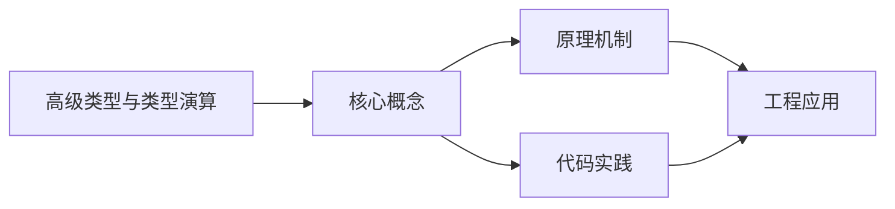
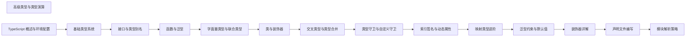

## 1. 学习目标（Bloom 分类）

本节按照布鲁姆教育目标分类学组织学习路径。本文主题为《高级类型与类型演算》，属于 TypeScript 模块，读者可以根据自身阶段选择阅读深度。

记忆层面：能够准确复述本文的核心概念、术语与基本语法或操作步骤，并能够在提问或检索时快速定位对应知识点。能够说出 TS 的类型注解、接口、联合类型、泛型与枚举语法。

理解层面：能够用自己的语言解释核心原理与工作机制，说明概念之间的因果关系，而不是机械记忆结论。能够解释类型系统（结构类型、类型收窄、类型体操）与编译机制。

应用层面：能够在真实项目或练习场景中运用本文知识解决具体问题，写出正确且可维护的实现。能够编写类型安全的函数、类与泛型工具。

分析层面：能够拆解复杂问题，比较本文主题与相邻概念的异同，识别边界条件与例外情况。能够分析类型推断、声明合并与模块解析。

评价层面：能够根据约束条件（性能、可读性、安全、成本）评价不同方案的优劣，做出有依据的技术决策。能够评价 TS 与 JS、其他静态语言的设计差异。

创造层面：能够把本文知识与其他模块知识组合，设计出新的解决方案或可复用的工程模式。能够设计大型项目的类型体系与工程配置。

通过本节学习，读者应当能够把《高级类型与类型演算》纳入自己的知识网络，并与 TypeScript 模块的其他主题（类型系统、泛型、工具类型、编译配置）建立关联。

## 2. 历史动机与发展脉络

《高级类型与类型演算》是 TypeScript 领域的重要主题。要真正理解它，需要先了解它解决的问题与演进过程。

TypeScript 由 Anders Hejlsberg 团队于 2012 年发布，定位是 JavaScript 的超集：保留 JS 生态，增加静态类型与编译期检查。
TS 的编译目标覆盖 ES3 到 ES2022+，配合 tsconfig 的严格模式（strict）成为行业标准；2019 年起主流框架（Vue 3、React、Angular）默认 TS。
类型系统持续演进：条件类型、映射类型、模板字面量类型、const 类型参数与 satisfies 操作符；tsc 之外，Vite/ESBuild 用 esbuild 转译加速开发。

回到本文主题：高级类型与类型演算 的提出与成熟，正是上述技术背景下的必然产物。早期实现往往以简单可用为目标，随着工程规模扩大，社区逐渐沉淀出标准做法与最佳实践；理解这一脉络，可以帮助读者判断“为什么文档中的推荐写法是现在这个样子”，也能在遇到历史遗留代码时准确识别其设计年代与取舍。


## 3. 形式化定义与核心概念精讲

本节把《高级类型与类型演算》涉及的核心概念以“定义 + 讲解”的形式展开。读者应把定义当作工具，把讲解当作理解路径；两者结合才能形成可迁移的知识。

结构类型：TS 的类型兼容基于结构（成员）而非名义；多余属性检查在对象字面量处执行。
类型收窄：typeof、instanceof、in、判别联合与谓词函数（is）让联合类型逐步收窄。
泛型：类型参数 + 约束（extends）实现复用；工具类型（Partial、Pick、Record、ReturnType）基于映射与条件类型。

### 3.1 原文章节逐一精讲

原文档把主题拆分为 10 个小节，下面按顺序给出每一节的导读讲解，随后保留原文细节供精读。

#### 原文精读（完整保留）


#### 1. 类型断言 (Type Assertions)

类型断言允许我们手动告诉编译器一个值的具体类型，当我们比编译器更了解变量的类型时非常有用。

##### 1.1 基本语法

TypeScript 提供了两种类型断言语法：

```typescript
// 推荐语法：as 语法
let someValue: unknown = 'this is a string';
let strLength: number = (someValue as string).length;
// 角括号语法（在 JSX 中不推荐使用）
let someValue: unknown = 'this is a string';
let strLength: number = (<string>someValue).length;
```

##### 1.2 类型断言的使用场景

###### 1.2.1 从 unknown 类型断言为具体类型

```typescript
function processValue(value: unknown): void {
  // 类型断言为 string
  if (typeof value === 'string') {
    console.log((value as string).toUpperCase());
  }
  // 类型断言为 number
  if (typeof value === 'number') {
    console.log((value as number).toFixed(2));
  }
}
processValue('hello'); // 输出: HELLO
processValue(42); // 输出: 42.00
```

###### 1.2.2 从联合类型断言为具体类型

```typescript
interface Cat {
  meow(): void;
  ;
}
interface Dog {
  bark(): void;
  ;
}
type Animal = Cat | Dog;
function makeSound(animal: Animal): void {
  // 类型断言为 Cat
  if ((animal as Cat).meow) {
    (animal as Cat).meow();
  } else {
    // 类型断言为 Dog
    (animal as Dog).bark();
  }
  ;
}
const cat: Cat = { meow: () => console.log('Meow!') };
const dog: Dog = { bark: () => console.log('Woof!') };
makeSound(cat); // 输出: Meow!
makeSound(dog); // 输出: Woof!
```

###### 1.2.3 断言为更具体的类型

```typescript
interface Person {
  name: string;
  age: number;
}
interface Employee extends Person {
  employeeId: number;
  department: string;
}
function getEmployeeInfo(person: Person): void {
  // 断言为 Employee 类型
  const employee = person as Employee;
  console.log(`Name: ${employee.name}, ID: ${employee.employeeId}`);
}
const employee: Employee = {
  name: 'Alice',
  age: 30,
  employeeId: 12345,
  department: 'Engineering',
};
getEmployeeInfo(employee); // 输出: Name: Alice, ID: 12345
```

##### 1.3 类型断言的最佳实践

- **只在必要时使用**: 类型断言会绕过 TypeScript 的类型检查，应谨慎使用。
- **结合类型守卫**: 在使用类型断言前，最好先进行类型检查。
- **使用 as 语法**: 优先使用 `as` 语法，特别是在 JSX 代码中。
- **避免过度断言**: 不要使用类型断言来掩盖真正的类型问题。

#### 2. 非空断言 (`!`)

非空断言操作符 `!` 告诉编译器一个值不为 `null` 或 `undefined`，当我们确定一个值不会是 `null` 或 `undefined` 时使用。

##### 2.1 基本用法

```typescript
// 非空断言
let maybeNull: string | null = 'Hello';
let definitelyString: string = maybeNull!; // 告诉编译器 maybeNull 不为 null
// 访问可能为 null 的对象属性
interface User {
  name: string;
  email?: string;
  ;
}
const user: User = { name: 'Alice' };
const email: string = user.email!; // 告诉编译器 user.email 存在
// 调用可能为 undefined 的方法
interface Greeter {
  greet?: () => void;
  ;
}
const greeter: Greeter = { greet: () => console.log('Hello!') };
greeter.greet!(); // 告诉编译器 greet 方法存在
```

##### 2.2 非空断言的使用场景

###### 2.2.1 初始化后肯定存在的值

```typescript
class User {
  private name: string | null = null;
  constructor(name: string) {
    this.setName(name);
  }
  private setName(name: string): void {
    this.name = name;
  }
  public getName(): string {
    // 构造函数中已初始化，肯定不为 null
    return this.name!;
  }
}
const user = new User('Alice');
console.log(user.getName()); // 输出: Alice
```

###### 2.2.2 经过类型检查后的值

```typescript
function processValue(value: string | null | undefined): void {
  if (value) {
    // 经过检查后，value 肯定不为 null 或 undefined
    console.log(value!.length); // 非空断言
  }
}
processValue('Hello'); // 输出: 5
processValue(null); // 无输出
processValue(undefined); // 无输出
```

##### 2.3 非空断言的注意事项

- **运行时风险**: 非空断言只在编译时有效，运行时如果值为 `null` 或 `undefined`，会导致运行时错误。
- **谨慎使用**: 只在确定值不为 `null` 或 `undefined` 时使用。
- **替代方案**: 优先使用类型守卫或可选链操作符 (`?.`) 来处理可能为 `null` 或 `undefined` 的值。

#### 3. 类型守卫 (Type Guards)

类型守卫是一种运行时检查，用于确定变量的具体类型，帮助编译器进行类型缩小。

##### 3.1 内置类型守卫

###### 3.1.1 typeof 类型守卫

```typescript
function processValue(value: string | number | boolean): void {
  if (typeof value === 'string') {
    // 类型缩小为 string
    console.log(value.toUpperCase());
  } else if (typeof value === 'number') {
    // 类型缩小为 number
    console.log(value.toFixed(2));
  } else if (typeof value === 'boolean') {
    // 类型缩小为 boolean
    console.log(value ? '' : 'false');
  }
}
processValue('hello'); // 输出: HELLO
processValue(42); // 输出: 42.00
processValue(true); // 输出:
```

###### 3.1.2 instanceof 类型守卫

```typescript
class Animal {
  move(): void {
    console.log('Moving...');
  }
}
class Dog extends Animal {
  bark(): void {
    console.log('Woof!');
  }
}
class Cat extends Animal {
  meow(): void {
    console.log('Meow!');
  }
}
function makeSound(animal: Animal): void {
  if (animal instanceof Dog) {
    // 类型缩小为 Dog
    animal.bark();
  } else if (animal instanceof Cat) {
    // 类型缩小为 Cat
    animal.meow();
  } else {
    animal.move();
  }
}
const dog = new Dog();
const cat = new Cat();
const animal = new Animal();
makeSound(dog); // 输出: Woof!
makeSound(cat); // 输出: Meow!
makeSound(animal); // 输出: Moving...
```

###### 3.1.3 in 操作符类型守卫

```typescript
interface Cat {
  meow: () => void;
  ;
}
interface Dog {
  bark: () => void;
  ;
}
type Animal = Cat | Dog;
function makeSound(animal: Animal): void {
  if ('meow' in animal) {
    // 类型缩小为 Cat
    animal.meow();
  } else if ('bark' in animal) {
    // 类型缩小为 Dog
    animal.bark();
  }
  ;
}
const cat: Cat = { meow: () => console.log('Meow!') };
const dog: Dog = { bark: () => console.log('Woof!') };
makeSound(cat); // 输出: Meow!
makeSound(dog); // 输出: Woof!
```

##### 3.2 自定义类型守卫

自定义类型守卫使用 `is` 关键字来定义一个函数，该函数返回一个布尔值，用于确定变量的类型。

```typescript
// 自定义类型守卫
function isString(value: any): value is string {
  return typeof value === 'string';
}
function isNumber(value: any): value is number {
  return typeof value === 'number';
}
function isBoolean(value: any): value is boolean {
  return typeof value === 'boolean';
}
function processValue(value: unknown): void {
  if (isString(value)) {
    // 类型缩小为 string
    console.log(value.toUpperCase());
  } else if (isNumber(value)) {
    // 类型缩小为 number
    console.log(value.toFixed(2));
  } else if (isBoolean(value)) {
    // 类型缩小为 boolean
    console.log(value ? '' : 'false');
  } else {
    console.log('Unknown type');
  }
}
processValue('hello'); // 输出: HELLO
processValue(42); // 输出: 42.00
processValue(true); // 输出:
processValue(null); // 输出: Unknown type
```

##### 3.3 类型守卫的最佳实践

- **明确类型检查**: 类型守卫应该明确检查变量的类型，避免模糊的检查。
- **组合使用**: 可以组合使用多种类型守卫来处理复杂的类型场景。
- **可读性**: 自定义类型守卫函数应该有清晰的名称，说明其检查的类型。
- **性能考虑**: 类型守卫在运行时执行，应避免过于复杂的检查逻辑。

#### 4. 映射类型 (Mapped Types)

映射类型允许我们根据现有类型创建新类型，通过遍历现有类型的属性并应用转换。

##### 4.1 基本映射类型

```typescript
// 基本映射类型
interface Person {
  name: string;
  age: number;
  email: string;
}
// 只读映射类型
type Readonly<T> = {
  readonly [P in keyof T]: T[P];
};
// 可选映射类型
type Partial<T> = {
  [P in keyof T]?: T[P];
};
// 必需映射类型
type Required<T> = {
  [P in keyof T]-?: T[P];
};
// 使用示例
const readonlyPerson: Readonly<Person> = {
  name: 'Alice',
  age: 30,
  email: 'alice@example.com',
};
// readonlyPerson.name = "Bob"; // 编译错误
const partialPerson: Partial<Person> = {
  name: 'Bob',
};
const requiredPerson: Required<Partial<Person>> = {
  name: 'Charlie',
  age: 25,
  email: 'charlie@example.com',
};
```

##### 4.2 映射类型修饰符

TypeScript 提供了三种映射类型修饰符：

1. **`readonly`**: 使属性变为只读
2. **`?`**: 使属性变为可选
3. **`-`**: 移除修饰符（如 `-readonly` 或 `-?`）

```typescript
interface Person {
  readonly name: string;
  age?: number;
  email: string;
}
// 移除 readonly 修饰符
type Mutable<T> = {
  -readonly [P in keyof T]: T[P];
};
// 移除可选修饰符
type Required<T> = {
  [P in keyof T]-?: T[P];
};
// 同时移除 readonly 和可选修饰符
type MutableRequired<T> = {
  -readonly [P in keyof T]-?: T[P];
};
// 使用示例
const mutablePerson: Mutable<Person> = {
  name: 'Alice',
  email: 'alice@example.com',
};
mutablePerson.name = 'Bob'; // 现在可以修改
const requiredPerson: Required<Person> = {
  name: 'Charlie',
  age: 30, // 现在必需
  email: 'charlie@example.com',
};
```

##### 4.3 键重映射

TypeScript 4.1+ 支持键重映射，允许我们在映射类型中修改属性键。

```typescript
interface Person {
  name: string;
  age: number;
  email: string;
}
// 键重映射：添加前缀
type Prefixed<T, Prefix extends string> = {
  [K in keyof T as `${Prefix}${Capitalize<string & K>}`]: T[K];
};
// 键重映射：过滤属性
type OmitByType<T, U> = {
  [K in keyof T as T[K] extends U ? never : K]: T[K];
};
// 使用示例
const prefixedPerson: Prefixed<Person, 'user'> = {
  userName: 'Alice',
  userAge: 30,
  userEmail: 'alice@example.com',
};
const noNumbers: OmitByType<Person, number> = {
  name: 'Bob',
  email: 'bob@example.com',
};
```

##### 4.4 映射类型的应用场景

###### 4.4.1 创建 API 响应类型

```typescript
interface User {
  id: number;
  name: string;
  email: string;
  password: string;
}
// API 响应类型（移除敏感字段）
type UserResponse = Omit<User, 'password'>;
// API 请求类型（可选字段）
type UserRequest = Partial<Omit<User, 'id'>>;
// 使用示例
const userResponse: UserResponse = {
  id: 1,
  name: 'Alice',
  email: 'alice@example.com',
};
const userRequest: UserRequest = {
  name: 'Bob',
  email: 'bob@example.com',
};
```

###### 4.4.2 创建配置类型

```typescript
interface Config {
  apiUrl: string;
  timeout: number;
  debug: boolean;
}
// 只读配置类型
type ReadonlyConfig = Readonly<Config>;
// 部分配置类型
type PartialConfig = Partial<Config>;
// 使用示例
const defaultConfig: ReadonlyConfig = {
  apiUrl: 'https://api.example.com',
  timeout: 5000,
  debug: false,
};
const customConfig: PartialConfig = {
  apiUrl: 'https://api.custom.com',
  timeout: 10000,
};
```

##### 4.5 映射类型的最佳实践

- **复用现有类型**: 利用映射类型基于现有类型创建新类型，减少重复定义。
- **清晰命名**: 为映射类型选择清晰、描述性的名称。
- **合理使用修饰符**: 根据需要使用 `readonly`、`?` 和 `-` 修饰符。
- **键重映射**: 在需要修改属性键时使用键重映射功能。

#### 5. 条件类型 (Conditional Types)

条件类型允许我们根据类型之间的关系创建新类型，语法为 `T extends U ? X : Y`。

##### 5.1 基本条件类型

```typescript
 // 基本条件类型
 type IsString<T> = T extends string ?  : false;
 type A = IsString<string>; //
 type B = IsString<number>; // false
 type C = IsString<string | number>; // boolean ( | false)
 // 条件类型与泛型
 function processValue<T>(value: T): T extends string ? string : number {
  if (typeof value === "string") {
  return value.toUpperCase() as any;
  } else {
  return 42 as any;
  }
 }
 const result1 = processValue("hello"); // 类型为 string
 const result2 = processValue(42); // 类型为 number
```

##### 5.2 条件类型与 infer 关键字

`infer` 关键字允许我们在条件类型中推断类型，通常用于从复杂类型中提取部分类型。

```typescript
// 推断函数返回类型
type ReturnType<T> = T extends (...args: any[]) => infer R ? R : any;
// 推断数组元素类型
type ElementType<T> = T extends Array<infer E> ? E : T;
// 推断元组类型
type First<T> = T extends [infer U, ...any[]] ? U : never;
type Last<T> = T extends [...any[], infer U] ? U : never;
// 使用示例
function add(a: number, b: number): number {
  return a + b;
}
type AddReturnType = ReturnType<typeof add>; // number
type ArrayElement = ElementType<string[]>; // string
type NonArrayElement = ElementType<number>; // number
type FirstElement = First<[string, number, boolean]>; // string
type LastElement = Last<[string, number, boolean]>; // boolean
```

##### 5.3 条件类型的分发特性

当条件类型的左侧是一个联合类型时，条件类型会自动分发到联合类型的每个成员上。

```typescript
 // 分发条件类型
 type IsString<T> = T extends string ?  : false;
 type D = IsString<string | number | boolean>; //  | false | false
 // 阻止分发（使用方括号）
 type IsStringNoDistribute<T> = [T] extends [string] ?  : false;
 type E = IsStringNoDistribute<string | number | boolean>; // false
```

##### 5.4 条件类型的应用场景

###### 5.4.1 类型过滤

```typescript
// 从联合类型中过滤出指定类型
type Filter<T, U> = T extends U ? T : never;
type Numbers = Filter<number | string | boolean, number>; // number
type Strings = Filter<number | string | boolean, string>; // string
// 从联合类型中排除指定类型
type Exclude<T, U> = T extends U ? never : T;
type NonNumbers = Exclude<number | string | boolean, number>; // string | boolean
```

###### 5.4.2 类型转换

```typescript
// 类型转换
type ToArray<T> = T extends any ? T[] : never;
type NumberArray = ToArray<number>; // number[]
type StringArray = ToArray<string>; // string[]
type UnionArray = ToArray<number | string>; // number[] | string[]
// 递归类型转换
type DeepArray<T> = T extends Array<infer U> ? DeepArray<U>[] : T;
type DeepNumberArray = DeepArray<number>; // number
type DeepArrayOfArrays = DeepArray<number[][]>; // number[][][]
```

##### 5.5 条件类型的最佳实践

- **类型推断**: 使用 `infer` 关键字从复杂类型中提取信息。
- **类型过滤**: 使用条件类型过滤联合类型中的成员。
- **类型转换**: 使用条件类型将一种类型转换为另一种类型。
- **递归类型**: 使用条件类型创建递归类型定义。
- **分发特性**: 利用条件类型的分发特性处理联合类型。

#### 6. 高级类型组合

##### 6.1 交叉类型 (Intersection Types)

交叉类型使用 `&` 符号，将多个类型合并为一个类型。

```typescript
interface Person {
  name: string;
  age: number;
}
interface Employee {
  employeeId: number;
  department: string;
}
// 交叉类型
type EmployeePerson = Person & Employee;
// 使用示例
const employee: EmployeePerson = {
  name: 'Alice',
  age: 30,
  employeeId: 12345,
  department: 'Engineering',
};
console.log(employee.name); // 输出: Alice
console.log(employee.employeeId); // 输出: 12345
```

##### 6.2 联合类型 (Union Types)

联合类型使用 `|` 符号，表示一个值可以是多种类型中的一种。

```typescript
// 联合类型
type StringOrNumber = string | number;
type BooleanOrNull = boolean | null;
type ComplexUnion = string | number | boolean | null | undefined;
// 使用示例
function processValue(value: StringOrNumber): void {
  if (typeof value === 'string') {
    console.log(value.toUpperCase());
  } else {
    console.log(value.toFixed(2));
  }
}
processValue('hello'); // 输出: HELLO
processValue(42); // 输出: 42.00
```

##### 6.3 类型别名与接口的结合

```typescript
// 接口定义
interface Base {
  id: number;
  name: string;
}
// 类型别名与接口结合
type WithTimestamp = Base & {
  createdAt: Date;
  updatedAt: Date;
};
type OptionalBase = Partial<Base>;
type ReadonlyBase = Readonly<Base>;
// 使用示例
const withTimestamp: WithTimestamp = {
  id: 1,
  name: 'Alice',
  createdAt: new Date(),
  updatedAt: new Date(),
};
const optionalBase: OptionalBase = {
  name: 'Bob',
};
const readonlyBase: ReadonlyBase = {
  id: 2,
  name: 'Charlie',
};
// readonlyBase.name = "David"; // 编译错误
```

#### 7. 类型工具

TypeScript 提供了许多内置的类型工具，用于常见的类型操作。

##### 7.1 常用内置类型工具

| 类型工具                   | 描述                                   | 示例                                                                                  |
| :------------------------- | :------------------------------------- | :------------------------------------------------------------------------------------ | -------------------------------- | -------------------- | ---------- | ---- |
| **`Partial<T>`**           | 将 T 中所有属性变为可选                | `Partial<{ a: number; b: string }>` → `{ a?: number; b?: string }`                    |
| **`Required<T>`**          | 将 T 中所有属性变为必需                | `Required<{ a?: number; b?: string }>` → `{ a: number; b: string }`                   |
| **`Readonly<T>`**          | 将 T 中所有属性变为只读                | `Readonly<{ a: number; b: string }>` → `{ readonly a: number; readonly b: string }`   |
| **`Record<K, T>`**         | 构建键为 K 类型，值为 T 类型的对象类型 | `Record<string, number>` → `{ [key: string]: number }`                                |
| **`Pick<T, K>`**           | 从 T 中选取指定的属性 K                | `Pick<{ a: number; b: string; c: boolean }, "a"                                       | "b">`→`{ a: number; b: string }` |
| **`Omit<T, K>`**           | 从 T 中排除指定的属性 K                | `Omit<{ a: number; b: string; c: boolean }, "c">` → `{ a: number; b: string }`        |
| **`Exclude<T, U>`**        | 从 T 中排除可以赋值给 U 的类型         | `Exclude<"a"                                                                          | "b"                              | "c", "a">`→`"b"      | "c"`       |
| **`Extract<T, U>`**        | 从 T 中提取可以赋值给 U 的类型         | `Extract<"a"                                                                          | "b"                              | "c", "a"             | "b">`→`"a" | "b"` |
| **`NonNullable<T>`**       | 从 T 中排除 null 和 undefined          | `NonNullable<string                                                                   | null                             | undefined>`→`string` |
| **`Parameters<T>`**        | 提取函数 T 的参数类型为元组            | `Parameters<(a: number, b: string) => void>` → `[number, string]`                     |
| **`ReturnType<T>`**        | 提取函数 T 的返回类型                  | `ReturnType<() => string>` → `string`                                                 |
| **`InstanceType<T>`**      | 提取构造函数 T 的实例类型              | `InstanceType<typeof Date>` → `Date`                                                  |
| **`ThisParameterType<T>`** | 提取函数 T 的 this 参数类型            | `ThisParameterType<(this: { x: number }, y: number) => void>` → `{ x: number }`       |
| **`OmitThisParameter<T>`** | 从函数 T 中移除 this 参数              | `OmitThisParameter<(this: { x: number }, y: number) => void>` → `(y: number) => void` |

##### 7.2 自定义类型工具

```typescript
 // 自定义类型工具
 // 深度只读
 type DeepReadonly<T> = T extends object
  ? { readonly [P in keyof T]: DeepReadonly<T[P]> }
  : T;
 // 深度可选
 type DeepPartial<T> = T extends object
  ? { [P in keyof T]?: DeepPartial<T[P]> }
  : T;
 // 深度必填
 type DeepRequired<T> = T extends object
  ? { [P in keyof T]-?: DeepRequired<T[P]> }
  : T;
 // 类型是否为联合类型
 type IsUnion<T> = [T] extends [infer U] ? U extends T ? false :  : false;
 // 获取对象的键类型
 type Keys<T> = keyof T;
 // 获取对象的值类型
 type Values<T> = T[keyof T];
 // 使用示例
 interface ComplexObject {
  name: string;
  age: number;
  address: {
  street: string;
  city: string;
  country: string;
  };
  hobbies: string[];
 }
 const deepReadonly: DeepReadonly<ComplexObject> = {
  name: "Alice",
  age: 30,
  address: {
  street: "123 Main St",
  city: "New York",
  country: "USA"
  },
  hobbies: ["reading", "coding"]
 }
 // deepReadonly.address.city = "Boston"; // 编译错误
 const deepPartial: DeepPartial<ComplexObject> = {
  name: "Bob",
  address: {
  city: "London"
  }
 }
 const deepRequired: DeepRequired<DeepPartial<ComplexObject>> = {
  name: "Charlie",
  age: 25,
  address: {
  street: "456 Oak Ave",
  city: "Paris",
  country: "France"
  },
  hobbies: []
 }
 type TestUnion = IsUnion<string | number>; //
 type TestNonUnion = IsUnion<string>; // false
 type ComplexKeys = Keys<ComplexObject>; // "name" | "age" | "address" | "hobbies"
 type ComplexValues = Values<ComplexObject>; // string | number | { street: string; city: string; country: string; } | string[]
```

#### 8. 类型编程

类型编程是使用 TypeScript 的类型系统来执行编译时计算和类型操作的技术。

##### 8.1 类型级别的计算

```typescript
// 类型级别的计算
// 数字类型的计算
type Add<T extends number, U extends number> = T extends 0 ? U : U extends 0 ? T : never;
type Multiply<T extends number, U extends number> = T extends 0 ? 0 : U extends 0 ? 0 : never;
// 字符串类型的操作
type Concat<T extends string, U extends string> = `${T}${U}`;
type Uppercase<T extends string> = T extends `${infer L}${infer R}`
  ? `${Uppercase<L>}${Uppercase<R>}`
  : T;
// 数组类型的操作
type Reverse<T extends any[]> = T extends [infer F, ...infer R] ? [...Reverse<R>, F] : [];
type Length<T extends any[]> = T['length'];
// 使用示例
type Result1 = Concat<'Hello', ' World'>; // "Hello World"
type Result2 = Reverse<[1, 2, 3, 4, 5]>; // [5, 4, 3, 2, 1]
type Result3 = Length<[1, 2, 3]>; // 3
```

##### 8.2 类型级别的逻辑

```typescript
 // 类型级别的逻辑
 // 类型相等性检查
 type IsEqual<T, U> = [T] extends [U] ? [U] extends [T] ?  : false : false;
 // 类型包含性检查
 type Includes<T extends any[], U> = T extends [infer F, ...infer R]
  ? IsEqual<F, U> extends
  ?
  : Includes<R, U>
  : false;
 // 类型条件逻辑
 type If<C extends boolean, T, F> = C extends  ? T : F;
 // 使用示例
 type TestEqual1 = IsEqual<string, string>; //
 type TestEqual2 = IsEqual<string, number>; // false
 type TestIncludes1 = Includes<[1, 2, 3, 4, 5], 3>; //
 type TestIncludes2 = Includes<[1, 2, 3, 4, 5], 6>; // false
 type TestIf1 = If<true, string, number>; // string
 type TestIf2 = If<false, string, number>; // number
```

#### 9. 最佳实践

##### 9.1 类型设计原则

- **类型安全**: 优先考虑类型安全，避免使用 `any` 类型。
- **可读性**: 设计清晰、易于理解的类型。
- **可维护性**: 复用类型定义，避免重复。
- **性能考虑**: 注意复杂类型可能导致编译时间增加。
- **渐进式类型**: 从简单类型开始，逐步添加复杂度。

##### 9.2 类型断言与非空断言

- **谨慎使用**: 只在确定类型时使用类型断言和非空断言。
- **结合类型守卫**: 在使用断言前进行类型检查。
- **替代方案**: 优先使用可选链 (`?.`) 和空值合并 (`??`) 操作符。

##### 9.3 类型守卫

- **明确检查**: 类型守卫应该明确检查变量的类型。
- **自定义守卫**: 为复杂类型创建自定义类型守卫。
- **组合使用**: 组合多种类型守卫来处理复杂场景。

##### 9.4 映射类型与条件类型

- **复用现有类型**: 使用映射类型基于现有类型创建新类型。
- **类型推断**: 使用 `infer` 关键字从复杂类型中提取信息。
- **类型过滤**: 使用条件类型过滤和转换类型。
- **递归类型**: 合理使用递归类型处理嵌套结构。

##### 9.5 类型工具

- **熟悉内置工具**: 充分利用 TypeScript 提供的内置类型工具。
- **创建自定义工具**: 根据项目需求创建自定义类型工具。
- **组合使用**: 灵活组合多个类型工具以满足复杂需求。

#### 10. 代码示例

##### 10.1 类型断言与非空断言

```typescript
// 类型断言示例
function processUnknown(value: unknown): void {
  // 类型断言为 string
  if (typeof value === 'string') {
    const str = value as string;
    console.log(`String length: ${str.length}`);
  }
  // 类型断言为 number
  if (typeof value === 'number') {
    const num = value as number;
    console.log(`Number squared: ${num * num}`);
  }
  // 类型断言为对象
  if (typeof value === 'object' && value !== null) {
    const obj = value as { name: string; age: number };
    console.log(`Object: ${obj.name}, ${obj.age}`);
  }
}
// 非空断言示例
interface User {
  id: number;
  name: string;
  email?: string;
  address?: {
    street: string;
    city: string;
  };
}
function getUserEmail(user: User): string {
  // 非空断言
  return user.email!;
}
function getStreet(user: User): string {
  // 链式非空断言
  return user.address!.street!;
}
// 使用示例
const user: User = {
  id: 1,
  name: 'Alice',
  email: 'alice@example.com',
  address: {
    street: '123 Main St',
    city: 'New York',
  },
};
processUnknown('Hello'); // 输出: String length: 5
processUnknown(42); // 输出: Number squared: 1764
processUnknown(user); // 输出: Object: Alice, 1
console.log(getUserEmail(user)); // 输出: alice@example.com
console.log(getStreet(user)); // 输出: 123 Main St
```

##### 10.2 类型守卫

```typescript
// 类型守卫示例
// 自定义类型守卫
function isString(value: any): value is string {
  return typeof value === 'string';
  ;
}
function isNumber(value: any): value is number {
  return typeof value === 'number';
  ;
}
function isBoolean(value: any): value is boolean {
  return typeof value === 'boolean';
  ;
}
function isObject(value: any): value is object {
  return typeof value === 'object' && value !== null;
  ;
}
function isArray(value: any): value is any[] {
  return Array.isArray(value);
  ;
}
// 接口类型守卫
interface Person {
  name: string;
  age: number;
  ;
}
function isPerson(value: any): value is Person {
  return isObject(value) && isString((value as Person).name) && isNumber((value as Person).age);
  ;
}
// 使用示例
function processValue(value: unknown): void {
  if (isString(value)) {
    console.log(`String: ${value.toUpperCase()}`);
  } else if (isNumber(value)) {
    console.log(`Number: ${value.toFixed(2)}`);
  } else if (isBoolean(value)) {
    console.log(`Boolean: ${value}`);
  } else if (isArray(value)) {
    console.log(`Array length: ${value.length}`);
  } else if (isPerson(value)) {
    console.log(`Person: ${value.name}, ${value.age}`);
  } else {
    console.log(`Unknown type`);
  }
  ;
}
processValue('Hello'); // 输出: String: HELLO
processValue(42); // 输出: Number: 42.00
processValue(true); // 输出: Boolean:
processValue([1, 2, 3]); // 输出: Array length: 3
processValue({ name: 'Alice', age: 30 }); // 输出: Person: Alice, 30
processValue(null); // 输出: Unknown type
```

##### 10.3 映射类型与条件类型

```typescript
 // 映射类型与条件类型示例
 // 基础接口
 interface Product {
  id: number;
  name: string;
  price: number;
  description: string;
  inStock: boolean;
 }
 // 映射类型
 // 只读产品
 type ReadonlyProduct = Readonly<Product>;
 // 可选产品
 type OptionalProduct = Partial<Product>;
 // 产品ID和名称
 type ProductInfo = Pick<Product, "id" | "name">;
 // 产品不含描述
 type ProductWithoutDescription = Omit<Product, "description">;
 // 条件类型
 // 提取字符串属性
 type StringProperties<T> = {
  [K in keyof T as T[K] extends string ? K : never]: T[K];
 }
 // 提取数字属性
 type NumberProperties<T> = {
  [K in keyof T as T[K] extends number ? K : never]: T[K];
 }
 // 提取布尔属性
 type BooleanProperties<T> = {
  [K in keyof T as T[K] extends boolean ? K : never]: T[K];
 }
 // 使用示例
 const readonlyProduct: ReadonlyProduct = {
  id: 1,
  name: "Laptop",
  price: 999.99,
  description: "A powerful laptop",
  inStock:
 }
 // readonlyProduct.price = 899.99; // 编译错误
 const optionalProduct: OptionalProduct = {
  id: 2,
  name: "Mouse"
 }
 const productInfo: ProductInfo = {
  id: 3,
  name: "Keyboard"
 }
 const productWithoutDescription: ProductWithoutDescription = {
  id: 4,
  name: "Monitor",
  price: 199.99,
  inStock: false
 }
 const stringProps: StringProperties<Product> = {
  name: "Laptop",
  description: "A powerful laptop"
 }
 const numberProps: NumberProperties<Product> = {
  id: 1,
  price: 999.99
 }
 const booleanProps: BooleanProperties<Product> = {
  inStock:
 }
 console.log(readonlyProduct);
 console.log(optionalProduct);
 console.log(productInfo);
 console.log(productWithoutDescription);
 console.log(stringProps);
 console.log(numberProps);
 console.log(booleanProps);
```

##### 10.4 高级类型组合

```typescript
// 高级类型组合示例
// 基础类型
interface User {
  id: number;
  name: string;
  email: string;
}
interface Address {
  street: string;
  city: string;
  country: string;
}
interface Order {
  id: number;
  userId: number;
  total: number;
  items: OrderItem[];
}
interface OrderItem {
  productId: number;
  quantity: number;
  price: number;
}
// 高级类型
// 带地址的用户
type UserWithAddress = User & { address: Address };
// 订单详情（包含用户信息）
type OrderWithUser = Order & {
  user: User;
};
// 可选订单项
type OptionalOrderItem = Partial<OrderItem>;
// 只读订单
type ReadonlyOrder = Readonly<Order>;
// 条件类型：提取订单中的产品ID
type ProductIdsFromOrder<T extends Order> = T['items'][number]['productId'];
// 使用示例
const userWithAddress: UserWithAddress = {
  id: 1,
  name: 'Alice',
  email: 'alice@example.com',
  address: {
    street: '123 Main St',
    city: 'New York',
    country: 'USA',
  },
};
const orderWithUser: OrderWithUser = {
  id: 101,
  userId: 1,
  total: 1299.98,
  items: [
    { productId: 1, quantity: 1, price: 999.99 },
    { productId: 2, quantity: 2, price: 149.995 },
  ],
  user: {
    id: 1,
    name: 'Alice',
    email: 'alice@example.com',
  },
};
const optionalOrderItem: OptionalOrderItem = {
  productId: 3,
  quantity: 1,
};
const readonlyOrder: ReadonlyOrder = {
  id: 102,
  userId: 2,
  total: 499.99,
  items: [{ productId: 4, quantity: 1, price: 499.99 }],
};
// readonlyOrder.total = 399.99; // 编译错误
// 类型级别提取产品ID
type ProductIds = ProductIdsFromOrder<Order>; // number
console.log(userWithAddress);
console.log(orderWithUser);
console.log(optionalOrderItem);
console.log(readonlyOrder);
```

---


### 3.2 概念关系图

下面用 Mermaid 图表达本文核心概念之间的关系，帮助读者建立整体图景：



图中展示的是本文知识的结构化关系：核心概念是入口，原理机制解释“为什么”，代码实践演示“怎么做”，工程应用回答“何时用”。读者学习时可以把每个小节的内容挂接到对应节点上。

## 4. 理论推导与原理解析

本节深入《高级类型与类型演算》背后的原理。理论部分不求面面俱到，而是聚焦“能解释现象、能指导实践”的关键推导。

结构类型：TS 的类型兼容基于结构（成员）而非名义；多余属性检查在对象字面量处执行。
类型收窄：typeof、instanceof、in、判别联合与谓词函数（is）让联合类型逐步收窄。
泛型：类型参数 + 约束（extends）实现复用；工具类型（Partial、Pick、Record、ReturnType）基于映射与条件类型。
声明与编译：.ts 编译为 .js；类型声明（.d.ts）描述 JS 库；tsconfig 的 strict、moduleResolution、target 决定行为。

需要强调的是，理论推导与工程实践之间存在翻译层：理论给出的是理想化模型与边界条件，工程代码则必须处理真实环境中的例外。读者在学习时应先掌握理论的“标准情形”，再通过陷阱章节了解“非标准情形”。

## 5. 代码示例与逐行讲解

本节把原文中的代码示例系统整理，并为每个示例补充用途说明与讲解。读者不应只浏览代码，而应逐段对照讲解理解设计意图。

### 5.1 示例：1.1 基本语法

该示例来自原文《1.1 基本语法》小节，用于演示高级类型与类型演算相关操作。阅读时请先看代码结构，再看其后的讲解。

```typescript
// 推荐语法：as 语法
let someValue: unknown = 'this is a string';
let strLength: number = (someValue as string).length;
// 角括号语法（在 JSX 中不推荐使用）
let someValue: unknown = 'this is a string';
let strLength: number = (<string>someValue).length;
```

讲解：这段代码演示了本节核心知识点。代码中的关键操作可以归纳为三步：准备（定义或初始化）、执行（核心逻辑）、收尾（释放资源或返回结果）。实际项目中，这三步往往被封装为函数或类，以提升复用性与可测试性。

关键点分析：

该示例共 6 行有效代码，结构以数据或配置为主。阅读时应关注：数据字段的含义、配置项的作用，以及它们与运行行为的对应关系。

进阶思考路径：先尝试修改参数观察行为变化，再把示例中的模式迁移到自己的项目中；每次修改都记录预期与实测差异，这是把示例转化为能力的最快方式。

### 5.2 示例：1.2.1 从 unknown 类型断言为具体类型

该示例来自原文《1.2.1 从 unknown 类型断言为具体类型》小节，用于演示高级类型与类型演算相关操作。阅读时请先看代码结构，再看其后的讲解。

```typescript
function processValue(value: unknown): void {
  // 类型断言为 string
  if (typeof value === 'string') {
    console.log((value as string).toUpperCase());
  }
  // 类型断言为 number
  if (typeof value === 'number') {
    console.log((value as number).toFixed(2));
  }
}
processValue('hello'); // 输出: HELLO
processValue(42); // 输出: 42.00
```

讲解：这段代码演示了本节核心知识点。代码中的关键操作可以归纳为三步：准备（定义或初始化）、执行（核心逻辑）、收尾（释放资源或返回结果）。实际项目中，这三步往往被封装为函数或类，以提升复用性与可测试性。

关键点分析：

该示例共 12 行有效代码，包含 2 类关键结构（function、if）。其中：

- 入口与初始化部分负责建立上下文，对应实际项目中的启动或装配逻辑；
- 核心逻辑部分体现本文主题的主要操作，是阅读时最需要对照讲解理解的部分；
- 输出或返回部分把结果交给调用方，注意其类型与边界条件。

进阶思考路径：先尝试修改参数观察行为变化，再把示例中的模式迁移到自己的项目中；每次修改都记录预期与实测差异，这是把示例转化为能力的最快方式。

### 5.3 示例：1.2.2 从联合类型断言为具体类型

该示例来自原文《1.2.2 从联合类型断言为具体类型》小节，用于演示高级类型与类型演算相关操作。阅读时请先看代码结构，再看其后的讲解。

```typescript
interface Cat {
  meow(): void;
  ;
}
interface Dog {
  bark(): void;
  ;
}
type Animal = Cat | Dog;
function makeSound(animal: Animal): void {
  // 类型断言为 Cat
  if ((animal as Cat).meow) {
    (animal as Cat).meow();
  } else {
    // 类型断言为 Dog
    (animal as Dog).bark();
  }
  ;
}
const cat: Cat = { meow: () => console.log('Meow!') };
const dog: Dog = { bark: () => console.log('Woof!') };
makeSound(cat); // 输出: Meow!
makeSound(dog); // 输出: Woof!
```

讲解：这段代码演示了本节核心知识点。代码中的关键操作可以归纳为三步：准备（定义或初始化）、执行（核心逻辑）、收尾（释放资源或返回结果）。实际项目中，这三步往往被封装为函数或类，以提升复用性与可测试性。

关键点分析：

该示例共 23 行有效代码，包含 2 类关键结构（function、if）。其中：

- 入口与初始化部分负责建立上下文，对应实际项目中的启动或装配逻辑；
- 核心逻辑部分体现本文主题的主要操作，是阅读时最需要对照讲解理解的部分；
- 输出或返回部分把结果交给调用方，注意其类型与边界条件。

进阶思考路径：先尝试修改参数观察行为变化，再把示例中的模式迁移到自己的项目中；每次修改都记录预期与实测差异，这是把示例转化为能力的最快方式。

### 5.4 示例：1.2.3 断言为更具体的类型

该示例来自原文《1.2.3 断言为更具体的类型》小节，用于演示高级类型与类型演算相关操作。阅读时请先看代码结构，再看其后的讲解。

```typescript
interface Person {
  name: string;
  age: number;
}
interface Employee extends Person {
  employeeId: number;
  department: string;
}
function getEmployeeInfo(person: Person): void {
  // 断言为 Employee 类型
  const employee = person as Employee;
  console.log(`Name: ${employee.name}, ID: ${employee.employeeId}`);
}
const employee: Employee = {
  name: 'Alice',
  age: 30,
  employeeId: 12345,
  department: 'Engineering',
};
getEmployeeInfo(employee); // 输出: Name: Alice, ID: 12345
```

讲解：这段代码演示了本节核心知识点。代码中的关键操作可以归纳为三步：准备（定义或初始化）、执行（核心逻辑）、收尾（释放资源或返回结果）。实际项目中，这三步往往被封装为函数或类，以提升复用性与可测试性。

关键点分析：

该示例共 20 行有效代码，包含 1 类关键结构（function）。其中：

- 入口与初始化部分负责建立上下文，对应实际项目中的启动或装配逻辑；
- 核心逻辑部分体现本文主题的主要操作，是阅读时最需要对照讲解理解的部分；
- 输出或返回部分把结果交给调用方，注意其类型与边界条件。

进阶思考路径：先尝试修改参数观察行为变化，再把示例中的模式迁移到自己的项目中；每次修改都记录预期与实测差异，这是把示例转化为能力的最快方式。

### 5.5 示例：2.1 基本用法

该示例来自原文《2.1 基本用法》小节，用于演示高级类型与类型演算相关操作。阅读时请先看代码结构，再看其后的讲解。

```typescript
// 非空断言
let maybeNull: string | null = 'Hello';
let definitelyString: string = maybeNull!; // 告诉编译器 maybeNull 不为 null
// 访问可能为 null 的对象属性
interface User {
  name: string;
  email?: string;
  ;
}
const user: User = { name: 'Alice' };
const email: string = user.email!; // 告诉编译器 user.email 存在
// 调用可能为 undefined 的方法
interface Greeter {
  greet?: () => void;
  ;
}
const greeter: Greeter = { greet: () => console.log('Hello!') };
greeter.greet!(); // 告诉编译器 greet 方法存在
```

讲解：这段代码演示了本节核心知识点。代码中的关键操作可以归纳为三步：准备（定义或初始化）、执行（核心逻辑）、收尾（释放资源或返回结果）。实际项目中，这三步往往被封装为函数或类，以提升复用性与可测试性。

关键点分析：

该示例共 18 行有效代码，结构以数据或配置为主。阅读时应关注：数据字段的含义、配置项的作用，以及它们与运行行为的对应关系。

进阶思考路径：先尝试修改参数观察行为变化，再把示例中的模式迁移到自己的项目中；每次修改都记录预期与实测差异，这是把示例转化为能力的最快方式。

### 5.6 示例：2.2.1 初始化后肯定存在的值

该示例来自原文《2.2.1 初始化后肯定存在的值》小节，用于演示高级类型与类型演算相关操作。阅读时请先看代码结构，再看其后的讲解。

```typescript
class User {
  private name: string | null = null;
  constructor(name: string) {
    this.setName(name);
  }
  private setName(name: string): void {
    this.name = name;
  }
  public getName(): string {
    // 构造函数中已初始化，肯定不为 null
    return this.name!;
  }
}
const user = new User('Alice');
console.log(user.getName()); // 输出: Alice
```

讲解：这段代码演示了本节核心知识点。代码中的关键操作可以归纳为三步：准备（定义或初始化）、执行（核心逻辑）、收尾（释放资源或返回结果）。实际项目中，这三步往往被封装为函数或类，以提升复用性与可测试性。

关键点分析：

该示例共 15 行有效代码，包含 2 类关键结构（class、return）。其中：

- 入口与初始化部分负责建立上下文，对应实际项目中的启动或装配逻辑；
- 核心逻辑部分体现本文主题的主要操作，是阅读时最需要对照讲解理解的部分；
- 输出或返回部分把结果交给调用方，注意其类型与边界条件。

进阶思考路径：先尝试修改参数观察行为变化，再把示例中的模式迁移到自己的项目中；每次修改都记录预期与实测差异，这是把示例转化为能力的最快方式。

### 5.7 示例：2.2.2 经过类型检查后的值

该示例来自原文《2.2.2 经过类型检查后的值》小节，用于演示高级类型与类型演算相关操作。阅读时请先看代码结构，再看其后的讲解。

```typescript
function processValue(value: string | null | undefined): void {
  if (value) {
    // 经过检查后，value 肯定不为 null 或 undefined
    console.log(value!.length); // 非空断言
  }
}
processValue('Hello'); // 输出: 5
processValue(null); // 无输出
processValue(undefined); // 无输出
```

讲解：这段代码演示了本节核心知识点。代码中的关键操作可以归纳为三步：准备（定义或初始化）、执行（核心逻辑）、收尾（释放资源或返回结果）。实际项目中，这三步往往被封装为函数或类，以提升复用性与可测试性。

关键点分析：

该示例共 9 行有效代码，包含 2 类关键结构（function、if）。其中：

- 入口与初始化部分负责建立上下文，对应实际项目中的启动或装配逻辑；
- 核心逻辑部分体现本文主题的主要操作，是阅读时最需要对照讲解理解的部分；
- 输出或返回部分把结果交给调用方，注意其类型与边界条件。

进阶思考路径：先尝试修改参数观察行为变化，再把示例中的模式迁移到自己的项目中；每次修改都记录预期与实测差异，这是把示例转化为能力的最快方式。

### 5.8 示例：3.1.1 typeof 类型守卫

该示例来自原文《3.1.1 typeof 类型守卫》小节，用于演示高级类型与类型演算相关操作。阅读时请先看代码结构，再看其后的讲解。

```typescript
function processValue(value: string | number | boolean): void {
  if (typeof value === 'string') {
    // 类型缩小为 string
    console.log(value.toUpperCase());
  } else if (typeof value === 'number') {
    // 类型缩小为 number
    console.log(value.toFixed(2));
  } else if (typeof value === 'boolean') {
    // 类型缩小为 boolean
    console.log(value ? '' : 'false');
  }
}
processValue('hello'); // 输出: HELLO
processValue(42); // 输出: 42.00
processValue(true); // 输出:
```

讲解：这段代码演示了本节核心知识点。代码中的关键操作可以归纳为三步：准备（定义或初始化）、执行（核心逻辑）、收尾（释放资源或返回结果）。实际项目中，这三步往往被封装为函数或类，以提升复用性与可测试性。

关键点分析：

该示例共 15 行有效代码，包含 2 类关键结构（function、if）。其中：

- 入口与初始化部分负责建立上下文，对应实际项目中的启动或装配逻辑；
- 核心逻辑部分体现本文主题的主要操作，是阅读时最需要对照讲解理解的部分；
- 输出或返回部分把结果交给调用方，注意其类型与边界条件。

进阶思考路径：先尝试修改参数观察行为变化，再把示例中的模式迁移到自己的项目中；每次修改都记录预期与实测差异，这是把示例转化为能力的最快方式。

### 5.9 示例：3.1.2 instanceof 类型守卫

该示例来自原文《3.1.2 instanceof 类型守卫》小节，用于演示高级类型与类型演算相关操作。阅读时请先看代码结构，再看其后的讲解。

```typescript
class Animal {
  move(): void {
    console.log('Moving...');
  }
}
class Dog extends Animal {
  bark(): void {
    console.log('Woof!');
  }
}
class Cat extends Animal {
  meow(): void {
    console.log('Meow!');
  }
}
function makeSound(animal: Animal): void {
  if (animal instanceof Dog) {
    // 类型缩小为 Dog
    animal.bark();
  } else if (animal instanceof Cat) {
    // 类型缩小为 Cat
    animal.meow();
  } else {
    animal.move();
  }
}
const dog = new Dog();
const cat = new Cat();
const animal = new Animal();
makeSound(dog); // 输出: Woof!
makeSound(cat); // 输出: Meow!
makeSound(animal); // 输出: Moving...
```

讲解：这段代码演示了本节核心知识点。代码中的关键操作可以归纳为三步：准备（定义或初始化）、执行（核心逻辑）、收尾（释放资源或返回结果）。实际项目中，这三步往往被封装为函数或类，以提升复用性与可测试性。

关键点分析：

该示例共 32 行有效代码，包含 3 类关键结构（class、function、if）。其中：

- 入口与初始化部分负责建立上下文，对应实际项目中的启动或装配逻辑；
- 核心逻辑部分体现本文主题的主要操作，是阅读时最需要对照讲解理解的部分；
- 输出或返回部分把结果交给调用方，注意其类型与边界条件。

进阶思考路径：先尝试修改参数观察行为变化，再把示例中的模式迁移到自己的项目中；每次修改都记录预期与实测差异，这是把示例转化为能力的最快方式。

### 5.10 示例：3.1.3 in 操作符类型守卫

该示例来自原文《3.1.3 in 操作符类型守卫》小节，用于演示高级类型与类型演算相关操作。阅读时请先看代码结构，再看其后的讲解。

```typescript
interface Cat {
  meow: () => void;
  ;
}
interface Dog {
  bark: () => void;
  ;
}
type Animal = Cat | Dog;
function makeSound(animal: Animal): void {
  if ('meow' in animal) {
    // 类型缩小为 Cat
    animal.meow();
  } else if ('bark' in animal) {
    // 类型缩小为 Dog
    animal.bark();
  }
  ;
}
const cat: Cat = { meow: () => console.log('Meow!') };
const dog: Dog = { bark: () => console.log('Woof!') };
makeSound(cat); // 输出: Meow!
makeSound(dog); // 输出: Woof!
```

讲解：这段代码演示了本节核心知识点。代码中的关键操作可以归纳为三步：准备（定义或初始化）、执行（核心逻辑）、收尾（释放资源或返回结果）。实际项目中，这三步往往被封装为函数或类，以提升复用性与可测试性。

关键点分析：

该示例共 23 行有效代码，包含 2 类关键结构（function、if）。其中：

- 入口与初始化部分负责建立上下文，对应实际项目中的启动或装配逻辑；
- 核心逻辑部分体现本文主题的主要操作，是阅读时最需要对照讲解理解的部分；
- 输出或返回部分把结果交给调用方，注意其类型与边界条件。

进阶思考路径：先尝试修改参数观察行为变化，再把示例中的模式迁移到自己的项目中；每次修改都记录预期与实测差异，这是把示例转化为能力的最快方式。

### 5.11 示例：3.2 自定义类型守卫

该示例来自原文《3.2 自定义类型守卫》小节，用于演示高级类型与类型演算相关操作。阅读时请先看代码结构，再看其后的讲解。

```typescript
// 自定义类型守卫
function isString(value: any): value is string {
  return typeof value === 'string';
}
function isNumber(value: any): value is number {
  return typeof value === 'number';
}
function isBoolean(value: any): value is boolean {
  return typeof value === 'boolean';
}
function processValue(value: unknown): void {
  if (isString(value)) {
    // 类型缩小为 string
    console.log(value.toUpperCase());
  } else if (isNumber(value)) {
    // 类型缩小为 number
    console.log(value.toFixed(2));
  } else if (isBoolean(value)) {
    // 类型缩小为 boolean
    console.log(value ? '' : 'false');
  } else {
    console.log('Unknown type');
  }
}
processValue('hello'); // 输出: HELLO
processValue(42); // 输出: 42.00
processValue(true); // 输出:
processValue(null); // 输出: Unknown type
```

讲解：这段代码演示了本节核心知识点。代码中的关键操作可以归纳为三步：准备（定义或初始化）、执行（核心逻辑）、收尾（释放资源或返回结果）。实际项目中，这三步往往被封装为函数或类，以提升复用性与可测试性。

关键点分析：

该示例共 28 行有效代码，包含 3 类关键结构（function、if、return）。其中：

- 入口与初始化部分负责建立上下文，对应实际项目中的启动或装配逻辑；
- 核心逻辑部分体现本文主题的主要操作，是阅读时最需要对照讲解理解的部分；
- 输出或返回部分把结果交给调用方，注意其类型与边界条件。

进阶思考路径：先尝试修改参数观察行为变化，再把示例中的模式迁移到自己的项目中；每次修改都记录预期与实测差异，这是把示例转化为能力的最快方式。

### 5.12 示例：4.1 基本映射类型

该示例来自原文《4.1 基本映射类型》小节，用于演示高级类型与类型演算相关操作。阅读时请先看代码结构，再看其后的讲解。

```typescript
// 基本映射类型
interface Person {
  name: string;
  age: number;
  email: string;
}
// 只读映射类型
type Readonly<T> = {
  readonly [P in keyof T]: T[P];
};
// 可选映射类型
type Partial<T> = {
  [P in keyof T]?: T[P];
};
// 必需映射类型
type Required<T> = {
  [P in keyof T]-?: T[P];
};
// 使用示例
const readonlyPerson: Readonly<Person> = {
  name: 'Alice',
  age: 30,
  email: 'alice@example.com',
};
// readonlyPerson.name = "Bob"; // 编译错误
const partialPerson: Partial<Person> = {
  name: 'Bob',
};
const requiredPerson: Required<Partial<Person>> = {
  name: 'Charlie',
  age: 25,
  email: 'charlie@example.com',
};
```

讲解：这段代码演示了本节核心知识点。代码中的关键操作可以归纳为三步：准备（定义或初始化）、执行（核心逻辑）、收尾（释放资源或返回结果）。实际项目中，这三步往往被封装为函数或类，以提升复用性与可测试性。

关键点分析：

该示例共 33 行有效代码，结构以数据或配置为主。阅读时应关注：数据字段的含义、配置项的作用，以及它们与运行行为的对应关系。

进阶思考路径：先尝试修改参数观察行为变化，再把示例中的模式迁移到自己的项目中；每次修改都记录预期与实测差异，这是把示例转化为能力的最快方式。

### 5.13 示例：4.2 映射类型修饰符

该示例来自原文《4.2 映射类型修饰符》小节，用于演示高级类型与类型演算相关操作。阅读时请先看代码结构，再看其后的讲解。

```typescript
interface Person {
  readonly name: string;
  age?: number;
  email: string;
}
// 移除 readonly 修饰符
type Mutable<T> = {
  -readonly [P in keyof T]: T[P];
};
// 移除可选修饰符
type Required<T> = {
  [P in keyof T]-?: T[P];
};
// 同时移除 readonly 和可选修饰符
type MutableRequired<T> = {
  -readonly [P in keyof T]-?: T[P];
};
// 使用示例
const mutablePerson: Mutable<Person> = {
  name: 'Alice',
  email: 'alice@example.com',
};
mutablePerson.name = 'Bob'; // 现在可以修改
const requiredPerson: Required<Person> = {
  name: 'Charlie',
  age: 30, // 现在必需
  email: 'charlie@example.com',
};
```

讲解：这段代码演示了本节核心知识点。代码中的关键操作可以归纳为三步：准备（定义或初始化）、执行（核心逻辑）、收尾（释放资源或返回结果）。实际项目中，这三步往往被封装为函数或类，以提升复用性与可测试性。

关键点分析：

该示例共 28 行有效代码，结构以数据或配置为主。阅读时应关注：数据字段的含义、配置项的作用，以及它们与运行行为的对应关系。

进阶思考路径：先尝试修改参数观察行为变化，再把示例中的模式迁移到自己的项目中；每次修改都记录预期与实测差异，这是把示例转化为能力的最快方式。

### 5.14 示例：4.3 键重映射

该示例来自原文《4.3 键重映射》小节，用于演示高级类型与类型演算相关操作。阅读时请先看代码结构，再看其后的讲解。

```typescript
interface Person {
  name: string;
  age: number;
  email: string;
}
// 键重映射：添加前缀
type Prefixed<T, Prefix extends string> = {
  [K in keyof T as `${Prefix}${Capitalize<string & K>}`]: T[K];
};
// 键重映射：过滤属性
type OmitByType<T, U> = {
  [K in keyof T as T[K] extends U ? never : K]: T[K];
};
// 使用示例
const prefixedPerson: Prefixed<Person, 'user'> = {
  userName: 'Alice',
  userAge: 30,
  userEmail: 'alice@example.com',
};
const noNumbers: OmitByType<Person, number> = {
  name: 'Bob',
  email: 'bob@example.com',
};
```

讲解：这段代码演示了本节核心知识点。代码中的关键操作可以归纳为三步：准备（定义或初始化）、执行（核心逻辑）、收尾（释放资源或返回结果）。实际项目中，这三步往往被封装为函数或类，以提升复用性与可测试性。

关键点分析：

该示例共 23 行有效代码，结构以数据或配置为主。阅读时应关注：数据字段的含义、配置项的作用，以及它们与运行行为的对应关系。

进阶思考路径：先尝试修改参数观察行为变化，再把示例中的模式迁移到自己的项目中；每次修改都记录预期与实测差异，这是把示例转化为能力的最快方式。

### 5.15 示例：4.4.1 创建 API 响应类型

该示例来自原文《4.4.1 创建 API 响应类型》小节，用于演示高级类型与类型演算相关操作。阅读时请先看代码结构，再看其后的讲解。

```typescript
interface User {
  id: number;
  name: string;
  email: string;
  password: string;
}
// API 响应类型（移除敏感字段）
type UserResponse = Omit<User, 'password'>;
// API 请求类型（可选字段）
type UserRequest = Partial<Omit<User, 'id'>>;
// 使用示例
const userResponse: UserResponse = {
  id: 1,
  name: 'Alice',
  email: 'alice@example.com',
};
const userRequest: UserRequest = {
  name: 'Bob',
  email: 'bob@example.com',
};
```

讲解：这段代码演示了本节核心知识点。代码中的关键操作可以归纳为三步：准备（定义或初始化）、执行（核心逻辑）、收尾（释放资源或返回结果）。实际项目中，这三步往往被封装为函数或类，以提升复用性与可测试性。

关键点分析：

该示例共 20 行有效代码，结构以数据或配置为主。阅读时应关注：数据字段的含义、配置项的作用，以及它们与运行行为的对应关系。

进阶思考路径：先尝试修改参数观察行为变化，再把示例中的模式迁移到自己的项目中；每次修改都记录预期与实测差异，这是把示例转化为能力的最快方式。

### 5.16 示例：4.4.2 创建配置类型

该示例来自原文《4.4.2 创建配置类型》小节，用于演示高级类型与类型演算相关操作。阅读时请先看代码结构，再看其后的讲解。

```typescript
interface Config {
  apiUrl: string;
  timeout: number;
  debug: boolean;
}
// 只读配置类型
type ReadonlyConfig = Readonly<Config>;
// 部分配置类型
type PartialConfig = Partial<Config>;
// 使用示例
const defaultConfig: ReadonlyConfig = {
  apiUrl: 'https://api.example.com',
  timeout: 5000,
  debug: false,
};
const customConfig: PartialConfig = {
  apiUrl: 'https://api.custom.com',
  timeout: 10000,
};
```

讲解：这段代码演示了本节核心知识点。代码中的关键操作可以归纳为三步：准备（定义或初始化）、执行（核心逻辑）、收尾（释放资源或返回结果）。实际项目中，这三步往往被封装为函数或类，以提升复用性与可测试性。

关键点分析：

该示例共 19 行有效代码，结构以数据或配置为主。阅读时应关注：数据字段的含义、配置项的作用，以及它们与运行行为的对应关系。

进阶思考路径：先尝试修改参数观察行为变化，再把示例中的模式迁移到自己的项目中；每次修改都记录预期与实测差异，这是把示例转化为能力的最快方式。

### 5.17 示例：5.1 基本条件类型

该示例来自原文《5.1 基本条件类型》小节，用于演示高级类型与类型演算相关操作。阅读时请先看代码结构，再看其后的讲解。

```typescript
 // 基本条件类型
 type IsString<T> = T extends string ?  : false;
 type A = IsString<string>; //
 type B = IsString<number>; // false
 type C = IsString<string | number>; // boolean ( | false)
 // 条件类型与泛型
 function processValue<T>(value: T): T extends string ? string : number {
  if (typeof value === "string") {
  return value.toUpperCase() as any;
  } else {
  return 42 as any;
  }
 }
 const result1 = processValue("hello"); // 类型为 string
 const result2 = processValue(42); // 类型为 number
```

讲解：这段代码演示了本节核心知识点。代码中的关键操作可以归纳为三步：准备（定义或初始化）、执行（核心逻辑）、收尾（释放资源或返回结果）。实际项目中，这三步往往被封装为函数或类，以提升复用性与可测试性。

关键点分析：

该示例共 15 行有效代码，包含 3 类关键结构（function、if、return）。其中：

- 入口与初始化部分负责建立上下文，对应实际项目中的启动或装配逻辑；
- 核心逻辑部分体现本文主题的主要操作，是阅读时最需要对照讲解理解的部分；
- 输出或返回部分把结果交给调用方，注意其类型与边界条件。

进阶思考路径：先尝试修改参数观察行为变化，再把示例中的模式迁移到自己的项目中；每次修改都记录预期与实测差异，这是把示例转化为能力的最快方式。

### 5.18 示例：5.2 条件类型与 infer 关键字

该示例来自原文《5.2 条件类型与 infer 关键字》小节，用于演示高级类型与类型演算相关操作。阅读时请先看代码结构，再看其后的讲解。

```typescript
// 推断函数返回类型
type ReturnType<T> = T extends (...args: any[]) => infer R ? R : any;
// 推断数组元素类型
type ElementType<T> = T extends Array<infer E> ? E : T;
// 推断元组类型
type First<T> = T extends [infer U, ...any[]] ? U : never;
type Last<T> = T extends [...any[], infer U] ? U : never;
// 使用示例
function add(a: number, b: number): number {
  return a + b;
}
type AddReturnType = ReturnType<typeof add>; // number
type ArrayElement = ElementType<string[]>; // string
type NonArrayElement = ElementType<number>; // number
type FirstElement = First<[string, number, boolean]>; // string
type LastElement = Last<[string, number, boolean]>; // boolean
```

讲解：这段代码演示了本节核心知识点。代码中的关键操作可以归纳为三步：准备（定义或初始化）、执行（核心逻辑）、收尾（释放资源或返回结果）。实际项目中，这三步往往被封装为函数或类，以提升复用性与可测试性。

关键点分析：

该示例共 16 行有效代码，包含 2 类关键结构（function、return）。其中：

- 入口与初始化部分负责建立上下文，对应实际项目中的启动或装配逻辑；
- 核心逻辑部分体现本文主题的主要操作，是阅读时最需要对照讲解理解的部分；
- 输出或返回部分把结果交给调用方，注意其类型与边界条件。

进阶思考路径：先尝试修改参数观察行为变化，再把示例中的模式迁移到自己的项目中；每次修改都记录预期与实测差异，这是把示例转化为能力的最快方式。

### 5.19 示例：5.3 条件类型的分发特性

该示例来自原文《5.3 条件类型的分发特性》小节，用于演示高级类型与类型演算相关操作。阅读时请先看代码结构，再看其后的讲解。

```typescript
 // 分发条件类型
 type IsString<T> = T extends string ?  : false;
 type D = IsString<string | number | boolean>; //  | false | false
 // 阻止分发（使用方括号）
 type IsStringNoDistribute<T> = [T] extends [string] ?  : false;
 type E = IsStringNoDistribute<string | number | boolean>; // false
```

讲解：这段代码演示了本节核心知识点。代码中的关键操作可以归纳为三步：准备（定义或初始化）、执行（核心逻辑）、收尾（释放资源或返回结果）。实际项目中，这三步往往被封装为函数或类，以提升复用性与可测试性。

关键点分析：

该示例共 6 行有效代码，结构以数据或配置为主。阅读时应关注：数据字段的含义、配置项的作用，以及它们与运行行为的对应关系。

进阶思考路径：先尝试修改参数观察行为变化，再把示例中的模式迁移到自己的项目中；每次修改都记录预期与实测差异，这是把示例转化为能力的最快方式。

### 5.20 示例：5.4.1 类型过滤

该示例来自原文《5.4.1 类型过滤》小节，用于演示高级类型与类型演算相关操作。阅读时请先看代码结构，再看其后的讲解。

```typescript
// 从联合类型中过滤出指定类型
type Filter<T, U> = T extends U ? T : never;
type Numbers = Filter<number | string | boolean, number>; // number
type Strings = Filter<number | string | boolean, string>; // string
// 从联合类型中排除指定类型
type Exclude<T, U> = T extends U ? never : T;
type NonNumbers = Exclude<number | string | boolean, number>; // string | boolean
```

讲解：这段代码演示了本节核心知识点。代码中的关键操作可以归纳为三步：准备（定义或初始化）、执行（核心逻辑）、收尾（释放资源或返回结果）。实际项目中，这三步往往被封装为函数或类，以提升复用性与可测试性。

关键点分析：

该示例共 7 行有效代码，结构以数据或配置为主。阅读时应关注：数据字段的含义、配置项的作用，以及它们与运行行为的对应关系。

进阶思考路径：先尝试修改参数观察行为变化，再把示例中的模式迁移到自己的项目中；每次修改都记录预期与实测差异，这是把示例转化为能力的最快方式。

### 5.21 示例：5.4.2 类型转换

该示例来自原文《5.4.2 类型转换》小节，用于演示高级类型与类型演算相关操作。阅读时请先看代码结构，再看其后的讲解。

```typescript
// 类型转换
type ToArray<T> = T extends any ? T[] : never;
type NumberArray = ToArray<number>; // number[]
type StringArray = ToArray<string>; // string[]
type UnionArray = ToArray<number | string>; // number[] | string[]
// 递归类型转换
type DeepArray<T> = T extends Array<infer U> ? DeepArray<U>[] : T;
type DeepNumberArray = DeepArray<number>; // number
type DeepArrayOfArrays = DeepArray<number[][]>; // number[][][]
```

讲解：这段代码演示了本节核心知识点。代码中的关键操作可以归纳为三步：准备（定义或初始化）、执行（核心逻辑）、收尾（释放资源或返回结果）。实际项目中，这三步往往被封装为函数或类，以提升复用性与可测试性。

关键点分析：

该示例共 9 行有效代码，结构以数据或配置为主。阅读时应关注：数据字段的含义、配置项的作用，以及它们与运行行为的对应关系。

进阶思考路径：先尝试修改参数观察行为变化，再把示例中的模式迁移到自己的项目中；每次修改都记录预期与实测差异，这是把示例转化为能力的最快方式。

### 5.22 示例：6.1 交叉类型 (Intersection Types)

该示例来自原文《6.1 交叉类型 (Intersection Types)》小节，用于演示高级类型与类型演算相关操作。阅读时请先看代码结构，再看其后的讲解。

```typescript
interface Person {
  name: string;
  age: number;
}
interface Employee {
  employeeId: number;
  department: string;
}
// 交叉类型
type EmployeePerson = Person & Employee;
// 使用示例
const employee: EmployeePerson = {
  name: 'Alice',
  age: 30,
  employeeId: 12345,
  department: 'Engineering',
};
console.log(employee.name); // 输出: Alice
console.log(employee.employeeId); // 输出: 12345
```

讲解：这段代码演示了本节核心知识点。代码中的关键操作可以归纳为三步：准备（定义或初始化）、执行（核心逻辑）、收尾（释放资源或返回结果）。实际项目中，这三步往往被封装为函数或类，以提升复用性与可测试性。

关键点分析：

该示例共 19 行有效代码，结构以数据或配置为主。阅读时应关注：数据字段的含义、配置项的作用，以及它们与运行行为的对应关系。

进阶思考路径：先尝试修改参数观察行为变化，再把示例中的模式迁移到自己的项目中；每次修改都记录预期与实测差异，这是把示例转化为能力的最快方式。

### 5.23 示例：6.2 联合类型 (Union Types)

该示例来自原文《6.2 联合类型 (Union Types)》小节，用于演示高级类型与类型演算相关操作。阅读时请先看代码结构，再看其后的讲解。

```typescript
// 联合类型
type StringOrNumber = string | number;
type BooleanOrNull = boolean | null;
type ComplexUnion = string | number | boolean | null | undefined;
// 使用示例
function processValue(value: StringOrNumber): void {
  if (typeof value === 'string') {
    console.log(value.toUpperCase());
  } else {
    console.log(value.toFixed(2));
  }
}
processValue('hello'); // 输出: HELLO
processValue(42); // 输出: 42.00
```

讲解：这段代码演示了本节核心知识点。代码中的关键操作可以归纳为三步：准备（定义或初始化）、执行（核心逻辑）、收尾（释放资源或返回结果）。实际项目中，这三步往往被封装为函数或类，以提升复用性与可测试性。

关键点分析：

该示例共 14 行有效代码，包含 2 类关键结构（function、if）。其中：

- 入口与初始化部分负责建立上下文，对应实际项目中的启动或装配逻辑；
- 核心逻辑部分体现本文主题的主要操作，是阅读时最需要对照讲解理解的部分；
- 输出或返回部分把结果交给调用方，注意其类型与边界条件。

进阶思考路径：先尝试修改参数观察行为变化，再把示例中的模式迁移到自己的项目中；每次修改都记录预期与实测差异，这是把示例转化为能力的最快方式。

### 5.24 示例：6.3 类型别名与接口的结合

该示例来自原文《6.3 类型别名与接口的结合》小节，用于演示高级类型与类型演算相关操作。阅读时请先看代码结构，再看其后的讲解。

```typescript
// 接口定义
interface Base {
  id: number;
  name: string;
}
// 类型别名与接口结合
type WithTimestamp = Base & {
  createdAt: Date;
  updatedAt: Date;
};
type OptionalBase = Partial<Base>;
type ReadonlyBase = Readonly<Base>;
// 使用示例
const withTimestamp: WithTimestamp = {
  id: 1,
  name: 'Alice',
  createdAt: new Date(),
  updatedAt: new Date(),
};
const optionalBase: OptionalBase = {
  name: 'Bob',
};
const readonlyBase: ReadonlyBase = {
  id: 2,
  name: 'Charlie',
};
// readonlyBase.name = "David"; // 编译错误
```

讲解：这段代码演示了本节核心知识点。代码中的关键操作可以归纳为三步：准备（定义或初始化）、执行（核心逻辑）、收尾（释放资源或返回结果）。实际项目中，这三步往往被封装为函数或类，以提升复用性与可测试性。

关键点分析：

该示例共 27 行有效代码，结构以数据或配置为主。阅读时应关注：数据字段的含义、配置项的作用，以及它们与运行行为的对应关系。

进阶思考路径：先尝试修改参数观察行为变化，再把示例中的模式迁移到自己的项目中；每次修改都记录预期与实测差异，这是把示例转化为能力的最快方式。

### 5.25 示例：7.2 自定义类型工具

该示例来自原文《7.2 自定义类型工具》小节，用于演示高级类型与类型演算相关操作。阅读时请先看代码结构，再看其后的讲解。

```typescript
 // 自定义类型工具
 // 深度只读
 type DeepReadonly<T> = T extends object
  ? { readonly [P in keyof T]: DeepReadonly<T[P]> }
  : T;
 // 深度可选
 type DeepPartial<T> = T extends object
  ? { [P in keyof T]?: DeepPartial<T[P]> }
  : T;
 // 深度必填
 type DeepRequired<T> = T extends object
  ? { [P in keyof T]-?: DeepRequired<T[P]> }
  : T;
 // 类型是否为联合类型
 type IsUnion<T> = [T] extends [infer U] ? U extends T ? false :  : false;
 // 获取对象的键类型
 type Keys<T> = keyof T;
 // 获取对象的值类型
 type Values<T> = T[keyof T];
 // 使用示例
 interface ComplexObject {
  name: string;
  age: number;
  address: {
  street: string;
  city: string;
  country: string;
  };
  hobbies: string[];
 }
 const deepReadonly: DeepReadonly<ComplexObject> = {
  name: "Alice",
  age: 30,
  address: {
  street: "123 Main St",
  city: "New York",
  country: "USA"
  },
  hobbies: ["reading", "coding"]
 }
 // deepReadonly.address.city = "Boston"; // 编译错误
 const deepPartial: DeepPartial<ComplexObject> = {
  name: "Bob",
  address: {
  city: "London"
  }
 }
 const deepRequired: DeepRequired<DeepPartial<ComplexObject>> = {
  name: "Charlie",
  age: 25,
  address: {
  street: "456 Oak Ave",
  city: "Paris",
  country: "France"
  },
  hobbies: []
 }
 type TestUnion = IsUnion<string | number>; //
 type TestNonUnion = IsUnion<string>; // false
 type ComplexKeys = Keys<ComplexObject>; // "name" | "age" | "address" | "hobbies"
 type ComplexValues = Values<ComplexObject>; // string | number | { street: string; city: string; country: string; } | string[]
```

讲解：这段代码演示了本节核心知识点。代码中的关键操作可以归纳为三步：准备（定义或初始化）、执行（核心逻辑）、收尾（释放资源或返回结果）。实际项目中，这三步往往被封装为函数或类，以提升复用性与可测试性。

关键点分析：

该示例共 61 行有效代码，结构以数据或配置为主。阅读时应关注：数据字段的含义、配置项的作用，以及它们与运行行为的对应关系。

进阶思考路径：先尝试修改参数观察行为变化，再把示例中的模式迁移到自己的项目中；每次修改都记录预期与实测差异，这是把示例转化为能力的最快方式。

### 5.26 示例：8.1 类型级别的计算

该示例来自原文《8.1 类型级别的计算》小节，用于演示高级类型与类型演算相关操作。阅读时请先看代码结构，再看其后的讲解。

```typescript
// 类型级别的计算
// 数字类型的计算
type Add<T extends number, U extends number> = T extends 0 ? U : U extends 0 ? T : never;
type Multiply<T extends number, U extends number> = T extends 0 ? 0 : U extends 0 ? 0 : never;
// 字符串类型的操作
type Concat<T extends string, U extends string> = `${T}${U}`;
type Uppercase<T extends string> = T extends `${infer L}${infer R}`
  ? `${Uppercase<L>}${Uppercase<R>}`
  : T;
// 数组类型的操作
type Reverse<T extends any[]> = T extends [infer F, ...infer R] ? [...Reverse<R>, F] : [];
type Length<T extends any[]> = T['length'];
// 使用示例
type Result1 = Concat<'Hello', ' World'>; // "Hello World"
type Result2 = Reverse<[1, 2, 3, 4, 5]>; // [5, 4, 3, 2, 1]
type Result3 = Length<[1, 2, 3]>; // 3
```

讲解：这段代码演示了本节核心知识点。代码中的关键操作可以归纳为三步：准备（定义或初始化）、执行（核心逻辑）、收尾（释放资源或返回结果）。实际项目中，这三步往往被封装为函数或类，以提升复用性与可测试性。

关键点分析：

该示例共 16 行有效代码，结构以数据或配置为主。阅读时应关注：数据字段的含义、配置项的作用，以及它们与运行行为的对应关系。

进阶思考路径：先尝试修改参数观察行为变化，再把示例中的模式迁移到自己的项目中；每次修改都记录预期与实测差异，这是把示例转化为能力的最快方式。

### 5.27 示例：8.2 类型级别的逻辑

该示例来自原文《8.2 类型级别的逻辑》小节，用于演示高级类型与类型演算相关操作。阅读时请先看代码结构，再看其后的讲解。

```typescript
 // 类型级别的逻辑
 // 类型相等性检查
 type IsEqual<T, U> = [T] extends [U] ? [U] extends [T] ?  : false : false;
 // 类型包含性检查
 type Includes<T extends any[], U> = T extends [infer F, ...infer R]
  ? IsEqual<F, U> extends
  ?
  : Includes<R, U>
  : false;
 // 类型条件逻辑
 type If<C extends boolean, T, F> = C extends  ? T : F;
 // 使用示例
 type TestEqual1 = IsEqual<string, string>; //
 type TestEqual2 = IsEqual<string, number>; // false
 type TestIncludes1 = Includes<[1, 2, 3, 4, 5], 3>; //
 type TestIncludes2 = Includes<[1, 2, 3, 4, 5], 6>; // false
 type TestIf1 = If<true, string, number>; // string
 type TestIf2 = If<false, string, number>; // number
```

讲解：这段代码演示了本节核心知识点。代码中的关键操作可以归纳为三步：准备（定义或初始化）、执行（核心逻辑）、收尾（释放资源或返回结果）。实际项目中，这三步往往被封装为函数或类，以提升复用性与可测试性。

关键点分析：

该示例共 18 行有效代码，结构以数据或配置为主。阅读时应关注：数据字段的含义、配置项的作用，以及它们与运行行为的对应关系。

进阶思考路径：先尝试修改参数观察行为变化，再把示例中的模式迁移到自己的项目中；每次修改都记录预期与实测差异，这是把示例转化为能力的最快方式。

### 5.28 示例：10.1 类型断言与非空断言

该示例来自原文《10.1 类型断言与非空断言》小节，用于演示高级类型与类型演算相关操作。阅读时请先看代码结构，再看其后的讲解。

```typescript
// 类型断言示例
function processUnknown(value: unknown): void {
  // 类型断言为 string
  if (typeof value === 'string') {
    const str = value as string;
    console.log(`String length: ${str.length}`);
  }
  // 类型断言为 number
  if (typeof value === 'number') {
    const num = value as number;
    console.log(`Number squared: ${num * num}`);
  }
  // 类型断言为对象
  if (typeof value === 'object' && value !== null) {
    const obj = value as { name: string; age: number };
    console.log(`Object: ${obj.name}, ${obj.age}`);
  }
}
// 非空断言示例
interface User {
  id: number;
  name: string;
  email?: string;
  address?: {
    street: string;
    city: string;
  };
}
function getUserEmail(user: User): string {
  // 非空断言
  return user.email!;
}
function getStreet(user: User): string {
  // 链式非空断言
  return user.address!.street!;
}
// 使用示例
const user: User = {
  id: 1,
  name: 'Alice',
  email: 'alice@example.com',
  address: {
    street: '123 Main St',
    city: 'New York',
  },
};
processUnknown('Hello'); // 输出: String length: 5
processUnknown(42); // 输出: Number squared: 1764
processUnknown(user); // 输出: Object: Alice, 1
console.log(getUserEmail(user)); // 输出: alice@example.com
console.log(getStreet(user)); // 输出: 123 Main St
```

讲解：这段代码演示了本节核心知识点。代码中的关键操作可以归纳为三步：准备（定义或初始化）、执行（核心逻辑）、收尾（释放资源或返回结果）。实际项目中，这三步往往被封装为函数或类，以提升复用性与可测试性。

关键点分析：

该示例共 51 行有效代码，包含 3 类关键结构（function、if、return）。其中：

- 入口与初始化部分负责建立上下文，对应实际项目中的启动或装配逻辑；
- 核心逻辑部分体现本文主题的主要操作，是阅读时最需要对照讲解理解的部分；
- 输出或返回部分把结果交给调用方，注意其类型与边界条件。

进阶思考路径：先尝试修改参数观察行为变化，再把示例中的模式迁移到自己的项目中；每次修改都记录预期与实测差异，这是把示例转化为能力的最快方式。

### 5.29 示例：10.2 类型守卫

该示例来自原文《10.2 类型守卫》小节，用于演示高级类型与类型演算相关操作。阅读时请先看代码结构，再看其后的讲解。

```typescript
// 类型守卫示例
// 自定义类型守卫
function isString(value: any): value is string {
  return typeof value === 'string';
  ;
}
function isNumber(value: any): value is number {
  return typeof value === 'number';
  ;
}
function isBoolean(value: any): value is boolean {
  return typeof value === 'boolean';
  ;
}
function isObject(value: any): value is object {
  return typeof value === 'object' && value !== null;
  ;
}
function isArray(value: any): value is any[] {
  return Array.isArray(value);
  ;
}
// 接口类型守卫
interface Person {
  name: string;
  age: number;
  ;
}
function isPerson(value: any): value is Person {
  return isObject(value) && isString((value as Person).name) && isNumber((value as Person).age);
  ;
}
// 使用示例
function processValue(value: unknown): void {
  if (isString(value)) {
    console.log(`String: ${value.toUpperCase()}`);
  } else if (isNumber(value)) {
    console.log(`Number: ${value.toFixed(2)}`);
  } else if (isBoolean(value)) {
    console.log(`Boolean: ${value}`);
  } else if (isArray(value)) {
    console.log(`Array length: ${value.length}`);
  } else if (isPerson(value)) {
    console.log(`Person: ${value.name}, ${value.age}`);
  } else {
    console.log(`Unknown type`);
  }
  ;
}
processValue('Hello'); // 输出: String: HELLO
processValue(42); // 输出: Number: 42.00
processValue(true); // 输出: Boolean:
processValue([1, 2, 3]); // 输出: Array length: 3
processValue({ name: 'Alice', age: 30 }); // 输出: Person: Alice, 30
processValue(null); // 输出: Unknown type
```

讲解：这段代码演示了本节核心知识点。代码中的关键操作可以归纳为三步：准备（定义或初始化）、执行（核心逻辑）、收尾（释放资源或返回结果）。实际项目中，这三步往往被封装为函数或类，以提升复用性与可测试性。

关键点分析：

该示例共 55 行有效代码，包含 3 类关键结构（function、if、return）。其中：

- 入口与初始化部分负责建立上下文，对应实际项目中的启动或装配逻辑；
- 核心逻辑部分体现本文主题的主要操作，是阅读时最需要对照讲解理解的部分；
- 输出或返回部分把结果交给调用方，注意其类型与边界条件。

进阶思考路径：先尝试修改参数观察行为变化，再把示例中的模式迁移到自己的项目中；每次修改都记录预期与实测差异，这是把示例转化为能力的最快方式。

### 5.30 示例：10.3 映射类型与条件类型

该示例来自原文《10.3 映射类型与条件类型》小节，用于演示高级类型与类型演算相关操作。阅读时请先看代码结构，再看其后的讲解。

```typescript
 // 映射类型与条件类型示例
 // 基础接口
 interface Product {
  id: number;
  name: string;
  price: number;
  description: string;
  inStock: boolean;
 }
 // 映射类型
 // 只读产品
 type ReadonlyProduct = Readonly<Product>;
 // 可选产品
 type OptionalProduct = Partial<Product>;
 // 产品ID和名称
 type ProductInfo = Pick<Product, "id" | "name">;
 // 产品不含描述
 type ProductWithoutDescription = Omit<Product, "description">;
 // 条件类型
 // 提取字符串属性
 type StringProperties<T> = {
  [K in keyof T as T[K] extends string ? K : never]: T[K];
 }
 // 提取数字属性
 type NumberProperties<T> = {
  [K in keyof T as T[K] extends number ? K : never]: T[K];
 }
 // 提取布尔属性
 type BooleanProperties<T> = {
  [K in keyof T as T[K] extends boolean ? K : never]: T[K];
 }
 // 使用示例
 const readonlyProduct: ReadonlyProduct = {
  id: 1,
  name: "Laptop",
  price: 999.99,
  description: "A powerful laptop",
  inStock:
 }
 // readonlyProduct.price = 899.99; // 编译错误
 const optionalProduct: OptionalProduct = {
  id: 2,
  name: "Mouse"
 }
 const productInfo: ProductInfo = {
  id: 3,
  name: "Keyboard"
 }
 const productWithoutDescription: ProductWithoutDescription = {
  id: 4,
  name: "Monitor",
  price: 199.99,
  inStock: false
 }
 const stringProps: StringProperties<Product> = {
  name: "Laptop",
  description: "A powerful laptop"
 }
 const numberProps: NumberProperties<Product> = {
  id: 1,
  price: 999.99
 }
 const booleanProps: BooleanProperties<Product> = {
  inStock:
 }
 console.log(readonlyProduct);
 console.log(optionalProduct);
 console.log(productInfo);
 console.log(productWithoutDescription);
 console.log(stringProps);
 console.log(numberProps);
 console.log(booleanProps);
```

讲解：这段代码演示了本节核心知识点。代码中的关键操作可以归纳为三步：准备（定义或初始化）、执行（核心逻辑）、收尾（释放资源或返回结果）。实际项目中，这三步往往被封装为函数或类，以提升复用性与可测试性。

关键点分析：

该示例共 72 行有效代码，结构以数据或配置为主。阅读时应关注：数据字段的含义、配置项的作用，以及它们与运行行为的对应关系。

进阶思考路径：先尝试修改参数观察行为变化，再把示例中的模式迁移到自己的项目中；每次修改都记录预期与实测差异，这是把示例转化为能力的最快方式。

### 5.31 示例：10.4 高级类型组合

该示例来自原文《10.4 高级类型组合》小节，用于演示高级类型与类型演算相关操作。阅读时请先看代码结构，再看其后的讲解。

```typescript
// 高级类型组合示例
// 基础类型
interface User {
  id: number;
  name: string;
  email: string;
}
interface Address {
  street: string;
  city: string;
  country: string;
}
interface Order {
  id: number;
  userId: number;
  total: number;
  items: OrderItem[];
}
interface OrderItem {
  productId: number;
  quantity: number;
  price: number;
}
// 高级类型
// 带地址的用户
type UserWithAddress = User & { address: Address };
// 订单详情（包含用户信息）
type OrderWithUser = Order & {
  user: User;
};
// 可选订单项
type OptionalOrderItem = Partial<OrderItem>;
// 只读订单
type ReadonlyOrder = Readonly<Order>;
// 条件类型：提取订单中的产品ID
type ProductIdsFromOrder<T extends Order> = T['items'][number]['productId'];
// 使用示例
const userWithAddress: UserWithAddress = {
  id: 1,
  name: 'Alice',
  email: 'alice@example.com',
  address: {
    street: '123 Main St',
    city: 'New York',
    country: 'USA',
  },
};
const orderWithUser: OrderWithUser = {
  id: 101,
  userId: 1,
  total: 1299.98,
  items: [
    { productId: 1, quantity: 1, price: 999.99 },
    { productId: 2, quantity: 2, price: 149.995 },
  ],
  user: {
    id: 1,
    name: 'Alice',
    email: 'alice@example.com',
  },
};
const optionalOrderItem: OptionalOrderItem = {
  productId: 3,
  quantity: 1,
};
const readonlyOrder: ReadonlyOrder = {
  id: 102,
  userId: 2,
  total: 499.99,
  items: [{ productId: 4, quantity: 1, price: 499.99 }],
};
// readonlyOrder.total = 399.99; // 编译错误
// 类型级别提取产品ID
type ProductIds = ProductIdsFromOrder<Order>; // number
console.log(userWithAddress);
console.log(orderWithUser);
console.log(optionalOrderItem);
console.log(readonlyOrder);
```

讲解：这段代码演示了本节核心知识点。代码中的关键操作可以归纳为三步：准备（定义或初始化）、执行（核心逻辑）、收尾（释放资源或返回结果）。实际项目中，这三步往往被封装为函数或类，以提升复用性与可测试性。

关键点分析：

该示例共 78 行有效代码，结构以数据或配置为主。阅读时应关注：数据字段的含义、配置项的作用，以及它们与运行行为的对应关系。

进阶思考路径：先尝试修改参数观察行为变化，再把示例中的模式迁移到自己的项目中；每次修改都记录预期与实测差异，这是把示例转化为能力的最快方式。


综合以上示例，可以总结出本主题的代码实践要点：第一，先定义清晰的输入输出契约；第二，核心逻辑保持单一职责；第三，错误处理与边界条件不可省略；第四，命名与注释表达意图而非复述代码。

## 6. 对比分析

对比是理解《高级类型与类型演算》定位的最快路径。下面从多个维度与相邻方案进行对比。

TS 与 JS：TS 是 JS 超集，新增类型层；迁移渐进可行（allowJs/checkJs）。
TS 与 Java：TS 结构类型灵活，Java 名义类型严格；TS 面向 JS 生态。
tsc 与 esbuild/swc：tsc 全量类型检查；esbuild 快速转译不做类型检查，两者配合使用。

对比的目的不是分出绝对优劣，而是建立选择依据：不同约束条件下，最优解不同。读者应把每个对比维度转化为决策检查清单。

## 7. 常见陷阱与最佳实践

本节整理该主题的高频错误与推荐做法。每个陷阱先描述现象，再解释原因，最后给出最佳实践。

### 7.1 any 滥用

any 使类型检查失效。用 unknown + 收窄，或明确设计类型。

深入讲解：该问题之所以被归类为“常见陷阱”，是因为它在初学者的代码中反复出现，而且往往不在第一时间暴露——错误通常隐藏在特定数据或特定时序下。

从成因上看，any 滥用 一般源于对 TypeScript 某个机制的理解偏差：要么误用了默认行为，要么忽略了边界条件，要么把其他语言的思维惯性带了过来。

从影响上看，any 滥用 轻则产生错误结果，重则导致资源泄漏、数据损坏或安全事故；这也是为什么工程评审中会把它列为检查项。

从修复策略上看，处理any 滥用的正确顺序是：先复现（构造最小用例），再定位（确认机制层面的根因），最后修复并补充回归测试。跳过复现直接改代码，往往治标不治本。

### 7.2 非空断言过量

! 掩盖空值风险。用可选链与显式检查。

深入讲解：该问题之所以被归类为“常见陷阱”，是因为它在初学者的代码中反复出现，而且往往不在第一时间暴露——错误通常隐藏在特定数据或特定时序下。

从成因上看，非空断言过量 一般源于对 TypeScript 某个机制的理解偏差：要么误用了默认行为，要么忽略了边界条件，要么把其他语言的思维惯性带了过来。

从影响上看，非空断言过量 轻则产生错误结果，重则导致资源泄漏、数据损坏或安全事故；这也是为什么工程评审中会把它列为检查项。

从修复策略上看，处理非空断言过量的正确顺序是：先复现（构造最小用例），再定位（确认机制层面的根因），最后修复并补充回归测试。跳过复现直接改代码，往往治标不治本。

### 7.3 类型收窄失效

属性访问后联合类型丢失。用判别联合或保存局部变量。

深入讲解：该问题之所以被归类为“常见陷阱”，是因为它在初学者的代码中反复出现，而且往往不在第一时间暴露——错误通常隐藏在特定数据或特定时序下。

从成因上看，类型收窄失效 一般源于对 TypeScript 某个机制的理解偏差：要么误用了默认行为，要么忽略了边界条件，要么把其他语言的思维惯性带了过来。

从影响上看，类型收窄失效 轻则产生错误结果，重则导致资源泄漏、数据损坏或安全事故；这也是为什么工程评审中会把它列为检查项。

从修复策略上看，处理类型收窄失效的正确顺序是：先复现（构造最小用例），再定位（确认机制层面的根因），最后修复并补充回归测试。跳过复现直接改代码，往往治标不治本。

### 7.4 interface 与 type 混用

两者能力差异（合并、映射）。统一团队规范。

深入讲解：该问题之所以被归类为“常见陷阱”，是因为它在初学者的代码中反复出现，而且往往不在第一时间暴露——错误通常隐藏在特定数据或特定时序下。

从成因上看，interface 与 type 混用 一般源于对 TypeScript 某个机制的理解偏差：要么误用了默认行为，要么忽略了边界条件，要么把其他语言的思维惯性带了过来。

从影响上看，interface 与 type 混用 轻则产生错误结果，重则导致资源泄漏、数据损坏或安全事故；这也是为什么工程评审中会把它列为检查项。

从修复策略上看，处理interface 与 type 混用的正确顺序是：先复现（构造最小用例），再定位（确认机制层面的根因），最后修复并补充回归测试。跳过复现直接改代码，往往治标不治本。

### 7.5 枚举数值反推

数字枚举可被任意数值赋值。优先字符串枚举或 const 对象。

深入讲解：该问题之所以被归类为“常见陷阱”，是因为它在初学者的代码中反复出现，而且往往不在第一时间暴露——错误通常隐藏在特定数据或特定时序下。

从成因上看，枚举数值反推 一般源于对 TypeScript 某个机制的理解偏差：要么误用了默认行为，要么忽略了边界条件，要么把其他语言的思维惯性带了过来。

从影响上看，枚举数值反推 轻则产生错误结果，重则导致资源泄漏、数据损坏或安全事故；这也是为什么工程评审中会把它列为检查项。

从修复策略上看，处理枚举数值反推的正确顺序是：先复现（构造最小用例），再定位（确认机制层面的根因），最后修复并补充回归测试。跳过复现直接改代码，往往治标不治本。

### 7.6 tsconfig 宽松

strict 关闭导致检查形同虚设。新项目 strict: true。

深入讲解：该问题之所以被归类为“常见陷阱”，是因为它在初学者的代码中反复出现，而且往往不在第一时间暴露——错误通常隐藏在特定数据或特定时序下。

从成因上看，tsconfig 宽松 一般源于对 TypeScript 某个机制的理解偏差：要么误用了默认行为，要么忽略了边界条件，要么把其他语言的思维惯性带了过来。

从影响上看，tsconfig 宽松 轻则产生错误结果，重则导致资源泄漏、数据损坏或安全事故；这也是为什么工程评审中会把它列为检查项。

从修复策略上看，处理tsconfig 宽松的正确顺序是：先复现（构造最小用例），再定位（确认机制层面的根因），最后修复并补充回归测试。跳过复现直接改代码，往往治标不治本。

### 7.7 import type 混淆

运行时导入类型导致产物膨胀。使用 import type 或 verbatimModuleSyntax。

深入讲解：该问题之所以被归类为“常见陷阱”，是因为它在初学者的代码中反复出现，而且往往不在第一时间暴露——错误通常隐藏在特定数据或特定时序下。

从成因上看，import type 混淆 一般源于对 TypeScript 某个机制的理解偏差：要么误用了默认行为，要么忽略了边界条件，要么把其他语言的思维惯性带了过来。

从影响上看，import type 混淆 轻则产生错误结果，重则导致资源泄漏、数据损坏或安全事故；这也是为什么工程评审中会把它列为检查项。

从修复策略上看，处理import type 混淆的正确顺序是：先复现（构造最小用例），再定位（确认机制层面的根因），最后修复并补充回归测试。跳过复现直接改代码，往往治标不治本。

### 7.8 类型体操过度

复杂类型影响可读性与编译速度。优先简单类型 + 注释。

深入讲解：该问题之所以被归类为“常见陷阱”，是因为它在初学者的代码中反复出现，而且往往不在第一时间暴露——错误通常隐藏在特定数据或特定时序下。

从成因上看，类型体操过度 一般源于对 TypeScript 某个机制的理解偏差：要么误用了默认行为，要么忽略了边界条件，要么把其他语言的思维惯性带了过来。

从影响上看，类型体操过度 轻则产生错误结果，重则导致资源泄漏、数据损坏或安全事故；这也是为什么工程评审中会把它列为检查项。

从修复策略上看，处理类型体操过度的正确顺序是：先复现（构造最小用例），再定位（确认机制层面的根因），最后修复并补充回归测试。跳过复现直接改代码，往往治标不治本。

### 7.0 最佳实践总览

1. tsconfig strict 模式 + noUncheckedIndexedAccess。
2. 业务代码类型显式，边界使用 zod 校验运行时数据。
3. 工具类型封装复用，避免重复。
4. CI 运行 tsc --noEmit 与 ESLint。
5. 第三方库无类型时写最小 .d.ts。

把这些最佳实践固化为团队规范与代码评审检查项，是避免同类问题反复出现的关键。

## 8. 工程实践

本节把《高级类型与类型演算》放入真实工程场景，给出可复用的模式与组织方法。

项目配置：tsconfig 分层（base/app/node）；paths 别名；declaration 输出库类型。
类型安全 API：zod 校验请求体，推断类型（z.infer）。
前端类型共享：monorepo 中 shared 包导出 API 类型，前后端共用。
质量门禁：typecheck、lint、单元测试在 CI 强制。

### 8.1 工程实践的原则拆解

以上工程实践可以归纳为四条原则。第一，配置与代码分离：TypeScript 项目中环境差异应通过配置注入，而不是散落在代码分支中；这保证同一份代码可以在开发、测试、生产环境一致运行。

第二，接口稳定优先：对外接口（函数签名、协议、数据格式）一旦被消费方依赖，变更成本极高；设计时应预留扩展点并保持向后兼容。

第三，可观测性内置：日志、指标与追踪应该在功能开发时同步设计，而不是故障发生后补救；没有观测手段的模块等于黑盒。

第四，变更可回滚：任何发布都应有对应的回滚方案；数据库迁移、配置变更与代码发布一样需要版本管理与逆向路径。

### 8.2 实践落地的检查清单

- [ ] 项目配置：对照本节描述，检查当前项目是否已经落实；未落实的项列入技术债并排期处理。
- [ ] 类型安全 API：对照本节描述，检查当前项目是否已经落实；未落实的项列入技术债并排期处理。
- [ ] 前端类型共享：对照本节描述，检查当前项目是否已经落实；未落实的项列入技术债并排期处理。
- [ ] 质量门禁：对照本节描述，检查当前项目是否已经落实；未落实的项列入技术债并排期处理。

工程实践的共性原则：配置与代码分离、接口稳定优先、可观测性内置、变更可回滚。这些原则适用于本主题的所有实现。

## 9. 案例研究

本节通过一个完整案例把《高级类型与类型演算》的知识串起来。案例按“需求分析、方案设计、实现、验证”四步展开。

需求：为前端请求层实现类型安全封装。
方案：泛型 request 函数 + zod schema 校验 + 错误统一。
要点：响应类型由 schema 推断；网络错误与业务错误区分；取消支持。
验证：类型测试（tsd）与单元测试覆盖。

### 9.1 案例的扩展讨论

把案例中的方案放大到真实规模，需要额外考虑三个问题：

第一，规模：当数据量或并发量上升一个数量级时，原方案中的数据结构、缓存策略与任务调度是否仍然成立？通常需要引入分层与异步。

第二，团队：多人协作时，模块边界、接口契约与代码所有权必须明确；案例中的实现应拆分为可独立测试的单元，并配合文档说明设计意图。

第三，演进：上线后的需求变化不可避免；方案设计时应预留扩展点（配置化、插件化、事件化），并定期用真实指标验证假设。


案例研究的学习方法：先独立阅读需求，尝试在脑中形成方案，再对照实现与讲解，最后思考“如果约束变化（数据量、并发、团队规模），方案应如何调整”。

## 10. 知识要点总结与深入讲解

本节以讲解形式汇总全文要点，替代传统的习题与自测，读者不需要答题，只需跟随解释建立完整的认知框架。

关于《高级类型与类型演算》的核心结论：

TS 的价值是“把错误留在编译期”：类型即文档，重构更安全。
strict 与类型收窄是日常武器，工具类型是进阶工具。
运行时校验（zod）与静态类型互补，边界数据仍要防御。

原文档各小节的要点回顾：

- 1. 类型断言 (Type Assertions)：该小节围绕高级类型与类型演算展开具体细节，阅读时应关注其与核心结论的对应关系；每个小节都是核心结论在某一个侧面的展开。
- 2. 非空断言 (`!`)：该小节围绕高级类型与类型演算展开具体细节，阅读时应关注其与核心结论的对应关系；每个小节都是核心结论在某一个侧面的展开。
- 3. 类型守卫 (Type Guards)：该小节围绕高级类型与类型演算展开具体细节，阅读时应关注其与核心结论的对应关系；每个小节都是核心结论在某一个侧面的展开。
- 4. 映射类型 (Mapped Types)：该小节围绕高级类型与类型演算展开具体细节，阅读时应关注其与核心结论的对应关系；每个小节都是核心结论在某一个侧面的展开。
- 5. 条件类型 (Conditional Types)：该小节围绕高级类型与类型演算展开具体细节，阅读时应关注其与核心结论的对应关系；每个小节都是核心结论在某一个侧面的展开。
- 6. 高级类型组合：该小节围绕高级类型与类型演算展开具体细节，阅读时应关注其与核心结论的对应关系；每个小节都是核心结论在某一个侧面的展开。
- 7. 类型工具：该小节围绕高级类型与类型演算展开具体细节，阅读时应关注其与核心结论的对应关系；每个小节都是核心结论在某一个侧面的展开。
- 8. 类型编程：该小节围绕高级类型与类型演算展开具体细节，阅读时应关注其与核心结论的对应关系；每个小节都是核心结论在某一个侧面的展开。
- 9. 最佳实践：该小节围绕高级类型与类型演算展开具体细节，阅读时应关注其与核心结论的对应关系；每个小节都是核心结论在某一个侧面的展开。
- 10. 代码示例：该小节围绕高级类型与类型演算展开具体细节，阅读时应关注其与核心结论的对应关系；每个小节都是核心结论在某一个侧面的展开。

把以上要点与第 3-9 节的内容对照复习，即可完成对本文主题的闭环学习。

## 11. 参考文献


TypeScript 官方文档：https://www.typescriptlang.org/docs/
TS 手册中文版：https://www.typescriptlang.org/zh/docs/handbook/
TypeScript 发布计划：https://github.com/microsoft/TypeScript/wiki/Roadmap
tsconfig 参考：https://www.typescriptlang.org/tsconfig/
Type Challenges：https://github.com/type-challenges/type-challenges

## 12. 延伸阅读


TS 基础类型与接口，见 009-typescript 模块文档。
TS 泛型与工具类型，见 009-typescript 模块进阶文档。
React + TS 组件类型，见 011-react 模块。
Vue3 + TS 组合式 API，见 010-vue3 模块。
尚硅谷 Bilibili 空间（https://space.bilibili.com/302417610 ）提供 TypeScript 课程。

## 14. 模块知识图谱与学习路径

本文属于 TypeScript 模块。为了把《高级类型与类型演算》放入完整的知识网络，下面列出本模块的全部主题并给出相互关联的导读。学习时建议按模块内顺序推进，并在每个文档中留意交叉引用。



上图为模块主题的推荐学习顺序示意图（仅展示前若干主题）。各主题之间存在三类关联：

第一，前置依赖关系：早期主题是后期主题的基础，例如环境与语法先行、进阶主题随后；

第二，横向并列关系：同一层级主题从不同角度覆盖模块能力，学习顺序可以按兴趣调整；

第三，工程组合关系：多个主题在真实项目中组合使用，例如配置、性能与安全主题往往出现在同一系统的不同层面。

### 14.1 模块主题速查表

| 文档 | 主题 | 与本文的关联 |
| --- | --- | --- |
| TypeScript 概述与环境配置 | 001-TypeScriptOverviewEnvSetup | 本文的前置基础 |
| 基础类型系统 | 002-BasicTypeSystem | 本文的前置基础 |
| 接口与类型别名 | 003-InterfaceTypeAlias | 本文的并列主题 |
| 函数与泛型 | 004-FunctionGeneric | 本文的并列主题 |
| 字面量类型与联合类型 | 005-LocalTypeInference | 本文的并列主题 |
| 类与装饰器 | 006-ClassDecorator | 本文的并列主题 |
| 交叉类型与类型合并 | 007-IntersectionTypeMerge | 本文的并列主题 |
| 类型守卫与自定义守卫 | 008-TypeGuardCustomGuard | 本文的并列主题 |
| 索引签名与动态属性 | 009-IndexSignatureDynamicProperty | 本文的并列主题 |
| 映射类型进阶 | 010-MappedTypeAdvanced | 本文的并列主题 |
| 泛型约束与默认值 | 011-GenericConstraintDefault | 本文的并列主题 |
| 装饰器详解 | 012-DecoratorDetailed | 本文的并列主题 |
| 声明文件编写 | 013-DeclarationFileWriting | 本文的并列主题 |
| 模块解析策略 | 014-ModuleResolutionInModernJavaScriptToolchains | 本文的并列主题 |
| 高级类型与类型演算 | 015-AdvancedTypeCalculus | 本文自身 |
| 类型体操实用模式 | 016-OnTheComplexityOfTypeScriptTypeChecking | 本文的并列主题 |
| 协变与逆变 | 017-CovarianceContravariance | 本文的并列主题 |
| this类型与多态 | 018-ThisTypePolymorphism | 本文的并列主题 |
| 符号与唯一类型 | 019-OnTheRoleOfSymbolicExecutionInTypeSystems | 本文的并列主题 |
| 命名空间与模块 | 020-NamespaceModule | 本文的并列主题 |
| 枚举进阶 | 021-EnumAdvanced | 本文的并列主题 |
| 工具类型实现原理 | 022-UtilityTypePrinciple | 本文的原理深化 |
| 条件类型分发 | 023-ConditionalTypeDistribute | 本文的并列主题 |
| 类型推断infer扩展 | 024-ECMAScript2024LanguageSpecification | 本文的并列主题 |
| 递归类型与深度操作 | 025-RecursiveTypeDeepOperation | 本文的并列主题 |
| 条件类型与映射类型 | 026-ConditionalMappedType | 本文的并列主题 |
| TypeScript 类型声明与模块解析 | 027-TypeScriptTypeDeclarationModuleResolution | 本文的并列主题 |
| 类型安全的事件系统 | 028-PurelyFunctionalDataStructures | 本文的安全延伸 |
| 类型安全的API客户端 | 029-TypeSafeAPIClient | 本文的安全延伸 |
| 类型安全的状态管理 | 030-TypeSafeStateManagement | 本文的安全延伸 |
| 类型安全的环境变量 | 031-TypeSafeEnvVar | 本文的前置基础 |
| 类型安全的表单验证 | 032-TypeSafeFormValidation | 本文的安全延伸 |
| 类型安全的国际化 | 033-TypeSafeI18n | 本文的安全延伸 |
| 类型安全的路由 | 034-TypeSafeRoute | 本文的安全延伸 |
| 类型安全的配置系统 | 035-TypeScript54ReleaseNotesNoInferUtilityType | 本文的安全延伸 |
| 类型安全的数据库查询 | 036-TypeLevelProgrammingInTypeScript | 本文的安全延伸 |
| 类型安全的发布订阅 | 037-ECMAScript2024LanguageSpecificationECMA26215thEdition | 本文的安全延伸 |
| TypeScript5新特性 | 038-TypesAndProgrammingLanguages | 本文的并列主题 |
| TypeScript 工程化配置 | 039-TypeScriptEngineeringConfig | 本文的并列主题 |
| satisfies操作符 | 040-SatisfiesOperator | 本文的并列主题 |
| TypeScript 迁移实战 | 041-TypeScriptMigrationPractice | 本文的综合应用 |
| 条件类型与infer | 042-ConditionalTypeInfer | 本文的并列主题 |
| TypeScript 编译与性能优化 | 043-TypeScriptCompilePerformanceOptimization | 本文的性能延伸 |
| 映射类型与键重映射 | 044-MappedTypeKeyRemap | 本文的并列主题 |
| 模板字面量类型 | 045-TemplateLiteralType | 本文的并列主题 |
| 类型体操 | 046-TypeGymnastics | 本文的并列主题 |
| 模块声明与全局类型增强 | 047-ModuleDeclarationGlobalAugmentation | 本文的并列主题 |
| tsconfig严格模式 | 048-TsconfigStrictMode | 本文的并列主题 |
| 装饰器标准实现 | 049-DecoratorStandardImpl | 本文的并列主题 |
| TypeScript 项目示例：类型安全的 API 客户端 | 050-TypeScriptProjectExampleTypeSafeAPIClient | 本文的综合应用 |
| TypeScript 理论知识点 | 051-ATheoryOfTypePolymorphismInProgramming | 本文的并列主题 |
| TypeScript tsc 编译命令速查 | 052-TscCompilerCommands | 本文的并列主题 |

速查表的作用是让读者快速判断：哪些文档应在阅读本文前掌握（前置基础），哪些文档应在阅读本文后继续（延伸主题）。本模块的交叉引用体系即以此表为基础。

## 15. 术语表

下表整理《高级类型与类型演算》及 TypeScript 模块中出现的高频术语，给出简明释义。术语按字母序或逻辑序排列，供查阅。

| 术语 | 释义 |
| --- | --- |
| 结构类型 | TS 的类型兼容基于结构（成员）而非名义；多余属性检查在对象字面量处执行。 |
| 类型收窄 | typeof、instanceof、in、判别联合与谓词函数（is）让联合类型逐步收窄。 |
| 泛型 | 类型参数 + 约束（extends）实现复用；工具类型（Partial、Pick、Record、ReturnType）基于映射与条件类型。 |
| 声明与编译 | .ts 编译为 .js；类型声明（.d.ts）描述 JS 库；tsconfig 的 strict、moduleResolution、target 决定行为。 |
| any 滥用（易错点） | 参见常见陷阱章节的详细讲解 |
| 非空断言过量（易错点） | 参见常见陷阱章节的详细讲解 |
| 类型收窄失效（易错点） | 参见常见陷阱章节的详细讲解 |
| interface 与 type 混用（易错点） | 参见常见陷阱章节的详细讲解 |
| 枚举数值反推（易错点） | 参见常见陷阱章节的详细讲解 |
| tsconfig 宽松（易错点） | 参见常见陷阱章节的详细讲解 |

术语表与正文配合使用：先通读正文，遇到模糊术语回查本表；长期使用后术语会自然进入工作记忆。
