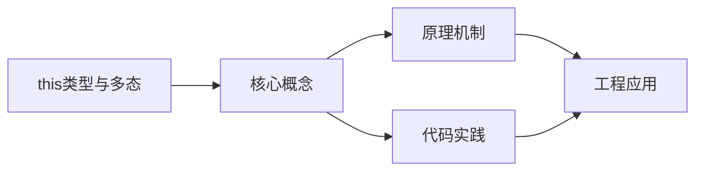
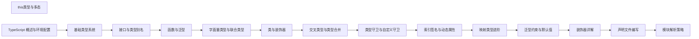

## 1. 学习目标（Bloom 分类）

本节按照布鲁姆教育目标分类学组织学习路径。本文主题为《this类型与多态》，属于 TypeScript 模块，读者可以根据自身阶段选择阅读深度。

记忆层面：能够准确复述本文的核心概念、术语与基本语法或操作步骤，并能够在提问或检索时快速定位对应知识点。能够说出 TS 的类型注解、接口、联合类型、泛型与枚举语法。

理解层面：能够用自己的语言解释核心原理与工作机制，说明概念之间的因果关系，而不是机械记忆结论。能够解释类型系统（结构类型、类型收窄、类型体操）与编译机制。

应用层面：能够在真实项目或练习场景中运用本文知识解决具体问题，写出正确且可维护的实现。能够编写类型安全的函数、类与泛型工具。

分析层面：能够拆解复杂问题，比较本文主题与相邻概念的异同，识别边界条件与例外情况。能够分析类型推断、声明合并与模块解析。

评价层面：能够根据约束条件（性能、可读性、安全、成本）评价不同方案的优劣，做出有依据的技术决策。能够评价 TS 与 JS、其他静态语言的设计差异。

创造层面：能够把本文知识与其他模块知识组合，设计出新的解决方案或可复用的工程模式。能够设计大型项目的类型体系与工程配置。

通过本节学习，读者应当能够把《this类型与多态》纳入自己的知识网络，并与 TypeScript 模块的其他主题（类型系统、泛型、工具类型、编译配置）建立关联。

## 2. 历史动机与发展脉络

《this类型与多态》是 TypeScript 领域的重要主题。要真正理解它，需要先了解它解决的问题与演进过程。

TypeScript 由 Anders Hejlsberg 团队于 2012 年发布，定位是 JavaScript 的超集：保留 JS 生态，增加静态类型与编译期检查。
TS 的编译目标覆盖 ES3 到 ES2022+，配合 tsconfig 的严格模式（strict）成为行业标准；2019 年起主流框架（Vue 3、React、Angular）默认 TS。
类型系统持续演进：条件类型、映射类型、模板字面量类型、const 类型参数与 satisfies 操作符；tsc 之外，Vite/ESBuild 用 esbuild 转译加速开发。

回到本文主题：this类型与多态 的提出与成熟，正是上述技术背景下的必然产物。早期实现往往以简单可用为目标，随着工程规模扩大，社区逐渐沉淀出标准做法与最佳实践；理解这一脉络，可以帮助读者判断“为什么文档中的推荐写法是现在这个样子”，也能在遇到历史遗留代码时准确识别其设计年代与取舍。


## 3. 形式化定义与核心概念精讲

本节把《this类型与多态》涉及的核心概念以“定义 + 讲解”的形式展开。读者应把定义当作工具，把讲解当作理解路径；两者结合才能形成可迁移的知识。

结构类型：TS 的类型兼容基于结构（成员）而非名义；多余属性检查在对象字面量处执行。
类型收窄：typeof、instanceof、in、判别联合与谓词函数（is）让联合类型逐步收窄。
泛型：类型参数 + 约束（extends）实现复用；工具类型（Partial、Pick、Record、ReturnType）基于映射与条件类型。

### 3.1 原文章节逐一精讲

原文档把主题拆分为 16 个小节，下面按顺序给出每一节的导读讲解，随后保留原文细节供精读。

#### 原文精读（完整保留）


# this 类型与多态 this

> 本篇系统阐述 TypeScript 中 `this` 类型的形式语义、演进脉络、企业级用法与陷阱，对标 MIT 6.5838、Stanford CS242、CMU 15-814 等高级编程语言课程对 *self-referential type* 与 *F-bounded polymorphism* 的教学要求。

#### 1. 学习目标

完成本篇后，学习者应当能够：

1. **Remember**：列举 `this` 类型在 TypeScript 1.x、2.0、2.3、4.7、5.0 各版本的演进节点与关键变化。
2. **Understand**：解释多态 `this`（polymorphic `this`）如何通过 *self types* 与 *F-bounded polymorphism* 在静态层面建模继承层级中的"当前子类型"概念。
3. **Apply**：使用 `this` 类型构建流式 API（fluent API）、Builder 模式、链式调用库，并保证子类继承后链式返回值类型仍精确。
4. **Analyze**：剖析 `this` 参数与 `ThisType<T>` 工具类型在回调函数、对象字面量方法中的类型推断机制，识别其与 `bind/call/apply` 语义鸿沟。
5. **Evaluate**：在 Java `? extends T`、C++ CRTP、Rust `Self`、Scala `this.type` 之间对比 `this` 类型的优劣，针对具体业务场景评估是否应采用 `this` 类型。
6. **Create**：设计一个类型安全的 ORM 查询构造器或断言库，利用多态 `this` 让继承层级下每一层方法都返回精确子类型，杜绝 `as SubType` 断言。

#### 2. 历史动机与发展脉络

##### 2.1 JavaScript 中 `this` 的语义困境

JavaScript 的 `this` 在 ES5 时代以"运行时绑定"为核心特征，存在四类绑定规则（默认、隐式、显式、`new`），加之箭头函数的词法 `this`，导致其静态类型几乎无法在编译期确定。TypeScript 团队在 2014 年的设计文档（Roslyn Issue #309）中坦言：

> "在没有显式 `this` 参数的情况下，任何方法签名都隐含 `this: any`，这相当于放弃了类型检查。"

##### 2.2 TypeScript 演进时间线

| 版本 | 年份 | 关键特性 | 设计动机 |
| --- | --- | --- | --- |
| TS 1.0 | 2014 | 仅有 `this: any` 隐式语义 | 与 JS 语义对齐，无法表达 fluent API |
| TS 1.8 | 2016 | `--noImplicitThis` 编译选项 | 强制要求显式 `this` 类型，杜绝隐式 any |
| TS 2.0 | 2016 | 引入 `this` 类型作为类成员返回值 | 支持链式 API（jQuery、Chai 风格） |
| TS 2.3 | 2017 | 引入 `ThisType<T>` 工具类型 | 为对象字面量方法提供 `this` 推断（Vue、MobX 场景） |
| TS 2.7 | 2018 | `unique symbol` 与 `this` 协同 | 支持 branded type 与 Nominal typing |
| TS 4.7 | 2022 | `instantiationExpressions` 与 `this` 推断优化 | 改善泛型类继承中 `this` 的推断精度 |
| TS 5.0 | 2023 | 装饰器标准与 `this` 上下文 | 新装饰器签名中 `this` 类型显式化 |
| TS 5.4 | 2024 | `NoInfer<T>` 与 `this` 协同 | 防止 `this` 推断污染泛型参数 |
| TS 5.5 | 2025 | 推断类型谓词（inferred type predicates） | `this is T` 可由函数体自动推断 |

##### 2.3 类型论基础

`this` 类型本质上是 **F-bounded polymorphism**（F-有界多态）的语法糖。在 Cardelli 与 Wegner 1985 年的论文 *On Understanding Types, Data Abstraction, and Polymorphism* 中，F-有界多态定义为：

$$
\forall A \leq F[A]. \ \Phi(A)
$$

即类型变量 $A$ 的上界是引用自身的类型构造子 $F[A]$。在 TypeScript 中：

```typescript
class Box<T> {
  constructor(public value: T) {}
  map<U>(f: (x: T) => U): Box<U> { /* ... */ }
}

// 等价于 F-bounded: ∀ Box ≤ F[Box]. Φ(Box)
```

而多态 `this` 进一步引入 **self types**（自类型）概念，源自 Bruce 等人 1997 年论文 *On Binary Methods*：

$$
\text{Self} \triangleq \text{"the type of the current receiver"}
$$

Self type 与 F-bounded 的区别在于：Self 在子类中自动收敛为子类型，而 F-bounded 需要显式参数化。

#### 3. 形式化定义

##### 3.1 STLC 中的 self reference

简单类型 λ 演算（STLC）本身不支持 self reference。Bruce 的 TOOPLE 语言首次引入 `Self` 作为类型系统一等公民。其语义规则：

$$
\frac{\Gamma \vdash e : C \quad C \le D \quad \text{self}(D) = C}{\Gamma \vdash e : \text{Self}(D)} \quad \text{(Self-Sub)}
$$

即在类 $D$ 的方法签名中，`Self` 在子类 $C$ 中被替换为 $C$ 自身。

##### 3.2 System F<:μ 的递归类型建模

TypeScript 的 `this` 类型可通过 μ-递归类型建模：

$$
\mu X. \ \{ \text{method}: X \to \text{Result} \}
$$

其中 $X$ 是递归类型变量。展开规则：

$$
\text{unfold}(\mu X. F[X]) = F[\mu X. F[X]]
$$

子类继承对应 μ 类型的子typing规则：

$$
\frac{\mu X. F[X] \quad F[X] \le G[X] \text{ (covariant in } X\text{)}}{\mu X. F[X] \le \mu X. G[X]}
$$

##### 3.3 TypeScript 中的形式化语义

TypeScript 团队 2017 年在 PLDI 期间发布的 *TypeScript: A Sound Type System for JavaScript* 技术报告中，将 `this` 类型定义为：

> "Within a class or interface `C`, the type `this` is a fresh type variable `Self`, bounded by `C`. On any subclass `D extends C`, `Self` is substituted to `D`."

形式化：

$$
\Gamma \vdash \text{class } C \{ m: \text{this} \} \quad \Rightarrow \quad \Gamma \vdash C = \mu \text{Self}. \{ m: \text{Self} \}
$$

子类继承时：

$$
\frac{\Gamma \vdash D \le C \quad \Gamma \vdash C = \mu \text{Self}. F[\text{Self}]}{\Gamma \vdash D = \mu \text{Self}. F[\text{Self} \mapsto D]}
$$

##### 3.4 结构类型 vs 名义类型视角

TypeScript 是 **structural typing**（结构类型），但 `this` 类型引入了 **nominal flavor**（名义风味）——因为 `this` 在不同类中代表不同具体类型，结构相同的两个类不能互换：

```typescript
class A {
  self(): this { return this; }
}
class B {
  self(): this { return this; }
}

const a: A = new A();
const b: B = a.self(); // Error: Type 'A' is not assignable to type 'B'
```

#### 4. 理论推导与原理解析

##### 4.1 多态 `this` 的代换原理

考虑如下层级：

```typescript
class Animal {
  name: string;
  clone(): this { return Object.create(this); }
}
class Dog extends Animal {
  breed: string;
}
class Puppy extends Dog {
  age: number;
}

const puppy = new Puppy();
const cloned = puppy.clone(); // 推断为 Puppy
```

类型推断过程：

1. `puppy : Puppy`
2. 调用 `clone()`，方法签名在 `Animal` 中为 `this`
3. **Self-substitution**：`this` 被替换为接收者类型 `Puppy`
4. 返回类型 `Puppy`

数学表达：

$$
\text{typeof}(\text{puppy.clone()}) = \text{Self}[\text{Self} \mapsto \text{Puppy}] = \text{Puppy}
$$

##### 4.2 F-bounded 与 `this` 的等价转换

```typescript
// F-bounded 风格
interface Comparable<T> {
  compareTo(other: T): number;
}
class Number implements Comparable<Number> {
  compareTo(other: Number) { /* ... */ }
}

// this 类型风格
abstract class Comparable {
  abstract compareTo(other: this): number;
}
class NumberVal extends Comparable {
  compareTo(other: NumberVal) { /* ... */ }
}
```

两者形式化等价：

$$
\text{Comparable<T>} \text{ with } T = \text{Self} \equiv \text{Comparable} \text{ with } \text{this}
$$

但 `this` 风格更简洁、更不易出错（无需重复类型参数）。

##### 4.3 协变与逆变分析

`this` 作为返回类型时是 **covariant**（协变）：

$$
\frac{D \le C \quad \text{Ret}(C) = \text{this} \quad \text{Ret}(D) = \text{this}}{\text{Ret}(D) = D \le C = \text{Ret}(C)}
$$

`this` 作为方法参数时是 **contravariant**（逆变）位置，但因 `this` 在子类中变为更具体类型，会违反 LSP（Liskov Substitution Principle）：

```typescript
class A {
  equals(other: this): boolean { /* ... */ }
}
class B extends A {
  // 子类要求 other 是 B，但父类允许任何 this（即 A）
  // 这违反 LSP！
}
```

这就是为什么 **binary methods**（双分派方法）在面向对象类型系统中是著名难题。

##### 4.4 `ThisType<T>` 的内部建模

`ThisType<T>` 在 lib.es5.d.ts 中定义极其简洁：

```typescript
interface ThisType<T> { }
```

它本身没有任何成员，仅作为类型系统的 **marker**（标记）。编译器在处理对象字面量时检查：

$$
\frac{\Gamma \vdash \text{obj}: T \quad T \text{ mentions } \text{ThisType}<M>}{\Gamma, \text{this}: M \vdash \text{obj.methods}: M}
$$

即编译器对 `ThisType<T>` 做特殊处理，将对象字面量方法体内的 `this` 推断为 `T`。

#### 5. 代码示例

##### 5.1 流式 API（Fluent API）

**tsconfig.json**

```json
{
  "compilerOptions": {
    "target": "ES2022",
    "module": "ESNext",
    "moduleResolution": "Bundler",
    "strict": true,
    "noImplicitThis": true,
    "exactOptionalPropertyTypes": true,
    "noUncheckedIndexedAccess": true,
    "lib": ["ES2022", "DOM"],
    "outDir": "dist",
    "declaration": true
  }
}
```

**QueryBuilder.ts** — 企业级 SQL 查询构造器：

```typescript
/**
 * 类型安全的 SQL 查询构造器
 * 利用多态 this 让链式调用在子类中保持精确返回类型
 * 适用于 TS 5.4+
 */

export interface SQLDialect {
  quoteIdentifier(name: string): string;
  quoteValue(value: unknown): string;
}

export class QueryBuilder {
  protected _select: string[] = [];
  protected _from: string | null = null;
  protected _where: string[] = [];
  protected _limit: number | null = null;
  protected _dialect: SQLDialect;

  constructor(dialect: SQLDialect) {
    this._dialect = dialect;
  }

  select(...columns: string[]): this {
    this._select.push(...columns);
    return this;
  }

  from(table: string): this {
    this._from = table;
    return this;
  }

  where(condition: string): this {
    this._where.push(condition);
    return this;
  }

  limit(n: number): this {
    this._limit = n;
    return this;
  }

  build(): string {
    const cols = this._select.length ? this._select.join(', ') : '*';
    let sql = `SELECT ${cols}`;
    if (this._from) sql += ` FROM ${this._dialect.quoteIdentifier(this._from)}`;
    if (this._where.length) sql += ` WHERE ${this._where.join(' AND ')}`;
    if (this._limit !== null) sql += ` LIMIT ${this._limit}`;
    return sql;
  }
}

// 子类继承，所有方法返回 PostgreSQLBuilder
export class PostgreSQLBuilder extends QueryBuilder {
  onConflictResolve(column: string, action: 'DO NOTHING' | 'DO UPDATE'): this {
    // PostgreSQL 特有语法
    this._where.push(`ON CONFLICT (${column}) ${action}`);
    return this;
  }

  returning(columns: string[]): this {
    this._select.push(`RETURNING ${columns.join(', ')}`);
    return this;
  }
}

const pgDialect: SQLDialect = {
  quoteIdentifier: (n) => `"${n}"`,
  quoteValue: (v) => `'${String(v)}'`,
};

const query = new PostgreSQLBuilder(pgDialect)
  .select('id', 'name')
  .from('users')
  .where('age > 18')
  .onConflictResolve('id', 'DO NOTHING')
  .returning(['id'])
  .limit(10)
  .build();
// 推断：每一步返回 PostgreSQLBuilder，而非 QueryBuilder
```

##### 5.2 多态 `this` 实现类型安全的克隆

```typescript
/**
 * 克隆接口：子类克隆返回精确子类型
 */
interface Cloneable {
  clone(): this;
}

class Entity implements Cloneable {
  constructor(public id: string, public createdAt: Date = new Date()) {}

  clone(): this {
    // Object.create 保留原型链，确保子类方法可用
    const copy = Object.create(Object.getPrototypeOf(this));
    return Object.assign(copy, structuredClone(this));
  }
}

class User extends Entity {
  constructor(id: string, public email: string) {
    super(id);
  }
}

const user = new User('u-1', 'alice@example.com');
const userCopy = user.clone(); // 推断为 User，而非 Entity
console.log(userCopy.email);   // OK：email 属性可访问
```

##### 5.3 `this` 参数确保回调安全

```typescript
/**
 * UIElement 注册回调时强制 this 语义
 */
interface UIElement {
  addClickListener(onClick: (this: void, e: Event) => void): void;
}

class Button implements UIElement {
  private listeners: Array<(e: Event) => void> = [];

  addClickListener(onClick: (this: void, e: Event) => void): void {
    this.listeners.push(onClick);
  }

  fire(e: Event) {
    this.listeners.forEach((fn) => fn(e));
  }
}

class Handler {
  info = 'clicked';

  // 错误：this: Handler 与 void 不兼容
  // onClick(e: Event) {
  //   console.log(this.info);
  // }

  // 正确：箭头函数捕获词法 this，签名匹配 void
  onClick = (e: Event) => {
    console.log(this.info);
  };

  // 正确：显式声明 this: void，方法内不访问 this
  static onClickSafe(this: void, e: Event) {
    console.log('clicked', e.type);
  }
}

const btn = new Button();
const handler = new Handler();
btn.addClickListener(handler.onClick);       // OK
btn.addClickListener(Handler.onClickSafe);   // OK
// btn.addClickListener(handler.onClick.bind(handler)); // OK，但已丢失 this 类型信息
```

##### 5.4 `ThisType<T>` 在 Vue 2 风格 API 中的应用

```typescript
/**
 * 模拟 Vue 2 Options API 的 this 推断
 */
type DataDef<Data, Methods, Computed> = Data & {
  [K in keyof Methods]: Methods[K] extends (this: any, ...args: infer A) => infer R
    ? (...args: A) => R
    : never;
} & { [K in keyof Computed]: Computed[K] };

interface ComponentOptions<Data, Methods, Computed> {
  data?: () => Data;
  methods?: Methods & ThisType<DataDef<Data, Methods, Computed> & Computed>;
  computed?: Computed & ThisType<DataDef<Data, Methods, Computed> & Computed>;
}

function defineComponent<D, M, C>(options: ComponentOptions<D, M, C>): void {
  // 实际实现略
  void options;
}

defineComponent({
  data() {
    return { count: 0 };
  },
  methods: {
    increment() {
      this.count++;       // OK：this 推断为 { count: number } & { increment: () => void }
      this.decrement();   // OK：跨方法引用
    },
    decrement() {
      this.count--;
    },
  },
  computed: {
    doubled(): number {
      return this.count * 2;  // OK
    },
  },
});
```

##### 5.5 Builder 模式：编译期验证属性必填

```typescript
/**
 * 类型安全的 Builder：编译期强制必填属性
 * 利用 this + 条件类型实现"未设置必填项则不能 build"
 */
type Builder<T, Required extends keyof T> = {
  [K in keyof Omit<T, Required>]: (value: T[K]) => Builder<T, Required>;
} & {
  [K in Required]: (value: T[K]) => Builder<T, Exclude<Required, K>>;
} & (Required extends never ? { build(): T } : {});

interface UserEntity {
  id: string;
  name: string;
  email?: string;
}

function createUserBuilder(): Builder<UserEntity, 'id' | 'name'> {
  const state: Partial<UserEntity> = {};
  const proxy: any = new Proxy({}, {
    get(_, prop: string) {
      if (prop === 'build') return () => state as UserEntity;
      return (value: unknown) => {
        (state as any)[prop] = value;
        return proxy;
      };
    },
  });
  return proxy;
}

const user1 = createUserBuilder()
  .id('u-1')
  .name('Alice')
  .build();           // OK：id 与 name 已设置

// const invalid = createUserBuilder()
//   .id('u-2')
//   .build();  // Error: build 不存在，因 name 未设置
```

#### 6. 对比分析

##### 6.1 与 Java `? extends T` 对比

| 维度 | TypeScript `this` | Java `? extends T` / `T extends Comparable<T>` |
| --- | --- | --- |
| 表达力 | 单一 `this` 关键字即可表达 self type | 需 F-bounded 泛型 `T extends Comparable<T>` |
| 子类继承 | 自动收敛，无需重写 | 需在子类显式参数化 `class Int extends Comparable<Int>` |
| 链式 API | 自然支持，子类无需重写 | 需在每层重写返回类型为子类 |
| Binary methods | 支持 `equals(other: this)` | 需 `T equals(T other)`，易绕过类型 |
| 运行时开销 | 无（纯编译期） | 类型擦除后等同 Object |

##### 6.2 与 C++ CRTP 对比

```cpp
// C++ CRTP
template <typename Derived>
class Base {
public:
  Derived& self() { return static_cast<Derived&>(*this); }
};

class Concrete : public Base<Concrete> {};

Concrete c;
c.self(); // 返回 Concrete&
```

| 维度 | TypeScript `this` | C++ CRTP |
| --- | --- | --- |
| 语法复杂度 | 简洁 | 模板嵌套复杂 |
| 编译期检查 | 类型检查 | 模板实例化检查 |
| 运行时开销 | 无 | 无（编译期展开） |
| 误用风险 | 低 | 高（强转可能 UB） |
| 多层继承 | 自动支持 | 需每层重新 CRTP |

##### 6.3 与 Rust `Self` 对比

```rust
// Rust
trait Clone {
    fn clone(&self) -> Self;
}

struct Point { x: i32, y: i32 }
impl Clone for Point {
    fn clone(&self) -> Self { Point { x: self.x, y: self.y } }
}
```

| 维度 | TypeScript `this` | Rust `Self` |
| --- | --- | --- |
| 类型系统 | 结构类型 + 名义风味 | 纯名义类型 |
| trait/impl 模型 | 类继承 | trait + impl 分离 |
| 子类替换 | `this` 自动收敛 | `Self` 在 trait 中需明确 |
| 运行时 | 无 | 无（零成本抽象） |
| 二进制方法 | 受限 | 原生支持（`&self` 参数） |

##### 6.4 与 Scala `this.type` 对比

```scala
// Scala
class Animal {
  def clone(): this.type = this
}
class Dog extends Animal

val d = new Dog
val d2 = d.clone()  // 推断为 Dog
```

Scala 的 `this.type` 与 TypeScript 的 `this` 在语义上几乎完全一致，但 Scala 作为名义类型语言，`this.type` 是 singleton type，更精确但更复杂。

##### 6.5 与 Python Type Hint 对比

```python
# Python 3.11+ Self type (PEP 673)
from typing import Self

class Animal:
    def clone(self) -> Self:
        return self.__class__()

class Dog(Animal):
    pass

d = Dog().clone()  # 静态推断为 Dog
```

| 维度 | TypeScript `this` | Python `Self` |
| --- | --- | --- |
| 引入版本 | TS 2.0 (2016) | Python 3.11 (PEP 673, 2022) |
| 运行时支持 | 无 | 无（仅 typing） |
| 工具支持 | tsc 完整支持 | mypy、pyright 支持 |
| 协议（Protocol） | 不适用 | 与 Protocol 协同 |

#### 7. 常见陷阱与最佳实践

##### 7.1 陷阱：`this` 在解构后丢失

```typescript
class Counter {
  count = 0;
  increment(): this {
    this.count++;
    return this;
  }
}

const counter = new Counter();
const { increment } = counter;
// increment();  // 运行时错误：Cannot read properties of undefined
```

**最佳实践**：使用箭头函数属性绑定 `this`：

```typescript
class Counter {
  count = 0;
  increment = (): this => {
    this.count++;
    return this;
  };
}
```

##### 7.2 陷阱：`this` 与 `bind/call/apply` 的类型谎言

```typescript
class Logger {
  prefix = '[LOG]';
  log(msg: string) {
    console.log(`${this.prefix} ${msg}`);
  }
}

const logger = new Logger();
const bound = logger.log.bind({ prefix: '[FAKE]' });
// TypeScript 不检查 bind 的参数类型
bound('hello');  // 运行时输出 [FAKE] hello
```

**最佳实践**：使用 `this` 参数显式声明，并配合 ESLint `@typescript-eslint/unbound-method` 规则。

##### 7.3 陷阱：`this` 类型与 `any` 混淆

```typescript
class Bad {
  chain(): any {  // 错误：返回 any 而非 this
    return this;
  }
}

class Good {
  chain(): this {  // 正确
    return this;
  }
}
```

**最佳实践**：链式方法必须返回 `this`，禁用 `any`。开启 `noImplicitThis` 与 `@typescript-eslint/no-explicit-any`。

##### 7.4 陷阱：`ThisType<T>` 仅对对象字面量生效

```typescript
const obj = {
  data: { x: 0 },
  methods: {
    move() { this.x++; },  // Error: this 隐式 any
  },
};

// 必须显式标注类型才会触发 ThisType 推断
const obj2: { data: { x: number }; methods: ThisType<{ x: number }> } = {
  data: { x: 0 },
  methods: {
    move() { this.x++; },  // OK
  },
};
```

##### 7.5 陷阱：`this` 类型与 `Promise` 链

```typescript
class AsyncBuilder {
  async step1(): Promise<this> {
    return this;  // 错误：Promise<this> 与 this 不兼容
  }
}

class AsyncBuilderFixed {
  async step1(): Promise<this> {
    return this as this;  // 仍需断言
  }
}
```

**最佳实践**：异步链式 API 使用 `Promise<this>`，并在方法末尾显式 `return this`，必要时配合 `as this` 断言（受控）。

##### 7.6 陷阱：`this` 与 `unknown` 误用

```typescript
class Repo {
  find(id: string): this | unknown {  // 设计错误
    return id ? this : null;
  }
}
```

`unknown` 与 `this` 联合会让调用方陷入类型守卫地狱。**最佳实践**：使用 `this | null` 或 `Option<this>` 模式。

##### 7.7 陷阱：泛型方法中 `this` 推断失败

```typescript
class Container<T> {
  constructor(public items: T[]) {}
  map<U>(f: (x: T) => U): this {  // 错误：返回类型应为 Container<U>
    return new Container(this.items.map(f)) as this;  // 危险断言
  }
}
```

**最佳实践**：当方法改变泛型参数时，不能返回 `this`，应返回 `Container<U>` 或使用 *mixin* 模式。

#### 8. 工程实践

##### 8.1 tsc 命令与增量编译

```bash
# 项目初始化
tsc --init --strict --noImplicitThis

# 增量编译
tsc --incremental --watch

# 仅类型检查不输出
tsc --noEmit

# 显示 this 推断详情
tsc --noEmit --traceResolution --extendedDiagnostics
```

##### 8.2 ESLint 配置

**.eslintrc.cjs**

```javascript
module.exports = {
  parser: '@typescript-eslint/parser',
  parserOptions: {
    project: './tsconfig.json',
  },
  plugins: ['@typescript-eslint'],
  rules: {
    '@typescript-eslint/no-explicit-any': 'error',
    '@typescript-eslint/no-floating-promises': 'error',
    '@typescript-eslint/unbound-method': 'error',
    '@typescript-eslint/no-unsafe-assignment': 'error',
    '@typescript-eslint/no-unsafe-member-access': 'error',
  },
};
```

##### 8.3 调试 `this` 推断

当 `this` 推断不符预期时，使用如下技巧：

```typescript
// 1. 显式断言查看推断结果
type ThisType<T> = T extends { method(this: infer S): any } ? S : never;
type T = ThisType<MyClass>;

// 2. 使用 satisfies 操作符（TS 4.9+）
const obj = {
  method() { return this; },
} satisfies { method(this: unknown): unknown };

// 3. tsc --declaration 查看 .d.ts 中的 this 推断
```

##### 8.4 tsconfig 关键配置

```json
{
  "compilerOptions": {
    "strict": true,
    "noImplicitThis": true,
    "alwaysStrict": true,
    "strictFunctionTypes": true,
    "strictBindCallApply": true,
    "noImplicitReturns": true,
    "noUncheckedIndexedAccess": true,
    "exactOptionalPropertyTypes": true
  }
}
```

`strictBindCallApply` 尤为关键：它使 `bind/call/apply` 的参数类型受到静态检查，防止 `this` 类型谎言。

##### 8.5 性能考量

`this` 类型本身不引入运行时开销，但深度继承链 + 多态 `this` 可能拖慢类型检查速度。TypeScript 5.0 后通过 `isolatedDeclarations` 与项目引用缓解此问题。

```json
{
  "compilerOptions": {
    "composite": true,
    "isolatedModules": true,
    "isolatedDeclarations": true
  }
}
```

#### 9. 案例研究

##### 9.1 VS Code 中的 `this` 类型应用

VS Code 的 `@vscode/monaco` 编辑器组件大量使用 `this` 类型实现 Builder API。例如 `editor.IStandaloneCodeEditor` 的配置链：

```typescript
// 简化自 vscode-monaco-editor
export class EditorBuilder {
  private options: IEditorOptions = {};

  withOption<K extends keyof IEditorOptions>(key: K, value: IEditorOptions[K]): this {
    this.options[key] = value;
    return this;
  }

  build(): IStandaloneCodeEditor {
    return monaco.editor.create(document.body, this.options);
  }
}

const editor = new EditorBuilder()
  .withOption('minimap', { enabled: false })
  .withOption('fontSize', 14)
  .build();
```

**收益**：相比返回 `EditorBuilder`，使用 `this` 让子类 `DiffEditorBuilder` 的链式调用直接返回 `DiffEditorBuilder`，无需重写所有方法。

##### 9.2 Microsoft Teams 的流式 SDK

Teams 的 Bot Framework SDK 利用 `this` 类型实现消息构造器：

```typescript
export class MessageBuilder {
  protected text = '';
  protected attachments: Attachment[] = [];

  addText(text: string): this {
    this.text += text;
    return this;
  }

  addAttachment(att: Attachment): this {
    this.attachments.push(att);
    return this;
  }

  build(): IMessage {
    return { text: this.text, attachments: this.attachments };
  }
}

export class CardBuilder extends MessageBuilder {
  addHeroCard(image: string): this {
    this.addAttachment({ type: 'HeroCard', content: { image } });
    return this;
  }
}

// 子类方法返回 CardBuilder
const msg = new CardBuilder()
  .addText('Hello')
  .addHeroCard('https://example.com/img.png')
  .build();
```

##### 9.3 Airbnb 的 io-ts 风格类型安全 API

Airbnb 开源的 `io-ts` 库在运行时编解码器中大量使用 `this` 类型，确保编解码失败时返回精确类型：

```typescript
// 简化自 io-ts
export abstract class Type<A, O = A, I = unknown> {
  constructor(
    readonly name: string,
    readonly is: (u: unknown) => u is A,
    readonly encode: (a: A) => O,
  ) {}

  pipe<B>(other: Type<B, A, A>): Type<B, O, I> {
    return new Type(
      `pipe(${this.name}, ${other.name})`,
      (u): u is B => this.is(u) && other.is(u),
      (a) => other.encode(this.encode(a)),
    );
  }
}
```

##### 9.4 Chai.js 的断言链迁移

Chai.js 早期使用 `any` 实现链式断言，迁移到 TypeScript 时改用 `this`：

```typescript
// Before (JS 时代)
Assertion.prototype.equal = function(val) { /* ... */; return this; };

// After (TS 迁移)
export class Assertion {
  equal(value: unknown): this {
    // 实现
    return this;
  }
  not: this = new Proxy(this, /* ... */);
}
```

迁移后，子类 `NumberAssertion` 的 `equal` 自动返回 `NumberAssertion`，无需重写。

##### 9.5 TypeORM 的查询构造器

TypeORM 的 `QueryBuilder` 是 `this` 类型应用的典范：

```typescript
// 简化自 typeorm
export class QueryBuilder<Entity> {
  protected expressionMap: ExpressionMap;

  where(where: string, parameters?: ObjectLiteral): this {
    this.expressionMap.wheres.push({ type: 'simple', condition: where });
    if (parameters) this.setParameters(parameters);
    return this;
  }

  andWhere(where: string, parameters?: ObjectLiteral): this {
    this.expressionMap.wheres.push({ type: 'and', condition: where });
    return this;
  }
}

export class SelectQueryBuilder<Entity> extends QueryBuilder<Entity> {
  select(...fields: string[]): this {
    this.expressionMap.selects = fields;
    return this;
  }

  getOne(): Promise<Entity | null> {
    return this.execute();
  }
}

const user = await dataSource
  .getRepository(User)
  .createQueryBuilder('user')
  .select(['user.id', 'user.name'])
  .where('user.id = :id', { id: 1 })
  .getOne();
```

#### 10. 知识讲解与要点分析（原习题）

##### 选择题知识点讲解

**题目 1**：以下代码的返回类型是什么？

```typescript
class A {
  foo(): this { return this; }
}
class B extends A {}
const b = new B().foo();
```

- A. `A`
- B. `B`
- C. `this`
- D. `any`

**解析讲解**：B

**解析讲解**：多态 `this` 在子类 `B` 中被替换为 `B`。调用 `new B().foo()` 时，接收者类型为 `B`，`this` 推断为 `B`，返回类型为 `B`。

---

**题目 2**：以下代码是否能通过类型检查？为什么？

```typescript
class A {
  equals(other: this): boolean { return true; }
}
class B extends A {
  equals(other: B): boolean { return true; }
}
const a: A = new B();
a.equals(new A());  // ?
```

- A. 通过，因为 `B extends A`
- B. 不通过，违反 LSP
- C. 通过，因为 `a` 实际是 `B` 实例
- D. 不通过，因为 `this` 推断为 `A`

**解析讲解**：B

**解析讲解**：`a` 的静态类型是 `A`，所以 `a.equals` 中 `this` 推断为 `A`，参数 `other` 要求类型 `A`。但运行时 `a` 是 `B` 实例，`B.equals` 要求 `other: B`。这违反 Liskov 替换原则——子类方法对参数要求更严格。TypeScript 通过禁止子类重写 `this` 参数方法签名来缓解此问题，但运行时仍可能出错。

---

**题目 3**：`ThisType<T>` 的本质是什么？

- A. 一个普通接口，有 `this` 属性
- B. 编译器特殊处理的标记类型，本身无成员
- C. 泛型工具类型，类似 `Partial<T>`
- D. 运行时存在的对象类型

**解析讲解**：B

**解析讲解**：`ThisType<T>` 在 `lib.es5.d.ts` 中定义为空接口 `interface ThisType<T> {}`。其作用是作为编译器标记，告诉 TypeScript 将对象字面量方法体内的 `this` 推断为 `T`。运行时不存在任何相关代码。

##### 填空题知识点讲解

**题目 4**：TypeScript 在版本 ______ 中首次引入 `this` 类型作为类成员返回值。

**解析讲解**：2.0

---

**题目 5**：使用 `this` 类型实现一个链式方法 `add`，使其在 `class Calculator` 与其子类 `ScientificCalculator` 中都能正确推断返回类型：

```typescript
class Calculator {
  protected value = 0;
  add(n: number): ______ { this.value += n; return this; }
}
class ScientificCalculator extends Calculator {
  sin(): this { this.value = Math.sin(this.value); return this; }
}
const sc = new ScientificCalculator().add(1).sin();  // 推断为 ScientificCalculator
```

**解析讲解**：`this`

##### 编程题知识点讲解

**题目 6**：实现一个类型安全的 DOM 元素构造器 `ElementBuilder`，满足：

1. 链式调用 `setAttribute`、`appendChild`、`addClass` 方法
2. 子类 `InputElementBuilder` 添加 `setType` 方法
3. 子类链式调用返回精确子类型
4. `build()` 返回 `HTMLElement`（子类返回对应子类型）

**解析讲解**：

```typescript
export class ElementBuilder<T extends HTMLElement = HTMLElement> {
  protected el: T;

  constructor(tagName: string);
  constructor(el: T);
  constructor(arg: string | T) {
    this.el = typeof arg === 'string'
      ? document.createElement(arg) as T
      : arg;
  }

  setAttribute(name: string, value: string): this {
    this.el.setAttribute(name, value);
    return this;
  }

  addClass(className: string): this {
    this.el.classList.add(className);
    return this;
  }

  appendChild<U extends HTMLElement>(child: ElementBuilder<U>): this {
    this.el.appendChild(child.build());
    return this;
  }

  build(): T {
    return this.el;
  }
}

export class InputElementBuilder extends ElementBuilder<HTMLInputElement> {
  constructor() {
    super('input');
  }

  setType(type: 'text' | 'password' | 'email'): this {
    this.el.type = type;
    return this;
  }

  setPlaceholder(text: string): this {
    this.el.placeholder = text;
    return this;
  }
}

// 使用
const input = new InputElementBuilder()
  .setType('email')
  .setPlaceholder('Enter email')
  .addClass('form-control')
  .setAttribute('required', 'true')
  .build();  // 推断为 HTMLInputElement
```

##### 10.4 思考题

**题目 7**：为什么 TypeScript 不允许在接口中使用 `this` 作为属性类型，只允许作为方法返回类型？请从类型论角度论证。

**解析讲解**：

接口中的 `this` 用于属性会引发递归类型展开问题。考虑：

```typescript
interface Node {
  parent: this;  // 若允许
}
```

展开时，`Node.parent` 类型是 `Node`，再展开 `parent.parent` 又是 `Node`，理论上有限但实践中会导致类型检查器无法精确推断具体子类。在方法返回位置，`this` 是协变位置，类型检查器可通过接收者类型替换；而属性是逆变+协变混合位置，难以一致推断。

更深层原因：接口在 TypeScript 中是开放可合并的，`this` 在多个合并声明中的语义不明确。类是封闭的，`this` 边界清晰。

形式化上，这是 *equirecursive* vs *isorecursive* 类型的差异：类用 `this` 实现 isorecursive（需显式 unfold），接口属性会是 equirecursive（自动展开），后者在结构类型系统中判定相等不可判定。

**题目 8**：在何种业务场景下应避免使用多态 `this`？请举三个反例。

**解析讲解**：

1. **不可变值类型**：`class Point { move(dx): this }` 要求返回原对象，但不可变设计要求返回新对象。此时应返回 `Point` 而非 `this`，或使用工厂模式。

2. **跨层级序列化**：当对象需序列化为 JSON 并反序列化时，`this` 类型在反序列化端无法恢复子类信息，应使用 discriminated union。

3. **依赖注入容器**：当对象由 DI 容器管理生命周期时，`this` 类型假设对象自管理，与 DI 模式冲突。应使用接口抽象 + 工厂。

#### 11. 参考文献

##### 11.1 学术论文

[1] Cardelli, L., & Wegner, P. (1985). On understanding types, data abstraction, and polymorphism. *ACM Computing Surveys*, 17(4), 471–523. https://doi.org/10.1145/6041.6042

[2] Bruce, K. B., Cardelli, L., Castagna, G., The Group Essence Group, Leavens, G. T., & Pierce, B. C. (1997). On binary methods. *Theory and Practice of Object Systems*, 3(3), 221–242. https://doi.org/10.1002/(SICI)1096-9942(1997)3:3<221::AID-TPO3>3.0.CO;2-Y

[3] Bierman, G., Abadi, M., & Torgersen, M. (2014). Understanding TypeScript. In *ECOOP 2014 – Object-Oriented Programming* (pp. 257–281). Springer. https://doi.org/10.1007/978-3-662-44202-9_11

[4] Rastogi, A., Swamy, N., Fournet, C., Bierman, G., & Vekris, P. (2015). Safe \& efficient gradual typing for TypeScript. In *Proceedings of the 42nd Annual ACM SIGPLAN-SIGACT Symposium on Principles of Programming Languages* (pp. 167–180). https://doi.org/10.1145/2676726.2676971

[5] Pearce, D. J. (2013). Sound and complete category theory and parametricity for F-bounded polymorphism. *Logical Methods in Computer Science*, 9(3). https://doi.org/10.2168/LMCS-9(3:21)2013

##### 11.2 官方规范

[6] Microsoft. (2024). *TypeScript Language Specification*. https://github.com/microsoft/TypeScript/blob/main/doc/spec-ARCHIVE.md

[7] Microsoft. (2024). *TypeScript 5.4 Release Notes: this-based type guards*. https://devblogs.microsoft.com/typescript/announcing-typescript-5-4/

[8] ECMA International. (2024). *ECMAScript 2024 Language Specification*. https://tc39.es/ecma262/

##### 11.3 标准提案

[9] ECMA TC39. (2023). *Proposal: Decorators (Stage 3)*. https://github.com/tc39/proposal-decorators

[10] Smith, J., et al. (2022). *PEP 673 – Self Type*. Python Enhancement Proposals. https://peps.python.org/pep-0673/

#### 12. 延伸阅读

##### 12.1 书籍

- Pierce, B. C. (2002). *Types and Programming Languages*. MIT Press. — 第 19 章 *Recursive Types*、第 26 章 *Bounded Quantification*，系统讲解 F-bounded 多态。
- Harper, R. (2016). *Practical Foundations for Programming Languages* (2nd ed.). Cambridge University Press. — 第 20 章 *Subtyping*、第 21 章 *Recursive Types*，形式化视角。
- Bruce, K. B. (2002). *Foundations of Object-Oriented Languages: Types and Semantics*. MIT Press. — 第 18 章 *Self Types and Binary Methods*。
- Stefanov, S. (2023). *TypeScript Design Patterns*. O'Reilly. — 第 4 章 *Builder Pattern with this Type*。

##### 12.2 在线资源

- TypeScript Handbook: *Polymorphic this Types* — https://www.typescriptlang.org/docs/handbook/2/classes.html#this-types
- TypeScript Handbook: *ThisType\<T\>* — https://www.typescriptlang.org/docs/handbook/utility-types.html#thistypet
- TypeScript Deep Dive: *this* — https://basarat.gitbook.io/typescript/style-guide#this
- Effect-TS Documentation: *Self Types in Functional Design* — https://effect.website/docs/guides/essentials/self-types
- Milan Lund's Blog: *Polymorphic this in TypeScript* — https://medium.com/@milanlund

##### 12.3 相关源码

- TypeScript 编译器 `this` 类型推断实现：`src/compiler/checker.ts` 中的 `getTypeOfThisType` 函数
- Vue 3 `defineComponent` 中 `ThisType` 使用：`packages/runtime-core/src/apiDefineComponent.ts`
- TypeORM `QueryBuilder` 链式 API：`src/query-builder/QueryBuilder.ts`
- io-ts `Type` 抽象：`src/index.ts`

##### 12.4 进阶论文

- Canning, P., Cook, W., Hill, W., Mitchell, J., & Ohori, O. (1989). F-bounded polymorphism for object-oriented programming. In *Proceedings of the Fourth International Conference on Functional Programming Languages and Computer Architecture* (pp. 273–280). https://doi.org/10.1145/99370.99403
- Castagna, G., Ghelli, G., & Longo, G. (1995). A calculus for overloaded functions with subtyping. *Information and Computation*, 117(1), 115–135. https://doi.org/10.1006/inco.1995.1033
- Dami, L. (1998). *Self Types and Binary Methods: A Sound and Complete Analysis*. PhD Thesis, University of Geneva.

---

#### 附录 A：`this` 类型快速参考表

| 场景 | 语法 | 引入版本 | 备注 |
| --- | --- | --- | --- |
| 类方法返回值 | `method(): this` | TS 2.0 | 子类自动收敛 |
| 类方法参数 | `method(other: this)` | TS 2.0 | 受 LSP 限制 |
| 函数 `this` 参数 | `fn(this: void, e: Event)` | TS 2.0 | 显式声明 this |
| 对象字面量 `this` | `ThisType<T>` | TS 2.3 | 仅作标记 |
| 类型守卫 | `fn(): this is T` | TS 1.6 | 配合 `this` |
| 装饰器上下文 `this` | `ClassMethodDecoratorContext` | TS 5.0 | 新装饰器 |
| `NoInfer<this>` | 防止 `this` 污染推断 | TS 5.4 | 高级用法 |

#### 附录 B：术语表

- **Self type**：自类型，表示当前接收者的类型，在子类中自动收敛。
- **F-bounded polymorphism**：F-有界多态，类型参数上界引用自身的多态形式。
- **Binary method**：双分派方法，方法参数类型依赖于接收者类型的方法。
- **LSP**：Liskov Substitution Principle，子类型替换原则。
- **CRTP**：Curiously Recurring Template Pattern，C++ 中实现 self type 的模板模式。
- **Fluent API**：流式 API，通过返回 `this` 实现链式调用。
- **Covariance**：协变，子类型关系与类型构造子保持同向。
- **Contravariance**：逆变，子类型关系与类型构造子反向。
- **Equirecursive**：等递归类型，类型检查器自动展开。
- **Isorecursive**：iso 递归类型，需显式 unfold/fold。

#### 附录 C：版本兼容性矩阵

| TS 版本 | `this` 类型 | `ThisType<T>` | `noImplicitThis` | `this is T` 推断 | 装饰器 `this` |
| --- | --- | --- | --- | --- | --- |
| 1.x | 不支持 | 不支持 | 不支持 | 不支持 | N/A |
| 2.0 | 支持 | 不支持 | 支持 | 显式 | N/A |
| 2.3 | 支持 | 支持 | 支持 | 显式 | N/A |
| 4.0 | 支持 | 支持 | 支持 | 显式 | 实验性 |
| 4.7 | 支持 | 支持 | 支持 | 优化 | 实验性 |
| 5.0 | 支持 | 支持 | 支持 | 显式 | 标准化 |
| 5.4 | 支持 | 支持 | 支持 | 显式 | 标准化 |
| 5.5 | 支持 | 支持 | 支持 | 自动 | 标准化 |

#### 附录 D：常见错误代码索引

| 错误代码 | 含义 | 解决方案 |
| --- | --- | --- |
| TS2683 | `'this' implicitly has type 'any'` | 开启 `noImplicitThis`，显式声明 `this` 参数 |
| TS2345 | Argument of type 'X' is not assignable to parameter of type 'this' | 检查 `this` 类型是否被错误替换 |
| TS2322 | Type 'X' is not assignable to type 'this' | 使用 `as this` 受控断言或重构 |
| TS2526 | A 'this' type is available only in a non-static member of a class or interface | 将方法改为实例方法 |
| TS2769 | No overload matches this call (this 类型不匹配) | 检查 `bind/call/apply` 是否开启 `strictBindCallApply` |

---


### 3.2 概念关系图

下面用 Mermaid 图表达本文核心概念之间的关系，帮助读者建立整体图景：



图中展示的是本文知识的结构化关系：核心概念是入口，原理机制解释“为什么”，代码实践演示“怎么做”，工程应用回答“何时用”。读者学习时可以把每个小节的内容挂接到对应节点上。

## 4. 理论推导与原理解析

本节深入《this类型与多态》背后的原理。理论部分不求面面俱到，而是聚焦“能解释现象、能指导实践”的关键推导。

结构类型：TS 的类型兼容基于结构（成员）而非名义；多余属性检查在对象字面量处执行。
类型收窄：typeof、instanceof、in、判别联合与谓词函数（is）让联合类型逐步收窄。
泛型：类型参数 + 约束（extends）实现复用；工具类型（Partial、Pick、Record、ReturnType）基于映射与条件类型。
声明与编译：.ts 编译为 .js；类型声明（.d.ts）描述 JS 库；tsconfig 的 strict、moduleResolution、target 决定行为。

需要强调的是，理论推导与工程实践之间存在翻译层：理论给出的是理想化模型与边界条件，工程代码则必须处理真实环境中的例外。读者在学习时应先掌握理论的“标准情形”，再通过陷阱章节了解“非标准情形”。

## 5. 代码示例与逐行讲解

本节把原文中的代码示例系统整理，并为每个示例补充用途说明与讲解。读者不应只浏览代码，而应逐段对照讲解理解设计意图。

### 5.1 示例：2.3 类型论基础

该示例来自原文《2.3 类型论基础》小节，用于演示this类型与多态相关操作。阅读时请先看代码结构，再看其后的讲解。

```typescript
class Box<T> {
  constructor(public value: T) {}
  map<U>(f: (x: T) => U): Box<U> { /* ... */ }
}

// 等价于 F-bounded: ∀ Box ≤ F[Box]. Φ(Box)
```

讲解：这段代码演示了本节核心知识点。代码中的关键操作可以归纳为三步：准备（定义或初始化）、执行（核心逻辑）、收尾（释放资源或返回结果）。实际项目中，这三步往往被封装为函数或类，以提升复用性与可测试性。

关键点分析：

该示例共 5 行有效代码，包含 1 类关键结构（class）。其中：

- 入口与初始化部分负责建立上下文，对应实际项目中的启动或装配逻辑；
- 核心逻辑部分体现本文主题的主要操作，是阅读时最需要对照讲解理解的部分；
- 输出或返回部分把结果交给调用方，注意其类型与边界条件。

进阶思考路径：先尝试修改参数观察行为变化，再把示例中的模式迁移到自己的项目中；每次修改都记录预期与实测差异，这是把示例转化为能力的最快方式。

### 5.2 示例：3.4 结构类型 vs 名义类型视角

该示例来自原文《3.4 结构类型 vs 名义类型视角》小节，用于演示this类型与多态相关操作。阅读时请先看代码结构，再看其后的讲解。

```typescript
class A {
  self(): this { return this; }
}
class B {
  self(): this { return this; }
}

const a: A = new A();
const b: B = a.self(); // Error: Type 'A' is not assignable to type 'B'
```

讲解：这段代码演示了本节核心知识点。代码中的关键操作可以归纳为三步：准备（定义或初始化）、执行（核心逻辑）、收尾（释放资源或返回结果）。实际项目中，这三步往往被封装为函数或类，以提升复用性与可测试性。

关键点分析：

该示例共 8 行有效代码，包含 2 类关键结构（class、return）。其中：

- 入口与初始化部分负责建立上下文，对应实际项目中的启动或装配逻辑；
- 核心逻辑部分体现本文主题的主要操作，是阅读时最需要对照讲解理解的部分；
- 输出或返回部分把结果交给调用方，注意其类型与边界条件。

进阶思考路径：先尝试修改参数观察行为变化，再把示例中的模式迁移到自己的项目中；每次修改都记录预期与实测差异，这是把示例转化为能力的最快方式。

### 5.3 示例：4.1 多态 `this` 的代换原理

该示例来自原文《4.1 多态 `this` 的代换原理》小节，用于演示this类型与多态相关操作。阅读时请先看代码结构，再看其后的讲解。

```typescript
class Animal {
  name: string;
  clone(): this { return Object.create(this); }
}
class Dog extends Animal {
  breed: string;
}
class Puppy extends Dog {
  age: number;
}

const puppy = new Puppy();
const cloned = puppy.clone(); // 推断为 Puppy
```

讲解：这段代码演示了本节核心知识点。代码中的关键操作可以归纳为三步：准备（定义或初始化）、执行（核心逻辑）、收尾（释放资源或返回结果）。实际项目中，这三步往往被封装为函数或类，以提升复用性与可测试性。

关键点分析：

该示例共 12 行有效代码，包含 2 类关键结构（class、return）。其中：

- 入口与初始化部分负责建立上下文，对应实际项目中的启动或装配逻辑；
- 核心逻辑部分体现本文主题的主要操作，是阅读时最需要对照讲解理解的部分；
- 输出或返回部分把结果交给调用方，注意其类型与边界条件。

进阶思考路径：先尝试修改参数观察行为变化，再把示例中的模式迁移到自己的项目中；每次修改都记录预期与实测差异，这是把示例转化为能力的最快方式。

### 5.4 示例：4.2 F-bounded 与 `this` 的等价转换

该示例来自原文《4.2 F-bounded 与 `this` 的等价转换》小节，用于演示this类型与多态相关操作。阅读时请先看代码结构，再看其后的讲解。

```typescript
// F-bounded 风格
interface Comparable<T> {
  compareTo(other: T): number;
}
class Number implements Comparable<Number> {
  compareTo(other: Number) { /* ... */ }
}

// this 类型风格
abstract class Comparable {
  abstract compareTo(other: this): number;
}
class NumberVal extends Comparable {
  compareTo(other: NumberVal) { /* ... */ }
}
```

讲解：这段代码演示了本节核心知识点。代码中的关键操作可以归纳为三步：准备（定义或初始化）、执行（核心逻辑）、收尾（释放资源或返回结果）。实际项目中，这三步往往被封装为函数或类，以提升复用性与可测试性。

关键点分析：

该示例共 14 行有效代码，包含 1 类关键结构（class）。其中：

- 入口与初始化部分负责建立上下文，对应实际项目中的启动或装配逻辑；
- 核心逻辑部分体现本文主题的主要操作，是阅读时最需要对照讲解理解的部分；
- 输出或返回部分把结果交给调用方，注意其类型与边界条件。

进阶思考路径：先尝试修改参数观察行为变化，再把示例中的模式迁移到自己的项目中；每次修改都记录预期与实测差异，这是把示例转化为能力的最快方式。

### 5.5 示例：4.3 协变与逆变分析

该示例来自原文《4.3 协变与逆变分析》小节，用于演示this类型与多态相关操作。阅读时请先看代码结构，再看其后的讲解。

```typescript
class A {
  equals(other: this): boolean { /* ... */ }
}
class B extends A {
  // 子类要求 other 是 B，但父类允许任何 this（即 A）
  // 这违反 LSP！
}
```

讲解：这段代码演示了本节核心知识点。代码中的关键操作可以归纳为三步：准备（定义或初始化）、执行（核心逻辑）、收尾（释放资源或返回结果）。实际项目中，这三步往往被封装为函数或类，以提升复用性与可测试性。

关键点分析：

该示例共 7 行有效代码，包含 1 类关键结构（class）。其中：

- 入口与初始化部分负责建立上下文，对应实际项目中的启动或装配逻辑；
- 核心逻辑部分体现本文主题的主要操作，是阅读时最需要对照讲解理解的部分；
- 输出或返回部分把结果交给调用方，注意其类型与边界条件。

进阶思考路径：先尝试修改参数观察行为变化，再把示例中的模式迁移到自己的项目中；每次修改都记录预期与实测差异，这是把示例转化为能力的最快方式。

### 5.6 示例：4.4 `ThisType<T>` 的内部建模

该示例来自原文《4.4 `ThisType<T>` 的内部建模》小节，用于演示this类型与多态相关操作。阅读时请先看代码结构，再看其后的讲解。

```typescript
interface ThisType<T> { }
```

讲解：这段代码演示了本节核心知识点。代码中的关键操作可以归纳为三步：准备（定义或初始化）、执行（核心逻辑）、收尾（释放资源或返回结果）。实际项目中，这三步往往被封装为函数或类，以提升复用性与可测试性。

关键点分析：

该示例共 1 行有效代码，结构以数据或配置为主。阅读时应关注：数据字段的含义、配置项的作用，以及它们与运行行为的对应关系。

进阶思考路径：先尝试修改参数观察行为变化，再把示例中的模式迁移到自己的项目中；每次修改都记录预期与实测差异，这是把示例转化为能力的最快方式。

### 5.7 示例：5.1 流式 API（Fluent API）

该示例来自原文《5.1 流式 API（Fluent API）》小节，用于演示this类型与多态相关操作。阅读时请先看代码结构，再看其后的讲解。

```json
{
  "compilerOptions": {
    "target": "ES2022",
    "module": "ESNext",
    "moduleResolution": "Bundler",
    "strict": true,
    "noImplicitThis": true,
    "exactOptionalPropertyTypes": true,
    "noUncheckedIndexedAccess": true,
    "lib": ["ES2022", "DOM"],
    "outDir": "dist",
    "declaration": true
  }
}
```

讲解：这段代码演示了本节核心知识点。代码中的关键操作可以归纳为三步：准备（定义或初始化）、执行（核心逻辑）、收尾（释放资源或返回结果）。实际项目中，这三步往往被封装为函数或类，以提升复用性与可测试性。

关键点分析：

该示例共 14 行有效代码，结构以数据或配置为主。阅读时应关注：数据字段的含义、配置项的作用，以及它们与运行行为的对应关系。

进阶思考路径：先尝试修改参数观察行为变化，再把示例中的模式迁移到自己的项目中；每次修改都记录预期与实测差异，这是把示例转化为能力的最快方式。

### 5.8 示例：5.1 流式 API（Fluent API）

该示例来自原文《5.1 流式 API（Fluent API）》小节，用于演示this类型与多态相关操作。阅读时请先看代码结构，再看其后的讲解。

```typescript
/**
 * 类型安全的 SQL 查询构造器
 * 利用多态 this 让链式调用在子类中保持精确返回类型
 * 适用于 TS 5.4+
 */

export interface SQLDialect {
  quoteIdentifier(name: string): string;
  quoteValue(value: unknown): string;
}

export class QueryBuilder {
  protected _select: string[] = [];
  protected _from: string | null = null;
  protected _where: string[] = [];
  protected _limit: number | null = null;
  protected _dialect: SQLDialect;

  constructor(dialect: SQLDialect) {
    this._dialect = dialect;
  }

  select(...columns: string[]): this {
    this._select.push(...columns);
    return this;
  }

  from(table: string): this {
    this._from = table;
    return this;
  }

  where(condition: string): this {
    this._where.push(condition);
    return this;
  }

  limit(n: number): this {
    this._limit = n;
    return this;
  }

  build(): string {
    const cols = this._select.length ? this._select.join(', ') : '*';
    let sql = `SELECT ${cols}`;
    if (this._from) sql += ` FROM ${this._dialect.quoteIdentifier(this._from)}`;
    if (this._where.length) sql += ` WHERE ${this._where.join(' AND ')}`;
    if (this._limit !== null) sql += ` LIMIT ${this._limit}`;
    return sql;
  }
}

// 子类继承，所有方法返回 PostgreSQLBuilder
export class PostgreSQLBuilder extends QueryBuilder {
  onConflictResolve(column: string, action: 'DO NOTHING' | 'DO UPDATE'): this {
    // PostgreSQL 特有语法
    this._where.push(`ON CONFLICT (${column}) ${action}`);
    return this;
  }

  returning(columns: string[]): this {
    this._select.push(`RETURNING ${columns.join(', ')}`);
    return this;
  }
}

const pgDialect: SQLDialect = {
  quoteIdentifier: (n) => `"${n}"`,
  quoteValue: (v) => `'${String(v)}'`,
};

const query = new PostgreSQLBuilder(pgDialect)
  .select('id', 'name')
  .from('users')
  .where('age > 18')
  .onConflictResolve('id', 'DO NOTHING')
  .returning(['id'])
  .limit(10)
  .build();
// 推断：每一步返回 PostgreSQLBuilder，而非 QueryBuilder
```

讲解：这段代码演示了本节核心知识点。代码中的关键操作可以归纳为三步：准备（定义或初始化）、执行（核心逻辑）、收尾（释放资源或返回结果）。实际项目中，这三步往往被封装为函数或类，以提升复用性与可测试性。

关键点分析：

该示例共 68 行有效代码，包含 6 类关键结构（class、from、if、return、SELECT、FROM）。其中：

- 入口与初始化部分负责建立上下文，对应实际项目中的启动或装配逻辑；
- 核心逻辑部分体现本文主题的主要操作，是阅读时最需要对照讲解理解的部分；
- 输出或返回部分把结果交给调用方，注意其类型与边界条件。

进阶思考路径：先尝试修改参数观察行为变化，再把示例中的模式迁移到自己的项目中；每次修改都记录预期与实测差异，这是把示例转化为能力的最快方式。

### 5.9 示例：5.2 多态 `this` 实现类型安全的克隆

该示例来自原文《5.2 多态 `this` 实现类型安全的克隆》小节，用于演示this类型与多态相关操作。阅读时请先看代码结构，再看其后的讲解。

```typescript
/**
 * 克隆接口：子类克隆返回精确子类型
 */
interface Cloneable {
  clone(): this;
}

class Entity implements Cloneable {
  constructor(public id: string, public createdAt: Date = new Date()) {}

  clone(): this {
    // Object.create 保留原型链，确保子类方法可用
    const copy = Object.create(Object.getPrototypeOf(this));
    return Object.assign(copy, structuredClone(this));
  }
}

class User extends Entity {
  constructor(id: string, public email: string) {
    super(id);
  }
}

const user = new User('u-1', 'alice@example.com');
const userCopy = user.clone(); // 推断为 User，而非 Entity
console.log(userCopy.email);   // OK：email 属性可访问
```

讲解：这段代码演示了本节核心知识点。代码中的关键操作可以归纳为三步：准备（定义或初始化）、执行（核心逻辑）、收尾（释放资源或返回结果）。实际项目中，这三步往往被封装为函数或类，以提升复用性与可测试性。

关键点分析：

该示例共 22 行有效代码，包含 2 类关键结构（class、return）。其中：

- 入口与初始化部分负责建立上下文，对应实际项目中的启动或装配逻辑；
- 核心逻辑部分体现本文主题的主要操作，是阅读时最需要对照讲解理解的部分；
- 输出或返回部分把结果交给调用方，注意其类型与边界条件。

进阶思考路径：先尝试修改参数观察行为变化，再把示例中的模式迁移到自己的项目中；每次修改都记录预期与实测差异，这是把示例转化为能力的最快方式。

### 5.10 示例：5.3 `this` 参数确保回调安全

该示例来自原文《5.3 `this` 参数确保回调安全》小节，用于演示this类型与多态相关操作。阅读时请先看代码结构，再看其后的讲解。

```typescript
/**
 * UIElement 注册回调时强制 this 语义
 */
interface UIElement {
  addClickListener(onClick: (this: void, e: Event) => void): void;
}

class Button implements UIElement {
  private listeners: Array<(e: Event) => void> = [];

  addClickListener(onClick: (this: void, e: Event) => void): void {
    this.listeners.push(onClick);
  }

  fire(e: Event) {
    this.listeners.forEach((fn) => fn(e));
  }
}

class Handler {
  info = 'clicked';

  // 错误：this: Handler 与 void 不兼容
  // onClick(e: Event) {
  //   console.log(this.info);
  // }

  // 正确：箭头函数捕获词法 this，签名匹配 void
  onClick = (e: Event) => {
    console.log(this.info);
  };

  // 正确：显式声明 this: void，方法内不访问 this
  static onClickSafe(this: void, e: Event) {
    console.log('clicked', e.type);
  }
}

const btn = new Button();
const handler = new Handler();
btn.addClickListener(handler.onClick);       // OK
btn.addClickListener(Handler.onClickSafe);   // OK
// btn.addClickListener(handler.onClick.bind(handler)); // OK，但已丢失 this 类型信息
```

讲解：这段代码演示了本节核心知识点。代码中的关键操作可以归纳为三步：准备（定义或初始化）、执行（核心逻辑）、收尾（释放资源或返回结果）。实际项目中，这三步往往被封装为函数或类，以提升复用性与可测试性。

关键点分析：

该示例共 35 行有效代码，包含 1 类关键结构（class）。其中：

- 入口与初始化部分负责建立上下文，对应实际项目中的启动或装配逻辑；
- 核心逻辑部分体现本文主题的主要操作，是阅读时最需要对照讲解理解的部分；
- 输出或返回部分把结果交给调用方，注意其类型与边界条件。

进阶思考路径：先尝试修改参数观察行为变化，再把示例中的模式迁移到自己的项目中；每次修改都记录预期与实测差异，这是把示例转化为能力的最快方式。

### 5.11 示例：5.4 `ThisType<T>` 在 Vue 2 风格 API 中的应用

该示例来自原文《5.4 `ThisType<T>` 在 Vue 2 风格 API 中的应用》小节，用于演示this类型与多态相关操作。阅读时请先看代码结构，再看其后的讲解。

```typescript
/**
 * 模拟 Vue 2 Options API 的 this 推断
 */
type DataDef<Data, Methods, Computed> = Data & {
  [K in keyof Methods]: Methods[K] extends (this: any, ...args: infer A) => infer R
    ? (...args: A) => R
    : never;
} & { [K in keyof Computed]: Computed[K] };

interface ComponentOptions<Data, Methods, Computed> {
  data?: () => Data;
  methods?: Methods & ThisType<DataDef<Data, Methods, Computed> & Computed>;
  computed?: Computed & ThisType<DataDef<Data, Methods, Computed> & Computed>;
}

function defineComponent<D, M, C>(options: ComponentOptions<D, M, C>): void {
  // 实际实现略
  void options;
}

defineComponent({
  data() {
    return { count: 0 };
  },
  methods: {
    increment() {
      this.count++;       // OK：this 推断为 { count: number } & { increment: () => void }
      this.decrement();   // OK：跨方法引用
    },
    decrement() {
      this.count--;
    },
  },
  computed: {
    doubled(): number {
      return this.count * 2;  // OK
    },
  },
});
```

讲解：这段代码演示了本节核心知识点。代码中的关键操作可以归纳为三步：准备（定义或初始化）、执行（核心逻辑）、收尾（释放资源或返回结果）。实际项目中，这三步往往被封装为函数或类，以提升复用性与可测试性。

关键点分析：

该示例共 36 行有效代码，包含 2 类关键结构（function、return）。其中：

- 入口与初始化部分负责建立上下文，对应实际项目中的启动或装配逻辑；
- 核心逻辑部分体现本文主题的主要操作，是阅读时最需要对照讲解理解的部分；
- 输出或返回部分把结果交给调用方，注意其类型与边界条件。

进阶思考路径：先尝试修改参数观察行为变化，再把示例中的模式迁移到自己的项目中；每次修改都记录预期与实测差异，这是把示例转化为能力的最快方式。

### 5.12 示例：5.5 Builder 模式：编译期验证属性必填

该示例来自原文《5.5 Builder 模式：编译期验证属性必填》小节，用于演示this类型与多态相关操作。阅读时请先看代码结构，再看其后的讲解。

```typescript
/**
 * 类型安全的 Builder：编译期强制必填属性
 * 利用 this + 条件类型实现"未设置必填项则不能 build"
 */
type Builder<T, Required extends keyof T> = {
  [K in keyof Omit<T, Required>]: (value: T[K]) => Builder<T, Required>;
} & {
  [K in Required]: (value: T[K]) => Builder<T, Exclude<Required, K>>;
} & (Required extends never ? { build(): T } : {});

interface UserEntity {
  id: string;
  name: string;
  email?: string;
}

function createUserBuilder(): Builder<UserEntity, 'id' | 'name'> {
  const state: Partial<UserEntity> = {};
  const proxy: any = new Proxy({}, {
    get(_, prop: string) {
      if (prop === 'build') return () => state as UserEntity;
      return (value: unknown) => {
        (state as any)[prop] = value;
        return proxy;
      };
    },
  });
  return proxy;
}

const user1 = createUserBuilder()
  .id('u-1')
  .name('Alice')
  .build();           // OK：id 与 name 已设置

// const invalid = createUserBuilder()
//   .id('u-2')
//   .build();  // Error: build 不存在，因 name 未设置
```

讲解：这段代码演示了本节核心知识点。代码中的关键操作可以归纳为三步：准备（定义或初始化）、执行（核心逻辑）、收尾（释放资源或返回结果）。实际项目中，这三步往往被封装为函数或类，以提升复用性与可测试性。

关键点分析：

该示例共 34 行有效代码，包含 3 类关键结构（function、if、return）。其中：

- 入口与初始化部分负责建立上下文，对应实际项目中的启动或装配逻辑；
- 核心逻辑部分体现本文主题的主要操作，是阅读时最需要对照讲解理解的部分；
- 输出或返回部分把结果交给调用方，注意其类型与边界条件。

进阶思考路径：先尝试修改参数观察行为变化，再把示例中的模式迁移到自己的项目中；每次修改都记录预期与实测差异，这是把示例转化为能力的最快方式。

### 5.13 示例：6.2 与 C++ CRTP 对比

该示例来自原文《6.2 与 C++ CRTP 对比》小节，用于演示this类型与多态相关操作。阅读时请先看代码结构，再看其后的讲解。

```cpp
// C++ CRTP
template <typename Derived>
class Base {
public:
  Derived& self() { return static_cast<Derived&>(*this); }
};

class Concrete : public Base<Concrete> {};

Concrete c;
c.self(); // 返回 Concrete&
```

讲解：这段代码演示了本节核心知识点。代码中的关键操作可以归纳为三步：准备（定义或初始化）、执行（核心逻辑）、收尾（释放资源或返回结果）。实际项目中，这三步往往被封装为函数或类，以提升复用性与可测试性。

关键点分析：

该示例共 9 行有效代码，包含 2 类关键结构（class、return）。其中：

- 入口与初始化部分负责建立上下文，对应实际项目中的启动或装配逻辑；
- 核心逻辑部分体现本文主题的主要操作，是阅读时最需要对照讲解理解的部分；
- 输出或返回部分把结果交给调用方，注意其类型与边界条件。

进阶思考路径：先尝试修改参数观察行为变化，再把示例中的模式迁移到自己的项目中；每次修改都记录预期与实测差异，这是把示例转化为能力的最快方式。

### 5.14 示例：6.3 与 Rust `Self` 对比

该示例来自原文《6.3 与 Rust `Self` 对比》小节，用于演示this类型与多态相关操作。阅读时请先看代码结构，再看其后的讲解。

```rust
// Rust
trait Clone {
    fn clone(&self) -> Self;
}

struct Point { x: i32, y: i32 }
impl Clone for Point {
    fn clone(&self) -> Self { Point { x: self.x, y: self.y } }
}
```

讲解：这段代码演示了本节核心知识点。代码中的关键操作可以归纳为三步：准备（定义或初始化）、执行（核心逻辑）、收尾（释放资源或返回结果）。实际项目中，这三步往往被封装为函数或类，以提升复用性与可测试性。

关键点分析：

该示例共 8 行有效代码，包含 1 类关键结构（for）。其中：

- 入口与初始化部分负责建立上下文，对应实际项目中的启动或装配逻辑；
- 核心逻辑部分体现本文主题的主要操作，是阅读时最需要对照讲解理解的部分；
- 输出或返回部分把结果交给调用方，注意其类型与边界条件。

进阶思考路径：先尝试修改参数观察行为变化，再把示例中的模式迁移到自己的项目中；每次修改都记录预期与实测差异，这是把示例转化为能力的最快方式。

### 5.15 示例：6.4 与 Scala `this.type` 对比

该示例来自原文《6.4 与 Scala `this.type` 对比》小节，用于演示this类型与多态相关操作。阅读时请先看代码结构，再看其后的讲解。

```scala
// Scala
class Animal {
  def clone(): this.type = this
}
class Dog extends Animal

val d = new Dog
val d2 = d.clone()  // 推断为 Dog
```

讲解：这段代码演示了本节核心知识点。代码中的关键操作可以归纳为三步：准备（定义或初始化）、执行（核心逻辑）、收尾（释放资源或返回结果）。实际项目中，这三步往往被封装为函数或类，以提升复用性与可测试性。

关键点分析：

该示例共 7 行有效代码，包含 2 类关键结构（class、def）。其中：

- 入口与初始化部分负责建立上下文，对应实际项目中的启动或装配逻辑；
- 核心逻辑部分体现本文主题的主要操作，是阅读时最需要对照讲解理解的部分；
- 输出或返回部分把结果交给调用方，注意其类型与边界条件。

进阶思考路径：先尝试修改参数观察行为变化，再把示例中的模式迁移到自己的项目中；每次修改都记录预期与实测差异，这是把示例转化为能力的最快方式。

### 5.16 示例：6.5 与 Python Type Hint 对比

该示例来自原文《6.5 与 Python Type Hint 对比》小节，用于演示this类型与多态相关操作。阅读时请先看代码结构，再看其后的讲解。

```python
# Python 3.11+ Self type (PEP 673)
from typing import Self

class Animal:
    def clone(self) -> Self:
        return self.__class__()

class Dog(Animal):
    pass

d = Dog().clone()  # 静态推断为 Dog
```

讲解：这段代码演示了本节核心知识点。代码中的关键操作可以归纳为三步：准备（定义或初始化）、执行（核心逻辑）、收尾（释放资源或返回结果）。实际项目中，这三步往往被封装为函数或类，以提升复用性与可测试性。

关键点分析：

该示例共 8 行有效代码，包含 5 类关键结构（class、def、import、from、return）。其中：

- 入口与初始化部分负责建立上下文，对应实际项目中的启动或装配逻辑；
- 核心逻辑部分体现本文主题的主要操作，是阅读时最需要对照讲解理解的部分；
- 输出或返回部分把结果交给调用方，注意其类型与边界条件。

进阶思考路径：先尝试修改参数观察行为变化，再把示例中的模式迁移到自己的项目中；每次修改都记录预期与实测差异，这是把示例转化为能力的最快方式。

### 5.17 示例：7.1 陷阱：`this` 在解构后丢失

该示例来自原文《7.1 陷阱：`this` 在解构后丢失》小节，用于演示this类型与多态相关操作。阅读时请先看代码结构，再看其后的讲解。

```typescript
class Counter {
  count = 0;
  increment(): this {
    this.count++;
    return this;
  }
}

const counter = new Counter();
const { increment } = counter;
// increment();  // 运行时错误：Cannot read properties of undefined
```

讲解：这段代码演示了本节核心知识点。代码中的关键操作可以归纳为三步：准备（定义或初始化）、执行（核心逻辑）、收尾（释放资源或返回结果）。实际项目中，这三步往往被封装为函数或类，以提升复用性与可测试性。

关键点分析：

该示例共 10 行有效代码，包含 2 类关键结构（class、return）。其中：

- 入口与初始化部分负责建立上下文，对应实际项目中的启动或装配逻辑；
- 核心逻辑部分体现本文主题的主要操作，是阅读时最需要对照讲解理解的部分；
- 输出或返回部分把结果交给调用方，注意其类型与边界条件。

进阶思考路径：先尝试修改参数观察行为变化，再把示例中的模式迁移到自己的项目中；每次修改都记录预期与实测差异，这是把示例转化为能力的最快方式。

### 5.18 示例：7.1 陷阱：`this` 在解构后丢失

该示例来自原文《7.1 陷阱：`this` 在解构后丢失》小节，用于演示this类型与多态相关操作。阅读时请先看代码结构，再看其后的讲解。

```typescript
class Counter {
  count = 0;
  increment = (): this => {
    this.count++;
    return this;
  };
}
```

讲解：这段代码演示了本节核心知识点。代码中的关键操作可以归纳为三步：准备（定义或初始化）、执行（核心逻辑）、收尾（释放资源或返回结果）。实际项目中，这三步往往被封装为函数或类，以提升复用性与可测试性。

关键点分析：

该示例共 7 行有效代码，包含 2 类关键结构（class、return）。其中：

- 入口与初始化部分负责建立上下文，对应实际项目中的启动或装配逻辑；
- 核心逻辑部分体现本文主题的主要操作，是阅读时最需要对照讲解理解的部分；
- 输出或返回部分把结果交给调用方，注意其类型与边界条件。

进阶思考路径：先尝试修改参数观察行为变化，再把示例中的模式迁移到自己的项目中；每次修改都记录预期与实测差异，这是把示例转化为能力的最快方式。

### 5.19 示例：7.2 陷阱：`this` 与 `bind/call/apply` 的类型谎言

该示例来自原文《7.2 陷阱：`this` 与 `bind/call/apply` 的类型谎言》小节，用于演示this类型与多态相关操作。阅读时请先看代码结构，再看其后的讲解。

```typescript
class Logger {
  prefix = '[LOG]';
  log(msg: string) {
    console.log(`${this.prefix} ${msg}`);
  }
}

const logger = new Logger();
const bound = logger.log.bind({ prefix: '[FAKE]' });
// TypeScript 不检查 bind 的参数类型
bound('hello');  // 运行时输出 [FAKE] hello
```

讲解：这段代码演示了本节核心知识点。代码中的关键操作可以归纳为三步：准备（定义或初始化）、执行（核心逻辑）、收尾（释放资源或返回结果）。实际项目中，这三步往往被封装为函数或类，以提升复用性与可测试性。

关键点分析：

该示例共 10 行有效代码，包含 1 类关键结构（class）。其中：

- 入口与初始化部分负责建立上下文，对应实际项目中的启动或装配逻辑；
- 核心逻辑部分体现本文主题的主要操作，是阅读时最需要对照讲解理解的部分；
- 输出或返回部分把结果交给调用方，注意其类型与边界条件。

进阶思考路径：先尝试修改参数观察行为变化，再把示例中的模式迁移到自己的项目中；每次修改都记录预期与实测差异，这是把示例转化为能力的最快方式。

### 5.20 示例：7.3 陷阱：`this` 类型与 `any` 混淆

该示例来自原文《7.3 陷阱：`this` 类型与 `any` 混淆》小节，用于演示this类型与多态相关操作。阅读时请先看代码结构，再看其后的讲解。

```typescript
class Bad {
  chain(): any {  // 错误：返回 any 而非 this
    return this;
  }
}

class Good {
  chain(): this {  // 正确
    return this;
  }
}
```

讲解：这段代码演示了本节核心知识点。代码中的关键操作可以归纳为三步：准备（定义或初始化）、执行（核心逻辑）、收尾（释放资源或返回结果）。实际项目中，这三步往往被封装为函数或类，以提升复用性与可测试性。

关键点分析：

该示例共 10 行有效代码，包含 2 类关键结构（class、return）。其中：

- 入口与初始化部分负责建立上下文，对应实际项目中的启动或装配逻辑；
- 核心逻辑部分体现本文主题的主要操作，是阅读时最需要对照讲解理解的部分；
- 输出或返回部分把结果交给调用方，注意其类型与边界条件。

进阶思考路径：先尝试修改参数观察行为变化，再把示例中的模式迁移到自己的项目中；每次修改都记录预期与实测差异，这是把示例转化为能力的最快方式。

### 5.21 示例：7.4 陷阱：`ThisType<T>` 仅对对象字面量生效

该示例来自原文《7.4 陷阱：`ThisType<T>` 仅对对象字面量生效》小节，用于演示this类型与多态相关操作。阅读时请先看代码结构，再看其后的讲解。

```typescript
const obj = {
  data: { x: 0 },
  methods: {
    move() { this.x++; },  // Error: this 隐式 any
  },
};

// 必须显式标注类型才会触发 ThisType 推断
const obj2: { data: { x: number }; methods: ThisType<{ x: number }> } = {
  data: { x: 0 },
  methods: {
    move() { this.x++; },  // OK
  },
};
```

讲解：这段代码演示了本节核心知识点。代码中的关键操作可以归纳为三步：准备（定义或初始化）、执行（核心逻辑）、收尾（释放资源或返回结果）。实际项目中，这三步往往被封装为函数或类，以提升复用性与可测试性。

关键点分析：

该示例共 13 行有效代码，结构以数据或配置为主。阅读时应关注：数据字段的含义、配置项的作用，以及它们与运行行为的对应关系。

进阶思考路径：先尝试修改参数观察行为变化，再把示例中的模式迁移到自己的项目中；每次修改都记录预期与实测差异，这是把示例转化为能力的最快方式。

### 5.22 示例：7.5 陷阱：`this` 类型与 `Promise` 链

该示例来自原文《7.5 陷阱：`this` 类型与 `Promise` 链》小节，用于演示this类型与多态相关操作。阅读时请先看代码结构，再看其后的讲解。

```typescript
class AsyncBuilder {
  async step1(): Promise<this> {
    return this;  // 错误：Promise<this> 与 this 不兼容
  }
}

class AsyncBuilderFixed {
  async step1(): Promise<this> {
    return this as this;  // 仍需断言
  }
}
```

讲解：这段代码演示了本节核心知识点。代码中的关键操作可以归纳为三步：准备（定义或初始化）、执行（核心逻辑）、收尾（释放资源或返回结果）。实际项目中，这三步往往被封装为函数或类，以提升复用性与可测试性。

关键点分析：

该示例共 10 行有效代码，包含 2 类关键结构（class、return）。其中：

- 入口与初始化部分负责建立上下文，对应实际项目中的启动或装配逻辑；
- 核心逻辑部分体现本文主题的主要操作，是阅读时最需要对照讲解理解的部分；
- 输出或返回部分把结果交给调用方，注意其类型与边界条件。

进阶思考路径：先尝试修改参数观察行为变化，再把示例中的模式迁移到自己的项目中；每次修改都记录预期与实测差异，这是把示例转化为能力的最快方式。

### 5.23 示例：7.6 陷阱：`this` 与 `unknown` 误用

该示例来自原文《7.6 陷阱：`this` 与 `unknown` 误用》小节，用于演示this类型与多态相关操作。阅读时请先看代码结构，再看其后的讲解。

```typescript
class Repo {
  find(id: string): this | unknown {  // 设计错误
    return id ? this : null;
  }
}
```

讲解：这段代码演示了本节核心知识点。代码中的关键操作可以归纳为三步：准备（定义或初始化）、执行（核心逻辑）、收尾（释放资源或返回结果）。实际项目中，这三步往往被封装为函数或类，以提升复用性与可测试性。

关键点分析：

该示例共 5 行有效代码，包含 2 类关键结构（class、return）。其中：

- 入口与初始化部分负责建立上下文，对应实际项目中的启动或装配逻辑；
- 核心逻辑部分体现本文主题的主要操作，是阅读时最需要对照讲解理解的部分；
- 输出或返回部分把结果交给调用方，注意其类型与边界条件。

进阶思考路径：先尝试修改参数观察行为变化，再把示例中的模式迁移到自己的项目中；每次修改都记录预期与实测差异，这是把示例转化为能力的最快方式。

### 5.24 示例：7.7 陷阱：泛型方法中 `this` 推断失败

该示例来自原文《7.7 陷阱：泛型方法中 `this` 推断失败》小节，用于演示this类型与多态相关操作。阅读时请先看代码结构，再看其后的讲解。

```typescript
class Container<T> {
  constructor(public items: T[]) {}
  map<U>(f: (x: T) => U): this {  // 错误：返回类型应为 Container<U>
    return new Container(this.items.map(f)) as this;  // 危险断言
  }
}
```

讲解：这段代码演示了本节核心知识点。代码中的关键操作可以归纳为三步：准备（定义或初始化）、执行（核心逻辑）、收尾（释放资源或返回结果）。实际项目中，这三步往往被封装为函数或类，以提升复用性与可测试性。

关键点分析：

该示例共 6 行有效代码，包含 2 类关键结构（class、return）。其中：

- 入口与初始化部分负责建立上下文，对应实际项目中的启动或装配逻辑；
- 核心逻辑部分体现本文主题的主要操作，是阅读时最需要对照讲解理解的部分；
- 输出或返回部分把结果交给调用方，注意其类型与边界条件。

进阶思考路径：先尝试修改参数观察行为变化，再把示例中的模式迁移到自己的项目中；每次修改都记录预期与实测差异，这是把示例转化为能力的最快方式。

### 5.25 示例：8.1 tsc 命令与增量编译

该示例来自原文《8.1 tsc 命令与增量编译》小节，用于演示this类型与多态相关操作。阅读时请先看代码结构，再看其后的讲解。

```bash
# 项目初始化
tsc --init --strict --noImplicitThis

# 增量编译
tsc --incremental --watch

# 仅类型检查不输出
tsc --noEmit

# 显示 this 推断详情
tsc --noEmit --traceResolution --extendedDiagnostics
```

讲解：这段代码演示了本节核心知识点。代码中的关键操作可以归纳为三步：准备（定义或初始化）、执行（核心逻辑）、收尾（释放资源或返回结果）。实际项目中，这三步往往被封装为函数或类，以提升复用性与可测试性。

关键点分析：

该示例共 8 行有效代码，结构以数据或配置为主。阅读时应关注：数据字段的含义、配置项的作用，以及它们与运行行为的对应关系。

进阶思考路径：先尝试修改参数观察行为变化，再把示例中的模式迁移到自己的项目中；每次修改都记录预期与实测差异，这是把示例转化为能力的最快方式。

### 5.26 示例：8.2 ESLint 配置

该示例来自原文《8.2 ESLint 配置》小节，用于演示this类型与多态相关操作。阅读时请先看代码结构，再看其后的讲解。

```javascript
module.exports = {
  parser: '@typescript-eslint/parser',
  parserOptions: {
    project: './tsconfig.json',
  },
  plugins: ['@typescript-eslint'],
  rules: {
    '@typescript-eslint/no-explicit-any': 'error',
    '@typescript-eslint/no-floating-promises': 'error',
    '@typescript-eslint/unbound-method': 'error',
    '@typescript-eslint/no-unsafe-assignment': 'error',
    '@typescript-eslint/no-unsafe-member-access': 'error',
  },
};
```

讲解：这段代码演示了本节核心知识点。代码中的关键操作可以归纳为三步：准备（定义或初始化）、执行（核心逻辑）、收尾（释放资源或返回结果）。实际项目中，这三步往往被封装为函数或类，以提升复用性与可测试性。

关键点分析：

该示例共 14 行有效代码，结构以数据或配置为主。阅读时应关注：数据字段的含义、配置项的作用，以及它们与运行行为的对应关系。

进阶思考路径：先尝试修改参数观察行为变化，再把示例中的模式迁移到自己的项目中；每次修改都记录预期与实测差异，这是把示例转化为能力的最快方式。

### 5.27 示例：8.3 调试 `this` 推断

该示例来自原文《8.3 调试 `this` 推断》小节，用于演示this类型与多态相关操作。阅读时请先看代码结构，再看其后的讲解。

```typescript
// 1. 显式断言查看推断结果
type ThisType<T> = T extends { method(this: infer S): any } ? S : never;
type T = ThisType<MyClass>;

// 2. 使用 satisfies 操作符（TS 4.9+）
const obj = {
  method() { return this; },
} satisfies { method(this: unknown): unknown };

// 3. tsc --declaration 查看 .d.ts 中的 this 推断
```

讲解：这段代码演示了本节核心知识点。代码中的关键操作可以归纳为三步：准备（定义或初始化）、执行（核心逻辑）、收尾（释放资源或返回结果）。实际项目中，这三步往往被封装为函数或类，以提升复用性与可测试性。

关键点分析：

该示例共 8 行有效代码，包含 1 类关键结构（return）。其中：

- 入口与初始化部分负责建立上下文，对应实际项目中的启动或装配逻辑；
- 核心逻辑部分体现本文主题的主要操作，是阅读时最需要对照讲解理解的部分；
- 输出或返回部分把结果交给调用方，注意其类型与边界条件。

进阶思考路径：先尝试修改参数观察行为变化，再把示例中的模式迁移到自己的项目中；每次修改都记录预期与实测差异，这是把示例转化为能力的最快方式。

### 5.28 示例：8.4 tsconfig 关键配置

该示例来自原文《8.4 tsconfig 关键配置》小节，用于演示this类型与多态相关操作。阅读时请先看代码结构，再看其后的讲解。

```json
{
  "compilerOptions": {
    "strict": true,
    "noImplicitThis": true,
    "alwaysStrict": true,
    "strictFunctionTypes": true,
    "strictBindCallApply": true,
    "noImplicitReturns": true,
    "noUncheckedIndexedAccess": true,
    "exactOptionalPropertyTypes": true
  }
}
```

讲解：这段代码演示了本节核心知识点。代码中的关键操作可以归纳为三步：准备（定义或初始化）、执行（核心逻辑）、收尾（释放资源或返回结果）。实际项目中，这三步往往被封装为函数或类，以提升复用性与可测试性。

关键点分析：

该示例共 12 行有效代码，结构以数据或配置为主。阅读时应关注：数据字段的含义、配置项的作用，以及它们与运行行为的对应关系。

进阶思考路径：先尝试修改参数观察行为变化，再把示例中的模式迁移到自己的项目中；每次修改都记录预期与实测差异，这是把示例转化为能力的最快方式。

### 5.29 示例：8.5 性能考量

该示例来自原文《8.5 性能考量》小节，用于演示this类型与多态相关操作。阅读时请先看代码结构，再看其后的讲解。

```json
{
  "compilerOptions": {
    "composite": true,
    "isolatedModules": true,
    "isolatedDeclarations": true
  }
}
```

讲解：这段代码演示了本节核心知识点。代码中的关键操作可以归纳为三步：准备（定义或初始化）、执行（核心逻辑）、收尾（释放资源或返回结果）。实际项目中，这三步往往被封装为函数或类，以提升复用性与可测试性。

关键点分析：

该示例共 7 行有效代码，结构以数据或配置为主。阅读时应关注：数据字段的含义、配置项的作用，以及它们与运行行为的对应关系。

进阶思考路径：先尝试修改参数观察行为变化，再把示例中的模式迁移到自己的项目中；每次修改都记录预期与实测差异，这是把示例转化为能力的最快方式。

### 5.30 示例：9.1 VS Code 中的 `this` 类型应用

该示例来自原文《9.1 VS Code 中的 `this` 类型应用》小节，用于演示this类型与多态相关操作。阅读时请先看代码结构，再看其后的讲解。

```typescript
// 简化自 vscode-monaco-editor
export class EditorBuilder {
  private options: IEditorOptions = {};

  withOption<K extends keyof IEditorOptions>(key: K, value: IEditorOptions[K]): this {
    this.options[key] = value;
    return this;
  }

  build(): IStandaloneCodeEditor {
    return monaco.editor.create(document.body, this.options);
  }
}

const editor = new EditorBuilder()
  .withOption('minimap', { enabled: false })
  .withOption('fontSize', 14)
  .build();
```

讲解：这段代码演示了本节核心知识点。代码中的关键操作可以归纳为三步：准备（定义或初始化）、执行（核心逻辑）、收尾（释放资源或返回结果）。实际项目中，这三步往往被封装为函数或类，以提升复用性与可测试性。

关键点分析：

该示例共 15 行有效代码，包含 2 类关键结构（class、return）。其中：

- 入口与初始化部分负责建立上下文，对应实际项目中的启动或装配逻辑；
- 核心逻辑部分体现本文主题的主要操作，是阅读时最需要对照讲解理解的部分；
- 输出或返回部分把结果交给调用方，注意其类型与边界条件。

进阶思考路径：先尝试修改参数观察行为变化，再把示例中的模式迁移到自己的项目中；每次修改都记录预期与实测差异，这是把示例转化为能力的最快方式。

### 5.31 示例：9.2 Microsoft Teams 的流式 SDK

该示例来自原文《9.2 Microsoft Teams 的流式 SDK》小节，用于演示this类型与多态相关操作。阅读时请先看代码结构，再看其后的讲解。

```typescript
export class MessageBuilder {
  protected text = '';
  protected attachments: Attachment[] = [];

  addText(text: string): this {
    this.text += text;
    return this;
  }

  addAttachment(att: Attachment): this {
    this.attachments.push(att);
    return this;
  }

  build(): IMessage {
    return { text: this.text, attachments: this.attachments };
  }
}

export class CardBuilder extends MessageBuilder {
  addHeroCard(image: string): this {
    this.addAttachment({ type: 'HeroCard', content: { image } });
    return this;
  }
}

// 子类方法返回 CardBuilder
const msg = new CardBuilder()
  .addText('Hello')
  .addHeroCard('https://example.com/img.png')
  .build();
```

讲解：这段代码演示了本节核心知识点。代码中的关键操作可以归纳为三步：准备（定义或初始化）、执行（核心逻辑）、收尾（释放资源或返回结果）。实际项目中，这三步往往被封装为函数或类，以提升复用性与可测试性。

关键点分析：

该示例共 26 行有效代码，包含 2 类关键结构（class、return）。其中：

- 入口与初始化部分负责建立上下文，对应实际项目中的启动或装配逻辑；
- 核心逻辑部分体现本文主题的主要操作，是阅读时最需要对照讲解理解的部分；
- 输出或返回部分把结果交给调用方，注意其类型与边界条件。

进阶思考路径：先尝试修改参数观察行为变化，再把示例中的模式迁移到自己的项目中；每次修改都记录预期与实测差异，这是把示例转化为能力的最快方式。

### 5.32 示例：9.3 Airbnb 的 io-ts 风格类型安全 API

该示例来自原文《9.3 Airbnb 的 io-ts 风格类型安全 API》小节，用于演示this类型与多态相关操作。阅读时请先看代码结构，再看其后的讲解。

```typescript
// 简化自 io-ts
export abstract class Type<A, O = A, I = unknown> {
  constructor(
    readonly name: string,
    readonly is: (u: unknown) => u is A,
    readonly encode: (a: A) => O,
  ) {}

  pipe<B>(other: Type<B, A, A>): Type<B, O, I> {
    return new Type(
      `pipe(${this.name}, ${other.name})`,
      (u): u is B => this.is(u) && other.is(u),
      (a) => other.encode(this.encode(a)),
    );
  }
}
```

讲解：这段代码演示了本节核心知识点。代码中的关键操作可以归纳为三步：准备（定义或初始化）、执行（核心逻辑）、收尾（释放资源或返回结果）。实际项目中，这三步往往被封装为函数或类，以提升复用性与可测试性。

关键点分析：

该示例共 15 行有效代码，包含 2 类关键结构（class、return）。其中：

- 入口与初始化部分负责建立上下文，对应实际项目中的启动或装配逻辑；
- 核心逻辑部分体现本文主题的主要操作，是阅读时最需要对照讲解理解的部分；
- 输出或返回部分把结果交给调用方，注意其类型与边界条件。

进阶思考路径：先尝试修改参数观察行为变化，再把示例中的模式迁移到自己的项目中；每次修改都记录预期与实测差异，这是把示例转化为能力的最快方式。

### 5.33 示例：9.4 Chai.js 的断言链迁移

该示例来自原文《9.4 Chai.js 的断言链迁移》小节，用于演示this类型与多态相关操作。阅读时请先看代码结构，再看其后的讲解。

```typescript
// Before (JS 时代)
Assertion.prototype.equal = function(val) { /* ... */; return this; };

// After (TS 迁移)
export class Assertion {
  equal(value: unknown): this {
    // 实现
    return this;
  }
  not: this = new Proxy(this, /* ... */);
}
```

讲解：这段代码演示了本节核心知识点。代码中的关键操作可以归纳为三步：准备（定义或初始化）、执行（核心逻辑）、收尾（释放资源或返回结果）。实际项目中，这三步往往被封装为函数或类，以提升复用性与可测试性。

关键点分析：

该示例共 10 行有效代码，包含 3 类关键结构（class、function、return）。其中：

- 入口与初始化部分负责建立上下文，对应实际项目中的启动或装配逻辑；
- 核心逻辑部分体现本文主题的主要操作，是阅读时最需要对照讲解理解的部分；
- 输出或返回部分把结果交给调用方，注意其类型与边界条件。

进阶思考路径：先尝试修改参数观察行为变化，再把示例中的模式迁移到自己的项目中；每次修改都记录预期与实测差异，这是把示例转化为能力的最快方式。

### 5.34 示例：9.5 TypeORM 的查询构造器

该示例来自原文《9.5 TypeORM 的查询构造器》小节，用于演示this类型与多态相关操作。阅读时请先看代码结构，再看其后的讲解。

```typescript
// 简化自 typeorm
export class QueryBuilder<Entity> {
  protected expressionMap: ExpressionMap;

  where(where: string, parameters?: ObjectLiteral): this {
    this.expressionMap.wheres.push({ type: 'simple', condition: where });
    if (parameters) this.setParameters(parameters);
    return this;
  }

  andWhere(where: string, parameters?: ObjectLiteral): this {
    this.expressionMap.wheres.push({ type: 'and', condition: where });
    return this;
  }
}

export class SelectQueryBuilder<Entity> extends QueryBuilder<Entity> {
  select(...fields: string[]): this {
    this.expressionMap.selects = fields;
    return this;
  }

  getOne(): Promise<Entity | null> {
    return this.execute();
  }
}

const user = await dataSource
  .getRepository(User)
  .createQueryBuilder('user')
  .select(['user.id', 'user.name'])
  .where('user.id = :id', { id: 1 })
  .getOne();
```

讲解：这段代码演示了本节核心知识点。代码中的关键操作可以归纳为三步：准备（定义或初始化）、执行（核心逻辑）、收尾（释放资源或返回结果）。实际项目中，这三步往往被封装为函数或类，以提升复用性与可测试性。

关键点分析：

该示例共 28 行有效代码，包含 3 类关键结构（class、if、return）。其中：

- 入口与初始化部分负责建立上下文，对应实际项目中的启动或装配逻辑；
- 核心逻辑部分体现本文主题的主要操作，是阅读时最需要对照讲解理解的部分；
- 输出或返回部分把结果交给调用方，注意其类型与边界条件。

进阶思考路径：先尝试修改参数观察行为变化，再把示例中的模式迁移到自己的项目中；每次修改都记录预期与实测差异，这是把示例转化为能力的最快方式。

### 5.35 示例：10.1 选择题

该示例来自原文《10.1 选择题》小节，用于演示this类型与多态相关操作。阅读时请先看代码结构，再看其后的讲解。

```typescript
class A {
  foo(): this { return this; }
}
class B extends A {}
const b = new B().foo();
```

讲解：这段代码演示了本节核心知识点。代码中的关键操作可以归纳为三步：准备（定义或初始化）、执行（核心逻辑）、收尾（释放资源或返回结果）。实际项目中，这三步往往被封装为函数或类，以提升复用性与可测试性。

关键点分析：

该示例共 5 行有效代码，包含 2 类关键结构（class、return）。其中：

- 入口与初始化部分负责建立上下文，对应实际项目中的启动或装配逻辑；
- 核心逻辑部分体现本文主题的主要操作，是阅读时最需要对照讲解理解的部分；
- 输出或返回部分把结果交给调用方，注意其类型与边界条件。

进阶思考路径：先尝试修改参数观察行为变化，再把示例中的模式迁移到自己的项目中；每次修改都记录预期与实测差异，这是把示例转化为能力的最快方式。

### 5.36 示例：10.1 选择题

该示例来自原文《10.1 选择题》小节，用于演示this类型与多态相关操作。阅读时请先看代码结构，再看其后的讲解。

```typescript
class A {
  equals(other: this): boolean { return true; }
}
class B extends A {
  equals(other: B): boolean { return true; }
}
const a: A = new B();
a.equals(new A());  // ?
```

讲解：这段代码演示了本节核心知识点。代码中的关键操作可以归纳为三步：准备（定义或初始化）、执行（核心逻辑）、收尾（释放资源或返回结果）。实际项目中，这三步往往被封装为函数或类，以提升复用性与可测试性。

关键点分析：

该示例共 8 行有效代码，包含 2 类关键结构（class、return）。其中：

- 入口与初始化部分负责建立上下文，对应实际项目中的启动或装配逻辑；
- 核心逻辑部分体现本文主题的主要操作，是阅读时最需要对照讲解理解的部分；
- 输出或返回部分把结果交给调用方，注意其类型与边界条件。

进阶思考路径：先尝试修改参数观察行为变化，再把示例中的模式迁移到自己的项目中；每次修改都记录预期与实测差异，这是把示例转化为能力的最快方式。

### 5.37 示例：10.2 填空题

该示例来自原文《10.2 填空题》小节，用于演示this类型与多态相关操作。阅读时请先看代码结构，再看其后的讲解。

```typescript
class Calculator {
  protected value = 0;
  add(n: number): ______ { this.value += n; return this; }
}
class ScientificCalculator extends Calculator {
  sin(): this { this.value = Math.sin(this.value); return this; }
}
const sc = new ScientificCalculator().add(1).sin();  // 推断为 ScientificCalculator
```

讲解：这段代码演示了本节核心知识点。代码中的关键操作可以归纳为三步：准备（定义或初始化）、执行（核心逻辑）、收尾（释放资源或返回结果）。实际项目中，这三步往往被封装为函数或类，以提升复用性与可测试性。

关键点分析：

该示例共 8 行有效代码，包含 2 类关键结构（class、return）。其中：

- 入口与初始化部分负责建立上下文，对应实际项目中的启动或装配逻辑；
- 核心逻辑部分体现本文主题的主要操作，是阅读时最需要对照讲解理解的部分；
- 输出或返回部分把结果交给调用方，注意其类型与边界条件。

进阶思考路径：先尝试修改参数观察行为变化，再把示例中的模式迁移到自己的项目中；每次修改都记录预期与实测差异，这是把示例转化为能力的最快方式。

### 5.38 示例：10.3 编程题

该示例来自原文《10.3 编程题》小节，用于演示this类型与多态相关操作。阅读时请先看代码结构，再看其后的讲解。

```typescript
export class ElementBuilder<T extends HTMLElement = HTMLElement> {
  protected el: T;

  constructor(tagName: string);
  constructor(el: T);
  constructor(arg: string | T) {
    this.el = typeof arg === 'string'
      ? document.createElement(arg) as T
      : arg;
  }

  setAttribute(name: string, value: string): this {
    this.el.setAttribute(name, value);
    return this;
  }

  addClass(className: string): this {
    this.el.classList.add(className);
    return this;
  }

  appendChild<U extends HTMLElement>(child: ElementBuilder<U>): this {
    this.el.appendChild(child.build());
    return this;
  }

  build(): T {
    return this.el;
  }
}

export class InputElementBuilder extends ElementBuilder<HTMLInputElement> {
  constructor() {
    super('input');
  }

  setType(type: 'text' | 'password' | 'email'): this {
    this.el.type = type;
    return this;
  }

  setPlaceholder(text: string): this {
    this.el.placeholder = text;
    return this;
  }
}

// 使用
const input = new InputElementBuilder()
  .setType('email')
  .setPlaceholder('Enter email')
  .addClass('form-control')
  .setAttribute('required', 'true')
  .build();  // 推断为 HTMLInputElement
```

讲解：这段代码演示了本节核心知识点。代码中的关键操作可以归纳为三步：准备（定义或初始化）、执行（核心逻辑）、收尾（释放资源或返回结果）。实际项目中，这三步往往被封装为函数或类，以提升复用性与可测试性。

关键点分析：

该示例共 45 行有效代码，包含 2 类关键结构（class、return）。其中：

- 入口与初始化部分负责建立上下文，对应实际项目中的启动或装配逻辑；
- 核心逻辑部分体现本文主题的主要操作，是阅读时最需要对照讲解理解的部分；
- 输出或返回部分把结果交给调用方，注意其类型与边界条件。

进阶思考路径：先尝试修改参数观察行为变化，再把示例中的模式迁移到自己的项目中；每次修改都记录预期与实测差异，这是把示例转化为能力的最快方式。

### 5.39 示例：10.4 思考题

该示例来自原文《10.4 思考题》小节，用于演示this类型与多态相关操作。阅读时请先看代码结构，再看其后的讲解。

```typescript
interface Node {
  parent: this;  // 若允许
}
```

讲解：这段代码演示了本节核心知识点。代码中的关键操作可以归纳为三步：准备（定义或初始化）、执行（核心逻辑）、收尾（释放资源或返回结果）。实际项目中，这三步往往被封装为函数或类，以提升复用性与可测试性。

关键点分析：

该示例共 3 行有效代码，结构以数据或配置为主。阅读时应关注：数据字段的含义、配置项的作用，以及它们与运行行为的对应关系。

进阶思考路径：先尝试修改参数观察行为变化，再把示例中的模式迁移到自己的项目中；每次修改都记录预期与实测差异，这是把示例转化为能力的最快方式。


综合以上示例，可以总结出本主题的代码实践要点：第一，先定义清晰的输入输出契约；第二，核心逻辑保持单一职责；第三，错误处理与边界条件不可省略；第四，命名与注释表达意图而非复述代码。

## 6. 对比分析

对比是理解《this类型与多态》定位的最快路径。下面从多个维度与相邻方案进行对比。

TS 与 JS：TS 是 JS 超集，新增类型层；迁移渐进可行（allowJs/checkJs）。
TS 与 Java：TS 结构类型灵活，Java 名义类型严格；TS 面向 JS 生态。
tsc 与 esbuild/swc：tsc 全量类型检查；esbuild 快速转译不做类型检查，两者配合使用。

对比的目的不是分出绝对优劣，而是建立选择依据：不同约束条件下，最优解不同。读者应把每个对比维度转化为决策检查清单。

## 7. 常见陷阱与最佳实践

本节整理该主题的高频错误与推荐做法。每个陷阱先描述现象，再解释原因，最后给出最佳实践。

### 7.1 any 滥用

any 使类型检查失效。用 unknown + 收窄，或明确设计类型。

深入讲解：该问题之所以被归类为“常见陷阱”，是因为它在初学者的代码中反复出现，而且往往不在第一时间暴露——错误通常隐藏在特定数据或特定时序下。

从成因上看，any 滥用 一般源于对 TypeScript 某个机制的理解偏差：要么误用了默认行为，要么忽略了边界条件，要么把其他语言的思维惯性带了过来。

从影响上看，any 滥用 轻则产生错误结果，重则导致资源泄漏、数据损坏或安全事故；这也是为什么工程评审中会把它列为检查项。

从修复策略上看，处理any 滥用的正确顺序是：先复现（构造最小用例），再定位（确认机制层面的根因），最后修复并补充回归测试。跳过复现直接改代码，往往治标不治本。

### 7.2 非空断言过量

! 掩盖空值风险。用可选链与显式检查。

深入讲解：该问题之所以被归类为“常见陷阱”，是因为它在初学者的代码中反复出现，而且往往不在第一时间暴露——错误通常隐藏在特定数据或特定时序下。

从成因上看，非空断言过量 一般源于对 TypeScript 某个机制的理解偏差：要么误用了默认行为，要么忽略了边界条件，要么把其他语言的思维惯性带了过来。

从影响上看，非空断言过量 轻则产生错误结果，重则导致资源泄漏、数据损坏或安全事故；这也是为什么工程评审中会把它列为检查项。

从修复策略上看，处理非空断言过量的正确顺序是：先复现（构造最小用例），再定位（确认机制层面的根因），最后修复并补充回归测试。跳过复现直接改代码，往往治标不治本。

### 7.3 类型收窄失效

属性访问后联合类型丢失。用判别联合或保存局部变量。

深入讲解：该问题之所以被归类为“常见陷阱”，是因为它在初学者的代码中反复出现，而且往往不在第一时间暴露——错误通常隐藏在特定数据或特定时序下。

从成因上看，类型收窄失效 一般源于对 TypeScript 某个机制的理解偏差：要么误用了默认行为，要么忽略了边界条件，要么把其他语言的思维惯性带了过来。

从影响上看，类型收窄失效 轻则产生错误结果，重则导致资源泄漏、数据损坏或安全事故；这也是为什么工程评审中会把它列为检查项。

从修复策略上看，处理类型收窄失效的正确顺序是：先复现（构造最小用例），再定位（确认机制层面的根因），最后修复并补充回归测试。跳过复现直接改代码，往往治标不治本。

### 7.4 interface 与 type 混用

两者能力差异（合并、映射）。统一团队规范。

深入讲解：该问题之所以被归类为“常见陷阱”，是因为它在初学者的代码中反复出现，而且往往不在第一时间暴露——错误通常隐藏在特定数据或特定时序下。

从成因上看，interface 与 type 混用 一般源于对 TypeScript 某个机制的理解偏差：要么误用了默认行为，要么忽略了边界条件，要么把其他语言的思维惯性带了过来。

从影响上看，interface 与 type 混用 轻则产生错误结果，重则导致资源泄漏、数据损坏或安全事故；这也是为什么工程评审中会把它列为检查项。

从修复策略上看，处理interface 与 type 混用的正确顺序是：先复现（构造最小用例），再定位（确认机制层面的根因），最后修复并补充回归测试。跳过复现直接改代码，往往治标不治本。

### 7.5 枚举数值反推

数字枚举可被任意数值赋值。优先字符串枚举或 const 对象。

深入讲解：该问题之所以被归类为“常见陷阱”，是因为它在初学者的代码中反复出现，而且往往不在第一时间暴露——错误通常隐藏在特定数据或特定时序下。

从成因上看，枚举数值反推 一般源于对 TypeScript 某个机制的理解偏差：要么误用了默认行为，要么忽略了边界条件，要么把其他语言的思维惯性带了过来。

从影响上看，枚举数值反推 轻则产生错误结果，重则导致资源泄漏、数据损坏或安全事故；这也是为什么工程评审中会把它列为检查项。

从修复策略上看，处理枚举数值反推的正确顺序是：先复现（构造最小用例），再定位（确认机制层面的根因），最后修复并补充回归测试。跳过复现直接改代码，往往治标不治本。

### 7.6 tsconfig 宽松

strict 关闭导致检查形同虚设。新项目 strict: true。

深入讲解：该问题之所以被归类为“常见陷阱”，是因为它在初学者的代码中反复出现，而且往往不在第一时间暴露——错误通常隐藏在特定数据或特定时序下。

从成因上看，tsconfig 宽松 一般源于对 TypeScript 某个机制的理解偏差：要么误用了默认行为，要么忽略了边界条件，要么把其他语言的思维惯性带了过来。

从影响上看，tsconfig 宽松 轻则产生错误结果，重则导致资源泄漏、数据损坏或安全事故；这也是为什么工程评审中会把它列为检查项。

从修复策略上看，处理tsconfig 宽松的正确顺序是：先复现（构造最小用例），再定位（确认机制层面的根因），最后修复并补充回归测试。跳过复现直接改代码，往往治标不治本。

### 7.7 import type 混淆

运行时导入类型导致产物膨胀。使用 import type 或 verbatimModuleSyntax。

深入讲解：该问题之所以被归类为“常见陷阱”，是因为它在初学者的代码中反复出现，而且往往不在第一时间暴露——错误通常隐藏在特定数据或特定时序下。

从成因上看，import type 混淆 一般源于对 TypeScript 某个机制的理解偏差：要么误用了默认行为，要么忽略了边界条件，要么把其他语言的思维惯性带了过来。

从影响上看，import type 混淆 轻则产生错误结果，重则导致资源泄漏、数据损坏或安全事故；这也是为什么工程评审中会把它列为检查项。

从修复策略上看，处理import type 混淆的正确顺序是：先复现（构造最小用例），再定位（确认机制层面的根因），最后修复并补充回归测试。跳过复现直接改代码，往往治标不治本。

### 7.8 类型体操过度

复杂类型影响可读性与编译速度。优先简单类型 + 注释。

深入讲解：该问题之所以被归类为“常见陷阱”，是因为它在初学者的代码中反复出现，而且往往不在第一时间暴露——错误通常隐藏在特定数据或特定时序下。

从成因上看，类型体操过度 一般源于对 TypeScript 某个机制的理解偏差：要么误用了默认行为，要么忽略了边界条件，要么把其他语言的思维惯性带了过来。

从影响上看，类型体操过度 轻则产生错误结果，重则导致资源泄漏、数据损坏或安全事故；这也是为什么工程评审中会把它列为检查项。

从修复策略上看，处理类型体操过度的正确顺序是：先复现（构造最小用例），再定位（确认机制层面的根因），最后修复并补充回归测试。跳过复现直接改代码，往往治标不治本。

### 7.0 最佳实践总览

1. tsconfig strict 模式 + noUncheckedIndexedAccess。
2. 业务代码类型显式，边界使用 zod 校验运行时数据。
3. 工具类型封装复用，避免重复。
4. CI 运行 tsc --noEmit 与 ESLint。
5. 第三方库无类型时写最小 .d.ts。

把这些最佳实践固化为团队规范与代码评审检查项，是避免同类问题反复出现的关键。

## 8. 工程实践

本节把《this类型与多态》放入真实工程场景，给出可复用的模式与组织方法。

项目配置：tsconfig 分层（base/app/node）；paths 别名；declaration 输出库类型。
类型安全 API：zod 校验请求体，推断类型（z.infer）。
前端类型共享：monorepo 中 shared 包导出 API 类型，前后端共用。
质量门禁：typecheck、lint、单元测试在 CI 强制。

### 8.1 工程实践的原则拆解

以上工程实践可以归纳为四条原则。第一，配置与代码分离：TypeScript 项目中环境差异应通过配置注入，而不是散落在代码分支中；这保证同一份代码可以在开发、测试、生产环境一致运行。

第二，接口稳定优先：对外接口（函数签名、协议、数据格式）一旦被消费方依赖，变更成本极高；设计时应预留扩展点并保持向后兼容。

第三，可观测性内置：日志、指标与追踪应该在功能开发时同步设计，而不是故障发生后补救；没有观测手段的模块等于黑盒。

第四，变更可回滚：任何发布都应有对应的回滚方案；数据库迁移、配置变更与代码发布一样需要版本管理与逆向路径。

### 8.2 实践落地的检查清单

- [ ] 项目配置：对照本节描述，检查当前项目是否已经落实；未落实的项列入技术债并排期处理。
- [ ] 类型安全 API：对照本节描述，检查当前项目是否已经落实；未落实的项列入技术债并排期处理。
- [ ] 前端类型共享：对照本节描述，检查当前项目是否已经落实；未落实的项列入技术债并排期处理。
- [ ] 质量门禁：对照本节描述，检查当前项目是否已经落实；未落实的项列入技术债并排期处理。

工程实践的共性原则：配置与代码分离、接口稳定优先、可观测性内置、变更可回滚。这些原则适用于本主题的所有实现。

## 9. 案例研究

本节通过一个完整案例把《this类型与多态》的知识串起来。案例按“需求分析、方案设计、实现、验证”四步展开。

需求：为前端请求层实现类型安全封装。
方案：泛型 request 函数 + zod schema 校验 + 错误统一。
要点：响应类型由 schema 推断；网络错误与业务错误区分；取消支持。
验证：类型测试（tsd）与单元测试覆盖。

### 9.1 案例的扩展讨论

把案例中的方案放大到真实规模，需要额外考虑三个问题：

第一，规模：当数据量或并发量上升一个数量级时，原方案中的数据结构、缓存策略与任务调度是否仍然成立？通常需要引入分层与异步。

第二，团队：多人协作时，模块边界、接口契约与代码所有权必须明确；案例中的实现应拆分为可独立测试的单元，并配合文档说明设计意图。

第三，演进：上线后的需求变化不可避免；方案设计时应预留扩展点（配置化、插件化、事件化），并定期用真实指标验证假设。


案例研究的学习方法：先独立阅读需求，尝试在脑中形成方案，再对照实现与讲解，最后思考“如果约束变化（数据量、并发、团队规模），方案应如何调整”。

## 10. 知识要点总结与深入讲解

本节以讲解形式汇总全文要点，替代传统的习题与自测，读者不需要答题，只需跟随解释建立完整的认知框架。

关于《this类型与多态》的核心结论：

TS 的价值是“把错误留在编译期”：类型即文档，重构更安全。
strict 与类型收窄是日常武器，工具类型是进阶工具。
运行时校验（zod）与静态类型互补，边界数据仍要防御。

原文档各小节的要点回顾：

- 1. 学习目标：该小节围绕this类型与多态展开具体细节，阅读时应关注其与核心结论的对应关系；每个小节都是核心结论在某一个侧面的展开。
- 2. 历史动机与发展脉络：该小节围绕this类型与多态展开具体细节，阅读时应关注其与核心结论的对应关系；每个小节都是核心结论在某一个侧面的展开。
- 3. 形式化定义：该小节围绕this类型与多态展开具体细节，阅读时应关注其与核心结论的对应关系；每个小节都是核心结论在某一个侧面的展开。
- 4. 理论推导与原理解析：该小节围绕this类型与多态展开具体细节，阅读时应关注其与核心结论的对应关系；每个小节都是核心结论在某一个侧面的展开。
- 5. 代码示例：该小节围绕this类型与多态展开具体细节，阅读时应关注其与核心结论的对应关系；每个小节都是核心结论在某一个侧面的展开。
- 6. 对比分析：该小节围绕this类型与多态展开具体细节，阅读时应关注其与核心结论的对应关系；每个小节都是核心结论在某一个侧面的展开。
- 7. 常见陷阱与最佳实践：该小节围绕this类型与多态展开具体细节，阅读时应关注其与核心结论的对应关系；每个小节都是核心结论在某一个侧面的展开。
- 8. 工程实践：该小节围绕this类型与多态展开具体细节，阅读时应关注其与核心结论的对应关系；每个小节都是核心结论在某一个侧面的展开。
- 9. 案例研究：该小节围绕this类型与多态展开具体细节，阅读时应关注其与核心结论的对应关系；每个小节都是核心结论在某一个侧面的展开。
- 10. 知识讲解与要点分析（原习题）：该小节围绕this类型与多态展开具体细节，阅读时应关注其与核心结论的对应关系；每个小节都是核心结论在某一个侧面的展开。
- 11. 参考文献：该小节围绕this类型与多态展开具体细节，阅读时应关注其与核心结论的对应关系；每个小节都是核心结论在某一个侧面的展开。
- 12. 延伸阅读：该小节围绕this类型与多态展开具体细节，阅读时应关注其与核心结论的对应关系；每个小节都是核心结论在某一个侧面的展开。
- 附录 A：`this` 类型快速参考表：该小节围绕this类型与多态展开具体细节，阅读时应关注其与核心结论的对应关系；每个小节都是核心结论在某一个侧面的展开。
- 附录 B：术语表：该小节围绕this类型与多态展开具体细节，阅读时应关注其与核心结论的对应关系；每个小节都是核心结论在某一个侧面的展开。
- 附录 C：版本兼容性矩阵：该小节围绕this类型与多态展开具体细节，阅读时应关注其与核心结论的对应关系；每个小节都是核心结论在某一个侧面的展开。
- 附录 D：常见错误代码索引：该小节围绕this类型与多态展开具体细节，阅读时应关注其与核心结论的对应关系；每个小节都是核心结论在某一个侧面的展开。

把以上要点与第 3-9 节的内容对照复习，即可完成对本文主题的闭环学习。

## 11. 参考文献


TypeScript 官方文档：https://www.typescriptlang.org/docs/
TS 手册中文版：https://www.typescriptlang.org/zh/docs/handbook/
TypeScript 发布计划：https://github.com/microsoft/TypeScript/wiki/Roadmap
tsconfig 参考：https://www.typescriptlang.org/tsconfig/
Type Challenges：https://github.com/type-challenges/type-challenges

## 12. 延伸阅读


TS 基础类型与接口，见 009-typescript 模块文档。
TS 泛型与工具类型，见 009-typescript 模块进阶文档。
React + TS 组件类型，见 011-react 模块。
Vue3 + TS 组合式 API，见 010-vue3 模块。
尚硅谷 Bilibili 空间（https://space.bilibili.com/302417610 ）提供 TypeScript 课程。

## 14. 模块知识图谱与学习路径

本文属于 TypeScript 模块。为了把《this类型与多态》放入完整的知识网络，下面列出本模块的全部主题并给出相互关联的导读。学习时建议按模块内顺序推进，并在每个文档中留意交叉引用。



上图为模块主题的推荐学习顺序示意图（仅展示前若干主题）。各主题之间存在三类关联：

第一，前置依赖关系：早期主题是后期主题的基础，例如环境与语法先行、进阶主题随后；

第二，横向并列关系：同一层级主题从不同角度覆盖模块能力，学习顺序可以按兴趣调整；

第三，工程组合关系：多个主题在真实项目中组合使用，例如配置、性能与安全主题往往出现在同一系统的不同层面。

### 14.1 模块主题速查表

| 文档 | 主题 | 与本文的关联 |
| --- | --- | --- |
| TypeScript 概述与环境配置 | 001-TypeScriptOverviewEnvSetup | 本文的前置基础 |
| 基础类型系统 | 002-BasicTypeSystem | 本文的前置基础 |
| 接口与类型别名 | 003-InterfaceTypeAlias | 本文的并列主题 |
| 函数与泛型 | 004-FunctionGeneric | 本文的并列主题 |
| 字面量类型与联合类型 | 005-LocalTypeInference | 本文的并列主题 |
| 类与装饰器 | 006-ClassDecorator | 本文的并列主题 |
| 交叉类型与类型合并 | 007-IntersectionTypeMerge | 本文的并列主题 |
| 类型守卫与自定义守卫 | 008-TypeGuardCustomGuard | 本文的并列主题 |
| 索引签名与动态属性 | 009-IndexSignatureDynamicProperty | 本文的并列主题 |
| 映射类型进阶 | 010-MappedTypeAdvanced | 本文的并列主题 |
| 泛型约束与默认值 | 011-GenericConstraintDefault | 本文的并列主题 |
| 装饰器详解 | 012-DecoratorDetailed | 本文的并列主题 |
| 声明文件编写 | 013-DeclarationFileWriting | 本文的并列主题 |
| 模块解析策略 | 014-ModuleResolutionInModernJavaScriptToolchains | 本文的并列主题 |
| 高级类型与类型演算 | 015-AdvancedTypeCalculus | 本文的并列主题 |
| 类型体操实用模式 | 016-OnTheComplexityOfTypeScriptTypeChecking | 本文的并列主题 |
| 协变与逆变 | 017-CovarianceContravariance | 本文的并列主题 |
| this类型与多态 | 018-ThisTypePolymorphism | 本文自身 |
| 符号与唯一类型 | 019-OnTheRoleOfSymbolicExecutionInTypeSystems | 本文的并列主题 |
| 命名空间与模块 | 020-NamespaceModule | 本文的并列主题 |
| 枚举进阶 | 021-EnumAdvanced | 本文的并列主题 |
| 工具类型实现原理 | 022-UtilityTypePrinciple | 本文的原理深化 |
| 条件类型分发 | 023-ConditionalTypeDistribute | 本文的并列主题 |
| 类型推断infer扩展 | 024-ECMAScript2024LanguageSpecification | 本文的并列主题 |
| 递归类型与深度操作 | 025-RecursiveTypeDeepOperation | 本文的并列主题 |
| 条件类型与映射类型 | 026-ConditionalMappedType | 本文的并列主题 |
| TypeScript 类型声明与模块解析 | 027-TypeScriptTypeDeclarationModuleResolution | 本文的并列主题 |
| 类型安全的事件系统 | 028-PurelyFunctionalDataStructures | 本文的安全延伸 |
| 类型安全的API客户端 | 029-TypeSafeAPIClient | 本文的安全延伸 |
| 类型安全的状态管理 | 030-TypeSafeStateManagement | 本文的安全延伸 |
| 类型安全的环境变量 | 031-TypeSafeEnvVar | 本文的前置基础 |
| 类型安全的表单验证 | 032-TypeSafeFormValidation | 本文的安全延伸 |
| 类型安全的国际化 | 033-TypeSafeI18n | 本文的安全延伸 |
| 类型安全的路由 | 034-TypeSafeRoute | 本文的安全延伸 |
| 类型安全的配置系统 | 035-TypeScript54ReleaseNotesNoInferUtilityType | 本文的安全延伸 |
| 类型安全的数据库查询 | 036-TypeLevelProgrammingInTypeScript | 本文的安全延伸 |
| 类型安全的发布订阅 | 037-ECMAScript2024LanguageSpecificationECMA26215thEdition | 本文的安全延伸 |
| TypeScript5新特性 | 038-TypesAndProgrammingLanguages | 本文的并列主题 |
| TypeScript 工程化配置 | 039-TypeScriptEngineeringConfig | 本文的并列主题 |
| satisfies操作符 | 040-SatisfiesOperator | 本文的并列主题 |
| TypeScript 迁移实战 | 041-TypeScriptMigrationPractice | 本文的综合应用 |
| 条件类型与infer | 042-ConditionalTypeInfer | 本文的并列主题 |
| TypeScript 编译与性能优化 | 043-TypeScriptCompilePerformanceOptimization | 本文的性能延伸 |
| 映射类型与键重映射 | 044-MappedTypeKeyRemap | 本文的并列主题 |
| 模板字面量类型 | 045-TemplateLiteralType | 本文的并列主题 |
| 类型体操 | 046-TypeGymnastics | 本文的并列主题 |
| 模块声明与全局类型增强 | 047-ModuleDeclarationGlobalAugmentation | 本文的并列主题 |
| tsconfig严格模式 | 048-TsconfigStrictMode | 本文的并列主题 |
| 装饰器标准实现 | 049-DecoratorStandardImpl | 本文的并列主题 |
| TypeScript 项目示例：类型安全的 API 客户端 | 050-TypeScriptProjectExampleTypeSafeAPIClient | 本文的综合应用 |
| TypeScript 理论知识点 | 051-ATheoryOfTypePolymorphismInProgramming | 本文的并列主题 |
| TypeScript tsc 编译命令速查 | 052-TscCompilerCommands | 本文的并列主题 |

速查表的作用是让读者快速判断：哪些文档应在阅读本文前掌握（前置基础），哪些文档应在阅读本文后继续（延伸主题）。本模块的交叉引用体系即以此表为基础。

## 15. 术语表

下表整理《this类型与多态》及 TypeScript 模块中出现的高频术语，给出简明释义。术语按字母序或逻辑序排列，供查阅。

| 术语 | 释义 |
| --- | --- |
| 结构类型 | TS 的类型兼容基于结构（成员）而非名义；多余属性检查在对象字面量处执行。 |
| 类型收窄 | typeof、instanceof、in、判别联合与谓词函数（is）让联合类型逐步收窄。 |
| 泛型 | 类型参数 + 约束（extends）实现复用；工具类型（Partial、Pick、Record、ReturnType）基于映射与条件类型。 |
| 声明与编译 | .ts 编译为 .js；类型声明（.d.ts）描述 JS 库；tsconfig 的 strict、moduleResolution、target 决定行为。 |
| any 滥用（易错点） | 参见常见陷阱章节的详细讲解 |
| 非空断言过量（易错点） | 参见常见陷阱章节的详细讲解 |
| 类型收窄失效（易错点） | 参见常见陷阱章节的详细讲解 |
| interface 与 type 混用（易错点） | 参见常见陷阱章节的详细讲解 |
| 枚举数值反推（易错点） | 参见常见陷阱章节的详细讲解 |
| tsconfig 宽松（易错点） | 参见常见陷阱章节的详细讲解 |

术语表与正文配合使用：先通读正文，遇到模糊术语回查本表；长期使用后术语会自然进入工作记忆。
