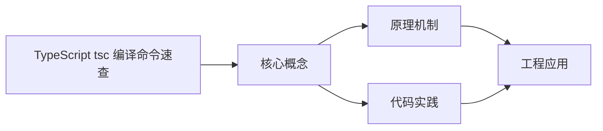
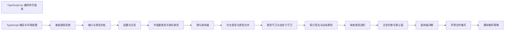

## 1. 学习目标（Bloom 分类）

本节按照布鲁姆教育目标分类学组织学习路径。本文主题为《TypeScript tsc 编译命令速查》，属于 TypeScript 模块，读者可以根据自身阶段选择阅读深度。

记忆层面：能够准确复述本文的核心概念、术语与基本语法或操作步骤，并能够在提问或检索时快速定位对应知识点。能够说出 TS 的类型注解、接口、联合类型、泛型与枚举语法。

理解层面：能够用自己的语言解释核心原理与工作机制，说明概念之间的因果关系，而不是机械记忆结论。能够解释类型系统（结构类型、类型收窄、类型体操）与编译机制。

应用层面：能够在真实项目或练习场景中运用本文知识解决具体问题，写出正确且可维护的实现。能够编写类型安全的函数、类与泛型工具。

分析层面：能够拆解复杂问题，比较本文主题与相邻概念的异同，识别边界条件与例外情况。能够分析类型推断、声明合并与模块解析。

评价层面：能够根据约束条件（性能、可读性、安全、成本）评价不同方案的优劣，做出有依据的技术决策。能够评价 TS 与 JS、其他静态语言的设计差异。

创造层面：能够把本文知识与其他模块知识组合，设计出新的解决方案或可复用的工程模式。能够设计大型项目的类型体系与工程配置。

通过本节学习，读者应当能够把《TypeScript tsc 编译命令速查》纳入自己的知识网络，并与 TypeScript 模块的其他主题（类型系统、泛型、工具类型、编译配置）建立关联。

## 2. 历史动机与发展脉络

《TypeScript tsc 编译命令速查》是 TypeScript 领域的重要主题。要真正理解它，需要先了解它解决的问题与演进过程。

TypeScript 由 Anders Hejlsberg 团队于 2012 年发布，定位是 JavaScript 的超集：保留 JS 生态，增加静态类型与编译期检查。
TS 的编译目标覆盖 ES3 到 ES2022+，配合 tsconfig 的严格模式（strict）成为行业标准；2019 年起主流框架（Vue 3、React、Angular）默认 TS。
类型系统持续演进：条件类型、映射类型、模板字面量类型、const 类型参数与 satisfies 操作符；tsc 之外，Vite/ESBuild 用 esbuild 转译加速开发。

回到本文主题：TypeScript tsc 编译命令速查 的提出与成熟，正是上述技术背景下的必然产物。早期实现往往以简单可用为目标，随着工程规模扩大，社区逐渐沉淀出标准做法与最佳实践；理解这一脉络，可以帮助读者判断“为什么文档中的推荐写法是现在这个样子”，也能在遇到历史遗留代码时准确识别其设计年代与取舍。


## 3. 形式化定义与核心概念精讲

本节把《TypeScript tsc 编译命令速查》涉及的核心概念以“定义 + 讲解”的形式展开。读者应把定义当作工具，把讲解当作理解路径；两者结合才能形成可迁移的知识。

结构类型：TS 的类型兼容基于结构（成员）而非名义；多余属性检查在对象字面量处执行。
类型收窄：typeof、instanceof、in、判别联合与谓词函数（is）让联合类型逐步收窄。
泛型：类型参数 + 约束（extends）实现复用；工具类型（Partial、Pick、Record、ReturnType）基于映射与条件类型。

### 3.1 原文章节逐一精讲

原文档把主题拆分为 11 个小节，下面按顺序给出每一节的导读讲解，随后保留原文细节供精读。

#### 原文精读（完整保留）

# TypeScript tsc 编译命令速查

> **符号约定**：`< >` 必填参数 | `[ ]` 可选参数

---

#### 基础编译

**基本写法：编译文件**
`tsc <文件.ts> [选项]`
```bash
# 编译为同名 js
tsc main.ts
tsc src/*.ts
```

---

**基本写法：编译并输出**
`tsc <文件> --outFile <输出>`
```bash
# 合并输出单文件
tsc a.ts b.ts --outFile bundle.js
# 指定输出目录
tsc src/*.ts --outDir dist
```

---

#### 项目与配置

**基本写法：按 tsconfig 编译**
`tsc -p <路径>`
```bash
# 使用指定配置文件
tsc -p tsconfig.json
tsc -p ./packages/core
```

---

**基本写法：生成配置文件**
`tsc --init`
```bash
# 生成默认 tsconfig.json
tsc --init
# 仅生成目标为特定版本
tsc --init --target ES2022 --module NodeNext
```

---

#### 类型检查模式

**基本写法：只检查不输出**
`tsc --noEmit`
```bash
# CI 常用，仅做类型检查
tsc --noEmit
tsc -p . --noEmit
```

---

**基本写法：监听变更**
`tsc -w`
```bash
# 增量监听重编译
tsc -w
tsc -p . --watch --preserveWatchOutput
```

---

#### 模块与目标

**基本写法：指定模块系统**
`tsc --module <值>`
```bash
# ES 模块 / CommonJS / NodeNext 等
tsc --module ES2022
tsc --module NodeNext
tsc --module CommonJS
```

---

**基本写法：指定目标版本**
`tsc --target <值>`
```bash
# 编译降级目标
tsc --target ES2020
tsc --target ESNext
```

---

**基本写法：模块解析策略**
`tsc --moduleResolution <值>`
```bash
# Node10 / NodeNext / Bundler / Classic
tsc --moduleResolution Bundler
tsc --moduleResolution NodeNext
```

---

#### 严格模式

**基本写法：开启全部严格**
`tsc --strict`
```bash
# 等价于一组严格选项
tsc --strict
```

---

**基本写法：单项严格选项**
`tsc --<选项>`
```bash
# 各项严格检查
tsc --noImplicitAny
tsc --strictNullChecks
tsc --strictFunctionTypes
tsc --strictBindCallApply
tsc --strictPropertyInitialization
tsc --noImplicitThis
tsc --alwaysStrict
tsc --useUnknownInCatchVariables
```

---

#### 路径与导出

**基本写法：基础路径映射**
`tsconfig: "baseUrl": ".", "paths": { "@/*": ["src/*"] }`
```json
{
  "compilerOptions": {
    "baseUrl": ".",
    "paths": {
      "@/*": ["src/*"],
      "@core/*": ["packages/core/*"]
    }
  }
}
```

---

**基本写法：声明文件输出**
`tsc --declaration`
```bash
# 生成 .d.ts 类型声明
tsc --declaration
tsc --declaration --emitDeclarationOnly
tsc --declarationDir types
```

---

#### 常用输出控制

**基本写法：sourceMap 与导出**
`tsc --<选项>`
```bash
# 生成 source map
tsc --sourceMap
# 仅生成类型不生成 js
tsc --emitDeclarationOnly
# 不生成注释
tsc --removeComments
# 保留 import 断言
tsc --verbatimModuleSyntax
```

---

#### JSX 与库

**基本写法：JSX 支持**
`tsc --jsx <值>`
```bash
# react / react-jsx / preserve / react-native
tsc --jsx react-jsx
```

---

**基本写法：引入 lib**
`tsconfig: "lib": ["<库>"]`
```json
{
  "compilerOptions": {
    "lib": ["ES2022", "DOM", "DOM.Iterable"]
  }
}
```

---

#### 增量构建

**基本写法：增量编译**
`tsc --incremental`
```bash
# 缓存到 .tsbuildinfo 加速
tsc --incremental
tsc --incremental --tsBuildInfoFile ./.cache/info
```

---

#### 命令行诊断

**基本写法：显示版本与原因**
`tsc --version` | `tsc --explainFiles`
```bash
tsc -v                       # 版本
tsc --listFiles              # 列出所有参与编译文件
tsc --explainFiles           # 解释为何包含某文件
tsc --showConfig             # 展开继承后的最终配置
```

---

#### 监听与项目引用

**基本写法：项目引用**
`tsconfig: "references": [{ "path": "./shared" }]`
```json
{
  "references": [{ "path": "./packages/shared" }]
}
```

---

**基本写法：构建引用项目**
`tsc -b [--dry]`
```bash
# 增量构建依赖项目
tsc -b
tsc -b --dry       # 模拟不写盘
tsc -b --clean     # 清理构建产物
tsc -b --force     # 强制全量构建
```

---

### 3.2 概念关系图

下面用 Mermaid 图表达本文核心概念之间的关系，帮助读者建立整体图景：



图中展示的是本文知识的结构化关系：核心概念是入口，原理机制解释“为什么”，代码实践演示“怎么做”，工程应用回答“何时用”。读者学习时可以把每个小节的内容挂接到对应节点上。

## 4. 理论推导与原理解析

本节深入《TypeScript tsc 编译命令速查》背后的原理。理论部分不求面面俱到，而是聚焦“能解释现象、能指导实践”的关键推导。

结构类型：TS 的类型兼容基于结构（成员）而非名义；多余属性检查在对象字面量处执行。
类型收窄：typeof、instanceof、in、判别联合与谓词函数（is）让联合类型逐步收窄。
泛型：类型参数 + 约束（extends）实现复用；工具类型（Partial、Pick、Record、ReturnType）基于映射与条件类型。
声明与编译：.ts 编译为 .js；类型声明（.d.ts）描述 JS 库；tsconfig 的 strict、moduleResolution、target 决定行为。

需要强调的是，理论推导与工程实践之间存在翻译层：理论给出的是理想化模型与边界条件，工程代码则必须处理真实环境中的例外。读者在学习时应先掌握理论的“标准情形”，再通过陷阱章节了解“非标准情形”。

## 5. 代码示例与逐行讲解

本节把原文中的代码示例系统整理，并为每个示例补充用途说明与讲解。读者不应只浏览代码，而应逐段对照讲解理解设计意图。

### 5.1 示例：基础编译

该示例来自原文《基础编译》小节，用于演示TypeScript tsc 编译命令速查相关操作。阅读时请先看代码结构，再看其后的讲解。

```bash
# 编译为同名 js
tsc main.ts
tsc src/*.ts
```

讲解：这段代码演示了本节核心知识点。代码中的关键操作可以归纳为三步：准备（定义或初始化）、执行（核心逻辑）、收尾（释放资源或返回结果）。实际项目中，这三步往往被封装为函数或类，以提升复用性与可测试性。

关键点分析：

该示例共 3 行有效代码，结构以数据或配置为主。阅读时应关注：数据字段的含义、配置项的作用，以及它们与运行行为的对应关系。

进阶思考路径：先尝试修改参数观察行为变化，再把示例中的模式迁移到自己的项目中；每次修改都记录预期与实测差异，这是把示例转化为能力的最快方式。

### 5.2 示例：基础编译

该示例来自原文《基础编译》小节，用于演示TypeScript tsc 编译命令速查相关操作。阅读时请先看代码结构，再看其后的讲解。

```bash
# 合并输出单文件
tsc a.ts b.ts --outFile bundle.js
# 指定输出目录
tsc src/*.ts --outDir dist
```

讲解：这段代码演示了本节核心知识点。代码中的关键操作可以归纳为三步：准备（定义或初始化）、执行（核心逻辑）、收尾（释放资源或返回结果）。实际项目中，这三步往往被封装为函数或类，以提升复用性与可测试性。

关键点分析：

该示例共 4 行有效代码，结构以数据或配置为主。阅读时应关注：数据字段的含义、配置项的作用，以及它们与运行行为的对应关系。

进阶思考路径：先尝试修改参数观察行为变化，再把示例中的模式迁移到自己的项目中；每次修改都记录预期与实测差异，这是把示例转化为能力的最快方式。

### 5.3 示例：项目与配置

该示例来自原文《项目与配置》小节，用于演示TypeScript tsc 编译命令速查相关操作。阅读时请先看代码结构，再看其后的讲解。

```bash
# 使用指定配置文件
tsc -p tsconfig.json
tsc -p ./packages/core
```

讲解：这段代码演示了本节核心知识点。代码中的关键操作可以归纳为三步：准备（定义或初始化）、执行（核心逻辑）、收尾（释放资源或返回结果）。实际项目中，这三步往往被封装为函数或类，以提升复用性与可测试性。

关键点分析：

该示例共 3 行有效代码，结构以数据或配置为主。阅读时应关注：数据字段的含义、配置项的作用，以及它们与运行行为的对应关系。

进阶思考路径：先尝试修改参数观察行为变化，再把示例中的模式迁移到自己的项目中；每次修改都记录预期与实测差异，这是把示例转化为能力的最快方式。

### 5.4 示例：项目与配置

该示例来自原文《项目与配置》小节，用于演示TypeScript tsc 编译命令速查相关操作。阅读时请先看代码结构，再看其后的讲解。

```bash
# 生成默认 tsconfig.json
tsc --init
# 仅生成目标为特定版本
tsc --init --target ES2022 --module NodeNext
```

讲解：这段代码演示了本节核心知识点。代码中的关键操作可以归纳为三步：准备（定义或初始化）、执行（核心逻辑）、收尾（释放资源或返回结果）。实际项目中，这三步往往被封装为函数或类，以提升复用性与可测试性。

关键点分析：

该示例共 4 行有效代码，结构以数据或配置为主。阅读时应关注：数据字段的含义、配置项的作用，以及它们与运行行为的对应关系。

进阶思考路径：先尝试修改参数观察行为变化，再把示例中的模式迁移到自己的项目中；每次修改都记录预期与实测差异，这是把示例转化为能力的最快方式。

### 5.5 示例：类型检查模式

该示例来自原文《类型检查模式》小节，用于演示TypeScript tsc 编译命令速查相关操作。阅读时请先看代码结构，再看其后的讲解。

```bash
# CI 常用，仅做类型检查
tsc --noEmit
tsc -p . --noEmit
```

讲解：这段代码演示了本节核心知识点。代码中的关键操作可以归纳为三步：准备（定义或初始化）、执行（核心逻辑）、收尾（释放资源或返回结果）。实际项目中，这三步往往被封装为函数或类，以提升复用性与可测试性。

关键点分析：

该示例共 3 行有效代码，结构以数据或配置为主。阅读时应关注：数据字段的含义、配置项的作用，以及它们与运行行为的对应关系。

进阶思考路径：先尝试修改参数观察行为变化，再把示例中的模式迁移到自己的项目中；每次修改都记录预期与实测差异，这是把示例转化为能力的最快方式。

### 5.6 示例：类型检查模式

该示例来自原文《类型检查模式》小节，用于演示TypeScript tsc 编译命令速查相关操作。阅读时请先看代码结构，再看其后的讲解。

```bash
# 增量监听重编译
tsc -w
tsc -p . --watch --preserveWatchOutput
```

讲解：这段代码演示了本节核心知识点。代码中的关键操作可以归纳为三步：准备（定义或初始化）、执行（核心逻辑）、收尾（释放资源或返回结果）。实际项目中，这三步往往被封装为函数或类，以提升复用性与可测试性。

关键点分析：

该示例共 3 行有效代码，结构以数据或配置为主。阅读时应关注：数据字段的含义、配置项的作用，以及它们与运行行为的对应关系。

进阶思考路径：先尝试修改参数观察行为变化，再把示例中的模式迁移到自己的项目中；每次修改都记录预期与实测差异，这是把示例转化为能力的最快方式。

### 5.7 示例：模块与目标

该示例来自原文《模块与目标》小节，用于演示TypeScript tsc 编译命令速查相关操作。阅读时请先看代码结构，再看其后的讲解。

```bash
# ES 模块 / CommonJS / NodeNext 等
tsc --module ES2022
tsc --module NodeNext
tsc --module CommonJS
```

讲解：这段代码演示了本节核心知识点。代码中的关键操作可以归纳为三步：准备（定义或初始化）、执行（核心逻辑）、收尾（释放资源或返回结果）。实际项目中，这三步往往被封装为函数或类，以提升复用性与可测试性。

关键点分析：

该示例共 4 行有效代码，结构以数据或配置为主。阅读时应关注：数据字段的含义、配置项的作用，以及它们与运行行为的对应关系。

进阶思考路径：先尝试修改参数观察行为变化，再把示例中的模式迁移到自己的项目中；每次修改都记录预期与实测差异，这是把示例转化为能力的最快方式。

### 5.8 示例：模块与目标

该示例来自原文《模块与目标》小节，用于演示TypeScript tsc 编译命令速查相关操作。阅读时请先看代码结构，再看其后的讲解。

```bash
# 编译降级目标
tsc --target ES2020
tsc --target ESNext
```

讲解：这段代码演示了本节核心知识点。代码中的关键操作可以归纳为三步：准备（定义或初始化）、执行（核心逻辑）、收尾（释放资源或返回结果）。实际项目中，这三步往往被封装为函数或类，以提升复用性与可测试性。

关键点分析：

该示例共 3 行有效代码，结构以数据或配置为主。阅读时应关注：数据字段的含义、配置项的作用，以及它们与运行行为的对应关系。

进阶思考路径：先尝试修改参数观察行为变化，再把示例中的模式迁移到自己的项目中；每次修改都记录预期与实测差异，这是把示例转化为能力的最快方式。

### 5.9 示例：模块与目标

该示例来自原文《模块与目标》小节，用于演示TypeScript tsc 编译命令速查相关操作。阅读时请先看代码结构，再看其后的讲解。

```bash
# Node10 / NodeNext / Bundler / Classic
tsc --moduleResolution Bundler
tsc --moduleResolution NodeNext
```

讲解：这段代码演示了本节核心知识点。代码中的关键操作可以归纳为三步：准备（定义或初始化）、执行（核心逻辑）、收尾（释放资源或返回结果）。实际项目中，这三步往往被封装为函数或类，以提升复用性与可测试性。

关键点分析：

该示例共 3 行有效代码，结构以数据或配置为主。阅读时应关注：数据字段的含义、配置项的作用，以及它们与运行行为的对应关系。

进阶思考路径：先尝试修改参数观察行为变化，再把示例中的模式迁移到自己的项目中；每次修改都记录预期与实测差异，这是把示例转化为能力的最快方式。

### 5.10 示例：严格模式

该示例来自原文《严格模式》小节，用于演示TypeScript tsc 编译命令速查相关操作。阅读时请先看代码结构，再看其后的讲解。

```bash
# 等价于一组严格选项
tsc --strict
```

讲解：这段代码演示了本节核心知识点。代码中的关键操作可以归纳为三步：准备（定义或初始化）、执行（核心逻辑）、收尾（释放资源或返回结果）。实际项目中，这三步往往被封装为函数或类，以提升复用性与可测试性。

关键点分析：

该示例共 2 行有效代码，结构以数据或配置为主。阅读时应关注：数据字段的含义、配置项的作用，以及它们与运行行为的对应关系。

进阶思考路径：先尝试修改参数观察行为变化，再把示例中的模式迁移到自己的项目中；每次修改都记录预期与实测差异，这是把示例转化为能力的最快方式。

### 5.11 示例：严格模式

该示例来自原文《严格模式》小节，用于演示TypeScript tsc 编译命令速查相关操作。阅读时请先看代码结构，再看其后的讲解。

```bash
# 各项严格检查
tsc --noImplicitAny
tsc --strictNullChecks
tsc --strictFunctionTypes
tsc --strictBindCallApply
tsc --strictPropertyInitialization
tsc --noImplicitThis
tsc --alwaysStrict
tsc --useUnknownInCatchVariables
```

讲解：这段代码演示了本节核心知识点。代码中的关键操作可以归纳为三步：准备（定义或初始化）、执行（核心逻辑）、收尾（释放资源或返回结果）。实际项目中，这三步往往被封装为函数或类，以提升复用性与可测试性。

关键点分析：

该示例共 9 行有效代码，结构以数据或配置为主。阅读时应关注：数据字段的含义、配置项的作用，以及它们与运行行为的对应关系。

进阶思考路径：先尝试修改参数观察行为变化，再把示例中的模式迁移到自己的项目中；每次修改都记录预期与实测差异，这是把示例转化为能力的最快方式。

### 5.12 示例：路径与导出

该示例来自原文《路径与导出》小节，用于演示TypeScript tsc 编译命令速查相关操作。阅读时请先看代码结构，再看其后的讲解。

```json
{
  "compilerOptions": {
    "baseUrl": ".",
    "paths": {
      "@/*": ["src/*"],
      "@core/*": ["packages/core/*"]
    }
  }
}
```

讲解：这段代码演示了本节核心知识点。代码中的关键操作可以归纳为三步：准备（定义或初始化）、执行（核心逻辑）、收尾（释放资源或返回结果）。实际项目中，这三步往往被封装为函数或类，以提升复用性与可测试性。

关键点分析：

该示例共 9 行有效代码，结构以数据或配置为主。阅读时应关注：数据字段的含义、配置项的作用，以及它们与运行行为的对应关系。

进阶思考路径：先尝试修改参数观察行为变化，再把示例中的模式迁移到自己的项目中；每次修改都记录预期与实测差异，这是把示例转化为能力的最快方式。

### 5.13 示例：路径与导出

该示例来自原文《路径与导出》小节，用于演示TypeScript tsc 编译命令速查相关操作。阅读时请先看代码结构，再看其后的讲解。

```bash
# 生成 .d.ts 类型声明
tsc --declaration
tsc --declaration --emitDeclarationOnly
tsc --declarationDir types
```

讲解：这段代码演示了本节核心知识点。代码中的关键操作可以归纳为三步：准备（定义或初始化）、执行（核心逻辑）、收尾（释放资源或返回结果）。实际项目中，这三步往往被封装为函数或类，以提升复用性与可测试性。

关键点分析：

该示例共 4 行有效代码，结构以数据或配置为主。阅读时应关注：数据字段的含义、配置项的作用，以及它们与运行行为的对应关系。

进阶思考路径：先尝试修改参数观察行为变化，再把示例中的模式迁移到自己的项目中；每次修改都记录预期与实测差异，这是把示例转化为能力的最快方式。

### 5.14 示例：常用输出控制

该示例来自原文《常用输出控制》小节，用于演示TypeScript tsc 编译命令速查相关操作。阅读时请先看代码结构，再看其后的讲解。

```bash
# 生成 source map
tsc --sourceMap
# 仅生成类型不生成 js
tsc --emitDeclarationOnly
# 不生成注释
tsc --removeComments
# 保留 import 断言
tsc --verbatimModuleSyntax
```

讲解：这段代码演示了本节核心知识点。代码中的关键操作可以归纳为三步：准备（定义或初始化）、执行（核心逻辑）、收尾（释放资源或返回结果）。实际项目中，这三步往往被封装为函数或类，以提升复用性与可测试性。

关键点分析：

该示例共 8 行有效代码，包含 1 类关键结构（import）。其中：

- 入口与初始化部分负责建立上下文，对应实际项目中的启动或装配逻辑；
- 核心逻辑部分体现本文主题的主要操作，是阅读时最需要对照讲解理解的部分；
- 输出或返回部分把结果交给调用方，注意其类型与边界条件。

进阶思考路径：先尝试修改参数观察行为变化，再把示例中的模式迁移到自己的项目中；每次修改都记录预期与实测差异，这是把示例转化为能力的最快方式。

### 5.15 示例：JSX 与库

该示例来自原文《JSX 与库》小节，用于演示TypeScript tsc 编译命令速查相关操作。阅读时请先看代码结构，再看其后的讲解。

```bash
# react / react-jsx / preserve / react-native
tsc --jsx react-jsx
```

讲解：这段代码演示了本节核心知识点。代码中的关键操作可以归纳为三步：准备（定义或初始化）、执行（核心逻辑）、收尾（释放资源或返回结果）。实际项目中，这三步往往被封装为函数或类，以提升复用性与可测试性。

关键点分析：

该示例共 2 行有效代码，结构以数据或配置为主。阅读时应关注：数据字段的含义、配置项的作用，以及它们与运行行为的对应关系。

进阶思考路径：先尝试修改参数观察行为变化，再把示例中的模式迁移到自己的项目中；每次修改都记录预期与实测差异，这是把示例转化为能力的最快方式。

### 5.16 示例：JSX 与库

该示例来自原文《JSX 与库》小节，用于演示TypeScript tsc 编译命令速查相关操作。阅读时请先看代码结构，再看其后的讲解。

```json
{
  "compilerOptions": {
    "lib": ["ES2022", "DOM", "DOM.Iterable"]
  }
}
```

讲解：这段代码演示了本节核心知识点。代码中的关键操作可以归纳为三步：准备（定义或初始化）、执行（核心逻辑）、收尾（释放资源或返回结果）。实际项目中，这三步往往被封装为函数或类，以提升复用性与可测试性。

关键点分析：

该示例共 5 行有效代码，结构以数据或配置为主。阅读时应关注：数据字段的含义、配置项的作用，以及它们与运行行为的对应关系。

进阶思考路径：先尝试修改参数观察行为变化，再把示例中的模式迁移到自己的项目中；每次修改都记录预期与实测差异，这是把示例转化为能力的最快方式。

### 5.17 示例：增量构建

该示例来自原文《增量构建》小节，用于演示TypeScript tsc 编译命令速查相关操作。阅读时请先看代码结构，再看其后的讲解。

```bash
# 缓存到 .tsbuildinfo 加速
tsc --incremental
tsc --incremental --tsBuildInfoFile ./.cache/info
```

讲解：这段代码演示了本节核心知识点。代码中的关键操作可以归纳为三步：准备（定义或初始化）、执行（核心逻辑）、收尾（释放资源或返回结果）。实际项目中，这三步往往被封装为函数或类，以提升复用性与可测试性。

关键点分析：

该示例共 3 行有效代码，结构以数据或配置为主。阅读时应关注：数据字段的含义、配置项的作用，以及它们与运行行为的对应关系。

进阶思考路径：先尝试修改参数观察行为变化，再把示例中的模式迁移到自己的项目中；每次修改都记录预期与实测差异，这是把示例转化为能力的最快方式。

### 5.18 示例：命令行诊断

该示例来自原文《命令行诊断》小节，用于演示TypeScript tsc 编译命令速查相关操作。阅读时请先看代码结构，再看其后的讲解。

```bash
tsc -v                       # 版本
tsc --listFiles              # 列出所有参与编译文件
tsc --explainFiles           # 解释为何包含某文件
tsc --showConfig             # 展开继承后的最终配置
```

讲解：这段代码演示了本节核心知识点。代码中的关键操作可以归纳为三步：准备（定义或初始化）、执行（核心逻辑）、收尾（释放资源或返回结果）。实际项目中，这三步往往被封装为函数或类，以提升复用性与可测试性。

关键点分析：

该示例共 4 行有效代码，结构以数据或配置为主。阅读时应关注：数据字段的含义、配置项的作用，以及它们与运行行为的对应关系。

进阶思考路径：先尝试修改参数观察行为变化，再把示例中的模式迁移到自己的项目中；每次修改都记录预期与实测差异，这是把示例转化为能力的最快方式。

### 5.19 示例：监听与项目引用

该示例来自原文《监听与项目引用》小节，用于演示TypeScript tsc 编译命令速查相关操作。阅读时请先看代码结构，再看其后的讲解。

```json
{
  "references": [{ "path": "./packages/shared" }]
}
```

讲解：这段代码演示了本节核心知识点。代码中的关键操作可以归纳为三步：准备（定义或初始化）、执行（核心逻辑）、收尾（释放资源或返回结果）。实际项目中，这三步往往被封装为函数或类，以提升复用性与可测试性。

关键点分析：

该示例共 3 行有效代码，结构以数据或配置为主。阅读时应关注：数据字段的含义、配置项的作用，以及它们与运行行为的对应关系。

进阶思考路径：先尝试修改参数观察行为变化，再把示例中的模式迁移到自己的项目中；每次修改都记录预期与实测差异，这是把示例转化为能力的最快方式。

### 5.20 示例：监听与项目引用

该示例来自原文《监听与项目引用》小节，用于演示TypeScript tsc 编译命令速查相关操作。阅读时请先看代码结构，再看其后的讲解。

```bash
# 增量构建依赖项目
tsc -b
tsc -b --dry       # 模拟不写盘
tsc -b --clean     # 清理构建产物
tsc -b --force     # 强制全量构建
```

讲解：这段代码演示了本节核心知识点。代码中的关键操作可以归纳为三步：准备（定义或初始化）、执行（核心逻辑）、收尾（释放资源或返回结果）。实际项目中，这三步往往被封装为函数或类，以提升复用性与可测试性。

关键点分析：

该示例共 5 行有效代码，结构以数据或配置为主。阅读时应关注：数据字段的含义、配置项的作用，以及它们与运行行为的对应关系。

进阶思考路径：先尝试修改参数观察行为变化，再把示例中的模式迁移到自己的项目中；每次修改都记录预期与实测差异，这是把示例转化为能力的最快方式。


综合以上示例，可以总结出本主题的代码实践要点：第一，先定义清晰的输入输出契约；第二，核心逻辑保持单一职责；第三，错误处理与边界条件不可省略；第四，命名与注释表达意图而非复述代码。

## 6. 对比分析

对比是理解《TypeScript tsc 编译命令速查》定位的最快路径。下面从多个维度与相邻方案进行对比。

TS 与 JS：TS 是 JS 超集，新增类型层；迁移渐进可行（allowJs/checkJs）。
TS 与 Java：TS 结构类型灵活，Java 名义类型严格；TS 面向 JS 生态。
tsc 与 esbuild/swc：tsc 全量类型检查；esbuild 快速转译不做类型检查，两者配合使用。

对比的目的不是分出绝对优劣，而是建立选择依据：不同约束条件下，最优解不同。读者应把每个对比维度转化为决策检查清单。

## 7. 常见陷阱与最佳实践

本节整理该主题的高频错误与推荐做法。每个陷阱先描述现象，再解释原因，最后给出最佳实践。

### 7.1 any 滥用

any 使类型检查失效。用 unknown + 收窄，或明确设计类型。

深入讲解：该问题之所以被归类为“常见陷阱”，是因为它在初学者的代码中反复出现，而且往往不在第一时间暴露——错误通常隐藏在特定数据或特定时序下。

从成因上看，any 滥用 一般源于对 TypeScript 某个机制的理解偏差：要么误用了默认行为，要么忽略了边界条件，要么把其他语言的思维惯性带了过来。

从影响上看，any 滥用 轻则产生错误结果，重则导致资源泄漏、数据损坏或安全事故；这也是为什么工程评审中会把它列为检查项。

从修复策略上看，处理any 滥用的正确顺序是：先复现（构造最小用例），再定位（确认机制层面的根因），最后修复并补充回归测试。跳过复现直接改代码，往往治标不治本。

### 7.2 非空断言过量

! 掩盖空值风险。用可选链与显式检查。

深入讲解：该问题之所以被归类为“常见陷阱”，是因为它在初学者的代码中反复出现，而且往往不在第一时间暴露——错误通常隐藏在特定数据或特定时序下。

从成因上看，非空断言过量 一般源于对 TypeScript 某个机制的理解偏差：要么误用了默认行为，要么忽略了边界条件，要么把其他语言的思维惯性带了过来。

从影响上看，非空断言过量 轻则产生错误结果，重则导致资源泄漏、数据损坏或安全事故；这也是为什么工程评审中会把它列为检查项。

从修复策略上看，处理非空断言过量的正确顺序是：先复现（构造最小用例），再定位（确认机制层面的根因），最后修复并补充回归测试。跳过复现直接改代码，往往治标不治本。

### 7.3 类型收窄失效

属性访问后联合类型丢失。用判别联合或保存局部变量。

深入讲解：该问题之所以被归类为“常见陷阱”，是因为它在初学者的代码中反复出现，而且往往不在第一时间暴露——错误通常隐藏在特定数据或特定时序下。

从成因上看，类型收窄失效 一般源于对 TypeScript 某个机制的理解偏差：要么误用了默认行为，要么忽略了边界条件，要么把其他语言的思维惯性带了过来。

从影响上看，类型收窄失效 轻则产生错误结果，重则导致资源泄漏、数据损坏或安全事故；这也是为什么工程评审中会把它列为检查项。

从修复策略上看，处理类型收窄失效的正确顺序是：先复现（构造最小用例），再定位（确认机制层面的根因），最后修复并补充回归测试。跳过复现直接改代码，往往治标不治本。

### 7.4 interface 与 type 混用

两者能力差异（合并、映射）。统一团队规范。

深入讲解：该问题之所以被归类为“常见陷阱”，是因为它在初学者的代码中反复出现，而且往往不在第一时间暴露——错误通常隐藏在特定数据或特定时序下。

从成因上看，interface 与 type 混用 一般源于对 TypeScript 某个机制的理解偏差：要么误用了默认行为，要么忽略了边界条件，要么把其他语言的思维惯性带了过来。

从影响上看，interface 与 type 混用 轻则产生错误结果，重则导致资源泄漏、数据损坏或安全事故；这也是为什么工程评审中会把它列为检查项。

从修复策略上看，处理interface 与 type 混用的正确顺序是：先复现（构造最小用例），再定位（确认机制层面的根因），最后修复并补充回归测试。跳过复现直接改代码，往往治标不治本。

### 7.5 枚举数值反推

数字枚举可被任意数值赋值。优先字符串枚举或 const 对象。

深入讲解：该问题之所以被归类为“常见陷阱”，是因为它在初学者的代码中反复出现，而且往往不在第一时间暴露——错误通常隐藏在特定数据或特定时序下。

从成因上看，枚举数值反推 一般源于对 TypeScript 某个机制的理解偏差：要么误用了默认行为，要么忽略了边界条件，要么把其他语言的思维惯性带了过来。

从影响上看，枚举数值反推 轻则产生错误结果，重则导致资源泄漏、数据损坏或安全事故；这也是为什么工程评审中会把它列为检查项。

从修复策略上看，处理枚举数值反推的正确顺序是：先复现（构造最小用例），再定位（确认机制层面的根因），最后修复并补充回归测试。跳过复现直接改代码，往往治标不治本。

### 7.6 tsconfig 宽松

strict 关闭导致检查形同虚设。新项目 strict: true。

深入讲解：该问题之所以被归类为“常见陷阱”，是因为它在初学者的代码中反复出现，而且往往不在第一时间暴露——错误通常隐藏在特定数据或特定时序下。

从成因上看，tsconfig 宽松 一般源于对 TypeScript 某个机制的理解偏差：要么误用了默认行为，要么忽略了边界条件，要么把其他语言的思维惯性带了过来。

从影响上看，tsconfig 宽松 轻则产生错误结果，重则导致资源泄漏、数据损坏或安全事故；这也是为什么工程评审中会把它列为检查项。

从修复策略上看，处理tsconfig 宽松的正确顺序是：先复现（构造最小用例），再定位（确认机制层面的根因），最后修复并补充回归测试。跳过复现直接改代码，往往治标不治本。

### 7.7 import type 混淆

运行时导入类型导致产物膨胀。使用 import type 或 verbatimModuleSyntax。

深入讲解：该问题之所以被归类为“常见陷阱”，是因为它在初学者的代码中反复出现，而且往往不在第一时间暴露——错误通常隐藏在特定数据或特定时序下。

从成因上看，import type 混淆 一般源于对 TypeScript 某个机制的理解偏差：要么误用了默认行为，要么忽略了边界条件，要么把其他语言的思维惯性带了过来。

从影响上看，import type 混淆 轻则产生错误结果，重则导致资源泄漏、数据损坏或安全事故；这也是为什么工程评审中会把它列为检查项。

从修复策略上看，处理import type 混淆的正确顺序是：先复现（构造最小用例），再定位（确认机制层面的根因），最后修复并补充回归测试。跳过复现直接改代码，往往治标不治本。

### 7.8 类型体操过度

复杂类型影响可读性与编译速度。优先简单类型 + 注释。

深入讲解：该问题之所以被归类为“常见陷阱”，是因为它在初学者的代码中反复出现，而且往往不在第一时间暴露——错误通常隐藏在特定数据或特定时序下。

从成因上看，类型体操过度 一般源于对 TypeScript 某个机制的理解偏差：要么误用了默认行为，要么忽略了边界条件，要么把其他语言的思维惯性带了过来。

从影响上看，类型体操过度 轻则产生错误结果，重则导致资源泄漏、数据损坏或安全事故；这也是为什么工程评审中会把它列为检查项。

从修复策略上看，处理类型体操过度的正确顺序是：先复现（构造最小用例），再定位（确认机制层面的根因），最后修复并补充回归测试。跳过复现直接改代码，往往治标不治本。

### 7.0 最佳实践总览

1. tsconfig strict 模式 + noUncheckedIndexedAccess。
2. 业务代码类型显式，边界使用 zod 校验运行时数据。
3. 工具类型封装复用，避免重复。
4. CI 运行 tsc --noEmit 与 ESLint。
5. 第三方库无类型时写最小 .d.ts。

把这些最佳实践固化为团队规范与代码评审检查项，是避免同类问题反复出现的关键。

## 8. 工程实践

本节把《TypeScript tsc 编译命令速查》放入真实工程场景，给出可复用的模式与组织方法。

项目配置：tsconfig 分层（base/app/node）；paths 别名；declaration 输出库类型。
类型安全 API：zod 校验请求体，推断类型（z.infer）。
前端类型共享：monorepo 中 shared 包导出 API 类型，前后端共用。
质量门禁：typecheck、lint、单元测试在 CI 强制。

### 8.1 工程实践的原则拆解

以上工程实践可以归纳为四条原则。第一，配置与代码分离：TypeScript 项目中环境差异应通过配置注入，而不是散落在代码分支中；这保证同一份代码可以在开发、测试、生产环境一致运行。

第二，接口稳定优先：对外接口（函数签名、协议、数据格式）一旦被消费方依赖，变更成本极高；设计时应预留扩展点并保持向后兼容。

第三，可观测性内置：日志、指标与追踪应该在功能开发时同步设计，而不是故障发生后补救；没有观测手段的模块等于黑盒。

第四，变更可回滚：任何发布都应有对应的回滚方案；数据库迁移、配置变更与代码发布一样需要版本管理与逆向路径。

### 8.2 实践落地的检查清单

- [ ] 项目配置：对照本节描述，检查当前项目是否已经落实；未落实的项列入技术债并排期处理。
- [ ] 类型安全 API：对照本节描述，检查当前项目是否已经落实；未落实的项列入技术债并排期处理。
- [ ] 前端类型共享：对照本节描述，检查当前项目是否已经落实；未落实的项列入技术债并排期处理。
- [ ] 质量门禁：对照本节描述，检查当前项目是否已经落实；未落实的项列入技术债并排期处理。

工程实践的共性原则：配置与代码分离、接口稳定优先、可观测性内置、变更可回滚。这些原则适用于本主题的所有实现。

## 9. 案例研究

本节通过一个完整案例把《TypeScript tsc 编译命令速查》的知识串起来。案例按“需求分析、方案设计、实现、验证”四步展开。

需求：为前端请求层实现类型安全封装。
方案：泛型 request 函数 + zod schema 校验 + 错误统一。
要点：响应类型由 schema 推断；网络错误与业务错误区分；取消支持。
验证：类型测试（tsd）与单元测试覆盖。

### 9.1 案例的扩展讨论

把案例中的方案放大到真实规模，需要额外考虑三个问题：

第一，规模：当数据量或并发量上升一个数量级时，原方案中的数据结构、缓存策略与任务调度是否仍然成立？通常需要引入分层与异步。

第二，团队：多人协作时，模块边界、接口契约与代码所有权必须明确；案例中的实现应拆分为可独立测试的单元，并配合文档说明设计意图。

第三，演进：上线后的需求变化不可避免；方案设计时应预留扩展点（配置化、插件化、事件化），并定期用真实指标验证假设。


案例研究的学习方法：先独立阅读需求，尝试在脑中形成方案，再对照实现与讲解，最后思考“如果约束变化（数据量、并发、团队规模），方案应如何调整”。

## 10. 知识要点总结与深入讲解

本节以讲解形式汇总全文要点，替代传统的习题与自测，读者不需要答题，只需跟随解释建立完整的认知框架。

关于《TypeScript tsc 编译命令速查》的核心结论：

TS 的价值是“把错误留在编译期”：类型即文档，重构更安全。
strict 与类型收窄是日常武器，工具类型是进阶工具。
运行时校验（zod）与静态类型互补，边界数据仍要防御。

原文档各小节的要点回顾：

- 基础编译：该小节围绕TypeScript tsc 编译命令速查展开具体细节，阅读时应关注其与核心结论的对应关系；每个小节都是核心结论在某一个侧面的展开。
- 项目与配置：该小节围绕TypeScript tsc 编译命令速查展开具体细节，阅读时应关注其与核心结论的对应关系；每个小节都是核心结论在某一个侧面的展开。
- 类型检查模式：该小节围绕TypeScript tsc 编译命令速查展开具体细节，阅读时应关注其与核心结论的对应关系；每个小节都是核心结论在某一个侧面的展开。
- 模块与目标：该小节围绕TypeScript tsc 编译命令速查展开具体细节，阅读时应关注其与核心结论的对应关系；每个小节都是核心结论在某一个侧面的展开。
- 严格模式：该小节围绕TypeScript tsc 编译命令速查展开具体细节，阅读时应关注其与核心结论的对应关系；每个小节都是核心结论在某一个侧面的展开。
- 路径与导出：该小节围绕TypeScript tsc 编译命令速查展开具体细节，阅读时应关注其与核心结论的对应关系；每个小节都是核心结论在某一个侧面的展开。
- 常用输出控制：该小节围绕TypeScript tsc 编译命令速查展开具体细节，阅读时应关注其与核心结论的对应关系；每个小节都是核心结论在某一个侧面的展开。
- JSX 与库：该小节围绕TypeScript tsc 编译命令速查展开具体细节，阅读时应关注其与核心结论的对应关系；每个小节都是核心结论在某一个侧面的展开。
- 增量构建：该小节围绕TypeScript tsc 编译命令速查展开具体细节，阅读时应关注其与核心结论的对应关系；每个小节都是核心结论在某一个侧面的展开。
- 命令行诊断：该小节围绕TypeScript tsc 编译命令速查展开具体细节，阅读时应关注其与核心结论的对应关系；每个小节都是核心结论在某一个侧面的展开。
- 监听与项目引用：该小节围绕TypeScript tsc 编译命令速查展开具体细节，阅读时应关注其与核心结论的对应关系；每个小节都是核心结论在某一个侧面的展开。

把以上要点与第 3-9 节的内容对照复习，即可完成对本文主题的闭环学习。

## 11. 参考文献


TypeScript 官方文档：https://www.typescriptlang.org/docs/
TS 手册中文版：https://www.typescriptlang.org/zh/docs/handbook/
TypeScript 发布计划：https://github.com/microsoft/TypeScript/wiki/Roadmap
tsconfig 参考：https://www.typescriptlang.org/tsconfig/
Type Challenges：https://github.com/type-challenges/type-challenges

## 12. 延伸阅读


TS 基础类型与接口，见 009-typescript 模块文档。
TS 泛型与工具类型，见 009-typescript 模块进阶文档。
React + TS 组件类型，见 011-react 模块。
Vue3 + TS 组合式 API，见 010-vue3 模块。
尚硅谷 Bilibili 空间（https://space.bilibili.com/302417610 ）提供 TypeScript 课程。

## 14. 模块知识图谱与学习路径

本文属于 TypeScript 模块。为了把《TypeScript tsc 编译命令速查》放入完整的知识网络，下面列出本模块的全部主题并给出相互关联的导读。学习时建议按模块内顺序推进，并在每个文档中留意交叉引用。



上图为模块主题的推荐学习顺序示意图（仅展示前若干主题）。各主题之间存在三类关联：

第一，前置依赖关系：早期主题是后期主题的基础，例如环境与语法先行、进阶主题随后；

第二，横向并列关系：同一层级主题从不同角度覆盖模块能力，学习顺序可以按兴趣调整；

第三，工程组合关系：多个主题在真实项目中组合使用，例如配置、性能与安全主题往往出现在同一系统的不同层面。

### 14.1 模块主题速查表

| 文档 | 主题 | 与本文的关联 |
| --- | --- | --- |
| TypeScript 概述与环境配置 | 001-TypeScriptOverviewEnvSetup | 本文的前置基础 |
| 基础类型系统 | 002-BasicTypeSystem | 本文的前置基础 |
| 接口与类型别名 | 003-InterfaceTypeAlias | 本文的并列主题 |
| 函数与泛型 | 004-FunctionGeneric | 本文的并列主题 |
| 字面量类型与联合类型 | 005-LocalTypeInference | 本文的并列主题 |
| 类与装饰器 | 006-ClassDecorator | 本文的并列主题 |
| 交叉类型与类型合并 | 007-IntersectionTypeMerge | 本文的并列主题 |
| 类型守卫与自定义守卫 | 008-TypeGuardCustomGuard | 本文的并列主题 |
| 索引签名与动态属性 | 009-IndexSignatureDynamicProperty | 本文的并列主题 |
| 映射类型进阶 | 010-MappedTypeAdvanced | 本文的并列主题 |
| 泛型约束与默认值 | 011-GenericConstraintDefault | 本文的并列主题 |
| 装饰器详解 | 012-DecoratorDetailed | 本文的并列主题 |
| 声明文件编写 | 013-DeclarationFileWriting | 本文的并列主题 |
| 模块解析策略 | 014-ModuleResolutionInModernJavaScriptToolchains | 本文的并列主题 |
| 高级类型与类型演算 | 015-AdvancedTypeCalculus | 本文的并列主题 |
| 类型体操实用模式 | 016-OnTheComplexityOfTypeScriptTypeChecking | 本文的并列主题 |
| 协变与逆变 | 017-CovarianceContravariance | 本文的并列主题 |
| this类型与多态 | 018-ThisTypePolymorphism | 本文的并列主题 |
| 符号与唯一类型 | 019-OnTheRoleOfSymbolicExecutionInTypeSystems | 本文的并列主题 |
| 命名空间与模块 | 020-NamespaceModule | 本文的并列主题 |
| 枚举进阶 | 021-EnumAdvanced | 本文的并列主题 |
| 工具类型实现原理 | 022-UtilityTypePrinciple | 本文的原理深化 |
| 条件类型分发 | 023-ConditionalTypeDistribute | 本文的并列主题 |
| 类型推断infer扩展 | 024-ECMAScript2024LanguageSpecification | 本文的并列主题 |
| 递归类型与深度操作 | 025-RecursiveTypeDeepOperation | 本文的并列主题 |
| 条件类型与映射类型 | 026-ConditionalMappedType | 本文的并列主题 |
| TypeScript 类型声明与模块解析 | 027-TypeScriptTypeDeclarationModuleResolution | 本文的并列主题 |
| 类型安全的事件系统 | 028-PurelyFunctionalDataStructures | 本文的安全延伸 |
| 类型安全的API客户端 | 029-TypeSafeAPIClient | 本文的安全延伸 |
| 类型安全的状态管理 | 030-TypeSafeStateManagement | 本文的安全延伸 |
| 类型安全的环境变量 | 031-TypeSafeEnvVar | 本文的前置基础 |
| 类型安全的表单验证 | 032-TypeSafeFormValidation | 本文的安全延伸 |
| 类型安全的国际化 | 033-TypeSafeI18n | 本文的安全延伸 |
| 类型安全的路由 | 034-TypeSafeRoute | 本文的安全延伸 |
| 类型安全的配置系统 | 035-TypeScript54ReleaseNotesNoInferUtilityType | 本文的安全延伸 |
| 类型安全的数据库查询 | 036-TypeLevelProgrammingInTypeScript | 本文的安全延伸 |
| 类型安全的发布订阅 | 037-ECMAScript2024LanguageSpecificationECMA26215thEdition | 本文的安全延伸 |
| TypeScript5新特性 | 038-TypesAndProgrammingLanguages | 本文的并列主题 |
| TypeScript 工程化配置 | 039-TypeScriptEngineeringConfig | 本文的并列主题 |
| satisfies操作符 | 040-SatisfiesOperator | 本文的并列主题 |
| TypeScript 迁移实战 | 041-TypeScriptMigrationPractice | 本文的综合应用 |
| 条件类型与infer | 042-ConditionalTypeInfer | 本文的并列主题 |
| TypeScript 编译与性能优化 | 043-TypeScriptCompilePerformanceOptimization | 本文的性能延伸 |
| 映射类型与键重映射 | 044-MappedTypeKeyRemap | 本文的并列主题 |
| 模板字面量类型 | 045-TemplateLiteralType | 本文的并列主题 |
| 类型体操 | 046-TypeGymnastics | 本文的并列主题 |
| 模块声明与全局类型增强 | 047-ModuleDeclarationGlobalAugmentation | 本文的并列主题 |
| tsconfig严格模式 | 048-TsconfigStrictMode | 本文的并列主题 |
| 装饰器标准实现 | 049-DecoratorStandardImpl | 本文的并列主题 |
| TypeScript 项目示例：类型安全的 API 客户端 | 050-TypeScriptProjectExampleTypeSafeAPIClient | 本文的综合应用 |
| TypeScript 理论知识点 | 051-ATheoryOfTypePolymorphismInProgramming | 本文的并列主题 |
| TypeScript tsc 编译命令速查 | 052-TscCompilerCommands | 本文自身 |

速查表的作用是让读者快速判断：哪些文档应在阅读本文前掌握（前置基础），哪些文档应在阅读本文后继续（延伸主题）。本模块的交叉引用体系即以此表为基础。

## 15. 术语表

下表整理《TypeScript tsc 编译命令速查》及 TypeScript 模块中出现的高频术语，给出简明释义。术语按字母序或逻辑序排列，供查阅。

| 术语 | 释义 |
| --- | --- |
| 结构类型 | TS 的类型兼容基于结构（成员）而非名义；多余属性检查在对象字面量处执行。 |
| 类型收窄 | typeof、instanceof、in、判别联合与谓词函数（is）让联合类型逐步收窄。 |
| 泛型 | 类型参数 + 约束（extends）实现复用；工具类型（Partial、Pick、Record、ReturnType）基于映射与条件类型。 |
| 声明与编译 | .ts 编译为 .js；类型声明（.d.ts）描述 JS 库；tsconfig 的 strict、moduleResolution、target 决定行为。 |
| any 滥用（易错点） | 参见常见陷阱章节的详细讲解 |
| 非空断言过量（易错点） | 参见常见陷阱章节的详细讲解 |
| 类型收窄失效（易错点） | 参见常见陷阱章节的详细讲解 |
| interface 与 type 混用（易错点） | 参见常见陷阱章节的详细讲解 |
| 枚举数值反推（易错点） | 参见常见陷阱章节的详细讲解 |
| tsconfig 宽松（易错点） | 参见常见陷阱章节的详细讲解 |

术语表与正文配合使用：先通读正文，遇到模糊术语回查本表；长期使用后术语会自然进入工作记忆。

## 13. 深度专题扩展

以下专题从不同角度深入本文主题，供有进阶需求的读者研读。每个专题独立成节，内容相互补充。

### 13.1 条件类型与类型体操

条件类型 T extends U ? X : Y 在类型层做分支；infer 提取类型片段（ReturnType、Parameters 的底层实现）。
映射类型 { [K in keyof T]: T[K] } 变换对象结构；key remapping（as）过滤键。
模板字面量类型 `${K}Id` 组合字符串类型，配合推断实现精确匹配。
工程建议：类型体操控制在团队可读范围，复杂类型用注释解释意图。

### 13.2 声明文件与模块解析

.d.ts 声明 JS 库类型：declare module、declare global、export =；@types 包集中管理社区类型。
moduleResolution：node16/nodenext 遵循 ESM/CJS 规则；bundler 模式适配 Vite。
三斜线指令（/// reference）用于旧式依赖声明；现代代码用 import。
发布库时生成 .d.ts 并测试（arethetypeswrong）。

## 16. 核心概念串讲（复习视角）

本节以“把知识讲给他人听”的方式，把《TypeScript tsc 编译命令速查》的核心概念重新串讲一遍。与前文按章节展开不同，这里的叙述更接近课堂总结：先说整体，再逐个展开，最后收束。

《TypeScript tsc 编译命令速查》属于 TypeScript 模块。要理解它，先要理解它在模块中的位置：它解决的是该领域的一个具体问题，并依赖模块内若干前置概念；反过来，它又为后续进阶主题提供基础。

第一个概念是结构类型。TS 的类型兼容基于结构（成员）而非名义；多余属性检查在对象字面量处执行。

在实际使用中，结构类型需要与相邻概念区分：它们的区别不在于名称，而在于适用条件与行为边界；这正是前文对比分析章节的意义。

第一个概念是类型收窄。typeof、instanceof、in、判别联合与谓词函数（is）让联合类型逐步收窄。

在实际使用中，类型收窄需要与相邻概念区分：它们的区别不在于名称，而在于适用条件与行为边界；这正是前文对比分析章节的意义。

第一个概念是泛型。类型参数 + 约束（extends）实现复用；工具类型（Partial、Pick、Record、ReturnType）基于映射与条件类型。

在实际使用中，泛型需要与相邻概念区分：它们的区别不在于名称，而在于适用条件与行为边界；这正是前文对比分析章节的意义。

接下来是结构类型。TS 的类型兼容基于结构（成员）而非名义；多余属性检查在对象字面量处执行。

理解该原理的关键不是记住结论，而是记住“它从什么假设出发、推出了什么、假设不成立时会怎样”。带着这个框架复习，原理之间就会连成网络。

接下来是类型收窄。typeof、instanceof、in、判别联合与谓词函数（is）让联合类型逐步收窄。

理解该原理的关键不是记住结论，而是记住“它从什么假设出发、推出了什么、假设不成立时会怎样”。带着这个框架复习，原理之间就会连成网络。

接下来是泛型。类型参数 + 约束（extends）实现复用；工具类型（Partial、Pick、Record、ReturnType）基于映射与条件类型。

理解该原理的关键不是记住结论，而是记住“它从什么假设出发、推出了什么、假设不成立时会怎样”。带着这个框架复习，原理之间就会连成网络。

接下来是声明与编译。.ts 编译为 .js；类型声明（.d.ts）描述 JS 库；tsconfig 的 strict、moduleResolution、target 决定行为。

理解该原理的关键不是记住结论，而是记住“它从什么假设出发、推出了什么、假设不成立时会怎样”。带着这个框架复习，原理之间就会连成网络。

串讲收束：把概念与原理放回本文主题，可以得出一个总纲——定义描述是什么，原理解释为什么，实践回答怎么做。三者构成完整的学习闭环；后续遇到相关问题，都可以按这个总纲检索知识。
