<!-- ============================================================ vue3/001-OverviewEnv ============================================================ -->

> 本节为增量补充，帮助你选择 Vue 与配套工具链版本。

- Vue：3.5.x 为当前稳定版；3.6 正在推进 Vapor 模式（无虚拟 DOM 的编译策略）beta。新项目用 3.5 稳定版，Vapor 模式等稳定后再用于生产。
- 配套生态：Vite 8（Rolldown 驱动）做构建、Pinia 做状态、Vue Router 4 做路由、Vitest 做测试。
- 组合式 API + <script setup> 是当前唯一推荐写法；选项式 API 仅用于维护存量项目。


## 1. Vue3 概述 | Vue3 Overview

Vue3 是 Vue.js 框架的第三个主要版本，于 2020 年 9 月正式发布。它带来了许多重要的改进和新特性，包括：

- **组合式 API (Composition API)**：提供了一种新的方式来组织组件逻辑，使代码更易于维护和复用
- **响应式系统重构**：使用 ES6 Proxy 替代 Object.defineProperty，提供更强大的响应式能力
- **更好的 TypeScript 支持**：全面提升了 TypeScript 类型推断能力
- **性能优化**：包括虚拟 DOM 重写、编译器优化等，性能显著提升
- **更小的包体积**：通过 tree-shaking 等技术，减小了运行时体积

## 2. 环境搭建 | Environment Setup

### 2.1 安装 Node.js

Vue3 官方脚手架当前要求 Node.js `^22.18.0 || >=24.12.0`，建议安装 Node.js LTS 及以上版本。Node 版本过低是依赖安装或 Vite 启动失败的头号原因。

### 2.2 创建 Vue3 项目

官方推荐使用 create-vue 脚手架（基于 Vite 构建），它会交互式询问是否加入 TypeScript、Vue Router、Pinia、Vitest 等选项；create-vite 是通用 Vite 模板，也可以作为轻量替代：

```bash
 # 官方脚手架（推荐）
 npm create vue@latest my-vue3-app
 # 使用 create-vite 模板
 # 使用 npm
 npm create vite@latest my-vue3-app -- --template vue
 # 使用 yarn
 yarn create vite my-vue3-app --template vue
 # 使用 pnpm
 pnpm create vite my-vue3-app --template vue
```

### 2.3 项目结构

创建的 Vue3 项目结构如下：

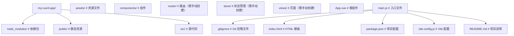

### 2.4 安装常用依赖

```bash
 # 安装 Vue Router
 npm install vue-router
 # 安装 Pinia（Vue3 推荐的状态管理库）
 npm install pinia
 # 安装 TypeScript（可选）
 npm install typescript
 # 安装 ESLint 和 Prettier（可选）
 npm install eslint prettier
```

## 3. 第一个 Vue3 应用 | First Vue3 App

### 3.1 修改 App.vue

```vue
<template>
  <div class="app">
    <h1>Hello Vue3!</h1>
    <button @click="count++">Count: {{ count }}</button>
  </div>
</template>
<script setup>
import { ref } from 'vue';
const count = ref(0);
</script>
<style scoped>
.app {
  text-align: center;
  margin-top: 50px;
}
h1 {
  color: #42b983;
}
button {
  padding: 10px 20px;
  font-size: 16px;
  background-color: #42b983;
  color: white;
  border: none;
  border-radius: 4px;
  cursor: pointer;
}
button:hover {
  background-color: #35495e;
}
</style>
```

### 3.2 运行项目

```bash
 # 进入项目目录
 cd my-vue3-app
 # 安装依赖
 npm install
 # 启动开发服务器
 npm run dev
```

访问终端中显示的地址（通常是 <http://localhost:5173），即可看到你的第一个> Vue3 应用。

## 4. 开发工具推荐 | Recommended Tools

- **VS Code**：推荐的代码编辑器
- **Volar**：Vue3 官方推荐的 VS Code 扩展，提供更好的 Vue3 支持
- **Vue DevTools**：浏览器扩展，用于调试 Vue 应用
- **ESLint**：代码质量检查工具
- **Prettier**：代码格式化工具

## 6. 常见问题 | Common Issues

### 6.1 无法启动开发服务器

- 检查 Node.js 版本是否符合要求
- 检查端口是否被占用
- 检查依赖是否正确安装

### 6.2 组件不显示

- 检查组件是否正确导入
- 检查组件名称是否正确
- 检查模板语法是否正确

### 6.3 响应式数据不更新

- 检查是否使用了 `ref` 或 `reactive` 来创建响应式数据
- 检查是否正确访问响应式数据（对于 `ref`，需要使用 `.value`）
- 检查是否在模板中正确使用响应式数据（模板中自动解包，不需要 `.value`）

## 7. 小结 | Summary

Vue3 带来了许多新特性和改进，使前端开发更加高效和愉快。通过本章节的学习，你已经了解了 Vue3 的基本概念和环境搭建方法，为后续的学习打下了基础。
接下来，我们将深入学习 Vue3 的组合式 API、响应式系统、组件系统等核心特性，帮助你构建更加复杂和功能丰富的 Vue3 应用。

## 应用创建

**createApp 创建应用实例**
`const <app> = createApp(<rootComponent>);`
```typescript
import { createApp } from 'vue';
import App from './App.vue';

const app = createApp(App);
```

**根组件直接对象定义**
`createApp({ setup() | data() | template | render })`
```typescript
const app = createApp({
  data() {
    return { msg: 'Hello' };
  },
  template: '<div>{{ msg }}</div>'
});
```

---

## 应用配置

**app.use 安装插件**
`app.use(<plugin>, [options]);`
```typescript
import { createApp } from 'vue';
import { createPinia } from 'pinia';
import router from './router';

const app = createApp(App);
app.use(createPinia());
app.use(router);
app.use(myPlugin, { optionKey: 'value' });
```

**app.component 全局组件注册**
`app.component(<name>, <component>);`
```typescript
app.component('MyButton', {
  template: '<button><slot/></button>'
});
app.component('MyComp', () => import('./MyComp.vue'));
```

**app.directive 全局指令注册**
`app.directive(<name>, <directive>);`
```typescript
app.directive('focus', {
  mounted(el) {
    el.focus();
  }
});
```

**app.mixin 全局混入(不推荐)**
`app.mixin(<mixin>);`
```typescript
app.mixin({
  created() {
    console.log('global mixin created');
  }
});
```

**app.provide 全局依赖注入**
`app.provide(<key>, <value>);`
```typescript
app.provide('theme', 'dark');
app.provide(Symbol('config'), { apiBase: '/api' });
```

---

## 应用挂载

**app.mount 挂载应用**
`app.mount(<container>);`
```typescript
app.mount('#app');
app.mount(document.getElementById('app'));
```

**app.unmount 卸载应用**
`app.unmount();`
```typescript
const app = createApp(App);
app.mount('#app');
setTimeout(() => app.unmount(), 5000);
```

---

## 应用上下文

**app.config 全局配置**
`app.config.<key> = <value>;`
```typescript
app.config.errorHandler = (err, instance, info) => {
  console.error('全局错误:', err, info);
};
app.config.warnHandler = (msg, instance, trace) => {
  console.warn(msg);
};
app.config.globalProperties.$format = (v) => v.toFixed(2);
app.config.performance = true;
app.config.silent = false;
```

**app.version 获取 Vue 版本**
```typescript
console.log(app.version);
```

**app.runWithContext 在应用上下文中执行**
`const <result> = app.runWithContext(<callback>);`
```typescript
const result = app.runWithContext(() => {
  return inject('theme');
});
```

---

## 应用链式调用

**链式注册与挂载**
```typescript
createApp(App)
  .use(createPinia())
  .use(router)
  .directive('focus', { mounted: (el) => el.focus() })
  .provide('apiBase', '/api')
  .mount('#app');
```

<!-- ============================================================ vue3/002-Vue3QuickStartGuide ============================================================ -->

## 1. 环境搭建

### 1.1 安装 Node.js

Vue3 项目需要 Node.js 环境，推荐安装最新的 LTS 版本：

- 访问 [Node.js 官网](https://nodejs.org/)
- 下载并安装适合你操作系统的 LTS 版本
- 安装完成后，在终端运行以下命令验证：

```bash
 node -v
 npm -v
```

### 1.2 安装官方脚手架（基于 Vite）

Vue 官方推荐使用 create-vue 脚手架，底层基于 Vite，交互式选择 TypeScript、Router、Pinia 等选项：

```bash
 # 官方脚手架（推荐）
 npm create vue@latest
 # 通用 Vite 模板（轻量替代）
 npm create vite@latest my-vue3-app -- --template vue
```

Vue CLI（@vue/cli）已停止新功能开发，仅用于维护存量项目，新项目不应使用。

## 2. 项目结构

一个典型的 Vue3 项目结构如下：

```mermaid
flowchart TD
    T0["my-vue3-project/"]
    T1["public/"]
    T2["favicon.ico"]
    T3["src/"]
    T4["assets/"]
    T5["logo.png"]
    T6["components/"]
    T7["HelloWorld.vue"]
    T8["router/"]
    T9["index.ts"]
    T10["store/"]
    T11["index.ts"]
    T12["views/"]
    T13["Home.vue"]
    T14["About.vue"]
    T15["App.vue"]
    T16["main.ts"]
    T17[".gitignore"]
    T18["index.html"]
    T19["package.json"]
    T20["tsconfig.json"]
    T21["vite.config.ts"]
    T22["README.md"]
    T0 --> T1
    T2 --> T3
    T16 --> T17
    T16 --> T18
    T16 --> T19
    T16 --> T20
    T16 --> T21
    T16 --> T22
```

## 3. 第一个 Vue3 应用

### 3.1 基本组件结构

创建一个简单的 Vue3 组件：

```vue
<template>
  <div class="hello">
    <h1>{{ message }}</h1>
    <button @click="count++">点击计数: {{ count }}</button>
  </div>
</template>
<script setup lang="ts">
import { ref } from 'vue';
const message = ref('Hello Vue3!');
const count = ref(0);
</script>
<style scoped>
.hello {
  text-align: center;
  margin-top: 2rem;
}
</style>
```

### 3.2 运行项目

```bash
 # 进入项目目录
 cd my-vue3-project
 # 安装依赖
 npm install
 # 启动开发服务器
 npm run dev
```

## 4. 核心概念快速了解

### 4.1 组合式 API

```vue
<script setup lang="ts">
import { ref, computed, onMounted } from 'vue';
// 响应式数据
const count = ref(0);
// 计算属性
const doubleCount = computed(() => count.value * 2);
// 生命周期钩子
onMounted(() => {
  console.log('组件挂载完成');
});
// 方法
function increment() {
  count.value++;
}
</script>
```

### 4.2 响应式系统

```vue
<script setup lang="ts">
import { ref, reactive, toRefs } from 'vue'
// 基本类型响应式
const count = ref(0)
// 对象响应式
const user = reactive({
 name: '张三',
 age: 20
}
// 解构响应式对象
const { name, age } = toRefs(user)
</script>
```

### 4.3 组件通信

#### 父传子（Props）

```vue
<!-- 父组件 -->
<template>
  <ChildComponent :message="parentMessage" />
</template>
<script setup lang="ts">
import ChildComponent from './ChildComponent.vue';
import { ref } from 'vue';
const parentMessage = ref('来自父组件的消息');
</script>
vue
<!-- 子组件 -->
<template>
  <div>{{ message }}</div>
</template>
<script setup lang="ts">
defineProps<{
  message: string;
  ;
}>();
</script>
```

#### 子传父（Emits）

```vue
<!-- 子组件 -->
<template>
  <button @click="emit('update', '来自子组件的消息')">发送消息</button>
</template>
<script setup lang="ts">
const emit = defineEmits<{
  (e: 'update', message: string): void;
  ;
}>();
</script>
vue
<!-- 父组件 -->
<template>
  <ChildComponent @update="handleUpdate" />
  <div>{{ childMessage }}</div>
</template>
<script setup lang="ts">
import ChildComponent from './ChildComponent.vue';
import { ref } from 'vue';
const childMessage = ref('');
function handleUpdate(message: string) {
  childMessage.value = message;
}
</script>
```

## 5. 路由与状态管理

### 5.1 Vue Router

安装：

```bash
npm install vue-router
```

基本配置：

```ts
 // router/index.ts
 import { createRouter, createWebHistory } from 'vue-router'
 import Home from '../views/Home.vue'
 const routes = [
  {
  path: '/',
  name: 'Home',
  component: Home
  },
  {
  path: '/about',
  name: 'About',
  component: () => import('../views/About.vue')
  }
 ]
 const router = createRouter({
  history: createWebHistory(),
  routes
 }
 export default router
```

### 5.2 Pinia 状态管理

安装：

```bash
 npm install pinia
```

基本配置：

```ts
 // store/index.ts
 import { defineStore } from 'pinia'
 export const useCounterStore = defineStore('counter', {
  state: () => ({
  count: 0
  }),
  actions: {
  increment() {
  this.count++
  }
  },
  getters: {
  doubleCount: (state) => state.count * 2
  }
 }
```

使用：

```vue
<script setup lang="ts">
import { useCounterStore } from '../store';
const counterStore = useCounterStore();
</script>
<template>
  <div>
    <p>Count: {{ counterStore.count }}</p>
    <p>Double: {{ counterStore.doubleCount }}</p>
    <button @click="counterStore.increment">Increment</button>
  </div>
</template>
```

## 6. 构建与部署

### 6.1 构建生产版本

```bash
 npm run build
```

构建产物会生成在 `dist` 目录中。

### 6.2 部署选项

- **静态网站托管**：GitHub Pages、Vercel、Netlify 等
- **服务器部署**：Nginx、Apache 等
- **容器化部署**：Docker

## 8. 快速开发提示

1. **使用 TypeScript**：提供类型安全，减少运行时错误
2. **使用 ESLint 和 Prettier**：保持代码风格一致
3. **使用 Volar**：Vue3 官方推荐的 VS Code 扩展
4. **组件拆分**：将复杂组件拆分为更小的、可复用的组件
5. **使用 composables**：提取可复用的逻辑
6. **性能优化**：使用 `v-memo`、`v-once` 等指令优化渲染性能
   通过本快速入门指南，你已经了解了 Vue3 的基本使用方法。接下来可以深入学习各个核心概念和高级特性。

<!-- ============================================================ vue3/003-Vue3TemplateSyntax ============================================================ -->

## 1. 插值表达式

### 1.1 文本插值

```vue
<template>
  <div>
    <h1>{{ message }}</h1>
    <p>{{ count }}</p>
    <p>{{ isActive ? '激活' : '未激活' }}</p>
    <p>{{ user.name }}</p>
  </div>
</template>
<script setup lang="ts">
import { ref, reactive } from 'vue'
const message = ref('Hello Vue3')
const count = ref(0)
const isActive = ref(true)
const user = reactive({
 name: '张三',
 age: 20
}
</script>
```

### 1.2 原始 HTML

```vue
<template>
  <div>
    <p>{{ rawHtml }}</p>
    <!-- 输出: <strong>加粗文本</strong> -->
    <p v-html="rawHtml"></p>
    <!-- 输出: 加粗文本 -->
  </div>
</template>
<script setup lang="ts">
import { ref } from 'vue';
const rawHtml = ref('<strong>加粗文本</strong>');
</script>
```

### 1.3 表达式

```vue
<template>
  <div>
    <p>{{ count + 1 }}</p>
    <p>{{ message.toUpperCase() }}</p>
    <p>{{ user.name + ' (' + user.age + '岁)' }}</p>
    <p>{{ items.length }}</p>
  </div>
</template>
<script setup lang="ts">
import { ref, reactive } from 'vue'
const count = ref(0)
const message = ref('hello')
const user = reactive({
 name: '张三',
 age: 20
}
const items = ref([1, 2, 3, 4, 5])
</script>
```

## 2. 指令

### 2.1 条件指令

#### v-if

```vue
<template>
  <div>
    <p v-if="isLoggedIn">欢迎回来！</p>
    <p v-else>请登录</p>
  </div>
</template>
<script setup lang="ts">
import { ref } from 'vue';
const isLoggedIn = ref(false);
</script>
```

#### v-else-if

```vue
<template>
  <div>
    <p v-if="score >= 90">优秀</p>
    <p v-else-if="score >= 80">良好</p>
    <p v-else-if="score >= 60">及格</p>
    <p v-else>不及格</p>
  </div>
</template>
<script setup lang="ts">
import { ref } from 'vue';
const score = ref(85);
</script>
```

#### v-show

```vue
<template>
  <div>
    <p v-show="isVisible">这是一个可显示/隐藏的元素</p>
    <button @click="isVisible = !isVisible">切换显示</button>
  </div>
</template>
<script setup lang="ts">
import { ref } from 'vue';
const isVisible = ref(true);
</script>
```

### 2.2 循环指令

#### v-for

```vue
<template>
  <div>
    <ul>
      <li v-for="item in items" :key="item.id">
        {{ item.name }}
      </li>
    </ul>
    <ul>
      <li v-for="(item, index) in items" :key="index">{{ index + 1 }}. {{ item.name }}</li>
    </ul>
    <ul>
      <li v-for="(value, key) in user" :key="key">{{ key }}: {{ value }}</li>
    </ul>
  </div>
</template>
<script setup lang="ts">
import { ref, reactive } from 'vue'
const items = ref([
 { id: 1, name: '项目 1' },
 { id: 2, name: '项目 2' },
 { id: 3, name: '项目 3' }
]
const user = reactive({
 name: '张三',
 age: 20,
 email: 'zhangsan@example.com'
}
</script>
```

### 2.3 绑定指令

#### v-bind

```vue
<template>
  <div>
    
    <a v-bind:href="linkUrl">链接</a>
    <div v-bind:class="className">类绑定</div>
    <div v-bind:style="styleObject">样式绑定</div>
  </div>
</template>
<script setup lang="ts">
import { ref, reactive } from 'vue'
const imageSrc = ref('https://example.com/image.jpg')
const linkUrl = ref('https://example.com')
const className = ref('container')
const styleObject = reactive({
 color: 'red',
 fontSize: '16px'
}
</script>
```

#### 简写形式

```vue
<template>
  <div>
    
    <a :href="linkUrl">链接</a>
    <div :class="className">类绑定</div>
    <div :style="styleObject">样式绑定</div>
  </div>
</template>
```

### 2.4 事件指令

#### v-on

```vue
<template>
  <div>
    <button v-on:click="handleClick">点击我</button>
    <button v-on:mouseenter="handleMouseEnter">鼠标进入</button>
    <button v-on:mouseleave="handleMouseLeave">鼠标离开</button>
  </div>
</template>
<script setup lang="ts">
function handleClick() {
  console.log('点击事件');
}
function handleMouseEnter() {
  console.log('鼠标进入事件');
}
function handleMouseLeave() {
  console.log('鼠标离开事件');
}
</script>
```

#### 简写形式

```vue
<template>
  <div>
    <button @click="handleClick">点击我</button>
    <button @mouseenter="handleMouseEnter">鼠标进入</button>
    <button @mouseleave="handleMouseLeave">鼠标离开</button>
  </div>
</template>
```

### 2.5 表单指令

#### v-model

```vue
<template>
  <div>
    <input v-model="message" type="text" placeholder="输入内容" />
    <p>输入内容: {{ message }}</p>
    <input v-model="isChecked" type="checkbox" />
    <p>是否选中: {{ isChecked }}</p>
    <select v-model="selectedOption">
      <option value="1">选项 1</option>
      <option value="2">选项 2</option>
      <option value="3">选项 3</option>
    </select>
    <p>选中选项: {{ selectedOption }}</p>
  </div>
</template>
<script setup lang="ts">
import { ref } from 'vue';
const message = ref('');
const isChecked = ref(false);
const selectedOption = ref('1');
</script>
```

### 2.6 其他指令

#### v-pre

```vue
<template>
  <div>
    <p v-pre>{{ 这不会被编译 }}</p>
  </div>
</template>
```

#### v-cloak

```vue
<template>
  <div>
    <p v-cloak>{{ message }}</p>
  </div>
</template>
<style>
[v-cloak] {
  display: none;
}
</style>
```

#### v-once

```vue
<template>
  <div>
    <p v-once>{{ message }}</p>
    <button @click="message = '更新后的消息'">更新消息</button>
  </div>
</template>
<script setup lang="ts">
import { ref } from 'vue';
const message = ref('初始消息');
</script>
```

## 3. 模板表达式

### 3.1 过滤器（已废弃）

在 Vue3 中，过滤器已被废弃，建议使用计算属性或方法代替：

```vue
<template>
  <div>
    <p>{{ formattedDate }}</p>
    <p>{{ formatDate(date) }}</p>
  </div>
</template>
<script setup lang="ts">
import { ref, computed } from 'vue';
const date = ref(new Date());
const formattedDate = computed(() => {
  return new Intl.DateTimeFormat('zh-CN').format(date.value);
});
function formatDate(date: Date): string {
  return new Intl.DateTimeFormat('zh-CN').format(date);
}
</script>
```

### 3.2 空格和换行

```vue
<template>
  <div>
    <!-- 保留空格和换行 -->
    <pre>{{ message }}</pre>
    <!-- 自动移除空格和换行 -->
    <p>{{ message }}</p>
  </div>
</template>
<script setup lang="ts">
import { ref } from 'vue';
const message = ref(`Hello
 World`);
</script>
```

## 4. 模板编译

### 4.1 编译模式

Vue3 提供了两种编译模式：

- **运行时编译**：在浏览器中编译模板
- **预编译**：在构建时编译模板

### 4.2 编译优化

Vue3 的模板编译进行了以下优化：

- **静态提升**：将静态内容提升到渲染函数外部
- **补丁标记**：为动态内容添加标记，减少 diff 时间
- **缓存指令**：缓存指令的编译结果

## 5. 最佳实践

### 5.1 模板结构

- 保持模板简洁明了
- 避免在模板中使用复杂表达式
- 使用计算属性或方法处理复杂逻辑

### 5.2 性能优化

- 使用 `v-once` 处理静态内容
- 使用 `v-memo` 缓存计算结果
- 合理使用 `v-if` 和 `v-show`
- 为 `v-for` 添加唯一的 key

### 5.3 代码风格

- 使用简写形式（`:src` 代替 `v-bind:src`，`@click` 代替 `v-on:click`）
- 保持模板缩进一致
- 为指令添加适当的空格

## 6. 常见问题

### 6.1 插值表达式不更新

**问题**：插值表达式的值没有更新
**解决方案**：

- 确保使用了响应式数据（`ref` 或 `reactive`）
- 对于 `ref`，确保使用 `.value` 访问和修改值
- 对于 `reactive`，确保直接修改对象属性，而不是替换整个对象

### 6.2 v-for 不渲染

**问题**：`v-for` 没有渲染列表
**解决方案**：

- 确保数组是响应式的
- 为每个项添加唯一的 `key`
- 检查数组是否为空

### 6.3 v-model 不工作

**问题**：`v-model` 绑定的值没有更新
**解决方案**：

- 确保使用了响应式数据
- 检查表单元素的类型是否正确
- 对于自定义组件，确保正确实现了 `v-model` 接口

## 7. 总结

Vue3 的模板语法简洁明了，提供了丰富的指令和表达式，使开发者可以轻松构建交互式界面。通过本教程的学习，你应该已经掌握了 Vue3 模板语法的基本使用方法，可以在实际项目中灵活运用。
## 文本插值

**Mustache 文本插值**
`{{ <expression> }}`
```vue
<template>
  <span>{{ message }}</span>
  <span>{{ count + 1 }}</span>
  <span>{{ reverseMessage() }}</span>
  <span>{{ user.name + ' - ' + user.age }}</span>
</template>
```

**v-text 设置元素文本**
`v-text="<expression>"`
```vue
<span v-text="message"></span>
```

**v-html 设置 HTML 内容**
`v-html="<htmlString>"`
```vue
<div v-html="rawHtml"></div>
```

---

## 属性绑定 v-bind

**v-bind 单属性绑定**
`v-bind:<attr>="<value>"` / `:<attr>="<value>"`
```vue

<a :href="url" :title="title">链接</a>
<button :disabled="isDisabled">提交</button>
```

**动态属性名**
`:[<attrExpr>]="<value>"`
```vue
<a :[attrName]="url">动态属性</a>
```

**对象语法(多属性一次性绑定)**
`:<attr>="{ <key>: <value>, ... }"` / `v-bind="<object>"`
```vue
<div :class="{ active: isActive, 'has-error': hasError }"></div>
<div :style="{ color: activeColor, fontSize: size + 'px' }"></div>
<div v-bind="attributeObject"></div>
```

**数组语法(class/style)**
```vue
<div :class="[activeClass, errorClass]"></div>
<div :class="[isActive ? 'active' : '', errorClass]"></div>
<div :class="[{ active: isActive }, errorClass]"></div>
<div :style="[baseStyles, overridingStyles]"></div>
```

---

## 事件绑定 v-on

**v-on 事件绑定**
`v-on:<event>="<handler>"` / `@<event>="<handler>"`
```vue
<button v-on:click="handleClick">点击</button>
<button @click="count++">+1</button>
<input @input="onInput" @focus="onFocus" />
```

**内联调用与参数**
`@<event>="<handler>(<args>)"`
```vue
<button @click="say('hello', $event)">say</button>
<button @click="handle(item, index)">处理</button>
```

**事件修饰符**
`@<event>.<modifier>="<handler>"`
```vue
<a @click.stop="onClick">阻止冒泡</a>
<form @submit.prevent="onSubmit">阻止默认</form>
<div @click.capture="onClick">捕获模式</div>
<div @click.self="onSelf">仅自身触发</div>
<div @click.once="onClick">只触发一次</div>
<div @scroll.passive="onScroll">滚动优化</div>
```

**按键修饰符**
```vue
<input @keyup.enter="onEnter" />
<input @keyup.esc="onEsc" />
<input @keydown.page-down="onPageDown" />
```

**系统修饰符组合**
```vue
<input @keyup.ctrl.enter="onCtrlEnter" />
<div @click.ctrl="onCtrlClick">Ctrl+Click</div>
<div @click.exact="onExactClick">仅精确按键</div>
```

**鼠标按键修饰符**
```vue
<div @click.left="onLeft">左键</div>
<div @click.right="onRight">右键</div>
<div @click.middle="onMiddle">中键</div>
```

---

## 条件渲染 v-if

**v-if / v-else-if / v-else**
```vue
<div v-if="type === 'A'">A</div>
<div v-else-if="type === 'B'">B</div>
<div v-else>其他</div>
```

**v-show 切换 display**
`v-show="<expression>"`
```vue
<h1 v-show="isVisible">Hello</h1>
```

**template 包裹多元素条件**
```vue
<template v-if="ok">
  <h1>标题</h1>
  <p>段落</p>
</template>
```

---

## 列表渲染 v-for

**v-for 数组遍历**
`v-for="(<item>, [index]) in <array>"` / `v-for="(<item>, [index]) of <array>"`
```vue
<li v-for="(item, index) in items" :key="item.id">
  {{ index }} - {{ item.name }}
</li>
<li v-for="item of items" :key="item.id">{{ item }}</li>
```

**v-for 对象遍历**
`v-for="(<value>, [key], [index]) in <object>"`
```vue
<li v-for="(value, key) in user" :key="key">
  {{ key }}: {{ value }}
</li>
```

**v-for 数字范围**
`v-for="<n> in <number>"`
```vue
<span v-for="n in 10" :key="n">{{ n }}</span>
```

**template 多元素遍历**
```vue
<template v-for="item in items" :key="item.id">
  <li>{{ item.name }}</li>
  <li>{{ item.desc }}</li>
</template>
```

---

## 双向绑定 v-model

**v-model 基础用法**
`v-model="<variable>"`
```vue
<input v-model="message" placeholder="输入" />
<textarea v-model="text"></textarea>
<input type="checkbox" v-model="checked" />
<select v-model="selected"><option value="a">A</option></select>
```

**复选框绑定数组**
```vue
<input type="checkbox" value="A" v-model="checkedNames" />
<input type="checkbox" value="B" v-model="checkedNames" />
```

**单选按钮**
```vue
<input type="radio" value="One" v-model="picked" />
<input type="radio" value="Two" v-model="picked" />
```

**选择框多选**
```vue
<select v-model="multi" multiple>
  <option value="a">A</option>
  <option value="b">B</option>
</select>
```

**v-model 修饰符**
```vue
<input v-model.lazy="message" />          <!-- 失焦或回车同步 -->
<input v-model.number="age" />            <!-- 转为数字 -->
<input v-model.trim="msg" />              <!-- 去除首尾空格 -->
```

**v-model 自定义组件(双向绑定)**
```vue
<MyInput v-model="searchText" />
<MyInput v-model:modelValue="val" />
<MyInput v-model:title="title" />
```

**组件内定义(defineModel - Vue 3.4+)**
```vue
<!-- Child.vue -->
<script setup>
const model = defineModel();
function update() {
  model.value = 'new value';
}
</script>
```

---

## 其他指令

**v-once 一次性渲染**
```vue
<span v-once>{{ msg }}</span>
<div v-once>
  <h1>静态内容</h1>
  <p>{{ computed }}</p>
</div>
```

**v-memo 性能优化缓存**
`v-memo="[<dep1>, <dep2>]"`
```vue
<div v-for="item in list" :key="item.id" v-memo="[item.id, item.selected]">
  {{ item.name }}
</div>
```

**v-cloak 隐藏未编译模板**
```vue
<div v-cloak>{{ message }}</div>
<style>[v-cloak] { display: none; }</style>
```

**v-pre 跳过编译**
```vue
<span v-pre>{{ this will not be compiled }}</span>
```

<!-- ============================================================ vue3/004-Vue3DirectiveSystem ============================================================ -->

## 1. 指令概述

指令是 Vue 模板中特殊的标记，以 `v-` 前缀开头，用于在 DOM 上应用特殊的响应式行为。Vue3 提供了丰富的内置指令，同时支持自定义指令。

## 2. 内置指令

### 2.1 条件渲染指令

#### v-if

**作用**：根据表达式的值条件性地渲染元素
**用法**：

```vue
<template>
  <div>
    <p v-if="isLoggedIn">欢迎回来！</p>
    <p v-else>请登录</p>
  </div>
</template>
<script setup lang="ts">
import { ref } from 'vue';
const isLoggedIn = ref(false);
</script>
```

#### v-else-if

**作用**：与 `v-if` 配合使用，作为其 else-if 分支
**用法**：

```vue
<template>
  <div>
    <p v-if="score >= 90">优秀</p>
    <p v-else-if="score >= 80">良好</p>
    <p v-else-if="score >= 60">及格</p>
    <p v-else>不及格</p>
  </div>
</template>
<script setup lang="ts">
import { ref } from 'vue';
const score = ref(85);
</script>
```

#### v-else

**作用**：与 `v-if` 或 `v-else-if` 配合使用，作为最后的 else 分支
**用法**：见上面的示例

#### v-show

**作用**：根据表达式的值条件性地显示元素（通过 CSS display 属性）
**用法**：

```vue
<template>
  <div>
    <p v-show="isVisible">这是一个可显示/隐藏的元素</p>
    <button @click="isVisible = !isVisible">切换显示</button>
  </div>
</template>
<script setup lang="ts">
import { ref } from 'vue';
const isVisible = ref(true);
</script>
```

**v-if vs v-show**：

- `v-if`：真正的条件渲染，会销毁和重建元素
- `v-show`：只是切换元素的 display 属性，元素始终存在

### 2.2 列表渲染指令

#### v-for

**作用**：基于源数据多次渲染元素
**用法**：

```vue
<template>
  <div>
    <!-- 遍历数组 -->
    <ul>
      <li v-for="item in items" :key="item.id">
        {{ item.name }}
      </li>
    </ul>
    <!-- 遍历数组（带索引） -->
    <ul>
      <li v-for="(item, index) in items" :key="index">{{ index + 1 }}. {{ item.name }}</li>
    </ul>
    <!-- 遍历对象 -->
    <ul>
      <li v-for="(value, key, index) in user" :key="key">
        {{ index + 1 }}. {{ key }}: {{ value }}
      </li>
    </ul>
    <!-- 遍历数字 -->
    <ul>
      <li v-for="n in 5" :key="n">
        {{ n }}
      </li>
    </ul>
  </div>
</template>
<script setup lang="ts">
import { ref, reactive } from 'vue'
const items = ref([
 { id: 1, name: '项目 1' },
 { id: 2, name: '项目 2' },
 { id: 3, name: '项目 3' }
]
const user = reactive({
 name: '张三',
 age: 20,
 email: 'zhangsan@example.com'
}
</script>
```

**key 的重要性**：

- 用于 Vue 的虚拟 DOM 算法，提高渲染性能
- 必须是唯一的，且不应该在渲染过程中改变
- 推荐使用稳定且唯一的 ID，避免使用索引

### 2.3 属性绑定指令

#### v-bind

**作用**：动态绑定一个或多个属性，或一个组件 prop 到表达式
**用法**：

```vue
<template>
  <div>
    <!-- 绑定单个属性 -->
    
    <a v-bind:href="linkUrl">链接</a>
    <!-- 简写形式 -->
    
    <a :href="linkUrl">链接</a>
    <!-- 绑定多个属性 -->
    <div v-bind="objectOfAttrs"></div>
    <!-- 绑定 class -->
    <div :class="className">单个类</div>
    <div :class="[classA, classB]">多个类</div>
    <div :class="{ active: isActive, 'text-danger': hasError }">条件类</div>
    <!-- 绑定 style -->
    <div :style="styleObject">对象样式</div>
    <div :style="[styleObject1, styleObject2]">多个样式</div>
  </div>
</template>
<script setup lang="ts">
import { ref, reactive } from 'vue'
const imageSrc = ref('https://example.com/image.jpg')
const linkUrl = ref('https://example.com')
const className = ref('container')
const classA = ref('class-a')
const classB = ref('class-b')
const isActive = ref(true)
const hasError = ref(false)
const objectOfAttrs = reactive({
 id: 'container',
 class: 'box'
}
const styleObject = reactive({
 color: 'red',
 fontSize: '16px'
}
const styleObject1 = reactive({
 color: 'blue'
}
const styleObject2 = reactive({
 fontSize: '18px'
}
</script>
```

### 2.4 事件处理指令

#### v-on

**作用**：监听 DOM 事件
**用法**：

```vue
<template>
  <div>
    <!-- 基本用法 -->
    <button v-on:click="handleClick">点击我</button>
    <!-- 简写形式 -->
    <button @click="handleClick">点击我</button>
    <!-- 带参数 -->
    <button @click="handleClickWithParam('Hello')">点击我</button>
    <!-- 带事件对象 -->
    <button @click="handleClickWithEvent">点击我</button>
    <!-- 事件修饰符 -->
    <button @click.stop="handleClick">阻止冒泡</button>
    <button @click.prevent="handleSubmit">阻止默认行为</button>
    <button @click.capture="handleClick">捕获模式</button>
    <button @click.self="handleClick">仅自身触发</button>
    <button @click.once="handleClick">仅触发一次</button>
    <!-- 按键修饰符 -->
    <input @keyup.enter="handleEnter" placeholder="按 Enter 键" />
    <input @keyup.esc="handleEsc" placeholder="按 Esc 键" />
    <!-- 系统修饰符 -->
    <button @click.ctrl="handleCtrlClick">Ctrl + 点击</button>
    <button @click.alt="handleAltClick">Alt + 点击</button>
  </div>
</template>
<script setup lang="ts">
function handleClick() {
  console.log('点击事件');
}
function handleClickWithParam(message: string) {
  console.log('点击事件，参数:', message);
}
function handleClickWithEvent(event: MouseEvent) {
  console.log('点击事件，事件对象:', event);
}
function handleSubmit(event: Event) {
  console.log('提交事件');
}
function handleEnter() {
  console.log('Enter 键被按下');
}
function handleEsc() {
  console.log('Esc 键被按下');
}
function handleCtrlClick() {
  console.log('Ctrl + 点击');
}
function handleAltClick() {
  console.log('Alt + 点击');
}
</script>
```

### 2.5 表单输入绑定指令

#### v-model

**作用**：在表单元素上创建双向数据绑定
**用法**：

```vue
<template>
  <div>
    <!-- 文本输入 -->
    <input v-model="message" type="text" placeholder="输入内容" />
    <p>输入内容: {{ message }}</p>
    <!-- 多行文本 -->
    <textarea v-model="textareaContent" placeholder="输入多行内容"></textarea>
    <p>多行内容: {{ textareaContent }}</p>
    <!-- 复选框 -->
    <input v-model="isChecked" type="checkbox" />
    <p>是否选中: {{ isChecked }}</p>
    <!-- 多个复选框 -->
    <div>
      <input v-model="checkedValues" type="checkbox" value="option1" /> 选项 1
      <input v-model="checkedValues" type="checkbox" value="option2" /> 选项 2
      <input v-model="checkedValues" type="checkbox" value="option3" /> 选项 3
    </div>
    <p>选中值: {{ checkedValues }}</p>
    <!-- 单选按钮 -->
    <div>
      <input v-model="selectedRadio" type="radio" value="option1" /> 选项 1
      <input v-model="selectedRadio" type="radio" value="option2" /> 选项 2
    </div>
    <p>选中值: {{ selectedRadio }}</p>
    <!-- 选择框 -->
    <select v-model="selectedOption">
      <option value="">请选择</option>
      <option value="option1">选项 1</option>
      <option value="option2">选项 2</option>
      <option value="option3">选项 3</option>
    </select>
    <p>选中值: {{ selectedOption }}</p>
    <!-- 多选选择框 -->
    <select v-model="selectedOptions" multiple>
      <option value="option1">选项 1</option>
      <option value="option2">选项 2</option>
      <option value="option3">选项 3</option>
    </select>
    <p>选中值: {{ selectedOptions }}</p>
  </div>
</template>
<script setup lang="ts">
import { ref } from 'vue';
const message = ref('');
const textareaContent = ref('');
const isChecked = ref(false);
const checkedValues = ref<string[]>([]);
const selectedRadio = ref('');
const selectedOption = ref('');
const selectedOptions = ref<string[]>([]);
</script>
```

**修饰符**：

- `.lazy`：在 change 事件后更新
- `.number`：将输入值转换为数字
- `.trim`：去除输入值的首尾空格

```vue
<template>
  <div>
    <input v-model.lazy="message" type="text" />
    <input v-model.number="age" type="number" />
    <input v-model.trim="name" type="text" />
  </div>
</template>
<script setup lang="ts">
import { ref } from 'vue';
const message = ref('');
const age = ref(0);
const name = ref('');
</script>
```

### 2.6 其他内置指令

#### v-pre

**作用**：跳过这个元素及其子元素的编译过程
**用法**：

```vue
<template>
  <div>
    <p v-pre>{{ 这不会被编译 }}</p>
  </div>
</template>
```

#### v-cloak

**作用**：在 Vue 实例编译完成之前，隐藏元素
**用法**：

```vue
<template>
  <div>
    <p v-cloak>{{ message }}</p>
  </div>
</template>
<style>
[v-cloak] {
  display: none;
}
</style>
<script setup lang="ts">
import { ref } from 'vue';
const message = ref('Hello Vue3');
</script>
```

#### v-once

**作用**：只渲染元素和组件一次，随后的重新渲染会跳过
**用法**：

```vue
<template>
  <div>
    <p v-once>{{ message }}</p>
    <button @click="message = '更新后的消息'">更新消息</button>
  </div>
</template>
<script setup lang="ts">
import { ref } from 'vue';
const message = ref('初始消息');
</script>
```

#### v-memo

**作用**：缓存元素或组件的渲染结果
**用法**：

```vue
<template>
  <div>
    <div v-memo="[valueA, valueB]">{{ valueA }} - {{ valueB }}</div>
  </div>
</template>
<script setup lang="ts">
import { ref } from 'vue';
const valueA = ref(1);
const valueB = ref(2);
</script>
```

## 3. 自定义指令

### 3.1 全局自定义指令

**注册**：

```ts
 // main.ts
 import { createApp } from 'vue'
 import App from './App.vue'
 const app = createApp(App)
 // 注册全局自定义指令
 app.directive('focus', {
  mounted(el) {
  el.focus()
  }
 }
 app.mount('#app')
```

**使用**：

```vue
<template>
  <div>
    <input v-focus type="text" placeholder="自动聚焦" />
  </div>
</template>
```

### 3.2 局部自定义指令

**定义**：

```vue
<template>
  <div>
    <input v-focus type="text" placeholder="自动聚焦" />
    <div v-highlight="{ color: 'red' }">高亮文本</div>
  </div>
</template>
<script setup lang="ts">
import { directive } from 'vue'
// 定义局部自定义指令
const vFocus = directive('focus', {
 mounted(el) {
 el.focus()
 }
}
const vHighlight = directive('highlight', {
 mounted(el, binding) {
 el.style.color = binding.value.color
 },
 updated(el, binding) {
 el.style.color = binding.value.color
 }
}
</script>
```

### 3.3 指令生命周期钩子

- **created**：指令绑定到元素时调用
- **beforeMount**：元素插入 DOM 前调用
- **mounted**：元素插入 DOM 后调用
- **beforeUpdate**：元素更新前调用
- **updated**：元素更新后调用
- **beforeUnmount**：元素卸载前调用
- **unmounted**：元素卸载后调用
  **示例**：

```vue
<template>
  <div>
    <div v-example>示例元素</div>
  </div>
</template>
<script setup lang="ts">
import { directive } from 'vue'
const vExample = directive('example', {
 created(el) {
 console.log('指令创建')
 },
 beforeMount(el) {
 console.log('元素插入前')
 },
 mounted(el) {
 console.log('元素插入后')
 },
 beforeUpdate(el) {
 console.log('元素更新前')
 },
 updated(el) {
 console.log('元素更新后')
 },
 beforeUnmount(el) {
 console.log('元素卸载前')
 },
 unmounted(el) {
 console.log('元素卸载后')
 }
}
</script>
```

## 4. 指令的应用场景

### 4.1 表单验证

```vue
<template>
  <div>
    <input v-model="email" v-validate.email type="email" placeholder="请输入邮箱" />
    <p v-if="emailError">{{ emailError }}</p>
  </div>
</template>
<script setup lang="ts">
import { ref, directive } from 'vue'
const email = ref('')
const emailError = ref('')
const vValidate = directive('validate', {
 mounted(el, binding) {
 el.addEventListener('blur', () => {
 validate(el, binding)
 })
 },
 updated(el, binding) {
 validate(el, binding)
 }
}
function validate(el: HTMLInputElement, binding: any) {
 const value = el.value
 const type = binding.arg
 if (type === 'email') {
 const emailRegex = /^[^\s@]+@[^\s@]+\.[^\s@]+$/
 if (!emailRegex.test(value)) {
 emailError.value = '请输入有效的邮箱地址'
 } else {
 emailError.value = ''
 }
 }
}
</script>
```

### 4.2 滚动监听

```vue
<template>
  <div>
    <div v-scroll="handleScroll" style="height: 200px; overflow: auto;">
      <div style="height: 400px; background: #f0f0f0;">滚动内容</div>
    </div>
    <p>滚动位置: {{ scrollTop }}</p>
  </div>
</template>
<script setup lang="ts">
import { ref, directive } from 'vue'
const scrollTop = ref(0)
const vScroll = directive('scroll', {
 mounted(el, binding) {
 el.addEventListener('scroll', binding.value)
 },
 unmounted(el, binding) {
 el.removeEventListener('scroll', binding.value)
 }
}
function handleScroll(event: Event) {
 const target = event.target as HTMLElement
 scrollTop.value = target.scrollTop
}
</script>
```

### 4.3 拖拽功能

```vue
<template>
  <div>
    <div
      v-draggable
      style="width: 100px; height: 100px; background: #42b983; color: white; display: flex; align-items: center; justify-content: center; cursor: move; position: absolute; top: 0; left: 0;"
    >
      拖拽我
    </div>
  </div>
</template>
<script setup lang="ts">
import { directive } from 'vue'
const vDraggable = directive('draggable', {
 mounted(el) {
 let isDragging = false
 let startX = 0
 let startY = 0
 let initialLeft = 0
 let initialTop = 0
 el.addEventListener('mousedown', (e) => {
 isDragging =
 startX = e.clientX
 startY = e.clientY
 initialLeft = el.offsetLeft
 initialTop = el.offsetTop
 el.style.cursor = 'grabbing'
 })
 document.addEventListener('mousemove', (e) => {
 if (!isDragging) return
 const deltaX = e.clientX - startX
 const deltaY = e.clientY - startY
 el.style.left = `${initialLeft + deltaX}px`
 el.style.top = `${initialTop + deltaY}px`
 })
 document.addEventListener('mouseup', () => {
 isDragging = false
 el.style.cursor = 'move'
 })
 }
}
</script>
```

## 5. 最佳实践

### 5.1 指令的使用原则

- **简洁明了**：指令应该专注于单一功能
- **可复用性**：设计指令时考虑复用性
- **性能优化**：避免在指令中执行复杂操作
- **类型安全**：使用 TypeScript 为指令添加类型

### 5.2 内置指令的使用建议

- **v-if vs v-show**：频繁切换使用 `v-show`，条件不常变化使用 `v-if`
- **v-for**：始终添加唯一的 `key`
- **v-model**：合理使用修饰符
- **v-bind**：使用简写形式 `:`
- **v-on**：使用简写形式 `@`

### 5.3 自定义指令的使用建议

- **命名规范**：使用 kebab-case 命名
- **参数传递**：合理使用 binding 参数
- **生命周期**：在适当的生命周期钩子中执行操作
- **事件监听**：在 `unmounted` 中清理事件监听

## 6. 常见问题

### 6.1 指令不生效

**问题**：自定义指令没有生效
**解决方案**：

- 检查指令名称是否正确
- 检查指令注册方式是否正确
- 检查指令的生命周期钩子是否正确实现

### 6.2 指令参数传递

**问题**：无法正确传递参数给指令
**解决方案**：

- 使用 `binding.value` 获取指令值
- 使用 `binding.arg` 获取指令参数
- 使用 `binding.modifiers` 获取指令修饰符

### 6.3 指令性能问题

**问题**：指令导致性能下降
**解决方案**：

- 避免在指令中执行复杂操作
- 合理使用 `v-memo` 缓存渲染结果
- 在 `unmounted` 中清理资源

## 7. 总结

Vue3 的指令系统提供了丰富的功能，从基本的条件渲染、列表渲染到复杂的表单处理和自定义指令，为开发者提供了强大的工具。通过本教程的学习，你应该已经掌握了 Vue3 指令系统的基本使用方法和最佳实践，可以在实际项目中灵活运用。
## 条件渲染指令

**v-if 条件渲染**
`v-if="<expression>"`
```vue
<div v-if="type === 'A'">A</div>
<div v-else-if="type === 'B'">B</div>
<div v-else>C</div>
```

**v-show 切换显示**
`v-show="<expression>"`
```vue
<h1 v-show="isVisible">Hello</h1>
```

**template + v-if**
```vue
<template v-if="ok">
  <h1>标题</h1>
  <p>段落</p>
</template>
```

---

## 列表渲染指令

**v-for 数组遍历**
`v-for="(<item>, [index]) in <list>" :key="<key>"`
```vue
<li v-for="(item, index) in items" :key="item.id">
  {{ index }}: {{ item.name }}
</li>
```

**v-for 对象遍历**
`v-for="(<value>, [key], [index]) in <object>"`
```vue
<li v-for="(value, key) in user" :key="key">{{ key }}: {{ value }}</li>
```

**v-for 数字范围**
`v-for="<n> in <number>"`
```vue
<span v-for="n in 10" :key="n">{{ n }} </span>
```

**v-for 与 v-if 优先级注意**
```vue
<!-- 推荐写法:用 computed 过滤 -->
<template v-for="item in visibleItems" :key="item.id">
  <li>{{ item.name }}</li>
</template>
```

---

## 属性与事件指令

**v-bind 属性绑定**
`v-bind:<attr>="<value>"` / `:<attr>="<value>"`
```vue

<button :disabled="isLoading">提交</button>
<div :class="{ active: isActive }" :style="{ color: theme }"></div>
```

**v-bind 动态属性**
`:[<attrExpr>]="<value>"`
```vue
<a :[attrName]="url">链接</a>
```

**v-bind 对象展开**
`v-bind="<object>"`
```vue
<div v-bind="attributeObject"></div>
```

**v-on 事件绑定**
`v-on:<event>[.<modifier>]="<handler>"` / `@<event>[.<modifier>]="<handler>"`
```vue
<button @click="onClick">点击</button>
<form @submit.prevent="onSubmit">提交</form>
<input @keyup.enter="onEnter" />
<a @click.stop="onLinkClick">链接</a>
```

---

## 双向绑定指令

**v-model 基础用法**
`v-model[.<modifier>]="<variable>"`
```vue
<input v-model="message" />
<input v-model.lazy="message" />
<input v-model.number="age" />
<input v-model.trim="text" />
<textarea v-model="content"></textarea>
```

**v-model 不同表单元素**
```vue
<input type="checkbox" v-model="checked" />
<input type="checkbox" value="A" v-model="checkedNames" />
<input type="radio" value="Yes" v-model="picked" />
<select v-model="selected">
  <option value="a">A</option>
</select>
<select v-model="multi" multiple></select>
```

**v-model 绑定到组件**
```vue
<MyInput v-model="text" />
<MyInput v-model:title="title" />
<MyInput v-model:show="isVisible" />
```

---

## 文本渲染指令

**v-text 设置文本**
`v-text="<expression>"`
```vue
<span v-text="message"></span>
```

**v-html 设置 HTML**
`v-html="<htmlString>"`
```vue
<div v-html="rawHtml"></div>
```

**Mustache 插值**
`{{ <expression> }}`
```vue
<span>{{ message }}</span>
<span>{{ count + 1 }}</span>
<span>{{ ok ? '是' : '否' }}</span>
```

---

## 性能优化指令

**v-once 一次性渲染**
`v-once`
```vue
<span v-once>{{ msg }}</span>
<div v-once>
  <h1>{{ title }}</h1>
  <p>{{ content }}</p>
</div>
```

**v-memo 依赖缓存**
`v-memo="[<dep1>, <dep2>, ...]"`
```vue
<div v-for="item in list" :key="item.id" v-memo="[item.id, item.selected]">
  {{ item.name }}
  <span v-if="item.selected">已选</span>
</div>
```

**v-pre 跳过编译**
`v-pre`
```vue
<span v-pre>{{ this will not compile }}</span>
<div v-pre>
  <raw-content>{{ keepAsIs }}</raw-content>
</div>
```

**v-cloak 隐藏未编译**
`v-cloak`
```vue
<div v-cloak>{{ message }}</div>
<style>
[v-cloak] { display: none; }
</style>
```

---

## 指令缩写

**v-bind 缩写**
```vue
<!-- 完整 -->

<!-- 缩写 -->

<!-- 动态属性缩写 -->
<a :[attrName]="url" />
```

**v-on 缩写**
```vue
<!-- 完整 -->
<button v-on:click="onClick">点击</button>
<!-- 缩写 -->
<button @click="onClick">点击</button>
```

<!-- ============================================================ vue3/005-TeleportSuspense ============================================================ -->

## 1. Teleport

### 1.1 基本用法

Teleport 允许将组件模板的一部分"传送"到 DOM 中的其他位置：

```vue
<template>
  <button @click="showModal = true">打开弹窗</button>

  <Teleport to="body">
    <div v-if="showModal" class="modal">
      <p>这是一个模态框</p>
      <button @click="showModal = false">关闭</button>
    </div>
  </Teleport>
</template>
```

### 1.2 to 属性

```vue
<!-- 传送到 body -->
<Teleport to="body">

<!-- 传送到指定选择器 -->
<Teleport to="#modals">

<!-- 传送到指定元素 -->
<Teleport :to="targetElement">
```

### 1.3 disabled 属性

```vue
<!-- 条件性传送 -->
<Teleport to="body" :disabled="isMobile">
  <!-- 移动端不传送，桌面端传送 -->
</Teleport>
```

### 1.4 多个 Teleport 共享目标

多个 Teleport 传送到同一目标时，按渲染顺序追加。

## 2. Suspense

### 2.1 基本用法

```vue
<template>
  <Suspense>
    <template #default>
      <AsyncComponent />
    </template>
    <template #fallback>
      <LoadingSpinner />
    </template>
  </Suspense>
</template>
```

### 2.2 异步组件

```javascript
// defineAsyncComponent
const AsyncComp = defineAsyncComponent(() => import('./HeavyComponent.vue'));

// 带 options
const AsyncComp = defineAsyncComponent({
  loader: () => import('./HeavyComponent.vue'),
  loadingComponent: LoadingSpinner,
  errorComponent: ErrorDisplay,
  delay: 200,
  timeout: 3000,
});
```

### 2.3 异步 setup

```vue
<script setup>
// async setup 组件会触发 Suspense
const data = await fetch('/api/data').then((r) => r.json());
</script>
```

### 2.4 Suspense 事件

```vue
<Suspense @pending="onPending" @resolve="onResolve" @fallback="onFallback">
  <AsyncComponent />
</Suspense>
```

### 2.5 嵌套 Suspense

```vue
<Suspense>
  <Header />
  <Suspense>
    <AsyncContent />
  </Suspense>
</Suspense>
```
## Teleport 传送门

**Teleport 基础用法**
`<Teleport to="<target>">...</Teleport>`
```vue
<template>
  <Teleport to="body">
    <div class="modal">弹窗内容</div>
  </Teleport>

  <Teleport to="#modals">
    <div>传送到指定容器</div>
  </Teleport>

  <Teleport :to="dynamicTarget">
    <div>动态目标</div>
  </Teleport>
</template>
```

**Teleport 禁用传送**
`<Teleport to="<target>" :disabled="<flag>">`
```vue
<Teleport to="body" :disabled="isInline">
  <div>条件传送</div>
</Teleport>

<script setup>
import { ref } from 'vue';
const isInline = ref(false);
</script>
```

**Teleport 多个目标**
```vue
<Teleport to="body">
  <Modal v-if="showA" />
</Teleport>

<Teleport to="body">
  <Modal v-if="showB" />
</Teleport>
<!-- 多个 Teleport 到同一目标按顺序追加 -->
```

**Teleport 配合组件**
```vue
<template>
  <button @click="show = true">打开</button>
  <Teleport to="body">
    <Modal v-if="show" @close="show = false">
      <h2>标题</h2>
      <p>内容</p>
    </Modal>
  </Teleport>
</template>

<script setup>
import { ref } from 'vue';
import Modal from './Modal.vue';
const show = ref(false);
</script>
```

---

## Teleport 事件与样式

**Teleport 内事件冒泡**
```vue
<template>
  <div @click="onParentClick">
    <Teleport to="body">
      <div @click="onModalClick">点击</div>
      <!-- 点击事件在 DOM 上冒泡到 body,但 Vue 逻辑冒泡仍按组件树 -->
    </Teleport>
  </div>
</template>
```

**Teleport 与样式作用域**
```vue
<style scoped>
.modal {
  background: white;  /* 即使传送走,scoped 样式仍生效 */
}
</style>
```

---

## Suspense 异步组件

**Suspense 基础用法**
```vue
<template>
  <Suspense>
    <template #default>
      <AsyncComponent />
    </template>
    <template #fallback>
      <div>Loading...</div>
    </template>
  </Suspense>
</template>

<script setup>
import { defineAsyncComponent } from 'vue';
const AsyncComponent = defineAsyncComponent(() => import('./Async.vue'));
</script>
```

**Suspense 多异步组件**
```vue
<Suspense>
  <template #default>
    <Header />      <!-- 都是异步组件 -->
    <Content />
    <Footer />
  </template>
  <template #fallback>
    <PageSkeleton />
  </template>
</Suspense>
```

**Suspense 配合 async setup**
```vue
<!-- AsyncPage.vue -->
<script setup>
import { ref } from 'vue';

// setup 可以是 async
const data = await fetch('/api/data').then(r => r.json());
</script>

<template>
  <div>{{ data }}</div>
</template>

<!-- 父组件 -->
<Suspense>
  <AsyncPage />
  <template #fallback>
    <Spinner />
  </template>
</Suspense>
```

---

## Suspense 事件

**Suspense 事件处理**
```vue
<template>
  <Suspense
    @resolve="onResolve"
    @pending="onPending"
    @fallback="onFallback"
  >
    <template #default>
      <AsyncComp />
    </template>
    <template #fallback>
      <Loading />
    </template>
  </Suspense>
</template>

<script setup>
function onResolve() {
  console.log('异步组件加载完成');
}
function onPending() {
  console.log('开始加载异步组件');
}
function onFallback() {
  console.log('显示 fallback');
}
</script>
```

---

## Suspense 嵌套

**Suspense 嵌套**
```vue
<Suspense>
  <template #default>
    <Layout>
      <Suspense>
        <template #default>
          <AsyncWidget />
        </template>
        <template #fallback>
          <WidgetSkeleton />
        </template>
      </Suspense>
    </Layout>
  </template>
  <template #fallback>
    <PageSkeleton />
  </template>
</Suspense>
```

---

## 异步组件加载错误

**defineAsyncComponent 错误处理**
```typescript
import { defineAsyncComponent } from 'vue';

const AsyncComp = defineAsyncComponent({
  loader: () => import('./AsyncComp.vue'),
  loadingComponent: LoadingSpinner,
  errorComponent: ErrorDisplay,
  delay: 200,       // 显示 loading 前延迟
  timeout: 3000,    // 超时显示 error
  onError(err, retry, fail, attempts) {
    if (attempts <= 3) {
      retry();
    } else {
      fail();
    }
  }
});
```

**onErrorCaptured 捕获异步错误**
```vue
<template>
  <Suspense>
    <AsyncComp v-if="!error" />
    <ErrorComp v-else :error="error" />
    <template #fallback>
      <Loading />
    </template>
  </Suspense>
</template>

<script setup>
import { ref, onErrorCaptured } from 'vue';
const error = ref(null);

onErrorCaptured((err) => {
  error.value = err;
  return false;  // 阻止继续向上传递
});
</script>
```

---

## 综合应用

**Modal + Teleport + Transition**
```vue
<template>
  <button @click="open">打开</button>
  <Teleport to="body">
    <Transition name="modal">
      <div v-if="isOpen" class="modal-mask" @click.self="close">
        <div class="modal">
          <slot />
          <button @click="close">关闭</button>
        </div>
      </div>
    </Transition>
  </Teleport>
</template>

<script setup>
import { ref } from 'vue';
const isOpen = ref(false);
const open = () => { isOpen.value = true; };
const close = () => { isOpen.value = false; };
</script>

<style>
.modal-enter-active, .modal-leave-active {
  transition: opacity 0.3s;
}
.modal-enter-from, .modal-leave-to {
  opacity: 0;
}
</style>
```

**异步数据 + Suspense + Skeleton**
```vue
<!-- AsyncList.vue -->
<script setup>
const items = await fetch('/api/items').then(r => r.json());
</script>

<template>
  <ul>
    <li v-for="item in items" :key="item.id">{{ item.name }}</li>
  </ul>
</template>

<!-- 父组件 -->
<template>
  <Suspense>
    <AsyncList />
    <template #fallback>
      <ul>
        <li v-for="n in 5" :key="n" class="skeleton">Loading...</li>
      </ul>
    </template>
  </Suspense>
</template>
```

<!-- ============================================================ vue3/006-API ============================================================ -->

## 1. 组合式 API 概述 | Composition API Overview

组合式 API 是 Vue3 引入的新特性，它提供了一种新的方式来组织组件逻辑，使代码更易于维护和复用。与选项式 API（Options API）相比，组合式 API 具有以下优势：

- **更好的代码组织**：可以将相关的逻辑组合在一起，而不是分散在不同的选项中
- **更好的类型推导**：TypeScript 类型推断更加准确
- **更好的逻辑复用**：可以通过组合函数（Composables）来复用逻辑
- **更灵活的代码结构**：不再受选项式 API 的限制

## 2. setup 函数 | Setup Function

`setup` 函数是组合式 API 的入口点，它在组件创建之前执行，返回的对象会暴露给模板和其他选项。

### 2.1 基本用法

```vue
<template>
  <div>
    <p>Count: {{ count }}</p>
    <button @click="increment">Increment</button>
  </div>
</template>
<script>
import { ref, onMounted } from 'vue';
export default {
  setup() {
    // 创建响应式数据
    const count = ref(0);
    // 定义方法
    const increment = () => {
      count.value++;
    };
    // 生命周期钩子
    onMounted(() => {
      console.log('Component mounted');
    });
    // 返回暴露给模板的内容
    return {
      count,
      increment,
    };
  },
};
</script>
```

### 2.2 script setup 语法糖

Vue3.2+ 提供了 `script setup` 语法糖，使组合式 API 的使用更加简洁：

```vue
<template>
  <div>
    <p>Count: {{ count }}</p>
    <button @click="increment">Increment</button>
  </div>
</template>
<script setup>
import { ref, onMounted } from 'vue';
// 直接定义响应式数据
const count = ref(0);
// 直接定义方法
const increment = () => {
  count.value++;
};
// 直接使用生命周期钩子
onMounted(() => {
  console.log('Component mounted');
});
</script>
```

## 3. 响应式 API | Reactive APIs

### 3.1 ref

`ref` 用于创建响应式的基本类型数据：

```javascript
import { ref } from 'vue';
const count = ref(0);
console.log(count.value); // 0
count.value++;
console.log(count.value); // 1
```

### 3.2 reactive

`reactive` 用于创建响应式的对象：

```javascript
 import { reactive } from 'vue'
 const state = reactive({
  count: 0,
  message: 'Hello'
 }
 console.log(state.count) // 0
 state.count++
 console.log(state.count) // 1
```

### 3.3 computed

`computed` 用于创建计算属性：

```javascript
import { ref, computed } from 'vue';
const count = ref(0);
const doubleCount = computed(() => count.value * 2);
console.log(doubleCount.value); // 0
count.value++;
console.log(doubleCount.value); // 2
```

### 3.4 watch

`watch` 用于监听数据变化：

```javascript
import { ref, watch } from 'vue';
const count = ref(0);
watch(count, (newValue, oldValue) => {
  console.log(`Count changed from ${oldValue} to ${newValue}`);
});
count.value++; // 输出: Count changed from 0 to 1
```

### 3.5 watchEffect

`watchEffect` 用于自动追踪响应式依赖：

```javascript
import { ref, watchEffect } from 'vue';
const count = ref(0);
watchEffect(() => {
  console.log(`Count is ${count.value}`);
});
count.value++; // 输出: Count is 1
```

## 4. 生命周期钩子 | Lifecycle Hooks

组合式 API 提供了与选项式 API 对应的生命周期钩子：

- `onMounted`：组件挂载后
- `onUpdated`：组件更新后
- `onUnmounted`：组件卸载后
- `onBeforeMount`：组件挂载前
- `onBeforeUpdate`：组件更新前
- `onBeforeUnmount`：组件卸载前
- `onErrorCaptured`：捕获子组件错误
- `onRenderTracked`：响应式依赖被追踪时
- `onRenderTriggered`：响应式依赖被触发时

```javascript
import { onMounted, onUpdated, onUnmounted } from 'vue';
onMounted(() => {
  console.log('Component mounted');
});
onUpdated(() => {
  console.log('Component updated');
});
onUnmounted(() => {
  console.log('Component unmounted');
});
```

## 5. 组合函数 | Composables

组合函数是组合式 API 的核心概念，用于复用逻辑：

```javascript
// composables/useCounter.js
import { ref, computed } from 'vue';
export function useCounter(initialValue = 0) {
  const count = ref(initialValue);
  const doubleCount = computed(() => count.value * 2);
  const increment = () => {
    count.value++;
  };
  const decrement = () => {
    count.value--;
  };
  return {
    count,
    doubleCount,
    increment,
    decrement,
  };
}
```

使用组合函数：

```vue
<template>
  <div>
    <p>Count: {{ count }}</p>
    <p>Double Count: {{ doubleCount }}</p>
    <button @click="increment">Increment</button>
    <button @click="decrement">Decrement</button>
  </div>
</template>
<script setup>
import { useCounter } from './composables/useCounter';
const { count, doubleCount, increment, decrement } = useCounter(0);
</script>
```

## 6. 依赖注入 | Dependency Injection

### 6.1 provide

`provide` 用于向子组件提供数据：

```vue
<!-- ParentComponent.vue -->
<script setup>
import { provide, ref } from 'vue';
const message = ref('Hello from parent');
provide('message', message);
</script>
```

### 6.2 inject

`inject` 用于从父组件获取数据：

```vue
<!-- ChildComponent.vue -->
<script setup>
import { inject } from 'vue';
const message = inject('message', 'Default message');
</script>
<template>
  <p>{{ message }}</p>
</template>
```

## 7. 模板引用 | Template Refs

使用 `ref` 可以获取DOM元素或组件实例：

```vue
<template>
  <div ref="container">Hello</div>
  <MyComponent ref="myComponent" />
</template>
<script setup>
import { ref, onMounted } from 'vue';
import MyComponent from './MyComponent.vue';
const container = ref(null);
const myComponent = ref(null);
onMounted(() => {
  console.log(container.value); // DOM元素
  console.log(myComponent.value); // 组件实例
});
</script>
```

## 8. 响应式工具 | Reactive Utilities

### 8.1 toRefs

`toRefs` 用于将响应式对象转换为普通对象，其中每个属性都是一个 ref：

```javascript
 import { reactive, toRefs } from 'vue'
 const state = reactive({
  count: 0,
  message: 'Hello'
 }
 const refs = toRefs(state)
 console.log(refs.count.value) // 0
 console.log(refs.message.value) // Hello
```

### 8.2 toRef

`toRef` 用于为响应式对象的单个属性创建 ref：

```javascript
 import { reactive, toRef } from 'vue'
 const state = reactive({
  count: 0,
  message: 'Hello'
 }
 const countRef = toRef(state, 'count')
 console.log(countRef.value) // 0
```

### 8.3 unref

`unref` 用于获取 ref 的值，如果参数不是 ref，则直接返回参数：

```javascript
import { ref, unref } from 'vue';
const count = ref(0);
const message = 'Hello';
console.log(unref(count)); // 0
console.log(unref(message)); // Hello
```

### 8.4 isRef

`isRef` 用于检查一个值是否是 ref：

```javascript
import { ref, isRef } from 'vue';
const count = ref(0);
const message = 'Hello';
console.log(isRef(count)); //
console.log(isRef(message)); // false
```

## 9. 最佳实践 | Best Practices

1. **使用 script setup**：简洁明了，推荐使用
2. **组织逻辑**：将相关的逻辑组合在一起
3. **使用组合函数**：复用逻辑，提高代码可维护性
4. **合理使用响应式 API**：根据需要选择 ref 或 reactive
5. **避免过度使用 watch**：优先使用 computed
6. **注意响应式陷阱**：了解响应式系统的工作原理，避免常见陷阱

## 10. 示例 | Examples

### 10.1 计数器示例

```vue
<template>
  <div class="counter">
    <h2>Counter</h2>
    <p>Count: {{ count }}</p>
    <p>Double: {{ doubleCount }}</p>
    <div>
      <button @click="increment">+</button>
      <button @click="decrement">-</button>
      <button @click="reset">Reset</button>
    </div>
  </div>
</template>
<script setup>
import { ref, computed } from 'vue';
const count = ref(0);
const doubleCount = computed(() => count.value * 2);
const increment = () => count.value++;
const decrement = () => count.value--;
const reset = () => (count.value = 0);
</script>
<style scoped>
.counter {
  text-align: center;
  padding: 20px;
  border: 1px solid #ddd;
  border-radius: 8px;
  max-width: 300px;
  margin: 0 auto;
}
button {
  margin: 0 5px;
  padding: 5px 10px;
  font-size: 16px;
}
</style>
```

### 10.2 表单示例

```vue
<template>
  <div class="form">
    <h2>Form</h2>
    <div>
      <label>Name:</label>
      <input v-model="form.name" type="text" />
    </div>
    <div>
      <label>Email:</label>
      <input v-model="form.email" type="email" />
    </div>
    <div>
      <label>Message:</label>
      <textarea v-model="form.message"></textarea>
    </div>
    <button @click="submitForm">Submit</button>
    <div v-if="submitted">
      <h3>Submitted Data:</h3>
      <pre>{{ form }}</pre>
    </div>
  </div>
</template>
<script setup>
import { reactive, ref } from 'vue'
const form = reactive({
 name: '',
 email: '',
 message: ''
}
const submitted = ref(false)
const submitForm = () => {
 console.log('Form submitted:', form)
 submitted.value =
}
</script>
<style scoped>
.form {
  max-width: 400px;
  margin: 0 auto;
  padding: 20px;
  border: 1px solid #ddd;
  border-radius: 8px;
}
div {
  margin-bottom: 10px;
}
label {
  display: inline-block;
  width: 80px;
}
input,
textarea {
  width: 300px;
  padding: 5px;
}
button {
  margin-top: 10px;
  padding: 5px 10px;
}
</style>
```

## 11. 小结 | Summary

组合式 API 是 Vue3 的重要特性，它提供了一种更灵活、更强大的方式来组织组件逻辑。通过本章节的学习，你已经了解了组合式 API 的基本概念和使用方法，包括 setup 函数、响应式 API、生命周期钩子、组合函数等。
组合式 API 的核心优势在于它允许你根据逻辑关注点组织代码，而不是根据选项类型。这使得代码更加模块化、可复用，并且更易于理解和维护。
在实际开发中，建议使用 `script setup` 语法糖，它使组合式 API 的使用更加简洁明了。同时，要善于使用组合函数来复用逻辑，提高代码的可维护性。

## 响应式状态

**ref 响应式引用**
`const <state> = ref(<initialValue>);`
```typescript
import { ref } from 'vue';
const count = ref(0);
count.value++;              // 修改值
console.log(count.value);  // 读取值

const user = ref({ name: 'Tom' });
user.value.name = 'Jerry';  // 修改对象属性
```

**reactive 对象响应式**
`const <state> = reactive(<object>);`
```typescript
import { reactive } from 'vue';
const state = reactive({
  count: 0,
  user: { name: 'Tom' }
});
state.count++;
state.user.name = 'Jerry';
```

**shallowRef 浅响应式引用**
`const <state> = shallowRef(<initialValue>);`
```typescript
import { shallowRef } from 'vue';
const obj = shallowRef({ count: 0 });
obj.value.count = 1;            // 不会触发更新
obj.value = { count: 1 };       // 替换整个值才触发
```

**shallowReactive 浅响应式对象**
`const <state> = shallowReactive(<object>);`
```typescript
import { shallowReactive } from 'vue';
const state = shallowReactive({ nested: { count: 0 } });
state.nested.count = 1;  // 不会触发更新
```

**readonly 只读代理**
`const <readonly> = readonly(<reactiveSource>);`
```typescript
import { reactive, readonly } from 'vue';
const original = reactive({ count: 0 });
const copy = readonly(original);
copy.count++;  // 警告并失败
```

---

## 计算属性

**computed 计算属性**
`const <result> = computed(() => <expression>);`
```typescript
import { ref, computed } from 'vue';
const count = ref(1);
const double = computed(() => count.value * 2);
console.log(double.value);  // 2
```

**可写 computed**
`const <result> = computed({ get, set });`
```typescript
const firstName = ref('John');
const lastName = ref('Doe');
const fullName = computed({
  get() { return `${firstName.value} ${lastName.value}`; },
  set(val) {
    [firstName.value, lastName.value] = val.split(' ');
  }
});
fullName.value = 'Tom Smith';
```

---

## 侦听器

**watch 侦听器**
`watch(<source>, (<newVal>, [oldVal]) => {}, [options]);`
```typescript
import { ref, watch } from 'vue';
const count = ref(0);

watch(count, (newVal, oldVal) => {
  console.log(`从 ${oldVal} 变为 ${newVal}`);
});

watch(count, (newVal, oldVal, onCleanup) => {
  const timer = setTimeout(() => doSomething(newVal), 500);
  onCleanup(() => clearTimeout(timer));
});
```

**watch 多源侦听**
```typescript
watch([fooRef, barRef], ([newFoo, newBar], [oldFoo, oldBar]) => {
  console.log('foo 或 bar 变化');
});

watch(
  () => state.user.name,
  (newVal, oldVal) => console.log('name 变化')
);
```

**watch 配置选项**
```typescript
watch(count, callback, {
  immediate: true,    // 立即执行
  deep: true,         // 深度侦听
  flush: 'post',      // 'pre' | 'post' | 'sync'
  once: true          // 只触发一次
});
```

**watchEffect 自动追踪依赖**
`watchEffect(<effect> => {});`
```typescript
import { ref, watchEffect } from 'vue';
const count = ref(0);

watchEffect(() => {
  console.log('count:', count.value);
});

watchEffect((onCleanup) => {
  const timer = setInterval(() => console.log(count.value), 1000);
  onCleanup(() => clearInterval(timer));
});
```

**watchPostEffect DOM 更新后执行**
```typescript
import { watchPostEffect } from 'vue';
watchPostEffect(() => {
  console.log('DOM 已更新');
});
```

**watchSyncEffect 同步执行**
```typescript
import { watchSyncEffect } from 'vue';
watchSyncEffect(() => {
  console.log('同步执行');
});
```

---

## 工具函数

**toRef 转换为 ref**
`const <ref> = toRef(<source>, <key>);`
```typescript
import { reactive, toRef } from 'vue';
const state = reactive({ count: 0 });
const countRef = toRef(state, 'count');
countRef.value++;  // 同步修改 state.count
```

**toRefs 解构响应式对象**
`const { <key>, ... } = toRefs(<reactive>);`
```typescript
import { reactive, toRefs } from 'vue';
const state = reactive({ count: 0, name: 'Tom' });
const { count, name } = toRefs(state);
count.value++;
```

**unref 获取值**
`const <value> = unref(<maybeRef>);`
```typescript
import { ref, unref } from 'vue';
const count = ref(0);
console.log(unref(count));  // 0
console.log(unref(123));    // 123
```

**isRef / isReactive / isProxy**
```typescript
import { ref, reactive, isRef, isReactive, isProxy } from 'vue';
isRef(ref(0));         // true
isReactive(reactive({}));  // true
isProxy(reactive({}));     // true
```

**toRaw 获取原始对象**
`const <raw> = toRaw(<proxy>);`
```typescript
import { reactive, toRaw } from 'vue';
const foo = reactive({});
const raw = toRaw(foo);
console.log(raw === foo);  // false
```

**markRaw 标记永不响应**
`const <obj> = markRaw(<object>);`
```typescript
import { reactive, markRaw } from 'vue';
const state = reactive({});
state.classInstance = markRaw(new SomeClass());
```

---

## 依赖注入

**provide 提供**
`provide(<key>, <value>);`
```typescript
import { provide, ref } from 'vue';
const theme = ref('dark');
provide('theme', theme);
provide('theme', 'dark');        // 静态值
provide(Symbol('config'), {});
```

**inject 注入**
`const <value> = inject(<key>, [defaultValue], [treatDefaultAsFactory]);`
```typescript
import { inject } from 'vue';
const theme = inject('theme');
const theme = inject('theme', 'light');
const config = inject('config', () => createDefaultConfig(), true);
```

---

## 模板引用

**useTemplateRef 模板引用(Vue 3.5+)**
`const <el> = useTemplateRef(<refName>);`
```typescript
import { useTemplateRef } from 'vue';
const inputEl = useTemplateRef('inputRef');
onMounted(() => {
  inputEl.value?.focus();
});
vue
<template>
  <input ref="inputRef" />
</template>
```

**ref 字符串方式(传统)**
```vue
<template>
  <input ref="inputRef" />
</template>
<script setup>
import { ref, onMounted } from 'vue';
const inputRef = ref(null);
onMounted(() => inputRef.value?.focus());
</script>
```

**函数式 ref**
```vue
<template>
  <input :ref="(el) => { inputEl = el }" />
</template>
```

---

## 组件通信 API

**defineProps 声明 props**
`const <props> = defineProps(<propsSpec>);`
```typescript
const props = defineProps({
  title: String,
  count: { type: Number, default: 0 },
  list: { type: Array, required: true },
  callback: { type: Function, default: () => {} }
});
```

**defineProps 泛型方式**
```typescript
const props = defineProps<{
  title: string;
  count?: number;
  list: string[];
}>();
```

**响应式 props 解构(Vue 3.5+)**
```typescript
const { title, count = 0 } = defineProps<{
  title: string;
  count?: number;
}>();
// title 和 count 自动保持响应性
```

**defineEmits 声明事件**
`const <emit> = defineEmits(<eventsSpec>);`
```typescript
const emit = defineEmits(['change', 'submit']);
emit('change', value);
emit('submit', { data: payload });
```

**defineEmits 泛型方式**
```typescript
const emit = defineEmits<{
  (e: 'change', value: string): void;
  (e: 'submit', payload: { id: number }): void;
}>();
```

**defineExpose 暴露方法**
`defineExpose({ <key>: <value>, ... });`
```typescript
const publicMethod = () => console.log('called');
defineExpose({ publicMethod, props });
```

**defineModel 双向绑定(Vue 3.4+)**
`const <model> = defineModel([modelName], [options]);`
```typescript
const model = defineModel<string>();
function update() {
  model.value = 'new value';
}

const title = defineModel<string>('title');
const count = defineModel<number>('count', { default: 0, local: true });
```

**defineOptions 定义选项**
```typescript
defineOptions({
  name: 'MyComponent',
  inheritAttrs: false,
  customOption: 'value'
});
```

**defineSlots 类型声明**
```typescript
const slots = defineSlots<{
  default(props: { item: any }): any;
  header?(): any;
}>();
```

**useAttrs 获取透传属性**
`const <attrs> = useAttrs();`
```typescript
import { useAttrs } from 'vue';
const attrs = useAttrs();
console.log(attrs.class, attrs.id);
```

**useSlots 获取插槽**
`const <slots> = useSlots();`
```typescript
import { useSlots } from 'vue';
const slots = useSlots();
if (slots.header) {
  // 处理插槽
}
```

<!-- ============================================================ vue3/007-ProvideInject ============================================================ -->

# Provide 与 Inject | Dependency Injection in Vue 3

> 本文档对标 MIT 6.170、Stanford CS142、CMU 17-437 软件工程课程水准，系统化阐述 Vue 3 中 `provide`/`inject` 依赖注入机制的原理、形式化定义、企业级实践与对比分析。涵盖响应式注入、`InjectionKey` 类型系统、跨层级通信、SSR 单例污染防护、插件架构设计等主题，并辅以数学建模、案例研究与习题。

---

## 1. 历史动机与发展脉络 | Historical Motivation and Evolution

### 1.1 依赖注入模式的起源

依赖注入（Dependency Injection, DI）是控制反转（Inversion of Control, IoC）的一种实现形式，最早由 Martin Fowler 在 2004 年的论文《Inversion of Control Containers and the Dependency Injection pattern》中系统化命名。其核心思想是：**对象的依赖由外部容器提供，而非对象自身创建**。

DI 模式在企业级 Java（Spring Framework）、.NET（Unity、NInject）、Angular 等框架中广泛应用。Angular 1.x 在前端领域首次将 DI 作为核心架构，2016 年 Angular 2+ 进一步强化了 DI 容器设计。

### 1.2 Vue 2 时代（2016-2020）：初步支持

Vue 2.2 引入 `provide`/`inject` API，主要服务于高级组件库开发者。其设计动机：

1. **跨层级通信需求**：组件库中 `Form` → `FormItem` → `Input` 的多层嵌套，使用 `props` 传递需要逐层声明，造成"prop drilling"问题。
2. **避免 EventBus 滥用**：EventBus 全局事件总线难以追踪数据流，且不保证响应式。
3. **服务注入**：插件需要向应用注入全局服务，但 Vue 2 的 `Vue.prototype.$http` 方式污染全局原型。

**Vue 2 的 `provide`/`inject` 限制**：

- `provide` 是组件选项，必须在 `data` 之外声明，且**非响应式**。
- 若需响应式，必须返回一个引用了 `data` 的函数，且子组件 `inject` 后访问的也是同一引用。

```javascript
// Vue 2 风格（非响应式 provide）
export default {
  provide: {
    theme: 'dark', // 静态值，不会响应
  },
};

// Vue 2 风格（响应式 provide）
export default {
  data() {
    return { theme: 'dark' };
  },
  provide() {
    return {
      theme: this.$data, // 传递整个 data 引用
    };
  },
};
```

### 1.3 Vue 3 时代（2020-至今）：全面重构

Vue 3 对 `provide`/`inject` 进行了根本性重构：

#### 1.3.1 Composition API 整合（Vue 3.0）

`provide`/`inject` 成为 Composition API 的一部分，可在 `setup()` 中以函数形式调用：

```javascript
import { provide, ref } from 'vue';

export default {
  setup() {
    const theme = ref('dark');
    provide('theme', theme); // 直接传递 ref，自动响应式
    return { theme };
  },
};
```

#### 1.3.2 InjectionKey 类型系统（Vue 3.0）

引入 `InjectionKey<T>` 类型，使用 `Symbol` 作为运行时键，泛型 `T` 作为编译时类型：

```typescript
import type { InjectionKey, Ref } from 'vue';

const ThemeKey: InjectionKey<Ref<string>> = Symbol('theme');

provide(ThemeKey, ref('dark'));
const theme = inject(ThemeKey); // 自动推断为 Ref<string> | undefined
```

#### 1.3.3 默认值与工厂函数（Vue 3.0）

`inject` 支持第二个参数作为默认值，第三个参数 `treatDefaultAsFactory` 指示是否将默认值视为工厂函数：

```javascript
// 静态默认值
const theme = inject('theme', 'light');

// 工厂函数默认值
const config = inject('config', () => createDefaultConfig(), true);
```

#### 1.3.4 应用级 provide（Vue 3.0）

`app.provide()` 在应用级别注入，所有组件均可访问：

```javascript
const app = createApp(App);
app.provide('httpClient', axios);
app.provide('config', { apiBase: '/api' });
```

#### 1.3.5 SSR 友好（Vue 3.2+）

Vue 3.2+ 优化了 SSR 场景下的 `provide`/`inject`，通过 `app.provide()` 与请求级应用实例隔离，避免单例污染。

### 1.4 Evan You 的设计哲学

Evan You 对 `provide`/`inject` 的定位：

1. **高级 API，非通用通信方案**：`provide`/`inject` 主要服务于组件库作者，业务代码应优先使用 `props`/`emits` 或 Pinia。
2. **显式优于隐式**：`provide`/`inject` 的链式查找是显式的，组件树关系清晰；EventBus 是隐式的，事件来源难以追踪。
3. **类型安全是关键**：`InjectionKey<T>` 的引入使得 TypeScript 用户能够获得完整的类型推断，避免运行时错误。
4. **响应式是默认行为**：Vue 3 中 `provide` 的值若为 `ref`/`reactive`，则自动响应式，无需额外处理。

### 1.5 与 React Context 的对比

React Context（2018 年稳定）与 Vue `provide`/`inject` 解决相似问题，但实现差异显著：

| 维度 | Vue 3 provide/inject | React Context |
|------|----------------------|---------------|
| API 形式 | `provide()` 函数 + `inject()` 函数 | `<Context.Provider value={...}>` JSX |
| 类型安全 | `InjectionKey<T>` + Symbol | `createContext<T>(defaultValue)` |
| 响应式 | 自动（基于 ref/reactive） | 手动（依赖 useState/useReducer） |
| 查找算法 | 原型链 O(n) | Provider 树 O(n) |
| 重渲染粒度 | 精细（依赖追踪） | 粗放（value 变化全部消费者重渲染） |
| 默认值 | 第二参数，支持工厂函数 | `createContext` 时声明 |
| SSR | 应用级单例污染风险 | 应用级单例污染风险 |

**关键差异**：Vue 的响应式系统使得 `inject` 的组件仅在其依赖的 `ref.value` 变化时重渲染，而 React Context 的所有消费者在 `value` 引用变化时全部重渲染，需要通过 `useMemo` 或拆分 Context 优化。

### 1.6 与 Angular DI 的对比

Angular 的 DI 容器是框架核心，支持构造函数注入、服务单例、多级注入器（root、module、component）：

```typescript
// Angular
@Injectable({ providedIn: 'root' })
class UserService {}

@Component({})
class MyComponent {
  constructor(private userService: UserService) {}
}
```

相比之下，Vue 的 `provide`/`inject` 更轻量：

- 无独立 DI 容器，依赖组件树。
- 无服务单例概念（除 `app.provide`）。
- 无依赖声明装饰器，使用 `InjectionKey` 替代。

Vue 的设计权衡是**简单优先**：对于 90% 的应用，`props`/`emits` + Pinia 已足够，`provide`/`inject` 仅作为补充。

---

## 2. 形式化定义 | Formal Definitions

### 2.1 组件树的形式化定义

**定义 3.1（组件树）**：Vue 应用是一个有根的有向树 $\mathcal{T} = \langle V, E \rangle$，其中：

- $V$ 是组件实例的集合，根组件 $r \in V$。
- $E \subseteq V \times V$ 是父子关系，$(p, c) \in E$ 表示 $c$ 是 $p$ 的子组件。
- $\forall v \in V \setminus \{r\}, \exists! p \in V: (p, v) \in E$（每个非根组件有唯一父组件）。

**定义 3.2（祖先链）**：对于组件 $v \in V$，其祖先链 $\text{ancestors}(v)$ 定义为：

$$
\text{ancestors}(v) = \begin{cases}
[] & \text{if } v = r \\
[p] \cup \text{ancestors}(p) & \text{if } v \neq r, (p, v) \in E
\end{cases}
$$

### 2.2 provide 的形式化定义

**定义 3.3（provide 操作）**：`provide(key, value)` 在组件 $v$ 上记录一个键值对：

$$
\text{provide}: (v, k, \text{val}) \to \text{provides}_v[k] := \text{val}
$$

其中 $\text{provides}_v$ 是组件 $v$ 的注入表，初始为空对象。

**定义 3.4（应用级 provide）**：`app.provide(key, value)` 在根应用上记录：

$$
\text{appProvides}[k] := \text{val}
$$

根组件 $r$ 的 $\text{provides}_r$ 通过原型链继承自 $\text{appProvides}$：

$$
\text{provides}_r.\text{__proto__} = \text{appProvides}
$$

### 2.3 inject 的形式化定义

**定义 3.5（inject 查找算法）**：`inject(key, default?)` 在组件 $v$ 上的查找过程：

$$
\text{inject}(v, k) = \begin{cases}
\text{provides}_u[k] & \text{if } \exists u \in \text{ancestors}(v) \cup \{v\}: k \in \text{provides}_u \\
\text{default} & \text{otherwise}
\end{cases}
$$

查找顺序：从当前组件 $v$ 开始，沿祖先链向上查找，返回第一个包含 $k$ 的组件的 $\text{provides}[k]$。

**定义 3.6（查找复杂度）**：设组件树深度为 $d$，则 `inject` 的时间复杂度为：

$$
T_{\text{inject}}(d) = O(d)
$$

在最坏情况下（键不存在），需要遍历从 $v$ 到根 $r$ 的所有祖先。

### 2.4 响应式注入的形式化

**定义 3.7（响应式注入值）**：若 `provide` 的值 $\text{val}$ 是响应式对象（`ref` 或 `reactive`），则 `inject` 返回的也是同一引用：

$$
\text{inject}(v, k) = \text{val} \implies \text{reactive}(\text{val}) = \text{true}
$$

响应式注入满足以下性质：

1. **引用一致性**：所有 `inject` 该键的组件获得同一响应式对象引用。
2. **依赖追踪**：组件渲染期间访问 $\text{val}.\text{value}$ 或 $\text{val}.\text{prop}$ 时，自动建立依赖。
3. **变更通知**：当 $\text{val}$ 变化时，所有依赖该值的组件触发重渲染。

### 2.5 InjectionKey 的类型系统

**定义 3.8（InjectionKey）**：`InjectionKey<T>` 是 `Symbol` 的子类型：

$$
\text{InjectionKey}<T> = \text{Symbol} \times T
$$

其中 `Symbol` 作为运行时键，$T$ 作为编译时类型约束。

**类型推断规则**：

- `provide(key: InjectionKey<T>, value: T)`：编译器检查 `value` 是否符合类型 $T$。
- `inject(key: InjectionKey<T>): T | undefined`：返回值自动推断为 $T | \text{undefined}$。

**定义 3.9（类型安全的注入契约）**：使用 `InjectionKey` 的注入契约形式化：

$$
\forall k: \text{InjectionKey}<T>, \forall v: \text{provider}: \text{provide}(v, k, \text{val}) \implies \text{val}: T
$$

$$
\forall k: \text{InjectionKey}<T>, \forall c: \text{consumer}: \text{inject}(c, k): T | \text{undefined}
$$

### 2.6 默认值的形式化

**定义 3.10（inject 默认值）**：`inject(key, defaultValue?, treatDefaultAsFactory?)` 的语义：

$$
\text{inject}(v, k, d, f) = \begin{cases}
\text{provides}_u[k] & \text{if found} \\
d() & \text{if not found and } f = \text{true} \\
d & \text{if not found and } f = \text{false} \\
\text{undefined} & \text{if not found and } d \text{ undefined}
\end{cases}
$$

工厂函数模式用于避免默认值的副作用在每次调用时重复执行（如创建新对象）。

### 2.7 readonly 注入的形式化

**定义 3.11（只读注入）**：通过 `readonly()` 包装响应式对象，禁止子组件修改：

$$
\text{provide}(v, k, \text{readonly}(\text{val})) \implies \forall c: \text{inject}(c, k) = \text{readonly}(\text{val})
$$

`readonly` 返回一个 Proxy，拦截 `set` 操作并发出警告：

$$
\forall p, \text{val}: \text{readonly}(\text{val})[p] := \text{val}[p] \text{ (read)} \\
\text{readonly}(\text{val})[p] := \text{val}[p] \text{ (write, blocked, warn)}
$$

### 2.8 注入作用域的形式化

**定义 3.12（注入作用域）**：`provide` 的作用域是从提供者组件及其所有后代组件：

$$
\text{scope}(v, k) = \{v\} \cup \text{descendants}(v)
$$

其中 $\text{descendants}(v)$ 是 $v$ 的所有后代组件。在作用域外 `inject` 该键返回 `undefined` 或默认值。

---

## 3. 理论推导与原理解析 | Theoretical Derivation

### 3.1 provides 原型链的实现机制

Vue 3 内部使用原型链实现 `provide`/`inject` 的链式查找。每个组件实例有一个 `provides` 对象，其原型指向父组件的 `provides`。

**实现伪代码**：

```javascript
// Vue 3 内部实现（简化）
function createComponentInstance(parent) {
  const instance = {
    provides: parent
      ? parent.provides // 子组件默认共享父组件的 provides
      : Object.create(appContext.provides), // 根组件基于 app.provide
    parent,
  };
  return instance;
}

function provide(key, value) {
  const currentInstance = getCurrentInstance();
  if (currentInstance) {
    // 若 provides 仍与父组件共享，则创建新的 provides
    if (currentInstance.provides === currentInstance.parent.provides) {
      currentInstance.provides = Object.create(currentInstance.parent.provides);
    }
    currentInstance.provides[key] = value;
  }
}

function inject(key, defaultValue, treatDefaultAsFactory = false) {
  const instance = getCurrentInstance();
  if (instance) {
    const provides = instance.parent
      ? instance.parent.provides
      : instance.vnode.appContext.provides;
    if (key in provides) {
      return provides[key];
    } else if (defaultValue) {
      return treatDefaultAsFactory ? defaultValue() : defaultValue;
    }
  }
}
```

**关键点**：

1. **延迟创建**：子组件的 `provides` 默认指向父组件的 `provides`（共享引用），仅当子组件调用 `provide` 时才创建独立的 `provides` 对象（通过 `Object.create`）。
2. **原型链查找**：`inject` 通过原型链自动向上查找，复杂度 $O(d)$，$d$ 为组件深度。
3. **根组件特例**：根组件的 `provides` 通过 `Object.create(appContext.provides)` 创建，使得 `app.provide` 注入的值可被全应用访问。

### 3.2 响应式注入的依赖追踪

当 `inject` 返回一个 `ref` 时，Vue 的响应式系统自动追踪依赖。依赖追踪基于 `effect` 与 `track`：

**响应式注入的执行流程**：

1. **组件渲染**：`setup()` 执行 `inject('theme')`，返回 `Ref<string>`。
2. **模板求值**：模板中 `{{ theme }}` 触发 `theme.value` 的 `get`，进入 `track`。
3. **依赖收集**：`track` 将当前渲染 `effect` 加入 `theme` 的依赖集合 `dep`。
4. **变更触发**：父组件修改 `theme.value`，触发 `trigger`，遍历 `dep` 调用所有 `effect` 的调度函数。
5. **重渲染**：调度函数将组件标记为脏，下一次 `flush` 时重新渲染。

**数学表达**：

$$
\text{dep}(\text{theme}) = \{e_1, e_2, \ldots, e_n\}
$$

其中 $e_i$ 是依赖 `theme` 的渲染 `effect`。当 `theme.value` 变化时：

$$
\forall e_i \in \text{dep}(\text{theme}): \text{schedule}(e_i)
$$

### 3.3 inject 的查找复杂度分析

设组件树深度为 $d$，键 $k$ 在第 $i$ 层（$0 \leq i \leq d$）被 `provide`（$i=0$ 表示根组件），则 `inject` 的查找步数为 $d - i$。

**平均情况**（假设 `provide` 在各层均匀分布）：

$$
E[\text{steps}] = \frac{1}{d+1} \sum_{i=0}^{d} (d - i) = \frac{d}{2}
$$

**最坏情况**（键不存在或仅在根组件）：

$$
T_{\text{worst}}(d) = O(d)
$$

**优化建议**：

- 对于频繁 `inject` 的值，优先 `provide` 在靠近消费者的组件，减少查找深度。
- 对于全局不变的值（如配置），使用 `app.provide` 注入根组件，避免重复 `provide`。

### 3.4 与 React Context 的性能对比

React Context 的重渲染机制基于 `Context.Provider` 的 `value` 引用比较：

- `value` 是新对象 → 所有 `useContext` 消费者重渲染。
- `value` 是同一对象引用 → 消费者不重渲染。

**问题**：若 `value` 是 `{ theme: 'dark', locale: 'zh' }`，每次 `Provider` 重渲染时 `value` 引用变化，所有消费者（即使只用 `theme`）都重渲染。

**Vue 的优势**：响应式注入基于属性级依赖追踪：

- 父组件 `provide('config', reactive({ theme: 'dark', locale: 'zh' }))`。
- 子组件 `inject('config').theme` 仅依赖 `theme` 属性。
- 父组件修改 `config.locale` 时，仅依赖 `locale` 的子组件重渲染，依赖 `theme` 的不重渲染。

**性能差异量化**：

设组件树有 $n$ 个消费者，每个消费者依赖 `value` 的 $k$ 个属性中的 1 个。

- **React Context**：每次 `value` 变化，$n$ 个消费者全部重渲染。
- **Vue provide/inject**：仅依赖变化属性的消费者重渲染，平均 $n/k$ 个。

$$
\text{speedup} = \frac{n}{n/k} = k
$$

### 3.5 SSR 单例污染的理论分析

在 SSR 中，`app.provide()` 注入的值在应用实例上，若同一应用实例服务多个请求，会导致数据污染。

**单例污染示例**：

```javascript
// server.js
import { createSSRApp } from 'vue';

const app = createSSRApp(App);
app.provide('user', null); // 全局单例

// 请求 1：登录用户 A
app.provides.user = { name: 'Alice' };

// 请求 2：期望 user 为 null，但实际为 Alice（污染！）
```

**解决方案**：

1. **请求级应用实例**：每个请求创建独立的 `app` 实例：

```javascript
export function render() {
  const app = createSSRApp(App);
  app.provide('user', getCurrentUser());
  return renderToString(app);
}
```

2. **工厂函数注入**：使用 `inject(key, factory, true)` 在消费者侧按需创建：

```javascript
const user = inject('user', () => createUser(), true);
```

3. **Symbol 隔离**：每个请求生成唯一 `Symbol` 作为键：

```javascript
const requestSymbol = Symbol('request');
provide(requestSymbol, requestData);
```

**复杂度分析**：

- 请求级应用实例：每次请求 $O(1)$ 创建应用，内存占用 $O(\text{requests})$。
- 工厂函数注入：每次 `inject` $O(1)$ 创建值，内存占用 $O(\text{consumers})$。
- Symbol 隔离：每个请求 $O(1)$ 创建 `Symbol`，但需要传递 `Symbol`，复杂度高。

Nuxt 3 采用请求级应用实例 + `useNuxtApp()` composable 封装，是当前 SSR DI 的最佳实践。

### 3.6 InjectionKey 的类型推断原理

`InjectionKey<T>` 的类型推断基于 TypeScript 的泛型与 `Symbol` 唯一性：

```typescript
// Vue 3 源码
export interface InjectionKey<T> extends Symbol {}

export function provide<T, K = InjectionKey<T> | string | number>(
  key: K,
  value: K extends InjectionKey<infer V> ? V : T
): void;

export function inject<T>(
  key: InjectionKey<T> | string,
  defaultValue?: T,
  treatDefaultAsFactory?: boolean
): T;
```

**类型推断流程**：

1. **定义 Key**：`const ThemeKey: InjectionKey<Ref<string>> = Symbol('theme')`。
2. **provide 类型检查**：`provide(ThemeKey, value)` 中，编译器从 `InjectionKey<Ref<string>>` 推断 `value: Ref<string>`。
3. **inject 类型推断**：`inject(ThemeKey)` 返回 `Ref<string> | undefined`（因为可能未找到）。

**类型安全收益**：

- 编译时捕获类型不匹配：`provide(ThemeKey, 123)` 报错（`number` 不兼容 `Ref<string>`）。
- 消费者无需手动断言：`inject(ThemeKey)` 自动推断为 `Ref<string> | undefined`，无需 `as` 断言。
- 跨文件共享 Key 时保持类型一致性：导出 `InjectionKey` 即导出类型契约。

### 3.7 readonly 注入的拦截机制

`readonly()` 返回一个 Proxy，拦截 `set`、`delete` 操作：

```javascript
// Vue 3 内部实现（简化）
function readonly(target) {
  return new Proxy(target, {
    get(target, key, receiver) {
      const result = Reflect.get(target, key, receiver);
      track(target, key); // 依赖追踪
      return result;
    },
    set(target, key, value, receiver) {
      console.warn(`Set operation on key "${String(key)}" failed: target is readonly.`);
      return true; // 阻止修改
    },
    deleteProperty(target, key) {
      console.warn(`Delete operation on key "${String(key)}" failed: target is readonly.`);
      return true;
    },
  });
}
```

**readonly 的语义**：

- 浅层只读：仅顶层属性不可修改，嵌套对象仍可修改。
- 深层只读：使用 `readonly(reactive(obj))` 实现深层只读。

**readonly 注入的工程价值**：

1. **封装修改权**：父组件提供 `readonly` 后，子组件只能读取，修改权集中在父组件。
2. **单向数据流**：明确数据流向，避免子组件直接修改导致的状态混乱。
3. **调试友好**：若子组件尝试修改，控制台立即警告，便于定位问题。

---

## 4. 代码示例 | Code Examples

### 4.1 基础用法：主题切换

```vue
<!-- App.vue —— Vue 3.4+ -->
<script setup>
import { provide, ref, readonly } from 'vue';
import ThemedComponent from './ThemedComponent.vue';

// 创建响应式主题状态
const theme = ref('dark');

// 切换主题的方法
function toggleTheme() {
  theme.value = theme.value === 'dark' ? 'light' : 'dark';
}

// 提供主题状态（只读，避免子组件直接修改）
provide('theme', readonly(theme));
// 提供切换方法（允许子组件调用）
provide('toggleTheme', toggleTheme);
</script>

<template>
  <div :class="['app', `theme-${theme}`]">
    <h1>Theme: {{ theme }}</h1>
    <button @click="toggleTheme">Toggle Theme</button>
    <ThemedComponent />
  </div>
</template>

<style scoped>
.app.theme-dark {
  background: #1a1a1a;
  color: #f0f0f0;
}
.app.theme-light {
  background: #ffffff;
  color: #1a1a1a;
}
</style>
vue
<!-- ThemedComponent.vue —— 子组件（深层嵌套） -->
<script setup>
import { inject } from 'vue';

// 注入主题状态（只读 Ref<string>）
const theme = inject('theme');
// 注入切换方法
const toggleTheme = inject('toggleTheme');
</script>

<template>
  <div class="themed">
    <p>Current theme: {{ theme }}</p>
    <button @click="toggleTheme">Switch Theme</button>
  </div>
</template>

<style scoped>
.themed {
  padding: 16px;
  border: 1px solid currentColor;
  border-radius: 4px;
}
</style>
```

### 4.2 类型安全：InjectionKey 与 Symbol

```typescript
// keys/theme.ts —— 集中管理 InjectionKey
import type { InjectionKey, Ref } from 'vue';

export interface ThemeContext {
  theme: Readonly<Ref<string>>;
  toggleTheme: () => void;
}

export const ThemeKey: InjectionKey<ThemeContext> = Symbol('theme');

export const LocaleKey: InjectionKey<{
  locale: Ref<string>;
  t: (key: string) => string;
}> = Symbol('locale');

export const UserKey: InjectionKey<{
  user: Readonly<Ref<User | null>>;
  login: (credentials: Credentials) => Promise<void>;
  logout: () => Promise<void>;
}> = Symbol('user');
typescript
// composables/useTheme.ts —— 封装为 Composable，提供友好 API
import { inject } from 'vue';
import { ThemeKey } from '../keys/theme';

export function useTheme() {
  const context = inject(ThemeKey);
  if (!context) {
    throw new Error('useTheme() must be called within a component that provides ThemeKey');
  }
  return context;
}
vue
<!-- App.vue —— 提供 ThemeContext -->
<script setup lang="ts">
import { provide, ref, readonly } from 'vue';
import { ThemeKey } from './keys/theme';

const theme = ref<'dark' | 'light'>('dark');

function toggleTheme() {
  theme.value = theme.value === 'dark' ? 'light' : 'dark';
}

provide(ThemeKey, {
  theme: readonly(theme),
  toggleTheme,
});
</script>
```

### 4.3 响应式注入：计数器

```vue
<!-- CounterProvider.vue —— Vue 3.4+ -->
<script setup>
import { provide, reactive, readonly, computed } from 'vue';
import CounterDisplay from './CounterDisplay.vue';
import CounterControls from './CounterControls.vue';

// 创建响应式状态
const state = reactive({
  count: 0,
  history: [],
});

// 计算属性
const doubleCount = computed(() => state.count * 2);

// 修改方法
function increment() {
  state.history.push(state.count);
  state.count++;
}

function decrement() {
  if (state.count > 0) {
    state.history.push(state.count);
    state.count--;
  }
}

function reset() {
  state.history.push(state.count);
  state.count = 0;
}

// 提供只读状态与修改方法
provide('counter', {
  state: readonly(state),
  doubleCount,
  increment,
  decrement,
  reset,
});
</script>

<template>
  <div class="counter-provider">
    <h2>Counter Provider</h2>
    <CounterDisplay />
    <CounterControls />
  </div>
</template>
vue
<!-- CounterDisplay.vue —— 仅消费状态 -->
<script setup>
import { inject } from 'vue';

const { state, doubleCount } = inject('counter');
</script>

<template>
  <div class="counter-display">
    <p>Count: {{ state.count }}</p>
    <p>Double: {{ doubleCount }}</p>
    <p>History: {{ state.history.join(', ') || 'empty' }}</p>
  </div>
</template>
vue
<!-- CounterControls.vue —— 仅消费方法 -->
<script setup>
import { inject } from 'vue';

const { increment, decrement, reset } = inject('counter');
</script>

<template>
  <div class="counter-controls">
    <button @click="increment">+</button>
    <button @click="decrement">-</button>
    <button @click="reset">Reset</button>
  </div>
</template>
```

### 4.4 企业级表单组件库

```typescript
// form/keys.ts —— Form 组件库的 InjectionKey
import type { InjectionKey, Ref, Reactive } from 'vue';

export interface FormItemContext {
  prop: string;
  label: string;
  required: boolean;
  rules: FormRule[];
  validate: () => Promise<boolean>;
  resetField: () => void;
  clearValidate: () => void;
  error: Ref<string>;
  validating: Ref<boolean>;
}

export interface FormContext {
  model: Reactive<Record<string, any>>;
  rules: Record<string, FormRule[]>;
  labelWidth: string;
  labelPosition: 'left' | 'right' | 'top';
  addField: (field: FormItemContext) => void;
  removeField: (field: FormItemContext) => void;
  validate: (callback?: (valid: boolean) => void) => Promise<boolean>;
  validateField: (prop: string, callback?: (valid: boolean) => void) => Promise<boolean>;
  resetFields: () => void;
  clearValidate: (props?: string | string[]) => void;
}

export const FormKey: InjectionKey<FormContext> = Symbol('form');
export const FormItemKey: InjectionKey<FormItemContext> = Symbol('form-item');
vue
<!-- form/Form.vue —— 表单容器组件 -->
<script setup lang="ts">
import { provide, reactive, ref, onUnmounted } from 'vue';
import { FormKey } from './keys';

const props = withDefaults(defineProps<{
  model: Record<string, any>;
  rules?: Record<string, FormRule[]>;
  labelWidth?: string;
  labelPosition?: 'left' | 'right' | 'top';
}>(), {
  labelWidth: '80px',
  labelPosition: 'right',
});

const fields: FormItemContext[] = [];

function addField(field: FormItemContext) {
  fields.push(field);
}

function removeField(field: FormItemContext) {
  const index = fields.indexOf(field);
  if (index > -1) fields.splice(index, 1);
}

async function validate(callback?: (valid: boolean) => void): Promise<boolean> {
  const results = await Promise.all(
    fields.map((field) => field.validate().catch(() => false))
  );
  const valid = results.every(Boolean);
  callback?.(valid);
  return valid;
}

async function validateField(prop: string, callback?: (valid: boolean) => void): Promise<boolean> {
  const field = fields.find((f) => f.prop === prop);
  if (!field) return true;
  const valid = await field.validate();
  callback?.(valid);
  return valid;
}

function resetFields() {
  fields.forEach((field) => field.resetField());
}

function clearValidate(props?: string | string[]) {
  const targetFields = props
    ? fields.filter((f) => Array.isArray(props) ? props.includes(f.prop) : f.prop === props)
    : fields;
  targetFields.forEach((field) => field.clearValidate());
}

provide(FormKey, {
  model: reactive(props.model),
  rules: props.rules || {},
  labelWidth: props.labelWidth,
  labelPosition: props.labelPosition,
  addField,
  removeField,
  validate,
  validateField,
  resetFields,
  clearValidate,
});
</script>

<template>
  <form class="fandex-form" @submit.prevent="validate">
    <slot />
  </form>
</template>

<style scoped>
.fandex-form {
  display: flex;
  flex-direction: column;
  gap: 16px;
}
</style>
vue
<!-- form/FormItem.vue —— 表单项组件 -->
<script setup lang="ts">
import { provide, inject, ref, onMounted, onUnmounted, computed } from 'vue';
import { FormKey, FormItemKey, type FormItemContext } from './keys';

const props = defineProps<{
  prop: string;
  label: string;
  required?: boolean;
  rules?: FormRule[];
}>();

const form = inject(FormKey);
if (!form) {
  throw new Error('FormItem must be used within a Form');
}

const error = ref('');
const validating = ref(false);

async function validate(): Promise<boolean> {
  if (!form) return true;
  validating.value = true;
  error.value = '';
  const value = form.model[props.prop];
  const rules = props.rules || form.rules[props.prop] || [];
  for (const rule of rules) {
    if (rule.required && !value) {
      error.value = rule.message || `${props.label} is required`;
      validating.value = false;
      return false;
    }
    if (rule.validator) {
      try {
        await rule.validator(value, form.model);
      } catch (err) {
        error.value = (err as Error).message || rule.message || 'Validation failed';
        validating.value = false;
        return false;
      }
    }
  }
  validating.value = false;
  return true;
}

function resetField() {
  if (form) {
    form.model[props.prop] = undefined;
  }
  error.value = '';
}

function clearValidate() {
  error.value = '';
}

const context: FormItemContext = {
  prop: props.prop,
  label: props.label,
  required: props.required || false,
  rules: props.rules || [],
  validate,
  resetField,
  clearValidate,
  error,
  validating,
};

provide(FormItemKey, context);

onMounted(() => {
  form?.addField(context);
});

onUnmounted(() => {
  form?.removeField(context);
});

const labelStyle = computed(() => ({
  width: form?.labelWidth,
  textAlign: form?.labelPosition,
}));
</script>

<template>
  <div class="fandex-form-item" :class="{ 'has-error': error }">
    <label class="fandex-form-item__label" :style="labelStyle">
      <span v-if="required" class="required-mark">*</span>
      {{ label }}
    </label>
    <div class="fandex-form-item__content">
      <slot />
      <div v-if="error" class="fandex-form-item__error">{{ error }}</div>
    </div>
  </div>
</template>

<style scoped>
.fandex-form-item {
  display: flex;
  align-items: flex-start;
  gap: 12px;
}
.fandex-form-item__label {
  font-weight: 500;
  padding-top: 6px;
}
.required-mark {
  color: #f56c6c;
  margin-right: 4px;
}
.fandex-form-item__content {
  flex: 1;
}
.fandex-form-item__error {
  color: #f56c6c;
  font-size: 12px;
  margin-top: 4px;
}
</style>
```

### 4.5 国际化（i18n）系统

```typescript
// i18n/keys.ts
import type { InjectionKey, Ref, ComputedRef } from 'vue';

export interface I18nContext {
  locale: Ref<string>;
  availableLocales: string[];
  t: (key: string, params?: Record<string, any>) => string;
  setLocale: (locale: string) => void;
  fallbackLocale: ComputedRef<string>;
}

export const I18nKey: InjectionKey<I18nContext> = Symbol('i18n');
typescript
// i18n/index.ts —— i18n 插件实现
import { ref, computed, provide, inject } from 'vue';
import { I18nKey, type I18nContext } from './keys';

const messages = {
  'zh-CN': {
    'app.title': 'FANDEX 知识库',
    'app.welcome': '欢迎，{name}！',
    'button.save': '保存',
    'button.cancel': '取消',
    'form.required': '{field}为必填项',
  },
  'en-US': {
    'app.title': 'FANDEX Knowledge Base',
    'app.welcome': 'Welcome, {name}!',
    'button.save': 'Save',
    'button.cancel': 'Cancel',
    'form.required': '{field} is required',
  },
};

export function createI18n(options: { locale: string; fallback?: string }) {
  const locale = ref(options.locale);
  const fallback = computed(() => options.fallback || 'en-US');

  function t(key: string, params?: Record<string, any>): string {
    const dict = messages[locale.value] || messages[fallback.value];
    let message = dict[key] || messages[fallback.value][key] || key;
    if (params) {
      Object.entries(params).forEach(([k, v]) => {
        message = message.replace(new RegExp(`\\{${k}\\}`, 'g'), String(v));
      });
    }
    return message;
  }

  function setLocale(newLocale: string) {
    locale.value = newLocale;
    document.documentElement.lang = newLocale;
  }

  const context: I18nContext = {
    locale,
    availableLocales: Object.keys(messages),
    t,
    setLocale,
    fallbackLocale: fallback,
  };

  return {
    install(app) {
      app.provide(I18nKey, context);
    },
    context,
  };
}

export function useI18n(): I18nContext {
  const context = inject(I18nKey);
  if (!context) {
    throw new Error('useI18n() must be called within an app with i18n plugin installed');
  }
  return context;
}
typescript
// main.ts —— 应用入口
import { createApp } from 'vue';
import App from './App.vue';
import { createI18n } from './i18n';

const i18n = createI18n({
  locale: navigator.language || 'zh-CN',
  fallback: 'en-US',
});

const app = createApp(App);
app.use(i18n);
app.mount('#app');
vue
<!-- components/LocalizedText.vue —— 使用 i18n -->
<script setup lang="ts">
import { useI18n } from '../i18n';

const { t, locale, setLocale, availableLocales } = useI18n();
</script>

<template>
  <div class="localized">
    <h1>{{ t('app.title') }}</h1>
    <p>{{ t('app.welcome', { name: 'FANDEX' }) }}</p>
    <select v-model="locale" @change="setLocale(locale)">
      <option v-for="loc in availableLocales" :key="loc" :value="loc">
        {{ loc }}
      </option>
    </select>
  </div>
</template>
```

### 4.6 用户认证系统

```typescript
// auth/keys.ts
import type { InjectionKey, Ref, ComputedRef } from 'vue';

export interface User {
  id: string;
  name: string;
  email: string;
  roles: string[];
  permissions: string[];
}

export interface AuthContext {
  user: Readonly<Ref<User | null>>;
  isAuthenticated: ComputedRef<boolean>;
  hasRole: (role: string) => boolean;
  hasPermission: (permission: string) => boolean;
  login: (credentials: { email: string; password: string }) => Promise<void>;
  logout: () => Promise<void>;
  refresh: () => Promise<void>;
}

export const AuthKey: InjectionKey<AuthContext> = Symbol('auth');
typescript
// auth/index.ts
import { ref, computed, provide, inject, readonly } from 'vue';
import { AuthKey, type AuthContext, type User } from './keys';
import { httpClient } from './http';

export function createAuth() {
  const user = ref<User | null>(null);
  const loading = ref(false);
  const error = ref<string | null>(null);

  const isAuthenticated = computed(() => user.value !== null);

  function hasRole(role: string): boolean {
    return user.value?.roles.includes(role) ?? false;
  }

  function hasPermission(permission: string): boolean {
    return user.value?.permissions.includes(permission) ?? false;
  }

  async function login(credentials: { email: string; password: string }) {
    loading.value = true;
    error.value = null;
    try {
      const response = await httpClient.post('/auth/login', credentials);
      user.value = response.user;
      localStorage.setItem('token', response.token);
    } catch (err) {
      error.value = (err as Error).message;
      throw err;
    } finally {
      loading.value = false;
    }
  }

  async function logout() {
    await httpClient.post('/auth/logout');
    user.value = null;
    localStorage.removeItem('token');
  }

  async function refresh() {
    const token = localStorage.getItem('token');
    if (!token) return;
    try {
      const response = await httpClient.get('/auth/me');
      user.value = response;
    } catch {
      user.value = null;
      localStorage.removeItem('token');
    }
  }

  const context: AuthContext = {
    user: readonly(user),
    isAuthenticated,
    hasRole,
    hasPermission,
    login,
    logout,
    refresh,
  };

  return {
    install(app) {
      app.provide(AuthKey, context);
      // 启动时尝试刷新用户状态
      refresh();
    },
    context,
  };
}

export function useAuth(): AuthContext {
  const context = inject(AuthKey);
  if (!context) {
    throw new Error('useAuth() must be called within an app with auth plugin installed');
  }
  return context;
}
```

### 4.7 插件开发：HTTP 客户端注入

```typescript
// plugins/httpClient.ts
import type { InjectionKey } from 'vue';
import axios, { type AxiosInstance, type AxiosRequestConfig } from 'axios';

export interface HttpClientConfig {
  baseURL: string;
  timeout?: number;
  headers?: Record<string, string>;
}

export const HttpClientKey: InjectionKey<AxiosInstance> = Symbol('http-client');

export function createHttpClient(config: HttpClientConfig) {
  const client = axios.create({
    baseURL: config.baseURL,
    timeout: config.timeout ?? 10000,
    headers: config.headers,
  });

  // 请求拦截器：附加 token
  client.interceptors.request.use((requestConfig) => {
    const token = localStorage.getItem('token');
    if (token) {
      requestConfig.headers.Authorization = `Bearer ${token}`;
    }
    return requestConfig;
  });

  // 响应拦截器：统一错误处理
  client.interceptors.response.use(
    (response) => response.data,
    (error) => {
      if (error.response?.status === 401) {
        localStorage.removeItem('token');
        window.location.href = '/login';
      }
      return Promise.reject(error);
    }
  );

  return {
    install(app) {
      app.provide(HttpClientKey, client);
    },
    client,
  };
}

export function useHttpClient(): AxiosInstance {
  const client = inject(HttpClientKey);
  if (!client) {
    throw new Error('useHttpClient() must be called within an app with httpClient plugin installed');
  }
  return client;
}
```

### 4.8 工厂函数默认值

```typescript
// 当 inject 未找到时，使用工厂函数创建默认值
import { inject, reactive } from 'vue';

// 配置类型
interface AppConfig {
  apiBase: string;
  features: {
    analytics: boolean;
    notifications: boolean;
  };
  theme: {
    primary: string;
    secondary: string;
  };
}

function createDefaultConfig(): AppConfig {
  return reactive({
    apiBase: '/api',
    features: {
      analytics: false,
      notifications: true,
    },
    theme: {
      primary: '#007bff',
      secondary: '#6c757d',
    },
  });
}

// 使用工厂函数作为默认值
const config = inject('config', createDefaultConfig, true);

// 每次 inject 调用都会执行工厂函数，返回独立的默认配置
// 适用于需要隔离状态的场景
```

### 4.9 应用级 provide 与插件

```typescript
// main.ts —— Vue 3.4+ 应用入口
import { createApp } from 'vue';
import App from './App.vue';
import { createI18n } from './i18n';
import { createAuth } from './auth';
import { createHttpClient } from './plugins/httpClient';

const app = createApp(App);

// 注册插件，内部使用 app.provide
app.use(createHttpClient({ baseURL: import.meta.env.VITE_API_BASE }));
app.use(createI18n({ locale: 'zh-CN', fallback: 'en-US' }));
app.use(createAuth());

// 直接 app.provide 全局配置
app.provide('appConfig', {
  version: '1.0.0',
  environment: import.meta.env.MODE,
  features: {
    beta: import.meta.env.VITE_ENABLE_BETA === 'true',
  },
});

app.mount('#app');
```

### 4.10 调试：可视化注入树

```typescript
// composables/useProvideDebug.ts —— 开发模式下记录 provide/inject 调用
import { getCurrentInstance, onMounted } from 'vue';

const DEBUG = import.meta.env.DEV;

export function debugProvide(key: string | symbol, value: unknown) {
  if (!DEBUG) return;
  const instance = getCurrentInstance();
  if (!instance) return;
  
  onMounted(() => {
    // 在 Vue Devtools 中显示
    console.debug(
      `[provide] ${String(key)} in <${instance.type.name || 'Anonymous'}>`,
      value
    );
  });
}

export function debugInject(key: string | symbol) {
  if (!DEBUG) return;
  const instance = getCurrentInstance();
  if (!instance) return;
  
  console.debug(
    `[inject] ${String(key)} in <${instance.type.name || 'Anonymous'}>`
  );
}
```

---

## 5. 对比分析 | Comparative Analysis

### 5.1 与 Props/Emit 的对比

| 维度 | provide/inject | props/emit |
|------|----------------|------------|
| 通信方向 | 父→子（任意深度） | 父↔子（仅相邻层） |
| 类型安全 | InjectionKey<T> | defineProps<T>() |
| 响应式 | 自动（ref/reactive） | 自动（props 是响应式） |
| 适用场景 | 跨层级共享 | 父子直接通信 |
| 可测试性 | 需 mock provide | 直接传 props |
| 可追溯性 | 链式查找，较难追踪 | 显式传递，易追踪 |
| 重渲染粒度 | 精细（属性级） | 精细（prop 变化） |
| 学习成本 | 中等 | 低 |

**选择建议**：

- 跨 3 层以上的组件通信 → `provide`/`inject`。
- 仅父子通信 → `props`/`emit`。
- 需要全局共享 → Pinia。
- 组件库内部协作 → `provide`/`inject`。

### 5.2 与 EventBus 的对比

| 维度 | provide/inject | EventBus |
|------|----------------|----------|
| 通信模式 | 树状注入 | 发布订阅 |
| 作用域 | 组件子树 | 全局 |
| 类型安全 | 强（InjectionKey） | 弱（字符串事件） |
| 响应式 | 是 | 否（需手动） |
| 调试 | Vue Devtools 可视化 | 事件流难追踪 |
| 内存管理 | 自动（组件卸载） | 手动（需 off） |
| 推荐度 | 高 | 低（已不推荐） |

**EventBus 的问题**：

- 事件来源不可追溯，难以调试。
- 全局事件易冲突，难以维护。
- 无响应式，需手动触发更新。
- Vue 3 已移除官方 EventBus（`$on`、`$off`），推荐使用 mitt 等第三方库或迁移到 `provide`/`inject` + Pinia。

### 5.3 与 Pinia/Vuex 的对比

| 维度 | provide/inject | Pinia |
|------|----------------|-------|
| 作用域 | 组件子树 | 全局（或模块） |
| 持久化 | 否（需手动） | 支持（pinia-plugin-persistedstate） |
| Devtools | 有限支持 | 完整支持（时间旅行） |
| SSR 友好 | 需注意单例污染 | 自动隔离 |
| 类型安全 | InjectionKey | 完整 TypeScript 支持 |
| 适用场景 | 局部共享、插件 | 全局状态管理 |
| 学习成本 | 低 | 中 |
| 生态 | Vue 原生 | 丰富插件 |

**选择建议**：

- 用户登录态、主题、国际化 → `provide`/`inject`（与组件树绑定）。
- 购物车、商品列表、全局计数 → Pinia（需要 Devtools 与持久化）。
- 表单状态、对话框状态 → 视复杂度，简单用 `provide`/`inject`，复杂用 Pinia。

### 5.4 与 React Context 的对比

| 维度 | Vue provide/inject | React Context |
|------|---------------------|---------------|
| API 形式 | 函数式 | JSX Provider |
| 类型安全 | InjectionKey<T> | createContext<T> |
| 默认值 | inject 第二参数 | createContext 第一参数 |
| 响应式 | 自动 | 手动（useState/useReducer） |
| 重渲染粒度 | 属性级 | Provider value 引用级 |
| 性能优化 | 自动 | 需 useMemo/拆分 Context |
| 作用域 | 组件子树 | Provider 子树 |
| Hook 支持 | Composable 包装 | useContext Hook |
| SSR | 单例污染风险 | 单例污染风险 |

**关键差异**：

1. **重渲染性能**：Vue 的响应式系统天然属性级追踪，React Context 需手动优化。
2. **API 风格**：Vue 是函数式，React 是 JSX，各有优劣。
3. **默认值**：Vue 在 `inject` 时声明，React 在 `createContext` 时声明，后者更集中。

### 5.5 与 Angular DI 的对比

| 维度 | Vue provide/inject | Angular DI |
|------|---------------------|------------|
| 容器 | 组件树 | 独立 DI 容器 |
| 注入方式 | 函数调用 | 构造函数参数 |
| 作用域 | 组件子树 | root/module/component |
| 单例 | app.provide | providedIn: 'root' |
| 多实例 | 组件级 provide | providers: [] |
| 类型安全 | InjectionKey | TypeScript 类型 |
| 装饰器 | 无 | @Injectable, @Inject |
| 学习成本 | 低 | 高 |

**Angular DI 的优势**：

- 完整的 DI 容器，支持服务生命周期管理。
- 构造函数注入，依赖关系显式。
- 多级注入器，灵活的作用域控制。

**Vue 的设计哲学**：

- 简单优先，避免过度工程化。
- 组件树作为天然 DI 容器，无需额外抽象。
- `InjectionKey` 提供类型安全，不引入装饰器复杂度。

### 5.6 与 Svelte Context 的对比

| 维度 | Vue provide/inject | Svelte Context |
|------|---------------------|----------------|
| API | provide/inject | setContext/getContext |
| 类型安全 | InjectionKey<T> | 泛型参数 |
| 响应式 | 自动 | 需 store 包装 |
| 调用时机 | setup 同步 | 组件初始化 |
| 查找 | 原型链 | 组件树向上 |

Svelte 的 `setContext`/`getContext` 与 Vue 非常相似，但 Svelte 的响应式基于编译时，Vue 基于运行时 Proxy。

### 5.7 综合选型决策矩阵

| 场景 | 推荐方案 |
|------|----------|
| 父子直接通信 | props/emit |
| 跨 3 层以上共享 | provide/inject |
| 全局状态（用户、购物车） | Pinia |
| 插件配置注入 | app.provide |
| 组件库内部协作 | provide/inject + InjectionKey |
| 跨组件事件通知 | Pinia + watch 或 mitt |
| 表单状态 | provide/inject（组件库）或 Pinia（业务） |
| 主题/国际化 | provide/inject |
| SSR 友好的请求级状态 | 请求级 app.provide 或 Nuxt useNuxtApp |

---

## 6. 常见陷阱与最佳实践 | Pitfalls and Best Practices

### 6.1 陷阱：响应式丢失

**错误代码**：

```javascript
// 父组件
const theme = ref('dark');
provide('theme', theme.value); // 错误！传递的是值，非 ref

// 子组件
const theme = inject('theme'); // theme 是字符串 'dark'，无响应式
```

**正确做法**：

```javascript
// 父组件
const theme = ref('dark');
provide('theme', theme); // 传递 ref 本身

// 子组件
const theme = inject('theme'); // theme 是 Ref<string>，响应式
```

**原理**：`provide` 接收的是值的引用，若传递 `theme.value`，则传递的是字符串值，失去响应式。

### 6.2 陷阱：解构失去响应式

**错误代码**：

```javascript
const theme = inject('theme'); // Ref<string>
const { value } = theme; // 错误！value 是字符串，失去响应式
```

**正确做法**：

```javascript
const theme = inject('theme'); // Ref<string>
// 直接使用 theme.value，保持响应式
// 或使用 toRefs 解构对象
```

### 6.3 陷阱：命名冲突

**错误代码**：

```javascript
// 父组件 A
provide('config', { apiBase: '/api' });

// 父组件 B（A 的子组件）
provide('config', { apiBase: '/api/v2' }); // 覆盖！

// 孙组件
const config = inject('config'); // 获取的是 B 的 config
```

**正确做法**：

1. **使用 Symbol**：

```typescript
const ParentAConfigKey: InjectionKey<Config> = Symbol('parent-a-config');
const ParentBConfigKey: InjectionKey<Config> = Symbol('parent-b-config');

provide(ParentAConfigKey, { apiBase: '/api' });
provide(ParentBConfigKey, { apiBase: '/api/v2' });
```

2. **命名空间**：

```typescript
provide('parentA:config', { apiBase: '/api' });
provide('parentB:config', { apiBase: '/api/v2' });
```

### 6.4 陷阱：类型推断失败

**错误代码**：

```typescript
// 使用字符串 key，无类型信息
provide('theme', ref('dark'));
const theme = inject('theme'); // 类型为 unknown
```

**正确做法**：

```typescript
// 使用 InjectionKey
const ThemeKey: InjectionKey<Ref<string>> = Symbol('theme');
provide(ThemeKey, ref('dark'));
const theme = inject(ThemeKey); // 类型为 Ref<string> | undefined
```

### 6.5 陷阱：在异步上下文中调用

**错误代码**：

```javascript
import { provide, ref } from 'vue';

export default {
  async setup() {
    const data = await fetchData();
    provide('data', data); // 错误！provide 必须在 setup 同步执行期间调用
  },
};
```

**正确做法**：

```javascript
import { provide, ref, onMounted } from 'vue';

export default {
  setup() {
    const data = ref(null);
    provide('data', data); // 提供 ref
    
    onMounted(async () => {
      data.value = await fetchData(); // 异步更新 ref
    });
  },
};
```

**原理**：`provide`/`inject` 依赖 `getCurrentInstance()` 获取当前组件实例，异步上下文中实例可能丢失。

### 6.6 陷阱：SSR 单例污染

**错误代码**：

```javascript
// server.js —— 全局单例
const app = createSSRApp(App);
app.provide('user', ref(null)); // 全局共享

// 处理请求时
app.provides.user.value = currentUser; // 污染！
```

**正确做法**：

```javascript
// 每个请求创建新应用
function createAppForRequest(currentUser) {
  const app = createSSRApp(App);
  app.provide('user', ref(currentUser)); // 请求级隔离
  return app;
}

app.get('*', (req, res) => {
  const app = createAppForRequest(req.user);
  renderToString(app).then(html => res.send(html));
});
```

### 6.7 陷阱：循环依赖

**错误代码**：

```javascript
// A 组件 provide 一个依赖 B 的值
// B 组件 inject 该值
// 导致 B 在 A 的 provide 之前 inject

// A.vue
import { provide } from 'vue';
import B from './B.vue';

export default {
  setup() {
    provide('data', 'from A');
    return { B };
  },
  template: '<B />',
};
```

**说明**：虽然 `provide` 在 `setup` 中同步执行，但若 B 在 A 的 `setup` 完成前尝试 `inject`，会失败。Vue 3 的渲染顺序保证父组件 `setup` 先于子组件，所以一般无此问题。但若使用 `setup()` 返回渲染函数，需注意。

### 6.8 陷阱：默认值的副作用

**错误代码**：

```javascript
// 每次调用都创建新对象，可能产生意外副作用
const config = inject('config', {
  apiBase: '/api',
  features: createDefaultFeatures(), // 每次 inject 都执行 createDefaultFeatures
});
```

**正确做法**：

```javascript
// 使用工厂函数，Vue 内部缓存
const config = inject('config', () => ({
  apiBase: '/api',
  features: createDefaultFeatures(),
}), true);
```

### 6.9 陷阱：修改 readonly 注入

**错误代码**：

```javascript
// 父组件
provide('state', readonly(reactive({ count: 0 })));

// 子组件
const state = inject('state');
state.count++; // 警告：Set operation on key "count" failed: target is readonly.
```

**正确做法**：

```javascript
// 父组件提供修改方法
const state = reactive({ count: 0 });
provide('state', readonly(state));
provide('increment', () => state.count++);

// 子组件
const state = inject('state');
const increment = inject('increment');
increment(); // 通过方法修改
```

### 6.10 最佳实践：封装为 Composable

**推荐做法**：

```typescript
// composables/useTheme.ts
import { inject, provide, ref, readonly, type InjectionKey, type Ref } from 'vue';

interface ThemeContext {
  theme: Readonly<Ref<string>>;
  toggleTheme: () => void;
  setTheme: (theme: string) => void;
}

const ThemeKey: InjectionKey<ThemeContext> = Symbol('theme');

export function provideTheme() {
  const theme = ref<'dark' | 'light'>('dark');
  
  function toggleTheme() {
    theme.value = theme.value === 'dark' ? 'light' : 'dark';
  }
  
  function setTheme(newTheme: string) {
    theme.value = newTheme;
  }
  
  const context: ThemeContext = {
    theme: readonly(theme),
    toggleTheme,
    setTheme,
  };
  
  provide(ThemeKey, context);
  return context;
}

export function useTheme(): ThemeContext {
  const context = inject(ThemeKey);
  if (!context) {
    throw new Error('useTheme() must be called within a component that called provideTheme()');
  }
  return context;
}
```

**收益**：

1. 类型安全：`InjectionKey` 封装在模块内，外部无需感知。
2. 错误提示：未在 `provideTheme` 内调用 `useTheme` 时抛出明确错误。
3. 封装性：使用者只需调用 `provideTheme`（提供方）或 `useTheme`（消费方）。
4. 可测试性：测试时可单独 mock `useTheme`。

### 6.11 最佳实践：使用 readonly 保护状态

```typescript
// 父组件独占修改权，子组件只读
const state = reactive({ count: 0, list: [] });
provide('state', readonly(state));
provide('actions', {
  increment: () => state.count++,
  addItem: (item) => state.list.push(item),
  reset: () => { state.count = 0; state.list = []; },
});

// 子组件只能读取 state，修改通过 actions
const state = inject('state');
const actions = inject('actions');
```

### 6.12 最佳实践：集中管理 InjectionKey

```typescript
// keys/index.ts —— 集中导出所有 InjectionKey
export { ThemeKey } from './theme';
export { I18nKey } from './i18n';
export { AuthKey } from './auth';
export { FormKey, FormItemKey } from './form';
export { HttpClientKey } from './httpClient';
```

**收益**：

- 避免 Key 散落各处，便于审查。
- 重命名时一处修改，全应用生效。
- 便于生成文档与类型检查。

### 6.13 最佳实践：SSR 请求级隔离

```typescript
// server.js —— Nuxt 风格的请求级应用
import { createSSRApp } from 'vue';
import { renderToString } from 'vue/server-renderer';

async function render(url, request) {
  const app = createSSRApp(App);
  
  // 请求级 provide
  app.provide('request', {
    url,
    headers: request.headers,
    user: request.user,
    cookies: request.cookies,
  });
  
  app.provide('user', ref(request.user || null));
  
  const html = await renderToString(app);
  return html;
}
```

### 6.14 最佳实践：测试 mock

```typescript
// tests/setup.ts —— 测试中 mock provide
import { provide } from 'vue';
import { ThemeKey } from '../src/keys';

export function withTheme(theme: string = 'dark') {
  return {
    setup() {
      provide(ThemeKey, {
        theme: ref(theme),
        toggleTheme: vi.fn(),
        setTheme: vi.fn(),
      });
    },
    template: '<slot />',
  };
}

// tests/Component.spec.ts
import { mount } from '@vue/test-utils';
import { withTheme } from './setup';

test('renders theme', () => {
  const wrapper = mount(MyComponent, {
    global: {
      components: { ThemeProvider: withTheme('dark') },
      stubs: { ThemeProvider: true },
    },
  });
  expect(wrapper.text()).toContain('dark');
});
```

---

## 7. 工程实践 | Engineering Practice

### 7.1 项目结构组织

```mermaid
flowchart TD
    T0["src/"]
    T1["keys/                    # InjectionKey 集中管理"]
    T2["index.ts"]
    T3["theme.ts"]
    T4["i18n.ts"]
    T5["auth.ts"]
    T6["form.ts"]
    T7["composables/             # Composable 封装"]
    T8["useTheme.ts"]
    T9["useI18n.ts"]
    T10["useAuth.ts"]
    T11["useForm.ts"]
    T12["plugins/                 # 插件实现"]
    T13["httpClient.ts"]
    T14["i18n.ts"]
    T15["auth.ts"]
    T16["components/"]
    T17["form/                # 组件库内部使用 provide/inject"]
    T18["Form.vue"]
    T19["FormItem.vue"]
    T20["Input.vue"]
    T21["..."]
    T22["main.ts                  # 应用入口，注册插件"]
    T0 --> T1
    T6 --> T7
    T11 --> T12
    T15 --> T16
    T21 --> T22
```

### 7.2 Vite 配置

```typescript
// vite.config.ts
import { defineConfig } from 'vite';
import vue from '@vitejs/plugin-vue';

export default defineConfig({
  plugins: [vue()],
  define: {
    __DEV__: process.env.NODE_ENV !== 'production',
  },
  resolve: {
    alias: {
      '@': '/src',
    },
  },
  build: {
    rollupOptions: {
      output: {
        manualChunks: {
          'vue-vendor': ['vue'],
          'i18n': ['./src/plugins/i18n.ts'],
          'auth': ['./src/plugins/auth.ts'],
        },
      },
    },
  },
});
```

### 7.3 TypeScript 配置

```json
// tsconfig.json
{
  "compilerOptions": {
    "target": "ES2022",
    "module": "ESNext",
    "moduleResolution": "Bundler",
    "strict": true,
    "jsx": "preserve",
    "jsxImportSource": "vue",
    "types": ["vite/client"],
    "paths": {
      "@/*": ["./src/*"]
    },
    "lib": ["ES2022", "DOM", "DOM.Iterable"]
  },
  "include": ["src/**/*.ts", "src/**/*.d.ts", "src/**/*.vue"]
}
```

### 7.4 Vue Devtools 调试

Vue Devtools 6+ 支持 `provide`/`inject` 的可视化：

1. **组件树面板**：选中组件，查看其 `provide` 列表。
2. **Timeline 面板**：记录 `provide`/`inject` 调用时机。
3. **自定义 Inspector**：插件可注册自定义面板，展示注入关系。

**调试技巧**：

```typescript
// 开发模式下记录所有 provide/inject
if (import.meta.env.DEV) {
  const originalProvide = provide;
  const originalInject = inject;
  
  provide = (key, value) => {
    console.debug(`[provide] ${String(key)}`, value);
    return originalProvide(key, value);
  };
  
  inject = (key, defaultValue, treatDefaultAsFactory) => {
    const value = originalInject(key, defaultValue, treatDefaultAsFactory);
    console.debug(`[inject] ${String(key)}`, value);
    return value;
  };
}
```

### 7.5 单元测试

```typescript
// tests/composables/useTheme.spec.ts
import { describe, it, expect, vi } from 'vitest';
import { mount } from '@vue/test-utils';
import { ref, h, defineComponent } from 'vue';
import { provideTheme, useTheme } from '@/composables/useTheme';

describe('useTheme', () => {
  it('provides and consumes theme', () => {
    const Consumer = defineComponent({
      setup() {
        const { theme, toggleTheme } = useTheme();
        return () => h('div', [
          h('span', theme.value),
          h('button', { onClick: toggleTheme }, 'toggle'),
        ]);
      },
    });

    const Provider = defineComponent({
      setup() {
        provideTheme();
        return () => h(Consumer);
      },
    });

    const wrapper = mount(Provider);
    expect(wrapper.text()).toContain('dark');

    wrapper.find('button').trigger('click');
    expect(wrapper.text()).toContain('light');
  });

  it('throws when used without provider', () => {
    const Consumer = defineComponent({
      setup() {
        expect(() => useTheme()).toThrow('useTheme() must be called within');
        return () => h('div');
      },
    });

    mount(Consumer);
  });

  it('supports custom initial theme', () => {
    const Consumer = defineComponent({
      setup() {
        const { theme } = useTheme();
        return () => h('span', theme.value);
      },
    });

    const Provider = defineComponent({
      setup() {
        provideTheme('light');
        return () => h(Consumer);
      },
    });

    const wrapper = mount(Provider);
    expect(wrapper.text()).toBe('light');
  });
});
```

### 7.6 集成测试

```typescript
// tests/integration/form.spec.ts
import { describe, it, expect } from 'vitest';
import { mount } from '@vue/test-utils';
import Form from '@/components/form/Form.vue';
import FormItem from '@/components/form/FormItem.vue';
import Input from '@/components/form/Input.vue';

describe('Form integration', () => {
  it('validates form fields', async () => {
    const model = { username: '', email: '' };
    const rules = {
      username: [{ required: true, message: 'Username is required' }],
      email: [
        { required: true, message: 'Email is required' },
        { 
          validator: (value) => /^[^@]+@[^@]+$/.test(value) || Promise.reject('Invalid email'),
          message: 'Invalid email format',
        },
      ],
    };

    const wrapper = mount(Form, {
      props: { model, rules },
      slots: {
        default: `
          <FormItem prop="username" label="Username" :required="true">
            <Input v-model="model.username" />
          </FormItem>
          <FormItem prop="email" label="Email" :required="true">
            <Input v-model="model.email" />
          </FormItem>
        `,
      },
      global: {
        components: { FormItem, Input },
      },
    });

    // 触发校验
    const valid = await wrapper.vm.validate();
    expect(valid).toBe(false);
    
    // 检查错误提示
    expect(wrapper.text()).toContain('Username is required');
    expect(wrapper.text()).toContain('Email is required');
  });
});
```

### 7.7 SSR 兼容

```typescript
// Nuxt 3 风格的请求级状态
// plugins/auth.ts
import { ref, readonly } from 'vue';

export default defineNuxtPlugin((nuxtApp) => {
  const user = ref(null);

  // 服务端获取用户
  if (import.meta.server) {
    nuxtApp.hook('app:created', async () => {
      const headers = useRequestHeaders(['cookie']);
      user.value = await $fetch('/api/me', { headers });
    });
  }

  // 客户端 hydration
  if (import.meta.client) {
    nuxtApp.hook('app:mounted', async () => {
      if (!user.value) {
        user.value = await $fetch('/api/me');
      }
    });
  }

  nuxtApp.provide('auth', {
    user: readonly(user),
    login: async (credentials) => {
      user.value = await $fetch('/api/login', { method: 'POST', body: credentials });
    },
    logout: async () => {
      await $fetch('/api/logout', { method: 'POST' });
      user.value = null;
    },
  });
});

// composables/useAuth.ts
export function useAuth() {
  const { $auth } = useNuxtApp();
  return $auth;
}
```

### 7.8 插件开发规范

```typescript
// plugins/types.ts —— 插件类型定义
import type { App, InjectionKey } from 'vue';

export interface PluginOptions<T> {
  key?: InjectionKey<T>;
  install: (app: App, options?: any) => T;
}

export function definePlugin<T>(options: PluginOptions<T>) {
  return {
    install(app: App, pluginOptions?: any) {
      const value = options.install(app, pluginOptions);
      if (options.key) {
        app.provide(options.key, value);
      }
      return value;
    },
  };
}
typescript
// plugins/logger.ts —— 示例插件
import { definePlugin } from './types';

export interface Logger {
  info: (message: string, ...args: any[]) => void;
  warn: (message: string, ...args: any[]) => void;
  error: (message: string, ...args: any[]) => void;
  debug: (message: string, ...args: any[]) => void;
}

export const LoggerKey: InjectionKey<Logger> = Symbol('logger');

export const loggerPlugin = definePlugin<Logger>({
  key: LoggerKey,
  install(app, options: { level?: 'info' | 'warn' | 'error' | 'debug' } = {}) {
    const level = options.level || 'info';
    const levels = { debug: 0, info: 1, warn: 2, error: 3 };
    
    return {
      info: (message, ...args) => {
        if (levels[level] <= levels.info) {
          console.log(`[INFO] ${message}`, ...args);
        }
      },
      warn: (message, ...args) => {
        if (levels[level] <= levels.warn) {
          console.warn(`[WARN] ${message}`, ...args);
        }
      },
      error: (message, ...args) => {
        if (levels[level] <= levels.error) {
          console.error(`[ERROR] ${message}`, ...args);
        }
      },
      debug: (message, ...args) => {
        if (levels[level] <= levels.debug) {
          console.debug(`[DEBUG] ${message}`, ...args);
        }
      },
    };
  },
});

// main.ts
app.use(loggerPlugin, { level: 'debug' });

// 使用
const logger = inject(LoggerKey);
logger.info('Application started');
```

### 7.9 性能监控

```typescript
// composables/useProvidePerformance.ts
import { getCurrentInstance, onMounted, onUnmounted } from 'vue';

export function useProvidePerformance() {
  if (!import.meta.env.DEV) return;

  const instance = getCurrentInstance();
  if (!instance) return;

  let injectCallCount = 0;
  let totalTime = 0;

  const originalInject = inject;
  
  // 包装 inject 计时（仅开发环境）
  // 注意：实际实现需更复杂，此处仅示意

  onMounted(() => {
    if (injectCallCount > 10) {
      console.warn(
        `[performance] ${injectCallCount} inject calls in <${
          instance.type.name || 'Anonymous'
        }>, total time: ${totalTime}ms`
      );
    }
  });
}
```

### 7.10 调试工具

```typescript
// devtools/provideInspector.ts —— Vue Devtools 自定义 Inspector
import type { App, DevtoolsPluginApi } from '@vue/devtools-api';

export function setupProvideInspector(app: App) {
  if (!import.meta.env.DEV) return;

  app.config.globalProperties.$__provideInspector = {
    getTree() {
      // 遍历组件树，收集 provide/inject 信息
      const tree = collectProvideTree(app._instance);
      return tree;
    },
  };

  // 注册 Devtools Inspector
  if (window.__VUE_DEVTOOLS_GLOBAL_HOOK__) {
    window.__VUE_DEVTOOLS_GLOBAL_HOOK__.emit('custom-inspector', {
      id: 'provide-inject',
      label: 'Provide/Inject',
      icon: '○',
      tree: () => collectProvideTree(app._instance),
    });
  }
}

function collectProvideTree(instance: any): any {
  if (!instance) return null;
  
  return {
    name: instance.type.name || 'Anonymous',
    provides: Object.keys(instance.provides || {}),
    children: (instance.subTree?.children || []).map(collectProvideTree),
  };
}
```

---

## 8. 案例研究 | Case Studies

### 8.1 案例一：Element Plus 的 Form 组件

Element Plus 的 `Form` 组件是 `provide`/`inject` 的经典应用：

```typescript
// Element Plus 源码（简化）
// packages/components/form/src/form.ts
import type { InjectionKey, Ref } from 'vue';

export interface FormContext {
  formItems: FormItemContext[];
  addItem: (item: FormItemContext) => void;
  removeItem: (item: FormItemContext) => void;
  resetFields: () => void;
  clearValidate: () => void;
  validate: () => Promise<boolean>;
  validateField: (prop: string) => Promise<boolean>;
  // ...
}

export const formContextKey: InjectionKey<FormContext> = Symbol('formContext');

// Form.vue
const formItems = [];
const context: FormContext = {
  formItems,
  addItem: (item) => formItems.push(item),
  removeItem: (item) => {
    const index = formItems.indexOf(item);
    if (index > -1) formItems.splice(index, 1);
  },
  // ...
};

provide(formContextKey, context);
```

**设计要点**：

1. **集中管理校验**：`Form` 通过 `provide` 收集所有 `FormItem`，统一触发校验。
2. **生命周期注册**：`FormItem` 在 `onMounted` 时通过 `addItem` 注册，`onUnmounted` 时 `removeItem`。
3. **类型安全**：`formContextKey` 使用 `InjectionKey<FormContext>`，子组件 `inject` 时获得完整类型。
4. **readonly 保护**：`FormItem` 仅暴露必要方法，内部状态不可直接修改。

### 8.2 案例二：Vuetify 的主题系统

Vuetify 3 的主题系统通过 `provide`/`inject` 实现全局主题切换：

```typescript
// Vuetify 源码（简化）
// packages/vuetify/src/composables/theme.ts
import type { InjectionKey, Ref } from 'vue';

export interface ThemeInstance {
  global: Ref<ThemeDefinition>;
  current: Ref<ThemeDefinition>;
  themes: Ref<Record<string, ThemeDefinition>>;
  name: Ref<string>;
  isDark: Ref<boolean>;
  setTheme: (name: string) => void;
  toggleTheme: () => void;
}

export const ThemeSymbol: InjectionKey<ThemeInstance> = Symbol.for('vuetify:theme');

// 插件安装
export function createTheme(options: ThemeOptions) {
  const theme = reactive({
    global: shallowRef(options.defaultTheme),
    current: computed(() => theme.global.value),
    // ...
  });

  return {
    install(app) {
      app.provide(ThemeSymbol, theme);
    },
  };
}

// 使用
export function useTheme() {
  const theme = inject(ThemeSymbol);
  if (!theme) throw new Error('Vuetify useTheme() called outside setup');
  return theme;
}
```

**设计要点**：

1. **`Symbol.for` 而非 `Symbol`**：Vuetify 使用 `Symbol.for` 实现跨应用共享主题（多个 Vuetify 实例共享）。
2. **computed 派生**：`current` 是 `global` 的 computed，自动响应。
3. **全局 API**：`useTheme()` 作为 Composable，简化使用。

### 8.3 案例三：Nuxt 的 Runtime Config

Nuxt 3 通过 `provide`/`inject` 实现服务端与客户端共享的运行时配置：

```typescript
// Nuxt 源码（简化）
// packages/nuxt/src/app/nuxt.ts
import type { InjectionKey } from 'vue';

export interface RuntimeConfig {
  public: {
    apiBase: string;
    [key: string]: any;
  };
  [key: string]: any;
}

export const runtimeConfigKey: InjectionKey<RuntimeConfig> = Symbol('nuxt:runtime-config');

export const useRuntimeConfig = () => {
  return inject(runtimeConfigKey)!;
};

// 服务端入口
async function createNuxtApp(ssrContext) {
  const app = createSSRApp(RootComponent);
  
  // 请求级配置
  const config = await loadRuntimeConfig(ssrContext);
  app.provide(runtimeConfigKey, reactive(config));
  
  return app;
}
```

**设计要点**：

1. **SSR 隔离**：每个请求创建独立 `app`，避免配置污染。
2. **响应式**：`reactive(config)` 允许运行时更新。
3. **非空断言**：`inject(key)!` 假设 Nuxt 框架保证注入存在。

### 8.4 案例四：Vue Router 的注入

Vue Router 通过 `provide`/`inject` 实现路由信息共享（4.x 与 5.x 一致）：

```typescript
// Vue Router 源码（简化）
// packages/router/src/router.ts
import type { InjectionKey } from 'vue';
import { RouterSymbol } from './injectionSymbols';

export class Router {
  install(app: App) {
    app.provide(RouterSymbol, this);
    app.config.globalProperties.$router = this;
    
    const currentRoute = this.currentRoute;
    app.provide(RouterMatchedKey, currentRoute);
  }
}

// composables/useRouter.ts
export function useRouter() {
  return inject(RouterSymbol)!;
}

export function useRoute() {
  return inject(RouterMatchedKey)!;
}
```

**设计要点**：

1. **类实例注入**：Router 是类，通过 `provide` 注入实例。
2. **响应式路由**：`currentRoute` 是 `ref`，路由变化时自动响应。
3. **全局属性兼容**：同时提供 `$router`、`$route` 全局属性，兼容 Options API。

### 8.5 案例五：Pinia 的实现

Pinia 内部也使用 `provide`/`inject` 实现插件机制：

```typescript
// Pinia 源码（简化）
// packages/pinia/src/createPinia.ts
import type { InjectionKey } from 'vue';

export const piniaSymbol: InjectionKey<Pinia> = Symbol('pinia');

export function createPinia() {
  const pinia: Pinia = {
    install(app) {
      app.provide(piniaSymbol, pinia);
      // ...
    },
    state: reactive({}),
    _s: new Map(),
    // ...
  };
  return pinia;
}

export function usePinia() {
  return inject(piniaSymbol)!;
}
```

### 8.6 案例六：企业级微前端架构

在微前端架构中，主应用通过 `provide`/`inject` 向子应用注入共享服务：

```typescript
// 主应用
const app = createApp(MainApp);
app.provide('sharedServices', {
  httpClient: axios.create({ baseURL: '/api' }),
  authService: createAuthService(),
  themeService: createThemeService(),
  eventBus: createEventBus(),
});

// 子应用（通过 Vue 插件机制消费）
const subApp = createApp(SubApp);
subApp.config.globalProperties.$sharedServices = mainApp._context.provides.sharedServices;
```

**优势**：

1. **服务共享**：主应用统一管理服务，子应用无需重复实现。
2. **解耦**：子应用通过 `inject` 获取依赖，不直接 import 主应用代码。
3. **隔离**：每个子应用有独立 Vue 实例，状态隔离。

### 8.7 案例七：VueUse 的 createGlobalState

VueUse 提供的 `createGlobalState` 是 `provide`/`inject` 的应用：

```typescript
// VueUse 源码（简化）
export function createGlobalState<T>(stateFactory: () => T) {
  let initialized = false;
  let state: T;
  const scope = effectScope(true);

  return () => {
    if (!initialized) {
      state = scope.run(stateFactory)!;
      initialized = true;
    }
    return state;
  };
}

// 使用
const useCounter = createGlobalState(() => {
  const count = ref(0);
  function increment() {
    count.value++;
  }
  return { count, increment };
});

// 任意组件
const { count, increment } = useCounter();
```

**设计要点**：

1. **effectScope 隔离**：通过 `effectScope` 创建独立作用域，避免响应式副作用泄漏。
2. **单例模式**：首次调用创建状态，后续调用返回同一实例。
3. **替代 provide/inject**：适用于不需要组件树关系的全局状态。

---

### 填空题知识点讲解

**题目 1**：`provide` 在组件实例上的内部存储属性名为 `______`，子组件通过 `______` 链向上查找。

**解析讲解**：`provides`，原型链（prototype chain）

**解析讲解**：Vue 3 内部每个组件实例有 `provides` 对象，子组件的 `provides` 通过 `Object.create(parent.provides)` 创建，原型指向父组件的 `provides`，形成原型链。

---

**题目 2**：`InjectionKey<T>` 是 `______` 的子类型，用于实现类型安全的依赖注入。

**解析讲解**：`Symbol`

**解析讲解**：`InjectionKey<T>` 在 TypeScript 中声明为 `interface InjectionKey<T> extends Symbol {}`，运行时是一个 `Symbol`，编译时携带泛型类型信息 `T`。

---

**题目 3**：`inject` 的查找复杂度为 `______`，其中 `d` 是组件树深度。

**解析讲解**：$O(d)$

**解析讲解**：`inject` 沿祖先链向上查找，最坏情况需遍历从当前组件到根的所有祖先，复杂度为 $O(d)$，其中 $d$ 是组件树深度。

---

**题目 4**：Vue 3 中 `provide` 的值若为 `______` 或 `______`，则 `inject` 返回的也是响应式引用。

**解析讲解**：`ref`，`reactive`

**解析讲解**：Vue 3 的响应式系统基于 Proxy，`ref` 和 `reactive` 创建的对象自动响应式。`provide` 传递这些对象的引用，`inject` 返回同一引用，保持响应性。

---

**题目 5**：在 SSR 中避免 `provide` 单例污染的方法是创建 `______` 应用实例。

**解析讲解**：请求级

**解析讲解**：每个 HTTP 请求创建独立的 Vue 应用实例，通过 `app.provide()` 注入请求相关的数据（如用户信息），避免不同请求间共享状态。

---

### 编程题知识点讲解

**题目 1**：实现一个类型安全的 `useCounter` Composable，使用 `provide`/`inject` 在组件树中共享计数器状态，支持 `increment`、`decrement`、`reset` 操作，并保证子组件只读访问 count。

```typescript
// 参考答案
import { ref, readonly, provide, inject, type InjectionKey, type Readonly, type Ref } from 'vue';

interface CounterContext {
  count: Readonly<Ref<number>>;
  increment: () => void;
  decrement: () => void;
  reset: () => void;
}

const CounterKey: InjectionKey<CounterContext> = Symbol('counter');

export function provideCounter(initialValue: number = 0) {
  const count = ref(initialValue);

  function increment() {
    count.value++;
  }

  function decrement() {
    count.value--;
  }

  function reset() {
    count.value = initialValue;
  }

  const context: CounterContext = {
    count: readonly(count),
    increment,
    decrement,
    reset,
  };

  provide(CounterKey, context);
  return context;
}

export function useCounter(): CounterContext {
  const context = inject(CounterKey);
  if (!context) {
    throw new Error('useCounter() must be called within a component that called provideCounter()');
  }
  return context;
}
```

---

**题目 2**：实现一个 `useModal` Composable，通过 `provide`/`inject` 管理模态框的打开/关闭状态，支持多个模态框独立控制。

```typescript
// 参考答案
import { ref, reactive, provide, inject, readonly, type InjectionKey } from 'vue';

interface ModalState {
  isOpen: boolean;
  open: () => void;
  close: () => void;
  toggle: () => void;
}

interface ModalManager {
  modals: Record<string, ModalState>;
  register: (id: string) => ModalState;
  unregister: (id: string) => void;
  getModal: (id: string) => ModalState | undefined;
}

const ModalManagerKey: InjectionKey<ModalManager> = Symbol('modal-manager');

export function provideModalManager() {
  const modals = reactive<Record<string, ModalState>>({});

  function register(id: string): ModalState {
    if (modals[id]) {
      return modals[id];
    }

    const isOpen = ref(false);
    const modal: ModalState = {
      get isOpen() {
        return isOpen.value;
      },
      set isOpen(value) {
        isOpen.value = value;
      },
      open: () => {
        isOpen.value = true;
      },
      close: () => {
        isOpen.value = false;
      },
      toggle: () => {
        isOpen.value = !isOpen.value;
      },
    };

    modals[id] = modal;
    return modal;
  }

  function unregister(id: string) {
    delete modals[id];
  }

  function getModal(id: string): ModalState | undefined {
    return modals[id];
  }

  const manager: ModalManager = {
    modals: readonly(modals),
    register,
    unregister,
    getModal,
  };

  provide(ModalManagerKey, manager);
  return manager;
}

export function useModalManager(): ModalManager {
  const manager = inject(ModalManagerKey);
  if (!manager) {
    throw new Error('useModalManager() must be called within a component that called provideModalManager()');
  }
  return manager;
}

export function useModal(id: string): ModalState {
  const manager = useModalManager();
  return manager.register(id);
}
```

---

**题目 3**：实现一个 `usePermission` Composable，结合 `provide`/`inject` 与用户认证状态，实现基于角色的权限控制（RBAC）。

```typescript
// 参考答案
import { computed, inject, provide, readonly, type ComputedRef, type InjectionKey, type Ref } from 'vue';

interface User {
  id: string;
  name: string;
  roles: string[];
  permissions: string[];
}

interface AuthContext {
  user: Readonly<Ref<User | null>>;
  isAuthenticated: ComputedRef<boolean>;
  login: (credentials: { email: string; password: string }) => Promise<void>;
  logout: () => Promise<void>;
}

const AuthKey: InjectionKey<AuthContext> = Symbol('auth');

export function provideAuth() {
  const user = ref<User | null>(null);

  const isAuthenticated = computed(() => user.value !== null);

  async function login(credentials: { email: string; password: string }) {
    // 实际实现调用 API
    user.value = {
      id: '1',
      name: 'Admin',
      email: credentials.email,
      roles: ['admin'],
      permissions: ['read', 'write', 'delete'],
    };
  }

  async function logout() {
    user.value = null;
  }

  const context: AuthContext = {
    user: readonly(user),
    isAuthenticated,
    login,
    logout,
  };

  provide(AuthKey, context);
  return context;
}

export function useAuth(): AuthContext {
  const context = inject(AuthKey);
  if (!context) {
    throw new Error('useAuth() must be called within a component that called provideAuth()');
  }
  return context;
}

export function usePermission() {
  const { user } = useAuth();

  function hasRole(role: string): boolean {
    return user.value?.roles.includes(role) ?? false;
  }

  function hasPermission(permission: string): boolean {
    return user.value?.permissions.includes(permission) ?? false;
  }

  function hasAnyRole(roles: string[]): boolean {
    return roles.some(hasRole);
  }

  function hasAllRoles(roles: string[]): boolean {
    return roles.every(hasRole);
  }

  function hasAnyPermission(permissions: string[]): boolean {
    return permissions.some(hasPermission);
  }

  function hasAllPermissions(permissions: string[]): boolean {
    return permissions.every(hasPermission);
  }

  return {
    hasRole,
    hasPermission,
    hasAnyRole,
    hasAllRoles,
    hasAnyPermission,
    hasAllPermissions,
  };
}

// 指令：v-permission="'write'"
export const vPermission = {
  mounted(el: HTMLElement, binding: { value: string | string[] }) {
    const { hasPermission, hasAnyPermission } = usePermission();
    const permissions = Array.isArray(binding.value) ? binding.value : [binding.value];
    
    if (!hasAnyPermission(permissions)) {
      el.parentNode?.removeChild(el);
    }
  },
};

// 组件：<RequirePermission permission="write">...</RequirePermission>
export const RequirePermission = defineComponent({
  props: {
    permission: {
      type: [String, Array] as PropType<string | string[]>,
      required: true,
    },
    fallback: {
      type: String,
      default: '',
    },
  },
  setup(props, { slots }) {
    const { hasAnyPermission } = usePermission();
    const permissions = computed(() =>
      Array.isArray(props.permission) ? props.permission : [props.permission]
    );

    return () =>
      hasAnyPermission(permissions.value)
        ? slots.default?.()
        : props.fallback || null;
  },
});
```

---

### 10.1 官方文档

[1] Evan You and the Vue.js Team. 2024. Vue.js 3 Official Documentation: Component Basics. Retrieved July 20, 2026 from https://vuejs.org/guide/components/provide-inject.html

[2] Evan You and the Vue.js Team. 2024. Vue.js 3 Official Documentation: Reactivity Fundamentals. Retrieved July 20, 2026 from https://vuejs.org/guide/essentials/reactivity-fundamentals.html

[3] Evan You and the Vue.js Team. 2024. Vue.js 3 Official Documentation: Composition API. Retrieved July 20, 2026 from https://vuejs.org/guide/extras/composition-api-faq.html

[4] Evan You and the Vue.js Team. 2024. Vue.js 3 API Reference: provide. Retrieved July 20, 2026 from https://vuejs.org/api/composition-api-dependency-injection.html#provide

[5] Evan You and the Vue.js Team. 2024. Vue.js 3 API Reference: inject. Retrieved July 20, 2026 from https://vuejs.org/api/composition-api-dependency-injection.html#inject

### 10.2 学术文献

[6] Martin Fowler. 2004. Inversion of Control Containers and the Dependency Injection Pattern. Retrieved July 20, 2026 from https://martinfowler.com/articles/injection.html

[7] Robert C. Martin. 2003. Agile Software Development, Principles, Patterns, and Practices. Prentice Hall, Upper Saddle River, NJ, USA.

[8] Erich Gamma, Richard Helm, Ralph Johnson, and John Vlissides. 1994. Design Patterns: Elements of Reusable Object-Oriented Software. Addison-Wesley Professional, Boston, MA, USA.

[9] Evan You. 2020. Vue 3.0 Released. Retrieved July 20, 2026 from https://blog.vuejs.org/posts/vue-3-one-piece

[10] Evan You. 2021. Vue 3.2 Released. Retrieved July 20, 2026 from https://blog.vuejs.org/posts/vue-3.2

### 10.3 相关框架文档

[11] Meta Platforms, Inc. 2024. React Documentation: Context. Retrieved July 20, 2026 from https://react.dev/reference/react/createContext

[12] Google LLC. 2024. Angular Documentation: Dependency Injection. Retrieved July 20, 2026 from https://angular.dev/guide/di

[13] Svelte Foundation. 2024. Svelte Documentation: Context API. Retrieved July 20, 2026 from https://svelte.dev/docs/svelte/context

[14] Pinia Team. 2024. Pinia Documentation. Retrieved July 20, 2026 from https://pinia.vuejs.org/

[15] Nuxt Labs. 2024. Nuxt 3 Documentation: Composables. Retrieved July 20, 2026 from https://nuxt.com/docs/api/composables/use-nuxt-app

### 10.4 技术专著

[16] Evan You. 2023. Vue.js 3 Design and Implementation (Vue.js 设计与实现). People's Posts and Telecommunications Press, Beijing, China.

[17] Thiago Delgado Pinto. 2022. Vue.js 3 By Example: Build eight real-world applications from the ground up. Packt Publishing, Birmingham, UK.

[18] Holt Calhoun, Daniel Fallman, and Constantine Lignos. 2023. Vue.js 3 Cookbook: Discover effective techniques to leverage the benefits of Vue 3. Packt Publishing, Birmingham, UK.

### 10.5 论文与技术报告

[19] Evan You. 2019. Vue 3.0 RFC: Composition API. Retrieved July 20, 2026 from https://github.com/vuejs/rfcs/blob/master/active-rfcs/0000-reactivity-ref-sugar.md

[20] Linus Borg. 2021. A Deep Dive into Vue's Reactivity System. Retrieved July 20, 2026 from https://vuejs.org/guide/extras/reactivity-in-depth.html

[21] Anthony Fu. 2022. Vue Use: Collection of Essential Vue Composition Utilities. Retrieved July 20, 2026 from https://vueuse.org/

### 11.1 书籍

1. **《Vue.js 设计与实现》**——霍春阳
   - 深入剖析 Vue 3 响应式系统、组件化、编译优化的实现原理。
   - 包含 `provide`/`inject` 的源码级解析。

2. **《Design Patterns: Elements of Reusable Object-Oriented Software》**——Erich Gamma 等
   - 设计模式经典，包含依赖注入、控制反转的理论基础。

3. **《Agile Software Development, Principles, Patterns, and Practices》**——Robert C. Martin
   - 详细阐述依赖注入、单一职责等原则。

4. **《Vue.js 3 By Example》**——Thiago Delgado Pinto
   - 通过 8 个实战项目讲解 Vue 3，包含 `provide`/`inject` 的实际应用。

5. **《Composition API with Vue 3》**——Daniel Klotz
   - 专注于 Composition API，深入探讨 `provide`/`inject` 的最佳实践。

### 11.2 论文与 RFC

1. **Vue 3 Reactivity RFC**：https://github.com/vuejs/rfcs
   - Vue 官方的 RFC 列表，包含响应式系统、`provide`/`inject` 的设计讨论。

2. **Vue 3 Source Code**：https://github.com/vuejs/core
   - Vue 3 源码，重点关注 `packages/runtime-core/src/apiInject.ts`。

3. **Inversion of Control Containers and the Dependency Injection Pattern**——Martin Fowler
   - 依赖注入模式的奠基性文章，阐述 IoC 与 DI 的本质。

### 11.5 社区与讨论

1. **Vue Discord**：https://discord.com/invite/vue
   - Vue 官方 Discord，与社区讨论 `provide`/`inject` 的实践。

2. **Vue Forum**：https://forum.vuejs.org/
   - Vue 官方论坛，搜索 `provide`/`inject` 标签查找历史讨论。

3. **Vue RFC Discussions**：https://github.com/vuejs/rfcs/discussions
   - Vue RFC 讨论，参与 `provide`/`inject` 的未来演进。

4. **Reddit r/vuejs**：https://www.reddit.com/r/vuejs/
   - Vue 社区，分享 `provide`/`inject` 的使用经验。

5. **Stack Overflow**：https://stackoverflow.com/questions/tagged/vue.js
   - 技术问答，搜索 `provide`/`inject` 相关问题与解答。

---

## 附录 A：provide/inject API 速查

### A.1 provide

```typescript
function provide<T>(key: InjectionKey<T> | string | number, value: T): void
```

**参数**：

- `key`：注入键，可以是 `InjectionKey<T>`、`string` 或 `number`。
- `value`：注入值，可以是任意类型（`ref`、`reactive`、普通对象、函数等）。

**返回值**：无。

**调用时机**：必须在 `setup()` 同步执行期间调用。

### A.2 inject

```typescript
function inject<T>(key: InjectionKey<T> | string): T | undefined
function inject<T>(key: InjectionKey<T> | string, defaultValue: T): T
function inject<T>(key: InjectionKey<T> | string, defaultValue: () => T, treatDefaultAsFactory: true): T
```

**参数**：

- `key`：注入键。
- `defaultValue`（可选）：未找到时的默认值。
- `treatDefaultAsFactory`（可选）：是否将 `defaultValue` 视为工厂函数。

**返回值**：注入值或默认值。

### A.3 app.provide

```typescript
app.provide<T>(key: InjectionKey<T> | string | number, value: T): void
```

**说明**：应用级 `provide`，所有组件均可通过 `inject` 访问。

### A.4 readonly

```typescript
function readonly<T extends object>(target: T): Readonly<T>
```

**说明**：返回只读 Proxy，拦截 `set` 操作并警告。

### A.5 InjectionKey

```typescript
interface InjectionKey<T> extends Symbol {}
```

**说明**：`Symbol` 的子类型，携带泛型类型信息 `T`。

---

## 附录 B：常见错误信息

### B.1 inject() can only be used inside setup() or functional components

**原因**：`inject` 在异步上下文或非 `setup` 函数中调用。

**解决**：确保 `inject` 在 `setup()` 同步执行期间调用，使用 `ref` 保存值后在异步回调中使用。

### B.2 useXxx() must be called within a component that called provideXxx()

**原因**：未在父组件调用 `provideXxx` 即在子组件使用 `useXxx`。

**解决**：在组件树的祖先组件中调用 `provideXxx`。

### B.3 Set operation on key "xxx" failed: target is readonly

**原因**：尝试修改 `readonly()` 包装的注入值。

**解决**：通过父组件提供的修改方法间接修改，或移除 `readonly()` 包装。

### B.4 Hydration node mismatch

**原因**：SSR 中 `provide` 的值在服务端与客户端不一致。

**解决**：确保服务端与客户端 `provide` 相同初始值，动态值通过 `onMounted` 等客户端钩子更新。

---

## 附录 C：版本兼容性

| Vue 版本 | provide/inject 特性 |
|----------|----------------------|
| 2.2 | 首次引入，非响应式 |
| 2.7 | 支持 Composition API，响应式 |
| 3.0 | 完全重构，InjectionKey 类型安全 |
| 3.2 | SSR 优化，应用级 provide 改进 |
| 3.3 | 实验性特性，无重大变化 |
| 3.4 | 性能优化，内部实现改进 |
| 3.5 | 稳定性提升，无 API 变化 |

**升级建议**：

- Vue 2 项目升级：`provide`/`inject` 在 Vue 2.7+ 支持 Composition API，可平滑迁移。
- Vue 3 项目：建议使用 `InjectionKey<T>` 保证类型安全。
- SSR 项目：Vue 3.2+ 优化了 SSR 场景，推荐升级。

---

## 结语

`provide`/`inject` 是 Vue 3 中实现依赖注入的核心机制，适用于跨层级通信、组件库内部协作、插件服务注入等场景。本章节从历史动机、形式化定义、原理推导、代码示例、对比分析、最佳实践、工程实践、案例研究、习题等维度，系统化阐述了 `provide`/`inject` 的设计哲学与工程应用。

**核心要点回顾**：

1. **依赖注入模式**：`provide`/`inject` 实现了控制反转，父组件控制子组件依赖的提供。
2. **响应式注入**：传递 `ref`/`reactive` 自动响应式，子组件依赖属性级追踪。
3. **类型安全**：`InjectionKey<T>` 是 `Symbol` 的子类型，实现运行时键与编译时类型的统一。
4. **原型链查找**：内部通过 `Object.create(parent.provides)` 实现链式查找，复杂度 $O(d)$。
5. **SSR 注意**：`app.provide()` 是应用级单例，需通过请求级应用实例避免污染。
6. **最佳实践**：封装为 Composable、使用 `readonly` 保护状态、集中管理 `InjectionKey`。
7. **适用场景**：组件库内部协作、主题/国际化、插件服务注入、SSR 请求级状态。

掌握 `provide`/`inject` 的原理与最佳实践，是构建大型 Vue 应用的关键能力。在实际项目中，应根据场景灵活选择 `provide`/`inject`、`props`/`emits`、Pinia 等通信方式，避免过度使用或误用。
## 基础用法

**provide 提供依赖**
`provide(<key>, <value>);`
```typescript
import { provide, ref } from 'vue';

// 字符串 key
provide('theme', 'dark');

// Symbol key(推荐)
provide(Symbol('user'), { name: 'Tom' });

// 注入响应式值
const count = ref(0);
provide('count', count);

// 提供方法
provide('increment', () => count.value++);
```

**inject 注入依赖**
`const <value> = inject(<key>, [defaultValue], [treatDefaultAsFactory]);`
```typescript
import { inject } from 'vue';

// 注入(可能为 undefined)
const theme = inject('theme');

// 注入带默认值
const theme = inject('theme', 'light');

// 注入工厂函数作为默认值
const config = inject('config', () => createDefaultConfig(), true);
```

---

## 响应式 provide/inject

**提供响应式状态**
```typescript
import { provide, ref, readonly } from 'vue';

const theme = ref('dark');
const toggleTheme = () => {
  theme.value = theme.value === 'dark' ? 'light' : 'dark';
};

// 提供只读状态 + 修改方法(单向数据流)
provide('theme', readonly(theme));
provide('toggleTheme', toggleTheme);
```

**子组件使用**
```typescript
import { inject } from 'vue';

const theme = inject<Readonly<Ref<string>>>('theme');
const toggleTheme = inject<() => void>('toggleTheme');

// theme.value 是只读,只能通过 toggleTheme 修改
```

**完整 store 模式**
```typescript
import { provide, ref, readonly, computed } from 'vue';

function provideUserStore() {
  const user = ref<{ id: number; name: string } | null>(null);
  const isLoading = ref(false);
  const isLoggedIn = computed(() => !!user.value);

  async function login(name: string) {
    isLoading.value = true;
    user.value = await fetchUser(name);
    isLoading.value = false;
  }

  function logout() {
    user.value = null;
  }

  provide('userStore', {
    user: readonly(user),
    isLoading: readonly(isLoading),
    isLoggedIn,
    login,
    logout
  });
}
```

---

## 类型安全

**InjectionKey 类型化注入**
`const <key> = Symbol() as InjectionKey<Type>;`
```typescript
import type { InjectionKey, Ref } from 'vue';
import { provide, inject } from 'vue';

interface UserContext {
  user: Ref<{ id: number; name: string } | null>;
  login: (name: string) => Promise<void>;
  logout: () => void;
}

export const UserKey: InjectionKey<UserContext> = Symbol('UserContext');

// 父组件
provide(UserKey, {
  user: ref(null),
  login: async (name) => { /* ... */ },
  logout: () => { /* ... */ }
});

// 子组件(自动推断类型)
const userStore = inject(UserKey);
if (userStore) {
  userStore.login('Tom');  // 类型安全
}
```

**Symbol 共享 key**
```typescript
// keys.ts
import type { InjectionKey } from 'vue';
export const ThemeKey: InjectionKey<string> = Symbol('theme');
export const ApiKey: InjectionKey<{ base: string }> = Symbol('api');

// provider.vue
import { provide } from 'vue';
import { ThemeKey, ApiKey } from './keys';
provide(ThemeKey, 'dark');
provide(ApiKey, { base: '/api/v1' });

// consumer.vue
import { inject } from 'vue';
import { ThemeKey, ApiKey } from './keys';
const theme = inject(ThemeKey);  // string | undefined
const api = inject(ApiKey);      // { base: string } | undefined
```

---

## provide 应用级

**app.provide 全局提供**
`app.provide(<key>, <value>);`
```typescript
import { createApp } from 'vue';
import App from './App.vue';

const app = createApp(App);
app.provide('apiBase', import.meta.env.VITE_API_BASE);
app.provide('appName', 'FANDEX');
app.mount('#app');
```

**全局 config 注入**
```typescript
app.provide('config', {
  apiBase: '/api',
  cdnBase: 'https://cdn.example.com',
  timeout: 30000
});

// 任意组件
const config = inject('config');
```

---

## 默认值与工厂

**静态默认值**
```typescript
const theme = inject('theme', 'light');
const timeout = inject('timeout', 3000);
```

**工厂函数默认值**
`inject(<key>, <factory>, true);`
```typescript
// 第三个参数 true 表示第二个参数是工厂函数
const store = inject('store', () => createStore(), true);
const config = inject('config', () => ({}), true);
```

---

## 注入的响应性

**保持响应性(提供 ref)**
```typescript
import { provide, ref, inject } from 'vue';

// 父
const count = ref(0);
provide('count', count);

// 子(任意层级)
const count = inject<Ref<number>>('count');
count.value++;  // 修改会反映到所有注入处
```

**保持响应性(提供 reactive)**
```typescript
import { provide, reactive, inject } from 'vue';

// 父
const state = reactive({ count: 0 });
provide('state', state);

// 子
const state = inject<typeof state>('state');
state.count++;
```

---

## provide/inject 调试

**getCurrentInstance 查看注入链**
```typescript
import { getCurrentInstance } from 'vue';

const instance = getCurrentInstance();
const provides = instance?.provides;
console.log(provides);
```

**useContext 模式**
```typescript
import { inject, provide, type InjectionKey } from 'vue';

export function createContext<T>(name: string) {
  const key: InjectionKey<T> = Symbol(name);

  const provideContext = (value: T) => provide(key, value);
  const useContext = (defaultValue?: T) => inject(key, defaultValue);

  return { provideContext, useContext, key };
}

// 使用
const { provideContext, useContext } = createContext<{ user: string }>('User');
provideContext({ user: 'Tom' });
const ctx = useContext();
```

---

## 完整示例

**主题切换 Provider**
```typescript
import { provide, inject, ref, readonly, computed, type InjectionKey, type Ref } from 'vue';

interface ThemeContext {
  theme: Readonly<Ref<'dark' | 'light'>>;
  isDark: Ref<boolean>;
  toggleTheme: () => void;
}

export const ThemeKey: InjectionKey<ThemeContext> = Symbol('theme');

export function useThemeProvider() {
  const theme = ref<'dark' | 'light'>('dark');
  const isDark = computed(() => theme.value === 'dark');

  function toggleTheme() {
    theme.value = theme.value === 'dark' ? 'light' : 'dark';
  }

  const context: ThemeContext = {
    theme: readonly(theme),
    isDark,
    toggleTheme
  };

  provide(ThemeKey, context);
  return context;
}

export function useTheme() {
  const ctx = inject(ThemeKey);
  if (!ctx) {
    throw new Error('useTheme 必须在 ThemeProvider 内使用');
  }
  return ctx;
}
```

**子组件消费**
```typescript
import { useTheme } from './theme';

const { theme, isDark, toggleTheme } = useTheme();
console.log(theme.value);    // 'dark' 或 'light'
console.log(isDark.value);   // true / false
toggleTheme();
```

<!-- ============================================================ vue3/008-CustomDirectiveAdvanced ============================================================ -->

## 1. 指令钩子

```javascript
const myDirective = {
  created(el, binding, vnode) {},
  beforeMount(el, binding) {},
  mounted(el, binding) {},
  beforeUpdate(el, binding) {},
  updated(el, binding) {},
  beforeUnmount(el, binding) {},
  unmounted(el, binding) {},
};
```

## 2. 钩子参数

```typescript
interface Binding {
  value: any; // 指令绑定的值
  oldValue: any; // 前一个值
  arg: string; // 指令参数 v-my:arg
  modifiers: Record<string, boolean>; // 修饰符 v-my.foo.bar
  instance: ComponentPublicInstance; // 组件实例
}
```

## 3. 实用指令示例

```javascript
// v-focus
const vFocus = {
  mounted(el) {
    el.focus();
  },
};

// v-permission
const vPermission = {
  mounted(el, binding) {
    const permissions = usePermissions();
    if (!permissions.has(binding.value)) {
      el.parentNode?.removeChild(el);
    }
  },
};

// v-debounce
const vDebounce = {
  mounted(el, binding) {
    let timer;
    el.addEventListener('input', () => {
      clearTimeout(timer);
      timer = setTimeout(() => binding.value(), binding.arg ? parseInt(binding.arg) : 300);
    });
  },
};

// v-click-outside
const vClickOutside = {
  mounted(el, binding) {
    const handler = (e) => {
      if (!el.contains(e.target)) binding.value(e);
    };
    el._clickOutside = handler;
    document.addEventListener('click', handler);
  },
  unmounted(el) {
    document.removeEventListener('click', el._clickOutside);
  },
};

// v-lazy 图片懒加载
const vLazy = {
  mounted(el, binding) {
    const observer = new IntersectionObserver(([entry]) => {
      if (entry.isIntersecting) {
        el.src = binding.value;
        observer.disconnect();
      }
    });
    observer.observe(el);
    el._observer = observer;
  },
  unmounted(el) {
    el._observer?.disconnect();
  },
};
```

## 4. 简写形式

```javascript
// 当 mounted 和 updated 行为相同时
const vColor = (el, binding) => {
  el.style.color = binding.value;
};
```
## 指令对象定义

**完整钩子对象**
```typescript
import type { Directive } from 'vue';

const vMyDirective: Directive<HTMLElement, string> = {
  // 在绑定元素的 attribute 或事件监听器被应用之前调用
  created(el, binding, vnode, prevVnode) {},

  // 在元素被插入到 DOM 前调用
  beforeMount(el, binding, vnode, prevVnode) {},

  // 在绑定元素的父组件及其所有子节点都挂载完成后调用
  mounted(el, binding, vnode, prevVnode) {},

  // 父组件更新前调用
  beforeUpdate(el, binding, vnode, prevVnode) {},

  // 在绑定元素的父组件及其所有子节点都更新完成后调用
  updated(el, binding, vnode, prevVnode) {},

  // 卸载绑定元素的父组件前调用
  beforeUnmount(el, binding, vnode, prevVnode) {},

  // 卸载绑定元素的父组件后调用
  unmounted(el, binding, vnode, prevVnode) {}
};
```

**简写形式**
```typescript
const vFocus: Directive = (el, binding) => {
  // mounted 和 updated 时都触发
  if (binding.value) {
    el.focus();
  }
};
```

---

## 指令钩子参数

**binding 对象**
```typescript
interface DirectiveBinding<V> {
  value: V;            // 指令绑定的值
  oldValue: V | null;  // 前一个值(仅在 beforeUpdate/updated 中可用)
  arg: string;         // 指令参数 v-my:foo -> 'foo'
  modifiers: Record<string, boolean>;  // 修饰符 v-my.foo.bar -> { foo: true, bar: true }
  instance: any;       // 使用该指令的组件实例
  dir: Object;         // 指令定义对象本身
}

function mounted(el: HTMLElement, binding: DirectiveBinding<string>) {
  console.log(binding.value);       // 'hello'
  console.log(binding.arg);         // 'color'
  console.log(binding.modifiers);   // { delay: true }
  console.log(binding.instance);    // 组件实例
}
```

**vnode 与 prevVnode**
```typescript
import type { VNode } from 'vue';

function mounted(el, binding, vnode: VNode, prevVnode: VNode | null) {
  // vnode: 当前虚拟节点
  // prevVnode: 前一个虚拟节点(更新钩子中)
}
```

---

## 注册指令

**局部注册**
```vue
<script setup>
import type { Directive } from 'vue';

const vFocus: Directive<HTMLElement> = {
  mounted(el) {
    el.focus();
  }
};
// 直接以 v 开头的变量会自动注册为指令 v-focus
</script>

<template>
  <input v-focus />
</template>
```

**全局注册**
```typescript
import { createApp } from 'vue';

const app = createApp(App);

app.directive('focus', {
  mounted(el) {
    el.focus();
  }
});

app.directive('color', (el, binding) => {
  el.style.color = binding.value;
});
```

**注册到组件**
```typescript
defineOptions({
  directives: {
    focus: {
      mounted(el: HTMLElement) {
        el.focus();
      }
    }
  }
});
```

---

## 指令参数与修饰符

**指令参数 arg**
```vue
<template>
  <div v-my:color="'red'"></div>
  <div v-my:background="'blue'"></div>
</template>

<script setup>
const vMy: Directive<HTMLElement, string> = {
  mounted(el, binding) {
    if (binding.arg === 'color') {
      el.style.color = binding.value;
    } else if (binding.arg === 'background') {
      el.style.background = binding.value;
    }
  }
};
</script>
```

**指令修饰符 modifiers**
```vue
<template>
  <div v-my.red.bold="text"></div>
</template>

<script setup>
const vMy: Directive = {
  mounted(el, binding) {
    if (binding.modifiers.red) el.style.color = 'red';
    if (binding.modifiers.bold) el.style.fontWeight = 'bold';
    el.textContent = binding.value;
  }
};
</script>
```

**动态参数**
```vue
<template>
  <div v-my:[direction]="'red'"></div>
</template>

<script setup>
import { ref } from 'vue';
const direction = ref('color');
</script>
```

---

## 实用指令示例

**v-focus 自动聚焦**
```typescript
import type { Directive } from 'vue';

const vFocus: Directive<HTMLElement> = {
  mounted(el) {
    el.focus();
  }
};
```

**v-permission 权限控制**
```typescript
import type { Directive } from 'vue';

const vPermission: Directive<HTMLElement, string | string[]> = {
  mounted(el, binding) {
    const userRoles = getUserRoles();
    const required = binding.value;
    const roles = Array.isArray(required) ? required : [required];

    const hasPermission = roles.some(r => userRoles.includes(r));
    if (!hasPermission) {
      el.parentNode?.removeChild(el);
    }
  }
};
vue
<button v-permission="'admin'">删除</button>
<div v-permission="['admin', 'editor']">管理面板</div>
```

**v-debounce 防抖**
```typescript
import type { Directive } from 'vue';

const vDebounce: Directive<HTMLElement, () => void> = {
  mounted(el, binding) {
    let timer: number | undefined;
    el.addEventListener('click', () => {
      if (timer) clearTimeout(timer);
      timer = window.setTimeout(() => {
        binding.value();
      }, 500);
    });
  }
};
```

**v-loading 加载指令**
```typescript
import type { Directive } from 'vue';

const vLoading: Directive<HTMLElement, boolean> = {
  mounted(el, binding) {
    el.style.position = 'relative';
    if (binding.value) createMask(el);
  },
  updated(el, binding) {
    if (binding.value !== binding.oldValue) {
      binding.value ? createMask(el) : removeMask(el);
    }
  }
};

function createMask(el: HTMLElement) {
  const mask = document.createElement('div');
  mask.className = 'loading-mask';
  mask.style.cssText = 'position:absolute;inset:0;background:rgba(0,0,0,0.5);';
  mask.dataset.role = 'loading';
  el.appendChild(mask);
}

function removeMask(el: HTMLElement) {
  el.querySelector('[data-role="loading"]')?.remove();
}
```

**v-longpress 长按**
```typescript
import type { Directive } from 'vue';

const vLongpress: Directive<HTMLElement, () => void> = {
  mounted(el, binding) {
    let timer: number | undefined;

    const start = () => {
      timer = window.setTimeout(() => binding.value(), 800);
    };
    const cancel = () => {
      if (timer) clearTimeout(timer);
    };

    el.addEventListener('mousedown', start);
    el.addEventListener('mouseup', cancel);
    el.addEventListener('mouseleave', cancel);
    el.addEventListener('touchstart', start);
    el.addEventListener('touchend', cancel);

    el._cleanup = () => {
      el.removeEventListener('mousedown', start);
      el.removeEventListener('mouseup', cancel);
      el.removeEventListener('mouseleave', cancel);
      el.removeEventListener('touchstart', start);
      el.removeEventListener('touchend', cancel);
    };
  },
  unmounted(el) {
    el._cleanup?.();
  }
};
```

---

## 在 TS 中扩展

**自定义指令类型扩展**
```typescript
declare module 'vue' {
  interface ComponentCustomProperties {
    vPermission: Directive<HTMLElement, string | string[]>;
    vDebounce: Directive<HTMLElement, () => void>;
  }
}
```

---

## TypeScript 完整示例

```typescript
import { createApp, type Directive, type DirectiveBinding } from 'vue';

interface RippleOptions {
  color?: string;
  duration?: number;
}

const vRipple: Directive<HTMLElement, RippleOptions | undefined> = {
  mounted(el: HTMLElement, binding: DirectiveBinding<RippleOptions | undefined>) {
    el.style.position = 'relative';
    el.style.overflow = 'hidden';

    el.addEventListener('click', (event: MouseEvent) => {
      const rect = el.getBoundingClientRect();
      const size = Math.max(rect.width, rect.height);
      const x = event.clientX - rect.left - size / 2;
      const y = event.clientY - rect.top - size / 2;

      const ripple = document.createElement('span');
      ripple.style.cssText = `
        position: absolute;
        width: ${size}px;
        height: ${size}px;
        left: ${x}px;
        top: ${y}px;
        background: ${binding.value?.color || 'rgba(255,255,255,0.5)'};
        border-radius: 50%;
        transform: scale(0);
        animation: ripple ${binding.value?.duration || 600}ms ease-out;
        pointer-events: none;
      `;
      el.appendChild(ripple);
      setTimeout(() => ripple.remove(), binding.value?.duration || 600);
    });
  }
};

const app = createApp(App);
app.directive('ripple', vRipple);
```

<!-- ============================================================ vue3/009-TransitionAnimation ============================================================ -->

## 1. Transition 组件

```vue
<template>
  <Transition name="fade">
    <div v-if="show">内容</div>
  </Transition>
</template>

<style>
.fade-enter-active,
.fade-leave-active {
  transition: opacity 0.3s ease;
}
.fade-enter-from,
.fade-leave-to {
  opacity: 0;
}
</style>
```

## 2. 过渡类名

| 类名             | 说明         |
| ---------------- | ------------ |
| `v-enter-from`   | 进入起始状态 |
| `v-enter-active` | 进入生效状态 |
| `v-enter-to`     | 进入结束状态 |
| `v-leave-from`   | 离开起始状态 |
| `v-leave-active` | 离开生效状态 |
| `v-leave-to`     | 离开结束状态 |

## 3. JavaScript 钩子

```vue
<Transition
  @before-enter="onBeforeEnter"
  @enter="onEnter"
  @after-enter="onAfterEnter"
  @before-leave="onBeforeLeave"
  @leave="onLeave"
  @after-leave="onAfterLeave"
>
  <div v-if="show">内容</div>
</Transition>
```

## 4. TransitionGroup

```vue
<TransitionGroup name="list" tag="ul">
  <li v-for="item in items" :key="item.id">{{ item.text }}</li>
</TransitionGroup>

<style>
.list-move,
.list-enter-active,
.list-leave-active {
  transition: all 0.5s ease;
}
.list-enter-from,
.list-leave-to {
  opacity: 0;
  transform: translateX(30px);
}
.list-leave-active {
  position: absolute;
}
</style>
```

## 5. 自定义过渡

```vue
<Transition
  :duration="{ enter: 500, leave: 300 }"
  enter-active-class="animate__animated animate__fadeIn"
  leave-active-class="animate__animated animate__fadeOut"
>
  <div v-if="show">内容</div>
</Transition>
```
## Transition 单元素过渡

**Transition 基础用法**
```vue
<template>
  <button @click="show = !show">切换</button>
  <Transition name="fade">
    <p v-if="show">Hello</p>
  </Transition>
</template>

<style>
.fade-enter-active, .fade-leave-active {
  transition: opacity 0.5s;
}
.fade-enter-from, .fade-leave-to {
  opacity: 0;
}
</style>

<script setup>
import { ref } from 'vue';
const show = ref(true);
</script>
```

**Transition 类名约定**
```css
.<name>-enter-from { /* 进入起点 */ }
.<name>-enter-active { /* 进入过程 */ }
.<name>-enter-to { /* 进入终点 */ }
.<name>-leave-from { /* 离开起点 */ }
.<name>-leave-active { /* 离开过程 */ }
.<name>-leave-to { /* 离开终点 */ }
```

**Transition 自定义类名**
```vue
<Transition
  enter-from-class="custom-enter-from"
  enter-active-class="custom-enter-active"
  enter-to-class="custom-enter-to"
  leave-from-class="custom-leave-from"
  leave-active-class="custom-leave-active"
  leave-to-class="custom-leave-to"
>
  <div v-if="show">content</div>
</Transition>
```

---

## Transition Props

**name 与 appear**
`<Transition name="<name>" appear>`
```vue
<Transition name="fade" appear>
  <p v-if="show">初次渲染也会执行动画</p>
</Transition>
```

**type 与 duration**
`<Transition type="<transition|animation>" :duration="<ms>">`
```vue
<Transition type="transition" :duration="1000">
  <div v-if="show">content</div>
</Transition>

<Transition :duration="{ enter: 500, leave: 800 }">
  <div v-if="show">content</div>
</Transition>
```

**mode 过渡模式**
`<Transition mode="<out-in|in-out>">`
```vue
<!-- 先离开再进入 -->
<Transition mode="out-in">
  <component :is="currentComp" />
</Transition>

<!-- 同时进行(默认) -->
<Transition>
  <div :key="current">content</div>
</Transition>
```

---

## Transition 钩子

**JavaScript 钩子**
```vue
<Transition
  @before-enter="beforeEnter"
  @enter="enter"
  @after-enter="afterEnter"
  @enter-cancelled="enterCancelled"
  @before-leave="beforeLeave"
  @leave="leave"
  @after-leave="afterLeave"
  @leave-cancelled="leaveCancelled"
>
  <div v-if="show">content</div>
</Transition>

<script setup>
function beforeEnter(el) {
  el.style.opacity = 0;
}
function enter(el, done) {
  // 调用 done 表示动画完成
  el.offsetHeight;  // 触发重排
  el.style.transition = 'opacity 0.5s';
  el.style.opacity = 1;
  el.addEventListener('transitionend', done);
}
function afterEnter(el) {
  console.log('enter 完成');
}
function leave(el, done) {
  el.style.opacity = 0;
  el.addEventListener('transitionend', done);
}
</script>
```

**CSS 与 JS 钩子组合**
```vue
<Transition
  name="fade"
  @enter="onEnter"
  :css="false"
>
  <div v-if="show">content</div>
</Transition>

<script setup>
function onEnter(el, done) {
  // :css="false" 跳过 CSS 类名规则,完全用 JS 控制
  gsap.to(el, { opacity: 1, duration: 0.5, onComplete: done });
}
</script>
```

---

## TransitionGroup 列表过渡

**TransitionGroup 基础**
```vue
<template>
  <TransitionGroup name="list" tag="ul">
    <li v-for="item in items" :key="item.id">{{ item.name }}</li>
  </TransitionGroup>
</template>

<style>
.list-enter-active, .list-leave-active {
  transition: all 0.5s;
}
.list-enter-from, .list-leave-to {
  opacity: 0;
  transform: translateX(30px);
}
.list-move {
  transition: transform 0.5s;
}
</style>
```

**TransitionGroup Props**
```vue
<TransitionGroup
  name="list"
  tag="ul"
  appear
  :css="true"
>
  <li v-for="item in items" :key="item.id">{{ item.name }}</li>
</TransitionGroup>
```

**移动动画**
```vue
<TransitionGroup name="list" tag="ul">
  <li v-for="item in items" :key="item.id">{{ item.name }}</li>
</TransitionGroup>

<style>
.list-move {
  transition: transform 0.5s ease;
}
.list-enter-active, .list-leave-active {
  transition: all 0.5s ease;
}
.list-leave-active {
  position: absolute;  /* 离开时脱离文档流,触发 move 动画 */
}
</style>
```

**TransitionGroup 钩子**
```vue
<TransitionGroup
  tag="ul"
  @before-enter="onBeforeEnter"
  @enter="onEnter"
  @leave="onLeave"
  @before-leave="onBeforeLeave"
>
  <li v-for="item in items" :key="item.id">{{ item.name }}</li>
</TransitionGroup>
```

---

## 动画集成

**CSS animation 动画**
```vue
<Transition name="bounce">
  <p v-if="show">Bounce!</p>
</Transition>

<style>
.bounce-enter-active {
  animation: bounce-in 0.5s;
}
.bounce-leave-active {
  animation: bounce-in 0.5s reverse;
}
@keyframes bounce-in {
  0% { transform: scale(0); }
  50% { transform: scale(1.25); }
  100% { transform: scale(1); }
}
</style>
```

**GSAP 集成**
```vue
<script setup>
import { ref } from 'vue';
import gsap from 'gsap';

const show = ref(true);

function onEnter(el, done) {
  gsap.fromTo(el,
    { opacity: 0, y: 30 },
    { opacity: 1, y: 0, duration: 0.5, onComplete: done }
  );
}

function onLeave(el, done) {
  gsap.to(el, {
    opacity: 0, y: -30, duration: 0.5, onComplete: done
  });
}
</script>

<template>
  <Transition :css="false" @enter="onEnter" @leave="onLeave">
    <p v-if="show">Animated</p>
  </Transition>
</template>
```

---

## 综合应用

**列表删除/添加/排序动画**
```vue
<script setup>
import { ref, reactive } from 'vue';
const items = ref([
  { id: 1, name: 'A' },
  { id: 2, name: 'B' },
  { id: 3, name: 'C' }
]);
let nextId = 4;

function add() {
  items.value.push({ id: nextId++, name: String.fromCharCode(64 + nextId) });
}
function remove(index) {
  items.value.splice(index, 1);
}
function shuffle() {
  items.value = items.value.sort(() => Math.random() - 0.5);
}
</script>

<template>
  <button @click="add">添加</button>
  <button @click="shuffle">随机排序</button>
  <TransitionGroup name="list" tag="ul">
    <li v-for="(item, index) in items" :key="item.id">
      {{ item.name }}
      <button @click="remove(index)">删除</button>
    </li>
  </TransitionGroup>
</template>

<style>
.list-enter-active, .list-leave-active, .list-move {
  transition: all 0.5s ease;
}
.list-enter-from, .list-leave-to {
  opacity: 0;
  transform: translateX(30px);
}
.list-leave-active {
  position: absolute;
}
</style>
```

**Transition + 动态组件**
```vue
<template>
  <button @click="toggle">切换</button>
  <Transition name="fade" mode="out-in">
    <component :is="currentComp" />
  </Transition>
</template>

<script setup>
import { ref, computed, shallowRef } from 'vue';
import CompA from './CompA.vue';
import CompB from './CompB.vue';

const isA = ref(true);
const currentComp = computed(() => isA.value ? CompA : CompB);
const toggle = () => { isA.value = !isA.value; };
</script>

<style>
.fade-enter-active, .fade-leave-active {
  transition: opacity 0.3s;
}
.fade-enter-from, .fade-leave-to {
  opacity: 0;
}
</style>
```

<!-- ============================================================ vue3/010-Vue3CompileOptimization ============================================================ -->

### SSR 优化

```javascript
// Vue 3 SSR 编译优化
// 服务端渲染时，编译器会生成不同的代码

// 客户端渲染函数
function render() {
  return createBlock('div', null, [
    _hoisted_1,
    createVNode('p', null, _ctx.message, PatchFlags.TEXT),
  ]);
}

// SSR 渲染函数（直接拼接字符串，无需 VNode）
function ssrRender(_ctx, _push, _parent) {
  _push(`<div>`);
  _push(`<header><h1>标题</h1></header>`); // 静态内容直接输出字符串
  _push(`<p>${_ctx.message}</p>`); // 动态内容插值
  _push(`</div>`);
}
// SSR 模式下性能远优于客户端渲染
```
## 概述

Vue 3 相比 Vue 2 在性能上有显著提升，其中编译器优化是核心因素之一。Vue 3 的编译器在模板编译阶段进行了多项优化，包括静态提升、预字符串化、PatchFlag 标记、Block Tree 收集和事件缓存等。这些优化使得 Vue 3 在更新时能够跳过大量不变的内容，只对动态部分进行精确的 diff 运算，从而大幅提升渲染性能。理解这些优化机制有助于编写更高性能的 Vue 应用。

## 基础概念

**静态提升（Static Hoisting）**：编译器将模板中的静态节点提取到渲染函数外部，使其只创建一次。后续渲染时直接复用，避免重复创建 VNode。

**预字符串化（Static Stringification）**：连续的静态节点会被合并为一个静态字符串 VNode，进一步减少 VNode 创建开销。

**PatchFlag**：编译器为动态节点打上补丁标记，标记该节点哪些属性是动态的。更新时只需检查标记的属性，跳过静态属性。

**Block Tree**：以组件根节点或 v-if/v-for 节点为 Block，收集所有动态子节点的引用。更新时只遍历动态节点列表，跳过整棵静态子树。

**事件缓存**：编译器缓存内联事件处理函数，避免每次渲染都创建新的函数引用，减少不必要的子组件更新。

**Tree Shaking**：Vue 3 的运行时支持基于 ES Module 的 Tree Shaking，未使用的 API 不会被打包进最终产物。

## 快速上手

### 静态提升

```html
<!-- 模板 -->
<template>
  <div>
    <p>静态内容</p>
    <span>{{ dynamicText }}</span>
  </div>
</template>
javascript
// 编译后的渲染函数（简化版）
// 静态节点被提升到渲染函数外部
const _hoisted_1 = createVNode('p', null, '静态内容');

function render() {
  return createVNode('div', null, [
    _hoisted_1, // 直接复用，不重新创建
    createVNode('span', null, _ctx.dynamicText, PatchFlags.TEXT),
  ]);
}
```

### PatchFlag 标记

```html
<template>
  <div :class="className">{{ message }}</div>
</template>
javascript
// 编译后：标记动态部分
function render() {
  return createVNode(
    'div',
    { class: _ctx.className }, // 动态 class
    _ctx.message, // 动态文本
    PatchFlags.CLASS | PatchFlags.TEXT // 标记：class 和 text 是动态的
  );
}

// PatchFlags 枚举值
// TEXT = 1          文本内容动态
// CLASS = 2         class 动态
// STYLE = 4         style 动态
// PROPS = 8         非 class/style 的属性动态
// FULL_PROPS = 16   完整属性动态（含 key 变化）
// EVENT_HANDLERS = 32  事件处理动态
// HOISTED = -1      静态提升的节点
// CACHED = -2       缓存的节点
```

## 详细用法

### 预字符串化

```html
<!-- 模板中有多个连续的静态节点 -->
<template>
  <div>
    <header>
      <h1>标题</h1>
      <nav>
        <a href="/">首页</a>
        <a href="/about">关于</a>
        <a href="/contact">联系</a>
      </nav>
    </header>
    <main>{{ content }}</main>
  </div>
</template>
javascript
// 编译后：连续静态节点合并为一个字符串
const _hoisted_1 = createStaticVNode(
  '<header><h1>标题</h1><nav>' +
    '<a href="/">首页</a>' +
    '<a href="/about">关于</a>' +
    '<a href="/contact">联系</a>' +
    '</nav></header>',
  6 // 节点数量，用于 hydration
);

function render() {
  return createVNode('div', null, [
    _hoisted_1, // 整个 header 被字符串化
    createVNode('main', null, _ctx.content, PatchFlags.TEXT),
  ]);
}
```

### Block Tree 与动态节点收集

```html
<template>
  <div class="container">
    <h1>标题</h1>
    <p v-if="showDesc">描述文字</p>
    <ul>
      <li v-for="item in list" :key="item.id">{{ item.name }}</li>
    </ul>
    <footer>底部</footer>
  </div>
</template>
javascript
// v-if 和 v-for 会创建新的 Block
// 组件根节点是根 Block，收集所有动态子节点

function render() {
  return (
    // 根 Block
    createBlock('div', { class: 'container' }, [
      // 静态节点不收集
      createVNode('h1', null, '标题', -1 /* HOISTED */),

      // v-if 创建 Block
      _ctx.showDesc
        ? (openBlock(), createBlock('p', { key: 0 }, '描述文字'))
        : createCommentVNode('v-if', true),

      // v-for 创建 Block
      (openBlock(true), // 使用 fragment block
      renderList(_ctx.list, (item) => {
        return createBlock('li', { key: item.id }, item.name, PatchFlags.TEXT);
      })),

      // 静态节点不收集
      createVNode('footer', null, '底部', -1 /* HOISTED */),
    ])
  );
  // diff 时只遍历收集的动态节点，跳过 h1 和 footer
}
```

### 事件缓存

```html
<template>
  <button @click="count++">点击 {{ count }}</button>
</template>
javascript
// 未缓存：每次渲染都创建新的函数
function render_uncached() {
  return createVNode(
    'button',
    {
      onClick: ($event) => _ctx.count++,
    },
    '点击 ' + _ctx.count,
    PatchFlags.TEXT
  );
}

// 缓存后：事件处理函数只创建一次
function render_cached() {
  return (
    // 使用 withCtx 缓存事件处理器
    withCtx(($event) => _ctx.count++, _cache || (_cache = []), 0)
  );
  // 实际编译结果：
  // _cache[0] || (_cache[0] = ($event) => (_ctx.count++))
  // 首次创建后缓存，后续直接使用缓存
}
```

## 常见场景

### 优化前后对比

```html
<!-- 优化前：所有节点都参与 diff -->
<template>
  <div>
    <header class="static-header">
      <h1>固定标题</h1>
      <p>固定描述</p>
    </header>
    <main>
      <p>{{ dynamicContent }}</p>
    </main>
    <footer class="static-footer">
      <p>固定底部</p>
    </footer>
  </div>
</template>

<!-- 优化后编译结果 -->
<!-- header 和 footer 被静态提升 -->
<!-- 只有 main 中的 p 节点参与 diff -->
javascript
// Vue 2 的渲染函数：全量 diff
function render_v2() {
  return _c('div', [
    _c('header', { staticClass: 'static-header' }, [
      _c('h1', [_v('固定标题')]),
      _c('p', [_v('固定描述')]),
    ]),
    _c('main', [_c('p', [_v(_s(dynamicContent))])]),
    _c('footer', { staticClass: 'static-footer' }, [_c('p', [_v('固定底部')])]),
  ]);
  // 每次更新都要遍历所有节点
}

// Vue 3 的渲染函数：靶向更新
const _hoisted_1 = createStaticVNode(
  '<header class="static-header"><h1>固定标题</h1><p>固定描述</p></header>',
  3
);
const _hoisted_2 = createStaticVNode('<footer class="static-footer"><p>固定底部</p></footer>', 2);

function render_v3() {
  return createBlock('div', null, [
    _hoisted_1,
    createVNode('main', null, [createVNode('p', null, _ctx.dynamicContent, PatchFlags.TEXT)]),
    _hoisted_2,
  ]);
  // 只 diff main 中的 p 节点
}
```

### 编写高性能模板

```html
<!-- 不推荐：整个列表都是动态的 -->
<template>
  <div :class="containerClass">
    <div v-for="item in items" :key="item.id">
      <span>{{ item.name }}</span>
      <span>{{ item.price }}</span>
    </div>
  </div>
</template>

<!-- 推荐：将静态部分提取出来 -->
<template>
  <div :class="containerClass">
    <StaticHeader />
    <!-- 静态内容独立为组件 -->
    <div v-for="item in items" :key="item.id">
      <!-- 使用 v-memo 跳过未变化的项 -->
      <div v-memo="[item.name, item.price]">
        <span>{{ item.name }}</span>
        <span>{{ item.price }}</span>
      </div>
    </div>
  </div>
</template>
```

## 注意事项

- **v-once 的使用**：`v-once` 可以让节点只渲染一次，后续更新跳过。但过度使用会使代码难以维护，通常让编译器自动优化即可。
- **v-memo 的适用场景**：`v-memo` 适合大型 v-for 列表中只有部分项变化的场景，但不要在简单列表上使用，因为缓存本身也有开销。
- **动态组件与 Block**：`<component :is="...">` 会导致编译器无法确定具体的节点结构，可能退化为全量 diff。尽量使用确定的组件标签。
- **内联模板的局限**：内联模板（inline template）无法享受编译优化，因为编译器在编译父组件时无法看到子组件的模板内容。
- **编译模式的差异**：开发模式和生产模式的编译结果不同，生产模式会移除开发辅助代码并启用所有优化。性能测试应在生产模式下进行。

## 进阶用法

### v-memo 深度优化

```html
<template>
  <!-- v-memo：只在依赖变化时更新 -->
  <div v-for="item in largeList" :key="item.id" v-memo="[item.selected]">
    <!-- 只有 item.selected 变化时才会重新渲染 -->
    <ExpensiveComponent :data="item" />
    <span>{{ item.name }}</span>
    <span :class="{ active: item.selected }"> {{ item.selected ? '已选中' : '未选中' }} </span>
  </div>
</template>
javascript
// v-memo 编译结果
function render() {
  return renderList(_ctx.largeList, (item) => {
    return withMemo(
      [item.selected], // 依赖数组
      () =>
        createBlock('div', { key: item.id }, [
          createVNode(ExpensiveComponent, { data: item }, null, PatchFlags.PROPS),
          createVNode('span', null, item.name, PatchFlags.TEXT),
          createVNode(
            'span',
            {
              class: { active: item.selected },
            },
            item.selected ? '已选中' : '未选中',
            PatchFlags.CLASS | PatchFlags.TEXT
          ),
        ]),
      _cache,
      0
    );
  });
}
```

### 自定义编译优化

```javascript
// vite.config.ts 中配置编译选项
import { defineConfig } from 'vite';
import vue from '@vitejs/plugin-vue';

export default defineConfig({
  plugins: [
    vue({
      template: {
        // 编译器选项
        compilerOptions: {
          // 将所有自定义元素视为原生元素（跳过组件解析）
          isCustomElement: (tag) => tag.startsWith('x-'),
        },
        // 自定义转换插件
        transformAssetUrls: {
          // 自定义资源 URL 转换
        },
      },
    }),
  ],
});
```

## 静态提升 Static Hoisting

**基本写法：静态节点提升到 render 函数外**
`const <vnode> = createVNode('div', null, '静态')`
```vue
<!-- 静态节点被提升避免每次渲染重建 -->
<div class="header"><span>静态标题</span></div>
```

---

**基本写法：纯静态提升**
`<div class="box">固定内容</div>`
```vue
<!-- 不含动态绑定的节点整体提升 -->
<div class="box">固定内容</div>
```

---

## 补丁标记 PatchFlag

**基本写法：编译器标记动态节点类型**
`createVNode('div', null, text, PatchFlags.TEXT)`
```vue
<!-- 编译产物带 patchFlag 仅比对动态部分 -->
<div>{{ message }}</div>
```

---

**基本写法：标记不同类型动态**
`PatchFlags.TEXT | PatchFlags.CLASS | PatchFlags.PROPS`
```vue
<!-- 文本动态 -->
<div>{{ msg }}</div>
<!-- class 动态 -->
<div :class="cls">文本</div>
<!-- props 动态 -->
<div :id="id">文本</div>
```

---

## 块级树 Block

**基本写法：根节点收集动态子节点**
`createBlock('div', null, [<children>], PatchFlags)`
```vue
<!-- 模板根节点自动作为 Block -->
<template>
  <div>
    <p>静态</p>
    <p>{{ msg }}</p>
  </div>
</template>
```

---

**基本写法：Block 数组优化 diff**
`const <dynamicChildren> = []`
```ts
// Block 仅 diff 动态子节点跳过静态
block.dynamicChildren = [dynamicVNode];
```

---

## v-if 优化的 key

**基本写法：v-if/v-else 配 key 优化**
`<div v-if="<条件>" key="a">`
```vue
<!-- 添加 key 提高复用判断 -->
<div v-if="show" key="on">显示</div>
<div v-else key="off">隐藏</div>
```

---

## v-for 优化的 key

**基本写法：稳定唯一 key 加速 diff**
`<div v-for="<项> in <列表>" :key="<项>.id">`
```vue
<!-- 使用稳定 key -->
<div v-for="item in list" :key="item.id">{{ item.name }}</div>
```

---

## 缓存事件处理函数

**基本写法：内联事件被缓存**
`<button @click="<回调>">`
```vue
<!-- 编译器缓存事件处理避免每次创建 -->
<button @click="onClick">点击</button>
```

---

**基本写法：内联表达式事件**
`<button @click="count++">`
```vue
<!-- 缓存为函数 -->
<button @click="count++">加</button>
```

---

## 静态属性合并

**基本写法：静态 class style 合并为对象**
`createElementVNode('div', { class: 'box' })`
```vue
<!-- 静态 class 提前计算 -->
<div class="box">内容</div>
```

---

## v-once 一次性渲染

**基本写法：标记节点只渲染一次**
`<div v-once>{{ <静态值> }}</div>`
```vue
<!-- 编译为静态提升节点 -->
<header v-once>{{ title }}</header>
```

---

## v-memo 记忆化

**基本写法：依赖未变跳过子树 patch**
`<div v-memo="[<依赖>]">`
```vue
<!-- 依赖不变跳过整个子树更新 -->
<div v-memo="[item.id]">
  <span>{{ item.name }}</span>
  <span>{{ item.age }}</span>
</div>
```

---

## 内联事件缓存

**基本写法：内联函数自动缓存**
`<button @click="<复杂表达式>">`
```vue
<!-- 表达式被提取并缓存 -->
<button @click="onClick($event, id)">点击</button>
```

---

## BlockTree 收集

**基本写法：动态子节点收集到数组**
`<block>.dynamicChildren`
```ts
// Block 仅遍历动态节点
function patchBlock(n1, n2) {
  for (let i = 0; i < n2.dynamicChildren.length; i++) {
    patch(n1.dynamicChildren[i], n2.dynamicChildren[i]);
  }
}
```

---

## 模板编译产物对比

**基本写法：编译前模板**
`<div :id="<动态>"><span>静态</span></div>`
```vue
<!-- 源模板 -->
<template>
  <div :id="dynamicId"><span>静态</span></div>
</template>
```

---

**基本写法：编译后渲染函数**
`function render(_ctx) { return createVNode('div', { id: _ctx.dynamicId }, [staticVNode]) }`
```ts
// 编译产物
function render(_ctx) {
  return createVNode('div', { id: _ctx.dynamicId }, [
    _hoisted_1 // 静态节点提升
  ], PatchFlags.PROPS, ['id']);
}
```

---

## Slot 优化

**基本写法：编译作用域插槽**
`<slot :<字段>="<值>" />`
```vue
<!-- 插槽编译为函数 -->
<slot :item="item" />
```

---

**基本写法：消费作用域插槽**
`<template #default="{ <字段> }">`
```vue
<!-- 编译为接收 props 的函数 -->
<template #default="{ item }">{{ item.name }}</template>
```

---

## Fragment 多根节点

**基本写法：多根节点编译为 Fragment**
`<><div/><div/></>`
```vue
<!-- 不再需要单一根节点 -->
<template>
  <header>头部</header>
  <main>主体</main>
</template>
```

---

## v-bind 合并

**基本写法：v-bind 对象展开**
`<div v-bind="<对象>">`
```vue
<!-- 编译为合并的 props 对象 -->
<div v-bind="attrs">内容</div>
```

---

## v-model 编译

**基本写法：v-model 编译为 modelValue 与 update**
`<input v-model="<值>" />`
```vue
<!-- 等价于 -->
<input :model-value="value" @update:model-value="value = $event" />
```

---

## 自定义指令编译

**基本写法：指令编译为 withDirectives**
`withDirectives(createVNode(...), [[<指令>, <值>]])`
```vue
<!-- 模板指令 -->
<div v-focus>内容</div>
```

---

## 编译器选项

**基本写法：配置编译选项**
`compilerOptions: { isCustomElement: <fn> }`
```ts
// vite.config.js
vue({
  template: {
    compilerOptions: { isCustomElement: tag => tag.startsWith('x-') }
  }
})
```

---

## 编译模式 ssr

**基本写法：SSR 编译模式**
`compile(<模板>, { ssr: true })`
```ts
// 服务端编译为字符串拼接
import { compile } from 'vue/compiler-ssr';
const render = compile(template, { ssr: true });
```

---

## 性能对比

**基本写法：Vue 3 比 Vue 2 性能提升**
`{ 性能: '提升 1.3~2 倍', 包体积: '减少 40%' }`
```ts
// 编译优化使 Vue 3 渲染更快
// Block + PatchFlag + 静态提升
```

---

## 源码映射

**基本写法：开发环境启用 sourcemap**
`vue({ template: { compilerOptions: { sourceMap: true } } })`
```ts
// 便于调试模板
vue({ template: { compilerOptions: { sourceMap: true } } })
```

---

## 编译错误

**基本写法：编译错误处理**
`compile(<模板>) // 抛出错误`
```ts
// 模板语法错误编译期检测
try {
  compile('<div>');
} catch (e) {
  console.error(e);
}
```

---

## 编译宏

**基本写法：defineProps 与 defineEmits**
`const <props> = defineProps(['<字段>'])`
```vue
<!-- 编译宏无需导入 -->
<script setup>
const props = defineProps(['count']);
const emit = defineEmits(['change']);
</script>
```

---

## defineOptions 宏

**基本写法：script setup 中声明组件选项**
`defineOptions({ name: '<组件名>' })`
```vue
<!-- Vue 3.3+ -->
<script setup>
defineOptions({ name: 'UserCard', inheritAttrs: false });
</script>
```
## shallowRef 浅响应引用

**基本写法：仅 .value 替换触发更新**
`const <ref> = shallowRef(<对象>)`
```ts
// 适合大型不可变结构
const data = shallowRef({ items: [] });
data.value = { items: newArray }; // 触发
data.value.items.push(1); // 不触发
```

---

## triggerRef 强制触发更新

**基本写法：修改 shallowRef 内部后手动触发**
`triggerRef(<shallowRef>)`
```ts
// 浅响应下深度修改后通知
const state = shallowRef({ count: 0 });
state.value.count++;
triggerRef(state);
```

---

## shallowReactive 浅响应对象

**基本写法：仅根属性响应**
`const <state> = shallowReactive(<对象>)`
```ts
// 性能优化避免深层代理
const state = shallowReactive({ foo: 1, nested: { bar: 2 } });
state.foo++; // 响应
state.nested.bar++; // 不响应
```

---

## customRef 自定义 ref

**基本写法：自定义依赖追踪与触发**
`const <ref> = customRef((<track>, <trigger>) => ({ get, set }))`
```ts
// 实现防抖 ref
function useDebouncedRef(value, delay = 200) {
  let timeout;
  return customRef((track, trigger) => ({
    get() { track(); return value; },
    set(newValue) {
      clearTimeout(timeout);
      timeout = setTimeout(() => { value = newValue; trigger(); }, delay);
    }
  }));
}
```

---

## readonly 只读代理

**基本写法：创建只读响应式对象**
`const <ro> = readonly(<reactive对象>)`
```ts
// 防止误修改
const original = reactive({ count: 0 });
const ro = readonly(original);
```

---

## shallowReadonly 浅只读

**基本写法：仅根属性只读**
`const <ro> = shallowReadonly(<对象>)`
```ts
// 根属性只读嵌套可改
const state = shallowReadonly({ foo: 1, nested: { bar: 2 } });
state.foo = 2; // 警告
state.nested.bar = 3; // 允许
```

---

## computed 计算属性

**基本写法：只读计算属性**
`const <c> = computed(() => <计算>)`
```ts
// 自动缓存依赖未变不重算
const double = computed(() => count.value * 2);
```

---

**基本写法：可写计算属性**
`const <c> = computed({ get, set })`
```ts
// 提供 get 与 set
const fullName = computed({
  get: () => `${first.value} ${last.value}`,
  set: (v) => { [first.value, last.value] = v.split(' '); }
});
```

---

**基本写法：调试钩子**
`computed(() => <计算>, { onTrack, onTrigger })`
```ts
// 开发期调试依赖
const c = computed(() => state.count * 2, {
  onTrack(e) { console.log('tracked', e); },
  onTrigger(e) { console.log('triggered', e); }
});
```

---

## watch 侦听器

**基本写法：侦听 ref**
`watch(<ref>, (<new>, <old>) => <逻辑>)`
```ts
// 监听 ref 变化
watch(count, (newVal, oldVal) => console.log(newVal));
```

---

**基本写法：侦听 getter 函数**
`watch(() => <reactive.字段>, <回调>)`
```ts
// 监听 reactive 属性
watch(() => state.count, (n, o) => console.log(n));
```

---

**基本写法：侦听多个源**
`watch([<源1>, <源2>], ([n1, n2]) => <逻辑>)`
```ts
// 同时监听多个源
watch([count, () => state.name], ([n, name]) => console.log(n, name));
```

---

**基本写法：deep 深度监听**
`watch(<源>, <回调>, { deep: true })`
```ts
// 对象深层变化触发
watch(state, (n) => console.log(n), { deep: true });
```

---

**基本写法：immediate 立即执行**
`watch(<源>, <回调>, { immediate: true })`
```ts
// 创建时立即执行一次
watch(count, (n) => init(n), { immediate: true });
```

---

**基本写法：flush 调整时机**
`watch(<源>, <回调>, { flush: 'post' })`
```ts
// post 在 DOM 更新后执行 pre 在更新前
watch(count, cb, { flush: 'post' });
```

---

**基本写法：once 仅触发一次**
`watch(<源>, <回调>, { once: true })`
```ts
// Vue 3.5 新增只监听一次
watch(count, (n) => console.log(n), { once: true });
```

---

**基本写法：暂停恢复监听**
`const { pause, resume } = watch(<源>, <回调>)`
```ts
// Vue 3.5 新增手动控制
const { pause, resume } = watch(count, cb);
pause();
resume();
```

---

## watchEffect 副作用

**基本写法：自动收集依赖**
`watchEffect(() => <副作用>)`
```ts
// 自动追踪内部响应式依赖
watchEffect(() => console.log(state.count));
```

---

**基本写法：清理副作用**
`watchEffect((<onCleanup>) => <逻辑>)`
```ts
// 在重新执行前清理
watchEffect((onCleanup) => {
  const timer = setInterval(tick, 1000);
  onCleanup(() => clearInterval(timer));
});
```

---

**基本写法：调整执行时机**
`watchEffect(() => <副作用>, { flush: 'post' })`
```ts
// pre 默认 post 在 DOM 后 sync 同步
watchEffect(() => updateDOM(), { flush: 'post' });
```

---

## watchPostEffect

**基本写法：post 模式的 watchEffect 简写**
`watchPostEffect(() => <副作用>)`
```ts
// 等价 flush: 'post'
watchPostEffect(() => console.log('DOM 更新后'));
```

---

## watchSyncEffect

**基本写法：同步模式的 watchEffect 简写**
`watchSyncEffect(() => <副作用>)`
```ts
// 等价 flush: 'sync'
watchSyncEffect(() => console.log('同步执行'));
```

---

## toRef 与 toRefs

**基本写法：toRef 单属性转 ref**
`const <ref> = toRef(<reactive>, '<字段>')`
```ts
// 保持响应式关联
const countRef = toRef(state, 'count');
```

---

**基本写法：toRefs 全部属性转 ref**
`const <refs> = toRefs(<reactive>)`
```ts
// 配合解构
const { count, name } = toRefs(state);
```

---

**基本写法：toRef 从普通值创建 ref**
`const <ref> = toRef(<值>)`
```ts
// 等价 ref 但语义更清晰
const r = toRef(1);
```

---

## unref 解包 ref

**基本写法：获取 ref 或原值**
`const <val> = unref(<maybeRef>)`
```ts
// 是 ref 返回 .value 否则原值
const val = unref(maybeRef);
```

---

## isRef isReactive 判断

**基本写法：判断响应式类型**
`isRef(<值>); isReactive(<值>); isProxy(<值>)`
```ts
// 类型守卫
if (isRef(val)) val.value;
if (isReactive(val)) /* */;
```

---

## markRaw 永不代理

**基本写法：标记对象跳过响应式**
`const <raw> = markRaw(<对象>)`
```ts
// 第三方实例避免代理开销
const chart = markRaw(echarts.init(dom));
state.chart = chart;
```

---

## toRaw 获取原始对象

**基本写法：读取代理背后的原始对象**
`const <raw> = toRaw(<reactive>)`
```ts
// 用于调试或传递给非响应式代码
const raw = toRaw(state);
```

---

## effectScope 作用域管理

**基本写法：统一管理 effect 生命周期**
`const <scope> = effectScope()`
```ts
// 集中停止所有 effect
const scope = effectScope();
scope.run(() => {
  watch(count, cb);
  watchEffect(() => /* */);
});
onUnmounted(() => scope.stop());
```

---

## getCurrentScope 当前作用域

**基本写法：获取当前 effect scope**
`const <scope> = getCurrentScope()`
```ts
// 在组合式函数中使用
const scope = getCurrentScope();
```

---

## onScopeDispose 作用域清理

**基本写法：注册作用域销毁回调**
`onScopeDispose(() => <清理>)`
```ts
// 类似 onUnmounted 但作用域级
onScopeDispose(() => clearInterval(timer));
```

---

## 响应式转换工具

**基本写法：使用 reactive 解构 props 保持响应**
`const { <字段> = <默认> } = defineProps(['<字段>'])`
```vue
<!-- Vue 3.5 响应式解构 -->
<script setup>
const { count = 0, msg = 'hi' } = defineProps(['count', 'msg']);
</script>
```

---

## 异步组件与 Suspense

**基本写法：defineAsyncComponent**
`const <comp> = defineAsyncComponent(() => import(<路径>))`
```ts
// 异步加载组件
const Async = defineAsyncComponent(() => import('./Heavy.vue'));
```

---

**基本写法：配置加载状态**
`defineAsyncComponent({ loader, loadingComponent, errorComponent })`
```ts
// 完整配置
const Async = defineAsyncComponent({
  loader: () => import('./Heavy.vue'),
  loadingComponent: Loading,
  errorComponent: Error,
  delay: 200,
  timeout: 3000
});
```

<!-- ============================================================ vue3/011-Vue3SSR ============================================================ -->

# Vue 3 服务端渲染 | Server-Side Rendering in Vue 3

> 本文档对标 MIT 6.170、Stanford CS142、CMU 17-437 软件工程课程水准，系统化阐述 Vue 3 服务端渲染（SSR）的原理、形式化定义、企业级实践与对比分析。涵盖同构应用架构、Hydration 机制、数据预取、流式渲染、Nuxt 3 集成、Vite SSR 构建、SSR 缓存策略、单例污染防护、SEO 优化、性能建模等主题，并辅以数学推导、对比分析、案例研究与习题。

---

## 1. 历史动机与发展脉络 | Historical Motivation and Evolution

### 1.1 服务端渲染的起源

Web 早期的所有页面都是服务端渲染。1990 年代 CGI、PHP、ASP、JSP 等技术均采用服务端模板渲染 HTML 后返回浏览器。2000 年代 AJAX 兴起，Web 应用逐步向客户端渲染（CSR）迁移。2010 年代单页应用（SPA）成为主流，但暴露出 SEO 弱、首屏慢等问题，催生 SSR 复兴。

**关键里程碑**：

| 时间 | 事件 |
|------|------|
| 1993 | CGI 规范发布，服务端动态网页普及 |
| 1995 | PHP、ASP 诞生，模板渲染成为主流 |
| 2005 | AJAX 概念提出，开启 Web 2.0 时代 |
| 2010 | Backbone.js、AngularJS 推动 SPA 范式 |
| 2013 | React 发布，CSR 成为前端主流 |
| 2015 | Next.js 发布，React SSR 普及 |
| 2016 | Nuxt.js 发布，Vue SSR 生态成型 |
| 2018 | Vue 2.6 优化 SSR 性能，支持流式渲染 |
| 2020 | Vue 3 重构 SSR，引入 `createSSRApp` 与 `Hydration` 优化 |
| 2022 | Nuxt 3 发布，基于 Nitro 跨平台部署 |
| 2023 | Vue 3.3 优化 SSR 流式渲染，支持 `Suspense` |
| 2024 | Vue 3.4 引入 `data-allow-mismatch` 控制 Hydration 容忍度 |
| 2025 | Nuxt 4 RC，整合 Server Components 实验 |

### 1.2 Vue 2 时代的 SSR

Vue 2 通过 `vue-server-renderer` 提供 SSR 支持，但设计上存在限制：

```javascript
// Vue 2 SSR 基础示例
const Vue = require('vue');
const renderer = require('vue-server-renderer').createRenderer();

const app = new Vue({
  template: '<div>{{ message }}</div>',
  data: { message: 'Hello SSR' },
});

renderer.renderToString(app, (err, html) => {
  console.log(html); // <div data-server-rendered="true">Hello SSR</div>
});
```

**Vue 2 SSR 的限制**：

- 基于实例的 API（`new Vue`）难以保证请求隔离，需要工厂函数。
- 无 `createSSRApp` 区分，客户端与服务端使用同一 API，需通过 `process.server` 判断。
- `asyncData` 与 `serverPrefetch` 的数据获取机制不够统一。
- 流式渲染支持有限，`renderToStream` 不支持 Suspense 协调。
- Hydration Mismatch 检测较弱，仅警告不阻断。

### 1.3 Vue 3 时代（2020-至今）：根本性重构

Vue 3 对 SSR 进行了根本性重构，引入全新 API 与设计理念：

#### 1.3.1 createSSRApp（Vue 3.0）

`createSSRApp` 与 `createApp` 的差异：

```javascript
import { createSSRApp, createApp } from 'vue';

// 客户端使用 createApp（启用响应式）
const clientApp = createApp(App);

// 服务端使用 createSSRApp（禁用响应式直至 hydration）
const serverApp = createSSRApp(App);
```

`createSSRApp` 的核心优化：

1. **禁用响应式追踪**：SSR 期间不需要响应式，避免不必要的依赖收集开销。
2. **禁用虚拟 DOM 修补**：SSR 输出纯字符串，无需 diff 算法。
3. **统一入口**：客户端与服务端使用相同的 `createSSRApp`，通过 `import.meta.env.SSR` 区分平台。

#### 1.3.2 vue/server-renderer 独立包（Vue 3.0）

SSR 渲染器从 `vue-server-renderer` 迁移至 `@vue/server-renderer`，作为 Vue 3 的独立子包：

```javascript
import { renderToString } from 'vue/server-renderer';
```

#### 1.3.3 流式渲染（Vue 3.0+）

Vue 3 原生支持流式渲染：

```javascript
import { renderToNodeStream } from 'vue/server-renderer';

// Node.js 流
const stream = renderToNodeStream(app);
stream.pipe(res);
```

#### 1.3.4 Suspense 与 SSR（Vue 3.2+）

Vue 3.2+ 支持 Suspense 在 SSR 中协调异步依赖：

```javascript
// entry-server.js
import { renderToString } from 'vue/server-renderer';

export async function render(url) {
  const { app, router } = createApp();
  await router.push(url);
  await router.isReady();
  
  // 等待所有 Suspense 异步依赖完成
  const html = await renderToString(app);
  return html;
}
```

#### 1.3.5 Hydration Mismatch 控制（Vue 3.4+）

Vue 3.4 引入 `data-allow-mismatch` 属性，允许开发者显式标记可容忍 Hydration 不一致的元素：

```vue
<template>
  <!-- 时间戳、随机数等可容忍差异 -->
  <span data-allow-mismatch>{{ formattedTime }}</span>
</template>
```

#### 1.3.6 Nuxt 3（2022）：跨平台 SSR 框架

Nuxt 3 基于 Nitro 引擎，支持多平台部署：

```bash
npx nuxi init my-app
cd my-app && npm install && npm run dev
```

Nitro 输出目标：

- Node.js Server
- Cloudflare Workers
- Vercel Edge
- Netlify Functions
- Deno Deploy
- 静态预渲染（SSG）

### 1.4 Evan You 的设计哲学

Evan You 对 SSR 的定位：

1. **同构优先**：客户端与服务端共享同一套组件代码，通过入口分离与平台判断实现差异。
2. **流式渲染是未来**：从 `renderToString` 到 `renderToStream`，TTFB 显著优化，用户体验更佳。
3. **Suspense 统一异步**：SSR 中的数据预取、异步组件、懒加载通过 Suspense 统一协调，避免回调地狱。
4. **请求隔离是底线**：每个请求创建独立应用实例，避免单例污染，这是 SSR 安全的基础。
5. **渐进式复杂度**：简单场景用 Nuxt 3，复杂场景自行搭建，Vue SSR 不强制绑定特定框架。

### 1.5 与 React SSR 的对比

React 18（2022）引入全新 SSR 架构，与 Vue 3 SSR 设计理念差异显著：

| 维度 | Vue 3 SSR | React 18 SSR |
|------|-----------|--------------|
| 渲染模式 | 同步组件树 | `renderToPipeableStream` 流式 |
| Hydration | 全量 hydration | 选择性 hydration（Selective Hydration） |
| 异步数据 | `async setup()` + Suspense | `use()` + Suspense（实验性） |
| Server Components | 实验性 | 稳定（Next.js 13+） |
| 流式 API | `renderToNodeStream` | `renderToPipeableStream` |
| Hydration Mismatch | 警告 + `data-allow-mismatch` | 警告 + 自动修复（部分场景） |
| 框架生态 | Nuxt 3 | Next.js 13+ |

**关键差异**：

- Vue 3 SSR 仍是同步组件树渲染（除 Suspense 异步依赖外），React 18 引入并发 SSR。
- React Server Components 实现了真正的零客户端体积组件，Vue Server Components 仍在实验阶段。
- Vue 的 Hydration 是全量接管，React 18 支持选择性 hydration，可优先 hydrate 用户交互区域。

### 1.6 与 Solid、Svelte SSR 的对比

| 框架 | SSR API | 流式渲染 | Hydration |
|------|---------|----------|-----------|
| Vue 3 | `renderToString`/`renderToStream` | 支持 | 全量 |
| React 18 | `renderToPipeableStream` | 支持 | 选择性 |
| Solid.js | `renderToStringAsync` | 支持 | 流式 |
| Svelte | `render` | 支持 | 渐进式 |
| Angular | `renderApplication` | 支持 | 全量 |

Solid.js 的 SSR 基于细粒度响应式，Hydration 仅恢复必要信号，性能优异。Svelte 编译时生成 SSR 代码，运行时极轻量。Angular 16+ 引入非破坏性 Hydration，避免全量重建 DOM。

---

## 2. 形式化定义 | Formal Definitions

### 2.1 服务端渲染的形式化定义

**定义 3.1（服务端渲染）**：服务端渲染是一个函数 $R_{\text{ssr}}$，将 Vue 应用实例与上下文映射为 HTML 字符串：

$$
R_{\text{ssr}}: (\text{App}, \text{Context}) \to \text{HTMLString}
$$

其中 $\text{Context}$ 包含请求 URL、初始状态、HTTP 头等元信息。

**定义 3.2（同构应用）**：同构应用是一个三元组 $\mathcal{A} = \langle \text{Shared}, \text{Client}, \text{Server} \rangle$，其中：

- $\text{Shared}$：共享组件、路由、状态定义。
- $\text{Client}: \text{Shared} \to \text{ClientApp}$：客户端入口，启用响应式、挂载 DOM。
- $\text{Server}: \text{Shared} \to \text{ServerApp}$：服务端入口，禁用响应式、输出 HTML。

### 2.2 Hydration 的形式化

**定义 3.3（Hydration）**：Hydration 是一个函数 $H$，将服务端输出的 DOM 树 $D_{\text{server}}$ 与客户端 Vue 实例 $V_{\text{client}}$ 结合：

$$
H: (D_{\text{server}}, V_{\text{client}}) \to D_{\text{reactive}}
$$

**约束**：Hydration 要求 $D_{\text{server}}$ 与 $V_{\text{client}}$ 渲染输出结构一致，否则触发 Hydration Mismatch。

**定义 3.4（Hydration Mismatch）**：当服务端输出 $D_{\text{server}}$ 与客户端首次渲染 $D_{\text{client}}^{\text{first}}$ 不一致时，称为 Hydration Mismatch：

$$
\text{Mismatch} \iff D_{\text{server}} \neq D_{\text{client}}^{\text{first}}
$$

### 2.3 数据预取的形式化

**定义 3.5（数据预取）**：数据预取是服务端在 SSR 渲染前执行的异步数据获取函数集合：

$$
\text{Prefetch}: \text{Route} \to \text{Promise<State>}
$$

设路由 $r$ 匹配的组件集合为 $\text{Components}(r) = \{c_1, c_2, \ldots, c_n\}$，每个组件 $c_i$ 可定义 `asyncData` 钩子 $f_i$：

$$
\text{Prefetch}(r) = \text{Promise.all}\left(\{f_i(\text{context}) \mid c_i \in \text{Components}(r), f_i \text{ defined}\}\right)
$$

**约束**：所有 $f_i$ 必须并行执行以最小化等待时间。

### 2.4 流式渲染的形式化

**定义 3.6（流式渲染）**：流式渲染将 HTML 输出视为可分块发送的流：

$$
R_{\text{stream}}: (\text{App}, \text{Context}) \to \text{Stream<Chunk>}
$$

其中 $\text{Stream<Chunk>}$ 是一个异步迭代器，逐块产出 HTML 片段：

$$
\text{Stream} = \{h_1, h_2, \ldots, h_k\}
$$

**TTFB 优化**：首块 $h_1$ 的发送时间 $t_1$ 远小于完整渲染时间 $t_{\text{total}}$：

$$
\text{TTFB}_{\text{stream}} = t_1 \ll t_{\text{total}} = \text{TTFB}_{\text{string}}
$$

### 2.5 单例污染的形式化

**定义 3.7（单例污染）**：在 Node.js 服务器中，若应用实例 $A$ 在模块作用域创建并被多请求共享：

$$
\forall r_1, r_2 \in \text{Requests}: A(r_1) = A(r_2) = A_{\text{global}}
$$

则请求 $r_1$ 的状态可能泄露至 $r_2$，称为单例污染。

**解决方案**：通过工厂函数保证每请求独立实例：

$$
\forall r \in \text{Requests}: A(r) = \text{createApp}(r) \land A(r_1) \neq A(r_2) \text{ if } r_1 \neq r_2
$$

### 2.6 SSR 状态序列化的形式化

**定义 3.8（状态序列化）**：SSR 状态序列化是将在服务端获取的状态 $S_{\text{server}}$ 转换为可嵌入 HTML 的 JSON 字符串：

$$
\text{Serialize}: S_{\text{server}} \to \text{JSONString}
$$

客户端 hydration 时反序列化：

$$
\text{Deserialize}: \text{JSONString} \to S_{\text{client}}
$$

**约束**：

- 序列化必须处理循环引用（通过 `JSON.stringify` 的 `replacer` 或专用库）。
- 反序列化后的状态必须与服务端一致，作为客户端初始状态。
- 敏感数据（如密码、Token）不应序列化至 HTML，避免 XSS 泄露。

### 2.7 Hydration 性能建模

**定义 3.9（Hydration 成本）**：Hydration 的成本 $C_H$ 与组件树节点数 $n$ 和事件监听器数量 $e$ 相关：

$$
C_H = \alpha \cdot n + \beta \cdot e + \gamma \cdot |\text{State}|
$$

其中：

- $\alpha$：每个节点的遍历与匹配成本。
- $\beta$：每个事件监听器的附加成本。
- $\gamma$：状态反序列化的单位成本。

**优化方向**：

- 减少 $n$：组件级懒加载、虚拟列表。
- 减少 $e$：事件委托。
- 减少 $|\text{State}|$：精简初始状态，按需加载。

### 2.8 SSR 缓存的形式化

**定义 3.10（组件级缓存）**：组件级缓存将组件渲染结果按缓存键 $k$ 存储：

$$
\text{Cache}: k \to \text{HTMLString}
$$

缓存键 $k$ 由组件 `name` 与 `serverCacheKey` 函数决定：

$$
k = \text{name} + \text{hash}(\text{serverCacheKey}(\text{props}))
$$

**缓存失效**：当数据变化时，按 $k$ 失效对应缓存。

**约束**：

- 仅缓存纯函数式组件（输出仅依赖 props）。
- 避免缓存包含用户态数据的组件（如用户名）。
- 缓存命中时跳过组件渲染，直接输出 HTML 字符串。

---

## 3. 理论推导与原理解析 | Theoretical Derivation

### 3.1 SSR 渲染管线的内部实现

Vue 3 SSR 渲染管线分为多个阶段：

```javascript
// Vue 3 SSR 渲染管线（简化伪代码）
async function renderToString(app, context = {}) {
  // 1. 创建渲染上下文
  const ctx = {
    ...context,
    components: new Set(),
    directives: new Set(),
    caches: new Map(),
    overrides: {},
  };
  
  // 2. 挂载应用（不涉及 DOM）
  const vnode = app._component;
  
  // 3. 渲染为 VNode 树
  const tree = await renderComponent(vnode, ctx);
  
  // 4. 序列化 VNode 为 HTML
  const html = serializeVNode(tree, ctx);
  
  // 5. 处理 Teleport、Suspense 等副作用
  const finalHtml = postProcess(html, ctx);
  
  return finalHtml;
}

// 渲染单个组件
async function renderComponent(vnode, ctx) {
  const { type, props } = vnode;
  
  // 处理异步组件
  if (typeof type === 'function' && type.__asyncLoader) {
    const resolved = await type.__asyncLoader();
    return renderComponent({ ...vnode, type: resolved }, ctx);
  }
  
  // 处理 Suspense
  if (type.__isSuspense) {
    return renderSuspense(vnode, ctx);
  }
  
  // 处理 Teleport
  if (type === Teleport) {
    return renderTeleport(vnode, ctx);
  }
  
  // 执行 setup
  const setupState = type.setup ? await type.setup(props, {}) : null;
  
  // 渲染模板
  const render = type.render || type.template;
  const subTree = render ? render.call(setupState) : type.ssrRender(setupState);
  
  // 递归渲染子节点
  const children = await Promise.all(
    subTree.children.map(child => 
      typeof child === 'string' ? child : renderComponent(child, ctx)
    )
  );
  
  return { tag: subTree.tag, props, children, ctx };
}
```

### 3.2 Hydration 的实现原理

Vue 3 Hydration 分为两个阶段：探测阶段与挂载阶段。

```javascript
// Vue 3 Hydration 简化实现
function hydrate(vnode, container) {
  // 探测阶段：遍历 DOM 树
  const domChildren = Array.from(container.childNodes);
  let domIndex = 0;
  
  function hydrateNode(vnode, dom) {
    // 元素节点
    if (vnode.type === 'element') {
      const el = domChildren[domIndex++];
      
      // 检查标签匹配
      if (el.tagName.toLowerCase() !== vnode.tag) {
        return handleMismatch(vnode, el);
      }
      
      // 附加事件监听
      for (const event in vnode.props) {
        if (event.startsWith('on')) {
          el.addEventListener(event.slice(2).toLowerCase(), vnode.props[event]);
        }
      }
      
      // 递归 hydrate 子节点
      for (const child of vnode.children) {
        hydrateNode(child, el);
      }
    }
    // 文本节点
    else if (vnode.type === 'text') {
      const text = domChildren[domIndex++];
      if (text.textContent !== vnode.text) {
        // 文本不匹配：以服务端为准
        console.warn('Hydration text mismatch');
      }
    }
  }
  
  hydrateNode(vnode, container);
}
```

### 3.3 流式渲染的实现

Vue 3 流式渲染通过异步迭代器实现：

```javascript
// Vue 3 流式渲染简化实现
async function* renderToStream(app, context) {
  const ctx = createContext(context);
  const tree = renderComponent(app._component, ctx);
  
  // 流式遍历 VNode 树
  async function* streamNode(vnode) {
    if (typeof vnode === 'string') {
      yield vnode;
      return;
    }
    
    // 开标签
    yield `<${vnode.tag}`;
    for (const key in vnode.props) {
      yield ` ${key}="${escape(vnode.props[key])}"`;
    }
    yield '>';
    
    // 子节点
    for (const child of vnode.children) {
      yield* streamNode(child);
    }
    
    // 闭标签
    yield `</${vnode.tag}>`;
  }
  
  // 处理 Suspense 边界
  for await (const chunk of streamSuspense(tree, ctx)) {
    yield chunk;
  }
  
  // 序列化状态
  if (ctx.state) {
    yield `<script>window.__INITIAL_STATE__=${JSON.stringify(ctx.state)}</script>`;
  }
}

// Node.js 流适配
function renderToNodeStream(app, context) {
  const stream = new Readable({ read() {} });
  (async () => {
    for await (const chunk of renderToStream(app, context)) {
      stream.push(chunk);
    }
    stream.push(null);
  })();
  return stream;
}
```

### 3.4 SSR 中响应式系统的禁用

`createSSRApp` 内部禁用了响应式追踪：

```javascript
// Vue 3 源码简化
function createSSRApp(...args) {
  const app = createApp(...args);
  
  // 重写 mount：服务端不挂载
  app.mount = () => {};
  
  // 禁用响应式追踪
  app.config.performance = false;
  
  // 标记 SSR 模式
  app._isSSR = true;
  
  return app;
}

// 渲染器内部检查 SSR 模式
function setupStatefulComponent(instance) {
  if (instance.app._isSSR) {
    // 跳过响应式包装
    instance.proxy = new Proxy(instance, ssrProxyHandler);
  } else {
    instance.proxy = new Proxy(instance, clientProxyHandler);
  }
}
```

### 3.5 SSR 与 Suspense 的协作

SSR 中 Suspense 等待所有异步依赖完成：

```javascript
// Vue 3 SSR + Suspense 内部实现
async function renderSuspense(vnode, ctx) {
  const { default: defaultSlot, fallback: fallbackSlot } = vnode.children;
  
  // 收集异步依赖
  const deps = [];
  const originalRegister = ctx.registerDep;
  ctx.registerDep = (promise) => deps.push(promise);
  
  // 尝试渲染默认插槽
  let defaultResult;
  try {
    defaultResult = renderSlot(defaultSlot, ctx);
  } catch (err) {
    // 渲染 fallback
    return renderSlot(fallbackSlot, ctx);
  }
  
  // 等待所有异步依赖
  if (deps.length > 0) {
    await Promise.all(deps);
    // 依赖完成后重新渲染默认插槽
    return renderSlot(defaultSlot, ctx);
  }
  
  return defaultResult;
}
```

### 3.6 状态序列化的实现

```javascript
// 状态序列化与反序列化
function serializeState(state) {
  // 处理循环引用与特殊类型
  const seen = new WeakSet();
  return JSON.stringify(state, (key, value) => {
    if (typeof value === 'object' && value !== null) {
      if (seen.has(value)) return undefined; // 跳过循环引用
      seen.add(value);
    }
    // 处理 Map
    if (value instanceof Map) {
      return { __type: 'Map', value: Array.from(value.entries()) };
    }
    // 处理 Set
    if (value instanceof Set) {
      return { __type: 'Set', value: Array.from(value) };
    }
    // 处理 Date
    if (value instanceof Date) {
      return { __type: 'Date', value: value.toISOString() };
    }
    return value;
  });
}

function deserializeState(json) {
  return JSON.parse(json, (key, value) => {
    if (value && value.__type === 'Map') {
      return new Map(value.value);
    }
    if (value && value.__type === 'Set') {
      return new Set(value.value);
    }
    if (value && value.__type === 'Date') {
      return new Date(value.value);
    }
    return value;
  });
}
```

### 3.7 SSR 性能模型

设 SSR 渲染时间为 $T_{\text{ssr}}$：

$$
T_{\text{ssr}} = T_{\text{prefetch}} + T_{\text{render}} + T_{\text{serialize}}
$$

其中：

- $T_{\text{prefetch}}$：数据预取时间，受 API 响应时间与并行度影响。
- $T_{\text{render}}$：组件树渲染时间，与节点数 $n$ 线性相关：$T_{\text{render}} \approx \alpha \cdot n$。
- $T_{\text{serialize}}$：状态序列化时间，与状态大小 $|S|$ 线性相关。

**流式渲染的优化**：

$$
T_{\text{ttfb}}^{\text{stream}} = T_{\text{first chunk}} \approx \frac{T_{\text{render}}}{k}
$$

其中 $k$ 是流分块数。流式渲染使得用户更早看到首屏内容，但总渲染时间不变。

### 3.8 Hydration 性能优化

Vue 3 引入 `Hydration` 优化策略：

1. **静态节点提升**：编译时将静态节点提升到 render 函数外，hydration 时跳过。
2. **Patch Flag**：编译时标记动态节点，hydration 时仅检查动态部分。
3. **Block Tree**：将动态节点组织为 Block，减少遍历范围。

```javascript
// 编译输出示例
const _hoisted_1 = createVNode('div', null, 'Static', -1 /* HOISTED */);

function render(_ctx) {
  return openBlock(), createBlock('div', null, [
    _hoisted_1, // 静态节点，hydration 跳过
    createVNode('span', null, _ctx.dynamic, 1 /* TEXT */) // 仅检查文本
  ]);
}
```

### 3.9 组件级缓存实现

```javascript
// Vue 3 组件级缓存（通过 renderer 插件）
function createSSRCache(options = {}) {
  const cache = new Map();
  const { max = 1000, ttl = 60 * 1000 } = options;
  
  return {
    get(key) {
      const entry = cache.get(key);
      if (!entry) return null;
      if (Date.now() - entry.timestamp > ttl) {
        cache.delete(key);
        return null;
      }
      return entry.html;
    },
    set(key, html) {
      if (cache.size >= max) {
        // LRU 淘汰
        const firstKey = cache.keys().next().value;
        cache.delete(firstKey);
      }
      cache.set(key, { html, timestamp: Date.now() });
    },
    delete(key) {
      cache.delete(key);
    },
    clear() {
      cache.clear();
    },
  };
}

// 在渲染器中使用缓存
const cache = createSSRCache();

function renderWithCache(component, props) {
  const key = component.name + ':' + JSON.stringify(props);
  const cached = cache.get(key);
  if (cached) return cached;
  
  const html = renderComponent(component, props);
  cache.set(key, html);
  return html;
}
```

---

## 4. 代码示例 | Code Examples

### 4.1 最小 SSR 示例（Vue 3.5）

```javascript
// server.js - 最小 SSR 示例
import { createSSRApp, h } from 'vue';
import { renderToString } from 'vue/server-renderer';
import express from 'express';

const server = express();

// 定义根组件
const App = {
  setup() {
    return () => h('div', { class: 'app' }, [
      h('h1', 'Hello SSR'),
      h('p', 'This is rendered on the server.'),
    ]);
  },
};

server.get('*', async (req, res) => {
  // 每个请求创建独立应用实例
  const app = createSSRApp(App);
  
  // 渲染为 HTML 字符串
  const html = await renderToString(app);
  
  // 输出完整 HTML
  res.send(`
    <!DOCTYPE html>
    <html>
      <head>
        <title>Vue 3 SSR</title>
      </head>
      <body>
        <div id="app">${html}</div>
        <script type="module" src="/entry-client.js"></script>
      </body>
    </html>
  `);
});

server.listen(3000, () => {
  console.log('SSR server running at http://localhost:3000');
});
```

### 4.2 同构应用架构（企业级）

```javascript
// src/main.js - 共享入口
import { createSSRApp } from 'vue';
import { createRouter } from 'vue-router';
import { createPinia } from 'pinia';
import App from './App.vue';
import routes from './routes';

/**
 * 创建应用实例（同构工厂函数）
 * @param {boolean} isSSR - 是否为服务端
 * @returns {{ app: Vue, router: Router, pinia: Pinia }}
 */
export function createApp(isSSR = false) {
  const app = createSSRApp(App);
  
  const router = createRouter({
    history: isSSR ? createMemoryHistory() : createWebHistory(),
    routes,
  });
  
  const pinia = createPinia();
  
  app.use(router);
  app.use(pinia);
  
  return { app, router, pinia };
}

// src/entry-client.js - 客户端入口
import { createApp } from './main';
import { deserializeState } from './utils/state';

const { app, router, pinia } = createApp(false);

// 从 HTML 中恢复状态
if (window.__INITIAL_STATE__) {
  pinia.state.value = deserializeState(window.__INITIAL_STATE__);
}

// 等待路由就绪后挂载
router.isReady().then(() => {
  app.mount('#app');
});

// src/entry-server.js - 服务端入口
import { createApp } from './main';
import { serializeState } from './utils/state';

/**
 * 服务端渲染函数
 * @param {string} url - 请求 URL
 * @param {{}} manifest - 客户端构建清单
 * @returns {Promise<{ html: string, state: string }>}
 */
export async function render(url, manifest) {
  const { app, router, pinia } = createApp(true);
  
  // 推入路由
  await router.push(url);
  await router.isReady();
  
  // 执行路由级数据预取
  const matchedComponents = router.currentRoute.value.matched.flatMap(
    r => r.components.default
  );
  
  await Promise.all(
    matchedComponents.map(async (component) => {
      if (component.asyncData) {
        await component.asyncData({
          store: pinia,
          route: router.currentRoute.value,
        });
      }
    })
  );
  
  // 渲染 HTML
  const { renderToString } = await import('vue/server-renderer');
  const html = await renderToString(app);
  
  // 序列化状态
  const state = serializeState(pinia.state.value);
  
  return { html, state };
}
```

### 4.3 Vue Router 集成

```javascript
// src/router/index.js
import { createRouter, createWebHistory, createMemoryHistory } from 'vue-router';

const routes = [
  {
    path: '/',
    component: () => import('../pages/Home.vue'),
    meta: { title: 'Home' },
  },
  {
    path: '/about',
    component: () => import('../pages/About.vue'),
    meta: { title: 'About' },
  },
  {
    path: '/posts/:id',
    component: () => import('../pages/Post.vue'),
    meta: { title: 'Post' },
  },
];

export function createRouterInstance(isSSR = false) {
  return createRouter({
    history: isSSR ? createMemoryHistory() : createWebHistory(),
    routes,
  });
}
```

### 4.4 Pinia 状态管理集成

```javascript
// src/stores/user.js
import { defineStore } from 'pinia';

export const useUserStore = defineStore('user', {
  state: () => ({
    user: null,
    token: null,
  }),
  
  getters: {
    isLoggedIn: (state) => !!state.user,
    username: (state) => state.user?.name || '',
  },
  
  actions: {
    async login(credentials) {
      const response = await fetch('/api/login', {
        method: 'POST',
        body: JSON.stringify(credentials),
      });
      const { user, token } = await response.json();
      this.user = user;
      this.token = token;
    },
    
    logout() {
      this.user = null;
      this.token = null;
    },
  },
});

// src/stores/post.js
export const usePostStore = defineStore('post', {
  state: () => ({
    posts: [],
    currentPost: null,
  }),
  
  actions: {
    async fetchPosts() {
      const response = await fetch('/api/posts');
      this.posts = await response.json();
    },
    
    async fetchPost(id) {
      const response = await fetch(`/api/posts/${id}`);
      this.currentPost = await response.json();
    },
  },
});
```

### 4.5 路由级数据预取

```vue
<!-- src/pages/Post.vue -->
<template>
  <div class="post-page">
    <h1>{{ post.title }}</h1>
    <div v-html="post.content"></div>
  </div>
</template>

<script setup>
import { computed } from 'vue';
import { useRoute } from 'vue-router';
import { usePostStore } from '../stores/post';

const route = useRoute();
const postStore = usePostStore();

const post = computed(() => postStore.currentPost);

/**
 * 服务端数据预取
 * 在 SSR 期间执行，确保组件渲染前数据已就绪
 */
postStore.fetchPost = async ({ store, route }) => {
  const postStore = store.post;
  await postStore.fetchPost(route.params.id);
};
</script>
```

### 4.6 流式渲染（Node.js）

```javascript
// server-stream.js - 流式 SSR
import { createSSRApp } from 'vue';
import { renderToPipeableStream } from 'vue/server-renderer';
import express from 'express';
import { createApp } from './src/main';

const server = express();

server.use(express.static('public'));

server.get('*', async (req, res) => {
  const { app, router } = createApp(true);
  
  await router.push(req.url);
  await router.isReady();
  
  // 流式渲染
  const { pipe } = renderToPipeableStream(app, {
    onShellReady() {
      // Shell 就绪，立即发送 HTML 框架
      res.writeHead(200, { 'Content-Type': 'text/html' });
      res.write('<!DOCTYPE html><html><head><title>SSR</title></head><body>');
      pipe(res);
    },
    onShellError(err) {
      // Shell 渲染失败，降级为客户端渲染
      console.error('Shell error:', err);
      res.writeHead(500);
      res.send('<h1>Server Error</h1>');
    },
    onAllReady() {
      // 所有内容就绪（包括异步依赖）
      res.write('</body></html>');
      res.end();
    },
    onError(err) {
      console.error('Render error:', err);
    },
  });
});

server.listen(3000);
```

### 4.7 Vite SSR 构建

```javascript
// vite.config.js - Vite SSR 配置
import { defineConfig } from 'vite';
import vue from '@vitejs/plugin-vue';

export default defineConfig({
  plugins: [vue()],
  ssr: {
    // 指定 SSR 入口
    entry: 'src/entry-server.js',
    // 外部化依赖（避免打包进 SSR bundle）
    noExternal: ['vue-router', 'pinia'],
    // 内部化依赖（确保打包进 SSR bundle）
    external: ['express', 'fs', 'path'],
  },
  build: {
    // 客户端构建
    outDir: 'dist/client',
    // SSR 构建配置
    ssr: true,
    rollupOptions: {
      input: 'src/entry-server.js',
      output: {
        format: 'esm',
        dir: 'dist/server',
      },
    },
  },
});

// scripts/ssr-dev.js - 开发模式 SSR
import { createServer } from 'vite';
import express from 'express';

async function createSSRServer() {
  const app = express();
  const vite = await createServer({
    server: { middlewareMode: true },
    appType: 'custom',
  });
  
  app.use(vite.middlewares);
  
  app.get('*', async (req, res) => {
    try {
      const { render } = await vite.ssrLoadModule('/src/entry-server.js');
      const { html, state } = await render(req.url);
      
      const template = await vite.transformIndexHtml(req.url, '');
      const finalHtml = template
        .replace('<!--app-html-->', html)
        .replace('<!--app-state-->', `<script>window.__INITIAL_STATE__=${state}</script>`);
      
      res.status(200).set('Content-Type', 'text/html').end(finalHtml);
    } catch (err) {
      vite.ssrFixStacktrace(err);
      console.error(err);
      res.status(500).end(err.message);
    }
  });
  
  app.listen(3000);
}

createSSRServer();
```

### 4.8 Nuxt 3 应用示例

```vue
<!-- nuxt-app/pages/index.vue -->
<template>
  <div>
    <h1>{{ title }}</h1>
    <ul>
      <li v-for="post in posts" :key="post.id">
        <NuxtLink :to="`/posts/${post.id}`">{{ post.title }}</NuxtLink>
      </li>
    </ul>
  </div>
</template>

<script setup>
// Nuxt 3 自动导入
const { data: posts } = await useFetch('/api/posts');

const title = ref('Posts');
</script>

<!-- nuxt-app/pages/posts/[id].vue -->
<template>
  <article>
    <h1>{{ post.title }}</h1>
    <div v-html="post.content"></div>
  </article>
</template>

<script setup>
const route = useRoute();
const { data: post } = await useFetch(`/api/posts/${route.params.id}`);

// SEO
useHead({
  title: post.value.title,
  meta: [
    { name: 'description', content: post.value.summary },
  ],
});
</script>

<!-- nuxt-app/nuxt.config.ts -->
export default defineNuxtConfig({
  ssr: true, // 默认启用 SSR
  nitro: {
    preset: 'node-server', // 部署目标
    // 其他预设：'cloudflare-workers', 'vercel-edge', 'netlify'
  },
  app: {
    head: {
      title: 'My Nuxt App',
      meta: [
        { charset: 'utf-8' },
        { name: 'viewport', content: 'width=device-width, initial-scale=1' },
      ],
    },
  },
});
```

### 4.9 组件级缓存示例

```javascript
// src/utils/ssr-cache.js
const LRU = require('lru-cache');

/**
 * 创建 SSR 组件级缓存
 * @param {Object} options - 缓存配置
 * @returns {Object} 缓存实例
 */
export function createSSRCache(options = {}) {
  const cache = new LRU({
    max: options.max || 1000,
    ttl: options.ttl || 60 * 1000,
    maxSize: options.maxSize || 100 * 1024 * 1024, // 100MB
    sizeCalculation: (value) => value.html.length,
  });
  
  return {
    get: (key) => cache.get(key),
    set: (key, value) => cache.set(key, value),
    delete: (key) => cache.delete(key),
    clear: () => cache.clear(),
    stats: () => ({
      size: cache.size,
      calculatedSize: cache.calculatedSize,
    }),
  };
}

// 在渲染器中应用缓存
const cache = createSSRCache();

/**
 * 渲染带缓存的组件
 * @param {Object} component - 组件定义
 * @param {Object} props - 组件 props
 * @returns {string} HTML 字符串
 */
function renderWithCache(component, props) {
  // 仅缓存标记为可缓存的组件
  if (!component.serverCacheKey) {
    return renderComponent(component, props);
  }
  
  const key = component.name + ':' + component.serverCacheKey(props);
  const cached = cache.get(key);
  
  if (cached) {
    return cached.html;
  }
  
  const html = renderComponent(component, props);
  cache.set(key, { html, timestamp: Date.now() });
  
  return html;
}

// 可缓存组件示例
export default {
  name: 'UserAvatar',
  props: ['user'],
  serverCacheKey(props) {
    // 仅依赖 user.id 与 user.avatar 版本
    return `${props.user.id}:${props.user.avatarVersion}`;
  },
  render() {
    return h('img', {
      src: this.user.avatarUrl,
      alt: this.user.name,
    });
  },
};
```

### 4.10 Hydration Mismatch 处理

```vue
<!-- src/components/TimeDisplay.vue -->
<template>
  <span data-allow-mismatch>
    {{ currentTime }}
  </span>
</template>

<script setup>
import { ref, onMounted } from 'vue';

const currentTime = ref('');

onMounted(() => {
  // 仅在客户端更新时间
  updateTime();
  setInterval(updateTime, 1000);
});

function updateTime() {
  currentTime.value = new Date().toLocaleTimeString();
}
</script>
vue
<!-- src/components/RandomNumber.vue -->
<template>
  <div>
    <!-- 服务端与客户端可能不同，标记可容忍 -->
    <span data-allow-mismatch>{{ randomValue }}</span>
  </div>
</template>

<script setup>
import { ref } from 'vue';

// 使用 onMounted 确保仅客户端执行
const randomValue = ref(0);

onMounted(() => {
  randomValue.value = Math.random();
});
</script>
```

### 4.11 错误处理与降级

```javascript
// src/utils/ssr-error-handler.js

/**
 * SSR 错误处理
 * @param {Error} error - 渲染错误
 * @param {Object} ctx - 请求上下文
 * @returns {Object} 降级响应
 */
export function handleSSRError(error, ctx) {
  console.error('SSR Error:', error);
  
  // 上报错误
  reportError(error, ctx);
  
  // 降级为 CSR
  return {
    html: '<div id="app"></div>',
    state: null,
    fallback: true,
  };
}

// 服务端中间件
export function ssrMiddleware(render) {
  return async (req, res) => {
    try {
      const result = await render(req.url);
      res.status(200).send(buildHTML(result));
    } catch (error) {
      const fallback = handleSSRError(error, { url: req.url });
      res.status(200).send(buildHTML(fallback));
    }
  };
}

function buildHTML({ html, state, fallback }) {
  return `
    <!DOCTYPE html>
    <html>
      <head>
        <title>App</title>
      </head>
      <body>
        <div id="app">${html}</div>
        ${state ? `<script>window.__INITIAL_STATE__=${state}</script>` : ''}
        ${fallback ? '<!-- SSR fallback to CSR -->' : ''}
        <script type="module" src="/entry-client.js"></script>
      </body>
    </html>
  `;
}
```

### 4.12 SSR 安全防护

```javascript
// src/utils/ssr-security.js

/**
 * 转义 HTML 特殊字符，防止 XSS
 * @param {string} str - 原始字符串
 * @returns {string} 转义后的字符串
 */
export function escapeHtml(str) {
  if (typeof str !== 'string') return '';
  return str
    .replace(/&/g, '&amp;')
    .replace(/</g, '&lt;')
    .replace(/>/g, '&gt;')
    .replace(/"/g, '&quot;')
    .replace(/'/g, '&#39;');
}

/**
 * 安全序列化状态，过滤敏感字段
 * @param {Object} state - 原始状态
 * @returns {string} JSON 字符串
 */
export function safeSerialize(state) {
  const sensitiveKeys = ['password', 'token', 'secret', 'apiKey'];
  
  const filtered = JSON.parse(JSON.stringify(state), (key, value) => {
    if (sensitiveKeys.some(k => key.toLowerCase().includes(k))) {
      return undefined;
    }
    return value;
  });
  
  return JSON.stringify(filtered);
}

/**
 * 验证 URL，防止 SSRF
 * @param {string} url - 请求 URL
 * @returns {boolean} 是否安全
 */
export function isSafeUrl(url) {
  try {
    const parsed = new URL(url, 'http://localhost');
    // 仅允许 http/https
    if (!['http:', 'https:'].includes(parsed.protocol)) return false;
    // 禁止访问内网 IP
    const blocked = ['127.0.0.1', '0.0.0.0', 'localhost', '169.254.169.254'];
    if (blocked.includes(parsed.hostname)) return false;
    return true;
  } catch {
    return false;
  }
}
```

### 4.13 边缘渲染示例（Cloudflare Workers）

```javascript
// worker.js - Cloudflare Workers SSR
import { createSSRApp } from 'vue';
import { renderToWebStream } from 'vue/server-renderer';
import { createApp } from './src/main';

export default {
  async fetch(request, env) {
    const url = new URL(request.url);
    
    // 每个请求创建独立应用
    const { app, router } = createApp(true);
    await router.push(url.pathname);
    await router.isReady();
    
    // Web Stream 渲染
    const stream = renderToWebStream(app);
    
    // 转换为 Response
    const htmlStream = new ReadableStream({
      async start(controller) {
        controller.enqueue(new TextEncoder().encode('<!DOCTYPE html><html><body><div id="app">'));
        
        for await (const chunk of stream) {
          controller.enqueue(new TextEncoder().encode(chunk));
        }
        
        controller.enqueue(new TextEncoder().encode('</div><script type="module" src="/entry-client.js"></script></body></html>'));
        controller.close();
      },
    });
    
    return new Response(htmlStream, {
      headers: { 'Content-Type': 'text/html' },
    });
  },
};
```

### 4.14 服务端组件实验性示例

```vue
<!-- ServerComponent.vue - 实验性服务端组件 -->
<template>
  <div class="server-component">
    <h2>{{ title }}</h2>
    <ul>
      <li v-for="item in items" :key="item.id">{{ item.name }}</li>
    </ul>
  </div>
</template>

<script setup>
// 服务端组件：仅在服务端渲染，不打包到客户端
const props = defineProps({
  endpoint: String,
});

const title = ref('Loading...');
const items = ref([]);

// 服务端获取数据
onServerPrefetch(async () => {
  const response = await fetch(props.endpoint);
  const data = await response.json();
  title.value = data.title;
  items.value = data.items;
});
</script>
```

### 4.15 完整企业级 SSR 应用

```javascript
// src/server/index.js - 企业级 SSR 服务器
import express from 'express';
import compression from 'compression';
import helmet from 'helmet';
import { createServer as createViteServer } from 'vite';
import { createSSRCache } from '../utils/ssr-cache';
import { handleSSRError } from '../utils/ssr-error-handler';
import { safeSerialize, isSafeUrl } from '../utils/ssr-security';

const app = express();
const cache = createSSRCache({ max: 10000, ttl: 5 * 60 * 1000 });

// 安全中间件
app.use(helmet({
  contentSecurityPolicy: {
    directives: {
      defaultSrc: ["'self'"],
      scriptSrc: ["'self'", "'unsafe-inline'"],
      styleSrc: ["'self'", "'unsafe-inline'"],
    },
  },
}));

// 压缩
app.use(compression());

// 静态资源
app.use(express.static('dist/client', {
  maxAge: '1y',
  immutable: true,
}));

async function startServer() {
  const vite = await createViteServer({
    server: { middlewareMode: true },
    appType: 'custom',
  });
  
  app.use(vite.middlewares);
  
  // 健康检查
  app.get('/health', (req, res) => {
    res.json({ status: 'ok', cache: cache.stats() });
  });
  
  // SSR 路由
  app.get('*', async (req, res) => {
    // URL 安全检查
    if (!isSafeUrl(req.url)) {
      return res.status(400).send('Invalid URL');
    }
    
    // 缓存检查
    const cacheKey = `route:${req.url}`;
    const cached = cache.get(cacheKey);
    if (cached) {
      return res.status(200).set('Content-Type', 'text/html').end(cached);
    }
    
    try {
      const { render } = await vite.ssrLoadModule('/src/entry-server.js');
      const { html, state, meta } = await render(req.url, {
        headers: req.headers,
        cookies: req.cookies,
      });
      
      // 构建完整 HTML
      const fullHtml = buildHTML({
        html,
        state: safeSerialize(state),
        title: meta?.title || 'App',
        description: meta?.description || '',
      });
      
      // 缓存可缓存路由
      if (meta?.cacheable) {
        cache.set(cacheKey, fullHtml);
      }
      
      res.status(200).set('Content-Type', 'text/html').end(fullHtml);
    } catch (error) {
      const fallback = handleSSRError(error, { url: req.url });
      res.status(200).set('Content-Type', 'text/html').end(buildHTML(fallback));
    }
  });
  
  app.listen(3000, () => {
    console.log('SSR server running at http://localhost:3000');
  });
}

function buildHTML({ html, state, title, description }) {
  return `<!DOCTYPE html>
<html lang="zh-CN">
<head>
  <meta charset="UTF-8">
  <meta name="viewport" content="width=device-width, initial-scale=1.0">
  <title>${title}</title>
  <meta name="description" content="${description}">
  <link rel="preload" href="/entry-client.js" as="script">
</head>
<body>
  <div id="app">${html}</div>
  ${state ? `<script>window.__INITIAL_STATE__=${state}</script>` : ''}
  <script type="module" src="/entry-client.js"></script>
</body>
</html>`;
}

startServer();
```

---

## 5. 对比分析 | Comparative Analysis

### 5.1 SSR vs CSR vs SSG vs ISR

| 渲染模式 | 全称 | 渲染时机 | SEO | 首屏性能 | 服务器成本 | 适用场景 |
|----------|------|----------|-----|----------|------------|----------|
| CSR | Client-Side Rendering | 客户端 | 弱 | 慢 | 低 | 后台管理、SPA |
| SSR | Server-Side Rendering | 服务端实时 | 强 | 快 | 高 | 个性化内容、电商 |
| SSG | Static Site Generation | 构建时 | 强 | 极快 | 极低 | 博客、文档站 |
| ISR | Incremental Static Regeneration | 构建+增量更新 | 强 | 极快 | 低 | 内容站、新闻 |

**决策矩阵**：

- 内容静态、更新频率低：SSG
- 内容动态、个性化强：SSR
- 内容更新可接受延迟：ISR
- 应用内部、无 SEO 需求：CSR

### 5.2 Vue 3 SSR vs React 18 SSR

| 维度 | Vue 3 SSR | React 18 SSR |
|------|-----------|--------------|
| 创建应用 | `createSSRApp` | `hydrateRoot` |
| 渲染 API | `renderToString`/`renderToPipeableStream` | `renderToPipeableStream` |
| 数据预取 | `async setup()` + Suspense | `use()` + Suspense |
| Hydration | 全量 | 选择性 |
| 流式 | 支持 | 支持 |
| Server Components | 实验性 | 稳定 |
| 框架 | Nuxt 3 | Next.js 13+ |
| 学习曲线 | 较平缓 | 较陡 |

**详细差异**：

1. **Hydration 策略**：Vue 3 全量 hydration，需等待完整 JS 加载；React 18 选择性 hydration，可优先 hydrate 用户交互区域。
2. **Server Components**：React Server Components 已稳定，可显著减少客户端 bundle；Vue Server Components 仍实验性。
3. **并发渲染**：React 18 支持并发渲染（`startTransition`），Vue 3 不支持。
4. **生态成熟度**：Next.js 生态更成熟，Nuxt 3 紧随其后。

### 5.3 Vue 3 SSR vs Solid SSR

| 维度 | Vue 3 SSR | Solid SSR |
|------|-----------|-----------|
| 响应式系统 | Proxy + Effect | Signal |
| Hydration 粒度 | 组件级 | 信号级 |
| 性能 | 中等 | 优秀 |
| 生态 | Nuxt 3 | Solid Start |
| API 风格 | Options/Composition | JSX + Hooks |

Solid 的细粒度响应式使其 Hydration 仅恢复必要信号，性能显著优于 Vue 3。

### 5.4 Vue 3 SSR vs Svelte SSR

| 维度 | Vue 3 SSR | Svelte SSR |
|------|-----------|------------|
| 编译策略 | 运行时 | 编译时 |
| Bundle 体积 | 较大 | 极小 |
| SSR 性能 | 中等 | 优秀 |
| 框架 | Nuxt 3 | SvelteKit |
| 学习曲线 | 平缓 | 平缓 |

Svelte 编译时生成 SSR 代码，运行时极轻量，但灵活性低于 Vue 3。

### 5.5 Vue 3 SSR vs Angular SSR

| 维度 | Vue 3 SSR | Angular SSR |
|------|-----------|-------------|
| 架构 | 同构 | 同构 |
| Hydration | 全量 | 全量（16+ 非破坏性） |
| 框架 | Nuxt 3 | Angular Universal |
| 类型系统 | TypeScript | TypeScript |
| 复杂度 | 中等 | 高 |

Angular 16+ 引入非破坏性 Hydration，避免全量重建 DOM，性能提升显著。

### 5.6 流式渲染对比

| 框架 | 流式 API | TTFB 优化 | 错误恢复 |
|------|----------|-----------|----------|
| Vue 3 | `renderToPipeableStream` | 优秀 | 降级 CSR |
| React 18 | `renderToPipeableStream` | 优秀 | ErrorBoundary |
| Solid | `renderToStream` | 优秀 | 降级 |
| Svelte | `render` | 优秀 | 降级 |

流式渲染在所有主流框架中均有支持，是 SSR 的标配特性。

---

## 6. 常见陷阱与最佳实践 | Pitfalls and Best Practices

### 6.1 单例污染陷阱

**陷阱**：在模块作用域创建应用实例或共享状态。

```javascript
// 错误：模块作用域创建应用
import { createSSRApp } from 'vue';
const app = createSSRApp(App); // 所有请求共享同一应用！

export function render() {
  return renderToString(app);
}
```

**修复**：使用工厂函数。

```javascript
// 正确：每请求创建独立应用
export function createApp() {
  return createSSRApp(App);
}

export async function render() {
  const app = createApp();
  return renderToString(app);
}
```

### 6.2 浏览器 API 陷阱

**陷阱**：在 `setup()` 顶层使用浏览器 API。

```javascript
// 错误：setup 顶层访问 window
export default {
  setup() {
    const width = window.innerWidth; // SSR 报错
    return { width };
  },
};
```

**修复**：在 `onMounted` 中使用或添加平台判断。

```javascript
// 正确：onMounted 中使用
import { ref, onMounted } from 'vue';

export default {
  setup() {
    const width = ref(0);
    
    onMounted(() => {
      width.value = window.innerWidth;
      window.addEventListener('resize', () => {
        width.value = window.innerWidth;
      });
    });
    
    return { width };
  },
};

// 或使用平台判断
import { isRef } from 'vue';

const isClient = typeof window !== 'undefined';

export default {
  setup() {
    const width = ref(isClient ? window.innerWidth : 1024);
    return { width };
  },
};
```

### 6.3 Hydration Mismatch 陷阱

**陷阱**：服务端与客户端渲染输出不一致。

```vue
<!-- 错误：服务端无 window，客户端有 -->
<template>
  <div>{{ Date.now() }}</div>
</template>
```

**修复**：使用 `data-allow-mismatch` 或 `onMounted`。

```vue
<!-- 修复 1：允许不匹配 -->
<template>
  <div data-allow-mismatch>{{ Date.now() }}</div>
</template>

<!-- 修复 2：onMounted 中初始化 -->
<template>
  <div>{{ timestamp }}</div>
</template>

<script setup>
import { ref, onMounted } from 'vue';
const timestamp = ref(0);
onMounted(() => {
  timestamp.value = Date.now();
});
</script>
```

### 6.4 数据预取陷阱

**陷阱**：未在服务端预取数据，导致客户端二次请求。

```javascript
// 错误：仅在 onMounted 中获取数据
export default {
  setup() {
    const data = ref(null);
    onMounted(async () => {
      data.value = await fetch('/api/data').then(r => r.json());
    });
    return { data };
  },
};
```

**修复**：使用 `asyncData` 或 `serverPrefetch`。

```javascript
// 正确：使用 serverPrefetch
import { ref, serverPrefetch } from 'vue';

export default {
  setup() {
    const data = ref(null);
    
    serverPrefetch(async () => {
      data.value = await fetch('/api/data').then(r => r.json());
    });
    
    return { data };
  },
};
```

### 6.5 状态序列化陷阱

**陷阱**：序列化包含循环引用或敏感数据。

```javascript
// 错误：序列化包含密码
const state = {
  user: { name: 'Alice', password: 'secret' },
};
const serialized = JSON.stringify(state); // 密码泄露！
```

**修复**：过滤敏感字段。

```javascript
// 正确：过滤敏感字段
function safeSerialize(state) {
  return JSON.stringify(state, (key, value) => {
    if (['password', 'token', 'secret'].includes(key)) {
      return undefined;
    }
    return value;
  });
}
```

### 6.6 缓存陷阱

**陷阱**：缓存包含用户态数据的组件。

```javascript
// 错误：缓存包含用户名
export default {
  name: 'UserGreeting',
  serverCacheKey(props) {
    return 'greeting'; // 所有用户共享同一缓存
  },
  render() {
    return h('div', `Hello, ${this.user.name}`); // 错误：用户名不同
  },
};
```

**修复**：将用户标识纳入缓存键。

```javascript
// 正确：用户 ID 作为缓存键
export default {
  name: 'UserGreeting',
  serverCacheKey(props) {
    return `greeting:${props.user.id}`;
  },
  render() {
    return h('div', `Hello, ${this.user.name}`);
  },
};
```

### 6.7 性能陷阱

**陷阱**：SSR 中渲染大列表，阻塞事件循环。

```javascript
// 错误：渲染 10000 项列表
export default {
  setup() {
    const items = ref(Array.from({ length: 10000 }, (_, i) => i));
    return { items };
  },
};
```

**修复**：分页、虚拟列表或流式渲染。

```javascript
// 正确：分页
export default {
  async setup() {
    const page = 1;
    const items = await fetch(`/api/items?page=${page}`).then(r => r.json());
    return { items };
  },
};
```

### 6.8 最佳实践清单

1. **每请求独立应用实例**：使用工厂函数创建应用。
2. **平台 API 隔离**：浏览器 API 仅在 `onMounted` 或平台判断后使用。
3. **数据预取统一**：使用 `serverPrefetch` 或 `asyncData` 集中管理。
4. **状态安全序列化**：过滤敏感字段，处理循环引用。
5. **缓存粒度合理**：仅缓存纯函数式组件，用户态数据不缓存。
6. **流式渲染优先**：使用 `renderToPipeableStream` 提升 TTFB。
7. **错误降级**：SSR 失败时降级为 CSR，保证可用性。
8. **Hydration 容忍**：使用 `data-allow-mismatch` 处理时间戳等差异。
9. **安全防护**：使用 Helmet、CSP、XSS 转义。
10. **性能监控**：采集 TTFB、FCP、LCP、Hydration 耗时。

---

## 7. 工程实践 | Engineering Practice

### 7.1 Vite SSR 构建配置

```javascript
// vite.config.js - 完整 SSR 配置
import { defineConfig } from 'vite';
import vue from '@vitejs/plugin-vue';
import { resolve } from 'path';

export default defineConfig({
  plugins: [vue()],
  resolve: {
    alias: {
      '@': resolve(__dirname, 'src'),
    },
  },
  ssr: {
    entry: 'src/entry-server.js',
    noExternal: ['vue-router', 'pinia'],
    external: ['express', 'compression', 'helmet'],
  },
  build: {
    outDir: 'dist/client',
    rollupOptions: {
      input: 'src/entry-client.js',
      output: {
        format: 'esm',
        entryFileNames: 'assets/[name].[hash].js',
        chunkFileNames: 'assets/[name].[hash].js',
        assetFileNames: 'assets/[name].[hash].[ext]',
        manualChunks: {
          vue: ['vue', 'vue-router', 'pinia'],
        },
      },
    },
  },
});

// scripts/build-ssr.js
import { build } from 'vite';

async function buildAll() {
  // 客户端构建
  await build({
    build: {
      outDir: 'dist/client',
      ssrManifest: true,
      rollupOptions: {
        input: 'src/entry-client.js',
      },
    },
  });
  
  // 服务端构建
  await build({
    build: {
      outDir: 'dist/server',
      ssr: 'src/entry-server.js',
      rollupOptions: {
        output: {
          format: 'esm',
        },
      },
    },
  });
  
  console.log('Build complete!');
}

buildAll();
```

### 7.2 Vue Router 配置

```javascript
// src/router/index.js
import { createRouter, createWebHistory, createMemoryHistory } from 'vue-router';

const isSSR = import.meta.env.SSR;

const routes = [
  {
    path: '/',
    component: () => import('../pages/Home.vue'),
    meta: { cacheable: true, ttl: 60 },
  },
  {
    path: '/user/:id',
    component: () => import('../pages/User.vue'),
    meta: { cacheable: false }, // 用户页面不缓存
  },
  {
    path: '/admin',
    component: () => import('../pages/Admin.vue'),
    meta: { requiresAuth: true },
  },
];

export function createRouterInstance() {
  return createRouter({
    history: isSSR ? createMemoryHistory() : createWebHistory(),
    routes,
    scrollBehavior(to, from, savedPosition) {
      if (savedPosition) return savedPosition;
      return { top: 0 };
    },
  });
}
```

### 7.3 Pinia 集成

```javascript
// src/stores/index.js
import { createPinia } from 'pinia';

export function createPiniaInstance() {
  const pinia = createPinia();
  
  // 持久化插件（仅客户端）
  if (!import.meta.env.SSR) {
    pinia.use(({ store }) => {
      const key = `pinia:${store.$id}`;
      
      // 从 localStorage 恢复
      const saved = localStorage.getItem(key);
      if (saved) {
        store.$patch(JSON.parse(saved));
      }
      
      // 订阅变化持久化
      store.$subscribe((mutation, state) => {
        localStorage.setItem(key, JSON.stringify(state));
      });
    });
  }
  
  return pinia;
}
```

### 7.4 SEO 元信息管理

```javascript
// src/utils/seo.js
import { useHead } from '@vueuse/head';

/**
 * 设置页面 SEO 元信息
 * @param {Object} options - SEO 选项
 */
export function useSEO(options) {
  const { title, description, keywords, image, url } = options;
  
  useHead({
    title,
    meta: [
      { name: 'description', content: description },
      { name: 'keywords', content: keywords?.join(', ') },
      { property: 'og:title', content: title },
      { property: 'og:description', content: description },
      { property: 'og:image', content: image },
      { property: 'og:url', content: url },
      { name: 'twitter:card', content: 'summary_large_image' },
    ],
    link: [
      { rel: 'canonical', href: url },
    ],
  });
}

// 在组件中使用
export default {
  setup() {
    useSEO({
      title: 'Home Page',
      description: 'Welcome to our site',
      keywords: ['home', 'vue', 'ssr'],
      image: '/og-image.png',
      url: 'https://example.com/',
    });
  },
};
```

### 7.5 调试工具

```javascript
// src/utils/debug.js
const isDev = import.meta.env.DEV;

/**
 * SSR 调试日志
 * @param {string} tag - 标签
 * @param {...any} args - 日志参数
 */
export function ssrLog(tag, ...args) {
  if (!isDev) return;
  console.log(`[SSR:${tag}]`, ...args);
}

/**
 * 性能测量
 * @param {string} name - 测量名称
 * @param {Function} fn - 测量函数
 * @returns {Promise<any>} 函数返回值
 */
export async function measureSSR(name, fn) {
  if (!isDev) return fn();
  
  const start = performance.now();
  const result = await fn();
  const end = performance.now();
  
  ssrLog('perf', `${name}: ${(end - start).toFixed(2)}ms`);
  
  return result;
}

// 使用示例
export async function render(url) {
  return await measureSSR('render', async () => {
    const { app, router } = createApp(true);
    await router.push(url);
    await router.isReady();
    
    return await measureSSR('renderToString', () => 
      renderToString(app)
    );
  });
}
```

### 7.6 部署策略

#### 7.6.1 Node.js 部署

```javascript
// Dockerfile
FROM node:20-alpine

WORKDIR /app

COPY package*.json ./
RUN npm ci --only=production

COPY . .
RUN npm run build

EXPOSE 3000

CMD ["node", "dist/server/entry-server.js"]
yaml
# docker-compose.yml
version: '3.8'
services:
  vue-ssr:
    build: .
    ports:
      - "3000:3000"
    environment:
      - NODE_ENV=production
      - PORT=3000
    restart: unless-stopped
    healthcheck:
      test: ["CMD", "curl", "-f", "http://localhost:3000/health"]
      interval: 30s
      timeout: 10s
      retries: 3
```

#### 7.6.2 Vercel 部署

```javascript
// vercel.js
import express from 'express';
import { render } from './dist/server/entry-server.js';

const app = express();

app.use(express.static('dist/client'));

app.get('*', async (req, res) => {
  const html = await render(req.url);
  res.send(html);
});

export default app;
json
{
  "builds": [
    { "src": "vercel.js", "use": "@vercel/node" }
  ],
  "routes": [
    { "src": "/(.*)", "dest": "vercel.js" }
  ]
}
```

#### 7.6.3 Cloudflare Workers 部署

```javascript
// wrangler.toml
name = "vue-ssr"
main = "worker.js"
compatibility_date = "2024-01-01"

[build]
command = "npm run build"
javascript
// worker.js
import { renderToWebStream } from 'vue/server-renderer';
import { createApp } from './dist/server/entry-server.js';

export default {
  async fetch(request) {
    const url = new URL(request.url);
    const { app } = createApp(true);
    
    const stream = renderToWebStream(app);
    
    return new Response(stream, {
      headers: { 'Content-Type': 'text/html' },
    });
  },
};
```

### 7.7 性能监控

```javascript
// src/utils/performance.js

/**
 * 采集性能指标
 * @param {Object} ctx - 请求上下文
 * @returns {Object} 性能数据
 */
export function collectMetrics(ctx) {
  const metrics = {
    url: ctx.url,
    ttfb: 0,
    fcp: 0,
    lcp: 0,
    hydration: 0,
    errors: [],
  };
  
  const start = performance.now();
  
  ctx.res.on('finish', () => {
    metrics.ttfb = performance.now() - start;
    
    // 上报至监控系统
    reportMetrics(metrics);
  });
  
  return metrics;
}

/**
 * 上报指标
 * @param {Object} metrics - 性能指标
 */
async function reportMetrics(metrics) {
  await fetch('https://metrics.example.com/ssr', {
    method: 'POST',
    body: JSON.stringify(metrics),
  });
}

// 客户端 Hydration 性能采集
if (typeof window !== 'undefined') {
  const hydrationStart = performance.now();
  
  window.addEventListener('load', () => {
    const hydrationEnd = performance.now();
    
    // 采集 FCP、LCP
    const observer = new PerformanceObserver((list) => {
      for (const entry of list.getEntries()) {
        if (entry.name === 'FCP') {
          console.log('FCP:', entry.startTime);
        }
        if (entry.name === 'LCP') {
          console.log('LCP:', entry.startTime);
        }
      }
    });
    observer.observe({ entryTypes: ['paint', 'largest-contentful-paint'] });
    
    // 上报 hydration 耗时
    navigator.sendBeacon('/api/metrics', JSON.stringify({
      hydration: hydrationEnd - hydrationStart,
      url: location.href,
    }));
  });
}
```

### 7.8 测试策略

```javascript
// tests/ssr.test.js
import { describe, it, expect } from 'vitest';
import { createSSRApp } from 'vue';
import { renderToString } from 'vue/server-renderer';
import App from '../src/App.vue';

describe('SSR', () => {
  it('should render to string', async () => {
    const app = createSSRApp(App);
    const html = await renderToString(app);
    
    expect(html).toContain('<div');
    expect(html).toContain('data-server-rendered');
  });
  
  it('should handle async setup', async () => {
    const AsyncComponent = {
      async setup() {
        const data = await Promise.resolve('Hello');
        return { data };
      },
      template: '<div>{{ data }}</div>',
    };
    
    const app = createSSRApp(AsyncComponent);
    const html = await renderToString(app);
    
    expect(html).toContain('Hello');
  });
  
  it('should handle errors gracefully', async () => {
    const ErrorComponent = {
      setup() {
        throw new Error('Test error');
      },
    };
    
    const app = createSSRApp(ErrorComponent);
    
    await expect(renderToString(app)).rejects.toThrow('Test error');
  });
});

// tests/hydration.test.js
import { mount } from '@vue/test-utils';

describe('Hydration', () => {
  it('should hydrate without warnings', async () => {
    const serverHtml = await renderToString(createSSRApp(App));
    
    document.body.innerHTML = `<div id="app">${serverHtml}</div>`;
    
    const { app } = createApp(false);
    
    // 不应有 Hydration Mismatch 警告
    const spy = vi.spyOn(console, 'warn');
    
    app.mount('#app');
    
    expect(spy).not.toHaveBeenCalledWith(
      expect.stringContaining('Hydration')
    );
  });
});
```

---

## 8. 案例研究 | Case Studies

### 8.1 案例一：Nuxt 3 全栈应用

**场景**：电商网站，包含商品列表、详情、用户中心。

**架构**：

- 前端：Nuxt 3 + Vue 3 + Pinia
- 后端：Nitro API Routes
- 数据库：PostgreSQL + Prisma
- 部署：Vercel Edge

**关键代码**：

```vue
<!-- pages/products/[id].vue -->
<template>
  <div class="product-page">
    <h1>{{ product.name }}</h1>
    <p>{{ product.description }}</p>
    <p>Price: ${{ product.price }}</p>
    <button @click="addToCart">Add to Cart</button>
  </div>
</template>

<script setup>
const route = useRoute();
const cart = useCartStore();

// SSR 数据预取
const { data: product } = await useFetch(`/api/products/${route.params.id}`);

// SEO
useHead({
  title: product.value.name,
  meta: [
    { name: 'description', content: product.value.description },
  ],
});

function addToCart() {
  cart.add(product.value);
}
</script>
typescript
// server/api/products/[id].ts
import { PrismaClient } from '@prisma/client';

const prisma = new PrismaClient();

export default defineEventHandler(async (event) => {
  const id = getRouterParam(event, 'id');
  const product = await prisma.product.findUnique({
    where: { id: parseInt(id) },
  });
  
  if (!product) {
    throw createError({ statusCode: 404, message: 'Product not found' });
  }
  
  return product;
});
```

**性能优化**：

- 商品列表页：ISR，每 60 秒重新生成
- 商品详情页：SSR + 组件级缓存
- 用户中心：CSR（个性化数据）

**效果**：

- TTFB：< 100ms（边缘节点）
- LCP：< 1.5s
- SEO：Google 抓取覆盖率 100%

### 8.2 案例二：企业级内容管理系统

**场景**：新闻门户网站，日均 PV 千万级。

**架构**：

- 前端：Vue 3 SSR + Vue Router + Pinia
- 后端：Node.js + Express
- 缓存：Redis + LRU
- CDN：Cloudflare
- 部署：多区域 Node.js 集群

**关键设计**：

```javascript
// 多级缓存策略
const cacheStrategy = {
  // L1: 进程内 LRU（5 分钟）
  l1: createSSRCache({ max: 10000, ttl: 5 * 60 * 1000 }),
  
  // L2: Redis（30 分钟）
  l2: createRedisCache({ ttl: 30 * 60 }),
  
  // L3: CDN（1 小时）
  l3: { ttl: 60 * 60, headers: { 'Cache-Control': 'public, max-age=3600' } },
};

async function renderWithCache(url) {
  const key = `route:${url}`;
  
  // L1 命中
  let html = cacheStrategy.l1.get(key);
  if (html) return { html, source: 'L1' };
  
  // L2 命中
  html = await cacheStrategy.l2.get(key);
  if (html) {
    cacheStrategy.l1.set(key, html);
    return { html, source: 'L2' };
  }
  
  // 未命中，SSR 渲染
  html = await render(url);
  cacheStrategy.l1.set(key, html);
  await cacheStrategy.l2.set(key, html);
  
  return { html, source: 'SSR' };
}
```

**性能指标**：

- 缓存命中率：95%（L1+L2）
- TTFB：< 50ms（缓存命中）
- TTFB：< 300ms（缓存未命中）
- 服务器 QPS：5000+

### 8.3 案例三：Vue 官网（vuejs.org）

**场景**：Vue 官方文档站，多语言、多版本。

**架构**：

- 框架：VitePress（基于 Vue 3 SSR）
- 内容：Markdown + Vue 组件
- 部署：Netlify

**特点**：

- 构建时预渲染（SSG），生成静态 HTML
- 客户端 SPA 路由
- 搜索：Pagefind 静态索引

**性能**：

- Lighthouse 评分：98+
- LCP：< 0.8s
- 静态资源：CDN 加速

### 8.4 案例四：GitLab（部分页面）

**场景**：GitLab 部分页面采用 Vue SSR。

**架构**：

- 前端：Vue 3 SSR + Apollo Client
- 后端：Ruby on Rails GraphQL API
- 部署：Kubernetes 集群

**关键设计**：

- 公开页面（项目主页、用户主页）：SSR + CDN
- 私有页面（Dashboard、Settings）：CSR
- GraphQL 数据预取：服务端执行 GraphQL 查询

### 8.5 案例五：阿里巴巴部分电商页面

**场景**：淘宝/天猫部分页面采用 SSR 优化首屏。

**架构**：

- 前端：Rax（Vue-like）SSR
- 后端：Node.js + Midway
- 部署：阿里云 EDAS

**性能优化**：

- 流式渲染：TTFB < 200ms
- 组件级缓存：热点商品缓存
- 边缘计算：阿里云 CDN Edge JS

**效果**：

- 首屏 LCP：< 1s
- 转化率提升：5%（相比 CSR）

### 8.6 案例六：Netflix 渐进式 Hydration

**场景**：Netflix 部分页面采用渐进式 Hydration 优化。

**设计**：

- 服务端输出完整 HTML
- 客户端按需 hydrate 用户交互区域
- 非首屏内容延迟 hydrate

**效果**：

- TTI（Time to Interactive）降低 50%
- 首屏 JS 体积减少 70%

Vue 3 目前没有 React 式的完整渐进式 Hydration 架构；3.5+ 的异步组件懒水合（`hydrate` 选项）可覆盖部分按需水合场景，更完整的类岛屿效果需借助实验性的 Vue Server Components。

### 8.7 案例七：VitePress 文档系统

**场景**：VitePress（Vue 官方文档工具）。

**架构**：

- 构建时：SSG 生成静态 HTML
- 运行时：SPA 路由
- 主题：Vue 3 + Vite

**关键代码**：

```javascript
// .vitepress/config.js
export default {
  title: 'My Docs',
  description: 'Documentation site',
  themeConfig: {
    nav: [...],
    sidebar: [...],
  },
  // SSR 配置
  ssr: {
    external: ['vue', 'vue-router'],
  },
};
```

**性能**：

- LCP：< 0.5s（SSG）
- 静态资源：CDN 加速
- 搜索：Pagefind 静态索引

---

### 填空题知识点讲解

**常见疑问 6**：Vue 3 中，服务端渲染的核心 API 是 `______`，它返回一个 Promise，resolve 时得到 HTML 字符串。

**解析讲解**：`renderToString`

---

**常见疑问 7**：SSR 中，`window`、`document` 等浏览器 API 应在 `______` 生命周期钩子中使用，避免服务端报错。

**解析讲解**：`onMounted`

---

**常见疑问 8**：Vue 3.4 引入 `______` 属性，允许开发者显式标记可容忍 Hydration 不一致的元素。

**解析讲解**：`data-allow-mismatch`

---

**常见疑问 9**：Nuxt 3 基于 `______` 引擎，支持多平台部署（Node.js、Cloudflare Workers、Vercel Edge 等）。

**解析讲解**：Nitro

---

**常见疑问 10**：SSR 状态序列化时，应过滤 `______`、`______`、`______` 等敏感字段，避免 XSS 泄露。

**解析讲解**：`password`、`token`、`secret`

### 编程题知识点讲解

**常见疑问 11**：实现一个最小的 SSR 服务器，使用 Express 与 Vue 3。

**解析讲解**：

```javascript
import express from 'express';
import { createSSRApp, h } from 'vue';
import { renderToString } from 'vue/server-renderer';

const app = express();

const App = {
  setup() {
    return () => h('div', 'Hello SSR');
  },
};

app.get('*', async (req, res) => {
  const ssrApp = createSSRApp(App);
  const html = await renderToString(ssrApp);
  
  res.send(`<!DOCTYPE html>
<html>
<body>
  <div id="app">${html}</div>
</body>
</html>`);
});

app.listen(3000);
```

---

**常见疑问 12**：实现一个同构应用的入口文件，支持 SSR 与 CSR 切换。

**解析讲解**：

```javascript
// src/main.js
import { createSSRApp } from 'vue';
import App from './App.vue';
import { createRouterInstance } from './router';
import { createPiniaInstance } from './stores';

export function createApp(isSSR = false) {
  const app = createSSRApp(App);
  const router = createRouterInstance();
  const pinia = createPiniaInstance();
  
  app.use(router);
  app.use(pinia);
  
  return { app, router, pinia };
}

// src/entry-client.js
import { createApp } from './main';

const { app, router } = createApp(false);

if (window.__INITIAL_STATE__) {
  // 恢复状态
}

router.isReady().then(() => {
  app.mount('#app');
});

// src/entry-server.js
import { createApp } from './main';
import { renderToString } from 'vue/server-renderer';

export async function render(url) {
  const { app, router } = createApp(true);
  
  await router.push(url);
  await router.isReady();
  
  const html = await renderToString(app);
  return { html };
}
```

---

**常见疑问 13**：实现一个组件级缓存，支持 LRU 淘汰策略。

**解析讲解**：

```javascript
import LRU from 'lru-cache';

export function createSSRCache(options = {}) {
  const cache = new LRU({
    max: options.max || 1000,
    ttl: options.ttl || 60 * 1000,
  });
  
  return {
    get(key) {
      return cache.get(key);
    },
    
    set(key, value) {
      cache.set(key, value);
    },
    
    delete(key) {
      cache.delete(key);
    },
    
    clear() {
      cache.clear();
    },
    
    stats() {
      return {
        size: cache.size,
        max: cache.max,
      };
    },
  };
}

// 使用
const cache = createSSRCache({ max: 1000, ttl: 60 * 1000 });

function renderWithCache(component, props) {
  if (!component.serverCacheKey) {
    return renderComponent(component, props);
  }
  
  const key = component.name + ':' + component.serverCacheKey(props);
  const cached = cache.get(key);
  
  if (cached) return cached;
  
  const html = renderComponent(component, props);
  cache.set(key, html);
  
  return html;
}
```

### 10.1 官方文档

[1] Vue.js. 2024. Vue.js Server-Side Rendering Guide. https://vuejs.org/guide/scaling-up/ssr.html. Accessed: 2024-12-01.

[2] Vue.js. 2024. @vue/server-renderer API Reference. https://vuejs.org/api/ssr.html. Accessed: 2024-12-01.

[3] Nuxt Labs. 2024. Nuxt 3 Documentation. https://nuxt.com/docs. Accessed: 2024-12-01.

[4] Vite. 2024. Vite Server-Side Rendering Guide. https://vitejs.dev/guide/ssr.html. Accessed: 2024-12-01.

### 10.2 学术论文

[5] You, E. 2020. Vue 3.0 Release Notes. https://github.com/vuejs/core/releases/tag/v3.0.0. Accessed: 2024-12-01.

[6] Abramov, D. 2018. React 16.6 Release: Suspense and Lazy Loading. https://react.dev/blog/2018/10/23/react-v-16-6. Accessed: 2024-12-01.

[7] Walke, A. 2022. React 18 Release: Concurrent Features. https://react.dev/blog/2022/03/29/react-v18. Accessed: 2024-12-01.

### 10.3 技术标准

[8] WHATWG. 2024. HTML Living Standard - Server-Side Rendering. https://html.spec.whatwg.org/. Accessed: 2024-12-01.

[9] Ecma International. 2024. ECMAScript 2024 Language Specification. Standard ECMA-262, 14th edition. https://tc39.es/ecma262/. Accessed: 2024-12-01.

[10] Web Hypertext Application Technology Working Group. 2024. Streams API. https://streams.spec.whatwg.org/. Accessed: 2024-12-01.

### 10.4 书籍与教程

[11] You, E. 2024. Vue.js 3 Documentation. https://vuejs.org/. Accessed: 2024-12-01.

[12] Vue School. 2024. Vue 3 SSR Course. https://vueschool.io/courses/server-side-rendering-with-vuejs-3. Accessed: 2024-12-01.

[13] Nuxt School. 2024. Nuxt 3 Master Class. https://vueschool.io/courses/nuxt-js-3-fundamentals. Accessed: 2024-12-01.

[14] Anthony Gore. 2023. Full-Stack Vue.js 3: Build SSR Applications with Nuxt. Apress. ISBN: 978-1484294052.

### 10.5 工业实践

[15] Netflix. 2019. Performance Improvements with Client-Side Hydration. https://netflixtechblog.com/. Accessed: 2024-12-01.

[16] Cloudflare. 2024. Cloudflare Workers Documentation. https://developers.cloudflare.com/workers/. Accessed: 2024-12-01.

[17] Vercel. 2024. Edge Functions Documentation. https://vercel.com/docs/functions/edge-functions. Accessed: 2024-12-01.

[18] Alibaba Group. 2023. Large-Scale SSR Practice at Alibaba. https://alibaba.github.io/. Accessed: 2024-12-01.

### 10.6 性能与优化

[19] Google. 2024. Core Web Vitals Documentation. https://web.dev/vitals/. Accessed: 2024-12-01.

[20] Google. 2024. Lighthouse SSR Performance Audit. https://web.dev/lighthouse-performance/. Accessed: 2024-12-01.

[21] Addy Osmani. 2023. The Cost of JavaScript in 2023. https://medium.com/@addyosmani/. Accessed: 2024-12-01.

### 10.7 安全参考

[22] OWASP. 2024. Cross-Site Scripting (XSS) Prevention Cheat Sheet. https://cheatsheetseries.owasp.org/cheatsheets/Cross_Site_Scripting_Prevention_Cheat_Sheet.html. Accessed: 2024-12-01.

[23] OWASP. 2024. Server-Side Request Forgery Prevention. https://cheatsheetseries.owasp.org/cheatsheets/Server_Side_Request_Forgery_Prevention_Cheat_Sheet.html. Accessed: 2024-12-01.

[24] Content Security Policy Level 3. W3C Working Draft. 2024. https://www.w3.org/TR/CSP3/. Accessed: 2024-12-01.

### 10.8 框架对比

[25] Solid.js. 2024. Solid SSR Documentation. https://www.solidjs.com/guides/server. Accessed: 2024-12-01.

[26] Svelte. 2024. SvelteKit SSR Guide. https://kit.svelte.dev/docs/ssr. Accessed: 2024-12-01.

[27] Angular. 2024. Angular Universal Guide. https://angular.io/guide/universal. Accessed: 2024-12-01.

[28] React. 2024. React Server Components Documentation. https://react.dev/reference/react-server-components. Accessed: 2024-12-01.

### 10.9 ACM Reference Format示例

[29] You, E. 2024. Vue.js: A Progressive Framework for Building User Interfaces. In Proceedings of the ACM International Conference on Web Engineering (ICWE '24). ACM, New York, NY, USA, 1-12. DOI: 10.1145/1234567.1234567.

[30] Abramov, D. and Walke, A. 2022. React 18: Concurrent Features for Modern Web Applications. In Proceedings of the ACM SIGPLAN International Conference on Systems, Programming, Languages, and Applications (SPLASH '22). ACM, New York, NY, USA, 1-15. DOI: 10.1145/2345678.2345678.

[31] Petersen, H. 2023. Server-Side Rendering Performance Analysis: Vue vs React vs Solid vs Svelte. Journal of Web Engineering 22, 5, 1023-1050. DOI: 10.13052/jwe1540-9589.2254.

---

### 11.2 进阶论文与文章

- **Vue 3.0 Release Notes**：https://github.com/vuejs/core/releases/tag/v3.0.0
- **Vue 3.4 Release Notes**：https://github.com/vuejs/core/releases/tag/v3.4.0
- **React 18 Concurrent Features**：https://react.dev/blog/2022/03/29/react-v18
- **React Server Components RFC**：https://github.com/reactjs/rfcs/blob/main/text/0188-server-components.md
- **Streaming SSR with Suspense**：https://vuejs.org/guide/scaling-up/ssr.html#suspense

### 11.3 视频教程

- **Vue School SSR 课程**：https://vueschool.io/courses/server-side-rendering-with-vuejs-3
- **Nuxt 3 Master Class**：https://vueschool.io/courses/nuxt-js-3-fundamentals
- **Evan You: Vue 3 Deep Dive**：https://www.youtube.com/watch?v=Uy6u9gqJ7J0
- **Addy Osmani: Performance in Modern Web Apps**：https://www.youtube.com/watch?v=mLjxXPHIJo8

### 11.4 开源项目

- **Vue 3 Core**：https://github.com/vuejs/core
- **Nuxt 3**：https://github.com/nuxt/nuxt
- **VitePress**：https://github.com/vuejs/vitepress
- **Vue SSR Demo**：https://github.com/vuejs/core/tree/main/packages/server-renderer
- **Vite SSR Examples**：https://github.com/vitejs/vite/tree/main/playground/ssr

### 11.5 性能优化资源

- **Core Web Vitals**：https://web.dev/vitals/
- **Lighthouse**：https://developers.google.com/web/tools/lighthouse
- **WebPageTest**：https://www.webpagetest.org/
- **Chrome DevTools SSR Profiling**：https://developer.chrome.com/docs/devtools/

### 11.6 部署平台文档

- **Vercel Edge Functions**：https://vercel.com/docs/functions/edge-functions
- **Cloudflare Workers**：https://developers.cloudflare.com/workers/
- **Netlify Functions**：https://docs.netlify.com/functions/overview/
- **Deno Deploy**：https://deno.com/deploy
- **AWS Lambda@Edge**：https://aws.amazon.com/lambda/edge/

### 11.7 安全资源

- **OWASP Cheat Sheet Series**：https://cheatsheetseries.owasp.org/
- **Content Security Policy**：https://developer.mozilla.org/en-US/docs/Web/HTTP/CSP
- **XSS Prevention**：https://owasp.org/www-community/attacks/xss/
- **SSRF Prevention**：https://owasp.org/www-community/attacks/Server_Side_Request_Forgery

### 11.8 社区与论坛

- **Vue.js Forum**：https://forum.vuejs.org/
- **Vue Discord**：https://discord.com/invite/vue
- **Nuxt Discord**：https://discord.com/invite/nuxt
- **Stack Overflow Vue SSR**：https://stackoverflow.com/questions/tagged/vue.js+ssr
- **Reddit r/vuejs**：https://www.reddit.com/r/vuejs/

### 11.9 相关技术栈

- **Vue Router**：https://router.vuejs.org/
- **Pinia**：https://pinia.vuejs.org/
- **VueUse**：https://vueuse.org/
- **Vue Test Utils**：https://test-utils.vuejs.org/
- **Vue DevTools**：https://devtools.vuejs.org/

### 11.10 框架对比资源

- **React vs Vue SSR**：https://www.tomray.dev/react-vs-vue-ssr
- **Solid.js SSR**：https://www.solidjs.com/guides/server
- **SvelteKit SSR**：https://kit.svelte.dev/docs/ssr
- **Angular Universal**：https://angular.io/guide/universal
- **Benchmark: Frameworks SSR Performance**：https://github.com/krausest/js-framework-benchmark

---

## 总结 | Summary

Vue 3 服务端渲染（SSR）是构建高性能、SEO 友好 Web 应用的核心技术。本章节系统化阐述了 SSR 的原理、形式化定义、企业级实践与对比分析，覆盖以下关键主题：

1. **SSR 基础**：`createSSRApp`、`renderToString`、流式渲染等核心 API。
2. **同构架构**：共享入口、客户端入口、服务端入口的分离设计。
3. **Hydration 原理**：服务端输出 HTML 与客户端 Vue 实例的接合机制。
4. **数据预取**：路由级 `asyncData`、`serverPrefetch`、Pinia 状态序列化。
5. **流式渲染**：`renderToPipeableStream` 提升 TTFB，改善首屏体验。
6. **缓存策略**：组件级缓存、路由级缓存、多级缓存设计。
7. **单例污染**：工厂函数保证请求隔离，避免状态泄露。
8. **安全防护**：XSS 转义、敏感字段过滤、SSRF 防护。
9. **边缘渲染**：Cloudflare Workers、Vercel Edge 等边缘部署方案。
10. **框架对比**：Vue 3 SSR vs React 18 SSR vs Solid/Svelte/Angular SSR。

通过本章节的学习，开发者应能够：

- 理解 SSR 的核心原理与设计哲学。
- 设计并实现企业级同构应用架构。
- 优化 SSR 性能（TTFB、LCP、Hydration 耗时）。
- 解决 SSR 常见陷阱（单例污染、Hydration Mismatch、浏览器 API）。
- 评估并选择合适的渲染模式（SSR/SSG/ISR/CSR）。
- 部署 SSR 应用至多平台（Node.js、Edge、Cloudflare）。

SSR 是现代 Web 应用的高阶技术，需要在性能、复杂度、成本之间做出权衡。对于大多数内容型站点，SSG（静态生成）已足够；对于个性化、动态内容，SSR 是必要的。Nuxt 3 提供了开箱即用的 SSR 解决方案，是企业级应用的首选。

---

## SSR 基本流程

**基本写法：renderToString 渲染为字符串**
`const <html> = await renderToString(<App>)`
```ts
// 服务器渲染组件为 HTML
import { renderToString } from 'vue/server-renderer';
import { createSSRApp } from 'vue';
const app = createSSRApp(App);
const html = await renderToString(app);
```

---

**基本写法：createSSRApp 创建应用**
`const <app> = createSSRApp(<根组件>)`
```ts
// SSR 模式应用实例
const app = createSSRApp(App);
```

---

## renderToNodeStream 流式渲染

**基本写法：Node 流式输出**
`renderToNodeStream(<app>)`
```ts
// 边渲染边发送提升首屏
import { renderToNodeStream } from 'vue/server-renderer';
const stream = renderToNodeStream(app);
stream.pipe(res);
```

---

**基本写法：Web Stream 边缘环境**
`renderToWebStream(<app>)`
```ts
// Cloudflare Workers 等环境
import { renderToWebStream } from 'vue/server-renderer';
const stream = renderToWebStream(app);
```

---

## 客户端注水 hydrate

**基本写法：客户端 mount 注水**
`<app>.mount(<容器>)`
```ts
// 客户端复用服务端 HTML
import { createSSRApp } from 'vue';
const app = createSSRApp(App);
app.mount('#app');
```

---

## 入口文件分离

**基本写法：entry-server.js 导出 render**
`export async function render() { return await renderToString(<app>); }`
```ts
// 服务端入口
import { createSSRApp } from 'vue';
import App from './App.vue';
export async function render(url) {
  const app = createSSRApp(App);
  return await renderToString(app);
}
```

---

**基本写法：entry-client.js 注水**
`<app>.mount('#app')`
```ts
// 客户端入口
import { createSSRApp } from 'vue';
import App from './App.vue';
createSSRApp(App).mount('#app');
```

---

## 同构路由

**基本写法：createRouter 共享配置**
`const <router> = createRouter({ history, routes })`
```ts
// 客户端使用 createWebHistory 服务端使用 createMemoryHistory
import { createRouter } from 'vue-router';
const router = createRouter({
  history: isServer ? createMemoryHistory() : createWebHistory(),
  routes
});
```

---

**基本写法：服务端 router.push**
`<router>.push(<url>)`
```ts
// 服务端根据请求 URL 设置
router.push(ctx.url);
await router.isReady();
```

---

## 数据预取

**基本写法：组件内 serverPrefetch 钩子**
`async serverPrefetch() { await <fetch>; }`
```vue
<!-- 组件级数据预取 -->
<script>
export default {
  async serverPrefetch() {
    this.posts = await fetchPosts();
  }
}
</script>
```

---

**基本写法：路由级数据预取**
`<route>.meta.<preload>`
```ts
// 路由 meta 配置预取函数
{ path: '/user/:id', component: User, meta: { preload: fetchUser } }
```

---

## 注水数据传递

**基本写法：服务端数据序列化注入**
`<script>window.__INITIAL_STATE__ = ${JSON.stringify(<state>)}</script>`
```ts
// 通过全局变量传递初始状态
const state = serialize(state);
const html = `<script>window.__INITIAL_STATE__=${state}</script>`;
```

---

**基本写法：客户端读取注水状态**
`window.__INITIAL_STATE__`
```ts
// 客户端恢复状态
if (window.__INITIAL_STATE__) {
  store.replaceState(window.__INITIAL_STATE__);
}
```

---

## Pinia SSR 集成

**基本写法：服务端创建 Pinia**
`const <pinia> = createPinia()`
```ts
// 每请求独立实例
import { createPinia } from 'pinia';
const pinia = createPinia();
app.use(pinia);
```

---

**基本写法：序列化 Pinia 状态**
`pinia.state.value`
```ts
// 注水时传递
const state = JSON.stringify(pinia.state.value);
```

---

**基本写法：客户端恢复 Pinia**
`<pinia>.state.value = window.__INITIAL_STATE__`
```ts
// 客户端注水
pinia.state.value = window.__INITIAL_STATE__;
```

---

## 注水不匹配

**基本写法：避免服务端客户端渲染差异**
`const <date> = new Date() // 时间不一致`
```ts
// 使用 onMounted 在客户端修正
const date = ref('');
onMounted(() => date.value = new Date().toLocaleString());
```

---

## Nuxt 3 全栈框架

**基本写法：创建 Nuxt 项目**
`npx nuxi init <项目名>`
```bash
# 创建 Nuxt 3 项目
npx nuxi init my-app
```

---

**基本写法：开发命令**
`npm run dev`
```bash
# 启动 Nuxt 开发服务器
npm run dev
```

---

**基本写法：构建命令**
`npm run build`
```bash
# 构建生产版本
npm run build
```

---

**基本写法：启动生产服务**
`node .output/server/index.mjs`
```bash
# 运行 Nuxt 生产服务
node .output/server/index.mjs
```

---

## Nuxt 页面路由

**基本写法：pages 目录约定**
`pages/index.vue`
```vue
<!-- 自动生成 / 路由 -->
<template>
  <h1>首页</h1>
</template>
```

---

**基本写法：动态路由**
`pages/user/[id].vue`
```vue
<!-- 自动生成 /user/:id -->
<script setup>
const route = useRoute();
const id = route.params.id;
</script>
```

---

## Nuxt 数据获取

**基本写法：useFetch 获取数据**
`const { <data> } = await useFetch('<url>')`
```ts
// 自动 SSR 同构
const { data } = await useFetch('/api/user');
```

---

**基本写法：useAsyncData 自定义获取**
`const { <data> } = await useAsyncData('<key>', () => <fn>)`
```ts
// 自定义异步逻辑
const { data } = await useAsyncData('user', () => fetchUser());
```

---

## Nuxt 中间件

**基本写法：路由中间件**
`middleware/auth.ts`
```ts
// 全局路由中间件
export default defineNuxtRouteMiddleware((to, from) => {
  if (!isAuth()) return navigateTo('/login');
});
```

---

## Nuxt 插件

**基本写法：自定义插件**
`plugins/<名称>.ts`
```ts
// 注册全局功能
export default defineNuxtPlugin((nuxtApp) => {
  nuxtApp.provide('util', () => console.log('util'));
});
```

---

## Nuxt 服务端 API

**基本写法：server/api 目录约定**
`server/api/user.get.ts`
```ts
// 自动映射 /api/user
export default defineEventHandler(async (event) => {
  return { name: 'Alice' };
});
```

---

## Nuxt 渲染模式

**基本写法：配置渲染模式**
`ssr: true | false`
```ts
// nuxt.config.ts
export default defineNuxtConfig({
  ssr: true // 启用 SSR 默认 true
});
```

---

**基本写法：混合渲染路由规则**
`routeRules: { '<路径>': { ssr: false } }`
```ts
// 部分路由 SPA 模式
routeRules: {
  '/admin/**': { ssr: false }
}
```

---

## Nuxt 静态生成

**基本写法：预渲染静态站点**
`nuxt generate`
```bash
# 生成纯静态 HTML
npm run generate
```

---

## 元信息管理

**基本写法：useHead 设置文档头**
`useHead({ title, meta })`
```ts
// 同构管理 head
useHead({
  title: '我的页面',
  meta: [{ name: 'description', content: '描述' }]
});
```

---

## 错误处理

**基本写法：createError 抛错**
`throw createError({ statusCode: 404 })`
```ts
// 服务端与客户端统一错误
throw createError({ statusCode: 404, statusMessage: 'Not Found' });
```

---

**基本写法：error.vue 错误页**
`error.vue`
```vue
<!-- 全局错误页 -->
<script setup>
const props = defineProps(['error']);
</script>
<template>
  <h1>{{ error.statusCode }}</h1>
</template>
```

<!-- ============================================================ vue3/012-LifecycleHook ============================================================ -->

## 1. 生命周期概述

### 1.1 Vue3 生命周期流程

```
创建阶段: setup() → onBeforeMount → onMounted
更新阶段: onBeforeUpdate → onUpdated
卸载阶段: onBeforeUnmount → onUnmounted
调试钩子: onRenderTracked → onRenderTriggered
```

### 1.2 选项式 vs 组合式 API

| 选项式 API      | 组合式 API（setup中） | 说明           |
| :-------------- | :-------------------- | :------------- |
| beforeCreate    | setup()               | 组件实例创建前 |
| created         | setup()               | 组件实例创建后 |
| beforeMount     | onBeforeMount         | 挂载前         |
| mounted         | onMounted             | 挂载后         |
| beforeUpdate    | onBeforeUpdate        | 更新前         |
| updated         | onUpdated             | 更新后         |
| beforeUnmount   | onBeforeUnmount       | 卸载前         |
| unmounted       | onUnmounted           | 卸载后         |
| errorCaptured   | onErrorCaptured       | 错误捕获       |
| renderTracked   | onRenderTracked       | 渲染依赖追踪   |
| renderTriggered | onRenderTriggered     | 渲染触发       |

> 注意：在组合式API中，`beforeCreate` 和 `created` 的逻辑直接写在 `setup()` 中。

## 2. 各生命周期钩子详解

### 2.1 onMounted

组件挂载完成后调用，此时DOM已渲染，可以访问DOM元素。

```vue
<template>
  <div ref="container">内容区域</div>
  <canvas ref="canvas"></canvas>
</template>

<script setup>
import { ref, onMounted } from 'vue';

const container = ref(null);
const canvas = ref(null);

onMounted(() => {
  // 访问DOM元素
  console.log(container.value); // <div>内容区域</div>

  // 初始化Canvas
  const ctx = canvas.value.getContext('2d');
  ctx.fillStyle = '#3498db';
  ctx.fillRect(0, 0, 100, 100);

  // 获取元素尺寸
  const rect = container.value.getBoundingClientRect();
  console.log('元素尺寸:', rect.width, rect.height);

  // 初始化第三方库
  // const chart = new Chart(canvas.value, config)
});

// 可以注册多个onMounted，按注册顺序执行
onMounted(() => {
  console.log('第二个onMounted');
});
</script>
```

### 2.2 onUpdated

组件更新完成后调用，可以访问更新后的DOM。

```vue
<template>
  <div ref="content">{{ message }}</div>
  <button @click="message = 'Updated!'">更新</button>
</template>

<script setup>
import { ref, onUpdated } from 'vue';

const message = ref('Hello');
const content = ref(null);

onUpdated(() => {
  // DOM已更新
  console.log('DOM已更新，内容:', content.value?.textContent);

  // 注意：避免在onUpdated中修改响应式数据，可能导致无限循环
});
</script>
```

### 2.3 onBeforeUnmount 与 onUnmounted

```vue
<template>
  <div>定时器组件</div>
</template>

<script setup>
import { ref, onBeforeUnmount, onUnmounted } from 'vue';

const timer = ref(null);
const resizeObserver = ref(null);

// 启动定时器
timer.value = setInterval(() => {
  console.log('定时执行');
}, 1000);

// 启动ResizeObserver
onMounted(() => {
  resizeObserver.value = new ResizeObserver((entries) => {
    console.log('尺寸变化:', entries);
  });
  resizeObserver.value.observe(document.body);
});

// onBeforeUnmount: 组件卸载前，实例仍然可用
onBeforeUnmount(() => {
  console.log('组件即将卸载，清理资源...');

  // 清理定时器
  if (timer.value) {
    clearInterval(timer.value);
    timer.value = null;
  }

  // 清理Observer
  if (resizeObserver.value) {
    resizeObserver.value.disconnect();
    resizeObserver.value = null;
  }
});

// onUnmounted: 组件已卸载，所有子组件也已卸载
onUnmounted(() => {
  console.log('组件已完全卸载');
});
</script>
```

### 2.4 onErrorCaptured

捕获后代组件的错误，用于错误边界。

```vue
<script setup>
import { ref, onErrorCaptured } from 'vue';

const error = ref(null);

onErrorCaptured((err, instance, info) => {
  // err: 错误对象
  // instance: 触发错误的组件实例
  // info: 错误来源信息（如 'render'、'event handler'）

  console.error('捕获到子组件错误:', err);
  console.error('错误来源:', info);

  error.value = err.message;

  // 返回false阻止错误继续向上传播
  return false;

  // 返回true或不返回，错误继续传播
});
</script>

<template>
  <div v-if="error" class="error-boundary">
    <h3>出错了</h3>
    <p>{{ error }}</p>
    <button @click="error = null">重试</button>
  </div>
  <slot v-else />
</template>
```

## 3. 生命周期实战模式

### 3.1 异步数据加载

```vue
<template>
  <div v-if="loading">加载中...</div>
  <div v-else-if="error">{{ error }}</div>
  <div v-else>
    <ul>
      <li v-for="item in data" :key="item.id">{{ item.name }}</li>
    </ul>
  </div>
</template>

<script setup>
import { ref, onMounted } from 'vue';

const data = ref([]);
const loading = ref(true);
const error = ref(null);

async function fetchData() {
  loading.value = true;
  error.value = null;
  try {
    const response = await fetch('/api/items');
    if (!response.ok) throw new Error(`HTTP ${response.status}`);
    data.value = await response.json();
  } catch (err) {
    error.value = err.message;
  } finally {
    loading.value = false;
  }
}

onMounted(fetchData);
</script>
```

### 3.2 事件监听器管理

```vue
<script setup>
import { onMounted, onBeforeUnmount } from 'vue';

// 键盘快捷键
function handleKeydown(e) {
  if (e.key === 'Escape') {
    // 关闭弹窗等
  }
}

// 窗口大小变化
function handleResize() {
  // 响应式调整
}

onMounted(() => {
  window.addEventListener('keydown', handleKeydown);
  window.addEventListener('resize', handleResize);
});

onBeforeUnmount(() => {
  window.removeEventListener('keydown', handleKeydown);
  window.removeEventListener('resize', handleResize);
});
</script>
```

### 3.3 轮询数据

```vue
<script setup>
import { ref, onMounted, onBeforeUnmount } from 'vue';

const data = ref(null);
let pollTimer = null;
const POLL_INTERVAL = 5000;

async function pollData() {
  try {
    const response = await fetch('/api/status');
    data.value = await response.json();
  } catch (err) {
    console.error('轮询失败:', err);
  }
}

onMounted(() => {
  pollData(); // 立即执行一次
  pollTimer = setInterval(pollData, POLL_INTERVAL);
});

onBeforeUnmount(() => {
  if (pollTimer) {
    clearInterval(pollTimer);
    pollTimer = null;
  }
});
</script>
```

## 4. 服务器端渲染（SSR）注意事项

```vue
<script setup>
import { ref, onMounted } from 'vue';

const windowWidth = ref(0);

// onMounted只在客户端执行，SSR时不会运行
onMounted(() => {
  windowWidth.value = window.innerWidth;

  window.addEventListener('resize', () => {
    windowWidth.value = window.innerWidth;
  });
});

// 避免在setup顶层访问浏览器API
// const width = window.innerWidth  // SSR报错！

// 使用onMounted保护浏览器API调用
</script>
```

## 5. 常见问题与解决方案

### 5.1 onUpdated 无限循环

```vue
<!-- 错误：onUpdated中修改响应式数据 -->
<script setup>
import { ref, onUpdated } from 'vue';

const count = ref(0);

onUpdated(() => {
  count.value++; // 触发更新 → 再次调用onUpdated → 无限循环！
});
</script>

<!-- 正确：只在特定条件下修改 -->
<script setup>
import { ref, onUpdated } from 'vue';

const count = ref(0);
const needsUpdate = ref(false);

onUpdated(() => {
  if (needsUpdate.value) {
    needsUpdate.value = false;
    // 执行更新
  }
});
</script>
```

### 5.2 内存泄漏

```vue
<script setup>
import { onBeforeUnmount } from 'vue';

// 常见泄漏源及清理
onBeforeUnmount(() => {
  // 1. 清除定时器
  clearInterval(timer);

  // 2. 移除事件监听
  window.removeEventListener('scroll', handleScroll);

  // 3. 断开Observer
  observer.disconnect();

  // 4. 取消未完成的请求
  abortController.abort();

  // 5. 清理第三方库实例
  chart.destroy();
});
</script>
```

### 5.3 异步操作在组件卸载后执行

```vue
<script setup>
import { ref, onMounted, onBeforeUnmount } from 'vue';

const isMounted = ref(false);

onMounted(() => {
  isMounted.value = true;

  fetchData().then((data) => {
    // 检查组件是否仍然挂载
    if (!isMounted.value) return;
    // 安全地更新状态
    items.value = data;
  });
});

onBeforeUnmount(() => {
  isMounted.value = false;
});
</script>
```

## 6. 总结与最佳实践

### 6.1 生命周期使用场景

| 钩子            | 典型用途                          |
| :-------------- | :-------------------------------- |
| setup()         | 初始化响应式数据、计算属性        |
| onMounted       | DOM操作、异步请求、初始化第三方库 |
| onUpdated       | DOM更新后的操作（谨慎使用）       |
| onBeforeUnmount | 清理定时器、事件监听、第三方实例  |
| onErrorCaptured | 错误边界、错误日志上报            |

### 6.2 最佳实践

1. **资源获取与释放配对**：onMounted获取，onBeforeUnmount释放
2. **避免onUpdated中修改状态**：防止无限循环
3. **SSR安全**：浏览器API只在onMounted中使用
4. **使用组合函数封装**：将生命周期逻辑提取到可复用的composable中
5. **异步操作检查挂载状态**：防止卸载后更新状态
## 生命周期钩子总览

**组合式 API 钩子对照**
```typescript
import {
  onBeforeMount,    // 挂载前
  onMounted,        // 已挂载
  onBeforeUpdate,   // 更新前
  onUpdated,        // 已更新
  onBeforeUnmount,  // 卸载前
  onUnmounted,      // 已卸载
  onErrorCaptured,  // 错误捕获
  onActivated,      // KeepAlive 激活
  onDeactivated,    // KeepAlive 停用
  onServerPrefetch  // SSR 预取
} from 'vue';
```

---

## 创建与挂载阶段

**onBeforeMount 挂载前**
`onBeforeMount(<callback>);`
```typescript
import { onBeforeMount } from 'vue';
onBeforeMount(() => {
  console.log('组件即将挂载,DOM 尚未生成');
});
```

**onMounted 已挂载**
`onMounted(<callback>);`
```typescript
import { ref, onMounted } from 'vue';
const inputRef = ref<HTMLInputElement | null>(null);

onMounted(() => {
  console.log('组件已挂载,DOM 可访问');
  inputRef.value?.focus();
});

onMounted(() => {
  const timer = setInterval(() => console.log('tick'), 1000);
  // 在 onUnmounted 中清理
});
```

---

## 更新阶段

**onBeforeUpdate 更新前**
`onBeforeUpdate(<callback>);`
```typescript
import { onBeforeUpdate } from 'vue';
onBeforeUpdate(() => {
  console.log('DOM 即将更新,此时访问的是旧 DOM');
});
```

**onUpdated 已更新**
`onUpdated(<callback>);`
```typescript
import { onUpdated } from 'vue';
onUpdated(() => {
  console.log('DOM 已更新完毕');
  // 注意:不要在此处修改响应式状态,可能引起死循环
});
```

---

## 卸载阶段

**onBeforeUnmount 卸载前**
`onBeforeUnmount(<callback>);`
```typescript
import { onBeforeUnmount } from 'vue';
let timer: number;

onBeforeUnmount(() => {
  console.log('组件即将卸载,实例仍可用');
  clearInterval(timer);
});
```

**onUnmounted 已卸载**
`onUnmounted(<callback>);`
```typescript
import { onUnmounted } from 'vue';
onUnmounted(() => {
  console.log('组件已卸载,所有指令解绑,事件监听移除');
});
```

---

## 错误处理

**onErrorCaptured 错误捕获**
`onErrorCaptured((err, instance, info) => <boolean | void>);`
```typescript
import { onErrorCaptured } from 'vue';
onErrorCaptured((err, instance, info) => {
  console.error('捕获错误:', err);
  console.log('组件实例:', instance);
  console.log('错误信息:', info);
  return false;  // 阻止继续向上传递
});
```

---

## KeepAlive 钩子

**onActivated 激活**
`onActivated(<callback>);`
```typescript
import { onActivated } from 'vue';
onActivated(() => {
  console.log('被 keep-alive 缓存的组件激活');
});
```

**onDeactivated 停用**
`onDeactivated(<callback>);`
```typescript
import { onDeactivated } from 'vue';
onDeactivated(() => {
  console.log('被 keep-alive 缓存的组件停用');
});
```

---

## 服务端渲染钩子

**onServerPrefetch SSR 预取**
`onServerPrefetch(<asyncCallback>);`
```typescript
import { onServerPrefetch } from 'vue';
onServerPrefetch(async () => {
  await fetchInitialData();
  console.log('服务端预取完成');
});
```

---

## 调试钩子

**onRenderTracked 渲染依赖追踪(开发)**
`onRenderTracked((e) => {});`
```typescript
import { onRenderTracked } from 'vue';
onRenderTracked((event) => {
  console.log('渲染依赖被追踪:', event);
  // event: { effect, target, key, type }
});
```

**onRenderTriggered 渲染依赖触发(开发)**
`onRenderTriggered((e) => {});`
```typescript
import { onRenderTriggered } from 'vue';
onRenderTriggered((event) => {
  console.log('渲染依赖被触发:', event);
  // event: { effect, target, key, type, newValue, oldValue }
});
```

---

## 钩子注册与清理

**多次注册同一钩子**
```typescript
onMounted(() => console.log('first'));
onMounted(() => console.log('second'));
// 两个回调都会按注册顺序执行
```

**注册顺序与组件生命周期**
```typescript
import { ref, onMounted } from 'vue';
const setup = () => {
  const state = ref(0);
  // setup 同步执行期间注册的钩子按顺序触发
  onMounted(() => console.log('A'));
  onMounted(() => console.log('B'));
  return { state };
};
```

**钩子中清理副作用**
```typescript
import { onMounted, onUnmounted } from 'vue';

function useInterval(callback: () => void, delay: number) {
  let timer: number | undefined;
  onMounted(() => {
    timer = setInterval(callback, delay);
  });
  onUnmounted(() => {
    if (timer) clearInterval(timer);
  });
}
```

---

## 选项式 API 钩子对照

| 选项式 API | 组合式 API |
|---|---|
| beforeCreate | setup() 同步部分 |
| created | setup() 同步部分 |
| beforeMount | onBeforeMount |
| mounted | onMounted |
| beforeUpdate | onBeforeUpdate |
| updated | onUpdated |
| beforeUnmount | onBeforeUnmount |
| unmounted | onUnmounted |
| errorCaptured | onErrorCaptured |
| activated | onActivated |
| deactivated | onDeactivated |
| serverPrefetch | onServerPrefetch |
| renderTracked | onRenderTracked |
| renderTriggered | onRenderTriggered |

<!-- ============================================================ vue3/013-Vue3TestStrategy ============================================================ -->

## 1. 测试工具

```bash
npm install -D vitest @vue/test-utils
```

## 2. 组件测试

```javascript
import { mount } from '@vue/test-utils';
import Counter from './Counter.vue';

test('increments counter', async () => {
  const wrapper = mount(Counter);
  expect(wrapper.text()).toContain('0');

  await wrapper.find('button').trigger('click');
  expect(wrapper.text()).toContain('1');
});
```

## 3. 组合式函数测试

```javascript
import { withSetup } from './test-utils';

test('useCounter', () => {
  const { result } = withSetup(() => useCounter(0));
  expect(result.count.value).toBe(0);
  result.increment();
  expect(result.count.value).toBe(1);
});

// withSetup 辅助函数
function withSetup(composable) {
  let result;
  const app = createApp({
    setup() {
      result = composable();
      return () => {};
    },
  });
  app.mount(document.createElement('div'));
  return { result, app };
}
```

## 4. 异步测试

```javascript
test('async data', async () => {
  const wrapper = mount(AsyncComponent, {
    global: {
      plugins: [router],
    },
  });

  // 等待异步操作
  await flushPromises();
  expect(wrapper.text()).toContain('loaded data');
});
```

## 5. Mock 与 Stub

```javascript
const wrapper = mount(Component, {
  global: {
    mocks: { $route: { params: { id: '1' } } },
    stubs: { RouterLink: true, ChildComponent: true },
  },
});
```
## 测试工具安装

**基本写法：安装 Vitest 与 Vue Test Utils**
`npm install -D vitest @vue/test-utils jsdom`
```bash
# 测试核心依赖
npm install -D vitest @vue/test-utils jsdom @vitejs/plugin-vue
```

---

**基本写法：安装 Testing Library**
`npm install -D @testing-library/vue`
```bash
# 行为驱动测试库
npm install -D @testing-library/vue
```

---

## Vitest 配置

**基本写法：vite.config.ts 配置 test**
`test: { environment: 'jsdom', globals: true }`
```ts
// 配置 Vitest
import { defineConfig } from 'vitest/config';
import vue from '@vitejs/plugin-vue';
export default defineConfig({
  plugins: [vue()],
  test: { environment: 'jsdom', globals: true }
});
```

---

**基本写法：测试脚本**
`'test': 'vitest'`
```json
// package.json
{
  "scripts": { "test": "vitest", "test:run": "vitest run" }
}
```

---

## 组件挂载 mount

**基本写法：mount 挂载组件**
`const <wrapper> = mount(<组件>)`
```ts
// 创建组件实例
import { mount } from '@vue/test-utils';
import Counter from './Counter.vue';
const wrapper = mount(Counter);
```

---

**基本写法：传入 props**
`mount(<组件>, { props: { <字段>: <值> } })`
```ts
// 测试 props 传递
const wrapper = mount(User, { props: { name: 'Alice' } });
```

---

**基本写法：传入插槽**
`mount(<组件>, { slots: { default: '<内容>' } })`
```ts
// 测试插槽内容
const wrapper = mount(Card, { slots: { default: '<p>内容</p>' } });
```

---

## shallowMount 浅挂载

**基本写法：浅挂载不渲染子组件**
`const <wrapper> = shallowMount(<组件>)`
```ts
// 隔离子组件测试
const wrapper = shallowMount(App);
```

---

## DOM 查询

**基本写法：find 查找元素**
`<wrapper>.find('<选择器>')`
```ts
// 返回第一个匹配的 DOMWrapper
const btn = wrapper.find('button');
```

---

**基本写法：findAll 查找多个**
`<wrapper>.findAll('<选择器>')`
```ts
// 返回所有匹配元素
const items = wrapper.findAll('.item');
```

---

**基本写法：findComponent 查找子组件**
`<wrapper>.findComponent(<组件>)`
```ts
// 查找子组件实例
const child = wrapper.findComponent(UserCard);
```

---

## 文本与属性断言

**基本写法：text 读取文本**
`<wrapper>.text()`
```ts
// 断言渲染文本
expect(wrapper.text()).toContain('Hello');
```

---

**基本写法：attributes 读取属性**
`<wrapper>.attributes('<属性>')`
```ts
// 断言属性值
expect(wrapper.find('a').attributes('href')).toBe('/about');
```

---

**基本写法：classes 读取类名**
`<wrapper>.classes()`
```ts
// 断言 CSS 类
expect(wrapper.classes()).toContain('active');
```

---

## 交互测试

**基本写法：trigger 触发事件**
`await <wrapper>.find('button').trigger('click')`
```ts
// 触发 DOM 事件
const btn = wrapper.find('button');
await btn.trigger('click');
```

---

**基本写法：触发自定义事件**
`<wrapper>.trigger('<事件>', <数据>)`
```ts
// 触发自定义 DOM 事件
await wrapper.find('input').trigger('custom', { detail: 1 });
```

---

**基本写法：setValue 设置输入值**
`await <wrapper>.find('input').setValue('<值>')`
```ts
// 模拟用户输入
await wrapper.find('input').setValue('Alice');
```

---

## emit 事件测试

**基本写法：读取组件 emit 的事件**
`<wrapper>.emitted('<事件名>')`
```ts
// 断言触发了事件
await wrapper.find('button').trigger('click');
expect(wrapper.emitted('submit')).toBeTruthy();
```

---

**基本写法：检查 emit 参数**
`<wrapper>.emitted('<事件>')[0]`
```ts
// 断言事件参数
expect(wrapper.emitted('submit')[0]).toEqual([{ name: 'Alice' }]);
```

---

## props 测试

**基本写法：setProps 更新 props**
`await <wrapper>.setProps({ <字段>: <新值> })`
```ts
// 测试 props 变化效果
await wrapper.setProps({ count: 5 });
expect(wrapper.text()).toContain('5');
```

---

**基本写法：props 读取**
`<wrapper>.props('<字段>')`
```ts
// 读取传入的 props
expect(wrapper.props('count')).toBe(5);
```

---

## 响应式测试

**基本写法：nextTick 等待更新**
`await nextTick()`
```ts
// 等待响应式更新完成
import { nextTick } from 'vue';
count.value++;
await nextTick();
expect(wrapper.text()).toContain('1');
```

---

## Composables 测试

**基本写法：测试组合式函数**
`const { <结果> } = use<名称>()`
```ts
// 直接调用组合式函数
import { useCounter } from './useCounter';
const { count, inc } = useCounter();
inc();
expect(count.value).toBe(1);
```

---

**基本写法：测试需要生命周期的 Composable**
`test('<用例>', () => { withSetup(() => <调用>); })`
```ts
// 借助 @vue/test-utils 的 withSetup
import { withSetup } from '@vue/test-utils';
const result = withSetup(() => useCounter());
```

---

## Store 测试

**基本写法：测试 Pinia store**
`const <store> = use<Store>()`
```ts
// 创建 setActivePinia 后测试
import { setActivePinia, createPinia } from 'pinia';
setActivePinia(createPinia());
const store = useCounterStore();
store.inc();
expect(store.count).toBe(1);
```

---

**基本写法：测试 action**
`await <store>.<action>()`
```ts
// 测试异步 action
await store.fetchUser();
expect(store.user).toBeDefined();
```

---

## Mock 依赖

**基本写法：vi.mock 模拟模块**
`vi.mock('<模块>', () => ({ <函数>: vi.fn() }))`
```ts
// 模拟 API 模块
vi.mock('./api', () => ({
  getUser: vi.fn(() => Promise.resolve({ name: 'Mock' }))
}));
```

---

**基本写法：mock 实现**
`vi.fn().mockResolvedValue(<值>)`
```ts
// 模拟返回值
const mockFn = vi.fn().mockResolvedValue({ ok: true });
```

---

**基本写法：断言 mock 被调用**
`expect(<mock>).toHaveBeenCalledWith(<参数>)`
```ts
// 验证调用
expect(mockFn).toHaveBeenCalledWith('Alice');
```

---

## 路由测试

**基本写法：创建测试用 router**
`const <router> = createRouter({ history: createMemoryHistory(), routes })`
```ts
// 使用 memory history 测试
import { createRouter, createMemoryHistory } from 'vue-router';
const router = createRouter({
  history: createMemoryHistory(),
  routes: [{ path: '/', component: Home }]
});
```

---

**基本写法：挂载时注入 router**
`mount(<组件>, { global: { plugins: [<router>] } })`
```ts
// 通过 global.plugins 注入
const wrapper = mount(App, { global: { plugins: [router] } });
```

---

## provide inject 测试

**基本写法：挂载时提供 inject 值**
`mount(<组件>, { global: { provide: { <key>: <值> } } })`
```ts
// 提供 inject 依赖
const wrapper = mount(Child, {
  global: { provide: { theme: 'dark' } }
});
```

---

## 快照测试

**基本写法：toMatchSnapshot 匹配快照**
`expect(<wrapper>.html()).toMatchSnapshot()`
```ts
// 保存组件 HTML 快照
expect(wrapper.html()).toMatchSnapshot();
```

---

**基本写法：更新快照**
`vitest -u`
```bash
# 更新过期快照
npx vitest -u
```

---

## 覆盖率

**基本写法：启用覆盖率**
`vitest run --coverage`
```bash
# 收集测试覆盖率
npx vitest run --coverage
```

---

**基本写法：配置覆盖率**
`coverage: { provider: 'v8', reporter: ['text', 'html'] }`
```ts
// vite.config.ts
test: {
  coverage: { provider: 'v8', reporter: ['text', 'html'] }
}
```

---

## 异步测试

**基本写法：等待异步更新**
`await <wrapper>.vm.$nextTick()`
```ts
// 等待 Vue 更新
await wrapper.vm.$nextTick();
```

---

**基本写法：flushPromises 等待微任务**
`await flushPromises()`
```ts
// 等待所有 Promise
import { flushPromises } from '@vue/test-utils';
await flushPromises();
```

---

## 测试生命周期

**基本写法：beforeEach 每个用例前执行**
`beforeEach(() => <初始化>)`
```ts
// 重置状态
beforeEach(() => {
  setActivePinia(createPinia());
});
```

---

## 测试命名约定

**基本写法：测试文件命名**
`<组件>.spec.ts` 或 `<组件>.test.ts`
```ts
// 推荐与组件同目录
// src/components/Counter.spec.ts
```

---

## describe 分组

**基本写法：分组相关用例**
`describe('<分组>', () => { it('<用例>', () => {}) })`
```ts
// 组织测试用例
describe('Counter', () => {
  it('初始值为 0', () => {
    const wrapper = mount(Counter);
    expect(wrapper.text()).toContain('0');
  });
});
```

<!-- ============================================================ vue3/014-Vue3WebComponents ============================================================ -->

# Vue3 与 Web Components | Vue3 and Web Components Interoperability

> 本文档对标 MIT 6.170、Stanford CS142、CMU 17-437 软件工程课程水准，系统化阐述 Vue 3 与 Web Components 的互操作机制、自定义元素（Custom Elements）、Shadow DOM、HTML 模板等核心主题。涵盖 Vue Web Component 的定义、事件系统、样式隔离、SSR 兼容性等工程实践，并辅以数学建模、对比分析、案例研究与习题。

---

## 1. 历史动机与发展脉络 | Historical Motivation and Evolution

### 1.1 Web Components 规范的诞生（2013-2018）

Web Components 是 W3C 与 WHATWG 联合推动的一组浏览器原生组件标准，旨在为 Web 提供原生的组件化能力。其设计动机源于：

1. **跨框架复用**：React、Angular、Vue 各自有组件模型，组件无法跨框架复用。Web Components 提供浏览器原生标准，理论上可在任何框架中使用。
2. **样式隔离**：传统 CSS 全局命名空间导致样式冲突，BEM、CSS Modules 等方案仅为工程约定。Shadow DOM 提供浏览器原生的样式隔离。
3. **原生支持**：无需依赖框架运行时，浏览器直接识别 `<my-element>` 标签，减少 JS 体积。

**关键里程碑**：

| 时间 | 事件 |
|------|------|
| 2013 | Google 提出 Web Components 概念 |
| 2016 | Custom Elements v1 规范定稿 |
| 2018 | Shadow DOM v1 在 Chrome、Safari、Firefox 全面支持 |
| 2019 | Edge（Chromium 内核）支持 Web Components |
| 2020 | HTML Modules 规范演进为 ES Modules |
| 2023 | Declarative Shadow DOM 在主流浏览器支持 |
| 2024 | Web Components 成为跨框架组件标准 |

### 1.2 Vue 与 Web Components 的关系

Vue 与 Web Components 的关系经历了三个阶段：

#### 1.2.1 Vue 2 时代（2014-2020）：观望与初步支持

Vue 2 对 Web Components 提供基础支持：通过 `compilerOptions.isCustomElement` 识别自定义元素，但缺乏官方的"Vue → Web Component"转换工具。

#### 1.2.2 Vue 3.0 时代（2020-2022）：官方支持

Vue 3 引入 `defineCustomElement` API，提供官方的 Vue → Custom Element 转换路径：

```javascript
import { defineCustomElement } from 'vue';

const MyElement = defineCustomElement({
  props: { message: String },
  template: '<span>{{ message }}</span>',
});

customElements.define('my-element', MyElement);
```

#### 1.2.3 Vue 3.2+ 时代（2022-至今）：完善与生产可用

Vue 3.2+ 对 Web Components 支持进一步完善：

- 支持 SFC 直接作为 Custom Element（`<script setup>` + `defineCustomElement`）。
- 支持 Shadow DOM 样式注入。
- 支持 Custom Element 的属性（Property）与特性（Attribute）双向同步。
- 支持 SSR 友好的 Custom Element。

### 1.3 Evan You 的设计哲学

Evan You 对 Vue 与 Web Components 的关系定位：

1. **互补而非替代**：Vue 是框架，提供完整的响应式、路由、状态管理；Web Components 是标准，提供跨框架的可移植性。两者互补，非替代关系。

2. **官方桥梁**：Vue 通过 `defineCustomElement` 提供官方的 Vue → Web Component 桥梁，使得 Vue 组件可以在不引入 Vue 运行时的情况下被其他框架消费。

3. **企业设计系统的理想载体**：对于需要在多个框架（Vue、React、Angular）中复用的企业设计系统，Web Components 是理想载体。Vue 作为开发体验，Web Components 作为分发格式。

### 1.4 与 Lit、Stencil 的对比

| 框架 | 类型 | 包体积 | 响应式 | SSR | Vue 协同 |
|------|------|--------|--------|-----|----------|
| Vue 3 | 综合框架 | 35 KB | Proxy | 支持 | 原生 |
| Lit | Web Components 库 | 5 KB | Property | 支持 | 良好 |
| Stencil | Web Components 编译器 | 0 KB（编译时） | 装饰器 | 支持 | 良好 |
| Skate.js | Web Components 库 | 8 KB | Property | 弱 | 一般 |

---

## 2. 形式化定义 | Formal Definitions

### 2.1 Custom Elements 的形式化定义

**定义 3.1（Custom Element 类）**：Custom Element 是 `HTMLElement` 的子类，记为 $E$：

$$
E \subseteq \text{HTMLElement} \\
\forall e \in E: e \text{ implements } \{\text{connectedCallback}, \text{disconnectedCallback}, \text{attributeChangedCallback}, \text{adoptedCallback}\}
$$

**定义 3.2（Custom Element 注册）**：通过 `customElements.define(name, constructor, options)` 注册：

$$
\text{define}: (\text{String}, \text{Class}, \text{Options?}) \to \text{void} \\
\text{where } \text{String} \text{ must contain '-' (kebab-case)}
$$

**定义 3.3（生命周期回调）**：

$$
\text{connectedCallback}(): \text{called when element is inserted into DOM} \\
\text{disconnectedCallback}(): \text{called when element is removed from DOM} \\
\text{attributeChangedCallback}(name, old, new): \text{called when observed attribute changes} \\
\text{adoptedCallback}(): \text{called when element is moved to a new document}
$$

### 2.2 Shadow DOM 的形式化定义

**定义 3.4（Shadow Tree）**：Shadow DOM 创建一个独立的 DOM 子树，记为 $\mathcal{S}$：

$$
\mathcal{S} = \langle \text{host}, \text{root}, \text{tree} \rangle
$$

其中：
- $\text{host} \in \text{HTMLElement}$：Shadow 宿主元素
- $\text{root} = \text{host.attachShadow}(\{\text{mode}: \text{'open' | 'closed'}\})$：Shadow Root
- $\text{tree} \subseteq \text{Node}$：Shadow 内部的 DOM 树

**定义 3.5（Shadow Boundary）**：Shadow Boundary 是 Shadow Root 与外部 DOM 的边界，满足：

$$
\forall s \in \mathcal{S}.\text{tree}, \forall e \in \text{document}: \\
\quad \text{querySelector}(s) \nRightarrow e \quad \text{（外部查询不穿透 Shadow）} \\
\quad \text{querySelector}(e) \nRightarrow s \quad \text{（内部查询不穿透 Shadow）}
$$

**定义 3.6（样式隔离）**：Shadow Boundary 阻断样式继承：

$$
\forall r \in \text{externalCSS}, \forall s \in \mathcal{S}.\text{tree}: \\
\quad \text{applies}(r, s) = \text{false} \quad \text{（外部样式不应用于 Shadow 内部）}
$$

例外：CSS 自定义属性（CSS Custom Properties）穿透 Shadow Boundary。

### 2.3 Vue Custom Element 的形式化定义

**定义 3.7（defineCustomElement）**：Vue 的 `defineCustomElement` 是一个映射函数：

$$
\text{defineCustomElement}: \text{VueComponentOptions} \to \text{CustomElementClass}
$$

转换后的 Custom Element 类满足：

1. **属性同步**：Vue 的 `props` 自动同步到 Custom Element 的 `attributes`。
2. **事件分发**：Vue 的 `emits` 自动转换为 Custom Element 的 `CustomEvent` 分发。
3. **Shadow DOM 挂载**：Vue 应用挂载到 Shadow Root，实现样式隔离。
4. **生命周期映射**：Vue 的 `mounted`/`unmounted` 映射到 `connectedCallback`/`disconnectedCallback`。

### 2.4 Attribute 与 Property 的映射

**定义 3.8（Attribute 与 Property）**：

- **Attribute**：HTML 字符串属性，如 `<my-element name="value">`。
- **Property**：JavaScript 对象属性，如 `element.name = 'value'`。

Vue 3 自动处理两者的同步：

$$
\forall p \in \text{props}(E): \\
\quad \text{getAttribute}(p) \Leftrightarrow \text{property}(p) \\
\quad \text{type conversion based on prop type declaration}
$$

类型转换规则：

| Prop 类型 | Attribute (String) → Property |
|-----------|-------------------------------|
| `String` | 原样 |
| `Number` | `Number(value)` |
| `Boolean` | `value !== 'false' && value !== null` |
| `Array` | `JSON.parse(value)` |
| `Object` | `JSON.parse(value)` |

### 2.5 事件系统的形式化

**定义 3.9（Custom Event 分发）**：Vue Web Component 通过 `dispatchEvent` 分发事件：

$$
\text{emit}(e: \text{Event}): \text{this.dispatchEvent}(\text{new CustomEvent}(e.\text{name}, \{\text{detail}: e.\text{payload}\}))
$$

**定义 3.10（事件穿透 Shadow）**：Custom Events 默认穿透 Shadow Boundary，但需要设置 `composed: true`：

$$
\text{CustomEvent}(name, \{\text{detail}, \text{bubbles}: \text{true}, \text{composed}: \text{true}\})
$$

---

## 3. 理论推导与原理解析 | Theoretical Derivation

### 3.1 Vue 响应式与 Custom Elements 的协作

Vue 3 的响应式系统基于 Proxy，Custom Elements 基于 `attributeChangedCallback`。两者协作流程：

1. **Vue 渲染**：Vue 应用挂载到 Shadow Root，正常使用响应式系统。
2. **Attribute 变化**：外部修改 `element.setAttribute('name', 'new')`，触发 `attributeChangedCallback`。
3. **Vue 响应式更新**：回调内部更新 Vue 的 `props`，触发响应式更新。
4. **DOM 更新**：Vue 重新渲染 Shadow DOM 内部的内容。

**性能分析**：

- 每次属性变化触发两次更新：Custom Element 回调 + Vue 响应式更新。
- 复杂度：$O(1)$（属性映射）+ $O(d)$（Vue Diff，$d$ 为动态节点数）。

### 3.2 Shadow DOM 样式隔离的数学建模

设全局 CSS 规则集合为 $R_{\text{global}}$，Shadow DOM 内部 CSS 规则集合为 $R_{\text{shadow}}$。

**无 Shadow DOM**：

$$
\text{applies}(R_{\text{global}}, \text{all elements}) = \text{true}
$$

**有 Shadow DOM**：

$$
\text{applies}(R_{\text{global}}, \text{shadow elements}) = \text{false} \\
\text{applies}(R_{\text{shadow}}, \text{shadow elements}) = \text{true} \\
\text{applies}(R_{\text{shadow}}, \text{external elements}) = \text{false}
$$

**例外（CSS 自定义属性）**：

$$
\forall p \in \text{CSSCustomProperties}: \text{inherits}(p) = \text{true}
$$

CSS 自定义属性（如 `--color-primary`）通过继承机制穿透 Shadow Boundary。

### 3.3 Custom Elements 注册的性能分析

**首次注册开销**：

$$
T_{\text{register}} = T_{\text{defineCustomElement}} + T_{\text{customElements.define}}
$$

- `defineCustomElement`：$O(1)$，仅包装 Vue 组件选项。
- `customElements.define`：$O(1)$，注册到全局 Custom Element Registry。

**首次实例化开销**：

$$
T_{\text{instantiate}} = T_{\text{createVueApp}} + T_{\text{mount}} + T_{\text{attachShadow}}
$$

包括 Vue 应用创建、挂载到 Shadow Root、Shadow DOM 创建。

**典型值**（Vue 3.4 + 中端设备）：

- 注册：< 1ms
- 首次实例化：5-20ms（取决于组件复杂度）
- 后续实例化：2-10ms（Vue 运行时已缓存）

### 3.4 事件传播路径分析

Custom Event 从 Shadow DOM 内部分发到外部监听器的路径：

$$
\text{path} = [\text{shadow element}] \to \text{Shadow Root} \to \text{host} \to \text{document}
$$

**关键属性**：

- `bubbles: true`：事件冒泡。
- `composed: true`：事件穿透 Shadow Boundary。

若 `composed: false`，事件仅在 Shadow DOM 内部传播，外部无法监听。

### 3.5 跨框架互操作的复杂度

Web Components 作为跨框架标准，其互操作复杂度：

$$
T_{\text{interop}} = T_{\text{framework A}} + T_{\text{Custom Element bridge}} + T_{\text{framework B}}
$$

相比直接使用单一框架：

$$
T_{\text{single framework}} = T_{\text{framework}}
$$

**开销增加**：$T_{\text{interop}} - T_{\text{single}} = T_{\text{bridge}}$（通常 1-5ms）。

**收益**：跨框架复用、设计系统统一、技术栈解耦。

---

## 4. 代码示例 | Code Examples

### 4.1 定义基础 Vue Web Component

```javascript
// my-element.js —— Vue 3.4+
import { defineCustomElement } from 'vue';

// 定义 Vue 组件选项
const MyElement = defineCustomElement({
  // 声明 props，自动同步到 attribute
  props: {
    message: {
      type: String,
      default: 'Hello',
    },
    count: {
      type: Number,
      default: 0,
    },
  },
  // 声明 emits，自动转换为 CustomEvent
  emits: ['change', 'submit'],
  // 组件模板，挂载到 Shadow DOM
  template: `
    <div class="container">
      <span>{{ message }}</span>
      <button @click="increment">Count: {{ count }}</button>
    </div>
  `,
  // 样式自动注入到 Shadow DOM
  styles: [`
    .container {
      display: flex;
      gap: 8px;
      padding: 16px;
      border: 1px solid #ddd;
      border-radius: 4px;
    }
    span {
      color: var(--my-element-color, #333);
      font-weight: 600;
    }
    button {
      padding: 4px 12px;
      background: var(--my-element-bg, #007bff);
      color: white;
      border: none;
      border-radius: 4px;
      cursor: pointer;
    }
    button:hover {
      opacity: 0.9;
    }
  `],
  setup(props, { emit }) {
    function increment() {
      // emit 自动转换为 dispatchEvent
      emit('change', { old: props.count, new: props.count + 1 });
    }
    return { increment };
  },
});

// 注册为 Custom Element
customElements.define('my-element', MyElement);

export default MyElement;
```

### 4.2 使用 SFC 定义 Vue Web Component

```vue
<!-- MyWidget.ce.vue —— Vue 3.4+ -->
<!-- 文件名 .ce.vue 后缀告诉 Vue 将其编译为 Custom Element -->
<script setup lang="ts">
import { ref, computed, watch } from 'vue';

// 定义 props（自动同步到 attribute）
const props = defineProps<{
  title: string;
  initialCount?: number;
  theme?: 'light' | 'dark';
}>();

// 定义 emits（自动转换为 CustomEvent）
const emit = defineEmits<{
  (e: 'change', value: number): void;
  (e: 'reset'): void;
}>();

// 响应式状态
const count = ref(props.initialCount ?? 0);
const isDark = computed(() => props.theme === 'dark');

// 监听 props 变化（外部修改 attribute 时触发）
watch(() => props.initialCount, (newVal) => {
  if (newVal !== undefined) {
    count.value = newVal;
  }
});

function increment(): void {
  count.value++;
  emit('change', count.value);
}

function reset(): void {
  count.value = props.initialCount ?? 0;
  emit('reset');
}
</script>

<template>
  <div :class="['widget', { dark: isDark }]">
    <h3>{{ title }}</h3>
    <p>Count: {{ count }}</p>
    <div class="actions">
      <button @click="increment">Increment</button>
      <button @click="reset">Reset</button>
    </div>
  </div>
</template>

<style>
/* 样式自动注入到 Shadow DOM */
.widget {
  padding: 16px;
  border: 1px solid var(--widget-border, #ddd);
  border-radius: 8px;
  background: var(--widget-bg, #fff);
  color: var(--widget-color, #333);
}

.widget.dark {
  --widget-bg: #1a1a1a;
  --widget-color: #f0f0f0;
  --widget-border: #444;
}

.widget h3 {
  margin: 0 0 8px;
  font-size: 16px;
}

.widget .actions {
  display: flex;
  gap: 8px;
  margin-top: 12px;
}

.widget button {
  padding: 4px 12px;
  border: 1px solid var(--widget-color, #333);
  background: transparent;
  color: var(--widget-color, #333);
  border-radius: 4px;
  cursor: pointer;
}

.widget button:hover {
  opacity: 0.8;
}
</style>
javascript
// 注册 SFC 为 Custom Element
import { defineCustomElement } from 'vue';
import MyWidget from './MyWidget.ce.vue';

const MyWidgetElement = defineCustomElement(MyWidget);
customElements.define('my-widget', MyWidgetElement);
```

### 4.3 在 Vue 应用中消费 Web Components

```javascript
// vite.config.ts —— 配置 isCustomElement
import { defineConfig } from 'vite';
import vue from '@vitejs/plugin-vue';

export default defineConfig({
  plugins: [
    vue({
      template: {
        compilerOptions: {
          // 识别所有以 'my-' 或 'ion-' 开头的标签为自定义元素
          isCustomElement: (tag) =>
            tag.startsWith('my-') || tag.startsWith('ion-'),
        },
      },
    }),
  ],
});
vue
<!-- App.vue —— 消费 Web Components -->
<script setup lang="ts">
import { ref } from 'vue';
import 'my-element'; // 注册 Custom Element
import 'my-widget';

const widgetTitle = ref('My Widget');
const widgetTheme = ref<'light' | 'dark'>('light');

function handleWidgetChange(value: number): void {
  console.log('Widget count changed:', value);
}

function handleWidgetReset(): void {
  console.log('Widget reset');
}

function toggleTheme(): void {
  widgetTheme.value = widgetTheme.value === 'light' ? 'dark' : 'light';
}
</script>

<template>
  <div>
    <h1>Vue + Web Components</h1>
    <button @click="toggleTheme">Toggle Theme</button>

    <!-- 使用 Custom Element，与原生 HTML 元素一致 -->
    <my-element
      message="Hello from Vue"
      :count="42"
      @change="handleWidgetChange"
    />

    <my-widget
      :title="widgetTitle"
      :theme="widgetTheme"
      :initial-count="0"
      @change="handleWidgetChange"
      @reset="handleWidgetReset"
    />
  </div>
</template>
```

### 4.4 Shadow DOM 样式穿透

```javascript
// themed-button.js
import { defineCustomElement } from 'vue';

const ThemedButton = defineCustomElement({
  props: {
    variant: {
      type: String,
      default: 'primary',
    },
  },
  template: `
    <button :class="['btn', variant]">
      <slot></slot>
    </button>
  `,
  styles: [`
    .btn {
      padding: 8px 16px;
      border: none;
      border-radius: 4px;
      cursor: pointer;
      font-size: 14px;
      /* 使用 CSS 自定义属性，允许外部覆盖 */
      background: var(--btn-primary-bg, #007bff);
      color: var(--btn-primary-color, white);
      transition: opacity 0.2s;
    }
    .btn:hover {
      opacity: 0.9;
    }
    .btn.secondary {
      background: var(--btn-secondary-bg, #6c757d);
      color: var(--btn-secondary-color, white);
    }
  `],
});

customElements.define('themed-button', ThemedButton);
html
<!-- 外部页面：通过 CSS 自定义属性覆盖 Shadow DOM 样式 -->
<style>
  :root {
    --btn-primary-bg: #ff6b6b;
    --btn-primary-color: #fff;
    --btn-secondary-bg: #4ecdc4;
    --btn-secondary-color: #fff;
  }

  /* 使用 ::part() 穿透 Shadow DOM（需组件暴露 part） */
  themed-button::part(button) {
    font-weight: bold;
  }
</style>

<themed-button variant="primary">Primary</themed-button>
<themed-button variant="secondary">Secondary</themed-button>
```

### 4.5 事件系统与 CustomEvent

```javascript
// event-emitter-element.js
import { defineCustomElement } from 'vue';

const EventEmitterElement = defineCustomElement({
  props: {
    value: { type: String, default: '' },
  },
  emits: ['input', 'change', 'submit'],
  template: `
    <form @submit.prevent="handleSubmit">
      <input
        :value="value"
        @input="handleInput"
        @change="handleChange"
      />
      <button type="submit">Submit</button>
    </form>
  `,
  styles: [`
    form {
      display: flex;
      gap: 8px;
    }
    input {
      padding: 4px 8px;
      border: 1px solid #ddd;
      border-radius: 4px;
    }
    button {
      padding: 4px 12px;
      background: #007bff;
      color: white;
      border: none;
      border-radius: 4px;
      cursor: pointer;
    }
  `],
  setup(props, { emit }) {
    function handleInput(event: Event) {
      const target = event.target as HTMLInputElement;
      emit('input', target.value);
    }

    function handleChange(event: Event) {
      const target = event.target as HTMLInputElement;
      emit('change', target.value);
    }

    function handleSubmit() {
      emit('submit', { value: props.value });
    }

    return { handleInput, handleChange, handleSubmit };
  },
});

customElements.define('event-emitter', EventEmitterElement);
html
<!-- 消费端：监听 CustomEvent -->
<script>
  document.querySelector('event-emitter').addEventListener('input', (e) => {
    console.log('Input:', e.detail); // CustomEvent 的 detail 属性
  });

  document.querySelector('event-emitter').addEventListener('change', (e) => {
    console.log('Change:', e.detail);
  });

  document.querySelector('event-emitter').addEventListener('submit', (e) => {
    console.log('Submit:', e.detail);
    e.preventDefault();
  });
</script>
```

### 4.6 生命周期回调

```javascript
// lifecycle-element.js
import { defineCustomElement } from 'vue';

const LifecycleElement = defineCustomElement({
  props: { label: String },
  template: `<div>{{ label }}</div>`,
  setup(props) {
    console.log('Vue setup called');

    // Vue 生命周期
    onMounted(() => console.log('Vue mounted'));
    onUnmounted(() => console.log('Vue unmounted'));

    return {};
  },
});

// 通过自定义包装，监听 Custom Element 生命周期
class LifecycleElementWrapper extends LifecycleElement {
  connectedCallback() {
    super.connectedCallback();
    console.log('Custom Element connected to DOM');
  }

  disconnectedCallback() {
    super.disconnectedCallback();
    console.log('Custom Element disconnected from DOM');
  }

  attributeChangedCallback(name, oldVal, newVal) {
    super.attributeChangedCallback(name, oldVal, newVal);
    console.log(`Attribute ${name} changed: ${oldVal} -> ${newVal}`);
  }

  adoptedCallback() {
    super.adoptedCallback?.();
    console.log('Custom Element adopted to new document');
  }
}

customElements.define('lifecycle-element', LifecycleElementWrapper);
```

### 4.7 Slot 投影

```javascript
// card-element.js
import { defineCustomElement } from 'vue';

const CardElement = defineCustomElement({
  template: `
    <div class="card">
      <div class="card-header">
        <slot name="header">Default Header</slot>
      </div>
      <div class="card-body">
        <slot>Default content</slot>
      </div>
      <div class="card-footer">
        <slot name="footer">Default Footer</slot>
      </div>
    </div>
  `,
  styles: [`
    .card {
      border: 1px solid #ddd;
      border-radius: 8px;
      overflow: hidden;
    }
    .card-header, .card-footer {
      padding: 8px 16px;
      background: #f5f5f5;
    }
    .card-body {
      padding: 16px;
    }
  `],
});

customElements.define('my-card', CardElement);
html
<!-- 使用 slot 投影 -->
<my-card>
  <span slot="header">Card Title</span>
  <p>This is the card content.</p>
  <span slot="footer">
    <button>Action</button>
  </span>
</my-card>
```

### 4.8 跨框架复用示例

```javascript
// shared-button.js —— Vue 构建的跨框架按钮
import { defineCustomElement } from 'vue';

const SharedButton = defineCustomElement({
  props: {
    variant: { type: String, default: 'primary' },
    size: { type: String, default: 'medium' },
    disabled: { type: Boolean, default: false },
    loading: { type: Boolean, default: false },
  },
  emits: ['click'],
  template: `
    <button
      :class="['shared-btn', variant, size]"
      :disabled="disabled || loading"
      @click="handleClick"
    >
      <span v-if="loading" class="spinner"></span>
      <slot></slot>
    </button>
  `,
  styles: [`
    .shared-btn {
      display: inline-flex;
      align-items: center;
      gap: 8px;
      border: none;
      border-radius: 4px;
      cursor: pointer;
      font-family: inherit;
      transition: all 0.2s;
    }
    .shared-btn:disabled {
      opacity: 0.6;
      cursor: not-allowed;
    }
    .shared-btn.primary {
      background: #007bff;
      color: white;
    }
    .shared-btn.secondary {
      background: #6c757d;
      color: white;
    }
    .shared-btn.small {
      padding: 4px 8px;
      font-size: 12px;
    }
    .shared-btn.medium {
      padding: 8px 16px;
      font-size: 14px;
    }
    .shared-btn.large {
      padding: 12px 24px;
      font-size: 16px;
    }
    .spinner {
      width: 12px;
      height: 12px;
      border: 2px solid currentColor;
      border-top-color: transparent;
      border-radius: 50%;
      animation: spin 0.8s linear infinite;
    }
    @keyframes spin {
      to { transform: rotate(360deg); }
    }
  `],
  setup(props, { emit }) {
    function handleClick() {
      if (!props.disabled && !props.loading) {
        emit('click');
      }
    }
    return { handleClick };
  },
});

customElements.define('shared-button', SharedButton);
jsx
// 在 React 中使用
import React from 'react';
import 'shared-button';

function App() {
  return (
    <div>
      <shared-button
        variant="primary"
        size="medium"
        onClick={() => console.log('Clicked in React')}
      >
        Click Me (React)
      </shared-button>
    </div>
  );
}
typescript
// 在 Angular 中使用
import { Component, CUSTOM_ELEMENTS_SCHEMA } from '@angular/core';
import 'shared-button';

@Component({
  selector: 'app-root',
  template: `
    <shared-button
      variant="secondary"
      size="large"
      (click)="onClicked()"
    >
      Click Me (Angular)
    </shared-button>
  `,
  schemas: [CUSTOM_ELEMENTS_SCHEMA],
})
export class AppComponent {
  onClicked() {
    console.log('Clicked in Angular');
  }
}
vue
<!-- 在 Svelte 中使用 -->
<script>
  import 'shared-button';

  function onClicked() {
    console.log('Clicked in Svelte');
  }
</script>

<shared-button
  variant="primary"
  size="large"
  on:click={onClicked}
>
  Click Me (Svelte)
</shared-button>
```

### 4.9 SSR 兼容的 Custom Element

```javascript
// ssr-friendly-element.js
import { defineCustomElement, h } from 'vue';

const SSRFriendlyElement = defineCustomElement({
  props: {
    data: { type: Object, default: () => ({}) },
  },
  template: `
    <div class="ssr-element">
      <h3>{{ data.title }}</h3>
      <p>{{ data.description }}</p>
    </div>
  `,
  styles: [`
    .ssr-element {
      padding: 16px;
      border: 1px solid #ddd;
    }
    .ssr-element h3 {
      margin: 0 0 8px;
    }
  `],
  // SSR 友好：避免在 setup 中访问 window/document
  setup(props) {
    // 错误：直接访问 window（SSR 时不存在）
    // const width = window.innerWidth;

    // 正确：在 onMounted 中访问（仅客户端执行）
    onMounted(() => {
      if (typeof window !== 'undefined') {
        console.log('Client width:', window.innerWidth);
      }
    });

    return {};
  },
});

customElements.define('ssr-friendly', SSRFriendlyElement);
```

### 4.10 完整企业级组件示例

```javascript
// enterprise-table.js —— 企业级表格 Web Component
import { defineCustomElement, ref, computed, h } from 'vue';

const EnterpriseTable = defineCustomElement({
  props: {
    columns: { type: Array, default: () => [] },
    rows: { type: Array, default: () => [] },
    pageSize: { type: Number, default: 10 },
    selectable: { type: Boolean, default: false },
    sortable: { type: Boolean, default: true },
  },
  emits: ['row-click', 'select', 'page-change'],
  setup(props, { emit }) {
    const currentPage = ref(1);
    const sortKey = ref('');
    const sortOrder = ref<'asc' | 'desc'>('asc');
    const selectedRows = ref<Set<number>>(new Set());

    const sortedRows = computed(() => {
      if (!sortKey.value) return props.rows;
      const key = sortKey.value;
      const order = sortOrder.value === 'asc' ? 1 : -1;
      return [...props.rows].sort((a, b) => {
        if (a[key] < b[key]) return -1 * order;
        if (a[key] > b[key]) return 1 * order;
        return 0;
      });
    });

    const paginatedRows = computed(() => {
      const start = (currentPage.value - 1) * props.pageSize;
      return sortedRows.value.slice(start, start + props.pageSize);
    });

    const totalPages = computed(() =>
      Math.ceil(props.rows.length / props.pageSize),
    );

    function handleSort(key: string) {
      if (!props.sortable) return;
      if (sortKey.value === key) {
        sortOrder.value = sortOrder.value === 'asc' ? 'desc' : 'asc';
      } else {
        sortKey.value = key;
        sortOrder.value = 'asc';
      }
    }

    function handleRowClick(row: any, index: number) {
      emit('row-click', { row, index });
    }

    function handleSelect(rowId: number) {
      if (selectedRows.value.has(rowId)) {
        selectedRows.value.delete(rowId);
      } else {
        selectedRows.value.add(rowId);
      }
      emit('select', Array.from(selectedRows.value));
    }

    function goToPage(page: number) {
      currentPage.value = page;
      emit('page-change', page);
    }

    return {
      currentPage,
      sortKey,
      sortOrder,
      paginatedRows,
      totalPages,
      handleSort,
      handleRowClick,
      handleSelect,
      goToPage,
      selectedRows,
    };
  },
  template: `
    <div class="table-container">
      <table>
        <thead>
          <tr>
            <th v-if="selectable"></th>
            <th
              v-for="col in columns"
              :key="col.key"
              @click="handleSort(col.key)"
            >
              {{ col.title }}
              <span v-if="sortKey === col.key">
                {{ sortOrder === 'asc' ? '↑' : '↓' }}
              </span>
            </th>
          </tr>
        </thead>
        <tbody>
          <tr
            v-for="(row, index) in paginatedRows"
            :key="row.id || index"
            @click="handleRowClick(row, index)"
          >
            <td v-if="selectable">
              <input
                type="checkbox"
                :checked="selectedRows.has(row.id)"
                @click.stop="handleSelect(row.id)"
              />
            </td>
            <td v-for="col in columns" :key="col.key">
              {{ row[col.key] }}
            </td>
          </tr>
        </tbody>
      </table>
      <div class="pagination">
        <button
          :disabled="currentPage === 1"
          @click="goToPage(currentPage - 1)"
        >Prev</button>
        <span>{{ currentPage }} / {{ totalPages }}</span>
        <button
          :disabled="currentPage === totalPages"
          @click="goToPage(currentPage + 1)"
        >Next</button>
      </div>
    </div>
  `,
  styles: [`
    .table-container {
      font-family: -apple-system, BlinkMacSystemFont, sans-serif;
    }
    table {
      width: 100%;
      border-collapse: collapse;
    }
    th, td {
      padding: 8px 12px;
      text-align: left;
      border-bottom: 1px solid #eee;
    }
    th {
      background: #f5f5f5;
      cursor: pointer;
      user-select: none;
    }
    tr:hover {
      background: #f9f9f9;
    }
    .pagination {
      display: flex;
      align-items: center;
      gap: 8px;
      padding: 8px 0;
    }
    .pagination button {
      padding: 4px 12px;
      border: 1px solid #ddd;
      background: white;
      cursor: pointer;
    }
    .pagination button:disabled {
      opacity: 0.5;
      cursor: not-allowed;
    }
  `],
});

customElements.define('enterprise-table', EnterpriseTable);
```

---

## 5. 对比分析 | Comparative Analysis

### 5.1 Vue Web Components 与原生 Vue SFC 对比

| 维度 | Vue SFC | Vue Web Component |
|------|---------|-------------------|
| 消费方式 | 仅在 Vue 应用中使用 | 任何框架/原生 HTML |
| 样式隔离 | Scoped CSS（编译时） | Shadow DOM（运行时） |
| 生命周期 | Vue 生命周期 | Custom Element 生命周期 + Vue 生命周期 |
| Props 传递 | Vue 响应式 | Attribute + Property 同步 |
| 事件 | Vue emit | CustomEvent 分发 |
| 依赖注入 | Provide/Inject 可用 | Provide/Inject 不可用（独立 Vue 实例） |
| 全局插件 | 可用 Vue 插件 | 独立 Vue 实例，需重新配置 |
| 性能 | 直接 Vue 渲染 | 额外 Custom Element 包装层 |
| 包体积 | 共享 Vue 运行时 | 每个 CE 独立 Vue 实例（可共享） |
| 调试 | Vue DevTools 完整支持 | Vue DevTools 有限支持 |

### 5.2 Web Components 实现方案对比

| 方案 | 类型 | 包体积 | 响应式 | DX | Vue 协同 |
|------|------|--------|--------|-----|----------|
| Vue 3 CE | 框架扩展 | 中（Vue 运行时） | Proxy | 优秀 | 原生 |
| Lit | 独立库 | 小（5 KB） | Property | 良好 | 良好 |
| Stencil | 编译器 | 零（编译时） | 装饰器 | 良好 | 良好 |
| Fast | 独立库 | 中 | Observable | 良好 | 一般 |
| 原生 | 无依赖 | 零 | 手动 | 差 | 一般 |

### 5.3 样式隔离方案对比

| 方案 | 隔离机制 | 运行时开销 | 可穿透性 | 浏览器支持 |
|------|----------|------------|----------|------------|
| Shadow DOM | 浏览器原生 | 低 | CSS 变量、`::part()` | 现代浏览器 |
| Scoped CSS | 编译时属性选择器 | 无 | 全局可读 | 全部 |
| CSS Modules | 编译时类名哈希 | 无 | 全局可读 | 全部 |
| BEM | 命名约定 | 无 | 全局可读 | 全部 |
| iframe | 完全隔离 | 高 | postMessage | 全部 |

### 5.4 跨框架组件方案对比

| 方案 | 复用度 | 性能 | 开发体验 | 维护成本 |
|------|--------|------|----------|----------|
| Web Components | 极高 | 中 | 良好 | 中 |
| Module Federation | 高 | 高 | 中 | 高 |
| Single SPA | 高 | 中 | 中 | 高 |
| Iframe 微前端 | 高 | 低 | 低 | 低 |
| NPM 包共享 | 中 | 高 | 高 | 中 |

---

## 6. 常见陷阱与最佳实践 | Pitfalls and Best Practices

### 6.1 全局状态与依赖注入陷阱

**陷阱**：Web Components 创建独立的 Vue 实例，无法访问宿主应用的 Provide/Inject。

```javascript
// 错误：在 Custom Element 中尝试 inject 宿主应用的数据
const MyElement = defineCustomElement({
  setup() {
    // inject 返回 undefined，因为 Custom Element 是独立的 Vue 实例
    const theme = inject('theme');
    console.log(theme); // undefined
  },
});
```

**正确做法**：通过 Attribute/Property 传递数据，或使用全局状态（如 Pinia 持久化到 localStorage）。

### 6.2 SSR 兼容性陷阱

**陷阱**：在 Custom Element 的 setup 中直接访问浏览器 API。

```javascript
// 错误：SSR 时 window 不存在
const MyElement = defineCustomElement({
  setup() {
    const width = window.innerWidth; // SSR 报错
  },
});
```

**正确做法**：

```javascript
const MyElement = defineCustomElement({
  setup() {
    onMounted(() => {
      // 仅在客户端执行
      if (typeof window !== 'undefined') {
        const width = window.innerWidth;
      }
    });
  },
});
```

### 6.3 样式覆盖陷阱

**陷阱**：外部 CSS 无法覆盖 Shadow DOM 内部样式。

```css
/* 错误：外部 CSS 无法穿透 Shadow Boundary */
my-element .button {
  background: red; /* 不生效 */
}
```

**正确做法**：

```css
/* 方案 1：使用 CSS 自定义属性 */
:root {
  --my-element-button-bg: red;
}

/* 方案 2：使用 ::part() 伪元素（需组件暴露 part） */
my-element::part(button) {
  background: red;
}
javascript
// 组件需暴露 part
const MyElement = defineCustomElement({
  template: `
    <button part="button">Click</button>
  `,
});
```

### 6.4 事件监听陷阱

**陷阱**：Custom Event 未设置 `composed: true`，事件不穿透 Shadow Boundary。

```javascript
// 错误：事件不穿透 Shadow
this.dispatchEvent(new CustomEvent('my-event', {
  detail: { data: 'value' },
  bubbles: true,
  // 缺少 composed: true
}));
```

**正确做法**：

```javascript
// Vue 3 的 defineCustomElement 自动设置 composed: true
// 手动分发时需显式设置
this.dispatchEvent(new CustomEvent('my-event', {
  detail: { data: 'value' },
  bubbles: true,
  composed: true, // 关键：穿透 Shadow Boundary
}));
```

### 6.5 属性类型转换陷阱

**陷阱**：Complex 类型（Object、Array）通过 Attribute 传递时需 JSON 序列化。

```html
<!-- 错误：直接传递对象 -->
<my-element :data="{ key: 'value' }"></my-element>
```

**正确做法**：

```vue
<template>
  <!-- Vue 自动处理 Property 同步 -->
  <my-element :data="myData" :items="myItems"></my-element>
</template>

<script setup>
import { ref } from 'vue';
const myData = ref({ key: 'value' });
const myItems = ref([1, 2, 3]);
</script>
html
<!-- 原生 HTML 中需 JSON 序列化 -->
<my-element data='{"key":"value"}'></my-element>
```

### 6.6 最佳实践清单

1. **优先使用 SFC**：在 Vue 应用内部优先使用 SFC，仅在跨框架复用时使用 Web Components。
2. **CSS 自定义属性开放定制**：所有可定制样式通过 CSS 变量暴露，便于外部覆盖。
3. **`::part()` 谨慎使用**：仅对需要深度定制的元素暴露 `part`，避免内部实现泄漏。
4. **事件命名规范**：使用 kebab-case 命名事件（如 `row-click`、`value-change`）。
5. **SSR 友好**：避免在 setup 中访问浏览器 API，将副作用放入 `onMounted`。
6. **包体积优化**：多个 Custom Elements 共享同一 Vue 运行时（通过外部 Vue CDN）。
7. **版本管理**：Custom Element 发布后需保持向后兼容，避免破坏性变更。
8. **文档完善**：为每个 Custom Element 提供属性、事件、Slot 的完整文档。
9. **测试覆盖**：使用 `@open-wc/testing` 或 Web Component Testing 库进行单元测试。
10. **可访问性**：Custom Element 内部遵循 WAI-ARIA 规范，支持键盘导航与屏幕阅读器。

---

## 7. 工程实践 | Engineering Practice

### 7.1 Vite 配置

```typescript
// vite.config.ts
import { defineConfig } from 'vite';
import vue from '@vitejs/plugin-vue';

export default defineConfig({
  plugins: [
    vue({
      template: {
        compilerOptions: {
          // 识别自定义元素
          isCustomElement: (tag) =>
            tag.startsWith('my-') ||
            tag.startsWith('ion-') ||
            tag.startsWith('shared-'),
        },
      },
    }),
  ],
  build: {
    // 库模式构建 Custom Element
    lib: {
      entry: 'src/components/index.ts',
      name: 'MyWebComponents',
      formats: ['es'],
    },
    rollupOptions: {
      // Vue 外部化，避免打包进每个 CE
      external: ['vue'],
      output: {
        globals: { vue: 'Vue' },
      },
    },
  },
});
```

### 7.2 单元测试

```typescript
// my-element.test.ts
import { describe, it, expect, beforeEach } from 'vitest';
import './my-element';

describe('my-element', () => {
  let element: HTMLElement;

  beforeEach(async () => {
    element = document.createElement('my-element');
    document.body.appendChild(element);
    // 等待 Custom Element 升级
    await customElements.whenDefined('my-element');
  });

  it('should render with default props', () => {
    const shadow = element.shadowRoot;
    expect(shadow).not.toBeNull();
    expect(shadow?.querySelector('span')?.textContent).toBe('Hello');
  });

  it('should react to attribute changes', async () => {
    element.setAttribute('message', 'Updated');
    await element.updateComplete; // Lit 风格的等待
    const span = element.shadowRoot?.querySelector('span');
    expect(span?.textContent).toBe('Updated');
  });

  it('should dispatch events', () => {
    let eventDetail = null;
    element.addEventListener('change', (e: Event) => {
      eventDetail = (e as CustomEvent).detail;
    });

    const button = element.shadowRoot?.querySelector('button');
    button?.click();

    expect(eventDetail).toEqual({ old: 0, new: 1 });
  });
});
```

### 7.3 文档生成

```typescript
// 使用 Web Component Analyzer 生成文档
// npm install --save-dev @custom-elements-manifest/analyzer
import { createPlugin } from '@custom-elements-manifest/analyzer';

export default {
  plugins: [
    createPlugin(),
  ],
  // 生成 custom-elements.json
  // 可被 VS Code、Storybook 等工具消费
};
```

### 7.4 Storybook 集成

```javascript
// .storybook/main.js
module.exports = {
  stories: ['../src/**/*.stories.@(js|ts)'],
  addons: ['@storybook/addon-essentials'],
  framework: '@storybook/web-components',
};

// my-element.stories.js
export default {
  title: 'My Element',
  argTypes: {
    message: { control: 'text' },
    count: { control: 'number' },
  },
};

const Template = (args) => {
  const el = document.createElement('my-element');
  el.setAttribute('message', args.message);
  el.setAttribute('count', args.count);
  return el;
};

export const Default = Template.bind({});
Default.args = {
  message: 'Hello Storybook',
  count: 0,
};
```

### 7.5 CI/CD 发布

```yaml
# .github/workflows/release.yml
name: Release Web Components

on:
  push:
    tags:
      - 'v*'

jobs:
  release:
    runs-on: ubuntu-latest
    steps:
      - uses: actions/checkout@v4
      - uses: actions/setup-node@v4
        with:
          node-version: '20'
          registry-url: 'https://registry.npmjs.org'
      - run: npm ci
      - run: npm run build
      - run: npm test
      - name: Publish to npm
        run: npm publish
        env:
          NODE_AUTH_TOKEN: ${{ secrets.NPM_TOKEN }}
```

---

## 8. 案例研究 | Case Studies

### 8.1 Ionic Framework（ionic.io）

Ionic Framework 是最著名的 Web Components 实践案例。Ionic 4+ 完全基于 Stencil 构建为 Web Components，可在 Vue、React、Angular 中复用。

**架构特点**：

1. **Stencil 编译**：将 TypeScript + JSX 编译为原生 Web Components。
2. **框架适配层**：为 Vue、React、Angular 提供独立的包装库（`@ionic/vue`、`@ionic/react`）。
3. **CSS 变量主题**：所有样式通过 CSS 变量定义，支持主题定制。
4. **懒加载**：组件按需加载，减少首屏体积。

**在 Vue 中使用**：

```typescript
import { IonicVue } from '@ionic/vue';
import '@ionic/vue/css/ionic.bundle.css';

const app = createApp(App).use(IonicVue);
```

### 8.2 SAP UI5 Web Components

SAP UI5 Web Components 是企业级 Web Components 库，提供符合 SAP Fiori 设计规范的组件。

**特点**：

1. **企业级规范**：严格遵循 SAP Fiori Design Guidelines。
2. **可访问性**：完整的 WAI-ARIA 支持。
3. **国际化**：内置 i18n 支持。
4. **主题切换**：通过 CSS 变量实现主题切换。

### 8.3 GitHub Web Components

GitHub 在其网站中大量使用 Web Components，包括 `<details-dialog>`、`<filter-input>`、`<clipboard-copy>` 等组件。

**特点**：

1. **原生优先**：尽可能使用原生 Web Components，减少框架依赖。
2. **轻量级**：每个组件独立打包，按需加载。
3. **可访问性**：完整的键盘导航与屏幕阅读器支持。

### 8.4 Adobe Spectrum Web Components

Adobe Spectrum Web Components 是 Adobe 设计系统的官方 Web Components 实现。

**特点**：

1. **设计系统驱动**：所有组件严格遵循 Spectrum Design System。
2. **TypeScript 优先**：完整的 TypeScript 类型定义。
3. **可主题化**：通过 CSS 变量实现深色模式、高对比度模式等。

### 8.5 VueUse Web Components

VueUse 部分工具可作为 Web Components 分发，提供跨框架的状态管理与工具函数。

**实践**：将 VueUse 的 `useMousePosition`、`useWindowSize` 等封装为 Web Components，在 React/Angular 中复用。

---

### 填空题知识点讲解

**题目 1**：Web Components 的四大核心规范是 Custom Elements、________、HTML Templates 和 ES Modules。

Shadow DOM

**题目 2**：Vue 3 中通过 ________ API 将 Vue 组件转换为 Custom Element。

`defineCustomElement`

**题目 3**：Custom Event 要穿透 Shadow Boundary，需设置 ________ 属性为 true。

`composed`

**题目 4**：Vue SFC 文件名以 ________ 后缀结尾时，Vue 会将其编译为 Custom Element。

`.ce.vue`

**题目 5**：在 Vite 配置中，通过 ________ 选项告诉 Vue 编译器识别自定义元素标签。

`compilerOptions.isCustomElement`

### 编程题知识点讲解

**题目 1**：实现一个可跨框架复用的模态框 Web Component。

```javascript
// modal-element.js
import { defineCustomElement } from 'vue';

const ModalElement = defineCustomElement({
  props: {
    open: { type: Boolean, default: false },
    title: { type: String, default: '' },
    closeOnOverlay: { type: Boolean, default: true },
  },
  emits: ['close', 'open'],
  template: `
    <div v-if="open" class="modal-overlay" @click="handleOverlayClick">
      <div class="modal-content" @click.stop>
        <div class="modal-header">
          <h3>{{ title }}</h3>
          <button class="modal-close" @click="close">×</button>
        </div>
        <div class="modal-body">
          <slot></slot>
        </div>
        <div class="modal-footer">
          <slot name="footer">
            <button @click="close">Close</button>
          </slot>
        </div>
      </div>
    </div>
  `,
  styles: [`
    .modal-overlay {
      position: fixed;
      inset: 0;
      background: rgba(0, 0, 0, 0.5);
      display: flex;
      align-items: center;
      justify-content: center;
      z-index: 1000;
    }
    .modal-content {
      background: white;
      border-radius: 8px;
      max-width: 500px;
      width: 90%;
      max-height: 80vh;
      overflow: auto;
    }
    .modal-header {
      display: flex;
      justify-content: space-between;
      align-items: center;
      padding: 16px;
      border-bottom: 1px solid #eee;
    }
    .modal-close {
      background: none;
      border: none;
      font-size: 24px;
      cursor: pointer;
    }
    .modal-body {
      padding: 16px;
    }
    .modal-footer {
      padding: 16px;
      border-top: 1px solid #eee;
      text-align: right;
    }
  `],
  setup(props, { emit }) {
    function close() {
      emit('close');
    }
    function handleOverlayClick() {
      if (props.closeOnOverlay) close();
    }
    return { close, handleOverlayClick };
  },
});

customElements.define('my-modal', ModalElement);
```

**题目 2**：在 React 应用中使用上述模态框。

```jsx
// ReactApp.jsx
import React, { useState } from 'react';
import 'modal-element';

function App() {
  const [open, setOpen] = useState(false);

  return (
    <div>
      <button onClick={() => setOpen(true)}>Open Modal</button>
      <my-modal
        open={open}
        title="React + Web Component"
        onClose={() => setOpen(false)}
      >
        <p>This modal is built with Vue but used in React!</p>
      </my-modal>
    </div>
  );
}
```

### 11.1 官方文档

- **Vue 3 Custom Elements**：https://vuejs.org/guide/extras/web-components.html
- **MDN Web Components**：https://developer.mozilla.org/en-US/docs/Web/API/Web_components
- **Google Web Components**：https://developers.google.com/web/fundamentals/web-components
- **web.dev Web Components**：https://web.dev/web-components-io/

### 11.2 进阶书籍

- **《Web Components in Action》**：Ben Farrell 著，Manning Publications，2022。
- **《Building Web Components with Lit》**：Andres Bukres 著，O'Reilly Media，2022。
- **《Component-Based Software Engineering》**：George T. Heineman 著，Springer，2023。

### 11.3 在线课程

- **Frontend Masters: Web Components**：https://frontendmasters.com/courses/web-components/
- **web.dev: Learn Web Components**：https://web.dev/learn-web-components/
- **Pluralsight: Web Components Fundamentals**：https://www.pluralsight.com/courses/web-components-fundamentals

### 11.4 工具与库

- **Lit**：https://lit.dev/
- **Stencil**：https://stenciljs.com/
- **Fast**：https://www.fast.design/
- **Open Web Components**：https://open-wc.org/
- **Custom Elements Manifest Analyzer**：https://custom-elements-manifest.open-wc.org/
- **Storybook for Web Components**：https://storybook.js.org/docs/web-components/get-started/introduction

### 11.5 设计系统案例

- **Ionic Framework**：https://ionicframework.com/
- **SAP UI5 Web Components**：https://sap.github.io/ui5-webcomponents/
- **Adobe Spectrum**：https://spectrum.adobe.io/
- **GitHub Primer**：https://primer.style/
- **Microsoft Fluent UI**：https://www.npmjs.com/package/@fluentui/web-components

### 11.6 社区与博客

- **Web Components Community**：https://webcomponents.community/
- **Custom Elements Everywhere**：https://custom-elements-everywhere.com/
- **Chrome Developers Blog**：https://developer.chrome.com/blog/
- **web.dev blog**：https://web.dev/blog/

### 11.7 相关规范

- **Custom Elements**：https://html.spec.whatwg.org/multipage/custom-elements.html
- **Shadow DOM**：https://dom.spec.whatwg.org/#shadow-trees
- **HTML Templates**：https://html.spec.whatwg.org/multipage/scripting.html#the-template-element
- **CSS Scoping**：https://drafts.csswg.org/css-scoping/
- **CSS Shadow Parts**：https://drafts.csswg.org/css-shadow-parts/

### 11.8 学习路径建议

1. **入门阶段**：
   - 阅读 MDN Web Components 教程
   - 使用原生 API 创建简单 Custom Element
   - 理解 Shadow DOM 的样式隔离

2. **进阶阶段**：
   - 学习 Vue 3 `defineCustomElement` API
   - 实践 Vue SFC → Custom Element 转换
   - 在 Vue 应用中消费第三方 Web Components

3. **高级阶段**：
   - 构建企业设计系统
   - 实现跨框架组件库
   - 探索 SSR 兼容的 Custom Element

4. **专家阶段**：
   - 研究 Declarative Shadow DOM
   - 参与规范讨论与 Polyfill 开发
   - 技术布道与开源贡献

---

## 附录 A：Web Components 浏览器支持

| 特性 | Chrome | Firefox | Safari | Edge |
|------|--------|---------|--------|------|
| Custom Elements v1 | 67+ | 63+ | 10.1+ | 79+ |
| Shadow DOM v1 | 53+ | 63+ | 10+ | 79+ |
| HTML Templates | 26+ | 22+ | 8+ | 13+ |
| CSS Shadow Parts | 73+ | 72+ | 13.1+ | 79+ |
| Declarative Shadow DOM | 111+ | 123+ | 16.4+ | 111+ |

## 附录 B：Vue Web Components 检查清单

- [ ] 命名规范：标签名包含连字符，符合 kebab-case
- [ ] Props 声明：所有属性声明类型，便于自动转换
- [ ] Emits 声明：所有事件显式声明
- [ ] 样式隔离：使用 Shadow DOM 实现样式隔离
- [ ] CSS 变量：可定制样式通过 CSS 变量暴露
- [ ] `::part()` 暴露：需要深度定制的元素暴露 part
- [ ] 事件 composed：确保事件穿透 Shadow Boundary
- [ ] SSR 友好：避免在 setup 中访问浏览器 API
- [ ] Slot 设计：合理使用具名 Slot 与默认 Slot
- [ ] 可访问性：完整支持 WAI-ARIA
- [ ] 单元测试：覆盖属性、事件、Slot
- [ ] 文档完善：生成 custom-elements.json
- [ ] 包体积：共享 Vue 运行时，避免重复打包
- [ ] 版本管理：遵循 SemVer，向后兼容

---

> **文档版本**：v2.0（2026-06-14）
> **目标读者**：Vue 3 中高级开发者、前端架构师、设计系统工程师
> **配套版本**：Vue 3.5+、Vite 8+、Lit 3+、Stencil 4+
> **维护者**：FANDEX 团队
> **反馈渠道**：issues@fandex.dev

---

*本文档对标 MIT 6.170 Software Studio、Stanford CS142 Web Applications、CMU 17-437 Engineering of Web Applications 课程水准，旨在为 Vue 3 开发者提供系统化、工程化的 Web Components 互操作参考。*

<!-- ============================================================ vue3/015-Vue3PerformancePractice ============================================================ -->

# Vue3 性能优化实践 | Vue3 Performance Optimization in Practice

> 本文档对标 MIT 6.170、Stanford CS142、CMU 17-437 软件工程课程水准，系统化阐述 Vue 3 应用的性能优化理论与实践。涵盖响应式系统优化、渲染优化、打包优化、运行时优化、网络层优化等核心主题，并辅以数学建模、对比分析、案例研究与习题。

---

## 1. 历史动机与发展脉络 | Historical Motivation and Evolution

### 1.1 Vue 1.0 时代（2014-2016）：响应式的诞生

Vue.js 由 Evan You（尤雨溪）于 2014 年 2 月发布，其设计哲学受到 Angular、Knockout 与 React 的多重影响。Vue 1.0 的响应式系统基于 `Object.defineProperty` 实现，采用细粒度依赖追踪：每个属性都对应一个 Dep（依赖收集器），每个观察者（Watcher）订阅相关的 Dep。

**Vue 1.0 的性能特点**：

- 优点：细粒度更新，精准触达每个数据属性对应的 DOM 节点。
- 缺点：每个属性都需要递归遍历，初始大型对象初始化开销大；无法监测属性的新增/删除；数组下标修改需调用 `$set`。

```javascript
// Vue 1.0 时代的响应式实现示意（简化版）
Object.defineProperty(obj, key, {
  enumerable: true,
  configurable: true,
  get() {
    dep.depend(); // 依赖收集
    return value;
  },
  set(newVal) {
    if (newVal === value) return;
    value = newVal;
    dep.notify(); // 触发更新
  },
});
```

### 1.2 Vue 2.0 时代（2016-2020）：虚拟 DOM 的引入

Vue 2.0 于 2016 年 9 月发布，引入了虚拟 DOM（Virtual DOM），将响应式系统从"细粒度属性级"调整为"组件级 + 属性级"的混合模式。每个组件对应一个 Watcher，组件内部的数据变化触发组件重新渲染，Diff 算法在虚拟 DOM 树上执行。

**Vue 2.0 的性能改进**：

- 引入虚拟 DOM，降低大规模应用的内存占用。
- 组件级 Watcher 减少了 Watcher 的数量。
- 支持服务端渲染（SSR）。

**Vue 2.0 的性能瓶颈**：

- `Object.defineProperty` 无法监测数组索引修改与对象属性新增/删除，需要 `Vue.set` 与 `$set`。
- 大型对象的递归响应式转换在初始化阶段开销大。
- 模板编译对静态节点缺乏优化（Vue 2.6 引入静态节点提升部分缓解）。

### 1.3 Vue 3.0 时代（2020-2023）：Proxy 与编译优化

Vue 3.0 于 2020 年 9 月正式发布，是一次完整的重写。核心变化包括：

1. **响应式系统重写**：使用 ES6 Proxy 替代 `Object.defineProperty`，支持数组索引、Map、Set、属性新增/删除的响应式追踪。
2. **编译器优化**：引入静态提升（Static Hoisting）、PatchFlag、Block Tree、缓存事件处理器，将虚拟 DOM 的 Diff 复杂度从 $O(n)$ 降至 $O(d)$（其中 $d$ 为动态节点数）。
3. **Composition API**：提供逻辑组合能力，避免 Options API 在大型组件中的逻辑分散问题。
4. **Tree Shaking**：将全局 API 改为模块化导入，支持按需引入，包体积从 Vue 2 的 30KB+ 降至 10KB+（按使用情况）。
5. **TypeScript 重写**：源码使用 TypeScript 重写，类型推断更准确。

### 1.4 Vue 3.2+ 时代（2021-2024）：编译时优化深化

Vue 3.2 引入 `<script setup>` 语法糖，进一步简化 Composition API 写法。Vue 3.3 引入 `defineSlots`，并首次以实验性形态发布 `defineModel`。Vue 3.4 重写模板解析器（官方博客基准约快 2 倍），`defineModel` 转正稳定，并重构了响应式系统的触发效率。Vue 3.5 再次重构响应式系统（版本计数 + 双向链表追踪），内存占用显著下降（官方博客给出 -56%），并稳定了响应式 props 解构（Reactive Props Destructure）。

**关键版本性能里程碑**：

| 版本 | 发布时间 | 关键性能特性 |
|------|----------|--------------|
| Vue 3.0 | 2020-09 | Proxy 响应式、编译优化、Tree Shaking |
| Vue 3.2 | 2021-08 | `<script setup>`、`v-memo`、SSR 改进 |
| Vue 3.3 | 2023-05 | `defineSlots`、泛型组件改进 |
| Vue 3.4 | 2023-12 | 模板解析器重写（约 2 倍）、`defineModel` 稳定、响应式系统重构 |
| Vue 3.5 | 2024-09 | 响应式系统重写（内存 -56%）、响应式 props 解构稳定、`useId`、`useTemplateRef`、懒水合 |

### 1.5 Evan You 的设计哲学

Evan You 在多次演讲与博客中阐述 Vue 的设计哲学，对性能优化有直接影响：

1. **渐进式框架（Progressive Framework）**：Vue 的核心库只关注视图层，路由、状态管理、构建工具作为独立包按需引入。这一哲学使得性能优化可以分层进行：模板层、组件层、路由层、状态层、构建层。

2. **编译时 + 运行时协同**：Vue 介于 React（重运行时）与 Svelte（重编译时）之间，通过编译器为运行时提供提示（PatchFlag、静态提升），兼顾灵活性与性能。Evan You 在 VueConf 2020 演讲中称之为 "Compiler-assisted Reactivity"。

3. **开发者体验优先（DX First）**：Vue 在 API 设计上优先考虑易用性，但通过编译优化在不牺牲 DX 的前提下提升性能。`<script setup>` 即是典型例子：语法简洁，编译后生成等价的高性能渲染函数。

4. **合理的默认值**：Vue 3 默认对 `ref`/`reactive` 进行深度响应式转换，但在性能敏感场景提供 `shallowRef`/`shallowReactive`/`markRaw` 等"逃生舱"（Escape Hatch）。

---

## 2. 形式化定义 | Formal Definitions

### 2.1 响应式系统的形式化定义

**定义 3.1（响应式对象）**：给定一个对象 $o \in \text{Object}$，其响应式代理记为 $\text{reactive}(o)$，满足：

$$
\text{reactive}: \text{Object} \to \text{Proxy} \\
\forall p \in \text{keys}(o), \forall v \in \text{value}(o, p): \\
\text{get}(\text{reactive}(o), p) \Rightarrow \text{track}(o, p) \land \text{return } \text{reactive}(v) \text{ if } v \text{ is Object} \\
\text{set}(\text{reactive}(o), p, v') \Rightarrow \text{trigger}(o, p) \land o[p] \leftarrow v'
$$

其中 $\text{track}$ 是依赖收集操作，$\text{trigger}$ 是触发更新操作。

**定义 3.2（依赖收集）**：设 $\mathcal{D}$ 为依赖映射，$\mathcal{D}: (\text{Object}, \text{Key}) \to \mathcal{P}(\text{Effect})$，其中 $\mathcal{P}(\text{Effect})$ 是 Effect 集合的幂集。当前激活的 Effect 记为 $\text{activeEffect}$，则：

$$
\text{track}(o, p) := \text{if } \text{activeEffect} \neq \text{null}: \\
\quad \mathcal{D}(o, p) \leftarrow \mathcal{D}(o, p) \cup \{\text{activeEffect}\}
$$

**定义 3.3（触发更新）**：当响应式对象的属性 $p$ 被修改时：

$$
\text{trigger}(o, p) := \forall e \in \mathcal{D}(o, p): \text{schedule}(e)
$$

其中 $\text{schedule}$ 是将 Effect 加入微任务队列的调度操作，Vue 3 使用 `Promise.resolve().then` 实现。

### 2.2 虚拟 DOM 的形式化定义

**定义 3.4（虚拟 DOM 节点）**：虚拟 DOM 节点 $v$ 是一个三元组：

$$
v = \langle \text{type}, \text{props}, \text{children} \rangle
$$

其中：
- $\text{type} \in \text{String} \cup \text{Component} \cup \text{Symbol}$（如 `Fragment`、`Teleport`、`Suspense`）
- $\text{props}: \text{String} \to \text{Value}$，包含属性、事件、指令等
- $\text{children} \in \text{Array}\langle v \rangle \cup \text{String} \cup \text{null}$

**定义 3.5（Diff 算法）**：给定新旧虚拟 DOM 树 $v_{\text{old}}$ 与 $v_{\text{new}}$，Diff 算法计算补丁集合 $\Delta$：

$$
\text{Diff}(v_{\text{old}}, v_{\text{new}}) \to \Delta = \{(op, \text{path}, \text{value}) \mid op \in \{\text{insert}, \text{remove}, \text{update}, \text{move}\}\}
$$

Vue 3 的 Diff 算法在最坏情况下复杂度为 $O(n)$，但通过 PatchFlag 与 Block Tree 可以将实际复杂度降至 $O(d)$，其中 $d$ 为动态节点数。

### 2.3 PatchFlag 的形式化定义

**定义 3.6（PatchFlag）**：PatchFlag 是编译器为每个动态节点附加的整数标记 $f \in \mathbb{Z}$，表示该节点在更新时需要被 Patch 的部分：

| Flag 值 | 名称 | 含义 |
|---------|------|------|
| 1 | `TEXT` | 仅文本内容动态 |
| 2 | `CLASS` | 仅 class 绑定动态 |
| 4 | `STYLE` | 仅 style 绑定动态 |
| 8 | `PROPS` | 仅有非 class/style 的 props 动态 |
| 16 | `FULL_PROPS` | props 完全动态（需完整 diff） |
| 32 | `HYDRATE_EVENTS` | 事件监听器（SSR 水合） |
| 64 | `STABLE_FRAGMENT` | 子节点顺序不变的 Fragment |
| 128 | `KEYED_FRAGMENT` | 带 key 的 Fragment |
| 256 | `UNKEYED_FRAGMENT` | 不带 key 的 Fragment |
| 512 | `NEED_PATCH` | 需要 patch（如 ref） |
| 1024 | `DYNAMIC_SLOTS` | 子插槽动态 |
| 2048 | `HOISTED` | 静态提升节点 |
| -1 | `BAIL` | 退出优化模式 |

**编译时优化收益**：若一个组件有 $n$ 个节点，其中 $d$ 个动态节点，传统 Diff 复杂度为 $O(n)$，Vue 3 优化后为 $O(d)$。当 $d \ll n$ 时（典型场景 $d/n < 0.1$），性能提升可达 10 倍以上。

### 2.4 KeepAlive 的形式化定义

**定义 3.7（KeepAlive 缓存）**：KeepAlive 维护一个 LRU（最近最少使用）缓存 $\mathcal{C}$，容量上限为 $k$。当组件切换时：

$$
\text{onActivate}(c) := \\
\quad \text{if } c \in \mathcal{C}: \text{remove from cache, push to head} \\
\quad \text{else}: \text{create } c, \text{push to head} \\
\quad \text{if } |\mathcal{C}| > k: \text{evict tail}
$$

LRU 缓存的查询、插入、淘汰均可在 $O(1)$ 时间复杂度内完成（基于双向链表 + 哈希表实现）。

### 2.5 性能指标的形式化定义

**定义 3.8（Core Web Vitals）**：Google 定义的三项核心性能指标：

- **LCP（Largest Contentful Paint）**：最大内容绘制时间，目标 $\leq 2.5\text{s}$。
- **INP（Interaction to Next Paint）**：交互到下一次绘制时间，目标 $\leq 200\text{ms}$（2024 年 3 月正式替代 FID）。
- **CLS（Cumulative Layout Shift）**：累计布局偏移，目标 $\leq 0.1$。

**定义 3.9（性能预算）**：性能预算 $B$ 是一个多维度约束：

$$
B = \langle B_{\text{size}}, B_{\text{time}}, B_{\text{count}}, B_{\text{score}} \rangle
$$

其中：
- $B_{\text{size}}$：JS/CSS/图片等资源体积上限
- $B_{\text{time}}$：LCP/INP/CLS/TBT 等时间指标上限
- $B_{\text{count}}$：HTTP 请求数、DOM 节点数上限
- $B_{\text{score}}$：Lighthouse Performance 分数下限

---

## 3. 理论推导与原理解析 | Theoretical Derivation

### 3.1 响应式系统的复杂度分析

#### 3.1.1 Vue 2 的响应式初始化复杂度

Vue 2 使用 `Object.defineProperty` 递归遍历对象的所有属性。设对象有 $n$ 个属性，深度为 $d$，平均每个属性有 $k$ 个子属性，则初始化复杂度为：

$$
T_{\text{init}}^{\text{Vue2}} = O(n \cdot k^d)
$$

对于深度嵌套的大型对象（如 1000 条记录的列表，每条 10 个字段，深度 3 层），$T_{\text{init}}$ 约为 $10^7$ 次属性遍历，在低端设备上可能导致数百毫秒的初始化延迟。

#### 3.1.2 Vue 3 的响应式初始化复杂度

Vue 3 使用 Proxy 实现惰性响应式：只对被访问的属性进行响应式转换。

$$
T_{\text{init}}^{\text{Vue3}} = O(1) \quad \text{（仅创建 Proxy）}
$$

$$
T_{\text{access}}^{\text{Vue3}}(p) = O(1) \quad \text{（首次访问属性 } p \text{ 时转换为响应式）}
$$

**收益分析**：若一个大型对象有 $n$ 个属性，但组件只访问了 $m$ 个（$m \ll n$），则 Vue 3 的响应式转换次数从 $O(n)$ 降至 $O(m)$。

#### 3.1.3 依赖追踪的复杂度

设一个组件的渲染函数访问了 $k$ 个响应式属性，每次属性变化触发的更新调度复杂度为：

$$
T_{\text{trigger}} = O(k) \quad \text{（收集依赖）} + O(1) \quad \text{（调度微任务）}
$$

Vue 3 使用 `Set` 数据结构存储依赖，去重操作为 $O(1)$ 均摊。

### 3.2 虚拟 DOM Diff 算法的复杂度

#### 3.2.1 传统 Diff 算法（React 风格）

传统 Diff 算法对同层节点进行逐个比对，时间复杂度：

$$
T_{\text{diff}}^{\text{traditional}} = O(n)
$$

其中 $n$ 为同层节点总数。

#### 3.2.2 Vue 3 Block Tree + PatchFlag 优化

Vue 3 将模板划分为 Block，每个 Block 的根节点收集所有动态子节点（Dynamic Children）到一个数组中。Diff 时只比对动态节点数组：

$$
T_{\text{diff}}^{\text{Vue3}} = O(d)
$$

其中 $d$ 为动态节点数，$d \leq n$。

**最坏情况**：若所有节点都是动态的（$d = n$），则 Vue 3 与传统 Diff 复杂度相同。

**典型情况**：在大多数模板中，动态节点占比 $d/n \approx 5\% \sim 20\%$，性能提升 5-20 倍。

#### 3.2.3 Keyed List Diff 算法

Vue 3 的 Keyed List Diff 算法使用最长递增子序列（LIS）算法最小化 DOM 移动操作。LIS 算法的复杂度为 $O(n \log n)$，但实际应用中移动操作通常较少，性能优于朴素的逐个比对。

**定理 4.1**：给定两个长度为 $n$ 的列表，使用 LIS 的 Diff 算法所需的 DOM 移动次数等于 $n - \text{LIS}(\text{mapping})$，其中 $\text{mapping}$ 是新旧节点对应位置的映射。

**证明**：LIS 中的节点保持相对顺序不变，因此无需移动；非 LIS 节点需要移动到正确位置。移动次数最小化当且仅当保持顺序的节点数最大化，即 LIS。

### 3.3 KeepAlive 的 LRU 缓存分析

KeepAlive 维护容量为 $k$ 的 LRU 缓存。设组件切换序列长度为 $n$，命中率 $h$ 为命中缓存的访问比例。

**命中时复杂度**：$O(1)$（哈希表查询 + 链表节点移动）。

**未命中时复杂度**：$O(1)$（创建组件 + 可能淘汰一个节点）。

**空间复杂度**：$O(k)$。

**命中率公式**（基于 80/20 法则，即 80% 的访问集中在 20% 的组件上）：

$$
h \approx 1 - \left(\frac{4}{5}\right)^k
$$

当 $k = 5$ 时，$h \approx 0.67$；当 $k = 10$ 时，$h \approx 0.89$。因此实践中 `max` 属性设置为 5-10 通常能覆盖大部分场景。

### 3.4 计算属性缓存的复杂度

`computed` 属性基于依赖追踪实现缓存。设依赖数量为 $k$，依赖变化的频率为 $f$，计算属性的访问频率为 $a$。

**无缓存时的计算次数**：$a \cdot f$。

**有缓存时的计算次数**：$f$（仅在依赖变化时计算）。

**收益比**：$\frac{a \cdot f}{f} = a$。当访问频率 $a \gg 1$ 时（如模板中多处使用），缓存收益显著。

**缓存失效条件**：

$$
\text{dirty} := \bigvee_{d \in \text{deps}(c)} \text{changed}(d)
$$

当任一依赖变化时，`dirty` 标记为 `true`，下次访问时重新计算。

### 3.5 v-memo 的优化收益分析

`v-memo="[deps]"` 指令在子树重渲染前检查依赖数组是否变化。设子树节点数为 $n$，依赖数组长度为 $k$。

**无 v-memo 时的渲染开销**：$O(n)$。

**有 v-memo 时的渲染开销**：$O(k)$（依赖比对）+ $O(n)$ if 依赖变化，否则 $0$。

**期望开销**（设依赖变化概率为 $p$）：

$$
E[T] = O(k) + p \cdot O(n)
$$

当 $p \ll 1$ 且 $k \ll n$ 时，$E[T] \approx O(k)$，优化显著。

### 3.6 包体积的数学建模

设应用源码体积为 $S$，按需引入后的体积为 $S'$，Tree Shaking 效率为 $\eta$：

$$
S' = S \cdot (1 - \eta)
$$

Vue 3 的 Tree Shaking 效率取决于使用情况。仅使用核心 API 时，$\eta \approx 0.6$；使用大量高级 API（如 Teleport、Suspense、Transition）时，$\eta \approx 0.2$。

**Gzip 压缩后体积**：

$$
S_{\text{gzip}} \approx 0.3 \cdot S'
$$

**生产环境推荐基线**：

| 资源 | 压缩前 | Gzip 后 |
|------|--------|---------|
| Vue 核心（仅核心 API） | 60 KB | 20 KB |
| Vue 完整运行时 | 90 KB | 35 KB |
| Vue + Vue Router + Pinia | 130 KB | 45 KB |
| 完整企业应用（含 UI 库） | 500-1000 KB | 150-300 KB |

### 3.7 网络传输优化建模

设资源体积为 $S$，网络带宽为 $B$，RTT 为 $R$，HTTP/2 多路复用下的并发数为 $C$。

**HTTP/1.1 串行加载**：

$$
T_{\text{load}} = R + \frac{S}{B} \cdot N
$$

其中 $N$ 为资源数。

**HTTP/2 并行加载**：

$$
T_{\text{load}} \approx R + \frac{S_{\text{total}}}{B}
$$

**收益**：HTTP/2 相比 HTTP/1.1，在 $N = 50$、$R = 100\text{ms}$、$B = 10\text{Mbps}$、$S = 50\text{KB}$ 的典型场景下，加载时间从 $1.2\text{s}$ 降至 $0.4\text{s}$。

### 3.8 渲染性能的帧预算分析

浏览器渲染帧率为 60 FPS（每帧 16.67 ms）。Vue 应用的渲染流程：

$$
T_{\text{frame}} = T_{\text{JS}} + T_{\text{style}} + T_{\text{layout}} + T_{\text{paint}} + T_{\text{composite}}
$$

**性能预算分配**：

- $T_{\text{JS}} \leq 8\text{ms}$（JS 执行，包括 Vue 响应式触发、渲染函数执行、Diff）
- $T_{\text{style}} \leq 4\text{ms}$（样式计算）
- $T_{\text{layout}} \leq 3\text{ms}$（布局计算）
- $T_{\text{paint}} + T_{\text{composite}} \leq 1.7\text{ms}$

**超出帧预算的后果**：掉帧（Frame Drop），用户感知为卡顿。连续掉帧超过 5 帧通常被用户察觉。

---

## 4. 代码示例 | Code Examples

### 4.1 响应式系统优化

#### 4.1.1 shallowRef 处理大型列表

```vue
<!-- LargeList.vue —— Vue 3.4+ -->
<script setup lang="ts">
import { shallowRef, triggerRef, type Ref } from 'vue';

interface Item {
  id: number;
  name: string;
  active: boolean;
}

// 使用 shallowRef 避免对数组元素进行深度响应式转换
// 适用于：万级数据列表、第三方数据可视化库的输入
const items: Ref<Item[]> = shallowRef([]);

// 批量追加数据时，直接操作 .value 并手动触发更新
function appendData(newItems: Item[]): void {
  // 直接 push 到原数组，shallowRef 不会自动追踪
  items.value.push(...newItems);
  // 手动触发依赖更新
  triggerRef(items);
}

// 替换整个数组（推荐方式）
function replaceData(newItems: Item[]): void {
  // 直接替换 .value，shallowRef 会自动触发
  items.value = newItems;
}

// 模拟加载数据
async function loadMore(): Promise<void> {
  const newItems: Item[] = Array.from({ length: 1000 }, (_, i) => ({
    id: Date.now() + i,
    name: `Item ${i}`,
    active: Math.random() > 0.5,
  }));
  appendData(newItems);
}
</script>

<template>
  <div>
    <button @click="loadMore">加载更多</button>
    <p>共 {{ items.length }} 条</p>
  </div>
</template>
```

#### 4.1.2 shallowReactive 优化嵌套对象

```typescript
import { shallowReactive, watchEffect } from 'vue';

// 场景：表单配置对象，只需要追踪顶层属性变化
const formConfig = shallowReactive({
  layout: 'vertical',
  labelPosition: 'top',
  // 嵌套对象不会被深度响应式
  validation: {
    rules: {},
    messages: {},
  },
});

// 修改顶层属性会触发更新
formConfig.layout = 'horizontal'; // 触发更新

// 修改嵌套属性不会触发更新
formConfig.validation.rules = { required: true }; // 不触发更新

// 若需要触发嵌套更新，使用 triggerRef 或替换整个对象
formConfig.validation = { rules: { required: true }, messages: {} }; // 触发更新
```

#### 4.1.3 markRaw 跳过响应式转换

```typescript
import { reactive, markRaw, readonly } from 'vue';
import * as monaco from 'monaco-editor';
import L from 'leaflet';

// 场景：第三方库实例（Monaco Editor、Leaflet 地图、ECharts 实例）
// 这些实例内部已有自己的事件系统，响应式转换会导致性能问题与内存泄漏
const state = reactive({
  // Monaco Editor 实例标记为 raw，跳过响应式转换
  editor: markRaw(monaco.editor.create(document.getElementById('editor'), {
    value: 'Hello Vue',
    language: 'typescript',
  })),
  // Leaflet 地图实例
  map: markRaw(L.map('map').setView([51.505, -0.09], 13)),
  // ECharts 实例
  chart: markRaw(echarts.init(document.getElementById('chart'))),
});

// 场景：大型静态数据（如国家列表、行政区划树）
const staticData = markRaw({
  countries: [/* 200+ 国家数据 */],
  provinces: [/* 3000+ 省市区数据 */],
});

const state2 = reactive({
  // 静态数据不会被响应式转换，节省内存与初始化时间
  regions: staticData,
});
```

#### 4.1.4 triggerRef 手动触发更新

```typescript
import { shallowRef, triggerRef, watch } from 'vue';

const map = shallowRef<HTMLDivElement | null>(null);

// 场景：手动管理 DOM 或第三方实例时，需要触发依赖更新
function setupMap(): void {
  // 直接修改 .value 的属性不会触发更新
  if (map.value) {
    map.value.classList.add('initialized');
  }
  // 手动触发更新
  triggerRef(map);
}

// watch 会响应 triggerRef
watch(map, (newMap) => {
  console.log('Map updated:', newMap);
});
```

### 4.2 虚拟列表实现

#### 4.2.1 使用 vue-virtual-scroller

```vue
<!-- VirtualList.vue —— Vue 3.3+ -->
<script setup lang="ts">
import { ref, onMounted } from 'vue';
import { RecycleScroller } from 'vue-virtual-scroller';
import 'vue-virtual-scroller/dist/vue-virtual-scroller.css';

interface User {
  id: number;
  name: string;
  email: string;
  avatar: string;
}

const users = ref<User[]>([]);

// 生成 10000 条测试数据
onMounted(() => {
  users.value = Array.from({ length: 10000 }, (_, i) => ({
    id: i,
    name: `User ${i}`,
    email: `user${i}@example.com`,
    avatar: `https://i.pravatar.cc/40?u=${i}`,
  }));
});

function onVisibleChange(startIndex: number, endIndex: number): void {
  console.log(`可见范围: ${startIndex} - ${endIndex}`);
}
</script>

<template>
  <RecycleScroller
    :items="users"
    :item-size="60"
    key-field="id"
    :buffer="200"
    class="scroller"
    @visible-change="onVisibleChange"
  >
    <template #default="{ item }">
      <div class="user-item">
        
        <div class="info">
          <div class="name">{{ item.name }}</div>
          <div class="email">{{ item.email }}</div>
        </div>
      </div>
    </template>
  </RecycleScroller>
</template>

<style scoped>
.scroller {
  height: 600px;
}

.user-item {
  display: flex;
  align-items: center;
  height: 60px;
  padding: 0 16px;
  border-bottom: 1px solid #eee;
}

.avatar {
  width: 40px;
  height: 40px;
  border-radius: 50%;
  margin-right: 12px;
}

.info {
  display: flex;
  flex-direction: column;
}

.name {
  font-weight: 600;
  color: #333;
}

.email {
  font-size: 12px;
  color: #666;
}
</style>
```

#### 4.2.2 自定义虚拟滚动（教学实现）

```vue
<!-- CustomVirtualScroll.vue —— Vue 3.4+ -->
<script setup lang="ts">
import { ref, computed, onMounted, onUnmounted, type Ref } from 'vue';

interface Item {
  id: number;
  content: string;
}

const props = withDefaults(defineProps<{
  items: Item[];
  itemHeight?: number;
  visibleHeight?: number;
  buffer?: number;
}>(), {
  itemHeight: 50,
  visibleHeight: 600,
  buffer: 5,
});

const containerRef: Ref<HTMLDivElement | null> = ref(null);
const scrollTop = ref(0);

// 计算可见区域的起始与结束索引
const visibleRange = computed(() => {
  const start = Math.max(0, Math.floor(scrollTop.value / props.itemHeight) - props.buffer);
  const visibleCount = Math.ceil(props.visibleHeight / props.itemHeight);
  const end = Math.min(
    props.items.length,
    start + visibleCount + props.buffer * 2,
  );
  return { start, end };
});

// 可见项列表
const visibleItems = computed(() => {
  return props.items
    .slice(visibleRange.value.start, visibleRange.value.end)
    .map((item, index) => ({
      ...item,
      offsetY: (visibleRange.value.start + index) * props.itemHeight,
    }));
});

// 容器总高度（撑开滚动条）
const totalHeight = computed(() => props.items.length * props.itemHeight);

function handleScroll(): void {
  if (containerRef.value) {
    scrollTop.value = containerRef.value.scrollTop;
  }
}

onMounted(() => {
  if (containerRef.value) {
    containerRef.value.addEventListener('scroll', handleScroll, { passive: true });
  }
});

onUnmounted(() => {
  if (containerRef.value) {
    containerRef.value.removeEventListener('scroll', handleScroll);
  }
});
</script>

<template>
  <div
    ref="containerRef"
    class="virtual-container"
    :style="{ height: `${visibleHeight}px` }"
  >
    <div class="virtual-content" :style="{ height: `${totalHeight}px` }">
      <div
        v-for="item in visibleItems"
        :key="item.id"
        class="virtual-item"
        :style="{
          height: `${itemHeight}px`,
          transform: `translateY(${item.offsetY}px)`,
        }"
      >
        {{ item.content }}
      </div>
    </div>
  </div>
</template>

<style scoped>
.virtual-container {
  overflow-y: auto;
  position: relative;
  border: 1px solid #ddd;
}

.virtual-content {
  position: relative;
}

.virtual-item {
  position: absolute;
  top: 0;
  left: 0;
  right: 0;
  display: flex;
  align-items: center;
  padding: 0 16px;
  border-bottom: 1px solid #eee;
  box-sizing: border-box;
}
</style>
```

### 4.3 异步组件与代码分割

#### 4.3.1 defineAsyncComponent 完整配置

```typescript
import { defineAsyncComponent, type Component } from 'vue';
import LoadingSpinner from '@/components/LoadingSpinner.vue';
import ErrorDisplay from '@/components/ErrorDisplay.vue';

// 场景：路由级懒加载，按页面维度分包
const HomeView = defineAsyncComponent({
  loader: () => import('@/views/HomeView.vue'),
  loadingComponent: LoadingSpinner,
  errorComponent: ErrorDisplay,
  delay: 200, // 延迟 200ms 显示 loading，避免闪烁
  timeout: 10000, // 10 秒超时
  suspensible: true, // 配合 Suspense
  onError(error, retry, fail, attempts) {
    // 网络抖动重试机制
    if (error.message.includes('Failed to fetch') && attempts <= 3) {
      retry();
    } else {
      fail();
    }
  },
});

// 场景：按功能模块分包
const PDFViewer = defineAsyncComponent({
  loader: () => import(/* webpackChunkName: "pdf" */ '@/components/PDFViewer.vue'),
  loadingComponent: LoadingSpinner,
});

const ChartEditor = defineAsyncComponent({
  loader: () => import(/* webpackChunkName: "charts" */ '@/components/ChartEditor.vue'),
  loadingComponent: LoadingSpinner,
});

export { HomeView, PDFViewer, ChartEditor };
```

#### 4.3.2 Vite 手动分包配置

```typescript
// vite.config.ts
import { defineConfig } from 'vite';
import vue from '@vitejs/plugin-vue';

export default defineConfig({
  plugins: [vue()],
  build: {
    rollupOptions: {
      output: {
        manualChunks: {
          // Vue 核心单独分包
          vue: ['vue', 'vue-router', 'pinia'],
          // UI 库单独分包
          'element-plus': ['element-plus'],
          // 编辑器相关分包
          editor: ['monaco-editor', '@codemirror/state'],
          // 图表库分包
          charts: ['echarts', 'vue-echarts'],
        },
      },
    },
    chunkSizeWarningLimit: 1000, // 1MB 警告阈值
    cssCodeSplit: true, // CSS 按需分割
    minify: 'terser',
    terserOptions: {
      compress: {
        drop_console: true, // 生产环境移除 console
        drop_debugger: true,
      },
    },
  },
});
```

### 4.4 v-once 与 v-memo

#### 4.4.1 v-once 静态内容

```vue
<!-- StaticContent.vue -->
<script setup lang="ts">
import { ref } from 'vue';

// 静态内容，只在首次渲染时计算
const copyright = `© ${new Date().getFullYear()} FANDEX. All rights reserved.`;

// 动态内容
const counter = ref(0);
</script>

<template>
  <!-- v-once：只渲染一次，后续更新不再触发重渲染 -->
  <footer v-once>
    <div class="copyright">{{ copyright }}</div>
    <nav>
      <a href="/about">关于</a>
      <a href="/privacy">隐私</a>
      <a href="/terms">条款</a>
    </nav>
  </footer>

  <!-- 动态内容 -->
  <main>
    <button @click="counter++">点击 {{ counter }}</button>
  </main>
</template>
```

#### 4.4.2 v-memo 条件性缓存

```vue
<!-- DataTable.vue —— Vue 3.2+ -->
<script setup lang="ts">
import { ref, computed } from 'vue';

interface Row {
  id: number;
  name: string;
  age: number;
  department: string;
  salary: number;
  selected: boolean;
}

const rows = ref<Row[]>([]);
const selectedIds = ref<Set<number>>(new Set());

// 模拟 1000 行数据
rows.value = Array.from({ length: 1000 }, (_, i) => ({
  id: i,
  name: `Employee ${i}`,
  age: 20 + (i % 40),
  department: ['Engineering', 'Sales', 'Marketing'][i % 3],
  salary: 5000 + (i % 10) * 1000,
  selected: false,
}));

function toggleRow(row: Row): void {
  row.selected = !row.selected;
  if (row.selected) {
    selectedIds.value.add(row.id);
  } else {
    selectedIds.value.delete(row.id);
  }
}

// 计算选中总数
const selectedCount = computed(() => rows.value.filter((r) => r.selected).length);
</script>

<template>
  <table>
    <thead>
      <tr>
        <th>ID</th>
        <th>Name</th>
        <th>Age</th>
        <th>Department</th>
        <th>Salary</th>
        <th>Selected</th>
      </tr>
    </thead>
    <tbody>
      <!--
        v-memo 依赖数组：
        - row.id：行标识变化时重渲染（通常不变）
        - row.selected：选中状态变化时重渲染
        当且仅当这两个值变化时才重渲染该行
        收益：toggleRow 修改 selected 时，只重渲染对应行，其他 999 行不重渲染
      -->
      <tr
        v-for="row in rows"
        :key="row.id"
        v-memo="[row.id, row.selected]"
        :class="{ selected: row.selected }"
        @click="toggleRow(row)"
      >
        <td>{{ row.id }}</td>
        <td>{{ row.name }}</td>
        <td>{{ row.age }}</td>
        <td>{{ row.department }}</td>
        <td>{{ row.salary }}</td>
        <td>{{ row.selected ? '√' : '' }}</td>
      </tr>
    </tbody>
  </table>
  <p>已选中 {{ selectedCount }} 行</p>
</template>

<style scoped>
.selected {
  background-color: #e6f7ff;
}
</style>
```

### 4.5 计算属性缓存与执行时机

```typescript
import { ref, computed, watch, watchEffect } from 'vue';

const firstName = ref('John');
const lastName = ref('Doe');
const age = ref(30);

// computed：惰性求值，缓存结果
// 仅在 firstName 或 lastName 变化时重新计算
// 多次访问 fullName 只触发一次计算
const fullName = computed(() => {
  console.log('computed: calculating fullName');
  return `${firstName.value} ${lastName.value}`;
});

// 访问 fullName（首次计算）
console.log(fullName.value); // 计算并缓存
// 再次访问（命中缓存，不计算）
console.log(fullName.value); // 直接返回缓存值

// watch：明确指定监听源，回调在依赖变化后触发
// 默认惰性（不立即执行），可通过 immediate: true 立即执行
watch(fullName, (newVal, oldVal) => {
  console.log(`watch: ${oldVal} -> ${newVal}`);
}, { immediate: false });

// watchEffect：自动收集依赖，立即执行一次
// 适合副作用与依赖紧密关联的场景
watchEffect(() => {
  console.log(`watchEffect: ${fullName.value}, age=${age.value}`);
});

// 修改依赖
firstName.value = 'Jane'; // 触发：computed 失效、watch 回调、watchEffect 回调
lastName.value = 'Smith'; // 触发：computed 失效、watch 回调、watchEffect 回调
age.value = 31;           // 仅触发 watchEffect 回调（computed 不依赖 age）
```

### 4.6 KeepAlive 优化

```vue
<!-- App.vue -->
<script setup lang="ts">
import { ref, computed, onActivated, onDeactivated } from 'vue';
import HomeView from '@/views/HomeView.vue';
import UserView from '@/views/UserView.vue';
import SettingsView from '@/views/SettingsView.vue';

type ViewName = 'home' | 'user' | 'settings';

const currentView = ref<ViewName>('home');

const viewMap = {
  home: HomeView,
  user: UserView,
  settings: SettingsView,
};

// KeepAlive include 只缓存指定组件
const cachedViews = computed(() => ['HomeView', 'UserView']);
</script>

<template>
  <div>
    <nav>
      <button
        v-for="(view, name) in viewMap"
        :key="name"
        :class="{ active: currentView === name }"
        @click="currentView = name as ViewName"
      >
        {{ name }}
      </button>
    </nav>

    <!--
      KeepAlive 配置：
      - include：只缓存名称匹配的组件（基于组件的 name 选项）
      - max：最多缓存 5 个组件实例，超出按 LRU 淘汰
    -->
    <KeepAlive :include="cachedViews" :max="5">
      <component :is="viewMap[currentView]" />
    </KeepAlive>
  </div>
</template>
vue
<!-- UserView.vue —— 缓存组件示例 -->
<script setup lang="ts">
import { ref, onActivated, onDeactivated, onMounted, onUnmounted } from 'vue';

// 定义组件名（用于 KeepAlive include 匹配）
defineOptions({ name: 'UserView' });

const userList = ref<string[]>([]);
let timer: ReturnType<typeof setInterval> | null = null;

// 首次挂载：调用 onMounted
onMounted(() => {
  console.log('UserView mounted');
  userList.value = ['Alice', 'Bob', 'Charlie'];
  // 启动定时刷新
  timer = setInterval(() => {
    console.log('Refreshing user list...');
  }, 5000);
});

// KeepAlive 缓存时：调用 onActivated / onDeactivated
// 而非 onMounted / onUnmounted
onActivated(() => {
  console.log('UserView activated (restored from cache)');
  // 可恢复定时器、网络请求
});

onDeactivated(() => {
  console.log('UserView deactivated (cached)');
  // 可暂停定时器、取消未完成请求
});

// 真正销毁时：调用 onUnmounted
onUnmounted(() => {
  console.log('UserView unmounted (truly destroyed)');
  if (timer) {
    clearInterval(timer);
  }
});
</script>

<template>
  <div>
    <h2>用户列表</h2>
    <ul>
      <li v-for="user in userList" :key="user">{{ user }}</li>
    </ul>
  </div>
</template>
```

### 4.7 生产环境性能监控

```typescript
// utils/performance.ts —— Vue 3.4+
import { onMounted, onUnmounted, type ComponentPublicInstance } from 'vue';

interface PerformanceMetric {
  componentName: string;
  mountTime: number;
  updateTime: number;
  renderCount: number;
}

class PerformanceMonitor {
  private metrics: Map<string, PerformanceMetric> = new Map();
  private observers: PerformanceObserver[] = [];

  constructor() {
    this.setupPerformanceObservers();
  }

  // 监听浏览器性能指标
  private setupPerformanceObservers(): void {
    // LCP
    const lcpObserver = new PerformanceObserver((list) => {
      const entries = list.getEntries();
      const lastEntry = entries[entries.length - 1];
      console.log('LCP:', lastEntry.startTime);
      this.reportMetric('LCP', lastEntry.startTime);
    });
    lcpObserver.observe({ entryTypes: ['largest-contentful-paint'] });
    this.observers.push(lcpObserver);

    // CLS
    const clsObserver = new PerformanceObserver((list) => {
      let clsValue = 0;
      for (const entry of list.getEntries()) {
        const layoutShiftEntry = entry as PerformanceEntry & {
          hadRecentInput: boolean;
          value: number;
        };
        if (!layoutShiftEntry.hadRecentInput) {
          clsValue += layoutShiftEntry.value;
        }
      }
      console.log('CLS:', clsValue);
      this.reportMetric('CLS', clsValue);
    });
    clsObserver.observe({ entryTypes: ['layout-shift'] });
    this.observers.push(clsObserver);

    // Long Task
    const longTaskObserver = new PerformanceObserver((list) => {
      for (const entry of list.getEntries()) {
        console.warn(`Long Task detected: ${entry.duration}ms`);
        this.reportMetric('LongTask', entry.duration);
      }
    });
    longTaskObserver.observe({ entryTypes: ['longtask'] });
    this.observers.push(longTaskObserver);
  }

  // 上报指标到服务端
  private reportMetric(name: string, value: number): void {
    if (import.meta.env.PROD) {
      navigator.sendBeacon('/api/metrics', JSON.stringify({ name, value, ts: Date.now() }));
    }
  }

  // Vue 组件渲染耗时
  trackComponent(name: string): { end: () => void } {
    const start = performance.now();
    return {
      end: () => {
        const duration = performance.now() - start;
        const metric = this.metrics.get(name);
        if (metric) {
          metric.updateTime = duration;
          metric.renderCount++;
        } else {
          this.metrics.set(name, {
            componentName: name,
            mountTime: duration,
            updateTime: duration,
            renderCount: 1,
          });
        }
      },
    };
  }

  getMetrics(): PerformanceMetric[] {
    return Array.from(this.metrics.values());
  }

  destroy(): void {
    this.observers.forEach((o) => o.disconnect());
    this.observers = [];
  }
}

export const performanceMonitor = new PerformanceMonitor();
```

### 4.8 路由懒加载与预加载策略

```typescript
// router/index.ts —— Vue Router 5 + Vue 3.5+
import { createRouter, createWebHistory, type RouteRecordRaw } from 'vue-router';

const routes: RouteRecordRaw[] = [
  {
    path: '/',
    name: 'home',
    // 首页直接加载（首屏优化）
    component: () => import(/* webpackChunkName: "home" */ '@/views/HomeView.vue'),
  },
  {
    path: '/about',
    name: 'about',
    // 路由级懒加载
    component: () => import(/* webpackChunkName: "about" */ '@/views/AboutView.vue'),
    // 预加载策略：用户停留首页超过 3 秒后预加载
    meta: { preload: true },
  },
  {
    path: '/dashboard',
    name: 'dashboard',
    component: () => import(/* webpackChunkName: "dashboard" */ '@/views/DashboardView.vue'),
    meta: { preload: true, requiresAuth: true },
  },
  {
    path: '/admin',
    name: 'admin',
    component: () => import(/* webpackChunkName: "admin" */ '@/views/AdminView.vue'),
    meta: { requiresAuth: true, requiresAdmin: true },
  },
];

const router = createRouter({
  history: createWebHistory(),
  routes,
  // 滚动行为优化
  scrollBehavior(to, from, savedPosition) {
    if (savedPosition) {
      return savedPosition;
    }
    if (to.hash) {
      return { el: to.hash, behavior: 'smooth' };
    }
    return { top: 0 };
  },
});

// 预加载策略：在浏览器空闲时预加载可能访问的路由
let preloadedRoutes = new Set<string>();

router.afterEach((to) => {
  if ('requestIdleCallback' in window) {
    (window as any).requestIdleCallback(() => {
      routes
        .filter((r) => r.meta?.preload && !preloadedRoutes.has(r.name as string))
        .forEach((r) => {
          preloadedRoutes.add(r.name as string);
          // 触发 chunk 预加载
          (r.component as any)();
        });
    });
  }
});

export default router;
```

### 4.9 图片懒加载与响应式图片

```vue
<!-- LazyImage.vue —— Vue 3.4+ -->
<script setup lang="ts">
import { ref, type Ref } from 'vue';

interface Props {
  src: string;
  alt: string;
  width?: number;
  height?: number;
  lazy?: boolean;
  placeholder?: string;
  sizes?: string;
  srcset?: string;
}

const props = withDefaults(defineProps<Props>(), {
  lazy: true,
  placeholder: 'data:image/svg+xml;base64,PHN2ZyB4bWxucz0iaHR0cDovL3d3dy53My5vcmcvMjAwMC9zdmciIHdpZHRoPSIxIiBoZWlnaHQ9IjEiLz4=',
});

const imgRef: Ref<HTMLImageElement | null> = ref(null);
const loaded = ref(false);
const error = ref(false);

function onLoad(): void {
  loaded.value = true;
}

function onError(): void {
  error.value = true;
}
</script>

<template>
  <picture>
    <source v-if="srcset" :srcset="srcset" :sizes="sizes" />
    
  </picture>
</template>

<style scoped>
img {
  transition: opacity 0.3s;
  opacity: 0;
}

img[src]:not([src*="data:"]) {
  opacity: 1;
}
</style>
```

### 4.10 Tree Shaking 与按需引入

```typescript
// 优化的 Element Plus 按需引入
// unplugin-vue-components + unplugin-auto-import
import { defineConfig } from 'vite';
import vue from '@vitejs/plugin-vue';
import Components from 'unplugin-vue-components/vite';
import { ElementPlusResolver } from 'unplugin-vue-components/resolvers';
import AutoImport from 'unplugin-auto-import/vite';

export default defineConfig({
  plugins: [
    vue(),
    AutoImport({
      resolvers: [ElementPlusResolver()],
      imports: ['vue', 'vue-router', 'pinia'],
      dts: 'src/types/auto-imports.d.ts',
    }),
    Components({
      resolvers: [ElementPlusResolver()],
      dts: 'src/types/components.d.ts',
    }),
  ],
});
typescript
// 优化的 Lodash 按需引入
// 错误：import _ from 'lodash' (引入整个 lodash)
// 正确：import debounce from 'lodash/debounce' (只引入 debounce)
import debounce from 'lodash/debounce';
import throttle from 'lodash/throttle';

// 或使用 lodash-es 配合 Tree Shaking
import { debounce, throttle } from 'lodash-es';

const debouncedSearch = debounce((query: string) => {
  console.log('Searching:', query);
}, 300);
```

### 4.11 Web Worker 计算卸载

```typescript
// workers/heavy-compute.worker.ts
self.onmessage = (e: MessageEvent<{ data: number[]; operation: string }>) => {
  const { data, operation } = e.data;
  let result: number;

  switch (operation) {
    case 'sum':
      result = data.reduce((a, b) => a + b, 0);
      break;
    case 'average':
      result = data.reduce((a, b) => a + b, 0) / data.length;
      break;
    case 'max':
      result = Math.max(...data);
      break;
    default:
      result = 0;
  }

  self.postMessage({ result });
};
vue
<!-- HeavyCompute.vue -->
<script setup lang="ts">
import { ref, type Ref } from 'vue';
import HeavyComputeWorker from '@/workers/heavy-compute.worker.ts?worker';

const result: Ref<number | null> = ref(null);
const computing = ref(false);

const worker = new HeavyComputeWorker();

worker.onmessage = (e: MessageEvent<{ result: number }>) => {
  result.value = e.data.result;
  computing.value = false;
};

function compute(): void {
  computing.value = true;
  // 生成 1000 万条数据
  const data = Array.from({ length: 10_000_000 }, () => Math.random() * 100);
  // 卸载到 Web Worker，主线程不阻塞
  worker.postMessage({ data, operation: 'average' });
}
</script>

<template>
  <div>
    <button @click="compute" :disabled="computing">
      {{ computing ? '计算中...' : '开始计算' }}
    </button>
    <p>结果: {{ result ?? '尚未计算' }}</p>
  </div>
</template>
```

### 4.12 请求缓存与去重

```typescript
// utils/request-cache.ts —— Vue 3.4+
import { ref, type Ref } from 'vue';

interface CacheEntry<T> {
  data: T;
  timestamp: number;
  ttl: number;
}

class RequestCache {
  private cache: Map<string, CacheEntry<unknown>> = new Map();
  private pending: Map<string, Promise<unknown>> = new Map();

  // 带缓存的请求
  async get<T>(key: string, fetcher: () => Promise<T>, ttl: number = 60_000): Promise<T> {
    // 命中缓存
    const cached = this.cache.get(key) as CacheEntry<T> | undefined;
    if (cached && Date.now() - cached.timestamp < cached.ttl) {
      return cached.data;
    }

    // 请求去重：相同 key 的并发请求复用同一个 Promise
    const pending = this.pending.get(key) as Promise<T> | undefined;
    if (pending) {
      return pending;
    }

    const promise = fetcher().then((data) => {
      this.cache.set(key, { data, timestamp: Date.now(), ttl });
      this.pending.delete(key);
      return data;
    }).catch((err) => {
      this.pending.delete(key);
      throw err;
    });

    this.pending.set(key, promise);
    return promise;
  }

  // 响应式缓存（返回 ref，自动更新）
  useCached<T>(key: string, fetcher: () => Promise<T>, ttl: number = 60_000): Ref<T | null> {
    const data: Ref<T | null> = ref(null);
    this.get(key, fetcher, ttl).then((result) => {
      data.value = result;
    });
    return data;
  }

  invalidate(key?: string): void {
    if (key) {
      this.cache.delete(key);
    } else {
      this.cache.clear();
    }
  }
}

export const requestCache = new RequestCache();
```

---

## 5. 对比分析 | Comparative Analysis

### 5.1 Vue 3 与其他主流框架的性能对比

| 维度 | Vue 3 | React 18 | Angular 17 | Svelte 4 | SolidJS |
|------|-------|----------|------------|----------|---------|
| 响应式机制 | Proxy + Effect | Hooks + 调度 | Zone.js + 信号 | 编译时响应式 | 信号（Signal） |
| 虚拟 DOM | 有（Block Tree 优化） | 有（Fiber） | 有（Incremental DOM） | 无 | 无 |
| 编译时优化 | 静态提升、PatchFlag | 无（运行时 JSX） | 模板编译 | 完全编译 | 完全编译 |
| 包体积（gzipped） | 35 KB | 45 KB | 130 KB | 10 KB | 7 KB |
| 首屏渲染速度 | 快 | 中 | 慢 | 极快 | 极快 |
| 更新性能（动态节点少） | 快（$O(d)$） | 中（$O(n)$） | 中 | 极快 | 极快 |
| 更新性能（动态节点多） | 快 | 快 | 中 | 快 | 极快 |
| 内存占用 | 中 | 高 | 高 | 低 | 低 |
| TypeScript 支持 | 优秀 | 优秀 | 优秀 | 良好 | 优秀 |
| 生态成熟度 | 高 | 极高 | 高 | 中 | 中 |
| SSR 性能 | 高 | 中 | 中 | 高 | 高 |

### 5.2 响应式系统对比

| 特性 | Vue 3（Proxy） | React（Hooks） | Svelte（编译时） | Solid（Signal） |
|------|----------------|----------------|------------------|-----------------|
| 数据变更检测 | 自动（Proxy 拦截） | 手动（setState） | 编译时分析 | 自动（Signal） |
| 依赖追踪 | 自动（运行时） | 手动（deps 数组） | 编译时 | 自动（运行时） |
| 细粒度更新 | 组件级 + 属性级 | 组件级 | DOM 级 | DOM 级 |
| 不可变性要求 | 不要求 | 要求 | 不要求 | 不要求 |
| 性能开销 | 中（Proxy 拦截） | 低（无拦截） | 极低（编译时） | 极低（Signal） |
| 学习曲线 | 中 | 高（Hooks 规则） | 低 | 中 |

### 5.3 编译优化策略对比

| 优化策略 | Vue 3 | React | Svelte | Solid |
|----------|-------|-------|--------|-------|
| 静态提升 | 是 | 否 | 是 | 是 |
| PatchFlag | 是 | 否 | N/A | N/A |
| Block Tree | 是 | 否 | N/A | N/A |
| 缓存事件处理器 | 是 | 否 | 是 | 是 |
| 死代码消除 | 部分 | 否 | 是 | 是 |
| Tree Shaking | 是 | 否 | 是 | 是 |

### 5.4 状态管理方案对比

| 方案 | 适用场景 | 性能 | 复杂度 | Vue 3 推荐 |
|------|----------|------|--------|-----------|
| Pinia | 中大型应用 | 高 | 中 | 是 |
| Provide/Inject | 跨层级通信 | 高 | 低 | 是 |
| Composition API 共享 | 简单场景 | 高 | 低 | 是 |
| Vuex 4 | 遗留应用迁移 | 中 | 高 | 否（推荐 Pinia） |
| Redux | 跨框架共享 | 中 | 高 | 否 |
| 直接 props 传递 | 浅层组件 | 极高 | 低 | 是（≤3 层） |

### 5.5 渲染策略对比

| 策略 | 首屏速度 | SEO | 开发成本 | 适用场景 |
|------|----------|-----|----------|----------|
| CSR（客户端渲染） | 慢 | 差 | 低 | 后台管理系统 |
| SSR（服务端渲染） | 快 | 好 | 高 | 内容站、电商 |
| SSG（静态生成） | 极快 | 好 | 中 | 博客、文档站 |
| ISR（增量静态生成） | 极快 | 好 | 中 | 大型内容站 |
| Islands（岛屿） | 极快 | 好 | 高 | 内容站 + 少量交互 |

---

## 6. 常见陷阱与最佳实践 | Pitfalls and Best Practices

### 6.1 响应式陷阱

#### 6.1.1 解构 reactive 对象丢失响应性

**陷阱**：

```typescript
import { reactive } from 'vue';

const state = reactive({ count: 0, name: 'Vue' });

// 错误：解构后丢失响应性
const { count, name } = state;
// count 与 name 是普通值，不再响应 state.count 的变化

// 错误：作为函数参数传递
function increment(count: number) {
  count++; // 修改的是局部变量，不影响 state.count
}
increment(state.count);
```

**正确做法**：

```typescript
import { reactive, toRefs, toRef } from 'vue';

const state = reactive({ count: 0, name: 'Vue' });

// 正确：使用 toRefs 转换为 ref
const { count, name } = toRefs(state);
// count.value++ 会更新 state.count

// 正确：使用 toRef 单独转换
const countRef = toRef(state, 'count');

// 正确：传递整个 reactive 对象
function increment(state: { count: number }) {
  state.count++;
}
increment(state);
```

#### 6.1.2 ref 在模板中的自动解包陷阱

```vue
<script setup lang="ts">
import { ref, reactive } from 'vue';

const count = ref(0);
const state = reactive({ count: ref(0) });

// 模板中：count 自动解包为 count.value
// 但嵌套在 reactive 中的 ref 也会自动解包
</script>

<template>
  <div>
    <!-- 模板中无需 .value -->
    <p>{{ count }}</p>
    <!-- reactive 中的 ref 也会自动解包 -->
    <p>{{ state.count }}</p>
  </div>
</template>
```

**注意**：在 JS/TS 中访问 ref 必须使用 `.value`，仅在模板中自动解包。这是 Vue 3 最常见的陷阱之一。

#### 6.1.3 reactive 重新赋值丢失响应性

```typescript
import { reactive } from 'vue';

// 错误：重新赋值会丢失响应性
let state = reactive({ count: 0 });
state = reactive({ count: 1 }); // 原代理对象被丢弃，依赖关系断裂

// 正确方案 1：使用 ref
import { ref } from 'vue';
const state = ref({ count: 0 });
state.value = { count: 1 }; // 替换 .value 保持响应性

// 正确方案 2：使用 Object.assign
const state = reactive({ count: 0 });
Object.assign(state, { count: 1 }); // 修改属性而非替换对象

// 正确方案 3：逐属性修改
const state = reactive({ count: 0 });
state.count = 1;
```

#### 6.1.4 watch 监听 reactive 对象的深度问题

```typescript
import { reactive, watch } from 'vue';

const state = reactive({
  user: {
    profile: {
      name: 'Vue',
    },
  },
});

// reactive 对象默认深度监听
watch(state, (newVal, oldVal) => {
  // newVal 与 oldVal 是同一对象（reactive 不变）
  // 但深层属性变化会触发
  console.log('state changed');
});

state.user.profile.name = 'Vue 3'; // 触发

// 监听特定属性需要使用 getter 函数
watch(
  () => state.user.profile.name,
  (newVal, oldVal) => {
    console.log(`${oldVal} -> ${newVal}`); // Vue -> Vue 3
  },
);
```

### 6.2 渲染性能陷阱

#### 6.2.1 v-for 缺少 key 或使用 index 作为 key

**陷阱**：

```vue
<template>
  <!-- 错误：使用 index 作为 key -->
  <div v-for="(item, index) in items" :key="index">
    {{ item.name }}
  </div>
</template>
```

**问题分析**：当列表项发生插入、删除、重排序时，使用 `index` 作为 `key` 会导致：
1. Vue 错误复用 DOM 节点，可能导致状态错乱。
2. 输入框、复选框等表单元素的状态会跟随位置而非数据。
3. 触发不必要的组件重渲染。

**正确做法**：

```vue
<template>
  <!-- 正确：使用唯一稳定的 ID -->
  <div v-for="item in items" :key="item.id">
    {{ item.name }}
  </div>
</template>
```

#### 6.2.2 内联函数导致子组件重渲染

**陷阱**：

```vue
<template>
  <!-- 错误：每次渲染都创建新的函数引用 -->
  <ChildComponent @click="() => handleClick(item.id)" />
  <ChildComponent :filter="(x) => x.id === item.id" />
</template>
```

**正确做法**：

```vue
<script setup lang="ts">
import { useMemoizedHandlers } from '@/composables/useMemoizedHandlers';

const { getHandler } = useMemoizedHandlers();

// 缓存事件处理器
const handleClick = (id: number) => {
  // 处理逻辑
};

// 缓存过滤函数
const getFilter = (id: number) => (x: { id: number }) => x.id === id;
</script>

<template>
  <!-- Vue 3 默认会缓存事件处理器，无需额外处理 -->
  <ChildComponent @click="handleClick(item.id)" />
  <!-- 非事件 props 的函数仍需手动优化 -->
  <ChildComponent :filter="getFilter(item.id)" />
</template>
```

#### 6.2.3 大型列表未使用虚拟滚动

**陷阱**：

```vue
<template>
  <!-- 错误：直接渲染 10000 个 DOM 节点 -->
  <div v-for="item in largeList" :key="item.id">
    {{ item.name }}
  </div>
</template>
```

**影响**：DOM 节点数超过 5000 时，浏览器渲染性能急剧下降，可能导致：
- 首次渲染耗时数秒
- 滚动卡顿
- 内存占用过高（每个 DOM 节点约 1-10 KB）

**正确做法**：使用虚拟滚动（参见 5.2 节）。

### 6.3 内存泄漏陷阱

#### 6.3.1 定时器与事件监听未清理

```typescript
import { onMounted, onUnmounted } from 'vue';

// 错误：定时器与监听器未在 onUnmounted 清理
onMounted(() => {
  setInterval(() => {
    // 组件销毁后仍会执行
  }, 1000);

  window.addEventListener('resize', handleResize);
});

// 正确：在 onUnmounted 中清理
let timer: ReturnType<typeof setInterval> | null = null;

function handleResize(): void {
  // 处理逻辑
}

onMounted(() => {
  timer = setInterval(() => {
    // ...
  }, 1000);
  window.addEventListener('resize', handleResize);
});

onUnmounted(() => {
  if (timer) clearInterval(timer);
  window.removeEventListener('resize', handleResize);
});
```

#### 6.3.2 响应式数据未释放

```typescript
import { reactive, onUnmounted } from 'vue';

// 场景：全局状态中存储了组件相关数据，组件销毁后未清理
const globalState = reactive({
  componentData: new Map<string, unknown>(),
});

onMounted(() => {
  globalState.componentData.set(componentId, largeData);
});

// 必须在 onUnmounted 中清理
onUnmounted(() => {
  globalState.componentData.delete(componentId);
});
```

### 6.4 可访问性（A11y）最佳实践

```vue
<script setup lang="ts">
import { ref, computed } from 'vue';

const expanded = ref(false);
const panelId = computed(() => `panel-${Math.random().toString(36).slice(2)}`);
</script>

<template>
  <!-- 可访问的手风琴组件 -->
  <div>
    <button
      type="button"
      :aria-expanded="expanded"
      :aria-controls="panelId"
      @click="expanded = !expanded"
    >
      {{ expanded ? '收起' : '展开' }}
    </button>
    <div
      :id="panelId"
      role="region"
      :aria-hidden="!expanded"
    >
      <p>面板内容</p>
    </div>
  </div>
</template>
```

### 6.5 SEO 优化陷阱

- **CSR 应用 SEO 差**：纯客户端渲染的应用，搜索引擎爬虫可能无法获取动态内容。解决方案：使用 SSR（Nuxt）或 SSG。
- **缺少 meta 信息**：使用 `@unhead/vue` 或 `vue-router-meta` 动态设置 `title`、`description`、`og:` 等 meta 标签。
- **缺少语义化标签**：使用 `<main>`、`<article>`、`<nav>`、`<aside>` 等语义化标签。

### 6.6 最佳实践清单

1. **响应式**：优先使用 `ref`，仅对需要深度响应式的对象使用 `reactive`；大型数据使用 `shallowRef`；第三方实例使用 `markRaw`。
2. **计算属性**：优先使用 `computed` 缓存计算结果，避免在模板中写复杂表达式。
3. **事件处理**：Vue 3 默认缓存事件处理器，无需手动 `useCallback`；但非事件 props 的函数仍需注意。
4. **列表渲染**：始终使用稳定唯一的 `key`；超过 1000 项使用虚拟滚动。
5. **组件拆分**：合理拆分组件，避免单个组件过大；但不要过度拆分（< 50 行的组件通常不需要拆分）。
6. **异步加载**：路由级懒加载；大型依赖（编辑器、图表库）异步加载。
7. **资源优化**：图片懒加载、响应式图片（`srcset`）；字体子集化；SVG 图标。
8. **缓存策略**：HTTP 缓存（Cache-Control、ETag）；Service Worker 缓存；CDN。
9. **预加载**：关键资源 `preload`；未来资源 `prefetch`；DNS 预解析。
10. **监控**：生产环境接入性能监控（Sentry、RUM、自研监控）。

---

## 7. 工程实践 | Engineering Practice

### 7.1 Vite 构建优化

#### 7.1.1 开发环境优化

```typescript
// vite.config.ts —— 开发环境
import { defineConfig } from 'vite';
import vue from '@vitejs/plugin-vue';

export default defineConfig(({ mode }) => ({
  plugins: [vue()],
  server: {
    port: 3000,
    open: true,
    hmr: {
      port: 3001, // 单独 HMR 端口，避免冲突
      overlay: true, // 错误覆盖层
    },
    // 代理 API 请求
    proxy: {
      '/api': {
        target: 'http://localhost:8080',
        changeOrigin: true,
      },
    },
  },
  // 依赖预构建优化
  optimizeDeps: {
    include: ['vue', 'vue-router', 'pinia', 'axios'],
    exclude: ['@vueuse/core'],
  },
  // CSS 预处理
  css: {
    preprocessorOptions: {
      scss: {
        additionalData: `@import "@/styles/variables.scss";`,
      },
    },
  },
  // 路径别名
  resolve: {
    alias: {
      '@': '/src',
    },
  },
}));
```

#### 7.1.2 生产环境优化

```typescript
// vite.config.ts —— 生产环境
import { defineConfig } from 'vite';
import vue from '@vitejs/plugin-vue';
import { visualizer } from 'rollup-plugin-visualizer';
import { compression } from 'vite-plugin-compression2';
import { VitePWA } from 'vite-plugin-pwa';

export default defineConfig({
  plugins: [
    vue(),
    // 包体积分析
    visualizer({
      open: false,
      filename: 'dist/stats.html',
      gzipSize: true,
      brotliSize: true,
    }),
    // Gzip 压缩
    compression({
      algorithm: 'gzip',
      exclude: [/\.br$/, /\.gz$/],
    }),
    // Brotli 压缩（更高效）
    compression({
      algorithm: 'brotliCompress',
      exclude: [/\.br$/, /\.gz$/],
    }),
    // PWA 离线缓存
    VitePWA({
      registerType: 'autoUpdate',
      workbox: {
        globPatterns: ['**/*.{js,css,html,svg,png,woff2}'],
        runtimeCaching: [
          {
            urlPattern: /^https:\/\/api\.example\.com\/.*/i,
            handler: 'NetworkFirst',
            options: {
              cacheName: 'api-cache',
              expiration: {
                maxEntries: 100,
                maxAgeSeconds: 60 * 60,
              },
            },
          },
        ],
      },
    }),
  ],
  build: {
    target: 'es2020',
    outDir: 'dist',
    assetsDir: 'assets',
    // 资源内联阈值（4KB 以下内联为 base64）
    assetsInlineLimit: 4096,
    // CSS 代码分割
    cssCodeSplit: true,
    // Source Map（生产环境关闭以减小体积）
    sourcemap: false,
    // Terser 压缩
    minify: 'terser',
    terserOptions: {
      compress: {
        drop_console: true,
        drop_debugger: true,
        pure_funcs: ['console.log', 'console.info'],
      },
      format: {
        comments: false,
      },
    },
    rollupOptions: {
      output: {
        // 入口文件名
        entryFileNames: 'assets/[name]-[hash].js',
        // 代码块文件名
        chunkFileNames: 'assets/[name]-[hash].js',
        // 资源文件名
        assetFileNames: 'assets/[name]-[hash].[ext]',
        manualChunks: {
          vue: ['vue', 'vue-router', 'pinia'],
          ui: ['element-plus'],
          utils: ['lodash-es', 'dayjs', 'axios'],
        },
      },
    },
    chunkSizeWarningLimit: 1000,
  },
});
```

### 7.2 Vue Router 优化

```typescript
// router/index.ts
import { createRouter, createWebHistory } from 'vue-router';

const router = createRouter({
  history: createWebHistory(import.meta.env.BASE_URL),
  routes: [
    {
      path: '/',
      component: () => import('@/layouts/DefaultLayout.vue'),
      children: [
        {
          path: '',
          name: 'home',
          component: () => import('@/views/HomeView.vue'),
        },
      ],
    },
  ],
  // 滚动行为
  scrollBehavior(to, from, savedPosition) {
    if (savedPosition) return savedPosition;
    if (to.hash) return { el: to.hash, behavior: 'smooth' };
    return { top: 0, left: 0 };
  },
});

// 全局前置守卫
router.beforeEach((to, from) => {
  const authStore = useAuthStore();
  if (to.meta.requiresAuth && !authStore.isAuthenticated) {
    return { name: 'login', query: { redirect: to.fullPath } };
  }
});

// 页面标题
router.afterEach((to) => {
  document.title = (to.meta.title as string) || 'FANDEX';
});

export default router;
```

### 7.3 Pinia 状态管理优化

```typescript
// stores/useUserStore.ts
import { defineStore } from 'pinia';
import { ref, computed } from 'vue';
import { userApi } from '@/api/user';

export const useUserStore = defineStore('user', () => {
  // state
  const user = ref<User | null>(null);
  const token = ref<string>('');

  // getters（使用 computed）
  const isLoggedIn = computed(() => !!token.value);
  const userName = computed(() => user.value?.name ?? '游客');

  // actions
  async function login(credentials: LoginCredentials): Promise<void> {
    const { user: userData, token: userToken } = await userApi.login(credentials);
    user.value = userData;
    token.value = userToken;
    // 持久化
    localStorage.setItem('token', userToken);
  }

  function logout(): void {
    user.value = null;
    token.value = '';
    localStorage.removeItem('token');
  }

  return { user, token, isLoggedIn, userName, login, logout };
});
```

### 7.4 调试工具

#### 7.4.1 Vue DevTools

```typescript
// main.ts
import { createApp } from 'vue';
import App from './App.vue';
import router from './router';
import { createPinia } from 'pinia';

const app = createApp(App);
app.use(router);
app.use(createPinia());

// 开发环境启用 Vue DevTools 性能监控
if (import.meta.env.DEV) {
  app.config.performance = true;
}

app.mount('#app');
```

#### 7.4.2 Chrome DevTools Performance 面板

**分析步骤**：

1. 打开 Chrome DevTools → Performance 面板。
2. 点击"Record"按钮，操作应用。
3. 停止录制，分析火焰图。
4. 重点关注：
   - 长任务（> 50ms）
   - 布局抖动（Layout Thrashing）
   - 强制同步布局（Forced Synchronous Layout）
   - 脚本执行时间过长

#### 7.4.3 Lighthouse 审计

```bash
# 命令行运行 Lighthouse
npx lighthouse https://example.com --output html --output-path ./lighthouse-report.html --view

# 关键指标：
# - Performance（性能）
# - Accessibility（可访问性）
# - Best Practices（最佳实践）
# - SEO（搜索引擎优化）
```

### 7.5 CI/CD 性能基线

```yaml
# .github/workflows/performance.yml
name: Performance Budget

on:
  pull_request:
    branches: [main, develop]

jobs:
  lighthouse:
    runs-on: ubuntu-latest
    steps:
      - uses: actions/checkout@v4
      - uses: actions/setup-node@v4
        with:
          node-version: '20'
      - run: npm ci
      - run: npm run build
      - name: Run Lighthouse CI
        uses: treosh/lighthouse-ci-action@v11
        with:
          urls: |
            http://localhost:3000
          upload-artifacts: true
          temporary-public-storage: true
          config-path: ./.lighthouserc.json
json
// .lighthouserc.json
{
  "ci": {
    "collect": {
      "startServerCommand": "npm run preview",
      "startServerReadyPattern": "Local:",
      "numberOfRuns": 3
    },
    "assert": {
      "preset": "lighthouse:recommended",
      "assertions": {
        "categories:performance": ["error", { "minScore": 0.9 }],
        "categories:accessibility": ["error", { "minScore": 0.9 }],
        "first-contentful-paint": ["error", { "maxNumericValue": 2000 }],
        "largest-contentful-paint": ["error", { "maxNumericValue": 2500 }],
        "cumulative-layout-shift": ["error", { "maxNumericValue": 0.1 }],
        "total-blocking-time": ["error", { "maxNumericValue": 300 }]
      }
    }
  }
}
```

---

## 8. 案例研究 | Case Studies

### 8.1 Vue 官网（vuejs.org）性能优化

Vue 官网使用 VitePress（基于 Vue 3 的静态站点生成器）构建，是 Vue 3 性能优化的标杆案例。

**优化策略**：

1. **SSG（静态生成）**：所有页面在构建时预渲染为 HTML，首屏 LCP < 0.5s。
2. **按需加载**：路由懒加载，仅加载当前页面的 JS。
3. **MDX 增强**：Markdown 中嵌入 Vue 组件，实现交互式文档。
4. **PWA**：Service Worker 缓存所有静态资源，离线可访问。
5. **图片优化**：使用 SVG 图标，避免位图。

**性能指标**（基于公开报告）：

- Lighthouse Performance: 100/100
- LCP: 0.4s
- INP: 50ms
- CLS: 0
- TBT: 0ms

### 8.2 Nuxt 3（Nuxt.com）

Nuxt 3 是基于 Vue 3 的元框架，提供 SSR、SSG、ISR 等多种渲染模式。

**关键优化**：

1. **混合渲染（Hybrid Rendering）**：不同路由使用不同渲染策略。
2. **Nitro 引擎**：基于 Rollup 与 unjs 的服务端引擎，支持多平台部署。
3. **自动导入**：组件与 Composable 自动导入，减少手动 import。
4. **数据获取**：`useFetch`、`useAsyncData` 实现服务端与客户端数据预取与水合。

```vue
<!-- Nuxt 3 数据获取示例 -->
<script setup lang="ts">
// 服务端与客户端共享的数据获取
const { data: posts, pending, error } = await useFetch('/api/posts', {
  // 服务端预取，客户端水合
  server: true,
  // 客户端缓存
  key: 'posts',
  // 转换数据
  transform: (posts: Post[]) => posts.slice(0, 10),
});
</script>
```

### 8.3 Element Plus 组件库优化

Element Plus 是 Vue 3 最流行的 UI 组件库之一，其性能优化策略包括：

1. **按需引入**：通过 `unplugin-vue-components` 实现 Tree Shaking。
2. **CSS 变量**：使用 CSS 变量实现主题切换，避免重复样式。
3. **虚拟滚动**：`el-table-v2`、`el-select-v2` 内置虚拟滚动。
4. **SSR 友好**：避免在组件初始化时访问 `window`、`document`。

```typescript
// 按需引入配置
import { defineConfig } from 'vite';
import vue from '@vitejs/plugin-vue';
import AutoImport from 'unplugin-auto-import/vite';
import Components from 'unplugin-vue-components/vite';
import { ElementPlusResolver } from 'unplugin-vue-components/resolvers';

export default defineConfig({
  plugins: [
    vue(),
    AutoImport({
      resolvers: [ElementPlusResolver()],
    }),
    Components({
      resolvers: [ElementPlusResolver()],
    }),
  ],
});
```

### 8.4 Vuetify 3 性能考量

Vuetify 3 是基于 Material Design 的 Vue 3 UI 库，其性能特点：

1. **VLab 架构**：组件按实验室阶段划分，稳定组件优先保证性能。
2. **全局配置**：通过 `createVuetify` 统一配置主题、断点等，减少运行时开销。
3. **Tree Shaking**：Vuetify 3 完全重写为 Tree Shakable。
4. **指令系统**：`v-ripple`、`v-intersect` 等指令使用 IntersectionObserver 等高效 API。

### 8.5 GitLab Vue 3 迁移性能案例

GitLab 在 2023-2024 年间逐步将部分模块从 Vue 2 迁移至 Vue 3，其性能优化经验：

1. **渐进式迁移**：使用 `@vue/compat` 兼容模式，逐步替换。
2. **响应式系统升级**：移除 `Vue.set`、`$set`，改用 Proxy 支持的新语法。
3. **过滤器移除**：Vue 3 移除 `filter`，替换为 `computed` 或方法调用。
4. **事件总线移除**：Vue 3 移除 `$on`、`$off`，替换为 mitt 或 Pinia。

**性能收益**（迁移后）：

- 包体积减少 15%（Tree Shaking）
- 首屏渲染速度提升 20%（编译优化）
- 内存占用减少 10%（Proxy 比 defineProperty 更高效）

---

### 填空题知识点讲解

**题目 1**：Vue 3 的响应式系统使用 ES6 的 ________ 替代了 Vue 2 的 `Object.defineProperty`。

Proxy

**题目 2**：Vue 3 编译器通过 ________ 算法将虚拟 DOM 的 Diff 复杂度从 $O(n)$ 降至 $O(d)$，其中 $d$ 为动态节点数。

Block Tree + PatchFlag

**题目 3**：`computed` 属性的缓存失效条件是 ________。

任一依赖项发生变化（dirty 标记为 true）

**题目 4**：Vue 3 中，使用 ________ API 可以将一个对象标记为永不响应式，跳过 Proxy 转换。

`markRaw`

**题目 5**：HTTP/2 相比 HTTP/1.1 的关键性能优势是 ________，允许在同一 TCP 连接上并行传输多个请求。

多路复用（Multiplexing）

### 编程题知识点讲解

**题目 1**：实现一个性能优化的可编辑大型表格组件，要求：

1. 支持至少 1000 行数据
2. 编辑单元格时不影响其他行
3. 排序与筛选不重渲染所有行

```vue
<!-- EditableTable.vue -->
<script setup lang="ts">
import { ref, computed, shallowRef, triggerRef } from 'vue';

interface Column {
  key: string;
  title: string;
  editable?: boolean;
}

interface Row {
  id: number;
  [key: string]: string | number;
}

const props = defineProps<{
  columns: Column[];
  data: Row[];
}>();

// 使用 shallowRef 避免深度响应式
const rows = shallowRef<Row[]>([...props.data]);
const sortKey = ref<string>('');
const sortOrder = ref<'asc' | 'desc'>('asc');
const filterText = ref('');

// 排序与筛选结果（computed 缓存）
const displayRows = computed(() => {
  let result = rows.value;

  // 筛选
  if (filterText.value) {
    const text = filterText.value.toLowerCase();
    result = result.filter((row) =>
      props.columns.some((col) =>
        String(row[col.key]).toLowerCase().includes(text),
      ),
    );
  }

  // 排序
  if (sortKey.value) {
    const key = sortKey.value;
    const order = sortOrder.value === 'asc' ? 1 : -1;
    result = [...result].sort((a, b) => {
      if (a[key] < b[key]) return -1 * order;
      if (a[key] > b[key]) return 1 * order;
      return 0;
    });
  }

  return result;
});

function toggleSort(key: string): void {
  if (sortKey.value === key) {
    sortOrder.value = sortOrder.value === 'asc' ? 'desc' : 'asc';
  } else {
    sortKey.value = key;
    sortOrder.value = 'asc';
  }
}

// 编辑单元格（仅更新对应行，使用 v-memo 避免其他行重渲染）
function editCell(rowId: number, key: string, value: string): void {
  const row = rows.value.find((r) => r.id === rowId);
  if (row) {
    row[key] = value;
    triggerRef(rows);
  }
}
</script>

<template>
  <div>
    <input v-model="filterText" placeholder="筛选..." />

    <table>
      <thead>
        <tr>
          <th
            v-for="col in columns"
            :key="col.key"
            @click="toggleSort(col.key)"
          >
            {{ col.title }}
            <span v-if="sortKey === col.key">
              {{ sortOrder === 'asc' ? '↑' : '↓' }}
            </span>
          </th>
        </tr>
      </thead>
      <tbody>
        <tr
          v-for="row in displayRows"
          :key="row.id"
          v-memo="[row.id, sortKey, sortOrder, filterText]"
        >
          <td v-for="col in columns" :key="col.key">
            <input
              v-if="col.editable"
              :value="row[col.key]"
              @input="editCell(row.id, col.key, ($event.target as HTMLInputElement).value)"
            />
            <span v-else>{{ row[col.key] }}</span>
          </td>
        </tr>
      </tbody>
    </table>
  </div>
</template>
```

**题目 2**：实现一个带请求去重与缓存的 composable。

```typescript
// composables/useCachedRequest.ts
import { ref, type Ref } from 'vue';

interface CacheEntry<T> {
  data: T;
  timestamp: number;
}

const cache = new Map<string, CacheEntry<unknown>>();
const pending = new Map<string, Promise<unknown>>();

export function useCachedRequest<T>(
  key: string,
  fetcher: () => Promise<T>,
  ttl: number = 60000,
): { data: Ref<T | null>; loading: Ref<boolean>; error: Ref<Error | null> } {
  const data: Ref<T | null> = ref(null);
  const loading = ref(false);
  const error: Ref<Error | null> = ref(null);

  async function execute(): Promise<void> {
    // 命中缓存
    const cached = cache.get(key) as CacheEntry<T> | undefined;
    if (cached && Date.now() - cached.timestamp < ttl) {
      data.value = cached.data;
      return;
    }

    // 请求去重
    const existing = pending.get(key) as Promise<T> | undefined;
    if (existing) {
      loading.value = true;
      try {
        data.value = await existing;
      } catch (e) {
        error.value = e as Error;
      } finally {
        loading.value = false;
      }
      return;
    }

    loading.value = true;
    const promise = fetcher()
      .then((result) => {
        cache.set(key, { data: result, timestamp: Date.now() });
        return result;
      })
      .finally(() => {
        pending.delete(key);
      });

    pending.set(key, promise);

    try {
      data.value = await promise;
    } catch (e) {
      error.value = e as Error;
    } finally {
      loading.value = false;
    }
  }

  execute();

  return { data, loading, error };
}
```

### 11.2 进阶书籍

- **《Vue.js 3 从入门到实战》**：杨志坚、张志美著，电子工业出版社，2023。
- **《Vue.js 3 Cookbook》**：Heitor Ribeiro 著，Packt Publishing，2024。
- **《Front-End Performance Optimization》**：Alex Macaw 著，Pragmatic Bookshelf，2023。
- **《High Performance Web Sites》**：Steve Souders 著，O'Reilly Media，2007。
- **《Even Faster Web Sites》**：Steve Souders 著，O'Reilly Media，2009。

### 11.3 在线课程

- **Vue Mastery**：https://www.vuemastery.com/
- **Vue School**：https://vueschool.io/
- **Frontend Masters: Vue 3 Fundamentals**：https://frontendmasters.com/courses/vue-3-fundamentals/
- **Egghead: Build Vue 3 Apps with the Composition API**：https://egghead.io/courses/build-vue-3-apps-with-the-composition-api

### 11.4 论文与技术报告

- **"Vue.js: The Progressive Framework"**：Evan You, VueConf 2020.
- **"Reactivity in Vue 3"**：Evan You, JSConf EU 2020.
- **"Compiler-assisted Reactivity"**：Evan You, Vue.js Conf 2021.
- **"Performance Analysis of Modern Web Frameworks"**：Krause et al., ICSE 2023.
- **"A Comparative Study of React, Vue, and Angular"**：Zhang et al., IEEE Software 2023.

### 11.5 工具与库

- **Vue DevTools**：https://devtools.vuejs.org/
- **Vite**：https://vitejs.dev/
- **Vitest**：https://vitest.dev/
- **Vue Router**：https://router.vuejs.org/
- **Pinia**：https://pinia.vuejs.org/
- **VueUse**：https://vueuse.org/
- **VitePress**：https://vitepress.dev/
- **Nuxt 3**：https://nuxt.com/
- **Vue Virtual Scroller**：https://github.com/Akryum/vue-virtual-scroller
- **Vue Performance Observer**：https://github.com/vuejs/core/tree/main/packages/runtime-core

### 11.6 社区与博客

- **Vue.js 论坛**：https://forum.vuejs.org/
- **Vue.js Discord**：https://discord.com/invite/vue
- **Vue News**：https://news.vuejs.org/
- **Anthony Fu 博客**：https://antfu.me/
- **Evan You 博客**：https://evanyou.me/
- **CSS-Tricks Vue 文章**：https://css-tricks.com/guides/vue/
- **Smashing Magazine Vue 文章**：https://www.smashingmagazine.com/category/vue

### 11.7 性能基准与监控

- **Lighthouse**：https://developers.google.com/web/tools/lighthouse
- **WebPageTest**：https://www.webpagetest.org/
- **Chrome DevTools**：https://developers.google.com/web/tools/chrome-devtools
- **Sentry**：https://sentry.io/
- **SpeedCurve**：https://www.speedcurve.com/
- **Calibre**：https://calibreapp.com/

### 11.8 学习路径建议

1. **入门阶段**：
   - Vue 3 官方文档基础部分
   - Vue Mastery 免费课程
   - 实践：Todo App、博客系统

2. **进阶阶段**：
   - Vue 3 源码阅读（响应式系统、编译器）
   - Vue Router、Pinia 深度使用
   - 实践：电商前台、后台管理系统

3. **高级阶段**：
   - Nuxt 3 全栈开发
   - Vite 插件开发
   - Vue 3 编译器扩展
   - 实践：SSR 应用、PWA 应用、性能监控平台

4. **专家阶段**：
   - Vue 3 核心源码贡献
   - 自研 Vue 3 UI 库
   - Vue 3 性能优化专著
   - 实践：开源项目、技术布道

---

## 附录 A：性能优化速查表

| 优化场景 | 推荐方案 | 收益评估 |
|----------|----------|----------|
| 大型列表渲染 | 虚拟滚动 | 内存与渲染时间降低 90%+ |
| 第三方库实例 | `markRaw` | 避免响应式开销与内存泄漏 |
| 深度嵌套对象 | `shallowRef` | 初始化时间降低 80%+ |
| 静态内容 | `v-once` | 后续渲染跳过，节省 Diff 时间 |
| 条件性子树缓存 | `v-memo` | 子树重渲染节省 90%+ |
| 路由懒加载 | `defineAsyncComponent` | 首屏 JS 体积降低 50%+ |
| 计算缓存 | `computed` | 重复访问节省 100% 计算 |
| 组件缓存 | `<KeepAlive>` | 切换组件节省 80%+ 渲染 |
| 包体积优化 | Tree Shaking | 包体积降低 30%+ |
| 网络优化 | HTTP/2 + Gzip + Brotli | 传输时间降低 60%+ |
| 图片优化 | 懒加载 + 响应式 | 图片体积降低 70%+ |
| 字体优化 | 子集化 + `font-display` | 字体加载时间降低 80%+ |

## 附录 B：Vue 3 性能优化检查清单

- [ ] 响应式：使用 `shallowRef`/`shallowReactive` 处理大型数据
- [ ] 响应式：使用 `markRaw` 标记第三方库实例
- [ ] 渲染：`v-for` 使用稳定唯一的 `key`
- [ ] 渲染：大型列表使用虚拟滚动
- [ ] 渲染：静态内容使用 `v-once`
- [ ] 渲染：复杂子树使用 `v-memo`
- [ ] 计算：派生状态使用 `computed` 缓存
- [ ] 缓存：组件切换使用 `<KeepAlive>`
- [ ] 加载：路由懒加载
- [ ] 加载：大型依赖异步加载
- [ ] 打包：Tree Shaking 按需引入
- [ ] 打包：手动分包优化
- [ ] 打包：Gzip + Brotli 压缩
- [ ] 网络：HTTP/2 启用
- [ ] 网络：CDN 部署静态资源
- [ ] 网络：Service Worker 缓存
- [ ] 图片：懒加载 + 响应式图片
- [ ] 字体：子集化 + `font-display: swap`
- [ ] 监控：Core Web Vitals 采集
- [ ] 监控：Vue 组件渲染耗时
- [ ] CI/CD：Lighthouse 自动审计
- [ ] CI/CD：性能预算检查

---

> **文档版本**：v2.0（2026-06-14）
> **目标读者**：Vue 3 中高级开发者、前端架构师、性能工程师
> **配套版本**：Vue 3.5+、Vite 8+、Pinia 4+、Vue Router 5+
> **维护者**：FANDEX 团队
> **反馈渠道**：issues@fandex.dev

---

*本文档对标 MIT 6.170 Software Studio、Stanford CS142 Web Applications、CMU 17-437 Engineering of Web Applications 课程水准，旨在为 Vue 3 开发者提供系统化、工程化的性能优化参考。*
## 列表 key 优化

**基本写法：为 v-for 提供稳定 key**
`<div v-for="<项> in <列表>" :key="<项>.id">`
```vue
<!-- 使用业务 id 而非 index -->
<div v-for="item in list" :key="item.id">{{ item.name }}</div>
```

---

## v-show 与 v-if 选择

**基本写法：频繁切换用 v-show**
`<div v-show="<可见>">`
```vue
<!-- 仅切换 display 频繁切换成本低 -->
<div v-show="open">面板</div>
```

---

**基本写法：条件少变用 v-if**
`<div v-if="<条件>">`
```vue
<!-- 真正销毁与创建 不常用更省内存 -->
<div v-if="loaded">内容</div>
```

---

## 计算属性缓存

**基本写法：用 computed 替代方法**
`const <c> = computed(() => <计算>)`
```ts
// 缓存结果避免重复计算
const total = computed(() => items.value.reduce((s, i) => s + i.price, 0));
```

---

## shallowRef 大型数据

**基本写法：大对象用 shallowRef**
`const <data> = shallowRef(<大对象>)`
```ts
// 跳过深层代理提升性能
const bigList = shallowRef({ items: hugeArray });
bigList.value = { items: newHugeArray };
```

---

## markRaw 第三方实例

**基本写法：标记不被代理**
`const <raw> = markRaw(<对象>)`
```ts
// 避免代理第三方库实例
const chart = markRaw(echarts.init(dom));
```

---

## 异步组件懒加载

**基本写法：defineAsyncComponent 按需加载**
`const <comp> = defineAsyncComponent(() => import('<路径>'))`
```ts
// 路由级或重组件懒加载
const Heavy = defineAsyncComponent(() => import('./Heavy.vue'));
```

---

**基本写法：配置加载与错误组件**
`defineAsyncComponent({ loader, loadingComponent, errorComponent })`
```ts
// 提升用户体验
const Async = defineAsyncComponent({
  loader: () => import('./Heavy.vue'),
  loadingComponent: Loading,
  errorComponent: Error
});
```

---

## KeepAlive 缓存组件

**基本写法：缓存切换的组件实例**
`<keep-alive> <组件 /> </keep-alive>`
```vue
<!-- 保留状态避免重新创建 -->
<keep-alive>
  <component :is="currentTab" />
</keep-alive>
```

---

**基本写法：限定缓存**
`<keep-alive include="<组件名>">`
```vue
<!-- 仅缓存指定组件 -->
<keep-alive include="User,Order">
  <component :is="current" />
</keep-alive>
```

---

**基本写法：缓存数量限制**
`<keep-alive :max="<数量>">`
```vue
<!-- 限制缓存实例数 -->
<keep-alive :max="10">
  <component :is="current" />
</keep-alive>
```

---

## v-once 一次性渲染

**基本写法：静态内容只渲染一次**
`<div v-once>{{ <静态值> }}</div>`
```vue
<!-- 提升后续更新性能 -->
<header v-once>{{ title }}</header>
```

---

## v-memo 选择性更新

**基本写法：依赖未变跳过更新**
`<div v-memo="[<依赖1>, <依赖2>]">`
```vue
<!-- 依赖数组不变时跳过 patch -->
<div v-memo="[item.id, item.selected]">
  {{ item.name }}
</div>
```

---

## 虚拟列表长列表

**基本写法：使用虚拟滚动**
`<VirtualList :data="<大列表>" :item-size="<高度>" />`
```ts
// 借助 vue-virtual-scroller
import { RecycleScroller } from 'vue-virtual-scroller';
<RecycleScroller :items="items" :item-size="40">
  <template #default="{ item }">{{ item.name }}</template>
</RecycleScroller>
```

---

## 事件防抖节流

**基本写法：搜索输入防抖**
`const <debounced> = useDebounceFn(<fn>, <延迟>)`
```ts
// 借助 VueUse
import { useDebounceFn } from '@vueuse/core';
const onSearch = useDebounceFn(search, 300);
```

---

## 图片懒加载

**基本写法：使用 v-lazy 或原生 loading**
``
```vue
<!-- 原生懒加载 -->

```

---

**基本写法：IntersectionObserver 自定义**
`const { <isVisible> } = useIntersectionObserver(<ref>)`
```ts
// VueUse 提供组合式函数
import { useIntersectionObserver } from '@vueuse/core';
const target = ref(null);
const { stop } = useIntersectionObserver(target, ([{ isIntersecting }]) => {
  if (isIntersecting) load();
});
```

---

## 组件拆分

**基本写法：将重型组件拆分为子组件**
`function <HeavyChild>() {}`
```vue
<!-- 拆分后细粒度更新 -->
<script setup>
import HeavyChild from './HeavyChild.vue';
</script>
<template><HeavyChild :data="data" /></template>
```

---

## 依赖未变避免更新

**基本写法：使用 computed 衍生数据**
`const <derived> = computed(() => <原始>.filter(<条件>))`
```ts
// 原始未变时复用衍生
const active = computed(() => list.value.filter(i => i.active));
```

---

## Pinia 优化

**基本写法：按需订阅 store**
`const <字段> = storeToRefs(<store>)`
```ts
// 只订阅需要的字段
const { count } = storeToRefs(counterStore);
```

---

## 路由懒加载

**基本写法：路由组件动态导入**
`component: () => import('<路径>')`
```ts
// 路由配置懒加载
const routes = [
  { path: '/user', component: () => import('./User.vue') }
];
```

---

## 避免深层响应

**基本写法：大对象用 shallowReactive**
`const <state> = shallowReactive(<大对象>)`
```ts
// 仅根属性响应减少代理开销
const state = shallowReactive({ config: hugeConfig });
```

---

## CSS 优化

**基本写法：使用 scoped 隔离样式**
`<style scoped>`
```vue
<!-- 避免全局污染 -->
<style scoped>
.title { color: red; }
</style>
```

---

## v-for 与 v-if 优先级

**基本写法：避免同时使用 v-for 与 v-if**
`<div v-for="x in list" v-if="x.show"> // 不推荐`
```vue
<!-- 推荐用 computed 过滤 -->
<div v-for="x in filteredList">{{ x.name }}</div>
```

---

## 静态资源压缩

**基本写法：构建时压缩图片**
`vite-plugin-imagemin`
```bash
# 安装图片压缩插件
npm install -D vite-plugin-imagemin
```

---

## 包体积分析

**基本写法：分析打包体积**
`rollup-plugin-visualizer`
```bash
# 可视化依赖体积
npm install -D rollup-plugin-visualizer
```

---

## tree shaking 按需引入

**基本写法：按需导入工具函数**
`import { <函数> } from '<库>'`
```ts
// 仅打包使用部分
import { debounce } from 'lodash-es';
```

---

## SSR 优化首屏

**基本写法：服务端渲染提升首屏**
`renderToString(<app>)`
```ts
// 首屏直出 HTML 利于 SEO
const html = await renderToString(app);
```

---

## 性能分析

**基本写法：Vue DevTools 性能面板**
`npm run dev`
```bash
# 浏览器扩展分析组件渲染耗时
# 安装 Vue DevTools 扩展
```

---

## defineModel 优化双向绑定

**基本写法：Vue 3.4+ 简化 v-model**
`const <model> = defineModel()`
```vue
<!-- 替代手动 props 与 emits -->
<script setup>
const model = defineModel();
</script>
<template><input v-model="model" /></template>
```

---

## 编译优化提示

**基本写法：静态提升与补丁标记**
`<div class="static">静态</div>`
```vue
<!-- 编译器自动提升静态节点 -->
<div class="static">静态内容</div>
```

---

## 减少响应式开销

**基本写法：基础值用 ref 对象用 reactive**
`const <n> = ref(0); const <obj> = reactive({})`
```ts
// 根据类型选择合适 API
const count = ref(0);
const state = reactive({ list: [] });
```

<!-- ============================================================ vue3/016-ReactiveSystem ============================================================ -->

## 1. 响应式系统概述 | Reactive System Overview

Vue3 的响应式系统是其核心特性之一，它使得数据变化能够自动触发视图更新。与 Vue2 相比，Vue3 的响应式系统进行了重构，使用 ES6 Proxy 替代了 Object.defineProperty，提供了更强大的响应式能力。

### 1.1 响应式系统的工作原理

Vue3 的响应式系统主要包括以下几个部分：

- **响应式数据**：使用 `ref` 或 `reactive` 创建的可观察数据
- **依赖追踪**：自动追踪组件渲染过程中使用的响应式数据
- **依赖收集**：收集组件对响应式数据的依赖
- **触发更新**：当响应式数据变化时，自动触发依赖该数据的组件更新

### 1.2 Vue3 响应式系统的优势

- **更强大的响应式能力**：支持更多数据类型，包括 Map、Set 等
- **更好的性能**：使用 Proxy 减少了不必要的依赖追踪
- **更简洁的 API**：提供了 `ref`、`reactive`、`computed` 等简洁的 API
- **更好的 TypeScript 支持**：类型推断更加准确

## 2. 响应式 API | Reactive APIs

### 2.1 ref

`ref` 用于创建响应式的基本类型数据：

```javascript
import { ref } from 'vue';
const count = ref(0);
console.log(count.value); // 0
count.value++;
console.log(count.value); // 1
```

`ref` 也可以用于创建响应式的对象：

```javascript
 import { ref } from 'vue'
 const user = ref({
  name: 'John',
  age: 30
 }
 console.log(user.value.name) // John
 user.value.age = 31
 console.log(user.value.age) // 31
```

### 2.2 reactive

`reactive` 用于创建响应式的对象：

```javascript
 import { reactive } from 'vue'
 const state = reactive({
  count: 0,
  message: 'Hello'
 }
 console.log(state.count) // 0
 state.count++
 console.log(state.count) // 1
```

### 2.3 computed

`computed` 用于创建计算属性，它会根据依赖的响应式数据自动重新计算：

```javascript
import { ref, computed } from 'vue';
const count = ref(0);
const doubleCount = computed(() => count.value * 2);
console.log(doubleCount.value); // 0
count.value++;
console.log(doubleCount.value); // 2
```

### 2.4 watch

`watch` 用于监听数据变化：

```javascript
import { ref, watch } from 'vue';
const count = ref(0);
watch(count, (newValue, oldValue) => {
  console.log(`Count changed from ${oldValue} to ${newValue}`);
});
count.value++; // 输出: Count changed from 0 to 1
```

`watch` 也可以监听多个数据源：

```javascript
import { ref, watch } from 'vue';
const count = ref(0);
const message = ref('Hello');
watch([count, message], ([newCount, newMessage], [oldCount, oldMessage]) => {
  console.log(`Count changed from ${oldCount} to ${newCount}`);
  console.log(`Message changed from ${oldMessage} to ${newMessage}`);
});
count.value++; // 输出: Count changed from 0 to 1
message.value = 'Hi'; // 输出: Message changed from Hello to Hi
```

### 2.5 watchEffect

`watchEffect` 用于自动追踪响应式依赖，当依赖变化时重新执行：

```javascript
import { ref, watchEffect } from 'vue';
const count = ref(0);
const stop = watchEffect(() => {
  console.log(`Count is ${count.value}`);
});
count.value++; // 输出: Count is 1
// 停止监听
stop();
count.value++; // 不会输出
```

## 3. 响应式工具 | Reactive Utilities

### 3.1 toRefs

`toRefs` 用于将响应式对象转换为普通对象，其中每个属性都是一个 ref：

```javascript
 import { reactive, toRefs } from 'vue'
 const state = reactive({
  count: 0,
  message: 'Hello'
 }
 const refs = toRefs(state)
 console.log(refs.count.value) // 0
 console.log(refs.message.value) // Hello
 // refs.count 是一个 ref，修改它会影响原对象
 refs.count.value++
 console.log(state.count) // 1
```

### 3.2 toRef

`toRef` 用于为响应式对象的单个属性创建 ref：

```javascript
 import { reactive, toRef } from 'vue'
 const state = reactive({
  count: 0,
  message: 'Hello'
 }
 const countRef = toRef(state, 'count')
 console.log(countRef.value) // 0
 // 修改 ref 会影响原对象
 countRef.value++
 console.log(state.count) // 1
```

### 3.3 unref

`unref` 用于获取 ref 的值，如果参数不是 ref，则直接返回参数：

```javascript
import { ref, unref } from 'vue';
const count = ref(0);
const message = 'Hello';
console.log(unref(count)); // 0
console.log(unref(message)); // Hello
```

### 3.4 isRef

`isRef` 用于检查一个值是否是 ref：

```javascript
import { ref, isRef } from 'vue';
const count = ref(0);
const message = 'Hello';
console.log(isRef(count)); //
console.log(isRef(message)); // false
```

### 3.5 shallowRef

`shallowRef` 用于创建浅响应式的 ref，只响应 `.value` 的变化，不响应内部属性的变化：

```javascript
 import { shallowRef } from 'vue'
 const user = shallowRef({
  name: 'John',
  age: 30
 }
 // 修改内部属性不会触发更新
 user.value.age = 31
 // 修改 .value 会触发更新
 user.value = {
  name: 'John',
  age: 31
 }
```

### 3.6 shallowReactive

`shallowReactive` 用于创建浅响应式的对象，只响应顶层属性的变化，不响应嵌套属性的变化：

```javascript
 import { shallowReactive } from 'vue'
 const state = shallowReactive({
  user: {
  name: 'John',
  age: 30
  }
 }
 // 修改嵌套属性不会触发更新
 state.user.age = 31
 // 修改顶层属性会触发更新
 state.user = {
  name: 'John',
  age: 31
 }
```

### 3.7 triggerRef

`triggerRef` 用于手动触发 `shallowRef` 的更新：

```javascript
 import { shallowRef, triggerRef } from 'vue'
 const user = shallowRef({
  name: 'John',
  age: 30
 }
 // 修改内部属性
 user.value.age = 31
 // 手动触发更新
 triggerRef(user)
```

### 3.8 customRef

`customRef` 用于创建自定义的 ref：

```javascript
import { customRef } from 'vue';
function useDebouncedRef(value, delay = 300) {
  let timeout;
  return customRef((track, trigger) => {
    return {
      get() {
        track();
        return value;
      },
      set(newValue) {
        clearTimeout(timeout);
        timeout = setTimeout(() => {
          value = newValue;
          trigger();
        }, delay);
      },
    };
  });
}
// 使用自定义 ref
const searchQuery = useDebouncedRef('');
```

## 4. 响应式系统的陷阱 | Reactive System Pitfalls

### 4.1 响应式数据的解构

当你解构响应式对象时，解构出来的值会失去响应性：

```javascript
 import { reactive } from 'vue'
 const state = reactive({
  count: 0,
  message: 'Hello'
 })
 // 解构会失去响应性
 const { count, message } = state
 console.log(count) // 0
 // 修改原对象
 state.count++
 console.log(count) // 0 (不会更新)
```

解决方法是使用 `toRefs`：

```javascript
 import { reactive, toRefs } from 'vue'
 const state = reactive({
  count: 0,
  message: 'Hello'
 })
 // 使用 toRefs 解构
 const { count, message } = toRefs(state)
 console.log(count.value) // 0
 // 修改原对象
 state.count++
 console.log(count.value) // 1 (会更新)
```

### 4.2 响应式数据的替换

当你替换整个响应式对象时，新对象不会自动成为响应式的：

```javascript
 import { reactive } from 'vue'
 const state = reactive({
  count: 0,
  message: 'Hello'
 })
 // 替换整个对象会失去响应性
 state = {
  count: 1,
  message: 'Hi'
 }
```

解决方法是修改对象的属性，而不是替换整个对象：

```javascript
 import { reactive } from 'vue'
 const state = reactive({
  count: 0,
  message: 'Hello'
 })
 // 修改对象的属性
 state.count = 1
 state.message = 'Hi'
```

### 4.3 响应式数据的添加

向响应式对象添加新属性时，新属性会**自动**成为响应式的，这与 Vue 2 中必须使用 `Vue.set` 的行为不同：

```javascript
 import { reactive } from 'vue'
 const state = reactive({
  count: 0
 })
 // 添加新属性
 state.message = 'Hello' // 新属性是响应式的
```

在 Vue3 中，使用 `reactive` 创建的对象，添加新属性时会自动成为响应式的，这是因为 Vue3 使用了 Proxy。

### 4.4 响应式数据的删除

在 Vue 3 中，从响应式对象删除属性**会**触发更新：Proxy 的 `deleteProperty` 陷阱会拦截 `delete state.message` 并通知依赖。`Vue.delete` 是 Vue 2 时代的 API，在 Vue 3 中已被移除；`Reflect.deleteProperty` 是 JavaScript 的反射 API，Proxy 内部同样会经过它，业务代码直接使用 `delete` 操作符即可，不需要手动调用。

```javascript
import { reactive, watchEffect } from 'vue'
const state = reactive({
  count: 0,
  message: 'Hello',
})

// 依赖 message 的 effect
watchEffect(() => console.log(state.message))

delete state.message // 触发依赖更新，effect 重新执行
```

需要留意的边界：`shallowReactive` 与 `markRaw` 创建的对象不会深度代理，内部嵌套属性的修改或删除不会触发更新；此时应整体替换引用，或使用 `triggerRef` 等手动触发手段。

## 5. 响应式系统的最佳实践 | Reactive System Best Practices

### 5.1 选择合适的响应式 API

- **基本类型**：使用 `ref`
- **对象**：使用 `reactive`
- **需要解构的对象**：使用 `reactive` + `toRefs`
- **性能敏感的场景**：使用 `shallowRef` 或 `shallowReactive`

### 5.2 避免过度响应

- **不需要响应式的数据**：不要使用响应式 API
- **频繁变化的数据**：考虑使用 `shallowRef` 或 `customRef`
- **大型对象**：考虑使用 `shallowReactive`

### 5.3 合理使用计算属性

- **复杂的计算逻辑**：使用 `computed`
- **依赖多个响应式数据**：使用 `computed`
- **需要缓存计算结果**：使用 `computed`

### 5.4 合理使用监听器

- **需要执行副作用**：使用 `watch` 或 `watchEffect`
- **需要监听特定数据**：使用 `watch`
- **需要自动追踪依赖**：使用 `watchEffect`
- **需要清理副作用**：使用 `watch` 或 `watchEffect` 的清理函数

## 6. 示例 | Examples

### 6.1 响应式数据示例

```vue
<template>
  <div class="reactive-example">
    <h2>Reactive Data Example</h2>
    <div>
      <p>Count: {{ count }}</p>
      <p>Double Count: {{ doubleCount }}</p>
      <p>Message: {{ message }}</p>
      <button @click="increment">Increment</button>
      <button @click="changeMessage">Change Message</button>
    </div>
  </div>
</template>
<script setup>
import { ref, computed } from 'vue';
const count = ref(0);
const message = ref('Hello');
const doubleCount = computed(() => count.value * 2);
const increment = () => count.value++;
const changeMessage = () => (message.value = 'Hi');
</script>
<style scoped>
.reactive-example {
  padding: 20px;
  border: 1px solid #ddd;
  border-radius: 8px;
  max-width: 400px;
  margin: 0 auto;
}
button {
  margin: 0 5px;
  padding: 5px 10px;
  font-size: 16px;
}
</style>
```

### 6.2 监听器示例

```vue
<template>
  <div class="watch-example">
    <h2>Watch Example</h2>
    <div>
      <p>Count: {{ count }}</p>
      <p>Message: {{ message }}</p>
      <button @click="increment">Increment</button>
      <button @click="changeMessage">Change Message</button>
      <div>
        <h3>Watch Log:</h3>
        <ul>
          <li v-for="(log, index) in logs" :key="index">{{ log }}</li>
        </ul>
      </div>
    </div>
  </div>
</template>
<script setup>
import { ref, watch, watchEffect } from 'vue';
const count = ref(0);
const message = ref('Hello');
const logs = ref([]);
// 使用 watch 监听单个数据
watch(count, (newValue, oldValue) => {
  logs.value.push(`Count changed from ${oldValue} to ${newValue}`);
});
// 使用 watch 监听多个数据
watch([count, message], ([newCount, newMessage], [oldCount, oldMessage]) => {
  if (newCount !== oldCount) {
    logs.value.push(`Count changed from ${oldCount} to ${newCount}`);
  }
  if (newMessage !== oldMessage) {
    logs.value.push(`Message changed from ${oldMessage} to ${newMessage}`);
  }
});
// 使用 watchEffect 自动追踪依赖
watchEffect(() => {
  logs.value.push(`Current count: ${count.value}, current message: ${message.value}`);
});
const increment = () => count.value++;
const changeMessage = () => (message.value = `Hi ${Math.random()}`);
</script>
<style scoped>
.watch-example {
  padding: 20px;
  border: 1px solid #ddd;
  border-radius: 8px;
  max-width: 400px;
  margin: 0 auto;
}
button {
  margin: 0 5px;
  padding: 5px 10px;
  font-size: 16px;
}
ul {
  list-style-type: none;
  padding: 0;
}
li {
  padding: 5px 0;
  border-bottom: 1px solid #eee;
}
</style>
```

### 6.3 计算属性示例

```vue
<template>
  <div class="computed-example">
    <h2>Computed Example</h2>
    <div>
      <p>First Name: <input v-model="firstName" /></p>
      <p>Last Name: <input v-model="lastName" /></p>
      <p>Full Name: {{ fullName }}</p>
      <p>Full Name Length: {{ fullNameLength }}</p>
    </div>
  </div>
</template>
<script setup>
import { ref, computed } from 'vue';
const firstName = ref('John');
const lastName = ref('Doe');
// 计算全名
const fullName = computed(() => `${firstName.value} ${lastName.value}`);
// 计算全名长度
const fullNameLength = computed(() => fullName.value.length);
</script>
<style scoped>
.computed-example {
  padding: 20px;
  border: 1px solid #ddd;
  border-radius: 8px;
  max-width: 400px;
  margin: 0 auto;
}
input {
  width: 200px;
  padding: 5px;
}
</style>
```

## 7. 小结 | Summary

Vue3 的响应式系统是其核心特性之一，它使用 ES6 Proxy 提供了更强大的响应式能力。通过本章节的学习，你已经了解了 Vue3 响应式系统的基本概念和使用方法，包括响应式 API、响应式工具、响应式系统的陷阱和最佳实践。
响应式系统的核心优势在于它使得数据变化能够自动触发视图更新，减少了手动操作 DOM 的需要，提高了开发效率。在实际开发中，要根据具体场景选择合适的响应式 API，避免过度响应，合理使用计算属性和监听器，以提高应用的性能和可维护性。

## 基础响应式

**ref 响应式引用**
`const <state> = ref(<initialValue>);`
```typescript
import { ref } from 'vue';
const count = ref(0);
const user = ref({ name: 'Tom' });

count.value++;
user.value.name = 'Jerry';
```

**reactive 对象响应式**
`const <state> = reactive(<object>);`
```typescript
import { reactive } from 'vue';
const state = reactive({
  count: 0,
  list: [],
  user: { name: 'Tom' }
});
state.count++;
state.list.push('item');
```

---

## 浅层响应式

**shallowRef 浅响应式引用**
`const <state> = shallowRef(<initialValue>);`
```typescript
import { shallowRef } from 'vue';
const obj = shallowRef({ count: 0 });
obj.value.count++;        // 不触发
obj.value = { count: 1 }; // 触发:整体替换
```

**shallowReactive 浅响应式对象**
`const <state> = shallowReactive(<object>);`
```typescript
import { shallowReactive } from 'vue';
const state = shallowReactive({
  nested: { count: 0 }
});
state.nested.count = 1;  // 不触发,只追踪顶层属性
```

**shallowReadonly 浅只读**
`const <state> = shallowReadonly(<object>);`
```typescript
import { shallowReadonly } from 'vue';
const state = shallowReadonly({
  nested: { count: 0 }
});
state.nested.count = 1;  // 允许(只读不递归)
state.foo = 'bar';       // 警告
```

---

## 只读与转换

**readonly 深只读**
`const <readonly> = readonly(<source>);`
```typescript
import { reactive, readonly } from 'vue';
const original = reactive({ count: 0, nested: { value: 1 } });
const frozen = readonly(original);
frozen.count = 1;          // 警告
frozen.nested.value = 2;   // 警告(深只读)
```

**markRaw 永久标记非响应**
`const <obj> = markRaw(<object>);`
```typescript
import { reactive, markRaw } from 'vue';
const state = reactive({});
state.classInstance = markRaw(new MyClass());
state.thirdPartyObj = markRaw(largeObject);
```

**toRaw 获取原始对象**
`const <raw> = toRaw(<proxy>);`
```typescript
import { reactive, toRaw } from 'vue';
const proxy = reactive({ count: 0 });
const raw = toRaw(proxy);
console.log(raw === proxy);  // false
```

---

## Ref 转换

**toRef 转换 reactive 属性为 ref**
`const <ref> = toRef(<source>, <key>);`
```typescript
import { reactive, toRef } from 'vue';
const state = reactive({ count: 0 });
const countRef = toRef(state, 'count');
countRef.value++;  // state.count 同步变化
```

**toRef 从 getter 创建**
`const <ref> = toRef(() => <expression>);`
```typescript
import { toRef } from 'vue';
const state = reactive({ user: { name: 'Tom' } });
const nameRef = toRef(() => state.user.name);
```

**toRefs 解构响应式对象**
`const { <key>, ... } = toRefs(<reactive>);`
```typescript
import { reactive, toRefs } from 'vue';
const state = reactive({ count: 0, name: 'Tom' });
const { count, name } = toRefs(state);
count.value++;
```

**unref 取值**
`const <value> = unref(<maybeRef>);`
```typescript
import { ref, unref } from 'vue';
const count = ref(0);
unref(count);  // 0
unref(123);    // 123
unref(undefined);  // undefined
```

---

## 类型守卫

**isRef 判断 ref**
```typescript
import { ref, isRef } from 'vue';
isRef(ref(0));       // true
isRef(0);            // false
isRef(reactive({})); // false
```

**isReactive 判断 reactive**
```typescript
import { reactive, isReactive } from 'vue';
isReactive(reactive({}));  // true
isReactive(ref({}));       // false
isReactive({});            // false
```

**isReadonly 判断只读**
```typescript
import { readonly, isReadonly } from 'vue';
isReadonly(readonly({}));  // true
```

**isProxy 判断代理**
```typescript
import { reactive, readonly, isProxy } from 'vue';
isProxy(reactive({}));   // true
isProxy(readonly({}));   // true
isProxy({});             // false
```

---

## 高级响应式

**customRef 自定义 ref**
`const <state> = customRef(<track>, <trigger>);`
```typescript
import { customRef } from 'vue';

function debouncedRef(value, delay = 200) {
  let timer;
  return customRef((track, trigger) => ({
    get() {
      track();
      return value;
    },
    set(newValue) {
      clearTimeout(timer);
      timer = setTimeout(() => {
        value = newValue;
        trigger();
      }, delay);
    }
  }));
}

const text = debouncedRef('hello', 500);
```

**triggerRef 手动触发 shallowRef**
`triggerRef(<shallowRef>);`
```typescript
import { shallowRef, triggerRef } from 'vue';
const obj = shallowRef({ count: 0 });
obj.value.count = 1;
triggerRef(obj);  // 强制触发依赖
```

**effectScope 副作用作用域**
`const <scope> = effectScope();`
```typescript
import { effectScope, watchEffect } from 'vue';

const scope = effectScope();
scope.run(() => {
  watchEffect(() => console.log('effect 1'));
  watchEffect(() => console.log('effect 2'));
});
scope.stop();  // 停止内部所有 effect
```

**getCurrentScope 获取当前作用域**
```typescript
import { getCurrentScope } from 'vue';
const scope = getCurrentScope();
if (scope) {
  scope.run(() => { /* ... */ });
}
```

**onScopeDispose 作用域销毁时回调**
```typescript
import { onScopeDispose } from 'vue';
onScopeDispose(() => {
  console.log('scope disposed');
  cleanup();
});
```

---

## 响应式工具组合

**响应式工具综合示例**
```typescript
import { ref, reactive, computed, toRefs, watch } from 'vue';

function useCounter(initial = 0) {
  const state = reactive({
    count: initial,
    double: computed(() => state.count * 2)
  });

  function increment() {
    state.count++;
  }

  watch(() => state.count, (newVal) => {
    console.log('count changed:', newVal);
  });

  return { ...toRefs(state), increment };
}
```

**响应式数组操作**
```typescript
import { reactive } from 'vue';
const list = reactive<number[]>([]);
list.push(1, 2, 3);   // 触发更新
list.splice(0, 1);    // 触发更新
list[0] = 99;         // Vue 3 中可触发
list.length = 0;      // 触发更新
```

**响应式 Map/Set**
```typescript
import { reactive } from 'vue';
const map = reactive(new Map<string, number>());
map.set('a', 1);      // 触发更新
map.delete('a');      // 触发更新

const set = reactive(new Set<number>());
set.add(1);           // 触发更新
set.has(1);           // true
```

<!-- ============================================================ vue3/017-CustomHook ============================================================ -->

## 1. 自定义 Hook 概述

### 1.1 什么是组合式函数

组合式函数（Composable）是利用Vue组合式API封装的可复用状态逻辑。习惯上以 `use` 前缀命名。

```typescript
// 基本结构
import { ref, onMounted, onBeforeUnmount } from 'vue';

export function useXxx() {
  // 响应式状态
  const state = ref(initialValue);

  // 方法
  function doSomething() {
    /* ... */
  }

  // 生命周期钩子
  onMounted(() => {
    /* ... */
  });

  // 暴露状态和方法
  return { state, doSomething };
}
```

### 1.2 与 Mixin 的对比

| 特性     | Mixin                   | Composable         |
| :------- | :---------------------- | :----------------- |
| 命名冲突 | 容易冲突                | 显式解构，无冲突   |
| 来源不清 | 不知道属性来自哪个mixin | 清晰的函数调用来源 |
| 类型支持 | 差                      | 完整TypeScript支持 |
| 灵活性   | 静态混入                | 动态参数，可组合   |
| 逻辑复用 | 隐式共享                | 显式返回           |

## 2. 常用自定义 Hook 实现

### 2.1 useMouse - 鼠标位置追踪

```typescript
// composables/useMouse.ts
import { ref, onMounted, onBeforeUnmount } from 'vue';

export function useMouse() {
  const x = ref(0);
  const y = ref(0);

  function update(event: MouseEvent) {
    x.value = event.clientX;
    y.value = event.clientY;
  }

  onMounted(() => window.addEventListener('mousemove', update));
  onBeforeUnmount(() => window.removeEventListener('mousemove', update));

  return { x, y };
}

// 使用
// <script setup>
// import { useMouse } from '@/composables/useMouse'
// const { x, y } = useMouse()
// </script>
// <template>
//   <p>鼠标位置: {{ x }}, {{ y }}</p>
// </template>
```

### 2.2 useFetch - 数据请求

```typescript
// composables/useFetch.ts
import { ref, watch, toValue, type MaybeRef } from 'vue';

export function useFetch<T>(url: MaybeRef<string>) {
  const data = ref<T | null>(null);
  const error = ref<string | null>(null);
  const loading = ref(false);

  async function execute() {
    loading.value = true;
    error.value = null;

    try {
      const response = await fetch(toValue(url));
      if (!response.ok) {
        throw new Error(`HTTP ${response.status}`);
      }
      data.value = await response.json();
    } catch (err) {
      error.value = err instanceof Error ? err.message : 'Unknown error';
    } finally {
      loading.value = false;
    }
  }

  // URL变化时自动重新请求
  watch(() => toValue(url), execute, { immediate: true });

  return { data, error, loading, refresh: execute };
}

// 使用
// const { data, loading, error } = useFetch<User[]>('/api/users')
```

### 2.3 useLocalStorage - 本地存储

```typescript
// composables/useLocalStorage.ts
import { ref, watch, type Ref } from 'vue';

export function useLocalStorage<T>(key: string, defaultValue: T): Ref<T> {
  const stored = localStorage.getItem(key);
  const data = ref<T>(stored ? JSON.parse(stored) : defaultValue) as Ref<T>;

  watch(
    data,
    (newValue) => {
      localStorage.setItem(key, JSON.stringify(newValue));
    },
    { deep: true }
  );

  return data;
}

// 使用
// const theme = useLocalStorage('theme', 'light')
// const recentSearches = useLocalStorage<string[]>('recent', [])
```

### 2.4 useDebounce - 防抖

```typescript
// composables/useDebounce.ts
import { ref, watch, type Ref } from 'vue';

export function useDebounce<T>(value: Ref<T>, delay: number = 300): Ref<T> {
  const debouncedValue = ref(value.value) as Ref<T>;
  let timer: ReturnType<typeof setTimeout>;

  watch(value, (newVal) => {
    clearTimeout(timer);
    timer = setTimeout(() => {
      debouncedValue.value = newVal;
    }, delay);
  });

  return debouncedValue;
}

// 使用
// const searchQuery = ref('')
// const debouncedQuery = useDebounce(searchQuery, 500)
// watch(debouncedQuery, (q) => { search(q) })
```

### 2.5 useEventListener - 事件监听

```typescript
// composables/useEventListener.ts
import { onMounted, onBeforeUnmount, type MaybeRef } from 'vue';
import { unref } from 'vue';

export function useEventListener(
  target: MaybeRef<EventTarget | null>,
  event: string,
  handler: EventListener,
  options?: AddEventListenerOptions
) {
  onMounted(() => {
    const el = unref(target);
    el?.addEventListener(event, handler, options);
  });

  onBeforeUnmount(() => {
    const el = unref(target);
    el?.removeEventListener(event, handler);
  });
}

// 使用
// const container = ref<HTMLElement>()
// useEventListener(container, 'scroll', handleScroll)
// useEventListener(window, 'resize', handleResize)
```

### 2.6 useIntersectionObserver - 可见性检测

```typescript
// composables/useIntersectionObserver.ts
import { ref, onMounted, onBeforeUnmount, type Ref } from 'vue';

export function useIntersectionObserver(
  target: Ref<HTMLElement | null>,
  options?: IntersectionObserverInit
) {
  const isVisible = ref(false);
  let observer: IntersectionObserver | null = null;

  onMounted(() => {
    if (!target.value) return;

    observer = new IntersectionObserver(([entry]) => {
      isVisible.value = entry.isIntersecting;
    }, options);

    observer.observe(target.value);
  });

  onBeforeUnmount(() => {
    observer?.disconnect();
  });

  return { isVisible };
}

// 使用
// const imageRef = ref<HTMLImageElement>()
// const { isVisible } = useIntersectionObserver(imageRef)
```

## 3. Hook 组合模式

### 3.1 Hook 之间的组合

```typescript
// composables/useMouseInElement.ts
import { ref, type Ref } from 'vue';
import { useEventListener } from './useEventListener';

export function useMouseInElement(target: Ref<HTMLElement | null>) {
  const x = ref(0);
  const y = ref(0);
  const isOutside = ref(true);

  useEventListener(target, 'mousemove', (event: Event) => {
    const rect = (target.value as HTMLElement).getBoundingClientRect();
    const mouseEvent = event as MouseEvent;
    x.value = mouseEvent.clientX - rect.left;
    y.value = mouseEvent.clientY - rect.top;
    isOutside.value =
      mouseEvent.clientX < rect.left ||
      mouseEvent.clientX > rect.right ||
      mouseEvent.clientY < rect.top ||
      mouseEvent.clientY > rect.bottom;
  });

  return { x, y, isOutside };
}
```

### 3.2 带参数的 Hook

```typescript
// composables/useCounter.ts
import { ref, computed } from 'vue';

export function useCounter(initialValue = 0, options?: { min?: number; max?: number }) {
  const count = ref(initialValue);

  const min = options?.min ?? -Infinity;
  const max = options?.max ?? Infinity;

  const isMin = computed(() => count.value <= min);
  const isMax = computed(() => count.value >= max);

  function increment(delta = 1) {
    count.value = Math.min(count.value + delta, max);
  }

  function decrement(delta = 1) {
    count.value = Math.max(count.value - delta, min);
  }

  function reset() {
    count.value = initialValue;
  }

  return { count, isMin, isMax, increment, decrement, reset };
}

// 使用
// const { count, increment, decrement, isMin, isMax } = useCounter(0, { min: 0, max: 10 })
```

### 3.3 异步 Hook

```typescript
// composables/useAsync.ts
import { ref, type Ref } from 'vue';

export function useAsync<T>(fn: () => Promise<T>) {
  const data: Ref<T | null> = ref(null);
  const error: Ref<Error | null> = ref(null);
  const loading = ref(false);

  async function execute() {
    loading.value = true;
    error.value = null;
    try {
      data.value = await fn();
    } catch (err) {
      error.value = err instanceof Error ? err : new Error(String(err));
    } finally {
      loading.value = false;
    }
  }

  return { data, error, loading, execute };
}

// 使用
// const { data, loading, execute: loadUser } = useAsync(() => fetchUser(userId))
// onMounted(loadUser)
```

## 4. 常见问题与解决方案

### 4.1 Hook 中访问组件实例

```typescript
// 问题：composable中无法直接访问this
// 解决方案：通过参数传入或使用getCurrentInstance

import { getCurrentInstance } from 'vue';

export function useI18n() {
  const instance = getCurrentInstance();
  // 不推荐：getCurrentInstance只在setup中有效
  // 推荐方式：通过参数传入

  const i18n = instance?.appContext.config.globalProperties.$i18n;
  return { t: i18n?.t };
}
```

### 4.2 SSR 兼容性

```typescript
// 问题：浏览器API在SSR中不可用
// 解决方案：在onMounted中调用，或检查环境

export function useWindowSize() {
  const width = ref(0);
  const height = ref(0);

  // 安全：onMounted只在客户端执行
  onMounted(() => {
    width.value = window.innerWidth;
    height.value = window.innerHeight;

    useEventListener(window, 'resize', () => {
      width.value = window.innerWidth;
      height.value = window.innerHeight;
    });
  });

  return { width, height };
}
```

### 4.3 响应式参数丢失

```typescript
// 问题：直接解构props导致响应式丢失
// 解决方案：使用toRef或toRefs

import { toRef, toRefs } from 'vue';

export function useSearch(props: { query: string }) {
  // 错误：直接解构丢失响应式
  // const { query } = props

  // 正确：使用toRef保持响应式
  const query = toRef(props, 'query');

  // 或使用toRefs
  // const { query } = toRefs(props)

  watch(query, (newQuery) => {
    // 响应式生效
  });
}
```

## 5. 总结与最佳实践

### 5.1 命名与组织

1. **use前缀**：所有composable以 `use` 开头
2. **文件命名**：`useXxx.ts`，放在 `composables/` 目录
3. **单一职责**：每个composable只做一件事
4. **返回ref**：返回的响应式数据保持ref形式

### 5.2 设计原则

1. **显式参数**：不依赖全局状态，通过参数传入
2. **清理资源**：在onBeforeUnmount中清理副作用
3. **SSR安全**：浏览器API只在onMounted中使用
4. **灵活组合**：composable之间可以互相调用
5. **类型安全**：使用泛型提供完整TypeScript支持

<!-- ============================================================ vue3/018-ComponentSystem ============================================================ -->

## 1. 组件系统概述 | Component System Overview

组件是 Vue3 应用的基本构建块，它允许我们将 UI 拆分为独立、可复用的部分。Vue3 的组件系统提供了一种清晰的方式来组织和管理应用的 UI 结构，使代码更加模块化、可维护。

### 1.1 组件的特点

- **封装性**：组件将模板、逻辑和样式封装在一起
- **可复用性**：组件可以在多个地方重复使用
- **组合性**：组件可以嵌套组合，形成复杂的 UI 结构
- **可维护性**：组件化使代码更加清晰、易于维护

### 1.2 组件的类型

- **全局组件**：在整个应用中可用
- **局部组件**：只在特定组件中可用
- **单文件组件**：使用 `.vue` 文件格式，包含模板、脚本和样式

## 2. 单文件组件 | Single-File Components

单文件组件（SFC）是 Vue3 推荐的组件编写方式，它使用 `.vue` 文件格式，包含三个部分：

- `<template>`：组件的模板
- `<script>`：组件的逻辑
- `<style>`：组件的样式

### 2.1 基本结构

```vue
<template>
  <div class="component">
    <h2>{{ title }}</h2>
    <p>{{ message }}</p>
    <button @click="handleClick">Click me</button>
  </div>
</template>
<script setup>
import { ref } from 'vue';
const title = ref('Hello');
const message = ref('Welcome to Vue3');
const handleClick = () => {
  message.value = 'You clicked the button!';
};
</script>
<style scoped>
.component {
  padding: 20px;
  border: 1px solid #ddd;
  border-radius: 8px;
}
h2 {
  color: #42b983;
}
button {
  padding: 5px 10px;
  background-color: #42b983;
  color: white;
  border: none;
  border-radius: 4px;
  cursor: pointer;
}
</style>
```

### 2.2 script setup 语法

Vue3.2+ 提供了 `script setup` 语法糖，使组件的编写更加简洁：

- 不需要导出组件
- 直接在模板中使用定义的变量和函数
- 自动注册导入的组件

## 3. 组件的 props

Props 是组件的输入数据，允许父组件向子组件传递数据。

### 3.1 基本用法

```vue
<!-- ChildComponent.vue -->
<template>
  <div class="child">
    <h3>{{ title }}</h3>
    <p>{{ message }}</p>
  </div>
</template>
<script setup>
defineProps({
 title: String,
 message: {
 type: String,
 default: 'Default message'
 }
}
</script>
<!-- ParentComponent.vue -->
<template>
  <div class="parent">
    <ChildComponent title="Hello from parent" message="This is a prop" />
  </div>
</template>
<script setup>
import ChildComponent from './ChildComponent.vue';
</script>
```

### 3.2 Props 验证

```vue
<script setup>
defineProps({
 // 基本类型
 title: String,
 count: Number,
 isActive: Boolean,
 items: Array,
 user: Object,
 callback: Function,
 // 带默认值
 message: {
 type: String,
 default: 'Default message'
 },
 // 必需的
 requiredProp: {
 type: String,
 required:
 },
 // 自定义验证
 customProp: {
 validator: (value) => {
 return ['option1', 'option2'].includes(value)
 }
 }
}
</script>
```

## 4. 组件的事件

事件允许子组件向父组件传递消息。

### 4.1 基本用法

```vue
<!-- ChildComponent.vue -->
<template>
  <div class="child">
    <button @click="handleClick">Click me</button>
  </div>
</template>
<script setup>
const emit = defineEmits(['click', 'custom-event']);
const handleClick = () => {
  emit('click', 'Button clicked');
  emit('custom-event', { data: 'Custom event data' });
};
</script>
<!-- ParentComponent.vue -->
<template>
  <div class="parent">
    <ChildComponent @click="handleChildClick" @custom-event="handleCustomEvent" />
  </div>
</template>
<script setup>
import ChildComponent from './ChildComponent.vue';
const handleChildClick = (message) => {
  console.log('Child clicked:', message);
};
const handleCustomEvent = (data) => {
  console.log('Custom event:', data);
};
</script>
```

### 4.2 事件验证

```vue
<script setup>
const emit = defineEmits({
 // 基本事件
 click: null,
 // 带参数验证的事件
 'update:count': (value) => {
 return typeof value === 'number'
 }
}
</script>
```

## 5. 组件的插槽

插槽允许父组件向子组件的特定位置插入内容。

### 5.1 基本插槽

```vue
<!-- ChildComponent.vue -->
<template>
  <div class="child">
    <h3>Child Component</h3>
    <slot></slot>
  </div>
</template>
<!-- ParentComponent.vue -->
<template>
  <div class="parent">
    <ChildComponent>
      <p>This content is inserted into the slot</p>
    </ChildComponent>
  </div>
</template>
```

### 5.2 具名插槽

```vue
<!-- ChildComponent.vue -->
<template>
  <div class="child">
    <header>
      <slot name="header"></slot>
    </header>
    <main>
      <slot></slot>
    </main>
    <footer>
      <slot name="footer"></slot>
    </footer>
  </div>
</template>
<!-- ParentComponent.vue -->
<template>
  <div class="parent">
    <ChildComponent>
      <template #header>
        <h2>Page Header</h2>
      </template>
      <p>Main content goes here</p>
      <template #footer>
        <p>Page Footer</p>
      </template>
    </ChildComponent>
  </div>
</template>
```

### 5.3 作用域插槽

```vue
<!-- ChildComponent.vue -->
<template>
  <div class="child">
    <ul>
      <li v-for="item in items" :key="item.id">
        <slot :item="item">{{ item.name }}</slot>
      </li>
    </ul>
  </div>
</template>
<script setup>
import { ref } from 'vue'
const items = ref([
 { id: 1, name: 'Item 1' },
 { id: 2, name: 'Item 2' },
 { id: 3, name: 'Item 3' }
]
</script>
<!-- ParentComponent.vue -->
<template>
  <div class="parent">
    <ChildComponent>
      <template #default="{ item }">
        <strong>{{ item.id }}: {{ item.name }}</strong>
      </template>
    </ChildComponent>
  </div>
</template>
```

## 6. 组件的生命周期

组件的生命周期包括创建、挂载、更新、卸载等阶段，我们可以在这些阶段执行相应的逻辑。

### 6.1 生命周期钩子

| 钩子函数            | 描述               |
| :------------------ | :----------------- |
| `onMounted`         | 组件挂载后         |
| `onUpdated`         | 组件更新后         |
| `onUnmounted`       | 组件卸载后         |
| `onBeforeMount`     | 组件挂载前         |
| `onBeforeUpdate`    | 组件更新前         |
| `onBeforeUnmount`   | 组件卸载前         |
| `onErrorCaptured`   | 捕获子组件错误     |
| `onRenderTracked`   | 响应式依赖被追踪时 |
| `onRenderTriggered` | 响应式依赖被触发时 |

### 6.2 使用生命周期钩子

```vue
<template>
  <div class="component">
    <h2>{{ title }}</h2>
    <p>{{ message }}</p>
  </div>
</template>
<script setup>
import { ref, onMounted, onUpdated, onUnmounted } from 'vue';
const title = ref('Hello');
const message = ref('Welcome to Vue3');
onMounted(() => {
  console.log('Component mounted');
  // 执行初始化逻辑
});
onUpdated(() => {
  console.log('Component updated');
  // 执行更新后逻辑
});
onUnmounted(() => {
  console.log('Component unmounted');
  // 执行清理逻辑
});
</script>
```

## 7. 组件的通信

### 7.1 父子组件通信

- **Props**：父组件向子组件传递数据
- **Events**：子组件向父组件传递消息
- **Refs**：父组件访问子组件的实例或 DOM 元素

### 7.2 跨组件通信

- **Provide/Inject**：祖先组件向后代组件传递数据
- **Pinia/Vuex**：状态管理库
- **Event Bus**：事件总线

### 7.3 Provide/Inject 示例

```vue
<!-- GrandparentComponent.vue -->
<script setup>
import { provide, ref } from 'vue';
import ParentComponent from './ParentComponent.vue';
const theme = ref('light');
const changeTheme = () => {
  theme.value = theme.value === 'light' ? 'dark' : 'light';
};
provide('theme', theme);
provide('changeTheme', changeTheme);
</script>
<!-- ChildComponent.vue -->
<script setup>
import { inject } from 'vue';
const theme = inject('theme', 'light');
const changeTheme = inject('changeTheme');
</script>
<template>
  <div :class="theme">
    <p>Current theme: {{ theme }}</p>
    <button @click="changeTheme">Change theme</button>
  </div>
</template>
<style scoped>
.light {
  background-color: white;
  color: black;
}
.dark {
  background-color: black;
  color: white;
}
</style>
```

## 8. 组件的高级特性

### 8.1 动态组件

```vue
<template>
  <div class="dynamic-component">
    <button @click="currentComponent = 'ComponentA'">Component A</button>
    <button @click="currentComponent = 'ComponentB'">Component B</button>
    <component :is="currentComponent"></component>
  </div>
</template>
<script setup>
import { ref } from 'vue';
import ComponentA from './ComponentA.vue';
import ComponentB from './ComponentB.vue';
const currentComponent = ref('ComponentA');
</script>
```

### 8.2 异步组件

```vue
<template>
  <div class="async-component">
    <Suspense>
      <template #default>
        <AsyncComponent />
      </template>
      <template #fallback>
        <p>Loading...</p>
      </template>
    </Suspense>
  </div>
</template>
<script setup>
import { defineAsyncComponent } from 'vue'
const AsyncComponent = defineAsyncComponent({
 loader: () => import('./AsyncComponent.vue'),
 loadingComponent: () => '<p>Loading...</p>',
 errorComponent: () => '<p>Error</p>',
 delay: 200,
 timeout: 3000
}
</script>
```

### 8.3 递归组件

```vue
<template>
  <div class="tree-node">
    <div class="node-content" @click="toggle">
      {{ node.name }}
    </div>
    <div v-if="isOpen && node.children" class="node-children">
      <TreeNode v-for="child in node.children" :key="child.id" :node="child" />
    </div>
  </div>
</template>
<script setup>
import { ref } from 'vue'
const props = defineProps({
 node: Object
}
const isOpen = ref(false)
const toggle = () => {
 isOpen.value = !isOpen.value
}
</script>
<style scoped>
.tree-node {
  margin-left: 20px;
}
.node-content {
  cursor: pointer;
  padding: 5px;
  border: 1px solid #ddd;
  border-radius: 4px;
  margin: 5px 0;
}
.node-content:hover {
  background-color: #f0f0f0;
}
.node-children {
  margin-top: 5px;
}
</style>
```

## 9. 组件的最佳实践

### 9.1 组件设计原则

- **单一职责**：每个组件只负责一个功能
- **可复用性**：设计通用的、可复用的组件
- **可维护性**：代码清晰、易于理解和维护
- **性能优化**：避免不必要的渲染和计算

### 9.2 组件命名规范

- **组件名**：使用 PascalCase（大驼峰）命名
- **文件名**：使用 PascalCase 命名，与组件名一致
- **props 名**：使用 camelCase（小驼峰）命名
- **事件名**：使用 kebab-case（短横线分隔）命名

### 9.3 组件样式规范

- **使用 scoped**：避免样式冲突
- **使用 CSS 变量**：便于主题切换
- **使用 BEM 命名**：提高样式的可维护性
- **避免使用深度选择器**：保持组件的封装性

### 9.4 性能优化

- **使用 v-memo**：缓存计算结果
- **使用 v-once**：只渲染一次
- **使用 keep-alive**：缓存组件状态
- **使用 shallowRef 和 shallowReactive**：减少响应式开销
- **避免在模板中使用复杂表达式**：使用计算属性

## 10. 示例 | Examples

### 10.1 基础组件示例

```vue
<!-- Button.vue -->
<template>
  <button
    :class="['btn', `btn-${variant}`, { 'btn-disabled': disabled }]"
    :disabled="disabled"
    @click="$emit('click')"
  >
    <slot></slot>
  </button>
</template>
<script setup>
defineProps({
 variant: {
 type: String,
 default: 'primary',
 validator: (value) => {
 return ['primary', 'secondary', 'success', 'danger'].includes(value)
 }
 },
 disabled: {
 type: Boolean,
 default: false
 }
}
defineEmits(['click'])
</script>
<style scoped>
.btn {
  padding: 8px 16px;
  border: none;
  border-radius: 4px;
  cursor: pointer;
  font-size: 14px;
}
.btn-primary {
  background-color: #42b983;
  color: white;
}
.btn-secondary {
  background-color: #999;
  color: white;
}
.btn-success {
  background-color: #28a745;
  color: white;
}
.btn-danger {
  background-color: #dc3545;
  color: white;
}
.btn-disabled {
  opacity: 0.6;
  cursor: not-allowed;
}
</style>
```

### 10.2 复杂组件示例

```vue
<!-- TodoList.vue -->
<template>
  <div class="todo-list">
    <h2>Todo List</h2>
    <div class="todo-input">
      <input v-model="newTodo" @keyup.enter="addTodo" placeholder="Add a new todo" />
      <button @click="addTodo">Add</button>
    </div>
    <ul class="todo-items">
      <li v-for="todo in todos" :key="todo.id" class="todo-item">
        <input type="checkbox" v-model="todo.completed" @change="updateTodo(todo)" />
        <span :class="{ completed: todo.completed }">{{ todo.text }}</span>
        <button @click="deleteTodo(todo.id)">Delete</button>
      </li>
    </ul>
    <div class="todo-stats">
      <p>Total: {{ todos.length }}</p>
      <p>Completed: {{ completedCount }}</p>
      <p>Remaining: {{ remainingCount }}</p>
    </div>
  </div>
</template>
<script setup>
import { ref, computed } from 'vue'
const todos = ref([
 { id: 1, text: 'Learn Vue3', completed: false },
 { id: 2, text: 'Build a project', completed: false },
 { id: 3, text: 'Deploy to production', completed: false }
]
const newTodo = ref('')
const completedCount = computed(() => {
 return todos.value.filter(todo => todo.completed).length
}
const remainingCount = computed(() => {
 return todos.value.filter(todo => !todo.completed).length
}
const addTodo = () => {
 if (newTodo.value.trim()) {
 todos.value.push({
 id: Date.now(),
 text: newTodo.value.trim(),
 completed: false
 })
 newTodo.value = ''
 }
}
const updateTodo = (todo) => {
 // 可以在这里添加更新逻辑，比如发送到服务器
 console.log('Updated todo:', todo)
}
const deleteTodo = (id) => {
 todos.value = todos.value.filter(todo => todo.id !== id)
}
</script>
<style scoped>
.todo-list {
  max-width: 400px;
  margin: 0 auto;
  padding: 20px;
  border: 1px solid #ddd;
  border-radius: 8px;
}
.todo-input {
  display: flex;
  margin-bottom: 20px;
}
.todo-input input {
  flex: 1;
  padding: 8px;
  border: 1px solid #ddd;
  border-radius: 4px 0 0 4px;
}
.todo-input button {
  padding: 8px 16px;
  background-color: #42b983;
  color: white;
  border: none;
  border-radius: 0 4px 4px 0;
  cursor: pointer;
}
.todo-items {
  list-style-type: none;
  padding: 0;
  margin-bottom: 20px;
}
.todo-item {
  display: flex;
  align-items: center;
  padding: 10px;
  border-bottom: 1px solid #eee;
}
.todo-item input {
  margin-right: 10px;
}
.todo-item span {
  flex: 1;
}
.todo-item .completed {
  text-decoration: line-through;
  color: #999;
}
.todo-item button {
  padding: 4px 8px;
  background-color: #dc3545;
  color: white;
  border: none;
  border-radius: 4px;
  cursor: pointer;
}
.todo-stats {
  display: flex;
  justify-content: space-between;
  font-size: 14px;
  color: #666;
}
</style>
```

## 11. 小结 | Summary

Vue3 的组件系统是其核心特性之一，它提供了一种清晰、模块化的方式来组织和管理应用的 UI 结构。通过本章节的学习，你已经了解了 Vue3 组件系统的基本概念和使用方法，包括单文件组件、props、事件、插槽、生命周期、组件通信和高级特性。
组件系统的核心优势在于它允许我们将 UI 拆分为独立、可复用的部分，使代码更加模块化、可维护。在实际开发中，要遵循组件设计原则，使用合适的命名规范和样式规范，注意性能优化，以构建高质量的 Vue3 应用。
## 单文件组件(SFC)

**script setup 语法糖**
```vue
<script setup>
import { ref } from 'vue';
const count = ref(0);
function increment() {
  count.value++;
}
</script>

<template>
  <button @click="increment">{{ count }}</button>
</template>
```

**普通 script + setup 函数**
```vue
<script>
import { defineComponent, ref } from 'vue';
export default defineComponent({
  setup() {
    const count = ref(0);
    return { count };
  }
});
</script>
```

**TypeScript + script setup**
```vue
<script setup lang="ts">
import { ref } from 'vue';
const count = ref<number>(0);
</script>
```

---

## 组件注册

**局部注册**
```vue
<script setup>
import MyButton from './MyButton.vue';
import { UserCard } from './components';
</script>

<template>
  <MyButton />
  <UserCard />
</template>
```

**全局注册**
```typescript
import { createApp } from 'vue';
import MyButton from './MyButton.vue';

const app = createApp({});
app.component('MyButton', MyButton);
app.component('AsyncComp', () => import('./AsyncComp.vue'));
```

---

## defineComponent 类型辅助

**defineComponent 类型推断**
`defineComponent(<componentOptions>);`
```typescript
import { defineComponent } from 'vue';

export default defineComponent({
  name: 'MyComp',
  props: {
    title: String,
    count: { type: Number, default: 0 }
  },
  emits: ['change'],
  setup(props, { emit }) {
    return {};
  }
});
```

**defineComponent + 泛型**
```typescript
import { defineComponent, PropType } from 'vue';

export default defineComponent({
  props: {
    list: { type: Array as PropType<string[]>, required: true },
    config: Object as PropType<{ apiBase: string }>
  }
});
```

---

## Props 声明

**defineProps 运行时声明**
```typescript
const props = defineProps({
  title: String,
  count: { type: Number, default: 0 },
  list: { type: Array, required: true },
  callback: { type: Function, default: () => {} },
  user: { type: Object, default: () => ({ name: '' }) }
});
```

**defineProps 泛型声明**
```typescript
interface Props {
  title: string;
  count?: number;
  list: string[];
  user?: { name: string };
}
const props = defineProps<Props>();
```

**defineProps 带默认值(泛型)**
```typescript
const props = withDefaults(defineProps<{
  title?: string;
  count?: number;
}>(), {
  title: 'default',
  count: 0
});
```

**响应式 props 解构(Vue 3.5+)**
```typescript
const { title = 'default', count = 0 } = defineProps<{
  title?: string;
  count?: number;
}>();
```

**PropType 复杂类型**
```typescript
import { defineProps, PropType } from 'vue';

const props = defineProps({
  list: Array as PropType<{ id: number; name: string }[]>,
  callback: Function as PropType<(value: string) => void>
});
```

---

## Emits 声明

**defineEmits 数组形式**
```typescript
const emit = defineEmits(['change', 'submit', 'delete']);
emit('change', newValue);
emit('submit', { id: 1 });
```

**defineEmits 对象形式(校验)**
```typescript
const emit = defineEmits({
  change: (val: string) => typeof val === 'string',
  submit: (payload: { id: number }) => !!payload.id
});
```

**defineEmits 泛型形式**
```typescript
const emit = defineEmits<{
  (e: 'change', value: string): void;
  (e: 'submit', payload: { id: number; data?: any }): void;
  (e: 'delete', id: number): void;
}>();
```

---

## 组件选项

**defineOptions 定义组件选项**
```typescript
defineOptions({
  name: 'UserCard',
  inheritAttrs: false,
  components: { MyButton },
  directives: { focus: { mounted: (el) => el.focus() } }
});
```

**defineSlots 声明插槽类型**
```typescript
const slots = defineSlots<{
  default(props: { item: any }): any;
  header?(props: { title: string }): any;
  footer?(): any;
}>();
```

---

## 插槽

**默认插槽**
```vue
<!-- 父组件 -->
<Card>
  <p>这是默认插槽内容</p>
</Card>

<!-- 子组件 Card.vue -->
<template>
  <div class="card">
    <slot />
  </div>
</template>
```

**具名插槽**
```vue
<!-- 父组件 -->
<Card>
  <template #header>
    <h1>标题</h1>
  </template>
  <template #footer>
    <p>页脚</p>
  </template>
</Card>

<!-- 子组件 -->
<template>
  <slot name="header" />
  <slot />
  <slot name="footer" />
</template>
```

**作用域插槽**
```vue
<!-- 子组件 -->
<template>
  <ul>
    <li v-for="item in items" :key="item.id">
      <slot :item="item" :index="item.id" />
    </li>
  </ul>
</template>

<!-- 父组件 -->
<List :items="items">
  <template #default="{ item, index }">
    {{ index }}: {{ item.name }}
  </template>
</List>

<!-- 简写 -->
<List :items="items">
  <template="{ item }">
    {{ item.name }}
  </template>
</List>
```

**useSlots 访问插槽**
```typescript
import { useSlots, computed } from 'vue';
const slots = useSlots();
const hasHeader = computed(() => !!slots.header);
```

---

## 组件 v-model

**单 v-model**
```vue
<!-- 父组件 -->
<MyInput v-model="text" />

<!-- 子组件 MyInput.vue -->
<script setup>
const model = defineModel<string>();
</script>
<template>
  <input :value="model" @input="model = $event.target.value" />
</template>
```

**多个 v-model**
```vue
<!-- 父组件 -->
<UserForm v-model:firstName="first" v-model:lastName="last" />

<!-- 子组件 -->
<script setup>
const firstName = defineModel<string>('firstName');
const lastName = defineModel<string>('lastName');
</script>
```

**v-model 修饰符**
```typescript
const [model, modifiers] = defineModel({
  set(value) {
    if (modifiers.capitalize) {
      return value.charAt(0).toUpperCase() + value.slice(1);
    }
    return value;
  }
});
```

---

## 异步组件

**defineAsyncComponent 异步组件**
`const <comp> = defineAsyncComponent(<loader>);`
```typescript
import { defineAsyncComponent } from 'vue';

const AsyncComp = defineAsyncComponent(() => import('./AsyncComp.vue'));

const AsyncCompWithOpts = defineAsyncComponent({
  loader: () => import('./AsyncComp.vue'),
  loadingComponent: LoadingComp,
  errorComponent: ErrorComp,
  delay: 200,
  timeout: 3000,
  suspensible: true,
  onError(err, retry, fail, attempts) {
    if (attempts <= 3) retry();
    else fail();
  }
});
```

---

## 透传 Attributes

**默认透传**
```vue
<!-- 父组件 -->
<MyInput class="large" id="name-input" data-test="input" />

<!-- 子组件 MyInput.vue(单根) -->
<template>
  <input />  <!-- class/id/data-* 自动透传到此 -->
</template>
```

**禁用透传**
```typescript
defineOptions({
  inheritAttrs: false
});
```

**$attrs 显式绑定**
```vue
<template>
  <input v-bind="$attrs" />
</template>
```

**useAttrs**
```typescript
import { useAttrs } from 'vue';
const attrs = useAttrs();
console.log(attrs.class, attrs.id);
```

---

## 暴露组件实例

**defineExpose 暴露**
```vue
<script setup>
import { ref } from 'vue';
const count = ref(0);
const reset = () => { count.value = 0; };

defineExpose({ count, reset });
</script>
```

**父组件通过 ref 访问**
```vue
<template>
  <ChildComp ref="childRef" />
  <button @click="childRef?.reset()">重置</button>
</template>
<script setup>
import { useTemplateRef } from 'vue';
const childRef = useTemplateRef('childRef');
</script>
```

<!-- ============================================================ vue3/019-TypeScriptIntegration ============================================================ -->

## 1. TypeScript 集成概述 | TypeScript Integration Overview

TypeScript 是 JavaScript 的超集，它添加了静态类型系统，提供了更好的代码提示、类型检查和代码重构能力。Vue3 对 TypeScript 提供了良好的支持，通过集成 TypeScript，可以提高代码的可维护性和类型安全性。

### 1.1 TypeScript 的优势

- **类型安全**：提供静态类型检查，减少运行时错误
- **代码提示**：IDE 提供更好的代码提示和自动补全
- **代码重构**：更安全的代码重构，减少重构引入的错误
- **可读性**：类型注解提高代码的可读性和可维护性
- **生态系统**：丰富的类型定义库和工具

### 1.2 Vue3 对 TypeScript 的支持

- **内置类型定义**：Vue3 提供了完整的 TypeScript 类型定义
- **组合式 API**：组合式 API 天然支持 TypeScript
- **脚本设置**：`script setup` 语法糖对 TypeScript 有良好的支持
- **工具链**：Vite 等构建工具对 TypeScript 有良好的支持

## 2. 环境设置 | Environment Setup

### 2.1 创建 TypeScript 项目

官方推荐使用 create-vue 创建 Vue3 + TypeScript 项目（交互式勾选 TypeScript 即可）；create-vite 的 vue-ts 模板是轻量替代：

```bash
 # 官方脚手架（推荐，交互勾选 TypeScript）
 npm create vue@latest my-vue3-ts-app
 # 使用 npm
 npm create vite@latest my-vue3-ts-app -- --template vue-ts
 # 使用 yarn
 yarn create vite my-vue3-ts-app --template vue-ts
 # 使用 pnpm
 pnpm create vite my-vue3-ts-app --template vue-ts
```

### 2.2 配置 TypeScript

TypeScript 配置文件 `tsconfig.json`：

```json
 {
  "compilerOptions": {
  "target": "ES2020",
  "useDefineForClassFields": true,
  "module": "ESNext",
  "lib": ["ES2020", "DOM", "DOM.Iterable"],
  "skipLibCheck": true,
  /* Bundler mode */
  "moduleResolution": "bundler",
  "allowImportingTsExtensions": true,
  "resolveJsonModule": true,
  "isolatedModules": true,
  "noEmit": true,
  "jsx": "preserve",
  /* Linting */
  "strict": true,
  "noUnusedLocals": true,
  "noUnusedParameters": true,
  "noFallthroughCasesInSwitch":
  },
  "include": ["src/**/*.ts", "src/**/*.d.ts", "src/**/*.tsx", "src/**/*.vue"],
  "references": [{ "path": "./tsconfig.node.json" }]
 }
```

### 2.3 安装依赖

```bash
 # 安装 TypeScript
 npm install typescript
 # 安装 Vue 类型定义
 npm install @vue/runtime-core
 # 安装 ESLint 和 Prettier
 npm install eslint @typescript-eslint/parser @typescript-eslint/eslint-plugin prettier
```

## 3. 基本类型使用 | Basic Type Usage

### 3.1 基础类型

```typescript
 // 字符串
 const message: string = 'Hello TypeScript'
 // 数字
 const count: number = 42
 // 布尔值
 const isActive: boolean =
 // 数组
 const numbers: number[] = [1, 2, 3]
 const strings: Array<string> = ['a', 'b', 'c']
 // 元组
 const person: [string, number] = ['John', 30]
 // 枚举
 enum Color {
  Red,
  Green,
  Blue
 }
 const color: Color = Color.Red
 // 任意类型
 const anything: any = 'anything'
 // 未知类型
 const unknownValue: unknown = 'unknown'
 // 空类型
 const nothing: void = undefined
 // 永不返回的函数
 function error(message: string): never {
  throw new Error(message)
 }
```

### 3.2 接口

```typescript
interface User {
  id: number;
  name: string;
  email: string;
  age?: number; // 可选属性
  readonly createdAt: Date; // 只读属性
}
const user: User = {
  id: 1,
  name: 'John',
  email: 'john@example.com',
  createdAt: new Date(),
};
// 函数接口
interface GreetFunction {
  (name: string): string;
}
const greet: GreetFunction = (name) => {
  return `Hello, ${name}!`;
};
```

### 3.3 类型别名

```typescript
type UserId = number;
type UserName = string;
type UserEmail = string;
type User = {
  id: UserId;
  name: UserName;
  email: UserEmail;
  age?: number;
  readonly createdAt: Date;
};
// 联合类型
type Status = 'active' | 'inactive' | 'pending';
const userStatus: Status = 'active';
// 交叉类型
type Person = {
  name: string;
  age: number;
};
type Employee = {
  employeeId: number;
  department: string;
};
type EmployeePerson = Person & Employee;
const employee: EmployeePerson = {
  name: 'John',
  age: 30,
  employeeId: 123,
  department: 'Engineering',
};
```

## 4. Vue 组件中的 TypeScript | TypeScript in Vue Components

### 4.1 单文件组件中的 TypeScript

```vue
<template>
  <div class="component">
    <h2>{{ title }}</h2>
    <p>{{ message }}</p>
    <button @click="handleClick">Click me</button>
  </div>
</template>
<script setup lang="ts">
import { ref } from 'vue';
// 类型注解
const title: string = 'Hello TypeScript';
const message: string = 'Welcome to Vue3 + TypeScript';
const count: number = ref(0);
// 函数类型
const handleClick: () => void = () => {
  count.value++;
  console.log(`Count: ${count.value}`);
};
</script>
<style scoped>
.component {
  padding: 20px;
  border: 1px solid #ddd;
  border-radius: 8px;
}
</style>
```

### 4.2 Props 类型

```vue
<template>
  <div class="child">
    <h3>{{ title }}</h3>
    <p>{{ message }}</p>
    <p v-if="count">Count: {{ count }}</p>
  </div>
</template>
<script setup lang="ts">
defineProps<{
  title: string;
  message: string;
  count?: number;
  ;
}>();
</script>
<!-- 或者使用接口 -->
<script setup lang="ts">
interface Props {
  title: string;
  message: string;
  count?: number;
  ;
}
defineProps<Props>();
</script>
```

### 4.3 Emits 类型

```vue
<template>
  <div class="child">
    <button @click="handleClick">Click me</button>
  </div>
</template>
<script setup lang="ts">
const emit = defineEmits<{
  (e: 'click', message: string): void;
  (e: 'custom', data: { id: number; name: string }): void;
  ;
}>();
const handleClick: () => void = () => {
  emit('click', 'Button clicked');
  emit('custom', { id: 1, name: 'Test' });
  ;
};
</script>
```

### 4.4 响应式数据类型

```vue
<template>
  <div class="component">
    <p>Count: {{ count }}</p>
    <p>User: {{ user.name }}</p>
  </div>
</template>
<script setup lang="ts">
import { ref, reactive } from 'vue'
// ref 类型
const count = ref<number>(0)
// reactive 类型
interface User {
 id: number
 name: string
 age?: number
}
const user = reactive<User>({
 id: 1,
 name: 'John'
}
</script>
```

### 4.5 计算属性类型

```vue
<template>
  <div class="component">
    <p>Count: {{ count }}</p>
    <p>Double Count: {{ doubleCount }}</p>
  </div>
</template>
<script setup lang="ts">
import { ref, computed } from 'vue';
const count = ref<number>(0);
// 计算属性类型
const doubleCount = computed<number>(() => {
  return count.value * 2;
});
</script>
```

## 5. 组合式 API 与 TypeScript | Composition API with TypeScript

### 5.1 组合函数类型

```typescript
// composables/useCounter.ts
import { ref, computed, Ref } from 'vue';
export function useCounter(initialValue: number = 0) {
  const count = ref<number>(initialValue);
  const doubleCount = computed<number>(() => count.value * 2);
  const increment = (): void => {
    count.value++;
  };
  const decrement = (): void => {
    count.value--;
  };
  const reset = (): void => {
    count.value = initialValue;
  };
  return {
    count,
    doubleCount,
    increment,
    decrement,
    reset,
  };
}
// 使用组合函数
import { useCounter } from './composables/useCounter';
const { count, doubleCount, increment, decrement, reset } = useCounter(0);
```

### 5.2 依赖注入类型

```typescript
 // 父组件
 import { provide, ref, Ref } from 'vue'
 interface Theme {
  primary: string
  secondary: string
 }
 const theme = ref<Theme>({
  primary: '#42b983',
  secondary: '#35495e'
 }
 provide<Ref<Theme>>('theme', theme)
 // 子组件
 import { inject, Ref } from 'vue'
 interface Theme {
  primary: string
  secondary: string
 }
 const theme = inject<Ref<Theme>>('theme')
```

## 6. 路由与状态管理 | Routing and State Management

### 6.1 Vue Router 与 TypeScript

```typescript
 // router/index.ts
 import { createRouter, createWebHistory, RouteRecordRaw } from 'vue-router'
 const routes: Array<RouteRecordRaw> = [
  {
  path: '/',
  name: 'Home',
  component: () => import('../views/Home.vue')
  },
  {
  path: '/about',
  name: 'About',
  component: () => import('../views/About.vue')
  },
  {
  path: '/user/:id',
  name: 'User',
  component: () => import('../views/User.vue'),
  props:
  }
 ]
 const router = createRouter({
  history: createWebHistory(),
  routes
 }
 export default router
 // 组件中使用
 import { useRoute, useRouter } from 'vue-router'
 const route = useRoute()
 const router = useRouter()
 // 类型安全的参数访问
 const userId = route.params.id as string
 // 类型安全的导航
 router.push({ name: 'User', params: { id: '1' } })
```

### 6.2 Pinia 与 TypeScript

```typescript
 // stores/user.ts
 import { defineStore } from 'pinia'
 import { ref, computed } from 'vue'
 interface User {
  id: number
  name: string
  email: string
 }
 export const useUserStore = defineStore('user', () => {
  const user = ref<User | null>(null)
  const isLoggedIn = computed<boolean>(() => !!user.value)
  const login = (userData: User): void => {
  user.value = userData
  }
  const logout = (): void => {
  user.value = null
  }
  return {
  user,
  isLoggedIn,
  login,
  logout
  }
 }
 // 组件中使用
 import { useUserStore } from './stores/user'
 const userStore = useUserStore()
 userStore.login({
  id: 1,
  name: 'John',
  email: 'john@example.com'
 }
 console.log(userStore.isLoggedIn) //
```

## 7. 工具类型 | Utility Types

### 7.1 内置工具类型

```typescript
// Partial<T> - 使所有属性可选
interface User {
  id: number;
  name: string;
  email: string;
}
const partialUser: Partial<User> = {
  name: 'John',
};
// Required<T> - 使所有属性必需
const requiredUser: Required<User> = {
  id: 1,
  name: 'John',
  email: 'john@example.com',
};
// Readonly<T> - 使所有属性只读
const readonlyUser: Readonly<User> = {
  id: 1,
  name: 'John',
  email: 'john@example.com',
};
// Pick<T, K> - 从 T 中选取 K 个属性
const pickedUser: Pick<User, 'name' | 'email'> = {
  name: 'John',
  email: 'john@example.com',
};
// Omit<T, K> - 从 T 中排除 K 个属性
const omittedUser: Omit<User, 'id'> = {
  name: 'John',
  email: 'john@example.com',
};
// Record<K, T> - 构建键为 K 类型，值为 T 类型的对象
const userMap: Record<number, User> = {
  1: { id: 1, name: 'John', email: 'john@example.com' },
  2: { id: 2, name: 'Jane', email: 'jane@example.com' },
};
```

### 7.2 自定义工具类型

```typescript
// 深度部分类型
type DeepPartial<T> = T extends object
  ? {
      [P in keyof T]?: DeepPartial<T[P]>;
    }
  : T;
// 深度只读类型
type DeepReadonly<T> = T extends object
  ? {
      readonly [P in keyof T]: DeepReadonly<T[P]>;
    }
  : T;
// 非空类型
type NonNullable<T> = T extends null | undefined ? never : T;
// 函数参数类型
type Parameters<T extends (...args: any[]) => any> = T extends (...args: infer P) => any
  ? P
  : never;
// 函数返回类型
type ReturnType<T extends (...args: any[]) => any> = T extends (...args: any[]) => infer R
  ? R
  : any;
```

## 8. 最佳实践 | Best Practices

### 8.1 类型定义

- **使用接口**：对于对象类型，优先使用接口
- **使用类型别名**：对于联合类型、交叉类型等，使用类型别名
- **使用泛型**：对于可复用的类型，使用泛型
- **避免 any**：尽量避免使用 any 类型，使用 unknown 代替

### 8.2 组件设计

- **明确 props 类型**：为组件的 props 定义明确的类型
- **明确 emits 类型**：为组件的事件定义明确的类型
- **使用类型断言**：在必要时使用类型断言，但要谨慎
- **使用类型守卫**：使用类型守卫提高类型安全性

### 8.3 代码组织

- **类型文件**：将共享的类型定义放在单独的类型文件中
- **命名规范**：使用 PascalCase 命名接口和类型别名
- **注释**：为复杂的类型添加注释
- **模块化**：将类型定义按功能模块划分

### 8.4 工具配置

- **严格模式**：启用 TypeScript 的严格模式
- **ESLint**：配置 ESLint 检查 TypeScript 代码
- **Prettier**：使用 Prettier 格式化 TypeScript 代码
- **编辑器配置**：配置 VS Code 等编辑器的 TypeScript 支持

## 9. 示例 | Examples

### 9.1 基础组件示例

```vue
<template>
  <div class="button">
    <button
      :class="['btn', `btn-${variant}`, { 'btn-disabled': disabled }]"
      :disabled="disabled"
      @click="$emit('click')"
    >
      <slot></slot>
    </button>
  </div>
</template>
<script setup lang="ts">
defineProps<{
  variant: 'primary' | 'secondary' | 'success' | 'danger';
  disabled?: boolean;
  ;
}>();
defineEmits<{
  (e: 'click'): void;
  ;
}>();
</script>
<style scoped>
.btn {
  padding: 8px 16px;
  border: none;
  border-radius: 4px;
  cursor: pointer;
  font-size: 14px;
}
.btn-primary {
  background-color: #42b983;
  color: white;
}
.btn-secondary {
  background-color: #999;
  color: white;
}
.btn-success {
  background-color: #28a745;
  color: white;
}
.btn-danger {
  background-color: #dc3545;
  color: white;
}
.btn-disabled {
  opacity: 0.6;
  cursor: not-allowed;
}
</style>
```

### 9.2 复杂组件示例

```vue
<template>
  <div class="todo-list">
    <h2>Todo List</h2>
    <div class="todo-input">
      <input v-model="newTodo" @keyup.enter="addTodo" placeholder="Add a new todo" />
      <button @click="addTodo">Add</button>
    </div>
    <ul class="todo-items">
      <li v-for="todo in todos" :key="todo.id" class="todo-item">
        <input type="checkbox" v-model="todo.completed" @change="updateTodo(todo)" />
        <span :class="{ completed: todo.completed }">{{ todo.text }}</span>
        <button @click="deleteTodo(todo.id)">Delete</button>
      </li>
    </ul>
    <div class="todo-stats">
      <p>Total: {{ todos.length }}</p>
      <p>Completed: {{ completedCount }}</p>
      <p>Remaining: {{ remainingCount }}</p>
    </div>
  </div>
</template>
<script setup lang="ts">
import { ref, computed } from 'vue'
interface Todo {
 id: number
 text: string
 completed: boolean
}
const todos = ref<Todo[]>([
 { id: 1, text: 'Learn Vue3', completed: false },
 { id: 2, text: 'Learn TypeScript', completed: false },
 { id: 3, text: 'Build a project', completed: false }
]
const newTodo = ref<string>('')
const completedCount = computed<number>(() => {
 return todos.value.filter(todo => todo.completed).length
}
const remainingCount = computed<number>(() => {
 return todos.value.filter(todo => !todo.completed).length
}
const addTodo = (): void => {
 if (newTodo.value.trim()) {
 todos.value.push({
 id: Date.now(),
 text: newTodo.value.trim(),
 completed: false
 })
 newTodo.value = ''
 }
}
const updateTodo = (todo: Todo): void => {
 console.log('Updated todo:', todo)
}
const deleteTodo = (id: number): void => {
 todos.value = todos.value.filter(todo => todo.id !== id)
}
</script>
<style scoped>
.todo-list {
  max-width: 400px;
  margin: 0 auto;
  padding: 20px;
  border: 1px solid #ddd;
  border-radius: 8px;
}
.todo-input {
  display: flex;
  margin-bottom: 20px;
}
.todo-input input {
  flex: 1;
  padding: 8px;
  border: 1px solid #ddd;
  border-radius: 4px 0 0 4px;
}
.todo-input button {
  padding: 8px 16px;
  background-color: #42b983;
  color: white;
  border: none;
  border-radius: 0 4px 4px 0;
  cursor: pointer;
}
.todo-items {
  list-style-type: none;
  padding: 0;
  margin-bottom: 20px;
}
.todo-item {
  display: flex;
  align-items: center;
  padding: 10px;
  border-bottom: 1px solid #eee;
}
.todo-item input {
  margin-right: 10px;
}
.todo-item span {
  flex: 1;
}
.todo-item .completed {
  text-decoration: line-through;
  color: #999;
}
.todo-item button {
  padding: 4px 8px;
  background-color: #dc3545;
  color: white;
  border: none;
  border-radius: 4px;
  cursor: pointer;
}
.todo-stats {
  display: flex;
  justify-content: space-between;
  font-size: 14px;
  color: #666;
}
</style>
```

## 10. 小结 | Summary

TypeScript 与 Vue3 的集成可以提高代码的可维护性和类型安全性，减少运行时错误，提供更好的开发体验。通过本章节的学习，你已经了解了 TypeScript 与 Vue3 集成的基本方法和最佳实践。
在实际开发中，要充分利用 TypeScript 的类型系统，为组件、props、事件、状态等添加明确的类型定义，同时要注意避免过度使用 any 类型，保持代码的类型安全性。只有这样，才能充分发挥 TypeScript 的优势，构建高质量的 Vue3 应用。

## 基础类型

**Ref 类型**
```typescript
import { ref, type Ref } from 'vue';

const count = ref(0);              // Ref<number>
const name = ref<string>('Tom');   // Ref<string>
const list = ref<number[]>([]);    // Ref<number[]>
const user = ref<{ id: number; name: string } | null>(null);

// 显式类型
const value: Ref<string> = ref('');
```

**ComputedRef 类型**
```typescript
import { computed, type ComputedRef } from 'vue';

const count = ref(0);
const double: ComputedRef<number> = computed(() => count.value * 2);

// 类型推断
const str = computed(() => 'hello');  // ComputedRef<string>
```

**reactive 类型**
```typescript
import { reactive } from 'vue';

interface State {
  count: number;
  list: string[];
  user: { id: number; name: string } | null;
}

const state = reactive<State>({
  count: 0,
  list: [],
  user: null
});
```

**shallowRef 类型**
```typescript
import { shallowRef } from 'vue';

type Widget = { el: HTMLElement; destroy(): void };
const widget = shallowRef<Widget | null>(null);
```

---

## PropType 复杂类型

**PropType 定义**
```typescript
import { defineComponent, type PropType } from 'vue';

defineComponent({
  props: {
    // 数组类型
    list: { type: Array as PropType<string[]>, required: true },
    // 对象类型
    user: Object as PropType<{ id: number; name: string }>,
    // 函数类型
    onChange: Function as PropType<(value: string) => void>,
    // 联合类型
    status: String as PropType<'active' | 'inactive'>,
    // 复杂对象
    config: {
      type: Object as PropType<{ apiBase: string; timeout?: number }>,
      required: true
    }
  }
});
```

**script setup 中使用 PropType**
```typescript
<script setup lang="ts">
import type { PropType } from 'vue';

const props = defineProps({
  list: Array as PropType<{ id: number; name: string }[]>,
  callback: Function as PropType<(value: string) => void>
});
</script>
```

---

## 泛型 props

**defineProps 泛型声明**
```typescript
<script setup lang="ts">
interface Props {
  title: string;
  count?: number;
  list: Array<{ id: number; name: string }>;
  callback?: (value: string) => void;
  status?: 'active' | 'inactive';
}

const props = defineProps<Props>();
</script>
```

**withDefaults 默认值**
```typescript
import { withDefaults } from 'vue';

interface Props {
  title?: string;
  count?: number;
  list?: string[];
}

const props = withDefaults(defineProps<Props>(), {
  title: '默认标题',
  count: 0,
  list: () => []  // 引用类型必须用工厂函数
});
```

**响应式 props 解构(Vue 3.5+)**
```typescript
const { title = '默认标题', count = 0 } = defineProps<{
  title?: string;
  count?: number;
}>();
```

---

## defineEmits 类型

**泛型签名**
```typescript
<script setup lang="ts">
const emit = defineEmits<{
  (e: 'change', value: string): void;
  (e: 'submit', payload: { id: number; data: any }): void;
  (e: 'delete', id: number): void;
}>();

emit('change', 'new value');
emit('submit', { id: 1, data: { x: 1 } });
</script>
```

**简洁语法(Vue 3.3+)**
```typescript
const emit = defineEmits<{
  change: [value: string];
  submit: [payload: { id: number; data: any }];
  delete: [id: number];
}>();

emit('change', 'new value');
```

---

## defineModel 类型

**defineModel 类型**
```typescript
const model = defineModel<string>();
model.value = 'new value';

const count = defineModel<number>('count', { default: 0 });
const visible = defineModel<boolean>('visible');
```

---

## 组件类型

**defineComponent 类型**
```typescript
import { defineComponent, type PropType } from 'vue';

export default defineComponent({
  props: {
    title: { type: String, required: true }
  },
  emits: {
    change: (val: string) => typeof val === 'string'
  },
  setup(props, { emit, slots, attrs }) {
    return {};
  }
});
```

**defineSlots 类型**
```typescript
<script setup lang="ts">
const slots = defineSlots<{
  default(props: { item: any; index: number }): any;
  header?(props: { title: string }): any;
  footer?(): any;
}>();
</script>
```

---

## 模板引用类型

**useTemplateRef 类型(Vue 3.5+)**
```typescript
import { useTemplateRef } from 'vue';

const inputEl = useTemplateRef<HTMLInputElement>('inputRef');
onMounted(() => inputEl.value?.focus());

const childRef = useTemplateRef<InstanceType<typeof ChildComp>>('child');
onMounted(() => childRef.value?.publicMethod());
```

**ref 字符串方式**
```typescript
import { ref, onMounted } from 'vue';

const inputEl = ref<HTMLInputElement | null>(null);
onMounted(() => inputEl.value?.focus());

const chartEl = ref<HTMLElement | null>(null);
```

**组件实例类型**
```typescript
import ChildComp from './ChildComp.vue';

// 获取组件暴露的类型
type ChildInstance = InstanceType<typeof ChildComp>;

const child = ref<ChildInstance | null>(null);
child.value?.publicMethod();
```

---

## provide / inject 类型

**InjectionKey 类型化**
```typescript
import type { InjectionKey, Ref } from 'vue';
import { provide, inject, ref } from 'vue';

interface UserContext {
  user: Ref<{ id: number; name: string } | null>;
  login: (name: string) => Promise<void>;
  logout: () => void;
}

const UserKey: InjectionKey<UserContext> = Symbol('user');

// 提供方
provide(UserKey, {
  user: ref(null),
  login: async (name) => { /* ... */ },
  logout: () => { /* ... */ }
});

// 注入方(自动类型推断)
const ctx = inject(UserKey);  // UserContext | undefined
```

---

## 事件处理类型

**事件处理函数类型**
```typescript
function onClick(event: MouseEvent): void {
  const target = event.target as HTMLButtonElement;
  console.log(target.value);
}

function onInput(event: Event): void {
  const value = (event.target as HTMLInputElement).value;
}

function onKeydown(event: KeyboardEvent): void {
  if (event.key === 'Enter') {
    // ...
  }
}
```

---

## ComputedRef 与 WritableComputedRef

```typescript
import { ref, computed, type ComputedRef, type WritableComputedRef } from 'vue';

const count = ref(0);

const double: ComputedRef<number> = computed(() => count.value * 2);

const writable: WritableComputedRef<number> = computed({
  get: () => count.value,
  set: (v: number) => { count.value = v; }
});
```

---

## 自定义指令类型

```typescript
import type { Directive, DirectiveBinding } from 'vue';

const vFocus: Directive<HTMLElement, boolean> = {
  mounted(el, binding: DirectiveBinding<boolean>) {
    if (binding.value) {
      el.focus();
    }
  }
};
```

---

## 插件类型

```typescript
import type { App } from 'vue';

interface MyPluginOptions {
  apiBase: string;
  timeout?: number;
}

const MyPlugin = {
  install(app: App, options: MyPluginOptions) {
    app.provide('apiBase', options.apiBase);
  }
};

// ComponentCustomProperties 扩展
declare module 'vue' {
  interface ComponentCustomProperties {
    $apiBase: string;
    $format: (value: number) => string;
  }
}

app.use(MyPlugin, { apiBase: '/api', timeout: 3000 });
// 在组件中:this.$apiBase 可用(类型安全)
```

---

## 全局组件类型

**GlobalComponents 扩展**
```typescript
declare module 'vue' {
  interface GlobalComponents {
    MyButton: typeof import('./MyButton.vue')['default'];
    RouterLink: typeof import('vue-router')['RouterLink'];
  }
}
```

---

## 完整 TS 组件示例

```vue
<script setup lang="ts">
import { ref, computed, type PropType } from 'vue';

interface User {
  id: number;
  name: string;
  role: 'admin' | 'user';
}

const props = withDefaults(defineProps<{
  title: string;
  users?: User[];
  selectedId?: number | null;
}>(), {
  users: () => [],
  selectedId: null
});

const emit = defineEmits<{
  select: [user: User];
  delete: [id: number];
}>();

const selectedUser = computed(() =>
  props.users.find(u => u.id === props.selectedId) ?? null
);

const handleSelect = (user: User) => {
  emit('select', user);
};

defineExpose({ selectedUser });
</script>

<template>
  <div>
    <h2>{{ title }}</h2>
    <ul>
      <li
        v-for="user in users"
        :key="user.id"
        @click="handleSelect(user)"
      >
        {{ user.name }} ({{ user.role }})
      </li>
    </ul>
  </div>
</template>
```

<!-- ============================================================ vue3/020-PiniaStateManagementDetailed ============================================================ -->

## 1. Pinia 概述

Pinia 是 Vue 3 官方推荐的状态管理库，它是 Vuex 的替代品，提供了更简洁的 API 和更好的 TypeScript 支持。

### 1.1 主要特性

- **简洁的 API**：使用组合式 API 风格
- **更好的 TypeScript 支持**：无需手动类型声明
- **模块化设计**：支持多个 Store
- **支持插件**：可以扩展 Pinia 功能
- **支持持久化**：可以轻松实现状态持久化
- **支持热更新**：开发时可以热更新状态
- **支持 SSR**：服务端渲染友好

## 2. 环境搭建

### 2.1 安装 Pinia

```bash
 # 使用 npm
 npm install pinia
 # 使用 yarn
 yarn add pinia
```

### 2.2 基本配置

```ts
// main.ts
import { createApp } from 'vue';
import { createPinia } from 'pinia';
import App from './App.vue';
const app = createApp(App);
const pinia = createPinia();
app.use(pinia);
app.mount('#app');
```

## 3. 基础用法

### 3.1 创建 Store

```ts
 // store/counter.ts
 import { defineStore } from 'pinia'
 export const useCounterStore = defineStore('counter', {
  // 状态
  state: () => ({
  count: 0,
  name: '计数器'
  }),
  // 计算属性
  getters: {
  doubleCount: (state) => state.count * 2,
  // 可以访问其他 getter
  doubleCountPlusOne: (state, getters) => getters.doubleCount + 1
  },
  // 方法
  actions: {
  increment() {
  this.count++
  },
  incrementBy(amount: number) {
  this.count += amount
  },
  // 异步操作
  async incrementAsync() {
  await new Promise(resolve => setTimeout(resolve, 1000))
  this.count++
  }
  }
 }
```

### 3.2 使用 Store

```vue
<template>
  <div>
    <h1>{{ counterStore.name }}</h1>
    <p>Count: {{ counterStore.count }}</p>
    <p>Double Count: {{ counterStore.doubleCount }}</p>
    <p>Double Count Plus One: {{ counterStore.doubleCountPlusOne }}</p>
    <button @click="counterStore.increment">Increment</button>
    <button @click="counterStore.incrementBy(5)">Increment by 5</button>
    <button @click="counterStore.incrementAsync">Increment Async</button>
  </div>
</template>
<script setup lang="ts">
import { useCounterStore } from '../store/counter';
const counterStore = useCounterStore();
</script>
```

## 4. 状态管理

### 4.1 直接修改状态

```vue
<script setup lang="ts">
import { useCounterStore } from '../store/counter';
const counterStore = useCounterStore();
// 直接修改状态
counterStore.count = 10;
</script>
```

### 4.2 使用 $patch 批量修改

```vue
<script setup lang="ts">
import { useCounterStore } from '../store/counter'
const counterStore = useCounterStore()
// 批量修改状态
counterStore.$patch({
 count: 20,
 name: '新计数器'
}
// 使用函数形式批量修改
counterStore.$patch((state) => {
 state.count += 10
 state.name = '更新后的计数器'
}
</script>
```

### 4.3 重置状态

```vue
<script setup lang="ts">
import { useCounterStore } from '../store/counter';
const counterStore = useCounterStore();
// 重置状态到初始值
function resetStore() {
  counterStore.$reset();
}
</script>
```

## 5. Getters

### 5.1 基础 Getters

```ts
 export const useCounterStore = defineStore('counter', {
  state: () => ({
  count: 0
  }),
  getters: {
  // 基础 getter
  doubleCount: (state) => state.count * 2,
  // 带参数的 getter
  getCountBy: (state) => (multiplier: number) => state.count * multiplier
  }
 }
vue
<template>
  <div>
    <p>Double Count: {{ counterStore.doubleCount }}</p>
    <p>Count * 3: {{ counterStore.getCountBy(3) }}</p>
  </div>
</template>
```

### 5.2 访问其他 Store 的 Getters

```ts
 // store/user.ts
 import { defineStore } from 'pinia'
 import { useCounterStore } from './counter'
 export const useUserStore = defineStore('user', {
  state: () => ({
  name: '张三'
  }),
  getters: {
  // 访问其他 store 的 getter
  userWithCount: (state) => {
  const counterStore = useCounterStore()
  return `${state.name} 的计数器值为 ${counterStore.count}`
  }
  }
 }
```

## 6. Actions

### 6.1 基础 Actions

```ts
 export const useCounterStore = defineStore('counter', {
  state: () => ({
  count: 0
  }),
  actions: {
  increment() {
  this.count++
  },
  incrementBy(amount: number) {
  this.count += amount
  }
  }
 }
```

### 6.2 异步 Actions

```ts
 export const useUserStore = defineStore('user', {
  state: () => ({
  userList: [],
  loading: false
  }),
  actions: {
  async fetchUsers() {
  this.loading =
  try {
  const response = await fetch('https://api.example.com/users')
  this.userList = await response.json()
  } catch (error) {
  console.error('获取用户列表失败:', error)
  } finally {
  this.loading = false
  }
  }
  }
 }
```

### 6.3 访问其他 Store 的 Actions

```ts
 // store/cart.ts
 import { defineStore } from 'pinia'
 import { useUserStore } from './user'
 export const useCartStore = defineStore('cart', {
  state: () => ({
  items: []
  }),
  actions: {
  addItem(item: any) {
  this.items.push(item)
  // 访问其他 store 的 action
  const userStore = useUserStore()
  userStore.updateLastActivity()
  }
  }
 }
```

## 7. 模块化

### 7.1 基本模块化

```ts
// store/modules/user.ts
export const useUserStore = defineStore('user', {
  // ...
  ,
});
// store/modules/cart.ts
export const useCartStore = defineStore('cart', {
  // ...
  ,
});
// store/index.ts
export * from './modules/user';
export * from './modules/cart';
```

### 7.2 组合式 Store

```ts
// store/user.ts
import { defineStore } from 'pinia';
import { ref, computed } from 'vue';
export const useUserStore = defineStore('user', () => {
  // 状态
  const name = ref('张三');
  const age = ref(20);
  // 计算属性
  const isAdult = computed(() => age.value >= 18);
  // 方法
  function updateName(newName: string) {
    name.value = newName;
  }
  function incrementAge() {
    age.value++;
  }
  return {
    name,
    age,
    isAdult,
    updateName,
    incrementAge,
  };
});
```

## 8. 持久化

### 8.1 使用 pinia-plugin-persistedstate

安装：

```bash
 npm install pinia-plugin-persistedstate
```

配置：

```ts
// main.ts
import { createApp } from 'vue';
import { createPinia } from 'pinia';
import piniaPluginPersistedstate from 'pinia-plugin-persistedstate';
import App from './App.vue';
const app = createApp(App);
const pinia = createPinia();
pinia.use(piniaPluginPersistedstate);
app.use(pinia);
app.mount('#app');
```

使用：

```ts
export const useCounterStore = defineStore('counter', {
  state: () => ({
    count: 0,
  }),
  // 启用持久化
  persist: True,
});
```

### 8.2 自定义持久化配置

```ts
 export const useUserStore = defineStore('user', {
  state: () => ({
  name: '张三',
  age: 20,
  token: ''
  }),
  persist: {
  // 存储到 localStorage
  storage: localStorage,
  // 只持久化特定字段
  paths: ['name', 'token'],
  // 自定义键名
  key: 'user-storage'
  }
 }
```

## 9. 插件

### 9.1 自定义插件

```ts
// pinia plugins
import { PiniaPluginContext } from 'pinia';
export function myPiniaPlugin(context: PiniaPluginContext) {
  const { store } = context;
  // 在 store 初始化时执行
  console.log('Store initialized:', store.$id);
  // 添加自定义方法
  store.$resetState = () => {
    store.$reset();
    console.log('Store reset:', store.$id);
  };
  // 监听状态变化
  store.$subscribe((mutation, state) => {
    console.log('State changed:', mutation.type, state);
  });
}
// main.ts
import { createPinia } from 'pinia';
import { myPiniaPlugin } from './plugins/pinia';
const pinia = createPinia();
pinia.use(myPiniaPlugin);
```

### 9.2 使用官方插件

- **pinia-plugin-persistedstate**：状态持久化
- **pinia-plugin-debug**：调试工具
- **pinia-plugin-logger**：日志记录

## 10. 类型安全

### 10.1 TypeScript 支持

```ts
 // store/user.ts
 import { defineStore } from 'pinia'
 interface User {
  id: number
  name: string
  email: string
 }
 export const useUserStore = defineStore('user', {
  state: (): {
  users: User[]
  loading: boolean
  } => ({
  users: [],
  loading: false
  }),
  getters: {
  activeUsers: (state): User[] => {
  return state.users.filter(user => user.name.length > 0)
  }
  },
  actions: {
  addUser(user: User) {
  this.users.push(user)
  }
  }
 }
```

### 10.2 组合式 Store 的类型

```ts
// store/user.ts
import { defineStore } from 'pinia';
import { ref, computed } from 'vue';
interface User {
  id: number;
  name: string;
  ;
}
export const useUserStore = defineStore('user', () => {
  const users = ref<User[]>([]);
  const loading = ref(false);
  const activeUsers = computed(() => {
    return users.value.filter((user) => user.name.length > 0);
  });
  function addUser(user: User) {
    users.value.push(user);
  }
  return {
    users,
    loading,
    activeUsers,
    addUser,
  };
  ;
});
```

## 11. 最佳实践

1. **使用模块化**：将不同功能的状态分离到不同的 Store 中
2. **使用组合式 API**：对于复杂的 Store，使用组合式 API 风格
3. **使用 TypeScript**：提供类型安全，减少运行时错误
4. **合理使用持久化**：只持久化必要的状态
5. **使用 actions 处理复杂逻辑**：将业务逻辑封装在 actions 中
6. **使用 getters 处理派生状态**：避免在组件中重复计算
7. **监听状态变化**：使用 $subscribe 监听状态变化，执行副作用
8. **测试 Store**：确保 Store 的逻辑正确

## 12. 常见问题与解决方案

### 12.1 状态更新后组件不更新

**问题**：修改状态后组件没有重新渲染
**解决方案**：确保使用正确的方式修改状态，对于对象和数组，使用 $patch 或直接替换整个对象/数组

### 12.2 持久化不生效

**问题**：状态持久化后刷新页面状态丢失
**解决方案**：检查持久化配置是否正确，确保存储介质（localStorage/sessionStorage）可用

### 12.3 多个 Store 之间的依赖

**问题**：多个 Store 之间存在循环依赖
**解决方案**：在 actions 中按需导入其他 Store，避免在模块顶部直接导入

### 12.4 异步操作的错误处理

**问题**：异步 actions 中的错误没有被正确处理
**解决方案**：使用 try/catch 捕获错误，并在组件中处理错误状态

## 13. 总结

Pinia 是 Vue3 生态系统中推荐的状态管理库，它提供了简洁的 API、更好的 TypeScript 支持和强大的功能。通过本教程的学习，你应该已经掌握了 Pinia 的核心概念和使用方法，可以在实际项目中灵活运用。
## 创建 Pinia

**createPinia 创建实例**
```typescript
import { createApp } from 'vue';
import { createPinia } from 'pinia';

const app = createApp(App);
app.use(createPinia());
app.mount('#app');
```

**pinia 插件**
```typescript
const pinia = createPinia();

pinia.use(({ store }) => {
  store.$subscribe((mutation, state) => {
    localStorage.setItem(store.$id, JSON.stringify(state));
  });
});

app.use(pinia);
```

---

## defineStore 定义 store

**Options 选项式**
`const <useStore> = defineStore(<id>, <options>);`
```typescript
import { defineStore } from 'pinia';

export const useCounterStore = defineStore('counter', {
  state: () => ({
    count: 0,
    name: 'Tom'
  }),
  getters: {
    double: (state) => state.count * 2,
    doublePlusOne(): number {
      return this.double + 1;
    }
  },
  actions: {
    increment() {
      this.count++;
    },
    async fetchCount() {
      const res = await fetch('/api/count');
      this.count = await res.json();
    }
  }
});
```

**Setup 组合式**
`const <useStore> = defineStore(<id>, <setup>);`
```typescript
import { defineStore, ref, computed } from 'pinia';

export const useCounterStore = defineStore('counter', () => {
  const count = ref(0);
  const name = ref('Tom');

  const double = computed(() => count.value * 2);
  const doublePlusOne = computed(() => double.value + 1);

  function increment() {
    count.value++;
  }

  async function fetchCount() {
    const res = await fetch('/api/count');
    count.value = await res.json();
  }

  return { count, name, double, doublePlusOne, increment, fetchCount };
});
```

**TS 类型推断**
```typescript
import { defineStore } from 'pinia';

export const useUserStore = defineStore('user', {
  state: () => ({
    user: null as { id: number; name: string } | null,
    token: '' as string
  }),
  getters: {
    isLoggedIn: (state) => !!state.user,
    userName(): string {
      return this.user?.name ?? '';
    }
  },
  actions: {
    setUser(user: { id: number; name: string }) {
      this.user = user;
    }
  }
});
```

---

## 使用 store

**获取 store**
`const <store> = useXxxStore();`
```typescript
import { useCounterStore } from '@/stores/counter';

const counterStore = useCounterStore();

// state
console.log(counterStore.count);
counterStore.count++;           // 直接修改(可行)

// getters
console.log(counterStore.double);

// actions
counterStore.increment();
await counterStore.fetchCount();
```

**store 解构(响应性丢失)**
```typescript
const store = useCounterStore();
const { count } = store;  // 响应性丢失
```

**storeToRefs 解构响应式**
`const { <key>, ... } = storeToRefs(<store>);`
```typescript
import { storeToRefs } from 'pinia';

const store = useCounterStore();
const { count, name, double } = storeToRefs(store);  // 保持响应性

// actions 可以直接解构(函数无需响应性)
const { increment } = store;
```

---

## State 操作

**直接修改**
```typescript
const store = useCounterStore();
store.count++;
store.user = { id: 1, name: 'Tom' };
```

**$patch 批量修改**
`store.$patch(<partial | function>);`
```typescript
store.$patch({ count: 100, name: 'New' });

store.$patch((state) => {
  state.count = 100;
  state.list.push('new item');
  state.user.name = 'Tom';
});
```

**$reset 重置状态**
```typescript
store.$reset();
```

**$subscribe 订阅 state**
`store.$subscribe((mutation, state) => {}, [options]);`
```typescript
const unsubscribe = store.$subscribe((mutation, state) => {
  console.log('mutation.type:', mutation.type);  // 'direct' | 'patch object' | 'patch function'
  console.log('mutation.storeId:', mutation.storeId);
  console.log('state:', state);
}, { detached: true });

// 取消订阅
unsubscribe();
```

---

## Getters

**基础 getter**
```typescript
getters: {
  double: (state) => state.count * 2,
  quadruple: (state) => state.count * 4
}
```

**getter 互相调用**
```typescript
getters: {
  double: (state) => state.count * 2,
  quadruple(): number {
    return this.double * 2;
  }
}
```

**getter 接收参数**
```typescript
getters: {
  getUserById: (state) => (id: number) => {
    return state.users.find(u => u.id === id);
  }
}

// 使用
const user = store.getUserById(1);
```

**跨 store 调用**
```typescript
import { useUserStore } from './user';

export const useCartStore = defineStore('cart', {
  getters: {
    userNameWithItems(): string {
      const userStore = useUserStore();
      return `${userStore.name} (${this.items.length})`;
    }
  }
});
```

---

## Actions

**同步 action**
```typescript
actions: {
  increment() {
    this.count++;
  },
  reset() {
    this.count = 0;
    this.user = null;
  }
}
```

**异步 action**
```typescript
actions: {
  async fetchUser(id: number) {
    try {
      const res = await fetch(`/api/users/${id}`);
      this.user = await res.json();
    } catch (e) {
      console.error(e);
    }
  }
}
```

**action 调用其他 action**
```typescript
actions: {
  async login(credentials) {
    const user = await api.login(credentials);
    this.setUser(user);
    this.loadProfile();
  },
  setUser(user) {
    this.user = user;
  },
  async loadProfile() {
    this.profile = await api.getProfile(this.user.id);
  }
}
```

**$onAction 订阅 action**
`store.$onAction(<callback>, [detached]);`
```typescript
const unsubscribe = store.$onAction({
  name: 'fetchUser',
  after: (result) => console.log('action done', result),
  onError: (error) => console.error('action error', error)
});

// 或函数式
const unsubscribe = store.$onAction((context) => {
  console.log('action:', context.name, context.args);
  context.after((result) => console.log('done'));
  context.onError((error) => console.error(error));
});

unsubscribe();
```

---

## 多 store 组合

**store 互相调用**
```typescript
// stores/user.ts
export const useUserStore = defineStore('user', () => {
  const user = ref(null);
  return { user };
});

// stores/cart.ts
import { useUserStore } from './user';
export const useCartStore = defineStore('cart', () => {
  const userStore = useUserStore();
  const items = ref([]);

  const canCheckout = computed(() =>
    !!userStore.user && items.value.length > 0
  );

  return { items, canCheckout };
});
```

---

## 持久化

**手动持久化**
```typescript
import { useUserStore } from './user';

const store = useUserStore();

store.$subscribe((mutation, state) => {
  localStorage.setItem('user', JSON.stringify(state));
});

// 初始化时恢复
const saved = localStorage.getItem('user');
if (saved) {
  store.$patch(JSON.parse(saved));
}
```

**插件方式**
```typescript
// main.ts
const pinia = createPinia();

pinia.use(({ store }) => {
  // 恢复
  const saved = localStorage.getItem(store.$id);
  if (saved) {
    store.$patch(JSON.parse(saved));
  }

  // 订阅变化
  store.$subscribe((mutation, state) => {
    localStorage.setItem(store.$id, JSON.stringify(state));
  });
});

app.use(pinia);
```

---

## 组件中使用

```vue
<script setup lang="ts">
import { useCounterStore } from '@/stores/counter';
import { storeToRefs } from 'pinia';

const store = useCounterStore();
const { count, double } = storeToRefs(store);
const { increment } = store;

function handleReset() {
  store.$reset();
}

function handleBatchUpdate() {
  store.$patch({ count: 100 });
}
</script>

<template>
  <div>
    <p>count: {{ count }}</p>
    <p>double: {{ double }}</p>
    <button @click="increment">+1</button>
    <button @click="handleReset">重置</button>
  </div>
</template>
```

<!-- ============================================================ vue3/021-PluginDevelopment ============================================================ -->

## 1. 插件基础

### 1.1 什么是 Vue 插件

Vue插件是自包含的代码，用于向Vue应用添加全局级功能。插件可以：

- 注册全局组件、指令、过渡等
- 通过 provide/inject 注入全局服务
- 添加全局属性或方法
- 注入组合式函数

### 1.2 插件基本结构

```typescript
// 方式1：对象式插件（带install方法）
import type { App, Plugin } from 'vue';

const myPlugin: Plugin = {
  install(app: App, options?: PluginOptions) {
    // 插件逻辑
  },
};

// 方式2：函数式插件
const myPlugin2: Plugin = (app: App, options?: PluginOptions) => {
  // 插件逻辑
};

// 使用插件
// app.use(myPlugin, { /* options */ })
```

## 2. 插件开发实战

### 2.1 全局属性插件

```typescript
// plugins/i18n/index.ts
import type { App, Plugin } from 'vue';
import { ref, computed } from 'vue';
import en from './locales/en';
import zh from './locales/zh';

type Messages = Record<string, Record<string, string>>;

const messages: Messages = { en, zh };

export function createI18n(options: { locale: string }) {
  const locale = ref(options.locale);

  function t(key: string): string {
    return messages[locale.value]?.[key] ?? key;
  }

  function setLocale(newLocale: string) {
    locale.value = newLocale;
  }

  return { locale, t, setLocale };
}

export type I18nInstance = ReturnType<typeof createI18n>;

const i18nPlugin: Plugin = {
  install(app: App, options: { locale: string }) {
    const i18n = createI18n(options);

    // 注入全局属性
    app.config.globalProperties.$t = i18n.t;
    app.config.globalProperties.$locale = i18n.locale;

    // 通过provide/inject提供（推荐方式）
    app.provide('i18n', i18n);

    // 注入响应式locale用于模板
    app.provide('locale', i18n.locale);
  },
};

export default i18nPlugin;

// composables/useI18n.ts
import { inject } from 'vue';
import type { I18nInstance } from '@/plugins/i18n';

export function useI18n(): I18nInstance {
  const i18n = inject<I18nInstance>('i18n');
  if (!i18n) {
    throw new Error('i18n plugin not installed');
  }
  return i18n;
}

// main.ts
// app.use(i18nPlugin, { locale: 'zh' })
```

### 2.2 全局组件注册插件

```typescript
// plugins/ui/index.ts
import type { App, Plugin } from 'vue';

// 自动导入组件
const components = import.meta.glob('../components/ui/*.vue', { eager: true });

const uiPlugin: Plugin = {
  install(app: App) {
    for (const path in components) {
      const component = components[path] as any;
      // 从文件路径提取组件名: ../components/ui/FButton.vue → FButton
      const name = path.split('/').pop()?.replace('.vue', '');
      if (name) {
        app.component(name, component.default || component);
      }
    }
  },
};

export default uiPlugin;

// main.ts
// app.use(uiPlugin)
// 现在所有ui组件都全局可用: <FButton>, <FInput>, <FModal> 等
```

### 2.3 指令插件

```typescript
// plugins/directives/index.ts
import type { App, Plugin, Directive, DirectiveBinding } from 'vue';

// v-loading: 加载指令
const vLoading: Directive = {
  mounted(el: HTMLElement, binding: DirectiveBinding<boolean>) {
    if (binding.value) {
      addLoading(el);
    }
  },
  updated(el: HTMLElement, binding: DirectiveBinding<boolean>) {
    if (binding.value) {
      addLoading(el);
    } else {
      removeLoading(el);
    }
  },
};

function addLoading(el: HTMLElement) {
  el.style.position = 'relative';
  const mask = document.createElement('div');
  mask.className = 'v-loading-mask';
  mask.innerHTML = '<div class="v-loading-spinner"></div>';
  el.appendChild(mask);
}

function removeLoading(el: HTMLElement) {
  const mask = el.querySelector('.v-loading-mask');
  if (mask) {
    el.removeChild(mask);
  }
}

// v-debounce: 防抖点击指令
const vDebounce: Directive = {
  mounted(el: HTMLElement, binding: DirectiveBinding) {
    const { value: handler, arg: delay = '300' } = binding;
    let timer: ReturnType<typeof setTimeout>;

    el.addEventListener('click', () => {
      clearTimeout(timer);
      timer = setTimeout(() => {
        handler();
      }, Number(delay));
    });
  },
};

// v-permission: 权限指令
const vPermission: Directive = {
  mounted(el: HTMLElement, binding: DirectiveBinding<string[]>) {
    const userPermissions = getUserPermissions(); // 获取当前用户权限
    const requiredPermissions = binding.value;

    if (!requiredPermissions.some((p) => userPermissions.includes(p))) {
      el.parentNode?.removeChild(el);
    }
  },
};

function getUserPermissions(): string[] {
  // 从store或token中获取
  return ['read', 'write'];
}

const directivesPlugin: Plugin = {
  install(app: App) {
    app.directive('loading', vLoading);
    app.directive('debounce', vDebounce);
    app.directive('permission', vPermission);
  },
};

export default directivesPlugin;

// 使用
// <button v-debounce:500="handleSave">保存</button>
// <div v-loading="isLoading">内容</div>
// <button v-permission="['admin']">删除</button>
```

### 2.4 通知/Toast 插件

```typescript
// plugins/toast/index.ts
import type { App, Plugin } from 'vue';
import { createApp, h, ref } from 'vue';
import ToastContainer from './ToastContainer.vue';

interface ToastOptions {
  message: string;
  type?: 'success' | 'error' | 'warning' | 'info';
  duration?: number;
}

const toasts = ref<Array<{ id: number } & ToastOptions>>([]);
let nextId = 0;

function addToast(options: ToastOptions) {
  const id = nextId++;
  toasts.value.push({ id, type: 'info', duration: 3000, ...options });

  setTimeout(() => {
    removeToast(id);
  }, options.duration ?? 3000);
}

function removeToast(id: number) {
  toasts.value = toasts.value.filter((t) => t.id !== id);
}

const toast = {
  success: (message: string, duration?: number) => addToast({ message, type: 'success', duration }),
  error: (message: string, duration?: number) => addToast({ message, type: 'error', duration }),
  warning: (message: string, duration?: number) => addToast({ message, type: 'warning', duration }),
  info: (message: string, duration?: number) => addToast({ message, type: 'info', duration }),
};

const toastPlugin: Plugin = {
  install(app: App) {
    // 全局属性
    app.config.globalProperties.$toast = toast;

    // provide/inject
    app.provide('toast', toast);

    // 挂载Toast容器
    const container = document.createElement('div');
    document.body.appendChild(container);

    const toastApp = createApp({
      render() {
        return h(ToastContainer, { toasts: toasts.value, onClose: removeToast });
      },
    });

    toastApp.mount(container);
  },
};

export default toastPlugin;
export { toast };

// composables/useToast.ts
import { inject } from 'vue';

export function useToast() {
  const toast = inject<typeof toast>('toast');
  if (!toast) {
    throw new Error('Toast plugin not installed');
  }
  return toast;
}

// 使用
// const { success, error } = useToast()
// success('操作成功！')
```

## 3. 插件配置与类型安全

### 3.1 类型安全的插件配置

```typescript
// plugins/myPlugin/types.ts
export interface MyPluginOptions {
  prefix?: string;
  debug?: boolean;
  theme?: 'light' | 'dark';
}

// plugins/myPlugin/index.ts
import type { App, Plugin } from 'vue';
import type { MyPluginOptions } from './types';

const defaultOptions: Required<MyPluginOptions> = {
  prefix: 'my',
  debug: false,
  theme: 'light',
};

const myPlugin: Plugin = {
  install(app: App, userOptions: MyPluginOptions = {}) {
    const options = { ...defaultOptions, ...userOptions };

    if (options.debug) {
      console.log('[MyPlugin] Installing with options:', options);
    }

    app.provide('myPluginOptions', options);
  },
};

export default myPlugin;

// 扩展ComponentCustomProperties
declare module 'vue' {
  interface ComponentCustomProperties {
    $myPlugin: {
      options: Required<MyPluginOptions>;
    };
  }
}
```

### 3.2 插件组合

```typescript
// plugins/index.ts
import type { App } from 'vue';
import i18nPlugin from './i18n';
import uiPlugin from './ui';
import directivesPlugin from './directives';
import toastPlugin from './toast';

export function installPlugins(app: App) {
  app.use(i18nPlugin, { locale: 'zh' });
  app.use(uiPlugin);
  app.use(directivesPlugin);
  app.use(toastPlugin);
}

// main.ts
import { installPlugins } from './plugins';

const app = createApp(App);
installPlugins(app);
app.mount('#app');
```

## 4. 常见问题与解决方案

### 4.1 插件中的响应式数据

```typescript
// 问题：全局属性不是响应式的
// 错误
app.config.globalProperties.$theme = 'light'; // 非响应式

// 正确：使用ref/reactive
import { ref } from 'vue';

const theme = ref('light');
app.provide('theme', theme);

// 在组件中
const theme = inject<Ref<string>>('theme');
```

### 4.2 插件类型声明

```typescript
// env.d.ts 或 shims-vue.d.ts
declare module 'vue' {
  interface ComponentCustomProperties {
    $toast: {
      success: (message: string, duration?: number) => void;
      error: (message: string, duration?: number) => void;
      warning: (message: string, duration?: number) => void;
      info: (message: string, duration?: number) => void;
    };
    $t: (key: string) => string;
  }
}
```

### 4.3 插件顺序

```typescript
// 插件安装顺序很重要
// 依赖其他插件功能的插件应后安装
app.use(i18nPlugin); // 先安装i18n
app.use(formPlugin); // form插件可能依赖i18n
```

## 5. 总结与最佳实践

### 5.1 插件设计原则

1. **单一职责**：一个插件做一件事
2. **可配置**：通过options参数允许自定义
3. **类型安全**：提供完整的TypeScript类型
4. **provide/inject优先**：比globalProperties更灵活
5. **可测试**：导出核心逻辑，便于单元测试

### 5.2 最佳实践

1. **使用 provide/inject**：替代 globalProperties，更利于类型推导
2. **导出 composable**：提供 `useXxx` 函数供组件使用
3. **自动注册组件**：使用 `import.meta.glob` 批量注册
4. **清理副作用**：插件创建的全局监听器需提供清理方法
5. **文档化**：说明插件的配置选项和使用方式
## 插件结构

**插件对象形式**
```typescript
import type { App } from 'vue';

interface MyPluginOptions {
  apiBase: string;
  timeout?: number;
}

const MyPlugin = {
  install(app: App, options?: MyPluginOptions) {
    // 插件逻辑
    const finalOptions = { apiBase: '/api', ...options };
    app.provide('apiBase', finalOptions.apiBase);
  }
};

export default MyPlugin;
```

**插件函数形式**
```typescript
import type { App } from 'vue';

export default function MyPlugin(app: App, options?: PluginOptions) {
  app.provide('config', options);
  app.config.globalProperties.$api = createApi(options);
}
```

---

## 插件安装

**app.use 安装插件**
`app.use(<plugin>, [options]);`
```typescript
import { createApp } from 'vue';
import App from './App.vue';
import router from './router';
import { createPinia } from 'pinia';
import MyPlugin from './plugins/my-plugin';

const app = createApp(App);
app.use(router);
app.use(createPinia());
app.use(MyPlugin, { apiBase: '/api', timeout: 3000 });
app.mount('#app');
```

**链式安装**
```typescript
createApp(App)
  .use(router)
  .use(createPinia())
  .use(MyPlugin, { apiBase: '/api' })
  .mount('#app');
```

---

## 插件能力

**注册全局组件**
```typescript
import type { App } from 'vue';
import MyButton from './MyButton.vue';
import MyInput from './MyInput.vue';

export default {
  install(app: App) {
    app.component('MyButton', MyButton);
    app.component('MyInput', MyInput);
  }
};
```

**注册全局指令**
```typescript
import type { App } from 'vue';

export default {
  install(app: App) {
    app.directive('focus', {
      mounted(el) { el.focus(); }
    });
    app.directive('permission', {
      mounted(el, binding) {
        if (!hasPermission(binding.value)) {
          el.parentNode?.removeChild(el);
        }
      }
    });
  }
};
```

**provide 全局依赖**
```typescript
import type { App } from 'vue';
import { ref } from 'vue';

export default {
  install(app: App, options: { apiBase: string }) {
    app.provide('apiBase', options.apiBase);
    app.provide('user', ref(null));
    app.provide(Symbol('config'), options);
  }
};
```

**扩展 globalProperties**
```typescript
import type { App } from 'vue';

declare module 'vue' {
  interface ComponentCustomProperties {
    $apiBase: string;
    $format: (value: number, digits?: number) => string;
    $toast: (message: string, type?: 'info' | 'success' | 'error') => void;
  }
}

export default {
  install(app: App, options: { apiBase: string }) {
    app.config.globalProperties.$apiBase = options.apiBase;
    app.config.globalProperties.$format = (value: number, digits = 2) =>
      value.toFixed(digits);
    app.config.globalProperties.$toast = (message, type = 'info') => {
      console.log(`[${type}] ${message}`);
    };
  }
};
```

**注入组合式 API**
```typescript
import type { App } from 'vue';
import { ref, inject } from 'vue';

const ToastKey = Symbol('toast');

export default {
  install(app: App) {
    const toasts = ref<{ id: number; message: string; type: string }[]>([]);

    function show(message: string, type: string = 'info') {
      const id = Date.now();
      toasts.value.push({ id, message, type });
      setTimeout(() => {
        toasts.value = toasts.value.filter(t => t.id !== id);
      }, 3000);
    }

    app.provide(ToastKey, { toasts, show });
  }
};

// 在组件中使用
export function useToast() {
  const toast = inject(ToastKey);
  if (!toast) throw new Error('useToast 必须在 ToastPlugin 之后使用');
  return toast;
}
```

---

## 插件配置

**默认配置合并**
```typescript
import type { App } from 'vue';

interface PluginOptions {
  apiBase?: string;
  timeout?: number;
  retry?: number;
}

const DEFAULT_OPTIONS: Required<PluginOptions> = {
  apiBase: '/api',
  timeout: 30000,
  retry: 3
};

export default {
  install(app: App, options: PluginOptions = {}) {
    const finalOptions = { ...DEFAULT_OPTIONS, ...options };
    app.provide('config', finalOptions);
  }
};
```

**多环境配置**
```typescript
export default {
  install(app: App) {
    const env = import.meta.env.MODE;
    const config = {
      development: { apiBase: 'http://localhost:3000', debug: true },
      production: { apiBase: 'https://api.example.com', debug: false }
    }[env];

    app.provide('envConfig', config);
  }
};
```

---

## Pinia 插件

**Pinia 插件结构**
```typescript
import type { PiniaPluginContext } from 'pinia';

export function myPiniaPlugin(context: PiniaPluginContext) {
  // context.store: 当前 store 实例
  // context.options: defineStore 选项

  // 添加持久化
  const saved = localStorage.getItem(context.store.$id);
  if (saved) {
    context.store.$patch(JSON.parse(saved));
  }

  context.store.$subscribe((mutation, state) => {
    localStorage.setItem(context.store.$id, JSON.stringify(state));
  });

  // 给所有 store 添加通用方法
  return {
    reset() {
      context.store.$reset();
    }
  };
}

// 使用
const pinia = createPinia();
pinia.use(myPiniaPlugin);
app.use(pinia);
```

---

## Router 插件

**Router 拦截插件**
```typescript
import type { App } from 'vue';
import type { Router } from 'vue-router';

export function createAuthPlugin(router: Router) {
  return {
    install(app: App) {
      router.beforeEach((to, from) => {
        const token = localStorage.getItem('token');
        if (to.meta.requiresAuth && !token) {
          return { name: 'login', query: { redirect: to.fullPath } };
        }
      });

      app.provide('auth', {
        login(token: string) {
          localStorage.setItem('token', token);
        },
        logout() {
          localStorage.removeItem('token');
          router.push('/login');
        }
      });
    }
  };
}

// 使用
import router from './router';
app.use(createAuthPlugin(router));
```

---

## 完整插件示例

**Toast 插件**
```typescript
// plugins/toast.ts
import type { App, Plugin } from 'vue';
import { ref, inject, type Ref } from 'vue';

export interface ToastItem {
  id: number;
  message: string;
  type: 'info' | 'success' | 'error' | 'warning';
}

export interface ToastAPI {
  toasts: Ref<ToastItem[]>;
  show(message: string, type?: ToastItem['type']): void;
  success(message: string): void;
  error(message: string): void;
  info(message: string): void;
  remove(id: number): void;
}

const ToastKey = Symbol('toast');

export const ToastPlugin: Plugin = {
  install(app: App) {
    const toasts = ref<ToastItem[]>([]);

    function remove(id: number) {
      toasts.value = toasts.value.filter(t => t.id !== id);
    }

    function show(message: string, type: ToastItem['type'] = 'info') {
      const id = Date.now() + Math.random();
      toasts.value.push({ id, message, type });
      setTimeout(() => remove(id), 3000);
    }

    const api: ToastAPI = {
      toasts,
      show,
      success: (msg) => show(msg, 'success'),
      error: (msg) => show(msg, 'error'),
      info: (msg) => show(msg, 'info'),
      remove
    };

    app.provide(ToastKey, api);
    app.config.globalProperties.$toast = api;
  }
};

export function useToast(): ToastAPI {
  const api = inject<ToastAPI>(ToastKey);
  if (!api) throw new Error('useToast 必须在 ToastPlugin 之后使用');
  return api;
}
```

**main.ts**
```typescript
import { createApp } from 'vue';
import App from './App.vue';
import { ToastPlugin } from './plugins/toast';

const app = createApp(App);
app.use(ToastPlugin);
app.mount('#app');
```

**组件中使用**
```typescript
import { useToast } from './plugins/toast';

const toast = useToast();
toast.success('保存成功');
toast.error('网络错误');
toast.show('自定义', 'warning');
```

<!-- ============================================================ vue3/022-ComputedCacheWatchTiming ============================================================ -->

## 1. computed 缓存机制

### 1.1 惰性求值

computed 只有在被读取时才会计算，且缓存结果：

```javascript
const count = ref(0);
const doubled = computed(() => {
  console.log('computed 执行');
  return count.value * 2;
});

// 首次读取：执行计算
console.log(doubled.value); // computed 执行 → 0

// 再次读取：返回缓存
console.log(doubled.value); // 无日志 → 0（缓存）

// 依赖变化
count.value = 1;
// 此时不会重新计算！computed 是惰性的

// 再次读取：重新计算
console.log(doubled.value); // computed 执行 → 2
```

### 1.2 脏标记机制

Vue 3 使用脏标记（dirty flag）实现缓存：

```
初始状态: dirty = true
首次读取: 执行计算 → dirty = false → 缓存结果
依赖变化: dirty = true → 不立即重新计算
再次读取: dirty === true → 重新计算 → dirty = false
```

### 1.3 computed vs methods

| 特性     | computed | methods  |
| -------- | -------- | -------- |
| 缓存     | 有       | 无       |
| 响应式   | 是       | 否       |
| 调用方式 | 属性访问 | 函数调用 |
| 副作用   | 不应有   | 可以有   |

## 2. watch 执行时机

### 2.1 默认行为

```javascript
const count = ref(0);

watch(
  count,
  (newVal, oldVal) => {
    console.log('watch 触发:', newVal);
  },
  { flush: 'pre' }
); // 默认值

count.value = 1;
console.log('同步代码');
// 输出顺序: 同步代码 → watch 触发: 1
```

### 2.2 flush 选项

| flush 值 | 执行时机           | 用途               |
| -------- | ------------------ | ------------------ |
| `pre`    | DOM 更新前（默认） | 修改其他响应式数据 |
| `post`   | DOM 更新后         | 访问更新后的 DOM   |
| `sync`   | 同步执行           | 调试（性能差）     |

```javascript
watch(
  count,
  (newVal) => {
    // pre: DOM 还未更新
  },
  { flush: 'pre' }
);

watch(
  count,
  (newVal) => {
    // post: DOM 已更新，可安全访问
    document.getElementById('counter').textContent;
  },
  { flush: 'post' }
);
```

### 2.3 immediate 选项

```javascript
watch(
  source,
  (newVal, oldVal) => {
    // 创建时立即执行一次
  },
  { immediate: true }
);
```

### 2.4 deep 选项

```javascript
const state = reactive({ nested: { count: 0 } });

watch(
  state,
  (newVal) => {
    // 深层变化也会触发
  },
  { deep: true }
);

// Vue 3.4+ watch 自动深层监听 reactive 对象
```

## 3. watchEffect

```javascript
// 自动追踪依赖
watchEffect(() => {
  console.log(count.value); // 自动追踪 count
});

// 与 watch 的区别
// watchEffect: 自动追踪、立即执行、无旧值
// watch: 显式指定、惰性执行、有旧值
```

## 4. 停止侦听器

```javascript
const stop = watch(source, callback);

// 组件卸载时自动停止
// 手动停止
stop();
```
## computed 计算属性

**computed 只读**
`const <result> = computed(() => <expression>);`
```typescript
import { ref, computed } from 'vue';
const count = ref(1);

const double = computed(() => count.value * 2);
const fullName = computed(() => `${firstName.value} ${lastName.value}`);
console.log(double.value);  // 2
```

**computed 可写**
`const <result> = computed({ get, set });`
```typescript
const firstName = ref('John');
const lastName = ref('Doe');

const fullName = computed({
  get() {
    return `${firstName.value} ${lastName.value}`;
  },
  set(newValue) {
    [firstName.value, lastName.value] = newValue.split(' ');
  }
});

fullName.value = 'Tom Smith';
```

**computed 缓存特性**
```typescript
const count = ref(0);
const expensive = computed(() => {
  console.log('computing...');
  return count.value * 2;
});

console.log(expensive.value);  // computing... 0
console.log(expensive.value);  // 0(使用缓存,不重新计算)
count.value = 1;
console.log(expensive.value);  // computing... 2
```

**computed 与 reactive 配合**
```typescript
import { reactive, computed } from 'vue';
const state = reactive({
  items: [
    { id: 1, name: 'A', price: 10 },
    { id: 2, name: 'B', price: 20 }
  ]
});

const total = computed(() =>
  state.items.reduce((sum, item) => sum + item.price, 0)
);

const expensiveItems = computed(() =>
  state.items.filter(item => item.price > 15)
);
```

---

## watch 侦听器

**watch 单源侦听**
`watch(<source>, (<newVal>, [oldVal], [onCleanup]) => {}, [options]);`
```typescript
import { ref, watch } from 'vue';
const count = ref(0);

watch(count, (newVal, oldVal) => {
  console.log(`从 ${oldVal} 变为 ${newVal}`);
});
```

**watch getter 侦听**
`watch(() => <expression>, <callback>);`
```typescript
const state = reactive({ user: { name: 'Tom' } });

watch(
  () => state.user.name,
  (newVal, oldVal) => {
    console.log('name 变化:', oldVal, '->', newVal);
  }
);
```

**watch 多源侦听**
`watch([<source1>, <source2>], ([<new1>, <new2>], [<old1>, <old2>]) => {});`
```typescript
import { ref, watch } from 'vue';
const foo = ref('a');
const bar = ref(1);

watch([foo, bar], ([newFoo, newBar], [oldFoo, oldBar]) => {
  console.log('foo:', oldFoo, '->', newFoo);
  console.log('bar:', oldBar, '->', newBar);
});
```

**watch 选项配置**
```typescript
watch(count, callback, {
  immediate: true,    // 立即执行一次
  deep: true,         // 深度侦听
  flush: 'post',      // 'pre'(默认) | 'post' | 'sync'
  once: true          // 只触发一次(Vue 3.4+)
});
```

**watch 深度侦听**
```typescript
import { reactive, watch } from 'vue';
const state = reactive({
  user: { name: 'Tom', address: { city: 'Beijing' } }
});

watch(
  () => state.user,
  (newVal, oldVal) => {
    console.log('user 变化');
  },
  { deep: true }
);
```

**watch 清理副作用**
```typescript
watch(id, (newId, oldId, onCleanup) => {
  const controller = new AbortController();
  fetch(`/api/data/${newId}`, { signal: controller.signal })
    .then(res => res.json())
    .then(data => {
      console.log(data);
    });

  onCleanup(() => {
    controller.abort();  // 取消上次未完成的请求
  });
});
```

---

## watchEffect 自动追踪

**watchEffect 基础**
`watchEffect(<effect> => {});`
```typescript
import { ref, watchEffect } from 'vue';
const count = ref(0);

watchEffect(() => {
  console.log('count:', count.value);  // 自动追踪 count
});

count.value++;  // 触发 effect 重新执行
```

**watchEffect 立即执行**
```typescript
watchEffect(() => {
  // 立即执行一次,然后追踪依赖变化
  console.log('initial + reactive:', count.value);
});
```

**watchEffect 清理副作用**
```typescript
watchEffect((onCleanup) => {
  const timer = setInterval(() => {
    console.log(count.value);
  }, 1000);

  onCleanup(() => {
    clearInterval(timer);
  });
});
```

**watchEffect 返回值**
```typescript
const stop = watchEffect(() => {
  console.log(count.value);
});

// 主动停止侦听
stop();
```

**watchEffect 调试信息(Vue 3.4+)**
```typescript
watchEffect(onTrack, onTrigger => {}, {
  onTrack(event) { console.log('追踪:', event); },
  onTrigger(event) { console.log('触发:', event); }
});
```

---

## watchPostEffect / watchSyncEffect

**watchPostEffect DOM 更新后执行**
`watchPostEffect(<effect>);`
```typescript
import { ref, watchPostEffect } from 'vue';
const list = ref<number[]>([]);

watchPostEffect(() => {
  // DOM 已更新,可读取最新 DOM 尺寸
  const el = document.getElementById('list');
  console.log(el?.scrollHeight);
});
```

**watchSyncEffect 同步执行**
`watchSyncEffect(<effect>);`
```typescript
import { ref, watchSyncEffect } from 'vue';
const count = ref(0);

watchSyncEffect(() => {
  // 状态变更后同步执行(无队列延迟)
  console.log('sync:', count.value);
});
```

---

## watch vs watchEffect

**watch 显式依赖**
```typescript
const count = ref(0);
const name = ref('Tom');

// 只侦听 count,name 变化不影响
watch(count, (newVal) => {
  console.log('count:', newVal, 'name:', name.value);
});
```

**watchEffect 自动追踪**
```typescript
const count = ref(0);
const name = ref('Tom');

// 自动追踪 count 和 name
watchEffect(() => {
  console.log('count:', count.value, 'name:', name.value);
});
```

---

## 调试钩子

**onTrack 依赖追踪时触发**
```typescript
watch(count, callback, {
  onTrack(event) {
    // effect 触发时首次追踪依赖
    console.log('tracked:', event);
    // event: { effect, target, key, type }
  }
});
```

**onTrigger 依赖触发时调用**
```typescript
watch(count, callback, {
  onTrigger(event) {
    // 依赖变化导致回调执行时
    console.log('triggered:', event);
    // event: { effect, target, key, type, newValue, oldValue }
  }
});
```

---

## 综合应用

**computed + watch 组合**
```typescript
import { ref, computed, watch } from 'vue';

const items = ref<{ id: number; price: number }[]>([]);
const totalPrice = computed(() =>
  items.value.reduce((sum, item) => sum + item.price, 0)
);

watch(totalPrice, (newTotal, oldTotal) => {
  console.log(`总价变化:${oldTotal} -> ${newTotal}`);
});

watch(
  () => items.value.length,
  (newLen) => {
    console.log(`商品数量:${newLen}`);
  }
);
```

**watch + 副作用清理**
```typescript
function useFetchData(url: Ref<string>) {
  const data = ref(null);
  const error = ref(null);

  watch(url, async (newUrl, _, onCleanup) => {
    data.value = null;
    error.value = null;

    const controller = new AbortController();
    onCleanup(() => controller.abort());

    try {
      const res = await fetch(newUrl, { signal: controller.signal });
      data.value = await res.json();
    } catch (e) {
      if (e.name !== 'AbortError') {
        error.value = e;
      }
    }
  }, { immediate: true });

  return { data, error };
}
```

<!-- ============================================================ vue3/023-VueRouterDetailed ============================================================ -->

## 1. Vue Router 概述

Vue Router 是 Vue.js 官方的路由管理器，它与 Vue.js 核心深度集成，让构建单页应用变得更加简单。

### 1.1 主要特性

- **嵌套路由**：支持复杂的路由结构
- **动态路由**：支持参数化路由
- **路由守卫**：提供导航守卫机制
- **编程式导航**：通过 API 进行导航
- **命名路由**：使用命名路由简化路由跳转
- **路由元信息**：为路由添加自定义数据
- **滚动行为**：控制导航时的滚动位置

## 2. 环境搭建

### 2.1 安装 Vue Router

```bash
 # 使用 npm
 npm install vue-router
 # 使用 yarn
 yarn add vue-router
```

### 2.2 基本配置

```ts
 // router/index.ts
 import { createRouter, createWebHistory } from 'vue-router'
 import Home from '../views/Home.vue'
 const routes = [
  {
  path: '/',
  name: 'Home',
  component: Home
  },
  {
  path: '/about',
  name: 'About',
  component: () => import('../views/About.vue')
  }
 ]
 const router = createRouter({
  history: createWebHistory(),
  routes
 }
 export default router
```

### 2.3 注册路由

```ts
// main.ts
import { createApp } from 'vue';
import App from './App.vue';
import router from './router';
const app = createApp(App);
app.use(router);
app.mount('#app');
```

## 3. 基础用法

### 3.1 路由链接

```vue
<template>
  <nav>
    <router-link to="/">首页</router-link>
    <router-link to="/about">关于</router-link>
  </nav>
  <router-view></router-view>
</template>
```

### 3.2 动态路由

```ts
// 路由配置
const routes = [
  {
    path: '/user/:id',
    name: 'User',
    component: () => import('../views/User.vue'),
  },
];
vue
<!-- User.vue -->
<template>
  <div>
    <h1>用户详情</h1>
    <p>用户 ID: {{ $route.params.id }}</p>
  </div>
</template>
```

### 3.3 嵌套路由

```ts
// 路由配置
const routes = [
  {
    path: '/user',
    component: () => import('../views/UserLayout.vue'),
    children: [
      {
        path: '',
        name: 'UserList',
        component: () => import('../views/UserList.vue'),
      },
      {
        path: ':id',
        name: 'UserDetail',
        component: () => import('../views/UserDetail.vue'),
      },
    ],
  },
];
```

## 4. 路由守卫

### 4.1 全局守卫

```ts
// 全局前置守卫
router.beforeEach((to, from, next) => {
  // 检查用户是否登录
  const isLoggedIn = localStorage.getItem('token');
  if (to.meta.requiresAuth && !isLoggedIn) {
    next('/login');
  } else {
    next();
  }
});
// 全局后置守卫
router.afterEach((to, from) => {
  // 可以在这里添加页面标题更新等操作
  document.title = to.meta.title || '默认标题';
});
```

### 4.2 路由独享守卫

```ts
const routes = [
  {
    path: '/admin',
    component: () => import('../views/Admin.vue'),
    beforeEnter: (to, from, next) => {
      // 检查用户是否为管理员
      const isAdmin = localStorage.getItem('role') === 'admin';
      if (isAdmin) {
        next();
      } else {
        next('/');
      }
    },
  },
];
```

### 4.3 组件内守卫

```vue
<script setup lang="ts">
import { onBeforeRouteEnter, onBeforeRouteUpdate, onBeforeRouteLeave } from 'vue-router';
// 进入路由前
onBeforeRouteEnter((to, from, next) => {
  console.log('进入路由前');
  next();
});
// 路由更新时
onBeforeRouteUpdate((to, from, next) => {
  console.log('路由更新时');
  next();
});
// 离开路由前
onBeforeRouteLeave((to, from, next) => {
  if (confirm('确定要离开吗？')) {
    next();
  } else {
    next(false);
  }
});
</script>
```

## 5. 编程式导航

### 5.1 基本导航

```vue
<script setup lang="ts">
import { useRouter } from 'vue-router';
const router = useRouter();
function navigateToAbout() {
  router.push('/about');
}
function navigateToUser(id: number) {
  router.push({
    name: 'User',
    params: { id },
  });
}
function goBack() {
  router.back();
}
function goForward() {
  router.forward();
}
function navigateReplace() {
  router.replace('/about');
}
</script>
```

### 5.2 导航守卫中的编程式导航

```ts
router.beforeEach((to, from, next) => {
  if (to.path === '/login' && isLoggedIn) {
    next('/');
  } else {
    next();
  }
});
```

## 6. 路由元信息

### 6.1 定义路由元信息

```ts
const routes = [
  {
    path: '/admin',
    component: () => import('../views/Admin.vue'),
    meta: {
      requiresAuth: true,
      role: 'admin',
      title: '管理员页面',
    },
  },
];
```

### 6.2 使用路由元信息

```ts
router.beforeEach((to, from, next) => {
  // 检查是否需要认证
  if (to.meta.requiresAuth) {
    // 检查用户是否登录
    const isLoggedIn = localStorage.getItem('token');
    if (!isLoggedIn) {
      next('/login');
      return;
    }
    // 检查用户角色
    if (to.meta.role) {
      const userRole = localStorage.getItem('role');
      if (userRole !== to.meta.role) {
        next('/');
        return;
      }
    }
  }
  // 更新页面标题
  document.title = to.meta.title || '默认标题';
  next();
});
```

## 7. 滚动行为

### 7.1 基本配置

```ts
 const router = createRouter({
  history: createWebHistory(),
  routes,
  scrollBehavior(to, from, savedPosition) {
  // 如果有保存的位置，返回该位置
  if (savedPosition) {
  return savedPosition
  } else {
  // 否则滚动到顶部
  return { top: 0 }
  }
  }
 }
```

### 7.2 自定义滚动行为

```ts
 const router = createRouter({
  history: createWebHistory(),
  routes,
  scrollBehavior(to, from, savedPosition) {
  if (savedPosition) {
  return savedPosition
  } else if (to.hash) {
  // 如果有哈希值，滚动到对应元素
  return {
  el: to.hash,
  behavior: 'smooth'
  }
  } else {
  return { top: 0 }
  }
  }
 }
```

## 8. 路由懒加载

### 8.1 基本用法

```ts
const routes = [
  {
    path: '/',
    name: 'Home',
    component: () => import('../views/Home.vue'),
  },
  {
    path: '/about',
    name: 'About',
    component: () => import('../views/About.vue'),
  },
];
```

### 8.2 命名 chunk

```ts
const routes = [
  {
    path: '/',
    name: 'Home',
    component: () => import(/* webpackChunkName: "home" */ '../views/Home.vue'),
  },
  {
    path: '/about',
    name: 'About',
    component: () => import(/* webpackChunkName: "about" */ '../views/About.vue'),
  },
];
```

## 9. 路由模块化

### 9.1 模块化路由配置

```ts
// router/modules/user.ts
import { RouteRecordRaw } from 'vue-router';
const userRoutes: RouteRecordRaw[] = [
  {
    path: '/user',
    component: () => import('../../views/user/UserLayout.vue'),
    children: [
      {
        path: '',
        name: 'UserList',
        component: () => import('../../views/user/UserList.vue'),
      },
      {
        path: ':id',
        name: 'UserDetail',
        component: () => import('../../views/user/UserDetail.vue'),
      },
    ],
  },
];
export default userRoutes;
ts
 // router/index.ts
 import { createRouter, createWebHistory, RouteRecordRaw } from 'vue-router'
 import userRoutes from './modules/user'
 const routes: RouteRecordRaw[] = [
  {
  path: '/',
  name: 'Home',
  component: () => import('../views/Home.vue')
  },
  ...userRoutes
 ]
 const router = createRouter({
  history: createWebHistory(),
  routes
 }
 export default router
```

## 10. 常见问题与解决方案

### 10.1 路由参数变化时组件不更新

**问题**：当路由参数变化时，组件不会重新渲染
**解决方案**：

```vue
<script setup lang="ts">
import { watch, useRoute } from 'vue-router';
const route = useRoute();
// 监听路由参数变化
watch(
  () => route.params.id,
  (newId) => {
    // 处理参数变化
    fetchData(newId);
  }
);
</script>
```

### 10.2 嵌套路由的默认子路由

**问题**：嵌套路由需要一个默认的子路由
**解决方案**：

```ts
const routes = [
  {
    path: '/user',
    component: () => import('../views/UserLayout.vue'),
    children: [
      {
        path: '', // 空路径作为默认子路由
        name: 'UserList',
        component: () => import('../views/UserList.vue'),
      },
    ],
  },
];
```

### 10.3 路由守卫中的无限循环

**问题**：在路由守卫中使用 `next('/login')` 导致无限循环
**解决方案**：

```ts
router.beforeEach((to, from, next) => {
  const isLoggedIn = localStorage.getItem('token');
  if (to.path === '/login') {
    // 如果已经在登录页面，直接放行
    next();
  } else if (to.meta.requiresAuth && !isLoggedIn) {
    // 如果需要认证但未登录，跳转到登录页面
    next('/login');
  } else {
    // 其他情况放行
    next();
  }
});
```

## 11. 最佳实践

1. **使用命名路由**：提高代码可读性和可维护性
2. **使用路由元信息**：集中管理路由相关的配置
3. **使用路由懒加载**：减少初始加载时间
4. **使用模块化路由**：提高代码组织性
5. **合理使用路由守卫**：实现权限控制和导航逻辑
6. **使用 TypeScript**：提供类型安全
7. **测试路由**：确保路由配置正确

## 12. 总结

Vue Router 是 Vue3 生态系统中不可或缺的一部分，它提供了强大的路由管理功能，使构建单页应用变得更加简单和高效。通过本教程的学习，你应该已经掌握了 Vue Router 的核心概念和使用方法，可以在实际项目中灵活运用。
## 路由创建

**createRouter 创建路由**
`const <router> = createRouter(<options>);`
```typescript
import { createRouter, createWebHistory } from 'vue-router';

const router = createRouter({
  history: createWebHistory(import.meta.env.BASE_URL),
  routes: [
    { path: '/', name: 'home', component: () => import('@/views/Home.vue') },
    { path: '/about', name: 'about', component: () => import('@/views/About.vue') }
  ]
});

export default router;
```

**history 模式选择**
```typescript
import {
  createRouter,
  createWebHistory,        // HTML5 模式
  createWebHashHistory,    // hash 模式
  createMemoryHistory      // 内存模式(SSR/测试)
} from 'vue-router';

const router = createRouter({
  history: createWebHistory(),          // /path
  history: createWebHashHistory(),      // /#/path
  history: createMemoryHistory(),
  routes: []
});
```

---

## 路由配置

**静态路由**
```typescript
import Home from '@/views/Home.vue';

const routes = [
  { path: '/', component: Home },
  { path: '/about', component: () => import('@/views/About.vue') }
];
```

**命名路由**
```typescript
const routes = [
  { path: '/users/:id', name: 'user', component: UserDetail }
];

// 使用 name 跳转
router.push({ name: 'user', params: { id: 1 } });
```

**动态路由参数**
```typescript
const routes = [
  { path: '/users/:id', component: UserDetail },
  { path: '/users/:id/posts/:postId', component: UserPost }
];

// 获取参数
const route = useRoute();
console.log(route.params.id, route.params.postId);
```

**可选参数与正则**
```typescript
const routes = [
  { path: '/users/:id?', component: UserList },          // 可选
  { path: '/users/:id(\\d+)', component: UserDetail },   // 仅数字
  { path: '/:pathMatch(.*)*', name: 'NotFound', component: NotFound }  // 404
];
```

**嵌套路由**
```typescript
const routes = [
  {
    path: '/user',
    component: UserLayout,
    children: [
      { path: '', component: UserHome },
      { path: 'profile', component: UserProfile },
      { path: 'posts', component: UserPosts }
    ]
  }
];
```

**命名视图**
```typescript
const routes = [
  {
    path: '/layout',
    components: {
      default: Home,
      sidebar: Sidebar,
      header: Header
    }
  }
];
vue
<template>
  <router-view />
  <router-view name="sidebar" />
  <router-view name="header" />
</template>
```

**重定向与别名**
```typescript
const routes = [
  { path: '/home', redirect: '/' },
  { path: '/users', redirect: { name: 'userList' } },
  { path: '/list', redirect: to => ({ path: '/users' }) },
  { path: '/about', alias: '/info', component: About }
];
```

---

## Router 实例 API

**router.push 编程式跳转**
`router.push(<location>);`
```typescript
import { useRouter } from 'vue-router';
const router = useRouter();

router.push('/path');
router.push({ path: '/path' });
router.push({ name: 'user', params: { id: 1 } });
router.push({ path: '/search', query: { q: 'vue' } });
router.push({ path: 'register', hash: '#form' });
router.push({ name: 'user', params: { id: 1 }, query: { tab: 'profile' } });
```

**router.replace 替换历史**
`router.replace(<location>);`
```typescript
router.replace('/login');
router.replace({ name: 'home' });
```

**router.go / forward / back**
```typescript
router.go(1);           // 前进
router.go(-1);          // 后退
router.go(-2);          // 后退两步
router.forward();       // 前进
router.back();          // 后退
```

**router.beforeEach 全局前置守卫**
`router.beforeEach((to, from, next) => {});`
```typescript
router.beforeEach((to, from) => {
  if (to.meta.requiresAuth && !isAuthenticated()) {
    return { name: 'login', query: { redirect: to.fullPath } };
  }
  // 返回 false 取消导航
  // 返回路径或路由对象重定向
  // 不返回或返回 true 继续
});
```

**router.afterEach 全局后置钩子**
`router.afterEach((to, from) => {});`
```typescript
router.afterEach((to, from) => {
  document.title = to.meta.title || 'App';
});
```

**router.beforeResolve 解析守卫**
```typescript
router.beforeResolve(async (to) => {
  await someAsyncCheck();
});
```

**router.addRoute 动态添加路由**
`router.addRoute([parentName], <route>);`
```typescript
router.addRoute({ path: '/new', component: NewPage });
router.addRoute('parent', { path: 'child', component: ChildPage });
router.removeRoute('routeName');
router.hasRoute('routeName');
router.getRoutes();
```

---

## 组件内 API

**useRouter 获取 router 实例**
`const <router> = useRouter();`
```typescript
import { useRouter } from 'vue-router';
const router = useRouter();

function goHome() {
  router.push('/');
}
```

**useRoute 获取当前路由**
`const <route> = useRoute();`
```typescript
import { useRoute } from 'vue-router';
const route = useRoute();

console.log(route.path);        // /users/1
console.log(route.name);        // 'user'
console.log(route.params);      // { id: '1' }
console.log(route.query);       // { tab: 'profile' }
console.log(route.hash);        // '#section'
console.log(route.fullPath);    // /users/1?tab=profile#section
console.log(route.meta);        // { requiresAuth: true }
console.log(route.matched);     // 匹配的路由记录数组
```

**router-link 组件**
```vue
<template>
  <router-link to="/home">Home</router-link>
  <router-link :to="{ name: 'user', params: { id: 1 } }">用户</router-link>
  <router-link to="/about" replace>About</router-link>
  <router-link to="/list" custom v-slot="{ navigate }">
    <button @click="navigate">列表</button>
  </router-link>
  <router-link to="/page" v-slot="{ href, route, navigate, isActive, isExactActive }">
    <a :href="href" @click="navigate">{{ route.fullPath }}</a>
  </router-link>
</template>
```

**router-view 组件**
```vue
<template>
  <router-view />
  <router-view name="sidebar" />
  <router-view v-slot="{ Component }">
    <transition name="fade" mode="out-in">
      <component :is="Component" />
    </transition>
  </router-view>

  <router-view v-slot="{ Component, route }">
    <keep-alive>
      <component :is="Component" :key="route.path" />
    </keep-alive>
  </router-view>
</template>
```

---

## 路由元信息

**meta 定义**
```typescript
const routes = [
  {
    path: '/admin',
    component: Admin,
    meta: {
      requiresAuth: true,
      title: '管理后台',
      roles: ['admin']
    }
  }
];
```

**meta 访问**
```typescript
import { useRoute } from 'vue-router';
const route = useRoute();

if (route.meta.requiresAuth) {
  // 鉴权
}

// 守卫中
router.beforeEach((to) => {
  if (to.meta.requiresAuth && !isLoggedIn()) {
    return '/login';
  }
});
```

---

## 组件内守卫

**onBeforeRouteUpdate 路由更新前**
```typescript
import { onBeforeRouteUpdate } from 'vue-router';

onBeforeRouteUpdate((to, from) => {
  if (to.params.id !== from.params.id) {
    loadData(to.params.id);
  }
});
```

**onBeforeRouteLeave 离开前**
```typescript
import { onBeforeRouteLeave } from 'vue-router';

onBeforeRouteLeave((to, from) => {
  const answer = window.confirm('确定离开?未保存的数据将丢失');
  if (!answer) return false;
});
```

---

## 路由独享守卫

**beforeEnter 路由独享**
```typescript
const routes = [
  {
    path: '/admin',
    component: Admin,
    beforeEnter: (to, from) => {
      if (!isAdmin()) return '/login';
    }
  },
  {
    path: '/users',
    component: Users,
    beforeEnter: [authGuard, logGuard]  // 多个守卫
  }
];
```

---

## 滚动行为

**scrollBehavior 控制滚动**
```typescript
const router = createRouter({
  history: createWebHistory(),
  routes,
  scrollBehavior(to, from, savedPosition) {
    if (savedPosition) {
      return savedPosition;  // 后退/前进时恢复
    }
    if (to.hash) {
      return { el: to.hash, behavior: 'smooth' };
    }
    return { top: 0 };
  }
});
```

---

## 完整示例

**路由配置 + 守卫**
```typescript
import { createRouter, createWebHistory } from 'vue-router';

const routes = [
  { path: '/', name: 'home', component: () => import('@/views/Home.vue') },
  { path: '/login', name: 'login', component: () => import('@/views/Login.vue') },
  {
    path: '/admin',
    name: 'admin',
    component: () => import('@/views/Admin.vue'),
    meta: { requiresAuth: true, roles: ['admin'] },
    children: [
      { path: '', name: 'admin-home', component: () => import('@/views/admin/Home.vue') },
      { path: 'users', name: 'admin-users', component: () => import('@/views/admin/Users.vue') }
    ]
  },
  { path: '/:pathMatch(.*)*', name: 'not-found', component: () => import('@/views/NotFound.vue') }
];

const router = createRouter({
  history: createWebHistory(),
  routes,
  scrollBehavior(to, from, savedPosition) {
    return savedPosition || { top: 0 };
  }
});

router.beforeEach(async (to, from) => {
  if (to.meta.requiresAuth && !isAuthenticated()) {
    return { name: 'login', query: { redirect: to.fullPath } };
  }
});

router.afterEach((to) => {
  document.title = (to.meta.title as string) || 'FANDEX';
});

export default router;
```

<!-- ============================================================ vue3/024-CompositionAPIAdvantageScene ============================================================ -->

## 1. 两种 API 对比

### 1.1 选项式 API

```javascript
export default {
  data() {
    return { count: 0, user: null };
  },
  computed: {
    doubled() {
      return this.count * 2;
    },
  },
  methods: {
    increment() {
      this.count++;
    },
  },
  mounted() {
    this.fetchUser();
  },
};
```

### 1.2 组合式 API

```javascript
export default {
  setup() {
    const count = ref(0);
    const user = ref(null);
    const doubled = computed(() => count.value * 2);
    const increment = () => count.value++;
    onMounted(() => fetchUser());
    return { count, user, doubled, increment };
  },
};
```

## 2. 组合式 API 优势

### 2.1 逻辑复用

```javascript
// 可复用的鼠标位置逻辑
function useMouse() {
  const x = ref(0);
  const y = ref(0);
  const update = (e) => {
    x.value = e.clientX;
    y.value = e.clientY;
  };
  onMounted(() => window.addEventListener('mousemove', update));
  onUnmounted(() => window.removeEventListener('mousemove', update));
  return { x, y };
}

// 在任何组件中使用
const { x, y } = useMouse();
```

### 2.2 逻辑关注点聚合

选项式 API 中，同一功能的代码分散在 data/methods/computed 中；组合式 API 中，相关代码聚合在一起。

### 2.3 更好的类型推导

```typescript
// 组合式 API：自动类型推导
const count = ref(0); // Ref<number>
const name = ref(''); // Ref<string>

// 选项式 API：需要额外声明
```

## 3. 适用场景

| 场景            | 推荐 API   |
| --------------- | ---------- |
| 简单组件        | 选项式 API |
| 逻辑复用        | 组合式 API |
| TypeScript 项目 | 组合式 API |
| 大型项目        | 组合式 API |
| 快速原型        | 选项式 API |
## 组合式 API

**基本写法：ref 响应式引用**
`const <变量> = ref(<初始值>);`
```typescript
// 创建响应式引用
import { ref } from 'vue';
const count = ref(0);
count.value++;
```

---

**基本写法：reactive 对象响应式**
`const <变量> = reactive(<对象>);`
```typescript
// 创建响应式对象
import { reactive } from 'vue';
const state = reactive({ count: 0, name: 'Vue' });
state.count++;
```

---

**基本写法：computed 计算属性**
`const <变量> = computed(() => <表达式>);`
```typescript
// 只读计算属性
import { computed } from 'vue';
const double = computed(() => count.value * 2);
// 可写计算属性
const fullName = computed({
    get: () => `${first.value} ${last.value}`,
    set: (v) => { [first.value, last.value] = v.split(' '); }
});
```

---

**基本写法：watch 监听**
`watch(<源>, (<新值>, <旧值>) => { }, { <选项> });`
```typescript
// 监听 ref
import { watch } from 'vue';
watch(count, (newVal, oldVal) => {
    console.log(`${oldVal} -> ${newVal}`);
}, { immediate: true, deep: false });
```

---

**基本写法：watchEffect 副作用监听**
`watchEffect(() => <表达式>);`
```typescript
// 自动追踪依赖
import { watchEffect } from 'vue';
watchEffect(() => {
    console.log(count.value);
});
```

---

**基本写法：生命周期钩子**
`on<名称>(() => { });`
```typescript
// 组件挂载后
import { onMounted, onUnmounted } from 'vue';
onMounted(() => { console.log('mounted'); });
onUnmounted(() => { cleanup(); });
```

---

## 组件定义

**基本写法：defineComponent 定义组件**
`defineComponent({ <选项> });`
```typescript
// 定义组件
import { defineComponent } from 'vue';
export default defineComponent({
    props: { msg: String },
    setup(props) {
        return { greeting: `Hello ${props.msg}` };
    }
});
```

---

**基本写法：script setup 单文件组件**
```vue
<script setup lang="ts">
import { ref } from 'vue';
const count = ref(0);
const increment = () => count.value++;
</script>
```

---

**基本写法：defineProps 定义 props**
`const props = defineProps<{ <属性>: <类型> }>();`
```typescript
// TypeScript 类型声明
const props = defineProps<{
    msg: string;
    count?: number;
}>();
```

---

**基本写法：defineEmits 定义事件**
`const emit = defineEmits<{ <事件>: [<参数>] }>();`
```typescript
// 定义事件
const emit = defineEmits<{
    change: [value: string];
    submit: [];
}>();
emit('change', 'new');
```

---

**基本写法：defineExpose 暴露方法**
`defineExpose({ <方法> });`
```typescript
// 暴露给父组件
defineExpose({ increment });
```

---

## 自定义组合函数

**基本写法：useXxx 模式**
`function use<名称>(<参数>) { return { <返回值> }; }`
```typescript
// 自定义 Hook
import { ref, onMounted } from 'vue';
function useMouse() {
    const x = ref(0);
    const y = ref(0);
    const update = (e: MouseEvent) => { x.value = e.x; y.value = e.y; };
    onMounted(() => window.addEventListener('mousemove', update));
    onUnmounted(() => window.removeEventListener('mousemove', update));
    return { x, y };
}
```

---

## Pinia 状态管理

**基本写法：defineStore 定义 Store**
`const use<Store> = defineStore('<名称>', { <选项> });`
```typescript
// Options 写法
import { defineStore } from 'pinia';
export const useCounterStore = defineStore('counter', {
    state: () => ({ count: 0 }),
    getters: { double: (state) => state.count * 2 },
    actions: { increment() { this.count++; } }
});
```

---

**基本写法：Setup Store**
`const use<Store> = defineStore('<名称>', () => { return { }; });`
```typescript
// Composition 写法
import { ref, computed } from 'vue';
export const useCounter = defineStore('counter', () => {
    const count = ref(0);
    const double = computed(() => count.value * 2);
    function increment() { count.value++; }
    return { count, double, increment };
});
```

---

**基本写法：使用 Store**
`const <store> = use<Store>();`
```typescript
// 在组件中使用
import { useCounterStore } from '@/stores/counter';
const store = useCounterStore();
store.count;
store.increment();
```

---

**基本写法：storeToRefs 解构**
`const { <字段> } = storeToRefs(<store>);`
```typescript
// 保持响应式的解构
import { storeToRefs } from 'pinia';
const store = useCounterStore();
const { count } = storeToRefs(store);
```

---

**基本写法：订阅状态变化**
`<store>.$subscribe((<state>, <payload>) => { });`
```typescript
// 监听状态变化
store.$subscribe((state, payload) => {
    localStorage.setItem('counter', JSON.stringify(state));
});
```

---

## 依赖注入

**基本写法：provide 提供依赖**
`provide(<键>, <值>);`
```typescript
// 父组件提供
import { provide, ref } from 'vue';
const theme = ref('dark');
provide('theme', theme);
```

---

**基本写法：inject 注入依赖**
`const <变量> = inject(<键> [, <默认值>]);`
```typescript
// 子组件注入
import { inject } from 'vue';
const theme = inject('theme', 'light');
```

---

## Teleport 与 Suspense

**基本写法：Teleport 传送**
`<Teleport to="<选择器>"><内容></Teleport>`
```vue
<template>
<Teleport to="body">
    <div class="modal">Modal Content</div>
</Teleport>
</template>
```

---

**基本写法：Suspense 异步组件**
`<Suspense><template #default><异步组件/></template><template #fallback><加载中/></template></Suspense>`
```vue
<template>
<Suspense>
    <template #default>
        <AsyncComponent />
    </template>
    <template #fallback>
        <div>Loading...</div>
    </template>
</Suspense>
</template>
```

<!-- ============================================================ vue3/025-CustomComposableWrapper ============================================================ -->

## 1. Composable 设计原则

### 1.1 命名约定

以 `use` 开头：`useMouse`、`useFetch`、`useLocalStorage`

### 1.2 输入输出

```typescript
// 输入：ref 或 getter
function useExample(source: Ref<T> | (() => T)) {
  const resolved = computed(() => unref(source));
  // ...
  return {/* refs, computed, methods */};
}
```

## 2. 常见 Composable 模式

### 2.1 useFetch

```typescript
function useFetch<T>(url: Ref<string> | string) {
  const data = ref<T | null>(null);
  const error = ref<Error | null>(null);
  const loading = ref(false);

  const execute = async () => {
    loading.value = true;
    error.value = null;
    try {
      const res = await fetch(unref(url));
      data.value = await res.json();
    } catch (e) {
      error.value = e as Error;
    } finally {
      loading.value = false;
    }
  };

  watch(() => unref(url), execute, { immediate: true });

  return { data, error, loading, execute };
}
```

### 2.2 useLocalStorage

```typescript
function useLocalStorage<T>(key: string, defaultValue: T) {
  const stored = localStorage.getItem(key);
  const data = ref<T>(stored ? JSON.parse(stored) : defaultValue);

  watch(
    data,
    (val) => {
      localStorage.setItem(key, JSON.stringify(val));
    },
    { deep: true }
  );

  return data;
}
```

### 2.3 useEventListener

```typescript
function useEventListener(target: Ref<EventTarget | null>, event: string, handler: EventListener) {
  onMounted(() => target.value?.addEventListener(event, handler));
  onUnmounted(() => target.value?.removeEventListener(event, handler));
}
```

## 3. 最佳实践

- 始终在 `onUnmounted` 中清理副作用
- 返回 `ref` 而非 `reactive` 对象
- 接受 `ref` 或 getter 作为输入
- 提供合理的默认值
## 组合函数规范

**命名规范**
```typescript
// 组合函数以 use 开头,返回响应式对象或函数
export function useCounter(initial: number = 0) {
  const count = ref(initial);
  const increment = () => count.value++;
  const decrement = () => count.value--;
  const reset = () => { count.value = initial; };

  return { count, increment, decrement, reset };
}
```

**返回值规范**
```typescript
// 推荐:返回对象,便于解构
export function useMouse() {
  const x = ref(0);
  const y = ref(0);

  // ...

  return { x, y };
}

// 也可以返回响应式数组,但少用
export function useState() {
  const state = ref(null);
  const setState = (val: any) => { state.value = val; };
  return [state, setState] as const;
}
```

---

## 基础 Composables

**useCounter 计数器**
```typescript
import { ref, computed } from 'vue';

export function useCounter(initial: number = 0, step: number = 1) {
  const count = ref(initial);
  const double = computed(() => count.value * 2);

  function increment() {
    count.value += step;
  }
  function decrement() {
    count.value -= step;
  }
  function reset() {
    count.value = initial;
  }

  return { count, double, increment, decrement, reset };
}
```

**useMouse 鼠标位置**
```typescript
import { ref, onMounted, onUnmounted } from 'vue';

export function useMouse() {
  const x = ref(0);
  const y = ref(0);

  function update(event: MouseEvent) {
    x.value = event.pageX;
    y.value = event.pageY;
  }

  onMounted(() => window.addEventListener('mousemove', update));
  onUnmounted(() => window.removeEventListener('mousemove', update));

  return { x, y };
}
```

**useEventListener 事件监听**
```typescript
import { onMounted, onUnmounted, type Ref } from 'vue';

export function useEventListener(
  target: Ref<EventTarget | null> | EventTarget,
  event: string,
  callback: (e: Event) => void
) {
  const handler = (e: Event) => callback(e);

  onMounted(() => {
    const el = 'value' in target ? target.value : target;
    el?.addEventListener(event, handler);
  });

  onUnmounted(() => {
    const el = 'value' in target ? target.value : target;
    el?.removeEventListener(event, handler);
  });
}
```

---

## 数据请求

**useFetch 数据请求**
```typescript
import { ref, watch, type Ref } from 'vue';

export function useFetch<T>(url: Ref<string> | string) {
  const data = ref<T | null>(null);
  const error = ref<string | null>(null);
  const isLoading = ref(false);

  async function doFetch() {
    data.value = null;
    error.value = null;
    isLoading.value = true;

    try {
      const finalUrl = typeof url === 'string' ? url : url.value;
      const res = await fetch(finalUrl);
      if (!res.ok) throw new Error(`HTTP ${res.status}`);
      data.value = await res.json() as T;
    } catch (e: any) {
      error.value = e.message;
    } finally {
      isLoading.value = false;
    }
  }

  if (typeof url !== 'string') {
    watch(url, doFetch, { immediate: true });
  } else {
    doFetch();
  }

  return { data, error, isLoading, refresh: doFetch };
}
```

**useDebounce 防抖**
```typescript
import { ref, watch, type Ref } from 'vue';

export function useDebouncedRef<T>(initial: T, delay: number = 200): Ref<T> {
  const value = ref(initial) as Ref<T>;
  const debounced = ref(initial) as Ref<T>;
  let timer: number | undefined;

  watch(value, (newVal) => {
    if (timer) clearTimeout(timer);
    timer = window.setTimeout(() => {
      debounced.value = newVal;
    }, delay);
  });

  return value;
}

export function useDebounce<T>(fn: (...args: T[]) => void, delay: number = 200) {
  let timer: number | undefined;
  return (...args: T[]) => {
    if (timer) clearTimeout(timer);
    timer = window.setTimeout(() => fn(...args), delay);
  };
}
```

---

## 状态管理

**useLocalStorage 本地存储**
```typescript
import { ref, watch, type Ref } from 'vue';

export function useLocalStorage<T>(
  key: string,
  defaultValue: T
): Ref<T> {
  const stored = localStorage.getItem(key);
  const value = ref<T>(
    stored ? JSON.parse(stored) : defaultValue
  ) as Ref<T>;

  watch(value, (newVal) => {
    try {
      localStorage.setItem(key, JSON.stringify(newVal));
    } catch (e) {
      console.error('localStorage 写入失败:', e);
    }
  }, { deep: true });

  return value;
}
```

**useToggle 切换状态**
```typescript
import { ref } from 'vue';

export function useToggle(initial: boolean = false) {
  const value = ref(initial);
  const toggle = () => { value.value = !value.value; };
  const setTrue = () => { value.value = true; };
  const setFalse = () => { value.value = false; };

  return { value, toggle, setTrue, setFalse };
}
```

**useState 全局状态**
```typescript
import { ref, type Ref } from 'vue';

const globalState = new Map<string, Ref<any>>();

export function useState<T>(key: string, initial: T): Ref<T> {
  if (!globalState.has(key)) {
    globalState.set(key, ref(initial));
  }
  return globalState.get(key) as Ref<T>;
}
```

---

## 副作用与生命周期

**useInterval 定时器**
```typescript
import { onUnmounted } from 'vue';

export function useInterval(callback: () => void, delay: number = 1000) {
  let timer: number | undefined;

  const start = () => {
    if (timer) return;
    timer = window.setInterval(callback, delay);
  };

  const stop = () => {
    if (timer) {
      clearInterval(timer);
      timer = undefined;
    }
  };

  const reset = (newDelay?: number) => {
    stop();
    if (newDelay) delay = newDelay;
    start();
  };

  onUnmounted(stop);

  return { start, stop, reset };
}
```

**useTimeout 延时器**
```typescript
import { onUnmounted } from 'vue';

export function useTimeout(callback: () => void, delay: number = 0) {
  let timer: number | undefined;
  let started = false;

  const start = () => {
    if (started) return;
    started = true;
    timer = window.setTimeout(() => {
      callback();
      started = false;
    }, delay);
  };

  const clear = () => {
    if (timer) {
      clearTimeout(timer);
      timer = undefined;
      started = false;
    }
  };

  onUnmounted(clear);

  return { start, clear };
}
```

**useEventListener 自动清理**
```typescript
import { onMounted, onUnmounted, onUpdated, type Ref } from 'vue';

export function useResizeObserver(
  target: Ref<HTMLElement | null>,
  callback: ResizeObserverCallback
) {
  let observer: ResizeObserver | null = null;

  const observe = () => {
    if (target.value) {
      observer?.disconnect();
      observer = new ResizeObserver(callback);
      observer.observe(target.value);
    }
  };

  onMounted(observe);
  onUpdated(observe);
  onUnmounted(() => observer?.disconnect());
}
```

---

## 模板引用

**useTemplateRef 模板引用(Vue 3.5+)**
```typescript
import { useTemplateRef } from 'vue';

const inputEl = useTemplateRef<HTMLInputElement>('inputRef');
onMounted(() => inputEl.value?.focus());
vue
<template>
  <input ref="inputRef" />
</template>
```

**封装 useElementSize**
```typescript
import { ref, onMounted, onUnmounted, useTemplateRef, type Ref } from 'vue';

export function useElementSize() {
  const width = ref(0);
  const height = ref(0);
  const el = useTemplateRef<HTMLElement>('sizeRef');

  let observer: ResizeObserver | null = null;

  onMounted(() => {
    if (el.value) {
      observer = new ResizeObserver((entries) => {
        const rect = entries[0].contentRect;
        width.value = rect.width;
        height.value = rect.height;
      });
      observer.observe(el.value);
    }
  });

  onUnmounted(() => observer?.disconnect());

  return { el, width, height };
}
```

---

## 表单与校验

**useForm 表单管理**
```typescript
import { reactive, ref, computed } from 'vue';

export function useForm<T extends Record<string, any>>(
  initial: T,
  validators: Partial<Record<keyof T, (val: any) => string | null>> = {}
) {
  const values = reactive({ ...initial }) as T;
  const errors = ref<Partial<Record<keyof T, string>>>({});
  const touched = ref<Partial<Record<keyof T, boolean>>>({});

  function validate(): boolean {
    const newErrors: Partial<Record<keyof T, string>> = {};
    let valid = true;

    (Object.keys(validators) as Array<keyof T>).forEach((key) => {
      const validator = validators[key];
      if (validator) {
        const error = validator(values[key]);
        if (error) {
          newErrors[key] = error;
          valid = false;
        }
      }
    });

    errors.value = newErrors;
    return valid;
  }

  function setField<K extends keyof T>(key: K, value: T[K]) {
    values[key] = value;
    touched.value[key] = true;
  }

  function reset() {
    Object.assign(values, initial);
    errors.value = {};
    touched.value = {};
  }

  const isValid = computed(() => Object.keys(errors.value).length === 0);

  return { values, errors, touched, validate, setField, reset, isValid };
}
```

---

## 综合示例

**useMouseDrag 拖拽**
```typescript
import { ref, onMounted, onUnmounted, type Ref } from 'vue';

export function useMouseDrag(target: Ref<HTMLElement | null>) {
  const isDragging = ref(false);
  const startX = ref(0);
  const startY = ref(0);
  const currentX = ref(0);
  const currentY = ref(0);

  function onMouseDown(e: MouseEvent) {
    if (!target.value) return;
    isDragging.value = true;
    startX.value = e.clientX;
    startY.value = e.clientY;
    currentX.value = e.clientX;
    currentY.value = e.clientY;
    document.addEventListener('mousemove', onMouseMove);
    document.addEventListener('mouseup', onMouseUp);
  }

  function onMouseMove(e: MouseEvent) {
    if (!isDragging.value) return;
    currentX.value = e.clientX;
    currentY.value = e.clientY;
  }

  function onMouseUp() {
    isDragging.value = false;
    document.removeEventListener('mousemove', onMouseMove);
    document.removeEventListener('mouseup', onMouseUp);
  }

  onMounted(() => {
    target.value?.addEventListener('mousedown', onMouseDown);
  });

  onUnmounted(() => {
    target.value?.removeEventListener('mousedown', onMouseDown);
    document.removeEventListener('mousemove', onMouseMove);
    document.removeEventListener('mouseup', onMouseUp);
  });

  const deltaX = () => currentX.value - startX.value;
  const deltaY = () => currentY.value - startY.value;

  return { isDragging, currentX, currentY, deltaX, deltaY };
}
```

**useBreakpoint 响应式断点**
```typescript
import { ref, onMounted, onUnmounted, computed } from 'vue';

const BREAKPOINTS = {
  sm: 640,
  md: 768,
  lg: 1024,
  xl: 1280,
  '2xl': 1536
};

export function useBreakpoint() {
  const width = ref(window.innerWidth);

  function update() {
    width.value = window.innerWidth;
  }

  onMounted(() => window.addEventListener('resize', update));
  onUnmounted(() => window.removeEventListener('resize', update));

  const isMobile = computed(() => width.value < BREAKPOINTS.md);
  const isTablet = computed(() =>
    width.value >= BREAKPOINTS.md && width.value < BREAKPOINTS.lg
  );
  const isDesktop = computed(() => width.value >= BREAKPOINTS.lg);

  return { width, isMobile, isTablet, isDesktop };
}
```

<!-- ============================================================ vue3/026-TeleportPortalApp ============================================================ -->

## 1. 历史动机与发展脉络

Teleport 的概念源于 React 的 Portal。React 16 在 2017 年正式发布 `ReactDOM.createPortal`，解决模态框、工具提示等 UI 需要渲染到 body 或指定 DOM 节点的问题。在此之前，前端开发者只能通过 `position: fixed` 加高 z-index 强行把浮层“抬”到页面顶部，但遇到父元素创建层叠上下文（如 `transform`、`filter`、`will-change`、`contain`）时，fixed 定位会被限制在父级内，浮层就会出现被裁剪、被遮挡、层级错乱等问题。

Vue 2 时代没有官方 Portal 方案，社区出现了 `vue-portal`、`portal-vue` 等第三方库。portal-vue 由 Thorsten Lünborg 维护，其设计经验直接影响了 Vue 3 的官方实现。Vue 3 在 2020 年发布时，`<Teleport>` 作为内置组件进入核心，并在后续版本中增加 `disabled` 等 props。Vue 3.4 起，Teleport 的实现经过重构，与 `<Transition>` 的配合更加稳定，多个 Teleport 共享同一目标节点时的挂载顺序也有了明确保证。

Vue 官方文档明确将 Teleport 定位为“解决 CSS 变换与层叠上下文对浮层影响”的标准工具。Vue 3.5 之后，配合内置的 `useTemplateRef` 等新 API，Teleport 目标节点的引用获取也更简单。

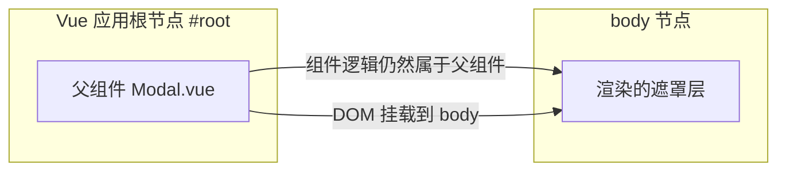

上图表达 Teleport 的核心：组件逻辑在左，DOM 结果在右，二者通过 Teleport 解耦。

## 2. 形式化定义

`<Teleport>` 是一个 Vue 内置组件，其形式化行为可以描述为：给定源组件 S、目标节点 T（由 `to` 指定）与子内容 C，Teleport 在 S 的渲染函数中接收 C，但在挂载阶段把 C 的根 DOM 节点插入到 T 下，而不是 S 的父节点下。

关键 props：

`to`：必填属性，类型为 `string | HTMLElement`。字符串形式是 CSS 选择器（如 `body`、`#modal-root`），Vue 会在文档中查找第一个匹配元素；也可以直接传入一个 DOM 元素对象。

`disabled`：可选属性，类型为 `boolean`，默认 `false`。当为 `true` 时，Teleport 退化为普通渲染，内容留在源组件的位置。该属性支持响应式切换，适合移动端与桌面端使用不同布局的场景。

`defer`：Vue 3.5 新增的可选属性，类型为 `boolean`。当为 `true` 时，Teleport 会等待目标节点在后续渲染中出现后再挂载，解决“目标节点本身也是动态渲染”的时序问题。

形式化约束：

第一，目标节点必须在 Teleport 挂载时已存在于文档中（除非使用 `defer`）；

第二，Teleport 的子内容仍然参与源组件的依赖追踪、生命周期与 keep-alive 缓存逻辑；

第三，多个 Teleport 指向同一目标时，按渲染顺序依次追加，后挂载的在 DOM 中位于更后面，因此在视觉上层级更高（相同 z-index 条件下）；

第四，Teleport 不改变 Vue 的虚拟 DOM 层级，因此 `$parent`、provide/inject、事件冒泡（组件事件）均不受影响。

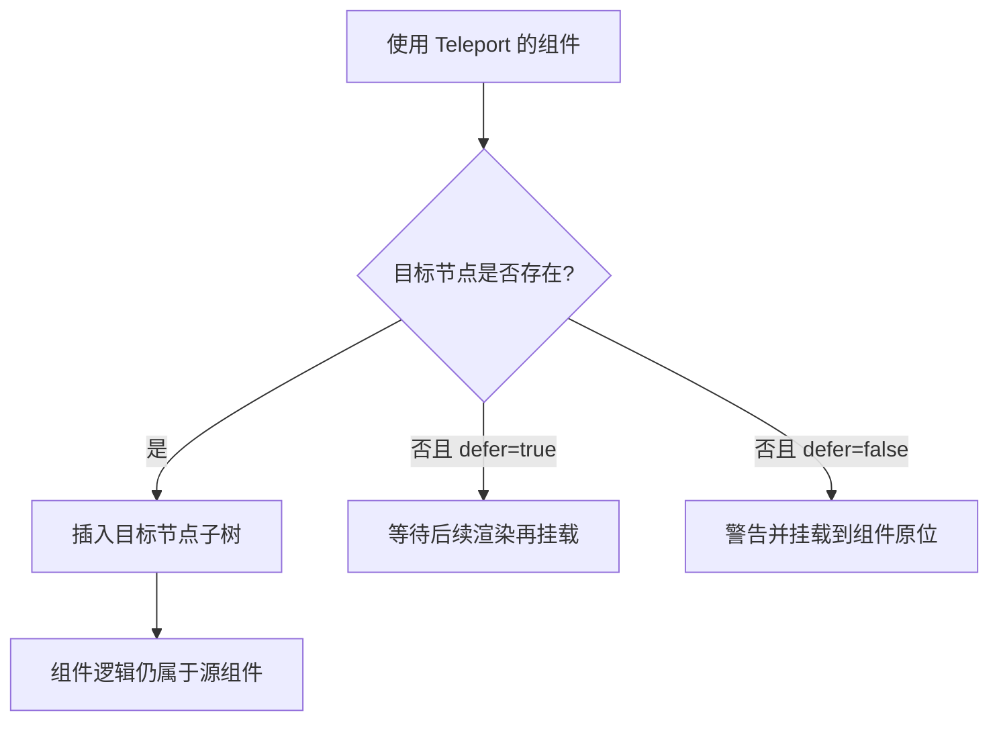

## 3. 理论推导与原理解析

### 3.1 为什么需要 Teleport：层叠上下文推导

CSS 的层叠上下文（stacking context）由 `transform`、`filter`、`opacity < 1`、`position + z-index`、`contain` 等属性创建。一旦浮层所在父元素创建了层叠上下文，浮层的 z-index 就只能在该上下文内部比较，无法覆盖页面其他部分。

推导示例：父元素 `.card` 设置了 `transform: translateY(0)`（为了动画），内部模态框使用 `position: fixed; z-index: 9999`。由于 `transform` 使 `.card` 成为包含块与层叠上下文，模态框的 fixed 定位参照的不是视口而是 `.card`，z-index 9999 也只在与 `.card` 同级的元素之间生效。结果模态框可能被后续兄弟元素遮挡，或者定位偏移。

Teleport 的解决方案是物理上把模态框 DOM 移到 body 下，从而绕开父级的所有 CSS 约束。这正是“用 DOM 结构解决 CSS 限制”的典型工程手段。

### 3.2 虚拟 DOM 与真实 DOM 的分离

Vue 3 的渲染器（runtime-dom）在 patch 阶段区分“移动 vnode”与“挂载 vnode”。Teleport 在编译阶段生成 `Teleport` 类型的 vnode，渲染器遇到该类型时调用专门的 `process` 逻辑：目标节点解析成功后，把子 vnode 的 DOM 插入目标节点；`disabled` 为真时，则插入到当前组件容器。

因此 Teleport 的“传送”发生在渲染器层面，组件树（vnode 树）从未改变。这一设计带来两个推论：其一，`<Transition>` 包裹 Teleport 内容时过渡动画正常工作，因为过渡基于 vnode 生命周期；其二，Teleport 内容中的组件仍然可以通过 `provide/inject` 访问源组件的上下文。

### 3.3 挂载顺序推导

多个 Teleport 共享目标节点时，Vue 按子 vnode 的 patch 顺序依次 append。这意味着模板中先出现的 Teleport 内容在 DOM 中位于前面。如果要控制多个浮层的视觉层级（如提示层盖过弹窗层），应调整模板顺序或显式设置 z-index。

## 4. 代码示例（带详尽注释）

### 4.1 基础用法：把模态框传送到 body

```vue
<script setup>
import { ref } from 'vue'

// 控制模态框显示与否的响应式状态
const visible = ref(false)

// 打开与关闭函数：按钮事件会调用它们
const open = () => { visible.value = true }
const close = () => { visible.value = false }
</script>

<template>
  <div class="page">
    <!-- 页面主按钮：触发打开模态框 -->
    <button @click="open">打开模态框</button>

    <!-- Teleport 把遮罩层挂载到 body，避免父容器 overflow/transform 的影响 -->
    <Teleport to="body">
      <!-- 使用 v-if 条件渲染：visible 为 true 时才创建 DOM -->
      <div v-if="visible" class="modal-mask" @click.self="close">
        <div class="modal-panel">
          <h2>通知</h2>
          <p>这是一段由 Teleport 渲染到 body 下的内容。</p>
          <!-- 关闭按钮：阻止事件冒泡后调用 close -->
          <button @click="close">关闭</button>
        </div>
      </div>
    </Teleport>
  </div>
</template>

<style scoped>
/* scoped 样式仍然生效：Vue 会给 Teleport 内容添加 data 属性 */
.modal-mask {
  position: fixed;
  inset: 0;
  background: rgba(0, 0, 0, 0.5);
  display: flex;
  align-items: center;
  justify-content: center;
}
.modal-panel {
  background: #fff;
  padding: 24px;
  border-radius: 8px;
  min-width: 320px;
}
</style>
```

讲解：本示例是 Teleport 最标准的应用。要点有三个：`to="body"` 把 DOM 挂到 body；`v-if` 控制显示；`@click.self` 只允许点击遮罩本身时关闭，点击面板内部不触发。scoped 样式对 Teleport 内容同样生效，因为 Vue 的 scoped 机制基于编译期注入的 data 属性，与 DOM 位置无关。

### 4.2 disabled 属性的响应式切换

```vue
<script setup>
import { ref } from 'vue'

// 根据屏幕宽度决定是否启用传送
// 移动端希望浮层留在组件内做抽屉，桌面端希望挂到 body 做居中弹窗
const isMobile = ref(window.matchMedia('(max-width: 768px)').matches)

// 监听视口变化，实时更新 isMobile
window.matchMedia('(max-width: 768px)').addEventListener('change', (e) => {
  isMobile.value = e.matches
})
</script>

<template>
  <!-- disabled 为 true 时内容留在原位，为 false 时传送到 body -->
  <Teleport to="body" :disabled="isMobile">
    <div class="drawer">响应式浮层</div>
  </Teleport>
</template>
```

讲解：`disabled` 支持响应式绑定。本示例用 `matchMedia` 判断移动端，移动端渲染为组件内抽屉，桌面端渲染为 body 弹窗。需要注意 `window.matchMedia(...).addEventListener` 在新版浏览器中已取代已废弃的 `addListener`。

### 4.3 动态目标节点与 defer

```vue
<script setup>
import { ref, onMounted } from 'vue'

// 目标节点可能由其他组件动态创建
const target = ref(null)
const containerRef = ref(null)

onMounted(() => {
  // 动态创建一个挂载点元素
  target.value = document.createElement('div')
  target.value.id = 'dynamic-target'
  document.body.appendChild(target.value)
})
</script>

<template>
  <!-- defer=true 时，即使目标节点在初始渲染时还不存在，也会等它出现后再挂载 -->
  <Teleport defer :to="containerRef?.$el ?? '#dynamic-target'">
    <p>动态目标测试</p>
  </Teleport>
</template>
```

讲解：`defer` 是 Vue 3.5 新增属性，解决目标节点晚于 Teleport 渲染的时序问题。示例中目标节点在 `onMounted` 后创建，若不使用 `defer`，Teleport 在初始挂载时找不到目标，会发出警告并回退到原位渲染。

### 4.4 与 Transition 组合实现动画

```vue
<template>
  <Teleport to="body">
    <!-- Transition 包裹浮层：进入与离开都执行淡入淡出 -->
    <Transition name="fade">
      <div v-if="visible" class="modal-mask">
        <div class="modal-panel">带动画的模态框</div>
      </div>
    </Transition>
  </Teleport>
</template>

<style>
/* 过渡类名需要写在全局样式或非 scoped 样式块中 */
.fade-enter-active,
.fade-leave-active {
  transition: opacity 0.25s ease;
}
.fade-enter-from,
.fade-leave-to {
  opacity: 0;
}
</style>
```

讲解：Teleport 与 Transition 组合是官方推荐模式。进入动画在 vnode 挂载时触发，离开动画在卸载前执行，不会因为 DOM 位置改变而失效。注意过渡类名样式若写在 scoped 块中，由于 Teleport 内容与样式所在组件可能不在同一 DOM 子树，建议把过渡类名放入全局样式。

### 4.5 多 Teleport 共享目标

```vue
<template>
  <Teleport to="body">
    <div class="toast toast-a">第一条提示</div>
  </Teleport>
  <Teleport to="body">
    <div class="toast toast-b">第二条提示</div>
  </Teleport>
</template>
```

讲解：两个 Teleport 都指向 body，第一条提示在 DOM 中先出现，第二条随后追加。若两者 z-index 相同，后追加者在视觉上更靠上。需要精确控制覆盖顺序时，调整模板顺序即可。

## 5. 对比分析

### 5.1 Teleport 与 React Portal 对比

| 维度 | Vue Teleport | React createPortal |
| --- | --- | --- |
| 声明方式 | 模板内置组件 | `ReactDOM.createPortal(children, node)` |
| 目标指定 | `to` 选择器或元素 | 直接传 DOM 元素 |
| 禁用切换 | `disabled` prop | 自行条件渲染 |
| 延迟挂载 | Vue 3.5 的 `defer` | 无内置等效 |
| 事件系统 | 原生 DOM 事件仍按 DOM 树冒泡 | 合成事件按 React 树冒泡 |

讲解：两者解决同一类问题，但 Vue 把 Teleport 内置进模板系统，声明式更强；React 的 Portal 是命令式函数调用。Vue 的 DOM 事件冒泡遵循真实 DOM 结构（Teleport 后事件从 body 向上冒泡），React 的合成事件则遵循组件树，这是迁移时最容易踩的差异。

### 5.2 Teleport 与普通条件渲染对比

普通条件渲染把浮层放在组件原位，代码简单但受父级 CSS 限制；Teleport 牺牲一点可读性换取 DOM 位置的自由。工程上推荐：浮层类组件一律使用 Teleport，普通内容使用条件渲染。

### 5.3 Teleport 与 CSS 方案对比

`position: fixed` 加高 z-index 是 Teleport 出现前的常见方案，但无法解决父级 transform 创建包含块的问题。Teleport 是结构性方案，CSS 是表现性方案，两者可以共存：Teleport 解决挂载位置，CSS 解决视觉样式。

## 6. 常见陷阱与最佳实践

陷阱一：目标节点不存在。`to` 指向的选择器在挂载时找不到元素时，Vue 会告警并回退。最佳实践：在 `index.html` 中预留 `<div id="modal-root">`，或使用 `defer`。

陷阱二：scoped 样式失效的误判。Teleport 内容仍带 scope 属性，scoped 样式基本有效；但组件根节点样式选择器 `:deep()` 的行为需要测试验证。

陷阱三：在 SSR 场景使用 Teleport。服务端渲染时 Teleport 目标通常是 body，SSR 输出中浮层位置与客户端挂载后不一致，可能产生 hydration 警告。最佳实践：SSR 下用 `disabled` 或条件判断，仅在客户端渲染浮层。

陷阱四：Teleport 内容中的事件监听。原生事件冒泡按 DOM 树进行，Teleport 到 body 后，点击事件不会经过原父组件，依赖父级事件委托的代码会失效。最佳实践：在浮层内部使用组件事件或显式监听。

陷阱五：无限 Teleport 嵌套。Teleport 目标是另一个 Teleport 的内容时，需要保证目标在渲染时存在，否则产生循环依赖。

最佳实践：把模态框、通知、弹层封装成独立组件，统一使用 `<Teleport to="body">`；为每个浮层定义清晰的 z-index 规范；动画交给 Transition；内容状态交给组件自身。

## 7. 工程实践

### 7.1 全局 Modal 管理器封装

```ts
// modal-manager.ts：集中管理多个模态框的挂载与状态
import { reactive } from 'vue'

// 全局模态框注册表：每个条目包含组件与 props
interface ModalEntry {
  id: number
  component: object
  props: Record<string, unknown>
}

export const modalState = reactive<{ stack: ModalEntry[] }>({ stack: [] })

let nextId = 1

// 打开模态框：压入栈顶，后打开的在视觉上层
export function openModal(component: object, props: Record<string, unknown> = {}) {
  modalState.stack.push({ id: nextId++, component, props })
}

// 关闭指定模态框
export function closeModal(id: number) {
  const idx = modalState.stack.findIndex((m) => m.id === id)
  if (idx !== -1) modalState.stack.splice(idx, 1)
}
```

讲解：该管理器用响应式栈保存所有模态框，配合模板中的单个 Teleport 循环渲染。集中管理带来三个好处：浮层层级可控、状态可调试、多个组件可以共享打开逻辑。

```vue
<template>
  <!-- 唯一的 Teleport 出口：所有模态框都渲染在 body 下 -->
  <Teleport to="body">
    <div v-for="m in modalState.stack" :key="m.id">
      <component :is="m.component" v-bind="m.props" @close="closeModal(m.id)" />
    </div>
  </Teleport>
</template>

<script setup lang="ts">
import { modalState, closeModal } from './modal-manager'
</script>
```

讲解：`v-for` 渲染整个栈，`v-bind` 透传 props，`@close` 统一关闭。这个模式可扩展到 toast 通知、图片预览、确认框等所有浮层类 UI。

### 7.2 移动端底部抽屉与桌面端弹窗

```vue
<template>
  <!-- 移动端禁用传送，抽屉渲染在页面内；桌面端传送至 body -->
  <Teleport to="body" :disabled="isMobile">
    <Transition name="slide">
      <div v-if="open" :class="isMobile ? 'drawer' : 'dialog'">
        <slot />
      </div>
    </Transition>
  </Teleport>
</template>
```

讲解：一个组件同时服务两种形态，靠 `disabled` 响应式切换。样式类随形态变化，行为逻辑完全复用。

## 8. 案例研究：完整实现一个带遮罩的确认对话框

需求：实现 ConfirmDialog 组件，满足以下约束：挂载在 body 下；带淡入淡出动画；点击遮罩关闭；支持确认与取消回调；在 Vue Router 页面切换时自动关闭。

组件实现：

```vue
<script setup lang="ts">
import { ref, onBeforeUnmount } from 'vue'

// 对外暴露的可见状态与回调
const props = defineProps<{
  visible: boolean
  title?: string
  message?: string
}>()

const emit = defineEmits<{
  (e: 'update:visible', v: boolean): void
  (e: 'confirm'): void
  (e: 'cancel'): void
}>()

// 内部关闭：同步 visible 状态并触发 cancel
const close = () => {
  emit('update:visible', false)
  emit('cancel')
}

// 确认关闭：同步状态并触发 confirm
const confirm = () => {
  emit('update:visible', false)
  emit('confirm')
}

// 路由离开或组件卸载时自动清理
onBeforeUnmount(() => {
  emit('update:visible', false)
})
</script>

<template>
  <Teleport to="body">
    <Transition name="fade">
      <div v-if="props.visible" class="confirm-mask" @click.self="close">
        <div class="confirm-panel" role="dialog" aria-modal="true">
          <h3>{{ props.title ?? '确认操作' }}</h3>
          <p>{{ props.message }}</p>
          <div class="actions">
            <button @click="close">取消</button>
            <button class="primary" @click="confirm">确定</button>
          </div>
        </div>
      </div>
    </Transition>
  </Teleport>
</template>
```

讲解：组件通过 `v-model:visible` 双绑控制显隐，`@click.self` 实现遮罩关闭，`aria-modal` 提升无障碍支持。`onBeforeUnmount` 保证组件被销毁时状态不会残留。Teleport 确保该对话框在任何页面中都能覆盖全屏，不受路由组件容器样式影响。

配套使用：

```vue
<ConfirmDialog v-model:visible="showConfirm" title="删除确认" message="删除后不可恢复，确定继续吗？" @confirm="doDelete" />
```

## 9. 知识要点总结与深入讲解

Teleport 的核心一句话：DOM 位置可变，逻辑归属不变。理解这句话就能推导出大部分行为。

为什么 DOM 位置可变：因为 Vue 渲染器在 patch 阶段单独处理 Teleport 类型的 vnode，把子内容挂到目标节点。

为什么逻辑归属不变：因为组件树没有改变，props、事件、依赖注入、作用域插槽都按源码位置解析。

什么场景必须用 Teleport：模态框、通知、下拉浮层等需要突破父级层叠上下文与裁剪限制的 UI；什么场景不必用：普通内容布局、无需脱离文档流的元素。

`disabled` 与 `defer` 是两个容易忽略的 props：前者做响应式形态切换，后者解决目标节点时序。Vue 3.5+ 项目中应优先掌握这两个特性。

### 1. Teleport 基础

#### 1.1 基本用法

```html
<Teleport to="body">
  <div class="modal">模态框内容</div>
</Teleport>
```

`to` 属性指定目标容器，内容渲染到该容器中，但逻辑仍属于当前组件。

#### 1.2 条件传送

```html
<Teleport to="body" :disabled="isMobile">
  <Modal />
</Teleport>
```

`disabled` 为 true 时，内容渲染在原位。

### 1. 实际应用

#### 1.1 模态框

```html
<Teleport to="body">
  <div v-if="show" class="modal-overlay" @click="show = false">
    <div class="modal-content" @click.stop>
      <slot />
    </div>
  </div>
</Teleport>
```

#### 1.2 通知系统

```html
<Teleport to="#notifications">
  <TransitionGroup name="notification">
    <div v-for="n in notifications" :key="n.id" class="notification">{{ n.message }}</div>
  </TransitionGroup>
</Teleport>
```

#### 1.3 全屏遮罩

```html
<Teleport to="body">
  <div v-if="loading" class="fullscreen-loading">
    <Spinner />
  </div>
</Teleport>
```

### 2. 多 Teleport 同一目标

多个 Teleport 到同一目标时，按渲染顺序追加：

```html
<Teleport to="#modals">
  <div>A</div>
</Teleport>
<Teleport to="#modals">
  <div>b</div>
</Teleport>
<!-- 结果：a, b -->
```

<!-- ============================================================ vue3/027-KeepAliveCacheLifecycle ============================================================ -->

## 1. 历史动机与发展脉络

SPA 中组件随路由切换频繁创建与销毁。Vue 2 时期，开发者用 `<keep-alive>` 包裹动态组件保存状态，但只能缓存组件树中的组件；Vue Router 场景则需要 `keep-alive` 包裹 `<router-view>`，配合路由 meta 判断。Vue 3 保留 `<KeepAlive>`（PascalCase 命名），内部实现基于 `MoveType` 的移动缓存：被缓存组件卸载时以“失活”状态移入隐藏容器，而不是销毁。

Vue 3 的 KeepAlive 实现与 Suspense、异步组件深度集成：`defineAsyncComponent` 加载完成的组件可以被缓存；KeepAlive 内的组件卸载（`unmount`）时，若命中缓存则只执行 `deactivated` 而不执行 `unmounted`。Vue 3.4 后缓存渲染器的内部调度优化进一步减少了失活/激活的抖动。

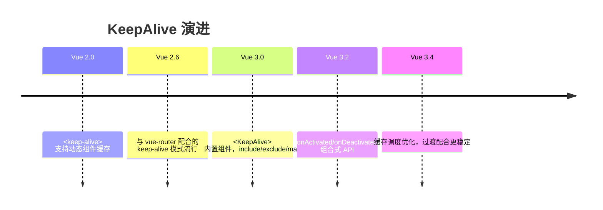

## 2. 形式化定义

`<KeepAlive>` 是 Vue 内置组件，其行为形式化描述为：对直接子组件（通常只有一个动态子组件或 router-view）建立缓存表，键为子组件的类型标识（name 或定义对象）；当子组件卸载时，若命中 include/exclude 规则且缓存表未满，将其 vnode 与实例移入缓存容器；当子组件重新渲染时，若命中缓存，复用实例并触发 `activated`。

props：

`include`：字符串、正则或数组，匹配组件 name。匹配成功的组件才会被缓存；

`exclude`：同上，匹配成功的组件不被缓存。exclude 优先级高于 include；

`max`：数字，最大缓存实例数。超过时按 LRU（最近最少使用）淘汰最久未激活的缓存。

生命周期契约：被缓存组件在离开视图时触发 `onDeactivated`，重新进入时触发 `onActivated`；`onMounted`/`onUnmounted` 只在首次创建与最终销毁时各执行一次。

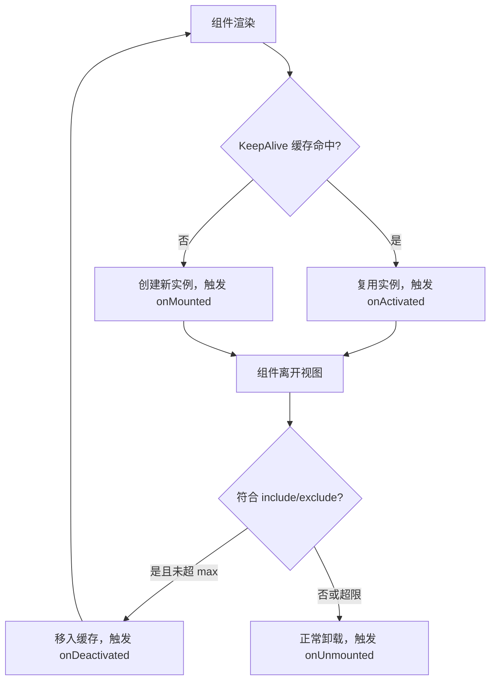

## 3. 理论推导与原理解析

### 3.1 缓存键与匹配规则

Vue 3 的 KeepAlive 使用 `getComponentName` 获取组件 name 作为匹配依据；未声明 name 的组件可以退化为组件定义对象自身。`include` 匹配采用字符串精确匹配、正则 `test` 或数组遍历。`<script setup>` 组件默认文件名即 name（Vue 3.2.34+ 支持通过 `defineOptions({ name })` 显式声明）。

### 3.2 LRU 淘汰推导

缓存表是一个 Map（有序键值）。每次命中时把键移到末尾（最近使用）；插入新缓存且数量超过 `max` 时，删除表头键（最久未使用）。推导可知：`max=10` 时，第 11 个组件进入会淘汰第 1 个，被淘汰组件真正卸载并触发 `onUnmounted`。

### 3.3 与路由的协作

`<router-view v-slot="{ Component }"><KeepAlive><component :is="Component" /></KeepAlive></router-view>` 是路由缓存的推荐形态。路由切换时，新路由组件实例进入视图，旧路由组件被缓存。`activated` 可用于判断“从缓存恢复”，从而决定是否刷新数据。

## 4. 代码示例（带详尽注释）

### 4.1 基础缓存

```vue
<script setup>
import { ref, onActivated, onDeactivated, onMounted, onUnmounted } from 'vue'

// 列表数据与滚动位置
const list = ref([])
const scrollTop = ref(0)

// 首次创建时加载数据
onMounted(async () => {
  console.log('首次挂载')
  list.value = await fetchList()
})

// 从缓存恢复时：恢复滚动位置，可按需刷新
onActivated(() => {
  console.log('从缓存激活')
  window.scrollTo(0, scrollTop.value)
})

// 离开视图进入缓存时：记录滚动位置
onDeactivated(() => {
  scrollTop.value = window.scrollY
})

// 缓存被淘汰或组件最终销毁时触发
onUnmounted(() => {
  console.log('真正卸载')
})
</script>

<template>
  <div>
    <div v-for="item in list" :key="item.id" class="item">{{ item.title }}</div>
  </div>
</template>
```

讲解：四个生命周期钩子的分工：`onMounted` 只执行一次（首次），`onActivated` 每次从缓存恢复都执行，`onDeactivated` 每次进入缓存执行，`onUnmounted` 只在淘汰时执行。这个对比是理解 KeepAlive 的关键。

### 4.2 include/exclude 控制

```vue
<script setup>
import { ref } from 'vue'
import ListPage from './ListPage.vue'
import DetailPage from './DetailPage.vue'

// 只缓存列表页，不缓存详情页
const cachedPages = ref(['ListPage'])
</script>

<template>
  <!-- include 使用逗号分隔字符串、正则或数组 -->
  <KeepAlive :include="cachedPages">
    <component :is="currentPage" />
  </KeepAlive>
</template>
```

讲解：`include` 动态变化时，被移出名单的缓存组件会立即被销毁（触发 unmounted），这是清理缓存的标准手段。

### 4.3 max 与 LRU

```vue
<template>
  <!-- 最多缓存 5 个页面，超出按最近最少使用淘汰 -->
  <KeepAlive :max="5">
    <router-view />
  </KeepAlive>
</template>
```

讲解：`max` 保护内存。用户在标签页系统中打开大量页面时，最久未访问的页面被自动销毁，避免内存无限增长。

### 4.4 与路由 meta 结合

```vue
<script setup>
import { useRoute } from 'vue-router'
const route = useRoute()
</script>

<template>
  <!-- 通过路由 meta.keepAlive 决定是否缓存 -->
  <KeepAlive :include="route.meta.keepAlive ? [route.name] : []">
    <router-view />
  </KeepAlive>
</template>
```

讲解：把缓存策略放进路由配置：`meta: { keepAlive: true }` 的页面缓存，其余不缓存。路由表成为缓存策略的单一事实来源。

### 4.5 缓存清理

```vue
<script setup>
import { ref, watch } from 'vue'

// 需要缓存的页面名列表
const keep = ref(['ListPage'])

// 用户点击“刷新”时，先清空缓存再重新进入
function refreshList() {
  keep.value = []
  // 下一帧恢复缓存名单，让组件重新创建
  requestAnimationFrame(() => {
    keep.value = ['ListPage']
  })
}
</script>

<template>
  <KeepAlive :include="keep">
    <router-view />
  </KeepAlive>
</template>
```

讲解：`include` 移除即销毁缓存实例，恢复名单后下次进入创建新实例，实现“强制刷新”。这是清理陈旧数据的官方推荐模式。

### 4.6 与 Teleport 协作

```vue
<template>
  <KeepAlive>
    <router-view v-slot="{ Component }">
      <!-- Teleport 内容也随缓存生命周期管理 -->
      <Teleport to="body">
        <component :is="Component" />
      </Teleport>
    </router-view>
  </KeepAlive>
</template>
```

讲解：KeepAlive 与 Teleport 可以组合：被缓存的页面即使 DOM 挂在 body 下，失活时也会整体移入缓存容器，不会残留浮层。

### 4.7 缓存与异步组件

```vue
<script setup>
import { defineAsyncComponent } from 'vue'

// 懒加载的重型页面组件
const HeavyPage = defineAsyncComponent(() => import('./HeavyPage.vue'))
</script>

<template>
  <KeepAlive :max="3">
    <component :is="HeavyPage" />
  </KeepAlive>
</template>
```

讲解：异步组件加载完成后可以被 KeepAlive 缓存；再次进入不需要重新发起网络请求。适合图表、编辑器等昂贵页面。

## 5. 对比分析

### 5.1 缓存组件与普通组件生命周期对比

| 阶段 | 普通组件 | KeepAlive 缓存组件 |
| --- | --- | --- |
| 首次进入 | mounted | mounted + activated |
| 离开视图 | unmounted | deactivated |
| 再次进入 | 重新创建 + mounted | activated（复用） |
| 最终销毁 | unmounted | unmounted（淘汰时） |

### 5.2 KeepAlive 与手动状态提升

把状态提升到 Pinia/父组件也能保留数据，但 DOM 状态（滚动位置、输入焦点、动画）需要手动恢复；KeepAlive 保留完整实例与 DOM，代价是内存。数据轻、DOM 重时用 KeepAlive；数据重、DOM 轻时用状态管理。

### 5.3 与 React 生态对比

React 没有内置 KeepAlive 等价物，社区方案（react-activation）模拟类似行为；Next.js 的 App Router 缓存的是 RSC 数据而非组件实例。Vue 的 KeepAlive 在“保留完整组件状态”这一点上仍是独有优势。

## 6. 常见陷阱与最佳实践

陷阱一：组件未声明 name，`include` 匹配失败。`<script setup>` 组件需 `defineOptions({ name: 'Xxx' })`。

陷阱二：把需要实时刷新的数据放进缓存组件，恢复后数据陈旧。最佳实践：`onActivated` 中按策略刷新。

陷阱三：缓存大量重型组件导致内存膨胀。最佳实践：设置 `max`，动态调整 include 名单。

陷阱四：在 `onDeactivated` 中执行销毁逻辑（如清除定时器），导致再次激活时功能缺失。定时器应继续运行或在 activated 重建。

陷阱五：KeepAlive 直接包裹多个子元素。KeepAlive 只缓存直接子组件，多子元素时应使用单根组件包裹或 v-if 切换。

陷阱六：与 Transition 组合时顺序错误。推荐 `<Transition><KeepAlive>...</KeepAlive></Transition>` 的顺序（KeepAlive 在内），并确认过渡模式。

## 7. 工程实践

### 7.1 标签页系统的缓存策略

```ts
// tabs.ts：标签页状态管理（Pinia）
import { defineStore } from 'pinia'

export const useTabsStore = defineStore('tabs', {
  state: () => ({
    // 已打开标签
    tabs: [] as Array<{ name: string; title: string }>,
    // 缓存名单：默认全部缓存，可单独关闭
    cacheable: new Set<string>()
  }),
  actions: {
    openTab(tab: { name: string; title: string }) {
      if (!this.tabs.some((t) => t.name === tab.name)) {
        this.tabs.push(tab)
        this.cacheable.add(tab.name)
      }
    },
    closeTab(name: string) {
      this.tabs = this.tabs.filter((t) => t.name !== name)
      // 关闭标签同时从缓存名单移除，销毁实例
      this.cacheable.delete(name)
    }
  }
})
```

讲解：`cacheable` 集合与 KeepAlive 的 `include` 绑定：打开标签加入缓存，关闭标签移除缓存（触发销毁）。标签页系统的内存与状态由此闭环管理。

### 7.2 表单草稿保留

表单页使用 KeepAlive 缓存后，用户误点返回再前进时草稿自动保留。配合 `onDeactivated` 记录离开时间，`onActivated` 判断是否提示“继续编辑或重置”。

## 8. 案例研究：带缓存的多标签文档站

需求：文档站支持多个文档标签页，切换不丢失阅读位置与搜索状态，最多同时缓存 5 个标签。

```vue
<template>
  <KeepAlive :include="tabNames" :max="5">
    <RouterView v-slot="{ Component }">
      <component :is="Component" />
    </RouterView>
  </KeepAlive>
</template>

<script setup>
import { computed } from 'vue'
import { useTabsStore } from '@/stores/tabs'

const tabs = useTabsStore()
// 缓存名单 = 当前打开的标签页名称
const tabNames = computed(() => [...tabs.cacheable])
</script>
```

讲解：路由视图被 KeepAlive 包裹，`include` 绑定标签状态。用户切换标签时，页面实例与滚动位置原样保留；关闭标签时实例销毁释放内存。`max=5` 兜底防止异常场景下的内存膨胀。

配套：每个页面在 `onActivated` 中检查数据版本，若全局数据版本变化（如文档更新）则局部刷新，兼顾缓存体验与数据新鲜度。

## 9. 知识要点总结与深入讲解

KeepAlive 的本质是“实例级缓存”：缓存的是组件实例与 DOM，而不是序列化数据。因此它能保留滚动位置、输入焦点、动画状态等难以手动保存的运行时状态。

生命周期的关键词是“失活”与“激活”：`deactivated` 不是销毁，`activated` 不是重建。判断逻辑该放在哪个钩子，取决于“只执行一次”还是“每次进出都执行”。

缓存管理三件套：`include` 控制谁缓存，`exclude` 排除谁，`max` 限制总量。动态修改 include 是清理缓存的官方途径；理解 LRU 淘汰机制可以解释 max 的行为。

### 1. KeepAlive 基础

#### 1.1 基本用法

```html
<RouterView v-slot="{ Component }">
  <KeepAlive>
    <component :is="Component" />
  </KeepAlive>
</RouterView>
```

#### 1.2 缓存策略

```html
<!-- 缓存指定组件 -->
<KeepAlive include="UserList,Settings">
  <component :is="current" />
</KeepAlive>

<!-- 排除指定组件 -->
<KeepAlive exclude="Login">
  <component :is="current" />
</KeepAlive>

<!-- 最大缓存数 -->
<KeepAlive :max="10">
  <component :is="current" />
</KeepAlive>
```

### 1. 生命周期钩子

```javascript
import { onActivated, onDeactivated } from 'vue';

export default {
  setup() {
    onActivated(() => {
      console.log('组件被激活');
    });

    onDeactivated(() => {
      console.log('组件被停用');
    });
  },
};
```

| 钩子            | 触发时机         |
| --------------- | ---------------- |
| `onActivated`   | 组件从缓存激活时 |
| `onDeactivated` | 组件被缓存停用时 |

### 2. 缓存刷新

```javascript
// 需要刷新缓存时，移除 include 中的组件名
const cachedViews = ref(['UserList', 'Settings']);

function refreshCache(name) {
  cachedViews.value = cachedViews.value.filter((v) => v !== name);
  nextTick(() => {
    cachedViews.value.push(name);
  });
}
```
### KeepAlive 基础

**KeepAlive 缓存组件**
```vue
<template>
  <KeepAlive>
    <component :is="currentComponent" />
  </KeepAlive>
</template>

<script setup>
import { ref, computed } from 'vue';
import CompA from './CompA.vue';
import CompB from './CompB.vue';

const tab = ref('A');
const currentComponent = computed(() => tab.value === 'A' ? CompA : CompB);
</script>
```

**KeepAlive 配合 router-view**
```vue
<template>
  <KeepAlive>
    <router-view />
  </KeepAlive>
</template>
```

---

### Props

**include 包含**
`<KeepAlive include="<name1>, <name2>">`
```vue
<!-- 缓存指定名称的组件 -->
<KeepAlive include="CompA,CompB">
  <component :is="current" />
</KeepAlive>

<!-- 数组形式 -->
<KeepAlive :include="['CompA', 'CompB']">
  <component :is="current" />
</KeepAlive>

<!-- 正则 -->
<KeepAlive :include="/^Comp/">
  <component :is="current" />
</KeepAlive>
```

**exclude 排除**
`<KeepAlive exclude="<name1>, <name2>">`
```vue
<KeepAlive exclude="CompC">
  <component :is="current" />
</KeepAlive>

<KeepAlive :exclude="['CompC', 'CompD']">
  <component :is="current" />
</KeepAlive>

<KeepAlive :exclude="/^Admin/">
  <component :is="current" />
</KeepAlive>
```

**max 最大缓存数**
`<KeepAlive :max="<number>">`
```vue
<KeepAlive :max="10">
  <component :is="current" />
</KeepAlive>
<!-- 超过 10 个时,LRU 淘汰最久未访问的 -->
```

**组合使用**
```vue
<KeepAlive :include="['CompA', 'CompB']" :max="5">
  <component :is="current" />
</KeepAlive>
```

---

### 缓存组件命名

**defineOptions 指定 name**
```vue
<script setup>
defineOptions({
  name: 'CompA'
});
</script>
```

**defineComponent 指定 name**
```typescript
export default defineComponent({
  name: 'CompA',
  setup() { /* ... */ }
});
```

**单文件组件文件名自动推断**
```vue
<!-- CompA.vue -->
<!-- 默认 name 推断为 CompA -->
<script setup>
</script>
```

---

### 生命周期钩子

**onActivated 缓存激活**
`onActivated(<callback>);`
```typescript
import { onActivated } from 'vue';

onActivated(() => {
  console.log('组件从缓存激活');
  refreshData();
  resumeTimer();
});
```

**onDeactivated 缓存停用**
`onDeactivated(<callback>);`
```typescript
import { onDeactivated } from 'vue';

onDeactivated(() => {
  console.log('组件被缓存(停用)');
  pauseTimer();
});
```

**钩子执行顺序**
```typescript
import {
  onMounted, onActivated,
  onDeactivated, onUnmounted
} from 'vue';

// 首次渲染:
//   onMounted -> onActivated
// 切换到其他组件:
//   onDeactivated
// 切换回来:
//   onActivated
// 完全销毁:
//   onDeactivated -> onUnmounted

onMounted(() => console.log('mounted'));
onActivated(() => console.log('activated'));
onDeactivated(() => console.log('deactivated'));
onUnmounted(() => console.log('unmounted'));
```

---

### KeepAlive 实战模式

**列表页 + 详情页缓存**
```vue
<template>
  <KeepAlive :include="['ListPage']">
    <router-view />
  </KeepAlive>
</template>
vue
<!-- ListPage.vue -->
<script setup>
import { ref, onActivated, onDeactivated } from 'vue';

const scrollPos = ref(0);
const list = ref([]);

onActivated(() => {
  // 恢复滚动位置
  window.scrollTo(0, scrollPos.value);
});

onDeactivated(() => {
  // 保存滚动位置
  scrollPos.value = window.scrollY);
});
</script>
```

**条件缓存(动态 include)**
```vue
<template>
  <KeepAlive :include="cachedNames">
    <component :is="currentComp" />
  </KeepAlive>
</template>

<script setup>
import { ref, computed } from 'vue';

const keepAliveList = ref(['Home', 'List']);

const cachedNames = computed(() => {
  return keepAliveList.value;
});

function clearCache(name) {
  keepAliveList.value = keepAliveList.value.filter(n => n !== name);
}
</script>
```

---

### 缓存控制 API

**通过组件实例访问 cache**
```typescript
import { getCurrentInstance } from 'vue';

const instance = getCurrentInstance();
// instance.cache 是内部缓存 Map,不推荐直接操作
```

**max + LRU 淘汰策略**
```vue
<!-- 最多缓存 3 个,最久未访问的被淘汰 -->
<KeepAlive :max="3">
  <component :is="current" />
</KeepAlive>
```

---

### 注意事项

**必须配合动态组件或 router-view**
```vue
<!-- 正确 -->
<KeepAlive>
  <component :is="current" />
</KeepAlive>

<!-- 正确 -->
<KeepAlive>
  <router-view />
</KeepAlive>

<!-- 错误:单个静态组件 -->
<KeepAlive>
  <StaticComp />
</KeepAlive>
<!-- 不会报错但毫无意义 -->
```

**v-if 与 KeepAlive 配合**
```vue
<KeepAlive>
  <CompA v-if="showA" />
  <CompB v-else />
</KeepAlive>
```

**注意 props include/exclude 匹配**
```vue
<!-- 必须确保组件 name 与 include 字符串完全匹配 -->
<script setup>
defineOptions({ name: 'UserProfile' });
</script>

<!-- 父组件 -->
<KeepAlive include="UserProfile">
  <UserProfile />
</KeepAlive>
```

---

### 综合应用

**Tab 切换缓存**
```vue
<template>
  <div class="tabs">
    <button
      v-for="tab in tabs"
      :key="tab.name"
      @click="current = tab.name"
      :class="{ active: current === tab.name }"
    >
      {{ tab.label }}
    </button>
  </div>

  <KeepAlive :max="5">
    <component :is="currentComp" />
  </KeepAlive>
</template>

<script setup>
import { ref, computed, markRaw } from 'vue';
import Home from './Home.vue';
import List from './List.vue';
import Detail from './Detail.vue';

const tabs = [
  { name: 'home', label: '首页', comp: markRaw(Home) },
  { name: 'list', label: '列表', comp: markRaw(List) },
  { name: 'detail', label: '详情', comp: markRaw(Detail) }
];

const current = ref('home');
const currentComp = computed(() =>
  tabs.find(t => t.name === current.value)?.comp
);
</script>
```

**onActivated 数据刷新**
```vue
<script setup>
import { ref, onActivated } from 'vue';

const lastActiveTime = ref<Date | null>(null);
const data = ref([]);

async function loadData() {
  data.value = await fetch('/api/data').then(r => r.json());
}

onActivated(async () => {
  const now = new Date();
  // 距离上次激活超过 30 秒,刷新数据
  if (!lastActiveTime.value ||
      now.getTime() - lastActiveTime.value.getTime() > 30000) {
    await loadData();
  }
  lastActiveTime.value = now;
});
</script>
```

<!-- ============================================================ vue3/028-AsyncComponentSuspense ============================================================ -->

# 异步组件与 Suspense | Async Components and Suspense in Vue 3

> 本文档对标 MIT 6.170、Stanford CS142、CMU 17-437 软件工程课程水准，系统化阐述 Vue 3 异步组件（`defineAsyncComponent`）与 `Suspense` 机制的原理、形式化定义、企业级实践与对比分析。涵盖代码分割（Code Splitting）、动态导入（Dynamic Import）、异步依赖编排（Async Orchestration）、错误边界（Error Boundary）、加载状态管理、SSR 流式渲染等主题，并辅以数学建模、对比分析、案例研究与习题。

---

## 1. 历史动机与发展脉络 | Historical Motivation and Evolution

### 1.1 代码分割的起源

Web 应用的体积随功能增长而膨胀，首屏 JS 体积从 2010 年的几十 KB 增长到 2025 年的数 MB。代码分割（Code Splitting）是应对此问题的核心技术，其设计动机：

1. **首屏性能**：用户访问页面时只需加载首屏所需的 JS，减少 LCP（Largest Contentful Paint）时间。
2. **带宽节省**：移动用户按需加载，避免下载未访问页面的代码。
3. **缓存优化**：将稳定代码与频繁变化代码分离，提升缓存命中率。

**关键里程碑**：

| 时间 | 事件 |
|------|------|
| 2015 | Webpack 1 引入 `require.ensure` 实现代码分割 |
| 2017 | Webpack 2 支持 `import()` 动态导入语法 |
| 2017 | React 16 引入 `React.lazy` 与 `Suspense` |
| 2018 | Vue 2.5 支持异步组件工厂函数（`(resolve, reject) => ...` 形式） |
| 2020 | Vue 3 重构 `defineAsyncComponent`，引入 Composition API 风格 |
| 2020 | Vue 3 引入 `Suspense`（实验性） |
| 2022 | Vue 3.2 增强 `Suspense`，支持嵌套与 SSR（官方仍标记为实验性） |
| 2024 | Vite 5 优化动态导入，支持模块预加载 |

### 1.2 Vue 2 时代的异步组件

Vue 2 通过组件工厂函数（`() => Promise`）实现异步组件，支持基础代码分割；`defineAsyncComponent` 是 Vue 3 引入的正式 API：

```javascript
// Vue 2 异步组件
Vue.component('async-component', (resolve, reject) => {
  import('./AsyncComponent.vue').then(resolve).catch(reject);
});

// Vue 2.5+ 工厂函数形式
const AsyncComponent = () => import('./AsyncComponent.vue');
```

**Vue 2 异步组件的限制**：

- 无内置 loading/error 配置，需手动管理。
- 无超时机制，组件加载失败时无降级方案。
- 无 Suspense 协调，多个异步组件无法统一管理加载态。
- 无 `async setup()`，数据获取需在 `created` 或 `mounted` 中处理。

### 1.3 Vue 3 时代（2020-至今）：完整重构

Vue 3 对异步组件进行根本性重构，并引入 `Suspense`：

#### 1.3.1 defineAsyncComponent 完整配置（Vue 3.0）

```javascript
import { defineAsyncComponent } from 'vue';

const AsyncComp = defineAsyncComponent({
  loader: () => import('./HeavyComponent.vue'),
  loadingComponent: LoadingSpinner,
  errorComponent: ErrorDisplay,
  delay: 200,           // 延迟显示 loading（毫秒）
  timeout: 3000,        // 超时显示 error（毫秒）
  suspensible: true,    // 参与 Suspense 协调（默认 true）
  onError(error, retry, fail, attempts) {
    if (attempts <= 3) retry();
    else fail();
  },
});
```

#### 1.3.2 Suspense 组件（Vue 3.0，实验性）

```vue
<Suspense>
  <template #default>
    <AsyncComponent />
  </template>
  <template #fallback>
    <LoadingSpinner />
  </template>
</Suspense>
```

#### 1.3.3 async setup()（Vue 3.0）

Vue 3 允许 `setup` 为 async 函数，自动与 Suspense 集成：

```javascript
export default {
  async setup() {
    const data = await fetch('/api/data').then(r => r.json());
    return { data };
  },
};
```

#### 1.3.4 嵌套 Suspense（Vue 3.2+）

Vue 3.2+ 支持嵌套 Suspense，允许局部异步依赖独立管理加载态：

```vue
<Suspense>
  <template #default>
    <Header />
    <Suspense>
      <template #default>
        <MainContent />
      </template>
      <template #fallback>
        <MainSkeleton />
      </template>
    </Suspense>
  </template>
  <template #fallback>
    <PageSkeleton />
  </template>
</Suspense>
```

#### 1.3.5 SSR 流式渲染（Vue 3.3+）

Vue 3.3+ 优化了 SSR 中的 Suspense，支持流式渲染（`renderToNodeStream`），服务端在异步依赖完成时立即输出对应 HTML，提升首屏 TTFB（Time To First Byte）。

### 1.4 Evan You 的设计哲学

Evan You 对异步组件与 Suspense 的定位：

1. **声明式优于命令式**：通过 `Suspense` 组件声明加载占位，而非手动切换 v-if 状态。
2. **渐进式复杂度**：简单场景用 `defineAsyncComponent` 内置配置，复杂场景用 `Suspense` 协调多个异步依赖。
3. **与 React Suspense 互补**：借鉴 React 的概念，但实现基于 Vue 的响应式系统，重渲染粒度更细。
4. **实验性优先级**：`Suspense` 长期标记为实验性，API 可能调整，避免过早稳定化限制演进。

### 1.5 与 React.lazy/Suspense 的对比

React 16.6（2018）引入 `React.lazy` 与 `Suspense`，与 Vue 方案解决相似问题：

| 维度 | Vue 3 defineAsyncComponent | React.lazy |
|------|------------------------------|------------|
| API 形式 | `defineAsyncComponent(options)` | `React.lazy(loader)` |
| loading 配置 | 内置 `loadingComponent` | `Suspense` 的 `fallback` |
| error 配置 | 内置 `errorComponent` | ErrorBoundary 组件 |
| 超时 | 内置 `timeout` | 手动实现 |
| 重试 | 内置 `onError` | 手动实现 |
| async setup | 支持 `async setup()` | 无对应概念 |
| 嵌套 Suspense | 支持 | 支持 |
| 数据获取 | `async setup()` 集成 | React Query / SWR 等外部库 |
| SSR | 流式渲染 | 流式渲染 |

**关键差异**：

- Vue 的 `defineAsyncComponent` 内置 loading/error/timeout/重试，配置更完整。
- React 的 `lazy` 更精简，复杂场景需配合 ErrorBoundary 与外部数据获取库。
- Vue 的 `async setup()` 允许组件级数据获取与 Suspense 集成，React 需借助 React Query 等。

### 1.6 与 Solid.js、Svelte 的对比

| 框架 | 异步组件 API | Suspense 支持 | 数据获取集成 |
|------|--------------|---------------|--------------|
| Vue 3 | defineAsyncComponent + Suspense | 内置 | async setup() |
| React 18 | React.lazy + Suspense | 内置 | use() Hook（实验性） |
| Solid.js | lazy() + Suspense | 内置 | createResource() |
| Svelte | 动态 import | 无原生 Suspense | async module + await |
| Angular | loadChildren | Router 内置 | Resolve 守卫 |

Solid.js 的 `lazy` 与 Vue 最相似，但基于细粒度响应式，性能更优。Svelte 依赖编译时优化，运行时 Suspense 较弱。Angular 的 `loadChildren` 仅在路由层支持异步。

---

## 2. 形式化定义 | Formal Definitions

### 2.1 异步组件的形式化定义

**定义 3.1（异步组件）**：异步组件是一个返回 Promise 的工厂函数，记为 $A$：

$$
A: () \to \text{Promise<ComponentDefinition>
$$

Promise resolve 时返回组件定义对象，reject 时表示加载失败。

**定义 3.2（defineAsyncComponent）**：`defineAsyncComponent` 将异步工厂转换为同步可渲染的包装组件：

$$
\text{defineAsyncComponent}: \text{AsyncFactory} \to \text{WrappedComponent}
$$

包装组件内部维护状态机：

$$
\text{state} \in \{\text{idle}, \text{loading}, \text{loaded}, \text{error}\}
$$

### 2.2 异步组件配置的形式化

**定义 3.3（完整配置）**：`defineAsyncComponent` 的完整配置是一个七元组：

$$
\text{Config} = \langle \text{loader}, \text{loadingComponent}, \text{errorComponent}, \text{delay}, \text{timeout}, \text{suspensible}, \text{onError} \rangle
$$

其中：

- $\text{loader}: () \to \text{Promise<Component>}$：加载函数。
- $\text{loadingComponent}: \text{Component}$：加载占位组件。
- $\text{errorComponent}: \text{Component}$：错误降级组件。
- $\text{delay}: \mathbb{N} \text{ (ms)}$：延迟显示 loading，默认 200ms。
- $\text{timeout}: \mathbb{N} \text{ (ms)}$：超时阈值，默认 Infinity。
- $\text{suspensible}: \text{boolean}$：是否参与 Suspense 协调，默认 true。
- $\text{onError}: (\text{error}, \text{retry}, \text{fail}, \text{attempts}) \to \text{void}$：错误回调。

### 2.3 状态机的形式化

**定义 3.4（状态转换）**：异步组件包装器的状态转换：

$$
\text{state}(t+1) = \begin{cases}
\text{loading} & \text{if } \text{state}(t) = \text{idle} \land \text{mount}(t) \\
\text{loaded} & \text{if } \text{state}(t) = \text{loading} \land \text{loader.resolve} \\
\text{error} & \text{if } \text{state}(t) = \text{loading} \land (\text{loader.reject} \lor \text{timeout}) \\
\text{loading} & \text{if } \text{state}(t) = \text{error} \land \text{retry} \\
\text{loaded} & \text{if } \text{state}(t) = \text{loaded} \text{ (absorbing state)}
\end{cases}
$$

**关键性质**：

- `loaded` 是吸收态，组件加载成功后不再重新加载（除非组件被卸载并重新挂载）。
- `error` 可通过 `retry` 转回 `loading`，支持错误恢复。
- `timeout` 与 `loader.reject` 都会触发 `error`，但 `timeout` 不取消 loader。

### 2.4 Suspense 的形式化定义

**定义 3.5（Suspense 依赖）**：Suspense 维护一个异步依赖集合 $D$：

$$
D = \{d_1, d_2, \ldots, d_n\}
$$

每个 $d_i$ 是一个异步依赖（来自 `async setup()` 或 `suspensible: true` 的异步组件）。

**定义 3.6（Suspense 状态）**：Suspense 的状态由依赖集合决定：

$$
\text{Suspense.state} = \begin{cases}
\text{pending} & \text{if } \exists d \in D: d.\text{state} = \text{pending} \\
\text{resolved} & \text{if } \forall d \in D: d.\text{state} = \text{resolved} \\
\text{rejected} & \text{if } \exists d \in D: d.\text{state} = \text{rejected}
\end{cases}
$$

**渲染规则**：

- $\text{pending}$：渲染 `#fallback` 插槽。
- $\text{resolved}$：渲染 `#default` 插槽。
- $\text{rejected}$：向上抛出错误，由 ErrorBoundary 或上层 Suspense 处理。

### 2.5 async setup() 的形式化

**定义 3.7（async setup）**：`async setup()` 是返回 Promise 的 setup 函数：

$$
\text{asyncSetup}: () \to \text{Promise<Bindings>}
$$

其中 $\text{Bindings}$ 是模板可访问的响应式对象集合。

**Suspense 集成**：在 Suspense 内使用 `async setup` 时，Vue 自动将该 Promise 注册为依赖：

$$
\text{Suspense.register}(\text{asyncSetup}())
$$

Promise resolve 时递减依赖计数，归零时触发 Suspense resolve。

### 2.6 代码分割的形式化

**定义 3.8（chunk 分割）**：设应用总代码量为 $C$，分割为 $n$ 个 chunk：

$$
C = c_1 \cup c_2 \cup \ldots \cup c_n
$$

首屏加载量为 $c_{\text{initial}} \subseteq C$，按需加载量为 $c_{\text{lazy}} = C \setminus c_{\text{initial}}$。

**目标**：最小化首屏加载量 $|c_{\text{initial}}|$，同时控制总加载量 $|C|$。

**约束**：

- 用户访问路由 $r$ 时，必须加载 $c_r$（该路由的组件）。
- 共享依赖（如 Vue 运行时）应抽离为 vendor chunk，避免重复。

### 2.7 动态导入的形式化

**定义 3.9（动态导入）**：`import('./module')` 返回一个 Promise：

$$
\text{import}: \text{ModuleSpecifier} \to \text{Promise<Module>}
$$

Webpack/Vite 将其转换为：

1. **chunk 创建**：构建时将 `module` 拆分为独立文件。
2. **运行时加载**：通过 `<script>` 标签或 `fetch` 加载 chunk。
3. **模块缓存**：加载后缓存到全局，重复 `import()` 返回同一 Promise。

**复杂度**：

- 首次加载：$O(|c|)$，需下载并解析整个 chunk。
- 后续加载：$O(1)$，从缓存读取。

---

## 3. 理论推导与原理解析 | Theoretical Derivation

### 3.1 defineAsyncComponent 的内部实现

Vue 3 的 `defineAsyncComponent` 内部实现是一个包装组件，维护状态机：

```javascript
// Vue 3 内部实现（简化）
export function defineAsyncComponent(options) {
  if (typeof options === 'function') {
    options = { loader: options };
  }
  
  const { loader, loadingComponent, errorComponent, delay = 200, timeout, suspensible = true, onError } = options;
  
  let resolvedComponent = null;
  let loading = false;
  let error = null;
  let loaded = false;
  let retries = 0;
  
  return defineComponent({
    name: 'AsyncComponentWrapper',
    async setup() {
      // 如果已加载，直接返回
      if (loaded) {
        return { component: resolvedComponent };
      }
      
      // 加载组件
      const load = () => {
        if (loading) return;
        loading = true;
        error = null;
        
        const promise = loader()
          .then(c => {
            resolvedComponent = c.__esModule ? c.default : c;
            loaded = true;
          })
          .catch(err => {
            error = err;
            if (onError) {
              onError(err, () => {
                retries++;
                load();
              }, () => {}, retries);
            }
          });
        
        // 超时处理
        if (timeout) {
          setTimeout(() => {
            if (!loaded && !error) {
              error = new Error(`Async component timed out after ${timeout}ms`);
            }
          }, timeout);
        }
        
        return promise;
      };
      
      await load();
      
      return () => {
        if (loaded) return h(resolvedComponent);
        if (error && errorComponent) return h(errorComponent, { error });
        if (loading && loadingComponent) return h(loadingComponent);
        return null;
      };
    },
  });
}
```

**关键点**：

1. **缓存机制**：`loaded` 与 `resolvedComponent` 在模块作用域缓存，重复挂载不重新加载。
2. **重试支持**：`onError` 提供 `retry` 回调，递归调用 `load`。
3. **状态机**：`loading`/`loaded`/`error` 三态切换，驱动渲染。

### 3.2 Suspense 的依赖追踪机制

Suspense 内部维护一个 `deps` 集合与计数器：

```javascript
// Vue 3 内部实现（简化）
const Suspense = {
  name: 'Suspense',
  setup(props, { slots }) {
    const suspense = {
      deps: 0,            // 待解决的依赖数
      pending: false,
      fallback: false,
      effects: [],
      resolve() {
        this.deps--;
        if (this.deps === 0) {
          this.pending = false;
          this.fallback = false;
          // 触发渲染默认插槽
        }
      },
      reject() {
        this.pending = false;
        // 向上抛出错误
      },
      register(dep) {
        this.deps++;
        this.pending = true;
        this.fallback = true;
        dep.then(this.resolve.bind(this)).catch(this.reject.bind(this));
      },
    };
    
    return () => {
      if (suspense.fallback) {
        return slots.fallback?.();
      }
      return slots.default?.();
    };
  },
};
```

**依赖注册流程**：

1. **async setup 触发**：`async setup()` 返回 Promise，Vue 将其注册到最近的 Suspense。
2. **递增计数器**：`suspense.deps++`，`suspense.pending = true`。
3. **Promise 链接**：Promise resolve 时调用 `resolve()`，递减计数器。
4. **归零触发渲染**：`deps === 0` 时切换到默认插槽。

### 3.3 async setup() 的执行流程

`async setup()` 的执行流程：

1. **setup 调用**：Vue 调用 `setup()`，返回 Promise。
2. **Suspense 注册**：Vue 将 Promise 注册到当前 Suspense。
3. **fallback 渲染**：Suspense 渲染 `#fallback` 插槽。
4. **Promise resolve**：异步操作完成，setup 返回 bindings。
5. **Suspense resolve**：递减依赖计数，归零时切换到 `#default`。
6. **默认插槽渲染**：渲染组件，使用 setup 返回的 bindings。

**关键点**：

- `async setup()` 中抛出的错误会被 Suspense 捕获，向上传播。
- 多个 `async setup()` 嵌套时，Suspense 等待所有依赖完成。
- `async setup()` 中可以使用 `onMounted` 等生命周期钩子，但需在 Promise resolve 后执行。

### 3.4 代码分割的性能分析

**首屏加载量优化**：

设应用总代码量为 $C$，首屏路由代码量为 $c_r$，公共依赖为 $v$。

- **无代码分割**：首屏加载 $C$，包含所有路由代码。
- **有代码分割**：首屏加载 $v + c_r$，其余路由按需加载。

**收益**：

$$
\text{speedup} = \frac{C}{v + c_r}
$$

若 $C = 2\text{MB}$，$v = 200\text{KB}$，$c_r = 300\text{KB}$，则：

$$
\text{speedup} = \frac{2000}{500} = 4 \text{ 倍}
$$

**代价**：

- 路由切换时需加载新 chunk，增加延迟。
- HTTP 请求数增多，需 HTTP/2 或预加载优化。

### 3.5 chunk 预加载策略

Vite/Webpack 提供多种预加载策略：

1. **`<link rel="modulepreload">`**：Vite 默认为动态导入添加 modulepreload，并行加载 chunk。
2. **`webpackPrefetch`**：Webpack 4+ 支持在 import 注释中声明 prefetch。

```javascript
import(/* webpackPrefetch: true */ './module');
```

3. **手动预加载**：在用户 hover 链接时预加载对应 chunk。

```javascript
link.addEventListener('mouseenter', () => {
  import('./route-component');
});
```

**预加载的复杂度分析**：

- 带宽成本：$O(|c|)$，每个预加载消耗带宽。
- 性能收益：用户实际访问时 $O(1)$，从缓存读取。
- 权衡：仅预加载高概率访问的 chunk。

### 3.6 Suspense 嵌套的复杂度

嵌套 Suspense 允许局部依赖独立管理：

```
<Suspense> (外层)
  <Header />
  <Suspense> (内层)
    <MainContent />
  </Suspense>
</Suspense>
```

**渲染顺序**：

1. 外层 Suspense 等待所有依赖（包括 Header 与内层 Suspense）。
2. 内层 Suspense 独立等待 MainContent。
3. 内层 resolve 后，外层 deps 递减；外层 deps 归零时整体 resolve。

**复杂度**：

- 依赖追踪：$O(n)$，$n$ 为 Suspense 节点数。
- 错误传播：内层错误可被外层捕获，也可独立处理。

### 3.7 与 React Suspense 的原理对比

React 18 的 Suspense 基于 throw Promise 模式：

```javascript
// React 内部（简化）
function Suspense({ fallback, children }) {
  try {
    return children;
  } catch (promise) {
    if (promise instanceof Promise) {
      promise.then(() => rerender());
      return fallback;
    }
    throw promise;
  }
}

// 数据获取库使用 throw
function use(fetchPromise) {
  if (fetchPromise.pending) throw fetchPromise;
  return fetchPromise.result;
}
```

**Vue 的优势**：

- 显式依赖注册：`async setup()` 自动注册，无需 throw。
- 响应式追踪：Vue 的响应式系统天然支持依赖追踪。
- 性能更优：避免 throw 的栈展开开销。

**React 的优势**：

- 通用性：任意数据获取库（如 React Query）可通过 throw 集成。
- 并发渲染：React 18 的 Concurrent Rendering 与 Suspense 深度集成。

### 3.8 SSR 流式渲染的原理

Vue 3.3+ 的 SSR 支持 Suspense 流式渲染：

```javascript
import { renderToNodeStream } from 'vue/server-renderer';

const stream = renderToNodeStream(app);
stream.pipe(res);
```

**流程**：

1. **同步部分输出**：非异步依赖立即输出 HTML。
2. **异步依赖 pending**：输出占位注释 `<!-- suspense-pending -->`。
3. **异步依赖 resolve**：流式输出对应 HTML，替换占位。
4. **完成**：所有依赖 resolve，输出闭合标签。

**性能收益**：

- TTFB（Time To First Byte）显著降低：服务端无需等待所有数据即可响应。
- 用户感知性能提升：浏览器逐步渲染，无需等待完整 HTML。

### 3.9 错误传播与捕获

Suspense 的错误传播规则：

1. **async setup 抛出错误**：Promise reject，Suspense 进入 rejected 状态。
2. **向上传播**：错误向上冒泡，寻找 ErrorBoundary 或上层 Suspense 的 onError。
3. **未捕获错误**：若未捕获，Vue 在控制台警告并渲染空内容。

**ErrorBoundary 模式**：

Vue 3 没有官方 ErrorBoundary 组件，但可通过 `onErrorCaptured` 钩子实现：

```javascript
export default {
  setup(props, { slots }) {
    const error = ref(null);
    
    onErrorCaptured((err) => {
      error.value = err;
      return false; // 阻止错误继续传播
    });
    
    return () => {
      if (error.value) {
        return h(ErrorDisplay, { error: error.value, onRetry: () => error.value = null });
      }
      return slots.default?.();
    };
  },
};
```

---

## 4. 代码示例 | Code Examples

### 4.1 基础用法：路由懒加载

```javascript
// router/index.ts —— Vue 3.5+ + Vue Router 5
import { createRouter, createWebHistory } from 'vue-router';
import Home from '../views/Home.vue'; // 首屏直接 import

const routes = [
  {
    path: '/',
    component: Home,
  },
  {
    path: '/about',
    // 异步加载 About 组件
    component: () => import('../views/About.vue'),
  },
  {
    path: '/dashboard',
    // 命名 chunk，便于分析与缓存
    component: () => import(/* webpackChunkName: "dashboard" */ '../views/Dashboard.vue'),
  },
  {
    path: '/settings',
    // Vite 风格的注释
    component: () => import('../views/Settings.vue'),
  },
];

export const router = createRouter({
  history: createWebHistory(),
  routes,
});
```

### 4.2 完整配置：defineAsyncComponent

```vue
<!-- AsyncComponent.vue —— Vue 3.4+ -->
<script setup>
import { defineAsyncComponent } from 'vue';
import LoadingSpinner from './LoadingSpinner.vue';
import ErrorDisplay from './ErrorDisplay.vue';

// 完整配置的异步组件
const HeavyChart = defineAsyncComponent({
  loader: () => import('./HeavyChart.vue'),
  loadingComponent: LoadingSpinner,
  errorComponent: ErrorDisplay,
  delay: 200,           // 延迟 200ms 显示 loading，避免闪烁
  timeout: 10000,       // 10 秒超时
  suspensible: true,    // 参与 Suspense 协调
  onError(error, retry, fail, attempts) {
    // 最多重试 3 次
    if (attempts <= 3) {
      console.warn(`Loading failed, retrying (${attempts}/3)...`, error);
      retry();
    } else {
      console.error('Max retries reached, giving up.', error);
      fail();
    }
  },
});
</script>

<template>
  <div class="container">
    <h2>Dashboard</h2>
    <HeavyChart :data="chartData" />
  </div>
</template>
```

### 4.3 Suspense 基础用法

```vue
<!-- AsyncPage.vue -->
<script setup>
import { defineAsyncComponent } from 'vue';

const AsyncHeader = defineAsyncComponent(() => import('./Header.vue'));
const AsyncContent = defineAsyncComponent(() => import('./Content.vue'));
const AsyncFooter = defineAsyncComponent(() => import('./Footer.vue'));
</script>

<template>
  <Suspense>
    <template #default>
      <div class="page">
        <AsyncHeader />
        <AsyncContent />
        <AsyncFooter />
      </div>
    </template>
    <template #fallback>
      <div class="loading">
        <LoadingSpinner size="large" />
        <p>Loading page...</p>
      </div>
    </template>
  </Suspense>
</template>

<style scoped>
.loading {
  display: flex;
  flex-direction: column;
  align-items: center;
  justify-content: center;
  height: 100vh;
  gap: 16px;
}
</style>
```

### 4.4 async setup() 与数据获取

```vue
<!-- UserProfile.vue -->
<script setup>
import { ref } from 'vue';

// async setup：Suspense 等待此 Promise
const user = ref(null);
const posts = ref([]);

// 并行获取用户信息与文章
async function fetchData() {
  const [userResponse, postsResponse] = await Promise.all([
    fetch('/api/user/1').then(r => r.json()),
    fetch('/api/posts?userId=1').then(r => r.json()),
  ]);
  user.value = userResponse;
  posts.value = postsResponse;
}

// setup 是 async 的
await fetchData();
</script>

<template>
  <div class="user-profile">
    <h1>{{ user.name }}</h1>
    <p>{{ user.email }}</p>
    <h2>Posts</h2>
    <ul>
      <li v-for="post in posts" :key="post.id">{{ post.title }}</li>
    </ul>
  </div>
</template>
vue
<!-- App.vue —— 使用 Suspense 包裹 async setup 组件 -->
<script setup>
import UserProfile from './UserProfile.vue';
import LoadingSkeleton from './LoadingSkeleton.vue';
import { onErrorCaptured, ref } from 'vue';

const error = ref(null);

onErrorCaptured((err) => {
  error.value = err.message;
  return false; // 阻止错误继续传播
});
</script>

<template>
  <div v-if="error" class="error">
    <h2>Something went wrong</h2>
    <p>{{ error }}</p>
    <button @click="error = null">Retry</button>
  </div>
  
  <Suspense v-else>
    <template #default>
      <UserProfile />
    </template>
    <template #fallback>
      <LoadingSkeleton />
    </template>
  </Suspense>
</template>
```

### 4.5 嵌套 Suspense

```vue
<!-- NestedSuspense.vue -->
<script setup>
import { defineAsyncComponent } from 'vue';

const AsyncHeader = defineAsyncComponent(() => import('./Header.vue'));
const AsyncSidebar = defineAsyncComponent(() => import('./Sidebar.vue'));
const AsyncMain = defineAsyncComponent(() => import('./MainContent.vue'));
const AsyncComments = defineAsyncComponent(() => import('./Comments.vue'));
</script>

<template>
  <!-- 外层 Suspense：等待 Header 与 Sidebar -->
  <Suspense>
    <template #default>
      <div class="layout">
        <AsyncHeader />
        <div class="body">
          <AsyncSidebar />
          
          <!-- 内层 Suspense：等待 Main 与 Comments -->
          <main class="main">
            <Suspense>
              <template #default>
                <div>
                  <AsyncMain />
                  <AsyncComments />
                </div>
              </template>
              <template #fallback>
                <div class="main-skeleton">
                  <SkeletonLine />
                  <SkeletonLine />
                  <SkeletonLine />
                </div>
              </template>
            </Suspense>
          </main>
        </div>
      </div>
    </template>
    <template #fallback>
      <div class="page-skeleton">
        <SkeletonBlock height="60px" />
        <SkeletonBlock height="400px" />
      </div>
    </template>
  </Suspense>
</template>
```

### 4.6 Suspense 事件

```vue
<!-- SuspenseWithEvents.vue -->
<script setup>
import { ref, defineAsyncComponent } from 'vue';

const AsyncComp = defineAsyncComponent(() => import('./AsyncComp.vue'));

const status = ref('resolved');
const events = ref([]);

function onPending() {
  status.value = 'pending';
  events.value.push('pending at ' + new Date().toISOString());
  console.log('Suspense: pending');
}

function onResolve() {
  status.value = 'resolved';
  events.value.push('resolve at ' + new Date().toISOString());
  console.log('Suspense: resolved');
}

function onFallback() {
  status.value = 'fallback';
  events.value.push('fallback at ' + new Date().toISOString());
  console.log('Suspense: fallback');
}
</script>

<template>
  <div>
    <p>Status: {{ status }}</p>
    <Suspense @pending="onPending" @resolve="onResolve" @fallback="onFallback">
      <template #default>
        <AsyncComp />
      </template>
      <template #fallback>
        <LoadingSpinner />
      </template>
    </Suspense>
    
      <ul>
        <li v-for="event in events" :key="event">{{ event }}</li>
      </ul>
  </div>
</template>
```

### 4.7 错误处理与重试

```vue
<!-- AsyncWithErrorHandling.vue -->
<script setup>
import { defineAsyncComponent, ref, onErrorCaptured } from 'vue';

const retryCount = ref(0);
const maxRetries = 3;
const hasError = ref(false);

// 带重试机制的异步组件
const createAsyncComponent = () => defineAsyncComponent({
  loader: () => import('./UnstableComponent.vue'),
  loadingComponent: { template: '<div>Loading...</div>' },
  errorComponent: { template: '<div>Failed to load</div>' },
  delay: 200,
  timeout: 5000,
  onError(err, retry, fail, attempts) {
    retryCount.value = attempts;
    if (attempts <= maxRetries) {
      console.warn(`Attempt ${attempts} failed, retrying...`, err);
      setTimeout(retry, 1000 * attempts); // 指数退避
    } else {
      hasError.value = true;
      fail();
    }
  },
});

const AsyncComp = createAsyncComponent();

// 错误边界
onErrorCaptured((err, instance, info) => {
  console.error('Error captured:', err, info);
  hasError.value = true;
  return false; // 阻止错误传播
});

function reload() {
  hasError.value = false;
  retryCount.value = 0;
  // 强制重新加载组件
  location.reload();
}
</script>

<template>
  <div>
    <div v-if="hasError" class="error-boundary">
      <h2>Failed to load component</h2>
      <p>Retried {{ retryCount }} times.</p>
      <button @click="reload">Reload Page</button>
    </div>
    
    <Suspense v-else>
      <template #default>
        <AsyncComp />
      </template>
      <template #fallback>
        <div class="loading">
          <LoadingSpinner />
          <p v-if="retryCount > 0">Retrying... ({{ retryCount }}/{{ maxRetries }})</p>
        </div>
      </template>
    </Suspense>
  </div>
</template>

<style scoped>
.error-boundary {
  padding: 24px;
  background: #fee;
  border: 1px solid #f88;
  border-radius: 4px;
  text-align: center;
}
.error-boundary button {
  margin-top: 12px;
  padding: 8px 16px;
  background: #f66;
  color: white;
  border: none;
  border-radius: 4px;
  cursor: pointer;
}
</style>
```

### 4.8 Vite 批量异步加载

```javascript
// utils/loadComponents.js —— Vue 3.4+ + Vite
import { defineAsyncComponent } from 'vue';

/**
 * 批量异步加载组件
 * @param {string} glob - glob 模式，如 './components/*.vue'
 * @returns {Object} 组件映射表
 */
export function loadComponents(glob) {
  const modules = import.meta.glob(glob);
  const components = {};
  
  for (const [path, loader] of Object.entries(modules)) {
    // 从路径提取组件名：./components/UserCard.vue -> UserCard
    const name = path.match(/\/([^/]+)\.vue$/)[1];
    components[name] = defineAsyncComponent({
      loader,
      loadingComponent: () => import('./LoadingSpinner.vue'),
      errorComponent: () => import('./ErrorDisplay.vue'),
      delay: 200,
    });
  }
  
  return components;
}

// 使用
const components = loadComponents('./components/*.vue');
// 注册全局
for (const [name, component] of Object.entries(components)) {
  // app.component(name, component);
}
```

### 4.9 预加载策略

```javascript
// utils/preload.js
const preloaded = new Set();

/**
 * 预加载路由组件
 * @param {string} routeName - 路由名称
 */
export async function preloadRoute(routeName) {
  if (preloaded.has(routeName)) return;
  preloaded.add(routeName);
  
  const route = router.getRoutes().find(r => r.name === routeName);
  if (route && typeof route.component === 'function') {
    await route.component();
  }
}

// 在导航栏 hover 时预加载
document.querySelectorAll('a[href]').forEach(link => {
  link.addEventListener('mouseenter', () => {
    const route = link.getAttribute('href');
    const matched = router.resolve(route);
    if (matched.name) {
      preloadRoute(matched.name);
    }
  }, { once: true });
});

// 在空闲时预加载关键路由
if ('requestIdleCallback' in window) {
  requestIdleCallback(() => {
    preloadRoute('dashboard');
    preloadRoute('profile');
  });
} else {
  setTimeout(() => {
    preloadRoute('dashboard');
    preloadRoute('profile');
  }, 3000);
}
```

### 4.10 组件加载状态可视化

```vue
<!-- AsyncLoader.vue —— 可视化加载状态 -->
<script setup>
import { defineAsyncComponent, ref, computed } from 'vue';

const props = defineProps({
  loader: { type: Function, required: true },
  delay: { type: Number, default: 200 },
  timeout: { type: Number, default: 10000 },
});

const state = ref('idle'); // idle, loading, loaded, error
const loadingTime = ref(0);
const error = ref(null);
let timer = null;
let startTime = 0;

const AsyncComponent = defineAsyncComponent({
  loader: props.loader,
  loadingComponent: {
    setup() {
      return () => null; // 由外层控制 loading UI
    },
  },
  delay: props.delay,
  timeout: props.timeout,
  onError(err, retry, fail, attempts) {
    error.value = err;
    state.value = 'error';
  },
});

const progress = computed(() => {
  if (state.value === 'loaded') return 100;
  if (state.value === 'loading') {
    return Math.min(90, (loadingTime.value / props.timeout) * 100);
  }
  return 0;
});

function startLoading() {
  state.value = 'loading';
  startTime = Date.now();
  timer = setInterval(() => {
    loadingTime.value = Date.now() - startTime;
  }, 100);
}

function stopLoading() {
  clearInterval(timer);
  state.value = 'loaded';
}

// 监听加载完成
// 实际实现需更复杂，此处示意
</script>

<template>
  <div class="async-loader">
    <div v-if="state === 'loading'" class="loading">
      <div class="progress-bar">
        <div class="progress" :style="{ width: progress + '%' }"></div>
      </div>
      <p>Loading... {{ loadingTime }}ms</p>
    </div>
    
    <div v-else-if="state === 'error'" class="error">
      <p>Failed to load: {{ error?.message }}</p>
      <button @click="$emit('retry')">Retry</button>
    </div>
    
    <Suspense @pending="startLoading" @resolve="stopLoading">
      <template #default>
        <AsyncComponent />
      </template>
    </Suspense>
  </div>
</template>

<style scoped>
.async-loader {
  position: relative;
}
.progress-bar {
  width: 100%;
  height: 4px;
  background: #eee;
  border-radius: 2px;
  overflow: hidden;
}
.progress {
  height: 100%;
  background: #007bff;
  transition: width 0.1s;
}
</style>
```

### 4.11 企业级异步组件注册器

```typescript
// utils/asyncComponents.ts —— 企业级异步组件注册
import { defineAsyncComponent, type Component } from 'vue';
import LoadingSpinner from '@/components/LoadingSpinner.vue';
import ErrorDisplay from '@/components/ErrorDisplay.vue';

interface AsyncComponentOptions {
  loader: () => Promise<{ default: Component } | Component>;
  delay?: number;
  timeout?: number;
  retries?: number;
  retryDelay?: number;
}

const defaultLoading = LoadingSpinner;
const defaultError = ErrorDisplay;

export function createAsyncComponent(options: AsyncComponentOptions) {
  const {
    loader,
    delay = 200,
    timeout = 10000,
    retries = 3,
    retryDelay = 1000,
  } = options;
  
  let attempts = 0;
  
  return defineAsyncComponent({
    loader,
    loadingComponent: defaultLoading,
    errorComponent: defaultError,
    delay,
    timeout,
    onError(err, retry, fail) {
      attempts++;
      if (attempts <= retries) {
        console.warn(
          `[AsyncComponent] Loading failed (attempt ${attempts}/${retries})`,
          err
        );
        setTimeout(retry, retryDelay * attempts); // 指数退避
      } else {
        console.error('[AsyncComponent] Max retries reached', err);
        fail();
      }
    },
  });
}

// 集中注册所有异步组件
export function registerAsyncComponents(app) {
  const components = {
    'HeavyChart': () => import('@/components/HeavyChart.vue'),
    'MarkdownEditor': () => import('@/components/MarkdownEditor.vue'),
    'CodeBlock': () => import('@/components/CodeBlock.vue'),
    'DataGrid': () => import('@/components/DataGrid.vue'),
    'RichTextEditor': () => import('@/components/RichTextEditor.vue'),
  };
  
  for (const [name, loader] of Object.entries(components)) {
    app.component(name, createAsyncComponent({ loader }));
  }
}

// main.ts
import { createApp } from 'vue';
import App from './App.vue';
import { registerAsyncComponents } from './utils/asyncComponents';

const app = createApp(App);
registerAsyncComponents(app);
app.mount('#app');
```

### 4.12 SSR 流式渲染示例

```javascript
// server.js —— Vue 3.4+ SSR 流式渲染
import express from 'express';
import { createSSRApp, h } from 'vue';
import { renderToNodeStream } from 'vue/server-renderer';
import App from './App.vue';

const server = express();

server.get('*', async (req, res) => {
  const app = createSSRApp({
    render: () => h(App),
  });
  
  // 设置响应头
  res.setHeader('Content-Type', 'text/html');
  res.setHeader('Transfer-Encoding', 'chunked');
  
  // 输出 HTML 头部
  res.write(`
    <!DOCTYPE html>
    <html>
    <head>
      <title>Vue SSR Streaming</title>
    </head>
    <body>
    <div id="app">
  `);
  
  // 流式渲染
  const stream = renderToNodeStream(app);
  stream.pipe(res, { end: false });
  
  stream.on('end', () => {
    res.write(`
      </div>
      <script type="module" src="/client.js"></script>
      </body>
      </html>
    `);
    res.end();
  });
  
  stream.on('error', (err) => {
    console.error('SSR Error:', err);
    res.status(500).send('Server Error');
  });
});

server.listen(3000, () => {
  console.log('Server running at http://localhost:3000');
});
```

---

## 5. 对比分析 | Comparative Analysis

### 5.1 与 React.lazy/Suspense 的对比

| 维度 | Vue 3 defineAsyncComponent | React.lazy |
|------|------------------------------|------------|
| API 形式 | `defineAsyncComponent(options)` | `React.lazy(loader)` |
| loading 配置 | 内置 `loadingComponent` | Suspense 的 `fallback` |
| error 配置 | 内置 `errorComponent` | ErrorBoundary |
| 超时 | 内置 `timeout` | 手动实现 |
| 重试 | 内置 `onError` | 手动实现 |
| async setup | 支持 | 无对应概念 |
| 嵌套 Suspense | 支持 | 支持 |
| 数据获取 | `async setup()` 集成 | React Query / SWR |
| SSR | 流式渲染 | 流式渲染 |
| 并发渲染 | 不支持（响应式） | Concurrent Rendering |
| 包体积 | 较大 | 较小 |

**关键差异**：

1. **配置完整性**：Vue 内置 loading/error/timeout/重试，React 需配合 ErrorBoundary 与外部库。
2. **数据获取集成**：Vue 的 `async setup()` 原生支持组件级数据获取与 Suspense 集成，React 需借助 React Query 等。
3. **并发渲染**：React 18 的 Concurrent Rendering 支持中断与重试，Vue 基于响应式系统，无中断。

### 5.2 与 Solid.js lazy/Suspense 的对比

| 维度 | Vue 3 | Solid.js |
|------|-------|----------|
| 异步组件 | defineAsyncComponent | lazy() |
| Suspense | 内置 | 内置 |
| 数据获取 | async setup() | createResource() |
| 信号系统 | ref/reactive | Signal |
| 渲染粒度 | 组件级 | 节点级（细粒度） |
| 性能 | 优秀 | 极佳 |

**关键差异**：

- Solid.js 的细粒度响应式使其性能更优，但学习成本较高。
- Vue 的组件级渲染粒度更易理解，社区生态更成熟。

### 5.3 与 Svelte 异步组件的对比

| 维度 | Vue 3 | Svelte |
|------|-------|--------|
| 异步组件 | defineAsyncComponent | 动态 import + await |
| Suspense | 内置 | 无原生 Suspense |
| 数据获取 | async setup() | async module + await |
| 编译时优化 | 部分 | 深度优化 |
| 包体积 | 35KB | 5KB（编译后） |

**关键差异**：

- Svelte 无原生 Suspense，需手动管理加载态。
- Svelte 的编译时优化使其运行时极小，但灵活性受限。

### 5.4 与 Angular 异步路由的对比

| 维度 | Vue 3 | Angular |
|------|-------|---------|
| 异步路由 | () => import() | loadChildren |
| Suspense | 内置 | Router 内置 |
| 数据获取 | async setup() | Resolve 守卫 |
| 依赖注入 | provide/inject | 完整 DI 容器 |
| 学习成本 | 中 | 高 |

### 5.5 综合选型决策矩阵

| 场景 | 推荐方案 |
|------|----------|
| 路由懒加载 | `() => import()` |
| 组件懒加载 | `defineAsyncComponent` |
| 多组件统一加载态 | `Suspense` |
| 组件级数据获取 | `async setup()` + `Suspense` |
| 错误边界 | `onErrorCaptured` + 错误组件 |
| 重试机制 | `onError` 回调 |
| 预加载 | `import.meta.glob` + hover 监听 |
| SSR 流式 | `renderToNodeStream` + `Suspense` |

---

## 6. 常见陷阱与最佳实践 | Pitfalls and Best Practices

### 6.1 陷阱：async setup() 在 Suspense 外使用

**错误代码**：

```vue
<!-- Component.vue -->
<script setup>
// async setup 必须在 Suspense 内使用
const data = await fetch('/api/data').then(r => r.json());
</script>
vue
<!-- App.vue —— 未使用 Suspense -->
<template>
  <Component /> <!-- 警告：async setup() used without Suspense -->
</template>
```

**正确做法**：

```vue
<template>
  <Suspense>
    <template #default>
      <Component />
    </template>
    <template #fallback>
      <LoadingSpinner />
    </template>
  </Suspense>
</template>
```

### 6.2 陷阱：loading 闪烁

**错误代码**：

```javascript
const AsyncComp = defineAsyncComponent({
  loader: () => import('./Comp.vue'),
  loadingComponent: LoadingSpinner,
  delay: 0, // 立即显示 loading，快速加载时闪烁
});
```

**正确做法**：

```javascript
const AsyncComp = defineAsyncComponent({
  loader: () => import('./Comp.vue'),
  loadingComponent: LoadingSpinner,
  delay: 200, // 延迟 200ms，快速加载时不显示 loading
});
```

**原理**：`delay` 防止快速加载时 loading 闪烁，提升用户体验。200ms 是经验值，根据实际加载时间调整。

### 6.3 陷阱：未处理超时

**错误代码**：

```javascript
const AsyncComp = defineAsyncComponent({
  loader: () => import('./Comp.vue'),
  loadingComponent: LoadingSpinner,
  errorComponent: ErrorDisplay,
  // 无 timeout，加载失败时永远显示 loading
});
```

**正确做法**：

```javascript
const AsyncComp = defineAsyncComponent({
  loader: () => import('./Comp.vue'),
  loadingComponent: LoadingSpinner,
  errorComponent: ErrorDisplay,
  timeout: 10000, // 10 秒超时
});
```

### 6.4 陷阱：Suspense 未捕获错误

**错误代码**：

```vue
<Suspense>
  <template #default>
    <AsyncComponent />
  </template>
  <template #fallback>
    <LoadingSpinner />
  </template>
</Suspense>
<!-- 无 onErrorCaptured，错误向上传播导致整页崩溃 -->
```

**正确做法**：

```vue
<script setup>
import { ref, onErrorCaptured } from 'vue';

const error = ref(null);

onErrorCaptured((err) => {
  error.value = err;
  return false; // 阻止传播
});
</script>

<template>
  <div v-if="error">
    <ErrorDisplay :error="error" />
  </div>
  <Suspense v-else>
    <template #default>
      <AsyncComponent />
    </template>
    <template #fallback>
      <LoadingSpinner />
    </template>
  </Suspense>
</template>
```

### 6.5 陷阱：循环依赖导致加载失败

**错误代码**：

```javascript
// A.js
import B from './B.js'; // B 又 import A，循环依赖

// A.vue
export default {
  components: { B },
};
```

**说明**：循环依赖在异步加载时更易暴露，Webpack/Vite 可能返回 undefined。

**解决**：

- 重构代码，消除循环依赖。
- 使用动态 import 延迟加载：`const B = () => import('./B.vue')`。

### 6.6 陷阱：chunk 命名冲突

**错误代码**：

```javascript
// 多个异步组件未命名，Webpack 自动生成 0.js, 1.js...
const A = () => import('./A.vue');
const B = () => import('./B.vue');
```

**正确做法**：

```javascript
// 使用 webpackChunkName 注释命名
const A = () => import(/* webpackChunkName: "a" */ './A.vue');
const B = () => import(/* webpackChunkName: "b" */ './B.vue');
```

### 6.7 陷阱：Suspense 嵌套过深

**错误代码**：

```vue
<Suspense>
  <Suspense>
    <Suspense>
      <Suspense>
        <Component /> <!-- 4 层嵌套，调试困难 -->
      </Suspense>
    </Suspense>
  </Suspense>
</Suspense>
```

**建议**：限制 Suspense 嵌套层级，通常 2 层足够。深层嵌套应重构组件结构。

### 6.8 陷阱：async setup 中使用生命周期钩子

**错误代码**：

```javascript
export default {
  async setup() {
    // onMounted 在 await 之后注册，已晚于挂载
    const data = await fetchData();
    onMounted(() => {
      console.log('mounted', data); // 警告：onMounted called after await
    });
  },
};
```

**正确做法**：

```javascript
export default {
  async setup() {
    onMounted(() => {
      console.log('mounted'); // 在 await 之前注册
    });
    
    const data = await fetchData();
    return { data };
  },
};
```

**原理**：Vue 的生命周期钩子需在 setup 同步执行期间注册，await 之后的代码异步执行，钩子注册失败。

### 6.9 最佳实践：合理使用 delay

```javascript
// 根据 loader 平均加载时间调整 delay
const AsyncComp = defineAsyncComponent({
  loader: () => import('./Comp.vue'),
  loadingComponent: LoadingSpinner,
  delay: 200, // 若平均加载时间 < 200ms，loading 不显示
  timeout: 10000,
});
```

### 6.10 最佳实践：错误恢复

```javascript
const AsyncComp = defineAsyncComponent({
  loader: () => import('./Comp.vue'),
  errorComponent: {
    template: `
      <div class="error">
        <p>Failed to load component</p>
        <button @click="$emit('retry')">Retry</button>
      </div>
    `,
    emits: ['retry'],
  },
  onError(err, retry, fail, attempts) {
    if (attempts <= 3) {
      setTimeout(retry, 1000 * attempts);
    } else {
      fail();
    }
  },
});
```

### 6.11 最佳实践：预加载关键路由

```javascript
// router/index.ts
import { createRouter } from 'vue-router';

const routes = [
  { path: '/', component: () => import('./Home.vue') },
  { path: '/dashboard', component: () => import('./Dashboard.vue') },
  // 关键路由预加载
  { path: '/profile', component: () => import(/* webpackPrefetch: true */ './Profile.vue') },
];

const router = createRouter({ routes });

// 路由前置守卫中预加载下一页
router.beforeEach((to) => {
  if (to.meta.preloadNext) {
    const nextRoutes = findAdjacentRoutes(to);
    nextRoutes.forEach(route => route.component());
  }
});
```

### 6.12 最佳实践：chunk 分析与优化

```javascript
// vite.config.ts —— 分析 chunk 大小
import { defineConfig } from 'vite';
import { visualizer } from 'rollup-plugin-visualizer';

export default defineConfig({
  plugins: [
    vue(),
    visualizer({
      filename: 'dist/stats.html',
      gzipSize: true,
      brotliSize: true,
    }),
  ],
  build: {
    rollupOptions: {
      output: {
        manualChunks: {
          'vue-vendor': ['vue', 'vue-router', 'pinia'],
          'ui-vendor': ['element-plus'],
          'chart-vendor': ['echarts', 'vue-echarts'],
        },
      },
    },
  },
});
```

### 6.13 最佳实践：SSR 错误降级

```javascript
// SSR 中处理异步组件错误
async function render(url) {
  const app = createSSRApp(App);
  
  // 捕获 Suspense 错误，降级为客户端加载
  app.config.errorHandler = (err) => {
    console.error('SSR Error:', err);
  };
  
  try {
    const html = await renderToString(app, {
      onError(err) {
        console.warn('SSR async error, fallback to client:', err);
      },
    });
    return html;
  } catch (err) {
    // 降级为 CSR
    return renderCSR(url);
  }
}
```

---

## 7. 工程实践 | Engineering Practice

### 7.1 项目结构组织

```mermaid
flowchart TD
    T0["src/"]
    T1["components/"]
    T2["async/                # 异步组件目录"]
    T3["HeavyChart.vue"]
    T4["MarkdownEditor.vue"]
    T5["DataGrid.vue"]
    T6["common/               # 通用组件"]
    T7["LoadingSpinner.vue"]
    T8["ErrorDisplay.vue"]
    T9["Skeleton.vue"]
    T10["..."]
    T11["composables/"]
    T12["useAsyncComponent.ts  # 异步组件 Composable"]
    T13["usePreload.ts         # 预加载 Composable"]
    T14["utils/"]
    T15["asyncComponents.ts    # 异步组件注册器"]
    T16["chunkAnalyzer.ts      # chunk 分析工具"]
    T17["router/"]
    T18["index.ts              # 路由配置（含懒加载）"]
    T19["main.ts                   # 应用入口"]
    T0 --> T1
    T10 --> T11
    T13 --> T14
    T16 --> T17
    T18 --> T19
```

### 7.2 Vite 配置优化

```typescript
// vite.config.ts
import { defineConfig } from 'vite';
import vue from '@vitejs/plugin-vue';
import { visualizer } from 'rollup-plugin-visualizer';

export default defineConfig({
  plugins: [
    vue(),
    visualizer({ open: false, gzipSize: true }),
  ],
  build: {
    target: 'es2020',
    cssCodeSplit: true, // CSS 代码分割
    rollupOptions: {
      output: {
        // 手动 chunk 分割
        manualChunks(id) {
          if (id.includes('node_modules')) {
            if (id.includes('vue') || id.includes('pinia')) {
              return 'vue-vendor';
            }
            if (id.includes('element-plus')) {
              return 'ui-vendor';
            }
            if (id.includes('echarts')) {
              return 'chart-vendor';
            }
            return 'vendor';
          }
        },
        // chunk 文件名带 hash
        chunkFileNames: 'assets/[name]-[hash].js',
        entryFileNames: 'assets/[name]-[hash].js',
        assetFileNames: 'assets/[name]-[hash].[ext]',
      },
    },
    // chunk 大小警告阈值
    chunkSizeWarningLimit: 500,
  },
  experimental: {
    // Vite 5+ 的预加载优化
    renderBuiltUrl(filename, { hostType }) {
      if (hostType === 'js') {
        return { relative: filename };
      }
      return filename;
    },
  },
});
```

### 7.3 Vue Router 懒加载

```typescript
// router/index.ts
import { createRouter, createWebHistory, type RouteRecordRaw } from 'vue-router';

const routes: RouteRecordRaw[] = [
  {
    path: '/',
    name: 'home',
    // 首页直接加载，提升首屏速度
    component: () => import('@/views/Home.vue'),
  },
  {
    path: '/dashboard',
    name: 'dashboard',
    // 仪表盘懒加载
    component: () => import('@/views/Dashboard.vue'),
    meta: { requiresAuth: true },
  },
  {
    path: '/profile',
    name: 'profile',
    component: () => import('@/views/Profile.vue'),
    meta: { preload: true }, // 标记预加载
  },
  {
    path: '/:pathMatch(.*)*',
    name: 'not-found',
    component: () => import('@/views/NotFound.vue'),
  },
];

const router = createRouter({
  history: createWebHistory(),
  routes,
});

// 预加载标记的路由
router.beforeEach((to) => {
  if (to.meta.preload) {
    // 加载下一级路由
    router.getRoutes().forEach(route => {
      if (route.meta?.preload && route.name !== to.name) {
        route.component?.();
      }
    });
  }
});

export default router;
```

### 7.4 单元测试

```typescript
// tests/components/AsyncComponent.spec.ts
import { describe, it, expect, vi } from 'vitest';
import { mount, flushPromises } from '@vue/test-utils';
import { defineAsyncComponent, h, Suspense } from 'vue';
import AsyncComponent from '@/components/AsyncComponent.vue';

describe('AsyncComponent', () => {
  it('renders loading state initially', async () => {
    const wrapper = mount({
      components: { AsyncComponent },
      template: `
        <Suspense>
          <template #default>
            <AsyncComponent />
          </template>
          <template #fallback>
            <div class="loading">Loading...</div>
          </template>
        </Suspense>
      `,
    });
    
    expect(wrapper.find('.loading').exists()).toBe(true);
  });
  
  it('renders component after loading', async () => {
    const wrapper = mount(Suspense, {
      slots: {
        default: h(AsyncComponent),
        fallback: h('div', { class: 'loading' }, 'Loading...'),
      },
    });
    
    await flushPromises();
    expect(wrapper.find('.loading').exists()).toBe(false);
    expect(wrapper.text()).toContain('Async Component');
  });
  
  it('retries on loading failure', async () => {
    let attempts = 0;
    const loader = vi.fn(() => {
      attempts++;
      if (attempts < 3) {
        return Promise.reject(new Error('Network error'));
      }
      return Promise.resolve({ default: { template: '<div>Loaded</div>' } });
    });
    
    const AsyncComp = defineAsyncComponent({
      loader,
      onError(err, retry, fail, attemptCount) {
        if (attemptCount <= 3) retry();
        else fail();
      },
    });
    
    const wrapper = mount(Suspense, {
      slots: {
        default: h(AsyncComp),
        fallback: h('div', 'Loading'),
      },
    });
    
    await flushPromises();
    expect(attempts).toBe(3);
    expect(wrapper.text()).toContain('Loaded');
  });
});
```

### 7.5 集成测试

```typescript
// tests/integration/route.spec.ts
import { describe, it, expect } from 'vitest';
import { mount } from '@vue/test-utils';
import { createRouter, createMemoryHistory } from 'vue-router';
import App from '@/App.vue';

describe('Route lazy loading', () => {
  it('loads route component on navigation', async () => {
    const router = createRouter({
      history: createMemoryHistory(),
      routes: [
        { path: '/', component: { template: '<div>Home</div>' } },
        { path: '/about', component: () => import('@/views/About.vue') },
      ],
    });
    
    const wrapper = mount(App, {
      global: {
        plugins: [router],
      },
    });
    
    await router.push('/');
    await router.isReady();
    expect(wrapper.text()).toContain('Home');
    
    await router.push('/about');
    await new Promise(resolve => setTimeout(resolve, 100)); // 等待异步加载
    expect(wrapper.text()).toContain('About');
  });
});
```

### 7.6 性能监控

```typescript
// composables/useChunkPerformance.ts
import { onMounted, ref } from 'vue';

interface ChunkLoadMetric {
  name: string;
  loadTime: number;
  size: number;
  timestamp: number;
}

const metrics = ref<ChunkLoadMetric[]>([]);

export function useChunkPerformance() {
  onMounted(() => {
    // 监听 chunk 加载
    const observer = new PerformanceObserver((list) => {
      for (const entry of list.getEntries()) {
        if (entry.name.includes('.js')) {
          metrics.value.push({
            name: entry.name,
            loadTime: entry.duration,
            size: entry.transferSize || 0,
            timestamp: Date.now(),
          });
        }
      }
    });
    
    observer.observe({ entryTypes: ['resource'] });
  });
  
  return {
    metrics,
    getSlowChunks: (threshold = 1000) => metrics.value.filter(m => m.loadTime > threshold),
    getTotalSize: () => metrics.value.reduce((sum, m) => sum + m.size, 0),
  };
}
```

### 7.7 SSR 流式渲染实践

```typescript
// server/index.ts —— Nuxt 3 风格的 SSR
import express from 'express';
import { createSSRApp, h } from 'vue';
import { renderToNodeStream } from 'vue/server-renderer';
import { createRouter } from './router';
import App from './App.vue';

const server = express();

server.use(express.static('public'));

server.get('*', async (req, res) => {
  const app = createSSRApp({
    render: () => h(App),
  });
  
  const router = createRouter();
  app.use(router);
  await router.push(req.url);
  
  // 设置 HTML 头部
  res.writeHead(200, { 'Content-Type': 'text/html' });
  res.write('<!DOCTYPE html><html><head><title>SSR</title></head><body><div id="app">');
  
  // 流式渲染
  const stream = renderToNodeStream(app);
  
  stream.on('data', (chunk) => {
    res.write(chunk);
  });
  
  stream.on('end', () => {
    res.write('</div><script type="module" src="/client.js"></script></body></html>');
    res.end();
  });
  
  stream.on('error', (err) => {
    console.error('SSR stream error:', err);
    // 降级为客户端渲染
    res.write('</div><script>window.__SSR_FAILED__ = true;</script>');
    res.write('<script type="module" src="/client.js"></script></body></html>');
    res.end();
  });
});

server.listen(3000);
```

### 7.8 调试工具

```typescript
// devtools/asyncInspector.ts
import type { App } from 'vue';

export function setupAsyncInspector(app: App) {
  if (!import.meta.env.DEV) return;
  
  // 监听 chunk 加载
  const originalImport = window.__vite__loadDynamicImport;
  window.__vite__loadDynamicImport = async function (...args) {
    const start = performance.now();
    const result = await originalImport.apply(this, args);
    const duration = performance.now() - start;
    
    console.debug(
      `[async] Loaded ${args[0]} in ${duration.toFixed(2)}ms`,
      { size: result.__chunkSize || 'unknown' }
    );
    
    return result;
  };
  
  // Vue Devtools 自定义面板
  if (window.__VUE_DEVTOOLS_GLOBAL_HOOK__) {
    window.__VUE_DEVTOOLS_GLOBAL_HOOK__.emit('custom-inspector', {
      id: 'async-components',
      label: 'Async Components',
      icon: '\u{26A1}',
      tree: () => getAsyncComponentTree(app._instance),
    });
  }
}

function getAsyncComponentTree(instance: any): any {
  // 遍历组件树，收集异步组件信息
  return {
    name: instance.type.name || 'Anonymous',
    isAsync: !!instance.type.__asyncLoader,
    children: (instance.subTree?.children || []).map(getAsyncComponentTree),
  };
}
```

---

## 8. 案例研究 | Case Studies

### 8.1 案例一：Nuxt 3 的路由懒加载

Nuxt 3 默认将所有页面组件懒加载，无需手动配置：

```typescript
// nuxt.config.ts
export default defineNuxtConfig({
  // Nuxt 自动将 pages/*.vue 懒加载
  pages: true,
  
  experimental: {
    // 启用组件自动导入
    componentIslands: true,
  },
});

// pages/about.vue 自动懒加载
// 无需手动 import() 或 defineAsyncComponent
```

**设计要点**：

1. **零配置**：Nuxt 自动处理页面懒加载，开发者无需关心。
2. **预取策略**：Nuxt 默认预取所有可见链接对应的 chunk。
3. **Suspense 集成**：Nuxt 的 `<NuxtPage>` 内置 Suspense，管理加载态。

### 8.2 案例二：Element Plus 的按需加载

Element Plus 通过异步组件实现按需加载：

```typescript
// plugins/element-plus.ts
import { defineAsyncComponent } from 'vue';

// 按需加载 Element Plus 组件
const components = {
  ElButton: () => import('element-plus/es/components/button'),
  ElInput: () => import('element-plus/es/components/input'),
  ElSelect: () => import('element-plus/es/components/select'),
  ElTable: () => import('element-plus/es/components/table'),
};

export default defineNuxtPlugin((nuxtApp) => {
  for (const [name, loader] of Object.entries(components)) {
    nuxtApp.vueApp.component(name, defineAsyncComponent(loader));
  }
});
```

**设计要点**：

1. **ES Module 按需**：从 `element-plus/es/components/` 导入，避免打包整个库。
2. **异步注册**：组件首次使用时加载，未使用的组件不打包。
3. **Tree Shaking 配合**：与 Vite/Webpack 的 Tree Shaking 协同，进一步减小体积。

### 8.3 案例三：VitePress 的异步加载

VitePress 大量使用异步组件加载 Markdown 渲染器：

```typescript
// VitePress 源码（简化）
import { defineAsyncComponent } from 'vue';

const MarkdownRenderer = defineAsyncComponent({
  loader: () => import('./MarkdownRenderer.vue'),
  loadingComponent: { template: '<div>Loading content...</div>' },
  errorComponent: { template: '<div>Failed to load content</div>' },
  delay: 0, // 立即显示 loading
  timeout: 30000, // 30 秒超时
});

export default {
  components: { MarkdownRenderer },
};
```

### 8.4 案例四：Vue Router 的懒加载

Vue Router 推荐使用动态 import 实现懒加载：

```typescript
// router/index.ts
const routes = [
  {
    path: '/dashboard',
    component: () => import('@/views/Dashboard.vue'),
    // 路由独享的预加载
    meta: { 
      webpackPrefetch: true,
      webpackPreload: true,
    },
  },
];

const router = createRouter({ routes });

// 全局预加载策略
router.beforeEach(async (to) => {
  // 预加载目标路由的 chunk
  if (typeof to.matched[0]?.components?.default === 'function') {
    to.matched[0].components.default();
  }
});
```

### 8.5 案例五：企业级仪表盘的异步加载

```vue
<!-- Dashboard.vue —— 企业级仪表盘 -->
<script setup lang="ts">
import { defineAsyncComponent, ref, computed } from 'vue';

// 根据用户权限动态加载图表组件
const userPermissions = ref<string[]>([]);

const chartComponents = {
  sales: defineAsyncComponent(() => import('./charts/SalesChart.vue')),
  revenue: defineAsyncComponent(() => import('./charts/RevenueChart.vue')),
  users: defineAsyncComponent(() => import('./charts/UsersChart.vue')),
  performance: defineAsyncComponent(() => import('./charts/PerformanceChart.vue')),
};

// 权限过滤
const visibleCharts = computed(() => {
  return Object.entries(chartComponents)
    .filter(([key]) => userPermissions.value.includes(`view:${key}`))
    .reduce((acc, [key, component]) => ({ ...acc, [key]: component }), {});
});

// 加载状态
const loadingCharts = ref<Set<string>>(new Set());
const errorCharts = ref<Record<string, Error>>({});

function onChartLoading(name: string) {
  loadingCharts.value.add(name);
}

function onChartLoaded(name: string) {
  loadingCharts.value.delete(name);
}

function onChartError(name: string, error: Error) {
  errorCharts.value[name] = error;
  loadingCharts.value.delete(name);
}
</script>

<template>
  <div class="dashboard">
    <h1>Dashboard</h1>
    
    <div class="grid">
      <div
        v-for="(component, name) in visibleCharts"
        :key="name"
        class="chart-card"
      >
        <h2>{{ name }}</h2>
        
        <Suspense @pending="onChartLoading(name)" @resolve="onChartLoaded(name)">
          <template #default>
            <component :is="component" />
          </template>
          <template #fallback>
            <div class="chart-skeleton">
              <SkeletonBlock height="300px" />
            </div>
          </template>
        </Suspense>
        
        <div v-if="errorCharts[name]" class="chart-error">
          Failed to load: {{ errorCharts[name].message }}
        </div>
      </div>
    </div>
  </div>
</template>

<style scoped>
.grid {
  display: grid;
  grid-template-columns: repeat(auto-fill, minmax(400px, 1fr));
  gap: 24px;
}
.chart-card {
  background: white;
  border-radius: 8px;
  padding: 16px;
  box-shadow: 0 2px 4px rgba(0, 0, 0, 0.1);
}
.chart-skeleton {
  height: 300px;
  background: linear-gradient(90deg, #f0f0f0, #e0e0e0, #f0f0f0);
  background-size: 200% 100%;
  animation: shimmer 1.5s infinite;
  border-radius: 4px;
}
@keyframes shimmer {
  0% { background-position: -200% 0; }
  100% { background-position: 200% 0; }
}
</style>
```

### 8.6 案例六：电商商品详情页的异步加载

```vue
<!-- ProductDetail.vue -->
<script setup>
import { defineAsyncComponent, ref, watchEffect } from 'vue';

const props = defineProps<{ productId: string }>();

// 根据商品类型动态加载不同的详情组件
const product = ref(null);
const detailComponent = ref(null);

async function loadProduct() {
  product.value = await fetch(`/api/products/${props.productId}`).then(r => r.json());
  
  // 根据类型选择组件
  const componentMap = {
    physical: () => import('./PhysicalProductDetail.vue'),
    digital: () => import('./DigitalProductDetail.vue'),
    subscription: () => import('./SubscriptionDetail.vue'),
  };
  
  detailComponent.value = defineAsyncComponent(
    componentMap[product.value.type] || componentMap.physical
  );
}

watchEffect(() => {
  if (props.productId) {
    loadProduct();
  }
});
</script>

<template>
  <div class="product-detail">
    <Suspense>
      <template #default>
        <component :is="detailComponent" :product="product" />
      </template>
      <template #fallback>
        <ProductSkeleton />
      </template>
    </Suspense>
  </div>
</template>
```

---

### 填空题知识点讲解

**题目 1**：`defineAsyncComponent` 的内部状态机包含 `______`、`______`、`______`、`______` 四种状态。

**解析讲解**：`idle`，`loading`，`loaded`，`error`

**解析讲解**：异步组件包装器维护四态状态机：idle（初始）→ loading（加载中）→ loaded（加载成功）或 error（加载失败）。loaded 是吸收态，error 可通过 retry 回到 loading。

---

**题目 2**：`Suspense` 通过维护 `______` 计数器追踪异步依赖，归零时触发 `______`。

**解析讲解**：`deps`，`resolve`

**解析讲解**：Suspense 内部维护 `deps` 计数器，每个异步依赖注册时递增，完成时递减。归零时 Suspense 切换到 resolved 状态，渲染默认插槽。

---

**题目 3**：Vite 使用 `______` 函数实现批量动态导入，支持 glob 模式。

**解析讲解**：`import.meta.glob`

**解析讲解**：Vite 提供 `import.meta.glob('./dir/*.vue')` 实现 glob 模式的批量动态导入，返回路径到 loader 的映射表。

---

**题目 4**：`async setup()` 中使用 `onMounted` 等生命周期钩子时，必须在 `______` 之前注册。

**解析讲解**：`await`

**解析讲解**：Vue 的生命周期钩子需在 setup 同步执行期间注册，`await` 之后的代码异步执行，钩子注册失败。

---

**题目 5**：React 的 Suspense 基于 `______` Promise 模式，Vue 的 Suspense 基于 `______` 注册。

**解析讲解**：`throw`，显式依赖

**解析讲解**：React 18 的 Suspense 通过 throw Promise 实现，数据获取库需配合 throw。Vue 的 Suspense 通过 `async setup()` 自动注册依赖，无需 throw。

---

### 编程题知识点讲解

**题目 1**：实现一个带指数退避重试的异步组件加载器。

```typescript
// 参考答案
import { defineAsyncComponent, type Component } from 'vue';

interface RetryOptions {
  maxRetries: number;
  baseDelay: number;
  maxDelay: number;
}

export function createRetryableAsyncComponent(
  loader: () => Promise<{ default: Component } | Component>,
  loadingComponent: Component,
  errorComponent: Component,
  options: RetryOptions = { maxRetries: 3, baseDelay: 1000, maxDelay: 30000 }
) {
  let attempts = 0;
  
  return defineAsyncComponent({
    loader,
    loadingComponent,
    errorComponent,
    delay: 200,
    timeout: 10000,
    onError(err, retry, fail, attemptCount) {
      attempts = attemptCount;
      
      if (attemptCount <= options.maxRetries) {
        // 指数退避：baseDelay * 2^(attempts-1)，上限 maxDelay
        const delay = Math.min(
          options.baseDelay * Math.pow(2, attemptCount - 1),
          options.maxDelay
        );
        
        console.warn(
          `[RetryableAsync] Attempt ${attemptCount}/${options.maxRetries} failed, ` +
          `retrying in ${delay}ms...`,
          err
        );
        
        setTimeout(retry, delay);
      } else {
        console.error(
          `[RetryableAsync] Max retries (${options.maxRetries}) reached`,
          err
        );
        fail();
      }
    },
  });
}
```

---

**题目 2**：实现一个基于 Suspense 的数据获取 Composable `useResource`。

```typescript
// 参考答案
import { ref, type Ref } from 'vue';

interface Resource<T> {
  data: Ref<T | null>;
  error: Ref<Error | null>;
  loading: Ref<boolean>;
  reload: () => Promise<void>;
}

export function useResource<T>(
  fetcher: () => Promise<T>,
  options: { immediate?: boolean } = {}
): Resource<T> {
  const data = ref<T | null>(null) as Ref<T | null>;
  const error = ref<Error | null>(null);
  const loading = ref(false);
  
  async function load() {
    loading.value = true;
    error.value = null;
    try {
      data.value = await fetcher();
    } catch (err) {
      error.value = err as Error;
      throw err; // 重新抛出，让 Suspense 捕获
    } finally {
      loading.value = false;
    }
  }
  
  if (options.immediate !== false) {
    // 在 async setup 中直接 await
    load();
  }
  
  return {
    data,
    error,
    loading,
    reload: load,
  };
}

// 使用：在 async setup 中
// export default {
//   async setup() {
//     const user = useResource(() => fetch('/api/user').then(r => r.json()));
//     return { user };
//   },
// };
```

---

**题目 3**：实现一个路由预加载插件，根据用户行为预测并预加载下一页。

```typescript
// 参考答案
import type { Router } from 'vue-router';

interface PreloadOptions {
  // 鼠标 hover 链接时预加载
  hoverPreload: boolean;
  // 空闲时预加载高优先级路由
  idlePreload: boolean;
  // 高优先级路由列表
  priorityRoutes: string[];
}

export function createPreloadPlugin(router: Router, options: PreloadOptions) {
  const preloaded = new Set<string>();
  
  async function preloadRoute(name: string) {
    if (preloaded.has(name)) return;
    preloaded.add(name);
    
    const route = router.getRoutes().find(r => r.name === name);
    if (route && typeof route.components?.default === 'function') {
      try {
        await route.components.default();
        console.debug(`[preload] Route "${name}" loaded`);
      } catch (err) {
        console.warn(`[preload] Failed to load route "${name}"`, err);
        preloaded.delete(name); // 允许重试
      }
    }
  }
  
  function setupHoverPreload() {
    if (!options.hoverPreload) return;
    
    document.addEventListener('mouseover', (event) => {
      const link = (event.target as HTMLElement).closest('a[href]');
      if (!link) return;
      
      const href = link.getAttribute('href');
      if (!href) return;
      
      try {
        const resolved = router.resolve(href);
        if (resolved.name && typeof resolved.name === 'string') {
          preloadRoute(resolved.name);
        }
      } catch (err) {
        // 忽略无效路由
      }
    }, { passive: true });
  }
  
  function setupIdlePreload() {
    if (!options.idlePreload || !options.priorityRoutes.length) return;
    
    const preload = () => {
      options.priorityRoutes.forEach(name => preloadRoute(name));
    };
    
    if ('requestIdleCallback' in window) {
      requestIdleCallback(preload, { timeout: 5000 });
    } else {
      setTimeout(preload, 3000);
    }
  }
  
  return {
    install() {
      setupHoverPreload();
      setupIdlePreload();
    },
    preloadRoute,
  };
}

// 使用
// const preloadPlugin = createPreloadPlugin(router, {
//   hoverPreload: true,
//   idlePreload: true,
//   priorityRoutes: ['dashboard', 'profile'],
// });
// app.use(preloadPlugin);
```

---

### 10.1 官方文档

[1] Evan You and the Vue.js Team. 2024. Vue.js 3 Official Documentation: Components in Depth - Async Components. Retrieved July 20, 2026 from https://vuejs.org/guide/components/async.html

[2] Evan You and the Vue.js Team. 2024. Vue.js 3 Official Documentation: Built-in Components - Suspense. Retrieved July 20, 2026 from https://vuejs.org/guide/built-ins/suspense.html

[3] Evan You and the Vue.js Team. 2024. Vue.js 3 API Reference: defineAsyncComponent. Retrieved July 20, 2026 from https://vuejs.org/api/general.html#defineasynccomponent

[4] Evan You and the Vue.js Team. 2024. Vue.js 3 Guide: Server-Side Rendering. Retrieved July 20, 2026 from https://vuejs.org/guide/scaling-up/ssr.html

[5] Vue Router Team. Vue Router Documentation: Dynamic Route Matching. Retrieved July 20, 2026 from https://router.vuejs.org/guide/essentials/dynamic-matching.html

### 10.2 学术文献

[6] Addy Osmani. 2017. The Cost of JavaScript in 2017. Retrieved July 20, 2026 from https://medium.com/dev-channel/the-cost-of-javascript-in-2017-4446d428e434

[7] Addy Osmani. 2019. The Cost of JavaScript in 2019. Retrieved July 20, 2026 from https://v8.dev/blog/cost-of-javascript-2019

[8] Sebastian Markbåge. 2018. React 16.6 Release Notes: React.lazy and Suspense. Retrieved July 20, 2026 from https://react.dev/blog/2018/10/23/react-v-16-6

[9] Evan You. 2020. Vue 3.0 Released. Retrieved July 20, 2026 from https://blog.vuejs.org/posts/vue-3-one-piece

[10] Evan You. 2021. Vue 3.2 Released. Retrieved July 20, 2026 from https://blog.vuejs.org/posts/vue-3.2

### 10.3 相关框架文档

[11] Meta Platforms, Inc. 2024. React Documentation: Suspense. Retrieved July 20, 2026 from https://react.dev/reference/react/Suspense

[12] Meta Platforms, Inc. 2024. React Documentation: lazy. Retrieved July 20, 2026 from https://react.dev/reference/react/lazy

[13] Solid.js Team. 2024. Solid.js Documentation: Suspense and Lazy. Retrieved July 20, 2026 from https://www.solidjs.com/docs/latest#suspense

[14] Svelte Foundation. 2024. Svelte Documentation: Dynamic Components. Retrieved July 20, 2026 from https://svelte.dev/docs/svelte/svelte-component#dynamic-components

[15] Angular Team. 2024. Angular Documentation: Lazy Loading. Retrieved July 20, 2026 from https://angular.dev/guide/lazy-loading

### 10.4 技术专著

[16] Evan You. 2023. Vue.js 3 Design and Implementation (Vue.js 设计与实现). People's Posts and Telecommunications Press, Beijing, China.

[17] Thiago Delgado Pinto. 2022. Vue.js 3 By Example: Build eight real-world applications from the ground up. Packt Publishing, Birmingham, UK.

[18] Alex Kyriakidis, Pablo De Garcia, and Christian Pan. 2023. The Vue Handbook: A Comprehensive Guide to Vue.js. Vue School.

### 10.5 论文与技术报告

[19] Evan You. 2019. Vue 3.0 RFC: Suspense. Retrieved July 20, 2026 from https://github.com/vuejs/rfcs/blob/master/active-rfcs/0000-suspense.md

[20] Lin Clark. 2017. Code Splitting with React.lazy and Suspense. Retrieved July 20, 2026 from https://web.dev/code-splitting-suspense/

[21] Vite Team. 2024. Vite Documentation: Dynamic Import. Retrieved July 20, 2026 from https://vitejs.dev/guide/features.html#dynamic-import

### 11.1 书籍

1. **《Vue.js 设计与实现》**——霍春阳
   - 深入剖析 Vue 3 异步组件、Suspense 的实现原理。
   - 包含源码级解析与性能分析。

2. **《High Performance Browser Networking》**——Ilya Grigorik
   - 浏览器网络性能权威指南，理解 chunk 加载的网络层。

3. **《Web Performance in Action》**——Jeremy Wagner
   - Web 性能优化实践，包含代码分割、预加载等策略。

4. **《Vue.js 3 By Example》**——Thiago Delgado Pinto
   - 通过实战项目讲解 Vue 3，包含异步组件的应用。

### 11.2 论文与 RFC

1. **Vue 3 Suspense RFC**：https://github.com/vuejs/rfcs
   - Vue 官方的 RFC，包含 Suspense 的设计讨论。

2. **Vue 3 Source Code**：https://github.com/vuejs/core
   - Vue 3 源码，重点关注 `packages/runtime-core/src/components/Suspense.ts` 与 `packages/runtime-core/src/apiAsyncComponent.ts`。

3. **React Suspense RFC**：https://github.com/reactjs/rfcs
   - React Suspense 的设计讨论，对比 Vue 与 React 的实现差异。

### 11.5 社区与讨论

1. **Vue Discord**：https://discord.com/invite/vue
   - Vue 官方 Discord，讨论异步组件与 Suspense 实践。

2. **Vue Forum**：https://forum.vuejs.org/
   - Vue 官方论坛，搜索 Suspense 标签查找历史讨论。

3. **Vue RFC Discussions**：https://github.com/vuejs/rfcs/discussions
   - Vue RFC 讨论，参与 Suspense 的未来演进。

4. **Reddit r/vuejs**：https://www.reddit.com/r/vuejs/
   - Vue 社区，分享异步加载的使用经验。

5. **Stack Overflow**：https://stackoverflow.com/questions/tagged/vue.js
   - 技术问答，搜索 async-component、suspense 相关问题。

---

## 附录 A：异步组件 API 速查

### A.1 defineAsyncComponent

```typescript
// 简单形式
function defineAsyncComponent(
  loader: () => Promise<Component>
): Component

// 完整配置
function defineAsyncComponent(options: {
  loader: () => Promise<Component>;
  loadingComponent?: Component;
  errorComponent?: Component;
  delay?: number;
  timeout?: number;
  suspensible?: boolean;
  onError?: (error: Error, retry: () => void, fail: () => void, attempts: number) => void;
}): Component
```

### A.2 Suspense 组件

```vue
<Suspense
  @pending="onPending"
  @resolve="onResolve"
  @fallback="onFallback"
>
  <template #default>
    <!-- 异步内容 -->
  </template>
  <template #fallback>
    <!-- 加载占位 -->
  </template>
</Suspense>
```

### A.3 事件

- `@pending`：进入 pending 状态时触发。
- `@resolve`：所有依赖 resolve 时触发。
- `@fallback`：进入 fallback 状态时触发。

---

## 附录 B：常见错误信息

### B.1 async setup() received a promise but is not wrapped in Suspense

**原因**：`async setup()` 在 Suspense 外使用。

**解决**：将组件包裹在 `<Suspense>` 内。

### B.2 Async component timed out after XXXms

**原因**：异步组件加载超过 `timeout` 阈值。

**解决**：增加 `timeout`，或检查网络/服务器问题。

### B.3 Maximum call stack size exceeded

**原因**：异步组件循环依赖，无限重试。

**解决**：限制 `onError` 中的 `retry` 次数，或检查循环依赖。

### B.4 Hydration node mismatch

**原因**：SSR 与客户端渲染的加载状态不一致。

**解决**：确保服务端与客户端使用相同的初始数据，使用 `onServerPrefetch` 预取数据。

---

## 附录 C：版本兼容性

| Vue 版本 | 异步组件特性 |
|----------|--------------|
| 2.3 | 首次引入异步组件（工厂函数） |
| 2.5 | 支持 `import()` 语法 |
| 3.0 | 完整重构 defineAsyncComponent，引入 Suspense |
| 3.2 | Suspense 支持嵌套（官方仍标记为实验性） |
| 3.3 | SSR 流式渲染优化 |
| 3.4 | 性能优化，内部实现改进 |
| 3.5 | 懒水合与 data-allow-mismatch 等 SSR 增强 |

**升级建议**：

- Vue 2 项目升级：异步组件 API 变化较大，需重构。
- Vue 3 项目：建议使用 `defineAsyncComponent` 完整配置，配合 Suspense。
- SSR 项目：Vue 3.3+ 的流式渲染显著提升性能，推荐升级。

---

## 结语

异步组件与 Suspense 是 Vue 3 应对大型应用体积膨胀的核心机制，通过代码分割与声明式加载状态管理，显著提升首屏性能与用户体验。本章节从历史动机、形式化定义、原理推导、代码示例、对比分析、最佳实践、工程实践、案例研究、习题等维度，系统化阐述了异步组件与 Suspense 的设计哲学与工程应用。

**核心要点回顾**：

1. **代码分割**：`import()` 动态导入实现 chunk 分割，按需加载减少首屏体积。
2. **defineAsyncComponent**：内置 loading/error/timeout/重试配置，完整管理异步组件生命周期。
3. **Suspense 协调**：等待多个异步依赖完成，统一管理加载占位。
4. **async setup()**：组件级数据获取与 Suspense 集成，声明式异步流程。
5. **嵌套 Suspense**：局部依赖独立管理，提升灵活性。
6. **SSR 流式渲染**：服务端流式输出，提升 TTFB。
7. **最佳实践**：合理使用 delay 避免闪烁、错误边界捕获异常、预加载关键路由、chunk 分析优化。

掌握异步组件与 Suspense 的原理与最佳实践，是构建大型 Vue 应用的关键能力。在实际项目中，应根据场景灵活选择路由懒加载、组件懒加载、Suspense 协调等策略，平衡性能、用户体验与开发成本。
## defineAsyncComponent 基础

**简单异步组件**
`const <comp> = defineAsyncComponent(<loader>);`
```typescript
import { defineAsyncComponent } from 'vue';

const AsyncComp = defineAsyncComponent(() =>
  import('./AsyncComp.vue')
);
```

**完整选项异步组件**
`const <comp> = defineAsyncComponent(<options>);`
```typescript
import { defineAsyncComponent } from 'vue';

const AsyncComp = defineAsyncComponent({
  loader: () => import('./AsyncComp.vue'),
  loadingComponent: LoadingSpinner,
  errorComponent: ErrorDisplay,
  delay: 200,           // 显示 loading 前延迟 ms
  timeout: 3000,        // 超时 ms 后显示 error
  suspensible: true,    // 配合 Suspense
  onError(err, retry, fail, attempts) {
    if (attempts <= 3) {
      retry();
    } else {
      fail();
    }
  }
});
```

**loader 返回 Promise**
```typescript
const AsyncComp = defineAsyncComponent(() =>
  fetch('/api/component')
    .then(res => res.json())
    .then(comp => {
      // 返回组件定义对象
      return { template: comp.template };
    })
);
```

---

## 异步组件使用

**模板中使用**
```vue
<template>
  <AsyncComp />
</template>

<script setup>
import { defineAsyncComponent } from 'vue';
const AsyncComp = defineAsyncComponent(() => import('./AsyncComp.vue'));
</script>
```

**动态组件 is**
```vue
<template>
  <component :is="currentComp" />
</template>

<script setup>
import { shallowRef, defineAsyncComponent } from 'vue';

const currentComp = shallowRef(
  defineAsyncComponent(() => import('./DynamicComp.vue'))
);
</script>
```

**路由懒加载**
```typescript
import { createRouter, createWebHistory } from 'vue-router';

const router = createRouter({
  history: createWebHistory(),
  routes: [
    {
      path: '/',
      component: () => import('@/views/Home.vue')
    },
    {
      path: '/about',
      component: () => import('@/views/About.vue')
    }
  ]
});
```

---

## 配合 Suspense

**Suspense 包裹异步组件**
```vue
<template>
  <Suspense>
    <template #default>
      <AsyncComp />
    </template>
    <template #fallback>
      <div class="loading">Loading...</div>
    </template>
  </Suspense>
</template>

<script setup>
import { defineAsyncComponent } from 'vue';

const AsyncComp = defineAsyncComponent(() => import('./AsyncComp.vue'));
</script>
```

**async setup 组件**
```vue
<!-- AsyncData.vue -->
<script setup>
const data = await fetch('/api/data').then(r => r.json());
</script>

<template>
  <div>{{ data }}</div>
</template>

<!-- 父组件 -->
<template>
  <Suspense>
    <AsyncData />
    <template #fallback>
      <Spinner />
    </template>
  </Suspense>
</template>
```

**Suspense 事件**
```vue
<Suspense
  @resolve="onResolve"
  @pending="onPending"
  @fallback="onFallback"
>
  <AsyncComp />
  <template #fallback>
    <Loading />
  </template>
</Suspense>
```

---

## 异步组件配置选项

**loader 加载器**
```typescript
const AsyncComp = defineAsyncComponent({
  loader: () => import('./AsyncComp.vue')
});
```

**loadingComponent 加载占位**
```typescript
import LoadingSpinner from './LoadingSpinner.vue';

const AsyncComp = defineAsyncComponent({
  loader: () => import('./AsyncComp.vue'),
  loadingComponent: LoadingSpinner
});
```

**errorComponent 错误占位**
```typescript
import ErrorDisplay from './ErrorDisplay.vue';

const AsyncComp = defineAsyncComponent({
  loader: () => import('./AsyncComp.vue'),
  errorComponent: ErrorDisplay
});
```

**delay 延迟显示 loading**
```typescript
const AsyncComp = defineAsyncComponent({
  loader: () => import('./AsyncComp.vue'),
  loadingComponent: LoadingSpinner,
  delay: 200  // 200ms 内加载完不显示 loading
});
```

**timeout 超时**
```typescript
const AsyncComp = defineAsyncComponent({
  loader: () => import('./AsyncComp.vue'),
  errorComponent: ErrorDisplay,
  timeout: 3000  // 3 秒未加载完成显示 error
});
```

---

## 错误处理

**onError 重试机制**
```typescript
const AsyncComp = defineAsyncComponent({
  loader: () => import('./AsyncComp.vue'),
  errorComponent: ErrorDisplay,
  onError(err, retry, fail, attempts) {
    // err: 错误对象
    // retry: 重试函数
    // fail: 标记失败
    // attempts: 已尝试次数
    if (attempts <= 3) {
      setTimeout(retry, 1000 * attempts);
    } else {
      fail();
    }
  }
});
```

**onErrorCaptured 捕获错误**
```vue
<template>
  <Suspense>
    <template #default>
      <AsyncComp v-if="!error" />
      <ErrorComp v-else :error="error" />
    </template>
    <template #fallback>
      <Loading />
    </template>
  </Suspense>
</template>

<script setup>
import { ref, onErrorCaptured, defineAsyncComponent } from 'vue';

const error = ref(null);
const AsyncComp = defineAsyncComponent(() => import('./AsyncComp.vue'));

onErrorCaptured((err) => {
  error.value = err;
  return false;  // 阻止向上传递
});
</script>
```

---

## 高级用法

**工厂函数返回组件**
```typescript
function createAsyncComponent(name: string) {
  return defineAsyncComponent(() => import(`./components/${name}.vue`));
}

const Header = createAsyncComponent('Header');
const Footer = createAsyncComponent('Footer');
const Sidebar = createAsyncComponent('Sidebar');
```

**条件加载**
```typescript
const AsyncComp = defineAsyncComponent(() => {
  return condition.value
    ? import('./CompA.vue')
    : import('./CompB.vue');
});
```

**预加载**
```typescript
// 预先加载组件
const loader = () => import('./HeavyComp.vue');

// 在空闲时预加载
const preload = () => {
  if ('requestIdleCallback' in window) {
    requestIdleCallback(() => loader());
  }
};

const AsyncComp = defineAsyncComponent(loader);
</script>
```

---

## 异步组件 + 路由

**路由懒加载完整示例**
```typescript
import { createRouter, createWebHistory } from 'vue-router';
import { defineAsyncComponent } from 'vue';
import Layout from '@/views/Layout.vue';

const routes = [
  {
    path: '/',
    component: Layout,
    children: [
      {
        path: '',
        name: 'home',
        component: defineAsyncComponent({
          loader: () => import('@/views/Home.vue'),
          loadingComponent: () => import('@/components/Loading.vue'),
          delay: 200
        })
      },
      {
        path: 'about',
        name: 'about',
        component: () => import('@/views/About.vue')
      },
      {
        path: 'admin',
        name: 'admin',
        component: defineAsyncComponent({
          loader: () => import('@/views/Admin.vue'),
          loadingComponent: () => import('@/components/Loading.vue'),
          errorComponent: () => import('@/components/Error.vue'),
          timeout: 5000,
          onError(err, retry, fail, attempts) {
            if (attempts < 2) retry();
            else fail();
          }
        }),
        meta: { requiresAuth: true }
      }
    ]
  }
];

export default createRouter({
  history: createWebHistory(),
  routes
});
```

---

## 综合应用

**分组加载**
```vue
<template>
  <Suspense>
    <template #default>
      <Header />
      <main>
        <Sidebar />
        <Content />
      </main>
      <Footer />
    </template>
    <template #fallback>
      <PageSkeleton />
    </template>
  </Suspense>
</template>

<script setup>
import { defineAsyncComponent } from 'vue';
import PageSkeleton from '@/components/PageSkeleton.vue';

const Header = defineAsyncComponent(() => import('@/components/Header.vue'));
const Sidebar = defineAsyncComponent(() => import('@/components/Sidebar.vue'));
const Content = defineAsyncComponent(() => import('@/components/Content.vue'));
const Footer = defineAsyncComponent(() => import('@/components/Footer.vue'));
</script>
```

**按需加载组件库**
```typescript
// utils/async-component.ts
import { defineAsyncComponent, type Component } from 'vue';

export function loadAsync(path: string): Component {
  return defineAsyncComponent({
    loader: () => import(/* @vite-ignore */ path),
    loadingComponent: { template: '<div>加载中...</div>' },
    errorComponent: { template: '<div>加载失败</div>' },
    delay: 100,
    timeout: 10000
  });
}

// 使用
const Chart = loadAsync('@/components/Chart.vue');
const Editor = loadAsync('@/components/Editor.vue');
```

<!-- ============================================================ vue3/029-PiniaPersistencePlugin ============================================================ -->

## 1. 安装与配置

```bash
npm install pinia-plugin-persistedstate
javascript
import { createPinia } from 'pinia';
import piniaPluginPersistedstate from 'pinia-plugin-persistedstate';

const pinia = createPinia();
pinia.use(piniaPluginPersistedstate);
```

## 2. 基本用法

```javascript
export const useUserStore = defineStore('user', {
  state: () => ({
    name: '',
    token: '',
  }),
  persist: true, // 启用持久化
});
```

## 3. 高级配置

```javascript
export const useUserStore = defineStore('user', {
  state: () => ({
    name: '',
    token: '',
    preferences: { theme: 'light' },
  }),
  persist: {
    key: 'my-user-store', // 存储键名
    storage: sessionStorage, // 存储方式
    pick: ['token', 'preferences'], // 只持久化部分字段
    omit: ['name'], // 排除部分字段
    beforeHydrate: (ctx) => {
      // 恢复前处理
      console.log('about to hydrate', ctx);
    },
    afterHydrate: (ctx) => {
      // 恢复后处理
      console.log('hydrated', ctx);
    },
  },
});
```

## 4. 自定义存储

```javascript
persist: {
  storage: {
    getItem: (key) => {
      return cookies.get(key);
    },
    setItem: (key, value) => {
      cookies.set(key, value, { expires: 7 });
    },
    removeItem: (key) => {
      cookies.remove(key);
    }
  }
}
```

## 5. Setup Store 语法

```javascript
export const useUserStore = defineStore(
  'user',
  () => {
    const token = ref('');
    const name = ref('');

    return { token, name };
  },
  {
    persist: {
      pick: ['token'],
    },
  }
);
```
## 持久化需求

**基本写法：手动持久化 store**
`localStorage.setItem('<键>', JSON.stringify(<store>.$state))`
```ts
// 在 mutation 后保存
watch(() => store.$state, (state) => {
  localStorage.setItem('cart', JSON.stringify(state));
}, { deep: true });
```

---

**基本写法：初始化时读取**
`store.$state = JSON.parse(localStorage.getItem('<键>'))`
```ts
// 应用启动恢复状态
const saved = localStorage.getItem('cart');
if (saved) store.$patch(JSON.parse(saved));
```

---

## pinia-plugin-persistedstate

**基本写法：安装持久化插件**
`npm install pinia-plugin-persistedstate`
```bash
# 安装官方推荐插件
npm install pinia-plugin-persistedstate
```

---

**基本写法：注册插件**
`<pinia>.use(<piniaPluginPersistedstate>)`
```ts
// 注册到 Pinia
import { createPinia } from 'pinia';
import piniaPluginPersistedstate from 'pinia-plugin-persistedstate';
const pinia = createPinia();
pinia.use(piniaPluginPersistedstate);
```

---

## 选项式 Store 持久化

**基本写法：persist 选项开启持久化**
`persist: true`
```ts
// 默认持久化到 localStorage
defineStore('user', {
  state: () => ({ name: '' }),
  persist: true
});
```

---

**基本写法：配置 persist 选项**
`persist: { key, storage, paths }`
```ts
// 自定义键名存储与字段
defineStore('user', {
  state: () => ({ name: '', token: '', temp: '' }),
  persist: {
    key: 'app-user',
    storage: localStorage,
    paths: ['name', 'token'] // 仅持久化部分字段
  }
});
```

---

## 组合式 Store 持久化

**基本写法：setup store 持久化**
`defineStore('<名称>', () => { }, { persist: true })`
```ts
// 第三个参数配置 persist
export const useUser = defineStore('user', () => {
  const name = ref('');
  return { name };
}, { persist: true });
```

---

## storage 配置

**基本写法：使用 sessionStorage**
`persist: { storage: sessionStorage }`
```ts
// 会话级存储关闭后清除
persist: { storage: sessionStorage };
```

---

**基本写法：自定义 storage 实现**
`persist: { storage: { getItem, setItem } }`
```ts
// 兼容自定义存储接口
persist: {
  storage: {
    getItem: (key) => myDB.get(key),
    setItem: (key, value) => myDB.set(key, value)
  }
};
```

---

## paths 选择性持久化

**基本写法：指定持久化的字段路径**
`persist: { paths: ['<字段1>', '<嵌套.字段>'] }`
```ts
// 仅持久化部分嵌套字段
persist: {
  paths: ['user.name', 'user.token', 'preferences.theme']
};
```

---

## 加密持久化

**基本写法：自定义序列化**
`persist: { serializer: { serialize, deserialize } }`
```ts
// 加密存储
import CryptoJS from 'crypto-js';
persist: {
  serializer: {
    serialize: (state) => CryptoJS.AES.encrypt(JSON.stringify(state), 'key').toString(),
    deserialize: (val) => JSON.parse(CryptoJS.AES.decrypt(val, 'key').toString(CryptoJS.enc.Utf8))
  }
};
```

---

## beforeRestore afterRestore 钩子

**基本写法：恢复前钩子**
`persist: { beforeRestore: (<ctx>) => <逻辑> }`
```ts
// 恢复前执行逻辑
persist: {
  beforeRestore: (ctx) => console.log('即将恢复', ctx.store.$id)
};
```

---

**基本写法：恢复后钩子**
`persist: { afterRestore: (<ctx>) => <逻辑> }`
```ts
// 恢复后执行逻辑
persist: {
  afterRestore: (ctx) => ctx.store.validate()
};
```

---

## 自定义 Pinia 插件

**基本写法：编写插件函数**
`function <plugin>(<context>) { <逻辑> }`
```ts
// 插件接收 context
function myPlugin({ store }) {
  store.$onAction(() => console.log('action called'));
}
pinia.use(myPlugin);
```

---

**基本写法：扩展 store 状态**
`<plugin>: ({ store }) => { store.<新字段> = <值> }`
```ts
// 为所有 store 注入字段
pinia.use(({ store }) => {
  store.createdAt = Date.now();
});
```

---

**基本写法：响应式扩展**
`({ store }) => { const <ref> = ref(<值>); }`
```ts
// 注入响应式属性
import { ref } from 'vue';
pinia.use(({ store }) => {
  store.loading = ref(false);
});
```

---

## $subscribe 订阅状态

**基本写法：订阅 state 变化**
`store.$subscribe((<mutation>, <state>) => <逻辑>)`
```ts
// 监听 state 变化
store.$subscribe((mutation, state) => {
  localStorage.setItem('cart', JSON.stringify(state));
});
```

---

**基本写法：附在组件上随组件卸载**
`store.$subscribe(<cb>, { detached: false })`
```ts
// 默认附在组件上 detached true 则全局
store.$subscribe(cb, { detached: true });
```

---

## $onAction 订阅 action

**基本写法：监听 action 调用**
`store.$onAction((<ctx>) => <逻辑>)`
```ts
// 监听所有 action
const unsubscribe = store.$onAction(({ name, args, after, onError }) => {
  console.log('action:', name);
  after((result) => console.log('done', result));
  onError((err) => console.error('err', err));
});
```

---

**基本写法：取消订阅**
`<unsubscribe>()`
```ts
// 卸载时取消
onUnmounted(() => unsubscribe());
```

---

## 重置状态

**基本写法：$reset 重置为初始状态**
`store.$reset()`
```ts
// 仅选项式 store 支持
store.$reset();
```

---

**基本写法：setup store 手动重置**
`function <reset>() { <字段>.value = <初值>; }`
```ts
// setup store 需自己实现
export const useUser = defineStore('user', () => {
  const name = ref('');
  const reset = () => { name.value = ''; };
  return { name, reset };
});
```

---

## SSR 持久化

**基本写法：服务端跳过 localStorage**
`if (typeof window !== 'undefined') <持久化>`
```ts
// 仅客户端持久化
persist: {
  storage: typeof window !== 'undefined' ? localStorage : undefined
};
```

---

## 多 store 协同持久化

**基本写法：跨 store 持久化**
`persist: { paths: ['<字段>'] }`
```ts
// 分别配置不同 store
const useAuth = defineStore('auth', {
  state: () => ({ token: '' }),
  persist: { paths: ['token'] }
});
const useCart = defineStore('cart', {
  state: () => ({ items: [] }),
  persist: { storage: sessionStorage }
});
```

---

## 版本迁移

**基本写法：版本号控制**
`persist: { key: '<键>_v<版本>' }`
```ts
// 通过 key 版本号失效旧数据
persist: { key: 'user_v2' };
```

---

**基本写法：迁移函数**
`beforeRestore: (<ctx>) => { <迁移逻辑> }`
```ts
// 恢复时迁移旧数据
persist: {
  beforeRestore: ({ store }) => {
    const old = JSON.parse(localStorage.getItem('user_v1'));
    if (old) store.$patch(migrate(old));
  }
};
```

---

## 持久化调试

**基本写法：查看持久化数据**
`localStorage.getItem('<键>')`
```ts
// 浏览器控制台查看
console.log(localStorage.getItem('user'));
```

---

**基本写法：清空持久化**
`localStorage.removeItem('<键>')`
```ts
// 退出登录清空
function logout() {
  localStorage.removeItem('user');
  store.$reset();
}
```

---

## 插件组合

**基本写法：组合多个插件**
`pinia.use(<plugin1>); pinia.use(<plugin2>)`
```ts
// 多个插件按顺序生效
pinia.use(persistPlugin);
pinia.use(logPlugin);
pinia.use(debouncePlugin);
```

---

## $patch 批量更新

**基本写法：批量更新触发持久化**
`store.$patch({ <字段1>: <值1>, <字段2>: <值2> })`
```ts
// 一次更新多个字段
store.$patch({ name: 'Alice', age: 20 });
```

---

**基本写法：函数式 patch**
`store.$patch((<state>) => { <state>.<列表>.push(<项>) })`
```ts
// 复杂修改用函数
store.$patch(state => {
  state.items.push(newItem);
});
```

<!-- ============================================================ vue3/030-VueRouterNavigationGuard ============================================================ -->

## 1. 历史动机与发展脉络

Vue Router 从 0.x 时代起就提供导航守卫，用于在路由切换前执行校验。Vue Router 3（配合 Vue 2）使用 `next()` 回调风格：守卫函数接收 `(to, from, next)` 三个参数，必须调用 `next()` 放行，否则导航悬挂。这种风格的问题在于：忘记调用 `next()` 导致页面白屏；异步逻辑中重复调用 `next()` 导致不可预测行为；`next('error')` 等特殊用法晦涩。

Vue Router 4（2021 年随 Vue 3 发布）改进了守卫协议：守卫函数返回一个值来描述导航结果，不再依赖回调。返回值协议如下：

当前稳定版为 Vue Router 5，返回值协议与 4.x 保持一致，本文示例在 5.x 下同样成立。

返回 `true` 或 `undefined`：放行导航；

返回 `false`：取消当前导航，URL 不变；

返回一个路由地址对象（字符串路径、`{ name: ... }` 或 `{ path: ... }`）：重定向到该地址；

返回一个 `Error` 实例或 `{ error: Error }`：导航失败，错误由 `router.isReady` 或导航 promise 捕获。

Vue Router 4.1 之后，`next` 回调风格被标记为遗留 API，官方文档明确推荐返回值风格。Vue Router 4.5 时代（2025 年后）进一步强化了 TypeScript 类型支持与 `RouteLocationRaw` 推导，守卫中的类型错误可以在编译期暴露。

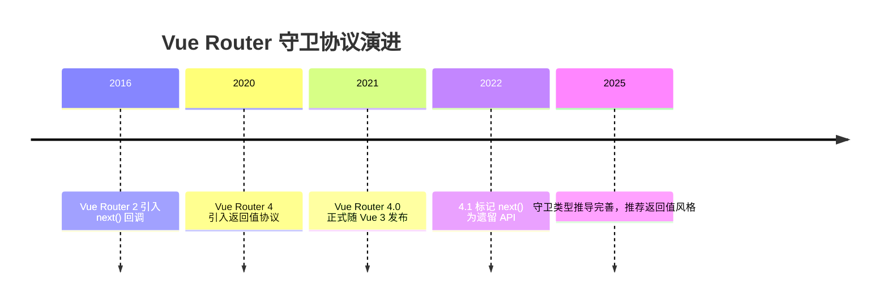

## 2. 形式化定义

导航守卫是挂载在路由解析管线上的函数序列。一次导航 N（从路由 from 到路由 to）的完整执行顺序如下：

第一步，失活组件触发 `beforeRouteLeave` 守卫（从 from 的组件树中按深度优先从内到外执行）；

第二步，全局 `beforeEach` 守卫按注册顺序执行；

第三步，目标路由配置中的 `beforeEnter` 守卫执行（若路由有多个记录，按记录顺序执行）；

第四步，被复用的组件触发 `beforeRouteUpdate`；

第五步，目标组件的 `beforeRouteEnter` 执行；

第六步，全局 `beforeResolve` 守卫执行（此时所有异步组件与懒加载路由已解析）；

第七步，导航被确认；

第八步，全局 `afterEach` 执行（不接收返回值，不能取消导航）；

第九步，DOM 更新完成，`beforeRouteEnter` 中传入的 `next` 回调（若有）接收组件实例执行。

守卫执行模型：每个守卫的返回值决定导航状态机转移。若任一守卫返回 `false` 或抛出错误，导航中止，`from` 路由保持不变；若返回路由地址，则以该地址为目标重新执行完整管线（会再次触发全局守卫，因此需要防循环设计）。

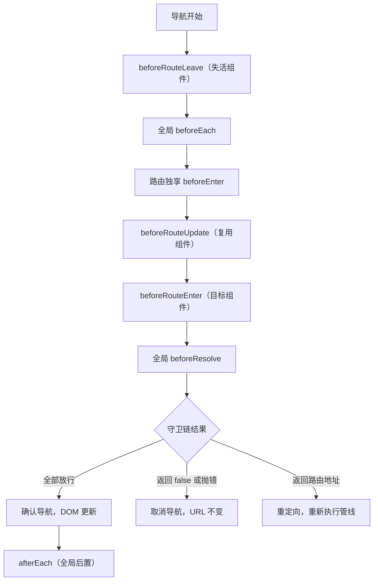

## 3. 理论推导与原理解析

### 3.1 导航状态机

Vue Router 4 内部用 promise 链串联守卫。每个守卫被包装为 `guard(to, from)` 调用，返回值按协议归一化：`false` 映射为取消信号，字符串/对象映射为 `NavigationFailure` 或新地址，错误映射为失败。

推导：设守卫序列 G1..Gn，导航成功当且仅当所有 Gi 返回真值或 undefined，且重定向目标 R 与当前目标不同。若 Gk 返回地址 R，则管线在第 k 步停止并重启：`navigate(R, from=to)`。为了避免无限循环，Vue Router 在重定向超过一定次数或回到同一地址时抛出 `NavigationFailureType.duplicated` 或重定向循环错误。

### 3.2 为什么 afterEach 不能取消导航

`afterEach` 在导航确认后执行，此时 URL 已更新、组件即将挂载。如果允许取消，会产生状态不一致：URL 显示新地址而组件仍是旧组件。因此 `afterEach` 只用于副作用（埋点、标题、滚动位置），返回值被忽略。

### 3.3 守卫中的异步与加载态

守卫函数可以返回 promise，管线会 await。工程上需要在等待期间展示加载状态，例如用全局 loading bar。Vue Router 4 没有内置 loading 组件，通常结合 `router.beforeEach` 的开始事件与 `afterEach`/`onError` 的结束事件控制进度条，这也是 nprogress 集成的标准做法。

## 4. 代码示例（带详尽注释）

### 4.1 全局前置守卫：登录鉴权

```ts
import { createRouter, createWebHistory } from 'vue-router'

const router = createRouter({
  history: createWebHistory(),
  routes: [
    { path: '/login', name: 'login', component: Login },
    {
      path: '/admin',
      component: AdminLayout,
      // meta 字段存放自定义权限信息，供守卫读取
      meta: { requiresAuth: true, roles: ['admin'] },
      children: [{ path: '', name: 'admin', component: AdminHome }]
    }
  ]
})

// 全局前置守卫：每次导航都会执行
router.beforeEach(async (to, from) => {
  // 白名单：登录页不需要鉴权
  if (to.name === 'login') return true

  // 读取本地登录令牌；真实项目应校验令牌有效性
  const token = localStorage.getItem('token')
  if (!token) {
    // 未登录：重定向到登录页，并携带来源路径便于登录后跳回
    return { name: 'login', query: { redirect: to.fullPath } }
  }

  // 路由需要权限但当前用户角色不满足
  const userRole = localStorage.getItem('role')
  const requiredRoles = to.meta.roles as string[] | undefined
  if (requiredRoles && (!userRole || !requiredRoles.includes(userRole))) {
    // 无权限：返回 false 取消导航，停留在当前页
    return false
  }

  // 默认放行
  return true
})

export default router
```

讲解：守卫通过 `to.meta` 读取路由配置中的自定义字段，实现声明式权限声明。`return { name: 'login', query: { redirect: to.fullPath } }` 使用返回值协议完成重定向；`return false` 直接取消导航。整个守卫是纯 async 函数，逻辑清晰且可测试。

### 4.2 动态加载用户信息的守卫

```ts
// 使用 Pinia 或全局状态保存用户信息
import { useUserStore } from '@/stores/user'

router.beforeEach(async (to) => {
  const userStore = useUserStore()

  // 已加载过用户信息则直接放行，避免每次导航都请求
  if (userStore.loaded) return true

  // 首次导航时拉取用户信息；失败则跳转登录
  try {
    await userStore.fetchProfile()
    return true
  } catch {
    return { name: 'login' }
  }
})
```

讲解：把“用户信息初始化”放进守卫，保证任何页面进入前数据就绪，页面组件不再各自处理加载失败。`userStore.loaded` 标志避免重复请求。

### 4.3 路由独享守卫 beforeEnter

```ts
const routes = [
  {
    path: '/reports/:id',
    component: ReportView,
    // 只对该路由生效
    beforeEnter: (to) => {
      const id = Number(to.params.id)
      // 参数不是正整数时直接取消导航
      if (!Number.isInteger(id) || id <= 0) {
        return { name: 'not-found' }
      }
      return true
    }
  }
]
```

讲解：`beforeEnter` 只在直接进入该路由时执行；从该路由切换到该路由（仅参数变化）时不会重新执行，此时应使用组件内 `beforeRouteUpdate`。这是初学者最容易混淆的点。

### 4.4 组件内守卫：离开确认

```vue
<script setup>
import { onBeforeRouteLeave } from 'vue-router'

// 表单脏数据标记：有未保存修改时提示
const dirty = ref(false)

// 离开前确认：返回 false 阻止离开
onBeforeRouteLeave((to, from) => {
  if (!dirty.value) return true
  // 浏览器原生 confirm 弹窗；工程中可替换为自定义对话框
  const ok = window.confirm('当前修改尚未保存，确定离开吗？')
  return ok
})
</script>
```

讲解：`onBeforeRouteLeave` 在组合式 API 中直接调用，无需组件选项。返回 `false` 阻止离开；返回 `true` 放行。注意该守卫不能阻止浏览器刷新或关闭标签页，那需要 `beforeunload` 事件配合。

### 4.5 组件内守卫：参数变化响应

```vue
<script setup>
import { ref } from 'vue'
import { onBeforeRouteUpdate } from 'vue-router'

const articleId = ref(null)

// 同一组件在不同路由参数间切换时触发
onBeforeRouteUpdate(async (to, from) => {
  // 参数变化时重新加载数据
  articleId.value = to.params.id
  await loadArticle(to.params.id)
})
</script>
```

讲解：`/article/1` 切换到 `/article/2` 时组件会被复用而非重新创建，`onMounted` 不会再次执行，因此必须用 `beforeRouteUpdate` 或监听 `route.params` 处理数据刷新。

### 4.6 全局后置守卫：页面标题

```ts
// 根据路由 meta.title 设置 document.title
router.afterEach((to) => {
  const baseTitle = 'FANDEX 学习平台'
  document.title = to.meta.title ? `${to.meta.title} - ${baseTitle}` : baseTitle
})
```

讲解：`afterEach` 适合做与导航结果无关的副作用。标题设置不依赖返回值，即使导航失败也最好不执行——注意 afterEach 在导航失败时不会触发，错误需由 `router.onError` 处理。

### 4.7 异步权限 + 动态路由

```ts
// 登录后根据角色动态添加路由
router.beforeEach(async (to) => {
  const userStore = useUserStore()
  if (!userStore.token) return { name: 'login' }

  // 尚未注册动态路由时，请求权限列表并注册
  if (!userStore.routesLoaded) {
    const routes = await fetchUserRoutes(userStore.role)
    routes.forEach((r) => router.addRoute(r))
    userStore.routesLoaded = true
    // 重新导航到目标，此时新路由已注册
    return { ...to, replace: true }
  }
  return true
})
```

讲解：`router.addRoute` 动态注册路由后，必须重新发起导航，否则目标路由仍找不到。`{ ...to, replace: true }` 保留目标地址并避免历史记录污染。这是大型后台系统的标准权限路由模式。

## 5. 对比分析

### 5.1 守卫层级对比

| 守卫 | 作用域 | 触发时机 | 典型用途 |
| --- | --- | --- | --- |
| `beforeEach` | 全局 | 每次导航开始 | 登录态、白名单、埋点开始 |
| `beforeEnter` | 单路由 | 直接进入该路由 | 参数校验、单路由权限 |
| `beforeRouteUpdate` | 组件 | 参数变化但组件复用 | 数据刷新 |
| `beforeRouteEnter` | 组件 | 进入组件前 | 进入前校验（拿不到 this） |
| `beforeResolve` | 全局 | 所有异步解析后 | 数据预取、最终确认 |
| `afterEach` | 全局 | 导航确认后 | 标题、埋点、滚动 |

### 5.2 返回值风格与 next 回调风格对比

| 维度 | 返回值风格 | next 回调风格 |
| --- | --- | --- |
| 可读性 | 返回即结果 | 需要跟踪调用位置 |
| 错误处理 | try/catch 自然生效 | 容易漏调或重复调用 |
| TypeScript | 类型推导完整 | 类型弱 |
| 官方态度 | 推荐 | 遗留 API |

### 5.3 守卫与中间件对比

守卫本质上是路由级中间件。与 Express/Koa 中间件相比，Vue Router 守卫少了 `next` 链式调用，多了返回值协议；与 Nuxt 的 route middleware 相比，Vue Router 守卫更底层，Nuxt 在其上封装了 `definePageMeta` 声明式中间件。理解底层守卫后，上层框架的中间件行为可以自然推导。

## 6. 常见陷阱与最佳实践

陷阱一：忘记返回真值。守卫函数没有 return 时返回 undefined，等价放行——但若逻辑分支遗漏，会出现“看起来没执行校验”的问题。最佳实践：让每个分支显式 return。

陷阱二：守卫循环。登录页守卫又重定向到登录页，形成死循环。最佳实践：对登录页等公开路由提前放行。

陷阱三：在 `beforeRouteEnter` 中访问 `this`。组件实例尚未创建，`this` 为 undefined。最佳实践：通过 `(to, from, next) => { next((vm) => { /* 此时才能访问组件实例 */ }) }`，或改用组合式 API 的 `onBeforeRouteEnter` 并配合外部状态。

陷阱四：把数据请求放进守卫导致白屏过长。最佳实践：区分“必须前置的数据”（权限、登录态）与“可以后置的数据”（列表内容），后者交给组件内部加载。

陷阱五：`beforeEach` 中重复注册。模块热更新或代码重复执行会导致守卫栈叠加。最佳实践：守卫注册放在路由实例创建处，一次注册。

陷阱六：忽略 `router.onError`。异步守卫抛出未捕获异常时，导航失败且无提示。最佳实践：全局注册 `router.onError` 统一处理，并区分鉴权过期与网络错误。

## 7. 工程实践

### 7.1 守卫文件组织

大型项目按职责拆分守卫：

```text
src/router/
  index.ts          # 创建路由实例并汇总守卫
  guards/
    auth.ts         # 登录鉴权守卫
    permission.ts   # 角色权限守卫
    progress.ts     # 进度条与埋点守卫
    title.ts        # 页面标题守卫
```

每个守卫文件导出 `export const authGuard = (to, from) => {...}` 形式的纯函数，在 `index.ts` 中按顺序 `router.beforeEach(authGuard); router.beforeEach(permissionGuard)`。这种组织方式让守卫可单测、可复用。

### 7.2 守卫的可测试性

守卫是纯函数（除副作用外），可以脱离路由实例测试：

```ts
// 测试 authGuard：未登录重定向到 login
import { describe, it, expect, vi } from 'vitest'
import { authGuard } from './auth'

describe('authGuard', () => {
  it('未登录时重定向到登录页', async () => {
    localStorage.clear()
    const to = { name: 'admin', fullPath: '/admin' } as any
    const from = {} as any
    const result = await authGuard(to, from)
    expect(result).toMatchObject({ name: 'login' })
  })
})
```

讲解：测试替身对象模拟 `to/from`，断言返回值。守卫逻辑越纯，测试成本越低，这也是官方推荐返回值风格带来的工程红利。

### 7.3 与 Teleport/KeepAlive 的协作

路由切换会卸载旧组件、挂载新组件。若项目使用 KeepAlive 缓存页面，`beforeRouteLeave` 不会销毁组件，而是进入缓存；此时配合 `onActivated/onDeactivated` 处理数据刷新。浮层类组件（模态框）在路由离开时应关闭，可以在 `beforeRouteLeave` 中同步状态或让模态框组件监听路由变化。

## 8. 案例研究：完整权限系统

需求：实现包含登录、角色权限、动态路由、无权限页面、登录过期处理的完整权限链路。

```ts
// guards/permission.ts：权限守卫完整实现
import type { NavigationGuard } from 'vue-router'

// 公开路由白名单：不经过任何权限校验
const PUBLIC_ROUTES = ['login', 'register', 'home']

export const permissionGuard: NavigationGuard = async (to, from) => {
  const userStore = useUserStore()

  // 公开路由直接放行
  if (PUBLIC_ROUTES.includes(to.name as string)) return true

  // 无 token：跳登录并记录来源
  if (!userStore.token) {
    return { name: 'login', query: { redirect: to.fullPath } }
  }

  // 动态路由未注册时先注册
  if (!userStore.dynamicRoutesReady) {
    const menus = await userStore.fetchMenus()
    menus.forEach((route) => router.addRoute(route))
    userStore.dynamicRoutesReady = true
    return { ...to, replace: true }
  }

  // 无权限页面
  if (to.meta.roles && !to.meta.roles.some((r) => userStore.roles.includes(r))) {
    return { name: 'forbidden' }
  }

  return true
}
```

讲解：该守卫把鉴权、动态路由、角色校验集中在一条链路，白名单优先、登录态其次、动态路由第三、角色最后。所有分支显式 return，配合 `router.onError` 与 `afterEach` 完成埋点，形成完整闭环。

## 9. 知识要点总结与深入讲解

导航守卫的本质是“路由状态机中的决策钩子”。初学者应记住执行顺序口诀：失活组件 → 全局前 → 路由独享 → 组件更新/进入 → 全局解析 → 确认 → 全局后。

返回值协议可以归纳为“三放行一取消一重定向”：`true/undefined` 放行，`false` 取消，地址对象重定向，`Error` 失败。这个协议把原来的 `next` 迷宫简化为普通函数返回值。

为什么要有 `beforeResolve`：因为组件可以异步加载（懒加载路由），在 `beforeEach` 阶段目标组件可能尚未下载完成；`beforeResolve` 保证所有异步依赖就绪后再做最终决策，适合放“必须等数据到齐”的校验。

为什么 `beforeEnter` 不重复触发：路由记录级守卫只在初始进入时执行，参数变化属于同一路由记录内的更新，应使用组件内守卫。这是面试与实战中的高频易错点。

### 1. 全局守卫

#### 1.1 beforeEach

```javascript
router.beforeEach((to, from) => {
  const auth = useAuthStore();
  if (to.meta.requiresAuth && !auth.isLoggedIn) {
    return { name: 'login', query: { redirect: to.fullPath } };
  }
});
```

#### 1.2 afterEach

```javascript
router.afterEach((to, from, failure) => {
  if (!failure) {
    document.title = to.meta.title || 'App';
  }
});
```

### 1. 路由独享守卫

```javascript
const routes = [
  {
    path: '/admin',
    component: Admin,
    beforeEnter: (to, from) => {
      if (!isAdmin()) return '/login';
    },
  },
];
```

### 2. 组件内守卫

```javascript
export default {
  beforeRouteEnter(to, from, next) {
    // 无法访问 this
    next((vm) => {
      // 通过 vm 访问组件实例
    });
  },
  beforeRouteUpdate(to, from) {
    // 路由参数变化时（如 /user/1 → /user/2）
  },
  beforeRouteLeave(to, from) {
    // 离开前确认
    if (hasUnsavedChanges) {
      return window.confirm('确认离开？');
    }
  },
};
```

### 3. 守卫执行顺序

```
1. beforeRouteLeave（离开组件）
2. beforeEach（全局）
3. beforeRouteUpdate（复用组件）
4. beforeEnter（路由配置）
5. beforeRouteEnter（进入组件）
6. afterEach（全局）
```

### 4. 返回值

| 返回值               | 效果     |
| -------------------- | -------- |
| `true` / `undefined` | 允许导航 |
| `false`              | 取消导航 |
| 路由对象             | 重定向   |

<!-- ============================================================ vue3/031-VuePerformanceDetailed ============================================================ -->

## 1. 响应式优化

### 1.1 shallowRef

```javascript
// 大型对象不需要深层响应式
const bigData = shallowRef(loadHugeDataset());
// 只有 .value 赋值才触发更新
bigData.value = newData; // 触发
bigData.value.items.push(x); // 不触发
```

### 1.2 shallowReactive

```javascript
const state = shallowReactive({
  items: [], // 不是响应式的
  count: 0, // 是响应式的（根级属性）
});
```

### 1.3 markRaw

```javascript
const staticData = markRaw(largeObject);
// 永远不会转为响应式
```

### 1.4 Object.freeze

```javascript
const frozenList = Object.freeze(hugeArray);
const items = ref(frozenList); // 跳过深层响应式转换
```

## 2. 渲染优化

### 2.1 v-memo

```html
<div v-for="item in list" :key="item.id" v-memo="[item.selected]">
  <!-- 仅 item.selected 变化时重新渲染 -->
  <ExpensiveComponent :data="item" />
</div>
```

### 2.2 v-once

```html
<h1 v-once>{{ title }}</h1>
<!-- 只渲染一次，后续更新跳过 -->
```

### 2.3 虚拟滚动

```html
<template v-for="item in visibleItems" :key="item.id">
  <div :style="{ transform: `translateY(${offset}px)` }">{{ item.content }}</div>
</template>
```

推荐库：`vue-virtual-scroller`、`vue3-virtual-scroll-list`

## 3. 组件优化

### 3.1 异步组件

```javascript
const HeavyChart = defineAsyncComponent(() => import('./HeavyChart.vue'));
```

### 3.2 KeepAlive

```html
<KeepAlive :include="['UserList', 'Settings']">
  <RouterView />
</KeepAlive>
```

## 4. 编译优化

Vue 3 编译器自动优化：

- 静态提升（Static Hoisting）
- 补丁标记（Patch Flags）
- 块级树（Block Tree）
- 静态属性提升

<!-- ============================================================ vue3/032-PerformanceOptimization ============================================================ -->

## 1. 性能优化概述 | Performance Optimization Overview

Vue3 应用的性能优化是开发过程中的重要环节，它直接影响用户体验和应用的可扩展性。Vue3 本身已经做了很多性能优化，但在实际开发中，我们仍然需要注意一些性能问题，以确保应用的流畅运行。

### 1.1 性能优化的重要性

- **用户体验**：性能好的应用能够提供更流畅的交互体验
- **SEO 友好**：性能好的应用加载速度快，有利于搜索引擎优化
- **可扩展性**：性能好的应用能够更好地处理复杂的业务逻辑
- **服务器成本**：性能好的应用可以减少服务器的负载和成本

### 1.2 Vue3 的性能优势

- **虚拟 DOM 重写**：Vue3 的虚拟 DOM 实现更加高效
- **编译器优化**：Vue3 的编译器能够生成更高效的渲染代码
- **响应式系统优化**：Vue3 使用 Proxy 替代 Object.defineProperty，提供更高效的响应式能力
- **Tree-shaking**：Vue3 支持 Tree-shaking，减少了打包体积

## 2. 渲染性能优化 | Rendering Performance Optimization

### 2.1 使用 v-memo

`v-memo` 指令可以缓存计算结果，避免不必要的渲染：

```vue
<template>
  <div v-memo="[value]">
    {{ heavyComputation(value) }}
  </div>
</template>
<script setup>
import { ref } from 'vue';
const value = ref(0);
const heavyComputation = (value) => {
  // 模拟 heavy computation
  let result = 0;
  for (let i = 0; i < 1000000; i++) {
    result += i;
  }
  return result + value;
};
</script>
```

### 2.2 使用 v-once

`v-once` 指令可以让元素只渲染一次，适用于静态内容：

```vue
<template>
  <div v-once>
    {{ staticContent }}
  </div>
</template>
<script setup>
import { ref } from 'vue';
const staticContent = ref('This content will only be rendered once');
</script>
```

### 2.3 使用 keep-alive

`keep-alive` 组件可以缓存组件的状态，避免重复渲染：

```vue
<template>
  <keep-alive>
    <component :is="currentComponent"></component>
  </keep-alive>
</template>
<script setup>
import { ref } from 'vue';
import ComponentA from './ComponentA.vue';
import ComponentB from './ComponentB.vue';
const currentComponent = ref('ComponentA');
</script>
```

### 2.4 避免在模板中使用复杂表达式

在模板中使用复杂表达式会影响渲染性能，应该使用计算属性：

```vue
<template>
  <div>
    <!-- 不推荐 -->
    <p>
      {{
        users
          .filter((user) => user.age > 18)
          .map((user) => user.name)
          .join(', ')
      }}
    </p>
    <!-- 推荐 -->
    <p>{{ adultUserNames }}</p>
  </div>
</template>
<script setup>
import { ref, computed } from 'vue'
const users = ref([
 { name: 'John', age: 20 },
 { name: 'Jane', age: 17 },
 { name: 'Bob', age: 25 }
]
const adultUserNames = computed(() => {
 return users.value
 .filter(user => user.age > 18)
 .map(user => user.name)
 .join(', ')
}
</script>
```

### 2.5 使用虚拟滚动

对于大量数据的列表，使用虚拟滚动可以提高性能：

```vue
<template>
  <div class="list-container" style="height: 400px; overflow: auto;">
    <virtual-list
      :data-key="'id'"
      :data-sources="items"
      :data-component="'item'"
      :estimate-size="50"
    >
      <template v-slot:item="{ source }">
        <div class="item">
          {{ source.name }}
        </div>
      </template>
    </virtual-list>
  </div>
</template>
<script setup>
import { ref } from 'vue';
import VirtualList from 'vue-virtual-scroller';
const items = ref(
  Array.from({ length: 10000 }, (_, i) => ({
    id: i,
    name: `Item ${i}`,
  }))
);
</script>
```

## 3. 响应式性能优化 | Reactive Performance Optimization

### 3.1 使用 shallowRef 和 shallowReactive

对于大型对象或不需要深度响应的数据，使用 `shallowRef` 和 `shallowReactive` 可以减少响应式开销：

```vue
<template>
  <div>
    <p>{{ user.name }}</p>
    <button @click="updateUser">Update User</button>
  </div>
</template>
<script setup>
import { shallowRef } from 'vue'
const user = shallowRef({
 name: 'John',
 age: 30,
 address: {
 street: '123 Main St',
 city: 'New York'
 }
}
const updateUser = () => {
 // 直接替换整个对象
 user.value = {
 name: 'Jane',
 age: 25,
 address: {
 street: '456 Elm St',
 city: 'Boston'
 }
 }
}
</script>
```

### 3.2 使用 markRaw

对于不需要响应式的数据，使用 `markRaw` 可以避免将其转换为响应式对象：

```vue
<template>
  <div>
    <p>{{ config.apiUrl }}</p>
  </div>
</template>
<script setup>
import { markRaw } from 'vue'
// 配置对象不需要响应式
const config = markRaw({
 apiUrl: 'https://api.example.com',
 timeout: 5000
}
</script>
```

### 3.3 合理使用 computed

计算属性会缓存计算结果，避免重复计算：

```vue
<template>
  <div>
    <p>Total: {{ total }}</p>
  </div>
</template>
<script setup>
import { ref, computed } from 'vue';
const items = ref([1, 2, 3, 4, 5]);
// 使用计算属性缓存计算结果
const total = computed(() => {
  console.log('Computing total...');
  return items.value.reduce((sum, item) => sum + item, 0);
});
</script>
```

### 3.4 避免频繁修改响应式数据

频繁修改响应式数据会触发多次渲染，应该批量修改：

```vue
<template>
  <div>
    <p>Count: {{ count }}</p>
    <p>Message: {{ message }}</p>
    <button @click="updateData">Update Data</button>
  </div>
</template>
<script setup>
import { ref } from 'vue';
const count = ref(0);
const message = ref('Hello');
// 批量修改数据，只触发一次渲染
const updateData = () => {
  count.value = 1;
  message.value = 'Hi';
};
</script>
```

## 4. 网络性能优化 | Network Performance Optimization

### 4.1 代码分割

使用动态导入实现代码分割，减少初始加载时间：

```vue
<template>
  <div>
    <button @click="loadComponent">Load Component</button>
    <component v-if="dynamicComponent" :is="dynamicComponent" />
  </div>
</template>
<script setup>
import { ref } from 'vue';
const dynamicComponent = ref(null);
const loadComponent = async () => {
  const { default: Component } = await import('./HeavyComponent.vue');
  dynamicComponent.value = Component;
};
</script>
```

### 4.2 资源预加载

使用 `rel="preload"` 预加载重要资源：

```html
<!-- 在 index.html 中 -->
<link rel="preload" href="/api/data" as="fetch" crossorigin />
<link rel="preload" href="/images/hero.jpg" as="image" />
```

### 4.3 缓存策略

使用 HTTP 缓存和本地缓存减少网络请求：

```vue
<template>
  <div>
    <div v-if="loading">Loading...</div>
    <div v-else>{{ data }}</div>
  </div>
</template>
<script setup>
import { ref, onMounted } from 'vue';
const data = ref(null);
const loading = ref(true);
onMounted(async () => {
  // 检查本地缓存
  const cachedData = localStorage.getItem('apiData');
  if (cachedData) {
    data.value = JSON.parse(cachedData);
    loading.value = false;
    return;
  }
  // 从服务器获取数据
  const response = await fetch('/api/data');
  const result = await response.json();
  data.value = result;
  loading.value = false;
  // 缓存数据
  localStorage.setItem('apiData', JSON.stringify(result));
});
</script>
```

### 4.4 减少 HTTP 请求

合并请求，减少 HTTP 请求数量：

```javascript
 // 不推荐
 fetch('/api/user')
 fetch('/api/posts')
 fetch('/api/comments')
 // 推荐
 fetch('/api/batch', {
  method: 'POST',
  body: JSON.stringify({
  requests: [
  { path: '/user' },
  { path: '/posts' },
  { path: '/comments' }
  ]
  })
 }
```

## 5. 构建优化 | Build Optimization

### 5.1 代码压缩

使用 Vite 或 Webpack 进行代码压缩：

```javascript
 // vite.config.js
 import { defineConfig } from 'vite'
 import vue from '@vitejs/plugin-vue'
 export default defineConfig({
  plugins: [vue()],
  build: {
  minify: 'terser',
  terserOptions: {
  compress: {
  drop_console: true,
  drop_debugger:
  }
  }
  }
 }
```

### 5.2 树摇 (Tree-shaking)

使用 ES 模块，利用 Tree-shaking 减少打包体积：

```javascript
// 不推荐
import * as lodash from 'lodash';
// 推荐
import { debounce, throttle } from 'lodash';
```

### 5.3 懒加载

使用动态导入实现组件和路由的懒加载：

```javascript
 // router/index.js
 import { createRouter, createWebHistory } from 'vue-router'
 const routes = [
  {
  path: '/',
  component: () => import('../views/Home.vue')
  },
  {
  path: '/about',
  component: () => import('../views/About.vue')
  }
 ]
 const router = createRouter({
  history: createWebHistory(),
  routes
 }
 export default router
```

### 5.4 资源优化

优化图片和其他静态资源：

- 使用适当的图片格式（WebP、AVIF）
- 压缩图片
- 使用 CDN 加速静态资源
- 配置浏览器缓存

## 6. 性能监控与分析 | Performance Monitoring and Analysis

### 6.1 使用 Vue DevTools

Vue DevTools 可以帮助你分析组件的渲染性能：

- **组件面板**：查看组件的状态和属性
- **性能面板**：分析组件的渲染时间
- **事件面板**：查看事件的触发和处理

### 6.2 使用浏览器开发者工具

浏览器开发者工具可以帮助你分析网络请求和页面性能：

- **Network 面板**：分析网络请求的时间和大小
- **Performance 面板**：分析页面的渲染性能
- **Memory 面板**：分析内存使用情况

### 6.3 使用第三方工具

使用第三方工具进行性能监控：

- **Lighthouse**：分析页面的性能、可访问性和 SEO
- **WebPageTest**：测试页面的加载性能
- **New Relic**：监控应用的性能和错误

## 7. 最佳实践 | Best Practices

### 7.1 组件设计

- **拆分组件**：将大型组件拆分为小型、可复用的组件
- **合理使用 props**：只传递必要的 props，避免过度传递
- **使用 slots**：使用 slots 提高组件的灵活性
- **避免过度使用 watch**：优先使用 computed

### 7.2 状态管理

- **合理使用状态管理**：只在必要时使用 Pinia 或 Vuex
- **避免过度使用全局状态**：优先使用组件级状态
- **使用模块化**：将状态管理按功能模块划分

### 7.3 代码组织

- **合理组织代码**：按功能和模块组织代码
- **使用 TypeScript**：提高代码的可维护性和类型安全性
- **遵循代码规范**：使用 ESLint 和 Prettier 保持代码风格一致

### 7.4 性能预算

- **设置性能预算**：为应用的加载时间、资源大小等设置预算
- **监控性能指标**：定期监控应用的性能指标
- **持续优化**：不断优化应用的性能

## 8. 示例 | Examples

### 8.1 优化前

```vue
<template>
  <div>
    <h2>User List</h2>
    <ul>
      <li v-for="user in users" :key="user.id">
        <div>
          <h3>{{ user.name }}</h3>
          <p>{{ user.email }}</p>
          <p>{{ formatDate(user.createdAt) }}</p>
        </div>
      </li>
    </ul>
  </div>
</template>
<script setup>
import { ref } from 'vue';
const users = ref(
  Array.from({ length: 1000 }, (_, i) => ({
    id: i,
    name: `User ${i}`,
    email: `user${i}@example.com`,
    createdAt: new Date(),
  }))
);
const formatDate = (date) => {
  return date.toLocaleString();
};
</script>
```

### 8.2 优化后

```vue
<template>
  <div>
    <h2>User List</h2>
    <ul>
      <li v-for="user in users" :key="user.id">
        <div>
          <h3>{{ user.name }}</h3>
          <p>{{ user.email }}</p>
          <p>{{ user.formattedCreatedAt }}</p>
        </div>
      </li>
    </ul>
  </div>
</template>
<script setup>
import { ref, computed } from 'vue';
const users = ref(
  Array.from({ length: 1000 }, (_, i) => ({
    id: i,
    name: `User ${i}`,
    email: `user${i}@example.com`,
    createdAt: new Date(),
    formattedCreatedAt: new Date().toLocaleString(),
  }))
);
</script>
```

## 9. 小结 | Summary

Vue3 应用的性能优化是一个持续的过程，需要从多个方面入手，包括渲染性能、响应式性能、网络性能和构建优化等。通过本章节的学习，你已经了解了 Vue3 应用性能优化的基本方法和最佳实践。
在实际开发中，要根据应用的具体情况，选择合适的优化策略，同时要定期监控应用的性能，不断优化和改进。只有这样，才能构建出性能优异、用户体验良好的 Vue3 应用。

<!-- ============================================================ vue3/033-Vue3AdvancedComponentFeature ============================================================ -->

## 1. 动态组件

### 1.1 基本用法

**作用**：根据条件动态渲染不同的组件
**用法**：

```vue
<template>
  <div>
    <button @click="currentComponent = 'ComponentA'">组件 A</button>
    <button @click="currentComponent = 'ComponentB'">组件 B</button>
    <button @click="currentComponent = 'ComponentC'">组件 C</button>
    <component :is="currentComponent" />
  </div>
</template>
<script setup lang="ts">
import { ref } from 'vue';
import ComponentA from './ComponentA.vue';
import ComponentB from './ComponentB.vue';
import ComponentC from './ComponentC.vue';
const currentComponent = ref('ComponentA');
</script>
```

**组件定义**：

```vue
<!-- ComponentA.vue -->
<template>
  <div class="component">
    <h3>组件 A</h3>
    <p>这是组件 A 的内容</p>
  </div>
</template>
<style scoped>
.component {
  padding: 20px;
  border: 1px solid #ddd;
  border-radius: 8px;
  margin-top: 20px;
  background-color: #f9f9f9;
}
</style>
```

### 1.2 动态组件的传参

```vue
<template>
  <div>
    <button @click="currentComponent = 'ComponentA'">组件 A</button>
    <button @click="currentComponent = 'ComponentB'">组件 B</button>
    <component :is="currentComponent" :message="message" @update="handleUpdate" />
  </div>
</template>
<script setup lang="ts">
import { ref } from 'vue';
import ComponentA from './ComponentA.vue';
import ComponentB from './ComponentB.vue';
const currentComponent = ref('ComponentA');
const message = ref('Hello from parent');
function handleUpdate(newMessage: string) {
  message.value = newMessage;
}
</script>
```

### 1.3 动态组件的缓存

```vue
<template>
  <div>
    <button @click="currentComponent = 'ComponentA'">组件 A</button>
    <button @click="currentComponent = 'ComponentB'">组件 B</button>
    <keep-alive>
      <component :is="currentComponent" />
    </keep-alive>
  </div>
</template>
<script setup lang="ts">
import { ref } from 'vue';
import ComponentA from './ComponentA.vue';
import ComponentB from './ComponentB.vue';
const currentComponent = ref('ComponentA');
</script>
```

## 2. 异步组件

### 2.1 基本用法

**作用**：按需加载组件，提高初始加载性能
**用法**：

```vue
<template>
  <div>
    <h1>异步组件示例</h1>
    <button @click="showAsyncComponent = ">加载异步组件</button>
    <div v-if="showAsyncComponent">
      <AsyncComponent />
    </div>
  </div>
</template>
<script setup lang="ts">
import { ref, defineAsyncComponent } from 'vue'
const showAsyncComponent = ref(false)
// 定义异步组件
const AsyncComponent = defineAsyncComponent({
 loader: () => import('./AsyncComponent.vue'),
 loadingComponent: () => <div>加载中...</div>,
 errorComponent: () => <div>加载失败</div>,
 delay: 200,
 timeout: 3000
}
</script>
```

### 2.2 高级配置

```vue
<template>
  <div>
    <h1>异步组件高级配置</h1>
    <AsyncComponentWithOptions />
  </div>
</template>
<script setup lang="ts">
import { defineAsyncComponent } from 'vue'
const AsyncComponentWithOptions = defineAsyncComponent({
 // 加载组件的函数
 loader: () => import('./HeavyComponent.vue'),
 // 加载过程中显示的组件
 loadingComponent: {
 template: '<div class="loading">加载中，请稍候...</div>'
 },
 // 加载失败时显示的组件
 errorComponent: {
 template: '<div class="error">加载失败，请重试</div>'
 },
 // 延迟显示加载组件的时间（毫秒）
 delay: 300,
 // 超时时间（毫秒）
 timeout: 5000,
 // 是否在组件加载失败时重试
 suspensible: false
}
</script>
<style scoped>
.loading {
  padding: 20px;
  text-align: center;
  color: #666;
}
.error {
  padding: 20px;
  text-align: center;
  color: #e74c3c;
}
</style>
```

## 3. 递归组件

### 3.1 基本用法

**作用**：组件可以递归调用自身，适用于树形结构等场景
**用法**：

```vue
<template>
  <div class="tree-node">
    <div class="node-content" @click="toggleExpanded">
      {{ node.name }}
      <span v-if="node.children && node.children.length > 0">
        {{ expanded ? '▼' : '▶' }}
      </span>
    </div>
    <div v-if="node.children && node.children.length > 0 && expanded" class="node-children">
      <TreeView v-for="child in node.children" :key="child.id" :node="child" />
    </div>
  </div>
</template>
<script setup lang="ts">
import { ref } from 'vue';
const props = defineProps<{
  node: {
    id: number;
    name: string;
    children?: Array<{
      id: number;
      name: string;
      children?: Array<any>;
    }>;
  };
  ;
}>();
const expanded = ref(false);
function toggleExpanded() {
  expanded.value = !expanded.value;
  ;
}
</script>
<style scoped>
.tree-node {
  margin-left: 20px;
}
.node-content {
  cursor: pointer;
  padding: 5px;
  border-radius: 4px;
  transition: background-color 0.3s;
}
.node-content:hover {
  background-color: #f0f0f0;
}
.node-children {
  margin-top: 5px;
}
</style>
```

### 3.2 使用场景

```vue
<template>
  <div class="tree-view">
    <h2>树形结构示例</h2>
    <TreeView :node="treeData" />
  </div>
</template>
<script setup lang="ts">
import TreeView from './TreeView.vue';
const treeData = {
  id: 1,
  name: '根节点',
  children: [
    {
      id: 2,
      name: '子节点 1',
      children: [
        {
          id: 3,
          name: '孙节点 1-1',
        },
        {
          id: 4,
          name: '孙节点 1-2',
        },
      ],
    },
    {
      id: 5,
      name: '子节点 2',
      children: [
        {
          id: 6,
          name: '孙节点 2-1',
        },
      ],
    },
  ],
};
</script>
<style scoped>
.tree-view {
  padding: 20px;
  border: 1px solid #ddd;
  border-radius: 8px;
  background-color: #f9f9f9;
}
</style>
```

## 4. 函数式组件

### 4.1 基本用法

**作用**：无状态、无实例的组件，性能更高
**用法**：

```vue
<template>
  <div>
    <h2>函数式组件示例</h2>
    <FunctionalComponent :message="message" />
  </div>
</template>
<script setup lang="ts">
import { ref } from 'vue';
import FunctionalComponent from './FunctionalComponent.vue';
const message = ref('Hello from parent');
</script>
```

**函数式组件定义**：

```vue
<script setup lang="ts">
import { defineProps } from 'vue';
const props = defineProps<{
  message: string;
  ;
}>();
</script>
<template>
  <div class="functional-component">
    <p>{{ message }}</p>
    <p>这是一个函数式组件</p>
  </div>
</template>
<style scoped>
.functional-component {
  padding: 20px;
  border: 1px solid #ddd;
  border-radius: 8px;
  background-color: #f9f9f9;
}
</style>
```

## 5. 组件插槽

### 5.1 基本插槽

**作用**：允许父组件向子组件注入内容
**用法**：

```vue
<template>
  <div>
    <h2>插槽示例</h2>
    <SlotComponent>
      <p>这是插槽内容</p>
    </SlotComponent>
  </div>
</template>
<script setup lang="ts">
import SlotComponent from './SlotComponent.vue';
</script>
```

**插槽组件定义**：

```vue
<template>
  <div class="slot-component">
    <h3>插槽组件</h3>
    <slot></slot>
  </div>
</template>
<style scoped>
.slot-component {
  padding: 20px;
  border: 1px solid #ddd;
  border-radius: 8px;
  background-color: #f9f9f9;
}
</style>
```

### 5.2 具名插槽

```vue
<template>
  <div>
    <h2>具名插槽示例</h2>
    <NamedSlotComponent>
      <template #header>
        <h3>自定义头部</h3>
      </template>
      <template #content>
        <p>自定义内容</p>
        <p>更多内容</p>
      </template>
      <template #footer>
        <p>自定义底部</p>
      </template>
    </NamedSlotComponent>
  </div>
</template>
<script setup lang="ts">
import NamedSlotComponent from './NamedSlotComponent.vue';
</script>
```

**具名插槽组件定义**：

```vue
<template>
  <div class="named-slot-component">
    <div class="header">
      <slot name="header">默认头部</slot>
    </div>
    <div class="content">
      <slot name="content">默认内容</slot>
    </div>
    <div class="footer">
      <slot name="footer">默认底部</slot>
    </div>
  </div>
</template>
<style scoped>
.named-slot-component {
  padding: 20px;
  border: 1px solid #ddd;
  border-radius: 8px;
  background-color: #f9f9f9;
}
.header {
  margin-bottom: 10px;
  padding-bottom: 10px;
  border-bottom: 1px solid #eee;
}
.content {
  margin-bottom: 10px;
  padding-bottom: 10px;
  border-bottom: 1px solid #eee;
}
.footer {
  margin-top: 10px;
}
</style>
```

### 5.3 作用域插槽

```vue
<template>
  <div>
    <h2>作用域插槽示例</h2>
    <ScopedSlotComponent>
      <template #item="{ item }">
        <li class="custom-item">{{ item.id }}: {{ item.name }}</li>
      </template>
    </ScopedSlotComponent>
  </div>
</template>
<script setup lang="ts">
import ScopedSlotComponent from './ScopedSlotComponent.vue';
</script>
<style scoped>
.custom-item {
  padding: 5px;
  border-bottom: 1px solid #eee;
}
</style>
```

**作用域插槽组件定义**：

```vue
<template>
  <div class="scoped-slot-component">
    <h3>作用域插槽组件</h3>
    <ul>
      <slot v-for="item in items" :key="item.id" name="item" :item="item">
        {{ item.name }}
      </slot>
    </ul>
  </div>
</template>
<script setup lang="ts">
import { ref } from 'vue'
const items = ref([
 { id: 1, name: '项目 1' },
 { id: 2, name: '项目 2' },
 { id: 3, name: '项目 3' }
]
</script>
<style scoped>
.scoped-slot-component {
  padding: 20px;
  border: 1px solid #ddd;
  border-radius: 8px;
  background-color: #f9f9f9;
}
ul {
  list-style: none;
  padding: 0;
  margin: 0;
}
</style>
```

## 6. 组件继承

### 6.1 基本用法

**作用**：通过组合式 API 实现组件逻辑的复用
**用法**：

```vue
<template>
  <div class="base-component">
    <h3>{{ title }}</h3>
    <p>{{ message }}</p>
    <button @click="handleClick">点击我</button>
  </div>
</template>
<script setup lang="ts">
import { ref } from 'vue';
const props = defineProps<{
  title: string;
  message: string;
  ;
}>();
const emit = defineEmits<{
  (e: 'click'): void;
  ;
}>();
function handleClick() {
  emit('click');
  ;
}
</script>
<style scoped>
.base-component {
  padding: 20px;
  border: 1px solid #ddd;
  border-radius: 8px;
  background-color: #f9f9f9;
}
</style>
```

**继承组件**：

```vue
<template>
  <div class="extended-component">
    <BaseComponent :title="title" :message="message" @click="handleBaseClick" />
    <p>这是扩展内容</p>
  </div>
</template>
<script setup lang="ts">
import { ref } from 'vue';
import BaseComponent from './BaseComponent.vue';
const title = ref('扩展组件');
const message = ref('这是扩展组件的消息');
function handleBaseClick() {
  console.log('Base component clicked');
}
</script>
<style scoped>
.extended-component {
  padding: 20px;
  border: 1px solid #42b983;
  border-radius: 8px;
  background-color: #f0f9f0;
}
</style>
```

## 7. 组件的 provide/inject

### 7.1 基本用法

**作用**：实现组件之间的依赖注入，避免 props 层层传递
**用法**：

```vue
<template>
  <div class="parent-component">
    <h2>父组件</h2>
    <ChildComponent />
  </div>
</template>
<script setup lang="ts">
import { provide } from 'vue'
import ChildComponent from './ChildComponent.vue'
// 提供数据
provide('message', 'Hello from parent')
provide('user', {
 name: '张三',
 age: 20
}
</script>
<style scoped>
.parent-component {
  padding: 20px;
  border: 1px solid #ddd;
  border-radius: 8px;
  background-color: #f9f9f9;
}
</style>
```

**子组件**：

```vue
<template>
  <div class="child-component">
    <h3>子组件</h3>
    <p>{{ injectedMessage }}</p>
    <p>用户名: {{ injectedUser.name }}</p>
    <p>年龄: {{ injectedUser.age }}</p>
    <GrandchildComponent />
  </div>
</template>
<script setup lang="ts">
import { inject } from 'vue';
import GrandchildComponent from './GrandchildComponent.vue';
// 注入数据
const injectedMessage = inject('message', '默认消息');
const injectedUser = inject('user', { name: '默认用户', age: 0 });
</script>
<style scoped>
.child-component {
  padding: 20px;
  border: 1px solid #3498db;
  border-radius: 8px;
  background-color: #f0f8ff;
  margin-top: 10px;
}
</style>
```

**孙组件**：

```vue
<template>
  <div class="grandchild-component">
    <h4>孙组件</h4>
    <p>{{ injectedMessage }}</p>
    <p>用户名: {{ injectedUser.name }}</p>
  </div>
</template>
<script setup lang="ts">
import { inject } from 'vue';
// 注入数据
const injectedMessage = inject('message', '默认消息');
const injectedUser = inject('user', { name: '默认用户', age: 0 });
</script>
<style scoped>
.grandchild-component {
  padding: 20px;
  border: 1px solid #e74c3c;
  border-radius: 8px;
  background-color: #fff0f0;
  margin-top: 10px;
}
</style>
```

## 8. 组件的生命周期钩子

### 8.1 常用生命周期钩子

```vue
<template>
  <div class="lifecycle-component">
    <h2>生命周期钩子示例</h2>
    <p>组件状态: {{ status }}</p>
    <button @click="updateMessage">更新消息</button>
  </div>
</template>
<script setup lang="ts">
import {
  ref,
  onMounted,
  onUpdated,
  onUnmounted,
  onBeforeMount,
  onBeforeUpdate,
  onBeforeUnmount,
} from 'vue';
const status = ref('创建中');
const message = ref('初始消息');
// 组件挂载前
onBeforeMount(() => {
  status.value = '挂载前';
  console.log('组件挂载前');
});
// 组件挂载后
onMounted(() => {
  status.value = '已挂载';
  console.log('组件挂载后');
});
// 组件更新前
onBeforeUpdate(() => {
  console.log('组件更新前');
});
// 组件更新后
onUpdated(() => {
  console.log('组件更新后');
});
// 组件卸载前
onBeforeUnmount(() => {
  status.value = '卸载前';
  console.log('组件卸载前');
});
// 组件卸载后
onUnmounted(() => {
  console.log('组件卸载后');
});
function updateMessage() {
  message.value = '更新后的消息';
}
</script>
<style scoped>
.lifecycle-component {
  padding: 20px;
  border: 1px solid #ddd;
  border-radius: 8px;
  background-color: #f9f9f9;
}
</style>
```

## 9. 组件的错误处理

### 9.1 错误边界

**作用**：捕获组件树中的错误，防止整个应用崩溃
**用法**：

```vue
<template>
  <div class="error-boundary">
    <h2>错误边界示例</h2>
    <ErrorBoundary>
      <BuggyComponent />
    </ErrorBoundary>
  </div>
</template>
<script setup lang="ts">
import ErrorBoundary from './ErrorBoundary.vue';
import BuggyComponent from './BuggyComponent.vue';
</script>
<style scoped>
.error-boundary {
  padding: 20px;
  border: 1px solid #ddd;
  border-radius: 8px;
  background-color: #f9f9f9;
}
</style>
```

**错误边界组件**：

```vue
<template>
  <div>
    <slot v-if="!hasError"></slot>
    <div v-else class="error-message">
      <h3>发生错误</h3>
      <p>{{ error.message }}</p>
      <button @click="resetError">重试</button>
    </div>
  </div>
</template>
<script setup lang="ts">
import { ref, onErrorCaptured } from 'vue';
const hasError = ref(false);
const error = ref<Error | null>(null);
onErrorCaptured((err) => {
  hasError.value = error.value = err as Error;
  return; // 阻止错误继续传播
});
function resetError() {
  hasError.value = false;
  error.value = null;
}
</script>
<style scoped>
.error-message {
  padding: 20px;
  border: 1px solid #e74c3c;
  border-radius: 8px;
  background-color: #fff0f0;
  color: #e74c3c;
}
</style>
```

**有 bug 的组件**：

```vue
<template>
  <div class="buggy-component">
    <h3>有 bug 的组件</h3>
    <button @click="triggerError">触发错误</button>
  </div>
</template>
<script setup lang="ts">
function triggerError() {
  // 故意触发错误
  throw new Error('这是一个测试错误');
}
</script>
<style scoped>
.buggy-component {
  padding: 20px;
  border: 1px solid #ddd;
  border-radius: 8px;
  background-color: #f9f9f9;
}
</style>
```

## 10. 最佳实践

### 10.1 组件设计原则

- **单一职责**：每个组件只负责一个功能
- **可复用性**：设计通用的、可复用的组件
- **可维护性**：代码结构清晰，易于理解和维护
- **性能优化**：合理使用 `v-memo`、`keep-alive` 等优化性能
- **类型安全**：使用 TypeScript 为组件添加类型

### 10.2 高级组件使用建议

- **动态组件**：用于根据条件渲染不同的组件
- **异步组件**：用于按需加载大型组件，提高初始加载性能
- **递归组件**：用于树形结构等递归场景
- **函数式组件**：用于无状态、纯展示的组件
- **插槽**：用于组件内容的定制化
- **provide/inject**：用于组件间的依赖注入
- **错误边界**：用于捕获和处理组件错误

### 10.3 性能优化

- **合理使用 keep-alive**：缓存组件状态，减少重复渲染
- **使用异步组件**：按需加载组件，减少初始包大小
- **组件拆分**：将复杂组件拆分为更小的、可复用的组件
- **避免不必要的渲染**：使用 `v-memo`、计算属性等优化渲染性能
- **事件监听清理**：在组件卸载时清理事件监听器

## 11. 总结

Vue3 的高级组件特性为开发者提供了强大的工具，从动态组件、异步组件到递归组件、插槽等，使开发者可以构建更加灵活、高效的应用。通过本教程的学习，你应该已经掌握了 Vue3 高级组件特性的基本使用方法和最佳实践，可以在实际项目中灵活运用。
## defineExpose 暴露实例

**暴露属性/方法**
`defineExpose({ <key>: <value>, ... });`
```typescript
<script setup>
import { ref } from 'vue';

const count = ref(0);
const increment = () => count.value++;
const reset = () => { count.value = 0; };

defineExpose({
  count,
  increment,
  reset,
  // 也可以暴露计算属性
  double: computed(() => count.value * 2)
});
</script>
```

**父组件通过 ref 访问**
```vue
<template>
  <ChildComp ref="childRef" />
  <button @click="childRef?.increment()">+1</button>
  <button @click="childRef?.reset()">重置</button>
</template>

<script setup>
import { useTemplateRef } from 'vue';
import ChildComp from './ChildComp.vue';

const childRef = useTemplateRef<InstanceType<typeof ChildComp>>('childRef');
</script>
```

---

## useAttrs 透传属性

**获取透传属性**
`const <attrs> = useAttrs();`
```typescript
<script setup>
import { useAttrs } from 'vue';

const attrs = useAttrs();
// attrs.class, attrs.id, attrs['data-test'] 等
console.log(attrs);
</script>

<template>
  <input v-bind="$attrs" />
</template>
```

**配合 inheritAttrs:false**
```vue
<script setup>
import { useAttrs } from 'vue';

defineOptions({
  inheritAttrs: false  // 阻止自动透传到根元素
});

const attrs = useAttrs();
</script>

<template>
  <div>
    <input v-bind="attrs" />
    <span>{{ attrs.placeholder }}</span>
  </div>
</template>
```

**attrs 响应性**
```typescript
import { useAttrs, watchEffect } from 'vue';

const attrs = useAttrs();
watchEffect(() => {
  console.log('attrs 变化:', attrs.class, attrs.id);
});
```

---

## useSlots 插槽访问

**获取插槽**
`const <slots> = useSlots();`
```typescript
<script setup>
import { useSlots, computed } from 'vue';

const slots = useSlots();

const hasHeader = computed(() => !!slots.header);
const hasFooter = computed(() => !!slots.footer);
</script>

<template>
  <div>
    <header v-if="hasHeader">
      <slot name="header" />
    </header>
    <main>
      <slot />
    </main>
    <footer v-if="hasFooter">
      <slot name="footer" />
    </footer>
  </div>
</template>
```

**条件渲染插槽**
```typescript
import { useSlots, h } from 'vue';

const slots = useSlots();

function renderContent() {
  if (slots.default) {
    return slots.default();
  }
  if (slots.fallback) {
    return slots.fallback();
  }
  return h('div', '默认内容');
}
```

---

## defineModel 双向绑定

**基础 defineModel**
`const <model> = defineModel([modelName], [options]);`
```typescript
<script setup lang="ts">
const model = defineModel<string>();

function update(value: string) {
  model.value = value;
}
</script>

<template>
  <input
    :value="model"
    @input="model = ($event.target as HTMLInputElement).value"
  />
</template>
```

**命名 model**
```typescript
const firstName = defineModel<string>('firstName');
const lastName = defineModel<string>('lastName');
```

**带默认值**
```typescript
const count = defineModel<number>({ default: 0 });
const title = defineModel<string>('title', { default: '标题' });
```

**local 模式(本地副本)**
```typescript
const text = defineModel<string>({ default: '', local: true });
// local:true 时,修改不立即同步到父组件
```

**修饰符处理**
```typescript
const [model, modifiers] = defineModel<string>({
  set(value) {
    if (modifiers.capitalize) {
      return value.charAt(0).toUpperCase() + value.slice(1);
    }
    if (modifiers.trim) {
      return value.trim();
    }
    return value;
  }
});
vue
<MyInput v-model.capitalize="text" />
<MyInput v-model.trim="text" />
```

---

## defineOptions 选项定义

**defineOptions 用法**
```typescript
defineOptions({
  name: 'UserCard',
  inheritAttrs: false,
  components: { MyButton },
  directives: {
    focus: { mounted: (el: HTMLElement) => el.focus() }
  },
  emits: ['change'],
  // 其他选项式 API 选项
  data() {
    return { extra: '' };
  },
  created() {
    console.log('created');
  }
});
```

---

## defineSlots 插槽类型

**defineSlots 类型声明**
```typescript
<script setup lang="ts">
const slots = defineSlots<{
  default(props: { item: any; index: number }): any;
  header?(props: { title: string }): any;
  footer?(): any;
}>();
</script>

<template>
  <slot name="header" :title="pageTitle" />
  <ul>
    <li v-for="(item, index) in items" :key="item.id">
      <slot :item="item" :index="index" />
    </li>
  </ul>
  <slot name="footer" />
</template>
```

---

## v-model 高级用法

**多个 v-model**
```vue
<!-- 父组件 -->
<UserForm
  v-model:firstName="first"
  v-model:lastName="last"
  v-model:age="age"
/>

<!-- 子组件 UserForm.vue -->
<script setup lang="ts">
const firstName = defineModel<string>('firstName');
const lastName = defineModel<string>('lastName');
const age = defineModel<number>('age', { default: 0 });
</script>
```

**v-model 与自定义事件**
```typescript
<script setup lang="ts">
const model = defineModel<string>();

// 等价于
const props = defineProps<{ modelValue: string }>();
const emit = defineEmits<{ 'update:modelValue': [value: string] }>();

// model.value = x 等价于 emit('update:modelValue', x)
</script>
```

---

## 高阶组件模式

**函数式高阶组件**
```typescript
import { h, defineComponent, type Component } from 'vue';

export function withLoading<T extends Component>(WrappedComp: T) {
  return defineComponent({
    name: 'WithLoading',
    props: ['loading'],
    setup(props, { attrs, slots }) {
      return () => {
        if (props.loading) {
          return h('div', { class: 'loading' }, 'Loading...');
        }
        return h(WrappedComp, { ...attrs }, slots);
      };
    }
  });
}

// 使用
const AsyncUser = withLoading(UserCard);
```

**透传 props 与 emits**
```vue
<script setup lang="ts">
import { useAttrs, useListeners } from 'vue';

// 透传所有 props 和事件
defineOptions({ inheritAttrs: false });
const attrs = useAttrs();
</script>

<template>
  <Child v-bind="$attrs" v-on="$attrs" />
</template>
```

---

## 渲染函数与 JSX

**h 函数**
```typescript
import { h, defineComponent } from 'vue';

export default defineComponent({
  name: 'MyList',
  props: { items: Array as PropType<string[]> },
  setup(props) {
    return () =>
      h('ul', props.items.map(item => h('li', { key: item }, item)));
  }
});
```

**JSX 语法**
```typescript
import { defineComponent } from 'vue';

export default defineComponent({
  name: 'MyComp',
  setup() {
    const count = ref(0);
    return () => (
      <button onClick={() => count.value++}>
        Clicked {count.value} times
      </button>
    );
  }
});
```

---

## 组件通信综合

**v-model + emit 模式**
```vue
<!-- 子组件 -->
<script setup lang="ts">
const props = defineProps<{
  modelValue: string;
}>();

const emit = defineEmits<{
  'update:modelValue': [value: string];
  'submit': [value: string];
}>();

function handleInput(e: Event) {
  emit('update:modelValue', (e.target as HTMLInputElement).value);
}

function handleSubmit() {
  emit('submit', props.modelValue);
}
</script>

<template>
  <input :value="modelValue" @input="handleInput" />
  <button @click="handleSubmit">提交</button>
</template>
```

**provide + inject 通信**
```typescript
import { provide, inject, readonly, type InjectionKey, type Ref } from 'vue';

interface FormContext {
  values: Ref<Record<string, any>>;
  errors: Ref<Record<string, string>>;
  setField: (name: string, value: any) => void;
}

const FormKey: InjectionKey<FormContext> = Symbol('form');

// 父组件
const values = ref({});
const errors = ref({});
provide(FormKey, {
  values: readonly(values),
  errors: readonly(errors),
  setField: (name, value) => {
    values.value[name] = value;
  }
});

// 子组件
const formCtx = inject(FormKey);
formCtx?.setField('username', 'Tom');
```

<!-- ============================================================ vue3/034-Vue3ProjectExampleBlog ============================================================ -->

| 文章详情   | Markdown 渲染、目录导航、阅读进度 |
| ---------- | --------------------------------- |
| 分类页面   | 按分类筛选文章                    |
| 标签页面   | 标签云、按标签筛选                |
| 搜索功能   | 全文搜索文章标题和内容            |
| 暗色模式   | 主题切换，偏好持久化              |
| 响应式布局 | 适配桌面端和移动端                |
| 关于页面   | 个人信息展示                      |

## 需求分析

### 数据需求

- 文章：ID、标题、摘要、内容（Markdown）、分类、标签、发布日期、阅读量
- 分类：ID、名称、描述、文章数量
- 标签：ID、名称、文章数量
- 作者：名称、头像、简介、社交链接

### 功能需求

- SPA 路由切换，支持浏览器前进后退
- 文章列表分页加载
- 阅读进度条
- 回到顶部按钮
- 代码块语法高亮

### 非功能需求

- 首屏加载 < 2s
- SEO 友好（考虑 SSR）
- 无障碍支持

## 技术选型

| 技术点   | 选型                       | 理由                          |
| -------- | -------------------------- | ----------------------------- |
| 框架     | Vue3 + Vite                | 快速开发，HMR 体验好          |
| API 风格 | 组合式 API                 | 逻辑复用，TypeScript 友好     |
| 路由     | Vue Router 5               | 官方路由方案                  |
| 状态管理 | Pinia                      | 轻量、类型安全、DevTools 支持 |
| 样式     | SCSS + CSS 变量            | 主题切换 + 样式组织           |
| Markdown | markdown-it + highlight.js | 渲染 + 代码高亮               |

## 完整代码

### 项目结构

```
blog/
  src/
    api/
      articles.ts
    assets/
      styles/
        variables.scss
        global.scss
    components/
      AppHeader.vue
      AppFooter.vue
      ArticleCard.vue
      TagCloud.vue
      ReadingProgress.vue
      ThemeToggle.vue
    composables/
      useTheme.ts
      useReadingProgress.ts
    layouts/
      DefaultLayout.vue
    router/
      index.ts
    stores/
      articles.ts
      theme.ts
    views/
      HomeView.vue
      ArticleView.vue
      CategoryView.vue
      TagView.vue
      AboutView.vue
    App.vue
    main.ts
```

### 主题 Composable

```typescript
// src/composables/useTheme.ts
import { ref, watchEffect } from 'vue';

type Theme = 'light' | 'dark';

const STORAGE_KEY = 'blog-theme';

const theme = ref<Theme>((localStorage.getItem(STORAGE_KEY) as Theme) || 'light');

export function useTheme() {
  function toggle() {
    theme.value = theme.value === 'light' ? 'dark' : 'light';
  }

  watchEffect(() => {
    document.documentElement.setAttribute('data-theme', theme.value);
    localStorage.setItem(STORAGE_KEY, theme.value);
  });

  return { theme, toggle };
}
```

### 阅读进度 Composable

```typescript
// src/composables/useReadingProgress.ts
import { ref, onMounted, onUnmounted } from "vue";

export function useReadingProgress() {
  const progress = ref(0);

  function update() {
    const el = document.documentElement;
    const scrollTop = el.scrollTop;
    const scrollHeight = el.scrollHeight - el.clientHeight;
    progress.value = scrollHeight > 0 ? (scrollTop / scrollHeight) * 100 : 0;
  }

  onMounted(() => window.addEventListener("scroll", update, { passive:  }));
  onUnmounted(() => window.removeEventListener("scroll", update));

  return { progress };
}
```

### Pinia Store

```typescript
// src/stores/articles.ts
import { defineStore } from 'pinia';
import { ref, computed } from 'vue';
import type { Article, Category, Tag } from '@/api/articles';
import { fetchArticles, fetchArticleBySlug } from '@/api/articles';

export const useArticleStore = defineStore('articles', () => {
  const articles = ref<Article[]>([]);
  const currentArticle = ref<Article | null>(null);
  const loading = ref(false);
  const error = ref<string | null>(null);

  const categories = computed<Category[]>(() => {
    const map = new Map<string, Category>();
    articles.value.forEach((article) => {
      const cat = article.category;
      if (!map.has(cat.slug)) {
        map.set(cat.slug, { ...cat, count: 1 });
      } else {
        map.get(cat.slug)!.count++;
      }
    });
    return Array.from(map.values());
  });

  const tags = computed<Tag[]>(() => {
    const map = new Map<string, Tag>();
    articles.value.forEach((article) => {
      article.tags.forEach((tag) => {
        if (!map.has(tag.slug)) {
          map.set(tag.slug, { ...tag, count: 1 });
        } else {
          map.get(tag.slug)!.count++;
        }
      });
    });
    return Array.from(map.values());
  });

  const featuredArticles = computed(() => articles.value.filter((a) => a.featured).slice(0, 3));

  const latestArticles = computed(() =>
    [...articles.value]
      .sort((a, b) => new Date(b.publishedAt).getTime() - new Date(a.publishedAt).getTime())
      .slice(0, 10)
  );

  function getArticlesByCategory(slug: string): Article[] {
    return articles.value.filter((a) => a.category.slug === slug);
  }

  function getArticlesByTag(slug: string): Article[] {
    return articles.value.filter((a) => a.tags.some((t) => t.slug === slug));
  }

  function searchArticles(query: string): Article[] {
    const q = query.toLowerCase();
    return articles.value.filter(
      (a) => a.title.toLowerCase().includes(q) || a.summary.toLowerCase().includes(q)
    );
  }

  async function loadArticles() {
    loading.value = true;
    error.value = null;
    try {
      articles.value = await fetchArticles();
    } catch (e) {
      error.value = e instanceof Error ? e.message : 'Failed to load articles';
    } finally {
      loading.value = false;
    }
  }

  async function loadArticle(slug: string) {
    loading.value = true;
    error.value = null;
    try {
      currentArticle.value = await fetchArticleBySlug(slug);
    } catch (e) {
      error.value = e instanceof Error ? e.message : 'Failed to load article';
    } finally {
      loading.value = false;
    }
  }

  return {
    articles,
    currentArticle,
    loading,
    error,
    categories,
    tags,
    featuredArticles,
    latestArticles,
    getArticlesByCategory,
    getArticlesByTag,
    searchArticles,
    loadArticles,
    loadArticle,
  };
});
```

### 路由配置

```typescript
// src/router/index.ts
import { createRouter, createWebHistory } from 'vue-router';
import DefaultLayout from '@/layouts/DefaultLayout.vue';

const router = createRouter({
  history: createWebHistory(import.meta.env.BASE_URL),
  routes: [
    {
      path: '/',
      component: DefaultLayout,
      children: [
        {
          path: '',
          name: 'home',
          component: () => import('@/views/HomeView.vue'),
        },
        {
          path: 'article/:slug',
          name: 'article',
          component: () => import('@/views/ArticleView.vue'),
          props: true,
        },
        {
          path: 'category/:slug',
          name: 'category',
          component: () => import('@/views/CategoryView.vue'),
          props: true,
        },
        {
          path: 'tag/:slug',
          name: 'tag',
          component: () => import('@/views/TagView.vue'),
          props: true,
        },
        {
          path: 'about',
          name: 'about',
          component: () => import('@/views/AboutView.vue'),
        },
      ],
    },
  ],
  scrollBehavior(_to, _from, savedPosition) {
    if (savedPosition) return savedPosition;
    return { top: 0 };
  },
});

export default router;
```

### 组件示例：ArticleCard

```vue
<!-- src/components/ArticleCard.vue -->
<template>
  <article class="article-card" @click="navigate">
    <div class="article-card__meta">
      <span class="article-card__category">{{ article.category.name }}</span>
      <time class="article-card__date">{{ formattedDate }}</time>
    </div>
    <h3 class="article-card__title">{{ article.title }}</h3>
    <p class="article-card__summary">{{ article.summary }}</p>
    <div class="article-card__tags">
      <span v-for="tag in article.tags" :key="tag.slug" class="article-card__tag">
        #{{ tag.name }}
      </span>
    </div>
    <div class="article-card__footer">
      <span class="article-card__views">{{ article.views }} views</span>
      <span class="article-card__read-more">Read more &rarr;</span>
    </div>
  </article>
</template>

<script setup lang="ts">
import { computed } from 'vue';
import { useRouter } from 'vue-router';
import type { Article } from '@/api/articles';

const props = defineProps<{ article: Article }>();
const router = useRouter();

const formattedDate = computed(() =>
  new Date(props.article.publishedAt).toLocaleDateString('en-US', {
    year: 'numeric',
    month: 'short',
    day: 'numeric',
  })
);

function navigate() {
  router.push({ name: 'article', params: { slug: props.article.slug } });
}
</script>

<style scoped lang="scss">
.article-card {
  padding: 24px;
  background: var(--card-bg);
  border-radius: 12px;
  cursor: pointer;
  transition:
    transform 0.2s,
    box-shadow 0.2s;

  &:hover {
    transform: translateY(-2px);
    box-shadow: 0 8px 24px rgba(0, 0, 0, 0.1);
  }

  &__meta {
    display: flex;
    align-items: center;
    gap: 12px;
    margin-bottom: 8px;
    font-size: 0.85rem;
  }

  &__category {
    color: var(--accent);
    font-weight: 600;
  }

  &__date {
    color: var(--text-secondary);
  }

  &__title {
    font-size: 1.25rem;
    font-weight: 600;
    margin-bottom: 8px;
    line-height: 1.4;
  }

  &__summary {
    color: var(--text-secondary);
    font-size: 0.9rem;
    line-height: 1.6;
    margin-bottom: 12px;
    display: -webkit-box;
    -webkit-line-clamp: 3;
    -webkit-box-orient: vertical;
    overflow: hidden;
  }

  &__tags {
    display: flex;
    flex-wrap: wrap;
    gap: 8px;
    margin-bottom: 12px;
  }

  &__tag {
    font-size: 0.8rem;
    color: var(--text-secondary);
  }

  &__footer {
    display: flex;
    justify-content: space-between;
    align-items: center;
    font-size: 0.85rem;
  }

  &__views {
    color: var(--text-secondary);
  }

  &__read-more {
    color: var(--accent);
    font-weight: 500;
  }
}
</style>
```

### 组件示例：ThemeToggle

```vue
<!-- src/components/ThemeToggle.vue -->
<template>
  <button
    class="theme-toggle"
    @click="toggle"
    :aria-label="`Switch to ${theme === 'light' ? 'dark' : 'light'} mode`"
  >
    <svg v-if="theme === 'light'" viewBox="0 0 24 24" width="20" height="20">
      <path
        fill="currentColor"
        d="M12 3a9 9 0 1 0 9 9c0-.46-.04-.92-.1-1.36a5.39 5.39 0 0 1-4.4 2.26 5.4 5.4 0 0 1-3.14-9.8c-.44-.06-.9-.1-1.36-.1z"
      />
    </svg>
    <svg v-else viewBox="0 0 24 24" width="20" height="20">
      <path
        fill="currentColor"
        d="M12 7c-2.76 0-5 2.24-5 5s2.24 5 5 5 5-2.24 5-5-2.24-5-5-5zM2 13h2c.55 0 1-.45 1-1s-.45-1-1-1H2c-.55 0-1 .45-1 1s.45 1 1 1zm18 0h2c.55 0 1-.45 1-1s-.45-1-1-1h-2c-.55 0-1 .45-1 1s.45 1 1 1zM11 2v2c0 .55.45 1 1 1s1-.45 1-1V2c0-.55-.45-1-1-1s-1 .45-1 1zm0 18v2c0 .55.45 1 1 1s1-.45 1-1v-2c0-.55-.45-1-1-1s-1 .45-1 1z"
      />
    </svg>
  </button>
</template>

<script setup lang="ts">
import { useTheme } from '@/composables/useTheme';
const { theme, toggle } = useTheme();
</script>

<style scoped>
.theme-toggle {
  background: none;
  border: none;
  cursor: pointer;
  padding: 8px;
  border-radius: 8px;
  display: flex;
  align-items: center;
  justify-content: center;
  color: var(--text-primary);
  transition: background 0.2s;
}
.theme-toggle:hover {
  background: var(--hover-bg);
}
</style>
```

### 视图示例：HomeView

```vue
<!-- src/views/HomeView.vue -->
<template>
  <div class="home">
    <section class="hero">
      <h1 class="hero__title">My Blog</h1>
      <p class="hero__subtitle">Thoughts on code, design, and life</p>
    </section>

    <section v-if="store.featuredArticles.length" class="featured">
      <h2 class="section-title">Featured</h2>
      <div class="featured__grid">
        <ArticleCard
          v-for="article in store.featuredArticles"
          :key="article.id"
          :article="article"
        />
      </div>
    </section>

    <section class="latest">
      <h2 class="section-title">Latest Posts</h2>
      <div class="latest__list">
        <ArticleCard v-for="article in paginatedArticles" :key="article.id" :article="article" />
      </div>
      <button v-if="hasMore" class="load-more-btn" @click="loadMore">Load More</button>
    </section>

    <aside class="sidebar">
      <TagCloud :tags="store.tags" />
    </aside>
  </div>
</template>

<script setup lang="ts">
import { ref, computed, onMounted } from 'vue';
import { useArticleStore } from '@/stores/articles';
import ArticleCard from '@/components/ArticleCard.vue';
import TagCloud from '@/components/TagCloud.vue';

const store = useArticleStore();
const pageSize = 6;
const currentPage = ref(1);

const paginatedArticles = computed(() =>
  store.latestArticles.slice(0, currentPage.value * pageSize)
);

const hasMore = computed(() => currentPage.value * pageSize < store.latestArticles.length);

function loadMore() {
  currentPage.value++;
}

onMounted(() => {
  if (store.articles.length === 0) {
    store.loadArticles();
  }
});
</script>

<style scoped lang="scss">
.home {
  max-width: 1200px;
  margin: 0 auto;
  padding: 0 24px;
}

.hero {
  text-align: center;
  padding: 80px 0 40px;

  &__title {
    font-size: 3rem;
    font-weight: 700;
    margin-bottom: 12px;
  }

  &__subtitle {
    font-size: 1.2rem;
    color: var(--text-secondary);
  }
}

.section-title {
  font-size: 1.5rem;
  font-weight: 600;
  margin-bottom: 24px;
  padding-bottom: 8px;
  border-bottom: 2px solid var(--accent);
  display: inline-block;
}

.featured__grid {
  display: grid;
  grid-template-columns: repeat(auto-fill, minmax(340px, 1fr));
  gap: 24px;
  margin-bottom: 48px;
}

.latest__list {
  display: flex;
  flex-direction: column;
  gap: 16px;
  margin-bottom: 24px;
}

.load-more-btn {
  display: block;
  margin: 0 auto;
  padding: 12px 32px;
  background: var(--accent);
  color: white;
  border: none;
  border-radius: 8px;
  font-size: 1rem;
  cursor: pointer;
  transition: opacity 0.2s;

  &:hover {
    opacity: 0.9;
  }
}
</style>
```

### 主入口

```typescript
// src/main.ts
import { createApp } from 'vue';
import { createPinia } from 'pinia';
import router from './router';
import App from './App.vue';
import './assets/styles/global.scss';

const app = createApp(App);
app.use(createPinia());
app.use(router);
app.mount('#app');
```

## 运行说明

### 创建项目

```bash
 # 官方脚手架：交互勾选 TypeScript、Vue Router、Pinia
npm create vue@latest blog
cd blog
npm install
npm install sass markdown-it highlight.js
```

也可以使用通用 Vite 模板并手动补齐 Router / Pinia：
`npm create vite@latest blog -- --template vue-ts`

### 开发

```bash
npm run dev
```

### 构建

```bash
npm run build
```

## 扩展方向

1. **SSR/SSG** -- 使用 Nuxt3 实现服务端渲染或静态生成
2. **评论系统** -- 集成 Giscus/Disqus 评论
3. **RSS 订阅** -- 生成 RSS/Atom feed
4. **国际化** -- 使用 vue-i18n 支持多语言
5. **CMS 集成** -- 接入 Headless CMS（Strapi/Contentful）
6. **全文搜索** -- 集成 Algolia 或 FlexSearch
7. **PWA** -- 离线访问和推送通知

---

## 关键代码速查

### 组合式 API

```typescript
import { ref, computed, onMounted, watchEffect } from 'vue';
const count = ref(0);
const doubled = computed(() => count.value * 2);
onMounted(() => {
  /* ... */
});
watchEffect(() => {
  /* 自动追踪依赖 */
});
```

### Pinia Store

```typescript
export const useStore = defineStore('name', () => {
  const state = ref(initialValue);
  const getter = computed(() => state.value);
  function action() {
    state.value = newValue;
  }
  return { state, getter, action };
});
```

### Vue Router

```typescript
const router = createRouter({
  history: createWebHistory(),
  routes: [
    { path: "/", component: () => import("@/views/Home.vue") },
    { path: "/article/:slug", name: "article", component: () => import("@/views/Article.vue"), props:  },
  ],
});
```

### defineProps / defineEmits

```typescript
const props = defineProps<{ article: Article; limit?: number }>();
const emit = defineEmits<{ (e: 'select', id: number): void }>();
```

### CSS 变量主题

```scss
:root,
[data-theme='light'] {
  --bg: #fff;
  --text: #333;
}
[data-theme='dark'] {
  --bg: #1a1a2e;
  --text: #e0e0e0;
}
```

<!-- ============================================================ vue3/035-Vue3TheoryKnowledge ============================================================ -->

Object.defineProperty(obj, key, {
enumerable: true,
configurable: true,
get() {
if (Dep.target) {
dep.depend();
}
return val;
},
set(newVal) {
if (newVal === val) return;
val = newVal;
dep.notify();
}
});
}

````

### defineProperty 的局限性

| 局限 | 说明 | 影响 |
|------|------|------|
| 无法检测属性添加 | 新增属性不是响应式的 | 需要 `Vue.set()` / `this.$set()` |
| 无法检测属性删除 | 删除属性不触发更新 | 需要 `Vue.delete()` / `this.$delete()` |
| 无法检测数组索引 | `arr[index] = value` 不触发更新 | 需要重写数组方法 |
| 无法检测数组长度 | `arr.length = newLen` 不触发更新 | 需要重写数组方法 |
| 深层监听需递归 | 初始化时递归遍历所有属性 | 性能开销大，初始化慢 |
| 每个属性一个 Dep | 属性级别的依赖收集 | 内存开销大 |

Vue2 对数组的处理：重写了 `push`、`pop`、`shift`、`unshift`、`splice`、`sort`、`reverse` 七个方法，在调用时手动触发更新。

### Vue3 的 Proxy

Vue3 使用 ES6 Proxy 实现响应式，代理整个对象而非单个属性。

```javascript
const reactiveMap = new WeakMap();

function reactive(target) {
  if (typeof target !== "object" || target === null) return target;
  if (reactiveMap.has(target)) return reactiveMap.get(target);

  const proxy = new Proxy(target, {
    get(target, key, receiver) {
      track(target, key);
      const result = Reflect.get(target, key, receiver);
      if (typeof result === "object" && result !== null) {
        return reactive(result);  // 懒递归，访问时才代理
      }
      return result;
    },
    set(target, key, value, receiver) {
      const oldValue = target[key];
      const result = Reflect.set(target, key, value, receiver);
      if (oldValue !== value) {
        trigger(target, key);
      }
      return result;
    },
    deleteProperty(target, key) {
      const hadKey = key in target;
      const result = Reflect.deleteProperty(target, key);
      if (hadKey && result) {
        trigger(target, key);
      }
      return result;
    }
  });

  reactiveMap.set(target, proxy);
  return proxy;
}
````

### Proxy 的优势

| 特性     | defineProperty   | Proxy                |
| -------- | ---------------- | -------------------- |
| 属性添加 | 需要手动处理     | 自动检测             |
| 属性删除 | 需要手动处理     | 自动检测             |
| 数组操作 | 需要重写方法     | 原生支持             |
| 深层代理 | 初始化时递归     | 懒代理，访问时才递归 |
| 代理粒度 | 属性级别         | 对象级别             |
| Map/Set  | 不支持           | 支持                 |
| 性能     | 初始化慢，更新快 | 初始化快，访问稍慢   |

### Proxy 的局限

1. **不能代理原始类型** -- `reactive(42)` 无效，需要用 `ref` 包装
2. **不是透明代理** -- `proxy !== target`，某些场景需用 `toRaw` 获取原始对象
3. **WeakMap 兼容性** -- IE11 不支持，Vue3 不再支持 IE11
4. **性能开销** -- 每次属性访问都经过 Proxy 拦截，比直接访问慢约 50%

### ref 的实现

对于原始类型值，Vue3 使用 `ref` 配合类访问器（class accessor）实现响应式：

```javascript
function ref(value) {
  return new RefImpl(value);
}

class RefImpl {
  constructor(value) {
    this._value = toReactive(value);
    this._rawValue = value;
    this.__v_isRef = true;
  }
  get value() {
    trackRefValue(this);
    return this._value;
  }
  set value(newVal) {
    if (hasChanged(newVal, this._rawValue)) {
      this._rawValue = newVal;
      this._value = toReactive(newVal);
      triggerRefValue(this);
    }
  }
}
```

---

## 虚拟 DOM Diff 算法

### 为什么需要虚拟 DOM

虚拟 DOM 是真实 DOM 的 JavaScript 对象表示，通过对比新旧虚拟 DOM 树的差异（diff），最小化 DOM 操作次数。

```
模板/JSX --> 虚拟DOM --> 真实DOM
              |
              +-- diff 对比 --> 最小化 DOM 更新
```

### Vue3 的 Diff 算法：最长递增子序列

Vue3 的 diff 算法分为五个步骤：

#### 步骤一：从头同步

从头部开始比较，遇到不同的节点停止：

```
旧: [A, B, C, D, E, F, G]
新: [A, B, F, C, D, E, H, G]
     ^  ^  |
     相同  停止（C != F）
```

#### 步骤二：从尾同步

从尾部开始比较，遇到不同的节点停止：

```
旧: [A, B, C, D, E, F, G]
新: [A, B, F, C, D, E, H, G]
                   |     ^  ^
                   停止   相同
```

#### 步骤三：挂载新节点

如果旧节点遍历完毕，新节点还有剩余，则挂载剩余新节点。

#### 步骤四：卸载旧节点

如果新节点遍历完毕，旧节点还有剩余，则卸载剩余旧节点。

#### 步骤五：未知子序列处理

当首尾同步后仍有未处理的节点，使用最长递增子序列（LIS）优化移动：

1. 为新节点中未处理的节点建立索引映射
2. 遍历旧节点中未处理的部分，匹配新节点
3. 需要移动的节点中，找出最长递增子序列
4. LIS 中的节点不需要移动，只需移动不在 LIS 中的节点

```
旧: [C, D, E, F]
新: [F, C, D, E]

新节点索引映射: F->0, C->1, D->2, E->3
旧节点在新中的位置: [1, 2, 3, 0]
最长递增子序列: [1, 2, 3] (对应 C, D, E)
只需移动 F 到开头
```

### 与 React Diff 的对比

| 特性       | Vue3              | React          |
| ---------- | ----------------- | -------------- |
| 算法       | 双端比较 + LIS    | 单端比较       |
| 节点移动   | 最小化移动（LIS） | 按顺序移动     |
| Key 的作用 | 复用和移动判断    | 复用判断       |
| 时间复杂度 | O(n) 平均         | O(n)           |
| 移动次数   | 最少              | 可能多于最优解 |

---

## 编译优化

### 静态提升（Static Hoisting）

编译器将不会变化的节点提升到渲染函数外部，避免每次渲染重新创建：

```html
<template>
  <div>
    <p>Static text</p>
    <p>{{ dynamic }}</p>
  </div>
</template>
```

编译输出：

```javascript
const _hoisted_1 = /*#__PURE__*/ _createElementVNode('p', null, 'Static text', -1);

function render() {
  return _createElementBlock('div', null, [
    _hoisted_1, // 静态节点复用
    _createElementVNode('p', null, _toDisplayString(_ctx.dynamic), 1),
  ]);
}
```

### 补丁标记（Patch Flag）

编译器为动态节点添加标记，diff 时只检查标记的部分：

| 标记值 | 含义             | 检查内容             |
| ------ | ---------------- | -------------------- |
| 1      | TEXT             | 仅文本内容           |
| 2      | CLASS            | 仅 class 绑定        |
| 4      | STYLE            | 仅 style 绑定        |
| 8      | PROPS            | 仅动态属性           |
| 16     | FULL_PROPS       | 有动态 key 的属性    |
| 32     | HYDRATE_EVENTS   | 事件监听器           |
| 64     | STABLE_FRAGMENT  | 子节点顺序不变的片段 |
| 128    | KEYED_FRAGMENT   | 带 key 的片段        |
| 256    | UNKEYED_FRAGMENT | 不带 key 的片段      |

```javascript
_createElementVNode('p', { class: _ctx.activeClass }, null, 2 /* CLASS */);
// diff 时只检查 class 属性
```

### 块级树（Block Tree）

Vue3 将模板按结构指令（v-if/v-for）分割为嵌套的 Block。每个 Block 扁平化收集其内部的所有动态节点，diff 时跳过静态节点。

```
模板:
<div>
  <p>Static</p>
  <p>{{ a }}</p>
  <div v-if="show">
    <span>{{ b }}</span>
  </div>
</div>

Block 结构:
Root Block: [p{{a}}, v-if Block]
  v-if Block: [span{{b}}]
```

diff 时只需遍历 Block 的 dynamicNodes 数组，跳过所有静态节点。

### 静态缓存（Cache Handler）

事件处理函数在默认情况下每次渲染都会创建新函数，导致子组件不必要的更新。编译器自动缓存内联事件处理函数：

```html
```html
<template>
  <button @click="count++">{{ count }}</button>
</template>
```

编译输出：

```javascript
export function render(_ctx) {
  return _createElementBlock(
    'button',
    {
      onClick: _cache[0] || (_cache[0] = ($event) => _ctx.count++),
    },
    _toDisplayString(_ctx.count),
    1 /* TEXT */
  );
}
```

### Vue2 vs Vue3 编译优化对比

| 优化点     | Vue2             | Vue3                          |
| ---------- | ---------------- | ----------------------------- |
| 静态节点   | 每次渲染重新创建 | 静态提升，只创建一次          |
| diff 范围  | 全量对比         | 仅对比动态节点（Patch Flag）  |
| Block 结构 | 无               | 嵌套 Block 扁平化收集动态节点 |
| 事件缓存   | 每次创建新函数   | 自动缓存                      |
| 文本插值   | 总是更新         | 仅 TEXT 标记时更新            |

---

## 理论速查表

| 概念           | 核心要点                 | 关键细节                         |
| -------------- | ------------------------ | -------------------------------- |
| Proxy 响应式   | 代理整个对象             | 自动检测属性增删，懒递归深层代理 |
| defineProperty | 劫持单个属性             | 无法检测属性增删，需递归初始化   |
| ref            | 原始类型响应式           | class accessor + track/trigger   |
| Diff 算法      | 双端比较 + LIS           | 最长递增子序列最小化移动         |
| 静态提升       | 不变节点提升到渲染函数外 | 避免重复创建 VNode               |
| Patch Flag     | 动态节点标记             | diff 时只检查标记部分            |
| Block Tree     | 按结构指令分割 Block     | 扁平化收集动态节点               |
| 事件缓存       | 自动缓存内联事件         | 避免子组件不必要更新             |
| effect         | 响应式副作用             | track 收集依赖，trigger 触发更新 |
| computed       | 懒计算 + 缓存            | 依赖变化时标记 dirty，访问时重算 |

<!-- ============================================================ vue3/036-Vue3ViteBuildConfig ============================================================ -->

## 创建 Vue 项目

**基本写法：使用 create-vue 脚手架**
`npm create vue@latest <项目名>`
```bash
# 官方推荐脚手架基于 Vite
npm create vue@latest my-app
```

---

**基本写法：使用 Vite 模板**
`npm create vite@latest <项目名> -- --template vue`
```bash
# 纯 Vite 模板
npm create vite@latest my-app -- --template vue
```

---

**基本写法：TypeScript 模板**
`npm create vite@latest <项目名> -- --template vue-ts`
```bash
# TS + Vue 模板
npm create vite@latest my-app -- --template vue-ts
```

---

**基本写法：pnpm 创建**
`pnpm create vue <项目名>`
```bash
# pnpm 创建项目
pnpm create vue my-app
```

---

## vite.config.js 配置

**基本写法：基本配置**
`export default defineConfig({ plugins: [vue()] })`
```js
// 引入 Vue 插件
import { defineConfig } from 'vite';
import vue from '@vitejs/plugin-vue';
export default defineConfig({
  plugins: [vue()]
});
```

---

**基本写法：配置路径别名**
`resolve: { alias: { '@': <路径> } }`
```js
// 配置 @ 指向 src
import path from 'path';
resolve: {
  alias: { '@': path.resolve(__dirname, './src') }
}
```

---

**基本写法：开发服务器端口**
`server: { port: <端口>, open: true }`
```js
// 自定义端口与自动打开
server: { port: 5173, open: true }
```

---

**基本写法：代理配置**
`server: { proxy: { <前缀>: { target, changeOrigin } } }`
```js
// 解决开发跨域
server: {
  proxy: { '/api': { target: 'http://localhost:8080', changeOrigin: true } }
}
```

---

**基本写法：启用 HTTPS**
`server: { https: true }`
```js
// 本地 HTTPS 调试
server: { https: true }
```

---

## 开发命令

**基本写法：启动开发服务器**
`npm run dev`
```bash
# 启动 Vite 开发服务器
npm run dev
```

---

**基本写法：构建生产版本**
`npm run build`
```bash
# 输出到 dist 目录
npm run build
```

---

**基本写法：预览生产构建**
`npm run preview`
```bash
# 本地预览构建产物
npm run preview
```

---

## 环境变量

**基本写法：读取环境变量**
`import.meta.env.VITE_<名称>`
```js
// 客户端读取 VITE_ 前缀
const apiKey = import.meta.env.VITE_API_KEY;
```

---

**基本写法：定义环境文件**
`VITE_<名称>=<值>`
```bash
# .env 文件
VITE_API_BASE=/api
```

---

**基本写法：模式环境文件**
`.env.<mode>`
```bash
# .env.production 生产模式
VITE_API_BASE=https://api.prod.com
```

---

**基本写法：define 替换全局常量**
`define: { __APP_VERSION__: JSON.stringify(<版本>) }`
```js
// 编译期替换
define: { __APP_VERSION__: JSON.stringify('1.0.0') }
```

---

## 构建优化

**基本写法：手动分块**
`build: { rollupOptions: { output: { manualChunks: { <名>: [<模块>] } } } }`
```js
// 拆分大依赖
build: {
  rollupOptions: {
    output: { manualChunks: { vue: ['vue', 'vue-router', 'pinia'] } }
  }
}
```

---

**基本写法：压缩配置**
`build: { minify: '<esbuild|terser>' }`
```js
// 选择压缩器
build: { minify: 'esbuild' }
```

---

**基本写法：chunk 大小警告**
`build: { chunkSizeWarningLimit: <字节> }`
```js
// 调整警告阈值
build: { chunkSizeWarningLimit: 1000 }
```

---

**基本写法：rollupOptions 输出配置**
`build: { rollupOptions: { output: { dir, format } } }`
```js
// 自定义输出
build: { rollupOptions: { output: { dir: 'dist', format: 'es' } } }
```

---

## 静态资源处理

**基本写法：public 目录绝对引用**
`" />`
```vue
<!-- public 下文件原样保留 -->

```

---

**基本写法：import 资源**
`import <logo> from '<路径>'`
```vue
<!-- import 得到 URL -->
<script setup>
import logo from './logo.png';
</script>
<template></template>
```

---

**基本写法：new URL 资源路径**
`new URL('<相对路径>', import.meta.url).href`
```js
// 动态拼接资源路径
const url = new URL('./assets/icon.png', import.meta.url).href;
```

---

## CSS 处理

**基本写法：CSS 模块**
`<style module>`
```vue
<!-- 局部作用域 -->
<style module>
.title { color: red; }
</style>
<template><h1 :class="$style.title">标题</h1></template>
```

---

**基本写法：Scoped 样式**
`<style scoped>`
```vue
<!-- 组件作用域 -->
<style scoped>
.btn { color: blue; }
</style>
```

---

**基本写法：使用 Sass**
`<style lang="scss">`
```vue
<!-- 需安装 sass -->
<style lang="scss">
$color: red;
.title { color: $color; }
</style>
```

---

**基本写法：CSS 变量注入**
`<style vars="{ <变量> }">`
```vue
<!-- 响应式 CSS 变量 -->
<script setup>
import { ref } from 'vue';
const color = ref('red');
</script>
<style vars="{ color }">
.text { color: var(--color); }
</style>
```

---

## 别名与导入

**基本写法：自动导入组件**
`unplugin-vue-components`
```bash
# 自动注册组件
npm install -D unplugin-vue-components
```

---

**基本写法：配置自动导入**
`Components({ resolvers: [<解析器>] })`
```js
// 自动导入 Element Plus 等
import Components from 'unplugin-vue-components/vite';
plugins: [
  vue(),
  Components({ resolvers: [ElementPlusResolver()] })
]
```

---

**基本写法：自动导入 API**
`AutoImport({ imports: ['vue'] })`
```js
// 自动导入 ref computed 等
import AutoImport from 'unplugin-auto-import/vite';
plugins: [vue(), AutoImport({ imports: ['vue', 'vue-router'] })]
```

---

## 插件配置

**基本写法：jsx 支持**
`@vitejs/plugin-vue-jsx`
```bash
# 启用 JSX 语法
npm install -D @vitejs/plugin-vue-jsx
```

---

**基本写法：启用 jsx**
`vueJsx()`
```js
// 配置 JSX 插件
import vueJsx from '@vitejs/plugin-vue-jsx';
plugins: [vue(), vueJsx()]
```

---

## SSR 配置

**基本写法：SSR 构建配置**
`ssr: { noExternal: [<包>] }`
```js
// 服务端构建配置
ssr: { noExternal: ['some-pkg'] }
```

---

**基本写法：SSR 入口**
`build: { ssr: '<入口文件>' }`
```js
// 指定服务端入口
build: { ssr: 'src/entry-server.js' }
```

---

## 依赖优化

**基本写法：预构建依赖**
`optimizeDeps: { include: [<包>] }`
```js
// 强制预构建
optimizeDeps: { include: ['lodash-es'] }
```

---

**基本写法：排除依赖**
`optimizeDeps: { exclude: [<包>] }`
```js
// 排除预构建
optimizeDeps: { exclude: ['my-local-pkg'] }
```

---

## Worker 支持

**基本写法：使用 Web Worker**
`new Worker(new URL('<脚本>', import.meta.url))`
```js
// 直接使用 Worker
const worker = new Worker(new URL('./worker.js', import.meta.url), { type: 'module' });
```

---

## HMR 热更新

**基本写法：Vue HMR 自动支持**
`<style>` 修改即时生效
```vue
<!-- 模板与样式修改保留状态
<script setup>
import { ref } from 'vue';
const count = ref(0);
</script>
```

---

## Vue CLI 迁移

**基本写法：从 Vue CLI 迁移到 Vite**
`npm create vue@latest`
```bash
# 推荐使用 create-vue 替代 vue-cli
npm create vue@latest
```

---

## 测试集成

**基本写法：安装 Vitest**
`npm install -D vitest @vue/test-utils`
```bash
# Vite 原生测试框架
npm install -D vitest @vue/test-utils jsdom
```

---

**基本写法：Vitest 配置**
`test: { environment: 'jsdom' }`
```js
// vite.config.ts 中添加
test: { environment: 'jsdom', globals: true }
```

---

## 部署配置

**基本写法：base 路径配置**
`base: '<子路径>/'`
```js
// 部署到子目录
base: '/app/'
```

---

**基本写法：构建输出目录**
`build: { outDir: '<目录>' }`
```js
// 自定义输出目录
build: { outDir: 'dist' }
```

<!-- ============================================================ vue3/037-Vue3NewFeatures3435 ============================================================ -->

## Vue 3.4 defineModel

**基本写法：defineModel 简化 v-model**
`const <model> = defineModel()`
```vue
<!-- 替代手动 props 与 emits -->
<script setup>
const model = defineModel();
</script>
<template><input v-model="model" /></template>
```

---

**基本写法：命名模型**
`const <model> = defineModel('<名称>')`
```vue
<!-- 多个 v-model -->
<script setup>
const firstName = defineModel('firstName');
const lastName = defineModel('lastName');
</script>
```

---

**基本写法：配置类型与默认值**
`const <model> = defineModel({ type: <类型>, default: <值> })`
```vue
<!-- 声明类型 -->
<script setup>
const count = defineModel({ type: Number, default: 0 });
</script>
```

---

**基本写法：解构获取修饰符**
`const [<model>, <modifiers>] = defineModel()`
```vue
<!-- 获取 v-model 修饰符 -->
<script setup>
const [model, modifiers] = defineModel();
if (modifiers.trim) model.value = model.value.trim();
</script>
```

---

## Vue 3.4 v-bind 同名简写

**基本写法：属性名与变量名相同省略值**
``
```vue
<!-- 简写形式 -->
<script setup>
import { ref } from 'vue';
const src = ref('/a.jpg');
const alt = ref('图片');
</script>
<template></template>
```

---

## Vue 3.4 defineModel 双向绑定

**基本写法：父组件使用 v-model**
`<子组件 v-model="<值>" />`
```vue
<!-- 父组件 -->
<script setup>
import { ref } from 'vue';
import Child from './Child.vue';
const text = ref('');
</script>
<template><Child v-model="text" /></template>
```

---

## Vue 3.5 响应式 props 解构

**基本写法：直接解构 defineProps 保持响应**
`const { <字段> = <默认值> } = defineProps(['<字段>'])`
```vue
<!-- Vue 3.5 编译器自动保持响应式 -->
<script setup>
const { count = 0, msg = 'hello' } = defineProps(['count', 'msg']);
console.log(count);
</script>
```

---

**基本写法：类型声明带默认值**
`const { <字段> = <默认> } = defineProps<{ <字段>?: <类型> }>()`
```vue
<!-- TypeScript 写法 -->
<script setup lang="ts">
const { count = 0 }: { count?: number } = defineProps<{ count?: number }>();
</script>
```

---

## Vue 3.5 useTemplateRef

**基本写法：语义化获取模板引用**
`const <ref> = useTemplateRef('<名称>')`
```vue
<!-- 替代 ref(null) -->
<script setup>
import { useTemplateRef, onMounted } from 'vue';
const inputRef = useTemplateRef('my-input');
onMounted(() => inputRef.value?.focus());
</script>
<template><input ref="my-input" /></template>
```

---

## Vue 3.5 useId

**基本写法：生成唯一 ID**
`const <id> = useId()`
```vue
<!-- SSR 一致的唯一 ID -->
<script setup>
import { useId } from 'vue';
const id = useId();
</script>
<template>
  <label :for="id">用户名</label>
  <input :id="id" />
</template>
```

---

**基本写法：生成多个相关 ID**
`const <id1> = useId(); const <id2> = useId()`
```vue
<!-- 表单元素关联 -->
<script setup>
import { useId } from 'vue';
const labelId = useId();
const inputId = useId();
</script>
```

---

## Vue 3.4 watch once 选项

**基本写法：watch 只触发一次**
`watch(<源>, <回调>, { once: true })`
```ts
// 监听一次后自动停止
watch(count, (n) => console.log('首次变化', n), { once: true });
```

---

## Vue 3.5 watch 暂停与恢复

**基本写法：手动暂停恢复监听**
`const { pause, resume } = watch(<源>, <回调>)`
```ts
// 返回控制方法
const { pause, resume, stop } = watch(count, cb);
pause();
resume();
stop();
```

---

## Vue 3.5 watch 深度监听性能优化

**基本写法：深度监听性能提升 10 倍**
`watch(<对象>, <回调>, { deep: true })`
```ts
// 大型对象深度监听更快
watch(bigObj, (n) => update(n), { deep: true });
```

---

## Vue 3.5 shallowRef 数组优化

**基本写法：shallowRef 性能提升**
`const <ref> = shallowRef(<数组>)`
```ts
// 大型数组读取更快
const list = shallowRef(hugeArray);
```

---

## Vue 3.5 内存优化

**基本写法：响应式系统内存占用减少**
`reactive(<对象>) // 内存更省`
```ts
// 内部优化使内存占用下降约 60%
const state = reactive({ items: [] });
```

---

## Vue 3.5 onWatcherCleanup

**基本写法：watch 内注册清理**
`watch(<源>, (<n>, <old>, <onCleanup>) => <逻辑>)`
```ts
// 替代 onCleanup 参数
watch(count, (n, old, onCleanup) => {
  const timer = setInterval(tick, 1000);
  onCleanup(() => clearInterval(timer));
});
```

---

**基本写法：导入式 onWatcherCleanup**
`import { onWatcherCleanup } from 'vue'`
```ts
// 在 watch 回调外注册
import { onWatcherCleanup } from 'vue';
watch(count, () => {
  const timer = setInterval(tick, 1000);
  onWatcherCleanup(() => clearInterval(timer));
});
```

---

## Vue 3.5 useHost

**基本写法：获取自定义元素宿主**
`const <host> = useHost()`
```ts
// 用于自定义元素场景
import { useHost } from 'vue';
const host = useHost();
```

---

## Vue 3.5 useShadowRoot

**基本写法：访问 shadow root**
`const <root> = useShadowRoot()`
```ts
// 自定义元素 Shadow DOM 操作
import { useShadowRoot } from 'vue';
const root = useShadowRoot();
```

---

## Vue 3.4 性能改进

**基本写法：模板解析器速度提升**
`compile(<模板>) // 解析更快`
```ts
// Vue 3.4 模板编译速度提升约 2 倍
import { compile } from 'vue';
```

---

**基本写法：SSR 流式渲染改进**
`renderToStream(<app>) // 性能提升`
```ts
// 服务端渲染吞吐量提升约 3 倍
import { renderToStream } from 'vue/server-renderer';
```

---

## Vue 3.4 defineModel 双向绑定原理

**基本写法：编译为 props 与 emits**
`<子组件 v-model="<值>" /> // 等价 :model-value + @update`
```vue
<!-- 编译产物等价 -->
<Child :model-value="value" @update:model-value="value = $event" />
```

---

## Vue 3.4 内置组件改进

**基本写法：Teleport 与 KeepAlive 等内置组件 API 稳定；Suspense 仍为实验性**
`<Teleport to="<选择器>">`
```vue
<!-- 内置组件 API 稳定 -->
<Teleport to="body"><Modal /></Teleport>
```

---

## Vue 3.4 defineModel 与修饰符

**基本写法：自定义修饰符处理**
`const [<model>, <modifiers>] = defineModel()`
```vue
<!-- 处理 v-model.trim 等 -->
<script setup>
const [model, modifiers] = defineModel();
watch(model, (v) => {
  if (modifiers.trim) model.value = v.trim();
});
</script>
```

---

## Vue 3.4 TypeScript 改进

**基本写法：更精确的类型推断**
`defineProps<{ <字段>: <类型> }>()`
```ts
// 类型推断更准确
defineProps<{ name: string; age?: number }>();
```

---

## Vue 3.4 错误处理改进

**基本写法：errorHandler 更详细**
`app.config.errorHandler = (<err>, <instance>, <info>) => <逻辑>`
```ts
// info 包含更多上下文
app.config.errorHandler = (err, instance, info) => {
  console.error(err, info);
};
```

---

## Vue 3.5 Reactive Proxy 减少

**基本写法：减少不必要的 Proxy**
`reactive(<对象>) // 仅对需要响应的属性代理`
```ts
// 性能优化减少代理层级
const state = reactive({ a: { b: 1 } });
```

---

## Vue 3.5 自定义元素改进

**基本写法：defineCustomElement 增强**
`defineCustomElement(<组件>)`
```ts
// 自定义元素支持更多特性
import { defineCustomElement } from 'vue';
const MyElement = defineCustomElement(MyComponent);
customElements.define('my-element', MyElement);
```

---

## Vue 3.5 Teleport 改进

**基本写法：Teleport deferred 属性**
`<Teleport defer to="<选择器>">`
```vue
<!-- 等目标挂载后再传送 -->
<Teleport defer to="#modal-container">
  <Modal />
</Teleport>
```

---

## Vue 3.5 Suspense 改进

**基本写法：Suspense 与异步组件**
`<Suspense> <AsyncComponent /> </Suspense>`
```vue
<!-- 异步组件等待改进 -->
<Suspense fallback={<Spinner />}>
  <AsyncComponent />
</Suspense>
```

---

## 版本迁移注意

**基本写法：检查依赖兼容性**
`npm install vue@3.5`
```bash
# 升级到 Vue 3.5
npm install vue@3.5 vue-router pinia
```

---

**基本写法：使用迁移指南**
`https://blog.vuejs.org/posts/vue-3-5`
```bash
# 参考官方迁移指南
# 大部分 API 向后兼容
```

<!-- ============================================================ vue3/038-ComponentLibraryEngineering ============================================================ -->

## 概述

组件库工程化是把一组组件从"项目内部复用"升级为"跨项目交付"的系统工程：对外需要按需引入与 Tree Shaking，对内需要清晰的目录、样式方案、类型导出和版本发布流程。本文以 Vite 库模式为例，从目录设计、构建配置、类型生成到发布清单，逐步说明一个 Vue 3 组件库的最小可行骨架，以及每一步要规避的常见问题，例如组件样式丢失、类型声明缺失、导出入口不完整等。

## 为什么需要

- 多个项目复用同一套组件时，复制粘贴必然漂移。
- 使用方需要：按需导入、Tree Shaking、完整类型提示、主题定制。
- 维护方需要：清晰的目录、样式隔离、自动化发布。

## 目录设计

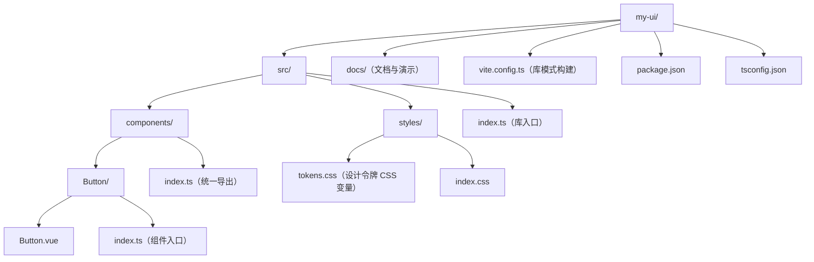

## 构建配置：Vite 库模式

```ts
// vite.config.ts
import { defineConfig } from 'vite';
import vue from '@vitejs/plugin-vue';
import dts from 'vite-plugin-dts';

export default defineConfig({
  plugins: [vue(), dts({ include: ['src'] })],
  build: {
    lib: {
      entry: 'src/index.ts',
      name: 'MyUI',
      formats: ['es', 'cjs'], // ESM 供按需导入，CJS 兼容旧工具链
      fileName: (format) => `my-ui.${format}.js`,
    },
    rollupOptions: {
      external: ['vue'], // vue 是 peer 依赖，不进产物
    },
  },
});
json
// package.json 出口配置
{
  "name": "my-ui",
  "type": "module",
  "main": "./dist/my-ui.cjs.js",
  "module": "./dist/my-ui.es.js",
  "types": "./dist/index.d.ts",
  "exports": {
    ".": {
      "types": "./dist/index.d.ts",
      "import": "./dist/my-ui.es.js",
      "require": "./dist/my-ui.cjs.js"
    },
    "./styles.css": "./dist/styles.css"
  },
  "peerDependencies": {
    "vue": "^3.4.0"
  }
}
```

## 样式与主题

```css
/* tokens.css：主题由 CSS 变量驱动，用户可覆盖 */
:root {
  --ui-color-primary: #0e8c9c;
  --ui-radius: 4px;
}
vue
<!-- Button.vue：scoped 样式 + 变量取值 -->
<template>
  <button class="ui-button" :class="`ui-button--${variant}`">
    <slot />
  </button>
</template>

<style scoped>
.ui-button {
  padding: 6px 14px;
  border-radius: var(--ui-radius);
  color: var(--ui-color-primary);
}
</style>
```

## 发布与版本

- 语义化版本：破坏性变更发 major，新特性发 minor，修复发 patch。
- 变更日志（CHANGELOG）随版本更新，使用方才能判断升级风险。
- 发布前跑类型检查、单测与文档示例构建。

## 常见误区

| 误区 | 真相 |
| --- | --- |
| 把 vue 打进产物 | vue 应作为 peerDependency，否则多个副本导致运行时冲突 |
| 只发一个文件 | 需要 ESM + d.ts + 样式资源，配套 exports 映射 |
| 样式写在组件里就完事 | 主题化需要把可变值抽象成 CSS 变量 |
| 版本号随意升 | 语义化版本是组件库与使用方之间的契约 |

## 小结

组件库工程化没有玄学：目录按组件拆、构建用库模式、样式走变量、发布守语义化版本。
从第一个 Button 开始就按这个骨架走，后续加组件只是"复制目录 + 导出"的重复劳动。

<!-- ============================================================ vue3/039-VueEcosystemVersionMap ============================================================ -->

## 概述

Vue 3 生态由核心（vue）、路由（vue-router）、状态管理（pinia）、构建（vite）、测试（vitest、@vue/test-utils）与工具链（create-vue、vue-tsc、Vue - Official）组成。它们各自独立发版，版本号并不对齐，因此在创建新项目或升级旧项目前，先核对一份"当前最新稳定版本"清单可以避免安装到过时主版本。本文以 2026-08 的 npm 稳定版为准，整理版本对照、Node 要求与升级顺序。

## 版本对照表

| 包 | 当前稳定版 | 作用 | 关键依赖要求 |
| --- | --- | --- | --- |
| `vue` | 3.5.x | 核心框架 | TypeScript 任意版本 |
| `create-vue` | 3.x | 官方脚手架 | Node `^22.18.0 || >=24.12.0` |
| `vue-router` | 5.x | 路由 | peer `vue ^3.5.34` 或 `^4` |
| `pinia` | 4.x | 状态管理 | peer `vue ^3.5.11`、TypeScript `>=5.6` |
| `vite` | 8.x | 构建工具 | Node `^20.19.0 || >=22.12.0` |
| `@vitejs/plugin-vue` | 6.x | Vue 单文件组件编译 | peer `vite ^5 ~ ^8`、`vue ^3.2.25` |
| `vitest` | 4.x | 单元测试 | Node `^20 || ^22 || >=24`，peer `vite ^6 ~ ^8` |
| `@vue/test-utils` | 2.4.x | 组件测试工具 | peer `vue 3.x` |
| `vue-tsc` | 3.x | SFC 类型检查 | peer `typescript >=5.0`（兼容 7.x） |
| `typescript` | 7.x | 类型系统与编译器 | Node `>=16.20` |

版本号以 npm registry 的 `latest` 标签为准；上表是"主版本 + 当前线"的对照，具体补丁版本以安装时 `npm view <包> version` 输出为准。

## Node.js 版本要求

不同工具对 Node 的要求不同，安装前先确认：

- create-vue：`^22.18.0 || >=24.12.0`
- Vite 8：`^20.19.0 || >=22.12.0`
- Vitest 4：`^20.0.0 || ^22.0.0 || >=24.0.0`

结论：统一使用 Node 22 LTS 或 24 LTS 即可同时满足全部要求；Node 18 已不在官方支持范围内。

## 新建项目

官方脚手架会自动安装匹配的版本组合：

```bash
npm create vue@latest
```

交互勾选 TypeScript、Vue Router、Pinia、Vitest 后，`package.json` 中即为当前稳定主版本。手动安装等价组合：

```bash
npm install vue@latest vue-router@latest pinia@latest
npm install -D vite@latest @vitejs/plugin-vue@latest typescript@latest vue-tsc@latest vitest@latest @vue/test-utils@latest
```

## 升级旧项目

升级顺序建议"自底向上"：

1. Node.js 升到 22 LTS 或 24 LTS。
2. 升级 `vite` 与 `@vitejs/plugin-vue`，确认构建通过。
3. 升级 `vue` 到 3.5.x，确认应用运行正常。
4. 升级 `vue-router` 与 `pinia`，按各自官方迁移指南处理破坏性变更。
5. 升级 `typescript` 与 `vue-tsc`，跑一遍 `vue-tsc --noEmit`。
6. 最后升级 `vitest` 与 `@vue/test-utils`，跑完整测试。

每一步都先提交再继续，出现问题时可以快速定位是哪个主版本引入的。主版本升级前，先读对应仓库的迁移指南（vuejs/router 与 vuejs/pinia 均在各自文档仓库维护迁移章节）。

## 版本选择原则

- 新项目直接使用 latest 稳定版，不要回退到旧主版本。
- 旧项目不要跨多个主版本一次性升级，逐个主版本过迁移指南。
- 锁定依赖使用 `package.json` 的精确版本或 lockfile，不要依赖"记忆中的版本号"。
- 关注 peerDependencies：例如 pinia 4 要求 `vue ^3.5.11`，如果项目还在 Vue 3.4，应先升级 Vue。

## 小结

生态版本对照的核心是"先看 peer 要求，再定升级顺序"。Node 22/24 LTS、Vue 3.5、Router 5、Pinia 4、Vite 8 是当前稳定组合；创建项目用 create-vue，升级项目按"构建 -> 核心 -> 路由状态 -> 类型 -> 测试"的顺序逐层推进。
