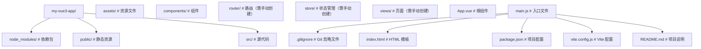

## 1. Vue3 概述 | Vue3 Overview

Vue3 是 Vue.js 框架的第三个主要版本，于 2020 年 9 月正式发布。它带来了许多重要的改进和新特性，包括：

- **组合式 API (Composition API)**：提供了一种新的方式来组织组件逻辑，使代码更易于维护和复用
- **响应式系统重构**：使用 ES6 Proxy 替代 Object.defineProperty，提供更强大的响应式能力
- **更好的 TypeScript 支持**：全面提升了 TypeScript 类型推断能力
- **性能优化**：包括虚拟 DOM 重写、编译器优化等，性能显著提升
- **更小的包体积**：通过 tree-shaking 等技术，减小了运行时体积

## 2. 环境搭建 | Environment Setup

### 2.1 安装 Node.js

Vue3 项目需要 Node.js 18+ 环境。可以从 [Node.js 官网](https://nodejs.org/) 下载并安装最新版本。

### 2.2 创建 Vue3 项目

使用 Vite 创建 Vue3 项目是推荐的方式：

```bash
 # 使用 npm
 npm create vite@latest my-vue3-app -- --template vue
 # 使用 yarn
 yarn create vite my-vue3-app --template vue
 # 使用 pnpm
 pnpm create vite my-vue3-app --template vue
```

### 2.3 项目结构

创建的 Vue3 项目结构如下：



### 2.4 安装常用依赖

```bash
 # 安装 Vue Router
 npm install vue-router@4
 # 安装 Pinia（Vue3 推荐的状态管理库）
 npm install pinia
 # 安装 TypeScript（可选）
 npm install typescript
 # 安装 ESLint 和 Prettier（可选）
 npm install eslint prettier
```

## 3. 第一个 Vue3 应用 | First Vue3 App

### 3.1 修改 App.vue

```vue
<template>
  <div class="app">
    <h1>Hello Vue3!</h1>
    <button @click="count++">Count: {{ count }}</button>
  </div>
</template>
<script setup>
import { ref } from 'vue';
const count = ref(0);
</script>
<style scoped>
.app {
  text-align: center;
  margin-top: 50px;
}
h1 {
  color: #42b983;
}
button {
  padding: 10px 20px;
  font-size: 16px;
  background-color: #42b983;
  color: white;
  border: none;
  border-radius: 4px;
  cursor: pointer;
}
button:hover {
  background-color: #35495e;
}
</style>
```

### 3.2 运行项目

```bash
 # 进入项目目录
 cd my-vue3-app
 # 安装依赖
 npm install
 # 启动开发服务器
 npm run dev
```

访问终端中显示的地址（通常是 <http://localhost:5173），即可看到你的第一个> Vue3 应用。

## 4. 开发工具推荐 | Recommended Tools

- **VS Code**：推荐的代码编辑器
- **Volar**：Vue3 官方推荐的 VS Code 扩展，提供更好的 Vue3 支持
- **Vue DevTools**：浏览器扩展，用于调试 Vue 应用
- **ESLint**：代码质量检查工具
- **Prettier**：代码格式化工具

## 6. 常见问题 | Common Issues

### 6.1 无法启动开发服务器

- 检查 Node.js 版本是否符合要求
- 检查端口是否被占用
- 检查依赖是否正确安装

### 6.2 组件不显示

- 检查组件是否正确导入
- 检查组件名称是否正确
- 检查模板语法是否正确

### 6.3 响应式数据不更新

- 检查是否使用了 `ref` 或 `reactive` 来创建响应式数据
- 检查是否正确访问响应式数据（对于 `ref`，需要使用 `.value`）
- 检查是否在模板中正确使用响应式数据（模板中自动解包，不需要 `.value`）

## 7. 小结 | Summary

Vue3 带来了许多新特性和改进，使前端开发更加高效和愉快。通过本章节的学习，你已经了解了 Vue3 的基本概念和环境搭建方法，为后续的学习打下了基础。
接下来，我们将深入学习 Vue3 的组合式 API、响应式系统、组件系统等核心特性，帮助你构建更加复杂和功能丰富的 Vue3 应用。

## 延伸阅读

- [JavaScript](javascript/overview)
- [TypeScript](typescript/overview)
- [HTML5](html5/overview-and-semantics)
- [CSS](css/overview-and-syntax)
## 应用创建

**createApp 创建应用实例**
`const <app> = createApp(<rootComponent>);`
```typescript
import { createApp } from 'vue';
import App from './App.vue';

const app = createApp(App);
```

**根组件直接对象定义**
`createApp({ setup() | data() | template | render })`
```typescript
const app = createApp({
  data() {
    return { msg: 'Hello' };
  },
  template: '<div>{{ msg }}</div>'
});
```

---

## 应用配置

**app.use 安装插件**
`app.use(<plugin>, [options]);`
```typescript
import { createApp } from 'vue';
import { createPinia } from 'pinia';
import router from './router';

const app = createApp(App);
app.use(createPinia());
app.use(router);
app.use(myPlugin, { optionKey: 'value' });
```

**app.component 全局组件注册**
`app.component(<name>, <component>);`
```typescript
app.component('MyButton', {
  template: '<button><slot/></button>'
});
app.component('MyComp', () => import('./MyComp.vue'));
```

**app.directive 全局指令注册**
`app.directive(<name>, <directive>);`
```typescript
app.directive('focus', {
  mounted(el) {
    el.focus();
  }
});
```

**app.mixin 全局混入(不推荐)**
`app.mixin(<mixin>);`
```typescript
app.mixin({
  created() {
    console.log('global mixin created');
  }
});
```

**app.provide 全局依赖注入**
`app.provide(<key>, <value>);`
```typescript
app.provide('theme', 'dark');
app.provide(Symbol('config'), { apiBase: '/api' });
```

---

## 应用挂载

**app.mount 挂载应用**
`app.mount(<container>);`
```typescript
app.mount('#app');
app.mount(document.getElementById('app'));
```

**app.unmount 卸载应用**
`app.unmount();`
```typescript
const app = createApp(App);
app.mount('#app');
setTimeout(() => app.unmount(), 5000);
```

---

## 应用上下文

**app.config 全局配置**
`app.config.<key> = <value>;`
```typescript
app.config.errorHandler = (err, instance, info) => {
  console.error('全局错误:', err, info);
};
app.config.warnHandler = (msg, instance, trace) => {
  console.warn(msg);
};
app.config.globalProperties.$format = (v) => v.toFixed(2);
app.config.performance = true;
app.config.silent = false;
```

**app.version 获取 Vue 版本**
```typescript
console.log(app.version);
```

**app.runWithContext 在应用上下文中执行**
`const <result> = app.runWithContext(<callback>);`
```typescript
const result = app.runWithContext(() => {
  return inject('theme');
});
```

---

## 应用链式调用

**链式注册与挂载**
```typescript
createApp(App)
  .use(createPinia())
  .use(router)
  .directive('focus', { mounted: (el) => el.focus() })
  .provide('apiBase', '/api')
  .mount('#app');
```

## 深度专题扩展

以下专题从不同角度深入本文主题，供有进阶需求的读者研读。每个专题独立成节，内容相互补充。

### 13.1 响应式原理与依赖收集

ref 内部用 class RefImpl 保存值并收集依赖；reactive 用 Proxy 的 get/set 拦截，依赖以 WeakMap<target, Map<key, Set<effect>>> 存储。
effect 在触发时重新执行，scheduler 控制批处理（微任务队列）；computed 用惰性求值与缓存标志。
渲染更新：组件渲染函数是 effect，数据变化触发重渲染；Vue 的更新粒度到组件级，配合虚拟 DOM diff。
调试：onRenderTracked/onRenderTriggered 追踪依赖；性能面板观察更新频率。

### 13.2 组合函数与可复用逻辑

组合函数（composable）以 use 前缀命名，内部可组合 ref/computed/watch/lifecycle，实现逻辑复用。
示例：useFetch 封装请求状态（data/error/loading）与取消；useLocalStorage 同步持久化。
与 Mixin 对比：组合函数无命名冲突、显式依赖、类型友好。
工程规范：每个组合函数单一职责，返回只读引用防止外部破坏。
