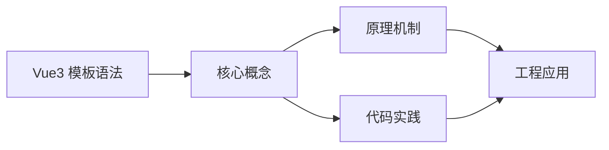
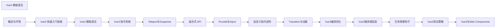

## 1. 学习目标（Bloom 分类）

本节按照布鲁姆教育目标分类学组织学习路径。本文主题为《Vue3 模板语法》，属于 Vue 3 模块，读者可以根据自身阶段选择阅读深度。

记忆层面：能够准确复述本文的核心概念、术语与基本语法或操作步骤，并能够在提问或检索时快速定位对应知识点。能够说出 Vue 3 的核心概念、术语与标准写法。

理解层面：能够用自己的语言解释核心原理与工作机制，说明概念之间的因果关系，而不是机械记忆结论。能够解释 Vue 3 的工作原理与设计动机。

应用层面：能够在真实项目或练习场景中运用本文知识解决具体问题，写出正确且可维护的实现。能够编写符合 Vue 3 规范的完整实现。

分析层面：能够拆解复杂问题，比较本文主题与相邻概念的异同，识别边界条件与例外情况。能够分析 Vue 3 与相邻方案的差异与边界。

评价层面：能够根据约束条件（性能、可读性、安全、成本）评价不同方案的优劣，做出有依据的技术决策。能够根据场景评价 Vue 3 相关方案的优劣。

创造层面：能够把本文知识与其他模块知识组合，设计出新的解决方案或可复用的工程模式。能够组合 Vue 3 与其他技术设计完整方案。

通过本节学习，读者应当能够把《Vue3 模板语法》纳入自己的知识网络，并与 Vue 3 模块的其他主题（组合式 API、响应式、组件通信、路由、状态管理）建立关联。

## 2. 历史动机与发展脉络

《Vue3 模板语法》是 Vue 3 领域的重要主题。要真正理解它，需要先了解它解决的问题与演进过程。

Vue 由尤雨溪于 2014 年发布，以“渐进式框架”定位：可作库嵌入，也可作框架构建完整应用。Vue 3 于 2020 年 9 月发布，核心是组合式 API 与全新响应式系统。
Vue 3 的技术支柱：Proxy 响应式（替代 Object.defineProperty）、虚拟 DOM 重写（PatchFlags）、Fragment/Teleport/Suspense 内置组件、组合式 API（setup/ref/reactive/computed）。
生态现状：Vue Router 4、Pinia（官方状态库）、Vite 构建、Nuxt 全栈框架；Vue 3.5 引入 useTemplateRef 等开发者体验改进。

回到本文主题：Vue3 模板语法 的提出与成熟，正是上述技术背景下的必然产物。早期实现往往以简单可用为目标，随着工程规模扩大，社区逐渐沉淀出标准做法与最佳实践；理解这一脉络，可以帮助读者判断“为什么文档中的推荐写法是现在这个样子”，也能在遇到历史遗留代码时准确识别其设计年代与取舍。


## 3. 形式化定义与核心概念精讲

本节把《Vue3 模板语法》涉及的核心概念以“定义 + 讲解”的形式展开。读者应把定义当作工具，把讲解当作理解路径；两者结合才能形成可迁移的知识。

响应式：ref 包装基本类型，reactive 包装对象；effect 收集依赖，Proxy 拦截读写；computed 缓存派生值。
组件通信：props 向下、emit 向上、v-model 双向、provide/inject 跨层、事件总线（慎用）。
生命周期：setup 在创建前执行；onMounted/onUpdated/onUnmounted 对应挂载、更新、卸载；KeepAlive 增加 activated/deactivated。

### 3.1 原文章节逐一精讲

原文档把主题拆分为 14 个小节，下面按顺序给出每一节的导读讲解，随后保留原文细节供精读。

#### 原文精读（完整保留）

# 模板指令 语法速查手册

> **符号约定**:`< >` 必填参数 | `[ ]` 可选参数

---

#### 1. 插值表达式

##### 1.1 文本插值

```vue
<template>
  <div>
    <h1>{{ message }}</h1>
    <p>{{ count }}</p>
    <p>{{ isActive ? '激活' : '未激活' }}</p>
    <p>{{ user.name }}</p>
  </div>
</template>
<script setup lang="ts">
import { ref, reactive } from 'vue'
const message = ref('Hello Vue3')
const count = ref(0)
const isActive = ref(true)
const user = reactive({
 name: '张三',
 age: 20
}
</script>
```

##### 1.2 原始 HTML

```vue
<template>
  <div>
    <p>{{ rawHtml }}</p>
    <!-- 输出: <strong>加粗文本</strong> -->
    <p v-html="rawHtml"></p>
    <!-- 输出: 加粗文本 -->
  </div>
</template>
<script setup lang="ts">
import { ref } from 'vue';
const rawHtml = ref('<strong>加粗文本</strong>');
</script>
```

##### 1.3 表达式

```vue
<template>
  <div>
    <p>{{ count + 1 }}</p>
    <p>{{ message.toUpperCase() }}</p>
    <p>{{ user.name + ' (' + user.age + '岁)' }}</p>
    <p>{{ items.length }}</p>
  </div>
</template>
<script setup lang="ts">
import { ref, reactive } from 'vue'
const count = ref(0)
const message = ref('hello')
const user = reactive({
 name: '张三',
 age: 20
}
const items = ref([1, 2, 3, 4, 5])
</script>
```

#### 2. 指令

##### 2.1 条件指令

###### v-if

```vue
<template>
  <div>
    <p v-if="isLoggedIn">欢迎回来！</p>
    <p v-else>请登录</p>
  </div>
</template>
<script setup lang="ts">
import { ref } from 'vue';
const isLoggedIn = ref(false);
</script>
```

###### v-else-if

```vue
<template>
  <div>
    <p v-if="score >= 90">优秀</p>
    <p v-else-if="score >= 80">良好</p>
    <p v-else-if="score >= 60">及格</p>
    <p v-else>不及格</p>
  </div>
</template>
<script setup lang="ts">
import { ref } from 'vue';
const score = ref(85);
</script>
```

###### v-show

```vue
<template>
  <div>
    <p v-show="isVisible">这是一个可显示/隐藏的元素</p>
    <button @click="isVisible = !isVisible">切换显示</button>
  </div>
</template>
<script setup lang="ts">
import { ref } from 'vue';
const isVisible = ref(true);
</script>
```

##### 2.2 循环指令

###### v-for

```vue
<template>
  <div>
    <ul>
      <li v-for="item in items" :key="item.id">
        {{ item.name }}
      </li>
    </ul>
    <ul>
      <li v-for="(item, index) in items" :key="index">{{ index + 1 }}. {{ item.name }}</li>
    </ul>
    <ul>
      <li v-for="(value, key) in user" :key="key">{{ key }}: {{ value }}</li>
    </ul>
  </div>
</template>
<script setup lang="ts">
import { ref, reactive } from 'vue'
const items = ref([
 { id: 1, name: '项目 1' },
 { id: 2, name: '项目 2' },
 { id: 3, name: '项目 3' }
]
const user = reactive({
 name: '张三',
 age: 20,
 email: 'zhangsan@example.com'
}
</script>
```

##### 2.3 绑定指令

###### v-bind

```vue
<template>
  <div>
    
    <a v-bind:href="linkUrl">链接</a>
    <div v-bind:class="className">类绑定</div>
    <div v-bind:style="styleObject">样式绑定</div>
  </div>
</template>
<script setup lang="ts">
import { ref, reactive } from 'vue'
const imageSrc = ref('https://example.com/image.jpg')
const linkUrl = ref('https://example.com')
const className = ref('container')
const styleObject = reactive({
 color: 'red',
 fontSize: '16px'
}
</script>
```

###### 简写形式

```vue
<template>
  <div>
    
    <a :href="linkUrl">链接</a>
    <div :class="className">类绑定</div>
    <div :style="styleObject">样式绑定</div>
  </div>
</template>
```

##### 2.4 事件指令

###### v-on

```vue
<template>
  <div>
    <button v-on:click="handleClick">点击我</button>
    <button v-on:mouseenter="handleMouseEnter">鼠标进入</button>
    <button v-on:mouseleave="handleMouseLeave">鼠标离开</button>
  </div>
</template>
<script setup lang="ts">
function handleClick() {
  console.log('点击事件');
}
function handleMouseEnter() {
  console.log('鼠标进入事件');
}
function handleMouseLeave() {
  console.log('鼠标离开事件');
}
</script>
```

###### 简写形式

```vue
<template>
  <div>
    <button @click="handleClick">点击我</button>
    <button @mouseenter="handleMouseEnter">鼠标进入</button>
    <button @mouseleave="handleMouseLeave">鼠标离开</button>
  </div>
</template>
```

##### 2.5 表单指令

###### v-model

```vue
<template>
  <div>
    <input v-model="message" type="text" placeholder="输入内容" />
    <p>输入内容: {{ message }}</p>
    <input v-model="isChecked" type="checkbox" />
    <p>是否选中: {{ isChecked }}</p>
    <select v-model="selectedOption">
      <option value="1">选项 1</option>
      <option value="2">选项 2</option>
      <option value="3">选项 3</option>
    </select>
    <p>选中选项: {{ selectedOption }}</p>
  </div>
</template>
<script setup lang="ts">
import { ref } from 'vue';
const message = ref('');
const isChecked = ref(false);
const selectedOption = ref('1');
</script>
```

##### 2.6 其他指令

###### v-pre

```vue
<template>
  <div>
    <p v-pre>{{ 这不会被编译 }}</p>
  </div>
</template>
```

###### v-cloak

```vue
<template>
  <div>
    <p v-cloak>{{ message }}</p>
  </div>
</template>
<style>
[v-cloak] {
  display: none;
}
</style>
```

###### v-once

```vue
<template>
  <div>
    <p v-once>{{ message }}</p>
    <button @click="message = '更新后的消息'">更新消息</button>
  </div>
</template>
<script setup lang="ts">
import { ref } from 'vue';
const message = ref('初始消息');
</script>
```

#### 3. 模板表达式

##### 3.1 过滤器（已废弃）

在 Vue3 中，过滤器已被废弃，建议使用计算属性或方法代替：

```vue
<template>
  <div>
    <p>{{ formattedDate }}</p>
    <p>{{ formatDate(date) }}</p>
  </div>
</template>
<script setup lang="ts">
import { ref, computed } from 'vue';
const date = ref(new Date());
const formattedDate = computed(() => {
  return new Intl.DateTimeFormat('zh-CN').format(date.value);
});
function formatDate(date: Date): string {
  return new Intl.DateTimeFormat('zh-CN').format(date);
}
</script>
```

##### 3.2 空格和换行

```vue
<template>
  <div>
    <!-- 保留空格和换行 -->
    <pre>{{ message }}</pre>
    <!-- 自动移除空格和换行 -->
    <p>{{ message }}</p>
  </div>
</template>
<script setup lang="ts">
import { ref } from 'vue';
const message = ref(`Hello
 World`);
</script>
```

#### 4. 模板编译

##### 4.1 编译模式

Vue3 提供了两种编译模式：

- **运行时编译**：在浏览器中编译模板
- **预编译**：在构建时编译模板

##### 4.2 编译优化

Vue3 的模板编译进行了以下优化：

- **静态提升**：将静态内容提升到渲染函数外部
- **补丁标记**：为动态内容添加标记，减少 diff 时间
- **缓存指令**：缓存指令的编译结果

#### 5. 最佳实践

##### 5.1 模板结构

- 保持模板简洁明了
- 避免在模板中使用复杂表达式
- 使用计算属性或方法处理复杂逻辑

##### 5.2 性能优化

- 使用 `v-once` 处理静态内容
- 使用 `v-memo` 缓存计算结果
- 合理使用 `v-if` 和 `v-show`
- 为 `v-for` 添加唯一的 key

##### 5.3 代码风格

- 使用简写形式（`:src` 代替 `v-bind:src`，`@click` 代替 `v-on:click`）
- 保持模板缩进一致
- 为指令添加适当的空格

#### 6. 常见问题

##### 6.1 插值表达式不更新

**问题**：插值表达式的值没有更新
**解决方案**：

- 确保使用了响应式数据（`ref` 或 `reactive`）
- 对于 `ref`，确保使用 `.value` 访问和修改值
- 对于 `reactive`，确保直接修改对象属性，而不是替换整个对象

##### 6.2 v-for 不渲染

**问题**：`v-for` 没有渲染列表
**解决方案**：

- 确保数组是响应式的
- 为每个项添加唯一的 `key`
- 检查数组是否为空

##### 6.3 v-model 不工作

**问题**：`v-model` 绑定的值没有更新
**解决方案**：

- 确保使用了响应式数据
- 检查表单元素的类型是否正确
- 对于自定义组件，确保正确实现了 `v-model` 接口

#### 7. 总结

Vue3 的模板语法简洁明了，提供了丰富的指令和表达式，使开发者可以轻松构建交互式界面。通过本教程的学习，你应该已经掌握了 Vue3 模板语法的基本使用方法，可以在实际项目中灵活运用。
#### 文本插值

**Mustache 文本插值**
`{{ <expression> }}`
```vue
<template>
  <span>{{ message }}</span>
  <span>{{ count + 1 }}</span>
  <span>{{ reverseMessage() }}</span>
  <span>{{ user.name + ' - ' + user.age }}</span>
</template>
```

**v-text 设置元素文本**
`v-text="<expression>"`
```vue
<span v-text="message"></span>
```

**v-html 设置 HTML 内容**
`v-html="<htmlString>"`
```vue
<div v-html="rawHtml"></div>
```

---

#### 属性绑定 v-bind

**v-bind 单属性绑定**
`v-bind:<attr>="<value>"` / `:<attr>="<value>"`
```vue

<a :href="url" :title="title">链接</a>
<button :disabled="isDisabled">提交</button>
```

**动态属性名**
`:[<attrExpr>]="<value>"`
```vue
<a :[attrName]="url">动态属性</a>
```

**对象语法(多属性一次性绑定)**
`:<attr>="{ <key>: <value>, ... }"` / `v-bind="<object>"`
```vue
<div :class="{ active: isActive, 'has-error': hasError }"></div>
<div :style="{ color: activeColor, fontSize: size + 'px' }"></div>
<div v-bind="attributeObject"></div>
```

**数组语法(class/style)**
```vue
<div :class="[activeClass, errorClass]"></div>
<div :class="[isActive ? 'active' : '', errorClass]"></div>
<div :class="[{ active: isActive }, errorClass]"></div>
<div :style="[baseStyles, overridingStyles]"></div>
```

---

#### 事件绑定 v-on

**v-on 事件绑定**
`v-on:<event>="<handler>"` / `@<event>="<handler>"`
```vue
<button v-on:click="handleClick">点击</button>
<button @click="count++">+1</button>
<input @input="onInput" @focus="onFocus" />
```

**内联调用与参数**
`@<event>="<handler>(<args>)"`
```vue
<button @click="say('hello', $event)">say</button>
<button @click="handle(item, index)">处理</button>
```

**事件修饰符**
`@<event>.<modifier>="<handler>"`
```vue
<a @click.stop="onClick">阻止冒泡</a>
<form @submit.prevent="onSubmit">阻止默认</form>
<div @click.capture="onClick">捕获模式</div>
<div @click.self="onSelf">仅自身触发</div>
<div @click.once="onClick">只触发一次</div>
<div @scroll.passive="onScroll">滚动优化</div>
```

**按键修饰符**
```vue
<input @keyup.enter="onEnter" />
<input @keyup.esc="onEsc" />
<input @keydown.page-down="onPageDown" />
```

**系统修饰符组合**
```vue
<input @keyup.ctrl.enter="onCtrlEnter" />
<div @click.ctrl="onCtrlClick">Ctrl+Click</div>
<div @click.exact="onExactClick">仅精确按键</div>
```

**鼠标按键修饰符**
```vue
<div @click.left="onLeft">左键</div>
<div @click.right="onRight">右键</div>
<div @click.middle="onMiddle">中键</div>
```

---

#### 条件渲染 v-if

**v-if / v-else-if / v-else**
```vue
<div v-if="type === 'A'">A</div>
<div v-else-if="type === 'B'">B</div>
<div v-else>其他</div>
```

**v-show 切换 display**
`v-show="<expression>"`
```vue
<h1 v-show="isVisible">Hello</h1>
```

**template 包裹多元素条件**
```vue
<template v-if="ok">
  <h1>标题</h1>
  <p>段落</p>
</template>
```

---

#### 列表渲染 v-for

**v-for 数组遍历**
`v-for="(<item>, [index]) in <array>"` / `v-for="(<item>, [index]) of <array>"`
```vue
<li v-for="(item, index) in items" :key="item.id">
  {{ index }} - {{ item.name }}
</li>
<li v-for="item of items" :key="item.id">{{ item }}</li>
```

**v-for 对象遍历**
`v-for="(<value>, [key], [index]) in <object>"`
```vue
<li v-for="(value, key) in user" :key="key">
  {{ key }}: {{ value }}
</li>
```

**v-for 数字范围**
`v-for="<n> in <number>"`
```vue
<span v-for="n in 10" :key="n">{{ n }}</span>
```

**template 多元素遍历**
```vue
<template v-for="item in items" :key="item.id">
  <li>{{ item.name }}</li>
  <li>{{ item.desc }}</li>
</template>
```

---

#### 双向绑定 v-model

**v-model 基础用法**
`v-model="<variable>"`
```vue
<input v-model="message" placeholder="输入" />
<textarea v-model="text"></textarea>
<input type="checkbox" v-model="checked" />
<select v-model="selected"><option value="a">A</option></select>
```

**复选框绑定数组**
```vue
<input type="checkbox" value="A" v-model="checkedNames" />
<input type="checkbox" value="B" v-model="checkedNames" />
```

**单选按钮**
```vue
<input type="radio" value="One" v-model="picked" />
<input type="radio" value="Two" v-model="picked" />
```

**选择框多选**
```vue
<select v-model="multi" multiple>
  <option value="a">A</option>
  <option value="b">B</option>
</select>
```

**v-model 修饰符**
```vue
<input v-model.lazy="message" />          <!-- 失焦或回车同步 -->
<input v-model.number="age" />            <!-- 转为数字 -->
<input v-model.trim="msg" />              <!-- 去除首尾空格 -->
```

**v-model 自定义组件(双向绑定)**
```vue
<MyInput v-model="searchText" />
<MyInput v-model:modelValue="val" />
<MyInput v-model:title="title" />
```

**组件内定义(defineModel - Vue 3.4+)**
```vue
<!-- Child.vue -->
<script setup>
const model = defineModel();
function update() {
  model.value = 'new value';
}
</script>
```

---

#### 其他指令

**v-once 一次性渲染**
```vue
<span v-once>{{ msg }}</span>
<div v-once>
  <h1>静态内容</h1>
  <p>{{ computed }}</p>
</div>
```

**v-memo 性能优化缓存**
`v-memo="[<dep1>, <dep2>]"`
```vue
<div v-for="item in list" :key="item.id" v-memo="[item.id, item.selected]">
  {{ item.name }}
</div>
```

**v-cloak 隐藏未编译模板**
```vue
<div v-cloak>{{ message }}</div>
<style>[v-cloak] { display: none; }</style>
```

**v-pre 跳过编译**
```vue
<span v-pre>{{ this will not be compiled }}</span>
```


### 3.2 概念关系图

下面用 Mermaid 图表达本文核心概念之间的关系，帮助读者建立整体图景：



图中展示的是本文知识的结构化关系：核心概念是入口，原理机制解释“为什么”，代码实践演示“怎么做”，工程应用回答“何时用”。读者学习时可以把每个小节的内容挂接到对应节点上。

## 4. 理论推导与原理解析

本节深入《Vue3 模板语法》背后的原理。理论部分不求面面俱到，而是聚焦“能解释现象、能指导实践”的关键推导。

响应式：ref 包装基本类型，reactive 包装对象；effect 收集依赖，Proxy 拦截读写；computed 缓存派生值。
组件通信：props 向下、emit 向上、v-model 双向、provide/inject 跨层、事件总线（慎用）。
生命周期：setup 在创建前执行；onMounted/onUpdated/onUnmounted 对应挂载、更新、卸载；KeepAlive 增加 activated/deactivated。
模板编译：模板在构建期编译为渲染函数，指令（v-if/v-for/v-model）是编译糖。

需要强调的是，理论推导与工程实践之间存在翻译层：理论给出的是理想化模型与边界条件，工程代码则必须处理真实环境中的例外。读者在学习时应先掌握理论的“标准情形”，再通过陷阱章节了解“非标准情形”。

## 5. 代码示例与逐行讲解

本节把原文中的代码示例系统整理，并为每个示例补充用途说明与讲解。读者不应只浏览代码，而应逐段对照讲解理解设计意图。

### 5.1 示例：1.1 文本插值

该示例来自原文《1.1 文本插值》小节，用于演示Vue3 模板语法相关操作。阅读时请先看代码结构，再看其后的讲解。

```vue
<template>
  <div>
    <h1>{{ message }}</h1>
    <p>{{ count }}</p>
    <p>{{ isActive ? '激活' : '未激活' }}</p>
    <p>{{ user.name }}</p>
  </div>
</template>
<script setup lang="ts">
import { ref, reactive } from 'vue'
const message = ref('Hello Vue3')
const count = ref(0)
const isActive = ref(true)
const user = reactive({
 name: '张三',
 age: 20
}
</script>
```

讲解：这段代码演示了本节核心知识点。代码中的关键操作可以归纳为三步：准备（定义或初始化）、执行（核心逻辑）、收尾（释放资源或返回结果）。实际项目中，这三步往往被封装为函数或类，以提升复用性与可测试性。

关键点分析：

该示例共 18 行有效代码，包含 2 类关键结构（import、from）。其中：

- 入口与初始化部分负责建立上下文，对应实际项目中的启动或装配逻辑；
- 核心逻辑部分体现本文主题的主要操作，是阅读时最需要对照讲解理解的部分；
- 输出或返回部分把结果交给调用方，注意其类型与边界条件。

进阶思考路径：先尝试修改参数观察行为变化，再把示例中的模式迁移到自己的项目中；每次修改都记录预期与实测差异，这是把示例转化为能力的最快方式。

### 5.2 示例：1.2 原始 HTML

该示例来自原文《1.2 原始 HTML》小节，用于演示Vue3 模板语法相关操作。阅读时请先看代码结构，再看其后的讲解。

```vue
<template>
  <div>
    <p>{{ rawHtml }}</p>
    <!-- 输出: <strong>加粗文本</strong> -->
    <p v-html="rawHtml"></p>
    <!-- 输出: 加粗文本 -->
  </div>
</template>
<script setup lang="ts">
import { ref } from 'vue';
const rawHtml = ref('<strong>加粗文本</strong>');
</script>
```

讲解：这段代码演示了本节核心知识点。代码中的关键操作可以归纳为三步：准备（定义或初始化）、执行（核心逻辑）、收尾（释放资源或返回结果）。实际项目中，这三步往往被封装为函数或类，以提升复用性与可测试性。

关键点分析：

该示例共 12 行有效代码，包含 2 类关键结构（import、from）。其中：

- 入口与初始化部分负责建立上下文，对应实际项目中的启动或装配逻辑；
- 核心逻辑部分体现本文主题的主要操作，是阅读时最需要对照讲解理解的部分；
- 输出或返回部分把结果交给调用方，注意其类型与边界条件。

进阶思考路径：先尝试修改参数观察行为变化，再把示例中的模式迁移到自己的项目中；每次修改都记录预期与实测差异，这是把示例转化为能力的最快方式。

### 5.3 示例：1.3 表达式

该示例来自原文《1.3 表达式》小节，用于演示Vue3 模板语法相关操作。阅读时请先看代码结构，再看其后的讲解。

```vue
<template>
  <div>
    <p>{{ count + 1 }}</p>
    <p>{{ message.toUpperCase() }}</p>
    <p>{{ user.name + ' (' + user.age + '岁)' }}</p>
    <p>{{ items.length }}</p>
  </div>
</template>
<script setup lang="ts">
import { ref, reactive } from 'vue'
const count = ref(0)
const message = ref('hello')
const user = reactive({
 name: '张三',
 age: 20
}
const items = ref([1, 2, 3, 4, 5])
</script>
```

讲解：这段代码演示了本节核心知识点。代码中的关键操作可以归纳为三步：准备（定义或初始化）、执行（核心逻辑）、收尾（释放资源或返回结果）。实际项目中，这三步往往被封装为函数或类，以提升复用性与可测试性。

关键点分析：

该示例共 18 行有效代码，包含 2 类关键结构（import、from）。其中：

- 入口与初始化部分负责建立上下文，对应实际项目中的启动或装配逻辑；
- 核心逻辑部分体现本文主题的主要操作，是阅读时最需要对照讲解理解的部分；
- 输出或返回部分把结果交给调用方，注意其类型与边界条件。

进阶思考路径：先尝试修改参数观察行为变化，再把示例中的模式迁移到自己的项目中；每次修改都记录预期与实测差异，这是把示例转化为能力的最快方式。

### 5.4 示例：v-if

该示例来自原文《v-if》小节，用于演示Vue3 模板语法相关操作。阅读时请先看代码结构，再看其后的讲解。

```vue
<template>
  <div>
    <p v-if="isLoggedIn">欢迎回来！</p>
    <p v-else>请登录</p>
  </div>
</template>
<script setup lang="ts">
import { ref } from 'vue';
const isLoggedIn = ref(false);
</script>
```

讲解：这段代码演示了本节核心知识点。代码中的关键操作可以归纳为三步：准备（定义或初始化）、执行（核心逻辑）、收尾（释放资源或返回结果）。实际项目中，这三步往往被封装为函数或类，以提升复用性与可测试性。

关键点分析：

该示例共 10 行有效代码，包含 2 类关键结构（import、from）。其中：

- 入口与初始化部分负责建立上下文，对应实际项目中的启动或装配逻辑；
- 核心逻辑部分体现本文主题的主要操作，是阅读时最需要对照讲解理解的部分；
- 输出或返回部分把结果交给调用方，注意其类型与边界条件。

进阶思考路径：先尝试修改参数观察行为变化，再把示例中的模式迁移到自己的项目中；每次修改都记录预期与实测差异，这是把示例转化为能力的最快方式。

### 5.5 示例：v-else-if

该示例来自原文《v-else-if》小节，用于演示Vue3 模板语法相关操作。阅读时请先看代码结构，再看其后的讲解。

```vue
<template>
  <div>
    <p v-if="score >= 90">优秀</p>
    <p v-else-if="score >= 80">良好</p>
    <p v-else-if="score >= 60">及格</p>
    <p v-else>不及格</p>
  </div>
</template>
<script setup lang="ts">
import { ref } from 'vue';
const score = ref(85);
</script>
```

讲解：这段代码演示了本节核心知识点。代码中的关键操作可以归纳为三步：准备（定义或初始化）、执行（核心逻辑）、收尾（释放资源或返回结果）。实际项目中，这三步往往被封装为函数或类，以提升复用性与可测试性。

关键点分析：

该示例共 12 行有效代码，包含 2 类关键结构（import、from）。其中：

- 入口与初始化部分负责建立上下文，对应实际项目中的启动或装配逻辑；
- 核心逻辑部分体现本文主题的主要操作，是阅读时最需要对照讲解理解的部分；
- 输出或返回部分把结果交给调用方，注意其类型与边界条件。

进阶思考路径：先尝试修改参数观察行为变化，再把示例中的模式迁移到自己的项目中；每次修改都记录预期与实测差异，这是把示例转化为能力的最快方式。

### 5.6 示例：v-show

该示例来自原文《v-show》小节，用于演示Vue3 模板语法相关操作。阅读时请先看代码结构，再看其后的讲解。

```vue
<template>
  <div>
    <p v-show="isVisible">这是一个可显示/隐藏的元素</p>
    <button @click="isVisible = !isVisible">切换显示</button>
  </div>
</template>
<script setup lang="ts">
import { ref } from 'vue';
const isVisible = ref(true);
</script>
```

讲解：这段代码演示了本节核心知识点。代码中的关键操作可以归纳为三步：准备（定义或初始化）、执行（核心逻辑）、收尾（释放资源或返回结果）。实际项目中，这三步往往被封装为函数或类，以提升复用性与可测试性。

关键点分析：

该示例共 10 行有效代码，包含 2 类关键结构（import、from）。其中：

- 入口与初始化部分负责建立上下文，对应实际项目中的启动或装配逻辑；
- 核心逻辑部分体现本文主题的主要操作，是阅读时最需要对照讲解理解的部分；
- 输出或返回部分把结果交给调用方，注意其类型与边界条件。

进阶思考路径：先尝试修改参数观察行为变化，再把示例中的模式迁移到自己的项目中；每次修改都记录预期与实测差异，这是把示例转化为能力的最快方式。

### 5.7 示例：v-for

该示例来自原文《v-for》小节，用于演示Vue3 模板语法相关操作。阅读时请先看代码结构，再看其后的讲解。

```vue
<template>
  <div>
    <ul>
      <li v-for="item in items" :key="item.id">
        {{ item.name }}
      </li>
    </ul>
    <ul>
      <li v-for="(item, index) in items" :key="index">{{ index + 1 }}. {{ item.name }}</li>
    </ul>
    <ul>
      <li v-for="(value, key) in user" :key="key">{{ key }}: {{ value }}</li>
    </ul>
  </div>
</template>
<script setup lang="ts">
import { ref, reactive } from 'vue'
const items = ref([
 { id: 1, name: '项目 1' },
 { id: 2, name: '项目 2' },
 { id: 3, name: '项目 3' }
]
const user = reactive({
 name: '张三',
 age: 20,
 email: 'zhangsan@example.com'
}
</script>
```

讲解：这段代码演示了本节核心知识点。代码中的关键操作可以归纳为三步：准备（定义或初始化）、执行（核心逻辑）、收尾（释放资源或返回结果）。实际项目中，这三步往往被封装为函数或类，以提升复用性与可测试性。

关键点分析：

该示例共 28 行有效代码，包含 2 类关键结构（import、from）。其中：

- 入口与初始化部分负责建立上下文，对应实际项目中的启动或装配逻辑；
- 核心逻辑部分体现本文主题的主要操作，是阅读时最需要对照讲解理解的部分；
- 输出或返回部分把结果交给调用方，注意其类型与边界条件。

进阶思考路径：先尝试修改参数观察行为变化，再把示例中的模式迁移到自己的项目中；每次修改都记录预期与实测差异，这是把示例转化为能力的最快方式。

### 5.8 示例：v-bind

该示例来自原文《v-bind》小节，用于演示Vue3 模板语法相关操作。阅读时请先看代码结构，再看其后的讲解。

```vue
<template>
  <div>
    
    <a v-bind:href="linkUrl">链接</a>
    <div v-bind:class="className">类绑定</div>
    <div v-bind:style="styleObject">样式绑定</div>
  </div>
</template>
<script setup lang="ts">
import { ref, reactive } from 'vue'
const imageSrc = ref('https://example.com/image.jpg')
const linkUrl = ref('https://example.com')
const className = ref('container')
const styleObject = reactive({
 color: 'red',
 fontSize: '16px'
}
</script>
```

讲解：这段代码演示了本节核心知识点。代码中的关键操作可以归纳为三步：准备（定义或初始化）、执行（核心逻辑）、收尾（释放资源或返回结果）。实际项目中，这三步往往被封装为函数或类，以提升复用性与可测试性。

关键点分析：

该示例共 18 行有效代码，包含 3 类关键结构（class、import、from）。其中：

- 入口与初始化部分负责建立上下文，对应实际项目中的启动或装配逻辑；
- 核心逻辑部分体现本文主题的主要操作，是阅读时最需要对照讲解理解的部分；
- 输出或返回部分把结果交给调用方，注意其类型与边界条件。

进阶思考路径：先尝试修改参数观察行为变化，再把示例中的模式迁移到自己的项目中；每次修改都记录预期与实测差异，这是把示例转化为能力的最快方式。

### 5.9 示例：简写形式

该示例来自原文《简写形式》小节，用于演示Vue3 模板语法相关操作。阅读时请先看代码结构，再看其后的讲解。

```vue
<template>
  <div>
    
    <a :href="linkUrl">链接</a>
    <div :class="className">类绑定</div>
    <div :style="styleObject">样式绑定</div>
  </div>
</template>
```

讲解：这段代码演示了本节核心知识点。代码中的关键操作可以归纳为三步：准备（定义或初始化）、执行（核心逻辑）、收尾（释放资源或返回结果）。实际项目中，这三步往往被封装为函数或类，以提升复用性与可测试性。

关键点分析：

该示例共 8 行有效代码，包含 1 类关键结构（class）。其中：

- 入口与初始化部分负责建立上下文，对应实际项目中的启动或装配逻辑；
- 核心逻辑部分体现本文主题的主要操作，是阅读时最需要对照讲解理解的部分；
- 输出或返回部分把结果交给调用方，注意其类型与边界条件。

进阶思考路径：先尝试修改参数观察行为变化，再把示例中的模式迁移到自己的项目中；每次修改都记录预期与实测差异，这是把示例转化为能力的最快方式。

### 5.10 示例：v-on

该示例来自原文《v-on》小节，用于演示Vue3 模板语法相关操作。阅读时请先看代码结构，再看其后的讲解。

```vue
<template>
  <div>
    <button v-on:click="handleClick">点击我</button>
    <button v-on:mouseenter="handleMouseEnter">鼠标进入</button>
    <button v-on:mouseleave="handleMouseLeave">鼠标离开</button>
  </div>
</template>
<script setup lang="ts">
function handleClick() {
  console.log('点击事件');
}
function handleMouseEnter() {
  console.log('鼠标进入事件');
}
function handleMouseLeave() {
  console.log('鼠标离开事件');
}
</script>
```

讲解：这段代码演示了本节核心知识点。代码中的关键操作可以归纳为三步：准备（定义或初始化）、执行（核心逻辑）、收尾（释放资源或返回结果）。实际项目中，这三步往往被封装为函数或类，以提升复用性与可测试性。

关键点分析：

该示例共 18 行有效代码，包含 1 类关键结构（function）。其中：

- 入口与初始化部分负责建立上下文，对应实际项目中的启动或装配逻辑；
- 核心逻辑部分体现本文主题的主要操作，是阅读时最需要对照讲解理解的部分；
- 输出或返回部分把结果交给调用方，注意其类型与边界条件。

进阶思考路径：先尝试修改参数观察行为变化，再把示例中的模式迁移到自己的项目中；每次修改都记录预期与实测差异，这是把示例转化为能力的最快方式。

### 5.11 示例：简写形式

该示例来自原文《简写形式》小节，用于演示Vue3 模板语法相关操作。阅读时请先看代码结构，再看其后的讲解。

```vue
<template>
  <div>
    <button @click="handleClick">点击我</button>
    <button @mouseenter="handleMouseEnter">鼠标进入</button>
    <button @mouseleave="handleMouseLeave">鼠标离开</button>
  </div>
</template>
```

讲解：这段代码演示了本节核心知识点。代码中的关键操作可以归纳为三步：准备（定义或初始化）、执行（核心逻辑）、收尾（释放资源或返回结果）。实际项目中，这三步往往被封装为函数或类，以提升复用性与可测试性。

关键点分析：

该示例共 7 行有效代码，结构以数据或配置为主。阅读时应关注：数据字段的含义、配置项的作用，以及它们与运行行为的对应关系。

进阶思考路径：先尝试修改参数观察行为变化，再把示例中的模式迁移到自己的项目中；每次修改都记录预期与实测差异，这是把示例转化为能力的最快方式。

### 5.12 示例：v-model

该示例来自原文《v-model》小节，用于演示Vue3 模板语法相关操作。阅读时请先看代码结构，再看其后的讲解。

```vue
<template>
  <div>
    <input v-model="message" type="text" placeholder="输入内容" />
    <p>输入内容: {{ message }}</p>
    <input v-model="isChecked" type="checkbox" />
    <p>是否选中: {{ isChecked }}</p>
    <select v-model="selectedOption">
      <option value="1">选项 1</option>
      <option value="2">选项 2</option>
      <option value="3">选项 3</option>
    </select>
    <p>选中选项: {{ selectedOption }}</p>
  </div>
</template>
<script setup lang="ts">
import { ref } from 'vue';
const message = ref('');
const isChecked = ref(false);
const selectedOption = ref('1');
</script>
```

讲解：这段代码演示了本节核心知识点。代码中的关键操作可以归纳为三步：准备（定义或初始化）、执行（核心逻辑）、收尾（释放资源或返回结果）。实际项目中，这三步往往被封装为函数或类，以提升复用性与可测试性。

关键点分析：

该示例共 20 行有效代码，包含 2 类关键结构（import、from）。其中：

- 入口与初始化部分负责建立上下文，对应实际项目中的启动或装配逻辑；
- 核心逻辑部分体现本文主题的主要操作，是阅读时最需要对照讲解理解的部分；
- 输出或返回部分把结果交给调用方，注意其类型与边界条件。

进阶思考路径：先尝试修改参数观察行为变化，再把示例中的模式迁移到自己的项目中；每次修改都记录预期与实测差异，这是把示例转化为能力的最快方式。

### 5.13 示例：v-pre

该示例来自原文《v-pre》小节，用于演示Vue3 模板语法相关操作。阅读时请先看代码结构，再看其后的讲解。

```vue
<template>
  <div>
    <p v-pre>{{ 这不会被编译 }}</p>
  </div>
</template>
```

讲解：这段代码演示了本节核心知识点。代码中的关键操作可以归纳为三步：准备（定义或初始化）、执行（核心逻辑）、收尾（释放资源或返回结果）。实际项目中，这三步往往被封装为函数或类，以提升复用性与可测试性。

关键点分析：

该示例共 5 行有效代码，结构以数据或配置为主。阅读时应关注：数据字段的含义、配置项的作用，以及它们与运行行为的对应关系。

进阶思考路径：先尝试修改参数观察行为变化，再把示例中的模式迁移到自己的项目中；每次修改都记录预期与实测差异，这是把示例转化为能力的最快方式。

### 5.14 示例：v-cloak

该示例来自原文《v-cloak》小节，用于演示Vue3 模板语法相关操作。阅读时请先看代码结构，再看其后的讲解。

```vue
<template>
  <div>
    <p v-cloak>{{ message }}</p>
  </div>
</template>
<style>
[v-cloak] {
  display: none;
}
</style>
```

讲解：这段代码演示了本节核心知识点。代码中的关键操作可以归纳为三步：准备（定义或初始化）、执行（核心逻辑）、收尾（释放资源或返回结果）。实际项目中，这三步往往被封装为函数或类，以提升复用性与可测试性。

关键点分析：

该示例共 10 行有效代码，结构以数据或配置为主。阅读时应关注：数据字段的含义、配置项的作用，以及它们与运行行为的对应关系。

进阶思考路径：先尝试修改参数观察行为变化，再把示例中的模式迁移到自己的项目中；每次修改都记录预期与实测差异，这是把示例转化为能力的最快方式。

### 5.15 示例：v-once

该示例来自原文《v-once》小节，用于演示Vue3 模板语法相关操作。阅读时请先看代码结构，再看其后的讲解。

```vue
<template>
  <div>
    <p v-once>{{ message }}</p>
    <button @click="message = '更新后的消息'">更新消息</button>
  </div>
</template>
<script setup lang="ts">
import { ref } from 'vue';
const message = ref('初始消息');
</script>
```

讲解：这段代码演示了本节核心知识点。代码中的关键操作可以归纳为三步：准备（定义或初始化）、执行（核心逻辑）、收尾（释放资源或返回结果）。实际项目中，这三步往往被封装为函数或类，以提升复用性与可测试性。

关键点分析：

该示例共 10 行有效代码，包含 2 类关键结构（import、from）。其中：

- 入口与初始化部分负责建立上下文，对应实际项目中的启动或装配逻辑；
- 核心逻辑部分体现本文主题的主要操作，是阅读时最需要对照讲解理解的部分；
- 输出或返回部分把结果交给调用方，注意其类型与边界条件。

进阶思考路径：先尝试修改参数观察行为变化，再把示例中的模式迁移到自己的项目中；每次修改都记录预期与实测差异，这是把示例转化为能力的最快方式。

### 5.16 示例：3.1 过滤器（已废弃）

该示例来自原文《3.1 过滤器（已废弃）》小节，用于演示Vue3 模板语法相关操作。阅读时请先看代码结构，再看其后的讲解。

```vue
<template>
  <div>
    <p>{{ formattedDate }}</p>
    <p>{{ formatDate(date) }}</p>
  </div>
</template>
<script setup lang="ts">
import { ref, computed } from 'vue';
const date = ref(new Date());
const formattedDate = computed(() => {
  return new Intl.DateTimeFormat('zh-CN').format(date.value);
});
function formatDate(date: Date): string {
  return new Intl.DateTimeFormat('zh-CN').format(date);
}
</script>
```

讲解：这段代码演示了本节核心知识点。代码中的关键操作可以归纳为三步：准备（定义或初始化）、执行（核心逻辑）、收尾（释放资源或返回结果）。实际项目中，这三步往往被封装为函数或类，以提升复用性与可测试性。

关键点分析：

该示例共 16 行有效代码，包含 4 类关键结构（function、import、from、return）。其中：

- 入口与初始化部分负责建立上下文，对应实际项目中的启动或装配逻辑；
- 核心逻辑部分体现本文主题的主要操作，是阅读时最需要对照讲解理解的部分；
- 输出或返回部分把结果交给调用方，注意其类型与边界条件。

进阶思考路径：先尝试修改参数观察行为变化，再把示例中的模式迁移到自己的项目中；每次修改都记录预期与实测差异，这是把示例转化为能力的最快方式。

### 5.17 示例：3.2 空格和换行

该示例来自原文《3.2 空格和换行》小节，用于演示Vue3 模板语法相关操作。阅读时请先看代码结构，再看其后的讲解。

```vue
<template>
  <div>
    <!-- 保留空格和换行 -->
    <pre>{{ message }}</pre>
    <!-- 自动移除空格和换行 -->
    <p>{{ message }}</p>
  </div>
</template>
<script setup lang="ts">
import { ref } from 'vue';
const message = ref(`Hello
 World`);
</script>
```

讲解：这段代码演示了本节核心知识点。代码中的关键操作可以归纳为三步：准备（定义或初始化）、执行（核心逻辑）、收尾（释放资源或返回结果）。实际项目中，这三步往往被封装为函数或类，以提升复用性与可测试性。

关键点分析：

该示例共 13 行有效代码，包含 2 类关键结构（import、from）。其中：

- 入口与初始化部分负责建立上下文，对应实际项目中的启动或装配逻辑；
- 核心逻辑部分体现本文主题的主要操作，是阅读时最需要对照讲解理解的部分；
- 输出或返回部分把结果交给调用方，注意其类型与边界条件。

进阶思考路径：先尝试修改参数观察行为变化，再把示例中的模式迁移到自己的项目中；每次修改都记录预期与实测差异，这是把示例转化为能力的最快方式。

### 5.18 示例：文本插值

该示例来自原文《文本插值》小节，用于演示Vue3 模板语法相关操作。阅读时请先看代码结构，再看其后的讲解。

```vue
<template>
  <span>{{ message }}</span>
  <span>{{ count + 1 }}</span>
  <span>{{ reverseMessage() }}</span>
  <span>{{ user.name + ' - ' + user.age }}</span>
</template>
```

讲解：这段代码演示了本节核心知识点。代码中的关键操作可以归纳为三步：准备（定义或初始化）、执行（核心逻辑）、收尾（释放资源或返回结果）。实际项目中，这三步往往被封装为函数或类，以提升复用性与可测试性。

关键点分析：

该示例共 6 行有效代码，结构以数据或配置为主。阅读时应关注：数据字段的含义、配置项的作用，以及它们与运行行为的对应关系。

进阶思考路径：先尝试修改参数观察行为变化，再把示例中的模式迁移到自己的项目中；每次修改都记录预期与实测差异，这是把示例转化为能力的最快方式。

### 5.19 示例：文本插值

该示例来自原文《文本插值》小节，用于演示Vue3 模板语法相关操作。阅读时请先看代码结构，再看其后的讲解。

```vue
<span v-text="message"></span>
```

讲解：这段代码演示了本节核心知识点。代码中的关键操作可以归纳为三步：准备（定义或初始化）、执行（核心逻辑）、收尾（释放资源或返回结果）。实际项目中，这三步往往被封装为函数或类，以提升复用性与可测试性。

关键点分析：

该示例共 1 行有效代码，结构以数据或配置为主。阅读时应关注：数据字段的含义、配置项的作用，以及它们与运行行为的对应关系。

进阶思考路径：先尝试修改参数观察行为变化，再把示例中的模式迁移到自己的项目中；每次修改都记录预期与实测差异，这是把示例转化为能力的最快方式。

### 5.20 示例：文本插值

该示例来自原文《文本插值》小节，用于演示Vue3 模板语法相关操作。阅读时请先看代码结构，再看其后的讲解。

```vue
<div v-html="rawHtml"></div>
```

讲解：这段代码演示了本节核心知识点。代码中的关键操作可以归纳为三步：准备（定义或初始化）、执行（核心逻辑）、收尾（释放资源或返回结果）。实际项目中，这三步往往被封装为函数或类，以提升复用性与可测试性。

关键点分析：

该示例共 1 行有效代码，结构以数据或配置为主。阅读时应关注：数据字段的含义、配置项的作用，以及它们与运行行为的对应关系。

进阶思考路径：先尝试修改参数观察行为变化，再把示例中的模式迁移到自己的项目中；每次修改都记录预期与实测差异，这是把示例转化为能力的最快方式。

### 5.21 示例：属性绑定 v-bind

该示例来自原文《属性绑定 v-bind》小节，用于演示Vue3 模板语法相关操作。阅读时请先看代码结构，再看其后的讲解。

```vue

<a :href="url" :title="title">链接</a>
<button :disabled="isDisabled">提交</button>
```

讲解：这段代码演示了本节核心知识点。代码中的关键操作可以归纳为三步：准备（定义或初始化）、执行（核心逻辑）、收尾（释放资源或返回结果）。实际项目中，这三步往往被封装为函数或类，以提升复用性与可测试性。

关键点分析：

该示例共 3 行有效代码，结构以数据或配置为主。阅读时应关注：数据字段的含义、配置项的作用，以及它们与运行行为的对应关系。

进阶思考路径：先尝试修改参数观察行为变化，再把示例中的模式迁移到自己的项目中；每次修改都记录预期与实测差异，这是把示例转化为能力的最快方式。

### 5.22 示例：属性绑定 v-bind

该示例来自原文《属性绑定 v-bind》小节，用于演示Vue3 模板语法相关操作。阅读时请先看代码结构，再看其后的讲解。

```vue
<a :[attrName]="url">动态属性</a>
```

讲解：这段代码演示了本节核心知识点。代码中的关键操作可以归纳为三步：准备（定义或初始化）、执行（核心逻辑）、收尾（释放资源或返回结果）。实际项目中，这三步往往被封装为函数或类，以提升复用性与可测试性。

关键点分析：

该示例共 1 行有效代码，结构以数据或配置为主。阅读时应关注：数据字段的含义、配置项的作用，以及它们与运行行为的对应关系。

进阶思考路径：先尝试修改参数观察行为变化，再把示例中的模式迁移到自己的项目中；每次修改都记录预期与实测差异，这是把示例转化为能力的最快方式。

### 5.23 示例：属性绑定 v-bind

该示例来自原文《属性绑定 v-bind》小节，用于演示Vue3 模板语法相关操作。阅读时请先看代码结构，再看其后的讲解。

```vue
<div :class="{ active: isActive, 'has-error': hasError }"></div>
<div :style="{ color: activeColor, fontSize: size + 'px' }"></div>
<div v-bind="attributeObject"></div>
```

讲解：这段代码演示了本节核心知识点。代码中的关键操作可以归纳为三步：准备（定义或初始化）、执行（核心逻辑）、收尾（释放资源或返回结果）。实际项目中，这三步往往被封装为函数或类，以提升复用性与可测试性。

关键点分析：

该示例共 3 行有效代码，包含 1 类关键结构（class）。其中：

- 入口与初始化部分负责建立上下文，对应实际项目中的启动或装配逻辑；
- 核心逻辑部分体现本文主题的主要操作，是阅读时最需要对照讲解理解的部分；
- 输出或返回部分把结果交给调用方，注意其类型与边界条件。

进阶思考路径：先尝试修改参数观察行为变化，再把示例中的模式迁移到自己的项目中；每次修改都记录预期与实测差异，这是把示例转化为能力的最快方式。

### 5.24 示例：属性绑定 v-bind

该示例来自原文《属性绑定 v-bind》小节，用于演示Vue3 模板语法相关操作。阅读时请先看代码结构，再看其后的讲解。

```vue
<div :class="[activeClass, errorClass]"></div>
<div :class="[isActive ? 'active' : '', errorClass]"></div>
<div :class="[{ active: isActive }, errorClass]"></div>
<div :style="[baseStyles, overridingStyles]"></div>
```

讲解：这段代码演示了本节核心知识点。代码中的关键操作可以归纳为三步：准备（定义或初始化）、执行（核心逻辑）、收尾（释放资源或返回结果）。实际项目中，这三步往往被封装为函数或类，以提升复用性与可测试性。

关键点分析：

该示例共 4 行有效代码，包含 1 类关键结构（class）。其中：

- 入口与初始化部分负责建立上下文，对应实际项目中的启动或装配逻辑；
- 核心逻辑部分体现本文主题的主要操作，是阅读时最需要对照讲解理解的部分；
- 输出或返回部分把结果交给调用方，注意其类型与边界条件。

进阶思考路径：先尝试修改参数观察行为变化，再把示例中的模式迁移到自己的项目中；每次修改都记录预期与实测差异，这是把示例转化为能力的最快方式。

### 5.25 示例：事件绑定 v-on

该示例来自原文《事件绑定 v-on》小节，用于演示Vue3 模板语法相关操作。阅读时请先看代码结构，再看其后的讲解。

```vue
<button v-on:click="handleClick">点击</button>
<button @click="count++">+1</button>
<input @input="onInput" @focus="onFocus" />
```

讲解：这段代码演示了本节核心知识点。代码中的关键操作可以归纳为三步：准备（定义或初始化）、执行（核心逻辑）、收尾（释放资源或返回结果）。实际项目中，这三步往往被封装为函数或类，以提升复用性与可测试性。

关键点分析：

该示例共 3 行有效代码，结构以数据或配置为主。阅读时应关注：数据字段的含义、配置项的作用，以及它们与运行行为的对应关系。

进阶思考路径：先尝试修改参数观察行为变化，再把示例中的模式迁移到自己的项目中；每次修改都记录预期与实测差异，这是把示例转化为能力的最快方式。

### 5.26 示例：事件绑定 v-on

该示例来自原文《事件绑定 v-on》小节，用于演示Vue3 模板语法相关操作。阅读时请先看代码结构，再看其后的讲解。

```vue
<button @click="say('hello', $event)">say</button>
<button @click="handle(item, index)">处理</button>
```

讲解：这段代码演示了本节核心知识点。代码中的关键操作可以归纳为三步：准备（定义或初始化）、执行（核心逻辑）、收尾（释放资源或返回结果）。实际项目中，这三步往往被封装为函数或类，以提升复用性与可测试性。

关键点分析：

该示例共 2 行有效代码，结构以数据或配置为主。阅读时应关注：数据字段的含义、配置项的作用，以及它们与运行行为的对应关系。

进阶思考路径：先尝试修改参数观察行为变化，再把示例中的模式迁移到自己的项目中；每次修改都记录预期与实测差异，这是把示例转化为能力的最快方式。

### 5.27 示例：事件绑定 v-on

该示例来自原文《事件绑定 v-on》小节，用于演示Vue3 模板语法相关操作。阅读时请先看代码结构，再看其后的讲解。

```vue
<a @click.stop="onClick">阻止冒泡</a>
<form @submit.prevent="onSubmit">阻止默认</form>
<div @click.capture="onClick">捕获模式</div>
<div @click.self="onSelf">仅自身触发</div>
<div @click.once="onClick">只触发一次</div>
<div @scroll.passive="onScroll">滚动优化</div>
```

讲解：这段代码演示了本节核心知识点。代码中的关键操作可以归纳为三步：准备（定义或初始化）、执行（核心逻辑）、收尾（释放资源或返回结果）。实际项目中，这三步往往被封装为函数或类，以提升复用性与可测试性。

关键点分析：

该示例共 6 行有效代码，结构以数据或配置为主。阅读时应关注：数据字段的含义、配置项的作用，以及它们与运行行为的对应关系。

进阶思考路径：先尝试修改参数观察行为变化，再把示例中的模式迁移到自己的项目中；每次修改都记录预期与实测差异，这是把示例转化为能力的最快方式。

### 5.28 示例：事件绑定 v-on

该示例来自原文《事件绑定 v-on》小节，用于演示Vue3 模板语法相关操作。阅读时请先看代码结构，再看其后的讲解。

```vue
<input @keyup.enter="onEnter" />
<input @keyup.esc="onEsc" />
<input @keydown.page-down="onPageDown" />
```

讲解：这段代码演示了本节核心知识点。代码中的关键操作可以归纳为三步：准备（定义或初始化）、执行（核心逻辑）、收尾（释放资源或返回结果）。实际项目中，这三步往往被封装为函数或类，以提升复用性与可测试性。

关键点分析：

该示例共 3 行有效代码，结构以数据或配置为主。阅读时应关注：数据字段的含义、配置项的作用，以及它们与运行行为的对应关系。

进阶思考路径：先尝试修改参数观察行为变化，再把示例中的模式迁移到自己的项目中；每次修改都记录预期与实测差异，这是把示例转化为能力的最快方式。

### 5.29 示例：事件绑定 v-on

该示例来自原文《事件绑定 v-on》小节，用于演示Vue3 模板语法相关操作。阅读时请先看代码结构，再看其后的讲解。

```vue
<input @keyup.ctrl.enter="onCtrlEnter" />
<div @click.ctrl="onCtrlClick">Ctrl+Click</div>
<div @click.exact="onExactClick">仅精确按键</div>
```

讲解：这段代码演示了本节核心知识点。代码中的关键操作可以归纳为三步：准备（定义或初始化）、执行（核心逻辑）、收尾（释放资源或返回结果）。实际项目中，这三步往往被封装为函数或类，以提升复用性与可测试性。

关键点分析：

该示例共 3 行有效代码，结构以数据或配置为主。阅读时应关注：数据字段的含义、配置项的作用，以及它们与运行行为的对应关系。

进阶思考路径：先尝试修改参数观察行为变化，再把示例中的模式迁移到自己的项目中；每次修改都记录预期与实测差异，这是把示例转化为能力的最快方式。

### 5.30 示例：事件绑定 v-on

该示例来自原文《事件绑定 v-on》小节，用于演示Vue3 模板语法相关操作。阅读时请先看代码结构，再看其后的讲解。

```vue
<div @click.left="onLeft">左键</div>
<div @click.right="onRight">右键</div>
<div @click.middle="onMiddle">中键</div>
```

讲解：这段代码演示了本节核心知识点。代码中的关键操作可以归纳为三步：准备（定义或初始化）、执行（核心逻辑）、收尾（释放资源或返回结果）。实际项目中，这三步往往被封装为函数或类，以提升复用性与可测试性。

关键点分析：

该示例共 3 行有效代码，结构以数据或配置为主。阅读时应关注：数据字段的含义、配置项的作用，以及它们与运行行为的对应关系。

进阶思考路径：先尝试修改参数观察行为变化，再把示例中的模式迁移到自己的项目中；每次修改都记录预期与实测差异，这是把示例转化为能力的最快方式。

### 5.31 示例：条件渲染 v-if

该示例来自原文《条件渲染 v-if》小节，用于演示Vue3 模板语法相关操作。阅读时请先看代码结构，再看其后的讲解。

```vue
<div v-if="type === 'A'">A</div>
<div v-else-if="type === 'B'">B</div>
<div v-else>其他</div>
```

讲解：这段代码演示了本节核心知识点。代码中的关键操作可以归纳为三步：准备（定义或初始化）、执行（核心逻辑）、收尾（释放资源或返回结果）。实际项目中，这三步往往被封装为函数或类，以提升复用性与可测试性。

关键点分析：

该示例共 3 行有效代码，结构以数据或配置为主。阅读时应关注：数据字段的含义、配置项的作用，以及它们与运行行为的对应关系。

进阶思考路径：先尝试修改参数观察行为变化，再把示例中的模式迁移到自己的项目中；每次修改都记录预期与实测差异，这是把示例转化为能力的最快方式。

### 5.32 示例：条件渲染 v-if

该示例来自原文《条件渲染 v-if》小节，用于演示Vue3 模板语法相关操作。阅读时请先看代码结构，再看其后的讲解。

```vue
<h1 v-show="isVisible">Hello</h1>
```

讲解：这段代码演示了本节核心知识点。代码中的关键操作可以归纳为三步：准备（定义或初始化）、执行（核心逻辑）、收尾（释放资源或返回结果）。实际项目中，这三步往往被封装为函数或类，以提升复用性与可测试性。

关键点分析：

该示例共 1 行有效代码，结构以数据或配置为主。阅读时应关注：数据字段的含义、配置项的作用，以及它们与运行行为的对应关系。

进阶思考路径：先尝试修改参数观察行为变化，再把示例中的模式迁移到自己的项目中；每次修改都记录预期与实测差异，这是把示例转化为能力的最快方式。

### 5.33 示例：条件渲染 v-if

该示例来自原文《条件渲染 v-if》小节，用于演示Vue3 模板语法相关操作。阅读时请先看代码结构，再看其后的讲解。

```vue
<template v-if="ok">
  <h1>标题</h1>
  <p>段落</p>
</template>
```

讲解：这段代码演示了本节核心知识点。代码中的关键操作可以归纳为三步：准备（定义或初始化）、执行（核心逻辑）、收尾（释放资源或返回结果）。实际项目中，这三步往往被封装为函数或类，以提升复用性与可测试性。

关键点分析：

该示例共 4 行有效代码，结构以数据或配置为主。阅读时应关注：数据字段的含义、配置项的作用，以及它们与运行行为的对应关系。

进阶思考路径：先尝试修改参数观察行为变化，再把示例中的模式迁移到自己的项目中；每次修改都记录预期与实测差异，这是把示例转化为能力的最快方式。

### 5.34 示例：列表渲染 v-for

该示例来自原文《列表渲染 v-for》小节，用于演示Vue3 模板语法相关操作。阅读时请先看代码结构，再看其后的讲解。

```vue
<li v-for="(item, index) in items" :key="item.id">
  {{ index }} - {{ item.name }}
</li>
<li v-for="item of items" :key="item.id">{{ item }}</li>
```

讲解：这段代码演示了本节核心知识点。代码中的关键操作可以归纳为三步：准备（定义或初始化）、执行（核心逻辑）、收尾（释放资源或返回结果）。实际项目中，这三步往往被封装为函数或类，以提升复用性与可测试性。

关键点分析：

该示例共 4 行有效代码，结构以数据或配置为主。阅读时应关注：数据字段的含义、配置项的作用，以及它们与运行行为的对应关系。

进阶思考路径：先尝试修改参数观察行为变化，再把示例中的模式迁移到自己的项目中；每次修改都记录预期与实测差异，这是把示例转化为能力的最快方式。

### 5.35 示例：列表渲染 v-for

该示例来自原文《列表渲染 v-for》小节，用于演示Vue3 模板语法相关操作。阅读时请先看代码结构，再看其后的讲解。

```vue
<li v-for="(value, key) in user" :key="key">
  {{ key }}: {{ value }}
</li>
```

讲解：这段代码演示了本节核心知识点。代码中的关键操作可以归纳为三步：准备（定义或初始化）、执行（核心逻辑）、收尾（释放资源或返回结果）。实际项目中，这三步往往被封装为函数或类，以提升复用性与可测试性。

关键点分析：

该示例共 3 行有效代码，结构以数据或配置为主。阅读时应关注：数据字段的含义、配置项的作用，以及它们与运行行为的对应关系。

进阶思考路径：先尝试修改参数观察行为变化，再把示例中的模式迁移到自己的项目中；每次修改都记录预期与实测差异，这是把示例转化为能力的最快方式。

### 5.36 示例：列表渲染 v-for

该示例来自原文《列表渲染 v-for》小节，用于演示Vue3 模板语法相关操作。阅读时请先看代码结构，再看其后的讲解。

```vue
<span v-for="n in 10" :key="n">{{ n }}</span>
```

讲解：这段代码演示了本节核心知识点。代码中的关键操作可以归纳为三步：准备（定义或初始化）、执行（核心逻辑）、收尾（释放资源或返回结果）。实际项目中，这三步往往被封装为函数或类，以提升复用性与可测试性。

关键点分析：

该示例共 1 行有效代码，结构以数据或配置为主。阅读时应关注：数据字段的含义、配置项的作用，以及它们与运行行为的对应关系。

进阶思考路径：先尝试修改参数观察行为变化，再把示例中的模式迁移到自己的项目中；每次修改都记录预期与实测差异，这是把示例转化为能力的最快方式。

### 5.37 示例：列表渲染 v-for

该示例来自原文《列表渲染 v-for》小节，用于演示Vue3 模板语法相关操作。阅读时请先看代码结构，再看其后的讲解。

```vue
<template v-for="item in items" :key="item.id">
  <li>{{ item.name }}</li>
  <li>{{ item.desc }}</li>
</template>
```

讲解：这段代码演示了本节核心知识点。代码中的关键操作可以归纳为三步：准备（定义或初始化）、执行（核心逻辑）、收尾（释放资源或返回结果）。实际项目中，这三步往往被封装为函数或类，以提升复用性与可测试性。

关键点分析：

该示例共 4 行有效代码，结构以数据或配置为主。阅读时应关注：数据字段的含义、配置项的作用，以及它们与运行行为的对应关系。

进阶思考路径：先尝试修改参数观察行为变化，再把示例中的模式迁移到自己的项目中；每次修改都记录预期与实测差异，这是把示例转化为能力的最快方式。

### 5.38 示例：双向绑定 v-model

该示例来自原文《双向绑定 v-model》小节，用于演示Vue3 模板语法相关操作。阅读时请先看代码结构，再看其后的讲解。

```vue
<input v-model="message" placeholder="输入" />
<textarea v-model="text"></textarea>
<input type="checkbox" v-model="checked" />
<select v-model="selected"><option value="a">A</option></select>
```

讲解：这段代码演示了本节核心知识点。代码中的关键操作可以归纳为三步：准备（定义或初始化）、执行（核心逻辑）、收尾（释放资源或返回结果）。实际项目中，这三步往往被封装为函数或类，以提升复用性与可测试性。

关键点分析：

该示例共 4 行有效代码，结构以数据或配置为主。阅读时应关注：数据字段的含义、配置项的作用，以及它们与运行行为的对应关系。

进阶思考路径：先尝试修改参数观察行为变化，再把示例中的模式迁移到自己的项目中；每次修改都记录预期与实测差异，这是把示例转化为能力的最快方式。

### 5.39 示例：双向绑定 v-model

该示例来自原文《双向绑定 v-model》小节，用于演示Vue3 模板语法相关操作。阅读时请先看代码结构，再看其后的讲解。

```vue
<input type="checkbox" value="A" v-model="checkedNames" />
<input type="checkbox" value="B" v-model="checkedNames" />
```

讲解：这段代码演示了本节核心知识点。代码中的关键操作可以归纳为三步：准备（定义或初始化）、执行（核心逻辑）、收尾（释放资源或返回结果）。实际项目中，这三步往往被封装为函数或类，以提升复用性与可测试性。

关键点分析：

该示例共 2 行有效代码，结构以数据或配置为主。阅读时应关注：数据字段的含义、配置项的作用，以及它们与运行行为的对应关系。

进阶思考路径：先尝试修改参数观察行为变化，再把示例中的模式迁移到自己的项目中；每次修改都记录预期与实测差异，这是把示例转化为能力的最快方式。

### 5.40 示例：双向绑定 v-model

该示例来自原文《双向绑定 v-model》小节，用于演示Vue3 模板语法相关操作。阅读时请先看代码结构，再看其后的讲解。

```vue
<input type="radio" value="One" v-model="picked" />
<input type="radio" value="Two" v-model="picked" />
```

讲解：这段代码演示了本节核心知识点。代码中的关键操作可以归纳为三步：准备（定义或初始化）、执行（核心逻辑）、收尾（释放资源或返回结果）。实际项目中，这三步往往被封装为函数或类，以提升复用性与可测试性。

关键点分析：

该示例共 2 行有效代码，结构以数据或配置为主。阅读时应关注：数据字段的含义、配置项的作用，以及它们与运行行为的对应关系。

进阶思考路径：先尝试修改参数观察行为变化，再把示例中的模式迁移到自己的项目中；每次修改都记录预期与实测差异，这是把示例转化为能力的最快方式。

### 5.41 示例：双向绑定 v-model

该示例来自原文《双向绑定 v-model》小节，用于演示Vue3 模板语法相关操作。阅读时请先看代码结构，再看其后的讲解。

```vue
<select v-model="multi" multiple>
  <option value="a">A</option>
  <option value="b">B</option>
</select>
```

讲解：这段代码演示了本节核心知识点。代码中的关键操作可以归纳为三步：准备（定义或初始化）、执行（核心逻辑）、收尾（释放资源或返回结果）。实际项目中，这三步往往被封装为函数或类，以提升复用性与可测试性。

关键点分析：

该示例共 4 行有效代码，结构以数据或配置为主。阅读时应关注：数据字段的含义、配置项的作用，以及它们与运行行为的对应关系。

进阶思考路径：先尝试修改参数观察行为变化，再把示例中的模式迁移到自己的项目中；每次修改都记录预期与实测差异，这是把示例转化为能力的最快方式。

### 5.42 示例：双向绑定 v-model

该示例来自原文《双向绑定 v-model》小节，用于演示Vue3 模板语法相关操作。阅读时请先看代码结构，再看其后的讲解。

```vue
<input v-model.lazy="message" />          <!-- 失焦或回车同步 -->
<input v-model.number="age" />            <!-- 转为数字 -->
<input v-model.trim="msg" />              <!-- 去除首尾空格 -->
```

讲解：这段代码演示了本节核心知识点。代码中的关键操作可以归纳为三步：准备（定义或初始化）、执行（核心逻辑）、收尾（释放资源或返回结果）。实际项目中，这三步往往被封装为函数或类，以提升复用性与可测试性。

关键点分析：

该示例共 3 行有效代码，结构以数据或配置为主。阅读时应关注：数据字段的含义、配置项的作用，以及它们与运行行为的对应关系。

进阶思考路径：先尝试修改参数观察行为变化，再把示例中的模式迁移到自己的项目中；每次修改都记录预期与实测差异，这是把示例转化为能力的最快方式。

### 5.43 示例：双向绑定 v-model

该示例来自原文《双向绑定 v-model》小节，用于演示Vue3 模板语法相关操作。阅读时请先看代码结构，再看其后的讲解。

```vue
<MyInput v-model="searchText" />
<MyInput v-model:modelValue="val" />
<MyInput v-model:title="title" />
```

讲解：这段代码演示了本节核心知识点。代码中的关键操作可以归纳为三步：准备（定义或初始化）、执行（核心逻辑）、收尾（释放资源或返回结果）。实际项目中，这三步往往被封装为函数或类，以提升复用性与可测试性。

关键点分析：

该示例共 3 行有效代码，结构以数据或配置为主。阅读时应关注：数据字段的含义、配置项的作用，以及它们与运行行为的对应关系。

进阶思考路径：先尝试修改参数观察行为变化，再把示例中的模式迁移到自己的项目中；每次修改都记录预期与实测差异，这是把示例转化为能力的最快方式。

### 5.44 示例：双向绑定 v-model

该示例来自原文《双向绑定 v-model》小节，用于演示Vue3 模板语法相关操作。阅读时请先看代码结构，再看其后的讲解。

```vue
<!-- Child.vue -->
<script setup>
const model = defineModel();
function update() {
  model.value = 'new value';
}
</script>
```

讲解：这段代码演示了本节核心知识点。代码中的关键操作可以归纳为三步：准备（定义或初始化）、执行（核心逻辑）、收尾（释放资源或返回结果）。实际项目中，这三步往往被封装为函数或类，以提升复用性与可测试性。

关键点分析：

该示例共 7 行有效代码，包含 1 类关键结构（function）。其中：

- 入口与初始化部分负责建立上下文，对应实际项目中的启动或装配逻辑；
- 核心逻辑部分体现本文主题的主要操作，是阅读时最需要对照讲解理解的部分；
- 输出或返回部分把结果交给调用方，注意其类型与边界条件。

进阶思考路径：先尝试修改参数观察行为变化，再把示例中的模式迁移到自己的项目中；每次修改都记录预期与实测差异，这是把示例转化为能力的最快方式。

### 5.45 示例：其他指令

该示例来自原文《其他指令》小节，用于演示Vue3 模板语法相关操作。阅读时请先看代码结构，再看其后的讲解。

```vue
<span v-once>{{ msg }}</span>
<div v-once>
  <h1>静态内容</h1>
  <p>{{ computed }}</p>
</div>
```

讲解：这段代码演示了本节核心知识点。代码中的关键操作可以归纳为三步：准备（定义或初始化）、执行（核心逻辑）、收尾（释放资源或返回结果）。实际项目中，这三步往往被封装为函数或类，以提升复用性与可测试性。

关键点分析：

该示例共 5 行有效代码，结构以数据或配置为主。阅读时应关注：数据字段的含义、配置项的作用，以及它们与运行行为的对应关系。

进阶思考路径：先尝试修改参数观察行为变化，再把示例中的模式迁移到自己的项目中；每次修改都记录预期与实测差异，这是把示例转化为能力的最快方式。

### 5.46 示例：其他指令

该示例来自原文《其他指令》小节，用于演示Vue3 模板语法相关操作。阅读时请先看代码结构，再看其后的讲解。

```vue
<div v-for="item in list" :key="item.id" v-memo="[item.id, item.selected]">
  {{ item.name }}
</div>
```

讲解：这段代码演示了本节核心知识点。代码中的关键操作可以归纳为三步：准备（定义或初始化）、执行（核心逻辑）、收尾（释放资源或返回结果）。实际项目中，这三步往往被封装为函数或类，以提升复用性与可测试性。

关键点分析：

该示例共 3 行有效代码，结构以数据或配置为主。阅读时应关注：数据字段的含义、配置项的作用，以及它们与运行行为的对应关系。

进阶思考路径：先尝试修改参数观察行为变化，再把示例中的模式迁移到自己的项目中；每次修改都记录预期与实测差异，这是把示例转化为能力的最快方式。

### 5.47 示例：其他指令

该示例来自原文《其他指令》小节，用于演示Vue3 模板语法相关操作。阅读时请先看代码结构，再看其后的讲解。

```vue
<div v-cloak>{{ message }}</div>
<style>[v-cloak] { display: none; }</style>
```

讲解：这段代码演示了本节核心知识点。代码中的关键操作可以归纳为三步：准备（定义或初始化）、执行（核心逻辑）、收尾（释放资源或返回结果）。实际项目中，这三步往往被封装为函数或类，以提升复用性与可测试性。

关键点分析：

该示例共 2 行有效代码，结构以数据或配置为主。阅读时应关注：数据字段的含义、配置项的作用，以及它们与运行行为的对应关系。

进阶思考路径：先尝试修改参数观察行为变化，再把示例中的模式迁移到自己的项目中；每次修改都记录预期与实测差异，这是把示例转化为能力的最快方式。

### 5.48 示例：其他指令

该示例来自原文《其他指令》小节，用于演示Vue3 模板语法相关操作。阅读时请先看代码结构，再看其后的讲解。

```vue
<span v-pre>{{ this will not be compiled }}</span>
```

讲解：这段代码演示了本节核心知识点。代码中的关键操作可以归纳为三步：准备（定义或初始化）、执行（核心逻辑）、收尾（释放资源或返回结果）。实际项目中，这三步往往被封装为函数或类，以提升复用性与可测试性。

关键点分析：

该示例共 1 行有效代码，结构以数据或配置为主。阅读时应关注：数据字段的含义、配置项的作用，以及它们与运行行为的对应关系。

进阶思考路径：先尝试修改参数观察行为变化，再把示例中的模式迁移到自己的项目中；每次修改都记录预期与实测差异，这是把示例转化为能力的最快方式。


综合以上示例，可以总结出本主题的代码实践要点：第一，先定义清晰的输入输出契约；第二，核心逻辑保持单一职责；第三，错误处理与边界条件不可省略；第四，命名与注释表达意图而非复述代码。

## 6. 对比分析

对比是理解《Vue3 模板语法》定位的最快路径。下面从多个维度与相邻方案进行对比。

Vue 与 React：Vue 模板 + 响应式自动追踪，React JSX + 手动依赖（hooks）；Vue 上手平缓，React 生态更广。
Options API 与 Composition API：Composition 更适合逻辑复用与 TS；Options 保留简单场景。
Vue 2 与 Vue 3：响应式实现、API 形态、生态差异显著，新项目一律 Vue 3。

对比的目的不是分出绝对优劣，而是建立选择依据：不同约束条件下，最优解不同。读者应把每个对比维度转化为决策检查清单。

## 7. 常见陷阱与最佳实践

本节整理该主题的高频错误与推荐做法。每个陷阱先描述现象，再解释原因，最后给出最佳实践。

### 7.1 响应式丢失

解构 reactive 或赋值整对象丢失响应。使用 ref/toRefs。

深入讲解：该问题之所以被归类为“常见陷阱”，是因为它在初学者的代码中反复出现，而且往往不在第一时间暴露——错误通常隐藏在特定数据或特定时序下。

从成因上看，响应式丢失 一般源于对 Vue 3 某个机制的理解偏差：要么误用了默认行为，要么忽略了边界条件，要么把其他语言的思维惯性带了过来。

从影响上看，响应式丢失 轻则产生错误结果，重则导致资源泄漏、数据损坏或安全事故；这也是为什么工程评审中会把它列为检查项。

从修复策略上看，处理响应式丢失的正确顺序是：先复现（构造最小用例），再定位（确认机制层面的根因），最后修复并补充回归测试。跳过复现直接改代码，往往治标不治本。

### 7.2 v-for key 用索引

列表变更导致状态错位。使用稳定唯一 key。

深入讲解：该问题之所以被归类为“常见陷阱”，是因为它在初学者的代码中反复出现，而且往往不在第一时间暴露——错误通常隐藏在特定数据或特定时序下。

从成因上看，v-for key 用索引 一般源于对 Vue 3 某个机制的理解偏差：要么误用了默认行为，要么忽略了边界条件，要么把其他语言的思维惯性带了过来。

从影响上看，v-for key 用索引 轻则产生错误结果，重则导致资源泄漏、数据损坏或安全事故；这也是为什么工程评审中会把它列为检查项。

从修复策略上看，处理v-for key 用索引的正确顺序是：先复现（构造最小用例），再定位（确认机制层面的根因），最后修复并补充回归测试。跳过复现直接改代码，往往治标不治本。

### 7.3 props 直接修改

单向数据流被破坏。通过 emit 通知父组件修改。

深入讲解：该问题之所以被归类为“常见陷阱”，是因为它在初学者的代码中反复出现，而且往往不在第一时间暴露——错误通常隐藏在特定数据或特定时序下。

从成因上看，props 直接修改 一般源于对 Vue 3 某个机制的理解偏差：要么误用了默认行为，要么忽略了边界条件，要么把其他语言的思维惯性带了过来。

从影响上看，props 直接修改 轻则产生错误结果，重则导致资源泄漏、数据损坏或安全事故；这也是为什么工程评审中会把它列为检查项。

从修复策略上看，处理props 直接修改的正确顺序是：先复现（构造最小用例），再定位（确认机制层面的根因），最后修复并补充回归测试。跳过复现直接改代码，往往治标不治本。

### 7.4 watch 深层陷阱

监听对象默认浅层；深层用 deep 或改写为 getter。

深入讲解：该问题之所以被归类为“常见陷阱”，是因为它在初学者的代码中反复出现，而且往往不在第一时间暴露——错误通常隐藏在特定数据或特定时序下。

从成因上看，watch 深层陷阱 一般源于对 Vue 3 某个机制的理解偏差：要么误用了默认行为，要么忽略了边界条件，要么把其他语言的思维惯性带了过来。

从影响上看，watch 深层陷阱 轻则产生错误结果，重则导致资源泄漏、数据损坏或安全事故；这也是为什么工程评审中会把它列为检查项。

从修复策略上看，处理watch 深层陷阱的正确顺序是：先复现（构造最小用例），再定位（确认机制层面的根因），最后修复并补充回归测试。跳过复现直接改代码，往往治标不治本。

### 7.5 组件样式泄漏

未用 scoped 导致全局污染。组件样式默认 scoped。

深入讲解：该问题之所以被归类为“常见陷阱”，是因为它在初学者的代码中反复出现，而且往往不在第一时间暴露——错误通常隐藏在特定数据或特定时序下。

从成因上看，组件样式泄漏 一般源于对 Vue 3 某个机制的理解偏差：要么误用了默认行为，要么忽略了边界条件，要么把其他语言的思维惯性带了过来。

从影响上看，组件样式泄漏 轻则产生错误结果，重则导致资源泄漏、数据损坏或安全事故；这也是为什么工程评审中会把它列为检查项。

从修复策略上看，处理组件样式泄漏的正确顺序是：先复现（构造最小用例），再定位（确认机制层面的根因），最后修复并补充回归测试。跳过复现直接改代码，往往治标不治本。

### 7.6 setup 中 async 误用

setup 顶层 await 变为异步组件需 Suspense。

深入讲解：该问题之所以被归类为“常见陷阱”，是因为它在初学者的代码中反复出现，而且往往不在第一时间暴露——错误通常隐藏在特定数据或特定时序下。

从成因上看，setup 中 async 误用 一般源于对 Vue 3 某个机制的理解偏差：要么误用了默认行为，要么忽略了边界条件，要么把其他语言的思维惯性带了过来。

从影响上看，setup 中 async 误用 轻则产生错误结果，重则导致资源泄漏、数据损坏或安全事故；这也是为什么工程评审中会把它列为检查项。

从修复策略上看，处理setup 中 async 误用的正确顺序是：先复现（构造最小用例），再定位（确认机制层面的根因），最后修复并补充回归测试。跳过复现直接改代码，往往治标不治本。

### 7.7 路由组件复用不刷新

参数变化组件复用。watch route 或 beforeRouteUpdate。

深入讲解：该问题之所以被归类为“常见陷阱”，是因为它在初学者的代码中反复出现，而且往往不在第一时间暴露——错误通常隐藏在特定数据或特定时序下。

从成因上看，路由组件复用不刷新 一般源于对 Vue 3 某个机制的理解偏差：要么误用了默认行为，要么忽略了边界条件，要么把其他语言的思维惯性带了过来。

从影响上看，路由组件复用不刷新 轻则产生错误结果，重则导致资源泄漏、数据损坏或安全事故；这也是为什么工程评审中会把它列为检查项。

从修复策略上看，处理路由组件复用不刷新的正确顺序是：先复现（构造最小用例），再定位（确认机制层面的根因），最后修复并补充回归测试。跳过复现直接改代码，往往治标不治本。

### 7.8 响应式大对象性能

深层代理开销大。大数据用 shallowRef 或冻结。

深入讲解：该问题之所以被归类为“常见陷阱”，是因为它在初学者的代码中反复出现，而且往往不在第一时间暴露——错误通常隐藏在特定数据或特定时序下。

从成因上看，响应式大对象性能 一般源于对 Vue 3 某个机制的理解偏差：要么误用了默认行为，要么忽略了边界条件，要么把其他语言的思维惯性带了过来。

从影响上看，响应式大对象性能 轻则产生错误结果，重则导致资源泄漏、数据损坏或安全事故；这也是为什么工程评审中会把它列为检查项。

从修复策略上看，处理响应式大对象性能的正确顺序是：先复现（构造最小用例），再定位（确认机制层面的根因），最后修复并补充回归测试。跳过复现直接改代码，往往治标不治本。

### 7.0 最佳实践总览

1. 组合式 API 按逻辑组织（自定义组合函数 useXxx）。
2. 组件单一职责，props 使用类型定义（TS）。
3. 状态管理：局部状态用 ref，跨组件用 Pinia，服务端状态用 Query 类库。
4. 模板保持声明式，复杂逻辑进 script。

把这些最佳实践固化为团队规范与代码评审检查项，是避免同类问题反复出现的关键。

## 8. 工程实践

本节把《Vue3 模板语法》放入真实工程场景，给出可复用的模式与组织方法。

项目脚手架：create-vue（Vite + TS + Router + Pinia）。
目录分层：views（页面）、components（组件）、composables（逻辑）、stores（状态）、api（请求）。
性能：defineAsyncComponent 懒加载、v-memo 优化、虚拟列表。
测试：Vitest 单测 + Vue Test Utils；Playwright E2E。

### 8.1 工程实践的原则拆解

以上工程实践可以归纳为四条原则。第一，配置与代码分离：Vue 3 项目中环境差异应通过配置注入，而不是散落在代码分支中；这保证同一份代码可以在开发、测试、生产环境一致运行。

第二，接口稳定优先：对外接口（函数签名、协议、数据格式）一旦被消费方依赖，变更成本极高；设计时应预留扩展点并保持向后兼容。

第三，可观测性内置：日志、指标与追踪应该在功能开发时同步设计，而不是故障发生后补救；没有观测手段的模块等于黑盒。

第四，变更可回滚：任何发布都应有对应的回滚方案；数据库迁移、配置变更与代码发布一样需要版本管理与逆向路径。

### 8.2 实践落地的检查清单

- [ ] 项目脚手架：对照本节描述，检查当前项目是否已经落实；未落实的项列入技术债并排期处理。
- [ ] 目录分层：对照本节描述，检查当前项目是否已经落实；未落实的项列入技术债并排期处理。
- [ ] 性能：对照本节描述，检查当前项目是否已经落实；未落实的项列入技术债并排期处理。
- [ ] 测试：对照本节描述，检查当前项目是否已经落实；未落实的项列入技术债并排期处理。

工程实践的共性原则：配置与代码分离、接口稳定优先、可观测性内置、变更可回滚。这些原则适用于本主题的所有实现。

## 9. 案例研究

本节通过一个完整案例把《Vue3 模板语法》的知识串起来。案例按“需求分析、方案设计、实现、验证”四步展开。

需求：实现文档站的搜索页与主题切换。
方案：Vue Router 路由 + Pinia 管理主题 + 组合函数封装搜索。
要点：搜索防抖与竞态取消；主题变量持久化。
验证：路由守卫权限、主题刷新保持、搜索准确性测试。

### 9.1 案例的扩展讨论

把案例中的方案放大到真实规模，需要额外考虑三个问题：

第一，规模：当数据量或并发量上升一个数量级时，原方案中的数据结构、缓存策略与任务调度是否仍然成立？通常需要引入分层与异步。

第二，团队：多人协作时，模块边界、接口契约与代码所有权必须明确；案例中的实现应拆分为可独立测试的单元，并配合文档说明设计意图。

第三，演进：上线后的需求变化不可避免；方案设计时应预留扩展点（配置化、插件化、事件化），并定期用真实指标验证假设。


案例研究的学习方法：先独立阅读需求，尝试在脑中形成方案，再对照实现与讲解，最后思考“如果约束变化（数据量、并发、团队规模），方案应如何调整”。

## 10. 知识要点总结与深入讲解

本节以讲解形式汇总全文要点，替代传统的习题与自测，读者不需要答题，只需跟随解释建立完整的认知框架。

关于《Vue3 模板语法》的核心结论：

Vue 3 的核心是响应式与组合式：理解依赖收集才能驾驭性能与陷阱。
组件通信按层级选型：props/emit 为默认，provide/inject 跨层，Pinia 全局。
工程化（Vite + TS + 测试）是生产项目的基线。

原文档各小节的要点回顾：

- 1. 插值表达式：该小节围绕Vue3 模板语法展开具体细节，阅读时应关注其与核心结论的对应关系；每个小节都是核心结论在某一个侧面的展开。
- 2. 指令：该小节围绕Vue3 模板语法展开具体细节，阅读时应关注其与核心结论的对应关系；每个小节都是核心结论在某一个侧面的展开。
- 3. 模板表达式：该小节围绕Vue3 模板语法展开具体细节，阅读时应关注其与核心结论的对应关系；每个小节都是核心结论在某一个侧面的展开。
- 4. 模板编译：该小节围绕Vue3 模板语法展开具体细节，阅读时应关注其与核心结论的对应关系；每个小节都是核心结论在某一个侧面的展开。
- 5. 最佳实践：该小节围绕Vue3 模板语法展开具体细节，阅读时应关注其与核心结论的对应关系；每个小节都是核心结论在某一个侧面的展开。
- 6. 常见问题：该小节围绕Vue3 模板语法展开具体细节，阅读时应关注其与核心结论的对应关系；每个小节都是核心结论在某一个侧面的展开。
- 7. 总结：该小节围绕Vue3 模板语法展开具体细节，阅读时应关注其与核心结论的对应关系；每个小节都是核心结论在某一个侧面的展开。
- 文本插值：该小节围绕Vue3 模板语法展开具体细节，阅读时应关注其与核心结论的对应关系；每个小节都是核心结论在某一个侧面的展开。
- 属性绑定 v-bind：该小节围绕Vue3 模板语法展开具体细节，阅读时应关注其与核心结论的对应关系；每个小节都是核心结论在某一个侧面的展开。
- 事件绑定 v-on：该小节围绕Vue3 模板语法展开具体细节，阅读时应关注其与核心结论的对应关系；每个小节都是核心结论在某一个侧面的展开。
- 条件渲染 v-if：该小节围绕Vue3 模板语法展开具体细节，阅读时应关注其与核心结论的对应关系；每个小节都是核心结论在某一个侧面的展开。
- 列表渲染 v-for：该小节围绕Vue3 模板语法展开具体细节，阅读时应关注其与核心结论的对应关系；每个小节都是核心结论在某一个侧面的展开。
- 双向绑定 v-model：该小节围绕Vue3 模板语法展开具体细节，阅读时应关注其与核心结论的对应关系；每个小节都是核心结论在某一个侧面的展开。
- 其他指令：该小节围绕Vue3 模板语法展开具体细节，阅读时应关注其与核心结论的对应关系；每个小节都是核心结论在某一个侧面的展开。

把以上要点与第 3-9 节的内容对照复习，即可完成对本文主题的闭环学习。

## 11. 参考文献


Vue 官方文档：https://vuejs.org/
Vue Router：https://router.vuejs.org/zh/
Pinia：https://pinia.vuejs.org/zh/
Vue 3 迁移指南：https://v3-migration.vuejs.org/
VueUse 组合函数库：https://vueuse.org/

## 12. 延伸阅读


Vue Teleport 与 Portal，见 010-vue3/026-TeleportPortalApp 文档。
Vue KeepAlive 缓存，见 010-vue3/027-KeepAliveCacheLifecycle 文档。
Vue Router 导航守卫，见 010-vue3/030-VueRouterNavigationGuard 文档。
TypeScript 与 Vue 组合，见 009-typescript 模块。
尚硅谷 Bilibili 空间（https://space.bilibili.com/302417610 ）提供 Vue3 课程。

## 14. 模块知识图谱与学习路径

本文属于 Vue 3 模块。为了把《Vue3 模板语法》放入完整的知识网络，下面列出本模块的全部主题并给出相互关联的导读。学习时建议按模块内顺序推进，并在每个文档中留意交叉引用。



上图为模块主题的推荐学习顺序示意图（仅展示前若干主题）。各主题之间存在三类关联：

第一，前置依赖关系：早期主题是后期主题的基础，例如环境与语法先行、进阶主题随后；

第二，横向并列关系：同一层级主题从不同角度覆盖模块能力，学习顺序可以按兴趣调整；

第三，工程组合关系：多个主题在真实项目中组合使用，例如配置、性能与安全主题往往出现在同一系统的不同层面。

### 14.1 模块主题速查表

| 文档 | 主题 | 与本文的关联 |
| --- | --- | --- |
| 概述与环境 | 001-OverviewEnv | 本文的前置基础 |
| Vue3 快速入门指南 | 002-Vue3QuickStartGuide | 本文的前置基础 |
| Vue3 模板语法 | 003-Vue3TemplateSyntax | 本文自身 |
| Vue3 指令系统 | 004-Vue3DirectiveSystem | 本文的并列主题 |
| Teleport与Suspense | 005-TeleportSuspense | 本文的并列主题 |
| 组合式 API | 006-API | 本文的并列主题 |
| Provide与Inject | 007-ProvideInject | 本文的并列主题 |
| 自定义指令进阶 | 008-CustomDirectiveAdvanced | 本文的并列主题 |
| Transition与动画 | 009-TransitionAnimation | 本文的并列主题 |
| Vue3编译优化 | 010-Vue3CompileOptimization | 本文的性能延伸 |
| Vue3服务端渲染 | 011-Vue3SSR | 本文的并列主题 |
| 生命周期钩子 | 012-LifecycleHook | 本文的并列主题 |
| Vue3测试策略 | 013-Vue3TestStrategy | 本文的并列主题 |
| Vue3与Web Components | 014-Vue3WebComponents | 本文的并列主题 |
| Vue3性能优化实践 | 015-Vue3PerformancePractice | 本文的性能延伸 |
| 响应式系统 | 016-ReactiveSystem | 本文的并列主题 |
| 自定义 Hook | 017-CustomHook | 本文的并列主题 |
| 组件系统 | 018-ComponentSystem | 本文的并列主题 |
| TypeScript 集成 | 019-TypeScriptIntegration | 本文的并列主题 |
| Pinia 状态管理详解 | 020-PiniaStateManagementDetailed | 本文的并列主题 |
| 插件开发 | 021-PluginDevelopment | 本文的并列主题 |
| computed缓存机制与watch执行时机 | 022-ComputedCacheWatchTiming | 本文的原理深化 |
| Vue Router 详解 | 023-VueRouterDetailed | 本文的并列主题 |
| 组合式API优势场景 | 024-CompositionAPIAdvantageScene | 本文的并列主题 |
| 自定义组合函数封装 | 025-CustomComposableWrapper | 本文的并列主题 |
| Teleport传送门应用 | 026-TeleportPortalApp | 本文的并列主题 |
| KeepAlive缓存与生命周期 | 027-KeepAliveCacheLifecycle | 本文的并列主题 |
| 异步组件与Suspense | 028-AsyncComponentSuspense | 本文的并列主题 |
| Pinia持久化插件 | 029-PiniaPersistencePlugin | 本文的并列主题 |
| Vue-Router导航守卫 | 030-VueRouterNavigationGuard | 本文的并列主题 |
| Vue性能优化详解 | 031-VuePerformanceDetailed | 本文的性能延伸 |
| 性能优化 | 032-PerformanceOptimization | 本文的性能延伸 |
| Vue3 高级组件特性 | 033-Vue3AdvancedComponentFeature | 本文的并列主题 |
| Vue3 项目示例：个人博客站点 | 034-Vue3ProjectExampleBlog | 本文的综合应用 |
| Vue3 理论知识点 | 035-Vue3TheoryKnowledge | 本文的并列主题 |
| Vue 3 Vite 构建配置与命令 | 036-Vue3ViteBuildConfig | 本文的并列主题 |
| Vue 3.4 / 3.5 新特性 | 037-Vue3NewFeatures3435 | 本文的并列主题 |

速查表的作用是让读者快速判断：哪些文档应在阅读本文前掌握（前置基础），哪些文档应在阅读本文后继续（延伸主题）。本模块的交叉引用体系即以此表为基础。

## 15. 术语表

下表整理《Vue3 模板语法》及 Vue 3 模块中出现的高频术语，给出简明释义。术语按字母序或逻辑序排列，供查阅。

| 术语 | 释义 |
| --- | --- |
| 响应式 | ref 包装基本类型，reactive 包装对象；effect 收集依赖，Proxy 拦截读写；computed 缓存派生值。 |
| 组件通信 | props 向下、emit 向上、v-model 双向、provide/inject 跨层、事件总线（慎用）。 |
| 生命周期 | setup 在创建前执行；onMounted/onUpdated/onUnmounted 对应挂载、更新、卸载；KeepAlive 增加 activated/d |
| 模板编译 | 模板在构建期编译为渲染函数，指令（v-if/v-for/v-model）是编译糖。 |
| 响应式丢失（易错点） | 参见常见陷阱章节的详细讲解 |
| v-for key 用索引（易错点） | 参见常见陷阱章节的详细讲解 |
| props 直接修改（易错点） | 参见常见陷阱章节的详细讲解 |
| watch 深层（易错点） | 参见常见陷阱章节的详细讲解 |
| 组件样式泄漏（易错点） | 参见常见陷阱章节的详细讲解 |
| setup 中 async 误用（易错点） | 参见常见陷阱章节的详细讲解 |

术语表与正文配合使用：先通读正文，遇到模糊术语回查本表；长期使用后术语会自然进入工作记忆。
