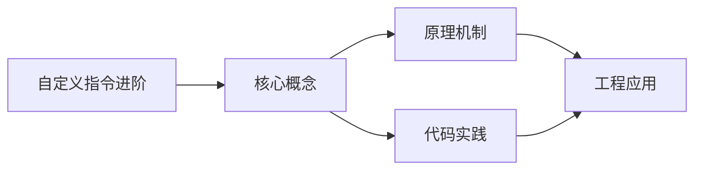
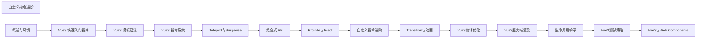

## 1. 学习目标（Bloom 分类）

本节按照布鲁姆教育目标分类学组织学习路径。本文主题为《自定义指令进阶》，属于 Vue 3 模块，读者可以根据自身阶段选择阅读深度。

记忆层面：能够准确复述本文的核心概念、术语与基本语法或操作步骤，并能够在提问或检索时快速定位对应知识点。能够说出 Vue 3 的核心概念、术语与标准写法。

理解层面：能够用自己的语言解释核心原理与工作机制，说明概念之间的因果关系，而不是机械记忆结论。能够解释 Vue 3 的工作原理与设计动机。

应用层面：能够在真实项目或练习场景中运用本文知识解决具体问题，写出正确且可维护的实现。能够编写符合 Vue 3 规范的完整实现。

分析层面：能够拆解复杂问题，比较本文主题与相邻概念的异同，识别边界条件与例外情况。能够分析 Vue 3 与相邻方案的差异与边界。

评价层面：能够根据约束条件（性能、可读性、安全、成本）评价不同方案的优劣，做出有依据的技术决策。能够根据场景评价 Vue 3 相关方案的优劣。

创造层面：能够把本文知识与其他模块知识组合，设计出新的解决方案或可复用的工程模式。能够组合 Vue 3 与其他技术设计完整方案。

通过本节学习，读者应当能够把《自定义指令进阶》纳入自己的知识网络，并与 Vue 3 模块的其他主题（组合式 API、响应式、组件通信、路由、状态管理）建立关联。

## 2. 历史动机与发展脉络

《自定义指令进阶》是 Vue 3 领域的重要主题。要真正理解它，需要先了解它解决的问题与演进过程。

Vue 由尤雨溪于 2014 年发布，以“渐进式框架”定位：可作库嵌入，也可作框架构建完整应用。Vue 3 于 2020 年 9 月发布，核心是组合式 API 与全新响应式系统。
Vue 3 的技术支柱：Proxy 响应式（替代 Object.defineProperty）、虚拟 DOM 重写（PatchFlags）、Fragment/Teleport/Suspense 内置组件、组合式 API（setup/ref/reactive/computed）。
生态现状：Vue Router 4、Pinia（官方状态库）、Vite 构建、Nuxt 全栈框架；Vue 3.5 引入 useTemplateRef 等开发者体验改进。

回到本文主题：自定义指令进阶 的提出与成熟，正是上述技术背景下的必然产物。早期实现往往以简单可用为目标，随着工程规模扩大，社区逐渐沉淀出标准做法与最佳实践；理解这一脉络，可以帮助读者判断“为什么文档中的推荐写法是现在这个样子”，也能在遇到历史遗留代码时准确识别其设计年代与取舍。


## 3. 形式化定义与核心概念精讲

本节把《自定义指令进阶》涉及的核心概念以“定义 + 讲解”的形式展开。读者应把定义当作工具，把讲解当作理解路径；两者结合才能形成可迁移的知识。

响应式：ref 包装基本类型，reactive 包装对象；effect 收集依赖，Proxy 拦截读写；computed 缓存派生值。
组件通信：props 向下、emit 向上、v-model 双向、provide/inject 跨层、事件总线（慎用）。
生命周期：setup 在创建前执行；onMounted/onUpdated/onUnmounted 对应挂载、更新、卸载；KeepAlive 增加 activated/deactivated。

### 3.1 原文章节逐一精讲

原文档把主题拆分为 11 个小节，下面按顺序给出每一节的导读讲解，随后保留原文细节供精读。

#### 原文精读（完整保留）

# 自定义指令 API 语法速查手册

> **符号约定**:`< >` 必填参数 | `[ ]` 可选参数

---

#### 1. 指令钩子

```javascript
const myDirective = {
  created(el, binding, vnode) {},
  beforeMount(el, binding) {},
  mounted(el, binding) {},
  beforeUpdate(el, binding) {},
  updated(el, binding) {},
  beforeUnmount(el, binding) {},
  unmounted(el, binding) {},
};
```

#### 2. 钩子参数

```typescript
interface Binding {
  value: any; // 指令绑定的值
  oldValue: any; // 前一个值
  arg: string; // 指令参数 v-my:arg
  modifiers: Record<string, boolean>; // 修饰符 v-my.foo.bar
  instance: ComponentPublicInstance; // 组件实例
}
```

#### 3. 实用指令示例

```javascript
// v-focus
const vFocus = {
  mounted(el) {
    el.focus();
  },
};

// v-permission
const vPermission = {
  mounted(el, binding) {
    const permissions = usePermissions();
    if (!permissions.has(binding.value)) {
      el.parentNode?.removeChild(el);
    }
  },
};

// v-debounce
const vDebounce = {
  mounted(el, binding) {
    let timer;
    el.addEventListener('input', () => {
      clearTimeout(timer);
      timer = setTimeout(() => binding.value(), binding.arg ? parseInt(binding.arg) : 300);
    });
  },
};

// v-click-outside
const vClickOutside = {
  mounted(el, binding) {
    const handler = (e) => {
      if (!el.contains(e.target)) binding.value(e);
    };
    el._clickOutside = handler;
    document.addEventListener('click', handler);
  },
  unmounted(el) {
    document.removeEventListener('click', el._clickOutside);
  },
};

// v-lazy 图片懒加载
const vLazy = {
  mounted(el, binding) {
    const observer = new IntersectionObserver(([entry]) => {
      if (entry.isIntersecting) {
        el.src = binding.value;
        observer.disconnect();
      }
    });
    observer.observe(el);
    el._observer = observer;
  },
  unmounted(el) {
    el._observer?.disconnect();
  },
};
```

#### 4. 简写形式

```javascript
// 当 mounted 和 updated 行为相同时
const vColor = (el, binding) => {
  el.style.color = binding.value;
};
```
#### 指令对象定义

**完整钩子对象**
```typescript
import type { Directive } from 'vue';

const vMyDirective: Directive<HTMLElement, string> = {
  // 在绑定元素的 attribute 或事件监听器被应用之前调用
  created(el, binding, vnode, prevVnode) {},

  // 在元素被插入到 DOM 前调用
  beforeMount(el, binding, vnode, prevVnode) {},

  // 在绑定元素的父组件及其所有子节点都挂载完成后调用
  mounted(el, binding, vnode, prevVnode) {},

  // 父组件更新前调用
  beforeUpdate(el, binding, vnode, prevVnode) {},

  // 在绑定元素的父组件及其所有子节点都更新完成后调用
  updated(el, binding, vnode, prevVnode) {},

  // 卸载绑定元素的父组件前调用
  beforeUnmount(el, binding, vnode, prevVnode) {},

  // 卸载绑定元素的父组件后调用
  unmounted(el, binding, vnode, prevVnode) {}
};
```

**简写形式**
```typescript
const vFocus: Directive = (el, binding) => {
  // mounted 和 updated 时都触发
  if (binding.value) {
    el.focus();
  }
};
```

---

#### 指令钩子参数

**binding 对象**
```typescript
interface DirectiveBinding<V> {
  value: V;            // 指令绑定的值
  oldValue: V | null;  // 前一个值(仅在 beforeUpdate/updated 中可用)
  arg: string;         // 指令参数 v-my:foo -> 'foo'
  modifiers: Record<string, boolean>;  // 修饰符 v-my.foo.bar -> { foo: true, bar: true }
  instance: any;       // 使用该指令的组件实例
  dir: Object;         // 指令定义对象本身
}

function mounted(el: HTMLElement, binding: DirectiveBinding<string>) {
  console.log(binding.value);       // 'hello'
  console.log(binding.arg);         // 'color'
  console.log(binding.modifiers);   // { delay: true }
  console.log(binding.instance);    // 组件实例
}
```

**vnode 与 prevVnode**
```typescript
import type { VNode } from 'vue';

function mounted(el, binding, vnode: VNode, prevVnode: VNode | null) {
  // vnode: 当前虚拟节点
  // prevVnode: 前一个虚拟节点(更新钩子中)
}
```

---

#### 注册指令

**局部注册**
```vue
<script setup>
import type { Directive } from 'vue';

const vFocus: Directive<HTMLElement> = {
  mounted(el) {
    el.focus();
  }
};
// 直接以 v 开头的变量会自动注册为指令 v-focus
</script>

<template>
  <input v-focus />
</template>
```

**全局注册**
```typescript
import { createApp } from 'vue';

const app = createApp(App);

app.directive('focus', {
  mounted(el) {
    el.focus();
  }
});

app.directive('color', (el, binding) => {
  el.style.color = binding.value;
});
```

**注册到组件**
```typescript
defineOptions({
  directives: {
    focus: {
      mounted(el: HTMLElement) {
        el.focus();
      }
    }
  }
});
```

---

#### 指令参数与修饰符

**指令参数 arg**
```vue
<template>
  <div v-my:color="'red'"></div>
  <div v-my:background="'blue'"></div>
</template>

<script setup>
const vMy: Directive<HTMLElement, string> = {
  mounted(el, binding) {
    if (binding.arg === 'color') {
      el.style.color = binding.value;
    } else if (binding.arg === 'background') {
      el.style.background = binding.value;
    }
  }
};
</script>
```

**指令修饰符 modifiers**
```vue
<template>
  <div v-my.red.bold="text"></div>
</template>

<script setup>
const vMy: Directive = {
  mounted(el, binding) {
    if (binding.modifiers.red) el.style.color = 'red';
    if (binding.modifiers.bold) el.style.fontWeight = 'bold';
    el.textContent = binding.value;
  }
};
</script>
```

**动态参数**
```vue
<template>
  <div v-my:[direction]="'red'"></div>
</template>

<script setup>
import { ref } from 'vue';
const direction = ref('color');
</script>
```

---

#### 实用指令示例

**v-focus 自动聚焦**
```typescript
import type { Directive } from 'vue';

const vFocus: Directive<HTMLElement> = {
  mounted(el) {
    el.focus();
  }
};
```

**v-permission 权限控制**
```typescript
import type { Directive } from 'vue';

const vPermission: Directive<HTMLElement, string | string[]> = {
  mounted(el, binding) {
    const userRoles = getUserRoles();
    const required = binding.value;
    const roles = Array.isArray(required) ? required : [required];

    const hasPermission = roles.some(r => userRoles.includes(r));
    if (!hasPermission) {
      el.parentNode?.removeChild(el);
    }
  }
};
```
```vue
<button v-permission="'admin'">删除</button>
<div v-permission="['admin', 'editor']">管理面板</div>
```

**v-debounce 防抖**
```typescript
import type { Directive } from 'vue';

const vDebounce: Directive<HTMLElement, () => void> = {
  mounted(el, binding) {
    let timer: number | undefined;
    el.addEventListener('click', () => {
      if (timer) clearTimeout(timer);
      timer = window.setTimeout(() => {
        binding.value();
      }, 500);
    });
  }
};
```

**v-loading 加载指令**
```typescript
import type { Directive } from 'vue';

const vLoading: Directive<HTMLElement, boolean> = {
  mounted(el, binding) {
    el.style.position = 'relative';
    if (binding.value) createMask(el);
  },
  updated(el, binding) {
    if (binding.value !== binding.oldValue) {
      binding.value ? createMask(el) : removeMask(el);
    }
  }
};

function createMask(el: HTMLElement) {
  const mask = document.createElement('div');
  mask.className = 'loading-mask';
  mask.style.cssText = 'position:absolute;inset:0;background:rgba(0,0,0,0.5);';
  mask.dataset.role = 'loading';
  el.appendChild(mask);
}

function removeMask(el: HTMLElement) {
  el.querySelector('[data-role="loading"]')?.remove();
}
```

**v-longpress 长按**
```typescript
import type { Directive } from 'vue';

const vLongpress: Directive<HTMLElement, () => void> = {
  mounted(el, binding) {
    let timer: number | undefined;

    const start = () => {
      timer = window.setTimeout(() => binding.value(), 800);
    };
    const cancel = () => {
      if (timer) clearTimeout(timer);
    };

    el.addEventListener('mousedown', start);
    el.addEventListener('mouseup', cancel);
    el.addEventListener('mouseleave', cancel);
    el.addEventListener('touchstart', start);
    el.addEventListener('touchend', cancel);

    el._cleanup = () => {
      el.removeEventListener('mousedown', start);
      el.removeEventListener('mouseup', cancel);
      el.removeEventListener('mouseleave', cancel);
      el.removeEventListener('touchstart', start);
      el.removeEventListener('touchend', cancel);
    };
  },
  unmounted(el) {
    el._cleanup?.();
  }
};
```

---

#### 在 TS 中扩展

**自定义指令类型扩展**
```typescript
declare module 'vue' {
  interface ComponentCustomProperties {
    vPermission: Directive<HTMLElement, string | string[]>;
    vDebounce: Directive<HTMLElement, () => void>;
  }
}
```

---

#### TypeScript 完整示例

```typescript
import { createApp, type Directive, type DirectiveBinding } from 'vue';

interface RippleOptions {
  color?: string;
  duration?: number;
}

const vRipple: Directive<HTMLElement, RippleOptions | undefined> = {
  mounted(el: HTMLElement, binding: DirectiveBinding<RippleOptions | undefined>) {
    el.style.position = 'relative';
    el.style.overflow = 'hidden';

    el.addEventListener('click', (event: MouseEvent) => {
      const rect = el.getBoundingClientRect();
      const size = Math.max(rect.width, rect.height);
      const x = event.clientX - rect.left - size / 2;
      const y = event.clientY - rect.top - size / 2;

      const ripple = document.createElement('span');
      ripple.style.cssText = `
        position: absolute;
        width: ${size}px;
        height: ${size}px;
        left: ${x}px;
        top: ${y}px;
        background: ${binding.value?.color || 'rgba(255,255,255,0.5)'};
        border-radius: 50%;
        transform: scale(0);
        animation: ripple ${binding.value?.duration || 600}ms ease-out;
        pointer-events: none;
      `;
      el.appendChild(ripple);
      setTimeout(() => ripple.remove(), binding.value?.duration || 600);
    });
  }
};

const app = createApp(App);
app.directive('ripple', vRipple);
```


### 3.2 概念关系图

下面用 Mermaid 图表达本文核心概念之间的关系，帮助读者建立整体图景：



图中展示的是本文知识的结构化关系：核心概念是入口，原理机制解释“为什么”，代码实践演示“怎么做”，工程应用回答“何时用”。读者学习时可以把每个小节的内容挂接到对应节点上。

## 4. 理论推导与原理解析

本节深入《自定义指令进阶》背后的原理。理论部分不求面面俱到，而是聚焦“能解释现象、能指导实践”的关键推导。

响应式：ref 包装基本类型，reactive 包装对象；effect 收集依赖，Proxy 拦截读写；computed 缓存派生值。
组件通信：props 向下、emit 向上、v-model 双向、provide/inject 跨层、事件总线（慎用）。
生命周期：setup 在创建前执行；onMounted/onUpdated/onUnmounted 对应挂载、更新、卸载；KeepAlive 增加 activated/deactivated。
模板编译：模板在构建期编译为渲染函数，指令（v-if/v-for/v-model）是编译糖。

需要强调的是，理论推导与工程实践之间存在翻译层：理论给出的是理想化模型与边界条件，工程代码则必须处理真实环境中的例外。读者在学习时应先掌握理论的“标准情形”，再通过陷阱章节了解“非标准情形”。

## 5. 代码示例与逐行讲解

本节把原文中的代码示例系统整理，并为每个示例补充用途说明与讲解。读者不应只浏览代码，而应逐段对照讲解理解设计意图。

### 5.1 示例：1. 指令钩子

该示例来自原文《1. 指令钩子》小节，用于演示自定义指令进阶相关操作。阅读时请先看代码结构，再看其后的讲解。

```javascript
const myDirective = {
  created(el, binding, vnode) {},
  beforeMount(el, binding) {},
  mounted(el, binding) {},
  beforeUpdate(el, binding) {},
  updated(el, binding) {},
  beforeUnmount(el, binding) {},
  unmounted(el, binding) {},
};
```

讲解：这段代码演示了本节核心知识点。代码中的关键操作可以归纳为三步：准备（定义或初始化）、执行（核心逻辑）、收尾（释放资源或返回结果）。实际项目中，这三步往往被封装为函数或类，以提升复用性与可测试性。

关键点分析：

该示例共 9 行有效代码，结构以数据或配置为主。阅读时应关注：数据字段的含义、配置项的作用，以及它们与运行行为的对应关系。

进阶思考路径：先尝试修改参数观察行为变化，再把示例中的模式迁移到自己的项目中；每次修改都记录预期与实测差异，这是把示例转化为能力的最快方式。

### 5.2 示例：2. 钩子参数

该示例来自原文《2. 钩子参数》小节，用于演示自定义指令进阶相关操作。阅读时请先看代码结构，再看其后的讲解。

```typescript
interface Binding {
  value: any; // 指令绑定的值
  oldValue: any; // 前一个值
  arg: string; // 指令参数 v-my:arg
  modifiers: Record<string, boolean>; // 修饰符 v-my.foo.bar
  instance: ComponentPublicInstance; // 组件实例
}
```

讲解：这段代码演示了本节核心知识点。代码中的关键操作可以归纳为三步：准备（定义或初始化）、执行（核心逻辑）、收尾（释放资源或返回结果）。实际项目中，这三步往往被封装为函数或类，以提升复用性与可测试性。

关键点分析：

该示例共 7 行有效代码，结构以数据或配置为主。阅读时应关注：数据字段的含义、配置项的作用，以及它们与运行行为的对应关系。

进阶思考路径：先尝试修改参数观察行为变化，再把示例中的模式迁移到自己的项目中；每次修改都记录预期与实测差异，这是把示例转化为能力的最快方式。

### 5.3 示例：3. 实用指令示例

该示例来自原文《3. 实用指令示例》小节，用于演示自定义指令进阶相关操作。阅读时请先看代码结构，再看其后的讲解。

```javascript
// v-focus
const vFocus = {
  mounted(el) {
    el.focus();
  },
};

// v-permission
const vPermission = {
  mounted(el, binding) {
    const permissions = usePermissions();
    if (!permissions.has(binding.value)) {
      el.parentNode?.removeChild(el);
    }
  },
};

// v-debounce
const vDebounce = {
  mounted(el, binding) {
    let timer;
    el.addEventListener('input', () => {
      clearTimeout(timer);
      timer = setTimeout(() => binding.value(), binding.arg ? parseInt(binding.arg) : 300);
    });
  },
};

// v-click-outside
const vClickOutside = {
  mounted(el, binding) {
    const handler = (e) => {
      if (!el.contains(e.target)) binding.value(e);
    };
    el._clickOutside = handler;
    document.addEventListener('click', handler);
  },
  unmounted(el) {
    document.removeEventListener('click', el._clickOutside);
  },
};

// v-lazy 图片懒加载
const vLazy = {
  mounted(el, binding) {
    const observer = new IntersectionObserver(([entry]) => {
      if (entry.isIntersecting) {
        el.src = binding.value;
        observer.disconnect();
      }
    });
    observer.observe(el);
    el._observer = observer;
  },
  unmounted(el) {
    el._observer?.disconnect();
  },
};
```

讲解：这段代码演示了本节核心知识点。代码中的关键操作可以归纳为三步：准备（定义或初始化）、执行（核心逻辑）、收尾（释放资源或返回结果）。实际项目中，这三步往往被封装为函数或类，以提升复用性与可测试性。

关键点分析：

该示例共 54 行有效代码，包含 1 类关键结构（if）。其中：

- 入口与初始化部分负责建立上下文，对应实际项目中的启动或装配逻辑；
- 核心逻辑部分体现本文主题的主要操作，是阅读时最需要对照讲解理解的部分；
- 输出或返回部分把结果交给调用方，注意其类型与边界条件。

进阶思考路径：先尝试修改参数观察行为变化，再把示例中的模式迁移到自己的项目中；每次修改都记录预期与实测差异，这是把示例转化为能力的最快方式。

### 5.4 示例：4. 简写形式

该示例来自原文《4. 简写形式》小节，用于演示自定义指令进阶相关操作。阅读时请先看代码结构，再看其后的讲解。

```javascript
// 当 mounted 和 updated 行为相同时
const vColor = (el, binding) => {
  el.style.color = binding.value;
};
```

讲解：这段代码演示了本节核心知识点。代码中的关键操作可以归纳为三步：准备（定义或初始化）、执行（核心逻辑）、收尾（释放资源或返回结果）。实际项目中，这三步往往被封装为函数或类，以提升复用性与可测试性。

关键点分析：

该示例共 4 行有效代码，结构以数据或配置为主。阅读时应关注：数据字段的含义、配置项的作用，以及它们与运行行为的对应关系。

进阶思考路径：先尝试修改参数观察行为变化，再把示例中的模式迁移到自己的项目中；每次修改都记录预期与实测差异，这是把示例转化为能力的最快方式。

### 5.5 示例：指令对象定义

该示例来自原文《指令对象定义》小节，用于演示自定义指令进阶相关操作。阅读时请先看代码结构，再看其后的讲解。

```typescript
import type { Directive } from 'vue';

const vMyDirective: Directive<HTMLElement, string> = {
  // 在绑定元素的 attribute 或事件监听器被应用之前调用
  created(el, binding, vnode, prevVnode) {},

  // 在元素被插入到 DOM 前调用
  beforeMount(el, binding, vnode, prevVnode) {},

  // 在绑定元素的父组件及其所有子节点都挂载完成后调用
  mounted(el, binding, vnode, prevVnode) {},

  // 父组件更新前调用
  beforeUpdate(el, binding, vnode, prevVnode) {},

  // 在绑定元素的父组件及其所有子节点都更新完成后调用
  updated(el, binding, vnode, prevVnode) {},

  // 卸载绑定元素的父组件前调用
  beforeUnmount(el, binding, vnode, prevVnode) {},

  // 卸载绑定元素的父组件后调用
  unmounted(el, binding, vnode, prevVnode) {}
};
```

讲解：这段代码演示了本节核心知识点。代码中的关键操作可以归纳为三步：准备（定义或初始化）、执行（核心逻辑）、收尾（释放资源或返回结果）。实际项目中，这三步往往被封装为函数或类，以提升复用性与可测试性。

关键点分析：

该示例共 17 行有效代码，包含 2 类关键结构（import、from）。其中：

- 入口与初始化部分负责建立上下文，对应实际项目中的启动或装配逻辑；
- 核心逻辑部分体现本文主题的主要操作，是阅读时最需要对照讲解理解的部分；
- 输出或返回部分把结果交给调用方，注意其类型与边界条件。

进阶思考路径：先尝试修改参数观察行为变化，再把示例中的模式迁移到自己的项目中；每次修改都记录预期与实测差异，这是把示例转化为能力的最快方式。

### 5.6 示例：指令对象定义

该示例来自原文《指令对象定义》小节，用于演示自定义指令进阶相关操作。阅读时请先看代码结构，再看其后的讲解。

```typescript
const vFocus: Directive = (el, binding) => {
  // mounted 和 updated 时都触发
  if (binding.value) {
    el.focus();
  }
};
```

讲解：这段代码演示了本节核心知识点。代码中的关键操作可以归纳为三步：准备（定义或初始化）、执行（核心逻辑）、收尾（释放资源或返回结果）。实际项目中，这三步往往被封装为函数或类，以提升复用性与可测试性。

关键点分析：

该示例共 6 行有效代码，包含 1 类关键结构（if）。其中：

- 入口与初始化部分负责建立上下文，对应实际项目中的启动或装配逻辑；
- 核心逻辑部分体现本文主题的主要操作，是阅读时最需要对照讲解理解的部分；
- 输出或返回部分把结果交给调用方，注意其类型与边界条件。

进阶思考路径：先尝试修改参数观察行为变化，再把示例中的模式迁移到自己的项目中；每次修改都记录预期与实测差异，这是把示例转化为能力的最快方式。

### 5.7 示例：指令钩子参数

该示例来自原文《指令钩子参数》小节，用于演示自定义指令进阶相关操作。阅读时请先看代码结构，再看其后的讲解。

```typescript
interface DirectiveBinding<V> {
  value: V;            // 指令绑定的值
  oldValue: V | null;  // 前一个值(仅在 beforeUpdate/updated 中可用)
  arg: string;         // 指令参数 v-my:foo -> 'foo'
  modifiers: Record<string, boolean>;  // 修饰符 v-my.foo.bar -> { foo: true, bar: true }
  instance: any;       // 使用该指令的组件实例
  dir: Object;         // 指令定义对象本身
}

function mounted(el: HTMLElement, binding: DirectiveBinding<string>) {
  console.log(binding.value);       // 'hello'
  console.log(binding.arg);         // 'color'
  console.log(binding.modifiers);   // { delay: true }
  console.log(binding.instance);    // 组件实例
}
```

讲解：这段代码演示了本节核心知识点。代码中的关键操作可以归纳为三步：准备（定义或初始化）、执行（核心逻辑）、收尾（释放资源或返回结果）。实际项目中，这三步往往被封装为函数或类，以提升复用性与可测试性。

关键点分析：

该示例共 14 行有效代码，包含 1 类关键结构（function）。其中：

- 入口与初始化部分负责建立上下文，对应实际项目中的启动或装配逻辑；
- 核心逻辑部分体现本文主题的主要操作，是阅读时最需要对照讲解理解的部分；
- 输出或返回部分把结果交给调用方，注意其类型与边界条件。

进阶思考路径：先尝试修改参数观察行为变化，再把示例中的模式迁移到自己的项目中；每次修改都记录预期与实测差异，这是把示例转化为能力的最快方式。

### 5.8 示例：指令钩子参数

该示例来自原文《指令钩子参数》小节，用于演示自定义指令进阶相关操作。阅读时请先看代码结构，再看其后的讲解。

```typescript
import type { VNode } from 'vue';

function mounted(el, binding, vnode: VNode, prevVnode: VNode | null) {
  // vnode: 当前虚拟节点
  // prevVnode: 前一个虚拟节点(更新钩子中)
}
```

讲解：这段代码演示了本节核心知识点。代码中的关键操作可以归纳为三步：准备（定义或初始化）、执行（核心逻辑）、收尾（释放资源或返回结果）。实际项目中，这三步往往被封装为函数或类，以提升复用性与可测试性。

关键点分析：

该示例共 5 行有效代码，包含 3 类关键结构（function、import、from）。其中：

- 入口与初始化部分负责建立上下文，对应实际项目中的启动或装配逻辑；
- 核心逻辑部分体现本文主题的主要操作，是阅读时最需要对照讲解理解的部分；
- 输出或返回部分把结果交给调用方，注意其类型与边界条件。

进阶思考路径：先尝试修改参数观察行为变化，再把示例中的模式迁移到自己的项目中；每次修改都记录预期与实测差异，这是把示例转化为能力的最快方式。

### 5.9 示例：注册指令

该示例来自原文《注册指令》小节，用于演示自定义指令进阶相关操作。阅读时请先看代码结构，再看其后的讲解。

```vue
<script setup>
import type { Directive } from 'vue';

const vFocus: Directive<HTMLElement> = {
  mounted(el) {
    el.focus();
  }
};
// 直接以 v 开头的变量会自动注册为指令 v-focus
</script>

<template>
  <input v-focus />
</template>
```

讲解：这段代码演示了本节核心知识点。代码中的关键操作可以归纳为三步：准备（定义或初始化）、执行（核心逻辑）、收尾（释放资源或返回结果）。实际项目中，这三步往往被封装为函数或类，以提升复用性与可测试性。

关键点分析：

该示例共 12 行有效代码，包含 2 类关键结构（import、from）。其中：

- 入口与初始化部分负责建立上下文，对应实际项目中的启动或装配逻辑；
- 核心逻辑部分体现本文主题的主要操作，是阅读时最需要对照讲解理解的部分；
- 输出或返回部分把结果交给调用方，注意其类型与边界条件。

进阶思考路径：先尝试修改参数观察行为变化，再把示例中的模式迁移到自己的项目中；每次修改都记录预期与实测差异，这是把示例转化为能力的最快方式。

### 5.10 示例：注册指令

该示例来自原文《注册指令》小节，用于演示自定义指令进阶相关操作。阅读时请先看代码结构，再看其后的讲解。

```typescript
import { createApp } from 'vue';

const app = createApp(App);

app.directive('focus', {
  mounted(el) {
    el.focus();
  }
});

app.directive('color', (el, binding) => {
  el.style.color = binding.value;
});
```

讲解：这段代码演示了本节核心知识点。代码中的关键操作可以归纳为三步：准备（定义或初始化）、执行（核心逻辑）、收尾（释放资源或返回结果）。实际项目中，这三步往往被封装为函数或类，以提升复用性与可测试性。

关键点分析：

该示例共 10 行有效代码，包含 2 类关键结构（import、from）。其中：

- 入口与初始化部分负责建立上下文，对应实际项目中的启动或装配逻辑；
- 核心逻辑部分体现本文主题的主要操作，是阅读时最需要对照讲解理解的部分；
- 输出或返回部分把结果交给调用方，注意其类型与边界条件。

进阶思考路径：先尝试修改参数观察行为变化，再把示例中的模式迁移到自己的项目中；每次修改都记录预期与实测差异，这是把示例转化为能力的最快方式。

### 5.11 示例：注册指令

该示例来自原文《注册指令》小节，用于演示自定义指令进阶相关操作。阅读时请先看代码结构，再看其后的讲解。

```typescript
defineOptions({
  directives: {
    focus: {
      mounted(el: HTMLElement) {
        el.focus();
      }
    }
  }
});
```

讲解：这段代码演示了本节核心知识点。代码中的关键操作可以归纳为三步：准备（定义或初始化）、执行（核心逻辑）、收尾（释放资源或返回结果）。实际项目中，这三步往往被封装为函数或类，以提升复用性与可测试性。

关键点分析：

该示例共 9 行有效代码，结构以数据或配置为主。阅读时应关注：数据字段的含义、配置项的作用，以及它们与运行行为的对应关系。

进阶思考路径：先尝试修改参数观察行为变化，再把示例中的模式迁移到自己的项目中；每次修改都记录预期与实测差异，这是把示例转化为能力的最快方式。

### 5.12 示例：指令参数与修饰符

该示例来自原文《指令参数与修饰符》小节，用于演示自定义指令进阶相关操作。阅读时请先看代码结构，再看其后的讲解。

```vue
<template>
  <div v-my:color="'red'"></div>
  <div v-my:background="'blue'"></div>
</template>

<script setup>
const vMy: Directive<HTMLElement, string> = {
  mounted(el, binding) {
    if (binding.arg === 'color') {
      el.style.color = binding.value;
    } else if (binding.arg === 'background') {
      el.style.background = binding.value;
    }
  }
};
</script>
```

讲解：这段代码演示了本节核心知识点。代码中的关键操作可以归纳为三步：准备（定义或初始化）、执行（核心逻辑）、收尾（释放资源或返回结果）。实际项目中，这三步往往被封装为函数或类，以提升复用性与可测试性。

关键点分析：

该示例共 15 行有效代码，包含 1 类关键结构（if）。其中：

- 入口与初始化部分负责建立上下文，对应实际项目中的启动或装配逻辑；
- 核心逻辑部分体现本文主题的主要操作，是阅读时最需要对照讲解理解的部分；
- 输出或返回部分把结果交给调用方，注意其类型与边界条件。

进阶思考路径：先尝试修改参数观察行为变化，再把示例中的模式迁移到自己的项目中；每次修改都记录预期与实测差异，这是把示例转化为能力的最快方式。

### 5.13 示例：指令参数与修饰符

该示例来自原文《指令参数与修饰符》小节，用于演示自定义指令进阶相关操作。阅读时请先看代码结构，再看其后的讲解。

```vue
<template>
  <div v-my.red.bold="text"></div>
</template>

<script setup>
const vMy: Directive = {
  mounted(el, binding) {
    if (binding.modifiers.red) el.style.color = 'red';
    if (binding.modifiers.bold) el.style.fontWeight = 'bold';
    el.textContent = binding.value;
  }
};
</script>
```

讲解：这段代码演示了本节核心知识点。代码中的关键操作可以归纳为三步：准备（定义或初始化）、执行（核心逻辑）、收尾（释放资源或返回结果）。实际项目中，这三步往往被封装为函数或类，以提升复用性与可测试性。

关键点分析：

该示例共 12 行有效代码，包含 1 类关键结构（if）。其中：

- 入口与初始化部分负责建立上下文，对应实际项目中的启动或装配逻辑；
- 核心逻辑部分体现本文主题的主要操作，是阅读时最需要对照讲解理解的部分；
- 输出或返回部分把结果交给调用方，注意其类型与边界条件。

进阶思考路径：先尝试修改参数观察行为变化，再把示例中的模式迁移到自己的项目中；每次修改都记录预期与实测差异，这是把示例转化为能力的最快方式。

### 5.14 示例：指令参数与修饰符

该示例来自原文《指令参数与修饰符》小节，用于演示自定义指令进阶相关操作。阅读时请先看代码结构，再看其后的讲解。

```vue
<template>
  <div v-my:[direction]="'red'"></div>
</template>

<script setup>
import { ref } from 'vue';
const direction = ref('color');
</script>
```

讲解：这段代码演示了本节核心知识点。代码中的关键操作可以归纳为三步：准备（定义或初始化）、执行（核心逻辑）、收尾（释放资源或返回结果）。实际项目中，这三步往往被封装为函数或类，以提升复用性与可测试性。

关键点分析：

该示例共 7 行有效代码，包含 2 类关键结构（import、from）。其中：

- 入口与初始化部分负责建立上下文，对应实际项目中的启动或装配逻辑；
- 核心逻辑部分体现本文主题的主要操作，是阅读时最需要对照讲解理解的部分；
- 输出或返回部分把结果交给调用方，注意其类型与边界条件。

进阶思考路径：先尝试修改参数观察行为变化，再把示例中的模式迁移到自己的项目中；每次修改都记录预期与实测差异，这是把示例转化为能力的最快方式。

### 5.15 示例：实用指令示例

该示例来自原文《实用指令示例》小节，用于演示自定义指令进阶相关操作。阅读时请先看代码结构，再看其后的讲解。

```typescript
import type { Directive } from 'vue';

const vFocus: Directive<HTMLElement> = {
  mounted(el) {
    el.focus();
  }
};
```

讲解：这段代码演示了本节核心知识点。代码中的关键操作可以归纳为三步：准备（定义或初始化）、执行（核心逻辑）、收尾（释放资源或返回结果）。实际项目中，这三步往往被封装为函数或类，以提升复用性与可测试性。

关键点分析：

该示例共 6 行有效代码，包含 2 类关键结构（import、from）。其中：

- 入口与初始化部分负责建立上下文，对应实际项目中的启动或装配逻辑；
- 核心逻辑部分体现本文主题的主要操作，是阅读时最需要对照讲解理解的部分；
- 输出或返回部分把结果交给调用方，注意其类型与边界条件。

进阶思考路径：先尝试修改参数观察行为变化，再把示例中的模式迁移到自己的项目中；每次修改都记录预期与实测差异，这是把示例转化为能力的最快方式。

### 5.16 示例：实用指令示例

该示例来自原文《实用指令示例》小节，用于演示自定义指令进阶相关操作。阅读时请先看代码结构，再看其后的讲解。

```typescript
import type { Directive } from 'vue';

const vPermission: Directive<HTMLElement, string | string[]> = {
  mounted(el, binding) {
    const userRoles = getUserRoles();
    const required = binding.value;
    const roles = Array.isArray(required) ? required : [required];

    const hasPermission = roles.some(r => userRoles.includes(r));
    if (!hasPermission) {
      el.parentNode?.removeChild(el);
    }
  }
};
```

讲解：这段代码演示了本节核心知识点。代码中的关键操作可以归纳为三步：准备（定义或初始化）、执行（核心逻辑）、收尾（释放资源或返回结果）。实际项目中，这三步往往被封装为函数或类，以提升复用性与可测试性。

关键点分析：

该示例共 12 行有效代码，包含 3 类关键结构（import、from、if）。其中：

- 入口与初始化部分负责建立上下文，对应实际项目中的启动或装配逻辑；
- 核心逻辑部分体现本文主题的主要操作，是阅读时最需要对照讲解理解的部分；
- 输出或返回部分把结果交给调用方，注意其类型与边界条件。

进阶思考路径：先尝试修改参数观察行为变化，再把示例中的模式迁移到自己的项目中；每次修改都记录预期与实测差异，这是把示例转化为能力的最快方式。

### 5.17 示例：实用指令示例

该示例来自原文《实用指令示例》小节，用于演示自定义指令进阶相关操作。阅读时请先看代码结构，再看其后的讲解。

```vue
<button v-permission="'admin'">删除</button>
<div v-permission="['admin', 'editor']">管理面板</div>
```

讲解：这段代码演示了本节核心知识点。代码中的关键操作可以归纳为三步：准备（定义或初始化）、执行（核心逻辑）、收尾（释放资源或返回结果）。实际项目中，这三步往往被封装为函数或类，以提升复用性与可测试性。

关键点分析：

该示例共 2 行有效代码，结构以数据或配置为主。阅读时应关注：数据字段的含义、配置项的作用，以及它们与运行行为的对应关系。

进阶思考路径：先尝试修改参数观察行为变化，再把示例中的模式迁移到自己的项目中；每次修改都记录预期与实测差异，这是把示例转化为能力的最快方式。

### 5.18 示例：实用指令示例

该示例来自原文《实用指令示例》小节，用于演示自定义指令进阶相关操作。阅读时请先看代码结构，再看其后的讲解。

```typescript
import type { Directive } from 'vue';

const vDebounce: Directive<HTMLElement, () => void> = {
  mounted(el, binding) {
    let timer: number | undefined;
    el.addEventListener('click', () => {
      if (timer) clearTimeout(timer);
      timer = window.setTimeout(() => {
        binding.value();
      }, 500);
    });
  }
};
```

讲解：这段代码演示了本节核心知识点。代码中的关键操作可以归纳为三步：准备（定义或初始化）、执行（核心逻辑）、收尾（释放资源或返回结果）。实际项目中，这三步往往被封装为函数或类，以提升复用性与可测试性。

关键点分析：

该示例共 12 行有效代码，包含 3 类关键结构（import、from、if）。其中：

- 入口与初始化部分负责建立上下文，对应实际项目中的启动或装配逻辑；
- 核心逻辑部分体现本文主题的主要操作，是阅读时最需要对照讲解理解的部分；
- 输出或返回部分把结果交给调用方，注意其类型与边界条件。

进阶思考路径：先尝试修改参数观察行为变化，再把示例中的模式迁移到自己的项目中；每次修改都记录预期与实测差异，这是把示例转化为能力的最快方式。

### 5.19 示例：实用指令示例

该示例来自原文《实用指令示例》小节，用于演示自定义指令进阶相关操作。阅读时请先看代码结构，再看其后的讲解。

```typescript
import type { Directive } from 'vue';

const vLoading: Directive<HTMLElement, boolean> = {
  mounted(el, binding) {
    el.style.position = 'relative';
    if (binding.value) createMask(el);
  },
  updated(el, binding) {
    if (binding.value !== binding.oldValue) {
      binding.value ? createMask(el) : removeMask(el);
    }
  }
};

function createMask(el: HTMLElement) {
  const mask = document.createElement('div');
  mask.className = 'loading-mask';
  mask.style.cssText = 'position:absolute;inset:0;background:rgba(0,0,0,0.5);';
  mask.dataset.role = 'loading';
  el.appendChild(mask);
}

function removeMask(el: HTMLElement) {
  el.querySelector('[data-role="loading"]')?.remove();
}
```

讲解：这段代码演示了本节核心知识点。代码中的关键操作可以归纳为三步：准备（定义或初始化）、执行（核心逻辑）、收尾（释放资源或返回结果）。实际项目中，这三步往往被封装为函数或类，以提升复用性与可测试性。

关键点分析：

该示例共 22 行有效代码，包含 5 类关键结构（class、function、import、from、if）。其中：

- 入口与初始化部分负责建立上下文，对应实际项目中的启动或装配逻辑；
- 核心逻辑部分体现本文主题的主要操作，是阅读时最需要对照讲解理解的部分；
- 输出或返回部分把结果交给调用方，注意其类型与边界条件。

进阶思考路径：先尝试修改参数观察行为变化，再把示例中的模式迁移到自己的项目中；每次修改都记录预期与实测差异，这是把示例转化为能力的最快方式。

### 5.20 示例：实用指令示例

该示例来自原文《实用指令示例》小节，用于演示自定义指令进阶相关操作。阅读时请先看代码结构，再看其后的讲解。

```typescript
import type { Directive } from 'vue';

const vLongpress: Directive<HTMLElement, () => void> = {
  mounted(el, binding) {
    let timer: number | undefined;

    const start = () => {
      timer = window.setTimeout(() => binding.value(), 800);
    };
    const cancel = () => {
      if (timer) clearTimeout(timer);
    };

    el.addEventListener('mousedown', start);
    el.addEventListener('mouseup', cancel);
    el.addEventListener('mouseleave', cancel);
    el.addEventListener('touchstart', start);
    el.addEventListener('touchend', cancel);

    el._cleanup = () => {
      el.removeEventListener('mousedown', start);
      el.removeEventListener('mouseup', cancel);
      el.removeEventListener('mouseleave', cancel);
      el.removeEventListener('touchstart', start);
      el.removeEventListener('touchend', cancel);
    };
  },
  unmounted(el) {
    el._cleanup?.();
  }
};
```

讲解：这段代码演示了本节核心知识点。代码中的关键操作可以归纳为三步：准备（定义或初始化）、执行（核心逻辑）、收尾（释放资源或返回结果）。实际项目中，这三步往往被封装为函数或类，以提升复用性与可测试性。

关键点分析：

该示例共 27 行有效代码，包含 3 类关键结构（import、from、if）。其中：

- 入口与初始化部分负责建立上下文，对应实际项目中的启动或装配逻辑；
- 核心逻辑部分体现本文主题的主要操作，是阅读时最需要对照讲解理解的部分；
- 输出或返回部分把结果交给调用方，注意其类型与边界条件。

进阶思考路径：先尝试修改参数观察行为变化，再把示例中的模式迁移到自己的项目中；每次修改都记录预期与实测差异，这是把示例转化为能力的最快方式。

### 5.21 示例：在 TS 中扩展

该示例来自原文《在 TS 中扩展》小节，用于演示自定义指令进阶相关操作。阅读时请先看代码结构，再看其后的讲解。

```typescript
declare module 'vue' {
  interface ComponentCustomProperties {
    vPermission: Directive<HTMLElement, string | string[]>;
    vDebounce: Directive<HTMLElement, () => void>;
  }
}
```

讲解：这段代码演示了本节核心知识点。代码中的关键操作可以归纳为三步：准备（定义或初始化）、执行（核心逻辑）、收尾（释放资源或返回结果）。实际项目中，这三步往往被封装为函数或类，以提升复用性与可测试性。

关键点分析：

该示例共 6 行有效代码，结构以数据或配置为主。阅读时应关注：数据字段的含义、配置项的作用，以及它们与运行行为的对应关系。

进阶思考路径：先尝试修改参数观察行为变化，再把示例中的模式迁移到自己的项目中；每次修改都记录预期与实测差异，这是把示例转化为能力的最快方式。

### 5.22 示例：TypeScript 完整示例

该示例来自原文《TypeScript 完整示例》小节，用于演示自定义指令进阶相关操作。阅读时请先看代码结构，再看其后的讲解。

```typescript
import { createApp, type Directive, type DirectiveBinding } from 'vue';

interface RippleOptions {
  color?: string;
  duration?: number;
}

const vRipple: Directive<HTMLElement, RippleOptions | undefined> = {
  mounted(el: HTMLElement, binding: DirectiveBinding<RippleOptions | undefined>) {
    el.style.position = 'relative';
    el.style.overflow = 'hidden';

    el.addEventListener('click', (event: MouseEvent) => {
      const rect = el.getBoundingClientRect();
      const size = Math.max(rect.width, rect.height);
      const x = event.clientX - rect.left - size / 2;
      const y = event.clientY - rect.top - size / 2;

      const ripple = document.createElement('span');
      ripple.style.cssText = `
        position: absolute;
        width: ${size}px;
        height: ${size}px;
        left: ${x}px;
        top: ${y}px;
        background: ${binding.value?.color || 'rgba(255,255,255,0.5)'};
        border-radius: 50%;
        transform: scale(0);
        animation: ripple ${binding.value?.duration || 600}ms ease-out;
        pointer-events: none;
      `;
      el.appendChild(ripple);
      setTimeout(() => ripple.remove(), binding.value?.duration || 600);
    });
  }
};

const app = createApp(App);
app.directive('ripple', vRipple);
```

讲解：这段代码演示了本节核心知识点。代码中的关键操作可以归纳为三步：准备（定义或初始化）、执行（核心逻辑）、收尾（释放资源或返回结果）。实际项目中，这三步往往被封装为函数或类，以提升复用性与可测试性。

关键点分析：

该示例共 34 行有效代码，包含 2 类关键结构（import、from）。其中：

- 入口与初始化部分负责建立上下文，对应实际项目中的启动或装配逻辑；
- 核心逻辑部分体现本文主题的主要操作，是阅读时最需要对照讲解理解的部分；
- 输出或返回部分把结果交给调用方，注意其类型与边界条件。

进阶思考路径：先尝试修改参数观察行为变化，再把示例中的模式迁移到自己的项目中；每次修改都记录预期与实测差异，这是把示例转化为能力的最快方式。


综合以上示例，可以总结出本主题的代码实践要点：第一，先定义清晰的输入输出契约；第二，核心逻辑保持单一职责；第三，错误处理与边界条件不可省略；第四，命名与注释表达意图而非复述代码。

## 6. 对比分析

对比是理解《自定义指令进阶》定位的最快路径。下面从多个维度与相邻方案进行对比。

Vue 与 React：Vue 模板 + 响应式自动追踪，React JSX + 手动依赖（hooks）；Vue 上手平缓，React 生态更广。
Options API 与 Composition API：Composition 更适合逻辑复用与 TS；Options 保留简单场景。
Vue 2 与 Vue 3：响应式实现、API 形态、生态差异显著，新项目一律 Vue 3。

对比的目的不是分出绝对优劣，而是建立选择依据：不同约束条件下，最优解不同。读者应把每个对比维度转化为决策检查清单。

## 7. 常见陷阱与最佳实践

本节整理该主题的高频错误与推荐做法。每个陷阱先描述现象，再解释原因，最后给出最佳实践。

### 7.1 响应式丢失

解构 reactive 或赋值整对象丢失响应。使用 ref/toRefs。

深入讲解：该问题之所以被归类为“常见陷阱”，是因为它在初学者的代码中反复出现，而且往往不在第一时间暴露——错误通常隐藏在特定数据或特定时序下。

从成因上看，响应式丢失 一般源于对 Vue 3 某个机制的理解偏差：要么误用了默认行为，要么忽略了边界条件，要么把其他语言的思维惯性带了过来。

从影响上看，响应式丢失 轻则产生错误结果，重则导致资源泄漏、数据损坏或安全事故；这也是为什么工程评审中会把它列为检查项。

从修复策略上看，处理响应式丢失的正确顺序是：先复现（构造最小用例），再定位（确认机制层面的根因），最后修复并补充回归测试。跳过复现直接改代码，往往治标不治本。

### 7.2 v-for key 用索引

列表变更导致状态错位。使用稳定唯一 key。

深入讲解：该问题之所以被归类为“常见陷阱”，是因为它在初学者的代码中反复出现，而且往往不在第一时间暴露——错误通常隐藏在特定数据或特定时序下。

从成因上看，v-for key 用索引 一般源于对 Vue 3 某个机制的理解偏差：要么误用了默认行为，要么忽略了边界条件，要么把其他语言的思维惯性带了过来。

从影响上看，v-for key 用索引 轻则产生错误结果，重则导致资源泄漏、数据损坏或安全事故；这也是为什么工程评审中会把它列为检查项。

从修复策略上看，处理v-for key 用索引的正确顺序是：先复现（构造最小用例），再定位（确认机制层面的根因），最后修复并补充回归测试。跳过复现直接改代码，往往治标不治本。

### 7.3 props 直接修改

单向数据流被破坏。通过 emit 通知父组件修改。

深入讲解：该问题之所以被归类为“常见陷阱”，是因为它在初学者的代码中反复出现，而且往往不在第一时间暴露——错误通常隐藏在特定数据或特定时序下。

从成因上看，props 直接修改 一般源于对 Vue 3 某个机制的理解偏差：要么误用了默认行为，要么忽略了边界条件，要么把其他语言的思维惯性带了过来。

从影响上看，props 直接修改 轻则产生错误结果，重则导致资源泄漏、数据损坏或安全事故；这也是为什么工程评审中会把它列为检查项。

从修复策略上看，处理props 直接修改的正确顺序是：先复现（构造最小用例），再定位（确认机制层面的根因），最后修复并补充回归测试。跳过复现直接改代码，往往治标不治本。

### 7.4 watch 深层陷阱

监听对象默认浅层；深层用 deep 或改写为 getter。

深入讲解：该问题之所以被归类为“常见陷阱”，是因为它在初学者的代码中反复出现，而且往往不在第一时间暴露——错误通常隐藏在特定数据或特定时序下。

从成因上看，watch 深层陷阱 一般源于对 Vue 3 某个机制的理解偏差：要么误用了默认行为，要么忽略了边界条件，要么把其他语言的思维惯性带了过来。

从影响上看，watch 深层陷阱 轻则产生错误结果，重则导致资源泄漏、数据损坏或安全事故；这也是为什么工程评审中会把它列为检查项。

从修复策略上看，处理watch 深层陷阱的正确顺序是：先复现（构造最小用例），再定位（确认机制层面的根因），最后修复并补充回归测试。跳过复现直接改代码，往往治标不治本。

### 7.5 组件样式泄漏

未用 scoped 导致全局污染。组件样式默认 scoped。

深入讲解：该问题之所以被归类为“常见陷阱”，是因为它在初学者的代码中反复出现，而且往往不在第一时间暴露——错误通常隐藏在特定数据或特定时序下。

从成因上看，组件样式泄漏 一般源于对 Vue 3 某个机制的理解偏差：要么误用了默认行为，要么忽略了边界条件，要么把其他语言的思维惯性带了过来。

从影响上看，组件样式泄漏 轻则产生错误结果，重则导致资源泄漏、数据损坏或安全事故；这也是为什么工程评审中会把它列为检查项。

从修复策略上看，处理组件样式泄漏的正确顺序是：先复现（构造最小用例），再定位（确认机制层面的根因），最后修复并补充回归测试。跳过复现直接改代码，往往治标不治本。

### 7.6 setup 中 async 误用

setup 顶层 await 变为异步组件需 Suspense。

深入讲解：该问题之所以被归类为“常见陷阱”，是因为它在初学者的代码中反复出现，而且往往不在第一时间暴露——错误通常隐藏在特定数据或特定时序下。

从成因上看，setup 中 async 误用 一般源于对 Vue 3 某个机制的理解偏差：要么误用了默认行为，要么忽略了边界条件，要么把其他语言的思维惯性带了过来。

从影响上看，setup 中 async 误用 轻则产生错误结果，重则导致资源泄漏、数据损坏或安全事故；这也是为什么工程评审中会把它列为检查项。

从修复策略上看，处理setup 中 async 误用的正确顺序是：先复现（构造最小用例），再定位（确认机制层面的根因），最后修复并补充回归测试。跳过复现直接改代码，往往治标不治本。

### 7.7 路由组件复用不刷新

参数变化组件复用。watch route 或 beforeRouteUpdate。

深入讲解：该问题之所以被归类为“常见陷阱”，是因为它在初学者的代码中反复出现，而且往往不在第一时间暴露——错误通常隐藏在特定数据或特定时序下。

从成因上看，路由组件复用不刷新 一般源于对 Vue 3 某个机制的理解偏差：要么误用了默认行为，要么忽略了边界条件，要么把其他语言的思维惯性带了过来。

从影响上看，路由组件复用不刷新 轻则产生错误结果，重则导致资源泄漏、数据损坏或安全事故；这也是为什么工程评审中会把它列为检查项。

从修复策略上看，处理路由组件复用不刷新的正确顺序是：先复现（构造最小用例），再定位（确认机制层面的根因），最后修复并补充回归测试。跳过复现直接改代码，往往治标不治本。

### 7.8 响应式大对象性能

深层代理开销大。大数据用 shallowRef 或冻结。

深入讲解：该问题之所以被归类为“常见陷阱”，是因为它在初学者的代码中反复出现，而且往往不在第一时间暴露——错误通常隐藏在特定数据或特定时序下。

从成因上看，响应式大对象性能 一般源于对 Vue 3 某个机制的理解偏差：要么误用了默认行为，要么忽略了边界条件，要么把其他语言的思维惯性带了过来。

从影响上看，响应式大对象性能 轻则产生错误结果，重则导致资源泄漏、数据损坏或安全事故；这也是为什么工程评审中会把它列为检查项。

从修复策略上看，处理响应式大对象性能的正确顺序是：先复现（构造最小用例），再定位（确认机制层面的根因），最后修复并补充回归测试。跳过复现直接改代码，往往治标不治本。

### 7.0 最佳实践总览

1. 组合式 API 按逻辑组织（自定义组合函数 useXxx）。
2. 组件单一职责，props 使用类型定义（TS）。
3. 状态管理：局部状态用 ref，跨组件用 Pinia，服务端状态用 Query 类库。
4. 模板保持声明式，复杂逻辑进 script。

把这些最佳实践固化为团队规范与代码评审检查项，是避免同类问题反复出现的关键。

## 8. 工程实践

本节把《自定义指令进阶》放入真实工程场景，给出可复用的模式与组织方法。

项目脚手架：create-vue（Vite + TS + Router + Pinia）。
目录分层：views（页面）、components（组件）、composables（逻辑）、stores（状态）、api（请求）。
性能：defineAsyncComponent 懒加载、v-memo 优化、虚拟列表。
测试：Vitest 单测 + Vue Test Utils；Playwright E2E。

### 8.1 工程实践的原则拆解

以上工程实践可以归纳为四条原则。第一，配置与代码分离：Vue 3 项目中环境差异应通过配置注入，而不是散落在代码分支中；这保证同一份代码可以在开发、测试、生产环境一致运行。

第二，接口稳定优先：对外接口（函数签名、协议、数据格式）一旦被消费方依赖，变更成本极高；设计时应预留扩展点并保持向后兼容。

第三，可观测性内置：日志、指标与追踪应该在功能开发时同步设计，而不是故障发生后补救；没有观测手段的模块等于黑盒。

第四，变更可回滚：任何发布都应有对应的回滚方案；数据库迁移、配置变更与代码发布一样需要版本管理与逆向路径。

### 8.2 实践落地的检查清单

- [ ] 项目脚手架：对照本节描述，检查当前项目是否已经落实；未落实的项列入技术债并排期处理。
- [ ] 目录分层：对照本节描述，检查当前项目是否已经落实；未落实的项列入技术债并排期处理。
- [ ] 性能：对照本节描述，检查当前项目是否已经落实；未落实的项列入技术债并排期处理。
- [ ] 测试：对照本节描述，检查当前项目是否已经落实；未落实的项列入技术债并排期处理。

工程实践的共性原则：配置与代码分离、接口稳定优先、可观测性内置、变更可回滚。这些原则适用于本主题的所有实现。

## 9. 案例研究

本节通过一个完整案例把《自定义指令进阶》的知识串起来。案例按“需求分析、方案设计、实现、验证”四步展开。

需求：实现文档站的搜索页与主题切换。
方案：Vue Router 路由 + Pinia 管理主题 + 组合函数封装搜索。
要点：搜索防抖与竞态取消；主题变量持久化。
验证：路由守卫权限、主题刷新保持、搜索准确性测试。

### 9.1 案例的扩展讨论

把案例中的方案放大到真实规模，需要额外考虑三个问题：

第一，规模：当数据量或并发量上升一个数量级时，原方案中的数据结构、缓存策略与任务调度是否仍然成立？通常需要引入分层与异步。

第二，团队：多人协作时，模块边界、接口契约与代码所有权必须明确；案例中的实现应拆分为可独立测试的单元，并配合文档说明设计意图。

第三，演进：上线后的需求变化不可避免；方案设计时应预留扩展点（配置化、插件化、事件化），并定期用真实指标验证假设。


案例研究的学习方法：先独立阅读需求，尝试在脑中形成方案，再对照实现与讲解，最后思考“如果约束变化（数据量、并发、团队规模），方案应如何调整”。

## 10. 知识要点总结与深入讲解

本节以讲解形式汇总全文要点，替代传统的习题与自测，读者不需要答题，只需跟随解释建立完整的认知框架。

关于《自定义指令进阶》的核心结论：

Vue 3 的核心是响应式与组合式：理解依赖收集才能驾驭性能与陷阱。
组件通信按层级选型：props/emit 为默认，provide/inject 跨层，Pinia 全局。
工程化（Vite + TS + 测试）是生产项目的基线。

原文档各小节的要点回顾：

- 1. 指令钩子：该小节围绕自定义指令进阶展开具体细节，阅读时应关注其与核心结论的对应关系；每个小节都是核心结论在某一个侧面的展开。
- 2. 钩子参数：该小节围绕自定义指令进阶展开具体细节，阅读时应关注其与核心结论的对应关系；每个小节都是核心结论在某一个侧面的展开。
- 3. 实用指令示例：该小节围绕自定义指令进阶展开具体细节，阅读时应关注其与核心结论的对应关系；每个小节都是核心结论在某一个侧面的展开。
- 4. 简写形式：该小节围绕自定义指令进阶展开具体细节，阅读时应关注其与核心结论的对应关系；每个小节都是核心结论在某一个侧面的展开。
- 指令对象定义：该小节围绕自定义指令进阶展开具体细节，阅读时应关注其与核心结论的对应关系；每个小节都是核心结论在某一个侧面的展开。
- 指令钩子参数：该小节围绕自定义指令进阶展开具体细节，阅读时应关注其与核心结论的对应关系；每个小节都是核心结论在某一个侧面的展开。
- 注册指令：该小节围绕自定义指令进阶展开具体细节，阅读时应关注其与核心结论的对应关系；每个小节都是核心结论在某一个侧面的展开。
- 指令参数与修饰符：该小节围绕自定义指令进阶展开具体细节，阅读时应关注其与核心结论的对应关系；每个小节都是核心结论在某一个侧面的展开。
- 实用指令示例：该小节围绕自定义指令进阶展开具体细节，阅读时应关注其与核心结论的对应关系；每个小节都是核心结论在某一个侧面的展开。
- 在 TS 中扩展：该小节围绕自定义指令进阶展开具体细节，阅读时应关注其与核心结论的对应关系；每个小节都是核心结论在某一个侧面的展开。
- TypeScript 完整示例：该小节围绕自定义指令进阶展开具体细节，阅读时应关注其与核心结论的对应关系；每个小节都是核心结论在某一个侧面的展开。

把以上要点与第 3-9 节的内容对照复习，即可完成对本文主题的闭环学习。

## 11. 参考文献


Vue 官方文档：https://vuejs.org/
Vue Router：https://router.vuejs.org/zh/
Pinia：https://pinia.vuejs.org/zh/
Vue 3 迁移指南：https://v3-migration.vuejs.org/
VueUse 组合函数库：https://vueuse.org/

## 12. 延伸阅读


Vue Teleport 与 Portal，见 010-vue3/026-TeleportPortalApp 文档。
Vue KeepAlive 缓存，见 010-vue3/027-KeepAliveCacheLifecycle 文档。
Vue Router 导航守卫，见 010-vue3/030-VueRouterNavigationGuard 文档。
TypeScript 与 Vue 组合，见 009-typescript 模块。
尚硅谷 Bilibili 空间（https://space.bilibili.com/302417610 ）提供 Vue3 课程。

## 14. 模块知识图谱与学习路径

本文属于 Vue 3 模块。为了把《自定义指令进阶》放入完整的知识网络，下面列出本模块的全部主题并给出相互关联的导读。学习时建议按模块内顺序推进，并在每个文档中留意交叉引用。



上图为模块主题的推荐学习顺序示意图（仅展示前若干主题）。各主题之间存在三类关联：

第一，前置依赖关系：早期主题是后期主题的基础，例如环境与语法先行、进阶主题随后；

第二，横向并列关系：同一层级主题从不同角度覆盖模块能力，学习顺序可以按兴趣调整；

第三，工程组合关系：多个主题在真实项目中组合使用，例如配置、性能与安全主题往往出现在同一系统的不同层面。

### 14.1 模块主题速查表

| 文档 | 主题 | 与本文的关联 |
| --- | --- | --- |
| 概述与环境 | 001-OverviewEnv | 本文的前置基础 |
| Vue3 快速入门指南 | 002-Vue3QuickStartGuide | 本文的前置基础 |
| Vue3 模板语法 | 003-Vue3TemplateSyntax | 本文的并列主题 |
| Vue3 指令系统 | 004-Vue3DirectiveSystem | 本文的并列主题 |
| Teleport与Suspense | 005-TeleportSuspense | 本文的并列主题 |
| 组合式 API | 006-API | 本文的并列主题 |
| Provide与Inject | 007-ProvideInject | 本文的并列主题 |
| 自定义指令进阶 | 008-CustomDirectiveAdvanced | 本文自身 |
| Transition与动画 | 009-TransitionAnimation | 本文的并列主题 |
| Vue3编译优化 | 010-Vue3CompileOptimization | 本文的性能延伸 |
| Vue3服务端渲染 | 011-Vue3SSR | 本文的并列主题 |
| 生命周期钩子 | 012-LifecycleHook | 本文的并列主题 |
| Vue3测试策略 | 013-Vue3TestStrategy | 本文的并列主题 |
| Vue3与Web Components | 014-Vue3WebComponents | 本文的并列主题 |
| Vue3性能优化实践 | 015-Vue3PerformancePractice | 本文的性能延伸 |
| 响应式系统 | 016-ReactiveSystem | 本文的并列主题 |
| 自定义 Hook | 017-CustomHook | 本文的并列主题 |
| 组件系统 | 018-ComponentSystem | 本文的并列主题 |
| TypeScript 集成 | 019-TypeScriptIntegration | 本文的并列主题 |
| Pinia 状态管理详解 | 020-PiniaStateManagementDetailed | 本文的并列主题 |
| 插件开发 | 021-PluginDevelopment | 本文的并列主题 |
| computed缓存机制与watch执行时机 | 022-ComputedCacheWatchTiming | 本文的原理深化 |
| Vue Router 详解 | 023-VueRouterDetailed | 本文的并列主题 |
| 组合式API优势场景 | 024-CompositionAPIAdvantageScene | 本文的并列主题 |
| 自定义组合函数封装 | 025-CustomComposableWrapper | 本文的并列主题 |
| Teleport传送门应用 | 026-TeleportPortalApp | 本文的并列主题 |
| KeepAlive缓存与生命周期 | 027-KeepAliveCacheLifecycle | 本文的并列主题 |
| 异步组件与Suspense | 028-AsyncComponentSuspense | 本文的并列主题 |
| Pinia持久化插件 | 029-PiniaPersistencePlugin | 本文的并列主题 |
| Vue-Router导航守卫 | 030-VueRouterNavigationGuard | 本文的并列主题 |
| Vue性能优化详解 | 031-VuePerformanceDetailed | 本文的性能延伸 |
| 性能优化 | 032-PerformanceOptimization | 本文的性能延伸 |
| Vue3 高级组件特性 | 033-Vue3AdvancedComponentFeature | 本文的并列主题 |
| Vue3 项目示例：个人博客站点 | 034-Vue3ProjectExampleBlog | 本文的综合应用 |
| Vue3 理论知识点 | 035-Vue3TheoryKnowledge | 本文的并列主题 |
| Vue 3 Vite 构建配置与命令 | 036-Vue3ViteBuildConfig | 本文的并列主题 |
| Vue 3.4 / 3.5 新特性 | 037-Vue3NewFeatures3435 | 本文的并列主题 |

速查表的作用是让读者快速判断：哪些文档应在阅读本文前掌握（前置基础），哪些文档应在阅读本文后继续（延伸主题）。本模块的交叉引用体系即以此表为基础。

## 15. 术语表

下表整理《自定义指令进阶》及 Vue 3 模块中出现的高频术语，给出简明释义。术语按字母序或逻辑序排列，供查阅。

| 术语 | 释义 |
| --- | --- |
| 响应式 | ref 包装基本类型，reactive 包装对象；effect 收集依赖，Proxy 拦截读写；computed 缓存派生值。 |
| 组件通信 | props 向下、emit 向上、v-model 双向、provide/inject 跨层、事件总线（慎用）。 |
| 生命周期 | setup 在创建前执行；onMounted/onUpdated/onUnmounted 对应挂载、更新、卸载；KeepAlive 增加 activated/d |
| 模板编译 | 模板在构建期编译为渲染函数，指令（v-if/v-for/v-model）是编译糖。 |
| 响应式丢失（易错点） | 参见常见陷阱章节的详细讲解 |
| v-for key 用索引（易错点） | 参见常见陷阱章节的详细讲解 |
| props 直接修改（易错点） | 参见常见陷阱章节的详细讲解 |
| watch 深层（易错点） | 参见常见陷阱章节的详细讲解 |
| 组件样式泄漏（易错点） | 参见常见陷阱章节的详细讲解 |
| setup 中 async 误用（易错点） | 参见常见陷阱章节的详细讲解 |

术语表与正文配合使用：先通读正文，遇到模糊术语回查本表；长期使用后术语会自然进入工作记忆。
