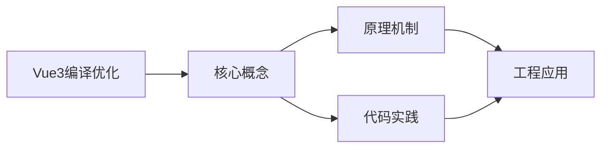
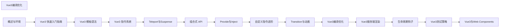

## 1. 学习目标（Bloom 分类）

本节按照布鲁姆教育目标分类学组织学习路径。本文主题为《Vue3编译优化》，属于 Vue 3 模块，读者可以根据自身阶段选择阅读深度。

记忆层面：能够准确复述本文的核心概念、术语与基本语法或操作步骤，并能够在提问或检索时快速定位对应知识点。能够说出 Vue 3 的核心概念、术语与标准写法。

理解层面：能够用自己的语言解释核心原理与工作机制，说明概念之间的因果关系，而不是机械记忆结论。能够解释 Vue 3 的工作原理与设计动机。

应用层面：能够在真实项目或练习场景中运用本文知识解决具体问题，写出正确且可维护的实现。能够编写符合 Vue 3 规范的完整实现。

分析层面：能够拆解复杂问题，比较本文主题与相邻概念的异同，识别边界条件与例外情况。能够分析 Vue 3 与相邻方案的差异与边界。

评价层面：能够根据约束条件（性能、可读性、安全、成本）评价不同方案的优劣，做出有依据的技术决策。能够根据场景评价 Vue 3 相关方案的优劣。

创造层面：能够把本文知识与其他模块知识组合，设计出新的解决方案或可复用的工程模式。能够组合 Vue 3 与其他技术设计完整方案。

通过本节学习，读者应当能够把《Vue3编译优化》纳入自己的知识网络，并与 Vue 3 模块的其他主题（组合式 API、响应式、组件通信、路由、状态管理）建立关联。

## 2. 历史动机与发展脉络

《Vue3编译优化》是 Vue 3 领域的重要主题。要真正理解它，需要先了解它解决的问题与演进过程。

Vue 由尤雨溪于 2014 年发布，以“渐进式框架”定位：可作库嵌入，也可作框架构建完整应用。Vue 3 于 2020 年 9 月发布，核心是组合式 API 与全新响应式系统。
Vue 3 的技术支柱：Proxy 响应式（替代 Object.defineProperty）、虚拟 DOM 重写（PatchFlags）、Fragment/Teleport/Suspense 内置组件、组合式 API（setup/ref/reactive/computed）。
生态现状：Vue Router 4、Pinia（官方状态库）、Vite 构建、Nuxt 全栈框架；Vue 3.5 引入 useTemplateRef 等开发者体验改进。

回到本文主题：Vue3编译优化 的提出与成熟，正是上述技术背景下的必然产物。早期实现往往以简单可用为目标，随着工程规模扩大，社区逐渐沉淀出标准做法与最佳实践；理解这一脉络，可以帮助读者判断“为什么文档中的推荐写法是现在这个样子”，也能在遇到历史遗留代码时准确识别其设计年代与取舍。


## 3. 形式化定义与核心概念精讲

本节把《Vue3编译优化》涉及的核心概念以“定义 + 讲解”的形式展开。读者应把定义当作工具，把讲解当作理解路径；两者结合才能形成可迁移的知识。

响应式：ref 包装基本类型，reactive 包装对象；effect 收集依赖，Proxy 拦截读写；computed 缓存派生值。
组件通信：props 向下、emit 向上、v-model 双向、provide/inject 跨层、事件总线（慎用）。
生命周期：setup 在创建前执行；onMounted/onUpdated/onUnmounted 对应挂载、更新、卸载；KeepAlive 增加 activated/deactivated。

### 3.1 原文章节逐一精讲

原文档把主题拆分为 52 个小节，下面按顺序给出每一节的导读讲解，随后保留原文细节供精读。

#### 原文精读（完整保留）

# Vue 3 编译优化

> **符号约定**：`< >` 必填参数 | `[ ]` 可选参数

---

##### SSR 优化

```javascript
// Vue 3 SSR 编译优化
// 服务端渲染时，编译器会生成不同的代码

// 客户端渲染函数
function render() {
  return createBlock('div', null, [
    _hoisted_1,
    createVNode('p', null, _ctx.message, PatchFlags.TEXT),
  ]);
}

// SSR 渲染函数（直接拼接字符串，无需 VNode）
function ssrRender(_ctx, _push, _parent) {
  _push(`<div>`);
  _push(`<header><h1>标题</h1></header>`); // 静态内容直接输出字符串
  _push(`<p>${_ctx.message}</p>`); // 动态内容插值
  _push(`</div>`);
}
// SSR 模式下性能远优于客户端渲染
```
#### 概述

Vue 3 相比 Vue 2 在性能上有显著提升，其中编译器优化是核心因素之一。Vue 3 的编译器在模板编译阶段进行了多项优化，包括静态提升、预字符串化、PatchFlag 标记、Block Tree 收集和事件缓存等。这些优化使得 Vue 3 在更新时能够跳过大量不变的内容，只对动态部分进行精确的 diff 运算，从而大幅提升渲染性能。理解这些优化机制有助于编写更高性能的 Vue 应用。

#### 基础概念

**静态提升（Static Hoisting）**：编译器将模板中的静态节点提取到渲染函数外部，使其只创建一次。后续渲染时直接复用，避免重复创建 VNode。

**预字符串化（Static Stringification）**：连续的静态节点会被合并为一个静态字符串 VNode，进一步减少 VNode 创建开销。

**PatchFlag**：编译器为动态节点打上补丁标记，标记该节点哪些属性是动态的。更新时只需检查标记的属性，跳过静态属性。

**Block Tree**：以组件根节点或 v-if/v-for 节点为 Block，收集所有动态子节点的引用。更新时只遍历动态节点列表，跳过整棵静态子树。

**事件缓存**：编译器缓存内联事件处理函数，避免每次渲染都创建新的函数引用，减少不必要的子组件更新。

**Tree Shaking**：Vue 3 的运行时支持基于 ES Module 的 Tree Shaking，未使用的 API 不会被打包进最终产物。

#### 快速上手

##### 静态提升

```html
<!-- 模板 -->
<template>
  <div>
    <p>静态内容</p>
    <span>{{ dynamicText }}</span>
  </div>
</template>
```

```javascript
// 编译后的渲染函数（简化版）
// 静态节点被提升到渲染函数外部
const _hoisted_1 = createVNode('p', null, '静态内容');

function render() {
  return createVNode('div', null, [
    _hoisted_1, // 直接复用，不重新创建
    createVNode('span', null, _ctx.dynamicText, PatchFlags.TEXT),
  ]);
}
```

##### PatchFlag 标记

```html
<template>
  <div :class="className">{{ message }}</div>
</template>
```

```javascript
// 编译后：标记动态部分
function render() {
  return createVNode(
    'div',
    { class: _ctx.className }, // 动态 class
    _ctx.message, // 动态文本
    PatchFlags.CLASS | PatchFlags.TEXT // 标记：class 和 text 是动态的
  );
}

// PatchFlags 枚举值
// TEXT = 1          文本内容动态
// CLASS = 2         class 动态
// STYLE = 4         style 动态
// PROPS = 8         非 class/style 的属性动态
// FULL_PROPS = 16   完整属性动态（含 key 变化）
// EVENT_HANDLERS = 32  事件处理动态
// HOISTED = -1      静态提升的节点
// CACHED = -2       缓存的节点
```

#### 详细用法

##### 预字符串化

```html
<!-- 模板中有多个连续的静态节点 -->
<template>
  <div>
    <header>
      <h1>标题</h1>
      <nav>
        <a href="/">首页</a>
        <a href="/about">关于</a>
        <a href="/contact">联系</a>
      </nav>
    </header>
    <main>{{ content }}</main>
  </div>
</template>
```

```javascript
// 编译后：连续静态节点合并为一个字符串
const _hoisted_1 = createStaticVNode(
  '<header><h1>标题</h1><nav>' +
    '<a href="/">首页</a>' +
    '<a href="/about">关于</a>' +
    '<a href="/contact">联系</a>' +
    '</nav></header>',
  6 // 节点数量，用于 hydration
);

function render() {
  return createVNode('div', null, [
    _hoisted_1, // 整个 header 被字符串化
    createVNode('main', null, _ctx.content, PatchFlags.TEXT),
  ]);
}
```

##### Block Tree 与动态节点收集

```html
<template>
  <div class="container">
    <h1>标题</h1>
    <p v-if="showDesc">描述文字</p>
    <ul>
      <li v-for="item in list" :key="item.id">{{ item.name }}</li>
    </ul>
    <footer>底部</footer>
  </div>
</template>
```

```javascript
// v-if 和 v-for 会创建新的 Block
// 组件根节点是根 Block，收集所有动态子节点

function render() {
  return (
    // 根 Block
    createBlock('div', { class: 'container' }, [
      // 静态节点不收集
      createVNode('h1', null, '标题', -1 /* HOISTED */),

      // v-if 创建 Block
      _ctx.showDesc
        ? (openBlock(), createBlock('p', { key: 0 }, '描述文字'))
        : createCommentVNode('v-if', true),

      // v-for 创建 Block
      (openBlock(true), // 使用 fragment block
      renderList(_ctx.list, (item) => {
        return createBlock('li', { key: item.id }, item.name, PatchFlags.TEXT);
      })),

      // 静态节点不收集
      createVNode('footer', null, '底部', -1 /* HOISTED */),
    ])
  );
  // diff 时只遍历收集的动态节点，跳过 h1 和 footer
}
```

##### 事件缓存

```html
<template>
  <button @click="count++">点击 {{ count }}</button>
</template>
```

```javascript
// 未缓存：每次渲染都创建新的函数
function render_uncached() {
  return createVNode(
    'button',
    {
      onClick: ($event) => _ctx.count++,
    },
    '点击 ' + _ctx.count,
    PatchFlags.TEXT
  );
}

// 缓存后：事件处理函数只创建一次
function render_cached() {
  return (
    // 使用 withCtx 缓存事件处理器
    withCtx(($event) => _ctx.count++, _cache || (_cache = []), 0)
  );
  // 实际编译结果：
  // _cache[0] || (_cache[0] = ($event) => (_ctx.count++))
  // 首次创建后缓存，后续直接使用缓存
}
```

#### 常见场景

##### 优化前后对比

```html
<!-- 优化前：所有节点都参与 diff -->
<template>
  <div>
    <header class="static-header">
      <h1>固定标题</h1>
      <p>固定描述</p>
    </header>
    <main>
      <p>{{ dynamicContent }}</p>
    </main>
    <footer class="static-footer">
      <p>固定底部</p>
    </footer>
  </div>
</template>

<!-- 优化后编译结果 -->
<!-- header 和 footer 被静态提升 -->
<!-- 只有 main 中的 p 节点参与 diff -->
```

```javascript
// Vue 2 的渲染函数：全量 diff
function render_v2() {
  return _c('div', [
    _c('header', { staticClass: 'static-header' }, [
      _c('h1', [_v('固定标题')]),
      _c('p', [_v('固定描述')]),
    ]),
    _c('main', [_c('p', [_v(_s(dynamicContent))])]),
    _c('footer', { staticClass: 'static-footer' }, [_c('p', [_v('固定底部')])]),
  ]);
  // 每次更新都要遍历所有节点
}

// Vue 3 的渲染函数：靶向更新
const _hoisted_1 = createStaticVNode(
  '<header class="static-header"><h1>固定标题</h1><p>固定描述</p></header>',
  3
);
const _hoisted_2 = createStaticVNode('<footer class="static-footer"><p>固定底部</p></footer>', 2);

function render_v3() {
  return createBlock('div', null, [
    _hoisted_1,
    createVNode('main', null, [createVNode('p', null, _ctx.dynamicContent, PatchFlags.TEXT)]),
    _hoisted_2,
  ]);
  // 只 diff main 中的 p 节点
}
```

##### 编写高性能模板

```html
<!-- 不推荐：整个列表都是动态的 -->
<template>
  <div :class="containerClass">
    <div v-for="item in items" :key="item.id">
      <span>{{ item.name }}</span>
      <span>{{ item.price }}</span>
    </div>
  </div>
</template>

<!-- 推荐：将静态部分提取出来 -->
<template>
  <div :class="containerClass">
    <StaticHeader />
    <!-- 静态内容独立为组件 -->
    <div v-for="item in items" :key="item.id">
      <!-- 使用 v-memo 跳过未变化的项 -->
      <div v-memo="[item.name, item.price]">
        <span>{{ item.name }}</span>
        <span>{{ item.price }}</span>
      </div>
    </div>
  </div>
</template>
```

#### 注意事项

- **v-once 的使用**：`v-once` 可以让节点只渲染一次，后续更新跳过。但过度使用会使代码难以维护，通常让编译器自动优化即可。
- **v-memo 的适用场景**：`v-memo` 适合大型 v-for 列表中只有部分项变化的场景，但不要在简单列表上使用，因为缓存本身也有开销。
- **动态组件与 Block**：`<component :is="...">` 会导致编译器无法确定具体的节点结构，可能退化为全量 diff。尽量使用确定的组件标签。
- **内联模板的局限**：内联模板（inline template）无法享受编译优化，因为编译器在编译父组件时无法看到子组件的模板内容。
- **编译模式的差异**：开发模式和生产模式的编译结果不同，生产模式会移除开发辅助代码并启用所有优化。性能测试应在生产模式下进行。

#### 进阶用法

##### v-memo 深度优化

```html
<template>
  <!-- v-memo：只在依赖变化时更新 -->
  <div v-for="item in largeList" :key="item.id" v-memo="[item.selected]">
    <!-- 只有 item.selected 变化时才会重新渲染 -->
    <ExpensiveComponent :data="item" />
    <span>{{ item.name }}</span>
    <span :class="{ active: item.selected }"> {{ item.selected ? '已选中' : '未选中' }} </span>
  </div>
</template>
```

```javascript
// v-memo 编译结果
function render() {
  return renderList(_ctx.largeList, (item) => {
    return withMemo(
      [item.selected], // 依赖数组
      () =>
        createBlock('div', { key: item.id }, [
          createVNode(ExpensiveComponent, { data: item }, null, PatchFlags.PROPS),
          createVNode('span', null, item.name, PatchFlags.TEXT),
          createVNode(
            'span',
            {
              class: { active: item.selected },
            },
            item.selected ? '已选中' : '未选中',
            PatchFlags.CLASS | PatchFlags.TEXT
          ),
        ]),
      _cache,
      0
    );
  });
}
```

##### 自定义编译优化

```javascript
// vue.config.js 或 vite.config.js 中配置编译选项
import { defineConfig } from 'vite';
import vue from '@vitejs/plugin-vue';

export default defineConfig({
  plugins: [
    vue({
      template: {
        // 编译器选项
        compilerOptions: {
          // 将所有自定义元素视为原生元素（跳过组件解析）
          isCustomElement: (tag) => tag.startsWith('x-'),
        },
        // 自定义转换插件
        transformAssetUrls: {
          // 自定义资源 URL 转换
        },
      },
    }),
  ],
});
```

#### 静态提升 Static Hoisting

**基本写法：静态节点提升到 render 函数外**
`const <vnode> = createVNode('div', null, '静态')`
```vue
<!-- 静态节点被提升避免每次渲染重建 -->
<div class="header"><span>静态标题</span></div>
```

---

**基本写法：纯静态提升**
`<div class="box">固定内容</div>`
```vue
<!-- 不含动态绑定的节点整体提升 -->
<div class="box">固定内容</div>
```

---

#### 补丁标记 PatchFlag

**基本写法：编译器标记动态节点类型**
`createVNode('div', null, text, PatchFlags.TEXT)`
```vue
<!-- 编译产物带 patchFlag 仅比对动态部分 -->
<div>{{ message }}</div>
```

---

**基本写法：标记不同类型动态**
`PatchFlags.TEXT | PatchFlags.CLASS | PatchFlags.PROPS`
```vue
<!-- 文本动态 -->
<div>{{ msg }}</div>
<!-- class 动态 -->
<div :class="cls">文本</div>
<!-- props 动态 -->
<div :id="id">文本</div>
```

---

#### 块级树 Block

**基本写法：根节点收集动态子节点**
`createBlock('div', null, [<children>], PatchFlags)`
```vue
<!-- 模板根节点自动作为 Block -->
<template>
  <div>
    <p>静态</p>
    <p>{{ msg }}</p>
  </div>
</template>
```

---

**基本写法：Block 数组优化 diff**
`const <dynamicChildren> = []`
```ts
// Block 仅 diff 动态子节点跳过静态
block.dynamicChildren = [dynamicVNode];
```

---

#### v-if 优化的 key

**基本写法：v-if/v-else 配 key 优化**
`<div v-if="<条件>" key="a">`
```vue
<!-- 添加 key 提高复用判断 -->
<div v-if="show" key="on">显示</div>
<div v-else key="off">隐藏</div>
```

---

#### v-for 优化的 key

**基本写法：稳定唯一 key 加速 diff**
`<div v-for="<项> in <列表>" :key="<项>.id">`
```vue
<!-- 使用稳定 key -->
<div v-for="item in list" :key="item.id">{{ item.name }}</div>
```

---

#### 缓存事件处理函数

**基本写法：内联事件被缓存**
`<button @click="<回调>">`
```vue
<!-- 编译器缓存事件处理避免每次创建 -->
<button @click="onClick">点击</button>
```

---

**基本写法：内联表达式事件**
`<button @click="count++">`
```vue
<!-- 缓存为函数 -->
<button @click="count++">加</button>
```

---

#### 静态属性合并

**基本写法：静态 class style 合并为对象**
`createElementVNode('div', { class: 'box' })`
```vue
<!-- 静态 class 提前计算 -->
<div class="box">内容</div>
```

---

#### v-once 一次性渲染

**基本写法：标记节点只渲染一次**
`<div v-once>{{ <静态值> }}</div>`
```vue
<!-- 编译为静态提升节点 -->
<header v-once>{{ title }}</header>
```

---

#### v-memo 记忆化

**基本写法：依赖未变跳过子树 patch**
`<div v-memo="[<依赖>]">`
```vue
<!-- 依赖不变跳过整个子树更新 -->
<div v-memo="[item.id]">
  <span>{{ item.name }}</span>
  <span>{{ item.age }}</span>
</div>
```

---

#### 内联事件缓存

**基本写法：内联函数自动缓存**
`<button @click="<复杂表达式>">`
```vue
<!-- 表达式被提取并缓存 -->
<button @click="onClick($event, id)">点击</button>
```

---

#### BlockTree 收集

**基本写法：动态子节点收集到数组**
`<block>.dynamicChildren`
```ts
// Block 仅遍历动态节点
function patchBlock(n1, n2) {
  for (let i = 0; i < n2.dynamicChildren.length; i++) {
    patch(n1.dynamicChildren[i], n2.dynamicChildren[i]);
  }
}
```

---

#### 模板编译产物对比

**基本写法：编译前模板**
`<div :id="<动态>"><span>静态</span></div>`
```vue
<!-- 源模板 -->
<template>
  <div :id="dynamicId"><span>静态</span></div>
</template>
```

---

**基本写法：编译后渲染函数**
`function render(_ctx) { return createVNode('div', { id: _ctx.dynamicId }, [staticVNode]) }`
```ts
// 编译产物
function render(_ctx) {
  return createVNode('div', { id: _ctx.dynamicId }, [
    _hoisted_1 // 静态节点提升
  ], PatchFlags.PROPS, ['id']);
}
```

---

#### Slot 优化

**基本写法：编译作用域插槽**
`<slot :<字段>="<值>" />`
```vue
<!-- 插槽编译为函数 -->
<slot :item="item" />
```

---

**基本写法：消费作用域插槽**
`<template #default="{ <字段> }">`
```vue
<!-- 编译为接收 props 的函数 -->
<template #default="{ item }">{{ item.name }}</template>
```

---

#### Fragment 多根节点

**基本写法：多根节点编译为 Fragment**
`<><div/><div/></>`
```vue
<!-- 不再需要单一根节点 -->
<template>
  <header>头部</header>
  <main>主体</main>
</template>
```

---

#### v-bind 合并

**基本写法：v-bind 对象展开**
`<div v-bind="<对象>">`
```vue
<!-- 编译为合并的 props 对象 -->
<div v-bind="attrs">内容</div>
```

---

#### v-model 编译

**基本写法：v-model 编译为 modelValue 与 update**
`<input v-model="<值>" />`
```vue
<!-- 等价于 -->
<input :model-value="value" @update:model-value="value = $event" />
```

---

#### 自定义指令编译

**基本写法：指令编译为 withDirectives**
`withDirectives(createVNode(...), [[<指令>, <值>]])`
```vue
<!-- 模板指令 -->
<div v-focus>内容</div>
```

---

#### 编译器选项

**基本写法：配置编译选项**
`compilerOptions: { isCustomElement: <fn> }`
```ts
// vite.config.js
vue({
  template: {
    compilerOptions: { isCustomElement: tag => tag.startsWith('x-') }
  }
})
```

---

#### 编译模式 ssr

**基本写法：SSR 编译模式**
`compile(<模板>, { ssr: true })`
```ts
// 服务端编译为字符串拼接
import { compile } from 'vue/compiler-ssr';
const render = compile(template, { ssr: true });
```

---

#### 性能对比

**基本写法：Vue 3 比 Vue 2 性能提升**
`{ 性能: '提升 1.3~2 倍', 包体积: '减少 40%' }`
```ts
// 编译优化使 Vue 3 渲染更快
// Block + PatchFlag + 静态提升
```

---

#### 源码映射

**基本写法：开发环境启用 sourcemap**
`vue({ template: { compilerOptions: { sourceMap: true } } })`
```ts
// 便于调试模板
vue({ template: { compilerOptions: { sourceMap: true } } })
```

---

#### 编译错误

**基本写法：编译错误处理**
`compile(<模板>) // 抛出错误`
```ts
// 模板语法错误编译期检测
try {
  compile('<div>');
} catch (e) {
  console.error(e);
}
```

---

#### 编译宏

**基本写法：defineProps 与 defineEmits**
`const <props> = defineProps(['<字段>'])`
```vue
<!-- 编译宏无需导入 -->
<script setup>
const props = defineProps(['count']);
const emit = defineEmits(['change']);
</script>
```

---

#### defineOptions 宏

**基本写法：script setup 中声明组件选项**
`defineOptions({ name: '<组件名>' })`
```vue
<!-- Vue 3.3+ -->
<script setup>
defineOptions({ name: 'UserCard', inheritAttrs: false });
</script>
```
#### shallowRef 浅响应引用

**基本写法：仅 .value 替换触发更新**
`const <ref> = shallowRef(<对象>)`
```ts
// 适合大型不可变结构
const data = shallowRef({ items: [] });
data.value = { items: newArray }; // 触发
data.value.items.push(1); // 不触发
```

---

#### triggerRef 强制触发更新

**基本写法：修改 shallowRef 内部后手动触发**
`triggerRef(<shallowRef>)`
```ts
// 浅响应下深度修改后通知
const state = shallowRef({ count: 0 });
state.value.count++;
triggerRef(state);
```

---

#### shallowReactive 浅响应对象

**基本写法：仅根属性响应**
`const <state> = shallowReactive(<对象>)`
```ts
// 性能优化避免深层代理
const state = shallowReactive({ foo: 1, nested: { bar: 2 } });
state.foo++; // 响应
state.nested.bar++; // 不响应
```

---

#### customRef 自定义 ref

**基本写法：自定义依赖追踪与触发**
`const <ref> = customRef((<track>, <trigger>) => ({ get, set }))`
```ts
// 实现防抖 ref
function useDebouncedRef(value, delay = 200) {
  let timeout;
  return customRef((track, trigger) => ({
    get() { track(); return value; },
    set(newValue) {
      clearTimeout(timeout);
      timeout = setTimeout(() => { value = newValue; trigger(); }, delay);
    }
  }));
}
```

---

#### readonly 只读代理

**基本写法：创建只读响应式对象**
`const <ro> = readonly(<reactive对象>)`
```ts
// 防止误修改
const original = reactive({ count: 0 });
const ro = readonly(original);
```

---

#### shallowReadonly 浅只读

**基本写法：仅根属性只读**
`const <ro> = shallowReadonly(<对象>)`
```ts
// 根属性只读嵌套可改
const state = shallowReadonly({ foo: 1, nested: { bar: 2 } });
state.foo = 2; // 警告
state.nested.bar = 3; // 允许
```

---

#### computed 计算属性

**基本写法：只读计算属性**
`const <c> = computed(() => <计算>)`
```ts
// 自动缓存依赖未变不重算
const double = computed(() => count.value * 2);
```

---

**基本写法：可写计算属性**
`const <c> = computed({ get, set })`
```ts
// 提供 get 与 set
const fullName = computed({
  get: () => `${first.value} ${last.value}`,
  set: (v) => { [first.value, last.value] = v.split(' '); }
});
```

---

**基本写法：调试钩子**
`computed(() => <计算>, { onTrack, onTrigger })`
```ts
// 开发期调试依赖
const c = computed(() => state.count * 2, {
  onTrack(e) { console.log('tracked', e); },
  onTrigger(e) { console.log('triggered', e); }
});
```

---

#### watch 侦听器

**基本写法：侦听 ref**
`watch(<ref>, (<new>, <old>) => <逻辑>)`
```ts
// 监听 ref 变化
watch(count, (newVal, oldVal) => console.log(newVal));
```

---

**基本写法：侦听 getter 函数**
`watch(() => <reactive.字段>, <回调>)`
```ts
// 监听 reactive 属性
watch(() => state.count, (n, o) => console.log(n));
```

---

**基本写法：侦听多个源**
`watch([<源1>, <源2>], ([n1, n2]) => <逻辑>)`
```ts
// 同时监听多个源
watch([count, () => state.name], ([n, name]) => console.log(n, name));
```

---

**基本写法：deep 深度监听**
`watch(<源>, <回调>, { deep: true })`
```ts
// 对象深层变化触发
watch(state, (n) => console.log(n), { deep: true });
```

---

**基本写法：immediate 立即执行**
`watch(<源>, <回调>, { immediate: true })`
```ts
// 创建时立即执行一次
watch(count, (n) => init(n), { immediate: true });
```

---

**基本写法：flush 调整时机**
`watch(<源>, <回调>, { flush: 'post' })`
```ts
// post 在 DOM 更新后执行 pre 在更新前
watch(count, cb, { flush: 'post' });
```

---

**基本写法：once 仅触发一次**
`watch(<源>, <回调>, { once: true })`
```ts
// Vue 3.5 新增只监听一次
watch(count, (n) => console.log(n), { once: true });
```

---

**基本写法：暂停恢复监听**
`const { pause, resume } = watch(<源>, <回调>)`
```ts
// Vue 3.5 新增手动控制
const { pause, resume } = watch(count, cb);
pause();
resume();
```

---

#### watchEffect 副作用

**基本写法：自动收集依赖**
`watchEffect(() => <副作用>)`
```ts
// 自动追踪内部响应式依赖
watchEffect(() => console.log(state.count));
```

---

**基本写法：清理副作用**
`watchEffect((<onCleanup>) => <逻辑>)`
```ts
// 在重新执行前清理
watchEffect((onCleanup) => {
  const timer = setInterval(tick, 1000);
  onCleanup(() => clearInterval(timer));
});
```

---

**基本写法：调整执行时机**
`watchEffect(() => <副作用>, { flush: 'post' })`
```ts
// pre 默认 post 在 DOM 后 sync 同步
watchEffect(() => updateDOM(), { flush: 'post' });
```

---

#### watchPostEffect

**基本写法：post 模式的 watchEffect 简写**
`watchPostEffect(() => <副作用>)`
```ts
// 等价 flush: 'post'
watchPostEffect(() => console.log('DOM 更新后'));
```

---

#### watchSyncEffect

**基本写法：同步模式的 watchEffect 简写**
`watchSyncEffect(() => <副作用>)`
```ts
// 等价 flush: 'sync'
watchSyncEffect(() => console.log('同步执行'));
```

---

#### toRef 与 toRefs

**基本写法：toRef 单属性转 ref**
`const <ref> = toRef(<reactive>, '<字段>')`
```ts
// 保持响应式关联
const countRef = toRef(state, 'count');
```

---

**基本写法：toRefs 全部属性转 ref**
`const <refs> = toRefs(<reactive>)`
```ts
// 配合解构
const { count, name } = toRefs(state);
```

---

**基本写法：toRef 从普通值创建 ref**
`const <ref> = toRef(<值>)`
```ts
// 等价 ref 但语义更清晰
const r = toRef(1);
```

---

#### unref 解包 ref

**基本写法：获取 ref 或原值**
`const <val> = unref(<maybeRef>)`
```ts
// 是 ref 返回 .value 否则原值
const val = unref(maybeRef);
```

---

#### isRef isReactive 判断

**基本写法：判断响应式类型**
`isRef(<值>); isReactive(<值>); isProxy(<值>)`
```ts
// 类型守卫
if (isRef(val)) val.value;
if (isReactive(val)) /* */;
```

---

#### markRaw 永不代理

**基本写法：标记对象跳过响应式**
`const <raw> = markRaw(<对象>)`
```ts
// 第三方实例避免代理开销
const chart = markRaw(echarts.init(dom));
state.chart = chart;
```

---

#### toRaw 获取原始对象

**基本写法：读取代理背后的原始对象**
`const <raw> = toRaw(<reactive>)`
```ts
// 用于调试或传递给非响应式代码
const raw = toRaw(state);
```

---

#### effectScope 作用域管理

**基本写法：统一管理 effect 生命周期**
`const <scope> = effectScope()`
```ts
// 集中停止所有 effect
const scope = effectScope();
scope.run(() => {
  watch(count, cb);
  watchEffect(() => /* */);
});
onUnmounted(() => scope.stop());
```

---

#### getCurrentScope 当前作用域

**基本写法：获取当前 effect scope**
`const <scope> = getCurrentScope()`
```ts
// 在组合式函数中使用
const scope = getCurrentScope();
```

---

#### onScopeDispose 作用域清理

**基本写法：注册作用域销毁回调**
`onScopeDispose(() => <清理>)`
```ts
// 类似 onUnmounted 但作用域级
onScopeDispose(() => clearInterval(timer));
```

---

#### 响应式转换工具

**基本写法：使用 reactive 解构 props 保持响应**
`const { <字段> = <默认> } = defineProps(['<字段>'])`
```vue
<!-- Vue 3.5 响应式解构 -->
<script setup>
const { count = 0, msg = 'hi' } = defineProps(['count', 'msg']);
</script>
```

---

#### 异步组件与 Suspense

**基本写法：defineAsyncComponent**
`const <comp> = defineAsyncComponent(() => import(<路径>))`
```ts
// 异步加载组件
const Async = defineAsyncComponent(() => import('./Heavy.vue'));
```

---

**基本写法：配置加载状态**
`defineAsyncComponent({ loader, loadingComponent, errorComponent })`
```ts
// 完整配置
const Async = defineAsyncComponent({
  loader: () => import('./Heavy.vue'),
  loadingComponent: Loading,
  errorComponent: Error,
  delay: 200,
  timeout: 3000
});
```


### 3.2 概念关系图

下面用 Mermaid 图表达本文核心概念之间的关系，帮助读者建立整体图景：



图中展示的是本文知识的结构化关系：核心概念是入口，原理机制解释“为什么”，代码实践演示“怎么做”，工程应用回答“何时用”。读者学习时可以把每个小节的内容挂接到对应节点上。

## 4. 理论推导与原理解析

本节深入《Vue3编译优化》背后的原理。理论部分不求面面俱到，而是聚焦“能解释现象、能指导实践”的关键推导。

响应式：ref 包装基本类型，reactive 包装对象；effect 收集依赖，Proxy 拦截读写；computed 缓存派生值。
组件通信：props 向下、emit 向上、v-model 双向、provide/inject 跨层、事件总线（慎用）。
生命周期：setup 在创建前执行；onMounted/onUpdated/onUnmounted 对应挂载、更新、卸载；KeepAlive 增加 activated/deactivated。
模板编译：模板在构建期编译为渲染函数，指令（v-if/v-for/v-model）是编译糖。

需要强调的是，理论推导与工程实践之间存在翻译层：理论给出的是理想化模型与边界条件，工程代码则必须处理真实环境中的例外。读者在学习时应先掌握理论的“标准情形”，再通过陷阱章节了解“非标准情形”。

## 5. 代码示例与逐行讲解

本节把原文中的代码示例系统整理，并为每个示例补充用途说明与讲解。读者不应只浏览代码，而应逐段对照讲解理解设计意图。

### 5.1 示例：SSR 优化

该示例来自原文《SSR 优化》小节，用于演示Vue3编译优化相关操作。阅读时请先看代码结构，再看其后的讲解。

```javascript
// Vue 3 SSR 编译优化
// 服务端渲染时，编译器会生成不同的代码

// 客户端渲染函数
function render() {
  return createBlock('div', null, [
    _hoisted_1,
    createVNode('p', null, _ctx.message, PatchFlags.TEXT),
  ]);
}

// SSR 渲染函数（直接拼接字符串，无需 VNode）
function ssrRender(_ctx, _push, _parent) {
  _push(`<div>`);
  _push(`<header><h1>标题</h1></header>`); // 静态内容直接输出字符串
  _push(`<p>${_ctx.message}</p>`); // 动态内容插值
  _push(`</div>`);
}
// SSR 模式下性能远优于客户端渲染
```

讲解：这段代码演示了本节核心知识点。代码中的关键操作可以归纳为三步：准备（定义或初始化）、执行（核心逻辑）、收尾（释放资源或返回结果）。实际项目中，这三步往往被封装为函数或类，以提升复用性与可测试性。

关键点分析：

该示例共 17 行有效代码，包含 2 类关键结构（function、return）。其中：

- 入口与初始化部分负责建立上下文，对应实际项目中的启动或装配逻辑；
- 核心逻辑部分体现本文主题的主要操作，是阅读时最需要对照讲解理解的部分；
- 输出或返回部分把结果交给调用方，注意其类型与边界条件。

进阶思考路径：先尝试修改参数观察行为变化，再把示例中的模式迁移到自己的项目中；每次修改都记录预期与实测差异，这是把示例转化为能力的最快方式。

### 5.2 示例：静态提升

该示例来自原文《静态提升》小节，用于演示Vue3编译优化相关操作。阅读时请先看代码结构，再看其后的讲解。

```html
<!-- 模板 -->
<template>
  <div>
    <p>静态内容</p>
    <span>{{ dynamicText }}</span>
  </div>
</template>
```

讲解：这段代码演示了本节核心知识点。代码中的关键操作可以归纳为三步：准备（定义或初始化）、执行（核心逻辑）、收尾（释放资源或返回结果）。实际项目中，这三步往往被封装为函数或类，以提升复用性与可测试性。

关键点分析：

该示例共 7 行有效代码，结构以数据或配置为主。阅读时应关注：数据字段的含义、配置项的作用，以及它们与运行行为的对应关系。

进阶思考路径：先尝试修改参数观察行为变化，再把示例中的模式迁移到自己的项目中；每次修改都记录预期与实测差异，这是把示例转化为能力的最快方式。

### 5.3 示例：静态提升

该示例来自原文《静态提升》小节，用于演示Vue3编译优化相关操作。阅读时请先看代码结构，再看其后的讲解。

```javascript
// 编译后的渲染函数（简化版）
// 静态节点被提升到渲染函数外部
const _hoisted_1 = createVNode('p', null, '静态内容');

function render() {
  return createVNode('div', null, [
    _hoisted_1, // 直接复用，不重新创建
    createVNode('span', null, _ctx.dynamicText, PatchFlags.TEXT),
  ]);
}
```

讲解：这段代码演示了本节核心知识点。代码中的关键操作可以归纳为三步：准备（定义或初始化）、执行（核心逻辑）、收尾（释放资源或返回结果）。实际项目中，这三步往往被封装为函数或类，以提升复用性与可测试性。

关键点分析：

该示例共 9 行有效代码，包含 2 类关键结构（function、return）。其中：

- 入口与初始化部分负责建立上下文，对应实际项目中的启动或装配逻辑；
- 核心逻辑部分体现本文主题的主要操作，是阅读时最需要对照讲解理解的部分；
- 输出或返回部分把结果交给调用方，注意其类型与边界条件。

进阶思考路径：先尝试修改参数观察行为变化，再把示例中的模式迁移到自己的项目中；每次修改都记录预期与实测差异，这是把示例转化为能力的最快方式。

### 5.4 示例：PatchFlag 标记

该示例来自原文《PatchFlag 标记》小节，用于演示Vue3编译优化相关操作。阅读时请先看代码结构，再看其后的讲解。

```html
<template>
  <div :class="className">{{ message }}</div>
</template>
```

讲解：这段代码演示了本节核心知识点。代码中的关键操作可以归纳为三步：准备（定义或初始化）、执行（核心逻辑）、收尾（释放资源或返回结果）。实际项目中，这三步往往被封装为函数或类，以提升复用性与可测试性。

关键点分析：

该示例共 3 行有效代码，包含 1 类关键结构（class）。其中：

- 入口与初始化部分负责建立上下文，对应实际项目中的启动或装配逻辑；
- 核心逻辑部分体现本文主题的主要操作，是阅读时最需要对照讲解理解的部分；
- 输出或返回部分把结果交给调用方，注意其类型与边界条件。

进阶思考路径：先尝试修改参数观察行为变化，再把示例中的模式迁移到自己的项目中；每次修改都记录预期与实测差异，这是把示例转化为能力的最快方式。

### 5.5 示例：PatchFlag 标记

该示例来自原文《PatchFlag 标记》小节，用于演示Vue3编译优化相关操作。阅读时请先看代码结构，再看其后的讲解。

```javascript
// 编译后：标记动态部分
function render() {
  return createVNode(
    'div',
    { class: _ctx.className }, // 动态 class
    _ctx.message, // 动态文本
    PatchFlags.CLASS | PatchFlags.TEXT // 标记：class 和 text 是动态的
  );
}

// PatchFlags 枚举值
// TEXT = 1          文本内容动态
// CLASS = 2         class 动态
// STYLE = 4         style 动态
// PROPS = 8         非 class/style 的属性动态
// FULL_PROPS = 16   完整属性动态（含 key 变化）
// EVENT_HANDLERS = 32  事件处理动态
// HOISTED = -1      静态提升的节点
// CACHED = -2       缓存的节点
```

讲解：这段代码演示了本节核心知识点。代码中的关键操作可以归纳为三步：准备（定义或初始化）、执行（核心逻辑）、收尾（释放资源或返回结果）。实际项目中，这三步往往被封装为函数或类，以提升复用性与可测试性。

关键点分析：

该示例共 18 行有效代码，包含 3 类关键结构（class、function、return）。其中：

- 入口与初始化部分负责建立上下文，对应实际项目中的启动或装配逻辑；
- 核心逻辑部分体现本文主题的主要操作，是阅读时最需要对照讲解理解的部分；
- 输出或返回部分把结果交给调用方，注意其类型与边界条件。

进阶思考路径：先尝试修改参数观察行为变化，再把示例中的模式迁移到自己的项目中；每次修改都记录预期与实测差异，这是把示例转化为能力的最快方式。

### 5.6 示例：预字符串化

该示例来自原文《预字符串化》小节，用于演示Vue3编译优化相关操作。阅读时请先看代码结构，再看其后的讲解。

```html
<!-- 模板中有多个连续的静态节点 -->
<template>
  <div>
    <header>
      <h1>标题</h1>
      <nav>
        <a href="/">首页</a>
        <a href="/about">关于</a>
        <a href="/contact">联系</a>
      </nav>
    </header>
    <main>{{ content }}</main>
  </div>
</template>
```

讲解：这段代码演示了本节核心知识点。代码中的关键操作可以归纳为三步：准备（定义或初始化）、执行（核心逻辑）、收尾（释放资源或返回结果）。实际项目中，这三步往往被封装为函数或类，以提升复用性与可测试性。

关键点分析：

该示例共 14 行有效代码，结构以数据或配置为主。阅读时应关注：数据字段的含义、配置项的作用，以及它们与运行行为的对应关系。

进阶思考路径：先尝试修改参数观察行为变化，再把示例中的模式迁移到自己的项目中；每次修改都记录预期与实测差异，这是把示例转化为能力的最快方式。

### 5.7 示例：预字符串化

该示例来自原文《预字符串化》小节，用于演示Vue3编译优化相关操作。阅读时请先看代码结构，再看其后的讲解。

```javascript
// 编译后：连续静态节点合并为一个字符串
const _hoisted_1 = createStaticVNode(
  '<header><h1>标题</h1><nav>' +
    '<a href="/">首页</a>' +
    '<a href="/about">关于</a>' +
    '<a href="/contact">联系</a>' +
    '</nav></header>',
  6 // 节点数量，用于 hydration
);

function render() {
  return createVNode('div', null, [
    _hoisted_1, // 整个 header 被字符串化
    createVNode('main', null, _ctx.content, PatchFlags.TEXT),
  ]);
}
```

讲解：这段代码演示了本节核心知识点。代码中的关键操作可以归纳为三步：准备（定义或初始化）、执行（核心逻辑）、收尾（释放资源或返回结果）。实际项目中，这三步往往被封装为函数或类，以提升复用性与可测试性。

关键点分析：

该示例共 15 行有效代码，包含 2 类关键结构（function、return）。其中：

- 入口与初始化部分负责建立上下文，对应实际项目中的启动或装配逻辑；
- 核心逻辑部分体现本文主题的主要操作，是阅读时最需要对照讲解理解的部分；
- 输出或返回部分把结果交给调用方，注意其类型与边界条件。

进阶思考路径：先尝试修改参数观察行为变化，再把示例中的模式迁移到自己的项目中；每次修改都记录预期与实测差异，这是把示例转化为能力的最快方式。

### 5.8 示例：Block Tree 与动态节点收集

该示例来自原文《Block Tree 与动态节点收集》小节，用于演示Vue3编译优化相关操作。阅读时请先看代码结构，再看其后的讲解。

```html
<template>
  <div class="container">
    <h1>标题</h1>
    <p v-if="showDesc">描述文字</p>
    <ul>
      <li v-for="item in list" :key="item.id">{{ item.name }}</li>
    </ul>
    <footer>底部</footer>
  </div>
</template>
```

讲解：这段代码演示了本节核心知识点。代码中的关键操作可以归纳为三步：准备（定义或初始化）、执行（核心逻辑）、收尾（释放资源或返回结果）。实际项目中，这三步往往被封装为函数或类，以提升复用性与可测试性。

关键点分析：

该示例共 10 行有效代码，包含 1 类关键结构（class）。其中：

- 入口与初始化部分负责建立上下文，对应实际项目中的启动或装配逻辑；
- 核心逻辑部分体现本文主题的主要操作，是阅读时最需要对照讲解理解的部分；
- 输出或返回部分把结果交给调用方，注意其类型与边界条件。

进阶思考路径：先尝试修改参数观察行为变化，再把示例中的模式迁移到自己的项目中；每次修改都记录预期与实测差异，这是把示例转化为能力的最快方式。

### 5.9 示例：Block Tree 与动态节点收集

该示例来自原文《Block Tree 与动态节点收集》小节，用于演示Vue3编译优化相关操作。阅读时请先看代码结构，再看其后的讲解。

```javascript
// v-if 和 v-for 会创建新的 Block
// 组件根节点是根 Block，收集所有动态子节点

function render() {
  return (
    // 根 Block
    createBlock('div', { class: 'container' }, [
      // 静态节点不收集
      createVNode('h1', null, '标题', -1 /* HOISTED */),

      // v-if 创建 Block
      _ctx.showDesc
        ? (openBlock(), createBlock('p', { key: 0 }, '描述文字'))
        : createCommentVNode('v-if', true),

      // v-for 创建 Block
      (openBlock(true), // 使用 fragment block
      renderList(_ctx.list, (item) => {
        return createBlock('li', { key: item.id }, item.name, PatchFlags.TEXT);
      })),

      // 静态节点不收集
      createVNode('footer', null, '底部', -1 /* HOISTED */),
    ])
  );
  // diff 时只遍历收集的动态节点，跳过 h1 和 footer
}
```

讲解：这段代码演示了本节核心知识点。代码中的关键操作可以归纳为三步：准备（定义或初始化）、执行（核心逻辑）、收尾（释放资源或返回结果）。实际项目中，这三步往往被封装为函数或类，以提升复用性与可测试性。

关键点分析：

该示例共 23 行有效代码，包含 5 类关键结构（class、function、if、for、return）。其中：

- 入口与初始化部分负责建立上下文，对应实际项目中的启动或装配逻辑；
- 核心逻辑部分体现本文主题的主要操作，是阅读时最需要对照讲解理解的部分；
- 输出或返回部分把结果交给调用方，注意其类型与边界条件。

进阶思考路径：先尝试修改参数观察行为变化，再把示例中的模式迁移到自己的项目中；每次修改都记录预期与实测差异，这是把示例转化为能力的最快方式。

### 5.10 示例：事件缓存

该示例来自原文《事件缓存》小节，用于演示Vue3编译优化相关操作。阅读时请先看代码结构，再看其后的讲解。

```html
<template>
  <button @click="count++">点击 {{ count }}</button>
</template>
```

讲解：这段代码演示了本节核心知识点。代码中的关键操作可以归纳为三步：准备（定义或初始化）、执行（核心逻辑）、收尾（释放资源或返回结果）。实际项目中，这三步往往被封装为函数或类，以提升复用性与可测试性。

关键点分析：

该示例共 3 行有效代码，结构以数据或配置为主。阅读时应关注：数据字段的含义、配置项的作用，以及它们与运行行为的对应关系。

进阶思考路径：先尝试修改参数观察行为变化，再把示例中的模式迁移到自己的项目中；每次修改都记录预期与实测差异，这是把示例转化为能力的最快方式。

### 5.11 示例：事件缓存

该示例来自原文《事件缓存》小节，用于演示Vue3编译优化相关操作。阅读时请先看代码结构，再看其后的讲解。

```javascript
// 未缓存：每次渲染都创建新的函数
function render_uncached() {
  return createVNode(
    'button',
    {
      onClick: ($event) => _ctx.count++,
    },
    '点击 ' + _ctx.count,
    PatchFlags.TEXT
  );
}

// 缓存后：事件处理函数只创建一次
function render_cached() {
  return (
    // 使用 withCtx 缓存事件处理器
    withCtx(($event) => _ctx.count++, _cache || (_cache = []), 0)
  );
  // 实际编译结果：
  // _cache[0] || (_cache[0] = ($event) => (_ctx.count++))
  // 首次创建后缓存，后续直接使用缓存
}
```

讲解：这段代码演示了本节核心知识点。代码中的关键操作可以归纳为三步：准备（定义或初始化）、执行（核心逻辑）、收尾（释放资源或返回结果）。实际项目中，这三步往往被封装为函数或类，以提升复用性与可测试性。

关键点分析：

该示例共 21 行有效代码，包含 2 类关键结构（function、return）。其中：

- 入口与初始化部分负责建立上下文，对应实际项目中的启动或装配逻辑；
- 核心逻辑部分体现本文主题的主要操作，是阅读时最需要对照讲解理解的部分；
- 输出或返回部分把结果交给调用方，注意其类型与边界条件。

进阶思考路径：先尝试修改参数观察行为变化，再把示例中的模式迁移到自己的项目中；每次修改都记录预期与实测差异，这是把示例转化为能力的最快方式。

### 5.12 示例：优化前后对比

该示例来自原文《优化前后对比》小节，用于演示Vue3编译优化相关操作。阅读时请先看代码结构，再看其后的讲解。

```html
<!-- 优化前：所有节点都参与 diff -->
<template>
  <div>
    <header class="static-header">
      <h1>固定标题</h1>
      <p>固定描述</p>
    </header>
    <main>
      <p>{{ dynamicContent }}</p>
    </main>
    <footer class="static-footer">
      <p>固定底部</p>
    </footer>
  </div>
</template>

<!-- 优化后编译结果 -->
<!-- header 和 footer 被静态提升 -->
<!-- 只有 main 中的 p 节点参与 diff -->
```

讲解：这段代码演示了本节核心知识点。代码中的关键操作可以归纳为三步：准备（定义或初始化）、执行（核心逻辑）、收尾（释放资源或返回结果）。实际项目中，这三步往往被封装为函数或类，以提升复用性与可测试性。

关键点分析：

该示例共 18 行有效代码，包含 1 类关键结构（class）。其中：

- 入口与初始化部分负责建立上下文，对应实际项目中的启动或装配逻辑；
- 核心逻辑部分体现本文主题的主要操作，是阅读时最需要对照讲解理解的部分；
- 输出或返回部分把结果交给调用方，注意其类型与边界条件。

进阶思考路径：先尝试修改参数观察行为变化，再把示例中的模式迁移到自己的项目中；每次修改都记录预期与实测差异，这是把示例转化为能力的最快方式。

### 5.13 示例：优化前后对比

该示例来自原文《优化前后对比》小节，用于演示Vue3编译优化相关操作。阅读时请先看代码结构，再看其后的讲解。

```javascript
// Vue 2 的渲染函数：全量 diff
function render_v2() {
  return _c('div', [
    _c('header', { staticClass: 'static-header' }, [
      _c('h1', [_v('固定标题')]),
      _c('p', [_v('固定描述')]),
    ]),
    _c('main', [_c('p', [_v(_s(dynamicContent))])]),
    _c('footer', { staticClass: 'static-footer' }, [_c('p', [_v('固定底部')])]),
  ]);
  // 每次更新都要遍历所有节点
}

// Vue 3 的渲染函数：靶向更新
const _hoisted_1 = createStaticVNode(
  '<header class="static-header"><h1>固定标题</h1><p>固定描述</p></header>',
  3
);
const _hoisted_2 = createStaticVNode('<footer class="static-footer"><p>固定底部</p></footer>', 2);

function render_v3() {
  return createBlock('div', null, [
    _hoisted_1,
    createVNode('main', null, [createVNode('p', null, _ctx.dynamicContent, PatchFlags.TEXT)]),
    _hoisted_2,
  ]);
  // 只 diff main 中的 p 节点
}
```

讲解：这段代码演示了本节核心知识点。代码中的关键操作可以归纳为三步：准备（定义或初始化）、执行（核心逻辑）、收尾（释放资源或返回结果）。实际项目中，这三步往往被封装为函数或类，以提升复用性与可测试性。

关键点分析：

该示例共 26 行有效代码，包含 3 类关键结构（class、function、return）。其中：

- 入口与初始化部分负责建立上下文，对应实际项目中的启动或装配逻辑；
- 核心逻辑部分体现本文主题的主要操作，是阅读时最需要对照讲解理解的部分；
- 输出或返回部分把结果交给调用方，注意其类型与边界条件。

进阶思考路径：先尝试修改参数观察行为变化，再把示例中的模式迁移到自己的项目中；每次修改都记录预期与实测差异，这是把示例转化为能力的最快方式。

### 5.14 示例：编写高性能模板

该示例来自原文《编写高性能模板》小节，用于演示Vue3编译优化相关操作。阅读时请先看代码结构，再看其后的讲解。

```html
<!-- 不推荐：整个列表都是动态的 -->
<template>
  <div :class="containerClass">
    <div v-for="item in items" :key="item.id">
      <span>{{ item.name }}</span>
      <span>{{ item.price }}</span>
    </div>
  </div>
</template>

<!-- 推荐：将静态部分提取出来 -->
<template>
  <div :class="containerClass">
    <StaticHeader />
    <!-- 静态内容独立为组件 -->
    <div v-for="item in items" :key="item.id">
      <!-- 使用 v-memo 跳过未变化的项 -->
      <div v-memo="[item.name, item.price]">
        <span>{{ item.name }}</span>
        <span>{{ item.price }}</span>
      </div>
    </div>
  </div>
</template>
```

讲解：这段代码演示了本节核心知识点。代码中的关键操作可以归纳为三步：准备（定义或初始化）、执行（核心逻辑）、收尾（释放资源或返回结果）。实际项目中，这三步往往被封装为函数或类，以提升复用性与可测试性。

关键点分析：

该示例共 23 行有效代码，包含 1 类关键结构（class）。其中：

- 入口与初始化部分负责建立上下文，对应实际项目中的启动或装配逻辑；
- 核心逻辑部分体现本文主题的主要操作，是阅读时最需要对照讲解理解的部分；
- 输出或返回部分把结果交给调用方，注意其类型与边界条件。

进阶思考路径：先尝试修改参数观察行为变化，再把示例中的模式迁移到自己的项目中；每次修改都记录预期与实测差异，这是把示例转化为能力的最快方式。

### 5.15 示例：v-memo 深度优化

该示例来自原文《v-memo 深度优化》小节，用于演示Vue3编译优化相关操作。阅读时请先看代码结构，再看其后的讲解。

```html
<template>
  <!-- v-memo：只在依赖变化时更新 -->
  <div v-for="item in largeList" :key="item.id" v-memo="[item.selected]">
    <!-- 只有 item.selected 变化时才会重新渲染 -->
    <ExpensiveComponent :data="item" />
    <span>{{ item.name }}</span>
    <span :class="{ active: item.selected }"> {{ item.selected ? '已选中' : '未选中' }} </span>
  </div>
</template>
```

讲解：这段代码演示了本节核心知识点。代码中的关键操作可以归纳为三步：准备（定义或初始化）、执行（核心逻辑）、收尾（释放资源或返回结果）。实际项目中，这三步往往被封装为函数或类，以提升复用性与可测试性。

关键点分析：

该示例共 9 行有效代码，包含 1 类关键结构（class）。其中：

- 入口与初始化部分负责建立上下文，对应实际项目中的启动或装配逻辑；
- 核心逻辑部分体现本文主题的主要操作，是阅读时最需要对照讲解理解的部分；
- 输出或返回部分把结果交给调用方，注意其类型与边界条件。

进阶思考路径：先尝试修改参数观察行为变化，再把示例中的模式迁移到自己的项目中；每次修改都记录预期与实测差异，这是把示例转化为能力的最快方式。

### 5.16 示例：v-memo 深度优化

该示例来自原文《v-memo 深度优化》小节，用于演示Vue3编译优化相关操作。阅读时请先看代码结构，再看其后的讲解。

```javascript
// v-memo 编译结果
function render() {
  return renderList(_ctx.largeList, (item) => {
    return withMemo(
      [item.selected], // 依赖数组
      () =>
        createBlock('div', { key: item.id }, [
          createVNode(ExpensiveComponent, { data: item }, null, PatchFlags.PROPS),
          createVNode('span', null, item.name, PatchFlags.TEXT),
          createVNode(
            'span',
            {
              class: { active: item.selected },
            },
            item.selected ? '已选中' : '未选中',
            PatchFlags.CLASS | PatchFlags.TEXT
          ),
        ]),
      _cache,
      0
    );
  });
}
```

讲解：这段代码演示了本节核心知识点。代码中的关键操作可以归纳为三步：准备（定义或初始化）、执行（核心逻辑）、收尾（释放资源或返回结果）。实际项目中，这三步往往被封装为函数或类，以提升复用性与可测试性。

关键点分析：

该示例共 23 行有效代码，包含 3 类关键结构（class、function、return）。其中：

- 入口与初始化部分负责建立上下文，对应实际项目中的启动或装配逻辑；
- 核心逻辑部分体现本文主题的主要操作，是阅读时最需要对照讲解理解的部分；
- 输出或返回部分把结果交给调用方，注意其类型与边界条件。

进阶思考路径：先尝试修改参数观察行为变化，再把示例中的模式迁移到自己的项目中；每次修改都记录预期与实测差异，这是把示例转化为能力的最快方式。

### 5.17 示例：自定义编译优化

该示例来自原文《自定义编译优化》小节，用于演示Vue3编译优化相关操作。阅读时请先看代码结构，再看其后的讲解。

```javascript
// vue.config.js 或 vite.config.js 中配置编译选项
import { defineConfig } from 'vite';
import vue from '@vitejs/plugin-vue';

export default defineConfig({
  plugins: [
    vue({
      template: {
        // 编译器选项
        compilerOptions: {
          // 将所有自定义元素视为原生元素（跳过组件解析）
          isCustomElement: (tag) => tag.startsWith('x-'),
        },
        // 自定义转换插件
        transformAssetUrls: {
          // 自定义资源 URL 转换
        },
      },
    }),
  ],
});
```

讲解：这段代码演示了本节核心知识点。代码中的关键操作可以归纳为三步：准备（定义或初始化）、执行（核心逻辑）、收尾（释放资源或返回结果）。实际项目中，这三步往往被封装为函数或类，以提升复用性与可测试性。

关键点分析：

该示例共 20 行有效代码，包含 2 类关键结构（import、from）。其中：

- 入口与初始化部分负责建立上下文，对应实际项目中的启动或装配逻辑；
- 核心逻辑部分体现本文主题的主要操作，是阅读时最需要对照讲解理解的部分；
- 输出或返回部分把结果交给调用方，注意其类型与边界条件。

进阶思考路径：先尝试修改参数观察行为变化，再把示例中的模式迁移到自己的项目中；每次修改都记录预期与实测差异，这是把示例转化为能力的最快方式。

### 5.18 示例：静态提升 Static Hoisting

该示例来自原文《静态提升 Static Hoisting》小节，用于演示Vue3编译优化相关操作。阅读时请先看代码结构，再看其后的讲解。

```vue
<!-- 静态节点被提升避免每次渲染重建 -->
<div class="header"><span>静态标题</span></div>
```

讲解：这段代码演示了本节核心知识点。代码中的关键操作可以归纳为三步：准备（定义或初始化）、执行（核心逻辑）、收尾（释放资源或返回结果）。实际项目中，这三步往往被封装为函数或类，以提升复用性与可测试性。

关键点分析：

该示例共 2 行有效代码，包含 1 类关键结构（class）。其中：

- 入口与初始化部分负责建立上下文，对应实际项目中的启动或装配逻辑；
- 核心逻辑部分体现本文主题的主要操作，是阅读时最需要对照讲解理解的部分；
- 输出或返回部分把结果交给调用方，注意其类型与边界条件。

进阶思考路径：先尝试修改参数观察行为变化，再把示例中的模式迁移到自己的项目中；每次修改都记录预期与实测差异，这是把示例转化为能力的最快方式。

### 5.19 示例：静态提升 Static Hoisting

该示例来自原文《静态提升 Static Hoisting》小节，用于演示Vue3编译优化相关操作。阅读时请先看代码结构，再看其后的讲解。

```vue
<!-- 不含动态绑定的节点整体提升 -->
<div class="box">固定内容</div>
```

讲解：这段代码演示了本节核心知识点。代码中的关键操作可以归纳为三步：准备（定义或初始化）、执行（核心逻辑）、收尾（释放资源或返回结果）。实际项目中，这三步往往被封装为函数或类，以提升复用性与可测试性。

关键点分析：

该示例共 2 行有效代码，包含 1 类关键结构（class）。其中：

- 入口与初始化部分负责建立上下文，对应实际项目中的启动或装配逻辑；
- 核心逻辑部分体现本文主题的主要操作，是阅读时最需要对照讲解理解的部分；
- 输出或返回部分把结果交给调用方，注意其类型与边界条件。

进阶思考路径：先尝试修改参数观察行为变化，再把示例中的模式迁移到自己的项目中；每次修改都记录预期与实测差异，这是把示例转化为能力的最快方式。

### 5.20 示例：补丁标记 PatchFlag

该示例来自原文《补丁标记 PatchFlag》小节，用于演示Vue3编译优化相关操作。阅读时请先看代码结构，再看其后的讲解。

```vue
<!-- 编译产物带 patchFlag 仅比对动态部分 -->
<div>{{ message }}</div>
```

讲解：这段代码演示了本节核心知识点。代码中的关键操作可以归纳为三步：准备（定义或初始化）、执行（核心逻辑）、收尾（释放资源或返回结果）。实际项目中，这三步往往被封装为函数或类，以提升复用性与可测试性。

关键点分析：

该示例共 2 行有效代码，结构以数据或配置为主。阅读时应关注：数据字段的含义、配置项的作用，以及它们与运行行为的对应关系。

进阶思考路径：先尝试修改参数观察行为变化，再把示例中的模式迁移到自己的项目中；每次修改都记录预期与实测差异，这是把示例转化为能力的最快方式。

### 5.21 示例：补丁标记 PatchFlag

该示例来自原文《补丁标记 PatchFlag》小节，用于演示Vue3编译优化相关操作。阅读时请先看代码结构，再看其后的讲解。

```vue
<!-- 文本动态 -->
<div>{{ msg }}</div>
<!-- class 动态 -->
<div :class="cls">文本</div>
<!-- props 动态 -->
<div :id="id">文本</div>
```

讲解：这段代码演示了本节核心知识点。代码中的关键操作可以归纳为三步：准备（定义或初始化）、执行（核心逻辑）、收尾（释放资源或返回结果）。实际项目中，这三步往往被封装为函数或类，以提升复用性与可测试性。

关键点分析：

该示例共 6 行有效代码，包含 1 类关键结构（class）。其中：

- 入口与初始化部分负责建立上下文，对应实际项目中的启动或装配逻辑；
- 核心逻辑部分体现本文主题的主要操作，是阅读时最需要对照讲解理解的部分；
- 输出或返回部分把结果交给调用方，注意其类型与边界条件。

进阶思考路径：先尝试修改参数观察行为变化，再把示例中的模式迁移到自己的项目中；每次修改都记录预期与实测差异，这是把示例转化为能力的最快方式。

### 5.22 示例：块级树 Block

该示例来自原文《块级树 Block》小节，用于演示Vue3编译优化相关操作。阅读时请先看代码结构，再看其后的讲解。

```vue
<!-- 模板根节点自动作为 Block -->
<template>
  <div>
    <p>静态</p>
    <p>{{ msg }}</p>
  </div>
</template>
```

讲解：这段代码演示了本节核心知识点。代码中的关键操作可以归纳为三步：准备（定义或初始化）、执行（核心逻辑）、收尾（释放资源或返回结果）。实际项目中，这三步往往被封装为函数或类，以提升复用性与可测试性。

关键点分析：

该示例共 7 行有效代码，结构以数据或配置为主。阅读时应关注：数据字段的含义、配置项的作用，以及它们与运行行为的对应关系。

进阶思考路径：先尝试修改参数观察行为变化，再把示例中的模式迁移到自己的项目中；每次修改都记录预期与实测差异，这是把示例转化为能力的最快方式。

### 5.23 示例：块级树 Block

该示例来自原文《块级树 Block》小节，用于演示Vue3编译优化相关操作。阅读时请先看代码结构，再看其后的讲解。

```ts
// Block 仅 diff 动态子节点跳过静态
block.dynamicChildren = [dynamicVNode];
```

讲解：这段代码演示了本节核心知识点。代码中的关键操作可以归纳为三步：准备（定义或初始化）、执行（核心逻辑）、收尾（释放资源或返回结果）。实际项目中，这三步往往被封装为函数或类，以提升复用性与可测试性。

关键点分析：

该示例共 2 行有效代码，结构以数据或配置为主。阅读时应关注：数据字段的含义、配置项的作用，以及它们与运行行为的对应关系。

进阶思考路径：先尝试修改参数观察行为变化，再把示例中的模式迁移到自己的项目中；每次修改都记录预期与实测差异，这是把示例转化为能力的最快方式。

### 5.24 示例：v-if 优化的 key

该示例来自原文《v-if 优化的 key》小节，用于演示Vue3编译优化相关操作。阅读时请先看代码结构，再看其后的讲解。

```vue
<!-- 添加 key 提高复用判断 -->
<div v-if="show" key="on">显示</div>
<div v-else key="off">隐藏</div>
```

讲解：这段代码演示了本节核心知识点。代码中的关键操作可以归纳为三步：准备（定义或初始化）、执行（核心逻辑）、收尾（释放资源或返回结果）。实际项目中，这三步往往被封装为函数或类，以提升复用性与可测试性。

关键点分析：

该示例共 3 行有效代码，结构以数据或配置为主。阅读时应关注：数据字段的含义、配置项的作用，以及它们与运行行为的对应关系。

进阶思考路径：先尝试修改参数观察行为变化，再把示例中的模式迁移到自己的项目中；每次修改都记录预期与实测差异，这是把示例转化为能力的最快方式。

### 5.25 示例：v-for 优化的 key

该示例来自原文《v-for 优化的 key》小节，用于演示Vue3编译优化相关操作。阅读时请先看代码结构，再看其后的讲解。

```vue
<!-- 使用稳定 key -->
<div v-for="item in list" :key="item.id">{{ item.name }}</div>
```

讲解：这段代码演示了本节核心知识点。代码中的关键操作可以归纳为三步：准备（定义或初始化）、执行（核心逻辑）、收尾（释放资源或返回结果）。实际项目中，这三步往往被封装为函数或类，以提升复用性与可测试性。

关键点分析：

该示例共 2 行有效代码，结构以数据或配置为主。阅读时应关注：数据字段的含义、配置项的作用，以及它们与运行行为的对应关系。

进阶思考路径：先尝试修改参数观察行为变化，再把示例中的模式迁移到自己的项目中；每次修改都记录预期与实测差异，这是把示例转化为能力的最快方式。

### 5.26 示例：缓存事件处理函数

该示例来自原文《缓存事件处理函数》小节，用于演示Vue3编译优化相关操作。阅读时请先看代码结构，再看其后的讲解。

```vue
<!-- 编译器缓存事件处理避免每次创建 -->
<button @click="onClick">点击</button>
```

讲解：这段代码演示了本节核心知识点。代码中的关键操作可以归纳为三步：准备（定义或初始化）、执行（核心逻辑）、收尾（释放资源或返回结果）。实际项目中，这三步往往被封装为函数或类，以提升复用性与可测试性。

关键点分析：

该示例共 2 行有效代码，结构以数据或配置为主。阅读时应关注：数据字段的含义、配置项的作用，以及它们与运行行为的对应关系。

进阶思考路径：先尝试修改参数观察行为变化，再把示例中的模式迁移到自己的项目中；每次修改都记录预期与实测差异，这是把示例转化为能力的最快方式。

### 5.27 示例：缓存事件处理函数

该示例来自原文《缓存事件处理函数》小节，用于演示Vue3编译优化相关操作。阅读时请先看代码结构，再看其后的讲解。

```vue
<!-- 缓存为函数 -->
<button @click="count++">加</button>
```

讲解：这段代码演示了本节核心知识点。代码中的关键操作可以归纳为三步：准备（定义或初始化）、执行（核心逻辑）、收尾（释放资源或返回结果）。实际项目中，这三步往往被封装为函数或类，以提升复用性与可测试性。

关键点分析：

该示例共 2 行有效代码，结构以数据或配置为主。阅读时应关注：数据字段的含义、配置项的作用，以及它们与运行行为的对应关系。

进阶思考路径：先尝试修改参数观察行为变化，再把示例中的模式迁移到自己的项目中；每次修改都记录预期与实测差异，这是把示例转化为能力的最快方式。

### 5.28 示例：静态属性合并

该示例来自原文《静态属性合并》小节，用于演示Vue3编译优化相关操作。阅读时请先看代码结构，再看其后的讲解。

```vue
<!-- 静态 class 提前计算 -->
<div class="box">内容</div>
```

讲解：这段代码演示了本节核心知识点。代码中的关键操作可以归纳为三步：准备（定义或初始化）、执行（核心逻辑）、收尾（释放资源或返回结果）。实际项目中，这三步往往被封装为函数或类，以提升复用性与可测试性。

关键点分析：

该示例共 2 行有效代码，包含 1 类关键结构（class）。其中：

- 入口与初始化部分负责建立上下文，对应实际项目中的启动或装配逻辑；
- 核心逻辑部分体现本文主题的主要操作，是阅读时最需要对照讲解理解的部分；
- 输出或返回部分把结果交给调用方，注意其类型与边界条件。

进阶思考路径：先尝试修改参数观察行为变化，再把示例中的模式迁移到自己的项目中；每次修改都记录预期与实测差异，这是把示例转化为能力的最快方式。

### 5.29 示例：v-once 一次性渲染

该示例来自原文《v-once 一次性渲染》小节，用于演示Vue3编译优化相关操作。阅读时请先看代码结构，再看其后的讲解。

```vue
<!-- 编译为静态提升节点 -->
<header v-once>{{ title }}</header>
```

讲解：这段代码演示了本节核心知识点。代码中的关键操作可以归纳为三步：准备（定义或初始化）、执行（核心逻辑）、收尾（释放资源或返回结果）。实际项目中，这三步往往被封装为函数或类，以提升复用性与可测试性。

关键点分析：

该示例共 2 行有效代码，结构以数据或配置为主。阅读时应关注：数据字段的含义、配置项的作用，以及它们与运行行为的对应关系。

进阶思考路径：先尝试修改参数观察行为变化，再把示例中的模式迁移到自己的项目中；每次修改都记录预期与实测差异，这是把示例转化为能力的最快方式。

### 5.30 示例：v-memo 记忆化

该示例来自原文《v-memo 记忆化》小节，用于演示Vue3编译优化相关操作。阅读时请先看代码结构，再看其后的讲解。

```vue
<!-- 依赖不变跳过整个子树更新 -->
<div v-memo="[item.id]">
  <span>{{ item.name }}</span>
  <span>{{ item.age }}</span>
</div>
```

讲解：这段代码演示了本节核心知识点。代码中的关键操作可以归纳为三步：准备（定义或初始化）、执行（核心逻辑）、收尾（释放资源或返回结果）。实际项目中，这三步往往被封装为函数或类，以提升复用性与可测试性。

关键点分析：

该示例共 5 行有效代码，结构以数据或配置为主。阅读时应关注：数据字段的含义、配置项的作用，以及它们与运行行为的对应关系。

进阶思考路径：先尝试修改参数观察行为变化，再把示例中的模式迁移到自己的项目中；每次修改都记录预期与实测差异，这是把示例转化为能力的最快方式。

### 5.31 示例：内联事件缓存

该示例来自原文《内联事件缓存》小节，用于演示Vue3编译优化相关操作。阅读时请先看代码结构，再看其后的讲解。

```vue
<!-- 表达式被提取并缓存 -->
<button @click="onClick($event, id)">点击</button>
```

讲解：这段代码演示了本节核心知识点。代码中的关键操作可以归纳为三步：准备（定义或初始化）、执行（核心逻辑）、收尾（释放资源或返回结果）。实际项目中，这三步往往被封装为函数或类，以提升复用性与可测试性。

关键点分析：

该示例共 2 行有效代码，结构以数据或配置为主。阅读时应关注：数据字段的含义、配置项的作用，以及它们与运行行为的对应关系。

进阶思考路径：先尝试修改参数观察行为变化，再把示例中的模式迁移到自己的项目中；每次修改都记录预期与实测差异，这是把示例转化为能力的最快方式。

### 5.32 示例：BlockTree 收集

该示例来自原文《BlockTree 收集》小节，用于演示Vue3编译优化相关操作。阅读时请先看代码结构，再看其后的讲解。

```ts
// Block 仅遍历动态节点
function patchBlock(n1, n2) {
  for (let i = 0; i < n2.dynamicChildren.length; i++) {
    patch(n1.dynamicChildren[i], n2.dynamicChildren[i]);
  }
}
```

讲解：这段代码演示了本节核心知识点。代码中的关键操作可以归纳为三步：准备（定义或初始化）、执行（核心逻辑）、收尾（释放资源或返回结果）。实际项目中，这三步往往被封装为函数或类，以提升复用性与可测试性。

关键点分析：

该示例共 6 行有效代码，包含 2 类关键结构（function、for）。其中：

- 入口与初始化部分负责建立上下文，对应实际项目中的启动或装配逻辑；
- 核心逻辑部分体现本文主题的主要操作，是阅读时最需要对照讲解理解的部分；
- 输出或返回部分把结果交给调用方，注意其类型与边界条件。

进阶思考路径：先尝试修改参数观察行为变化，再把示例中的模式迁移到自己的项目中；每次修改都记录预期与实测差异，这是把示例转化为能力的最快方式。

### 5.33 示例：模板编译产物对比

该示例来自原文《模板编译产物对比》小节，用于演示Vue3编译优化相关操作。阅读时请先看代码结构，再看其后的讲解。

```vue
<!-- 源模板 -->
<template>
  <div :id="dynamicId"><span>静态</span></div>
</template>
```

讲解：这段代码演示了本节核心知识点。代码中的关键操作可以归纳为三步：准备（定义或初始化）、执行（核心逻辑）、收尾（释放资源或返回结果）。实际项目中，这三步往往被封装为函数或类，以提升复用性与可测试性。

关键点分析：

该示例共 4 行有效代码，结构以数据或配置为主。阅读时应关注：数据字段的含义、配置项的作用，以及它们与运行行为的对应关系。

进阶思考路径：先尝试修改参数观察行为变化，再把示例中的模式迁移到自己的项目中；每次修改都记录预期与实测差异，这是把示例转化为能力的最快方式。

### 5.34 示例：模板编译产物对比

该示例来自原文《模板编译产物对比》小节，用于演示Vue3编译优化相关操作。阅读时请先看代码结构，再看其后的讲解。

```ts
// 编译产物
function render(_ctx) {
  return createVNode('div', { id: _ctx.dynamicId }, [
    _hoisted_1 // 静态节点提升
  ], PatchFlags.PROPS, ['id']);
}
```

讲解：这段代码演示了本节核心知识点。代码中的关键操作可以归纳为三步：准备（定义或初始化）、执行（核心逻辑）、收尾（释放资源或返回结果）。实际项目中，这三步往往被封装为函数或类，以提升复用性与可测试性。

关键点分析：

该示例共 6 行有效代码，包含 2 类关键结构（function、return）。其中：

- 入口与初始化部分负责建立上下文，对应实际项目中的启动或装配逻辑；
- 核心逻辑部分体现本文主题的主要操作，是阅读时最需要对照讲解理解的部分；
- 输出或返回部分把结果交给调用方，注意其类型与边界条件。

进阶思考路径：先尝试修改参数观察行为变化，再把示例中的模式迁移到自己的项目中；每次修改都记录预期与实测差异，这是把示例转化为能力的最快方式。

### 5.35 示例：Slot 优化

该示例来自原文《Slot 优化》小节，用于演示Vue3编译优化相关操作。阅读时请先看代码结构，再看其后的讲解。

```vue
<!-- 插槽编译为函数 -->
<slot :item="item" />
```

讲解：这段代码演示了本节核心知识点。代码中的关键操作可以归纳为三步：准备（定义或初始化）、执行（核心逻辑）、收尾（释放资源或返回结果）。实际项目中，这三步往往被封装为函数或类，以提升复用性与可测试性。

关键点分析：

该示例共 2 行有效代码，结构以数据或配置为主。阅读时应关注：数据字段的含义、配置项的作用，以及它们与运行行为的对应关系。

进阶思考路径：先尝试修改参数观察行为变化，再把示例中的模式迁移到自己的项目中；每次修改都记录预期与实测差异，这是把示例转化为能力的最快方式。

### 5.36 示例：Slot 优化

该示例来自原文《Slot 优化》小节，用于演示Vue3编译优化相关操作。阅读时请先看代码结构，再看其后的讲解。

```vue
<!-- 编译为接收 props 的函数 -->
<template #default="{ item }">{{ item.name }}</template>
```

讲解：这段代码演示了本节核心知识点。代码中的关键操作可以归纳为三步：准备（定义或初始化）、执行（核心逻辑）、收尾（释放资源或返回结果）。实际项目中，这三步往往被封装为函数或类，以提升复用性与可测试性。

关键点分析：

该示例共 2 行有效代码，结构以数据或配置为主。阅读时应关注：数据字段的含义、配置项的作用，以及它们与运行行为的对应关系。

进阶思考路径：先尝试修改参数观察行为变化，再把示例中的模式迁移到自己的项目中；每次修改都记录预期与实测差异，这是把示例转化为能力的最快方式。

### 5.37 示例：Fragment 多根节点

该示例来自原文《Fragment 多根节点》小节，用于演示Vue3编译优化相关操作。阅读时请先看代码结构，再看其后的讲解。

```vue
<!-- 不再需要单一根节点 -->
<template>
  <header>头部</header>
  <main>主体</main>
</template>
```

讲解：这段代码演示了本节核心知识点。代码中的关键操作可以归纳为三步：准备（定义或初始化）、执行（核心逻辑）、收尾（释放资源或返回结果）。实际项目中，这三步往往被封装为函数或类，以提升复用性与可测试性。

关键点分析：

该示例共 5 行有效代码，结构以数据或配置为主。阅读时应关注：数据字段的含义、配置项的作用，以及它们与运行行为的对应关系。

进阶思考路径：先尝试修改参数观察行为变化，再把示例中的模式迁移到自己的项目中；每次修改都记录预期与实测差异，这是把示例转化为能力的最快方式。

### 5.38 示例：v-bind 合并

该示例来自原文《v-bind 合并》小节，用于演示Vue3编译优化相关操作。阅读时请先看代码结构，再看其后的讲解。

```vue
<!-- 编译为合并的 props 对象 -->
<div v-bind="attrs">内容</div>
```

讲解：这段代码演示了本节核心知识点。代码中的关键操作可以归纳为三步：准备（定义或初始化）、执行（核心逻辑）、收尾（释放资源或返回结果）。实际项目中，这三步往往被封装为函数或类，以提升复用性与可测试性。

关键点分析：

该示例共 2 行有效代码，结构以数据或配置为主。阅读时应关注：数据字段的含义、配置项的作用，以及它们与运行行为的对应关系。

进阶思考路径：先尝试修改参数观察行为变化，再把示例中的模式迁移到自己的项目中；每次修改都记录预期与实测差异，这是把示例转化为能力的最快方式。

### 5.39 示例：v-model 编译

该示例来自原文《v-model 编译》小节，用于演示Vue3编译优化相关操作。阅读时请先看代码结构，再看其后的讲解。

```vue
<!-- 等价于 -->
<input :model-value="value" @update:model-value="value = $event" />
```

讲解：这段代码演示了本节核心知识点。代码中的关键操作可以归纳为三步：准备（定义或初始化）、执行（核心逻辑）、收尾（释放资源或返回结果）。实际项目中，这三步往往被封装为函数或类，以提升复用性与可测试性。

关键点分析：

该示例共 2 行有效代码，结构以数据或配置为主。阅读时应关注：数据字段的含义、配置项的作用，以及它们与运行行为的对应关系。

进阶思考路径：先尝试修改参数观察行为变化，再把示例中的模式迁移到自己的项目中；每次修改都记录预期与实测差异，这是把示例转化为能力的最快方式。

### 5.40 示例：自定义指令编译

该示例来自原文《自定义指令编译》小节，用于演示Vue3编译优化相关操作。阅读时请先看代码结构，再看其后的讲解。

```vue
<!-- 模板指令 -->
<div v-focus>内容</div>
```

讲解：这段代码演示了本节核心知识点。代码中的关键操作可以归纳为三步：准备（定义或初始化）、执行（核心逻辑）、收尾（释放资源或返回结果）。实际项目中，这三步往往被封装为函数或类，以提升复用性与可测试性。

关键点分析：

该示例共 2 行有效代码，结构以数据或配置为主。阅读时应关注：数据字段的含义、配置项的作用，以及它们与运行行为的对应关系。

进阶思考路径：先尝试修改参数观察行为变化，再把示例中的模式迁移到自己的项目中；每次修改都记录预期与实测差异，这是把示例转化为能力的最快方式。

### 5.41 示例：编译器选项

该示例来自原文《编译器选项》小节，用于演示Vue3编译优化相关操作。阅读时请先看代码结构，再看其后的讲解。

```ts
// vite.config.js
vue({
  template: {
    compilerOptions: { isCustomElement: tag => tag.startsWith('x-') }
  }
})
```

讲解：这段代码演示了本节核心知识点。代码中的关键操作可以归纳为三步：准备（定义或初始化）、执行（核心逻辑）、收尾（释放资源或返回结果）。实际项目中，这三步往往被封装为函数或类，以提升复用性与可测试性。

关键点分析：

该示例共 6 行有效代码，结构以数据或配置为主。阅读时应关注：数据字段的含义、配置项的作用，以及它们与运行行为的对应关系。

进阶思考路径：先尝试修改参数观察行为变化，再把示例中的模式迁移到自己的项目中；每次修改都记录预期与实测差异，这是把示例转化为能力的最快方式。

### 5.42 示例：编译模式 ssr

该示例来自原文《编译模式 ssr》小节，用于演示Vue3编译优化相关操作。阅读时请先看代码结构，再看其后的讲解。

```ts
// 服务端编译为字符串拼接
import { compile } from 'vue/compiler-ssr';
const render = compile(template, { ssr: true });
```

讲解：这段代码演示了本节核心知识点。代码中的关键操作可以归纳为三步：准备（定义或初始化）、执行（核心逻辑）、收尾（释放资源或返回结果）。实际项目中，这三步往往被封装为函数或类，以提升复用性与可测试性。

关键点分析：

该示例共 3 行有效代码，包含 2 类关键结构（import、from）。其中：

- 入口与初始化部分负责建立上下文，对应实际项目中的启动或装配逻辑；
- 核心逻辑部分体现本文主题的主要操作，是阅读时最需要对照讲解理解的部分；
- 输出或返回部分把结果交给调用方，注意其类型与边界条件。

进阶思考路径：先尝试修改参数观察行为变化，再把示例中的模式迁移到自己的项目中；每次修改都记录预期与实测差异，这是把示例转化为能力的最快方式。

### 5.43 示例：性能对比

该示例来自原文《性能对比》小节，用于演示Vue3编译优化相关操作。阅读时请先看代码结构，再看其后的讲解。

```ts
// 编译优化使 Vue 3 渲染更快
// Block + PatchFlag + 静态提升
```

讲解：这段代码演示了本节核心知识点。代码中的关键操作可以归纳为三步：准备（定义或初始化）、执行（核心逻辑）、收尾（释放资源或返回结果）。实际项目中，这三步往往被封装为函数或类，以提升复用性与可测试性。

关键点分析：

该示例共 2 行有效代码，结构以数据或配置为主。阅读时应关注：数据字段的含义、配置项的作用，以及它们与运行行为的对应关系。

进阶思考路径：先尝试修改参数观察行为变化，再把示例中的模式迁移到自己的项目中；每次修改都记录预期与实测差异，这是把示例转化为能力的最快方式。

### 5.44 示例：源码映射

该示例来自原文《源码映射》小节，用于演示Vue3编译优化相关操作。阅读时请先看代码结构，再看其后的讲解。

```ts
// 便于调试模板
vue({ template: { compilerOptions: { sourceMap: true } } })
```

讲解：这段代码演示了本节核心知识点。代码中的关键操作可以归纳为三步：准备（定义或初始化）、执行（核心逻辑）、收尾（释放资源或返回结果）。实际项目中，这三步往往被封装为函数或类，以提升复用性与可测试性。

关键点分析：

该示例共 2 行有效代码，结构以数据或配置为主。阅读时应关注：数据字段的含义、配置项的作用，以及它们与运行行为的对应关系。

进阶思考路径：先尝试修改参数观察行为变化，再把示例中的模式迁移到自己的项目中；每次修改都记录预期与实测差异，这是把示例转化为能力的最快方式。

### 5.45 示例：编译错误

该示例来自原文《编译错误》小节，用于演示Vue3编译优化相关操作。阅读时请先看代码结构，再看其后的讲解。

```ts
// 模板语法错误编译期检测
try {
  compile('<div>');
} catch (e) {
  console.error(e);
}
```

讲解：这段代码演示了本节核心知识点。代码中的关键操作可以归纳为三步：准备（定义或初始化）、执行（核心逻辑）、收尾（释放资源或返回结果）。实际项目中，这三步往往被封装为函数或类，以提升复用性与可测试性。

关键点分析：

该示例共 6 行有效代码，结构以数据或配置为主。阅读时应关注：数据字段的含义、配置项的作用，以及它们与运行行为的对应关系。

进阶思考路径：先尝试修改参数观察行为变化，再把示例中的模式迁移到自己的项目中；每次修改都记录预期与实测差异，这是把示例转化为能力的最快方式。

### 5.46 示例：编译宏

该示例来自原文《编译宏》小节，用于演示Vue3编译优化相关操作。阅读时请先看代码结构，再看其后的讲解。

```vue
<!-- 编译宏无需导入 -->
<script setup>
const props = defineProps(['count']);
const emit = defineEmits(['change']);
</script>
```

讲解：这段代码演示了本节核心知识点。代码中的关键操作可以归纳为三步：准备（定义或初始化）、执行（核心逻辑）、收尾（释放资源或返回结果）。实际项目中，这三步往往被封装为函数或类，以提升复用性与可测试性。

关键点分析：

该示例共 5 行有效代码，结构以数据或配置为主。阅读时应关注：数据字段的含义、配置项的作用，以及它们与运行行为的对应关系。

进阶思考路径：先尝试修改参数观察行为变化，再把示例中的模式迁移到自己的项目中；每次修改都记录预期与实测差异，这是把示例转化为能力的最快方式。

### 5.47 示例：defineOptions 宏

该示例来自原文《defineOptions 宏》小节，用于演示Vue3编译优化相关操作。阅读时请先看代码结构，再看其后的讲解。

```vue
<!-- Vue 3.3+ -->
<script setup>
defineOptions({ name: 'UserCard', inheritAttrs: false });
</script>
```

讲解：这段代码演示了本节核心知识点。代码中的关键操作可以归纳为三步：准备（定义或初始化）、执行（核心逻辑）、收尾（释放资源或返回结果）。实际项目中，这三步往往被封装为函数或类，以提升复用性与可测试性。

关键点分析：

该示例共 4 行有效代码，结构以数据或配置为主。阅读时应关注：数据字段的含义、配置项的作用，以及它们与运行行为的对应关系。

进阶思考路径：先尝试修改参数观察行为变化，再把示例中的模式迁移到自己的项目中；每次修改都记录预期与实测差异，这是把示例转化为能力的最快方式。

### 5.48 示例：shallowRef 浅响应引用

该示例来自原文《shallowRef 浅响应引用》小节，用于演示Vue3编译优化相关操作。阅读时请先看代码结构，再看其后的讲解。

```ts
// 适合大型不可变结构
const data = shallowRef({ items: [] });
data.value = { items: newArray }; // 触发
data.value.items.push(1); // 不触发
```

讲解：这段代码演示了本节核心知识点。代码中的关键操作可以归纳为三步：准备（定义或初始化）、执行（核心逻辑）、收尾（释放资源或返回结果）。实际项目中，这三步往往被封装为函数或类，以提升复用性与可测试性。

关键点分析：

该示例共 4 行有效代码，结构以数据或配置为主。阅读时应关注：数据字段的含义、配置项的作用，以及它们与运行行为的对应关系。

进阶思考路径：先尝试修改参数观察行为变化，再把示例中的模式迁移到自己的项目中；每次修改都记录预期与实测差异，这是把示例转化为能力的最快方式。

### 5.49 示例：triggerRef 强制触发更新

该示例来自原文《triggerRef 强制触发更新》小节，用于演示Vue3编译优化相关操作。阅读时请先看代码结构，再看其后的讲解。

```ts
// 浅响应下深度修改后通知
const state = shallowRef({ count: 0 });
state.value.count++;
triggerRef(state);
```

讲解：这段代码演示了本节核心知识点。代码中的关键操作可以归纳为三步：准备（定义或初始化）、执行（核心逻辑）、收尾（释放资源或返回结果）。实际项目中，这三步往往被封装为函数或类，以提升复用性与可测试性。

关键点分析：

该示例共 4 行有效代码，结构以数据或配置为主。阅读时应关注：数据字段的含义、配置项的作用，以及它们与运行行为的对应关系。

进阶思考路径：先尝试修改参数观察行为变化，再把示例中的模式迁移到自己的项目中；每次修改都记录预期与实测差异，这是把示例转化为能力的最快方式。

### 5.50 示例：shallowReactive 浅响应对象

该示例来自原文《shallowReactive 浅响应对象》小节，用于演示Vue3编译优化相关操作。阅读时请先看代码结构，再看其后的讲解。

```ts
// 性能优化避免深层代理
const state = shallowReactive({ foo: 1, nested: { bar: 2 } });
state.foo++; // 响应
state.nested.bar++; // 不响应
```

讲解：这段代码演示了本节核心知识点。代码中的关键操作可以归纳为三步：准备（定义或初始化）、执行（核心逻辑）、收尾（释放资源或返回结果）。实际项目中，这三步往往被封装为函数或类，以提升复用性与可测试性。

关键点分析：

该示例共 4 行有效代码，结构以数据或配置为主。阅读时应关注：数据字段的含义、配置项的作用，以及它们与运行行为的对应关系。

进阶思考路径：先尝试修改参数观察行为变化，再把示例中的模式迁移到自己的项目中；每次修改都记录预期与实测差异，这是把示例转化为能力的最快方式。

### 5.51 示例：customRef 自定义 ref

该示例来自原文《customRef 自定义 ref》小节，用于演示Vue3编译优化相关操作。阅读时请先看代码结构，再看其后的讲解。

```ts
// 实现防抖 ref
function useDebouncedRef(value, delay = 200) {
  let timeout;
  return customRef((track, trigger) => ({
    get() { track(); return value; },
    set(newValue) {
      clearTimeout(timeout);
      timeout = setTimeout(() => { value = newValue; trigger(); }, delay);
    }
  }));
}
```

讲解：这段代码演示了本节核心知识点。代码中的关键操作可以归纳为三步：准备（定义或初始化）、执行（核心逻辑）、收尾（释放资源或返回结果）。实际项目中，这三步往往被封装为函数或类，以提升复用性与可测试性。

关键点分析：

该示例共 11 行有效代码，包含 2 类关键结构（function、return）。其中：

- 入口与初始化部分负责建立上下文，对应实际项目中的启动或装配逻辑；
- 核心逻辑部分体现本文主题的主要操作，是阅读时最需要对照讲解理解的部分；
- 输出或返回部分把结果交给调用方，注意其类型与边界条件。

进阶思考路径：先尝试修改参数观察行为变化，再把示例中的模式迁移到自己的项目中；每次修改都记录预期与实测差异，这是把示例转化为能力的最快方式。

### 5.52 示例：readonly 只读代理

该示例来自原文《readonly 只读代理》小节，用于演示Vue3编译优化相关操作。阅读时请先看代码结构，再看其后的讲解。

```ts
// 防止误修改
const original = reactive({ count: 0 });
const ro = readonly(original);
```

讲解：这段代码演示了本节核心知识点。代码中的关键操作可以归纳为三步：准备（定义或初始化）、执行（核心逻辑）、收尾（释放资源或返回结果）。实际项目中，这三步往往被封装为函数或类，以提升复用性与可测试性。

关键点分析：

该示例共 3 行有效代码，结构以数据或配置为主。阅读时应关注：数据字段的含义、配置项的作用，以及它们与运行行为的对应关系。

进阶思考路径：先尝试修改参数观察行为变化，再把示例中的模式迁移到自己的项目中；每次修改都记录预期与实测差异，这是把示例转化为能力的最快方式。

### 5.53 示例：shallowReadonly 浅只读

该示例来自原文《shallowReadonly 浅只读》小节，用于演示Vue3编译优化相关操作。阅读时请先看代码结构，再看其后的讲解。

```ts
// 根属性只读嵌套可改
const state = shallowReadonly({ foo: 1, nested: { bar: 2 } });
state.foo = 2; // 警告
state.nested.bar = 3; // 允许
```

讲解：这段代码演示了本节核心知识点。代码中的关键操作可以归纳为三步：准备（定义或初始化）、执行（核心逻辑）、收尾（释放资源或返回结果）。实际项目中，这三步往往被封装为函数或类，以提升复用性与可测试性。

关键点分析：

该示例共 4 行有效代码，结构以数据或配置为主。阅读时应关注：数据字段的含义、配置项的作用，以及它们与运行行为的对应关系。

进阶思考路径：先尝试修改参数观察行为变化，再把示例中的模式迁移到自己的项目中；每次修改都记录预期与实测差异，这是把示例转化为能力的最快方式。

### 5.54 示例：computed 计算属性

该示例来自原文《computed 计算属性》小节，用于演示Vue3编译优化相关操作。阅读时请先看代码结构，再看其后的讲解。

```ts
// 自动缓存依赖未变不重算
const double = computed(() => count.value * 2);
```

讲解：这段代码演示了本节核心知识点。代码中的关键操作可以归纳为三步：准备（定义或初始化）、执行（核心逻辑）、收尾（释放资源或返回结果）。实际项目中，这三步往往被封装为函数或类，以提升复用性与可测试性。

关键点分析：

该示例共 2 行有效代码，结构以数据或配置为主。阅读时应关注：数据字段的含义、配置项的作用，以及它们与运行行为的对应关系。

进阶思考路径：先尝试修改参数观察行为变化，再把示例中的模式迁移到自己的项目中；每次修改都记录预期与实测差异，这是把示例转化为能力的最快方式。

### 5.55 示例：computed 计算属性

该示例来自原文《computed 计算属性》小节，用于演示Vue3编译优化相关操作。阅读时请先看代码结构，再看其后的讲解。

```ts
// 提供 get 与 set
const fullName = computed({
  get: () => `${first.value} ${last.value}`,
  set: (v) => { [first.value, last.value] = v.split(' '); }
});
```

讲解：这段代码演示了本节核心知识点。代码中的关键操作可以归纳为三步：准备（定义或初始化）、执行（核心逻辑）、收尾（释放资源或返回结果）。实际项目中，这三步往往被封装为函数或类，以提升复用性与可测试性。

关键点分析：

该示例共 5 行有效代码，结构以数据或配置为主。阅读时应关注：数据字段的含义、配置项的作用，以及它们与运行行为的对应关系。

进阶思考路径：先尝试修改参数观察行为变化，再把示例中的模式迁移到自己的项目中；每次修改都记录预期与实测差异，这是把示例转化为能力的最快方式。

### 5.56 示例：computed 计算属性

该示例来自原文《computed 计算属性》小节，用于演示Vue3编译优化相关操作。阅读时请先看代码结构，再看其后的讲解。

```ts
// 开发期调试依赖
const c = computed(() => state.count * 2, {
  onTrack(e) { console.log('tracked', e); },
  onTrigger(e) { console.log('triggered', e); }
});
```

讲解：这段代码演示了本节核心知识点。代码中的关键操作可以归纳为三步：准备（定义或初始化）、执行（核心逻辑）、收尾（释放资源或返回结果）。实际项目中，这三步往往被封装为函数或类，以提升复用性与可测试性。

关键点分析：

该示例共 5 行有效代码，结构以数据或配置为主。阅读时应关注：数据字段的含义、配置项的作用，以及它们与运行行为的对应关系。

进阶思考路径：先尝试修改参数观察行为变化，再把示例中的模式迁移到自己的项目中；每次修改都记录预期与实测差异，这是把示例转化为能力的最快方式。

### 5.57 示例：watch 侦听器

该示例来自原文《watch 侦听器》小节，用于演示Vue3编译优化相关操作。阅读时请先看代码结构，再看其后的讲解。

```ts
// 监听 ref 变化
watch(count, (newVal, oldVal) => console.log(newVal));
```

讲解：这段代码演示了本节核心知识点。代码中的关键操作可以归纳为三步：准备（定义或初始化）、执行（核心逻辑）、收尾（释放资源或返回结果）。实际项目中，这三步往往被封装为函数或类，以提升复用性与可测试性。

关键点分析：

该示例共 2 行有效代码，结构以数据或配置为主。阅读时应关注：数据字段的含义、配置项的作用，以及它们与运行行为的对应关系。

进阶思考路径：先尝试修改参数观察行为变化，再把示例中的模式迁移到自己的项目中；每次修改都记录预期与实测差异，这是把示例转化为能力的最快方式。

### 5.58 示例：watch 侦听器

该示例来自原文《watch 侦听器》小节，用于演示Vue3编译优化相关操作。阅读时请先看代码结构，再看其后的讲解。

```ts
// 监听 reactive 属性
watch(() => state.count, (n, o) => console.log(n));
```

讲解：这段代码演示了本节核心知识点。代码中的关键操作可以归纳为三步：准备（定义或初始化）、执行（核心逻辑）、收尾（释放资源或返回结果）。实际项目中，这三步往往被封装为函数或类，以提升复用性与可测试性。

关键点分析：

该示例共 2 行有效代码，结构以数据或配置为主。阅读时应关注：数据字段的含义、配置项的作用，以及它们与运行行为的对应关系。

进阶思考路径：先尝试修改参数观察行为变化，再把示例中的模式迁移到自己的项目中；每次修改都记录预期与实测差异，这是把示例转化为能力的最快方式。

### 5.59 示例：watch 侦听器

该示例来自原文《watch 侦听器》小节，用于演示Vue3编译优化相关操作。阅读时请先看代码结构，再看其后的讲解。

```ts
// 同时监听多个源
watch([count, () => state.name], ([n, name]) => console.log(n, name));
```

讲解：这段代码演示了本节核心知识点。代码中的关键操作可以归纳为三步：准备（定义或初始化）、执行（核心逻辑）、收尾（释放资源或返回结果）。实际项目中，这三步往往被封装为函数或类，以提升复用性与可测试性。

关键点分析：

该示例共 2 行有效代码，结构以数据或配置为主。阅读时应关注：数据字段的含义、配置项的作用，以及它们与运行行为的对应关系。

进阶思考路径：先尝试修改参数观察行为变化，再把示例中的模式迁移到自己的项目中；每次修改都记录预期与实测差异，这是把示例转化为能力的最快方式。

### 5.60 示例：watch 侦听器

该示例来自原文《watch 侦听器》小节，用于演示Vue3编译优化相关操作。阅读时请先看代码结构，再看其后的讲解。

```ts
// 对象深层变化触发
watch(state, (n) => console.log(n), { deep: true });
```

讲解：这段代码演示了本节核心知识点。代码中的关键操作可以归纳为三步：准备（定义或初始化）、执行（核心逻辑）、收尾（释放资源或返回结果）。实际项目中，这三步往往被封装为函数或类，以提升复用性与可测试性。

关键点分析：

该示例共 2 行有效代码，结构以数据或配置为主。阅读时应关注：数据字段的含义、配置项的作用，以及它们与运行行为的对应关系。

进阶思考路径：先尝试修改参数观察行为变化，再把示例中的模式迁移到自己的项目中；每次修改都记录预期与实测差异，这是把示例转化为能力的最快方式。

### 5.61 示例：watch 侦听器

该示例来自原文《watch 侦听器》小节，用于演示Vue3编译优化相关操作。阅读时请先看代码结构，再看其后的讲解。

```ts
// 创建时立即执行一次
watch(count, (n) => init(n), { immediate: true });
```

讲解：这段代码演示了本节核心知识点。代码中的关键操作可以归纳为三步：准备（定义或初始化）、执行（核心逻辑）、收尾（释放资源或返回结果）。实际项目中，这三步往往被封装为函数或类，以提升复用性与可测试性。

关键点分析：

该示例共 2 行有效代码，结构以数据或配置为主。阅读时应关注：数据字段的含义、配置项的作用，以及它们与运行行为的对应关系。

进阶思考路径：先尝试修改参数观察行为变化，再把示例中的模式迁移到自己的项目中；每次修改都记录预期与实测差异，这是把示例转化为能力的最快方式。

### 5.62 示例：watch 侦听器

该示例来自原文《watch 侦听器》小节，用于演示Vue3编译优化相关操作。阅读时请先看代码结构，再看其后的讲解。

```ts
// post 在 DOM 更新后执行 pre 在更新前
watch(count, cb, { flush: 'post' });
```

讲解：这段代码演示了本节核心知识点。代码中的关键操作可以归纳为三步：准备（定义或初始化）、执行（核心逻辑）、收尾（释放资源或返回结果）。实际项目中，这三步往往被封装为函数或类，以提升复用性与可测试性。

关键点分析：

该示例共 2 行有效代码，结构以数据或配置为主。阅读时应关注：数据字段的含义、配置项的作用，以及它们与运行行为的对应关系。

进阶思考路径：先尝试修改参数观察行为变化，再把示例中的模式迁移到自己的项目中；每次修改都记录预期与实测差异，这是把示例转化为能力的最快方式。

### 5.63 示例：watch 侦听器

该示例来自原文《watch 侦听器》小节，用于演示Vue3编译优化相关操作。阅读时请先看代码结构，再看其后的讲解。

```ts
// Vue 3.5 新增只监听一次
watch(count, (n) => console.log(n), { once: true });
```

讲解：这段代码演示了本节核心知识点。代码中的关键操作可以归纳为三步：准备（定义或初始化）、执行（核心逻辑）、收尾（释放资源或返回结果）。实际项目中，这三步往往被封装为函数或类，以提升复用性与可测试性。

关键点分析：

该示例共 2 行有效代码，结构以数据或配置为主。阅读时应关注：数据字段的含义、配置项的作用，以及它们与运行行为的对应关系。

进阶思考路径：先尝试修改参数观察行为变化，再把示例中的模式迁移到自己的项目中；每次修改都记录预期与实测差异，这是把示例转化为能力的最快方式。

### 5.64 示例：watch 侦听器

该示例来自原文《watch 侦听器》小节，用于演示Vue3编译优化相关操作。阅读时请先看代码结构，再看其后的讲解。

```ts
// Vue 3.5 新增手动控制
const { pause, resume } = watch(count, cb);
pause();
resume();
```

讲解：这段代码演示了本节核心知识点。代码中的关键操作可以归纳为三步：准备（定义或初始化）、执行（核心逻辑）、收尾（释放资源或返回结果）。实际项目中，这三步往往被封装为函数或类，以提升复用性与可测试性。

关键点分析：

该示例共 4 行有效代码，结构以数据或配置为主。阅读时应关注：数据字段的含义、配置项的作用，以及它们与运行行为的对应关系。

进阶思考路径：先尝试修改参数观察行为变化，再把示例中的模式迁移到自己的项目中；每次修改都记录预期与实测差异，这是把示例转化为能力的最快方式。

### 5.65 示例：watchEffect 副作用

该示例来自原文《watchEffect 副作用》小节，用于演示Vue3编译优化相关操作。阅读时请先看代码结构，再看其后的讲解。

```ts
// 自动追踪内部响应式依赖
watchEffect(() => console.log(state.count));
```

讲解：这段代码演示了本节核心知识点。代码中的关键操作可以归纳为三步：准备（定义或初始化）、执行（核心逻辑）、收尾（释放资源或返回结果）。实际项目中，这三步往往被封装为函数或类，以提升复用性与可测试性。

关键点分析：

该示例共 2 行有效代码，结构以数据或配置为主。阅读时应关注：数据字段的含义、配置项的作用，以及它们与运行行为的对应关系。

进阶思考路径：先尝试修改参数观察行为变化，再把示例中的模式迁移到自己的项目中；每次修改都记录预期与实测差异，这是把示例转化为能力的最快方式。

### 5.66 示例：watchEffect 副作用

该示例来自原文《watchEffect 副作用》小节，用于演示Vue3编译优化相关操作。阅读时请先看代码结构，再看其后的讲解。

```ts
// 在重新执行前清理
watchEffect((onCleanup) => {
  const timer = setInterval(tick, 1000);
  onCleanup(() => clearInterval(timer));
});
```

讲解：这段代码演示了本节核心知识点。代码中的关键操作可以归纳为三步：准备（定义或初始化）、执行（核心逻辑）、收尾（释放资源或返回结果）。实际项目中，这三步往往被封装为函数或类，以提升复用性与可测试性。

关键点分析：

该示例共 5 行有效代码，结构以数据或配置为主。阅读时应关注：数据字段的含义、配置项的作用，以及它们与运行行为的对应关系。

进阶思考路径：先尝试修改参数观察行为变化，再把示例中的模式迁移到自己的项目中；每次修改都记录预期与实测差异，这是把示例转化为能力的最快方式。

### 5.67 示例：watchEffect 副作用

该示例来自原文《watchEffect 副作用》小节，用于演示Vue3编译优化相关操作。阅读时请先看代码结构，再看其后的讲解。

```ts
// pre 默认 post 在 DOM 后 sync 同步
watchEffect(() => updateDOM(), { flush: 'post' });
```

讲解：这段代码演示了本节核心知识点。代码中的关键操作可以归纳为三步：准备（定义或初始化）、执行（核心逻辑）、收尾（释放资源或返回结果）。实际项目中，这三步往往被封装为函数或类，以提升复用性与可测试性。

关键点分析：

该示例共 2 行有效代码，结构以数据或配置为主。阅读时应关注：数据字段的含义、配置项的作用，以及它们与运行行为的对应关系。

进阶思考路径：先尝试修改参数观察行为变化，再把示例中的模式迁移到自己的项目中；每次修改都记录预期与实测差异，这是把示例转化为能力的最快方式。

### 5.68 示例：watchPostEffect

该示例来自原文《watchPostEffect》小节，用于演示Vue3编译优化相关操作。阅读时请先看代码结构，再看其后的讲解。

```ts
// 等价 flush: 'post'
watchPostEffect(() => console.log('DOM 更新后'));
```

讲解：这段代码演示了本节核心知识点。代码中的关键操作可以归纳为三步：准备（定义或初始化）、执行（核心逻辑）、收尾（释放资源或返回结果）。实际项目中，这三步往往被封装为函数或类，以提升复用性与可测试性。

关键点分析：

该示例共 2 行有效代码，结构以数据或配置为主。阅读时应关注：数据字段的含义、配置项的作用，以及它们与运行行为的对应关系。

进阶思考路径：先尝试修改参数观察行为变化，再把示例中的模式迁移到自己的项目中；每次修改都记录预期与实测差异，这是把示例转化为能力的最快方式。

### 5.69 示例：watchSyncEffect

该示例来自原文《watchSyncEffect》小节，用于演示Vue3编译优化相关操作。阅读时请先看代码结构，再看其后的讲解。

```ts
// 等价 flush: 'sync'
watchSyncEffect(() => console.log('同步执行'));
```

讲解：这段代码演示了本节核心知识点。代码中的关键操作可以归纳为三步：准备（定义或初始化）、执行（核心逻辑）、收尾（释放资源或返回结果）。实际项目中，这三步往往被封装为函数或类，以提升复用性与可测试性。

关键点分析：

该示例共 2 行有效代码，结构以数据或配置为主。阅读时应关注：数据字段的含义、配置项的作用，以及它们与运行行为的对应关系。

进阶思考路径：先尝试修改参数观察行为变化，再把示例中的模式迁移到自己的项目中；每次修改都记录预期与实测差异，这是把示例转化为能力的最快方式。

### 5.70 示例：toRef 与 toRefs

该示例来自原文《toRef 与 toRefs》小节，用于演示Vue3编译优化相关操作。阅读时请先看代码结构，再看其后的讲解。

```ts
// 保持响应式关联
const countRef = toRef(state, 'count');
```

讲解：这段代码演示了本节核心知识点。代码中的关键操作可以归纳为三步：准备（定义或初始化）、执行（核心逻辑）、收尾（释放资源或返回结果）。实际项目中，这三步往往被封装为函数或类，以提升复用性与可测试性。

关键点分析：

该示例共 2 行有效代码，结构以数据或配置为主。阅读时应关注：数据字段的含义、配置项的作用，以及它们与运行行为的对应关系。

进阶思考路径：先尝试修改参数观察行为变化，再把示例中的模式迁移到自己的项目中；每次修改都记录预期与实测差异，这是把示例转化为能力的最快方式。

### 5.71 示例：toRef 与 toRefs

该示例来自原文《toRef 与 toRefs》小节，用于演示Vue3编译优化相关操作。阅读时请先看代码结构，再看其后的讲解。

```ts
// 配合解构
const { count, name } = toRefs(state);
```

讲解：这段代码演示了本节核心知识点。代码中的关键操作可以归纳为三步：准备（定义或初始化）、执行（核心逻辑）、收尾（释放资源或返回结果）。实际项目中，这三步往往被封装为函数或类，以提升复用性与可测试性。

关键点分析：

该示例共 2 行有效代码，结构以数据或配置为主。阅读时应关注：数据字段的含义、配置项的作用，以及它们与运行行为的对应关系。

进阶思考路径：先尝试修改参数观察行为变化，再把示例中的模式迁移到自己的项目中；每次修改都记录预期与实测差异，这是把示例转化为能力的最快方式。

### 5.72 示例：toRef 与 toRefs

该示例来自原文《toRef 与 toRefs》小节，用于演示Vue3编译优化相关操作。阅读时请先看代码结构，再看其后的讲解。

```ts
// 等价 ref 但语义更清晰
const r = toRef(1);
```

讲解：这段代码演示了本节核心知识点。代码中的关键操作可以归纳为三步：准备（定义或初始化）、执行（核心逻辑）、收尾（释放资源或返回结果）。实际项目中，这三步往往被封装为函数或类，以提升复用性与可测试性。

关键点分析：

该示例共 2 行有效代码，结构以数据或配置为主。阅读时应关注：数据字段的含义、配置项的作用，以及它们与运行行为的对应关系。

进阶思考路径：先尝试修改参数观察行为变化，再把示例中的模式迁移到自己的项目中；每次修改都记录预期与实测差异，这是把示例转化为能力的最快方式。

### 5.73 示例：unref 解包 ref

该示例来自原文《unref 解包 ref》小节，用于演示Vue3编译优化相关操作。阅读时请先看代码结构，再看其后的讲解。

```ts
// 是 ref 返回 .value 否则原值
const val = unref(maybeRef);
```

讲解：这段代码演示了本节核心知识点。代码中的关键操作可以归纳为三步：准备（定义或初始化）、执行（核心逻辑）、收尾（释放资源或返回结果）。实际项目中，这三步往往被封装为函数或类，以提升复用性与可测试性。

关键点分析：

该示例共 2 行有效代码，结构以数据或配置为主。阅读时应关注：数据字段的含义、配置项的作用，以及它们与运行行为的对应关系。

进阶思考路径：先尝试修改参数观察行为变化，再把示例中的模式迁移到自己的项目中；每次修改都记录预期与实测差异，这是把示例转化为能力的最快方式。

### 5.74 示例：isRef isReactive 判断

该示例来自原文《isRef isReactive 判断》小节，用于演示Vue3编译优化相关操作。阅读时请先看代码结构，再看其后的讲解。

```ts
// 类型守卫
if (isRef(val)) val.value;
if (isReactive(val)) /* */;
```

讲解：这段代码演示了本节核心知识点。代码中的关键操作可以归纳为三步：准备（定义或初始化）、执行（核心逻辑）、收尾（释放资源或返回结果）。实际项目中，这三步往往被封装为函数或类，以提升复用性与可测试性。

关键点分析：

该示例共 3 行有效代码，包含 1 类关键结构（if）。其中：

- 入口与初始化部分负责建立上下文，对应实际项目中的启动或装配逻辑；
- 核心逻辑部分体现本文主题的主要操作，是阅读时最需要对照讲解理解的部分；
- 输出或返回部分把结果交给调用方，注意其类型与边界条件。

进阶思考路径：先尝试修改参数观察行为变化，再把示例中的模式迁移到自己的项目中；每次修改都记录预期与实测差异，这是把示例转化为能力的最快方式。

### 5.75 示例：markRaw 永不代理

该示例来自原文《markRaw 永不代理》小节，用于演示Vue3编译优化相关操作。阅读时请先看代码结构，再看其后的讲解。

```ts
// 第三方实例避免代理开销
const chart = markRaw(echarts.init(dom));
state.chart = chart;
```

讲解：这段代码演示了本节核心知识点。代码中的关键操作可以归纳为三步：准备（定义或初始化）、执行（核心逻辑）、收尾（释放资源或返回结果）。实际项目中，这三步往往被封装为函数或类，以提升复用性与可测试性。

关键点分析：

该示例共 3 行有效代码，结构以数据或配置为主。阅读时应关注：数据字段的含义、配置项的作用，以及它们与运行行为的对应关系。

进阶思考路径：先尝试修改参数观察行为变化，再把示例中的模式迁移到自己的项目中；每次修改都记录预期与实测差异，这是把示例转化为能力的最快方式。

### 5.76 示例：toRaw 获取原始对象

该示例来自原文《toRaw 获取原始对象》小节，用于演示Vue3编译优化相关操作。阅读时请先看代码结构，再看其后的讲解。

```ts
// 用于调试或传递给非响应式代码
const raw = toRaw(state);
```

讲解：这段代码演示了本节核心知识点。代码中的关键操作可以归纳为三步：准备（定义或初始化）、执行（核心逻辑）、收尾（释放资源或返回结果）。实际项目中，这三步往往被封装为函数或类，以提升复用性与可测试性。

关键点分析：

该示例共 2 行有效代码，结构以数据或配置为主。阅读时应关注：数据字段的含义、配置项的作用，以及它们与运行行为的对应关系。

进阶思考路径：先尝试修改参数观察行为变化，再把示例中的模式迁移到自己的项目中；每次修改都记录预期与实测差异，这是把示例转化为能力的最快方式。

### 5.77 示例：effectScope 作用域管理

该示例来自原文《effectScope 作用域管理》小节，用于演示Vue3编译优化相关操作。阅读时请先看代码结构，再看其后的讲解。

```ts
// 集中停止所有 effect
const scope = effectScope();
scope.run(() => {
  watch(count, cb);
  watchEffect(() => /* */);
});
onUnmounted(() => scope.stop());
```

讲解：这段代码演示了本节核心知识点。代码中的关键操作可以归纳为三步：准备（定义或初始化）、执行（核心逻辑）、收尾（释放资源或返回结果）。实际项目中，这三步往往被封装为函数或类，以提升复用性与可测试性。

关键点分析：

该示例共 7 行有效代码，结构以数据或配置为主。阅读时应关注：数据字段的含义、配置项的作用，以及它们与运行行为的对应关系。

进阶思考路径：先尝试修改参数观察行为变化，再把示例中的模式迁移到自己的项目中；每次修改都记录预期与实测差异，这是把示例转化为能力的最快方式。

### 5.78 示例：getCurrentScope 当前作用域

该示例来自原文《getCurrentScope 当前作用域》小节，用于演示Vue3编译优化相关操作。阅读时请先看代码结构，再看其后的讲解。

```ts
// 在组合式函数中使用
const scope = getCurrentScope();
```

讲解：这段代码演示了本节核心知识点。代码中的关键操作可以归纳为三步：准备（定义或初始化）、执行（核心逻辑）、收尾（释放资源或返回结果）。实际项目中，这三步往往被封装为函数或类，以提升复用性与可测试性。

关键点分析：

该示例共 2 行有效代码，结构以数据或配置为主。阅读时应关注：数据字段的含义、配置项的作用，以及它们与运行行为的对应关系。

进阶思考路径：先尝试修改参数观察行为变化，再把示例中的模式迁移到自己的项目中；每次修改都记录预期与实测差异，这是把示例转化为能力的最快方式。

### 5.79 示例：onScopeDispose 作用域清理

该示例来自原文《onScopeDispose 作用域清理》小节，用于演示Vue3编译优化相关操作。阅读时请先看代码结构，再看其后的讲解。

```ts
// 类似 onUnmounted 但作用域级
onScopeDispose(() => clearInterval(timer));
```

讲解：这段代码演示了本节核心知识点。代码中的关键操作可以归纳为三步：准备（定义或初始化）、执行（核心逻辑）、收尾（释放资源或返回结果）。实际项目中，这三步往往被封装为函数或类，以提升复用性与可测试性。

关键点分析：

该示例共 2 行有效代码，结构以数据或配置为主。阅读时应关注：数据字段的含义、配置项的作用，以及它们与运行行为的对应关系。

进阶思考路径：先尝试修改参数观察行为变化，再把示例中的模式迁移到自己的项目中；每次修改都记录预期与实测差异，这是把示例转化为能力的最快方式。

### 5.80 示例：响应式转换工具

该示例来自原文《响应式转换工具》小节，用于演示Vue3编译优化相关操作。阅读时请先看代码结构，再看其后的讲解。

```vue
<!-- Vue 3.5 响应式解构 -->
<script setup>
const { count = 0, msg = 'hi' } = defineProps(['count', 'msg']);
</script>
```

讲解：这段代码演示了本节核心知识点。代码中的关键操作可以归纳为三步：准备（定义或初始化）、执行（核心逻辑）、收尾（释放资源或返回结果）。实际项目中，这三步往往被封装为函数或类，以提升复用性与可测试性。

关键点分析：

该示例共 4 行有效代码，结构以数据或配置为主。阅读时应关注：数据字段的含义、配置项的作用，以及它们与运行行为的对应关系。

进阶思考路径：先尝试修改参数观察行为变化，再把示例中的模式迁移到自己的项目中；每次修改都记录预期与实测差异，这是把示例转化为能力的最快方式。

### 5.81 示例：异步组件与 Suspense

该示例来自原文《异步组件与 Suspense》小节，用于演示Vue3编译优化相关操作。阅读时请先看代码结构，再看其后的讲解。

```ts
// 异步加载组件
const Async = defineAsyncComponent(() => import('./Heavy.vue'));
```

讲解：这段代码演示了本节核心知识点。代码中的关键操作可以归纳为三步：准备（定义或初始化）、执行（核心逻辑）、收尾（释放资源或返回结果）。实际项目中，这三步往往被封装为函数或类，以提升复用性与可测试性。

关键点分析：

该示例共 2 行有效代码，包含 1 类关键结构（import）。其中：

- 入口与初始化部分负责建立上下文，对应实际项目中的启动或装配逻辑；
- 核心逻辑部分体现本文主题的主要操作，是阅读时最需要对照讲解理解的部分；
- 输出或返回部分把结果交给调用方，注意其类型与边界条件。

进阶思考路径：先尝试修改参数观察行为变化，再把示例中的模式迁移到自己的项目中；每次修改都记录预期与实测差异，这是把示例转化为能力的最快方式。

### 5.82 示例：异步组件与 Suspense

该示例来自原文《异步组件与 Suspense》小节，用于演示Vue3编译优化相关操作。阅读时请先看代码结构，再看其后的讲解。

```ts
// 完整配置
const Async = defineAsyncComponent({
  loader: () => import('./Heavy.vue'),
  loadingComponent: Loading,
  errorComponent: Error,
  delay: 200,
  timeout: 3000
});
```

讲解：这段代码演示了本节核心知识点。代码中的关键操作可以归纳为三步：准备（定义或初始化）、执行（核心逻辑）、收尾（释放资源或返回结果）。实际项目中，这三步往往被封装为函数或类，以提升复用性与可测试性。

关键点分析：

该示例共 8 行有效代码，包含 1 类关键结构（import）。其中：

- 入口与初始化部分负责建立上下文，对应实际项目中的启动或装配逻辑；
- 核心逻辑部分体现本文主题的主要操作，是阅读时最需要对照讲解理解的部分；
- 输出或返回部分把结果交给调用方，注意其类型与边界条件。

进阶思考路径：先尝试修改参数观察行为变化，再把示例中的模式迁移到自己的项目中；每次修改都记录预期与实测差异，这是把示例转化为能力的最快方式。


综合以上示例，可以总结出本主题的代码实践要点：第一，先定义清晰的输入输出契约；第二，核心逻辑保持单一职责；第三，错误处理与边界条件不可省略；第四，命名与注释表达意图而非复述代码。

## 6. 对比分析

对比是理解《Vue3编译优化》定位的最快路径。下面从多个维度与相邻方案进行对比。

Vue 与 React：Vue 模板 + 响应式自动追踪，React JSX + 手动依赖（hooks）；Vue 上手平缓，React 生态更广。
Options API 与 Composition API：Composition 更适合逻辑复用与 TS；Options 保留简单场景。
Vue 2 与 Vue 3：响应式实现、API 形态、生态差异显著，新项目一律 Vue 3。

对比的目的不是分出绝对优劣，而是建立选择依据：不同约束条件下，最优解不同。读者应把每个对比维度转化为决策检查清单。

## 7. 常见陷阱与最佳实践

本节整理该主题的高频错误与推荐做法。每个陷阱先描述现象，再解释原因，最后给出最佳实践。

### 7.1 响应式丢失

解构 reactive 或赋值整对象丢失响应。使用 ref/toRefs。

深入讲解：该问题之所以被归类为“常见陷阱”，是因为它在初学者的代码中反复出现，而且往往不在第一时间暴露——错误通常隐藏在特定数据或特定时序下。

从成因上看，响应式丢失 一般源于对 Vue 3 某个机制的理解偏差：要么误用了默认行为，要么忽略了边界条件，要么把其他语言的思维惯性带了过来。

从影响上看，响应式丢失 轻则产生错误结果，重则导致资源泄漏、数据损坏或安全事故；这也是为什么工程评审中会把它列为检查项。

从修复策略上看，处理响应式丢失的正确顺序是：先复现（构造最小用例），再定位（确认机制层面的根因），最后修复并补充回归测试。跳过复现直接改代码，往往治标不治本。

### 7.2 v-for key 用索引

列表变更导致状态错位。使用稳定唯一 key。

深入讲解：该问题之所以被归类为“常见陷阱”，是因为它在初学者的代码中反复出现，而且往往不在第一时间暴露——错误通常隐藏在特定数据或特定时序下。

从成因上看，v-for key 用索引 一般源于对 Vue 3 某个机制的理解偏差：要么误用了默认行为，要么忽略了边界条件，要么把其他语言的思维惯性带了过来。

从影响上看，v-for key 用索引 轻则产生错误结果，重则导致资源泄漏、数据损坏或安全事故；这也是为什么工程评审中会把它列为检查项。

从修复策略上看，处理v-for key 用索引的正确顺序是：先复现（构造最小用例），再定位（确认机制层面的根因），最后修复并补充回归测试。跳过复现直接改代码，往往治标不治本。

### 7.3 props 直接修改

单向数据流被破坏。通过 emit 通知父组件修改。

深入讲解：该问题之所以被归类为“常见陷阱”，是因为它在初学者的代码中反复出现，而且往往不在第一时间暴露——错误通常隐藏在特定数据或特定时序下。

从成因上看，props 直接修改 一般源于对 Vue 3 某个机制的理解偏差：要么误用了默认行为，要么忽略了边界条件，要么把其他语言的思维惯性带了过来。

从影响上看，props 直接修改 轻则产生错误结果，重则导致资源泄漏、数据损坏或安全事故；这也是为什么工程评审中会把它列为检查项。

从修复策略上看，处理props 直接修改的正确顺序是：先复现（构造最小用例），再定位（确认机制层面的根因），最后修复并补充回归测试。跳过复现直接改代码，往往治标不治本。

### 7.4 watch 深层陷阱

监听对象默认浅层；深层用 deep 或改写为 getter。

深入讲解：该问题之所以被归类为“常见陷阱”，是因为它在初学者的代码中反复出现，而且往往不在第一时间暴露——错误通常隐藏在特定数据或特定时序下。

从成因上看，watch 深层陷阱 一般源于对 Vue 3 某个机制的理解偏差：要么误用了默认行为，要么忽略了边界条件，要么把其他语言的思维惯性带了过来。

从影响上看，watch 深层陷阱 轻则产生错误结果，重则导致资源泄漏、数据损坏或安全事故；这也是为什么工程评审中会把它列为检查项。

从修复策略上看，处理watch 深层陷阱的正确顺序是：先复现（构造最小用例），再定位（确认机制层面的根因），最后修复并补充回归测试。跳过复现直接改代码，往往治标不治本。

### 7.5 组件样式泄漏

未用 scoped 导致全局污染。组件样式默认 scoped。

深入讲解：该问题之所以被归类为“常见陷阱”，是因为它在初学者的代码中反复出现，而且往往不在第一时间暴露——错误通常隐藏在特定数据或特定时序下。

从成因上看，组件样式泄漏 一般源于对 Vue 3 某个机制的理解偏差：要么误用了默认行为，要么忽略了边界条件，要么把其他语言的思维惯性带了过来。

从影响上看，组件样式泄漏 轻则产生错误结果，重则导致资源泄漏、数据损坏或安全事故；这也是为什么工程评审中会把它列为检查项。

从修复策略上看，处理组件样式泄漏的正确顺序是：先复现（构造最小用例），再定位（确认机制层面的根因），最后修复并补充回归测试。跳过复现直接改代码，往往治标不治本。

### 7.6 setup 中 async 误用

setup 顶层 await 变为异步组件需 Suspense。

深入讲解：该问题之所以被归类为“常见陷阱”，是因为它在初学者的代码中反复出现，而且往往不在第一时间暴露——错误通常隐藏在特定数据或特定时序下。

从成因上看，setup 中 async 误用 一般源于对 Vue 3 某个机制的理解偏差：要么误用了默认行为，要么忽略了边界条件，要么把其他语言的思维惯性带了过来。

从影响上看，setup 中 async 误用 轻则产生错误结果，重则导致资源泄漏、数据损坏或安全事故；这也是为什么工程评审中会把它列为检查项。

从修复策略上看，处理setup 中 async 误用的正确顺序是：先复现（构造最小用例），再定位（确认机制层面的根因），最后修复并补充回归测试。跳过复现直接改代码，往往治标不治本。

### 7.7 路由组件复用不刷新

参数变化组件复用。watch route 或 beforeRouteUpdate。

深入讲解：该问题之所以被归类为“常见陷阱”，是因为它在初学者的代码中反复出现，而且往往不在第一时间暴露——错误通常隐藏在特定数据或特定时序下。

从成因上看，路由组件复用不刷新 一般源于对 Vue 3 某个机制的理解偏差：要么误用了默认行为，要么忽略了边界条件，要么把其他语言的思维惯性带了过来。

从影响上看，路由组件复用不刷新 轻则产生错误结果，重则导致资源泄漏、数据损坏或安全事故；这也是为什么工程评审中会把它列为检查项。

从修复策略上看，处理路由组件复用不刷新的正确顺序是：先复现（构造最小用例），再定位（确认机制层面的根因），最后修复并补充回归测试。跳过复现直接改代码，往往治标不治本。

### 7.8 响应式大对象性能

深层代理开销大。大数据用 shallowRef 或冻结。

深入讲解：该问题之所以被归类为“常见陷阱”，是因为它在初学者的代码中反复出现，而且往往不在第一时间暴露——错误通常隐藏在特定数据或特定时序下。

从成因上看，响应式大对象性能 一般源于对 Vue 3 某个机制的理解偏差：要么误用了默认行为，要么忽略了边界条件，要么把其他语言的思维惯性带了过来。

从影响上看，响应式大对象性能 轻则产生错误结果，重则导致资源泄漏、数据损坏或安全事故；这也是为什么工程评审中会把它列为检查项。

从修复策略上看，处理响应式大对象性能的正确顺序是：先复现（构造最小用例），再定位（确认机制层面的根因），最后修复并补充回归测试。跳过复现直接改代码，往往治标不治本。

### 7.0 最佳实践总览

1. 组合式 API 按逻辑组织（自定义组合函数 useXxx）。
2. 组件单一职责，props 使用类型定义（TS）。
3. 状态管理：局部状态用 ref，跨组件用 Pinia，服务端状态用 Query 类库。
4. 模板保持声明式，复杂逻辑进 script。

把这些最佳实践固化为团队规范与代码评审检查项，是避免同类问题反复出现的关键。

## 8. 工程实践

本节把《Vue3编译优化》放入真实工程场景，给出可复用的模式与组织方法。

项目脚手架：create-vue（Vite + TS + Router + Pinia）。
目录分层：views（页面）、components（组件）、composables（逻辑）、stores（状态）、api（请求）。
性能：defineAsyncComponent 懒加载、v-memo 优化、虚拟列表。
测试：Vitest 单测 + Vue Test Utils；Playwright E2E。

### 8.1 工程实践的原则拆解

以上工程实践可以归纳为四条原则。第一，配置与代码分离：Vue 3 项目中环境差异应通过配置注入，而不是散落在代码分支中；这保证同一份代码可以在开发、测试、生产环境一致运行。

第二，接口稳定优先：对外接口（函数签名、协议、数据格式）一旦被消费方依赖，变更成本极高；设计时应预留扩展点并保持向后兼容。

第三，可观测性内置：日志、指标与追踪应该在功能开发时同步设计，而不是故障发生后补救；没有观测手段的模块等于黑盒。

第四，变更可回滚：任何发布都应有对应的回滚方案；数据库迁移、配置变更与代码发布一样需要版本管理与逆向路径。

### 8.2 实践落地的检查清单

- [ ] 项目脚手架：对照本节描述，检查当前项目是否已经落实；未落实的项列入技术债并排期处理。
- [ ] 目录分层：对照本节描述，检查当前项目是否已经落实；未落实的项列入技术债并排期处理。
- [ ] 性能：对照本节描述，检查当前项目是否已经落实；未落实的项列入技术债并排期处理。
- [ ] 测试：对照本节描述，检查当前项目是否已经落实；未落实的项列入技术债并排期处理。

工程实践的共性原则：配置与代码分离、接口稳定优先、可观测性内置、变更可回滚。这些原则适用于本主题的所有实现。

## 9. 案例研究

本节通过一个完整案例把《Vue3编译优化》的知识串起来。案例按“需求分析、方案设计、实现、验证”四步展开。

需求：实现文档站的搜索页与主题切换。
方案：Vue Router 路由 + Pinia 管理主题 + 组合函数封装搜索。
要点：搜索防抖与竞态取消；主题变量持久化。
验证：路由守卫权限、主题刷新保持、搜索准确性测试。

### 9.1 案例的扩展讨论

把案例中的方案放大到真实规模，需要额外考虑三个问题：

第一，规模：当数据量或并发量上升一个数量级时，原方案中的数据结构、缓存策略与任务调度是否仍然成立？通常需要引入分层与异步。

第二，团队：多人协作时，模块边界、接口契约与代码所有权必须明确；案例中的实现应拆分为可独立测试的单元，并配合文档说明设计意图。

第三，演进：上线后的需求变化不可避免；方案设计时应预留扩展点（配置化、插件化、事件化），并定期用真实指标验证假设。


案例研究的学习方法：先独立阅读需求，尝试在脑中形成方案，再对照实现与讲解，最后思考“如果约束变化（数据量、并发、团队规模），方案应如何调整”。

## 10. 知识要点总结与深入讲解

本节以讲解形式汇总全文要点，替代传统的习题与自测，读者不需要答题，只需跟随解释建立完整的认知框架。

关于《Vue3编译优化》的核心结论：

Vue 3 的核心是响应式与组合式：理解依赖收集才能驾驭性能与陷阱。
组件通信按层级选型：props/emit 为默认，provide/inject 跨层，Pinia 全局。
工程化（Vite + TS + 测试）是生产项目的基线。

原文档各小节的要点回顾：

- 概述：该小节围绕Vue3编译优化展开具体细节，阅读时应关注其与核心结论的对应关系；每个小节都是核心结论在某一个侧面的展开。
- 基础概念：该小节围绕Vue3编译优化展开具体细节，阅读时应关注其与核心结论的对应关系；每个小节都是核心结论在某一个侧面的展开。
- 快速上手：该小节围绕Vue3编译优化展开具体细节，阅读时应关注其与核心结论的对应关系；每个小节都是核心结论在某一个侧面的展开。
- 详细用法：该小节围绕Vue3编译优化展开具体细节，阅读时应关注其与核心结论的对应关系；每个小节都是核心结论在某一个侧面的展开。
- 常见场景：该小节围绕Vue3编译优化展开具体细节，阅读时应关注其与核心结论的对应关系；每个小节都是核心结论在某一个侧面的展开。
- 注意事项：该小节围绕Vue3编译优化展开具体细节，阅读时应关注其与核心结论的对应关系；每个小节都是核心结论在某一个侧面的展开。
- 进阶用法：该小节围绕Vue3编译优化展开具体细节，阅读时应关注其与核心结论的对应关系；每个小节都是核心结论在某一个侧面的展开。
- 静态提升 Static Hoisting：该小节围绕Vue3编译优化展开具体细节，阅读时应关注其与核心结论的对应关系；每个小节都是核心结论在某一个侧面的展开。
- 补丁标记 PatchFlag：该小节围绕Vue3编译优化展开具体细节，阅读时应关注其与核心结论的对应关系；每个小节都是核心结论在某一个侧面的展开。
- 块级树 Block：该小节围绕Vue3编译优化展开具体细节，阅读时应关注其与核心结论的对应关系；每个小节都是核心结论在某一个侧面的展开。
- v-if 优化的 key：该小节围绕Vue3编译优化展开具体细节，阅读时应关注其与核心结论的对应关系；每个小节都是核心结论在某一个侧面的展开。
- v-for 优化的 key：该小节围绕Vue3编译优化展开具体细节，阅读时应关注其与核心结论的对应关系；每个小节都是核心结论在某一个侧面的展开。
- 缓存事件处理函数：该小节围绕Vue3编译优化展开具体细节，阅读时应关注其与核心结论的对应关系；每个小节都是核心结论在某一个侧面的展开。
- 静态属性合并：该小节围绕Vue3编译优化展开具体细节，阅读时应关注其与核心结论的对应关系；每个小节都是核心结论在某一个侧面的展开。
- v-once 一次性渲染：该小节围绕Vue3编译优化展开具体细节，阅读时应关注其与核心结论的对应关系；每个小节都是核心结论在某一个侧面的展开。
- v-memo 记忆化：该小节围绕Vue3编译优化展开具体细节，阅读时应关注其与核心结论的对应关系；每个小节都是核心结论在某一个侧面的展开。
- 内联事件缓存：该小节围绕Vue3编译优化展开具体细节，阅读时应关注其与核心结论的对应关系；每个小节都是核心结论在某一个侧面的展开。
- BlockTree 收集：该小节围绕Vue3编译优化展开具体细节，阅读时应关注其与核心结论的对应关系；每个小节都是核心结论在某一个侧面的展开。
- 模板编译产物对比：该小节围绕Vue3编译优化展开具体细节，阅读时应关注其与核心结论的对应关系；每个小节都是核心结论在某一个侧面的展开。
- Slot 优化：该小节围绕Vue3编译优化展开具体细节，阅读时应关注其与核心结论的对应关系；每个小节都是核心结论在某一个侧面的展开。
- Fragment 多根节点：该小节围绕Vue3编译优化展开具体细节，阅读时应关注其与核心结论的对应关系；每个小节都是核心结论在某一个侧面的展开。
- v-bind 合并：该小节围绕Vue3编译优化展开具体细节，阅读时应关注其与核心结论的对应关系；每个小节都是核心结论在某一个侧面的展开。
- v-model 编译：该小节围绕Vue3编译优化展开具体细节，阅读时应关注其与核心结论的对应关系；每个小节都是核心结论在某一个侧面的展开。
- 自定义指令编译：该小节围绕Vue3编译优化展开具体细节，阅读时应关注其与核心结论的对应关系；每个小节都是核心结论在某一个侧面的展开。
- 编译器选项：该小节围绕Vue3编译优化展开具体细节，阅读时应关注其与核心结论的对应关系；每个小节都是核心结论在某一个侧面的展开。
- 编译模式 ssr：该小节围绕Vue3编译优化展开具体细节，阅读时应关注其与核心结论的对应关系；每个小节都是核心结论在某一个侧面的展开。
- 性能对比：该小节围绕Vue3编译优化展开具体细节，阅读时应关注其与核心结论的对应关系；每个小节都是核心结论在某一个侧面的展开。
- 源码映射：该小节围绕Vue3编译优化展开具体细节，阅读时应关注其与核心结论的对应关系；每个小节都是核心结论在某一个侧面的展开。
- 编译错误：该小节围绕Vue3编译优化展开具体细节，阅读时应关注其与核心结论的对应关系；每个小节都是核心结论在某一个侧面的展开。
- 编译宏：该小节围绕Vue3编译优化展开具体细节，阅读时应关注其与核心结论的对应关系；每个小节都是核心结论在某一个侧面的展开。
- defineOptions 宏：该小节围绕Vue3编译优化展开具体细节，阅读时应关注其与核心结论的对应关系；每个小节都是核心结论在某一个侧面的展开。
- shallowRef 浅响应引用：该小节围绕Vue3编译优化展开具体细节，阅读时应关注其与核心结论的对应关系；每个小节都是核心结论在某一个侧面的展开。
- triggerRef 强制触发更新：该小节围绕Vue3编译优化展开具体细节，阅读时应关注其与核心结论的对应关系；每个小节都是核心结论在某一个侧面的展开。
- shallowReactive 浅响应对象：该小节围绕Vue3编译优化展开具体细节，阅读时应关注其与核心结论的对应关系；每个小节都是核心结论在某一个侧面的展开。
- customRef 自定义 ref：该小节围绕Vue3编译优化展开具体细节，阅读时应关注其与核心结论的对应关系；每个小节都是核心结论在某一个侧面的展开。
- readonly 只读代理：该小节围绕Vue3编译优化展开具体细节，阅读时应关注其与核心结论的对应关系；每个小节都是核心结论在某一个侧面的展开。
- shallowReadonly 浅只读：该小节围绕Vue3编译优化展开具体细节，阅读时应关注其与核心结论的对应关系；每个小节都是核心结论在某一个侧面的展开。
- computed 计算属性：该小节围绕Vue3编译优化展开具体细节，阅读时应关注其与核心结论的对应关系；每个小节都是核心结论在某一个侧面的展开。
- watch 侦听器：该小节围绕Vue3编译优化展开具体细节，阅读时应关注其与核心结论的对应关系；每个小节都是核心结论在某一个侧面的展开。
- watchEffect 副作用：该小节围绕Vue3编译优化展开具体细节，阅读时应关注其与核心结论的对应关系；每个小节都是核心结论在某一个侧面的展开。
- watchPostEffect：该小节围绕Vue3编译优化展开具体细节，阅读时应关注其与核心结论的对应关系；每个小节都是核心结论在某一个侧面的展开。
- watchSyncEffect：该小节围绕Vue3编译优化展开具体细节，阅读时应关注其与核心结论的对应关系；每个小节都是核心结论在某一个侧面的展开。
- toRef 与 toRefs：该小节围绕Vue3编译优化展开具体细节，阅读时应关注其与核心结论的对应关系；每个小节都是核心结论在某一个侧面的展开。
- unref 解包 ref：该小节围绕Vue3编译优化展开具体细节，阅读时应关注其与核心结论的对应关系；每个小节都是核心结论在某一个侧面的展开。
- isRef isReactive 判断：该小节围绕Vue3编译优化展开具体细节，阅读时应关注其与核心结论的对应关系；每个小节都是核心结论在某一个侧面的展开。
- markRaw 永不代理：该小节围绕Vue3编译优化展开具体细节，阅读时应关注其与核心结论的对应关系；每个小节都是核心结论在某一个侧面的展开。
- toRaw 获取原始对象：该小节围绕Vue3编译优化展开具体细节，阅读时应关注其与核心结论的对应关系；每个小节都是核心结论在某一个侧面的展开。
- effectScope 作用域管理：该小节围绕Vue3编译优化展开具体细节，阅读时应关注其与核心结论的对应关系；每个小节都是核心结论在某一个侧面的展开。
- getCurrentScope 当前作用域：该小节围绕Vue3编译优化展开具体细节，阅读时应关注其与核心结论的对应关系；每个小节都是核心结论在某一个侧面的展开。
- onScopeDispose 作用域清理：该小节围绕Vue3编译优化展开具体细节，阅读时应关注其与核心结论的对应关系；每个小节都是核心结论在某一个侧面的展开。
- 响应式转换工具：该小节围绕Vue3编译优化展开具体细节，阅读时应关注其与核心结论的对应关系；每个小节都是核心结论在某一个侧面的展开。
- 异步组件与 Suspense：该小节围绕Vue3编译优化展开具体细节，阅读时应关注其与核心结论的对应关系；每个小节都是核心结论在某一个侧面的展开。

把以上要点与第 3-9 节的内容对照复习，即可完成对本文主题的闭环学习。

## 11. 参考文献


Vue 官方文档：https://vuejs.org/
Vue Router：https://router.vuejs.org/zh/
Pinia：https://pinia.vuejs.org/zh/
Vue 3 迁移指南：https://v3-migration.vuejs.org/
VueUse 组合函数库：https://vueuse.org/

## 12. 延伸阅读


Vue Teleport 与 Portal，见 010-vue3/026-TeleportPortalApp 文档。
Vue KeepAlive 缓存，见 010-vue3/027-KeepAliveCacheLifecycle 文档。
Vue Router 导航守卫，见 010-vue3/030-VueRouterNavigationGuard 文档。
TypeScript 与 Vue 组合，见 009-typescript 模块。
尚硅谷 Bilibili 空间（https://space.bilibili.com/302417610 ）提供 Vue3 课程。

## 14. 模块知识图谱与学习路径

本文属于 Vue 3 模块。为了把《Vue3编译优化》放入完整的知识网络，下面列出本模块的全部主题并给出相互关联的导读。学习时建议按模块内顺序推进，并在每个文档中留意交叉引用。



上图为模块主题的推荐学习顺序示意图（仅展示前若干主题）。各主题之间存在三类关联：

第一，前置依赖关系：早期主题是后期主题的基础，例如环境与语法先行、进阶主题随后；

第二，横向并列关系：同一层级主题从不同角度覆盖模块能力，学习顺序可以按兴趣调整；

第三，工程组合关系：多个主题在真实项目中组合使用，例如配置、性能与安全主题往往出现在同一系统的不同层面。

### 14.1 模块主题速查表

| 文档 | 主题 | 与本文的关联 |
| --- | --- | --- |
| 概述与环境 | 001-OverviewEnv | 本文的前置基础 |
| Vue3 快速入门指南 | 002-Vue3QuickStartGuide | 本文的前置基础 |
| Vue3 模板语法 | 003-Vue3TemplateSyntax | 本文的并列主题 |
| Vue3 指令系统 | 004-Vue3DirectiveSystem | 本文的并列主题 |
| Teleport与Suspense | 005-TeleportSuspense | 本文的并列主题 |
| 组合式 API | 006-API | 本文的并列主题 |
| Provide与Inject | 007-ProvideInject | 本文的并列主题 |
| 自定义指令进阶 | 008-CustomDirectiveAdvanced | 本文的并列主题 |
| Transition与动画 | 009-TransitionAnimation | 本文的并列主题 |
| Vue3编译优化 | 010-Vue3CompileOptimization | 本文自身 |
| Vue3服务端渲染 | 011-Vue3SSR | 本文的并列主题 |
| 生命周期钩子 | 012-LifecycleHook | 本文的并列主题 |
| Vue3测试策略 | 013-Vue3TestStrategy | 本文的并列主题 |
| Vue3与Web Components | 014-Vue3WebComponents | 本文的并列主题 |
| Vue3性能优化实践 | 015-Vue3PerformancePractice | 本文的性能延伸 |
| 响应式系统 | 016-ReactiveSystem | 本文的并列主题 |
| 自定义 Hook | 017-CustomHook | 本文的并列主题 |
| 组件系统 | 018-ComponentSystem | 本文的并列主题 |
| TypeScript 集成 | 019-TypeScriptIntegration | 本文的并列主题 |
| Pinia 状态管理详解 | 020-PiniaStateManagementDetailed | 本文的并列主题 |
| 插件开发 | 021-PluginDevelopment | 本文的并列主题 |
| computed缓存机制与watch执行时机 | 022-ComputedCacheWatchTiming | 本文的原理深化 |
| Vue Router 详解 | 023-VueRouterDetailed | 本文的并列主题 |
| 组合式API优势场景 | 024-CompositionAPIAdvantageScene | 本文的并列主题 |
| 自定义组合函数封装 | 025-CustomComposableWrapper | 本文的并列主题 |
| Teleport传送门应用 | 026-TeleportPortalApp | 本文的并列主题 |
| KeepAlive缓存与生命周期 | 027-KeepAliveCacheLifecycle | 本文的并列主题 |
| 异步组件与Suspense | 028-AsyncComponentSuspense | 本文的并列主题 |
| Pinia持久化插件 | 029-PiniaPersistencePlugin | 本文的并列主题 |
| Vue-Router导航守卫 | 030-VueRouterNavigationGuard | 本文的并列主题 |
| Vue性能优化详解 | 031-VuePerformanceDetailed | 本文的性能延伸 |
| 性能优化 | 032-PerformanceOptimization | 本文的性能延伸 |
| Vue3 高级组件特性 | 033-Vue3AdvancedComponentFeature | 本文的并列主题 |
| Vue3 项目示例：个人博客站点 | 034-Vue3ProjectExampleBlog | 本文的综合应用 |
| Vue3 理论知识点 | 035-Vue3TheoryKnowledge | 本文的并列主题 |
| Vue 3 Vite 构建配置与命令 | 036-Vue3ViteBuildConfig | 本文的并列主题 |
| Vue 3.4 / 3.5 新特性 | 037-Vue3NewFeatures3435 | 本文的并列主题 |

速查表的作用是让读者快速判断：哪些文档应在阅读本文前掌握（前置基础），哪些文档应在阅读本文后继续（延伸主题）。本模块的交叉引用体系即以此表为基础。

## 15. 术语表

下表整理《Vue3编译优化》及 Vue 3 模块中出现的高频术语，给出简明释义。术语按字母序或逻辑序排列，供查阅。

| 术语 | 释义 |
| --- | --- |
| 响应式 | ref 包装基本类型，reactive 包装对象；effect 收集依赖，Proxy 拦截读写；computed 缓存派生值。 |
| 组件通信 | props 向下、emit 向上、v-model 双向、provide/inject 跨层、事件总线（慎用）。 |
| 生命周期 | setup 在创建前执行；onMounted/onUpdated/onUnmounted 对应挂载、更新、卸载；KeepAlive 增加 activated/d |
| 模板编译 | 模板在构建期编译为渲染函数，指令（v-if/v-for/v-model）是编译糖。 |
| 响应式丢失（易错点） | 参见常见陷阱章节的详细讲解 |
| v-for key 用索引（易错点） | 参见常见陷阱章节的详细讲解 |
| props 直接修改（易错点） | 参见常见陷阱章节的详细讲解 |
| watch 深层（易错点） | 参见常见陷阱章节的详细讲解 |
| 组件样式泄漏（易错点） | 参见常见陷阱章节的详细讲解 |
| setup 中 async 误用（易错点） | 参见常见陷阱章节的详细讲解 |

术语表与正文配合使用：先通读正文，遇到模糊术语回查本表；长期使用后术语会自然进入工作记忆。
