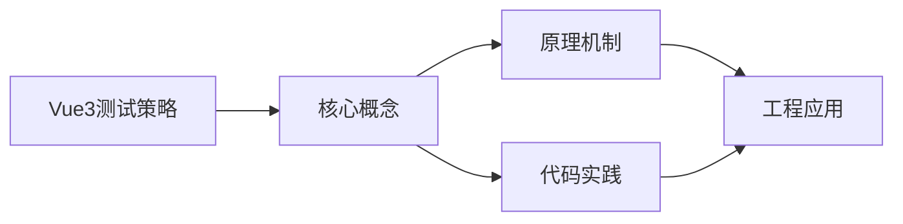
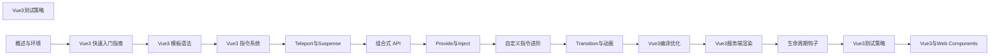

## 1. 学习目标（Bloom 分类）

本节按照布鲁姆教育目标分类学组织学习路径。本文主题为《Vue3测试策略》，属于 Vue 3 模块，读者可以根据自身阶段选择阅读深度。

记忆层面：能够准确复述本文的核心概念、术语与基本语法或操作步骤，并能够在提问或检索时快速定位对应知识点。能够说出 Vue 3 的核心概念、术语与标准写法。

理解层面：能够用自己的语言解释核心原理与工作机制，说明概念之间的因果关系，而不是机械记忆结论。能够解释 Vue 3 的工作原理与设计动机。

应用层面：能够在真实项目或练习场景中运用本文知识解决具体问题，写出正确且可维护的实现。能够编写符合 Vue 3 规范的完整实现。

分析层面：能够拆解复杂问题，比较本文主题与相邻概念的异同，识别边界条件与例外情况。能够分析 Vue 3 与相邻方案的差异与边界。

评价层面：能够根据约束条件（性能、可读性、安全、成本）评价不同方案的优劣，做出有依据的技术决策。能够根据场景评价 Vue 3 相关方案的优劣。

创造层面：能够把本文知识与其他模块知识组合，设计出新的解决方案或可复用的工程模式。能够组合 Vue 3 与其他技术设计完整方案。

通过本节学习，读者应当能够把《Vue3测试策略》纳入自己的知识网络，并与 Vue 3 模块的其他主题（组合式 API、响应式、组件通信、路由、状态管理）建立关联。

## 2. 历史动机与发展脉络

《Vue3测试策略》是 Vue 3 领域的重要主题。要真正理解它，需要先了解它解决的问题与演进过程。

Vue 由尤雨溪于 2014 年发布，以“渐进式框架”定位：可作库嵌入，也可作框架构建完整应用。Vue 3 于 2020 年 9 月发布，核心是组合式 API 与全新响应式系统。
Vue 3 的技术支柱：Proxy 响应式（替代 Object.defineProperty）、虚拟 DOM 重写（PatchFlags）、Fragment/Teleport/Suspense 内置组件、组合式 API（setup/ref/reactive/computed）。
生态现状：Vue Router 4、Pinia（官方状态库）、Vite 构建、Nuxt 全栈框架；Vue 3.5 引入 useTemplateRef 等开发者体验改进。

回到本文主题：Vue3测试策略 的提出与成熟，正是上述技术背景下的必然产物。早期实现往往以简单可用为目标，随着工程规模扩大，社区逐渐沉淀出标准做法与最佳实践；理解这一脉络，可以帮助读者判断“为什么文档中的推荐写法是现在这个样子”，也能在遇到历史遗留代码时准确识别其设计年代与取舍。


## 3. 形式化定义与核心概念精讲

本节把《Vue3测试策略》涉及的核心概念以“定义 + 讲解”的形式展开。读者应把定义当作工具，把讲解当作理解路径；两者结合才能形成可迁移的知识。

响应式：ref 包装基本类型，reactive 包装对象；effect 收集依赖，Proxy 拦截读写；computed 缓存派生值。
组件通信：props 向下、emit 向上、v-model 双向、provide/inject 跨层、事件总线（慎用）。
生命周期：setup 在创建前执行；onMounted/onUpdated/onUnmounted 对应挂载、更新、卸载；KeepAlive 增加 activated/deactivated。

### 3.1 原文章节逐一精讲

原文档把主题拆分为 26 个小节，下面按顺序给出每一节的导读讲解，随后保留原文细节供精读。

#### 原文精读（完整保留）

# Vue 3 测试策略

> **符号约定**：`< >` 必填参数 | `[ ]` 可选参数

---

#### 1. 测试工具

```bash
npm install -D vitest @vue/test-utils
```

#### 2. 组件测试

```javascript
import { mount } from '@vue/test-utils';
import Counter from './Counter.vue';

test('increments counter', async () => {
  const wrapper = mount(Counter);
  expect(wrapper.text()).toContain('0');

  await wrapper.find('button').trigger('click');
  expect(wrapper.text()).toContain('1');
});
```

#### 3. 组合式函数测试

```javascript
import { withSetup } from './test-utils';

test('useCounter', () => {
  const { result } = withSetup(() => useCounter(0));
  expect(result.count.value).toBe(0);
  result.increment();
  expect(result.count.value).toBe(1);
});

// withSetup 辅助函数
function withSetup(composable) {
  let result;
  const app = createApp({
    setup() {
      result = composable();
      return () => {};
    },
  });
  app.mount(document.createElement('div'));
  return { result, app };
}
```

#### 4. 异步测试

```javascript
test('async data', async () => {
  const wrapper = mount(AsyncComponent, {
    global: {
      plugins: [router],
    },
  });

  // 等待异步操作
  await flushPromises();
  expect(wrapper.text()).toContain('loaded data');
});
```

#### 5. Mock 与 Stub

```javascript
const wrapper = mount(Component, {
  global: {
    mocks: { $route: { params: { id: '1' } } },
    stubs: { RouterLink: true, ChildComponent: true },
  },
});
```
#### 测试工具安装

**基本写法：安装 Vitest 与 Vue Test Utils**
`npm install -D vitest @vue/test-utils jsdom`
```bash
# 测试核心依赖
npm install -D vitest @vue/test-utils jsdom @vitejs/plugin-vue
```

---

**基本写法：安装 Testing Library**
`npm install -D @testing-library/vue`
```bash
# 行为驱动测试库
npm install -D @testing-library/vue
```

---

#### Vitest 配置

**基本写法：vite.config.ts 配置 test**
`test: { environment: 'jsdom', globals: true }`
```ts
// 配置 Vitest
import { defineConfig } from 'vitest/config';
import vue from '@vitejs/plugin-vue';
export default defineConfig({
  plugins: [vue()],
  test: { environment: 'jsdom', globals: true }
});
```

---

**基本写法：测试脚本**
`'test': 'vitest'`
```json
// package.json
{
  "scripts": { "test": "vitest", "test:run": "vitest run" }
}
```

---

#### 组件挂载 mount

**基本写法：mount 挂载组件**
`const <wrapper> = mount(<组件>)`
```ts
// 创建组件实例
import { mount } from '@vue/test-utils';
import Counter from './Counter.vue';
const wrapper = mount(Counter);
```

---

**基本写法：传入 props**
`mount(<组件>, { props: { <字段>: <值> } })`
```ts
// 测试 props 传递
const wrapper = mount(User, { props: { name: 'Alice' } });
```

---

**基本写法：传入插槽**
`mount(<组件>, { slots: { default: '<内容>' } })`
```ts
// 测试插槽内容
const wrapper = mount(Card, { slots: { default: '<p>内容</p>' } });
```

---

#### shallowMount 浅挂载

**基本写法：浅挂载不渲染子组件**
`const <wrapper> = shallowMount(<组件>)`
```ts
// 隔离子组件测试
const wrapper = shallowMount(App);
```

---

#### DOM 查询

**基本写法：find 查找元素**
`<wrapper>.find('<选择器>')`
```ts
// 返回第一个匹配的 DOMWrapper
const btn = wrapper.find('button');
```

---

**基本写法：findAll 查找多个**
`<wrapper>.findAll('<选择器>')`
```ts
// 返回所有匹配元素
const items = wrapper.findAll('.item');
```

---

**基本写法：findComponent 查找子组件**
`<wrapper>.findComponent(<组件>)`
```ts
// 查找子组件实例
const child = wrapper.findComponent(UserCard);
```

---

#### 文本与属性断言

**基本写法：text 读取文本**
`<wrapper>.text()`
```ts
// 断言渲染文本
expect(wrapper.text()).toContain('Hello');
```

---

**基本写法：attributes 读取属性**
`<wrapper>.attributes('<属性>')`
```ts
// 断言属性值
expect(wrapper.find('a').attributes('href')).toBe('/about');
```

---

**基本写法：classes 读取类名**
`<wrapper>.classes()`
```ts
// 断言 CSS 类
expect(wrapper.classes()).toContain('active');
```

---

#### 交互测试

**基本写法：trigger 触发事件**
`await <wrapper>.find('button').trigger('click')`
```ts
// 触发 DOM 事件
const btn = wrapper.find('button');
await btn.trigger('click');
```

---

**基本写法：触发自定义事件**
`<wrapper>.trigger('<事件>', <数据>)`
```ts
// 触发自定义 DOM 事件
await wrapper.find('input').trigger('custom', { detail: 1 });
```

---

**基本写法：setValue 设置输入值**
`await <wrapper>.find('input').setValue('<值>')`
```ts
// 模拟用户输入
await wrapper.find('input').setValue('Alice');
```

---

#### emit 事件测试

**基本写法：读取组件 emit 的事件**
`<wrapper>.emitted('<事件名>')`
```ts
// 断言触发了事件
await wrapper.find('button').trigger('click');
expect(wrapper.emitted('submit')).toBeTruthy();
```

---

**基本写法：检查 emit 参数**
`<wrapper>.emitted('<事件>')[0]`
```ts
// 断言事件参数
expect(wrapper.emitted('submit')[0]).toEqual([{ name: 'Alice' }]);
```

---

#### props 测试

**基本写法：setProps 更新 props**
`await <wrapper>.setProps({ <字段>: <新值> })`
```ts
// 测试 props 变化效果
await wrapper.setProps({ count: 5 });
expect(wrapper.text()).toContain('5');
```

---

**基本写法：props 读取**
`<wrapper>.props('<字段>')`
```ts
// 读取传入的 props
expect(wrapper.props('count')).toBe(5);
```

---

#### 响应式测试

**基本写法：nextTick 等待更新**
`await nextTick()`
```ts
// 等待响应式更新完成
import { nextTick } from 'vue';
count.value++;
await nextTick();
expect(wrapper.text()).toContain('1');
```

---

#### Composables 测试

**基本写法：测试组合式函数**
`const { <结果> } = use<名称>()`
```ts
// 直接调用组合式函数
import { useCounter } from './useCounter';
const { count, inc } = useCounter();
inc();
expect(count.value).toBe(1);
```

---

**基本写法：测试需要生命周期的 Composable**
`test('<用例>', () => { withSetup(() => <调用>); })`
```ts
// 借助 @vue/test-utils 的 withSetup
import { withSetup } from '@vue/test-utils';
const result = withSetup(() => useCounter());
```

---

#### Store 测试

**基本写法：测试 Pinia store**
`const <store> = use<Store>()`
```ts
// 创建 setActivePinia 后测试
import { setActivePinia, createPinia } from 'pinia';
setActivePinia(createPinia());
const store = useCounterStore();
store.inc();
expect(store.count).toBe(1);
```

---

**基本写法：测试 action**
`await <store>.<action>()`
```ts
// 测试异步 action
await store.fetchUser();
expect(store.user).toBeDefined();
```

---

#### Mock 依赖

**基本写法：vi.mock 模拟模块**
`vi.mock('<模块>', () => ({ <函数>: vi.fn() }))`
```ts
// 模拟 API 模块
vi.mock('./api', () => ({
  getUser: vi.fn(() => Promise.resolve({ name: 'Mock' }))
}));
```

---

**基本写法：mock 实现**
`vi.fn().mockResolvedValue(<值>)`
```ts
// 模拟返回值
const mockFn = vi.fn().mockResolvedValue({ ok: true });
```

---

**基本写法：断言 mock 被调用**
`expect(<mock>).toHaveBeenCalledWith(<参数>)`
```ts
// 验证调用
expect(mockFn).toHaveBeenCalledWith('Alice');
```

---

#### 路由测试

**基本写法：创建测试用 router**
`const <router> = createRouter({ history: createMemoryHistory(), routes })`
```ts
// 使用 memory history 测试
import { createRouter, createMemoryHistory } from 'vue-router';
const router = createRouter({
  history: createMemoryHistory(),
  routes: [{ path: '/', component: Home }]
});
```

---

**基本写法：挂载时注入 router**
`mount(<组件>, { global: { plugins: [<router>] } })`
```ts
// 通过 global.plugins 注入
const wrapper = mount(App, { global: { plugins: [router] } });
```

---

#### provide inject 测试

**基本写法：挂载时提供 inject 值**
`mount(<组件>, { global: { provide: { <key>: <值> } } })`
```ts
// 提供 inject 依赖
const wrapper = mount(Child, {
  global: { provide: { theme: 'dark' } }
});
```

---

#### 快照测试

**基本写法：toMatchSnapshot 匹配快照**
`expect(<wrapper>.html()).toMatchSnapshot()`
```ts
// 保存组件 HTML 快照
expect(wrapper.html()).toMatchSnapshot();
```

---

**基本写法：更新快照**
`vitest -u`
```bash
# 更新过期快照
npx vitest -u
```

---

#### 覆盖率

**基本写法：启用覆盖率**
`vitest run --coverage`
```bash
# 收集测试覆盖率
npx vitest run --coverage
```

---

**基本写法：配置覆盖率**
`coverage: { provider: 'v8', reporter: ['text', 'html'] }`
```ts
// vite.config.ts
test: {
  coverage: { provider: 'v8', reporter: ['text', 'html'] }
}
```

---

#### 异步测试

**基本写法：等待异步更新**
`await <wrapper>.vm.$nextTick()`
```ts
// 等待 Vue 更新
await wrapper.vm.$nextTick();
```

---

**基本写法：flushPromises 等待微任务**
`await flushPromises()`
```ts
// 等待所有 Promise
import { flushPromises } from '@vue/test-utils';
await flushPromises();
```

---

#### 测试生命周期

**基本写法：beforeEach 每个用例前执行**
`beforeEach(() => <初始化>)`
```ts
// 重置状态
beforeEach(() => {
  setActivePinia(createPinia());
});
```

---

#### 测试命名约定

**基本写法：测试文件命名**
`<组件>.spec.ts` 或 `<组件>.test.ts`
```ts
// 推荐与组件同目录
// src/components/Counter.spec.ts
```

---

#### describe 分组

**基本写法：分组相关用例**
`describe('<分组>', () => { it('<用例>', () => {}) })`
```ts
// 组织测试用例
describe('Counter', () => {
  it('初始值为 0', () => {
    const wrapper = mount(Counter);
    expect(wrapper.text()).toContain('0');
  });
});
```


### 3.2 概念关系图

下面用 Mermaid 图表达本文核心概念之间的关系，帮助读者建立整体图景：



图中展示的是本文知识的结构化关系：核心概念是入口，原理机制解释“为什么”，代码实践演示“怎么做”，工程应用回答“何时用”。读者学习时可以把每个小节的内容挂接到对应节点上。

## 4. 理论推导与原理解析

本节深入《Vue3测试策略》背后的原理。理论部分不求面面俱到，而是聚焦“能解释现象、能指导实践”的关键推导。

响应式：ref 包装基本类型，reactive 包装对象；effect 收集依赖，Proxy 拦截读写；computed 缓存派生值。
组件通信：props 向下、emit 向上、v-model 双向、provide/inject 跨层、事件总线（慎用）。
生命周期：setup 在创建前执行；onMounted/onUpdated/onUnmounted 对应挂载、更新、卸载；KeepAlive 增加 activated/deactivated。
模板编译：模板在构建期编译为渲染函数，指令（v-if/v-for/v-model）是编译糖。

需要强调的是，理论推导与工程实践之间存在翻译层：理论给出的是理想化模型与边界条件，工程代码则必须处理真实环境中的例外。读者在学习时应先掌握理论的“标准情形”，再通过陷阱章节了解“非标准情形”。

## 5. 代码示例与逐行讲解

本节把原文中的代码示例系统整理，并为每个示例补充用途说明与讲解。读者不应只浏览代码，而应逐段对照讲解理解设计意图。

### 5.1 示例：1. 测试工具

该示例来自原文《1. 测试工具》小节，用于演示Vue3测试策略相关操作。阅读时请先看代码结构，再看其后的讲解。

```bash
npm install -D vitest @vue/test-utils
```

讲解：这段代码演示了本节核心知识点。代码中的关键操作可以归纳为三步：准备（定义或初始化）、执行（核心逻辑）、收尾（释放资源或返回结果）。实际项目中，这三步往往被封装为函数或类，以提升复用性与可测试性。

关键点分析：

该示例共 1 行有效代码，结构以数据或配置为主。阅读时应关注：数据字段的含义、配置项的作用，以及它们与运行行为的对应关系。

进阶思考路径：先尝试修改参数观察行为变化，再把示例中的模式迁移到自己的项目中；每次修改都记录预期与实测差异，这是把示例转化为能力的最快方式。

### 5.2 示例：2. 组件测试

该示例来自原文《2. 组件测试》小节，用于演示Vue3测试策略相关操作。阅读时请先看代码结构，再看其后的讲解。

```javascript
import { mount } from '@vue/test-utils';
import Counter from './Counter.vue';

test('increments counter', async () => {
  const wrapper = mount(Counter);
  expect(wrapper.text()).toContain('0');

  await wrapper.find('button').trigger('click');
  expect(wrapper.text()).toContain('1');
});
```

讲解：这段代码演示了本节核心知识点。代码中的关键操作可以归纳为三步：准备（定义或初始化）、执行（核心逻辑）、收尾（释放资源或返回结果）。实际项目中，这三步往往被封装为函数或类，以提升复用性与可测试性。

关键点分析：

该示例共 8 行有效代码，包含 2 类关键结构（import、from）。其中：

- 入口与初始化部分负责建立上下文，对应实际项目中的启动或装配逻辑；
- 核心逻辑部分体现本文主题的主要操作，是阅读时最需要对照讲解理解的部分；
- 输出或返回部分把结果交给调用方，注意其类型与边界条件。

进阶思考路径：先尝试修改参数观察行为变化，再把示例中的模式迁移到自己的项目中；每次修改都记录预期与实测差异，这是把示例转化为能力的最快方式。

### 5.3 示例：3. 组合式函数测试

该示例来自原文《3. 组合式函数测试》小节，用于演示Vue3测试策略相关操作。阅读时请先看代码结构，再看其后的讲解。

```javascript
import { withSetup } from './test-utils';

test('useCounter', () => {
  const { result } = withSetup(() => useCounter(0));
  expect(result.count.value).toBe(0);
  result.increment();
  expect(result.count.value).toBe(1);
});

// withSetup 辅助函数
function withSetup(composable) {
  let result;
  const app = createApp({
    setup() {
      result = composable();
      return () => {};
    },
  });
  app.mount(document.createElement('div'));
  return { result, app };
}
```

讲解：这段代码演示了本节核心知识点。代码中的关键操作可以归纳为三步：准备（定义或初始化）、执行（核心逻辑）、收尾（释放资源或返回结果）。实际项目中，这三步往往被封装为函数或类，以提升复用性与可测试性。

关键点分析：

该示例共 19 行有效代码，包含 4 类关键结构（function、import、from、return）。其中：

- 入口与初始化部分负责建立上下文，对应实际项目中的启动或装配逻辑；
- 核心逻辑部分体现本文主题的主要操作，是阅读时最需要对照讲解理解的部分；
- 输出或返回部分把结果交给调用方，注意其类型与边界条件。

进阶思考路径：先尝试修改参数观察行为变化，再把示例中的模式迁移到自己的项目中；每次修改都记录预期与实测差异，这是把示例转化为能力的最快方式。

### 5.4 示例：4. 异步测试

该示例来自原文《4. 异步测试》小节，用于演示Vue3测试策略相关操作。阅读时请先看代码结构，再看其后的讲解。

```javascript
test('async data', async () => {
  const wrapper = mount(AsyncComponent, {
    global: {
      plugins: [router],
    },
  });

  // 等待异步操作
  await flushPromises();
  expect(wrapper.text()).toContain('loaded data');
});
```

讲解：这段代码演示了本节核心知识点。代码中的关键操作可以归纳为三步：准备（定义或初始化）、执行（核心逻辑）、收尾（释放资源或返回结果）。实际项目中，这三步往往被封装为函数或类，以提升复用性与可测试性。

关键点分析：

该示例共 10 行有效代码，结构以数据或配置为主。阅读时应关注：数据字段的含义、配置项的作用，以及它们与运行行为的对应关系。

进阶思考路径：先尝试修改参数观察行为变化，再把示例中的模式迁移到自己的项目中；每次修改都记录预期与实测差异，这是把示例转化为能力的最快方式。

### 5.5 示例：5. Mock 与 Stub

该示例来自原文《5. Mock 与 Stub》小节，用于演示Vue3测试策略相关操作。阅读时请先看代码结构，再看其后的讲解。

```javascript
const wrapper = mount(Component, {
  global: {
    mocks: { $route: { params: { id: '1' } } },
    stubs: { RouterLink: true, ChildComponent: true },
  },
});
```

讲解：这段代码演示了本节核心知识点。代码中的关键操作可以归纳为三步：准备（定义或初始化）、执行（核心逻辑）、收尾（释放资源或返回结果）。实际项目中，这三步往往被封装为函数或类，以提升复用性与可测试性。

关键点分析：

该示例共 6 行有效代码，结构以数据或配置为主。阅读时应关注：数据字段的含义、配置项的作用，以及它们与运行行为的对应关系。

进阶思考路径：先尝试修改参数观察行为变化，再把示例中的模式迁移到自己的项目中；每次修改都记录预期与实测差异，这是把示例转化为能力的最快方式。

### 5.6 示例：测试工具安装

该示例来自原文《测试工具安装》小节，用于演示Vue3测试策略相关操作。阅读时请先看代码结构，再看其后的讲解。

```bash
# 测试核心依赖
npm install -D vitest @vue/test-utils jsdom @vitejs/plugin-vue
```

讲解：这段代码演示了本节核心知识点。代码中的关键操作可以归纳为三步：准备（定义或初始化）、执行（核心逻辑）、收尾（释放资源或返回结果）。实际项目中，这三步往往被封装为函数或类，以提升复用性与可测试性。

关键点分析：

该示例共 2 行有效代码，结构以数据或配置为主。阅读时应关注：数据字段的含义、配置项的作用，以及它们与运行行为的对应关系。

进阶思考路径：先尝试修改参数观察行为变化，再把示例中的模式迁移到自己的项目中；每次修改都记录预期与实测差异，这是把示例转化为能力的最快方式。

### 5.7 示例：测试工具安装

该示例来自原文《测试工具安装》小节，用于演示Vue3测试策略相关操作。阅读时请先看代码结构，再看其后的讲解。

```bash
# 行为驱动测试库
npm install -D @testing-library/vue
```

讲解：这段代码演示了本节核心知识点。代码中的关键操作可以归纳为三步：准备（定义或初始化）、执行（核心逻辑）、收尾（释放资源或返回结果）。实际项目中，这三步往往被封装为函数或类，以提升复用性与可测试性。

关键点分析：

该示例共 2 行有效代码，结构以数据或配置为主。阅读时应关注：数据字段的含义、配置项的作用，以及它们与运行行为的对应关系。

进阶思考路径：先尝试修改参数观察行为变化，再把示例中的模式迁移到自己的项目中；每次修改都记录预期与实测差异，这是把示例转化为能力的最快方式。

### 5.8 示例：Vitest 配置

该示例来自原文《Vitest 配置》小节，用于演示Vue3测试策略相关操作。阅读时请先看代码结构，再看其后的讲解。

```ts
// 配置 Vitest
import { defineConfig } from 'vitest/config';
import vue from '@vitejs/plugin-vue';
export default defineConfig({
  plugins: [vue()],
  test: { environment: 'jsdom', globals: true }
});
```

讲解：这段代码演示了本节核心知识点。代码中的关键操作可以归纳为三步：准备（定义或初始化）、执行（核心逻辑）、收尾（释放资源或返回结果）。实际项目中，这三步往往被封装为函数或类，以提升复用性与可测试性。

关键点分析：

该示例共 7 行有效代码，包含 2 类关键结构（import、from）。其中：

- 入口与初始化部分负责建立上下文，对应实际项目中的启动或装配逻辑；
- 核心逻辑部分体现本文主题的主要操作，是阅读时最需要对照讲解理解的部分；
- 输出或返回部分把结果交给调用方，注意其类型与边界条件。

进阶思考路径：先尝试修改参数观察行为变化，再把示例中的模式迁移到自己的项目中；每次修改都记录预期与实测差异，这是把示例转化为能力的最快方式。

### 5.9 示例：Vitest 配置

该示例来自原文《Vitest 配置》小节，用于演示Vue3测试策略相关操作。阅读时请先看代码结构，再看其后的讲解。

```json
// package.json
{
  "scripts": { "test": "vitest", "test:run": "vitest run" }
}
```

讲解：这段代码演示了本节核心知识点。代码中的关键操作可以归纳为三步：准备（定义或初始化）、执行（核心逻辑）、收尾（释放资源或返回结果）。实际项目中，这三步往往被封装为函数或类，以提升复用性与可测试性。

关键点分析：

该示例共 4 行有效代码，结构以数据或配置为主。阅读时应关注：数据字段的含义、配置项的作用，以及它们与运行行为的对应关系。

进阶思考路径：先尝试修改参数观察行为变化，再把示例中的模式迁移到自己的项目中；每次修改都记录预期与实测差异，这是把示例转化为能力的最快方式。

### 5.10 示例：组件挂载 mount

该示例来自原文《组件挂载 mount》小节，用于演示Vue3测试策略相关操作。阅读时请先看代码结构，再看其后的讲解。

```ts
// 创建组件实例
import { mount } from '@vue/test-utils';
import Counter from './Counter.vue';
const wrapper = mount(Counter);
```

讲解：这段代码演示了本节核心知识点。代码中的关键操作可以归纳为三步：准备（定义或初始化）、执行（核心逻辑）、收尾（释放资源或返回结果）。实际项目中，这三步往往被封装为函数或类，以提升复用性与可测试性。

关键点分析：

该示例共 4 行有效代码，包含 2 类关键结构（import、from）。其中：

- 入口与初始化部分负责建立上下文，对应实际项目中的启动或装配逻辑；
- 核心逻辑部分体现本文主题的主要操作，是阅读时最需要对照讲解理解的部分；
- 输出或返回部分把结果交给调用方，注意其类型与边界条件。

进阶思考路径：先尝试修改参数观察行为变化，再把示例中的模式迁移到自己的项目中；每次修改都记录预期与实测差异，这是把示例转化为能力的最快方式。

### 5.11 示例：组件挂载 mount

该示例来自原文《组件挂载 mount》小节，用于演示Vue3测试策略相关操作。阅读时请先看代码结构，再看其后的讲解。

```ts
// 测试 props 传递
const wrapper = mount(User, { props: { name: 'Alice' } });
```

讲解：这段代码演示了本节核心知识点。代码中的关键操作可以归纳为三步：准备（定义或初始化）、执行（核心逻辑）、收尾（释放资源或返回结果）。实际项目中，这三步往往被封装为函数或类，以提升复用性与可测试性。

关键点分析：

该示例共 2 行有效代码，结构以数据或配置为主。阅读时应关注：数据字段的含义、配置项的作用，以及它们与运行行为的对应关系。

进阶思考路径：先尝试修改参数观察行为变化，再把示例中的模式迁移到自己的项目中；每次修改都记录预期与实测差异，这是把示例转化为能力的最快方式。

### 5.12 示例：组件挂载 mount

该示例来自原文《组件挂载 mount》小节，用于演示Vue3测试策略相关操作。阅读时请先看代码结构，再看其后的讲解。

```ts
// 测试插槽内容
const wrapper = mount(Card, { slots: { default: '<p>内容</p>' } });
```

讲解：这段代码演示了本节核心知识点。代码中的关键操作可以归纳为三步：准备（定义或初始化）、执行（核心逻辑）、收尾（释放资源或返回结果）。实际项目中，这三步往往被封装为函数或类，以提升复用性与可测试性。

关键点分析：

该示例共 2 行有效代码，结构以数据或配置为主。阅读时应关注：数据字段的含义、配置项的作用，以及它们与运行行为的对应关系。

进阶思考路径：先尝试修改参数观察行为变化，再把示例中的模式迁移到自己的项目中；每次修改都记录预期与实测差异，这是把示例转化为能力的最快方式。

### 5.13 示例：shallowMount 浅挂载

该示例来自原文《shallowMount 浅挂载》小节，用于演示Vue3测试策略相关操作。阅读时请先看代码结构，再看其后的讲解。

```ts
// 隔离子组件测试
const wrapper = shallowMount(App);
```

讲解：这段代码演示了本节核心知识点。代码中的关键操作可以归纳为三步：准备（定义或初始化）、执行（核心逻辑）、收尾（释放资源或返回结果）。实际项目中，这三步往往被封装为函数或类，以提升复用性与可测试性。

关键点分析：

该示例共 2 行有效代码，结构以数据或配置为主。阅读时应关注：数据字段的含义、配置项的作用，以及它们与运行行为的对应关系。

进阶思考路径：先尝试修改参数观察行为变化，再把示例中的模式迁移到自己的项目中；每次修改都记录预期与实测差异，这是把示例转化为能力的最快方式。

### 5.14 示例：DOM 查询

该示例来自原文《DOM 查询》小节，用于演示Vue3测试策略相关操作。阅读时请先看代码结构，再看其后的讲解。

```ts
// 返回第一个匹配的 DOMWrapper
const btn = wrapper.find('button');
```

讲解：这段代码演示了本节核心知识点。代码中的关键操作可以归纳为三步：准备（定义或初始化）、执行（核心逻辑）、收尾（释放资源或返回结果）。实际项目中，这三步往往被封装为函数或类，以提升复用性与可测试性。

关键点分析：

该示例共 2 行有效代码，结构以数据或配置为主。阅读时应关注：数据字段的含义、配置项的作用，以及它们与运行行为的对应关系。

进阶思考路径：先尝试修改参数观察行为变化，再把示例中的模式迁移到自己的项目中；每次修改都记录预期与实测差异，这是把示例转化为能力的最快方式。

### 5.15 示例：DOM 查询

该示例来自原文《DOM 查询》小节，用于演示Vue3测试策略相关操作。阅读时请先看代码结构，再看其后的讲解。

```ts
// 返回所有匹配元素
const items = wrapper.findAll('.item');
```

讲解：这段代码演示了本节核心知识点。代码中的关键操作可以归纳为三步：准备（定义或初始化）、执行（核心逻辑）、收尾（释放资源或返回结果）。实际项目中，这三步往往被封装为函数或类，以提升复用性与可测试性。

关键点分析：

该示例共 2 行有效代码，结构以数据或配置为主。阅读时应关注：数据字段的含义、配置项的作用，以及它们与运行行为的对应关系。

进阶思考路径：先尝试修改参数观察行为变化，再把示例中的模式迁移到自己的项目中；每次修改都记录预期与实测差异，这是把示例转化为能力的最快方式。

### 5.16 示例：DOM 查询

该示例来自原文《DOM 查询》小节，用于演示Vue3测试策略相关操作。阅读时请先看代码结构，再看其后的讲解。

```ts
// 查找子组件实例
const child = wrapper.findComponent(UserCard);
```

讲解：这段代码演示了本节核心知识点。代码中的关键操作可以归纳为三步：准备（定义或初始化）、执行（核心逻辑）、收尾（释放资源或返回结果）。实际项目中，这三步往往被封装为函数或类，以提升复用性与可测试性。

关键点分析：

该示例共 2 行有效代码，结构以数据或配置为主。阅读时应关注：数据字段的含义、配置项的作用，以及它们与运行行为的对应关系。

进阶思考路径：先尝试修改参数观察行为变化，再把示例中的模式迁移到自己的项目中；每次修改都记录预期与实测差异，这是把示例转化为能力的最快方式。

### 5.17 示例：文本与属性断言

该示例来自原文《文本与属性断言》小节，用于演示Vue3测试策略相关操作。阅读时请先看代码结构，再看其后的讲解。

```ts
// 断言渲染文本
expect(wrapper.text()).toContain('Hello');
```

讲解：这段代码演示了本节核心知识点。代码中的关键操作可以归纳为三步：准备（定义或初始化）、执行（核心逻辑）、收尾（释放资源或返回结果）。实际项目中，这三步往往被封装为函数或类，以提升复用性与可测试性。

关键点分析：

该示例共 2 行有效代码，结构以数据或配置为主。阅读时应关注：数据字段的含义、配置项的作用，以及它们与运行行为的对应关系。

进阶思考路径：先尝试修改参数观察行为变化，再把示例中的模式迁移到自己的项目中；每次修改都记录预期与实测差异，这是把示例转化为能力的最快方式。

### 5.18 示例：文本与属性断言

该示例来自原文《文本与属性断言》小节，用于演示Vue3测试策略相关操作。阅读时请先看代码结构，再看其后的讲解。

```ts
// 断言属性值
expect(wrapper.find('a').attributes('href')).toBe('/about');
```

讲解：这段代码演示了本节核心知识点。代码中的关键操作可以归纳为三步：准备（定义或初始化）、执行（核心逻辑）、收尾（释放资源或返回结果）。实际项目中，这三步往往被封装为函数或类，以提升复用性与可测试性。

关键点分析：

该示例共 2 行有效代码，结构以数据或配置为主。阅读时应关注：数据字段的含义、配置项的作用，以及它们与运行行为的对应关系。

进阶思考路径：先尝试修改参数观察行为变化，再把示例中的模式迁移到自己的项目中；每次修改都记录预期与实测差异，这是把示例转化为能力的最快方式。

### 5.19 示例：文本与属性断言

该示例来自原文《文本与属性断言》小节，用于演示Vue3测试策略相关操作。阅读时请先看代码结构，再看其后的讲解。

```ts
// 断言 CSS 类
expect(wrapper.classes()).toContain('active');
```

讲解：这段代码演示了本节核心知识点。代码中的关键操作可以归纳为三步：准备（定义或初始化）、执行（核心逻辑）、收尾（释放资源或返回结果）。实际项目中，这三步往往被封装为函数或类，以提升复用性与可测试性。

关键点分析：

该示例共 2 行有效代码，包含 1 类关键结构（class）。其中：

- 入口与初始化部分负责建立上下文，对应实际项目中的启动或装配逻辑；
- 核心逻辑部分体现本文主题的主要操作，是阅读时最需要对照讲解理解的部分；
- 输出或返回部分把结果交给调用方，注意其类型与边界条件。

进阶思考路径：先尝试修改参数观察行为变化，再把示例中的模式迁移到自己的项目中；每次修改都记录预期与实测差异，这是把示例转化为能力的最快方式。

### 5.20 示例：交互测试

该示例来自原文《交互测试》小节，用于演示Vue3测试策略相关操作。阅读时请先看代码结构，再看其后的讲解。

```ts
// 触发 DOM 事件
const btn = wrapper.find('button');
await btn.trigger('click');
```

讲解：这段代码演示了本节核心知识点。代码中的关键操作可以归纳为三步：准备（定义或初始化）、执行（核心逻辑）、收尾（释放资源或返回结果）。实际项目中，这三步往往被封装为函数或类，以提升复用性与可测试性。

关键点分析：

该示例共 3 行有效代码，结构以数据或配置为主。阅读时应关注：数据字段的含义、配置项的作用，以及它们与运行行为的对应关系。

进阶思考路径：先尝试修改参数观察行为变化，再把示例中的模式迁移到自己的项目中；每次修改都记录预期与实测差异，这是把示例转化为能力的最快方式。

### 5.21 示例：交互测试

该示例来自原文《交互测试》小节，用于演示Vue3测试策略相关操作。阅读时请先看代码结构，再看其后的讲解。

```ts
// 触发自定义 DOM 事件
await wrapper.find('input').trigger('custom', { detail: 1 });
```

讲解：这段代码演示了本节核心知识点。代码中的关键操作可以归纳为三步：准备（定义或初始化）、执行（核心逻辑）、收尾（释放资源或返回结果）。实际项目中，这三步往往被封装为函数或类，以提升复用性与可测试性。

关键点分析：

该示例共 2 行有效代码，结构以数据或配置为主。阅读时应关注：数据字段的含义、配置项的作用，以及它们与运行行为的对应关系。

进阶思考路径：先尝试修改参数观察行为变化，再把示例中的模式迁移到自己的项目中；每次修改都记录预期与实测差异，这是把示例转化为能力的最快方式。

### 5.22 示例：交互测试

该示例来自原文《交互测试》小节，用于演示Vue3测试策略相关操作。阅读时请先看代码结构，再看其后的讲解。

```ts
// 模拟用户输入
await wrapper.find('input').setValue('Alice');
```

讲解：这段代码演示了本节核心知识点。代码中的关键操作可以归纳为三步：准备（定义或初始化）、执行（核心逻辑）、收尾（释放资源或返回结果）。实际项目中，这三步往往被封装为函数或类，以提升复用性与可测试性。

关键点分析：

该示例共 2 行有效代码，结构以数据或配置为主。阅读时应关注：数据字段的含义、配置项的作用，以及它们与运行行为的对应关系。

进阶思考路径：先尝试修改参数观察行为变化，再把示例中的模式迁移到自己的项目中；每次修改都记录预期与实测差异，这是把示例转化为能力的最快方式。

### 5.23 示例：emit 事件测试

该示例来自原文《emit 事件测试》小节，用于演示Vue3测试策略相关操作。阅读时请先看代码结构，再看其后的讲解。

```ts
// 断言触发了事件
await wrapper.find('button').trigger('click');
expect(wrapper.emitted('submit')).toBeTruthy();
```

讲解：这段代码演示了本节核心知识点。代码中的关键操作可以归纳为三步：准备（定义或初始化）、执行（核心逻辑）、收尾（释放资源或返回结果）。实际项目中，这三步往往被封装为函数或类，以提升复用性与可测试性。

关键点分析：

该示例共 3 行有效代码，结构以数据或配置为主。阅读时应关注：数据字段的含义、配置项的作用，以及它们与运行行为的对应关系。

进阶思考路径：先尝试修改参数观察行为变化，再把示例中的模式迁移到自己的项目中；每次修改都记录预期与实测差异，这是把示例转化为能力的最快方式。

### 5.24 示例：emit 事件测试

该示例来自原文《emit 事件测试》小节，用于演示Vue3测试策略相关操作。阅读时请先看代码结构，再看其后的讲解。

```ts
// 断言事件参数
expect(wrapper.emitted('submit')[0]).toEqual([{ name: 'Alice' }]);
```

讲解：这段代码演示了本节核心知识点。代码中的关键操作可以归纳为三步：准备（定义或初始化）、执行（核心逻辑）、收尾（释放资源或返回结果）。实际项目中，这三步往往被封装为函数或类，以提升复用性与可测试性。

关键点分析：

该示例共 2 行有效代码，结构以数据或配置为主。阅读时应关注：数据字段的含义、配置项的作用，以及它们与运行行为的对应关系。

进阶思考路径：先尝试修改参数观察行为变化，再把示例中的模式迁移到自己的项目中；每次修改都记录预期与实测差异，这是把示例转化为能力的最快方式。

### 5.25 示例：props 测试

该示例来自原文《props 测试》小节，用于演示Vue3测试策略相关操作。阅读时请先看代码结构，再看其后的讲解。

```ts
// 测试 props 变化效果
await wrapper.setProps({ count: 5 });
expect(wrapper.text()).toContain('5');
```

讲解：这段代码演示了本节核心知识点。代码中的关键操作可以归纳为三步：准备（定义或初始化）、执行（核心逻辑）、收尾（释放资源或返回结果）。实际项目中，这三步往往被封装为函数或类，以提升复用性与可测试性。

关键点分析：

该示例共 3 行有效代码，结构以数据或配置为主。阅读时应关注：数据字段的含义、配置项的作用，以及它们与运行行为的对应关系。

进阶思考路径：先尝试修改参数观察行为变化，再把示例中的模式迁移到自己的项目中；每次修改都记录预期与实测差异，这是把示例转化为能力的最快方式。

### 5.26 示例：props 测试

该示例来自原文《props 测试》小节，用于演示Vue3测试策略相关操作。阅读时请先看代码结构，再看其后的讲解。

```ts
// 读取传入的 props
expect(wrapper.props('count')).toBe(5);
```

讲解：这段代码演示了本节核心知识点。代码中的关键操作可以归纳为三步：准备（定义或初始化）、执行（核心逻辑）、收尾（释放资源或返回结果）。实际项目中，这三步往往被封装为函数或类，以提升复用性与可测试性。

关键点分析：

该示例共 2 行有效代码，结构以数据或配置为主。阅读时应关注：数据字段的含义、配置项的作用，以及它们与运行行为的对应关系。

进阶思考路径：先尝试修改参数观察行为变化，再把示例中的模式迁移到自己的项目中；每次修改都记录预期与实测差异，这是把示例转化为能力的最快方式。

### 5.27 示例：响应式测试

该示例来自原文《响应式测试》小节，用于演示Vue3测试策略相关操作。阅读时请先看代码结构，再看其后的讲解。

```ts
// 等待响应式更新完成
import { nextTick } from 'vue';
count.value++;
await nextTick();
expect(wrapper.text()).toContain('1');
```

讲解：这段代码演示了本节核心知识点。代码中的关键操作可以归纳为三步：准备（定义或初始化）、执行（核心逻辑）、收尾（释放资源或返回结果）。实际项目中，这三步往往被封装为函数或类，以提升复用性与可测试性。

关键点分析：

该示例共 5 行有效代码，包含 2 类关键结构（import、from）。其中：

- 入口与初始化部分负责建立上下文，对应实际项目中的启动或装配逻辑；
- 核心逻辑部分体现本文主题的主要操作，是阅读时最需要对照讲解理解的部分；
- 输出或返回部分把结果交给调用方，注意其类型与边界条件。

进阶思考路径：先尝试修改参数观察行为变化，再把示例中的模式迁移到自己的项目中；每次修改都记录预期与实测差异，这是把示例转化为能力的最快方式。

### 5.28 示例：Composables 测试

该示例来自原文《Composables 测试》小节，用于演示Vue3测试策略相关操作。阅读时请先看代码结构，再看其后的讲解。

```ts
// 直接调用组合式函数
import { useCounter } from './useCounter';
const { count, inc } = useCounter();
inc();
expect(count.value).toBe(1);
```

讲解：这段代码演示了本节核心知识点。代码中的关键操作可以归纳为三步：准备（定义或初始化）、执行（核心逻辑）、收尾（释放资源或返回结果）。实际项目中，这三步往往被封装为函数或类，以提升复用性与可测试性。

关键点分析：

该示例共 5 行有效代码，包含 2 类关键结构（import、from）。其中：

- 入口与初始化部分负责建立上下文，对应实际项目中的启动或装配逻辑；
- 核心逻辑部分体现本文主题的主要操作，是阅读时最需要对照讲解理解的部分；
- 输出或返回部分把结果交给调用方，注意其类型与边界条件。

进阶思考路径：先尝试修改参数观察行为变化，再把示例中的模式迁移到自己的项目中；每次修改都记录预期与实测差异，这是把示例转化为能力的最快方式。

### 5.29 示例：Composables 测试

该示例来自原文《Composables 测试》小节，用于演示Vue3测试策略相关操作。阅读时请先看代码结构，再看其后的讲解。

```ts
// 借助 @vue/test-utils 的 withSetup
import { withSetup } from '@vue/test-utils';
const result = withSetup(() => useCounter());
```

讲解：这段代码演示了本节核心知识点。代码中的关键操作可以归纳为三步：准备（定义或初始化）、执行（核心逻辑）、收尾（释放资源或返回结果）。实际项目中，这三步往往被封装为函数或类，以提升复用性与可测试性。

关键点分析：

该示例共 3 行有效代码，包含 2 类关键结构（import、from）。其中：

- 入口与初始化部分负责建立上下文，对应实际项目中的启动或装配逻辑；
- 核心逻辑部分体现本文主题的主要操作，是阅读时最需要对照讲解理解的部分；
- 输出或返回部分把结果交给调用方，注意其类型与边界条件。

进阶思考路径：先尝试修改参数观察行为变化，再把示例中的模式迁移到自己的项目中；每次修改都记录预期与实测差异，这是把示例转化为能力的最快方式。

### 5.30 示例：Store 测试

该示例来自原文《Store 测试》小节，用于演示Vue3测试策略相关操作。阅读时请先看代码结构，再看其后的讲解。

```ts
// 创建 setActivePinia 后测试
import { setActivePinia, createPinia } from 'pinia';
setActivePinia(createPinia());
const store = useCounterStore();
store.inc();
expect(store.count).toBe(1);
```

讲解：这段代码演示了本节核心知识点。代码中的关键操作可以归纳为三步：准备（定义或初始化）、执行（核心逻辑）、收尾（释放资源或返回结果）。实际项目中，这三步往往被封装为函数或类，以提升复用性与可测试性。

关键点分析：

该示例共 6 行有效代码，包含 2 类关键结构（import、from）。其中：

- 入口与初始化部分负责建立上下文，对应实际项目中的启动或装配逻辑；
- 核心逻辑部分体现本文主题的主要操作，是阅读时最需要对照讲解理解的部分；
- 输出或返回部分把结果交给调用方，注意其类型与边界条件。

进阶思考路径：先尝试修改参数观察行为变化，再把示例中的模式迁移到自己的项目中；每次修改都记录预期与实测差异，这是把示例转化为能力的最快方式。

### 5.31 示例：Store 测试

该示例来自原文《Store 测试》小节，用于演示Vue3测试策略相关操作。阅读时请先看代码结构，再看其后的讲解。

```ts
// 测试异步 action
await store.fetchUser();
expect(store.user).toBeDefined();
```

讲解：这段代码演示了本节核心知识点。代码中的关键操作可以归纳为三步：准备（定义或初始化）、执行（核心逻辑）、收尾（释放资源或返回结果）。实际项目中，这三步往往被封装为函数或类，以提升复用性与可测试性。

关键点分析：

该示例共 3 行有效代码，结构以数据或配置为主。阅读时应关注：数据字段的含义、配置项的作用，以及它们与运行行为的对应关系。

进阶思考路径：先尝试修改参数观察行为变化，再把示例中的模式迁移到自己的项目中；每次修改都记录预期与实测差异，这是把示例转化为能力的最快方式。

### 5.32 示例：Mock 依赖

该示例来自原文《Mock 依赖》小节，用于演示Vue3测试策略相关操作。阅读时请先看代码结构，再看其后的讲解。

```ts
// 模拟 API 模块
vi.mock('./api', () => ({
  getUser: vi.fn(() => Promise.resolve({ name: 'Mock' }))
}));
```

讲解：这段代码演示了本节核心知识点。代码中的关键操作可以归纳为三步：准备（定义或初始化）、执行（核心逻辑）、收尾（释放资源或返回结果）。实际项目中，这三步往往被封装为函数或类，以提升复用性与可测试性。

关键点分析：

该示例共 4 行有效代码，结构以数据或配置为主。阅读时应关注：数据字段的含义、配置项的作用，以及它们与运行行为的对应关系。

进阶思考路径：先尝试修改参数观察行为变化，再把示例中的模式迁移到自己的项目中；每次修改都记录预期与实测差异，这是把示例转化为能力的最快方式。

### 5.33 示例：Mock 依赖

该示例来自原文《Mock 依赖》小节，用于演示Vue3测试策略相关操作。阅读时请先看代码结构，再看其后的讲解。

```ts
// 模拟返回值
const mockFn = vi.fn().mockResolvedValue({ ok: true });
```

讲解：这段代码演示了本节核心知识点。代码中的关键操作可以归纳为三步：准备（定义或初始化）、执行（核心逻辑）、收尾（释放资源或返回结果）。实际项目中，这三步往往被封装为函数或类，以提升复用性与可测试性。

关键点分析：

该示例共 2 行有效代码，结构以数据或配置为主。阅读时应关注：数据字段的含义、配置项的作用，以及它们与运行行为的对应关系。

进阶思考路径：先尝试修改参数观察行为变化，再把示例中的模式迁移到自己的项目中；每次修改都记录预期与实测差异，这是把示例转化为能力的最快方式。

### 5.34 示例：Mock 依赖

该示例来自原文《Mock 依赖》小节，用于演示Vue3测试策略相关操作。阅读时请先看代码结构，再看其后的讲解。

```ts
// 验证调用
expect(mockFn).toHaveBeenCalledWith('Alice');
```

讲解：这段代码演示了本节核心知识点。代码中的关键操作可以归纳为三步：准备（定义或初始化）、执行（核心逻辑）、收尾（释放资源或返回结果）。实际项目中，这三步往往被封装为函数或类，以提升复用性与可测试性。

关键点分析：

该示例共 2 行有效代码，结构以数据或配置为主。阅读时应关注：数据字段的含义、配置项的作用，以及它们与运行行为的对应关系。

进阶思考路径：先尝试修改参数观察行为变化，再把示例中的模式迁移到自己的项目中；每次修改都记录预期与实测差异，这是把示例转化为能力的最快方式。

### 5.35 示例：路由测试

该示例来自原文《路由测试》小节，用于演示Vue3测试策略相关操作。阅读时请先看代码结构，再看其后的讲解。

```ts
// 使用 memory history 测试
import { createRouter, createMemoryHistory } from 'vue-router';
const router = createRouter({
  history: createMemoryHistory(),
  routes: [{ path: '/', component: Home }]
});
```

讲解：这段代码演示了本节核心知识点。代码中的关键操作可以归纳为三步：准备（定义或初始化）、执行（核心逻辑）、收尾（释放资源或返回结果）。实际项目中，这三步往往被封装为函数或类，以提升复用性与可测试性。

关键点分析：

该示例共 6 行有效代码，包含 2 类关键结构（import、from）。其中：

- 入口与初始化部分负责建立上下文，对应实际项目中的启动或装配逻辑；
- 核心逻辑部分体现本文主题的主要操作，是阅读时最需要对照讲解理解的部分；
- 输出或返回部分把结果交给调用方，注意其类型与边界条件。

进阶思考路径：先尝试修改参数观察行为变化，再把示例中的模式迁移到自己的项目中；每次修改都记录预期与实测差异，这是把示例转化为能力的最快方式。

### 5.36 示例：路由测试

该示例来自原文《路由测试》小节，用于演示Vue3测试策略相关操作。阅读时请先看代码结构，再看其后的讲解。

```ts
// 通过 global.plugins 注入
const wrapper = mount(App, { global: { plugins: [router] } });
```

讲解：这段代码演示了本节核心知识点。代码中的关键操作可以归纳为三步：准备（定义或初始化）、执行（核心逻辑）、收尾（释放资源或返回结果）。实际项目中，这三步往往被封装为函数或类，以提升复用性与可测试性。

关键点分析：

该示例共 2 行有效代码，结构以数据或配置为主。阅读时应关注：数据字段的含义、配置项的作用，以及它们与运行行为的对应关系。

进阶思考路径：先尝试修改参数观察行为变化，再把示例中的模式迁移到自己的项目中；每次修改都记录预期与实测差异，这是把示例转化为能力的最快方式。

### 5.37 示例：provide inject 测试

该示例来自原文《provide inject 测试》小节，用于演示Vue3测试策略相关操作。阅读时请先看代码结构，再看其后的讲解。

```ts
// 提供 inject 依赖
const wrapper = mount(Child, {
  global: { provide: { theme: 'dark' } }
});
```

讲解：这段代码演示了本节核心知识点。代码中的关键操作可以归纳为三步：准备（定义或初始化）、执行（核心逻辑）、收尾（释放资源或返回结果）。实际项目中，这三步往往被封装为函数或类，以提升复用性与可测试性。

关键点分析：

该示例共 4 行有效代码，结构以数据或配置为主。阅读时应关注：数据字段的含义、配置项的作用，以及它们与运行行为的对应关系。

进阶思考路径：先尝试修改参数观察行为变化，再把示例中的模式迁移到自己的项目中；每次修改都记录预期与实测差异，这是把示例转化为能力的最快方式。

### 5.38 示例：快照测试

该示例来自原文《快照测试》小节，用于演示Vue3测试策略相关操作。阅读时请先看代码结构，再看其后的讲解。

```ts
// 保存组件 HTML 快照
expect(wrapper.html()).toMatchSnapshot();
```

讲解：这段代码演示了本节核心知识点。代码中的关键操作可以归纳为三步：准备（定义或初始化）、执行（核心逻辑）、收尾（释放资源或返回结果）。实际项目中，这三步往往被封装为函数或类，以提升复用性与可测试性。

关键点分析：

该示例共 2 行有效代码，结构以数据或配置为主。阅读时应关注：数据字段的含义、配置项的作用，以及它们与运行行为的对应关系。

进阶思考路径：先尝试修改参数观察行为变化，再把示例中的模式迁移到自己的项目中；每次修改都记录预期与实测差异，这是把示例转化为能力的最快方式。

### 5.39 示例：快照测试

该示例来自原文《快照测试》小节，用于演示Vue3测试策略相关操作。阅读时请先看代码结构，再看其后的讲解。

```bash
# 更新过期快照
npx vitest -u
```

讲解：这段代码演示了本节核心知识点。代码中的关键操作可以归纳为三步：准备（定义或初始化）、执行（核心逻辑）、收尾（释放资源或返回结果）。实际项目中，这三步往往被封装为函数或类，以提升复用性与可测试性。

关键点分析：

该示例共 2 行有效代码，结构以数据或配置为主。阅读时应关注：数据字段的含义、配置项的作用，以及它们与运行行为的对应关系。

进阶思考路径：先尝试修改参数观察行为变化，再把示例中的模式迁移到自己的项目中；每次修改都记录预期与实测差异，这是把示例转化为能力的最快方式。

### 5.40 示例：覆盖率

该示例来自原文《覆盖率》小节，用于演示Vue3测试策略相关操作。阅读时请先看代码结构，再看其后的讲解。

```bash
# 收集测试覆盖率
npx vitest run --coverage
```

讲解：这段代码演示了本节核心知识点。代码中的关键操作可以归纳为三步：准备（定义或初始化）、执行（核心逻辑）、收尾（释放资源或返回结果）。实际项目中，这三步往往被封装为函数或类，以提升复用性与可测试性。

关键点分析：

该示例共 2 行有效代码，结构以数据或配置为主。阅读时应关注：数据字段的含义、配置项的作用，以及它们与运行行为的对应关系。

进阶思考路径：先尝试修改参数观察行为变化，再把示例中的模式迁移到自己的项目中；每次修改都记录预期与实测差异，这是把示例转化为能力的最快方式。

### 5.41 示例：覆盖率

该示例来自原文《覆盖率》小节，用于演示Vue3测试策略相关操作。阅读时请先看代码结构，再看其后的讲解。

```ts
// vite.config.ts
test: {
  coverage: { provider: 'v8', reporter: ['text', 'html'] }
}
```

讲解：这段代码演示了本节核心知识点。代码中的关键操作可以归纳为三步：准备（定义或初始化）、执行（核心逻辑）、收尾（释放资源或返回结果）。实际项目中，这三步往往被封装为函数或类，以提升复用性与可测试性。

关键点分析：

该示例共 4 行有效代码，结构以数据或配置为主。阅读时应关注：数据字段的含义、配置项的作用，以及它们与运行行为的对应关系。

进阶思考路径：先尝试修改参数观察行为变化，再把示例中的模式迁移到自己的项目中；每次修改都记录预期与实测差异，这是把示例转化为能力的最快方式。

### 5.42 示例：异步测试

该示例来自原文《异步测试》小节，用于演示Vue3测试策略相关操作。阅读时请先看代码结构，再看其后的讲解。

```ts
// 等待 Vue 更新
await wrapper.vm.$nextTick();
```

讲解：这段代码演示了本节核心知识点。代码中的关键操作可以归纳为三步：准备（定义或初始化）、执行（核心逻辑）、收尾（释放资源或返回结果）。实际项目中，这三步往往被封装为函数或类，以提升复用性与可测试性。

关键点分析：

该示例共 2 行有效代码，结构以数据或配置为主。阅读时应关注：数据字段的含义、配置项的作用，以及它们与运行行为的对应关系。

进阶思考路径：先尝试修改参数观察行为变化，再把示例中的模式迁移到自己的项目中；每次修改都记录预期与实测差异，这是把示例转化为能力的最快方式。

### 5.43 示例：异步测试

该示例来自原文《异步测试》小节，用于演示Vue3测试策略相关操作。阅读时请先看代码结构，再看其后的讲解。

```ts
// 等待所有 Promise
import { flushPromises } from '@vue/test-utils';
await flushPromises();
```

讲解：这段代码演示了本节核心知识点。代码中的关键操作可以归纳为三步：准备（定义或初始化）、执行（核心逻辑）、收尾（释放资源或返回结果）。实际项目中，这三步往往被封装为函数或类，以提升复用性与可测试性。

关键点分析：

该示例共 3 行有效代码，包含 2 类关键结构（import、from）。其中：

- 入口与初始化部分负责建立上下文，对应实际项目中的启动或装配逻辑；
- 核心逻辑部分体现本文主题的主要操作，是阅读时最需要对照讲解理解的部分；
- 输出或返回部分把结果交给调用方，注意其类型与边界条件。

进阶思考路径：先尝试修改参数观察行为变化，再把示例中的模式迁移到自己的项目中；每次修改都记录预期与实测差异，这是把示例转化为能力的最快方式。

### 5.44 示例：测试生命周期

该示例来自原文《测试生命周期》小节，用于演示Vue3测试策略相关操作。阅读时请先看代码结构，再看其后的讲解。

```ts
// 重置状态
beforeEach(() => {
  setActivePinia(createPinia());
});
```

讲解：这段代码演示了本节核心知识点。代码中的关键操作可以归纳为三步：准备（定义或初始化）、执行（核心逻辑）、收尾（释放资源或返回结果）。实际项目中，这三步往往被封装为函数或类，以提升复用性与可测试性。

关键点分析：

该示例共 4 行有效代码，结构以数据或配置为主。阅读时应关注：数据字段的含义、配置项的作用，以及它们与运行行为的对应关系。

进阶思考路径：先尝试修改参数观察行为变化，再把示例中的模式迁移到自己的项目中；每次修改都记录预期与实测差异，这是把示例转化为能力的最快方式。

### 5.45 示例：测试命名约定

该示例来自原文《测试命名约定》小节，用于演示Vue3测试策略相关操作。阅读时请先看代码结构，再看其后的讲解。

```ts
// 推荐与组件同目录
// src/components/Counter.spec.ts
```

讲解：这段代码演示了本节核心知识点。代码中的关键操作可以归纳为三步：准备（定义或初始化）、执行（核心逻辑）、收尾（释放资源或返回结果）。实际项目中，这三步往往被封装为函数或类，以提升复用性与可测试性。

关键点分析：

该示例共 2 行有效代码，结构以数据或配置为主。阅读时应关注：数据字段的含义、配置项的作用，以及它们与运行行为的对应关系。

进阶思考路径：先尝试修改参数观察行为变化，再把示例中的模式迁移到自己的项目中；每次修改都记录预期与实测差异，这是把示例转化为能力的最快方式。

### 5.46 示例：describe 分组

该示例来自原文《describe 分组》小节，用于演示Vue3测试策略相关操作。阅读时请先看代码结构，再看其后的讲解。

```ts
// 组织测试用例
describe('Counter', () => {
  it('初始值为 0', () => {
    const wrapper = mount(Counter);
    expect(wrapper.text()).toContain('0');
  });
});
```

讲解：这段代码演示了本节核心知识点。代码中的关键操作可以归纳为三步：准备（定义或初始化）、执行（核心逻辑）、收尾（释放资源或返回结果）。实际项目中，这三步往往被封装为函数或类，以提升复用性与可测试性。

关键点分析：

该示例共 7 行有效代码，结构以数据或配置为主。阅读时应关注：数据字段的含义、配置项的作用，以及它们与运行行为的对应关系。

进阶思考路径：先尝试修改参数观察行为变化，再把示例中的模式迁移到自己的项目中；每次修改都记录预期与实测差异，这是把示例转化为能力的最快方式。


综合以上示例，可以总结出本主题的代码实践要点：第一，先定义清晰的输入输出契约；第二，核心逻辑保持单一职责；第三，错误处理与边界条件不可省略；第四，命名与注释表达意图而非复述代码。

## 6. 对比分析

对比是理解《Vue3测试策略》定位的最快路径。下面从多个维度与相邻方案进行对比。

Vue 与 React：Vue 模板 + 响应式自动追踪，React JSX + 手动依赖（hooks）；Vue 上手平缓，React 生态更广。
Options API 与 Composition API：Composition 更适合逻辑复用与 TS；Options 保留简单场景。
Vue 2 与 Vue 3：响应式实现、API 形态、生态差异显著，新项目一律 Vue 3。

对比的目的不是分出绝对优劣，而是建立选择依据：不同约束条件下，最优解不同。读者应把每个对比维度转化为决策检查清单。

## 7. 常见陷阱与最佳实践

本节整理该主题的高频错误与推荐做法。每个陷阱先描述现象，再解释原因，最后给出最佳实践。

### 7.1 响应式丢失

解构 reactive 或赋值整对象丢失响应。使用 ref/toRefs。

深入讲解：该问题之所以被归类为“常见陷阱”，是因为它在初学者的代码中反复出现，而且往往不在第一时间暴露——错误通常隐藏在特定数据或特定时序下。

从成因上看，响应式丢失 一般源于对 Vue 3 某个机制的理解偏差：要么误用了默认行为，要么忽略了边界条件，要么把其他语言的思维惯性带了过来。

从影响上看，响应式丢失 轻则产生错误结果，重则导致资源泄漏、数据损坏或安全事故；这也是为什么工程评审中会把它列为检查项。

从修复策略上看，处理响应式丢失的正确顺序是：先复现（构造最小用例），再定位（确认机制层面的根因），最后修复并补充回归测试。跳过复现直接改代码，往往治标不治本。

### 7.2 v-for key 用索引

列表变更导致状态错位。使用稳定唯一 key。

深入讲解：该问题之所以被归类为“常见陷阱”，是因为它在初学者的代码中反复出现，而且往往不在第一时间暴露——错误通常隐藏在特定数据或特定时序下。

从成因上看，v-for key 用索引 一般源于对 Vue 3 某个机制的理解偏差：要么误用了默认行为，要么忽略了边界条件，要么把其他语言的思维惯性带了过来。

从影响上看，v-for key 用索引 轻则产生错误结果，重则导致资源泄漏、数据损坏或安全事故；这也是为什么工程评审中会把它列为检查项。

从修复策略上看，处理v-for key 用索引的正确顺序是：先复现（构造最小用例），再定位（确认机制层面的根因），最后修复并补充回归测试。跳过复现直接改代码，往往治标不治本。

### 7.3 props 直接修改

单向数据流被破坏。通过 emit 通知父组件修改。

深入讲解：该问题之所以被归类为“常见陷阱”，是因为它在初学者的代码中反复出现，而且往往不在第一时间暴露——错误通常隐藏在特定数据或特定时序下。

从成因上看，props 直接修改 一般源于对 Vue 3 某个机制的理解偏差：要么误用了默认行为，要么忽略了边界条件，要么把其他语言的思维惯性带了过来。

从影响上看，props 直接修改 轻则产生错误结果，重则导致资源泄漏、数据损坏或安全事故；这也是为什么工程评审中会把它列为检查项。

从修复策略上看，处理props 直接修改的正确顺序是：先复现（构造最小用例），再定位（确认机制层面的根因），最后修复并补充回归测试。跳过复现直接改代码，往往治标不治本。

### 7.4 watch 深层陷阱

监听对象默认浅层；深层用 deep 或改写为 getter。

深入讲解：该问题之所以被归类为“常见陷阱”，是因为它在初学者的代码中反复出现，而且往往不在第一时间暴露——错误通常隐藏在特定数据或特定时序下。

从成因上看，watch 深层陷阱 一般源于对 Vue 3 某个机制的理解偏差：要么误用了默认行为，要么忽略了边界条件，要么把其他语言的思维惯性带了过来。

从影响上看，watch 深层陷阱 轻则产生错误结果，重则导致资源泄漏、数据损坏或安全事故；这也是为什么工程评审中会把它列为检查项。

从修复策略上看，处理watch 深层陷阱的正确顺序是：先复现（构造最小用例），再定位（确认机制层面的根因），最后修复并补充回归测试。跳过复现直接改代码，往往治标不治本。

### 7.5 组件样式泄漏

未用 scoped 导致全局污染。组件样式默认 scoped。

深入讲解：该问题之所以被归类为“常见陷阱”，是因为它在初学者的代码中反复出现，而且往往不在第一时间暴露——错误通常隐藏在特定数据或特定时序下。

从成因上看，组件样式泄漏 一般源于对 Vue 3 某个机制的理解偏差：要么误用了默认行为，要么忽略了边界条件，要么把其他语言的思维惯性带了过来。

从影响上看，组件样式泄漏 轻则产生错误结果，重则导致资源泄漏、数据损坏或安全事故；这也是为什么工程评审中会把它列为检查项。

从修复策略上看，处理组件样式泄漏的正确顺序是：先复现（构造最小用例），再定位（确认机制层面的根因），最后修复并补充回归测试。跳过复现直接改代码，往往治标不治本。

### 7.6 setup 中 async 误用

setup 顶层 await 变为异步组件需 Suspense。

深入讲解：该问题之所以被归类为“常见陷阱”，是因为它在初学者的代码中反复出现，而且往往不在第一时间暴露——错误通常隐藏在特定数据或特定时序下。

从成因上看，setup 中 async 误用 一般源于对 Vue 3 某个机制的理解偏差：要么误用了默认行为，要么忽略了边界条件，要么把其他语言的思维惯性带了过来。

从影响上看，setup 中 async 误用 轻则产生错误结果，重则导致资源泄漏、数据损坏或安全事故；这也是为什么工程评审中会把它列为检查项。

从修复策略上看，处理setup 中 async 误用的正确顺序是：先复现（构造最小用例），再定位（确认机制层面的根因），最后修复并补充回归测试。跳过复现直接改代码，往往治标不治本。

### 7.7 路由组件复用不刷新

参数变化组件复用。watch route 或 beforeRouteUpdate。

深入讲解：该问题之所以被归类为“常见陷阱”，是因为它在初学者的代码中反复出现，而且往往不在第一时间暴露——错误通常隐藏在特定数据或特定时序下。

从成因上看，路由组件复用不刷新 一般源于对 Vue 3 某个机制的理解偏差：要么误用了默认行为，要么忽略了边界条件，要么把其他语言的思维惯性带了过来。

从影响上看，路由组件复用不刷新 轻则产生错误结果，重则导致资源泄漏、数据损坏或安全事故；这也是为什么工程评审中会把它列为检查项。

从修复策略上看，处理路由组件复用不刷新的正确顺序是：先复现（构造最小用例），再定位（确认机制层面的根因），最后修复并补充回归测试。跳过复现直接改代码，往往治标不治本。

### 7.8 响应式大对象性能

深层代理开销大。大数据用 shallowRef 或冻结。

深入讲解：该问题之所以被归类为“常见陷阱”，是因为它在初学者的代码中反复出现，而且往往不在第一时间暴露——错误通常隐藏在特定数据或特定时序下。

从成因上看，响应式大对象性能 一般源于对 Vue 3 某个机制的理解偏差：要么误用了默认行为，要么忽略了边界条件，要么把其他语言的思维惯性带了过来。

从影响上看，响应式大对象性能 轻则产生错误结果，重则导致资源泄漏、数据损坏或安全事故；这也是为什么工程评审中会把它列为检查项。

从修复策略上看，处理响应式大对象性能的正确顺序是：先复现（构造最小用例），再定位（确认机制层面的根因），最后修复并补充回归测试。跳过复现直接改代码，往往治标不治本。

### 7.0 最佳实践总览

1. 组合式 API 按逻辑组织（自定义组合函数 useXxx）。
2. 组件单一职责，props 使用类型定义（TS）。
3. 状态管理：局部状态用 ref，跨组件用 Pinia，服务端状态用 Query 类库。
4. 模板保持声明式，复杂逻辑进 script。

把这些最佳实践固化为团队规范与代码评审检查项，是避免同类问题反复出现的关键。

## 8. 工程实践

本节把《Vue3测试策略》放入真实工程场景，给出可复用的模式与组织方法。

项目脚手架：create-vue（Vite + TS + Router + Pinia）。
目录分层：views（页面）、components（组件）、composables（逻辑）、stores（状态）、api（请求）。
性能：defineAsyncComponent 懒加载、v-memo 优化、虚拟列表。
测试：Vitest 单测 + Vue Test Utils；Playwright E2E。

### 8.1 工程实践的原则拆解

以上工程实践可以归纳为四条原则。第一，配置与代码分离：Vue 3 项目中环境差异应通过配置注入，而不是散落在代码分支中；这保证同一份代码可以在开发、测试、生产环境一致运行。

第二，接口稳定优先：对外接口（函数签名、协议、数据格式）一旦被消费方依赖，变更成本极高；设计时应预留扩展点并保持向后兼容。

第三，可观测性内置：日志、指标与追踪应该在功能开发时同步设计，而不是故障发生后补救；没有观测手段的模块等于黑盒。

第四，变更可回滚：任何发布都应有对应的回滚方案；数据库迁移、配置变更与代码发布一样需要版本管理与逆向路径。

### 8.2 实践落地的检查清单

- [ ] 项目脚手架：对照本节描述，检查当前项目是否已经落实；未落实的项列入技术债并排期处理。
- [ ] 目录分层：对照本节描述，检查当前项目是否已经落实；未落实的项列入技术债并排期处理。
- [ ] 性能：对照本节描述，检查当前项目是否已经落实；未落实的项列入技术债并排期处理。
- [ ] 测试：对照本节描述，检查当前项目是否已经落实；未落实的项列入技术债并排期处理。

工程实践的共性原则：配置与代码分离、接口稳定优先、可观测性内置、变更可回滚。这些原则适用于本主题的所有实现。

## 9. 案例研究

本节通过一个完整案例把《Vue3测试策略》的知识串起来。案例按“需求分析、方案设计、实现、验证”四步展开。

需求：实现文档站的搜索页与主题切换。
方案：Vue Router 路由 + Pinia 管理主题 + 组合函数封装搜索。
要点：搜索防抖与竞态取消；主题变量持久化。
验证：路由守卫权限、主题刷新保持、搜索准确性测试。

### 9.1 案例的扩展讨论

把案例中的方案放大到真实规模，需要额外考虑三个问题：

第一，规模：当数据量或并发量上升一个数量级时，原方案中的数据结构、缓存策略与任务调度是否仍然成立？通常需要引入分层与异步。

第二，团队：多人协作时，模块边界、接口契约与代码所有权必须明确；案例中的实现应拆分为可独立测试的单元，并配合文档说明设计意图。

第三，演进：上线后的需求变化不可避免；方案设计时应预留扩展点（配置化、插件化、事件化），并定期用真实指标验证假设。


案例研究的学习方法：先独立阅读需求，尝试在脑中形成方案，再对照实现与讲解，最后思考“如果约束变化（数据量、并发、团队规模），方案应如何调整”。

## 10. 知识要点总结与深入讲解

本节以讲解形式汇总全文要点，替代传统的习题与自测，读者不需要答题，只需跟随解释建立完整的认知框架。

关于《Vue3测试策略》的核心结论：

Vue 3 的核心是响应式与组合式：理解依赖收集才能驾驭性能与陷阱。
组件通信按层级选型：props/emit 为默认，provide/inject 跨层，Pinia 全局。
工程化（Vite + TS + 测试）是生产项目的基线。

原文档各小节的要点回顾：

- 1. 测试工具：该小节围绕Vue3测试策略展开具体细节，阅读时应关注其与核心结论的对应关系；每个小节都是核心结论在某一个侧面的展开。
- 2. 组件测试：该小节围绕Vue3测试策略展开具体细节，阅读时应关注其与核心结论的对应关系；每个小节都是核心结论在某一个侧面的展开。
- 3. 组合式函数测试：该小节围绕Vue3测试策略展开具体细节，阅读时应关注其与核心结论的对应关系；每个小节都是核心结论在某一个侧面的展开。
- 4. 异步测试：该小节围绕Vue3测试策略展开具体细节，阅读时应关注其与核心结论的对应关系；每个小节都是核心结论在某一个侧面的展开。
- 5. Mock 与 Stub：该小节围绕Vue3测试策略展开具体细节，阅读时应关注其与核心结论的对应关系；每个小节都是核心结论在某一个侧面的展开。
- 测试工具安装：该小节围绕Vue3测试策略展开具体细节，阅读时应关注其与核心结论的对应关系；每个小节都是核心结论在某一个侧面的展开。
- Vitest 配置：该小节围绕Vue3测试策略展开具体细节，阅读时应关注其与核心结论的对应关系；每个小节都是核心结论在某一个侧面的展开。
- 组件挂载 mount：该小节围绕Vue3测试策略展开具体细节，阅读时应关注其与核心结论的对应关系；每个小节都是核心结论在某一个侧面的展开。
- shallowMount 浅挂载：该小节围绕Vue3测试策略展开具体细节，阅读时应关注其与核心结论的对应关系；每个小节都是核心结论在某一个侧面的展开。
- DOM 查询：该小节围绕Vue3测试策略展开具体细节，阅读时应关注其与核心结论的对应关系；每个小节都是核心结论在某一个侧面的展开。
- 文本与属性断言：该小节围绕Vue3测试策略展开具体细节，阅读时应关注其与核心结论的对应关系；每个小节都是核心结论在某一个侧面的展开。
- 交互测试：该小节围绕Vue3测试策略展开具体细节，阅读时应关注其与核心结论的对应关系；每个小节都是核心结论在某一个侧面的展开。
- emit 事件测试：该小节围绕Vue3测试策略展开具体细节，阅读时应关注其与核心结论的对应关系；每个小节都是核心结论在某一个侧面的展开。
- props 测试：该小节围绕Vue3测试策略展开具体细节，阅读时应关注其与核心结论的对应关系；每个小节都是核心结论在某一个侧面的展开。
- 响应式测试：该小节围绕Vue3测试策略展开具体细节，阅读时应关注其与核心结论的对应关系；每个小节都是核心结论在某一个侧面的展开。
- Composables 测试：该小节围绕Vue3测试策略展开具体细节，阅读时应关注其与核心结论的对应关系；每个小节都是核心结论在某一个侧面的展开。
- Store 测试：该小节围绕Vue3测试策略展开具体细节，阅读时应关注其与核心结论的对应关系；每个小节都是核心结论在某一个侧面的展开。
- Mock 依赖：该小节围绕Vue3测试策略展开具体细节，阅读时应关注其与核心结论的对应关系；每个小节都是核心结论在某一个侧面的展开。
- 路由测试：该小节围绕Vue3测试策略展开具体细节，阅读时应关注其与核心结论的对应关系；每个小节都是核心结论在某一个侧面的展开。
- provide inject 测试：该小节围绕Vue3测试策略展开具体细节，阅读时应关注其与核心结论的对应关系；每个小节都是核心结论在某一个侧面的展开。
- 快照测试：该小节围绕Vue3测试策略展开具体细节，阅读时应关注其与核心结论的对应关系；每个小节都是核心结论在某一个侧面的展开。
- 覆盖率：该小节围绕Vue3测试策略展开具体细节，阅读时应关注其与核心结论的对应关系；每个小节都是核心结论在某一个侧面的展开。
- 异步测试：该小节围绕Vue3测试策略展开具体细节，阅读时应关注其与核心结论的对应关系；每个小节都是核心结论在某一个侧面的展开。
- 测试生命周期：该小节围绕Vue3测试策略展开具体细节，阅读时应关注其与核心结论的对应关系；每个小节都是核心结论在某一个侧面的展开。
- 测试命名约定：该小节围绕Vue3测试策略展开具体细节，阅读时应关注其与核心结论的对应关系；每个小节都是核心结论在某一个侧面的展开。
- describe 分组：该小节围绕Vue3测试策略展开具体细节，阅读时应关注其与核心结论的对应关系；每个小节都是核心结论在某一个侧面的展开。

把以上要点与第 3-9 节的内容对照复习，即可完成对本文主题的闭环学习。

## 11. 参考文献


Vue 官方文档：https://vuejs.org/
Vue Router：https://router.vuejs.org/zh/
Pinia：https://pinia.vuejs.org/zh/
Vue 3 迁移指南：https://v3-migration.vuejs.org/
VueUse 组合函数库：https://vueuse.org/

## 12. 延伸阅读


Vue Teleport 与 Portal，见 010-vue3/026-TeleportPortalApp 文档。
Vue KeepAlive 缓存，见 010-vue3/027-KeepAliveCacheLifecycle 文档。
Vue Router 导航守卫，见 010-vue3/030-VueRouterNavigationGuard 文档。
TypeScript 与 Vue 组合，见 009-typescript 模块。
尚硅谷 Bilibili 空间（https://space.bilibili.com/302417610 ）提供 Vue3 课程。

## 14. 模块知识图谱与学习路径

本文属于 Vue 3 模块。为了把《Vue3测试策略》放入完整的知识网络，下面列出本模块的全部主题并给出相互关联的导读。学习时建议按模块内顺序推进，并在每个文档中留意交叉引用。



上图为模块主题的推荐学习顺序示意图（仅展示前若干主题）。各主题之间存在三类关联：

第一，前置依赖关系：早期主题是后期主题的基础，例如环境与语法先行、进阶主题随后；

第二，横向并列关系：同一层级主题从不同角度覆盖模块能力，学习顺序可以按兴趣调整；

第三，工程组合关系：多个主题在真实项目中组合使用，例如配置、性能与安全主题往往出现在同一系统的不同层面。

### 14.1 模块主题速查表

| 文档 | 主题 | 与本文的关联 |
| --- | --- | --- |
| 概述与环境 | 001-OverviewEnv | 本文的前置基础 |
| Vue3 快速入门指南 | 002-Vue3QuickStartGuide | 本文的前置基础 |
| Vue3 模板语法 | 003-Vue3TemplateSyntax | 本文的并列主题 |
| Vue3 指令系统 | 004-Vue3DirectiveSystem | 本文的并列主题 |
| Teleport与Suspense | 005-TeleportSuspense | 本文的并列主题 |
| 组合式 API | 006-API | 本文的并列主题 |
| Provide与Inject | 007-ProvideInject | 本文的并列主题 |
| 自定义指令进阶 | 008-CustomDirectiveAdvanced | 本文的并列主题 |
| Transition与动画 | 009-TransitionAnimation | 本文的并列主题 |
| Vue3编译优化 | 010-Vue3CompileOptimization | 本文的性能延伸 |
| Vue3服务端渲染 | 011-Vue3SSR | 本文的并列主题 |
| 生命周期钩子 | 012-LifecycleHook | 本文的并列主题 |
| Vue3测试策略 | 013-Vue3TestStrategy | 本文自身 |
| Vue3与Web Components | 014-Vue3WebComponents | 本文的并列主题 |
| Vue3性能优化实践 | 015-Vue3PerformancePractice | 本文的性能延伸 |
| 响应式系统 | 016-ReactiveSystem | 本文的并列主题 |
| 自定义 Hook | 017-CustomHook | 本文的并列主题 |
| 组件系统 | 018-ComponentSystem | 本文的并列主题 |
| TypeScript 集成 | 019-TypeScriptIntegration | 本文的并列主题 |
| Pinia 状态管理详解 | 020-PiniaStateManagementDetailed | 本文的并列主题 |
| 插件开发 | 021-PluginDevelopment | 本文的并列主题 |
| computed缓存机制与watch执行时机 | 022-ComputedCacheWatchTiming | 本文的原理深化 |
| Vue Router 详解 | 023-VueRouterDetailed | 本文的并列主题 |
| 组合式API优势场景 | 024-CompositionAPIAdvantageScene | 本文的并列主题 |
| 自定义组合函数封装 | 025-CustomComposableWrapper | 本文的并列主题 |
| Teleport传送门应用 | 026-TeleportPortalApp | 本文的并列主题 |
| KeepAlive缓存与生命周期 | 027-KeepAliveCacheLifecycle | 本文的并列主题 |
| 异步组件与Suspense | 028-AsyncComponentSuspense | 本文的并列主题 |
| Pinia持久化插件 | 029-PiniaPersistencePlugin | 本文的并列主题 |
| Vue-Router导航守卫 | 030-VueRouterNavigationGuard | 本文的并列主题 |
| Vue性能优化详解 | 031-VuePerformanceDetailed | 本文的性能延伸 |
| 性能优化 | 032-PerformanceOptimization | 本文的性能延伸 |
| Vue3 高级组件特性 | 033-Vue3AdvancedComponentFeature | 本文的并列主题 |
| Vue3 项目示例：个人博客站点 | 034-Vue3ProjectExampleBlog | 本文的综合应用 |
| Vue3 理论知识点 | 035-Vue3TheoryKnowledge | 本文的并列主题 |
| Vue 3 Vite 构建配置与命令 | 036-Vue3ViteBuildConfig | 本文的并列主题 |
| Vue 3.4 / 3.5 新特性 | 037-Vue3NewFeatures3435 | 本文的并列主题 |

速查表的作用是让读者快速判断：哪些文档应在阅读本文前掌握（前置基础），哪些文档应在阅读本文后继续（延伸主题）。本模块的交叉引用体系即以此表为基础。

## 15. 术语表

下表整理《Vue3测试策略》及 Vue 3 模块中出现的高频术语，给出简明释义。术语按字母序或逻辑序排列，供查阅。

| 术语 | 释义 |
| --- | --- |
| 响应式 | ref 包装基本类型，reactive 包装对象；effect 收集依赖，Proxy 拦截读写；computed 缓存派生值。 |
| 组件通信 | props 向下、emit 向上、v-model 双向、provide/inject 跨层、事件总线（慎用）。 |
| 生命周期 | setup 在创建前执行；onMounted/onUpdated/onUnmounted 对应挂载、更新、卸载；KeepAlive 增加 activated/d |
| 模板编译 | 模板在构建期编译为渲染函数，指令（v-if/v-for/v-model）是编译糖。 |
| 响应式丢失（易错点） | 参见常见陷阱章节的详细讲解 |
| v-for key 用索引（易错点） | 参见常见陷阱章节的详细讲解 |
| props 直接修改（易错点） | 参见常见陷阱章节的详细讲解 |
| watch 深层（易错点） | 参见常见陷阱章节的详细讲解 |
| 组件样式泄漏（易错点） | 参见常见陷阱章节的详细讲解 |
| setup 中 async 误用（易错点） | 参见常见陷阱章节的详细讲解 |

术语表与正文配合使用：先通读正文，遇到模糊术语回查本表；长期使用后术语会自然进入工作记忆。
