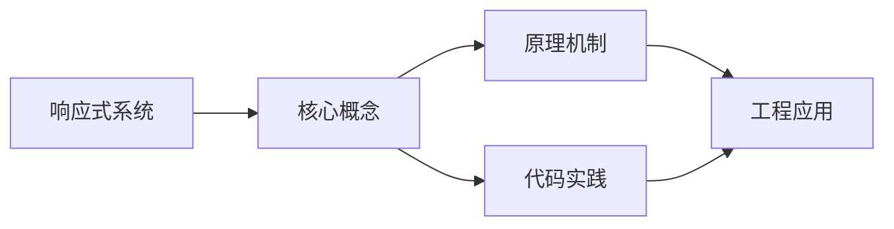
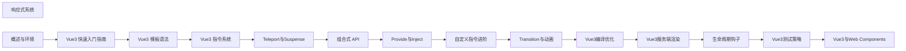

## 1. 学习目标（Bloom 分类）

本节按照布鲁姆教育目标分类学组织学习路径。本文主题为《响应式系统》，属于 Vue 3 模块，读者可以根据自身阶段选择阅读深度。

记忆层面：能够准确复述本文的核心概念、术语与基本语法或操作步骤，并能够在提问或检索时快速定位对应知识点。能够说出 Vue 3 的核心概念、术语与标准写法。

理解层面：能够用自己的语言解释核心原理与工作机制，说明概念之间的因果关系，而不是机械记忆结论。能够解释 Vue 3 的工作原理与设计动机。

应用层面：能够在真实项目或练习场景中运用本文知识解决具体问题，写出正确且可维护的实现。能够编写符合 Vue 3 规范的完整实现。

分析层面：能够拆解复杂问题，比较本文主题与相邻概念的异同，识别边界条件与例外情况。能够分析 Vue 3 与相邻方案的差异与边界。

评价层面：能够根据约束条件（性能、可读性、安全、成本）评价不同方案的优劣，做出有依据的技术决策。能够根据场景评价 Vue 3 相关方案的优劣。

创造层面：能够把本文知识与其他模块知识组合，设计出新的解决方案或可复用的工程模式。能够组合 Vue 3 与其他技术设计完整方案。

通过本节学习，读者应当能够把《响应式系统》纳入自己的知识网络，并与 Vue 3 模块的其他主题（组合式 API、响应式、组件通信、路由、状态管理）建立关联。

## 2. 历史动机与发展脉络

《响应式系统》是 Vue 3 领域的重要主题。要真正理解它，需要先了解它解决的问题与演进过程。

Vue 由尤雨溪于 2014 年发布，以“渐进式框架”定位：可作库嵌入，也可作框架构建完整应用。Vue 3 于 2020 年 9 月发布，核心是组合式 API 与全新响应式系统。
Vue 3 的技术支柱：Proxy 响应式（替代 Object.defineProperty）、虚拟 DOM 重写（PatchFlags）、Fragment/Teleport/Suspense 内置组件、组合式 API（setup/ref/reactive/computed）。
生态现状：Vue Router 4、Pinia（官方状态库）、Vite 构建、Nuxt 全栈框架；Vue 3.5 引入 useTemplateRef 等开发者体验改进。

回到本文主题：响应式系统 的提出与成熟，正是上述技术背景下的必然产物。早期实现往往以简单可用为目标，随着工程规模扩大，社区逐渐沉淀出标准做法与最佳实践；理解这一脉络，可以帮助读者判断“为什么文档中的推荐写法是现在这个样子”，也能在遇到历史遗留代码时准确识别其设计年代与取舍。


## 3. 形式化定义与核心概念精讲

本节把《响应式系统》涉及的核心概念以“定义 + 讲解”的形式展开。读者应把定义当作工具，把讲解当作理解路径；两者结合才能形成可迁移的知识。

响应式：ref 包装基本类型，reactive 包装对象；effect 收集依赖，Proxy 拦截读写；computed 缓存派生值。
组件通信：props 向下、emit 向上、v-model 双向、provide/inject 跨层、事件总线（慎用）。
生命周期：setup 在创建前执行；onMounted/onUpdated/onUnmounted 对应挂载、更新、卸载；KeepAlive 增加 activated/deactivated。

### 3.1 原文章节逐一精讲

原文档把主题拆分为 15 个小节，下面按顺序给出每一节的导读讲解，随后保留原文细节供精读。

#### 原文精读（完整保留）

# 响应式 API 语法速查手册

> **符号约定**:`< >` 必填参数 | `[ ]` 可选参数

---

#### 1. 响应式系统概述 | Reactive System Overview

Vue3 的响应式系统是其核心特性之一，它使得数据变化能够自动触发视图更新。与 Vue2 相比，Vue3 的响应式系统进行了重构，使用 ES6 Proxy 替代了 Object.defineProperty，提供了更强大的响应式能力。

##### 1.1 响应式系统的工作原理

Vue3 的响应式系统主要包括以下几个部分：

- **响应式数据**：使用 `ref` 或 `reactive` 创建的可观察数据
- **依赖追踪**：自动追踪组件渲染过程中使用的响应式数据
- **依赖收集**：收集组件对响应式数据的依赖
- **触发更新**：当响应式数据变化时，自动触发依赖该数据的组件更新

##### 1.2 Vue3 响应式系统的优势

- **更强大的响应式能力**：支持更多数据类型，包括 Map、Set 等
- **更好的性能**：使用 Proxy 减少了不必要的依赖追踪
- **更简洁的 API**：提供了 `ref`、`reactive`、`computed` 等简洁的 API
- **更好的 TypeScript 支持**：类型推断更加准确

#### 2. 响应式 API | Reactive APIs

##### 2.1 ref

`ref` 用于创建响应式的基本类型数据：

```javascript
import { ref } from 'vue';
const count = ref(0);
console.log(count.value); // 0
count.value++;
console.log(count.value); // 1
```

`ref` 也可以用于创建响应式的对象：

```javascript
 import { ref } from 'vue'
 const user = ref({
  name: 'John',
  age: 30
 }
 console.log(user.value.name) // John
 user.value.age = 31
 console.log(user.value.age) // 31
```

##### 2.2 reactive

`reactive` 用于创建响应式的对象：

```javascript
 import { reactive } from 'vue'
 const state = reactive({
  count: 0,
  message: 'Hello'
 }
 console.log(state.count) // 0
 state.count++
 console.log(state.count) // 1
```

##### 2.3 computed

`computed` 用于创建计算属性，它会根据依赖的响应式数据自动重新计算：

```javascript
import { ref, computed } from 'vue';
const count = ref(0);
const doubleCount = computed(() => count.value * 2);
console.log(doubleCount.value); // 0
count.value++;
console.log(doubleCount.value); // 2
```

##### 2.4 watch

`watch` 用于监听数据变化：

```javascript
import { ref, watch } from 'vue';
const count = ref(0);
watch(count, (newValue, oldValue) => {
  console.log(`Count changed from ${oldValue} to ${newValue}`);
});
count.value++; // 输出: Count changed from 0 to 1
```

`watch` 也可以监听多个数据源：

```javascript
import { ref, watch } from 'vue';
const count = ref(0);
const message = ref('Hello');
watch([count, message], ([newCount, newMessage], [oldCount, oldMessage]) => {
  console.log(`Count changed from ${oldCount} to ${newCount}`);
  console.log(`Message changed from ${oldMessage} to ${newMessage}`);
});
count.value++; // 输出: Count changed from 0 to 1
message.value = 'Hi'; // 输出: Message changed from Hello to Hi
```

##### 2.5 watchEffect

`watchEffect` 用于自动追踪响应式依赖，当依赖变化时重新执行：

```javascript
import { ref, watchEffect } from 'vue';
const count = ref(0);
const stop = watchEffect(() => {
  console.log(`Count is ${count.value}`);
});
count.value++; // 输出: Count is 1
// 停止监听
stop();
count.value++; // 不会输出
```

#### 3. 响应式工具 | Reactive Utilities

##### 3.1 toRefs

`toRefs` 用于将响应式对象转换为普通对象，其中每个属性都是一个 ref：

```javascript
 import { reactive, toRefs } from 'vue'
 const state = reactive({
  count: 0,
  message: 'Hello'
 }
 const refs = toRefs(state)
 console.log(refs.count.value) // 0
 console.log(refs.message.value) // Hello
 // refs.count 是一个 ref，修改它会影响原对象
 refs.count.value++
 console.log(state.count) // 1
```

##### 3.2 toRef

`toRef` 用于为响应式对象的单个属性创建 ref：

```javascript
 import { reactive, toRef } from 'vue'
 const state = reactive({
  count: 0,
  message: 'Hello'
 }
 const countRef = toRef(state, 'count')
 console.log(countRef.value) // 0
 // 修改 ref 会影响原对象
 countRef.value++
 console.log(state.count) // 1
```

##### 3.3 unref

`unref` 用于获取 ref 的值，如果参数不是 ref，则直接返回参数：

```javascript
import { ref, unref } from 'vue';
const count = ref(0);
const message = 'Hello';
console.log(unref(count)); // 0
console.log(unref(message)); // Hello
```

##### 3.4 isRef

`isRef` 用于检查一个值是否是 ref：

```javascript
import { ref, isRef } from 'vue';
const count = ref(0);
const message = 'Hello';
console.log(isRef(count)); //
console.log(isRef(message)); // false
```

##### 3.5 shallowRef

`shallowRef` 用于创建浅响应式的 ref，只响应 `.value` 的变化，不响应内部属性的变化：

```javascript
 import { shallowRef } from 'vue'
 const user = shallowRef({
  name: 'John',
  age: 30
 }
 // 修改内部属性不会触发更新
 user.value.age = 31
 // 修改 .value 会触发更新
 user.value = {
  name: 'John',
  age: 31
 }
```

##### 3.6 shallowReactive

`shallowReactive` 用于创建浅响应式的对象，只响应顶层属性的变化，不响应嵌套属性的变化：

```javascript
 import { shallowReactive } from 'vue'
 const state = shallowReactive({
  user: {
  name: 'John',
  age: 30
  }
 }
 // 修改嵌套属性不会触发更新
 state.user.age = 31
 // 修改顶层属性会触发更新
 state.user = {
  name: 'John',
  age: 31
 }
```

##### 3.7 triggerRef

`triggerRef` 用于手动触发 `shallowRef` 的更新：

```javascript
 import { shallowRef, triggerRef } from 'vue'
 const user = shallowRef({
  name: 'John',
  age: 30
 }
 // 修改内部属性
 user.value.age = 31
 // 手动触发更新
 triggerRef(user)
```

##### 3.8 customRef

`customRef` 用于创建自定义的 ref：

```javascript
import { customRef } from 'vue';
function useDebouncedRef(value, delay = 300) {
  let timeout;
  return customRef((track, trigger) => {
    return {
      get() {
        track();
        return value;
      },
      set(newValue) {
        clearTimeout(timeout);
        timeout = setTimeout(() => {
          value = newValue;
          trigger();
        }, delay);
      },
    };
  });
}
// 使用自定义 ref
const searchQuery = useDebouncedRef('');
```

#### 4. 响应式系统的陷阱 | Reactive System Pitfalls

##### 4.1 响应式数据的解构

当你解构响应式对象时，解构出来的值会失去响应性：

```javascript
 import { reactive } from 'vue'
 const state = reactive({
  count: 0,
  message: 'Hello'
 }
 // 解构会失去响应性
 const { count, message } = state
 console.log(count) // 0
 // 修改原对象
 state.count++
 console.log(count) // 0 (不会更新)
```

解决方法是使用 `toRefs`：

```javascript
 import { reactive, toRefs } from 'vue'
 const state = reactive({
  count: 0,
  message: 'Hello'
 }
 // 使用 toRefs 解构
 const { count, message } = toRefs(state)
 console.log(count.value) // 0
 // 修改原对象
 state.count++
 console.log(count.value) // 1 (会更新)
```

##### 4.2 响应式数据的替换

当你替换整个响应式对象时，新对象不会自动成为响应式的：

```javascript
 import { reactive } from 'vue'
 const state = reactive({
  count: 0,
  message: 'Hello'
 }
 // 替换整个对象会失去响应性
 state = {
  count: 1,
  message: 'Hi'
 }
```

解决方法是修改对象的属性，而不是替换整个对象：

```javascript
 import { reactive } from 'vue'
 const state = reactive({
  count: 0,
  message: 'Hello'
 }
 // 修改对象的属性
 state.count = 1
 state.message = 'Hi'
```

##### 4.3 响应式数据的添加

当你向响应式对象添加新属性时，新属性不会自动成为响应式的：

```javascript
 import { reactive } from 'vue'
 const state = reactive({
  count: 0
 }
 // 添加新属性
 state.message = 'Hello' // 新属性是响应式的
```

在 Vue3 中，使用 `reactive` 创建的对象，添加新属性时会自动成为响应式的，这是因为 Vue3 使用了 Proxy。

##### 4.4 响应式数据的删除

当你从响应式对象中删除属性时，删除操作不会触发更新：

```javascript
 import { reactive } from 'vue'
 const state = reactive({
  count: 0,
  message: 'Hello'
 }
 // 删除属性
 delete state.message // 不会触发更新
```

解决方法是使用 `Vue.delete` 或 `Reflect.deleteProperty`：

```javascript
 import { reactive } from 'vue'
 const state = reactive({
  count: 0,
  message: 'Hello'
 }
 // 使用 Reflect.deleteProperty
 reflect.deleteProperty(state, 'message') // 会触发更新
```

#### 5. 响应式系统的最佳实践 | Reactive System Best Practices

##### 5.1 选择合适的响应式 API

- **基本类型**：使用 `ref`
- **对象**：使用 `reactive`
- **需要解构的对象**：使用 `reactive` + `toRefs`
- **性能敏感的场景**：使用 `shallowRef` 或 `shallowReactive`

##### 5.2 避免过度响应

- **不需要响应式的数据**：不要使用响应式 API
- **频繁变化的数据**：考虑使用 `shallowRef` 或 `customRef`
- **大型对象**：考虑使用 `shallowReactive`

##### 5.3 合理使用计算属性

- **复杂的计算逻辑**：使用 `computed`
- **依赖多个响应式数据**：使用 `computed`
- **需要缓存计算结果**：使用 `computed`

##### 5.4 合理使用监听器

- **需要执行副作用**：使用 `watch` 或 `watchEffect`
- **需要监听特定数据**：使用 `watch`
- **需要自动追踪依赖**：使用 `watchEffect`
- **需要清理副作用**：使用 `watch` 或 `watchEffect` 的清理函数

#### 6. 示例 | Examples

##### 6.1 响应式数据示例

```vue
<template>
  <div class="reactive-example">
    <h2>Reactive Data Example</h2>
    <div>
      <p>Count: {{ count }}</p>
      <p>Double Count: {{ doubleCount }}</p>
      <p>Message: {{ message }}</p>
      <button @click="increment">Increment</button>
      <button @click="changeMessage">Change Message</button>
    </div>
  </div>
</template>
<script setup>
import { ref, computed } from 'vue';
const count = ref(0);
const message = ref('Hello');
const doubleCount = computed(() => count.value * 2);
const increment = () => count.value++;
const changeMessage = () => (message.value = 'Hi');
</script>
<style scoped>
.reactive-example {
  padding: 20px;
  border: 1px solid #ddd;
  border-radius: 8px;
  max-width: 400px;
  margin: 0 auto;
}
button {
  margin: 0 5px;
  padding: 5px 10px;
  font-size: 16px;
}
</style>
```

##### 6.2 监听器示例

```vue
<template>
  <div class="watch-example">
    <h2>Watch Example</h2>
    <div>
      <p>Count: {{ count }}</p>
      <p>Message: {{ message }}</p>
      <button @click="increment">Increment</button>
      <button @click="changeMessage">Change Message</button>
      <div>
        <h3>Watch Log:</h3>
        <ul>
          <li v-for="(log, index) in logs" :key="index">{{ log }}</li>
        </ul>
      </div>
    </div>
  </div>
</template>
<script setup>
import { ref, watch, watchEffect } from 'vue';
const count = ref(0);
const message = ref('Hello');
const logs = ref([]);
// 使用 watch 监听单个数据
watch(count, (newValue, oldValue) => {
  logs.value.push(`Count changed from ${oldValue} to ${newValue}`);
});
// 使用 watch 监听多个数据
watch([count, message], ([newCount, newMessage], [oldCount, oldMessage]) => {
  if (newCount !== oldCount) {
    logs.value.push(`Count changed from ${oldCount} to ${newCount}`);
  }
  if (newMessage !== oldMessage) {
    logs.value.push(`Message changed from ${oldMessage} to ${newMessage}`);
  }
});
// 使用 watchEffect 自动追踪依赖
watchEffect(() => {
  logs.value.push(`Current count: ${count.value}, current message: ${message.value}`);
});
const increment = () => count.value++;
const changeMessage = () => (message.value = `Hi ${Math.random()}`);
</script>
<style scoped>
.watch-example {
  padding: 20px;
  border: 1px solid #ddd;
  border-radius: 8px;
  max-width: 400px;
  margin: 0 auto;
}
button {
  margin: 0 5px;
  padding: 5px 10px;
  font-size: 16px;
}
ul {
  list-style-type: none;
  padding: 0;
}
li {
  padding: 5px 0;
  border-bottom: 1px solid #eee;
}
</style>
```

##### 6.3 计算属性示例

```vue
<template>
  <div class="computed-example">
    <h2>Computed Example</h2>
    <div>
      <p>First Name: <input v-model="firstName" /></p>
      <p>Last Name: <input v-model="lastName" /></p>
      <p>Full Name: {{ fullName }}</p>
      <p>Full Name Length: {{ fullNameLength }}</p>
    </div>
  </div>
</template>
<script setup>
import { ref, computed } from 'vue';
const firstName = ref('John');
const lastName = ref('Doe');
// 计算全名
const fullName = computed(() => `${firstName.value} ${lastName.value}`);
// 计算全名长度
const fullNameLength = computed(() => fullName.value.length);
</script>
<style scoped>
.computed-example {
  padding: 20px;
  border: 1px solid #ddd;
  border-radius: 8px;
  max-width: 400px;
  margin: 0 auto;
}
input {
  width: 200px;
  padding: 5px;
}
</style>
```

#### 7. 小结 | Summary

Vue3 的响应式系统是其核心特性之一，它使用 ES6 Proxy 提供了更强大的响应式能力。通过本章节的学习，你已经了解了 Vue3 响应式系统的基本概念和使用方法，包括响应式 API、响应式工具、响应式系统的陷阱和最佳实践。
响应式系统的核心优势在于它使得数据变化能够自动触发视图更新，减少了手动操作 DOM 的需要，提高了开发效率。在实际开发中，要根据具体场景选择合适的响应式 API，避免过度响应，合理使用计算属性和监听器，以提高应用的性能和可维护性。

#### 延伸阅读

- [JS 原型链](javascript/prototype-and-inheritance)
- [JS 异步](javascript/async-programming)
#### 基础响应式

**ref 响应式引用**
`const <state> = ref(<initialValue>);`
```typescript
import { ref } from 'vue';
const count = ref(0);
const user = ref({ name: 'Tom' });

count.value++;
user.value.name = 'Jerry';
```

**reactive 对象响应式**
`const <state> = reactive(<object>);`
```typescript
import { reactive } from 'vue';
const state = reactive({
  count: 0,
  list: [],
  user: { name: 'Tom' }
});
state.count++;
state.list.push('item');
```

---

#### 浅层响应式

**shallowRef 浅响应式引用**
`const <state> = shallowRef(<initialValue>);`
```typescript
import { shallowRef } from 'vue';
const obj = shallowRef({ count: 0 });
obj.value.count++;        // 不触发
obj.value = { count: 1 }; // 触发:整体替换
```

**shallowReactive 浅响应式对象**
`const <state> = shallowReactive(<object>);`
```typescript
import { shallowReactive } from 'vue';
const state = shallowReactive({
  nested: { count: 0 }
});
state.nested.count = 1;  // 不触发,只追踪顶层属性
```

**shallowReadonly 浅只读**
`const <state> = shallowReadonly(<object>);`
```typescript
import { shallowReadonly } from 'vue';
const state = shallowReadonly({
  nested: { count: 0 }
});
state.nested.count = 1;  // 允许(只读不递归)
state.foo = 'bar';       // 警告
```

---

#### 只读与转换

**readonly 深只读**
`const <readonly> = readonly(<source>);`
```typescript
import { reactive, readonly } from 'vue';
const original = reactive({ count: 0, nested: { value: 1 } });
const frozen = readonly(original);
frozen.count = 1;          // 警告
frozen.nested.value = 2;   // 警告(深只读)
```

**markRaw 永久标记非响应**
`const <obj> = markRaw(<object>);`
```typescript
import { reactive, markRaw } from 'vue';
const state = reactive({});
state.classInstance = markRaw(new MyClass());
state.thirdPartyObj = markRaw(largeObject);
```

**toRaw 获取原始对象**
`const <raw> = toRaw(<proxy>);`
```typescript
import { reactive, toRaw } from 'vue';
const proxy = reactive({ count: 0 });
const raw = toRaw(proxy);
console.log(raw === proxy);  // false
```

---

#### Ref 转换

**toRef 转换 reactive 属性为 ref**
`const <ref> = toRef(<source>, <key>);`
```typescript
import { reactive, toRef } from 'vue';
const state = reactive({ count: 0 });
const countRef = toRef(state, 'count');
countRef.value++;  // state.count 同步变化
```

**toRef 从 getter 创建**
`const <ref> = toRef(() => <expression>);`
```typescript
import { toRef } from 'vue';
const state = reactive({ user: { name: 'Tom' } });
const nameRef = toRef(() => state.user.name);
```

**toRefs 解构响应式对象**
`const { <key>, ... } = toRefs(<reactive>);`
```typescript
import { reactive, toRefs } from 'vue';
const state = reactive({ count: 0, name: 'Tom' });
const { count, name } = toRefs(state);
count.value++;
```

**unref 取值**
`const <value> = unref(<maybeRef>);`
```typescript
import { ref, unref } from 'vue';
const count = ref(0);
unref(count);  // 0
unref(123);    // 123
unref(undefined);  // undefined
```

---

#### 类型守卫

**isRef 判断 ref**
```typescript
import { ref, isRef } from 'vue';
isRef(ref(0));       // true
isRef(0);            // false
isRef(reactive({})); // false
```

**isReactive 判断 reactive**
```typescript
import { reactive, isReactive } from 'vue';
isReactive(reactive({}));  // true
isReactive(ref({}));       // false
isReactive({});            // false
```

**isReadonly 判断只读**
```typescript
import { readonly, isReadonly } from 'vue';
isReadonly(readonly({}));  // true
```

**isProxy 判断代理**
```typescript
import { reactive, readonly, isProxy } from 'vue';
isProxy(reactive({}));   // true
isProxy(readonly({}));   // true
isProxy({});             // false
```

---

#### 高级响应式

**customRef 自定义 ref**
`const <state> = customRef(<track>, <trigger>);`
```typescript
import { customRef } from 'vue';

function debouncedRef(value, delay = 200) {
  let timer;
  return customRef((track, trigger) => ({
    get() {
      track();
      return value;
    },
    set(newValue) {
      clearTimeout(timer);
      timer = setTimeout(() => {
        value = newValue;
        trigger();
      }, delay);
    }
  }));
}

const text = debouncedRef('hello', 500);
```

**triggerRef 手动触发 shallowRef**
`triggerRef(<shallowRef>);`
```typescript
import { shallowRef, triggerRef } from 'vue';
const obj = shallowRef({ count: 0 });
obj.value.count = 1;
triggerRef(obj);  // 强制触发依赖
```

**effectScope 副作用作用域**
`const <scope> = effectScope();`
```typescript
import { effectScope, watchEffect } from 'vue';

const scope = effectScope();
scope.run(() => {
  watchEffect(() => console.log('effect 1'));
  watchEffect(() => console.log('effect 2'));
});
scope.stop();  // 停止内部所有 effect
```

**getCurrentScope 获取当前作用域**
```typescript
import { getCurrentScope } from 'vue';
const scope = getCurrentScope();
if (scope) {
  scope.run(() => { /* ... */ });
}
```

**onScopeDispose 作用域销毁时回调**
```typescript
import { onScopeDispose } from 'vue';
onScopeDispose(() => {
  console.log('scope disposed');
  cleanup();
});
```

---

#### 响应式工具组合

**响应式工具综合示例**
```typescript
import { ref, reactive, computed, toRefs, watch } from 'vue';

function useCounter(initial = 0) {
  const state = reactive({
    count: initial,
    double: computed(() => state.count * 2)
  });

  function increment() {
    state.count++;
  }

  watch(() => state.count, (newVal) => {
    console.log('count changed:', newVal);
  });

  return { ...toRefs(state), increment };
}
```

**响应式数组操作**
```typescript
import { reactive } from 'vue';
const list = reactive<number[]>([]);
list.push(1, 2, 3);   // 触发更新
list.splice(0, 1);    // 触发更新
list[0] = 99;         // Vue 3 中可触发
list.length = 0;      // 触发更新
```

**响应式 Map/Set**
```typescript
import { reactive } from 'vue';
const map = reactive(new Map<string, number>());
map.set('a', 1);      // 触发更新
map.delete('a');      // 触发更新

const set = reactive(new Set<number>());
set.add(1);           // 触发更新
set.has(1);           // true
```


### 3.2 概念关系图

下面用 Mermaid 图表达本文核心概念之间的关系，帮助读者建立整体图景：



图中展示的是本文知识的结构化关系：核心概念是入口，原理机制解释“为什么”，代码实践演示“怎么做”，工程应用回答“何时用”。读者学习时可以把每个小节的内容挂接到对应节点上。

## 4. 理论推导与原理解析

本节深入《响应式系统》背后的原理。理论部分不求面面俱到，而是聚焦“能解释现象、能指导实践”的关键推导。

响应式：ref 包装基本类型，reactive 包装对象；effect 收集依赖，Proxy 拦截读写；computed 缓存派生值。
组件通信：props 向下、emit 向上、v-model 双向、provide/inject 跨层、事件总线（慎用）。
生命周期：setup 在创建前执行；onMounted/onUpdated/onUnmounted 对应挂载、更新、卸载；KeepAlive 增加 activated/deactivated。
模板编译：模板在构建期编译为渲染函数，指令（v-if/v-for/v-model）是编译糖。

需要强调的是，理论推导与工程实践之间存在翻译层：理论给出的是理想化模型与边界条件，工程代码则必须处理真实环境中的例外。读者在学习时应先掌握理论的“标准情形”，再通过陷阱章节了解“非标准情形”。

## 5. 代码示例与逐行讲解

本节把原文中的代码示例系统整理，并为每个示例补充用途说明与讲解。读者不应只浏览代码，而应逐段对照讲解理解设计意图。

### 5.1 示例：2.1 ref

该示例来自原文《2.1 ref》小节，用于演示响应式系统相关操作。阅读时请先看代码结构，再看其后的讲解。

```javascript
import { ref } from 'vue';
const count = ref(0);
console.log(count.value); // 0
count.value++;
console.log(count.value); // 1
```

讲解：这段代码演示了本节核心知识点。代码中的关键操作可以归纳为三步：准备（定义或初始化）、执行（核心逻辑）、收尾（释放资源或返回结果）。实际项目中，这三步往往被封装为函数或类，以提升复用性与可测试性。

关键点分析：

该示例共 5 行有效代码，包含 2 类关键结构（import、from）。其中：

- 入口与初始化部分负责建立上下文，对应实际项目中的启动或装配逻辑；
- 核心逻辑部分体现本文主题的主要操作，是阅读时最需要对照讲解理解的部分；
- 输出或返回部分把结果交给调用方，注意其类型与边界条件。

进阶思考路径：先尝试修改参数观察行为变化，再把示例中的模式迁移到自己的项目中；每次修改都记录预期与实测差异，这是把示例转化为能力的最快方式。

### 5.2 示例：2.1 ref

该示例来自原文《2.1 ref》小节，用于演示响应式系统相关操作。阅读时请先看代码结构，再看其后的讲解。

```javascript
 import { ref } from 'vue'
 const user = ref({
  name: 'John',
  age: 30
 }
 console.log(user.value.name) // John
 user.value.age = 31
 console.log(user.value.age) // 31
```

讲解：这段代码演示了本节核心知识点。代码中的关键操作可以归纳为三步：准备（定义或初始化）、执行（核心逻辑）、收尾（释放资源或返回结果）。实际项目中，这三步往往被封装为函数或类，以提升复用性与可测试性。

关键点分析：

该示例共 8 行有效代码，包含 2 类关键结构（import、from）。其中：

- 入口与初始化部分负责建立上下文，对应实际项目中的启动或装配逻辑；
- 核心逻辑部分体现本文主题的主要操作，是阅读时最需要对照讲解理解的部分；
- 输出或返回部分把结果交给调用方，注意其类型与边界条件。

进阶思考路径：先尝试修改参数观察行为变化，再把示例中的模式迁移到自己的项目中；每次修改都记录预期与实测差异，这是把示例转化为能力的最快方式。

### 5.3 示例：2.2 reactive

该示例来自原文《2.2 reactive》小节，用于演示响应式系统相关操作。阅读时请先看代码结构，再看其后的讲解。

```javascript
 import { reactive } from 'vue'
 const state = reactive({
  count: 0,
  message: 'Hello'
 }
 console.log(state.count) // 0
 state.count++
 console.log(state.count) // 1
```

讲解：这段代码演示了本节核心知识点。代码中的关键操作可以归纳为三步：准备（定义或初始化）、执行（核心逻辑）、收尾（释放资源或返回结果）。实际项目中，这三步往往被封装为函数或类，以提升复用性与可测试性。

关键点分析：

该示例共 8 行有效代码，包含 2 类关键结构（import、from）。其中：

- 入口与初始化部分负责建立上下文，对应实际项目中的启动或装配逻辑；
- 核心逻辑部分体现本文主题的主要操作，是阅读时最需要对照讲解理解的部分；
- 输出或返回部分把结果交给调用方，注意其类型与边界条件。

进阶思考路径：先尝试修改参数观察行为变化，再把示例中的模式迁移到自己的项目中；每次修改都记录预期与实测差异，这是把示例转化为能力的最快方式。

### 5.4 示例：2.3 computed

该示例来自原文《2.3 computed》小节，用于演示响应式系统相关操作。阅读时请先看代码结构，再看其后的讲解。

```javascript
import { ref, computed } from 'vue';
const count = ref(0);
const doubleCount = computed(() => count.value * 2);
console.log(doubleCount.value); // 0
count.value++;
console.log(doubleCount.value); // 2
```

讲解：这段代码演示了本节核心知识点。代码中的关键操作可以归纳为三步：准备（定义或初始化）、执行（核心逻辑）、收尾（释放资源或返回结果）。实际项目中，这三步往往被封装为函数或类，以提升复用性与可测试性。

关键点分析：

该示例共 6 行有效代码，包含 2 类关键结构（import、from）。其中：

- 入口与初始化部分负责建立上下文，对应实际项目中的启动或装配逻辑；
- 核心逻辑部分体现本文主题的主要操作，是阅读时最需要对照讲解理解的部分；
- 输出或返回部分把结果交给调用方，注意其类型与边界条件。

进阶思考路径：先尝试修改参数观察行为变化，再把示例中的模式迁移到自己的项目中；每次修改都记录预期与实测差异，这是把示例转化为能力的最快方式。

### 5.5 示例：2.4 watch

该示例来自原文《2.4 watch》小节，用于演示响应式系统相关操作。阅读时请先看代码结构，再看其后的讲解。

```javascript
import { ref, watch } from 'vue';
const count = ref(0);
watch(count, (newValue, oldValue) => {
  console.log(`Count changed from ${oldValue} to ${newValue}`);
});
count.value++; // 输出: Count changed from 0 to 1
```

讲解：这段代码演示了本节核心知识点。代码中的关键操作可以归纳为三步：准备（定义或初始化）、执行（核心逻辑）、收尾（释放资源或返回结果）。实际项目中，这三步往往被封装为函数或类，以提升复用性与可测试性。

关键点分析：

该示例共 6 行有效代码，包含 2 类关键结构（import、from）。其中：

- 入口与初始化部分负责建立上下文，对应实际项目中的启动或装配逻辑；
- 核心逻辑部分体现本文主题的主要操作，是阅读时最需要对照讲解理解的部分；
- 输出或返回部分把结果交给调用方，注意其类型与边界条件。

进阶思考路径：先尝试修改参数观察行为变化，再把示例中的模式迁移到自己的项目中；每次修改都记录预期与实测差异，这是把示例转化为能力的最快方式。

### 5.6 示例：2.4 watch

该示例来自原文《2.4 watch》小节，用于演示响应式系统相关操作。阅读时请先看代码结构，再看其后的讲解。

```javascript
import { ref, watch } from 'vue';
const count = ref(0);
const message = ref('Hello');
watch([count, message], ([newCount, newMessage], [oldCount, oldMessage]) => {
  console.log(`Count changed from ${oldCount} to ${newCount}`);
  console.log(`Message changed from ${oldMessage} to ${newMessage}`);
});
count.value++; // 输出: Count changed from 0 to 1
message.value = 'Hi'; // 输出: Message changed from Hello to Hi
```

讲解：这段代码演示了本节核心知识点。代码中的关键操作可以归纳为三步：准备（定义或初始化）、执行（核心逻辑）、收尾（释放资源或返回结果）。实际项目中，这三步往往被封装为函数或类，以提升复用性与可测试性。

关键点分析：

该示例共 9 行有效代码，包含 2 类关键结构（import、from）。其中：

- 入口与初始化部分负责建立上下文，对应实际项目中的启动或装配逻辑；
- 核心逻辑部分体现本文主题的主要操作，是阅读时最需要对照讲解理解的部分；
- 输出或返回部分把结果交给调用方，注意其类型与边界条件。

进阶思考路径：先尝试修改参数观察行为变化，再把示例中的模式迁移到自己的项目中；每次修改都记录预期与实测差异，这是把示例转化为能力的最快方式。

### 5.7 示例：2.5 watchEffect

该示例来自原文《2.5 watchEffect》小节，用于演示响应式系统相关操作。阅读时请先看代码结构，再看其后的讲解。

```javascript
import { ref, watchEffect } from 'vue';
const count = ref(0);
const stop = watchEffect(() => {
  console.log(`Count is ${count.value}`);
});
count.value++; // 输出: Count is 1
// 停止监听
stop();
count.value++; // 不会输出
```

讲解：这段代码演示了本节核心知识点。代码中的关键操作可以归纳为三步：准备（定义或初始化）、执行（核心逻辑）、收尾（释放资源或返回结果）。实际项目中，这三步往往被封装为函数或类，以提升复用性与可测试性。

关键点分析：

该示例共 9 行有效代码，包含 2 类关键结构（import、from）。其中：

- 入口与初始化部分负责建立上下文，对应实际项目中的启动或装配逻辑；
- 核心逻辑部分体现本文主题的主要操作，是阅读时最需要对照讲解理解的部分；
- 输出或返回部分把结果交给调用方，注意其类型与边界条件。

进阶思考路径：先尝试修改参数观察行为变化，再把示例中的模式迁移到自己的项目中；每次修改都记录预期与实测差异，这是把示例转化为能力的最快方式。

### 5.8 示例：3.1 toRefs

该示例来自原文《3.1 toRefs》小节，用于演示响应式系统相关操作。阅读时请先看代码结构，再看其后的讲解。

```javascript
 import { reactive, toRefs } from 'vue'
 const state = reactive({
  count: 0,
  message: 'Hello'
 }
 const refs = toRefs(state)
 console.log(refs.count.value) // 0
 console.log(refs.message.value) // Hello
 // refs.count 是一个 ref，修改它会影响原对象
 refs.count.value++
 console.log(state.count) // 1
```

讲解：这段代码演示了本节核心知识点。代码中的关键操作可以归纳为三步：准备（定义或初始化）、执行（核心逻辑）、收尾（释放资源或返回结果）。实际项目中，这三步往往被封装为函数或类，以提升复用性与可测试性。

关键点分析：

该示例共 11 行有效代码，包含 2 类关键结构（import、from）。其中：

- 入口与初始化部分负责建立上下文，对应实际项目中的启动或装配逻辑；
- 核心逻辑部分体现本文主题的主要操作，是阅读时最需要对照讲解理解的部分；
- 输出或返回部分把结果交给调用方，注意其类型与边界条件。

进阶思考路径：先尝试修改参数观察行为变化，再把示例中的模式迁移到自己的项目中；每次修改都记录预期与实测差异，这是把示例转化为能力的最快方式。

### 5.9 示例：3.2 toRef

该示例来自原文《3.2 toRef》小节，用于演示响应式系统相关操作。阅读时请先看代码结构，再看其后的讲解。

```javascript
 import { reactive, toRef } from 'vue'
 const state = reactive({
  count: 0,
  message: 'Hello'
 }
 const countRef = toRef(state, 'count')
 console.log(countRef.value) // 0
 // 修改 ref 会影响原对象
 countRef.value++
 console.log(state.count) // 1
```

讲解：这段代码演示了本节核心知识点。代码中的关键操作可以归纳为三步：准备（定义或初始化）、执行（核心逻辑）、收尾（释放资源或返回结果）。实际项目中，这三步往往被封装为函数或类，以提升复用性与可测试性。

关键点分析：

该示例共 10 行有效代码，包含 2 类关键结构（import、from）。其中：

- 入口与初始化部分负责建立上下文，对应实际项目中的启动或装配逻辑；
- 核心逻辑部分体现本文主题的主要操作，是阅读时最需要对照讲解理解的部分；
- 输出或返回部分把结果交给调用方，注意其类型与边界条件。

进阶思考路径：先尝试修改参数观察行为变化，再把示例中的模式迁移到自己的项目中；每次修改都记录预期与实测差异，这是把示例转化为能力的最快方式。

### 5.10 示例：3.3 unref

该示例来自原文《3.3 unref》小节，用于演示响应式系统相关操作。阅读时请先看代码结构，再看其后的讲解。

```javascript
import { ref, unref } from 'vue';
const count = ref(0);
const message = 'Hello';
console.log(unref(count)); // 0
console.log(unref(message)); // Hello
```

讲解：这段代码演示了本节核心知识点。代码中的关键操作可以归纳为三步：准备（定义或初始化）、执行（核心逻辑）、收尾（释放资源或返回结果）。实际项目中，这三步往往被封装为函数或类，以提升复用性与可测试性。

关键点分析：

该示例共 5 行有效代码，包含 2 类关键结构（import、from）。其中：

- 入口与初始化部分负责建立上下文，对应实际项目中的启动或装配逻辑；
- 核心逻辑部分体现本文主题的主要操作，是阅读时最需要对照讲解理解的部分；
- 输出或返回部分把结果交给调用方，注意其类型与边界条件。

进阶思考路径：先尝试修改参数观察行为变化，再把示例中的模式迁移到自己的项目中；每次修改都记录预期与实测差异，这是把示例转化为能力的最快方式。

### 5.11 示例：3.4 isRef

该示例来自原文《3.4 isRef》小节，用于演示响应式系统相关操作。阅读时请先看代码结构，再看其后的讲解。

```javascript
import { ref, isRef } from 'vue';
const count = ref(0);
const message = 'Hello';
console.log(isRef(count)); //
console.log(isRef(message)); // false
```

讲解：这段代码演示了本节核心知识点。代码中的关键操作可以归纳为三步：准备（定义或初始化）、执行（核心逻辑）、收尾（释放资源或返回结果）。实际项目中，这三步往往被封装为函数或类，以提升复用性与可测试性。

关键点分析：

该示例共 5 行有效代码，包含 2 类关键结构（import、from）。其中：

- 入口与初始化部分负责建立上下文，对应实际项目中的启动或装配逻辑；
- 核心逻辑部分体现本文主题的主要操作，是阅读时最需要对照讲解理解的部分；
- 输出或返回部分把结果交给调用方，注意其类型与边界条件。

进阶思考路径：先尝试修改参数观察行为变化，再把示例中的模式迁移到自己的项目中；每次修改都记录预期与实测差异，这是把示例转化为能力的最快方式。

### 5.12 示例：3.5 shallowRef

该示例来自原文《3.5 shallowRef》小节，用于演示响应式系统相关操作。阅读时请先看代码结构，再看其后的讲解。

```javascript
 import { shallowRef } from 'vue'
 const user = shallowRef({
  name: 'John',
  age: 30
 }
 // 修改内部属性不会触发更新
 user.value.age = 31
 // 修改 .value 会触发更新
 user.value = {
  name: 'John',
  age: 31
 }
```

讲解：这段代码演示了本节核心知识点。代码中的关键操作可以归纳为三步：准备（定义或初始化）、执行（核心逻辑）、收尾（释放资源或返回结果）。实际项目中，这三步往往被封装为函数或类，以提升复用性与可测试性。

关键点分析：

该示例共 12 行有效代码，包含 2 类关键结构（import、from）。其中：

- 入口与初始化部分负责建立上下文，对应实际项目中的启动或装配逻辑；
- 核心逻辑部分体现本文主题的主要操作，是阅读时最需要对照讲解理解的部分；
- 输出或返回部分把结果交给调用方，注意其类型与边界条件。

进阶思考路径：先尝试修改参数观察行为变化，再把示例中的模式迁移到自己的项目中；每次修改都记录预期与实测差异，这是把示例转化为能力的最快方式。

### 5.13 示例：3.6 shallowReactive

该示例来自原文《3.6 shallowReactive》小节，用于演示响应式系统相关操作。阅读时请先看代码结构，再看其后的讲解。

```javascript
 import { shallowReactive } from 'vue'
 const state = shallowReactive({
  user: {
  name: 'John',
  age: 30
  }
 }
 // 修改嵌套属性不会触发更新
 state.user.age = 31
 // 修改顶层属性会触发更新
 state.user = {
  name: 'John',
  age: 31
 }
```

讲解：这段代码演示了本节核心知识点。代码中的关键操作可以归纳为三步：准备（定义或初始化）、执行（核心逻辑）、收尾（释放资源或返回结果）。实际项目中，这三步往往被封装为函数或类，以提升复用性与可测试性。

关键点分析：

该示例共 14 行有效代码，包含 2 类关键结构（import、from）。其中：

- 入口与初始化部分负责建立上下文，对应实际项目中的启动或装配逻辑；
- 核心逻辑部分体现本文主题的主要操作，是阅读时最需要对照讲解理解的部分；
- 输出或返回部分把结果交给调用方，注意其类型与边界条件。

进阶思考路径：先尝试修改参数观察行为变化，再把示例中的模式迁移到自己的项目中；每次修改都记录预期与实测差异，这是把示例转化为能力的最快方式。

### 5.14 示例：3.7 triggerRef

该示例来自原文《3.7 triggerRef》小节，用于演示响应式系统相关操作。阅读时请先看代码结构，再看其后的讲解。

```javascript
 import { shallowRef, triggerRef } from 'vue'
 const user = shallowRef({
  name: 'John',
  age: 30
 }
 // 修改内部属性
 user.value.age = 31
 // 手动触发更新
 triggerRef(user)
```

讲解：这段代码演示了本节核心知识点。代码中的关键操作可以归纳为三步：准备（定义或初始化）、执行（核心逻辑）、收尾（释放资源或返回结果）。实际项目中，这三步往往被封装为函数或类，以提升复用性与可测试性。

关键点分析：

该示例共 9 行有效代码，包含 2 类关键结构（import、from）。其中：

- 入口与初始化部分负责建立上下文，对应实际项目中的启动或装配逻辑；
- 核心逻辑部分体现本文主题的主要操作，是阅读时最需要对照讲解理解的部分；
- 输出或返回部分把结果交给调用方，注意其类型与边界条件。

进阶思考路径：先尝试修改参数观察行为变化，再把示例中的模式迁移到自己的项目中；每次修改都记录预期与实测差异，这是把示例转化为能力的最快方式。

### 5.15 示例：3.8 customRef

该示例来自原文《3.8 customRef》小节，用于演示响应式系统相关操作。阅读时请先看代码结构，再看其后的讲解。

```javascript
import { customRef } from 'vue';
function useDebouncedRef(value, delay = 300) {
  let timeout;
  return customRef((track, trigger) => {
    return {
      get() {
        track();
        return value;
      },
      set(newValue) {
        clearTimeout(timeout);
        timeout = setTimeout(() => {
          value = newValue;
          trigger();
        }, delay);
      },
    };
  });
}
// 使用自定义 ref
const searchQuery = useDebouncedRef('');
```

讲解：这段代码演示了本节核心知识点。代码中的关键操作可以归纳为三步：准备（定义或初始化）、执行（核心逻辑）、收尾（释放资源或返回结果）。实际项目中，这三步往往被封装为函数或类，以提升复用性与可测试性。

关键点分析：

该示例共 21 行有效代码，包含 4 类关键结构（function、import、from、return）。其中：

- 入口与初始化部分负责建立上下文，对应实际项目中的启动或装配逻辑；
- 核心逻辑部分体现本文主题的主要操作，是阅读时最需要对照讲解理解的部分；
- 输出或返回部分把结果交给调用方，注意其类型与边界条件。

进阶思考路径：先尝试修改参数观察行为变化，再把示例中的模式迁移到自己的项目中；每次修改都记录预期与实测差异，这是把示例转化为能力的最快方式。

### 5.16 示例：4.1 响应式数据的解构

该示例来自原文《4.1 响应式数据的解构》小节，用于演示响应式系统相关操作。阅读时请先看代码结构，再看其后的讲解。

```javascript
 import { reactive } from 'vue'
 const state = reactive({
  count: 0,
  message: 'Hello'
 }
 // 解构会失去响应性
 const { count, message } = state
 console.log(count) // 0
 // 修改原对象
 state.count++
 console.log(count) // 0 (不会更新)
```

讲解：这段代码演示了本节核心知识点。代码中的关键操作可以归纳为三步：准备（定义或初始化）、执行（核心逻辑）、收尾（释放资源或返回结果）。实际项目中，这三步往往被封装为函数或类，以提升复用性与可测试性。

关键点分析：

该示例共 11 行有效代码，包含 2 类关键结构（import、from）。其中：

- 入口与初始化部分负责建立上下文，对应实际项目中的启动或装配逻辑；
- 核心逻辑部分体现本文主题的主要操作，是阅读时最需要对照讲解理解的部分；
- 输出或返回部分把结果交给调用方，注意其类型与边界条件。

进阶思考路径：先尝试修改参数观察行为变化，再把示例中的模式迁移到自己的项目中；每次修改都记录预期与实测差异，这是把示例转化为能力的最快方式。

### 5.17 示例：4.1 响应式数据的解构

该示例来自原文《4.1 响应式数据的解构》小节，用于演示响应式系统相关操作。阅读时请先看代码结构，再看其后的讲解。

```javascript
 import { reactive, toRefs } from 'vue'
 const state = reactive({
  count: 0,
  message: 'Hello'
 }
 // 使用 toRefs 解构
 const { count, message } = toRefs(state)
 console.log(count.value) // 0
 // 修改原对象
 state.count++
 console.log(count.value) // 1 (会更新)
```

讲解：这段代码演示了本节核心知识点。代码中的关键操作可以归纳为三步：准备（定义或初始化）、执行（核心逻辑）、收尾（释放资源或返回结果）。实际项目中，这三步往往被封装为函数或类，以提升复用性与可测试性。

关键点分析：

该示例共 11 行有效代码，包含 2 类关键结构（import、from）。其中：

- 入口与初始化部分负责建立上下文，对应实际项目中的启动或装配逻辑；
- 核心逻辑部分体现本文主题的主要操作，是阅读时最需要对照讲解理解的部分；
- 输出或返回部分把结果交给调用方，注意其类型与边界条件。

进阶思考路径：先尝试修改参数观察行为变化，再把示例中的模式迁移到自己的项目中；每次修改都记录预期与实测差异，这是把示例转化为能力的最快方式。

### 5.18 示例：4.2 响应式数据的替换

该示例来自原文《4.2 响应式数据的替换》小节，用于演示响应式系统相关操作。阅读时请先看代码结构，再看其后的讲解。

```javascript
 import { reactive } from 'vue'
 const state = reactive({
  count: 0,
  message: 'Hello'
 }
 // 替换整个对象会失去响应性
 state = {
  count: 1,
  message: 'Hi'
 }
```

讲解：这段代码演示了本节核心知识点。代码中的关键操作可以归纳为三步：准备（定义或初始化）、执行（核心逻辑）、收尾（释放资源或返回结果）。实际项目中，这三步往往被封装为函数或类，以提升复用性与可测试性。

关键点分析：

该示例共 10 行有效代码，包含 2 类关键结构（import、from）。其中：

- 入口与初始化部分负责建立上下文，对应实际项目中的启动或装配逻辑；
- 核心逻辑部分体现本文主题的主要操作，是阅读时最需要对照讲解理解的部分；
- 输出或返回部分把结果交给调用方，注意其类型与边界条件。

进阶思考路径：先尝试修改参数观察行为变化，再把示例中的模式迁移到自己的项目中；每次修改都记录预期与实测差异，这是把示例转化为能力的最快方式。

### 5.19 示例：4.2 响应式数据的替换

该示例来自原文《4.2 响应式数据的替换》小节，用于演示响应式系统相关操作。阅读时请先看代码结构，再看其后的讲解。

```javascript
 import { reactive } from 'vue'
 const state = reactive({
  count: 0,
  message: 'Hello'
 }
 // 修改对象的属性
 state.count = 1
 state.message = 'Hi'
```

讲解：这段代码演示了本节核心知识点。代码中的关键操作可以归纳为三步：准备（定义或初始化）、执行（核心逻辑）、收尾（释放资源或返回结果）。实际项目中，这三步往往被封装为函数或类，以提升复用性与可测试性。

关键点分析：

该示例共 8 行有效代码，包含 2 类关键结构（import、from）。其中：

- 入口与初始化部分负责建立上下文，对应实际项目中的启动或装配逻辑；
- 核心逻辑部分体现本文主题的主要操作，是阅读时最需要对照讲解理解的部分；
- 输出或返回部分把结果交给调用方，注意其类型与边界条件。

进阶思考路径：先尝试修改参数观察行为变化，再把示例中的模式迁移到自己的项目中；每次修改都记录预期与实测差异，这是把示例转化为能力的最快方式。

### 5.20 示例：4.3 响应式数据的添加

该示例来自原文《4.3 响应式数据的添加》小节，用于演示响应式系统相关操作。阅读时请先看代码结构，再看其后的讲解。

```javascript
 import { reactive } from 'vue'
 const state = reactive({
  count: 0
 }
 // 添加新属性
 state.message = 'Hello' // 新属性是响应式的
```

讲解：这段代码演示了本节核心知识点。代码中的关键操作可以归纳为三步：准备（定义或初始化）、执行（核心逻辑）、收尾（释放资源或返回结果）。实际项目中，这三步往往被封装为函数或类，以提升复用性与可测试性。

关键点分析：

该示例共 6 行有效代码，包含 2 类关键结构（import、from）。其中：

- 入口与初始化部分负责建立上下文，对应实际项目中的启动或装配逻辑；
- 核心逻辑部分体现本文主题的主要操作，是阅读时最需要对照讲解理解的部分；
- 输出或返回部分把结果交给调用方，注意其类型与边界条件。

进阶思考路径：先尝试修改参数观察行为变化，再把示例中的模式迁移到自己的项目中；每次修改都记录预期与实测差异，这是把示例转化为能力的最快方式。

### 5.21 示例：4.4 响应式数据的删除

该示例来自原文《4.4 响应式数据的删除》小节，用于演示响应式系统相关操作。阅读时请先看代码结构，再看其后的讲解。

```javascript
 import { reactive } from 'vue'
 const state = reactive({
  count: 0,
  message: 'Hello'
 }
 // 删除属性
 delete state.message // 不会触发更新
```

讲解：这段代码演示了本节核心知识点。代码中的关键操作可以归纳为三步：准备（定义或初始化）、执行（核心逻辑）、收尾（释放资源或返回结果）。实际项目中，这三步往往被封装为函数或类，以提升复用性与可测试性。

关键点分析：

该示例共 7 行有效代码，包含 2 类关键结构（import、from）。其中：

- 入口与初始化部分负责建立上下文，对应实际项目中的启动或装配逻辑；
- 核心逻辑部分体现本文主题的主要操作，是阅读时最需要对照讲解理解的部分；
- 输出或返回部分把结果交给调用方，注意其类型与边界条件。

进阶思考路径：先尝试修改参数观察行为变化，再把示例中的模式迁移到自己的项目中；每次修改都记录预期与实测差异，这是把示例转化为能力的最快方式。

### 5.22 示例：4.4 响应式数据的删除

该示例来自原文《4.4 响应式数据的删除》小节，用于演示响应式系统相关操作。阅读时请先看代码结构，再看其后的讲解。

```javascript
 import { reactive } from 'vue'
 const state = reactive({
  count: 0,
  message: 'Hello'
 }
 // 使用 Reflect.deleteProperty
 reflect.deleteProperty(state, 'message') // 会触发更新
```

讲解：这段代码演示了本节核心知识点。代码中的关键操作可以归纳为三步：准备（定义或初始化）、执行（核心逻辑）、收尾（释放资源或返回结果）。实际项目中，这三步往往被封装为函数或类，以提升复用性与可测试性。

关键点分析：

该示例共 7 行有效代码，包含 2 类关键结构（import、from）。其中：

- 入口与初始化部分负责建立上下文，对应实际项目中的启动或装配逻辑；
- 核心逻辑部分体现本文主题的主要操作，是阅读时最需要对照讲解理解的部分；
- 输出或返回部分把结果交给调用方，注意其类型与边界条件。

进阶思考路径：先尝试修改参数观察行为变化，再把示例中的模式迁移到自己的项目中；每次修改都记录预期与实测差异，这是把示例转化为能力的最快方式。

### 5.23 示例：6.1 响应式数据示例

该示例来自原文《6.1 响应式数据示例》小节，用于演示响应式系统相关操作。阅读时请先看代码结构，再看其后的讲解。

```vue
<template>
  <div class="reactive-example">
    <h2>Reactive Data Example</h2>
    <div>
      <p>Count: {{ count }}</p>
      <p>Double Count: {{ doubleCount }}</p>
      <p>Message: {{ message }}</p>
      <button @click="increment">Increment</button>
      <button @click="changeMessage">Change Message</button>
    </div>
  </div>
</template>
<script setup>
import { ref, computed } from 'vue';
const count = ref(0);
const message = ref('Hello');
const doubleCount = computed(() => count.value * 2);
const increment = () => count.value++;
const changeMessage = () => (message.value = 'Hi');
</script>
<style scoped>
.reactive-example {
  padding: 20px;
  border: 1px solid #ddd;
  border-radius: 8px;
  max-width: 400px;
  margin: 0 auto;
}
button {
  margin: 0 5px;
  padding: 5px 10px;
  font-size: 16px;
}
</style>
```

讲解：这段代码演示了本节核心知识点。代码中的关键操作可以归纳为三步：准备（定义或初始化）、执行（核心逻辑）、收尾（释放资源或返回结果）。实际项目中，这三步往往被封装为函数或类，以提升复用性与可测试性。

关键点分析：

该示例共 34 行有效代码，包含 3 类关键结构（class、import、from）。其中：

- 入口与初始化部分负责建立上下文，对应实际项目中的启动或装配逻辑；
- 核心逻辑部分体现本文主题的主要操作，是阅读时最需要对照讲解理解的部分；
- 输出或返回部分把结果交给调用方，注意其类型与边界条件。

进阶思考路径：先尝试修改参数观察行为变化，再把示例中的模式迁移到自己的项目中；每次修改都记录预期与实测差异，这是把示例转化为能力的最快方式。

### 5.24 示例：6.2 监听器示例

该示例来自原文《6.2 监听器示例》小节，用于演示响应式系统相关操作。阅读时请先看代码结构，再看其后的讲解。

```vue
<template>
  <div class="watch-example">
    <h2>Watch Example</h2>
    <div>
      <p>Count: {{ count }}</p>
      <p>Message: {{ message }}</p>
      <button @click="increment">Increment</button>
      <button @click="changeMessage">Change Message</button>
      <div>
        <h3>Watch Log:</h3>
        <ul>
          <li v-for="(log, index) in logs" :key="index">{{ log }}</li>
        </ul>
      </div>
    </div>
  </div>
</template>
<script setup>
import { ref, watch, watchEffect } from 'vue';
const count = ref(0);
const message = ref('Hello');
const logs = ref([]);
// 使用 watch 监听单个数据
watch(count, (newValue, oldValue) => {
  logs.value.push(`Count changed from ${oldValue} to ${newValue}`);
});
// 使用 watch 监听多个数据
watch([count, message], ([newCount, newMessage], [oldCount, oldMessage]) => {
  if (newCount !== oldCount) {
    logs.value.push(`Count changed from ${oldCount} to ${newCount}`);
  }
  if (newMessage !== oldMessage) {
    logs.value.push(`Message changed from ${oldMessage} to ${newMessage}`);
  }
});
// 使用 watchEffect 自动追踪依赖
watchEffect(() => {
  logs.value.push(`Current count: ${count.value}, current message: ${message.value}`);
});
const increment = () => count.value++;
const changeMessage = () => (message.value = `Hi ${Math.random()}`);
</script>
<style scoped>
.watch-example {
  padding: 20px;
  border: 1px solid #ddd;
  border-radius: 8px;
  max-width: 400px;
  margin: 0 auto;
}
button {
  margin: 0 5px;
  padding: 5px 10px;
  font-size: 16px;
}
ul {
  list-style-type: none;
  padding: 0;
}
li {
  padding: 5px 0;
  border-bottom: 1px solid #eee;
}
</style>
```

讲解：这段代码演示了本节核心知识点。代码中的关键操作可以归纳为三步：准备（定义或初始化）、执行（核心逻辑）、收尾（释放资源或返回结果）。实际项目中，这三步往往被封装为函数或类，以提升复用性与可测试性。

关键点分析：

该示例共 64 行有效代码，包含 4 类关键结构（class、import、from、if）。其中：

- 入口与初始化部分负责建立上下文，对应实际项目中的启动或装配逻辑；
- 核心逻辑部分体现本文主题的主要操作，是阅读时最需要对照讲解理解的部分；
- 输出或返回部分把结果交给调用方，注意其类型与边界条件。

进阶思考路径：先尝试修改参数观察行为变化，再把示例中的模式迁移到自己的项目中；每次修改都记录预期与实测差异，这是把示例转化为能力的最快方式。

### 5.25 示例：6.3 计算属性示例

该示例来自原文《6.3 计算属性示例》小节，用于演示响应式系统相关操作。阅读时请先看代码结构，再看其后的讲解。

```vue
<template>
  <div class="computed-example">
    <h2>Computed Example</h2>
    <div>
      <p>First Name: <input v-model="firstName" /></p>
      <p>Last Name: <input v-model="lastName" /></p>
      <p>Full Name: {{ fullName }}</p>
      <p>Full Name Length: {{ fullNameLength }}</p>
    </div>
  </div>
</template>
<script setup>
import { ref, computed } from 'vue';
const firstName = ref('John');
const lastName = ref('Doe');
// 计算全名
const fullName = computed(() => `${firstName.value} ${lastName.value}`);
// 计算全名长度
const fullNameLength = computed(() => fullName.value.length);
</script>
<style scoped>
.computed-example {
  padding: 20px;
  border: 1px solid #ddd;
  border-radius: 8px;
  max-width: 400px;
  margin: 0 auto;
}
input {
  width: 200px;
  padding: 5px;
}
</style>
```

讲解：这段代码演示了本节核心知识点。代码中的关键操作可以归纳为三步：准备（定义或初始化）、执行（核心逻辑）、收尾（释放资源或返回结果）。实际项目中，这三步往往被封装为函数或类，以提升复用性与可测试性。

关键点分析：

该示例共 33 行有效代码，包含 3 类关键结构（class、import、from）。其中：

- 入口与初始化部分负责建立上下文，对应实际项目中的启动或装配逻辑；
- 核心逻辑部分体现本文主题的主要操作，是阅读时最需要对照讲解理解的部分；
- 输出或返回部分把结果交给调用方，注意其类型与边界条件。

进阶思考路径：先尝试修改参数观察行为变化，再把示例中的模式迁移到自己的项目中；每次修改都记录预期与实测差异，这是把示例转化为能力的最快方式。

### 5.26 示例：基础响应式

该示例来自原文《基础响应式》小节，用于演示响应式系统相关操作。阅读时请先看代码结构，再看其后的讲解。

```typescript
import { ref } from 'vue';
const count = ref(0);
const user = ref({ name: 'Tom' });

count.value++;
user.value.name = 'Jerry';
```

讲解：这段代码演示了本节核心知识点。代码中的关键操作可以归纳为三步：准备（定义或初始化）、执行（核心逻辑）、收尾（释放资源或返回结果）。实际项目中，这三步往往被封装为函数或类，以提升复用性与可测试性。

关键点分析：

该示例共 5 行有效代码，包含 2 类关键结构（import、from）。其中：

- 入口与初始化部分负责建立上下文，对应实际项目中的启动或装配逻辑；
- 核心逻辑部分体现本文主题的主要操作，是阅读时最需要对照讲解理解的部分；
- 输出或返回部分把结果交给调用方，注意其类型与边界条件。

进阶思考路径：先尝试修改参数观察行为变化，再把示例中的模式迁移到自己的项目中；每次修改都记录预期与实测差异，这是把示例转化为能力的最快方式。

### 5.27 示例：基础响应式

该示例来自原文《基础响应式》小节，用于演示响应式系统相关操作。阅读时请先看代码结构，再看其后的讲解。

```typescript
import { reactive } from 'vue';
const state = reactive({
  count: 0,
  list: [],
  user: { name: 'Tom' }
});
state.count++;
state.list.push('item');
```

讲解：这段代码演示了本节核心知识点。代码中的关键操作可以归纳为三步：准备（定义或初始化）、执行（核心逻辑）、收尾（释放资源或返回结果）。实际项目中，这三步往往被封装为函数或类，以提升复用性与可测试性。

关键点分析：

该示例共 8 行有效代码，包含 2 类关键结构（import、from）。其中：

- 入口与初始化部分负责建立上下文，对应实际项目中的启动或装配逻辑；
- 核心逻辑部分体现本文主题的主要操作，是阅读时最需要对照讲解理解的部分；
- 输出或返回部分把结果交给调用方，注意其类型与边界条件。

进阶思考路径：先尝试修改参数观察行为变化，再把示例中的模式迁移到自己的项目中；每次修改都记录预期与实测差异，这是把示例转化为能力的最快方式。

### 5.28 示例：浅层响应式

该示例来自原文《浅层响应式》小节，用于演示响应式系统相关操作。阅读时请先看代码结构，再看其后的讲解。

```typescript
import { shallowRef } from 'vue';
const obj = shallowRef({ count: 0 });
obj.value.count++;        // 不触发
obj.value = { count: 1 }; // 触发:整体替换
```

讲解：这段代码演示了本节核心知识点。代码中的关键操作可以归纳为三步：准备（定义或初始化）、执行（核心逻辑）、收尾（释放资源或返回结果）。实际项目中，这三步往往被封装为函数或类，以提升复用性与可测试性。

关键点分析：

该示例共 4 行有效代码，包含 2 类关键结构（import、from）。其中：

- 入口与初始化部分负责建立上下文，对应实际项目中的启动或装配逻辑；
- 核心逻辑部分体现本文主题的主要操作，是阅读时最需要对照讲解理解的部分；
- 输出或返回部分把结果交给调用方，注意其类型与边界条件。

进阶思考路径：先尝试修改参数观察行为变化，再把示例中的模式迁移到自己的项目中；每次修改都记录预期与实测差异，这是把示例转化为能力的最快方式。

### 5.29 示例：浅层响应式

该示例来自原文《浅层响应式》小节，用于演示响应式系统相关操作。阅读时请先看代码结构，再看其后的讲解。

```typescript
import { shallowReactive } from 'vue';
const state = shallowReactive({
  nested: { count: 0 }
});
state.nested.count = 1;  // 不触发,只追踪顶层属性
```

讲解：这段代码演示了本节核心知识点。代码中的关键操作可以归纳为三步：准备（定义或初始化）、执行（核心逻辑）、收尾（释放资源或返回结果）。实际项目中，这三步往往被封装为函数或类，以提升复用性与可测试性。

关键点分析：

该示例共 5 行有效代码，包含 2 类关键结构（import、from）。其中：

- 入口与初始化部分负责建立上下文，对应实际项目中的启动或装配逻辑；
- 核心逻辑部分体现本文主题的主要操作，是阅读时最需要对照讲解理解的部分；
- 输出或返回部分把结果交给调用方，注意其类型与边界条件。

进阶思考路径：先尝试修改参数观察行为变化，再把示例中的模式迁移到自己的项目中；每次修改都记录预期与实测差异，这是把示例转化为能力的最快方式。

### 5.30 示例：浅层响应式

该示例来自原文《浅层响应式》小节，用于演示响应式系统相关操作。阅读时请先看代码结构，再看其后的讲解。

```typescript
import { shallowReadonly } from 'vue';
const state = shallowReadonly({
  nested: { count: 0 }
});
state.nested.count = 1;  // 允许(只读不递归)
state.foo = 'bar';       // 警告
```

讲解：这段代码演示了本节核心知识点。代码中的关键操作可以归纳为三步：准备（定义或初始化）、执行（核心逻辑）、收尾（释放资源或返回结果）。实际项目中，这三步往往被封装为函数或类，以提升复用性与可测试性。

关键点分析：

该示例共 6 行有效代码，包含 2 类关键结构（import、from）。其中：

- 入口与初始化部分负责建立上下文，对应实际项目中的启动或装配逻辑；
- 核心逻辑部分体现本文主题的主要操作，是阅读时最需要对照讲解理解的部分；
- 输出或返回部分把结果交给调用方，注意其类型与边界条件。

进阶思考路径：先尝试修改参数观察行为变化，再把示例中的模式迁移到自己的项目中；每次修改都记录预期与实测差异，这是把示例转化为能力的最快方式。

### 5.31 示例：只读与转换

该示例来自原文《只读与转换》小节，用于演示响应式系统相关操作。阅读时请先看代码结构，再看其后的讲解。

```typescript
import { reactive, readonly } from 'vue';
const original = reactive({ count: 0, nested: { value: 1 } });
const frozen = readonly(original);
frozen.count = 1;          // 警告
frozen.nested.value = 2;   // 警告(深只读)
```

讲解：这段代码演示了本节核心知识点。代码中的关键操作可以归纳为三步：准备（定义或初始化）、执行（核心逻辑）、收尾（释放资源或返回结果）。实际项目中，这三步往往被封装为函数或类，以提升复用性与可测试性。

关键点分析：

该示例共 5 行有效代码，包含 2 类关键结构（import、from）。其中：

- 入口与初始化部分负责建立上下文，对应实际项目中的启动或装配逻辑；
- 核心逻辑部分体现本文主题的主要操作，是阅读时最需要对照讲解理解的部分；
- 输出或返回部分把结果交给调用方，注意其类型与边界条件。

进阶思考路径：先尝试修改参数观察行为变化，再把示例中的模式迁移到自己的项目中；每次修改都记录预期与实测差异，这是把示例转化为能力的最快方式。

### 5.32 示例：只读与转换

该示例来自原文《只读与转换》小节，用于演示响应式系统相关操作。阅读时请先看代码结构，再看其后的讲解。

```typescript
import { reactive, markRaw } from 'vue';
const state = reactive({});
state.classInstance = markRaw(new MyClass());
state.thirdPartyObj = markRaw(largeObject);
```

讲解：这段代码演示了本节核心知识点。代码中的关键操作可以归纳为三步：准备（定义或初始化）、执行（核心逻辑）、收尾（释放资源或返回结果）。实际项目中，这三步往往被封装为函数或类，以提升复用性与可测试性。

关键点分析：

该示例共 4 行有效代码，包含 3 类关键结构（class、import、from）。其中：

- 入口与初始化部分负责建立上下文，对应实际项目中的启动或装配逻辑；
- 核心逻辑部分体现本文主题的主要操作，是阅读时最需要对照讲解理解的部分；
- 输出或返回部分把结果交给调用方，注意其类型与边界条件。

进阶思考路径：先尝试修改参数观察行为变化，再把示例中的模式迁移到自己的项目中；每次修改都记录预期与实测差异，这是把示例转化为能力的最快方式。

### 5.33 示例：只读与转换

该示例来自原文《只读与转换》小节，用于演示响应式系统相关操作。阅读时请先看代码结构，再看其后的讲解。

```typescript
import { reactive, toRaw } from 'vue';
const proxy = reactive({ count: 0 });
const raw = toRaw(proxy);
console.log(raw === proxy);  // false
```

讲解：这段代码演示了本节核心知识点。代码中的关键操作可以归纳为三步：准备（定义或初始化）、执行（核心逻辑）、收尾（释放资源或返回结果）。实际项目中，这三步往往被封装为函数或类，以提升复用性与可测试性。

关键点分析：

该示例共 4 行有效代码，包含 2 类关键结构（import、from）。其中：

- 入口与初始化部分负责建立上下文，对应实际项目中的启动或装配逻辑；
- 核心逻辑部分体现本文主题的主要操作，是阅读时最需要对照讲解理解的部分；
- 输出或返回部分把结果交给调用方，注意其类型与边界条件。

进阶思考路径：先尝试修改参数观察行为变化，再把示例中的模式迁移到自己的项目中；每次修改都记录预期与实测差异，这是把示例转化为能力的最快方式。

### 5.34 示例：Ref 转换

该示例来自原文《Ref 转换》小节，用于演示响应式系统相关操作。阅读时请先看代码结构，再看其后的讲解。

```typescript
import { reactive, toRef } from 'vue';
const state = reactive({ count: 0 });
const countRef = toRef(state, 'count');
countRef.value++;  // state.count 同步变化
```

讲解：这段代码演示了本节核心知识点。代码中的关键操作可以归纳为三步：准备（定义或初始化）、执行（核心逻辑）、收尾（释放资源或返回结果）。实际项目中，这三步往往被封装为函数或类，以提升复用性与可测试性。

关键点分析：

该示例共 4 行有效代码，包含 2 类关键结构（import、from）。其中：

- 入口与初始化部分负责建立上下文，对应实际项目中的启动或装配逻辑；
- 核心逻辑部分体现本文主题的主要操作，是阅读时最需要对照讲解理解的部分；
- 输出或返回部分把结果交给调用方，注意其类型与边界条件。

进阶思考路径：先尝试修改参数观察行为变化，再把示例中的模式迁移到自己的项目中；每次修改都记录预期与实测差异，这是把示例转化为能力的最快方式。

### 5.35 示例：Ref 转换

该示例来自原文《Ref 转换》小节，用于演示响应式系统相关操作。阅读时请先看代码结构，再看其后的讲解。

```typescript
import { toRef } from 'vue';
const state = reactive({ user: { name: 'Tom' } });
const nameRef = toRef(() => state.user.name);
```

讲解：这段代码演示了本节核心知识点。代码中的关键操作可以归纳为三步：准备（定义或初始化）、执行（核心逻辑）、收尾（释放资源或返回结果）。实际项目中，这三步往往被封装为函数或类，以提升复用性与可测试性。

关键点分析：

该示例共 3 行有效代码，包含 2 类关键结构（import、from）。其中：

- 入口与初始化部分负责建立上下文，对应实际项目中的启动或装配逻辑；
- 核心逻辑部分体现本文主题的主要操作，是阅读时最需要对照讲解理解的部分；
- 输出或返回部分把结果交给调用方，注意其类型与边界条件。

进阶思考路径：先尝试修改参数观察行为变化，再把示例中的模式迁移到自己的项目中；每次修改都记录预期与实测差异，这是把示例转化为能力的最快方式。

### 5.36 示例：Ref 转换

该示例来自原文《Ref 转换》小节，用于演示响应式系统相关操作。阅读时请先看代码结构，再看其后的讲解。

```typescript
import { reactive, toRefs } from 'vue';
const state = reactive({ count: 0, name: 'Tom' });
const { count, name } = toRefs(state);
count.value++;
```

讲解：这段代码演示了本节核心知识点。代码中的关键操作可以归纳为三步：准备（定义或初始化）、执行（核心逻辑）、收尾（释放资源或返回结果）。实际项目中，这三步往往被封装为函数或类，以提升复用性与可测试性。

关键点分析：

该示例共 4 行有效代码，包含 2 类关键结构（import、from）。其中：

- 入口与初始化部分负责建立上下文，对应实际项目中的启动或装配逻辑；
- 核心逻辑部分体现本文主题的主要操作，是阅读时最需要对照讲解理解的部分；
- 输出或返回部分把结果交给调用方，注意其类型与边界条件。

进阶思考路径：先尝试修改参数观察行为变化，再把示例中的模式迁移到自己的项目中；每次修改都记录预期与实测差异，这是把示例转化为能力的最快方式。

### 5.37 示例：Ref 转换

该示例来自原文《Ref 转换》小节，用于演示响应式系统相关操作。阅读时请先看代码结构，再看其后的讲解。

```typescript
import { ref, unref } from 'vue';
const count = ref(0);
unref(count);  // 0
unref(123);    // 123
unref(undefined);  // undefined
```

讲解：这段代码演示了本节核心知识点。代码中的关键操作可以归纳为三步：准备（定义或初始化）、执行（核心逻辑）、收尾（释放资源或返回结果）。实际项目中，这三步往往被封装为函数或类，以提升复用性与可测试性。

关键点分析：

该示例共 5 行有效代码，包含 2 类关键结构（import、from）。其中：

- 入口与初始化部分负责建立上下文，对应实际项目中的启动或装配逻辑；
- 核心逻辑部分体现本文主题的主要操作，是阅读时最需要对照讲解理解的部分；
- 输出或返回部分把结果交给调用方，注意其类型与边界条件。

进阶思考路径：先尝试修改参数观察行为变化，再把示例中的模式迁移到自己的项目中；每次修改都记录预期与实测差异，这是把示例转化为能力的最快方式。

### 5.38 示例：类型守卫

该示例来自原文《类型守卫》小节，用于演示响应式系统相关操作。阅读时请先看代码结构，再看其后的讲解。

```typescript
import { ref, isRef } from 'vue';
isRef(ref(0));       // true
isRef(0);            // false
isRef(reactive({})); // false
```

讲解：这段代码演示了本节核心知识点。代码中的关键操作可以归纳为三步：准备（定义或初始化）、执行（核心逻辑）、收尾（释放资源或返回结果）。实际项目中，这三步往往被封装为函数或类，以提升复用性与可测试性。

关键点分析：

该示例共 4 行有效代码，包含 2 类关键结构（import、from）。其中：

- 入口与初始化部分负责建立上下文，对应实际项目中的启动或装配逻辑；
- 核心逻辑部分体现本文主题的主要操作，是阅读时最需要对照讲解理解的部分；
- 输出或返回部分把结果交给调用方，注意其类型与边界条件。

进阶思考路径：先尝试修改参数观察行为变化，再把示例中的模式迁移到自己的项目中；每次修改都记录预期与实测差异，这是把示例转化为能力的最快方式。

### 5.39 示例：类型守卫

该示例来自原文《类型守卫》小节，用于演示响应式系统相关操作。阅读时请先看代码结构，再看其后的讲解。

```typescript
import { reactive, isReactive } from 'vue';
isReactive(reactive({}));  // true
isReactive(ref({}));       // false
isReactive({});            // false
```

讲解：这段代码演示了本节核心知识点。代码中的关键操作可以归纳为三步：准备（定义或初始化）、执行（核心逻辑）、收尾（释放资源或返回结果）。实际项目中，这三步往往被封装为函数或类，以提升复用性与可测试性。

关键点分析：

该示例共 4 行有效代码，包含 2 类关键结构（import、from）。其中：

- 入口与初始化部分负责建立上下文，对应实际项目中的启动或装配逻辑；
- 核心逻辑部分体现本文主题的主要操作，是阅读时最需要对照讲解理解的部分；
- 输出或返回部分把结果交给调用方，注意其类型与边界条件。

进阶思考路径：先尝试修改参数观察行为变化，再把示例中的模式迁移到自己的项目中；每次修改都记录预期与实测差异，这是把示例转化为能力的最快方式。

### 5.40 示例：类型守卫

该示例来自原文《类型守卫》小节，用于演示响应式系统相关操作。阅读时请先看代码结构，再看其后的讲解。

```typescript
import { readonly, isReadonly } from 'vue';
isReadonly(readonly({}));  // true
```

讲解：这段代码演示了本节核心知识点。代码中的关键操作可以归纳为三步：准备（定义或初始化）、执行（核心逻辑）、收尾（释放资源或返回结果）。实际项目中，这三步往往被封装为函数或类，以提升复用性与可测试性。

关键点分析：

该示例共 2 行有效代码，包含 2 类关键结构（import、from）。其中：

- 入口与初始化部分负责建立上下文，对应实际项目中的启动或装配逻辑；
- 核心逻辑部分体现本文主题的主要操作，是阅读时最需要对照讲解理解的部分；
- 输出或返回部分把结果交给调用方，注意其类型与边界条件。

进阶思考路径：先尝试修改参数观察行为变化，再把示例中的模式迁移到自己的项目中；每次修改都记录预期与实测差异，这是把示例转化为能力的最快方式。

### 5.41 示例：类型守卫

该示例来自原文《类型守卫》小节，用于演示响应式系统相关操作。阅读时请先看代码结构，再看其后的讲解。

```typescript
import { reactive, readonly, isProxy } from 'vue';
isProxy(reactive({}));   // true
isProxy(readonly({}));   // true
isProxy({});             // false
```

讲解：这段代码演示了本节核心知识点。代码中的关键操作可以归纳为三步：准备（定义或初始化）、执行（核心逻辑）、收尾（释放资源或返回结果）。实际项目中，这三步往往被封装为函数或类，以提升复用性与可测试性。

关键点分析：

该示例共 4 行有效代码，包含 2 类关键结构（import、from）。其中：

- 入口与初始化部分负责建立上下文，对应实际项目中的启动或装配逻辑；
- 核心逻辑部分体现本文主题的主要操作，是阅读时最需要对照讲解理解的部分；
- 输出或返回部分把结果交给调用方，注意其类型与边界条件。

进阶思考路径：先尝试修改参数观察行为变化，再把示例中的模式迁移到自己的项目中；每次修改都记录预期与实测差异，这是把示例转化为能力的最快方式。

### 5.42 示例：高级响应式

该示例来自原文《高级响应式》小节，用于演示响应式系统相关操作。阅读时请先看代码结构，再看其后的讲解。

```typescript
import { customRef } from 'vue';

function debouncedRef(value, delay = 200) {
  let timer;
  return customRef((track, trigger) => ({
    get() {
      track();
      return value;
    },
    set(newValue) {
      clearTimeout(timer);
      timer = setTimeout(() => {
        value = newValue;
        trigger();
      }, delay);
    }
  }));
}

const text = debouncedRef('hello', 500);
```

讲解：这段代码演示了本节核心知识点。代码中的关键操作可以归纳为三步：准备（定义或初始化）、执行（核心逻辑）、收尾（释放资源或返回结果）。实际项目中，这三步往往被封装为函数或类，以提升复用性与可测试性。

关键点分析：

该示例共 18 行有效代码，包含 4 类关键结构（function、import、from、return）。其中：

- 入口与初始化部分负责建立上下文，对应实际项目中的启动或装配逻辑；
- 核心逻辑部分体现本文主题的主要操作，是阅读时最需要对照讲解理解的部分；
- 输出或返回部分把结果交给调用方，注意其类型与边界条件。

进阶思考路径：先尝试修改参数观察行为变化，再把示例中的模式迁移到自己的项目中；每次修改都记录预期与实测差异，这是把示例转化为能力的最快方式。

### 5.43 示例：高级响应式

该示例来自原文《高级响应式》小节，用于演示响应式系统相关操作。阅读时请先看代码结构，再看其后的讲解。

```typescript
import { shallowRef, triggerRef } from 'vue';
const obj = shallowRef({ count: 0 });
obj.value.count = 1;
triggerRef(obj);  // 强制触发依赖
```

讲解：这段代码演示了本节核心知识点。代码中的关键操作可以归纳为三步：准备（定义或初始化）、执行（核心逻辑）、收尾（释放资源或返回结果）。实际项目中，这三步往往被封装为函数或类，以提升复用性与可测试性。

关键点分析：

该示例共 4 行有效代码，包含 2 类关键结构（import、from）。其中：

- 入口与初始化部分负责建立上下文，对应实际项目中的启动或装配逻辑；
- 核心逻辑部分体现本文主题的主要操作，是阅读时最需要对照讲解理解的部分；
- 输出或返回部分把结果交给调用方，注意其类型与边界条件。

进阶思考路径：先尝试修改参数观察行为变化，再把示例中的模式迁移到自己的项目中；每次修改都记录预期与实测差异，这是把示例转化为能力的最快方式。

### 5.44 示例：高级响应式

该示例来自原文《高级响应式》小节，用于演示响应式系统相关操作。阅读时请先看代码结构，再看其后的讲解。

```typescript
import { effectScope, watchEffect } from 'vue';

const scope = effectScope();
scope.run(() => {
  watchEffect(() => console.log('effect 1'));
  watchEffect(() => console.log('effect 2'));
});
scope.stop();  // 停止内部所有 effect
```

讲解：这段代码演示了本节核心知识点。代码中的关键操作可以归纳为三步：准备（定义或初始化）、执行（核心逻辑）、收尾（释放资源或返回结果）。实际项目中，这三步往往被封装为函数或类，以提升复用性与可测试性。

关键点分析：

该示例共 7 行有效代码，包含 2 类关键结构（import、from）。其中：

- 入口与初始化部分负责建立上下文，对应实际项目中的启动或装配逻辑；
- 核心逻辑部分体现本文主题的主要操作，是阅读时最需要对照讲解理解的部分；
- 输出或返回部分把结果交给调用方，注意其类型与边界条件。

进阶思考路径：先尝试修改参数观察行为变化，再把示例中的模式迁移到自己的项目中；每次修改都记录预期与实测差异，这是把示例转化为能力的最快方式。

### 5.45 示例：高级响应式

该示例来自原文《高级响应式》小节，用于演示响应式系统相关操作。阅读时请先看代码结构，再看其后的讲解。

```typescript
import { getCurrentScope } from 'vue';
const scope = getCurrentScope();
if (scope) {
  scope.run(() => { /* ... */ });
}
```

讲解：这段代码演示了本节核心知识点。代码中的关键操作可以归纳为三步：准备（定义或初始化）、执行（核心逻辑）、收尾（释放资源或返回结果）。实际项目中，这三步往往被封装为函数或类，以提升复用性与可测试性。

关键点分析：

该示例共 5 行有效代码，包含 3 类关键结构（import、from、if）。其中：

- 入口与初始化部分负责建立上下文，对应实际项目中的启动或装配逻辑；
- 核心逻辑部分体现本文主题的主要操作，是阅读时最需要对照讲解理解的部分；
- 输出或返回部分把结果交给调用方，注意其类型与边界条件。

进阶思考路径：先尝试修改参数观察行为变化，再把示例中的模式迁移到自己的项目中；每次修改都记录预期与实测差异，这是把示例转化为能力的最快方式。

### 5.46 示例：高级响应式

该示例来自原文《高级响应式》小节，用于演示响应式系统相关操作。阅读时请先看代码结构，再看其后的讲解。

```typescript
import { onScopeDispose } from 'vue';
onScopeDispose(() => {
  console.log('scope disposed');
  cleanup();
});
```

讲解：这段代码演示了本节核心知识点。代码中的关键操作可以归纳为三步：准备（定义或初始化）、执行（核心逻辑）、收尾（释放资源或返回结果）。实际项目中，这三步往往被封装为函数或类，以提升复用性与可测试性。

关键点分析：

该示例共 5 行有效代码，包含 2 类关键结构（import、from）。其中：

- 入口与初始化部分负责建立上下文，对应实际项目中的启动或装配逻辑；
- 核心逻辑部分体现本文主题的主要操作，是阅读时最需要对照讲解理解的部分；
- 输出或返回部分把结果交给调用方，注意其类型与边界条件。

进阶思考路径：先尝试修改参数观察行为变化，再把示例中的模式迁移到自己的项目中；每次修改都记录预期与实测差异，这是把示例转化为能力的最快方式。

### 5.47 示例：响应式工具组合

该示例来自原文《响应式工具组合》小节，用于演示响应式系统相关操作。阅读时请先看代码结构，再看其后的讲解。

```typescript
import { ref, reactive, computed, toRefs, watch } from 'vue';

function useCounter(initial = 0) {
  const state = reactive({
    count: initial,
    double: computed(() => state.count * 2)
  });

  function increment() {
    state.count++;
  }

  watch(() => state.count, (newVal) => {
    console.log('count changed:', newVal);
  });

  return { ...toRefs(state), increment };
}
```

讲解：这段代码演示了本节核心知识点。代码中的关键操作可以归纳为三步：准备（定义或初始化）、执行（核心逻辑）、收尾（释放资源或返回结果）。实际项目中，这三步往往被封装为函数或类，以提升复用性与可测试性。

关键点分析：

该示例共 14 行有效代码，包含 4 类关键结构（function、import、from、return）。其中：

- 入口与初始化部分负责建立上下文，对应实际项目中的启动或装配逻辑；
- 核心逻辑部分体现本文主题的主要操作，是阅读时最需要对照讲解理解的部分；
- 输出或返回部分把结果交给调用方，注意其类型与边界条件。

进阶思考路径：先尝试修改参数观察行为变化，再把示例中的模式迁移到自己的项目中；每次修改都记录预期与实测差异，这是把示例转化为能力的最快方式。

### 5.48 示例：响应式工具组合

该示例来自原文《响应式工具组合》小节，用于演示响应式系统相关操作。阅读时请先看代码结构，再看其后的讲解。

```typescript
import { reactive } from 'vue';
const list = reactive<number[]>([]);
list.push(1, 2, 3);   // 触发更新
list.splice(0, 1);    // 触发更新
list[0] = 99;         // Vue 3 中可触发
list.length = 0;      // 触发更新
```

讲解：这段代码演示了本节核心知识点。代码中的关键操作可以归纳为三步：准备（定义或初始化）、执行（核心逻辑）、收尾（释放资源或返回结果）。实际项目中，这三步往往被封装为函数或类，以提升复用性与可测试性。

关键点分析：

该示例共 6 行有效代码，包含 2 类关键结构（import、from）。其中：

- 入口与初始化部分负责建立上下文，对应实际项目中的启动或装配逻辑；
- 核心逻辑部分体现本文主题的主要操作，是阅读时最需要对照讲解理解的部分；
- 输出或返回部分把结果交给调用方，注意其类型与边界条件。

进阶思考路径：先尝试修改参数观察行为变化，再把示例中的模式迁移到自己的项目中；每次修改都记录预期与实测差异，这是把示例转化为能力的最快方式。

### 5.49 示例：响应式工具组合

该示例来自原文《响应式工具组合》小节，用于演示响应式系统相关操作。阅读时请先看代码结构，再看其后的讲解。

```typescript
import { reactive } from 'vue';
const map = reactive(new Map<string, number>());
map.set('a', 1);      // 触发更新
map.delete('a');      // 触发更新

const set = reactive(new Set<number>());
set.add(1);           // 触发更新
set.has(1);           // true
```

讲解：这段代码演示了本节核心知识点。代码中的关键操作可以归纳为三步：准备（定义或初始化）、执行（核心逻辑）、收尾（释放资源或返回结果）。实际项目中，这三步往往被封装为函数或类，以提升复用性与可测试性。

关键点分析：

该示例共 7 行有效代码，包含 2 类关键结构（import、from）。其中：

- 入口与初始化部分负责建立上下文，对应实际项目中的启动或装配逻辑；
- 核心逻辑部分体现本文主题的主要操作，是阅读时最需要对照讲解理解的部分；
- 输出或返回部分把结果交给调用方，注意其类型与边界条件。

进阶思考路径：先尝试修改参数观察行为变化，再把示例中的模式迁移到自己的项目中；每次修改都记录预期与实测差异，这是把示例转化为能力的最快方式。


综合以上示例，可以总结出本主题的代码实践要点：第一，先定义清晰的输入输出契约；第二，核心逻辑保持单一职责；第三，错误处理与边界条件不可省略；第四，命名与注释表达意图而非复述代码。

## 6. 对比分析

对比是理解《响应式系统》定位的最快路径。下面从多个维度与相邻方案进行对比。

Vue 与 React：Vue 模板 + 响应式自动追踪，React JSX + 手动依赖（hooks）；Vue 上手平缓，React 生态更广。
Options API 与 Composition API：Composition 更适合逻辑复用与 TS；Options 保留简单场景。
Vue 2 与 Vue 3：响应式实现、API 形态、生态差异显著，新项目一律 Vue 3。

对比的目的不是分出绝对优劣，而是建立选择依据：不同约束条件下，最优解不同。读者应把每个对比维度转化为决策检查清单。

## 7. 常见陷阱与最佳实践

本节整理该主题的高频错误与推荐做法。每个陷阱先描述现象，再解释原因，最后给出最佳实践。

### 7.1 响应式丢失

解构 reactive 或赋值整对象丢失响应。使用 ref/toRefs。

深入讲解：该问题之所以被归类为“常见陷阱”，是因为它在初学者的代码中反复出现，而且往往不在第一时间暴露——错误通常隐藏在特定数据或特定时序下。

从成因上看，响应式丢失 一般源于对 Vue 3 某个机制的理解偏差：要么误用了默认行为，要么忽略了边界条件，要么把其他语言的思维惯性带了过来。

从影响上看，响应式丢失 轻则产生错误结果，重则导致资源泄漏、数据损坏或安全事故；这也是为什么工程评审中会把它列为检查项。

从修复策略上看，处理响应式丢失的正确顺序是：先复现（构造最小用例），再定位（确认机制层面的根因），最后修复并补充回归测试。跳过复现直接改代码，往往治标不治本。

### 7.2 v-for key 用索引

列表变更导致状态错位。使用稳定唯一 key。

深入讲解：该问题之所以被归类为“常见陷阱”，是因为它在初学者的代码中反复出现，而且往往不在第一时间暴露——错误通常隐藏在特定数据或特定时序下。

从成因上看，v-for key 用索引 一般源于对 Vue 3 某个机制的理解偏差：要么误用了默认行为，要么忽略了边界条件，要么把其他语言的思维惯性带了过来。

从影响上看，v-for key 用索引 轻则产生错误结果，重则导致资源泄漏、数据损坏或安全事故；这也是为什么工程评审中会把它列为检查项。

从修复策略上看，处理v-for key 用索引的正确顺序是：先复现（构造最小用例），再定位（确认机制层面的根因），最后修复并补充回归测试。跳过复现直接改代码，往往治标不治本。

### 7.3 props 直接修改

单向数据流被破坏。通过 emit 通知父组件修改。

深入讲解：该问题之所以被归类为“常见陷阱”，是因为它在初学者的代码中反复出现，而且往往不在第一时间暴露——错误通常隐藏在特定数据或特定时序下。

从成因上看，props 直接修改 一般源于对 Vue 3 某个机制的理解偏差：要么误用了默认行为，要么忽略了边界条件，要么把其他语言的思维惯性带了过来。

从影响上看，props 直接修改 轻则产生错误结果，重则导致资源泄漏、数据损坏或安全事故；这也是为什么工程评审中会把它列为检查项。

从修复策略上看，处理props 直接修改的正确顺序是：先复现（构造最小用例），再定位（确认机制层面的根因），最后修复并补充回归测试。跳过复现直接改代码，往往治标不治本。

### 7.4 watch 深层陷阱

监听对象默认浅层；深层用 deep 或改写为 getter。

深入讲解：该问题之所以被归类为“常见陷阱”，是因为它在初学者的代码中反复出现，而且往往不在第一时间暴露——错误通常隐藏在特定数据或特定时序下。

从成因上看，watch 深层陷阱 一般源于对 Vue 3 某个机制的理解偏差：要么误用了默认行为，要么忽略了边界条件，要么把其他语言的思维惯性带了过来。

从影响上看，watch 深层陷阱 轻则产生错误结果，重则导致资源泄漏、数据损坏或安全事故；这也是为什么工程评审中会把它列为检查项。

从修复策略上看，处理watch 深层陷阱的正确顺序是：先复现（构造最小用例），再定位（确认机制层面的根因），最后修复并补充回归测试。跳过复现直接改代码，往往治标不治本。

### 7.5 组件样式泄漏

未用 scoped 导致全局污染。组件样式默认 scoped。

深入讲解：该问题之所以被归类为“常见陷阱”，是因为它在初学者的代码中反复出现，而且往往不在第一时间暴露——错误通常隐藏在特定数据或特定时序下。

从成因上看，组件样式泄漏 一般源于对 Vue 3 某个机制的理解偏差：要么误用了默认行为，要么忽略了边界条件，要么把其他语言的思维惯性带了过来。

从影响上看，组件样式泄漏 轻则产生错误结果，重则导致资源泄漏、数据损坏或安全事故；这也是为什么工程评审中会把它列为检查项。

从修复策略上看，处理组件样式泄漏的正确顺序是：先复现（构造最小用例），再定位（确认机制层面的根因），最后修复并补充回归测试。跳过复现直接改代码，往往治标不治本。

### 7.6 setup 中 async 误用

setup 顶层 await 变为异步组件需 Suspense。

深入讲解：该问题之所以被归类为“常见陷阱”，是因为它在初学者的代码中反复出现，而且往往不在第一时间暴露——错误通常隐藏在特定数据或特定时序下。

从成因上看，setup 中 async 误用 一般源于对 Vue 3 某个机制的理解偏差：要么误用了默认行为，要么忽略了边界条件，要么把其他语言的思维惯性带了过来。

从影响上看，setup 中 async 误用 轻则产生错误结果，重则导致资源泄漏、数据损坏或安全事故；这也是为什么工程评审中会把它列为检查项。

从修复策略上看，处理setup 中 async 误用的正确顺序是：先复现（构造最小用例），再定位（确认机制层面的根因），最后修复并补充回归测试。跳过复现直接改代码，往往治标不治本。

### 7.7 路由组件复用不刷新

参数变化组件复用。watch route 或 beforeRouteUpdate。

深入讲解：该问题之所以被归类为“常见陷阱”，是因为它在初学者的代码中反复出现，而且往往不在第一时间暴露——错误通常隐藏在特定数据或特定时序下。

从成因上看，路由组件复用不刷新 一般源于对 Vue 3 某个机制的理解偏差：要么误用了默认行为，要么忽略了边界条件，要么把其他语言的思维惯性带了过来。

从影响上看，路由组件复用不刷新 轻则产生错误结果，重则导致资源泄漏、数据损坏或安全事故；这也是为什么工程评审中会把它列为检查项。

从修复策略上看，处理路由组件复用不刷新的正确顺序是：先复现（构造最小用例），再定位（确认机制层面的根因），最后修复并补充回归测试。跳过复现直接改代码，往往治标不治本。

### 7.8 响应式大对象性能

深层代理开销大。大数据用 shallowRef 或冻结。

深入讲解：该问题之所以被归类为“常见陷阱”，是因为它在初学者的代码中反复出现，而且往往不在第一时间暴露——错误通常隐藏在特定数据或特定时序下。

从成因上看，响应式大对象性能 一般源于对 Vue 3 某个机制的理解偏差：要么误用了默认行为，要么忽略了边界条件，要么把其他语言的思维惯性带了过来。

从影响上看，响应式大对象性能 轻则产生错误结果，重则导致资源泄漏、数据损坏或安全事故；这也是为什么工程评审中会把它列为检查项。

从修复策略上看，处理响应式大对象性能的正确顺序是：先复现（构造最小用例），再定位（确认机制层面的根因），最后修复并补充回归测试。跳过复现直接改代码，往往治标不治本。

### 7.0 最佳实践总览

1. 组合式 API 按逻辑组织（自定义组合函数 useXxx）。
2. 组件单一职责，props 使用类型定义（TS）。
3. 状态管理：局部状态用 ref，跨组件用 Pinia，服务端状态用 Query 类库。
4. 模板保持声明式，复杂逻辑进 script。

把这些最佳实践固化为团队规范与代码评审检查项，是避免同类问题反复出现的关键。

## 8. 工程实践

本节把《响应式系统》放入真实工程场景，给出可复用的模式与组织方法。

项目脚手架：create-vue（Vite + TS + Router + Pinia）。
目录分层：views（页面）、components（组件）、composables（逻辑）、stores（状态）、api（请求）。
性能：defineAsyncComponent 懒加载、v-memo 优化、虚拟列表。
测试：Vitest 单测 + Vue Test Utils；Playwright E2E。

### 8.1 工程实践的原则拆解

以上工程实践可以归纳为四条原则。第一，配置与代码分离：Vue 3 项目中环境差异应通过配置注入，而不是散落在代码分支中；这保证同一份代码可以在开发、测试、生产环境一致运行。

第二，接口稳定优先：对外接口（函数签名、协议、数据格式）一旦被消费方依赖，变更成本极高；设计时应预留扩展点并保持向后兼容。

第三，可观测性内置：日志、指标与追踪应该在功能开发时同步设计，而不是故障发生后补救；没有观测手段的模块等于黑盒。

第四，变更可回滚：任何发布都应有对应的回滚方案；数据库迁移、配置变更与代码发布一样需要版本管理与逆向路径。

### 8.2 实践落地的检查清单

- [ ] 项目脚手架：对照本节描述，检查当前项目是否已经落实；未落实的项列入技术债并排期处理。
- [ ] 目录分层：对照本节描述，检查当前项目是否已经落实；未落实的项列入技术债并排期处理。
- [ ] 性能：对照本节描述，检查当前项目是否已经落实；未落实的项列入技术债并排期处理。
- [ ] 测试：对照本节描述，检查当前项目是否已经落实；未落实的项列入技术债并排期处理。

工程实践的共性原则：配置与代码分离、接口稳定优先、可观测性内置、变更可回滚。这些原则适用于本主题的所有实现。

## 9. 案例研究

本节通过一个完整案例把《响应式系统》的知识串起来。案例按“需求分析、方案设计、实现、验证”四步展开。

需求：实现文档站的搜索页与主题切换。
方案：Vue Router 路由 + Pinia 管理主题 + 组合函数封装搜索。
要点：搜索防抖与竞态取消；主题变量持久化。
验证：路由守卫权限、主题刷新保持、搜索准确性测试。

### 9.1 案例的扩展讨论

把案例中的方案放大到真实规模，需要额外考虑三个问题：

第一，规模：当数据量或并发量上升一个数量级时，原方案中的数据结构、缓存策略与任务调度是否仍然成立？通常需要引入分层与异步。

第二，团队：多人协作时，模块边界、接口契约与代码所有权必须明确；案例中的实现应拆分为可独立测试的单元，并配合文档说明设计意图。

第三，演进：上线后的需求变化不可避免；方案设计时应预留扩展点（配置化、插件化、事件化），并定期用真实指标验证假设。


案例研究的学习方法：先独立阅读需求，尝试在脑中形成方案，再对照实现与讲解，最后思考“如果约束变化（数据量、并发、团队规模），方案应如何调整”。

## 10. 知识要点总结与深入讲解

本节以讲解形式汇总全文要点，替代传统的习题与自测，读者不需要答题，只需跟随解释建立完整的认知框架。

关于《响应式系统》的核心结论：

Vue 3 的核心是响应式与组合式：理解依赖收集才能驾驭性能与陷阱。
组件通信按层级选型：props/emit 为默认，provide/inject 跨层，Pinia 全局。
工程化（Vite + TS + 测试）是生产项目的基线。

原文档各小节的要点回顾：

- 1. 响应式系统概述 | Reactive System Overview：该小节围绕响应式系统展开具体细节，阅读时应关注其与核心结论的对应关系；每个小节都是核心结论在某一个侧面的展开。
- 2. 响应式 API | Reactive APIs：该小节围绕响应式系统展开具体细节，阅读时应关注其与核心结论的对应关系；每个小节都是核心结论在某一个侧面的展开。
- 3. 响应式工具 | Reactive Utilities：该小节围绕响应式系统展开具体细节，阅读时应关注其与核心结论的对应关系；每个小节都是核心结论在某一个侧面的展开。
- 4. 响应式系统的陷阱 | Reactive System Pitfalls：该小节围绕响应式系统展开具体细节，阅读时应关注其与核心结论的对应关系；每个小节都是核心结论在某一个侧面的展开。
- 5. 响应式系统的最佳实践 | Reactive System Best Practices：该小节围绕响应式系统展开具体细节，阅读时应关注其与核心结论的对应关系；每个小节都是核心结论在某一个侧面的展开。
- 6. 示例 | Examples：该小节围绕响应式系统展开具体细节，阅读时应关注其与核心结论的对应关系；每个小节都是核心结论在某一个侧面的展开。
- 7. 小结 | Summary：该小节围绕响应式系统展开具体细节，阅读时应关注其与核心结论的对应关系；每个小节都是核心结论在某一个侧面的展开。
- 延伸阅读：该小节围绕响应式系统展开具体细节，阅读时应关注其与核心结论的对应关系；每个小节都是核心结论在某一个侧面的展开。
- 基础响应式：该小节围绕响应式系统展开具体细节，阅读时应关注其与核心结论的对应关系；每个小节都是核心结论在某一个侧面的展开。
- 浅层响应式：该小节围绕响应式系统展开具体细节，阅读时应关注其与核心结论的对应关系；每个小节都是核心结论在某一个侧面的展开。
- 只读与转换：该小节围绕响应式系统展开具体细节，阅读时应关注其与核心结论的对应关系；每个小节都是核心结论在某一个侧面的展开。
- Ref 转换：该小节围绕响应式系统展开具体细节，阅读时应关注其与核心结论的对应关系；每个小节都是核心结论在某一个侧面的展开。
- 类型守卫：该小节围绕响应式系统展开具体细节，阅读时应关注其与核心结论的对应关系；每个小节都是核心结论在某一个侧面的展开。
- 高级响应式：该小节围绕响应式系统展开具体细节，阅读时应关注其与核心结论的对应关系；每个小节都是核心结论在某一个侧面的展开。
- 响应式工具组合：该小节围绕响应式系统展开具体细节，阅读时应关注其与核心结论的对应关系；每个小节都是核心结论在某一个侧面的展开。

把以上要点与第 3-9 节的内容对照复习，即可完成对本文主题的闭环学习。

## 11. 参考文献


Vue 官方文档：https://vuejs.org/
Vue Router：https://router.vuejs.org/zh/
Pinia：https://pinia.vuejs.org/zh/
Vue 3 迁移指南：https://v3-migration.vuejs.org/
VueUse 组合函数库：https://vueuse.org/

## 12. 延伸阅读


Vue Teleport 与 Portal，见 010-vue3/026-TeleportPortalApp 文档。
Vue KeepAlive 缓存，见 010-vue3/027-KeepAliveCacheLifecycle 文档。
Vue Router 导航守卫，见 010-vue3/030-VueRouterNavigationGuard 文档。
TypeScript 与 Vue 组合，见 009-typescript 模块。
尚硅谷 Bilibili 空间（https://space.bilibili.com/302417610 ）提供 Vue3 课程。

## 14. 模块知识图谱与学习路径

本文属于 Vue 3 模块。为了把《响应式系统》放入完整的知识网络，下面列出本模块的全部主题并给出相互关联的导读。学习时建议按模块内顺序推进，并在每个文档中留意交叉引用。



上图为模块主题的推荐学习顺序示意图（仅展示前若干主题）。各主题之间存在三类关联：

第一，前置依赖关系：早期主题是后期主题的基础，例如环境与语法先行、进阶主题随后；

第二，横向并列关系：同一层级主题从不同角度覆盖模块能力，学习顺序可以按兴趣调整；

第三，工程组合关系：多个主题在真实项目中组合使用，例如配置、性能与安全主题往往出现在同一系统的不同层面。

### 14.1 模块主题速查表

| 文档 | 主题 | 与本文的关联 |
| --- | --- | --- |
| 概述与环境 | 001-OverviewEnv | 本文的前置基础 |
| Vue3 快速入门指南 | 002-Vue3QuickStartGuide | 本文的前置基础 |
| Vue3 模板语法 | 003-Vue3TemplateSyntax | 本文的并列主题 |
| Vue3 指令系统 | 004-Vue3DirectiveSystem | 本文的并列主题 |
| Teleport与Suspense | 005-TeleportSuspense | 本文的并列主题 |
| 组合式 API | 006-API | 本文的并列主题 |
| Provide与Inject | 007-ProvideInject | 本文的并列主题 |
| 自定义指令进阶 | 008-CustomDirectiveAdvanced | 本文的并列主题 |
| Transition与动画 | 009-TransitionAnimation | 本文的并列主题 |
| Vue3编译优化 | 010-Vue3CompileOptimization | 本文的性能延伸 |
| Vue3服务端渲染 | 011-Vue3SSR | 本文的并列主题 |
| 生命周期钩子 | 012-LifecycleHook | 本文的并列主题 |
| Vue3测试策略 | 013-Vue3TestStrategy | 本文的并列主题 |
| Vue3与Web Components | 014-Vue3WebComponents | 本文的并列主题 |
| Vue3性能优化实践 | 015-Vue3PerformancePractice | 本文的性能延伸 |
| 响应式系统 | 016-ReactiveSystem | 本文自身 |
| 自定义 Hook | 017-CustomHook | 本文的并列主题 |
| 组件系统 | 018-ComponentSystem | 本文的并列主题 |
| TypeScript 集成 | 019-TypeScriptIntegration | 本文的并列主题 |
| Pinia 状态管理详解 | 020-PiniaStateManagementDetailed | 本文的并列主题 |
| 插件开发 | 021-PluginDevelopment | 本文的并列主题 |
| computed缓存机制与watch执行时机 | 022-ComputedCacheWatchTiming | 本文的原理深化 |
| Vue Router 详解 | 023-VueRouterDetailed | 本文的并列主题 |
| 组合式API优势场景 | 024-CompositionAPIAdvantageScene | 本文的并列主题 |
| 自定义组合函数封装 | 025-CustomComposableWrapper | 本文的并列主题 |
| Teleport传送门应用 | 026-TeleportPortalApp | 本文的并列主题 |
| KeepAlive缓存与生命周期 | 027-KeepAliveCacheLifecycle | 本文的并列主题 |
| 异步组件与Suspense | 028-AsyncComponentSuspense | 本文的并列主题 |
| Pinia持久化插件 | 029-PiniaPersistencePlugin | 本文的并列主题 |
| Vue-Router导航守卫 | 030-VueRouterNavigationGuard | 本文的并列主题 |
| Vue性能优化详解 | 031-VuePerformanceDetailed | 本文的性能延伸 |
| 性能优化 | 032-PerformanceOptimization | 本文的性能延伸 |
| Vue3 高级组件特性 | 033-Vue3AdvancedComponentFeature | 本文的并列主题 |
| Vue3 项目示例：个人博客站点 | 034-Vue3ProjectExampleBlog | 本文的综合应用 |
| Vue3 理论知识点 | 035-Vue3TheoryKnowledge | 本文的并列主题 |
| Vue 3 Vite 构建配置与命令 | 036-Vue3ViteBuildConfig | 本文的并列主题 |
| Vue 3.4 / 3.5 新特性 | 037-Vue3NewFeatures3435 | 本文的并列主题 |

速查表的作用是让读者快速判断：哪些文档应在阅读本文前掌握（前置基础），哪些文档应在阅读本文后继续（延伸主题）。本模块的交叉引用体系即以此表为基础。

## 15. 术语表

下表整理《响应式系统》及 Vue 3 模块中出现的高频术语，给出简明释义。术语按字母序或逻辑序排列，供查阅。

| 术语 | 释义 |
| --- | --- |
| 响应式 | ref 包装基本类型，reactive 包装对象；effect 收集依赖，Proxy 拦截读写；computed 缓存派生值。 |
| 组件通信 | props 向下、emit 向上、v-model 双向、provide/inject 跨层、事件总线（慎用）。 |
| 生命周期 | setup 在创建前执行；onMounted/onUpdated/onUnmounted 对应挂载、更新、卸载；KeepAlive 增加 activated/d |
| 模板编译 | 模板在构建期编译为渲染函数，指令（v-if/v-for/v-model）是编译糖。 |
| 响应式丢失（易错点） | 参见常见陷阱章节的详细讲解 |
| v-for key 用索引（易错点） | 参见常见陷阱章节的详细讲解 |
| props 直接修改（易错点） | 参见常见陷阱章节的详细讲解 |
| watch 深层（易错点） | 参见常见陷阱章节的详细讲解 |
| 组件样式泄漏（易错点） | 参见常见陷阱章节的详细讲解 |
| setup 中 async 误用（易错点） | 参见常见陷阱章节的详细讲解 |

术语表与正文配合使用：先通读正文，遇到模糊术语回查本表；长期使用后术语会自然进入工作记忆。
