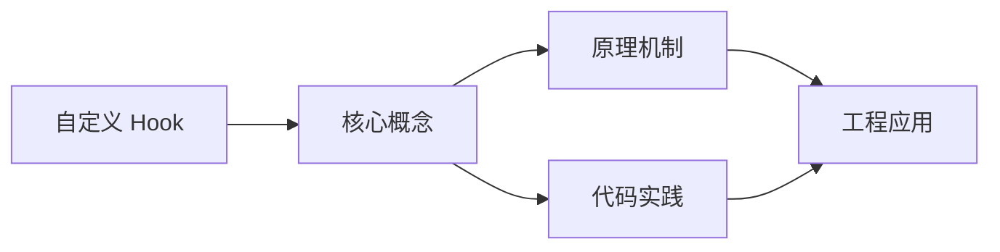
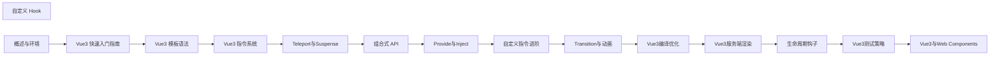

## 1. 学习目标（Bloom 分类）

本节按照布鲁姆教育目标分类学组织学习路径。本文主题为《自定义 Hook》，属于 Vue 3 模块，读者可以根据自身阶段选择阅读深度。

记忆层面：能够准确复述本文的核心概念、术语与基本语法或操作步骤，并能够在提问或检索时快速定位对应知识点。能够说出 Vue 3 的核心概念、术语与标准写法。

理解层面：能够用自己的语言解释核心原理与工作机制，说明概念之间的因果关系，而不是机械记忆结论。能够解释 Vue 3 的工作原理与设计动机。

应用层面：能够在真实项目或练习场景中运用本文知识解决具体问题，写出正确且可维护的实现。能够编写符合 Vue 3 规范的完整实现。

分析层面：能够拆解复杂问题，比较本文主题与相邻概念的异同，识别边界条件与例外情况。能够分析 Vue 3 与相邻方案的差异与边界。

评价层面：能够根据约束条件（性能、可读性、安全、成本）评价不同方案的优劣，做出有依据的技术决策。能够根据场景评价 Vue 3 相关方案的优劣。

创造层面：能够把本文知识与其他模块知识组合，设计出新的解决方案或可复用的工程模式。能够组合 Vue 3 与其他技术设计完整方案。

通过本节学习，读者应当能够把《自定义 Hook》纳入自己的知识网络，并与 Vue 3 模块的其他主题（组合式 API、响应式、组件通信、路由、状态管理）建立关联。

## 2. 历史动机与发展脉络

《自定义 Hook》是 Vue 3 领域的重要主题。要真正理解它，需要先了解它解决的问题与演进过程。

Vue 由尤雨溪于 2014 年发布，以“渐进式框架”定位：可作库嵌入，也可作框架构建完整应用。Vue 3 于 2020 年 9 月发布，核心是组合式 API 与全新响应式系统。
Vue 3 的技术支柱：Proxy 响应式（替代 Object.defineProperty）、虚拟 DOM 重写（PatchFlags）、Fragment/Teleport/Suspense 内置组件、组合式 API（setup/ref/reactive/computed）。
生态现状：Vue Router 4、Pinia（官方状态库）、Vite 构建、Nuxt 全栈框架；Vue 3.5 引入 useTemplateRef 等开发者体验改进。

回到本文主题：自定义 Hook 的提出与成熟，正是上述技术背景下的必然产物。早期实现往往以简单可用为目标，随着工程规模扩大，社区逐渐沉淀出标准做法与最佳实践；理解这一脉络，可以帮助读者判断“为什么文档中的推荐写法是现在这个样子”，也能在遇到历史遗留代码时准确识别其设计年代与取舍。


## 3. 形式化定义与核心概念精讲

本节把《自定义 Hook》涉及的核心概念以“定义 + 讲解”的形式展开。读者应把定义当作工具，把讲解当作理解路径；两者结合才能形成可迁移的知识。

响应式：ref 包装基本类型，reactive 包装对象；effect 收集依赖，Proxy 拦截读写；computed 缓存派生值。
组件通信：props 向下、emit 向上、v-model 双向、provide/inject 跨层、事件总线（慎用）。
生命周期：setup 在创建前执行；onMounted/onUpdated/onUnmounted 对应挂载、更新、卸载；KeepAlive 增加 activated/deactivated。

### 3.1 原文章节逐一精讲

原文档把主题拆分为 5 个小节，下面按顺序给出每一节的导读讲解，随后保留原文细节供精读。

#### 原文精读（完整保留）


#### 1. 自定义 Hook 概述

##### 1.1 什么是组合式函数

组合式函数（Composable）是利用Vue组合式API封装的可复用状态逻辑。习惯上以 `use` 前缀命名。

```typescript
// 基本结构
import { ref, onMounted, onBeforeUnmount } from 'vue';

export function useXxx() {
  // 响应式状态
  const state = ref(initialValue);

  // 方法
  function doSomething() {
    /* ... */
  }

  // 生命周期钩子
  onMounted(() => {
    /* ... */
  });

  // 暴露状态和方法
  return { state, doSomething };
}
```

##### 1.2 与 Mixin 的对比

| 特性     | Mixin                   | Composable         |
| :------- | :---------------------- | :----------------- |
| 命名冲突 | 容易冲突                | 显式解构，无冲突   |
| 来源不清 | 不知道属性来自哪个mixin | 清晰的函数调用来源 |
| 类型支持 | 差                      | 完整TypeScript支持 |
| 灵活性   | 静态混入                | 动态参数，可组合   |
| 逻辑复用 | 隐式共享                | 显式返回           |

#### 2. 常用自定义 Hook 实现

##### 2.1 useMouse - 鼠标位置追踪

```typescript
// composables/useMouse.ts
import { ref, onMounted, onBeforeUnmount } from 'vue';

export function useMouse() {
  const x = ref(0);
  const y = ref(0);

  function update(event: MouseEvent) {
    x.value = event.clientX;
    y.value = event.clientY;
  }

  onMounted(() => window.addEventListener('mousemove', update));
  onBeforeUnmount(() => window.removeEventListener('mousemove', update));

  return { x, y };
}

// 使用
// <script setup>
// import { useMouse } from '@/composables/useMouse'
// const { x, y } = useMouse()
// </script>
// <template>
//   <p>鼠标位置: {{ x }}, {{ y }}</p>
// </template>
```

##### 2.2 useFetch - 数据请求

```typescript
// composables/useFetch.ts
import { ref, watch, toValue, type MaybeRef } from 'vue';

export function useFetch<T>(url: MaybeRef<string>) {
  const data = ref<T | null>(null);
  const error = ref<string | null>(null);
  const loading = ref(false);

  async function execute() {
    loading.value = true;
    error.value = null;

    try {
      const response = await fetch(toValue(url));
      if (!response.ok) {
        throw new Error(`HTTP ${response.status}`);
      }
      data.value = await response.json();
    } catch (err) {
      error.value = err instanceof Error ? err.message : 'Unknown error';
    } finally {
      loading.value = false;
    }
  }

  // URL变化时自动重新请求
  watch(() => toValue(url), execute, { immediate: true });

  return { data, error, loading, refresh: execute };
}

// 使用
// const { data, loading, error } = useFetch<User[]>('/api/users')
```

##### 2.3 useLocalStorage - 本地存储

```typescript
// composables/useLocalStorage.ts
import { ref, watch, type Ref } from 'vue';

export function useLocalStorage<T>(key: string, defaultValue: T): Ref<T> {
  const stored = localStorage.getItem(key);
  const data = ref<T>(stored ? JSON.parse(stored) : defaultValue) as Ref<T>;

  watch(
    data,
    (newValue) => {
      localStorage.setItem(key, JSON.stringify(newValue));
    },
    { deep: true }
  );

  return data;
}

// 使用
// const theme = useLocalStorage('theme', 'light')
// const recentSearches = useLocalStorage<string[]>('recent', [])
```

##### 2.4 useDebounce - 防抖

```typescript
// composables/useDebounce.ts
import { ref, watch, type Ref } from 'vue';

export function useDebounce<T>(value: Ref<T>, delay: number = 300): Ref<T> {
  const debouncedValue = ref(value.value) as Ref<T>;
  let timer: ReturnType<typeof setTimeout>;

  watch(value, (newVal) => {
    clearTimeout(timer);
    timer = setTimeout(() => {
      debouncedValue.value = newVal;
    }, delay);
  });

  return debouncedValue;
}

// 使用
// const searchQuery = ref('')
// const debouncedQuery = useDebounce(searchQuery, 500)
// watch(debouncedQuery, (q) => { search(q) })
```

##### 2.5 useEventListener - 事件监听

```typescript
// composables/useEventListener.ts
import { onMounted, onBeforeUnmount, type MaybeRef } from 'vue';
import { unref } from 'vue';

export function useEventListener(
  target: MaybeRef<EventTarget | null>,
  event: string,
  handler: EventListener,
  options?: AddEventListenerOptions
) {
  onMounted(() => {
    const el = unref(target);
    el?.addEventListener(event, handler, options);
  });

  onBeforeUnmount(() => {
    const el = unref(target);
    el?.removeEventListener(event, handler);
  });
}

// 使用
// const container = ref<HTMLElement>()
// useEventListener(container, 'scroll', handleScroll)
// useEventListener(window, 'resize', handleResize)
```

##### 2.6 useIntersectionObserver - 可见性检测

```typescript
// composables/useIntersectionObserver.ts
import { ref, onMounted, onBeforeUnmount, type Ref } from 'vue';

export function useIntersectionObserver(
  target: Ref<HTMLElement | null>,
  options?: IntersectionObserverInit
) {
  const isVisible = ref(false);
  let observer: IntersectionObserver | null = null;

  onMounted(() => {
    if (!target.value) return;

    observer = new IntersectionObserver(([entry]) => {
      isVisible.value = entry.isIntersecting;
    }, options);

    observer.observe(target.value);
  });

  onBeforeUnmount(() => {
    observer?.disconnect();
  });

  return { isVisible };
}

// 使用
// const imageRef = ref<HTMLImageElement>()
// const { isVisible } = useIntersectionObserver(imageRef)
```

#### 3. Hook 组合模式

##### 3.1 Hook 之间的组合

```typescript
// composables/useMouseInElement.ts
import { ref, type Ref } from 'vue';
import { useEventListener } from './useEventListener';

export function useMouseInElement(target: Ref<HTMLElement | null>) {
  const x = ref(0);
  const y = ref(0);
  const isOutside = ref(true);

  useEventListener(target, 'mousemove', (event: Event) => {
    const rect = (target.value as HTMLElement).getBoundingClientRect();
    const mouseEvent = event as MouseEvent;
    x.value = mouseEvent.clientX - rect.left;
    y.value = mouseEvent.clientY - rect.top;
    isOutside.value =
      mouseEvent.clientX < rect.left ||
      mouseEvent.clientX > rect.right ||
      mouseEvent.clientY < rect.top ||
      mouseEvent.clientY > rect.bottom;
  });

  return { x, y, isOutside };
}
```

##### 3.2 带参数的 Hook

```typescript
// composables/useCounter.ts
import { ref, computed } from 'vue';

export function useCounter(initialValue = 0, options?: { min?: number; max?: number }) {
  const count = ref(initialValue);

  const min = options?.min ?? -Infinity;
  const max = options?.max ?? Infinity;

  const isMin = computed(() => count.value <= min);
  const isMax = computed(() => count.value >= max);

  function increment(delta = 1) {
    count.value = Math.min(count.value + delta, max);
  }

  function decrement(delta = 1) {
    count.value = Math.max(count.value - delta, min);
  }

  function reset() {
    count.value = initialValue;
  }

  return { count, isMin, isMax, increment, decrement, reset };
}

// 使用
// const { count, increment, decrement, isMin, isMax } = useCounter(0, { min: 0, max: 10 })
```

##### 3.3 异步 Hook

```typescript
// composables/useAsync.ts
import { ref, type Ref } from 'vue';

export function useAsync<T>(fn: () => Promise<T>) {
  const data: Ref<T | null> = ref(null);
  const error: Ref<Error | null> = ref(null);
  const loading = ref(false);

  async function execute() {
    loading.value = true;
    error.value = null;
    try {
      data.value = await fn();
    } catch (err) {
      error.value = err instanceof Error ? err : new Error(String(err));
    } finally {
      loading.value = false;
    }
  }

  return { data, error, loading, execute };
}

// 使用
// const { data, loading, execute: loadUser } = useAsync(() => fetchUser(userId))
// onMounted(loadUser)
```

#### 4. 常见问题与解决方案

##### 4.1 Hook 中访问组件实例

```typescript
// 问题：composable中无法直接访问this
// 解决方案：通过参数传入或使用getCurrentInstance

import { getCurrentInstance } from 'vue';

export function useI18n() {
  const instance = getCurrentInstance();
  // 不推荐：getCurrentInstance只在setup中有效
  // 推荐方式：通过参数传入

  const i18n = instance?.appContext.config.globalProperties.$i18n;
  return { t: i18n?.t };
}
```

##### 4.2 SSR 兼容性

```typescript
// 问题：浏览器API在SSR中不可用
// 解决方案：在onMounted中调用，或检查环境

export function useWindowSize() {
  const width = ref(0);
  const height = ref(0);

  // 安全：onMounted只在客户端执行
  onMounted(() => {
    width.value = window.innerWidth;
    height.value = window.innerHeight;

    useEventListener(window, 'resize', () => {
      width.value = window.innerWidth;
      height.value = window.innerHeight;
    });
  });

  return { width, height };
}
```

##### 4.3 响应式参数丢失

```typescript
// 问题：直接解构props导致响应式丢失
// 解决方案：使用toRef或toRefs

import { toRef, toRefs } from 'vue';

export function useSearch(props: { query: string }) {
  // 错误：直接解构丢失响应式
  // const { query } = props

  // 正确：使用toRef保持响应式
  const query = toRef(props, 'query');

  // 或使用toRefs
  // const { query } = toRefs(props)

  watch(query, (newQuery) => {
    // 响应式生效
  });
}
```

#### 5. 总结与最佳实践

##### 5.1 命名与组织

1. **use前缀**：所有composable以 `use` 开头
2. **文件命名**：`useXxx.ts`，放在 `composables/` 目录
3. **单一职责**：每个composable只做一件事
4. **返回ref**：返回的响应式数据保持ref形式

##### 5.2 设计原则

1. **显式参数**：不依赖全局状态，通过参数传入
2. **清理资源**：在onBeforeUnmount中清理副作用
3. **SSR安全**：浏览器API只在onMounted中使用
4. **灵活组合**：composable之间可以互相调用
5. **类型安全**：使用泛型提供完整TypeScript支持


### 3.2 概念关系图

下面用 Mermaid 图表达本文核心概念之间的关系，帮助读者建立整体图景：



图中展示的是本文知识的结构化关系：核心概念是入口，原理机制解释“为什么”，代码实践演示“怎么做”，工程应用回答“何时用”。读者学习时可以把每个小节的内容挂接到对应节点上。

## 4. 理论推导与原理解析

本节深入《自定义 Hook》背后的原理。理论部分不求面面俱到，而是聚焦“能解释现象、能指导实践”的关键推导。

响应式：ref 包装基本类型，reactive 包装对象；effect 收集依赖，Proxy 拦截读写；computed 缓存派生值。
组件通信：props 向下、emit 向上、v-model 双向、provide/inject 跨层、事件总线（慎用）。
生命周期：setup 在创建前执行；onMounted/onUpdated/onUnmounted 对应挂载、更新、卸载；KeepAlive 增加 activated/deactivated。
模板编译：模板在构建期编译为渲染函数，指令（v-if/v-for/v-model）是编译糖。

需要强调的是，理论推导与工程实践之间存在翻译层：理论给出的是理想化模型与边界条件，工程代码则必须处理真实环境中的例外。读者在学习时应先掌握理论的“标准情形”，再通过陷阱章节了解“非标准情形”。

## 5. 代码示例与逐行讲解

本节把原文中的代码示例系统整理，并为每个示例补充用途说明与讲解。读者不应只浏览代码，而应逐段对照讲解理解设计意图。

### 5.1 示例：1.1 什么是组合式函数

该示例来自原文《1.1 什么是组合式函数》小节，用于演示自定义 Hook相关操作。阅读时请先看代码结构，再看其后的讲解。

```typescript
// 基本结构
import { ref, onMounted, onBeforeUnmount } from 'vue';

export function useXxx() {
  // 响应式状态
  const state = ref(initialValue);

  // 方法
  function doSomething() {
    /* ... */
  }

  // 生命周期钩子
  onMounted(() => {
    /* ... */
  });

  // 暴露状态和方法
  return { state, doSomething };
}
```

讲解：这段代码演示了本节核心知识点。代码中的关键操作可以归纳为三步：准备（定义或初始化）、执行（核心逻辑）、收尾（释放资源或返回结果）。实际项目中，这三步往往被封装为函数或类，以提升复用性与可测试性。

关键点分析：

该示例共 16 行有效代码，包含 4 类关键结构（function、import、from、return）。其中：

- 入口与初始化部分负责建立上下文，对应实际项目中的启动或装配逻辑；
- 核心逻辑部分体现本文主题的主要操作，是阅读时最需要对照讲解理解的部分；
- 输出或返回部分把结果交给调用方，注意其类型与边界条件。

进阶思考路径：先尝试修改参数观察行为变化，再把示例中的模式迁移到自己的项目中；每次修改都记录预期与实测差异，这是把示例转化为能力的最快方式。

### 5.2 示例：2.1 useMouse - 鼠标位置追踪

该示例来自原文《2.1 useMouse - 鼠标位置追踪》小节，用于演示自定义 Hook相关操作。阅读时请先看代码结构，再看其后的讲解。

```typescript
// composables/useMouse.ts
import { ref, onMounted, onBeforeUnmount } from 'vue';

export function useMouse() {
  const x = ref(0);
  const y = ref(0);

  function update(event: MouseEvent) {
    x.value = event.clientX;
    y.value = event.clientY;
  }

  onMounted(() => window.addEventListener('mousemove', update));
  onBeforeUnmount(() => window.removeEventListener('mousemove', update));

  return { x, y };
}

// 使用
// <script setup>
// import { useMouse } from '@/composables/useMouse'
// const { x, y } = useMouse()
// </script>
// <template>
//   <p>鼠标位置: {{ x }}, {{ y }}</p>
// </template>
```

讲解：这段代码演示了本节核心知识点。代码中的关键操作可以归纳为三步：准备（定义或初始化）、执行（核心逻辑）、收尾（释放资源或返回结果）。实际项目中，这三步往往被封装为函数或类，以提升复用性与可测试性。

关键点分析：

该示例共 21 行有效代码，包含 4 类关键结构（function、import、from、return）。其中：

- 入口与初始化部分负责建立上下文，对应实际项目中的启动或装配逻辑；
- 核心逻辑部分体现本文主题的主要操作，是阅读时最需要对照讲解理解的部分；
- 输出或返回部分把结果交给调用方，注意其类型与边界条件。

进阶思考路径：先尝试修改参数观察行为变化，再把示例中的模式迁移到自己的项目中；每次修改都记录预期与实测差异，这是把示例转化为能力的最快方式。

### 5.3 示例：2.2 useFetch - 数据请求

该示例来自原文《2.2 useFetch - 数据请求》小节，用于演示自定义 Hook相关操作。阅读时请先看代码结构，再看其后的讲解。

```typescript
// composables/useFetch.ts
import { ref, watch, toValue, type MaybeRef } from 'vue';

export function useFetch<T>(url: MaybeRef<string>) {
  const data = ref<T | null>(null);
  const error = ref<string | null>(null);
  const loading = ref(false);

  async function execute() {
    loading.value = true;
    error.value = null;

    try {
      const response = await fetch(toValue(url));
      if (!response.ok) {
        throw new Error(`HTTP ${response.status}`);
      }
      data.value = await response.json();
    } catch (err) {
      error.value = err instanceof Error ? err.message : 'Unknown error';
    } finally {
      loading.value = false;
    }
  }

  // URL变化时自动重新请求
  watch(() => toValue(url), execute, { immediate: true });

  return { data, error, loading, refresh: execute };
}

// 使用
// const { data, loading, error } = useFetch<User[]>('/api/users')
```

讲解：这段代码演示了本节核心知识点。代码中的关键操作可以归纳为三步：准备（定义或初始化）、执行（核心逻辑）、收尾（释放资源或返回结果）。实际项目中，这三步往往被封装为函数或类，以提升复用性与可测试性。

关键点分析：

该示例共 27 行有效代码，包含 5 类关键结构（function、import、from、if、return）。其中：

- 入口与初始化部分负责建立上下文，对应实际项目中的启动或装配逻辑；
- 核心逻辑部分体现本文主题的主要操作，是阅读时最需要对照讲解理解的部分；
- 输出或返回部分把结果交给调用方，注意其类型与边界条件。

进阶思考路径：先尝试修改参数观察行为变化，再把示例中的模式迁移到自己的项目中；每次修改都记录预期与实测差异，这是把示例转化为能力的最快方式。

### 5.4 示例：2.3 useLocalStorage - 本地存储

该示例来自原文《2.3 useLocalStorage - 本地存储》小节，用于演示自定义 Hook相关操作。阅读时请先看代码结构，再看其后的讲解。

```typescript
// composables/useLocalStorage.ts
import { ref, watch, type Ref } from 'vue';

export function useLocalStorage<T>(key: string, defaultValue: T): Ref<T> {
  const stored = localStorage.getItem(key);
  const data = ref<T>(stored ? JSON.parse(stored) : defaultValue) as Ref<T>;

  watch(
    data,
    (newValue) => {
      localStorage.setItem(key, JSON.stringify(newValue));
    },
    { deep: true }
  );

  return data;
}

// 使用
// const theme = useLocalStorage('theme', 'light')
// const recentSearches = useLocalStorage<string[]>('recent', [])
```

讲解：这段代码演示了本节核心知识点。代码中的关键操作可以归纳为三步：准备（定义或初始化）、执行（核心逻辑）、收尾（释放资源或返回结果）。实际项目中，这三步往往被封装为函数或类，以提升复用性与可测试性。

关键点分析：

该示例共 17 行有效代码，包含 4 类关键结构（function、import、from、return）。其中：

- 入口与初始化部分负责建立上下文，对应实际项目中的启动或装配逻辑；
- 核心逻辑部分体现本文主题的主要操作，是阅读时最需要对照讲解理解的部分；
- 输出或返回部分把结果交给调用方，注意其类型与边界条件。

进阶思考路径：先尝试修改参数观察行为变化，再把示例中的模式迁移到自己的项目中；每次修改都记录预期与实测差异，这是把示例转化为能力的最快方式。

### 5.5 示例：2.4 useDebounce - 防抖

该示例来自原文《2.4 useDebounce - 防抖》小节，用于演示自定义 Hook相关操作。阅读时请先看代码结构，再看其后的讲解。

```typescript
// composables/useDebounce.ts
import { ref, watch, type Ref } from 'vue';

export function useDebounce<T>(value: Ref<T>, delay: number = 300): Ref<T> {
  const debouncedValue = ref(value.value) as Ref<T>;
  let timer: ReturnType<typeof setTimeout>;

  watch(value, (newVal) => {
    clearTimeout(timer);
    timer = setTimeout(() => {
      debouncedValue.value = newVal;
    }, delay);
  });

  return debouncedValue;
}

// 使用
// const searchQuery = ref('')
// const debouncedQuery = useDebounce(searchQuery, 500)
// watch(debouncedQuery, (q) => { search(q) })
```

讲解：这段代码演示了本节核心知识点。代码中的关键操作可以归纳为三步：准备（定义或初始化）、执行（核心逻辑）、收尾（释放资源或返回结果）。实际项目中，这三步往往被封装为函数或类，以提升复用性与可测试性。

关键点分析：

该示例共 17 行有效代码，包含 4 类关键结构（function、import、from、return）。其中：

- 入口与初始化部分负责建立上下文，对应实际项目中的启动或装配逻辑；
- 核心逻辑部分体现本文主题的主要操作，是阅读时最需要对照讲解理解的部分；
- 输出或返回部分把结果交给调用方，注意其类型与边界条件。

进阶思考路径：先尝试修改参数观察行为变化，再把示例中的模式迁移到自己的项目中；每次修改都记录预期与实测差异，这是把示例转化为能力的最快方式。

### 5.6 示例：2.5 useEventListener - 事件监听

该示例来自原文《2.5 useEventListener - 事件监听》小节，用于演示自定义 Hook相关操作。阅读时请先看代码结构，再看其后的讲解。

```typescript
// composables/useEventListener.ts
import { onMounted, onBeforeUnmount, type MaybeRef } from 'vue';
import { unref } from 'vue';

export function useEventListener(
  target: MaybeRef<EventTarget | null>,
  event: string,
  handler: EventListener,
  options?: AddEventListenerOptions
) {
  onMounted(() => {
    const el = unref(target);
    el?.addEventListener(event, handler, options);
  });

  onBeforeUnmount(() => {
    const el = unref(target);
    el?.removeEventListener(event, handler);
  });
}

// 使用
// const container = ref<HTMLElement>()
// useEventListener(container, 'scroll', handleScroll)
// useEventListener(window, 'resize', handleResize)
```

讲解：这段代码演示了本节核心知识点。代码中的关键操作可以归纳为三步：准备（定义或初始化）、执行（核心逻辑）、收尾（释放资源或返回结果）。实际项目中，这三步往往被封装为函数或类，以提升复用性与可测试性。

关键点分析：

该示例共 22 行有效代码，包含 3 类关键结构（function、import、from）。其中：

- 入口与初始化部分负责建立上下文，对应实际项目中的启动或装配逻辑；
- 核心逻辑部分体现本文主题的主要操作，是阅读时最需要对照讲解理解的部分；
- 输出或返回部分把结果交给调用方，注意其类型与边界条件。

进阶思考路径：先尝试修改参数观察行为变化，再把示例中的模式迁移到自己的项目中；每次修改都记录预期与实测差异，这是把示例转化为能力的最快方式。

### 5.7 示例：2.6 useIntersectionObserver - 可见性检测

该示例来自原文《2.6 useIntersectionObserver - 可见性检测》小节，用于演示自定义 Hook相关操作。阅读时请先看代码结构，再看其后的讲解。

```typescript
// composables/useIntersectionObserver.ts
import { ref, onMounted, onBeforeUnmount, type Ref } from 'vue';

export function useIntersectionObserver(
  target: Ref<HTMLElement | null>,
  options?: IntersectionObserverInit
) {
  const isVisible = ref(false);
  let observer: IntersectionObserver | null = null;

  onMounted(() => {
    if (!target.value) return;

    observer = new IntersectionObserver(([entry]) => {
      isVisible.value = entry.isIntersecting;
    }, options);

    observer.observe(target.value);
  });

  onBeforeUnmount(() => {
    observer?.disconnect();
  });

  return { isVisible };
}

// 使用
// const imageRef = ref<HTMLImageElement>()
// const { isVisible } = useIntersectionObserver(imageRef)
```

讲解：这段代码演示了本节核心知识点。代码中的关键操作可以归纳为三步：准备（定义或初始化）、执行（核心逻辑）、收尾（释放资源或返回结果）。实际项目中，这三步往往被封装为函数或类，以提升复用性与可测试性。

关键点分析：

该示例共 23 行有效代码，包含 5 类关键结构（function、import、from、if、return）。其中：

- 入口与初始化部分负责建立上下文，对应实际项目中的启动或装配逻辑；
- 核心逻辑部分体现本文主题的主要操作，是阅读时最需要对照讲解理解的部分；
- 输出或返回部分把结果交给调用方，注意其类型与边界条件。

进阶思考路径：先尝试修改参数观察行为变化，再把示例中的模式迁移到自己的项目中；每次修改都记录预期与实测差异，这是把示例转化为能力的最快方式。

### 5.8 示例：3.1 Hook 之间的组合

该示例来自原文《3.1 Hook 之间的组合》小节，用于演示自定义 Hook相关操作。阅读时请先看代码结构，再看其后的讲解。

```typescript
// composables/useMouseInElement.ts
import { ref, type Ref } from 'vue';
import { useEventListener } from './useEventListener';

export function useMouseInElement(target: Ref<HTMLElement | null>) {
  const x = ref(0);
  const y = ref(0);
  const isOutside = ref(true);

  useEventListener(target, 'mousemove', (event: Event) => {
    const rect = (target.value as HTMLElement).getBoundingClientRect();
    const mouseEvent = event as MouseEvent;
    x.value = mouseEvent.clientX - rect.left;
    y.value = mouseEvent.clientY - rect.top;
    isOutside.value =
      mouseEvent.clientX < rect.left ||
      mouseEvent.clientX > rect.right ||
      mouseEvent.clientY < rect.top ||
      mouseEvent.clientY > rect.bottom;
  });

  return { x, y, isOutside };
}
```

讲解：这段代码演示了本节核心知识点。代码中的关键操作可以归纳为三步：准备（定义或初始化）、执行（核心逻辑）、收尾（释放资源或返回结果）。实际项目中，这三步往往被封装为函数或类，以提升复用性与可测试性。

关键点分析：

该示例共 20 行有效代码，包含 4 类关键结构（function、import、from、return）。其中：

- 入口与初始化部分负责建立上下文，对应实际项目中的启动或装配逻辑；
- 核心逻辑部分体现本文主题的主要操作，是阅读时最需要对照讲解理解的部分；
- 输出或返回部分把结果交给调用方，注意其类型与边界条件。

进阶思考路径：先尝试修改参数观察行为变化，再把示例中的模式迁移到自己的项目中；每次修改都记录预期与实测差异，这是把示例转化为能力的最快方式。

### 5.9 示例：3.2 带参数的 Hook

该示例来自原文《3.2 带参数的 Hook》小节，用于演示自定义 Hook相关操作。阅读时请先看代码结构，再看其后的讲解。

```typescript
// composables/useCounter.ts
import { ref, computed } from 'vue';

export function useCounter(initialValue = 0, options?: { min?: number; max?: number }) {
  const count = ref(initialValue);

  const min = options?.min ?? -Infinity;
  const max = options?.max ?? Infinity;

  const isMin = computed(() => count.value <= min);
  const isMax = computed(() => count.value >= max);

  function increment(delta = 1) {
    count.value = Math.min(count.value + delta, max);
  }

  function decrement(delta = 1) {
    count.value = Math.max(count.value - delta, min);
  }

  function reset() {
    count.value = initialValue;
  }

  return { count, isMin, isMax, increment, decrement, reset };
}

// 使用
// const { count, increment, decrement, isMin, isMax } = useCounter(0, { min: 0, max: 10 })
```

讲解：这段代码演示了本节核心知识点。代码中的关键操作可以归纳为三步：准备（定义或初始化）、执行（核心逻辑）、收尾（释放资源或返回结果）。实际项目中，这三步往往被封装为函数或类，以提升复用性与可测试性。

关键点分析：

该示例共 21 行有效代码，包含 4 类关键结构（function、import、from、return）。其中：

- 入口与初始化部分负责建立上下文，对应实际项目中的启动或装配逻辑；
- 核心逻辑部分体现本文主题的主要操作，是阅读时最需要对照讲解理解的部分；
- 输出或返回部分把结果交给调用方，注意其类型与边界条件。

进阶思考路径：先尝试修改参数观察行为变化，再把示例中的模式迁移到自己的项目中；每次修改都记录预期与实测差异，这是把示例转化为能力的最快方式。

### 5.10 示例：3.3 异步 Hook

该示例来自原文《3.3 异步 Hook》小节，用于演示自定义 Hook相关操作。阅读时请先看代码结构，再看其后的讲解。

```typescript
// composables/useAsync.ts
import { ref, type Ref } from 'vue';

export function useAsync<T>(fn: () => Promise<T>) {
  const data: Ref<T | null> = ref(null);
  const error: Ref<Error | null> = ref(null);
  const loading = ref(false);

  async function execute() {
    loading.value = true;
    error.value = null;
    try {
      data.value = await fn();
    } catch (err) {
      error.value = err instanceof Error ? err : new Error(String(err));
    } finally {
      loading.value = false;
    }
  }

  return { data, error, loading, execute };
}

// 使用
// const { data, loading, execute: loadUser } = useAsync(() => fetchUser(userId))
// onMounted(loadUser)
```

讲解：这段代码演示了本节核心知识点。代码中的关键操作可以归纳为三步：准备（定义或初始化）、执行（核心逻辑）、收尾（释放资源或返回结果）。实际项目中，这三步往往被封装为函数或类，以提升复用性与可测试性。

关键点分析：

该示例共 22 行有效代码，包含 4 类关键结构（function、import、from、return）。其中：

- 入口与初始化部分负责建立上下文，对应实际项目中的启动或装配逻辑；
- 核心逻辑部分体现本文主题的主要操作，是阅读时最需要对照讲解理解的部分；
- 输出或返回部分把结果交给调用方，注意其类型与边界条件。

进阶思考路径：先尝试修改参数观察行为变化，再把示例中的模式迁移到自己的项目中；每次修改都记录预期与实测差异，这是把示例转化为能力的最快方式。

### 5.11 示例：4.1 Hook 中访问组件实例

该示例来自原文《4.1 Hook 中访问组件实例》小节，用于演示自定义 Hook相关操作。阅读时请先看代码结构，再看其后的讲解。

```typescript
// 问题：composable中无法直接访问this
// 解决方案：通过参数传入或使用getCurrentInstance

import { getCurrentInstance } from 'vue';

export function useI18n() {
  const instance = getCurrentInstance();
  // 不推荐：getCurrentInstance只在setup中有效
  // 推荐方式：通过参数传入

  const i18n = instance?.appContext.config.globalProperties.$i18n;
  return { t: i18n?.t };
}
```

讲解：这段代码演示了本节核心知识点。代码中的关键操作可以归纳为三步：准备（定义或初始化）、执行（核心逻辑）、收尾（释放资源或返回结果）。实际项目中，这三步往往被封装为函数或类，以提升复用性与可测试性。

关键点分析：

该示例共 10 行有效代码，包含 4 类关键结构（function、import、from、return）。其中：

- 入口与初始化部分负责建立上下文，对应实际项目中的启动或装配逻辑；
- 核心逻辑部分体现本文主题的主要操作，是阅读时最需要对照讲解理解的部分；
- 输出或返回部分把结果交给调用方，注意其类型与边界条件。

进阶思考路径：先尝试修改参数观察行为变化，再把示例中的模式迁移到自己的项目中；每次修改都记录预期与实测差异，这是把示例转化为能力的最快方式。

### 5.12 示例：4.2 SSR 兼容性

该示例来自原文《4.2 SSR 兼容性》小节，用于演示自定义 Hook相关操作。阅读时请先看代码结构，再看其后的讲解。

```typescript
// 问题：浏览器API在SSR中不可用
// 解决方案：在onMounted中调用，或检查环境

export function useWindowSize() {
  const width = ref(0);
  const height = ref(0);

  // 安全：onMounted只在客户端执行
  onMounted(() => {
    width.value = window.innerWidth;
    height.value = window.innerHeight;

    useEventListener(window, 'resize', () => {
      width.value = window.innerWidth;
      height.value = window.innerHeight;
    });
  });

  return { width, height };
}
```

讲解：这段代码演示了本节核心知识点。代码中的关键操作可以归纳为三步：准备（定义或初始化）、执行（核心逻辑）、收尾（释放资源或返回结果）。实际项目中，这三步往往被封装为函数或类，以提升复用性与可测试性。

关键点分析：

该示例共 16 行有效代码，包含 2 类关键结构（function、return）。其中：

- 入口与初始化部分负责建立上下文，对应实际项目中的启动或装配逻辑；
- 核心逻辑部分体现本文主题的主要操作，是阅读时最需要对照讲解理解的部分；
- 输出或返回部分把结果交给调用方，注意其类型与边界条件。

进阶思考路径：先尝试修改参数观察行为变化，再把示例中的模式迁移到自己的项目中；每次修改都记录预期与实测差异，这是把示例转化为能力的最快方式。

### 5.13 示例：4.3 响应式参数丢失

该示例来自原文《4.3 响应式参数丢失》小节，用于演示自定义 Hook相关操作。阅读时请先看代码结构，再看其后的讲解。

```typescript
// 问题：直接解构props导致响应式丢失
// 解决方案：使用toRef或toRefs

import { toRef, toRefs } from 'vue';

export function useSearch(props: { query: string }) {
  // 错误：直接解构丢失响应式
  // const { query } = props

  // 正确：使用toRef保持响应式
  const query = toRef(props, 'query');

  // 或使用toRefs
  // const { query } = toRefs(props)

  watch(query, (newQuery) => {
    // 响应式生效
  });
}
```

讲解：这段代码演示了本节核心知识点。代码中的关键操作可以归纳为三步：准备（定义或初始化）、执行（核心逻辑）、收尾（释放资源或返回结果）。实际项目中，这三步往往被封装为函数或类，以提升复用性与可测试性。

关键点分析：

该示例共 14 行有效代码，包含 3 类关键结构（function、import、from）。其中：

- 入口与初始化部分负责建立上下文，对应实际项目中的启动或装配逻辑；
- 核心逻辑部分体现本文主题的主要操作，是阅读时最需要对照讲解理解的部分；
- 输出或返回部分把结果交给调用方，注意其类型与边界条件。

进阶思考路径：先尝试修改参数观察行为变化，再把示例中的模式迁移到自己的项目中；每次修改都记录预期与实测差异，这是把示例转化为能力的最快方式。


综合以上示例，可以总结出本主题的代码实践要点：第一，先定义清晰的输入输出契约；第二，核心逻辑保持单一职责；第三，错误处理与边界条件不可省略；第四，命名与注释表达意图而非复述代码。

## 6. 对比分析

对比是理解《自定义 Hook》定位的最快路径。下面从多个维度与相邻方案进行对比。

Vue 与 React：Vue 模板 + 响应式自动追踪，React JSX + 手动依赖（hooks）；Vue 上手平缓，React 生态更广。
Options API 与 Composition API：Composition 更适合逻辑复用与 TS；Options 保留简单场景。
Vue 2 与 Vue 3：响应式实现、API 形态、生态差异显著，新项目一律 Vue 3。

对比的目的不是分出绝对优劣，而是建立选择依据：不同约束条件下，最优解不同。读者应把每个对比维度转化为决策检查清单。

## 7. 常见陷阱与最佳实践

本节整理该主题的高频错误与推荐做法。每个陷阱先描述现象，再解释原因，最后给出最佳实践。

### 7.1 响应式丢失

解构 reactive 或赋值整对象丢失响应。使用 ref/toRefs。

深入讲解：该问题之所以被归类为“常见陷阱”，是因为它在初学者的代码中反复出现，而且往往不在第一时间暴露——错误通常隐藏在特定数据或特定时序下。

从成因上看，响应式丢失 一般源于对 Vue 3 某个机制的理解偏差：要么误用了默认行为，要么忽略了边界条件，要么把其他语言的思维惯性带了过来。

从影响上看，响应式丢失 轻则产生错误结果，重则导致资源泄漏、数据损坏或安全事故；这也是为什么工程评审中会把它列为检查项。

从修复策略上看，处理响应式丢失的正确顺序是：先复现（构造最小用例），再定位（确认机制层面的根因），最后修复并补充回归测试。跳过复现直接改代码，往往治标不治本。

### 7.2 v-for key 用索引

列表变更导致状态错位。使用稳定唯一 key。

深入讲解：该问题之所以被归类为“常见陷阱”，是因为它在初学者的代码中反复出现，而且往往不在第一时间暴露——错误通常隐藏在特定数据或特定时序下。

从成因上看，v-for key 用索引 一般源于对 Vue 3 某个机制的理解偏差：要么误用了默认行为，要么忽略了边界条件，要么把其他语言的思维惯性带了过来。

从影响上看，v-for key 用索引 轻则产生错误结果，重则导致资源泄漏、数据损坏或安全事故；这也是为什么工程评审中会把它列为检查项。

从修复策略上看，处理v-for key 用索引的正确顺序是：先复现（构造最小用例），再定位（确认机制层面的根因），最后修复并补充回归测试。跳过复现直接改代码，往往治标不治本。

### 7.3 props 直接修改

单向数据流被破坏。通过 emit 通知父组件修改。

深入讲解：该问题之所以被归类为“常见陷阱”，是因为它在初学者的代码中反复出现，而且往往不在第一时间暴露——错误通常隐藏在特定数据或特定时序下。

从成因上看，props 直接修改 一般源于对 Vue 3 某个机制的理解偏差：要么误用了默认行为，要么忽略了边界条件，要么把其他语言的思维惯性带了过来。

从影响上看，props 直接修改 轻则产生错误结果，重则导致资源泄漏、数据损坏或安全事故；这也是为什么工程评审中会把它列为检查项。

从修复策略上看，处理props 直接修改的正确顺序是：先复现（构造最小用例），再定位（确认机制层面的根因），最后修复并补充回归测试。跳过复现直接改代码，往往治标不治本。

### 7.4 watch 深层陷阱

监听对象默认浅层；深层用 deep 或改写为 getter。

深入讲解：该问题之所以被归类为“常见陷阱”，是因为它在初学者的代码中反复出现，而且往往不在第一时间暴露——错误通常隐藏在特定数据或特定时序下。

从成因上看，watch 深层陷阱 一般源于对 Vue 3 某个机制的理解偏差：要么误用了默认行为，要么忽略了边界条件，要么把其他语言的思维惯性带了过来。

从影响上看，watch 深层陷阱 轻则产生错误结果，重则导致资源泄漏、数据损坏或安全事故；这也是为什么工程评审中会把它列为检查项。

从修复策略上看，处理watch 深层陷阱的正确顺序是：先复现（构造最小用例），再定位（确认机制层面的根因），最后修复并补充回归测试。跳过复现直接改代码，往往治标不治本。

### 7.5 组件样式泄漏

未用 scoped 导致全局污染。组件样式默认 scoped。

深入讲解：该问题之所以被归类为“常见陷阱”，是因为它在初学者的代码中反复出现，而且往往不在第一时间暴露——错误通常隐藏在特定数据或特定时序下。

从成因上看，组件样式泄漏 一般源于对 Vue 3 某个机制的理解偏差：要么误用了默认行为，要么忽略了边界条件，要么把其他语言的思维惯性带了过来。

从影响上看，组件样式泄漏 轻则产生错误结果，重则导致资源泄漏、数据损坏或安全事故；这也是为什么工程评审中会把它列为检查项。

从修复策略上看，处理组件样式泄漏的正确顺序是：先复现（构造最小用例），再定位（确认机制层面的根因），最后修复并补充回归测试。跳过复现直接改代码，往往治标不治本。

### 7.6 setup 中 async 误用

setup 顶层 await 变为异步组件需 Suspense。

深入讲解：该问题之所以被归类为“常见陷阱”，是因为它在初学者的代码中反复出现，而且往往不在第一时间暴露——错误通常隐藏在特定数据或特定时序下。

从成因上看，setup 中 async 误用 一般源于对 Vue 3 某个机制的理解偏差：要么误用了默认行为，要么忽略了边界条件，要么把其他语言的思维惯性带了过来。

从影响上看，setup 中 async 误用 轻则产生错误结果，重则导致资源泄漏、数据损坏或安全事故；这也是为什么工程评审中会把它列为检查项。

从修复策略上看，处理setup 中 async 误用的正确顺序是：先复现（构造最小用例），再定位（确认机制层面的根因），最后修复并补充回归测试。跳过复现直接改代码，往往治标不治本。

### 7.7 路由组件复用不刷新

参数变化组件复用。watch route 或 beforeRouteUpdate。

深入讲解：该问题之所以被归类为“常见陷阱”，是因为它在初学者的代码中反复出现，而且往往不在第一时间暴露——错误通常隐藏在特定数据或特定时序下。

从成因上看，路由组件复用不刷新 一般源于对 Vue 3 某个机制的理解偏差：要么误用了默认行为，要么忽略了边界条件，要么把其他语言的思维惯性带了过来。

从影响上看，路由组件复用不刷新 轻则产生错误结果，重则导致资源泄漏、数据损坏或安全事故；这也是为什么工程评审中会把它列为检查项。

从修复策略上看，处理路由组件复用不刷新的正确顺序是：先复现（构造最小用例），再定位（确认机制层面的根因），最后修复并补充回归测试。跳过复现直接改代码，往往治标不治本。

### 7.8 响应式大对象性能

深层代理开销大。大数据用 shallowRef 或冻结。

深入讲解：该问题之所以被归类为“常见陷阱”，是因为它在初学者的代码中反复出现，而且往往不在第一时间暴露——错误通常隐藏在特定数据或特定时序下。

从成因上看，响应式大对象性能 一般源于对 Vue 3 某个机制的理解偏差：要么误用了默认行为，要么忽略了边界条件，要么把其他语言的思维惯性带了过来。

从影响上看，响应式大对象性能 轻则产生错误结果，重则导致资源泄漏、数据损坏或安全事故；这也是为什么工程评审中会把它列为检查项。

从修复策略上看，处理响应式大对象性能的正确顺序是：先复现（构造最小用例），再定位（确认机制层面的根因），最后修复并补充回归测试。跳过复现直接改代码，往往治标不治本。

### 7.0 最佳实践总览

1. 组合式 API 按逻辑组织（自定义组合函数 useXxx）。
2. 组件单一职责，props 使用类型定义（TS）。
3. 状态管理：局部状态用 ref，跨组件用 Pinia，服务端状态用 Query 类库。
4. 模板保持声明式，复杂逻辑进 script。

把这些最佳实践固化为团队规范与代码评审检查项，是避免同类问题反复出现的关键。

## 8. 工程实践

本节把《自定义 Hook》放入真实工程场景，给出可复用的模式与组织方法。

项目脚手架：create-vue（Vite + TS + Router + Pinia）。
目录分层：views（页面）、components（组件）、composables（逻辑）、stores（状态）、api（请求）。
性能：defineAsyncComponent 懒加载、v-memo 优化、虚拟列表。
测试：Vitest 单测 + Vue Test Utils；Playwright E2E。

### 8.1 工程实践的原则拆解

以上工程实践可以归纳为四条原则。第一，配置与代码分离：Vue 3 项目中环境差异应通过配置注入，而不是散落在代码分支中；这保证同一份代码可以在开发、测试、生产环境一致运行。

第二，接口稳定优先：对外接口（函数签名、协议、数据格式）一旦被消费方依赖，变更成本极高；设计时应预留扩展点并保持向后兼容。

第三，可观测性内置：日志、指标与追踪应该在功能开发时同步设计，而不是故障发生后补救；没有观测手段的模块等于黑盒。

第四，变更可回滚：任何发布都应有对应的回滚方案；数据库迁移、配置变更与代码发布一样需要版本管理与逆向路径。

### 8.2 实践落地的检查清单

- [ ] 项目脚手架：对照本节描述，检查当前项目是否已经落实；未落实的项列入技术债并排期处理。
- [ ] 目录分层：对照本节描述，检查当前项目是否已经落实；未落实的项列入技术债并排期处理。
- [ ] 性能：对照本节描述，检查当前项目是否已经落实；未落实的项列入技术债并排期处理。
- [ ] 测试：对照本节描述，检查当前项目是否已经落实；未落实的项列入技术债并排期处理。

工程实践的共性原则：配置与代码分离、接口稳定优先、可观测性内置、变更可回滚。这些原则适用于本主题的所有实现。

## 9. 案例研究

本节通过一个完整案例把《自定义 Hook》的知识串起来。案例按“需求分析、方案设计、实现、验证”四步展开。

需求：实现文档站的搜索页与主题切换。
方案：Vue Router 路由 + Pinia 管理主题 + 组合函数封装搜索。
要点：搜索防抖与竞态取消；主题变量持久化。
验证：路由守卫权限、主题刷新保持、搜索准确性测试。

### 9.1 案例的扩展讨论

把案例中的方案放大到真实规模，需要额外考虑三个问题：

第一，规模：当数据量或并发量上升一个数量级时，原方案中的数据结构、缓存策略与任务调度是否仍然成立？通常需要引入分层与异步。

第二，团队：多人协作时，模块边界、接口契约与代码所有权必须明确；案例中的实现应拆分为可独立测试的单元，并配合文档说明设计意图。

第三，演进：上线后的需求变化不可避免；方案设计时应预留扩展点（配置化、插件化、事件化），并定期用真实指标验证假设。


案例研究的学习方法：先独立阅读需求，尝试在脑中形成方案，再对照实现与讲解，最后思考“如果约束变化（数据量、并发、团队规模），方案应如何调整”。

## 10. 知识要点总结与深入讲解

本节以讲解形式汇总全文要点，替代传统的习题与自测，读者不需要答题，只需跟随解释建立完整的认知框架。

关于《自定义 Hook》的核心结论：

Vue 3 的核心是响应式与组合式：理解依赖收集才能驾驭性能与陷阱。
组件通信按层级选型：props/emit 为默认，provide/inject 跨层，Pinia 全局。
工程化（Vite + TS + 测试）是生产项目的基线。

原文档各小节的要点回顾：

- 1. 自定义 Hook 概述：该小节围绕自定义 Hook展开具体细节，阅读时应关注其与核心结论的对应关系；每个小节都是核心结论在某一个侧面的展开。
- 2. 常用自定义 Hook 实现：该小节围绕自定义 Hook展开具体细节，阅读时应关注其与核心结论的对应关系；每个小节都是核心结论在某一个侧面的展开。
- 3. Hook 组合模式：该小节围绕自定义 Hook展开具体细节，阅读时应关注其与核心结论的对应关系；每个小节都是核心结论在某一个侧面的展开。
- 4. 常见问题与解决方案：该小节围绕自定义 Hook展开具体细节，阅读时应关注其与核心结论的对应关系；每个小节都是核心结论在某一个侧面的展开。
- 5. 总结与最佳实践：该小节围绕自定义 Hook展开具体细节，阅读时应关注其与核心结论的对应关系；每个小节都是核心结论在某一个侧面的展开。

把以上要点与第 3-9 节的内容对照复习，即可完成对本文主题的闭环学习。

## 11. 参考文献


Vue 官方文档：https://vuejs.org/
Vue Router：https://router.vuejs.org/zh/
Pinia：https://pinia.vuejs.org/zh/
Vue 3 迁移指南：https://v3-migration.vuejs.org/
VueUse 组合函数库：https://vueuse.org/

## 12. 延伸阅读


Vue Teleport 与 Portal，见 010-vue3/026-TeleportPortalApp 文档。
Vue KeepAlive 缓存，见 010-vue3/027-KeepAliveCacheLifecycle 文档。
Vue Router 导航守卫，见 010-vue3/030-VueRouterNavigationGuard 文档。
TypeScript 与 Vue 组合，见 009-typescript 模块。
尚硅谷 Bilibili 空间（https://space.bilibili.com/302417610 ）提供 Vue3 课程。

## 14. 模块知识图谱与学习路径

本文属于 Vue 3 模块。为了把《自定义 Hook》放入完整的知识网络，下面列出本模块的全部主题并给出相互关联的导读。学习时建议按模块内顺序推进，并在每个文档中留意交叉引用。



上图为模块主题的推荐学习顺序示意图（仅展示前若干主题）。各主题之间存在三类关联：

第一，前置依赖关系：早期主题是后期主题的基础，例如环境与语法先行、进阶主题随后；

第二，横向并列关系：同一层级主题从不同角度覆盖模块能力，学习顺序可以按兴趣调整；

第三，工程组合关系：多个主题在真实项目中组合使用，例如配置、性能与安全主题往往出现在同一系统的不同层面。

### 14.1 模块主题速查表

| 文档 | 主题 | 与本文的关联 |
| --- | --- | --- |
| 概述与环境 | 001-OverviewEnv | 本文的前置基础 |
| Vue3 快速入门指南 | 002-Vue3QuickStartGuide | 本文的前置基础 |
| Vue3 模板语法 | 003-Vue3TemplateSyntax | 本文的并列主题 |
| Vue3 指令系统 | 004-Vue3DirectiveSystem | 本文的并列主题 |
| Teleport与Suspense | 005-TeleportSuspense | 本文的并列主题 |
| 组合式 API | 006-API | 本文的并列主题 |
| Provide与Inject | 007-ProvideInject | 本文的并列主题 |
| 自定义指令进阶 | 008-CustomDirectiveAdvanced | 本文的并列主题 |
| Transition与动画 | 009-TransitionAnimation | 本文的并列主题 |
| Vue3编译优化 | 010-Vue3CompileOptimization | 本文的性能延伸 |
| Vue3服务端渲染 | 011-Vue3SSR | 本文的并列主题 |
| 生命周期钩子 | 012-LifecycleHook | 本文的并列主题 |
| Vue3测试策略 | 013-Vue3TestStrategy | 本文的并列主题 |
| Vue3与Web Components | 014-Vue3WebComponents | 本文的并列主题 |
| Vue3性能优化实践 | 015-Vue3PerformancePractice | 本文的性能延伸 |
| 响应式系统 | 016-ReactiveSystem | 本文的并列主题 |
| 自定义 Hook | 017-CustomHook | 本文自身 |
| 组件系统 | 018-ComponentSystem | 本文的并列主题 |
| TypeScript 集成 | 019-TypeScriptIntegration | 本文的并列主题 |
| Pinia 状态管理详解 | 020-PiniaStateManagementDetailed | 本文的并列主题 |
| 插件开发 | 021-PluginDevelopment | 本文的并列主题 |
| computed缓存机制与watch执行时机 | 022-ComputedCacheWatchTiming | 本文的原理深化 |
| Vue Router 详解 | 023-VueRouterDetailed | 本文的并列主题 |
| 组合式API优势场景 | 024-CompositionAPIAdvantageScene | 本文的并列主题 |
| 自定义组合函数封装 | 025-CustomComposableWrapper | 本文的并列主题 |
| Teleport传送门应用 | 026-TeleportPortalApp | 本文的并列主题 |
| KeepAlive缓存与生命周期 | 027-KeepAliveCacheLifecycle | 本文的并列主题 |
| 异步组件与Suspense | 028-AsyncComponentSuspense | 本文的并列主题 |
| Pinia持久化插件 | 029-PiniaPersistencePlugin | 本文的并列主题 |
| Vue-Router导航守卫 | 030-VueRouterNavigationGuard | 本文的并列主题 |
| Vue性能优化详解 | 031-VuePerformanceDetailed | 本文的性能延伸 |
| 性能优化 | 032-PerformanceOptimization | 本文的性能延伸 |
| Vue3 高级组件特性 | 033-Vue3AdvancedComponentFeature | 本文的并列主题 |
| Vue3 项目示例：个人博客站点 | 034-Vue3ProjectExampleBlog | 本文的综合应用 |
| Vue3 理论知识点 | 035-Vue3TheoryKnowledge | 本文的并列主题 |
| Vue 3 Vite 构建配置与命令 | 036-Vue3ViteBuildConfig | 本文的并列主题 |
| Vue 3.4 / 3.5 新特性 | 037-Vue3NewFeatures3435 | 本文的并列主题 |

速查表的作用是让读者快速判断：哪些文档应在阅读本文前掌握（前置基础），哪些文档应在阅读本文后继续（延伸主题）。本模块的交叉引用体系即以此表为基础。

## 15. 术语表

下表整理《自定义 Hook》及 Vue 3 模块中出现的高频术语，给出简明释义。术语按字母序或逻辑序排列，供查阅。

| 术语 | 释义 |
| --- | --- |
| 响应式 | ref 包装基本类型，reactive 包装对象；effect 收集依赖，Proxy 拦截读写；computed 缓存派生值。 |
| 组件通信 | props 向下、emit 向上、v-model 双向、provide/inject 跨层、事件总线（慎用）。 |
| 生命周期 | setup 在创建前执行；onMounted/onUpdated/onUnmounted 对应挂载、更新、卸载；KeepAlive 增加 activated/d |
| 模板编译 | 模板在构建期编译为渲染函数，指令（v-if/v-for/v-model）是编译糖。 |
| 响应式丢失（易错点） | 参见常见陷阱章节的详细讲解 |
| v-for key 用索引（易错点） | 参见常见陷阱章节的详细讲解 |
| props 直接修改（易错点） | 参见常见陷阱章节的详细讲解 |
| watch 深层（易错点） | 参见常见陷阱章节的详细讲解 |
| 组件样式泄漏（易错点） | 参见常见陷阱章节的详细讲解 |
| setup 中 async 误用（易错点） | 参见常见陷阱章节的详细讲解 |

术语表与正文配合使用：先通读正文，遇到模糊术语回查本表；长期使用后术语会自然进入工作记忆。

## 13. 深度专题扩展

以下专题从不同角度深入本文主题，供有进阶需求的读者研读。每个专题独立成节，内容相互补充。

### 13.1 响应式原理与依赖收集

ref 内部用 class RefImpl 保存值并收集依赖；reactive 用 Proxy 的 get/set 拦截，依赖以 WeakMap<target, Map<key, Set<effect>>> 存储。
effect 在触发时重新执行，scheduler 控制批处理（微任务队列）；computed 用惰性求值与缓存标志。
渲染更新：组件渲染函数是 effect，数据变化触发重渲染；Vue 的更新粒度到组件级，配合虚拟 DOM diff。
调试：onRenderTracked/onRenderTriggered 追踪依赖；性能面板观察更新频率。

### 13.2 组合函数与可复用逻辑

组合函数（composable）以 use 前缀命名，内部可组合 ref/computed/watch/lifecycle，实现逻辑复用。
示例：useFetch 封装请求状态（data/error/loading）与取消；useLocalStorage 同步持久化。
与 Mixin 对比：组合函数无命名冲突、显式依赖、类型友好。
工程规范：每个组合函数单一职责，返回只读引用防止外部破坏。

## 16. 核心概念串讲（复习视角）

本节以“把知识讲给他人听”的方式，把《自定义 Hook》的核心概念重新串讲一遍。与前文按章节展开不同，这里的叙述更接近课堂总结：先说整体，再逐个展开，最后收束。

《自定义 Hook》属于 Vue 3 模块。要理解它，先要理解它在模块中的位置：它解决的是该领域的一个具体问题，并依赖模块内若干前置概念；反过来，它又为后续进阶主题提供基础。

第一个概念是响应式。ref 包装基本类型，reactive 包装对象；effect 收集依赖，Proxy 拦截读写；computed 缓存派生值。

在实际使用中，响应式需要与相邻概念区分：它们的区别不在于名称，而在于适用条件与行为边界；这正是前文对比分析章节的意义。

第一个概念是组件通信。props 向下、emit 向上、v-model 双向、provide/inject 跨层、事件总线（慎用）。

在实际使用中，组件通信需要与相邻概念区分：它们的区别不在于名称，而在于适用条件与行为边界；这正是前文对比分析章节的意义。

第一个概念是生命周期。setup 在创建前执行；onMounted/onUpdated/onUnmounted 对应挂载、更新、卸载；KeepAlive 增加 activated/deactivated。

在实际使用中，生命周期需要与相邻概念区分：它们的区别不在于名称，而在于适用条件与行为边界；这正是前文对比分析章节的意义。

接下来是响应式。ref 包装基本类型，reactive 包装对象；effect 收集依赖，Proxy 拦截读写；computed 缓存派生值。

理解该原理的关键不是记住结论，而是记住“它从什么假设出发、推出了什么、假设不成立时会怎样”。带着这个框架复习，原理之间就会连成网络。

接下来是组件通信。props 向下、emit 向上、v-model 双向、provide/inject 跨层、事件总线（慎用）。

理解该原理的关键不是记住结论，而是记住“它从什么假设出发、推出了什么、假设不成立时会怎样”。带着这个框架复习，原理之间就会连成网络。

接下来是生命周期。setup 在创建前执行；onMounted/onUpdated/onUnmounted 对应挂载、更新、卸载；KeepAlive 增加 activated/deactivated。

理解该原理的关键不是记住结论，而是记住“它从什么假设出发、推出了什么、假设不成立时会怎样”。带着这个框架复习，原理之间就会连成网络。

接下来是模板编译。模板在构建期编译为渲染函数，指令（v-if/v-for/v-model）是编译糖。

理解该原理的关键不是记住结论，而是记住“它从什么假设出发、推出了什么、假设不成立时会怎样”。带着这个框架复习，原理之间就会连成网络。

串讲收束：把概念与原理放回本文主题，可以得出一个总纲——定义描述是什么，原理解释为什么，实践回答怎么做。三者构成完整的学习闭环；后续遇到相关问题，都可以按这个总纲检索知识。
