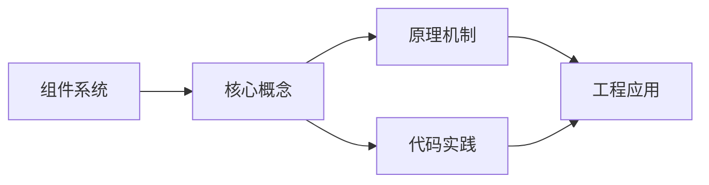
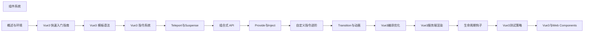

## 1. 学习目标（Bloom 分类）

本节按照布鲁姆教育目标分类学组织学习路径。本文主题为《组件系统》，属于 Vue 3 模块，读者可以根据自身阶段选择阅读深度。

记忆层面：能够准确复述本文的核心概念、术语与基本语法或操作步骤，并能够在提问或检索时快速定位对应知识点。能够说出 Vue 3 的核心概念、术语与标准写法。

理解层面：能够用自己的语言解释核心原理与工作机制，说明概念之间的因果关系，而不是机械记忆结论。能够解释 Vue 3 的工作原理与设计动机。

应用层面：能够在真实项目或练习场景中运用本文知识解决具体问题，写出正确且可维护的实现。能够编写符合 Vue 3 规范的完整实现。

分析层面：能够拆解复杂问题，比较本文主题与相邻概念的异同，识别边界条件与例外情况。能够分析 Vue 3 与相邻方案的差异与边界。

评价层面：能够根据约束条件（性能、可读性、安全、成本）评价不同方案的优劣，做出有依据的技术决策。能够根据场景评价 Vue 3 相关方案的优劣。

创造层面：能够把本文知识与其他模块知识组合，设计出新的解决方案或可复用的工程模式。能够组合 Vue 3 与其他技术设计完整方案。

通过本节学习，读者应当能够把《组件系统》纳入自己的知识网络，并与 Vue 3 模块的其他主题（组合式 API、响应式、组件通信、路由、状态管理）建立关联。

## 2. 历史动机与发展脉络

《组件系统》是 Vue 3 领域的重要主题。要真正理解它，需要先了解它解决的问题与演进过程。

Vue 由尤雨溪于 2014 年发布，以“渐进式框架”定位：可作库嵌入，也可作框架构建完整应用。Vue 3 于 2020 年 9 月发布，核心是组合式 API 与全新响应式系统。
Vue 3 的技术支柱：Proxy 响应式（替代 Object.defineProperty）、虚拟 DOM 重写（PatchFlags）、Fragment/Teleport/Suspense 内置组件、组合式 API（setup/ref/reactive/computed）。
生态现状：Vue Router 4、Pinia（官方状态库）、Vite 构建、Nuxt 全栈框架；Vue 3.5 引入 useTemplateRef 等开发者体验改进。

回到本文主题：组件系统 的提出与成熟，正是上述技术背景下的必然产物。早期实现往往以简单可用为目标，随着工程规模扩大，社区逐渐沉淀出标准做法与最佳实践；理解这一脉络，可以帮助读者判断“为什么文档中的推荐写法是现在这个样子”，也能在遇到历史遗留代码时准确识别其设计年代与取舍。


## 3. 形式化定义与核心概念精讲

本节把《组件系统》涉及的核心概念以“定义 + 讲解”的形式展开。读者应把定义当作工具，把讲解当作理解路径；两者结合才能形成可迁移的知识。

响应式：ref 包装基本类型，reactive 包装对象；effect 收集依赖，Proxy 拦截读写；computed 缓存派生值。
组件通信：props 向下、emit 向上、v-model 双向、provide/inject 跨层、事件总线（慎用）。
生命周期：setup 在创建前执行；onMounted/onUpdated/onUnmounted 对应挂载、更新、卸载；KeepAlive 增加 activated/deactivated。

### 3.1 原文章节逐一精讲

原文档把主题拆分为 22 个小节，下面按顺序给出每一节的导读讲解，随后保留原文细节供精读。

#### 原文精读（完整保留）

# 组件定义 语法速查手册

> **符号约定**:`< >` 必填参数 | `[ ]` 可选参数

---

#### 1. 组件系统概述 | Component System Overview

组件是 Vue3 应用的基本构建块，它允许我们将 UI 拆分为独立、可复用的部分。Vue3 的组件系统提供了一种清晰的方式来组织和管理应用的 UI 结构，使代码更加模块化、可维护。

##### 1.1 组件的特点

- **封装性**：组件将模板、逻辑和样式封装在一起
- **可复用性**：组件可以在多个地方重复使用
- **组合性**：组件可以嵌套组合，形成复杂的 UI 结构
- **可维护性**：组件化使代码更加清晰、易于维护

##### 1.2 组件的类型

- **全局组件**：在整个应用中可用
- **局部组件**：只在特定组件中可用
- **单文件组件**：使用 `.vue` 文件格式，包含模板、脚本和样式

#### 2. 单文件组件 | Single-File Components

单文件组件（SFC）是 Vue3 推荐的组件编写方式，它使用 `.vue` 文件格式，包含三个部分：

- `<template>`：组件的模板
- `<script>`：组件的逻辑
- `<style>`：组件的样式

##### 2.1 基本结构

```vue
<template>
  <div class="component">
    <h2>{{ title }}</h2>
    <p>{{ message }}</p>
    <button @click="handleClick">Click me</button>
  </div>
</template>
<script setup>
import { ref } from 'vue';
const title = ref('Hello');
const message = ref('Welcome to Vue3');
const handleClick = () => {
  message.value = 'You clicked the button!';
};
</script>
<style scoped>
.component {
  padding: 20px;
  border: 1px solid #ddd;
  border-radius: 8px;
}
h2 {
  color: #42b983;
}
button {
  padding: 5px 10px;
  background-color: #42b983;
  color: white;
  border: none;
  border-radius: 4px;
  cursor: pointer;
}
</style>
```

##### 2.2 script setup 语法

Vue3.2+ 提供了 `script setup` 语法糖，使组件的编写更加简洁：

- 不需要导出组件
- 直接在模板中使用定义的变量和函数
- 自动注册导入的组件

#### 3. 组件的 props

Props 是组件的输入数据，允许父组件向子组件传递数据。

##### 3.1 基本用法

```vue
<!-- ChildComponent.vue -->
<template>
  <div class="child">
    <h3>{{ title }}</h3>
    <p>{{ message }}</p>
  </div>
</template>
<script setup>
defineProps({
 title: String,
 message: {
 type: String,
 default: 'Default message'
 }
}
</script>
<!-- ParentComponent.vue -->
<template>
  <div class="parent">
    <ChildComponent title="Hello from parent" message="This is a prop" />
  </div>
</template>
<script setup>
import ChildComponent from './ChildComponent.vue';
</script>
```

##### 3.2 Props 验证

```vue
<script setup>
defineProps({
 // 基本类型
 title: String,
 count: Number,
 isActive: Boolean,
 items: Array,
 user: Object,
 callback: Function,
 // 带默认值
 message: {
 type: String,
 default: 'Default message'
 },
 // 必需的
 requiredProp: {
 type: String,
 required:
 },
 // 自定义验证
 customProp: {
 validator: (value) => {
 return ['option1', 'option2'].includes(value)
 }
 }
}
</script>
```

#### 4. 组件的事件

事件允许子组件向父组件传递消息。

##### 4.1 基本用法

```vue
<!-- ChildComponent.vue -->
<template>
  <div class="child">
    <button @click="handleClick">Click me</button>
  </div>
</template>
<script setup>
const emit = defineEmits(['click', 'custom-event']);
const handleClick = () => {
  emit('click', 'Button clicked');
  emit('custom-event', { data: 'Custom event data' });
};
</script>
<!-- ParentComponent.vue -->
<template>
  <div class="parent">
    <ChildComponent @click="handleChildClick" @custom-event="handleCustomEvent" />
  </div>
</template>
<script setup>
import ChildComponent from './ChildComponent.vue';
const handleChildClick = (message) => {
  console.log('Child clicked:', message);
};
const handleCustomEvent = (data) => {
  console.log('Custom event:', data);
};
</script>
```

##### 4.2 事件验证

```vue
<script setup>
const emit = defineEmits({
 // 基本事件
 click: null,
 // 带参数验证的事件
 'update:count': (value) => {
 return typeof value === 'number'
 }
}
</script>
```

#### 5. 组件的插槽

插槽允许父组件向子组件的特定位置插入内容。

##### 5.1 基本插槽

```vue
<!-- ChildComponent.vue -->
<template>
  <div class="child">
    <h3>Child Component</h3>
    <slot></slot>
  </div>
</template>
<!-- ParentComponent.vue -->
<template>
  <div class="parent">
    <ChildComponent>
      <p>This content is inserted into the slot</p>
    </ChildComponent>
  </div>
</template>
```

##### 5.2 具名插槽

```vue
<!-- ChildComponent.vue -->
<template>
  <div class="child">
    <header>
      <slot name="header"></slot>
    </header>
    <main>
      <slot></slot>
    </main>
    <footer>
      <slot name="footer"></slot>
    </footer>
  </div>
</template>
<!-- ParentComponent.vue -->
<template>
  <div class="parent">
    <ChildComponent>
      <template #header>
        <h2>Page Header</h2>
      </template>
      <p>Main content goes here</p>
      <template #footer>
        <p>Page Footer</p>
      </template>
    </ChildComponent>
  </div>
</template>
```

##### 5.3 作用域插槽

```vue
<!-- ChildComponent.vue -->
<template>
  <div class="child">
    <ul>
      <li v-for="item in items" :key="item.id">
        <slot :item="item">{{ item.name }}</slot>
      </li>
    </ul>
  </div>
</template>
<script setup>
import { ref } from 'vue'
const items = ref([
 { id: 1, name: 'Item 1' },
 { id: 2, name: 'Item 2' },
 { id: 3, name: 'Item 3' }
]
</script>
<!-- ParentComponent.vue -->
<template>
  <div class="parent">
    <ChildComponent>
      <template #default="{ item }">
        <strong>{{ item.id }}: {{ item.name }}</strong>
      </template>
    </ChildComponent>
  </div>
</template>
```

#### 6. 组件的生命周期

组件的生命周期包括创建、挂载、更新、卸载等阶段，我们可以在这些阶段执行相应的逻辑。

##### 6.1 生命周期钩子

| 钩子函数            | 描述               |
| :------------------ | :----------------- |
| `onMounted`         | 组件挂载后         |
| `onUpdated`         | 组件更新后         |
| `onUnmounted`       | 组件卸载后         |
| `onBeforeMount`     | 组件挂载前         |
| `onBeforeUpdate`    | 组件更新前         |
| `onBeforeUnmount`   | 组件卸载前         |
| `onErrorCaptured`   | 捕获子组件错误     |
| `onRenderTracked`   | 响应式依赖被追踪时 |
| `onRenderTriggered` | 响应式依赖被触发时 |

##### 6.2 使用生命周期钩子

```vue
<template>
  <div class="component">
    <h2>{{ title }}</h2>
    <p>{{ message }}</p>
  </div>
</template>
<script setup>
import { ref, onMounted, onUpdated, onUnmounted } from 'vue';
const title = ref('Hello');
const message = ref('Welcome to Vue3');
onMounted(() => {
  console.log('Component mounted');
  // 执行初始化逻辑
});
onUpdated(() => {
  console.log('Component updated');
  // 执行更新后逻辑
});
onUnmounted(() => {
  console.log('Component unmounted');
  // 执行清理逻辑
});
</script>
```

#### 7. 组件的通信

##### 7.1 父子组件通信

- **Props**：父组件向子组件传递数据
- **Events**：子组件向父组件传递消息
- **Refs**：父组件访问子组件的实例或 DOM 元素

##### 7.2 跨组件通信

- **Provide/Inject**：祖先组件向后代组件传递数据
- **Pinia/Vuex**：状态管理库
- **Event Bus**：事件总线

##### 7.3 Provide/Inject 示例

```vue
<!-- GrandparentComponent.vue -->
<script setup>
import { provide, ref } from 'vue';
import ParentComponent from './ParentComponent.vue';
const theme = ref('light');
const changeTheme = () => {
  theme.value = theme.value === 'light' ? 'dark' : 'light';
};
provide('theme', theme);
provide('changeTheme', changeTheme);
</script>
<!-- ChildComponent.vue -->
<script setup>
import { inject } from 'vue';
const theme = inject('theme', 'light');
const changeTheme = inject('changeTheme');
</script>
<template>
  <div :class="theme">
    <p>Current theme: {{ theme }}</p>
    <button @click="changeTheme">Change theme</button>
  </div>
</template>
<style scoped>
.light {
  background-color: white;
  color: black;
}
.dark {
  background-color: black;
  color: white;
}
</style>
```

#### 8. 组件的高级特性

##### 8.1 动态组件

```vue
<template>
  <div class="dynamic-component">
    <button @click="currentComponent = 'ComponentA'">Component A</button>
    <button @click="currentComponent = 'ComponentB'">Component B</button>
    <component :is="currentComponent"></component>
  </div>
</template>
<script setup>
import { ref } from 'vue';
import ComponentA from './ComponentA.vue';
import ComponentB from './ComponentB.vue';
const currentComponent = ref('ComponentA');
</script>
```

##### 8.2 异步组件

```vue
<template>
  <div class="async-component">
    <Suspense>
      <template #default>
        <AsyncComponent />
      </template>
      <template #fallback>
        <p>Loading...</p>
      </template>
    </Suspense>
  </div>
</template>
<script setup>
import { defineAsyncComponent } from 'vue'
const AsyncComponent = defineAsyncComponent({
 loader: () => import('./AsyncComponent.vue'),
 loadingComponent: () => '<p>Loading...</p>',
 errorComponent: () => '<p>Error</p>',
 delay: 200,
 timeout: 3000
}
</script>
```

##### 8.3 递归组件

```vue
<template>
  <div class="tree-node">
    <div class="node-content" @click="toggle">
      {{ node.name }}
    </div>
    <div v-if="isOpen && node.children" class="node-children">
      <TreeNode v-for="child in node.children" :key="child.id" :node="child" />
    </div>
  </div>
</template>
<script setup>
import { ref } from 'vue'
const props = defineProps({
 node: Object
}
const isOpen = ref(false)
const toggle = () => {
 isOpen.value = !isOpen.value
}
</script>
<style scoped>
.tree-node {
  margin-left: 20px;
}
.node-content {
  cursor: pointer;
  padding: 5px;
  border: 1px solid #ddd;
  border-radius: 4px;
  margin: 5px 0;
}
.node-content:hover {
  background-color: #f0f0f0;
}
.node-children {
  margin-top: 5px;
}
</style>
```

#### 9. 组件的最佳实践

##### 9.1 组件设计原则

- **单一职责**：每个组件只负责一个功能
- **可复用性**：设计通用的、可复用的组件
- **可维护性**：代码清晰、易于理解和维护
- **性能优化**：避免不必要的渲染和计算

##### 9.2 组件命名规范

- **组件名**：使用 PascalCase（大驼峰）命名
- **文件名**：使用 PascalCase 命名，与组件名一致
- **props 名**：使用 camelCase（小驼峰）命名
- **事件名**：使用 kebab-case（短横线分隔）命名

##### 9.3 组件样式规范

- **使用 scoped**：避免样式冲突
- **使用 CSS 变量**：便于主题切换
- **使用 BEM 命名**：提高样式的可维护性
- **避免使用深度选择器**：保持组件的封装性

##### 9.4 性能优化

- **使用 v-memo**：缓存计算结果
- **使用 v-once**：只渲染一次
- **使用 keep-alive**：缓存组件状态
- **使用 shallowRef 和 shallowReactive**：减少响应式开销
- **避免在模板中使用复杂表达式**：使用计算属性

#### 10. 示例 | Examples

##### 10.1 基础组件示例

```vue
<!-- Button.vue -->
<template>
  <button
    :class="['btn', `btn-${variant}`, { 'btn-disabled': disabled }]"
    :disabled="disabled"
    @click="$emit('click')"
  >
    <slot></slot>
  </button>
</template>
<script setup>
defineProps({
 variant: {
 type: String,
 default: 'primary',
 validator: (value) => {
 return ['primary', 'secondary', 'success', 'danger'].includes(value)
 }
 },
 disabled: {
 type: Boolean,
 default: false
 }
}
defineEmits(['click'])
</script>
<style scoped>
.btn {
  padding: 8px 16px;
  border: none;
  border-radius: 4px;
  cursor: pointer;
  font-size: 14px;
}
.btn-primary {
  background-color: #42b983;
  color: white;
}
.btn-secondary {
  background-color: #999;
  color: white;
}
.btn-success {
  background-color: #28a745;
  color: white;
}
.btn-danger {
  background-color: #dc3545;
  color: white;
}
.btn-disabled {
  opacity: 0.6;
  cursor: not-allowed;
}
</style>
```

##### 10.2 复杂组件示例

```vue
<!-- TodoList.vue -->
<template>
  <div class="todo-list">
    <h2>Todo List</h2>
    <div class="todo-input">
      <input v-model="newTodo" @keyup.enter="addTodo" placeholder="Add a new todo" />
      <button @click="addTodo">Add</button>
    </div>
    <ul class="todo-items">
      <li v-for="todo in todos" :key="todo.id" class="todo-item">
        <input type="checkbox" v-model="todo.completed" @change="updateTodo(todo)" />
        <span :class="{ completed: todo.completed }">{{ todo.text }}</span>
        <button @click="deleteTodo(todo.id)">Delete</button>
      </li>
    </ul>
    <div class="todo-stats">
      <p>Total: {{ todos.length }}</p>
      <p>Completed: {{ completedCount }}</p>
      <p>Remaining: {{ remainingCount }}</p>
    </div>
  </div>
</template>
<script setup>
import { ref, computed } from 'vue'
const todos = ref([
 { id: 1, text: 'Learn Vue3', completed: false },
 { id: 2, text: 'Build a project', completed: false },
 { id: 3, text: 'Deploy to production', completed: false }
]
const newTodo = ref('')
const completedCount = computed(() => {
 return todos.value.filter(todo => todo.completed).length
}
const remainingCount = computed(() => {
 return todos.value.filter(todo => !todo.completed).length
}
const addTodo = () => {
 if (newTodo.value.trim()) {
 todos.value.push({
 id: Date.now(),
 text: newTodo.value.trim(),
 completed: false
 })
 newTodo.value = ''
 }
}
const updateTodo = (todo) => {
 // 可以在这里添加更新逻辑，比如发送到服务器
 console.log('Updated todo:', todo)
}
const deleteTodo = (id) => {
 todos.value = todos.value.filter(todo => todo.id !== id)
}
</script>
<style scoped>
.todo-list {
  max-width: 400px;
  margin: 0 auto;
  padding: 20px;
  border: 1px solid #ddd;
  border-radius: 8px;
}
.todo-input {
  display: flex;
  margin-bottom: 20px;
}
.todo-input input {
  flex: 1;
  padding: 8px;
  border: 1px solid #ddd;
  border-radius: 4px 0 0 4px;
}
.todo-input button {
  padding: 8px 16px;
  background-color: #42b983;
  color: white;
  border: none;
  border-radius: 0 4px 4px 0;
  cursor: pointer;
}
.todo-items {
  list-style-type: none;
  padding: 0;
  margin-bottom: 20px;
}
.todo-item {
  display: flex;
  align-items: center;
  padding: 10px;
  border-bottom: 1px solid #eee;
}
.todo-item input {
  margin-right: 10px;
}
.todo-item span {
  flex: 1;
}
.todo-item .completed {
  text-decoration: line-through;
  color: #999;
}
.todo-item button {
  padding: 4px 8px;
  background-color: #dc3545;
  color: white;
  border: none;
  border-radius: 4px;
  cursor: pointer;
}
.todo-stats {
  display: flex;
  justify-content: space-between;
  font-size: 14px;
  color: #666;
}
</style>
```

#### 11. 小结 | Summary

Vue3 的组件系统是其核心特性之一，它提供了一种清晰、模块化的方式来组织和管理应用的 UI 结构。通过本章节的学习，你已经了解了 Vue3 组件系统的基本概念和使用方法，包括单文件组件、props、事件、插槽、生命周期、组件通信和高级特性。
组件系统的核心优势在于它允许我们将 UI 拆分为独立、可复用的部分，使代码更加模块化、可维护。在实际开发中，要遵循组件设计原则，使用合适的命名规范和样式规范，注意性能优化，以构建高质量的 Vue3 应用。
#### 单文件组件(SFC)

**script setup 语法糖**
```vue
<script setup>
import { ref } from 'vue';
const count = ref(0);
function increment() {
  count.value++;
}
</script>

<template>
  <button @click="increment">{{ count }}</button>
</template>
```

**普通 script + setup 函数**
```vue
<script>
import { defineComponent, ref } from 'vue';
export default defineComponent({
  setup() {
    const count = ref(0);
    return { count };
  }
});
</script>
```

**TypeScript + script setup**
```vue
<script setup lang="ts">
import { ref } from 'vue';
const count = ref<number>(0);
</script>
```

---

#### 组件注册

**局部注册**
```vue
<script setup>
import MyButton from './MyButton.vue';
import { UserCard } from './components';
</script>

<template>
  <MyButton />
  <UserCard />
</template>
```

**全局注册**
```typescript
import { createApp } from 'vue';
import MyButton from './MyButton.vue';

const app = createApp({});
app.component('MyButton', MyButton);
app.component('AsyncComp', () => import('./AsyncComp.vue'));
```

---

#### defineComponent 类型辅助

**defineComponent 类型推断**
`defineComponent(<componentOptions>);`
```typescript
import { defineComponent } from 'vue';

export default defineComponent({
  name: 'MyComp',
  props: {
    title: String,
    count: { type: Number, default: 0 }
  },
  emits: ['change'],
  setup(props, { emit }) {
    return {};
  }
});
```

**defineComponent + 泛型**
```typescript
import { defineComponent, PropType } from 'vue';

export default defineComponent({
  props: {
    list: { type: Array as PropType<string[]>, required: true },
    config: Object as PropType<{ apiBase: string }>
  }
});
```

---

#### Props 声明

**defineProps 运行时声明**
```typescript
const props = defineProps({
  title: String,
  count: { type: Number, default: 0 },
  list: { type: Array, required: true },
  callback: { type: Function, default: () => {} },
  user: { type: Object, default: () => ({ name: '' }) }
});
```

**defineProps 泛型声明**
```typescript
interface Props {
  title: string;
  count?: number;
  list: string[];
  user?: { name: string };
}
const props = defineProps<Props>();
```

**defineProps 带默认值(泛型)**
```typescript
const props = withDefaults(defineProps<{
  title?: string;
  count?: number;
}>(), {
  title: 'default',
  count: 0
});
```

**响应式 props 解构(Vue 3.5+)**
```typescript
const { title = 'default', count = 0 } = defineProps<{
  title?: string;
  count?: number;
}>();
```

**PropType 复杂类型**
```typescript
import { defineProps, PropType } from 'vue';

const props = defineProps({
  list: Array as PropType<{ id: number; name: string }[]>,
  callback: Function as PropType<(value: string) => void>
});
```

---

#### Emits 声明

**defineEmits 数组形式**
```typescript
const emit = defineEmits(['change', 'submit', 'delete']);
emit('change', newValue);
emit('submit', { id: 1 });
```

**defineEmits 对象形式(校验)**
```typescript
const emit = defineEmits({
  change: (val: string) => typeof val === 'string',
  submit: (payload: { id: number }) => !!payload.id
});
```

**defineEmits 泛型形式**
```typescript
const emit = defineEmits<{
  (e: 'change', value: string): void;
  (e: 'submit', payload: { id: number; data?: any }): void;
  (e: 'delete', id: number): void;
}>();
```

---

#### 组件选项

**defineOptions 定义组件选项**
```typescript
defineOptions({
  name: 'UserCard',
  inheritAttrs: false,
  components: { MyButton },
  directives: { focus: { mounted: (el) => el.focus() } }
});
```

**defineSlots 声明插槽类型**
```typescript
const slots = defineSlots<{
  default(props: { item: any }): any;
  header?(props: { title: string }): any;
  footer?(): any;
}>();
```

---

#### 插槽

**默认插槽**
```vue
<!-- 父组件 -->
<Card>
  <p>这是默认插槽内容</p>
</Card>

<!-- 子组件 Card.vue -->
<template>
  <div class="card">
    <slot />
  </div>
</template>
```

**具名插槽**
```vue
<!-- 父组件 -->
<Card>
  <template #header>
    <h1>标题</h1>
  </template>
  <template #footer>
    <p>页脚</p>
  </template>
</Card>

<!-- 子组件 -->
<template>
  <slot name="header" />
  <slot />
  <slot name="footer" />
</template>
```

**作用域插槽**
```vue
<!-- 子组件 -->
<template>
  <ul>
    <li v-for="item in items" :key="item.id">
      <slot :item="item" :index="item.id" />
    </li>
  </ul>
</template>

<!-- 父组件 -->
<List :items="items">
  <template #default="{ item, index }">
    {{ index }}: {{ item.name }}
  </template>
</List>

<!-- 简写 -->
<List :items="items">
  <template="{ item }">
    {{ item.name }}
  </template>
</List>
```

**useSlots 访问插槽**
```typescript
import { useSlots, computed } from 'vue';
const slots = useSlots();
const hasHeader = computed(() => !!slots.header);
```

---

#### 组件 v-model

**单 v-model**
```vue
<!-- 父组件 -->
<MyInput v-model="text" />

<!-- 子组件 MyInput.vue -->
<script setup>
const model = defineModel<string>();
</script>
<template>
  <input :value="model" @input="model = $event.target.value" />
</template>
```

**多个 v-model**
```vue
<!-- 父组件 -->
<UserForm v-model:firstName="first" v-model:lastName="last" />

<!-- 子组件 -->
<script setup>
const firstName = defineModel<string>('firstName');
const lastName = defineModel<string>('lastName');
</script>
```

**v-model 修饰符**
```typescript
const [model, modifiers] = defineModel({
  set(value) {
    if (modifiers.capitalize) {
      return value.charAt(0).toUpperCase() + value.slice(1);
    }
    return value;
  }
});
```

---

#### 异步组件

**defineAsyncComponent 异步组件**
`const <comp> = defineAsyncComponent(<loader>);`
```typescript
import { defineAsyncComponent } from 'vue';

const AsyncComp = defineAsyncComponent(() => import('./AsyncComp.vue'));

const AsyncCompWithOpts = defineAsyncComponent({
  loader: () => import('./AsyncComp.vue'),
  loadingComponent: LoadingComp,
  errorComponent: ErrorComp,
  delay: 200,
  timeout: 3000,
  suspensible: true,
  onError(err, retry, fail, attempts) {
    if (attempts <= 3) retry();
    else fail();
  }
});
```

---

#### 透传 Attributes

**默认透传**
```vue
<!-- 父组件 -->
<MyInput class="large" id="name-input" data-test="input" />

<!-- 子组件 MyInput.vue(单根) -->
<template>
  <input />  <!-- class/id/data-* 自动透传到此 -->
</template>
```

**禁用透传**
```typescript
defineOptions({
  inheritAttrs: false
});
```

**$attrs 显式绑定**
```vue
<template>
  <input v-bind="$attrs" />
</template>
```

**useAttrs**
```typescript
import { useAttrs } from 'vue';
const attrs = useAttrs();
console.log(attrs.class, attrs.id);
```

---

#### 暴露组件实例

**defineExpose 暴露**
```vue
<script setup>
import { ref } from 'vue';
const count = ref(0);
const reset = () => { count.value = 0; };

defineExpose({ count, reset });
</script>
```

**父组件通过 ref 访问**
```vue
<template>
  <ChildComp ref="childRef" />
  <button @click="childRef?.reset()">重置</button>
</template>
<script setup>
import { useTemplateRef } from 'vue';
const childRef = useTemplateRef('childRef');
</script>
```


### 3.2 概念关系图

下面用 Mermaid 图表达本文核心概念之间的关系，帮助读者建立整体图景：



图中展示的是本文知识的结构化关系：核心概念是入口，原理机制解释“为什么”，代码实践演示“怎么做”，工程应用回答“何时用”。读者学习时可以把每个小节的内容挂接到对应节点上。

## 4. 理论推导与原理解析

本节深入《组件系统》背后的原理。理论部分不求面面俱到，而是聚焦“能解释现象、能指导实践”的关键推导。

响应式：ref 包装基本类型，reactive 包装对象；effect 收集依赖，Proxy 拦截读写；computed 缓存派生值。
组件通信：props 向下、emit 向上、v-model 双向、provide/inject 跨层、事件总线（慎用）。
生命周期：setup 在创建前执行；onMounted/onUpdated/onUnmounted 对应挂载、更新、卸载；KeepAlive 增加 activated/deactivated。
模板编译：模板在构建期编译为渲染函数，指令（v-if/v-for/v-model）是编译糖。

需要强调的是，理论推导与工程实践之间存在翻译层：理论给出的是理想化模型与边界条件，工程代码则必须处理真实环境中的例外。读者在学习时应先掌握理论的“标准情形”，再通过陷阱章节了解“非标准情形”。

## 5. 代码示例与逐行讲解

本节把原文中的代码示例系统整理，并为每个示例补充用途说明与讲解。读者不应只浏览代码，而应逐段对照讲解理解设计意图。

### 5.1 示例：2.1 基本结构

该示例来自原文《2.1 基本结构》小节，用于演示组件系统相关操作。阅读时请先看代码结构，再看其后的讲解。

```vue
<template>
  <div class="component">
    <h2>{{ title }}</h2>
    <p>{{ message }}</p>
    <button @click="handleClick">Click me</button>
  </div>
</template>
<script setup>
import { ref } from 'vue';
const title = ref('Hello');
const message = ref('Welcome to Vue3');
const handleClick = () => {
  message.value = 'You clicked the button!';
};
</script>
<style scoped>
.component {
  padding: 20px;
  border: 1px solid #ddd;
  border-radius: 8px;
}
h2 {
  color: #42b983;
}
button {
  padding: 5px 10px;
  background-color: #42b983;
  color: white;
  border: none;
  border-radius: 4px;
  cursor: pointer;
}
</style>
```

讲解：这段代码演示了本节核心知识点。代码中的关键操作可以归纳为三步：准备（定义或初始化）、执行（核心逻辑）、收尾（释放资源或返回结果）。实际项目中，这三步往往被封装为函数或类，以提升复用性与可测试性。

关键点分析：

该示例共 33 行有效代码，包含 3 类关键结构（class、import、from）。其中：

- 入口与初始化部分负责建立上下文，对应实际项目中的启动或装配逻辑；
- 核心逻辑部分体现本文主题的主要操作，是阅读时最需要对照讲解理解的部分；
- 输出或返回部分把结果交给调用方，注意其类型与边界条件。

进阶思考路径：先尝试修改参数观察行为变化，再把示例中的模式迁移到自己的项目中；每次修改都记录预期与实测差异，这是把示例转化为能力的最快方式。

### 5.2 示例：3.1 基本用法

该示例来自原文《3.1 基本用法》小节，用于演示组件系统相关操作。阅读时请先看代码结构，再看其后的讲解。

```vue
<!-- ChildComponent.vue -->
<template>
  <div class="child">
    <h3>{{ title }}</h3>
    <p>{{ message }}</p>
  </div>
</template>
<script setup>
defineProps({
 title: String,
 message: {
 type: String,
 default: 'Default message'
 }
}
</script>
<!-- ParentComponent.vue -->
<template>
  <div class="parent">
    <ChildComponent title="Hello from parent" message="This is a prop" />
  </div>
</template>
<script setup>
import ChildComponent from './ChildComponent.vue';
</script>
```

讲解：这段代码演示了本节核心知识点。代码中的关键操作可以归纳为三步：准备（定义或初始化）、执行（核心逻辑）、收尾（释放资源或返回结果）。实际项目中，这三步往往被封装为函数或类，以提升复用性与可测试性。

关键点分析：

该示例共 25 行有效代码，包含 3 类关键结构（class、import、from）。其中：

- 入口与初始化部分负责建立上下文，对应实际项目中的启动或装配逻辑；
- 核心逻辑部分体现本文主题的主要操作，是阅读时最需要对照讲解理解的部分；
- 输出或返回部分把结果交给调用方，注意其类型与边界条件。

进阶思考路径：先尝试修改参数观察行为变化，再把示例中的模式迁移到自己的项目中；每次修改都记录预期与实测差异，这是把示例转化为能力的最快方式。

### 5.3 示例：3.2 Props 验证

该示例来自原文《3.2 Props 验证》小节，用于演示组件系统相关操作。阅读时请先看代码结构，再看其后的讲解。

```vue
<script setup>
defineProps({
 // 基本类型
 title: String,
 count: Number,
 isActive: Boolean,
 items: Array,
 user: Object,
 callback: Function,
 // 带默认值
 message: {
 type: String,
 default: 'Default message'
 },
 // 必需的
 requiredProp: {
 type: String,
 required:
 },
 // 自定义验证
 customProp: {
 validator: (value) => {
 return ['option1', 'option2'].includes(value)
 }
 }
}
</script>
```

讲解：这段代码演示了本节核心知识点。代码中的关键操作可以归纳为三步：准备（定义或初始化）、执行（核心逻辑）、收尾（释放资源或返回结果）。实际项目中，这三步往往被封装为函数或类，以提升复用性与可测试性。

关键点分析：

该示例共 27 行有效代码，包含 1 类关键结构（return）。其中：

- 入口与初始化部分负责建立上下文，对应实际项目中的启动或装配逻辑；
- 核心逻辑部分体现本文主题的主要操作，是阅读时最需要对照讲解理解的部分；
- 输出或返回部分把结果交给调用方，注意其类型与边界条件。

进阶思考路径：先尝试修改参数观察行为变化，再把示例中的模式迁移到自己的项目中；每次修改都记录预期与实测差异，这是把示例转化为能力的最快方式。

### 5.4 示例：4.1 基本用法

该示例来自原文《4.1 基本用法》小节，用于演示组件系统相关操作。阅读时请先看代码结构，再看其后的讲解。

```vue
<!-- ChildComponent.vue -->
<template>
  <div class="child">
    <button @click="handleClick">Click me</button>
  </div>
</template>
<script setup>
const emit = defineEmits(['click', 'custom-event']);
const handleClick = () => {
  emit('click', 'Button clicked');
  emit('custom-event', { data: 'Custom event data' });
};
</script>
<!-- ParentComponent.vue -->
<template>
  <div class="parent">
    <ChildComponent @click="handleChildClick" @custom-event="handleCustomEvent" />
  </div>
</template>
<script setup>
import ChildComponent from './ChildComponent.vue';
const handleChildClick = (message) => {
  console.log('Child clicked:', message);
};
const handleCustomEvent = (data) => {
  console.log('Custom event:', data);
};
</script>
```

讲解：这段代码演示了本节核心知识点。代码中的关键操作可以归纳为三步：准备（定义或初始化）、执行（核心逻辑）、收尾（释放资源或返回结果）。实际项目中，这三步往往被封装为函数或类，以提升复用性与可测试性。

关键点分析：

该示例共 28 行有效代码，包含 3 类关键结构（class、import、from）。其中：

- 入口与初始化部分负责建立上下文，对应实际项目中的启动或装配逻辑；
- 核心逻辑部分体现本文主题的主要操作，是阅读时最需要对照讲解理解的部分；
- 输出或返回部分把结果交给调用方，注意其类型与边界条件。

进阶思考路径：先尝试修改参数观察行为变化，再把示例中的模式迁移到自己的项目中；每次修改都记录预期与实测差异，这是把示例转化为能力的最快方式。

### 5.5 示例：4.2 事件验证

该示例来自原文《4.2 事件验证》小节，用于演示组件系统相关操作。阅读时请先看代码结构，再看其后的讲解。

```vue
<script setup>
const emit = defineEmits({
 // 基本事件
 click: null,
 // 带参数验证的事件
 'update:count': (value) => {
 return typeof value === 'number'
 }
}
</script>
```

讲解：这段代码演示了本节核心知识点。代码中的关键操作可以归纳为三步：准备（定义或初始化）、执行（核心逻辑）、收尾（释放资源或返回结果）。实际项目中，这三步往往被封装为函数或类，以提升复用性与可测试性。

关键点分析：

该示例共 10 行有效代码，包含 1 类关键结构（return）。其中：

- 入口与初始化部分负责建立上下文，对应实际项目中的启动或装配逻辑；
- 核心逻辑部分体现本文主题的主要操作，是阅读时最需要对照讲解理解的部分；
- 输出或返回部分把结果交给调用方，注意其类型与边界条件。

进阶思考路径：先尝试修改参数观察行为变化，再把示例中的模式迁移到自己的项目中；每次修改都记录预期与实测差异，这是把示例转化为能力的最快方式。

### 5.6 示例：5.1 基本插槽

该示例来自原文《5.1 基本插槽》小节，用于演示组件系统相关操作。阅读时请先看代码结构，再看其后的讲解。

```vue
<!-- ChildComponent.vue -->
<template>
  <div class="child">
    <h3>Child Component</h3>
    <slot></slot>
  </div>
</template>
<!-- ParentComponent.vue -->
<template>
  <div class="parent">
    <ChildComponent>
      <p>This content is inserted into the slot</p>
    </ChildComponent>
  </div>
</template>
```

讲解：这段代码演示了本节核心知识点。代码中的关键操作可以归纳为三步：准备（定义或初始化）、执行（核心逻辑）、收尾（释放资源或返回结果）。实际项目中，这三步往往被封装为函数或类，以提升复用性与可测试性。

关键点分析：

该示例共 15 行有效代码，包含 1 类关键结构（class）。其中：

- 入口与初始化部分负责建立上下文，对应实际项目中的启动或装配逻辑；
- 核心逻辑部分体现本文主题的主要操作，是阅读时最需要对照讲解理解的部分；
- 输出或返回部分把结果交给调用方，注意其类型与边界条件。

进阶思考路径：先尝试修改参数观察行为变化，再把示例中的模式迁移到自己的项目中；每次修改都记录预期与实测差异，这是把示例转化为能力的最快方式。

### 5.7 示例：5.2 具名插槽

该示例来自原文《5.2 具名插槽》小节，用于演示组件系统相关操作。阅读时请先看代码结构，再看其后的讲解。

```vue
<!-- ChildComponent.vue -->
<template>
  <div class="child">
    <header>
      <slot name="header"></slot>
    </header>
    <main>
      <slot></slot>
    </main>
    <footer>
      <slot name="footer"></slot>
    </footer>
  </div>
</template>
<!-- ParentComponent.vue -->
<template>
  <div class="parent">
    <ChildComponent>
      <template #header>
        <h2>Page Header</h2>
      </template>
      <p>Main content goes here</p>
      <template #footer>
        <p>Page Footer</p>
      </template>
    </ChildComponent>
  </div>
</template>
```

讲解：这段代码演示了本节核心知识点。代码中的关键操作可以归纳为三步：准备（定义或初始化）、执行（核心逻辑）、收尾（释放资源或返回结果）。实际项目中，这三步往往被封装为函数或类，以提升复用性与可测试性。

关键点分析：

该示例共 28 行有效代码，包含 1 类关键结构（class）。其中：

- 入口与初始化部分负责建立上下文，对应实际项目中的启动或装配逻辑；
- 核心逻辑部分体现本文主题的主要操作，是阅读时最需要对照讲解理解的部分；
- 输出或返回部分把结果交给调用方，注意其类型与边界条件。

进阶思考路径：先尝试修改参数观察行为变化，再把示例中的模式迁移到自己的项目中；每次修改都记录预期与实测差异，这是把示例转化为能力的最快方式。

### 5.8 示例：5.3 作用域插槽

该示例来自原文《5.3 作用域插槽》小节，用于演示组件系统相关操作。阅读时请先看代码结构，再看其后的讲解。

```vue
<!-- ChildComponent.vue -->
<template>
  <div class="child">
    <ul>
      <li v-for="item in items" :key="item.id">
        <slot :item="item">{{ item.name }}</slot>
      </li>
    </ul>
  </div>
</template>
<script setup>
import { ref } from 'vue'
const items = ref([
 { id: 1, name: 'Item 1' },
 { id: 2, name: 'Item 2' },
 { id: 3, name: 'Item 3' }
]
</script>
<!-- ParentComponent.vue -->
<template>
  <div class="parent">
    <ChildComponent>
      <template #default="{ item }">
        <strong>{{ item.id }}: {{ item.name }}</strong>
      </template>
    </ChildComponent>
  </div>
</template>
```

讲解：这段代码演示了本节核心知识点。代码中的关键操作可以归纳为三步：准备（定义或初始化）、执行（核心逻辑）、收尾（释放资源或返回结果）。实际项目中，这三步往往被封装为函数或类，以提升复用性与可测试性。

关键点分析：

该示例共 28 行有效代码，包含 3 类关键结构（class、import、from）。其中：

- 入口与初始化部分负责建立上下文，对应实际项目中的启动或装配逻辑；
- 核心逻辑部分体现本文主题的主要操作，是阅读时最需要对照讲解理解的部分；
- 输出或返回部分把结果交给调用方，注意其类型与边界条件。

进阶思考路径：先尝试修改参数观察行为变化，再把示例中的模式迁移到自己的项目中；每次修改都记录预期与实测差异，这是把示例转化为能力的最快方式。

### 5.9 示例：6.2 使用生命周期钩子

该示例来自原文《6.2 使用生命周期钩子》小节，用于演示组件系统相关操作。阅读时请先看代码结构，再看其后的讲解。

```vue
<template>
  <div class="component">
    <h2>{{ title }}</h2>
    <p>{{ message }}</p>
  </div>
</template>
<script setup>
import { ref, onMounted, onUpdated, onUnmounted } from 'vue';
const title = ref('Hello');
const message = ref('Welcome to Vue3');
onMounted(() => {
  console.log('Component mounted');
  // 执行初始化逻辑
});
onUpdated(() => {
  console.log('Component updated');
  // 执行更新后逻辑
});
onUnmounted(() => {
  console.log('Component unmounted');
  // 执行清理逻辑
});
</script>
```

讲解：这段代码演示了本节核心知识点。代码中的关键操作可以归纳为三步：准备（定义或初始化）、执行（核心逻辑）、收尾（释放资源或返回结果）。实际项目中，这三步往往被封装为函数或类，以提升复用性与可测试性。

关键点分析：

该示例共 23 行有效代码，包含 3 类关键结构（class、import、from）。其中：

- 入口与初始化部分负责建立上下文，对应实际项目中的启动或装配逻辑；
- 核心逻辑部分体现本文主题的主要操作，是阅读时最需要对照讲解理解的部分；
- 输出或返回部分把结果交给调用方，注意其类型与边界条件。

进阶思考路径：先尝试修改参数观察行为变化，再把示例中的模式迁移到自己的项目中；每次修改都记录预期与实测差异，这是把示例转化为能力的最快方式。

### 5.10 示例：7.3 Provide/Inject 示例

该示例来自原文《7.3 Provide/Inject 示例》小节，用于演示组件系统相关操作。阅读时请先看代码结构，再看其后的讲解。

```vue
<!-- GrandparentComponent.vue -->
<script setup>
import { provide, ref } from 'vue';
import ParentComponent from './ParentComponent.vue';
const theme = ref('light');
const changeTheme = () => {
  theme.value = theme.value === 'light' ? 'dark' : 'light';
};
provide('theme', theme);
provide('changeTheme', changeTheme);
</script>
<!-- ChildComponent.vue -->
<script setup>
import { inject } from 'vue';
const theme = inject('theme', 'light');
const changeTheme = inject('changeTheme');
</script>
<template>
  <div :class="theme">
    <p>Current theme: {{ theme }}</p>
    <button @click="changeTheme">Change theme</button>
  </div>
</template>
<style scoped>
.light {
  background-color: white;
  color: black;
}
.dark {
  background-color: black;
  color: white;
}
</style>
```

讲解：这段代码演示了本节核心知识点。代码中的关键操作可以归纳为三步：准备（定义或初始化）、执行（核心逻辑）、收尾（释放资源或返回结果）。实际项目中，这三步往往被封装为函数或类，以提升复用性与可测试性。

关键点分析：

该示例共 33 行有效代码，包含 3 类关键结构（class、import、from）。其中：

- 入口与初始化部分负责建立上下文，对应实际项目中的启动或装配逻辑；
- 核心逻辑部分体现本文主题的主要操作，是阅读时最需要对照讲解理解的部分；
- 输出或返回部分把结果交给调用方，注意其类型与边界条件。

进阶思考路径：先尝试修改参数观察行为变化，再把示例中的模式迁移到自己的项目中；每次修改都记录预期与实测差异，这是把示例转化为能力的最快方式。

### 5.11 示例：8.1 动态组件

该示例来自原文《8.1 动态组件》小节，用于演示组件系统相关操作。阅读时请先看代码结构，再看其后的讲解。

```vue
<template>
  <div class="dynamic-component">
    <button @click="currentComponent = 'ComponentA'">Component A</button>
    <button @click="currentComponent = 'ComponentB'">Component B</button>
    <component :is="currentComponent"></component>
  </div>
</template>
<script setup>
import { ref } from 'vue';
import ComponentA from './ComponentA.vue';
import ComponentB from './ComponentB.vue';
const currentComponent = ref('ComponentA');
</script>
```

讲解：这段代码演示了本节核心知识点。代码中的关键操作可以归纳为三步：准备（定义或初始化）、执行（核心逻辑）、收尾（释放资源或返回结果）。实际项目中，这三步往往被封装为函数或类，以提升复用性与可测试性。

关键点分析：

该示例共 13 行有效代码，包含 3 类关键结构（class、import、from）。其中：

- 入口与初始化部分负责建立上下文，对应实际项目中的启动或装配逻辑；
- 核心逻辑部分体现本文主题的主要操作，是阅读时最需要对照讲解理解的部分；
- 输出或返回部分把结果交给调用方，注意其类型与边界条件。

进阶思考路径：先尝试修改参数观察行为变化，再把示例中的模式迁移到自己的项目中；每次修改都记录预期与实测差异，这是把示例转化为能力的最快方式。

### 5.12 示例：8.2 异步组件

该示例来自原文《8.2 异步组件》小节，用于演示组件系统相关操作。阅读时请先看代码结构，再看其后的讲解。

```vue
<template>
  <div class="async-component">
    <Suspense>
      <template #default>
        <AsyncComponent />
      </template>
      <template #fallback>
        <p>Loading...</p>
      </template>
    </Suspense>
  </div>
</template>
<script setup>
import { defineAsyncComponent } from 'vue'
const AsyncComponent = defineAsyncComponent({
 loader: () => import('./AsyncComponent.vue'),
 loadingComponent: () => '<p>Loading...</p>',
 errorComponent: () => '<p>Error</p>',
 delay: 200,
 timeout: 3000
}
</script>
```

讲解：这段代码演示了本节核心知识点。代码中的关键操作可以归纳为三步：准备（定义或初始化）、执行（核心逻辑）、收尾（释放资源或返回结果）。实际项目中，这三步往往被封装为函数或类，以提升复用性与可测试性。

关键点分析：

该示例共 22 行有效代码，包含 3 类关键结构（class、import、from）。其中：

- 入口与初始化部分负责建立上下文，对应实际项目中的启动或装配逻辑；
- 核心逻辑部分体现本文主题的主要操作，是阅读时最需要对照讲解理解的部分；
- 输出或返回部分把结果交给调用方，注意其类型与边界条件。

进阶思考路径：先尝试修改参数观察行为变化，再把示例中的模式迁移到自己的项目中；每次修改都记录预期与实测差异，这是把示例转化为能力的最快方式。

### 5.13 示例：8.3 递归组件

该示例来自原文《8.3 递归组件》小节，用于演示组件系统相关操作。阅读时请先看代码结构，再看其后的讲解。

```vue
<template>
  <div class="tree-node">
    <div class="node-content" @click="toggle">
      {{ node.name }}
    </div>
    <div v-if="isOpen && node.children" class="node-children">
      <TreeNode v-for="child in node.children" :key="child.id" :node="child" />
    </div>
  </div>
</template>
<script setup>
import { ref } from 'vue'
const props = defineProps({
 node: Object
}
const isOpen = ref(false)
const toggle = () => {
 isOpen.value = !isOpen.value
}
</script>
<style scoped>
.tree-node {
  margin-left: 20px;
}
.node-content {
  cursor: pointer;
  padding: 5px;
  border: 1px solid #ddd;
  border-radius: 4px;
  margin: 5px 0;
}
.node-content:hover {
  background-color: #f0f0f0;
}
.node-children {
  margin-top: 5px;
}
</style>
```

讲解：这段代码演示了本节核心知识点。代码中的关键操作可以归纳为三步：准备（定义或初始化）、执行（核心逻辑）、收尾（释放资源或返回结果）。实际项目中，这三步往往被封装为函数或类，以提升复用性与可测试性。

关键点分析：

该示例共 38 行有效代码，包含 3 类关键结构（class、import、from）。其中：

- 入口与初始化部分负责建立上下文，对应实际项目中的启动或装配逻辑；
- 核心逻辑部分体现本文主题的主要操作，是阅读时最需要对照讲解理解的部分；
- 输出或返回部分把结果交给调用方，注意其类型与边界条件。

进阶思考路径：先尝试修改参数观察行为变化，再把示例中的模式迁移到自己的项目中；每次修改都记录预期与实测差异，这是把示例转化为能力的最快方式。

### 5.14 示例：10.1 基础组件示例

该示例来自原文《10.1 基础组件示例》小节，用于演示组件系统相关操作。阅读时请先看代码结构，再看其后的讲解。

```vue
<!-- Button.vue -->
<template>
  <button
    :class="['btn', `btn-${variant}`, { 'btn-disabled': disabled }]"
    :disabled="disabled"
    @click="$emit('click')"
  >
    <slot></slot>
  </button>
</template>
<script setup>
defineProps({
 variant: {
 type: String,
 default: 'primary',
 validator: (value) => {
 return ['primary', 'secondary', 'success', 'danger'].includes(value)
 }
 },
 disabled: {
 type: Boolean,
 default: false
 }
}
defineEmits(['click'])
</script>
<style scoped>
.btn {
  padding: 8px 16px;
  border: none;
  border-radius: 4px;
  cursor: pointer;
  font-size: 14px;
}
.btn-primary {
  background-color: #42b983;
  color: white;
}
.btn-secondary {
  background-color: #999;
  color: white;
}
.btn-success {
  background-color: #28a745;
  color: white;
}
.btn-danger {
  background-color: #dc3545;
  color: white;
}
.btn-disabled {
  opacity: 0.6;
  cursor: not-allowed;
}
</style>
```

讲解：这段代码演示了本节核心知识点。代码中的关键操作可以归纳为三步：准备（定义或初始化）、执行（核心逻辑）、收尾（释放资源或返回结果）。实际项目中，这三步往往被封装为函数或类，以提升复用性与可测试性。

关键点分析：

该示例共 55 行有效代码，包含 2 类关键结构（class、return）。其中：

- 入口与初始化部分负责建立上下文，对应实际项目中的启动或装配逻辑；
- 核心逻辑部分体现本文主题的主要操作，是阅读时最需要对照讲解理解的部分；
- 输出或返回部分把结果交给调用方，注意其类型与边界条件。

进阶思考路径：先尝试修改参数观察行为变化，再把示例中的模式迁移到自己的项目中；每次修改都记录预期与实测差异，这是把示例转化为能力的最快方式。

### 5.15 示例：10.2 复杂组件示例

该示例来自原文《10.2 复杂组件示例》小节，用于演示组件系统相关操作。阅读时请先看代码结构，再看其后的讲解。

```vue
<!-- TodoList.vue -->
<template>
  <div class="todo-list">
    <h2>Todo List</h2>
    <div class="todo-input">
      <input v-model="newTodo" @keyup.enter="addTodo" placeholder="Add a new todo" />
      <button @click="addTodo">Add</button>
    </div>
    <ul class="todo-items">
      <li v-for="todo in todos" :key="todo.id" class="todo-item">
        <input type="checkbox" v-model="todo.completed" @change="updateTodo(todo)" />
        <span :class="{ completed: todo.completed }">{{ todo.text }}</span>
        <button @click="deleteTodo(todo.id)">Delete</button>
      </li>
    </ul>
    <div class="todo-stats">
      <p>Total: {{ todos.length }}</p>
      <p>Completed: {{ completedCount }}</p>
      <p>Remaining: {{ remainingCount }}</p>
    </div>
  </div>
</template>
<script setup>
import { ref, computed } from 'vue'
const todos = ref([
 { id: 1, text: 'Learn Vue3', completed: false },
 { id: 2, text: 'Build a project', completed: false },
 { id: 3, text: 'Deploy to production', completed: false }
]
const newTodo = ref('')
const completedCount = computed(() => {
 return todos.value.filter(todo => todo.completed).length
}
const remainingCount = computed(() => {
 return todos.value.filter(todo => !todo.completed).length
}
const addTodo = () => {
 if (newTodo.value.trim()) {
 todos.value.push({
 id: Date.now(),
 text: newTodo.value.trim(),
 completed: false
 })
 newTodo.value = ''
 }
}
const updateTodo = (todo) => {
 // 可以在这里添加更新逻辑，比如发送到服务器
 console.log('Updated todo:', todo)
}
const deleteTodo = (id) => {
 todos.value = todos.value.filter(todo => todo.id !== id)
}
</script>
<style scoped>
.todo-list {
  max-width: 400px;
  margin: 0 auto;
  padding: 20px;
  border: 1px solid #ddd;
  border-radius: 8px;
}
.todo-input {
  display: flex;
  margin-bottom: 20px;
}
.todo-input input {
  flex: 1;
  padding: 8px;
  border: 1px solid #ddd;
  border-radius: 4px 0 0 4px;
}
.todo-input button {
  padding: 8px 16px;
  background-color: #42b983;
  color: white;
  border: none;
  border-radius: 0 4px 4px 0;
  cursor: pointer;
}
.todo-items {
  list-style-type: none;
  padding: 0;
  margin-bottom: 20px;
}
.todo-item {
  display: flex;
  align-items: center;
  padding: 10px;
  border-bottom: 1px solid #eee;
}
.todo-item input {
  margin-right: 10px;
}
.todo-item span {
  flex: 1;
}
.todo-item .completed {
  text-decoration: line-through;
  color: #999;
}
.todo-item button {
  padding: 4px 8px;
  background-color: #dc3545;
  color: white;
  border: none;
  border-radius: 4px;
  cursor: pointer;
}
.todo-stats {
  display: flex;
  justify-content: space-between;
  font-size: 14px;
  color: #666;
}
</style>
```

讲解：这段代码演示了本节核心知识点。代码中的关键操作可以归纳为三步：准备（定义或初始化）、执行（核心逻辑）、收尾（释放资源或返回结果）。实际项目中，这三步往往被封装为函数或类，以提升复用性与可测试性。

关键点分析：

该示例共 116 行有效代码，包含 5 类关键结构（class、import、from、if、return）。其中：

- 入口与初始化部分负责建立上下文，对应实际项目中的启动或装配逻辑；
- 核心逻辑部分体现本文主题的主要操作，是阅读时最需要对照讲解理解的部分；
- 输出或返回部分把结果交给调用方，注意其类型与边界条件。

进阶思考路径：先尝试修改参数观察行为变化，再把示例中的模式迁移到自己的项目中；每次修改都记录预期与实测差异，这是把示例转化为能力的最快方式。

### 5.16 示例：单文件组件(SFC)

该示例来自原文《单文件组件(SFC)》小节，用于演示组件系统相关操作。阅读时请先看代码结构，再看其后的讲解。

```vue
<script setup>
import { ref } from 'vue';
const count = ref(0);
function increment() {
  count.value++;
}
</script>

<template>
  <button @click="increment">{{ count }}</button>
</template>
```

讲解：这段代码演示了本节核心知识点。代码中的关键操作可以归纳为三步：准备（定义或初始化）、执行（核心逻辑）、收尾（释放资源或返回结果）。实际项目中，这三步往往被封装为函数或类，以提升复用性与可测试性。

关键点分析：

该示例共 10 行有效代码，包含 3 类关键结构（function、import、from）。其中：

- 入口与初始化部分负责建立上下文，对应实际项目中的启动或装配逻辑；
- 核心逻辑部分体现本文主题的主要操作，是阅读时最需要对照讲解理解的部分；
- 输出或返回部分把结果交给调用方，注意其类型与边界条件。

进阶思考路径：先尝试修改参数观察行为变化，再把示例中的模式迁移到自己的项目中；每次修改都记录预期与实测差异，这是把示例转化为能力的最快方式。

### 5.17 示例：单文件组件(SFC)

该示例来自原文《单文件组件(SFC)》小节，用于演示组件系统相关操作。阅读时请先看代码结构，再看其后的讲解。

```vue
<script>
import { defineComponent, ref } from 'vue';
export default defineComponent({
  setup() {
    const count = ref(0);
    return { count };
  }
});
</script>
```

讲解：这段代码演示了本节核心知识点。代码中的关键操作可以归纳为三步：准备（定义或初始化）、执行（核心逻辑）、收尾（释放资源或返回结果）。实际项目中，这三步往往被封装为函数或类，以提升复用性与可测试性。

关键点分析：

该示例共 9 行有效代码，包含 3 类关键结构（import、from、return）。其中：

- 入口与初始化部分负责建立上下文，对应实际项目中的启动或装配逻辑；
- 核心逻辑部分体现本文主题的主要操作，是阅读时最需要对照讲解理解的部分；
- 输出或返回部分把结果交给调用方，注意其类型与边界条件。

进阶思考路径：先尝试修改参数观察行为变化，再把示例中的模式迁移到自己的项目中；每次修改都记录预期与实测差异，这是把示例转化为能力的最快方式。

### 5.18 示例：单文件组件(SFC)

该示例来自原文《单文件组件(SFC)》小节，用于演示组件系统相关操作。阅读时请先看代码结构，再看其后的讲解。

```vue
<script setup lang="ts">
import { ref } from 'vue';
const count = ref<number>(0);
</script>
```

讲解：这段代码演示了本节核心知识点。代码中的关键操作可以归纳为三步：准备（定义或初始化）、执行（核心逻辑）、收尾（释放资源或返回结果）。实际项目中，这三步往往被封装为函数或类，以提升复用性与可测试性。

关键点分析：

该示例共 4 行有效代码，包含 2 类关键结构（import、from）。其中：

- 入口与初始化部分负责建立上下文，对应实际项目中的启动或装配逻辑；
- 核心逻辑部分体现本文主题的主要操作，是阅读时最需要对照讲解理解的部分；
- 输出或返回部分把结果交给调用方，注意其类型与边界条件。

进阶思考路径：先尝试修改参数观察行为变化，再把示例中的模式迁移到自己的项目中；每次修改都记录预期与实测差异，这是把示例转化为能力的最快方式。

### 5.19 示例：组件注册

该示例来自原文《组件注册》小节，用于演示组件系统相关操作。阅读时请先看代码结构，再看其后的讲解。

```vue
<script setup>
import MyButton from './MyButton.vue';
import { UserCard } from './components';
</script>

<template>
  <MyButton />
  <UserCard />
</template>
```

讲解：这段代码演示了本节核心知识点。代码中的关键操作可以归纳为三步：准备（定义或初始化）、执行（核心逻辑）、收尾（释放资源或返回结果）。实际项目中，这三步往往被封装为函数或类，以提升复用性与可测试性。

关键点分析：

该示例共 8 行有效代码，包含 2 类关键结构（import、from）。其中：

- 入口与初始化部分负责建立上下文，对应实际项目中的启动或装配逻辑；
- 核心逻辑部分体现本文主题的主要操作，是阅读时最需要对照讲解理解的部分；
- 输出或返回部分把结果交给调用方，注意其类型与边界条件。

进阶思考路径：先尝试修改参数观察行为变化，再把示例中的模式迁移到自己的项目中；每次修改都记录预期与实测差异，这是把示例转化为能力的最快方式。

### 5.20 示例：组件注册

该示例来自原文《组件注册》小节，用于演示组件系统相关操作。阅读时请先看代码结构，再看其后的讲解。

```typescript
import { createApp } from 'vue';
import MyButton from './MyButton.vue';

const app = createApp({});
app.component('MyButton', MyButton);
app.component('AsyncComp', () => import('./AsyncComp.vue'));
```

讲解：这段代码演示了本节核心知识点。代码中的关键操作可以归纳为三步：准备（定义或初始化）、执行（核心逻辑）、收尾（释放资源或返回结果）。实际项目中，这三步往往被封装为函数或类，以提升复用性与可测试性。

关键点分析：

该示例共 5 行有效代码，包含 2 类关键结构（import、from）。其中：

- 入口与初始化部分负责建立上下文，对应实际项目中的启动或装配逻辑；
- 核心逻辑部分体现本文主题的主要操作，是阅读时最需要对照讲解理解的部分；
- 输出或返回部分把结果交给调用方，注意其类型与边界条件。

进阶思考路径：先尝试修改参数观察行为变化，再把示例中的模式迁移到自己的项目中；每次修改都记录预期与实测差异，这是把示例转化为能力的最快方式。

### 5.21 示例：defineComponent 类型辅助

该示例来自原文《defineComponent 类型辅助》小节，用于演示组件系统相关操作。阅读时请先看代码结构，再看其后的讲解。

```typescript
import { defineComponent } from 'vue';

export default defineComponent({
  name: 'MyComp',
  props: {
    title: String,
    count: { type: Number, default: 0 }
  },
  emits: ['change'],
  setup(props, { emit }) {
    return {};
  }
});
```

讲解：这段代码演示了本节核心知识点。代码中的关键操作可以归纳为三步：准备（定义或初始化）、执行（核心逻辑）、收尾（释放资源或返回结果）。实际项目中，这三步往往被封装为函数或类，以提升复用性与可测试性。

关键点分析：

该示例共 12 行有效代码，包含 3 类关键结构（import、from、return）。其中：

- 入口与初始化部分负责建立上下文，对应实际项目中的启动或装配逻辑；
- 核心逻辑部分体现本文主题的主要操作，是阅读时最需要对照讲解理解的部分；
- 输出或返回部分把结果交给调用方，注意其类型与边界条件。

进阶思考路径：先尝试修改参数观察行为变化，再把示例中的模式迁移到自己的项目中；每次修改都记录预期与实测差异，这是把示例转化为能力的最快方式。

### 5.22 示例：defineComponent 类型辅助

该示例来自原文《defineComponent 类型辅助》小节，用于演示组件系统相关操作。阅读时请先看代码结构，再看其后的讲解。

```typescript
import { defineComponent, PropType } from 'vue';

export default defineComponent({
  props: {
    list: { type: Array as PropType<string[]>, required: true },
    config: Object as PropType<{ apiBase: string }>
  }
});
```

讲解：这段代码演示了本节核心知识点。代码中的关键操作可以归纳为三步：准备（定义或初始化）、执行（核心逻辑）、收尾（释放资源或返回结果）。实际项目中，这三步往往被封装为函数或类，以提升复用性与可测试性。

关键点分析：

该示例共 7 行有效代码，包含 2 类关键结构（import、from）。其中：

- 入口与初始化部分负责建立上下文，对应实际项目中的启动或装配逻辑；
- 核心逻辑部分体现本文主题的主要操作，是阅读时最需要对照讲解理解的部分；
- 输出或返回部分把结果交给调用方，注意其类型与边界条件。

进阶思考路径：先尝试修改参数观察行为变化，再把示例中的模式迁移到自己的项目中；每次修改都记录预期与实测差异，这是把示例转化为能力的最快方式。

### 5.23 示例：Props 声明

该示例来自原文《Props 声明》小节，用于演示组件系统相关操作。阅读时请先看代码结构，再看其后的讲解。

```typescript
const props = defineProps({
  title: String,
  count: { type: Number, default: 0 },
  list: { type: Array, required: true },
  callback: { type: Function, default: () => {} },
  user: { type: Object, default: () => ({ name: '' }) }
});
```

讲解：这段代码演示了本节核心知识点。代码中的关键操作可以归纳为三步：准备（定义或初始化）、执行（核心逻辑）、收尾（释放资源或返回结果）。实际项目中，这三步往往被封装为函数或类，以提升复用性与可测试性。

关键点分析：

该示例共 7 行有效代码，结构以数据或配置为主。阅读时应关注：数据字段的含义、配置项的作用，以及它们与运行行为的对应关系。

进阶思考路径：先尝试修改参数观察行为变化，再把示例中的模式迁移到自己的项目中；每次修改都记录预期与实测差异，这是把示例转化为能力的最快方式。

### 5.24 示例：Props 声明

该示例来自原文《Props 声明》小节，用于演示组件系统相关操作。阅读时请先看代码结构，再看其后的讲解。

```typescript
interface Props {
  title: string;
  count?: number;
  list: string[];
  user?: { name: string };
}
const props = defineProps<Props>();
```

讲解：这段代码演示了本节核心知识点。代码中的关键操作可以归纳为三步：准备（定义或初始化）、执行（核心逻辑）、收尾（释放资源或返回结果）。实际项目中，这三步往往被封装为函数或类，以提升复用性与可测试性。

关键点分析：

该示例共 7 行有效代码，结构以数据或配置为主。阅读时应关注：数据字段的含义、配置项的作用，以及它们与运行行为的对应关系。

进阶思考路径：先尝试修改参数观察行为变化，再把示例中的模式迁移到自己的项目中；每次修改都记录预期与实测差异，这是把示例转化为能力的最快方式。

### 5.25 示例：Props 声明

该示例来自原文《Props 声明》小节，用于演示组件系统相关操作。阅读时请先看代码结构，再看其后的讲解。

```typescript
const props = withDefaults(defineProps<{
  title?: string;
  count?: number;
}>(), {
  title: 'default',
  count: 0
});
```

讲解：这段代码演示了本节核心知识点。代码中的关键操作可以归纳为三步：准备（定义或初始化）、执行（核心逻辑）、收尾（释放资源或返回结果）。实际项目中，这三步往往被封装为函数或类，以提升复用性与可测试性。

关键点分析：

该示例共 7 行有效代码，结构以数据或配置为主。阅读时应关注：数据字段的含义、配置项的作用，以及它们与运行行为的对应关系。

进阶思考路径：先尝试修改参数观察行为变化，再把示例中的模式迁移到自己的项目中；每次修改都记录预期与实测差异，这是把示例转化为能力的最快方式。

### 5.26 示例：Props 声明

该示例来自原文《Props 声明》小节，用于演示组件系统相关操作。阅读时请先看代码结构，再看其后的讲解。

```typescript
const { title = 'default', count = 0 } = defineProps<{
  title?: string;
  count?: number;
}>();
```

讲解：这段代码演示了本节核心知识点。代码中的关键操作可以归纳为三步：准备（定义或初始化）、执行（核心逻辑）、收尾（释放资源或返回结果）。实际项目中，这三步往往被封装为函数或类，以提升复用性与可测试性。

关键点分析：

该示例共 4 行有效代码，结构以数据或配置为主。阅读时应关注：数据字段的含义、配置项的作用，以及它们与运行行为的对应关系。

进阶思考路径：先尝试修改参数观察行为变化，再把示例中的模式迁移到自己的项目中；每次修改都记录预期与实测差异，这是把示例转化为能力的最快方式。

### 5.27 示例：Props 声明

该示例来自原文《Props 声明》小节，用于演示组件系统相关操作。阅读时请先看代码结构，再看其后的讲解。

```typescript
import { defineProps, PropType } from 'vue';

const props = defineProps({
  list: Array as PropType<{ id: number; name: string }[]>,
  callback: Function as PropType<(value: string) => void>
});
```

讲解：这段代码演示了本节核心知识点。代码中的关键操作可以归纳为三步：准备（定义或初始化）、执行（核心逻辑）、收尾（释放资源或返回结果）。实际项目中，这三步往往被封装为函数或类，以提升复用性与可测试性。

关键点分析：

该示例共 5 行有效代码，包含 2 类关键结构（import、from）。其中：

- 入口与初始化部分负责建立上下文，对应实际项目中的启动或装配逻辑；
- 核心逻辑部分体现本文主题的主要操作，是阅读时最需要对照讲解理解的部分；
- 输出或返回部分把结果交给调用方，注意其类型与边界条件。

进阶思考路径：先尝试修改参数观察行为变化，再把示例中的模式迁移到自己的项目中；每次修改都记录预期与实测差异，这是把示例转化为能力的最快方式。

### 5.28 示例：Emits 声明

该示例来自原文《Emits 声明》小节，用于演示组件系统相关操作。阅读时请先看代码结构，再看其后的讲解。

```typescript
const emit = defineEmits(['change', 'submit', 'delete']);
emit('change', newValue);
emit('submit', { id: 1 });
```

讲解：这段代码演示了本节核心知识点。代码中的关键操作可以归纳为三步：准备（定义或初始化）、执行（核心逻辑）、收尾（释放资源或返回结果）。实际项目中，这三步往往被封装为函数或类，以提升复用性与可测试性。

关键点分析：

该示例共 3 行有效代码，结构以数据或配置为主。阅读时应关注：数据字段的含义、配置项的作用，以及它们与运行行为的对应关系。

进阶思考路径：先尝试修改参数观察行为变化，再把示例中的模式迁移到自己的项目中；每次修改都记录预期与实测差异，这是把示例转化为能力的最快方式。

### 5.29 示例：Emits 声明

该示例来自原文《Emits 声明》小节，用于演示组件系统相关操作。阅读时请先看代码结构，再看其后的讲解。

```typescript
const emit = defineEmits({
  change: (val: string) => typeof val === 'string',
  submit: (payload: { id: number }) => !!payload.id
});
```

讲解：这段代码演示了本节核心知识点。代码中的关键操作可以归纳为三步：准备（定义或初始化）、执行（核心逻辑）、收尾（释放资源或返回结果）。实际项目中，这三步往往被封装为函数或类，以提升复用性与可测试性。

关键点分析：

该示例共 4 行有效代码，结构以数据或配置为主。阅读时应关注：数据字段的含义、配置项的作用，以及它们与运行行为的对应关系。

进阶思考路径：先尝试修改参数观察行为变化，再把示例中的模式迁移到自己的项目中；每次修改都记录预期与实测差异，这是把示例转化为能力的最快方式。

### 5.30 示例：Emits 声明

该示例来自原文《Emits 声明》小节，用于演示组件系统相关操作。阅读时请先看代码结构，再看其后的讲解。

```typescript
const emit = defineEmits<{
  (e: 'change', value: string): void;
  (e: 'submit', payload: { id: number; data?: any }): void;
  (e: 'delete', id: number): void;
}>();
```

讲解：这段代码演示了本节核心知识点。代码中的关键操作可以归纳为三步：准备（定义或初始化）、执行（核心逻辑）、收尾（释放资源或返回结果）。实际项目中，这三步往往被封装为函数或类，以提升复用性与可测试性。

关键点分析：

该示例共 5 行有效代码，结构以数据或配置为主。阅读时应关注：数据字段的含义、配置项的作用，以及它们与运行行为的对应关系。

进阶思考路径：先尝试修改参数观察行为变化，再把示例中的模式迁移到自己的项目中；每次修改都记录预期与实测差异，这是把示例转化为能力的最快方式。

### 5.31 示例：组件选项

该示例来自原文《组件选项》小节，用于演示组件系统相关操作。阅读时请先看代码结构，再看其后的讲解。

```typescript
defineOptions({
  name: 'UserCard',
  inheritAttrs: false,
  components: { MyButton },
  directives: { focus: { mounted: (el) => el.focus() } }
});
```

讲解：这段代码演示了本节核心知识点。代码中的关键操作可以归纳为三步：准备（定义或初始化）、执行（核心逻辑）、收尾（释放资源或返回结果）。实际项目中，这三步往往被封装为函数或类，以提升复用性与可测试性。

关键点分析：

该示例共 6 行有效代码，结构以数据或配置为主。阅读时应关注：数据字段的含义、配置项的作用，以及它们与运行行为的对应关系。

进阶思考路径：先尝试修改参数观察行为变化，再把示例中的模式迁移到自己的项目中；每次修改都记录预期与实测差异，这是把示例转化为能力的最快方式。

### 5.32 示例：组件选项

该示例来自原文《组件选项》小节，用于演示组件系统相关操作。阅读时请先看代码结构，再看其后的讲解。

```typescript
const slots = defineSlots<{
  default(props: { item: any }): any;
  header?(props: { title: string }): any;
  footer?(): any;
}>();
```

讲解：这段代码演示了本节核心知识点。代码中的关键操作可以归纳为三步：准备（定义或初始化）、执行（核心逻辑）、收尾（释放资源或返回结果）。实际项目中，这三步往往被封装为函数或类，以提升复用性与可测试性。

关键点分析：

该示例共 5 行有效代码，结构以数据或配置为主。阅读时应关注：数据字段的含义、配置项的作用，以及它们与运行行为的对应关系。

进阶思考路径：先尝试修改参数观察行为变化，再把示例中的模式迁移到自己的项目中；每次修改都记录预期与实测差异，这是把示例转化为能力的最快方式。

### 5.33 示例：插槽

该示例来自原文《插槽》小节，用于演示组件系统相关操作。阅读时请先看代码结构，再看其后的讲解。

```vue
<!-- 父组件 -->
<Card>
  <p>这是默认插槽内容</p>
</Card>

<!-- 子组件 Card.vue -->
<template>
  <div class="card">
    <slot />
  </div>
</template>
```

讲解：这段代码演示了本节核心知识点。代码中的关键操作可以归纳为三步：准备（定义或初始化）、执行（核心逻辑）、收尾（释放资源或返回结果）。实际项目中，这三步往往被封装为函数或类，以提升复用性与可测试性。

关键点分析：

该示例共 10 行有效代码，包含 1 类关键结构（class）。其中：

- 入口与初始化部分负责建立上下文，对应实际项目中的启动或装配逻辑；
- 核心逻辑部分体现本文主题的主要操作，是阅读时最需要对照讲解理解的部分；
- 输出或返回部分把结果交给调用方，注意其类型与边界条件。

进阶思考路径：先尝试修改参数观察行为变化，再把示例中的模式迁移到自己的项目中；每次修改都记录预期与实测差异，这是把示例转化为能力的最快方式。

### 5.34 示例：插槽

该示例来自原文《插槽》小节，用于演示组件系统相关操作。阅读时请先看代码结构，再看其后的讲解。

```vue
<!-- 父组件 -->
<Card>
  <template #header>
    <h1>标题</h1>
  </template>
  <template #footer>
    <p>页脚</p>
  </template>
</Card>

<!-- 子组件 -->
<template>
  <slot name="header" />
  <slot />
  <slot name="footer" />
</template>
```

讲解：这段代码演示了本节核心知识点。代码中的关键操作可以归纳为三步：准备（定义或初始化）、执行（核心逻辑）、收尾（释放资源或返回结果）。实际项目中，这三步往往被封装为函数或类，以提升复用性与可测试性。

关键点分析：

该示例共 15 行有效代码，结构以数据或配置为主。阅读时应关注：数据字段的含义、配置项的作用，以及它们与运行行为的对应关系。

进阶思考路径：先尝试修改参数观察行为变化，再把示例中的模式迁移到自己的项目中；每次修改都记录预期与实测差异，这是把示例转化为能力的最快方式。

### 5.35 示例：插槽

该示例来自原文《插槽》小节，用于演示组件系统相关操作。阅读时请先看代码结构，再看其后的讲解。

```vue
<!-- 子组件 -->
<template>
  <ul>
    <li v-for="item in items" :key="item.id">
      <slot :item="item" :index="item.id" />
    </li>
  </ul>
</template>

<!-- 父组件 -->
<List :items="items">
  <template #default="{ item, index }">
    {{ index }}: {{ item.name }}
  </template>
</List>

<!-- 简写 -->
<List :items="items">
  <template="{ item }">
    {{ item.name }}
  </template>
</List>
```

讲解：这段代码演示了本节核心知识点。代码中的关键操作可以归纳为三步：准备（定义或初始化）、执行（核心逻辑）、收尾（释放资源或返回结果）。实际项目中，这三步往往被封装为函数或类，以提升复用性与可测试性。

关键点分析：

该示例共 20 行有效代码，结构以数据或配置为主。阅读时应关注：数据字段的含义、配置项的作用，以及它们与运行行为的对应关系。

进阶思考路径：先尝试修改参数观察行为变化，再把示例中的模式迁移到自己的项目中；每次修改都记录预期与实测差异，这是把示例转化为能力的最快方式。

### 5.36 示例：插槽

该示例来自原文《插槽》小节，用于演示组件系统相关操作。阅读时请先看代码结构，再看其后的讲解。

```typescript
import { useSlots, computed } from 'vue';
const slots = useSlots();
const hasHeader = computed(() => !!slots.header);
```

讲解：这段代码演示了本节核心知识点。代码中的关键操作可以归纳为三步：准备（定义或初始化）、执行（核心逻辑）、收尾（释放资源或返回结果）。实际项目中，这三步往往被封装为函数或类，以提升复用性与可测试性。

关键点分析：

该示例共 3 行有效代码，包含 2 类关键结构（import、from）。其中：

- 入口与初始化部分负责建立上下文，对应实际项目中的启动或装配逻辑；
- 核心逻辑部分体现本文主题的主要操作，是阅读时最需要对照讲解理解的部分；
- 输出或返回部分把结果交给调用方，注意其类型与边界条件。

进阶思考路径：先尝试修改参数观察行为变化，再把示例中的模式迁移到自己的项目中；每次修改都记录预期与实测差异，这是把示例转化为能力的最快方式。

### 5.37 示例：组件 v-model

该示例来自原文《组件 v-model》小节，用于演示组件系统相关操作。阅读时请先看代码结构，再看其后的讲解。

```vue
<!-- 父组件 -->
<MyInput v-model="text" />

<!-- 子组件 MyInput.vue -->
<script setup>
const model = defineModel<string>();
</script>
<template>
  <input :value="model" @input="model = $event.target.value" />
</template>
```

讲解：这段代码演示了本节核心知识点。代码中的关键操作可以归纳为三步：准备（定义或初始化）、执行（核心逻辑）、收尾（释放资源或返回结果）。实际项目中，这三步往往被封装为函数或类，以提升复用性与可测试性。

关键点分析：

该示例共 9 行有效代码，结构以数据或配置为主。阅读时应关注：数据字段的含义、配置项的作用，以及它们与运行行为的对应关系。

进阶思考路径：先尝试修改参数观察行为变化，再把示例中的模式迁移到自己的项目中；每次修改都记录预期与实测差异，这是把示例转化为能力的最快方式。

### 5.38 示例：组件 v-model

该示例来自原文《组件 v-model》小节，用于演示组件系统相关操作。阅读时请先看代码结构，再看其后的讲解。

```vue
<!-- 父组件 -->
<UserForm v-model:firstName="first" v-model:lastName="last" />

<!-- 子组件 -->
<script setup>
const firstName = defineModel<string>('firstName');
const lastName = defineModel<string>('lastName');
</script>
```

讲解：这段代码演示了本节核心知识点。代码中的关键操作可以归纳为三步：准备（定义或初始化）、执行（核心逻辑）、收尾（释放资源或返回结果）。实际项目中，这三步往往被封装为函数或类，以提升复用性与可测试性。

关键点分析：

该示例共 7 行有效代码，结构以数据或配置为主。阅读时应关注：数据字段的含义、配置项的作用，以及它们与运行行为的对应关系。

进阶思考路径：先尝试修改参数观察行为变化，再把示例中的模式迁移到自己的项目中；每次修改都记录预期与实测差异，这是把示例转化为能力的最快方式。

### 5.39 示例：组件 v-model

该示例来自原文《组件 v-model》小节，用于演示组件系统相关操作。阅读时请先看代码结构，再看其后的讲解。

```typescript
const [model, modifiers] = defineModel({
  set(value) {
    if (modifiers.capitalize) {
      return value.charAt(0).toUpperCase() + value.slice(1);
    }
    return value;
  }
});
```

讲解：这段代码演示了本节核心知识点。代码中的关键操作可以归纳为三步：准备（定义或初始化）、执行（核心逻辑）、收尾（释放资源或返回结果）。实际项目中，这三步往往被封装为函数或类，以提升复用性与可测试性。

关键点分析：

该示例共 8 行有效代码，包含 2 类关键结构（if、return）。其中：

- 入口与初始化部分负责建立上下文，对应实际项目中的启动或装配逻辑；
- 核心逻辑部分体现本文主题的主要操作，是阅读时最需要对照讲解理解的部分；
- 输出或返回部分把结果交给调用方，注意其类型与边界条件。

进阶思考路径：先尝试修改参数观察行为变化，再把示例中的模式迁移到自己的项目中；每次修改都记录预期与实测差异，这是把示例转化为能力的最快方式。

### 5.40 示例：异步组件

该示例来自原文《异步组件》小节，用于演示组件系统相关操作。阅读时请先看代码结构，再看其后的讲解。

```typescript
import { defineAsyncComponent } from 'vue';

const AsyncComp = defineAsyncComponent(() => import('./AsyncComp.vue'));

const AsyncCompWithOpts = defineAsyncComponent({
  loader: () => import('./AsyncComp.vue'),
  loadingComponent: LoadingComp,
  errorComponent: ErrorComp,
  delay: 200,
  timeout: 3000,
  suspensible: true,
  onError(err, retry, fail, attempts) {
    if (attempts <= 3) retry();
    else fail();
  }
});
```

讲解：这段代码演示了本节核心知识点。代码中的关键操作可以归纳为三步：准备（定义或初始化）、执行（核心逻辑）、收尾（释放资源或返回结果）。实际项目中，这三步往往被封装为函数或类，以提升复用性与可测试性。

关键点分析：

该示例共 14 行有效代码，包含 3 类关键结构（import、from、if）。其中：

- 入口与初始化部分负责建立上下文，对应实际项目中的启动或装配逻辑；
- 核心逻辑部分体现本文主题的主要操作，是阅读时最需要对照讲解理解的部分；
- 输出或返回部分把结果交给调用方，注意其类型与边界条件。

进阶思考路径：先尝试修改参数观察行为变化，再把示例中的模式迁移到自己的项目中；每次修改都记录预期与实测差异，这是把示例转化为能力的最快方式。

### 5.41 示例：透传 Attributes

该示例来自原文《透传 Attributes》小节，用于演示组件系统相关操作。阅读时请先看代码结构，再看其后的讲解。

```vue
<!-- 父组件 -->
<MyInput class="large" id="name-input" data-test="input" />

<!-- 子组件 MyInput.vue(单根) -->
<template>
  <input />  <!-- class/id/data-* 自动透传到此 -->
</template>
```

讲解：这段代码演示了本节核心知识点。代码中的关键操作可以归纳为三步：准备（定义或初始化）、执行（核心逻辑）、收尾（释放资源或返回结果）。实际项目中，这三步往往被封装为函数或类，以提升复用性与可测试性。

关键点分析：

该示例共 6 行有效代码，包含 1 类关键结构（class）。其中：

- 入口与初始化部分负责建立上下文，对应实际项目中的启动或装配逻辑；
- 核心逻辑部分体现本文主题的主要操作，是阅读时最需要对照讲解理解的部分；
- 输出或返回部分把结果交给调用方，注意其类型与边界条件。

进阶思考路径：先尝试修改参数观察行为变化，再把示例中的模式迁移到自己的项目中；每次修改都记录预期与实测差异，这是把示例转化为能力的最快方式。

### 5.42 示例：透传 Attributes

该示例来自原文《透传 Attributes》小节，用于演示组件系统相关操作。阅读时请先看代码结构，再看其后的讲解。

```typescript
defineOptions({
  inheritAttrs: false
});
```

讲解：这段代码演示了本节核心知识点。代码中的关键操作可以归纳为三步：准备（定义或初始化）、执行（核心逻辑）、收尾（释放资源或返回结果）。实际项目中，这三步往往被封装为函数或类，以提升复用性与可测试性。

关键点分析：

该示例共 3 行有效代码，结构以数据或配置为主。阅读时应关注：数据字段的含义、配置项的作用，以及它们与运行行为的对应关系。

进阶思考路径：先尝试修改参数观察行为变化，再把示例中的模式迁移到自己的项目中；每次修改都记录预期与实测差异，这是把示例转化为能力的最快方式。

### 5.43 示例：透传 Attributes

该示例来自原文《透传 Attributes》小节，用于演示组件系统相关操作。阅读时请先看代码结构，再看其后的讲解。

```vue
<template>
  <input v-bind="$attrs" />
</template>
```

讲解：这段代码演示了本节核心知识点。代码中的关键操作可以归纳为三步：准备（定义或初始化）、执行（核心逻辑）、收尾（释放资源或返回结果）。实际项目中，这三步往往被封装为函数或类，以提升复用性与可测试性。

关键点分析：

该示例共 3 行有效代码，结构以数据或配置为主。阅读时应关注：数据字段的含义、配置项的作用，以及它们与运行行为的对应关系。

进阶思考路径：先尝试修改参数观察行为变化，再把示例中的模式迁移到自己的项目中；每次修改都记录预期与实测差异，这是把示例转化为能力的最快方式。

### 5.44 示例：透传 Attributes

该示例来自原文《透传 Attributes》小节，用于演示组件系统相关操作。阅读时请先看代码结构，再看其后的讲解。

```typescript
import { useAttrs } from 'vue';
const attrs = useAttrs();
console.log(attrs.class, attrs.id);
```

讲解：这段代码演示了本节核心知识点。代码中的关键操作可以归纳为三步：准备（定义或初始化）、执行（核心逻辑）、收尾（释放资源或返回结果）。实际项目中，这三步往往被封装为函数或类，以提升复用性与可测试性。

关键点分析：

该示例共 3 行有效代码，包含 3 类关键结构（class、import、from）。其中：

- 入口与初始化部分负责建立上下文，对应实际项目中的启动或装配逻辑；
- 核心逻辑部分体现本文主题的主要操作，是阅读时最需要对照讲解理解的部分；
- 输出或返回部分把结果交给调用方，注意其类型与边界条件。

进阶思考路径：先尝试修改参数观察行为变化，再把示例中的模式迁移到自己的项目中；每次修改都记录预期与实测差异，这是把示例转化为能力的最快方式。

### 5.45 示例：暴露组件实例

该示例来自原文《暴露组件实例》小节，用于演示组件系统相关操作。阅读时请先看代码结构，再看其后的讲解。

```vue
<script setup>
import { ref } from 'vue';
const count = ref(0);
const reset = () => { count.value = 0; };

defineExpose({ count, reset });
</script>
```

讲解：这段代码演示了本节核心知识点。代码中的关键操作可以归纳为三步：准备（定义或初始化）、执行（核心逻辑）、收尾（释放资源或返回结果）。实际项目中，这三步往往被封装为函数或类，以提升复用性与可测试性。

关键点分析：

该示例共 6 行有效代码，包含 2 类关键结构（import、from）。其中：

- 入口与初始化部分负责建立上下文，对应实际项目中的启动或装配逻辑；
- 核心逻辑部分体现本文主题的主要操作，是阅读时最需要对照讲解理解的部分；
- 输出或返回部分把结果交给调用方，注意其类型与边界条件。

进阶思考路径：先尝试修改参数观察行为变化，再把示例中的模式迁移到自己的项目中；每次修改都记录预期与实测差异，这是把示例转化为能力的最快方式。

### 5.46 示例：暴露组件实例

该示例来自原文《暴露组件实例》小节，用于演示组件系统相关操作。阅读时请先看代码结构，再看其后的讲解。

```vue
<template>
  <ChildComp ref="childRef" />
  <button @click="childRef?.reset()">重置</button>
</template>
<script setup>
import { useTemplateRef } from 'vue';
const childRef = useTemplateRef('childRef');
</script>
```

讲解：这段代码演示了本节核心知识点。代码中的关键操作可以归纳为三步：准备（定义或初始化）、执行（核心逻辑）、收尾（释放资源或返回结果）。实际项目中，这三步往往被封装为函数或类，以提升复用性与可测试性。

关键点分析：

该示例共 8 行有效代码，包含 2 类关键结构（import、from）。其中：

- 入口与初始化部分负责建立上下文，对应实际项目中的启动或装配逻辑；
- 核心逻辑部分体现本文主题的主要操作，是阅读时最需要对照讲解理解的部分；
- 输出或返回部分把结果交给调用方，注意其类型与边界条件。

进阶思考路径：先尝试修改参数观察行为变化，再把示例中的模式迁移到自己的项目中；每次修改都记录预期与实测差异，这是把示例转化为能力的最快方式。


综合以上示例，可以总结出本主题的代码实践要点：第一，先定义清晰的输入输出契约；第二，核心逻辑保持单一职责；第三，错误处理与边界条件不可省略；第四，命名与注释表达意图而非复述代码。

## 6. 对比分析

对比是理解《组件系统》定位的最快路径。下面从多个维度与相邻方案进行对比。

Vue 与 React：Vue 模板 + 响应式自动追踪，React JSX + 手动依赖（hooks）；Vue 上手平缓，React 生态更广。
Options API 与 Composition API：Composition 更适合逻辑复用与 TS；Options 保留简单场景。
Vue 2 与 Vue 3：响应式实现、API 形态、生态差异显著，新项目一律 Vue 3。

对比的目的不是分出绝对优劣，而是建立选择依据：不同约束条件下，最优解不同。读者应把每个对比维度转化为决策检查清单。

## 7. 常见陷阱与最佳实践

本节整理该主题的高频错误与推荐做法。每个陷阱先描述现象，再解释原因，最后给出最佳实践。

### 7.1 响应式丢失

解构 reactive 或赋值整对象丢失响应。使用 ref/toRefs。

深入讲解：该问题之所以被归类为“常见陷阱”，是因为它在初学者的代码中反复出现，而且往往不在第一时间暴露——错误通常隐藏在特定数据或特定时序下。

从成因上看，响应式丢失 一般源于对 Vue 3 某个机制的理解偏差：要么误用了默认行为，要么忽略了边界条件，要么把其他语言的思维惯性带了过来。

从影响上看，响应式丢失 轻则产生错误结果，重则导致资源泄漏、数据损坏或安全事故；这也是为什么工程评审中会把它列为检查项。

从修复策略上看，处理响应式丢失的正确顺序是：先复现（构造最小用例），再定位（确认机制层面的根因），最后修复并补充回归测试。跳过复现直接改代码，往往治标不治本。

### 7.2 v-for key 用索引

列表变更导致状态错位。使用稳定唯一 key。

深入讲解：该问题之所以被归类为“常见陷阱”，是因为它在初学者的代码中反复出现，而且往往不在第一时间暴露——错误通常隐藏在特定数据或特定时序下。

从成因上看，v-for key 用索引 一般源于对 Vue 3 某个机制的理解偏差：要么误用了默认行为，要么忽略了边界条件，要么把其他语言的思维惯性带了过来。

从影响上看，v-for key 用索引 轻则产生错误结果，重则导致资源泄漏、数据损坏或安全事故；这也是为什么工程评审中会把它列为检查项。

从修复策略上看，处理v-for key 用索引的正确顺序是：先复现（构造最小用例），再定位（确认机制层面的根因），最后修复并补充回归测试。跳过复现直接改代码，往往治标不治本。

### 7.3 props 直接修改

单向数据流被破坏。通过 emit 通知父组件修改。

深入讲解：该问题之所以被归类为“常见陷阱”，是因为它在初学者的代码中反复出现，而且往往不在第一时间暴露——错误通常隐藏在特定数据或特定时序下。

从成因上看，props 直接修改 一般源于对 Vue 3 某个机制的理解偏差：要么误用了默认行为，要么忽略了边界条件，要么把其他语言的思维惯性带了过来。

从影响上看，props 直接修改 轻则产生错误结果，重则导致资源泄漏、数据损坏或安全事故；这也是为什么工程评审中会把它列为检查项。

从修复策略上看，处理props 直接修改的正确顺序是：先复现（构造最小用例），再定位（确认机制层面的根因），最后修复并补充回归测试。跳过复现直接改代码，往往治标不治本。

### 7.4 watch 深层陷阱

监听对象默认浅层；深层用 deep 或改写为 getter。

深入讲解：该问题之所以被归类为“常见陷阱”，是因为它在初学者的代码中反复出现，而且往往不在第一时间暴露——错误通常隐藏在特定数据或特定时序下。

从成因上看，watch 深层陷阱 一般源于对 Vue 3 某个机制的理解偏差：要么误用了默认行为，要么忽略了边界条件，要么把其他语言的思维惯性带了过来。

从影响上看，watch 深层陷阱 轻则产生错误结果，重则导致资源泄漏、数据损坏或安全事故；这也是为什么工程评审中会把它列为检查项。

从修复策略上看，处理watch 深层陷阱的正确顺序是：先复现（构造最小用例），再定位（确认机制层面的根因），最后修复并补充回归测试。跳过复现直接改代码，往往治标不治本。

### 7.5 组件样式泄漏

未用 scoped 导致全局污染。组件样式默认 scoped。

深入讲解：该问题之所以被归类为“常见陷阱”，是因为它在初学者的代码中反复出现，而且往往不在第一时间暴露——错误通常隐藏在特定数据或特定时序下。

从成因上看，组件样式泄漏 一般源于对 Vue 3 某个机制的理解偏差：要么误用了默认行为，要么忽略了边界条件，要么把其他语言的思维惯性带了过来。

从影响上看，组件样式泄漏 轻则产生错误结果，重则导致资源泄漏、数据损坏或安全事故；这也是为什么工程评审中会把它列为检查项。

从修复策略上看，处理组件样式泄漏的正确顺序是：先复现（构造最小用例），再定位（确认机制层面的根因），最后修复并补充回归测试。跳过复现直接改代码，往往治标不治本。

### 7.6 setup 中 async 误用

setup 顶层 await 变为异步组件需 Suspense。

深入讲解：该问题之所以被归类为“常见陷阱”，是因为它在初学者的代码中反复出现，而且往往不在第一时间暴露——错误通常隐藏在特定数据或特定时序下。

从成因上看，setup 中 async 误用 一般源于对 Vue 3 某个机制的理解偏差：要么误用了默认行为，要么忽略了边界条件，要么把其他语言的思维惯性带了过来。

从影响上看，setup 中 async 误用 轻则产生错误结果，重则导致资源泄漏、数据损坏或安全事故；这也是为什么工程评审中会把它列为检查项。

从修复策略上看，处理setup 中 async 误用的正确顺序是：先复现（构造最小用例），再定位（确认机制层面的根因），最后修复并补充回归测试。跳过复现直接改代码，往往治标不治本。

### 7.7 路由组件复用不刷新

参数变化组件复用。watch route 或 beforeRouteUpdate。

深入讲解：该问题之所以被归类为“常见陷阱”，是因为它在初学者的代码中反复出现，而且往往不在第一时间暴露——错误通常隐藏在特定数据或特定时序下。

从成因上看，路由组件复用不刷新 一般源于对 Vue 3 某个机制的理解偏差：要么误用了默认行为，要么忽略了边界条件，要么把其他语言的思维惯性带了过来。

从影响上看，路由组件复用不刷新 轻则产生错误结果，重则导致资源泄漏、数据损坏或安全事故；这也是为什么工程评审中会把它列为检查项。

从修复策略上看，处理路由组件复用不刷新的正确顺序是：先复现（构造最小用例），再定位（确认机制层面的根因），最后修复并补充回归测试。跳过复现直接改代码，往往治标不治本。

### 7.8 响应式大对象性能

深层代理开销大。大数据用 shallowRef 或冻结。

深入讲解：该问题之所以被归类为“常见陷阱”，是因为它在初学者的代码中反复出现，而且往往不在第一时间暴露——错误通常隐藏在特定数据或特定时序下。

从成因上看，响应式大对象性能 一般源于对 Vue 3 某个机制的理解偏差：要么误用了默认行为，要么忽略了边界条件，要么把其他语言的思维惯性带了过来。

从影响上看，响应式大对象性能 轻则产生错误结果，重则导致资源泄漏、数据损坏或安全事故；这也是为什么工程评审中会把它列为检查项。

从修复策略上看，处理响应式大对象性能的正确顺序是：先复现（构造最小用例），再定位（确认机制层面的根因），最后修复并补充回归测试。跳过复现直接改代码，往往治标不治本。

### 7.0 最佳实践总览

1. 组合式 API 按逻辑组织（自定义组合函数 useXxx）。
2. 组件单一职责，props 使用类型定义（TS）。
3. 状态管理：局部状态用 ref，跨组件用 Pinia，服务端状态用 Query 类库。
4. 模板保持声明式，复杂逻辑进 script。

把这些最佳实践固化为团队规范与代码评审检查项，是避免同类问题反复出现的关键。

## 8. 工程实践

本节把《组件系统》放入真实工程场景，给出可复用的模式与组织方法。

项目脚手架：create-vue（Vite + TS + Router + Pinia）。
目录分层：views（页面）、components（组件）、composables（逻辑）、stores（状态）、api（请求）。
性能：defineAsyncComponent 懒加载、v-memo 优化、虚拟列表。
测试：Vitest 单测 + Vue Test Utils；Playwright E2E。

### 8.1 工程实践的原则拆解

以上工程实践可以归纳为四条原则。第一，配置与代码分离：Vue 3 项目中环境差异应通过配置注入，而不是散落在代码分支中；这保证同一份代码可以在开发、测试、生产环境一致运行。

第二，接口稳定优先：对外接口（函数签名、协议、数据格式）一旦被消费方依赖，变更成本极高；设计时应预留扩展点并保持向后兼容。

第三，可观测性内置：日志、指标与追踪应该在功能开发时同步设计，而不是故障发生后补救；没有观测手段的模块等于黑盒。

第四，变更可回滚：任何发布都应有对应的回滚方案；数据库迁移、配置变更与代码发布一样需要版本管理与逆向路径。

### 8.2 实践落地的检查清单

- [ ] 项目脚手架：对照本节描述，检查当前项目是否已经落实；未落实的项列入技术债并排期处理。
- [ ] 目录分层：对照本节描述，检查当前项目是否已经落实；未落实的项列入技术债并排期处理。
- [ ] 性能：对照本节描述，检查当前项目是否已经落实；未落实的项列入技术债并排期处理。
- [ ] 测试：对照本节描述，检查当前项目是否已经落实；未落实的项列入技术债并排期处理。

工程实践的共性原则：配置与代码分离、接口稳定优先、可观测性内置、变更可回滚。这些原则适用于本主题的所有实现。

## 9. 案例研究

本节通过一个完整案例把《组件系统》的知识串起来。案例按“需求分析、方案设计、实现、验证”四步展开。

需求：实现文档站的搜索页与主题切换。
方案：Vue Router 路由 + Pinia 管理主题 + 组合函数封装搜索。
要点：搜索防抖与竞态取消；主题变量持久化。
验证：路由守卫权限、主题刷新保持、搜索准确性测试。

### 9.1 案例的扩展讨论

把案例中的方案放大到真实规模，需要额外考虑三个问题：

第一，规模：当数据量或并发量上升一个数量级时，原方案中的数据结构、缓存策略与任务调度是否仍然成立？通常需要引入分层与异步。

第二，团队：多人协作时，模块边界、接口契约与代码所有权必须明确；案例中的实现应拆分为可独立测试的单元，并配合文档说明设计意图。

第三，演进：上线后的需求变化不可避免；方案设计时应预留扩展点（配置化、插件化、事件化），并定期用真实指标验证假设。


案例研究的学习方法：先独立阅读需求，尝试在脑中形成方案，再对照实现与讲解，最后思考“如果约束变化（数据量、并发、团队规模），方案应如何调整”。

## 10. 知识要点总结与深入讲解

本节以讲解形式汇总全文要点，替代传统的习题与自测，读者不需要答题，只需跟随解释建立完整的认知框架。

关于《组件系统》的核心结论：

Vue 3 的核心是响应式与组合式：理解依赖收集才能驾驭性能与陷阱。
组件通信按层级选型：props/emit 为默认，provide/inject 跨层，Pinia 全局。
工程化（Vite + TS + 测试）是生产项目的基线。

原文档各小节的要点回顾：

- 1. 组件系统概述 | Component System Overview：该小节围绕组件系统展开具体细节，阅读时应关注其与核心结论的对应关系；每个小节都是核心结论在某一个侧面的展开。
- 2. 单文件组件 | Single-File Components：该小节围绕组件系统展开具体细节，阅读时应关注其与核心结论的对应关系；每个小节都是核心结论在某一个侧面的展开。
- 3. 组件的 props：该小节围绕组件系统展开具体细节，阅读时应关注其与核心结论的对应关系；每个小节都是核心结论在某一个侧面的展开。
- 4. 组件的事件：该小节围绕组件系统展开具体细节，阅读时应关注其与核心结论的对应关系；每个小节都是核心结论在某一个侧面的展开。
- 5. 组件的插槽：该小节围绕组件系统展开具体细节，阅读时应关注其与核心结论的对应关系；每个小节都是核心结论在某一个侧面的展开。
- 6. 组件的生命周期：该小节围绕组件系统展开具体细节，阅读时应关注其与核心结论的对应关系；每个小节都是核心结论在某一个侧面的展开。
- 7. 组件的通信：该小节围绕组件系统展开具体细节，阅读时应关注其与核心结论的对应关系；每个小节都是核心结论在某一个侧面的展开。
- 8. 组件的高级特性：该小节围绕组件系统展开具体细节，阅读时应关注其与核心结论的对应关系；每个小节都是核心结论在某一个侧面的展开。
- 9. 组件的最佳实践：该小节围绕组件系统展开具体细节，阅读时应关注其与核心结论的对应关系；每个小节都是核心结论在某一个侧面的展开。
- 10. 示例 | Examples：该小节围绕组件系统展开具体细节，阅读时应关注其与核心结论的对应关系；每个小节都是核心结论在某一个侧面的展开。
- 11. 小结 | Summary：该小节围绕组件系统展开具体细节，阅读时应关注其与核心结论的对应关系；每个小节都是核心结论在某一个侧面的展开。
- 单文件组件(SFC)：该小节围绕组件系统展开具体细节，阅读时应关注其与核心结论的对应关系；每个小节都是核心结论在某一个侧面的展开。
- 组件注册：该小节围绕组件系统展开具体细节，阅读时应关注其与核心结论的对应关系；每个小节都是核心结论在某一个侧面的展开。
- defineComponent 类型辅助：该小节围绕组件系统展开具体细节，阅读时应关注其与核心结论的对应关系；每个小节都是核心结论在某一个侧面的展开。
- Props 声明：该小节围绕组件系统展开具体细节，阅读时应关注其与核心结论的对应关系；每个小节都是核心结论在某一个侧面的展开。
- Emits 声明：该小节围绕组件系统展开具体细节，阅读时应关注其与核心结论的对应关系；每个小节都是核心结论在某一个侧面的展开。
- 组件选项：该小节围绕组件系统展开具体细节，阅读时应关注其与核心结论的对应关系；每个小节都是核心结论在某一个侧面的展开。
- 插槽：该小节围绕组件系统展开具体细节，阅读时应关注其与核心结论的对应关系；每个小节都是核心结论在某一个侧面的展开。
- 组件 v-model：该小节围绕组件系统展开具体细节，阅读时应关注其与核心结论的对应关系；每个小节都是核心结论在某一个侧面的展开。
- 异步组件：该小节围绕组件系统展开具体细节，阅读时应关注其与核心结论的对应关系；每个小节都是核心结论在某一个侧面的展开。
- 透传 Attributes：该小节围绕组件系统展开具体细节，阅读时应关注其与核心结论的对应关系；每个小节都是核心结论在某一个侧面的展开。
- 暴露组件实例：该小节围绕组件系统展开具体细节，阅读时应关注其与核心结论的对应关系；每个小节都是核心结论在某一个侧面的展开。

把以上要点与第 3-9 节的内容对照复习，即可完成对本文主题的闭环学习。

## 11. 参考文献


Vue 官方文档：https://vuejs.org/
Vue Router：https://router.vuejs.org/zh/
Pinia：https://pinia.vuejs.org/zh/
Vue 3 迁移指南：https://v3-migration.vuejs.org/
VueUse 组合函数库：https://vueuse.org/

## 12. 延伸阅读


Vue Teleport 与 Portal，见 010-vue3/026-TeleportPortalApp 文档。
Vue KeepAlive 缓存，见 010-vue3/027-KeepAliveCacheLifecycle 文档。
Vue Router 导航守卫，见 010-vue3/030-VueRouterNavigationGuard 文档。
TypeScript 与 Vue 组合，见 009-typescript 模块。
尚硅谷 Bilibili 空间（https://space.bilibili.com/302417610 ）提供 Vue3 课程。

## 14. 模块知识图谱与学习路径

本文属于 Vue 3 模块。为了把《组件系统》放入完整的知识网络，下面列出本模块的全部主题并给出相互关联的导读。学习时建议按模块内顺序推进，并在每个文档中留意交叉引用。



上图为模块主题的推荐学习顺序示意图（仅展示前若干主题）。各主题之间存在三类关联：

第一，前置依赖关系：早期主题是后期主题的基础，例如环境与语法先行、进阶主题随后；

第二，横向并列关系：同一层级主题从不同角度覆盖模块能力，学习顺序可以按兴趣调整；

第三，工程组合关系：多个主题在真实项目中组合使用，例如配置、性能与安全主题往往出现在同一系统的不同层面。

### 14.1 模块主题速查表

| 文档 | 主题 | 与本文的关联 |
| --- | --- | --- |
| 概述与环境 | 001-OverviewEnv | 本文的前置基础 |
| Vue3 快速入门指南 | 002-Vue3QuickStartGuide | 本文的前置基础 |
| Vue3 模板语法 | 003-Vue3TemplateSyntax | 本文的并列主题 |
| Vue3 指令系统 | 004-Vue3DirectiveSystem | 本文的并列主题 |
| Teleport与Suspense | 005-TeleportSuspense | 本文的并列主题 |
| 组合式 API | 006-API | 本文的并列主题 |
| Provide与Inject | 007-ProvideInject | 本文的并列主题 |
| 自定义指令进阶 | 008-CustomDirectiveAdvanced | 本文的并列主题 |
| Transition与动画 | 009-TransitionAnimation | 本文的并列主题 |
| Vue3编译优化 | 010-Vue3CompileOptimization | 本文的性能延伸 |
| Vue3服务端渲染 | 011-Vue3SSR | 本文的并列主题 |
| 生命周期钩子 | 012-LifecycleHook | 本文的并列主题 |
| Vue3测试策略 | 013-Vue3TestStrategy | 本文的并列主题 |
| Vue3与Web Components | 014-Vue3WebComponents | 本文的并列主题 |
| Vue3性能优化实践 | 015-Vue3PerformancePractice | 本文的性能延伸 |
| 响应式系统 | 016-ReactiveSystem | 本文的并列主题 |
| 自定义 Hook | 017-CustomHook | 本文的并列主题 |
| 组件系统 | 018-ComponentSystem | 本文自身 |
| TypeScript 集成 | 019-TypeScriptIntegration | 本文的并列主题 |
| Pinia 状态管理详解 | 020-PiniaStateManagementDetailed | 本文的并列主题 |
| 插件开发 | 021-PluginDevelopment | 本文的并列主题 |
| computed缓存机制与watch执行时机 | 022-ComputedCacheWatchTiming | 本文的原理深化 |
| Vue Router 详解 | 023-VueRouterDetailed | 本文的并列主题 |
| 组合式API优势场景 | 024-CompositionAPIAdvantageScene | 本文的并列主题 |
| 自定义组合函数封装 | 025-CustomComposableWrapper | 本文的并列主题 |
| Teleport传送门应用 | 026-TeleportPortalApp | 本文的并列主题 |
| KeepAlive缓存与生命周期 | 027-KeepAliveCacheLifecycle | 本文的并列主题 |
| 异步组件与Suspense | 028-AsyncComponentSuspense | 本文的并列主题 |
| Pinia持久化插件 | 029-PiniaPersistencePlugin | 本文的并列主题 |
| Vue-Router导航守卫 | 030-VueRouterNavigationGuard | 本文的并列主题 |
| Vue性能优化详解 | 031-VuePerformanceDetailed | 本文的性能延伸 |
| 性能优化 | 032-PerformanceOptimization | 本文的性能延伸 |
| Vue3 高级组件特性 | 033-Vue3AdvancedComponentFeature | 本文的并列主题 |
| Vue3 项目示例：个人博客站点 | 034-Vue3ProjectExampleBlog | 本文的综合应用 |
| Vue3 理论知识点 | 035-Vue3TheoryKnowledge | 本文的并列主题 |
| Vue 3 Vite 构建配置与命令 | 036-Vue3ViteBuildConfig | 本文的并列主题 |
| Vue 3.4 / 3.5 新特性 | 037-Vue3NewFeatures3435 | 本文的并列主题 |

速查表的作用是让读者快速判断：哪些文档应在阅读本文前掌握（前置基础），哪些文档应在阅读本文后继续（延伸主题）。本模块的交叉引用体系即以此表为基础。

## 15. 术语表

下表整理《组件系统》及 Vue 3 模块中出现的高频术语，给出简明释义。术语按字母序或逻辑序排列，供查阅。

| 术语 | 释义 |
| --- | --- |
| 响应式 | ref 包装基本类型，reactive 包装对象；effect 收集依赖，Proxy 拦截读写；computed 缓存派生值。 |
| 组件通信 | props 向下、emit 向上、v-model 双向、provide/inject 跨层、事件总线（慎用）。 |
| 生命周期 | setup 在创建前执行；onMounted/onUpdated/onUnmounted 对应挂载、更新、卸载；KeepAlive 增加 activated/d |
| 模板编译 | 模板在构建期编译为渲染函数，指令（v-if/v-for/v-model）是编译糖。 |
| 响应式丢失（易错点） | 参见常见陷阱章节的详细讲解 |
| v-for key 用索引（易错点） | 参见常见陷阱章节的详细讲解 |
| props 直接修改（易错点） | 参见常见陷阱章节的详细讲解 |
| watch 深层（易错点） | 参见常见陷阱章节的详细讲解 |
| 组件样式泄漏（易错点） | 参见常见陷阱章节的详细讲解 |
| setup 中 async 误用（易错点） | 参见常见陷阱章节的详细讲解 |

术语表与正文配合使用：先通读正文，遇到模糊术语回查本表；长期使用后术语会自然进入工作记忆。
